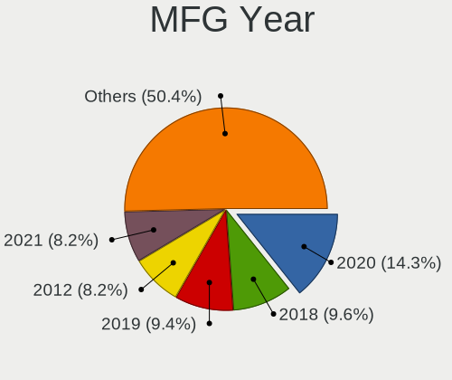
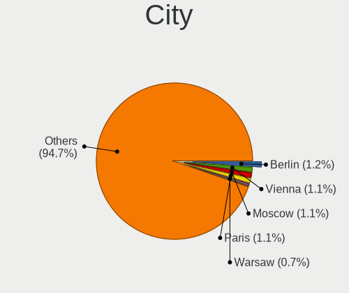
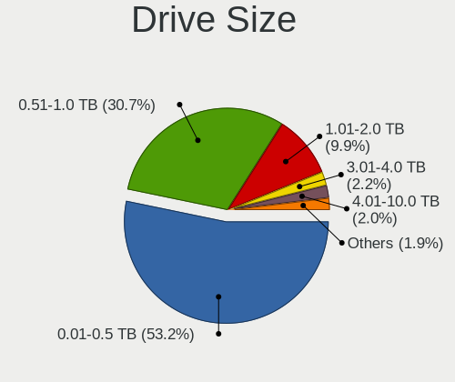
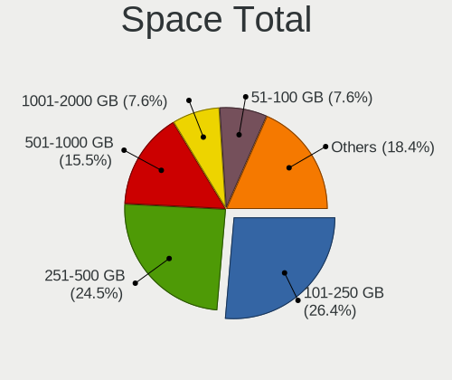
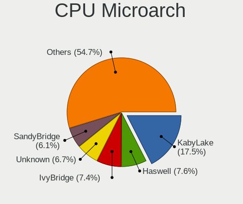
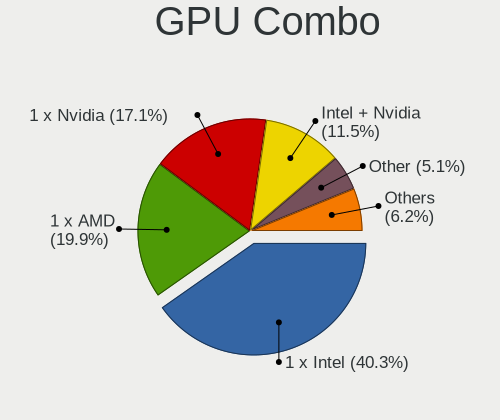
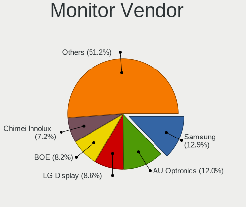
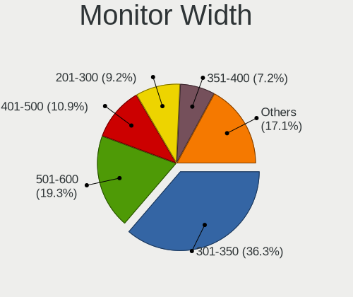
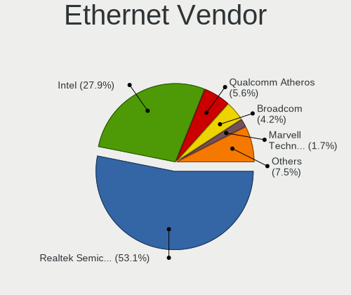
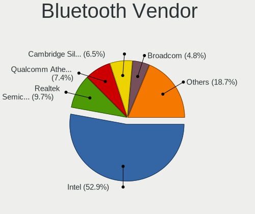

Ubuntu 21.04 - Tested Hardware & Statistics
-------------------------------------------

A project to collect tested hardware configurations for Ubuntu 21.04.

Anyone can contribute to this report by the [hw-probe](https://github.com/linuxhw/hw-probe) tool:

    sudo -E hw-probe -all -upload

Please submit a probe of your configuration if it's not presented on the page or is rare.

This is a report for all computer types. See also reports for [desktops](/Dist/Ubuntu_21.04/Desktop/README.md) and [notebooks](/Dist/Ubuntu_21.04/Notebook/README.md).

Full-feature report is available here: https://linux-hardware.org/?view=trends&rel=ubuntu-21.04

Contents
--------

* [ Test Cases ](#test-cases)

* [ System ](#system)
  - [ Kernel                   ](#kernel)
  - [ Kernel Family            ](#kernel-family)
  - [ Kernel Major Ver.        ](#kernel-major-ver)
  - [ Arch                     ](#arch)
  - [ DE                       ](#de)
  - [ Display Server           ](#display-server)
  - [ Display Manager          ](#display-manager)
  - [ OS Lang                  ](#os-lang)
  - [ Boot Mode                ](#boot-mode)
  - [ Filesystem               ](#filesystem)
  - [ Part. scheme             ](#part-scheme)
  - [ Dual Boot with Linux/BSD ](#dual-boot-with-linuxbsd)
  - [ Dual Boot (Win)          ](#dual-boot-win)

* [ Board ](#board)
  - [ Vendor                   ](#vendor)
  - [ Model                    ](#model)
  - [ Model Family             ](#model-family)
  - [ MFG Year                 ](#mfg-year)
  - [ Form Factor              ](#form-factor)
  - [ Secure Boot              ](#secure-boot)
  - [ Coreboot                 ](#coreboot)
  - [ RAM Size                 ](#ram-size)
  - [ RAM Used                 ](#ram-used)
  - [ Total Drives             ](#total-drives)
  - [ Has CD-ROM               ](#has-cd-rom)
  - [ Has Ethernet             ](#has-ethernet)
  - [ Has WiFi                 ](#has-wifi)
  - [ Has Bluetooth            ](#has-bluetooth)

* [ Location ](#location)
  - [ Country                  ](#country)
  - [ City                     ](#city)

* [ Drives ](#drives)
  - [ Drive Vendor             ](#drive-vendor)
  - [ Drive Model              ](#drive-model)
  - [ HDD Vendor               ](#hdd-vendor)
  - [ SSD Vendor               ](#ssd-vendor)
  - [ Drive Kind               ](#drive-kind)
  - [ Drive Connector          ](#drive-connector)
  - [ Drive Size               ](#drive-size)
  - [ Space Total              ](#space-total)
  - [ Space Used               ](#space-used)
  - [ Malfunc. Drives          ](#malfunc-drives)
  - [ Malfunc. Drive Vendor    ](#malfunc-drive-vendor)
  - [ Malfunc. HDD Vendor      ](#malfunc-hdd-vendor)
  - [ Malfunc. Drive Kind      ](#malfunc-drive-kind)
  - [ Failed Drives            ](#failed-drives)
  - [ Failed Drive Vendor      ](#failed-drive-vendor)
  - [ Drive Status             ](#drive-status)

* [ Storage controller ](#storage-controller)
  - [ Storage Vendor           ](#storage-vendor)
  - [ Storage Model            ](#storage-model)
  - [ Storage Kind             ](#storage-kind)

* [ Processor ](#processor)
  - [ CPU Vendor               ](#cpu-vendor)
  - [ CPU Model                ](#cpu-model)
  - [ CPU Model Family         ](#cpu-model-family)
  - [ CPU Cores                ](#cpu-cores)
  - [ CPU Sockets              ](#cpu-sockets)
  - [ CPU Threads              ](#cpu-threads)
  - [ CPU Op-Modes             ](#cpu-op-modes)
  - [ CPU Microcode            ](#cpu-microcode)
  - [ CPU Microarch            ](#cpu-microarch)

* [ Graphics ](#graphics)
  - [ GPU Vendor               ](#gpu-vendor)
  - [ GPU Model                ](#gpu-model)
  - [ GPU Combo                ](#gpu-combo)
  - [ GPU Driver               ](#gpu-driver)
  - [ GPU Memory               ](#gpu-memory)

* [ Monitor ](#monitor)
  - [ Monitor Vendor           ](#monitor-vendor)
  - [ Monitor Model            ](#monitor-model)
  - [ Monitor Resolution       ](#monitor-resolution)
  - [ Monitor Diagonal         ](#monitor-diagonal)
  - [ Monitor Width            ](#monitor-width)
  - [ Aspect Ratio             ](#aspect-ratio)
  - [ Monitor Area             ](#monitor-area)
  - [ Pixel Density            ](#pixel-density)
  - [ Multiple Monitors        ](#multiple-monitors)

* [ Network ](#network)
  - [ Net Controller Vendor    ](#net-controller-vendor)
  - [ Net Controller Model     ](#net-controller-model)
  - [ Wireless Vendor          ](#wireless-vendor)
  - [ Wireless Model           ](#wireless-model)
  - [ Ethernet Vendor          ](#ethernet-vendor)
  - [ Ethernet Model           ](#ethernet-model)
  - [ Net Controller Kind      ](#net-controller-kind)
  - [ Used Controller          ](#used-controller)
  - [ NICs                     ](#nics)
  - [ IPv6                     ](#ipv6)

* [ Bluetooth ](#bluetooth)
  - [ Bluetooth Vendor         ](#bluetooth-vendor)
  - [ Bluetooth Model          ](#bluetooth-model)

* [ Sound ](#sound)
  - [ Sound Vendor             ](#sound-vendor)
  - [ Sound Model              ](#sound-model)

* [ Memory ](#memory)
  - [ Memory Vendor            ](#memory-vendor)
  - [ Memory Model             ](#memory-model)
  - [ Memory Kind              ](#memory-kind)
  - [ Memory Form Factor       ](#memory-form-factor)
  - [ Memory Size              ](#memory-size)
  - [ Memory Speed             ](#memory-speed)

* [ Printers & scanners ](#printers--scanners)
  - [ Printer Vendor           ](#printer-vendor)
  - [ Printer Model            ](#printer-model)
  - [ Scanner Vendor           ](#scanner-vendor)
  - [ Scanner Model            ](#scanner-model)

* [ Camera ](#camera)
  - [ Camera Vendor            ](#camera-vendor)
  - [ Camera Model             ](#camera-model)

* [ Security ](#security)
  - [ Fingerprint Vendor       ](#fingerprint-vendor)
  - [ Fingerprint Model        ](#fingerprint-model)
  - [ Chipcard Vendor          ](#chipcard-vendor)
  - [ Chipcard Model           ](#chipcard-model)

* [ Unsupported ](#unsupported)
  - [ Unsupported Devices      ](#unsupported-devices)
  - [ Unsupported Device Types ](#unsupported-device-types)

Test Cases
----------

| Vendor        | Model                       | Form-Factor | Probe                                                      | Date         |
|---------------|-----------------------------|-------------|------------------------------------------------------------|--------------|
| ASUSTek       | P8H61-M LX R2.0             | Desktop     | [0e6deb049c](https://linux-hardware.org/?probe=0e6deb049c) | Sep 09, 2021 |
| Thomson       | WWNEO14A-2BK32              | Notebook    | [752aa1b840](https://linux-hardware.org/?probe=752aa1b840) | Sep 09, 2021 |
| ASUSTek       | P8H61-M LX R2.0             | Desktop     | [cde32dbd89](https://linux-hardware.org/?probe=cde32dbd89) | Sep 09, 2021 |
| Dell          | Latitude 5520               | Notebook    | [7e327f4604](https://linux-hardware.org/?probe=7e327f4604) | Sep 09, 2021 |
| ASUSTek       | A68HM-PLUS                  | Desktop     | [443986835d](https://linux-hardware.org/?probe=443986835d) | Sep 09, 2021 |
| Dell          | Latitude 9520               | Convertible | [d66cb50bbc](https://linux-hardware.org/?probe=d66cb50bbc) | Sep 08, 2021 |
| Gigabyte      | AB350-Gaming 3-CF           | Desktop     | [f04053a978](https://linux-hardware.org/?probe=f04053a978) | Sep 08, 2021 |
| Timi          | Mi NoteBook Ultra           | Notebook    | [1619cb6257](https://linux-hardware.org/?probe=1619cb6257) | Sep 08, 2021 |
| Lenovo        | IdeaPad 320-15ABR 80XS      | Notebook    | [588250b1be](https://linux-hardware.org/?probe=588250b1be) | Sep 08, 2021 |
| TUXEDO        | N130BU                      | Notebook    | [e81e4cc415](https://linux-hardware.org/?probe=e81e4cc415) | Sep 08, 2021 |
| ASRock        | 970 Extreme3                | Desktop     | [2d9e427f68](https://linux-hardware.org/?probe=2d9e427f68) | Sep 08, 2021 |
| ASUSTek       | P55VA                       | Notebook    | [b00df8e82a](https://linux-hardware.org/?probe=b00df8e82a) | Sep 08, 2021 |
| ASUSTek       | X550LC                      | Notebook    | [930ad79fe0](https://linux-hardware.org/?probe=930ad79fe0) | Sep 08, 2021 |
| Lenovo        | IdeaPad Gaming3 15ARH05D... | Notebook    | [f1bdc44923](https://linux-hardware.org/?probe=f1bdc44923) | Sep 08, 2021 |
| HP            | ProBook 430 G6              | Notebook    | [56f6e80ac3](https://linux-hardware.org/?probe=56f6e80ac3) | Sep 07, 2021 |
| Timi          | A35S                        | Notebook    | [0b22fc8994](https://linux-hardware.org/?probe=0b22fc8994) | Sep 07, 2021 |
| MSI           | X470 GAMING PLUS MAX        | Desktop     | [46f2f68684](https://linux-hardware.org/?probe=46f2f68684) | Sep 07, 2021 |
| ASUSTek       | AM1M-A                      | Desktop     | [4963032754](https://linux-hardware.org/?probe=4963032754) | Sep 07, 2021 |
| Lenovo        | ThinkPad T460p 20FWS0C50... | Notebook    | [5ac7df1c1c](https://linux-hardware.org/?probe=5ac7df1c1c) | Sep 07, 2021 |
| Intel         | DQ57TM AAE70931-403         | Desktop     | [6add940021](https://linux-hardware.org/?probe=6add940021) | Sep 07, 2021 |
| Dell          | XPS 15 9510                 | Notebook    | [7ca1df084e](https://linux-hardware.org/?probe=7ca1df084e) | Sep 07, 2021 |
| Dell          | 0M5DCD A00                  | Desktop     | [ddee404146](https://linux-hardware.org/?probe=ddee404146) | Sep 07, 2021 |
| ASRock        | B75M-GL R2.0                | Desktop     | [9e43cd58cd](https://linux-hardware.org/?probe=9e43cd58cd) | Sep 07, 2021 |
| Intel         | NUC10i7FNB K61360-303       | Mini pc     | [94a243f26a](https://linux-hardware.org/?probe=94a243f26a) | Sep 07, 2021 |
| Gigabyte      | X570 I AORUS PRO WIFI       | Desktop     | [78414d4d44](https://linux-hardware.org/?probe=78414d4d44) | Sep 07, 2021 |
| Acer          | Aspire XC-830               | Desktop     | [859878d1b2](https://linux-hardware.org/?probe=859878d1b2) | Sep 06, 2021 |
| Acer          | Swift SF514-51              | Notebook    | [6ab5bc3174](https://linux-hardware.org/?probe=6ab5bc3174) | Sep 06, 2021 |
| Acer          | Swift SF514-51              | Notebook    | [1bf499eb80](https://linux-hardware.org/?probe=1bf499eb80) | Sep 06, 2021 |
| Unknown       | Raspberry Pi                | Soc         | [2d70c02261](https://linux-hardware.org/?probe=2d70c02261) | Sep 06, 2021 |
| Lenovo        | SHARKBAY 0B98401 PRO        | Desktop     | [463f501179](https://linux-hardware.org/?probe=463f501179) | Sep 06, 2021 |
| ASUSTek       | P6X58D-E                    | Desktop     | [ee58e16f17](https://linux-hardware.org/?probe=ee58e16f17) | Sep 06, 2021 |
| ASUSTek       | P6X58D-E                    | Desktop     | [c18c52cd70](https://linux-hardware.org/?probe=c18c52cd70) | Sep 06, 2021 |
| Gigabyte      | X570 I AORUS PRO WIFI       | Desktop     | [3259aff6f6](https://linux-hardware.org/?probe=3259aff6f6) | Sep 06, 2021 |
| Gigabyte      | Z370 HD3-CF                 | Desktop     | [d45a82c3c9](https://linux-hardware.org/?probe=d45a82c3c9) | Sep 06, 2021 |
| HP            | 870C                        | Desktop     | [f46fa4ba94](https://linux-hardware.org/?probe=f46fa4ba94) | Sep 06, 2021 |
| HP            | 870C                        | Desktop     | [fcd88590bc](https://linux-hardware.org/?probe=fcd88590bc) | Sep 06, 2021 |
| Lenovo        | ThinkPad T420 4180ED3       | Notebook    | [d410366b57](https://linux-hardware.org/?probe=d410366b57) | Sep 06, 2021 |
| TUXEDO        | P65_P67RGRERA               | Notebook    | [342dd3e712](https://linux-hardware.org/?probe=342dd3e712) | Sep 06, 2021 |
| Lenovo        | IdeaPad Gaming3 15ARH05D... | Notebook    | [782ea245a4](https://linux-hardware.org/?probe=782ea245a4) | Sep 06, 2021 |
| Gigabyte      | B550I AORUS PRO AX          | Desktop     | [129a34a37f](https://linux-hardware.org/?probe=129a34a37f) | Sep 06, 2021 |
| ASUSTek       | TUF Z390-PLUS GAMING        | Desktop     | [e72963a1b5](https://linux-hardware.org/?probe=e72963a1b5) | Sep 06, 2021 |
| ASUSTek       | ROG STRIX X570-E GAMING     | Desktop     | [28a20b5f72](https://linux-hardware.org/?probe=28a20b5f72) | Sep 06, 2021 |
| ASUSTek       | ROG STRIX X570-E GAMING     | Desktop     | [c6e769829b](https://linux-hardware.org/?probe=c6e769829b) | Sep 06, 2021 |
| Unknown       | Raspberry Pi                | Soc         | [eb43b257f2](https://linux-hardware.org/?probe=eb43b257f2) | Sep 05, 2021 |
| ASUSTek       | P8H61-M LX R2.0             | Desktop     | [e52c4a231c](https://linux-hardware.org/?probe=e52c4a231c) | Sep 05, 2021 |
| Apple         | MacBookPro7,1               | Notebook    | [51e31a6fa5](https://linux-hardware.org/?probe=51e31a6fa5) | Sep 05, 2021 |
| Unknown       | Raspberry Pi                | Soc         | [4bfe01463e](https://linux-hardware.org/?probe=4bfe01463e) | Sep 05, 2021 |
| ASUSTek       | P6X58D-E                    | Desktop     | [f1300c2d55](https://linux-hardware.org/?probe=f1300c2d55) | Sep 05, 2021 |
| AMI           | Intel                       | Convertible | [4534d06570](https://linux-hardware.org/?probe=4534d06570) | Sep 05, 2021 |
| ASRock        | B365M Pro4                  | Desktop     | [a244333b78](https://linux-hardware.org/?probe=a244333b78) | Sep 05, 2021 |
| HP            | 339A                        | Desktop     | [ceb91782c2](https://linux-hardware.org/?probe=ceb91782c2) | Sep 05, 2021 |
| Intel         | SharkBay Platform           | Notebook    | [a19a4b3125](https://linux-hardware.org/?probe=a19a4b3125) | Sep 05, 2021 |
| HP            | ProLiant MicroServer        | Desktop     | [69ca9e90ae](https://linux-hardware.org/?probe=69ca9e90ae) | Sep 05, 2021 |
| ASUSTek       | AM1M-A                      | Desktop     | [bbe431b15f](https://linux-hardware.org/?probe=bbe431b15f) | Sep 04, 2021 |
| ASUSTek       | ROG Strix G513QY_G513QY     | Notebook    | [06404619aa](https://linux-hardware.org/?probe=06404619aa) | Sep 04, 2021 |
| ASUSTek       | M4A785TD-M EVO              | Desktop     | [22390a295d](https://linux-hardware.org/?probe=22390a295d) | Sep 04, 2021 |
| Dell          | Latitude 7390 2-in-1        | Notebook    | [d1705e50a2](https://linux-hardware.org/?probe=d1705e50a2) | Sep 04, 2021 |
| HP            | 1494                        | Desktop     | [064f4ff59f](https://linux-hardware.org/?probe=064f4ff59f) | Sep 04, 2021 |
| Timi          | RedmiBook Pro 15S           | Notebook    | [9e63bc0888](https://linux-hardware.org/?probe=9e63bc0888) | Sep 04, 2021 |
| Acer          | Aspire 4750                 | Notebook    | [f88ba2a8ea](https://linux-hardware.org/?probe=f88ba2a8ea) | Sep 04, 2021 |
| HP            | OMEN by HP Laptop 15-dc1... | Notebook    | [f42fc0ef77](https://linux-hardware.org/?probe=f42fc0ef77) | Sep 04, 2021 |
| Packard Be... | EasyNote TE69HW             | Notebook    | [b02379df11](https://linux-hardware.org/?probe=b02379df11) | Sep 04, 2021 |
| ASUSTek       | AM1M-A                      | Desktop     | [4d7a9bb2cf](https://linux-hardware.org/?probe=4d7a9bb2cf) | Sep 04, 2021 |
| Dynabook      | PORTEGE X30W-J              | Convertible | [1cfe27d3d1](https://linux-hardware.org/?probe=1cfe27d3d1) | Sep 04, 2021 |
| Dynabook      | PORTEGE X30W-J              | Convertible | [32d0a89cc6](https://linux-hardware.org/?probe=32d0a89cc6) | Sep 04, 2021 |
| Samsung       | RV410/RV510/S3510/E3510     | Notebook    | [f485e570b4](https://linux-hardware.org/?probe=f485e570b4) | Sep 04, 2021 |
| IP3 Tech      | AB3                         | Mini pc     | [60cd252284](https://linux-hardware.org/?probe=60cd252284) | Sep 04, 2021 |
| HP            | Pavilion 17                 | Notebook    | [ef065acdd0](https://linux-hardware.org/?probe=ef065acdd0) | Sep 04, 2021 |
| ASRock        | FM2A58M-HD+                 | Desktop     | [5162b02b61](https://linux-hardware.org/?probe=5162b02b61) | Sep 04, 2021 |
| Lenovo        | ThinkPad L470 20J5S2CP00    | Notebook    | [9ba4ef1dc5](https://linux-hardware.org/?probe=9ba4ef1dc5) | Sep 04, 2021 |
| Pegatron      | Maureen                     | Desktop     | [c5ab105ead](https://linux-hardware.org/?probe=c5ab105ead) | Sep 04, 2021 |
| ASRock        | A300M-STX                   | Desktop     | [811f366c65](https://linux-hardware.org/?probe=811f366c65) | Sep 03, 2021 |
| Lenovo        | U310                        | Notebook    | [0be64d0c02](https://linux-hardware.org/?probe=0be64d0c02) | Sep 03, 2021 |
| HP            | EliteBook 845 G7 Noteboo... | Notebook    | [ae8bd5e632](https://linux-hardware.org/?probe=ae8bd5e632) | Sep 03, 2021 |
| Lenovo        | ThinkPad P14s Gen 1 20S4... | Notebook    | [df9db29c8e](https://linux-hardware.org/?probe=df9db29c8e) | Sep 03, 2021 |
| HP            | Pavilion Gaming Laptop 1... | Notebook    | [d26d6327b1](https://linux-hardware.org/?probe=d26d6327b1) | Sep 03, 2021 |
| Unknown       | Raspberry Pi                | Soc         | [7b86b0dee4](https://linux-hardware.org/?probe=7b86b0dee4) | Sep 03, 2021 |
| HP            | Spectre x360 Convertible... | Convertible | [54ddd1baea](https://linux-hardware.org/?probe=54ddd1baea) | Sep 03, 2021 |
| Lenovo        | IdeaPad C340-14IML 81TK     | Convertible | [611c3c0c19](https://linux-hardware.org/?probe=611c3c0c19) | Sep 03, 2021 |
| Lenovo        | IdeaPad C340-14IML 81TK     | Convertible | [7f07140410](https://linux-hardware.org/?probe=7f07140410) | Sep 03, 2021 |
| ASRock        | Z370 Pro4                   | Desktop     | [a507f9835b](https://linux-hardware.org/?probe=a507f9835b) | Sep 03, 2021 |
| HP            | EliteBook Folio 1040 G3     | Notebook    | [6275aab341](https://linux-hardware.org/?probe=6275aab341) | Sep 03, 2021 |
| Gigabyte      | B85M-D3H                    | Desktop     | [5377e486bc](https://linux-hardware.org/?probe=5377e486bc) | Sep 03, 2021 |
| Microsoft     | Surface Pro 7               | Tablet      | [79fc56898c](https://linux-hardware.org/?probe=79fc56898c) | Sep 03, 2021 |
| HP            | ProBook 4730s               | Notebook    | [36834479ab](https://linux-hardware.org/?probe=36834479ab) | Sep 03, 2021 |
| Pegatron      | Maureen                     | Desktop     | [8591d54048](https://linux-hardware.org/?probe=8591d54048) | Sep 03, 2021 |
| Dell          | XPS 13 7390                 | Notebook    | [be1de37337](https://linux-hardware.org/?probe=be1de37337) | Sep 03, 2021 |
| ASUSTek       | ASUS TUF Gaming F15 FX50... | Notebook    | [96642dc49d](https://linux-hardware.org/?probe=96642dc49d) | Sep 02, 2021 |
| ASUSTek       | P7P55D LE                   | Desktop     | [8bbe7e58ae](https://linux-hardware.org/?probe=8bbe7e58ae) | Sep 02, 2021 |
| Dell          | XPS 13 9360                 | Notebook    | [77a32d2048](https://linux-hardware.org/?probe=77a32d2048) | Sep 02, 2021 |
| ASUSTek       | P7P55D LE                   | Desktop     | [21fd5c096a](https://linux-hardware.org/?probe=21fd5c096a) | Sep 02, 2021 |
| Acer          | Aspire 8730                 | Notebook    | [23961f8f02](https://linux-hardware.org/?probe=23961f8f02) | Sep 02, 2021 |
| HP            | ENVY x360 Convertible 13... | Convertible | [8d28a5779f](https://linux-hardware.org/?probe=8d28a5779f) | Sep 02, 2021 |
| Acer          | Aspire 8730                 | Notebook    | [a0f96eb144](https://linux-hardware.org/?probe=a0f96eb144) | Sep 02, 2021 |
| Lenovo        | ThinkPad L13 Yoga Gen 2 ... | Convertible | [d20dda51f0](https://linux-hardware.org/?probe=d20dda51f0) | Sep 02, 2021 |
| Intel         | NUC7i3BNB J22859-309        | Mini pc     | [54825c8496](https://linux-hardware.org/?probe=54825c8496) | Sep 02, 2021 |
| Lenovo        | ThinkPad L13 Yoga Gen 2 ... | Convertible | [bd648f717b](https://linux-hardware.org/?probe=bd648f717b) | Sep 02, 2021 |
| MSI           | TRX40 PRO WIFI              | Desktop     | [d337b01cb3](https://linux-hardware.org/?probe=d337b01cb3) | Sep 02, 2021 |
| Biostar       | H77MU3                      | Desktop     | [82f367ec4b](https://linux-hardware.org/?probe=82f367ec4b) | Sep 02, 2021 |
| Unknown       | Raspberry Pi                | Soc         | [66df3754b3](https://linux-hardware.org/?probe=66df3754b3) | Sep 02, 2021 |
| Dell          | Board                       | All in one  | [911c78a85d](https://linux-hardware.org/?probe=911c78a85d) | Sep 02, 2021 |
| Acer          | Aspire V3-571               | Notebook    | [6998aee6d0](https://linux-hardware.org/?probe=6998aee6d0) | Sep 02, 2021 |
| ASUSTek       | Z87-EXPERT                  | Desktop     | [f8846969fd](https://linux-hardware.org/?probe=f8846969fd) | Sep 02, 2021 |
| Unknown       | Raspberry Pi                | Soc         | [25258c3e09](https://linux-hardware.org/?probe=25258c3e09) | Sep 02, 2021 |
| Unknown       | Raspberry Pi                | Soc         | [70fc801295](https://linux-hardware.org/?probe=70fc801295) | Sep 01, 2021 |
| Dell          | Latitude 5580               | Notebook    | [944d9e820d](https://linux-hardware.org/?probe=944d9e820d) | Sep 01, 2021 |
| Dell          | Inspiron 5584               | Notebook    | [48b4af3338](https://linux-hardware.org/?probe=48b4af3338) | Sep 01, 2021 |
| ASRock        | FM2A58M-HD+                 | Desktop     | [5ffaa68de4](https://linux-hardware.org/?probe=5ffaa68de4) | Sep 01, 2021 |
| Dell          | XPS 15 9510                 | Notebook    | [5de0135b30](https://linux-hardware.org/?probe=5de0135b30) | Sep 01, 2021 |
| HP            | 18E9                        | Desktop     | [22f86af485](https://linux-hardware.org/?probe=22f86af485) | Sep 01, 2021 |
| ASUSTek       | P8H61-M LX R2.0             | Desktop     | [796e78b6ac](https://linux-hardware.org/?probe=796e78b6ac) | Sep 01, 2021 |
| ASUSTek       | PRIME Z270-A                | Desktop     | [0a0d13044d](https://linux-hardware.org/?probe=0a0d13044d) | Sep 01, 2021 |
| HP            | 1998                        | Desktop     | [585ff46bb3](https://linux-hardware.org/?probe=585ff46bb3) | Sep 01, 2021 |
| ASUSTek       | PRIME Z270-A                | Desktop     | [cde0de2a3d](https://linux-hardware.org/?probe=cde0de2a3d) | Sep 01, 2021 |
| FIRICH        | J1900                       | Desktop     | [a682347a14](https://linux-hardware.org/?probe=a682347a14) | Sep 01, 2021 |
| Gigabyte      | F2A55M-HD2                  | Desktop     | [e8b8cb1cf7](https://linux-hardware.org/?probe=e8b8cb1cf7) | Sep 01, 2021 |
| Unknown       | Raspberry Pi                | Soc         | [9ba35e9b27](https://linux-hardware.org/?probe=9ba35e9b27) | Sep 01, 2021 |
| Unknown       | Raspberry Pi                | Soc         | [ad1fdaa4c8](https://linux-hardware.org/?probe=ad1fdaa4c8) | Sep 01, 2021 |
| Lenovo        | ThinkPad X201 3626FBU       | Notebook    | [2a1b838727](https://linux-hardware.org/?probe=2a1b838727) | Sep 01, 2021 |
| Lenovo        | ThinkPad X201 3626FBU       | Notebook    | [ebe27cb3e0](https://linux-hardware.org/?probe=ebe27cb3e0) | Sep 01, 2021 |
| ASUSTek       | P8H61-M LX R2.0             | Desktop     | [fffa0ed19a](https://linux-hardware.org/?probe=fffa0ed19a) | Aug 31, 2021 |
| Gigabyte      | Z370 HD3P-CF                | Desktop     | [0f8fe06e8f](https://linux-hardware.org/?probe=0f8fe06e8f) | Aug 31, 2021 |
| ASUSTek       | P8H61-M LX R2.0             | Desktop     | [9c16c770be](https://linux-hardware.org/?probe=9c16c770be) | Aug 31, 2021 |
| Acer          | Aspire ES1-572              | Notebook    | [301e2787bd](https://linux-hardware.org/?probe=301e2787bd) | Aug 31, 2021 |
| Lenovo        | ThinkBook 16p Gen 2 20YM    | Notebook    | [8c8a4d9cdf](https://linux-hardware.org/?probe=8c8a4d9cdf) | Aug 31, 2021 |
| ASUSTek       | UX550VE                     | Notebook    | [cd80e1ebb2](https://linux-hardware.org/?probe=cd80e1ebb2) | Aug 31, 2021 |
| Lenovo        | ThinkBook 16p Gen 2 20YM    | Notebook    | [bb2bba4301](https://linux-hardware.org/?probe=bb2bba4301) | Aug 31, 2021 |
| Dell          | XPS 15 9560                 | Notebook    | [8f1f4a2c99](https://linux-hardware.org/?probe=8f1f4a2c99) | Aug 31, 2021 |
| Dell          | XPS 15 9560                 | Notebook    | [d33400a4fe](https://linux-hardware.org/?probe=d33400a4fe) | Aug 31, 2021 |
| Samsung       | 530U3BI/530U4BI/530U4BH     | Notebook    | [2c57f8fa2f](https://linux-hardware.org/?probe=2c57f8fa2f) | Aug 31, 2021 |
| Fujitsu       | D3128-A1 S26361-D3128-A1    | Desktop     | [e689b2de7a](https://linux-hardware.org/?probe=e689b2de7a) | Aug 31, 2021 |
| Lenovo        | IdeaPad 100-14IBY 80MH      | Notebook    | [0413b7b1e4](https://linux-hardware.org/?probe=0413b7b1e4) | Aug 31, 2021 |
| Unknown       | Raspberry Pi                | Soc         | [e289576136](https://linux-hardware.org/?probe=e289576136) | Aug 31, 2021 |
| ASUSTek       | GL752VW                     | Notebook    | [1476b07c9d](https://linux-hardware.org/?probe=1476b07c9d) | Aug 31, 2021 |
| ASUSTek       | P8H61-M LX R2.0             | Desktop     | [078613f010](https://linux-hardware.org/?probe=078613f010) | Aug 31, 2021 |
| HUAWEI        | KLVL-WXX9                   | Notebook    | [b86e557def](https://linux-hardware.org/?probe=b86e557def) | Aug 31, 2021 |
| ASUSTek       | GL752VW                     | Notebook    | [625ac8c8bc](https://linux-hardware.org/?probe=625ac8c8bc) | Aug 31, 2021 |
| Lenovo        | MAHOBAY Win8 STD MM DPK ... | Desktop     | [02cd32fbb4](https://linux-hardware.org/?probe=02cd32fbb4) | Aug 30, 2021 |
| Lenovo        | MAHOBAY Win8 STD MM DPK ... | Desktop     | [b5459f613b](https://linux-hardware.org/?probe=b5459f613b) | Aug 30, 2021 |
| ASUSTek       | X550ZA                      | Notebook    | [210ca88228](https://linux-hardware.org/?probe=210ca88228) | Aug 30, 2021 |
| Gigabyte      | X570 I AORUS PRO WIFI       | Desktop     | [e829df72a5](https://linux-hardware.org/?probe=e829df72a5) | Aug 30, 2021 |
| Dell          | 0KFKMF A00                  | All in one  | [7c3c22add4](https://linux-hardware.org/?probe=7c3c22add4) | Aug 30, 2021 |
| Acer          | Nitro AN515-44              | Notebook    | [628f8d49c7](https://linux-hardware.org/?probe=628f8d49c7) | Aug 30, 2021 |
| ASRock        | FM2A58M-HD+                 | Desktop     | [9eb666fd13](https://linux-hardware.org/?probe=9eb666fd13) | Aug 30, 2021 |
| Acer          | Nitro AN515-44              | Notebook    | [882678793f](https://linux-hardware.org/?probe=882678793f) | Aug 30, 2021 |
| Acer          | Nitro AN515-44              | Notebook    | [1fcdd4041b](https://linux-hardware.org/?probe=1fcdd4041b) | Aug 30, 2021 |
| ASRock        | FM2A58M-HD+                 | Desktop     | [47ba00786a](https://linux-hardware.org/?probe=47ba00786a) | Aug 30, 2021 |
| Dell          | Latitude E6520              | Notebook    | [03f5b8cb05](https://linux-hardware.org/?probe=03f5b8cb05) | Aug 30, 2021 |
| HP            | Pavilion Notebook           | Notebook    | [846b2e2a87](https://linux-hardware.org/?probe=846b2e2a87) | Aug 30, 2021 |
| ASUSTek       | ROG Strix G512LV_G512LV     | Notebook    | [780244d79f](https://linux-hardware.org/?probe=780244d79f) | Aug 30, 2021 |
| Acer          | EG43M                       | Desktop     | [900788bdab](https://linux-hardware.org/?probe=900788bdab) | Aug 30, 2021 |
| Fujitsu       | D3313-F1 S26361-D3313-F1    | Desktop     | [47c72f21ae](https://linux-hardware.org/?probe=47c72f21ae) | Aug 30, 2021 |
| HP            | Pavilion 17                 | Notebook    | [ca125d2f3c](https://linux-hardware.org/?probe=ca125d2f3c) | Aug 30, 2021 |
| ASUSTek       | P55VA                       | Notebook    | [12266fad85](https://linux-hardware.org/?probe=12266fad85) | Aug 30, 2021 |
| ASUSTek       | ROG STRIX Z490-A GAMING     | Desktop     | [f4e788dce6](https://linux-hardware.org/?probe=f4e788dce6) | Aug 30, 2021 |
| ASUSTek       | ROG STRIX Z490-A GAMING     | Desktop     | [8f5b776bcb](https://linux-hardware.org/?probe=8f5b776bcb) | Aug 30, 2021 |
| Gigabyte      | Z170X-Gaming 7              | Desktop     | [4771af382d](https://linux-hardware.org/?probe=4771af382d) | Aug 30, 2021 |
| MSI           | P67A-C45                    | Desktop     | [5f5d217d7b](https://linux-hardware.org/?probe=5f5d217d7b) | Aug 30, 2021 |
| MSI           | P67A-C45                    | Desktop     | [8f1d2c8ca0](https://linux-hardware.org/?probe=8f1d2c8ca0) | Aug 30, 2021 |
| Lenovo        | Yoga C930-13IKB 81C4        | Convertible | [a52209c9f2](https://linux-hardware.org/?probe=a52209c9f2) | Aug 30, 2021 |
| Lenovo        | B50-30 20382                | Notebook    | [1b602738e7](https://linux-hardware.org/?probe=1b602738e7) | Aug 30, 2021 |
| ASUSTek       | PRIME A320M-K/BR            | Desktop     | [2ca1595715](https://linux-hardware.org/?probe=2ca1595715) | Aug 30, 2021 |
| HP            | 84EF 01100                  | All in one  | [94918ce530](https://linux-hardware.org/?probe=94918ce530) | Aug 30, 2021 |
| ASUSTek       | P6X58D-E                    | Desktop     | [a2c8bb417d](https://linux-hardware.org/?probe=a2c8bb417d) | Aug 29, 2021 |
| Gigabyte      | H55-USB3                    | Desktop     | [ae6cbc8dd8](https://linux-hardware.org/?probe=ae6cbc8dd8) | Aug 29, 2021 |
| Lenovo        | IdeaPad S145-15API 81V7     | Notebook    | [05e455f345](https://linux-hardware.org/?probe=05e455f345) | Aug 29, 2021 |
| Lenovo        | IdeaPad 5 15ITL05 82FG      | Notebook    | [eec643e4e2](https://linux-hardware.org/?probe=eec643e4e2) | Aug 29, 2021 |
| Lenovo        | IdeaPad 330S-15ARR 81FB     | Notebook    | [d700bad32f](https://linux-hardware.org/?probe=d700bad32f) | Aug 29, 2021 |
| Acer          | AOD260                      | Notebook    | [de4ce44515](https://linux-hardware.org/?probe=de4ce44515) | Aug 29, 2021 |
| ASRock        | FM2A58M-HD+                 | Desktop     | [8a976ca31c](https://linux-hardware.org/?probe=8a976ca31c) | Aug 29, 2021 |
| MSI           | MS-16Y1                     | Notebook    | [a9801b616e](https://linux-hardware.org/?probe=a9801b616e) | Aug 29, 2021 |
| Acer          | AOD260                      | Notebook    | [3ed8c06a9c](https://linux-hardware.org/?probe=3ed8c06a9c) | Aug 29, 2021 |
| HP            | 18E9                        | Desktop     | [539f181954](https://linux-hardware.org/?probe=539f181954) | Aug 29, 2021 |
| Lenovo        | HASWELLREFRESHDT 3190005... | All in one  | [4581bb2d5b](https://linux-hardware.org/?probe=4581bb2d5b) | Aug 29, 2021 |
| Foxconn       | 2ABF                        | Desktop     | [171462cc36](https://linux-hardware.org/?probe=171462cc36) | Aug 29, 2021 |
| Toshiba       | Satellite C55-B             | Notebook    | [e7a572f322](https://linux-hardware.org/?probe=e7a572f322) | Aug 29, 2021 |
| Gigabyte      | A320M-H-CF                  | Desktop     | [a089d56f43](https://linux-hardware.org/?probe=a089d56f43) | Aug 29, 2021 |
| Acer          | Aspire 5742                 | Notebook    | [5a1fa64f5d](https://linux-hardware.org/?probe=5a1fa64f5d) | Aug 29, 2021 |
| Lenovo        | ThinkPad X201 3626FBU       | Notebook    | [7fe9be041a](https://linux-hardware.org/?probe=7fe9be041a) | Aug 29, 2021 |
| Acer          | Extensa 2509                | Notebook    | [b6615e1699](https://linux-hardware.org/?probe=b6615e1699) | Aug 29, 2021 |
| Acer          | Extensa 2509                | Notebook    | [a185b2f23f](https://linux-hardware.org/?probe=a185b2f23f) | Aug 29, 2021 |
| Gigabyte      | Z77-DS3H                    | Desktop     | [e06775bbd6](https://linux-hardware.org/?probe=e06775bbd6) | Aug 29, 2021 |
| HP            | 3397                        | Desktop     | [abf1615138](https://linux-hardware.org/?probe=abf1615138) | Aug 29, 2021 |
| HP            | EliteBook 8530w             | Notebook    | [19a30277a2](https://linux-hardware.org/?probe=19a30277a2) | Aug 28, 2021 |
| Acer          | Aspire A515-56              | Notebook    | [2672ce2fe7](https://linux-hardware.org/?probe=2672ce2fe7) | Aug 28, 2021 |
| ASUSTek       | Strix GL703GM_GL703GM       | Notebook    | [6bcc1e1e33](https://linux-hardware.org/?probe=6bcc1e1e33) | Aug 28, 2021 |
| Gigabyte      | B450M DS3H-CF               | Desktop     | [99b7f572be](https://linux-hardware.org/?probe=99b7f572be) | Aug 28, 2021 |
| ASUSTek       | P6X58D-E                    | Desktop     | [593479bed8](https://linux-hardware.org/?probe=593479bed8) | Aug 28, 2021 |
| ASUSTek       | PRIME Z270-A                | Desktop     | [9e81caf509](https://linux-hardware.org/?probe=9e81caf509) | Aug 28, 2021 |
| Lenovo        | IdeaPad Gaming3 15ARH05D... | Notebook    | [757d521e89](https://linux-hardware.org/?probe=757d521e89) | Aug 28, 2021 |
| ASUSTek       | K52Jr                       | Notebook    | [7ec475cdd0](https://linux-hardware.org/?probe=7ec475cdd0) | Aug 28, 2021 |
| Monster       | ABRA A7 V7.3                | Notebook    | [17d5cd11fa](https://linux-hardware.org/?probe=17d5cd11fa) | Aug 28, 2021 |
| ASUSTek       | ROG STRIX B450-F GAMING     | Desktop     | [04c8ccfac4](https://linux-hardware.org/?probe=04c8ccfac4) | Aug 28, 2021 |
| ASUSTek       | ROG STRIX B450-F GAMING     | Desktop     | [2ad8401f8f](https://linux-hardware.org/?probe=2ad8401f8f) | Aug 28, 2021 |
| Apple         | MacBookPro5,5               | Notebook    | [97ed1ed910](https://linux-hardware.org/?probe=97ed1ed910) | Aug 28, 2021 |
| HP            | Laptop 15-bw0xx             | Notebook    | [3c7b22938d](https://linux-hardware.org/?probe=3c7b22938d) | Aug 27, 2021 |
| Apple         | MacBookPro5,5               | Notebook    | [e035ede092](https://linux-hardware.org/?probe=e035ede092) | Aug 27, 2021 |
| Pegatron      | IPMSB-GS                    | Desktop     | [b17f032a44](https://linux-hardware.org/?probe=b17f032a44) | Aug 27, 2021 |
| HP            | 2B34                        | Desktop     | [9477a88acd](https://linux-hardware.org/?probe=9477a88acd) | Aug 27, 2021 |
| Gigabyte      | P41T-USB3L                  | Desktop     | [e234ec66f2](https://linux-hardware.org/?probe=e234ec66f2) | Aug 27, 2021 |
| Lenovo        | B50-30 20382                | Notebook    | [a7bca9bc08](https://linux-hardware.org/?probe=a7bca9bc08) | Aug 27, 2021 |
| Pegatron      | IPMSB-GS                    | Desktop     | [9d2bbbabf1](https://linux-hardware.org/?probe=9d2bbbabf1) | Aug 27, 2021 |
| Google        | Careena                     | Notebook    | [c71e6267cb](https://linux-hardware.org/?probe=c71e6267cb) | Aug 27, 2021 |
| ASUSTek       | X550ZA                      | Notebook    | [0a21d3b326](https://linux-hardware.org/?probe=0a21d3b326) | Aug 27, 2021 |
| Dell          | 0R790T A00                  | Desktop     | [03b37f86b2](https://linux-hardware.org/?probe=03b37f86b2) | Aug 27, 2021 |
| HP            | ProBook 650 G1              | Notebook    | [fe97c44f4f](https://linux-hardware.org/?probe=fe97c44f4f) | Aug 27, 2021 |
| Shuttle       | FH61V                       | Desktop     | [11b6744d1c](https://linux-hardware.org/?probe=11b6744d1c) | Aug 27, 2021 |
| Samsung       | 300E4C/300E5C/300E7C        | Notebook    | [50477e1758](https://linux-hardware.org/?probe=50477e1758) | Aug 27, 2021 |
| Acer          | AOD260                      | Notebook    | [d8cf89df4e](https://linux-hardware.org/?probe=d8cf89df4e) | Aug 27, 2021 |
| Samsung       | 300E4C/300E5C/300E7C        | Notebook    | [d51c8093ec](https://linux-hardware.org/?probe=d51c8093ec) | Aug 27, 2021 |
| Acer          | Swift SF314-59              | Notebook    | [c4ec7d7706](https://linux-hardware.org/?probe=c4ec7d7706) | Aug 27, 2021 |
| Apple         | MacBookPro16,2              | Notebook    | [7e1625f75d](https://linux-hardware.org/?probe=7e1625f75d) | Aug 27, 2021 |
| Acer          | Aspire 5750G                | Notebook    | [03a89677c0](https://linux-hardware.org/?probe=03a89677c0) | Aug 26, 2021 |
| ASUSTek       | P8H61-M LX R2.0             | Desktop     | [7f80b632ce](https://linux-hardware.org/?probe=7f80b632ce) | Aug 26, 2021 |
| Apple         | MacBookPro8,1               | Notebook    | [d76439fc39](https://linux-hardware.org/?probe=d76439fc39) | Aug 26, 2021 |
| HP            | Spectre x360 Convertible... | Convertible | [bbb2db43b4](https://linux-hardware.org/?probe=bbb2db43b4) | Aug 26, 2021 |
| Apple         | MacBookPro8,1               | Notebook    | [41dce1e5d4](https://linux-hardware.org/?probe=41dce1e5d4) | Aug 26, 2021 |
| MSI           | X399 SLI PLUS               | Desktop     | [9efc402bb3](https://linux-hardware.org/?probe=9efc402bb3) | Aug 26, 2021 |
| Dell          | Inspiron 15-3573            | Notebook    | [9ca63b6d40](https://linux-hardware.org/?probe=9ca63b6d40) | Aug 26, 2021 |
| Gigabyte      | AB350M-DS3H V2-CF           | Desktop     | [c8198b5d21](https://linux-hardware.org/?probe=c8198b5d21) | Aug 26, 2021 |
| ASUSTek       | Z97-P                       | Desktop     | [1fc077ad52](https://linux-hardware.org/?probe=1fc077ad52) | Aug 26, 2021 |
| ASUSTek       | ZenBook UX431DA_UM431DA     | Notebook    | [b3185cd80d](https://linux-hardware.org/?probe=b3185cd80d) | Aug 26, 2021 |
| Samsung       | 950QDB                      | Convertible | [c0dedecfe1](https://linux-hardware.org/?probe=c0dedecfe1) | Aug 26, 2021 |
| Lenovo        | IdeaPad Flex 5 14ARE05 8... | Convertible | [1e65812b03](https://linux-hardware.org/?probe=1e65812b03) | Aug 26, 2021 |
| HP            | 1494                        | Desktop     | [29bc1c62ad](https://linux-hardware.org/?probe=29bc1c62ad) | Aug 26, 2021 |
| Samsung       | 950QDB                      | Convertible | [21ac7cda75](https://linux-hardware.org/?probe=21ac7cda75) | Aug 26, 2021 |
| Lenovo        | ThinkPad P14s Gen 1 20Y1... | Notebook    | [cfeb92ade1](https://linux-hardware.org/?probe=cfeb92ade1) | Aug 26, 2021 |
| Gigabyte      | 990FXA-UD3                  | Desktop     | [2f9e0312b5](https://linux-hardware.org/?probe=2f9e0312b5) | Aug 26, 2021 |
| Samsung       | RV410/RV510/S3510/E3510     | Notebook    | [b090440019](https://linux-hardware.org/?probe=b090440019) | Aug 26, 2021 |
| ASUSTek       | S400CA                      | Notebook    | [d1c2760711](https://linux-hardware.org/?probe=d1c2760711) | Aug 26, 2021 |
| System76      | Oryx Pro                    | Notebook    | [ed8769ce16](https://linux-hardware.org/?probe=ed8769ce16) | Aug 26, 2021 |
| System76      | Oryx Pro                    | Notebook    | [a4ba687465](https://linux-hardware.org/?probe=a4ba687465) | Aug 26, 2021 |
| Gigabyte      | GA-78LMT-USB3               | Desktop     | [badc363516](https://linux-hardware.org/?probe=badc363516) | Aug 26, 2021 |
| Dell          | Inspiron 5521               | Notebook    | [24bfc2b04a](https://linux-hardware.org/?probe=24bfc2b04a) | Aug 26, 2021 |
| Acer          | Swift SF313-53              | Notebook    | [8b7983c6f4](https://linux-hardware.org/?probe=8b7983c6f4) | Aug 26, 2021 |
| Acer          | Swift SF313-53              | Notebook    | [60ba1a6cf7](https://linux-hardware.org/?probe=60ba1a6cf7) | Aug 25, 2021 |
| BANGHO        | MOV                         | Notebook    | [9bacff92e1](https://linux-hardware.org/?probe=9bacff92e1) | Aug 25, 2021 |
| ONDA          | V919 AIR CH                 | Tablet      | [239d17bc4a](https://linux-hardware.org/?probe=239d17bc4a) | Aug 25, 2021 |
| Acer          | Swift SF313-53              | Notebook    | [91b876aec6](https://linux-hardware.org/?probe=91b876aec6) | Aug 25, 2021 |
| Acer          | Swift SF313-53              | Notebook    | [19f99141b9](https://linux-hardware.org/?probe=19f99141b9) | Aug 25, 2021 |
| Lenovo        | ThinkPad T420s 4176W27      | Notebook    | [b84d5c31e3](https://linux-hardware.org/?probe=b84d5c31e3) | Aug 25, 2021 |
| ASUSTek       | P8H61-M LX R2.0             | Desktop     | [05957888bc](https://linux-hardware.org/?probe=05957888bc) | Aug 25, 2021 |
| Dell          | Inspiron 13-7359            | Notebook    | [0d1a190ded](https://linux-hardware.org/?probe=0d1a190ded) | Aug 25, 2021 |
| Dell          | Inspiron 13-7359            | Notebook    | [347f0ad714](https://linux-hardware.org/?probe=347f0ad714) | Aug 25, 2021 |
| HP            | 8768 A                      | Desktop     | [40e82f4d4f](https://linux-hardware.org/?probe=40e82f4d4f) | Aug 25, 2021 |
| Shuttle       | FH61V                       | Desktop     | [17f1c616de](https://linux-hardware.org/?probe=17f1c616de) | Aug 25, 2021 |
| Google        | Akemi                       | Notebook    | [11b458a90a](https://linux-hardware.org/?probe=11b458a90a) | Aug 25, 2021 |
| Lenovo        | IdeaPad Flex 5 14IIL05 8... | Convertible | [e5251674c0](https://linux-hardware.org/?probe=e5251674c0) | Aug 25, 2021 |
| Google        | Akemi                       | Notebook    | [ebd0d7d1f9](https://linux-hardware.org/?probe=ebd0d7d1f9) | Aug 25, 2021 |
| Lenovo        | G500 20236                  | Notebook    | [fb90bc01bc](https://linux-hardware.org/?probe=fb90bc01bc) | Aug 25, 2021 |
| HP            | ENVY x360 Convertible 15... | Convertible | [86c5a4a3dd](https://linux-hardware.org/?probe=86c5a4a3dd) | Aug 25, 2021 |
| HP            | ENVY x360 Convertible 15... | Convertible | [01b1cadf52](https://linux-hardware.org/?probe=01b1cadf52) | Aug 25, 2021 |
| ASUSTek       | P5G41T-M LX                 | Desktop     | [870deaf9fd](https://linux-hardware.org/?probe=870deaf9fd) | Aug 25, 2021 |
| ASUSTek       | P5G41T-M LX                 | Desktop     | [4b952eb1ae](https://linux-hardware.org/?probe=4b952eb1ae) | Aug 25, 2021 |
| Shuttle       | FH61V                       | Desktop     | [1b74c0ad1d](https://linux-hardware.org/?probe=1b74c0ad1d) | Aug 25, 2021 |
| Lenovo        | ThinkPad L15 Gen 1 20U8S... | Notebook    | [642e4b5727](https://linux-hardware.org/?probe=642e4b5727) | Aug 25, 2021 |
| Dell          | 03NVJ6 A02                  | Desktop     | [75869e33b7](https://linux-hardware.org/?probe=75869e33b7) | Aug 25, 2021 |
| Lenovo        | ThinkPad L15 Gen 1 20U8S... | Notebook    | [f75424e1e1](https://linux-hardware.org/?probe=f75424e1e1) | Aug 25, 2021 |
| Medion        | MS-7501                     | Desktop     | [c84fb9217e](https://linux-hardware.org/?probe=c84fb9217e) | Aug 25, 2021 |
| Gigabyte      | GA-78LMT-USB3 R2 sex        | Desktop     | [2a6bfff91f](https://linux-hardware.org/?probe=2a6bfff91f) | Aug 24, 2021 |
| Dell          | XPS 13 9300                 | Notebook    | [2ef66334f0](https://linux-hardware.org/?probe=2ef66334f0) | Aug 24, 2021 |
| Apple         | Mac-F2218FC8                | All in one  | [f1df07c7a1](https://linux-hardware.org/?probe=f1df07c7a1) | Aug 24, 2021 |
| Lenovo        | B580 4377A9G                | Notebook    | [4a7f165a2f](https://linux-hardware.org/?probe=4a7f165a2f) | Aug 24, 2021 |
| Sony          | VGN-SZ4MN_B                 | Notebook    | [9b51d6eff6](https://linux-hardware.org/?probe=9b51d6eff6) | Aug 24, 2021 |
| HP            | 8054                        | Desktop     | [d54cd14c63](https://linux-hardware.org/?probe=d54cd14c63) | Aug 24, 2021 |
| Lenovo        | MAHOBAY NO DPK              | Desktop     | [e9e6b8b426](https://linux-hardware.org/?probe=e9e6b8b426) | Aug 24, 2021 |
| Packard Be... | EasyNote LE69KB             | Notebook    | [adb16307d7](https://linux-hardware.org/?probe=adb16307d7) | Aug 24, 2021 |
| Gigabyte      | A320M-H-CF                  | Desktop     | [cd71732431](https://linux-hardware.org/?probe=cd71732431) | Aug 24, 2021 |
| ASRock        | Q77M vPro                   | Desktop     | [f53a9f288f](https://linux-hardware.org/?probe=f53a9f288f) | Aug 24, 2021 |
| HP            | EliteBook 8530w             | Notebook    | [ea7f22c125](https://linux-hardware.org/?probe=ea7f22c125) | Aug 24, 2021 |
| CyberPower... | TRACER V                    | Notebook    | [d32f6e01af](https://linux-hardware.org/?probe=d32f6e01af) | Aug 24, 2021 |
| Acer          | Aspire TC-885 V:1.1         | Desktop     | [8a59fff598](https://linux-hardware.org/?probe=8a59fff598) | Aug 24, 2021 |
| Gigabyte      | H510M S2H                   | Desktop     | [c10c8ceffe](https://linux-hardware.org/?probe=c10c8ceffe) | Aug 23, 2021 |
| Dell          | Board                       | All in one  | [dfb665983b](https://linux-hardware.org/?probe=dfb665983b) | Aug 23, 2021 |
| Gigabyte      | F2A78M-HD2                  | Desktop     | [410b6b854f](https://linux-hardware.org/?probe=410b6b854f) | Aug 23, 2021 |
| ASUSTek       | TUF GAMING Z590-PLUS WIF... | Desktop     | [c5414322d8](https://linux-hardware.org/?probe=c5414322d8) | Aug 23, 2021 |
| ASUSTek       | TUF GAMING Z590-PLUS WIF... | Desktop     | [28c1656add](https://linux-hardware.org/?probe=28c1656add) | Aug 23, 2021 |
| Lenovo        | IdeaPad Y700-15ISK 80NV     | Notebook    | [fa55eabafd](https://linux-hardware.org/?probe=fa55eabafd) | Aug 23, 2021 |
| HP            | Notebook                    | Notebook    | [5edda59c62](https://linux-hardware.org/?probe=5edda59c62) | Aug 23, 2021 |
| Samsung       | 750XDA                      | Notebook    | [a93fe624c9](https://linux-hardware.org/?probe=a93fe624c9) | Aug 23, 2021 |
| Dell          | Vostro 5568                 | Notebook    | [bf921c6ff6](https://linux-hardware.org/?probe=bf921c6ff6) | Aug 23, 2021 |
| Unknown       | Raspberry Pi                | Soc         | [1971415007](https://linux-hardware.org/?probe=1971415007) | Aug 23, 2021 |
| Acer          | Aspire TC-885 V:1.1         | Desktop     | [a0805b7ffd](https://linux-hardware.org/?probe=a0805b7ffd) | Aug 23, 2021 |
| Dell          | Inspiron 3558               | Notebook    | [946f2bf799](https://linux-hardware.org/?probe=946f2bf799) | Aug 22, 2021 |
| Lenovo        | IdeaPad 5 14ARE05 81YM      | Notebook    | [6a52dc6e12](https://linux-hardware.org/?probe=6a52dc6e12) | Aug 22, 2021 |
| Acer          | Aspire 4750                 | Notebook    | [6f5d61dc20](https://linux-hardware.org/?probe=6f5d61dc20) | Aug 22, 2021 |
| Acer          | Aspire ES1-572              | Notebook    | [12cb2077ff](https://linux-hardware.org/?probe=12cb2077ff) | Aug 22, 2021 |
| Toshiba       | Satellite C655D             | Notebook    | [63dfa0ffd8](https://linux-hardware.org/?probe=63dfa0ffd8) | Aug 22, 2021 |
| Gigabyte      | F2A55M-HD2                  | Desktop     | [51f33816d5](https://linux-hardware.org/?probe=51f33816d5) | Aug 22, 2021 |
| Toshiba       | Satellite C55-B             | Notebook    | [99dbadcdde](https://linux-hardware.org/?probe=99dbadcdde) | Aug 22, 2021 |
| HP            | EliteBook 850 G2            | Notebook    | [89bfd52b3d](https://linux-hardware.org/?probe=89bfd52b3d) | Aug 22, 2021 |
| Lenovo        | IdeaPad 5 15ITL05 82FG      | Notebook    | [dcf6e0d950](https://linux-hardware.org/?probe=dcf6e0d950) | Aug 22, 2021 |
| HP            | EliteBook 850 G2            | Notebook    | [a82576e8e2](https://linux-hardware.org/?probe=a82576e8e2) | Aug 22, 2021 |
| HP            | Notebook                    | Notebook    | [5ac3618644](https://linux-hardware.org/?probe=5ac3618644) | Aug 22, 2021 |
| HP            | ProBook 650 G1              | Notebook    | [521e8315c2](https://linux-hardware.org/?probe=521e8315c2) | Aug 22, 2021 |
| HP            | ProLiant ML350 G6           | Desktop     | [d89bfcf1f9](https://linux-hardware.org/?probe=d89bfcf1f9) | Aug 22, 2021 |
| HP            | 1494                        | Desktop     | [414b1c48e7](https://linux-hardware.org/?probe=414b1c48e7) | Aug 22, 2021 |
| MSI           | MPG X570 GAMING EDGE WIF... | Desktop     | [1c910aa761](https://linux-hardware.org/?probe=1c910aa761) | Aug 22, 2021 |
| Gigabyte      | A320M-H-CF                  | Desktop     | [1c1434ce76](https://linux-hardware.org/?probe=1c1434ce76) | Aug 21, 2021 |
| Lenovo        | G500 20236                  | Notebook    | [37294c9129](https://linux-hardware.org/?probe=37294c9129) | Aug 21, 2021 |
| Dell          | Latitude E5400              | Notebook    | [0e1ba1167e](https://linux-hardware.org/?probe=0e1ba1167e) | Aug 21, 2021 |
| Dell          | Latitude E5400              | Notebook    | [10eee4ecd9](https://linux-hardware.org/?probe=10eee4ecd9) | Aug 21, 2021 |
| Acer          | EG43M                       | Desktop     | [3c17aecee4](https://linux-hardware.org/?probe=3c17aecee4) | Aug 21, 2021 |
| ASUSTek       | ZenBook UX434FQ             | Notebook    | [e5778c606b](https://linux-hardware.org/?probe=e5778c606b) | Aug 21, 2021 |
| HP            | Laptop 15s-du1xxx           | Notebook    | [0db32c3e7e](https://linux-hardware.org/?probe=0db32c3e7e) | Aug 21, 2021 |
| ASUSTek       | Pro WS WRX80E-SAGE SE WI... | Desktop     | [e9b8721812](https://linux-hardware.org/?probe=e9b8721812) | Aug 21, 2021 |
| Dell          | Inspiron 5491 2n1           | Convertible | [e85575b823](https://linux-hardware.org/?probe=e85575b823) | Aug 21, 2021 |
| Dell          | XPS 13 9305                 | Notebook    | [875e2fe9eb](https://linux-hardware.org/?probe=875e2fe9eb) | Aug 20, 2021 |
| ASUSTek       | P8H61-M LX R2.0             | Desktop     | [d3340be343](https://linux-hardware.org/?probe=d3340be343) | Aug 20, 2021 |
| Lenovo        | IdeaPad 5 15ITL05 82FG      | Notebook    | [05298cb71d](https://linux-hardware.org/?probe=05298cb71d) | Aug 20, 2021 |
| Lenovo        | ThinkPad T15 Gen 2i 20W4... | Notebook    | [bad0ffd0e2](https://linux-hardware.org/?probe=bad0ffd0e2) | Aug 20, 2021 |
| HP            | EliteBook 8570w             | Notebook    | [353385ccb8](https://linux-hardware.org/?probe=353385ccb8) | Aug 20, 2021 |
| Huanan        | X79 INTEL (INTEL Xeon E5... | Desktop     | [0c8cadf01b](https://linux-hardware.org/?probe=0c8cadf01b) | Aug 20, 2021 |
| Lenovo        | G560 0679                   | Notebook    | [a5d3d1f80c](https://linux-hardware.org/?probe=a5d3d1f80c) | Aug 20, 2021 |
| Lenovo        | G560 0679                   | Notebook    | [ce91db6192](https://linux-hardware.org/?probe=ce91db6192) | Aug 20, 2021 |
| ASUSTek       | M2N-E SLI                   | Desktop     | [149d762d08](https://linux-hardware.org/?probe=149d762d08) | Aug 20, 2021 |
| Unknown       | Raspberry Pi                | Soc         | [f4ec2b8446](https://linux-hardware.org/?probe=f4ec2b8446) | Aug 20, 2021 |
| Lenovo        | IdeaPad Y500 20193          | Notebook    | [d1800db637](https://linux-hardware.org/?probe=d1800db637) | Aug 20, 2021 |
| HP            | Pavilion Laptop 15-cs3xx... | Notebook    | [e5f9d8b06f](https://linux-hardware.org/?probe=e5f9d8b06f) | Aug 20, 2021 |
| HP            | Stream 8 Tablet             | Tablet      | [379e9a74c2](https://linux-hardware.org/?probe=379e9a74c2) | Aug 20, 2021 |
| HP            | ProBook 450 G6              | Notebook    | [a7ce746e66](https://linux-hardware.org/?probe=a7ce746e66) | Aug 20, 2021 |
| Unknown       | Raspberry Pi                | Soc         | [8426ef6261](https://linux-hardware.org/?probe=8426ef6261) | Aug 20, 2021 |
| Gigabyte      | H87M-HD3                    | Desktop     | [bdc2409477](https://linux-hardware.org/?probe=bdc2409477) | Aug 20, 2021 |
| Lenovo        | IdeaPad 5 15ALC05 82LN      | Notebook    | [b8f5afa2f7](https://linux-hardware.org/?probe=b8f5afa2f7) | Aug 20, 2021 |
| ASRock        | H61M-VG3                    | Desktop     | [7e1f4b1620](https://linux-hardware.org/?probe=7e1f4b1620) | Aug 20, 2021 |
| Dell          | Inspiron N5050              | Notebook    | [ed6b51261d](https://linux-hardware.org/?probe=ed6b51261d) | Aug 20, 2021 |
| MSI           | MEG X570 UNIFY              | Desktop     | [c4800a930a](https://linux-hardware.org/?probe=c4800a930a) | Aug 20, 2021 |
| Gigabyte      | AB350-Gaming 3-CF           | Desktop     | [bffc40c965](https://linux-hardware.org/?probe=bffc40c965) | Aug 19, 2021 |
| Gigabyte      | H61M-S1                     | Desktop     | [0223d6864b](https://linux-hardware.org/?probe=0223d6864b) | Aug 19, 2021 |
| Gigabyte      | AB350-Gaming 3-CF           | Desktop     | [0c1d976c3c](https://linux-hardware.org/?probe=0c1d976c3c) | Aug 19, 2021 |
| Dell          | 0M5DCD A00                  | Desktop     | [5c98a0115b](https://linux-hardware.org/?probe=5c98a0115b) | Aug 19, 2021 |
| Gigabyte      | P41T-USB3L                  | Desktop     | [e983759ddc](https://linux-hardware.org/?probe=e983759ddc) | Aug 19, 2021 |
| Apple         | Mac-63001698E7A34814 iMa... | All in one  | [b1a8b95c66](https://linux-hardware.org/?probe=b1a8b95c66) | Aug 19, 2021 |
| SLIMBOOK      | TITAN                       | Notebook    | [1eb70ec6e6](https://linux-hardware.org/?probe=1eb70ec6e6) | Aug 19, 2021 |
| Gigabyte      | H310M S2 x.x                | Desktop     | [e26140d6a5](https://linux-hardware.org/?probe=e26140d6a5) | Aug 19, 2021 |
| Medion        | E2228T MD61450              | Convertible | [4ba158f6d9](https://linux-hardware.org/?probe=4ba158f6d9) | Aug 19, 2021 |
| ASRock        | 970 Extreme3                | Desktop     | [40aa5bc719](https://linux-hardware.org/?probe=40aa5bc719) | Aug 19, 2021 |
| MSI           | B450-A PRO MAX              | Desktop     | [7cf3758630](https://linux-hardware.org/?probe=7cf3758630) | Aug 19, 2021 |
| HP            | EliteBook 855 G7 Noteboo... | Notebook    | [743442952d](https://linux-hardware.org/?probe=743442952d) | Aug 19, 2021 |
| Medion        | E2228T MD61450              | Convertible | [0e702decd0](https://linux-hardware.org/?probe=0e702decd0) | Aug 19, 2021 |
| HP            | EliteBook 855 G7 Noteboo... | Notebook    | [a4e0272377](https://linux-hardware.org/?probe=a4e0272377) | Aug 19, 2021 |
| Samsung       | RV410/RV510/S3510/E3510     | Notebook    | [481800b937](https://linux-hardware.org/?probe=481800b937) | Aug 19, 2021 |
| Dell          | Vostro 3360                 | Notebook    | [03074a36b2](https://linux-hardware.org/?probe=03074a36b2) | Aug 19, 2021 |
| Lenovo        | IdeaPad 330-15IKB 81DE      | Notebook    | [74f533e1b3](https://linux-hardware.org/?probe=74f533e1b3) | Aug 19, 2021 |
| Huanan        | X79 INTEL (INTEL Xeon E5... | Desktop     | [5b2b23ac97](https://linux-hardware.org/?probe=5b2b23ac97) | Aug 19, 2021 |
| HP            | 450                         | Notebook    | [9f5d03c478](https://linux-hardware.org/?probe=9f5d03c478) | Aug 19, 2021 |
| ASUSTek       | G55VW                       | Notebook    | [7daa09d3c3](https://linux-hardware.org/?probe=7daa09d3c3) | Aug 19, 2021 |
| Samsung       | 520U4C/520U4X               | Notebook    | [1863ae7d28](https://linux-hardware.org/?probe=1863ae7d28) | Aug 19, 2021 |
| ASUSTek       | M2N-E SLI                   | Desktop     | [4c1a100ab1](https://linux-hardware.org/?probe=4c1a100ab1) | Aug 19, 2021 |
| ASUSTek       | M2N-E SLI                   | Desktop     | [810f986c77](https://linux-hardware.org/?probe=810f986c77) | Aug 19, 2021 |
| ASUSTek       | K54C                        | Notebook    | [816e5c7efa](https://linux-hardware.org/?probe=816e5c7efa) | Aug 19, 2021 |
| Huanan        | X79 INTEL (INTEL Xeon E5... | Desktop     | [a20cebc67a](https://linux-hardware.org/?probe=a20cebc67a) | Aug 18, 2021 |
| Apple         | Mac-942B5BF58194151B        | All in one  | [ad6c9051e0](https://linux-hardware.org/?probe=ad6c9051e0) | Aug 18, 2021 |
| ASUSTek       | P8H61-M LX R2.0             | Desktop     | [0fb8f12bfc](https://linux-hardware.org/?probe=0fb8f12bfc) | Aug 18, 2021 |
| Gigabyte      | H310M S2 x.x                | Desktop     | [5b1f68ea4d](https://linux-hardware.org/?probe=5b1f68ea4d) | Aug 18, 2021 |
| ASUSTek       | M5A78L LE                   | Desktop     | [8e26bae3fc](https://linux-hardware.org/?probe=8e26bae3fc) | Aug 18, 2021 |
| HP            | EliteBook 845 G7 Noteboo... | Notebook    | [ea3fc1154c](https://linux-hardware.org/?probe=ea3fc1154c) | Aug 18, 2021 |
| ASUSTek       | P8P67                       | Desktop     | [9bed63f2f6](https://linux-hardware.org/?probe=9bed63f2f6) | Aug 18, 2021 |
| Lenovo        | IdeaPad 5 15ITL05 82FG      | Notebook    | [e1467bfa3e](https://linux-hardware.org/?probe=e1467bfa3e) | Aug 18, 2021 |
| Lenovo        | ThinkPad T15 Gen 1 20S7S... | Notebook    | [d9923e15e0](https://linux-hardware.org/?probe=d9923e15e0) | Aug 18, 2021 |
| ASUSTek       | P8P67                       | Desktop     | [8885a008e0](https://linux-hardware.org/?probe=8885a008e0) | Aug 18, 2021 |
| Toshiba       | Satellite Z930              | Notebook    | [3138585fd8](https://linux-hardware.org/?probe=3138585fd8) | Aug 18, 2021 |
| Gigabyte      | G41M-ES2L                   | Desktop     | [996054b23c](https://linux-hardware.org/?probe=996054b23c) | Aug 18, 2021 |
| Toshiba       | PORTEGE Z930                | Notebook    | [a49ad7f306](https://linux-hardware.org/?probe=a49ad7f306) | Aug 18, 2021 |
| MSI           | B450-A PRO MAX              | Desktop     | [38ce4c1114](https://linux-hardware.org/?probe=38ce4c1114) | Aug 18, 2021 |
| Toshiba       | Satellite Z930              | Notebook    | [dfb39f616a](https://linux-hardware.org/?probe=dfb39f616a) | Aug 18, 2021 |
| Gigabyte      | X570 AORUS XTREME           | Desktop     | [8596bc4b0e](https://linux-hardware.org/?probe=8596bc4b0e) | Aug 18, 2021 |
| HP            | Pavilion Laptop 15-eh0xx... | Notebook    | [251af23ff3](https://linux-hardware.org/?probe=251af23ff3) | Aug 18, 2021 |
| ASUSTek       | P8H61-M LX R2.0             | Desktop     | [eb1e9924f7](https://linux-hardware.org/?probe=eb1e9924f7) | Aug 18, 2021 |
| MSI           | MPG X570 GAMING EDGE WIF... | Desktop     | [515021a70a](https://linux-hardware.org/?probe=515021a70a) | Aug 18, 2021 |
| Gigabyte      | H310M S2 x.x                | Desktop     | [53873c7c63](https://linux-hardware.org/?probe=53873c7c63) | Aug 17, 2021 |
| Gigabyte      | H310M S2 x.x                | Desktop     | [462df98aea](https://linux-hardware.org/?probe=462df98aea) | Aug 17, 2021 |
| ASUSTek       | P8H61-M LX R2.0             | Desktop     | [b446e80e0a](https://linux-hardware.org/?probe=b446e80e0a) | Aug 17, 2021 |
| Unknown       | Raspberry Pi                | Soc         | [035488628d](https://linux-hardware.org/?probe=035488628d) | Aug 17, 2021 |
| Gigabyte      | H310M S2 x.x                | Desktop     | [3e3018cc57](https://linux-hardware.org/?probe=3e3018cc57) | Aug 17, 2021 |
| ASUSTek       | K52Je                       | Notebook    | [d35de28c56](https://linux-hardware.org/?probe=d35de28c56) | Aug 17, 2021 |
| HP            | ENVY 17                     | Notebook    | [339f78f408](https://linux-hardware.org/?probe=339f78f408) | Aug 17, 2021 |
| Acer          | Nitro AN515-57              | Notebook    | [3c18d3a700](https://linux-hardware.org/?probe=3c18d3a700) | Aug 17, 2021 |
| HP            | ENVY x360 Convertible 13... | Convertible | [bf692b9804](https://linux-hardware.org/?probe=bf692b9804) | Aug 17, 2021 |
| Lenovo        | ThinkPad W541 20EF0020GE    | Notebook    | [ea3fc647ce](https://linux-hardware.org/?probe=ea3fc647ce) | Aug 17, 2021 |
| ASUSTek       | P8H61-M LX R2.0             | Desktop     | [5a4eb4b728](https://linux-hardware.org/?probe=5a4eb4b728) | Aug 17, 2021 |
| HP            | EliteBook 820 G1            | Notebook    | [00bff94489](https://linux-hardware.org/?probe=00bff94489) | Aug 17, 2021 |
| HP            | 1494                        | Desktop     | [df10192c5b](https://linux-hardware.org/?probe=df10192c5b) | Aug 16, 2021 |
| Acer          | Swift SF314-54              | Notebook    | [d238322295](https://linux-hardware.org/?probe=d238322295) | Aug 16, 2021 |
| ASUSTek       | B150M-C                     | Desktop     | [794387ddd6](https://linux-hardware.org/?probe=794387ddd6) | Aug 16, 2021 |
| Medion        | MS-7707                     | Desktop     | [66ace31297](https://linux-hardware.org/?probe=66ace31297) | Aug 16, 2021 |
| Medion        | P6640                       | Notebook    | [e83d5a51ac](https://linux-hardware.org/?probe=e83d5a51ac) | Aug 16, 2021 |
| Acer          | Aspire 5733                 | Notebook    | [7d63c49cee](https://linux-hardware.org/?probe=7d63c49cee) | Aug 16, 2021 |
| Unknown       | Unknown                     | Desktop     | [65ebd0006e](https://linux-hardware.org/?probe=65ebd0006e) | Aug 16, 2021 |
| Dell          | 082WXT A01                  | Desktop     | [e6b9ac8959](https://linux-hardware.org/?probe=e6b9ac8959) | Aug 16, 2021 |
| Notebook      | W94_95_97JU                 | Notebook    | [816ddae34c](https://linux-hardware.org/?probe=816ddae34c) | Aug 16, 2021 |
| Lenovo        | 0B98401 PRO                 | Desktop     | [537aee667d](https://linux-hardware.org/?probe=537aee667d) | Aug 16, 2021 |
| Lenovo        | G550 2958                   | Notebook    | [5207c5584c](https://linux-hardware.org/?probe=5207c5584c) | Aug 16, 2021 |
| Apple         | Mac-63001698E7A34814 iMa... | All in one  | [213934c1e0](https://linux-hardware.org/?probe=213934c1e0) | Aug 16, 2021 |
| HP            | ENVY x360 Convertible 15... | Convertible | [7f633b5d5b](https://linux-hardware.org/?probe=7f633b5d5b) | Aug 16, 2021 |
| Intel         | NUC5CPYB H61145-413         | Mini pc     | [100ee97108](https://linux-hardware.org/?probe=100ee97108) | Aug 16, 2021 |
| ASUSTek       | Basswood                    | Desktop     | [f42051fa02](https://linux-hardware.org/?probe=f42051fa02) | Aug 15, 2021 |
| Lenovo        | G550 2958                   | Notebook    | [b7b363db20](https://linux-hardware.org/?probe=b7b363db20) | Aug 15, 2021 |
| HP            | 2B3E                        | All in one  | [d2de88ef3c](https://linux-hardware.org/?probe=d2de88ef3c) | Aug 15, 2021 |
| Lenovo        | ThinkPad X1 Carbon 7th 2... | Notebook    | [8e47965ba8](https://linux-hardware.org/?probe=8e47965ba8) | Aug 15, 2021 |
| Gigabyte      | X99-SLI-CF                  | Desktop     | [27f528f809](https://linux-hardware.org/?probe=27f528f809) | Aug 15, 2021 |
| ASUSTek       | P8H67                       | Desktop     | [7c1b975d25](https://linux-hardware.org/?probe=7c1b975d25) | Aug 15, 2021 |
| MSI           | MPG X570 GAMING EDGE WIF... | Desktop     | [696380b374](https://linux-hardware.org/?probe=696380b374) | Aug 15, 2021 |
| Intel         | NUC8BEB J72693-307          | Mini pc     | [66ff9d7471](https://linux-hardware.org/?probe=66ff9d7471) | Aug 15, 2021 |
| HUAWEI        | BOHK-WAX9X                  | Notebook    | [f406892aa9](https://linux-hardware.org/?probe=f406892aa9) | Aug 15, 2021 |
| ASUSTek       | P8Z68-V LX                  | Desktop     | [5076334ae6](https://linux-hardware.org/?probe=5076334ae6) | Aug 15, 2021 |
| HUAWEI        | BOHK-WAX9X                  | Notebook    | [b333da4703](https://linux-hardware.org/?probe=b333da4703) | Aug 14, 2021 |
| Lenovo        | ThinkPad T15 Gen 2i 20W4... | Notebook    | [3a83d976d0](https://linux-hardware.org/?probe=3a83d976d0) | Aug 14, 2021 |
| ECS           | H61H2-TI                    | All in one  | [dd57d8772a](https://linux-hardware.org/?probe=dd57d8772a) | Aug 14, 2021 |
| Dell          | Inspiron 1525               | Notebook    | [7df7534dd9](https://linux-hardware.org/?probe=7df7534dd9) | Aug 14, 2021 |
| Dell          | 0NK5PH A00                  | Desktop     | [676c2b2a79](https://linux-hardware.org/?probe=676c2b2a79) | Aug 14, 2021 |
| Lenovo        | IdeaPad Gaming 3 15ARH05... | Notebook    | [977c948bad](https://linux-hardware.org/?probe=977c948bad) | Aug 14, 2021 |
| ECS           | H61H2-TI                    | All in one  | [1507b37439](https://linux-hardware.org/?probe=1507b37439) | Aug 14, 2021 |
| Apple         | MacBookAir3,2               | Notebook    | [e359985b75](https://linux-hardware.org/?probe=e359985b75) | Aug 14, 2021 |
| ASRock        | H97M Pro4                   | Desktop     | [5edf7e02c8](https://linux-hardware.org/?probe=5edf7e02c8) | Aug 14, 2021 |
| ASUSTek       | P8H61-M LX R2.0             | Desktop     | [74d3e5803f](https://linux-hardware.org/?probe=74d3e5803f) | Aug 14, 2021 |
| ASUSTek       | P8H61-M LX R2.0             | Desktop     | [3d5cb99ee5](https://linux-hardware.org/?probe=3d5cb99ee5) | Aug 14, 2021 |
| HP            | EliteBook Folio 1040 G3     | Notebook    | [d03439a8d0](https://linux-hardware.org/?probe=d03439a8d0) | Aug 14, 2021 |
| Lenovo        | 3729 SDK0J40700 WIN 3258... | All in one  | [19272ae8a6](https://linux-hardware.org/?probe=19272ae8a6) | Aug 14, 2021 |
| HP            | Spectre x360 Convertible... | Convertible | [aa85094441](https://linux-hardware.org/?probe=aa85094441) | Aug 14, 2021 |
| Medion        | E2213 MD60193               | Notebook    | [5bb52d1b1b](https://linux-hardware.org/?probe=5bb52d1b1b) | Aug 14, 2021 |
| Unknown       | Raspberry Pi                | Soc         | [1aa131a4fc](https://linux-hardware.org/?probe=1aa131a4fc) | Aug 13, 2021 |
| Gigabyte      | B460M DS3H AC V2-Y1         | Desktop     | [e2d8270403](https://linux-hardware.org/?probe=e2d8270403) | Aug 13, 2021 |
| Gigabyte      | B460M DS3H AC V2-Y1         | Desktop     | [e9e0bafaee](https://linux-hardware.org/?probe=e9e0bafaee) | Aug 13, 2021 |
| ASUSTek       | ROG Zephyrus G14 GA401IV    | Notebook    | [6346388737](https://linux-hardware.org/?probe=6346388737) | Aug 13, 2021 |
| ASUSTek       | P8H61-M LX R2.0             | Desktop     | [424787c9b9](https://linux-hardware.org/?probe=424787c9b9) | Aug 13, 2021 |
| Lenovo        | ThinkPad X1 Carbon 7th 2... | Notebook    | [11f9ccb3ad](https://linux-hardware.org/?probe=11f9ccb3ad) | Aug 13, 2021 |
| Radxa         | ROCK Pi X v1.4              | Notebook    | [d5c46e7235](https://linux-hardware.org/?probe=d5c46e7235) | Aug 13, 2021 |
| Huanan        | X79 INTEL (INTEL Xeon E5... | Desktop     | [fec985ca69](https://linux-hardware.org/?probe=fec985ca69) | Aug 13, 2021 |
| Unknown       | Raspberry Pi                | Soc         | [a96e5e7fff](https://linux-hardware.org/?probe=a96e5e7fff) | Aug 13, 2021 |
| Gigabyte      | Z170XP-SLI-CF               | Desktop     | [1174eec6c2](https://linux-hardware.org/?probe=1174eec6c2) | Aug 13, 2021 |
| Unknown       | Raspberry Pi                | Soc         | [d5ea181465](https://linux-hardware.org/?probe=d5ea181465) | Aug 13, 2021 |
| Unknown       | Raspberry Pi                | Soc         | [1742e1c6a9](https://linux-hardware.org/?probe=1742e1c6a9) | Aug 13, 2021 |
| Dell          | XPS 15 7590                 | Notebook    | [8bb8411127](https://linux-hardware.org/?probe=8bb8411127) | Aug 13, 2021 |
| Acer          | Veriton X2631G V:1.0        | Desktop     | [d0db0c37b0](https://linux-hardware.org/?probe=d0db0c37b0) | Aug 12, 2021 |
| Acer          | Veriton X2631G V:1.0        | Desktop     | [8ffd94b29c](https://linux-hardware.org/?probe=8ffd94b29c) | Aug 12, 2021 |
| Acer          | TravelMate B117-M           | Notebook    | [be84ceed7a](https://linux-hardware.org/?probe=be84ceed7a) | Aug 12, 2021 |
| ASUSTek       | VivoBook_ASUSLaptop TP40... | Convertible | [de1de1fa76](https://linux-hardware.org/?probe=de1de1fa76) | Aug 12, 2021 |
| Gigabyte      | B450 AORUS PRO-CF           | Desktop     | [adde6ef882](https://linux-hardware.org/?probe=adde6ef882) | Aug 12, 2021 |
| Gigabyte      | GA-78LMT-USB3 R2 sex        | Desktop     | [02f3303081](https://linux-hardware.org/?probe=02f3303081) | Aug 12, 2021 |
| MSI           | Modern 14 A10M              | Notebook    | [d6668ff825](https://linux-hardware.org/?probe=d6668ff825) | Aug 12, 2021 |
| HP            | EliteBook Folio 1040 G3     | Notebook    | [fbeb3986b3](https://linux-hardware.org/?probe=fbeb3986b3) | Aug 12, 2021 |
| Lenovo        | ThinkPad L14 Gen 2a 20X5... | Notebook    | [6d351fec42](https://linux-hardware.org/?probe=6d351fec42) | Aug 12, 2021 |
| Dell          | G5 5587                     | Notebook    | [204e0318ab](https://linux-hardware.org/?probe=204e0318ab) | Aug 12, 2021 |
| Razer         | Blade                       | Notebook    | [d04a50103d](https://linux-hardware.org/?probe=d04a50103d) | Aug 11, 2021 |
| Lenovo        | ThinkPad T15 Gen 1 20S7S... | Notebook    | [1f6745d6bb](https://linux-hardware.org/?probe=1f6745d6bb) | Aug 11, 2021 |
| Unknown       | Raspberry Pi                | Soc         | [f0ca1ee787](https://linux-hardware.org/?probe=f0ca1ee787) | Aug 11, 2021 |
| Lenovo        | ThinkPad L590 20Q8S1FX00    | Notebook    | [d24254d911](https://linux-hardware.org/?probe=d24254d911) | Aug 11, 2021 |
| ASRock        | B550M-ITX/ac                | Desktop     | [9b490356cb](https://linux-hardware.org/?probe=9b490356cb) | Aug 11, 2021 |
| Intel         | NUC8BEB J72688-304          | Mini pc     | [5f87a353c8](https://linux-hardware.org/?probe=5f87a353c8) | Aug 11, 2021 |
| Dell          | Latitude 5400               | Notebook    | [4f804f2046](https://linux-hardware.org/?probe=4f804f2046) | Aug 11, 2021 |
| HP            | Laptop 15s-du1xxx           | Notebook    | [19412614ef](https://linux-hardware.org/?probe=19412614ef) | Aug 11, 2021 |
| ASUSTek       | VivoBook_ASUSLaptop X509... | Notebook    | [90ae378555](https://linux-hardware.org/?probe=90ae378555) | Aug 11, 2021 |
| ASUSTek       | VivoBook_ASUSLaptop X509... | Notebook    | [268452e2ee](https://linux-hardware.org/?probe=268452e2ee) | Aug 11, 2021 |
| ASUSTek       | TP300LA                     | Notebook    | [f5dca95f99](https://linux-hardware.org/?probe=f5dca95f99) | Aug 11, 2021 |
| Unknown       | Raspberry Pi                | Soc         | [ab15fa7759](https://linux-hardware.org/?probe=ab15fa7759) | Aug 11, 2021 |
| Microsoft     | Surface Pro 7               | Tablet      | [91ed6ecc84](https://linux-hardware.org/?probe=91ed6ecc84) | Aug 10, 2021 |
| Apple         | MacBookPro7,1               | Notebook    | [4b8bdfd1eb](https://linux-hardware.org/?probe=4b8bdfd1eb) | Aug 10, 2021 |
| ECS           | Asterope3                   | Desktop     | [9255f2e941](https://linux-hardware.org/?probe=9255f2e941) | Aug 10, 2021 |
| Dell          | Latitude E6330              | Notebook    | [cc6a9823e1](https://linux-hardware.org/?probe=cc6a9823e1) | Aug 10, 2021 |
| ASUSTek       | P8H61-M LX R2.0             | Desktop     | [2af094f75d](https://linux-hardware.org/?probe=2af094f75d) | Aug 10, 2021 |
| ASUSTek       | M5A78L LE                   | Desktop     | [ae67208b0e](https://linux-hardware.org/?probe=ae67208b0e) | Aug 10, 2021 |
| Lenovo        | IdeaPad S340-15API 81NC     | Notebook    | [eb1b7627ff](https://linux-hardware.org/?probe=eb1b7627ff) | Aug 10, 2021 |
| Gigabyte      | GA-A55M-DS2                 | Desktop     | [8beee2f359](https://linux-hardware.org/?probe=8beee2f359) | Aug 10, 2021 |
| ASUSTek       | D642MF                      | Desktop     | [e50f269bc9](https://linux-hardware.org/?probe=e50f269bc9) | Aug 10, 2021 |
| HP            | 15 Notebook PC              | Notebook    | [d01d6a6ab0](https://linux-hardware.org/?probe=d01d6a6ab0) | Aug 10, 2021 |
| Gigabyte      | GA-A55M-DS2                 | Desktop     | [d2e35c6ccb](https://linux-hardware.org/?probe=d2e35c6ccb) | Aug 10, 2021 |
| ASUSTek       | T100HAN                     | Notebook    | [8b463c7abb](https://linux-hardware.org/?probe=8b463c7abb) | Aug 10, 2021 |
| ASUSTek       | P7H55D-M EVO                | Desktop     | [88dcb8813a](https://linux-hardware.org/?probe=88dcb8813a) | Aug 10, 2021 |
| ASUSTek       | P7H55D-M EVO                | Desktop     | [07fad2e81c](https://linux-hardware.org/?probe=07fad2e81c) | Aug 10, 2021 |
| Dell          | Latitude E5400              | Notebook    | [c54ea52d26](https://linux-hardware.org/?probe=c54ea52d26) | Aug 09, 2021 |
| HP            | 87D6 SMVB                   | Desktop     | [7e4cda26e2](https://linux-hardware.org/?probe=7e4cda26e2) | Aug 09, 2021 |
| Lenovo        | ThinkPad T450 20BUS0G91F    | Notebook    | [8db659cf12](https://linux-hardware.org/?probe=8db659cf12) | Aug 09, 2021 |
| HP            | ProBook 450 G5              | Notebook    | [f8bbb08a59](https://linux-hardware.org/?probe=f8bbb08a59) | Aug 09, 2021 |
| Apple         | Mac-F2268CC8                | All in one  | [33a532dde2](https://linux-hardware.org/?probe=33a532dde2) | Aug 09, 2021 |
| HP            | ProBook 450 G5              | Notebook    | [8e62a52f33](https://linux-hardware.org/?probe=8e62a52f33) | Aug 09, 2021 |
| LG Electro... | 17Z90P-G.AD88B              | Notebook    | [d18eda768e](https://linux-hardware.org/?probe=d18eda768e) | Aug 09, 2021 |
| ASUSTek       | N552VW                      | Notebook    | [9cc9b3d62e](https://linux-hardware.org/?probe=9cc9b3d62e) | Aug 09, 2021 |
| Monster       | TULPAR T7 V20.4             | Notebook    | [f94dfc2fc6](https://linux-hardware.org/?probe=f94dfc2fc6) | Aug 09, 2021 |
| ASUSTek       | P8H61-M LX R2.0             | Desktop     | [7979b23ea9](https://linux-hardware.org/?probe=7979b23ea9) | Aug 09, 2021 |
| Lenovo        | 36EE SDK0J40700 WIN 3258... | Desktop     | [a2c47444e8](https://linux-hardware.org/?probe=a2c47444e8) | Aug 09, 2021 |
| ASUSTek       | TUF GAMING Z590-PLUS WIF... | Desktop     | [aaf4f26a30](https://linux-hardware.org/?probe=aaf4f26a30) | Aug 09, 2021 |
| HP            | Laptop 15-da0xxx            | Notebook    | [22fa8558fa](https://linux-hardware.org/?probe=22fa8558fa) | Aug 09, 2021 |
| Dell          | Precision M6600             | Notebook    | [58b77bf05d](https://linux-hardware.org/?probe=58b77bf05d) | Aug 09, 2021 |
| ASUSTek       | P8H61-M LX R2.0             | Desktop     | [ea239f2f82](https://linux-hardware.org/?probe=ea239f2f82) | Aug 09, 2021 |
| ASUSTek       | P8H61-M LX R2.0             | Desktop     | [b01f2c504d](https://linux-hardware.org/?probe=b01f2c504d) | Aug 08, 2021 |
| ASUSTek       | ROG STRIX X570-E GAMING     | Desktop     | [c42793eeff](https://linux-hardware.org/?probe=c42793eeff) | Aug 08, 2021 |
| HP            | 212B                        | Desktop     | [ee483c7463](https://linux-hardware.org/?probe=ee483c7463) | Aug 08, 2021 |
| ASUSTek       | VivoBook_ASUSLaptop X512... | Notebook    | [e88a377feb](https://linux-hardware.org/?probe=e88a377feb) | Aug 08, 2021 |
| HP            | EliteBook 8570w             | Notebook    | [59783ba71d](https://linux-hardware.org/?probe=59783ba71d) | Aug 08, 2021 |
| HP            | EliteBook 8570w             | Notebook    | [093f956e28](https://linux-hardware.org/?probe=093f956e28) | Aug 08, 2021 |
| AOpen         | D1009 A1A4                  | Desktop     | [a1ad011d2c](https://linux-hardware.org/?probe=a1ad011d2c) | Aug 08, 2021 |
| Foxconn       | 2A8C                        | Desktop     | [7123b6c779](https://linux-hardware.org/?probe=7123b6c779) | Aug 08, 2021 |
| Lenovo        | Board                       | Desktop     | [b4fe0907aa](https://linux-hardware.org/?probe=b4fe0907aa) | Aug 08, 2021 |
| Lenovo        | Board                       | Desktop     | [13d5b7a5b0](https://linux-hardware.org/?probe=13d5b7a5b0) | Aug 08, 2021 |
| ASUSTek       | PN51-E1                     | Mini pc     | [ce3a7ea50e](https://linux-hardware.org/?probe=ce3a7ea50e) | Aug 08, 2021 |
| HP            | EliteBook 840 G4            | Notebook    | [756d4b46ad](https://linux-hardware.org/?probe=756d4b46ad) | Aug 08, 2021 |
| ASUSTek       | VivoBook_ASUSLaptop X512... | Notebook    | [45d400c67b](https://linux-hardware.org/?probe=45d400c67b) | Aug 08, 2021 |
| HP            | 1998                        | Desktop     | [b0e8ef9aa2](https://linux-hardware.org/?probe=b0e8ef9aa2) | Aug 08, 2021 |
| ASRock        | 970 Extreme3                | Desktop     | [c08aa58f01](https://linux-hardware.org/?probe=c08aa58f01) | Aug 08, 2021 |
| Dell          | Inspiron N5110              | Notebook    | [f36ecee8d1](https://linux-hardware.org/?probe=f36ecee8d1) | Aug 07, 2021 |
| Gigabyte      | GA-78LMT-USB3 SEx           | Desktop     | [8c36ac6a56](https://linux-hardware.org/?probe=8c36ac6a56) | Aug 07, 2021 |
| Dell          | Latitude 5290 2-in-1        | Notebook    | [293b45eded](https://linux-hardware.org/?probe=293b45eded) | Aug 07, 2021 |
| MSI           | Z97 GAMING 9 AC             | Desktop     | [17ce8c5436](https://linux-hardware.org/?probe=17ce8c5436) | Aug 07, 2021 |
| Panasonic     | CF-19KDR78CE                | Notebook    | [29eee33555](https://linux-hardware.org/?probe=29eee33555) | Aug 07, 2021 |
| ASUSTek       | E402SA                      | Notebook    | [790033a704](https://linux-hardware.org/?probe=790033a704) | Aug 07, 2021 |
| Apple         | Mac-F65AE981FFA204ED Mac... | Mini pc     | [ffe68561cd](https://linux-hardware.org/?probe=ffe68561cd) | Aug 07, 2021 |
| ASUSTek       | M5A78L LE                   | Desktop     | [9d934a3df1](https://linux-hardware.org/?probe=9d934a3df1) | Aug 07, 2021 |
| ASUSTek       | ROG Zephyrus G14 GA401IV... | Notebook    | [b3dfe4bfe4](https://linux-hardware.org/?probe=b3dfe4bfe4) | Aug 07, 2021 |
| Lenovo        | SHARKBAY 0B98401 PRO        | Desktop     | [fd15e7b399](https://linux-hardware.org/?probe=fd15e7b399) | Aug 07, 2021 |
| Medion        | P6640                       | Notebook    | [ee12482cc7](https://linux-hardware.org/?probe=ee12482cc7) | Aug 07, 2021 |
| Lenovo        | ThinkPad L580 20LW0010GE    | Notebook    | [3d2bc47483](https://linux-hardware.org/?probe=3d2bc47483) | Aug 07, 2021 |
| ASUSTek       | M5A78L LE                   | Desktop     | [32192f4588](https://linux-hardware.org/?probe=32192f4588) | Aug 07, 2021 |
| HP            | EliteBook 840 G4            | Notebook    | [0dd35a18fe](https://linux-hardware.org/?probe=0dd35a18fe) | Aug 07, 2021 |
| Dell          | XPS 13 9380                 | Notebook    | [9ffd679117](https://linux-hardware.org/?probe=9ffd679117) | Aug 07, 2021 |
| Dell          | XPS 13 9380                 | Notebook    | [e9e8cca53d](https://linux-hardware.org/?probe=e9e8cca53d) | Aug 07, 2021 |
| ASUSTek       | X550CA                      | Notebook    | [a1e7efd7c1](https://linux-hardware.org/?probe=a1e7efd7c1) | Aug 07, 2021 |
| ASUSTek       | PRIME B450M-A               | Desktop     | [21e4e5c57d](https://linux-hardware.org/?probe=21e4e5c57d) | Aug 07, 2021 |
| Lenovo        | Board                       | Desktop     | [a053325efe](https://linux-hardware.org/?probe=a053325efe) | Aug 06, 2021 |
| HP            | EliteBook 840 G3            | Notebook    | [78bd17f4c4](https://linux-hardware.org/?probe=78bd17f4c4) | Aug 06, 2021 |
| Gigabyte      | A320M-S2H-CF                | Desktop     | [09fa4c99dc](https://linux-hardware.org/?probe=09fa4c99dc) | Aug 06, 2021 |
| HP            | ProBook 4540s               | Notebook    | [52b0186956](https://linux-hardware.org/?probe=52b0186956) | Aug 06, 2021 |
| eMachines     | E627                        | Notebook    | [b83fe7564f](https://linux-hardware.org/?probe=b83fe7564f) | Aug 06, 2021 |
| Unknown       | Raspberry Pi                | Soc         | [0a387b2df0](https://linux-hardware.org/?probe=0a387b2df0) | Aug 06, 2021 |
| Lenovo        | Board                       | Desktop     | [2415e3e33f](https://linux-hardware.org/?probe=2415e3e33f) | Aug 06, 2021 |
| HP            | ENVY Laptop 13-ba1xxx       | Notebook    | [da4fd46a9b](https://linux-hardware.org/?probe=da4fd46a9b) | Aug 06, 2021 |
| HP            | ENVY Laptop 13-aq1xxx       | Notebook    | [6af058344f](https://linux-hardware.org/?probe=6af058344f) | Aug 06, 2021 |
| Dell          | Inspiron 5515               | Notebook    | [975daf858c](https://linux-hardware.org/?probe=975daf858c) | Aug 06, 2021 |
| ASUSTek       | P8H61-M LX R2.0             | Desktop     | [c149c02018](https://linux-hardware.org/?probe=c149c02018) | Aug 06, 2021 |
| Acer          | Aspire ES1-511              | Notebook    | [d8963041b5](https://linux-hardware.org/?probe=d8963041b5) | Aug 06, 2021 |
| HP            | ProBook 640 G1              | Notebook    | [4d0bb591af](https://linux-hardware.org/?probe=4d0bb591af) | Aug 06, 2021 |
| Lenovo        | SHARKBAY 0B98401 PRO        | Desktop     | [463d805b1e](https://linux-hardware.org/?probe=463d805b1e) | Aug 06, 2021 |
| Acer          | Veriton X2631G V:1.0        | Desktop     | [7306d11e16](https://linux-hardware.org/?probe=7306d11e16) | Aug 06, 2021 |
| Lenovo        | ThinkPad L14 Gen 1 20U50... | Notebook    | [e0b87e63a3](https://linux-hardware.org/?probe=e0b87e63a3) | Aug 05, 2021 |
| Lenovo        | ThinkPad T410 253725G       | Notebook    | [47fca1c82c](https://linux-hardware.org/?probe=47fca1c82c) | Aug 05, 2021 |
| HKC           | Y11CC                       | Notebook    | [a8e149ef22](https://linux-hardware.org/?probe=a8e149ef22) | Aug 05, 2021 |
| Fujitsu       | LIFEBOOK E752               | Notebook    | [85bd90092b](https://linux-hardware.org/?probe=85bd90092b) | Aug 05, 2021 |
| MSI           | Z370 TOMAHAWK               | Desktop     | [3118d29bf0](https://linux-hardware.org/?probe=3118d29bf0) | Aug 05, 2021 |
| Gigabyte      | B85M-D3H                    | Desktop     | [3e56e95f2f](https://linux-hardware.org/?probe=3e56e95f2f) | Aug 05, 2021 |
| ASUSTek       | P8H61-M LX R2.0             | Desktop     | [f892a56ee0](https://linux-hardware.org/?probe=f892a56ee0) | Aug 05, 2021 |
| Unknown       | Unknown                     | Notebook    | [d4db86e4ac](https://linux-hardware.org/?probe=d4db86e4ac) | Aug 05, 2021 |
| Unknown       | Unknown                     | Notebook    | [bcb72c9247](https://linux-hardware.org/?probe=bcb72c9247) | Aug 05, 2021 |
| Dell          | Latitude 7380               | Notebook    | [c83f32076d](https://linux-hardware.org/?probe=c83f32076d) | Aug 05, 2021 |
| Unknown       | Raspberry Pi                | Soc         | [fc6a3dd16d](https://linux-hardware.org/?probe=fc6a3dd16d) | Aug 05, 2021 |
| Unknown       | Raspberry Pi                | Soc         | [641c9a47eb](https://linux-hardware.org/?probe=641c9a47eb) | Aug 05, 2021 |
| ASUSTek       | M4A78 PRO                   | Desktop     | [ef7f570d01](https://linux-hardware.org/?probe=ef7f570d01) | Aug 04, 2021 |
| Dell          | 03NVJ6 A02                  | Desktop     | [a2a1574d81](https://linux-hardware.org/?probe=a2a1574d81) | Aug 04, 2021 |
| Acer          | Switch SW312-31             | Tablet      | [df56ae8dda](https://linux-hardware.org/?probe=df56ae8dda) | Aug 04, 2021 |
| MSI           | 2A9C                        | Desktop     | [3616ca63df](https://linux-hardware.org/?probe=3616ca63df) | Aug 04, 2021 |
| ASUSTek       | P8H61-M LX R2.0             | Desktop     | [422b3a9c80](https://linux-hardware.org/?probe=422b3a9c80) | Aug 04, 2021 |
| Lenovo        | MIIX 310-10ICR 80SG         | Tablet      | [e0bb448b0d](https://linux-hardware.org/?probe=e0bb448b0d) | Aug 04, 2021 |
| Biostar       | A68MHE                      | Desktop     | [160e00a244](https://linux-hardware.org/?probe=160e00a244) | Aug 04, 2021 |
| IP3 Tech      | X30                         | Notebook    | [700e39c30d](https://linux-hardware.org/?probe=700e39c30d) | Aug 04, 2021 |
| ASRock        | X570 Taichi                 | Desktop     | [a7feba2af0](https://linux-hardware.org/?probe=a7feba2af0) | Aug 04, 2021 |
| Lenovo        | ThinkPad E14 Gen 2 20TA0... | Notebook    | [eaa9723b34](https://linux-hardware.org/?probe=eaa9723b34) | Aug 03, 2021 |
| Acer          | Swift SF313-53              | Notebook    | [f16feed16c](https://linux-hardware.org/?probe=f16feed16c) | Aug 03, 2021 |
| ASUSTek       | P8H61-M LX R2.0             | Desktop     | [88534a17b6](https://linux-hardware.org/?probe=88534a17b6) | Aug 03, 2021 |
| HP            | ENVY Laptop 13-ad0xx        | Notebook    | [fc2c2761bc](https://linux-hardware.org/?probe=fc2c2761bc) | Aug 03, 2021 |
| HP            | ENVY Laptop 13-ad0xx        | Notebook    | [636e961fcc](https://linux-hardware.org/?probe=636e961fcc) | Aug 03, 2021 |
| Gigabyte      | Z87M-D3H                    | Desktop     | [e679a451ab](https://linux-hardware.org/?probe=e679a451ab) | Aug 03, 2021 |
| ASUSTek       | X542UQ                      | Notebook    | [63d2276d55](https://linux-hardware.org/?probe=63d2276d55) | Aug 03, 2021 |
| ASUSTek       | PRIME A320M-C R2.0          | Desktop     | [32e0ae8af0](https://linux-hardware.org/?probe=32e0ae8af0) | Aug 03, 2021 |
| ASUSTek       | K73BY                       | Notebook    | [37b4b1362f](https://linux-hardware.org/?probe=37b4b1362f) | Aug 03, 2021 |
| Lenovo        | ThinkPad T440p 20AWS3980... | Notebook    | [32507fdf80](https://linux-hardware.org/?probe=32507fdf80) | Aug 03, 2021 |
| Dell          | G3 3500                     | Notebook    | [3480d1f83d](https://linux-hardware.org/?probe=3480d1f83d) | Aug 03, 2021 |
| MSI           | Z97-G43 GAMING              | Desktop     | [282ecb40ca](https://linux-hardware.org/?probe=282ecb40ca) | Aug 03, 2021 |
| MSI           | Z97-G43 GAMING              | Desktop     | [ce156e88b0](https://linux-hardware.org/?probe=ce156e88b0) | Aug 03, 2021 |
| HP            | ENVY m6                     | Notebook    | [6d72ad672c](https://linux-hardware.org/?probe=6d72ad672c) | Aug 03, 2021 |
| ASUSTek       | M3N78 PRO                   | Desktop     | [dda6e493b7](https://linux-hardware.org/?probe=dda6e493b7) | Aug 03, 2021 |
| Lenovo        | ThinkPad T440p 20AW0002I... | Notebook    | [7f53bdba21](https://linux-hardware.org/?probe=7f53bdba21) | Aug 03, 2021 |
| Gigabyte      | X399 AORUS Gaming 7         | Desktop     | [d976766cee](https://linux-hardware.org/?probe=d976766cee) | Aug 03, 2021 |
| Dell          | Inspiron 5301               | Notebook    | [2387a6a66c](https://linux-hardware.org/?probe=2387a6a66c) | Aug 03, 2021 |
| HP            | ProBook 4540s               | Notebook    | [42b95781f5](https://linux-hardware.org/?probe=42b95781f5) | Aug 03, 2021 |
| Dell          | Inspiron 7590 2n1           | Convertible | [90e00a5174](https://linux-hardware.org/?probe=90e00a5174) | Aug 02, 2021 |
| Acer          | Swift SF314-54G             | Notebook    | [04a33a7d5c](https://linux-hardware.org/?probe=04a33a7d5c) | Aug 02, 2021 |
| Foxconn       | 2A8C                        | Desktop     | [67e965bb06](https://linux-hardware.org/?probe=67e965bb06) | Aug 02, 2021 |
| HP            | ZBook 15u G4                | Notebook    | [d77bb6209a](https://linux-hardware.org/?probe=d77bb6209a) | Aug 02, 2021 |
| ASUSTek       | K73BY                       | Notebook    | [8fb5845dd4](https://linux-hardware.org/?probe=8fb5845dd4) | Aug 02, 2021 |
| ASUSTek       | TUF Gaming FX705DT_FX705... | Notebook    | [5ac36e570a](https://linux-hardware.org/?probe=5ac36e570a) | Aug 02, 2021 |
| HP            | EliteBook 820 G1            | Notebook    | [7b564a6ba6](https://linux-hardware.org/?probe=7b564a6ba6) | Aug 02, 2021 |
| MSI           | G31M3-F V2                  | Desktop     | [8f821ac3a7](https://linux-hardware.org/?probe=8f821ac3a7) | Aug 02, 2021 |
| MSI           | X470 GAMING PLUS MAX        | Desktop     | [cb617ee0fa](https://linux-hardware.org/?probe=cb617ee0fa) | Aug 02, 2021 |
| Lenovo        | 3729 SDK0J40700 WIN 3258... | All in one  | [238be84c8e](https://linux-hardware.org/?probe=238be84c8e) | Aug 02, 2021 |
| HP            | 250 G4                      | Notebook    | [bd80a8cdf0](https://linux-hardware.org/?probe=bd80a8cdf0) | Aug 02, 2021 |
| HP            | EliteBook 820 G1            | Notebook    | [e9e0269b1a](https://linux-hardware.org/?probe=e9e0269b1a) | Aug 01, 2021 |
| Acer          | Swift SF313-53              | Notebook    | [5144862148](https://linux-hardware.org/?probe=5144862148) | Aug 01, 2021 |
| HP            | Pavilion dm1                | Notebook    | [ac0e534d86](https://linux-hardware.org/?probe=ac0e534d86) | Aug 01, 2021 |
| Advance       | AN-5431                     | Notebook    | [06409d8637](https://linux-hardware.org/?probe=06409d8637) | Aug 01, 2021 |
| HP            | Presario CQ61               | Notebook    | [3496f82684](https://linux-hardware.org/?probe=3496f82684) | Aug 01, 2021 |
| Lenovo        | IdeaPad 3 17ADA05 81W2      | Notebook    | [fb4efe3736](https://linux-hardware.org/?probe=fb4efe3736) | Aug 01, 2021 |
| ASUSTek       | P7Q57-M DO                  | Desktop     | [e14cd31bf6](https://linux-hardware.org/?probe=e14cd31bf6) | Aug 01, 2021 |
| Gigabyte      | Z87X-UD4H-CF                | Desktop     | [39b2e07348](https://linux-hardware.org/?probe=39b2e07348) | Aug 01, 2021 |
| Lenovo        | IdeaPad S530-13IWL 81J7     | Notebook    | [22790f2a7e](https://linux-hardware.org/?probe=22790f2a7e) | Aug 01, 2021 |
| Gigabyte      | Z87X-UD4H-CF                | Desktop     | [aaece9a4d4](https://linux-hardware.org/?probe=aaece9a4d4) | Aug 01, 2021 |
| Alienware     | M17xR4                      | Notebook    | [940c3efccf](https://linux-hardware.org/?probe=940c3efccf) | Aug 01, 2021 |
| Lenovo        | IdeaPad 3 17ADA05 81W2      | Notebook    | [ec65d6706f](https://linux-hardware.org/?probe=ec65d6706f) | Aug 01, 2021 |
| Lenovo        | IdeaPad 3 17ADA05 81W2      | Notebook    | [91cc6c6711](https://linux-hardware.org/?probe=91cc6c6711) | Aug 01, 2021 |
| ASRock        | N68C-S UCC                  | Desktop     | [2c67644e4c](https://linux-hardware.org/?probe=2c67644e4c) | Aug 01, 2021 |
| ASUSTek       | VivoBook_ASUSLaptop X512... | Notebook    | [69c078f12b](https://linux-hardware.org/?probe=69c078f12b) | Aug 01, 2021 |
| MSI           | MS-16GF                     | Notebook    | [ba0b532d35](https://linux-hardware.org/?probe=ba0b532d35) | Aug 01, 2021 |
| Google        | Stout                       | Notebook    | [dcc159aacb](https://linux-hardware.org/?probe=dcc159aacb) | Aug 01, 2021 |
| Dell          | Latitude E5520              | Notebook    | [495c7ad655](https://linux-hardware.org/?probe=495c7ad655) | Jul 31, 2021 |
| Lenovo        | Yoga 500-15IBD 80N6         | Notebook    | [e2db581d0b](https://linux-hardware.org/?probe=e2db581d0b) | Jul 31, 2021 |
| Lenovo        | Yoga 500-15IBD 80N6         | Notebook    | [b893ad294a](https://linux-hardware.org/?probe=b893ad294a) | Jul 31, 2021 |
| Lenovo        | IdeaPad C340-14IWL 81N4     | Convertible | [977edacab3](https://linux-hardware.org/?probe=977edacab3) | Jul 31, 2021 |
| ASUSTek       | P8H61-M LX R2.0             | Desktop     | [767bc19ec8](https://linux-hardware.org/?probe=767bc19ec8) | Jul 31, 2021 |
| Samsung       | RV410/RV510/S3510/E3510     | Notebook    | [1e14356790](https://linux-hardware.org/?probe=1e14356790) | Jul 31, 2021 |
| ASRock        | N68C-S UCC                  | Desktop     | [3b4a485e30](https://linux-hardware.org/?probe=3b4a485e30) | Jul 31, 2021 |
| Dell          | Vostro 14-5459              | Notebook    | [1a120753db](https://linux-hardware.org/?probe=1a120753db) | Jul 31, 2021 |
| HP            | Pavilion g6                 | Notebook    | [147539a271](https://linux-hardware.org/?probe=147539a271) | Jul 31, 2021 |
| Dell          | Vostro 14-5459              | Notebook    | [affecdcdb7](https://linux-hardware.org/?probe=affecdcdb7) | Jul 31, 2021 |
| Unknown       | Raspberry Pi                | Soc         | [6b8e73456f](https://linux-hardware.org/?probe=6b8e73456f) | Jul 31, 2021 |
| Unknown       | Raspberry Pi                | Soc         | [64e8f0e803](https://linux-hardware.org/?probe=64e8f0e803) | Jul 31, 2021 |
| Apple         | MacBookPro9,2               | Notebook    | [abb1e8ea82](https://linux-hardware.org/?probe=abb1e8ea82) | Jul 31, 2021 |
| HP            | ENVY Laptop 13-ad0xx        | Notebook    | [842c9c2629](https://linux-hardware.org/?probe=842c9c2629) | Jul 30, 2021 |
| Gigabyte      | G41M-ES2H                   | Desktop     | [ba0824b1c9](https://linux-hardware.org/?probe=ba0824b1c9) | Jul 30, 2021 |
| Gigabyte      | B450M DS3H-CF               | Desktop     | [fda988dc8a](https://linux-hardware.org/?probe=fda988dc8a) | Jul 30, 2021 |
| Raspberry ... | Raspberry Pi 4 Model B R... | Soc         | [7e7791cf42](https://linux-hardware.org/?probe=7e7791cf42) | Jul 30, 2021 |
| Raspberry ... | Raspberry Pi 4 Model B R... | Soc         | [9ad32a6e81](https://linux-hardware.org/?probe=9ad32a6e81) | Jul 30, 2021 |
| Dell          | XPS 15 9570                 | Notebook    | [75228088e0](https://linux-hardware.org/?probe=75228088e0) | Jul 30, 2021 |
| Dell          | Inspiron 5720               | Notebook    | [08e504b4d9](https://linux-hardware.org/?probe=08e504b4d9) | Jul 30, 2021 |
| ASRock        | H470M-HVS                   | Desktop     | [97dbb1b8b9](https://linux-hardware.org/?probe=97dbb1b8b9) | Jul 30, 2021 |
| MSI           | MAG B550 TOMAHAWK           | Desktop     | [4a27442871](https://linux-hardware.org/?probe=4a27442871) | Jul 30, 2021 |
| Dell          | XPS 13 9310 2-in-1          | Convertible | [23399ffe42](https://linux-hardware.org/?probe=23399ffe42) | Jul 30, 2021 |
| Gigabyte      | GA-MA780G-UD3H              | Desktop     | [d3e4773f47](https://linux-hardware.org/?probe=d3e4773f47) | Jul 30, 2021 |
| ASUSTek       | ROG Strix G513QY_G513QY     | Notebook    | [d7a0f68d0d](https://linux-hardware.org/?probe=d7a0f68d0d) | Jul 30, 2021 |
| ASRock        | Z170 OC Formula             | Desktop     | [0d1ca849b8](https://linux-hardware.org/?probe=0d1ca849b8) | Jul 29, 2021 |
| ASUSTek       | ASUS TUF Gaming A15 FA50... | Notebook    | [64b0d25c3a](https://linux-hardware.org/?probe=64b0d25c3a) | Jul 29, 2021 |
| ASUSTek       | ASUS TUF Gaming A15 FA50... | Notebook    | [5c8b0fb32b](https://linux-hardware.org/?probe=5c8b0fb32b) | Jul 29, 2021 |
| Sony          | SVF1521H2EW                 | Notebook    | [025ae9003b](https://linux-hardware.org/?probe=025ae9003b) | Jul 29, 2021 |
| Lenovo        | ThinkPad T430 2347AT2       | Notebook    | [ceac6ce540](https://linux-hardware.org/?probe=ceac6ce540) | Jul 29, 2021 |
| MSI           | H510M PRO                   | Desktop     | [6b204e25a9](https://linux-hardware.org/?probe=6b204e25a9) | Jul 29, 2021 |
| Dell          | 0JGM7F A00                  | Desktop     | [8eba192a2d](https://linux-hardware.org/?probe=8eba192a2d) | Jul 29, 2021 |
| ASUSTek       | ROG Zephyrus G15 GA503QS... | Notebook    | [5cacc2c659](https://linux-hardware.org/?probe=5cacc2c659) | Jul 29, 2021 |
| Dell          | 0JGM7F A00                  | Desktop     | [d2cd2288c7](https://linux-hardware.org/?probe=d2cd2288c7) | Jul 29, 2021 |
| MSI           | H510I PRO WIFI              | Desktop     | [e896a37f1d](https://linux-hardware.org/?probe=e896a37f1d) | Jul 29, 2021 |
| Toshiba       | TECRA Z40-B                 | Notebook    | [d353412a4f](https://linux-hardware.org/?probe=d353412a4f) | Jul 29, 2021 |
| MSI           | G31TM-P21                   | Desktop     | [024df6a0c1](https://linux-hardware.org/?probe=024df6a0c1) | Jul 29, 2021 |
| Dell          | 0NKW6Y A00                  | Desktop     | [85f066488a](https://linux-hardware.org/?probe=85f066488a) | Jul 29, 2021 |
| Sony          | VPCEJ1L1E                   | Notebook    | [03e1c179a3](https://linux-hardware.org/?probe=03e1c179a3) | Jul 29, 2021 |
| Samsung       | 935XDB                      | Notebook    | [ebc69d8a77](https://linux-hardware.org/?probe=ebc69d8a77) | Jul 29, 2021 |
| Gigabyte      | G41M-ES2H                   | Desktop     | [04b060a090](https://linux-hardware.org/?probe=04b060a090) | Jul 29, 2021 |
| Gigabyte      | Z390 AORUS ULTRA-CF         | Desktop     | [55f86a29a2](https://linux-hardware.org/?probe=55f86a29a2) | Jul 29, 2021 |
| Sony          | VPCEJ1L1E                   | Notebook    | [a43c899910](https://linux-hardware.org/?probe=a43c899910) | Jul 29, 2021 |
| ASUSTek       | P8H61-M LX R2.0             | Desktop     | [41c1c2551d](https://linux-hardware.org/?probe=41c1c2551d) | Jul 29, 2021 |
| Dell          | 0NKW6Y A00                  | Desktop     | [fd1285b7f2](https://linux-hardware.org/?probe=fd1285b7f2) | Jul 29, 2021 |
| Dell          | Inspiron 5521               | Notebook    | [8242b46551](https://linux-hardware.org/?probe=8242b46551) | Jul 29, 2021 |
| Lenovo        | Unknown                     | Notebook    | [eef802c064](https://linux-hardware.org/?probe=eef802c064) | Jul 29, 2021 |
| ASUSTek       | T100HAN                     | Notebook    | [bdea6cca11](https://linux-hardware.org/?probe=bdea6cca11) | Jul 29, 2021 |
| ASRock        | 970 Extreme3                | Desktop     | [4769f95bad](https://linux-hardware.org/?probe=4769f95bad) | Jul 29, 2021 |
| Lenovo        | ThinkPad X201 Tablet 311... | Notebook    | [09419fd70a](https://linux-hardware.org/?probe=09419fd70a) | Jul 28, 2021 |
| Apple         | MacBookAir1,1               | Notebook    | [53bd733ffa](https://linux-hardware.org/?probe=53bd733ffa) | Jul 28, 2021 |
| Gigabyte      | i1520M                      | Notebook    | [5d0fb03190](https://linux-hardware.org/?probe=5d0fb03190) | Jul 28, 2021 |
| Gigabyte      | i1520M                      | Notebook    | [95de13078b](https://linux-hardware.org/?probe=95de13078b) | Jul 28, 2021 |
| MSI           | B450 GAMING PLUS MAX        | Desktop     | [8fe5a59e53](https://linux-hardware.org/?probe=8fe5a59e53) | Jul 28, 2021 |
| MSI           | B450 GAMING PLUS MAX        | Desktop     | [844de3ccbf](https://linux-hardware.org/?probe=844de3ccbf) | Jul 28, 2021 |
| HP            | 255 G7 Notebook PC          | Notebook    | [4b4496337a](https://linux-hardware.org/?probe=4b4496337a) | Jul 27, 2021 |
| Dell          | XPS 15 9570                 | Notebook    | [b6f42df92b](https://linux-hardware.org/?probe=b6f42df92b) | Jul 27, 2021 |
| AMI           | Intel                       | Convertible | [f57e799da4](https://linux-hardware.org/?probe=f57e799da4) | Jul 27, 2021 |
| Fujitsu       | LIFEBOOK E752               | Notebook    | [72e045b4da](https://linux-hardware.org/?probe=72e045b4da) | Jul 27, 2021 |
| Dell          | Latitude 7370               | Notebook    | [8844c61431](https://linux-hardware.org/?probe=8844c61431) | Jul 27, 2021 |
| Dell          | Latitude 7370               | Notebook    | [65b034f3f3](https://linux-hardware.org/?probe=65b034f3f3) | Jul 27, 2021 |
| Lenovo        | IdeaPad Flex 5 14IIL05 8... | Convertible | [315f0fd290](https://linux-hardware.org/?probe=315f0fd290) | Jul 27, 2021 |
| Toshiba       | Satellite Pro L650          | Notebook    | [10e8624257](https://linux-hardware.org/?probe=10e8624257) | Jul 27, 2021 |
| Lenovo        | ThinkPad E14 Gen 2 20T60... | Notebook    | [e2877b1692](https://linux-hardware.org/?probe=e2877b1692) | Jul 27, 2021 |
| Chuwi         | GemiBook Pro                | Notebook    | [a4ecebc31b](https://linux-hardware.org/?probe=a4ecebc31b) | Jul 27, 2021 |
| AMI           | Intel                       | Convertible | [4902924370](https://linux-hardware.org/?probe=4902924370) | Jul 27, 2021 |
| ASUSTek       | X551CAP                     | Notebook    | [59e9b7398f](https://linux-hardware.org/?probe=59e9b7398f) | Jul 27, 2021 |
| MSI           | MPG X570 GAMING PLUS        | Desktop     | [6fcd0a6b24](https://linux-hardware.org/?probe=6fcd0a6b24) | Jul 27, 2021 |
| HP            | ProBook 650 G1              | Notebook    | [98486b5f47](https://linux-hardware.org/?probe=98486b5f47) | Jul 27, 2021 |
| MSI           | MPG X570 GAMING PLUS        | Desktop     | [67a1d9bcc9](https://linux-hardware.org/?probe=67a1d9bcc9) | Jul 27, 2021 |
| Dell          | Precision M6600             | Notebook    | [67a1d8b2e4](https://linux-hardware.org/?probe=67a1d8b2e4) | Jul 27, 2021 |
| MSI           | B450M PRO-VDH MAX           | Desktop     | [8a24dd720f](https://linux-hardware.org/?probe=8a24dd720f) | Jul 27, 2021 |
| ASUSTek       | N551JM                      | Notebook    | [4334fcb285](https://linux-hardware.org/?probe=4334fcb285) | Jul 27, 2021 |
| Intel         | BTC-T37                     | Desktop     | [758e5d4332](https://linux-hardware.org/?probe=758e5d4332) | Jul 27, 2021 |
| HP            | ProBook 650 G1              | Notebook    | [86b2b34f64](https://linux-hardware.org/?probe=86b2b34f64) | Jul 27, 2021 |
| Intel         | BTC-T37                     | Desktop     | [000e132ac1](https://linux-hardware.org/?probe=000e132ac1) | Jul 26, 2021 |
| ASUSTek       | G73Jh                       | Notebook    | [e7af78fad2](https://linux-hardware.org/?probe=e7af78fad2) | Jul 26, 2021 |
| ASUSTek       | Z97-K                       | Desktop     | [588c5ca9f6](https://linux-hardware.org/?probe=588c5ca9f6) | Jul 26, 2021 |
| ASUSTek       | Z97-K                       | Desktop     | [d7369d7eb4](https://linux-hardware.org/?probe=d7369d7eb4) | Jul 26, 2021 |
| ASUSTek       | Z97-P                       | Desktop     | [ef88333344](https://linux-hardware.org/?probe=ef88333344) | Jul 26, 2021 |
| ASRock        | 970 Extreme3                | Desktop     | [b99b48ada3](https://linux-hardware.org/?probe=b99b48ada3) | Jul 26, 2021 |
| Samsung       | RV410/RV510/S3510/E3510     | Notebook    | [177743cfae](https://linux-hardware.org/?probe=177743cfae) | Jul 26, 2021 |
| Lenovo        | IdeaPad S540-15IWL GTX 8... | Notebook    | [b56b5cfff2](https://linux-hardware.org/?probe=b56b5cfff2) | Jul 26, 2021 |
| ASUSTek       | H110M-R                     | Desktop     | [87ca1f0bda](https://linux-hardware.org/?probe=87ca1f0bda) | Jul 26, 2021 |
| roda compu... | DS13                        | Notebook    | [be0c6525a4](https://linux-hardware.org/?probe=be0c6525a4) | Jul 26, 2021 |
| Acer          | Swift SF314-43              | Notebook    | [690b0d3adc](https://linux-hardware.org/?probe=690b0d3adc) | Jul 26, 2021 |
| ASUSTek       | ROG STRIX X570-E GAMING     | Desktop     | [3185d49877](https://linux-hardware.org/?probe=3185d49877) | Jul 26, 2021 |
| Acer          | Swift SF314-43              | Notebook    | [3c2e8b0074](https://linux-hardware.org/?probe=3c2e8b0074) | Jul 26, 2021 |
| ASUSTek       | ROG STRIX X570-E GAMING     | Desktop     | [66e10b64e4](https://linux-hardware.org/?probe=66e10b64e4) | Jul 26, 2021 |
| Dell          | 0R790T A00                  | Desktop     | [474dfcb3e3](https://linux-hardware.org/?probe=474dfcb3e3) | Jul 26, 2021 |
| Dell          | 0RY007                      | Desktop     | [f2cd48444a](https://linux-hardware.org/?probe=f2cd48444a) | Jul 26, 2021 |
| Acer          | Aspire V5-531P              | Notebook    | [b236b9b9d9](https://linux-hardware.org/?probe=b236b9b9d9) | Jul 26, 2021 |
| ASUSTek       | P8H61-M LX R2.0             | Desktop     | [527a02f609](https://linux-hardware.org/?probe=527a02f609) | Jul 25, 2021 |
| Lenovo        | IdeaPad 530S-14IKB 81EU     | Notebook    | [26ab6b470a](https://linux-hardware.org/?probe=26ab6b470a) | Jul 25, 2021 |
| Raspberry ... | Raspberry Pi 4 Model B R... | Soc         | [bd817619dd](https://linux-hardware.org/?probe=bd817619dd) | Jul 25, 2021 |
| ASUSTek       | Rampage III Extreme         | Desktop     | [f637e33171](https://linux-hardware.org/?probe=f637e33171) | Jul 25, 2021 |
| Lenovo        | ThinkPad E15 Gen 2 20TDS... | Notebook    | [f3199bc88b](https://linux-hardware.org/?probe=f3199bc88b) | Jul 25, 2021 |
| Dell          | XPS 15 9510                 | Notebook    | [074932b079](https://linux-hardware.org/?probe=074932b079) | Jul 25, 2021 |
| ASUSTek       | B150M-K                     | Desktop     | [34e2582dc2](https://linux-hardware.org/?probe=34e2582dc2) | Jul 25, 2021 |
| ASUSTek       | PRIME B450-PLUS             | Desktop     | [acc53aae10](https://linux-hardware.org/?probe=acc53aae10) | Jul 25, 2021 |
| HUAWEI        | BOHK-WAX9X                  | Notebook    | [fb1170efa6](https://linux-hardware.org/?probe=fb1170efa6) | Jul 25, 2021 |
| HUAWEI        | BOHK-WAX9X                  | Notebook    | [19f5976aa3](https://linux-hardware.org/?probe=19f5976aa3) | Jul 25, 2021 |
| ASUSTek       | ROG CROSSHAIR VIII DARK ... | Desktop     | [02dad54406](https://linux-hardware.org/?probe=02dad54406) | Jul 25, 2021 |
| HP            | ProBook 650 G1              | Notebook    | [335bb2e92e](https://linux-hardware.org/?probe=335bb2e92e) | Jul 25, 2021 |
| ASUSTek       | T100HAN                     | Notebook    | [8d6daa25e8](https://linux-hardware.org/?probe=8d6daa25e8) | Jul 25, 2021 |
| HP            | ProBook 650 G5              | Notebook    | [6d3f09e9c2](https://linux-hardware.org/?probe=6d3f09e9c2) | Jul 25, 2021 |
| HP            | ProBook 650 G5              | Notebook    | [7580d2b74e](https://linux-hardware.org/?probe=7580d2b74e) | Jul 25, 2021 |
| Acer          | Aspire V7-582P              | Notebook    | [308aee8cb1](https://linux-hardware.org/?probe=308aee8cb1) | Jul 25, 2021 |
| Acer          | Aspire V7-582P              | Notebook    | [6ce43ddc17](https://linux-hardware.org/?probe=6ce43ddc17) | Jul 25, 2021 |
| ASUSTek       | P8H61-M LX R2.0             | Desktop     | [c99742c8ed](https://linux-hardware.org/?probe=c99742c8ed) | Jul 25, 2021 |
| HP            | ProBook 650 G5              | Notebook    | [d3851a242f](https://linux-hardware.org/?probe=d3851a242f) | Jul 25, 2021 |
| Lenovo        | ThinkBook 14-IML 20RV       | Notebook    | [c466690f21](https://linux-hardware.org/?probe=c466690f21) | Jul 25, 2021 |
| Lenovo        | ThinkBook 14-IML 20RV       | Notebook    | [bfbf5b3302](https://linux-hardware.org/?probe=bfbf5b3302) | Jul 25, 2021 |
| HP            | ProBook 650 G1              | Notebook    | [534e1afff4](https://linux-hardware.org/?probe=534e1afff4) | Jul 25, 2021 |
| HP            | ProBook 650 G1              | Notebook    | [1f1197a640](https://linux-hardware.org/?probe=1f1197a640) | Jul 25, 2021 |
| MSI           | Z490-A PRO                  | Desktop     | [740f322568](https://linux-hardware.org/?probe=740f322568) | Jul 25, 2021 |
| ASUSTek       | P8H61-M LX R2.0             | Desktop     | [4f7db30451](https://linux-hardware.org/?probe=4f7db30451) | Jul 24, 2021 |
| HP            | ProBook 650 G1              | Notebook    | [ad6bb28669](https://linux-hardware.org/?probe=ad6bb28669) | Jul 24, 2021 |
| HP            | EliteBook 820 G1            | Notebook    | [7ed4e2945c](https://linux-hardware.org/?probe=7ed4e2945c) | Jul 24, 2021 |
| Dell          | Inspiron 7391 2n1           | Convertible | [40a7a1942f](https://linux-hardware.org/?probe=40a7a1942f) | Jul 24, 2021 |
| HP            | 212B                        | Desktop     | [2ae8fe394a](https://linux-hardware.org/?probe=2ae8fe394a) | Jul 24, 2021 |
| HP            | OMEN by HP Laptop 15-dc0... | Notebook    | [7fa1d5f6ab](https://linux-hardware.org/?probe=7fa1d5f6ab) | Jul 24, 2021 |
| Dell          | 0D24M8 A01                  | Desktop     | [2080a71bc0](https://linux-hardware.org/?probe=2080a71bc0) | Jul 24, 2021 |
| Gigabyte      | X570 AORUS ULTRA            | Desktop     | [3d2cd06389](https://linux-hardware.org/?probe=3d2cd06389) | Jul 24, 2021 |
| Apple         | Mac-AA95B1DDAB278B95 iMa... | All in one  | [f938836ae3](https://linux-hardware.org/?probe=f938836ae3) | Jul 24, 2021 |
| Unknown       | Raspberry Pi                | Soc         | [7e6901b321](https://linux-hardware.org/?probe=7e6901b321) | Jul 24, 2021 |
| Sony          | VPCEJ1L1E                   | Notebook    | [ae5dc242e4](https://linux-hardware.org/?probe=ae5dc242e4) | Jul 24, 2021 |
| Dell          | Inspiron N5010              | Notebook    | [d83e888f43](https://linux-hardware.org/?probe=d83e888f43) | Jul 24, 2021 |
| HP            | Elite x2 G4                 | Tablet      | [09f8c72d80](https://linux-hardware.org/?probe=09f8c72d80) | Jul 24, 2021 |
| ASUSTek       | ROG STRIX B550-E GAMING     | Desktop     | [aa0949f27f](https://linux-hardware.org/?probe=aa0949f27f) | Jul 24, 2021 |
| ASRock        | 970 Extreme3                | Desktop     | [eb85761dc0](https://linux-hardware.org/?probe=eb85761dc0) | Jul 23, 2021 |
| ASUSTek       | TUF X470-PLUS GAMING        | Desktop     | [61aa66455b](https://linux-hardware.org/?probe=61aa66455b) | Jul 23, 2021 |
| Dell          | XPS 15 7590                 | Notebook    | [df948c9a32](https://linux-hardware.org/?probe=df948c9a32) | Jul 23, 2021 |
| Dell          | XPS 15 7590                 | Notebook    | [80e7ec8f3f](https://linux-hardware.org/?probe=80e7ec8f3f) | Jul 23, 2021 |
| DNS           | Unknown                     | Notebook    | [fce7ca77f0](https://linux-hardware.org/?probe=fce7ca77f0) | Jul 23, 2021 |
| roda compu... | DS13                        | Notebook    | [ff3f6c2d6f](https://linux-hardware.org/?probe=ff3f6c2d6f) | Jul 23, 2021 |
| MSI           | H110M PRO-VH                | Desktop     | [42bd7fe7d2](https://linux-hardware.org/?probe=42bd7fe7d2) | Jul 23, 2021 |
| Lenovo        | ThinkPad T420 4180ED3       | Notebook    | [d058df63d2](https://linux-hardware.org/?probe=d058df63d2) | Jul 23, 2021 |
| Dell          | Inspiron N5010              | Notebook    | [cca8fb82b1](https://linux-hardware.org/?probe=cca8fb82b1) | Jul 23, 2021 |
| Lenovo        | ThinkPad T420 4180ED3       | Notebook    | [0dc7d14a68](https://linux-hardware.org/?probe=0dc7d14a68) | Jul 23, 2021 |
| Supermicro    | X11DPH-T                    | Server      | [5e1947b31a](https://linux-hardware.org/?probe=5e1947b31a) | Jul 23, 2021 |
| MSI           | 3664h                       | Desktop     | [8141885507](https://linux-hardware.org/?probe=8141885507) | Jul 23, 2021 |
| HP            | 14                          | Notebook    | [29af89c91b](https://linux-hardware.org/?probe=29af89c91b) | Jul 23, 2021 |
| MSI           | B360M BAZOOKA               | Desktop     | [c0e89d7f2c](https://linux-hardware.org/?probe=c0e89d7f2c) | Jul 23, 2021 |
| MSI           | B360M BAZOOKA               | Desktop     | [53b9087fbb](https://linux-hardware.org/?probe=53b9087fbb) | Jul 23, 2021 |
| Gigabyte      | 945GCMX-S2                  | Desktop     | [c9d0df911e](https://linux-hardware.org/?probe=c9d0df911e) | Jul 23, 2021 |
| ASUSTek       | P8H61-M LX R2.0             | Desktop     | [fdd7765da0](https://linux-hardware.org/?probe=fdd7765da0) | Jul 23, 2021 |
| Lenovo        | ThinkPad L13 Yoga 20R6S0... | Convertible | [6295127736](https://linux-hardware.org/?probe=6295127736) | Jul 22, 2021 |
| ASUSTek       | TUF GAMING B560M-PLUS WI... | Desktop     | [bc81196561](https://linux-hardware.org/?probe=bc81196561) | Jul 22, 2021 |
| Medion        | E6226                       | Notebook    | [aee8a0be6f](https://linux-hardware.org/?probe=aee8a0be6f) | Jul 22, 2021 |
| Supermicro    | X11DPH-T                    | Server      | [0b9ed4af1a](https://linux-hardware.org/?probe=0b9ed4af1a) | Jul 22, 2021 |
| ASUSTek       | ROG Maximus XI HERO         | Desktop     | [81c950f0e4](https://linux-hardware.org/?probe=81c950f0e4) | Jul 22, 2021 |
| Acer          | WMCP78M                     | Desktop     | [591c077e28](https://linux-hardware.org/?probe=591c077e28) | Jul 22, 2021 |
| Lenovo        | Unknown                     | Notebook    | [425e6aa6da](https://linux-hardware.org/?probe=425e6aa6da) | Jul 22, 2021 |
| Dell          | Board                       | All in one  | [0a15dfd0df](https://linux-hardware.org/?probe=0a15dfd0df) | Jul 22, 2021 |
| Dell          | Inspiron N5010              | Notebook    | [4f3af1bdc2](https://linux-hardware.org/?probe=4f3af1bdc2) | Jul 22, 2021 |
| ASUSTek       | P8H61-M LX R2.0             | Desktop     | [f00892d38b](https://linux-hardware.org/?probe=f00892d38b) | Jul 22, 2021 |
| Intel         | X79 V2.4F                   | Desktop     | [62eca59ba3](https://linux-hardware.org/?probe=62eca59ba3) | Jul 22, 2021 |
| Intel         | X79 V2.4F                   | Desktop     | [c469ee9d35](https://linux-hardware.org/?probe=c469ee9d35) | Jul 22, 2021 |
| Acer          | WMCP78M                     | Desktop     | [4d35606ff5](https://linux-hardware.org/?probe=4d35606ff5) | Jul 22, 2021 |
| Dell          | Latitude 3410               | Notebook    | [4058065b38](https://linux-hardware.org/?probe=4058065b38) | Jul 21, 2021 |
| Acer          | Aspire TC-780               | Desktop     | [cc39834e1d](https://linux-hardware.org/?probe=cc39834e1d) | Jul 21, 2021 |
| ASUSTek       | Z97-AR                      | Desktop     | [900229235e](https://linux-hardware.org/?probe=900229235e) | Jul 21, 2021 |
| HP            | EliteBook 820 G1            | Notebook    | [2682c21b3a](https://linux-hardware.org/?probe=2682c21b3a) | Jul 21, 2021 |
| Dell          | Inspiron 7415 2-in-1        | Convertible | [29e4fc068f](https://linux-hardware.org/?probe=29e4fc068f) | Jul 21, 2021 |
| ASUSTek       | Z97-AR                      | Desktop     | [c1dcbf95e4](https://linux-hardware.org/?probe=c1dcbf95e4) | Jul 21, 2021 |
| Dell          | 00FKMJ A00                  | Desktop     | [0b4299bc41](https://linux-hardware.org/?probe=0b4299bc41) | Jul 21, 2021 |
| Gigabyte      | Z87M-D3H                    | Desktop     | [382d63f2b6](https://linux-hardware.org/?probe=382d63f2b6) | Jul 21, 2021 |
| Gigabyte      | Z87M-D3H                    | Desktop     | [85533714a5](https://linux-hardware.org/?probe=85533714a5) | Jul 21, 2021 |
| Unknown       | Raspberry Pi                | Soc         | [96d7245671](https://linux-hardware.org/?probe=96d7245671) | Jul 21, 2021 |
| Lenovo        | G485                        | Notebook    | [0810c75be3](https://linux-hardware.org/?probe=0810c75be3) | Jul 21, 2021 |
| ASUSTek       | K52JT                       | Notebook    | [243cac5745](https://linux-hardware.org/?probe=243cac5745) | Jul 20, 2021 |
| ASUSTek       | P8H61-M LX R2.0             | Desktop     | [8c093d0560](https://linux-hardware.org/?probe=8c093d0560) | Jul 20, 2021 |
| HP            | 3397                        | Desktop     | [7626063783](https://linux-hardware.org/?probe=7626063783) | Jul 20, 2021 |
| HP            | 3397                        | Desktop     | [38dfe540f7](https://linux-hardware.org/?probe=38dfe540f7) | Jul 20, 2021 |
| Gigabyte      | B250-FinTech-CF             | Desktop     | [58b1c1aecf](https://linux-hardware.org/?probe=58b1c1aecf) | Jul 20, 2021 |
| ASUSTek       | ROG STRIX X470-F GAMING     | Desktop     | [8e68827883](https://linux-hardware.org/?probe=8e68827883) | Jul 20, 2021 |
| ASUSTek       | PRIME H370M-PLUS            | Desktop     | [b7a612e4ec](https://linux-hardware.org/?probe=b7a612e4ec) | Jul 20, 2021 |
| ASUSTek       | P8H61-M LX R2.0             | Desktop     | [4788bcc4d5](https://linux-hardware.org/?probe=4788bcc4d5) | Jul 20, 2021 |
| HP            | ProBook 650 G5              | Notebook    | [0880c07a99](https://linux-hardware.org/?probe=0880c07a99) | Jul 20, 2021 |
| Lenovo        | G485                        | Notebook    | [aa805dfe8d](https://linux-hardware.org/?probe=aa805dfe8d) | Jul 20, 2021 |
| Apple         | MacBookPro12,1              | Notebook    | [20eed1cd12](https://linux-hardware.org/?probe=20eed1cd12) | Jul 20, 2021 |
| HP            | 14                          | Notebook    | [345be169ae](https://linux-hardware.org/?probe=345be169ae) | Jul 20, 2021 |
| PCWare        | IPMH61R1                    | Desktop     | [1212ad03e9](https://linux-hardware.org/?probe=1212ad03e9) | Jul 20, 2021 |
| ASRock        | 970 Extreme3                | Desktop     | [1bdc5d46a3](https://linux-hardware.org/?probe=1bdc5d46a3) | Jul 19, 2021 |
| MSI           | H110M PRO-VH                | Desktop     | [d324faa498](https://linux-hardware.org/?probe=d324faa498) | Jul 19, 2021 |
| HP            | Pavilion Laptop 15-cs3xx... | Notebook    | [30a28565e9](https://linux-hardware.org/?probe=30a28565e9) | Jul 19, 2021 |
| MSI           | 890GXM-G65                  | Desktop     | [ae86741130](https://linux-hardware.org/?probe=ae86741130) | Jul 19, 2021 |
| ASUSTek       | PRIME A320M-K               | Desktop     | [fb9c551dd7](https://linux-hardware.org/?probe=fb9c551dd7) | Jul 19, 2021 |
| Unknown       | Unknown                     | Desktop     | [5faacb9f0b](https://linux-hardware.org/?probe=5faacb9f0b) | Jul 19, 2021 |
| HP            | ProBook 650 G1              | Notebook    | [1a9549039b](https://linux-hardware.org/?probe=1a9549039b) | Jul 19, 2021 |
| ASUSTek       | K30AD_M31AD_M51AD           | Desktop     | [0f6b60cc29](https://linux-hardware.org/?probe=0f6b60cc29) | Jul 19, 2021 |
| ASUSTek       | K30AD_M31AD_M51AD           | Desktop     | [704aa27146](https://linux-hardware.org/?probe=704aa27146) | Jul 19, 2021 |
| Dell          | Board                       | Desktop     | [653462ebfc](https://linux-hardware.org/?probe=653462ebfc) | Jul 19, 2021 |
| HP            | ProBook 650 G1              | Notebook    | [576d7b9871](https://linux-hardware.org/?probe=576d7b9871) | Jul 19, 2021 |
| Dell          | Board                       | Desktop     | [221fc0def9](https://linux-hardware.org/?probe=221fc0def9) | Jul 18, 2021 |
| Unknown       | Raspberry Pi                | Soc         | [6136fa3477](https://linux-hardware.org/?probe=6136fa3477) | Jul 18, 2021 |
| ASUSTek       | B85M-G                      | Desktop     | [59a5d00285](https://linux-hardware.org/?probe=59a5d00285) | Jul 18, 2021 |
| Biostar       | NF520D3                     | Desktop     | [3c302b5285](https://linux-hardware.org/?probe=3c302b5285) | Jul 18, 2021 |
| Lenovo        | G500 20236                  | Notebook    | [e9ecd52e2c](https://linux-hardware.org/?probe=e9ecd52e2c) | Jul 18, 2021 |
| Unknown       | Raspberry Pi                | Soc         | [96144f8d28](https://linux-hardware.org/?probe=96144f8d28) | Jul 18, 2021 |
| Unknown       | Raspberry Pi                | Soc         | [cdd331d9ab](https://linux-hardware.org/?probe=cdd331d9ab) | Jul 18, 2021 |
| Apple         | MacBook8,1                  | Notebook    | [f7cabbb5fe](https://linux-hardware.org/?probe=f7cabbb5fe) | Jul 18, 2021 |
| ASUSTek       | Maximus VIII RANGER         | Desktop     | [3cc44e771e](https://linux-hardware.org/?probe=3cc44e771e) | Jul 17, 2021 |
| Dell          | Latitude E6520              | Notebook    | [67d96eeb17](https://linux-hardware.org/?probe=67d96eeb17) | Jul 17, 2021 |
| ASRock        | Z77 Extreme3                | Desktop     | [79dd398eff](https://linux-hardware.org/?probe=79dd398eff) | Jul 17, 2021 |
| HUAWEI        | HLYL-WXX9                   | Notebook    | [a44ab9f722](https://linux-hardware.org/?probe=a44ab9f722) | Jul 17, 2021 |
| ASUSTek       | K52Jr                       | Notebook    | [e8672d5819](https://linux-hardware.org/?probe=e8672d5819) | Jul 17, 2021 |
| Intel         | NUC11PABi5 K90634-302       | Mini pc     | [7988a9c084](https://linux-hardware.org/?probe=7988a9c084) | Jul 17, 2021 |
| ASUSTek       | X99-DELUXE II               | Desktop     | [f7c2e4c1ff](https://linux-hardware.org/?probe=f7c2e4c1ff) | Jul 17, 2021 |
| Dell          | G3 3500                     | Notebook    | [12e1eb1ce7](https://linux-hardware.org/?probe=12e1eb1ce7) | Jul 17, 2021 |
| HP            | ProBook 640 G1              | Notebook    | [2db57969aa](https://linux-hardware.org/?probe=2db57969aa) | Jul 17, 2021 |
| ASUSTek       | X99-DELUXE II               | Desktop     | [279539af23](https://linux-hardware.org/?probe=279539af23) | Jul 17, 2021 |
| Unknown       | Raspberry Pi                | Soc         | [4efc06b843](https://linux-hardware.org/?probe=4efc06b843) | Jul 17, 2021 |
| Dell          | XPS 15 9550                 | Notebook    | [1183f6f39b](https://linux-hardware.org/?probe=1183f6f39b) | Jul 16, 2021 |
| Unknown       | Raspberry Pi                | Soc         | [4a64b763a8](https://linux-hardware.org/?probe=4a64b763a8) | Jul 16, 2021 |
| MSI           | H510I PRO WIFI              | Desktop     | [e2ee4b4177](https://linux-hardware.org/?probe=e2ee4b4177) | Jul 16, 2021 |
| MSI           | H81M-P33                    | Desktop     | [4a187b22eb](https://linux-hardware.org/?probe=4a187b22eb) | Jul 16, 2021 |
| MSI           | H110M PRO-VH                | Desktop     | [c91d217ad5](https://linux-hardware.org/?probe=c91d217ad5) | Jul 16, 2021 |
| Lenovo        | IdeaPad 5 15ITL05 82FG      | Notebook    | [d1105aa53f](https://linux-hardware.org/?probe=d1105aa53f) | Jul 16, 2021 |
| Intel         | NUC11PABi5 K90634-302       | Mini pc     | [a776d1ea9c](https://linux-hardware.org/?probe=a776d1ea9c) | Jul 16, 2021 |
| ASUSTek       | M4A88T-M                    | Desktop     | [8a768d9d2e](https://linux-hardware.org/?probe=8a768d9d2e) | Jul 16, 2021 |
| Apple         | Mac-F226BEC8 PVT            | All in one  | [f0241430cc](https://linux-hardware.org/?probe=f0241430cc) | Jul 16, 2021 |
| Dell          | Inspiron 3793               | Notebook    | [a87acc7896](https://linux-hardware.org/?probe=a87acc7896) | Jul 15, 2021 |
| ASUSTek       | X751LJ                      | Notebook    | [fcbeeff3a2](https://linux-hardware.org/?probe=fcbeeff3a2) | Jul 15, 2021 |
| ASUSTek       | X751SA                      | Notebook    | [8bde6f919c](https://linux-hardware.org/?probe=8bde6f919c) | Jul 15, 2021 |
| MSI           | X399 SLI PLUS               | Desktop     | [00b0b9f630](https://linux-hardware.org/?probe=00b0b9f630) | Jul 15, 2021 |
| ASRock        | 970 Extreme3                | Desktop     | [15b36f53b7](https://linux-hardware.org/?probe=15b36f53b7) | Jul 15, 2021 |
| ASUSTek       | P8H61-M LX R2.0             | Desktop     | [78f6f72d78](https://linux-hardware.org/?probe=78f6f72d78) | Jul 15, 2021 |
| ASUSTek       | M4A785TD-V EVO              | Desktop     | [b833818421](https://linux-hardware.org/?probe=b833818421) | Jul 15, 2021 |
| Dell          | Inspiron 15-3567            | Notebook    | [1b1591901f](https://linux-hardware.org/?probe=1b1591901f) | Jul 15, 2021 |
| Samsung       | 800G5H/800G5S               | Notebook    | [43c5271ff4](https://linux-hardware.org/?probe=43c5271ff4) | Jul 15, 2021 |
| Unknown       | Raspberry Pi                | Soc         | [20be8dbc44](https://linux-hardware.org/?probe=20be8dbc44) | Jul 15, 2021 |
| HP            | Laptop 15-bs1xx             | Notebook    | [3d1c92e425](https://linux-hardware.org/?probe=3d1c92e425) | Jul 15, 2021 |
| ASRock        | 970 Extreme3                | Desktop     | [7802550585](https://linux-hardware.org/?probe=7802550585) | Jul 15, 2021 |
| System76      | Serval WS                   | Notebook    | [9c6e77076c](https://linux-hardware.org/?probe=9c6e77076c) | Jul 15, 2021 |
| Dell          | Latitude 9510               | Convertible | [5f29a9b2c5](https://linux-hardware.org/?probe=5f29a9b2c5) | Jul 15, 2021 |
| Acer          | Swift SF114-34              | Notebook    | [a27de08174](https://linux-hardware.org/?probe=a27de08174) | Jul 15, 2021 |
| Dell          | XPS 13 9310                 | Notebook    | [96ce85594c](https://linux-hardware.org/?probe=96ce85594c) | Jul 14, 2021 |
| Timi          | A35S                        | Notebook    | [27f9e877a1](https://linux-hardware.org/?probe=27f9e877a1) | Jul 14, 2021 |
| Dell          | XPS 13 9310                 | Notebook    | [8e96e56dc3](https://linux-hardware.org/?probe=8e96e56dc3) | Jul 14, 2021 |
| Lenovo        | ThinkPad E14 20RBS7WC00     | Notebook    | [4d34393d9f](https://linux-hardware.org/?probe=4d34393d9f) | Jul 14, 2021 |
| Intel         | NUC8i7HVB J68196-602        | Mini pc     | [8834700cd9](https://linux-hardware.org/?probe=8834700cd9) | Jul 14, 2021 |
| Dell          | Latitude 9510               | Convertible | [4d37e1ab92](https://linux-hardware.org/?probe=4d37e1ab92) | Jul 14, 2021 |
| Dell          | Latitude 5300               | Notebook    | [c1bf5424e4](https://linux-hardware.org/?probe=c1bf5424e4) | Jul 14, 2021 |
| Lenovo        | 3188 SDK0L77769 WIN 3423... | Desktop     | [d84332d50b](https://linux-hardware.org/?probe=d84332d50b) | Jul 14, 2021 |
| Lenovo        | 3188 SDK0L77769 WIN 3423... | Desktop     | [f68b508049](https://linux-hardware.org/?probe=f68b508049) | Jul 14, 2021 |
| HP            | ProBook 4530s               | Notebook    | [603ec2d5c9](https://linux-hardware.org/?probe=603ec2d5c9) | Jul 14, 2021 |
| ASUSTek       | ROG STRIX B550-F GAMING     | Desktop     | [2b7c858e62](https://linux-hardware.org/?probe=2b7c858e62) | Jul 14, 2021 |
| ASUSTek       | ROG STRIX B550-F GAMING     | Desktop     | [9a7cff028c](https://linux-hardware.org/?probe=9a7cff028c) | Jul 14, 2021 |
| Dell          | 0YXT71 A03                  | Desktop     | [eea8e3b740](https://linux-hardware.org/?probe=eea8e3b740) | Jul 14, 2021 |
| Biostar       | TZ68K+                      | Desktop     | [52ef8197ad](https://linux-hardware.org/?probe=52ef8197ad) | Jul 13, 2021 |
| Dell          | 0YXT71 A03                  | Desktop     | [e363457394](https://linux-hardware.org/?probe=e363457394) | Jul 13, 2021 |
| ASUSTek       | ROG STRIX B550-F GAMING     | Desktop     | [5b9e8c2d22](https://linux-hardware.org/?probe=5b9e8c2d22) | Jul 13, 2021 |
| HP            | EliteBook 8560p             | Notebook    | [41a7775b52](https://linux-hardware.org/?probe=41a7775b52) | Jul 13, 2021 |
| Dell          | 0D6H9T A00                  | Desktop     | [a989b9d184](https://linux-hardware.org/?probe=a989b9d184) | Jul 13, 2021 |
| Dell          | 0D6H9T A00                  | Desktop     | [19a34b1a62](https://linux-hardware.org/?probe=19a34b1a62) | Jul 13, 2021 |
| Lenovo        | ThinkPad X1C 5th W10DG 2... | Notebook    | [aa5fadb321](https://linux-hardware.org/?probe=aa5fadb321) | Jul 13, 2021 |
| Lenovo        | ThinkPad X1C 5th W10DG 2... | Notebook    | [dcc22fa273](https://linux-hardware.org/?probe=dcc22fa273) | Jul 13, 2021 |
| ASUSTek       | P8H61-MX USB3               | Desktop     | [4bf665fc54](https://linux-hardware.org/?probe=4bf665fc54) | Jul 13, 2021 |
| Unknown       | Raspberry Pi                | Soc         | [2151a0b75d](https://linux-hardware.org/?probe=2151a0b75d) | Jul 13, 2021 |
| Dell          | Latitude E7440              | Notebook    | [e4d6f94ccb](https://linux-hardware.org/?probe=e4d6f94ccb) | Jul 13, 2021 |
| HP            | EliteBook 8460p             | Notebook    | [870b9bdfca](https://linux-hardware.org/?probe=870b9bdfca) | Jul 13, 2021 |
| Dell          | Inspiron 7501               | Notebook    | [f63afb571d](https://linux-hardware.org/?probe=f63afb571d) | Jul 13, 2021 |
| Acer          | AS5750G                     | Notebook    | [5059f64428](https://linux-hardware.org/?probe=5059f64428) | Jul 13, 2021 |
| ASRock        | 980DE3/U3S3                 | Desktop     | [f44cd2127b](https://linux-hardware.org/?probe=f44cd2127b) | Jul 12, 2021 |
| MSI           | H61M-E22/W8                 | Desktop     | [6fff913666](https://linux-hardware.org/?probe=6fff913666) | Jul 12, 2021 |
| Dell          | Inspiron 7501               | Notebook    | [4ad9830a25](https://linux-hardware.org/?probe=4ad9830a25) | Jul 12, 2021 |
| Lenovo        | ThinkPad W540 20BHS2LM02    | Notebook    | [6d00312e5e](https://linux-hardware.org/?probe=6d00312e5e) | Jul 12, 2021 |
| Acer          | Aspire E1-571               | Notebook    | [a32287126e](https://linux-hardware.org/?probe=a32287126e) | Jul 12, 2021 |
| Lenovo        | ThinkPad T430 2342A19       | Notebook    | [393ed0c954](https://linux-hardware.org/?probe=393ed0c954) | Jul 12, 2021 |
| Chuwi         | HeroBook Pro+               | Notebook    | [ab9af242f2](https://linux-hardware.org/?probe=ab9af242f2) | Jul 12, 2021 |
| Samsung       | 530U3C/530U4C/532U3C        | Notebook    | [3cf8675c2d](https://linux-hardware.org/?probe=3cf8675c2d) | Jul 12, 2021 |
| ASUSTek       | P8H61-M LX R2.0             | Desktop     | [26c9b7468a](https://linux-hardware.org/?probe=26c9b7468a) | Jul 11, 2021 |
| Dell          | 0WPG9H A00                  | All in one  | [c1fb12473c](https://linux-hardware.org/?probe=c1fb12473c) | Jul 11, 2021 |
| ASUSTek       | P8H61-M LX R2.0             | Desktop     | [fe6c28a62e](https://linux-hardware.org/?probe=fe6c28a62e) | Jul 11, 2021 |
| Gigabyte      | Z77-DS3H                    | Desktop     | [4bb7996ee5](https://linux-hardware.org/?probe=4bb7996ee5) | Jul 11, 2021 |
| Gigabyte      | H61M-USB3H                  | Desktop     | [667aa68843](https://linux-hardware.org/?probe=667aa68843) | Jul 11, 2021 |
| Fujitsu       | LIFEBOOK A556               | Notebook    | [076bf0f706](https://linux-hardware.org/?probe=076bf0f706) | Jul 11, 2021 |
| Gigabyte      | B85M-D3H                    | Desktop     | [b551baea7d](https://linux-hardware.org/?probe=b551baea7d) | Jul 11, 2021 |
| Dell          | XPS 15 9560                 | Notebook    | [62a4b43bb7](https://linux-hardware.org/?probe=62a4b43bb7) | Jul 11, 2021 |
| Apple         | Mac-F4238CC8 PVT            | All in one  | [729e09654e](https://linux-hardware.org/?probe=729e09654e) | Jul 11, 2021 |
| Unknown       | Raspberry Pi                | Soc         | [76dc55b00e](https://linux-hardware.org/?probe=76dc55b00e) | Jul 11, 2021 |
| Apple         | MacBookAir6,2               | Notebook    | [f00c776e5d](https://linux-hardware.org/?probe=f00c776e5d) | Jul 11, 2021 |
| Dell          | Inspiron 15-3567            | Notebook    | [e76377da85](https://linux-hardware.org/?probe=e76377da85) | Jul 11, 2021 |
| Lenovo        | 3000 N200 0769ESG           | Notebook    | [17edd23abd](https://linux-hardware.org/?probe=17edd23abd) | Jul 10, 2021 |
| Lenovo        | ThinkBook 16p Gen 2 20YM    | Notebook    | [dc0cd1d174](https://linux-hardware.org/?probe=dc0cd1d174) | Jul 10, 2021 |
| Acer          | Aspire V3-771               | Notebook    | [9371836e3e](https://linux-hardware.org/?probe=9371836e3e) | Jul 10, 2021 |
| Kogan         | KAL11D600PA                 | Tablet      | [7d5490c589](https://linux-hardware.org/?probe=7d5490c589) | Jul 10, 2021 |
| Gigabyte      | AB350M-DS3H V2-CF           | Desktop     | [395229874c](https://linux-hardware.org/?probe=395229874c) | Jul 10, 2021 |
| Acer          | Switch SW312-31             | Tablet      | [85ba39cbc6](https://linux-hardware.org/?probe=85ba39cbc6) | Jul 10, 2021 |
| Unknown       | Raspberry Pi                | Soc         | [3df3921e13](https://linux-hardware.org/?probe=3df3921e13) | Jul 10, 2021 |
| Acer          | Aspire E1-531               | Notebook    | [064d13dec1](https://linux-hardware.org/?probe=064d13dec1) | Jul 10, 2021 |
| Gigabyte      | X570 AORUS MASTER           | Desktop     | [21129fefc1](https://linux-hardware.org/?probe=21129fefc1) | Jul 10, 2021 |
| Dell          | 0NK5PH A00                  | Desktop     | [f79af9ba9b](https://linux-hardware.org/?probe=f79af9ba9b) | Jul 10, 2021 |
| Medion        | Akoya E6416 MD99610         | Notebook    | [fa99920590](https://linux-hardware.org/?probe=fa99920590) | Jul 10, 2021 |
| Medion        | Akoya E6416 MD99610         | Notebook    | [a1a9ad6ac8](https://linux-hardware.org/?probe=a1a9ad6ac8) | Jul 10, 2021 |
| Pegatron      | Benicia                     | Desktop     | [ad6d42566b](https://linux-hardware.org/?probe=ad6d42566b) | Jul 10, 2021 |
| Lenovo        | ThinkPad T430 2342A19       | Notebook    | [cd0155712e](https://linux-hardware.org/?probe=cd0155712e) | Jul 10, 2021 |
| Lenovo        | ThinkPad T430 2342A19       | Notebook    | [9727587570](https://linux-hardware.org/?probe=9727587570) | Jul 10, 2021 |
| Lenovo        | ThinkPad E14 Gen 2 20T6C... | Notebook    | [516709833b](https://linux-hardware.org/?probe=516709833b) | Jul 10, 2021 |
| MSI           | H110M PRO-VH                | Desktop     | [39bbc7b6a9](https://linux-hardware.org/?probe=39bbc7b6a9) | Jul 09, 2021 |
| Gigabyte      | A320M-DS2-CF                | Desktop     | [ec4f4e1d9b](https://linux-hardware.org/?probe=ec4f4e1d9b) | Jul 09, 2021 |
| ASUSTek       | VivoBook_ASUSLaptop X415... | Notebook    | [c006002427](https://linux-hardware.org/?probe=c006002427) | Jul 09, 2021 |
| Dell          | Vostro 5470                 | Notebook    | [aff224171e](https://linux-hardware.org/?probe=aff224171e) | Jul 09, 2021 |
| MSI           | X470 GAMING PLUS MAX        | Desktop     | [b943914d72](https://linux-hardware.org/?probe=b943914d72) | Jul 09, 2021 |
| Dell          | 0200DY A01                  | Desktop     | [28c56ed28e](https://linux-hardware.org/?probe=28c56ed28e) | Jul 09, 2021 |
| HP            | 872E                        | Mini pc     | [b1de952c4e](https://linux-hardware.org/?probe=b1de952c4e) | Jul 09, 2021 |
| Shuttle       | FH61V                       | Desktop     | [57e978bf7e](https://linux-hardware.org/?probe=57e978bf7e) | Jul 09, 2021 |
| ASRock        | B550M-ITX/ac                | Desktop     | [cda1d2d081](https://linux-hardware.org/?probe=cda1d2d081) | Jul 09, 2021 |
| Wiltronic     | IVIEW Maximus Pro           | Notebook    | [94e424774a](https://linux-hardware.org/?probe=94e424774a) | Jul 09, 2021 |
| HP            | Spectre x360 Convertible... | Convertible | [13ba44e5ee](https://linux-hardware.org/?probe=13ba44e5ee) | Jul 09, 2021 |
| ASRock        | H67M                        | Desktop     | [660e47da08](https://linux-hardware.org/?probe=660e47da08) | Jul 08, 2021 |
| ASUSTek       | X751SA                      | Notebook    | [79ebf739a1](https://linux-hardware.org/?probe=79ebf739a1) | Jul 08, 2021 |
| HP            | ProLiant DL560 Gen8         | Server      | [5f7514110b](https://linux-hardware.org/?probe=5f7514110b) | Jul 08, 2021 |
| HP            | EliteBook 840 G3            | Notebook    | [950a407dff](https://linux-hardware.org/?probe=950a407dff) | Jul 08, 2021 |
| MSI           | H81M-P33                    | Desktop     | [a03d8e33d2](https://linux-hardware.org/?probe=a03d8e33d2) | Jul 08, 2021 |
| Gigabyte      | A320M-S2H-CF                | Desktop     | [65dab5ea20](https://linux-hardware.org/?probe=65dab5ea20) | Jul 08, 2021 |
| Fujitsu       | LIFEBOOK E752               | Notebook    | [71f2a9ae1f](https://linux-hardware.org/?probe=71f2a9ae1f) | Jul 08, 2021 |
| Lenovo        | G500 20236                  | Notebook    | [cdc6087931](https://linux-hardware.org/?probe=cdc6087931) | Jul 08, 2021 |
| Lenovo        | G500 20236                  | Notebook    | [905b293afa](https://linux-hardware.org/?probe=905b293afa) | Jul 08, 2021 |
| Fujitsu       | D2628-C1 S26361-D2628-C1    | Desktop     | [77513a0fe5](https://linux-hardware.org/?probe=77513a0fe5) | Jul 08, 2021 |
| MSI           | CSM-H81M-P32                | Desktop     | [dcac2bf6e1](https://linux-hardware.org/?probe=dcac2bf6e1) | Jul 08, 2021 |
| Fujitsu       | D2628-C1 S26361-D2628-C1    | Desktop     | [8beba5ddf7](https://linux-hardware.org/?probe=8beba5ddf7) | Jul 08, 2021 |
| MSI           | Bravo 17 A4DDR              | Notebook    | [6aa95f6599](https://linux-hardware.org/?probe=6aa95f6599) | Jul 08, 2021 |
| MSI           | Bravo 17 A4DDR              | Notebook    | [2a2e03aaa8](https://linux-hardware.org/?probe=2a2e03aaa8) | Jul 08, 2021 |
| Lenovo        | MAHOBAY NOK                 | Desktop     | [76a98ccf8a](https://linux-hardware.org/?probe=76a98ccf8a) | Jul 08, 2021 |
| ASUSTek       | PRIME A320M-K               | Desktop     | [7ff048cc41](https://linux-hardware.org/?probe=7ff048cc41) | Jul 08, 2021 |
| Lenovo        | MAHOBAY NOK                 | Desktop     | [e1e7fa29fb](https://linux-hardware.org/?probe=e1e7fa29fb) | Jul 08, 2021 |
| Unknown       | 1.0                         | Notebook    | [deb4346da8](https://linux-hardware.org/?probe=deb4346da8) | Jul 08, 2021 |
| Lenovo        | ThinkPad X380 Yoga 20LH0... | Convertible | [020cab13c8](https://linux-hardware.org/?probe=020cab13c8) | Jul 08, 2021 |
| ASUSTek       | X751SA                      | Notebook    | [fa4822db25](https://linux-hardware.org/?probe=fa4822db25) | Jul 08, 2021 |
| Dell          | 0WR7PY A00                  | Desktop     | [174989025c](https://linux-hardware.org/?probe=174989025c) | Jul 07, 2021 |
| HP            | Laptop 14s-fq1xxx           | Notebook    | [f05a96bdac](https://linux-hardware.org/?probe=f05a96bdac) | Jul 07, 2021 |
| Lenovo        | ThinkPad T440p 20AWS3980... | Notebook    | [99729a0a68](https://linux-hardware.org/?probe=99729a0a68) | Jul 07, 2021 |
| Lenovo        | ThinkBook 16p Gen 2 20YM    | Notebook    | [de0ab0b7c2](https://linux-hardware.org/?probe=de0ab0b7c2) | Jul 07, 2021 |
| ASRock        | 970 Extreme4                | Desktop     | [4c4f65a000](https://linux-hardware.org/?probe=4c4f65a000) | Jul 07, 2021 |
| ASRock        | 970 Extreme4                | Desktop     | [8f33247147](https://linux-hardware.org/?probe=8f33247147) | Jul 07, 2021 |
| MACHINIST     | X99-K9 V2.0                 | Desktop     | [11cb60efc3](https://linux-hardware.org/?probe=11cb60efc3) | Jul 07, 2021 |
| Alienware     | M17xR4                      | Notebook    | [584079f0f6](https://linux-hardware.org/?probe=584079f0f6) | Jul 07, 2021 |
| Dell          | G7 7700                     | Notebook    | [6fc41408bf](https://linux-hardware.org/?probe=6fc41408bf) | Jul 07, 2021 |
| Gigabyte      | Z77-DS3H                    | Desktop     | [d87f176b36](https://linux-hardware.org/?probe=d87f176b36) | Jul 07, 2021 |
| Unknown       | Raspberry Pi                | Soc         | [29727eef05](https://linux-hardware.org/?probe=29727eef05) | Jul 07, 2021 |
| Dell          | Inspiron 3501               | Notebook    | [64371c73a0](https://linux-hardware.org/?probe=64371c73a0) | Jul 07, 2021 |
| ASUSTek       | X551CAP                     | Notebook    | [bc8df07ff7](https://linux-hardware.org/?probe=bc8df07ff7) | Jul 06, 2021 |
| MSI           | B350 TOMAHAWK               | Desktop     | [7b4d2e8580](https://linux-hardware.org/?probe=7b4d2e8580) | Jul 06, 2021 |
| Dell          | Inspiron 5482               | Notebook    | [0d8c9adb49](https://linux-hardware.org/?probe=0d8c9adb49) | Jul 06, 2021 |
| Dell          | Latitude 5511               | Notebook    | [cac1bff4a1](https://linux-hardware.org/?probe=cac1bff4a1) | Jul 06, 2021 |
| ASUSTek       | ROG Strix G713QR_G713QR     | Notebook    | [0b10aaa23c](https://linux-hardware.org/?probe=0b10aaa23c) | Jul 06, 2021 |
| ASUSTek       | ROG Strix G713QR_G713QR     | Notebook    | [6c81e98dd0](https://linux-hardware.org/?probe=6c81e98dd0) | Jul 06, 2021 |
| Lenovo        | Board                       | Desktop     | [8adc2b3a82](https://linux-hardware.org/?probe=8adc2b3a82) | Jul 06, 2021 |
| HP            | Pavilion Gaming Laptop 1... | Notebook    | [1b38515a6a](https://linux-hardware.org/?probe=1b38515a6a) | Jul 06, 2021 |
| HP            | Pavilion Gaming Laptop 1... | Notebook    | [0033ea368f](https://linux-hardware.org/?probe=0033ea368f) | Jul 06, 2021 |
| ASUSTek       | X551CAP                     | Notebook    | [c3bed169fd](https://linux-hardware.org/?probe=c3bed169fd) | Jul 06, 2021 |
| ASUSTek       | ROG Maximus X HERO          | Desktop     | [0345fe1b56](https://linux-hardware.org/?probe=0345fe1b56) | Jul 05, 2021 |
| Dell          | Inspiron 5521               | Notebook    | [f2ab6f6a6f](https://linux-hardware.org/?probe=f2ab6f6a6f) | Jul 05, 2021 |
| Dell          | Inspiron 5521               | Notebook    | [260f6cb321](https://linux-hardware.org/?probe=260f6cb321) | Jul 05, 2021 |
| HP            | ENVY Laptop 13-ad0xx        | Notebook    | [92cfe5edd3](https://linux-hardware.org/?probe=92cfe5edd3) | Jul 05, 2021 |
| HP            | 83E8                        | Desktop     | [dd469e94e9](https://linux-hardware.org/?probe=dd469e94e9) | Jul 05, 2021 |
| Dell          | Latitude E6320              | Notebook    | [dc31c90631](https://linux-hardware.org/?probe=dc31c90631) | Jul 05, 2021 |
| HP            | Pavilion Gaming Laptop 1... | Notebook    | [621494a6e3](https://linux-hardware.org/?probe=621494a6e3) | Jul 05, 2021 |
| Packard Be... | EasyNote LS11HR             | Notebook    | [09dbdc286a](https://linux-hardware.org/?probe=09dbdc286a) | Jul 05, 2021 |
| Dell          | Latitude E5520              | Notebook    | [11a20a01eb](https://linux-hardware.org/?probe=11a20a01eb) | Jul 05, 2021 |
| HP            | 8430 1000                   | All in one  | [2f519d5ae4](https://linux-hardware.org/?probe=2f519d5ae4) | Jul 05, 2021 |
| Gigabyte      | H110M-S2V DDR3-CF           | Desktop     | [9eac8917f1](https://linux-hardware.org/?probe=9eac8917f1) | Jul 04, 2021 |
| ASUSTek       | X751SA                      | Notebook    | [98d8d8a1ca](https://linux-hardware.org/?probe=98d8d8a1ca) | Jul 04, 2021 |
| Lenovo        | ThinkPad X1 Carbon 6th 2... | Notebook    | [94e917d395](https://linux-hardware.org/?probe=94e917d395) | Jul 04, 2021 |
| Samsung       | RV410/RV510/S3510/E3510     | Notebook    | [867e24050a](https://linux-hardware.org/?probe=867e24050a) | Jul 04, 2021 |
| HP            | Compaq 510                  | Notebook    | [cd27b78fea](https://linux-hardware.org/?probe=cd27b78fea) | Jul 04, 2021 |
| MSI           | H81M-P33                    | Desktop     | [5a289e338f](https://linux-hardware.org/?probe=5a289e338f) | Jul 04, 2021 |
| MSI           | G41M-P33                    | Desktop     | [8bc3bbf743](https://linux-hardware.org/?probe=8bc3bbf743) | Jul 04, 2021 |
| HP            | EliteBook 840 G2            | Notebook    | [e807bd56bc](https://linux-hardware.org/?probe=e807bd56bc) | Jul 04, 2021 |
| Unknown       | Raspberry Pi                | Soc         | [db93b6b390](https://linux-hardware.org/?probe=db93b6b390) | Jul 03, 2021 |
| Dell          | Inspiron 5593               | Notebook    | [926e72bc56](https://linux-hardware.org/?probe=926e72bc56) | Jul 03, 2021 |
| Unknown       | Raspberry Pi                | Soc         | [48a36ae4a4](https://linux-hardware.org/?probe=48a36ae4a4) | Jul 03, 2021 |
| ASUSTek       | PRIME A320M-K               | Desktop     | [29dc877a37](https://linux-hardware.org/?probe=29dc877a37) | Jul 03, 2021 |
| Dell          | Latitude E6400              | Notebook    | [18d5b00f71](https://linux-hardware.org/?probe=18d5b00f71) | Jul 03, 2021 |
| Dell          | Latitude 7490               | Notebook    | [c669795b35](https://linux-hardware.org/?probe=c669795b35) | Jul 03, 2021 |
| Raspberry ... | Raspberry Pi 4 Model B R... | Soc         | [4298da2e03](https://linux-hardware.org/?probe=4298da2e03) | Jul 03, 2021 |
| Chuwi         | HeroBook Pro+               | Notebook    | [bbd1ce59fa](https://linux-hardware.org/?probe=bbd1ce59fa) | Jul 03, 2021 |
| Unknown       | Raspberry Pi                | Soc         | [f5ca9e190e](https://linux-hardware.org/?probe=f5ca9e190e) | Jul 02, 2021 |
| Dell          | Latitude E6430              | Notebook    | [43100da49e](https://linux-hardware.org/?probe=43100da49e) | Jul 02, 2021 |
| Gigabyte      | B85M-DS3H-A                 | Desktop     | [6496f18326](https://linux-hardware.org/?probe=6496f18326) | Jul 02, 2021 |
| Biostar       | H61MLV2                     | Desktop     | [45f8d339a6](https://linux-hardware.org/?probe=45f8d339a6) | Jul 02, 2021 |
| Dell          | Inspiron 1750               | Notebook    | [2ff81df67a](https://linux-hardware.org/?probe=2ff81df67a) | Jul 02, 2021 |
| Toshiba       | QOSMIO X70-B                | Notebook    | [dcec6c2c5f](https://linux-hardware.org/?probe=dcec6c2c5f) | Jul 02, 2021 |
| ASUSTek       | H81M-C                      | Desktop     | [cdcbc5460d](https://linux-hardware.org/?probe=cdcbc5460d) | Jul 02, 2021 |
| HP            | Stream Laptop 11-ak0xxx     | Notebook    | [f0de8a11c7](https://linux-hardware.org/?probe=f0de8a11c7) | Jul 02, 2021 |
| ASUSTek       | H81M-C                      | Desktop     | [c8a5a8c476](https://linux-hardware.org/?probe=c8a5a8c476) | Jul 02, 2021 |
| Sony          | VGN-FE880E                  | Notebook    | [920adf56ec](https://linux-hardware.org/?probe=920adf56ec) | Jul 02, 2021 |
| Sony          | VGN-FE880E                  | Notebook    | [6ae2ef9b19](https://linux-hardware.org/?probe=6ae2ef9b19) | Jul 02, 2021 |
| HP            | ProBook 430 G3              | Notebook    | [36176e3082](https://linux-hardware.org/?probe=36176e3082) | Jul 02, 2021 |
| Lenovo        | IdeaPad 320-15ABR 80XS      | Notebook    | [0dd8596f55](https://linux-hardware.org/?probe=0dd8596f55) | Jul 01, 2021 |
| Acer          | Aspire ES1-572              | Notebook    | [4e808a5437](https://linux-hardware.org/?probe=4e808a5437) | Jul 01, 2021 |
| Timi          | TM1701                      | Notebook    | [fe9f90644b](https://linux-hardware.org/?probe=fe9f90644b) | Jul 01, 2021 |
| HP            | 620                         | Notebook    | [a1ca12ac2c](https://linux-hardware.org/?probe=a1ca12ac2c) | Jul 01, 2021 |
| Dell          | Studio 1735                 | Notebook    | [2ed92032e0](https://linux-hardware.org/?probe=2ed92032e0) | Jul 01, 2021 |
| HP            | ProBook 430 G3              | Notebook    | [c7dfa113bc](https://linux-hardware.org/?probe=c7dfa113bc) | Jul 01, 2021 |
| HP            | EliteBook 8460p             | Notebook    | [f95f9de725](https://linux-hardware.org/?probe=f95f9de725) | Jul 01, 2021 |
| HP            | EliteBook 8460p             | Notebook    | [e752d2b1b7](https://linux-hardware.org/?probe=e752d2b1b7) | Jul 01, 2021 |
| HP            | EliteBook 840 G2            | Notebook    | [1c7ba3c173](https://linux-hardware.org/?probe=1c7ba3c173) | Jul 01, 2021 |
| ASUSTek       | PRIME A320M-K               | Desktop     | [f281017450](https://linux-hardware.org/?probe=f281017450) | Jun 30, 2021 |
| HP            | EliteBook 8570w             | Notebook    | [57d8d9da44](https://linux-hardware.org/?probe=57d8d9da44) | Jun 30, 2021 |
| ASUSTek       | PRIME Z590-P                | Desktop     | [5530b28aa3](https://linux-hardware.org/?probe=5530b28aa3) | Jun 30, 2021 |
| ASUSTek       | PRIME Z590-P                | Desktop     | [582e4795cf](https://linux-hardware.org/?probe=582e4795cf) | Jun 30, 2021 |
| MSI           | 890GXM-G65                  | Desktop     | [f4e1c45ed2](https://linux-hardware.org/?probe=f4e1c45ed2) | Jun 30, 2021 |
| Pegatron      | 2AC2                        | Desktop     | [46df29e3a0](https://linux-hardware.org/?probe=46df29e3a0) | Jun 30, 2021 |
| Dell          | Inspiron 7472               | Notebook    | [0624b57fad](https://linux-hardware.org/?probe=0624b57fad) | Jun 30, 2021 |
| Lenovo        | ThinkPad Yoga 370 20JJS0... | Convertible | [75dfe18377](https://linux-hardware.org/?probe=75dfe18377) | Jun 30, 2021 |
| Medion        | E2228T MD61450              | Convertible | [474e42c2b5](https://linux-hardware.org/?probe=474e42c2b5) | Jun 30, 2021 |
| Dell          | Latitude 9420               | Convertible | [01fe04725b](https://linux-hardware.org/?probe=01fe04725b) | Jun 30, 2021 |
| ASUSTek       | PRIME A320M-K               | Desktop     | [39ce85da03](https://linux-hardware.org/?probe=39ce85da03) | Jun 30, 2021 |
| Lenovo        | ThinkBook 15 G2 ITL 20VE    | Notebook    | [3ec309cb24](https://linux-hardware.org/?probe=3ec309cb24) | Jun 30, 2021 |
| Lenovo        | IdeaPad 1 11ADA05 82GV      | Notebook    | [618305c432](https://linux-hardware.org/?probe=618305c432) | Jun 30, 2021 |
| ASUSTek       | N3050I-C                    | Desktop     | [e9cd0640f7](https://linux-hardware.org/?probe=e9cd0640f7) | Jun 30, 2021 |
| HP            | Laptop 15-dw1xxx            | Notebook    | [fa67031341](https://linux-hardware.org/?probe=fa67031341) | Jun 29, 2021 |
| MSI           | Z77A-G43                    | Desktop     | [072048636a](https://linux-hardware.org/?probe=072048636a) | Jun 29, 2021 |
| HP            | Notebook                    | Notebook    | [3087e92283](https://linux-hardware.org/?probe=3087e92283) | Jun 29, 2021 |
| HP            | Notebook                    | Notebook    | [510eaefd82](https://linux-hardware.org/?probe=510eaefd82) | Jun 29, 2021 |
| HP            | ENVY Laptop 17m-ch0xxx      | Notebook    | [a310f33226](https://linux-hardware.org/?probe=a310f33226) | Jun 29, 2021 |
| Timi          | Mi Laptop Pro 15 2020       | Notebook    | [6632675d89](https://linux-hardware.org/?probe=6632675d89) | Jun 29, 2021 |
| Samsung       | RV410/RV510/S3510/E3510     | Notebook    | [afce0a6d68](https://linux-hardware.org/?probe=afce0a6d68) | Jun 29, 2021 |
| Acer          | Aspire V3-771               | Notebook    | [44ea4016b6](https://linux-hardware.org/?probe=44ea4016b6) | Jun 29, 2021 |
| Acer          | Aspire V3-771               | Notebook    | [3f2438194e](https://linux-hardware.org/?probe=3f2438194e) | Jun 29, 2021 |
| ASUSTek       | PRIME Z390-P                | Desktop     | [e99b341cf4](https://linux-hardware.org/?probe=e99b341cf4) | Jun 29, 2021 |
| Lenovo        | IdeaPad 700-17ISK 80RV      | Notebook    | [a26ce90876](https://linux-hardware.org/?probe=a26ce90876) | Jun 29, 2021 |
| Wiltronic     | IVIEW Maximus Pro           | Notebook    | [92570b133c](https://linux-hardware.org/?probe=92570b133c) | Jun 29, 2021 |
| ASRock        | B85 Pro4                    | Desktop     | [f9a2e6f60c](https://linux-hardware.org/?probe=f9a2e6f60c) | Jun 29, 2021 |
| Unknown       | Raspberry Pi                | Soc         | [63055a9c60](https://linux-hardware.org/?probe=63055a9c60) | Jun 29, 2021 |
| Lenovo        | Board                       | Desktop     | [e5a404d35c](https://linux-hardware.org/?probe=e5a404d35c) | Jun 29, 2021 |
| Unknown       | Raspberry Pi                | Soc         | [d210f1fcac](https://linux-hardware.org/?probe=d210f1fcac) | Jun 29, 2021 |
| Unknown       | Raspberry Pi                | Soc         | [f31a585b5d](https://linux-hardware.org/?probe=f31a585b5d) | Jun 28, 2021 |
| Lenovo        | Yoga 530-14IKB 81EK         | Convertible | [a68897f1b5](https://linux-hardware.org/?probe=a68897f1b5) | Jun 28, 2021 |
| Dell          | Inspiron 7706 2n1           | Convertible | [77d7cb06f4](https://linux-hardware.org/?probe=77d7cb06f4) | Jun 28, 2021 |
| ASRock        | B550 Phantom Gaming 4/ac    | Desktop     | [0a190b5aa4](https://linux-hardware.org/?probe=0a190b5aa4) | Jun 28, 2021 |
| ASUSTek       | ROG STRIX X570-F GAMING     | Desktop     | [d6fb94e774](https://linux-hardware.org/?probe=d6fb94e774) | Jun 28, 2021 |
| ASRock        | B450 Pro4                   | Desktop     | [42238e9adc](https://linux-hardware.org/?probe=42238e9adc) | Jun 28, 2021 |
| ASRock        | B450 Pro4                   | Desktop     | [e86f5af473](https://linux-hardware.org/?probe=e86f5af473) | Jun 28, 2021 |
| Unknown       | Raspberry Pi                | Soc         | [deedec89af](https://linux-hardware.org/?probe=deedec89af) | Jun 28, 2021 |
| Lenovo        | IdeaPad Flex 5 14ARE05 8... | Convertible | [ba899e1f03](https://linux-hardware.org/?probe=ba899e1f03) | Jun 28, 2021 |
| Unknown       | Raspberry Pi                | Soc         | [1894c1b871](https://linux-hardware.org/?probe=1894c1b871) | Jun 28, 2021 |
| HP            | ENVY x360 Convertible 15... | Convertible | [b0e2de6bbe](https://linux-hardware.org/?probe=b0e2de6bbe) | Jun 27, 2021 |
| MSI           | X470 GAMING PLUS MAX        | Desktop     | [15884a55b2](https://linux-hardware.org/?probe=15884a55b2) | Jun 27, 2021 |
| MSI           | X470 GAMING PLUS MAX        | Desktop     | [921fcdf0c3](https://linux-hardware.org/?probe=921fcdf0c3) | Jun 27, 2021 |
| Dell          | 05DN3X A00                  | Desktop     | [d0fb4fb2ad](https://linux-hardware.org/?probe=d0fb4fb2ad) | Jun 27, 2021 |
| ASUSTek       | Basswood                    | Desktop     | [daf1b9da91](https://linux-hardware.org/?probe=daf1b9da91) | Jun 27, 2021 |
| HP            | Pavilion dv6                | Notebook    | [c0e15bcf06](https://linux-hardware.org/?probe=c0e15bcf06) | Jun 27, 2021 |
| Apple         | Mac-F4238CC8 PVT            | All in one  | [8944bf983d](https://linux-hardware.org/?probe=8944bf983d) | Jun 27, 2021 |
| Apple         | Mac-F4238CC8 PVT            | All in one  | [92244e3c98](https://linux-hardware.org/?probe=92244e3c98) | Jun 27, 2021 |
| Gigabyte      | A320MA-M.2-CF               | Desktop     | [e56a7ee3c9](https://linux-hardware.org/?probe=e56a7ee3c9) | Jun 27, 2021 |
| Acer          | TravelMate P653-M           | Notebook    | [f8509314e3](https://linux-hardware.org/?probe=f8509314e3) | Jun 27, 2021 |
| Lenovo        | IdeaPad 110-15ISK 80UD      | Notebook    | [5c56f0fc2f](https://linux-hardware.org/?probe=5c56f0fc2f) | Jun 27, 2021 |
| Lenovo        | ThinkPad P14s Gen 2i 20V... | Notebook    | [d96ffce12a](https://linux-hardware.org/?probe=d96ffce12a) | Jun 27, 2021 |
| Unknown       | Raspberry Pi                | Soc         | [62ab2d4450](https://linux-hardware.org/?probe=62ab2d4450) | Jun 26, 2021 |
| HP            | ProBook 440 G5              | Notebook    | [d7bcf08f6a](https://linux-hardware.org/?probe=d7bcf08f6a) | Jun 26, 2021 |
| Lenovo        | XiaoXinPro 16ACH 2021 82... | Notebook    | [fa17f630fc](https://linux-hardware.org/?probe=fa17f630fc) | Jun 26, 2021 |
| HP            | ProBook 440 G4              | Notebook    | [730c184b2b](https://linux-hardware.org/?probe=730c184b2b) | Jun 26, 2021 |
| Pegatron      | 2AB5                        | Desktop     | [8fae33ceb8](https://linux-hardware.org/?probe=8fae33ceb8) | Jun 26, 2021 |
| ASUSTek       | N3050I-C                    | Desktop     | [c42e493962](https://linux-hardware.org/?probe=c42e493962) | Jun 26, 2021 |
| ASRock        | TRX40 Taichi                | Desktop     | [6a2d22eae8](https://linux-hardware.org/?probe=6a2d22eae8) | Jun 26, 2021 |
| ASRock        | TRX40 Taichi                | Desktop     | [5b1b696b98](https://linux-hardware.org/?probe=5b1b696b98) | Jun 26, 2021 |
| ASUSTek       | N3050I-C                    | Desktop     | [9834731c15](https://linux-hardware.org/?probe=9834731c15) | Jun 26, 2021 |
| Gigabyte      | GA-990X-Gaming SLI-CF       | Desktop     | [d1e5fbd176](https://linux-hardware.org/?probe=d1e5fbd176) | Jun 26, 2021 |
| Dell          | Inspiron MM061              | Notebook    | [b28ac0c857](https://linux-hardware.org/?probe=b28ac0c857) | Jun 26, 2021 |
| ASUSTek       | ROG STRIX Z390-E GAMING     | Desktop     | [048336bb59](https://linux-hardware.org/?probe=048336bb59) | Jun 26, 2021 |
| Dell          | Inspiron 5406 2n1           | Convertible | [6e52c0e48b](https://linux-hardware.org/?probe=6e52c0e48b) | Jun 26, 2021 |
| Dell          | 0FPP7F A00                  | Desktop     | [2e2e4ab599](https://linux-hardware.org/?probe=2e2e4ab599) | Jun 26, 2021 |
| Lenovo        | ThinkBook 14s Yoga ITL 2... | Convertible | [0d7b1e266d](https://linux-hardware.org/?probe=0d7b1e266d) | Jun 26, 2021 |
| ASUSTek       | ROG STRIX X570-E GAMING     | Desktop     | [b93fa99bf8](https://linux-hardware.org/?probe=b93fa99bf8) | Jun 26, 2021 |
| HP            | EliteBook 8460p             | Notebook    | [5808532dbd](https://linux-hardware.org/?probe=5808532dbd) | Jun 26, 2021 |
| Dell          | G3 3590                     | Notebook    | [06d10d0717](https://linux-hardware.org/?probe=06d10d0717) | Jun 26, 2021 |
| Gigabyte      | B450M DS3H-CF               | Desktop     | [f9070b6d21](https://linux-hardware.org/?probe=f9070b6d21) | Jun 26, 2021 |
| Gigabyte      | Z590I AORUS ULTRA           | Desktop     | [3791b62c7e](https://linux-hardware.org/?probe=3791b62c7e) | Jun 25, 2021 |
| HP            | Laptop 15s-eq1xxx           | Notebook    | [d1d2e34e3c](https://linux-hardware.org/?probe=d1d2e34e3c) | Jun 25, 2021 |
| Dell          | 0TT6JF A02                  | Server      | [3cf16bb78b](https://linux-hardware.org/?probe=3cf16bb78b) | Jun 25, 2021 |
| Lenovo        | ThinkPad P73 20QR0024GE     | Notebook    | [16b2f5dcfc](https://linux-hardware.org/?probe=16b2f5dcfc) | Jun 25, 2021 |
| ASUSTek       | ROG STRIX Z390-E GAMING     | Desktop     | [598db879ae](https://linux-hardware.org/?probe=598db879ae) | Jun 25, 2021 |
| ASUSTek       | PRIME Z270-A                | Desktop     | [766af89e9c](https://linux-hardware.org/?probe=766af89e9c) | Jun 25, 2021 |
| ASUSTek       | F1A55-M LX R2.0             | Desktop     | [dab6b0d848](https://linux-hardware.org/?probe=dab6b0d848) | Jun 25, 2021 |
| Lenovo        | Legion 5 17ARH05H 82GN      | Notebook    | [71134cd640](https://linux-hardware.org/?probe=71134cd640) | Jun 25, 2021 |
| Lenovo        | Legion 5 17ARH05H 82GN      | Notebook    | [7c679b05c3](https://linux-hardware.org/?probe=7c679b05c3) | Jun 25, 2021 |
| Unknown       | Raspberry Pi                | Soc         | [3804a38690](https://linux-hardware.org/?probe=3804a38690) | Jun 25, 2021 |
| HP            | Spectre x360 Convertible... | Convertible | [52bee2a54e](https://linux-hardware.org/?probe=52bee2a54e) | Jun 25, 2021 |
| Dell          | Latitude 9420               | Convertible | [8aeecb9e37](https://linux-hardware.org/?probe=8aeecb9e37) | Jun 25, 2021 |
| Unknown       | Raspberry Pi                | Soc         | [7013a95d0a](https://linux-hardware.org/?probe=7013a95d0a) | Jun 25, 2021 |
| Intel         | X79 V2.72B                  | Desktop     | [c78b66e96e](https://linux-hardware.org/?probe=c78b66e96e) | Jun 25, 2021 |
| Gigabyte      | H61M-S2PV                   | Desktop     | [3da8487d5f](https://linux-hardware.org/?probe=3da8487d5f) | Jun 24, 2021 |
| Teclast       | F7 Plus                     | Notebook    | [a11823af5a](https://linux-hardware.org/?probe=a11823af5a) | Jun 24, 2021 |
| Dell          | Latitude E6420              | Notebook    | [68f21f9b57](https://linux-hardware.org/?probe=68f21f9b57) | Jun 24, 2021 |
| Medion        | E6429 MD60812               | Notebook    | [8f8daf18b9](https://linux-hardware.org/?probe=8f8daf18b9) | Jun 24, 2021 |
| Gigabyte      | GA-990X-Gaming SLI-CF       | Desktop     | [180890e9c8](https://linux-hardware.org/?probe=180890e9c8) | Jun 24, 2021 |
| Unknown       | Raspberry Pi                | Soc         | [00ef418c43](https://linux-hardware.org/?probe=00ef418c43) | Jun 24, 2021 |
| HP            | 245 G6                      | Notebook    | [7f8e4b050a](https://linux-hardware.org/?probe=7f8e4b050a) | Jun 24, 2021 |
| ASUSTek       | E402SA                      | Notebook    | [6e79fb94aa](https://linux-hardware.org/?probe=6e79fb94aa) | Jun 24, 2021 |
| Dell          | Latitude 5511               | Notebook    | [10434415d8](https://linux-hardware.org/?probe=10434415d8) | Jun 24, 2021 |
| HP            | Notebook                    | Notebook    | [c3f23110da](https://linux-hardware.org/?probe=c3f23110da) | Jun 24, 2021 |
| ASUSTek       | P5KPL-AM IN/GB              | Desktop     | [24c93ed20a](https://linux-hardware.org/?probe=24c93ed20a) | Jun 24, 2021 |
| ASUSTek       | ROG STRIX B460-I GAMING     | Desktop     | [1905557ab4](https://linux-hardware.org/?probe=1905557ab4) | Jun 24, 2021 |
| Toshiba       | PORTEGE R705                | Notebook    | [fe7063735e](https://linux-hardware.org/?probe=fe7063735e) | Jun 24, 2021 |
| Dell          | 08HPGT A01                  | Desktop     | [7be7bba24f](https://linux-hardware.org/?probe=7be7bba24f) | Jun 24, 2021 |
| Dell          | Latitude E5540              | Notebook    | [a240b57157](https://linux-hardware.org/?probe=a240b57157) | Jun 24, 2021 |
| MSI           | B450M PRO-VDH PLUS          | Desktop     | [39f96730d9](https://linux-hardware.org/?probe=39f96730d9) | Jun 23, 2021 |
| HP            | Pavilion Gaming Laptop 1... | Notebook    | [7804268ecf](https://linux-hardware.org/?probe=7804268ecf) | Jun 23, 2021 |
| Lenovo        | SHARKBAY 0B98401 PRO        | Desktop     | [e24031d13d](https://linux-hardware.org/?probe=e24031d13d) | Jun 23, 2021 |
| MSI           | Z270I CORSAIR ONE           | Desktop     | [0609479af2](https://linux-hardware.org/?probe=0609479af2) | Jun 23, 2021 |
| MSI           | Z270I CORSAIR ONE           | Desktop     | [bbbed29691](https://linux-hardware.org/?probe=bbbed29691) | Jun 23, 2021 |
| HP            | Pavilion dv6700             | Notebook    | [f1d9fcd165](https://linux-hardware.org/?probe=f1d9fcd165) | Jun 23, 2021 |
| MSI           | H510I PRO WIFI              | Desktop     | [06e8d9bce7](https://linux-hardware.org/?probe=06e8d9bce7) | Jun 23, 2021 |
| HP            | EliteBook 8460p             | Notebook    | [463c88f144](https://linux-hardware.org/?probe=463c88f144) | Jun 23, 2021 |
| Acer          | Extensa 5635Z               | Notebook    | [8c9260d570](https://linux-hardware.org/?probe=8c9260d570) | Jun 23, 2021 |
| Dell          | Vostro 5581                 | Notebook    | [5e0ea603d3](https://linux-hardware.org/?probe=5e0ea603d3) | Jun 23, 2021 |
| ASRock        | B550M Steel Legend          | Desktop     | [c13a83286a](https://linux-hardware.org/?probe=c13a83286a) | Jun 23, 2021 |
| Unknown       | Raspberry Pi                | Soc         | [f817714db4](https://linux-hardware.org/?probe=f817714db4) | Jun 22, 2021 |
| OEM           | B250B                       | Desktop     | [76ea6ec5b6](https://linux-hardware.org/?probe=76ea6ec5b6) | Jun 22, 2021 |
| Packard Be... | MCP73                       | Desktop     | [949909da41](https://linux-hardware.org/?probe=949909da41) | Jun 22, 2021 |
| ASRock        | 970 Pro3 R2.0               | Desktop     | [8ed5dab80e](https://linux-hardware.org/?probe=8ed5dab80e) | Jun 22, 2021 |
| HP            | ENVY x360 Convertible 15... | Convertible | [51fd033b49](https://linux-hardware.org/?probe=51fd033b49) | Jun 22, 2021 |
| Lenovo        | Legion Y540-15IRH 81SX      | Notebook    | [f52276d111](https://linux-hardware.org/?probe=f52276d111) | Jun 22, 2021 |
| Maibenben     | MaiBook S                   | Notebook    | [a6e045f815](https://linux-hardware.org/?probe=a6e045f815) | Jun 22, 2021 |
| ASUSTek       | ROG Strix G513IH_G513IH     | Notebook    | [b6ea706618](https://linux-hardware.org/?probe=b6ea706618) | Jun 22, 2021 |
| TYAN Compu... | Toledo i3210W/i3200R S52... | Desktop     | [cfacd9e7ce](https://linux-hardware.org/?probe=cfacd9e7ce) | Jun 21, 2021 |
| Dell          | Latitude 5511               | Notebook    | [6625368d80](https://linux-hardware.org/?probe=6625368d80) | Jun 21, 2021 |
| Positivo      | W940SU2                     | Notebook    | [7baff31673](https://linux-hardware.org/?probe=7baff31673) | Jun 21, 2021 |
| OEM           | B250B                       | Desktop     | [cadd03edf3](https://linux-hardware.org/?probe=cadd03edf3) | Jun 21, 2021 |
| HP            | Laptop 17-ak0xx             | Notebook    | [4ae96f3d68](https://linux-hardware.org/?probe=4ae96f3d68) | Jun 21, 2021 |
| Gigabyte      | H510M S2H                   | Desktop     | [c40ed6f57e](https://linux-hardware.org/?probe=c40ed6f57e) | Jun 21, 2021 |
| Gigabyte      | H510M S2H                   | Desktop     | [6c5f517ffe](https://linux-hardware.org/?probe=6c5f517ffe) | Jun 21, 2021 |
| Packard Be... | MCP73                       | Desktop     | [e1eb07cc34](https://linux-hardware.org/?probe=e1eb07cc34) | Jun 21, 2021 |
| ASUSTek       | P5KPL-AM IN/GB              | Desktop     | [b23297702d](https://linux-hardware.org/?probe=b23297702d) | Jun 21, 2021 |
| Medion        | E6429 MD60812               | Notebook    | [05db194f3f](https://linux-hardware.org/?probe=05db194f3f) | Jun 21, 2021 |
| ASUSTek       | PRIME Z270-A                | Desktop     | [5fa67b7e7e](https://linux-hardware.org/?probe=5fa67b7e7e) | Jun 21, 2021 |
| Dell          | 0GDG8Y A00                  | Desktop     | [5573a86f4c](https://linux-hardware.org/?probe=5573a86f4c) | Jun 21, 2021 |
| Dell          | Vostro 5581                 | Notebook    | [bd7fdd93ec](https://linux-hardware.org/?probe=bd7fdd93ec) | Jun 21, 2021 |
| Unknown       | Raspberry Pi                | Soc         | [3886ce4f71](https://linux-hardware.org/?probe=3886ce4f71) | Jun 21, 2021 |
| Lenovo        | ThinkPad X13 Gen 1 20UF0... | Notebook    | [ba24de57b3](https://linux-hardware.org/?probe=ba24de57b3) | Jun 21, 2021 |
| ASUSTek       | Z97-P                       | Desktop     | [3e013acd03](https://linux-hardware.org/?probe=3e013acd03) | Jun 21, 2021 |
| ASUSTek       | VivoBook_ASUSLaptop X512... | Notebook    | [08c40500a8](https://linux-hardware.org/?probe=08c40500a8) | Jun 21, 2021 |
| ASUSTek       | VivoBook_ASUSLaptop X512... | Notebook    | [550a41e850](https://linux-hardware.org/?probe=550a41e850) | Jun 21, 2021 |
| ASUSTek       | X550LB                      | Notebook    | [81070e651b](https://linux-hardware.org/?probe=81070e651b) | Jun 21, 2021 |
| Lenovo        | ThinkPad X230 23255NG       | Notebook    | [e8196c8861](https://linux-hardware.org/?probe=e8196c8861) | Jun 21, 2021 |
| Lenovo        | IdeaPad 5 14ARE05 81YM      | Notebook    | [ac12b3d63e](https://linux-hardware.org/?probe=ac12b3d63e) | Jun 21, 2021 |
| Pegatron      | Benicia                     | Desktop     | [40526a2b4c](https://linux-hardware.org/?probe=40526a2b4c) | Jun 20, 2021 |
| Lenovo        | Yoga 14sACH 2021 82MS       | Notebook    | [3f07752a76](https://linux-hardware.org/?probe=3f07752a76) | Jun 20, 2021 |
| Positivo      | CHT12CP                     | Notebook    | [a563fa0660](https://linux-hardware.org/?probe=a563fa0660) | Jun 20, 2021 |
| Raspberry ... | Raspberry Pi 4 Model B R... | Soc         | [7ddb9a5ab7](https://linux-hardware.org/?probe=7ddb9a5ab7) | Jun 20, 2021 |
| Raspberry ... | Raspberry Pi 4 Model B R... | Soc         | [a9e6717a23](https://linux-hardware.org/?probe=a9e6717a23) | Jun 20, 2021 |
| MSI           | H510I PRO WIFI              | Desktop     | [414b5b7cf3](https://linux-hardware.org/?probe=414b5b7cf3) | Jun 20, 2021 |
| ASUSTek       | ROG STRIX X570-E GAMING     | Desktop     | [14083d2e96](https://linux-hardware.org/?probe=14083d2e96) | Jun 20, 2021 |
| Samsung       | RV410/RV510/S3510/E3510     | Notebook    | [a3b81cc44c](https://linux-hardware.org/?probe=a3b81cc44c) | Jun 20, 2021 |
| Samsung       | 300V3A/300V4A/300V5A/200... | Notebook    | [6cd85599cd](https://linux-hardware.org/?probe=6cd85599cd) | Jun 20, 2021 |
| Pegatron      | H36Y                        | Notebook    | [9209a16c5c](https://linux-hardware.org/?probe=9209a16c5c) | Jun 20, 2021 |
| System76      | Serval WS serw8-17g         | Notebook    | [913f491e05](https://linux-hardware.org/?probe=913f491e05) | Jun 20, 2021 |
| Unknown       | Raspberry Pi                | Soc         | [89683f356e](https://linux-hardware.org/?probe=89683f356e) | Jun 19, 2021 |
| Biostar       | TB250-BTC                   | Desktop     | [135a42fc66](https://linux-hardware.org/?probe=135a42fc66) | Jun 19, 2021 |
| Biostar       | TB250-BTC                   | Desktop     | [acdf9bed0d](https://linux-hardware.org/?probe=acdf9bed0d) | Jun 19, 2021 |
| HP            | Laptop 14-dq1xxx            | Notebook    | [24e2ca432c](https://linux-hardware.org/?probe=24e2ca432c) | Jun 19, 2021 |
| Dell          | Latitude E5570              | Notebook    | [b4bd39cf38](https://linux-hardware.org/?probe=b4bd39cf38) | Jun 19, 2021 |
| Dell          | Precision 5540              | Notebook    | [399b3e61e0](https://linux-hardware.org/?probe=399b3e61e0) | Jun 19, 2021 |
| HP            | Notebook                    | Notebook    | [daae35477b](https://linux-hardware.org/?probe=daae35477b) | Jun 19, 2021 |
| ASUSTek       | ROG Maximus X HERO          | Desktop     | [c13134fc57](https://linux-hardware.org/?probe=c13134fc57) | Jun 19, 2021 |
| Toshiba       | PORTEGE R705                | Notebook    | [a53fb9eb09](https://linux-hardware.org/?probe=a53fb9eb09) | Jun 19, 2021 |
| Nvidia        | Jetson Nano Developer Ki... | Soc         | [1ccd6eee0e](https://linux-hardware.org/?probe=1ccd6eee0e) | Jun 19, 2021 |
| ASUSTek       | H81M-C                      | Desktop     | [8337e476da](https://linux-hardware.org/?probe=8337e476da) | Jun 19, 2021 |
| ASRock        | B85M Pro4                   | Desktop     | [3400ad3eb1](https://linux-hardware.org/?probe=3400ad3eb1) | Jun 19, 2021 |
| HP            | 18-5600br                   | Notebook    | [d0583b92ed](https://linux-hardware.org/?probe=d0583b92ed) | Jun 19, 2021 |
| HP            | 18-5600br                   | Notebook    | [cd3657d994](https://linux-hardware.org/?probe=cd3657d994) | Jun 19, 2021 |
| MSI           | Z77A-G43 GAMING             | Desktop     | [e5da744b7b](https://linux-hardware.org/?probe=e5da744b7b) | Jun 19, 2021 |
| HP            | 18-5600br                   | Notebook    | [cae1aa1394](https://linux-hardware.org/?probe=cae1aa1394) | Jun 18, 2021 |
| HP            | 18-5600br                   | Notebook    | [e3f995175a](https://linux-hardware.org/?probe=e3f995175a) | Jun 18, 2021 |
| ECS           | H61H2-TI                    | All in one  | [f8a9a819f3](https://linux-hardware.org/?probe=f8a9a819f3) | Jun 18, 2021 |
| ASRock        | B85M Pro4                   | Desktop     | [f1e7b8a65b](https://linux-hardware.org/?probe=f1e7b8a65b) | Jun 18, 2021 |
| Dell          | Latitude E6420              | Notebook    | [c9cefa3aea](https://linux-hardware.org/?probe=c9cefa3aea) | Jun 18, 2021 |
| MSI           | H510I PRO WIFI              | Desktop     | [b2c184af4f](https://linux-hardware.org/?probe=b2c184af4f) | Jun 18, 2021 |
| Schenker      | XMG CORE 17(M20, GTX 165... | Notebook    | [9445d67978](https://linux-hardware.org/?probe=9445d67978) | Jun 18, 2021 |
| Lenovo        | ThinkPad L580 20LXS6NE02    | Notebook    | [d9a2077c08](https://linux-hardware.org/?probe=d9a2077c08) | Jun 18, 2021 |
| Dell          | Latitude XT3                | Notebook    | [1c523898cb](https://linux-hardware.org/?probe=1c523898cb) | Jun 18, 2021 |
| Dell          | Latitude XT3                | Notebook    | [80e1b1d818](https://linux-hardware.org/?probe=80e1b1d818) | Jun 18, 2021 |
| HP            | EliteBook Folio 9470m       | Notebook    | [33fce68a70](https://linux-hardware.org/?probe=33fce68a70) | Jun 18, 2021 |
| Dell          | XPS 15 7590                 | Notebook    | [11daeeac47](https://linux-hardware.org/?probe=11daeeac47) | Jun 18, 2021 |
| ASUSTek       | H81M-C                      | Desktop     | [c843908a01](https://linux-hardware.org/?probe=c843908a01) | Jun 18, 2021 |
| ASUSTek       | H81M-C                      | Desktop     | [d9de8b8b5b](https://linux-hardware.org/?probe=d9de8b8b5b) | Jun 17, 2021 |
| HP            | Pavilion Laptop 15-cc6xx    | Notebook    | [b0d1052f9f](https://linux-hardware.org/?probe=b0d1052f9f) | Jun 17, 2021 |
| MSI           | MEG Z490 UNIFY              | Desktop     | [542e64b8b1](https://linux-hardware.org/?probe=542e64b8b1) | Jun 17, 2021 |
| Lenovo        | IdeaPad Flex 15 20309       | Notebook    | [7a60f78b32](https://linux-hardware.org/?probe=7a60f78b32) | Jun 17, 2021 |
| Acer          | Aspire A715-75G             | Notebook    | [32ef787520](https://linux-hardware.org/?probe=32ef787520) | Jun 17, 2021 |
| Dell          | G3 3590                     | Notebook    | [adf875d64d](https://linux-hardware.org/?probe=adf875d64d) | Jun 17, 2021 |
| ASUSTek       | H81M-C                      | Desktop     | [39e707392d](https://linux-hardware.org/?probe=39e707392d) | Jun 17, 2021 |
| Lenovo        | IdeaPad 330S-15ARR 81FB     | Notebook    | [097a4a8f7c](https://linux-hardware.org/?probe=097a4a8f7c) | Jun 16, 2021 |
| Acer          | Aspire A715-75G             | Notebook    | [886132fd6a](https://linux-hardware.org/?probe=886132fd6a) | Jun 16, 2021 |
| Lenovo        | ThinkPad E495 20NE001MRT    | Notebook    | [fff555363c](https://linux-hardware.org/?probe=fff555363c) | Jun 16, 2021 |
| ASUSTek       | P8H61-MX USB3               | Desktop     | [1b6fedfa86](https://linux-hardware.org/?probe=1b6fedfa86) | Jun 16, 2021 |
| Gigabyte      | B450 AORUS M                | Desktop     | [061955c2a0](https://linux-hardware.org/?probe=061955c2a0) | Jun 16, 2021 |
| ASUSTek       | M2N68-AM                    | Desktop     | [21b5888299](https://linux-hardware.org/?probe=21b5888299) | Jun 16, 2021 |
| HP            | EliteBook 725 G3            | Notebook    | [f57f7d1e53](https://linux-hardware.org/?probe=f57f7d1e53) | Jun 16, 2021 |
| Unknown       | Raspberry Pi                | Soc         | [e8f056e976](https://linux-hardware.org/?probe=e8f056e976) | Jun 16, 2021 |
| MSI           | B250I PRO                   | Desktop     | [02087ebc8a](https://linux-hardware.org/?probe=02087ebc8a) | Jun 15, 2021 |
| MSI           | B250I PRO                   | Desktop     | [05b0b94ace](https://linux-hardware.org/?probe=05b0b94ace) | Jun 15, 2021 |
| Lenovo        | IdeaPad 520-15IKB 81BF      | Notebook    | [9045745027](https://linux-hardware.org/?probe=9045745027) | Jun 15, 2021 |
| ASRock        | N68C-S UCC                  | Desktop     | [e62dd54d79](https://linux-hardware.org/?probe=e62dd54d79) | Jun 15, 2021 |
| MSI           | B75MA-P45                   | Desktop     | [0ccd0cdf44](https://linux-hardware.org/?probe=0ccd0cdf44) | Jun 15, 2021 |
| Lenovo        | IdeaPad S540-15IWL D 81N... | Notebook    | [ab0934d142](https://linux-hardware.org/?probe=ab0934d142) | Jun 15, 2021 |
| Lenovo        | BS145-15IIL 82HB            | Notebook    | [e1e37c4609](https://linux-hardware.org/?probe=e1e37c4609) | Jun 15, 2021 |
| Dell          | Inspiron 7590 2n1           | Convertible | [fab20d7724](https://linux-hardware.org/?probe=fab20d7724) | Jun 15, 2021 |
| Lenovo        | IdeaPad Gaming 3 15IMH05... | Notebook    | [27be88c747](https://linux-hardware.org/?probe=27be88c747) | Jun 14, 2021 |
| Gigabyte      | 990FXA-UD3                  | Desktop     | [3d0e9bc4aa](https://linux-hardware.org/?probe=3d0e9bc4aa) | Jun 14, 2021 |
| HC            | HCAR357-MI V1.0             | Desktop     | [6757c0e254](https://linux-hardware.org/?probe=6757c0e254) | Jun 14, 2021 |
| Dell          | Vostro 1220                 | Notebook    | [c951207d24](https://linux-hardware.org/?probe=c951207d24) | Jun 14, 2021 |
| HP            | 255 G7 Notebook PC          | Notebook    | [79627ead32](https://linux-hardware.org/?probe=79627ead32) | Jun 14, 2021 |
| Lenovo        | 82BG                        | Convertible | [37c092caaf](https://linux-hardware.org/?probe=37c092caaf) | Jun 14, 2021 |
| Lenovo        | ThinkPad E590 20NB0029UK    | Notebook    | [073912d946](https://linux-hardware.org/?probe=073912d946) | Jun 14, 2021 |
| ASRock        | B560M-ITX/ac                | Desktop     | [2284cea3c5](https://linux-hardware.org/?probe=2284cea3c5) | Jun 14, 2021 |
| Dell          | Latitude 3350               | Notebook    | [7fe0552d03](https://linux-hardware.org/?probe=7fe0552d03) | Jun 14, 2021 |
| ASUSTek       | PRIME Z590-A                | Desktop     | [ad883d60a1](https://linux-hardware.org/?probe=ad883d60a1) | Jun 14, 2021 |
| Gigabyte      | B360M HD3                   | Desktop     | [666afe018d](https://linux-hardware.org/?probe=666afe018d) | Jun 14, 2021 |
| ASRock        | 970M Pro3                   | Desktop     | [c75be35c68](https://linux-hardware.org/?probe=c75be35c68) | Jun 14, 2021 |
| Unknown       | Raspberry Pi                | Soc         | [cd400a52de](https://linux-hardware.org/?probe=cd400a52de) | Jun 14, 2021 |
| HP            | 18-5600br                   | Notebook    | [2fca89986a](https://linux-hardware.org/?probe=2fca89986a) | Jun 13, 2021 |
| Dell          | Studio 1735                 | Notebook    | [6cd1b25005](https://linux-hardware.org/?probe=6cd1b25005) | Jun 13, 2021 |
| ASUSTek       | PRIME Z370-P                | Desktop     | [8ec235f1f1](https://linux-hardware.org/?probe=8ec235f1f1) | Jun 13, 2021 |
| VINGA         | Iron S140                   | Notebook    | [24d0a16acd](https://linux-hardware.org/?probe=24d0a16acd) | Jun 13, 2021 |
| ASUSTek       | P5WD2-Premium               | Desktop     | [35c95bde23](https://linux-hardware.org/?probe=35c95bde23) | Jun 13, 2021 |
| ASUSTek       | H97M-E                      | Desktop     | [0bc409e14c](https://linux-hardware.org/?probe=0bc409e14c) | Jun 13, 2021 |
| Lenovo        | IdeaPad Flex 5 14ARE05 8... | Convertible | [e73e3f7127](https://linux-hardware.org/?probe=e73e3f7127) | Jun 13, 2021 |
| HP            | Notebook                    | Notebook    | [f1263ec1fc](https://linux-hardware.org/?probe=f1263ec1fc) | Jun 13, 2021 |
| HUAWEI        | NBLK-WAX9X                  | Notebook    | [8b7af4e6fa](https://linux-hardware.org/?probe=8b7af4e6fa) | Jun 13, 2021 |
| MSI           | 970A-G46                    | Desktop     | [f7b1001ef1](https://linux-hardware.org/?probe=f7b1001ef1) | Jun 13, 2021 |
| Gigabyte      | Z77-DS3H                    | Desktop     | [981954c88b](https://linux-hardware.org/?probe=981954c88b) | Jun 13, 2021 |
| ASUSTek       | M2A-VM                      | Desktop     | [e4fdaff878](https://linux-hardware.org/?probe=e4fdaff878) | Jun 12, 2021 |
| Unknown       | Raspberry Pi                | Soc         | [2f73a02055](https://linux-hardware.org/?probe=2f73a02055) | Jun 12, 2021 |
| Gigabyte      | X99M-Gaming 5               | Desktop     | [10d40dc417](https://linux-hardware.org/?probe=10d40dc417) | Jun 12, 2021 |
| Acer          | Aspire A515-44              | Notebook    | [611dfe93f6](https://linux-hardware.org/?probe=611dfe93f6) | Jun 12, 2021 |
| Dell          | 0020HJ A01                  | Server      | [decc1f46ba](https://linux-hardware.org/?probe=decc1f46ba) | Jun 12, 2021 |
| Timi          | TM1703                      | Notebook    | [61a3e61fd2](https://linux-hardware.org/?probe=61a3e61fd2) | Jun 12, 2021 |
| Samsung       | 300E4C/300E5C/300E7C        | Notebook    | [6c64f10207](https://linux-hardware.org/?probe=6c64f10207) | Jun 12, 2021 |
| Gigabyte      | Z590 VISION G               | Desktop     | [c3b20ee137](https://linux-hardware.org/?probe=c3b20ee137) | Jun 12, 2021 |
| Alienware     | M17xR4                      | Notebook    | [ea7685d41d](https://linux-hardware.org/?probe=ea7685d41d) | Jun 12, 2021 |
| UNOWHY        | Y13G002S4EI                 | Notebook    | [805e3de988](https://linux-hardware.org/?probe=805e3de988) | Jun 11, 2021 |
| ASUSTek       | PRIME X399-A                | Desktop     | [bfb3ab2f44](https://linux-hardware.org/?probe=bfb3ab2f44) | Jun 11, 2021 |
| Gigabyte      | G41MT-USB3                  | Desktop     | [df62a2a7e0](https://linux-hardware.org/?probe=df62a2a7e0) | Jun 11, 2021 |
| Dell          | Inspiron 3480               | Notebook    | [5e9614f03e](https://linux-hardware.org/?probe=5e9614f03e) | Jun 11, 2021 |
| Chuwi         | HeroBook Pro+               | Notebook    | [978d937d24](https://linux-hardware.org/?probe=978d937d24) | Jun 11, 2021 |
| Lenovo        | G50-80 80L0                 | Notebook    | [e13e5ed99e](https://linux-hardware.org/?probe=e13e5ed99e) | Jun 11, 2021 |
| Dell          | Precision 5540              | Notebook    | [b21ffd09ff](https://linux-hardware.org/?probe=b21ffd09ff) | Jun 11, 2021 |
| ASRock        | 970M Pro3                   | Desktop     | [76a7098ea9](https://linux-hardware.org/?probe=76a7098ea9) | Jun 11, 2021 |
| ASRock        | 970M Pro3                   | Desktop     | [f5ba57634a](https://linux-hardware.org/?probe=f5ba57634a) | Jun 11, 2021 |
| HP            | Pavilion x360 Convertibl... | Convertible | [ca868aa68c](https://linux-hardware.org/?probe=ca868aa68c) | Jun 11, 2021 |
| ASUSTek       | X550LD                      | Notebook    | [aea5a6b230](https://linux-hardware.org/?probe=aea5a6b230) | Jun 10, 2021 |
| Acer          | AS5750G                     | Notebook    | [29a60b38c7](https://linux-hardware.org/?probe=29a60b38c7) | Jun 10, 2021 |
| Dell          | XPS 15 9500                 | Notebook    | [fa7bfd58f6](https://linux-hardware.org/?probe=fa7bfd58f6) | Jun 10, 2021 |
| Lenovo        | ThinkPad T480s 20L7001PF... | Notebook    | [b54604a23d](https://linux-hardware.org/?probe=b54604a23d) | Jun 10, 2021 |
| HUAWEI        | HLYL-WXX9                   | Notebook    | [22e9ce0306](https://linux-hardware.org/?probe=22e9ce0306) | Jun 10, 2021 |
| HUAWEI        | HLYL-WXX9                   | Notebook    | [4bc5bdf702](https://linux-hardware.org/?probe=4bc5bdf702) | Jun 10, 2021 |
| Apple         | Mac-F2268DAE                | All in one  | [85f2356b7b](https://linux-hardware.org/?probe=85f2356b7b) | Jun 10, 2021 |
| HP            | 0B4Ch D                     | Desktop     | [5ac932248a](https://linux-hardware.org/?probe=5ac932248a) | Jun 10, 2021 |
| HP            | 158A                        | Desktop     | [1da50908cf](https://linux-hardware.org/?probe=1da50908cf) | Jun 10, 2021 |
| MSI           | MPG Z590 GAMING EDGE WIF... | Desktop     | [bab34a6951](https://linux-hardware.org/?probe=bab34a6951) | Jun 10, 2021 |
| Dell          | Board                       | All in one  | [c127e2736d](https://linux-hardware.org/?probe=c127e2736d) | Jun 10, 2021 |
| Dell          | Board                       | All in one  | [49d911cdaa](https://linux-hardware.org/?probe=49d911cdaa) | Jun 10, 2021 |
| Acer          | Aspire A515-51G             | Notebook    | [301f84c1e8](https://linux-hardware.org/?probe=301f84c1e8) | Jun 09, 2021 |
| HP            | 843B                        | Desktop     | [95015678e1](https://linux-hardware.org/?probe=95015678e1) | Jun 09, 2021 |
| Acer          | Aspire ES1-512              | Notebook    | [ca026e3930](https://linux-hardware.org/?probe=ca026e3930) | Jun 09, 2021 |
| ASUSTek       | G11DF                       | Desktop     | [86408c43ff](https://linux-hardware.org/?probe=86408c43ff) | Jun 09, 2021 |
| Gigabyte      | F2A88XM-DS2                 | Desktop     | [e8ea861c92](https://linux-hardware.org/?probe=e8ea861c92) | Jun 09, 2021 |
| Fujitsu       | STYLISTIC Q702              | Notebook    | [7607b3bb86](https://linux-hardware.org/?probe=7607b3bb86) | Jun 09, 2021 |
| Dell          | XPS 15 7590                 | Notebook    | [03514539b0](https://linux-hardware.org/?probe=03514539b0) | Jun 09, 2021 |
| MSI           | GS63 Stealth 8RE            | Notebook    | [a098121a4b](https://linux-hardware.org/?probe=a098121a4b) | Jun 09, 2021 |
| Acer          | Aspire A517-51P             | Notebook    | [0d9f4bfb3f](https://linux-hardware.org/?probe=0d9f4bfb3f) | Jun 08, 2021 |
| Acer          | Aspire V5-573G              | Notebook    | [4f2c1d3cf1](https://linux-hardware.org/?probe=4f2c1d3cf1) | Jun 08, 2021 |
| Gigabyte      | GA-870A-UD3                 | Desktop     | [89462c851a](https://linux-hardware.org/?probe=89462c851a) | Jun 08, 2021 |
| Gigabyte      | P43T-ES3G                   | Desktop     | [ab6924723a](https://linux-hardware.org/?probe=ab6924723a) | Jun 08, 2021 |
| HP            | Pavilion dv5                | Notebook    | [a3ec72db59](https://linux-hardware.org/?probe=a3ec72db59) | Jun 08, 2021 |
| ASUSTek       | F50Z                        | Notebook    | [cf099f4a72](https://linux-hardware.org/?probe=cf099f4a72) | Jun 08, 2021 |
| Dell          | Inspiron 3480               | Notebook    | [c37379b181](https://linux-hardware.org/?probe=c37379b181) | Jun 08, 2021 |
| Acer          | EG43M                       | Desktop     | [4300da7d4b](https://linux-hardware.org/?probe=4300da7d4b) | Jun 08, 2021 |
| Acer          | EG43M                       | Desktop     | [c160d8848f](https://linux-hardware.org/?probe=c160d8848f) | Jun 08, 2021 |
| ASUSTek       | P8H61-MX USB3               | Desktop     | [cf5748e282](https://linux-hardware.org/?probe=cf5748e282) | Jun 07, 2021 |
| Dell          | Latitude E7440              | Notebook    | [5f0d57018e](https://linux-hardware.org/?probe=5f0d57018e) | Jun 07, 2021 |
| HP            | 0AA0h                       | Desktop     | [1231618175](https://linux-hardware.org/?probe=1231618175) | Jun 07, 2021 |
| HP            | EliteBook 850 G7 Noteboo... | Notebook    | [7c843291b5](https://linux-hardware.org/?probe=7c843291b5) | Jun 07, 2021 |
| Dell          | Inspiron N5110              | Notebook    | [81034d3717](https://linux-hardware.org/?probe=81034d3717) | Jun 07, 2021 |
| Lenovo        | V14-IIL 82C4                | Notebook    | [5ccbd0c9dc](https://linux-hardware.org/?probe=5ccbd0c9dc) | Jun 07, 2021 |
| Lenovo        | V14-IIL 82C4                | Notebook    | [bf27f62c50](https://linux-hardware.org/?probe=bf27f62c50) | Jun 07, 2021 |
| Lenovo        | 100e 2nd Gen 82GJ           | Notebook    | [ce0d33750c](https://linux-hardware.org/?probe=ce0d33750c) | Jun 06, 2021 |
| Gigabyte      | B550M AORUS PRO-P           | Desktop     | [6f5aed374a](https://linux-hardware.org/?probe=6f5aed374a) | Jun 06, 2021 |
| Fujitsu       | LIFEBOOK S751               | Notebook    | [8cf5dc5f75](https://linux-hardware.org/?probe=8cf5dc5f75) | Jun 06, 2021 |
| Unknown       | Raspberry Pi                | Soc         | [d243b289c3](https://linux-hardware.org/?probe=d243b289c3) | Jun 06, 2021 |
| Apple         | MacBookPro10,1              | Notebook    | [4081189cda](https://linux-hardware.org/?probe=4081189cda) | Jun 06, 2021 |
| Lenovo        | IdeaPad Slim 1-14AST-05 ... | Notebook    | [e192001666](https://linux-hardware.org/?probe=e192001666) | Jun 06, 2021 |
| HP            | ENVY x360 Convertible 15... | Convertible | [f49f22766b](https://linux-hardware.org/?probe=f49f22766b) | Jun 05, 2021 |
| MSI           | B450 GAMING PLUS MAX        | Desktop     | [1fe01a8a37](https://linux-hardware.org/?probe=1fe01a8a37) | Jun 05, 2021 |
| ASUSTek       | G72GX                       | Notebook    | [9445bda61c](https://linux-hardware.org/?probe=9445bda61c) | Jun 05, 2021 |
| Gigabyte      | Z77X-D3H                    | Desktop     | [0f9baa3f5f](https://linux-hardware.org/?probe=0f9baa3f5f) | Jun 05, 2021 |
| ASUSTek       | P5WD2-Premium               | Desktop     | [3bf03e7263](https://linux-hardware.org/?probe=3bf03e7263) | Jun 05, 2021 |
| Lenovo        | ThinkPad T61 6463WCH        | Notebook    | [7497f56037](https://linux-hardware.org/?probe=7497f56037) | Jun 05, 2021 |
| Acer          | Aspire 5742Z                | Notebook    | [89ae1206bb](https://linux-hardware.org/?probe=89ae1206bb) | Jun 05, 2021 |
| HP            | 1998                        | Desktop     | [68978259f3](https://linux-hardware.org/?probe=68978259f3) | Jun 05, 2021 |
| ASUSTek       | ROG STRIX X470-F GAMING     | Desktop     | [f55a54325f](https://linux-hardware.org/?probe=f55a54325f) | Jun 05, 2021 |
| ASUSTek       | ROG STRIX X470-F GAMING     | Desktop     | [24a4df74e1](https://linux-hardware.org/?probe=24a4df74e1) | Jun 05, 2021 |
| ASUSTek       | M5A97 LE R2.0               | Desktop     | [e7e821c4a7](https://linux-hardware.org/?probe=e7e821c4a7) | Jun 04, 2021 |
| Fujitsu       | LIFEBOOK A530               | Notebook    | [f8d06e3e17](https://linux-hardware.org/?probe=f8d06e3e17) | Jun 04, 2021 |
| HP            | 0AA0h                       | Desktop     | [ff231665d3](https://linux-hardware.org/?probe=ff231665d3) | Jun 04, 2021 |
| Gigabyte      | Z170X-Gaming 7              | Desktop     | [62a56ec749](https://linux-hardware.org/?probe=62a56ec749) | Jun 04, 2021 |
| Medion        | MS-7621                     | Desktop     | [29ecaf9382](https://linux-hardware.org/?probe=29ecaf9382) | Jun 04, 2021 |
| MSI           | MS-7125                     | Desktop     | [66e6adf1ec](https://linux-hardware.org/?probe=66e6adf1ec) | Jun 04, 2021 |
| HP            | 1998                        | Desktop     | [617a033a6e](https://linux-hardware.org/?probe=617a033a6e) | Jun 04, 2021 |
| Lenovo        | IdeaPad 330-15IKB 81DE      | Notebook    | [f0133f78dc](https://linux-hardware.org/?probe=f0133f78dc) | Jun 04, 2021 |
| Acer          | Aspire ES1-512              | Notebook    | [fa65ebf8c6](https://linux-hardware.org/?probe=fa65ebf8c6) | Jun 04, 2021 |
| ASUSTek       | PRIME Z390-P                | Desktop     | [c0e0de26cb](https://linux-hardware.org/?probe=c0e0de26cb) | Jun 04, 2021 |
| Dell          | Inspiron 3480               | Notebook    | [cf9db1ce7a](https://linux-hardware.org/?probe=cf9db1ce7a) | Jun 04, 2021 |
| ASUSTek       | ROG Strix G533QR_G533QR     | Notebook    | [99de24cb78](https://linux-hardware.org/?probe=99de24cb78) | Jun 04, 2021 |
| Dell          | Inspiron 3505               | Notebook    | [fe512b6857](https://linux-hardware.org/?probe=fe512b6857) | Jun 04, 2021 |
| ASUSTek       | TUF H370-PRO GAMING         | Desktop     | [8f75ede232](https://linux-hardware.org/?probe=8f75ede232) | Jun 04, 2021 |
| Gigabyte      | GA-990X-Gaming SLI-CF       | Desktop     | [5de814b0ab](https://linux-hardware.org/?probe=5de814b0ab) | Jun 04, 2021 |
| Gigabyte      | GA-990X-Gaming SLI-CF       | Desktop     | [0126e8d357](https://linux-hardware.org/?probe=0126e8d357) | Jun 04, 2021 |
| Gigabyte      | Z170X-Gaming 7              | Desktop     | [9237a7a68b](https://linux-hardware.org/?probe=9237a7a68b) | Jun 03, 2021 |
| HP            | ProBook 4430s               | Notebook    | [46588303b9](https://linux-hardware.org/?probe=46588303b9) | Jun 03, 2021 |
| HP            | ProBook 4430s               | Notebook    | [53188205ea](https://linux-hardware.org/?probe=53188205ea) | Jun 03, 2021 |
| HP            | Spectre x360 Convertible... | Convertible | [d63b4a98c3](https://linux-hardware.org/?probe=d63b4a98c3) | Jun 03, 2021 |
| HP            | EliteBook 840 G1            | Notebook    | [7a364bc855](https://linux-hardware.org/?probe=7a364bc855) | Jun 03, 2021 |
| ECS           | H61H2-TI                    | All in one  | [35b729e93d](https://linux-hardware.org/?probe=35b729e93d) | Jun 03, 2021 |
| ASUSTek       | M5A97 LE R2.0               | Desktop     | [6a9e537939](https://linux-hardware.org/?probe=6a9e537939) | Jun 03, 2021 |
| LG Electro... | 16Z90P-G.AA76G              | Notebook    | [7a64de799d](https://linux-hardware.org/?probe=7a64de799d) | Jun 03, 2021 |
| Toshiba       | PORTEGE Z930                | Notebook    | [4a95259edd](https://linux-hardware.org/?probe=4a95259edd) | Jun 03, 2021 |
| Fujitsu       | D3633-S1 S26361-D3633-S1    | Desktop     | [adeee24676](https://linux-hardware.org/?probe=adeee24676) | Jun 03, 2021 |
| Dell          | Latitude 3350               | Notebook    | [abb4701070](https://linux-hardware.org/?probe=abb4701070) | Jun 03, 2021 |
| Gigabyte      | B360HD3PLM-CF               | Desktop     | [a434845c16](https://linux-hardware.org/?probe=a434845c16) | Jun 03, 2021 |
| ASUSTek       | X550LB                      | Notebook    | [c5c49a53de](https://linux-hardware.org/?probe=c5c49a53de) | Jun 03, 2021 |
| HP            | 3397                        | Desktop     | [73e07145f4](https://linux-hardware.org/?probe=73e07145f4) | Jun 03, 2021 |
| HP            | Pavilion dv6                | Notebook    | [caa052636f](https://linux-hardware.org/?probe=caa052636f) | Jun 03, 2021 |
| HP            | Laptop 15s-eq1xxx           | Notebook    | [d53b1525ed](https://linux-hardware.org/?probe=d53b1525ed) | Jun 02, 2021 |
| HP            | Laptop 14-ck0xxx            | Notebook    | [6b5f1170f9](https://linux-hardware.org/?probe=6b5f1170f9) | Jun 02, 2021 |
| ASUSTek       | M2N                         | Desktop     | [f5537f32f6](https://linux-hardware.org/?probe=f5537f32f6) | Jun 02, 2021 |
| HP            | Laptop 14-ck0xxx            | Notebook    | [e2389864db](https://linux-hardware.org/?probe=e2389864db) | Jun 02, 2021 |
| HP            | 3397                        | Desktop     | [1eba8aa1c1](https://linux-hardware.org/?probe=1eba8aa1c1) | Jun 02, 2021 |
| HP            | EliteBook 850 G7 Noteboo... | Notebook    | [ea28219e8a](https://linux-hardware.org/?probe=ea28219e8a) | Jun 02, 2021 |
| Dell          | Studio 1735                 | Notebook    | [b0485d3960](https://linux-hardware.org/?probe=b0485d3960) | Jun 02, 2021 |
| HP            | EliteBook 850 G7 Noteboo... | Notebook    | [8533dbc1de](https://linux-hardware.org/?probe=8533dbc1de) | Jun 02, 2021 |
| Dell          | Latitude 9520               | Notebook    | [10a4c770cf](https://linux-hardware.org/?probe=10a4c770cf) | Jun 02, 2021 |
| Acer          | Aspire A515-44              | Notebook    | [390085b056](https://linux-hardware.org/?probe=390085b056) | Jun 02, 2021 |
| Gigabyte      | B450 AORUS ELITE            | Desktop     | [40545ef53f](https://linux-hardware.org/?probe=40545ef53f) | Jun 02, 2021 |
| ASUSTek       | PRIME Z370-A II             | Desktop     | [5cbd925314](https://linux-hardware.org/?probe=5cbd925314) | Jun 02, 2021 |
| Lenovo        | ThinkPad T430 2350B58       | Notebook    | [61b78ffc77](https://linux-hardware.org/?probe=61b78ffc77) | Jun 02, 2021 |
| Lenovo        | ThinkPad E14 Gen 2 20TA0... | Notebook    | [0271a8fd47](https://linux-hardware.org/?probe=0271a8fd47) | Jun 02, 2021 |
| Gigabyte      | F2A55M-HD2                  | Desktop     | [8daf7e0679](https://linux-hardware.org/?probe=8daf7e0679) | Jun 02, 2021 |
| Gigabyte      | F2A55M-HD2                  | Desktop     | [4afad10651](https://linux-hardware.org/?probe=4afad10651) | Jun 02, 2021 |
| Dell          | Inspiron 3505               | Notebook    | [6efb3f85be](https://linux-hardware.org/?probe=6efb3f85be) | Jun 02, 2021 |
| MSI           | MPG Z390 GAMING PRO CARB... | Desktop     | [c31c1c69c6](https://linux-hardware.org/?probe=c31c1c69c6) | Jun 02, 2021 |
| HP            | ProLiant DL380p Gen8        | Server      | [043730ad50](https://linux-hardware.org/?probe=043730ad50) | Jun 01, 2021 |
| HP            | ProBook 6560b               | Notebook    | [f9ee7c5367](https://linux-hardware.org/?probe=f9ee7c5367) | Jun 01, 2021 |
| HP            | ProBook 450 G6              | Notebook    | [6c241e0b82](https://linux-hardware.org/?probe=6c241e0b82) | Jun 01, 2021 |
| Dell          | Inspiron 5370               | Notebook    | [51235b00db](https://linux-hardware.org/?probe=51235b00db) | Jun 01, 2021 |
| ASUSTek       | PRIME Z390-P                | Desktop     | [75cd860063](https://linux-hardware.org/?probe=75cd860063) | Jun 01, 2021 |
| HP            | ProBook 6560b               | Notebook    | [f2b70f9230](https://linux-hardware.org/?probe=f2b70f9230) | Jun 01, 2021 |
| HUAWEI        | NBLK-WAX9X                  | Notebook    | [36f36a1183](https://linux-hardware.org/?probe=36f36a1183) | Jun 01, 2021 |
| Sony          | VGN-CS38GD_B                | Notebook    | [07aa0b9e2b](https://linux-hardware.org/?probe=07aa0b9e2b) | Jun 01, 2021 |
| Sony          | VGN-CS38GD_B                | Notebook    | [6b0fca64c4](https://linux-hardware.org/?probe=6b0fca64c4) | Jun 01, 2021 |
| Sony          | VGN-CS38GD_B                | Notebook    | [4c650b1991](https://linux-hardware.org/?probe=4c650b1991) | Jun 01, 2021 |
| Fujitsu Si... | MS-7379VP                   | Desktop     | [e417b5e11e](https://linux-hardware.org/?probe=e417b5e11e) | Jun 01, 2021 |
| Fujitsu Si... | MS-7379VP                   | Desktop     | [ea4e7fc19e](https://linux-hardware.org/?probe=ea4e7fc19e) | Jun 01, 2021 |
| Lenovo        | G50-80 80E5                 | Notebook    | [09cc2aed35](https://linux-hardware.org/?probe=09cc2aed35) | May 31, 2021 |
| Dell          | Latitude 3350               | Notebook    | [14584ee6c7](https://linux-hardware.org/?probe=14584ee6c7) | May 31, 2021 |
| HP            | ProBook 6560b               | Notebook    | [523614fee6](https://linux-hardware.org/?probe=523614fee6) | May 31, 2021 |
| ASUSTek       | ROG CROSSHAIR VIII DARK ... | Desktop     | [a133667e3c](https://linux-hardware.org/?probe=a133667e3c) | May 31, 2021 |
| Unknown       | Raspberry Pi                | Soc         | [2c283a99a8](https://linux-hardware.org/?probe=2c283a99a8) | May 31, 2021 |
| Acer          | Aspire XC-230               | Desktop     | [4594f040e1](https://linux-hardware.org/?probe=4594f040e1) | May 31, 2021 |
| HP            | Pavilion dv6                | Notebook    | [6ac306c0da](https://linux-hardware.org/?probe=6ac306c0da) | May 31, 2021 |
| Gigabyte      | Z590 VISION G               | Desktop     | [ea4492aeee](https://linux-hardware.org/?probe=ea4492aeee) | May 30, 2021 |
| ASUSTek       | ROG STRIX X570-E GAMING     | Desktop     | [aa3a28c4b3](https://linux-hardware.org/?probe=aa3a28c4b3) | May 30, 2021 |
| Lenovo        | V560                        | Notebook    | [62053ae42b](https://linux-hardware.org/?probe=62053ae42b) | May 30, 2021 |
| Lenovo        | ThinkPad L590 20Q8S1FX00    | Notebook    | [f8eb7b0f52](https://linux-hardware.org/?probe=f8eb7b0f52) | May 30, 2021 |
| Lenovo        | ThinkPad L590 20Q8S1FX00    | Notebook    | [d7f2524297](https://linux-hardware.org/?probe=d7f2524297) | May 30, 2021 |
| HCL Infosy... | HCL ME Laptop               | Notebook    | [5c17f36c61](https://linux-hardware.org/?probe=5c17f36c61) | May 30, 2021 |
| Lenovo        | ThinkPad T420 42366Y0       | Notebook    | [74547808d3](https://linux-hardware.org/?probe=74547808d3) | May 30, 2021 |
| Gigabyte      | F2A55M-HD2                  | Desktop     | [6dde896b4f](https://linux-hardware.org/?probe=6dde896b4f) | May 30, 2021 |
| ASUSTek       | ROG STRIX B360-I GAMING     | Desktop     | [36ebf65d44](https://linux-hardware.org/?probe=36ebf65d44) | May 30, 2021 |
| Raspberry ... | Raspberry Pi 4 Model B R... | Soc         | [5f8bfd5fbf](https://linux-hardware.org/?probe=5f8bfd5fbf) | May 30, 2021 |
| Gigabyte      | 990FXA-UD3                  | Desktop     | [44a0f0e4e2](https://linux-hardware.org/?probe=44a0f0e4e2) | May 30, 2021 |
| MSI           | B350 PC MATE                | Desktop     | [d640900b8a](https://linux-hardware.org/?probe=d640900b8a) | May 29, 2021 |
| MSI           | B350 PC MATE                | Desktop     | [f7942b9c3e](https://linux-hardware.org/?probe=f7942b9c3e) | May 29, 2021 |
| HUAWEI        | MACH-WX9                    | Notebook    | [9358c3afbf](https://linux-hardware.org/?probe=9358c3afbf) | May 29, 2021 |
| Dell          | Inspiron 3505               | Notebook    | [4157528079](https://linux-hardware.org/?probe=4157528079) | May 29, 2021 |
| Lenovo        | ThinkPad T420 42366Y0       | Notebook    | [d36582d3d6](https://linux-hardware.org/?probe=d36582d3d6) | May 29, 2021 |
| ASUSTek       | ROG STRIX B550-I GAMING     | Desktop     | [8fd027f078](https://linux-hardware.org/?probe=8fd027f078) | May 29, 2021 |
| Foxconn       | 2ADA                        | Desktop     | [6e2fc02f05](https://linux-hardware.org/?probe=6e2fc02f05) | May 29, 2021 |
| ASUSTek       | M5A97 R2.0                  | Desktop     | [dfa6b5b067](https://linux-hardware.org/?probe=dfa6b5b067) | May 28, 2021 |
| Lenovo        | IdeaPad 520-15IKB 81BF      | Notebook    | [e2d1740f3a](https://linux-hardware.org/?probe=e2d1740f3a) | May 28, 2021 |
| Acer          | Aspire A515-55              | Notebook    | [09499164b9](https://linux-hardware.org/?probe=09499164b9) | May 28, 2021 |
| ASUSTek       | X550LB                      | Notebook    | [21f1da73fd](https://linux-hardware.org/?probe=21f1da73fd) | May 28, 2021 |
| MSI           | Z490-A PRO                  | Desktop     | [654c105561](https://linux-hardware.org/?probe=654c105561) | May 28, 2021 |
| ASUSTek       | X550LB                      | Notebook    | [cc4245844a](https://linux-hardware.org/?probe=cc4245844a) | May 28, 2021 |
| Acer          | Aspire E5-553               | Notebook    | [70037bddcb](https://linux-hardware.org/?probe=70037bddcb) | May 27, 2021 |
| Samsung       | RF510/RF410/RF710           | Notebook    | [ee109d9097](https://linux-hardware.org/?probe=ee109d9097) | May 27, 2021 |
| MSI           | 970A-G43                    | Desktop     | [07a86d218e](https://linux-hardware.org/?probe=07a86d218e) | May 27, 2021 |
| Unknown       | Raspberry Pi                | Soc         | [4eac592912](https://linux-hardware.org/?probe=4eac592912) | May 27, 2021 |
| Dell          | Latitude 5520               | Notebook    | [f9327e8bb8](https://linux-hardware.org/?probe=f9327e8bb8) | May 27, 2021 |
| ASRock        | H77 Pro4-M                  | Desktop     | [f0450b570d](https://linux-hardware.org/?probe=f0450b570d) | May 27, 2021 |
| HP            | 81B4                        | Desktop     | [41311d3164](https://linux-hardware.org/?probe=41311d3164) | May 27, 2021 |
| Acer          | Aspire A515-55              | Notebook    | [3cfa12f511](https://linux-hardware.org/?probe=3cfa12f511) | May 27, 2021 |
| Biostar       | A320MD PRO                  | Desktop     | [02e5d996c8](https://linux-hardware.org/?probe=02e5d996c8) | May 27, 2021 |
| ASRock        | AB350 Gaming-ITX/ac         | Desktop     | [abd5d85c0e](https://linux-hardware.org/?probe=abd5d85c0e) | May 27, 2021 |
| Alienware     | M17xR4                      | Notebook    | [d3da4ef72c](https://linux-hardware.org/?probe=d3da4ef72c) | May 27, 2021 |
| Alienware     | M17xR4                      | Notebook    | [f534e321eb](https://linux-hardware.org/?probe=f534e321eb) | May 27, 2021 |
| ASUSTek       | PRIME Z390-P                | Desktop     | [9f58a0f0bf](https://linux-hardware.org/?probe=9f58a0f0bf) | May 26, 2021 |
| ASUSTek       | GL553VD                     | Notebook    | [5c45dfb686](https://linux-hardware.org/?probe=5c45dfb686) | May 26, 2021 |
| ASUSTek       | GL553VD                     | Notebook    | [5177972753](https://linux-hardware.org/?probe=5177972753) | May 26, 2021 |
| Unknown       | Raspberry Pi                | Soc         | [75eb0f8565](https://linux-hardware.org/?probe=75eb0f8565) | May 26, 2021 |
| ASUSTek       | TUF GAMING Z590-PLUS WIF... | Desktop     | [3b8ddca28e](https://linux-hardware.org/?probe=3b8ddca28e) | May 26, 2021 |
| ASUSTek       | TUF GAMING Z590-PLUS WIF... | Desktop     | [01379ec7fb](https://linux-hardware.org/?probe=01379ec7fb) | May 26, 2021 |
| MSI           | FM2-A85XMA-P33              | Desktop     | [0a01344d75](https://linux-hardware.org/?probe=0a01344d75) | May 26, 2021 |
| HP            | Laptop 15-dy2xxx            | Notebook    | [5ec38e0f3f](https://linux-hardware.org/?probe=5ec38e0f3f) | May 25, 2021 |
| MSI           | ZH77A-G41                   | Desktop     | [8755040ea2](https://linux-hardware.org/?probe=8755040ea2) | May 25, 2021 |
| MSI           | FM2-A85XMA-P33              | Desktop     | [0fabdb3aad](https://linux-hardware.org/?probe=0fabdb3aad) | May 25, 2021 |
| Lenovo        | ThinkPad T410 2537Z2J       | Notebook    | [d86d3e8984](https://linux-hardware.org/?probe=d86d3e8984) | May 25, 2021 |
| Apple         | MacBookPro8,3               | Notebook    | [c34278c355](https://linux-hardware.org/?probe=c34278c355) | May 25, 2021 |
| Dell          | G7 7500                     | Notebook    | [89f41d7487](https://linux-hardware.org/?probe=89f41d7487) | May 25, 2021 |
| HP            | EliteBook 820 G2            | Notebook    | [f9ed2cd1c9](https://linux-hardware.org/?probe=f9ed2cd1c9) | May 25, 2021 |
| Unknown       | Raspberry Pi                | Soc         | [564ed5a39d](https://linux-hardware.org/?probe=564ed5a39d) | May 25, 2021 |
| MSI           | FM2-A85XMA-P33              | Desktop     | [eb6c059d63](https://linux-hardware.org/?probe=eb6c059d63) | May 25, 2021 |
| MSI           | FM2-A85XMA-P33              | Desktop     | [40de3f5310](https://linux-hardware.org/?probe=40de3f5310) | May 25, 2021 |
| Lenovo        | ThinkPad X1 Yoga 1st 20F... | Convertible | [d878c63fe4](https://linux-hardware.org/?probe=d878c63fe4) | May 24, 2021 |
| MSI           | GS60 2QE                    | Notebook    | [7ef8c79c08](https://linux-hardware.org/?probe=7ef8c79c08) | May 24, 2021 |
| Apple         | MacBookAir5,2               | Notebook    | [ec1abd9485](https://linux-hardware.org/?probe=ec1abd9485) | May 24, 2021 |
| Sony          | VGN-AR850E                  | Notebook    | [e17fe551fb](https://linux-hardware.org/?probe=e17fe551fb) | May 24, 2021 |
| ASUSTek       | PRIME B250M-A               | Desktop     | [2961088957](https://linux-hardware.org/?probe=2961088957) | May 24, 2021 |
| MSI           | GS60 2QE                    | Notebook    | [1660ac34ec](https://linux-hardware.org/?probe=1660ac34ec) | May 24, 2021 |
| ASUSTek       | ROG Strix G533QR_G533QR     | Notebook    | [f6856776e4](https://linux-hardware.org/?probe=f6856776e4) | May 24, 2021 |
| Samsung       | 305E4A/305E5A/305E7A        | Notebook    | [08d0784b54](https://linux-hardware.org/?probe=08d0784b54) | May 24, 2021 |
| Lenovo        | G500 20236                  | Notebook    | [91cf490677](https://linux-hardware.org/?probe=91cf490677) | May 24, 2021 |
| Dell          | G5 5587                     | Notebook    | [65c1600593](https://linux-hardware.org/?probe=65c1600593) | May 24, 2021 |
| Lenovo        | IdeaPad 520-15IKB 81BF      | Notebook    | [2bbea8f317](https://linux-hardware.org/?probe=2bbea8f317) | May 24, 2021 |
| HUAWEI        | MACH-WX9                    | Notebook    | [1261bed89a](https://linux-hardware.org/?probe=1261bed89a) | May 24, 2021 |
| Soyo          | SY-I5GC2-L                  | Desktop     | [02a90f300e](https://linux-hardware.org/?probe=02a90f300e) | May 24, 2021 |
| Soyo          | SY-I5GC2-L                  | Desktop     | [91bdc4a9a0](https://linux-hardware.org/?probe=91bdc4a9a0) | May 24, 2021 |
| Acer          | TravelMate P215-53          | Notebook    | [dc89b4797f](https://linux-hardware.org/?probe=dc89b4797f) | May 24, 2021 |
| Acer          | Aspire one 1-431            | Notebook    | [db306fa1f7](https://linux-hardware.org/?probe=db306fa1f7) | May 24, 2021 |
| Lenovo        | 30FD SDK0J40697 WIN 3305... | Mini pc     | [5f6f9a1c6c](https://linux-hardware.org/?probe=5f6f9a1c6c) | May 24, 2021 |
| Dell          | Inspiron 1525               | Notebook    | [6fbef63c17](https://linux-hardware.org/?probe=6fbef63c17) | May 23, 2021 |
| ASUSTek       | ROG STRIX X570-F GAMING     | Desktop     | [86060380c8](https://linux-hardware.org/?probe=86060380c8) | May 23, 2021 |
| Toshiba       | PORTEGE Z930                | Notebook    | [5169c2f96a](https://linux-hardware.org/?probe=5169c2f96a) | May 23, 2021 |
| ASRock        | G41M-S3                     | Desktop     | [33ba80d2ae](https://linux-hardware.org/?probe=33ba80d2ae) | May 23, 2021 |
| ASRock        | B450 Pro4                   | Desktop     | [5be7a59bcd](https://linux-hardware.org/?probe=5be7a59bcd) | May 23, 2021 |
| ASRock        | G41M-S3                     | Desktop     | [d79c3e4c28](https://linux-hardware.org/?probe=d79c3e4c28) | May 23, 2021 |
| Acer          | TravelMate P215-53          | Notebook    | [18ea2a888a](https://linux-hardware.org/?probe=18ea2a888a) | May 23, 2021 |
| System76      | Galago Pro                  | Notebook    | [7bc86eb366](https://linux-hardware.org/?probe=7bc86eb366) | May 23, 2021 |
| Gigabyte      | F2A78M-DS2                  | Desktop     | [da126fa410](https://linux-hardware.org/?probe=da126fa410) | May 23, 2021 |
| ASUSTek       | ET2700I                     | Desktop     | [a3edd93ada](https://linux-hardware.org/?probe=a3edd93ada) | May 23, 2021 |
| Dell          | XPS 13 9360                 | Notebook    | [97dbd7a2d0](https://linux-hardware.org/?probe=97dbd7a2d0) | May 23, 2021 |
| Acer          | Aspire XC-230               | Desktop     | [a6074abd32](https://linux-hardware.org/?probe=a6074abd32) | May 23, 2021 |
| Microsoft     | Surface Book                | Tablet      | [0e1d0b8d70](https://linux-hardware.org/?probe=0e1d0b8d70) | May 23, 2021 |
| HUAWEI        | KLVL-WXX9                   | Notebook    | [8a8a2bded7](https://linux-hardware.org/?probe=8a8a2bded7) | May 23, 2021 |
| Dell          | Inspiron 7706 2n1           | Convertible | [5b40e331b3](https://linux-hardware.org/?probe=5b40e331b3) | May 22, 2021 |
| Lenovo        | ThinkPad X1 Yoga 1st 20F... | Convertible | [61934ee4fc](https://linux-hardware.org/?probe=61934ee4fc) | May 22, 2021 |
| HP            | Pavilion dv5                | Notebook    | [97c2972e03](https://linux-hardware.org/?probe=97c2972e03) | May 22, 2021 |
| ASUSTek       | ASUS TUF Gaming A17 FA70... | Notebook    | [b3da27422d](https://linux-hardware.org/?probe=b3da27422d) | May 22, 2021 |
| Dell          | 0RK936                      | Desktop     | [27b342b50b](https://linux-hardware.org/?probe=27b342b50b) | May 22, 2021 |
| Dell          | 0RK936                      | Desktop     | [6c12a5edf2](https://linux-hardware.org/?probe=6c12a5edf2) | May 22, 2021 |
| ASRock        | X370 Gaming K4              | Desktop     | [4945bb80f6](https://linux-hardware.org/?probe=4945bb80f6) | May 22, 2021 |
| Acer          | Swift SF314-59              | Notebook    | [c781b981de](https://linux-hardware.org/?probe=c781b981de) | May 22, 2021 |
| ASUSTek       | ROG STRIX B550-E GAMING     | Desktop     | [c458b6d1ca](https://linux-hardware.org/?probe=c458b6d1ca) | May 21, 2021 |
| Unknown       | T3 MRD                      | Notebook    | [1c16d2db6c](https://linux-hardware.org/?probe=1c16d2db6c) | May 21, 2021 |
| Lenovo        | ThinkPad T61 6463WCH        | Notebook    | [e1b3b6e090](https://linux-hardware.org/?probe=e1b3b6e090) | May 21, 2021 |
| Sony          | VGN-NS21Z_S                 | Notebook    | [4c412bd16f](https://linux-hardware.org/?probe=4c412bd16f) | May 21, 2021 |
| ASUSTek       | H81M-PLUS                   | Desktop     | [0e3415879f](https://linux-hardware.org/?probe=0e3415879f) | May 21, 2021 |
| Dell          | Latitude 5410               | Notebook    | [6b5502593e](https://linux-hardware.org/?probe=6b5502593e) | May 21, 2021 |
| HP            | Spectre Pro x360 G2         | Notebook    | [236efc033e](https://linux-hardware.org/?probe=236efc033e) | May 21, 2021 |
| Dell          | Precision 5530              | Notebook    | [a5c63380d6](https://linux-hardware.org/?probe=a5c63380d6) | May 21, 2021 |
| MSI           | 970 GAMING                  | Desktop     | [eb4531374e](https://linux-hardware.org/?probe=eb4531374e) | May 21, 2021 |
| Razer         | Blade Stealth               | Notebook    | [274e57be67](https://linux-hardware.org/?probe=274e57be67) | May 21, 2021 |
| Unknown       | Raspberry Pi                | Soc         | [bb56c72ca2](https://linux-hardware.org/?probe=bb56c72ca2) | May 20, 2021 |
| HP            | Pavilion Notebook           | Notebook    | [d63952115c](https://linux-hardware.org/?probe=d63952115c) | May 20, 2021 |
| HP            | 15                          | Notebook    | [814d85cf91](https://linux-hardware.org/?probe=814d85cf91) | May 20, 2021 |
| HP            | 350 G1                      | Notebook    | [949ae1ce88](https://linux-hardware.org/?probe=949ae1ce88) | May 20, 2021 |
| Unknown       | Raspberry Pi                | Soc         | [efdb159b87](https://linux-hardware.org/?probe=efdb159b87) | May 20, 2021 |
| Gigabyte      | A320MA-M.2-CF               | Desktop     | [60450a65b2](https://linux-hardware.org/?probe=60450a65b2) | May 20, 2021 |
| Dell          | XPS 15 7590                 | Notebook    | [6d6ff7b4d8](https://linux-hardware.org/?probe=6d6ff7b4d8) | May 20, 2021 |
| Acer          | Spin SP314-54N              | Convertible | [898f69117c](https://linux-hardware.org/?probe=898f69117c) | May 20, 2021 |
| Acer          | Aspire XC-230               | Desktop     | [31e0dabfb9](https://linux-hardware.org/?probe=31e0dabfb9) | May 20, 2021 |
| Fujitsu       | LIFEBOOK T730               | Notebook    | [f220f9ac45](https://linux-hardware.org/?probe=f220f9ac45) | May 20, 2021 |
| Unknown       | Raspberry Pi                | Soc         | [42d9ebb57e](https://linux-hardware.org/?probe=42d9ebb57e) | May 20, 2021 |
| Dell          | Inspiron 3505               | Notebook    | [c973055db8](https://linux-hardware.org/?probe=c973055db8) | May 20, 2021 |
| HUAWEI        | MACH-WX9                    | Notebook    | [6331748487](https://linux-hardware.org/?probe=6331748487) | May 20, 2021 |
| Lenovo        | ThinkPad W510 4318CTO       | Notebook    | [ed2a5f47c6](https://linux-hardware.org/?probe=ed2a5f47c6) | May 20, 2021 |
| Acer          | Aspire A515-43              | Notebook    | [0a87ab06c5](https://linux-hardware.org/?probe=0a87ab06c5) | May 19, 2021 |
| HP            | ProBook 455 G7              | Notebook    | [30a5ddc9a4](https://linux-hardware.org/?probe=30a5ddc9a4) | May 19, 2021 |
| ASUSTek       | VivoBook_ASUSLaptop X421... | Notebook    | [013af3c5de](https://linux-hardware.org/?probe=013af3c5de) | May 19, 2021 |
| ASUSTek       | GL502VSK                    | Notebook    | [577af42985](https://linux-hardware.org/?probe=577af42985) | May 19, 2021 |
| Lenovo        | IdeaPad 5 14ARE05 81YM      | Notebook    | [99d22d0422](https://linux-hardware.org/?probe=99d22d0422) | May 19, 2021 |
| MSI           | B450 TOMAHAWK MAX           | Desktop     | [a42bee6110](https://linux-hardware.org/?probe=a42bee6110) | May 19, 2021 |
| HP            | 802F                        | Desktop     | [f01cdeed88](https://linux-hardware.org/?probe=f01cdeed88) | May 19, 2021 |
| ASUSTek       | PRIME Z590M-PLUS            | Desktop     | [a1b3c9d405](https://linux-hardware.org/?probe=a1b3c9d405) | May 19, 2021 |
| ASUSTek       | TUF GAMING Z590-PLUS WIF... | Desktop     | [3814598db5](https://linux-hardware.org/?probe=3814598db5) | May 19, 2021 |
| HP            | Pavilion 15                 | Notebook    | [c689ad926b](https://linux-hardware.org/?probe=c689ad926b) | May 19, 2021 |
| ASUSTek       | T100HAN                     | Notebook    | [bb0d60af3d](https://linux-hardware.org/?probe=bb0d60af3d) | May 19, 2021 |
| Notebook      | PCX0DX                      | Notebook    | [4556010665](https://linux-hardware.org/?probe=4556010665) | May 18, 2021 |
| Toshiba       | PORTEGE Z930                | Notebook    | [3b82b0b360](https://linux-hardware.org/?probe=3b82b0b360) | May 18, 2021 |
| Toshiba       | PORTEGE Z930                | Notebook    | [e006b8bf83](https://linux-hardware.org/?probe=e006b8bf83) | May 18, 2021 |
| MSI           | B450 GAMING PRO CARBON M... | Desktop     | [0548f9650b](https://linux-hardware.org/?probe=0548f9650b) | May 18, 2021 |
| Unknown       | Raspberry Pi                | Soc         | [1beabcf9d0](https://linux-hardware.org/?probe=1beabcf9d0) | May 18, 2021 |
| ASUSTek       | H81M-K                      | Desktop     | [d44e900d30](https://linux-hardware.org/?probe=d44e900d30) | May 18, 2021 |
| Apple         | Mac-F2268CC8                | All in one  | [8ab1ba226d](https://linux-hardware.org/?probe=8ab1ba226d) | May 18, 2021 |
| Lenovo        | ThinkPad T14s Gen 1 20UH... | Notebook    | [12ffaaefb1](https://linux-hardware.org/?probe=12ffaaefb1) | May 18, 2021 |
| Dell          | 0KR7G8 A00                  | All in one  | [20f6e2b8de](https://linux-hardware.org/?probe=20f6e2b8de) | May 18, 2021 |
| Dell          | 0RK936                      | Desktop     | [c3c620590f](https://linux-hardware.org/?probe=c3c620590f) | May 18, 2021 |
| Acer          | Spin SP314-54N              | Convertible | [c617717583](https://linux-hardware.org/?probe=c617717583) | May 18, 2021 |
| Acer          | Spin SP314-54N              | Convertible | [71fc5d4b23](https://linux-hardware.org/?probe=71fc5d4b23) | May 18, 2021 |
| ASRock        | B550 Extreme4               | Desktop     | [38fe00e843](https://linux-hardware.org/?probe=38fe00e843) | May 18, 2021 |
| ASUSTek       | PRIME B250M-A               | Desktop     | [b646c2612a](https://linux-hardware.org/?probe=b646c2612a) | May 18, 2021 |
| Unknown       | Raspberry Pi                | Soc         | [de0186f460](https://linux-hardware.org/?probe=de0186f460) | May 18, 2021 |
| ASUSTek       | X550LB                      | Notebook    | [3dc677388a](https://linux-hardware.org/?probe=3dc677388a) | May 18, 2021 |
| Unknown       | Raspberry Pi                | Soc         | [4cb87906e4](https://linux-hardware.org/?probe=4cb87906e4) | May 18, 2021 |
| ASUSTek       | PRIME Z390-P                | Desktop     | [94f5c42214](https://linux-hardware.org/?probe=94f5c42214) | May 18, 2021 |
| ASRock        | Z97E-ITX/ac                 | Desktop     | [b6812b6242](https://linux-hardware.org/?probe=b6812b6242) | May 17, 2021 |
| Apple         | MacBook5,1                  | Notebook    | [1bfce84c69](https://linux-hardware.org/?probe=1bfce84c69) | May 17, 2021 |
| HP            | ProBook 450 G7              | Notebook    | [deb906b69f](https://linux-hardware.org/?probe=deb906b69f) | May 17, 2021 |
| Lenovo        | ThinkPad X1 Carbon Gen 8... | Notebook    | [7724221aba](https://linux-hardware.org/?probe=7724221aba) | May 17, 2021 |
| Lenovo        | ThinkPad X1 Carbon Gen 8... | Notebook    | [0e9e4151e9](https://linux-hardware.org/?probe=0e9e4151e9) | May 17, 2021 |
| Dell          | 0VHRW1 A03                  | Desktop     | [1ac850d5b7](https://linux-hardware.org/?probe=1ac850d5b7) | May 17, 2021 |
| HP            | Pavilion Laptop 14-dv0xx... | Notebook    | [ed92840007](https://linux-hardware.org/?probe=ed92840007) | May 17, 2021 |
| Fujitsu       | STYLISTIC Q702              | Notebook    | [6af6b1aa99](https://linux-hardware.org/?probe=6af6b1aa99) | May 17, 2021 |
| Acer          | Aspire E3-112               | Notebook    | [fed9ba4c7d](https://linux-hardware.org/?probe=fed9ba4c7d) | May 16, 2021 |
| Lenovo        | 3701 SDK0R32862 WIN 3258... | All in one  | [3aab28e1e4](https://linux-hardware.org/?probe=3aab28e1e4) | May 16, 2021 |
| HP            | Pavilion Laptop 15-cs0xx... | Notebook    | [65a3c1a830](https://linux-hardware.org/?probe=65a3c1a830) | May 16, 2021 |
| HP            | Pavilion Laptop 14-dv0xx... | Notebook    | [0c0dec114b](https://linux-hardware.org/?probe=0c0dec114b) | May 16, 2021 |
| Lenovo        | ThinkPad P53 20QNCTO1WW     | Notebook    | [5c67466a7e](https://linux-hardware.org/?probe=5c67466a7e) | May 16, 2021 |
| MSI           | G41M-P25                    | Desktop     | [57d1c4dafa](https://linux-hardware.org/?probe=57d1c4dafa) | May 16, 2021 |
| Dell          | 0Y5DDC A00                  | Desktop     | [7694ca4dfd](https://linux-hardware.org/?probe=7694ca4dfd) | May 16, 2021 |
| Dell          | 051FJ8 A02                  | Desktop     | [dd8dc2d85a](https://linux-hardware.org/?probe=dd8dc2d85a) | May 16, 2021 |
| Dell          | XPS M1530                   | Notebook    | [19be0f2492](https://linux-hardware.org/?probe=19be0f2492) | May 16, 2021 |
| Dell          | Precision 3551              | Notebook    | [a080388baa](https://linux-hardware.org/?probe=a080388baa) | May 16, 2021 |
| Intel         | NUC10i7FNB K61360-306       | Mini pc     | [b8e9ac2eb7](https://linux-hardware.org/?probe=b8e9ac2eb7) | May 16, 2021 |
| Dell          | Precision 3551              | Notebook    | [f9f9852b96](https://linux-hardware.org/?probe=f9f9852b96) | May 16, 2021 |
| Dell          | Latitude 5285               | Notebook    | [c5396b5734](https://linux-hardware.org/?probe=c5396b5734) | May 16, 2021 |
| ASUSTek       | PRIME Z390-P                | Desktop     | [00a90e02e9](https://linux-hardware.org/?probe=00a90e02e9) | May 15, 2021 |
| Pegatron      | 2AB5                        | Desktop     | [ef62ad9c4b](https://linux-hardware.org/?probe=ef62ad9c4b) | May 15, 2021 |
| HP            | Pavilion Gaming Laptop 1... | Notebook    | [00a8ed533c](https://linux-hardware.org/?probe=00a8ed533c) | May 15, 2021 |
| HP            | Pavilion Gaming Laptop 1... | Notebook    | [14b8295348](https://linux-hardware.org/?probe=14b8295348) | May 15, 2021 |
| Lenovo        | IdeaPad S145-15AST 81N3     | Notebook    | [30fa3fc2c7](https://linux-hardware.org/?probe=30fa3fc2c7) | May 15, 2021 |
| Lenovo        | 3701 SDK0R32862 WIN 3258... | All in one  | [037c3a9260](https://linux-hardware.org/?probe=037c3a9260) | May 15, 2021 |
| Apple         | Mac-F221BEC8                | Desktop     | [637ea140ae](https://linux-hardware.org/?probe=637ea140ae) | May 15, 2021 |
| Apple         | Mac-F221BEC8                | Desktop     | [0d737eab8c](https://linux-hardware.org/?probe=0d737eab8c) | May 15, 2021 |
| Medion        | MS-7621                     | Desktop     | [9d7d398cc1](https://linux-hardware.org/?probe=9d7d398cc1) | May 15, 2021 |
| Dell          | Latitude 3350               | Notebook    | [f4e6b7cf7f](https://linux-hardware.org/?probe=f4e6b7cf7f) | May 15, 2021 |
| Positivo      | C14CR21TV                   | Notebook    | [8af930f7e1](https://linux-hardware.org/?probe=8af930f7e1) | May 15, 2021 |
| MSI           | 970 GAMING                  | Desktop     | [bc393b7046](https://linux-hardware.org/?probe=bc393b7046) | May 15, 2021 |
| Lenovo        | G40-70 80GA                 | Notebook    | [619b20ccfb](https://linux-hardware.org/?probe=619b20ccfb) | May 15, 2021 |
| Lenovo        | G40-70 80GA                 | Notebook    | [c674fa597f](https://linux-hardware.org/?probe=c674fa597f) | May 15, 2021 |
| HP            | 1000                        | Notebook    | [d23f6c89ad](https://linux-hardware.org/?probe=d23f6c89ad) | May 15, 2021 |
| Gigabyte      | B460M AORUS PRO             | Desktop     | [ef3422dd2d](https://linux-hardware.org/?probe=ef3422dd2d) | May 14, 2021 |
| Unknown       | Unknown                     | Desktop     | [2c887c5d3f](https://linux-hardware.org/?probe=2c887c5d3f) | May 14, 2021 |
| Unknown       | Unknown                     | Desktop     | [aca4c8c6cf](https://linux-hardware.org/?probe=aca4c8c6cf) | May 14, 2021 |
| Apple         | Mac-AA95B1DDAB278B95 iMa... | All in one  | [74ec4fcd5b](https://linux-hardware.org/?probe=74ec4fcd5b) | May 14, 2021 |
| Apple         | Mac-AA95B1DDAB278B95 iMa... | All in one  | [5c3e3ac227](https://linux-hardware.org/?probe=5c3e3ac227) | May 14, 2021 |
| HC            | HCAR357-MI V1.0             | Desktop     | [b3d306266e](https://linux-hardware.org/?probe=b3d306266e) | May 14, 2021 |
| HC            | HCAR357-MI V1.0             | Desktop     | [5310f8c130](https://linux-hardware.org/?probe=5310f8c130) | May 14, 2021 |
| Gigabyte      | F2A55M-HD2                  | Desktop     | [b39ddf3718](https://linux-hardware.org/?probe=b39ddf3718) | May 14, 2021 |
| HP            | G62                         | Notebook    | [aec231d673](https://linux-hardware.org/?probe=aec231d673) | May 14, 2021 |
| Apple         | MacBookAir7,2               | Notebook    | [df405076a1](https://linux-hardware.org/?probe=df405076a1) | May 14, 2021 |
| MSI           | GF65 Thin 10SDR             | Notebook    | [fcbfa1c448](https://linux-hardware.org/?probe=fcbfa1c448) | May 14, 2021 |
| ASUSTek       | PRIME B560-PLUS             | Desktop     | [a44fcb1c39](https://linux-hardware.org/?probe=a44fcb1c39) | May 13, 2021 |
| Sony          | VGN-AR51SU                  | Notebook    | [6d72715029](https://linux-hardware.org/?probe=6d72715029) | May 13, 2021 |
| Dell          | Latitude 3350               | Notebook    | [bb64b2df5c](https://linux-hardware.org/?probe=bb64b2df5c) | May 13, 2021 |
| ASUSTek       | PRIME X299-A                | Desktop     | [d5cdc97c3b](https://linux-hardware.org/?probe=d5cdc97c3b) | May 13, 2021 |
| HP            | ProBook 430 G1              | Notebook    | [20a2c142bf](https://linux-hardware.org/?probe=20a2c142bf) | May 13, 2021 |
| Medion        | E631X Ver                   | Desktop     | [872b2a2dc9](https://linux-hardware.org/?probe=872b2a2dc9) | May 13, 2021 |
| Insignia      | NS-P11W7100                 | Notebook    | [6bb54d0349](https://linux-hardware.org/?probe=6bb54d0349) | May 13, 2021 |
| ASUSTek       | ZenBook UX431FAC_UX431FA    | Notebook    | [9f56d64c9d](https://linux-hardware.org/?probe=9f56d64c9d) | May 13, 2021 |
| HP            | ProBook 450 G4              | Notebook    | [b8108b310a](https://linux-hardware.org/?probe=b8108b310a) | May 13, 2021 |
| HP            | ProBook 450 G4              | Notebook    | [c596247722](https://linux-hardware.org/?probe=c596247722) | May 13, 2021 |
| Unknown       | Raspberry Pi                | Soc         | [097abb2630](https://linux-hardware.org/?probe=097abb2630) | May 13, 2021 |
| HP            | 1000                        | Notebook    | [a1ff0a7b3d](https://linux-hardware.org/?probe=a1ff0a7b3d) | May 13, 2021 |
| HP            | 1000                        | Notebook    | [4bbe06ec7a](https://linux-hardware.org/?probe=4bbe06ec7a) | May 13, 2021 |
| MSI           | Prestige 15 A11SCS          | Notebook    | [f892f92e65](https://linux-hardware.org/?probe=f892f92e65) | May 12, 2021 |
| HP            | OMEN by HP Laptop 17-cb1... | Notebook    | [ca2397cddf](https://linux-hardware.org/?probe=ca2397cddf) | May 12, 2021 |
| ASUSTek       | PRIME B560-PLUS             | Desktop     | [2efd6e26e3](https://linux-hardware.org/?probe=2efd6e26e3) | May 12, 2021 |
| Dell          | Precision M4500             | Notebook    | [784b8e3db4](https://linux-hardware.org/?probe=784b8e3db4) | May 11, 2021 |
| Gigabyte      | A320MA-M.2-CF               | Desktop     | [cf41b106cb](https://linux-hardware.org/?probe=cf41b106cb) | May 11, 2021 |
| HP            | EliteBook 850 G4            | Notebook    | [2502c3d7e7](https://linux-hardware.org/?probe=2502c3d7e7) | May 11, 2021 |
| Lenovo        | IdeaPad Flex 5 14ALC05 8... | Convertible | [63c11ce610](https://linux-hardware.org/?probe=63c11ce610) | May 11, 2021 |
| Positivo B... | VJFE53F11X-XXXXXX           | Notebook    | [2543210bfd](https://linux-hardware.org/?probe=2543210bfd) | May 11, 2021 |
| Acer          | Swift SF114-32              | Notebook    | [09ca2a6a53](https://linux-hardware.org/?probe=09ca2a6a53) | May 10, 2021 |
| Apple         | MacBookPro8,3               | Notebook    | [0537199c9f](https://linux-hardware.org/?probe=0537199c9f) | May 10, 2021 |
| Sony          | VPCCW2S8E                   | Notebook    | [4398b323b3](https://linux-hardware.org/?probe=4398b323b3) | May 10, 2021 |
| Sony          | VPCCW2S8E                   | Notebook    | [eba79cc54f](https://linux-hardware.org/?probe=eba79cc54f) | May 10, 2021 |
| Unknown       | Raspberry Pi                | Soc         | [9cbaa26773](https://linux-hardware.org/?probe=9cbaa26773) | May 10, 2021 |
| ASUSTek       | ASUS TUF Gaming A17 FA70... | Notebook    | [5ca33ceca6](https://linux-hardware.org/?probe=5ca33ceca6) | May 10, 2021 |
| ASUSTek       | ASUS TUF Gaming A17 FA70... | Notebook    | [fc4143b244](https://linux-hardware.org/?probe=fc4143b244) | May 10, 2021 |
| Acer          | Aspire XC-230               | Desktop     | [73c9019a57](https://linux-hardware.org/?probe=73c9019a57) | May 10, 2021 |
| Dell          | Inspiron 5406 2n1           | Convertible | [71b5e3c825](https://linux-hardware.org/?probe=71b5e3c825) | May 10, 2021 |
| Apple         | MacBookPro8,1               | Notebook    | [8afdfe2827](https://linux-hardware.org/?probe=8afdfe2827) | May 10, 2021 |
| Raspberry ... | Raspberry Pi 400 Rev 1.0    | Soc         | [3d2e6af706](https://linux-hardware.org/?probe=3d2e6af706) | May 10, 2021 |
| ASUSTek       | M2A-VM                      | Desktop     | [425df4a110](https://linux-hardware.org/?probe=425df4a110) | May 09, 2021 |
| Acer          | Aspire A315-33              | Notebook    | [b50018b47b](https://linux-hardware.org/?probe=b50018b47b) | May 09, 2021 |
| Lenovo        | IdeaPad Flex 5 14IIL05 8... | Convertible | [7d020ed41b](https://linux-hardware.org/?probe=7d020ed41b) | May 09, 2021 |
| Dell          | Vostro 7500                 | Notebook    | [6041d49bff](https://linux-hardware.org/?probe=6041d49bff) | May 09, 2021 |
| Apple         | MacBookPro8,1               | Notebook    | [5da4e125b2](https://linux-hardware.org/?probe=5da4e125b2) | May 09, 2021 |
| Unknown       | Raspberry Pi                | Soc         | [bdef07b464](https://linux-hardware.org/?probe=bdef07b464) | May 09, 2021 |
| Gigabyte      | A320MA-M.2-CF               | Desktop     | [511e08ef09](https://linux-hardware.org/?probe=511e08ef09) | May 09, 2021 |
| Dell          | XPS 15 9500                 | Notebook    | [cf55e0e340](https://linux-hardware.org/?probe=cf55e0e340) | May 09, 2021 |
| Dell          | XPS 15 9500                 | Notebook    | [287b32a385](https://linux-hardware.org/?probe=287b32a385) | May 09, 2021 |
| HP            | Laptop 17-bs0xx             | Notebook    | [e6623d7b8e](https://linux-hardware.org/?probe=e6623d7b8e) | May 09, 2021 |
| Dell          | 0YXT71 A00                  | Desktop     | [0b1b291060](https://linux-hardware.org/?probe=0b1b291060) | May 09, 2021 |
| Unknown       | Raspberry Pi                | Soc         | [f829fcf4ae](https://linux-hardware.org/?probe=f829fcf4ae) | May 08, 2021 |
| MSI           | H61M-P20/W8                 | Desktop     | [ca302c374f](https://linux-hardware.org/?probe=ca302c374f) | May 08, 2021 |
| MSI           | H61M-P20/W8                 | Desktop     | [e68f90acd5](https://linux-hardware.org/?probe=e68f90acd5) | May 08, 2021 |
| HP            | 09F8h                       | Desktop     | [88de1576e5](https://linux-hardware.org/?probe=88de1576e5) | May 08, 2021 |
| ASUSTek       | PRIME A320M-K               | Desktop     | [85058201a1](https://linux-hardware.org/?probe=85058201a1) | May 08, 2021 |
| Lenovo        | E41-25 81FS                 | Notebook    | [4ccf4659d4](https://linux-hardware.org/?probe=4ccf4659d4) | May 08, 2021 |
| Lenovo        | E41-25 81FS                 | Notebook    | [532af26481](https://linux-hardware.org/?probe=532af26481) | May 08, 2021 |
| Acer          | Veriton X490G               | Desktop     | [a729505133](https://linux-hardware.org/?probe=a729505133) | May 08, 2021 |
| ASRock        | X99 Extreme4                | Desktop     | [22b924723a](https://linux-hardware.org/?probe=22b924723a) | May 08, 2021 |
| Gigabyte      | B560M DS3H AC               | Desktop     | [7d79c9afb9](https://linux-hardware.org/?probe=7d79c9afb9) | May 08, 2021 |
| Lenovo        | ThinkPad P50 20EN0007MS     | Notebook    | [adfdb43f0b](https://linux-hardware.org/?probe=adfdb43f0b) | May 08, 2021 |
| ASRock        | B550 Phantom Gaming 4/ac    | Desktop     | [77820715f4](https://linux-hardware.org/?probe=77820715f4) | May 08, 2021 |
| MSI           | GS66 Stealth 10SE           | Notebook    | [2869638c1b](https://linux-hardware.org/?probe=2869638c1b) | May 07, 2021 |
| ASUSTek       | VivoBook_ASUSLaptop X412... | Notebook    | [b7e4895fd8](https://linux-hardware.org/?probe=b7e4895fd8) | May 07, 2021 |
| ASUSTek       | ROG Zephyrus G14 GA401IV... | Notebook    | [9d937a5244](https://linux-hardware.org/?probe=9d937a5244) | May 07, 2021 |
| ASUSTek       | ROG Zephyrus G14 GA401IV... | Notebook    | [089fa466bc](https://linux-hardware.org/?probe=089fa466bc) | May 07, 2021 |
| HP            | Laptop 17-bs0xx             | Notebook    | [86f4c24f8f](https://linux-hardware.org/?probe=86f4c24f8f) | May 07, 2021 |
| ASUSTek       | PRIME B460M-A               | Desktop     | [a65a4354b9](https://linux-hardware.org/?probe=a65a4354b9) | May 07, 2021 |
| HP            | 09F8h                       | Desktop     | [9d6ad317f4](https://linux-hardware.org/?probe=9d6ad317f4) | May 07, 2021 |
| MSI           | H410M PRO                   | Desktop     | [68104520c5](https://linux-hardware.org/?probe=68104520c5) | May 06, 2021 |
| ASUSTek       | K52F                        | Notebook    | [871f4c23c5](https://linux-hardware.org/?probe=871f4c23c5) | May 06, 2021 |
| MSI           | MAG B550 TOMAHAWK           | Desktop     | [8219a4a9ac](https://linux-hardware.org/?probe=8219a4a9ac) | May 06, 2021 |
| Intel         | NUC8BEB J72692-306          | Mini pc     | [96ed551beb](https://linux-hardware.org/?probe=96ed551beb) | May 06, 2021 |
| MSI           | H270M BAZOOKA               | Desktop     | [c2fdd4a7da](https://linux-hardware.org/?probe=c2fdd4a7da) | May 06, 2021 |
| Lenovo        | ThinkPad X1 Carbon 7th 2... | Notebook    | [34b008d2a3](https://linux-hardware.org/?probe=34b008d2a3) | May 06, 2021 |
| Samsung       | RC530/RC730                 | Notebook    | [479ca4a221](https://linux-hardware.org/?probe=479ca4a221) | May 06, 2021 |
| Samsung       | RC530/RC730                 | Notebook    | [96541e6169](https://linux-hardware.org/?probe=96541e6169) | May 06, 2021 |
| HP            | ZBook 15                    | Notebook    | [ccdf2eebed](https://linux-hardware.org/?probe=ccdf2eebed) | May 06, 2021 |
| HP            | ZBook 15                    | Notebook    | [702b924ad3](https://linux-hardware.org/?probe=702b924ad3) | May 06, 2021 |
| Microsoft     | Surface Pro 4               | Tablet      | [bf80de79c3](https://linux-hardware.org/?probe=bf80de79c3) | May 06, 2021 |
| Microsoft     | Surface Pro 4               | Tablet      | [a0fec588d6](https://linux-hardware.org/?probe=a0fec588d6) | May 06, 2021 |
| Lenovo        | ThinkPad P14s Gen 1 20Y1... | Notebook    | [bc90a54ebf](https://linux-hardware.org/?probe=bc90a54ebf) | May 06, 2021 |
| Gigabyte      | B75M-HD3                    | Desktop     | [cff51c85da](https://linux-hardware.org/?probe=cff51c85da) | May 06, 2021 |
| Dell          | Inspiron 7306 2n1           | Convertible | [ac97a78679](https://linux-hardware.org/?probe=ac97a78679) | May 06, 2021 |
| Raspberry ... | Raspberry Pi 400 Rev 1.0    | Soc         | [7aa400cdbf](https://linux-hardware.org/?probe=7aa400cdbf) | May 06, 2021 |
| HUAWEI        | HLYL-WXX9                   | Notebook    | [a8ae42440e](https://linux-hardware.org/?probe=a8ae42440e) | May 06, 2021 |
| Intel         | NUC8i5INB K29935-404        | Mini pc     | [45b14891d4](https://linux-hardware.org/?probe=45b14891d4) | May 06, 2021 |
| ASUSTek       | T100TA                      | Notebook    | [61c9e8ca48](https://linux-hardware.org/?probe=61c9e8ca48) | May 05, 2021 |
| Gigabyte      | 970A-DS3P                   | Desktop     | [25ad87e22b](https://linux-hardware.org/?probe=25ad87e22b) | May 05, 2021 |
| Acer          | Swift SF314-59              | Notebook    | [5a4f35e056](https://linux-hardware.org/?probe=5a4f35e056) | May 05, 2021 |
| Gigabyte      | Z390 UD                     | Desktop     | [bbc8131c67](https://linux-hardware.org/?probe=bbc8131c67) | May 05, 2021 |
| Gigabyte      | A320M-S2H-CF                | Desktop     | [dc28c67e94](https://linux-hardware.org/?probe=dc28c67e94) | May 05, 2021 |
| Gigabyte      | Z590 AORUS ELITE AX         | Desktop     | [48d1110975](https://linux-hardware.org/?probe=48d1110975) | May 05, 2021 |
| MSI           | MAG B460M MORTAR            | Desktop     | [9b72abe5d8](https://linux-hardware.org/?probe=9b72abe5d8) | May 05, 2021 |
| Standard      | Unknown                     | Notebook    | [e9a891227f](https://linux-hardware.org/?probe=e9a891227f) | May 05, 2021 |
| Raspberry ... | Raspberry Pi 400 Rev 1.0    | Soc         | [8c61d2500f](https://linux-hardware.org/?probe=8c61d2500f) | May 04, 2021 |
| MSI           | B450 GAMING PLUS            | Desktop     | [45f40c1d2b](https://linux-hardware.org/?probe=45f40c1d2b) | May 04, 2021 |
| HP            | ProBook 430 G1              | Notebook    | [64221d8f8a](https://linux-hardware.org/?probe=64221d8f8a) | May 04, 2021 |
| HP            | 3647h                       | Desktop     | [bd39210291](https://linux-hardware.org/?probe=bd39210291) | May 04, 2021 |
| HP            | ENVY x360 Convertible 13... | Convertible | [e3bb17dee5](https://linux-hardware.org/?probe=e3bb17dee5) | May 04, 2021 |
| ASUSTek       | Rampage III Extreme         | Desktop     | [f42aef173c](https://linux-hardware.org/?probe=f42aef173c) | May 04, 2021 |
| HP            | Pavilion Notebook           | Notebook    | [2d0fb807ed](https://linux-hardware.org/?probe=2d0fb807ed) | May 04, 2021 |
| ASUSTek       | Rampage III Extreme         | Desktop     | [8b524de561](https://linux-hardware.org/?probe=8b524de561) | May 04, 2021 |
| Dell          | Vostro 5490                 | Notebook    | [c89b28e2f3](https://linux-hardware.org/?probe=c89b28e2f3) | May 03, 2021 |
| Acer          | Predator G9-793             | Notebook    | [90b04b667a](https://linux-hardware.org/?probe=90b04b667a) | May 03, 2021 |
| ASUSTek       | PRIME A320M-K               | Desktop     | [07a17b86ea](https://linux-hardware.org/?probe=07a17b86ea) | May 03, 2021 |
| Dell          | Vostro 5490                 | Notebook    | [b852cc3b14](https://linux-hardware.org/?probe=b852cc3b14) | May 03, 2021 |
| Dell          | Vostro 5490                 | Notebook    | [43ecd6539f](https://linux-hardware.org/?probe=43ecd6539f) | May 03, 2021 |
| ASUSTek       | PRIME A320M-K               | Desktop     | [6fbe833fac](https://linux-hardware.org/?probe=6fbe833fac) | May 02, 2021 |
| HP            | EliteBook 2540p             | Notebook    | [506fb4d003](https://linux-hardware.org/?probe=506fb4d003) | May 02, 2021 |
| HP            | Pavilion Notebook           | Notebook    | [dc246b5e6d](https://linux-hardware.org/?probe=dc246b5e6d) | May 02, 2021 |
| System76      | Galago Pro                  | Notebook    | [0081dd52a5](https://linux-hardware.org/?probe=0081dd52a5) | May 02, 2021 |
| Lenovo        | ThinkPad T470 20HES1HD01    | Notebook    | [4eb1086713](https://linux-hardware.org/?probe=4eb1086713) | May 02, 2021 |
| ASUSTek       | ROG STRIX Z590-E GAMING ... | Desktop     | [aebf5d33a4](https://linux-hardware.org/?probe=aebf5d33a4) | May 02, 2021 |
| TUXEDO        | Unknown                     | Notebook    | [9e7bc88973](https://linux-hardware.org/?probe=9e7bc88973) | May 02, 2021 |
| HP            | Pavilion Laptop 15-cs0xx... | Notebook    | [6223ea92f1](https://linux-hardware.org/?probe=6223ea92f1) | May 02, 2021 |
| Dell          | Vostro 3550                 | Notebook    | [8c78374db7](https://linux-hardware.org/?probe=8c78374db7) | May 02, 2021 |
| Acer          | Aspire A515-43              | Notebook    | [3c87a86111](https://linux-hardware.org/?probe=3c87a86111) | May 02, 2021 |
| HP            | ProBook 6460b               | Notebook    | [24fab4aa05](https://linux-hardware.org/?probe=24fab4aa05) | May 02, 2021 |
| HUAWEI        | WRTB-WXX9                   | Notebook    | [f9ceb7c523](https://linux-hardware.org/?probe=f9ceb7c523) | May 02, 2021 |
| HP            | Spectre x2 Detachable 12... | Tablet      | [009abcd381](https://linux-hardware.org/?probe=009abcd381) | May 02, 2021 |
| Lenovo        | Yoga 710-14IKB 80V4         | Convertible | [15c0f31b91](https://linux-hardware.org/?probe=15c0f31b91) | May 02, 2021 |
| SYWZ          | S210H Series                | Desktop     | [746808e2c5](https://linux-hardware.org/?probe=746808e2c5) | May 01, 2021 |
| MSI           | B450 TOMAHAWK MAX           | Desktop     | [315bc839ec](https://linux-hardware.org/?probe=315bc839ec) | May 01, 2021 |
| Dell          | Vostro 3550                 | Notebook    | [9eaacbadec](https://linux-hardware.org/?probe=9eaacbadec) | May 01, 2021 |
| Sony          | VGN-FZ11S                   | Notebook    | [bd472575f4](https://linux-hardware.org/?probe=bd472575f4) | May 01, 2021 |
| Lenovo        | ThinkPad E480 20KN0061RT    | Notebook    | [6d6d654a5a](https://linux-hardware.org/?probe=6d6d654a5a) | May 01, 2021 |
| Lenovo        | ThinkPad E470 20H2S00700    | Notebook    | [cc35722c1f](https://linux-hardware.org/?probe=cc35722c1f) | May 01, 2021 |
| Lenovo        | ThinkPad X1 Carbon 2nd 2... | Notebook    | [d0838b99d8](https://linux-hardware.org/?probe=d0838b99d8) | May 01, 2021 |
| ASUSTek       | PRIME Z490-A                | Desktop     | [af5179a1f9](https://linux-hardware.org/?probe=af5179a1f9) | Apr 30, 2021 |
| ASUSTek       | P5GC-MX/1333                | Desktop     | [1a9b2e458a](https://linux-hardware.org/?probe=1a9b2e458a) | Apr 30, 2021 |
| Unknown       | Raspberry Pi                | Soc         | [5035e203bb](https://linux-hardware.org/?probe=5035e203bb) | Apr 30, 2021 |
| ASUSTek       | ROG Strix G513QM_G513QM     | Notebook    | [7d6a70d93f](https://linux-hardware.org/?probe=7d6a70d93f) | Apr 30, 2021 |
| Dell          | 0Y5DDC A00                  | Desktop     | [29206c06a9](https://linux-hardware.org/?probe=29206c06a9) | Apr 30, 2021 |
| Apple         | Mac-AA95B1DDAB278B95 iMa... | All in one  | [0b4d7ca209](https://linux-hardware.org/?probe=0b4d7ca209) | Apr 30, 2021 |
| Apple         | Mac-AA95B1DDAB278B95 iMa... | All in one  | [62b7ee34f7](https://linux-hardware.org/?probe=62b7ee34f7) | Apr 30, 2021 |
| Fujitsu       | D3633-S1 S26361-D3633-S1    | Desktop     | [c3243b55ef](https://linux-hardware.org/?probe=c3243b55ef) | Apr 29, 2021 |
| Alienware     | 0TYR0X A00                  | Desktop     | [9f3fe00e5c](https://linux-hardware.org/?probe=9f3fe00e5c) | Apr 29, 2021 |
| Alienware     | 0TYR0X A00                  | Desktop     | [41fd34d001](https://linux-hardware.org/?probe=41fd34d001) | Apr 29, 2021 |
| Raspberry ... | Raspberry Pi 4 Model B R... | Soc         | [3d8d1682dd](https://linux-hardware.org/?probe=3d8d1682dd) | Apr 29, 2021 |
| Samsung       | 270E5J/2570EJ               | Notebook    | [48c0082d7e](https://linux-hardware.org/?probe=48c0082d7e) | Apr 29, 2021 |
| Raspberry ... | Raspberry Pi 4 Model B R... | Soc         | [ab676ac56d](https://linux-hardware.org/?probe=ab676ac56d) | Apr 29, 2021 |
| Dell          | Inspiron 7791 2n1           | Convertible | [247867f57e](https://linux-hardware.org/?probe=247867f57e) | Apr 29, 2021 |
| ASUSTek       | P5Q DELUXE                  | Desktop     | [34b91a88a8](https://linux-hardware.org/?probe=34b91a88a8) | Apr 28, 2021 |
| HP            | EliteBook 840 G7 Noteboo... | Notebook    | [61c335bd08](https://linux-hardware.org/?probe=61c335bd08) | Apr 28, 2021 |
| Acer          | Swift SF114-32              | Notebook    | [2b9b5faf20](https://linux-hardware.org/?probe=2b9b5faf20) | Apr 28, 2021 |
| Lenovo        | IdeaPad Flex 5 14IIL05 8... | Convertible | [febcf69966](https://linux-hardware.org/?probe=febcf69966) | Apr 28, 2021 |
| Lenovo        | IdeaPad 320-15IKB 80XL      | Notebook    | [8e8858711b](https://linux-hardware.org/?probe=8e8858711b) | Apr 28, 2021 |
| Lenovo        | IdeaPad 320-15IKB 80XL      | Notebook    | [2c4d248451](https://linux-hardware.org/?probe=2c4d248451) | Apr 28, 2021 |
| ASUSTek       | ROG Zephyrus M15 GU502LU... | Notebook    | [56406a43bd](https://linux-hardware.org/?probe=56406a43bd) | Apr 28, 2021 |
| MSI           | GL75 Leopard 10SDR          | Notebook    | [458deed3d3](https://linux-hardware.org/?probe=458deed3d3) | Apr 27, 2021 |
| Dell          | XPS 13 9310 2-in-1          | Convertible | [acd54357f7](https://linux-hardware.org/?probe=acd54357f7) | Apr 27, 2021 |
| Gigabyte      | H61M-S2PV                   | Desktop     | [325c441d47](https://linux-hardware.org/?probe=325c441d47) | Apr 27, 2021 |
| Lenovo        | ThinkPad E15 Gen 2 20TD0... | Notebook    | [b3217892ed](https://linux-hardware.org/?probe=b3217892ed) | Apr 27, 2021 |
| Lenovo        | ThinkPad E15 Gen 2 20TD0... | Notebook    | [ec5b0541a2](https://linux-hardware.org/?probe=ec5b0541a2) | Apr 27, 2021 |
| ASRock        | G41M-S3                     | Desktop     | [1fe4e3b8f2](https://linux-hardware.org/?probe=1fe4e3b8f2) | Apr 27, 2021 |
| Lenovo        | Yoga S940-14IWL 81Q7        | Notebook    | [8638d59270](https://linux-hardware.org/?probe=8638d59270) | Apr 27, 2021 |
| Lenovo        | Yoga S940-14IWL 81Q7        | Notebook    | [f729b14cca](https://linux-hardware.org/?probe=f729b14cca) | Apr 27, 2021 |
| Lenovo        | MAHOBAY NOK                 | Desktop     | [5a9b9278df](https://linux-hardware.org/?probe=5a9b9278df) | Apr 26, 2021 |
| Dell          | Inspiron 5593               | Notebook    | [cd9f6f91af](https://linux-hardware.org/?probe=cd9f6f91af) | Apr 26, 2021 |
| HP            | EliteBook 845 G7 Noteboo... | Notebook    | [604a50766b](https://linux-hardware.org/?probe=604a50766b) | Apr 26, 2021 |
| MSI           | B350 PC MATE                | Desktop     | [5ae67a0ac5](https://linux-hardware.org/?probe=5ae67a0ac5) | Apr 26, 2021 |
| ASUSTek       | M4N78 SE                    | Desktop     | [b4d731ce7b](https://linux-hardware.org/?probe=b4d731ce7b) | Apr 26, 2021 |
| ASUSTek       | M4N78 SE                    | Desktop     | [7a99053f1f](https://linux-hardware.org/?probe=7a99053f1f) | Apr 26, 2021 |
| HP            | EliteBook 840 G5            | Notebook    | [266fb405d7](https://linux-hardware.org/?probe=266fb405d7) | Apr 26, 2021 |
| Toshiba       | Satellite A350              | Notebook    | [5da06fd6b1](https://linux-hardware.org/?probe=5da06fd6b1) | Apr 26, 2021 |
| Lenovo        | ThinkPad X1 Carbon 7th 2... | Notebook    | [bf2ec3a69c](https://linux-hardware.org/?probe=bf2ec3a69c) | Apr 26, 2021 |
| TUXEDO        | Unknown                     | Notebook    | [0609ea696c](https://linux-hardware.org/?probe=0609ea696c) | Apr 26, 2021 |
| ASRock        | B550 Phantom Gaming 4/ac    | Desktop     | [cc2f279890](https://linux-hardware.org/?probe=cc2f279890) | Apr 26, 2021 |
| Biostar       | A880GU3                     | Desktop     | [7c3cadb886](https://linux-hardware.org/?probe=7c3cadb886) | Apr 26, 2021 |
| Dell          | Inspiron 5406 2n1           | Convertible | [511562a9df](https://linux-hardware.org/?probe=511562a9df) | Apr 26, 2021 |
| Unknown       | Raspberry Pi                | Soc         | [2d81b38ea4](https://linux-hardware.org/?probe=2d81b38ea4) | Apr 26, 2021 |
| Dell          | Inspiron 3542               | Notebook    | [9e090254cd](https://linux-hardware.org/?probe=9e090254cd) | Apr 26, 2021 |
| ASRock        | B550 Phantom Gaming 4/ac    | Desktop     | [c1b51f4738](https://linux-hardware.org/?probe=c1b51f4738) | Apr 25, 2021 |
| Dell          | Inspiron 5406 2n1           | Convertible | [c515859de4](https://linux-hardware.org/?probe=c515859de4) | Apr 25, 2021 |
| Lenovo        | ThinkPad X1 Carbon 7th 2... | Notebook    | [0bcc333251](https://linux-hardware.org/?probe=0bcc333251) | Apr 25, 2021 |
| MSI           | Z77A-GD55                   | Desktop     | [4ae20b53ca](https://linux-hardware.org/?probe=4ae20b53ca) | Apr 25, 2021 |
| Lenovo        | ThinkPad T410 2537FP3       | Notebook    | [ae38a32169](https://linux-hardware.org/?probe=ae38a32169) | Apr 25, 2021 |
| Lenovo        | ThinkPad T410 2537FP3       | Notebook    | [45559a492c](https://linux-hardware.org/?probe=45559a492c) | Apr 25, 2021 |
| Lenovo        | ThinkPad T420 4236EF4       | Notebook    | [4d07ea7b58](https://linux-hardware.org/?probe=4d07ea7b58) | Apr 24, 2021 |
| Samsung       | NC210/NC110                 | Notebook    | [45678e2907](https://linux-hardware.org/?probe=45678e2907) | Apr 24, 2021 |
| Samsung       | NC210/NC110                 | Notebook    | [f178c672cf](https://linux-hardware.org/?probe=f178c672cf) | Apr 24, 2021 |
| Gigabyte      | GA-MA78GM-S2H               | Desktop     | [6dc9bcb3f7](https://linux-hardware.org/?probe=6dc9bcb3f7) | Apr 24, 2021 |
| HUAWEI        | MACHC-WAX9                  | Notebook    | [15cbbda6f8](https://linux-hardware.org/?probe=15cbbda6f8) | Apr 24, 2021 |
| ASUSTek       | ROG STRIX X570-E GAMING     | Desktop     | [80224285b6](https://linux-hardware.org/?probe=80224285b6) | Apr 24, 2021 |
| Raspberry ... | Raspberry Pi 400 Rev 1.0    | Soc         | [203ccba0d8](https://linux-hardware.org/?probe=203ccba0d8) | Apr 24, 2021 |
| Lenovo        | ThinkPad P14s Gen 1 20Y1... | Notebook    | [b6b305b0bd](https://linux-hardware.org/?probe=b6b305b0bd) | Apr 24, 2021 |
| HP            | ProBook 450 G7              | Notebook    | [f5bfb4f382](https://linux-hardware.org/?probe=f5bfb4f382) | Apr 24, 2021 |
| Gigabyte      | B550 AORUS PRO              | Desktop     | [15f9ee179c](https://linux-hardware.org/?probe=15f9ee179c) | Apr 24, 2021 |
| HP            | ProBook 450 G7              | Notebook    | [af9117e999](https://linux-hardware.org/?probe=af9117e999) | Apr 24, 2021 |
| Lenovo        | 3701 SDK0R32862 WIN 3258... | All in one  | [df02db4488](https://linux-hardware.org/?probe=df02db4488) | Apr 24, 2021 |
| Lenovo        | 3701 SDK0R32862 WIN 3258... | All in one  | [6a8f470ab8](https://linux-hardware.org/?probe=6a8f470ab8) | Apr 24, 2021 |
| HP            | Spectre x360 Convertible... | Convertible | [638c4207ce](https://linux-hardware.org/?probe=638c4207ce) | Apr 24, 2021 |
| ASUSTek       | VC66                        | Desktop     | [6158b04856](https://linux-hardware.org/?probe=6158b04856) | Apr 24, 2021 |
| ASUSTek       | ROG STRIX Z370-E GAMING     | Desktop     | [a63e8e0aeb](https://linux-hardware.org/?probe=a63e8e0aeb) | Apr 23, 2021 |
| ASUSTek       | K50IN                       | Notebook    | [7a84f17bdb](https://linux-hardware.org/?probe=7a84f17bdb) | Apr 23, 2021 |
| Lenovo        | MAHOBAY NOK                 | Desktop     | [3423651b5d](https://linux-hardware.org/?probe=3423651b5d) | Apr 23, 2021 |
| ASUSTek       | PRIME H270-PRO              | Desktop     | [163211473a](https://linux-hardware.org/?probe=163211473a) | Apr 23, 2021 |
| HP            | Spectre x2 Detachable 12... | Tablet      | [9a9bc27310](https://linux-hardware.org/?probe=9a9bc27310) | Apr 23, 2021 |
| Lenovo        | ThinkPad X250 20CLS55S00    | Notebook    | [5dc10377ab](https://linux-hardware.org/?probe=5dc10377ab) | Apr 23, 2021 |
| Gigabyte      | B560M DS3H AC               | Desktop     | [04ecaf98a1](https://linux-hardware.org/?probe=04ecaf98a1) | Apr 23, 2021 |
| ASUSTek       | ROG Zephyrus M15 GU502LU... | Notebook    | [3120e73dca](https://linux-hardware.org/?probe=3120e73dca) | Apr 23, 2021 |
| Lenovo        | ThinkPad X1 Carbon 5th 2... | Notebook    | [470c00d1c5](https://linux-hardware.org/?probe=470c00d1c5) | Apr 23, 2021 |
| ASUSTek       | A68HM-K                     | Desktop     | [06b060c49c](https://linux-hardware.org/?probe=06b060c49c) | Apr 23, 2021 |
| Acer          | Spin SP314-21               | Convertible | [429ca1c90b](https://linux-hardware.org/?probe=429ca1c90b) | Apr 23, 2021 |
| Dell          | XPS 15 7590                 | Notebook    | [7963c5b064](https://linux-hardware.org/?probe=7963c5b064) | Apr 23, 2021 |
| Gigabyte      | H81M-S2V                    | Desktop     | [6dba735784](https://linux-hardware.org/?probe=6dba735784) | Apr 20, 2021 |
| Lenovo        | ThinkPad T420 4236EF4       | Notebook    | [015d11b9cb](https://linux-hardware.org/?probe=015d11b9cb) | Apr 19, 2021 |
| Gigabyte      | B560M DS3H AC               | Desktop     | [9622491640](https://linux-hardware.org/?probe=9622491640) | Apr 19, 2021 |
| ASRock        | B550 Steel Legend           | Desktop     | [d8db6d8577](https://linux-hardware.org/?probe=d8db6d8577) | Apr 18, 2021 |
| ASUSTek       | PRIME H410M-A               | Desktop     | [1a10915a97](https://linux-hardware.org/?probe=1a10915a97) | Apr 17, 2021 |
| Acer          | Aspire E5-771G              | Notebook    | [eb63a6bb36](https://linux-hardware.org/?probe=eb63a6bb36) | Apr 17, 2021 |
| Acer          | Aspire E5-771G              | Notebook    | [e3bc507a07](https://linux-hardware.org/?probe=e3bc507a07) | Apr 17, 2021 |
| Lenovo        | ThinkBook 15-IML 20RW       | Notebook    | [4e23f3b6b5](https://linux-hardware.org/?probe=4e23f3b6b5) | Apr 16, 2021 |
| Lenovo        | ThinkBook 15-IML 20RW       | Notebook    | [18ee0d2d64](https://linux-hardware.org/?probe=18ee0d2d64) | Apr 16, 2021 |
| Gigabyte      | H81M-S2V                    | Desktop     | [8e9d22ed4d](https://linux-hardware.org/?probe=8e9d22ed4d) | Apr 15, 2021 |
| ASRock        | X570 PG Velocita            | Desktop     | [20e91a55f2](https://linux-hardware.org/?probe=20e91a55f2) | Apr 15, 2021 |
| HP            | Compaq CQ58                 | Notebook    | [3274addf89](https://linux-hardware.org/?probe=3274addf89) | Apr 14, 2021 |
| ASRock        | H570 Phantom Gaming 4       | Desktop     | [e89bff9fa4](https://linux-hardware.org/?probe=e89bff9fa4) | Apr 14, 2021 |
| Dell          | 0VD5HY A07                  | Desktop     | [28dda9b894](https://linux-hardware.org/?probe=28dda9b894) | Apr 12, 2021 |
| HP            | Spectre XT Ultrabook PC     | Notebook    | [adf30d3202](https://linux-hardware.org/?probe=adf30d3202) | Apr 09, 2021 |
| HP            | EliteBook 855 G7 Noteboo... | Notebook    | [519d1fea88](https://linux-hardware.org/?probe=519d1fea88) | Apr 09, 2021 |
| Dell          | Inspiron 7560               | Notebook    | [b3110fa6fb](https://linux-hardware.org/?probe=b3110fa6fb) | Apr 09, 2021 |
| ASUSTek       | X542URR                     | Notebook    | [d49a5f2b6c](https://linux-hardware.org/?probe=d49a5f2b6c) | Apr 07, 2021 |
| HP            | Spectre x360 Convertible... | Convertible | [44eeda4c00](https://linux-hardware.org/?probe=44eeda4c00) | Apr 05, 2021 |
| Dell          | Inspiron 5406 2n1           | Convertible | [eb4cc7f2c2](https://linux-hardware.org/?probe=eb4cc7f2c2) | Apr 05, 2021 |
| Lenovo        | ThinkPad T430 2349DD5       | Notebook    | [3cf8173314](https://linux-hardware.org/?probe=3cf8173314) | Apr 05, 2021 |
| ASUSTek       | P8Z77-V LE PLUS             | Desktop     | [3a69abb947](https://linux-hardware.org/?probe=3a69abb947) | Apr 05, 2021 |
| Lenovo        | B50-70 80EU                 | Notebook    | [6534232c53](https://linux-hardware.org/?probe=6534232c53) | Apr 04, 2021 |
| ASUSTek       | P8Z77-V LE PLUS             | Desktop     | [63996f0452](https://linux-hardware.org/?probe=63996f0452) | Apr 04, 2021 |
| MSI           | MS-B9181                    | Desktop     | [7c467c7f2b](https://linux-hardware.org/?probe=7c467c7f2b) | Apr 02, 2021 |
| MSI           | MS-B9181                    | Desktop     | [5ed3225348](https://linux-hardware.org/?probe=5ed3225348) | Apr 02, 2021 |
| HUAWEI        | MACH-WX9                    | Notebook    | [806a28ffcb](https://linux-hardware.org/?probe=806a28ffcb) | Apr 02, 2021 |
| ASUSTek       | P5Q DELUXE                  | Desktop     | [2d30481374](https://linux-hardware.org/?probe=2d30481374) | Apr 01, 2021 |
| Acer          | Switch SW312-31             | Tablet      | [e8fb03a779](https://linux-hardware.org/?probe=e8fb03a779) | Mar 31, 2021 |
| MSI           | MS-1672 Ver                 | Desktop     | [c630018fea](https://linux-hardware.org/?probe=c630018fea) | Mar 31, 2021 |
| MSI           | MS-1672 Ver                 | Desktop     | [d72651aaf4](https://linux-hardware.org/?probe=d72651aaf4) | Mar 31, 2021 |
| Lenovo        | ThinkPad T430 2349UWT       | Notebook    | [d6edf7c2df](https://linux-hardware.org/?probe=d6edf7c2df) | Mar 28, 2021 |
| Dell          | G3 3500                     | Notebook    | [83f2a24875](https://linux-hardware.org/?probe=83f2a24875) | Mar 27, 2021 |
| AAEON         | UP-APL01 V0.4               | Desktop     | [9a724f738f](https://linux-hardware.org/?probe=9a724f738f) | Mar 26, 2021 |
| HP            | 3646h                       | Desktop     | [f870632953](https://linux-hardware.org/?probe=f870632953) | Mar 26, 2021 |
| Raspberry ... | Raspberry Pi 400 Rev 1.0    | Soc         | [b468496893](https://linux-hardware.org/?probe=b468496893) | Mar 25, 2021 |
| Dell          | 084XW4 A00                  | Server      | [55471d97f1](https://linux-hardware.org/?probe=55471d97f1) | Mar 24, 2021 |
| Google        | Edgar                       | Notebook    | [e31c334180](https://linux-hardware.org/?probe=e31c334180) | Mar 23, 2021 |
| Pegatron      | VIOLET                      | Desktop     | [97b60b69c9](https://linux-hardware.org/?probe=97b60b69c9) | Mar 19, 2021 |
| ASUSTek       | ZenBook UX325JA_UX325JA     | Notebook    | [50b82af935](https://linux-hardware.org/?probe=50b82af935) | Mar 18, 2021 |
| Acer          | Aspire A515-56              | Notebook    | [1bdc8a756f](https://linux-hardware.org/?probe=1bdc8a756f) | Mar 17, 2021 |
| Biostar       | A320MD PRO                  | Desktop     | [cc647d652a](https://linux-hardware.org/?probe=cc647d652a) | Mar 16, 2021 |
| HP            | Spectre x360 Convertible... | Convertible | [8e4ebb57eb](https://linux-hardware.org/?probe=8e4ebb57eb) | Mar 10, 2021 |
| HP            | 8430 1000                   | All in one  | [f40d786ac2](https://linux-hardware.org/?probe=f40d786ac2) | Mar 08, 2021 |
| ASUSTek       | PRIME X470-PRO              | Desktop     | [ee9f48a9d0](https://linux-hardware.org/?probe=ee9f48a9d0) | Mar 06, 2021 |
| ASRockRack    | X570D4U                     | Desktop     | [046e21b599](https://linux-hardware.org/?probe=046e21b599) | Mar 04, 2021 |
| Razer         | Blade                       | Notebook    | [638dd21f45](https://linux-hardware.org/?probe=638dd21f45) | Mar 03, 2021 |
| ASRockRack    | X570D4U                     | Desktop     | [250918faa7](https://linux-hardware.org/?probe=250918faa7) | Mar 03, 2021 |
| ASRock        | FM2A75M-DGS                 | Desktop     | [72c1ab0b9b](https://linux-hardware.org/?probe=72c1ab0b9b) | Mar 01, 2021 |
| ASUSTek       | PRIME B450M-GAMING/BR       | Desktop     | [237d8d39fb](https://linux-hardware.org/?probe=237d8d39fb) | Feb 27, 2021 |
| HP            | OMEN Laptop 15-en0xxx       | Notebook    | [986679aa93](https://linux-hardware.org/?probe=986679aa93) | Feb 25, 2021 |
| ASUSTek       | PRIME B450M-GAMING/BR       | Desktop     | [ec5eb37f90](https://linux-hardware.org/?probe=ec5eb37f90) | Feb 25, 2021 |
| Dell          | XPS 15 7590                 | Notebook    | [bded62870c](https://linux-hardware.org/?probe=bded62870c) | Feb 23, 2021 |
| Apple         | Mac-F22C86C8                | Mini pc     | [446f49d2d6](https://linux-hardware.org/?probe=446f49d2d6) | Feb 22, 2021 |
| Gigabyte      | GA-890GPA-UD3H              | Desktop     | [3555575966](https://linux-hardware.org/?probe=3555575966) | Feb 21, 2021 |
| Gigabyte      | GA-890GPA-UD3H              | Desktop     | [190805f976](https://linux-hardware.org/?probe=190805f976) | Feb 21, 2021 |
| Gigabyte      | AB350M-D3V-CF               | Desktop     | [38a9e8bdd4](https://linux-hardware.org/?probe=38a9e8bdd4) | Feb 05, 2021 |
| HUAWEI        | W510 PGU-WBY0               | Soc         | [bd05c84564](https://linux-hardware.org/?probe=bd05c84564) | Feb 04, 2021 |
| Gigabyte      | H61M-S2-B3                  | Desktop     | [449cccd96f](https://linux-hardware.org/?probe=449cccd96f) | Feb 04, 2021 |
| Huawei        | BC82AMDDA V200R002C00       | Server      | [3ca7825025](https://linux-hardware.org/?probe=3ca7825025) | Jan 30, 2021 |
| Acer          | Aspire A515-44              | Notebook    | [d87649a1b4](https://linux-hardware.org/?probe=d87649a1b4) | Jan 27, 2021 |
| Acer          | Aspire A515-44              | Notebook    | [ea1a9ef713](https://linux-hardware.org/?probe=ea1a9ef713) | Jan 27, 2021 |
| HP            | 3032h                       | Desktop     | [89ff3e8a36](https://linux-hardware.org/?probe=89ff3e8a36) | Jan 25, 2021 |
| HASEE Comp... | HINS                        | Notebook    | [2419cd659a](https://linux-hardware.org/?probe=2419cd659a) | Jan 24, 2021 |
| HP            | 630                         | Notebook    | [1e3eae8729](https://linux-hardware.org/?probe=1e3eae8729) | Jan 21, 2021 |
| Acer          | Aspire V5-552G              | Notebook    | [8e70dd07f9](https://linux-hardware.org/?probe=8e70dd07f9) | Jan 19, 2021 |
| ASRock        | B75M-GL R2.0                | Desktop     | [79848dc213](https://linux-hardware.org/?probe=79848dc213) | Jan 17, 2021 |
| MSI           | MEG Z390 GODLIKE            | Desktop     | [319ddce23d](https://linux-hardware.org/?probe=319ddce23d) | Jan 11, 2021 |
| Gigabyte      | X570 AORUS PRO WIFI         | Desktop     | [e081c11999](https://linux-hardware.org/?probe=e081c11999) | Jan 11, 2021 |
| MSI           | AMETHYST-M                  | Desktop     | [b242ecc226](https://linux-hardware.org/?probe=b242ecc226) | Jan 11, 2021 |
| HP            | ProBook 650 G1              | Notebook    | [57427da656](https://linux-hardware.org/?probe=57427da656) | Jan 02, 2021 |
| Lenovo        | G505s 20255                 | Notebook    | [772dc9d4d7](https://linux-hardware.org/?probe=772dc9d4d7) | Dec 27, 2020 |
| ASUSTek       | X541NA                      | Notebook    | [b17ba4582e](https://linux-hardware.org/?probe=b17ba4582e) | Dec 22, 2020 |
| MSI           | MEG Z390 GODLIKE            | Desktop     | [f5c9028c6a](https://linux-hardware.org/?probe=f5c9028c6a) | Dec 21, 2020 |
| ASUSTek       | X541NA                      | Notebook    | [1feb258908](https://linux-hardware.org/?probe=1feb258908) | Dec 20, 2020 |
| ASRock        | B75M-GL R2.0                | Desktop     | [91c33b15fe](https://linux-hardware.org/?probe=91c33b15fe) | Dec 18, 2020 |
| Gateway       | M290                        | Notebook    | [0b09493054](https://linux-hardware.org/?probe=0b09493054) | Dec 15, 2020 |
| Gateway       | M290                        | Notebook    | [647ec28bce](https://linux-hardware.org/?probe=647ec28bce) | Dec 13, 2020 |
| Acer          | Aspire V5-552G              | Notebook    | [8f8a054e09](https://linux-hardware.org/?probe=8f8a054e09) | Dec 13, 2020 |
| Gateway       | M290                        | Notebook    | [361d599d08](https://linux-hardware.org/?probe=361d599d08) | Dec 11, 2020 |
| HP            | 3032h                       | Desktop     | [aca3ed50ac](https://linux-hardware.org/?probe=aca3ed50ac) | Dec 07, 2020 |
| HP            | 3032h                       | Desktop     | [b061d52e66](https://linux-hardware.org/?probe=b061d52e66) | Dec 07, 2020 |
| ASUSTek       | X556UQ                      | Notebook    | [06423fe399](https://linux-hardware.org/?probe=06423fe399) | Dec 02, 2020 |
| MSI           | MEG Z390 GODLIKE            | Desktop     | [bb2f68b014](https://linux-hardware.org/?probe=bb2f68b014) | Nov 27, 2020 |
| MSI           | MEG Z390 GODLIKE            | Desktop     | [5c18dade22](https://linux-hardware.org/?probe=5c18dade22) | Nov 27, 2020 |
| Gigabyte      | Z97X-Gaming 5               | Desktop     | [bcc73e0b8d](https://linux-hardware.org/?probe=bcc73e0b8d) | Nov 25, 2020 |
| Alienware     | 13 R3                       | Notebook    | [b4b8471219](https://linux-hardware.org/?probe=b4b8471219) | Nov 22, 2020 |
| Colorful T... | C.H110M-K PRO V21           | Desktop     | [c8211ace73](https://linux-hardware.org/?probe=c8211ace73) | Nov 20, 2020 |
| ASUSTek       | X556UQ                      | Notebook    | [4526906af6](https://linux-hardware.org/?probe=4526906af6) | Nov 06, 2020 |
| ASUSTek       | X556UQ                      | Notebook    | [d55510c234](https://linux-hardware.org/?probe=d55510c234) | Nov 06, 2020 |

System
------

Kernel
------

Version of the Linux kernel

| Version                  | Computers | Percent |
|--------------------------|-----------|---------|
| 5.11.0-25-generic        | 210       | 15.68%  |
| 5.11.0-16-generic        | 193       | 14.41%  |
| 5.11.0-22-generic        | 187       | 13.97%  |
| 5.11.0-31-generic        | 177       | 13.22%  |
| 5.11.0-18-generic        | 158       | 11.8%   |
| 5.11.0-17-generic        | 125       | 9.34%   |
| 5.11.0-26-generic        | 22        | 1.64%   |
| 5.11.0-1012-raspi        | 17        | 1.27%   |
| 5.11.0-33-generic        | 14        | 1.05%   |
| 5.11.0-24-generic        | 14        | 1.05%   |
| 5.11.0-13-generic        | 13        | 0.97%   |
| 5.11.0-1015-raspi        | 13        | 0.97%   |
| 5.11.0-34-generic        | 11        | 0.82%   |
| 5.11.0-1016-raspi        | 11        | 0.82%   |
| 5.10.0-14-generic        | 11        | 0.82%   |
| 5.11.0-1008-raspi        | 10        | 0.75%   |
| 5.11.0-1007-raspi        | 10        | 0.75%   |
| 5.11.0-20-generic        | 8         | 0.6%    |
| 5.11.0-14-generic        | 6         | 0.45%   |
| 5.11.0-11-generic        | 6         | 0.45%   |
| 5.11.0-1009-raspi        | 6         | 0.45%   |
| 5.8.0-36-generic         | 5         | 0.37%   |
| 5.12.0-051200-generic    | 5         | 0.37%   |
| 5.11.0-23-generic        | 5         | 0.37%   |
| 5.13.0-051300-generic    | 4         | 0.3%    |
| 5.8.0-50-generic         | 3         | 0.22%   |
| 5.8.0-32-generic         | 3         | 0.22%   |
| 5.14.0-051400-generic    | 3         | 0.22%   |
| 5.13.9-051309-generic    | 3         | 0.22%   |
| 5.13.1-051301-generic    | 3         | 0.22%   |
| 5.11.0-19-generic        | 3         | 0.22%   |
| 5.11.0-051100-generic    | 3         | 0.22%   |
| 5.10.0-12-generic        | 3         | 0.22%   |
| 5.8.0-63-generic         | 2         | 0.15%   |
| 5.8.0-55-generic         | 2         | 0.15%   |
| 5.8.0-25-generic         | 2         | 0.15%   |
| 5.13.12-051312-generic   | 2         | 0.15%   |
| 5.13.0-051300rc7-generic | 2         | 0.15%   |
| 5.12.12-051212-generic   | 2         | 0.15%   |
| 5.12.0-051200rc3-generic | 2         | 0.15%   |
| 5.11.12-051112-generic   | 2         | 0.15%   |
| 5.10.0-051000-generic    | 2         | 0.15%   |
| 5.9.8-xanmod1-cachy      | 1         | 0.07%   |
| 5.9.10-050910-generic    | 1         | 0.07%   |
| 5.8.0-56-generic         | 1         | 0.07%   |
| 5.8.0-44-generic         | 1         | 0.07%   |
| 5.8.0-42-generic         | 1         | 0.07%   |
| 5.8.0-41-generic         | 1         | 0.07%   |
| 5.8.0-38-generic         | 1         | 0.07%   |
| 5.8.0-33-generic         | 1         | 0.07%   |
| 5.8.0-31-lowlatency      | 1         | 0.07%   |
| 5.8.0-31-generic         | 1         | 0.07%   |
| 5.8.0-29-generic         | 1         | 0.07%   |
| 5.8.0-26-lowlatency      | 1         | 0.07%   |
| 5.8.0-26-generic         | 1         | 0.07%   |
| 5.4.73v64                | 1         | 0.07%   |
| 5.4.0-67-generic         | 1         | 0.07%   |
| 5.4.0-1038-gcp           | 1         | 0.07%   |
| 5.4.0-1028-raspi         | 1         | 0.07%   |
| 5.14.0-051400rc6-generic | 1         | 0.07%   |

Kernel Family
-------------

Linux kernel without a distro release

| Version | Computers | Percent |
|---------|-----------|---------|
| 5.11.0  | 1144      | 92.04%  |
| 5.8.0   | 27        | 2.17%   |
| 5.10.0  | 16        | 1.29%   |
| 5.13.0  | 10        | 0.8%    |
| 5.12.0  | 9         | 0.72%   |
| 5.14.0  | 6         | 0.48%   |
| 5.4.0   | 3         | 0.24%   |
| 5.13.9  | 3         | 0.24%   |
| 5.13.1  | 3         | 0.24%   |
| 5.13.7  | 2         | 0.16%   |
| 5.13.4  | 2         | 0.16%   |
| 5.13.12 | 2         | 0.16%   |
| 5.12.9  | 2         | 0.16%   |
| 5.12.12 | 2         | 0.16%   |
| 5.11.12 | 2         | 0.16%   |
| 5.9.8   | 1         | 0.08%   |
| 5.9.10  | 1         | 0.08%   |
| 5.4.73  | 1         | 0.08%   |
| 5.13.6  | 1         | 0.08%   |
| 5.12.8  | 1         | 0.08%   |
| 5.12.6  | 1         | 0.08%   |
| 5.12.4  | 1         | 0.08%   |
| 5.12.10 | 1         | 0.08%   |
| 5.11.6  | 1         | 0.08%   |
| 5.11.1  | 1         | 0.08%   |

Kernel Major Ver.
-----------------

Linux kernel major version

| Version | Computers | Percent |
|---------|-----------|---------|
| 5.11    | 1148      | 92.43%  |
| 5.8     | 27        | 2.17%   |
| 5.13    | 22        | 1.77%   |
| 5.12    | 17        | 1.37%   |
| 5.10    | 16        | 1.29%   |
| 5.14    | 6         | 0.48%   |
| 5.4     | 4         | 0.32%   |
| 5.9     | 2         | 0.16%   |

Arch
----

OS architecture (x86_64, i586, etc.)

| Name    | Computers | Percent |
|---------|-----------|---------|
| x86_64  | 1163      | 94.63%  |
| aarch64 | 66        | 5.37%   |

DE
--

Desktop Environment

| Name              | Computers | Percent |
|-------------------|-----------|---------|
| GNOME             | 1085      | 87.64%  |
| Unknown           | 112       | 9.05%   |
| X-Cinnamon        | 12        | 0.97%   |
| Unity             | 8         | 0.65%   |
| Cinnamon          | 7         | 0.57%   |
| Deepin            | 5         | 0.4%    |
| i3                | 2         | 0.16%   |
| Yaru:ubuntu:GNOME | 1         | 0.08%   |
| Trinity           | 1         | 0.08%   |
| sway              | 1         | 0.08%   |
| openbox           | 1         | 0.08%   |
| GNOME Flashback   | 1         | 0.08%   |
| fvwm              | 1         | 0.08%   |
| awesome           | 1         | 0.08%   |

Display Server
--------------

X11 or Wayland

| Name    | Computers | Percent |
|---------|-----------|---------|
| Wayland | 760       | 61%     |
| X11     | 417       | 33.47%  |
| Unknown | 54        | 4.33%   |
| Tty     | 15        | 1.2%    |

Display Manager
---------------

SDDM, LightDM, etc.

| Name    | Computers | Percent |
|---------|-----------|---------|
| Unknown | 891       | 72.26%  |
| GDM     | 324       | 26.28%  |
| TDM     | 12        | 0.97%   |
| SDDM    | 2         | 0.16%   |
| GDM3    | 2         | 0.16%   |
| Ly      | 1         | 0.08%   |
| LightDM | 1         | 0.08%   |

OS Lang
-------

Language

| Lang    | Computers | Percent |
|---------|-----------|---------|
| en_US   | 498       | 40.45%  |
| de_DE   | 151       | 12.27%  |
| fr_FR   | 67        | 5.44%   |
| en_GB   | 67        | 5.44%   |
| it_IT   | 48        | 3.9%    |
| en_IN   | 37        | 3.01%   |
| pt_BR   | 34        | 2.76%   |
| en_CA   | 31        | 2.52%   |
| es_ES   | 28        | 2.27%   |
| en_AU   | 28        | 2.27%   |
| ru_RU   | 27        | 2.19%   |
| pl_PL   | 24        | 1.95%   |
| cs_CZ   | 18        | 1.46%   |
| zh_CN   | 10        | 0.81%   |
| de_AT   | 9         | 0.73%   |
| ja_JP   | 8         | 0.65%   |
| es_AR   | 8         | 0.65%   |
| en_ZA   | 8         | 0.65%   |
| sv_SE   | 7         | 0.57%   |
| hu_HU   | 7         | 0.57%   |
| es_CL   | 7         | 0.57%   |
| C       | 7         | 0.57%   |
| Unknown | 7         | 0.57%   |
| ru_UA   | 6         | 0.49%   |
| en_NZ   | 6         | 0.49%   |
| nl_NL   | 5         | 0.41%   |
| es_MX   | 5         | 0.41%   |
| de_CH   | 5         | 0.41%   |
| zh_TW   | 4         | 0.32%   |
| nb_NO   | 4         | 0.32%   |
| el_GR   | 4         | 0.32%   |
| da_DK   | 4         | 0.32%   |
| ca_ES   | 4         | 0.32%   |
| bg_BG   | 4         | 0.32%   |
| tr_TR   | 3         | 0.24%   |
| ro_RO   | 3         | 0.24%   |
| pt_PT   | 3         | 0.24%   |
| fr_BE   | 3         | 0.24%   |
| fi_FI   | 3         | 0.24%   |
| en_IL   | 3         | 0.24%   |
| hr_HR   | 2         | 0.16%   |
| es_UY   | 2         | 0.16%   |
| es_EC   | 2         | 0.16%   |
| zh_HK   | 1         | 0.08%   |
| vi_VN   | 1         | 0.08%   |
| sr_RS   | 1         | 0.08%   |
| sk_SK   | 1         | 0.08%   |
| id_ID   | 1         | 0.08%   |
| fr_CH   | 1         | 0.08%   |
| fr_CA   | 1         | 0.08%   |
| et_EE   | 1         | 0.08%   |
| es_PY   | 1         | 0.08%   |
| es_PE   | 1         | 0.08%   |
| es_NI   | 1         | 0.08%   |
| es_HN   | 1         | 0.08%   |
| es_CU   | 1         | 0.08%   |
| es_CO   | 1         | 0.08%   |
| en_SG   | 1         | 0.08%   |
| en_DK   | 1         | 0.08%   |
| de_IT   | 1         | 0.08%   |

Boot Mode
---------

EFI or BIOS

| Mode | Computers | Percent |
|------|-----------|---------|
| BIOS | 818       | 65.91%  |
| EFI  | 423       | 34.09%  |

Filesystem
----------

Type of filesystem

| Type     | Computers | Percent |
|----------|-----------|---------|
| Ext4     | 1126      | 91.47%  |
| Zfs      | 39        | 3.17%   |
| Overlay  | 31        | 2.52%   |
| Btrfs    | 23        | 1.87%   |
| Xfs      | 5         | 0.41%   |
| Ext2     | 3         | 0.24%   |
| Ext3     | 2         | 0.16%   |
| SquXshfs | 1         | 0.08%   |
| Unknown  | 1         | 0.08%   |

Part. scheme
------------

Scheme of partitioning

| Type    | Computers | Percent |
|---------|-----------|---------|
| Unknown | 881       | 71.39%  |
| GPT     | 328       | 26.58%  |
| MBR     | 25        | 2.03%   |

Dual Boot with Linux/BSD
------------------------

Hosting more than one Linux/BSD

| Dual boot | Computers | Percent |
|-----------|-----------|---------|
| No        | 1059      | 85.4%   |
| Yes       | 181       | 14.6%   |

Dual Boot (Win)
---------------

Hosting Linux and Windows

| Dual boot | Computers | Percent |
|-----------|-----------|---------|
| No        | 778       | 62.74%  |
| Yes       | 462       | 37.26%  |

Board
-----

Vendor
------

Motherboard manufacturer

| Name                    | Computers | Percent |
|-------------------------|-----------|---------|
| ASUSTek Computer        | 182       | 14.81%  |
| Hewlett-Packard         | 171       | 13.91%  |
| Dell                    | 158       | 12.86%  |
| Lenovo                  | 157       | 12.77%  |
| Gigabyte Technology     | 85        | 6.92%   |
| MSI                     | 73        | 5.94%   |
| Acer                    | 68        | 5.53%   |
| Unknown                 | 62        | 5.04%   |
| ASRock                  | 40        | 3.25%   |
| Apple                   | 31        | 2.52%   |
| Samsung Electronics     | 16        | 1.3%    |
| Intel                   | 15        | 1.22%   |
| HUAWEI                  | 14        | 1.14%   |
| Fujitsu                 | 11        | 0.9%    |
| Toshiba                 | 10        | 0.81%   |
| Sony                    | 10        | 0.81%   |
| Medion                  | 10        | 0.81%   |
| Biostar                 | 8         | 0.65%   |
| Timi                    | 7         | 0.57%   |
| Raspberry Pi Foundation | 7         | 0.57%   |
| Pegatron                | 7         | 0.57%   |
| TUXEDO                  | 4         | 0.33%   |
| System76                | 4         | 0.33%   |
| Packard Bell            | 4         | 0.33%   |
| Microsoft               | 4         | 0.33%   |
| Razer                   | 3         | 0.24%   |
| Positivo                | 3         | 0.24%   |
| Google                  | 3         | 0.24%   |
| Foxconn                 | 3         | 0.24%   |
| Alienware               | 3         | 0.24%   |
| Shuttle                 | 2         | 0.16%   |
| Notebook                | 2         | 0.16%   |
| Monster                 | 2         | 0.16%   |
| LG Electronics          | 2         | 0.16%   |
| IP3 Tech                | 2         | 0.16%   |
| HC                      | 2         | 0.16%   |
| ECS                     | 2         | 0.16%   |
| AMI                     | 2         | 0.16%   |
| Wiltronic               | 1         | 0.08%   |
| VINGA                   | 1         | 0.08%   |
| TYAN Computer           | 1         | 0.08%   |
| Thomson                 | 1         | 0.08%   |
| Teclast                 | 1         | 0.08%   |
| SYWZ                    | 1         | 0.08%   |
| Supermicro              | 1         | 0.08%   |
| Standard                | 1         | 0.08%   |
| Soyo                    | 1         | 0.08%   |
| Schenker                | 1         | 0.08%   |
| roda computer           | 1         | 0.08%   |
| Radxa                   | 1         | 0.08%   |
| Positivo Bahia - VAIO   | 1         | 0.08%   |
| PCWare                  | 1         | 0.08%   |
| Panasonic               | 1         | 0.08%   |
| ONDA                    | 1         | 0.08%   |
| OEM                     | 1         | 0.08%   |
| Nvidia                  | 1         | 0.08%   |
| Maibenben               | 1         | 0.08%   |
| MACHINIST               | 1         | 0.08%   |
| Kogan                   | 1         | 0.08%   |
| Insignia                | 1         | 0.08%   |

Model
-----

Motherboard model

| Name                                  | Computers | Percent |
|---------------------------------------|-----------|---------|
| Unknown                               | 67        | 5.45%   |
| ASUS All Series                       | 13        | 1.06%   |
| Dell XPS 15 7590                      | 7         | 0.57%   |
| MSI MS-7B86                           | 4         | 0.33%   |
| HP Notebook                           | 4         | 0.33%   |
| MSI MS-7A34                           | 3         | 0.24%   |
| MSI MS-7758                           | 3         | 0.24%   |
| MSI MS-7693                           | 3         | 0.24%   |
| Lenovo G500 20236                     | 3         | 0.24%   |
| HUAWEI HLYL-WXX9                      | 3         | 0.24%   |
| HP Pavilion Notebook                  | 3         | 0.24%   |
| Gigabyte Z77-DS3H                     | 3         | 0.24%   |
| Gigabyte B450M DS3H                   | 3         | 0.24%   |
| Dell XPS 15 9510                      | 3         | 0.24%   |
| Dell OptiPlex 7010                    | 3         | 0.24%   |
| Dell Inspiron 5406 2n1                | 3         | 0.24%   |
| Dell G3 3500                          | 3         | 0.24%   |
| ASUS ROG STRIX X570-E GAMING          | 3         | 0.24%   |
| ASUS PRIME A320M-K                    | 3         | 0.24%   |
| Acer Swift SF314-59                   | 3         | 0.24%   |
| Acer Aspire A515-44                   | 3         | 0.24%   |
| Toshiba PORTEGE Z930                  | 2         | 0.16%   |
| Timi A35S                             | 2         | 0.16%   |
| System76 Serval WS                    | 2         | 0.16%   |
| Shuttle XH61V                         | 2         | 0.16%   |
| Samsung 300E4C/300E5C/300E7C          | 2         | 0.16%   |
| Razer Blade                           | 2         | 0.16%   |
| RPi Raspberry Pi 400 Rev 1.0          | 2         | 0.16%   |
| RPi Raspberry Pi 4 Model B Rev 1.4    | 2         | 0.16%   |
| RPi Raspberry Pi 4 Model B Rev 1.2    | 2         | 0.16%   |
| MSI MS-7C91                           | 2         | 0.16%   |
| MSI MS-7C75                           | 2         | 0.16%   |
| MSI MS-7C37                           | 2         | 0.16%   |
| MSI MS-7C02                           | 2         | 0.16%   |
| MSI MS-7B79                           | 2         | 0.16%   |
| MSI MS-7A38                           | 2         | 0.16%   |
| MSI MS-7817                           | 2         | 0.16%   |
| MSI MS-7592                           | 2         | 0.16%   |
| MSI MS-7529                           | 2         | 0.16%   |
| Microsoft Surface Pro 7               | 2         | 0.16%   |
| Lenovo ThinkPad P14s Gen 1 20Y1CTO1WW | 2         | 0.16%   |
| Lenovo ThinkBook 16p Gen 2 20YM       | 2         | 0.16%   |
| Lenovo IdeaPad Flex 5 14ARE05 81X2    | 2         | 0.16%   |
| Lenovo IdeaPad 520-15IKB 81BF         | 2         | 0.16%   |
| Lenovo IdeaPad 5 15ITL05 82FG         | 2         | 0.16%   |
| Lenovo IdeaPad 5 14ARE05 81YM         | 2         | 0.16%   |
| Lenovo IdeaPad 330S-15ARR 81FB        | 2         | 0.16%   |
| Lenovo IdeaPad 330-15IKB 81DE         | 2         | 0.16%   |
| Lenovo IdeaPad 3 17ADA05 81W2         | 2         | 0.16%   |
| Intel NUC10i7FNH                      | 2         | 0.16%   |
| HUAWEI MACH-WX9                       | 2         | 0.16%   |
| HUAWEI KLVL-WXX9                      | 2         | 0.16%   |
| HUAWEI BOHK-WAX9X                     | 2         | 0.16%   |
| HP Z440 Workstation                   | 2         | 0.16%   |
| HP Spectre x360 Convertible 14-ea0xxx | 2         | 0.16%   |
| HP ProBook 650 G1                     | 2         | 0.16%   |
| HP ProBook 4540s                      | 2         | 0.16%   |
| HP ProBook 450 G7                     | 2         | 0.16%   |
| HP ProBook 450 G6                     | 2         | 0.16%   |
| HP Pavilion Laptop 15-cs3xxx          | 2         | 0.16%   |

Model Family
------------

Motherboard model prefix

| Name                   | Computers | Percent |
|------------------------|-----------|---------|
| Lenovo ThinkPad        | 67        | 5.45%   |
| Unknown                | 67        | 5.45%   |
| Dell Inspiron          | 47        | 3.82%   |
| Acer Aspire            | 41        | 3.34%   |
| Lenovo IdeaPad         | 38        | 3.09%   |
| ASUS ROG               | 36        | 2.93%   |
| Dell Latitude          | 35        | 2.85%   |
| HP EliteBook           | 28        | 2.28%   |
| Dell XPS               | 27        | 2.2%    |
| ASUS PRIME             | 25        | 2.03%   |
| HP Pavilion            | 24        | 1.95%   |
| HP ProBook             | 22        | 1.79%   |
| Dell OptiPlex          | 16        | 1.3%    |
| HP ENVY                | 13        | 1.06%   |
| ASUS All               | 13        | 1.06%   |
| HP Laptop              | 12        | 0.98%   |
| HP Spectre             | 11        | 0.9%    |
| Dell Vostro            | 11        | 0.9%    |
| Acer Swift             | 11        | 0.9%    |
| Lenovo ThinkCentre     | 9         | 0.73%   |
| Dell Precision         | 9         | 0.73%   |
| HP Compaq              | 8         | 0.65%   |
| ASUS VivoBook          | 8         | 0.65%   |
| RPi Raspberry          | 7         | 0.57%   |
| ASUS TUF               | 7         | 0.57%   |
| Lenovo ThinkBook       | 6         | 0.49%   |
| Toshiba Satellite      | 5         | 0.41%   |
| Lenovo Yoga            | 5         | 0.41%   |
| HP EliteDesk           | 5         | 0.41%   |
| Gigabyte X570          | 5         | 0.41%   |
| Fujitsu LIFEBOOK       | 5         | 0.41%   |
| MSI MS-7B86            | 4         | 0.33%   |
| Microsoft Surface      | 4         | 0.33%   |
| HP ProLiant            | 4         | 0.33%   |
| HP OMEN                | 4         | 0.33%   |
| HP Notebook            | 4         | 0.33%   |
| Gigabyte GA-78LMT-USB3 | 4         | 0.33%   |
| Dell G3                | 4         | 0.33%   |
| ASUS ZenBook           | 4         | 0.33%   |
| Apple iMac19           | 4         | 0.33%   |
| Toshiba PORTEGE        | 3         | 0.24%   |
| Razer Blade            | 3         | 0.24%   |
| Packard Bell EasyNote  | 3         | 0.24%   |
| MSI MS-7A34            | 3         | 0.24%   |
| MSI MS-7758            | 3         | 0.24%   |
| MSI MS-7693            | 3         | 0.24%   |
| Lenovo IdeaCentre      | 3         | 0.24%   |
| Lenovo G500            | 3         | 0.24%   |
| HUAWEI HLYL-WXX9       | 3         | 0.24%   |
| Gigabyte Z77-DS3H      | 3         | 0.24%   |
| Gigabyte B450M         | 3         | 0.24%   |
| Dell PowerEdge         | 3         | 0.24%   |
| ASUS M5A97             | 3         | 0.24%   |
| ASUS ASUS              | 3         | 0.24%   |
| ASRock B550            | 3         | 0.24%   |
| ASRock 970             | 3         | 0.24%   |
| Apple MacBookPro8      | 3         | 0.24%   |
| Acer TravelMate        | 3         | 0.24%   |
| Timi Mi                | 2         | 0.16%   |
| Timi A35S              | 2         | 0.16%   |

MFG Year
--------

Motherboard manufacture year

| Year    | Computers | Percent |
|---------|-----------|---------|
| 2021    | 242       | 19.69%  |
| 2020    | 217       | 17.66%  |
| 2019    | 130       | 10.58%  |
| 2018    | 94        | 7.65%   |
| 2011    | 70        | 5.7%    |
| 2013    | 65        | 5.29%   |
| Unknown | 64        | 5.21%   |
| 2015    | 57        | 4.64%   |
| 2012    | 50        | 4.07%   |
| 2017    | 43        | 3.5%    |
| 2009    | 43        | 3.5%    |
| 2010    | 41        | 3.34%   |
| 2014    | 39        | 3.17%   |
| 2016    | 37        | 3.01%   |
| 2008    | 25        | 2.03%   |
| 2007    | 8         | 0.65%   |
| 2005    | 3         | 0.24%   |
| 2006    | 1         | 0.08%   |

Form Factor
-----------

Physical design of the computer

| Name           | Computers | Percent |
|----------------|-----------|---------|
| Notebook       | 621       | 50.53%  |
| Desktop        | 428       | 34.83%  |
| System on chip | 65        | 5.29%   |
| Convertible    | 57        | 4.64%   |
| All in one     | 24        | 1.95%   |
| Mini pc        | 16        | 1.3%    |
| Tablet         | 12        | 0.98%   |
| Server         | 6         | 0.49%   |

Secure Boot
-----------

Enabled or disabled

| State    | Computers | Percent |
|----------|-----------|---------|
| Disabled | 1139      | 92.53%  |
| Enabled  | 92        | 7.47%   |

Coreboot
--------

Have coreboot on board

| Used | Computers | Percent |
|------|-----------|---------|
| No   | 1225      | 99.67%  |
| Yes  | 4         | 0.33%   |

RAM Size
--------

Total RAM memory

| Size in GB      | Computers | Percent |
|-----------------|-----------|---------|
| 4.01-8.0        | 306       | 24.88%  |
| 16.01-24.0      | 256       | 20.81%  |
| 3.01-4.0        | 228       | 18.54%  |
| 8.01-16.0       | 217       | 17.64%  |
| 32.01-64.0      | 125       | 10.16%  |
| 64.01-256.0     | 39        | 3.17%   |
| 1.01-2.0        | 39        | 3.17%   |
| 24.01-32.0      | 13        | 1.06%   |
| More than 256.0 | 3         | 0.24%   |
| 2.01-3.0        | 3         | 0.24%   |
| 0.51-1.0        | 1         | 0.08%   |

RAM Used
--------

Used RAM memory

| Used GB     | Computers | Percent |
|-------------|-----------|---------|
| 1.01-2.0    | 490       | 38.01%  |
| 2.01-3.0    | 362       | 28.08%  |
| 4.01-8.0    | 187       | 14.51%  |
| 3.01-4.0    | 159       | 12.34%  |
| 8.01-16.0   | 44        | 3.41%   |
| 0.51-1.0    | 22        | 1.71%   |
| 16.01-24.0  | 12        | 0.93%   |
| 32.01-64.0  | 5         | 0.39%   |
| 24.01-32.0  | 3         | 0.23%   |
| 0.01-0.5    | 3         | 0.23%   |
| 64.01-256.0 | 2         | 0.16%   |

Total Drives
------------

Number of drives on board

| Drives | Computers | Percent |
|--------|-----------|---------|
| 1      | 752       | 60.4%   |
| 2      | 290       | 23.29%  |
| 3      | 84        | 6.75%   |
| 4      | 50        | 4.02%   |
| 5      | 28        | 2.25%   |
| 0      | 15        | 1.2%    |
| 6      | 12        | 0.96%   |
| 7      | 5         | 0.4%    |
| 9      | 4         | 0.32%   |
| 8      | 4         | 0.32%   |
| 11     | 1         | 0.08%   |

Has CD-ROM
----------

Has CD-ROM on board

| Presented | Computers | Percent |
|-----------|-----------|---------|
| No        | 823       | 66.8%   |
| Yes       | 409       | 33.2%   |

Has Ethernet
------------

Has Ethernet on board

| Presented | Computers | Percent |
|-----------|-----------|---------|
| Yes       | 958       | 77.82%  |
| No        | 273       | 22.18%  |

Has WiFi
--------

Has WiFi module

| Presented | Computers | Percent |
|-----------|-----------|---------|
| Yes       | 931       | 75.51%  |
| No        | 302       | 24.49%  |

Has Bluetooth
-------------

Has Bluetooth module

| Presented | Computers | Percent |
|-----------|-----------|---------|
| Yes       | 755       | 61.23%  |
| No        | 478       | 38.77%  |

Location
--------

Country
-------

Geographic location (country)

| Country             | Computers | Percent |
|---------------------|-----------|---------|
| USA                 | 216       | 17.53%  |
| Germany             | 178       | 14.45%  |
| France              | 71        | 5.76%   |
| Italy               | 61        | 4.95%   |
| UK                  | 60        | 4.87%   |
| Russia              | 47        | 3.81%   |
| Brazil              | 43        | 3.49%   |
| India               | 40        | 3.25%   |
| Spain               | 39        | 3.17%   |
| Canada              | 39        | 3.17%   |
| Poland              | 34        | 2.76%   |
| Australia           | 28        | 2.27%   |
| Netherlands         | 25        | 2.03%   |
| Czechia             | 22        | 1.79%   |
| Sweden              | 17        | 1.38%   |
| Austria             | 17        | 1.38%   |
| Ukraine             | 16        | 1.3%    |
| Switzerland         | 16        | 1.3%    |
| Finland             | 15        | 1.22%   |
| Romania             | 12        | 0.97%   |
| Portugal            | 10        | 0.81%   |
| Mexico              | 10        | 0.81%   |
| Japan               | 10        | 0.81%   |
| Belgium             | 10        | 0.81%   |
| Argentina           | 10        | 0.81%   |
| Turkey              | 9         | 0.73%   |
| South Africa        | 9         | 0.73%   |
| Hungary             | 9         | 0.73%   |
| Greece              | 9         | 0.73%   |
| China               | 9         | 0.73%   |
| New Zealand         | 8         | 0.65%   |
| Chile               | 8         | 0.65%   |
| Norway              | 6         | 0.49%   |
| Serbia              | 5         | 0.41%   |
| Israel              | 5         | 0.41%   |
| Indonesia           | 5         | 0.41%   |
| Croatia             | 5         | 0.41%   |
| Vietnam             | 4         | 0.32%   |
| Taiwan              | 4         | 0.32%   |
| Saudi Arabia        | 4         | 0.32%   |
| Luxembourg          | 4         | 0.32%   |
| Denmark             | 4         | 0.32%   |
| Colombia            | 4         | 0.32%   |
| Belarus             | 4         | 0.32%   |
| Singapore           | 3         | 0.24%   |
| Peru                | 3         | 0.24%   |
| Pakistan            | 3         | 0.24%   |
| Malaysia            | 3         | 0.24%   |
| Iran                | 3         | 0.24%   |
| Bulgaria            | 3         | 0.24%   |
| Uzbekistan          | 2         | 0.16%   |
| Uruguay             | 2         | 0.16%   |
| Trinidad and Tobago | 2         | 0.16%   |
| Slovakia            | 2         | 0.16%   |
| Nepal               | 2         | 0.16%   |
| Lithuania           | 2         | 0.16%   |
| Latvia              | 2         | 0.16%   |
| Georgia             | 2         | 0.16%   |
| Estonia             | 2         | 0.16%   |
| Ecuador             | 2         | 0.16%   |

City
----

Geographic location (city)

| City           | Computers | Percent |
|----------------|-----------|---------|
| Paris          | 16        | 1.27%   |
| Moscow         | 16        | 1.27%   |
| Milan          | 14        | 1.11%   |
| Berlin         | 14        | 1.11%   |
| Vienna         | 13        | 1.03%   |
| Prague         | 10        | 0.79%   |
| Montreal       | 8         | 0.63%   |
| Cologne        | 8         | 0.63%   |
| Warsaw         | 7         | 0.55%   |
| Sydney         | 6         | 0.48%   |
| London         | 6         | 0.48%   |
| Kyiv           | 6         | 0.48%   |
| Helsinki       | 6         | 0.48%   |
| Hamburg        | 6         | 0.48%   |
| Dallas         | 6         | 0.48%   |
| Athens         | 6         | 0.48%   |
| Toronto        | 5         | 0.4%    |
| Budapest       | 5         | 0.4%    |
| Barcelona      | 5         | 0.4%    |
| S??o Paulo     | 4         | 0.32%   |
| Santiago       | 4         | 0.32%   |
| Melbourne      | 4         | 0.32%   |
| Madrid         | 4         | 0.32%   |
| Krakow         | 4         | 0.32%   |
| Kolkata        | 4         | 0.32%   |
| Johannesburg   | 4         | 0.32%   |
| Hyderabad      | 4         | 0.32%   |
| Bucharest      | 4         | 0.32%   |
| Belgrade       | 4         | 0.32%   |
| Zurich         | 3         | 0.24%   |
| Zagreb         | 3         | 0.24%   |
| Valencia       | 3         | 0.24%   |
| Utrecht        | 3         | 0.24%   |
| Uppsala        | 3         | 0.24%   |
| Tucson         | 3         | 0.24%   |
| Townsville     | 3         | 0.24%   |
| St Petersburg  | 3         | 0.24%   |
| Singapore      | 3         | 0.24%   |
| San Antonio    | 3         | 0.24%   |
| Rostov-on-Don  | 3         | 0.24%   |
| Oslo           | 3         | 0.24%   |
| Nuremberg      | 3         | 0.24%   |
| New Delhi      | 3         | 0.24%   |
| Munich         | 3         | 0.24%   |
| Minsk          | 3         | 0.24%   |
| Mexico City    | 3         | 0.24%   |
| Lutisburg      | 3         | 0.24%   |
| Los Angeles    | 3         | 0.24%   |
| Krefeld        | 3         | 0.24%   |
| Jakarta        | 3         | 0.24%   |
| Haltern am See | 3         | 0.24%   |
| Gdansk         | 3         | 0.24%   |
| Florence       | 3         | 0.24%   |
| Essen          | 3         | 0.24%   |
| Dunedin        | 3         | 0.24%   |
| Dresden        | 3         | 0.24%   |
| D??sseldorf    | 3         | 0.24%   |
| Canoas         | 3         | 0.24%   |
| Brisbane       | 3         | 0.24%   |
| Bras?lia      | 3         | 0.24%   |

Drives
------

Drive Vendor
------------

Hard drive vendors

| Vendor                    | Computers | Drives | Percent |
|---------------------------|-----------|--------|---------|
| Samsung Electronics       | 277       | 362    | 15.6%   |
| WDC                       | 260       | 363    | 14.64%  |
| Seagate                   | 241       | 359    | 13.57%  |
| Toshiba                   | 128       | 153    | 7.21%   |
| Unknown                   | 116       | 144    | 6.53%   |
| SanDisk                   | 93        | 114    | 5.24%   |
| Kingston                  | 74        | 87     | 4.17%   |
| Crucial                   | 61        | 77     | 3.43%   |
| SK Hynix                  | 55        | 59     | 3.1%    |
| Intel                     | 55        | 74     | 3.1%    |
| Hitachi                   | 50        | 61     | 2.82%   |
| HGST                      | 30        | 37     | 1.69%   |
| Micron Technology         | 28        | 30     | 1.58%   |
| A-DATA Technology         | 27        | 31     | 1.52%   |
| Silicon Motion            | 18        | 19     | 1.01%   |
| Phison                    | 17        | 23     | 0.96%   |
| KIOXIA                    | 15        | 16     | 0.84%   |
| SPCC                      | 12        | 14     | 0.68%   |
| China                     | 11        | 11     | 0.62%   |
| Apple                     | 11        | 13     | 0.62%   |
| Micron/Crucial Technology | 10        | 11     | 0.56%   |
| Patriot                   | 8         | 10     | 0.45%   |
| LITEON                    | 8         | 9      | 0.45%   |
| Intenso                   | 8         | 10     | 0.45%   |
| Transcend                 | 7         | 7      | 0.39%   |
| Maxtor                    | 7         | 8      | 0.39%   |
| LITEONIT                  | 7         | 11     | 0.39%   |
| Corsair                   | 7         | 10     | 0.39%   |
| ASMT                      | 7         | 8      | 0.39%   |
| Team                      | 6         | 6      | 0.34%   |
| PNY                       | 6         | 7      | 0.34%   |
| JMicron                   | 6         | 8      | 0.34%   |
| XPG                       | 5         | 5      | 0.28%   |
| OCZ                       | 5         | 5      | 0.28%   |
| Hewlett-Packard           | 5         | 6      | 0.28%   |
| Gigabyte Technology       | 5         | 6      | 0.28%   |
| Mushkin                   | 4         | 8      | 0.23%   |
| GOODRAM                   | 4         | 4      | 0.23%   |
| Union Memory              | 3         | 3      | 0.17%   |
| Solid State Storage       | 3         | 3      | 0.17%   |
| PLEXTOR                   | 3         | 3      | 0.17%   |
| KingSpec                  | 3         | 3      | 0.17%   |
| Argon                     | 3         | 4      | 0.17%   |
| Vaseky                    | 2         | 2      | 0.11%   |
| Teclast                   | 2         | 2      | 0.11%   |
| Netac                     | 2         | 2      | 0.11%   |
| Lenovo                    | 2         | 3      | 0.11%   |
| KingFast                  | 2         | 2      | 0.11%   |
| Indilinx                  | 2         | 2      | 0.11%   |
| Fujitsu                   | 2         | 2      | 0.11%   |
| External                  | 2         | 2      | 0.11%   |
| EMTEC                     | 2         | 2      | 0.11%   |
| Dogfish                   | 2         | 2      | 0.11%   |
| BIWIN                     | 2         | 2      | 0.11%   |
| ADATA Technology          | 2         | 2      | 0.11%   |
| Zozt                      | 1         | 3      | 0.06%   |
| Zheino                    | 1         | 1      | 0.06%   |
| WD MediaMax               | 1         | 1      | 0.06%   |
| Verbatim                  | 1         | 1      | 0.06%   |
| VALK                      | 1         | 1      | 0.06%   |

Drive Model
-----------

Hard drive models

| Model                              | Computers | Percent |
|------------------------------------|-----------|---------|
| Samsung NVMe SSD Drive 512GB       | 29        | 1.48%   |
| Unknown MMC Card  32GB             | 26        | 1.32%   |
| Unknown MMC Card  64GB             | 23        | 1.17%   |
| Samsung NVMe SSD Drive 500GB       | 19        | 0.97%   |
| Unknown MMC Card  128GB            | 18        | 0.92%   |
| Seagate ST1000LM035-1RK172 1TB     | 18        | 0.92%   |
| Samsung NVMe SSD Drive 1TB         | 15        | 0.76%   |
| Toshiba MQ01ABD100 1TB             | 14        | 0.71%   |
| Samsung SSD 860 EVO 500GB          | 14        | 0.71%   |
| Toshiba DT01ACA100 1TB             | 13        | 0.66%   |
| Seagate ST1000DM010-2EP102 1TB     | 13        | 0.66%   |
| Kingston SA400S37240G 240GB SSD    | 13        | 0.66%   |
| Samsung SSD 860 EVO 250GB          | 12        | 0.61%   |
| HGST HTS721010A9E630 1TB           | 12        | 0.61%   |
| Seagate ST2000DM001-1ER164 2TB     | 11        | 0.56%   |
| Sandisk NVMe SSD Drive 512GB       | 11        | 0.56%   |
| Samsung SSD 850 EVO 250GB          | 11        | 0.56%   |
| Intel NVMe SSD Drive 512GB         | 11        | 0.56%   |
| Unknown SD/MMC/MS PRO 64GB         | 10        | 0.51%   |
| Toshiba MQ01ABF050 500GB           | 10        | 0.51%   |
| Unknown MMC Card  16GB             | 9         | 0.46%   |
| Seagate ST9500325AS 500GB          | 9         | 0.46%   |
| Seagate ST500LT012-1DG142 500GB    | 9         | 0.46%   |
| Seagate ST500DM002-1BD142 500GB    | 9         | 0.46%   |
| Seagate Expansion 1TB              | 9         | 0.46%   |
| Samsung SSD 850 EVO 500GB          | 9         | 0.46%   |
| Kingston SA400S37480G 480GB SSD    | 9         | 0.46%   |
| Kingston SA400S37120G 120GB SSD    | 9         | 0.46%   |
| Crucial CT1000MX500SSD1 1TB        | 9         | 0.46%   |
| SK Hynix NVMe SSD Drive 512GB      | 8         | 0.41%   |
| Seagate ST1000LM024 HN-M101MBB 1TB | 8         | 0.41%   |
| Samsung SSD 840 EVO 250GB          | 8         | 0.41%   |
| Samsung NVMe SSD Drive 250GB       | 8         | 0.41%   |
| Seagate ST3500418AS 500GB          | 7         | 0.36%   |
| Seagate ST31000524AS 1TB           | 7         | 0.36%   |
| SanDisk SSD PLUS 240GB             | 7         | 0.36%   |
| Sandisk NVMe SSD Drive 1TB         | 7         | 0.36%   |
| Crucial CT500MX500SSD1 500GB       | 7         | 0.36%   |
| Crucial CT120BX500SSD1 120GB       | 7         | 0.36%   |
| Toshiba MQ04ABF100 1TB             | 6         | 0.31%   |
| Toshiba DT01ACA200 2TB             | 6         | 0.31%   |
| Seagate ST4000DM004-2CV104 4TB     | 6         | 0.31%   |
| Seagate ST2000DM008-2FR102 2TB     | 6         | 0.31%   |
| Sandisk NVMe SSD Drive 500GB       | 6         | 0.31%   |
| Sandisk NVMe SSD Drive 2TB         | 6         | 0.31%   |
| Samsung SSD 860 EVO 1TB            | 6         | 0.31%   |
| Samsung NVMe SSD Drive 256GB       | 6         | 0.31%   |
| Micron/Crucial NVMe SSD Drive 1TB  | 6         | 0.31%   |
| Intel NVMe SSD Drive 1024GB        | 6         | 0.31%   |
| HGST HTS545050A7E680 500GB         | 6         | 0.31%   |
| WDC WD20EZRX-00D8PB0 2TB           | 5         | 0.25%   |
| WDC WD10EZEX-08WN4A0 1TB           | 5         | 0.25%   |
| WDC WD1002FAEX-00Z3A0 1TB          | 5         | 0.25%   |
| SK Hynix NVMe SSD Drive 128GB      | 5         | 0.25%   |
| SK Hynix NVMe SSD Drive 1024GB     | 5         | 0.25%   |
| SK Hynix BC511 NVMe 512GB          | 5         | 0.25%   |
| Seagate ST2000LM015-2E8174 2TB     | 5         | 0.25%   |
| Seagate ST1000LM014-1EJ164 1TB     | 5         | 0.25%   |
| Samsung SSD 850 PRO 256GB          | 5         | 0.25%   |
| KIOXIA KBG40ZNV512G 512GB          | 5         | 0.25%   |

HDD Vendor
----------

Hard disk drive vendors

| Vendor              | Computers | Drives | Percent |
|---------------------|-----------|--------|---------|
| Seagate             | 235       | 348    | 36.6%   |
| WDC                 | 197       | 286    | 30.69%  |
| Toshiba             | 83        | 98     | 12.93%  |
| Hitachi             | 50        | 61     | 7.79%   |
| HGST                | 30        | 37     | 4.67%   |
| Samsung Electronics | 25        | 32     | 3.89%   |
| Maxtor              | 7         | 8      | 1.09%   |
| ASMT                | 3         | 4      | 0.47%   |
| Apple               | 3         | 4      | 0.47%   |
| Intenso             | 2         | 3      | 0.31%   |
| Fujitsu             | 2         | 2      | 0.31%   |
| USB3.0              | 1         | 1      | 0.16%   |
| Synology            | 1         | 8      | 0.16%   |
| Ext Hard            | 1         | 1      | 0.16%   |
| ASMT109x            | 1         | 1      | 0.16%   |
| Asmedia             | 1         | 1      | 0.16%   |

SSD Vendor
----------

Solid state drive vendors

| Vendor              | Computers | Drives | Percent |
|---------------------|-----------|--------|---------|
| Samsung Electronics | 131       | 161    | 24.81%  |
| Kingston            | 57        | 65     | 10.8%   |
| SanDisk             | 56        | 66     | 10.61%  |
| Crucial             | 56        | 72     | 10.61%  |
| WDC                 | 24        | 25     | 4.55%   |
| A-DATA Technology   | 19        | 21     | 3.6%    |
| Intel               | 16        | 20     | 3.03%   |
| SPCC                | 12        | 14     | 2.27%   |
| China               | 11        | 11     | 2.08%   |
| Toshiba             | 10        | 11     | 1.89%   |
| Micron Technology   | 10        | 11     | 1.89%   |
| Patriot             | 8         | 10     | 1.52%   |
| LITEON              | 8         | 9      | 1.52%   |
| Transcend           | 7         | 7      | 1.33%   |
| LITEONIT            | 7         | 11     | 1.33%   |
| Team                | 5         | 5      | 0.95%   |
| PNY                 | 5         | 6      | 0.95%   |
| OCZ                 | 5         | 5      | 0.95%   |
| Intenso             | 5         | 6      | 0.95%   |
| Hewlett-Packard     | 5         | 5      | 0.95%   |
| Apple               | 5         | 5      | 0.95%   |
| SK Hynix            | 4         | 4      | 0.76%   |
| JMicron             | 4         | 5      | 0.76%   |
| GOODRAM             | 4         | 4      | 0.76%   |
| ASMT                | 4         | 4      | 0.76%   |
| Unknown             | 3         | 3      | 0.57%   |
| PLEXTOR             | 3         | 3      | 0.57%   |
| Mushkin             | 3         | 6      | 0.57%   |
| KingSpec            | 3         | 3      | 0.57%   |
| Gigabyte Technology | 3         | 3      | 0.57%   |
| Argon               | 3         | 4      | 0.57%   |
| Vaseky              | 2         | 2      | 0.38%   |
| Teclast             | 2         | 2      | 0.38%   |
| Indilinx            | 2         | 2      | 0.38%   |
| Dogfish             | 2         | 2      | 0.38%   |
| Zozt                | 1         | 3      | 0.19%   |
| Zheino              | 1         | 1      | 0.19%   |
| Verbatim            | 1         | 1      | 0.19%   |
| VALK                | 1         | 1      | 0.19%   |
| Union Memory        | 1         | 1      | 0.19%   |
| TwinMOS             | 1         | 1      | 0.19%   |
| StoreJet            | 1         | 1      | 0.19%   |
| SABRENT             | 1         | 1      | 0.19%   |
| S3+                 | 1         | 1      | 0.19%   |
| Palit               | 1         | 1      | 0.19%   |
| OWC                 | 1         | 1      | 0.19%   |
| OSCOO               | 1         | 1      | 0.19%   |
| OCZ-VERTEX3         | 1         | 1      | 0.19%   |
| Lexar               | 1         | 1      | 0.19%   |
| Lenovo              | 1         | 2      | 0.19%   |
| KLEVV               | 1         | 1      | 0.19%   |
| KIOXIA-EXCERIA      | 1         | 2      | 0.19%   |
| KingDian            | 1         | 1      | 0.19%   |
| EZCOOL              | 1         | 1      | 0.19%   |
| DREVO               | 1         | 1      | 0.19%   |
| CT1000P1            | 1         | 1      | 0.19%   |
| Corsair             | 1         | 1      | 0.19%   |
| AMD-RAID            | 1         | 1      | 0.19%   |
| 1.0TB               | 1         | 1      | 0.19%   |

Drive Kind
----------

HDD or SSD

| Kind    | Computers | Drives | Percent |
|---------|-----------|--------|---------|
| HDD     | 543       | 895    | 33.73%  |
| SSD     | 463       | 621    | 28.76%  |
| NVMe    | 458       | 588    | 28.45%  |
| MMC     | 100       | 127    | 6.21%   |
| Unknown | 46        | 60     | 2.86%   |

Drive Connector
---------------

SATA, SAS, NVMe, etc.

| Type | Computers | Drives | Percent |
|------|-----------|--------|---------|
| SATA | 824       | 1461   | 56.32%  |
| NVMe | 455       | 585    | 31.1%   |
| MMC  | 100       | 127    | 6.84%   |
| SAS  | 84        | 118    | 5.74%   |

Drive Size
----------

Size of hard drive

| Size in TB | Computers | Drives | Percent |
|------------|-----------|--------|---------|
| 0.01-0.5   | 582       | 844    | 55.06%  |
| 0.51-1.0   | 321       | 434    | 30.37%  |
| 1.01-2.0   | 94        | 147    | 8.89%   |
| 3.01-4.0   | 23        | 31     | 2.18%   |
| 4.01-10.0  | 18        | 28     | 1.7%    |
| 2.01-3.0   | 16        | 20     | 1.51%   |
| 10.01-20.0 | 3         | 12     | 0.28%   |

Space Total
-----------

Amount of disk space available on the file system

| Size in GB     | Computers | Percent |
|----------------|-----------|---------|
| 101-250        | 340       | 27.18%  |
| 251-500        | 305       | 24.38%  |
| 501-1000       | 194       | 15.51%  |
| 1001-2000      | 92        | 7.35%   |
| 51-100         | 91        | 7.27%   |
| 1-20           | 74        | 5.92%   |
| 21-50          | 60        | 4.8%    |
| More than 3000 | 58        | 4.64%   |
| 2001-3000      | 30        | 2.4%    |
| Unknown        | 7         | 0.56%   |

Space Used
----------

Amount of used disk space

| Used GB        | Computers | Percent |
|----------------|-----------|---------|
| 1-20           | 552       | 43.36%  |
| 21-50          | 217       | 17.05%  |
| 101-250        | 155       | 12.18%  |
| 51-100         | 148       | 11.63%  |
| 251-500        | 71        | 5.58%   |
| 501-1000       | 54        | 4.24%   |
| 1001-2000      | 35        | 2.75%   |
| More than 3000 | 25        | 1.96%   |
| 2001-3000      | 9         | 0.71%   |
| Unknown        | 7         | 0.55%   |

Malfunc. Drives
---------------

Drive models with a malfunction

| Model                                         | Computers | Drives | Percent |
|-----------------------------------------------|-----------|--------|---------|
| Seagate ST500LM021-1KJ152 500GB               | 2         | 2      | 3.39%   |
| Crucial CT240M500SSD1 240GB                   | 2         | 2      | 3.39%   |
| WDC WD7500BPKX-00HPJT0 752GB                  | 1         | 1      | 1.69%   |
| WDC WD7500AADS-00M2B0 752GB                   | 1         | 1      | 1.69%   |
| WDC WD6400AAKS-65A7B0 640GB                   | 1         | 1      | 1.69%   |
| WDC WD5000LPLX-60ZNTT1 500GB                  | 1         | 1      | 1.69%   |
| WDC WD5000AZRX-00A8LB0 500GB                  | 1         | 1      | 1.69%   |
| WDC WD5000AAKX-001CA0 500GB                   | 1         | 1      | 1.69%   |
| WDC WD5000AAKS-22A7B0 500GB                   | 1         | 1      | 1.69%   |
| WDC WD5000AAKS-00UU3A0 500GB                  | 1         | 1      | 1.69%   |
| WDC WD5000AADS-00S9B0 500GB                   | 1         | 1      | 1.69%   |
| WDC WD5000AADS-00L4B1 500GB                   | 1         | 1      | 1.69%   |
| WDC WD3200LPCX-24C6HT0 320GB                  | 1         | 1      | 1.69%   |
| WDC WD20EZRZ-00Z5HB0  2TB                     | 1         | 1      | 1.69%   |
| WDC WD10SPZX-17Z10T0 1TB                      | 1         | 1      | 1.69%   |
| WDC WD10EZEX-60ZF5A0 1TB                      | 1         | 1      | 1.69%   |
| Toshiba MQ01ABF050 500GB                      | 1         | 1      | 1.69%   |
| Toshiba MK3263GSXN 320GB                      | 1         | 1      | 1.69%   |
| SK Hynix HFS256G39TND-N210A 256GB SSD         | 1         | 1      | 1.69%   |
| Seagate ST9320423AS 320GB                     | 1         | 1      | 1.69%   |
| Seagate ST9250311CS 250GB                     | 1         | 1      | 1.69%   |
| Seagate ST500NM0011 39M4517 42C0468IBM 500GB  | 1         | 1      | 1.69%   |
| Seagate ST500LT012-1DG142 500GB               | 1         | 1      | 1.69%   |
| Seagate ST500LM000-1EJ162 500GB               | 1         | 1      | 1.69%   |
| Seagate ST500DM002-1BD142 500GB               | 1         | 1      | 1.69%   |
| Seagate ST3750640NS 752GB                     | 1         | 1      | 1.69%   |
| Seagate ST3750330NS 752GB                     | 1         | 1      | 1.69%   |
| Seagate ST3500830AS 500GB                     | 1         | 1      | 1.69%   |
| Seagate ST3500414CS 500GB                     | 1         | 1      | 1.69%   |
| Seagate ST3320820AS 320GB                     | 1         | 1      | 1.69%   |
| Seagate ST320LT020-9YG142 320GB               | 1         | 1      | 1.69%   |
| Seagate ST2000DX002-2DV164 2TB                | 1         | 1      | 1.69%   |
| Seagate ST2000DL003-9VT166 2TB                | 1         | 1      | 1.69%   |
| Seagate ST1000LM035-1RK172 1TB                | 1         | 1      | 1.69%   |
| SanDisk SSD U100 128GB                        | 1         | 1      | 1.69%   |
| SanDisk SSD PLUS 480GB                        | 1         | 1      | 1.69%   |
| SanDisk SDSSDHII240G 240GB                    | 1         | 1      | 1.69%   |
| Samsung Electronics SSD 970 EVO 1TB           | 1         | 1      | 1.69%   |
| Samsung Electronics SSD 870 EVO 4TB           | 1         | 1      | 1.69%   |
| Samsung Electronics SSD 860 EVO 500GB         | 1         | 1      | 1.69%   |
| Samsung Electronics SSD 850 EVO 250GB         | 1         | 1      | 1.69%   |
| Samsung Electronics HD103SJ 1TB               | 1         | 1      | 1.69%   |
| PLEXTOR PX-128M5S 128GB SSD                   | 1         | 1      | 1.69%   |
| OCZ VERTEX3 120GB SSD                         | 1         | 1      | 1.69%   |
| OCZ AGITLITY3 480GB SSD                       | 1         | 1      | 1.69%   |
| Micron Technology MTFDDAT256MAM-1K2 256GB SSD | 1         | 1      | 1.69%   |
| LITEONIT LMT-32L3M mSATA 32GB SSD             | 1         | 1      | 1.69%   |
| Kingston SUV400S37240G 240GB SSD              | 1         | 1      | 1.69%   |
| Kingston SA400S37120G 120GB SSD               | 1         | 1      | 1.69%   |
| Intel SSDSC2KW240H6 240GB                     | 1         | 1      | 1.69%   |
| Intel SSDSC2KF256H6L 256GB                    | 1         | 1      | 1.69%   |
| Intel SSDPEKKF256G7L 256GB                    | 1         | 1      | 1.69%   |
| Hitachi HTS542525K9A300 250GB                 | 1         | 1      | 1.69%   |
| HGST HTS725050A7E630 500GB                    | 1         | 1      | 1.69%   |
| Fujitsu MHV2080BH PL 80GB                     | 1         | 1      | 1.69%   |
| Crucial CT1000P1SSD8 1TB                      | 1         | 1      | 1.69%   |
| A-DATA Technology SX8100NP 2TB                | 1         | 1      | 1.69%   |

Malfunc. Drive Vendor
---------------------

Vendors of faulty drives

| Vendor              | Computers | Drives | Percent |
|---------------------|-----------|--------|---------|
| Seagate             | 16        | 17     | 28.07%  |
| WDC                 | 13        | 14     | 22.81%  |
| Samsung Electronics | 5         | 5      | 8.77%   |
| SanDisk             | 3         | 3      | 5.26%   |
| Intel               | 3         | 3      | 5.26%   |
| Crucial             | 3         | 3      | 5.26%   |
| Toshiba             | 2         | 2      | 3.51%   |
| OCZ                 | 2         | 2      | 3.51%   |
| Kingston            | 2         | 2      | 3.51%   |
| SK Hynix            | 1         | 1      | 1.75%   |
| PLEXTOR             | 1         | 1      | 1.75%   |
| Micron Technology   | 1         | 1      | 1.75%   |
| LITEONIT            | 1         | 1      | 1.75%   |
| Hitachi             | 1         | 1      | 1.75%   |
| HGST                | 1         | 1      | 1.75%   |
| Fujitsu             | 1         | 1      | 1.75%   |
| A-DATA Technology   | 1         | 1      | 1.75%   |

Malfunc. HDD Vendor
-------------------

Vendors of faulty HDD drives

| Vendor              | Computers | Drives | Percent |
|---------------------|-----------|--------|---------|
| Seagate             | 16        | 17     | 45.71%  |
| WDC                 | 13        | 14     | 37.14%  |
| Toshiba             | 2         | 2      | 5.71%   |
| Samsung Electronics | 1         | 1      | 2.86%   |
| Hitachi             | 1         | 1      | 2.86%   |
| HGST                | 1         | 1      | 2.86%   |
| Fujitsu             | 1         | 1      | 2.86%   |

Malfunc. Drive Kind
-------------------

Kinds of faulty drives

| Kind | Computers | Drives | Percent |
|------|-----------|--------|---------|
| HDD  | 34        | 37     | 61.82%  |
| SSD  | 17        | 18     | 30.91%  |
| NVMe | 4         | 4      | 7.27%   |

Failed Drives
-------------

Failed drive models

| Model                     | Computers | Drives | Percent |
|---------------------------|-----------|--------|---------|
| Seagate ST3500418AS 500GB | 1         | 1      | 50%     |
| JMicron Tech 250GB        | 1         | 1      | 50%     |

Failed Drive Vendor
-------------------

Failed drive vendors

| Vendor  | Computers | Drives | Percent |
|---------|-----------|--------|---------|
| Seagate | 1         | 1      | 50%     |
| JMicron | 1         | 1      | 50%     |

Drive Status
------------

Number of failed and malfunc. drives

| Status   | Computers | Drives | Percent |
|----------|-----------|--------|---------|
| Detected | 871       | 1631   | 66.85%  |
| Works    | 376       | 599    | 28.86%  |
| Malfunc  | 54        | 59     | 4.14%   |
| Failed   | 2         | 2      | 0.15%   |

Storage controller
------------------

Storage Vendor
--------------

Storage controller vendors

| Vendor                         | Computers | Percent |
|--------------------------------|-----------|---------|
| Intel                          | 770       | 50.72%  |
| AMD                            | 221       | 14.56%  |
| Samsung Electronics            | 142       | 9.35%   |
| Sandisk                        | 79        | 5.2%    |
| SK Hynix                       | 48        | 3.16%   |
| Toshiba America Info Systems   | 34        | 2.24%   |
| Phison Electronics             | 26        | 1.71%   |
| Nvidia                         | 25        | 1.65%   |
| Silicon Motion                 | 22        | 1.45%   |
| Micron Technology              | 18        | 1.19%   |
| KIOXIA                         | 18        | 1.19%   |
| Kingston Technology Company    | 18        | 1.19%   |
| ASMedia Technology             | 18        | 1.19%   |
| Micron/Crucial Technology      | 15        | 0.99%   |
| ADATA Technology               | 13        | 0.86%   |
| Marvell Technology Group       | 11        | 0.72%   |
| JMicron Technology             | 8         | 0.53%   |
| Silicon Image                  | 4         | 0.26%   |
| Hewlett-Packard                | 4         | 0.26%   |
| Solid State Storage Technology | 3         | 0.2%    |
| Realtek Semiconductor          | 3         | 0.2%    |
| Broadcom / LSI                 | 3         | 0.2%    |
| Union Memory (Shenzhen)        | 2         | 0.13%   |
| LSI Logic / Symbios Logic      | 2         | 0.13%   |
| Huawei Technologies            | 2         | 0.13%   |
| Apple                          | 2         | 0.13%   |
| VIA Technologies               | 1         | 0.07%   |
| Unknown                        | 1         | 0.07%   |
| Seagate Technology             | 1         | 0.07%   |
| Lite-On Technology             | 1         | 0.07%   |
| Lite-On IT Corp. / Plextor     | 1         | 0.07%   |
| Lenovo                         | 1         | 0.07%   |
| Adaptec                        | 1         | 0.07%   |

Storage Model
-------------

Storage controller models

| Model                                                                                   | Computers | Percent |
|-----------------------------------------------------------------------------------------|-----------|---------|
| AMD FCH SATA Controller [AHCI mode]                                                     | 149       | 8.57%   |
| Samsung NVMe SSD Controller SM981/PM981/PM983                                           | 73        | 4.2%    |
| Intel 7 Series Chipset Family 6-port SATA Controller [AHCI mode]                        | 53        | 3.05%   |
| Intel Sunrise Point-LP SATA Controller [AHCI mode]                                      | 51        | 2.93%   |
| Intel 82801 Mobile SATA Controller [RAID mode]                                          | 42        | 2.42%   |
| Intel 8 Series/C220 Series Chipset Family 6-port SATA Controller 1 [AHCI mode]          | 40        | 2.3%    |
| Intel Volume Management Device NVMe RAID Controller                                     | 37        | 2.13%   |
| Samsung NVMe Controller                                                                 | 34        | 1.96%   |
| Intel 6 Series/C200 Series Chipset Family 6 port Mobile SATA AHCI Controller            | 33        | 1.9%    |
| Sandisk WD Black SN750 / PC SN730 NVMe SSD                                              | 31        | 1.78%   |
| AMD 400 Series Chipset SATA Controller                                                  | 29        | 1.67%   |
| Intel 8 Series SATA Controller 1 [AHCI mode]                                            | 28        | 1.61%   |
| Intel 6 Series/C200 Series Chipset Family 6 port Desktop SATA AHCI Controller           | 25        | 1.44%   |
| AMD SB7x0/SB8x0/SB9x0 SATA Controller [AHCI mode]                                       | 25        | 1.44%   |
| AMD SB7x0/SB8x0/SB9x0 IDE Controller                                                    | 25        | 1.44%   |
| Intel Comet Lake SATA AHCI Controller                                                   | 24        | 1.38%   |
| Intel Q170/Q150/B150/H170/H110/Z170/CM236 Chipset SATA Controller [AHCI Mode]           | 22        | 1.27%   |
| Intel 500 Series Chipset Family SATA AHCI Controller                                    | 22        | 1.27%   |
| Samsung NVMe SSD Controller SM961/PM961/SM963                                           | 21        | 1.21%   |
| Intel SATA Controller [RAID mode]                                                       | 20        | 1.15%   |
| Intel Cannon Lake PCH SATA AHCI Controller                                              | 20        | 1.15%   |
| Intel Cannon Lake Mobile PCH SATA AHCI Controller                                       | 20        | 1.15%   |
| Intel 7 Series/C210 Series Chipset Family 6-port SATA Controller [AHCI mode]            | 20        | 1.15%   |
| Intel 200 Series PCH SATA controller [AHCI mode]                                        | 20        | 1.15%   |
| Intel SSD 660P Series                                                                   | 19        | 1.09%   |
| Intel 400 Series Chipset Family SATA AHCI Controller                                    | 19        | 1.09%   |
| Sandisk WD Blue SN550 NVMe SSD                                                          | 18        | 1.04%   |
| Micron Non-Volatile memory controller                                                   | 18        | 1.04%   |
| Intel NM10/ICH7 Family SATA Controller [IDE mode]                                       | 18        | 1.04%   |
| KIOXIA Non-Volatile memory controller                                                   | 17        | 0.98%   |
| Intel Cannon Point-LP SATA Controller [AHCI Mode]                                       | 17        | 0.98%   |
| Intel 82801G (ICH7 Family) IDE Controller                                               | 17        | 0.98%   |
| Intel 5 Series/3400 Series Chipset 6 port SATA AHCI Controller                          | 17        | 0.98%   |
| ASMedia ASM1062 Serial ATA Controller                                                   | 17        | 0.98%   |
| SK Hynix BC511                                                                          | 16        | 0.92%   |
| Intel Wildcat Point-LP SATA Controller [AHCI Mode]                                      | 16        | 0.92%   |
| Silicon Motion SM2263EN/SM2263XT SSD Controller                                         | 15        | 0.86%   |
| Intel HM170/QM170 Chipset SATA Controller [AHCI Mode]                                   | 15        | 0.86%   |
| Intel 82801IBM/IEM (ICH9M/ICH9M-E) 4 port SATA Controller [AHCI mode]                   | 15        | 0.86%   |
| Intel 5 Series/3400 Series Chipset 4 port SATA AHCI Controller                          | 15        | 0.86%   |
| Toshiba America Info Systems XG6 NVMe SSD Controller                                    | 14        | 0.81%   |
| Phison E12 NVMe Controller                                                              | 14        | 0.81%   |
| AMD Starship/Matisse Chipset SATA Controller [AHCI mode]                                | 14        | 0.81%   |
| Intel 6 Series/C200 Series Chipset Family Desktop SATA Controller (IDE mode, ports 4-5) | 13        | 0.75%   |
| Intel 6 Series/C200 Series Chipset Family Desktop SATA Controller (IDE mode, ports 0-3) | 13        | 0.75%   |
| AMD SB7x0/SB8x0/SB9x0 SATA Controller [IDE mode]                                        | 13        | 0.75%   |
| SK Hynix NVMe SSD Controller                                                            | 12        | 0.69%   |
| Intel Non-Volatile memory controller                                                    | 12        | 0.69%   |
| Intel Celeron/Pentium Silver Processor SATA Controller                                  | 12        | 0.69%   |
| Intel 82801HM/HEM (ICH8M/ICH8M-E) IDE Controller                                        | 12        | 0.69%   |
| Intel 82801HM/HEM (ICH8M/ICH8M-E) SATA Controller [AHCI mode]                           | 11        | 0.63%   |
| AMD FCH SATA Controller D                                                               | 11        | 0.63%   |
| AMD 300 Series Chipset SATA Controller                                                  | 11        | 0.63%   |
| Toshiba America Info Systems Toshiba America Info Non-Volatile memory controller        | 10        | 0.58%   |
| Sandisk WD Blue SN500 / PC SN520 NVMe SSD                                               | 10        | 0.58%   |
| Samsung NVMe SSD Controller PM9A1/PM9A3/980PRO                                          | 10        | 0.58%   |
| Intel Tiger Lake-LP SATA Controller [AHCI mode]                                         | 10        | 0.58%   |
| Intel Ice Lake-LP SATA Controller [AHCI mode]                                           | 10        | 0.58%   |
| Intel 9 Series Chipset Family SATA Controller [AHCI Mode]                               | 10        | 0.58%   |
| SK Hynix BC501 NVMe Solid State Drive                                                   | 9         | 0.52%   |

Storage Kind
------------

Kind of storage controller (IDE, SATA, NVMe, SAS, ...)

| Kind | Computers | Percent |
|------|-----------|---------|
| SATA | 833       | 53.71%  |
| NVMe | 452       | 29.14%  |
| IDE  | 138       | 8.9%    |
| RAID | 117       | 7.54%   |
| SAS  | 9         | 0.58%   |
| SCSI | 2         | 0.13%   |

Processor
---------

CPU Vendor
----------

Processor vendors

| Vendor  | Computers | Percent |
|---------|-----------|---------|
| Intel   | 878       | 71.44%  |
| AMD     | 285       | 23.19%  |
| ARM     | 64        | 5.21%   |
| Unknown | 2         | 0.16%   |

CPU Model
---------

Processor models

| Model                                         | Computers | Percent |
|-----------------------------------------------|-----------|---------|
| ARM Processor                                 | 64        | 5.21%   |
| Intel 11th Gen Core i7-1165G7 @ 2.80GHz       | 25        | 2.03%   |
| Intel Core i7-10510U CPU @ 1.80GHz            | 18        | 1.46%   |
| Intel 11th Gen Core i5-1135G7 @ 2.40GHz       | 16        | 1.3%    |
| Intel Core i7-8550U CPU @ 1.80GHz             | 14        | 1.14%   |
| Intel Core i7-10750H CPU @ 2.60GHz            | 14        | 1.14%   |
| Intel Core i5-8250U CPU @ 1.60GHz             | 12        | 0.98%   |
| Intel Core i7-9750H CPU @ 2.60GHz             | 11        | 0.9%    |
| Intel Core i7-8565U CPU @ 1.80GHz             | 11        | 0.9%    |
| Intel Core i7-7500U CPU @ 2.70GHz             | 11        | 0.9%    |
| Intel Core i5-8265U CPU @ 1.60GHz             | 11        | 0.9%    |
| AMD Ryzen 7 3700X 8-Core Processor            | 11        | 0.9%    |
| AMD Ryzen 5 3600 6-Core Processor             | 11        | 0.9%    |
| Intel Core i7-7700HQ CPU @ 2.80GHz            | 10        | 0.81%   |
| Intel Core i5-1035G1 CPU @ 1.00GHz            | 10        | 0.81%   |
| AMD Ryzen 7 PRO 4750U with Radeon Graphics    | 9         | 0.73%   |
| Intel Core i5-8400 CPU @ 2.80GHz              | 8         | 0.65%   |
| Intel Core i5-7200U CPU @ 2.50GHz             | 8         | 0.65%   |
| Intel Core i5-4200U CPU @ 1.60GHz             | 8         | 0.65%   |
| Intel Core i5-10210U CPU @ 1.60GHz            | 8         | 0.65%   |
| Intel 11th Gen Core i7-1185G7 @ 3.00GHz       | 8         | 0.65%   |
| AMD Ryzen 7 4800H with Radeon Graphics        | 8         | 0.65%   |
| Intel Core i7-8700K CPU @ 3.70GHz             | 7         | 0.57%   |
| Intel Core i5-3320M CPU @ 2.60GHz             | 7         | 0.57%   |
| Intel Core i5-3210M CPU @ 2.50GHz             | 7         | 0.57%   |
| Intel Core i3-2310M CPU @ 2.10GHz             | 7         | 0.57%   |
| Intel Core i3-2100 CPU @ 3.10GHz              | 7         | 0.57%   |
| Intel Atom x5-Z8350 CPU @ 1.44GHz             | 7         | 0.57%   |
| AMD Ryzen 7 5800H with Radeon Graphics        | 7         | 0.57%   |
| AMD Ryzen 7 5700U with Radeon Graphics        | 7         | 0.57%   |
| AMD Ryzen 5 4600H with Radeon Graphics        | 7         | 0.57%   |
| AMD Ryzen 5 4500U with Radeon Graphics        | 7         | 0.57%   |
| AMD Ryzen 5 3400G with Radeon Vega Graphics   | 7         | 0.57%   |
| Intel Core i7-4790K CPU @ 4.00GHz             | 6         | 0.49%   |
| Intel Core i7-1065G7 CPU @ 1.30GHz            | 6         | 0.49%   |
| Intel Core i5-5200U CPU @ 2.20GHz             | 6         | 0.49%   |
| AMD Ryzen 5 3500U with Radeon Vega Mobile Gfx | 6         | 0.49%   |
| AMD FX-8350 Eight-Core Processor              | 6         | 0.49%   |
| Intel Core i9-10900 CPU @ 2.80GHz             | 5         | 0.41%   |
| Intel Core i7-8750H CPU @ 2.20GHz             | 5         | 0.41%   |
| Intel Core i7-6700HQ CPU @ 2.60GHz            | 5         | 0.41%   |
| Intel Core i5-8350U CPU @ 1.70GHz             | 5         | 0.41%   |
| Intel Core i5-7300U CPU @ 2.60GHz             | 5         | 0.41%   |
| Intel Core i5-5300U CPU @ 2.30GHz             | 5         | 0.41%   |
| Intel Core i5-3570 CPU @ 3.40GHz              | 5         | 0.41%   |
| Intel Core i5-3470 CPU @ 3.20GHz              | 5         | 0.41%   |
| Intel Core i5-10400F CPU @ 2.90GHz            | 5         | 0.41%   |
| Intel Core i3-4005U CPU @ 1.70GHz             | 5         | 0.41%   |
| Intel Core 2 Duo CPU P8600 @ 2.40GHz          | 5         | 0.41%   |
| Intel Core 2 Duo CPU E8400 @ 3.00GHz          | 5         | 0.41%   |
| Intel 11th Gen Core i7-11800H @ 2.30GHz       | 5         | 0.41%   |
| AMD Ryzen 9 5900HX with Radeon Graphics       | 5         | 0.41%   |
| AMD Ryzen 7 4700U with Radeon Graphics        | 5         | 0.41%   |
| AMD Ryzen 5 5600X 6-Core Processor            | 5         | 0.41%   |
| AMD Ryzen 3 2200G with Radeon Vega Graphics   | 5         | 0.41%   |
| Intel Core i7-6500U CPU @ 2.50GHz             | 4         | 0.33%   |
| Intel Core i5-6500 CPU @ 3.20GHz              | 4         | 0.33%   |
| Intel Core i5-6300U CPU @ 2.40GHz             | 4         | 0.33%   |
| Intel Core i5-6200U CPU @ 2.30GHz             | 4         | 0.33%   |
| Intel Core i5-4570 CPU @ 3.20GHz              | 4         | 0.33%   |

CPU Model Family
----------------

Processor model prefix

| Model                          | Computers | Percent |
|--------------------------------|-----------|---------|
| Intel Core i5                  | 266       | 21.64%  |
| Intel Core i7                  | 234       | 19.04%  |
| Other                          | 138       | 11.23%  |
| Intel Core i3                  | 88        | 7.16%   |
| AMD Ryzen 5                    | 68        | 5.53%   |
| AMD Ryzen 7                    | 55        | 4.48%   |
| Intel Core 2 Duo               | 49        | 3.99%   |
| Intel Celeron                  | 46        | 3.74%   |
| Intel Pentium                  | 26        | 2.12%   |
| Intel Xeon                     | 23        | 1.87%   |
| Intel Atom                     | 18        | 1.46%   |
| AMD Ryzen 9                    | 18        | 1.46%   |
| AMD Ryzen 3                    | 18        | 1.46%   |
| Intel Core i9                  | 17        | 1.38%   |
| AMD FX                         | 17        | 1.38%   |
| Intel Pentium Dual-Core        | 14        | 1.14%   |
| AMD Ryzen 7 PRO                | 10        | 0.81%   |
| Intel Core 2 Quad              | 8         | 0.65%   |
| AMD Athlon 64 X2               | 8         | 0.65%   |
| AMD A6                         | 8         | 0.65%   |
| AMD A4                         | 8         | 0.65%   |
| AMD A10                        | 8         | 0.65%   |
| AMD Athlon                     | 7         | 0.57%   |
| AMD A8                         | 7         | 0.57%   |
| AMD Ryzen Threadripper         | 6         | 0.49%   |
| AMD Athlon II X2               | 6         | 0.49%   |
| Intel Pentium Silver           | 5         | 0.41%   |
| AMD Phenom II X4               | 5         | 0.41%   |
| AMD E                          | 5         | 0.41%   |
| Intel Pentium Dual             | 4         | 0.33%   |
| Intel Core 2                   | 4         | 0.33%   |
| AMD Phenom                     | 4         | 0.33%   |
| Intel Pentium D                | 3         | 0.24%   |
| AMD Ryzen 5 PRO                | 2         | 0.16%   |
| AMD PRO A10                    | 2         | 0.16%   |
| AMD Phenom II X6               | 2         | 0.16%   |
| AMD E1                         | 2         | 0.16%   |
| AMD Athlon X2                  | 2         | 0.16%   |
| Intel Pentium 4                | 1         | 0.08%   |
| Intel Genuine                  | 1         | 0.08%   |
| Intel Core m7                  | 1         | 0.08%   |
| Intel Core M                   | 1         | 0.08%   |
| Intel Core 2 Extreme           | 1         | 0.08%   |
| Intel Celeron D                | 1         | 0.08%   |
| AMD Turion X2 Dual-Core Mobile | 1         | 0.08%   |
| AMD Turion II Neo              | 1         | 0.08%   |
| AMD Sempron                    | 1         | 0.08%   |
| AMD Ryzen 3 PRO                | 1         | 0.08%   |
| AMD Phenom II X3               | 1         | 0.08%   |
| AMD Phenom II X2               | 1         | 0.08%   |
| AMD GX                         | 1         | 0.08%   |
| AMD E2                         | 1         | 0.08%   |
| AMD Athlon X4                  | 1         | 0.08%   |
| AMD Athlon II Dual-Core        | 1         | 0.08%   |
| AMD Athlon Dual Core           | 1         | 0.08%   |
| AMD A12                        | 1         | 0.08%   |

CPU Cores
---------

Number of processor cores

| Number | Computers | Percent |
|--------|-----------|---------|
| 4      | 517       | 42.07%  |
| 2      | 428       | 34.83%  |
| 6      | 132       | 10.74%  |
| 8      | 96        | 7.81%   |
| 1      | 13        | 1.06%   |
| 10     | 11        | 0.9%    |
| 12     | 8         | 0.65%   |
| 3      | 7         | 0.57%   |
| 16     | 6         | 0.49%   |
| 24     | 5         | 0.41%   |
| 96     | 1         | 0.08%   |
| 64     | 1         | 0.08%   |
| 40     | 1         | 0.08%   |
| 36     | 1         | 0.08%   |
| 32     | 1         | 0.08%   |
| 14     | 1         | 0.08%   |

CPU Sockets
-----------

Number of sockets

| Number | Computers | Percent |
|--------|-----------|---------|
| 1      | 1218      | 99.1%   |
| 2      | 9         | 0.73%   |
| 6      | 1         | 0.08%   |
| 4      | 1         | 0.08%   |

CPU Threads
-----------

Threads per core (Hyper-Threading)

| Number | Computers | Percent |
|--------|-----------|---------|
| 2      | 800       | 65.09%  |
| 1      | 429       | 34.91%  |

CPU Op-Modes
------------

CPU Operation Modes (32-bit, 64-bit)

| Op mode        | Computers | Percent |
|----------------|-----------|---------|
| 32-bit, 64-bit | 1167      | 94.96%  |
| Unknown        | 61        | 4.96%   |
| 64-bit         | 1         | 0.08%   |

CPU Microcode
-------------

Microcode number

| Number     | Computers | Percent |
|------------|-----------|---------|
| Unknown    | 748       | 59.98%  |
| 0x806c1    | 42        | 3.37%   |
| 0x806ec    | 32        | 2.57%   |
| 0x306a9    | 30        | 2.41%   |
| 0x806ea    | 23        | 1.84%   |
| 0x306c3    | 21        | 1.68%   |
| 0x906ea    | 18        | 1.44%   |
| 0x206a7    | 18        | 1.44%   |
| 0x08600104 | 17        | 1.36%   |
| 0xa0652    | 16        | 1.28%   |
| 0x906e9    | 15        | 1.2%    |
| 0x706e5    | 14        | 1.12%   |
| 0x806e9    | 13        | 1.04%   |
| 0x08600106 | 12        | 0.96%   |
| 0x08108109 | 12        | 0.96%   |
| 0x1067a    | 11        | 0.88%   |
| 0x08701021 | 11        | 0.88%   |
| 0xa0655    | 9         | 0.72%   |
| 0x406e3    | 9         | 0.72%   |
| 0x306d4    | 9         | 0.72%   |
| 0xa0653    | 7         | 0.56%   |
| 0x906ed    | 7         | 0.56%   |
| 0x806eb    | 7         | 0.56%   |
| 0x506e3    | 7         | 0.56%   |
| 0x0a50000c | 7         | 0.56%   |
| 0x806d1    | 6         | 0.48%   |
| 0x40651    | 6         | 0.48%   |
| 0x20655    | 6         | 0.48%   |
| 0x08600103 | 6         | 0.48%   |
| 0x406c4    | 5         | 0.4%    |
| 0x30678    | 5         | 0.4%    |
| 0xa0671    | 4         | 0.32%   |
| 0x706a8    | 4         | 0.32%   |
| 0x106e5    | 4         | 0.32%   |
| 0x0a50000b | 4         | 0.32%   |
| 0x0a201009 | 4         | 0.32%   |
| 0x0800820d | 4         | 0.32%   |
| 0x06006705 | 4         | 0.32%   |
| 0x06000852 | 4         | 0.32%   |
| 0x6fd      | 3         | 0.24%   |
| 0x406c3    | 3         | 0.24%   |
| 0x08608103 | 3         | 0.24%   |
| 0x08608102 | 3         | 0.24%   |
| 0x08108102 | 3         | 0.24%   |
| 0x0810100b | 3         | 0.24%   |
| 0x906eb    | 2         | 0.16%   |
| 0x706a1    | 2         | 0.16%   |
| 0x206d7    | 2         | 0.16%   |
| 0x106a5    | 2         | 0.16%   |
| 0x0a201016 | 2         | 0.16%   |
| 0x08200103 | 2         | 0.16%   |
| 0x08001137 | 2         | 0.16%   |
| 0x0600611a | 2         | 0.16%   |
| 0x05000119 | 2         | 0.16%   |
| 0x010000dc | 2         | 0.16%   |
| 0xf64      | 1         | 0.08%   |
| 0xa0660    | 1         | 0.08%   |
| 0x6fb      | 1         | 0.08%   |
| 0x506c9    | 1         | 0.08%   |
| 0x50654    | 1         | 0.08%   |

CPU Microarch
-------------

Microarchitecture

| Name            | Computers | Percent |
|-----------------|-----------|---------|
| KabyLake        | 213       | 17.33%  |
| SandyBridge     | 88        | 7.16%   |
| Haswell         | 86        | 7%      |
| IvyBridge       | 84        | 6.83%   |
| Unknown         | 79        | 6.43%   |
| Zen 2           | 78        | 6.35%   |
| Penryn          | 59        | 4.8%    |
| TigerLake       | 55        | 4.48%   |
| CometLake       | 54        | 4.39%   |
| Skylake         | 51        | 4.15%   |
| Zen+            | 41        | 3.34%   |
| Silvermont      | 35        | 2.85%   |
| Westmere        | 31        | 2.52%   |
| IceLake         | 31        | 2.52%   |
| Piledriver      | 29        | 2.36%   |
| Zen 3           | 28        | 2.28%   |
| Zen             | 28        | 2.28%   |
| Core            | 24        | 1.95%   |
| Broadwell       | 23        | 1.87%   |
| K10             | 21        | 1.71%   |
| Nehalem         | 13        | 1.06%   |
| Goldmont plus   | 13        | 1.06%   |
| Excavator       | 13        | 1.06%   |
| K8 Hammer       | 10        | 0.81%   |
| Goldmont        | 8         | 0.65%   |
| Puma            | 6         | 0.49%   |
| Bobcat          | 6         | 0.49%   |
| NetBurst        | 5         | 0.41%   |
| Steamroller     | 4         | 0.33%   |
| Jaguar          | 4         | 0.33%   |
| K8 & K10 hybrid | 3         | 0.24%   |
| K10 Llano       | 3         | 0.24%   |
| Bonnell         | 2         | 0.16%   |
| Bulldozer       | 1         | 0.08%   |

Graphics
--------

GPU Vendor
----------

Vendors of graphics cards

| Vendor                                       | Computers | Percent |
|----------------------------------------------|-----------|---------|
| Intel                                        | 662       | 48.53%  |
| Nvidia                                       | 388       | 28.45%  |
| AMD                                          | 306       | 22.43%  |
| Matrox Electronics Systems                   | 4         | 0.29%   |
| ASPEED Technology                            | 2         | 0.15%   |
| XGI Technology (eXtreme Graphics Innovation) | 1         | 0.07%   |
| Huawei Technologies                          | 1         | 0.07%   |

GPU Model
---------

Graphics card models

| Model                                                                                    | Computers | Percent |
|------------------------------------------------------------------------------------------|-----------|---------|
| Intel 2nd Generation Core Processor Family Integrated Graphics Controller                | 59        | 4.25%   |
| Intel TigerLake-LP GT2 [Iris Xe Graphics]                                                | 51        | 3.67%   |
| Intel 3rd Gen Core processor Graphics Controller                                         | 46        | 3.31%   |
| AMD Renoir                                                                               | 43        | 3.1%    |
| Intel UHD Graphics 620                                                                   | 33        | 2.38%   |
| Intel CometLake-U GT2 [UHD Graphics]                                                     | 31        | 2.23%   |
| Intel HD Graphics 620                                                                    | 29        | 2.09%   |
| Intel Haswell-ULT Integrated Graphics Controller                                         | 29        | 2.09%   |
| AMD Picasso                                                                              | 28        | 2.02%   |
| Intel WhiskeyLake-U GT2 [UHD Graphics 620]                                               | 26        | 1.87%   |
| Intel CometLake-S GT2 [UHD Graphics 630]                                                 | 26        | 1.87%   |
| AMD Ellesmere [Radeon RX 470/480/570/570X/580/580X/590]                                  | 24        | 1.73%   |
| Intel Atom/Celeron/Pentium Processor x5-E8000/J3xxx/N3xxx Integrated Graphics Controller | 22        | 1.58%   |
| Intel Core Processor Integrated Graphics Controller                                      | 20        | 1.44%   |
| Intel CometLake-H GT2 [UHD Graphics]                                                     | 19        | 1.37%   |
| Intel CoffeeLake-H GT2 [UHD Graphics 630]                                                | 19        | 1.37%   |
| Intel Xeon E3-1200 v3/4th Gen Core Processor Integrated Graphics Controller              | 18        | 1.3%    |
| Nvidia GK208B [GeForce GT 710]                                                           | 17        | 1.22%   |
| Intel Skylake GT2 [HD Graphics 520]                                                      | 17        | 1.22%   |
| Intel Xeon E3-1200 v2/3rd Gen Core processor Graphics Controller                         | 16        | 1.15%   |
| Intel HD Graphics 5500                                                                   | 15        | 1.08%   |
| Intel HD Graphics 530                                                                    | 15        | 1.08%   |
| Intel 4th Gen Core Processor Integrated Graphics Controller                              | 14        | 1.01%   |
| AMD Raven Ridge [Radeon Vega Series / Radeon Vega Mobile Series]                         | 14        | 1.01%   |
| AMD Cezanne                                                                              | 14        | 1.01%   |
| Intel Iris Plus Graphics G1 (Ice Lake)                                                   | 13        | 0.94%   |
| Intel HD Graphics 630                                                                    | 13        | 0.94%   |
| Intel Atom Processor Z36xxx/Z37xxx Series Graphics & Display                             | 13        | 0.94%   |
| Nvidia TU117M [GeForce GTX 1650 Mobile / Max-Q]                                          | 12        | 0.86%   |
| Nvidia TU117M [GeForce GTX 1650 Ti Mobile]                                               | 10        | 0.72%   |
| Nvidia GT218 [GeForce 210]                                                               | 10        | 0.72%   |
| AMD Lucienne                                                                             | 10        | 0.72%   |
| Nvidia GP108M [GeForce MX250]                                                            | 9         | 0.65%   |
| Nvidia GP107 [GeForce GTX 1050 Ti]                                                       | 9         | 0.65%   |
| Intel Mobile 4 Series Chipset Integrated Graphics Controller                             | 9         | 0.65%   |
| Intel GeminiLake [UHD Graphics 600]                                                      | 9         | 0.65%   |
| Intel 4 Series Chipset Integrated Graphics Controller                                    | 9         | 0.65%   |
| Nvidia TU116M [GeForce GTX 1660 Ti Mobile]                                               | 8         | 0.58%   |
| Nvidia GP108M [GeForce MX150]                                                            | 8         | 0.58%   |
| Nvidia GP108 [GeForce GT 1030]                                                           | 8         | 0.58%   |
| Nvidia GM108M [GeForce 940MX]                                                            | 8         | 0.58%   |
| Nvidia GK208B [GeForce GT 730]                                                           | 8         | 0.58%   |
| AMD Navi 10 [Radeon RX 5600 OEM/5600 XT / 5700/5700 XT]                                  | 8         | 0.58%   |
| AMD Cedar [Radeon HD 5000/6000/7350/8350 Series]                                         | 8         | 0.58%   |
| Intel Iris Plus Graphics G7                                                              | 7         | 0.5%    |
| AMD Stoney [Radeon R2/R3/R4/R5 Graphics]                                                 | 7         | 0.5%    |
| Nvidia GP106M [GeForce GTX 1060 Mobile]                                                  | 6         | 0.43%   |
| Nvidia GF117M [GeForce 610M/710M/810M/820M / GT 620M/625M/630M/720M]                     | 6         | 0.43%   |
| Nvidia GA106M [GeForce RTX 3060 Mobile / Max-Q]                                          | 6         | 0.43%   |
| Intel TigerLake-H GT1 [UHD Graphics]                                                     | 6         | 0.43%   |
| Intel Mobile GM965/GL960 Integrated Graphics Controller (secondary)                      | 6         | 0.43%   |
| Intel Mobile GM965/GL960 Integrated Graphics Controller (primary)                        | 6         | 0.43%   |
| Intel HD Graphics 510                                                                    | 6         | 0.43%   |
| Intel Comet Lake UHD Graphics                                                            | 6         | 0.43%   |
| AMD Wani [Radeon R5/R6/R7 Graphics]                                                      | 6         | 0.43%   |
| Nvidia TU106M [GeForce RTX 2060 Mobile]                                                  | 5         | 0.36%   |
| Nvidia TU104 [GeForce RTX 2070 SUPER]                                                    | 5         | 0.36%   |
| Nvidia GP107M [GeForce GTX 1050 Mobile]                                                  | 5         | 0.36%   |
| Nvidia GP107 [GeForce GTX 1050]                                                          | 5         | 0.36%   |
| Nvidia GP106 [GeForce GTX 1060 6GB]                                                      | 5         | 0.36%   |

GPU Combo
---------

Combinations of graphics cards

| Name                    | Computers | Percent |
|-------------------------|-----------|---------|
| 1 x Intel               | 487       | 39.59%  |
| 1 x AMD                 | 249       | 20.24%  |
| 1 x Nvidia              | 221       | 17.97%  |
| Intel + Nvidia          | 143       | 11.63%  |
| Other                   | 64        | 5.2%    |
| Intel + AMD             | 23        | 1.87%   |
| AMD + Nvidia            | 21        | 1.71%   |
| 2 x AMD                 | 11        | 0.89%   |
| 1 x Matrox              | 4         | 0.33%   |
| 2 x Nvidia              | 2         | 0.16%   |
| 1 x XGI                 | 1         | 0.08%   |
| 1 x Intel + 4 x AMD     | 1         | 0.08%   |
| 1 x Huawei Technologies | 1         | 0.08%   |
| 1 x ASPEED              | 1         | 0.08%   |
| AMD + ASPEED            | 1         | 0.08%   |

GPU Driver
----------

Free vs proprietary

| Driver      | Computers | Percent |
|-------------|-----------|---------|
| Free        | 937       | 75.69%  |
| Proprietary | 206       | 16.64%  |
| Unknown     | 95        | 7.67%   |

GPU Memory
----------

Total video memory

| Size in GB | Computers | Percent |
|------------|-----------|---------|
| Unknown    | 927       | 74.82%  |
| 1.01-2.0   | 91        | 7.34%   |
| 0.01-0.5   | 60        | 4.84%   |
| 3.01-4.0   | 55        | 4.44%   |
| 0.51-1.0   | 35        | 2.82%   |
| 7.01-8.0   | 29        | 2.34%   |
| 5.01-6.0   | 26        | 2.1%    |
| 8.01-16.0  | 11        | 0.89%   |
| 2.01-3.0   | 4         | 0.32%   |
| 0          | 1         | 0.08%   |

Monitor
-------

Monitor Vendor
--------------

Monitor vendors

| Vendor                  | Computers | Percent |
|-------------------------|-----------|---------|
| Samsung Electronics     | 180       | 13.49%  |
| AU Optronics            | 164       | 12.29%  |
| LG Display              | 117       | 8.77%   |
| BOE                     | 99        | 7.42%   |
| Chimei Innolux          | 96        | 7.2%    |
| Dell                    | 87        | 6.52%   |
| Goldstar                | 64        | 4.8%    |
| Acer                    | 59        | 4.42%   |
| Hewlett-Packard         | 46        | 3.45%   |
| Ancor Communications    | 35        | 2.62%   |
| Sharp                   | 31        | 2.32%   |
| Apple                   | 26        | 1.95%   |
| Philips                 | 25        | 1.87%   |
| BenQ                    | 23        | 1.72%   |
| AOC                     | 22        | 1.65%   |
| Lenovo                  | 20        | 1.5%    |
| Unknown                 | 19        | 1.42%   |
| Chi Mei Optoelectronics | 15        | 1.12%   |
| PANDA                   | 13        | 0.97%   |
| LG Electronics          | 13        | 0.97%   |
| ViewSonic               | 11        | 0.82%   |
| Iiyama                  | 11        | 0.82%   |
| Sony                    | 10        | 0.75%   |
| ASUSTek Computer        | 10        | 0.75%   |
| InfoVision              | 8         | 0.6%    |
| Panasonic               | 6         | 0.45%   |
| Fujitsu Siemens         | 6         | 0.45%   |
| Vestel Elektronik       | 5         | 0.37%   |
| NEC Computers           | 5         | 0.37%   |
| Hitachi                 | 5         | 0.37%   |
| Sceptre Tech            | 4         | 0.3%    |
| RTK                     | 4         | 0.3%    |
| Medion                  | 4         | 0.3%    |
| HannStar                | 4         | 0.3%    |
| Toshiba                 | 3         | 0.22%   |
| TMX                     | 3         | 0.22%   |
| MiTAC                   | 3         | 0.22%   |
| LGD                     | 3         | 0.22%   |
| LG Philips              | 3         | 0.22%   |
| Idek Iiyama             | 3         | 0.22%   |
| Eizo                    | 3         | 0.22%   |
| CSO                     | 3         | 0.22%   |
| CHR                     | 3         | 0.22%   |
| Vizio                   | 2         | 0.15%   |
| Viotek                  | 2         | 0.15%   |
| Unknown (XXX)           | 2         | 0.15%   |
| SKY                     | 2         | 0.15%   |
| ONN                     | 2         | 0.15%   |
| MSI                     | 2         | 0.15%   |
| JDI                     | 2         | 0.15%   |
| ___                     | 1         | 0.07%   |
| Xiaomi                  | 1         | 0.07%   |
| Xerox                   | 1         | 0.07%   |
| Westinghouse            | 1         | 0.07%   |
| Vestel                  | 1         | 0.07%   |
| Unknown (CEA)           | 1         | 0.07%   |
| TIANMA XM               | 1         | 0.07%   |
| Tech Concepts           | 1         | 0.07%   |
| SVA                     | 1         | 0.07%   |
| Sun                     | 1         | 0.07%   |

Monitor Model
-------------

Monitor models

| Model                                                                    | Computers | Percent |
|--------------------------------------------------------------------------|-----------|---------|
| Chimei Innolux LCD Monitor CMN14D4 1920x1080 309x173mm 13.9-inch         | 9         | 0.65%   |
| AU Optronics LCD Monitor AUO403D 1920x1080 309x173mm 13.9-inch           | 8         | 0.58%   |
| Goldstar FULL HD GSM5B55 1920x1080 480x270mm 21.7-inch                   | 6         | 0.44%   |
| Chi Mei Optoelectronics LCD Monitor CMO15A3 1366x768 344x193mm 15.5-inch | 6         | 0.44%   |
| Vestel Elektronik 50UHD_LCD_TV VES3700 3840x2160 1872x1053mm 84.6-inch   | 5         | 0.36%   |
| Samsung Electronics LCD Monitor SEC5441 1366x768 344x194mm 15.5-inch     | 5         | 0.36%   |
| Samsung Electronics C27F390 SAM0D32 1920x1080 600x340mm 27.2-inch        | 5         | 0.36%   |
| Sharp LCD Monitor SHP14BA 1920x1080 344x194mm 15.5-inch                  | 4         | 0.29%   |
| Samsung Electronics LCD Monitor SAM0C3C 1920x1080 700x390mm 31.5-inch    | 4         | 0.29%   |
| Samsung Electronics Color LCD SDCA029 2160x1440 252x168mm 11.9-inch      | 4         | 0.29%   |
| PANDA LCD Monitor NCP004D 1920x1080 344x194mm 15.5-inch                  | 4         | 0.29%   |
| Goldstar ULTRAWIDE GSM76F9 2560x1080 531x298mm 24.0-inch                 | 4         | 0.29%   |
| Goldstar IPS FULLHD GSM5AB8 1920x1080 480x270mm 21.7-inch                | 4         | 0.29%   |
| Dell U2412M DELA07B 1920x1200 518x324mm 24.1-inch                        | 4         | 0.29%   |
| Chimei Innolux LCD Monitor CMN14C9 1920x1080 309x173mm 13.9-inch         | 4         | 0.29%   |
| AU Optronics LCD Monitor AUOA08B 1920x1080 344x193mm 15.5-inch           | 4         | 0.29%   |
| AU Optronics LCD Monitor AUO38ED 1920x1080 340x190mm 15.3-inch           | 4         | 0.29%   |
| AU Optronics LCD Monitor AUO22EC 1366x768 344x193mm 15.5-inch            | 4         | 0.29%   |
| AU Optronics LCD Monitor AUO10EC 1366x768 340x190mm 15.3-inch            | 4         | 0.29%   |
| TMX TL156MDMP01-0 TMX1560 3200x2000 336x210mm 15.6-inch                  | 3         | 0.22%   |
| Samsung Electronics LCD Monitor SAM7016 3840x2160 950x540mm 43.0-inch    | 3         | 0.22%   |
| RTK CX101 RTK1010 1920x1080 220x130mm 10.1-inch                          | 3         | 0.22%   |
| LG Display LCD Monitor LGD065A 1920x1080 344x194mm 15.5-inch             | 3         | 0.22%   |
| LG Display LCD Monitor LGD062E 1920x1080 344x194mm 15.5-inch             | 3         | 0.22%   |
| LG Display LCD Monitor LGD05E5 1920x1080 344x194mm 15.5-inch             | 3         | 0.22%   |
| LG Display LCD Monitor LGD046C 1920x1080 380x210mm 17.1-inch             | 3         | 0.22%   |
| LG Display LCD Monitor LGD039F 1366x768 345x194mm 15.6-inch              | 3         | 0.22%   |
| LG Display LCD Monitor LGD02DC 1366x768 344x194mm 15.5-inch              | 3         | 0.22%   |
| Hitachi HDMI HEC0030 4096x2160 1150x650mm 52.0-inch                      | 3         | 0.22%   |
| Hewlett-Packard 27fw HPN354A 1920x1080 598x336mm 27.0-inch               | 3         | 0.22%   |
| Dell SE2219H DELF10F 1920x1080 476x268mm 21.5-inch                       | 3         | 0.22%   |
| Dell P2419H DELD0D9 1920x1080 527x296mm 23.8-inch                        | 3         | 0.22%   |
| Dell P2417H DELA0DC 1920x1080 527x296mm 23.8-inch                        | 3         | 0.22%   |
| CHR AIO-21.5"-10 CHR7511 1920x1080 476x268mm 21.5-inch                   | 3         | 0.22%   |
| Chimei Innolux LCD Monitor CMN15E8 1920x1080 344x193mm 15.5-inch         | 3         | 0.22%   |
| Chimei Innolux LCD Monitor CMN15DB 1366x768 344x193mm 15.5-inch          | 3         | 0.22%   |
| Chimei Innolux LCD Monitor CMN15CA 1366x768 340x190mm 15.3-inch          | 3         | 0.22%   |
| Chimei Innolux LCD Monitor CMN15BD 1366x768 344x194mm 15.5-inch          | 3         | 0.22%   |
| Chimei Innolux LCD Monitor CMN14C0 1920x1080 308x173mm 13.9-inch         | 3         | 0.22%   |
| Chimei Innolux LCD Monitor CMN1406 1920x1080 309x173mm 13.9-inch         | 3         | 0.22%   |
| Chimei Innolux LCD Monitor CMN1132 1366x768 260x140mm 11.6-inch          | 3         | 0.22%   |
| Chi Mei Optoelectronics LCD Monitor CMO15A7 1366x768 350x190mm 15.7-inch | 3         | 0.22%   |
| BOE LCD Monitor BOE069C 1920x1080 344x193mm 15.5-inch                    | 3         | 0.22%   |
| BenQ GL2450H BNQ78A7 1920x1080 530x300mm 24.0-inch                       | 3         | 0.22%   |
| AU Optronics LCD Monitor AUO61ED 1920x1080 340x190mm 15.3-inch           | 3         | 0.22%   |
| AU Optronics LCD Monitor AUO573D 1920x1080 309x174mm 14.0-inch           | 3         | 0.22%   |
| AU Optronics LCD Monitor AUO31EC 1366x768 340x190mm 15.3-inch            | 3         | 0.22%   |
| AU Optronics LCD Monitor AUO21ED 1920x1080 344x194mm 15.5-inch           | 3         | 0.22%   |
| Ancor Communications ASUS VX239 ACI23E1 1920x1080 509x286mm 23.0-inch    | 3         | 0.22%   |
| Viotek VIOTEKNB32C VTK3200 1920x1080 698x393mm 31.5-inch                 | 2         | 0.15%   |
| ViewSonic VX2250 SERIES VSCCB25 1920x1080 477x268mm 21.5-inch            | 2         | 0.15%   |
| Unknown LCD Monitor SAMSUNG 1920x1080                                    | 2         | 0.15%   |
| SKY TV-monitor SKY0001 1920x1080 697x392mm 31.5-inch                     | 2         | 0.15%   |
| Sharp LCD Monitor SHP14D1 1920x1200 336x210mm 15.6-inch                  | 2         | 0.15%   |
| Sharp LCD Monitor SHP14B9 3840x2160 344x194mm 15.5-inch                  | 2         | 0.15%   |
| Sharp LCD Monitor SHP148D 3840x2160 344x194mm 15.5-inch                  | 2         | 0.15%   |
| Sharp LCD Monitor SHP1479 1920x1280 259x173mm 12.3-inch                  | 2         | 0.15%   |
| Sharp LCD Monitor SHP1453 1920x1080 346x194mm 15.6-inch                  | 2         | 0.15%   |
| Samsung Electronics U32J59x SAM0F35 3840x2160 697x392mm 31.5-inch        | 2         | 0.15%   |
| Samsung Electronics U32J59x SAM0F33 3840x2160 697x392mm 31.5-inch        | 2         | 0.15%   |

Monitor Resolution
------------------

Monitor screen resolution

| Resolution         | Computers | Percent |
|--------------------|-----------|---------|
| 1920x1080 (FHD)    | 604       | 47.34%  |
| 1366x768 (WXGA)    | 201       | 15.75%  |
| 3840x2160 (4K)     | 88        | 6.9%    |
| 2560x1440 (QHD)    | 54        | 4.23%   |
| 1600x900 (HD+)     | 51        | 4%      |
| 1280x1024 (SXGA)   | 40        | 3.13%   |
| 1440x900 (WXGA+)   | 26        | 2.04%   |
| 1920x1200 (WUXGA)  | 25        | 1.96%   |
| 1680x1050 (WSXGA+) | 24        | 1.88%   |
| Unknown            | 23        | 1.8%    |
| 1280x800 (WXGA)    | 22        | 1.72%   |
| 3440x1440          | 12        | 0.94%   |
| 2560x1600          | 11        | 0.86%   |
| 2560x1080          | 11        | 0.86%   |
| 3840x1080          | 7         | 0.55%   |
| 3000x2000          | 7         | 0.55%   |
| 1360x768           | 7         | 0.55%   |
| 1920x540           | 6         | 0.47%   |
| 1600x1200          | 5         | 0.39%   |
| 2160x1440          | 4         | 0.31%   |
| 3456x2160          | 3         | 0.24%   |
| 3200x2000          | 3         | 0.24%   |
| 2736x1824          | 3         | 0.24%   |
| 1280x720 (HD)      | 3         | 0.24%   |
| 5760x2160          | 2         | 0.16%   |
| 5760x1080          | 2         | 0.16%   |
| 4480x1440          | 2         | 0.16%   |
| 3840x2400          | 2         | 0.16%   |
| 3200x1800 (QHD+)   | 2         | 0.16%   |
| 2256x1504          | 2         | 0.16%   |
| 2048x1152          | 2         | 0.16%   |
| 1920x1280          | 2         | 0.16%   |
| 6400x2160          | 1         | 0.08%   |
| 5760x1200          | 1         | 0.08%   |
| 5120x1440          | 1         | 0.08%   |
| 4608x1440          | 1         | 0.08%   |
| 4240x1440          | 1         | 0.08%   |
| 3840x1200          | 1         | 0.08%   |
| 3640x1920          | 1         | 0.08%   |
| 3600x1080          | 1         | 0.08%   |
| 3520x1080          | 1         | 0.08%   |
| 3280x1050          | 1         | 0.08%   |
| 2880x1800          | 1         | 0.08%   |
| 2880x1200          | 1         | 0.08%   |
| 2304x1440          | 1         | 0.08%   |
| 2048x1536          | 1         | 0.08%   |
| 1826x1027          | 1         | 0.08%   |
| 1680x945           | 1         | 0.08%   |
| 1360x765           | 1         | 0.08%   |
| 1280x768           | 1         | 0.08%   |
| 1080x2160          | 1         | 0.08%   |
| 1024x600           | 1         | 0.08%   |

Monitor Diagonal
----------------

Diagonal size in inches

| Inches  | Computers | Percent |
|---------|-----------|---------|
| 15      | 313       | 23.6%   |
| 13      | 126       | 9.5%    |
| 14      | 103       | 7.77%   |
| 23      | 98        | 7.39%   |
| Unknown | 94        | 7.09%   |
| 27      | 93        | 7.01%   |
| 24      | 88        | 6.64%   |
| 21      | 82        | 6.18%   |
| 17      | 72        | 5.43%   |
| 19      | 42        | 3.17%   |
| 31      | 40        | 3.02%   |
| 12      | 19        | 1.43%   |
| 84      | 18        | 1.36%   |
| 18      | 18        | 1.36%   |
| 34      | 16        | 1.21%   |
| 20      | 16        | 1.21%   |
| 11      | 14        | 1.06%   |
| 22      | 11        | 0.83%   |
| 32      | 10        | 0.75%   |
| 16      | 8         | 0.6%    |
| 40      | 7         | 0.53%   |
| 54      | 5         | 0.38%   |
| 48      | 4         | 0.3%    |
| 10      | 4         | 0.3%    |
| 72      | 3         | 0.23%   |
| 26      | 3         | 0.23%   |
| 65      | 2         | 0.15%   |
| 52      | 2         | 0.15%   |
| 49      | 2         | 0.15%   |
| 43      | 2         | 0.15%   |
| 28      | 2         | 0.15%   |
| 57      | 1         | 0.08%   |
| 55      | 1         | 0.08%   |
| 50      | 1         | 0.08%   |
| 46      | 1         | 0.08%   |
| 42      | 1         | 0.08%   |
| 30      | 1         | 0.08%   |
| 29      | 1         | 0.08%   |
| 25      | 1         | 0.08%   |
| 5       | 1         | 0.08%   |

Monitor Width
-------------

Physical width

| Width in mm | Computers | Percent |
|-------------|-----------|---------|
| 301-350     | 473       | 36.02%  |
| 501-600     | 261       | 19.88%  |
| 401-500     | 146       | 11.12%  |
| 201-300     | 112       | 8.53%   |
| 351-400     | 96        | 7.31%   |
| Unknown     | 94        | 7.16%   |
| 601-700     | 54        | 4.11%   |
| 701-800     | 25        | 1.9%    |
| 1501-2000   | 21        | 1.6%    |
| 1001-1500   | 19        | 1.45%   |
| 801-900     | 9         | 0.69%   |
| 901-1000    | 2         | 0.15%   |
| 1-100       | 1         | 0.08%   |

Aspect Ratio
------------

Proportional relationship between the width and the height

| Ratio   | Computers | Percent |
|---------|-----------|---------|
| 16/9    | 909       | 75.88%  |
| 16/10   | 120       | 10.02%  |
| Unknown | 78        | 6.51%   |
| 5/4     | 35        | 2.92%   |
| 3/2     | 21        | 1.75%   |
| 21/9    | 19        | 1.59%   |
| 4/3     | 7         | 0.58%   |
| 6/5     | 4         | 0.33%   |
| 32/9    | 3         | 0.25%   |
| 1.96    | 1         | 0.08%   |
| 0.46    | 1         | 0.08%   |

Monitor Area
------------

Area in inch

| Area in inch | Computers | Percent |
|----------------|-----------|---------|
| 101-110        | 314       | 23.84%  |
| 201-250        | 229       | 17.39%  |
| 81-90          | 171       | 12.98%  |
| 301-350        | 97        | 7.37%   |
| Unknown        | 94        | 7.14%   |
| 151-200        | 81        | 6.15%   |
| 351-500        | 64        | 4.86%   |
| 71-80          | 57        | 4.33%   |
| 121-130        | 56        | 4.25%   |
| More than 1000 | 37        | 2.81%   |
| 251-300        | 29        | 2.2%    |
| 141-150        | 26        | 1.97%   |
| 61-70          | 17        | 1.29%   |
| 51-60          | 14        | 1.06%   |
| 501-1000       | 14        | 1.06%   |
| 111-120        | 5         | 0.38%   |
| 41-50          | 4         | 0.3%    |
| 91-100         | 4         | 0.3%    |
| 131-140        | 3         | 0.23%   |
| 1-40           | 1         | 0.08%   |

Pixel Density
-------------

Pixels per inch

| Density       | Computers | Percent |
|---------------|-----------|---------|
| 51-100        | 411       | 31.89%  |
| 121-160       | 327       | 25.37%  |
| 101-120       | 295       | 22.89%  |
| Unknown       | 94        | 7.29%   |
| 161-240       | 89        | 6.9%    |
| More than 240 | 42        | 3.26%   |
| 1-50          | 31        | 2.4%    |

Multiple Monitors
-----------------

Total monitors connected

| Total | Computers | Percent |
|-------|-----------|---------|
| 1     | 962       | 77.64%  |
| 2     | 197       | 15.9%   |
| 0     | 62        | 5%      |
| 3     | 16        | 1.29%   |
| 4     | 2         | 0.16%   |

Network
-------

Net Controller Vendor
---------------------

Controller vendors

| Vendor                            | Computers | Percent |
|-----------------------------------|-----------|---------|
| Realtek Semiconductor             | 609       | 35.24%  |
| Intel                             | 602       | 34.84%  |
| Qualcomm Atheros                  | 189       | 10.94%  |
| Broadcom                          | 95        | 5.5%    |
| Marvell Technology Group          | 22        | 1.27%   |
| TP-Link                           | 20        | 1.16%   |
| Nvidia                            | 17        | 0.98%   |
| Broadcom Limited                  | 17        | 0.98%   |
| Ralink Technology                 | 16        | 0.93%   |
| Ralink                            | 14        | 0.81%   |
| MEDIATEK                          | 12        | 0.69%   |
| ASUSTek Computer                  | 8         | 0.46%   |
| Samsung Electronics               | 7         | 0.41%   |
| Lenovo                            | 7         | 0.41%   |
| Qualcomm Atheros Communications   | 6         | 0.35%   |
| JMicron Technology                | 6         | 0.35%   |
| Hewlett-Packard                   | 6         | 0.35%   |
| NetGear                           | 5         | 0.29%   |
| Huawei Technologies               | 5         | 0.29%   |
| Dell                              | 5         | 0.29%   |
| Ericsson Business Mobile Networks | 4         | 0.23%   |
| Edimax Technology                 | 4         | 0.23%   |
| D-Link                            | 4         | 0.23%   |
| ASIX Electronics                  | 4         | 0.23%   |
| Xiaomi                            | 3         | 0.17%   |
| Sierra Wireless                   | 3         | 0.17%   |
| Motorola PCS                      | 3         | 0.17%   |
| DisplayLink                       | 3         | 0.17%   |
| D-Link System                     | 3         | 0.17%   |
| U-Blox                            | 2         | 0.12%   |
| Microsoft                         | 2         | 0.12%   |
| IMC Networks                      | 2         | 0.12%   |
| BUFFALO                           | 2         | 0.12%   |
| AVM                               | 2         | 0.12%   |
| Aquantia                          | 2         | 0.12%   |
| STMicroelectronics                | 1         | 0.06%   |
| Solarflare Communications         | 1         | 0.06%   |
| Sitecom Europe                    | 1         | 0.06%   |
| Sigma Designs                     | 1         | 0.06%   |
| Seeed Technology                  | 1         | 0.06%   |
| OnePlus Technology (Shenzhen)     | 1         | 0.06%   |
| Mellanox Technologies             | 1         | 0.06%   |
| LG Electronics                    | 1         | 0.06%   |
| ICS Advent                        | 1         | 0.06%   |
| Google                            | 1         | 0.06%   |
| Fibocom                           | 1         | 0.06%   |
| Elecom                            | 1         | 0.06%   |
| Belkin Components                 | 1         | 0.06%   |
| Belkin                            | 1         | 0.06%   |
| Arduino SA                        | 1         | 0.06%   |
| Apple                             | 1         | 0.06%   |
| American Megatrends               | 1         | 0.06%   |

Net Controller Model
--------------------

Controller models

| Model                                                             | Computers | Percent |
|-------------------------------------------------------------------|-----------|---------|
| Realtek RTL8111/8168/8411 PCI Express Gigabit Ethernet Controller | 427       | 21.1%   |
| Intel Wi-Fi 6 AX200                                               | 86        | 4.25%   |
| Realtek RTL810xE PCI Express Fast Ethernet controller             | 55        | 2.72%   |
| Intel Wi-Fi 6 AX201                                               | 47        | 2.32%   |
| Intel 82579LM Gigabit Network Connection (Lewisville)             | 45        | 2.22%   |
| Intel Wireless 8265 / 8275                                        | 38        | 1.88%   |
| Realtek RTL8153 Gigabit Ethernet Adapter                          | 30        | 1.48%   |
| Intel Wireless 7265                                               | 29        | 1.43%   |
| Intel Comet Lake PCH-LP CNVi WiFi                                 | 29        | 1.43%   |
| Realtek RTL8821CE 802.11ac PCIe Wireless Network Adapter          | 27        | 1.33%   |
| Qualcomm Atheros QCA9377 802.11ac Wireless Network Adapter        | 27        | 1.33%   |
| Qualcomm Atheros QCA6174 802.11ac Wireless Network Adapter        | 27        | 1.33%   |
| Realtek RTL8125 2.5GbE Controller                                 | 25        | 1.24%   |
| Qualcomm Atheros AR9285 Wireless Network Adapter (PCI-Express)    | 25        | 1.24%   |
| Intel I211 Gigabit Network Connection                             | 24        | 1.19%   |
| Realtek RTL8822CE 802.11ac PCIe Wireless Network Adapter          | 23        | 1.14%   |
| Qualcomm Atheros QCA9565 / AR9565 Wireless Network Adapter        | 23        | 1.14%   |
| Intel Ethernet Connection (2) I219-V                              | 23        | 1.14%   |
| Intel Wireless 7260                                               | 21        | 1.04%   |
| Intel Comet Lake PCH CNVi WiFi                                    | 21        | 1.04%   |
| Qualcomm Atheros AR9485 Wireless Network Adapter                  | 19        | 0.94%   |
| Intel Cannon Point-LP CNVi [Wireless-AC]                          | 19        | 0.94%   |
| Intel Wireless 3165                                               | 18        | 0.89%   |
| Intel Centrino Advanced-N 6205 [Taylor Peak]                      | 18        | 0.89%   |
| Intel Ethernet Connection I217-LM                                 | 16        | 0.79%   |
| Broadcom BCM4313 802.11bgn Wireless Network Adapter               | 16        | 0.79%   |
| Intel Wireless-AC 9260                                            | 14        | 0.69%   |
| Intel Ethernet Controller I225-V                                  | 14        | 0.69%   |
| Intel Wireless 8260                                               | 13        | 0.64%   |
| Intel Dual Band Wireless-AC 3168NGW [Stone Peak]                  | 13        | 0.64%   |
| Intel Cannon Lake PCH CNVi WiFi                                   | 13        | 0.64%   |
| Broadcom BCM43142 802.11b/g/n                                     | 13        | 0.64%   |
| Intel Ice Lake-LP PCH CNVi WiFi                                   | 12        | 0.59%   |
| Intel Centrino Advanced-N 6235                                    | 12        | 0.59%   |
| Realtek 802.11ac NIC                                              | 11        | 0.54%   |
| Ralink MT7601U Wireless Adapter                                   | 11        | 0.54%   |
| Intel Tiger Lake PCH CNVi WiFi                                    | 11        | 0.54%   |
| Realtek RTL88x2bu [AC1200 Techkey]                                | 10        | 0.49%   |
| Realtek RTL8822BE 802.11a/b/g/n/ac WiFi adapter                   | 10        | 0.49%   |
| Qualcomm Atheros AR8151 v2.0 Gigabit Ethernet                     | 10        | 0.49%   |
| Intel Wireless 3160                                               | 10        | 0.49%   |
| Intel Ethernet Connection (7) I219-V                              | 10        | 0.49%   |
| Intel 82577LM Gigabit Network Connection                          | 9         | 0.44%   |
| Realtek RTL8723BE PCIe Wireless Network Adapter                   | 8         | 0.4%    |
| Qualcomm Atheros Killer E220x Gigabit Ethernet Controller         | 8         | 0.4%    |
| Qualcomm Atheros AR9287 Wireless Network Adapter (PCI-Express)    | 8         | 0.4%    |
| MEDIATEK Network controller                                       | 8         | 0.4%    |
| Intel Wi-Fi 6 AX210/AX211/AX411 160MHz                            | 8         | 0.4%    |
| Intel Ethernet Connection (4) I219-V                              | 8         | 0.4%    |
| Intel Ethernet Connection (4) I219-LM                             | 8         | 0.4%    |
| Intel Centrino Advanced-N 6200                                    | 8         | 0.4%    |
| Broadcom BCM4322 802.11a/b/g/n Wireless LAN Controller            | 8         | 0.4%    |
| Realtek RTL-8100/8101L/8139 PCI Fast Ethernet Adapter             | 7         | 0.35%   |
| Qualcomm Atheros AR928X Wireless Network Adapter (PCI-Express)    | 7         | 0.35%   |
| Intel I210 Gigabit Network Connection                             | 7         | 0.35%   |
| Intel Ethernet Connection I218-LM                                 | 7         | 0.35%   |
| Intel Ethernet Connection (6) I219-V                              | 7         | 0.35%   |
| Intel 82579V Gigabit Network Connection                           | 7         | 0.35%   |
| Realtek RTL8188EUS 802.11n Wireless Network Adapter               | 6         | 0.3%    |
| Ralink RT3290 Wireless 802.11n 1T/1R PCIe                         | 6         | 0.3%    |

Wireless Vendor
---------------

Wireless vendors

| Vendor                          | Computers | Percent |
|---------------------------------|-----------|---------|
| Intel                           | 483       | 50.1%   |
| Qualcomm Atheros                | 156       | 16.18%  |
| Realtek Semiconductor           | 136       | 14.11%  |
| Broadcom                        | 74        | 7.68%   |
| TP-Link                         | 16        | 1.66%   |
| Ralink Technology               | 16        | 1.66%   |
| Ralink                          | 14        | 1.45%   |
| Broadcom Limited                | 12        | 1.24%   |
| MEDIATEK                        | 9         | 0.93%   |
| ASUSTek Computer                | 7         | 0.73%   |
| Qualcomm Atheros Communications | 6         | 0.62%   |
| NetGear                         | 4         | 0.41%   |
| Edimax Technology               | 4         | 0.41%   |
| D-Link                          | 4         | 0.41%   |
| Sierra Wireless                 | 3         | 0.31%   |
| Microsoft                       | 2         | 0.21%   |
| Marvell Technology Group        | 2         | 0.21%   |
| IMC Networks                    | 2         | 0.21%   |
| Dell                            | 2         | 0.21%   |
| D-Link System                   | 2         | 0.21%   |
| BUFFALO                         | 2         | 0.21%   |
| AVM                             | 2         | 0.21%   |
| Sitecom Europe                  | 1         | 0.1%    |
| Hewlett-Packard                 | 1         | 0.1%    |
| Fibocom                         | 1         | 0.1%    |
| Elecom                          | 1         | 0.1%    |
| Belkin Components               | 1         | 0.1%    |
| Belkin                          | 1         | 0.1%    |

Wireless Model
--------------

Wireless models

| Model                                                          | Computers | Percent |
|----------------------------------------------------------------|-----------|---------|
| Intel Wi-Fi 6 AX200                                            | 86        | 8.86%   |
| Intel Wi-Fi 6 AX201                                            | 47        | 4.84%   |
| Intel Wireless 8265 / 8275                                     | 38        | 3.91%   |
| Intel Wireless 7265                                            | 29        | 2.99%   |
| Intel Comet Lake PCH-LP CNVi WiFi                              | 29        | 2.99%   |
| Realtek RTL8821CE 802.11ac PCIe Wireless Network Adapter       | 27        | 2.78%   |
| Qualcomm Atheros QCA9377 802.11ac Wireless Network Adapter     | 27        | 2.78%   |
| Qualcomm Atheros QCA6174 802.11ac Wireless Network Adapter     | 27        | 2.78%   |
| Qualcomm Atheros AR9285 Wireless Network Adapter (PCI-Express) | 25        | 2.57%   |
| Realtek RTL8822CE 802.11ac PCIe Wireless Network Adapter       | 23        | 2.37%   |
| Qualcomm Atheros QCA9565 / AR9565 Wireless Network Adapter     | 23        | 2.37%   |
| Intel Wireless 7260                                            | 21        | 2.16%   |
| Intel Comet Lake PCH CNVi WiFi                                 | 21        | 2.16%   |
| Qualcomm Atheros AR9485 Wireless Network Adapter               | 19        | 1.96%   |
| Intel Cannon Point-LP CNVi [Wireless-AC]                       | 19        | 1.96%   |
| Intel Wireless 3165                                            | 18        | 1.85%   |
| Intel Centrino Advanced-N 6205 [Taylor Peak]                   | 18        | 1.85%   |
| Broadcom BCM4313 802.11bgn Wireless Network Adapter            | 16        | 1.65%   |
| Intel Wireless-AC 9260                                         | 14        | 1.44%   |
| Intel Wireless 8260                                            | 13        | 1.34%   |
| Intel Dual Band Wireless-AC 3168NGW [Stone Peak]               | 13        | 1.34%   |
| Intel Cannon Lake PCH CNVi WiFi                                | 13        | 1.34%   |
| Broadcom BCM43142 802.11b/g/n                                  | 13        | 1.34%   |
| Intel Ice Lake-LP PCH CNVi WiFi                                | 12        | 1.24%   |
| Intel Centrino Advanced-N 6235                                 | 12        | 1.24%   |
| Realtek 802.11ac NIC                                           | 11        | 1.13%   |
| Ralink MT7601U Wireless Adapter                                | 11        | 1.13%   |
| Intel Tiger Lake PCH CNVi WiFi                                 | 11        | 1.13%   |
| Realtek RTL88x2bu [AC1200 Techkey]                             | 10        | 1.03%   |
| Realtek RTL8822BE 802.11a/b/g/n/ac WiFi adapter                | 10        | 1.03%   |
| Intel Wireless 3160                                            | 10        | 1.03%   |
| Realtek RTL8723BE PCIe Wireless Network Adapter                | 8         | 0.82%   |
| Qualcomm Atheros AR9287 Wireless Network Adapter (PCI-Express) | 8         | 0.82%   |
| MEDIATEK Network controller                                    | 8         | 0.82%   |
| Intel Wi-Fi 6 AX210/AX211/AX411 160MHz                         | 8         | 0.82%   |
| Intel Centrino Advanced-N 6200                                 | 8         | 0.82%   |
| Broadcom BCM4322 802.11a/b/g/n Wireless LAN Controller         | 8         | 0.82%   |
| Qualcomm Atheros AR928X Wireless Network Adapter (PCI-Express) | 7         | 0.72%   |
| Realtek RTL8188EUS 802.11n Wireless Network Adapter            | 6         | 0.62%   |
| Ralink RT3290 Wireless 802.11n 1T/1R PCIe                      | 6         | 0.62%   |
| Qualcomm Atheros AR9462 Wireless Network Adapter               | 6         | 0.62%   |
| Intel WiFi Link 5100                                           | 6         | 0.62%   |
| Intel Dual Band Wireless-AC 3165 Plus Bluetooth                | 6         | 0.62%   |
| Broadcom BCM4360 802.11ac Wireless Network Adapter             | 6         | 0.62%   |
| Broadcom BCM4331 802.11a/b/g/n                                 | 6         | 0.62%   |
| Broadcom BCM43228 802.11a/b/g/n                                | 6         | 0.62%   |
| Realtek RTL8852AE 802.11ax PCIe Wireless Network Adapter       | 5         | 0.51%   |
| Realtek RTL8188EE Wireless Network Adapter                     | 5         | 0.51%   |
| Realtek RTL8188CE 802.11b/g/n WiFi Adapter                     | 5         | 0.51%   |
| Qualcomm Atheros AR9271 802.11n                                | 5         | 0.51%   |
| Qualcomm Atheros AR93xx Wireless Network Adapter               | 5         | 0.51%   |
| Intel PRO/Wireless 3945ABG [Golan] Network Connection          | 5         | 0.51%   |
| Intel Centrino Advanced-N 6230 [Rainbow Peak]                  | 5         | 0.51%   |
| Broadcom BCM4364 802.11ac Wireless Network Adapter             | 5         | 0.51%   |
| Intel Centrino Wireless-N 2230                                 | 4         | 0.41%   |
| Broadcom Limited BCM4360 802.11ac Wireless Network Adapter     | 4         | 0.41%   |
| TP-Link TL-WN823N v2/v3 [Realtek RTL8192EU]                    | 3         | 0.31%   |
| TP-Link Archer T4U ver.3                                       | 3         | 0.31%   |
| TP-Link Archer T3U [Realtek RTL8812BU]                         | 3         | 0.31%   |
| Realtek RTL8821AE 802.11ac PCIe Wireless Network Adapter       | 3         | 0.31%   |

Ethernet Vendor
---------------

Ethernet vendors

| Vendor                        | Computers | Percent |
|-------------------------------|-----------|---------|
| Realtek Semiconductor         | 549       | 53.88%  |
| Intel                         | 277       | 27.18%  |
| Qualcomm Atheros              | 50        | 4.91%   |
| Broadcom                      | 40        | 3.93%   |
| Marvell Technology Group      | 20        | 1.96%   |
| Nvidia                        | 17        | 1.67%   |
| Samsung Electronics           | 7         | 0.69%   |
| Lenovo                        | 7         | 0.69%   |
| JMicron Technology            | 6         | 0.59%   |
| Broadcom Limited              | 5         | 0.49%   |
| TP-Link                       | 4         | 0.39%   |
| Huawei Technologies           | 4         | 0.39%   |
| Hewlett-Packard               | 4         | 0.39%   |
| ASIX Electronics              | 4         | 0.39%   |
| Xiaomi                        | 3         | 0.29%   |
| Motorola PCS                  | 3         | 0.29%   |
| MediaTek                      | 3         | 0.29%   |
| DisplayLink                   | 3         | 0.29%   |
| Aquantia                      | 2         | 0.2%    |
| Solarflare Communications     | 1         | 0.1%    |
| OnePlus Technology (Shenzhen) | 1         | 0.1%    |
| NetGear                       | 1         | 0.1%    |
| Mellanox Technologies         | 1         | 0.1%    |
| LG Electronics                | 1         | 0.1%    |
| ICS Advent                    | 1         | 0.1%    |
| Google                        | 1         | 0.1%    |
| D-Link System                 | 1         | 0.1%    |
| ASUSTek Computer              | 1         | 0.1%    |
| Apple                         | 1         | 0.1%    |
| American Megatrends           | 1         | 0.1%    |

Ethernet Model
--------------

Ethernet models

| Model                                                             | Computers | Percent |
|-------------------------------------------------------------------|-----------|---------|
| Realtek RTL8111/8168/8411 PCI Express Gigabit Ethernet Controller | 427       | 41.14%  |
| Realtek RTL810xE PCI Express Fast Ethernet controller             | 55        | 5.3%    |
| Intel 82579LM Gigabit Network Connection (Lewisville)             | 45        | 4.34%   |
| Realtek RTL8153 Gigabit Ethernet Adapter                          | 30        | 2.89%   |
| Realtek RTL8125 2.5GbE Controller                                 | 25        | 2.41%   |
| Intel I211 Gigabit Network Connection                             | 24        | 2.31%   |
| Intel Ethernet Connection (2) I219-V                              | 23        | 2.22%   |
| Intel Ethernet Connection I217-LM                                 | 16        | 1.54%   |
| Intel Ethernet Controller I225-V                                  | 14        | 1.35%   |
| Qualcomm Atheros AR8151 v2.0 Gigabit Ethernet                     | 10        | 0.96%   |
| Intel Ethernet Connection (7) I219-V                              | 10        | 0.96%   |
| Intel 82577LM Gigabit Network Connection                          | 9         | 0.87%   |
| Qualcomm Atheros Killer E220x Gigabit Ethernet Controller         | 8         | 0.77%   |
| Intel Ethernet Connection (4) I219-V                              | 8         | 0.77%   |
| Intel Ethernet Connection (4) I219-LM                             | 8         | 0.77%   |
| Realtek RTL-8100/8101L/8139 PCI Fast Ethernet Adapter             | 7         | 0.67%   |
| Intel I210 Gigabit Network Connection                             | 7         | 0.67%   |
| Intel Ethernet Connection I218-LM                                 | 7         | 0.67%   |
| Intel Ethernet Connection (6) I219-V                              | 7         | 0.67%   |
| Intel 82579V Gigabit Network Connection                           | 7         | 0.67%   |
| Qualcomm Atheros Killer E2400 Gigabit Ethernet Controller         | 6         | 0.58%   |
| Qualcomm Atheros AR8161 Gigabit Ethernet                          | 6         | 0.58%   |
| Nvidia MCP79 Ethernet                                             | 6         | 0.58%   |
| Marvell Group 88E8040 PCI-E Fast Ethernet Controller              | 6         | 0.58%   |
| JMicron JMC250 PCI Express Gigabit Ethernet Controller            | 6         | 0.58%   |
| Intel Ethernet Connection I217-V                                  | 6         | 0.58%   |
| Intel Ethernet Connection (2) I219-LM                             | 6         | 0.58%   |
| Intel Ethernet Connection (2) I218-V                              | 6         | 0.58%   |
| Intel Ethernet Connection (10) I219-V                             | 6         | 0.58%   |
| Broadcom NetLink BCM57785 Gigabit Ethernet PCIe                   | 6         | 0.58%   |
| Realtek RTL8169 PCI Gigabit Ethernet Controller                   | 5         | 0.48%   |
| Nvidia MCP77 Ethernet                                             | 5         | 0.48%   |
| Intel Ethernet Connection I219-LM                                 | 5         | 0.48%   |
| Intel Ethernet Connection (3) I218-LM                             | 5         | 0.48%   |
| Intel 82574L Gigabit Network Connection                           | 5         | 0.48%   |
| Intel 82567LM-3 Gigabit Network Connection                        | 5         | 0.48%   |
| Broadcom NetXtreme BCM57766 Gigabit Ethernet PCIe                 | 5         | 0.48%   |
| Broadcom NetXtreme BCM57765 Gigabit Ethernet PCIe                 | 5         | 0.48%   |
| Broadcom NetXtreme BCM5764M Gigabit Ethernet PCIe                 | 5         | 0.48%   |
| TP-Link UE300 10/100/1000 LAN (ethernet mode) [Realtek RTL8153]   | 4         | 0.39%   |
| Samsung Galaxy series, misc. (tethering mode)                     | 4         | 0.39%   |
| Qualcomm Atheros QCA8172 Fast Ethernet                            | 4         | 0.39%   |
| Qualcomm Atheros AR8131 Gigabit Ethernet                          | 4         | 0.39%   |
| Intel Ethernet Connection (14) I219-V                             | 4         | 0.39%   |
| Intel 82567LM Gigabit Network Connection                          | 4         | 0.39%   |
| HP lt4120 Snapdragon X5 LTE                                       | 4         | 0.39%   |
| Samsung GT-I9070 (network tethering, USB debugging enabled)       | 3         | 0.29%   |
| Realtek Killer E2600 Gigabit Ethernet Controller                  | 3         | 0.29%   |
| Realtek Killer E2500 Gigabit Ethernet Controller                  | 3         | 0.29%   |
| Qualcomm Atheros AR8152 v2.0 Fast Ethernet                        | 3         | 0.29%   |
| Nvidia MCP61 Ethernet                                             | 3         | 0.29%   |
| Motorola PCS Moto G (4)                                           | 3         | 0.29%   |
| MediaTek Titan                                                    | 3         | 0.29%   |
| Marvell Group 88E8055 PCI-E Gigabit Ethernet Controller           | 3         | 0.29%   |
| Lenovo USB-C Dock Ethernet                                        | 3         | 0.29%   |
| Lenovo ThinkPad Lan                                               | 3         | 0.29%   |
| Intel Ethernet Connection (6) I219-LM                             | 3         | 0.29%   |
| Intel Ethernet Connection (13) I219-LM                            | 3         | 0.29%   |
| Intel Ethernet Connection (12) I219-V                             | 3         | 0.29%   |
| Intel Ethernet Connection (11) I219-LM                            | 3         | 0.29%   |

Net Controller Kind
-------------------

Ethernet, WiFi or modem

| Kind     | Computers | Percent |
|----------|-----------|---------|
| Ethernet | 957       | 50.29%  |
| WiFi     | 931       | 48.92%  |
| Modem    | 14        | 0.74%   |
| Unknown  | 1         | 0.05%   |

Used Controller
---------------

Currently used network controller

| Kind     | Computers | Percent |
|----------|-----------|---------|
| WiFi     | 775       | 56.65%  |
| Ethernet | 592       | 43.27%  |
| Modem    | 1         | 0.07%   |

NICs
----

Total network controllers on board

| Total | Computers | Percent |
|-------|-----------|---------|
| 2     | 624       | 50.69%  |
| 1     | 495       | 40.21%  |
| 0     | 82        | 6.66%   |
| 3     | 25        | 2.03%   |
| 4     | 3         | 0.24%   |
| 6     | 1         | 0.08%   |
| 5     | 1         | 0.08%   |

IPv6
----

IPv6 vs IPv4

| Used | Computers | Percent |
|------|-----------|---------|
| No   | 886       | 71.74%  |
| Yes  | 349       | 28.26%  |

Bluetooth
---------

Bluetooth Vendor
----------------

Controller vendors

| Vendor                          | Computers | Percent |
|---------------------------------|-----------|---------|
| Intel                           | 409       | 53.67%  |
| Realtek Semiconductor           | 68        | 8.92%   |
| Qualcomm Atheros Communications | 60        | 7.87%   |
| Cambridge Silicon Radio         | 46        | 6.04%   |
| Broadcom                        | 36        | 4.72%   |
| Apple                           | 28        | 3.67%   |
| IMC Networks                    | 23        | 3.02%   |
| Lite-On Technology              | 15        | 1.97%   |
| Foxconn / Hon Hai               | 13        | 1.71%   |
| ASUSTek Computer                | 13        | 1.71%   |
| Dell                            | 10        | 1.31%   |
| Realtek                         | 8         | 1.05%   |
| Hewlett-Packard                 | 7         | 0.92%   |
| Ralink                          | 6         | 0.79%   |
| Alps Electric                   | 4         | 0.52%   |
| Toshiba                         | 2         | 0.26%   |
| Marvell Semiconductor           | 2         | 0.26%   |
| Foxconn International           | 2         | 0.26%   |
| Dynex                           | 2         | 0.26%   |
| Belkin Components               | 2         | 0.26%   |
| Qcom                            | 1         | 0.13%   |
| Primax Electronics              | 1         | 0.13%   |
| Logitech                        | 1         | 0.13%   |
| Conwise Technology              | 1         | 0.13%   |
| Chicony Electronics             | 1         | 0.13%   |
| Askey Computer                  | 1         | 0.13%   |

Bluetooth Model
---------------

Controller models

| Model                                                    | Computers | Percent |
|----------------------------------------------------------|-----------|---------|
| Intel Bluetooth Device                                   | 282       | 37.01%  |
| Intel Bluetooth 9460/9560 Jefferson Peak (JfP)           | 53        | 6.96%   |
| Cambridge Silicon Radio Bluetooth Dongle (HCI mode)      | 46        | 6.04%   |
| Realtek Bluetooth Radio                                  | 45        | 5.91%   |
| Intel Bluetooth wireless interface                       | 28        | 3.67%   |
| Qualcomm Atheros  Bluetooth Device                       | 27        | 3.54%   |
| Realtek  Bluetooth 4.2 Adapter                           | 17        | 2.23%   |
| Intel Centrino Bluetooth Wireless Transceiver            | 15        | 1.97%   |
| Qualcomm Atheros QCA61x4 Bluetooth 4.0                   | 14        | 1.84%   |
| Intel Wireless-AC 9260 Bluetooth Adapter                 | 13        | 1.71%   |
| Intel Wireless-AC 3168 Bluetooth                         | 13        | 1.71%   |
| Apple Bluetooth USB Host Controller                      | 11        | 1.44%   |
| Qualcomm Atheros AR3012 Bluetooth 4.0                    | 10        | 1.31%   |
| Realtek Bluetooth Radio                                  | 8         | 1.05%   |
| Qualcomm Atheros AR3011 Bluetooth                        | 8         | 1.05%   |
| IMC Networks Bluetooth Radio                             | 8         | 1.05%   |
| Apple Bluetooth Host Controller                          | 8         | 1.05%   |
| Broadcom BCM2045B (BDC-2.1)                              | 7         | 0.92%   |
| Apple Built-in Bluetooth 2.0+EDR HCI                     | 7         | 0.92%   |
| Ralink RT3290 Bluetooth                                  | 6         | 0.79%   |
| Lite-On Bluetooth Device                                 | 6         | 0.79%   |
| IMC Networks Wireless_Device                             | 6         | 0.79%   |
| IMC Networks Bluetooth Device                            | 6         | 0.79%   |
| Foxconn / Hon Hai Bluetooth Device                       | 6         | 0.79%   |
| Intel Centrino Advanced-N 6230 Bluetooth adapter         | 5         | 0.66%   |
| Broadcom BCM43142A0 Bluetooth 4.0                        | 5         | 0.66%   |
| Broadcom BCM20702A0 Bluetooth 4.0                        | 5         | 0.66%   |
| Lite-On Qualcomm Atheros QCA9377 Bluetooth               | 4         | 0.52%   |
| Foxconn / Hon Hai BCM20702A0                             | 4         | 0.52%   |
| Dell DW375 Bluetooth Module                              | 4         | 0.52%   |
| Broadcom BCM20702 Bluetooth 4.0 [ThinkPad]               | 4         | 0.52%   |
| ASUS Broadcom BCM20702A0 Bluetooth                       | 4         | 0.52%   |
| Realtek RTL8821A Bluetooth                               | 3         | 0.39%   |
| Lite-On Atheros AR3012 Bluetooth                         | 3         | 0.39%   |
| HP Broadcom 2070 Bluetooth Combo                         | 3         | 0.39%   |
| HP Bluetooth 2.0 Interface [Broadcom BCM2045]            | 3         | 0.39%   |
| Dell Wireless 365 Bluetooth                              | 3         | 0.39%   |
| Broadcom BCM43142 Bluetooth 4.0                          | 3         | 0.39%   |
| ASUS ASUS USB-BT500                                      | 3         | 0.39%   |
| Marvell Bluetooth and Wireless LAN Composite             | 2         | 0.26%   |
| Lite-On Wireless_Device                                  | 2         | 0.26%   |
| Foxconn International BCM43142A0 Bluetooth module        | 2         | 0.26%   |
| Dynex Bluetooth 4.0 Adapter [Broadcom, 1.12, BCM20702A0] | 2         | 0.26%   |
| Dell BCM20702A0 Bluetooth Module                         | 2         | 0.26%   |
| Broadcom HP Portable SoftSailing                         | 2         | 0.26%   |
| Broadcom BCM2045 Bluetooth                               | 2         | 0.26%   |
| ASUS BT-270 Bluetooth Adapter                            | 2         | 0.26%   |
| Apple Bluetooth HCI                                      | 2         | 0.26%   |
| Alps Electric Bluetooth Controller (ALPS/UGPZ6)          | 2         | 0.26%   |
| Toshiba Bluetooth Device                                 | 1         | 0.13%   |
| Toshiba Askey Bluetooth Module                           | 1         | 0.13%   |
| Realtek RTL8822BE Bluetooth 4.2 Adapter                  | 1         | 0.13%   |
| Realtek RTL8723B Bluetooth                               | 1         | 0.13%   |
| Realtek RTL8723A Bluetooth                               | 1         | 0.13%   |
| Qualcomm Atheros AR9462 Bluetooth                        | 1         | 0.13%   |
| Qcom Bluetooth USB                                       | 1         | 0.13%   |
| Primax Rocketfish RF-FLBTAD Bluetooth Adapter            | 1         | 0.13%   |
| Logitech BT Mini-Receiver (HCI mode)                     | 1         | 0.13%   |
| IMC Networks Broadcom Bluetooth 2.1                      | 1         | 0.13%   |
| IMC Networks BCM20702A0                                  | 1         | 0.13%   |

Sound
-----

Sound Vendor
------------

Sound card vendors

| Vendor                                          | Computers | Percent |
|-------------------------------------------------|-----------|---------|
| Intel                                           | 834       | 53.15%  |
| AMD                                             | 329       | 20.97%  |
| Nvidia                                          | 273       | 17.4%   |
| C-Media Electronics                             | 20        | 1.27%   |
| Logitech                                        | 9         | 0.57%   |
| Creative Labs                                   | 8         | 0.51%   |
| Texas Instruments                               | 6         | 0.38%   |
| GN Netcom                                       | 6         | 0.38%   |
| Lenovo                                          | 5         | 0.32%   |
| Samson Technologies                             | 4         | 0.25%   |
| Realtek Semiconductor                           | 4         | 0.25%   |
| JMTek                                           | 4         | 0.25%   |
| Creative Technology                             | 4         | 0.25%   |
| SteelSeries ApS                                 | 3         | 0.19%   |
| Sennheiser Communications                       | 3         | 0.19%   |
| Licensed by Sony Computer Entertainment America | 3         | 0.19%   |
| Kingston Technology                             | 3         | 0.19%   |
| Focusrite-Novation                              | 3         | 0.19%   |
| ASUSTek Computer                                | 3         | 0.19%   |
| VIA Technologies                                | 2         | 0.13%   |
| USB MICROPHONE                                  | 2         | 0.13%   |
| Plantronics                                     | 2         | 0.13%   |
| Micro Star International                        | 2         | 0.13%   |
| GYROCOM C&C                                     | 2         | 0.13%   |
| Generalplus Technology                          | 2         | 0.13%   |
| Dell                                            | 2         | 0.13%   |
| Astro Gaming                                    | 2         | 0.13%   |
| Yamaha                                          | 1         | 0.06%   |
| Unknown                                         | 1         | 0.06%   |
| RODE Microphones                                | 1         | 0.06%   |
| Razer USA                                       | 1         | 0.06%   |
| Pixart Imaging                                  | 1         | 0.06%   |
| No brand                                        | 1         | 0.06%   |
| Microsoft                                       | 1         | 0.06%   |
| MAG Technology                                  | 1         | 0.06%   |
| Mad Catz                                        | 1         | 0.06%   |
| IK Multimedia                                   | 1         | 0.06%   |
| iConnectivity                                   | 1         | 0.06%   |
| Holtek Semiconductor                            | 1         | 0.06%   |
| Hewlett-Packard                                 | 1         | 0.06%   |
| Fry's Electronics                               | 1         | 0.06%   |
| Elitegroup Computer Systems (ECS)               | 1         | 0.06%   |
| Elite Silicon                                   | 1         | 0.06%   |
| Earth Computer Technologies                     | 1         | 0.06%   |
| Datelink Technology                             | 1         | 0.06%   |
| Corsair                                         | 1         | 0.06%   |
| Cambridge Silicon Radio                         | 1         | 0.06%   |
| C&T12L5V                                        | 1         | 0.06%   |
| Bose                                            | 1         | 0.06%   |
| Blue Microphones                                | 1         | 0.06%   |
| BEHRINGER International                         | 1         | 0.06%   |
| Barco Display Systems                           | 1         | 0.06%   |
| Asahi Kasei Microsystems                        | 1         | 0.06%   |
| Apple                                           | 1         | 0.06%   |
| AlfaPlus Semiconductor                          | 1         | 0.06%   |
| Afatech                                         | 1         | 0.06%   |

Sound Model
-----------

Sound card models

| Model                                                                                             | Computers | Percent |
|---------------------------------------------------------------------------------------------------|-----------|---------|
| AMD Family 17h (Models 10h-1fh) HD Audio Controller                                               | 116       | 6.22%   |
| Intel Sunrise Point-LP HD Audio                                                                   | 87        | 4.66%   |
| Intel 7 Series/C216 Chipset Family High Definition Audio Controller                               | 82        | 4.39%   |
| Intel 6 Series/C200 Series Chipset Family High Definition Audio Controller                        | 79        | 4.23%   |
| AMD Renoir Radeon High Definition Audio Controller                                                | 58        | 3.11%   |
| Intel Tiger Lake-LP Smart Sound Technology Audio Controller                                       | 55        | 2.95%   |
| AMD Starship/Matisse HD Audio Controller                                                          | 47        | 2.52%   |
| Intel Cannon Lake PCH cAVS                                                                        | 46        | 2.47%   |
| AMD Raven/Raven2/Fenghuang HDMI/DP Audio Controller                                               | 41        | 2.2%    |
| Intel 8 Series/C220 Series Chipset High Definition Audio Controller                               | 39        | 2.09%   |
| Intel 5 Series/3400 Series Chipset High Definition Audio                                          | 37        | 1.98%   |
| AMD SBx00 Azalia (Intel HDA)                                                                      | 37        | 1.98%   |
| Intel Comet Lake PCH-LP cAVS                                                                      | 35        | 1.88%   |
| Intel Xeon E3-1200 v3/4th Gen Core Processor HD Audio Controller                                  | 33        | 1.77%   |
| AMD FCH Azalia Controller                                                                         | 31        | 1.66%   |
| Intel Cannon Point-LP High Definition Audio Controller                                            | 29        | 1.55%   |
| Intel 8 Series HD Audio Controller                                                                | 29        | 1.55%   |
| Intel Haswell-ULT HD Audio Controller                                                             | 28        | 1.5%    |
| Intel Comet Lake PCH cAVS                                                                         | 28        | 1.5%    |
| Intel 100 Series/C230 Series Chipset Family HD Audio Controller                                   | 28        | 1.5%    |
| Nvidia GK208 HDMI/DP Audio Controller                                                             | 27        | 1.45%   |
| Intel 82801I (ICH9 Family) HD Audio Controller                                                    | 24        | 1.29%   |
| AMD Ellesmere HDMI Audio [Radeon RX 470/480 / 570/580/590]                                        | 24        | 1.29%   |
| Intel NM10/ICH7 Family High Definition Audio Controller                                           | 23        | 1.23%   |
| Intel 200 Series PCH HD Audio                                                                     | 23        | 1.23%   |
| Intel Ice Lake-LP Smart Sound Technology Audio Controller                                         | 21        | 1.13%   |
| AMD Family 17h (Models 00h-0fh) HD Audio Controller                                               | 21        | 1.13%   |
| Nvidia GP107GL High Definition Audio Controller                                                   | 20        | 1.07%   |
| Intel Wildcat Point-LP High Definition Audio Controller                                           | 19        | 1.02%   |
| Intel Broadwell-U Audio Controller                                                                | 19        | 1.02%   |
| Nvidia TU107 GeForce GTX 1650 High Definition Audio Controller                                    | 18        | 0.96%   |
| Nvidia High Definition Audio Controller                                                           | 18        | 0.96%   |
| Nvidia GP106 High Definition Audio Controller                                                     | 18        | 0.96%   |
| AMD Oland/Hainan/Cape Verde/Pitcairn HDMI Audio [Radeon HD 7000 Series]                           | 18        | 0.96%   |
| Nvidia TU106 High Definition Audio Controller                                                     | 17        | 0.91%   |
| Nvidia GF108 High Definition Audio Controller                                                     | 16        | 0.86%   |
| Intel Audio device                                                                                | 15        | 0.8%    |
| Intel 82801H (ICH8 Family) HD Audio Controller                                                    | 15        | 0.8%    |
| AMD Kabini HDMI/DP Audio                                                                          | 15        | 0.8%    |
| Nvidia TU116 High Definition Audio Controller                                                     | 13        | 0.7%    |
| Nvidia GK107 HDMI Audio Controller                                                                | 13        | 0.7%    |
| Intel CM238 HD Audio Controller                                                                   | 13        | 0.7%    |
| Intel Celeron/Pentium Silver Processor High Definition Audio                                      | 13        | 0.7%    |
| AMD Navi 10 HDMI Audio                                                                            | 13        | 0.7%    |
| AMD Family 15h (Models 60h-6fh) Audio Controller                                                  | 13        | 0.7%    |
| Intel 82801JI (ICH10 Family) HD Audio Controller                                                  | 12        | 0.64%   |
| Nvidia GP104 High Definition Audio Controller                                                     | 11        | 0.59%   |
| Intel Atom/Celeron/Pentium Processor x5-E8000/J3xxx/N3xxx Series High Definition Audio Controller | 11        | 0.59%   |
| Intel 9 Series Chipset Family HD Audio Controller                                                 | 11        | 0.59%   |
| Intel Tiger Lake-H HD Audio Controller                                                            | 10        | 0.54%   |
| AMD Trinity HDMI Audio Controller                                                                 | 10        | 0.54%   |
| AMD Cedar HDMI Audio [Radeon HD 5400/6300/7300 Series]                                            | 10        | 0.54%   |
| Nvidia GM107 High Definition Audio Controller [GeForce 940MX]                                     | 9         | 0.48%   |
| Intel Atom Processor Z36xxx/Z37xxx Series High Definition Audio Controller                        | 9         | 0.48%   |
| AMD Baffin HDMI/DP Audio [Radeon RX 550 640SP / RX 560/560X]                                      | 9         | 0.48%   |
| Nvidia TU104 HD Audio Controller                                                                  | 8         | 0.43%   |
| Nvidia MCP79 High Definition Audio                                                                | 8         | 0.43%   |
| Nvidia GP108 High Definition Audio Controller                                                     | 8         | 0.43%   |
| Nvidia Audio device                                                                               | 8         | 0.43%   |
| Intel Comet Lake PCH-V Smart Sound Technology Audio Controller                                    | 8         | 0.43%   |

Memory
------

Memory Vendor
-------------

Memory module vendors

| Vendor                       | Computers | Percent |
|------------------------------|-----------|---------|
| Samsung Electronics          | 151       | 24.04%  |
| SK Hynix                     | 121       | 19.27%  |
| Kingston                     | 73        | 11.62%  |
| Micron Technology            | 71        | 11.31%  |
| Unknown                      | 48        | 7.64%   |
| Corsair                      | 35        | 5.57%   |
| Crucial                      | 34        | 5.41%   |
| G.Skill                      | 28        | 4.46%   |
| A-DATA Technology            | 10        | 1.59%   |
| Ramaxel Technology           | 9         | 1.43%   |
| Elpida                       | 7         | 1.11%   |
| Team                         | 6         | 0.96%   |
| Unknown (ABCD)               | 5         | 0.8%    |
| Nanya Technology             | 5         | 0.8%    |
| Smart                        | 4         | 0.64%   |
| Patriot                      | 3         | 0.48%   |
| Transcend                    | 2         | 0.32%   |
| GOODRAM                      | 2         | 0.32%   |
| Avant                        | 2         | 0.32%   |
| Wilk Elektronik              | 1         | 0.16%   |
| Vaseky                       | 1         | 0.16%   |
| Unknown (F785)               | 1         | 0.16%   |
| Unknown (0x0702)             | 1         | 0.16%   |
| Unknown (08AE)               | 1         | 0.16%   |
| Smart Modular                | 1         | 0.16%   |
| SHARETRONIC                  | 1         | 0.16%   |
| Patriot Memory (PDP Systems) | 1         | 0.16%   |
| Neo Forza                    | 1         | 0.16%   |
| Mushkin                      | 1         | 0.16%   |
| High Bridge                  | 1         | 0.16%   |
| Exceleram                    | 1         | 0.16%   |

Memory Model
------------

Memory module models

| Model                                                               | Computers | Percent |
|---------------------------------------------------------------------|-----------|---------|
| Samsung RAM M471A1K43CB1-CTD 8GB SODIMM DDR4 2667MT/s               | 10        | 1.5%    |
| Micron RAM 8ATF1G64HZ-3G2J1 8GB SODIMM DDR4 3200MT/s                | 9         | 1.35%   |
| Samsung RAM M471A1G44AB0-CWE 8GB Row Of Chips DDR4 3200MT/s         | 8         | 1.2%    |
| SK Hynix RAM HMA81GS6AFR8N-UH 8GB SODIMM DDR4 2667MT/s              | 7         | 1.05%   |
| Samsung RAM M471A1G44AB0-CWE 8192MB SODIMM DDR4 3200MT/s            | 7         | 1.05%   |
| Samsung RAM M471B5273DH0-CH9 4096MB SODIMM DDR3 1334MT/s            | 5         | 0.75%   |
| Samsung RAM M471B5173DB0-YK0 4GB SODIMM DDR3 1600MT/s               | 5         | 0.75%   |
| Samsung RAM M471A2K43DB1-CWE 16GB SODIMM DDR4 3200MT/s              | 5         | 0.75%   |
| Samsung RAM M471A1K43DB1-CWE 8192MB SODIMM DDR4 3200MT/s            | 5         | 0.75%   |
| Samsung RAM M471A1K43BB1-CRC 8GB SODIMM DDR4 2667MT/s               | 5         | 0.75%   |
| Unknown (ABCD) RAM 123456789012345678 1536MB SODIMM LPDDR4 2400MT/s | 4         | 0.6%    |
| Samsung RAM M471B1G73QH0-YK0 8GB SODIMM DDR3 2667MT/s               | 4         | 0.6%    |
| Samsung RAM M471A5244CB0-CWE 4096MB SODIMM DDR4 3200MT/s            | 4         | 0.6%    |
| Samsung RAM M471A5244CB0-CTD 4096MB SODIMM DDR4 2667MT/s            | 4         | 0.6%    |
| Samsung RAM M471A2K43CB1-CTD 16GB SODIMM DDR4 2667MT/s              | 4         | 0.6%    |
| Samsung RAM M471A2G43AB2-CWE 16GB SODIMM DDR4 3200MT/s              | 4         | 0.6%    |
| Micron RAM 4ATS2G64HZ-3G2B1 16GB SODIMM DDR4 3200MT/s               | 4         | 0.6%    |
| Micron RAM 4ATF51264HZ-3G2J1 4096MB SODIMM DDR4 3200MT/s            | 4         | 0.6%    |
| Micron RAM 4ATF1G64HZ-3G2E2 8GB SODIMM DDR4 3200MT/s                | 4         | 0.6%    |
| Corsair RAM CMK16GX4M2B3200C16 8GB DIMM DDR4 3600MT/s               | 4         | 0.6%    |
| Corsair RAM CMK16GX4M2B3000C15 8GB DIMM DDR4 3466MT/s               | 4         | 0.6%    |
| Unknown RAM Module 8GB SODIMM DDR3 1600MT/s                         | 3         | 0.45%   |
| Unknown RAM Module 2GB DIMM 1333MT/s                                | 3         | 0.45%   |
| SK Hynix RAM HMT351S6EFR8A-PB 4096MB SODIMM DDR3 1600MT/s           | 3         | 0.45%   |
| SK Hynix RAM HMT351S6CFR8C-PB 4GB SODIMM DDR3 1600MT/s              | 3         | 0.45%   |
| SK Hynix RAM HMAA2GS6CJR8N-XN 16384MB SODIMM DDR4 3200MT/s          | 3         | 0.45%   |
| SK Hynix RAM HMA851S6CJR6N-XN 4GB SODIMM DDR4 3200MT/s              | 3         | 0.45%   |
| SK Hynix RAM HMA851S6AFR6N-UH 4GB SODIMM DDR4 2667MT/s              | 3         | 0.45%   |
| SK Hynix RAM HMA81GS6CJR8N-VK 8GB SODIMM DDR4 2667MT/s              | 3         | 0.45%   |
| SK Hynix RAM H9CCNNNCLGALAR-NVD 8192MB Row Of Chips LPDDR3 2133MT/s | 3         | 0.45%   |
| Samsung RAM Module 8GB SODIMM DDR4 2133MT/s                         | 3         | 0.45%   |
| Samsung RAM Module 2GB SODIMM DDR3 1067MT/s                         | 3         | 0.45%   |
| Samsung RAM M471B5173QH0-YK0 4096MB SODIMM DDR3 1600MT/s            | 3         | 0.45%   |
| Samsung RAM M471B1G73EB0-YK0 8192MB SODIMM DDR3 1600MT/s            | 3         | 0.45%   |
| Samsung RAM M471A5244CB0-CWE 4096MB Row Of Chips DDR4 3200MT/s      | 3         | 0.45%   |
| Samsung RAM M471A5244CB0-CRC 4096MB SODIMM DDR4 2667MT/s            | 3         | 0.45%   |
| Samsung RAM M471A2G44AM0-CWE 16GB SODIMM DDR4 3200MT/s              | 3         | 0.45%   |
| Samsung RAM M471A1K43DB1-CTD 8192MB SODIMM DDR4 2667MT/s            | 3         | 0.45%   |
| Samsung RAM M471A1G44AB0-CTD 8GB Row Of Chips DDR4 2667MT/s         | 3         | 0.45%   |
| Micron RAM 4ATF1G64HZ-3G2E1 8192MB Row Of Chips DDR4 3200MT/s       | 3         | 0.45%   |
| Kingston RAM KHX2666C16/8G 8GB DIMM DDR4 3200MT/s                   | 3         | 0.45%   |
| Unknown RAM Module 4GB SODIMM DDR3 1600MT/s                         | 2         | 0.3%    |
| Unknown RAM Module 4GB DIMM 1333MT/s                                | 2         | 0.3%    |
| Unknown RAM Module 2GB Row Of Chips LPDDR4 4267MT/s                 | 2         | 0.3%    |
| Unknown RAM Module 2GB DIMM SDRAM 800MT/s                           | 2         | 0.3%    |
| Unknown RAM Module 2GB DIMM DDR3 1333MT/s                           | 2         | 0.3%    |
| Unknown RAM 53E512M32D2NP-046 4096MB Row Of Chips LPDDR4 4267MT/s   | 2         | 0.3%    |
| Smart RAM SH564568FH8NZPHSCR 2GB SODIMM DDR3 1333MT/s               | 2         | 0.3%    |
| Smart RAM SH564128FJ8NWRNSQG 4GB SODIMM DDR3 1600MT/s               | 2         | 0.3%    |
| SK Hynix RAM Module 4GB DIMM DDR3 1600MT/s                          | 2         | 0.3%    |
| SK Hynix RAM Module 2GB SODIMM DDR3 1600MT/s                        | 2         | 0.3%    |
| SK Hynix RAM Module 16GB SODIMM DDR4 2667MT/s                       | 2         | 0.3%    |
| SK Hynix RAM Module 16GB SODIMM DDR4 2133MT/s                       | 2         | 0.3%    |
| SK Hynix RAM Module 16GB DIMM DDR4 3200MT/s                         | 2         | 0.3%    |
| SK Hynix RAM HYMP125S64CP8-S6 2GB SODIMM DDR 975MT/s                | 2         | 0.3%    |
| SK Hynix RAM HMT425S6AFR6A-PB 2GB SODIMM DDR3 1600MT/s              | 2         | 0.3%    |
| SK Hynix RAM HMT41GS6BFR8A-PB 8GB SODIMM DDR3 1600MT/s              | 2         | 0.3%    |
| SK Hynix RAM HMT351S6EFR8A-PB 4GB SODIMM DDR3 1600MT/s              | 2         | 0.3%    |
| SK Hynix RAM HMAA2GS6AJR8N-XN 16384MB SODIMM DDR4 3200MT/s          | 2         | 0.3%    |
| SK Hynix RAM HMAA1GS6CMR6N-XN 8GB SODIMM DDR4 3200MT/s              | 2         | 0.3%    |

Memory Kind
-----------

Memory module kinds

| Kind    | Computers | Percent |
|---------|-----------|---------|
| DDR4    | 326       | 59.06%  |
| DDR3    | 141       | 25.54%  |
| LPDDR4  | 36        | 6.52%   |
| LPDDR3  | 25        | 4.53%   |
| DDR2    | 12        | 2.17%   |
| Unknown | 6         | 1.09%   |
| SDRAM   | 4         | 0.72%   |
| DDR     | 2         | 0.36%   |

Memory Form Factor
------------------

Physical design of the memory module

| Name         | Computers | Percent |
|--------------|-----------|---------|
| SODIMM       | 330       | 59.14%  |
| DIMM         | 151       | 27.06%  |
| Row Of Chips | 75        | 13.44%  |
| Chip         | 1         | 0.18%   |
| Unknown      | 1         | 0.18%   |

Memory Size
-----------

Memory module size

| Size  | Computers | Percent |
|-------|-----------|---------|
| 8192  | 233       | 39.76%  |
| 4096  | 157       | 26.79%  |
| 16384 | 103       | 17.58%  |
| 2048  | 61        | 10.41%  |
| 32768 | 23        | 3.92%   |
| 1024  | 8         | 1.37%   |
| 512   | 1         | 0.17%   |

Memory Speed
------------

Memory module speed

| Speed   | Computers | Percent |
|---------|-----------|---------|
| 3200    | 136       | 22.97%  |
| 2667    | 116       | 19.59%  |
| 1600    | 94        | 15.88%  |
| 2400    | 39        | 6.59%   |
| 2133    | 36        | 6.08%   |
| 1333    | 35        | 5.91%   |
| 4267    | 24        | 4.05%   |
| 3600    | 17        | 2.87%   |
| 1334    | 17        | 2.87%   |
| 1867    | 10        | 1.69%   |
| 800     | 10        | 1.69%   |
| 3000    | 6         | 1.01%   |
| Unknown | 6         | 1.01%   |
| 2933    | 5         | 0.84%   |
| 2666    | 5         | 0.84%   |
| 3733    | 4         | 0.68%   |
| 3466    | 4         | 0.68%   |
| 1067    | 3         | 0.51%   |
| 667     | 3         | 0.51%   |
| 3334    | 2         | 0.34%   |
| 1066    | 2         | 0.34%   |
| 975     | 2         | 0.34%   |
| 333     | 2         | 0.34%   |
| 4266    | 1         | 0.17%   |
| 3800    | 1         | 0.17%   |
| 3533    | 1         | 0.17%   |
| 3500    | 1         | 0.17%   |
| 3100    | 1         | 0.17%   |
| 3066    | 1         | 0.17%   |
| 2934    | 1         | 0.17%   |
| 2048    | 1         | 0.17%   |
| 1866    | 1         | 0.17%   |
| 1800    | 1         | 0.17%   |
| 1777    | 1         | 0.17%   |
| 1400    | 1         | 0.17%   |
| 533     | 1         | 0.17%   |
| 266     | 1         | 0.17%   |

Printers & scanners
-------------------

Printer Vendor
--------------

Printer device vendors

| Vendor                             | Computers | Percent |
|------------------------------------|-----------|---------|
| Hewlett-Packard                    | 14        | 32.56%  |
| Canon                              | 10        | 23.26%  |
| Brother Industries                 | 5         | 11.63%  |
| Seiko Epson                        | 3         | 6.98%   |
| Samsung Electronics                | 2         | 4.65%   |
| Kyocera                            | 2         | 4.65%   |
| Dymo-CoStar                        | 2         | 4.65%   |
| Zhuhai Poskey Technology           | 1         | 2.33%   |
| Zebra                              | 1         | 2.33%   |
| Xerox                              | 1         | 2.33%   |
| Lexmark International              | 1         | 2.33%   |
| BeiJing LanXum Computer Technology | 1         | 2.33%   |

Printer Model
-------------

Printer device models

| Model                                                   | Computers | Percent |
|---------------------------------------------------------|-----------|---------|
| Canon PIXMA MG3600 Series                               | 2         | 4.65%   |
| Brother HL-5250DN Printer                               | 2         | 4.65%   |
| Zhuhai Poskey Printer                                   | 1         | 2.33%   |
| Zebra LP2844 Printer                                    | 1         | 2.33%   |
| Xerox WorkCentre 3119 Series                            | 1         | 2.33%   |
| Seiko Epson XP-4100 Series                              | 1         | 2.33%   |
| Seiko Epson ME Office 600F/Stylus Office BX300F/TX300F  | 1         | 2.33%   |
| Seiko Epson L395 Series                                 | 1         | 2.33%   |
| Samsung SCX-3400 Series                                 | 1         | 2.33%   |
| Samsung ML-1450                                         | 1         | 2.33%   |
| Lexmark International Lexmark MC2425adw                 | 1         | 2.33%   |
| Kyocera FS-3920DN                                       | 1         | 2.33%   |
| Kyocera FS-1370DN                                       | 1         | 2.33%   |
| HP LaserJet Professional P1102w                         | 1         | 2.33%   |
| HP LaserJet P1005                                       | 1         | 2.33%   |
| HP LaserJet M14-M17                                     | 1         | 2.33%   |
| HP LaserJet M101-M106                                   | 1         | 2.33%   |
| HP LaserJet 3050                                        | 1         | 2.33%   |
| HP LaserJet 1020                                        | 1         | 2.33%   |
| HP LaserJet 1010                                        | 1         | 2.33%   |
| HP ENVY Photo 6200 series                               | 1         | 2.33%   |
| HP ENVY 5000 series                                     | 1         | 2.33%   |
| HP DeskJet Plus 4100 series                             | 1         | 2.33%   |
| HP Deskjet F4500 series                                 | 1         | 2.33%   |
| HP DeskJet 970c/970cse                                  | 1         | 2.33%   |
| HP DeskJet 3700 series                                  | 1         | 2.33%   |
| HP Deskjet 3050 J610 series                             | 1         | 2.33%   |
| Dymo-CoStar LabelWriter 400                             | 1         | 2.33%   |
| Dymo-CoStar DYMO LabelWriter 450 Turbo                  | 1         | 2.33%   |
| Canon TS8000 series                                     | 1         | 2.33%   |
| Canon TR4500 series                                     | 1         | 2.33%   |
| Canon PRO-100 series                                    | 1         | 2.33%   |
| Canon PIXMA TS6250                                      | 1         | 2.33%   |
| Canon PIXMA iP5300 Printer                              | 1         | 2.33%   |
| Canon LiDE 400                                          | 1         | 2.33%   |
| Canon LBP6030/6030B/6018L                               | 1         | 2.33%   |
| Canon iP8700 series                                     | 1         | 2.33%   |
| Brother QL-550 printer                                  | 1         | 2.33%   |
| Brother Printer                                         | 1         | 2.33%   |
| Brother MFC-J480DW                                      | 1         | 2.33%   |
| BeiJing LanXum Technology Black and White Laser Printer | 1         | 2.33%   |

Scanner Vendor
--------------

Scanner device vendors

| Vendor             | Computers | Percent |
|--------------------|-----------|---------|
| Canon              | 5         | 62.5%   |
| Ultima Electronics | 1         | 12.5%   |
| Seiko Epson        | 1         | 12.5%   |
| Mustek Systems     | 1         | 12.5%   |

Scanner Model
-------------

Scanner device models

| Model                                 | Computers | Percent |
|---------------------------------------|-----------|---------|
| Ultima Artec Ultima 2000              | 1         | 12.5%   |
| Seiko Epson GT-X770 [Perfection V500] | 1         | 12.5%   |
| Mustek Systems BearPaw 2448 CU Pro    | 1         | 12.5%   |
| Canon CanoScan N670U/N676U/LiDE 20    | 1         | 12.5%   |
| Canon CanoScan N1240U/LiDE 30         | 1         | 12.5%   |
| Canon CanoScan LiDE 700F              | 1         | 12.5%   |
| Canon CanoScan LiDE 600F              | 1         | 12.5%   |
| Canon CanoScan LiDE 120               | 1         | 12.5%   |

Camera
------

Camera Vendor
-------------

Camera device vendors

| Vendor                                 | Computers | Percent |
|----------------------------------------|-----------|---------|
| Chicony Electronics                    | 159       | 21.57%  |
| Microdia                               | 70        | 9.5%    |
| Realtek Semiconductor                  | 68        | 9.23%   |
| IMC Networks                           | 67        | 9.09%   |
| Acer                                   | 42        | 5.7%    |
| Logitech                               | 37        | 5.02%   |
| Sunplus Innovation Technology          | 34        | 4.61%   |
| Quanta                                 | 34        | 4.61%   |
| Cheng Uei Precision Industry (Foxlink) | 33        | 4.48%   |
| Apple                                  | 26        | 3.53%   |
| Lite-On Technology                     | 20        | 2.71%   |
| Suyin                                  | 19        | 2.58%   |
| Syntek                                 | 16        | 2.17%   |
| Silicon Motion                         | 14        | 1.9%    |
| Microsoft                              | 9         | 1.22%   |
| Alcor Micro                            | 9         | 1.22%   |
| Ricoh                                  | 7         | 0.95%   |
| Samsung Electronics                    | 6         | 0.81%   |
| Luxvisions Innotech Limited            | 6         | 0.81%   |
| Generalplus Technology                 | 5         | 0.68%   |
| webcam                                 | 3         | 0.41%   |
| OmniVision Technologies                | 3         | 0.41%   |
| GEMBIRD                                | 3         | 0.41%   |
| Cubeternet                             | 3         | 0.41%   |
| Creative Technology                    | 3         | 0.41%   |
| ARC International                      | 3         | 0.41%   |
| Z-Star Microelectronics                | 2         | 0.27%   |
| Unknown                                | 2         | 0.27%   |
| Trust                                  | 2         | 0.27%   |
| Sunplus Technology                     | 2         | 0.27%   |
| LG Electronics                         | 2         | 0.27%   |
| Lenovo                                 | 2         | 0.27%   |
| Importek                               | 2         | 0.27%   |
| Huawei Technologies                    | 2         | 0.27%   |
| AVerMedia Technologies                 | 2         | 0.27%   |
| 8SSC20F27114V1SR11K1SE2                | 2         | 0.27%   |
| Xiongmai                               | 1         | 0.14%   |
| SunplusIT                              | 1         | 0.14%   |
| Sonix Technology                       | 1         | 0.14%   |
| Primax Electronics                     | 1         | 0.14%   |
| Polycom                                | 1         | 0.14%   |
| Pixart Imaging                         | 1         | 0.14%   |
| Philips (or NXP)                       | 1         | 0.14%   |
| OPPO Electronics                       | 1         | 0.14%   |
| Magic Control Technology               | 1         | 0.14%   |
| MacroSilicon                           | 1         | 0.14%   |
| kingcome                               | 1         | 0.14%   |
| Jieli Technology                       | 1         | 0.14%   |
| IPEVO                                  | 1         | 0.14%   |
| Intel                                  | 1         | 0.14%   |
| Guillemot                              | 1         | 0.14%   |
| Genesys Logic                          | 1         | 0.14%   |
| DJKANA1RSEYCJF                         | 1         | 0.14%   |
| ALi                                    | 1         | 0.14%   |

Camera Model
------------

Camera device models

| Model                                               | Computers | Percent |
|-----------------------------------------------------|-----------|---------|
| Microdia Integrated_Webcam_HD                       | 39        | 5.29%   |
| Realtek Integrated_Webcam_HD                        | 36        | 4.88%   |
| Chicony Integrated Camera                           | 33        | 4.48%   |
| IMC Networks Integrated Camera                      | 26        | 3.53%   |
| Acer Integrated Camera                              | 19        | 2.58%   |
| Chicony HD WebCam                                   | 18        | 2.44%   |
| IMC Networks USB2.0 HD UVC WebCam                   | 14        | 1.9%    |
| Quanta HD User Facing                               | 11        | 1.49%   |
| Apple Built-in iSight                               | 11        | 1.49%   |
| Syntek Integrated Camera                            | 10        | 1.36%   |
| Sunplus Integrated_Webcam_HD                        | 9         | 1.22%   |
| Logitech Webcam C270                                | 8         | 1.09%   |
| Chicony HP Wide Vision HD Camera                    | 8         | 1.09%   |
| Realtek USB Camera                                  | 7         | 0.95%   |
| IMC Networks USB2.0 VGA UVC WebCam                  | 7         | 0.95%   |
| Chicony HP HD Camera                                | 7         | 0.95%   |
| Apple FaceTime HD Camera (Built-in)                 | 7         | 0.95%   |
| Acer BisonCam, NB Pro                               | 7         | 0.95%   |
| Samsung Galaxy A5 (MTP)                             | 6         | 0.81%   |
| Microdia Webcam Vitade AF                           | 6         | 0.81%   |
| Lite-On HP HD Camera                                | 6         | 0.81%   |
| Chicony USB2.0 Camera                               | 6         | 0.81%   |
| Chicony Integrated HP HD Webcam                     | 6         | 0.81%   |
| Chicony HP TrueVision HD                            | 6         | 0.81%   |
| Chicony HD User Facing                              | 6         | 0.81%   |
| Quanta HP TrueVision HD Camera                      | 5         | 0.68%   |
| Logitech HD Pro Webcam C920                         | 5         | 0.68%   |
| Chicony USB2.0 HD UVC WebCam                        | 5         | 0.68%   |
| Chicony USB 2.0 Camera                              | 5         | 0.68%   |
| Chicony Lenovo EasyCamera                           | 5         | 0.68%   |
| Cheng Uei Precision Industry (Foxlink) Webcam       | 5         | 0.68%   |
| Alcor Micro SHUNCCM2MP                              | 5         | 0.68%   |
| Acer Lenovo EasyCamera                              | 5         | 0.68%   |
| Sunplus HD WebCam                                   | 4         | 0.54%   |
| Quanta HP Wide Vision HD Camera                     | 4         | 0.54%   |
| Microdia Camera                                     | 4         | 0.54%   |
| Logitech Webcam C310                                | 4         | 0.54%   |
| Lite-On HP Wide Vision HD Camera                    | 4         | 0.54%   |
| IMC Networks Integrated Webcam                      | 4         | 0.54%   |
| Chicony FJ Camera                                   | 4         | 0.54%   |
| Chicony EasyCamera                                  | 4         | 0.54%   |
| Cheng Uei Precision Industry (Foxlink) HP HD Webcam | 4         | 0.54%   |
| Cheng Uei Precision Industry (Foxlink) HD Camera    | 4         | 0.54%   |
| Apple FaceTime HD Camera                            | 4         | 0.54%   |
| webcam webcam                                       | 3         | 0.41%   |
| Suyin HP Truevision HD                              | 3         | 0.41%   |
| Suyin 1.3M HD WebCam                                | 3         | 0.41%   |
| Realtek USB2.0 HD UVC WebCam                        | 3         | 0.41%   |
| Realtek Lenovo EasyCamera                           | 3         | 0.41%   |
| Realtek Integrated Webcam                           | 3         | 0.41%   |
| Quanta HP True Vision HD Camera                     | 3         | 0.41%   |
| Quanta HP HD Camera                                 | 3         | 0.41%   |
| Quanta HD Webcam                                    | 3         | 0.41%   |
| Microdia USB 2.0 Camera                             | 3         | 0.41%   |
| Microdia Integrated Webcam                          | 3         | 0.41%   |
| Luxvisions Innotech Limited HP HD Camera            | 3         | 0.41%   |
| Logitech HD Webcam C910                             | 3         | 0.41%   |
| Logitech BRIO Ultra HD Webcam                       | 3         | 0.41%   |
| Lite-On Integrated Camera                           | 3         | 0.41%   |
| Lite-On HP TrueVision HD Camera                     | 3         | 0.41%   |

Security
--------

Fingerprint Vendor
------------------

Fingerprint sensor vendors

| Vendor                     | Computers | Percent |
|----------------------------|-----------|---------|
| Synaptics                  | 53        | 31.74%  |
| Validity Sensors           | 50        | 29.94%  |
| Shenzhen Goodix Technology | 33        | 19.76%  |
| Elan Microelectronics      | 11        | 6.59%   |
| LighTuning Technology      | 8         | 4.79%   |
| AuthenTec                  | 5         | 2.99%   |
| Upek                       | 3         | 1.8%    |
| STMicroelectronics         | 2         | 1.2%    |
| HOLTEK                     | 1         | 0.6%    |
| Dell                       | 1         | 0.6%    |

Fingerprint Model
-----------------

Fingerprint sensor models

| Model                                                                      | Computers | Percent |
|----------------------------------------------------------------------------|-----------|---------|
| Validity Sensors VFS495 Fingerprint Reader                                 | 21        | 12.57%  |
| Unknown                                                                    | 18        | 10.78%  |
| Synaptics Prometheus MIS Touch Fingerprint Reader                          | 15        | 8.98%   |
| Shenzhen Goodix  Fingerprint Device                                        | 15        | 8.98%   |
| Shenzhen Goodix Fingerprint Reader                                         | 15        | 8.98%   |
| Elan ELAN:Fingerprint                                                      | 8         | 4.79%   |
| Synaptics  FS7604 Touch Fingerprint Sensor with PurePrint                  | 7         | 4.19%   |
| Validity Sensors Synaptics WBDI                                            | 5         | 2.99%   |
| Validity Sensors VFS5011 Fingerprint Reader                                | 4         | 2.4%    |
| Validity Sensors VFS491                                                    | 4         | 2.4%    |
| Synaptics  WBDI                                                            | 4         | 2.4%    |
| Synaptics Metallica MIS Touch Fingerprint Reader                           | 4         | 2.4%    |
| LighTuning ES603 Swipe Fingerprint Sensor                                  | 4         | 2.4%    |
| Validity Sensors VFS7500 Touch Fingerprint Sensor                          | 3         | 1.8%    |
| Validity Sensors VFS471 Fingerprint Reader                                 | 3         | 1.8%    |
| Validity Sensors VFS 5011 fingerprint sensor                               | 3         | 1.8%    |
| Upek Biometric Touchchip/Touchstrip Fingerprint Sensor                     | 3         | 1.8%    |
| Synaptics  VFS7552 Touch Fingerprint Sensor with PurePrint                 | 3         | 1.8%    |
| Shenzhen Goodix FingerPrint                                                | 3         | 1.8%    |
| LighTuning EgisTec Touch Fingerprint Sensor                                | 3         | 1.8%    |
| Elan fingerprint sensor [FeinTech FPS00200]                                | 3         | 1.8%    |
| Validity Sensors VFS101 Fingerprint Reader                                 | 2         | 1.2%    |
| STMicroelectronics Fingerprint Reader                                      | 2         | 1.2%    |
| AuthenTec Fingerprint Sensor                                               | 2         | 1.2%    |
| Validity Sensors VFS7552 Touch Fingerprint Sensor                          | 1         | 0.6%    |
| Validity Sensors VFS300 Fingerprint Reader                                 | 1         | 0.6%    |
| Validity Sensors VFS Fingerprint sensor                                    | 1         | 0.6%    |
| Validity Sensors Synaptics VFS7552 Touch Fingerprint Sensor with PurePrint | 1         | 0.6%    |
| Validity Sensors Swipe Fingerprint Sensor                                  | 1         | 0.6%    |
| Synaptics WBDI Device                                                      | 1         | 0.6%    |
| Synaptics Metallica MOH Touch Fingerprint Reader                           | 1         | 0.6%    |
| LighTuning Fingerprint Reader                                              | 1         | 0.6%    |
| HOLTEK FocalTech Fingerprint Device                                        | 1         | 0.6%    |
| Dell MS819 Wired Mouse With Fingerprint Reader                             | 1         | 0.6%    |
| AuthenTec AES2810                                                          | 1         | 0.6%    |
| AuthenTec AES2550 Fingerprint Sensor                                       | 1         | 0.6%    |
| AuthenTec AES2501 Fingerprint Sensor                                       | 1         | 0.6%    |

Chipcard Vendor
---------------

Chipcard module vendors

| Vendor                | Computers | Percent |
|-----------------------|-----------|---------|
| Broadcom              | 21        | 42.86%  |
| Alcor Micro           | 18        | 36.73%  |
| Gemalto (was Gemplus) | 3         | 6.12%   |
| Lenovo                | 2         | 4.08%   |
| Upek                  | 1         | 2.04%   |
| O2 Micro              | 1         | 2.04%   |
| Clay Logic            | 1         | 2.04%   |
| Cherry                | 1         | 2.04%   |
| Advanced Card Systems | 1         | 2.04%   |

Chipcard Model
--------------

Chipcard module models

| Model                                                                        | Computers | Percent |
|------------------------------------------------------------------------------|-----------|---------|
| Alcor Micro AU9540 Smartcard Reader                                          | 18        | 36.73%  |
| Broadcom 58200                                                               | 9         | 18.37%  |
| Broadcom BCM5880 Secure Applications Processor                               | 6         | 12.24%  |
| Broadcom 5880                                                                | 4         | 8.16%   |
| Lenovo Integrated Smart Card Reader                                          | 2         | 4.08%   |
| Gemalto (was Gemplus) GemPC Twin SmartCard Reader                            | 2         | 4.08%   |
| Broadcom BCM5880 Secure Applications Processor with fingerprint swipe sensor | 2         | 4.08%   |
| Upek TouchChip Fingerprint Coprocessor (WBF advanced mode)                   | 1         | 2.04%   |
| O2 Micro OZ776 CCID Smartcard Reader                                         | 1         | 2.04%   |
| Gemalto (was Gemplus) GemPC Key SmartCard Reader                             | 1         | 2.04%   |
| Clay Logic Nitrokey Pro                                                      | 1         | 2.04%   |
| Cherry SmartTerminal XX1X                                                    | 1         | 2.04%   |
| Advanced Card Systems ACR38 SmartCard Reader                                 | 1         | 2.04%   |

Unsupported
-----------

Unsupported Devices
-------------------

Total unsupported devices on board

| Total | Computers | Percent |
|-------|-----------|---------|
| 0     | 881       | 71.11%  |
| 1     | 282       | 22.76%  |
| 2     | 65        | 5.25%   |
| 3     | 10        | 0.81%   |
| 5     | 1         | 0.08%   |

Unsupported Device Types
------------------------

Types of unsupported devices

| Type                     | Computers | Percent |
|--------------------------|-----------|---------|
| Fingerprint reader       | 163       | 38%     |
| Graphics card            | 85        | 19.81%  |
| Net/wireless             | 64        | 14.92%  |
| Chipcard                 | 43        | 10.02%  |
| Multimedia controller    | 21        | 4.9%    |
| Unassigned class         | 10        | 2.33%   |
| Storage                  | 7         | 1.63%   |
| Card reader              | 7         | 1.63%   |
| Bluetooth                | 7         | 1.63%   |
| Communication controller | 6         | 1.4%    |
| Camera                   | 6         | 1.4%    |
| Sound                    | 5         | 1.17%   |
| Storage/raid             | 2         | 0.47%   |
| Net/ethernet             | 1         | 0.23%   |
| Modem                    | 1         | 0.23%   |
| Dvb card                 | 1         | 0.23%   |

