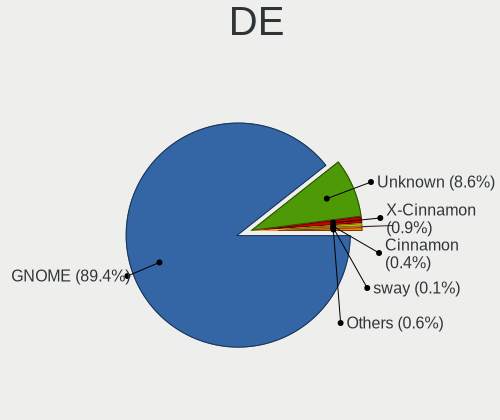
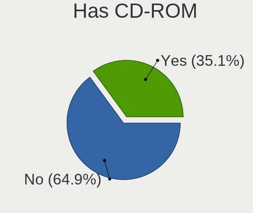
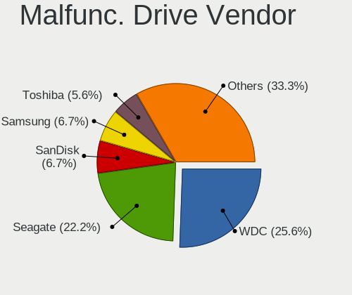
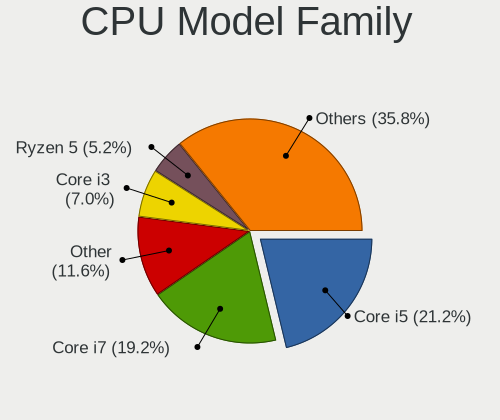
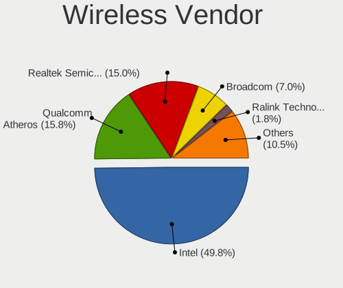
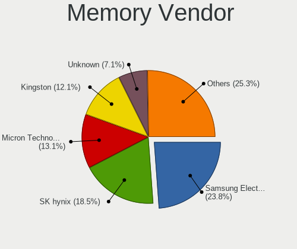
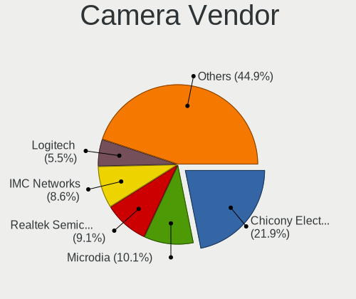
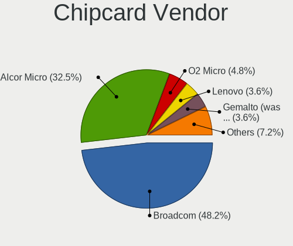
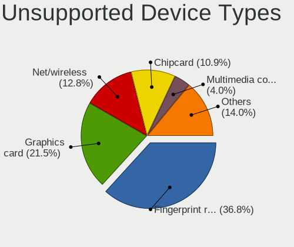

Ubuntu 21.04 - Tested Hardware & Statistics
-------------------------------------------

A project to collect tested hardware configurations for Ubuntu 21.04.

Anyone can contribute to this report by the [hw-probe](https://github.com/linuxhw/hw-probe) tool:

    sudo -E hw-probe -all -upload

Please contribute! Especially if your hardware is rare.

This is a report for all computer types. See also reports for [desktops](/Dist/Ubuntu_21.04/Desktop/README.md) and [notebooks](/Dist/Ubuntu_21.04/Notebook/README.md).

Contents
--------

* [ Test Cases ](#test-cases)

* [ System ](#system)
  - [ Kernel                   ](#kernel)
  - [ Kernel Family            ](#kernel-family)
  - [ Kernel Major Ver.        ](#kernel-major-ver)
  - [ Arch                     ](#arch)
  - [ DE                       ](#de)
  - [ Display Server           ](#display-server)
  - [ Display Manager          ](#display-manager)
  - [ OS Lang                  ](#os-lang)
  - [ Boot Mode                ](#boot-mode)
  - [ Filesystem               ](#filesystem)
  - [ Part. scheme             ](#part-scheme)
  - [ Dual Boot with Linux/BSD ](#dual-boot-with-linuxbsd)
  - [ Dual Boot (Win)          ](#dual-boot-win)

* [ Board ](#board)
  - [ Vendor                   ](#vendor)
  - [ Model                    ](#model)
  - [ Model Family             ](#model-family)
  - [ MFG Year                 ](#mfg-year)
  - [ Form Factor              ](#form-factor)
  - [ Secure Boot              ](#secure-boot)
  - [ Coreboot                 ](#coreboot)
  - [ RAM Size                 ](#ram-size)
  - [ RAM Used                 ](#ram-used)
  - [ Total Drives             ](#total-drives)
  - [ Has CD-ROM               ](#has-cd-rom)
  - [ Has Ethernet             ](#has-ethernet)
  - [ Has WiFi                 ](#has-wifi)
  - [ Has Bluetooth            ](#has-bluetooth)

* [ Location ](#location)
  - [ Country                  ](#country)
  - [ City                     ](#city)

* [ Drives ](#drives)
  - [ Drive Vendor             ](#drive-vendor)
  - [ Drive Model              ](#drive-model)
  - [ HDD Vendor               ](#hdd-vendor)
  - [ SSD Vendor               ](#ssd-vendor)
  - [ Drive Kind               ](#drive-kind)
  - [ Drive Connector          ](#drive-connector)
  - [ Drive Size               ](#drive-size)
  - [ Space Total              ](#space-total)
  - [ Space Used               ](#space-used)
  - [ Malfunc. Drives          ](#malfunc-drives)
  - [ Malfunc. Drive Vendor    ](#malfunc-drive-vendor)
  - [ Malfunc. HDD Vendor      ](#malfunc-hdd-vendor)
  - [ Malfunc. Drive Kind      ](#malfunc-drive-kind)
  - [ Failed Drives            ](#failed-drives)
  - [ Failed Drive Vendor      ](#failed-drive-vendor)
  - [ Drive Status             ](#drive-status)

* [ Storage controller ](#storage-controller)
  - [ Storage Vendor           ](#storage-vendor)
  - [ Storage Model            ](#storage-model)
  - [ Storage Kind             ](#storage-kind)

* [ Processor ](#processor)
  - [ CPU Vendor               ](#cpu-vendor)
  - [ CPU Model                ](#cpu-model)
  - [ CPU Model Family         ](#cpu-model-family)
  - [ CPU Cores                ](#cpu-cores)
  - [ CPU Sockets              ](#cpu-sockets)
  - [ CPU Threads              ](#cpu-threads)
  - [ CPU Op-Modes             ](#cpu-op-modes)
  - [ CPU Microcode            ](#cpu-microcode)
  - [ CPU Microarch            ](#cpu-microarch)

* [ Graphics ](#graphics)
  - [ GPU Vendor               ](#gpu-vendor)
  - [ GPU Model                ](#gpu-model)
  - [ GPU Combo                ](#gpu-combo)
  - [ GPU Driver               ](#gpu-driver)
  - [ GPU Memory               ](#gpu-memory)

* [ Monitor ](#monitor)
  - [ Monitor Vendor           ](#monitor-vendor)
  - [ Monitor Model            ](#monitor-model)
  - [ Monitor Resolution       ](#monitor-resolution)
  - [ Monitor Diagonal         ](#monitor-diagonal)
  - [ Monitor Width            ](#monitor-width)
  - [ Aspect Ratio             ](#aspect-ratio)
  - [ Monitor Area             ](#monitor-area)
  - [ Pixel Density            ](#pixel-density)
  - [ Multiple Monitors        ](#multiple-monitors)

* [ Network ](#network)
  - [ Net Controller Vendor    ](#net-controller-vendor)
  - [ Net Controller Model     ](#net-controller-model)
  - [ Wireless Vendor          ](#wireless-vendor)
  - [ Wireless Model           ](#wireless-model)
  - [ Ethernet Vendor          ](#ethernet-vendor)
  - [ Ethernet Model           ](#ethernet-model)
  - [ Net Controller Kind      ](#net-controller-kind)
  - [ Used Controller          ](#used-controller)
  - [ NICs                     ](#nics)
  - [ IPv6                     ](#ipv6)

* [ Bluetooth ](#bluetooth)
  - [ Bluetooth Vendor         ](#bluetooth-vendor)
  - [ Bluetooth Model          ](#bluetooth-model)

* [ Sound ](#sound)
  - [ Sound Vendor             ](#sound-vendor)
  - [ Sound Model              ](#sound-model)

* [ Memory ](#memory)
  - [ Memory Vendor            ](#memory-vendor)
  - [ Memory Model             ](#memory-model)
  - [ Memory Kind              ](#memory-kind)
  - [ Memory Form Factor       ](#memory-form-factor)
  - [ Memory Size              ](#memory-size)
  - [ Memory Speed             ](#memory-speed)

* [ Printers & scanners ](#printers--scanners)
  - [ Printer Vendor           ](#printer-vendor)
  - [ Printer Model            ](#printer-model)
  - [ Scanner Vendor           ](#scanner-vendor)
  - [ Scanner Model            ](#scanner-model)

* [ Camera ](#camera)
  - [ Camera Vendor            ](#camera-vendor)
  - [ Camera Model             ](#camera-model)

* [ Security ](#security)
  - [ Fingerprint Vendor       ](#fingerprint-vendor)
  - [ Fingerprint Model        ](#fingerprint-model)
  - [ Chipcard Vendor          ](#chipcard-vendor)
  - [ Chipcard Model           ](#chipcard-model)

* [ Unsupported ](#unsupported)
  - [ Unsupported Devices      ](#unsupported-devices)
  - [ Unsupported Device Types ](#unsupported-device-types)

Test Cases
----------

Total: 2531

| Vendor        | Model                       | Form-Factor | Probe                                                      | Date         |
|---------------|-----------------------------|-------------|------------------------------------------------------------|--------------|
| Gigabyte      | GA-MA785GT-UD3H             | Desktop     | [5ab13c42b3](https://linux-hardware.org/?probe=5ab13c42b3) | Dec 03, 2022 |
| Gigabyte      | GA-MA785GT-UD3H             | Desktop     | [b3ab0684c5](https://linux-hardware.org/?probe=b3ab0684c5) | Dec 03, 2022 |
| HP            | Laptop 15-db0xxx            | Notebook    | [fada18bff7](https://linux-hardware.org/?probe=fada18bff7) | Nov 27, 2022 |
| HP            | EliteBook x360 1030 G3      | Convertible | [50c2b71615](https://linux-hardware.org/?probe=50c2b71615) | Nov 23, 2022 |
| HP            | Pavilion dv6                | Notebook    | [fe166a1906](https://linux-hardware.org/?probe=fe166a1906) | Nov 14, 2022 |
| ASUSTek       | ROG STRIX B450-F GAMING     | Desktop     | [ac0380e724](https://linux-hardware.org/?probe=ac0380e724) | Oct 20, 2022 |
| HP            | 18E9                        | Desktop     | [2dff78f303](https://linux-hardware.org/?probe=2dff78f303) | Aug 31, 2022 |
| Dell          | 0F642F A00                  | Desktop     | [832cf31a6f](https://linux-hardware.org/?probe=832cf31a6f) | Aug 25, 2022 |
| Raspberry ... | Raspberry Pi 4 Model B R... | Soc         | [141267e725](https://linux-hardware.org/?probe=141267e725) | Aug 23, 2022 |
| Raspberry ... | Raspberry Pi 4 Model B R... | Soc         | [2a9d448350](https://linux-hardware.org/?probe=2a9d448350) | Aug 23, 2022 |
| Lenovo        | IdeaPad Gaming 3 15IHU6 ... | Notebook    | [8a4208caa8](https://linux-hardware.org/?probe=8a4208caa8) | Aug 02, 2022 |
| HP            | ProLiant DL360 G5           | Server      | [bc1ce319a3](https://linux-hardware.org/?probe=bc1ce319a3) | Jul 28, 2022 |
| Lenovo        | ThinkBook 15-IIL 20SM       | Notebook    | [662b422bcd](https://linux-hardware.org/?probe=662b422bcd) | Jul 17, 2022 |
| Dell          | Inspiron 3543               | Notebook    | [0a4fd044e4](https://linux-hardware.org/?probe=0a4fd044e4) | Jul 10, 2022 |
| ASRock        | Z77 Pro3                    | Desktop     | [289b6912d0](https://linux-hardware.org/?probe=289b6912d0) | Jul 10, 2022 |
| HP            | Laptop 17-ak0xx             | Notebook    | [7065eb875e](https://linux-hardware.org/?probe=7065eb875e) | Jun 15, 2022 |
| Dell          | Latitude 5511               | Notebook    | [93210ee531](https://linux-hardware.org/?probe=93210ee531) | Jun 12, 2022 |
| Lenovo        | IdeaPad 510-15ISK 80SR      | Notebook    | [53c2e38d14](https://linux-hardware.org/?probe=53c2e38d14) | Jun 10, 2022 |
| Medion        | MS-7501                     | Desktop     | [e5bf3cfdc2](https://linux-hardware.org/?probe=e5bf3cfdc2) | Jun 07, 2022 |
| Lenovo        | IdeaPad Yoga 13 20175       | Notebook    | [b7e4b7a2ec](https://linux-hardware.org/?probe=b7e4b7a2ec) | Jun 03, 2022 |
| Alienware     | M11x R2                     | Notebook    | [0b6837debb](https://linux-hardware.org/?probe=0b6837debb) | Jun 01, 2022 |
| Supermicro    | C7Z270-CG-M                 | Server      | [dbbe7457ff](https://linux-hardware.org/?probe=dbbe7457ff) | May 31, 2022 |
| Supermicro    | C7Z270-CG-M                 | Server      | [a9c593dd0b](https://linux-hardware.org/?probe=a9c593dd0b) | May 31, 2022 |
| Alienware     | M11x R2                     | Notebook    | [4a364390a6](https://linux-hardware.org/?probe=4a364390a6) | May 31, 2022 |
| MW            | GMLK-2_5G4L                 | Desktop     | [69e61d13d7](https://linux-hardware.org/?probe=69e61d13d7) | May 30, 2022 |
| ASUSTek       | PRIME B550M-A               | Desktop     | [97fc69a492](https://linux-hardware.org/?probe=97fc69a492) | May 22, 2022 |
| ASUSTek       | PRIME B550M-A               | Desktop     | [a5cd1ea7e4](https://linux-hardware.org/?probe=a5cd1ea7e4) | May 22, 2022 |
| Lenovo        | ThinkBook 15-IIL 20SM       | Notebook    | [4932c3cd73](https://linux-hardware.org/?probe=4932c3cd73) | May 10, 2022 |
| Notebook      | PB50_70RF,RD,RC             | Notebook    | [43afa2936d](https://linux-hardware.org/?probe=43afa2936d) | May 01, 2022 |
| ASUSTek       | M5A78L-M PLUS/USB3          | Desktop     | [88c6676e7b](https://linux-hardware.org/?probe=88c6676e7b) | Apr 29, 2022 |
| ASUSTek       | M5A78L-M PLUS/USB3          | Desktop     | [f2bdbd2a4a](https://linux-hardware.org/?probe=f2bdbd2a4a) | Apr 29, 2022 |
| Dell          | 0590KW A01                  | Server      | [e86a005fd7](https://linux-hardware.org/?probe=e86a005fd7) | Apr 21, 2022 |
| Unknown       | Unknown                     | Soc         | [478b3488e7](https://linux-hardware.org/?probe=478b3488e7) | Apr 16, 2022 |
| HUAWEI        | NBLB-WAX9N                  | Notebook    | [a89ca51e1b](https://linux-hardware.org/?probe=a89ca51e1b) | Apr 15, 2022 |
| MSI           | Z97 PC Mate                 | Desktop     | [930c18b320](https://linux-hardware.org/?probe=930c18b320) | Apr 14, 2022 |
| Lenovo        | ThinkPad E15 Gen 3 20YG0... | Notebook    | [8570b5ab84](https://linux-hardware.org/?probe=8570b5ab84) | Apr 12, 2022 |
| TongFang      | GM5TG8W                     | Notebook    | [a37f30bc86](https://linux-hardware.org/?probe=a37f30bc86) | Apr 12, 2022 |
| TongFang      | GM5TG8W                     | Notebook    | [b4004b859e](https://linux-hardware.org/?probe=b4004b859e) | Apr 10, 2022 |
| Gigabyte      | H97M-HD3                    | Desktop     | [fc7b16c289](https://linux-hardware.org/?probe=fc7b16c289) | Apr 05, 2022 |
| AMI           | Aptio CRB                   | Mini pc     | [53ca8415e0](https://linux-hardware.org/?probe=53ca8415e0) | Apr 03, 2022 |
| Dell          | 0FPP7F A00                  | Desktop     | [8e8bee474f](https://linux-hardware.org/?probe=8e8bee474f) | Apr 03, 2022 |
| ASRock        | X99 Extreme4                | Desktop     | [112e437f5d](https://linux-hardware.org/?probe=112e437f5d) | Mar 31, 2022 |
| ASRock        | X99 Extreme4                | Desktop     | [293958c009](https://linux-hardware.org/?probe=293958c009) | Mar 31, 2022 |
| Dell          | 0F642F A00                  | Desktop     | [b3ae697cd6](https://linux-hardware.org/?probe=b3ae697cd6) | Mar 30, 2022 |
| HP            | Pavilion Gaming Laptop 1... | Notebook    | [7c0d1ce382](https://linux-hardware.org/?probe=7c0d1ce382) | Mar 29, 2022 |
| Acer          | Aspire XC-885 V:1.1         | Desktop     | [8696148b4a](https://linux-hardware.org/?probe=8696148b4a) | Mar 29, 2022 |
| Packard Be... | EasyNote TK85               | Notebook    | [bfc20224d0](https://linux-hardware.org/?probe=bfc20224d0) | Mar 28, 2022 |
| HP            | 0A98h                       | Desktop     | [4b9c0556af](https://linux-hardware.org/?probe=4b9c0556af) | Mar 26, 2022 |
| Unknown       | Unknown                     | Notebook    | [0d58e4449b](https://linux-hardware.org/?probe=0d58e4449b) | Mar 26, 2022 |
| Lenovo        | ThinkPad X230 2325BN8       | Notebook    | [3ad2d0f3ee](https://linux-hardware.org/?probe=3ad2d0f3ee) | Mar 25, 2022 |
| HP            | Laptop 15-da0xxx            | Notebook    | [794139f740](https://linux-hardware.org/?probe=794139f740) | Mar 24, 2022 |
| ASUSTek       | P7H55D-M EVO                | Desktop     | [2e70de8c8d](https://linux-hardware.org/?probe=2e70de8c8d) | Mar 19, 2022 |
| Lenovo        | ThinkPad E15 Gen 2 20TD0... | Notebook    | [67e6e7097c](https://linux-hardware.org/?probe=67e6e7097c) | Mar 16, 2022 |
| Dell          | Inspiron 5590               | Notebook    | [30f82f9c0a](https://linux-hardware.org/?probe=30f82f9c0a) | Mar 12, 2022 |
| ASUSTek       | PRIME B460M-A               | Desktop     | [eaa5b0f454](https://linux-hardware.org/?probe=eaa5b0f454) | Mar 08, 2022 |
| ASUSTek       | PRIME B460M-A               | Desktop     | [e207d2bf0a](https://linux-hardware.org/?probe=e207d2bf0a) | Mar 08, 2022 |
| HP            | Pavilion x360 Convertibl... | Convertible | [4edc1d31b5](https://linux-hardware.org/?probe=4edc1d31b5) | Mar 06, 2022 |
| Positivo      | H14BT58                     | Notebook    | [5bcf783e8d](https://linux-hardware.org/?probe=5bcf783e8d) | Mar 02, 2022 |
| Gigabyte      | H310M S2 x.x                | Desktop     | [feb1d977ea](https://linux-hardware.org/?probe=feb1d977ea) | Feb 26, 2022 |
| Dell          | Latitude E4300              | Notebook    | [ff42bce998](https://linux-hardware.org/?probe=ff42bce998) | Feb 23, 2022 |
| Dell          | Latitude E4300              | Notebook    | [ce00b44454](https://linux-hardware.org/?probe=ce00b44454) | Feb 23, 2022 |
| ASUSTek       | X555LAB                     | Notebook    | [9e1f07c164](https://linux-hardware.org/?probe=9e1f07c164) | Feb 22, 2022 |
| Lenovo        | ThinkPad P14s Gen 2a 21A... | Notebook    | [10d9500000](https://linux-hardware.org/?probe=10d9500000) | Feb 22, 2022 |
| MSI           | B550M PRO-VDH               | Desktop     | [747899db53](https://linux-hardware.org/?probe=747899db53) | Feb 20, 2022 |
| HP            | ProBook 450 G7              | Notebook    | [6b77f8012b](https://linux-hardware.org/?probe=6b77f8012b) | Feb 18, 2022 |
| HP            | ProBook 450 G7              | Notebook    | [74e488319b](https://linux-hardware.org/?probe=74e488319b) | Feb 18, 2022 |
| Dell          | Precision 5530              | Notebook    | [5650039a15](https://linux-hardware.org/?probe=5650039a15) | Feb 18, 2022 |
| ASUSTek       | X540UA                      | Notebook    | [681b4aca6f](https://linux-hardware.org/?probe=681b4aca6f) | Feb 16, 2022 |
| Dell          | Precision 7760              | Notebook    | [c40cc0206c](https://linux-hardware.org/?probe=c40cc0206c) | Feb 16, 2022 |
| Lenovo        | ThinkPad X1 Carbon 6th 2... | Notebook    | [832c433c19](https://linux-hardware.org/?probe=832c433c19) | Feb 15, 2022 |
| ASUSTek       | ROG STRIX B550-F GAMING     | Desktop     | [bd1fb80901](https://linux-hardware.org/?probe=bd1fb80901) | Feb 15, 2022 |
| ASRock        | 880GMH/USB3                 | Desktop     | [2789041a4d](https://linux-hardware.org/?probe=2789041a4d) | Feb 15, 2022 |
| Acer          | TravelMate 6592             | Notebook    | [a12fc5be70](https://linux-hardware.org/?probe=a12fc5be70) | Feb 13, 2022 |
| ASUSTek       | TAICHI31                    | Notebook    | [760fdd8fdd](https://linux-hardware.org/?probe=760fdd8fdd) | Feb 12, 2022 |
| Acer          | TravelMate X349-G2-M        | Notebook    | [99296fdd45](https://linux-hardware.org/?probe=99296fdd45) | Feb 10, 2022 |
| HP            | EliteBook 840 G3            | Notebook    | [82d892f3e5](https://linux-hardware.org/?probe=82d892f3e5) | Feb 07, 2022 |
| ASUSTek       | PRIME Z590-P                | Desktop     | [fbea64f951](https://linux-hardware.org/?probe=fbea64f951) | Feb 07, 2022 |
| ASUSTek       | ROG STRIX B550-A GAMING     | Desktop     | [e21a51339e](https://linux-hardware.org/?probe=e21a51339e) | Feb 06, 2022 |
| Lenovo        | IdeaPad 330-15IGM 81D1      | Notebook    | [52a7fb252a](https://linux-hardware.org/?probe=52a7fb252a) | Feb 06, 2022 |
| ASUSTek       | PRIME Z590-P                | Desktop     | [cb34c3126d](https://linux-hardware.org/?probe=cb34c3126d) | Feb 05, 2022 |
| ASRock        | Z77 Pro3                    | Desktop     | [0bd2b97304](https://linux-hardware.org/?probe=0bd2b97304) | Feb 03, 2022 |
| Gigabyte      | B75M-D3H                    | Desktop     | [23987146db](https://linux-hardware.org/?probe=23987146db) | Feb 02, 2022 |
| Lenovo        | ThinkPad X280 20KF001GGE    | Notebook    | [f076061f22](https://linux-hardware.org/?probe=f076061f22) | Feb 02, 2022 |
| MSI           | X570-A PRO                  | Desktop     | [df3c56c53c](https://linux-hardware.org/?probe=df3c56c53c) | Feb 02, 2022 |
| Lenovo        | 3176 NOK                    | Desktop     | [d3a3d5276b](https://linux-hardware.org/?probe=d3a3d5276b) | Feb 02, 2022 |
| Dell          | Inspiron 3576               | Notebook    | [4ea07fe50a](https://linux-hardware.org/?probe=4ea07fe50a) | Jan 31, 2022 |
| MSI           | Z97 GAMING 5                | Desktop     | [26005d669e](https://linux-hardware.org/?probe=26005d669e) | Jan 29, 2022 |
| ASRock        | FM2A88X+ Killer             | Desktop     | [efc653778b](https://linux-hardware.org/?probe=efc653778b) | Jan 29, 2022 |
| Acer          | TravelMate P214-53          | Notebook    | [8b138118b8](https://linux-hardware.org/?probe=8b138118b8) | Jan 28, 2022 |
| ASUSTek       | ROG Strix G513QM_G513QM     | Notebook    | [3c241e8e7f](https://linux-hardware.org/?probe=3c241e8e7f) | Jan 27, 2022 |
| Samsung       | 730QDA                      | Convertible | [81697fc34e](https://linux-hardware.org/?probe=81697fc34e) | Jan 26, 2022 |
| HP            | Compaq Presario CQ70        | Notebook    | [a31ae712c0](https://linux-hardware.org/?probe=a31ae712c0) | Jan 26, 2022 |
| HP            | Compaq Presario CQ70        | Notebook    | [82a45a6067](https://linux-hardware.org/?probe=82a45a6067) | Jan 26, 2022 |
| Lenovo        | ThinkPad T470 20HES50400    | Notebook    | [4ebbaf952f](https://linux-hardware.org/?probe=4ebbaf952f) | Jan 26, 2022 |
| Gigabyte      | X570 AORUS PRO WIFI         | Desktop     | [9e892d9ea3](https://linux-hardware.org/?probe=9e892d9ea3) | Jan 26, 2022 |
| HP            | Laptop 15-bs2xx             | Notebook    | [3770e775f9](https://linux-hardware.org/?probe=3770e775f9) | Jan 25, 2022 |
| Raspberry ... | Raspberry Pi                | Soc         | [591bedf88f](https://linux-hardware.org/?probe=591bedf88f) | Jan 24, 2022 |
| HP            | 1998                        | Desktop     | [7bbd98aafa](https://linux-hardware.org/?probe=7bbd98aafa) | Jan 24, 2022 |
| Raspberry ... | Raspberry Pi                | Soc         | [7986235186](https://linux-hardware.org/?probe=7986235186) | Jan 23, 2022 |
| Lenovo        | Yoga 2 11 20332             | Notebook    | [8003b9ec29](https://linux-hardware.org/?probe=8003b9ec29) | Jan 20, 2022 |
| Lenovo        | Yoga 2 11 20332             | Notebook    | [046d8a907a](https://linux-hardware.org/?probe=046d8a907a) | Jan 20, 2022 |
| Fujitsu       | D3062-A1 S26361-D3062-A1    | Desktop     | [f1c61e2a1b](https://linux-hardware.org/?probe=f1c61e2a1b) | Jan 19, 2022 |
| HUAWEI        | HVY-WXX9                    | Notebook    | [49d5581480](https://linux-hardware.org/?probe=49d5581480) | Jan 19, 2022 |
| ASUSTek       | GL553VD                     | Notebook    | [5d1c8ba7f2](https://linux-hardware.org/?probe=5d1c8ba7f2) | Jan 18, 2022 |
| Raspberry ... | Raspberry Pi                | Soc         | [ff42ca8248](https://linux-hardware.org/?probe=ff42ca8248) | Jan 17, 2022 |
| Intel         | NUC8BEB J72688-308          | Mini pc     | [c28502d4bb](https://linux-hardware.org/?probe=c28502d4bb) | Jan 17, 2022 |
| HC            | HCAR357-MI V1.0             | Desktop     | [a610cc37dc](https://linux-hardware.org/?probe=a610cc37dc) | Jan 16, 2022 |
| MSI           | X58 Pro-E                   | Desktop     | [32b53a700a](https://linux-hardware.org/?probe=32b53a700a) | Jan 15, 2022 |
| Lenovo        | ThinkPad Edge E531 68852... | Notebook    | [2e8135c20d](https://linux-hardware.org/?probe=2e8135c20d) | Jan 15, 2022 |
| ASUSTek       | M4A88T-V EVO/USB3           | Desktop     | [6eff31c620](https://linux-hardware.org/?probe=6eff31c620) | Jan 14, 2022 |
| Acer          | Aspire V3-772G              | Notebook    | [c6dc2d8971](https://linux-hardware.org/?probe=c6dc2d8971) | Jan 14, 2022 |
| ASUSTek       | GL752VW                     | Notebook    | [2bc7b76882](https://linux-hardware.org/?probe=2bc7b76882) | Jan 13, 2022 |
| HP            | 82F2                        | Desktop     | [708ffd7bb5](https://linux-hardware.org/?probe=708ffd7bb5) | Jan 13, 2022 |
| Nvidia        | Tegra                       | Soc         | [b2621747db](https://linux-hardware.org/?probe=b2621747db) | Jan 13, 2022 |
| Nvidia        | Tegra                       | Soc         | [71cf155467](https://linux-hardware.org/?probe=71cf155467) | Jan 12, 2022 |
| Fujitsu       | D3220-A1 S26361-D3220-A1    | Desktop     | [e82feb71d2](https://linux-hardware.org/?probe=e82feb71d2) | Jan 12, 2022 |
| Fujitsu       | D3220-A1 S26361-D3220-A1    | Desktop     | [0529614510](https://linux-hardware.org/?probe=0529614510) | Jan 12, 2022 |
| HP            | 8906 SMVB                   | Desktop     | [118b411a8c](https://linux-hardware.org/?probe=118b411a8c) | Jan 12, 2022 |
| Acer          | Aspire V3-772G              | Notebook    | [aaf1227ec4](https://linux-hardware.org/?probe=aaf1227ec4) | Jan 11, 2022 |
| sunxi         | Unknown                     | Soc         | [6c1b0df48a](https://linux-hardware.org/?probe=6c1b0df48a) | Jan 10, 2022 |
| sunxi         | Unknown                     | Soc         | [4e57abaa0a](https://linux-hardware.org/?probe=4e57abaa0a) | Jan 10, 2022 |
| Gigabyte      | Z87M-D3H                    | Desktop     | [7e4fe3d952](https://linux-hardware.org/?probe=7e4fe3d952) | Jan 10, 2022 |
| Apple         | Mac-F227BEC8 PVT            | All in one  | [efa90d55cb](https://linux-hardware.org/?probe=efa90d55cb) | Jan 09, 2022 |
| Dell          | Inspiron M5040              | Notebook    | [2fa8f23cb9](https://linux-hardware.org/?probe=2fa8f23cb9) | Jan 09, 2022 |
| Dell          | Inspiron M5040              | Notebook    | [a0b1a9f1d3](https://linux-hardware.org/?probe=a0b1a9f1d3) | Jan 09, 2022 |
| ASUSTek       | P5Q                         | Desktop     | [b2e4fe050c](https://linux-hardware.org/?probe=b2e4fe050c) | Jan 09, 2022 |
| ASRock        | FM2A55M-HD+                 | Desktop     | [91c54ce00a](https://linux-hardware.org/?probe=91c54ce00a) | Jan 08, 2022 |
| Raspberry ... | Raspberry Pi                | Soc         | [faffa9ba50](https://linux-hardware.org/?probe=faffa9ba50) | Jan 07, 2022 |
| Supermicro    | X9DRW                       | Server      | [31684ad7e4](https://linux-hardware.org/?probe=31684ad7e4) | Jan 06, 2022 |
| Lenovo        | ThinkPad T61 6463WCH        | Notebook    | [b0936c6830](https://linux-hardware.org/?probe=b0936c6830) | Jan 05, 2022 |
| ASUSTek       | UX490UA                     | Notebook    | [d8024aef8a](https://linux-hardware.org/?probe=d8024aef8a) | Jan 05, 2022 |
| Raspberry ... | Raspberry Pi 4 Model B R... | Soc         | [446ac9b29a](https://linux-hardware.org/?probe=446ac9b29a) | Jan 04, 2022 |
| Apple         | Mac-F227BEC8 PVT            | All in one  | [031670d0da](https://linux-hardware.org/?probe=031670d0da) | Jan 04, 2022 |
| Raspberry ... | rpi                         | Soc         | [7772c86e18](https://linux-hardware.org/?probe=7772c86e18) | Jan 03, 2022 |
| Dell          | Inspiron 7720               | Notebook    | [4e1ebc00ff](https://linux-hardware.org/?probe=4e1ebc00ff) | Jan 02, 2022 |
| Dell          | Latitude E6510              | Notebook    | [7a6c58b609](https://linux-hardware.org/?probe=7a6c58b609) | Jan 02, 2022 |
| Acer          | Aspire A315-22              | Notebook    | [73ec029d3d](https://linux-hardware.org/?probe=73ec029d3d) | Dec 31, 2021 |
| HP            | Split 13 x2 PC              | Notebook    | [1f6fddb4f0](https://linux-hardware.org/?probe=1f6fddb4f0) | Dec 31, 2021 |
| Lenovo        | ThinkPad E15 Gen 2 20TD0... | Notebook    | [4ee18a044c](https://linux-hardware.org/?probe=4ee18a044c) | Dec 30, 2021 |
| MSI           | Z390-A PRO                  | Desktop     | [9be23e2b2d](https://linux-hardware.org/?probe=9be23e2b2d) | Dec 30, 2021 |
| Dell          | XPS 13 7390                 | Notebook    | [9406d941f5](https://linux-hardware.org/?probe=9406d941f5) | Dec 29, 2021 |
| Lenovo        | IdeaPadFlex 5 15ITL05 82... | Convertible | [195c9a8567](https://linux-hardware.org/?probe=195c9a8567) | Dec 29, 2021 |
| Lenovo        | ThinkPad T440 20B7S06M00    | Notebook    | [be06952436](https://linux-hardware.org/?probe=be06952436) | Dec 29, 2021 |
| HP            | 15                          | Notebook    | [e0d79905e2](https://linux-hardware.org/?probe=e0d79905e2) | Dec 29, 2021 |
| Acer          | Aspire A315-22              | Notebook    | [69b22953b2](https://linux-hardware.org/?probe=69b22953b2) | Dec 29, 2021 |
| Intel         | NUC8BEB J72693-308          | Mini pc     | [3edd9950f9](https://linux-hardware.org/?probe=3edd9950f9) | Dec 28, 2021 |
| Dell          | Inspiron 5502               | Notebook    | [0fc6dd4a3f](https://linux-hardware.org/?probe=0fc6dd4a3f) | Dec 28, 2021 |
| Biostar       | H55A+                       | Desktop     | [0a4141bcc2](https://linux-hardware.org/?probe=0a4141bcc2) | Dec 28, 2021 |
| Lenovo        | IdeaPadFlex 5-1570 81CA     | Convertible | [b4a19932e1](https://linux-hardware.org/?probe=b4a19932e1) | Dec 27, 2021 |
| ASUSTek       | TUF Gaming FX505DY_FX505... | Notebook    | [712f1bf709](https://linux-hardware.org/?probe=712f1bf709) | Dec 27, 2021 |
| Lenovo        | ThinkPad E15 Gen 3 20YG0... | Notebook    | [17cc2bca69](https://linux-hardware.org/?probe=17cc2bca69) | Dec 26, 2021 |
| Raspberry ... | Raspberry Pi                | Soc         | [588620e35b](https://linux-hardware.org/?probe=588620e35b) | Dec 26, 2021 |
| HP            | Split 13 x2 PC              | Notebook    | [8891bd5101](https://linux-hardware.org/?probe=8891bd5101) | Dec 26, 2021 |
| Dell          | Inspiron 1501               | Notebook    | [69ea9bcec2](https://linux-hardware.org/?probe=69ea9bcec2) | Dec 25, 2021 |
| Raspberry ... | Raspberry Pi                | Soc         | [44089c6854](https://linux-hardware.org/?probe=44089c6854) | Dec 25, 2021 |
| Shuttle       | FZ87                        | Desktop     | [e26f5a10e8](https://linux-hardware.org/?probe=e26f5a10e8) | Dec 24, 2021 |
| Shuttle       | FZ87                        | Desktop     | [62a0a858a6](https://linux-hardware.org/?probe=62a0a858a6) | Dec 24, 2021 |
| Raspberry ... | Raspberry Pi                | Soc         | [80a1a1a3f2](https://linux-hardware.org/?probe=80a1a1a3f2) | Dec 24, 2021 |
| ASUSTek       | TUF Gaming Z690-PLUS WIF... | Desktop     | [04bcdd10e9](https://linux-hardware.org/?probe=04bcdd10e9) | Dec 24, 2021 |
| ASRock        | FM2A55M-HD+                 | Desktop     | [d76ed454c1](https://linux-hardware.org/?probe=d76ed454c1) | Dec 24, 2021 |
| HP            | ProBook 450 G8 Notebook ... | Notebook    | [09799e1378](https://linux-hardware.org/?probe=09799e1378) | Dec 23, 2021 |
| HP            | Stream Laptop 11-ak0xxx     | Notebook    | [91dfb2417e](https://linux-hardware.org/?probe=91dfb2417e) | Dec 23, 2021 |
| HP            | Laptop 15-da0xxx            | Notebook    | [7e520450ed](https://linux-hardware.org/?probe=7e520450ed) | Dec 22, 2021 |
| Acer          | Aspire ES1-331              | Notebook    | [229ffb6197](https://linux-hardware.org/?probe=229ffb6197) | Dec 21, 2021 |
| Medion        | P2212T                      | Tablet      | [c61a96d514](https://linux-hardware.org/?probe=c61a96d514) | Dec 21, 2021 |
| ASUSTek       | TUF Z390-PLUS GAMING        | Desktop     | [4466b5357f](https://linux-hardware.org/?probe=4466b5357f) | Dec 21, 2021 |
| ASUSTek       | ROG Zephyrus G15 GA502IU... | Notebook    | [041e50f6a8](https://linux-hardware.org/?probe=041e50f6a8) | Dec 20, 2021 |
| Dell          | Vostro 3500                 | Notebook    | [91efbf7a41](https://linux-hardware.org/?probe=91efbf7a41) | Dec 20, 2021 |
| ASUSTek       | X551CAP                     | Notebook    | [cb7b24735e](https://linux-hardware.org/?probe=cb7b24735e) | Dec 18, 2021 |
| Acer          | Aspire ES1-331              | Notebook    | [f1d39480bb](https://linux-hardware.org/?probe=f1d39480bb) | Dec 17, 2021 |
| Raspberry ... | Raspberry Pi                | Soc         | [7aeb73d109](https://linux-hardware.org/?probe=7aeb73d109) | Dec 17, 2021 |
| Acer          | Aspire ES1-331              | Notebook    | [4d373ac2a3](https://linux-hardware.org/?probe=4d373ac2a3) | Dec 17, 2021 |
| Dell          | Inspiron 3585               | Notebook    | [e12da201c3](https://linux-hardware.org/?probe=e12da201c3) | Dec 16, 2021 |
| ASUSTek       | K54L                        | Notebook    | [335a4179a6](https://linux-hardware.org/?probe=335a4179a6) | Dec 16, 2021 |
| Dell          | Inspiron 3585               | Notebook    | [f8e1e0ea63](https://linux-hardware.org/?probe=f8e1e0ea63) | Dec 16, 2021 |
| HP            | 240 G6 Notebook PC          | Notebook    | [0eee85762e](https://linux-hardware.org/?probe=0eee85762e) | Dec 14, 2021 |
| ASUSTek       | B85M-F                      | Desktop     | [04b3b165f6](https://linux-hardware.org/?probe=04b3b165f6) | Dec 14, 2021 |
| Dell          | Precision 7510              | Notebook    | [59a0d1a314](https://linux-hardware.org/?probe=59a0d1a314) | Dec 13, 2021 |
| Acer          | Aspire A315-22              | Notebook    | [c7dec3c83d](https://linux-hardware.org/?probe=c7dec3c83d) | Dec 12, 2021 |
| HP            | Pavilion dv6                | Notebook    | [24e1124f28](https://linux-hardware.org/?probe=24e1124f28) | Dec 12, 2021 |
| HP            | ProBook 6470b               | Notebook    | [a950763fdb](https://linux-hardware.org/?probe=a950763fdb) | Dec 12, 2021 |
| Lenovo        | IdeaPad Y510P 20217         | Notebook    | [c33bc12a7a](https://linux-hardware.org/?probe=c33bc12a7a) | Dec 11, 2021 |
| Dell          | 0GM819                      | Desktop     | [2b84176135](https://linux-hardware.org/?probe=2b84176135) | Dec 11, 2021 |
| Acer          | Aspire A315-22              | Notebook    | [43938eb3c9](https://linux-hardware.org/?probe=43938eb3c9) | Dec 11, 2021 |
| ASUSTek       | VivoBook_ASUSLaptop X412... | Notebook    | [fd5ad714f1](https://linux-hardware.org/?probe=fd5ad714f1) | Dec 10, 2021 |
| ASUSTek       | H81M-K                      | Desktop     | [412accf186](https://linux-hardware.org/?probe=412accf186) | Dec 09, 2021 |
| HP            | 8184 X4                     | Desktop     | [3a2d5e3c77](https://linux-hardware.org/?probe=3a2d5e3c77) | Dec 08, 2021 |
| ASUSTek       | N550JV                      | Notebook    | [696dd578ab](https://linux-hardware.org/?probe=696dd578ab) | Dec 08, 2021 |
| HP            | 8184 X4                     | Desktop     | [e225665abc](https://linux-hardware.org/?probe=e225665abc) | Dec 08, 2021 |
| Dell          | Precision M6800             | Notebook    | [da95c95a07](https://linux-hardware.org/?probe=da95c95a07) | Dec 08, 2021 |
| Gigabyte      | B550 AORUS ELITE V2         | Desktop     | [ad04822d41](https://linux-hardware.org/?probe=ad04822d41) | Dec 07, 2021 |
| Medion        | Akoya P7818                 | Notebook    | [93ecb6c404](https://linux-hardware.org/?probe=93ecb6c404) | Dec 07, 2021 |
| Toshiba       | Satellite C850-19Z          | Notebook    | [4fdaf4108a](https://linux-hardware.org/?probe=4fdaf4108a) | Dec 07, 2021 |
| ASRock        | B450M-HDV R4.0              | Desktop     | [594becb8c9](https://linux-hardware.org/?probe=594becb8c9) | Dec 06, 2021 |
| HP            | Spectre x360 Convertible... | Convertible | [211486de2c](https://linux-hardware.org/?probe=211486de2c) | Dec 05, 2021 |
| ASUSTek       | P8Z77-V PRO                 | Desktop     | [7f6abaf57b](https://linux-hardware.org/?probe=7f6abaf57b) | Dec 05, 2021 |
| ASUSTek       | P8H61-M LX R2.0             | Desktop     | [3c693abd6e](https://linux-hardware.org/?probe=3c693abd6e) | Dec 04, 2021 |
| Dell          | 0WG261                      | Desktop     | [21617413f1](https://linux-hardware.org/?probe=21617413f1) | Dec 04, 2021 |
| Dell          | 0WG261                      | Desktop     | [95facf9dd4](https://linux-hardware.org/?probe=95facf9dd4) | Dec 04, 2021 |
| Toshiba       | dynabook Satellite B552/... | Notebook    | [b3c78d548b](https://linux-hardware.org/?probe=b3c78d548b) | Dec 03, 2021 |
| HUAWEI        | BOHB-WAX9                   | Notebook    | [c7b4e4cc3c](https://linux-hardware.org/?probe=c7b4e4cc3c) | Dec 02, 2021 |
| HP            | ProBook 4520s               | Notebook    | [a4d5e80bbc](https://linux-hardware.org/?probe=a4d5e80bbc) | Dec 02, 2021 |
| Raspberry ... | Raspberry Pi                | Soc         | [095d666164](https://linux-hardware.org/?probe=095d666164) | Dec 01, 2021 |
| Notebook      | N13_N140ZU                  | Notebook    | [d63f7874c8](https://linux-hardware.org/?probe=d63f7874c8) | Nov 29, 2021 |
| Unknown       | Unknown                     | Soc         | [3dbf93245c](https://linux-hardware.org/?probe=3dbf93245c) | Nov 28, 2021 |
| Unknown       | Unknown                     | Soc         | [f46696c32c](https://linux-hardware.org/?probe=f46696c32c) | Nov 28, 2021 |
| Lenovo        | V560                        | Notebook    | [83e5b46ba2](https://linux-hardware.org/?probe=83e5b46ba2) | Nov 28, 2021 |
| Raspberry ... | Raspberry Pi                | Soc         | [08d43243b9](https://linux-hardware.org/?probe=08d43243b9) | Nov 28, 2021 |
| ASUSTek       | 970 PRO GAMING/AURA         | Desktop     | [8b68d87b85](https://linux-hardware.org/?probe=8b68d87b85) | Nov 28, 2021 |
| Lenovo        | IdeaPadFlex 5 14ALC05 82... | Convertible | [b936f93d22](https://linux-hardware.org/?probe=b936f93d22) | Nov 28, 2021 |
| Dell          | 0F642F A00                  | Desktop     | [86a0053059](https://linux-hardware.org/?probe=86a0053059) | Nov 28, 2021 |
| Gigabyte      | Z87M-D3H                    | Desktop     | [185831a6a6](https://linux-hardware.org/?probe=185831a6a6) | Nov 28, 2021 |
| ASUSTek       | 970 PRO GAMING/AURA         | Desktop     | [064efec6fb](https://linux-hardware.org/?probe=064efec6fb) | Nov 27, 2021 |
| FIRICH        | J1900                       | Desktop     | [65b936ff81](https://linux-hardware.org/?probe=65b936ff81) | Nov 27, 2021 |
| Dell          | 0RF703                      | Desktop     | [fafb09d7a7](https://linux-hardware.org/?probe=fafb09d7a7) | Nov 27, 2021 |
| Dell          | 0RF703                      | Desktop     | [a1c5f0a19e](https://linux-hardware.org/?probe=a1c5f0a19e) | Nov 27, 2021 |
| Lenovo        | Yoga 730-13IKB 81CT         | Convertible | [b1147db572](https://linux-hardware.org/?probe=b1147db572) | Nov 27, 2021 |
| ASUSTek       | P5B-VM SE                   | Desktop     | [0162ece16f](https://linux-hardware.org/?probe=0162ece16f) | Nov 25, 2021 |
| ASUSTek       | P8Z68-V GEN3                | Desktop     | [e8a1a915a4](https://linux-hardware.org/?probe=e8a1a915a4) | Nov 25, 2021 |
| Dell          | Inspiron 5437               | Notebook    | [3c089ce814](https://linux-hardware.org/?probe=3c089ce814) | Nov 25, 2021 |
| MSI           | MPG X570 GAMING EDGE WIF... | Desktop     | [3355d6fd50](https://linux-hardware.org/?probe=3355d6fd50) | Nov 24, 2021 |
| Gigabyte      | B550 AORUS ELITE V2         | Desktop     | [56f55d6a20](https://linux-hardware.org/?probe=56f55d6a20) | Nov 24, 2021 |
| Dell          | Latitude E6430              | Notebook    | [f18bb8ac48](https://linux-hardware.org/?probe=f18bb8ac48) | Nov 24, 2021 |
| Lenovo        | B50-70 80EU                 | Notebook    | [9476bb5e05](https://linux-hardware.org/?probe=9476bb5e05) | Nov 24, 2021 |
| Acer          | Aspire E5-511               | Notebook    | [d4bfc15ece](https://linux-hardware.org/?probe=d4bfc15ece) | Nov 24, 2021 |
| Notebook      | N13_N140ZU                  | Notebook    | [dca6d021bb](https://linux-hardware.org/?probe=dca6d021bb) | Nov 23, 2021 |
| Lenovo        | G50-70 20351                | Notebook    | [667c9a87dc](https://linux-hardware.org/?probe=667c9a87dc) | Nov 23, 2021 |
| HP            | 3647h                       | Desktop     | [e3d0601f0b](https://linux-hardware.org/?probe=e3d0601f0b) | Nov 23, 2021 |
| ASRock        | FM2A88X+ Killer             | Desktop     | [2b2b399b41](https://linux-hardware.org/?probe=2b2b399b41) | Nov 23, 2021 |
| Dell          | Latitude E6430              | Notebook    | [ce21d5f8d7](https://linux-hardware.org/?probe=ce21d5f8d7) | Nov 23, 2021 |
| Apple         | MacBook10,1                 | Notebook    | [6cb99e6a5f](https://linux-hardware.org/?probe=6cb99e6a5f) | Nov 23, 2021 |
| Lenovo        | MAHOBAY NOK                 | Desktop     | [7640e31dd0](https://linux-hardware.org/?probe=7640e31dd0) | Nov 23, 2021 |
| Lenovo        | MAHOBAY NOK                 | Desktop     | [21a35c6975](https://linux-hardware.org/?probe=21a35c6975) | Nov 22, 2021 |
| Gigabyte      | Z370P D3-CF                 | Desktop     | [b2a2916a12](https://linux-hardware.org/?probe=b2a2916a12) | Nov 22, 2021 |
| Gigabyte      | B450M S2H                   | Desktop     | [d46b86b5c0](https://linux-hardware.org/?probe=d46b86b5c0) | Nov 22, 2021 |
| Dell          | 0R790T A00                  | Desktop     | [af9a5a76c3](https://linux-hardware.org/?probe=af9a5a76c3) | Nov 22, 2021 |
| ASUSTek       | N71Vg                       | Notebook    | [4657bca419](https://linux-hardware.org/?probe=4657bca419) | Nov 21, 2021 |
| Lenovo        | IdeaPad 3 15ITL6 82H8       | Notebook    | [08b2395aa0](https://linux-hardware.org/?probe=08b2395aa0) | Nov 21, 2021 |
| Toshiba       | Satellite L875D             | Notebook    | [abf232b07d](https://linux-hardware.org/?probe=abf232b07d) | Nov 21, 2021 |
| Lenovo        | ThinkPad T430 2349DS1       | Notebook    | [cd04ef3811](https://linux-hardware.org/?probe=cd04ef3811) | Nov 21, 2021 |
| Dell          | 0M9KCM A00                  | Desktop     | [e0f0471cee](https://linux-hardware.org/?probe=e0f0471cee) | Nov 20, 2021 |
| Gigabyte      | B450M S2H                   | Desktop     | [4fe276b0c3](https://linux-hardware.org/?probe=4fe276b0c3) | Nov 20, 2021 |
| Toshiba       | Satellite C850-19Z          | Notebook    | [38b73bb691](https://linux-hardware.org/?probe=38b73bb691) | Nov 20, 2021 |
| Dell          | XPS 15 9500                 | Notebook    | [a73d04c7ba](https://linux-hardware.org/?probe=a73d04c7ba) | Nov 20, 2021 |
| Dell          | 07PR60 A00                  | Desktop     | [806800bb1f](https://linux-hardware.org/?probe=806800bb1f) | Nov 19, 2021 |
| Dell          | XPS 13 9365                 | Convertible | [69a210799e](https://linux-hardware.org/?probe=69a210799e) | Nov 19, 2021 |
| HP            | ZBook Power G7 Mobile Wo... | Notebook    | [55554fa68d](https://linux-hardware.org/?probe=55554fa68d) | Nov 18, 2021 |
| Toshiba       | Satellite L875D             | Notebook    | [894d6602f9](https://linux-hardware.org/?probe=894d6602f9) | Nov 18, 2021 |
| Lenovo        | ThinkPad E15 Gen 3 20YG0... | Notebook    | [8fc5db0cd9](https://linux-hardware.org/?probe=8fc5db0cd9) | Nov 17, 2021 |
| Intel         | NUC10i7FNB K61360-305       | Mini pc     | [3cbee876cb](https://linux-hardware.org/?probe=3cbee876cb) | Nov 17, 2021 |
| Intel         | NUC10i7FNB K61360-305       | Mini pc     | [92f0b10f02](https://linux-hardware.org/?probe=92f0b10f02) | Nov 17, 2021 |
| Dell          | Latitude 7420               | Notebook    | [52bd94ce90](https://linux-hardware.org/?probe=52bd94ce90) | Nov 17, 2021 |
| Acer          | Extensa 5635Z               | Notebook    | [dac5f9f46b](https://linux-hardware.org/?probe=dac5f9f46b) | Nov 16, 2021 |
| ASRock        | Z68 Extreme4 Gen3           | Desktop     | [246e62e738](https://linux-hardware.org/?probe=246e62e738) | Nov 16, 2021 |
| ASUSTek       | M5A99FX PRO R2.0            | Desktop     | [fc12beb786](https://linux-hardware.org/?probe=fc12beb786) | Nov 16, 2021 |
| Gigabyte      | H61M-S1                     | Desktop     | [c5764c10dc](https://linux-hardware.org/?probe=c5764c10dc) | Nov 16, 2021 |
| Medion        | Akoya P7818                 | Notebook    | [273e1d36c0](https://linux-hardware.org/?probe=273e1d36c0) | Nov 15, 2021 |
| Dell          | XPS 15 9500                 | Notebook    | [bc424a9c53](https://linux-hardware.org/?probe=bc424a9c53) | Nov 15, 2021 |
| Dell          | XPS 13 7390                 | Notebook    | [c4e6de1315](https://linux-hardware.org/?probe=c4e6de1315) | Nov 15, 2021 |
| ASUSTek       | M5A99FX PRO R2.0            | Desktop     | [877d892aae](https://linux-hardware.org/?probe=877d892aae) | Nov 15, 2021 |
| Gigabyte      | H61M-S1                     | Desktop     | [3028a32b5d](https://linux-hardware.org/?probe=3028a32b5d) | Nov 15, 2021 |
| Gigabyte      | X570 AORUS PRO              | Desktop     | [c202664327](https://linux-hardware.org/?probe=c202664327) | Nov 15, 2021 |
| MSI           | Z370M MORTAR                | Desktop     | [003fc9518e](https://linux-hardware.org/?probe=003fc9518e) | Nov 14, 2021 |
| MSI           | Z370M MORTAR                | Desktop     | [66683db42d](https://linux-hardware.org/?probe=66683db42d) | Nov 14, 2021 |
| ASRock        | Z68 Extreme4 Gen3           | Desktop     | [5d283e7da8](https://linux-hardware.org/?probe=5d283e7da8) | Nov 13, 2021 |
| ASUSTek       | M4N78-AM                    | Desktop     | [33e5f6918d](https://linux-hardware.org/?probe=33e5f6918d) | Nov 11, 2021 |
| HP            | 0AECh D                     | Desktop     | [7d8a81315d](https://linux-hardware.org/?probe=7d8a81315d) | Nov 11, 2021 |
| ASUSTek       | M5A97 R2.0                  | Desktop     | [3d5a6a79f2](https://linux-hardware.org/?probe=3d5a6a79f2) | Nov 10, 2021 |
| Dell          | Inspiron 5567               | Notebook    | [049c9e4f07](https://linux-hardware.org/?probe=049c9e4f07) | Nov 10, 2021 |
| Dell          | XPS 15 9500                 | Notebook    | [f1d7eca0f3](https://linux-hardware.org/?probe=f1d7eca0f3) | Nov 10, 2021 |
| Acer          | Swift SF514-52T             | Notebook    | [020a93edbc](https://linux-hardware.org/?probe=020a93edbc) | Nov 10, 2021 |
| Gigabyte      | F2A78M-HD2                  | Desktop     | [4b0d19ecf1](https://linux-hardware.org/?probe=4b0d19ecf1) | Nov 08, 2021 |
| Unknown       | Unknown                     | Notebook    | [cc507fc6de](https://linux-hardware.org/?probe=cc507fc6de) | Nov 08, 2021 |
| Gigabyte      | Z270X-Gaming 5              | Desktop     | [c32869e5a8](https://linux-hardware.org/?probe=c32869e5a8) | Nov 08, 2021 |
| ASUSTek       | TUF B450-PLUS GAMING        | Desktop     | [0ef80f43bb](https://linux-hardware.org/?probe=0ef80f43bb) | Nov 08, 2021 |
| Raspberry ... | Raspberry Pi 4 Model B R... | Soc         | [9048879465](https://linux-hardware.org/?probe=9048879465) | Nov 08, 2021 |
| Gigabyte      | 970A-D3P                    | Desktop     | [0c5902f5a8](https://linux-hardware.org/?probe=0c5902f5a8) | Nov 07, 2021 |
| Supermicro    | X11DPH-T                    | Server      | [1a73c74fbb](https://linux-hardware.org/?probe=1a73c74fbb) | Nov 07, 2021 |
| Lenovo        | ThinkPad E14 20RAS1M600     | Notebook    | [d1ca56887d](https://linux-hardware.org/?probe=d1ca56887d) | Nov 07, 2021 |
| Dell          | Inspiron 3501               | Notebook    | [5d35bd9e4a](https://linux-hardware.org/?probe=5d35bd9e4a) | Nov 07, 2021 |
| ASUSTek       | Z170-A                      | Desktop     | [5d9f112e39](https://linux-hardware.org/?probe=5d9f112e39) | Nov 07, 2021 |
| Supermicro    | X11DPH-T                    | Server      | [8b3bcb66e0](https://linux-hardware.org/?probe=8b3bcb66e0) | Nov 07, 2021 |
| Lenovo        | ThinkPad T61 6463WCH        | Notebook    | [7b7a362cc1](https://linux-hardware.org/?probe=7b7a362cc1) | Nov 06, 2021 |
| HP            | 0A9Ch                       | Desktop     | [59703eca34](https://linux-hardware.org/?probe=59703eca34) | Nov 05, 2021 |
| HP            | 15                          | Notebook    | [0719e191d4](https://linux-hardware.org/?probe=0719e191d4) | Nov 04, 2021 |
| MSI           | IONA                        | Desktop     | [80a676d45e](https://linux-hardware.org/?probe=80a676d45e) | Nov 03, 2021 |
| Raspberry ... | Raspberry Pi                | Soc         | [d62808ad60](https://linux-hardware.org/?probe=d62808ad60) | Nov 03, 2021 |
| Raspberry ... | Raspberry Pi                | Soc         | [6321f2a677](https://linux-hardware.org/?probe=6321f2a677) | Nov 03, 2021 |
| Intel         | S1200SP H57532-260          | Server      | [2a41e48c27](https://linux-hardware.org/?probe=2a41e48c27) | Nov 03, 2021 |
| ASUSTek       | PRIME H310M-K R2.0          | Desktop     | [b643635a41](https://linux-hardware.org/?probe=b643635a41) | Nov 02, 2021 |
| MSI           | 2A9C                        | Desktop     | [7c98a4adff](https://linux-hardware.org/?probe=7c98a4adff) | Nov 02, 2021 |
| Gigabyte      | H110M-D2P-WG-CF             | Desktop     | [82a1f8e51e](https://linux-hardware.org/?probe=82a1f8e51e) | Nov 01, 2021 |
| HP            | Spectre x360 Convertible... | Convertible | [dfc43940cc](https://linux-hardware.org/?probe=dfc43940cc) | Nov 01, 2021 |
| Acer          | Aspire E1-410               | Notebook    | [5d4401610d](https://linux-hardware.org/?probe=5d4401610d) | Nov 01, 2021 |
| Lenovo        | IdeaPad 3 14ITL6 82H7       | Notebook    | [5fbff69f17](https://linux-hardware.org/?probe=5fbff69f17) | Nov 01, 2021 |
| ASUSTek       | ROG STRIX B450-F GAMING     | Desktop     | [80627a5a8a](https://linux-hardware.org/?probe=80627a5a8a) | Nov 01, 2021 |
| HP            | 15                          | Notebook    | [ab5e53c9ed](https://linux-hardware.org/?probe=ab5e53c9ed) | Nov 01, 2021 |
| Gigabyte      | H110M-D2P-WG-CF             | Desktop     | [36bf6dab37](https://linux-hardware.org/?probe=36bf6dab37) | Oct 31, 2021 |
| Apple         | MacBookPro9,2               | Notebook    | [783d081b5a](https://linux-hardware.org/?probe=783d081b5a) | Oct 31, 2021 |
| Lenovo        | ThinkPad T14 Gen 1 20S0C... | Notebook    | [26adc81160](https://linux-hardware.org/?probe=26adc81160) | Oct 30, 2021 |
| Dell          | 0X9M3X A03                  | Desktop     | [bbf963580d](https://linux-hardware.org/?probe=bbf963580d) | Oct 30, 2021 |
| HP            | 0A98h                       | Desktop     | [4299904c4d](https://linux-hardware.org/?probe=4299904c4d) | Oct 30, 2021 |
| MSI           | Z97 PC Mate                 | Desktop     | [5ca8bbd80d](https://linux-hardware.org/?probe=5ca8bbd80d) | Oct 30, 2021 |
| Lenovo        | Yoga 530-14IKB 81EK         | Convertible | [72617e5dd9](https://linux-hardware.org/?probe=72617e5dd9) | Oct 29, 2021 |
| Lenovo        | IdeaPad 3 15IIL05 81WE      | Notebook    | [ff8c85568e](https://linux-hardware.org/?probe=ff8c85568e) | Oct 29, 2021 |
| HP            | 0AECh D                     | Desktop     | [cd2f6268cf](https://linux-hardware.org/?probe=cd2f6268cf) | Oct 28, 2021 |
| Lenovo        | ThinkPad T15g Gen 1 20UR... | Notebook    | [6ae3033841](https://linux-hardware.org/?probe=6ae3033841) | Oct 28, 2021 |
| Dell          | XPS 15 9510                 | Notebook    | [27f4b2412f](https://linux-hardware.org/?probe=27f4b2412f) | Oct 27, 2021 |
| HUAWEI        | HN-WX9X                     | Notebook    | [c62bb4adc9](https://linux-hardware.org/?probe=c62bb4adc9) | Oct 27, 2021 |
| Lenovo        | ThinkPad E490 20N80010RT    | Notebook    | [3fc424b8c6](https://linux-hardware.org/?probe=3fc424b8c6) | Oct 27, 2021 |
| ASUSTek       | ROG Strix G513QC_G513QC     | Notebook    | [cc4c888046](https://linux-hardware.org/?probe=cc4c888046) | Oct 27, 2021 |
| MSI           | MEG B550 UNIFY              | Desktop     | [6326601487](https://linux-hardware.org/?probe=6326601487) | Oct 27, 2021 |
| Gigabyte      | Z77X-UD5H                   | Desktop     | [8d74dd99c7](https://linux-hardware.org/?probe=8d74dd99c7) | Oct 26, 2021 |
| MSI           | B85-G41 PC Mate             | Desktop     | [90659e6a34](https://linux-hardware.org/?probe=90659e6a34) | Oct 26, 2021 |
| HP            | Laptop 15-bs2xx             | Notebook    | [d0f14fd899](https://linux-hardware.org/?probe=d0f14fd899) | Oct 26, 2021 |
| ASUSTek       | ROG STRIX X470-F GAMING     | Desktop     | [9d4edc7252](https://linux-hardware.org/?probe=9d4edc7252) | Oct 25, 2021 |
| Acer          | AO722                       | Notebook    | [832ca83fcd](https://linux-hardware.org/?probe=832ca83fcd) | Oct 25, 2021 |
| HP            | Laptop 15s-du1xxx           | Notebook    | [23c770232c](https://linux-hardware.org/?probe=23c770232c) | Oct 25, 2021 |
| MSI           | Trinergy                    | Desktop     | [f2f1ad0e41](https://linux-hardware.org/?probe=f2f1ad0e41) | Oct 25, 2021 |
| Dell          | XPS 13 9350                 | Notebook    | [1f26867986](https://linux-hardware.org/?probe=1f26867986) | Oct 25, 2021 |
| ASUSTek       | ROG STRIX X470-F GAMING     | Desktop     | [6ecbec2c49](https://linux-hardware.org/?probe=6ecbec2c49) | Oct 25, 2021 |
| HP            | ProBook 4540s               | Notebook    | [49ce392cd2](https://linux-hardware.org/?probe=49ce392cd2) | Oct 24, 2021 |
| ASUSTek       | ROG Zephyrus G14 GA401II... | Notebook    | [9b3e361eb7](https://linux-hardware.org/?probe=9b3e361eb7) | Oct 24, 2021 |
| HP            | Laptop 15-da0xxx            | Notebook    | [2de5c74bc0](https://linux-hardware.org/?probe=2de5c74bc0) | Oct 23, 2021 |
| Lenovo        | Legion 5 Pro 16ACH6H 82J... | Notebook    | [e9991e486b](https://linux-hardware.org/?probe=e9991e486b) | Oct 23, 2021 |
| ASUSTek       | M5A97 EVO R2.0              | Desktop     | [d66b719066](https://linux-hardware.org/?probe=d66b719066) | Oct 23, 2021 |
| Lenovo        | IdeaPad 5 15ITL05 82FG      | Notebook    | [16268db25b](https://linux-hardware.org/?probe=16268db25b) | Oct 22, 2021 |
| ASUSTek       | B150M-C/BR                  | Desktop     | [040d7f611e](https://linux-hardware.org/?probe=040d7f611e) | Oct 22, 2021 |
| Dell          | Latitude E7470              | Notebook    | [96ef0ee68c](https://linux-hardware.org/?probe=96ef0ee68c) | Oct 22, 2021 |
| Gigabyte      | GA-E7AUM-DS2H               | Desktop     | [545b983e7c](https://linux-hardware.org/?probe=545b983e7c) | Oct 22, 2021 |
| HP            | ZBook Fury 15 G7 Mobile ... | Notebook    | [c7d518ca51](https://linux-hardware.org/?probe=c7d518ca51) | Oct 22, 2021 |
| HP            | Stream Laptop               | Notebook    | [95df1a4e45](https://linux-hardware.org/?probe=95df1a4e45) | Oct 22, 2021 |
| ASUSTek       | Q87M-E                      | Desktop     | [2253d95e90](https://linux-hardware.org/?probe=2253d95e90) | Oct 22, 2021 |
| HP            | 8053                        | Desktop     | [4f5c7dde74](https://linux-hardware.org/?probe=4f5c7dde74) | Oct 22, 2021 |
| ASUSTek       | P8H61-M LX2 R2.0            | Desktop     | [0278eaa13a](https://linux-hardware.org/?probe=0278eaa13a) | Oct 22, 2021 |
| ASUSTek       | P8H61-M LX2 R2.0            | Desktop     | [0be91c158b](https://linux-hardware.org/?probe=0be91c158b) | Oct 22, 2021 |
| Acer          | Aspire ES1-111              | Notebook    | [98323be6f8](https://linux-hardware.org/?probe=98323be6f8) | Oct 22, 2021 |
| Raspberry ... | Raspberry Pi 4 Model B R... | Soc         | [b792457755](https://linux-hardware.org/?probe=b792457755) | Oct 21, 2021 |
| Acer          | NG-AN515-51-522Q            | Notebook    | [e4762b54f7](https://linux-hardware.org/?probe=e4762b54f7) | Oct 21, 2021 |
| Dell          | 0KFKMF A00                  | All in one  | [4c88b83358](https://linux-hardware.org/?probe=4c88b83358) | Oct 21, 2021 |
| Samsung       | 300E5EV/300E4EV/270E5EV/... | Notebook    | [3fe556cde3](https://linux-hardware.org/?probe=3fe556cde3) | Oct 21, 2021 |
| Samsung       | 300E5EV/300E4EV/270E5EV/... | Notebook    | [0413ebb72c](https://linux-hardware.org/?probe=0413ebb72c) | Oct 21, 2021 |
| ASRock        | 960GM/U3S3 FX               | Desktop     | [516c451ac1](https://linux-hardware.org/?probe=516c451ac1) | Oct 21, 2021 |
| ASUSTek       | Maximus VIII RANGER         | Desktop     | [fe32d5538f](https://linux-hardware.org/?probe=fe32d5538f) | Oct 21, 2021 |
| Toshiba       | Satellite Pro C850-1G8      | Notebook    | [37b87b5c45](https://linux-hardware.org/?probe=37b87b5c45) | Oct 21, 2021 |
| Dell          | Latitude 5400               | Notebook    | [6a14ed2d5e](https://linux-hardware.org/?probe=6a14ed2d5e) | Oct 21, 2021 |
| Dell          | 0NK5PH A00                  | Desktop     | [36e6c22cc6](https://linux-hardware.org/?probe=36e6c22cc6) | Oct 20, 2021 |
| Dell          | Latitude E6420              | Notebook    | [4c3c43daaa](https://linux-hardware.org/?probe=4c3c43daaa) | Oct 20, 2021 |
| Medion        | H81H3-EM2 H81EM2W08.309     | Desktop     | [7775a20781](https://linux-hardware.org/?probe=7775a20781) | Oct 20, 2021 |
| Gigabyte      | H87N-WIFI                   | Desktop     | [fb7beb9612](https://linux-hardware.org/?probe=fb7beb9612) | Oct 20, 2021 |
| Lenovo        | ThinkPad E15 Gen 2 20T80... | Notebook    | [f1449188a9](https://linux-hardware.org/?probe=f1449188a9) | Oct 20, 2021 |
| ASUSTek       | U56E                        | Notebook    | [a610876405](https://linux-hardware.org/?probe=a610876405) | Oct 20, 2021 |
| HP            | ProBook 450 G7              | Notebook    | [2db5d6dc7c](https://linux-hardware.org/?probe=2db5d6dc7c) | Oct 20, 2021 |
| HP            | ProBook 450 G7              | Notebook    | [1faf3f28e5](https://linux-hardware.org/?probe=1faf3f28e5) | Oct 20, 2021 |
| Lenovo        | G40-70 20369                | Notebook    | [c8606a3a2a](https://linux-hardware.org/?probe=c8606a3a2a) | Oct 20, 2021 |
| ASUSTek       | K72F                        | Notebook    | [0eedfc8a67](https://linux-hardware.org/?probe=0eedfc8a67) | Oct 20, 2021 |
| Dell          | Latitude 9410               | Convertible | [ec6dbcd331](https://linux-hardware.org/?probe=ec6dbcd331) | Oct 19, 2021 |
| Lenovo        | ThinkPad E14 20RAS1M600     | Notebook    | [a14a745c3a](https://linux-hardware.org/?probe=a14a745c3a) | Oct 19, 2021 |
| HP            | Notebook                    | Notebook    | [ff690977bf](https://linux-hardware.org/?probe=ff690977bf) | Oct 19, 2021 |
| MSI           | 2A9C                        | Desktop     | [29628ccee7](https://linux-hardware.org/?probe=29628ccee7) | Oct 19, 2021 |
| Lenovo        | IdeaPad S145-15API 81V7     | Notebook    | [a174c1781d](https://linux-hardware.org/?probe=a174c1781d) | Oct 19, 2021 |
| Dell          | Latitude E4300              | Notebook    | [127b65224f](https://linux-hardware.org/?probe=127b65224f) | Oct 18, 2021 |
| MSI           | H310M PRO-VDH PLUS          | Desktop     | [9f21330313](https://linux-hardware.org/?probe=9f21330313) | Oct 18, 2021 |
| Framework     | Laptop                      | Notebook    | [591c9d1d8f](https://linux-hardware.org/?probe=591c9d1d8f) | Oct 18, 2021 |
| Kiano         | IntelectX3HD                | Tablet      | [4459e77fcc](https://linux-hardware.org/?probe=4459e77fcc) | Oct 18, 2021 |
| Dell          | XPS 15 7590                 | Notebook    | [c61bb65266](https://linux-hardware.org/?probe=c61bb65266) | Oct 18, 2021 |
| HP            | 8053                        | Desktop     | [8f76510560](https://linux-hardware.org/?probe=8f76510560) | Oct 17, 2021 |
| Fujitsu       | LIFEBOOK E752               | Notebook    | [4768b805ff](https://linux-hardware.org/?probe=4768b805ff) | Oct 17, 2021 |
| Dell          | 0M9KCM A00                  | Desktop     | [d837406f2a](https://linux-hardware.org/?probe=d837406f2a) | Oct 16, 2021 |
| Dell          | Latitude E6400              | Notebook    | [fbc4bfa1b0](https://linux-hardware.org/?probe=fbc4bfa1b0) | Oct 16, 2021 |
| Lenovo        | Legion 5 15ARH05H 82B1      | Notebook    | [214d892f21](https://linux-hardware.org/?probe=214d892f21) | Oct 16, 2021 |
| Kiano         | IntelectX3HD                | Tablet      | [0bba28b672](https://linux-hardware.org/?probe=0bba28b672) | Oct 16, 2021 |
| Kiano         | IntelectX3HD                | Tablet      | [2f391b7a23](https://linux-hardware.org/?probe=2f391b7a23) | Oct 16, 2021 |
| ASUSTek       | TUF Z390-PRO GAMING         | Desktop     | [aa8e220390](https://linux-hardware.org/?probe=aa8e220390) | Oct 16, 2021 |
| ASUSTek       | ROG Strix G713QM_G713QM     | Notebook    | [a4d3e13675](https://linux-hardware.org/?probe=a4d3e13675) | Oct 16, 2021 |
| IBM           | 81Y7071 SVT-R               | Desktop     | [033203aade](https://linux-hardware.org/?probe=033203aade) | Oct 16, 2021 |
| HP            | ProBook x360 435 G7         | Convertible | [4ee6c35b8f](https://linux-hardware.org/?probe=4ee6c35b8f) | Oct 16, 2021 |
| ASRock        | P67 Extreme4                | Desktop     | [fb4d76caab](https://linux-hardware.org/?probe=fb4d76caab) | Oct 16, 2021 |
| ASRock        | B460M Pro4                  | Desktop     | [1a90b22456](https://linux-hardware.org/?probe=1a90b22456) | Oct 16, 2021 |
| Raspberry ... | Raspberry Pi                | Soc         | [ac8590ee92](https://linux-hardware.org/?probe=ac8590ee92) | Oct 16, 2021 |
| ASUSTek       | ROG Strix G713QM_G713QM     | Notebook    | [19105d9255](https://linux-hardware.org/?probe=19105d9255) | Oct 16, 2021 |
| Acer          | Aspire 7715Z                | Notebook    | [d2b159ed70](https://linux-hardware.org/?probe=d2b159ed70) | Oct 16, 2021 |
| Lenovo        | ThinkPad T470s 20HGS0180... | Notebook    | [da345e8de3](https://linux-hardware.org/?probe=da345e8de3) | Oct 15, 2021 |
| HP            | ProBook x360 435 G7         | Convertible | [338292d813](https://linux-hardware.org/?probe=338292d813) | Oct 15, 2021 |
| Dell          | Inspiron 7506 2n1           | Convertible | [98ad849feb](https://linux-hardware.org/?probe=98ad849feb) | Oct 15, 2021 |
| Dell          | Latitude E4300              | Notebook    | [81efc2581c](https://linux-hardware.org/?probe=81efc2581c) | Oct 15, 2021 |
| ASUSTek       | PRIME A320M-K               | Desktop     | [5c405f8cf2](https://linux-hardware.org/?probe=5c405f8cf2) | Oct 15, 2021 |
| ASUSTek       | PRIME A320M-K               | Desktop     | [722ca22e90](https://linux-hardware.org/?probe=722ca22e90) | Oct 15, 2021 |
| Lenovo        | G550 2958                   | Notebook    | [570b8131d1](https://linux-hardware.org/?probe=570b8131d1) | Oct 15, 2021 |
| Dell          | XPS 13 9310                 | Notebook    | [f04cc5e7a8](https://linux-hardware.org/?probe=f04cc5e7a8) | Oct 15, 2021 |
| MSI           | Z270 PC MATE                | Desktop     | [72cbd4e7cf](https://linux-hardware.org/?probe=72cbd4e7cf) | Oct 15, 2021 |
| Dell          | 06FW8P A00                  | Desktop     | [7db180dfdd](https://linux-hardware.org/?probe=7db180dfdd) | Oct 15, 2021 |
| ASUSTek       | P8H61-M LX R2.0             | Desktop     | [e2538800e5](https://linux-hardware.org/?probe=e2538800e5) | Oct 15, 2021 |
| Toshiba       | PORTEGE R830                | Notebook    | [06223f6db9](https://linux-hardware.org/?probe=06223f6db9) | Oct 15, 2021 |
| HP            | 0A98h                       | Desktop     | [5cebaf2fa6](https://linux-hardware.org/?probe=5cebaf2fa6) | Oct 14, 2021 |
| HP            | ProBook 4540s               | Notebook    | [046acc5982](https://linux-hardware.org/?probe=046acc5982) | Oct 14, 2021 |
| Dell          | 0N826N A03                  | Desktop     | [54b9ff49e4](https://linux-hardware.org/?probe=54b9ff49e4) | Oct 14, 2021 |
| ASUSTek       | M5A97 R2.0                  | Desktop     | [3074d8f202](https://linux-hardware.org/?probe=3074d8f202) | Oct 14, 2021 |
| Google        | Treeya                      | Notebook    | [6c10b9bcb3](https://linux-hardware.org/?probe=6c10b9bcb3) | Oct 14, 2021 |
| Durabook      | S14AT                       | Notebook    | [60d38664ee](https://linux-hardware.org/?probe=60d38664ee) | Oct 14, 2021 |
| ASUSTek       | K30AD_M31AD_M51AD_M32AD     | Desktop     | [a99608bc0c](https://linux-hardware.org/?probe=a99608bc0c) | Oct 13, 2021 |
| Raspberry ... | Raspberry Pi                | Soc         | [f2c892dcdc](https://linux-hardware.org/?probe=f2c892dcdc) | Oct 13, 2021 |
| Gigabyte      | X570 AORUS MASTER           | Desktop     | [294d1f6a89](https://linux-hardware.org/?probe=294d1f6a89) | Oct 13, 2021 |
| Alienware     | 17 R3                       | Notebook    | [0f1a877034](https://linux-hardware.org/?probe=0f1a877034) | Oct 13, 2021 |
| HP            | G42                         | Notebook    | [52ade78428](https://linux-hardware.org/?probe=52ade78428) | Oct 13, 2021 |
| Lenovo        | ThinkPad T14s Gen 1 20T0... | Notebook    | [df32df0b62](https://linux-hardware.org/?probe=df32df0b62) | Oct 13, 2021 |
| HP            | Laptop 15s-du1xxx           | Notebook    | [6b3505b5f2](https://linux-hardware.org/?probe=6b3505b5f2) | Oct 13, 2021 |
| Lenovo        | ThinkPad T14s Gen 1 20T0... | Notebook    | [c7239a1379](https://linux-hardware.org/?probe=c7239a1379) | Oct 13, 2021 |
| Sony          | SVE14126CXB                 | Notebook    | [acf29b49fd](https://linux-hardware.org/?probe=acf29b49fd) | Oct 13, 2021 |
| Dell          | XPS 13 9310                 | Notebook    | [20dc49f637](https://linux-hardware.org/?probe=20dc49f637) | Oct 13, 2021 |
| Wortmann      | TERRA_MOBILE_1541H          | Notebook    | [28dd4b8caf](https://linux-hardware.org/?probe=28dd4b8caf) | Oct 13, 2021 |
| Microsoft     | Surface Pro 2               | Tablet      | [28e43dd2f4](https://linux-hardware.org/?probe=28e43dd2f4) | Oct 13, 2021 |
| Toshiba       | Satellite C850-19Z          | Notebook    | [59617db66a](https://linux-hardware.org/?probe=59617db66a) | Oct 13, 2021 |
| ASUSTek       | PRIME A320M-K               | Desktop     | [0ca14eb2ea](https://linux-hardware.org/?probe=0ca14eb2ea) | Oct 12, 2021 |
| Acer          | Aspire 5741G                | Notebook    | [69b1b6e13e](https://linux-hardware.org/?probe=69b1b6e13e) | Oct 12, 2021 |
| ASUSTek       | M5A97 R2.0                  | Desktop     | [138ad65457](https://linux-hardware.org/?probe=138ad65457) | Oct 12, 2021 |
| Lenovo        | ThinkPad X260 20F5S08N00    | Notebook    | [c8e9d8e7a9](https://linux-hardware.org/?probe=c8e9d8e7a9) | Oct 12, 2021 |
| Apple         | MacBook7,1                  | Notebook    | [450992ab23](https://linux-hardware.org/?probe=450992ab23) | Oct 12, 2021 |
| ASRock        | H97M Pro4                   | Desktop     | [3a14292469](https://linux-hardware.org/?probe=3a14292469) | Oct 12, 2021 |
| Gigabyte      | H61MA-D2V                   | Desktop     | [3968e39b0b](https://linux-hardware.org/?probe=3968e39b0b) | Oct 12, 2021 |
| MSI           | NF520T-C35                  | Desktop     | [277af949b6](https://linux-hardware.org/?probe=277af949b6) | Oct 12, 2021 |
| Dell          | 0N826N A03                  | Desktop     | [d74fd1a5d9](https://linux-hardware.org/?probe=d74fd1a5d9) | Oct 12, 2021 |
| HP            | Laptop 15-bs2xx             | Notebook    | [cc04e66dc0](https://linux-hardware.org/?probe=cc04e66dc0) | Oct 12, 2021 |
| MSI           | NF520T-C35                  | Desktop     | [ed9520268a](https://linux-hardware.org/?probe=ed9520268a) | Oct 12, 2021 |
| Toshiba       | PORTEGE R830                | Notebook    | [b22927e36e](https://linux-hardware.org/?probe=b22927e36e) | Oct 12, 2021 |
| Gigabyte      | B550M AORUS ELITE           | Desktop     | [5e8e9aea62](https://linux-hardware.org/?probe=5e8e9aea62) | Oct 12, 2021 |
| Gigabyte      | X99-UD3-CF                  | Desktop     | [347d6df600](https://linux-hardware.org/?probe=347d6df600) | Oct 12, 2021 |
| HP            | Notebook                    | Notebook    | [0b5eb78634](https://linux-hardware.org/?probe=0b5eb78634) | Oct 12, 2021 |
| ASUSTek       | ROG Strix G513QC_G513QC     | Notebook    | [80718210cc](https://linux-hardware.org/?probe=80718210cc) | Oct 12, 2021 |
| ASUSTek       | P8Z77-V LK                  | Desktop     | [64861e0fdd](https://linux-hardware.org/?probe=64861e0fdd) | Oct 11, 2021 |
| Lenovo        | ThinkPad X250 20CLS03Y00    | Notebook    | [6047c37a95](https://linux-hardware.org/?probe=6047c37a95) | Oct 11, 2021 |
| ASUSTek       | P8Z77-V LK                  | Desktop     | [0813ceeeca](https://linux-hardware.org/?probe=0813ceeeca) | Oct 11, 2021 |
| Dell          | Inspiron One 2320           | All in one  | [81048aabf5](https://linux-hardware.org/?probe=81048aabf5) | Oct 11, 2021 |
| Lenovo        | ThinkPad X250 20CLS03Y00    | Notebook    | [3a3c3e4ad6](https://linux-hardware.org/?probe=3a3c3e4ad6) | Oct 11, 2021 |
| Lenovo        | E50-80 80J2                 | Notebook    | [c3d31689ec](https://linux-hardware.org/?probe=c3d31689ec) | Oct 11, 2021 |
| Sony          | SVE1713Y1EB                 | Notebook    | [b59de957b3](https://linux-hardware.org/?probe=b59de957b3) | Oct 11, 2021 |
| ASRock        | J4005M                      | Desktop     | [dbef05ba27](https://linux-hardware.org/?probe=dbef05ba27) | Oct 11, 2021 |
| Sony          | SVE1713Y1EB                 | Notebook    | [a427a26f34](https://linux-hardware.org/?probe=a427a26f34) | Oct 11, 2021 |
| HP            | 0A98h                       | Desktop     | [ea96f19e99](https://linux-hardware.org/?probe=ea96f19e99) | Oct 11, 2021 |
| Gigabyte      | Z370 HD3-CF                 | Desktop     | [a671b6ab07](https://linux-hardware.org/?probe=a671b6ab07) | Oct 11, 2021 |
| Gigabyte      | B85M-DS3H-A                 | Desktop     | [9855c138d4](https://linux-hardware.org/?probe=9855c138d4) | Oct 11, 2021 |
| HP            | EliteBook 830 G8 Noteboo... | Notebook    | [26a075831a](https://linux-hardware.org/?probe=26a075831a) | Oct 11, 2021 |
| Apple         | MacBookPro8,2               | Notebook    | [a3f3c59edc](https://linux-hardware.org/?probe=a3f3c59edc) | Oct 11, 2021 |
| Lenovo        | ThinkPad T410 2522ED2       | Notebook    | [c8c010b75c](https://linux-hardware.org/?probe=c8c010b75c) | Oct 11, 2021 |
| HP            | 17E2                        | Mini pc     | [e1e74f57a7](https://linux-hardware.org/?probe=e1e74f57a7) | Oct 11, 2021 |
| Dell          | 0HHV7N A00                  | Desktop     | [8fddbf28a1](https://linux-hardware.org/?probe=8fddbf28a1) | Oct 11, 2021 |
| MSI           | 2AE0                        | Desktop     | [e5ede0905a](https://linux-hardware.org/?probe=e5ede0905a) | Oct 10, 2021 |
| Lenovo        | SHARKBAY SDK0E50512 STD     | Desktop     | [1fa4e26ee6](https://linux-hardware.org/?probe=1fa4e26ee6) | Oct 10, 2021 |
| Alienware     | M11x R2                     | Notebook    | [e45fcc146d](https://linux-hardware.org/?probe=e45fcc146d) | Oct 10, 2021 |
| Toshiba       | Satellite L830              | Notebook    | [e8652672c3](https://linux-hardware.org/?probe=e8652672c3) | Oct 10, 2021 |
| Dell          | 00FKMJ A00                  | Desktop     | [713d852597](https://linux-hardware.org/?probe=713d852597) | Oct 10, 2021 |
| Dell          | 0YXT71 A02                  | Desktop     | [ff477e5a71](https://linux-hardware.org/?probe=ff477e5a71) | Oct 10, 2021 |
| Acer          | Aspire XC600 v1.0           | Desktop     | [e770d8dd7c](https://linux-hardware.org/?probe=e770d8dd7c) | Oct 10, 2021 |
| Dell          | 0YXT71 A02                  | Desktop     | [f467bc83ef](https://linux-hardware.org/?probe=f467bc83ef) | Oct 10, 2021 |
| Toshiba       | Satellite M305D             | Notebook    | [1ef98af428](https://linux-hardware.org/?probe=1ef98af428) | Oct 10, 2021 |
| Toshiba       | Satellite M305D             | Notebook    | [1b61cfb354](https://linux-hardware.org/?probe=1b61cfb354) | Oct 10, 2021 |
| Lenovo        | SHARKBAY SDK0E50512 STD     | Desktop     | [032398c308](https://linux-hardware.org/?probe=032398c308) | Oct 10, 2021 |
| Unknown       | Unknown                     | Notebook    | [1fe376939c](https://linux-hardware.org/?probe=1fe376939c) | Oct 10, 2021 |
| Dell          | 09KPNV A00                  | Desktop     | [d576cb2dd3](https://linux-hardware.org/?probe=d576cb2dd3) | Oct 10, 2021 |
| Lenovo        | ThinkPad X260 20F5S08N00    | Notebook    | [f8f9a09e2a](https://linux-hardware.org/?probe=f8f9a09e2a) | Oct 10, 2021 |
| Samsung       | RV410/RV510/S3510/E3510     | Notebook    | [0ca3ca1067](https://linux-hardware.org/?probe=0ca3ca1067) | Oct 10, 2021 |
| Dell          | Vostro 3401                 | Notebook    | [5e53dc591c](https://linux-hardware.org/?probe=5e53dc591c) | Oct 10, 2021 |
| Dell          | Latitude E4300              | Notebook    | [89506f9460](https://linux-hardware.org/?probe=89506f9460) | Oct 10, 2021 |
| HP            | Pavilion g6                 | Notebook    | [07c4424a4e](https://linux-hardware.org/?probe=07c4424a4e) | Oct 10, 2021 |
| ASUSTek       | TUF Gaming B550-PLUS        | Desktop     | [ad1aaa06bc](https://linux-hardware.org/?probe=ad1aaa06bc) | Oct 09, 2021 |
| Acer          | Aspire E5-551               | Notebook    | [264e09233b](https://linux-hardware.org/?probe=264e09233b) | Oct 09, 2021 |
| Toshiba       | PORTEGE R830                | Notebook    | [43d48e705c](https://linux-hardware.org/?probe=43d48e705c) | Oct 09, 2021 |
| ASUSTek       | X555DG                      | Notebook    | [a7e80c532d](https://linux-hardware.org/?probe=a7e80c532d) | Oct 09, 2021 |
| ASUSTek       | P8Z77-M                     | Desktop     | [e2837da9c2](https://linux-hardware.org/?probe=e2837da9c2) | Oct 09, 2021 |
| HP            | Laptop 15s-fq2xxx           | Notebook    | [e5056b55dd](https://linux-hardware.org/?probe=e5056b55dd) | Oct 09, 2021 |
| ASUSTek       | VivoBook_ASUSLaptop X412... | Notebook    | [52a27483b1](https://linux-hardware.org/?probe=52a27483b1) | Oct 09, 2021 |
| Lenovo        | ThinkPad T440p 20AN00DJA... | Notebook    | [0797c0312e](https://linux-hardware.org/?probe=0797c0312e) | Oct 09, 2021 |
| Lenovo        | G50-45 80E3                 | Notebook    | [a0bc3d8be0](https://linux-hardware.org/?probe=a0bc3d8be0) | Oct 09, 2021 |
| ASUSTek       | VivoBook_ASUSLaptop X412... | Notebook    | [4fc1c292cb](https://linux-hardware.org/?probe=4fc1c292cb) | Oct 09, 2021 |
| Dell          | Latitude E7250              | Notebook    | [782a17c042](https://linux-hardware.org/?probe=782a17c042) | Oct 09, 2021 |
| ASUSTek       | M2N                         | Desktop     | [f319cddaf6](https://linux-hardware.org/?probe=f319cddaf6) | Oct 09, 2021 |
| Gigabyte      | GA-78LMT-S2P                | Desktop     | [56e9375e76](https://linux-hardware.org/?probe=56e9375e76) | Oct 09, 2021 |
| ASUSTek       | PRIME B450M-A               | Desktop     | [f62701cf54](https://linux-hardware.org/?probe=f62701cf54) | Oct 09, 2021 |
| ASRock        | 970 Extreme4                | Desktop     | [64a98a63e8](https://linux-hardware.org/?probe=64a98a63e8) | Oct 09, 2021 |
| Alienware     | M11x R2                     | Notebook    | [a2bb09f85a](https://linux-hardware.org/?probe=a2bb09f85a) | Oct 09, 2021 |
| HP            | Pavilion dv7                | Notebook    | [ba21dd1dd0](https://linux-hardware.org/?probe=ba21dd1dd0) | Oct 08, 2021 |
| Dell          | Inspiron 7506 2n1           | Convertible | [2bb0e878da](https://linux-hardware.org/?probe=2bb0e878da) | Oct 08, 2021 |
| Lenovo        | IdeaPad 330-15AST 81D6      | Notebook    | [d521223809](https://linux-hardware.org/?probe=d521223809) | Oct 08, 2021 |
| MSI           | B550M PRO-VDH               | Desktop     | [b806a146d2](https://linux-hardware.org/?probe=b806a146d2) | Oct 08, 2021 |
| Lenovo        | ThinkPad T420 4236AK9       | Notebook    | [2d3cccc2d0](https://linux-hardware.org/?probe=2d3cccc2d0) | Oct 08, 2021 |
| Dell          | Latitude E5520              | Notebook    | [5cabb513b7](https://linux-hardware.org/?probe=5cabb513b7) | Oct 07, 2021 |
| Gigabyte      | B550M AORUS ELITE           | Desktop     | [ed0af6256d](https://linux-hardware.org/?probe=ed0af6256d) | Oct 07, 2021 |
| Sony          | VGN-NW21MF_W                | Notebook    | [3a4e2269af](https://linux-hardware.org/?probe=3a4e2269af) | Oct 07, 2021 |
| MSI           | Z170M MORTAR                | Desktop     | [f0c8db4bdb](https://linux-hardware.org/?probe=f0c8db4bdb) | Oct 07, 2021 |
| MSI           | Z97-G45 GAMING              | Desktop     | [0d11725312](https://linux-hardware.org/?probe=0d11725312) | Oct 07, 2021 |
| Lenovo        | IdeaPad Gaming 3 15ARH05... | Notebook    | [9b74440deb](https://linux-hardware.org/?probe=9b74440deb) | Oct 07, 2021 |
| Lenovo        | IdeaPad Gaming 3 15IHU6 ... | Notebook    | [9e72075ce8](https://linux-hardware.org/?probe=9e72075ce8) | Oct 07, 2021 |
| HP            | EliteBook 840 G2            | Notebook    | [24efeaacb7](https://linux-hardware.org/?probe=24efeaacb7) | Oct 07, 2021 |
| Notebook      | NH5x_NH7x_HHx_HJx_HKx       | Notebook    | [d2088e43b2](https://linux-hardware.org/?probe=d2088e43b2) | Oct 07, 2021 |
| Acer          | Aspire E5-573T              | Notebook    | [749a8c4ccc](https://linux-hardware.org/?probe=749a8c4ccc) | Oct 07, 2021 |
| Dell          | Inspiron 7586               | Notebook    | [2ecf794b47](https://linux-hardware.org/?probe=2ecf794b47) | Oct 07, 2021 |
| HP            | 0AECh D                     | Desktop     | [415146d6ec](https://linux-hardware.org/?probe=415146d6ec) | Oct 07, 2021 |
| Foxconn       | 2AB1                        | Desktop     | [396ca17477](https://linux-hardware.org/?probe=396ca17477) | Oct 07, 2021 |
| ASUSTek       | P8Z68-V PRO GEN3            | Desktop     | [834aacd006](https://linux-hardware.org/?probe=834aacd006) | Oct 07, 2021 |
| ASUSTek       | Q325UAR                     | Convertible | [26ce6dc2b2](https://linux-hardware.org/?probe=26ce6dc2b2) | Oct 07, 2021 |
| Lenovo        | IdeaPad 5 14ARE05 81YM      | Notebook    | [ae154711ac](https://linux-hardware.org/?probe=ae154711ac) | Oct 07, 2021 |
| MSI           | GL63 8RD                    | Notebook    | [9f55f25caf](https://linux-hardware.org/?probe=9f55f25caf) | Oct 07, 2021 |
| Raspberry ... | Raspberry Pi                | Soc         | [abd011c6b2](https://linux-hardware.org/?probe=abd011c6b2) | Oct 06, 2021 |
| Lenovo        | IdeaPad Gaming 3 15IHU6 ... | Notebook    | [018213b3d3](https://linux-hardware.org/?probe=018213b3d3) | Oct 06, 2021 |
| Acer          | Aspire 5560                 | Notebook    | [6a49f40963](https://linux-hardware.org/?probe=6a49f40963) | Oct 06, 2021 |
| Acer          | Aspire 5560                 | Notebook    | [ac4da0432d](https://linux-hardware.org/?probe=ac4da0432d) | Oct 06, 2021 |
| ASUSTek       | P8H61-M LX R2.0             | Desktop     | [372dc0e0aa](https://linux-hardware.org/?probe=372dc0e0aa) | Oct 06, 2021 |
| Lenovo        | ThinkPad L14 Gen 1 20U50... | Notebook    | [ac5c6a0dd6](https://linux-hardware.org/?probe=ac5c6a0dd6) | Oct 06, 2021 |
| Unknown       | Intel X79                   | Desktop     | [e3d2bdbc3d](https://linux-hardware.org/?probe=e3d2bdbc3d) | Oct 06, 2021 |
| Lenovo        | IdeaPad 3 15ALC6 82KU       | Notebook    | [a68932119c](https://linux-hardware.org/?probe=a68932119c) | Oct 05, 2021 |
| Dell          | XPS 13 7390                 | Notebook    | [843d9a14d4](https://linux-hardware.org/?probe=843d9a14d4) | Oct 05, 2021 |
| Dell          | Latitude 5501               | Notebook    | [633e0959bc](https://linux-hardware.org/?probe=633e0959bc) | Oct 05, 2021 |
| Dell          | Inspiron 7506 2n1           | Convertible | [dd1daa0074](https://linux-hardware.org/?probe=dd1daa0074) | Oct 05, 2021 |
| ASUSTek       | P7P55D LE                   | Desktop     | [21e7391f6a](https://linux-hardware.org/?probe=21e7391f6a) | Oct 05, 2021 |
| Gigabyte      | GA-MA770T-UD3               | Desktop     | [4b6c9614d7](https://linux-hardware.org/?probe=4b6c9614d7) | Oct 05, 2021 |
| Acer          | Predator PH315-51           | Notebook    | [fb9a605481](https://linux-hardware.org/?probe=fb9a605481) | Oct 05, 2021 |
| Dell          | Inspiron 5775               | Notebook    | [1f37c7ca65](https://linux-hardware.org/?probe=1f37c7ca65) | Oct 05, 2021 |
| Dell          | Inspiron 5775               | Notebook    | [c42e665e24](https://linux-hardware.org/?probe=c42e665e24) | Oct 05, 2021 |
| Acer          | Aspire 4750                 | Notebook    | [b00fc610cd](https://linux-hardware.org/?probe=b00fc610cd) | Oct 05, 2021 |
| Acer          | Aspire M1930                | Desktop     | [0f21c5864a](https://linux-hardware.org/?probe=0f21c5864a) | Oct 05, 2021 |
| Dell          | Inspiron 7506 2n1           | Convertible | [2fec67511e](https://linux-hardware.org/?probe=2fec67511e) | Oct 05, 2021 |
| HUAWEI        | KLVL-WXX9                   | Notebook    | [c3cccd51c4](https://linux-hardware.org/?probe=c3cccd51c4) | Oct 05, 2021 |
| Dell          | 09KPNV A00                  | Desktop     | [d99107fc98](https://linux-hardware.org/?probe=d99107fc98) | Oct 04, 2021 |
| Dell          | XPS 13 9310                 | Notebook    | [a37e8d930c](https://linux-hardware.org/?probe=a37e8d930c) | Oct 04, 2021 |
| Lenovo        | ThinkPad P1 Gen 3 20TH00... | Notebook    | [9c58f85510](https://linux-hardware.org/?probe=9c58f85510) | Oct 04, 2021 |
| Lenovo        | IdeaPadFlex 5 14ARE05 81... | Convertible | [aee062d6e5](https://linux-hardware.org/?probe=aee062d6e5) | Oct 04, 2021 |
| Intel         | DQ57TM AAE70931-403         | Desktop     | [bf6d27f32d](https://linux-hardware.org/?probe=bf6d27f32d) | Oct 04, 2021 |
| Dell          | Latitude 5290               | Notebook    | [e3afd1ef97](https://linux-hardware.org/?probe=e3afd1ef97) | Oct 04, 2021 |
| Lenovo        | ThinkPad E14 Gen 3 20Y70... | Notebook    | [d9dcb6b432](https://linux-hardware.org/?probe=d9dcb6b432) | Oct 04, 2021 |
| Dell          | 0KV62T A01                  | Desktop     | [fbf1a41e0e](https://linux-hardware.org/?probe=fbf1a41e0e) | Oct 04, 2021 |
| Dell          | 0T656F A02                  | Desktop     | [a5080391e9](https://linux-hardware.org/?probe=a5080391e9) | Oct 04, 2021 |
| ASUSTek       | P5Q SE2                     | Desktop     | [36c4b84f94](https://linux-hardware.org/?probe=36c4b84f94) | Oct 04, 2021 |
| Fujitsu       | LIFEBOOK S751               | Notebook    | [f34d1166a5](https://linux-hardware.org/?probe=f34d1166a5) | Oct 03, 2021 |
| Dell          | Latitude E4300              | Notebook    | [d6bb983804](https://linux-hardware.org/?probe=d6bb983804) | Oct 03, 2021 |
| Raspberry ... | Raspberry Pi                | Soc         | [cf3c05aa68](https://linux-hardware.org/?probe=cf3c05aa68) | Oct 03, 2021 |
| Acer          | Aspire A315-31              | Notebook    | [65388cbcfc](https://linux-hardware.org/?probe=65388cbcfc) | Oct 03, 2021 |
| Acer          | Aspire A315-31              | Notebook    | [97dde270fa](https://linux-hardware.org/?probe=97dde270fa) | Oct 03, 2021 |
| Dell          | 0X8582                      | Desktop     | [ec2be1d168](https://linux-hardware.org/?probe=ec2be1d168) | Oct 03, 2021 |
| Haier         | Y11C                        | Notebook    | [74b9ee5509](https://linux-hardware.org/?probe=74b9ee5509) | Oct 03, 2021 |
| Hampoo        | Cherry Trail CR             | Notebook    | [b95391e679](https://linux-hardware.org/?probe=b95391e679) | Oct 03, 2021 |
| Hampoo        | Cherry Trail CR             | Notebook    | [61c4dc2ac2](https://linux-hardware.org/?probe=61c4dc2ac2) | Oct 03, 2021 |
| Samsung       | 355V4C/355V4X/355V5C/355... | Notebook    | [b5e9ab8f07](https://linux-hardware.org/?probe=b5e9ab8f07) | Oct 03, 2021 |
| Dell          | Inspiron 3541               | Notebook    | [43649f98a5](https://linux-hardware.org/?probe=43649f98a5) | Oct 02, 2021 |
| Lenovo        | IdeaPad 5 15ALC05 82LN      | Notebook    | [96264b5cde](https://linux-hardware.org/?probe=96264b5cde) | Oct 02, 2021 |
| HP            | Laptop 15-ra0xx             | Notebook    | [5e542184d8](https://linux-hardware.org/?probe=5e542184d8) | Oct 02, 2021 |
| ASUSTek       | PRIME H310M-E R2.0/BR       | Desktop     | [9923b250ea](https://linux-hardware.org/?probe=9923b250ea) | Oct 02, 2021 |
| HP            | Pavilion Laptop 13-bb0xx... | Notebook    | [5a6c7b98c0](https://linux-hardware.org/?probe=5a6c7b98c0) | Oct 02, 2021 |
| MSI           | MPG X570 GAMING PLUS        | Desktop     | [a7876d8329](https://linux-hardware.org/?probe=a7876d8329) | Oct 02, 2021 |
| Acer          | Predator G3-571             | Notebook    | [de7f48c895](https://linux-hardware.org/?probe=de7f48c895) | Oct 02, 2021 |
| Dell          | Latitude E6430              | Notebook    | [470770630d](https://linux-hardware.org/?probe=470770630d) | Oct 01, 2021 |
| ASUSTek       | G72GX                       | Notebook    | [984966986d](https://linux-hardware.org/?probe=984966986d) | Oct 01, 2021 |
| HP            | ENVY Laptop 13-ad0xx        | Notebook    | [a6d1182c1c](https://linux-hardware.org/?probe=a6d1182c1c) | Oct 01, 2021 |
| ASUSTek       | M4A88T-V EVO/USB3           | Desktop     | [4a4f239e4d](https://linux-hardware.org/?probe=4a4f239e4d) | Oct 01, 2021 |
| ASUSTek       | VivoBook_ASUSLaptop X412... | Notebook    | [5ac27f4e29](https://linux-hardware.org/?probe=5ac27f4e29) | Oct 01, 2021 |
| HP            | Laptop 15s-fq2xxx           | Notebook    | [b1066885ba](https://linux-hardware.org/?probe=b1066885ba) | Oct 01, 2021 |
| Intel         | NUC10i7FNB K61360-306       | Mini pc     | [5913ce5951](https://linux-hardware.org/?probe=5913ce5951) | Oct 01, 2021 |
| Dell          | 0HHV7N A00                  | Desktop     | [601a9a3bec](https://linux-hardware.org/?probe=601a9a3bec) | Oct 01, 2021 |
| Raspberry ... | Raspberry Pi 4 Model B R... | Soc         | [6268790a76](https://linux-hardware.org/?probe=6268790a76) | Oct 01, 2021 |
| Raspberry ... | Raspberry Pi 4 Model B R... | Soc         | [dc7925e9ed](https://linux-hardware.org/?probe=dc7925e9ed) | Sep 30, 2021 |
| Acer          | Nitro AN515-52              | Notebook    | [a7e79f067e](https://linux-hardware.org/?probe=a7e79f067e) | Sep 30, 2021 |
| ASUSTek       | P7P55D-E                    | Desktop     | [9c801b9bcf](https://linux-hardware.org/?probe=9c801b9bcf) | Sep 30, 2021 |
| Acer          | Swift SF314-54              | Notebook    | [071fdd49c5](https://linux-hardware.org/?probe=071fdd49c5) | Sep 30, 2021 |
| ASUSTek       | VivoBook_ASUSLaptop X412... | Notebook    | [6e2173f8b4](https://linux-hardware.org/?probe=6e2173f8b4) | Sep 30, 2021 |
| ASUSTek       | PRIME B360M-A               | Desktop     | [af2c7a813d](https://linux-hardware.org/?probe=af2c7a813d) | Sep 30, 2021 |
| ASUSTek       | PRIME B360M-A               | Desktop     | [e17f08bb61](https://linux-hardware.org/?probe=e17f08bb61) | Sep 30, 2021 |
| Fujitsu       | U9311                       | Notebook    | [a76f2fbbe3](https://linux-hardware.org/?probe=a76f2fbbe3) | Sep 30, 2021 |
| Acer          | Nitro AN515-52              | Notebook    | [0b2f645654](https://linux-hardware.org/?probe=0b2f645654) | Sep 30, 2021 |
| ASUSTek       | ZenBook UX425EA_UX425EA     | Notebook    | [6876f0e86d](https://linux-hardware.org/?probe=6876f0e86d) | Sep 29, 2021 |
| HUAWEI        | MACHC-WAX9                  | Notebook    | [ae8aed0f28](https://linux-hardware.org/?probe=ae8aed0f28) | Sep 29, 2021 |
| Gigabyte      | GA-78LMT-S2                 | Desktop     | [3977fe7bd2](https://linux-hardware.org/?probe=3977fe7bd2) | Sep 29, 2021 |
| Raspberry ... | Raspberry Pi                | Soc         | [1f16dc9356](https://linux-hardware.org/?probe=1f16dc9356) | Sep 29, 2021 |
| TrekStor      | SurfTab wintron 7.0 ST70... | Notebook    | [c63b30f0df](https://linux-hardware.org/?probe=c63b30f0df) | Sep 29, 2021 |
| Dell          | XPS 15 9570                 | Notebook    | [cb6b5c443a](https://linux-hardware.org/?probe=cb6b5c443a) | Sep 29, 2021 |
| Lenovo        | SHARKBAY SDK0E50510 WIN     | Desktop     | [410a604bab](https://linux-hardware.org/?probe=410a604bab) | Sep 29, 2021 |
| Lenovo        | SHARKBAY SDK0E50510 WIN     | Desktop     | [1f251e5ba2](https://linux-hardware.org/?probe=1f251e5ba2) | Sep 29, 2021 |
| HP            | EliteBook 820 G1            | Notebook    | [5a23abfa74](https://linux-hardware.org/?probe=5a23abfa74) | Sep 29, 2021 |
| Dell          | Latitude E6540              | Notebook    | [f0552909c1](https://linux-hardware.org/?probe=f0552909c1) | Sep 29, 2021 |
| Minix         | NEO Z83-4A                  | Notebook    | [2a5bd76571](https://linux-hardware.org/?probe=2a5bd76571) | Sep 28, 2021 |
| ASUSTek       | M4A785TD-V EVO              | Desktop     | [c21eff0d32](https://linux-hardware.org/?probe=c21eff0d32) | Sep 28, 2021 |
| Dell          | Latitude E6430              | Notebook    | [178e06b47b](https://linux-hardware.org/?probe=178e06b47b) | Sep 28, 2021 |
| HP            | Pavilion dv7                | Notebook    | [9e073b9a8e](https://linux-hardware.org/?probe=9e073b9a8e) | Sep 28, 2021 |
| Lenovo        | IdeaPad 710S Plus-13IKB ... | Notebook    | [4a91c75662](https://linux-hardware.org/?probe=4a91c75662) | Sep 28, 2021 |
| Raspberry ... | Raspberry Pi Compute Mod... | Soc         | [42c50ac49d](https://linux-hardware.org/?probe=42c50ac49d) | Sep 28, 2021 |
| Intel         | NUC7i3BNB J22859-309        | Mini pc     | [053ea52cd6](https://linux-hardware.org/?probe=053ea52cd6) | Sep 28, 2021 |
| ASRock        | Z97 Anniversary             | Desktop     | [c2e1c947ca](https://linux-hardware.org/?probe=c2e1c947ca) | Sep 28, 2021 |
| HP            | Laptop 15-bs0xx             | Notebook    | [e9dd5491e8](https://linux-hardware.org/?probe=e9dd5491e8) | Sep 28, 2021 |
| ASUSTek       | ZenBook UX325EA_UX325EA     | Notebook    | [9fef1cf40f](https://linux-hardware.org/?probe=9fef1cf40f) | Sep 28, 2021 |
| HP            | Laptop 15-bs0xx             | Notebook    | [44d29122aa](https://linux-hardware.org/?probe=44d29122aa) | Sep 28, 2021 |
| Dell          | Latitude D620               | Notebook    | [1dc8e001f5](https://linux-hardware.org/?probe=1dc8e001f5) | Sep 28, 2021 |
| Linx          | LINX1010B                   | Notebook    | [5fd6a97443](https://linux-hardware.org/?probe=5fd6a97443) | Sep 28, 2021 |
| Lenovo        | ThinkPad X1 Carbon Gen 8... | Notebook    | [feed153041](https://linux-hardware.org/?probe=feed153041) | Sep 28, 2021 |
| Dell          | 0D24M8 A01                  | Desktop     | [f1f58938d1](https://linux-hardware.org/?probe=f1f58938d1) | Sep 27, 2021 |
| Haier         | Y11C                        | Notebook    | [591740bf00](https://linux-hardware.org/?probe=591740bf00) | Sep 27, 2021 |
| Gigabyte      | H81M-D2V                    | Desktop     | [38a7a4c1d4](https://linux-hardware.org/?probe=38a7a4c1d4) | Sep 27, 2021 |
| Gigabyte      | H81M-D2V                    | Desktop     | [1f148a0dc9](https://linux-hardware.org/?probe=1f148a0dc9) | Sep 27, 2021 |
| ASUSTek       | ROG Zephyrus G14 GA401QM... | Notebook    | [691e7c2746](https://linux-hardware.org/?probe=691e7c2746) | Sep 27, 2021 |
| Dell          | Latitude E6430              | Notebook    | [b442a8bd08](https://linux-hardware.org/?probe=b442a8bd08) | Sep 27, 2021 |
| Dell          | Latitude E5470              | Notebook    | [e466f1b4d8](https://linux-hardware.org/?probe=e466f1b4d8) | Sep 27, 2021 |
| ASUSTek       | ROG Strix G732LV_G732LV     | Notebook    | [591896b2ee](https://linux-hardware.org/?probe=591896b2ee) | Sep 27, 2021 |
| HP            | EliteBook 820 G1            | Notebook    | [0646fc1739](https://linux-hardware.org/?probe=0646fc1739) | Sep 27, 2021 |
| ASUSTek       | SABERTOOTH 990FX            | Desktop     | [37d30a84ca](https://linux-hardware.org/?probe=37d30a84ca) | Sep 27, 2021 |
| Acer          | Aspire A315-31              | Notebook    | [7af0b1b5dd](https://linux-hardware.org/?probe=7af0b1b5dd) | Sep 27, 2021 |
| Dell          | 0KV62T A01                  | Desktop     | [5792f11670](https://linux-hardware.org/?probe=5792f11670) | Sep 27, 2021 |
| ASUSTek       | GL553VD                     | Notebook    | [07b1aa0f24](https://linux-hardware.org/?probe=07b1aa0f24) | Sep 27, 2021 |
| ASUSTek       | GL553VD                     | Notebook    | [2cdb257de7](https://linux-hardware.org/?probe=2cdb257de7) | Sep 27, 2021 |
| Toshiba       | Satellite C50-A             | Notebook    | [b1ae9995d6](https://linux-hardware.org/?probe=b1ae9995d6) | Sep 27, 2021 |
| Acer          | Extensa 2509                | Notebook    | [8383547e0a](https://linux-hardware.org/?probe=8383547e0a) | Sep 27, 2021 |
| Fujitsu       | LIFEBOOK T900               | Notebook    | [b8d983bbb2](https://linux-hardware.org/?probe=b8d983bbb2) | Sep 27, 2021 |
| Positivo      | W940TU                      | Notebook    | [0153e89101](https://linux-hardware.org/?probe=0153e89101) | Sep 27, 2021 |
| Fujitsu       | LIFEBOOK T900               | Notebook    | [0ad5cc2ce2](https://linux-hardware.org/?probe=0ad5cc2ce2) | Sep 26, 2021 |
| ASUSTek       | PRIME X370-PRO              | Desktop     | [6886cfc383](https://linux-hardware.org/?probe=6886cfc383) | Sep 26, 2021 |
| MSI           | X399 SLI PLUS               | Desktop     | [4d6c77accb](https://linux-hardware.org/?probe=4d6c77accb) | Sep 26, 2021 |
| Positivo      | W940TU                      | Notebook    | [fc44f175b0](https://linux-hardware.org/?probe=fc44f175b0) | Sep 26, 2021 |
| ASUSTek       | M5A78L-M LE/USB3            | Desktop     | [28a3e24d5a](https://linux-hardware.org/?probe=28a3e24d5a) | Sep 26, 2021 |
| Raspberry ... | Raspberry Pi                | Soc         | [99ffc0752c](https://linux-hardware.org/?probe=99ffc0752c) | Sep 26, 2021 |
| ASRock        | A320M-HDV R4.0              | Desktop     | [c5da6d90b3](https://linux-hardware.org/?probe=c5da6d90b3) | Sep 26, 2021 |
| ASUSTek       | GL702VSK                    | Notebook    | [bdc99c7ccb](https://linux-hardware.org/?probe=bdc99c7ccb) | Sep 26, 2021 |
| Gigabyte      | GA-78LMT-S2P                | Desktop     | [4a373f1855](https://linux-hardware.org/?probe=4a373f1855) | Sep 26, 2021 |
| Dell          | Inspiron 15-3573            | Notebook    | [320d64d26e](https://linux-hardware.org/?probe=320d64d26e) | Sep 26, 2021 |
| Raspberry ... | Raspberry Pi                | Soc         | [123113ddfd](https://linux-hardware.org/?probe=123113ddfd) | Sep 26, 2021 |
| Acer          | Nitro AN515-52              | Notebook    | [bb17541aae](https://linux-hardware.org/?probe=bb17541aae) | Sep 26, 2021 |
| HP            | EliteBook 2170p             | Notebook    | [58e81067e0](https://linux-hardware.org/?probe=58e81067e0) | Sep 26, 2021 |
| HP            | EliteBook 2170p             | Notebook    | [5e8a05628b](https://linux-hardware.org/?probe=5e8a05628b) | Sep 26, 2021 |
| Dell          | Latitude E5470              | Notebook    | [24f254f7e8](https://linux-hardware.org/?probe=24f254f7e8) | Sep 25, 2021 |
| Lenovo        | Yoga C640-13IML LTE 81XL    | Convertible | [527cc99b36](https://linux-hardware.org/?probe=527cc99b36) | Sep 25, 2021 |
| Lenovo        | IdeaPad 3 14ITL6 82H7       | Notebook    | [2ae9eaaa44](https://linux-hardware.org/?probe=2ae9eaaa44) | Sep 25, 2021 |
| Dell          | Latitude 5420               | Notebook    | [63d0044154](https://linux-hardware.org/?probe=63d0044154) | Sep 25, 2021 |
| Intel         | NUC5CPYB H61145-413         | Mini pc     | [be6ac18b04](https://linux-hardware.org/?probe=be6ac18b04) | Sep 25, 2021 |
| Dell          | Inspiron 5502               | Notebook    | [b484f4f0cc](https://linux-hardware.org/?probe=b484f4f0cc) | Sep 25, 2021 |
| ASUSTek       | PRIME Z590-P                | Desktop     | [d2aaa88c7a](https://linux-hardware.org/?probe=d2aaa88c7a) | Sep 25, 2021 |
| Dell          | XPS 13 9360                 | Notebook    | [8bb0307157](https://linux-hardware.org/?probe=8bb0307157) | Sep 25, 2021 |
| HUAWEI        | NBLK-WAX9X                  | Notebook    | [0a11365d2c](https://linux-hardware.org/?probe=0a11365d2c) | Sep 25, 2021 |
| Acer          | Aspire 4752                 | Notebook    | [c68b87dd56](https://linux-hardware.org/?probe=c68b87dd56) | Sep 25, 2021 |
| ASRock        | Z390M Pro4                  | Desktop     | [7be02e74b3](https://linux-hardware.org/?probe=7be02e74b3) | Sep 25, 2021 |
| ASUSTek       | PRIME H410M-A               | Desktop     | [dd082afe88](https://linux-hardware.org/?probe=dd082afe88) | Sep 24, 2021 |
| Gigabyte      | H310M S2 x.x                | Desktop     | [3aad736b24](https://linux-hardware.org/?probe=3aad736b24) | Sep 24, 2021 |
| ASRock        | Z390M Pro4                  | Desktop     | [449f4436f5](https://linux-hardware.org/?probe=449f4436f5) | Sep 24, 2021 |
| HP            | 843F                        | Desktop     | [2160393dde](https://linux-hardware.org/?probe=2160393dde) | Sep 24, 2021 |
| HP            | 843F                        | Desktop     | [be648e45cb](https://linux-hardware.org/?probe=be648e45cb) | Sep 24, 2021 |
| Toshiba       | Satellite C70D-A            | Notebook    | [936256d533](https://linux-hardware.org/?probe=936256d533) | Sep 24, 2021 |
| Lenovo        | ThinkPad X270 W10DG 20K5... | Notebook    | [7565c48d46](https://linux-hardware.org/?probe=7565c48d46) | Sep 24, 2021 |
| ASUSTek       | A55BM-K                     | Desktop     | [e06893df36](https://linux-hardware.org/?probe=e06893df36) | Sep 24, 2021 |
| Lenovo        | ThinkPad X270 W10DG 20K5... | Notebook    | [004998105d](https://linux-hardware.org/?probe=004998105d) | Sep 24, 2021 |
| Lenovo        | ThinkPad T14s Gen 1 20UH... | Notebook    | [01362b36bf](https://linux-hardware.org/?probe=01362b36bf) | Sep 24, 2021 |
| Lenovo        | Legion 7 16ITHg6 82K6       | Notebook    | [44e4e1004f](https://linux-hardware.org/?probe=44e4e1004f) | Sep 24, 2021 |
| Dell          | Inspiron 7506 2n1           | Convertible | [9d304a5b9f](https://linux-hardware.org/?probe=9d304a5b9f) | Sep 24, 2021 |
| Dell          | Latitude 7400 2-in-1        | Convertible | [adf32ca36b](https://linux-hardware.org/?probe=adf32ca36b) | Sep 24, 2021 |
| ASUSTek       | U47A                        | Notebook    | [226b519fcc](https://linux-hardware.org/?probe=226b519fcc) | Sep 23, 2021 |
| HP            | 18E4                        | Desktop     | [fbd08bc910](https://linux-hardware.org/?probe=fbd08bc910) | Sep 23, 2021 |
| Acer          | EG43M                       | Desktop     | [e355190768](https://linux-hardware.org/?probe=e355190768) | Sep 23, 2021 |
| Acer          | EG43M                       | Desktop     | [e9e005a181](https://linux-hardware.org/?probe=e9e005a181) | Sep 23, 2021 |
| HP            | 0AA8h                       | Desktop     | [b702f1c3a2](https://linux-hardware.org/?probe=b702f1c3a2) | Sep 23, 2021 |
| Lenovo        | IdeaPad 3 14ITL6 82H7       | Notebook    | [d9d5a32bc0](https://linux-hardware.org/?probe=d9d5a32bc0) | Sep 23, 2021 |
| MSI           | Z87 MPOWER MAX              | Desktop     | [9405707012](https://linux-hardware.org/?probe=9405707012) | Sep 23, 2021 |
| Apple         | MacBookPro6,2               | Notebook    | [01f37a66c7](https://linux-hardware.org/?probe=01f37a66c7) | Sep 23, 2021 |
| Gigabyte      | X470 AORUS ULTRA GAMING-... | Desktop     | [b4bd76d198](https://linux-hardware.org/?probe=b4bd76d198) | Sep 23, 2021 |
| ASUSTek       | U36JC                       | Notebook    | [c6e87f1fb7](https://linux-hardware.org/?probe=c6e87f1fb7) | Sep 23, 2021 |
| Gigabyte      | X470 AORUS ULTRA GAMING-... | Desktop     | [bc776de3a8](https://linux-hardware.org/?probe=bc776de3a8) | Sep 23, 2021 |
| Gigabyte      | GA-78LMT-USB3               | Desktop     | [46af053a8e](https://linux-hardware.org/?probe=46af053a8e) | Sep 23, 2021 |
| Gigabyte      | Z390 DESIGNARE-CF           | Desktop     | [67338cd31a](https://linux-hardware.org/?probe=67338cd31a) | Sep 23, 2021 |
| HP            | 18E7                        | Desktop     | [4c52ebef48](https://linux-hardware.org/?probe=4c52ebef48) | Sep 22, 2021 |
| Raspberry ... | Raspberry Pi                | Soc         | [ab056c254d](https://linux-hardware.org/?probe=ab056c254d) | Sep 22, 2021 |
| Dell          | Latitude 5480               | Notebook    | [a62c0b3e81](https://linux-hardware.org/?probe=a62c0b3e81) | Sep 22, 2021 |
| HP            | Laptop 15s-eq2xxx           | Notebook    | [b08cd2f11d](https://linux-hardware.org/?probe=b08cd2f11d) | Sep 22, 2021 |
| Acer          | Aspire V3-571G              | Notebook    | [b9fcdffa50](https://linux-hardware.org/?probe=b9fcdffa50) | Sep 22, 2021 |
| HP            | EliteBook 845 G7 Noteboo... | Notebook    | [710301deba](https://linux-hardware.org/?probe=710301deba) | Sep 22, 2021 |
| Dell          | Vostro 5402                 | Notebook    | [9662887c26](https://linux-hardware.org/?probe=9662887c26) | Sep 22, 2021 |
| Gigabyte      | Z77-D3H                     | Desktop     | [fd1153a7da](https://linux-hardware.org/?probe=fd1153a7da) | Sep 22, 2021 |
| HP            | G42                         | Notebook    | [3f3e8bf19a](https://linux-hardware.org/?probe=3f3e8bf19a) | Sep 22, 2021 |
| ASUSTek       | K55VD                       | Notebook    | [0860cc542c](https://linux-hardware.org/?probe=0860cc542c) | Sep 21, 2021 |
| Acer          | EG43M                       | Desktop     | [48c256116d](https://linux-hardware.org/?probe=48c256116d) | Sep 21, 2021 |
| Dell          | 0KV62T A01                  | Desktop     | [70b115b474](https://linux-hardware.org/?probe=70b115b474) | Sep 21, 2021 |
| Gigabyte      | GA-78LMT-USB3               | Desktop     | [fce5a6bf2a](https://linux-hardware.org/?probe=fce5a6bf2a) | Sep 21, 2021 |
| Dell          | XPS 15 7590                 | Notebook    | [7e0c5640af](https://linux-hardware.org/?probe=7e0c5640af) | Sep 21, 2021 |
| ASUSTek       | TUF Gaming B550M-PLUS       | Desktop     | [b44b19f051](https://linux-hardware.org/?probe=b44b19f051) | Sep 21, 2021 |
| ASUSTek       | Z170-A                      | Desktop     | [323169caf9](https://linux-hardware.org/?probe=323169caf9) | Sep 21, 2021 |
| Dell          | 00TD00 A00                  | All in one  | [8f04a0df98](https://linux-hardware.org/?probe=8f04a0df98) | Sep 21, 2021 |
| Apple         | MacBookAir3,2               | Notebook    | [17c3d61831](https://linux-hardware.org/?probe=17c3d61831) | Sep 21, 2021 |
| Lenovo        | 3708 SDK0J40700 WIN 3258... | Desktop     | [ef22f8090a](https://linux-hardware.org/?probe=ef22f8090a) | Sep 20, 2021 |
| Acer          | Aspire 7740                 | Notebook    | [dda5431cbb](https://linux-hardware.org/?probe=dda5431cbb) | Sep 20, 2021 |
| Acer          | Spin SP314-54N              | Convertible | [2f463816d0](https://linux-hardware.org/?probe=2f463816d0) | Sep 20, 2021 |
| Dell          | Vostro 15-3568              | Notebook    | [c0334c463b](https://linux-hardware.org/?probe=c0334c463b) | Sep 20, 2021 |
| Huanan        | X79 249PC V2.3              | Desktop     | [feb9cf5a3f](https://linux-hardware.org/?probe=feb9cf5a3f) | Sep 20, 2021 |
| Huanan        | X79 249PC V2.3              | Desktop     | [0025ab8888](https://linux-hardware.org/?probe=0025ab8888) | Sep 20, 2021 |
| HP            | Laptop 15-dw3xxx            | Notebook    | [0d4306fd72](https://linux-hardware.org/?probe=0d4306fd72) | Sep 20, 2021 |
| ASRock        | X570 Taichi                 | Desktop     | [ab2b72b7d5](https://linux-hardware.org/?probe=ab2b72b7d5) | Sep 20, 2021 |
| Gigabyte      | Z270X-Gaming 5              | Desktop     | [d922af010d](https://linux-hardware.org/?probe=d922af010d) | Sep 19, 2021 |
| Dell          | Latitude 7424 Rugged Ext... | Notebook    | [362307c0b1](https://linux-hardware.org/?probe=362307c0b1) | Sep 19, 2021 |
| HP            | ProBook 450 G5              | Notebook    | [fc7ea9d020](https://linux-hardware.org/?probe=fc7ea9d020) | Sep 19, 2021 |
| MSI           | MS-7058 100                 | Desktop     | [e8b0580c54](https://linux-hardware.org/?probe=e8b0580c54) | Sep 19, 2021 |
| ASUSTek       | B85M-G                      | Desktop     | [9f31d3090b](https://linux-hardware.org/?probe=9f31d3090b) | Sep 19, 2021 |
| ASUSTek       | P8Z77-V PRO                 | Desktop     | [1d86899e9a](https://linux-hardware.org/?probe=1d86899e9a) | Sep 19, 2021 |
| ASUSTek       | P8Z77-V PRO                 | Desktop     | [b9c711e311](https://linux-hardware.org/?probe=b9c711e311) | Sep 19, 2021 |
| Notebook      | NL40_50CU                   | Notebook    | [9319323793](https://linux-hardware.org/?probe=9319323793) | Sep 19, 2021 |
| Toshiba       | Satellite C855-2J5          | Notebook    | [56c7260e38](https://linux-hardware.org/?probe=56c7260e38) | Sep 19, 2021 |
| Dell          | Inspiron 5570               | Notebook    | [d51e979887](https://linux-hardware.org/?probe=d51e979887) | Sep 19, 2021 |
| Dell          | Inspiron 5570               | Notebook    | [c1d4799ecf](https://linux-hardware.org/?probe=c1d4799ecf) | Sep 18, 2021 |
| Lenovo        | IdeaPad 3 14ITL6 82H7       | Notebook    | [e624a1c725](https://linux-hardware.org/?probe=e624a1c725) | Sep 18, 2021 |
| Lenovo        | IdeaPad 3 14ITL6 82H7       | Notebook    | [2149dc459f](https://linux-hardware.org/?probe=2149dc459f) | Sep 18, 2021 |
| Lenovo        | Yoga C740-14IML 81TC        | Convertible | [a3bffa63dd](https://linux-hardware.org/?probe=a3bffa63dd) | Sep 18, 2021 |
| Lenovo        | IdeaPad S145-15IIL 81W8     | Notebook    | [b079ec3bca](https://linux-hardware.org/?probe=b079ec3bca) | Sep 18, 2021 |
| Dell          | 0X8582                      | Desktop     | [e4ea4d8c3e](https://linux-hardware.org/?probe=e4ea4d8c3e) | Sep 18, 2021 |
| TUXEDO        | N130BU                      | Notebook    | [12a72404ea](https://linux-hardware.org/?probe=12a72404ea) | Sep 18, 2021 |
| ASUSTek       | VivoBook_ASUS Laptop X50... | Notebook    | [7fbc9198ca](https://linux-hardware.org/?probe=7fbc9198ca) | Sep 18, 2021 |
| Dell          | 0VRWRC A01                  | Desktop     | [c2a88904db](https://linux-hardware.org/?probe=c2a88904db) | Sep 18, 2021 |
| Intel         | NUC7i3BNB J22859-313        | Mini pc     | [3a0e961b45](https://linux-hardware.org/?probe=3a0e961b45) | Sep 18, 2021 |
| MSI           | A75MA-G55                   | Desktop     | [2e92160434](https://linux-hardware.org/?probe=2e92160434) | Sep 18, 2021 |
| Raspberry ... | Raspberry Pi                | Soc         | [fe662b5b36](https://linux-hardware.org/?probe=fe662b5b36) | Sep 18, 2021 |
| Digma         | EVE 1806 ES1028EW           | Tablet      | [2126b68f8f](https://linux-hardware.org/?probe=2126b68f8f) | Sep 18, 2021 |
| Biostar       | A68MHE                      | Desktop     | [8a2cdafa86](https://linux-hardware.org/?probe=8a2cdafa86) | Sep 18, 2021 |
| Digma         | EVE 1806 ES1028EW           | Tablet      | [336c8f0d42](https://linux-hardware.org/?probe=336c8f0d42) | Sep 18, 2021 |
| Dell          | XPS 13 9305                 | Notebook    | [369e99699a](https://linux-hardware.org/?probe=369e99699a) | Sep 18, 2021 |
| Acer          | FIH57                       | Desktop     | [af740ea4c9](https://linux-hardware.org/?probe=af740ea4c9) | Sep 18, 2021 |
| Acer          | FIH57                       | Desktop     | [1f486783b8](https://linux-hardware.org/?probe=1f486783b8) | Sep 18, 2021 |
| MSI           | MS-7058 100                 | Desktop     | [87a56cdea2](https://linux-hardware.org/?probe=87a56cdea2) | Sep 18, 2021 |
| ASUSTek       | U50Vg                       | Notebook    | [8a8cd9fece](https://linux-hardware.org/?probe=8a8cd9fece) | Sep 18, 2021 |
| ASUSTek       | X551CAP                     | Notebook    | [89eb27bf06](https://linux-hardware.org/?probe=89eb27bf06) | Sep 18, 2021 |
| Dell          | Inspiron 5559               | Notebook    | [e646bde765](https://linux-hardware.org/?probe=e646bde765) | Sep 17, 2021 |
| ASUSTek       | N71Vg                       | Notebook    | [8e1fd4910a](https://linux-hardware.org/?probe=8e1fd4910a) | Sep 17, 2021 |
| Dell          | XPS 13 9310                 | Notebook    | [d374535153](https://linux-hardware.org/?probe=d374535153) | Sep 17, 2021 |
| ASUSTek       | P8Z77-V LX                  | Desktop     | [4340e989f9](https://linux-hardware.org/?probe=4340e989f9) | Sep 17, 2021 |
| Lenovo        | ThinkPad L13 Yoga Gen 1 ... | Convertible | [49dbad6fdb](https://linux-hardware.org/?probe=49dbad6fdb) | Sep 17, 2021 |
| ASUSTek       | ROG Strix G513QY_G513QY     | Notebook    | [85cb48e026](https://linux-hardware.org/?probe=85cb48e026) | Sep 17, 2021 |
| Gigabyte      | B450M DS3H-CF               | Desktop     | [76f8472281](https://linux-hardware.org/?probe=76f8472281) | Sep 16, 2021 |
| Apple         | Mac-4BC72D62AD45599E Mac... | Mini pc     | [b0952519eb](https://linux-hardware.org/?probe=b0952519eb) | Sep 16, 2021 |
| HP            | 339A                        | Desktop     | [973b7c1b1f](https://linux-hardware.org/?probe=973b7c1b1f) | Sep 16, 2021 |
| Intel         | NUC8i7HVB J68196-602        | Mini pc     | [507fbfc464](https://linux-hardware.org/?probe=507fbfc464) | Sep 16, 2021 |
| Raspberry ... | Raspberry Pi                | Soc         | [07bb7a41c1](https://linux-hardware.org/?probe=07bb7a41c1) | Sep 16, 2021 |
| HP            | Notebook                    | Notebook    | [f4ae81e712](https://linux-hardware.org/?probe=f4ae81e712) | Sep 16, 2021 |
| ASUSTek       | P8Z77-V LX                  | Desktop     | [b2b889b773](https://linux-hardware.org/?probe=b2b889b773) | Sep 16, 2021 |
| HP            | 3048h                       | Desktop     | [b7b670e814](https://linux-hardware.org/?probe=b7b670e814) | Sep 16, 2021 |
| ASUSTek       | P6X58D-E                    | Desktop     | [1c61b20dd4](https://linux-hardware.org/?probe=1c61b20dd4) | Sep 16, 2021 |
| Raspberry ... | Raspberry Pi                | Soc         | [0eb4a7ecb7](https://linux-hardware.org/?probe=0eb4a7ecb7) | Sep 16, 2021 |
| Dell          | Vostro 5402                 | Notebook    | [134631220f](https://linux-hardware.org/?probe=134631220f) | Sep 16, 2021 |
| Dell          | Latitude 9520               | Convertible | [ce071bc833](https://linux-hardware.org/?probe=ce071bc833) | Sep 16, 2021 |
| Acer          | Aspire A515-43              | Notebook    | [bf09dd7f40](https://linux-hardware.org/?probe=bf09dd7f40) | Sep 15, 2021 |
| HP            | Pavilion Gaming Laptop 1... | Notebook    | [4d4918a470](https://linux-hardware.org/?probe=4d4918a470) | Sep 15, 2021 |
| Apple         | MacBookPro9,2               | Notebook    | [8d085a9a13](https://linux-hardware.org/?probe=8d085a9a13) | Sep 15, 2021 |
| AMD           | ETHANOL_DEBUG_X             | Server      | [04144b327a](https://linux-hardware.org/?probe=04144b327a) | Sep 15, 2021 |
| Toshiba       | TECRA A50-C                 | Notebook    | [1a625d3feb](https://linux-hardware.org/?probe=1a625d3feb) | Sep 15, 2021 |
| Acer          | Aspire 8730                 | Notebook    | [6e53b2cfa9](https://linux-hardware.org/?probe=6e53b2cfa9) | Sep 15, 2021 |
| ASUSTek       | U50Vg                       | Notebook    | [7d12a66551](https://linux-hardware.org/?probe=7d12a66551) | Sep 15, 2021 |
| ASUSTek       | P8H77-M                     | Desktop     | [1efbf10e10](https://linux-hardware.org/?probe=1efbf10e10) | Sep 15, 2021 |
| Dell          | Inspiron 5570               | Notebook    | [218d153444](https://linux-hardware.org/?probe=218d153444) | Sep 15, 2021 |
| Gigabyte      | 970A-UD3P                   | Desktop     | [6209c3e2c2](https://linux-hardware.org/?probe=6209c3e2c2) | Sep 15, 2021 |
| Gigabyte      | 970A-UD3P                   | Desktop     | [c5f600efd8](https://linux-hardware.org/?probe=c5f600efd8) | Sep 15, 2021 |
| HP            | EliteBook 850 G7 Noteboo... | Notebook    | [c51f5529e4](https://linux-hardware.org/?probe=c51f5529e4) | Sep 15, 2021 |
| ASUSTek       | N552VX                      | Notebook    | [ca7b7f7df9](https://linux-hardware.org/?probe=ca7b7f7df9) | Sep 15, 2021 |
| HP            | 212B                        | Desktop     | [9a7f2627a3](https://linux-hardware.org/?probe=9a7f2627a3) | Sep 15, 2021 |
| Raspberry ... | Raspberry Pi                | Soc         | [c9286413a5](https://linux-hardware.org/?probe=c9286413a5) | Sep 15, 2021 |
| Raspberry ... | Raspberry Pi                | Soc         | [6488a302af](https://linux-hardware.org/?probe=6488a302af) | Sep 15, 2021 |
| Lenovo        | ThinkPad L15 Gen 2a 20X7... | Notebook    | [5fb084ffa4](https://linux-hardware.org/?probe=5fb084ffa4) | Sep 15, 2021 |
| Apple         | Mac-4BC72D62AD45599E Mac... | Mini pc     | [d210c0aca3](https://linux-hardware.org/?probe=d210c0aca3) | Sep 15, 2021 |
| ASUSTek       | N751JK                      | Notebook    | [9d34ea25cd](https://linux-hardware.org/?probe=9d34ea25cd) | Sep 14, 2021 |
| Dell          | Latitude 5290               | Notebook    | [baae3812d5](https://linux-hardware.org/?probe=baae3812d5) | Sep 14, 2021 |
| Lenovo        | ThinkPad T450s 20BWZ0CKU... | Notebook    | [a9e206d41b](https://linux-hardware.org/?probe=a9e206d41b) | Sep 14, 2021 |
| Lenovo        | ThinkPad P15 Gen 2i 20YR... | Notebook    | [b193a554c5](https://linux-hardware.org/?probe=b193a554c5) | Sep 14, 2021 |
| HP            | 212B                        | Desktop     | [289f117cde](https://linux-hardware.org/?probe=289f117cde) | Sep 14, 2021 |
| Acer          | Swift SF314-43              | Notebook    | [e5804af7f6](https://linux-hardware.org/?probe=e5804af7f6) | Sep 14, 2021 |
| ASUSTek       | PRIME B460-PLUS             | Desktop     | [67361acb38](https://linux-hardware.org/?probe=67361acb38) | Sep 14, 2021 |
| ASUSTek       | PRIME B460-PLUS             | Desktop     | [f7cc010076](https://linux-hardware.org/?probe=f7cc010076) | Sep 14, 2021 |
| ASRock        | 970 Pro3 R2.0               | Desktop     | [d172a59c18](https://linux-hardware.org/?probe=d172a59c18) | Sep 14, 2021 |
| HP            | EliteBook 820 G1            | Notebook    | [9631d6f9e1](https://linux-hardware.org/?probe=9631d6f9e1) | Sep 14, 2021 |
| ASUSTek       | P5K-VM                      | Desktop     | [59fc10448f](https://linux-hardware.org/?probe=59fc10448f) | Sep 14, 2021 |
| Advance       | AN-5431                     | Notebook    | [d48465a943](https://linux-hardware.org/?probe=d48465a943) | Sep 14, 2021 |
| Dell          | Latitude E7270              | Notebook    | [479b6d4aa9](https://linux-hardware.org/?probe=479b6d4aa9) | Sep 14, 2021 |
| Toshiba       | Satellite C55-C             | Notebook    | [8966b3a7b5](https://linux-hardware.org/?probe=8966b3a7b5) | Sep 14, 2021 |
| Gigabyte      | B450M DS3H WIFI-CF          | Desktop     | [7e07383aa8](https://linux-hardware.org/?probe=7e07383aa8) | Sep 14, 2021 |
| Notebook      | W54_55SU1,SUW               | Notebook    | [7d4ed6e466](https://linux-hardware.org/?probe=7d4ed6e466) | Sep 13, 2021 |
| Microsoft     | Surface Book                | Tablet      | [43b4359eff](https://linux-hardware.org/?probe=43b4359eff) | Sep 13, 2021 |
| Sony          | SVS1312G3EW                 | Notebook    | [0a315b4077](https://linux-hardware.org/?probe=0a315b4077) | Sep 13, 2021 |
| Sony          | SVS1312G3EW                 | Notebook    | [bee47d862e](https://linux-hardware.org/?probe=bee47d862e) | Sep 13, 2021 |
| Dell          | Latitude 7370               | Notebook    | [7b446e8905](https://linux-hardware.org/?probe=7b446e8905) | Sep 13, 2021 |
| Dell          | Latitude 7370               | Notebook    | [ec12323a7e](https://linux-hardware.org/?probe=ec12323a7e) | Sep 13, 2021 |
| ASUSTek       | P8H61-M LX R2.0             | Desktop     | [51a17a84a4](https://linux-hardware.org/?probe=51a17a84a4) | Sep 13, 2021 |
| Dell          | 0VRWRC A01                  | Desktop     | [a14cd2accb](https://linux-hardware.org/?probe=a14cd2accb) | Sep 13, 2021 |
| Lenovo        | ThinkPad X1 Extreme 2nd ... | Notebook    | [9624b39eea](https://linux-hardware.org/?probe=9624b39eea) | Sep 13, 2021 |
| HP            | Notebook                    | Notebook    | [9082e7207c](https://linux-hardware.org/?probe=9082e7207c) | Sep 13, 2021 |
| HP            | EliteBook 8470p             | Notebook    | [651fc72613](https://linux-hardware.org/?probe=651fc72613) | Sep 13, 2021 |
| ASUSTek       | U50Vg                       | Notebook    | [f5d7593025](https://linux-hardware.org/?probe=f5d7593025) | Sep 13, 2021 |
| Lenovo        | IdeaPad 700-15ISK 80RU      | Notebook    | [229830926d](https://linux-hardware.org/?probe=229830926d) | Sep 13, 2021 |
| Gigabyte      | G1.Sniper 3                 | Desktop     | [4f79120f74](https://linux-hardware.org/?probe=4f79120f74) | Sep 13, 2021 |
| Thomson       | WWNEO14A-2BK32              | Notebook    | [1423ee3d10](https://linux-hardware.org/?probe=1423ee3d10) | Sep 13, 2021 |
| Dell          | 0VRWRC A01                  | Desktop     | [442dd66231](https://linux-hardware.org/?probe=442dd66231) | Sep 13, 2021 |
| Schenker      | XMG CORE (TGL/M21)          | Notebook    | [d1f9d8c10c](https://linux-hardware.org/?probe=d1f9d8c10c) | Sep 13, 2021 |
| Dell          | Precision 5540              | Notebook    | [2888ae8d0a](https://linux-hardware.org/?probe=2888ae8d0a) | Sep 13, 2021 |
| Lenovo        | ThinkPad L590 20Q8S1FX00    | Notebook    | [c4f8c481e7](https://linux-hardware.org/?probe=c4f8c481e7) | Sep 13, 2021 |
| Raspberry ... | Raspberry Pi                | Soc         | [3534d3e5f1](https://linux-hardware.org/?probe=3534d3e5f1) | Sep 13, 2021 |
| Dell          | Latitude 5400               | Notebook    | [1fed0bdd29](https://linux-hardware.org/?probe=1fed0bdd29) | Sep 13, 2021 |
| ASUSTek       | U50Vg                       | Notebook    | [8013b7cbcf](https://linux-hardware.org/?probe=8013b7cbcf) | Sep 13, 2021 |
| HP            | EliteBook 840 G2            | Notebook    | [31ca803af1](https://linux-hardware.org/?probe=31ca803af1) | Sep 13, 2021 |
| ASRock        | FM2A58M-DG3+                | Desktop     | [7433bea790](https://linux-hardware.org/?probe=7433bea790) | Sep 13, 2021 |
| Lenovo        | IdeaPad S145-15IIL 81W8     | Notebook    | [e2202296c9](https://linux-hardware.org/?probe=e2202296c9) | Sep 13, 2021 |
| Lenovo        | IdeaPad 330-15IKB 81DE      | Notebook    | [f8ebf7eb90](https://linux-hardware.org/?probe=f8ebf7eb90) | Sep 13, 2021 |
| Dell          | XPS 13 9300                 | Notebook    | [d4ae821034](https://linux-hardware.org/?probe=d4ae821034) | Sep 12, 2021 |
| Gigabyte      | G1.Sniper 3                 | Desktop     | [3d3b3161f5](https://linux-hardware.org/?probe=3d3b3161f5) | Sep 12, 2021 |
| Gigabyte      | GA-78LMT-USB3               | Desktop     | [edb5bc2cac](https://linux-hardware.org/?probe=edb5bc2cac) | Sep 12, 2021 |
| ASUSTek       | ROG CROSSHAIR VI EXTREME    | Desktop     | [4404093ccf](https://linux-hardware.org/?probe=4404093ccf) | Sep 12, 2021 |
| ASUSTek       | Leonite2                    | Desktop     | [be99559571](https://linux-hardware.org/?probe=be99559571) | Sep 12, 2021 |
| HP            | EliteBook 840 G1            | Notebook    | [1124d5133b](https://linux-hardware.org/?probe=1124d5133b) | Sep 12, 2021 |
| Lenovo        | ThinkBook 15 G2 ITL 20VE    | Notebook    | [0bba3925b9](https://linux-hardware.org/?probe=0bba3925b9) | Sep 12, 2021 |
| HP            | EliteBook 840 G2            | Notebook    | [675a3f37b7](https://linux-hardware.org/?probe=675a3f37b7) | Sep 12, 2021 |
| Lenovo        | IdeaPad 3 14ITL6 82H7       | Notebook    | [ed7eccc83b](https://linux-hardware.org/?probe=ed7eccc83b) | Sep 12, 2021 |
| Lenovo        | IdeaPad 3 14ITL6 82H7       | Notebook    | [edc7645bfe](https://linux-hardware.org/?probe=edc7645bfe) | Sep 12, 2021 |
| Acer          | Revo RN96                   | Desktop     | [1559422fd4](https://linux-hardware.org/?probe=1559422fd4) | Sep 12, 2021 |
| Dell          | 0X8582                      | Desktop     | [75d86d9235](https://linux-hardware.org/?probe=75d86d9235) | Sep 12, 2021 |
| HP            | Pavilion x360 Convertibl... | Convertible | [4a621d71b7](https://linux-hardware.org/?probe=4a621d71b7) | Sep 12, 2021 |
| Unknown       | G41                         | Desktop     | [0ac983ecc1](https://linux-hardware.org/?probe=0ac983ecc1) | Sep 12, 2021 |
| Gigabyte      | X570 I AORUS PRO WIFI       | Desktop     | [a11f12a84a](https://linux-hardware.org/?probe=a11f12a84a) | Sep 12, 2021 |
| Intel         | NUC11PABi5 K90634-302       | Mini pc     | [5306165bd6](https://linux-hardware.org/?probe=5306165bd6) | Sep 12, 2021 |
| HP            | Pavilion Notebook           | Notebook    | [8fe2203713](https://linux-hardware.org/?probe=8fe2203713) | Sep 12, 2021 |
| Lenovo        | IdeaPad 5 15IIL05 81YK      | Notebook    | [395e1bc884](https://linux-hardware.org/?probe=395e1bc884) | Sep 12, 2021 |
| Acer          | Revo RN96                   | Desktop     | [9bfcad9af4](https://linux-hardware.org/?probe=9bfcad9af4) | Sep 11, 2021 |
| HP            | EliteBook 820 G1            | Notebook    | [800d54370e](https://linux-hardware.org/?probe=800d54370e) | Sep 11, 2021 |
| ASRock        | FM2A58M-HD+                 | Desktop     | [3be61fa185](https://linux-hardware.org/?probe=3be61fa185) | Sep 11, 2021 |
| Raspberry ... | Raspberry Pi                | Soc         | [76e1a2a3f6](https://linux-hardware.org/?probe=76e1a2a3f6) | Sep 11, 2021 |
| ASUSTek       | P6X58D PREMIUM              | Desktop     | [5f2cc29efc](https://linux-hardware.org/?probe=5f2cc29efc) | Sep 11, 2021 |
| Toshiba       | Satellite C850-1MC          | Notebook    | [98127c6225](https://linux-hardware.org/?probe=98127c6225) | Sep 11, 2021 |
| ASUSTek       | H110M-C                     | Desktop     | [e73e96c866](https://linux-hardware.org/?probe=e73e96c866) | Sep 11, 2021 |
| Toshiba       | Satellite Z930              | Notebook    | [2768d5ccb6](https://linux-hardware.org/?probe=2768d5ccb6) | Sep 11, 2021 |
| Gigabyte      | X570 AORUS MASTER           | Desktop     | [67285c1d5d](https://linux-hardware.org/?probe=67285c1d5d) | Sep 11, 2021 |
| HP            | EliteBook 840 G1            | Notebook    | [c8da3fea5a](https://linux-hardware.org/?probe=c8da3fea5a) | Sep 11, 2021 |
| Lenovo        | IdeaPad 3 14ALC6 82KT       | Notebook    | [dd09fcf11e](https://linux-hardware.org/?probe=dd09fcf11e) | Sep 10, 2021 |
| Timi          | TM1613                      | Notebook    | [a79355ced3](https://linux-hardware.org/?probe=a79355ced3) | Sep 10, 2021 |
| Dell          | G5 5587                     | Notebook    | [943e12f3e8](https://linux-hardware.org/?probe=943e12f3e8) | Sep 10, 2021 |
| ASUSTek       | P8H77-M                     | Desktop     | [088a432984](https://linux-hardware.org/?probe=088a432984) | Sep 10, 2021 |
| Intel         | NUC10i7FNB K61360-303       | Mini pc     | [74817fdcb8](https://linux-hardware.org/?probe=74817fdcb8) | Sep 10, 2021 |
| HP            | Pavilion x2 Detachable      | Notebook    | [ddcedfc109](https://linux-hardware.org/?probe=ddcedfc109) | Sep 10, 2021 |
| HP            | Pavilion Aero Laptop 13-... | Notebook    | [0a2430ae78](https://linux-hardware.org/?probe=0a2430ae78) | Sep 10, 2021 |
| Gigabyte      | B450M DS3H-CF               | Desktop     | [ab69e5a8f1](https://linux-hardware.org/?probe=ab69e5a8f1) | Sep 10, 2021 |
| Gigabyte      | B450M DS3H-CF               | Desktop     | [20664604ad](https://linux-hardware.org/?probe=20664604ad) | Sep 10, 2021 |
| Lenovo        | IdeaPad Y500 20193          | Notebook    | [6829dbdafc](https://linux-hardware.org/?probe=6829dbdafc) | Sep 10, 2021 |
| Dell          | Latitude E5400              | Notebook    | [191b8606ba](https://linux-hardware.org/?probe=191b8606ba) | Sep 09, 2021 |
| Quanta        | S3E-MB 31S3EMB0010          | Server      | [01858bfdb7](https://linux-hardware.org/?probe=01858bfdb7) | Sep 09, 2021 |
| Notebook      | NJ5x_NJ7xLU                 | Notebook    | [4d544fc5d5](https://linux-hardware.org/?probe=4d544fc5d5) | Sep 09, 2021 |
| Apple         | Mac-F226BEC8 PVT            | All in one  | [5d7c3904aa](https://linux-hardware.org/?probe=5d7c3904aa) | Sep 09, 2021 |
| Lenovo        | ThinkPad T410 2522WZN       | Notebook    | [b6c19325a4](https://linux-hardware.org/?probe=b6c19325a4) | Sep 09, 2021 |
| HP            | EliteBook 850 G2            | Notebook    | [8a29546070](https://linux-hardware.org/?probe=8a29546070) | Sep 09, 2021 |
| ASUSTek       | P8H61-M LX R2.0             | Desktop     | [0e6deb049c](https://linux-hardware.org/?probe=0e6deb049c) | Sep 09, 2021 |
| Thomson       | WWNEO14A-2BK32              | Notebook    | [752aa1b840](https://linux-hardware.org/?probe=752aa1b840) | Sep 09, 2021 |
| Dell          | Latitude 5520               | Notebook    | [7e327f4604](https://linux-hardware.org/?probe=7e327f4604) | Sep 09, 2021 |
| ASUSTek       | A68HM-PLUS                  | Desktop     | [443986835d](https://linux-hardware.org/?probe=443986835d) | Sep 09, 2021 |
| Dell          | Latitude 9520               | Convertible | [d66cb50bbc](https://linux-hardware.org/?probe=d66cb50bbc) | Sep 08, 2021 |
| Gigabyte      | AB350-Gaming 3-CF           | Desktop     | [f04053a978](https://linux-hardware.org/?probe=f04053a978) | Sep 08, 2021 |
| Timi          | Mi NoteBook Ultra           | Notebook    | [1619cb6257](https://linux-hardware.org/?probe=1619cb6257) | Sep 08, 2021 |
| Lenovo        | IdeaPad 320-15ABR 80XS      | Notebook    | [588250b1be](https://linux-hardware.org/?probe=588250b1be) | Sep 08, 2021 |
| TUXEDO        | N130BU                      | Notebook    | [e81e4cc415](https://linux-hardware.org/?probe=e81e4cc415) | Sep 08, 2021 |
| ASRock        | 970 Extreme3                | Desktop     | [2d9e427f68](https://linux-hardware.org/?probe=2d9e427f68) | Sep 08, 2021 |
| ASUSTek       | P55VA                       | Notebook    | [b00df8e82a](https://linux-hardware.org/?probe=b00df8e82a) | Sep 08, 2021 |
| ASUSTek       | X550LC                      | Notebook    | [930ad79fe0](https://linux-hardware.org/?probe=930ad79fe0) | Sep 08, 2021 |
| Lenovo        | IdeaPad Gaming3 15ARH05D... | Notebook    | [f1bdc44923](https://linux-hardware.org/?probe=f1bdc44923) | Sep 08, 2021 |
| HP            | ProBook 430 G6              | Notebook    | [56f6e80ac3](https://linux-hardware.org/?probe=56f6e80ac3) | Sep 07, 2021 |
| Timi          | A35S                        | Notebook    | [0b22fc8994](https://linux-hardware.org/?probe=0b22fc8994) | Sep 07, 2021 |
| MSI           | X470 GAMING PLUS MAX        | Desktop     | [46f2f68684](https://linux-hardware.org/?probe=46f2f68684) | Sep 07, 2021 |
| ASUSTek       | AM1M-A                      | Desktop     | [4963032754](https://linux-hardware.org/?probe=4963032754) | Sep 07, 2021 |
| Lenovo        | ThinkPad T460p 20FWS0C50... | Notebook    | [5ac7df1c1c](https://linux-hardware.org/?probe=5ac7df1c1c) | Sep 07, 2021 |
| Intel         | DQ57TM AAE70931-403         | Desktop     | [6add940021](https://linux-hardware.org/?probe=6add940021) | Sep 07, 2021 |
| Dell          | XPS 15 9510                 | Notebook    | [7ca1df084e](https://linux-hardware.org/?probe=7ca1df084e) | Sep 07, 2021 |
| Dell          | 0M5DCD A00                  | Desktop     | [ddee404146](https://linux-hardware.org/?probe=ddee404146) | Sep 07, 2021 |
| ASRock        | B75M-GL R2.0                | Desktop     | [9e43cd58cd](https://linux-hardware.org/?probe=9e43cd58cd) | Sep 07, 2021 |
| Intel         | NUC10i7FNB K61360-303       | Mini pc     | [94a243f26a](https://linux-hardware.org/?probe=94a243f26a) | Sep 07, 2021 |
| Acer          | Aspire XC-830               | Desktop     | [859878d1b2](https://linux-hardware.org/?probe=859878d1b2) | Sep 06, 2021 |
| Acer          | Swift SF514-51              | Notebook    | [6ab5bc3174](https://linux-hardware.org/?probe=6ab5bc3174) | Sep 06, 2021 |
| Acer          | Swift SF514-51              | Notebook    | [1bf499eb80](https://linux-hardware.org/?probe=1bf499eb80) | Sep 06, 2021 |
| Raspberry ... | Raspberry Pi                | Soc         | [2d70c02261](https://linux-hardware.org/?probe=2d70c02261) | Sep 06, 2021 |
| Lenovo        | SHARKBAY 0B98401 PRO        | Desktop     | [463f501179](https://linux-hardware.org/?probe=463f501179) | Sep 06, 2021 |
| ASUSTek       | P6X58D-E                    | Desktop     | [ee58e16f17](https://linux-hardware.org/?probe=ee58e16f17) | Sep 06, 2021 |
| ASUSTek       | P6X58D-E                    | Desktop     | [c18c52cd70](https://linux-hardware.org/?probe=c18c52cd70) | Sep 06, 2021 |
| Gigabyte      | Z370 HD3-CF                 | Desktop     | [d45a82c3c9](https://linux-hardware.org/?probe=d45a82c3c9) | Sep 06, 2021 |
| HP            | 870C                        | Desktop     | [f46fa4ba94](https://linux-hardware.org/?probe=f46fa4ba94) | Sep 06, 2021 |
| HP            | 870C                        | Desktop     | [fcd88590bc](https://linux-hardware.org/?probe=fcd88590bc) | Sep 06, 2021 |
| Lenovo        | ThinkPad T420 4180ED3       | Notebook    | [d410366b57](https://linux-hardware.org/?probe=d410366b57) | Sep 06, 2021 |
| TUXEDO        | P65_P67RGRERA               | Notebook    | [342dd3e712](https://linux-hardware.org/?probe=342dd3e712) | Sep 06, 2021 |
| Gigabyte      | B550I AORUS PRO AX          | Desktop     | [129a34a37f](https://linux-hardware.org/?probe=129a34a37f) | Sep 06, 2021 |
| ASUSTek       | TUF Z390-PLUS GAMING        | Desktop     | [e72963a1b5](https://linux-hardware.org/?probe=e72963a1b5) | Sep 06, 2021 |
| ASUSTek       | ROG STRIX X570-E GAMING     | Desktop     | [28a20b5f72](https://linux-hardware.org/?probe=28a20b5f72) | Sep 06, 2021 |
| ASUSTek       | ROG STRIX X570-E GAMING     | Desktop     | [c6e769829b](https://linux-hardware.org/?probe=c6e769829b) | Sep 06, 2021 |
| Raspberry ... | Raspberry Pi                | Soc         | [eb43b257f2](https://linux-hardware.org/?probe=eb43b257f2) | Sep 05, 2021 |
| Apple         | MacBookPro7,1               | Notebook    | [51e31a6fa5](https://linux-hardware.org/?probe=51e31a6fa5) | Sep 05, 2021 |
| Raspberry ... | Raspberry Pi                | Soc         | [4bfe01463e](https://linux-hardware.org/?probe=4bfe01463e) | Sep 05, 2021 |
| ASUSTek       | P6X58D-E                    | Desktop     | [f1300c2d55](https://linux-hardware.org/?probe=f1300c2d55) | Sep 05, 2021 |
| AMI           | Intel                       | Convertible | [4534d06570](https://linux-hardware.org/?probe=4534d06570) | Sep 05, 2021 |
| ASRock        | B365M Pro4                  | Desktop     | [a244333b78](https://linux-hardware.org/?probe=a244333b78) | Sep 05, 2021 |
| HP            | 339A                        | Desktop     | [ceb91782c2](https://linux-hardware.org/?probe=ceb91782c2) | Sep 05, 2021 |
| Intel         | SharkBay Platform           | Notebook    | [a19a4b3125](https://linux-hardware.org/?probe=a19a4b3125) | Sep 05, 2021 |
| HP            | ProLiant MicroServer        | Desktop     | [69ca9e90ae](https://linux-hardware.org/?probe=69ca9e90ae) | Sep 05, 2021 |
| ASUSTek       | ROG Strix G513QY_G513QY     | Notebook    | [06404619aa](https://linux-hardware.org/?probe=06404619aa) | Sep 04, 2021 |
| ASUSTek       | M4A785TD-M EVO              | Desktop     | [22390a295d](https://linux-hardware.org/?probe=22390a295d) | Sep 04, 2021 |
| Dell          | Latitude 7390 2-in-1        | Notebook    | [d1705e50a2](https://linux-hardware.org/?probe=d1705e50a2) | Sep 04, 2021 |
| HP            | 1494                        | Desktop     | [064f4ff59f](https://linux-hardware.org/?probe=064f4ff59f) | Sep 04, 2021 |
| Timi          | RedmiBook Pro 15S           | Notebook    | [9e63bc0888](https://linux-hardware.org/?probe=9e63bc0888) | Sep 04, 2021 |
| Acer          | Aspire 4750                 | Notebook    | [f88ba2a8ea](https://linux-hardware.org/?probe=f88ba2a8ea) | Sep 04, 2021 |
| HP            | OMEN by Laptop 15-dc1xxx    | Notebook    | [f42fc0ef77](https://linux-hardware.org/?probe=f42fc0ef77) | Sep 04, 2021 |
| Packard Be... | EasyNote TE69HW             | Notebook    | [b02379df11](https://linux-hardware.org/?probe=b02379df11) | Sep 04, 2021 |
| ASUSTek       | AM1M-A                      | Desktop     | [4d7a9bb2cf](https://linux-hardware.org/?probe=4d7a9bb2cf) | Sep 04, 2021 |
| Dynabook      | PORTEGE X30W-J              | Convertible | [1cfe27d3d1](https://linux-hardware.org/?probe=1cfe27d3d1) | Sep 04, 2021 |
| Dynabook      | PORTEGE X30W-J              | Convertible | [32d0a89cc6](https://linux-hardware.org/?probe=32d0a89cc6) | Sep 04, 2021 |
| IP3 Tech      | AB3                         | Mini pc     | [60cd252284](https://linux-hardware.org/?probe=60cd252284) | Sep 04, 2021 |
| HP            | Pavilion 17                 | Notebook    | [ef065acdd0](https://linux-hardware.org/?probe=ef065acdd0) | Sep 04, 2021 |
| Lenovo        | ThinkPad L470 20J5S2CP00    | Notebook    | [9ba4ef1dc5](https://linux-hardware.org/?probe=9ba4ef1dc5) | Sep 04, 2021 |
| Pegatron      | Maureen                     | Desktop     | [c5ab105ead](https://linux-hardware.org/?probe=c5ab105ead) | Sep 04, 2021 |
| ASRock        | A300M-STX                   | Desktop     | [811f366c65](https://linux-hardware.org/?probe=811f366c65) | Sep 03, 2021 |
| Lenovo        | U310                        | Notebook    | [0be64d0c02](https://linux-hardware.org/?probe=0be64d0c02) | Sep 03, 2021 |
| HP            | EliteBook 845 G7 Noteboo... | Notebook    | [ae8bd5e632](https://linux-hardware.org/?probe=ae8bd5e632) | Sep 03, 2021 |
| Lenovo        | ThinkPad P14s Gen 1 20S4... | Notebook    | [df9db29c8e](https://linux-hardware.org/?probe=df9db29c8e) | Sep 03, 2021 |
| HP            | Pavilion Gaming Laptop 1... | Notebook    | [d26d6327b1](https://linux-hardware.org/?probe=d26d6327b1) | Sep 03, 2021 |
| Raspberry ... | Raspberry Pi                | Soc         | [7b86b0dee4](https://linux-hardware.org/?probe=7b86b0dee4) | Sep 03, 2021 |
| HP            | Spectre x360 Convertible... | Convertible | [54ddd1baea](https://linux-hardware.org/?probe=54ddd1baea) | Sep 03, 2021 |
| Lenovo        | IdeaPad C340-14IML 81TK     | Convertible | [611c3c0c19](https://linux-hardware.org/?probe=611c3c0c19) | Sep 03, 2021 |
| Lenovo        | IdeaPad C340-14IML 81TK     | Convertible | [7f07140410](https://linux-hardware.org/?probe=7f07140410) | Sep 03, 2021 |
| ASRock        | Z370 Pro4                   | Desktop     | [a507f9835b](https://linux-hardware.org/?probe=a507f9835b) | Sep 03, 2021 |
| HP            | EliteBook Folio 1040 G3     | Notebook    | [6275aab341](https://linux-hardware.org/?probe=6275aab341) | Sep 03, 2021 |
| Gigabyte      | B85M-D3H                    | Desktop     | [5377e486bc](https://linux-hardware.org/?probe=5377e486bc) | Sep 03, 2021 |
| Microsoft     | Surface Pro 7               | Tablet      | [79fc56898c](https://linux-hardware.org/?probe=79fc56898c) | Sep 03, 2021 |
| HP            | ProBook 4730s               | Notebook    | [36834479ab](https://linux-hardware.org/?probe=36834479ab) | Sep 03, 2021 |
| Pegatron      | Maureen                     | Desktop     | [8591d54048](https://linux-hardware.org/?probe=8591d54048) | Sep 03, 2021 |
| Dell          | XPS 13 7390                 | Notebook    | [be1de37337](https://linux-hardware.org/?probe=be1de37337) | Sep 03, 2021 |
| ASUSTek       | ASUS TUF Gaming F15 FX50... | Notebook    | [96642dc49d](https://linux-hardware.org/?probe=96642dc49d) | Sep 02, 2021 |
| ASUSTek       | P7P55D LE                   | Desktop     | [8bbe7e58ae](https://linux-hardware.org/?probe=8bbe7e58ae) | Sep 02, 2021 |
| Dell          | XPS 13 9360                 | Notebook    | [77a32d2048](https://linux-hardware.org/?probe=77a32d2048) | Sep 02, 2021 |
| ASUSTek       | P7P55D LE                   | Desktop     | [21fd5c096a](https://linux-hardware.org/?probe=21fd5c096a) | Sep 02, 2021 |
| Acer          | Aspire 8730                 | Notebook    | [23961f8f02](https://linux-hardware.org/?probe=23961f8f02) | Sep 02, 2021 |
| HP            | ENVY x360 Convertible 13... | Convertible | [8d28a5779f](https://linux-hardware.org/?probe=8d28a5779f) | Sep 02, 2021 |
| Acer          | Aspire 8730                 | Notebook    | [a0f96eb144](https://linux-hardware.org/?probe=a0f96eb144) | Sep 02, 2021 |
| Lenovo        | ThinkPad L13 Yoga Gen 2 ... | Convertible | [d20dda51f0](https://linux-hardware.org/?probe=d20dda51f0) | Sep 02, 2021 |
| Intel         | NUC7i3BNB J22859-309        | Mini pc     | [54825c8496](https://linux-hardware.org/?probe=54825c8496) | Sep 02, 2021 |
| Lenovo        | ThinkPad L13 Yoga Gen 2 ... | Convertible | [bd648f717b](https://linux-hardware.org/?probe=bd648f717b) | Sep 02, 2021 |
| MSI           | TRX40 PRO WIFI              | Desktop     | [d337b01cb3](https://linux-hardware.org/?probe=d337b01cb3) | Sep 02, 2021 |
| Biostar       | H77MU3                      | Desktop     | [82f367ec4b](https://linux-hardware.org/?probe=82f367ec4b) | Sep 02, 2021 |
| Raspberry ... | Raspberry Pi                | Soc         | [66df3754b3](https://linux-hardware.org/?probe=66df3754b3) | Sep 02, 2021 |
| Dell          | Inspiron One 2320           | All in one  | [911c78a85d](https://linux-hardware.org/?probe=911c78a85d) | Sep 02, 2021 |
| Acer          | Aspire V3-571               | Notebook    | [6998aee6d0](https://linux-hardware.org/?probe=6998aee6d0) | Sep 02, 2021 |
| ASUSTek       | Z87-EXPERT                  | Desktop     | [f8846969fd](https://linux-hardware.org/?probe=f8846969fd) | Sep 02, 2021 |
| Raspberry ... | Raspberry Pi                | Soc         | [25258c3e09](https://linux-hardware.org/?probe=25258c3e09) | Sep 02, 2021 |
| Raspberry ... | Raspberry Pi                | Soc         | [70fc801295](https://linux-hardware.org/?probe=70fc801295) | Sep 01, 2021 |
| Dell          | Latitude 5580               | Notebook    | [944d9e820d](https://linux-hardware.org/?probe=944d9e820d) | Sep 01, 2021 |
| Dell          | Inspiron 5584               | Notebook    | [48b4af3338](https://linux-hardware.org/?probe=48b4af3338) | Sep 01, 2021 |
| Dell          | XPS 15 9510                 | Notebook    | [5de0135b30](https://linux-hardware.org/?probe=5de0135b30) | Sep 01, 2021 |
| HP            | 18E9                        | Desktop     | [22f86af485](https://linux-hardware.org/?probe=22f86af485) | Sep 01, 2021 |
| ASUSTek       | PRIME Z270-A                | Desktop     | [0a0d13044d](https://linux-hardware.org/?probe=0a0d13044d) | Sep 01, 2021 |
| HP            | 1998                        | Desktop     | [585ff46bb3](https://linux-hardware.org/?probe=585ff46bb3) | Sep 01, 2021 |
| ASUSTek       | PRIME Z270-A                | Desktop     | [cde0de2a3d](https://linux-hardware.org/?probe=cde0de2a3d) | Sep 01, 2021 |
| FIRICH        | J1900                       | Desktop     | [a682347a14](https://linux-hardware.org/?probe=a682347a14) | Sep 01, 2021 |
| Raspberry ... | Raspberry Pi                | Soc         | [9ba35e9b27](https://linux-hardware.org/?probe=9ba35e9b27) | Sep 01, 2021 |
| Raspberry ... | Raspberry Pi                | Soc         | [ad1fdaa4c8](https://linux-hardware.org/?probe=ad1fdaa4c8) | Sep 01, 2021 |
| Lenovo        | ThinkPad X201 3626FBU       | Notebook    | [2a1b838727](https://linux-hardware.org/?probe=2a1b838727) | Sep 01, 2021 |
| Gigabyte      | Z370 HD3P-CF                | Desktop     | [0f8fe06e8f](https://linux-hardware.org/?probe=0f8fe06e8f) | Aug 31, 2021 |
| Acer          | Aspire ES1-572              | Notebook    | [301e2787bd](https://linux-hardware.org/?probe=301e2787bd) | Aug 31, 2021 |
| Lenovo        | ThinkBook 16p Gen 2 20YM    | Notebook    | [8c8a4d9cdf](https://linux-hardware.org/?probe=8c8a4d9cdf) | Aug 31, 2021 |
| ASUSTek       | UX550VE                     | Notebook    | [cd80e1ebb2](https://linux-hardware.org/?probe=cd80e1ebb2) | Aug 31, 2021 |
| Lenovo        | ThinkBook 16p Gen 2 20YM    | Notebook    | [bb2bba4301](https://linux-hardware.org/?probe=bb2bba4301) | Aug 31, 2021 |
| Dell          | XPS 15 9560                 | Notebook    | [8f1f4a2c99](https://linux-hardware.org/?probe=8f1f4a2c99) | Aug 31, 2021 |
| Dell          | XPS 15 9560                 | Notebook    | [d33400a4fe](https://linux-hardware.org/?probe=d33400a4fe) | Aug 31, 2021 |
| Samsung       | 530U3BI/530U4BI/530U4BH     | Notebook    | [2c57f8fa2f](https://linux-hardware.org/?probe=2c57f8fa2f) | Aug 31, 2021 |
| Fujitsu       | D3128-A1 S26361-D3128-A1    | Desktop     | [e689b2de7a](https://linux-hardware.org/?probe=e689b2de7a) | Aug 31, 2021 |
| Lenovo        | IdeaPad 100-14IBY 80MH      | Notebook    | [0413b7b1e4](https://linux-hardware.org/?probe=0413b7b1e4) | Aug 31, 2021 |
| Raspberry ... | Raspberry Pi                | Soc         | [e289576136](https://linux-hardware.org/?probe=e289576136) | Aug 31, 2021 |
| ASUSTek       | GL752VW                     | Notebook    | [1476b07c9d](https://linux-hardware.org/?probe=1476b07c9d) | Aug 31, 2021 |
| ASUSTek       | P8H61-M LX R2.0             | Desktop     | [078613f010](https://linux-hardware.org/?probe=078613f010) | Aug 31, 2021 |
| HUAWEI        | KLVL-WXX9                   | Notebook    | [b86e557def](https://linux-hardware.org/?probe=b86e557def) | Aug 31, 2021 |
| ASUSTek       | GL752VW                     | Notebook    | [625ac8c8bc](https://linux-hardware.org/?probe=625ac8c8bc) | Aug 31, 2021 |
| Lenovo        | MAHOBAY Win8 STD MM DPK ... | Desktop     | [02cd32fbb4](https://linux-hardware.org/?probe=02cd32fbb4) | Aug 30, 2021 |
| Lenovo        | MAHOBAY Win8 STD MM DPK ... | Desktop     | [b5459f613b](https://linux-hardware.org/?probe=b5459f613b) | Aug 30, 2021 |
| ASUSTek       | X550ZA                      | Notebook    | [210ca88228](https://linux-hardware.org/?probe=210ca88228) | Aug 30, 2021 |
| Gigabyte      | X570 I AORUS PRO WIFI       | Desktop     | [e829df72a5](https://linux-hardware.org/?probe=e829df72a5) | Aug 30, 2021 |
| Dell          | 0KFKMF A00                  | All in one  | [7c3c22add4](https://linux-hardware.org/?probe=7c3c22add4) | Aug 30, 2021 |
| Acer          | Nitro AN515-44              | Notebook    | [628f8d49c7](https://linux-hardware.org/?probe=628f8d49c7) | Aug 30, 2021 |
| ASRock        | FM2A58M-HD+                 | Desktop     | [9eb666fd13](https://linux-hardware.org/?probe=9eb666fd13) | Aug 30, 2021 |
| Acer          | Nitro AN515-44              | Notebook    | [882678793f](https://linux-hardware.org/?probe=882678793f) | Aug 30, 2021 |
| Acer          | Nitro AN515-44              | Notebook    | [1fcdd4041b](https://linux-hardware.org/?probe=1fcdd4041b) | Aug 30, 2021 |
| Dell          | Latitude E6520              | Notebook    | [03f5b8cb05](https://linux-hardware.org/?probe=03f5b8cb05) | Aug 30, 2021 |
| HP            | Pavilion Notebook           | Notebook    | [846b2e2a87](https://linux-hardware.org/?probe=846b2e2a87) | Aug 30, 2021 |
| ASUSTek       | ROG Strix G512LV_G512LV     | Notebook    | [780244d79f](https://linux-hardware.org/?probe=780244d79f) | Aug 30, 2021 |
| Fujitsu       | D3313-F1 S26361-D3313-F1    | Desktop     | [47c72f21ae](https://linux-hardware.org/?probe=47c72f21ae) | Aug 30, 2021 |
| HP            | Pavilion 17                 | Notebook    | [ca125d2f3c](https://linux-hardware.org/?probe=ca125d2f3c) | Aug 30, 2021 |
| ASUSTek       | P55VA                       | Notebook    | [12266fad85](https://linux-hardware.org/?probe=12266fad85) | Aug 30, 2021 |
| ASUSTek       | ROG STRIX Z490-A GAMING     | Desktop     | [f4e788dce6](https://linux-hardware.org/?probe=f4e788dce6) | Aug 30, 2021 |
| ASUSTek       | ROG STRIX Z490-A GAMING     | Desktop     | [8f5b776bcb](https://linux-hardware.org/?probe=8f5b776bcb) | Aug 30, 2021 |
| Gigabyte      | Z170X-Gaming 7              | Desktop     | [4771af382d](https://linux-hardware.org/?probe=4771af382d) | Aug 30, 2021 |
| MSI           | P67A-C45                    | Desktop     | [5f5d217d7b](https://linux-hardware.org/?probe=5f5d217d7b) | Aug 30, 2021 |
| MSI           | P67A-C45                    | Desktop     | [8f1d2c8ca0](https://linux-hardware.org/?probe=8f1d2c8ca0) | Aug 30, 2021 |
| Lenovo        | Yoga C930-13IKB 81C4        | Convertible | [a52209c9f2](https://linux-hardware.org/?probe=a52209c9f2) | Aug 30, 2021 |
| Lenovo        | B50-30 20382                | Notebook    | [1b602738e7](https://linux-hardware.org/?probe=1b602738e7) | Aug 30, 2021 |
| ASUSTek       | PRIME A320M-K/BR            | Desktop     | [2ca1595715](https://linux-hardware.org/?probe=2ca1595715) | Aug 30, 2021 |
| HP            | 84EF 01100                  | All in one  | [94918ce530](https://linux-hardware.org/?probe=94918ce530) | Aug 30, 2021 |
| ASUSTek       | P6X58D-E                    | Desktop     | [a2c8bb417d](https://linux-hardware.org/?probe=a2c8bb417d) | Aug 29, 2021 |
| Gigabyte      | H55-USB3                    | Desktop     | [ae6cbc8dd8](https://linux-hardware.org/?probe=ae6cbc8dd8) | Aug 29, 2021 |
| Lenovo        | IdeaPad S145-15API 81V7     | Notebook    | [05e455f345](https://linux-hardware.org/?probe=05e455f345) | Aug 29, 2021 |
| Lenovo        | IdeaPad 5 15ITL05 82FG      | Notebook    | [eec643e4e2](https://linux-hardware.org/?probe=eec643e4e2) | Aug 29, 2021 |
| Lenovo        | IdeaPad 330S-15ARR 81FB     | Notebook    | [d700bad32f](https://linux-hardware.org/?probe=d700bad32f) | Aug 29, 2021 |
| Acer          | AOD260                      | Notebook    | [de4ce44515](https://linux-hardware.org/?probe=de4ce44515) | Aug 29, 2021 |
| ASRock        | FM2A58M-HD+                 | Desktop     | [8a976ca31c](https://linux-hardware.org/?probe=8a976ca31c) | Aug 29, 2021 |
| MSI           | MS-16Y1                     | Notebook    | [a9801b616e](https://linux-hardware.org/?probe=a9801b616e) | Aug 29, 2021 |
| HP            | 18E9                        | Desktop     | [539f181954](https://linux-hardware.org/?probe=539f181954) | Aug 29, 2021 |
| Lenovo        | HASWELLREFRESHDT 3190005... | All in one  | [4581bb2d5b](https://linux-hardware.org/?probe=4581bb2d5b) | Aug 29, 2021 |
| Foxconn       | 2ABF                        | Desktop     | [171462cc36](https://linux-hardware.org/?probe=171462cc36) | Aug 29, 2021 |
| Toshiba       | Satellite C55-B             | Notebook    | [e7a572f322](https://linux-hardware.org/?probe=e7a572f322) | Aug 29, 2021 |
| Gigabyte      | A320M-H-CF                  | Desktop     | [a089d56f43](https://linux-hardware.org/?probe=a089d56f43) | Aug 29, 2021 |
| Acer          | Aspire 5742                 | Notebook    | [5a1fa64f5d](https://linux-hardware.org/?probe=5a1fa64f5d) | Aug 29, 2021 |
| Lenovo        | ThinkPad X201 3626FBU       | Notebook    | [7fe9be041a](https://linux-hardware.org/?probe=7fe9be041a) | Aug 29, 2021 |
| Acer          | Extensa 2509                | Notebook    | [a185b2f23f](https://linux-hardware.org/?probe=a185b2f23f) | Aug 29, 2021 |

...

See full list of test cases in the file [Test_Cases.md](</Dist/Ubuntu_21.04/All/Test_Cases.md>).

System
------

Kernel
------

Version of the Linux kernel

| Version               | Computers | Percent |
|-----------------------|-----------|---------|
| 5.11.0-16-generic     | 222       | 11.34%  |
| 5.11.0-25-generic     | 209       | 10.67%  |
| 5.11.0-22-generic     | 186       | 9.5%    |
| 5.11.0-31-generic     | 180       | 9.19%   |
| 5.11.0-18-generic     | 158       | 8.07%   |
| 5.11.0-37-generic     | 155       | 7.92%   |
| 5.11.0-17-generic     | 124       | 6.33%   |
| 5.11.0-34-generic     | 122       | 6.23%   |
| 5.11.0-38-generic     | 58        | 2.96%   |
| 5.11.0-49-generic     | 56        | 2.86%   |
| 5.11.0-36-generic     | 42        | 2.15%   |
| 5.11.0-40-generic     | 37        | 1.89%   |
| 5.11.0-41-generic     | 36        | 1.84%   |
| 5.11.0-26-generic     | 22        | 1.12%   |
| 5.11.0-1012-raspi     | 17        | 0.87%   |
| 5.11.0-1007-raspi     | 17        | 0.87%   |
| 5.11.0-33-generic     | 14        | 0.72%   |
| 5.11.0-24-generic     | 14        | 0.72%   |
| 5.11.0-13-generic     | 13        | 0.66%   |
| 5.11.0-1015-raspi     | 13        | 0.66%   |
| 5.11.0-1016-raspi     | 11        | 0.56%   |
| 5.10.0-14-generic     | 11        | 0.56%   |
| 5.11.0-44-generic     | 10        | 0.51%   |
| 5.11.0-42-generic     | 9         | 0.46%   |
| 5.11.0-1008-raspi     | 9         | 0.46%   |
| 5.11.0-20-generic     | 8         | 0.41%   |
| 5.11.0-1017-raspi     | 7         | 0.36%   |
| 5.11.0-14-generic     | 6         | 0.31%   |
| 5.11.0-11-generic     | 6         | 0.31%   |
| 5.8.0-36-generic      | 5         | 0.26%   |
| 5.11.0-35-generic     | 5         | 0.26%   |
| 5.11.0-23-generic     | 5         | 0.26%   |
| 5.11.0-1019-raspi     | 5         | 0.26%   |
| 5.11.0-1009-raspi     | 5         | 0.26%   |
| 5.8.0-50-generic      | 4         | 0.2%    |
| 5.13.1-051301-generic | 4         | 0.2%    |
| 5.13.0-051300-generic | 4         | 0.2%    |
| 5.12.0-051200-generic | 4         | 0.2%    |
| 5.11.0-46-generic     | 4         | 0.2%    |
| 5.8.0-55-generic      | 3         | 0.15%   |

Kernel Family
-------------

Linux kernel without a distro release

| Version | Computers | Percent |
|---------|-----------|---------|
| 5.11.0  | 1651      | 92.6%   |
| 5.8.0   | 31        | 1.74%   |
| 5.10.0  | 18        | 1.01%   |
| 5.13.0  | 16        | 0.9%    |
| 5.14.0  | 7         | 0.39%   |
| 5.12.0  | 7         | 0.39%   |
| 5.4.0   | 4         | 0.22%   |
| 5.13.9  | 4         | 0.22%   |
| 5.13.1  | 4         | 0.22%   |
| 5.14.9  | 3         | 0.17%   |
| 5.15.0  | 2         | 0.11%   |
| 5.13.7  | 2         | 0.11%   |
| 5.13.12 | 2         | 0.11%   |
| 5.12.9  | 2         | 0.11%   |
| 5.12.12 | 2         | 0.11%   |
| 5.11.12 | 2         | 0.11%   |
| 5.9.8   | 1         | 0.06%   |
| 5.9.10  | 1         | 0.06%   |
| 5.4.73  | 1         | 0.06%   |
| 5.16.18 | 1         | 0.06%   |
| 5.16.10 | 1         | 0.06%   |
| 5.16.1  | 1         | 0.06%   |
| 5.15.8  | 1         | 0.06%   |
| 5.14.8  | 1         | 0.06%   |
| 5.14.6  | 1         | 0.06%   |
| 5.14.3  | 1         | 0.06%   |
| 5.14.2  | 1         | 0.06%   |
| 5.14.10 | 1         | 0.06%   |
| 5.14.1  | 1         | 0.06%   |
| 5.13.4  | 1         | 0.06%   |
| 5.12.8  | 1         | 0.06%   |
| 5.12.6  | 1         | 0.06%   |
| 5.12.4  | 1         | 0.06%   |
| 5.12.10 | 1         | 0.06%   |
| 5.11.6  | 1         | 0.06%   |
| 5.11.20 | 1         | 0.06%   |
| 5.11.10 | 1         | 0.06%   |
| 5.11.1  | 1         | 0.06%   |
| 5.10.75 | 1         | 0.06%   |
| 5.10.69 | 1         | 0.06%   |

Kernel Major Ver.
-----------------

Linux kernel major version

| Version | Computers | Percent |
|---------|-----------|---------|
| 5.11    | 1657      | 92.93%  |
| 5.8     | 31        | 1.74%   |
| 5.13    | 29        | 1.63%   |
| 5.10    | 21        | 1.18%   |
| 5.14    | 16        | 0.9%    |
| 5.12    | 15        | 0.84%   |
| 5.4     | 5         | 0.28%   |
| 5.16    | 3         | 0.17%   |
| 5.15    | 3         | 0.17%   |
| 5.9     | 2         | 0.11%   |
| 4.9     | 1         | 0.06%   |

Arch
----

OS architecture (x86_64, i586, etc.)

| Name    | Computers | Percent |
|---------|-----------|---------|
| x86_64  | 1676      | 94.8%   |
| aarch64 | 92        | 5.2%    |

DE
--

Desktop Environment

| Name              | Computers | Percent |
|-------------------|-----------|---------|
| GNOME             | 1595      | 89.31%  |
| Unknown           | 154       | 8.62%   |
| X-Cinnamon        | 17        | 0.95%   |
| Cinnamon          | 8         | 0.45%   |
| Yaru:ubuntu:GNOME | 2         | 0.11%   |
| sway              | 2         | 0.11%   |
| i3                | 2         | 0.11%   |
| GNOME Flashback   | 2         | 0.11%   |
| Trinity           | 1         | 0.06%   |
| openbox           | 1         | 0.06%   |
| fvwm              | 1         | 0.06%   |
| awesome           | 1         | 0.06%   |

Display Server
--------------

X11 or Wayland

| Name    | Computers | Percent |
|---------|-----------|---------|
| Wayland | 1109      | 61.27%  |
| X11     | 598       | 33.04%  |
| Unknown | 74        | 4.09%   |
| Tty     | 29        | 1.6%    |

Display Manager
---------------

SDDM, LightDM, etc.

| Name    | Computers | Percent |
|---------|-----------|---------|
| Unknown | 996       | 54.55%  |
| GDM     | 479       | 26.23%  |
| GDM3    | 324       | 17.74%  |
| LightDM | 14        | 0.77%   |
| TDM     | 10        | 0.55%   |
| SDDM    | 2         | 0.11%   |
| Ly      | 1         | 0.05%   |

OS Lang
-------

Language

| Lang    | Computers | Percent |
|---------|-----------|---------|
| en_US   | 743       | 41.93%  |
| de_DE   | 199       | 11.23%  |
| en_GB   | 97        | 5.47%   |
| fr_FR   | 96        | 5.42%   |
| it_IT   | 63        | 3.56%   |
| pt_BR   | 54        | 3.05%   |
| en_IN   | 49        | 2.77%   |
| en_CA   | 41        | 2.31%   |
| ru_RU   | 38        | 2.14%   |
| es_ES   | 37        | 2.09%   |
| en_AU   | 37        | 2.09%   |
| pl_PL   | 35        | 1.98%   |
| cs_CZ   | 21        | 1.19%   |
| C       | 18        | 1.02%   |
| en_ZA   | 16        | 0.9%    |
| nl_NL   | 15        | 0.85%   |
| ja_JP   | 15        | 0.85%   |
| zh_CN   | 14        | 0.79%   |
| de_AT   | 14        | 0.79%   |
| sv_SE   | 11        | 0.62%   |
| hu_HU   | 11        | 0.62%   |
| es_AR   | 10        | 0.56%   |
| Unknown | 9         | 0.51%   |
| ru_UA   | 8         | 0.45%   |
| en_NZ   | 8         | 0.45%   |
| es_CL   | 7         | 0.4%    |
| de_CH   | 7         | 0.4%    |
| pt_PT   | 6         | 0.34%   |
| nb_NO   | 6         | 0.34%   |
| fr_BE   | 6         | 0.34%   |
| es_MX   | 6         | 0.34%   |
| fi_FI   | 5         | 0.28%   |
| en_IL   | 5         | 0.28%   |
| zh_TW   | 4         | 0.23%   |
| tr_TR   | 4         | 0.23%   |
| ro_RO   | 4         | 0.23%   |
| el_GR   | 4         | 0.23%   |
| da_DK   | 4         | 0.23%   |
| ca_ES   | 4         | 0.23%   |
| bg_BG   | 4         | 0.23%   |

Boot Mode
---------

EFI or BIOS

| Mode | Computers | Percent |
|------|-----------|---------|
| BIOS | 1169      | 65.38%  |
| EFI  | 619       | 34.62%  |

Filesystem
----------

Type of filesystem

| Type     | Computers | Percent |
|----------|-----------|---------|
| Ext4     | 1624      | 91.65%  |
| Zfs      | 58        | 3.27%   |
| Overlay  | 46        | 2.6%    |
| Btrfs    | 26        | 1.47%   |
| Xfs      | 9         | 0.51%   |
| Ext2     | 4         | 0.23%   |
| Ext3     | 2         | 0.11%   |
| Unknown  | 2         | 0.11%   |
| SquXshfs | 1         | 0.06%   |

Part. scheme
------------

Scheme of partitioning

| Type    | Computers | Percent |
|---------|-----------|---------|
| Unknown | 1250      | 70.42%  |
| GPT     | 484       | 27.27%  |
| MBR     | 41        | 2.31%   |

Dual Boot with Linux/BSD
------------------------

Hosting more than one Linux/BSD

| Dual boot | Computers | Percent |
|-----------|-----------|---------|
| No        | 1537      | 86.06%  |
| Yes       | 249       | 13.94%  |

Dual Boot (Win)
---------------

Hosting Linux and Windows

| Dual boot | Computers | Percent |
|-----------|-----------|---------|
| No        | 1107      | 62.12%  |
| Yes       | 675       | 37.88%  |

Board
-----

Vendor
------

Motherboard manufacturer

| Name                    | Computers | Percent |
|-------------------------|-----------|---------|
| ASUSTek Computer        | 279       | 15.78%  |
| Dell                    | 245       | 13.86%  |
| Hewlett-Packard         | 241       | 13.63%  |
| Lenovo                  | 228       | 12.9%   |
| Gigabyte Technology     | 121       | 6.84%   |
| Acer                    | 98        | 5.54%   |
| MSI                     | 95        | 5.37%   |
| Raspberry Pi Foundation | 85        | 4.81%   |
| ASRock                  | 53        | 3%      |
| Apple                   | 39        | 2.21%   |
| Toshiba                 | 22        | 1.24%   |
| Intel                   | 22        | 1.24%   |
| Samsung Electronics     | 19        | 1.07%   |
| HUAWEI                  | 19        | 1.07%   |
| Fujitsu                 | 16        | 0.9%    |
| Sony                    | 14        | 0.79%   |
| Medion                  | 13        | 0.74%   |
| Unknown                 | 12        | 0.68%   |
| Biostar                 | 9         | 0.51%   |
| Notebook                | 8         | 0.45%   |
| Timi                    | 7         | 0.4%    |
| Pegatron                | 7         | 0.4%    |
| Positivo                | 5         | 0.28%   |
| Packard Bell            | 5         | 0.28%   |
| Microsoft               | 5         | 0.28%   |
| Alienware               | 5         | 0.28%   |
| TUXEDO                  | 4         | 0.23%   |
| System76                | 4         | 0.23%   |
| Supermicro              | 4         | 0.23%   |
| Foxconn                 | 4         | 0.23%   |
| Shuttle                 | 3         | 0.17%   |
| Razer                   | 3         | 0.17%   |
| Google                  | 3         | 0.17%   |
| AMI                     | 3         | 0.17%   |
| Schenker                | 2         | 0.11%   |
| Nvidia                  | 2         | 0.11%   |
| Monster                 | 2         | 0.11%   |
| LG Electronics          | 2         | 0.11%   |
| IP3 Tech                | 2         | 0.11%   |
| HC                      | 2         | 0.11%   |

Model
-----

Motherboard model

| Name                               | Computers | Percent |
|------------------------------------|-----------|---------|
| RPi Raspberry Pi                   | 72        | 4.07%   |
| Unknown                            | 18        | 1.02%   |
| ASUS All Series                    | 17        | 0.96%   |
| Dell XPS 15 7590                   | 9         | 0.51%   |
| HP Notebook                        | 8         | 0.45%   |
| RPi Raspberry Pi 4 Model B Rev 1.4 | 6         | 0.34%   |
| HP EliteBook 820 G1                | 5         | 0.28%   |
| Dell XPS 13 9310                   | 5         | 0.28%   |
| MSI MS-7C37                        | 4         | 0.23%   |
| MSI MS-7B86                        | 4         | 0.23%   |
| Intel NUC10i7FNH                   | 4         | 0.23%   |
| HP ProBook 450 G7                  | 4         | 0.23%   |
| HP Pavilion dv6                    | 4         | 0.23%   |
| Gigabyte B450M DS3H                | 4         | 0.23%   |
| Dell XPS 15 9510                   | 4         | 0.23%   |
| Dell XPS 13 7390                   | 4         | 0.23%   |
| Dell OptiPlex 7010                 | 4         | 0.23%   |
| ASUS ROG STRIX B450-F GAMING       | 4         | 0.23%   |
| MSI MS-7A34                        | 3         | 0.17%   |
| MSI MS-7850                        | 3         | 0.17%   |
| MSI MS-7758                        | 3         | 0.17%   |
| MSI MS-7693                        | 3         | 0.17%   |
| Lenovo IdeaPadFlex 5 14ARE05 81X2  | 3         | 0.17%   |
| Lenovo IdeaPad 5 14ARE05 81YM      | 3         | 0.17%   |
| Lenovo G500 20236                  | 3         | 0.17%   |
| HUAWEI HLYL-WXX9                   | 3         | 0.17%   |
| HP Z440 Workstation                | 3         | 0.17%   |
| HP Pavilion Notebook               | 3         | 0.17%   |
| HP Laptop 15-da0xxx                | 3         | 0.17%   |
| HP EliteBook 845 G7 Notebook PC    | 3         | 0.17%   |
| HP EliteBook 840 G3                | 3         | 0.17%   |
| HP EliteBook 840 G2                | 3         | 0.17%   |
| HP 15                              | 3         | 0.17%   |
| Gigabyte Z77-DS3H                  | 3         | 0.17%   |
| Gigabyte X570 AORUS MASTER         | 3         | 0.17%   |
| Dell XPS 15 9570                   | 3         | 0.17%   |
| Dell XPS 15 9500                   | 3         | 0.17%   |
| Dell XPS 13 9360                   | 3         | 0.17%   |
| Dell OptiPlex 9010                 | 3         | 0.17%   |
| Dell Latitude E6430                | 3         | 0.17%   |

Model Family
------------

Motherboard model prefix

| Name                   | Computers | Percent |
|------------------------|-----------|---------|
| Lenovo ThinkPad        | 98        | 5.54%   |
| RPi Raspberry          | 85        | 4.81%   |
| Dell Inspiron          | 69        | 3.9%    |
| Acer Aspire            | 59        | 3.34%   |
| Dell Latitude          | 58        | 3.28%   |
| Lenovo IdeaPad         | 50        | 2.83%   |
| ASUS ROG               | 49        | 2.77%   |
| Dell XPS               | 45        | 2.55%   |
| HP EliteBook           | 39        | 2.21%   |
| ASUS PRIME             | 37        | 2.09%   |
| HP Pavilion            | 36        | 2.04%   |
| HP ProBook             | 28        | 1.58%   |
| HP Laptop              | 23        | 1.3%    |
| Dell OptiPlex          | 23        | 1.3%    |
| Unknown                | 18        | 1.02%   |
| Dell Precision         | 17        | 0.96%   |
| ASUS All               | 17        | 0.96%   |
| Dell Vostro            | 16        | 0.9%    |
| Toshiba Satellite      | 15        | 0.85%   |
| HP ENVY                | 14        | 0.79%   |
| ASUS TUF               | 13        | 0.74%   |
| Acer Swift             | 13        | 0.74%   |
| Lenovo ThinkCentre     | 12        | 0.68%   |
| HP Spectre             | 12        | 0.68%   |
| HP Compaq              | 12        | 0.68%   |
| ASUS VivoBook          | 12        | 0.68%   |
| Lenovo Yoga            | 10        | 0.57%   |
| Lenovo IdeaPadFlex     | 10        | 0.57%   |
| Gigabyte X570          | 9         | 0.51%   |
| HP Notebook            | 8         | 0.45%   |
| Lenovo ThinkBook       | 7         | 0.4%    |
| HP EliteDesk           | 7         | 0.4%    |
| Fujitsu LIFEBOOK       | 7         | 0.4%    |
| Gigabyte GA-78LMT-USB3 | 6         | 0.34%   |
| Gigabyte B450M         | 6         | 0.34%   |
| ASUS ZenBook           | 6         | 0.34%   |
| ASUS M5A97             | 6         | 0.34%   |
| Acer TravelMate        | 6         | 0.34%   |
| Microsoft Surface      | 5         | 0.28%   |
| Lenovo Legion          | 5         | 0.28%   |

MFG Year
--------

Motherboard manufacture year

| Year    | Computers | Percent |
|---------|-----------|---------|
| 2020    | 258       | 14.59%  |
| 2019    | 169       | 9.56%   |
| 2018    | 165       | 9.33%   |
| 2021    | 146       | 8.26%   |
| 2012    | 140       | 7.92%   |
| 2013    | 118       | 6.67%   |
| 2017    | 116       | 6.56%   |
| 2011    | 97        | 5.49%   |
| 2015    | 94        | 5.32%   |
| Unknown | 86        | 4.86%   |
| 2016    | 74        | 4.19%   |
| 2014    | 74        | 4.19%   |
| 2010    | 72        | 4.07%   |
| 2009    | 65        | 3.68%   |
| 2008    | 58        | 3.28%   |
| 2007    | 19        | 1.07%   |
| 2006    | 9         | 0.51%   |
| 2005    | 6         | 0.34%   |
| 2022    | 2         | 0.11%   |

Form Factor
-----------

Physical design of the computer

| Name           | Computers | Percent |
|----------------|-----------|---------|
| Notebook       | 910       | 51.47%  |
| Desktop        | 609       | 34.45%  |
| System on chip | 90        | 5.09%   |
| Convertible    | 78        | 4.41%   |
| All in one     | 26        | 1.47%   |
| Mini pc        | 25        | 1.41%   |
| Tablet         | 16        | 0.9%    |
| Server         | 14        | 0.79%   |

Secure Boot
-----------

Enabled or disabled

| State    | Computers | Percent |
|----------|-----------|---------|
| Disabled | 1620      | 91.42%  |
| Enabled  | 152       | 8.58%   |

Coreboot
--------

Have coreboot on board

| Used | Computers | Percent |
|------|-----------|---------|
| No   | 1764      | 99.77%  |
| Yes  | 4         | 0.23%   |

RAM Size
--------

Total RAM memory

| Size in GB      | Computers | Percent |
|-----------------|-----------|---------|
| 4.01-8.0        | 425       | 24%     |
| 16.01-24.0      | 383       | 21.63%  |
| 3.01-4.0        | 325       | 18.35%  |
| 8.01-16.0       | 317       | 17.9%   |
| 32.01-64.0      | 173       | 9.77%   |
| 64.01-256.0     | 58        | 3.27%   |
| 1.01-2.0        | 53        | 2.99%   |
| 24.01-32.0      | 22        | 1.24%   |
| 2.01-3.0        | 8         | 0.45%   |
| More than 256.0 | 4         | 0.23%   |
| 0.51-1.0        | 3         | 0.17%   |

RAM Used
--------

Used RAM memory

| Used GB     | Computers | Percent |
|-------------|-----------|---------|
| 1.01-2.0    | 704       | 37.71%  |
| 2.01-3.0    | 521       | 27.91%  |
| 4.01-8.0    | 284       | 15.21%  |
| 3.01-4.0    | 228       | 12.21%  |
| 8.01-16.0   | 63        | 3.37%   |
| 0.51-1.0    | 35        | 1.87%   |
| 16.01-24.0  | 15        | 0.8%    |
| 32.01-64.0  | 6         | 0.32%   |
| 0.01-0.5    | 5         | 0.27%   |
| 24.01-32.0  | 4         | 0.21%   |
| 64.01-256.0 | 2         | 0.11%   |

Total Drives
------------

Number of drives on board

| Drives | Computers | Percent |
|--------|-----------|---------|
| 1      | 1090      | 60.69%  |
| 2      | 411       | 22.88%  |
| 3      | 129       | 7.18%   |
| 4      | 69        | 3.84%   |
| 5      | 34        | 1.89%   |
| 0      | 23        | 1.28%   |
| 6      | 18        | 1%      |
| 8      | 7         | 0.39%   |
| 7      | 6         | 0.33%   |
| 10     | 4         | 0.22%   |
| 9      | 4         | 0.22%   |
| 11     | 1         | 0.06%   |

Has CD-ROM
----------

Has CD-ROM on board

| Presented | Computers | Percent |
|-----------|-----------|---------|
| No        | 1153      | 65.07%  |
| Yes       | 619       | 34.93%  |

Has Ethernet
------------

Has Ethernet on board

| Presented | Computers | Percent |
|-----------|-----------|---------|
| Yes       | 1386      | 78.26%  |
| No        | 385       | 21.74%  |

Has WiFi
--------

Has WiFi module

| Presented | Computers | Percent |
|-----------|-----------|---------|
| Yes       | 1320      | 74.37%  |
| No        | 455       | 25.63%  |

Has Bluetooth
-------------

Has Bluetooth module

| Presented | Computers | Percent |
|-----------|-----------|---------|
| Yes       | 1104      | 62.02%  |
| No        | 676       | 37.98%  |

Location
--------

Country
-------

Geographic location (country)

| Country      | Computers | Percent |
|--------------|-----------|---------|
| USA          | 316       | 17.81%  |
| Germany      | 238       | 13.42%  |
| France       | 105       | 5.92%   |
| Italy        | 83        | 4.68%   |
| UK           | 81        | 4.57%   |
| Russia       | 67        | 3.78%   |
| Brazil       | 67        | 3.78%   |
| Spain        | 53        | 2.99%   |
| India        | 53        | 2.99%   |
| Canada       | 53        | 2.99%   |
| Poland       | 50        | 2.82%   |
| Netherlands  | 46        | 2.59%   |
| Australia    | 37        | 2.09%   |
| Sweden       | 29        | 1.63%   |
| Czechia      | 27        | 1.52%   |
| Austria      | 27        | 1.52%   |
| Ukraine      | 23        | 1.3%    |
| Finland      | 23        | 1.3%    |
| Switzerland  | 22        | 1.24%   |
| South Africa | 18        | 1.01%   |
| Japan        | 17        | 0.96%   |
| Hungary      | 17        | 0.96%   |
| Romania      | 16        | 0.9%    |
| Belgium      | 16        | 0.9%    |
| Portugal     | 15        | 0.85%   |
| China        | 14        | 0.79%   |
| Argentina    | 14        | 0.79%   |
| Turkey       | 12        | 0.68%   |
| Mexico       | 12        | 0.68%   |
| New Zealand  | 11        | 0.62%   |
| Israel       | 11        | 0.62%   |
| Greece       | 11        | 0.62%   |
| Chile        | 9         | 0.51%   |
| Serbia       | 8         | 0.45%   |
| Norway       | 8         | 0.45%   |
| Indonesia    | 8         | 0.45%   |
| Denmark      | 7         | 0.39%   |
| Croatia      | 7         | 0.39%   |
| Vietnam      | 6         | 0.34%   |
| Pakistan     | 6         | 0.34%   |

City
----

Geographic location (city)

| City         | Computers | Percent |
|--------------|-----------|---------|
| Moscow       | 22        | 1.2%    |
| Berlin       | 21        | 1.15%   |
| Vienna       | 20        | 1.09%   |
| Paris        | 19        | 1.04%   |
| Warsaw       | 13        | 0.71%   |
| Prague       | 12        | 0.66%   |
| Milan        | 10        | 0.55%   |
| Melbourne    | 10        | 0.55%   |
| Cologne      | 10        | 0.55%   |
| Sydney       | 9         | 0.49%   |
| Sao Paulo    | 9         | 0.49%   |
| Helsinki     | 9         | 0.49%   |
| Hamburg      | 9         | 0.49%   |
| Munich       | 8         | 0.44%   |
| Montreal     | 8         | 0.44%   |
| Kyiv         | 8         | 0.44%   |
| Dallas       | 8         | 0.44%   |
| Budapest     | 8         | 0.44%   |
| Athens       | 8         | 0.44%   |
| Madrid       | 7         | 0.38%   |
| Los Angeles  | 7         | 0.38%   |
| Toronto      | 6         | 0.33%   |
| London       | 6         | 0.33%   |
| Hyderabad    | 6         | 0.33%   |
| Bucharest    | 6         | 0.33%   |
| Bologna      | 6         | 0.33%   |
| Zagreb       | 5         | 0.27%   |
| Turin        | 5         | 0.27%   |
| Tel Aviv     | 5         | 0.27%   |
| Tehran       | 5         | 0.27%   |
| Singapore    | 5         | 0.27%   |
| San Antonio  | 5         | 0.27%   |
| Nuremberg    | 5         | 0.27%   |
| New York     | 5         | 0.27%   |
| New Delhi    | 5         | 0.27%   |
| Lisbon       | 5         | 0.27%   |
| Krakow       | 5         | 0.27%   |
| Johannesburg | 5         | 0.27%   |
| Houston      | 5         | 0.27%   |
| Brisbane     | 5         | 0.27%   |

Drives
------

Drive Vendor
------------

Hard drive vendors

| Vendor                    | Computers | Drives | Percent |
|---------------------------|-----------|--------|---------|
| Samsung Electronics       | 405       | 537    | 15.93%  |
| WDC                       | 377       | 530    | 14.83%  |
| Seagate                   | 349       | 516    | 13.72%  |
| Toshiba                   | 188       | 234    | 7.39%   |
| Unknown                   | 165       | 200    | 6.49%   |
| SanDisk                   | 132       | 159    | 5.19%   |
| Kingston                  | 116       | 141    | 4.56%   |
| Crucial                   | 82        | 101    | 3.22%   |
| SK hynix                  | 78        | 82     | 3.07%   |
| Intel                     | 74        | 99     | 2.91%   |
| Hitachi                   | 70        | 87     | 2.75%   |
| HGST                      | 41        | 51     | 1.61%   |
| Micron Technology         | 38        | 43     | 1.49%   |
| A-DATA Technology         | 38        | 46     | 1.49%   |
| Phison                    | 26        | 35     | 1.02%   |
| KIOXIA                    | 24        | 27     | 0.94%   |
| Silicon Motion            | 21        | 23     | 0.83%   |
| LITEON                    | 14        | 15     | 0.55%   |
| China                     | 14        | 17     | 0.55%   |
| SPCC                      | 13        | 16     | 0.51%   |
| Micron/Crucial Technology | 13        | 14     | 0.51%   |
| Apple                     | 13        | 18     | 0.51%   |
| JMicron Technology        | 12        | 18     | 0.47%   |
| ASMT                      | 11        | 16     | 0.43%   |
| Patriot                   | 10        | 12     | 0.39%   |
| Maxtor                    | 10        | 14     | 0.39%   |
| Intenso                   | 10        | 12     | 0.39%   |
| Corsair                   | 9         | 12     | 0.35%   |
| Transcend                 | 8         | 9      | 0.31%   |
| PNY                       | 8         | 9      | 0.31%   |
| OCZ                       | 7         | 8      | 0.28%   |
| LITEONIT                  | 7         | 9      | 0.28%   |
| GOODRAM                   | 7         | 8      | 0.28%   |
| Team                      | 6         | 7      | 0.24%   |
| Mushkin                   | 6         | 9      | 0.24%   |
| Hewlett-Packard           | 6         | 8      | 0.24%   |
| XPG                       | 5         | 5      | 0.2%    |
| Gigabyte Technology       | 5         | 6      | 0.2%    |
| Union Memory              | 4         | 4      | 0.16%   |
| Plextor                   | 4         | 4      | 0.16%   |

Drive Model
-----------

Hard drive models

| Model                              | Computers | Percent |
|------------------------------------|-----------|---------|
| Unknown MMC Card  32GB             | 40        | 1.42%   |
| Samsung NVMe SSD Drive 512GB       | 39        | 1.39%   |
| Unknown MMC Card  64GB             | 28        | 1%      |
| Toshiba MQ01ABD100 1TB             | 26        | 0.93%   |
| Samsung NVMe SSD Drive 500GB       | 26        | 0.93%   |
| Unknown MMC Card  128GB            | 23        | 0.82%   |
| Seagate ST1000LM035-1RK172 1TB     | 23        | 0.82%   |
| Kingston SA400S37240G 240GB SSD    | 22        | 0.78%   |
| Seagate ST1000DM010-2EP102 1TB     | 19        | 0.68%   |
| Samsung SSD 860 EVO 500GB          | 19        | 0.68%   |
| Samsung NVMe SSD Drive 1TB         | 19        | 0.68%   |
| Toshiba DT01ACA100 1TB             | 16        | 0.57%   |
| Unknown SD/MMC/MS PRO 64GB         | 15        | 0.53%   |
| Unknown MMC Card  16GB             | 14        | 0.5%    |
| Toshiba MQ01ABF050 500GB           | 14        | 0.5%    |
| Seagate ST500LT012-1DG142 500GB    | 14        | 0.5%    |
| SanDisk NVMe SSD Drive 512GB       | 14        | 0.5%    |
| Samsung SSD 850 EVO 500GB          | 14        | 0.5%    |
| Samsung SSD 850 EVO 250GB          | 14        | 0.5%    |
| HGST HTS721010A9E630 1TB           | 14        | 0.5%    |
| Kingston SA400S37480G 480GB SSD    | 13        | 0.46%   |
| Intel NVMe SSD Drive 512GB         | 13        | 0.46%   |
| Toshiba MQ04ABF100 1TB             | 12        | 0.43%   |
| Seagate ST500DM002-1BD142 500GB    | 12        | 0.43%   |
| Seagate ST1000LM024 HN-M101MBB 1TB | 12        | 0.43%   |
| Seagate Expansion 4TB              | 12        | 0.43%   |
| Samsung SSD 860 EVO 250GB          | 12        | 0.43%   |
| Kingston SA400S37120G 120GB SSD    | 12        | 0.43%   |
| SK hynix NVMe SSD Drive 512GB      | 11        | 0.39%   |
| Seagate ST2000DM001-1ER164 2TB     | 11        | 0.39%   |
| Seagate ST9500325AS 500GB          | 10        | 0.36%   |
| Seagate ST2000DM008-2FR102 2TB     | 10        | 0.36%   |
| SanDisk NVMe SSD Drive 1TB         | 10        | 0.36%   |
| Samsung SSD 860 EVO 1TB            | 10        | 0.36%   |
| Crucial CT1000MX500SSD1 1TB        | 10        | 0.36%   |
| WDC WDS240G2G0A-00JH30 240GB SSD   | 9         | 0.32%   |
| Toshiba DT01ACA200 2TB             | 9         | 0.32%   |
| Seagate ST31000524AS 1TB           | 9         | 0.32%   |
| SanDisk SSD PLUS 240GB             | 9         | 0.32%   |
| Samsung SSD 840 EVO 250GB          | 9         | 0.32%   |

HDD Vendor
----------

Hard disk drive vendors

| Vendor              | Computers | Drives | Percent |
|---------------------|-----------|--------|---------|
| Seagate             | 340       | 501    | 35.6%   |
| WDC                 | 278       | 413    | 29.11%  |
| Toshiba             | 127       | 157    | 13.3%   |
| Hitachi             | 70        | 87     | 7.33%   |
| Samsung Electronics | 43        | 56     | 4.5%    |
| HGST                | 41        | 51     | 4.29%   |
| Unknown             | 16        | 17     | 1.68%   |
| ASMT                | 11        | 16     | 1.15%   |
| Maxtor              | 10        | 14     | 1.05%   |
| Apple               | 4         | 6      | 0.42%   |
| RSH-339             | 2         | 2      | 0.21%   |
| JMicron Technology  | 2         | 5      | 0.21%   |
| Intenso             | 2         | 3      | 0.21%   |
| Fujitsu             | 2         | 2      | 0.21%   |
| USB3.0              | 1         | 1      | 0.1%    |
| Synology            | 1         | 8      | 0.1%    |
| StoreJet            | 1         | 1      | 0.1%    |
| Hewlett-Packard     | 1         | 1      | 0.1%    |
| Ext Hard            | 1         | 1      | 0.1%    |
| DELLBOSS            | 1         | 1      | 0.1%    |
| ASMT109x            | 1         | 1      | 0.1%    |

SSD Vendor
----------

Solid state drive vendors

| Vendor              | Computers | Drives | Percent |
|---------------------|-----------|--------|---------|
| Samsung Electronics | 183       | 225    | 24.37%  |
| Kingston            | 89        | 107    | 11.85%  |
| SanDisk             | 85        | 100    | 11.32%  |
| Crucial             | 75        | 94     | 9.99%   |
| WDC                 | 42        | 43     | 5.59%   |
| A-DATA Technology   | 28        | 33     | 3.73%   |
| Intel               | 20        | 27     | 2.66%   |
| Micron Technology   | 18        | 21     | 2.4%    |
| Toshiba             | 16        | 18     | 2.13%   |
| LITEON              | 14        | 15     | 1.86%   |
| China               | 14        | 17     | 1.86%   |
| SPCC                | 13        | 16     | 1.73%   |
| Patriot             | 10        | 12     | 1.33%   |
| Transcend           | 8         | 9      | 1.07%   |
| SK hynix            | 7         | 7      | 0.93%   |
| PNY                 | 7         | 8      | 0.93%   |
| OCZ                 | 7         | 8      | 0.93%   |
| LITEONIT            | 7         | 9      | 0.93%   |
| JMicron Technology  | 7         | 7      | 0.93%   |
| Intenso             | 7         | 8      | 0.93%   |
| Goodram             | 7         | 8      | 0.93%   |
| Team                | 5         | 6      | 0.67%   |
| Mushkin             | 5         | 7      | 0.67%   |
| Hewlett-Packard     | 5         | 6      | 0.67%   |
| Apple               | 5         | 6      | 0.67%   |
| Plextor             | 4         | 4      | 0.53%   |
| Argon               | 4         | 5      | 0.53%   |
| Vaseky              | 3         | 3      | 0.4%    |
| Unknown             | 3         | 3      | 0.4%    |
| KingSpec            | 3         | 3      | 0.4%    |
| Gigabyte Technology | 3         | 3      | 0.4%    |
| Corsair             | 3         | 3      | 0.4%    |
| Teclast             | 2         | 2      | 0.27%   |
| OSCOO               | 2         | 2      | 0.27%   |
| KIOXIA-EXCERIA      | 2         | 2      | 0.27%   |
| KingDian            | 2         | 2      | 0.27%   |
| Indilinx            | 2         | 2      | 0.27%   |
| Dogfish             | 2         | 2      | 0.27%   |
| Unknown             | 2         | 2      | 0.27%   |
| Zozt                | 1         | 3      | 0.13%   |

Drive Kind
----------

HDD or SSD

| Kind    | Computers | Drives | Percent |
|---------|-----------|--------|---------|
| HDD     | 793       | 1344   | 34.81%  |
| SSD     | 656       | 891    | 28.8%   |
| NVMe    | 642       | 838    | 28.18%  |
| MMC     | 143       | 176    | 6.28%   |
| Unknown | 44        | 59     | 1.93%   |

Drive Connector
---------------

SATA, SAS, NVMe, etc.

| Type | Computers | Drives | Percent |
|------|-----------|--------|---------|
| SATA | 1174      | 2120   | 56.44%  |
| NVMe | 636       | 829    | 30.58%  |
| MMC  | 143       | 176    | 6.88%   |
| SAS  | 127       | 183    | 6.11%   |

Drive Size
----------

Size of hard drive

| Size in TB | Computers | Drives | Percent |
|------------|-----------|--------|---------|
| 0.01-0.5   | 841       | 1257   | 54.79%  |
| 0.51-1.0   | 456       | 602    | 29.71%  |
| 1.01-2.0   | 132       | 207    | 8.6%    |
| 3.01-4.0   | 44        | 61     | 2.87%   |
| 4.01-10.0  | 31        | 50     | 2.02%   |
| 2.01-3.0   | 22        | 32     | 1.43%   |
| 10.01-20.0 | 9         | 26     | 0.59%   |

Space Total
-----------

Amount of disk space available on the file system

| Size in GB     | Computers | Percent |
|----------------|-----------|---------|
| 101-250        | 478       | 26.44%  |
| 251-500        | 439       | 24.28%  |
| 501-1000       | 282       | 15.6%   |
| 51-100         | 138       | 7.63%   |
| 1001-2000      | 137       | 7.58%   |
| 1-20           | 109       | 6.03%   |
| 21-50          | 88        | 4.87%   |
| More than 3000 | 81        | 4.48%   |
| 2001-3000      | 45        | 2.49%   |
| Unknown        | 11        | 0.61%   |

Space Used
----------

Amount of used disk space

| Used GB        | Computers | Percent |
|----------------|-----------|---------|
| 1-20           | 749       | 40.44%  |
| 21-50          | 347       | 18.74%  |
| 101-250        | 227       | 12.26%  |
| 51-100         | 221       | 11.93%  |
| 251-500        | 118       | 6.37%   |
| 501-1000       | 82        | 4.43%   |
| 1001-2000      | 46        | 2.48%   |
| More than 3000 | 36        | 1.94%   |
| 2001-3000      | 15        | 0.81%   |
| Unknown        | 11        | 0.59%   |

Malfunc. Drives
---------------

Drive models with a malfunction

| Model                                        | Computers | Drives | Percent |
|----------------------------------------------|-----------|--------|---------|
| Seagate ST500LM021-1KJ152 500GB              | 3         | 3      | 3.19%   |
| WDC WD5000AAKX-001CA0 500GB                  | 2         | 2      | 2.13%   |
| Seagate ST500LM000-1EJ162 500GB              | 2         | 2      | 2.13%   |
| Seagate ST4000DM004-2CV104 4TB               | 2         | 3      | 2.13%   |
| SanDisk SSD PLUS 480GB                       | 2         | 2      | 2.13%   |
| Crucial CT240M500SSD1 240GB                  | 2         | 2      | 2.13%   |
| WDC WD7500BPKX-00HPJT0 752GB                 | 1         | 1      | 1.06%   |
| WDC WD7500AADS-00M2B0 752GB                  | 1         | 1      | 1.06%   |
| WDC WD6400AAKS-65A7B0 640GB                  | 1         | 1      | 1.06%   |
| WDC WD5000LPLX-60ZNTT1 500GB                 | 1         | 1      | 1.06%   |
| WDC WD5000AZRX-00A8LB0 500GB                 | 1         | 1      | 1.06%   |
| WDC WD5000AAKX-22ERMA0 500GB                 | 1         | 1      | 1.06%   |
| WDC WD5000AAKS-22A7B0 500GB                  | 1         | 1      | 1.06%   |
| WDC WD5000AAKS-00UU3A0 500GB                 | 1         | 1      | 1.06%   |
| WDC WD5000AADS-00S9B0 500GB                  | 1         | 1      | 1.06%   |
| WDC WD5000AADS-00L4B1 500GB                  | 1         | 1      | 1.06%   |
| WDC WD3200LPCX-24C6HT0 320GB                 | 1         | 1      | 1.06%   |
| WDC WD3200BEKT-60PVMT0 320GB                 | 1         | 1      | 1.06%   |
| WDC WD3200AAVS-00ZTB0 320GB                  | 1         | 1      | 1.06%   |
| WDC WD3200AAJS-60M0A0 320GB                  | 1         | 1      | 1.06%   |
| WDC WD20EZRZ-00Z5HB0 2TB                     | 1         | 1      | 1.06%   |
| WDC WD20EZRX-00DC0B0 2TB                     | 1         | 1      | 1.06%   |
| WDC WD15EARS-00S8B1 1TB                      | 1         | 1      | 1.06%   |
| WDC WD10SPZX-17Z10T0 1TB                     | 1         | 1      | 1.06%   |
| WDC WD10EZEX-60ZF5A0 1TB                     | 1         | 2      | 1.06%   |
| WDC WD10EZEX-08M2NA0 1TB                     | 1         | 1      | 1.06%   |
| WDC WD10EZEX-00WN4A0 1TB                     | 1         | 3      | 1.06%   |
| WDC WD10EADS-65M2B1 1TB                      | 1         | 1      | 1.06%   |
| WDC WD1003FZEX-00MK2A0 1TB                   | 1         | 1      | 1.06%   |
| Toshiba MQ01ABF050 500GB                     | 1         | 1      | 1.06%   |
| Toshiba MQ01ABD100 1TB                       | 1         | 1      | 1.06%   |
| Toshiba MK3263GSXN 320GB                     | 1         | 1      | 1.06%   |
| Toshiba MK3252GSX 320GB                      | 1         | 1      | 1.06%   |
| Toshiba DT01ACA100 1TB                       | 1         | 1      | 1.06%   |
| SK hynix HFS256G39TND-N210A 256GB SSD        | 1         | 1      | 1.06%   |
| Seagate ST9320423AS 320GB                    | 1         | 1      | 1.06%   |
| Seagate ST9250311CS 250GB                    | 1         | 1      | 1.06%   |
| Seagate ST500NM0011 39M4517 42C0468IBM 500GB | 1         | 1      | 1.06%   |
| Seagate ST500LT012-1DG142 500GB              | 1         | 1      | 1.06%   |
| Seagate ST500DM002-1BD142 500GB              | 1         | 1      | 1.06%   |

Malfunc. Drive Vendor
---------------------

Vendors of faulty drives

| Vendor              | Computers | Drives | Percent |
|---------------------|-----------|--------|---------|
| WDC                 | 22        | 28     | 24.72%  |
| Seagate             | 20        | 23     | 22.47%  |
| SanDisk             | 6         | 6      | 6.74%   |
| Samsung Electronics | 6         | 6      | 6.74%   |
| Toshiba             | 5         | 5      | 5.62%   |
| Kingston            | 5         | 5      | 5.62%   |
| Micron Technology   | 4         | 6      | 4.49%   |
| Intel               | 4         | 4      | 4.49%   |
| Crucial             | 4         | 4      | 4.49%   |
| Hitachi             | 3         | 3      | 3.37%   |
| OCZ                 | 2         | 2      | 2.25%   |
| A-DATA Technology   | 2         | 2      | 2.25%   |
| SK hynix            | 1         | 1      | 1.12%   |
| Plextor             | 1         | 1      | 1.12%   |
| LITEONIT            | 1         | 1      | 1.12%   |
| HGST                | 1         | 1      | 1.12%   |
| Fujitsu             | 1         | 1      | 1.12%   |
| Anobit              | 1         | 1      | 1.12%   |

Malfunc. HDD Vendor
-------------------

Vendors of faulty HDD drives

| Vendor              | Computers | Drives | Percent |
|---------------------|-----------|--------|---------|
| WDC                 | 22        | 28     | 40.74%  |
| Seagate             | 20        | 23     | 37.04%  |
| Toshiba             | 5         | 5      | 9.26%   |
| Hitachi             | 3         | 3      | 5.56%   |
| Samsung Electronics | 2         | 2      | 3.7%    |
| HGST                | 1         | 1      | 1.85%   |
| Fujitsu             | 1         | 1      | 1.85%   |

Malfunc. Drive Kind
-------------------

Kinds of faulty drives

| Kind | Computers | Drives | Percent |
|------|-----------|--------|---------|
| HDD  | 53        | 63     | 60.92%  |
| SSD  | 30        | 33     | 34.48%  |
| NVMe | 4         | 4      | 4.6%    |

Failed Drives
-------------

Failed drive models

| Model                         | Computers | Drives | Percent |
|-------------------------------|-----------|--------|---------|
| Seagate ST3500418AS 500GB     | 1         | 1      | 50%     |
| JMicron Technology Tech 250GB | 1         | 1      | 50%     |

Failed Drive Vendor
-------------------

Failed drive vendors

| Vendor             | Computers | Drives | Percent |
|--------------------|-----------|--------|---------|
| Seagate            | 1         | 1      | 50%     |
| JMicron Technology | 1         | 1      | 50%     |

Drive Status
------------

Number of failed and malfunc. drives

| Status   | Computers | Drives | Percent |
|----------|-----------|--------|---------|
| Detected | 1256      | 2350   | 66.88%  |
| Works    | 536       | 856    | 28.54%  |
| Malfunc  | 84        | 100    | 4.47%   |
| Failed   | 2         | 2      | 0.11%   |

Storage controller
------------------

Storage Vendor
--------------

Storage controller vendors

| Vendor                         | Computers | Percent |
|--------------------------------|-----------|---------|
| Intel                          | 1115      | 51.1%   |
| AMD                            | 314       | 14.39%  |
| Samsung Electronics            | 203       | 9.3%    |
| SanDisk                        | 112       | 5.13%   |
| SK hynix                       | 68        | 3.12%   |
| Toshiba America Info Systems   | 50        | 2.29%   |
| Phison Electronics             | 37        | 1.7%    |
| Nvidia                         | 30        | 1.37%   |
| Kingston Technology Company    | 28        | 1.28%   |
| Silicon Motion                 | 25        | 1.15%   |
| KIOXIA                         | 25        | 1.15%   |
| ASMedia Technology             | 25        | 1.15%   |
| Marvell Technology Group       | 23        | 1.05%   |
| Micron/Crucial Technology      | 20        | 0.92%   |
| Micron Technology              | 20        | 0.92%   |
| JMicron Technology             | 17        | 0.78%   |
| ADATA Technology               | 17        | 0.78%   |
| Union Memory (Shenzhen)        | 6         | 0.27%   |
| Hewlett-Packard                | 6         | 0.27%   |
| LSI Logic / Symbios Logic      | 5         | 0.23%   |
| Broadcom / LSI                 | 5         | 0.23%   |
| Solid State Storage Technology | 4         | 0.18%   |
| Silicon Image                  | 4         | 0.18%   |
| Realtek Semiconductor          | 4         | 0.18%   |
| INNOGRIT                       | 3         | 0.14%   |
| Apple                          | 3         | 0.14%   |
| VIA Technologies               | 2         | 0.09%   |
| Lenovo                         | 2         | 0.09%   |
| Huawei Technologies            | 2         | 0.09%   |
| Adaptec                        | 2         | 0.09%   |
| Shenzhen Longsys Electronics   | 1         | 0.05%   |
| Seagate Technology             | 1         | 0.05%   |
| Promise Technology             | 1         | 0.05%   |
| Lite-On Technology             | 1         | 0.05%   |
| Lite-On IT Corp. / Plextor     | 1         | 0.05%   |

Storage Model
-------------

Storage controller models

| Model                                                                          | Computers | Percent |
|--------------------------------------------------------------------------------|-----------|---------|
| AMD FCH SATA Controller [AHCI mode]                                            | 203       | 8.09%   |
| Samsung NVMe SSD Controller SM981/PM981/PM983                                  | 103       | 4.11%   |
| Intel 7 Series Chipset Family 6-port SATA Controller [AHCI mode]               | 78        | 3.11%   |
| Intel Sunrise Point-LP SATA Controller [AHCI mode]                             | 75        | 2.99%   |
| Intel 8 Series/C220 Series Chipset Family 6-port SATA Controller 1 [AHCI mode] | 65        | 2.59%   |
| Intel 82801 Mobile SATA Controller [RAID mode]                                 | 61        | 2.43%   |
| Intel Volume Management Device NVMe RAID Controller                            | 59        | 2.35%   |
| Samsung NVMe SSD Controller 980                                                | 53        | 2.11%   |
| Intel 6 Series/C200 Series Chipset Family 6 port Mobile SATA AHCI Controller   | 42        | 1.67%   |
| SanDisk WD Black SN750 / PC SN730 NVMe SSD                                     | 41        | 1.63%   |
| AMD SB7x0/SB8x0/SB9x0 IDE Controller                                           | 40        | 1.59%   |
| Intel 8 Series SATA Controller 1 [AHCI mode]                                   | 39        | 1.55%   |
| AMD SB7x0/SB8x0/SB9x0 SATA Controller [AHCI mode]                              | 39        | 1.55%   |
| AMD 400 Series Chipset SATA Controller                                         | 38        | 1.51%   |
| Intel SATA Controller [RAID mode]                                              | 33        | 1.32%   |
| Intel Comet Lake SATA AHCI Controller                                          | 33        | 1.32%   |
| Intel 7 Series/C210 Series Chipset Family 6-port SATA Controller [AHCI mode]   | 33        | 1.32%   |
| Intel Q170/Q150/B150/H170/H110/Z170/CM236 Chipset SATA Controller [AHCI Mode]  | 32        | 1.28%   |
| Intel Cannon Lake Mobile PCH SATA AHCI Controller                              | 32        | 1.28%   |
| Intel 6 Series/C200 Series Chipset Family 6 port Desktop SATA AHCI Controller  | 30        | 1.2%    |
| Intel 200 Series PCH SATA controller [AHCI mode]                               | 30        | 1.2%    |
| Intel 500 Series Chipset Family SATA AHCI Controller                           | 28        | 1.12%   |
| Samsung NVMe SSD Controller SM961/PM961/SM963                                  | 26        | 1.04%   |
| Intel SSD 660P Series                                                          | 26        | 1.04%   |
| Intel Wildcat Point-LP SATA Controller [AHCI Mode]                             | 25        | 1%      |
| Intel Cannon Lake PCH SATA AHCI Controller                                     | 25        | 1%      |
| AMD SB7x0/SB8x0/SB9x0 SATA Controller [IDE mode]                               | 25        | 1%      |
| SanDisk WD Blue SN550 NVMe SSD                                                 | 24        | 0.96%   |
| Intel Cannon Point-LP SATA Controller [AHCI Mode]                              | 23        | 0.92%   |
| Intel 400 Series Chipset Family SATA AHCI Controller                           | 23        | 0.92%   |
| ASMedia ASM1062 Serial ATA Controller                                          | 23        | 0.92%   |
| AMD 500 Series Chipset SATA Controller                                         | 23        | 0.92%   |
| KIOXIA NVMe SSD Controller BG4                                                 | 22        | 0.88%   |
| Intel NM10/ICH7 Family SATA Controller [IDE mode]                              | 22        | 0.88%   |
| Intel HM170/QM170 Chipset SATA Controller [AHCI Mode]                          | 22        | 0.88%   |
| Intel 82801IBM/IEM (ICH9M/ICH9M-E) 4 port SATA Controller [AHCI mode]          | 22        | 0.88%   |
| Intel 82801G (ICH7 Family) IDE Controller                                      | 22        | 0.88%   |
| Intel 5 Series/3400 Series Chipset 6 port SATA AHCI Controller                 | 22        | 0.88%   |
| Intel 5 Series/3400 Series Chipset 4 port SATA AHCI Controller                 | 22        | 0.88%   |
| Phison E12 NVMe Controller                                                     | 21        | 0.84%   |

Storage Kind
------------

Kind of storage controller (IDE, SATA, NVMe, SAS, ...)

| Kind | Computers | Percent |
|------|-----------|---------|
| SATA | 1193      | 53.47%  |
| NVMe | 639       | 28.64%  |
| IDE  | 202       | 9.05%   |
| RAID | 182       | 8.16%   |
| SAS  | 10        | 0.45%   |
| SCSI | 5         | 0.22%   |

Processor
---------

CPU Vendor
----------

Processor vendors

| Vendor    | Computers | Percent |
|-----------|-----------|---------|
| Intel     | 1275      | 72.12%  |
| AMD       | 401       | 22.68%  |
| ARM       | 89        | 5.03%   |
| QUALCOMM  | 1         | 0.06%   |
| HiSilicon | 1         | 0.06%   |
| Unknown   | 1         | 0.06%   |

CPU Model
---------

Processor models

| Model                                         | Computers | Percent |
|-----------------------------------------------|-----------|---------|
| ARM Processor                                 | 88        | 4.97%   |
| Intel 11th Gen Core i7-1165G7 @ 2.80GHz       | 41        | 2.32%   |
| Intel Core i7-10510U CPU @ 1.80GHz            | 26        | 1.47%   |
| Intel 11th Gen Core i5-1135G7 @ 2.40GHz       | 25        | 1.41%   |
| Intel Core i7-8550U CPU @ 1.80GHz             | 20        | 1.13%   |
| Intel Core i5-8250U CPU @ 1.60GHz             | 17        | 0.96%   |
| Intel Core i7-7500U CPU @ 2.70GHz             | 16        | 0.9%    |
| AMD Ryzen 7 3700X 8-Core Processor            | 16        | 0.9%    |
| Intel Core i5-10210U CPU @ 1.60GHz            | 15        | 0.85%   |
| Intel Core i7-9750H CPU @ 2.60GHz             | 14        | 0.79%   |
| Intel Core i7-8565U CPU @ 1.80GHz             | 14        | 0.79%   |
| Intel Core i7-10750H CPU @ 2.60GHz            | 14        | 0.79%   |
| Intel 11th Gen Core i7-1185G7 @ 3.00GHz       | 14        | 0.79%   |
| AMD Ryzen 5 3600 6-Core Processor             | 14        | 0.79%   |
| Intel Core i7-7700HQ CPU @ 2.80GHz            | 13        | 0.73%   |
| AMD Ryzen 7 5700U with Radeon Graphics        | 13        | 0.73%   |
| Intel Core i5-8265U CPU @ 1.60GHz             | 12        | 0.68%   |
| Intel Core i5-7200U CPU @ 2.50GHz             | 12        | 0.68%   |
| Intel Core i5-3210M CPU @ 2.50GHz             | 12        | 0.68%   |
| Intel Core i5-1035G1 CPU @ 1.00GHz            | 12        | 0.68%   |
| Intel Core i7-8750H CPU @ 2.20GHz             | 10        | 0.57%   |
| Intel Atom x5-Z8350 CPU @ 1.44GHz             | 10        | 0.57%   |
| Intel 11th Gen Core i7-11800H @ 2.30GHz       | 10        | 0.57%   |
| Intel Core i7-4790K CPU @ 4.00GHz             | 9         | 0.51%   |
| Intel Core i5-8400 CPU @ 2.80GHz              | 9         | 0.51%   |
| Intel Core i5-5200U CPU @ 2.20GHz             | 9         | 0.51%   |
| Intel Core i5-4200U CPU @ 1.60GHz             | 9         | 0.51%   |
| AMD Ryzen 7 4800H with Radeon Graphics        | 9         | 0.51%   |
| AMD Ryzen 5 4600H with Radeon Graphics        | 9         | 0.51%   |
| AMD Ryzen 5 4500U with Radeon Graphics        | 9         | 0.51%   |
| AMD Ryzen 5 3500U with Radeon Vega Mobile Gfx | 9         | 0.51%   |
| AMD FX-8350 Eight-Core Processor              | 9         | 0.51%   |
| Intel Core i7-6700HQ CPU @ 2.60GHz            | 8         | 0.45%   |
| Intel Core i7-1065G7 CPU @ 1.30GHz            | 8         | 0.45%   |
| Intel Core i5-6200U CPU @ 2.30GHz             | 8         | 0.45%   |
| Intel Core i5-5300U CPU @ 2.30GHz             | 8         | 0.45%   |
| Intel Core i5-3320M CPU @ 2.60GHz             | 8         | 0.45%   |
| Intel Core i5 CPU M 520 @ 2.40GHz             | 8         | 0.45%   |
| Intel Core i3-2310M CPU @ 2.10GHz             | 8         | 0.45%   |
| Intel Celeron CPU N3060 @ 1.60GHz             | 8         | 0.45%   |

CPU Model Family
----------------

Processor model prefix

| Model                   | Computers | Percent |
|-------------------------|-----------|---------|
| Intel Core i5           | 375       | 21.2%   |
| Intel Core i7           | 339       | 19.16%  |
| Other                   | 205       | 11.59%  |
| Intel Core i3           | 124       | 7.01%   |
| AMD Ryzen 5             | 92        | 5.2%    |
| AMD Ryzen 7             | 79        | 4.47%   |
| Intel Celeron           | 69        | 3.9%    |
| Intel Core 2 Duo        | 66        | 3.73%   |
| Intel Xeon              | 42        | 2.37%   |
| Intel Pentium           | 38        | 2.15%   |
| AMD FX                  | 28        | 1.58%   |
| Intel Atom              | 26        | 1.47%   |
| AMD Ryzen 9             | 26        | 1.47%   |
| Intel Core i9           | 23        | 1.3%    |
| AMD Ryzen 3             | 23        | 1.3%    |
| Intel Pentium Dual-Core | 18        | 1.02%   |
| AMD A4                  | 13        | 0.73%   |
| Intel Core 2 Quad       | 12        | 0.68%   |
| AMD Ryzen 7 PRO         | 12        | 0.68%   |
| AMD A6                  | 12        | 0.68%   |
| AMD A10                 | 12        | 0.68%   |
| AMD Phenom II X4        | 9         | 0.51%   |
| AMD Athlon 64 X2        | 8         | 0.45%   |
| AMD A8                  | 8         | 0.45%   |
| AMD Athlon II X2        | 7         | 0.4%    |
| AMD Athlon              | 7         | 0.4%    |
| Intel Pentium Silver    | 6         | 0.34%   |
| Intel Core 2            | 6         | 0.34%   |
| AMD Ryzen Threadripper  | 6         | 0.34%   |
| AMD E                   | 6         | 0.34%   |
| Intel Pentium Dual      | 5         | 0.28%   |
| Intel Pentium 4         | 4         | 0.23%   |
| AMD Phenom II X6        | 4         | 0.23%   |
| AMD Phenom              | 4         | 0.23%   |
| AMD E2                  | 4         | 0.23%   |
| AMD E1                  | 4         | 0.23%   |
| Intel Pentium D         | 3         | 0.17%   |
| AMD Ryzen 5 PRO         | 3         | 0.17%   |
| AMD Athlon II X4        | 3         | 0.17%   |
| Intel Core m7           | 2         | 0.11%   |

CPU Cores
---------

Number of processor cores

| Number  | Computers | Percent |
|---------|-----------|---------|
| 4       | 745       | 42.11%  |
| 2       | 617       | 34.88%  |
| 6       | 178       | 10.06%  |
| 8       | 148       | 8.37%   |
| 1       | 20        | 1.13%   |
| 3       | 14        | 0.79%   |
| 12      | 12        | 0.68%   |
| 10      | 12        | 0.68%   |
| 16      | 8         | 0.45%   |
| 24      | 5         | 0.28%   |
| 32      | 3         | 0.17%   |
| 128     | 1         | 0.06%   |
| 96      | 1         | 0.06%   |
| 64      | 1         | 0.06%   |
| 40      | 1         | 0.06%   |
| 36      | 1         | 0.06%   |
| 14      | 1         | 0.06%   |
| Unknown | 1         | 0.06%   |

CPU Sockets
-----------

Number of sockets

| Number  | Computers | Percent |
|---------|-----------|---------|
| 1       | 1747      | 98.81%  |
| 2       | 17        | 0.96%   |
| 6       | 1         | 0.06%   |
| 4       | 1         | 0.06%   |
| 3       | 1         | 0.06%   |
| Unknown | 1         | 0.06%   |

CPU Threads
-----------

Threads per core (Hyper-Threading)

| Number  | Computers | Percent |
|---------|-----------|---------|
| 2       | 1160      | 65.61%  |
| 1       | 607       | 34.33%  |
| Unknown | 1         | 0.06%   |

CPU Op-Modes
------------

CPU Operation Modes (32-bit, 64-bit)

| Op mode        | Computers | Percent |
|----------------|-----------|---------|
| 32-bit, 64-bit | 1687      | 95.42%  |
| Unknown        | 79        | 4.47%   |
| 64-bit         | 2         | 0.11%   |

CPU Microcode
-------------

Microcode number

| Number     | Computers | Percent |
|------------|-----------|---------|
| Unknown    | 1089      | 60.3%   |
| 0x806c1    | 69        | 3.82%   |
| 0x306a9    | 41        | 2.27%   |
| 0x806ec    | 40        | 2.21%   |
| 0x306c3    | 35        | 1.94%   |
| 0x806ea    | 33        | 1.83%   |
| 0x906ea    | 27        | 1.5%    |
| 0x206a7    | 22        | 1.22%   |
| 0x906e9    | 21        | 1.16%   |
| 0x806e9    | 21        | 1.16%   |
| 0x08600104 | 20        | 1.11%   |
| 0xa0652    | 18        | 1%      |
| 0x706e5    | 18        | 1%      |
| 0x406e3    | 16        | 0.89%   |
| 0x08108109 | 16        | 0.89%   |
| 0x0a50000c | 15        | 0.83%   |
| 0x08600106 | 15        | 0.83%   |
| 0x506e3    | 14        | 0.78%   |
| 0x1067a    | 13        | 0.72%   |
| 0x08701021 | 12        | 0.66%   |
| 0x906ed    | 11        | 0.61%   |
| 0x806d1    | 11        | 0.61%   |
| 0x40651    | 10        | 0.55%   |
| 0x306d4    | 10        | 0.55%   |
| 0x08608103 | 10        | 0.55%   |
| 0xa0655    | 9         | 0.5%    |
| 0xa0653    | 9         | 0.5%    |
| 0x30678    | 9         | 0.5%    |
| 0x806eb    | 8         | 0.44%   |
| 0x20655    | 8         | 0.44%   |
| 0x406c4    | 7         | 0.39%   |
| 0x0a201016 | 7         | 0.39%   |
| 0x08600103 | 7         | 0.39%   |
| 0xa0671    | 6         | 0.33%   |
| 0x706a8    | 5         | 0.28%   |
| 0x20652    | 5         | 0.28%   |
| 0x106e5    | 5         | 0.28%   |
| 0x0a201009 | 5         | 0.28%   |
| 0x08108102 | 5         | 0.28%   |
| 0x0800820d | 5         | 0.28%   |

CPU Microarch
-------------

Microarchitecture

| Name            | Computers | Percent |
|-----------------|-----------|---------|
| KabyLake        | 311       | 17.58%  |
| Haswell         | 134       | 7.57%   |
| IvyBridge       | 130       | 7.35%   |
| Unknown         | 118       | 6.67%   |
| SandyBridge     | 107       | 6.05%   |
| Zen 2           | 98        | 5.54%   |
| TigerLake       | 88        | 4.97%   |
| Penryn          | 82        | 4.64%   |
| Skylake         | 81        | 4.58%   |
| CometLake       | 66        | 3.73%   |
| Silvermont      | 56        | 3.17%   |
| Zen+            | 53        | 3%      |
| Westmere        | 49        | 2.77%   |
| Zen 3           | 46        | 2.6%    |
| Icelake         | 44        | 2.49%   |
| Piledriver      | 42        | 2.37%   |
| Zen             | 34        | 1.92%   |
| K10             | 34        | 1.92%   |
| Core            | 33        | 1.87%   |
| Broadwell       | 32        | 1.81%   |
| Goldmont plus   | 19        | 1.07%   |
| Nehalem         | 18        | 1.02%   |
| Excavator       | 18        | 1.02%   |
| K8 Hammer       | 11        | 0.62%   |
| Puma            | 10        | 0.57%   |
| Bobcat          | 10        | 0.57%   |
| Goldmont        | 9         | 0.51%   |
| NetBurst        | 8         | 0.45%   |
| Steamroller     | 6         | 0.34%   |
| K10 Llano       | 6         | 0.34%   |
| Jaguar          | 6         | 0.34%   |
| K8 & K10 hybrid | 4         | 0.23%   |
| Bulldozer       | 4         | 0.23%   |
| Bonnell         | 2         | 0.11%   |

Graphics
--------

GPU Vendor
----------

Vendors of graphics cards

| Vendor                                       | Computers | Percent |
|----------------------------------------------|-----------|---------|
| Intel                                        | 968       | 49.16%  |
| Nvidia                                       | 546       | 27.73%  |
| AMD                                          | 440       | 22.35%  |
| Matrox Electronics Systems                   | 8         | 0.41%   |
| ASPEED Technology                            | 5         | 0.25%   |
| XGI Technology (eXtreme Graphics Innovation) | 1         | 0.05%   |
| Huawei Technologies                          | 1         | 0.05%   |

GPU Model
---------

Graphics card models

| Model                                                                                    | Computers | Percent |
|------------------------------------------------------------------------------------------|-----------|---------|
| Intel TigerLake-LP GT2 [Iris Xe Graphics]                                                | 82        | 4.08%   |
| Intel 2nd Generation Core Processor Family Integrated Graphics Controller                | 74        | 3.68%   |
| Intel 3rd Gen Core processor Graphics Controller                                         | 65        | 3.23%   |
| AMD Renoir                                                                               | 52        | 2.58%   |
| Intel CometLake-U GT2 [UHD Graphics]                                                     | 49        | 2.44%   |
| Intel UHD Graphics 620                                                                   | 47        | 2.34%   |
| Intel HD Graphics 620                                                                    | 42        | 2.09%   |
| Intel Haswell-ULT Integrated Graphics Controller                                         | 39        | 1.94%   |
| AMD Picasso/Raven 2 [Radeon Vega Series / Radeon Vega Mobile Series]                     | 37        | 1.84%   |
| Intel WhiskeyLake-U GT2 [UHD Graphics 620]                                               | 33        | 1.64%   |
| Intel Atom/Celeron/Pentium Processor x5-E8000/J3xxx/N3xxx Integrated Graphics Controller | 32        | 1.59%   |
| Intel CoffeeLake-H GT2 [UHD Graphics 630]                                                | 31        | 1.54%   |
| Intel Xeon E3-1200 v3/4th Gen Core Processor Integrated Graphics Controller              | 30        | 1.49%   |
| Intel Core Processor Integrated Graphics Controller                                      | 30        | 1.49%   |
| AMD Ellesmere [Radeon RX 470/480/570/570X/580/580X/590]                                  | 30        | 1.49%   |
| Intel Skylake GT2 [HD Graphics 520]                                                      | 29        | 1.44%   |
| Intel HD Graphics 530                                                                    | 27        | 1.34%   |
| Intel HD Graphics 5500                                                                   | 24        | 1.19%   |
| Intel CometLake-H GT2 [UHD Graphics]                                                     | 24        | 1.19%   |
| Intel Atom Processor Z36xxx/Z37xxx Series Graphics & Display                             | 24        | 1.19%   |
| AMD Cezanne [Radeon Vega Series / Radeon Vega Mobile Series]                             | 24        | 1.19%   |
| Nvidia GK208B [GeForce GT 710]                                                           | 21        | 1.04%   |
| Intel Xeon E3-1200 v2/3rd Gen Core processor Graphics Controller                         | 20        | 0.99%   |
| Intel CometLake-S GT2 [UHD Graphics 630]                                                 | 20        | 0.99%   |
| Intel 4th Gen Core Processor Integrated Graphics Controller                              | 20        | 0.99%   |
| Intel HD Graphics 630                                                                    | 19        | 0.94%   |
| AMD Lucienne                                                                             | 19        | 0.94%   |
| Intel Iris Plus Graphics G1 (Ice Lake)                                                   | 18        | 0.89%   |
| Intel CoffeeLake-S GT2 [UHD Graphics 630]                                                | 16        | 0.8%    |
| AMD Raven Ridge [Radeon Vega Series / Radeon Vega Mobile Series]                         | 16        | 0.8%    |
| Nvidia TU117M [GeForce GTX 1650 Mobile / Max-Q]                                          | 15        | 0.75%   |
| Intel Mobile 4 Series Chipset Integrated Graphics Controller                             | 15        | 0.75%   |
| Intel GeminiLake [UHD Graphics 600]                                                      | 14        | 0.7%    |
| Nvidia GT218 [GeForce 210]                                                               | 13        | 0.65%   |
| Nvidia TU117M [GeForce GTX 1650 Ti Mobile]                                               | 12        | 0.6%    |
| Nvidia GP107 [GeForce GTX 1050 Ti]                                                       | 12        | 0.6%    |
| Intel TigerLake-H GT1 [UHD Graphics]                                                     | 12        | 0.6%    |
| Nvidia GP108M [GeForce MX250]                                                            | 11        | 0.55%   |
| Nvidia GP108 [GeForce GT 1030]                                                           | 11        | 0.55%   |
| Nvidia GM108M [GeForce 940MX]                                                            | 11        | 0.55%   |

GPU Combo
---------

Combinations of graphics cards

| Name                    | Computers | Percent |
|-------------------------|-----------|---------|
| 1 x Intel               | 712       | 40.2%   |
| 1 x AMD                 | 353       | 19.93%  |
| 1 x Nvidia              | 304       | 17.17%  |
| Intel + Nvidia          | 202       | 11.41%  |
| Other                   | 90        | 5.08%   |
| Intel + AMD             | 36        | 2.03%   |
| AMD + Nvidia            | 29        | 1.64%   |
| 2 x AMD                 | 18        | 1.02%   |
| 2 x Nvidia              | 9         | 0.51%   |
| 1 x Matrox              | 7         | 0.4%    |
| 1 x ASPEED              | 3         | 0.17%   |
| 2 x Intel               | 2         | 0.11%   |
| AMD + ASPEED            | 2         | 0.11%   |
| 1 x XGI                 | 1         | 0.06%   |
| Nvidia + Matrox         | 1         | 0.06%   |
| 1 x Intel + 4 x AMD     | 1         | 0.06%   |
| 1 x Huawei Technologies | 1         | 0.06%   |

GPU Driver
----------

Free vs proprietary

| Driver      | Computers | Percent |
|-------------|-----------|---------|
| Free        | 1364      | 76.37%  |
| Proprietary | 282       | 15.79%  |
| Unknown     | 140       | 7.84%   |

GPU Memory
----------

Total video memory

| Size in GB | Computers | Percent |
|------------|-----------|---------|
| Unknown    | 1344      | 75.25%  |
| 1.01-2.0   | 128       | 7.17%   |
| 3.01-4.0   | 78        | 4.37%   |
| 0.01-0.5   | 75        | 4.2%    |
| 0.51-1.0   | 59        | 3.3%    |
| 7.01-8.0   | 43        | 2.41%   |
| 5.01-6.0   | 33        | 1.85%   |
| 8.01-16.0  | 17        | 0.95%   |
| 2.01-3.0   | 8         | 0.45%   |
| 0          | 1         | 0.06%   |

Monitor
-------

Monitor Vendor
--------------

Monitor vendors

| Vendor                  | Computers | Percent |
|-------------------------|-----------|---------|
| Samsung Electronics     | 247       | 12.83%  |
| AU Optronics            | 234       | 12.16%  |
| LG Display              | 164       | 8.52%   |
| BOE                     | 156       | 8.1%    |
| Chimei Innolux          | 139       | 7.22%   |
| Dell                    | 116       | 6.03%   |
| Goldstar                | 90        | 4.68%   |
| Acer                    | 78        | 4.05%   |
| Hewlett-Packard         | 68        | 3.53%   |
| Sharp                   | 53        | 2.75%   |
| Ancor Communications    | 46        | 2.39%   |
| Philips                 | 41        | 2.13%   |
| BenQ                    | 40        | 2.08%   |
| AOC                     | 35        | 1.82%   |
| Apple                   | 33        | 1.71%   |
| Lenovo                  | 26        | 1.35%   |
| Iiyama                  | 24        | 1.25%   |
| Unknown                 | 23        | 1.19%   |
| Chi Mei Optoelectronics | 22        | 1.14%   |
| Sony                    | 19        | 0.99%   |
| LG Electronics          | 19        | 0.99%   |
| PANDA                   | 18        | 0.94%   |
| ViewSonic               | 17        | 0.88%   |
| InfoVision              | 14        | 0.73%   |
| ASUSTek Computer        | 12        | 0.62%   |
| NEC Computers           | 10        | 0.52%   |
| Fujitsu Siemens         | 9         | 0.47%   |
| HannStar                | 8         | 0.42%   |
| Panasonic               | 7         | 0.36%   |
| Sceptre Tech            | 6         | 0.31%   |
| Medion                  | 6         | 0.31%   |
| Hitachi                 | 6         | 0.31%   |
| Vestel Elektronik       | 5         | 0.26%   |
| TMX                     | 5         | 0.26%   |
| RTK                     | 5         | 0.26%   |
| CSO                     | 5         | 0.26%   |
| Toshiba                 | 4         | 0.21%   |
| LGD                     | 4         | 0.21%   |
| LG Philips              | 4         | 0.21%   |
| Eizo                    | 4         | 0.21%   |

Monitor Model
-------------

Monitor models

| Model                                                                    | Computers | Percent |
|--------------------------------------------------------------------------|-----------|---------|
| Chimei Innolux LCD Monitor CMN14D4 1920x1080 309x173mm 13.9-inch         | 12        | 0.6%    |
| AU Optronics LCD Monitor AUO403D 1920x1080 309x173mm 13.9-inch           | 10        | 0.5%    |
| Sharp LCD Monitor SHP14BA 1920x1080 344x194mm 15.5-inch                  | 6         | 0.3%    |
| Samsung Electronics LCD Monitor SEC5441 1366x768 344x194mm 15.5-inch     | 6         | 0.3%    |
| Samsung Electronics C27F390 SAM0D32 1920x1080 598x336mm 27.0-inch        | 6         | 0.3%    |
| Goldstar ULTRAWIDE GSM76F9 2560x1080 531x298mm 24.0-inch                 | 6         | 0.3%    |
| Goldstar FULL HD GSM5B55 1920x1080 480x270mm 21.7-inch                   | 6         | 0.3%    |
| Chimei Innolux LCD Monitor CMN15DB 1366x768 344x193mm 15.5-inch          | 6         | 0.3%    |
| Chi Mei Optoelectronics LCD Monitor CMO15A3 1366x768 344x193mm 15.5-inch | 6         | 0.3%    |
| AU Optronics LCD Monitor AUO22EC 1366x768 344x193mm 15.5-inch            | 6         | 0.3%    |
| AU Optronics LCD Monitor AUO10EC 1366x768 344x193mm 15.5-inch            | 6         | 0.3%    |
| Vestel Elektronik 40UHD_LCD_TV VES3700 3840x2160 890x500mm 40.2-inch     | 5         | 0.25%   |
| TMX TL156MDMP01-0 TMX1560 3200x2000 336x210mm 15.6-inch                  | 5         | 0.25%   |
| Samsung Electronics LCD Monitor SDCA029 3840x2160 344x194mm 15.5-inch    | 5         | 0.25%   |
| Goldstar IPS FULLHD GSM5AB8 1920x1080 480x270mm 21.7-inch                | 5         | 0.25%   |
| Dell U2412M DELA07B 1920x1200 518x324mm 24.1-inch                        | 5         | 0.25%   |
| Chimei Innolux LCD Monitor CMN14C9 1920x1080 309x173mm 13.9-inch         | 5         | 0.25%   |
| Chimei Innolux LCD Monitor CMN1406 1920x1080 309x173mm 13.9-inch         | 5         | 0.25%   |
| Chi Mei Optoelectronics LCD Monitor CMO15A7 1366x768 344x193mm 15.5-inch | 5         | 0.25%   |
| BOE LCD Monitor BOE07F6 1920x1080 309x174mm 14.0-inch                    | 5         | 0.25%   |
| BOE LCD Monitor BOE06A4 1366x768 344x194mm 15.5-inch                     | 5         | 0.25%   |
| AU Optronics LCD Monitor AUO21ED 1920x1080 344x193mm 15.5-inch           | 5         | 0.25%   |
| Samsung Electronics LCD Monitor SAM0C3C 1366x768 609x347mm 27.6-inch     | 4         | 0.2%    |
| Samsung Electronics C24F390 SAM0D2C 1920x1080 521x293mm 23.5-inch        | 4         | 0.2%    |
| Philips PHL 242V8 PHLC219 1920x1080 527x296mm 23.8-inch                  | 4         | 0.2%    |
| PANDA LCD Monitor NCP004D 1920x1080 344x194mm 15.5-inch                  | 4         | 0.2%    |
| LG Display LCD Monitor LGD062E 1920x1080 344x194mm 15.5-inch             | 4         | 0.2%    |
| LG Display LCD Monitor LGD039F 1366x768 345x194mm 15.6-inch              | 4         | 0.2%    |
| LG Display LCD Monitor LGD02DC 1366x768 344x194mm 15.5-inch              | 4         | 0.2%    |
| Goldstar Ultra HD GSM5B08 3840x2160 600x340mm 27.2-inch                  | 4         | 0.2%    |
| Dell P2417H DELA0DC 1920x1080 527x296mm 23.8-inch                        | 4         | 0.2%    |
| Chimei Innolux LCD Monitor CMN15F5 1920x1080 344x193mm 15.5-inch         | 4         | 0.2%    |
| Chimei Innolux LCD Monitor CMN15BD 1366x768 344x193mm 15.5-inch          | 4         | 0.2%    |
| BOE LCD Monitor BOE08E2 1920x1080 344x194mm 15.5-inch                    | 4         | 0.2%    |
| BOE LCD Monitor BOE0812 1920x1080 344x194mm 15.5-inch                    | 4         | 0.2%    |
| BOE LCD Monitor BOE069C 1920x1080 344x193mm 15.5-inch                    | 4         | 0.2%    |
| AU Optronics LCD Monitor AUOA08B 1920x1080 344x193mm 15.5-inch           | 4         | 0.2%    |
| AU Optronics LCD Monitor AUO71EC 1366x768 344x193mm 15.5-inch            | 4         | 0.2%    |
| AU Optronics LCD Monitor AUO70EC 1366x768 344x193mm 15.5-inch            | 4         | 0.2%    |
| AU Optronics LCD Monitor AUO61ED 1920x1080 344x194mm 15.5-inch           | 4         | 0.2%    |

Monitor Resolution
------------------

Monitor screen resolution

| Resolution         | Computers | Percent |
|--------------------|-----------|---------|
| 1920x1080 (FHD)    | 860       | 46.66%  |
| 1366x768 (WXGA)    | 295       | 16.01%  |
| 3840x2160 (4K)     | 126       | 6.84%   |
| 2560x1440 (QHD)    | 75        | 4.07%   |
| 1600x900 (HD+)     | 70        | 3.8%    |
| 1280x1024 (SXGA)   | 57        | 3.09%   |
| 1680x1050 (WSXGA+) | 45        | 2.44%   |
| 1920x1200 (WUXGA)  | 39        | 2.12%   |
| 1440x900 (WXGA+)   | 38        | 2.06%   |
| Unknown            | 37        | 2.01%   |
| 1280x800 (WXGA)    | 33        | 1.79%   |
| 3440x1440          | 18        | 0.98%   |
| 2560x1080          | 15        | 0.81%   |
| 2560x1600          | 13        | 0.71%   |
| 1360x768           | 13        | 0.71%   |
| 1920x540           | 10        | 0.54%   |
| 3840x1080          | 9         | 0.49%   |
| 3000x2000          | 8         | 0.43%   |
| 3840x2400          | 7         | 0.38%   |
| 3200x2000          | 5         | 0.27%   |
| 2160x1440          | 5         | 0.27%   |
| 1600x1200          | 5         | 0.27%   |
| 1280x720 (HD)      | 5         | 0.27%   |
| 5760x2160          | 4         | 0.22%   |
| 4480x1440          | 4         | 0.22%   |
| 3200x1800 (QHD+)   | 4         | 0.22%   |
| 5120x1440          | 3         | 0.16%   |
| 3520x1080          | 3         | 0.16%   |
| 2736x1824          | 3         | 0.16%   |
| 2256x1504          | 3         | 0.16%   |
| 5760x1080          | 2         | 0.11%   |
| 3456x2160          | 2         | 0.11%   |
| 2304x1440          | 2         | 0.11%   |
| 2048x1152          | 2         | 0.11%   |
| 1920x1280          | 2         | 0.11%   |
| 1024x768 (XGA)     | 2         | 0.11%   |
| 6400x2160          | 1         | 0.05%   |
| 5760x1200          | 1         | 0.05%   |
| 4608x1440          | 1         | 0.05%   |
| 4480x1200          | 1         | 0.05%   |

Monitor Diagonal
----------------

Diagonal size in inches

| Inches  | Computers | Percent |
|---------|-----------|---------|
| 15      | 448       | 23.44%  |
| 13      | 196       | 10.26%  |
| 14      | 152       | 7.95%   |
| 24      | 144       | 7.54%   |
| 27      | 134       | 7.01%   |
| Unknown | 133       | 6.96%   |
| 23      | 124       | 6.49%   |
| 21      | 102       | 5.34%   |
| 17      | 96        | 5.02%   |
| 19      | 64        | 3.35%   |
| 31      | 47        | 2.46%   |
| 12      | 30        | 1.57%   |
| 18      | 27        | 1.41%   |
| 34      | 26        | 1.36%   |
| 22      | 26        | 1.36%   |
| 20      | 23        | 1.2%    |
| 84      | 21        | 1.1%    |
| 11      | 21        | 1.1%    |
| 54      | 12        | 0.63%   |
| 32      | 11        | 0.58%   |
| 72      | 10        | 0.52%   |
| 40      | 9         | 0.47%   |
| 16      | 8         | 0.42%   |
| 48      | 5         | 0.26%   |
| 26      | 5         | 0.26%   |
| 25      | 5         | 0.26%   |
| 65      | 4         | 0.21%   |
| 10      | 4         | 0.21%   |
| 43      | 3         | 0.16%   |
| 49      | 2         | 0.1%    |
| 47      | 2         | 0.1%    |
| 28      | 2         | 0.1%    |
| 86      | 1         | 0.05%   |
| 75      | 1         | 0.05%   |
| 69      | 1         | 0.05%   |
| 66      | 1         | 0.05%   |
| 57      | 1         | 0.05%   |
| 52      | 1         | 0.05%   |
| 50      | 1         | 0.05%   |
| 46      | 1         | 0.05%   |

Monitor Width
-------------

Physical width

| Width in mm | Computers | Percent |
|-------------|-----------|---------|
| 301-350     | 684       | 36.31%  |
| 501-600     | 379       | 20.12%  |
| 401-500     | 203       | 10.77%  |
| 201-300     | 172       | 9.13%   |
| 351-400     | 133       | 7.06%   |
| Unknown     | 133       | 7.06%   |
| 601-700     | 64        | 3.4%    |
| 701-800     | 36        | 1.91%   |
| 1501-2000   | 34        | 1.8%    |
| 1001-1500   | 29        | 1.54%   |
| 801-900     | 14        | 0.74%   |
| 901-1000    | 3         | 0.16%   |

Aspect Ratio
------------

Proportional relationship between the width and the height

| Ratio   | Computers | Percent |
|---------|-----------|---------|
| 16/9    | 1296      | 75.17%  |
| 16/10   | 187       | 10.85%  |
| Unknown | 114       | 6.61%   |
| 5/4     | 50        | 2.9%    |
| 21/9    | 30        | 1.74%   |
| 3/2     | 27        | 1.57%   |
| 4/3     | 10        | 0.58%   |
| 6/5     | 4         | 0.23%   |
| 32/9    | 4         | 0.23%   |
| 1.96    | 1         | 0.06%   |
| 0.45    | 1         | 0.06%   |

Monitor Area
------------

Area in inch

| Area in inch | Computers | Percent |
|----------------|-----------|---------|
| 101-110        | 447       | 23.56%  |
| 201-250        | 319       | 16.82%  |
| 81-90          | 252       | 13.28%  |
| 301-350        | 138       | 7.27%   |
| Unknown        | 133       | 7.01%   |
| 151-200        | 117       | 6.17%   |
| 71-80          | 96        | 5.06%   |
| 351-500        | 83        | 4.38%   |
| 121-130        | 75        | 3.95%   |
| More than 1000 | 59        | 3.11%   |
| 251-300        | 51        | 2.69%   |
| 141-150        | 37        | 1.95%   |
| 61-70          | 27        | 1.42%   |
| 501-1000       | 22        | 1.16%   |
| 51-60          | 21        | 1.11%   |
| 111-120        | 8         | 0.42%   |
| 41-50          | 4         | 0.21%   |
| 131-140        | 4         | 0.21%   |
| 91-100         | 4         | 0.21%   |

Pixel Density
-------------

Pixels per inch

| Density       | Computers | Percent |
|---------------|-----------|---------|
| 51-100        | 577       | 31.24%  |
| 121-160       | 471       | 25.5%   |
| 101-120       | 426       | 23.06%  |
| Unknown       | 133       | 7.2%    |
| 161-240       | 121       | 6.55%   |
| More than 240 | 65        | 3.52%   |
| 1-50          | 54        | 2.92%   |

Multiple Monitors
-----------------

Total monitors connected

| Total | Computers | Percent |
|-------|-----------|---------|
| 1     | 1369      | 76.57%  |
| 2     | 297       | 16.61%  |
| 0     | 97        | 5.43%   |
| 3     | 23        | 1.29%   |
| 4     | 2         | 0.11%   |

Network
-------

Net Controller Vendor
---------------------

Controller vendors

| Vendor                            | Computers | Percent |
|-----------------------------------|-----------|---------|
| Realtek Semiconductor             | 876       | 35.28%  |
| Intel                             | 870       | 35.04%  |
| Qualcomm Atheros                  | 277       | 11.16%  |
| Broadcom                          | 133       | 5.36%   |
| Marvell Technology Group          | 28        | 1.13%   |
| TP-Link                           | 27        | 1.09%   |
| Ralink Technology                 | 25        | 1.01%   |
| Broadcom Limited                  | 24        | 0.97%   |
| Ralink                            | 22        | 0.89%   |
| Nvidia                            | 21        | 0.85%   |
| MediaTek                          | 17        | 0.68%   |
| Lenovo                            | 11        | 0.44%   |
| Samsung Electronics               | 10        | 0.4%    |
| ASUSTek Computer                  | 9         | 0.36%   |
| Dell                              | 8         | 0.32%   |
| Hewlett-Packard                   | 7         | 0.28%   |
| Qualcomm Atheros Communications   | 6         | 0.24%   |
| JMicron Technology                | 6         | 0.24%   |
| DisplayLink                       | 6         | 0.24%   |
| D-Link                            | 6         | 0.24%   |
| ASIX Electronics                  | 6         | 0.24%   |
| Sierra Wireless                   | 5         | 0.2%    |
| NetGear                           | 5         | 0.2%    |
| Huawei Technologies               | 5         | 0.2%    |
| Ericsson Business Mobile Networks | 5         | 0.2%    |
| Edimax Technology                 | 5         | 0.2%    |
| D-Link System                     | 5         | 0.2%    |
| Xiaomi                            | 4         | 0.16%   |
| OnePlus Technology (Shenzhen)     | 3         | 0.12%   |
| Motorola PCS                      | 3         | 0.12%   |
| Microsoft                         | 3         | 0.12%   |
| Arduino SA                        | 3         | 0.12%   |
| Aquantia                          | 3         | 0.12%   |
| U-Blox                            | 2         | 0.08%   |
| Sitecom Europe                    | 2         | 0.08%   |
| Qualcomm                          | 2         | 0.08%   |
| Mellanox Technologies             | 2         | 0.08%   |
| IMC Networks                      | 2         | 0.08%   |
| Google                            | 2         | 0.08%   |
| Fibocom                           | 2         | 0.08%   |

Net Controller Model
--------------------

Controller models

| Model                                                             | Computers | Percent |
|-------------------------------------------------------------------|-----------|---------|
| Realtek RTL8111/8168/8411 PCI Express Gigabit Ethernet Controller | 604       | 20.74%  |
| Intel Wi-Fi 6 AX200                                               | 111       | 3.81%   |
| Realtek RTL810xE PCI Express Fast Ethernet controller             | 88        | 3.02%   |
| Intel Wi-Fi 6 AX201                                               | 74        | 2.54%   |
| Intel 82579LM Gigabit Network Connection (Lewisville)             | 57        | 1.96%   |
| Intel Wireless 8265 / 8275                                        | 49        | 1.68%   |
| Realtek RTL8153 Gigabit Ethernet Adapter                          | 43        | 1.48%   |
| Intel Wireless 7265                                               | 43        | 1.48%   |
| Intel Comet Lake PCH-LP CNVi WiFi                                 | 43        | 1.48%   |
| Realtek RTL8822CE 802.11ac PCIe Wireless Network Adapter          | 39        | 1.34%   |
| Qualcomm Atheros QCA9565 / AR9565 Wireless Network Adapter        | 37        | 1.27%   |
| Qualcomm Atheros QCA9377 802.11ac Wireless Network Adapter        | 37        | 1.27%   |
| Intel I211 Gigabit Network Connection                             | 36        | 1.24%   |
| Realtek RTL8125 2.5GbE Controller                                 | 35        | 1.2%    |
| Realtek RTL8821CE 802.11ac PCIe Wireless Network Adapter          | 34        | 1.17%   |
| Qualcomm Atheros QCA6174 802.11ac Wireless Network Adapter        | 34        | 1.17%   |
| Intel Wireless 7260                                               | 33        | 1.13%   |
| Qualcomm Atheros AR9285 Wireless Network Adapter (PCI-Express)    | 31        | 1.06%   |
| Qualcomm Atheros AR9485 Wireless Network Adapter                  | 30        | 1.03%   |
| Intel Wireless 8260                                               | 30        | 1.03%   |
| Intel Ethernet Connection (2) I219-V                              | 29        | 1%      |
| Intel Comet Lake PCH CNVi WiFi                                    | 26        | 0.89%   |
| Intel Cannon Point-LP CNVi [Wireless-AC]                          | 25        | 0.86%   |
| Intel Ethernet Connection I217-LM                                 | 24        | 0.82%   |
| Intel Wireless 3165                                               | 23        | 0.79%   |
| Intel Cannon Lake PCH CNVi WiFi                                   | 22        | 0.76%   |
| Intel Centrino Advanced-N 6205 [Taylor Peak]                      | 21        | 0.72%   |
| Broadcom BCM4313 802.11bgn Wireless Network Adapter               | 19        | 0.65%   |
| Intel Wireless-AC 9260                                            | 18        | 0.62%   |
| Intel Ethernet Controller I225-V                                  | 18        | 0.62%   |
| Qualcomm Atheros AR8151 v2.0 Gigabit Ethernet                     | 17        | 0.58%   |
| Intel Ice Lake-LP PCH CNVi WiFi                                   | 17        | 0.58%   |
| Intel Dual Band Wireless-AC 3168NGW [Stone Peak]                  | 17        | 0.58%   |
| Intel Centrino Advanced-N 6235                                    | 17        | 0.58%   |
| Broadcom BCM43142 802.11b/g/n                                     | 17        | 0.58%   |
| Intel Wireless 3160                                               | 16        | 0.55%   |
| Intel Ethernet Connection (7) I219-V                              | 16        | 0.55%   |
| Intel 82579V Gigabit Network Connection                           | 16        | 0.55%   |
| Realtek RTL8822BE 802.11a/b/g/n/ac WiFi adapter                   | 15        | 0.52%   |
| Realtek RTL8723BE PCIe Wireless Network Adapter                   | 14        | 0.48%   |

Wireless Vendor
---------------

Wireless vendors

| Vendor                          | Computers | Percent |
|---------------------------------|-----------|---------|
| Intel                           | 686       | 50.07%  |
| Qualcomm Atheros                | 218       | 15.91%  |
| Realtek Semiconductor           | 206       | 15.04%  |
| Broadcom                        | 96        | 7.01%   |
| Ralink Technology               | 25        | 1.82%   |
| TP-Link                         | 23        | 1.68%   |
| Ralink                          | 21        | 1.53%   |
| Broadcom Limited                | 16        | 1.17%   |
| MediaTek                        | 14        | 1.02%   |
| ASUSTek Computer                | 8         | 0.58%   |
| Qualcomm Atheros Communications | 6         | 0.44%   |
| D-Link                          | 6         | 0.44%   |
| Sierra Wireless                 | 5         | 0.36%   |
| Edimax Technology               | 5         | 0.36%   |
| NetGear                         | 4         | 0.29%   |
| Dell                            | 4         | 0.29%   |
| Microsoft                       | 3         | 0.22%   |
| Marvell Technology Group        | 3         | 0.22%   |
| D-Link System                   | 3         | 0.22%   |
| Sitecom Europe                  | 2         | 0.15%   |
| Qualcomm                        | 2         | 0.15%   |
| IMC Networks                    | 2         | 0.15%   |
| Fibocom                         | 2         | 0.15%   |
| BUFFALO                         | 2         | 0.15%   |
| AVM                             | 2         | 0.15%   |
| Linksys                         | 1         | 0.07%   |
| Hewlett-Packard                 | 1         | 0.07%   |
| Guillemot                       | 1         | 0.07%   |
| Elecom                          | 1         | 0.07%   |
| Belkin Components               | 1         | 0.07%   |
| Belkin                          | 1         | 0.07%   |

Wireless Model
--------------

Wireless models

| Model                                                          | Computers | Percent |
|----------------------------------------------------------------|-----------|---------|
| Intel Wi-Fi 6 AX200                                            | 111       | 8.05%   |
| Intel Wi-Fi 6 AX201                                            | 74        | 5.37%   |
| Intel Wireless 8265 / 8275                                     | 49        | 3.55%   |
| Intel Wireless 7265                                            | 43        | 3.12%   |
| Intel Comet Lake PCH-LP CNVi WiFi                              | 43        | 3.12%   |
| Realtek RTL8822CE 802.11ac PCIe Wireless Network Adapter       | 39        | 2.83%   |
| Qualcomm Atheros QCA9565 / AR9565 Wireless Network Adapter     | 37        | 2.68%   |
| Qualcomm Atheros QCA9377 802.11ac Wireless Network Adapter     | 37        | 2.68%   |
| Realtek RTL8821CE 802.11ac PCIe Wireless Network Adapter       | 34        | 2.47%   |
| Qualcomm Atheros QCA6174 802.11ac Wireless Network Adapter     | 34        | 2.47%   |
| Intel Wireless 7260                                            | 33        | 2.39%   |
| Qualcomm Atheros AR9285 Wireless Network Adapter (PCI-Express) | 31        | 2.25%   |
| Qualcomm Atheros AR9485 Wireless Network Adapter               | 30        | 2.18%   |
| Intel Wireless 8260                                            | 30        | 2.18%   |
| Intel Comet Lake PCH CNVi WiFi                                 | 26        | 1.89%   |
| Intel Cannon Point-LP CNVi [Wireless-AC]                       | 25        | 1.81%   |
| Intel Wireless 3165                                            | 23        | 1.67%   |
| Intel Cannon Lake PCH CNVi WiFi                                | 22        | 1.6%    |
| Intel Centrino Advanced-N 6205 [Taylor Peak]                   | 21        | 1.52%   |
| Broadcom BCM4313 802.11bgn Wireless Network Adapter            | 19        | 1.38%   |
| Intel Wireless-AC 9260                                         | 18        | 1.31%   |
| Intel Ice Lake-LP PCH CNVi WiFi                                | 17        | 1.23%   |
| Intel Dual Band Wireless-AC 3168NGW [Stone Peak]               | 17        | 1.23%   |
| Intel Centrino Advanced-N 6235                                 | 17        | 1.23%   |
| Broadcom BCM43142 802.11b/g/n                                  | 17        | 1.23%   |
| Intel Wireless 3160                                            | 16        | 1.16%   |
| Realtek RTL8822BE 802.11a/b/g/n/ac WiFi adapter                | 15        | 1.09%   |
| Realtek RTL8723BE PCIe Wireless Network Adapter                | 14        | 1.02%   |
| Intel Tiger Lake PCH CNVi WiFi                                 | 14        | 1.02%   |
| Realtek RTL8852AE 802.11ax PCIe Wireless Network Adapter       | 13        | 0.94%   |
| Ralink MT7601U Wireless Adapter                                | 13        | 0.94%   |
| Realtek RTL88x2bu [AC1200 Techkey]                             | 12        | 0.87%   |
| Qualcomm Atheros AR9287 Wireless Network Adapter (PCI-Express) | 12        | 0.87%   |
| MediaTek MT7921 802.11ax PCI Express Wireless Network Adapter  | 12        | 0.87%   |
| Intel WiFi Link 5100                                           | 12        | 0.87%   |
| Intel Wi-Fi 6 AX210/AX211/AX411 160MHz                         | 12        | 0.87%   |
| Realtek 802.11ac NIC                                           | 11        | 0.8%    |
| Realtek RTL8188EUS 802.11n Wireless Network Adapter            | 10        | 0.73%   |
| Qualcomm Atheros AR928X Wireless Network Adapter (PCI-Express) | 10        | 0.73%   |
| Intel Centrino Wireless-N 2230                                 | 10        | 0.73%   |

Ethernet Vendor
---------------

Ethernet vendors

| Vendor                        | Computers | Percent |
|-------------------------------|-----------|---------|
| Realtek Semiconductor         | 785       | 53.15%  |
| Intel                         | 412       | 27.89%  |
| Qualcomm Atheros              | 82        | 5.55%   |
| Broadcom                      | 62        | 4.2%    |
| Marvell Technology Group      | 25        | 1.69%   |
| Nvidia                        | 21        | 1.42%   |
| Lenovo                        | 11        | 0.74%   |
| Samsung Electronics           | 10        | 0.68%   |
| Broadcom Limited              | 8         | 0.54%   |
| JMicron Technology            | 6         | 0.41%   |
| DisplayLink                   | 6         | 0.41%   |
| ASIX Electronics              | 6         | 0.41%   |
| Xiaomi                        | 4         | 0.27%   |
| TP-Link                       | 4         | 0.27%   |
| Huawei Technologies           | 4         | 0.27%   |
| Hewlett-Packard               | 4         | 0.27%   |
| Motorola PCS                  | 3         | 0.2%    |
| MediaTek                      | 3         | 0.2%    |
| Aquantia                      | 3         | 0.2%    |
| Mellanox Technologies         | 2         | 0.14%   |
| Google                        | 2         | 0.14%   |
| D-Link System                 | 2         | 0.14%   |
| Solarflare Communications     | 1         | 0.07%   |
| OnePlus Technology (Shenzhen) | 1         | 0.07%   |
| NetGear                       | 1         | 0.07%   |
| Microchip Technology          | 1         | 0.07%   |
| LG Electronics                | 1         | 0.07%   |
| ICS Advent                    | 1         | 0.07%   |
| IBM                           | 1         | 0.07%   |
| Davicom Semiconductor         | 1         | 0.07%   |
| ASUSTek Computer              | 1         | 0.07%   |
| Apple                         | 1         | 0.07%   |
| American Megatrends           | 1         | 0.07%   |
| ADMtek                        | 1         | 0.07%   |

Ethernet Model
--------------

Ethernet models

| Model                                                             | Computers | Percent |
|-------------------------------------------------------------------|-----------|---------|
| Realtek RTL8111/8168/8411 PCI Express Gigabit Ethernet Controller | 604       | 40.11%  |
| Realtek RTL810xE PCI Express Fast Ethernet controller             | 88        | 5.84%   |
| Intel 82579LM Gigabit Network Connection (Lewisville)             | 57        | 3.78%   |
| Realtek RTL8153 Gigabit Ethernet Adapter                          | 43        | 2.86%   |
| Intel I211 Gigabit Network Connection                             | 36        | 2.39%   |
| Realtek RTL8125 2.5GbE Controller                                 | 35        | 2.32%   |
| Intel Ethernet Connection (2) I219-V                              | 29        | 1.93%   |
| Intel Ethernet Connection I217-LM                                 | 24        | 1.59%   |
| Intel Ethernet Controller I225-V                                  | 18        | 1.2%    |
| Qualcomm Atheros AR8151 v2.0 Gigabit Ethernet                     | 17        | 1.13%   |
| Intel Ethernet Connection (7) I219-V                              | 16        | 1.06%   |
| Intel 82579V Gigabit Network Connection                           | 16        | 1.06%   |
| Qualcomm Atheros Killer E220x Gigabit Ethernet Controller         | 12        | 0.8%    |
| Intel Ethernet Connection I218-LM                                 | 12        | 0.8%    |
| Intel Ethernet Connection I217-V                                  | 12        | 0.8%    |
| Intel Ethernet Connection (4) I219-LM                             | 12        | 0.8%    |
| Intel 82577LM Gigabit Network Connection                          | 12        | 0.8%    |
| Intel Ethernet Connection (4) I219-V                              | 11        | 0.73%   |
| Intel Ethernet Connection (3) I218-LM                             | 10        | 0.66%   |
| Intel Ethernet Connection (2) I219-LM                             | 10        | 0.66%   |
| Intel Ethernet Connection (10) I219-V                             | 10        | 0.66%   |
| Realtek RTL8169 PCI Gigabit Ethernet Controller                   | 9         | 0.6%    |
| Realtek RTL-8100/8101L/8139 PCI Fast Ethernet Adapter             | 9         | 0.6%    |
| Qualcomm Atheros AR8161 Gigabit Ethernet                          | 9         | 0.6%    |
| Qualcomm Atheros AR8131 Gigabit Ethernet                          | 9         | 0.6%    |
| Intel I210 Gigabit Network Connection                             | 9         | 0.6%    |
| Intel Ethernet Connection I219-LM                                 | 9         | 0.6%    |
| Intel Ethernet Connection (6) I219-V                              | 9         | 0.6%    |
| Broadcom NetXtreme BCM57765 Gigabit Ethernet PCIe                 | 9         | 0.6%    |
| Qualcomm Atheros Killer E2400 Gigabit Ethernet Controller         | 8         | 0.53%   |
| Intel Ethernet Connection (2) I218-V                              | 8         | 0.53%   |
| Intel 82574L Gigabit Network Connection                           | 8         | 0.53%   |
| Intel 82567LM Gigabit Network Connection                          | 8         | 0.53%   |
| Broadcom NetLink BCM57785 Gigabit Ethernet PCIe                   | 8         | 0.53%   |
| Samsung Galaxy series, misc. (tethering mode)                     | 7         | 0.46%   |
| Nvidia MCP79 Ethernet                                             | 7         | 0.46%   |
| Broadcom NetXtreme BCM5764M Gigabit Ethernet PCIe                 | 7         | 0.46%   |
| Nvidia MCP77 Ethernet                                             | 6         | 0.4%    |
| Marvell Group 88E8040 PCI-E Fast Ethernet Controller              | 6         | 0.4%    |
| Lenovo USB-C Dock Ethernet                                        | 6         | 0.4%    |

Net Controller Kind
-------------------

Ethernet, WiFi or modem

| Kind     | Computers | Percent |
|----------|-----------|---------|
| Ethernet | 1381      | 50.6%   |
| WiFi     | 1321      | 48.41%  |
| Modem    | 22        | 0.81%   |
| Unknown  | 5         | 0.18%   |

Used Controller
---------------

Currently used network controller

| Kind     | Computers | Percent |
|----------|-----------|---------|
| WiFi     | 1068      | 60.96%  |
| Ethernet | 684       | 39.04%  |

NICs
----

Total network controllers on board

| Total | Computers | Percent |
|-------|-----------|---------|
| 2     | 907       | 51.21%  |
| 1     | 700       | 39.53%  |
| 0     | 118       | 6.66%   |
| 3     | 35        | 1.98%   |
| 4     | 6         | 0.34%   |
| 5     | 3         | 0.17%   |
| 6     | 2         | 0.11%   |

IPv6
----

IPv6 vs IPv4

| Used | Computers | Percent |
|------|-----------|---------|
| No   | 1283      | 72.08%  |
| Yes  | 497       | 27.92%  |

Bluetooth
---------

Bluetooth Vendor
----------------

Controller vendors

| Vendor                          | Computers | Percent |
|---------------------------------|-----------|---------|
| Intel                           | 588       | 52.93%  |
| Realtek Semiconductor           | 107       | 9.63%   |
| Qualcomm Atheros Communications | 83        | 7.47%   |
| Cambridge Silicon Radio         | 71        | 6.39%   |
| Broadcom                        | 53        | 4.77%   |
| Apple                           | 35        | 3.15%   |
| IMC Networks                    | 34        | 3.06%   |
| Lite-On Technology              | 23        | 2.07%   |
| Foxconn / Hon Hai               | 22        | 1.98%   |
| ASUSTek Computer                | 20        | 1.8%    |
| Dell                            | 15        | 1.35%   |
| Realtek                         | 10        | 0.9%    |
| Hewlett-Packard                 | 9         | 0.81%   |
| Toshiba                         | 7         | 0.63%   |
| Ralink                          | 7         | 0.63%   |
| Belkin Components               | 4         | 0.36%   |
| Alps Electric                   | 4         | 0.36%   |
| Marvell Semiconductor           | 3         | 0.27%   |
| Dynex                           | 3         | 0.27%   |
| Ralink Technology               | 2         | 0.18%   |
| Foxconn International           | 2         | 0.18%   |
| Unknown                         | 1         | 0.09%   |
| Taiyo Yuden                     | 1         | 0.09%   |
| Qcom                            | 1         | 0.09%   |
| Primax Electronics              | 1         | 0.09%   |
| Logitech                        | 1         | 0.09%   |
| Integrated System Solution      | 1         | 0.09%   |
| Conwise Technology              | 1         | 0.09%   |
| Chicony Electronics             | 1         | 0.09%   |
| Askey Computer                  | 1         | 0.09%   |

Bluetooth Model
---------------

Controller models

| Model                                               | Computers | Percent |
|-----------------------------------------------------|-----------|---------|
| Intel Bluetooth wireless interface                  | 189       | 17.01%  |
| Intel AX201 Bluetooth                               | 138       | 12.42%  |
| Intel AX200 Bluetooth                               | 102       | 9.18%   |
| Intel Bluetooth 9460/9560 Jefferson Peak (JfP)      | 83        | 7.47%   |
| Realtek Bluetooth Radio                             | 78        | 7.02%   |
| Cambridge Silicon Radio Bluetooth Dongle (HCI mode) | 71        | 6.39%   |
| Qualcomm Atheros  Bluetooth Device                  | 39        | 3.51%   |
| Intel Centrino Bluetooth Wireless Transceiver       | 26        | 2.34%   |
| Realtek  Bluetooth 4.2 Adapter                      | 24        | 2.16%   |
| Qualcomm Atheros QCA61x4 Bluetooth 4.0              | 17        | 1.53%   |
| Intel Wireless-AC 9260 Bluetooth Adapter            | 17        | 1.53%   |
| Intel Wireless-AC 3168 Bluetooth                    | 16        | 1.44%   |
| Apple Bluetooth USB Host Controller                 | 14        | 1.26%   |
| Qualcomm Atheros AR3012 Bluetooth 4.0               | 13        | 1.17%   |
| Intel AX210 Bluetooth                               | 12        | 1.08%   |
| IMC Networks Bluetooth Radio                        | 12        | 1.08%   |
| Apple Bluetooth Host Controller                     | 11        | 0.99%   |
| Realtek Bluetooth Radio                             | 10        | 0.9%    |
| Qualcomm Atheros AR3011 Bluetooth                   | 10        | 0.9%    |
| IMC Networks Wireless_Device                        | 10        | 0.9%    |
| Broadcom BCM20702A0 Bluetooth 4.0                   | 10        | 0.9%    |
| Lite-On Bluetooth Device                            | 9         | 0.81%   |
| Foxconn / Hon Hai Bluetooth Device                  | 9         | 0.81%   |
| Broadcom BCM2045B (BDC-2.1)                         | 9         | 0.81%   |
| Ralink RT3290 Bluetooth                             | 7         | 0.63%   |
| Apple Built-in Bluetooth 2.0+EDR HCI                | 7         | 0.63%   |
| Lite-On Qualcomm Atheros QCA9377 Bluetooth          | 6         | 0.54%   |
| IMC Networks Bluetooth Device                       | 6         | 0.54%   |
| Broadcom BCM43142A0 Bluetooth 4.0                   | 6         | 0.54%   |
| Broadcom BCM20702 Bluetooth 4.0 [ThinkPad]          | 6         | 0.54%   |
| Lite-On Atheros AR3012 Bluetooth                    | 5         | 0.45%   |
| Intel Centrino Advanced-N 6230 Bluetooth adapter    | 5         | 0.45%   |
| HP Broadcom 2070 Bluetooth Combo                    | 5         | 0.45%   |
| Foxconn / Hon Hai BCM20702A0                        | 5         | 0.45%   |
| ASUS Broadcom BCM20702A0 Bluetooth                  | 5         | 0.45%   |
| ASUS Bluetooth Device                               | 5         | 0.45%   |
| Dell Wireless 365 Bluetooth                         | 4         | 0.36%   |
| Dell DW375 Bluetooth Module                         | 4         | 0.36%   |
| Broadcom HP Portable SoftSailing                    | 4         | 0.36%   |
| Broadcom BCM43142 Bluetooth 4.0                     | 4         | 0.36%   |

Sound
-----

Sound Vendor
------------

Sound card vendors

| Vendor                                          | Computers | Percent |
|-------------------------------------------------|-----------|---------|
| Intel                                           | 1209      | 53.28%  |
| AMD                                             | 474       | 20.89%  |
| Nvidia                                          | 394       | 17.36%  |
| C-Media Electronics                             | 31        | 1.37%   |
| Logitech                                        | 13        | 0.57%   |
| Texas Instruments                               | 10        | 0.44%   |
| Creative Labs                                   | 10        | 0.44%   |
| GN Netcom                                       | 9         | 0.4%    |
| Lenovo                                          | 8         | 0.35%   |
| Focusrite-Novation                              | 8         | 0.35%   |
| Realtek Semiconductor                           | 6         | 0.26%   |
| Creative Technology                             | 6         | 0.26%   |
| ASUSTek Computer                                | 6         | 0.26%   |
| SteelSeries ApS                                 | 5         | 0.22%   |
| JMTek                                           | 5         | 0.22%   |
| Samson Technologies                             | 4         | 0.18%   |
| Kingston Technology                             | 4         | 0.18%   |
| RODE Microphones                                | 3         | 0.13%   |
| Razer USA                                       | 3         | 0.13%   |
| Plantronics                                     | 3         | 0.13%   |
| Licensed by Sony Computer Entertainment America | 3         | 0.13%   |
| Hewlett-Packard                                 | 3         | 0.13%   |
| Generalplus Technology                          | 3         | 0.13%   |
| DSEA A/S                                        | 3         | 0.13%   |
| VIA Technologies                                | 2         | 0.09%   |
| Microsoft                                       | 2         | 0.09%   |
| Micro Star International                        | 2         | 0.09%   |
| GYROCOM C&C                                     | 2         | 0.09%   |
| DEXP USB Lite                                   | 2         | 0.09%   |
| Dell                                            | 2         | 0.09%   |
| Bose                                            | 2         | 0.09%   |
| Astro Gaming                                    | 2         | 0.09%   |
| ZOOM                                            | 1         | 0.04%   |
| Yealink Network Technology                      | 1         | 0.04%   |
| Yamaha                                          | 1         | 0.04%   |
| Unknown                                         | 1         | 0.04%   |
| Sony                                            | 1         | 0.04%   |
| Sennheiser Communications                       | 1         | 0.04%   |
| Pixart Imaging                                  | 1         | 0.04%   |
| Numark                                          | 1         | 0.04%   |

Sound Model
-----------

Sound card models

| Model                                                                      | Computers | Percent |
|----------------------------------------------------------------------------|-----------|---------|
| AMD Family 17h/19h HD Audio Controller                                     | 157       | 5.84%   |
| Intel Sunrise Point-LP HD Audio                                            | 133       | 4.94%   |
| Intel 7 Series/C216 Chipset Family High Definition Audio Controller        | 126       | 4.68%   |
| Intel 6 Series/C200 Series Chipset Family High Definition Audio Controller | 96        | 3.57%   |
| Intel Tiger Lake-LP Smart Sound Technology Audio Controller                | 88        | 3.27%   |
| AMD Renoir Radeon High Definition Audio Controller                         | 84        | 3.12%   |
| Intel Cannon Lake PCH cAVS                                                 | 69        | 2.57%   |
| Intel 8 Series/C220 Series Chipset High Definition Audio Controller        | 66        | 2.45%   |
| AMD SBx00 Azalia (Intel HDA)                                               | 64        | 2.38%   |
| AMD Starship/Matisse HD Audio Controller                                   | 63        | 2.34%   |
| Intel Comet Lake PCH-LP cAVS                                               | 56        | 2.08%   |
| Intel 5 Series/3400 Series Chipset High Definition Audio                   | 55        | 2.04%   |
| Intel Xeon E3-1200 v3/4th Gen Core Processor HD Audio Controller           | 53        | 1.97%   |
| AMD Raven/Raven2/Fenghuang HDMI/DP Audio Controller                        | 52        | 1.93%   |
| AMD FCH Azalia Controller                                                  | 47        | 1.75%   |
| Intel 100 Series/C230 Series Chipset Family HD Audio Controller            | 42        | 1.56%   |
| Intel 8 Series HD Audio Controller                                         | 40        | 1.49%   |
| Intel Haswell-ULT HD Audio Controller                                      | 39        | 1.45%   |
| Intel Cannon Point-LP High Definition Audio Controller                     | 38        | 1.41%   |
| Intel 82801I (ICH9 Family) HD Audio Controller                             | 38        | 1.41%   |
| Nvidia GK208 HDMI/DP Audio Controller                                      | 35        | 1.3%    |
| Intel Comet Lake PCH cAVS                                                  | 33        | 1.23%   |
| Intel 200 Series PCH HD Audio                                              | 32        | 1.19%   |
| AMD Ellesmere HDMI Audio [Radeon RX 470/480 / 570/580/590]                 | 30        | 1.12%   |
| Nvidia GP107GL High Definition Audio Controller                            | 29        | 1.08%   |
| Intel NM10/ICH7 Family High Definition Audio Controller                    | 29        | 1.08%   |
| Intel Wildcat Point-LP High Definition Audio Controller                    | 28        | 1.04%   |
| Intel Ice Lake-LP Smart Sound Technology Audio Controller                  | 28        | 1.04%   |
| Intel Broadwell-U Audio Controller                                         | 28        | 1.04%   |
| Nvidia High Definition Audio Controller                                    | 27        | 1%      |
| AMD Family 17h (Models 00h-0fh) HD Audio Controller                        | 26        | 0.97%   |
| Nvidia GP106 High Definition Audio Controller                              | 25        | 0.93%   |
| AMD Oland/Hainan/Cape Verde/Pitcairn HDMI Audio [Radeon HD 7000 Series]    | 25        | 0.93%   |
| Nvidia TU106 High Definition Audio Controller                              | 24        | 0.89%   |
| Nvidia GF108 High Definition Audio Controller                              | 24        | 0.89%   |
| AMD Kabini HDMI/DP Audio                                                   | 23        | 0.86%   |
| Nvidia TU107 GeForce GTX 1650 High Definition Audio Controller             | 21        | 0.78%   |
| Intel 82801JI (ICH10 Family) HD Audio Controller                           | 20        | 0.74%   |
| Intel Celeron/Pentium Silver Processor High Definition Audio               | 19        | 0.71%   |
| Intel 82801H (ICH8 Family) HD Audio Controller                             | 19        | 0.71%   |

Memory
------

Memory Vendor
-------------

Memory module vendors

| Vendor                       | Computers | Percent |
|------------------------------|-----------|---------|
| Samsung Electronics          | 215       | 23.84%  |
| SK hynix                     | 168       | 18.63%  |
| Micron Technology            | 118       | 13.08%  |
| Kingston                     | 110       | 12.2%   |
| Unknown                      | 63        | 6.98%   |
| Corsair                      | 51        | 5.65%   |
| Crucial                      | 48        | 5.32%   |
| G.Skill                      | 35        | 3.88%   |
| Ramaxel Technology           | 14        | 1.55%   |
| A-DATA Technology            | 12        | 1.33%   |
| Team                         | 9         | 1%      |
| Elpida                       | 9         | 1%      |
| Nanya Technology             | 8         | 0.89%   |
| Unknown (ABCD)               | 5         | 0.55%   |
| Smart                        | 5         | 0.55%   |
| Patriot                      | 3         | 0.33%   |
| Avant                        | 3         | 0.33%   |
| Unknown (09D5)               | 2         | 0.22%   |
| Transcend                    | 2         | 0.22%   |
| Neo Forza                    | 2         | 0.22%   |
| GOODRAM                      | 2         | 0.22%   |
| Apacer                       | 2         | 0.22%   |
| Wilk Elektronik              | 1         | 0.11%   |
| Vaseky                       | 1         | 0.11%   |
| Unknown (F785)               | 1         | 0.11%   |
| Unknown (0x0702)             | 1         | 0.11%   |
| Unknown (08AE)               | 1         | 0.11%   |
| Unifosa                      | 1         | 0.11%   |
| Teikon                       | 1         | 0.11%   |
| Spectek                      | 1         | 0.11%   |
| Smart Modular                | 1         | 0.11%   |
| SHARETRONIC                  | 1         | 0.11%   |
| Patriot Memory (PDP Systems) | 1         | 0.11%   |
| Mushkin                      | 1         | 0.11%   |
| J&A Information              | 1         | 0.11%   |
| High Bridge                  | 1         | 0.11%   |
| Golden Empire                | 1         | 0.11%   |
| Exceleram                    | 1         | 0.11%   |

Memory Model
------------

Memory module models

| Model                                                            | Computers | Percent |
|------------------------------------------------------------------|-----------|---------|
| SK hynix RAM HMA81GS6AFR8N-UH 8GB SODIMM DDR4 2667MT/s           | 13        | 1.35%   |
| Samsung RAM M471A1K43CB1-CTD 8GB SODIMM DDR4 2667MT/s            | 11        | 1.14%   |
| Samsung RAM M471A1G44AB0-CWE 8GB SODIMM DDR4 3200MT/s            | 11        | 1.14%   |
| Micron RAM 8ATF1G64HZ-3G2J1 8GB SODIMM DDR4 3200MT/s             | 11        | 1.14%   |
| Samsung RAM M471A1G44AB0-CWE 8GB Row Of Chips DDR4 3200MT/s      | 9         | 0.93%   |
| Samsung RAM M471B1G73QH0-YK0 8192MB SODIMM DDR3 1600MT/s         | 8         | 0.83%   |
| Samsung RAM M471A5244CB0-CWE 4GB SODIMM DDR4 3200MT/s            | 8         | 0.83%   |
| Samsung RAM M471A5244CB0-CTD 4GB SODIMM DDR4 3266MT/s            | 8         | 0.83%   |
| Micron RAM 4ATF1G64HZ-3G2E2 8GB SODIMM DDR4 3200MT/s             | 7         | 0.73%   |
| Micron RAM 4ATF1G64HZ-3G2E1 8GB Row Of Chips DDR4 3200MT/s       | 7         | 0.73%   |
| Samsung RAM M471B5273DH0-CH9 4096MB SODIMM DDR3 1334MT/s         | 6         | 0.62%   |
| Samsung RAM M471B5173DB0-YK0 4GB SODIMM DDR3 1600MT/s            | 6         | 0.62%   |
| Samsung RAM M471A2K43CB1-CTD 16GB SODIMM DDR4 8400MT/s           | 6         | 0.62%   |
| Samsung RAM M471A1K43DB1-CWE 8GB SODIMM DDR4 3200MT/s            | 6         | 0.62%   |
| Samsung RAM M471A1K43BB1-CRC 8192MB SODIMM DDR4 2667MT/s         | 6         | 0.62%   |
| Corsair RAM CMK16GX4M2B3000C15 8GB DIMM DDR4 3200MT/s            | 6         | 0.62%   |
| Unknown RAM Module 2GB Row Of Chips LPDDR4 4267MT/s              | 5         | 0.52%   |
| SK hynix RAM HMAA2GS6CJR8N-XN 16GB SODIMM DDR4 3200MT/s          | 5         | 0.52%   |
| SK hynix RAM HMAA1GS6CJR6N-XN 8GB SODIMM DDR4 3200MT/s           | 5         | 0.52%   |
| Samsung RAM M471A5244CB0-CWE 4GB Row Of Chips DDR4 3200MT/s      | 5         | 0.52%   |
| Micron RAM 4ATF51264HZ-3G2J1 4GB SODIMM DDR4 3200MT/s            | 5         | 0.52%   |
| Micron RAM 4ATF51264HZ-2G6E1 4GB SODIMM DDR4 2667MT/s            | 5         | 0.52%   |
| Unknown RAM Module 8GB SODIMM DDR3 1600MT/s                      | 4         | 0.41%   |
| Unknown RAM Module 2GB DIMM 1333MT/s                             | 4         | 0.41%   |
| Unknown (ABCD) RAM 123456789012345678 2GB SODIMM LPDDR4 2400MT/s | 4         | 0.41%   |
| SK hynix RAM HMT351S6EFR8A-PB 4GB SODIMM DDR3 1600MT/s           | 4         | 0.41%   |
| SK hynix RAM HMA851S6CJR6N-XN 4GB SODIMM DDR4 3200MT/s           | 4         | 0.41%   |
| SK hynix RAM HMA82GS6DJR8N-VK 16GB SODIMM DDR4 2667MT/s          | 4         | 0.41%   |
| SK hynix RAM HMA81GS6DJR8N-XN 8GB SODIMM DDR4 3200MT/s           | 4         | 0.41%   |
| SK hynix RAM HMA81GS6CJR8N-VK 8GB SODIMM DDR4 2667MT/s           | 4         | 0.41%   |
| SK hynix RAM H9CCNNNCLGALAR-NVD 8GB Row Of Chips LPDDR3 2133MT/s | 4         | 0.41%   |
| Samsung RAM M471B1G73EB0-YK0 8GB SODIMM DDR3 1600MT/s            | 4         | 0.41%   |
| Samsung RAM M471B1G73DB0-YK0 8GB SODIMM DDR3 1600MT/s            | 4         | 0.41%   |
| Samsung RAM M471A5244CB0-CRC 4GB SODIMM DDR4 2667MT/s            | 4         | 0.41%   |
| Samsung RAM M471A2K43DB1-CWE 16GB SODIMM DDR4 3200MT/s           | 4         | 0.41%   |
| Samsung RAM M471A2K43CB1-CRC 16GB SODIMM DDR4 2667MT/s           | 4         | 0.41%   |
| Samsung RAM M471A2G43AB2-CWE 16GB SODIMM DDR4 3200MT/s           | 4         | 0.41%   |
| Micron RAM 8ATF2G64HZ-3G2E2 16GB SODIMM DDR4 3200MT/s            | 4         | 0.41%   |
| Micron RAM 4ATS2G64HZ-3G2B1 16GB SODIMM DDR4 3200MT/s            | 4         | 0.41%   |
| Micron RAM 4ATF51264HZ-3G2J1 4GB Row Of Chips DDR4 3200MT/s      | 4         | 0.41%   |

Memory Kind
-----------

Memory module kinds

| Kind    | Computers | Percent |
|---------|-----------|---------|
| DDR4    | 471       | 59.47%  |
| DDR3    | 198       | 25%     |
| LPDDR4  | 43        | 5.43%   |
| LPDDR3  | 42        | 5.3%    |
| DDR2    | 15        | 1.89%   |
| Unknown | 9         | 1.14%   |
| SDRAM   | 8         | 1.01%   |
| DDR     | 5         | 0.63%   |
| DRAM    | 1         | 0.13%   |

Memory Form Factor
------------------

Physical design of the memory module

| Name         | Computers | Percent |
|--------------|-----------|---------|
| SODIMM       | 465       | 57.91%  |
| DIMM         | 224       | 27.9%   |
| Row Of Chips | 111       | 13.82%  |
| Chip         | 2         | 0.25%   |
| Unknown      | 1         | 0.12%   |

Memory Size
-----------

Memory module size

| Size  | Computers | Percent |
|-------|-----------|---------|
| 8192  | 355       | 41.67%  |
| 4096  | 226       | 26.53%  |
| 16384 | 145       | 17.02%  |
| 2048  | 76        | 8.92%   |
| 32768 | 35        | 4.11%   |
| 1024  | 12        | 1.41%   |
| 512   | 2         | 0.23%   |
| 65536 | 1         | 0.12%   |

Memory Speed
------------

Memory module speed

| Speed   | Computers | Percent |
|---------|-----------|---------|
| 3200    | 194       | 22.69%  |
| 2667    | 158       | 18.48%  |
| 1600    | 129       | 15.09%  |
| 2400    | 56        | 6.55%   |
| 2133    | 54        | 6.32%   |
| 1333    | 47        | 5.5%    |
| 4267    | 31        | 3.63%   |
| 3600    | 25        | 2.92%   |
| 1867    | 20        | 2.34%   |
| 1334    | 20        | 2.34%   |
| 800     | 12        | 1.4%    |
| 3466    | 9         | 1.05%   |
| 3000    | 9         | 1.05%   |
| 3266    | 8         | 0.94%   |
| Unknown | 7         | 0.82%   |
| 8400    | 6         | 0.7%    |
| 3733    | 6         | 0.7%    |
| 3400    | 6         | 0.7%    |
| 2800    | 6         | 0.7%    |
| 2666    | 5         | 0.58%   |
| 1066    | 5         | 0.58%   |
| 667     | 5         | 0.58%   |
| 2933    | 4         | 0.47%   |
| 1067    | 4         | 0.47%   |
| 3866    | 3         | 0.35%   |
| 3800    | 3         | 0.35%   |
| 2048    | 3         | 0.35%   |
| 4199    | 2         | 0.23%   |
| 3334    | 2         | 0.23%   |
| 975     | 2         | 0.23%   |
| 333     | 2         | 0.23%   |
| 4266    | 1         | 0.12%   |
| 3500    | 1         | 0.12%   |
| 3100    | 1         | 0.12%   |
| 3066    | 1         | 0.12%   |
| 2934    | 1         | 0.12%   |
| 1866    | 1         | 0.12%   |
| 1800    | 1         | 0.12%   |
| 1648    | 1         | 0.12%   |
| 1400    | 1         | 0.12%   |

Printers & scanners
-------------------

Printer Vendor
--------------

Printer device vendors

| Vendor                             | Computers | Percent |
|------------------------------------|-----------|---------|
| Hewlett-Packard                    | 19        | 36.54%  |
| Canon                              | 10        | 19.23%  |
| Brother Industries                 | 6         | 11.54%  |
| Seiko Epson                        | 4         | 7.69%   |
| Samsung Electronics                | 3         | 5.77%   |
| Lexmark International              | 3         | 5.77%   |
| Kyocera                            | 2         | 3.85%   |
| Dymo-CoStar                        | 2         | 3.85%   |
| Zebra                              | 1         | 1.92%   |
| Xerox                              | 1         | 1.92%   |
| BeiJing LanXum Computer Technology | 1         | 1.92%   |

Printer Model
-------------

Printer device models

| Model                                                  | Computers | Percent |
|--------------------------------------------------------|-----------|---------|
| HP ENVY 5000 series                                    | 2         | 3.85%   |
| HP DeskJet 3700 series                                 | 2         | 3.85%   |
| Canon PIXMA MG3600 Series                              | 2         | 3.85%   |
| Brother HL-5250DN Printer                              | 2         | 3.85%   |
| Zebra LP2844 Printer                                   | 1         | 1.92%   |
| Xerox WorkCentre 3119 Series                           | 1         | 1.92%   |
| Seiko Epson XP-4100 Series                             | 1         | 1.92%   |
| Seiko Epson WF-2510 Series                             | 1         | 1.92%   |
| Seiko Epson ME Office 600F/Stylus Office BX300F/TX300F | 1         | 1.92%   |
| Seiko Epson ET-2600 Series                             | 1         | 1.92%   |
| Samsung SCX-3400 Series                                | 1         | 1.92%   |
| Samsung ML-1450                                        | 1         | 1.92%   |
| Samsung Composite Device                               | 1         | 1.92%   |
| Lexmark International Lexmark MC2425adw                | 1         | 1.92%   |
| Lexmark International InkJet Color Printer             | 1         | 1.92%   |
| Lexmark International 640 Series                       | 1         | 1.92%   |
| Kyocera FS-3920DN                                      | 1         | 1.92%   |
| Kyocera FS-1370DN                                      | 1         | 1.92%   |
| HP OfficeJet 6950                                      | 1         | 1.92%   |
| HP Officejet 4500 G510g-m                              | 1         | 1.92%   |
| HP LaserJet Professional P1102w                        | 1         | 1.92%   |
| HP LaserJet P1005                                      | 1         | 1.92%   |
| HP LaserJet M14-M17                                    | 1         | 1.92%   |
| HP LaserJet M101-M106                                  | 1         | 1.92%   |
| HP LaserJet 400 M401n                                  | 1         | 1.92%   |
| HP LaserJet 3050                                       | 1         | 1.92%   |
| HP LaserJet 1020                                       | 1         | 1.92%   |
| HP LaserJet 1010                                       | 1         | 1.92%   |
| HP ENVY Photo 6200 series                              | 1         | 1.92%   |
| HP DeskJet Plus 4100 series                            | 1         | 1.92%   |
| HP Deskjet F4500 series                                | 1         | 1.92%   |
| HP DeskJet 970c/970cse                                 | 1         | 1.92%   |
| HP Deskjet 3050 J610 series                            | 1         | 1.92%   |
| Dymo-CoStar LabelWriter 400                            | 1         | 1.92%   |
| Dymo-CoStar DYMO LabelWriter 450 Turbo                 | 1         | 1.92%   |
| Canon TS8000 series                                    | 1         | 1.92%   |
| Canon TR4500 series                                    | 1         | 1.92%   |
| Canon PRO-100 series                                   | 1         | 1.92%   |
| Canon PIXMA TS6250                                     | 1         | 1.92%   |
| Canon PIXMA iP5300 Printer                             | 1         | 1.92%   |

Scanner Vendor
--------------

Scanner device vendors

| Vendor             | Computers | Percent |
|--------------------|-----------|---------|
| Canon              | 9         | 75%     |
| Ultima Electronics | 1         | 8.33%   |
| Seiko Epson        | 1         | 8.33%   |
| Mustek Systems     | 1         | 8.33%   |

Scanner Model
-------------

Scanner device models

| Model                                 | Computers | Percent |
|---------------------------------------|-----------|---------|
| Canon CanoScan N1240U/LiDE 30         | 3         | 25%     |
| Canon CanoScan LiDE 120               | 2         | 16.67%  |
| Ultima Artec Ultima 2000              | 1         | 8.33%   |
| Seiko Epson GT-X770 [Perfection V500] | 1         | 8.33%   |
| Mustek Systems BearPaw 2448 CU Pro    | 1         | 8.33%   |
| Canon CanoScan N670U/N676U/LiDE 20    | 1         | 8.33%   |
| Canon CanoScan LiDE 700F              | 1         | 8.33%   |
| Canon CanoScan LiDE 600F              | 1         | 8.33%   |
| Canon CanoScan LiDE 210               | 1         | 8.33%   |

Camera
------

Camera Vendor
-------------

Camera device vendors

| Vendor                                 | Computers | Percent |
|----------------------------------------|-----------|---------|
| Chicony Electronics                    | 237       | 21.7%   |
| Microdia                               | 111       | 10.16%  |
| Realtek Semiconductor                  | 99        | 9.07%   |
| IMC Networks                           | 94        | 8.61%   |
| Acer                                   | 63        | 5.77%   |
| Logitech                               | 60        | 5.49%   |
| Sunplus Innovation Technology          | 58        | 5.31%   |
| Quanta                                 | 46        | 4.21%   |
| Cheng Uei Precision Industry (Foxlink) | 42        | 3.85%   |
| Apple                                  | 39        | 3.57%   |
| Lite-On Technology                     | 32        | 2.93%   |
| Suyin                                  | 30        | 2.75%   |
| Syntek                                 | 21        | 1.92%   |
| Silicon Motion                         | 16        | 1.47%   |
| Luxvisions Innotech Limited            | 13        | 1.19%   |
| Samsung Electronics                    | 12        | 1.1%    |
| Alcor Micro                            | 10        | 0.92%   |
| Microsoft                              | 9         | 0.82%   |
| Ricoh                                  | 8         | 0.73%   |
| Generalplus Technology                 | 8         | 0.73%   |
| GEMBIRD                                | 5         | 0.46%   |
| Unknown                                | 4         | 0.37%   |
| Lenovo                                 | 4         | 0.37%   |
| HD 2MP WEBCAM                          | 4         | 0.37%   |
| Creative Technology                    | 4         | 0.37%   |
| Z-Star Microelectronics                | 3         | 0.27%   |
| Primax Electronics                     | 3         | 0.27%   |
| OmniVision Technologies                | 3         | 0.27%   |
| Importek                               | 3         | 0.27%   |
| Guillemot                              | 3         | 0.27%   |
| Cubeternet                             | 3         | 0.27%   |
| ARC International                      | 3         | 0.27%   |
| Trust                                  | 2         | 0.18%   |
| Sunplus Technology                     | 2         | 0.18%   |
| Razer USA                              | 2         | 0.18%   |
| MacroSilicon                           | 2         | 0.18%   |
| LG Electronics                         | 2         | 0.18%   |
| Intel                                  | 2         | 0.18%   |
| Huawei Technologies                    | 2         | 0.18%   |
| Genesys Logic                          | 2         | 0.18%   |

Camera Model
------------

Camera device models

| Model                               | Computers | Percent |
|-------------------------------------|-----------|---------|
| Microdia Integrated_Webcam_HD       | 63        | 5.76%   |
| Realtek Integrated_Webcam_HD        | 52        | 4.76%   |
| Chicony Integrated Camera           | 51        | 4.67%   |
| IMC Networks Integrated Camera      | 37        | 3.39%   |
| Chicony HD Webcam                   | 25        | 2.29%   |
| Acer Integrated Camera              | 24        | 2.2%    |
| IMC Networks USB2.0 HD UVC WebCam   | 21        | 1.92%   |
| Sunplus Integrated_Webcam_HD        | 14        | 1.28%   |
| Logitech Webcam C270                | 14        | 1.28%   |
| Apple Built-in iSight               | 14        | 1.28%   |
| Syntek Integrated Camera            | 13        | 1.19%   |
| Samsung Galaxy A5 (MTP)             | 12        | 1.1%    |
| Quanta HD User Facing               | 12        | 1.1%    |
| Realtek USB Camera                  | 10        | 0.91%   |
| IMC Networks USB2.0 VGA UVC WebCam  | 10        | 0.91%   |
| Chicony USB2.0 Camera               | 10        | 0.91%   |
| Microdia USB 2.0 Camera             | 9         | 0.82%   |
| Chicony USB 2.0 Camera              | 9         | 0.82%   |
| Chicony TOSHIBA Web Camera - HD     | 9         | 0.82%   |
| Chicony HP Wide Vision HD Camera    | 9         | 0.82%   |
| Chicony HP HD Camera                | 9         | 0.82%   |
| Apple iPhone5/5C/5S/6               | 9         | 0.82%   |
| Quanta HP TrueVision HD Camera      | 8         | 0.73%   |
| Sunplus SPCA2650 AV Camera          | 7         | 0.64%   |
| Logitech HD Webcam C525             | 7         | 0.64%   |
| Logitech HD Pro Webcam C920         | 7         | 0.64%   |
| Lite-On HP HD Camera                | 7         | 0.64%   |
| Chicony USB2.0 HD UVC WebCam        | 7         | 0.64%   |
| Chicony Lenovo EasyCamera           | 7         | 0.64%   |
| Chicony Integrated HP HD Webcam     | 7         | 0.64%   |
| Chicony HP TrueVision HD            | 7         | 0.64%   |
| Chicony HD User Facing              | 7         | 0.64%   |
| Chicony EasyCamera                  | 7         | 0.64%   |
| Apple FaceTime HD Camera (Built-in) | 7         | 0.64%   |
| Apple FaceTime HD Camera            | 7         | 0.64%   |
| Acer Lenovo EasyCamera              | 7         | 0.64%   |
| Sunplus HD WebCam                   | 6         | 0.55%   |
| Quanta HP HD Camera                 | 6         | 0.55%   |
| Microdia Webcam Vitade AF           | 6         | 0.55%   |
| Lite-On Integrated Camera           | 6         | 0.55%   |

Security
--------

Fingerprint Vendor
------------------

Fingerprint sensor vendors

| Vendor                     | Computers | Percent |
|----------------------------|-----------|---------|
| Synaptics                  | 75        | 31.25%  |
| Validity Sensors           | 65        | 27.08%  |
| Shenzhen Goodix Technology | 48        | 20%     |
| Elan Microelectronics      | 20        | 8.33%   |
| LighTuning Technology      | 13        | 5.42%   |
| Upek                       | 8         | 3.33%   |
| AuthenTec                  | 6         | 2.5%    |
| STMicroelectronics         | 2         | 0.83%   |
| Samsung Electronics        | 1         | 0.42%   |
| HOLTEK                     | 1         | 0.42%   |
| Dell                       | 1         | 0.42%   |

Fingerprint Model
-----------------

Fingerprint sensor models

| Model                                                                      | Computers | Percent |
|----------------------------------------------------------------------------|-----------|---------|
| Validity Sensors VFS495 Fingerprint Reader                                 | 25        | 10.42%  |
| Unknown                                                                    | 24        | 10%     |
| Synaptics Prometheus MIS Touch Fingerprint Reader                          | 22        | 9.17%   |
| Shenzhen Goodix  FingerPrint Device                                        | 21        | 8.75%   |
| Shenzhen Goodix Fingerprint Reader                                         | 18        | 7.5%    |
| Synaptics  FS7604 Touch Fingerprint Sensor with PurePrint                  | 11        | 4.58%   |
| Elan ELAN:Fingerprint                                                      | 10        | 4.17%   |
| Shenzhen Goodix FingerPrint                                                | 9         | 3.75%   |
| Validity Sensors Synaptics WBDI                                            | 7         | 2.92%   |
| Upek Biometric Touchchip/Touchstrip Fingerprint Sensor                     | 7         | 2.92%   |
| Synaptics  WBDI                                                            | 7         | 2.92%   |
| LighTuning EgisTec Touch Fingerprint Sensor                                | 7         | 2.92%   |
| Elan ELAN:ARM-M4                                                           | 7         | 2.92%   |
| Validity Sensors VFS5011 Fingerprint Reader                                | 6         | 2.5%    |
| Validity Sensors VFS491                                                    | 6         | 2.5%    |
| Validity Sensors VFS 5011 fingerprint sensor                               | 5         | 2.08%   |
| Synaptics Metallica MIS Touch Fingerprint Reader                           | 5         | 2.08%   |
| LighTuning ES603 Swipe Fingerprint Sensor                                  | 5         | 2.08%   |
| Validity Sensors VFS7500 Touch Fingerprint Sensor                          | 3         | 1.25%   |
| Validity Sensors VFS471 Fingerprint Reader                                 | 3         | 1.25%   |
| Synaptics  VFS7552 Touch Fingerprint Sensor with PurePrint                 | 3         | 1.25%   |
| Elan fingerprint sensor [FeinTech FPS00200]                                | 3         | 1.25%   |
| Validity Sensors VFS7552 Touch Fingerprint Sensor                          | 2         | 0.83%   |
| Validity Sensors VFS101 Fingerprint Reader                                 | 2         | 0.83%   |
| Validity Sensors VFS Fingerprint sensor                                    | 2         | 0.83%   |
| Validity Sensors Synaptics VFS7552 Touch Fingerprint Sensor with PurePrint | 2         | 0.83%   |
| Synaptics Metallica MOH Touch Fingerprint Reader                           | 2         | 0.83%   |
| STMicroelectronics Fingerprint Reader                                      | 2         | 0.83%   |
| AuthenTec Fingerprint Sensor                                               | 2         | 0.83%   |
| AuthenTec AES2550 Fingerprint Sensor                                       | 2         | 0.83%   |
| Validity Sensors VFS300 Fingerprint Reader                                 | 1         | 0.42%   |
| Validity Sensors Swipe Fingerprint Sensor                                  | 1         | 0.42%   |
| Upek TCS5B Fingerprint sensor                                              | 1         | 0.42%   |
| Synaptics WBDI Device                                                      | 1         | 0.42%   |
| Samsung Fingerprint Sensor Device - 730B                                   | 1         | 0.42%   |
| LighTuning Fingerprint Reader                                              | 1         | 0.42%   |
| HOLTEK FocalTech Fingerprint Device                                        | 1         | 0.42%   |
| Dell MS819 Wired Mouse With Fingerprint Reader                             | 1         | 0.42%   |
| AuthenTec AES2810                                                          | 1         | 0.42%   |
| AuthenTec AES2501 Fingerprint Sensor                                       | 1         | 0.42%   |

Chipcard Vendor
---------------

Chipcard module vendors

| Vendor                            | Computers | Percent |
|-----------------------------------|-----------|---------|
| Broadcom                          | 40        | 48.19%  |
| Alcor Micro                       | 27        | 32.53%  |
| O2 Micro                          | 4         | 4.82%   |
| Lenovo                            | 3         | 3.61%   |
| Gemalto (was Gemplus)             | 3         | 3.61%   |
| VASCO Data Security International | 1         | 1.2%    |
| Upek                              | 1         | 1.2%    |
| Clay Logic                        | 1         | 1.2%    |
| Cherry                            | 1         | 1.2%    |
| BIT4ID                            | 1         | 1.2%    |
| Advanced Card Systems             | 1         | 1.2%    |

Chipcard Model
--------------

Chipcard module models

| Model                                                                        | Computers | Percent |
|------------------------------------------------------------------------------|-----------|---------|
| Alcor Micro AU9540 Smartcard Reader                                          | 27        | 32.53%  |
| Broadcom BCM5880 Secure Applications Processor                               | 13        | 15.66%  |
| Broadcom 58200                                                               | 13        | 15.66%  |
| Broadcom 5880                                                                | 10        | 12.05%  |
| Broadcom BCM5880 Secure Applications Processor with fingerprint swipe sensor | 4         | 4.82%   |
| O2 Micro OZ776 CCID Smartcard Reader                                         | 3         | 3.61%   |
| Lenovo Integrated Smart Card Reader                                          | 3         | 3.61%   |
| Gemalto (was Gemplus) GemPC Twin SmartCard Reader                            | 2         | 2.41%   |
| VASCO Data Security International DIGIPASS 870                               | 1         | 1.2%    |
| Upek TouchChip Fingerprint Coprocessor (WBF advanced mode)                   | 1         | 1.2%    |
| O2 Micro Oz776 SmartCard Reader                                              | 1         | 1.2%    |
| Gemalto (was Gemplus) GemPC Key SmartCard Reader                             | 1         | 1.2%    |
| Clay Logic Nitrokey Pro                                                      | 1         | 1.2%    |
| Cherry SmartTerminal XX1X                                                    | 1         | 1.2%    |
| BIT4ID miniLector EVO                                                        | 1         | 1.2%    |
| Advanced Card Systems ACR38 SmartCard Reader                                 | 1         | 1.2%    |

Unsupported
-----------

Unsupported Devices
-------------------

Total unsupported devices on board

| Total | Computers | Percent |
|-------|-----------|---------|
| 0     | 1254      | 70.29%  |
| 1     | 435       | 24.38%  |
| 2     | 79        | 4.43%   |
| 3     | 13        | 0.73%   |
| 5     | 2         | 0.11%   |
| 4     | 1         | 0.06%   |

Unsupported Device Types
------------------------

Types of unsupported devices

| Type                     | Computers | Percent |
|--------------------------|-----------|---------|
| Fingerprint reader       | 235       | 37.6%   |
| Graphics card            | 126       | 20.16%  |
| Net/wireless             | 81        | 12.96%  |
| Chipcard                 | 71        | 11.36%  |
| Multimedia controller    | 25        | 4%      |
| Unassigned class         | 16        | 2.56%   |
| Communication controller | 12        | 1.92%   |
| Storage                  | 11        | 1.76%   |
| Card reader              | 11        | 1.76%   |
| Bluetooth                | 11        | 1.76%   |
| Camera                   | 10        | 1.6%    |
| Sound                    | 7         | 1.12%   |
| Net/ethernet             | 3         | 0.48%   |
| Storage/raid             | 2         | 0.32%   |
| Storage/ata              | 1         | 0.16%   |
| Network                  | 1         | 0.16%   |
| Modem                    | 1         | 0.16%   |
| Dvb card                 | 1         | 0.16%   |

