Ubuntu 21.04 - Tested Hardware & Statistics (Desktops)
------------------------------------------------------

A project to collect tested hardware configurations for Ubuntu 21.04.

Anyone can contribute to this report by the [hw-probe](https://github.com/linuxhw/hw-probe) tool:

    sudo -E hw-probe -all -upload

Please submit a probe of your configuration if it's not presented on the page or is rare.

Full-feature report is available here: https://linux-hardware.org/?view=trends&rel=ubuntu-21.04

Contents
--------

* [ Test Cases ](#test-cases)

* [ System ](#system)
  - [ Kernel                   ](#kernel)
  - [ Kernel Family            ](#kernel-family)
  - [ Kernel Major Ver.        ](#kernel-major-ver)
  - [ Arch                     ](#arch)
  - [ DE                       ](#de)
  - [ Display Server           ](#display-server)
  - [ Display Manager          ](#display-manager)
  - [ OS Lang                  ](#os-lang)
  - [ Boot Mode                ](#boot-mode)
  - [ Filesystem               ](#filesystem)
  - [ Part. scheme             ](#part-scheme)
  - [ Dual Boot with Linux/BSD ](#dual-boot-with-linuxbsd)
  - [ Dual Boot (Win)          ](#dual-boot-win)

* [ Board ](#board)
  - [ Vendor                   ](#vendor)
  - [ Model                    ](#model)
  - [ Model Family             ](#model-family)
  - [ MFG Year                 ](#mfg-year)
  - [ Form Factor              ](#form-factor)
  - [ Secure Boot              ](#secure-boot)
  - [ Coreboot                 ](#coreboot)
  - [ RAM Size                 ](#ram-size)
  - [ RAM Used                 ](#ram-used)
  - [ Total Drives             ](#total-drives)
  - [ Has CD-ROM               ](#has-cd-rom)
  - [ Has Ethernet             ](#has-ethernet)
  - [ Has WiFi                 ](#has-wifi)
  - [ Has Bluetooth            ](#has-bluetooth)

* [ Location ](#location)
  - [ Country                  ](#country)
  - [ City                     ](#city)

* [ Drives ](#drives)
  - [ Drive Vendor             ](#drive-vendor)
  - [ Drive Model              ](#drive-model)
  - [ HDD Vendor               ](#hdd-vendor)
  - [ SSD Vendor               ](#ssd-vendor)
  - [ Drive Kind               ](#drive-kind)
  - [ Drive Connector          ](#drive-connector)
  - [ Drive Size               ](#drive-size)
  - [ Space Total              ](#space-total)
  - [ Space Used               ](#space-used)
  - [ Malfunc. Drives          ](#malfunc-drives)
  - [ Malfunc. Drive Vendor    ](#malfunc-drive-vendor)
  - [ Malfunc. HDD Vendor      ](#malfunc-hdd-vendor)
  - [ Malfunc. Drive Kind      ](#malfunc-drive-kind)
  - [ Failed Drives            ](#failed-drives)
  - [ Failed Drive Vendor      ](#failed-drive-vendor)
  - [ Drive Status             ](#drive-status)

* [ Storage controller ](#storage-controller)
  - [ Storage Vendor           ](#storage-vendor)
  - [ Storage Model            ](#storage-model)
  - [ Storage Kind             ](#storage-kind)

* [ Processor ](#processor)
  - [ CPU Vendor               ](#cpu-vendor)
  - [ CPU Model                ](#cpu-model)
  - [ CPU Model Family         ](#cpu-model-family)
  - [ CPU Cores                ](#cpu-cores)
  - [ CPU Sockets              ](#cpu-sockets)
  - [ CPU Threads              ](#cpu-threads)
  - [ CPU Op-Modes             ](#cpu-op-modes)
  - [ CPU Microcode            ](#cpu-microcode)
  - [ CPU Microarch            ](#cpu-microarch)

* [ Graphics ](#graphics)
  - [ GPU Vendor               ](#gpu-vendor)
  - [ GPU Model                ](#gpu-model)
  - [ GPU Combo                ](#gpu-combo)
  - [ GPU Driver               ](#gpu-driver)
  - [ GPU Memory               ](#gpu-memory)

* [ Monitor ](#monitor)
  - [ Monitor Vendor           ](#monitor-vendor)
  - [ Monitor Model            ](#monitor-model)
  - [ Monitor Resolution       ](#monitor-resolution)
  - [ Monitor Diagonal         ](#monitor-diagonal)
  - [ Monitor Width            ](#monitor-width)
  - [ Aspect Ratio             ](#aspect-ratio)
  - [ Monitor Area             ](#monitor-area)
  - [ Pixel Density            ](#pixel-density)
  - [ Multiple Monitors        ](#multiple-monitors)

* [ Network ](#network)
  - [ Net Controller Vendor    ](#net-controller-vendor)
  - [ Net Controller Model     ](#net-controller-model)
  - [ Wireless Vendor          ](#wireless-vendor)
  - [ Wireless Model           ](#wireless-model)
  - [ Ethernet Vendor          ](#ethernet-vendor)
  - [ Ethernet Model           ](#ethernet-model)
  - [ Net Controller Kind      ](#net-controller-kind)
  - [ Used Controller          ](#used-controller)
  - [ NICs                     ](#nics)
  - [ IPv6                     ](#ipv6)

* [ Bluetooth ](#bluetooth)
  - [ Bluetooth Vendor         ](#bluetooth-vendor)
  - [ Bluetooth Model          ](#bluetooth-model)

* [ Sound ](#sound)
  - [ Sound Vendor             ](#sound-vendor)
  - [ Sound Model              ](#sound-model)

* [ Memory ](#memory)
  - [ Memory Vendor            ](#memory-vendor)
  - [ Memory Model             ](#memory-model)
  - [ Memory Kind              ](#memory-kind)
  - [ Memory Form Factor       ](#memory-form-factor)
  - [ Memory Size              ](#memory-size)
  - [ Memory Speed             ](#memory-speed)

* [ Printers & scanners ](#printers--scanners)
  - [ Printer Vendor           ](#printer-vendor)
  - [ Printer Model            ](#printer-model)
  - [ Scanner Vendor           ](#scanner-vendor)
  - [ Scanner Model            ](#scanner-model)

* [ Camera ](#camera)
  - [ Camera Vendor            ](#camera-vendor)
  - [ Camera Model             ](#camera-model)

* [ Security ](#security)
  - [ Fingerprint Vendor       ](#fingerprint-vendor)
  - [ Fingerprint Model        ](#fingerprint-model)
  - [ Chipcard Vendor          ](#chipcard-vendor)
  - [ Chipcard Model           ](#chipcard-model)

* [ Unsupported ](#unsupported)
  - [ Unsupported Devices      ](#unsupported-devices)
  - [ Unsupported Device Types ](#unsupported-device-types)

Test Cases
----------

| Vendor        | Model                       | Probe                                                      | Date         |
|---------------|-----------------------------|------------------------------------------------------------|--------------|
| Gigabyte      | H110M-D2P-WG-CF             | [36bf6dab37](https://linux-hardware.org/?probe=36bf6dab37) | Oct 31, 2021 |
| Dell          | 0X9M3X A03                  | [bbf963580d](https://linux-hardware.org/?probe=bbf963580d) | Oct 30, 2021 |
| HP            | 0A98h                       | [4299904c4d](https://linux-hardware.org/?probe=4299904c4d) | Oct 30, 2021 |
| MSI           | Z97 PC Mate                 | [5ca8bbd80d](https://linux-hardware.org/?probe=5ca8bbd80d) | Oct 30, 2021 |
| HP            | 0A98h                       | [bd269d8444](https://linux-hardware.org/?probe=bd269d8444) | Oct 28, 2021 |
| HP            | 0AECh D                     | [cd2f6268cf](https://linux-hardware.org/?probe=cd2f6268cf) | Oct 28, 2021 |
| MSI           | MEG B550 UNIFY              | [6326601487](https://linux-hardware.org/?probe=6326601487) | Oct 27, 2021 |
| Gigabyte      | Z77X-UD5H                   | [8d74dd99c7](https://linux-hardware.org/?probe=8d74dd99c7) | Oct 26, 2021 |
| MSI           | B85-G41 PC Mate             | [90659e6a34](https://linux-hardware.org/?probe=90659e6a34) | Oct 26, 2021 |
| ASUSTek       | ROG STRIX X470-F GAMING     | [9d4edc7252](https://linux-hardware.org/?probe=9d4edc7252) | Oct 25, 2021 |
| MSI           | Trinergy                    | [f2f1ad0e41](https://linux-hardware.org/?probe=f2f1ad0e41) | Oct 25, 2021 |
| ASUSTek       | ROG STRIX X470-F GAMING     | [6ecbec2c49](https://linux-hardware.org/?probe=6ecbec2c49) | Oct 25, 2021 |
| ASUSTek       | M5A97 EVO R2.0              | [d66b719066](https://linux-hardware.org/?probe=d66b719066) | Oct 23, 2021 |
| ASUSTek       | B150M-C/BR                  | [040d7f611e](https://linux-hardware.org/?probe=040d7f611e) | Oct 22, 2021 |
| Gigabyte      | GA-E7AUM-DS2H               | [545b983e7c](https://linux-hardware.org/?probe=545b983e7c) | Oct 22, 2021 |
| ASUSTek       | Q87M-E                      | [2253d95e90](https://linux-hardware.org/?probe=2253d95e90) | Oct 22, 2021 |
| HP            | 8053                        | [4f5c7dde74](https://linux-hardware.org/?probe=4f5c7dde74) | Oct 22, 2021 |
| ASUSTek       | P8H61-M LX2 R2.0            | [0278eaa13a](https://linux-hardware.org/?probe=0278eaa13a) | Oct 22, 2021 |
| ASUSTek       | P8H61-M LX2 R2.0            | [0be91c158b](https://linux-hardware.org/?probe=0be91c158b) | Oct 22, 2021 |
| ASRock        | 960GM/U3S3 FX               | [516c451ac1](https://linux-hardware.org/?probe=516c451ac1) | Oct 21, 2021 |
| ASUSTek       | Maximus VIII RANGER         | [fe32d5538f](https://linux-hardware.org/?probe=fe32d5538f) | Oct 21, 2021 |
| Dell          | 0NK5PH A00                  | [36e6c22cc6](https://linux-hardware.org/?probe=36e6c22cc6) | Oct 20, 2021 |
| Medion        | H81H3-EM2 H81EM2W08.309     | [7775a20781](https://linux-hardware.org/?probe=7775a20781) | Oct 20, 2021 |
| Gigabyte      | H87N-WIFI                   | [fb7beb9612](https://linux-hardware.org/?probe=fb7beb9612) | Oct 20, 2021 |
| MSI           | 2A9C                        | [29628ccee7](https://linux-hardware.org/?probe=29628ccee7) | Oct 19, 2021 |
| MSI           | H310M PRO-VDH PLUS          | [9f21330313](https://linux-hardware.org/?probe=9f21330313) | Oct 18, 2021 |
| HP            | 8053                        | [8f76510560](https://linux-hardware.org/?probe=8f76510560) | Oct 17, 2021 |
| Dell          | 0M9KCM A00                  | [d837406f2a](https://linux-hardware.org/?probe=d837406f2a) | Oct 16, 2021 |
| ASUSTek       | TUF Z390-PRO GAMING         | [aa8e220390](https://linux-hardware.org/?probe=aa8e220390) | Oct 16, 2021 |
| IBM           | 81Y7071 SVT-R               | [033203aade](https://linux-hardware.org/?probe=033203aade) | Oct 16, 2021 |
| ASRock        | P67 Extreme4                | [fb4d76caab](https://linux-hardware.org/?probe=fb4d76caab) | Oct 16, 2021 |
| ASRock        | B460M Pro4                  | [1a90b22456](https://linux-hardware.org/?probe=1a90b22456) | Oct 16, 2021 |
| ASUSTek       | PRIME A320M-K               | [5c405f8cf2](https://linux-hardware.org/?probe=5c405f8cf2) | Oct 15, 2021 |
| ASUSTek       | PRIME A320M-K               | [722ca22e90](https://linux-hardware.org/?probe=722ca22e90) | Oct 15, 2021 |
| ASUSTek       | PRIME A320M-K               | [b94f948ea2](https://linux-hardware.org/?probe=b94f948ea2) | Oct 15, 2021 |
| MSI           | Z270 PC MATE                | [72cbd4e7cf](https://linux-hardware.org/?probe=72cbd4e7cf) | Oct 15, 2021 |
| Dell          | 06FW8P A00                  | [7db180dfdd](https://linux-hardware.org/?probe=7db180dfdd) | Oct 15, 2021 |
| HP            | 0AECh D                     | [e23d969cdc](https://linux-hardware.org/?probe=e23d969cdc) | Oct 15, 2021 |
| ASUSTek       | P8H61-M LX R2.0             | [e2538800e5](https://linux-hardware.org/?probe=e2538800e5) | Oct 15, 2021 |
| HP            | 0A98h                       | [5cebaf2fa6](https://linux-hardware.org/?probe=5cebaf2fa6) | Oct 14, 2021 |
| Dell          | 0N826N A03                  | [54b9ff49e4](https://linux-hardware.org/?probe=54b9ff49e4) | Oct 14, 2021 |
| ASUSTek       | M5A97 R2.0                  | [3074d8f202](https://linux-hardware.org/?probe=3074d8f202) | Oct 14, 2021 |
| ASUSTek       | K30AD_M31AD_M51AD_M32AD     | [a99608bc0c](https://linux-hardware.org/?probe=a99608bc0c) | Oct 13, 2021 |
| Gigabyte      | X570 AORUS MASTER           | [294d1f6a89](https://linux-hardware.org/?probe=294d1f6a89) | Oct 13, 2021 |
| ASUSTek       | PRIME A320M-K               | [0ca14eb2ea](https://linux-hardware.org/?probe=0ca14eb2ea) | Oct 12, 2021 |
| ASUSTek       | M5A97 R2.0                  | [138ad65457](https://linux-hardware.org/?probe=138ad65457) | Oct 12, 2021 |
| ASRock        | H97M Pro4                   | [3a14292469](https://linux-hardware.org/?probe=3a14292469) | Oct 12, 2021 |
| Gigabyte      | H61MA-D2V                   | [3968e39b0b](https://linux-hardware.org/?probe=3968e39b0b) | Oct 12, 2021 |
| MSI           | NF520T-C35                  | [277af949b6](https://linux-hardware.org/?probe=277af949b6) | Oct 12, 2021 |
| Dell          | 0N826N A03                  | [d74fd1a5d9](https://linux-hardware.org/?probe=d74fd1a5d9) | Oct 12, 2021 |
| MSI           | NF520T-C35                  | [ed9520268a](https://linux-hardware.org/?probe=ed9520268a) | Oct 12, 2021 |
| Gigabyte      | B550M AORUS ELITE           | [5e8e9aea62](https://linux-hardware.org/?probe=5e8e9aea62) | Oct 12, 2021 |
| Gigabyte      | X99-UD3-CF                  | [347d6df600](https://linux-hardware.org/?probe=347d6df600) | Oct 12, 2021 |
| ASUSTek       | P8Z77-V LK                  | [64861e0fdd](https://linux-hardware.org/?probe=64861e0fdd) | Oct 11, 2021 |
| ASUSTek       | P8Z77-V LK                  | [0813ceeeca](https://linux-hardware.org/?probe=0813ceeeca) | Oct 11, 2021 |
| ASRock        | J4005M                      | [dbef05ba27](https://linux-hardware.org/?probe=dbef05ba27) | Oct 11, 2021 |
| HP            | 0A98h                       | [ea96f19e99](https://linux-hardware.org/?probe=ea96f19e99) | Oct 11, 2021 |
| Gigabyte      | Z370 HD3-CF                 | [a671b6ab07](https://linux-hardware.org/?probe=a671b6ab07) | Oct 11, 2021 |
| Gigabyte      | B85M-DS3H-A                 | [9855c138d4](https://linux-hardware.org/?probe=9855c138d4) | Oct 11, 2021 |
| Dell          | 0HHV7N A00                  | [8fddbf28a1](https://linux-hardware.org/?probe=8fddbf28a1) | Oct 11, 2021 |
| MSI           | 2AE0                        | [e5ede0905a](https://linux-hardware.org/?probe=e5ede0905a) | Oct 10, 2021 |
| Lenovo        | SHARKBAY SDK0E50512 STD     | [1fa4e26ee6](https://linux-hardware.org/?probe=1fa4e26ee6) | Oct 10, 2021 |
| Dell          | 00FKMJ A00                  | [713d852597](https://linux-hardware.org/?probe=713d852597) | Oct 10, 2021 |
| Dell          | 0YXT71 A02                  | [ff477e5a71](https://linux-hardware.org/?probe=ff477e5a71) | Oct 10, 2021 |
| Acer          | Aspire XC600 v1.0           | [e770d8dd7c](https://linux-hardware.org/?probe=e770d8dd7c) | Oct 10, 2021 |
| Dell          | 0YXT71 A02                  | [f467bc83ef](https://linux-hardware.org/?probe=f467bc83ef) | Oct 10, 2021 |
| Lenovo        | SHARKBAY SDK0E50512 STD     | [032398c308](https://linux-hardware.org/?probe=032398c308) | Oct 10, 2021 |
| Dell          | 09KPNV A00                  | [d576cb2dd3](https://linux-hardware.org/?probe=d576cb2dd3) | Oct 10, 2021 |
| ASUSTek       | TUF GAMING B550-PLUS        | [ad1aaa06bc](https://linux-hardware.org/?probe=ad1aaa06bc) | Oct 09, 2021 |
| ASUSTek       | P8Z77-M                     | [e2837da9c2](https://linux-hardware.org/?probe=e2837da9c2) | Oct 09, 2021 |
| ASUSTek       | M2N                         | [f319cddaf6](https://linux-hardware.org/?probe=f319cddaf6) | Oct 09, 2021 |
| Gigabyte      | GA-78LMT-S2P                | [56e9375e76](https://linux-hardware.org/?probe=56e9375e76) | Oct 09, 2021 |
| ASUSTek       | PRIME B450M-A               | [f62701cf54](https://linux-hardware.org/?probe=f62701cf54) | Oct 09, 2021 |
| ASRock        | 970 Extreme4                | [64a98a63e8](https://linux-hardware.org/?probe=64a98a63e8) | Oct 09, 2021 |
| MSI           | B550M PRO-VDH               | [b806a146d2](https://linux-hardware.org/?probe=b806a146d2) | Oct 08, 2021 |
| Gigabyte      | B550M AORUS ELITE           | [ed0af6256d](https://linux-hardware.org/?probe=ed0af6256d) | Oct 07, 2021 |
| ASUSTek       | P8H61-M LX R2.0             | [9d7a0f3e8d](https://linux-hardware.org/?probe=9d7a0f3e8d) | Oct 07, 2021 |
| MSI           | Z170M MORTAR                | [f0c8db4bdb](https://linux-hardware.org/?probe=f0c8db4bdb) | Oct 07, 2021 |
| MSI           | Z97-G45 GAMING              | [0d11725312](https://linux-hardware.org/?probe=0d11725312) | Oct 07, 2021 |
| HP            | 0AECh D                     | [415146d6ec](https://linux-hardware.org/?probe=415146d6ec) | Oct 07, 2021 |
| Foxconn       | 2AB1                        | [396ca17477](https://linux-hardware.org/?probe=396ca17477) | Oct 07, 2021 |
| ASUSTek       | P8Z68-V PRO GEN3            | [834aacd006](https://linux-hardware.org/?probe=834aacd006) | Oct 07, 2021 |
| ASUSTek       | P8H61-M LX R2.0             | [372dc0e0aa](https://linux-hardware.org/?probe=372dc0e0aa) | Oct 06, 2021 |
| Unknown       | Intel X79                   | [e3d2bdbc3d](https://linux-hardware.org/?probe=e3d2bdbc3d) | Oct 06, 2021 |
| ASUSTek       | P8H61-M LX R2.0             | [a6153726c1](https://linux-hardware.org/?probe=a6153726c1) | Oct 06, 2021 |
| ASUSTek       | P7P55D LE                   | [21e7391f6a](https://linux-hardware.org/?probe=21e7391f6a) | Oct 05, 2021 |
| Gigabyte      | GA-MA770T-UD3               | [4b6c9614d7](https://linux-hardware.org/?probe=4b6c9614d7) | Oct 05, 2021 |
| Acer          | Aspire M1930                | [0f21c5864a](https://linux-hardware.org/?probe=0f21c5864a) | Oct 05, 2021 |
| Dell          | 09KPNV A00                  | [d99107fc98](https://linux-hardware.org/?probe=d99107fc98) | Oct 04, 2021 |
| Intel         | DQ57TM AAE70931-403         | [bf6d27f32d](https://linux-hardware.org/?probe=bf6d27f32d) | Oct 04, 2021 |
| Dell          | 0KV62T A01                  | [fbf1a41e0e](https://linux-hardware.org/?probe=fbf1a41e0e) | Oct 04, 2021 |
| Dell          | 0KV62T A01                  | [57f8009211](https://linux-hardware.org/?probe=57f8009211) | Oct 04, 2021 |
| Dell          | 0T656F A02                  | [a5080391e9](https://linux-hardware.org/?probe=a5080391e9) | Oct 04, 2021 |
| ASUSTek       | P5Q SE2                     | [36c4b84f94](https://linux-hardware.org/?probe=36c4b84f94) | Oct 04, 2021 |
| Dell          | 0X8582                      | [ec2be1d168](https://linux-hardware.org/?probe=ec2be1d168) | Oct 03, 2021 |
| Dell          | 0X8582                      | [61a44e8dee](https://linux-hardware.org/?probe=61a44e8dee) | Oct 03, 2021 |
| ASUSTek       | PRIME H310M-E R2.0/BR       | [9923b250ea](https://linux-hardware.org/?probe=9923b250ea) | Oct 02, 2021 |
| MSI           | MPG X570 GAMING PLUS        | [a7876d8329](https://linux-hardware.org/?probe=a7876d8329) | Oct 02, 2021 |
| ASUSTek       | M4A88T-V EVO/USB3           | [4a4f239e4d](https://linux-hardware.org/?probe=4a4f239e4d) | Oct 01, 2021 |
| ASUSTek       | P8H61-M LX R2.0             | [50d0f9efd0](https://linux-hardware.org/?probe=50d0f9efd0) | Oct 01, 2021 |
| Dell          | 0HHV7N A00                  | [601a9a3bec](https://linux-hardware.org/?probe=601a9a3bec) | Oct 01, 2021 |
| ASUSTek       | P7P55D-E                    | [9c801b9bcf](https://linux-hardware.org/?probe=9c801b9bcf) | Sep 30, 2021 |
| ASUSTek       | PRIME B360M-A               | [af2c7a813d](https://linux-hardware.org/?probe=af2c7a813d) | Sep 30, 2021 |
| ASUSTek       | PRIME B360M-A               | [e17f08bb61](https://linux-hardware.org/?probe=e17f08bb61) | Sep 30, 2021 |
| Gigabyte      | GA-78LMT-S2                 | [3977fe7bd2](https://linux-hardware.org/?probe=3977fe7bd2) | Sep 29, 2021 |
| Lenovo        | SHARKBAY SDK0E50510 WIN     | [410a604bab](https://linux-hardware.org/?probe=410a604bab) | Sep 29, 2021 |
| Lenovo        | SHARKBAY SDK0E50510 WIN     | [1f251e5ba2](https://linux-hardware.org/?probe=1f251e5ba2) | Sep 29, 2021 |
| ASUSTek       | M4A785TD-V EVO              | [c21eff0d32](https://linux-hardware.org/?probe=c21eff0d32) | Sep 28, 2021 |
| ASRock        | Z97 Anniversary             | [c2e1c947ca](https://linux-hardware.org/?probe=c2e1c947ca) | Sep 28, 2021 |
| Dell          | 0KV62T A01                  | [3d89663ced](https://linux-hardware.org/?probe=3d89663ced) | Sep 28, 2021 |
| ASUSTek       | P8H61-M LX R2.0             | [3538c6368a](https://linux-hardware.org/?probe=3538c6368a) | Sep 28, 2021 |
| Dell          | 0D24M8 A01                  | [f1f58938d1](https://linux-hardware.org/?probe=f1f58938d1) | Sep 27, 2021 |
| Gigabyte      | H81M-D2V                    | [38a7a4c1d4](https://linux-hardware.org/?probe=38a7a4c1d4) | Sep 27, 2021 |
| Gigabyte      | H81M-D2V                    | [1f148a0dc9](https://linux-hardware.org/?probe=1f148a0dc9) | Sep 27, 2021 |
| ASUSTek       | SABERTOOTH 990FX            | [37d30a84ca](https://linux-hardware.org/?probe=37d30a84ca) | Sep 27, 2021 |
| Dell          | 0KV62T A01                  | [5792f11670](https://linux-hardware.org/?probe=5792f11670) | Sep 27, 2021 |
| ASUSTek       | PRIME X370-PRO              | [6886cfc383](https://linux-hardware.org/?probe=6886cfc383) | Sep 26, 2021 |
| MSI           | X399 SLI PLUS               | [4d6c77accb](https://linux-hardware.org/?probe=4d6c77accb) | Sep 26, 2021 |
| ASUSTek       | M5A78L-M LE/USB3            | [28a3e24d5a](https://linux-hardware.org/?probe=28a3e24d5a) | Sep 26, 2021 |
| ASRock        | A320M-HDV R4.0              | [c5da6d90b3](https://linux-hardware.org/?probe=c5da6d90b3) | Sep 26, 2021 |
| Gigabyte      | GA-78LMT-S2P                | [4a373f1855](https://linux-hardware.org/?probe=4a373f1855) | Sep 26, 2021 |
| ASUSTek       | PRIME Z590-P                | [d2aaa88c7a](https://linux-hardware.org/?probe=d2aaa88c7a) | Sep 25, 2021 |
| ASRock        | Z390M Pro4                  | [7be02e74b3](https://linux-hardware.org/?probe=7be02e74b3) | Sep 25, 2021 |
| Dell          | 0KV62T A01                  | [e441d709bd](https://linux-hardware.org/?probe=e441d709bd) | Sep 25, 2021 |
| ASUSTek       | PRIME H410M-A               | [dd082afe88](https://linux-hardware.org/?probe=dd082afe88) | Sep 24, 2021 |
| Gigabyte      | H310M S2 x.x                | [3aad736b24](https://linux-hardware.org/?probe=3aad736b24) | Sep 24, 2021 |
| ASRock        | Z390M Pro4                  | [449f4436f5](https://linux-hardware.org/?probe=449f4436f5) | Sep 24, 2021 |
| Gigabyte      | H310M S2 x.x                | [f52b1c6b1b](https://linux-hardware.org/?probe=f52b1c6b1b) | Sep 24, 2021 |
| HP            | 843F                        | [2160393dde](https://linux-hardware.org/?probe=2160393dde) | Sep 24, 2021 |
| HP            | 843F                        | [be648e45cb](https://linux-hardware.org/?probe=be648e45cb) | Sep 24, 2021 |
| ASUSTek       | A55BM-K                     | [e06893df36](https://linux-hardware.org/?probe=e06893df36) | Sep 24, 2021 |
| HP            | 18E4                        | [fbd08bc910](https://linux-hardware.org/?probe=fbd08bc910) | Sep 23, 2021 |
| Acer          | EG43M                       | [e355190768](https://linux-hardware.org/?probe=e355190768) | Sep 23, 2021 |
| Acer          | EG43M                       | [e9e005a181](https://linux-hardware.org/?probe=e9e005a181) | Sep 23, 2021 |
| HP            | 0AA8h                       | [b702f1c3a2](https://linux-hardware.org/?probe=b702f1c3a2) | Sep 23, 2021 |
| MSI           | Z87 MPOWER MAX              | [9405707012](https://linux-hardware.org/?probe=9405707012) | Sep 23, 2021 |
| Gigabyte      | X470 AORUS ULTRA GAMING-... | [b4bd76d198](https://linux-hardware.org/?probe=b4bd76d198) | Sep 23, 2021 |
| Gigabyte      | X470 AORUS ULTRA GAMING-... | [bc776de3a8](https://linux-hardware.org/?probe=bc776de3a8) | Sep 23, 2021 |
| Gigabyte      | GA-78LMT-USB3               | [46af053a8e](https://linux-hardware.org/?probe=46af053a8e) | Sep 23, 2021 |
| Gigabyte      | Z390 DESIGNARE-CF           | [67338cd31a](https://linux-hardware.org/?probe=67338cd31a) | Sep 23, 2021 |
| HP            | 18E7                        | [4c52ebef48](https://linux-hardware.org/?probe=4c52ebef48) | Sep 22, 2021 |
| ASUSTek       | P8H61-M LX R2.0             | [4788d011ff](https://linux-hardware.org/?probe=4788d011ff) | Sep 22, 2021 |
| Gigabyte      | Z77-D3H                     | [fd1153a7da](https://linux-hardware.org/?probe=fd1153a7da) | Sep 22, 2021 |
| ASUSTek       | ROG STRIX B550-A GAMING     | [ad1519a144](https://linux-hardware.org/?probe=ad1519a144) | Sep 22, 2021 |
| ASUSTek       | ROG STRIX B550-A GAMING     | [fd2b87b406](https://linux-hardware.org/?probe=fd2b87b406) | Sep 22, 2021 |
| ASUSTek       | P8H61-M LX R2.0             | [574ad39391](https://linux-hardware.org/?probe=574ad39391) | Sep 22, 2021 |
| Acer          | EG43M                       | [48c256116d](https://linux-hardware.org/?probe=48c256116d) | Sep 21, 2021 |
| Dell          | 0KV62T A01                  | [70b115b474](https://linux-hardware.org/?probe=70b115b474) | Sep 21, 2021 |
| Gigabyte      | GA-78LMT-USB3               | [fce5a6bf2a](https://linux-hardware.org/?probe=fce5a6bf2a) | Sep 21, 2021 |
| ASUSTek       | TUF GAMING B550M-PLUS       | [b44b19f051](https://linux-hardware.org/?probe=b44b19f051) | Sep 21, 2021 |
| ASUSTek       | Z170-A                      | [323169caf9](https://linux-hardware.org/?probe=323169caf9) | Sep 21, 2021 |
| Lenovo        | 3708 SDK0J40700 WIN 3258... | [ef22f8090a](https://linux-hardware.org/?probe=ef22f8090a) | Sep 20, 2021 |
| Huanan        | X79 249PC V2.3              | [feb9cf5a3f](https://linux-hardware.org/?probe=feb9cf5a3f) | Sep 20, 2021 |
| Huanan        | X79 249PC V2.3              | [0025ab8888](https://linux-hardware.org/?probe=0025ab8888) | Sep 20, 2021 |
| ASRock        | X570 Taichi                 | [ab2b72b7d5](https://linux-hardware.org/?probe=ab2b72b7d5) | Sep 20, 2021 |
| Gigabyte      | Z270X-Gaming 5              | [d922af010d](https://linux-hardware.org/?probe=d922af010d) | Sep 19, 2021 |
| MSI           | MS-7058 100                 | [e8b0580c54](https://linux-hardware.org/?probe=e8b0580c54) | Sep 19, 2021 |
| ASUSTek       | B85M-G                      | [9f31d3090b](https://linux-hardware.org/?probe=9f31d3090b) | Sep 19, 2021 |
| ASUSTek       | P8Z77-V PRO                 | [1d86899e9a](https://linux-hardware.org/?probe=1d86899e9a) | Sep 19, 2021 |
| ASUSTek       | P8Z77-V PRO                 | [b9c711e311](https://linux-hardware.org/?probe=b9c711e311) | Sep 19, 2021 |
| Dell          | 0X8582                      | [9e3d318898](https://linux-hardware.org/?probe=9e3d318898) | Sep 18, 2021 |
| Dell          | 0X8582                      | [e4ea4d8c3e](https://linux-hardware.org/?probe=e4ea4d8c3e) | Sep 18, 2021 |
| Dell          | 0VRWRC A01                  | [c2a88904db](https://linux-hardware.org/?probe=c2a88904db) | Sep 18, 2021 |
| Dell          | 0VRWRC A01                  | [3a21f72544](https://linux-hardware.org/?probe=3a21f72544) | Sep 18, 2021 |
| MSI           | A75MA-G55                   | [2e92160434](https://linux-hardware.org/?probe=2e92160434) | Sep 18, 2021 |
| Biostar       | A68MHE                      | [8a2cdafa86](https://linux-hardware.org/?probe=8a2cdafa86) | Sep 18, 2021 |
| Acer          | FIH57                       | [af740ea4c9](https://linux-hardware.org/?probe=af740ea4c9) | Sep 18, 2021 |
| Acer          | FIH57                       | [1f486783b8](https://linux-hardware.org/?probe=1f486783b8) | Sep 18, 2021 |
| MSI           | MS-7058 100                 | [87a56cdea2](https://linux-hardware.org/?probe=87a56cdea2) | Sep 18, 2021 |
| ASUSTek       | P8H61-M LX R2.0             | [6ad44dcc58](https://linux-hardware.org/?probe=6ad44dcc58) | Sep 17, 2021 |
| ASUSTek       | P8Z77-V LX                  | [4340e989f9](https://linux-hardware.org/?probe=4340e989f9) | Sep 17, 2021 |
| ASUSTek       | P8H61-M LX R2.0             | [6a9d330973](https://linux-hardware.org/?probe=6a9d330973) | Sep 17, 2021 |
| Gigabyte      | B450M DS3H-CF               | [76f8472281](https://linux-hardware.org/?probe=76f8472281) | Sep 16, 2021 |
| HP            | 339A                        | [973b7c1b1f](https://linux-hardware.org/?probe=973b7c1b1f) | Sep 16, 2021 |
| ASUSTek       | P8Z77-V LX                  | [b2b889b773](https://linux-hardware.org/?probe=b2b889b773) | Sep 16, 2021 |
| HP            | 3048h                       | [b7b670e814](https://linux-hardware.org/?probe=b7b670e814) | Sep 16, 2021 |
| ASUSTek       | P6X58D-E                    | [1c61b20dd4](https://linux-hardware.org/?probe=1c61b20dd4) | Sep 16, 2021 |
| ASUSTek       | P8H77-M                     | [1efbf10e10](https://linux-hardware.org/?probe=1efbf10e10) | Sep 15, 2021 |
| Gigabyte      | 970A-UD3P                   | [6209c3e2c2](https://linux-hardware.org/?probe=6209c3e2c2) | Sep 15, 2021 |
| Gigabyte      | 970A-UD3P                   | [c5f600efd8](https://linux-hardware.org/?probe=c5f600efd8) | Sep 15, 2021 |
| HP            | 212B                        | [9a7f2627a3](https://linux-hardware.org/?probe=9a7f2627a3) | Sep 15, 2021 |
| HP            | 212B                        | [289f117cde](https://linux-hardware.org/?probe=289f117cde) | Sep 14, 2021 |
| ASUSTek       | PRIME B460-PLUS             | [67361acb38](https://linux-hardware.org/?probe=67361acb38) | Sep 14, 2021 |
| ASUSTek       | PRIME B460-PLUS             | [f7cc010076](https://linux-hardware.org/?probe=f7cc010076) | Sep 14, 2021 |
| ASRock        | 970 Pro3 R2.0               | [d172a59c18](https://linux-hardware.org/?probe=d172a59c18) | Sep 14, 2021 |
| ASRock        | 970 Pro3 R2.0               | [2c4adbe9c5](https://linux-hardware.org/?probe=2c4adbe9c5) | Sep 14, 2021 |
| ASUSTek       | P5K-VM                      | [59fc10448f](https://linux-hardware.org/?probe=59fc10448f) | Sep 14, 2021 |
| Gigabyte      | B450M DS3H WIFI-CF          | [7e07383aa8](https://linux-hardware.org/?probe=7e07383aa8) | Sep 14, 2021 |
| ASUSTek       | P8H61-M LX R2.0             | [51a17a84a4](https://linux-hardware.org/?probe=51a17a84a4) | Sep 13, 2021 |
| Dell          | 0VRWRC A01                  | [a14cd2accb](https://linux-hardware.org/?probe=a14cd2accb) | Sep 13, 2021 |
| Gigabyte      | G1.Sniper 3                 | [4f79120f74](https://linux-hardware.org/?probe=4f79120f74) | Sep 13, 2021 |
| Dell          | 0VRWRC A01                  | [442dd66231](https://linux-hardware.org/?probe=442dd66231) | Sep 13, 2021 |
| Acer          | EG43M                       | [1717308694](https://linux-hardware.org/?probe=1717308694) | Sep 13, 2021 |
| Dell          | 0X8582                      | [92c5cb4a65](https://linux-hardware.org/?probe=92c5cb4a65) | Sep 13, 2021 |
| Dell          | 0X8582                      | [2c9d4b560e](https://linux-hardware.org/?probe=2c9d4b560e) | Sep 13, 2021 |
| ASRock        | FM2A58M-DG3+                | [7433bea790](https://linux-hardware.org/?probe=7433bea790) | Sep 13, 2021 |
| Gigabyte      | G1.Sniper 3                 | [3d3b3161f5](https://linux-hardware.org/?probe=3d3b3161f5) | Sep 12, 2021 |
| Gigabyte      | GA-78LMT-USB3               | [edb5bc2cac](https://linux-hardware.org/?probe=edb5bc2cac) | Sep 12, 2021 |
| ASUSTek       | ROG CROSSHAIR VI EXTREME    | [4404093ccf](https://linux-hardware.org/?probe=4404093ccf) | Sep 12, 2021 |
| ASUSTek       | Leonite2                    | [be99559571](https://linux-hardware.org/?probe=be99559571) | Sep 12, 2021 |
| Intel         | DQ57TM AAE70931-403         | [fca25108b4](https://linux-hardware.org/?probe=fca25108b4) | Sep 12, 2021 |
| Acer          | Revo RN96                   | [1559422fd4](https://linux-hardware.org/?probe=1559422fd4) | Sep 12, 2021 |
| Dell          | 0X8582                      | [59e615aa4c](https://linux-hardware.org/?probe=59e615aa4c) | Sep 12, 2021 |
| Dell          | 0X8582                      | [75d86d9235](https://linux-hardware.org/?probe=75d86d9235) | Sep 12, 2021 |
| Unknown       | G41                         | [0ac983ecc1](https://linux-hardware.org/?probe=0ac983ecc1) | Sep 12, 2021 |
| Gigabyte      | X570 I AORUS PRO WIFI       | [a11f12a84a](https://linux-hardware.org/?probe=a11f12a84a) | Sep 12, 2021 |
| Acer          | Revo RN96                   | [9bfcad9af4](https://linux-hardware.org/?probe=9bfcad9af4) | Sep 11, 2021 |
| ASRock        | FM2A58M-HD+                 | [3be61fa185](https://linux-hardware.org/?probe=3be61fa185) | Sep 11, 2021 |
| ASUSTek       | P6X58D PREMIUM              | [5f2cc29efc](https://linux-hardware.org/?probe=5f2cc29efc) | Sep 11, 2021 |
| ASUSTek       | H110M-C                     | [e73e96c866](https://linux-hardware.org/?probe=e73e96c866) | Sep 11, 2021 |
| Gigabyte      | X570 AORUS MASTER           | [67285c1d5d](https://linux-hardware.org/?probe=67285c1d5d) | Sep 11, 2021 |
| ASUSTek       | P8H77-M                     | [d1c9e9e744](https://linux-hardware.org/?probe=d1c9e9e744) | Sep 10, 2021 |
| ASUSTek       | P8H77-M                     | [088a432984](https://linux-hardware.org/?probe=088a432984) | Sep 10, 2021 |
| Gigabyte      | B450M DS3H-CF               | [ab69e5a8f1](https://linux-hardware.org/?probe=ab69e5a8f1) | Sep 10, 2021 |
| Gigabyte      | B450M DS3H-CF               | [20664604ad](https://linux-hardware.org/?probe=20664604ad) | Sep 10, 2021 |
| ASUSTek       | P8H61-M LX R2.0             | [0e6deb049c](https://linux-hardware.org/?probe=0e6deb049c) | Sep 09, 2021 |
| ASUSTek       | P8H61-M LX R2.0             | [cde32dbd89](https://linux-hardware.org/?probe=cde32dbd89) | Sep 09, 2021 |
| ASUSTek       | A68HM-PLUS                  | [443986835d](https://linux-hardware.org/?probe=443986835d) | Sep 09, 2021 |
| Gigabyte      | AB350-Gaming 3-CF           | [f04053a978](https://linux-hardware.org/?probe=f04053a978) | Sep 08, 2021 |
| ASRock        | 970 Extreme3                | [2d9e427f68](https://linux-hardware.org/?probe=2d9e427f68) | Sep 08, 2021 |
| MSI           | X470 GAMING PLUS MAX        | [46f2f68684](https://linux-hardware.org/?probe=46f2f68684) | Sep 07, 2021 |
| ASUSTek       | AM1M-A                      | [4963032754](https://linux-hardware.org/?probe=4963032754) | Sep 07, 2021 |
| Intel         | DQ57TM AAE70931-403         | [6add940021](https://linux-hardware.org/?probe=6add940021) | Sep 07, 2021 |
| Dell          | 0M5DCD A00                  | [ddee404146](https://linux-hardware.org/?probe=ddee404146) | Sep 07, 2021 |
| ASRock        | B75M-GL R2.0                | [9e43cd58cd](https://linux-hardware.org/?probe=9e43cd58cd) | Sep 07, 2021 |
| Gigabyte      | X570 I AORUS PRO WIFI       | [78414d4d44](https://linux-hardware.org/?probe=78414d4d44) | Sep 07, 2021 |
| Acer          | Aspire XC-830               | [859878d1b2](https://linux-hardware.org/?probe=859878d1b2) | Sep 06, 2021 |
| Lenovo        | SHARKBAY 0B98401 PRO        | [463f501179](https://linux-hardware.org/?probe=463f501179) | Sep 06, 2021 |
| ASUSTek       | P6X58D-E                    | [ee58e16f17](https://linux-hardware.org/?probe=ee58e16f17) | Sep 06, 2021 |
| ASUSTek       | P6X58D-E                    | [c18c52cd70](https://linux-hardware.org/?probe=c18c52cd70) | Sep 06, 2021 |
| Gigabyte      | X570 I AORUS PRO WIFI       | [3259aff6f6](https://linux-hardware.org/?probe=3259aff6f6) | Sep 06, 2021 |
| Gigabyte      | Z370 HD3-CF                 | [d45a82c3c9](https://linux-hardware.org/?probe=d45a82c3c9) | Sep 06, 2021 |
| HP            | 870C                        | [f46fa4ba94](https://linux-hardware.org/?probe=f46fa4ba94) | Sep 06, 2021 |
| HP            | 870C                        | [fcd88590bc](https://linux-hardware.org/?probe=fcd88590bc) | Sep 06, 2021 |
| Gigabyte      | B550I AORUS PRO AX          | [129a34a37f](https://linux-hardware.org/?probe=129a34a37f) | Sep 06, 2021 |
| ASUSTek       | TUF Z390-PLUS GAMING        | [e72963a1b5](https://linux-hardware.org/?probe=e72963a1b5) | Sep 06, 2021 |
| ASUSTek       | ROG STRIX X570-E GAMING     | [28a20b5f72](https://linux-hardware.org/?probe=28a20b5f72) | Sep 06, 2021 |
| ASUSTek       | ROG STRIX X570-E GAMING     | [c6e769829b](https://linux-hardware.org/?probe=c6e769829b) | Sep 06, 2021 |
| ASUSTek       | P8H61-M LX R2.0             | [e52c4a231c](https://linux-hardware.org/?probe=e52c4a231c) | Sep 05, 2021 |
| ASUSTek       | P6X58D-E                    | [f1300c2d55](https://linux-hardware.org/?probe=f1300c2d55) | Sep 05, 2021 |
| ASRock        | B365M Pro4                  | [a244333b78](https://linux-hardware.org/?probe=a244333b78) | Sep 05, 2021 |
| HP            | 339A                        | [ceb91782c2](https://linux-hardware.org/?probe=ceb91782c2) | Sep 05, 2021 |
| HP            | ProLiant MicroServer        | [69ca9e90ae](https://linux-hardware.org/?probe=69ca9e90ae) | Sep 05, 2021 |
| ASUSTek       | AM1M-A                      | [bbe431b15f](https://linux-hardware.org/?probe=bbe431b15f) | Sep 04, 2021 |
| ASUSTek       | M4A785TD-M EVO              | [22390a295d](https://linux-hardware.org/?probe=22390a295d) | Sep 04, 2021 |
| HP            | 1494                        | [064f4ff59f](https://linux-hardware.org/?probe=064f4ff59f) | Sep 04, 2021 |
| ASUSTek       | AM1M-A                      | [4d7a9bb2cf](https://linux-hardware.org/?probe=4d7a9bb2cf) | Sep 04, 2021 |
| ASRock        | FM2A58M-HD+                 | [5162b02b61](https://linux-hardware.org/?probe=5162b02b61) | Sep 04, 2021 |
| Pegatron      | Maureen                     | [c5ab105ead](https://linux-hardware.org/?probe=c5ab105ead) | Sep 04, 2021 |
| ASRock        | A300M-STX                   | [811f366c65](https://linux-hardware.org/?probe=811f366c65) | Sep 03, 2021 |
| ASRock        | Z370 Pro4                   | [a507f9835b](https://linux-hardware.org/?probe=a507f9835b) | Sep 03, 2021 |
| Gigabyte      | B85M-D3H                    | [5377e486bc](https://linux-hardware.org/?probe=5377e486bc) | Sep 03, 2021 |
| Pegatron      | Maureen                     | [8591d54048](https://linux-hardware.org/?probe=8591d54048) | Sep 03, 2021 |
| ASUSTek       | P7P55D LE                   | [8bbe7e58ae](https://linux-hardware.org/?probe=8bbe7e58ae) | Sep 02, 2021 |
| ASUSTek       | P7P55D LE                   | [21fd5c096a](https://linux-hardware.org/?probe=21fd5c096a) | Sep 02, 2021 |
| MSI           | TRX40 PRO WIFI              | [d337b01cb3](https://linux-hardware.org/?probe=d337b01cb3) | Sep 02, 2021 |
| Biostar       | H77MU3                      | [82f367ec4b](https://linux-hardware.org/?probe=82f367ec4b) | Sep 02, 2021 |
| ASUSTek       | Z87-EXPERT                  | [f8846969fd](https://linux-hardware.org/?probe=f8846969fd) | Sep 02, 2021 |
| ASRock        | FM2A58M-HD+                 | [5ffaa68de4](https://linux-hardware.org/?probe=5ffaa68de4) | Sep 01, 2021 |
| HP            | 18E9                        | [22f86af485](https://linux-hardware.org/?probe=22f86af485) | Sep 01, 2021 |
| ASUSTek       | P8H61-M LX R2.0             | [796e78b6ac](https://linux-hardware.org/?probe=796e78b6ac) | Sep 01, 2021 |
| ASUSTek       | PRIME Z270-A                | [0a0d13044d](https://linux-hardware.org/?probe=0a0d13044d) | Sep 01, 2021 |
| HP            | 1998                        | [585ff46bb3](https://linux-hardware.org/?probe=585ff46bb3) | Sep 01, 2021 |
| ASUSTek       | PRIME Z270-A                | [cde0de2a3d](https://linux-hardware.org/?probe=cde0de2a3d) | Sep 01, 2021 |
| FIRICH        | J1900                       | [a682347a14](https://linux-hardware.org/?probe=a682347a14) | Sep 01, 2021 |
| Gigabyte      | F2A55M-HD2                  | [e8b8cb1cf7](https://linux-hardware.org/?probe=e8b8cb1cf7) | Sep 01, 2021 |
| ASUSTek       | P8H61-M LX R2.0             | [fffa0ed19a](https://linux-hardware.org/?probe=fffa0ed19a) | Aug 31, 2021 |
| Gigabyte      | Z370 HD3P-CF                | [0f8fe06e8f](https://linux-hardware.org/?probe=0f8fe06e8f) | Aug 31, 2021 |
| ASUSTek       | P8H61-M LX R2.0             | [9c16c770be](https://linux-hardware.org/?probe=9c16c770be) | Aug 31, 2021 |
| Fujitsu       | D3128-A1 S26361-D3128-A1    | [e689b2de7a](https://linux-hardware.org/?probe=e689b2de7a) | Aug 31, 2021 |
| ASUSTek       | P8H61-M LX R2.0             | [078613f010](https://linux-hardware.org/?probe=078613f010) | Aug 31, 2021 |
| Lenovo        | MAHOBAY Win8 STD MM DPK ... | [02cd32fbb4](https://linux-hardware.org/?probe=02cd32fbb4) | Aug 30, 2021 |
| Lenovo        | MAHOBAY Win8 STD MM DPK ... | [b5459f613b](https://linux-hardware.org/?probe=b5459f613b) | Aug 30, 2021 |
| Gigabyte      | X570 I AORUS PRO WIFI       | [e829df72a5](https://linux-hardware.org/?probe=e829df72a5) | Aug 30, 2021 |
| ASRock        | FM2A58M-HD+                 | [9eb666fd13](https://linux-hardware.org/?probe=9eb666fd13) | Aug 30, 2021 |
| ASRock        | FM2A58M-HD+                 | [47ba00786a](https://linux-hardware.org/?probe=47ba00786a) | Aug 30, 2021 |
| Acer          | EG43M                       | [900788bdab](https://linux-hardware.org/?probe=900788bdab) | Aug 30, 2021 |
| Fujitsu       | D3313-F1 S26361-D3313-F1    | [47c72f21ae](https://linux-hardware.org/?probe=47c72f21ae) | Aug 30, 2021 |
| ASUSTek       | ROG STRIX Z490-A GAMING     | [f4e788dce6](https://linux-hardware.org/?probe=f4e788dce6) | Aug 30, 2021 |
| ASUSTek       | ROG STRIX Z490-A GAMING     | [8f5b776bcb](https://linux-hardware.org/?probe=8f5b776bcb) | Aug 30, 2021 |
| Gigabyte      | Z170X-Gaming 7              | [4771af382d](https://linux-hardware.org/?probe=4771af382d) | Aug 30, 2021 |
| MSI           | P67A-C45                    | [5f5d217d7b](https://linux-hardware.org/?probe=5f5d217d7b) | Aug 30, 2021 |
| MSI           | P67A-C45                    | [8f1d2c8ca0](https://linux-hardware.org/?probe=8f1d2c8ca0) | Aug 30, 2021 |
| ASUSTek       | PRIME A320M-K/BR            | [2ca1595715](https://linux-hardware.org/?probe=2ca1595715) | Aug 30, 2021 |
| ASUSTek       | P6X58D-E                    | [a2c8bb417d](https://linux-hardware.org/?probe=a2c8bb417d) | Aug 29, 2021 |
| Gigabyte      | H55-USB3                    | [ae6cbc8dd8](https://linux-hardware.org/?probe=ae6cbc8dd8) | Aug 29, 2021 |
| ASRock        | FM2A58M-HD+                 | [8a976ca31c](https://linux-hardware.org/?probe=8a976ca31c) | Aug 29, 2021 |
| HP            | 18E9                        | [539f181954](https://linux-hardware.org/?probe=539f181954) | Aug 29, 2021 |
| Foxconn       | 2ABF                        | [171462cc36](https://linux-hardware.org/?probe=171462cc36) | Aug 29, 2021 |
| Gigabyte      | A320M-H-CF                  | [a089d56f43](https://linux-hardware.org/?probe=a089d56f43) | Aug 29, 2021 |
| Gigabyte      | Z77-DS3H                    | [e06775bbd6](https://linux-hardware.org/?probe=e06775bbd6) | Aug 29, 2021 |
| HP            | 3397                        | [abf1615138](https://linux-hardware.org/?probe=abf1615138) | Aug 29, 2021 |
| Gigabyte      | B450M DS3H-CF               | [99b7f572be](https://linux-hardware.org/?probe=99b7f572be) | Aug 28, 2021 |
| ASUSTek       | P6X58D-E                    | [593479bed8](https://linux-hardware.org/?probe=593479bed8) | Aug 28, 2021 |
| ASUSTek       | PRIME Z270-A                | [9e81caf509](https://linux-hardware.org/?probe=9e81caf509) | Aug 28, 2021 |
| ASUSTek       | ROG STRIX B450-F GAMING     | [04c8ccfac4](https://linux-hardware.org/?probe=04c8ccfac4) | Aug 28, 2021 |
| ASUSTek       | ROG STRIX B450-F GAMING     | [2ad8401f8f](https://linux-hardware.org/?probe=2ad8401f8f) | Aug 28, 2021 |
| Pegatron      | IPMSB-GS                    | [b17f032a44](https://linux-hardware.org/?probe=b17f032a44) | Aug 27, 2021 |
| HP            | 2B34                        | [9477a88acd](https://linux-hardware.org/?probe=9477a88acd) | Aug 27, 2021 |
| Gigabyte      | P41T-USB3L                  | [e234ec66f2](https://linux-hardware.org/?probe=e234ec66f2) | Aug 27, 2021 |
| Pegatron      | IPMSB-GS                    | [9d2bbbabf1](https://linux-hardware.org/?probe=9d2bbbabf1) | Aug 27, 2021 |
| Dell          | 0R790T A00                  | [03b37f86b2](https://linux-hardware.org/?probe=03b37f86b2) | Aug 27, 2021 |
| Shuttle       | FH61V                       | [11b6744d1c](https://linux-hardware.org/?probe=11b6744d1c) | Aug 27, 2021 |
| ASUSTek       | P8H61-M LX R2.0             | [7f80b632ce](https://linux-hardware.org/?probe=7f80b632ce) | Aug 26, 2021 |
| MSI           | X399 SLI PLUS               | [9efc402bb3](https://linux-hardware.org/?probe=9efc402bb3) | Aug 26, 2021 |
| Gigabyte      | AB350M-DS3H V2-CF           | [c8198b5d21](https://linux-hardware.org/?probe=c8198b5d21) | Aug 26, 2021 |
| ASUSTek       | Z97-P                       | [1fc077ad52](https://linux-hardware.org/?probe=1fc077ad52) | Aug 26, 2021 |
| HP            | 1494                        | [29bc1c62ad](https://linux-hardware.org/?probe=29bc1c62ad) | Aug 26, 2021 |
| Gigabyte      | 990FXA-UD3                  | [2f9e0312b5](https://linux-hardware.org/?probe=2f9e0312b5) | Aug 26, 2021 |
| Gigabyte      | GA-78LMT-USB3               | [badc363516](https://linux-hardware.org/?probe=badc363516) | Aug 26, 2021 |
| ASUSTek       | P8H61-M LX R2.0             | [05957888bc](https://linux-hardware.org/?probe=05957888bc) | Aug 25, 2021 |
| HP            | 8768 A                      | [40e82f4d4f](https://linux-hardware.org/?probe=40e82f4d4f) | Aug 25, 2021 |
| Shuttle       | FH61V                       | [17f1c616de](https://linux-hardware.org/?probe=17f1c616de) | Aug 25, 2021 |
| ASUSTek       | P5G41T-M LX                 | [870deaf9fd](https://linux-hardware.org/?probe=870deaf9fd) | Aug 25, 2021 |
| ASUSTek       | P5G41T-M LX                 | [4b952eb1ae](https://linux-hardware.org/?probe=4b952eb1ae) | Aug 25, 2021 |
| Shuttle       | FH61V                       | [1b74c0ad1d](https://linux-hardware.org/?probe=1b74c0ad1d) | Aug 25, 2021 |
| Dell          | 03NVJ6 A02                  | [75869e33b7](https://linux-hardware.org/?probe=75869e33b7) | Aug 25, 2021 |
| Medion        | MS-7501                     | [c84fb9217e](https://linux-hardware.org/?probe=c84fb9217e) | Aug 25, 2021 |
| Gigabyte      | GA-78LMT-USB3 R2 sex        | [2a6bfff91f](https://linux-hardware.org/?probe=2a6bfff91f) | Aug 24, 2021 |
| HP            | 8054                        | [d54cd14c63](https://linux-hardware.org/?probe=d54cd14c63) | Aug 24, 2021 |
| Lenovo        | MAHOBAY NO DPK              | [e9e6b8b426](https://linux-hardware.org/?probe=e9e6b8b426) | Aug 24, 2021 |
| Gigabyte      | A320M-H-CF                  | [cd71732431](https://linux-hardware.org/?probe=cd71732431) | Aug 24, 2021 |
| ASRock        | Q77M vPro                   | [f53a9f288f](https://linux-hardware.org/?probe=f53a9f288f) | Aug 24, 2021 |
| Acer          | Aspire TC-885 V:1.1         | [8a59fff598](https://linux-hardware.org/?probe=8a59fff598) | Aug 24, 2021 |
| Gigabyte      | H510M S2H                   | [c10c8ceffe](https://linux-hardware.org/?probe=c10c8ceffe) | Aug 23, 2021 |
| Gigabyte      | F2A78M-HD2                  | [410b6b854f](https://linux-hardware.org/?probe=410b6b854f) | Aug 23, 2021 |
| ASUSTek       | TUF GAMING Z590-PLUS WIF... | [c5414322d8](https://linux-hardware.org/?probe=c5414322d8) | Aug 23, 2021 |
| ASUSTek       | TUF GAMING Z590-PLUS WIF... | [28c1656add](https://linux-hardware.org/?probe=28c1656add) | Aug 23, 2021 |
| Acer          | Aspire TC-885 V:1.1         | [a0805b7ffd](https://linux-hardware.org/?probe=a0805b7ffd) | Aug 23, 2021 |
| Gigabyte      | F2A55M-HD2                  | [51f33816d5](https://linux-hardware.org/?probe=51f33816d5) | Aug 22, 2021 |
| HP            | ProLiant ML350 G6           | [d89bfcf1f9](https://linux-hardware.org/?probe=d89bfcf1f9) | Aug 22, 2021 |
| HP            | 1494                        | [414b1c48e7](https://linux-hardware.org/?probe=414b1c48e7) | Aug 22, 2021 |
| MSI           | MPG X570 GAMING EDGE WIF... | [1c910aa761](https://linux-hardware.org/?probe=1c910aa761) | Aug 22, 2021 |
| Gigabyte      | A320M-H-CF                  | [1c1434ce76](https://linux-hardware.org/?probe=1c1434ce76) | Aug 21, 2021 |
| Acer          | EG43M                       | [3c17aecee4](https://linux-hardware.org/?probe=3c17aecee4) | Aug 21, 2021 |
| ASUSTek       | Pro WS WRX80E-SAGE SE WI... | [e9b8721812](https://linux-hardware.org/?probe=e9b8721812) | Aug 21, 2021 |
| ASUSTek       | P8H61-M LX R2.0             | [d3340be343](https://linux-hardware.org/?probe=d3340be343) | Aug 20, 2021 |
| Huanan        | X79 INTEL (INTEL Xeon E5... | [0c8cadf01b](https://linux-hardware.org/?probe=0c8cadf01b) | Aug 20, 2021 |
| ASUSTek       | M2N-E SLI                   | [149d762d08](https://linux-hardware.org/?probe=149d762d08) | Aug 20, 2021 |
| Gigabyte      | H87M-HD3                    | [bdc2409477](https://linux-hardware.org/?probe=bdc2409477) | Aug 20, 2021 |
| ASRock        | H61M-VG3                    | [7e1f4b1620](https://linux-hardware.org/?probe=7e1f4b1620) | Aug 20, 2021 |
| MSI           | MEG X570 UNIFY              | [c4800a930a](https://linux-hardware.org/?probe=c4800a930a) | Aug 20, 2021 |
| Gigabyte      | AB350-Gaming 3-CF           | [bffc40c965](https://linux-hardware.org/?probe=bffc40c965) | Aug 19, 2021 |
| Gigabyte      | H61M-S1                     | [0223d6864b](https://linux-hardware.org/?probe=0223d6864b) | Aug 19, 2021 |
| Gigabyte      | AB350-Gaming 3-CF           | [0c1d976c3c](https://linux-hardware.org/?probe=0c1d976c3c) | Aug 19, 2021 |
| Dell          | 0M5DCD A00                  | [5c98a0115b](https://linux-hardware.org/?probe=5c98a0115b) | Aug 19, 2021 |
| Gigabyte      | P41T-USB3L                  | [e983759ddc](https://linux-hardware.org/?probe=e983759ddc) | Aug 19, 2021 |
| Gigabyte      | H310M S2 x.x                | [e26140d6a5](https://linux-hardware.org/?probe=e26140d6a5) | Aug 19, 2021 |
| ASRock        | 970 Extreme3                | [40aa5bc719](https://linux-hardware.org/?probe=40aa5bc719) | Aug 19, 2021 |
| MSI           | B450-A PRO MAX              | [7cf3758630](https://linux-hardware.org/?probe=7cf3758630) | Aug 19, 2021 |
| Huanan        | X79 INTEL (INTEL Xeon E5... | [5b2b23ac97](https://linux-hardware.org/?probe=5b2b23ac97) | Aug 19, 2021 |
| ASUSTek       | M2N-E SLI                   | [4c1a100ab1](https://linux-hardware.org/?probe=4c1a100ab1) | Aug 19, 2021 |
| ASUSTek       | M2N-E SLI                   | [810f986c77](https://linux-hardware.org/?probe=810f986c77) | Aug 19, 2021 |
| Huanan        | X79 INTEL (INTEL Xeon E5... | [a20cebc67a](https://linux-hardware.org/?probe=a20cebc67a) | Aug 18, 2021 |
| ASUSTek       | P8H61-M LX R2.0             | [0fb8f12bfc](https://linux-hardware.org/?probe=0fb8f12bfc) | Aug 18, 2021 |
| Gigabyte      | H310M S2 x.x                | [5b1f68ea4d](https://linux-hardware.org/?probe=5b1f68ea4d) | Aug 18, 2021 |
| ASUSTek       | M5A78L LE                   | [8e26bae3fc](https://linux-hardware.org/?probe=8e26bae3fc) | Aug 18, 2021 |
| ASUSTek       | P8P67                       | [9bed63f2f6](https://linux-hardware.org/?probe=9bed63f2f6) | Aug 18, 2021 |
| ASUSTek       | P8P67                       | [8885a008e0](https://linux-hardware.org/?probe=8885a008e0) | Aug 18, 2021 |
| Gigabyte      | G41M-ES2L                   | [996054b23c](https://linux-hardware.org/?probe=996054b23c) | Aug 18, 2021 |
| MSI           | B450-A PRO MAX              | [38ce4c1114](https://linux-hardware.org/?probe=38ce4c1114) | Aug 18, 2021 |
| Gigabyte      | X570 AORUS XTREME           | [8596bc4b0e](https://linux-hardware.org/?probe=8596bc4b0e) | Aug 18, 2021 |
| ASUSTek       | P8H61-M LX R2.0             | [eb1e9924f7](https://linux-hardware.org/?probe=eb1e9924f7) | Aug 18, 2021 |
| MSI           | MPG X570 GAMING EDGE WIF... | [515021a70a](https://linux-hardware.org/?probe=515021a70a) | Aug 18, 2021 |
| Gigabyte      | H310M S2 x.x                | [53873c7c63](https://linux-hardware.org/?probe=53873c7c63) | Aug 17, 2021 |
| Gigabyte      | H310M S2 x.x                | [462df98aea](https://linux-hardware.org/?probe=462df98aea) | Aug 17, 2021 |
| ASUSTek       | P8H61-M LX R2.0             | [b446e80e0a](https://linux-hardware.org/?probe=b446e80e0a) | Aug 17, 2021 |
| Gigabyte      | H310M S2 x.x                | [3e3018cc57](https://linux-hardware.org/?probe=3e3018cc57) | Aug 17, 2021 |
| ASUSTek       | P8H61-M LX R2.0             | [5a4eb4b728](https://linux-hardware.org/?probe=5a4eb4b728) | Aug 17, 2021 |
| HP            | 1494                        | [df10192c5b](https://linux-hardware.org/?probe=df10192c5b) | Aug 16, 2021 |
| ASUSTek       | B150M-C                     | [794387ddd6](https://linux-hardware.org/?probe=794387ddd6) | Aug 16, 2021 |
| Medion        | MS-7707                     | [66ace31297](https://linux-hardware.org/?probe=66ace31297) | Aug 16, 2021 |
| Unknown       | Unknown                     | [65ebd0006e](https://linux-hardware.org/?probe=65ebd0006e) | Aug 16, 2021 |
| Dell          | 082WXT A01                  | [e6b9ac8959](https://linux-hardware.org/?probe=e6b9ac8959) | Aug 16, 2021 |
| Lenovo        | 0B98401 PRO                 | [537aee667d](https://linux-hardware.org/?probe=537aee667d) | Aug 16, 2021 |
| ASUSTek       | Basswood                    | [f42051fa02](https://linux-hardware.org/?probe=f42051fa02) | Aug 15, 2021 |
| Gigabyte      | X99-SLI-CF                  | [27f528f809](https://linux-hardware.org/?probe=27f528f809) | Aug 15, 2021 |
| ASUSTek       | P8H67                       | [7c1b975d25](https://linux-hardware.org/?probe=7c1b975d25) | Aug 15, 2021 |
| MSI           | MPG X570 GAMING EDGE WIF... | [696380b374](https://linux-hardware.org/?probe=696380b374) | Aug 15, 2021 |
| ASUSTek       | P8Z68-V LX                  | [5076334ae6](https://linux-hardware.org/?probe=5076334ae6) | Aug 15, 2021 |
| Dell          | 0NK5PH A00                  | [676c2b2a79](https://linux-hardware.org/?probe=676c2b2a79) | Aug 14, 2021 |
| ASRock        | H97M Pro4                   | [5edf7e02c8](https://linux-hardware.org/?probe=5edf7e02c8) | Aug 14, 2021 |
| ASUSTek       | P8H61-M LX R2.0             | [74d3e5803f](https://linux-hardware.org/?probe=74d3e5803f) | Aug 14, 2021 |
| ASUSTek       | P8H61-M LX R2.0             | [3d5cb99ee5](https://linux-hardware.org/?probe=3d5cb99ee5) | Aug 14, 2021 |
| Gigabyte      | B460M DS3H AC V2-Y1         | [e2d8270403](https://linux-hardware.org/?probe=e2d8270403) | Aug 13, 2021 |
| Gigabyte      | B460M DS3H AC V2-Y1         | [e9e0bafaee](https://linux-hardware.org/?probe=e9e0bafaee) | Aug 13, 2021 |
| ASUSTek       | P8H61-M LX R2.0             | [424787c9b9](https://linux-hardware.org/?probe=424787c9b9) | Aug 13, 2021 |
| Huanan        | X79 INTEL (INTEL Xeon E5... | [fec985ca69](https://linux-hardware.org/?probe=fec985ca69) | Aug 13, 2021 |
| Gigabyte      | Z170XP-SLI-CF               | [1174eec6c2](https://linux-hardware.org/?probe=1174eec6c2) | Aug 13, 2021 |
| Acer          | Veriton X2631G V:1.0        | [d0db0c37b0](https://linux-hardware.org/?probe=d0db0c37b0) | Aug 12, 2021 |
| Acer          | Veriton X2631G V:1.0        | [8ffd94b29c](https://linux-hardware.org/?probe=8ffd94b29c) | Aug 12, 2021 |
| Gigabyte      | B450 AORUS PRO-CF           | [adde6ef882](https://linux-hardware.org/?probe=adde6ef882) | Aug 12, 2021 |
| Gigabyte      | GA-78LMT-USB3 R2 sex        | [02f3303081](https://linux-hardware.org/?probe=02f3303081) | Aug 12, 2021 |
| ASRock        | B550M-ITX/ac                | [9b490356cb](https://linux-hardware.org/?probe=9b490356cb) | Aug 11, 2021 |
| ECS           | Asterope3                   | [9255f2e941](https://linux-hardware.org/?probe=9255f2e941) | Aug 10, 2021 |
| ASUSTek       | P8H61-M LX R2.0             | [2af094f75d](https://linux-hardware.org/?probe=2af094f75d) | Aug 10, 2021 |
| ASUSTek       | M5A78L LE                   | [ae67208b0e](https://linux-hardware.org/?probe=ae67208b0e) | Aug 10, 2021 |
| Gigabyte      | GA-A55M-DS2                 | [8beee2f359](https://linux-hardware.org/?probe=8beee2f359) | Aug 10, 2021 |
| ASUSTek       | D642MF                      | [e50f269bc9](https://linux-hardware.org/?probe=e50f269bc9) | Aug 10, 2021 |
| Gigabyte      | GA-A55M-DS2                 | [d2e35c6ccb](https://linux-hardware.org/?probe=d2e35c6ccb) | Aug 10, 2021 |
| ASUSTek       | P7H55D-M EVO                | [88dcb8813a](https://linux-hardware.org/?probe=88dcb8813a) | Aug 10, 2021 |
| ASUSTek       | P7H55D-M EVO                | [07fad2e81c](https://linux-hardware.org/?probe=07fad2e81c) | Aug 10, 2021 |
| HP            | 87D6 SMVB                   | [7e4cda26e2](https://linux-hardware.org/?probe=7e4cda26e2) | Aug 09, 2021 |
| ASUSTek       | P8H61-M LX R2.0             | [7979b23ea9](https://linux-hardware.org/?probe=7979b23ea9) | Aug 09, 2021 |
| Lenovo        | 36EE SDK0J40700 WIN 3258... | [a2c47444e8](https://linux-hardware.org/?probe=a2c47444e8) | Aug 09, 2021 |
| ASUSTek       | TUF GAMING Z590-PLUS WIF... | [aaf4f26a30](https://linux-hardware.org/?probe=aaf4f26a30) | Aug 09, 2021 |
| ASUSTek       | P8H61-M LX R2.0             | [ea239f2f82](https://linux-hardware.org/?probe=ea239f2f82) | Aug 09, 2021 |
| ASUSTek       | P8H61-M LX R2.0             | [b01f2c504d](https://linux-hardware.org/?probe=b01f2c504d) | Aug 08, 2021 |
| ASUSTek       | ROG STRIX X570-E GAMING     | [c42793eeff](https://linux-hardware.org/?probe=c42793eeff) | Aug 08, 2021 |
| HP            | 212B                        | [ee483c7463](https://linux-hardware.org/?probe=ee483c7463) | Aug 08, 2021 |
| AOpen         | D1009 A1A4                  | [a1ad011d2c](https://linux-hardware.org/?probe=a1ad011d2c) | Aug 08, 2021 |
| Foxconn       | 2A8C                        | [7123b6c779](https://linux-hardware.org/?probe=7123b6c779) | Aug 08, 2021 |
| Lenovo        | ThinkCentre M70e 0833A29    | [b4fe0907aa](https://linux-hardware.org/?probe=b4fe0907aa) | Aug 08, 2021 |
| Lenovo        | ThinkCentre M70e 0833A29    | [13d5b7a5b0](https://linux-hardware.org/?probe=13d5b7a5b0) | Aug 08, 2021 |
| HP            | 1998                        | [b0e8ef9aa2](https://linux-hardware.org/?probe=b0e8ef9aa2) | Aug 08, 2021 |
| ASRock        | 970 Extreme3                | [c08aa58f01](https://linux-hardware.org/?probe=c08aa58f01) | Aug 08, 2021 |
| Gigabyte      | GA-78LMT-USB3 SEx           | [8c36ac6a56](https://linux-hardware.org/?probe=8c36ac6a56) | Aug 07, 2021 |
| MSI           | Z97 GAMING 9 AC             | [17ce8c5436](https://linux-hardware.org/?probe=17ce8c5436) | Aug 07, 2021 |
| ASUSTek       | M5A78L LE                   | [9d934a3df1](https://linux-hardware.org/?probe=9d934a3df1) | Aug 07, 2021 |
| Lenovo        | SHARKBAY 0B98401 PRO        | [fd15e7b399](https://linux-hardware.org/?probe=fd15e7b399) | Aug 07, 2021 |
| ASUSTek       | M5A78L LE                   | [32192f4588](https://linux-hardware.org/?probe=32192f4588) | Aug 07, 2021 |
| ASUSTek       | PRIME B450M-A               | [21e4e5c57d](https://linux-hardware.org/?probe=21e4e5c57d) | Aug 07, 2021 |
| Lenovo        | ThinkCentre M70e 0833A29    | [a053325efe](https://linux-hardware.org/?probe=a053325efe) | Aug 06, 2021 |
| Gigabyte      | A320M-S2H-CF                | [09fa4c99dc](https://linux-hardware.org/?probe=09fa4c99dc) | Aug 06, 2021 |
| Lenovo        | ThinkCentre M70e 0833A29    | [2415e3e33f](https://linux-hardware.org/?probe=2415e3e33f) | Aug 06, 2021 |
| ASUSTek       | P8H61-M LX R2.0             | [c149c02018](https://linux-hardware.org/?probe=c149c02018) | Aug 06, 2021 |
| Lenovo        | SHARKBAY 0B98401 PRO        | [463d805b1e](https://linux-hardware.org/?probe=463d805b1e) | Aug 06, 2021 |
| Acer          | Veriton X2631G V:1.0        | [7306d11e16](https://linux-hardware.org/?probe=7306d11e16) | Aug 06, 2021 |
| MSI           | Z370 TOMAHAWK               | [3118d29bf0](https://linux-hardware.org/?probe=3118d29bf0) | Aug 05, 2021 |
| Gigabyte      | B85M-D3H                    | [3e56e95f2f](https://linux-hardware.org/?probe=3e56e95f2f) | Aug 05, 2021 |
| ASUSTek       | P8H61-M LX R2.0             | [f892a56ee0](https://linux-hardware.org/?probe=f892a56ee0) | Aug 05, 2021 |
| ASUSTek       | M4A78 PRO                   | [ef7f570d01](https://linux-hardware.org/?probe=ef7f570d01) | Aug 04, 2021 |
| Dell          | 03NVJ6 A02                  | [a2a1574d81](https://linux-hardware.org/?probe=a2a1574d81) | Aug 04, 2021 |
| MSI           | 2A9C                        | [3616ca63df](https://linux-hardware.org/?probe=3616ca63df) | Aug 04, 2021 |
| ASUSTek       | P8H61-M LX R2.0             | [422b3a9c80](https://linux-hardware.org/?probe=422b3a9c80) | Aug 04, 2021 |
| Biostar       | A68MHE                      | [160e00a244](https://linux-hardware.org/?probe=160e00a244) | Aug 04, 2021 |
| ASRock        | X570 Taichi                 | [a7feba2af0](https://linux-hardware.org/?probe=a7feba2af0) | Aug 04, 2021 |
| ASUSTek       | P8H61-M LX R2.0             | [88534a17b6](https://linux-hardware.org/?probe=88534a17b6) | Aug 03, 2021 |
| Gigabyte      | Z87M-D3H                    | [e679a451ab](https://linux-hardware.org/?probe=e679a451ab) | Aug 03, 2021 |
| ASUSTek       | PRIME A320M-C R2.0          | [32e0ae8af0](https://linux-hardware.org/?probe=32e0ae8af0) | Aug 03, 2021 |
| MSI           | Z97-G43 GAMING              | [282ecb40ca](https://linux-hardware.org/?probe=282ecb40ca) | Aug 03, 2021 |
| MSI           | Z97-G43 GAMING              | [ce156e88b0](https://linux-hardware.org/?probe=ce156e88b0) | Aug 03, 2021 |
| ASUSTek       | M3N78 PRO                   | [dda6e493b7](https://linux-hardware.org/?probe=dda6e493b7) | Aug 03, 2021 |
| Gigabyte      | X399 AORUS Gaming 7         | [d976766cee](https://linux-hardware.org/?probe=d976766cee) | Aug 03, 2021 |
| Foxconn       | 2A8C                        | [67e965bb06](https://linux-hardware.org/?probe=67e965bb06) | Aug 02, 2021 |
| MSI           | G31M3-F V2                  | [8f821ac3a7](https://linux-hardware.org/?probe=8f821ac3a7) | Aug 02, 2021 |
| MSI           | X470 GAMING PLUS MAX        | [cb617ee0fa](https://linux-hardware.org/?probe=cb617ee0fa) | Aug 02, 2021 |
| ASUSTek       | P7Q57-M DO                  | [e14cd31bf6](https://linux-hardware.org/?probe=e14cd31bf6) | Aug 01, 2021 |
| Gigabyte      | Z87X-UD4H-CF                | [39b2e07348](https://linux-hardware.org/?probe=39b2e07348) | Aug 01, 2021 |
| Gigabyte      | Z87X-UD4H-CF                | [aaece9a4d4](https://linux-hardware.org/?probe=aaece9a4d4) | Aug 01, 2021 |
| ASRock        | N68C-S UCC                  | [2c67644e4c](https://linux-hardware.org/?probe=2c67644e4c) | Aug 01, 2021 |
| ASUSTek       | P8H61-M LX R2.0             | [767bc19ec8](https://linux-hardware.org/?probe=767bc19ec8) | Jul 31, 2021 |
| ASRock        | N68C-S UCC                  | [3b4a485e30](https://linux-hardware.org/?probe=3b4a485e30) | Jul 31, 2021 |
| Gigabyte      | G41M-ES2H                   | [ba0824b1c9](https://linux-hardware.org/?probe=ba0824b1c9) | Jul 30, 2021 |
| Gigabyte      | B450M DS3H-CF               | [fda988dc8a](https://linux-hardware.org/?probe=fda988dc8a) | Jul 30, 2021 |
| ASRock        | H470M-HVS                   | [97dbb1b8b9](https://linux-hardware.org/?probe=97dbb1b8b9) | Jul 30, 2021 |
| MSI           | MAG B550 TOMAHAWK           | [4a27442871](https://linux-hardware.org/?probe=4a27442871) | Jul 30, 2021 |
| Gigabyte      | GA-MA780G-UD3H              | [d3e4773f47](https://linux-hardware.org/?probe=d3e4773f47) | Jul 30, 2021 |
| ASRock        | Z170 OC Formula             | [0d1ca849b8](https://linux-hardware.org/?probe=0d1ca849b8) | Jul 29, 2021 |
| MSI           | H510M PRO                   | [6b204e25a9](https://linux-hardware.org/?probe=6b204e25a9) | Jul 29, 2021 |
| Dell          | 0JGM7F A00                  | [8eba192a2d](https://linux-hardware.org/?probe=8eba192a2d) | Jul 29, 2021 |
| Dell          | 0JGM7F A00                  | [d2cd2288c7](https://linux-hardware.org/?probe=d2cd2288c7) | Jul 29, 2021 |
| MSI           | H510I PRO WIFI              | [e896a37f1d](https://linux-hardware.org/?probe=e896a37f1d) | Jul 29, 2021 |
| MSI           | G31TM-P21                   | [024df6a0c1](https://linux-hardware.org/?probe=024df6a0c1) | Jul 29, 2021 |
| Dell          | 0NKW6Y A00                  | [85f066488a](https://linux-hardware.org/?probe=85f066488a) | Jul 29, 2021 |
| Gigabyte      | G41M-ES2H                   | [04b060a090](https://linux-hardware.org/?probe=04b060a090) | Jul 29, 2021 |
| Gigabyte      | Z390 AORUS ULTRA-CF         | [55f86a29a2](https://linux-hardware.org/?probe=55f86a29a2) | Jul 29, 2021 |
| ASUSTek       | P8H61-M LX R2.0             | [41c1c2551d](https://linux-hardware.org/?probe=41c1c2551d) | Jul 29, 2021 |
| Dell          | 0NKW6Y A00                  | [fd1285b7f2](https://linux-hardware.org/?probe=fd1285b7f2) | Jul 29, 2021 |
| ASRock        | 970 Extreme3                | [4769f95bad](https://linux-hardware.org/?probe=4769f95bad) | Jul 29, 2021 |
| MSI           | B450 GAMING PLUS MAX        | [8fe5a59e53](https://linux-hardware.org/?probe=8fe5a59e53) | Jul 28, 2021 |
| MSI           | B450 GAMING PLUS MAX        | [844de3ccbf](https://linux-hardware.org/?probe=844de3ccbf) | Jul 28, 2021 |
| MSI           | MPG X570 GAMING PLUS        | [6fcd0a6b24](https://linux-hardware.org/?probe=6fcd0a6b24) | Jul 27, 2021 |
| MSI           | MPG X570 GAMING PLUS        | [67a1d9bcc9](https://linux-hardware.org/?probe=67a1d9bcc9) | Jul 27, 2021 |
| MSI           | B450M PRO-VDH MAX           | [8a24dd720f](https://linux-hardware.org/?probe=8a24dd720f) | Jul 27, 2021 |
| Intel         | BTC-T37                     | [758e5d4332](https://linux-hardware.org/?probe=758e5d4332) | Jul 27, 2021 |
| Intel         | BTC-T37                     | [000e132ac1](https://linux-hardware.org/?probe=000e132ac1) | Jul 26, 2021 |
| ASUSTek       | Z97-K                       | [588c5ca9f6](https://linux-hardware.org/?probe=588c5ca9f6) | Jul 26, 2021 |
| ASUSTek       | Z97-K                       | [d7369d7eb4](https://linux-hardware.org/?probe=d7369d7eb4) | Jul 26, 2021 |
| ASUSTek       | Z97-P                       | [ef88333344](https://linux-hardware.org/?probe=ef88333344) | Jul 26, 2021 |
| ASRock        | 970 Extreme3                | [b99b48ada3](https://linux-hardware.org/?probe=b99b48ada3) | Jul 26, 2021 |
| ASUSTek       | H110M-R                     | [87ca1f0bda](https://linux-hardware.org/?probe=87ca1f0bda) | Jul 26, 2021 |
| ASUSTek       | ROG STRIX X570-E GAMING     | [3185d49877](https://linux-hardware.org/?probe=3185d49877) | Jul 26, 2021 |
| ASUSTek       | ROG STRIX X570-E GAMING     | [66e10b64e4](https://linux-hardware.org/?probe=66e10b64e4) | Jul 26, 2021 |
| Dell          | 0R790T A00                  | [474dfcb3e3](https://linux-hardware.org/?probe=474dfcb3e3) | Jul 26, 2021 |
| Dell          | 0RY007                      | [f2cd48444a](https://linux-hardware.org/?probe=f2cd48444a) | Jul 26, 2021 |
| ASUSTek       | P8H61-M LX R2.0             | [527a02f609](https://linux-hardware.org/?probe=527a02f609) | Jul 25, 2021 |
| ASUSTek       | Rampage III Extreme         | [f637e33171](https://linux-hardware.org/?probe=f637e33171) | Jul 25, 2021 |
| ASUSTek       | B150M-K                     | [34e2582dc2](https://linux-hardware.org/?probe=34e2582dc2) | Jul 25, 2021 |
| ASUSTek       | PRIME B450-PLUS             | [acc53aae10](https://linux-hardware.org/?probe=acc53aae10) | Jul 25, 2021 |
| ASUSTek       | ROG CROSSHAIR VIII DARK ... | [02dad54406](https://linux-hardware.org/?probe=02dad54406) | Jul 25, 2021 |
| ASUSTek       | P8H61-M LX R2.0             | [c99742c8ed](https://linux-hardware.org/?probe=c99742c8ed) | Jul 25, 2021 |
| MSI           | Z490-A PRO                  | [740f322568](https://linux-hardware.org/?probe=740f322568) | Jul 25, 2021 |
| ASUSTek       | P8H61-M LX R2.0             | [4f7db30451](https://linux-hardware.org/?probe=4f7db30451) | Jul 24, 2021 |
| HP            | 212B                        | [2ae8fe394a](https://linux-hardware.org/?probe=2ae8fe394a) | Jul 24, 2021 |
| Dell          | 0D24M8 A01                  | [2080a71bc0](https://linux-hardware.org/?probe=2080a71bc0) | Jul 24, 2021 |
| Gigabyte      | X570 AORUS ULTRA            | [3d2cd06389](https://linux-hardware.org/?probe=3d2cd06389) | Jul 24, 2021 |
| ASUSTek       | ROG STRIX B550-E GAMING     | [aa0949f27f](https://linux-hardware.org/?probe=aa0949f27f) | Jul 24, 2021 |
| ASRock        | 970 Extreme3                | [eb85761dc0](https://linux-hardware.org/?probe=eb85761dc0) | Jul 23, 2021 |
| ASUSTek       | TUF X470-PLUS GAMING        | [61aa66455b](https://linux-hardware.org/?probe=61aa66455b) | Jul 23, 2021 |
| MSI           | H110M PRO-VH                | [42bd7fe7d2](https://linux-hardware.org/?probe=42bd7fe7d2) | Jul 23, 2021 |
| MSI           | 3664h                       | [8141885507](https://linux-hardware.org/?probe=8141885507) | Jul 23, 2021 |
| MSI           | B360M BAZOOKA               | [c0e89d7f2c](https://linux-hardware.org/?probe=c0e89d7f2c) | Jul 23, 2021 |
| MSI           | B360M BAZOOKA               | [53b9087fbb](https://linux-hardware.org/?probe=53b9087fbb) | Jul 23, 2021 |
| Gigabyte      | 945GCMX-S2                  | [c9d0df911e](https://linux-hardware.org/?probe=c9d0df911e) | Jul 23, 2021 |
| ASUSTek       | P8H61-M LX R2.0             | [fdd7765da0](https://linux-hardware.org/?probe=fdd7765da0) | Jul 23, 2021 |
| ASUSTek       | TUF GAMING B560M-PLUS WI... | [bc81196561](https://linux-hardware.org/?probe=bc81196561) | Jul 22, 2021 |
| ASUSTek       | ROG Maximus XI HERO         | [81c950f0e4](https://linux-hardware.org/?probe=81c950f0e4) | Jul 22, 2021 |
| Acer          | WMCP78M                     | [591c077e28](https://linux-hardware.org/?probe=591c077e28) | Jul 22, 2021 |
| ASUSTek       | P8H61-M LX R2.0             | [f00892d38b](https://linux-hardware.org/?probe=f00892d38b) | Jul 22, 2021 |
| Intel         | X79 V2.4F                   | [62eca59ba3](https://linux-hardware.org/?probe=62eca59ba3) | Jul 22, 2021 |
| Intel         | X79 V2.4F                   | [c469ee9d35](https://linux-hardware.org/?probe=c469ee9d35) | Jul 22, 2021 |
| Acer          | WMCP78M                     | [4d35606ff5](https://linux-hardware.org/?probe=4d35606ff5) | Jul 22, 2021 |
| Acer          | Aspire TC-780               | [cc39834e1d](https://linux-hardware.org/?probe=cc39834e1d) | Jul 21, 2021 |
| ASUSTek       | Z97-AR                      | [900229235e](https://linux-hardware.org/?probe=900229235e) | Jul 21, 2021 |
| ASUSTek       | Z97-AR                      | [c1dcbf95e4](https://linux-hardware.org/?probe=c1dcbf95e4) | Jul 21, 2021 |
| Dell          | 00FKMJ A00                  | [0b4299bc41](https://linux-hardware.org/?probe=0b4299bc41) | Jul 21, 2021 |
| Gigabyte      | Z87M-D3H                    | [382d63f2b6](https://linux-hardware.org/?probe=382d63f2b6) | Jul 21, 2021 |
| Gigabyte      | Z87M-D3H                    | [85533714a5](https://linux-hardware.org/?probe=85533714a5) | Jul 21, 2021 |
| ASUSTek       | P8H61-M LX R2.0             | [8c093d0560](https://linux-hardware.org/?probe=8c093d0560) | Jul 20, 2021 |
| HP            | 3397                        | [7626063783](https://linux-hardware.org/?probe=7626063783) | Jul 20, 2021 |
| HP            | 3397                        | [38dfe540f7](https://linux-hardware.org/?probe=38dfe540f7) | Jul 20, 2021 |
| Gigabyte      | B250-FinTech-CF             | [58b1c1aecf](https://linux-hardware.org/?probe=58b1c1aecf) | Jul 20, 2021 |
| ASUSTek       | ROG STRIX X470-F GAMING     | [8e68827883](https://linux-hardware.org/?probe=8e68827883) | Jul 20, 2021 |
| ASUSTek       | PRIME H370M-PLUS            | [b7a612e4ec](https://linux-hardware.org/?probe=b7a612e4ec) | Jul 20, 2021 |
| ASUSTek       | P8H61-M LX R2.0             | [4788bcc4d5](https://linux-hardware.org/?probe=4788bcc4d5) | Jul 20, 2021 |
| PCWare        | IPMH61R1                    | [1212ad03e9](https://linux-hardware.org/?probe=1212ad03e9) | Jul 20, 2021 |
| ASRock        | 970 Extreme3                | [1bdc5d46a3](https://linux-hardware.org/?probe=1bdc5d46a3) | Jul 19, 2021 |
| MSI           | H110M PRO-VH                | [d324faa498](https://linux-hardware.org/?probe=d324faa498) | Jul 19, 2021 |
| MSI           | 890GXM-G65                  | [ae86741130](https://linux-hardware.org/?probe=ae86741130) | Jul 19, 2021 |
| ASUSTek       | PRIME A320M-K               | [fb9c551dd7](https://linux-hardware.org/?probe=fb9c551dd7) | Jul 19, 2021 |
| Unknown       | Unknown                     | [5faacb9f0b](https://linux-hardware.org/?probe=5faacb9f0b) | Jul 19, 2021 |
| ASUSTek       | K30AD_M31AD_M51AD           | [0f6b60cc29](https://linux-hardware.org/?probe=0f6b60cc29) | Jul 19, 2021 |
| ASUSTek       | K30AD_M31AD_M51AD           | [704aa27146](https://linux-hardware.org/?probe=704aa27146) | Jul 19, 2021 |
| Dell          | Board                       | [653462ebfc](https://linux-hardware.org/?probe=653462ebfc) | Jul 19, 2021 |
| Dell          | Board                       | [221fc0def9](https://linux-hardware.org/?probe=221fc0def9) | Jul 18, 2021 |
| ASUSTek       | B85M-G                      | [59a5d00285](https://linux-hardware.org/?probe=59a5d00285) | Jul 18, 2021 |
| Biostar       | NF520D3                     | [3c302b5285](https://linux-hardware.org/?probe=3c302b5285) | Jul 18, 2021 |
| ASUSTek       | Maximus VIII RANGER         | [3cc44e771e](https://linux-hardware.org/?probe=3cc44e771e) | Jul 17, 2021 |
| ASRock        | Z77 Extreme3                | [79dd398eff](https://linux-hardware.org/?probe=79dd398eff) | Jul 17, 2021 |
| ASUSTek       | X99-DELUXE II               | [f7c2e4c1ff](https://linux-hardware.org/?probe=f7c2e4c1ff) | Jul 17, 2021 |
| ASUSTek       | X99-DELUXE II               | [279539af23](https://linux-hardware.org/?probe=279539af23) | Jul 17, 2021 |
| MSI           | H510I PRO WIFI              | [e2ee4b4177](https://linux-hardware.org/?probe=e2ee4b4177) | Jul 16, 2021 |
| MSI           | H81M-P33                    | [4a187b22eb](https://linux-hardware.org/?probe=4a187b22eb) | Jul 16, 2021 |
| MSI           | H110M PRO-VH                | [c91d217ad5](https://linux-hardware.org/?probe=c91d217ad5) | Jul 16, 2021 |
| ASUSTek       | M4A88T-M                    | [8a768d9d2e](https://linux-hardware.org/?probe=8a768d9d2e) | Jul 16, 2021 |
| MSI           | X399 SLI PLUS               | [00b0b9f630](https://linux-hardware.org/?probe=00b0b9f630) | Jul 15, 2021 |
| ASRock        | 970 Extreme3                | [15b36f53b7](https://linux-hardware.org/?probe=15b36f53b7) | Jul 15, 2021 |
| ASUSTek       | P8H61-M LX R2.0             | [78f6f72d78](https://linux-hardware.org/?probe=78f6f72d78) | Jul 15, 2021 |
| ASUSTek       | M4A785TD-V EVO              | [b833818421](https://linux-hardware.org/?probe=b833818421) | Jul 15, 2021 |
| ASRock        | 970 Extreme3                | [7802550585](https://linux-hardware.org/?probe=7802550585) | Jul 15, 2021 |
| Lenovo        | 3188 SDK0L77769 WIN 3423... | [d84332d50b](https://linux-hardware.org/?probe=d84332d50b) | Jul 14, 2021 |
| Lenovo        | 3188 SDK0L77769 WIN 3423... | [f68b508049](https://linux-hardware.org/?probe=f68b508049) | Jul 14, 2021 |
| ASUSTek       | ROG STRIX B550-F GAMING     | [2b7c858e62](https://linux-hardware.org/?probe=2b7c858e62) | Jul 14, 2021 |
| ASUSTek       | ROG STRIX B550-F GAMING     | [9a7cff028c](https://linux-hardware.org/?probe=9a7cff028c) | Jul 14, 2021 |
| Dell          | 0YXT71 A03                  | [eea8e3b740](https://linux-hardware.org/?probe=eea8e3b740) | Jul 14, 2021 |
| Biostar       | TZ68K+                      | [52ef8197ad](https://linux-hardware.org/?probe=52ef8197ad) | Jul 13, 2021 |
| Dell          | 0YXT71 A03                  | [e363457394](https://linux-hardware.org/?probe=e363457394) | Jul 13, 2021 |
| ASUSTek       | ROG STRIX B550-F GAMING     | [5b9e8c2d22](https://linux-hardware.org/?probe=5b9e8c2d22) | Jul 13, 2021 |
| Dell          | 0D6H9T A00                  | [a989b9d184](https://linux-hardware.org/?probe=a989b9d184) | Jul 13, 2021 |
| Dell          | 0D6H9T A00                  | [19a34b1a62](https://linux-hardware.org/?probe=19a34b1a62) | Jul 13, 2021 |
| ASUSTek       | P8H61-MX USB3               | [4bf665fc54](https://linux-hardware.org/?probe=4bf665fc54) | Jul 13, 2021 |
| ASRock        | 980DE3/U3S3                 | [f44cd2127b](https://linux-hardware.org/?probe=f44cd2127b) | Jul 12, 2021 |
| ASUSTek       | P8H61-M LX R2.0             | [26c9b7468a](https://linux-hardware.org/?probe=26c9b7468a) | Jul 11, 2021 |
| ASUSTek       | P8H61-M LX R2.0             | [fe6c28a62e](https://linux-hardware.org/?probe=fe6c28a62e) | Jul 11, 2021 |
| Gigabyte      | Z77-DS3H                    | [4bb7996ee5](https://linux-hardware.org/?probe=4bb7996ee5) | Jul 11, 2021 |
| Gigabyte      | H61M-USB3H                  | [667aa68843](https://linux-hardware.org/?probe=667aa68843) | Jul 11, 2021 |
| Gigabyte      | B85M-D3H                    | [b551baea7d](https://linux-hardware.org/?probe=b551baea7d) | Jul 11, 2021 |
| Gigabyte      | AB350M-DS3H V2-CF           | [395229874c](https://linux-hardware.org/?probe=395229874c) | Jul 10, 2021 |
| Gigabyte      | X570 AORUS MASTER           | [21129fefc1](https://linux-hardware.org/?probe=21129fefc1) | Jul 10, 2021 |
| Dell          | 0NK5PH A00                  | [f79af9ba9b](https://linux-hardware.org/?probe=f79af9ba9b) | Jul 10, 2021 |
| Pegatron      | Benicia                     | [ad6d42566b](https://linux-hardware.org/?probe=ad6d42566b) | Jul 10, 2021 |
| MSI           | H110M PRO-VH                | [39bbc7b6a9](https://linux-hardware.org/?probe=39bbc7b6a9) | Jul 09, 2021 |
| Gigabyte      | A320M-DS2-CF                | [ec4f4e1d9b](https://linux-hardware.org/?probe=ec4f4e1d9b) | Jul 09, 2021 |
| MSI           | X470 GAMING PLUS MAX        | [b943914d72](https://linux-hardware.org/?probe=b943914d72) | Jul 09, 2021 |
| Dell          | 0200DY A01                  | [28c56ed28e](https://linux-hardware.org/?probe=28c56ed28e) | Jul 09, 2021 |
| Shuttle       | FH61V                       | [57e978bf7e](https://linux-hardware.org/?probe=57e978bf7e) | Jul 09, 2021 |
| ASRock        | B550M-ITX/ac                | [cda1d2d081](https://linux-hardware.org/?probe=cda1d2d081) | Jul 09, 2021 |
| ASRock        | H67M                        | [660e47da08](https://linux-hardware.org/?probe=660e47da08) | Jul 08, 2021 |
| MSI           | H81M-P33                    | [a03d8e33d2](https://linux-hardware.org/?probe=a03d8e33d2) | Jul 08, 2021 |
| Gigabyte      | A320M-S2H-CF                | [65dab5ea20](https://linux-hardware.org/?probe=65dab5ea20) | Jul 08, 2021 |
| Fujitsu       | D2628-C1 S26361-D2628-C1    | [77513a0fe5](https://linux-hardware.org/?probe=77513a0fe5) | Jul 08, 2021 |
| MSI           | CSM-H81M-P32                | [dcac2bf6e1](https://linux-hardware.org/?probe=dcac2bf6e1) | Jul 08, 2021 |
| Fujitsu       | D2628-C1 S26361-D2628-C1    | [8beba5ddf7](https://linux-hardware.org/?probe=8beba5ddf7) | Jul 08, 2021 |
| Lenovo        | MAHOBAY NOK                 | [76a98ccf8a](https://linux-hardware.org/?probe=76a98ccf8a) | Jul 08, 2021 |
| ASUSTek       | PRIME A320M-K               | [7ff048cc41](https://linux-hardware.org/?probe=7ff048cc41) | Jul 08, 2021 |
| Lenovo        | MAHOBAY NOK                 | [e1e7fa29fb](https://linux-hardware.org/?probe=e1e7fa29fb) | Jul 08, 2021 |
| Dell          | 0WR7PY A00                  | [174989025c](https://linux-hardware.org/?probe=174989025c) | Jul 07, 2021 |
| ASRock        | 970 Extreme4                | [4c4f65a000](https://linux-hardware.org/?probe=4c4f65a000) | Jul 07, 2021 |
| ASRock        | 970 Extreme4                | [8f33247147](https://linux-hardware.org/?probe=8f33247147) | Jul 07, 2021 |
| MACHINIST     | X99-K9 V2.0                 | [11cb60efc3](https://linux-hardware.org/?probe=11cb60efc3) | Jul 07, 2021 |
| Gigabyte      | Z77-DS3H                    | [d87f176b36](https://linux-hardware.org/?probe=d87f176b36) | Jul 07, 2021 |
| MSI           | B350 TOMAHAWK               | [7b4d2e8580](https://linux-hardware.org/?probe=7b4d2e8580) | Jul 06, 2021 |
| Lenovo        | Board                       | [8adc2b3a82](https://linux-hardware.org/?probe=8adc2b3a82) | Jul 06, 2021 |
| ASUSTek       | ROG Maximus X HERO          | [0345fe1b56](https://linux-hardware.org/?probe=0345fe1b56) | Jul 05, 2021 |
| HP            | 83E8                        | [dd469e94e9](https://linux-hardware.org/?probe=dd469e94e9) | Jul 05, 2021 |
| Gigabyte      | H110M-S2V DDR3-CF           | [9eac8917f1](https://linux-hardware.org/?probe=9eac8917f1) | Jul 04, 2021 |
| MSI           | H81M-P33                    | [5a289e338f](https://linux-hardware.org/?probe=5a289e338f) | Jul 04, 2021 |
| MSI           | G41M-P33                    | [8bc3bbf743](https://linux-hardware.org/?probe=8bc3bbf743) | Jul 04, 2021 |
| ASUSTek       | PRIME A320M-K               | [29dc877a37](https://linux-hardware.org/?probe=29dc877a37) | Jul 03, 2021 |
| Gigabyte      | B85M-DS3H-A                 | [6496f18326](https://linux-hardware.org/?probe=6496f18326) | Jul 02, 2021 |
| Biostar       | H61MLV2                     | [45f8d339a6](https://linux-hardware.org/?probe=45f8d339a6) | Jul 02, 2021 |
| ASUSTek       | H81M-C                      | [cdcbc5460d](https://linux-hardware.org/?probe=cdcbc5460d) | Jul 02, 2021 |
| ASUSTek       | H81M-C                      | [c8a5a8c476](https://linux-hardware.org/?probe=c8a5a8c476) | Jul 02, 2021 |
| ASUSTek       | PRIME A320M-K               | [f281017450](https://linux-hardware.org/?probe=f281017450) | Jun 30, 2021 |
| ASUSTek       | PRIME Z590-P                | [5530b28aa3](https://linux-hardware.org/?probe=5530b28aa3) | Jun 30, 2021 |
| ASUSTek       | PRIME Z590-P                | [582e4795cf](https://linux-hardware.org/?probe=582e4795cf) | Jun 30, 2021 |
| MSI           | 890GXM-G65                  | [f4e1c45ed2](https://linux-hardware.org/?probe=f4e1c45ed2) | Jun 30, 2021 |
| Pegatron      | 2AC2                        | [46df29e3a0](https://linux-hardware.org/?probe=46df29e3a0) | Jun 30, 2021 |
| ASUSTek       | PRIME A320M-K               | [39ce85da03](https://linux-hardware.org/?probe=39ce85da03) | Jun 30, 2021 |
| ASUSTek       | N3050I-C                    | [e9cd0640f7](https://linux-hardware.org/?probe=e9cd0640f7) | Jun 30, 2021 |
| MSI           | Z77A-G43                    | [072048636a](https://linux-hardware.org/?probe=072048636a) | Jun 29, 2021 |
| ASUSTek       | PRIME Z390-P                | [e99b341cf4](https://linux-hardware.org/?probe=e99b341cf4) | Jun 29, 2021 |
| ASRock        | B85 Pro4                    | [f9a2e6f60c](https://linux-hardware.org/?probe=f9a2e6f60c) | Jun 29, 2021 |
| Lenovo        | Board                       | [e5a404d35c](https://linux-hardware.org/?probe=e5a404d35c) | Jun 29, 2021 |
| ASRock        | B550 Phantom Gaming 4/ac    | [0a190b5aa4](https://linux-hardware.org/?probe=0a190b5aa4) | Jun 28, 2021 |
| ASUSTek       | ROG STRIX X570-F GAMING     | [d6fb94e774](https://linux-hardware.org/?probe=d6fb94e774) | Jun 28, 2021 |
| ASRock        | B450 Pro4                   | [42238e9adc](https://linux-hardware.org/?probe=42238e9adc) | Jun 28, 2021 |
| ASRock        | B450 Pro4                   | [e86f5af473](https://linux-hardware.org/?probe=e86f5af473) | Jun 28, 2021 |
| MSI           | X470 GAMING PLUS MAX        | [15884a55b2](https://linux-hardware.org/?probe=15884a55b2) | Jun 27, 2021 |
| MSI           | X470 GAMING PLUS MAX        | [921fcdf0c3](https://linux-hardware.org/?probe=921fcdf0c3) | Jun 27, 2021 |
| Dell          | 05DN3X A00                  | [d0fb4fb2ad](https://linux-hardware.org/?probe=d0fb4fb2ad) | Jun 27, 2021 |
| ASUSTek       | Basswood                    | [daf1b9da91](https://linux-hardware.org/?probe=daf1b9da91) | Jun 27, 2021 |
| Gigabyte      | A320MA-M.2-CF               | [e56a7ee3c9](https://linux-hardware.org/?probe=e56a7ee3c9) | Jun 27, 2021 |
| Pegatron      | 2AB5                        | [8fae33ceb8](https://linux-hardware.org/?probe=8fae33ceb8) | Jun 26, 2021 |
| ASUSTek       | N3050I-C                    | [c42e493962](https://linux-hardware.org/?probe=c42e493962) | Jun 26, 2021 |
| ASRock        | TRX40 Taichi                | [6a2d22eae8](https://linux-hardware.org/?probe=6a2d22eae8) | Jun 26, 2021 |
| ASRock        | TRX40 Taichi                | [5b1b696b98](https://linux-hardware.org/?probe=5b1b696b98) | Jun 26, 2021 |
| ASUSTek       | N3050I-C                    | [9834731c15](https://linux-hardware.org/?probe=9834731c15) | Jun 26, 2021 |
| Gigabyte      | GA-990X-Gaming SLI-CF       | [d1e5fbd176](https://linux-hardware.org/?probe=d1e5fbd176) | Jun 26, 2021 |
| ASUSTek       | ROG STRIX Z390-E GAMING     | [048336bb59](https://linux-hardware.org/?probe=048336bb59) | Jun 26, 2021 |
| Dell          | 0FPP7F A00                  | [2e2e4ab599](https://linux-hardware.org/?probe=2e2e4ab599) | Jun 26, 2021 |
| ASUSTek       | ROG STRIX X570-E GAMING     | [b93fa99bf8](https://linux-hardware.org/?probe=b93fa99bf8) | Jun 26, 2021 |
| Gigabyte      | B450M DS3H-CF               | [f9070b6d21](https://linux-hardware.org/?probe=f9070b6d21) | Jun 26, 2021 |
| Gigabyte      | Z590I AORUS ULTRA           | [3791b62c7e](https://linux-hardware.org/?probe=3791b62c7e) | Jun 25, 2021 |
| ASUSTek       | ROG STRIX Z390-E GAMING     | [598db879ae](https://linux-hardware.org/?probe=598db879ae) | Jun 25, 2021 |
| ASUSTek       | PRIME Z270-A                | [766af89e9c](https://linux-hardware.org/?probe=766af89e9c) | Jun 25, 2021 |
| ASUSTek       | F1A55-M LX R2.0             | [dab6b0d848](https://linux-hardware.org/?probe=dab6b0d848) | Jun 25, 2021 |
| Intel         | X79 V2.72B                  | [c78b66e96e](https://linux-hardware.org/?probe=c78b66e96e) | Jun 25, 2021 |
| Gigabyte      | H61M-S2PV                   | [3da8487d5f](https://linux-hardware.org/?probe=3da8487d5f) | Jun 24, 2021 |
| Gigabyte      | GA-990X-Gaming SLI-CF       | [180890e9c8](https://linux-hardware.org/?probe=180890e9c8) | Jun 24, 2021 |
| ASUSTek       | P5KPL-AM IN/GB              | [24c93ed20a](https://linux-hardware.org/?probe=24c93ed20a) | Jun 24, 2021 |
| ASUSTek       | ROG STRIX B460-I GAMING     | [1905557ab4](https://linux-hardware.org/?probe=1905557ab4) | Jun 24, 2021 |
| Dell          | 08HPGT A01                  | [7be7bba24f](https://linux-hardware.org/?probe=7be7bba24f) | Jun 24, 2021 |
| MSI           | B450M PRO-VDH PLUS          | [39f96730d9](https://linux-hardware.org/?probe=39f96730d9) | Jun 23, 2021 |
| Lenovo        | SHARKBAY 0B98401 PRO        | [e24031d13d](https://linux-hardware.org/?probe=e24031d13d) | Jun 23, 2021 |
| MSI           | Z270I CORSAIR ONE           | [0609479af2](https://linux-hardware.org/?probe=0609479af2) | Jun 23, 2021 |
| MSI           | Z270I CORSAIR ONE           | [bbbed29691](https://linux-hardware.org/?probe=bbbed29691) | Jun 23, 2021 |
| MSI           | H510I PRO WIFI              | [06e8d9bce7](https://linux-hardware.org/?probe=06e8d9bce7) | Jun 23, 2021 |
| ASRock        | B550M Steel Legend          | [c13a83286a](https://linux-hardware.org/?probe=c13a83286a) | Jun 23, 2021 |
| OEM           | B250B                       | [76ea6ec5b6](https://linux-hardware.org/?probe=76ea6ec5b6) | Jun 22, 2021 |
| Packard Be... | MCP73                       | [949909da41](https://linux-hardware.org/?probe=949909da41) | Jun 22, 2021 |
| ASRock        | 970 Pro3 R2.0               | [8ed5dab80e](https://linux-hardware.org/?probe=8ed5dab80e) | Jun 22, 2021 |
| TYAN Compu... | Toledo i3210W/i3200R S52... | [cfacd9e7ce](https://linux-hardware.org/?probe=cfacd9e7ce) | Jun 21, 2021 |
| OEM           | B250B                       | [cadd03edf3](https://linux-hardware.org/?probe=cadd03edf3) | Jun 21, 2021 |
| Gigabyte      | H510M S2H                   | [c40ed6f57e](https://linux-hardware.org/?probe=c40ed6f57e) | Jun 21, 2021 |
| Gigabyte      | H510M S2H                   | [6c5f517ffe](https://linux-hardware.org/?probe=6c5f517ffe) | Jun 21, 2021 |
| Packard Be... | MCP73                       | [e1eb07cc34](https://linux-hardware.org/?probe=e1eb07cc34) | Jun 21, 2021 |
| ASUSTek       | P5KPL-AM IN/GB              | [b23297702d](https://linux-hardware.org/?probe=b23297702d) | Jun 21, 2021 |
| ASUSTek       | PRIME Z270-A                | [5fa67b7e7e](https://linux-hardware.org/?probe=5fa67b7e7e) | Jun 21, 2021 |
| Dell          | 0GDG8Y A00                  | [5573a86f4c](https://linux-hardware.org/?probe=5573a86f4c) | Jun 21, 2021 |
| ASUSTek       | Z97-P                       | [3e013acd03](https://linux-hardware.org/?probe=3e013acd03) | Jun 21, 2021 |
| Pegatron      | Benicia                     | [40526a2b4c](https://linux-hardware.org/?probe=40526a2b4c) | Jun 20, 2021 |
| MSI           | H510I PRO WIFI              | [414b5b7cf3](https://linux-hardware.org/?probe=414b5b7cf3) | Jun 20, 2021 |
| ASUSTek       | ROG STRIX X570-E GAMING     | [14083d2e96](https://linux-hardware.org/?probe=14083d2e96) | Jun 20, 2021 |
| Biostar       | TB250-BTC                   | [135a42fc66](https://linux-hardware.org/?probe=135a42fc66) | Jun 19, 2021 |
| Biostar       | TB250-BTC                   | [acdf9bed0d](https://linux-hardware.org/?probe=acdf9bed0d) | Jun 19, 2021 |
| ASUSTek       | ROG Maximus X HERO          | [c13134fc57](https://linux-hardware.org/?probe=c13134fc57) | Jun 19, 2021 |
| ASUSTek       | H81M-C                      | [8337e476da](https://linux-hardware.org/?probe=8337e476da) | Jun 19, 2021 |
| ASRock        | B85M Pro4                   | [3400ad3eb1](https://linux-hardware.org/?probe=3400ad3eb1) | Jun 19, 2021 |
| MSI           | Z77A-G43 GAMING             | [e5da744b7b](https://linux-hardware.org/?probe=e5da744b7b) | Jun 19, 2021 |
| ASRock        | B85M Pro4                   | [f1e7b8a65b](https://linux-hardware.org/?probe=f1e7b8a65b) | Jun 18, 2021 |
| MSI           | H510I PRO WIFI              | [b2c184af4f](https://linux-hardware.org/?probe=b2c184af4f) | Jun 18, 2021 |
| ASUSTek       | H81M-C                      | [c843908a01](https://linux-hardware.org/?probe=c843908a01) | Jun 18, 2021 |
| ASUSTek       | H81M-C                      | [d9de8b8b5b](https://linux-hardware.org/?probe=d9de8b8b5b) | Jun 17, 2021 |
| MSI           | MEG Z490 UNIFY              | [542e64b8b1](https://linux-hardware.org/?probe=542e64b8b1) | Jun 17, 2021 |
| ASUSTek       | H81M-C                      | [39e707392d](https://linux-hardware.org/?probe=39e707392d) | Jun 17, 2021 |
| ASUSTek       | P8H61-MX USB3               | [1b6fedfa86](https://linux-hardware.org/?probe=1b6fedfa86) | Jun 16, 2021 |
| Gigabyte      | B450 AORUS M                | [061955c2a0](https://linux-hardware.org/?probe=061955c2a0) | Jun 16, 2021 |
| ASUSTek       | M2N68-AM                    | [21b5888299](https://linux-hardware.org/?probe=21b5888299) | Jun 16, 2021 |
| MSI           | B250I PRO                   | [02087ebc8a](https://linux-hardware.org/?probe=02087ebc8a) | Jun 15, 2021 |
| MSI           | B250I PRO                   | [05b0b94ace](https://linux-hardware.org/?probe=05b0b94ace) | Jun 15, 2021 |
| ASRock        | N68C-S UCC                  | [e62dd54d79](https://linux-hardware.org/?probe=e62dd54d79) | Jun 15, 2021 |
| MSI           | B75MA-P45                   | [0ccd0cdf44](https://linux-hardware.org/?probe=0ccd0cdf44) | Jun 15, 2021 |
| Gigabyte      | 990FXA-UD3                  | [3d0e9bc4aa](https://linux-hardware.org/?probe=3d0e9bc4aa) | Jun 14, 2021 |
| HC            | HCAR357-MI V1.0             | [6757c0e254](https://linux-hardware.org/?probe=6757c0e254) | Jun 14, 2021 |
| ASRock        | B560M-ITX/ac                | [2284cea3c5](https://linux-hardware.org/?probe=2284cea3c5) | Jun 14, 2021 |
| ASUSTek       | PRIME Z590-A                | [ad883d60a1](https://linux-hardware.org/?probe=ad883d60a1) | Jun 14, 2021 |
| Gigabyte      | B360M HD3                   | [666afe018d](https://linux-hardware.org/?probe=666afe018d) | Jun 14, 2021 |
| ASRock        | 970M Pro3                   | [c75be35c68](https://linux-hardware.org/?probe=c75be35c68) | Jun 14, 2021 |
| ASUSTek       | PRIME Z370-P                | [8ec235f1f1](https://linux-hardware.org/?probe=8ec235f1f1) | Jun 13, 2021 |
| ASUSTek       | P5WD2-Premium               | [35c95bde23](https://linux-hardware.org/?probe=35c95bde23) | Jun 13, 2021 |
| ASUSTek       | H97M-E                      | [0bc409e14c](https://linux-hardware.org/?probe=0bc409e14c) | Jun 13, 2021 |
| MSI           | 970A-G46                    | [f7b1001ef1](https://linux-hardware.org/?probe=f7b1001ef1) | Jun 13, 2021 |
| Gigabyte      | Z77-DS3H                    | [981954c88b](https://linux-hardware.org/?probe=981954c88b) | Jun 13, 2021 |
| ASUSTek       | M2A-VM                      | [e4fdaff878](https://linux-hardware.org/?probe=e4fdaff878) | Jun 12, 2021 |
| Gigabyte      | X99M-Gaming 5               | [10d40dc417](https://linux-hardware.org/?probe=10d40dc417) | Jun 12, 2021 |
| Gigabyte      | Z590 VISION G               | [c3b20ee137](https://linux-hardware.org/?probe=c3b20ee137) | Jun 12, 2021 |
| ASUSTek       | PRIME X399-A                | [bfb3ab2f44](https://linux-hardware.org/?probe=bfb3ab2f44) | Jun 11, 2021 |
| Gigabyte      | G41MT-USB3                  | [df62a2a7e0](https://linux-hardware.org/?probe=df62a2a7e0) | Jun 11, 2021 |
| ASRock        | 970M Pro3                   | [76a7098ea9](https://linux-hardware.org/?probe=76a7098ea9) | Jun 11, 2021 |
| ASRock        | 970M Pro3                   | [f5ba57634a](https://linux-hardware.org/?probe=f5ba57634a) | Jun 11, 2021 |
| HP            | 0B4Ch D                     | [5ac932248a](https://linux-hardware.org/?probe=5ac932248a) | Jun 10, 2021 |
| HP            | 158A                        | [1da50908cf](https://linux-hardware.org/?probe=1da50908cf) | Jun 10, 2021 |
| MSI           | MPG Z590 GAMING EDGE WIF... | [bab34a6951](https://linux-hardware.org/?probe=bab34a6951) | Jun 10, 2021 |
| HP            | 843B                        | [95015678e1](https://linux-hardware.org/?probe=95015678e1) | Jun 09, 2021 |
| ASUSTek       | G11DF                       | [86408c43ff](https://linux-hardware.org/?probe=86408c43ff) | Jun 09, 2021 |
| Gigabyte      | F2A88XM-DS2                 | [e8ea861c92](https://linux-hardware.org/?probe=e8ea861c92) | Jun 09, 2021 |
| Gigabyte      | GA-870A-UD3                 | [89462c851a](https://linux-hardware.org/?probe=89462c851a) | Jun 08, 2021 |
| Gigabyte      | P43T-ES3G                   | [ab6924723a](https://linux-hardware.org/?probe=ab6924723a) | Jun 08, 2021 |
| Acer          | EG43M                       | [4300da7d4b](https://linux-hardware.org/?probe=4300da7d4b) | Jun 08, 2021 |
| Acer          | EG43M                       | [c160d8848f](https://linux-hardware.org/?probe=c160d8848f) | Jun 08, 2021 |
| ASUSTek       | P8H61-MX USB3               | [cf5748e282](https://linux-hardware.org/?probe=cf5748e282) | Jun 07, 2021 |
| HP            | 0AA0h                       | [1231618175](https://linux-hardware.org/?probe=1231618175) | Jun 07, 2021 |
| Gigabyte      | B550M AORUS PRO-P           | [6f5aed374a](https://linux-hardware.org/?probe=6f5aed374a) | Jun 06, 2021 |
| MSI           | B450 GAMING PLUS MAX        | [1fe01a8a37](https://linux-hardware.org/?probe=1fe01a8a37) | Jun 05, 2021 |
| Gigabyte      | Z77X-D3H                    | [0f9baa3f5f](https://linux-hardware.org/?probe=0f9baa3f5f) | Jun 05, 2021 |
| ASUSTek       | P5WD2-Premium               | [3bf03e7263](https://linux-hardware.org/?probe=3bf03e7263) | Jun 05, 2021 |
| HP            | 1998                        | [68978259f3](https://linux-hardware.org/?probe=68978259f3) | Jun 05, 2021 |
| ASUSTek       | ROG STRIX X470-F GAMING     | [f55a54325f](https://linux-hardware.org/?probe=f55a54325f) | Jun 05, 2021 |
| ASUSTek       | ROG STRIX X470-F GAMING     | [24a4df74e1](https://linux-hardware.org/?probe=24a4df74e1) | Jun 05, 2021 |
| ASUSTek       | M5A97 LE R2.0               | [e7e821c4a7](https://linux-hardware.org/?probe=e7e821c4a7) | Jun 04, 2021 |
| HP            | 0AA0h                       | [ff231665d3](https://linux-hardware.org/?probe=ff231665d3) | Jun 04, 2021 |
| Gigabyte      | Z170X-Gaming 7              | [62a56ec749](https://linux-hardware.org/?probe=62a56ec749) | Jun 04, 2021 |
| Medion        | MS-7621                     | [29ecaf9382](https://linux-hardware.org/?probe=29ecaf9382) | Jun 04, 2021 |
| MSI           | MS-7125                     | [66e6adf1ec](https://linux-hardware.org/?probe=66e6adf1ec) | Jun 04, 2021 |
| HP            | 1998                        | [617a033a6e](https://linux-hardware.org/?probe=617a033a6e) | Jun 04, 2021 |
| ASUSTek       | PRIME Z390-P                | [c0e0de26cb](https://linux-hardware.org/?probe=c0e0de26cb) | Jun 04, 2021 |
| ASUSTek       | TUF H370-PRO GAMING         | [8f75ede232](https://linux-hardware.org/?probe=8f75ede232) | Jun 04, 2021 |
| Gigabyte      | GA-990X-Gaming SLI-CF       | [5de814b0ab](https://linux-hardware.org/?probe=5de814b0ab) | Jun 04, 2021 |
| Gigabyte      | GA-990X-Gaming SLI-CF       | [0126e8d357](https://linux-hardware.org/?probe=0126e8d357) | Jun 04, 2021 |
| Gigabyte      | Z170X-Gaming 7              | [9237a7a68b](https://linux-hardware.org/?probe=9237a7a68b) | Jun 03, 2021 |
| ASUSTek       | M5A97 LE R2.0               | [6a9e537939](https://linux-hardware.org/?probe=6a9e537939) | Jun 03, 2021 |
| Fujitsu       | D3633-S1 S26361-D3633-S1    | [adeee24676](https://linux-hardware.org/?probe=adeee24676) | Jun 03, 2021 |
| Gigabyte      | B360HD3PLM-CF               | [a434845c16](https://linux-hardware.org/?probe=a434845c16) | Jun 03, 2021 |
| HP            | 3397                        | [73e07145f4](https://linux-hardware.org/?probe=73e07145f4) | Jun 03, 2021 |
| ASUSTek       | M2N                         | [f5537f32f6](https://linux-hardware.org/?probe=f5537f32f6) | Jun 02, 2021 |
| HP            | 3397                        | [1eba8aa1c1](https://linux-hardware.org/?probe=1eba8aa1c1) | Jun 02, 2021 |
| Gigabyte      | B450 AORUS ELITE            | [40545ef53f](https://linux-hardware.org/?probe=40545ef53f) | Jun 02, 2021 |
| ASUSTek       | PRIME Z370-A II             | [5cbd925314](https://linux-hardware.org/?probe=5cbd925314) | Jun 02, 2021 |
| Gigabyte      | F2A55M-HD2                  | [8daf7e0679](https://linux-hardware.org/?probe=8daf7e0679) | Jun 02, 2021 |
| Gigabyte      | F2A55M-HD2                  | [4afad10651](https://linux-hardware.org/?probe=4afad10651) | Jun 02, 2021 |
| MSI           | MPG Z390 GAMING PRO CARB... | [c31c1c69c6](https://linux-hardware.org/?probe=c31c1c69c6) | Jun 02, 2021 |
| ASUSTek       | PRIME Z390-P                | [75cd860063](https://linux-hardware.org/?probe=75cd860063) | Jun 01, 2021 |
| Fujitsu Si... | MS-7379VP                   | [e417b5e11e](https://linux-hardware.org/?probe=e417b5e11e) | Jun 01, 2021 |
| Fujitsu Si... | MS-7379VP                   | [ea4e7fc19e](https://linux-hardware.org/?probe=ea4e7fc19e) | Jun 01, 2021 |
| ASUSTek       | ROG CROSSHAIR VIII DARK ... | [a133667e3c](https://linux-hardware.org/?probe=a133667e3c) | May 31, 2021 |
| Acer          | Aspire XC-230               | [4594f040e1](https://linux-hardware.org/?probe=4594f040e1) | May 31, 2021 |
| Gigabyte      | Z590 VISION G               | [ea4492aeee](https://linux-hardware.org/?probe=ea4492aeee) | May 30, 2021 |
| ASUSTek       | ROG STRIX X570-E GAMING     | [aa3a28c4b3](https://linux-hardware.org/?probe=aa3a28c4b3) | May 30, 2021 |
| Gigabyte      | F2A55M-HD2                  | [6dde896b4f](https://linux-hardware.org/?probe=6dde896b4f) | May 30, 2021 |
| ASUSTek       | ROG STRIX B360-I GAMING     | [36ebf65d44](https://linux-hardware.org/?probe=36ebf65d44) | May 30, 2021 |
| Gigabyte      | 990FXA-UD3                  | [44a0f0e4e2](https://linux-hardware.org/?probe=44a0f0e4e2) | May 30, 2021 |
| MSI           | B350 PC MATE                | [d640900b8a](https://linux-hardware.org/?probe=d640900b8a) | May 29, 2021 |
| MSI           | B350 PC MATE                | [f7942b9c3e](https://linux-hardware.org/?probe=f7942b9c3e) | May 29, 2021 |
| ASUSTek       | ROG STRIX B550-I GAMING     | [8fd027f078](https://linux-hardware.org/?probe=8fd027f078) | May 29, 2021 |
| Foxconn       | 2ADA                        | [6e2fc02f05](https://linux-hardware.org/?probe=6e2fc02f05) | May 29, 2021 |
| ASUSTek       | M5A97 R2.0                  | [dfa6b5b067](https://linux-hardware.org/?probe=dfa6b5b067) | May 28, 2021 |
| MSI           | Z490-A PRO                  | [654c105561](https://linux-hardware.org/?probe=654c105561) | May 28, 2021 |
| MSI           | 970A-G43                    | [07a86d218e](https://linux-hardware.org/?probe=07a86d218e) | May 27, 2021 |
| ASRock        | H77 Pro4-M                  | [f0450b570d](https://linux-hardware.org/?probe=f0450b570d) | May 27, 2021 |
| HP            | 81B4                        | [41311d3164](https://linux-hardware.org/?probe=41311d3164) | May 27, 2021 |
| Biostar       | A320MD PRO                  | [02e5d996c8](https://linux-hardware.org/?probe=02e5d996c8) | May 27, 2021 |
| ASRock        | AB350 Gaming-ITX/ac         | [abd5d85c0e](https://linux-hardware.org/?probe=abd5d85c0e) | May 27, 2021 |
| ASUSTek       | PRIME Z390-P                | [9f58a0f0bf](https://linux-hardware.org/?probe=9f58a0f0bf) | May 26, 2021 |
| ASUSTek       | TUF GAMING Z590-PLUS WIF... | [3b8ddca28e](https://linux-hardware.org/?probe=3b8ddca28e) | May 26, 2021 |
| ASUSTek       | TUF GAMING Z590-PLUS WIF... | [01379ec7fb](https://linux-hardware.org/?probe=01379ec7fb) | May 26, 2021 |
| MSI           | FM2-A85XMA-P33              | [0a01344d75](https://linux-hardware.org/?probe=0a01344d75) | May 26, 2021 |
| MSI           | ZH77A-G41                   | [8755040ea2](https://linux-hardware.org/?probe=8755040ea2) | May 25, 2021 |
| MSI           | FM2-A85XMA-P33              | [0fabdb3aad](https://linux-hardware.org/?probe=0fabdb3aad) | May 25, 2021 |
| MSI           | FM2-A85XMA-P33              | [eb6c059d63](https://linux-hardware.org/?probe=eb6c059d63) | May 25, 2021 |
| MSI           | FM2-A85XMA-P33              | [40de3f5310](https://linux-hardware.org/?probe=40de3f5310) | May 25, 2021 |
| ASUSTek       | PRIME B250M-A               | [2961088957](https://linux-hardware.org/?probe=2961088957) | May 24, 2021 |
| Soyo          | SY-I5GC2-L                  | [02a90f300e](https://linux-hardware.org/?probe=02a90f300e) | May 24, 2021 |
| Soyo          | SY-I5GC2-L                  | [91bdc4a9a0](https://linux-hardware.org/?probe=91bdc4a9a0) | May 24, 2021 |
| ASUSTek       | ROG STRIX X570-F GAMING     | [86060380c8](https://linux-hardware.org/?probe=86060380c8) | May 23, 2021 |
| ASRock        | G41M-S3                     | [33ba80d2ae](https://linux-hardware.org/?probe=33ba80d2ae) | May 23, 2021 |
| ASRock        | B450 Pro4                   | [5be7a59bcd](https://linux-hardware.org/?probe=5be7a59bcd) | May 23, 2021 |
| ASRock        | G41M-S3                     | [d79c3e4c28](https://linux-hardware.org/?probe=d79c3e4c28) | May 23, 2021 |
| Gigabyte      | F2A78M-DS2                  | [da126fa410](https://linux-hardware.org/?probe=da126fa410) | May 23, 2021 |
| ASUSTek       | ET2700I                     | [a3edd93ada](https://linux-hardware.org/?probe=a3edd93ada) | May 23, 2021 |
| Acer          | Aspire XC-230               | [a6074abd32](https://linux-hardware.org/?probe=a6074abd32) | May 23, 2021 |
| Dell          | 0RK936                      | [27b342b50b](https://linux-hardware.org/?probe=27b342b50b) | May 22, 2021 |
| Dell          | 0RK936                      | [6c12a5edf2](https://linux-hardware.org/?probe=6c12a5edf2) | May 22, 2021 |
| ASRock        | X370 Gaming K4              | [4945bb80f6](https://linux-hardware.org/?probe=4945bb80f6) | May 22, 2021 |
| ASUSTek       | ROG STRIX B550-E GAMING     | [c458b6d1ca](https://linux-hardware.org/?probe=c458b6d1ca) | May 21, 2021 |
| ASUSTek       | H81M-PLUS                   | [0e3415879f](https://linux-hardware.org/?probe=0e3415879f) | May 21, 2021 |
| MSI           | 970 GAMING                  | [eb4531374e](https://linux-hardware.org/?probe=eb4531374e) | May 21, 2021 |
| Gigabyte      | A320MA-M.2-CF               | [60450a65b2](https://linux-hardware.org/?probe=60450a65b2) | May 20, 2021 |
| Acer          | Aspire XC-230               | [31e0dabfb9](https://linux-hardware.org/?probe=31e0dabfb9) | May 20, 2021 |
| MSI           | B450 TOMAHAWK MAX           | [a42bee6110](https://linux-hardware.org/?probe=a42bee6110) | May 19, 2021 |
| HP            | 802F                        | [f01cdeed88](https://linux-hardware.org/?probe=f01cdeed88) | May 19, 2021 |
| ASUSTek       | PRIME Z590M-PLUS            | [a1b3c9d405](https://linux-hardware.org/?probe=a1b3c9d405) | May 19, 2021 |
| ASUSTek       | TUF GAMING Z590-PLUS WIF... | [3814598db5](https://linux-hardware.org/?probe=3814598db5) | May 19, 2021 |
| MSI           | B450 GAMING PRO CARBON M... | [0548f9650b](https://linux-hardware.org/?probe=0548f9650b) | May 18, 2021 |
| ASUSTek       | H81M-K                      | [d44e900d30](https://linux-hardware.org/?probe=d44e900d30) | May 18, 2021 |
| Dell          | 0RK936                      | [c3c620590f](https://linux-hardware.org/?probe=c3c620590f) | May 18, 2021 |
| ASRock        | B550 Extreme4               | [38fe00e843](https://linux-hardware.org/?probe=38fe00e843) | May 18, 2021 |
| ASUSTek       | PRIME B250M-A               | [b646c2612a](https://linux-hardware.org/?probe=b646c2612a) | May 18, 2021 |
| ASUSTek       | PRIME Z390-P                | [94f5c42214](https://linux-hardware.org/?probe=94f5c42214) | May 18, 2021 |
| ASRock        | Z97E-ITX/ac                 | [b6812b6242](https://linux-hardware.org/?probe=b6812b6242) | May 17, 2021 |
| Dell          | 0VHRW1 A03                  | [1ac850d5b7](https://linux-hardware.org/?probe=1ac850d5b7) | May 17, 2021 |
| MSI           | G41M-P25                    | [57d1c4dafa](https://linux-hardware.org/?probe=57d1c4dafa) | May 16, 2021 |
| Dell          | 0Y5DDC A00                  | [7694ca4dfd](https://linux-hardware.org/?probe=7694ca4dfd) | May 16, 2021 |
| Dell          | 051FJ8 A02                  | [dd8dc2d85a](https://linux-hardware.org/?probe=dd8dc2d85a) | May 16, 2021 |
| ASUSTek       | PRIME Z390-P                | [00a90e02e9](https://linux-hardware.org/?probe=00a90e02e9) | May 15, 2021 |
| Pegatron      | 2AB5                        | [ef62ad9c4b](https://linux-hardware.org/?probe=ef62ad9c4b) | May 15, 2021 |
| Apple         | Mac-F221BEC8                | [637ea140ae](https://linux-hardware.org/?probe=637ea140ae) | May 15, 2021 |
| Apple         | Mac-F221BEC8                | [0d737eab8c](https://linux-hardware.org/?probe=0d737eab8c) | May 15, 2021 |
| Medion        | MS-7621                     | [9d7d398cc1](https://linux-hardware.org/?probe=9d7d398cc1) | May 15, 2021 |
| MSI           | 970 GAMING                  | [bc393b7046](https://linux-hardware.org/?probe=bc393b7046) | May 15, 2021 |
| Gigabyte      | B460M AORUS PRO             | [ef3422dd2d](https://linux-hardware.org/?probe=ef3422dd2d) | May 14, 2021 |
| Unknown       | Unknown                     | [2c887c5d3f](https://linux-hardware.org/?probe=2c887c5d3f) | May 14, 2021 |
| Unknown       | Unknown                     | [aca4c8c6cf](https://linux-hardware.org/?probe=aca4c8c6cf) | May 14, 2021 |
| HC            | HCAR357-MI V1.0             | [b3d306266e](https://linux-hardware.org/?probe=b3d306266e) | May 14, 2021 |
| HC            | HCAR357-MI V1.0             | [5310f8c130](https://linux-hardware.org/?probe=5310f8c130) | May 14, 2021 |
| Gigabyte      | F2A55M-HD2                  | [b39ddf3718](https://linux-hardware.org/?probe=b39ddf3718) | May 14, 2021 |
| ASUSTek       | PRIME B560-PLUS             | [a44fcb1c39](https://linux-hardware.org/?probe=a44fcb1c39) | May 13, 2021 |
| ASUSTek       | PRIME X299-A                | [d5cdc97c3b](https://linux-hardware.org/?probe=d5cdc97c3b) | May 13, 2021 |
| Medion        | E631X Ver                   | [872b2a2dc9](https://linux-hardware.org/?probe=872b2a2dc9) | May 13, 2021 |
| ASUSTek       | PRIME B560-PLUS             | [2efd6e26e3](https://linux-hardware.org/?probe=2efd6e26e3) | May 12, 2021 |
| Gigabyte      | A320MA-M.2-CF               | [cf41b106cb](https://linux-hardware.org/?probe=cf41b106cb) | May 11, 2021 |
| Acer          | Aspire XC-230               | [73c9019a57](https://linux-hardware.org/?probe=73c9019a57) | May 10, 2021 |
| ASUSTek       | M2A-VM                      | [425df4a110](https://linux-hardware.org/?probe=425df4a110) | May 09, 2021 |
| Gigabyte      | A320MA-M.2-CF               | [511e08ef09](https://linux-hardware.org/?probe=511e08ef09) | May 09, 2021 |
| Dell          | 0YXT71 A00                  | [0b1b291060](https://linux-hardware.org/?probe=0b1b291060) | May 09, 2021 |
| MSI           | H61M-P20/W8                 | [ca302c374f](https://linux-hardware.org/?probe=ca302c374f) | May 08, 2021 |
| MSI           | H61M-P20/W8                 | [e68f90acd5](https://linux-hardware.org/?probe=e68f90acd5) | May 08, 2021 |
| HP            | 09F8h                       | [88de1576e5](https://linux-hardware.org/?probe=88de1576e5) | May 08, 2021 |
| ASUSTek       | PRIME A320M-K               | [85058201a1](https://linux-hardware.org/?probe=85058201a1) | May 08, 2021 |
| Acer          | Veriton X490G               | [a729505133](https://linux-hardware.org/?probe=a729505133) | May 08, 2021 |
| ASRock        | X99 Extreme4                | [22b924723a](https://linux-hardware.org/?probe=22b924723a) | May 08, 2021 |
| Gigabyte      | B560M DS3H AC               | [7d79c9afb9](https://linux-hardware.org/?probe=7d79c9afb9) | May 08, 2021 |
| ASRock        | B550 Phantom Gaming 4/ac    | [77820715f4](https://linux-hardware.org/?probe=77820715f4) | May 08, 2021 |
| ASUSTek       | PRIME B460M-A               | [a65a4354b9](https://linux-hardware.org/?probe=a65a4354b9) | May 07, 2021 |
| HP            | 09F8h                       | [9d6ad317f4](https://linux-hardware.org/?probe=9d6ad317f4) | May 07, 2021 |
| MSI           | H410M PRO                   | [68104520c5](https://linux-hardware.org/?probe=68104520c5) | May 06, 2021 |
| MSI           | MAG B550 TOMAHAWK           | [8219a4a9ac](https://linux-hardware.org/?probe=8219a4a9ac) | May 06, 2021 |
| MSI           | H270M BAZOOKA               | [c2fdd4a7da](https://linux-hardware.org/?probe=c2fdd4a7da) | May 06, 2021 |
| Gigabyte      | B75M-HD3                    | [cff51c85da](https://linux-hardware.org/?probe=cff51c85da) | May 06, 2021 |
| Gigabyte      | 970A-DS3P                   | [25ad87e22b](https://linux-hardware.org/?probe=25ad87e22b) | May 05, 2021 |
| Gigabyte      | Z390 UD                     | [bbc8131c67](https://linux-hardware.org/?probe=bbc8131c67) | May 05, 2021 |
| Gigabyte      | A320M-S2H-CF                | [dc28c67e94](https://linux-hardware.org/?probe=dc28c67e94) | May 05, 2021 |
| Gigabyte      | Z590 AORUS ELITE AX         | [48d1110975](https://linux-hardware.org/?probe=48d1110975) | May 05, 2021 |
| MSI           | MAG B460M MORTAR            | [9b72abe5d8](https://linux-hardware.org/?probe=9b72abe5d8) | May 05, 2021 |
| MSI           | B450 GAMING PLUS            | [45f40c1d2b](https://linux-hardware.org/?probe=45f40c1d2b) | May 04, 2021 |
| HP            | 3647h                       | [bd39210291](https://linux-hardware.org/?probe=bd39210291) | May 04, 2021 |
| ASUSTek       | Rampage III Extreme         | [f42aef173c](https://linux-hardware.org/?probe=f42aef173c) | May 04, 2021 |
| ASUSTek       | Rampage III Extreme         | [8b524de561](https://linux-hardware.org/?probe=8b524de561) | May 04, 2021 |
| ASUSTek       | PRIME A320M-K               | [07a17b86ea](https://linux-hardware.org/?probe=07a17b86ea) | May 03, 2021 |
| ASUSTek       | PRIME A320M-K               | [6fbe833fac](https://linux-hardware.org/?probe=6fbe833fac) | May 02, 2021 |
| ASUSTek       | ROG STRIX Z590-E GAMING ... | [aebf5d33a4](https://linux-hardware.org/?probe=aebf5d33a4) | May 02, 2021 |
| SYWZ          | S210H Series                | [746808e2c5](https://linux-hardware.org/?probe=746808e2c5) | May 01, 2021 |
| MSI           | B450 TOMAHAWK MAX           | [315bc839ec](https://linux-hardware.org/?probe=315bc839ec) | May 01, 2021 |
| ASUSTek       | PRIME Z490-A                | [af5179a1f9](https://linux-hardware.org/?probe=af5179a1f9) | Apr 30, 2021 |
| ASUSTek       | P5GC-MX/1333                | [1a9b2e458a](https://linux-hardware.org/?probe=1a9b2e458a) | Apr 30, 2021 |
| Dell          | 0Y5DDC A00                  | [29206c06a9](https://linux-hardware.org/?probe=29206c06a9) | Apr 30, 2021 |
| Fujitsu       | D3633-S1 S26361-D3633-S1    | [c3243b55ef](https://linux-hardware.org/?probe=c3243b55ef) | Apr 29, 2021 |
| Alienware     | 0TYR0X A00                  | [9f3fe00e5c](https://linux-hardware.org/?probe=9f3fe00e5c) | Apr 29, 2021 |
| Alienware     | 0TYR0X A00                  | [41fd34d001](https://linux-hardware.org/?probe=41fd34d001) | Apr 29, 2021 |
| ASUSTek       | P5Q DELUXE                  | [34b91a88a8](https://linux-hardware.org/?probe=34b91a88a8) | Apr 28, 2021 |
| Gigabyte      | H61M-S2PV                   | [325c441d47](https://linux-hardware.org/?probe=325c441d47) | Apr 27, 2021 |
| ASRock        | G41M-S3                     | [1fe4e3b8f2](https://linux-hardware.org/?probe=1fe4e3b8f2) | Apr 27, 2021 |
| Lenovo        | MAHOBAY NOK                 | [5a9b9278df](https://linux-hardware.org/?probe=5a9b9278df) | Apr 26, 2021 |
| MSI           | B350 PC MATE                | [5ae67a0ac5](https://linux-hardware.org/?probe=5ae67a0ac5) | Apr 26, 2021 |
| ASUSTek       | M4N78 SE                    | [b4d731ce7b](https://linux-hardware.org/?probe=b4d731ce7b) | Apr 26, 2021 |
| ASUSTek       | M4N78 SE                    | [7a99053f1f](https://linux-hardware.org/?probe=7a99053f1f) | Apr 26, 2021 |
| ASRock        | B550 Phantom Gaming 4/ac    | [cc2f279890](https://linux-hardware.org/?probe=cc2f279890) | Apr 26, 2021 |
| Biostar       | A880GU3                     | [7c3cadb886](https://linux-hardware.org/?probe=7c3cadb886) | Apr 26, 2021 |
| ASRock        | B550 Phantom Gaming 4/ac    | [c1b51f4738](https://linux-hardware.org/?probe=c1b51f4738) | Apr 25, 2021 |
| MSI           | Z77A-GD55                   | [4ae20b53ca](https://linux-hardware.org/?probe=4ae20b53ca) | Apr 25, 2021 |
| Gigabyte      | GA-MA78GM-S2H               | [6dc9bcb3f7](https://linux-hardware.org/?probe=6dc9bcb3f7) | Apr 24, 2021 |
| ASUSTek       | ROG STRIX X570-E GAMING     | [80224285b6](https://linux-hardware.org/?probe=80224285b6) | Apr 24, 2021 |
| Gigabyte      | B550 AORUS PRO              | [15f9ee179c](https://linux-hardware.org/?probe=15f9ee179c) | Apr 24, 2021 |
| ASUSTek       | VC66                        | [6158b04856](https://linux-hardware.org/?probe=6158b04856) | Apr 24, 2021 |
| ASUSTek       | ROG STRIX Z370-E GAMING     | [a63e8e0aeb](https://linux-hardware.org/?probe=a63e8e0aeb) | Apr 23, 2021 |
| Lenovo        | MAHOBAY NOK                 | [3423651b5d](https://linux-hardware.org/?probe=3423651b5d) | Apr 23, 2021 |
| ASUSTek       | PRIME H270-PRO              | [163211473a](https://linux-hardware.org/?probe=163211473a) | Apr 23, 2021 |
| Gigabyte      | B560M DS3H AC               | [04ecaf98a1](https://linux-hardware.org/?probe=04ecaf98a1) | Apr 23, 2021 |
| ASUSTek       | A68HM-K                     | [06b060c49c](https://linux-hardware.org/?probe=06b060c49c) | Apr 23, 2021 |
| Gigabyte      | H81M-S2V                    | [6dba735784](https://linux-hardware.org/?probe=6dba735784) | Apr 20, 2021 |
| Gigabyte      | B560M DS3H AC               | [9622491640](https://linux-hardware.org/?probe=9622491640) | Apr 19, 2021 |
| ASRock        | B550 Steel Legend           | [d8db6d8577](https://linux-hardware.org/?probe=d8db6d8577) | Apr 18, 2021 |
| ASUSTek       | PRIME H410M-A               | [1a10915a97](https://linux-hardware.org/?probe=1a10915a97) | Apr 17, 2021 |
| Gigabyte      | H81M-S2V                    | [8e9d22ed4d](https://linux-hardware.org/?probe=8e9d22ed4d) | Apr 15, 2021 |
| ASRock        | X570 PG Velocita            | [20e91a55f2](https://linux-hardware.org/?probe=20e91a55f2) | Apr 15, 2021 |
| ASRock        | H570 Phantom Gaming 4       | [e89bff9fa4](https://linux-hardware.org/?probe=e89bff9fa4) | Apr 14, 2021 |
| Dell          | 0VD5HY A07                  | [28dda9b894](https://linux-hardware.org/?probe=28dda9b894) | Apr 12, 2021 |
| ASUSTek       | P8Z77-V LE PLUS             | [3a69abb947](https://linux-hardware.org/?probe=3a69abb947) | Apr 05, 2021 |
| ASUSTek       | P8Z77-V LE PLUS             | [63996f0452](https://linux-hardware.org/?probe=63996f0452) | Apr 04, 2021 |
| MSI           | MS-B9181                    | [7c467c7f2b](https://linux-hardware.org/?probe=7c467c7f2b) | Apr 02, 2021 |
| MSI           | MS-B9181                    | [5ed3225348](https://linux-hardware.org/?probe=5ed3225348) | Apr 02, 2021 |
| ASUSTek       | P5Q DELUXE                  | [2d30481374](https://linux-hardware.org/?probe=2d30481374) | Apr 01, 2021 |
| MSI           | MS-1672 Ver                 | [c630018fea](https://linux-hardware.org/?probe=c630018fea) | Mar 31, 2021 |
| MSI           | MS-1672 Ver                 | [d72651aaf4](https://linux-hardware.org/?probe=d72651aaf4) | Mar 31, 2021 |
| AAEON         | UP-APL01 V0.4               | [9a724f738f](https://linux-hardware.org/?probe=9a724f738f) | Mar 26, 2021 |
| HP            | 3646h                       | [f870632953](https://linux-hardware.org/?probe=f870632953) | Mar 26, 2021 |
| Pegatron      | VIOLET                      | [97b60b69c9](https://linux-hardware.org/?probe=97b60b69c9) | Mar 19, 2021 |
| Biostar       | A320MD PRO                  | [cc647d652a](https://linux-hardware.org/?probe=cc647d652a) | Mar 16, 2021 |
| ASUSTek       | PRIME X470-PRO              | [ee9f48a9d0](https://linux-hardware.org/?probe=ee9f48a9d0) | Mar 06, 2021 |
| ASRockRack    | X570D4U                     | [046e21b599](https://linux-hardware.org/?probe=046e21b599) | Mar 04, 2021 |
| ASRockRack    | X570D4U                     | [250918faa7](https://linux-hardware.org/?probe=250918faa7) | Mar 03, 2021 |
| ASRock        | FM2A75M-DGS                 | [72c1ab0b9b](https://linux-hardware.org/?probe=72c1ab0b9b) | Mar 01, 2021 |
| ASUSTek       | PRIME B450M-GAMING/BR       | [237d8d39fb](https://linux-hardware.org/?probe=237d8d39fb) | Feb 27, 2021 |
| ASUSTek       | PRIME B450M-GAMING/BR       | [ec5eb37f90](https://linux-hardware.org/?probe=ec5eb37f90) | Feb 25, 2021 |
| Gigabyte      | GA-890GPA-UD3H              | [3555575966](https://linux-hardware.org/?probe=3555575966) | Feb 21, 2021 |
| Gigabyte      | GA-890GPA-UD3H              | [190805f976](https://linux-hardware.org/?probe=190805f976) | Feb 21, 2021 |
| Gigabyte      | AB350M-D3V-CF               | [38a9e8bdd4](https://linux-hardware.org/?probe=38a9e8bdd4) | Feb 05, 2021 |
| Gigabyte      | H61M-S2-B3                  | [449cccd96f](https://linux-hardware.org/?probe=449cccd96f) | Feb 04, 2021 |
| HP            | 3032h                       | [89ff3e8a36](https://linux-hardware.org/?probe=89ff3e8a36) | Jan 25, 2021 |
| ASRock        | B75M-GL R2.0                | [79848dc213](https://linux-hardware.org/?probe=79848dc213) | Jan 17, 2021 |
| MSI           | MEG Z390 GODLIKE            | [319ddce23d](https://linux-hardware.org/?probe=319ddce23d) | Jan 11, 2021 |
| Gigabyte      | X570 AORUS PRO WIFI         | [e081c11999](https://linux-hardware.org/?probe=e081c11999) | Jan 11, 2021 |
| MSI           | AMETHYST-M                  | [b242ecc226](https://linux-hardware.org/?probe=b242ecc226) | Jan 11, 2021 |
| MSI           | MEG Z390 GODLIKE            | [f5c9028c6a](https://linux-hardware.org/?probe=f5c9028c6a) | Dec 21, 2020 |
| ASRock        | B75M-GL R2.0                | [91c33b15fe](https://linux-hardware.org/?probe=91c33b15fe) | Dec 18, 2020 |
| HP            | 3032h                       | [aca3ed50ac](https://linux-hardware.org/?probe=aca3ed50ac) | Dec 07, 2020 |
| HP            | 3032h                       | [b061d52e66](https://linux-hardware.org/?probe=b061d52e66) | Dec 07, 2020 |
| MSI           | MEG Z390 GODLIKE            | [bb2f68b014](https://linux-hardware.org/?probe=bb2f68b014) | Nov 27, 2020 |
| MSI           | MEG Z390 GODLIKE            | [5c18dade22](https://linux-hardware.org/?probe=5c18dade22) | Nov 27, 2020 |
| Gigabyte      | Z97X-Gaming 5               | [bcc73e0b8d](https://linux-hardware.org/?probe=bcc73e0b8d) | Nov 25, 2020 |
| Colorful T... | C.H110M-K PRO V21           | [c8211ace73](https://linux-hardware.org/?probe=c8211ace73) | Nov 20, 2020 |

System
------

Kernel
------

Version of the Linux kernel

| Version                        | Desktops | Percent |
|--------------------------------|----------|---------|
| 5.11.0-25-generic              | 76       | 12.58%  |
| 5.11.0-22-generic              | 76       | 12.58%  |
| 5.11.0-16-generic              | 72       | 11.92%  |
| 5.11.0-18-generic              | 69       | 11.42%  |
| 5.11.0-31-generic              | 68       | 11.26%  |
| 5.11.0-37-generic              | 51       | 8.44%   |
| 5.11.0-34-generic              | 39       | 6.46%   |
| 5.11.0-17-generic              | 36       | 5.96%   |
| 5.11.0-38-generic              | 15       | 2.48%   |
| 5.11.0-36-generic              | 15       | 2.48%   |
| 5.11.0-33-generic              | 8        | 1.32%   |
| 5.11.0-26-generic              | 8        | 1.32%   |
| 5.11.0-24-generic              | 6        | 0.99%   |
| 5.11.0-13-generic              | 5        | 0.83%   |
| 5.10.0-14-generic              | 5        | 0.83%   |
| 5.11.0-23-generic              | 4        | 0.66%   |
| 5.11.0-14-generic              | 4        | 0.66%   |
| 5.8.0-50-generic               | 2        | 0.33%   |
| 5.8.0-36-generic               | 2        | 0.33%   |
| 5.12.0-051200-generic          | 2        | 0.33%   |
| 5.11.0-19-generic              | 2        | 0.33%   |
| 5.11.0-11-generic              | 2        | 0.33%   |
| 5.11.0-051100-generic          | 2        | 0.33%   |
| 5.10.0-12-generic              | 2        | 0.33%   |
| 5.10.0-051000-generic          | 2        | 0.33%   |
| 5.9.8-xanmod1-cachy            | 1        | 0.17%   |
| 5.9.10-050910-generic          | 1        | 0.17%   |
| 5.8.0-63-generic               | 1        | 0.17%   |
| 5.8.0-55-generic               | 1        | 0.17%   |
| 5.8.0-38-generic               | 1        | 0.17%   |
| 5.8.0-32-generic               | 1        | 0.17%   |
| 5.8.0-31-generic               | 1        | 0.17%   |
| 5.8.0-26-generic               | 1        | 0.17%   |
| 5.4.0-1038-gcp                 | 1        | 0.17%   |
| 5.15.0-rc4void12-nomac-znver3+ | 1        | 0.17%   |
| 5.14.9-xanmod2                 | 1        | 0.17%   |
| 5.13.9-051309-lowlatency       | 1        | 0.17%   |
| 5.13.6-051306-lowlatency       | 1        | 0.17%   |
| 5.13.4                         | 1        | 0.17%   |
| 5.13.0-3-generic               | 1        | 0.17%   |
| 5.13.0-16-generic              | 1        | 0.17%   |
| 5.13.0-051300rc7-generic       | 1        | 0.17%   |
| 5.12.9-051209-lowlatency       | 1        | 0.17%   |
| 5.12.8                         | 1        | 0.17%   |
| 5.12.10-051210-generic         | 1        | 0.17%   |
| 5.12.0-051200rc7-generic       | 1        | 0.17%   |
| 5.11.12-051112-generic         | 1        | 0.17%   |
| 5.11.1-xanmod2-cacule          | 1        | 0.17%   |
| 5.11.0-7633-generic            | 1        | 0.17%   |
| 5.11.0-36-lowlatency           | 1        | 0.17%   |
| 5.11.0-35-generic              | 1        | 0.17%   |
| 5.11.0-31-lowlatency           | 1        | 0.17%   |
| 5.11.0-23-lowlatency           | 1        | 0.17%   |
| 5.11.0-20-generic              | 1        | 0.17%   |
| 5.11.0-18-lowlatency           | 1        | 0.17%   |
| 5.11.0-051100rc3-generic       | 1        | 0.17%   |

Kernel Family
-------------

Linux kernel without a distro release

| Version | Desktops | Percent |
|---------|----------|---------|
| 5.11.0  | 512      | 93.09%  |
| 5.8.0   | 10       | 1.82%   |
| 5.10.0  | 9        | 1.64%   |
| 5.13.0  | 3        | 0.55%   |
| 5.12.0  | 3        | 0.55%   |
| 5.9.8   | 1        | 0.18%   |
| 5.9.10  | 1        | 0.18%   |
| 5.4.0   | 1        | 0.18%   |
| 5.15.0  | 1        | 0.18%   |
| 5.14.9  | 1        | 0.18%   |
| 5.13.9  | 1        | 0.18%   |
| 5.13.6  | 1        | 0.18%   |
| 5.13.4  | 1        | 0.18%   |
| 5.12.9  | 1        | 0.18%   |
| 5.12.8  | 1        | 0.18%   |
| 5.12.10 | 1        | 0.18%   |
| 5.11.12 | 1        | 0.18%   |
| 5.11.1  | 1        | 0.18%   |

Kernel Major Ver.
-----------------

Linux kernel major version

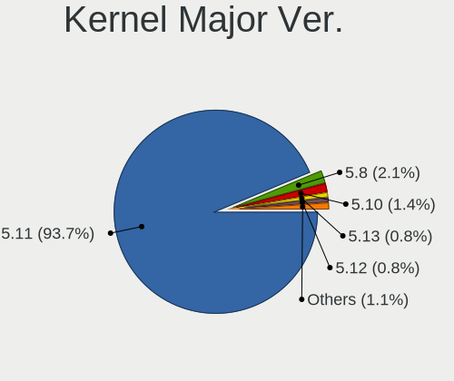

| Version | Desktops | Percent |
|---------|----------|---------|
| 5.11    | 514      | 93.45%  |
| 5.8     | 10       | 1.82%   |
| 5.10    | 9        | 1.64%   |
| 5.13    | 6        | 1.09%   |
| 5.12    | 6        | 1.09%   |
| 5.9     | 2        | 0.36%   |
| 5.4     | 1        | 0.18%   |
| 5.15    | 1        | 0.18%   |
| 5.14    | 1        | 0.18%   |

Arch
----

OS architecture (x86_64, i586, etc.)

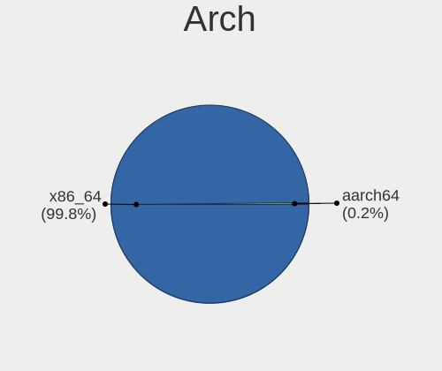

| Name   | Desktops | Percent |
|--------|----------|---------|
| x86_64 | 543      | 100%    |

DE
--

Desktop Environment

| Name              | Desktops | Percent |
|-------------------|----------|---------|
| GNOME             | 481      | 87.61%  |
| Unknown           | 49       | 8.93%   |
| X-Cinnamon        | 5        | 0.91%   |
| Unity             | 3        | 0.55%   |
| Cinnamon          | 3        | 0.55%   |
| Yaru:ubuntu:GNOME | 2        | 0.36%   |
| Trinity           | 1        | 0.18%   |
| openbox           | 1        | 0.18%   |
| i3                | 1        | 0.18%   |
| fvwm              | 1        | 0.18%   |
| Deepin            | 1        | 0.18%   |
| awesome           | 1        | 0.18%   |

Display Server
--------------

X11 or Wayland

| Name    | Desktops | Percent |
|---------|----------|---------|
| Wayland | 300      | 54.35%  |
| X11     | 221      | 40.04%  |
| Unknown | 23       | 4.17%   |
| Tty     | 8        | 1.45%   |

Display Manager
---------------

SDDM, LightDM, etc.

| Name    | Desktops | Percent |
|---------|----------|---------|
| Unknown | 377      | 67.68%  |
| GDM     | 100      | 17.95%  |
| GDM3    | 74       | 13.29%  |
| TDM     | 4        | 0.72%   |
| LightDM | 2        | 0.36%   |

OS Lang
-------

Language

| Lang    | Desktops | Percent |
|---------|----------|---------|
| en_US   | 179      | 32.84%  |
| de_DE   | 86       | 15.78%  |
| fr_FR   | 36       | 6.61%   |
| it_IT   | 22       | 4.04%   |
| en_GB   | 22       | 4.04%   |
| pt_BR   | 18       | 3.3%    |
| en_CA   | 18       | 3.3%    |
| en_AU   | 16       | 2.94%   |
| ru_RU   | 15       | 2.75%   |
| es_ES   | 12       | 2.2%    |
| pl_PL   | 11       | 2.02%   |
| zh_CN   | 7        | 1.28%   |
| hu_HU   | 7        | 1.28%   |
| en_IN   | 7        | 1.28%   |
| es_AR   | 6        | 1.1%    |
| de_AT   | 6        | 1.1%    |
| sv_SE   | 5        | 0.92%   |
| ja_JP   | 5        | 0.92%   |
| en_ZA   | 5        | 0.92%   |
| en_NZ   | 5        | 0.92%   |
| de_CH   | 5        | 0.92%   |
| cs_CZ   | 5        | 0.92%   |
| ru_UA   | 4        | 0.73%   |
| el_GR   | 4        | 0.73%   |
| C       | 4        | 0.73%   |
| nl_NL   | 3        | 0.55%   |
| bg_BG   | 3        | 0.55%   |
| ro_RO   | 2        | 0.37%   |
| nb_NO   | 2        | 0.37%   |
| fr_BE   | 2        | 0.37%   |
| es_CL   | 2        | 0.37%   |
| en_IL   | 2        | 0.37%   |
| ca_ES   | 2        | 0.37%   |
| Unknown | 2        | 0.37%   |
| zh_TW   | 1        | 0.18%   |
| zh_HK   | 1        | 0.18%   |
| uk_UA   | 1        | 0.18%   |
| tr_TR   | 1        | 0.18%   |
| sk_SK   | 1        | 0.18%   |
| pt_PT   | 1        | 0.18%   |
| id_ID   | 1        | 0.18%   |
| hr_HR   | 1        | 0.18%   |
| fr_CH   | 1        | 0.18%   |
| fi_FI   | 1        | 0.18%   |
| es_NI   | 1        | 0.18%   |
| es_MX   | 1        | 0.18%   |
| de_BE   | 1        | 0.18%   |
| ar_EG   | 1        | 0.18%   |
| ar_DZ   | 1        | 0.18%   |

Boot Mode
---------

EFI or BIOS

| Mode | Desktops | Percent |
|------|----------|---------|
| BIOS | 425      | 77.7%   |
| EFI  | 122      | 22.3%   |

Filesystem
----------

Type of filesystem

| Type     | Desktops | Percent |
|----------|----------|---------|
| Ext4     | 489      | 89.72%  |
| Zfs      | 19       | 3.49%   |
| Overlay  | 14       | 2.57%   |
| Btrfs    | 13       | 2.39%   |
| Xfs      | 5        | 0.92%   |
| Ext3     | 2        | 0.37%   |
| Ext2     | 2        | 0.37%   |
| SquXshfs | 1        | 0.18%   |

Part. scheme
------------

Scheme of partitioning

| Type    | Desktops | Percent |
|---------|----------|---------|
| Unknown | 436      | 80%     |
| GPT     | 95       | 17.43%  |
| MBR     | 14       | 2.57%   |

Dual Boot with Linux/BSD
------------------------

Hosting more than one Linux/BSD

| Dual boot | Desktops | Percent |
|-----------|----------|---------|
| No        | 437      | 78.88%  |
| Yes       | 117      | 21.12%  |

Dual Boot (Win)
---------------

Hosting Linux and Windows

| Dual boot | Desktops | Percent |
|-----------|----------|---------|
| No        | 301      | 54.53%  |
| Yes       | 251      | 45.47%  |

Board
-----

Vendor
------

Motherboard manufacturer

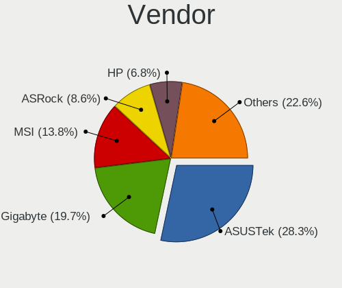

| Name                | Desktops | Percent |
|---------------------|----------|---------|
| ASUSTek Computer    | 152      | 27.99%  |
| Gigabyte Technology | 109      | 20.07%  |
| MSI                 | 75       | 13.81%  |
| ASRock              | 48       | 8.84%   |
| Hewlett-Packard     | 36       | 6.63%   |
| Dell                | 36       | 6.63%   |
| Lenovo              | 15       | 2.76%   |
| Acer                | 14       | 2.58%   |
| Biostar             | 8        | 1.47%   |
| Pegatron            | 6        | 1.1%    |
| Medion              | 5        | 0.92%   |
| Unknown             | 5        | 0.92%   |
| Intel               | 4        | 0.74%   |
| Fujitsu             | 4        | 0.74%   |
| Foxconn             | 4        | 0.74%   |
| Shuttle             | 2        | 0.37%   |
| HC                  | 2        | 0.37%   |
| TYAN Computer       | 1        | 0.18%   |
| SYWZ                | 1        | 0.18%   |
| Soyo                | 1        | 0.18%   |
| PCWare              | 1        | 0.18%   |
| Packard Bell        | 1        | 0.18%   |
| OEM                 | 1        | 0.18%   |
| MACHINIST           | 1        | 0.18%   |
| IBM                 | 1        | 0.18%   |
| Huanan              | 1        | 0.18%   |
| Fujitsu Siemens     | 1        | 0.18%   |
| FIRICH              | 1        | 0.18%   |
| ECS                 | 1        | 0.18%   |
| Colorful Technology | 1        | 0.18%   |
| ASRockRack          | 1        | 0.18%   |
| Apple               | 1        | 0.18%   |
| AOpen               | 1        | 0.18%   |
| Alienware           | 1        | 0.18%   |
| AAEON               | 1        | 0.18%   |

Model
-----

Motherboard model

| Name                           | Desktops | Percent |
|--------------------------------|----------|---------|
| ASUS All Series                | 15       | 2.76%   |
| Unknown                        | 5        | 0.92%   |
| MSI MS-7B86                    | 4        | 0.74%   |
| Gigabyte B450M DS3H            | 4        | 0.74%   |
| Dell OptiPlex 7010             | 4        | 0.74%   |
| MSI MS-7A34                    | 3        | 0.55%   |
| MSI MS-7758                    | 3        | 0.55%   |
| MSI MS-7693                    | 3        | 0.55%   |
| HP Z440 Workstation            | 3        | 0.55%   |
| Gigabyte Z77-DS3H              | 3        | 0.55%   |
| Gigabyte X570 AORUS MASTER     | 3        | 0.55%   |
| Dell OptiPlex 9010             | 3        | 0.55%   |
| ASUS ROG STRIX X570-E GAMING   | 3        | 0.55%   |
| ASUS PRIME A320M-K             | 3        | 0.55%   |
| Shuttle XH61V                  | 2        | 0.37%   |
| MSI MS-7C91                    | 2        | 0.37%   |
| MSI MS-7C75                    | 2        | 0.37%   |
| MSI MS-7C37                    | 2        | 0.37%   |
| MSI MS-7C02                    | 2        | 0.37%   |
| MSI MS-7B79                    | 2        | 0.37%   |
| MSI MS-7A38                    | 2        | 0.37%   |
| MSI MS-7850                    | 2        | 0.37%   |
| MSI MS-7817                    | 2        | 0.37%   |
| MSI MS-7592                    | 2        | 0.37%   |
| MSI MS-7529                    | 2        | 0.37%   |
| HP EliteDesk 800 G1 SFF        | 2        | 0.37%   |
| HC HCAR357-MI                  | 2        | 0.37%   |
| Gigabyte Z170X-Gaming 7        | 2        | 0.37%   |
| Gigabyte H61M-S2PV             | 2        | 0.37%   |
| Gigabyte GA-78LMT-USB3 R2      | 2        | 0.37%   |
| Gigabyte GA-78LMT-USB3 6.0     | 2        | 0.37%   |
| Gigabyte GA-78LMT-USB3         | 2        | 0.37%   |
| Gigabyte GA-78LMT-S2P          | 2        | 0.37%   |
| Gigabyte F2A55M-HD2            | 2        | 0.37%   |
| Gigabyte B85M-DS3H-A           | 2        | 0.37%   |
| Gigabyte AB350M-DS3H V2        | 2        | 0.37%   |
| Gigabyte A320M-S2H             | 2        | 0.37%   |
| Gigabyte 990FXA-UD3            | 2        | 0.37%   |
| Dell Precision T7600           | 2        | 0.37%   |
| Dell OptiPlex 780              | 2        | 0.37%   |
| Dell OptiPlex 390              | 2        | 0.37%   |
| ASUS TUF GAMING Z590-PLUS WIFI | 2        | 0.37%   |
| ASUS ROG STRIX X570-F GAMING   | 2        | 0.37%   |
| ASUS ROG STRIX X470-F GAMING   | 2        | 0.37%   |
| ASUS ROG STRIX B550-F GAMING   | 2        | 0.37%   |
| ASUS ROG STRIX B550-E GAMING   | 2        | 0.37%   |
| ASUS ROG STRIX B450-F GAMING   | 2        | 0.37%   |
| ASUS ROG Maximus X HERO        | 2        | 0.37%   |
| ASUS PRIME Z590-P              | 2        | 0.37%   |
| ASUS PRIME Z270-A              | 2        | 0.37%   |
| ASUS PRIME H410M-A             | 2        | 0.37%   |
| ASUS PRIME B450M-A             | 2        | 0.37%   |
| ASUS P5Q DELUXE                | 2        | 0.37%   |
| ASUS Maximus VIII RANGER       | 2        | 0.37%   |
| ASUS M5A97 R2.0                | 2        | 0.37%   |
| ASUS M5A97 LE R2.0             | 2        | 0.37%   |
| ASUS M2A-VM                    | 2        | 0.37%   |
| ASUS K30AD_M31AD_M51AD         | 2        | 0.37%   |
| ASRock X570 Taichi             | 2        | 0.37%   |
| ASRock N68C-S UCC              | 2        | 0.37%   |

Model Family
------------

Motherboard model prefix

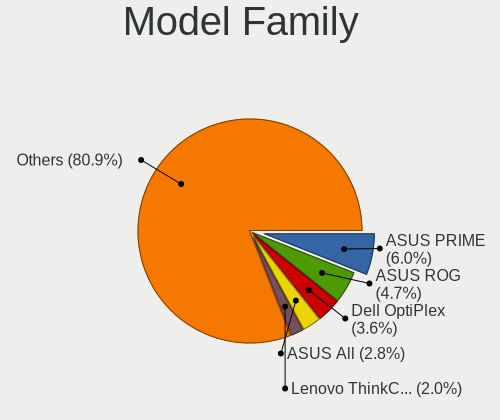

| Name                   | Desktops | Percent |
|------------------------|----------|---------|
| ASUS PRIME             | 32       | 5.89%   |
| ASUS ROG               | 26       | 4.79%   |
| Dell OptiPlex          | 20       | 3.68%   |
| ASUS All               | 15       | 2.76%   |
| Acer Aspire            | 11       | 2.03%   |
| Lenovo ThinkCentre     | 10       | 1.84%   |
| HP Compaq              | 9        | 1.66%   |
| ASUS TUF               | 9        | 1.66%   |
| Dell Precision         | 8        | 1.47%   |
| HP EliteDesk           | 7        | 1.29%   |
| Gigabyte X570          | 7        | 1.29%   |
| Gigabyte GA-78LMT-USB3 | 6        | 1.1%    |
| Gigabyte B450M         | 5        | 0.92%   |
| ASUS M5A97             | 5        | 0.92%   |
| Unknown                | 5        | 0.92%   |
| MSI MS-7B86            | 4        | 0.74%   |
| ASUS P8Z77-V           | 4        | 0.74%   |
| ASRock 970             | 4        | 0.74%   |
| MSI MS-7A34            | 3        | 0.55%   |
| MSI MS-7758            | 3        | 0.55%   |
| MSI MS-7693            | 3        | 0.55%   |
| HP Z440                | 3        | 0.55%   |
| Gigabyte Z77-DS3H      | 3        | 0.55%   |
| Gigabyte Z390          | 3        | 0.55%   |
| Dell Inspiron          | 3        | 0.55%   |
| ASUS P5Q               | 3        | 0.55%   |
| ASRock X570            | 3        | 0.55%   |
| ASRock B550            | 3        | 0.55%   |
| Shuttle XH61V          | 2        | 0.37%   |
| MSI MS-7C91            | 2        | 0.37%   |
| MSI MS-7C75            | 2        | 0.37%   |
| MSI MS-7C37            | 2        | 0.37%   |
| MSI MS-7C02            | 2        | 0.37%   |
| MSI MS-7B79            | 2        | 0.37%   |
| MSI MS-7A38            | 2        | 0.37%   |
| MSI MS-7850            | 2        | 0.37%   |
| MSI MS-7817            | 2        | 0.37%   |
| MSI MS-7592            | 2        | 0.37%   |
| MSI MS-7529            | 2        | 0.37%   |
| Lenovo ThinkStation    | 2        | 0.37%   |
| Lenovo IdeaCentre      | 2        | 0.37%   |
| Intel X79              | 2        | 0.37%   |
| HP ProLiant            | 2        | 0.37%   |
| HP ProDesk             | 2        | 0.37%   |
| HP Pavilion            | 2        | 0.37%   |
| HC HCAR357-MI          | 2        | 0.37%   |
| Gigabyte Z590          | 2        | 0.37%   |
| Gigabyte Z170X-Gaming  | 2        | 0.37%   |
| Gigabyte H61M-S2PV     | 2        | 0.37%   |
| Gigabyte GA-78LMT-S2P  | 2        | 0.37%   |
| Gigabyte F2A55M-HD2    | 2        | 0.37%   |
| Gigabyte B85M-DS3H-A   | 2        | 0.37%   |
| Gigabyte B550M         | 2        | 0.37%   |
| Gigabyte B450          | 2        | 0.37%   |
| Gigabyte AB350M-DS3H   | 2        | 0.37%   |
| Gigabyte A320M-S2H     | 2        | 0.37%   |
| Gigabyte 990FXA-UD3    | 2        | 0.37%   |
| Fujitsu CELSIUS        | 2        | 0.37%   |
| Dell Vostro            | 2        | 0.37%   |
| ASUS P8Z68-V           | 2        | 0.37%   |

MFG Year
--------

Motherboard manufacture year

| Year | Desktops | Percent |
|------|----------|---------|
| 2021 | 90       | 16.57%  |
| 2020 | 63       | 11.6%   |
| 2019 | 53       | 9.76%   |
| 2018 | 48       | 8.84%   |
| 2013 | 37       | 6.81%   |
| 2011 | 36       | 6.63%   |
| 2015 | 34       | 6.26%   |
| 2012 | 33       | 6.08%   |
| 2014 | 29       | 5.34%   |
| 2010 | 27       | 4.97%   |
| 2009 | 27       | 4.97%   |
| 2017 | 21       | 3.87%   |
| 2016 | 20       | 3.68%   |
| 2008 | 14       | 2.58%   |
| 2007 | 5        | 0.92%   |
| 2005 | 4        | 0.74%   |
| 2006 | 2        | 0.37%   |

Form Factor
-----------

Physical design of the computer

| Name    | Desktops | Percent |
|---------|----------|---------|
| Desktop | 543      | 100%    |

Secure Boot
-----------

Enabled or disabled

| State    | Desktops | Percent |
|----------|----------|---------|
| Disabled | 534      | 98.34%  |
| Enabled  | 9        | 1.66%   |

Coreboot
--------

Have coreboot on board

| Used | Desktops | Percent |
|------|----------|---------|
| No   | 543      | 100%    |

RAM Size
--------

Total RAM memory

| Size in GB      | Desktops | Percent |
|-----------------|----------|---------|
| 16.01-24.0      | 141      | 25.92%  |
| 8.01-16.0       | 117      | 21.51%  |
| 32.01-64.0      | 84       | 15.44%  |
| 3.01-4.0        | 73       | 13.42%  |
| 4.01-8.0        | 65       | 11.95%  |
| 64.01-256.0     | 34       | 6.25%   |
| 24.01-32.0      | 16       | 2.94%   |
| 1.01-2.0        | 11       | 2.02%   |
| 2.01-3.0        | 2        | 0.37%   |
| More than 256.0 | 1        | 0.18%   |

RAM Used
--------

Used RAM memory

| Used GB     | Desktops | Percent |
|-------------|----------|---------|
| 1.01-2.0    | 212      | 36.61%  |
| 2.01-3.0    | 158      | 27.29%  |
| 4.01-8.0    | 85       | 14.68%  |
| 3.01-4.0    | 64       | 11.05%  |
| 8.01-16.0   | 31       | 5.35%   |
| 0.51-1.0    | 10       | 1.73%   |
| 16.01-24.0  | 9        | 1.55%   |
| 32.01-64.0  | 5        | 0.86%   |
| 24.01-32.0  | 3        | 0.52%   |
| 64.01-256.0 | 1        | 0.17%   |
| 0.01-0.5    | 1        | 0.17%   |

Total Drives
------------

Number of drives on board

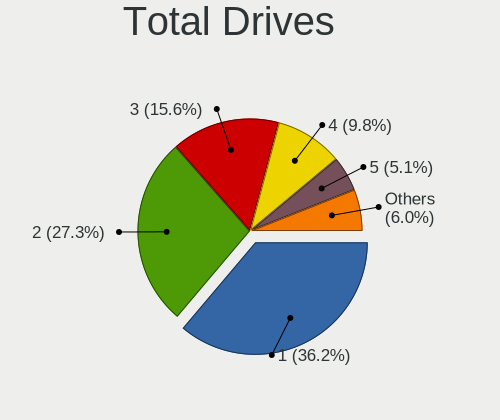

| Drives | Desktops | Percent |
|--------|----------|---------|
| 1      | 205      | 36.61%  |
| 2      | 144      | 25.71%  |
| 3      | 92       | 16.43%  |
| 4      | 56       | 10%     |
| 5      | 31       | 5.54%   |
| 6      | 12       | 2.14%   |
| 8      | 6        | 1.07%   |
| 7      | 5        | 0.89%   |
| 0      | 4        | 0.71%   |
| 9      | 3        | 0.54%   |
| 11     | 1        | 0.18%   |
| 10     | 1        | 0.18%   |

Has CD-ROM
----------

Has CD-ROM on board

| Presented | Desktops | Percent |
|-----------|----------|---------|
| No        | 285      | 52.2%   |
| Yes       | 261      | 47.8%   |

Has Ethernet
------------

Has Ethernet on board

| Presented | Desktops | Percent |
|-----------|----------|---------|
| Yes       | 532      | 97.97%  |
| No        | 11       | 2.03%   |

Has WiFi
--------

Has WiFi module

| Presented | Desktops | Percent |
|-----------|----------|---------|
| No        | 287      | 52.47%  |
| Yes       | 260      | 47.53%  |

Has Bluetooth
-------------

Has Bluetooth module

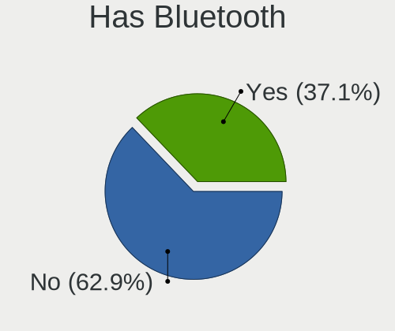

| Presented | Desktops | Percent |
|-----------|----------|---------|
| No        | 343      | 62.82%  |
| Yes       | 203      | 37.18%  |

Location
--------

Country
-------

Geographic location (country)

| Country             | Desktops | Percent |
|---------------------|----------|---------|
| USA                 | 100      | 18.35%  |
| Germany             | 96       | 17.61%  |
| France              | 37       | 6.79%   |
| Italy               | 26       | 4.77%   |
| UK                  | 22       | 4.04%   |
| Russia              | 21       | 3.85%   |
| Brazil              | 20       | 3.67%   |
| Canada              | 19       | 3.49%   |
| Spain               | 16       | 2.94%   |
| Australia           | 15       | 2.75%   |
| Poland              | 12       | 2.2%    |
| Netherlands         | 10       | 1.83%   |
| Switzerland         | 9        | 1.65%   |
| Austria             | 9        | 1.65%   |
| Argentina           | 9        | 1.65%   |
| Ukraine             | 8        | 1.47%   |
| India               | 8        | 1.47%   |
| Sweden              | 7        | 1.28%   |
| Portugal            | 6        | 1.1%    |
| New Zealand         | 6        | 1.1%    |
| Japan               | 6        | 1.1%    |
| Hungary             | 6        | 1.1%    |
| Czechia             | 6        | 1.1%    |
| China               | 6        | 1.1%    |
| South Africa        | 5        | 0.92%   |
| Greece              | 5        | 0.92%   |
| Serbia              | 4        | 0.73%   |
| Romania             | 4        | 0.73%   |
| Finland             | 4        | 0.73%   |
| Chile               | 4        | 0.73%   |
| Pakistan            | 3        | 0.55%   |
| Norway              | 3        | 0.55%   |
| Bulgaria            | 3        | 0.55%   |
| Belgium             | 3        | 0.55%   |
| Algeria             | 3        | 0.55%   |
| Israel              | 2        | 0.37%   |
| Indonesia           | 2        | 0.37%   |
| Turkey              | 1        | 0.18%   |
| Trinidad and Tobago | 1        | 0.18%   |
| Thailand            | 1        | 0.18%   |
| Taiwan              | 1        | 0.18%   |
| Sint Maarten        | 1        | 0.18%   |
| Singapore           | 1        | 0.18%   |
| Runion            | 1        | 0.18%   |
| Nicaragua           | 1        | 0.18%   |
| Mexico              | 1        | 0.18%   |
| Malaysia            | 1        | 0.18%   |
| Iceland             | 1        | 0.18%   |
| Hong Kong           | 1        | 0.18%   |
| Estonia             | 1        | 0.18%   |
| Croatia             | 1        | 0.18%   |
| Colombia            | 1        | 0.18%   |
| Bermuda             | 1        | 0.18%   |
| Belarus             | 1        | 0.18%   |
| Bangladesh          | 1        | 0.18%   |
| Bahrain             | 1        | 0.18%   |
| Armenia             | 1        | 0.18%   |

City
----

Geographic location (city)

| City           | Desktops | Percent |
|----------------|----------|---------|
| Berlin         | 10       | 1.78%   |
| Paris          | 7        | 1.24%   |
| Vienna         | 6        | 1.07%   |
| Milan          | 6        | 1.07%   |
| Moscow         | 5        | 0.89%   |
| Sydney         | 4        | 0.71%   |
| London         | 4        | 0.71%   |
| Hyderabad      | 4        | 0.71%   |
| Toronto        | 3        | 0.53%   |
| S??o Paulo     | 3        | 0.53%   |
| Munich         | 3        | 0.53%   |
| Krefeld        | 3        | 0.53%   |
| Karachi        | 3        | 0.53%   |
| Hamburg        | 3        | 0.53%   |
| Dallas         | 3        | 0.53%   |
| Budapest       | 3        | 0.53%   |
| Athens         | 3        | 0.53%   |
| Zurich         | 2        | 0.36%   |
| Warsaw         | 2        | 0.36%   |
| Ufa            | 2        | 0.36%   |
| Tucson         | 2        | 0.36%   |
| St Petersburg  | 2        | 0.36%   |
| Sonneberg      | 2        | 0.36%   |
| Sofia          | 2        | 0.36%   |
| Rosario        | 2        | 0.36%   |
| Portland       | 2        | 0.36%   |
| Phoenix        | 2        | 0.36%   |
| Perth          | 2        | 0.36%   |
| Oslo           | 2        | 0.36%   |
| Novi Sad       | 2        | 0.36%   |
| Montreal       | 2        | 0.36%   |
| Melbourne      | 2        | 0.36%   |
| Lutisburg      | 2        | 0.36%   |
| Laberweinting  | 2        | 0.36%   |
| Kyiv           | 2        | 0.36%   |
| Krakow         | 2        | 0.36%   |
| Johannesburg   | 2        | 0.36%   |
| Irkutsk        | 2        | 0.36%   |
| Haltern am See | 2        | 0.36%   |
| Graz           | 2        | 0.36%   |
| Gelsenkirchen  | 2        | 0.36%   |
| Cologne        | 2        | 0.36%   |
| Chicago        | 2        | 0.36%   |
| Cape Town      | 2        | 0.36%   |
| Calgary        | 2        | 0.36%   |
| Cahors         | 2        | 0.36%   |
| Brisbane       | 2        | 0.36%   |
| Bolzano        | 2        | 0.36%   |
| Belgrade       | 2        | 0.36%   |
| Beijing        | 2        | 0.36%   |
| Auckland       | 2        | 0.36%   |
| Zittau         | 1        | 0.18%   |
| Zeist          | 1        | 0.18%   |
| Zdanice        | 1        | 0.18%   |
| Zaragoza       | 1        | 0.18%   |
| Zabrze         | 1        | 0.18%   |
| Yerevan        | 1        | 0.18%   |
| Yekaterinburg  | 1        | 0.18%   |
| Wgorzewo     | 1        | 0.18%   |
| Wylie          | 1        | 0.18%   |

Drives
------

Drive Vendor
------------

Hard drive vendors

| Vendor                    | Desktops | Drives | Percent |
|---------------------------|----------|--------|---------|
| WDC                       | 195      | 320    | 19.08%  |
| Seagate                   | 187      | 308    | 18.3%   |
| Samsung Electronics       | 162      | 239    | 15.85%  |
| Toshiba                   | 55       | 70     | 5.38%   |
| Kingston                  | 52       | 64     | 5.09%   |
| SanDisk                   | 50       | 64     | 4.89%   |
| Crucial                   | 44       | 54     | 4.31%   |
| Hitachi                   | 38       | 47     | 3.72%   |
| A-DATA Technology         | 21       | 27     | 2.05%   |
| Silicon Motion            | 17       | 18     | 1.66%   |
| Phison                    | 17       | 22     | 1.66%   |
| Intel                     | 16       | 19     | 1.57%   |
| Unknown                   | 12       | 16     | 1.17%   |
| MAXTOR                    | 10       | 14     | 0.98%   |
| China                     | 8        | 9      | 0.78%   |
| HGST                      | 7        | 12     | 0.68%   |
| Corsair                   | 7        | 10     | 0.68%   |
| SPCC                      | 6        | 7      | 0.59%   |
| Micron Technology         | 6        | 6      | 0.59%   |
| JMicron                   | 6        | 9      | 0.59%   |
| Intenso                   | 6        | 7      | 0.59%   |
| PNY                       | 5        | 5      | 0.49%   |
| Mushkin                   | 5        | 8      | 0.49%   |
| GOODRAM                   | 5        | 5      | 0.49%   |
| Gigabyte Technology       | 5        | 6      | 0.49%   |
| XPG                       | 4        | 4      | 0.39%   |
| Transcend                 | 4        | 4      | 0.39%   |
| OCZ                       | 4        | 4      | 0.39%   |
| Micron/Crucial Technology | 4        | 5      | 0.39%   |
| LITEON                    | 4        | 5      | 0.39%   |
| SK Hynix                  | 3        | 3      | 0.29%   |
| PLEXTOR                   | 3        | 3      | 0.29%   |
| Patriot                   | 3        | 5      | 0.29%   |
| LITEONIT                  | 3        | 3      | 0.29%   |
| Vaseky                    | 2        | 2      | 0.2%    |
| SABRENT                   | 2        | 3      | 0.2%    |
| Realtek Semiconductor     | 2        | 4      | 0.2%    |
| LaCie                     | 2        | 2      | 0.2%    |
| Zozt                      | 1        | 3      | 0.1%    |
| Zheino                    | 1        | 2      | 0.1%    |
| WD MediaMax               | 1        | 1      | 0.1%    |
| Verbatim                  | 1        | 1      | 0.1%    |
| Teclast                   | 1        | 1      | 0.1%    |
| Team                      | 1        | 2      | 0.1%    |
| T-FORCE                   | 1        | 2      | 0.1%    |
| Synology                  | 1        | 8      | 0.1%    |
| Smartbuy                  | 1        | 1      | 0.1%    |
| RX7                       | 1        | 1      | 0.1%    |
| RSH-339                   | 1        | 1      | 0.1%    |
| Palit                     | 1        | 1      | 0.1%    |
| OCZ-VERTEX3               | 1        | 1      | 0.1%    |
| Netac                     | 1        | 1      | 0.1%    |
| Lexar                     | 1        | 1      | 0.1%    |
| LDLC                      | 1        | 1      | 0.1%    |
| KLEVV                     | 1        | 1      | 0.1%    |
| KIOXIA-EXCERIA            | 1        | 1      | 0.1%    |
| KIOXIA                    | 1        | 1      | 0.1%    |
| KingFast                  | 1        | 1      | 0.1%    |
| KingDian                  | 1        | 1      | 0.1%    |
| KINGBANK                  | 1        | 1      | 0.1%    |

Drive Model
-----------

Hard drive models

| Model                                  | Desktops | Percent |
|----------------------------------------|----------|---------|
| Samsung NVMe SSD Drive 500GB           | 18       | 1.5%    |
| Seagate ST1000DM010-2EP102 1TB         | 15       | 1.25%   |
| Toshiba DT01ACA100 1TB                 | 13       | 1.08%   |
| Samsung SSD 860 EVO 500GB              | 12       | 1%      |
| Samsung SSD 850 EVO 500GB              | 12       | 1%      |
| Kingston SA400S37240G 240GB SSD        | 12       | 1%      |
| Seagate ST2000DM001-1ER164 2TB         | 11       | 0.92%   |
| Samsung NVMe SSD Drive 1TB             | 11       | 0.92%   |
| Seagate ST500DM002-1BD142 500GB        | 9        | 0.75%   |
| Seagate ST2000DM008-2FR102 2TB         | 9        | 0.75%   |
| Samsung SSD 850 EVO 250GB              | 9        | 0.75%   |
| Toshiba DT01ACA200 2TB                 | 8        | 0.67%   |
| Seagate ST4000DM004-2CV104 4TB         | 8        | 0.67%   |
| Samsung SSD 860 EVO 250GB              | 8        | 0.67%   |
| Seagate ST31000524AS 1TB               | 7        | 0.58%   |
| Seagate ST2000DM006-2DM164 2TB         | 7        | 0.58%   |
| Seagate Expansion 1TB                  | 7        | 0.58%   |
| Kingston SA400S37120G 120GB SSD        | 7        | 0.58%   |
| WDC WD1002FAEX-00Z3A0 1TB              | 6        | 0.5%    |
| Seagate ST3500418AS 500GB              | 6        | 0.5%    |
| SanDisk SSD PLUS 240GB                 | 6        | 0.5%    |
| Sandisk NVMe SSD Drive 500GB           | 6        | 0.5%    |
| Samsung SSD 840 EVO 250GB              | 6        | 0.5%    |
| Samsung SM963 2.5" NVMe PCIe SSD 250GB | 6        | 0.5%    |
| Kingston SV300S37A120G 120GB SSD       | 6        | 0.5%    |
| Kingston SA400S37480G 480GB SSD        | 6        | 0.5%    |
| Crucial CT1000MX500SSD1 1TB            | 6        | 0.5%    |
| WDC WD20EZRX-00D8PB0 2TB               | 5        | 0.42%   |
| WDC WD10EZEX-08WN4A0 1TB               | 5        | 0.42%   |
| Seagate ST1000DM003-1ER162 1TB         | 5        | 0.42%   |
| Seagate ST1000DM003-1CH162 1TB         | 5        | 0.42%   |
| Sandisk NVMe SSD Drive 2TB             | 5        | 0.42%   |
| Sandisk NVMe SSD Drive 1TB             | 5        | 0.42%   |
| Crucial CT500MX500SSD1 500GB           | 5        | 0.42%   |
| Crucial CT240BX500SSD1 240GB           | 5        | 0.42%   |
| WDC WDS500G2B0B-00YS70 500GB SSD       | 4        | 0.33%   |
| WDC WDS240G2G0A-00JH30 240GB SSD       | 4        | 0.33%   |
| WDC WD20EFRX-68EUZN0 2TB               | 4        | 0.33%   |
| WDC WD10EZEX-75ZF5A0 1TB               | 4        | 0.33%   |
| WDC WD10EARS-00Y5B1 1TB                | 4        | 0.33%   |
| Unknown SD/MMC/MS PRO 128GB            | 4        | 0.33%   |
| Seagate ST9500325AS 500GB              | 4        | 0.33%   |
| Seagate ST6000DM003-2CY186 6TB         | 4        | 0.33%   |
| Seagate ST3500312CS 500GB              | 4        | 0.33%   |
| Seagate ST3250318AS 250GB              | 4        | 0.33%   |
| Seagate ST1000DM003-1SB102 1TB         | 4        | 0.33%   |
| SanDisk SSD PLUS 1000GB                | 4        | 0.33%   |
| Samsung SSD 870 EVO 1TB                | 4        | 0.33%   |
| Samsung SSD 860 EVO 1TB                | 4        | 0.33%   |
| Samsung SSD 850 EVO 120GB              | 4        | 0.33%   |
| Samsung SSD 830 Series 128GB           | 4        | 0.33%   |
| Samsung PM963 2.5" NVMe PCIe SSD 512GB | 4        | 0.33%   |
| JMicron Generic 240GB                  | 4        | 0.33%   |
| XPG NVMe SSD Drive 1024GB              | 3        | 0.25%   |
| WDC WD5000AAVS-00ZTB0 500GB            | 3        | 0.25%   |
| WDC WD5000AAKX-00ERMA0 500GB           | 3        | 0.25%   |
| WDC WD5000AAKX-001CA0 500GB            | 3        | 0.25%   |
| WDC WD20EZRZ-22Z5HB0 2TB               | 3        | 0.25%   |
| WDC WD20EZAZ-00GGJB0 2TB               | 3        | 0.25%   |
| WDC WD10EZEX-00BN5A0 1TB               | 3        | 0.25%   |

HDD Vendor
----------

Hard disk drive vendors

| Vendor              | Desktops | Drives | Percent |
|---------------------|----------|--------|---------|
| Seagate             | 183      | 300    | 36.02%  |
| WDC                 | 178      | 293    | 35.04%  |
| Toshiba             | 49       | 62     | 9.65%   |
| Hitachi             | 38       | 47     | 7.48%   |
| Samsung Electronics | 28       | 37     | 5.51%   |
| MAXTOR              | 10       | 14     | 1.97%   |
| HGST                | 7        | 12     | 1.38%   |
| Unknown             | 4        | 4      | 0.79%   |
| JMicron             | 4        | 4      | 0.79%   |
| SABRENT             | 2        | 3      | 0.39%   |
| Synology            | 1        | 8      | 0.2%    |
| Fujitsu             | 1        | 1      | 0.2%    |
| ASMT109x            | 1        | 1      | 0.2%    |
| Asmedia             | 1        | 1      | 0.2%    |
| Apple               | 1        | 1      | 0.2%    |

SSD Vendor
----------

Solid state drive vendors

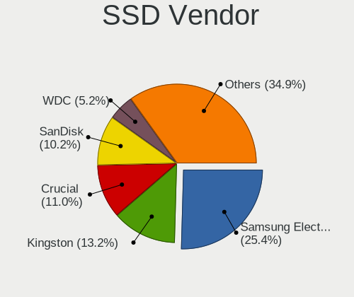

| Vendor              | Desktops | Drives | Percent |
|---------------------|----------|--------|---------|
| Samsung Electronics | 89       | 117    | 25.65%  |
| Kingston            | 45       | 52     | 12.97%  |
| Crucial             | 41       | 51     | 11.82%  |
| SanDisk             | 34       | 40     | 9.8%    |
| A-DATA Technology   | 19       | 23     | 5.48%   |
| WDC                 | 18       | 19     | 5.19%   |
| China               | 8        | 9      | 2.31%   |
| Toshiba             | 6        | 7      | 1.73%   |
| SPCC                | 6        | 7      | 1.73%   |
| Mushkin             | 5        | 8      | 1.44%   |
| Micron Technology   | 5        | 5      | 1.44%   |
| Intenso             | 5        | 6      | 1.44%   |
| Intel               | 5        | 6      | 1.44%   |
| GOODRAM             | 5        | 5      | 1.44%   |
| Transcend           | 4        | 4      | 1.15%   |
| PNY                 | 4        | 4      | 1.15%   |
| OCZ                 | 4        | 4      | 1.15%   |
| LITEON              | 4        | 5      | 1.15%   |
| PLEXTOR             | 3        | 3      | 0.86%   |
| Patriot             | 3        | 5      | 0.86%   |
| LITEONIT            | 3        | 3      | 0.86%   |
| Gigabyte Technology | 3        | 3      | 0.86%   |
| Vaseky              | 2        | 2      | 0.58%   |
| Corsair             | 2        | 2      | 0.58%   |
| Zozt                | 1        | 3      | 0.29%   |
| Zheino              | 1        | 2      | 0.29%   |
| Verbatim            | 1        | 1      | 0.29%   |
| Unknown             | 1        | 1      | 0.29%   |
| Teclast             | 1        | 1      | 0.29%   |
| Team                | 1        | 2      | 0.29%   |
| Smartbuy            | 1        | 1      | 0.29%   |
| Palit               | 1        | 1      | 0.29%   |
| OCZ-VERTEX3         | 1        | 1      | 0.29%   |
| Lexar               | 1        | 1      | 0.29%   |
| LDLC                | 1        | 1      | 0.29%   |
| KLEVV               | 1        | 1      | 0.29%   |
| KIOXIA-EXCERIA      | 1        | 1      | 0.29%   |
| KingDian            | 1        | 1      | 0.29%   |
| KINGBANK            | 1        | 1      | 0.29%   |
| JMicron             | 1        | 2      | 0.29%   |
| Integral            | 1        | 1      | 0.29%   |
| Hewlett-Packard     | 1        | 1      | 0.29%   |
| DREVO               | 1        | 1      | 0.29%   |
| Dogfish             | 1        | 1      | 0.29%   |
| ASMT                | 1        | 1      | 0.29%   |
| Anobit              | 1        | 1      | 0.29%   |
| AMD-RAID            | 1        | 1      | 0.29%   |
| Unknown             | 1        | 1      | 0.29%   |

Drive Kind
----------

HDD or SSD

| Kind    | Desktops | Drives | Percent |
|---------|----------|--------|---------|
| HDD     | 379      | 788    | 45.33%  |
| SSD     | 285      | 419    | 34.09%  |
| NVMe    | 147      | 225    | 17.58%  |
| Unknown | 23       | 34     | 2.75%   |
| MMC     | 2        | 2      | 0.24%   |

Drive Connector
---------------

SATA, SAS, NVMe, etc.

| Type | Desktops | Drives | Percent |
|------|----------|--------|---------|
| SATA | 499      | 1169   | 72.11%  |
| NVMe | 146      | 224    | 21.1%   |
| SAS  | 45       | 73     | 6.5%    |
| MMC  | 2        | 2      | 0.29%   |

Drive Size
----------

Size of hard drive

| Size in TB | Desktops | Drives | Percent |
|------------|----------|--------|---------|
| 0.01-0.5   | 360      | 621    | 48.58%  |
| 0.51-1.0   | 212      | 315    | 28.61%  |
| 1.01-2.0   | 99       | 161    | 13.36%  |
| 3.01-4.0   | 27       | 35     | 3.64%   |
| 4.01-10.0  | 20       | 31     | 2.7%    |
| 2.01-3.0   | 16       | 20     | 2.16%   |
| 10.01-20.0 | 7        | 24     | 0.94%   |

Space Total
-----------

Amount of disk space available on the file system

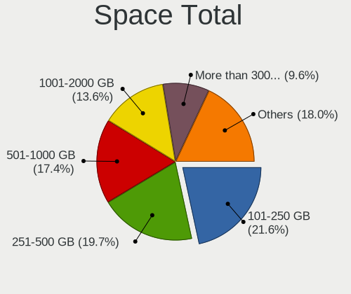

| Size in GB     | Desktops | Percent |
|----------------|----------|---------|
| 101-250        | 120      | 21.28%  |
| 251-500        | 113      | 20.04%  |
| 501-1000       | 101      | 17.91%  |
| 1001-2000      | 80       | 14.18%  |
| More than 3000 | 53       | 9.4%    |
| 2001-3000      | 30       | 5.32%   |
| 21-50          | 22       | 3.9%    |
| 51-100         | 22       | 3.9%    |
| 1-20           | 19       | 3.37%   |
| Unknown        | 4        | 0.71%   |

Space Used
----------

Amount of used disk space

| Used GB        | Desktops | Percent |
|----------------|----------|---------|
| 1-20           | 205      | 35.78%  |
| 21-50          | 86       | 15.01%  |
| 101-250        | 70       | 12.22%  |
| 51-100         | 57       | 9.95%   |
| 501-1000       | 45       | 7.85%   |
| 251-500        | 40       | 6.98%   |
| 1001-2000      | 35       | 6.11%   |
| More than 3000 | 22       | 3.84%   |
| 2001-3000      | 9        | 1.57%   |
| Unknown        | 4        | 0.7%    |

Malfunc. Drives
---------------

Drive models with a malfunction

| Model                                          | Desktops | Drives | Percent |
|------------------------------------------------|----------|--------|---------|
| WDC WD5000AAKX-001CA0 500GB                    | 2        | 2      | 3.7%    |
| Crucial CT240M500SSD1 240GB                    | 2        | 2      | 3.7%    |
| WDC WD7500BPKX-00HPJT0 752GB                   | 1        | 1      | 1.85%   |
| WDC WD7500AADS-00M2B0 752GB                    | 1        | 1      | 1.85%   |
| WDC WD6400AAKS-65A7B0 640GB                    | 1        | 1      | 1.85%   |
| WDC WD5000AZRX-00A8LB0 500GB                   | 1        | 1      | 1.85%   |
| WDC WD5000AAKS-22A7B0 500GB                    | 1        | 1      | 1.85%   |
| WDC WD5000AAKS-00UU3A0 500GB                   | 1        | 1      | 1.85%   |
| WDC WD5000AADS-00S9B0 500GB                    | 1        | 1      | 1.85%   |
| WDC WD5000AADS-00L4B1 500GB                    | 1        | 1      | 1.85%   |
| WDC WD3200AAVS-00ZTB0 320GB                    | 1        | 1      | 1.85%   |
| WDC WD3200AAJS-60M0A0 320GB                    | 1        | 1      | 1.85%   |
| WDC WD20EZRZ-00Z5HB0 2TB                       | 1        | 1      | 1.85%   |
| WDC WD20EZRX-00DC0B0 2TB                       | 1        | 1      | 1.85%   |
| WDC WD15EARS-00S8B1 1TB                        | 1        | 1      | 1.85%   |
| WDC WD10EZEX-60ZF5A0 1TB                       | 1        | 2      | 1.85%   |
| WDC WD10EZEX-08M2NA0 1TB                       | 1        | 1      | 1.85%   |
| WDC WD10EADS-65M2B1 1TB                        | 1        | 1      | 1.85%   |
| WDC WD1003FZEX-00MK2A0 1TB                     | 1        | 1      | 1.85%   |
| Toshiba MQ01ABF050 500GB                       | 1        | 1      | 1.85%   |
| Toshiba DT01ACA100 1TB                         | 1        | 1      | 1.85%   |
| Seagate ST9250311CS 250GB                      | 1        | 1      | 1.85%   |
| Seagate ST500NM0011 39M4517 42C0468IBM 500GB   | 1        | 1      | 1.85%   |
| Seagate ST500LM021-1KJ152 500GB                | 1        | 1      | 1.85%   |
| Seagate ST500DM002-1BD142 500GB                | 1        | 1      | 1.85%   |
| Seagate ST4000DM004-2CV104 4TB                 | 1        | 1      | 1.85%   |
| Seagate ST3750640NS 752GB                      | 1        | 1      | 1.85%   |
| Seagate ST3750330NS 752GB                      | 1        | 1      | 1.85%   |
| Seagate ST3500830AS 500GB                      | 1        | 1      | 1.85%   |
| Seagate ST3500630AS 500GB                      | 1        | 1      | 1.85%   |
| Seagate ST3500414CS 500GB                      | 1        | 1      | 1.85%   |
| Seagate ST3320820AS 320GB                      | 1        | 1      | 1.85%   |
| Seagate ST2000DX002-2DV164 2TB                 | 1        | 1      | 1.85%   |
| Seagate ST2000DM001-1CH164 2TB                 | 1        | 1      | 1.85%   |
| Seagate ST2000DL003-9VT166 2TB                 | 1        | 1      | 1.85%   |
| Samsung Electronics SSD 970 EVO 1TB            | 1        | 1      | 1.85%   |
| Samsung Electronics SSD 870 EVO 4TB            | 1        | 1      | 1.85%   |
| Samsung Electronics SSD 840 EVO 500GB          | 1        | 1      | 1.85%   |
| Samsung Electronics HD103SJ 1TB                | 1        | 1      | 1.85%   |
| PLEXTOR PX-128M5S 128GB SSD                    | 1        | 1      | 1.85%   |
| OCZ VERTEX3 120GB SSD                          | 1        | 1      | 1.85%   |
| OCZ AGITLITY3 480GB SSD                        | 1        | 1      | 1.85%   |
| Micron Technology MTFDDAK256MAM-1K12 256GB SSD | 1        | 1      | 1.85%   |
| Kingston SUV500480G 480GB SSD                  | 1        | 1      | 1.85%   |
| Kingston SUV400S37240G 240GB SSD               | 1        | 1      | 1.85%   |
| Kingston SH103S3120G 120GB SSD                 | 1        | 1      | 1.85%   |
| Kingston SA400S37120G 120GB SSD                | 1        | 1      | 1.85%   |
| Intel SSDSC2KW240H6 240GB                      | 1        | 1      | 1.85%   |
| Intel SSDSC2CW120A3 120GB                      | 1        | 1      | 1.85%   |
| Hitachi HDS5C3020ALA632 2TB                    | 1        | 1      | 1.85%   |
| Crucial CT256M550SSD3 256GB                    | 1        | 1      | 1.85%   |
| Anobit Gen2A400 118032738 400GB SSD            | 1        | 1      | 1.85%   |

Malfunc. Drive Vendor
---------------------

Vendors of faulty drives

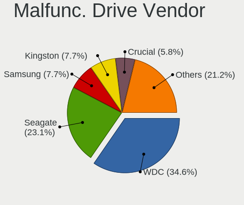

| Vendor              | Desktops | Drives | Percent |
|---------------------|----------|--------|---------|
| WDC                 | 17       | 20     | 34%     |
| Seagate             | 12       | 14     | 24%     |
| Samsung Electronics | 4        | 4      | 8%      |
| Kingston            | 4        | 4      | 8%      |
| Crucial             | 3        | 3      | 6%      |
| Toshiba             | 2        | 2      | 4%      |
| OCZ                 | 2        | 2      | 4%      |
| Intel               | 2        | 2      | 4%      |
| PLEXTOR             | 1        | 1      | 2%      |
| Micron Technology   | 1        | 1      | 2%      |
| Hitachi             | 1        | 1      | 2%      |
| Anobit              | 1        | 1      | 2%      |

Malfunc. HDD Vendor
-------------------

Vendors of faulty HDD drives

| Vendor              | Desktops | Drives | Percent |
|---------------------|----------|--------|---------|
| WDC                 | 17       | 20     | 51.52%  |
| Seagate             | 12       | 14     | 36.36%  |
| Toshiba             | 2        | 2      | 6.06%   |
| Samsung Electronics | 1        | 1      | 3.03%   |
| Hitachi             | 1        | 1      | 3.03%   |

Malfunc. Drive Kind
-------------------

Kinds of faulty drives

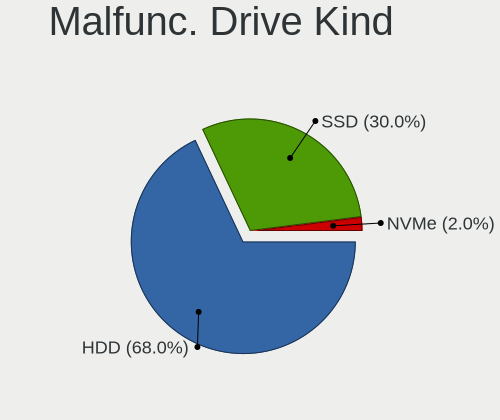

| Kind | Desktops | Drives | Percent |
|------|----------|--------|---------|
| HDD  | 32       | 38     | 66.67%  |
| SSD  | 15       | 16     | 31.25%  |
| NVMe | 1        | 1      | 2.08%   |

Failed Drives
-------------

Failed drive models

| Model                     | Desktops | Drives | Percent |
|---------------------------|----------|--------|---------|
| Seagate ST3500418AS 500GB | 1        | 1      | 100%    |

Failed Drive Vendor
-------------------

Failed drive vendors

| Vendor  | Desktops | Drives | Percent |
|---------|----------|--------|---------|
| Seagate | 1        | 1      | 100%    |

Drive Status
------------

Number of failed and malfunc. drives

| Status   | Desktops | Drives | Percent |
|----------|----------|--------|---------|
| Detected | 431      | 1099   | 72.56%  |
| Works    | 117      | 313    | 19.7%   |
| Malfunc  | 45       | 55     | 7.58%   |
| Failed   | 1        | 1      | 0.17%   |

Storage controller
------------------

Storage Vendor
--------------

Storage controller vendors

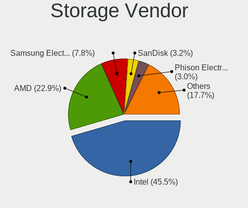

| Vendor                       | Desktops | Percent |
|------------------------------|----------|---------|
| Intel                        | 352      | 45.36%  |
| AMD                          | 178      | 22.94%  |
| Samsung Electronics          | 61       | 7.86%   |
| Sandisk                      | 24       | 3.09%   |
| Phison Electronics           | 24       | 3.09%   |
| ASMedia Technology           | 21       | 2.71%   |
| Silicon Motion               | 18       | 2.32%   |
| Marvell Technology Group     | 18       | 2.32%   |
| Nvidia                       | 17       | 2.19%   |
| JMicron Technology           | 14       | 1.8%    |
| Kingston Technology Company  | 8        | 1.03%   |
| ADATA Technology             | 8        | 1.03%   |
| Micron/Crucial Technology    | 7        | 0.9%    |
| Silicon Image                | 4        | 0.52%   |
| LSI Logic / Symbios Logic    | 4        | 0.52%   |
| Broadcom / LSI               | 3        | 0.39%   |
| VIA Technologies             | 2        | 0.26%   |
| Unknown                      | 2        | 0.26%   |
| SK Hynix                     | 2        | 0.26%   |
| Realtek Semiconductor        | 2        | 0.26%   |
| Toshiba America Info Systems | 1        | 0.13%   |
| Promise Technology           | 1        | 0.13%   |
| Micron Technology            | 1        | 0.13%   |
| Lite-On IT Corp. / Plextor   | 1        | 0.13%   |
| KIOXIA                       | 1        | 0.13%   |
| Hewlett-Packard              | 1        | 0.13%   |
| Adaptec                      | 1        | 0.13%   |

Storage Model
-------------

Storage controller models

| Model                                                                                   | Desktops | Percent |
|-----------------------------------------------------------------------------------------|----------|---------|
| AMD FCH SATA Controller [AHCI mode]                                                     | 95       | 9.65%   |
| Intel 8 Series/C220 Series Chipset Family 6-port SATA Controller 1 [AHCI mode]          | 39       | 3.96%   |
| Samsung NVMe SSD Controller SM981/PM981/PM983                                           | 35       | 3.56%   |
| AMD SB7x0/SB8x0/SB9x0 IDE Controller                                                    | 33       | 3.35%   |
| AMD 400 Series Chipset SATA Controller                                                  | 33       | 3.35%   |
| Intel 7 Series/C210 Series Chipset Family 6-port SATA Controller [AHCI mode]            | 31       | 3.15%   |
| Intel SATA Controller [RAID mode]                                                       | 27       | 2.74%   |
| AMD SB7x0/SB8x0/SB9x0 SATA Controller [AHCI mode]                                       | 26       | 2.64%   |
| Intel Q170/Q150/B150/H170/H110/Z170/CM236 Chipset SATA Controller [AHCI Mode]           | 23       | 2.34%   |
| Intel 6 Series/C200 Series Chipset Family 6 port Desktop SATA AHCI Controller           | 23       | 2.34%   |
| Intel 200 Series PCH SATA controller [AHCI mode]                                        | 23       | 2.34%   |
| Intel NM10/ICH7 Family SATA Controller [IDE mode]                                       | 21       | 2.13%   |
| Intel 500 Series Chipset Family SATA AHCI Controller                                    | 20       | 2.03%   |
| Intel 82801G (ICH7 Family) IDE Controller                                               | 19       | 1.93%   |
| ASMedia ASM1062 Serial ATA Controller                                                   | 19       | 1.93%   |
| AMD Starship/Matisse Chipset SATA Controller [AHCI mode]                                | 19       | 1.93%   |
| AMD SB7x0/SB8x0/SB9x0 SATA Controller [IDE mode]                                        | 19       | 1.93%   |
| Intel Cannon Lake PCH SATA AHCI Controller                                              | 17       | 1.73%   |
| Intel 6 Series/C200 Series Chipset Family Desktop SATA Controller (IDE mode, ports 4-5) | 15       | 1.52%   |
| Intel 6 Series/C200 Series Chipset Family Desktop SATA Controller (IDE mode, ports 0-3) | 15       | 1.52%   |
| Phison E12 NVMe Controller                                                              | 13       | 1.32%   |
| Silicon Motion SM2263EN/SM2263XT SSD Controller                                         | 12       | 1.22%   |
| Intel 9 Series Chipset Family SATA Controller [AHCI Mode]                               | 12       | 1.22%   |
| AMD FCH SATA Controller D                                                               | 12       | 1.22%   |
| Samsung NVMe SSD Controller SM961/PM961/SM963                                           | 11       | 1.12%   |
| Sandisk WD Black SN750 / PC SN730 NVMe SSD                                              | 10       | 1.02%   |
| Intel 82801JI (ICH10 Family) 2 port SATA IDE Controller #2                              | 10       | 1.02%   |
| Intel 400 Series Chipset Family SATA AHCI Controller                                    | 10       | 1.02%   |
| AMD 300 Series Chipset SATA Controller                                                  | 10       | 1.02%   |
| Samsung NVMe SSD Controller PM9A1/PM9A3/980PRO                                          | 9        | 0.91%   |
| Intel C610/X99 series chipset 6-Port SATA Controller [AHCI mode]                        | 9        | 0.91%   |
| Intel 82801JI (ICH10 Family) 4 port SATA IDE Controller #1                              | 9        | 0.91%   |
| AMD FCH IDE Controller                                                                  | 9        | 0.91%   |
| Sandisk WD Blue SN550 NVMe SSD                                                          | 8        | 0.81%   |
| Samsung NVMe SSD Controller 980                                                         | 8        | 0.81%   |
| Intel SSD 660P Series                                                                   | 8        | 0.81%   |
| Marvell Group 88SE9172 SATA 6Gb/s Controller                                            | 7        | 0.71%   |
| Intel Comet Lake SATA AHCI Controller                                                   | 7        | 0.71%   |
| Intel C610/X99 series chipset sSATA Controller [AHCI mode]                              | 7        | 0.71%   |
| Intel C600/X79 series chipset 6-Port SATA AHCI Controller                               | 7        | 0.71%   |
| ADATA XPG SX8200 Pro PCIe Gen3x4 M.2 2280 Solid State Drive                             | 7        | 0.71%   |
| Phison E16 PCIe4 NVMe Controller                                                        | 6        | 0.61%   |
| JMicron JMB363 SATA/IDE Controller                                                      | 6        | 0.61%   |
| Intel 5 Series/3400 Series Chipset 6 port SATA AHCI Controller                          | 6        | 0.61%   |
| AMD FCH SATA Controller [IDE mode]                                                      | 6        | 0.61%   |
| Silicon Motion SM2262/SM2262EN SSD Controller                                           | 5        | 0.51%   |
| Nvidia MCP61 SATA Controller                                                            | 5        | 0.51%   |
| Kingston Company A2000 NVMe SSD                                                         | 5        | 0.51%   |
| JMicron JMB368 IDE controller                                                           | 5        | 0.51%   |
| Intel 82801JI (ICH10 Family) SATA AHCI Controller                                       | 5        | 0.51%   |
| Intel 82801JD/DO (ICH10 Family) SATA AHCI Controller                                    | 5        | 0.51%   |
| Intel 82801I (ICH9 Family) 2 port SATA Controller [IDE mode]                            | 5        | 0.51%   |
| Intel 7 Series/C210 Series Chipset Family 4-port SATA Controller [IDE mode]             | 5        | 0.51%   |
| Intel 7 Series/C210 Series Chipset Family 2-port SATA Controller [IDE mode]             | 5        | 0.51%   |
| Intel 5 Series/3400 Series Chipset 4 port SATA IDE Controller                           | 5        | 0.51%   |
| Intel 5 Series/3400 Series Chipset 2 port SATA IDE Controller                           | 5        | 0.51%   |
| Sandisk WD Black SN850                                                                  | 4        | 0.41%   |
| Sandisk WD Black 2018/SN750 / PC SN720 NVMe SSD                                         | 4        | 0.41%   |
| Nvidia MCP78S [GeForce 8200] IDE                                                        | 4        | 0.41%   |
| Nvidia MCP61 IDE                                                                        | 4        | 0.41%   |

Storage Kind
------------

Kind of storage controller (IDE, SATA, NVMe, SAS, ...)

| Kind | Desktops | Percent |
|------|----------|---------|
| SATA | 434      | 56.29%  |
| NVMe | 144      | 18.68%  |
| IDE  | 139      | 18.03%  |
| RAID | 43       | 5.58%   |
| SAS  | 6        | 0.78%   |
| SCSI | 5        | 0.65%   |

Processor
---------

CPU Vendor
----------

Processor vendors

| Vendor | Desktops | Percent |
|--------|----------|---------|
| Intel  | 352      | 64.83%  |
| AMD    | 191      | 35.17%  |

CPU Model
---------

Processor models

| Model                                       | Desktops | Percent |
|---------------------------------------------|----------|---------|
| AMD Ryzen 7 3700X 8-Core Processor          | 14       | 2.57%   |
| AMD Ryzen 5 3600 6-Core Processor           | 12       | 2.21%   |
| AMD FX-8350 Eight-Core Processor            | 9        | 1.65%   |
| Intel Core i5-8400 CPU @ 2.80GHz            | 8        | 1.47%   |
| AMD Ryzen 5 3400G with Radeon Vega Graphics | 8        | 1.47%   |
| Intel Core i7-8700K CPU @ 3.70GHz           | 7        | 1.29%   |
| Intel Core i7-4790K CPU @ 4.00GHz           | 7        | 1.29%   |
| Intel Core i5-4570 CPU @ 3.20GHz            | 7        | 1.29%   |
| Intel Core i5-10400F CPU @ 2.90GHz          | 7        | 1.29%   |
| Intel Core i3-2100 CPU @ 3.10GHz            | 7        | 1.29%   |
| Intel Core 2 Duo CPU E8400 @ 3.00GHz        | 7        | 1.29%   |
| Intel Core i7-3770K CPU @ 3.50GHz           | 6        | 1.1%    |
| Intel Core i5-4460 CPU @ 3.20GHz            | 6        | 1.1%    |
| Intel Core i5-3570 CPU @ 3.40GHz            | 6        | 1.1%    |
| AMD Ryzen 5 5600X 6-Core Processor          | 6        | 1.1%    |
| AMD Ryzen 3 2200G with Radeon Vega Graphics | 6        | 1.1%    |
| AMD FX-6300 Six-Core Processor              | 6        | 1.1%    |
| Intel Core i9-10900 CPU @ 2.80GHz           | 5        | 0.92%   |
| Intel Core i7-3770 CPU @ 3.40GHz            | 5        | 0.92%   |
| Intel Core i5-6500 CPU @ 3.20GHz            | 5        | 0.92%   |
| Intel Core i5-3470 CPU @ 3.20GHz            | 5        | 0.92%   |
| AMD Ryzen 5 1600 Six-Core Processor         | 5        | 0.92%   |
| Intel Core i9-9900K CPU @ 3.60GHz           | 4        | 0.74%   |
| Intel Core i7-7700K CPU @ 4.20GHz           | 4        | 0.74%   |
| Intel Core i5-6600K CPU @ 3.50GHz           | 4        | 0.74%   |
| Intel Core i3-4130 CPU @ 3.40GHz            | 4        | 0.74%   |
| Intel Core i3-2120 CPU @ 3.30GHz            | 4        | 0.74%   |
| Intel Core i3-10100 CPU @ 3.60GHz           | 4        | 0.74%   |
| Intel Core 2 Quad CPU Q6600 @ 2.40GHz       | 4        | 0.74%   |
| AMD Ryzen 9 5950X 16-Core Processor         | 4        | 0.74%   |
| AMD Ryzen 9 5900X 12-Core Processor         | 4        | 0.74%   |
| AMD Ryzen 7 2700X Eight-Core Processor      | 4        | 0.74%   |
| AMD Ryzen 5 2600 Six-Core Processor         | 4        | 0.74%   |
| AMD Ryzen 3 3200G with Radeon Vega Graphics | 4        | 0.74%   |
| AMD A4-4000 APU with Radeon HD Graphics     | 4        | 0.74%   |
| Intel Xeon CPU E5620 @ 2.40GHz              | 3        | 0.55%   |
| Intel Pentium Dual-Core CPU E6600 @ 3.06GHz | 3        | 0.55%   |
| Intel Pentium Dual-Core CPU E5500 @ 2.80GHz | 3        | 0.55%   |
| Intel Core i9-10850K CPU @ 3.60GHz          | 3        | 0.55%   |
| Intel Core i7-9700K CPU @ 3.60GHz           | 3        | 0.55%   |
| Intel Core i7-4790 CPU @ 3.60GHz            | 3        | 0.55%   |
| Intel Core i7-2600 CPU @ 3.40GHz            | 3        | 0.55%   |
| Intel Core i7-10700K CPU @ 3.80GHz          | 3        | 0.55%   |
| Intel Core i7 CPU 870 @ 2.93GHz             | 3        | 0.55%   |
| Intel Core i5-9400F CPU @ 2.90GHz           | 3        | 0.55%   |
| Intel Core i5-4590 CPU @ 3.30GHz            | 3        | 0.55%   |
| Intel Core i5-4440 CPU @ 3.10GHz            | 3        | 0.55%   |
| Intel Core i5-3570K CPU @ 3.40GHz           | 3        | 0.55%   |
| Intel Core i5-2500K CPU @ 3.30GHz           | 3        | 0.55%   |
| Intel Core i5-2400 CPU @ 3.10GHz            | 3        | 0.55%   |
| Intel Core 2 Duo CPU E4600 @ 2.40GHz        | 3        | 0.55%   |
| Intel 11th Gen Core i7-11700K @ 3.60GHz     | 3        | 0.55%   |
| AMD Ryzen 9 3900X 12-Core Processor         | 3        | 0.55%   |
| AMD Ryzen 7 3800X 8-Core Processor          | 3        | 0.55%   |
| AMD Ryzen 5 3600X 6-Core Processor          | 3        | 0.55%   |
| AMD Ryzen 5 2400G with Radeon Vega Graphics | 3        | 0.55%   |
| AMD FX-8370 Eight-Core Processor            | 3        | 0.55%   |
| AMD Athlon II X2 245 Processor              | 3        | 0.55%   |
| Intel Xeon CPU W3530 @ 2.80GHz              | 2        | 0.37%   |
| Intel Xeon CPU E5-2690 0 @ 2.90GHz          | 2        | 0.37%   |

CPU Model Family
----------------

Processor model prefix

| Model                   | Desktops | Percent |
|-------------------------|----------|---------|
| Intel Core i5           | 109      | 20.04%  |
| Intel Core i7           | 76       | 13.97%  |
| AMD Ryzen 5             | 47       | 8.64%   |
| Intel Core i3           | 40       | 7.35%   |
| AMD Ryzen 7             | 30       | 5.51%   |
| Intel Xeon              | 28       | 5.15%   |
| AMD FX                  | 25       | 4.6%    |
| Intel Core i9           | 16       | 2.94%   |
| Intel Core 2 Duo        | 16       | 2.94%   |
| Intel Celeron           | 15       | 2.76%   |
| Intel Pentium Dual-Core | 13       | 2.39%   |
| AMD Ryzen 9             | 12       | 2.21%   |
| AMD Ryzen 3             | 12       | 2.21%   |
| Intel Core 2 Quad       | 9        | 1.65%   |
| Intel Pentium           | 8        | 1.47%   |
| AMD Athlon 64 X2        | 8        | 1.47%   |
| AMD A4                  | 8        | 1.47%   |
| Other                   | 7        | 1.29%   |
| AMD Phenom II X4        | 7        | 1.29%   |
| AMD Athlon II X2        | 7        | 1.29%   |
| AMD Ryzen Threadripper  | 6        | 1.1%    |
| AMD Phenom II X6        | 4        | 0.74%   |
| AMD Phenom              | 4        | 0.74%   |
| AMD A10                 | 4        | 0.74%   |
| Intel Pentium D         | 3        | 0.55%   |
| Intel Pentium 4         | 3        | 0.55%   |
| AMD A6                  | 3        | 0.55%   |
| Intel Pentium Dual      | 2        | 0.37%   |
| Intel Core 2            | 2        | 0.37%   |
| AMD Athlon II X4        | 2        | 0.37%   |
| AMD A8                  | 2        | 0.37%   |
| Intel Pentium Silver    | 1        | 0.18%   |
| Intel Genuine           | 1        | 0.18%   |
| Intel Core 2 Extreme    | 1        | 0.18%   |
| Intel Celeron D         | 1        | 0.18%   |
| Intel Atom              | 1        | 0.18%   |
| AMD Turion II Neo       | 1        | 0.18%   |
| AMD Sempron             | 1        | 0.18%   |
| AMD Ryzen 5 PRO         | 1        | 0.18%   |
| AMD Phenom II X3        | 1        | 0.18%   |
| AMD Phenom II X2        | 1        | 0.18%   |
| AMD GX                  | 1        | 0.18%   |
| AMD E                   | 1        | 0.18%   |
| AMD Athlon X4           | 1        | 0.18%   |
| AMD Athlon X2           | 1        | 0.18%   |
| AMD Athlon Dual Core    | 1        | 0.18%   |
| AMD Athlon              | 1        | 0.18%   |

CPU Cores
---------

Number of processor cores

| Number | Desktops | Percent |
|--------|----------|---------|
| 4      | 222      | 40.81%  |
| 2      | 124      | 22.79%  |
| 6      | 83       | 15.26%  |
| 8      | 57       | 10.48%  |
| 1      | 13       | 2.39%   |
| 10     | 12       | 2.21%   |
| 12     | 11       | 2.02%   |
| 3      | 11       | 2.02%   |
| 16     | 5        | 0.92%   |
| 24     | 3        | 0.55%   |
| 64     | 1        | 0.18%   |
| 36     | 1        | 0.18%   |
| 14     | 1        | 0.18%   |

CPU Sockets
-----------

Number of sockets

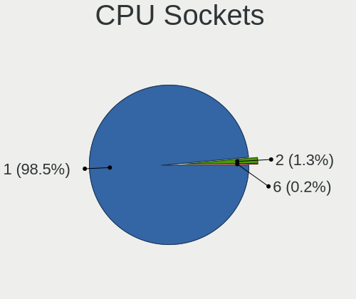

| Number | Desktops | Percent |
|--------|----------|---------|
| 1      | 536      | 98.71%  |
| 2      | 7        | 1.29%   |

CPU Threads
-----------

Threads per core (Hyper-Threading)

| Number | Desktops | Percent |
|--------|----------|---------|
| 2      | 305      | 56.17%  |
| 1      | 238      | 43.83%  |

CPU Op-Modes
------------

CPU Operation Modes (32-bit, 64-bit)

| Op mode        | Desktops | Percent |
|----------------|----------|---------|
| 32-bit, 64-bit | 543      | 100%    |

CPU Microcode
-------------

Microcode number

| Number     | Desktops | Percent |
|------------|----------|---------|
| Unknown    | 372      | 67.39%  |
| 0x306c3    | 25       | 4.53%   |
| 0x08701021 | 13       | 2.36%   |
| 0x306a9    | 12       | 2.17%   |
| 0xa0655    | 9        | 1.63%   |
| 0xa0653    | 9        | 1.63%   |
| 0x906ea    | 8        | 1.45%   |
| 0x206a7    | 8        | 1.45%   |
| 0x906ed    | 7        | 1.27%   |
| 0x1067a    | 6        | 1.09%   |
| 0x08108109 | 6        | 1.09%   |
| 0xa0671    | 5        | 0.91%   |
| 0x506e3    | 5        | 0.91%   |
| 0x0a201016 | 5        | 0.91%   |
| 0x0800820d | 5        | 0.91%   |
| 0x906e9    | 4        | 0.72%   |
| 0x0a201009 | 4        | 0.72%   |
| 0x06000852 | 4        | 0.72%   |
| 0x106a5    | 3        | 0.54%   |
| 0x906eb    | 2        | 0.36%   |
| 0x20655    | 2        | 0.36%   |
| 0x106e5    | 2        | 0.36%   |
| 0x0a50000c | 2        | 0.36%   |
| 0x08701013 | 2        | 0.36%   |
| 0x08001137 | 2        | 0.36%   |
| 0x010000dc | 2        | 0.36%   |
| 0x010000c8 | 2        | 0.36%   |
| 0xf64      | 1        | 0.18%   |
| 0xf43      | 1        | 0.18%   |
| 0x906ec    | 1        | 0.18%   |
| 0x706a8    | 1        | 0.18%   |
| 0x706a1    | 1        | 0.18%   |
| 0x6fd      | 1        | 0.18%   |
| 0x6fb      | 1        | 0.18%   |
| 0x50654    | 1        | 0.18%   |
| 0x406f1    | 1        | 0.18%   |
| 0x406c3    | 1        | 0.18%   |
| 0x306e4    | 1        | 0.18%   |
| 0x206d7    | 1        | 0.18%   |
| 0x206c2    | 1        | 0.18%   |
| 0x20652    | 1        | 0.18%   |
| 0x10676    | 1        | 0.18%   |
| 0x0a201006 | 1        | 0.18%   |
| 0x08301039 | 1        | 0.18%   |
| 0x08101016 | 1        | 0.18%   |
| 0x08001138 | 1        | 0.18%   |
| 0x0800111c | 1        | 0.18%   |
| 0x06003106 | 1        | 0.18%   |
| 0x06001119 | 1        | 0.18%   |
| 0x0600063e | 1        | 0.18%   |
| 0x02000057 | 1        | 0.18%   |
| 0x010000db | 1        | 0.18%   |
| 0x01000083 | 1        | 0.18%   |

CPU Microarch
-------------

Microarchitecture

| Name            | Desktops | Percent |
|-----------------|----------|---------|
| Haswell         | 60       | 11.03%  |
| KabyLake        | 53       | 9.74%   |
| IvyBridge       | 48       | 8.82%   |
| SandyBridge     | 41       | 7.54%   |
| Zen 2           | 40       | 7.35%   |
| Penryn          | 36       | 6.62%   |
| Piledriver      | 33       | 6.07%   |
| CometLake       | 33       | 6.07%   |
| K10             | 27       | 4.96%   |
| Zen+            | 26       | 4.78%   |
| Zen             | 24       | 4.41%   |
| Skylake         | 24       | 4.41%   |
| Zen 3           | 19       | 3.49%   |
| Nehalem         | 14       | 2.57%   |
| Core            | 11       | 2.02%   |
| K8 Hammer       | 9        | 1.65%   |
| Westmere        | 7        | 1.29%   |
| NetBurst        | 7        | 1.29%   |
| Icelake         | 4        | 0.74%   |
| Broadwell       | 4        | 0.74%   |
| Steamroller     | 3        | 0.55%   |
| K10 Llano       | 3        | 0.55%   |
| Goldmont plus   | 3        | 0.55%   |
| Bulldozer       | 3        | 0.55%   |
| Silvermont      | 2        | 0.37%   |
| Puma            | 2        | 0.37%   |
| Goldmont        | 2        | 0.37%   |
| Unknown         | 2        | 0.37%   |
| TigerLake       | 1        | 0.18%   |
| K8 & K10 hybrid | 1        | 0.18%   |
| Jaguar          | 1        | 0.18%   |
| Bobcat          | 1        | 0.18%   |

Graphics
--------

GPU Vendor
----------

Vendors of graphics cards

| Vendor                                       | Desktops | Percent |
|----------------------------------------------|----------|---------|
| Nvidia                                       | 236      | 41.55%  |
| AMD                                          | 168      | 29.58%  |
| Intel                                        | 161      | 28.35%  |
| XGI Technology (eXtreme Graphics Innovation) | 1        | 0.18%   |
| Matrox Electronics Systems                   | 1        | 0.18%   |
| ASPEED Technology                            | 1        | 0.18%   |

GPU Model
---------

Graphics card models

| Model                                                                       | Desktops | Percent |
|-----------------------------------------------------------------------------|----------|---------|
| Intel CometLake-S GT2 [UHD Graphics 630]                                    | 27       | 4.63%   |
| Intel Xeon E3-1200 v3/4th Gen Core Processor Integrated Graphics Controller | 25       | 4.29%   |
| AMD Ellesmere [Radeon RX 470/480/570/570X/580/580X/590]                     | 24       | 4.12%   |
| Intel Xeon E3-1200 v2/3rd Gen Core processor Graphics Controller            | 23       | 3.95%   |
| Nvidia GK208B [GeForce GT 710]                                              | 20       | 3.43%   |
| Intel 2nd Generation Core Processor Family Integrated Graphics Controller   | 14       | 2.4%    |
| Nvidia GT218 [GeForce 210]                                                  | 13       | 2.23%   |
| Intel 4 Series Chipset Integrated Graphics Controller                       | 11       | 1.89%   |
| Nvidia GP108 [GeForce GT 1030]                                              | 10       | 1.72%   |
| Nvidia GP107 [GeForce GTX 1050 Ti]                                          | 10       | 1.72%   |
| AMD Raven Ridge [Radeon Vega Series / Radeon Vega Mobile Series]            | 10       | 1.72%   |
| AMD Picasso                                                                 | 10       | 1.72%   |
| Nvidia GK208B [GeForce GT 730]                                              | 9        | 1.54%   |
| Nvidia GP102 [GeForce GTX 1080 Ti]                                          | 8        | 1.37%   |
| Intel HD Graphics 530                                                       | 8        | 1.37%   |
| Intel 4th Generation Core Processor Family Integrated Graphics Controller   | 8        | 1.37%   |
| AMD Navi 10 [Radeon RX 5600 OEM/5600 XT / 5700/5700 XT]                     | 8        | 1.37%   |
| AMD Cedar [Radeon HD 5000/6000/7350/8350 Series]                            | 8        | 1.37%   |
| Nvidia TU104 [GeForce RTX 2070 SUPER]                                       | 7        | 1.2%    |
| Nvidia GM206 [GeForce GTX 960]                                              | 7        | 1.2%    |
| AMD Cape Verde XT [Radeon HD 7770/8760 / R7 250X]                           | 7        | 1.2%    |
| Nvidia GP107 [GeForce GTX 1050]                                             | 6        | 1.03%   |
| Nvidia GP106 [GeForce GTX 1060 6GB]                                         | 6        | 1.03%   |
| Nvidia GP106 [GeForce GTX 1060 3GB]                                         | 6        | 1.03%   |
| Intel RocketLake-S GT1 [UHD Graphics 750]                                   | 6        | 1.03%   |
| Intel HD Graphics 630                                                       | 6        | 1.03%   |
| AMD Navi 14 [Radeon RX 5500/5500M / Pro 5500M]                              | 6        | 1.03%   |
| Nvidia GM107 [GeForce GTX 750 Ti]                                           | 5        | 0.86%   |
| Nvidia GK107 [GeForce GTX 650]                                              | 5        | 0.86%   |
| Nvidia GF119 [GeForce GT 610]                                               | 5        | 0.86%   |
| Intel CoffeeLake-S GT2 [UHD Graphics 630]                                   | 5        | 0.86%   |
| AMD Oland PRO [Radeon R7 240/340]                                           | 5        | 0.86%   |
| AMD Caicos [Radeon HD 6450/7450/8450 / R5 230 OEM]                          | 5        | 0.86%   |
| Nvidia GT218 [GeForce 8400 GS Rev. 3]                                       | 4        | 0.69%   |
| Nvidia GP104 [GeForce GTX 1080]                                             | 4        | 0.69%   |
| Nvidia GP104 [GeForce GTX 1070]                                             | 4        | 0.69%   |
| Nvidia GM204 [GeForce GTX 970]                                              | 4        | 0.69%   |
| Intel HD Graphics 510                                                       | 4        | 0.69%   |
| Intel 82945G/GZ Integrated Graphics Controller                              | 4        | 0.69%   |
| AMD Trinity 2 [Radeon HD 7480D]                                             | 4        | 0.69%   |
| Nvidia TU106 [GeForce RTX 2060 SUPER]                                       | 3        | 0.51%   |
| Nvidia TU106 [GeForce RTX 2060 Rev. A]                                      | 3        | 0.51%   |
| Nvidia GT215 [GeForce GT 240]                                               | 3        | 0.51%   |
| Nvidia GK104 [GeForce GTX 760]                                              | 3        | 0.51%   |
| Nvidia GF108GL [Quadro 600]                                                 | 3        | 0.51%   |
| Nvidia GF108 [GeForce GT 730]                                               | 3        | 0.51%   |
| Nvidia GF106GL [Quadro 2000]                                                | 3        | 0.51%   |
| Nvidia GA106 [GeForce RTX 3060]                                             | 3        | 0.51%   |
| Intel 82G33/G31 Express Integrated Graphics Controller                      | 3        | 0.51%   |
| AMD Turks XT [Radeon HD 6670/7670]                                          | 3        | 0.51%   |
| AMD Pitcairn PRO [Radeon HD 7850 / R7 265 / R9 270 1024SP]                  | 3        | 0.51%   |
| AMD Lexa PRO [Radeon 540/540X/550/550X / RX 540X/550/550X]                  | 3        | 0.51%   |
| AMD Juniper XT [Radeon HD 5770]                                             | 3        | 0.51%   |
| AMD Cezanne                                                                 | 3        | 0.51%   |
| AMD Barts PRO [Radeon HD 6850]                                              | 3        | 0.51%   |
| Nvidia TU117 [GeForce GTX 1650]                                             | 2        | 0.34%   |
| Nvidia TU116 [GeForce GTX 1660 Ti]                                          | 2        | 0.34%   |
| Nvidia TU116 [GeForce GTX 1660 SUPER]                                       | 2        | 0.34%   |
| Nvidia TU106 [GeForce RTX 2070]                                             | 2        | 0.34%   |
| Nvidia TU104 [GeForce RTX 2060]                                             | 2        | 0.34%   |

GPU Combo
---------

Combinations of graphics cards

| Name                | Desktops | Percent |
|---------------------|----------|---------|
| 1 x Nvidia          | 220      | 40.44%  |
| 1 x AMD             | 159      | 29.23%  |
| 1 x Intel           | 139      | 25.55%  |
| 2 x Nvidia          | 7        | 1.29%   |
| Intel + Nvidia      | 7        | 1.29%   |
| Intel + AMD         | 4        | 0.74%   |
| 2 x AMD             | 3        | 0.55%   |
| 1 x XGI             | 1        | 0.18%   |
| 1 x Matrox          | 1        | 0.18%   |
| 1 x Intel + 4 x AMD | 1        | 0.18%   |
| 1 x ASPEED          | 1        | 0.18%   |
| AMD + Nvidia        | 1        | 0.18%   |

GPU Driver
----------

Free vs proprietary

| Driver      | Desktops | Percent |
|-------------|----------|---------|
| Free        | 392      | 71.27%  |
| Proprietary | 138      | 25.09%  |
| Unknown     | 20       | 3.64%   |

GPU Memory
----------

Total video memory

| Size in GB | Desktops | Percent |
|------------|----------|---------|
| Unknown    | 370      | 67.27%  |
| 1.01-2.0   | 59       | 10.73%  |
| 7.01-8.0   | 31       | 5.64%   |
| 0.51-1.0   | 26       | 4.73%   |
| 3.01-4.0   | 23       | 4.18%   |
| 8.01-16.0  | 13       | 2.36%   |
| 5.01-6.0   | 11       | 2%      |
| 0.01-0.5   | 11       | 2%      |
| 2.01-3.0   | 6        | 1.09%   |

Monitor
-------

Monitor Vendor
--------------

Monitor vendors

| Vendor               | Desktops | Percent |
|----------------------|----------|---------|
| Samsung Electronics  | 115      | 20.25%  |
| Dell                 | 65       | 11.44%  |
| Goldstar             | 52       | 9.15%   |
| Acer                 | 52       | 9.15%   |
| Ancor Communications | 33       | 5.81%   |
| Hewlett-Packard      | 32       | 5.63%   |
| Philips              | 27       | 4.75%   |
| BenQ                 | 22       | 3.87%   |
| AOC                  | 18       | 3.17%   |
| Unknown              | 16       | 2.82%   |
| LG Electronics       | 15       | 2.64%   |
| ViewSonic            | 14       | 2.46%   |
| Iiyama               | 9        | 1.58%   |
| Sony                 | 8        | 1.41%   |
| Lenovo               | 6        | 1.06%   |
| NEC Computers        | 5        | 0.88%   |
| HannStar             | 5        | 0.88%   |
| Fujitsu Siemens      | 5        | 0.88%   |
| ASUSTek Computer     | 5        | 0.88%   |
| Medion               | 4        | 0.7%    |
| Hitachi              | 4        | 0.7%    |
| Idek Iiyama          | 3        | 0.53%   |
| Viotek               | 2        | 0.35%   |
| Vestel Elektronik    | 2        | 0.35%   |
| Toshiba              | 2        | 0.35%   |
| SKY                  | 2        | 0.35%   |
| Panasonic            | 2        | 0.35%   |
| HPN                  | 2        | 0.35%   |
| Eizo                 | 2        | 0.35%   |
| Xiaomi               | 1        | 0.18%   |
| Vizio                | 1        | 0.18%   |
| Vestel               | 1        | 0.18%   |
| Unknown (XXX)        | 1        | 0.18%   |
| Unknown (ACA)        | 1        | 0.18%   |
| TXD                  | 1        | 0.18%   |
| Tech Concepts        | 1        | 0.18%   |
| SVA                  | 1        | 0.18%   |
| STD                  | 1        | 0.18%   |
| Sharp                | 1        | 0.18%   |
| Sceptre Tech         | 1        | 0.18%   |
| Sceptre              | 1        | 0.18%   |
| RTK                  | 1        | 0.18%   |
| PRISM+               | 1        | 0.18%   |
| Plain Tree Systems   | 1        | 0.18%   |
| Pixio                | 1        | 0.18%   |
| Packard Bell         | 1        | 0.18%   |
| ONN                  | 1        | 0.18%   |
| OEM                  | 1        | 0.18%   |
| MTS                  | 1        | 0.18%   |
| MStar                | 1        | 0.18%   |
| MSI                  | 1        | 0.18%   |
| MLK                  | 1        | 0.18%   |
| MiTAC                | 1        | 0.18%   |
| LED                  | 1        | 0.18%   |
| Konka                | 1        | 0.18%   |
| JRY                  | 1        | 0.18%   |
| HKC                  | 1        | 0.18%   |
| Gigabyte Technology  | 1        | 0.18%   |
| GDH                  | 1        | 0.18%   |
| FUS                  | 1        | 0.18%   |

Monitor Model
-------------

Monitor models

| Model                                                                  | Desktops | Percent |
|------------------------------------------------------------------------|----------|---------|
| Goldstar IPS FULLHD GSM5AB8 1920x1080 480x270mm 21.7-inch              | 4        | 0.65%   |
| Dell U2412M DELA07B 1920x1200 518x324mm 24.1-inch                      | 4        | 0.65%   |
| Unknown LCD Monitor SAMSUNG 1920x1080                                  | 3        | 0.49%   |
| Samsung Electronics LCD Monitor U28E590 3840x2160                      | 3        | 0.49%   |
| Samsung Electronics LCD Monitor SAM0C3C 1920x1080 700x390mm 31.5-inch  | 3        | 0.49%   |
| Samsung Electronics C27F390 SAM0D32 1920x1080 600x340mm 27.2-inch      | 3        | 0.49%   |
| Philips PHL 242V8 PHLC219 1920x1080 527x296mm 23.8-inch                | 3        | 0.49%   |
| Hitachi HDMI HEC0030 4096x2160 1150x650mm 52.0-inch                    | 3        | 0.49%   |
| Goldstar ULTRAWIDE GSM76F9 2560x1080 531x298mm 24.0-inch               | 3        | 0.49%   |
| Goldstar FULL HD GSM5B55 1920x1080 480x270mm 21.7-inch                 | 3        | 0.49%   |
| Dell P2417H DELA0DC 1920x1080 527x296mm 23.8-inch                      | 3        | 0.49%   |
| BenQ LCD Monitor GL2450H 1920x1080                                     | 3        | 0.49%   |
| BenQ GL2450H BNQ78A7 1920x1080 530x300mm 24.0-inch                     | 3        | 0.49%   |
| Viotek VIOTEKNB32C VTK3200 1920x1080 698x393mm 31.5-inch               | 2        | 0.33%   |
| ViewSonic VX2250 SERIES VSCCB25 1920x1080 477x268mm 21.5-inch          | 2        | 0.33%   |
| Vestel Elektronik 50UHD_LCD_TV VES3700 3840x2160 1872x1053mm 84.6-inch | 2        | 0.33%   |
| SKY TV-monitor SKY0001 1920x1080 697x392mm 31.5-inch                   | 2        | 0.33%   |
| Samsung Electronics U32J59x SAM0F35 3840x2160 697x392mm 31.5-inch      | 2        | 0.33%   |
| Samsung Electronics SyncMaster SAM0217 1280x1024 376x301mm 19.0-inch   | 2        | 0.33%   |
| Samsung Electronics SMS27A350H SAM07CE 1920x1080 598x336mm 27.0-inch   | 2        | 0.33%   |
| Samsung Electronics S24F350 SAM0D21 1680x1050 520x290mm 23.4-inch      | 2        | 0.33%   |
| Samsung Electronics S22D300 SAM0B3F 1920x1080 477x268mm 21.5-inch      | 2        | 0.33%   |
| Samsung Electronics LCD Monitor SAM0C39 1920x1080 1050x590mm 47.4-inch | 2        | 0.33%   |
| Samsung Electronics LCD Monitor SAM0A7A 1920x1080 1060x626mm 48.5-inch | 2        | 0.33%   |
| Philips LCD Monitor PHLC0B1 1920x1080 480x270mm 21.7-inch              | 2        | 0.33%   |
| LG Electronics LCD Monitor LG TV 1920x1080                             | 2        | 0.33%   |
| Lenovo LEN LT2452pwC LEN1144 1920x1200 518x324mm 24.1-inch             | 2        | 0.33%   |
| Hewlett-Packard VH240a HPN349A 1920x1080 527x296mm 23.8-inch           | 2        | 0.33%   |
| Hewlett-Packard Compaq WF1907 HWP26A4 1440x900 408x255mm 18.9-inch     | 2        | 0.33%   |
| Hewlett-Packard 27fw HPN354A 1920x1080 598x336mm 27.0-inch             | 2        | 0.33%   |
| Goldstar L207W GSM4E7B 1680x1050 434x270mm 20.1-inch                   | 2        | 0.33%   |
| Goldstar HDR 4K GSM7707 3840x2160 600x340mm 27.2-inch                  | 2        | 0.33%   |
| Goldstar 2D FHD LG TV GSM59C6 1920x1080 509x286mm 23.0-inch            | 2        | 0.33%   |
| Dell U2412M DELA07A 1920x1200 518x324mm 24.1-inch                      | 2        | 0.33%   |
| Dell SE2416H DELD082 1920x1080 527x296mm 23.8-inch                     | 2        | 0.33%   |
| Dell S2421HN DEL41F1 1920x1080 527x296mm 23.8-inch                     | 2        | 0.33%   |
| Dell P2419H DELD0D9 1920x1080 527x296mm 23.8-inch                      | 2        | 0.33%   |
| Dell P2415Q DELA0BE 2048x1280 530x300mm 24.0-inch                      | 2        | 0.33%   |
| Dell LCD Monitor P2419H 1920x1080                                      | 2        | 0.33%   |
| Dell E1914H DELD03A 1366x768 410x230mm 18.5-inch                       | 2        | 0.33%   |
| Dell D3218HN DEL200B 1920x1080 698x393mm 31.5-inch                     | 2        | 0.33%   |
| Dell 1907FP DEL4015 1280x1024 376x301mm 19.0-inch                      | 2        | 0.33%   |
| Dell 1905FP DEL400D 1280x1024 376x301mm 19.0-inch                      | 2        | 0.33%   |
| BenQ GW2780 BNQ78E6 1920x1080 598x336mm 27.0-inch                      | 2        | 0.33%   |
| BenQ GW2480 BNQ78E7 1920x1080 527x296mm 23.8-inch                      | 2        | 0.33%   |
| AOC 27G1G4 AOC2701 1920x1080 600x340mm 27.2-inch                       | 2        | 0.33%   |
| AOC 2369M AOC2369 1920x1080 509x286mm 23.0-inch                        | 2        | 0.33%   |
| Ancor Communications VE228 ACI22FA 1920x1080 477x268mm 21.5-inch       | 2        | 0.33%   |
| Ancor Communications ASUS VX239 ACI23E1 1920x1080 509x286mm 23.0-inch  | 2        | 0.33%   |
| Ancor Communications ASUS VS197 ACI19F2 1366x768 410x230mm 18.5-inch   | 2        | 0.33%   |
| Acer S242HL ACR0216 1920x1080 531x299mm 24.0-inch                      | 2        | 0.33%   |
| Acer G226HQL ACR0346 1920x1080 477x268mm 21.5-inch                     | 2        | 0.33%   |
| Xiaomi Mi TV XMD004A 1440x900 708x398mm 32.0-inch                      | 1        | 0.16%   |
| Vizio VW32L HDTV20A VIZ0027 1280x720 700x390mm 31.5-inch               | 1        | 0.16%   |
| ViewSonic VX3211 SERIES VSCF534 1920x1080 698x392mm 31.5-inch          | 1        | 0.16%   |
| ViewSonic VX2770 SERIES VSC3A2C 1920x1080 597x336mm 27.0-inch          | 1        | 0.16%   |
| ViewSonic VX2703 SERIES VSCF62B 1920x1080 597x336mm 27.0-inch          | 1        | 0.16%   |
| ViewSonic VX2453 Series VSC0C28 1920x1080 520x290mm 23.4-inch          | 1        | 0.16%   |
| ViewSonic VA703-3Series VSC631E 1280x1024 338x270mm 17.0-inch          | 1        | 0.16%   |
| ViewSonic VA2456 Series VSC3236 1920x1080 527x296mm 23.8-inch          | 1        | 0.16%   |

Monitor Resolution
------------------

Monitor screen resolution

| Resolution         | Desktops | Percent |
|--------------------|----------|---------|
| 1920x1080 (FHD)    | 269      | 47.36%  |
| 3840x2160 (4K)     | 46       | 8.1%    |
| 1280x1024 (SXGA)   | 37       | 6.51%   |
| 2560x1440 (QHD)    | 35       | 6.16%   |
| 1680x1050 (WSXGA+) | 28       | 4.93%   |
| Unknown            | 27       | 4.75%   |
| 1366x768 (WXGA)    | 17       | 2.99%   |
| 1440x900 (WXGA+)   | 15       | 2.64%   |
| 1920x1200 (WUXGA)  | 14       | 2.46%   |
| 1600x900 (HD+)     | 11       | 1.94%   |
| 2560x1080          | 10       | 1.76%   |
| 3440x1440          | 8        | 1.41%   |
| 1360x768           | 7        | 1.23%   |
| 3840x1080          | 6        | 1.06%   |
| 1600x1200          | 4        | 0.7%    |
| 1280x720 (HD)      | 4        | 0.7%    |
| 4480x1440          | 3        | 0.53%   |
| 1920x540           | 3        | 0.53%   |
| 5760x2160          | 2        | 0.35%   |
| 5760x1080          | 2        | 0.35%   |
| 5120x1440          | 2        | 0.35%   |
| 2048x1152          | 2        | 0.35%   |
| 6400x2160          | 1        | 0.18%   |
| 5760x1200          | 1        | 0.18%   |
| 4608x1440          | 1        | 0.18%   |
| 4480x1200          | 1        | 0.18%   |
| 4480x1080          | 1        | 0.18%   |
| 4240x1440          | 1        | 0.18%   |
| 3640x1920          | 1        | 0.18%   |
| 3600x1080          | 1        | 0.18%   |
| 3520x1080          | 1        | 0.18%   |
| 2880x1200          | 1        | 0.18%   |
| 2560x2520          | 1        | 0.18%   |
| 2560x1600          | 1        | 0.18%   |
| 2048x1536          | 1        | 0.18%   |
| 1826x1027          | 1        | 0.18%   |
| 1360x765           | 1        | 0.18%   |
| 1024x768 (XGA)     | 1        | 0.18%   |

Monitor Diagonal
----------------

Diagonal size in inches

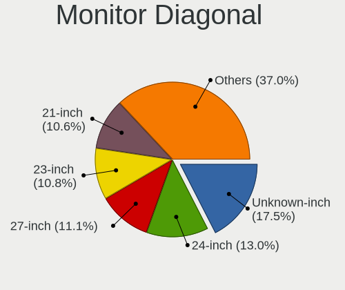

| Inches  | Desktops | Percent |
|---------|----------|---------|
| Unknown | 98       | 17.47%  |
| 24      | 74       | 13.19%  |
| 27      | 67       | 11.94%  |
| 23      | 65       | 11.59%  |
| 21      | 62       | 11.05%  |
| 19      | 37       | 6.6%    |
| 31      | 29       | 5.17%   |
| 22      | 17       | 3.03%   |
| 18      | 16       | 2.85%   |
| 20      | 14       | 2.5%    |
| 84      | 13       | 2.32%   |
| 34      | 12       | 2.14%   |
| 17      | 12       | 2.14%   |
| 32      | 7        | 1.25%   |
| 15      | 6        | 1.07%   |
| 40      | 4        | 0.71%   |
| 54      | 3        | 0.53%   |
| 48      | 3        | 0.53%   |
| 26      | 3        | 0.53%   |
| 72      | 2        | 0.36%   |
| 52      | 2        | 0.36%   |
| 47      | 2        | 0.36%   |
| 28      | 2        | 0.36%   |
| 25      | 2        | 0.36%   |
| 86      | 1        | 0.18%   |
| 69      | 1        | 0.18%   |
| 65      | 1        | 0.18%   |
| 55      | 1        | 0.18%   |
| 50      | 1        | 0.18%   |
| 46      | 1        | 0.18%   |
| 43      | 1        | 0.18%   |
| 30      | 1        | 0.18%   |
| 10      | 1        | 0.18%   |

Monitor Width
-------------

Physical width

| Width in mm | Desktops | Percent |
|-------------|----------|---------|
| 501-600     | 193      | 35.15%  |
| 401-500     | 122      | 22.22%  |
| Unknown     | 98       | 17.85%  |
| 601-700     | 38       | 6.92%   |
| 351-400     | 26       | 4.74%   |
| 701-800     | 18       | 3.28%   |
| 1501-2000   | 17       | 3.1%    |
| 301-350     | 16       | 2.91%   |
| 1001-1500   | 14       | 2.55%   |
| 801-900     | 5        | 0.91%   |
| 201-300     | 1        | 0.18%   |
| 901-1000    | 1        | 0.18%   |

Aspect Ratio
------------

Proportional relationship between the width and the height

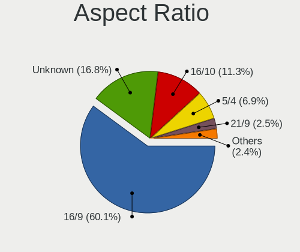

| Ratio   | Desktops | Percent |
|---------|----------|---------|
| 16/9    | 322      | 60.75%  |
| Unknown | 89       | 16.79%  |
| 16/10   | 61       | 11.51%  |
| 5/4     | 33       | 6.23%   |
| 21/9    | 14       | 2.64%   |
| 4/3     | 6        | 1.13%   |
| 6/5     | 3        | 0.57%   |
| 32/9    | 1        | 0.19%   |
| 3/2     | 1        | 0.19%   |

Monitor Area
------------

Area in inch

| Area in inch | Desktops | Percent |
|----------------|----------|---------|
| 201-250        | 177      | 31.89%  |
| Unknown        | 98       | 17.66%  |
| 151-200        | 72       | 12.97%  |
| 301-350        | 69       | 12.43%  |
| 351-500        | 46       | 8.29%   |
| More than 1000 | 28       | 5.05%   |
| 251-300        | 26       | 4.68%   |
| 141-150        | 23       | 4.14%   |
| 501-1000       | 9        | 1.62%   |
| 101-110        | 5        | 0.9%    |
| 41-50          | 1        | 0.18%   |
| 111-120        | 1        | 0.18%   |

Pixel Density
-------------

Pixels per inch

| Density | Desktops | Percent |
|---------|----------|---------|
| 51-100  | 295      | 55.77%  |
| Unknown | 98       | 18.53%  |
| 101-120 | 89       | 16.82%  |
| 1-50    | 24       | 4.54%   |
| 121-160 | 13       | 2.46%   |
| 161-240 | 10       | 1.89%   |

Multiple Monitors
-----------------

Total monitors connected

| Total | Desktops | Percent |
|-------|----------|---------|
| 1     | 421      | 76.41%  |
| 2     | 88       | 15.97%  |
| 0     | 36       | 6.53%   |
| 3     | 5        | 0.91%   |
| 4     | 1        | 0.18%   |

Network
-------

Net Controller Vendor
---------------------

Controller vendors

| Vendor                          | Desktops | Percent |
|---------------------------------|----------|---------|
| Realtek Semiconductor           | 336      | 43.41%  |
| Intel                           | 232      | 29.97%  |
| Qualcomm Atheros                | 59       | 7.62%   |
| Broadcom                        | 19       | 2.45%   |
| Ralink Technology               | 15       | 1.94%   |
| TP-Link                         | 13       | 1.68%   |
| Nvidia                          | 12       | 1.55%   |
| Ralink                          | 10       | 1.29%   |
| Marvell Technology Group        | 6        | 0.78%   |
| Samsung Electronics             | 5        | 0.65%   |
| D-Link System                   | 5        | 0.65%   |
| D-Link                          | 5        | 0.65%   |
| ASUSTek Computer                | 5        | 0.65%   |
| Qualcomm Atheros Communications | 4        | 0.52%   |
| MediaTek                        | 4        | 0.52%   |
| Broadcom Limited                | 4        | 0.52%   |
| Realtek                         | 3        | 0.39%   |
| Aquantia                        | 3        | 0.39%   |
| NetGear                         | 2        | 0.26%   |
| Motorola PCS                    | 2        | 0.26%   |
| Microsoft                       | 2        | 0.26%   |
| IMC Networks                    | 2        | 0.26%   |
| Edimax Technology               | 2        | 0.26%   |
| BUFFALO                         | 2        | 0.26%   |
| AVM                             | 2        | 0.26%   |
| ASIX Electronics                | 2        | 0.26%   |
| Xiaomi                          | 1        | 0.13%   |
| Uniden                          | 1        | 0.13%   |
| Texas Instruments               | 1        | 0.13%   |
| Solarflare Communications       | 1        | 0.13%   |
| Sitecom Europe                  | 1        | 0.13%   |
| Sigma Designs                   | 1        | 0.13%   |
| Seeed Technology                | 1        | 0.13%   |
| LG Electronics                  | 1        | 0.13%   |
| IBM                             | 1        | 0.13%   |
| Huawei Technologies             | 1        | 0.13%   |
| Guillemot                       | 1        | 0.13%   |
| Google                          | 1        | 0.13%   |
| Belkin Components               | 1        | 0.13%   |
| Belkin                          | 1        | 0.13%   |
| Arduino SA                      | 1        | 0.13%   |
| Apple                           | 1        | 0.13%   |
| American Megatrends             | 1        | 0.13%   |
| ADMtek                          | 1        | 0.13%   |

Net Controller Model
--------------------

Controller models

| Model                                                                  | Desktops | Percent |
|------------------------------------------------------------------------|----------|---------|
| Realtek RTL8111/8168/8411 PCI Express Gigabit Ethernet Controller      | 263      | 29.72%  |
| Intel Wi-Fi 6 AX200                                                    | 36       | 4.07%   |
| Intel I211 Gigabit Network Connection                                  | 31       | 3.5%    |
| Realtek RTL8125 2.5GbE Controller                                      | 27       | 3.05%   |
| Intel Ethernet Connection (2) I219-V                                   | 26       | 2.94%   |
| Intel 82579LM Gigabit Network Connection (Lewisville)                  | 24       | 2.71%   |
| Intel Ethernet Controller I225-V                                       | 14       | 1.58%   |
| Intel Ethernet Connection I217-LM                                      | 12       | 1.36%   |
| Intel Ethernet Connection (7) I219-V                                   | 11       | 1.24%   |
| Intel Dual Band Wireless-AC 3168NGW [Stone Peak]                       | 11       | 1.24%   |
| Realtek RTL88x2bu [AC1200 Techkey]                                     | 9        | 1.02%   |
| Realtek RTL8821CE 802.11ac PCIe Wireless Network Adapter               | 9        | 1.02%   |
| Realtek RTL8169 PCI Gigabit Ethernet Controller                        | 9        | 1.02%   |
| Qualcomm Atheros Killer E220x Gigabit Ethernet Controller              | 9        | 1.02%   |
| Intel Ethernet Connection I217-V                                       | 9        | 1.02%   |
| Ralink MT7601U Wireless Adapter                                        | 8        | 0.9%    |
| Realtek RTL8188EUS 802.11n Wireless Network Adapter                    | 7        | 0.79%   |
| Realtek RTL810xE PCI Express Fast Ethernet controller                  | 7        | 0.79%   |
| Realtek RTL-8100/8101L/8139 PCI Fast Ethernet Adapter                  | 7        | 0.79%   |
| Realtek 802.11ac NIC                                                   | 7        | 0.79%   |
| Intel Ethernet Connection (2) I218-V                                   | 7        | 0.79%   |
| Intel 82579V Gigabit Network Connection                                | 7        | 0.79%   |
| Broadcom BCM4360 802.11ac Wireless Network Adapter                     | 7        | 0.79%   |
| Qualcomm Atheros AR9485 Wireless Network Adapter                       | 6        | 0.68%   |
| Qualcomm Atheros AR8161 Gigabit Ethernet                               | 6        | 0.68%   |
| Qualcomm Atheros AR8151 v2.0 Gigabit Ethernet                          | 6        | 0.68%   |
| Intel Wireless 8265 / 8275                                             | 6        | 0.68%   |
| Intel Wireless 7260                                                    | 6        | 0.68%   |
| Intel 82574L Gigabit Network Connection                                | 6        | 0.68%   |
| Intel 82567LM-3 Gigabit Network Connection                             | 6        | 0.68%   |
| Qualcomm Atheros AR93xx Wireless Network Adapter                       | 5        | 0.56%   |
| Qualcomm Atheros AR9287 Wireless Network Adapter (PCI-Express)         | 5        | 0.56%   |
| Nvidia MCP77 Ethernet                                                  | 5        | 0.56%   |
| Intel Wireless-AC 9260                                                 | 5        | 0.56%   |
| Intel Wireless 7265                                                    | 5        | 0.56%   |
| Intel Tiger Lake PCH CNVi WiFi                                         | 5        | 0.56%   |
| Intel Cannon Lake PCH CNVi WiFi                                        | 5        | 0.56%   |
| Samsung Galaxy series, misc. (tethering mode)                          | 4        | 0.45%   |
| Intel Ethernet Connection (14) I219-V                                  | 4        | 0.45%   |
| Intel Ethernet Connection (12) I219-V                                  | 4        | 0.45%   |
| Intel 82567V-2 Gigabit Network Connection                              | 4        | 0.45%   |
| TP-Link Archer T4U ver.3                                               | 3        | 0.34%   |
| TP-Link Archer T3U [Realtek RTL8812BU]                                 | 3        | 0.34%   |
| Realtek RTL8153 Gigabit Ethernet Adapter                               | 3        | 0.34%   |
| Realtek 802.11n NIC                                                    | 3        | 0.34%   |
| Ralink RT5370 Wireless Adapter                                         | 3        | 0.34%   |
| Qualcomm Atheros QCA9377 802.11ac Wireless Network Adapter             | 3        | 0.34%   |
| Qualcomm Atheros AR9271 802.11n                                        | 3        | 0.34%   |
| Qualcomm Atheros AR9227 Wireless Network Adapter                       | 3        | 0.34%   |
| Qualcomm Atheros AR5416 Wireless Network Adapter [AR5008 802.11(a)bgn] | 3        | 0.34%   |
| Nvidia MCP61 Ethernet                                                  | 3        | 0.34%   |
| MediaTek moto g(8) power lite                                          | 3        | 0.34%   |
| Marvell Group 88E8056 PCI-E Gigabit Ethernet Controller                | 3        | 0.34%   |
| Intel Wireless 8260                                                    | 3        | 0.34%   |
| Intel Wi-Fi 6 AX210/AX211/AX411 160MHz                                 | 3        | 0.34%   |
| Intel I210 Gigabit Network Connection                                  | 3        | 0.34%   |
| Intel Ethernet Connection (2) I219-LM                                  | 3        | 0.34%   |
| Intel Ethernet Connection (2) I218-LM                                  | 3        | 0.34%   |
| TP-Link 802.11ac WLAN Adapter                                          | 2        | 0.23%   |
| TP-Link 802.11ac NIC                                                   | 2        | 0.23%   |

Wireless Vendor
---------------

Wireless vendors

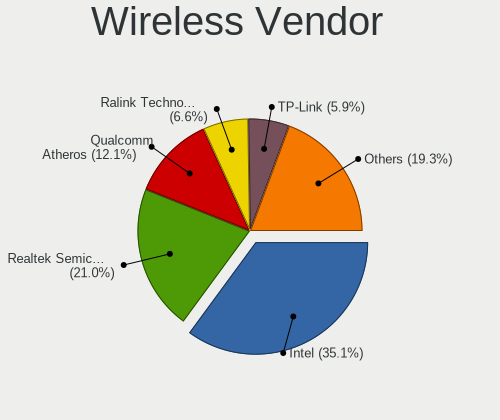

| Vendor                          | Desktops | Percent |
|---------------------------------|----------|---------|
| Intel                           | 98       | 36.16%  |
| Realtek Semiconductor           | 57       | 21.03%  |
| Qualcomm Atheros                | 32       | 11.81%  |
| Ralink Technology               | 15       | 5.54%   |
| TP-Link                         | 13       | 4.8%    |
| Ralink                          | 9        | 3.32%   |
| Broadcom                        | 9        | 3.32%   |
| D-Link                          | 5        | 1.85%   |
| ASUSTek Computer                | 5        | 1.85%   |
| Qualcomm Atheros Communications | 4        | 1.48%   |
| Realtek                         | 3        | 1.11%   |
| D-Link System                   | 3        | 1.11%   |
| NetGear                         | 2        | 0.74%   |
| Microsoft                       | 2        | 0.74%   |
| IMC Networks                    | 2        | 0.74%   |
| Edimax Technology               | 2        | 0.74%   |
| BUFFALO                         | 2        | 0.74%   |
| AVM                             | 2        | 0.74%   |
| Sitecom Europe                  | 1        | 0.37%   |
| MediaTek                        | 1        | 0.37%   |
| Guillemot                       | 1        | 0.37%   |
| Broadcom Limited                | 1        | 0.37%   |
| Belkin Components               | 1        | 0.37%   |
| Belkin                          | 1        | 0.37%   |

Wireless Model
--------------

Wireless models

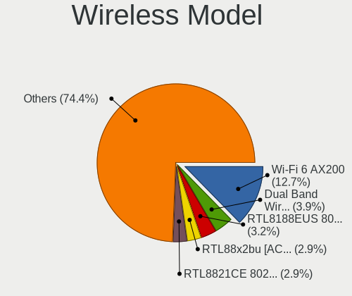

| Model                                                                  | Desktops | Percent |
|------------------------------------------------------------------------|----------|---------|
| Intel Wi-Fi 6 AX200                                                    | 36       | 13.14%  |
| Intel Dual Band Wireless-AC 3168NGW [Stone Peak]                       | 11       | 4.01%   |
| Realtek RTL88x2bu [AC1200 Techkey]                                     | 9        | 3.28%   |
| Realtek RTL8821CE 802.11ac PCIe Wireless Network Adapter               | 9        | 3.28%   |
| Ralink MT7601U Wireless Adapter                                        | 8        | 2.92%   |
| Realtek RTL8188EUS 802.11n Wireless Network Adapter                    | 7        | 2.55%   |
| Realtek 802.11ac NIC                                                   | 7        | 2.55%   |
| Broadcom BCM4360 802.11ac Wireless Network Adapter                     | 7        | 2.55%   |
| Qualcomm Atheros AR9485 Wireless Network Adapter                       | 6        | 2.19%   |
| Intel Wireless 8265 / 8275                                             | 6        | 2.19%   |
| Intel Wireless 7260                                                    | 6        | 2.19%   |
| Qualcomm Atheros AR93xx Wireless Network Adapter                       | 5        | 1.82%   |
| Qualcomm Atheros AR9287 Wireless Network Adapter (PCI-Express)         | 5        | 1.82%   |
| Intel Wireless-AC 9260                                                 | 5        | 1.82%   |
| Intel Wireless 7265                                                    | 5        | 1.82%   |
| Intel Tiger Lake PCH CNVi WiFi                                         | 5        | 1.82%   |
| Intel Cannon Lake PCH CNVi WiFi                                        | 5        | 1.82%   |
| TP-Link Archer T4U ver.3                                               | 3        | 1.09%   |
| TP-Link Archer T3U [Realtek RTL8812BU]                                 | 3        | 1.09%   |
| Realtek 802.11n NIC                                                    | 3        | 1.09%   |
| Ralink RT5370 Wireless Adapter                                         | 3        | 1.09%   |
| Qualcomm Atheros QCA9377 802.11ac Wireless Network Adapter             | 3        | 1.09%   |
| Qualcomm Atheros AR9271 802.11n                                        | 3        | 1.09%   |
| Qualcomm Atheros AR9227 Wireless Network Adapter                       | 3        | 1.09%   |
| Qualcomm Atheros AR5416 Wireless Network Adapter [AR5008 802.11(a)bgn] | 3        | 1.09%   |
| Intel Wireless 8260                                                    | 3        | 1.09%   |
| Intel Wi-Fi 6 AX210/AX211/AX411 160MHz                                 | 3        | 1.09%   |
| TP-Link 802.11ac WLAN Adapter                                          | 2        | 0.73%   |
| TP-Link 802.11ac NIC                                                   | 2        | 0.73%   |
| Realtek RTL8822BE 802.11a/b/g/n/ac WiFi adapter                        | 2        | 0.73%   |
| Realtek RTL8814AU 802.11a/b/g/n/ac Wireless Adapter                    | 2        | 0.73%   |
| Realtek RTL8812AU 802.11a/b/g/n/ac 2T2R DB WLAN Adapter                | 2        | 0.73%   |
| Realtek RTL8812AE 802.11ac PCIe Wireless Network Adapter               | 2        | 0.73%   |
| Realtek RTL8192EU 802.11b/g/n WLAN Adapter                             | 2        | 0.73%   |
| Realtek RTL8192CU 802.11n WLAN Adapter                                 | 2        | 0.73%   |
| Realtek RTL8192CE PCIe Wireless Network Adapter                        | 2        | 0.73%   |
| Realtek RTL8188SU 802.11n WLAN Adapter                                 | 2        | 0.73%   |
| Realtek RTL8188FTV 802.11b/g/n 1T1R 2.4G WLAN Adapter                  | 2        | 0.73%   |
| Realtek RTL8188EE Wireless Network Adapter                             | 2        | 0.73%   |
| Ralink RT3090 Wireless 802.11n 1T/1R PCIe                              | 2        | 0.73%   |
| Ralink RT2800 802.11n PCI                                              | 2        | 0.73%   |
| Intel Wireless 3165                                                    | 2        | 0.73%   |
| Intel Comet Lake PCH CNVi WiFi                                         | 2        | 0.73%   |
| Intel Centrino Wireless-N 2230                                         | 2        | 0.73%   |
| Intel Centrino Advanced-N 6205 [Taylor Peak]                           | 2        | 0.73%   |
| D-Link DWA-131 Wireless N Nano Adapter (Rev. E1) [Realtek RTL8192EU]   | 2        | 0.73%   |
| D-Link 802.11ac NIC                                                    | 2        | 0.73%   |
| TP-Link TL-WN822N Version 4 RTL8192EU                                  | 1        | 0.36%   |
| TP-Link TL-WN821N v5/v6 [RTL8192EU]                                    | 1        | 0.36%   |
| TP-Link TL-WN722N v2/v3 [Realtek RTL8188EUS]                           | 1        | 0.36%   |
| Sitecom Europe WL-608 Wireless USB Adapter 54g                         | 1        | 0.36%   |
| Realtek RTL8822CE 802.11ac PCIe Wireless Network Adapter               | 1        | 0.36%   |
| Realtek RTL8821AE 802.11ac PCIe Wireless Network Adapter               | 1        | 0.36%   |
| Realtek RTL8723BE PCIe Wireless Network Adapter                        | 1        | 0.36%   |
| Realtek RTL8192SU 802.11n WLAN Adapter                                 | 1        | 0.36%   |
| Realtek RTL8191SEvB Wireless LAN Controller                            | 1        | 0.36%   |
| Realtek RTL8188CUS 802.11n WLAN Adapter                                | 1        | 0.36%   |
| Realtek RTL8188CE 802.11b/g/n WiFi Adapter                             | 1        | 0.36%   |
| Ralink RT5372 Wireless Adapter                                         | 1        | 0.36%   |
| Ralink RT3072 Wireless Adapter                                         | 1        | 0.36%   |

Ethernet Vendor
---------------

Ethernet vendors

| Vendor                    | Desktops | Percent |
|---------------------------|----------|---------|
| Realtek Semiconductor     | 312      | 53.24%  |
| Intel                     | 189      | 32.25%  |
| Qualcomm Atheros          | 29       | 4.95%   |
| Nvidia                    | 12       | 2.05%   |
| Broadcom                  | 10       | 1.71%   |
| Marvell Technology Group  | 6        | 1.02%   |
| Samsung Electronics       | 5        | 0.85%   |
| MediaTek                  | 3        | 0.51%   |
| Broadcom Limited          | 3        | 0.51%   |
| Aquantia                  | 3        | 0.51%   |
| Motorola PCS              | 2        | 0.34%   |
| D-Link System             | 2        | 0.34%   |
| ASIX Electronics          | 2        | 0.34%   |
| Xiaomi                    | 1        | 0.17%   |
| Solarflare Communications | 1        | 0.17%   |
| LG Electronics            | 1        | 0.17%   |
| IBM                       | 1        | 0.17%   |
| Huawei Technologies       | 1        | 0.17%   |
| Apple                     | 1        | 0.17%   |
| American Megatrends       | 1        | 0.17%   |
| ADMtek                    | 1        | 0.17%   |

Ethernet Model
--------------

Ethernet models

| Model                                                             | Desktops | Percent |
|-------------------------------------------------------------------|----------|---------|
| Realtek RTL8111/8168/8411 PCI Express Gigabit Ethernet Controller | 263      | 43.54%  |
| Intel I211 Gigabit Network Connection                             | 31       | 5.13%   |
| Realtek RTL8125 2.5GbE Controller                                 | 27       | 4.47%   |
| Intel Ethernet Connection (2) I219-V                              | 26       | 4.3%    |
| Intel 82579LM Gigabit Network Connection (Lewisville)             | 24       | 3.97%   |
| Intel Ethernet Controller I225-V                                  | 14       | 2.32%   |
| Intel Ethernet Connection I217-LM                                 | 12       | 1.99%   |
| Intel Ethernet Connection (7) I219-V                              | 11       | 1.82%   |
| Realtek RTL8169 PCI Gigabit Ethernet Controller                   | 9        | 1.49%   |
| Qualcomm Atheros Killer E220x Gigabit Ethernet Controller         | 9        | 1.49%   |
| Intel Ethernet Connection I217-V                                  | 9        | 1.49%   |
| Realtek RTL810xE PCI Express Fast Ethernet controller             | 7        | 1.16%   |
| Realtek RTL-8100/8101L/8139 PCI Fast Ethernet Adapter             | 7        | 1.16%   |
| Intel Ethernet Connection (2) I218-V                              | 7        | 1.16%   |
| Intel 82579V Gigabit Network Connection                           | 7        | 1.16%   |
| Qualcomm Atheros AR8161 Gigabit Ethernet                          | 6        | 0.99%   |
| Qualcomm Atheros AR8151 v2.0 Gigabit Ethernet                     | 6        | 0.99%   |
| Intel 82574L Gigabit Network Connection                           | 6        | 0.99%   |
| Intel 82567LM-3 Gigabit Network Connection                        | 6        | 0.99%   |
| Nvidia MCP77 Ethernet                                             | 5        | 0.83%   |
| Samsung Galaxy series, misc. (tethering mode)                     | 4        | 0.66%   |
| Intel Ethernet Connection (14) I219-V                             | 4        | 0.66%   |
| Intel Ethernet Connection (12) I219-V                             | 4        | 0.66%   |
| Intel 82567V-2 Gigabit Network Connection                         | 4        | 0.66%   |
| Realtek RTL8153 Gigabit Ethernet Adapter                          | 3        | 0.5%    |
| Nvidia MCP61 Ethernet                                             | 3        | 0.5%    |
| MediaTek moto g(8) power lite                                     | 3        | 0.5%    |
| Marvell Group 88E8056 PCI-E Gigabit Ethernet Controller           | 3        | 0.5%    |
| Intel I210 Gigabit Network Connection                             | 3        | 0.5%    |
| Intel Ethernet Connection (2) I219-LM                             | 3        | 0.5%    |
| Intel Ethernet Connection (2) I218-LM                             | 3        | 0.5%    |
| Realtek RTL-8110SC/8169SC Gigabit Ethernet                        | 2        | 0.33%   |
| Qualcomm Atheros Killer E2500 Gigabit Ethernet Controller         | 2        | 0.33%   |
| Qualcomm Atheros Killer E2400 Gigabit Ethernet Controller         | 2        | 0.33%   |
| Qualcomm Atheros AR8152 v2.0 Fast Ethernet                        | 2        | 0.33%   |
| Motorola PCS moto g(7)                                            | 2        | 0.33%   |
| Intel NM10/ICH7 Family LAN Controller                             | 2        | 0.33%   |
| Intel Ethernet Connection (7) I219-LM                             | 2        | 0.33%   |
| Intel 82578DM Gigabit Network Connection                          | 2        | 0.33%   |
| Intel 82573V Gigabit Ethernet Controller (Copper)                 | 2        | 0.33%   |
| Intel 82566DM-2 Gigabit Network Connection                        | 2        | 0.33%   |
| Intel 82562V-2 10/100 Network Connection                          | 2        | 0.33%   |
| D-Link System DGE-528T Gigabit Ethernet Adapter                   | 2        | 0.33%   |
| Broadcom NetXtreme BCM5764M Gigabit Ethernet PCIe                 | 2        | 0.33%   |
| Broadcom NetXtreme BCM5761 Gigabit Ethernet PCIe                  | 2        | 0.33%   |
| Xiaomi Mi/Redmi series (RNDIS)                                    | 1        | 0.17%   |
| Solarflare SFC9020 10G Ethernet Controller                        | 1        | 0.17%   |
| Samsung GT-I9070 (network tethering, USB debugging enabled)       | 1        | 0.17%   |
| Realtek Killer E3000 2.5GbE Controller                            | 1        | 0.17%   |
| Realtek Killer E2600 Gigabit Ethernet Controller                  | 1        | 0.17%   |
| Qualcomm Atheros Attansic L2 Fast Ethernet                        | 1        | 0.17%   |
| Qualcomm Atheros AR8121/AR8113/AR8114 Gigabit or Fast Ethernet    | 1        | 0.17%   |
| Nvidia MCP79 Ethernet                                             | 1        | 0.17%   |
| Nvidia MCP73 Ethernet                                             | 1        | 0.17%   |
| Nvidia MCP67 Ethernet                                             | 1        | 0.17%   |
| Nvidia CK804 Ethernet Controller                                  | 1        | 0.17%   |
| Marvell Group 88E8057 PCI-E Gigabit Ethernet Controller           | 1        | 0.17%   |
| Marvell Group 88E8053 PCI-E Gigabit Ethernet Controller           | 1        | 0.17%   |
| Marvell Group 88E8001 Gigabit Ethernet Controller                 | 1        | 0.17%   |
| LG G2 Android Phone [tethering mode]                              | 1        | 0.17%   |

Net Controller Kind
-------------------

Ethernet, WiFi or modem

| Kind     | Desktops | Percent |
|----------|----------|---------|
| Ethernet | 532      | 66.58%  |
| WiFi     | 260      | 32.54%  |
| Modem    | 5        | 0.63%   |
| Unknown  | 2        | 0.25%   |

Used Controller
---------------

Currently used network controller

| Kind     | Desktops | Percent |
|----------|----------|---------|
| Ethernet | 432      | 71.05%  |
| WiFi     | 176      | 28.95%  |

NICs
----

Total network controllers on board

| Total | Desktops | Percent |
|-------|----------|---------|
| 1     | 327      | 59.89%  |
| 2     | 181      | 33.15%  |
| 3     | 26       | 4.76%   |
| 0     | 8        | 1.47%   |
| 5     | 2        | 0.37%   |
| 4     | 2        | 0.37%   |

IPv6
----

IPv6 vs IPv4

| Used | Desktops | Percent |
|------|----------|---------|
| No   | 376      | 68.99%  |
| Yes  | 169      | 31.01%  |

Bluetooth
---------

Bluetooth Vendor
----------------

Controller vendors

| Vendor                          | Desktops | Percent |
|---------------------------------|----------|---------|
| Intel                           | 85       | 40.87%  |
| Cambridge Silicon Radio         | 54       | 25.96%  |
| Realtek Semiconductor           | 19       | 9.13%   |
| ASUSTek Computer                | 12       | 5.77%   |
| Broadcom                        | 11       | 5.29%   |
| Qualcomm Atheros Communications | 5        | 2.4%    |
| IMC Networks                    | 5        | 2.4%    |
| Dynex                           | 3        | 1.44%   |
| Belkin Components               | 3        | 1.44%   |
| Apple                           | 3        | 1.44%   |
| Hewlett-Packard                 | 2        | 0.96%   |
| Unknown                         | 1        | 0.48%   |
| Ralink                          | 1        | 0.48%   |
| Qcom                            | 1        | 0.48%   |
| Primax Electronics              | 1        | 0.48%   |
| Logitech                        | 1        | 0.48%   |
| Conwise Technology              | 1        | 0.48%   |

Bluetooth Model
---------------

Controller models

| Model                                                    | Desktops | Percent |
|----------------------------------------------------------|----------|---------|
| Cambridge Silicon Radio Bluetooth Dongle (HCI mode)      | 54       | 25.96%  |
| Intel AX200 Bluetooth                                    | 31       | 14.9%   |
| Realtek Bluetooth Radio                                  | 16       | 7.69%   |
| Intel Bluetooth wireless interface                       | 12       | 5.77%   |
| Intel Bluetooth Device                                   | 12       | 5.77%   |
| Intel Wireless-AC 3168 Bluetooth                         | 10       | 4.81%   |
| Intel AX201 Bluetooth                                    | 8        | 3.85%   |
| Broadcom BCM20702A0 Bluetooth 4.0                        | 8        | 3.85%   |
| Intel Bluetooth 9460/9560 Jefferson Peak (JfP)           | 5        | 2.4%    |
| ASUS Broadcom BCM20702A0 Bluetooth                       | 5        | 2.4%    |
| Intel Wireless-AC 9260 Bluetooth Adapter                 | 4        | 1.92%   |
| Realtek  Bluetooth 4.2 Adapter                           | 3        | 1.44%   |
| Qualcomm Atheros  Bluetooth Device                       | 3        | 1.44%   |
| Intel AX210 Bluetooth                                    | 3        | 1.44%   |
| IMC Networks Bluetooth Radio                             | 3        | 1.44%   |
| Dynex Bluetooth 4.0 Adapter [Broadcom, 1.12, BCM20702A0] | 3        | 1.44%   |
| Qualcomm Atheros AR3011 Bluetooth                        | 2        | 0.96%   |
| Broadcom BCM2045 Bluetooth                               | 2        | 0.96%   |
| Belkin Components F8T065BF Mini Bluetooth 4.0 Adapter    | 2        | 0.96%   |
| ASUS Bluetooth Radio                                     | 2        | 0.96%   |
| ASUS Bluetooth Device                                    | 2        | 0.96%   |
| ASUS ASUS USB-BT500                                      | 2        | 0.96%   |
| Apple Bluetooth USB Host Controller                      | 2        | 0.96%   |
| Unknown Bluetooth Device                                 | 1        | 0.48%   |
| Ralink RT3290 Bluetooth                                  | 1        | 0.48%   |
| Qcom Bluetooth USB                                       | 1        | 0.48%   |
| Primax Rocketfish RF-FLBTAD Bluetooth Adapter            | 1        | 0.48%   |
| Logitech BT Mini-Receiver (HCI mode)                     | 1        | 0.48%   |
| IMC Networks Bluetooth Device                            | 1        | 0.48%   |
| IMC Networks BCM20702A0                                  | 1        | 0.48%   |
| HP Bluetooth Dongle                                      | 1        | 0.48%   |
| HP Bluetooth 2.0 Interface [Broadcom BCM2045]            | 1        | 0.48%   |
| Conwise CW6622                                           | 1        | 0.48%   |
| Broadcom BCM2210 Bluetooth                               | 1        | 0.48%   |
| Belkin Components F8T012 Bluetooth Adapter               | 1        | 0.48%   |
| ASUS Broadcom BCM20702 Single-Chip Bluetooth 4.0 + LE    | 1        | 0.48%   |
| Apple Built-in Bluetooth 2.0+EDR HCI                     | 1        | 0.48%   |

Sound
-----

Sound Vendor
------------

Sound card vendors

| Vendor                                          | Desktops | Percent |
|-------------------------------------------------|----------|---------|
| Intel                                           | 333      | 37.58%  |
| Nvidia                                          | 225      | 25.4%   |
| AMD                                             | 225      | 25.4%   |
| C-Media Electronics                             | 16       | 1.81%   |
| Logitech                                        | 10       | 1.13%   |
| Creative Labs                                   | 9        | 1.02%   |
| Texas Instruments                               | 5        | 0.56%   |
| Kingston Technology                             | 4        | 0.45%   |
| JMTek                                           | 4        | 0.45%   |
| Focusrite-Novation                              | 4        | 0.45%   |
| ASUSTek Computer                                | 4        | 0.45%   |
| Plantronics                                     | 3        | 0.34%   |
| GN Netcom                                       | 3        | 0.34%   |
| Samson Technologies                             | 2        | 0.23%   |
| RODE Microphones                                | 2        | 0.23%   |
| Razer USA                                       | 2        | 0.23%   |
| Microsoft                                       | 2        | 0.23%   |
| Micro Star International                        | 2        | 0.23%   |
| GYROCOM C&C                                     | 2        | 0.23%   |
| Creative Technology                             | 2        | 0.23%   |
| Yealink Network Technology                      | 1        | 0.11%   |
| Yamaha                                          | 1        | 0.11%   |
| VIA Technologies                                | 1        | 0.11%   |
| USB MICROPHONE                                  | 1        | 0.11%   |
| Unknown                                         | 1        | 0.11%   |
| SteelSeries ApS                                 | 1        | 0.11%   |
| Sennheiser Communications                       | 1        | 0.11%   |
| Realtek Semiconductor                           | 1        | 0.11%   |
| Pixart Imaging                                  | 1        | 0.11%   |
| MAG Technology                                  | 1        | 0.11%   |
| Mad Catz                                        | 1        | 0.11%   |
| Licensed by Sony Computer Entertainment America | 1        | 0.11%   |
| IK Multimedia                                   | 1        | 0.11%   |
| iConnectivity                                   | 1        | 0.11%   |
| Holtek Semiconductor                            | 1        | 0.11%   |
| Generalplus Technology                          | 1        | 0.11%   |
| Fry's Electronics                               | 1        | 0.11%   |
| Elite Silicon                                   | 1        | 0.11%   |
| Earth Computer Technologies                     | 1        | 0.11%   |
| Dell                                            | 1        | 0.11%   |
| Cambridge Silicon Radio                         | 1        | 0.11%   |
| Bose                                            | 1        | 0.11%   |
| Blue Microphones                                | 1        | 0.11%   |
| BEHRINGER International                         | 1        | 0.11%   |
| Astro Gaming                                    | 1        | 0.11%   |
| Asahi Kasei Microsystems                        | 1        | 0.11%   |
| AlfaPlus Semiconductor                          | 1        | 0.11%   |

Sound Model
-----------

Sound card models

| Model                                                                             | Desktops | Percent |
|-----------------------------------------------------------------------------------|----------|---------|
| AMD Starship/Matisse HD Audio Controller                                          | 55       | 5.34%   |
| AMD SBx00 Azalia (Intel HDA)                                                      | 44       | 4.27%   |
| Intel 6 Series/C200 Series Chipset Family High Definition Audio Controller        | 40       | 3.88%   |
| Intel 7 Series/C216 Chipset Family High Definition Audio Controller               | 38       | 3.69%   |
| Intel 8 Series/C220 Series Chipset High Definition Audio Controller               | 37       | 3.59%   |
| Nvidia GK208 HDMI/DP Audio Controller                                             | 31       | 3.01%   |
| AMD Family 17h (Models 10h-1fh) HD Audio Controller                               | 29       | 2.82%   |
| Intel Xeon E3-1200 v3/4th Gen Core Processor HD Audio Controller                  | 28       | 2.72%   |
| Intel 200 Series PCH HD Audio                                                     | 26       | 2.52%   |
| Intel 100 Series/C230 Series Chipset Family HD Audio Controller                   | 24       | 2.33%   |
| AMD Ellesmere HDMI Audio [Radeon RX 470/480 / 570/580/590]                        | 24       | 2.33%   |
| Intel NM10/ICH7 Family High Definition Audio Controller                           | 22       | 2.14%   |
| Intel Cannon Lake PCH cAVS                                                        | 22       | 2.14%   |
| AMD Family 17h (Models 00h-0fh) HD Audio Controller                               | 22       | 2.14%   |
| Nvidia High Definition Audio Controller                                           | 21       | 2.04%   |
| AMD Oland/Hainan/Cape Verde/Pitcairn HDMI Audio [Radeon HD 7000 Series]           | 21       | 2.04%   |
| AMD Raven/Raven2/Fenghuang HDMI/DP Audio Controller                               | 20       | 1.94%   |
| AMD FCH Azalia Controller                                                         | 18       | 1.75%   |
| Nvidia GP107GL High Definition Audio Controller                                   | 17       | 1.65%   |
| Intel 82801JI (ICH10 Family) HD Audio Controller                                  | 17       | 1.65%   |
| Intel Audio device                                                                | 14       | 1.36%   |
| AMD Navi 10 HDMI Audio                                                            | 14       | 1.36%   |
| Nvidia GP106 High Definition Audio Controller                                     | 12       | 1.17%   |
| Nvidia GF108 High Definition Audio Controller                                     | 12       | 1.17%   |
| Intel 9 Series Chipset Family HD Audio Controller                                 | 12       | 1.17%   |
| Nvidia GM107 High Definition Audio Controller [GeForce 940MX]                     | 11       | 1.07%   |
| Intel Comet Lake PCH-V Smart Sound Technology Audio Controller                    | 11       | 1.07%   |
| Intel C610/X99 series chipset HD Audio Controller                                 | 11       | 1.07%   |
| Nvidia TU106 High Definition Audio Controller                                     | 10       | 0.97%   |
| Nvidia TU104 HD Audio Controller                                                  | 10       | 0.97%   |
| Nvidia GP108 High Definition Audio Controller                                     | 10       | 0.97%   |
| Nvidia GP104 High Definition Audio Controller                                     | 10       | 0.97%   |
| Intel 5 Series/3400 Series Chipset High Definition Audio                          | 10       | 0.97%   |
| Nvidia GM206 High Definition Audio Controller                                     | 9        | 0.87%   |
| Nvidia GP102 HDMI Audio Controller                                                | 8        | 0.78%   |
| Nvidia GK107 HDMI Audio Controller                                                | 8        | 0.78%   |
| Nvidia GF119 HDMI Audio Controller                                                | 8        | 0.78%   |
| Intel C600/X79 series chipset High Definition Audio Controller                    | 8        | 0.78%   |
| Intel 82801I (ICH9 Family) HD Audio Controller                                    | 8        | 0.78%   |
| Nvidia GK104 HDMI Audio Controller                                                | 7        | 0.68%   |
| Intel Comet Lake PCH cAVS                                                         | 7        | 0.68%   |
| AMD Cedar HDMI Audio [Radeon HD 5400/6300/7300 Series]                            | 7        | 0.68%   |
| AMD Baffin HDMI/DP Audio [Radeon RX 550 640SP / RX 560/560X]                      | 7        | 0.68%   |
| Nvidia MCP72XE/MCP72P/MCP78U/MCP78S High Definition Audio                         | 6        | 0.58%   |
| Nvidia GF106 High Definition Audio Controller                                     | 6        | 0.58%   |
| Intel 82801JD/DO (ICH10 Family) HD Audio Controller                               | 6        | 0.58%   |
| AMD Turks HDMI Audio [Radeon HD 6500/6600 / 6700M Series]                         | 6        | 0.58%   |
| AMD Trinity HDMI Audio Controller                                                 | 6        | 0.58%   |
| AMD RS880 HDMI Audio [Radeon HD 4200 Series]                                      | 6        | 0.58%   |
| Nvidia MCP61 High Definition Audio                                                | 5        | 0.49%   |
| Intel Tiger Lake-H HD Audio Controller                                            | 5        | 0.49%   |
| AMD Caicos HDMI Audio [Radeon HD 6450 / 7450/8450/8490 OEM / R5 230/235/235X OEM] | 5        | 0.49%   |
| Nvidia TU116 High Definition Audio Controller                                     | 4        | 0.39%   |
| Nvidia GM204 High Definition Audio Controller                                     | 4        | 0.39%   |
| Nvidia GK106 HDMI Audio Controller                                                | 4        | 0.39%   |
| Nvidia Audio device                                                               | 4        | 0.39%   |
| JMTek USB PnP Audio Device                                                        | 4        | 0.39%   |
| C-Media Electronics CMI8788 [Oxygen HD Audio]                                     | 4        | 0.39%   |
| AMD Tahiti HDMI Audio [Radeon HD 7870 XT / 7950/7970]                             | 4        | 0.39%   |
| AMD Renoir Radeon High Definition Audio Controller                                | 4        | 0.39%   |

Memory
------

Memory Vendor
-------------

Memory module vendors

| Vendor                       | Desktops | Percent |
|------------------------------|----------|---------|
| Kingston                     | 45       | 20.27%  |
| Corsair                      | 40       | 18.02%  |
| G.Skill                      | 30       | 13.51%  |
| Unknown                      | 26       | 11.71%  |
| Crucial                      | 19       | 8.56%   |
| Samsung Electronics          | 16       | 7.21%   |
| SK Hynix                     | 11       | 4.95%   |
| Micron Technology            | 7        | 3.15%   |
| Team                         | 4        | 1.8%    |
| A-DATA Technology            | 4        | 1.8%    |
| Patriot                      | 3        | 1.35%   |
| Neo Forza                    | 2        | 0.9%    |
| Wilk Elektronik              | 1        | 0.45%   |
| Vaseky                       | 1        | 0.45%   |
| Unknown (F785)               | 1        | 0.45%   |
| Unknown (ABCD)               | 1        | 0.45%   |
| Unknown (0x0702)             | 1        | 0.45%   |
| Unifosa                      | 1        | 0.45%   |
| Ramaxel Technology           | 1        | 0.45%   |
| Patriot Memory (PDP Systems) | 1        | 0.45%   |
| Nanya Technology             | 1        | 0.45%   |
| Mushkin                      | 1        | 0.45%   |
| J&A Information              | 1        | 0.45%   |
| Exceleram                    | 1        | 0.45%   |
| Elpida                       | 1        | 0.45%   |
| Avant                        | 1        | 0.45%   |
| Apacer                       | 1        | 0.45%   |

Memory Model
------------

Memory module models

| Model                                                           | Desktops | Percent |
|-----------------------------------------------------------------|----------|---------|
| Corsair RAM CMK16GX4M2B3000C15 8GB DIMM DDR4 3466MT/s           | 6        | 2.4%    |
| Corsair RAM CMK16GX4M2B3200C16 8GB DIMM DDR4 3600MT/s           | 4        | 1.6%    |
| Unknown RAM Module 2GB DIMM 1333MT/s                            | 3        | 1.2%    |
| Kingston RAM KHX2666C16/8G 8GB DIMM DDR4 3200MT/s               | 3        | 1.2%    |
| Kingston RAM KHX1600C9D3/4GX 4096MB DIMM DDR3 2400MT/s          | 3        | 1.2%    |
| G.Skill RAM F4-3200C16-8GVKB 8GB DIMM DDR4 3200MT/s             | 3        | 1.2%    |
| G.Skill RAM F4-3000C16-8GISB 8GB DIMM DDR4 3200MT/s             | 3        | 1.2%    |
| Unknown RAM Module 8GB DIMM 1600MT/s                            | 2        | 0.8%    |
| Unknown RAM Module 4GB DIMM DDR3 1333MT/s                       | 2        | 0.8%    |
| Unknown RAM Module 4GB DIMM 1333MT/s                            | 2        | 0.8%    |
| Unknown RAM Module 2GB DIMM SDRAM 800MT/s                       | 2        | 0.8%    |
| Unknown RAM Module 2GB DIMM DDR3 1333MT/s                       | 2        | 0.8%    |
| Unknown RAM Module 2GB DIMM DDR 1333MT/s                        | 2        | 0.8%    |
| Unknown RAM Module 2GB DIMM 1066MT/s                            | 2        | 0.8%    |
| SK Hynix RAM Module 16GB DIMM DDR4 3200MT/s                     | 2        | 0.8%    |
| Micron RAM 16JTF51264AZ-1G4M1 4GB DIMM DDR3 1333MT/s            | 2        | 0.8%    |
| Kingston RAM KHX3200C16D4/16GX 16GB DIMM DDR4 3600MT/s          | 2        | 0.8%    |
| Kingston RAM KHX2400C15/8G 8192MB DIMM DDR4 2933MT/s            | 2        | 0.8%    |
| Kingston RAM KHX2400C15/16G 16GB DIMM DDR4 3334MT/s             | 2        | 0.8%    |
| Kingston RAM KHX1600C10D3/8G 8192MB DIMM 1867MT/s               | 2        | 0.8%    |
| Kingston RAM 99U5471-056.A00LF 8192MB DIMM DDR3 1600MT/s        | 2        | 0.8%    |
| Kingston RAM 99U5471-054.A00LF 8GB DIMM DDR3 1600MT/s           | 2        | 0.8%    |
| Kingston RAM 9905471-064.A00LF 8GB DIMM DDR3 1600MT/s           | 2        | 0.8%    |
| G.Skill RAM F4-3600C16-16GTZNC 16GB DIMM DDR4 3600MT/s          | 2        | 0.8%    |
| Crucial RAM CT102464BD160B.C16 8GB DIMM DDR3 1600MT/s           | 2        | 0.8%    |
| Corsair RAM CMW64GX4M2E3200C16 32GB DIMM DDR4 3200MT/s          | 2        | 0.8%    |
| Corsair RAM CMK64GX4M2D3600C18 32GB DIMM DDR4 3600MT/s          | 2        | 0.8%    |
| Corsair RAM CMK16GX4M2D3600C18 8192MB DIMM DDR4 3600MT/s        | 2        | 0.8%    |
| Wilk Elektronik RAM IRP3600D4V64L17/16G 16GB DIMM DDR4 3600MT/s | 1        | 0.4%    |
| Vaseky RAM CT4G4DFS824A.C8FBD2 4GB DIMM DDR4 2400MT/s           | 1        | 0.4%    |
| Unknown RAM V02D4L84GB5285282400 4096MB DIMM DDR4 2400MT/s      | 1        | 0.4%    |
| Unknown RAM Module 8GB DIMM 1333MT/s                            | 1        | 0.4%    |
| Unknown RAM Module 512MB DIMM DDR 266MT/s                       | 1        | 0.4%    |
| Unknown RAM Module 4GB DIMM DDR3 1600MT/s                       | 1        | 0.4%    |
| Unknown RAM Module 4GB DIMM 1600MT/s                            | 1        | 0.4%    |
| Unknown RAM Module 4GB DIMM 1066MT/s                            | 1        | 0.4%    |
| Unknown RAM Module 2GB DIMM SDRAM                               | 1        | 0.4%    |
| Unknown RAM Module 2GB DIMM DDR2 800MT/s                        | 1        | 0.4%    |
| Unknown RAM Module 2GB DIMM DDR2 333MT/s                        | 1        | 0.4%    |
| Unknown RAM Module 2GB DIMM DDR2                                | 1        | 0.4%    |
| Unknown RAM Module 2GB DIMM                                     | 1        | 0.4%    |
| Unknown RAM Module 1GB DIMM DDR2 333MT/s                        | 1        | 0.4%    |
| Unknown RAM CL18-22-22 D4-3600 16384MB DIMM DDR4 3600MT/s       | 1        | 0.4%    |
| Unknown RAM B8P94-0060-LOGIN. 2048MB DIMM DDR3 1333MT/s         | 1        | 0.4%    |
| Unknown RAM 3000 C16 Series 8192MB DIMM DDR4 2133MT/s           | 1        | 0.4%    |
| Unknown (F785) RAM Module 16GB DIMM DDR4 2133MT/s               | 1        | 0.4%    |
| Unknown (ABCD) RAM 123456789012345678 1GB DIMM DDR3 2400MT/s    | 1        | 0.4%    |
| Unknown (0x0702) RAM Module 8GB DIMM DDR3 1066MT/s              | 1        | 0.4%    |
| Unifosa RAM GU512303EP0202 2048MB DIMM 1333MT/s                 | 1        | 0.4%    |
| Team RAM Value-667 1GB DIMM DDR 400MT/s                         | 1        | 0.4%    |
| Team RAM TEAMGROUP-UD4-3200 8192MB DIMM DDR4 3200MT/s           | 1        | 0.4%    |
| Team RAM TEAMGROUP-UD4-3200 16384MB DIMM DDR4 3200MT/s          | 1        | 0.4%    |
| Team RAM TEAMGROUP-UD4-3000 8192MB DIMM DDR4 3000MT/s           | 1        | 0.4%    |
| SK Hynix RAM HYMP564U64P8-E3 512MB DIMM DDR 400MT/s             | 1        | 0.4%    |
| SK Hynix RAM HYMP125S64CP8-S6 2GB DIMM DDR2 333MT/s             | 1        | 0.4%    |
| SK Hynix RAM HMT451U6BFR8A-PB 4GB DIMM DDR3 1600MT/s            | 1        | 0.4%    |
| SK Hynix RAM HMT351U7BFR8A-H9 4GB DIMM DDR3 1333MT/s            | 1        | 0.4%    |
| SK Hynix RAM HMT351U6CFR8C-H9 4096MB DIMM DDR3 1600MT/s         | 1        | 0.4%    |
| SK Hynix RAM HMT351U6BFR8C-H9 4GB DIMM DDR3 1333MT/s            | 1        | 0.4%    |
| SK Hynix RAM HMT151R7BFR4C 4096MB DIMM DDR3 1333MT/s            | 1        | 0.4%    |

Memory Kind
-----------

Memory module kinds

| Kind    | Desktops | Percent |
|---------|----------|---------|
| DDR4    | 110      | 55.84%  |
| DDR3    | 63       | 31.98%  |
| Unknown | 8        | 4.06%   |
| DDR2    | 7        | 3.55%   |
| DDR     | 4        | 2.03%   |
| SDRAM   | 3        | 1.52%   |
| LPDDR4  | 2        | 1.02%   |

Memory Form Factor
------------------

Physical design of the memory module

| Name   | Desktops | Percent |
|--------|----------|---------|
| DIMM   | 192      | 97.46%  |
| SODIMM | 5        | 2.54%   |

Memory Size
-----------

Memory module size

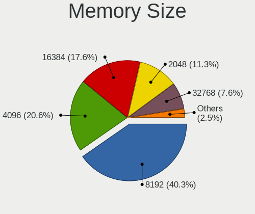

| Size  | Desktops | Percent |
|-------|----------|---------|
| 8192  | 87       | 40.47%  |
| 4096  | 43       | 20%     |
| 16384 | 39       | 18.14%  |
| 2048  | 25       | 11.63%  |
| 32768 | 16       | 7.44%   |
| 1024  | 3        | 1.4%    |
| 512   | 2        | 0.93%   |

Memory Speed
------------

Memory module speed

| Speed   | Desktops | Percent |
|---------|----------|---------|
| 3200    | 40       | 18.26%  |
| 1600    | 31       | 14.16%  |
| 1333    | 31       | 14.16%  |
| 3600    | 22       | 10.05%  |
| 2400    | 13       | 5.94%   |
| 2133    | 10       | 4.57%   |
| 3000    | 9        | 4.11%   |
| 2667    | 8        | 3.65%   |
| 3466    | 6        | 2.74%   |
| 800     | 6        | 2.74%   |
| 2666    | 5        | 2.28%   |
| 2933    | 4        | 1.83%   |
| 3733    | 3        | 1.37%   |
| 1867    | 3        | 1.37%   |
| 1066    | 3        | 1.37%   |
| 667     | 3        | 1.37%   |
| Unknown | 3        | 1.37%   |
| 3334    | 2        | 0.91%   |
| 2800    | 2        | 0.91%   |
| 333     | 2        | 0.91%   |
| 3800    | 1        | 0.46%   |
| 3533    | 1        | 0.46%   |
| 3500    | 1        | 0.46%   |
| 3100    | 1        | 0.46%   |
| 3066    | 1        | 0.46%   |
| 2934    | 1        | 0.46%   |
| 2048    | 1        | 0.46%   |
| 1866    | 1        | 0.46%   |
| 1800    | 1        | 0.46%   |
| 1400    | 1        | 0.46%   |
| 1334    | 1        | 0.46%   |
| 400     | 1        | 0.46%   |
| 266     | 1        | 0.46%   |

Printers & scanners
-------------------

Printer Vendor
--------------

Printer device vendors

| Vendor                             | Desktops | Percent |
|------------------------------------|----------|---------|
| Hewlett-Packard                    | 15       | 34.88%  |
| Canon                              | 8        | 18.6%   |
| Brother Industries                 | 6        | 13.95%  |
| Samsung Electronics                | 3        | 6.98%   |
| Seiko Epson                        | 2        | 4.65%   |
| Kyocera                            | 2        | 4.65%   |
| Dymo-CoStar                        | 2        | 4.65%   |
| Zhuhai Poskey Technology           | 1        | 2.33%   |
| Zebra                              | 1        | 2.33%   |
| Xerox                              | 1        | 2.33%   |
| Lexmark International              | 1        | 2.33%   |
| BeiJing LanXum Computer Technology | 1        | 2.33%   |

Printer Model
-------------

Printer device models

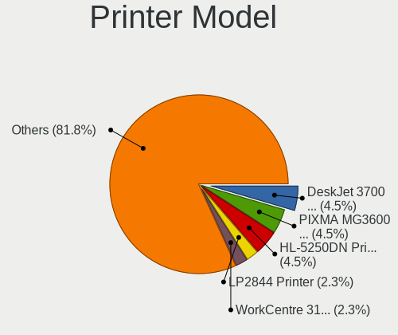

| Model                                                   | Desktops | Percent |
|---------------------------------------------------------|----------|---------|
| HP DeskJet 3700 series                                  | 2        | 4.65%   |
| Canon PIXMA MG3600 Series                               | 2        | 4.65%   |
| Brother HL-5250DN Printer                               | 2        | 4.65%   |
| Zhuhai Poskey Printer                                   | 1        | 2.33%   |
| Zebra LP2844 Printer                                    | 1        | 2.33%   |
| Xerox WorkCentre 3119 Series                            | 1        | 2.33%   |
| Seiko Epson WF-2510 Series                              | 1        | 2.33%   |
| Seiko Epson ME Office 600F/Stylus Office BX300F/TX300F  | 1        | 2.33%   |
| Samsung SCX-3400 Series                                 | 1        | 2.33%   |
| Samsung ML-1450                                         | 1        | 2.33%   |
| Samsung Composite Device                                | 1        | 2.33%   |
| Lexmark International Lexmark MC2425adw                 | 1        | 2.33%   |
| Kyocera FS-3920DN                                       | 1        | 2.33%   |
| Kyocera FS-1370DN                                       | 1        | 2.33%   |
| HP Officejet 4500 G510g-m                               | 1        | 2.33%   |
| HP LaserJet Professional P1102w                         | 1        | 2.33%   |
| HP LaserJet P1005                                       | 1        | 2.33%   |
| HP LaserJet M14-M17                                     | 1        | 2.33%   |
| HP LaserJet 3050                                        | 1        | 2.33%   |
| HP LaserJet 1020                                        | 1        | 2.33%   |
| HP LaserJet 1010                                        | 1        | 2.33%   |
| HP ENVY Photo 6200 series                               | 1        | 2.33%   |
| HP ENVY 5000 series                                     | 1        | 2.33%   |
| HP DeskJet Plus 4100 series                             | 1        | 2.33%   |
| HP Deskjet F4500 series                                 | 1        | 2.33%   |
| HP DeskJet 970c/970cse                                  | 1        | 2.33%   |
| HP Deskjet 3050 J610 series                             | 1        | 2.33%   |
| Dymo-CoStar LabelWriter 400                             | 1        | 2.33%   |
| Dymo-CoStar DYMO LabelWriter 450 Turbo                  | 1        | 2.33%   |
| Canon TS8000 series                                     | 1        | 2.33%   |
| Canon TR4500 series                                     | 1        | 2.33%   |
| Canon PRO-100 series                                    | 1        | 2.33%   |
| Canon PIXMA iP5300 Printer                              | 1        | 2.33%   |
| Canon LBP6030/6030B/6018L                               | 1        | 2.33%   |
| Canon iP8700 series                                     | 1        | 2.33%   |
| Brother QL-550 printer                                  | 1        | 2.33%   |
| Brother Printer                                         | 1        | 2.33%   |
| Brother MFC-J480DW                                      | 1        | 2.33%   |
| Brother DCP-L2540DW                                     | 1        | 2.33%   |
| BeiJing LanXum Technology Black and White Laser Printer | 1        | 2.33%   |

Scanner Vendor
--------------

Scanner device vendors

| Vendor         | Desktops | Percent |
|----------------|----------|---------|
| Canon          | 6        | 85.71%  |
| Mustek Systems | 1        | 14.29%  |

Scanner Model
-------------

Scanner device models

| Model                              | Desktops | Percent |
|------------------------------------|----------|---------|
| Canon CanoScan N1240U/LiDE 30      | 2        | 28.57%  |
| Mustek Systems BearPaw 2448 CU Pro | 1        | 14.29%  |
| Canon CanoScan N670U/N676U/LiDE 20 | 1        | 14.29%  |
| Canon CanoScan LiDE 700F           | 1        | 14.29%  |
| Canon CanoScan LiDE 210            | 1        | 14.29%  |
| Canon CanoScan LiDE 120            | 1        | 14.29%  |

Camera
------

Camera Vendor
-------------

Camera device vendors

| Vendor                        | Desktops | Percent |
|-------------------------------|----------|---------|
| Logitech                      | 45       | 35.71%  |
| Microdia                      | 14       | 11.11%  |
| Microsoft                     | 7        | 5.56%   |
| Sunplus Innovation Technology | 6        | 4.76%   |
| Realtek Semiconductor         | 5        | 3.97%   |
| Samsung Electronics           | 4        | 3.17%   |
| Generalplus Technology        | 4        | 3.17%   |
| webcam vendor                 | 3        | 2.38%   |
| GEMBIRD                       | 3        | 2.38%   |
| Cubeternet                    | 3        | 2.38%   |
| Apple                         | 3        | 2.38%   |
| Z-Star Microelectronics       | 2        | 1.59%   |
| IMC Networks                  | 2        | 1.59%   |
| Guillemot                     | 2        | 1.59%   |
| Creative Technology           | 2        | 1.59%   |
| Chicony Electronics           | 2        | 1.59%   |
| AVerMedia Technologies        | 2        | 1.59%   |
| ARC International             | 2        | 1.59%   |
| Xiongmai                      | 1        | 0.79%   |
| Trust                         | 1        | 0.79%   |
| Syntek                        | 1        | 0.79%   |
| Razer USA                     | 1        | 0.79%   |
| PrehKeyTec                    | 1        | 0.79%   |
| Polycom                       | 1        | 0.79%   |
| Philips (or NXP)              | 1        | 0.79%   |
| Magic Control Technology      | 1        | 0.79%   |
| MACROSILICON                  | 1        | 0.79%   |
| Jieli Technology              | 1        | 0.79%   |
| IPEVO                         | 1        | 0.79%   |
| Huawei Technologies           | 1        | 0.79%   |
| Etron Technology              | 1        | 0.79%   |
| Arkmicro Technologies         | 1        | 0.79%   |
| ANYKA                         | 1        | 0.79%   |

Camera Model
------------

Camera device models

| Model                                             | Desktops | Percent |
|---------------------------------------------------|----------|---------|
| Logitech Webcam C270                              | 11       | 8.73%   |
| Logitech HD Webcam C525                           | 7        | 5.56%   |
| Microdia Webcam Vitade AF                         | 5        | 3.97%   |
| Samsung Galaxy A5 (MTP)                           | 4        | 3.17%   |
| Microdia Camera                                   | 4        | 3.17%   |
| Logitech Webcam C310                              | 4        | 3.17%   |
| Logitech HD Pro Webcam C920                       | 4        | 3.17%   |
| webcam vendor webcam product                      | 3        | 2.38%   |
| Sunplus Integrated_Webcam_HD                      | 3        | 2.38%   |
| Logitech C922 Pro Stream Webcam                   | 3        | 2.38%   |
| Logitech BRIO                                     | 3        | 2.38%   |
| Generalplus GENERAL WEBCAM                        | 3        | 2.38%   |
| GEMBIRD Generic UVC 1.00 camera [AppoTech AX2311] | 3        | 2.38%   |
| Realtek NexiGo N960E FHD Webcam                   | 2        | 1.59%   |
| Realtek Full HD webcam                            | 2        | 1.59%   |
| Microdia USB 2.0 Camera                           | 2        | 1.59%   |
| Logitech Webcam Pro 9000                          | 2        | 1.59%   |
| Logitech Webcam C210                              | 2        | 1.59%   |
| Logitech HD Webcam C910                           | 2        | 1.59%   |
| Cubeternet USB2.0 Camera                          | 2        | 1.59%   |
| AVerMedia Live Streamer CAM 313                   | 2        | 1.59%   |
| ARC International Camera                          | 2        | 1.59%   |
| Apple iPhone 5/5C/5S/6/SE                         | 2        | 1.59%   |
| Z-Star Vimicro USB2.0 UVC PC Camera               | 1        | 0.79%   |
| Z-Star A4 TECH USB2.0 PC Camera E                 | 1        | 0.79%   |
| Xiongmai web camera                               | 1        | 0.79%   |
| Trust 17676 Webcam                                | 1        | 0.79%   |
| Syntek USB Video Device                           | 1        | 0.79%   |
| Sunplus USB camera                                | 1        | 0.79%   |
| Sunplus Full HD webcam                            | 1        | 0.79%   |
| Sunplus Aukey-PC-LM1E Camera                      | 1        | 0.79%   |
| Realtek Web Camera                                | 1        | 0.79%   |
| Razer USA Gaming Webcam [Kiyo]                    | 1        | 0.79%   |
| PrehKeyTec MikrOkularFullHD                       | 1        | 0.79%   |
| Polycom Poly Studio P15                           | 1        | 0.79%   |
| Philips (or NXP) SPC 520/525NC PC Camera          | 1        | 0.79%   |
| Microsoft Microsoft? LifeCam HD-5001             | 1        | 0.79%   |
| Microsoft LifeCam VX-800                          | 1        | 0.79%   |
| Microsoft LifeCam VX-7000 (UVC-compliant)         | 1        | 0.79%   |
| Microsoft LifeCam VX-5000                         | 1        | 0.79%   |
| Microsoft LifeCam Studio                          | 1        | 0.79%   |
| Microsoft LifeCam HD-3000                         | 1        | 0.79%   |
| Microsoft LifeCam Cinema                          | 1        | 0.79%   |
| Microdia USB Live camera                          | 1        | 0.79%   |
| Microdia Defender G-Lens 2577 HD720p Camera       | 1        | 0.79%   |
| Microdia ACR010 USB Webcam                        | 1        | 0.79%   |
| Magic Control j5 WebCam JVCU100                   | 1        | 0.79%   |
| MACROSILICON ShadowCast                           | 1        | 0.79%   |
| Logitech Webcam C250                              | 1        | 0.79%   |
| Logitech Webcam C170                              | 1        | 0.79%   |
| Logitech Webcam C110                              | 1        | 0.79%   |
| Logitech Logi Webcam C920e                        | 1        | 0.79%   |
| Logitech HD Webcam C510                           | 1        | 0.79%   |
| Logitech C930c                                    | 1        | 0.79%   |
| Logitech B525 HD Webcam                           | 1        | 0.79%   |
| Jieli USB PHY 2.0                                 | 1        | 0.79%   |
| IPEVO V4K                                         | 1        | 0.79%   |
| IMC Networks XHC Camera                           | 1        | 0.79%   |
| IMC Networks USB 2.0 Camera                       | 1        | 0.79%   |
| Huawei UVC Camera                                 | 1        | 0.79%   |

Security
--------

Fingerprint Vendor
------------------

Fingerprint sensor vendors

| Vendor                | Desktops | Percent |
|-----------------------|----------|---------|
| Elan Microelectronics | 3        | 75%     |
| Dell                  | 1        | 25%     |

Fingerprint Model
-----------------

Fingerprint sensor models

| Model                                          | Desktops | Percent |
|------------------------------------------------|----------|---------|
| Elan ELAN:Fingerprint                          | 3        | 75%     |
| Dell MS819 Wired Mouse With Fingerprint Reader | 1        | 25%     |

Chipcard Vendor
---------------

Chipcard module vendors

| Vendor                | Desktops | Percent |
|-----------------------|----------|---------|
| Gemalto (was Gemplus) | 1        | 50%     |
| Advanced Card Systems | 1        | 50%     |

Chipcard Model
--------------

Chipcard module models

| Model                                             | Desktops | Percent |
|---------------------------------------------------|----------|---------|
| Gemalto (was Gemplus) GemPC Twin SmartCard Reader | 1        | 50%     |
| Advanced Card Systems ACR38 SmartCard Reader      | 1        | 50%     |

Unsupported
-----------

Unsupported Devices
-------------------

Total unsupported devices on board

| Total | Desktops | Percent |
|-------|----------|---------|
| 0     | 471      | 85.95%  |
| 1     | 67       | 12.23%  |
| 2     | 9        | 1.64%   |
| 3     | 1        | 0.18%   |

Unsupported Device Types
------------------------

Types of unsupported devices

| Type                     | Desktops | Percent |
|--------------------------|----------|---------|
| Net/wireless             | 26       | 30.59%  |
| Graphics card            | 26       | 30.59%  |
| Unassigned class         | 11       | 12.94%  |
| Sound                    | 4        | 4.71%   |
| Fingerprint reader       | 3        | 3.53%   |
| Camera                   | 3        | 3.53%   |
| Multimedia controller    | 2        | 2.35%   |
| Communication controller | 2        | 2.35%   |
| Card reader              | 2        | 2.35%   |
| Bluetooth                | 2        | 2.35%   |
| Storage/raid             | 1        | 1.18%   |
| Network                  | 1        | 1.18%   |
| Dvb card                 | 1        | 1.18%   |
| Chipcard                 | 1        | 1.18%   |

