Ubuntu 21.04 - Tested Hardware & Statistics (Desktops)
------------------------------------------------------

A project to collect tested hardware configurations for Ubuntu 21.04 (Beta test).

Anyone can contribute to this report by the [hw-probe](https://github.com/linuxhw/hw-probe) tool:

    sudo -E hw-probe -all -upload

Please submit a probe of your configuration if it's not presented on the page or is rare.

Full-feature report is available here: https://linux-hardware.org/?view=trends&rel=ubuntu-21.04

Contents
--------

* [ Test Cases ](#test-cases)

* [ System ](#system)
  - [ Kernel                   ](#kernel)
  - [ Kernel Family            ](#kernel-family)
  - [ Kernel Major Ver.        ](#kernel-major-ver)
  - [ Arch                     ](#arch)
  - [ DE                       ](#de)
  - [ Display Server           ](#display-server)
  - [ Display Manager          ](#display-manager)
  - [ OS Lang                  ](#os-lang)
  - [ Boot Mode                ](#boot-mode)
  - [ Filesystem               ](#filesystem)
  - [ Part. scheme             ](#part-scheme)
  - [ Dual Boot with Linux/BSD ](#dual-boot-with-linuxbsd)
  - [ Dual Boot (Win)          ](#dual-boot-win)

* [ Board ](#board)
  - [ Vendor                   ](#vendor)
  - [ Model                    ](#model)
  - [ Model Family             ](#model-family)
  - [ MFG Year                 ](#mfg-year)
  - [ Form Factor              ](#form-factor)
  - [ Secure Boot              ](#secure-boot)
  - [ Coreboot                 ](#coreboot)
  - [ RAM Size                 ](#ram-size)
  - [ RAM Used                 ](#ram-used)
  - [ Total Drives             ](#total-drives)
  - [ Has CD-ROM               ](#has-cd-rom)
  - [ Has Ethernet             ](#has-ethernet)
  - [ Has WiFi                 ](#has-wifi)
  - [ Has Bluetooth            ](#has-bluetooth)

* [ Location ](#location)
  - [ Country                  ](#country)
  - [ City                     ](#city)

* [ Drives ](#drives)
  - [ Drive Vendor             ](#drive-vendor)
  - [ Drive Model              ](#drive-model)
  - [ HDD Vendor               ](#hdd-vendor)
  - [ SSD Vendor               ](#ssd-vendor)
  - [ Drive Kind               ](#drive-kind)
  - [ Drive Connector          ](#drive-connector)
  - [ Drive Size               ](#drive-size)
  - [ Space Total              ](#space-total)
  - [ Space Used               ](#space-used)
  - [ Malfunc. Drives          ](#malfunc-drives)
  - [ Malfunc. Drive Vendor    ](#malfunc-drive-vendor)
  - [ Malfunc. HDD Vendor      ](#malfunc-hdd-vendor)
  - [ Malfunc. Drive Kind      ](#malfunc-drive-kind)
  - [ Failed Drives            ](#failed-drives)
  - [ Failed Drive Vendor      ](#failed-drive-vendor)
  - [ Drive Status             ](#drive-status)

* [ Storage controller ](#storage-controller)
  - [ Storage Vendor           ](#storage-vendor)
  - [ Storage Model            ](#storage-model)
  - [ Storage Kind             ](#storage-kind)

* [ Processor ](#processor)
  - [ CPU Vendor               ](#cpu-vendor)
  - [ CPU Model                ](#cpu-model)
  - [ CPU Model Family         ](#cpu-model-family)
  - [ CPU Cores                ](#cpu-cores)
  - [ CPU Sockets              ](#cpu-sockets)
  - [ CPU Threads              ](#cpu-threads)
  - [ CPU Op-Modes             ](#cpu-op-modes)
  - [ CPU Microcode            ](#cpu-microcode)
  - [ CPU Microarch            ](#cpu-microarch)

* [ Graphics ](#graphics)
  - [ GPU Vendor               ](#gpu-vendor)
  - [ GPU Model                ](#gpu-model)
  - [ GPU Combo                ](#gpu-combo)
  - [ GPU Driver               ](#gpu-driver)
  - [ GPU Memory               ](#gpu-memory)

* [ Monitor ](#monitor)
  - [ Monitor Vendor           ](#monitor-vendor)
  - [ Monitor Model            ](#monitor-model)
  - [ Monitor Resolution       ](#monitor-resolution)
  - [ Monitor Diagonal         ](#monitor-diagonal)
  - [ Monitor Width            ](#monitor-width)
  - [ Aspect Ratio             ](#aspect-ratio)
  - [ Monitor Area             ](#monitor-area)
  - [ Pixel Density            ](#pixel-density)
  - [ Multiple Monitors        ](#multiple-monitors)

* [ Network ](#network)
  - [ Net Controller Vendor    ](#net-controller-vendor)
  - [ Net Controller Model     ](#net-controller-model)
  - [ Wireless Vendor          ](#wireless-vendor)
  - [ Wireless Model           ](#wireless-model)
  - [ Ethernet Vendor          ](#ethernet-vendor)
  - [ Ethernet Model           ](#ethernet-model)
  - [ Net Controller Kind      ](#net-controller-kind)
  - [ Used Controller          ](#used-controller)
  - [ NICs                     ](#nics)
  - [ IPv6                     ](#ipv6)

* [ Bluetooth ](#bluetooth)
  - [ Bluetooth Vendor         ](#bluetooth-vendor)
  - [ Bluetooth Model          ](#bluetooth-model)

* [ Sound ](#sound)
  - [ Sound Vendor             ](#sound-vendor)
  - [ Sound Model              ](#sound-model)

* [ Memory ](#memory)
  - [ Memory Vendor            ](#memory-vendor)
  - [ Memory Model             ](#memory-model)
  - [ Memory Kind              ](#memory-kind)
  - [ Memory Form Factor       ](#memory-form-factor)
  - [ Memory Size              ](#memory-size)
  - [ Memory Speed             ](#memory-speed)

* [ Printers & scanners ](#printers--scanners)
  - [ Printer Vendor           ](#printer-vendor)
  - [ Printer Model            ](#printer-model)
  - [ Scanner Vendor           ](#scanner-vendor)
  - [ Scanner Model            ](#scanner-model)

* [ Camera ](#camera)
  - [ Camera Vendor            ](#camera-vendor)
  - [ Camera Model             ](#camera-model)

* [ Security ](#security)
  - [ Fingerprint Vendor       ](#fingerprint-vendor)
  - [ Fingerprint Model        ](#fingerprint-model)
  - [ Chipcard Vendor          ](#chipcard-vendor)
  - [ Chipcard Model           ](#chipcard-model)

* [ Unsupported ](#unsupported)
  - [ Unsupported Devices      ](#unsupported-devices)
  - [ Unsupported Device Types ](#unsupported-device-types)

Test Cases
----------

| Vendor        | Model                       | Probe                                                      | Date         |
|---------------|-----------------------------|------------------------------------------------------------|--------------|
| Gigabyte      | H310M S2 x.x                | [462df98aea](https://linux-hardware.org/?probe=462df98aea) | Aug 17, 2021 |
| ASUSTek       | P8H61-M LX R2.0             | [b446e80e0a](https://linux-hardware.org/?probe=b446e80e0a) | Aug 17, 2021 |
| Gigabyte      | H310M S2 x.x                | [3e3018cc57](https://linux-hardware.org/?probe=3e3018cc57) | Aug 17, 2021 |
| ASUSTek       | P8H61-M LX R2.0             | [5a4eb4b728](https://linux-hardware.org/?probe=5a4eb4b728) | Aug 17, 2021 |
| HP            | 1494                        | [df10192c5b](https://linux-hardware.org/?probe=df10192c5b) | Aug 16, 2021 |
| ASUSTek       | B150M-C                     | [794387ddd6](https://linux-hardware.org/?probe=794387ddd6) | Aug 16, 2021 |
| Medion        | MS-7707                     | [66ace31297](https://linux-hardware.org/?probe=66ace31297) | Aug 16, 2021 |
| Unknown       | Unknown                     | [65ebd0006e](https://linux-hardware.org/?probe=65ebd0006e) | Aug 16, 2021 |
| Dell          | 082WXT A01                  | [e6b9ac8959](https://linux-hardware.org/?probe=e6b9ac8959) | Aug 16, 2021 |
| Lenovo        | 0B98401 PRO                 | [537aee667d](https://linux-hardware.org/?probe=537aee667d) | Aug 16, 2021 |
| ASUSTek       | Basswood                    | [f42051fa02](https://linux-hardware.org/?probe=f42051fa02) | Aug 15, 2021 |
| Gigabyte      | X99-SLI-CF                  | [27f528f809](https://linux-hardware.org/?probe=27f528f809) | Aug 15, 2021 |
| ASUSTek       | P8H67                       | [7c1b975d25](https://linux-hardware.org/?probe=7c1b975d25) | Aug 15, 2021 |
| MSI           | MPG X570 GAMING EDGE WIF... | [696380b374](https://linux-hardware.org/?probe=696380b374) | Aug 15, 2021 |
| ASUSTek       | P8Z68-V LX                  | [5076334ae6](https://linux-hardware.org/?probe=5076334ae6) | Aug 15, 2021 |
| Dell          | 0NK5PH A00                  | [676c2b2a79](https://linux-hardware.org/?probe=676c2b2a79) | Aug 14, 2021 |
| ASRock        | H97M Pro4                   | [5edf7e02c8](https://linux-hardware.org/?probe=5edf7e02c8) | Aug 14, 2021 |
| ASUSTek       | P8H61-M LX R2.0             | [74d3e5803f](https://linux-hardware.org/?probe=74d3e5803f) | Aug 14, 2021 |
| ASUSTek       | P8H61-M LX R2.0             | [3d5cb99ee5](https://linux-hardware.org/?probe=3d5cb99ee5) | Aug 14, 2021 |
| Gigabyte      | B460M DS3H AC V2-Y1         | [e2d8270403](https://linux-hardware.org/?probe=e2d8270403) | Aug 13, 2021 |
| Gigabyte      | B460M DS3H AC V2-Y1         | [e9e0bafaee](https://linux-hardware.org/?probe=e9e0bafaee) | Aug 13, 2021 |
| ASUSTek       | P8H61-M LX R2.0             | [424787c9b9](https://linux-hardware.org/?probe=424787c9b9) | Aug 13, 2021 |
| Huanan        | X79 INTEL (INTEL Xeon E5... | [fec985ca69](https://linux-hardware.org/?probe=fec985ca69) | Aug 13, 2021 |
| Gigabyte      | Z170XP-SLI-CF               | [1174eec6c2](https://linux-hardware.org/?probe=1174eec6c2) | Aug 13, 2021 |
| Acer          | Veriton X2631G V:1.0        | [d0db0c37b0](https://linux-hardware.org/?probe=d0db0c37b0) | Aug 12, 2021 |
| Acer          | Veriton X2631G V:1.0        | [8ffd94b29c](https://linux-hardware.org/?probe=8ffd94b29c) | Aug 12, 2021 |
| Gigabyte      | B450 AORUS PRO-CF           | [adde6ef882](https://linux-hardware.org/?probe=adde6ef882) | Aug 12, 2021 |
| Gigabyte      | GA-78LMT-USB3 R2 sex        | [02f3303081](https://linux-hardware.org/?probe=02f3303081) | Aug 12, 2021 |
| ASRock        | B550M-ITX/ac                | [9b490356cb](https://linux-hardware.org/?probe=9b490356cb) | Aug 11, 2021 |
| ECS           | Asterope3                   | [9255f2e941](https://linux-hardware.org/?probe=9255f2e941) | Aug 10, 2021 |
| ASUSTek       | P8H61-M LX R2.0             | [2af094f75d](https://linux-hardware.org/?probe=2af094f75d) | Aug 10, 2021 |
| ASUSTek       | M5A78L LE                   | [ae67208b0e](https://linux-hardware.org/?probe=ae67208b0e) | Aug 10, 2021 |
| Gigabyte      | GA-A55M-DS2                 | [8beee2f359](https://linux-hardware.org/?probe=8beee2f359) | Aug 10, 2021 |
| ASUSTek       | D642MF                      | [e50f269bc9](https://linux-hardware.org/?probe=e50f269bc9) | Aug 10, 2021 |
| Gigabyte      | GA-A55M-DS2                 | [d2e35c6ccb](https://linux-hardware.org/?probe=d2e35c6ccb) | Aug 10, 2021 |
| ASUSTek       | P7H55D-M EVO                | [88dcb8813a](https://linux-hardware.org/?probe=88dcb8813a) | Aug 10, 2021 |
| ASUSTek       | P7H55D-M EVO                | [07fad2e81c](https://linux-hardware.org/?probe=07fad2e81c) | Aug 10, 2021 |
| HP            | 87D6 SMVB                   | [7e4cda26e2](https://linux-hardware.org/?probe=7e4cda26e2) | Aug 09, 2021 |
| ASUSTek       | P8H61-M LX R2.0             | [7979b23ea9](https://linux-hardware.org/?probe=7979b23ea9) | Aug 09, 2021 |
| Lenovo        | 36EE SDK0J40700 WIN 3258... | [a2c47444e8](https://linux-hardware.org/?probe=a2c47444e8) | Aug 09, 2021 |
| ASUSTek       | TUF GAMING Z590-PLUS WIF... | [aaf4f26a30](https://linux-hardware.org/?probe=aaf4f26a30) | Aug 09, 2021 |
| ASUSTek       | P8H61-M LX R2.0             | [ea239f2f82](https://linux-hardware.org/?probe=ea239f2f82) | Aug 09, 2021 |
| ASUSTek       | P8H61-M LX R2.0             | [b01f2c504d](https://linux-hardware.org/?probe=b01f2c504d) | Aug 08, 2021 |
| ASUSTek       | ROG STRIX X570-E GAMING     | [c42793eeff](https://linux-hardware.org/?probe=c42793eeff) | Aug 08, 2021 |
| HP            | 212B                        | [ee483c7463](https://linux-hardware.org/?probe=ee483c7463) | Aug 08, 2021 |
| AOpen         | D1009 A1A4                  | [a1ad011d2c](https://linux-hardware.org/?probe=a1ad011d2c) | Aug 08, 2021 |
| Foxconn       | 2A8C                        | [7123b6c779](https://linux-hardware.org/?probe=7123b6c779) | Aug 08, 2021 |
| Lenovo        | Board                       | [b4fe0907aa](https://linux-hardware.org/?probe=b4fe0907aa) | Aug 08, 2021 |
| Lenovo        | Board                       | [13d5b7a5b0](https://linux-hardware.org/?probe=13d5b7a5b0) | Aug 08, 2021 |
| HP            | 1998                        | [b0e8ef9aa2](https://linux-hardware.org/?probe=b0e8ef9aa2) | Aug 08, 2021 |
| ASRock        | 970 Extreme3                | [c08aa58f01](https://linux-hardware.org/?probe=c08aa58f01) | Aug 08, 2021 |
| Gigabyte      | GA-78LMT-USB3 SEx           | [8c36ac6a56](https://linux-hardware.org/?probe=8c36ac6a56) | Aug 07, 2021 |
| MSI           | Z97 GAMING 9 AC             | [17ce8c5436](https://linux-hardware.org/?probe=17ce8c5436) | Aug 07, 2021 |
| ASUSTek       | M5A78L LE                   | [9d934a3df1](https://linux-hardware.org/?probe=9d934a3df1) | Aug 07, 2021 |
| Lenovo        | SHARKBAY 0B98401 PRO        | [fd15e7b399](https://linux-hardware.org/?probe=fd15e7b399) | Aug 07, 2021 |
| ASUSTek       | M5A78L LE                   | [32192f4588](https://linux-hardware.org/?probe=32192f4588) | Aug 07, 2021 |
| ASUSTek       | PRIME B450M-A               | [21e4e5c57d](https://linux-hardware.org/?probe=21e4e5c57d) | Aug 07, 2021 |
| Lenovo        | Board                       | [a053325efe](https://linux-hardware.org/?probe=a053325efe) | Aug 06, 2021 |
| Gigabyte      | A320M-S2H-CF                | [09fa4c99dc](https://linux-hardware.org/?probe=09fa4c99dc) | Aug 06, 2021 |
| Lenovo        | Board                       | [2415e3e33f](https://linux-hardware.org/?probe=2415e3e33f) | Aug 06, 2021 |
| ASUSTek       | P8H61-M LX R2.0             | [c149c02018](https://linux-hardware.org/?probe=c149c02018) | Aug 06, 2021 |
| Lenovo        | SHARKBAY 0B98401 PRO        | [463d805b1e](https://linux-hardware.org/?probe=463d805b1e) | Aug 06, 2021 |
| Acer          | Veriton X2631G V:1.0        | [7306d11e16](https://linux-hardware.org/?probe=7306d11e16) | Aug 06, 2021 |
| MSI           | Z370 TOMAHAWK               | [3118d29bf0](https://linux-hardware.org/?probe=3118d29bf0) | Aug 05, 2021 |
| Gigabyte      | B85M-D3H                    | [3e56e95f2f](https://linux-hardware.org/?probe=3e56e95f2f) | Aug 05, 2021 |
| ASUSTek       | P8H61-M LX R2.0             | [f892a56ee0](https://linux-hardware.org/?probe=f892a56ee0) | Aug 05, 2021 |
| ASUSTek       | M4A78 PRO                   | [ef7f570d01](https://linux-hardware.org/?probe=ef7f570d01) | Aug 04, 2021 |
| Dell          | 03NVJ6 A02                  | [a2a1574d81](https://linux-hardware.org/?probe=a2a1574d81) | Aug 04, 2021 |
| MSI           | 2A9C                        | [3616ca63df](https://linux-hardware.org/?probe=3616ca63df) | Aug 04, 2021 |
| ASUSTek       | P8H61-M LX R2.0             | [422b3a9c80](https://linux-hardware.org/?probe=422b3a9c80) | Aug 04, 2021 |
| Biostar       | A68MHE                      | [160e00a244](https://linux-hardware.org/?probe=160e00a244) | Aug 04, 2021 |
| ASRock        | X570 Taichi                 | [a7feba2af0](https://linux-hardware.org/?probe=a7feba2af0) | Aug 04, 2021 |
| ASUSTek       | P8H61-M LX R2.0             | [88534a17b6](https://linux-hardware.org/?probe=88534a17b6) | Aug 03, 2021 |
| Gigabyte      | Z87M-D3H                    | [e679a451ab](https://linux-hardware.org/?probe=e679a451ab) | Aug 03, 2021 |
| ASUSTek       | PRIME A320M-C R2.0          | [32e0ae8af0](https://linux-hardware.org/?probe=32e0ae8af0) | Aug 03, 2021 |
| MSI           | Z97-G43 GAMING              | [282ecb40ca](https://linux-hardware.org/?probe=282ecb40ca) | Aug 03, 2021 |
| MSI           | Z97-G43 GAMING              | [ce156e88b0](https://linux-hardware.org/?probe=ce156e88b0) | Aug 03, 2021 |
| ASUSTek       | M3N78 PRO                   | [dda6e493b7](https://linux-hardware.org/?probe=dda6e493b7) | Aug 03, 2021 |
| Gigabyte      | X399 AORUS Gaming 7         | [d976766cee](https://linux-hardware.org/?probe=d976766cee) | Aug 03, 2021 |
| Foxconn       | 2A8C                        | [67e965bb06](https://linux-hardware.org/?probe=67e965bb06) | Aug 02, 2021 |
| MSI           | G31M3-F V2                  | [8f821ac3a7](https://linux-hardware.org/?probe=8f821ac3a7) | Aug 02, 2021 |
| MSI           | X470 GAMING PLUS MAX        | [cb617ee0fa](https://linux-hardware.org/?probe=cb617ee0fa) | Aug 02, 2021 |
| ASUSTek       | P7Q57-M DO                  | [e14cd31bf6](https://linux-hardware.org/?probe=e14cd31bf6) | Aug 01, 2021 |
| Gigabyte      | Z87X-UD4H-CF                | [39b2e07348](https://linux-hardware.org/?probe=39b2e07348) | Aug 01, 2021 |
| Gigabyte      | Z87X-UD4H-CF                | [aaece9a4d4](https://linux-hardware.org/?probe=aaece9a4d4) | Aug 01, 2021 |
| ASRock        | N68C-S UCC                  | [2c67644e4c](https://linux-hardware.org/?probe=2c67644e4c) | Aug 01, 2021 |
| ASUSTek       | P8H61-M LX R2.0             | [767bc19ec8](https://linux-hardware.org/?probe=767bc19ec8) | Jul 31, 2021 |
| ASRock        | N68C-S UCC                  | [3b4a485e30](https://linux-hardware.org/?probe=3b4a485e30) | Jul 31, 2021 |
| Gigabyte      | G41M-ES2H                   | [ba0824b1c9](https://linux-hardware.org/?probe=ba0824b1c9) | Jul 30, 2021 |
| Gigabyte      | B450M DS3H-CF               | [fda988dc8a](https://linux-hardware.org/?probe=fda988dc8a) | Jul 30, 2021 |
| ASRock        | H470M-HVS                   | [97dbb1b8b9](https://linux-hardware.org/?probe=97dbb1b8b9) | Jul 30, 2021 |
| MSI           | MAG B550 TOMAHAWK           | [4a27442871](https://linux-hardware.org/?probe=4a27442871) | Jul 30, 2021 |
| Gigabyte      | GA-MA780G-UD3H              | [d3e4773f47](https://linux-hardware.org/?probe=d3e4773f47) | Jul 30, 2021 |
| ASRock        | Z170 OC Formula             | [0d1ca849b8](https://linux-hardware.org/?probe=0d1ca849b8) | Jul 29, 2021 |
| MSI           | H510M PRO                   | [6b204e25a9](https://linux-hardware.org/?probe=6b204e25a9) | Jul 29, 2021 |
| Dell          | 0JGM7F A00                  | [8eba192a2d](https://linux-hardware.org/?probe=8eba192a2d) | Jul 29, 2021 |
| Dell          | 0JGM7F A00                  | [d2cd2288c7](https://linux-hardware.org/?probe=d2cd2288c7) | Jul 29, 2021 |
| MSI           | H510I PRO WIFI              | [e896a37f1d](https://linux-hardware.org/?probe=e896a37f1d) | Jul 29, 2021 |
| MSI           | G31TM-P21                   | [024df6a0c1](https://linux-hardware.org/?probe=024df6a0c1) | Jul 29, 2021 |
| Dell          | 0NKW6Y A00                  | [85f066488a](https://linux-hardware.org/?probe=85f066488a) | Jul 29, 2021 |
| Gigabyte      | G41M-ES2H                   | [04b060a090](https://linux-hardware.org/?probe=04b060a090) | Jul 29, 2021 |
| Gigabyte      | Z390 AORUS ULTRA-CF         | [55f86a29a2](https://linux-hardware.org/?probe=55f86a29a2) | Jul 29, 2021 |
| ASUSTek       | P8H61-M LX R2.0             | [41c1c2551d](https://linux-hardware.org/?probe=41c1c2551d) | Jul 29, 2021 |
| Dell          | 0NKW6Y A00                  | [fd1285b7f2](https://linux-hardware.org/?probe=fd1285b7f2) | Jul 29, 2021 |
| ASRock        | 970 Extreme3                | [4769f95bad](https://linux-hardware.org/?probe=4769f95bad) | Jul 29, 2021 |
| MSI           | B450 GAMING PLUS MAX        | [8fe5a59e53](https://linux-hardware.org/?probe=8fe5a59e53) | Jul 28, 2021 |
| MSI           | B450 GAMING PLUS MAX        | [844de3ccbf](https://linux-hardware.org/?probe=844de3ccbf) | Jul 28, 2021 |
| MSI           | MPG X570 GAMING PLUS        | [6fcd0a6b24](https://linux-hardware.org/?probe=6fcd0a6b24) | Jul 27, 2021 |
| MSI           | MPG X570 GAMING PLUS        | [67a1d9bcc9](https://linux-hardware.org/?probe=67a1d9bcc9) | Jul 27, 2021 |
| MSI           | B450M PRO-VDH MAX           | [8a24dd720f](https://linux-hardware.org/?probe=8a24dd720f) | Jul 27, 2021 |
| Intel         | BTC-T37                     | [758e5d4332](https://linux-hardware.org/?probe=758e5d4332) | Jul 27, 2021 |
| Intel         | BTC-T37                     | [000e132ac1](https://linux-hardware.org/?probe=000e132ac1) | Jul 26, 2021 |
| ASUSTek       | Z97-K                       | [588c5ca9f6](https://linux-hardware.org/?probe=588c5ca9f6) | Jul 26, 2021 |
| ASUSTek       | Z97-K                       | [d7369d7eb4](https://linux-hardware.org/?probe=d7369d7eb4) | Jul 26, 2021 |
| ASUSTek       | Z97-P                       | [ef88333344](https://linux-hardware.org/?probe=ef88333344) | Jul 26, 2021 |
| ASRock        | 970 Extreme3                | [b99b48ada3](https://linux-hardware.org/?probe=b99b48ada3) | Jul 26, 2021 |
| ASUSTek       | H110M-R                     | [87ca1f0bda](https://linux-hardware.org/?probe=87ca1f0bda) | Jul 26, 2021 |
| ASUSTek       | ROG STRIX X570-E GAMING     | [3185d49877](https://linux-hardware.org/?probe=3185d49877) | Jul 26, 2021 |
| ASUSTek       | ROG STRIX X570-E GAMING     | [66e10b64e4](https://linux-hardware.org/?probe=66e10b64e4) | Jul 26, 2021 |
| Dell          | 0R790T A00                  | [474dfcb3e3](https://linux-hardware.org/?probe=474dfcb3e3) | Jul 26, 2021 |
| Dell          | 0RY007                      | [f2cd48444a](https://linux-hardware.org/?probe=f2cd48444a) | Jul 26, 2021 |
| ASUSTek       | P8H61-M LX R2.0             | [527a02f609](https://linux-hardware.org/?probe=527a02f609) | Jul 25, 2021 |
| ASUSTek       | Rampage III Extreme         | [f637e33171](https://linux-hardware.org/?probe=f637e33171) | Jul 25, 2021 |
| ASUSTek       | B150M-K                     | [34e2582dc2](https://linux-hardware.org/?probe=34e2582dc2) | Jul 25, 2021 |
| ASUSTek       | PRIME B450-PLUS             | [acc53aae10](https://linux-hardware.org/?probe=acc53aae10) | Jul 25, 2021 |
| ASUSTek       | ROG CROSSHAIR VIII DARK ... | [02dad54406](https://linux-hardware.org/?probe=02dad54406) | Jul 25, 2021 |
| ASUSTek       | P8H61-M LX R2.0             | [c99742c8ed](https://linux-hardware.org/?probe=c99742c8ed) | Jul 25, 2021 |
| MSI           | Z490-A PRO                  | [740f322568](https://linux-hardware.org/?probe=740f322568) | Jul 25, 2021 |
| ASUSTek       | P8H61-M LX R2.0             | [4f7db30451](https://linux-hardware.org/?probe=4f7db30451) | Jul 24, 2021 |
| HP            | 212B                        | [2ae8fe394a](https://linux-hardware.org/?probe=2ae8fe394a) | Jul 24, 2021 |
| Dell          | 0D24M8 A01                  | [2080a71bc0](https://linux-hardware.org/?probe=2080a71bc0) | Jul 24, 2021 |
| Gigabyte      | X570 AORUS ULTRA            | [3d2cd06389](https://linux-hardware.org/?probe=3d2cd06389) | Jul 24, 2021 |
| ASUSTek       | ROG STRIX B550-E GAMING     | [aa0949f27f](https://linux-hardware.org/?probe=aa0949f27f) | Jul 24, 2021 |
| ASRock        | 970 Extreme3                | [eb85761dc0](https://linux-hardware.org/?probe=eb85761dc0) | Jul 23, 2021 |
| ASUSTek       | TUF X470-PLUS GAMING        | [61aa66455b](https://linux-hardware.org/?probe=61aa66455b) | Jul 23, 2021 |
| MSI           | H110M PRO-VH                | [42bd7fe7d2](https://linux-hardware.org/?probe=42bd7fe7d2) | Jul 23, 2021 |
| MSI           | 3664h                       | [8141885507](https://linux-hardware.org/?probe=8141885507) | Jul 23, 2021 |
| MSI           | B360M BAZOOKA               | [c0e89d7f2c](https://linux-hardware.org/?probe=c0e89d7f2c) | Jul 23, 2021 |
| MSI           | B360M BAZOOKA               | [53b9087fbb](https://linux-hardware.org/?probe=53b9087fbb) | Jul 23, 2021 |
| Gigabyte      | 945GCMX-S2                  | [c9d0df911e](https://linux-hardware.org/?probe=c9d0df911e) | Jul 23, 2021 |
| ASUSTek       | P8H61-M LX R2.0             | [fdd7765da0](https://linux-hardware.org/?probe=fdd7765da0) | Jul 23, 2021 |
| ASUSTek       | TUF GAMING B560M-PLUS WI... | [bc81196561](https://linux-hardware.org/?probe=bc81196561) | Jul 22, 2021 |
| ASUSTek       | ROG Maximus XI HERO         | [81c950f0e4](https://linux-hardware.org/?probe=81c950f0e4) | Jul 22, 2021 |
| Acer          | WMCP78M                     | [591c077e28](https://linux-hardware.org/?probe=591c077e28) | Jul 22, 2021 |
| ASUSTek       | P8H61-M LX R2.0             | [f00892d38b](https://linux-hardware.org/?probe=f00892d38b) | Jul 22, 2021 |
| Intel         | X79 V2.4F                   | [62eca59ba3](https://linux-hardware.org/?probe=62eca59ba3) | Jul 22, 2021 |
| Intel         | X79 V2.4F                   | [c469ee9d35](https://linux-hardware.org/?probe=c469ee9d35) | Jul 22, 2021 |
| Acer          | WMCP78M                     | [4d35606ff5](https://linux-hardware.org/?probe=4d35606ff5) | Jul 22, 2021 |
| Acer          | Aspire TC-780               | [cc39834e1d](https://linux-hardware.org/?probe=cc39834e1d) | Jul 21, 2021 |
| ASUSTek       | Z97-AR                      | [900229235e](https://linux-hardware.org/?probe=900229235e) | Jul 21, 2021 |
| ASUSTek       | Z97-AR                      | [c1dcbf95e4](https://linux-hardware.org/?probe=c1dcbf95e4) | Jul 21, 2021 |
| Dell          | 00FKMJ A00                  | [0b4299bc41](https://linux-hardware.org/?probe=0b4299bc41) | Jul 21, 2021 |
| Gigabyte      | Z87M-D3H                    | [382d63f2b6](https://linux-hardware.org/?probe=382d63f2b6) | Jul 21, 2021 |
| Gigabyte      | Z87M-D3H                    | [85533714a5](https://linux-hardware.org/?probe=85533714a5) | Jul 21, 2021 |
| ASUSTek       | P8H61-M LX R2.0             | [8c093d0560](https://linux-hardware.org/?probe=8c093d0560) | Jul 20, 2021 |
| HP            | 3397                        | [7626063783](https://linux-hardware.org/?probe=7626063783) | Jul 20, 2021 |
| HP            | 3397                        | [38dfe540f7](https://linux-hardware.org/?probe=38dfe540f7) | Jul 20, 2021 |
| Gigabyte      | B250-FinTech-CF             | [58b1c1aecf](https://linux-hardware.org/?probe=58b1c1aecf) | Jul 20, 2021 |
| ASUSTek       | ROG STRIX X470-F GAMING     | [8e68827883](https://linux-hardware.org/?probe=8e68827883) | Jul 20, 2021 |
| ASUSTek       | PRIME H370M-PLUS            | [b7a612e4ec](https://linux-hardware.org/?probe=b7a612e4ec) | Jul 20, 2021 |
| ASUSTek       | P8H61-M LX R2.0             | [4788bcc4d5](https://linux-hardware.org/?probe=4788bcc4d5) | Jul 20, 2021 |
| PCWare        | IPMH61R1                    | [1212ad03e9](https://linux-hardware.org/?probe=1212ad03e9) | Jul 20, 2021 |
| ASRock        | 970 Extreme3                | [1bdc5d46a3](https://linux-hardware.org/?probe=1bdc5d46a3) | Jul 19, 2021 |
| MSI           | H110M PRO-VH                | [d324faa498](https://linux-hardware.org/?probe=d324faa498) | Jul 19, 2021 |
| MSI           | 890GXM-G65                  | [ae86741130](https://linux-hardware.org/?probe=ae86741130) | Jul 19, 2021 |
| ASUSTek       | PRIME A320M-K               | [fb9c551dd7](https://linux-hardware.org/?probe=fb9c551dd7) | Jul 19, 2021 |
| Unknown       | Unknown                     | [5faacb9f0b](https://linux-hardware.org/?probe=5faacb9f0b) | Jul 19, 2021 |
| ASUSTek       | K30AD_M31AD_M51AD           | [0f6b60cc29](https://linux-hardware.org/?probe=0f6b60cc29) | Jul 19, 2021 |
| ASUSTek       | K30AD_M31AD_M51AD           | [704aa27146](https://linux-hardware.org/?probe=704aa27146) | Jul 19, 2021 |
| Dell          | Board                       | [653462ebfc](https://linux-hardware.org/?probe=653462ebfc) | Jul 19, 2021 |
| Dell          | Board                       | [221fc0def9](https://linux-hardware.org/?probe=221fc0def9) | Jul 18, 2021 |
| ASUSTek       | B85M-G                      | [59a5d00285](https://linux-hardware.org/?probe=59a5d00285) | Jul 18, 2021 |
| Biostar       | NF520D3                     | [3c302b5285](https://linux-hardware.org/?probe=3c302b5285) | Jul 18, 2021 |
| ASUSTek       | Maximus VIII RANGER         | [3cc44e771e](https://linux-hardware.org/?probe=3cc44e771e) | Jul 17, 2021 |
| ASRock        | Z77 Extreme3                | [79dd398eff](https://linux-hardware.org/?probe=79dd398eff) | Jul 17, 2021 |
| ASUSTek       | X99-DELUXE II               | [f7c2e4c1ff](https://linux-hardware.org/?probe=f7c2e4c1ff) | Jul 17, 2021 |
| ASUSTek       | X99-DELUXE II               | [279539af23](https://linux-hardware.org/?probe=279539af23) | Jul 17, 2021 |
| MSI           | H510I PRO WIFI              | [e2ee4b4177](https://linux-hardware.org/?probe=e2ee4b4177) | Jul 16, 2021 |
| MSI           | H81M-P33                    | [4a187b22eb](https://linux-hardware.org/?probe=4a187b22eb) | Jul 16, 2021 |
| MSI           | H110M PRO-VH                | [c91d217ad5](https://linux-hardware.org/?probe=c91d217ad5) | Jul 16, 2021 |
| ASUSTek       | M4A88T-M                    | [8a768d9d2e](https://linux-hardware.org/?probe=8a768d9d2e) | Jul 16, 2021 |
| MSI           | X399 SLI PLUS               | [00b0b9f630](https://linux-hardware.org/?probe=00b0b9f630) | Jul 15, 2021 |
| ASRock        | 970 Extreme3                | [15b36f53b7](https://linux-hardware.org/?probe=15b36f53b7) | Jul 15, 2021 |
| ASUSTek       | P8H61-M LX R2.0             | [78f6f72d78](https://linux-hardware.org/?probe=78f6f72d78) | Jul 15, 2021 |
| ASUSTek       | M4A785TD-V EVO              | [b833818421](https://linux-hardware.org/?probe=b833818421) | Jul 15, 2021 |
| ASRock        | 970 Extreme3                | [7802550585](https://linux-hardware.org/?probe=7802550585) | Jul 15, 2021 |
| Lenovo        | 3188 SDK0L77769 WIN 3423... | [d84332d50b](https://linux-hardware.org/?probe=d84332d50b) | Jul 14, 2021 |
| Lenovo        | 3188 SDK0L77769 WIN 3423... | [f68b508049](https://linux-hardware.org/?probe=f68b508049) | Jul 14, 2021 |
| ASUSTek       | ROG STRIX B550-F GAMING     | [2b7c858e62](https://linux-hardware.org/?probe=2b7c858e62) | Jul 14, 2021 |
| ASUSTek       | ROG STRIX B550-F GAMING     | [9a7cff028c](https://linux-hardware.org/?probe=9a7cff028c) | Jul 14, 2021 |
| Dell          | 0YXT71 A03                  | [eea8e3b740](https://linux-hardware.org/?probe=eea8e3b740) | Jul 14, 2021 |
| Biostar       | TZ68K+                      | [52ef8197ad](https://linux-hardware.org/?probe=52ef8197ad) | Jul 13, 2021 |
| Dell          | 0YXT71 A03                  | [e363457394](https://linux-hardware.org/?probe=e363457394) | Jul 13, 2021 |
| ASUSTek       | ROG STRIX B550-F GAMING     | [5b9e8c2d22](https://linux-hardware.org/?probe=5b9e8c2d22) | Jul 13, 2021 |
| Dell          | 0D6H9T A00                  | [a989b9d184](https://linux-hardware.org/?probe=a989b9d184) | Jul 13, 2021 |
| Dell          | 0D6H9T A00                  | [19a34b1a62](https://linux-hardware.org/?probe=19a34b1a62) | Jul 13, 2021 |
| ASUSTek       | P8H61-MX USB3               | [4bf665fc54](https://linux-hardware.org/?probe=4bf665fc54) | Jul 13, 2021 |
| ASRock        | 980DE3/U3S3                 | [f44cd2127b](https://linux-hardware.org/?probe=f44cd2127b) | Jul 12, 2021 |
| MSI           | H61M-E22/W8                 | [6fff913666](https://linux-hardware.org/?probe=6fff913666) | Jul 12, 2021 |
| ASUSTek       | P8H61-M LX R2.0             | [26c9b7468a](https://linux-hardware.org/?probe=26c9b7468a) | Jul 11, 2021 |
| ASUSTek       | P8H61-M LX R2.0             | [fe6c28a62e](https://linux-hardware.org/?probe=fe6c28a62e) | Jul 11, 2021 |
| Gigabyte      | Z77-DS3H                    | [4bb7996ee5](https://linux-hardware.org/?probe=4bb7996ee5) | Jul 11, 2021 |
| Gigabyte      | H61M-USB3H                  | [667aa68843](https://linux-hardware.org/?probe=667aa68843) | Jul 11, 2021 |
| Gigabyte      | B85M-D3H                    | [b551baea7d](https://linux-hardware.org/?probe=b551baea7d) | Jul 11, 2021 |
| Gigabyte      | AB350M-DS3H V2-CF           | [395229874c](https://linux-hardware.org/?probe=395229874c) | Jul 10, 2021 |
| Gigabyte      | X570 AORUS MASTER           | [21129fefc1](https://linux-hardware.org/?probe=21129fefc1) | Jul 10, 2021 |
| Dell          | 0NK5PH A00                  | [f79af9ba9b](https://linux-hardware.org/?probe=f79af9ba9b) | Jul 10, 2021 |
| Pegatron      | Benicia                     | [ad6d42566b](https://linux-hardware.org/?probe=ad6d42566b) | Jul 10, 2021 |
| MSI           | H110M PRO-VH                | [39bbc7b6a9](https://linux-hardware.org/?probe=39bbc7b6a9) | Jul 09, 2021 |
| Gigabyte      | A320M-DS2-CF                | [ec4f4e1d9b](https://linux-hardware.org/?probe=ec4f4e1d9b) | Jul 09, 2021 |
| MSI           | X470 GAMING PLUS MAX        | [b943914d72](https://linux-hardware.org/?probe=b943914d72) | Jul 09, 2021 |
| Dell          | 0200DY A01                  | [28c56ed28e](https://linux-hardware.org/?probe=28c56ed28e) | Jul 09, 2021 |
| Shuttle       | FH61V                       | [57e978bf7e](https://linux-hardware.org/?probe=57e978bf7e) | Jul 09, 2021 |
| ASRock        | B550M-ITX/ac                | [cda1d2d081](https://linux-hardware.org/?probe=cda1d2d081) | Jul 09, 2021 |
| ASRock        | H67M                        | [660e47da08](https://linux-hardware.org/?probe=660e47da08) | Jul 08, 2021 |
| MSI           | H81M-P33                    | [a03d8e33d2](https://linux-hardware.org/?probe=a03d8e33d2) | Jul 08, 2021 |
| Gigabyte      | A320M-S2H-CF                | [65dab5ea20](https://linux-hardware.org/?probe=65dab5ea20) | Jul 08, 2021 |
| Fujitsu       | D2628-C1 S26361-D2628-C1    | [77513a0fe5](https://linux-hardware.org/?probe=77513a0fe5) | Jul 08, 2021 |
| MSI           | CSM-H81M-P32                | [dcac2bf6e1](https://linux-hardware.org/?probe=dcac2bf6e1) | Jul 08, 2021 |
| Fujitsu       | D2628-C1 S26361-D2628-C1    | [8beba5ddf7](https://linux-hardware.org/?probe=8beba5ddf7) | Jul 08, 2021 |
| Lenovo        | MAHOBAY NOK                 | [76a98ccf8a](https://linux-hardware.org/?probe=76a98ccf8a) | Jul 08, 2021 |
| ASUSTek       | PRIME A320M-K               | [7ff048cc41](https://linux-hardware.org/?probe=7ff048cc41) | Jul 08, 2021 |
| Lenovo        | MAHOBAY NOK                 | [e1e7fa29fb](https://linux-hardware.org/?probe=e1e7fa29fb) | Jul 08, 2021 |
| Dell          | 0WR7PY A00                  | [174989025c](https://linux-hardware.org/?probe=174989025c) | Jul 07, 2021 |
| ASRock        | 970 Extreme4                | [4c4f65a000](https://linux-hardware.org/?probe=4c4f65a000) | Jul 07, 2021 |
| ASRock        | 970 Extreme4                | [8f33247147](https://linux-hardware.org/?probe=8f33247147) | Jul 07, 2021 |
| MACHINIST     | X99-K9 V2.0                 | [11cb60efc3](https://linux-hardware.org/?probe=11cb60efc3) | Jul 07, 2021 |
| Gigabyte      | Z77-DS3H                    | [d87f176b36](https://linux-hardware.org/?probe=d87f176b36) | Jul 07, 2021 |
| MSI           | B350 TOMAHAWK               | [7b4d2e8580](https://linux-hardware.org/?probe=7b4d2e8580) | Jul 06, 2021 |
| Lenovo        | Board                       | [8adc2b3a82](https://linux-hardware.org/?probe=8adc2b3a82) | Jul 06, 2021 |
| ASUSTek       | ROG Maximus X HERO          | [0345fe1b56](https://linux-hardware.org/?probe=0345fe1b56) | Jul 05, 2021 |
| HP            | 83E8                        | [dd469e94e9](https://linux-hardware.org/?probe=dd469e94e9) | Jul 05, 2021 |
| Gigabyte      | H110M-S2V DDR3-CF           | [9eac8917f1](https://linux-hardware.org/?probe=9eac8917f1) | Jul 04, 2021 |
| MSI           | H81M-P33                    | [5a289e338f](https://linux-hardware.org/?probe=5a289e338f) | Jul 04, 2021 |
| MSI           | G41M-P33                    | [8bc3bbf743](https://linux-hardware.org/?probe=8bc3bbf743) | Jul 04, 2021 |
| ASUSTek       | PRIME A320M-K               | [29dc877a37](https://linux-hardware.org/?probe=29dc877a37) | Jul 03, 2021 |
| Gigabyte      | B85M-DS3H-A                 | [6496f18326](https://linux-hardware.org/?probe=6496f18326) | Jul 02, 2021 |
| Biostar       | H61MLV2                     | [45f8d339a6](https://linux-hardware.org/?probe=45f8d339a6) | Jul 02, 2021 |
| ASUSTek       | H81M-C                      | [cdcbc5460d](https://linux-hardware.org/?probe=cdcbc5460d) | Jul 02, 2021 |
| ASUSTek       | H81M-C                      | [c8a5a8c476](https://linux-hardware.org/?probe=c8a5a8c476) | Jul 02, 2021 |
| ASUSTek       | PRIME A320M-K               | [f281017450](https://linux-hardware.org/?probe=f281017450) | Jun 30, 2021 |
| ASUSTek       | PRIME Z590-P                | [5530b28aa3](https://linux-hardware.org/?probe=5530b28aa3) | Jun 30, 2021 |
| ASUSTek       | PRIME Z590-P                | [582e4795cf](https://linux-hardware.org/?probe=582e4795cf) | Jun 30, 2021 |
| MSI           | 890GXM-G65                  | [f4e1c45ed2](https://linux-hardware.org/?probe=f4e1c45ed2) | Jun 30, 2021 |
| Pegatron      | 2AC2                        | [46df29e3a0](https://linux-hardware.org/?probe=46df29e3a0) | Jun 30, 2021 |
| ASUSTek       | PRIME A320M-K               | [39ce85da03](https://linux-hardware.org/?probe=39ce85da03) | Jun 30, 2021 |
| ASUSTek       | N3050I-C                    | [e9cd0640f7](https://linux-hardware.org/?probe=e9cd0640f7) | Jun 30, 2021 |
| MSI           | Z77A-G43                    | [072048636a](https://linux-hardware.org/?probe=072048636a) | Jun 29, 2021 |
| ASUSTek       | PRIME Z390-P                | [e99b341cf4](https://linux-hardware.org/?probe=e99b341cf4) | Jun 29, 2021 |
| ASRock        | B85 Pro4                    | [f9a2e6f60c](https://linux-hardware.org/?probe=f9a2e6f60c) | Jun 29, 2021 |
| Lenovo        | Board                       | [e5a404d35c](https://linux-hardware.org/?probe=e5a404d35c) | Jun 29, 2021 |
| ASRock        | B550 Phantom Gaming 4/ac    | [0a190b5aa4](https://linux-hardware.org/?probe=0a190b5aa4) | Jun 28, 2021 |
| ASUSTek       | ROG STRIX X570-F GAMING     | [d6fb94e774](https://linux-hardware.org/?probe=d6fb94e774) | Jun 28, 2021 |
| ASRock        | B450 Pro4                   | [42238e9adc](https://linux-hardware.org/?probe=42238e9adc) | Jun 28, 2021 |
| ASRock        | B450 Pro4                   | [e86f5af473](https://linux-hardware.org/?probe=e86f5af473) | Jun 28, 2021 |
| MSI           | X470 GAMING PLUS MAX        | [15884a55b2](https://linux-hardware.org/?probe=15884a55b2) | Jun 27, 2021 |
| MSI           | X470 GAMING PLUS MAX        | [921fcdf0c3](https://linux-hardware.org/?probe=921fcdf0c3) | Jun 27, 2021 |
| Dell          | 05DN3X A00                  | [d0fb4fb2ad](https://linux-hardware.org/?probe=d0fb4fb2ad) | Jun 27, 2021 |
| ASUSTek       | Basswood                    | [daf1b9da91](https://linux-hardware.org/?probe=daf1b9da91) | Jun 27, 2021 |
| Gigabyte      | A320MA-M.2-CF               | [e56a7ee3c9](https://linux-hardware.org/?probe=e56a7ee3c9) | Jun 27, 2021 |
| Pegatron      | 2AB5                        | [8fae33ceb8](https://linux-hardware.org/?probe=8fae33ceb8) | Jun 26, 2021 |
| ASUSTek       | N3050I-C                    | [c42e493962](https://linux-hardware.org/?probe=c42e493962) | Jun 26, 2021 |
| ASRock        | TRX40 Taichi                | [6a2d22eae8](https://linux-hardware.org/?probe=6a2d22eae8) | Jun 26, 2021 |
| ASRock        | TRX40 Taichi                | [5b1b696b98](https://linux-hardware.org/?probe=5b1b696b98) | Jun 26, 2021 |
| ASUSTek       | N3050I-C                    | [9834731c15](https://linux-hardware.org/?probe=9834731c15) | Jun 26, 2021 |
| Gigabyte      | GA-990X-Gaming SLI-CF       | [d1e5fbd176](https://linux-hardware.org/?probe=d1e5fbd176) | Jun 26, 2021 |
| ASUSTek       | ROG STRIX Z390-E GAMING     | [048336bb59](https://linux-hardware.org/?probe=048336bb59) | Jun 26, 2021 |
| Dell          | 0FPP7F A00                  | [2e2e4ab599](https://linux-hardware.org/?probe=2e2e4ab599) | Jun 26, 2021 |
| ASUSTek       | ROG STRIX X570-E GAMING     | [b93fa99bf8](https://linux-hardware.org/?probe=b93fa99bf8) | Jun 26, 2021 |
| Gigabyte      | B450M DS3H-CF               | [f9070b6d21](https://linux-hardware.org/?probe=f9070b6d21) | Jun 26, 2021 |
| Gigabyte      | Z590I AORUS ULTRA           | [3791b62c7e](https://linux-hardware.org/?probe=3791b62c7e) | Jun 25, 2021 |
| ASUSTek       | ROG STRIX Z390-E GAMING     | [598db879ae](https://linux-hardware.org/?probe=598db879ae) | Jun 25, 2021 |
| ASUSTek       | PRIME Z270-A                | [766af89e9c](https://linux-hardware.org/?probe=766af89e9c) | Jun 25, 2021 |
| ASUSTek       | F1A55-M LX R2.0             | [dab6b0d848](https://linux-hardware.org/?probe=dab6b0d848) | Jun 25, 2021 |
| Intel         | X79 V2.72B                  | [c78b66e96e](https://linux-hardware.org/?probe=c78b66e96e) | Jun 25, 2021 |
| Gigabyte      | H61M-S2PV                   | [3da8487d5f](https://linux-hardware.org/?probe=3da8487d5f) | Jun 24, 2021 |
| Gigabyte      | GA-990X-Gaming SLI-CF       | [180890e9c8](https://linux-hardware.org/?probe=180890e9c8) | Jun 24, 2021 |
| ASUSTek       | P5KPL-AM IN/GB              | [24c93ed20a](https://linux-hardware.org/?probe=24c93ed20a) | Jun 24, 2021 |
| ASUSTek       | ROG STRIX B460-I GAMING     | [1905557ab4](https://linux-hardware.org/?probe=1905557ab4) | Jun 24, 2021 |
| Dell          | 08HPGT A01                  | [7be7bba24f](https://linux-hardware.org/?probe=7be7bba24f) | Jun 24, 2021 |
| MSI           | B450M PRO-VDH PLUS          | [39f96730d9](https://linux-hardware.org/?probe=39f96730d9) | Jun 23, 2021 |
| Lenovo        | SHARKBAY 0B98401 PRO        | [e24031d13d](https://linux-hardware.org/?probe=e24031d13d) | Jun 23, 2021 |
| MSI           | Z270I CORSAIR ONE           | [0609479af2](https://linux-hardware.org/?probe=0609479af2) | Jun 23, 2021 |
| MSI           | Z270I CORSAIR ONE           | [bbbed29691](https://linux-hardware.org/?probe=bbbed29691) | Jun 23, 2021 |
| MSI           | H510I PRO WIFI              | [06e8d9bce7](https://linux-hardware.org/?probe=06e8d9bce7) | Jun 23, 2021 |
| ASRock        | B550M Steel Legend          | [c13a83286a](https://linux-hardware.org/?probe=c13a83286a) | Jun 23, 2021 |
| OEM           | B250B                       | [76ea6ec5b6](https://linux-hardware.org/?probe=76ea6ec5b6) | Jun 22, 2021 |
| Packard Be... | MCP73                       | [949909da41](https://linux-hardware.org/?probe=949909da41) | Jun 22, 2021 |
| ASRock        | 970 Pro3 R2.0               | [8ed5dab80e](https://linux-hardware.org/?probe=8ed5dab80e) | Jun 22, 2021 |
| TYAN Compu... | Toledo i3210W/i3200R S52... | [cfacd9e7ce](https://linux-hardware.org/?probe=cfacd9e7ce) | Jun 21, 2021 |
| OEM           | B250B                       | [cadd03edf3](https://linux-hardware.org/?probe=cadd03edf3) | Jun 21, 2021 |
| Gigabyte      | H510M S2H                   | [c40ed6f57e](https://linux-hardware.org/?probe=c40ed6f57e) | Jun 21, 2021 |
| Gigabyte      | H510M S2H                   | [6c5f517ffe](https://linux-hardware.org/?probe=6c5f517ffe) | Jun 21, 2021 |
| Packard Be... | MCP73                       | [e1eb07cc34](https://linux-hardware.org/?probe=e1eb07cc34) | Jun 21, 2021 |
| ASUSTek       | P5KPL-AM IN/GB              | [b23297702d](https://linux-hardware.org/?probe=b23297702d) | Jun 21, 2021 |
| ASUSTek       | PRIME Z270-A                | [5fa67b7e7e](https://linux-hardware.org/?probe=5fa67b7e7e) | Jun 21, 2021 |
| Dell          | 0GDG8Y A00                  | [5573a86f4c](https://linux-hardware.org/?probe=5573a86f4c) | Jun 21, 2021 |
| ASUSTek       | Z97-P                       | [3e013acd03](https://linux-hardware.org/?probe=3e013acd03) | Jun 21, 2021 |
| Pegatron      | Benicia                     | [40526a2b4c](https://linux-hardware.org/?probe=40526a2b4c) | Jun 20, 2021 |
| MSI           | H510I PRO WIFI              | [414b5b7cf3](https://linux-hardware.org/?probe=414b5b7cf3) | Jun 20, 2021 |
| ASUSTek       | ROG STRIX X570-E GAMING     | [14083d2e96](https://linux-hardware.org/?probe=14083d2e96) | Jun 20, 2021 |
| Biostar       | TB250-BTC                   | [135a42fc66](https://linux-hardware.org/?probe=135a42fc66) | Jun 19, 2021 |
| Biostar       | TB250-BTC                   | [acdf9bed0d](https://linux-hardware.org/?probe=acdf9bed0d) | Jun 19, 2021 |
| ASUSTek       | ROG Maximus X HERO          | [c13134fc57](https://linux-hardware.org/?probe=c13134fc57) | Jun 19, 2021 |
| ASUSTek       | H81M-C                      | [8337e476da](https://linux-hardware.org/?probe=8337e476da) | Jun 19, 2021 |
| ASRock        | B85M Pro4                   | [3400ad3eb1](https://linux-hardware.org/?probe=3400ad3eb1) | Jun 19, 2021 |
| MSI           | Z77A-G43 GAMING             | [e5da744b7b](https://linux-hardware.org/?probe=e5da744b7b) | Jun 19, 2021 |
| ASRock        | B85M Pro4                   | [f1e7b8a65b](https://linux-hardware.org/?probe=f1e7b8a65b) | Jun 18, 2021 |
| MSI           | H510I PRO WIFI              | [b2c184af4f](https://linux-hardware.org/?probe=b2c184af4f) | Jun 18, 2021 |
| ASUSTek       | H81M-C                      | [c843908a01](https://linux-hardware.org/?probe=c843908a01) | Jun 18, 2021 |
| ASUSTek       | H81M-C                      | [d9de8b8b5b](https://linux-hardware.org/?probe=d9de8b8b5b) | Jun 17, 2021 |
| MSI           | MEG Z490 UNIFY              | [542e64b8b1](https://linux-hardware.org/?probe=542e64b8b1) | Jun 17, 2021 |
| ASUSTek       | H81M-C                      | [39e707392d](https://linux-hardware.org/?probe=39e707392d) | Jun 17, 2021 |
| ASUSTek       | P8H61-MX USB3               | [1b6fedfa86](https://linux-hardware.org/?probe=1b6fedfa86) | Jun 16, 2021 |
| Gigabyte      | B450 AORUS M                | [061955c2a0](https://linux-hardware.org/?probe=061955c2a0) | Jun 16, 2021 |
| ASUSTek       | M2N68-AM                    | [21b5888299](https://linux-hardware.org/?probe=21b5888299) | Jun 16, 2021 |
| MSI           | B250I PRO                   | [02087ebc8a](https://linux-hardware.org/?probe=02087ebc8a) | Jun 15, 2021 |
| MSI           | B250I PRO                   | [05b0b94ace](https://linux-hardware.org/?probe=05b0b94ace) | Jun 15, 2021 |
| ASRock        | N68C-S UCC                  | [e62dd54d79](https://linux-hardware.org/?probe=e62dd54d79) | Jun 15, 2021 |
| MSI           | B75MA-P45                   | [0ccd0cdf44](https://linux-hardware.org/?probe=0ccd0cdf44) | Jun 15, 2021 |
| Gigabyte      | 990FXA-UD3                  | [3d0e9bc4aa](https://linux-hardware.org/?probe=3d0e9bc4aa) | Jun 14, 2021 |
| HC            | HCAR357-MI V1.0             | [6757c0e254](https://linux-hardware.org/?probe=6757c0e254) | Jun 14, 2021 |
| ASRock        | B560M-ITX/ac                | [2284cea3c5](https://linux-hardware.org/?probe=2284cea3c5) | Jun 14, 2021 |
| ASUSTek       | PRIME Z590-A                | [ad883d60a1](https://linux-hardware.org/?probe=ad883d60a1) | Jun 14, 2021 |
| Gigabyte      | B360M HD3                   | [666afe018d](https://linux-hardware.org/?probe=666afe018d) | Jun 14, 2021 |
| ASRock        | 970M Pro3                   | [c75be35c68](https://linux-hardware.org/?probe=c75be35c68) | Jun 14, 2021 |
| ASUSTek       | PRIME Z370-P                | [8ec235f1f1](https://linux-hardware.org/?probe=8ec235f1f1) | Jun 13, 2021 |
| ASUSTek       | P5WD2-Premium               | [35c95bde23](https://linux-hardware.org/?probe=35c95bde23) | Jun 13, 2021 |
| ASUSTek       | H97M-E                      | [0bc409e14c](https://linux-hardware.org/?probe=0bc409e14c) | Jun 13, 2021 |
| MSI           | 970A-G46                    | [f7b1001ef1](https://linux-hardware.org/?probe=f7b1001ef1) | Jun 13, 2021 |
| Gigabyte      | Z77-DS3H                    | [981954c88b](https://linux-hardware.org/?probe=981954c88b) | Jun 13, 2021 |
| ASUSTek       | M2A-VM                      | [e4fdaff878](https://linux-hardware.org/?probe=e4fdaff878) | Jun 12, 2021 |
| Gigabyte      | X99M-Gaming 5               | [10d40dc417](https://linux-hardware.org/?probe=10d40dc417) | Jun 12, 2021 |
| Gigabyte      | Z590 VISION G               | [c3b20ee137](https://linux-hardware.org/?probe=c3b20ee137) | Jun 12, 2021 |
| ASUSTek       | PRIME X399-A                | [bfb3ab2f44](https://linux-hardware.org/?probe=bfb3ab2f44) | Jun 11, 2021 |
| Gigabyte      | G41MT-USB3                  | [df62a2a7e0](https://linux-hardware.org/?probe=df62a2a7e0) | Jun 11, 2021 |
| ASRock        | 970M Pro3                   | [76a7098ea9](https://linux-hardware.org/?probe=76a7098ea9) | Jun 11, 2021 |
| ASRock        | 970M Pro3                   | [f5ba57634a](https://linux-hardware.org/?probe=f5ba57634a) | Jun 11, 2021 |
| HP            | 0B4Ch D                     | [5ac932248a](https://linux-hardware.org/?probe=5ac932248a) | Jun 10, 2021 |
| HP            | 158A                        | [1da50908cf](https://linux-hardware.org/?probe=1da50908cf) | Jun 10, 2021 |
| MSI           | MPG Z590 GAMING EDGE WIF... | [bab34a6951](https://linux-hardware.org/?probe=bab34a6951) | Jun 10, 2021 |
| HP            | 843B                        | [95015678e1](https://linux-hardware.org/?probe=95015678e1) | Jun 09, 2021 |
| ASUSTek       | G11DF                       | [86408c43ff](https://linux-hardware.org/?probe=86408c43ff) | Jun 09, 2021 |
| Gigabyte      | F2A88XM-DS2                 | [e8ea861c92](https://linux-hardware.org/?probe=e8ea861c92) | Jun 09, 2021 |
| Gigabyte      | GA-870A-UD3                 | [89462c851a](https://linux-hardware.org/?probe=89462c851a) | Jun 08, 2021 |
| Gigabyte      | P43T-ES3G                   | [ab6924723a](https://linux-hardware.org/?probe=ab6924723a) | Jun 08, 2021 |
| Acer          | EG43M                       | [4300da7d4b](https://linux-hardware.org/?probe=4300da7d4b) | Jun 08, 2021 |
| Acer          | EG43M                       | [c160d8848f](https://linux-hardware.org/?probe=c160d8848f) | Jun 08, 2021 |
| ASUSTek       | P8H61-MX USB3               | [cf5748e282](https://linux-hardware.org/?probe=cf5748e282) | Jun 07, 2021 |
| HP            | 0AA0h                       | [1231618175](https://linux-hardware.org/?probe=1231618175) | Jun 07, 2021 |
| Gigabyte      | B550M AORUS PRO-P           | [6f5aed374a](https://linux-hardware.org/?probe=6f5aed374a) | Jun 06, 2021 |
| MSI           | B450 GAMING PLUS MAX        | [1fe01a8a37](https://linux-hardware.org/?probe=1fe01a8a37) | Jun 05, 2021 |
| Gigabyte      | Z77X-D3H                    | [0f9baa3f5f](https://linux-hardware.org/?probe=0f9baa3f5f) | Jun 05, 2021 |
| ASUSTek       | P5WD2-Premium               | [3bf03e7263](https://linux-hardware.org/?probe=3bf03e7263) | Jun 05, 2021 |
| HP            | 1998                        | [68978259f3](https://linux-hardware.org/?probe=68978259f3) | Jun 05, 2021 |
| ASUSTek       | ROG STRIX X470-F GAMING     | [f55a54325f](https://linux-hardware.org/?probe=f55a54325f) | Jun 05, 2021 |
| ASUSTek       | ROG STRIX X470-F GAMING     | [24a4df74e1](https://linux-hardware.org/?probe=24a4df74e1) | Jun 05, 2021 |
| ASUSTek       | M5A97 LE R2.0               | [e7e821c4a7](https://linux-hardware.org/?probe=e7e821c4a7) | Jun 04, 2021 |
| HP            | 0AA0h                       | [ff231665d3](https://linux-hardware.org/?probe=ff231665d3) | Jun 04, 2021 |
| Gigabyte      | Z170X-Gaming 7              | [62a56ec749](https://linux-hardware.org/?probe=62a56ec749) | Jun 04, 2021 |
| Medion        | MS-7621                     | [29ecaf9382](https://linux-hardware.org/?probe=29ecaf9382) | Jun 04, 2021 |
| MSI           | MS-7125                     | [66e6adf1ec](https://linux-hardware.org/?probe=66e6adf1ec) | Jun 04, 2021 |
| HP            | 1998                        | [617a033a6e](https://linux-hardware.org/?probe=617a033a6e) | Jun 04, 2021 |
| ASUSTek       | PRIME Z390-P                | [c0e0de26cb](https://linux-hardware.org/?probe=c0e0de26cb) | Jun 04, 2021 |
| ASUSTek       | TUF H370-PRO GAMING         | [8f75ede232](https://linux-hardware.org/?probe=8f75ede232) | Jun 04, 2021 |
| Gigabyte      | GA-990X-Gaming SLI-CF       | [5de814b0ab](https://linux-hardware.org/?probe=5de814b0ab) | Jun 04, 2021 |
| Gigabyte      | GA-990X-Gaming SLI-CF       | [0126e8d357](https://linux-hardware.org/?probe=0126e8d357) | Jun 04, 2021 |
| Gigabyte      | Z170X-Gaming 7              | [9237a7a68b](https://linux-hardware.org/?probe=9237a7a68b) | Jun 03, 2021 |
| ASUSTek       | M5A97 LE R2.0               | [6a9e537939](https://linux-hardware.org/?probe=6a9e537939) | Jun 03, 2021 |
| Fujitsu       | D3633-S1 S26361-D3633-S1    | [adeee24676](https://linux-hardware.org/?probe=adeee24676) | Jun 03, 2021 |
| Gigabyte      | B360HD3PLM-CF               | [a434845c16](https://linux-hardware.org/?probe=a434845c16) | Jun 03, 2021 |
| HP            | 3397                        | [73e07145f4](https://linux-hardware.org/?probe=73e07145f4) | Jun 03, 2021 |
| ASUSTek       | M2N                         | [f5537f32f6](https://linux-hardware.org/?probe=f5537f32f6) | Jun 02, 2021 |
| HP            | 3397                        | [1eba8aa1c1](https://linux-hardware.org/?probe=1eba8aa1c1) | Jun 02, 2021 |
| Gigabyte      | B450 AORUS ELITE            | [40545ef53f](https://linux-hardware.org/?probe=40545ef53f) | Jun 02, 2021 |
| ASUSTek       | PRIME Z370-A II             | [5cbd925314](https://linux-hardware.org/?probe=5cbd925314) | Jun 02, 2021 |
| Gigabyte      | F2A55M-HD2                  | [8daf7e0679](https://linux-hardware.org/?probe=8daf7e0679) | Jun 02, 2021 |
| Gigabyte      | F2A55M-HD2                  | [4afad10651](https://linux-hardware.org/?probe=4afad10651) | Jun 02, 2021 |
| MSI           | MPG Z390 GAMING PRO CARB... | [c31c1c69c6](https://linux-hardware.org/?probe=c31c1c69c6) | Jun 02, 2021 |
| ASUSTek       | PRIME Z390-P                | [75cd860063](https://linux-hardware.org/?probe=75cd860063) | Jun 01, 2021 |
| Fujitsu Si... | MS-7379VP                   | [e417b5e11e](https://linux-hardware.org/?probe=e417b5e11e) | Jun 01, 2021 |
| Fujitsu Si... | MS-7379VP                   | [ea4e7fc19e](https://linux-hardware.org/?probe=ea4e7fc19e) | Jun 01, 2021 |
| ASUSTek       | ROG CROSSHAIR VIII DARK ... | [a133667e3c](https://linux-hardware.org/?probe=a133667e3c) | May 31, 2021 |
| Acer          | Aspire XC-230               | [4594f040e1](https://linux-hardware.org/?probe=4594f040e1) | May 31, 2021 |
| Gigabyte      | Z590 VISION G               | [ea4492aeee](https://linux-hardware.org/?probe=ea4492aeee) | May 30, 2021 |
| ASUSTek       | ROG STRIX X570-E GAMING     | [aa3a28c4b3](https://linux-hardware.org/?probe=aa3a28c4b3) | May 30, 2021 |
| Gigabyte      | F2A55M-HD2                  | [6dde896b4f](https://linux-hardware.org/?probe=6dde896b4f) | May 30, 2021 |
| ASUSTek       | ROG STRIX B360-I GAMING     | [36ebf65d44](https://linux-hardware.org/?probe=36ebf65d44) | May 30, 2021 |
| Gigabyte      | 990FXA-UD3                  | [44a0f0e4e2](https://linux-hardware.org/?probe=44a0f0e4e2) | May 30, 2021 |
| MSI           | B350 PC MATE                | [d640900b8a](https://linux-hardware.org/?probe=d640900b8a) | May 29, 2021 |
| MSI           | B350 PC MATE                | [f7942b9c3e](https://linux-hardware.org/?probe=f7942b9c3e) | May 29, 2021 |
| ASUSTek       | ROG STRIX B550-I GAMING     | [8fd027f078](https://linux-hardware.org/?probe=8fd027f078) | May 29, 2021 |
| Foxconn       | 2ADA                        | [6e2fc02f05](https://linux-hardware.org/?probe=6e2fc02f05) | May 29, 2021 |
| ASUSTek       | M5A97 R2.0                  | [dfa6b5b067](https://linux-hardware.org/?probe=dfa6b5b067) | May 28, 2021 |
| MSI           | Z490-A PRO                  | [654c105561](https://linux-hardware.org/?probe=654c105561) | May 28, 2021 |
| MSI           | 970A-G43                    | [07a86d218e](https://linux-hardware.org/?probe=07a86d218e) | May 27, 2021 |
| ASRock        | H77 Pro4-M                  | [f0450b570d](https://linux-hardware.org/?probe=f0450b570d) | May 27, 2021 |
| HP            | 81B4                        | [41311d3164](https://linux-hardware.org/?probe=41311d3164) | May 27, 2021 |
| Biostar       | A320MD PRO                  | [02e5d996c8](https://linux-hardware.org/?probe=02e5d996c8) | May 27, 2021 |
| ASRock        | AB350 Gaming-ITX/ac         | [abd5d85c0e](https://linux-hardware.org/?probe=abd5d85c0e) | May 27, 2021 |
| ASUSTek       | PRIME Z390-P                | [9f58a0f0bf](https://linux-hardware.org/?probe=9f58a0f0bf) | May 26, 2021 |
| ASUSTek       | TUF GAMING Z590-PLUS WIF... | [3b8ddca28e](https://linux-hardware.org/?probe=3b8ddca28e) | May 26, 2021 |
| ASUSTek       | TUF GAMING Z590-PLUS WIF... | [01379ec7fb](https://linux-hardware.org/?probe=01379ec7fb) | May 26, 2021 |
| MSI           | FM2-A85XMA-P33              | [0a01344d75](https://linux-hardware.org/?probe=0a01344d75) | May 26, 2021 |
| MSI           | ZH77A-G41                   | [8755040ea2](https://linux-hardware.org/?probe=8755040ea2) | May 25, 2021 |
| MSI           | FM2-A85XMA-P33              | [0fabdb3aad](https://linux-hardware.org/?probe=0fabdb3aad) | May 25, 2021 |
| MSI           | FM2-A85XMA-P33              | [eb6c059d63](https://linux-hardware.org/?probe=eb6c059d63) | May 25, 2021 |
| MSI           | FM2-A85XMA-P33              | [40de3f5310](https://linux-hardware.org/?probe=40de3f5310) | May 25, 2021 |
| ASUSTek       | PRIME B250M-A               | [2961088957](https://linux-hardware.org/?probe=2961088957) | May 24, 2021 |
| Soyo          | SY-I5GC2-L                  | [02a90f300e](https://linux-hardware.org/?probe=02a90f300e) | May 24, 2021 |
| Soyo          | SY-I5GC2-L                  | [91bdc4a9a0](https://linux-hardware.org/?probe=91bdc4a9a0) | May 24, 2021 |
| ASUSTek       | ROG STRIX X570-F GAMING     | [86060380c8](https://linux-hardware.org/?probe=86060380c8) | May 23, 2021 |
| ASRock        | G41M-S3                     | [33ba80d2ae](https://linux-hardware.org/?probe=33ba80d2ae) | May 23, 2021 |
| ASRock        | B450 Pro4                   | [5be7a59bcd](https://linux-hardware.org/?probe=5be7a59bcd) | May 23, 2021 |
| ASRock        | G41M-S3                     | [d79c3e4c28](https://linux-hardware.org/?probe=d79c3e4c28) | May 23, 2021 |
| Gigabyte      | F2A78M-DS2                  | [da126fa410](https://linux-hardware.org/?probe=da126fa410) | May 23, 2021 |
| ASUSTek       | ET2700I                     | [a3edd93ada](https://linux-hardware.org/?probe=a3edd93ada) | May 23, 2021 |
| Acer          | Aspire XC-230               | [a6074abd32](https://linux-hardware.org/?probe=a6074abd32) | May 23, 2021 |
| Dell          | 0RK936                      | [27b342b50b](https://linux-hardware.org/?probe=27b342b50b) | May 22, 2021 |
| Dell          | 0RK936                      | [6c12a5edf2](https://linux-hardware.org/?probe=6c12a5edf2) | May 22, 2021 |
| ASRock        | X370 Gaming K4              | [4945bb80f6](https://linux-hardware.org/?probe=4945bb80f6) | May 22, 2021 |
| ASUSTek       | ROG STRIX B550-E GAMING     | [c458b6d1ca](https://linux-hardware.org/?probe=c458b6d1ca) | May 21, 2021 |
| ASUSTek       | H81M-PLUS                   | [0e3415879f](https://linux-hardware.org/?probe=0e3415879f) | May 21, 2021 |
| MSI           | 970 GAMING                  | [eb4531374e](https://linux-hardware.org/?probe=eb4531374e) | May 21, 2021 |
| Gigabyte      | A320MA-M.2-CF               | [60450a65b2](https://linux-hardware.org/?probe=60450a65b2) | May 20, 2021 |
| Acer          | Aspire XC-230               | [31e0dabfb9](https://linux-hardware.org/?probe=31e0dabfb9) | May 20, 2021 |
| MSI           | B450 TOMAHAWK MAX           | [a42bee6110](https://linux-hardware.org/?probe=a42bee6110) | May 19, 2021 |
| HP            | 802F                        | [f01cdeed88](https://linux-hardware.org/?probe=f01cdeed88) | May 19, 2021 |
| ASUSTek       | PRIME Z590M-PLUS            | [a1b3c9d405](https://linux-hardware.org/?probe=a1b3c9d405) | May 19, 2021 |
| ASUSTek       | TUF GAMING Z590-PLUS WIF... | [3814598db5](https://linux-hardware.org/?probe=3814598db5) | May 19, 2021 |
| MSI           | B450 GAMING PRO CARBON M... | [0548f9650b](https://linux-hardware.org/?probe=0548f9650b) | May 18, 2021 |
| ASUSTek       | H81M-K                      | [d44e900d30](https://linux-hardware.org/?probe=d44e900d30) | May 18, 2021 |
| Dell          | 0RK936                      | [c3c620590f](https://linux-hardware.org/?probe=c3c620590f) | May 18, 2021 |
| ASRock        | B550 Extreme4               | [38fe00e843](https://linux-hardware.org/?probe=38fe00e843) | May 18, 2021 |
| ASUSTek       | PRIME B250M-A               | [b646c2612a](https://linux-hardware.org/?probe=b646c2612a) | May 18, 2021 |
| ASUSTek       | PRIME Z390-P                | [94f5c42214](https://linux-hardware.org/?probe=94f5c42214) | May 18, 2021 |
| ASRock        | Z97E-ITX/ac                 | [b6812b6242](https://linux-hardware.org/?probe=b6812b6242) | May 17, 2021 |
| Dell          | 0VHRW1 A03                  | [1ac850d5b7](https://linux-hardware.org/?probe=1ac850d5b7) | May 17, 2021 |
| MSI           | G41M-P25                    | [57d1c4dafa](https://linux-hardware.org/?probe=57d1c4dafa) | May 16, 2021 |
| Dell          | 0Y5DDC A00                  | [7694ca4dfd](https://linux-hardware.org/?probe=7694ca4dfd) | May 16, 2021 |
| Dell          | 051FJ8 A02                  | [dd8dc2d85a](https://linux-hardware.org/?probe=dd8dc2d85a) | May 16, 2021 |
| ASUSTek       | PRIME Z390-P                | [00a90e02e9](https://linux-hardware.org/?probe=00a90e02e9) | May 15, 2021 |
| Pegatron      | 2AB5                        | [ef62ad9c4b](https://linux-hardware.org/?probe=ef62ad9c4b) | May 15, 2021 |
| Apple         | Mac-F221BEC8                | [637ea140ae](https://linux-hardware.org/?probe=637ea140ae) | May 15, 2021 |
| Apple         | Mac-F221BEC8                | [0d737eab8c](https://linux-hardware.org/?probe=0d737eab8c) | May 15, 2021 |
| Medion        | MS-7621                     | [9d7d398cc1](https://linux-hardware.org/?probe=9d7d398cc1) | May 15, 2021 |
| MSI           | 970 GAMING                  | [bc393b7046](https://linux-hardware.org/?probe=bc393b7046) | May 15, 2021 |
| Gigabyte      | B460M AORUS PRO             | [ef3422dd2d](https://linux-hardware.org/?probe=ef3422dd2d) | May 14, 2021 |
| Unknown       | Unknown                     | [2c887c5d3f](https://linux-hardware.org/?probe=2c887c5d3f) | May 14, 2021 |
| Unknown       | Unknown                     | [aca4c8c6cf](https://linux-hardware.org/?probe=aca4c8c6cf) | May 14, 2021 |
| HC            | HCAR357-MI V1.0             | [b3d306266e](https://linux-hardware.org/?probe=b3d306266e) | May 14, 2021 |
| HC            | HCAR357-MI V1.0             | [5310f8c130](https://linux-hardware.org/?probe=5310f8c130) | May 14, 2021 |
| Gigabyte      | F2A55M-HD2                  | [b39ddf3718](https://linux-hardware.org/?probe=b39ddf3718) | May 14, 2021 |
| ASUSTek       | PRIME B560-PLUS             | [a44fcb1c39](https://linux-hardware.org/?probe=a44fcb1c39) | May 13, 2021 |
| ASUSTek       | PRIME X299-A                | [d5cdc97c3b](https://linux-hardware.org/?probe=d5cdc97c3b) | May 13, 2021 |
| Medion        | E631X Ver                   | [872b2a2dc9](https://linux-hardware.org/?probe=872b2a2dc9) | May 13, 2021 |
| ASUSTek       | PRIME B560-PLUS             | [2efd6e26e3](https://linux-hardware.org/?probe=2efd6e26e3) | May 12, 2021 |
| Gigabyte      | A320MA-M.2-CF               | [cf41b106cb](https://linux-hardware.org/?probe=cf41b106cb) | May 11, 2021 |
| Acer          | Aspire XC-230               | [73c9019a57](https://linux-hardware.org/?probe=73c9019a57) | May 10, 2021 |
| ASUSTek       | M2A-VM                      | [425df4a110](https://linux-hardware.org/?probe=425df4a110) | May 09, 2021 |
| Gigabyte      | A320MA-M.2-CF               | [511e08ef09](https://linux-hardware.org/?probe=511e08ef09) | May 09, 2021 |
| Dell          | 0YXT71 A00                  | [0b1b291060](https://linux-hardware.org/?probe=0b1b291060) | May 09, 2021 |
| MSI           | H61M-P20/W8                 | [ca302c374f](https://linux-hardware.org/?probe=ca302c374f) | May 08, 2021 |
| MSI           | H61M-P20/W8                 | [e68f90acd5](https://linux-hardware.org/?probe=e68f90acd5) | May 08, 2021 |
| HP            | 09F8h                       | [88de1576e5](https://linux-hardware.org/?probe=88de1576e5) | May 08, 2021 |
| ASUSTek       | PRIME A320M-K               | [85058201a1](https://linux-hardware.org/?probe=85058201a1) | May 08, 2021 |
| Acer          | Veriton X490G               | [a729505133](https://linux-hardware.org/?probe=a729505133) | May 08, 2021 |
| ASRock        | X99 Extreme4                | [22b924723a](https://linux-hardware.org/?probe=22b924723a) | May 08, 2021 |
| Gigabyte      | B560M DS3H AC               | [7d79c9afb9](https://linux-hardware.org/?probe=7d79c9afb9) | May 08, 2021 |
| ASRock        | B550 Phantom Gaming 4/ac    | [77820715f4](https://linux-hardware.org/?probe=77820715f4) | May 08, 2021 |
| ASUSTek       | PRIME B460M-A               | [a65a4354b9](https://linux-hardware.org/?probe=a65a4354b9) | May 07, 2021 |
| HP            | 09F8h                       | [9d6ad317f4](https://linux-hardware.org/?probe=9d6ad317f4) | May 07, 2021 |
| MSI           | H410M PRO                   | [68104520c5](https://linux-hardware.org/?probe=68104520c5) | May 06, 2021 |
| MSI           | MAG B550 TOMAHAWK           | [8219a4a9ac](https://linux-hardware.org/?probe=8219a4a9ac) | May 06, 2021 |
| MSI           | H270M BAZOOKA               | [c2fdd4a7da](https://linux-hardware.org/?probe=c2fdd4a7da) | May 06, 2021 |
| Gigabyte      | B75M-HD3                    | [cff51c85da](https://linux-hardware.org/?probe=cff51c85da) | May 06, 2021 |
| Gigabyte      | 970A-DS3P                   | [25ad87e22b](https://linux-hardware.org/?probe=25ad87e22b) | May 05, 2021 |
| Gigabyte      | Z390 UD                     | [bbc8131c67](https://linux-hardware.org/?probe=bbc8131c67) | May 05, 2021 |
| Gigabyte      | A320M-S2H-CF                | [dc28c67e94](https://linux-hardware.org/?probe=dc28c67e94) | May 05, 2021 |
| Gigabyte      | Z590 AORUS ELITE AX         | [48d1110975](https://linux-hardware.org/?probe=48d1110975) | May 05, 2021 |
| MSI           | MAG B460M MORTAR            | [9b72abe5d8](https://linux-hardware.org/?probe=9b72abe5d8) | May 05, 2021 |
| MSI           | B450 GAMING PLUS            | [45f40c1d2b](https://linux-hardware.org/?probe=45f40c1d2b) | May 04, 2021 |
| HP            | 3647h                       | [bd39210291](https://linux-hardware.org/?probe=bd39210291) | May 04, 2021 |
| ASUSTek       | Rampage III Extreme         | [f42aef173c](https://linux-hardware.org/?probe=f42aef173c) | May 04, 2021 |
| ASUSTek       | Rampage III Extreme         | [8b524de561](https://linux-hardware.org/?probe=8b524de561) | May 04, 2021 |
| ASUSTek       | PRIME A320M-K               | [07a17b86ea](https://linux-hardware.org/?probe=07a17b86ea) | May 03, 2021 |
| ASUSTek       | PRIME A320M-K               | [6fbe833fac](https://linux-hardware.org/?probe=6fbe833fac) | May 02, 2021 |
| ASUSTek       | ROG STRIX Z590-E GAMING ... | [aebf5d33a4](https://linux-hardware.org/?probe=aebf5d33a4) | May 02, 2021 |
| SYWZ          | S210H Series                | [746808e2c5](https://linux-hardware.org/?probe=746808e2c5) | May 01, 2021 |
| MSI           | B450 TOMAHAWK MAX           | [315bc839ec](https://linux-hardware.org/?probe=315bc839ec) | May 01, 2021 |
| ASUSTek       | PRIME Z490-A                | [af5179a1f9](https://linux-hardware.org/?probe=af5179a1f9) | Apr 30, 2021 |
| ASUSTek       | P5GC-MX/1333                | [1a9b2e458a](https://linux-hardware.org/?probe=1a9b2e458a) | Apr 30, 2021 |
| Dell          | 0Y5DDC A00                  | [29206c06a9](https://linux-hardware.org/?probe=29206c06a9) | Apr 30, 2021 |
| Fujitsu       | D3633-S1 S26361-D3633-S1    | [c3243b55ef](https://linux-hardware.org/?probe=c3243b55ef) | Apr 29, 2021 |
| Alienware     | 0TYR0X A00                  | [9f3fe00e5c](https://linux-hardware.org/?probe=9f3fe00e5c) | Apr 29, 2021 |
| Alienware     | 0TYR0X A00                  | [41fd34d001](https://linux-hardware.org/?probe=41fd34d001) | Apr 29, 2021 |
| ASUSTek       | P5Q DELUXE                  | [34b91a88a8](https://linux-hardware.org/?probe=34b91a88a8) | Apr 28, 2021 |
| Gigabyte      | H61M-S2PV                   | [325c441d47](https://linux-hardware.org/?probe=325c441d47) | Apr 27, 2021 |
| ASRock        | G41M-S3                     | [1fe4e3b8f2](https://linux-hardware.org/?probe=1fe4e3b8f2) | Apr 27, 2021 |
| Lenovo        | MAHOBAY NOK                 | [5a9b9278df](https://linux-hardware.org/?probe=5a9b9278df) | Apr 26, 2021 |
| MSI           | B350 PC MATE                | [5ae67a0ac5](https://linux-hardware.org/?probe=5ae67a0ac5) | Apr 26, 2021 |
| ASUSTek       | M4N78 SE                    | [b4d731ce7b](https://linux-hardware.org/?probe=b4d731ce7b) | Apr 26, 2021 |
| ASUSTek       | M4N78 SE                    | [7a99053f1f](https://linux-hardware.org/?probe=7a99053f1f) | Apr 26, 2021 |
| ASRock        | B550 Phantom Gaming 4/ac    | [cc2f279890](https://linux-hardware.org/?probe=cc2f279890) | Apr 26, 2021 |
| Biostar       | A880GU3                     | [7c3cadb886](https://linux-hardware.org/?probe=7c3cadb886) | Apr 26, 2021 |
| ASRock        | B550 Phantom Gaming 4/ac    | [c1b51f4738](https://linux-hardware.org/?probe=c1b51f4738) | Apr 25, 2021 |
| MSI           | Z77A-GD55                   | [4ae20b53ca](https://linux-hardware.org/?probe=4ae20b53ca) | Apr 25, 2021 |
| Gigabyte      | GA-MA78GM-S2H               | [6dc9bcb3f7](https://linux-hardware.org/?probe=6dc9bcb3f7) | Apr 24, 2021 |
| ASUSTek       | ROG STRIX X570-E GAMING     | [80224285b6](https://linux-hardware.org/?probe=80224285b6) | Apr 24, 2021 |
| Gigabyte      | B550 AORUS PRO              | [15f9ee179c](https://linux-hardware.org/?probe=15f9ee179c) | Apr 24, 2021 |
| ASUSTek       | VC66                        | [6158b04856](https://linux-hardware.org/?probe=6158b04856) | Apr 24, 2021 |
| ASUSTek       | ROG STRIX Z370-E GAMING     | [a63e8e0aeb](https://linux-hardware.org/?probe=a63e8e0aeb) | Apr 23, 2021 |
| Lenovo        | MAHOBAY NOK                 | [3423651b5d](https://linux-hardware.org/?probe=3423651b5d) | Apr 23, 2021 |
| ASUSTek       | PRIME H270-PRO              | [163211473a](https://linux-hardware.org/?probe=163211473a) | Apr 23, 2021 |
| Gigabyte      | B560M DS3H AC               | [04ecaf98a1](https://linux-hardware.org/?probe=04ecaf98a1) | Apr 23, 2021 |
| ASUSTek       | A68HM-K                     | [06b060c49c](https://linux-hardware.org/?probe=06b060c49c) | Apr 23, 2021 |
| Gigabyte      | H81M-S2V                    | [6dba735784](https://linux-hardware.org/?probe=6dba735784) | Apr 20, 2021 |
| Gigabyte      | B560M DS3H AC               | [9622491640](https://linux-hardware.org/?probe=9622491640) | Apr 19, 2021 |
| ASRock        | B550 Steel Legend           | [d8db6d8577](https://linux-hardware.org/?probe=d8db6d8577) | Apr 18, 2021 |
| ASUSTek       | PRIME H410M-A               | [1a10915a97](https://linux-hardware.org/?probe=1a10915a97) | Apr 17, 2021 |
| Gigabyte      | H81M-S2V                    | [8e9d22ed4d](https://linux-hardware.org/?probe=8e9d22ed4d) | Apr 15, 2021 |
| ASRock        | X570 PG Velocita            | [20e91a55f2](https://linux-hardware.org/?probe=20e91a55f2) | Apr 15, 2021 |
| ASRock        | H570 Phantom Gaming 4       | [e89bff9fa4](https://linux-hardware.org/?probe=e89bff9fa4) | Apr 14, 2021 |
| Dell          | 0VD5HY A07                  | [28dda9b894](https://linux-hardware.org/?probe=28dda9b894) | Apr 12, 2021 |
| ASUSTek       | P8Z77-V LE PLUS             | [3a69abb947](https://linux-hardware.org/?probe=3a69abb947) | Apr 05, 2021 |
| ASUSTek       | P8Z77-V LE PLUS             | [63996f0452](https://linux-hardware.org/?probe=63996f0452) | Apr 04, 2021 |
| MSI           | MS-B9181                    | [7c467c7f2b](https://linux-hardware.org/?probe=7c467c7f2b) | Apr 02, 2021 |
| MSI           | MS-B9181                    | [5ed3225348](https://linux-hardware.org/?probe=5ed3225348) | Apr 02, 2021 |
| ASUSTek       | P5Q DELUXE                  | [2d30481374](https://linux-hardware.org/?probe=2d30481374) | Apr 01, 2021 |
| MSI           | MS-1672 Ver                 | [c630018fea](https://linux-hardware.org/?probe=c630018fea) | Mar 31, 2021 |
| MSI           | MS-1672 Ver                 | [d72651aaf4](https://linux-hardware.org/?probe=d72651aaf4) | Mar 31, 2021 |
| AAEON         | UP-APL01 V0.4               | [9a724f738f](https://linux-hardware.org/?probe=9a724f738f) | Mar 26, 2021 |
| HP            | 3646h                       | [f870632953](https://linux-hardware.org/?probe=f870632953) | Mar 26, 2021 |
| Pegatron      | VIOLET                      | [97b60b69c9](https://linux-hardware.org/?probe=97b60b69c9) | Mar 19, 2021 |
| Biostar       | A320MD PRO                  | [cc647d652a](https://linux-hardware.org/?probe=cc647d652a) | Mar 16, 2021 |
| ASUSTek       | PRIME X470-PRO              | [ee9f48a9d0](https://linux-hardware.org/?probe=ee9f48a9d0) | Mar 06, 2021 |
| ASRockRack    | X570D4U                     | [046e21b599](https://linux-hardware.org/?probe=046e21b599) | Mar 04, 2021 |
| ASRockRack    | X570D4U                     | [250918faa7](https://linux-hardware.org/?probe=250918faa7) | Mar 03, 2021 |
| ASRock        | FM2A75M-DGS                 | [72c1ab0b9b](https://linux-hardware.org/?probe=72c1ab0b9b) | Mar 01, 2021 |
| ASUSTek       | PRIME B450M-GAMING/BR       | [237d8d39fb](https://linux-hardware.org/?probe=237d8d39fb) | Feb 27, 2021 |
| ASUSTek       | PRIME B450M-GAMING/BR       | [ec5eb37f90](https://linux-hardware.org/?probe=ec5eb37f90) | Feb 25, 2021 |
| Gigabyte      | GA-890GPA-UD3H              | [3555575966](https://linux-hardware.org/?probe=3555575966) | Feb 21, 2021 |
| Gigabyte      | GA-890GPA-UD3H              | [190805f976](https://linux-hardware.org/?probe=190805f976) | Feb 21, 2021 |
| Gigabyte      | AB350M-D3V-CF               | [38a9e8bdd4](https://linux-hardware.org/?probe=38a9e8bdd4) | Feb 05, 2021 |
| Gigabyte      | H61M-S2-B3                  | [449cccd96f](https://linux-hardware.org/?probe=449cccd96f) | Feb 04, 2021 |
| HP            | 3032h                       | [89ff3e8a36](https://linux-hardware.org/?probe=89ff3e8a36) | Jan 25, 2021 |
| ASRock        | B75M-GL R2.0                | [79848dc213](https://linux-hardware.org/?probe=79848dc213) | Jan 17, 2021 |
| MSI           | MEG Z390 GODLIKE            | [319ddce23d](https://linux-hardware.org/?probe=319ddce23d) | Jan 11, 2021 |
| Gigabyte      | X570 AORUS PRO WIFI         | [e081c11999](https://linux-hardware.org/?probe=e081c11999) | Jan 11, 2021 |
| MSI           | AMETHYST-M                  | [b242ecc226](https://linux-hardware.org/?probe=b242ecc226) | Jan 11, 2021 |
| MSI           | MEG Z390 GODLIKE            | [f5c9028c6a](https://linux-hardware.org/?probe=f5c9028c6a) | Dec 21, 2020 |
| ASRock        | B75M-GL R2.0                | [91c33b15fe](https://linux-hardware.org/?probe=91c33b15fe) | Dec 18, 2020 |
| HP            | 3032h                       | [aca3ed50ac](https://linux-hardware.org/?probe=aca3ed50ac) | Dec 07, 2020 |
| HP            | 3032h                       | [b061d52e66](https://linux-hardware.org/?probe=b061d52e66) | Dec 07, 2020 |
| MSI           | MEG Z390 GODLIKE            | [bb2f68b014](https://linux-hardware.org/?probe=bb2f68b014) | Nov 27, 2020 |
| MSI           | MEG Z390 GODLIKE            | [5c18dade22](https://linux-hardware.org/?probe=5c18dade22) | Nov 27, 2020 |
| Gigabyte      | Z97X-Gaming 5               | [bcc73e0b8d](https://linux-hardware.org/?probe=bcc73e0b8d) | Nov 25, 2020 |
| Colorful T... | C.H110M-K PRO V21           | [c8211ace73](https://linux-hardware.org/?probe=c8211ace73) | Nov 20, 2020 |

System
------

Kernel
------

Version of the Linux kernel

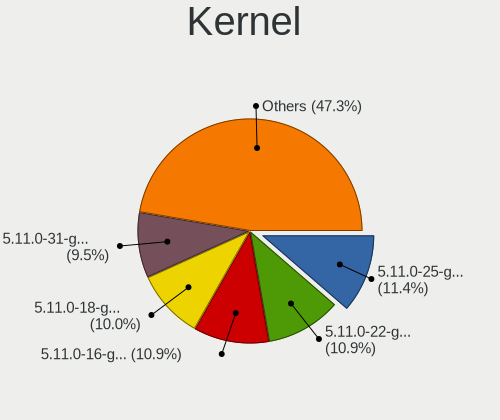

| Version                  | Desktops | Percent |
|--------------------------|----------|---------|
| 5.11.0-22-generic        | 75       | 19.48%  |
| 5.11.0-25-generic        | 74       | 19.22%  |
| 5.11.0-18-generic        | 68       | 17.66%  |
| 5.11.0-16-generic        | 62       | 16.1%   |
| 5.11.0-17-generic        | 36       | 9.35%   |
| 5.11.0-26-generic        | 8        | 2.08%   |
| 5.11.0-24-generic        | 7        | 1.82%   |
| 5.11.0-13-generic        | 5        | 1.3%    |
| 5.10.0-14-generic        | 5        | 1.3%    |
| 5.11.0-23-generic        | 4        | 1.04%   |
| 5.11.0-14-generic        | 4        | 1.04%   |
| 5.8.0-36-generic         | 2        | 0.52%   |
| 5.12.0-051200-generic    | 2        | 0.52%   |
| 5.11.0-19-generic        | 2        | 0.52%   |
| 5.11.0-11-generic        | 2        | 0.52%   |
| 5.11.0-051100-generic    | 2        | 0.52%   |
| 5.10.0-12-generic        | 2        | 0.52%   |
| 5.10.0-051000-generic    | 2        | 0.52%   |
| 5.9.8-xanmod1-cachy      | 1        | 0.26%   |
| 5.9.10-050910-generic    | 1        | 0.26%   |
| 5.8.0-55-generic         | 1        | 0.26%   |
| 5.8.0-50-generic         | 1        | 0.26%   |
| 5.8.0-38-generic         | 1        | 0.26%   |
| 5.8.0-32-generic         | 1        | 0.26%   |
| 5.8.0-31-generic         | 1        | 0.26%   |
| 5.8.0-26-generic         | 1        | 0.26%   |
| 5.4.0-1038-gcp           | 1        | 0.26%   |
| 5.13.6-051306-lowlatency | 1        | 0.26%   |
| 5.13.4                   | 1        | 0.26%   |
| 5.13.0-3-generic         | 1        | 0.26%   |
| 5.13.0-051300rc7-generic | 1        | 0.26%   |
| 5.12.9-051209-lowlatency | 1        | 0.26%   |
| 5.12.8                   | 1        | 0.26%   |
| 5.12.10-051210-generic   | 1        | 0.26%   |
| 5.12.0-051200rc7-generic | 1        | 0.26%   |
| 5.11.12-051112-generic   | 1        | 0.26%   |
| 5.11.1-xanmod2-cacule    | 1        | 0.26%   |
| 5.11.0-23-lowlatency     | 1        | 0.26%   |
| 5.11.0-20-generic        | 1        | 0.26%   |
| 5.11.0-18-lowlatency     | 1        | 0.26%   |
| 5.11.0-051100rc3-generic | 1        | 0.26%   |

Kernel Family
-------------

Linux kernel without a distro release

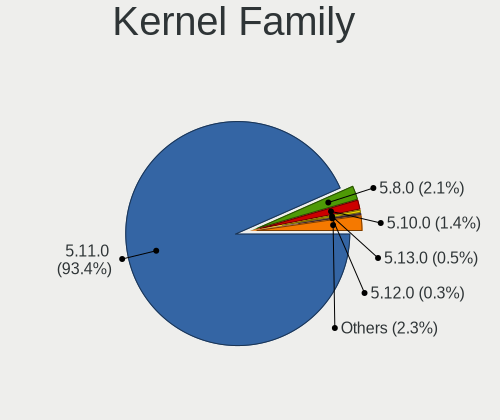

| Version | Desktops | Percent |
|---------|----------|---------|
| 5.11.0  | 331      | 91.18%  |
| 5.10.0  | 9        | 2.48%   |
| 5.8.0   | 8        | 2.2%    |
| 5.12.0  | 3        | 0.83%   |
| 5.13.0  | 2        | 0.55%   |
| 5.9.8   | 1        | 0.28%   |
| 5.9.10  | 1        | 0.28%   |
| 5.4.0   | 1        | 0.28%   |
| 5.13.6  | 1        | 0.28%   |
| 5.13.4  | 1        | 0.28%   |
| 5.12.9  | 1        | 0.28%   |
| 5.12.8  | 1        | 0.28%   |
| 5.12.10 | 1        | 0.28%   |
| 5.11.12 | 1        | 0.28%   |
| 5.11.1  | 1        | 0.28%   |

Kernel Major Ver.
-----------------

Linux kernel major version

| Version | Desktops | Percent |
|---------|----------|---------|
| 5.11    | 333      | 91.74%  |
| 5.10    | 9        | 2.48%   |
| 5.8     | 8        | 2.2%    |
| 5.12    | 6        | 1.65%   |
| 5.13    | 4        | 1.1%    |
| 5.9     | 2        | 0.55%   |
| 5.4     | 1        | 0.28%   |

Arch
----

OS architecture (x86_64, i586, etc.)

| Name   | Desktops | Percent |
|--------|----------|---------|
| x86_64 | 357      | 100%    |

DE
--

Desktop Environment

| Name              | Desktops | Percent |
|-------------------|----------|---------|
| GNOME             | 314      | 87.71%  |
| Unknown           | 29       | 8.1%    |
| X-Cinnamon        | 4        | 1.12%   |
| Unity             | 3        | 0.84%   |
| Cinnamon          | 3        | 0.84%   |
| Yaru:ubuntu:GNOME | 1        | 0.28%   |
| Trinity           | 1        | 0.28%   |
| openbox           | 1        | 0.28%   |
| i3                | 1        | 0.28%   |
| awesome           | 1        | 0.28%   |

Display Server
--------------

X11 or Wayland

| Name    | Desktops | Percent |
|---------|----------|---------|
| Wayland | 194      | 53.89%  |
| X11     | 148      | 41.11%  |
| Unknown | 12       | 3.33%   |
| Tty     | 6        | 1.67%   |

Display Manager
---------------

SDDM, LightDM, etc.

| Name    | Desktops | Percent |
|---------|----------|---------|
| Unknown | 284      | 79.55%  |
| GDM     | 68       | 19.05%  |
| TDM     | 4        | 1.12%   |
| GDM3    | 1        | 0.28%   |

OS Lang
-------

Language

| Lang    | Desktops | Percent |
|---------|----------|---------|
| en_US   | 120      | 33.52%  |
| de_DE   | 54       | 15.08%  |
| fr_FR   | 21       | 5.87%   |
| en_GB   | 18       | 5.03%   |
| it_IT   | 14       | 3.91%   |
| en_CA   | 13       | 3.63%   |
| pt_BR   | 11       | 3.07%   |
| en_AU   | 10       | 2.79%   |
| ru_RU   | 9        | 2.51%   |
| es_ES   | 9        | 2.51%   |
| pl_PL   | 7        | 1.96%   |
| es_AR   | 6        | 1.68%   |
| zh_CN   | 5        | 1.4%    |
| en_IN   | 5        | 1.4%    |
| sv_SE   | 4        | 1.12%   |
| ru_UA   | 4        | 1.12%   |
| ja_JP   | 4        | 1.12%   |
| hu_HU   | 4        | 1.12%   |
| en_ZA   | 4        | 1.12%   |
| de_AT   | 4        | 1.12%   |
| cs_CZ   | 3        | 0.84%   |
| nb_NO   | 2        | 0.56%   |
| es_CL   | 2        | 0.56%   |
| en_NZ   | 2        | 0.56%   |
| en_IL   | 2        | 0.56%   |
| el_GR   | 2        | 0.56%   |
| ca_ES   | 2        | 0.56%   |
| bg_BG   | 2        | 0.56%   |
| zh_TW   | 1        | 0.28%   |
| zh_HK   | 1        | 0.28%   |
| sk_SK   | 1        | 0.28%   |
| ro_RO   | 1        | 0.28%   |
| pt_PT   | 1        | 0.28%   |
| nl_NL   | 1        | 0.28%   |
| id_ID   | 1        | 0.28%   |
| hr_HR   | 1        | 0.28%   |
| fr_BE   | 1        | 0.28%   |
| es_NI   | 1        | 0.28%   |
| es_MX   | 1        | 0.28%   |
| de_CH   | 1        | 0.28%   |
| de_BE   | 1        | 0.28%   |
| ar_EG   | 1        | 0.28%   |
| Unknown | 1        | 0.28%   |

Boot Mode
---------

EFI or BIOS

| Mode | Desktops | Percent |
|------|----------|---------|
| BIOS | 283      | 79.05%  |
| EFI  | 75       | 20.95%  |

Filesystem
----------

Type of filesystem

| Type    | Desktops | Percent |
|---------|----------|---------|
| Ext4    | 320      | 89.14%  |
| Zfs     | 16       | 4.46%   |
| Overlay | 10       | 2.79%   |
| Btrfs   | 9        | 2.51%   |
| Xfs     | 2        | 0.56%   |
| Ext3    | 1        | 0.28%   |
| Ext2    | 1        | 0.28%   |

Part. scheme
------------

Scheme of partitioning

| Type    | Desktops | Percent |
|---------|----------|---------|
| Unknown | 285      | 79.83%  |
| GPT     | 64       | 17.93%  |
| MBR     | 8        | 2.24%   |

Dual Boot with Linux/BSD
------------------------

Hosting more than one Linux/BSD

| Dual boot | Desktops | Percent |
|-----------|----------|---------|
| No        | 284      | 78.02%  |
| Yes       | 80       | 21.98%  |

Dual Boot (Win)
---------------

Hosting Linux and Windows

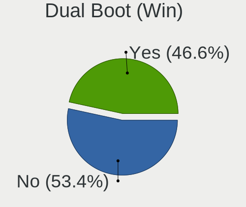

| Dual boot | Desktops | Percent |
|-----------|----------|---------|
| No        | 199      | 54.97%  |
| Yes       | 163      | 45.03%  |

Board
-----

Vendor
------

Motherboard manufacturer

| Name                | Desktops | Percent |
|---------------------|----------|---------|
| ASUSTek Computer    | 98       | 27.45%  |
| Gigabyte Technology | 66       | 18.49%  |
| MSI                 | 58       | 16.25%  |
| ASRock              | 34       | 9.52%   |
| Dell                | 24       | 6.72%   |
| Hewlett-Packard     | 18       | 5.04%   |
| Lenovo              | 9        | 2.52%   |
| Biostar             | 7        | 1.96%   |
| Acer                | 7        | 1.96%   |
| Pegatron            | 4        | 1.12%   |
| Medion              | 3        | 0.84%   |
| Intel               | 3        | 0.84%   |
| Unknown             | 3        | 0.84%   |
| HC                  | 2        | 0.56%   |
| Fujitsu             | 2        | 0.56%   |
| Foxconn             | 2        | 0.56%   |
| TYAN Computer       | 1        | 0.28%   |
| SYWZ                | 1        | 0.28%   |
| Soyo                | 1        | 0.28%   |
| Shuttle             | 1        | 0.28%   |
| PCWare              | 1        | 0.28%   |
| Packard Bell        | 1        | 0.28%   |
| OEM                 | 1        | 0.28%   |
| MACHINIST           | 1        | 0.28%   |
| Huanan              | 1        | 0.28%   |
| Fujitsu Siemens     | 1        | 0.28%   |
| ECS                 | 1        | 0.28%   |
| Colorful Technology | 1        | 0.28%   |
| ASRockRack          | 1        | 0.28%   |
| Apple               | 1        | 0.28%   |
| AOpen               | 1        | 0.28%   |
| Alienware           | 1        | 0.28%   |
| AAEON               | 1        | 0.28%   |

Model
-----

Motherboard model

| Name                             | Desktops | Percent |
|----------------------------------|----------|---------|
| ASUS All Series                  | 11       | 3.08%   |
| MSI MS-7B86                      | 3        | 0.84%   |
| MSI MS-7A34                      | 3        | 0.84%   |
| MSI MS-7758                      | 3        | 0.84%   |
| MSI MS-7693                      | 3        | 0.84%   |
| Gigabyte Z77-DS3H                | 3        | 0.84%   |
| Dell OptiPlex 7010               | 3        | 0.84%   |
| ASUS PRIME A320M-K               | 3        | 0.84%   |
| Unknown                          | 3        | 0.84%   |
| MSI MS-7C91                      | 2        | 0.56%   |
| MSI MS-7C75                      | 2        | 0.56%   |
| MSI MS-7C37                      | 2        | 0.56%   |
| MSI MS-7C02                      | 2        | 0.56%   |
| MSI MS-7A38                      | 2        | 0.56%   |
| MSI MS-7817                      | 2        | 0.56%   |
| MSI MS-7592                      | 2        | 0.56%   |
| MSI MS-7529                      | 2        | 0.56%   |
| HP Z440 Workstation              | 2        | 0.56%   |
| HC HCAR357-MI                    | 2        | 0.56%   |
| Gigabyte H61M-S2PV               | 2        | 0.56%   |
| Gigabyte F2A55M-HD2              | 2        | 0.56%   |
| Gigabyte B450M DS3H              | 2        | 0.56%   |
| Gigabyte A320M-S2H               | 2        | 0.56%   |
| Dell Precision T7600             | 2        | 0.56%   |
| Dell OptiPlex 780                | 2        | 0.56%   |
| ASUS TUF GAMING Z590-PLUS WIFI   | 2        | 0.56%   |
| ASUS ROG STRIX X570-F GAMING     | 2        | 0.56%   |
| ASUS ROG STRIX X570-E GAMING     | 2        | 0.56%   |
| ASUS ROG STRIX X470-F GAMING     | 2        | 0.56%   |
| ASUS ROG STRIX B550-F GAMING     | 2        | 0.56%   |
| ASUS ROG STRIX B550-E GAMING     | 2        | 0.56%   |
| ASUS ROG Maximus X HERO          | 2        | 0.56%   |
| ASUS P5Q DELUXE                  | 2        | 0.56%   |
| ASUS M5A97 LE R2.0               | 2        | 0.56%   |
| ASUS M2A-VM                      | 2        | 0.56%   |
| ASRock N68C-S UCC                | 2        | 0.56%   |
| ASRock B450 Pro4                 | 2        | 0.56%   |
| TYAN Toledo i3210W/i3200R S5211  | 1        | 0.28%   |
| SYWZ S210H Series                | 1        | 0.28%   |
| Soyo SY-I5GC2-L                  | 1        | 0.28%   |
| Shuttle XH61V                    | 1        | 0.28%   |
| Pegatron NQ840AA-ABD p6029de     | 1        | 0.28%   |
| Pegatron NP218AA-ABA p6142p      | 1        | 0.28%   |
| Pegatron h8-1017c                | 1        | 0.28%   |
| Pegatron Elite 7300 Series MT    | 1        | 0.28%   |
| PCWare IPMH61R1                  | 1        | 0.28%   |
| Packard Bell IMEDIA D6001 GE AIO | 1        | 0.28%   |
| OEM B250B                        | 1        | 0.28%   |
| MSI VR630                        | 1        | 0.28%   |
| MSI Pro 3000/3080                | 1        | 0.28%   |
| MSI PPPPP-CCC#MMMMMMMM           | 1        | 0.28%   |
| MSI ONE                          | 1        | 0.28%   |
| MSI MS-7D22                      | 1        | 0.28%   |
| MSI MS-7D16                      | 1        | 0.28%   |
| MSI MS-7D07                      | 1        | 0.28%   |
| MSI MS-7C89                      | 1        | 0.28%   |
| MSI MS-7C82                      | 1        | 0.28%   |
| MSI MS-7C71                      | 1        | 0.28%   |
| MSI MS-7B85                      | 1        | 0.28%   |
| MSI MS-7B79                      | 1        | 0.28%   |

Model Family
------------

Motherboard model prefix

| Name                   | Desktops | Percent |
|------------------------|----------|---------|
| ASUS PRIME             | 23       | 6.44%   |
| ASUS ROG               | 20       | 5.6%    |
| Dell OptiPlex          | 13       | 3.64%   |
| ASUS All               | 11       | 3.08%   |
| Lenovo ThinkCentre     | 6        | 1.68%   |
| HP Compaq              | 6        | 1.68%   |
| ASUS TUF               | 5        | 1.4%    |
| Acer Aspire            | 5        | 1.4%    |
| Dell Precision         | 4        | 1.12%   |
| MSI MS-7B86            | 3        | 0.84%   |
| MSI MS-7A34            | 3        | 0.84%   |
| MSI MS-7758            | 3        | 0.84%   |
| MSI MS-7693            | 3        | 0.84%   |
| Gigabyte Z77-DS3H      | 3        | 0.84%   |
| Gigabyte X570          | 3        | 0.84%   |
| Dell Inspiron          | 3        | 0.84%   |
| ASUS M5A97             | 3        | 0.84%   |
| ASRock B550            | 3        | 0.84%   |
| ASRock 970             | 3        | 0.84%   |
| Unknown                | 3        | 0.84%   |
| MSI MS-7C91            | 2        | 0.56%   |
| MSI MS-7C75            | 2        | 0.56%   |
| MSI MS-7C37            | 2        | 0.56%   |
| MSI MS-7C02            | 2        | 0.56%   |
| MSI MS-7A38            | 2        | 0.56%   |
| MSI MS-7817            | 2        | 0.56%   |
| MSI MS-7592            | 2        | 0.56%   |
| MSI MS-7529            | 2        | 0.56%   |
| Lenovo ThinkStation    | 2        | 0.56%   |
| Intel X79              | 2        | 0.56%   |
| HP Z440                | 2        | 0.56%   |
| HP Pavilion            | 2        | 0.56%   |
| HP EliteDesk           | 2        | 0.56%   |
| HC HCAR357-MI          | 2        | 0.56%   |
| Gigabyte Z590          | 2        | 0.56%   |
| Gigabyte Z390          | 2        | 0.56%   |
| Gigabyte H61M-S2PV     | 2        | 0.56%   |
| Gigabyte GA-78LMT-USB3 | 2        | 0.56%   |
| Gigabyte F2A55M-HD2    | 2        | 0.56%   |
| Gigabyte B450M         | 2        | 0.56%   |
| Gigabyte B450          | 2        | 0.56%   |
| Gigabyte A320M-S2H     | 2        | 0.56%   |
| Dell Vostro            | 2        | 0.56%   |
| ASUS P5Q               | 2        | 0.56%   |
| ASUS M2A-VM            | 2        | 0.56%   |
| ASRock X570            | 2        | 0.56%   |
| ASRock N68C-S          | 2        | 0.56%   |
| ASRock B450            | 2        | 0.56%   |
| Acer Veriton           | 2        | 0.56%   |
| TYAN Toledo            | 1        | 0.28%   |
| SYWZ S210H             | 1        | 0.28%   |
| Soyo SY-I5GC2-L        | 1        | 0.28%   |
| Shuttle XH61V          | 1        | 0.28%   |
| Pegatron NQ840AA-ABD   | 1        | 0.28%   |
| Pegatron NP218AA-ABA   | 1        | 0.28%   |
| Pegatron h8-1017c      | 1        | 0.28%   |
| Pegatron Elite         | 1        | 0.28%   |
| PCWare IPMH61R1        | 1        | 0.28%   |
| Packard Bell IMEDIA    | 1        | 0.28%   |
| OEM B250B              | 1        | 0.28%   |

MFG Year
--------

Motherboard manufacture year

| Year | Desktops | Percent |
|------|----------|---------|
| 2021 | 64       | 17.93%  |
| 2020 | 43       | 12.04%  |
| 2019 | 36       | 10.08%  |
| 2018 | 34       | 9.52%   |
| 2011 | 24       | 6.72%   |
| 2010 | 22       | 6.16%   |
| 2015 | 21       | 5.88%   |
| 2013 | 21       | 5.88%   |
| 2012 | 17       | 4.76%   |
| 2009 | 16       | 4.48%   |
| 2017 | 15       | 4.2%    |
| 2016 | 14       | 3.92%   |
| 2014 | 12       | 3.36%   |
| 2008 | 11       | 3.08%   |
| 2007 | 3        | 0.84%   |
| 2005 | 3        | 0.84%   |
| 2006 | 1        | 0.28%   |

Form Factor
-----------

Physical design of the computer

| Name    | Desktops | Percent |
|---------|----------|---------|
| Desktop | 357      | 100%    |

Secure Boot
-----------

Enabled or disabled

| State    | Desktops | Percent |
|----------|----------|---------|
| Disabled | 352      | 98.6%   |
| Enabled  | 5        | 1.4%    |

Coreboot
--------

Have coreboot on board

| Used | Desktops | Percent |
|------|----------|---------|
| No   | 357      | 100%    |

RAM Size
--------

Total RAM memory

| Size in GB  | Desktops | Percent |
|-------------|----------|---------|
| 16.01-24.0  | 93       | 25.98%  |
| 8.01-16.0   | 67       | 18.72%  |
| 32.01-64.0  | 62       | 17.32%  |
| 3.01-4.0    | 50       | 13.97%  |
| 4.01-8.0    | 41       | 11.45%  |
| 64.01-256.0 | 27       | 7.54%   |
| 24.01-32.0  | 8        | 2.23%   |
| 1.01-2.0    | 8        | 2.23%   |
| 2.01-3.0    | 2        | 0.56%   |

RAM Used
--------

Used RAM memory

| Used GB     | Desktops | Percent |
|-------------|----------|---------|
| 1.01-2.0    | 133      | 35.66%  |
| 2.01-3.0    | 106      | 28.42%  |
| 4.01-8.0    | 53       | 14.21%  |
| 3.01-4.0    | 41       | 10.99%  |
| 8.01-16.0   | 21       | 5.63%   |
| 16.01-24.0  | 8        | 2.14%   |
| 0.51-1.0    | 5        | 1.34%   |
| 32.01-64.0  | 4        | 1.07%   |
| 24.01-32.0  | 1        | 0.27%   |
| 64.01-256.0 | 1        | 0.27%   |

Total Drives
------------

Number of drives on board

| Drives | Desktops | Percent |
|--------|----------|---------|
| 1      | 129      | 35.34%  |
| 2      | 96       | 26.3%   |
| 3      | 58       | 15.89%  |
| 4      | 37       | 10.14%  |
| 5      | 23       | 6.3%    |
| 6      | 9        | 2.47%   |
| 7      | 4        | 1.1%    |
| 0      | 4        | 1.1%    |
| 9      | 3        | 0.82%   |
| 11     | 1        | 0.27%   |
| 8      | 1        | 0.27%   |

Has CD-ROM
----------

Has CD-ROM on board

| Presented | Desktops | Percent |
|-----------|----------|---------|
| No        | 199      | 55.43%  |
| Yes       | 160      | 44.57%  |

Has Ethernet
------------

Has Ethernet on board

| Presented | Desktops | Percent |
|-----------|----------|---------|
| Yes       | 350      | 98.04%  |
| No        | 7        | 1.96%   |

Has WiFi
--------

Has WiFi module

| Presented | Desktops | Percent |
|-----------|----------|---------|
| Yes       | 183      | 50.97%  |
| No        | 176      | 49.03%  |

Has Bluetooth
-------------

Has Bluetooth module

| Presented | Desktops | Percent |
|-----------|----------|---------|
| No        | 224      | 62.75%  |
| Yes       | 133      | 37.25%  |

Location
--------

Country
-------

Geographic location (country)

| Country             | Desktops | Percent |
|---------------------|----------|---------|
| USA                 | 62       | 17.37%  |
| Germany             | 61       | 17.09%  |
| France              | 22       | 6.16%   |
| Italy               | 18       | 5.04%   |
| UK                  | 15       | 4.2%    |
| Canada              | 14       | 3.92%   |
| Brazil              | 13       | 3.64%   |
| Russia              | 11       | 3.08%   |
| Spain               | 10       | 2.8%    |
| Australia           | 10       | 2.8%    |
| Poland              | 9        | 2.52%   |
| Netherlands         | 8        | 2.24%   |
| Argentina           | 8        | 2.24%   |
| Austria             | 7        | 1.96%   |
| Ukraine             | 6        | 1.68%   |
| Sweden              | 6        | 1.68%   |
| Portugal            | 5        | 1.4%    |
| Japan               | 5        | 1.4%    |
| India               | 5        | 1.4%    |
| China               | 5        | 1.4%    |
| South Africa        | 4        | 1.12%   |
| Romania             | 3        | 0.84%   |
| Norway              | 3        | 0.84%   |
| Hungary             | 3        | 0.84%   |
| Greece              | 3        | 0.84%   |
| Finland             | 3        | 0.84%   |
| Czechia             | 3        | 0.84%   |
| Chile               | 3        | 0.84%   |
| Switzerland         | 2        | 0.56%   |
| Serbia              | 2        | 0.56%   |
| Pakistan            | 2        | 0.56%   |
| New Zealand         | 2        | 0.56%   |
| Israel              | 2        | 0.56%   |
| Bulgaria            | 2        | 0.56%   |
| Belgium             | 2        | 0.56%   |
| Trinidad and Tobago | 1        | 0.28%   |
| Taiwan              | 1        | 0.28%   |
| Singapore           | 1        | 0.28%   |
| Runion            | 1        | 0.28%   |
| Nicaragua           | 1        | 0.28%   |
| Mexico              | 1        | 0.28%   |
| Malaysia            | 1        | 0.28%   |
| Indonesia           | 1        | 0.28%   |
| Iceland             | 1        | 0.28%   |
| Hong Kong           | 1        | 0.28%   |
| Estonia             | 1        | 0.28%   |
| Croatia             | 1        | 0.28%   |
| Colombia            | 1        | 0.28%   |
| Bermuda             | 1        | 0.28%   |
| Belarus             | 1        | 0.28%   |
| Bangladesh          | 1        | 0.28%   |
| Bahrain             | 1        | 0.28%   |
| Algeria             | 1        | 0.28%   |

City
----

Geographic location (city)

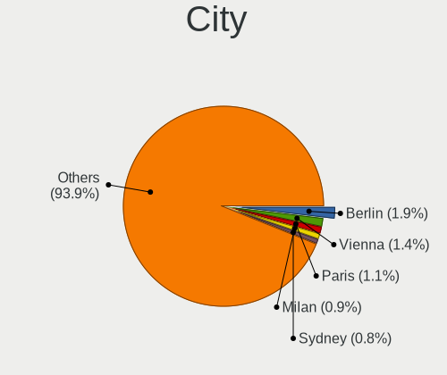

| City               | Desktops | Percent |
|--------------------|----------|---------|
| Vienna             | 5        | 1.37%   |
| Milan              | 5        | 1.37%   |
| Berlin             | 5        | 1.37%   |
| Sydney             | 4        | 1.09%   |
| Paris              | 4        | 1.09%   |
| Moscow             | 4        | 1.09%   |
| London             | 4        | 1.09%   |
| Toronto            | 3        | 0.82%   |
| Hyderabad          | 3        | 0.82%   |
| Hamburg            | 3        | 0.82%   |
| Ufa                | 2        | 0.55%   |
| Tucson             | 2        | 0.55%   |
| S??o Paulo         | 2        | 0.55%   |
| Rosario            | 2        | 0.55%   |
| Oslo               | 2        | 0.55%   |
| Munich             | 2        | 0.55%   |
| Montreal           | 2        | 0.55%   |
| Laberweinting      | 2        | 0.55%   |
| Kyiv               | 2        | 0.55%   |
| Krefeld            | 2        | 0.55%   |
| Karachi            | 2        | 0.55%   |
| Johannesburg       | 2        | 0.55%   |
| Irkutsk            | 2        | 0.55%   |
| Graz               | 2        | 0.55%   |
| Gelsenkirchen      | 2        | 0.55%   |
| Caruaru            | 2        | 0.55%   |
| Calgary            | 2        | 0.55%   |
| Budapest           | 2        | 0.55%   |
| Beijing            | 2        | 0.55%   |
| Athens             | 2        | 0.55%   |
| Zurich             | 1        | 0.27%   |
| Zeist              | 1        | 0.27%   |
| Zdanice            | 1        | 0.27%   |
| Zabrze             | 1        | 0.27%   |
| Wgorzewo         | 1        | 0.27%   |
| Wylie              | 1        | 0.27%   |
| Wuxi               | 1        | 0.27%   |
| Wuhan              | 1        | 0.27%   |
| Wroclaw            | 1        | 0.27%   |
| Woodstock          | 1        | 0.27%   |
| Winnipeg           | 1        | 0.27%   |
| Windsor            | 1        | 0.27%   |
| Welwyn Garden City | 1        | 0.27%   |
| Warsaw             | 1        | 0.27%   |
| Warrington         | 1        | 0.27%   |
| Warburton East     | 1        | 0.27%   |
| Volos              | 1        | 0.27%   |
| Villejuif          | 1        | 0.27%   |
| Villa Adelina      | 1        | 0.27%   |
| Viernheim          | 1        | 0.27%   |
| Verviers           | 1        | 0.27%   |
| Valencia           | 1        | 0.27%   |
| Utrecht            | 1        | 0.27%   |
| Uppsala            | 1        | 0.27%   |
| Unieux             | 1        | 0.27%   |
| Tyler              | 1        | 0.27%   |
| Tuusula            | 1        | 0.27%   |
| Trondheim          | 1        | 0.27%   |
| Tours              | 1        | 0.27%   |
| Tomah              | 1        | 0.27%   |

Drives
------

Drive Vendor
------------

Hard drive vendors

| Vendor                    | Desktops | Drives | Percent |
|---------------------------|----------|--------|---------|
| WDC                       | 129      | 212    | 18.97%  |
| Seagate                   | 115      | 199    | 16.91%  |
| Samsung Electronics       | 113      | 158    | 16.62%  |
| Toshiba                   | 34       | 38     | 5%      |
| Kingston                  | 34       | 42     | 5%      |
| SanDisk                   | 33       | 41     | 4.85%   |
| Crucial                   | 31       | 37     | 4.56%   |
| Hitachi                   | 30       | 36     | 4.41%   |
| Silicon Motion            | 12       | 13     | 1.76%   |
| Phison                    | 11       | 13     | 1.62%   |
| Intel                     | 11       | 12     | 1.62%   |
| A-DATA Technology         | 11       | 14     | 1.62%   |
| Unknown                   | 9        | 11     | 1.32%   |
| Maxtor                    | 6        | 6      | 0.88%   |
| Corsair                   | 6        | 9      | 0.88%   |
| SPCC                      | 5        | 5      | 0.74%   |
| HGST                      | 5        | 8      | 0.74%   |
| Gigabyte Technology       | 5        | 6      | 0.74%   |
| China                     | 5        | 5      | 0.74%   |
| XPG                       | 4        | 4      | 0.59%   |
| Transcend                 | 4        | 4      | 0.59%   |
| PNY                       | 4        | 4      | 0.59%   |
| Micron Technology         | 4        | 4      | 0.59%   |
| Intenso                   | 4        | 5      | 0.59%   |
| Micron/Crucial Technology | 3        | 3      | 0.44%   |
| LITEON                    | 3        | 4      | 0.44%   |
| JMicron                   | 3        | 3      | 0.44%   |
| GOODRAM                   | 3        | 3      | 0.44%   |
| Vaseky                    | 2        | 2      | 0.29%   |
| SK Hynix                  | 2        | 2      | 0.29%   |
| Patriot                   | 2        | 2      | 0.29%   |
| OCZ                       | 2        | 2      | 0.29%   |
| Mushkin                   | 2        | 5      | 0.29%   |
| LITEONIT                  | 2        | 2      | 0.29%   |
| Zozt                      | 1        | 3      | 0.15%   |
| Zheino                    | 1        | 1      | 0.15%   |
| WD MediaMax               | 1        | 1      | 0.15%   |
| Verbatim                  | 1        | 1      | 0.15%   |
| Teclast                   | 1        | 1      | 0.15%   |
| T-FORCE                   | 1        | 2      | 0.15%   |
| Synology                  | 1        | 8      | 0.15%   |
| RX7                       | 1        | 1      | 0.15%   |
| Realtek Semiconductor     | 1        | 1      | 0.15%   |
| PLEXTOR                   | 1        | 1      | 0.15%   |
| Palit                     | 1        | 1      | 0.15%   |
| OCZ-VERTEX3               | 1        | 1      | 0.15%   |
| Netac                     | 1        | 1      | 0.15%   |
| Lexar                     | 1        | 1      | 0.15%   |
| LaCie                     | 1        | 1      | 0.15%   |
| KLEVV                     | 1        | 1      | 0.15%   |
| KIOXIA-EXCERIA            | 1        | 2      | 0.15%   |
| KIOXIA                    | 1        | 1      | 0.15%   |
| KingFast                  | 1        | 1      | 0.15%   |
| KingDian                  | 1        | 1      | 0.15%   |
| Hewlett-Packard           | 1        | 2      | 0.15%   |
| FC-1307                   | 1        | 1      | 0.15%   |
| External                  | 1        | 1      | 0.15%   |
| DREVO                     | 1        | 1      | 0.15%   |
| Dogfish                   | 1        | 1      | 0.15%   |
| ASMT109x                  | 1        | 1      | 0.15%   |

Drive Model
-----------

Hard drive models

| Model                               | Desktops | Percent |
|-------------------------------------|----------|---------|
| Samsung NVMe SSD Drive 500GB        | 13       | 1.64%   |
| Seagate ST1000DM010-2EP102 1TB      | 11       | 1.39%   |
| Samsung SSD 860 EVO 500GB           | 10       | 1.26%   |
| Seagate ST2000DM001-1ER164 2TB      | 8        | 1.01%   |
| Samsung NVMe SSD Drive 1TB          | 8        | 1.01%   |
| Samsung SSD 860 EVO 250GB           | 7        | 0.88%   |
| Kingston SA400S37240G 240GB SSD     | 7        | 0.88%   |
| Toshiba DT01ACA100 1TB              | 6        | 0.76%   |
| Seagate ST2000DM008-2FR102 2TB      | 6        | 0.76%   |
| Samsung SSD 850 EVO 500GB           | 6        | 0.76%   |
| Samsung SSD 850 EVO 250GB           | 6        | 0.76%   |
| Samsung NVMe SSD Drive 250GB        | 6        | 0.76%   |
| Crucial CT1000MX500SSD1 1TB         | 6        | 0.76%   |
| WDC WD20EZRX-00D8PB0 2TB            | 5        | 0.63%   |
| WDC WD10EZEX-08WN4A0 1TB            | 5        | 0.63%   |
| Toshiba DT01ACA200 2TB              | 5        | 0.63%   |
| Seagate ST4000DM004-2CV104 4TB      | 5        | 0.63%   |
| Seagate ST31000524AS 1TB            | 5        | 0.63%   |
| Sandisk NVMe SSD Drive 500GB        | 5        | 0.63%   |
| Samsung SSD 840 EVO 250GB           | 5        | 0.63%   |
| Kingston SV300S37A120G 120GB SSD    | 5        | 0.63%   |
| Kingston SA400S37120G 120GB SSD     | 5        | 0.63%   |
| WDC WD1002FAEX-00Z3A0 1TB           | 4        | 0.5%    |
| Unknown SD/MMC/MS PRO 128GB         | 4        | 0.5%    |
| Seagate ST6000DM003-2CY186 6TB      | 4        | 0.5%    |
| Seagate ST3500418AS 500GB           | 4        | 0.5%    |
| SanDisk SSD PLUS 240GB              | 4        | 0.5%    |
| SanDisk SSD PLUS 1000GB             | 4        | 0.5%    |
| Sandisk NVMe SSD Drive 2TB          | 4        | 0.5%    |
| Sandisk NVMe SSD Drive 1TB          | 4        | 0.5%    |
| Kingston SA400S37480G 480GB SSD     | 4        | 0.5%    |
| Crucial CT500MX500SSD1 500GB        | 4        | 0.5%    |
| Crucial CT240BX500SSD1 240GB        | 4        | 0.5%    |
| XPG NVMe SSD Drive 1024GB           | 3        | 0.38%   |
| WDC WDS500G2B0B-00YS70 500GB SSD    | 3        | 0.38%   |
| WDC WD5000AAVS-00ZTB0 500GB         | 3        | 0.38%   |
| WDC WD10EZEX-00BN5A0 1TB            | 3        | 0.38%   |
| WDC WD10EARS-00Y5B1 1TB             | 3        | 0.38%   |
| Toshiba HDWD130 3TB                 | 3        | 0.38%   |
| Toshiba HDWD110 1TB                 | 3        | 0.38%   |
| Silicon Motion NVMe SSD Drive 256GB | 3        | 0.38%   |
| Seagate ST9500325AS 500GB           | 3        | 0.38%   |
| Seagate ST500LM012 HN-M500MBB 500GB | 3        | 0.38%   |
| Seagate ST500DM002-1BD142 500GB     | 3        | 0.38%   |
| Seagate ST3250318AS 249GB           | 3        | 0.38%   |
| Seagate ST2000LM015-2E8174 2TB      | 3        | 0.38%   |
| Seagate Expansion 1TB               | 3        | 0.38%   |
| SanDisk SSD PLUS 120GB              | 3        | 0.38%   |
| Samsung SSD 860 EVO 1TB             | 3        | 0.38%   |
| Samsung SSD 850 EVO 120GB           | 3        | 0.38%   |
| Samsung SSD 840 Series 120GB        | 3        | 0.38%   |
| Samsung NVMe SSD Drive 512GB        | 3        | 0.38%   |
| Phison NVMe SSD Drive 480GB         | 3        | 0.38%   |
| Phison NVMe SSD Drive 1024GB        | 3        | 0.38%   |
| Kingston NVMe SSD Drive 500GB       | 3        | 0.38%   |
| Intel NVMe SSD Drive 1024GB         | 3        | 0.38%   |
| Crucial CT240M500SSD1 240GB         | 3        | 0.38%   |
| Crucial CT120BX500SSD1 120GB        | 3        | 0.38%   |
| WDC WDS120G2G0A-00JH30 120GB SSD    | 2        | 0.25%   |
| WDC WDS100T2B0C-00PXH0 1TB          | 2        | 0.25%   |

HDD Vendor
----------

Hard disk drive vendors

| Vendor              | Desktops | Drives | Percent |
|---------------------|----------|--------|---------|
| WDC                 | 117      | 191    | 35.89%  |
| Seagate             | 113      | 195    | 34.66%  |
| Toshiba             | 32       | 36     | 9.82%   |
| Hitachi             | 30       | 36     | 9.2%    |
| Samsung Electronics | 18       | 22     | 5.52%   |
| Maxtor              | 6        | 6      | 1.84%   |
| HGST                | 5        | 8      | 1.53%   |
| Synology            | 1        | 8      | 0.31%   |
| JMicron             | 1        | 1      | 0.31%   |
| ASMT109x            | 1        | 1      | 0.31%   |
| Asmedia             | 1        | 1      | 0.31%   |
| Apple               | 1        | 1      | 0.31%   |

SSD Vendor
----------

Solid state drive vendors

| Vendor              | Desktops | Drives | Percent |
|---------------------|----------|--------|---------|
| Samsung Electronics | 63       | 79     | 28%     |
| Crucial             | 29       | 35     | 12.89%  |
| Kingston            | 28       | 33     | 12.44%  |
| SanDisk             | 20       | 24     | 8.89%   |
| WDC                 | 11       | 12     | 4.89%   |
| A-DATA Technology   | 9        | 11     | 4%      |
| SPCC                | 5        | 5      | 2.22%   |
| China               | 5        | 5      | 2.22%   |
| Transcend           | 4        | 4      | 1.78%   |
| PNY                 | 3        | 3      | 1.33%   |
| Micron Technology   | 3        | 3      | 1.33%   |
| LITEON              | 3        | 4      | 1.33%   |
| Intenso             | 3        | 4      | 1.33%   |
| Intel               | 3        | 3      | 1.33%   |
| GOODRAM             | 3        | 3      | 1.33%   |
| Gigabyte Technology | 3        | 3      | 1.33%   |
| Vaseky              | 2        | 2      | 0.89%   |
| Toshiba             | 2        | 2      | 0.89%   |
| Patriot             | 2        | 2      | 0.89%   |
| OCZ                 | 2        | 2      | 0.89%   |
| Mushkin             | 2        | 5      | 0.89%   |
| LITEONIT            | 2        | 2      | 0.89%   |
| JMicron             | 2        | 2      | 0.89%   |
| Zozt                | 1        | 3      | 0.44%   |
| Zheino              | 1        | 1      | 0.44%   |
| Verbatim            | 1        | 1      | 0.44%   |
| Unknown             | 1        | 1      | 0.44%   |
| Teclast             | 1        | 1      | 0.44%   |
| PLEXTOR             | 1        | 1      | 0.44%   |
| OCZ-VERTEX3         | 1        | 1      | 0.44%   |
| Lexar               | 1        | 1      | 0.44%   |
| KLEVV               | 1        | 1      | 0.44%   |
| KIOXIA-EXCERIA      | 1        | 2      | 0.44%   |
| KingDian            | 1        | 1      | 0.44%   |
| Hewlett-Packard     | 1        | 1      | 0.44%   |
| DREVO               | 1        | 1      | 0.44%   |
| Dogfish             | 1        | 1      | 0.44%   |
| Corsair             | 1        | 1      | 0.44%   |
| AMD-RAID            | 1        | 1      | 0.44%   |

Drive Kind
----------

HDD or SSD

| Kind    | Desktops | Drives | Percent |
|---------|----------|--------|---------|
| HDD     | 244      | 506    | 43.73%  |
| SSD     | 183      | 267    | 32.8%   |
| NVMe    | 110      | 155    | 19.71%  |
| Unknown | 19       | 28     | 3.41%   |
| MMC     | 2        | 2      | 0.36%   |

Drive Connector
---------------

SATA, SAS, NVMe, etc.

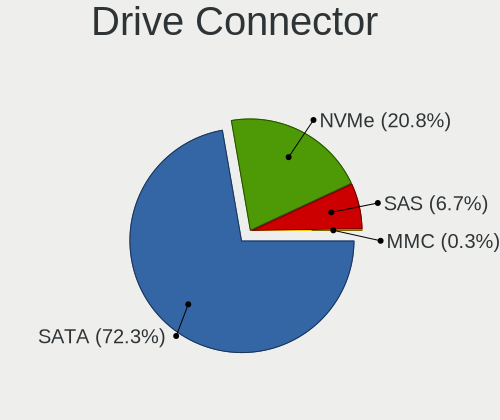

| Type | Desktops | Drives | Percent |
|------|----------|--------|---------|
| SATA | 325      | 765    | 70.65%  |
| NVMe | 109      | 154    | 23.7%   |
| SAS  | 24       | 37     | 5.22%   |
| MMC  | 2        | 2      | 0.43%   |

Drive Size
----------

Size of hard drive

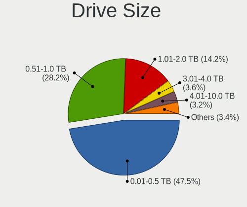

| Size in TB | Desktops | Drives | Percent |
|------------|----------|--------|---------|
| 0.01-0.5   | 228      | 387    | 47.9%   |
| 0.51-1.0   | 136      | 207    | 28.57%  |
| 1.01-2.0   | 65       | 106    | 13.66%  |
| 3.01-4.0   | 17       | 22     | 3.57%   |
| 4.01-10.0  | 15       | 24     | 3.15%   |
| 2.01-3.0   | 12       | 15     | 2.52%   |
| 10.01-20.0 | 3        | 12     | 0.63%   |

Space Total
-----------

Amount of disk space available on the file system

| Size in GB     | Desktops | Percent |
|----------------|----------|---------|
| 101-250        | 74       | 20.22%  |
| 501-1000       | 74       | 20.22%  |
| 251-500        | 68       | 18.58%  |
| 1001-2000      | 46       | 12.57%  |
| More than 3000 | 38       | 10.38%  |
| 21-50          | 18       | 4.92%   |
| 2001-3000      | 18       | 4.92%   |
| 51-100         | 16       | 4.37%   |
| 1-20           | 12       | 3.28%   |
| Unknown        | 2        | 0.55%   |

Space Used
----------

Amount of used disk space

| Used GB        | Desktops | Percent |
|----------------|----------|---------|
| 1-20           | 140      | 37.63%  |
| 21-50          | 51       | 13.71%  |
| 101-250        | 48       | 12.9%   |
| 51-100         | 37       | 9.95%   |
| 501-1000       | 26       | 6.99%   |
| 251-500        | 24       | 6.45%   |
| 1001-2000      | 23       | 6.18%   |
| More than 3000 | 14       | 3.76%   |
| 2001-3000      | 7        | 1.88%   |
| Unknown        | 2        | 0.54%   |

Malfunc. Drives
---------------

Drive models with a malfunction

| Model                                        | Desktops | Drives | Percent |
|----------------------------------------------|----------|--------|---------|
| Crucial CT240M500SSD1 240GB                  | 2        | 2      | 7.41%   |
| WDC WD7500BPKX-00HPJT0 752GB                 | 1        | 1      | 3.7%    |
| WDC WD7500AADS-00M2B0 752GB                  | 1        | 1      | 3.7%    |
| WDC WD6400AAKS-65A7B0 640GB                  | 1        | 1      | 3.7%    |
| WDC WD5000AZRX-00A8LB0 500GB                 | 1        | 1      | 3.7%    |
| WDC WD5000AAKS-22A7B0 500GB                  | 1        | 1      | 3.7%    |
| WDC WD5000AAKS-00UU3A0 500GB                 | 1        | 1      | 3.7%    |
| WDC WD5000AADS-00S9B0 500GB                  | 1        | 1      | 3.7%    |
| WDC WD20EZRZ-00Z5HB0 2TB                     | 1        | 1      | 3.7%    |
| WDC WD10EZEX-60ZF5A0 1TB                     | 1        | 1      | 3.7%    |
| Seagate ST9250311CS 250GB                    | 1        | 1      | 3.7%    |
| Seagate ST500NM0011 39M4517 42C0468IBM 500GB | 1        | 1      | 3.7%    |
| Seagate ST500DM002-1BD142 500GB              | 1        | 1      | 3.7%    |
| Seagate ST3750330NS 752GB                    | 1        | 1      | 3.7%    |
| Seagate ST3500830AS 500GB                    | 1        | 1      | 3.7%    |
| Seagate ST3320820AS 320GB                    | 1        | 1      | 3.7%    |
| Seagate ST2000DX002-2DV164 2TB               | 1        | 1      | 3.7%    |
| Seagate ST2000DL003-9VT166 2TB               | 1        | 1      | 3.7%    |
| Samsung Electronics SSD 970 EVO 1TB          | 1        | 1      | 3.7%    |
| Samsung Electronics SSD 870 EVO 4TB          | 1        | 1      | 3.7%    |
| Samsung Electronics HD103SJ 1TB              | 1        | 1      | 3.7%    |
| PLEXTOR PX-128M5S 128GB SSD                  | 1        | 1      | 3.7%    |
| OCZ VERTEX3 120GB SSD                        | 1        | 1      | 3.7%    |
| Kingston SUV400S37240G 240GB SSD             | 1        | 1      | 3.7%    |
| Kingston SA400S37120G 120GB SSD              | 1        | 1      | 3.7%    |
| Intel SSDSC2KW240H6 240GB                    | 1        | 1      | 3.7%    |

Malfunc. Drive Vendor
---------------------

Vendors of faulty drives

| Vendor              | Desktops | Drives | Percent |
|---------------------|----------|--------|---------|
| WDC                 | 8        | 9      | 32%     |
| Seagate             | 7        | 8      | 28%     |
| Samsung Electronics | 3        | 3      | 12%     |
| Kingston            | 2        | 2      | 8%      |
| Crucial             | 2        | 2      | 8%      |
| PLEXTOR             | 1        | 1      | 4%      |
| OCZ                 | 1        | 1      | 4%      |
| Intel               | 1        | 1      | 4%      |

Malfunc. HDD Vendor
-------------------

Vendors of faulty HDD drives

| Vendor              | Desktops | Drives | Percent |
|---------------------|----------|--------|---------|
| WDC                 | 8        | 9      | 50%     |
| Seagate             | 7        | 8      | 43.75%  |
| Samsung Electronics | 1        | 1      | 6.25%   |

Malfunc. Drive Kind
-------------------

Kinds of faulty drives

| Kind | Desktops | Drives | Percent |
|------|----------|--------|---------|
| HDD  | 15       | 18     | 65.22%  |
| SSD  | 7        | 8      | 30.43%  |
| NVMe | 1        | 1      | 4.35%   |

Failed Drives
-------------

Failed drive models

Zero info for selected period =(

Failed Drive Vendor
-------------------

Failed drive vendors

Zero info for selected period =(

Drive Status
------------

Number of failed and malfunc. drives

| Status   | Desktops | Drives | Percent |
|----------|----------|--------|---------|
| Detected | 282      | 726    | 74.21%  |
| Works    | 76       | 205    | 20%     |
| Malfunc  | 22       | 27     | 5.79%   |

Storage controller
------------------

Storage Vendor
--------------

Storage controller vendors

| Vendor                      | Desktops | Percent |
|-----------------------------|----------|---------|
| Intel                       | 228      | 44.27%  |
| AMD                         | 117      | 22.72%  |
| Samsung Electronics         | 45       | 8.74%   |
| Sandisk                     | 18       | 3.5%    |
| Phison Electronics          | 18       | 3.5%    |
| Silicon Motion              | 14       | 2.72%   |
| Nvidia                      | 14       | 2.72%   |
| ASMedia Technology          | 14       | 2.72%   |
| Marvell Technology Group    | 8        | 1.55%   |
| Kingston Technology Company | 7        | 1.36%   |
| ADATA Technology            | 7        | 1.36%   |
| JMicron Technology          | 6        | 1.17%   |
| Micron/Crucial Technology   | 5        | 0.97%   |
| Silicon Image               | 4        | 0.78%   |
| Broadcom / LSI              | 2        | 0.39%   |
| VIA Technologies            | 1        | 0.19%   |
| Unknown                     | 1        | 0.19%   |
| SK Hynix                    | 1        | 0.19%   |
| Realtek Semiconductor       | 1        | 0.19%   |
| Micron Technology           | 1        | 0.19%   |
| LSI Logic / Symbios Logic   | 1        | 0.19%   |
| KIOXIA                      | 1        | 0.19%   |
| Adaptec                     | 1        | 0.19%   |

Storage Model
-------------

Storage controller models

| Model                                                                                   | Desktops | Percent |
|-----------------------------------------------------------------------------------------|----------|---------|
| AMD FCH SATA Controller [AHCI mode]                                                     | 62       | 9.51%   |
| Samsung NVMe SSD Controller SM981/PM981/PM983                                           | 28       | 4.29%   |
| AMD 400 Series Chipset SATA Controller                                                  | 24       | 3.68%   |
| Intel 8 Series/C220 Series Chipset Family 6-port SATA Controller 1 [AHCI mode]          | 20       | 3.07%   |
| Intel 500 Series Chipset Family SATA AHCI Controller                                    | 19       | 2.91%   |
| Intel 7 Series/C210 Series Chipset Family 6-port SATA Controller [AHCI mode]            | 18       | 2.76%   |
| AMD SB7x0/SB8x0/SB9x0 IDE Controller                                                    | 17       | 2.61%   |
| Intel SATA Controller [RAID mode]                                                       | 16       | 2.45%   |
| Intel NM10/ICH7 Family SATA Controller [IDE mode]                                       | 15       | 2.3%    |
| Intel 6 Series/C200 Series Chipset Family 6 port Desktop SATA AHCI Controller           | 15       | 2.3%    |
| Intel 200 Series PCH SATA controller [AHCI mode]                                        | 15       | 2.3%    |
| AMD SB7x0/SB8x0/SB9x0 SATA Controller [AHCI mode]                                       | 15       | 2.3%    |
| Intel Q170/Q150/B150/H170/H110/Z170/CM236 Chipset SATA Controller [AHCI Mode]           | 14       | 2.15%   |
| Intel Cannon Lake PCH SATA AHCI Controller                                              | 14       | 2.15%   |
| ASMedia ASM1062 Serial ATA Controller                                                   | 13       | 1.99%   |
| AMD Starship/Matisse Chipset SATA Controller [AHCI mode]                                | 13       | 1.99%   |
| Intel 82801G (ICH7 Family) IDE Controller                                               | 12       | 1.84%   |
| Intel 6 Series/C200 Series Chipset Family Desktop SATA Controller (IDE mode, ports 4-5) | 10       | 1.53%   |
| Intel 6 Series/C200 Series Chipset Family Desktop SATA Controller (IDE mode, ports 0-3) | 10       | 1.53%   |
| AMD SB7x0/SB8x0/SB9x0 SATA Controller [IDE mode]                                        | 10       | 1.53%   |
| Samsung NVMe SSD Controller SM961/PM961/SM963                                           | 9        | 1.38%   |
| Phison E12 NVMe Controller                                                              | 9        | 1.38%   |
| Intel 9 Series Chipset Family SATA Controller [AHCI Mode]                               | 9        | 1.38%   |
| AMD FCH SATA Controller D                                                               | 9        | 1.38%   |
| Silicon Motion SM2263EN/SM2263XT SSD Controller                                         | 8        | 1.23%   |
| AMD 300 Series Chipset SATA Controller                                                  | 8        | 1.23%   |
| Sandisk WD Blue SN550 NVMe SSD                                                          | 7        | 1.07%   |
| Intel SSD 660P Series                                                                   | 7        | 1.07%   |
| Intel 400 Series Chipset Family SATA AHCI Controller                                    | 7        | 1.07%   |
| Sandisk WD Black SN750 / PC SN730 NVMe SSD                                              | 6        | 0.92%   |
| Samsung NVMe SSD Controller PM9A1/PM9A3/980PRO                                          | 6        | 0.92%   |
| Intel C610/X99 series chipset 6-Port SATA Controller [AHCI mode]                        | 6        | 0.92%   |
| AMD FCH IDE Controller                                                                  | 6        | 0.92%   |
| ADATA XPG SX8200 Pro PCIe Gen3x4 M.2 2280 Solid State Drive                             | 6        | 0.92%   |
| Silicon Motion SM2262/SM2262EN SSD Controller                                           | 5        | 0.77%   |
| Intel Comet Lake SATA AHCI Controller                                                   | 5        | 0.77%   |
| Intel C600/X79 series chipset 6-Port SATA AHCI Controller                               | 5        | 0.77%   |
| Intel 82801JI (ICH10 Family) 4 port SATA IDE Controller #1                              | 5        | 0.77%   |
| Intel 82801JI (ICH10 Family) 2 port SATA IDE Controller #2                              | 5        | 0.77%   |
| AMD FCH SATA Controller [IDE mode]                                                      | 5        | 0.77%   |
| Samsung NVMe Controller                                                                 | 4        | 0.61%   |
| Phison E16 PCIe4 NVMe Controller                                                        | 4        | 0.61%   |
| Nvidia MCP78S [GeForce 8200] IDE                                                        | 4        | 0.61%   |
| Nvidia MCP61 SATA Controller                                                            | 4        | 0.61%   |
| Nvidia MCP61 IDE                                                                        | 4        | 0.61%   |
| Kingston Company A2000 NVMe SSD                                                         | 4        | 0.61%   |
| Intel C610/X99 series chipset sSATA Controller [AHCI mode]                              | 4        | 0.61%   |
| Intel 82801JD/DO (ICH10 Family) SATA AHCI Controller                                    | 4        | 0.61%   |
| Intel 7 Series/C210 Series Chipset Family 4-port SATA Controller [IDE mode]             | 4        | 0.61%   |
| Intel 7 Series/C210 Series Chipset Family 2-port SATA Controller [IDE mode]             | 4        | 0.61%   |
| Sandisk WD Black SN850                                                                  | 3        | 0.46%   |
| Sandisk WD Black 2018/SN750 / PC SN720 NVMe SSD                                         | 3        | 0.46%   |
| Phison E7 NVMe Controller                                                               | 3        | 0.46%   |
| Nvidia MCP78S [GeForce 8200] AHCI Controller                                            | 3        | 0.46%   |
| Marvell Group 88SE9172 SATA 6Gb/s Controller                                            | 3        | 0.46%   |
| Marvell Group 88SE6111/6121 SATA II / PATA Controller                                   | 3        | 0.46%   |
| JMicron JMB368 IDE controller                                                           | 3        | 0.46%   |
| JMicron JMB363 SATA/IDE Controller                                                      | 3        | 0.46%   |
| Intel 82801JI (ICH10 Family) SATA AHCI Controller                                       | 3        | 0.46%   |
| Intel 82801IR/IO/IH (ICH9R/DO/DH) 4 port SATA Controller [IDE mode]                     | 3        | 0.46%   |

Storage Kind
------------

Kind of storage controller (IDE, SATA, NVMe, SAS, ...)

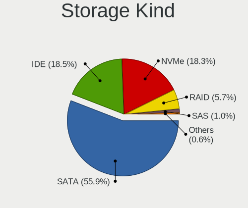

| Kind | Desktops | Percent |
|------|----------|---------|
| SATA | 288      | 55.92%  |
| NVMe | 108      | 20.97%  |
| IDE  | 86       | 16.7%   |
| RAID | 26       | 5.05%   |
| SAS  | 5        | 0.97%   |
| SCSI | 2        | 0.39%   |

Processor
---------

CPU Vendor
----------

Processor vendors

| Vendor | Desktops | Percent |
|--------|----------|---------|
| Intel  | 229      | 64.15%  |
| AMD    | 128      | 35.85%  |

CPU Model
---------

Processor models

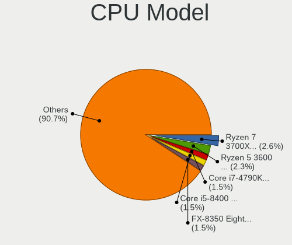

| Model                                       | Desktops | Percent |
|---------------------------------------------|----------|---------|
| AMD Ryzen 5 3600 6-Core Processor           | 11       | 3.08%   |
| AMD Ryzen 7 3700X 8-Core Processor          | 10       | 2.8%    |
| Intel Core i5-8400 CPU @ 2.80GHz            | 7        | 1.96%   |
| Intel Core i3-2100 CPU @ 3.10GHz            | 6        | 1.68%   |
| AMD Ryzen 5 3400G with Radeon Vega Graphics | 6        | 1.68%   |
| Intel Core i7-4790K CPU @ 4.00GHz           | 5        | 1.4%    |
| Intel Core i5-3570 CPU @ 3.40GHz            | 5        | 1.4%    |
| Intel Core 2 Duo CPU E8400 @ 3.00GHz        | 5        | 1.4%    |
| AMD Ryzen 5 5600X 6-Core Processor          | 5        | 1.4%    |
| AMD FX-8350 Eight-Core Processor            | 5        | 1.4%    |
| Intel Core i9-10900 CPU @ 2.80GHz           | 4        | 1.12%   |
| Intel Core i7-8700K CPU @ 3.70GHz           | 4        | 1.12%   |
| Intel Core i5-10400F CPU @ 2.90GHz          | 4        | 1.12%   |
| Intel Core 2 Quad CPU Q6600 @ 2.40GHz       | 4        | 1.12%   |
| AMD Ryzen 9 5950X 16-Core Processor         | 4        | 1.12%   |
| AMD Ryzen 5 1600 Six-Core Processor         | 4        | 1.12%   |
| AMD Ryzen 3 2200G with Radeon Vega Graphics | 4        | 1.12%   |
| Intel Core i9-10850K CPU @ 3.60GHz          | 3        | 0.84%   |
| Intel Core i7-7700K CPU @ 4.20GHz           | 3        | 0.84%   |
| Intel Core i7-2600 CPU @ 3.40GHz            | 3        | 0.84%   |
| Intel Core i5-6500 CPU @ 3.20GHz            | 3        | 0.84%   |
| Intel Core i5-4590 CPU @ 3.30GHz            | 3        | 0.84%   |
| Intel Core i5-4460 CPU @ 3.20GHz            | 3        | 0.84%   |
| Intel Core i5-3470 CPU @ 3.20GHz            | 3        | 0.84%   |
| Intel Core i3-2120 CPU @ 3.30GHz            | 3        | 0.84%   |
| Intel Core i3-10100 CPU @ 3.60GHz           | 3        | 0.84%   |
| AMD Ryzen 9 3900X 12-Core Processor         | 3        | 0.84%   |
| AMD Ryzen 5 2600 Six-Core Processor         | 3        | 0.84%   |
| AMD FX-6300 Six-Core Processor              | 3        | 0.84%   |
| Intel Xeon CPU E5-2690 0 @ 2.90GHz          | 2        | 0.56%   |
| Intel Xeon CPU E5-2620 0 @ 2.00GHz          | 2        | 0.56%   |
| Intel Pentium Dual-Core CPU E6600 @ 3.06GHz | 2        | 0.56%   |
| Intel Pentium Dual-Core CPU E5500 @ 2.80GHz | 2        | 0.56%   |
| Intel Pentium Dual-Core CPU E5400 @ 2.70GHz | 2        | 0.56%   |
| Intel Core i9-9900KF CPU @ 3.60GHz          | 2        | 0.56%   |
| Intel Core i9-9900K CPU @ 3.60GHz           | 2        | 0.56%   |
| Intel Core i7-5930K CPU @ 3.50GHz           | 2        | 0.56%   |
| Intel Core i7-4790 CPU @ 3.60GHz            | 2        | 0.56%   |
| Intel Core i7-3770K CPU @ 3.50GHz           | 2        | 0.56%   |
| Intel Core i7-3770 CPU @ 3.40GHz            | 2        | 0.56%   |
| Intel Core i7-2600S CPU @ 2.80GHz           | 2        | 0.56%   |
| Intel Core i7-10700K CPU @ 3.80GHz          | 2        | 0.56%   |
| Intel Core i7-10700 CPU @ 2.90GHz           | 2        | 0.56%   |
| Intel Core i7 CPU 870 @ 2.93GHz             | 2        | 0.56%   |
| Intel Core i5-9600KF CPU @ 3.70GHz          | 2        | 0.56%   |
| Intel Core i5-6600K CPU @ 3.50GHz           | 2        | 0.56%   |
| Intel Core i5-4690K CPU @ 3.50GHz           | 2        | 0.56%   |
| Intel Core i5-4570 CPU @ 3.20GHz            | 2        | 0.56%   |
| Intel Core i5-3470S CPU @ 2.90GHz           | 2        | 0.56%   |
| Intel Core i5-10400 CPU @ 2.90GHz           | 2        | 0.56%   |
| Intel Core i3-4170 CPU @ 3.70GHz            | 2        | 0.56%   |
| Intel Core 2 Duo CPU E4600 @ 2.40GHz        | 2        | 0.56%   |
| Intel Celeron G5905 CPU @ 3.50GHz           | 2        | 0.56%   |
| Intel Celeron CPU G3930 @ 2.90GHz           | 2        | 0.56%   |
| Intel 11th Gen Core i7-11700K @ 3.60GHz     | 2        | 0.56%   |
| Intel 11th Gen Core i5-11600K @ 3.90GHz     | 2        | 0.56%   |
| AMD Ryzen 7 3800X 8-Core Processor          | 2        | 0.56%   |
| AMD Ryzen 7 2700X Eight-Core Processor      | 2        | 0.56%   |
| AMD Ryzen 5 3600X 6-Core Processor          | 2        | 0.56%   |
| AMD Ryzen 5 2600X Six-Core Processor        | 2        | 0.56%   |

CPU Model Family
----------------

Processor model prefix

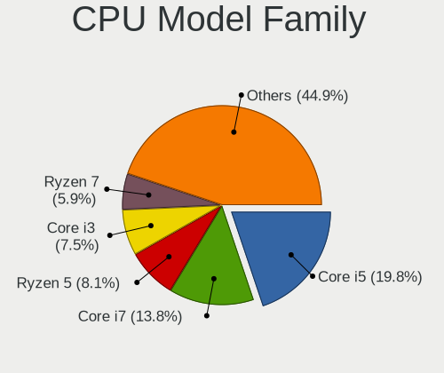

| Model                   | Desktops | Percent |
|-------------------------|----------|---------|
| Intel Core i5           | 68       | 19.05%  |
| Intel Core i7           | 48       | 13.45%  |
| AMD Ryzen 5             | 36       | 10.08%  |
| Intel Core i3           | 25       | 7%      |
| Intel Xeon              | 18       | 5.04%   |
| AMD Ryzen 7             | 18       | 5.04%   |
| AMD FX                  | 14       | 3.92%   |
| Intel Core i9           | 13       | 3.64%   |
| Intel Pentium Dual-Core | 10       | 2.8%    |
| Intel Core 2 Duo        | 10       | 2.8%    |
| Intel Celeron           | 10       | 2.8%    |
| AMD Ryzen 9             | 9        | 2.52%   |
| AMD Ryzen 3             | 8        | 2.24%   |
| AMD Athlon 64 X2        | 7        | 1.96%   |
| Intel Pentium           | 6        | 1.68%   |
| Intel Core 2 Quad       | 6        | 1.68%   |
| Other                   | 5        | 1.4%    |
| AMD Phenom II X4        | 5        | 1.4%    |
| AMD Ryzen Threadripper  | 4        | 1.12%   |
| AMD Phenom              | 4        | 1.12%   |
| AMD Athlon II X2        | 4        | 1.12%   |
| AMD A4                  | 4        | 1.12%   |
| Intel Pentium Dual      | 2        | 0.56%   |
| Intel Pentium D         | 2        | 0.56%   |
| AMD Phenom II X6        | 2        | 0.56%   |
| AMD A8                  | 2        | 0.56%   |
| AMD A6                  | 2        | 0.56%   |
| AMD A10                 | 2        | 0.56%   |
| Intel Pentium 4         | 1        | 0.28%   |
| Intel Genuine           | 1        | 0.28%   |
| Intel Core 2 Extreme    | 1        | 0.28%   |
| Intel Core 2            | 1        | 0.28%   |
| Intel Celeron D         | 1        | 0.28%   |
| Intel Atom              | 1        | 0.28%   |
| AMD Ryzen 5 PRO         | 1        | 0.28%   |
| AMD Phenom II X3        | 1        | 0.28%   |
| AMD Phenom II X2        | 1        | 0.28%   |
| AMD E                   | 1        | 0.28%   |
| AMD Athlon X4           | 1        | 0.28%   |
| AMD Athlon X2           | 1        | 0.28%   |
| AMD Athlon Dual Core    | 1        | 0.28%   |

CPU Cores
---------

Number of processor cores

| Number | Desktops | Percent |
|--------|----------|---------|
| 4      | 131      | 36.69%  |
| 2      | 85       | 23.81%  |
| 6      | 65       | 18.21%  |
| 8      | 38       | 10.64%  |
| 10     | 10       | 2.8%    |
| 12     | 7        | 1.96%   |
| 1      | 7        | 1.96%   |
| 16     | 5        | 1.4%    |
| 3      | 5        | 1.4%    |
| 24     | 2        | 0.56%   |
| 36     | 1        | 0.28%   |
| 14     | 1        | 0.28%   |

CPU Sockets
-----------

Number of sockets

| Number | Desktops | Percent |
|--------|----------|---------|
| 1      | 352      | 98.6%   |
| 2      | 5        | 1.4%    |

CPU Threads
-----------

Threads per core (Hyper-Threading)

| Number | Desktops | Percent |
|--------|----------|---------|
| 2      | 204      | 57.14%  |
| 1      | 153      | 42.86%  |

CPU Op-Modes
------------

CPU Operation Modes (32-bit, 64-bit)

| Op mode        | Desktops | Percent |
|----------------|----------|---------|
| 32-bit, 64-bit | 357      | 100%    |

CPU Microcode
-------------

Microcode number

| Number     | Desktops | Percent |
|------------|----------|---------|
| Unknown    | 241      | 67.13%  |
| 0x306c3    | 14       | 3.9%    |
| 0x08701021 | 10       | 2.79%   |
| 0xa0655    | 8        | 2.23%   |
| 0xa0653    | 6        | 1.67%   |
| 0x906ea    | 6        | 1.67%   |
| 0x306a9    | 6        | 1.67%   |
| 0x906ed    | 5        | 1.39%   |
| 0x906e9    | 4        | 1.11%   |
| 0x206a7    | 4        | 1.11%   |
| 0x1067a    | 4        | 1.11%   |
| 0x0a201009 | 4        | 1.11%   |
| 0x08108109 | 4        | 1.11%   |
| 0xa0671    | 3        | 0.84%   |
| 0x506e3    | 3        | 0.84%   |
| 0x0800820d | 3        | 0.84%   |
| 0x06000852 | 3        | 0.84%   |
| 0x20655    | 2        | 0.56%   |
| 0x0a201016 | 2        | 0.56%   |
| 0x08001137 | 2        | 0.56%   |
| 0x010000dc | 2        | 0.56%   |
| 0xf64      | 1        | 0.28%   |
| 0x706a8    | 1        | 0.28%   |
| 0x6fd      | 1        | 0.28%   |
| 0x6fb      | 1        | 0.28%   |
| 0x50654    | 1        | 0.28%   |
| 0x406f1    | 1        | 0.28%   |
| 0x406c3    | 1        | 0.28%   |
| 0x306e4    | 1        | 0.28%   |
| 0x206d7    | 1        | 0.28%   |
| 0x206c2    | 1        | 0.28%   |
| 0x106e5    | 1        | 0.28%   |
| 0x106a5    | 1        | 0.28%   |
| 0x10676    | 1        | 0.28%   |
| 0x0a201006 | 1        | 0.28%   |
| 0x08701013 | 1        | 0.28%   |
| 0x08301039 | 1        | 0.28%   |
| 0x08001138 | 1        | 0.28%   |
| 0x0800111c | 1        | 0.28%   |
| 0x06003106 | 1        | 0.28%   |
| 0x06001119 | 1        | 0.28%   |
| 0x02000057 | 1        | 0.28%   |
| 0x010000c8 | 1        | 0.28%   |
| 0x01000083 | 1        | 0.28%   |

CPU Microarch
-------------

Microarchitecture

| Name            | Desktops | Percent |
|-----------------|----------|---------|
| KabyLake        | 38       | 10.64%  |
| Haswell         | 34       | 9.52%   |
| Zen 2           | 31       | 8.68%   |
| SandyBridge     | 31       | 8.68%   |
| CometLake       | 27       | 7.56%   |
| IvyBridge       | 25       | 7%      |
| Penryn          | 24       | 6.72%   |
| Zen+            | 18       | 5.04%   |
| Piledriver      | 18       | 5.04%   |
| K10             | 17       | 4.76%   |
| Zen             | 16       | 4.48%   |
| Skylake         | 15       | 4.2%    |
| Zen 3           | 11       | 3.08%   |
| Core            | 9        | 2.52%   |
| K8 Hammer       | 8        | 2.24%   |
| Nehalem         | 5        | 1.4%    |
| Westmere        | 4        | 1.12%   |
| NetBurst        | 4        | 1.12%   |
| Broadwell       | 4        | 1.12%   |
| Steamroller     | 3        | 0.84%   |
| Icelake         | 3        | 0.84%   |
| K10 Llano       | 2        | 0.56%   |
| Goldmont        | 2        | 0.56%   |
| Unknown         | 2        | 0.56%   |
| Silvermont      | 1        | 0.28%   |
| Puma            | 1        | 0.28%   |
| K8 & K10 hybrid | 1        | 0.28%   |
| Goldmont plus   | 1        | 0.28%   |
| Bulldozer       | 1        | 0.28%   |
| Bobcat          | 1        | 0.28%   |

Graphics
--------

GPU Vendor
----------

Vendors of graphics cards

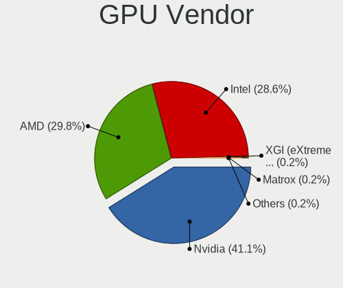

| Vendor                                       | Desktops | Percent |
|----------------------------------------------|----------|---------|
| Nvidia                                       | 150      | 40.21%  |
| Intel                                        | 112      | 30.03%  |
| AMD                                          | 109      | 29.22%  |
| XGI Technology (eXtreme Graphics Innovation) | 1        | 0.27%   |
| ASPEED Technology                            | 1        | 0.27%   |

GPU Model
---------

Graphics card models

| Model                                                                              | Desktops | Percent |
|------------------------------------------------------------------------------------|----------|---------|
| Intel CometLake-S GT2 [UHD Graphics 630]                                           | 24       | 6.32%   |
| AMD Ellesmere [Radeon RX 470/480/570/570X/580/580X/590]                            | 17       | 4.47%   |
| Intel Xeon E3-1200 v3/4th Gen Core Processor Integrated Graphics Controller        | 14       | 3.68%   |
| Nvidia GK208B [GeForce GT 710]                                                     | 13       | 3.42%   |
| Intel Xeon E3-1200 v2/3rd Gen Core processor Graphics Controller                   | 13       | 3.42%   |
| Intel 2nd Generation Core Processor Family Integrated Graphics Controller          | 12       | 3.16%   |
| Nvidia GP108 [GeForce GT 1030]                                                     | 8        | 2.11%   |
| Nvidia GP107 [GeForce GTX 1050 Ti]                                                 | 8        | 2.11%   |
| Nvidia GK208B [GeForce GT 730]                                                     | 8        | 2.11%   |
| Intel 4 Series Chipset Integrated Graphics Controller                              | 8        | 2.11%   |
| AMD Navi 10 [Radeon RX 5600 OEM/5600 XT / 5700/5700 XT]                            | 8        | 2.11%   |
| AMD Cedar [Radeon HD 5000/6000/7350/8350 Series]                                   | 7        | 1.84%   |
| Nvidia GT218 [GeForce 210]                                                         | 6        | 1.58%   |
| AMD Raven Ridge [Radeon Vega Series / Radeon Vega Mobile Series]                   | 6        | 1.58%   |
| AMD Picasso                                                                        | 6        | 1.58%   |
| Nvidia GP106 [GeForce GTX 1060 3GB]                                                | 5        | 1.32%   |
| Nvidia GP102 [GeForce GTX 1080 Ti]                                                 | 5        | 1.32%   |
| Intel RocketLake-S GT1 [UHD Graphics 750]                                          | 5        | 1.32%   |
| Intel HD Graphics 630                                                              | 5        | 1.32%   |
| AMD Oland PRO [Radeon R7 240/340]                                                  | 5        | 1.32%   |
| Nvidia TU104 [GeForce RTX 2070 SUPER]                                              | 4        | 1.05%   |
| Nvidia GP107 [GeForce GTX 1050]                                                    | 4        | 1.05%   |
| Nvidia GP106 [GeForce GTX 1060 6GB]                                                | 4        | 1.05%   |
| Nvidia GP104 [GeForce GTX 1070]                                                    | 4        | 1.05%   |
| Intel 4th Generation Core Processor Family Integrated Graphics Controller          | 4        | 1.05%   |
| AMD Cape Verde XT [Radeon HD 7770/8760 / R7 250X]                                  | 4        | 1.05%   |
| Nvidia GP104 [GeForce GTX 1080]                                                    | 3        | 0.79%   |
| Nvidia GM206 [GeForce GTX 960]                                                     | 3        | 0.79%   |
| Nvidia GM204 [GeForce GTX 970]                                                     | 3        | 0.79%   |
| Nvidia GM107 [GeForce GTX 750 Ti]                                                  | 3        | 0.79%   |
| Nvidia GK107 [GeForce GTX 650]                                                     | 3        | 0.79%   |
| Nvidia GF119 [GeForce GT 610]                                                      | 3        | 0.79%   |
| Nvidia GF108 [GeForce GT 730]                                                      | 3        | 0.79%   |
| Intel HD Graphics 530                                                              | 3        | 0.79%   |
| Intel HD Graphics 510                                                              | 3        | 0.79%   |
| Intel CoffeeLake-S GT2 [UHD Graphics 630]                                          | 3        | 0.79%   |
| Intel 82G33/G31 Express Integrated Graphics Controller                             | 3        | 0.79%   |
| Intel 82945G/GZ Integrated Graphics Controller                                     | 3        | 0.79%   |
| AMD Navi 14 [Radeon RX 5500/5500M / Pro 5500M]                                     | 3        | 0.79%   |
| AMD Juniper XT [Radeon HD 5770]                                                    | 3        | 0.79%   |
| AMD Caicos [Radeon HD 6450/7450/8450 / R5 230 OEM]                                 | 3        | 0.79%   |
| Nvidia TU116 [GeForce GTX 1660 Ti]                                                 | 2        | 0.53%   |
| Nvidia TU106 [GeForce RTX 2070]                                                    | 2        | 0.53%   |
| Nvidia TU106 [GeForce RTX 2060 Rev. A]                                             | 2        | 0.53%   |
| Nvidia GT218 [GeForce 8400 GS Rev. 3]                                              | 2        | 0.53%   |
| Nvidia GT215 [GeForce GT 240]                                                      | 2        | 0.53%   |
| Nvidia GT200 [GeForce GTX 260]                                                     | 2        | 0.53%   |
| Nvidia GM107 [GeForce GTX 750]                                                     | 2        | 0.53%   |
| Nvidia GK104 [GeForce GTX 760]                                                     | 2        | 0.53%   |
| Nvidia GF106GL [Quadro 2000]                                                       | 2        | 0.53%   |
| Nvidia C77 [GeForce 8200]                                                          | 2        | 0.53%   |
| Intel Comet Lake UHD Graphics                                                      | 2        | 0.53%   |
| Intel Celeron N3350/Pentium N4200/Atom E3900 Series Integrated Graphics Controller | 2        | 0.53%   |
| AMD Vega 20 [Radeon VII]                                                           | 2        | 0.53%   |
| AMD Trinity 2 [Radeon HD 7480D]                                                    | 2        | 0.53%   |
| AMD Tahiti XT [Radeon HD 7970/8970 OEM / R9 280X]                                  | 2        | 0.53%   |
| AMD RV620 LE [Radeon HD 3450]                                                      | 2        | 0.53%   |
| AMD RS880 [Radeon HD 4290]                                                         | 2        | 0.53%   |
| AMD RS880 [Radeon HD 4250]                                                         | 2        | 0.53%   |
| AMD RS780 [Radeon HD 3200]                                                         | 2        | 0.53%   |

GPU Combo
---------

Combinations of graphics cards

| Name                | Desktops | Percent |
|---------------------|----------|---------|
| 1 x Nvidia          | 143      | 39.94%  |
| 1 x AMD             | 104      | 29.05%  |
| 1 x Intel           | 97       | 27.09%  |
| Intel + Nvidia      | 5        | 1.4%    |
| Intel + AMD         | 3        | 0.84%   |
| 2 x AMD             | 2        | 0.56%   |
| 2 x Nvidia          | 1        | 0.28%   |
| 1 x XGI             | 1        | 0.28%   |
| 1 x Intel + 4 x AMD | 1        | 0.28%   |
| 1 x ASPEED          | 1        | 0.28%   |

GPU Driver
----------

Free vs proprietary

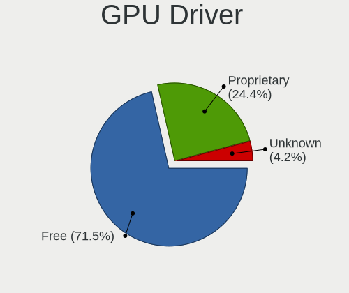

| Driver      | Desktops | Percent |
|-------------|----------|---------|
| Free        | 257      | 71.19%  |
| Proprietary | 87       | 24.1%   |
| Unknown     | 17       | 4.71%   |

GPU Memory
----------

Total video memory

| Size in GB | Desktops | Percent |
|------------|----------|---------|
| Unknown    | 250      | 69.44%  |
| 1.01-2.0   | 36       | 10%     |
| 7.01-8.0   | 20       | 5.56%   |
| 3.01-4.0   | 16       | 4.44%   |
| 0.51-1.0   | 12       | 3.33%   |
| 8.01-16.0  | 9        | 2.5%    |
| 5.01-6.0   | 8        | 2.22%   |
| 0.01-0.5   | 6        | 1.67%   |
| 2.01-3.0   | 3        | 0.83%   |

Monitor
-------

Monitor Vendor
--------------

Monitor vendors

| Vendor               | Desktops | Percent |
|----------------------|----------|---------|
| Samsung Electronics  | 73       | 19.78%  |
| Dell                 | 48       | 13.01%  |
| Goldstar             | 37       | 10.03%  |
| Acer                 | 32       | 8.67%   |
| Hewlett-Packard      | 20       | 5.42%   |
| Ancor Communications | 20       | 5.42%   |
| BenQ                 | 14       | 3.79%   |
| Philips              | 13       | 3.52%   |
| AOC                  | 12       | 3.25%   |
| LG Electronics       | 11       | 2.98%   |
| Unknown              | 10       | 2.71%   |
| ViewSonic            | 7        | 1.9%    |
| Sony                 | 6        | 1.63%   |
| NEC Computers        | 4        | 1.08%   |
| Lenovo               | 4        | 1.08%   |
| Iiyama               | 4        | 1.08%   |
| Hitachi              | 4        | 1.08%   |
| Fujitsu Siemens      | 4        | 1.08%   |
| Idek Iiyama          | 3        | 0.81%   |
| HannStar             | 3        | 0.81%   |
| Vestel Elektronik    | 2        | 0.54%   |
| SKY                  | 2        | 0.54%   |
| Panasonic            | 2        | 0.54%   |
| Medion               | 2        | 0.54%   |
| Eizo                 | 2        | 0.54%   |
| ASUSTek Computer     | 2        | 0.54%   |
| Xiaomi               | 1        | 0.27%   |
| Vizio                | 1        | 0.27%   |
| Viotek               | 1        | 0.27%   |
| Vestel               | 1        | 0.27%   |
| Unknown (XXX)        | 1        | 0.27%   |
| Toshiba              | 1        | 0.27%   |
| Tech Concepts        | 1        | 0.27%   |
| SVA                  | 1        | 0.27%   |
| STD                  | 1        | 0.27%   |
| Sceptre Tech         | 1        | 0.27%   |
| RTK                  | 1        | 0.27%   |
| Plain Tree Systems   | 1        | 0.27%   |
| Pixio                | 1        | 0.27%   |
| ONN                  | 1        | 0.27%   |
| MTS                  | 1        | 0.27%   |
| MStar                | 1        | 0.27%   |
| MLK                  | 1        | 0.27%   |
| MiTAC                | 1        | 0.27%   |
| LED                  | 1        | 0.27%   |
| Konka                | 1        | 0.27%   |
| JRY                  | 1        | 0.27%   |
| HPN                  | 1        | 0.27%   |
| HKC                  | 1        | 0.27%   |
| Gigabyte Technology  | 1        | 0.27%   |
| FUS                  | 1        | 0.27%   |
| eMachines            | 1        | 0.27%   |
| DENON                | 1        | 0.27%   |
| Achieva Shimian      | 1        | 0.27%   |

Monitor Model
-------------

Monitor models

| Model                                                                  | Desktops | Percent |
|------------------------------------------------------------------------|----------|---------|
| Samsung Electronics C27F390 SAM0D32 1920x1080 600x340mm 27.2-inch      | 3        | 0.76%   |
| Hitachi HDMI HEC0030 4096x2160 1150x650mm 52.0-inch                    | 3        | 0.76%   |
| Goldstar IPS FULLHD GSM5AB8 1920x1080 480x270mm 21.7-inch              | 3        | 0.76%   |
| Goldstar FULL HD GSM5B55 1920x1080 480x270mm 21.7-inch                 | 3        | 0.76%   |
| Dell U2412M DELA07B 1920x1200 518x324mm 24.1-inch                      | 3        | 0.76%   |
| Dell P2417H DELA0DC 1920x1080 527x296mm 23.8-inch                      | 3        | 0.76%   |
| BenQ GL2450H BNQ78A7 1920x1080 530x300mm 24.0-inch                     | 3        | 0.76%   |
| ViewSonic VX2250 SERIES VSCCB25 1920x1080 477x268mm 21.5-inch          | 2        | 0.51%   |
| Vestel Elektronik 50UHD_LCD_TV VES3700 3840x2160 1872x1053mm 84.6-inch | 2        | 0.51%   |
| Unknown LCD Monitor SAMSUNG 1920x1080                                  | 2        | 0.51%   |
| SKY TV-monitor SKY0001 1920x1080 697x392mm 31.5-inch                   | 2        | 0.51%   |
| Samsung Electronics U32J59x SAM0F35 3840x2160 697x392mm 31.5-inch      | 2        | 0.51%   |
| Samsung Electronics S24F350 SAM0D21 1680x1050 520x290mm 23.4-inch      | 2        | 0.51%   |
| Samsung Electronics S22D300 SAM0B3F 1920x1080 477x268mm 21.5-inch      | 2        | 0.51%   |
| Samsung Electronics LCD Monitor SAM0C3C 1920x1080 700x390mm 31.5-inch  | 2        | 0.51%   |
| LG Electronics LCD Monitor LG TV 1920x1080                             | 2        | 0.51%   |
| Lenovo LEN LT2452pwC LEN1144 1920x1200 518x324mm 24.1-inch             | 2        | 0.51%   |
| Goldstar ULTRAWIDE GSM76F9 2560x1080 531x298mm 24.0-inch               | 2        | 0.51%   |
| Goldstar L207W GSM4E7B 1680x1050 434x270mm 20.1-inch                   | 2        | 0.51%   |
| Goldstar HDR 4K GSM7707 3840x2160 600x340mm 27.2-inch                  | 2        | 0.51%   |
| Dell U2412M DELA07A 1920x1200 518x324mm 24.1-inch                      | 2        | 0.51%   |
| Dell SE2416H DELD082 1920x1080 527x296mm 23.8-inch                     | 2        | 0.51%   |
| Dell S2421HN DEL41F1 1920x1080 527x296mm 23.8-inch                     | 2        | 0.51%   |
| Dell P2419H DELD0D9 1920x1080 527x296mm 23.8-inch                      | 2        | 0.51%   |
| Dell LCD Monitor P2419H 1920x1080                                      | 2        | 0.51%   |
| Dell E1914H DELD03A 1366x768 410x230mm 18.5-inch                       | 2        | 0.51%   |
| Dell 1905FP DEL400D 1280x1024 376x301mm 19.0-inch                      | 2        | 0.51%   |
| BenQ LCD Monitor GL2450H 1920x1080                                     | 2        | 0.51%   |
| AOC 27G1G4 AOC2701 1920x1080 600x340mm 27.2-inch                       | 2        | 0.51%   |
| AOC 2369M AOC2369 1920x1080 509x286mm 23.0-inch                        | 2        | 0.51%   |
| Ancor Communications VE228 ACI22FA 1920x1080 477x268mm 21.5-inch       | 2        | 0.51%   |
| Ancor Communications ASUS VX239 ACI23E1 1920x1080 509x286mm 23.0-inch  | 2        | 0.51%   |
| Xiaomi Mi TV XMD004A 1440x900 708x398mm 32.0-inch                      | 1        | 0.25%   |
| Vizio VW32L HDTV20A VIZ0027 1280x720 700x390mm 31.5-inch               | 1        | 0.25%   |
| Viotek VIOTEKNB32C VTK3200 1920x1080 698x393mm 31.5-inch               | 1        | 0.25%   |
| ViewSonic VX3211 SERIES VSCF534 1920x1080 698x392mm 31.5-inch          | 1        | 0.25%   |
| ViewSonic VX2770 SERIES VSC3A2C 1920x1080 597x336mm 27.0-inch          | 1        | 0.25%   |
| ViewSonic VX2703 SERIES VSCF62B 1920x1080 597x336mm 27.0-inch          | 1        | 0.25%   |
| ViewSonic VA2261 VSC0F30 1920x1080 477x268mm 21.5-inch                 | 1        | 0.25%   |
| ViewSonic LCD Monitor VSCB51D 1280x1024 340x270mm 17.1-inch            | 1        | 0.25%   |
| Vestel LCD Monitor 22W_LCD_TV                                          | 1        | 0.25%   |
| Unknown LCD Monitor XMI Redmi Monitor 1920x1080                        | 1        | 0.25%   |
| Unknown LCD Monitor TSL 24MT600BF 3840x1080                            | 1        | 0.25%   |
| Unknown LCD Monitor TSL 24MT600BF                                      | 1        | 0.25%   |
| Unknown LCD Monitor Sanyo Electric Co.,Ltd. SANYO-TV 1360x765          | 1        | 0.25%   |
| Unknown LCD Monitor RTK CX101 1366x768                                 | 1        | 0.25%   |
| Unknown LCD Monitor DTV Digital TV                                     | 1        | 0.25%   |
| Unknown LCD Monitor Dell U4919DW 5120x1440                             | 1        | 0.25%   |
| Unknown LCD Monitor CHD PMOS320-IQC-1 4608x1440                        | 1        | 0.25%   |
| Unknown LCD Monitor CHD PMOS320-IQC-1                                  | 1        | 0.25%   |
| Unknown LCD Monitor BenQG2222HDL 3840x1080                             | 1        | 0.25%   |
| Unknown LCD Monitor BenQG2222HDL 1920x1080                             | 1        | 0.25%   |
| Unknown (XXX) Beyond TV XXX2851 3840x2160 1209x680mm 54.6-inch         | 1        | 0.25%   |
| Toshiba 49FHD_LCD_TV TSB3700 1920x1080 1360x768mm 61.5-inch            | 1        | 0.25%   |
| Tech Concepts LCD Monitor MT5531 1920x1080                             | 1        | 0.25%   |
| SVA 2200W-B SVA2200 1680x1050 433x270mm 20.1-inch                      | 1        | 0.25%   |
| STD VGA STD5101 1600x900 440x230mm 19.5-inch                           | 1        | 0.25%   |
| Sony TV SNYEE01 1920x1080 1600x900mm 72.3-inch                         | 1        | 0.25%   |
| Sony TV SNY4B03 1920x1080 1110x620mm 50.1-inch                         | 1        | 0.25%   |
| Sony TV  *00 SNYAA04 3840x2160 1220x680mm 55.0-inch                    | 1        | 0.25%   |

Monitor Resolution
------------------

Monitor screen resolution

| Resolution         | Desktops | Percent |
|--------------------|----------|---------|
| 1920x1080 (FHD)    | 170      | 46.58%  |
| 3840x2160 (4K)     | 35       | 9.59%   |
| 2560x1440 (QHD)    | 26       | 7.12%   |
| 1280x1024 (SXGA)   | 23       | 6.3%    |
| 1680x1050 (WSXGA+) | 18       | 4.93%   |
| Unknown            | 15       | 4.11%   |
| 1440x900 (WXGA+)   | 12       | 3.29%   |
| 1366x768 (WXGA)    | 11       | 3.01%   |
| 1920x1200 (WUXGA)  | 8        | 2.19%   |
| 2560x1080          | 6        | 1.64%   |
| 1600x900 (HD+)     | 6        | 1.64%   |
| 3840x1080          | 4        | 1.1%    |
| 3440x1440          | 4        | 1.1%    |
| 1360x768           | 4        | 1.1%    |
| 1600x1200          | 3        | 0.82%   |
| 5760x1080          | 2        | 0.55%   |
| 2048x1152          | 2        | 0.55%   |
| 1280x720 (HD)      | 2        | 0.55%   |
| 6400x2160          | 1        | 0.27%   |
| 5760x2160          | 1        | 0.27%   |
| 5760x1200          | 1        | 0.27%   |
| 5120x1440          | 1        | 0.27%   |
| 4608x1440          | 1        | 0.27%   |
| 4480x1440          | 1        | 0.27%   |
| 4240x1440          | 1        | 0.27%   |
| 3640x1920          | 1        | 0.27%   |
| 3600x1080          | 1        | 0.27%   |
| 2560x1600          | 1        | 0.27%   |
| 2048x1536          | 1        | 0.27%   |
| 1920x540           | 1        | 0.27%   |
| 1826x1027          | 1        | 0.27%   |
| 1360x765           | 1        | 0.27%   |

Monitor Diagonal
----------------

Diagonal size in inches

| Inches  | Desktops | Percent |
|---------|----------|---------|
| Unknown | 61       | 16.76%  |
| 24      | 46       | 12.64%  |
| 23      | 45       | 12.36%  |
| 27      | 41       | 11.26%  |
| 21      | 38       | 10.44%  |
| 19      | 23       | 6.32%   |
| 31      | 21       | 5.77%   |
| 84      | 12       | 3.3%    |
| 18      | 11       | 3.02%   |
| 20      | 10       | 2.75%   |
| 17      | 9        | 2.47%   |
| 22      | 8        | 2.2%    |
| 34      | 7        | 1.92%   |
| 15      | 6        | 1.65%   |
| 32      | 5        | 1.37%   |
| 40      | 3        | 0.82%   |
| 72      | 2        | 0.55%   |
| 54      | 2        | 0.55%   |
| 52      | 2        | 0.55%   |
| 48      | 2        | 0.55%   |
| 26      | 2        | 0.55%   |
| 65      | 1        | 0.27%   |
| 55      | 1        | 0.27%   |
| 50      | 1        | 0.27%   |
| 46      | 1        | 0.27%   |
| 43      | 1        | 0.27%   |
| 30      | 1        | 0.27%   |
| 25      | 1        | 0.27%   |
| 10      | 1        | 0.27%   |

Monitor Width
-------------

Physical width

| Width in mm | Desktops | Percent |
|-------------|----------|---------|
| 501-600     | 124      | 34.64%  |
| 401-500     | 77       | 21.51%  |
| Unknown     | 61       | 17.04%  |
| 601-700     | 26       | 7.26%   |
| 351-400     | 16       | 4.47%   |
| 1501-2000   | 14       | 3.91%   |
| 301-350     | 13       | 3.63%   |
| 701-800     | 11       | 3.07%   |
| 1001-1500   | 10       | 2.79%   |
| 801-900     | 4        | 1.12%   |
| 201-300     | 1        | 0.28%   |
| 901-1000    | 1        | 0.28%   |

Aspect Ratio
------------

Proportional relationship between the width and the height

| Ratio   | Desktops | Percent |
|---------|----------|---------|
| 16/9    | 213      | 62.1%   |
| Unknown | 55       | 16.03%  |
| 16/10   | 40       | 11.66%  |
| 5/4     | 20       | 5.83%   |
| 21/9    | 7        | 2.04%   |
| 4/3     | 4        | 1.17%   |
| 6/5     | 3        | 0.87%   |
| 3/2     | 1        | 0.29%   |

Monitor Area
------------

Area in inch

| Area in inch | Desktops | Percent |
|----------------|----------|---------|
| 201-250        | 114      | 31.75%  |
| Unknown        | 61       | 16.99%  |
| 151-200        | 45       | 12.53%  |
| 301-350        | 43       | 11.98%  |
| 351-500        | 31       | 8.64%   |
| More than 1000 | 23       | 6.41%   |
| 141-150        | 15       | 4.18%   |
| 251-300        | 14       | 3.9%    |
| 501-1000       | 6        | 1.67%   |
| 101-110        | 5        | 1.39%   |
| 41-50          | 1        | 0.28%   |
| 111-120        | 1        | 0.28%   |

Pixel Density
-------------

Pixels per inch

| Density | Desktops | Percent |
|---------|----------|---------|
| 51-100  | 196      | 56.48%  |
| Unknown | 61       | 17.58%  |
| 101-120 | 59       | 17%     |
| 1-50    | 15       | 4.32%   |
| 121-160 | 9        | 2.59%   |
| 161-240 | 7        | 2.02%   |

Multiple Monitors
-----------------

Total monitors connected

| Total | Desktops | Percent |
|-------|----------|---------|
| 1     | 281      | 77.2%   |
| 2     | 55       | 15.11%  |
| 0     | 24       | 6.59%   |
| 3     | 4        | 1.1%    |

Network
-------

Net Controller Vendor
---------------------

Controller vendors

| Vendor                          | Desktops | Percent |
|---------------------------------|----------|---------|
| Realtek Semiconductor           | 224      | 44.09%  |
| Intel                           | 151      | 29.72%  |
| Qualcomm Atheros                | 40       | 7.87%   |
| TP-Link                         | 12       | 2.36%   |
| Nvidia                          | 11       | 2.17%   |
| Ralink Technology               | 10       | 1.97%   |
| Broadcom                        | 9        | 1.77%   |
| Ralink                          | 5        | 0.98%   |
| Qualcomm Atheros Communications | 4        | 0.79%   |
| MediaTek                        | 4        | 0.79%   |
| ASUSTek Computer                | 4        | 0.79%   |
| Marvell Technology Group        | 3        | 0.59%   |
| Broadcom Limited                | 3        | 0.59%   |
| Motorola PCS                    | 2        | 0.39%   |
| Microsoft                       | 2        | 0.39%   |
| IMC Networks                    | 2        | 0.39%   |
| Edimax Technology               | 2        | 0.39%   |
| D-Link System                   | 2        | 0.39%   |
| D-Link                          | 2        | 0.39%   |
| BUFFALO                         | 2        | 0.39%   |
| AVM                             | 2        | 0.39%   |
| ASIX Electronics                | 2        | 0.39%   |
| Xiaomi                          | 1        | 0.2%    |
| Sitecom Europe                  | 1        | 0.2%    |
| Sigma Designs                   | 1        | 0.2%    |
| Seeed Technology                | 1        | 0.2%    |
| Samsung Electronics             | 1        | 0.2%    |
| NetGear                         | 1        | 0.2%    |
| LG Electronics                  | 1        | 0.2%    |
| Belkin Components               | 1        | 0.2%    |
| Belkin                          | 1        | 0.2%    |
| American Megatrends             | 1        | 0.2%    |

Net Controller Model
--------------------

Controller models

| Model                                                                  | Desktops | Percent |
|------------------------------------------------------------------------|----------|---------|
| Realtek RTL8111/8168/8411 PCI Express Gigabit Ethernet Controller      | 172      | 29.3%   |
| Intel Wi-Fi 6 AX200                                                    | 24       | 4.09%   |
| Realtek RTL8125 2.5GbE Controller                                      | 19       | 3.24%   |
| Intel I211 Gigabit Network Connection                                  | 19       | 3.24%   |
| Intel Ethernet Connection (2) I219-V                                   | 17       | 2.9%    |
| Intel 82579LM Gigabit Network Connection (Lewisville)                  | 16       | 2.73%   |
| Intel Ethernet Controller I225-V                                       | 12       | 2.04%   |
| Ralink MT7601U Wireless Adapter                                        | 8        | 1.36%   |
| Intel Dual Band Wireless-AC 3168NGW [Stone Peak]                       | 8        | 1.36%   |
| Realtek RTL8821CE 802.11ac PCIe Wireless Network Adapter               | 7        | 1.19%   |
| Realtek RTL-8100/8101L/8139 PCI Fast Ethernet Adapter                  | 7        | 1.19%   |
| Intel Ethernet Connection (7) I219-V                                   | 7        | 1.19%   |
| Realtek RTL88x2bu [AC1200 Techkey]                                     | 6        | 1.02%   |
| Realtek RTL8188EUS 802.11n Wireless Network Adapter                    | 6        | 1.02%   |
| Realtek 802.11ac NIC                                                   | 6        | 1.02%   |
| Qualcomm Atheros Killer E220x Gigabit Ethernet Controller              | 6        | 1.02%   |
| Intel Ethernet Connection I217-LM                                      | 6        | 1.02%   |
| Intel Ethernet Connection (2) I218-V                                   | 6        | 1.02%   |
| Broadcom BCM4360 802.11ac Wireless Network Adapter                     | 6        | 1.02%   |
| TP-Link 802.11ac NIC                                                   | 5        | 0.85%   |
| Realtek RTL8169 PCI Gigabit Ethernet Controller                        | 5        | 0.85%   |
| Nvidia MCP77 Ethernet                                                  | 5        | 0.85%   |
| Intel Wireless-AC 9260                                                 | 5        | 0.85%   |
| Intel Tiger Lake PCH CNVi WiFi                                         | 5        | 0.85%   |
| Intel 82574L Gigabit Network Connection                                | 5        | 0.85%   |
| Intel 82567LM-3 Gigabit Network Connection                             | 5        | 0.85%   |
| Realtek RTL810xE PCI Express Fast Ethernet controller                  | 4        | 0.68%   |
| Qualcomm Atheros AR9485 Wireless Network Adapter                       | 4        | 0.68%   |
| Qualcomm Atheros AR9287 Wireless Network Adapter (PCI-Express)         | 4        | 0.68%   |
| Intel Wireless 7260                                                    | 4        | 0.68%   |
| Intel Ethernet Connection I217-V                                       | 4        | 0.68%   |
| Intel Ethernet Connection (14) I219-V                                  | 4        | 0.68%   |
| Realtek RTL8153 Gigabit Ethernet Adapter                               | 3        | 0.51%   |
| Qualcomm Atheros QCA9377 802.11ac Wireless Network Adapter             | 3        | 0.51%   |
| Qualcomm Atheros AR9271 802.11n                                        | 3        | 0.51%   |
| Qualcomm Atheros AR93xx Wireless Network Adapter                       | 3        | 0.51%   |
| Qualcomm Atheros AR8161 Gigabit Ethernet                               | 3        | 0.51%   |
| Nvidia MCP61 Ethernet                                                  | 3        | 0.51%   |
| MediaTek BQ-5211                                                       | 3        | 0.51%   |
| Intel Wireless 8265 / 8275                                             | 3        | 0.51%   |
| Intel I210 Gigabit Network Connection                                  | 3        | 0.51%   |
| Intel Ethernet Connection (12) I219-V                                  | 3        | 0.51%   |
| Intel Cannon Lake PCH CNVi WiFi                                        | 3        | 0.51%   |
| TP-Link Archer T4U ver.3                                               | 2        | 0.34%   |
| Realtek RTL8812AE 802.11ac PCIe Wireless Network Adapter               | 2        | 0.34%   |
| Realtek RTL8192EU 802.11b/g/n WLAN Adapter                             | 2        | 0.34%   |
| Realtek RTL8192CU 802.11n WLAN Adapter                                 | 2        | 0.34%   |
| Realtek RTL8192CE PCIe Wireless Network Adapter                        | 2        | 0.34%   |
| Realtek RTL8188SU 802.11n WLAN Adapter                                 | 2        | 0.34%   |
| Realtek RTL-8110SC/8169SC Gigabit Ethernet                             | 2        | 0.34%   |
| Ralink RT3090 Wireless 802.11n 1T/1R PCIe                              | 2        | 0.34%   |
| Ralink RT2800 802.11n PCI                                              | 2        | 0.34%   |
| Qualcomm Atheros AR9227 Wireless Network Adapter                       | 2        | 0.34%   |
| Qualcomm Atheros AR8152 v2.0 Fast Ethernet                             | 2        | 0.34%   |
| Qualcomm Atheros AR8151 v2.0 Gigabit Ethernet                          | 2        | 0.34%   |
| Qualcomm Atheros AR5416 Wireless Network Adapter [AR5008 802.11(a)bgn] | 2        | 0.34%   |
| Motorola PCS Moto G Play                                               | 2        | 0.34%   |
| Intel Wireless 7265                                                    | 2        | 0.34%   |
| Intel Wireless 3165                                                    | 2        | 0.34%   |
| Intel Ethernet Connection (7) I219-LM                                  | 2        | 0.34%   |

Wireless Vendor
---------------

Wireless vendors

| Vendor                          | Desktops | Percent |
|---------------------------------|----------|---------|
| Intel                           | 64       | 33.68%  |
| Realtek Semiconductor           | 41       | 21.58%  |
| Qualcomm Atheros                | 24       | 12.63%  |
| TP-Link                         | 12       | 6.32%   |
| Ralink Technology               | 10       | 5.26%   |
| Broadcom                        | 7        | 3.68%   |
| Ralink                          | 5        | 2.63%   |
| Qualcomm Atheros Communications | 4        | 2.11%   |
| ASUSTek Computer                | 4        | 2.11%   |
| Microsoft                       | 2        | 1.05%   |
| IMC Networks                    | 2        | 1.05%   |
| Edimax Technology               | 2        | 1.05%   |
| D-Link                          | 2        | 1.05%   |
| BUFFALO                         | 2        | 1.05%   |
| AVM                             | 2        | 1.05%   |
| Sitecom Europe                  | 1        | 0.53%   |
| NetGear                         | 1        | 0.53%   |
| MediaTek                        | 1        | 0.53%   |
| D-Link System                   | 1        | 0.53%   |
| Broadcom Limited                | 1        | 0.53%   |
| Belkin Components               | 1        | 0.53%   |
| Belkin                          | 1        | 0.53%   |

Wireless Model
--------------

Wireless models

| Model                                                                                | Desktops | Percent |
|--------------------------------------------------------------------------------------|----------|---------|
| Intel Wi-Fi 6 AX200                                                                  | 24       | 12.44%  |
| Ralink MT7601U Wireless Adapter                                                      | 8        | 4.15%   |
| Intel Dual Band Wireless-AC 3168NGW [Stone Peak]                                     | 8        | 4.15%   |
| Realtek RTL8821CE 802.11ac PCIe Wireless Network Adapter                             | 7        | 3.63%   |
| Realtek RTL88x2bu [AC1200 Techkey]                                                   | 6        | 3.11%   |
| Realtek RTL8188EUS 802.11n Wireless Network Adapter                                  | 6        | 3.11%   |
| Realtek 802.11ac NIC                                                                 | 6        | 3.11%   |
| Broadcom BCM4360 802.11ac Wireless Network Adapter                                   | 6        | 3.11%   |
| TP-Link 802.11ac NIC                                                                 | 5        | 2.59%   |
| Intel Wireless-AC 9260                                                               | 5        | 2.59%   |
| Intel Tiger Lake PCH CNVi WiFi                                                       | 5        | 2.59%   |
| Qualcomm Atheros AR9485 Wireless Network Adapter                                     | 4        | 2.07%   |
| Qualcomm Atheros AR9287 Wireless Network Adapter (PCI-Express)                       | 4        | 2.07%   |
| Intel Wireless 7260                                                                  | 4        | 2.07%   |
| Qualcomm Atheros QCA9377 802.11ac Wireless Network Adapter                           | 3        | 1.55%   |
| Qualcomm Atheros AR9271 802.11n                                                      | 3        | 1.55%   |
| Qualcomm Atheros AR93xx Wireless Network Adapter                                     | 3        | 1.55%   |
| Intel Wireless 8265 / 8275                                                           | 3        | 1.55%   |
| Intel Cannon Lake PCH CNVi WiFi                                                      | 3        | 1.55%   |
| TP-Link Archer T4U ver.3                                                             | 2        | 1.04%   |
| Realtek RTL8812AE 802.11ac PCIe Wireless Network Adapter                             | 2        | 1.04%   |
| Realtek RTL8192EU 802.11b/g/n WLAN Adapter                                           | 2        | 1.04%   |
| Realtek RTL8192CU 802.11n WLAN Adapter                                               | 2        | 1.04%   |
| Realtek RTL8192CE PCIe Wireless Network Adapter                                      | 2        | 1.04%   |
| Realtek RTL8188SU 802.11n WLAN Adapter                                               | 2        | 1.04%   |
| Ralink RT3090 Wireless 802.11n 1T/1R PCIe                                            | 2        | 1.04%   |
| Ralink RT2800 802.11n PCI                                                            | 2        | 1.04%   |
| Qualcomm Atheros AR9227 Wireless Network Adapter                                     | 2        | 1.04%   |
| Qualcomm Atheros AR5416 Wireless Network Adapter [AR5008 802.11(a)bgn]               | 2        | 1.04%   |
| Intel Wireless 7265                                                                  | 2        | 1.04%   |
| Intel Wireless 3165                                                                  | 2        | 1.04%   |
| D-Link 802.11ac NIC                                                                  | 2        | 1.04%   |
| TP-Link TL-WN823N v2/v3 [Realtek RTL8192EU]                                          | 1        | 0.52%   |
| TP-Link TL-WN822N Version 4 RTL8192EU                                                | 1        | 0.52%   |
| TP-Link TL-WN821N Version 5 RTL8192EU                                                | 1        | 0.52%   |
| TP-Link Archer T2U PLUS [RTL8821AU]                                                  | 1        | 0.52%   |
| TP-Link 802.11ac WLAN Adapter                                                        | 1        | 0.52%   |
| Sitecom Europe WL-608 Wireless USB Adapter 54g                                       | 1        | 0.52%   |
| Realtek RTL8822BE 802.11a/b/g/n/ac WiFi adapter                                      | 1        | 0.52%   |
| Realtek RTL8814AU 802.11a/b/g/n/ac Wireless Adapter                                  | 1        | 0.52%   |
| Realtek RTL8723BE PCIe Wireless Network Adapter                                      | 1        | 0.52%   |
| Realtek RTL8192SU 802.11n WLAN Adapter                                               | 1        | 0.52%   |
| Realtek RTL8191SEvB Wireless LAN Controller                                          | 1        | 0.52%   |
| Realtek RTL8188FTV 802.11b/g/n 1T1R 2.4G WLAN Adapter                                | 1        | 0.52%   |
| Realtek RTL8188CUS 802.11n WLAN Adapter                                              | 1        | 0.52%   |
| Realtek RTL8188CE 802.11b/g/n WiFi Adapter                                           | 1        | 0.52%   |
| Ralink RT5372 Wireless Adapter                                                       | 1        | 0.52%   |
| Ralink RT3072 Wireless Adapter                                                       | 1        | 0.52%   |
| Ralink RT5390 Wireless 802.11n 1T/1R PCIe                                            | 1        | 0.52%   |
| Qualcomm Atheros QCA9565 / AR9565 Wireless Network Adapter                           | 1        | 0.52%   |
| Qualcomm Atheros QCA6174 802.11ac Wireless Network Adapter                           | 1        | 0.52%   |
| Qualcomm Atheros TP-Link TL-WN821N v3 / TL-WN822N v2 802.11n [Atheros AR7010+AR9287] | 1        | 0.52%   |
| Qualcomm Atheros AR9285 Wireless Network Adapter (PCI-Express)                       | 1        | 0.52%   |
| Qualcomm Atheros AR5212/5213/2414 Wireless Network Adapter                           | 1        | 0.52%   |
| Qualcomm Atheros AR242x / AR542x Wireless Network Adapter (PCI-Express)              | 1        | 0.52%   |
| Qualcomm Atheros AR2413/AR2414 Wireless Network Adapter [AR5005G(S) 802.11bg]        | 1        | 0.52%   |
| NetGear WNA3100M(v1) Wireless-N 300 [Realtek RTL8192CU]                              | 1        | 0.52%   |
| Microsoft XBOX ACC                                                                   | 1        | 0.52%   |
| Microsoft Xbox 360 Wireless Adapter                                                  | 1        | 0.52%   |
| MediaTek 802.11 n WLAN                                                               | 1        | 0.52%   |

Ethernet Vendor
---------------

Ethernet vendors

| Vendor                   | Desktops | Percent |
|--------------------------|----------|---------|
| Realtek Semiconductor    | 209      | 55.15%  |
| Intel                    | 123      | 32.45%  |
| Qualcomm Atheros         | 17       | 4.49%   |
| Nvidia                   | 11       | 2.9%    |
| MediaTek                 | 3        | 0.79%   |
| Marvell Technology Group | 3        | 0.79%   |
| Motorola PCS             | 2        | 0.53%   |
| Broadcom Limited         | 2        | 0.53%   |
| Broadcom                 | 2        | 0.53%   |
| ASIX Electronics         | 2        | 0.53%   |
| Xiaomi                   | 1        | 0.26%   |
| Samsung Electronics      | 1        | 0.26%   |
| LG Electronics           | 1        | 0.26%   |
| D-Link System            | 1        | 0.26%   |
| American Megatrends      | 1        | 0.26%   |

Ethernet Model
--------------

Ethernet models

| Model                                                                         | Desktops | Percent |
|-------------------------------------------------------------------------------|----------|---------|
| Realtek RTL8111/8168/8411 PCI Express Gigabit Ethernet Controller             | 172      | 43.88%  |
| Realtek RTL8125 2.5GbE Controller                                             | 19       | 4.85%   |
| Intel I211 Gigabit Network Connection                                         | 19       | 4.85%   |
| Intel Ethernet Connection (2) I219-V                                          | 17       | 4.34%   |
| Intel 82579LM Gigabit Network Connection (Lewisville)                         | 16       | 4.08%   |
| Intel Ethernet Controller I225-V                                              | 12       | 3.06%   |
| Realtek RTL-8100/8101L/8139 PCI Fast Ethernet Adapter                         | 7        | 1.79%   |
| Intel Ethernet Connection (7) I219-V                                          | 7        | 1.79%   |
| Qualcomm Atheros Killer E220x Gigabit Ethernet Controller                     | 6        | 1.53%   |
| Intel Ethernet Connection I217-LM                                             | 6        | 1.53%   |
| Intel Ethernet Connection (2) I218-V                                          | 6        | 1.53%   |
| Realtek RTL8169 PCI Gigabit Ethernet Controller                               | 5        | 1.28%   |
| Nvidia MCP77 Ethernet                                                         | 5        | 1.28%   |
| Intel 82574L Gigabit Network Connection                                       | 5        | 1.28%   |
| Intel 82567LM-3 Gigabit Network Connection                                    | 5        | 1.28%   |
| Realtek RTL810xE PCI Express Fast Ethernet controller                         | 4        | 1.02%   |
| Intel Ethernet Connection I217-V                                              | 4        | 1.02%   |
| Intel Ethernet Connection (14) I219-V                                         | 4        | 1.02%   |
| Realtek RTL8153 Gigabit Ethernet Adapter                                      | 3        | 0.77%   |
| Qualcomm Atheros AR8161 Gigabit Ethernet                                      | 3        | 0.77%   |
| Nvidia MCP61 Ethernet                                                         | 3        | 0.77%   |
| MediaTek BQ-5211                                                              | 3        | 0.77%   |
| Intel I210 Gigabit Network Connection                                         | 3        | 0.77%   |
| Intel Ethernet Connection (12) I219-V                                         | 3        | 0.77%   |
| Realtek RTL-8110SC/8169SC Gigabit Ethernet                                    | 2        | 0.51%   |
| Qualcomm Atheros AR8152 v2.0 Fast Ethernet                                    | 2        | 0.51%   |
| Qualcomm Atheros AR8151 v2.0 Gigabit Ethernet                                 | 2        | 0.51%   |
| Motorola PCS Moto G Play                                                      | 2        | 0.51%   |
| Intel Ethernet Connection (7) I219-LM                                         | 2        | 0.51%   |
| Intel Ethernet Connection (2) I218-LM                                         | 2        | 0.51%   |
| Intel 82579V Gigabit Network Connection                                       | 2        | 0.51%   |
| Intel 82573V Gigabit Ethernet Controller (Copper)                             | 2        | 0.51%   |
| Intel 82567V-2 Gigabit Network Connection                                     | 2        | 0.51%   |
| Intel 82562V-2 10/100 Network Connection                                      | 2        | 0.51%   |
| Xiaomi Mi/Redmi series (RNDIS)                                                | 1        | 0.26%   |
| Samsung GT-I9070 (network tethering, USB debugging enabled)                   | 1        | 0.26%   |
| Realtek Killer E3000 2.5GbE Controller                                        | 1        | 0.26%   |
| Realtek Killer E2600 Gigabit Ethernet Controller                              | 1        | 0.26%   |
| Qualcomm Atheros Killer E2500 Gigabit Ethernet Controller                     | 1        | 0.26%   |
| Qualcomm Atheros Killer E2400 Gigabit Ethernet Controller                     | 1        | 0.26%   |
| Qualcomm Atheros Attansic L2 Fast Ethernet                                    | 1        | 0.26%   |
| Qualcomm Atheros AR8121/AR8113/AR8114 Gigabit or Fast Ethernet                | 1        | 0.26%   |
| Nvidia MCP73 Ethernet                                                         | 1        | 0.26%   |
| Nvidia MCP67 Ethernet                                                         | 1        | 0.26%   |
| Nvidia CK804 Ethernet Controller                                              | 1        | 0.26%   |
| Marvell Group 88E8057 PCI-E Gigabit Ethernet Controller                       | 1        | 0.26%   |
| Marvell Group 88E8053 PCI-E Gigabit Ethernet Controller                       | 1        | 0.26%   |
| Marvell Group 88E8001 Gigabit Ethernet Controller                             | 1        | 0.26%   |
| LG LM-X420xxx/G2 Android Phone (USB tethering mode)                           | 1        | 0.26%   |
| Intel Ethernet Connection (5) I219-LM                                         | 1        | 0.26%   |
| Intel Ethernet Connection (2) I219-LM                                         | 1        | 0.26%   |
| Intel Ethernet Connection (14) I219-LM                                        | 1        | 0.26%   |
| Intel Ethernet Connection (10) I219-V                                         | 1        | 0.26%   |
| Intel 82599ES 10-Gigabit SFI/SFP+ Network Connection                          | 1        | 0.26%   |
| Intel 82578DM Gigabit Network Connection                                      | 1        | 0.26%   |
| Intel 82578DC Gigabit Network Connection                                      | 1        | 0.26%   |
| Intel 82573L Gigabit Ethernet Controller                                      | 1        | 0.26%   |
| Intel 82571EB/82571GB Gigabit Ethernet Controller D0/D1 (copper applications) | 1        | 0.26%   |
| Intel 82566DM-2 Gigabit Network Connection                                    | 1        | 0.26%   |
| Intel 82562V 10/100 Network Connection                                        | 1        | 0.26%   |

Net Controller Kind
-------------------

Ethernet, WiFi or modem

| Kind     | Desktops | Percent |
|----------|----------|---------|
| Ethernet | 349      | 65.36%  |
| WiFi     | 183      | 34.27%  |
| Modem    | 2        | 0.37%   |

Used Controller
---------------

Currently used network controller

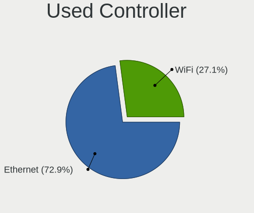

| Kind     | Desktops | Percent |
|----------|----------|---------|
| Ethernet | 275      | 68.24%  |
| WiFi     | 128      | 31.76%  |

NICs
----

Total network controllers on board

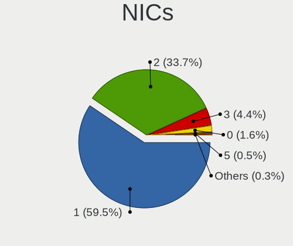

| Total | Desktops | Percent |
|-------|----------|---------|
| 1     | 214      | 59.61%  |
| 2     | 123      | 34.26%  |
| 3     | 15       | 4.18%   |
| 0     | 6        | 1.67%   |
| 4     | 1        | 0.28%   |

IPv6
----

IPv6 vs IPv4

| Used | Desktops | Percent |
|------|----------|---------|
| No   | 243      | 67.88%  |
| Yes  | 115      | 32.12%  |

Bluetooth
---------

Bluetooth Vendor
----------------

Controller vendors

| Vendor                          | Desktops | Percent |
|---------------------------------|----------|---------|
| Intel                           | 56       | 40.58%  |
| Cambridge Silicon Radio         | 34       | 24.64%  |
| Realtek Semiconductor           | 14       | 10.14%  |
| ASUSTek Computer                | 8        | 5.8%    |
| Broadcom                        | 7        | 5.07%   |
| Qualcomm Atheros Communications | 4        | 2.9%    |
| IMC Networks                    | 3        | 2.17%   |
| Apple                           | 3        | 2.17%   |
| Dynex                           | 2        | 1.45%   |
| Belkin Components               | 2        | 1.45%   |
| Qcom                            | 1        | 0.72%   |
| Primax Electronics              | 1        | 0.72%   |
| Logitech                        | 1        | 0.72%   |
| Hewlett-Packard                 | 1        | 0.72%   |
| Conwise Technology              | 1        | 0.72%   |

Bluetooth Model
---------------

Controller models

| Model                                                    | Desktops | Percent |
|----------------------------------------------------------|----------|---------|
| Cambridge Silicon Radio Bluetooth Dongle (HCI mode)      | 34       | 24.64%  |
| Intel AX200 Bluetooth                                    | 21       | 15.22%  |
| Realtek Bluetooth Radio                                  | 13       | 9.42%   |
| Intel Bluetooth Device                                   | 11       | 7.97%   |
| Intel Wireless-AC 3168 Bluetooth                         | 8        | 5.8%    |
| Intel Bluetooth wireless interface                       | 8        | 5.8%    |
| Broadcom BCM20702A0 Bluetooth 4.0                        | 5        | 3.62%   |
| Intel Wireless-AC 9260 Bluetooth Adapter                 | 4        | 2.9%    |
| ASUS Broadcom BCM20702A0 Bluetooth                       | 4        | 2.9%    |
| Qualcomm Atheros  Bluetooth Device                       | 3        | 2.17%   |
| Intel Bluetooth 9460/9560 Jefferson Peak (JfP)           | 3        | 2.17%   |
| IMC Networks Bluetooth Radio                             | 2        | 1.45%   |
| Dynex Bluetooth 4.0 Adapter [Broadcom, 1.12, BCM20702A0] | 2        | 1.45%   |
| ASUS ASUS USB-BT500                                      | 2        | 1.45%   |
| Apple Bluetooth USB Host Controller                      | 2        | 1.45%   |
| Realtek  Bluetooth 4.2 Adapter                           | 1        | 0.72%   |
| Qualcomm Atheros AR3011 Bluetooth                        | 1        | 0.72%   |
| Qcom Bluetooth USB                                       | 1        | 0.72%   |
| Primax Rocketfish RF-FLBTAD Bluetooth Adapter            | 1        | 0.72%   |
| Logitech BT Mini-Receiver (HCI mode)                     | 1        | 0.72%   |
| Intel AX210 Bluetooth                                    | 1        | 0.72%   |
| IMC Networks Bluetooth Device                            | 1        | 0.72%   |
| HP Bluetooth Dongle                                      | 1        | 0.72%   |
| Conwise CW6622                                           | 1        | 0.72%   |
| Broadcom BCM2210 Bluetooth                               | 1        | 0.72%   |
| Broadcom BCM2045 Bluetooth                               | 1        | 0.72%   |
| Belkin Components F8T065BF Mini Bluetooth 4.0 Adapter    | 1        | 0.72%   |
| Belkin Components F8T012 Bluetooth Adapter               | 1        | 0.72%   |
| ASUS Broadcom BCM20702 Single-Chip Bluetooth 4.0 + LE    | 1        | 0.72%   |
| ASUS Bluetooth Radio                                     | 1        | 0.72%   |
| Apple Built-in Bluetooth 2.0+EDR HCI                     | 1        | 0.72%   |

Sound
-----

Sound Vendor
------------

Sound card vendors

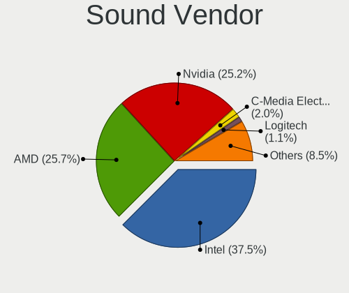

| Vendor                      | Desktops | Percent |
|-----------------------------|----------|---------|
| Intel                       | 219      | 38.22%  |
| AMD                         | 146      | 25.48%  |
| Nvidia                      | 144      | 25.13%  |
| C-Media Electronics         | 10       | 1.75%   |
| Logitech                    | 6        | 1.05%   |
| Creative Labs               | 6        | 1.05%   |
| Kingston Technology         | 3        | 0.52%   |
| JMTek                       | 3        | 0.52%   |
| Texas Instruments           | 2        | 0.35%   |
| Samson Technologies         | 2        | 0.35%   |
| Plantronics                 | 2        | 0.35%   |
| Micro Star International    | 2        | 0.35%   |
| GYROCOM C&C                 | 2        | 0.35%   |
| Yamaha                      | 1        | 0.17%   |
| VIA Technologies            | 1        | 0.17%   |
| Unknown                     | 1        | 0.17%   |
| SteelSeries ApS             | 1        | 0.17%   |
| Realtek Semiconductor       | 1        | 0.17%   |
| Pixart Imaging              | 1        | 0.17%   |
| MAG Technology              | 1        | 0.17%   |
| Mad Catz                    | 1        | 0.17%   |
| IK Multimedia               | 1        | 0.17%   |
| iConnectivity               | 1        | 0.17%   |
| Holtek Semiconductor        | 1        | 0.17%   |
| GN Netcom                   | 1        | 0.17%   |
| Generalplus Technology      | 1        | 0.17%   |
| Fry's Electronics           | 1        | 0.17%   |
| Focusrite-Novation          | 1        | 0.17%   |
| Elite Silicon               | 1        | 0.17%   |
| Earth Computer Technologies | 1        | 0.17%   |
| Dell                        | 1        | 0.17%   |
| Creative Technology         | 1        | 0.17%   |
| Cambridge Silicon Radio     | 1        | 0.17%   |
| Blue Microphones            | 1        | 0.17%   |
| BEHRINGER International     | 1        | 0.17%   |
| ASUSTek Computer            | 1        | 0.17%   |
| Astro Gaming                | 1        | 0.17%   |
| Asahi Kasei Microsystems    | 1        | 0.17%   |
| AlfaPlus Semiconductor      | 1        | 0.17%   |

Sound Model
-----------

Sound card models

| Model                                                                             | Desktops | Percent |
|-----------------------------------------------------------------------------------|----------|---------|
| AMD Starship/Matisse HD Audio Controller                                          | 41       | 6.13%   |
| Intel 6 Series/C200 Series Chipset Family High Definition Audio Controller        | 28       | 4.19%   |
| AMD SBx00 Azalia (Intel HDA)                                                      | 26       | 3.89%   |
| Nvidia GK208 HDMI/DP Audio Controller                                             | 22       | 3.29%   |
| Intel 7 Series/C216 Chipset Family High Definition Audio Controller               | 22       | 3.29%   |
| Intel 200 Series PCH HD Audio                                                     | 19       | 2.84%   |
| Intel 8 Series/C220 Series Chipset High Definition Audio Controller               | 18       | 2.69%   |
| AMD Family 17h (Models 10h-1fh) HD Audio Controller                               | 17       | 2.54%   |
| AMD Family 17h (Models 00h-0fh) HD Audio Controller                               | 17       | 2.54%   |
| AMD Ellesmere HDMI Audio [Radeon RX 470/480 / 570/580/590]                        | 17       | 2.54%   |
| Intel Xeon E3-1200 v3/4th Gen Core Processor HD Audio Controller                  | 16       | 2.39%   |
| Intel NM10/ICH7 Family High Definition Audio Controller                           | 15       | 2.24%   |
| Intel Cannon Lake PCH cAVS                                                        | 15       | 2.24%   |
| Intel 100 Series/C230 Series Chipset Family HD Audio Controller                   | 15       | 2.24%   |
| AMD Oland/Hainan/Cape Verde/Pitcairn HDMI Audio [Radeon HD 7000 Series]           | 15       | 2.24%   |
| Intel Audio device                                                                | 14       | 2.09%   |
| Nvidia GP107GL High Definition Audio Controller                                   | 13       | 1.94%   |
| AMD Raven/Raven2/Fenghuang HDMI/DP Audio Controller                               | 12       | 1.79%   |
| AMD Navi 10 HDMI Audio                                                            | 11       | 1.64%   |
| Nvidia High Definition Audio Controller                                           | 10       | 1.49%   |
| Intel 9 Series Chipset Family HD Audio Controller                                 | 10       | 1.49%   |
| AMD FCH Azalia Controller                                                         | 10       | 1.49%   |
| Nvidia GP106 High Definition Audio Controller                                     | 9        | 1.35%   |
| Intel 82801JI (ICH10 Family) HD Audio Controller                                  | 9        | 1.35%   |
| Nvidia GP108 High Definition Audio Controller                                     | 8        | 1.2%    |
| Nvidia GM107 High Definition Audio Controller [GeForce 940MX]                     | 8        | 1.2%    |
| Nvidia GF108 High Definition Audio Controller                                     | 8        | 1.2%    |
| Intel C610/X99 series chipset HD Audio Controller                                 | 8        | 1.2%    |
| Nvidia TU106 High Definition Audio Controller                                     | 7        | 1.05%   |
| Nvidia GP104 High Definition Audio Controller                                     | 7        | 1.05%   |
| Intel Comet Lake PCH-V Smart Sound Technology Audio Controller                    | 7        | 1.05%   |
| AMD Cedar HDMI Audio [Radeon HD 5400/6300/7300 Series]                            | 7        | 1.05%   |
| Nvidia MCP72XE/MCP72P/MCP78U/MCP78S High Definition Audio                         | 6        | 0.9%    |
| Intel C600/X79 series chipset High Definition Audio Controller                    | 6        | 0.9%    |
| Nvidia TU104 HD Audio Controller                                                  | 5        | 0.75%   |
| Nvidia GP102 HDMI Audio Controller                                                | 5        | 0.75%   |
| Intel Comet Lake PCH cAVS                                                         | 5        | 0.75%   |
| Intel 82801JD/DO (ICH10 Family) HD Audio Controller                               | 5        | 0.75%   |
| Intel 82801I (ICH9 Family) HD Audio Controller                                    | 5        | 0.75%   |
| AMD RS880 HDMI Audio [Radeon HD 4200 Series]                                      | 5        | 0.75%   |
| AMD Baffin HDMI/DP Audio [Radeon RX 550 640SP / RX 560/560X]                      | 5        | 0.75%   |
| Nvidia MCP61 High Definition Audio                                                | 4        | 0.6%    |
| Nvidia GM206 High Definition Audio Controller                                     | 4        | 0.6%    |
| Nvidia GK104 HDMI Audio Controller                                                | 4        | 0.6%    |
| Nvidia GF119 HDMI Audio Controller                                                | 4        | 0.6%    |
| Nvidia GF106 High Definition Audio Controller                                     | 4        | 0.6%    |
| Intel Tiger Lake-H HD Audio Controller                                            | 4        | 0.6%    |
| Intel 5 Series/3400 Series Chipset High Definition Audio                          | 4        | 0.6%    |
| Nvidia TU116 High Definition Audio Controller                                     | 3        | 0.45%   |
| Nvidia GM204 High Definition Audio Controller                                     | 3        | 0.45%   |
| Nvidia GK107 HDMI Audio Controller                                                | 3        | 0.45%   |
| Kingston Technology HyperX Virtual Surround Sound                                 | 3        | 0.45%   |
| AMD Tahiti HDMI Audio [Radeon HD 7870 XT / 7950/7970]                             | 3        | 0.45%   |
| AMD Juniper HDMI Audio [Radeon HD 5700 Series]                                    | 3        | 0.45%   |
| AMD Caicos HDMI Audio [Radeon HD 6450 / 7450/8450/8490 OEM / R5 230/235/235X OEM] | 3        | 0.45%   |
| Logitech H600 [Wireless Headset]                                                  | 2        | 0.3%    |
| Intel Sunrise Point-LP HD Audio                                                   | 2        | 0.3%    |
| Intel Celeron N3350/Pentium N4200/Atom E3900 Series Audio Cluster                 | 2        | 0.3%    |
| GYROCOM C&C Fiio E10                                                              | 2        | 0.3%    |
| Creative Labs Sound Core3D [Sound Blaster Recon3D / Z-Series]                     | 2        | 0.3%    |

Memory
------

Memory Vendor
-------------

Memory module vendors

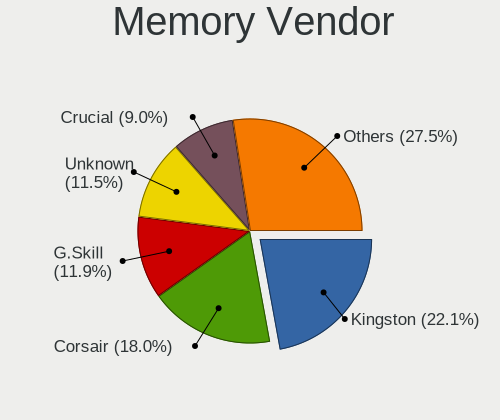

| Vendor                       | Desktops | Percent |
|------------------------------|----------|---------|
| Kingston                     | 30       | 21.28%  |
| Corsair                      | 25       | 17.73%  |
| G.Skill                      | 19       | 13.48%  |
| Unknown                      | 17       | 12.06%  |
| Crucial                      | 14       | 9.93%   |
| Samsung Electronics          | 11       | 7.8%    |
| SK Hynix                     | 4        | 2.84%   |
| A-DATA Technology            | 4        | 2.84%   |
| Micron Technology            | 3        | 2.13%   |
| Team                         | 2        | 1.42%   |
| Wilk Elektronik              | 1        | 0.71%   |
| Vaseky                       | 1        | 0.71%   |
| Unknown (F785)               | 1        | 0.71%   |
| Unknown (ABCD)               | 1        | 0.71%   |
| Unknown (0x0702)             | 1        | 0.71%   |
| Patriot Memory (PDP Systems) | 1        | 0.71%   |
| Patriot                      | 1        | 0.71%   |
| Neo Forza                    | 1        | 0.71%   |
| Mushkin                      | 1        | 0.71%   |
| Exceleram                    | 1        | 0.71%   |
| Elpida                       | 1        | 0.71%   |
| Avant                        | 1        | 0.71%   |

Memory Model
------------

Memory module models

| Model                                                                    | Desktops | Percent |
|--------------------------------------------------------------------------|----------|---------|
| Corsair RAM CMK16GX4M2B3000C15 8GB DIMM DDR4 3466MT/s                    | 4        | 2.56%   |
| Corsair RAM CMK16GX4M2B3200C16 8192MB DIMM DDR4 3600MT/s                 | 3        | 1.92%   |
| Unknown RAM Module 4GB DIMM 1333MT/s                                     | 2        | 1.28%   |
| Unknown RAM Module 2GB DIMM SDRAM 800MT/s                                | 2        | 1.28%   |
| Unknown RAM Module 2GB DIMM 1333MT/s                                     | 2        | 1.28%   |
| Kingston RAM KHX3200C16D4/16GX 16384MB DIMM DDR4 3600MT/s                | 2        | 1.28%   |
| Kingston RAM KHX2666C16/8G 8GB DIMM DDR4 3200MT/s                        | 2        | 1.28%   |
| Kingston RAM KHX2400C15/8G 8GB DIMM DDR4 2933MT/s                        | 2        | 1.28%   |
| Kingston RAM KHX2400C15/16G 16GB DIMM DDR4 3334MT/s                      | 2        | 1.28%   |
| G.Skill RAM F4-3600C16-16GTZNC 16GB DIMM DDR4 3600MT/s                   | 2        | 1.28%   |
| G.Skill RAM F4-3000C16-8GISB 8192MB DIMM DDR4 3200MT/s                   | 2        | 1.28%   |
| Crucial RAM CT102464BD160B.C16 8GB DIMM DDR3 1600MT/s                    | 2        | 1.28%   |
| Corsair RAM CMW64GX4M2E3200C16 32GB DIMM DDR4 3200MT/s                   | 2        | 1.28%   |
| Wilk Elektronik RAM IRP3600D4V64L17/16G 16GB DIMM DDR4 3600MT/s          | 1        | 0.64%   |
| Vaseky RAM CT4G4DFS824A.C8FBD2 4GB DIMM DDR4 2400MT/s                    | 1        | 0.64%   |
| Unknown RAM V02D4L84GB5285282400 4096MB DIMM DDR4 2400MT/s               | 1        | 0.64%   |
| Unknown RAM Module 8GB DIMM 1333MT/s                                     | 1        | 0.64%   |
| Unknown RAM Module 512MB DIMM DDR 266MT/s                                | 1        | 0.64%   |
| Unknown RAM Module 4GB DIMM DDR3 1600MT/s                                | 1        | 0.64%   |
| Unknown RAM Module 4GB DIMM DDR3 1333MT/s                                | 1        | 0.64%   |
| Unknown RAM Module 2GB DIMM SDRAM                                        | 1        | 0.64%   |
| Unknown RAM Module 2GB DIMM DDR3 1333MT/s                                | 1        | 0.64%   |
| Unknown RAM Module 2GB DIMM DDR2 333MT/s                                 | 1        | 0.64%   |
| Unknown RAM Module 2GB DIMM DDR2                                         | 1        | 0.64%   |
| Unknown RAM Module 2GB DIMM DDR 1333MT/s                                 | 1        | 0.64%   |
| Unknown RAM Module 1GB DIMM DDR2 333MT/s                                 | 1        | 0.64%   |
| Unknown RAM B8P94-0060-LOGIN. 2048MB DIMM DDR3 1333MT/s                  | 1        | 0.64%   |
| Unknown RAM 3000 C16 Series 8192MB DIMM DDR4 2133MT/s                    | 1        | 0.64%   |
| Unknown (F785) RAM Module 16GB DIMM DDR4 2133MT/s                        | 1        | 0.64%   |
| Unknown (ABCD) RAM 123456789012345678 2GB DIMM LPDDR4 2400MT/s           | 1        | 0.64%   |
| Unknown (0x0702) RAM Module 8GB DIMM DDR3 1066MT/s                       | 1        | 0.64%   |
| Team RAM TEAMGROUP-UD4-3200 8GB DIMM DDR4 3200MT/s                       | 1        | 0.64%   |
| Team RAM TEAMGROUP-UD4-3000 16GB DIMM DDR4 3000MT/s                      | 1        | 0.64%   |
| SK Hynix RAM HYMP125S64CP8-S6 2GB DIMM DDR2 333MT/s                      | 1        | 0.64%   |
| SK Hynix RAM HMT151R7BFR4C 4GB DIMM DDR3 1333MT/s                        | 1        | 0.64%   |
| SK Hynix RAM HMA851S6AFR6N-UH 4GB SODIMM DDR4 2667MT/s                   | 1        | 0.64%   |
| SK Hynix RAM AARVEX TECHNOLOGY 8GB DIMM DDR4 2400MT/s                    | 1        | 0.64%   |
| Samsung RAM Module 8GB DIMM DDR4 2666MT/s                                | 1        | 0.64%   |
| Samsung RAM Module 8GB DIMM DDR4 2133MT/s                                | 1        | 0.64%   |
| Samsung RAM M393B5170FH0-CH9 4GB DIMM DDR2 1333MT/s                      | 1        | 0.64%   |
| Samsung RAM M393B5170EH1-CH9 4096MB DIMM DDR3 1333MT/s                   | 1        | 0.64%   |
| Samsung RAM M391B5773CH0-CH9 2GB DIMM DDR3 1333MT/s                      | 1        | 0.64%   |
| Samsung RAM M378B5673GB0-CH9 2048MB DIMM DDR3 1333MT/s                   | 1        | 0.64%   |
| Samsung RAM M378B1G73EB0-YK0 8GB DIMM DDR3 1600MT/s                      | 1        | 0.64%   |
| Samsung RAM M378B1G73EB0 8GB DIMM DDR3 1600MT/s                          | 1        | 0.64%   |
| Samsung RAM M378A4G43AB2-CWE 32GB DIMM DDR4 3200MT/s                     | 1        | 0.64%   |
| Samsung RAM M378A2K43CB1-CTD 16GB DIMM DDR4 2667MT/s                     | 1        | 0.64%   |
| Samsung RAM M378A1K43CB2-CRC 8GB DIMM DDR4 3500MT/s                      | 1        | 0.64%   |
| Samsung RAM M3 78T2863RZS-CF7 1GB DIMM DDR2 800MT/s                      | 1        | 0.64%   |
| Patriot RAM 1600 CL9 Series 8GB DIMM DDR3 1600MT/s                       | 1        | 0.64%   |
| Patriot Memory (PDP Systems) RAM 4000 C20 Series 16GB DIMM DDR4 2667MT/s | 1        | 0.64%   |
| Neo Forza RAM NMUD340C81-1600D 4GB DIMM DDR3 1600MT/s                    | 1        | 0.64%   |
| Mushkin RAM MR[ABC]4U320GJJM32G 32GB DIMM DDR4 3200MT/s                  | 1        | 0.64%   |
| Micron RAM 8KTF51264AZ-1G6E1 4GB DIMM DDR3 1600MT/s                      | 1        | 0.64%   |
| Micron RAM 16ATF2G64AZ-3G2E1 16GB DIMM DDR4 3200MT/s                     | 1        | 0.64%   |
| Micron RAM 16ATF1G64HZ-2G1B1 8192MB SODIMM DDR4 2133MT/s                 | 1        | 0.64%   |
| Kingston RAM XW21KG-MIE2 8GB DIMM DDR4 2667MT/s                          | 1        | 0.64%   |
| Kingston RAM Module 8GB DIMM DDR4 2667MT/s                               | 1        | 0.64%   |
| Kingston RAM Module 8GB DIMM DDR4 2400MT/s                               | 1        | 0.64%   |
| Kingston RAM Module 8GB DIMM DDR4 2133MT/s                               | 1        | 0.64%   |

Memory Kind
-----------

Memory module kinds

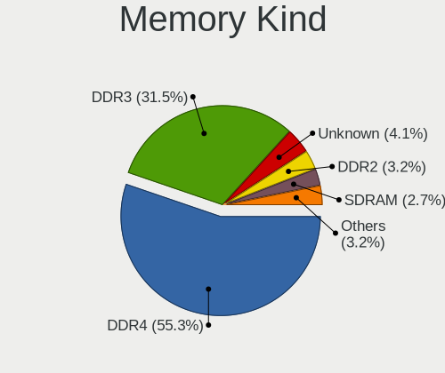

| Kind    | Desktops | Percent |
|---------|----------|---------|
| DDR4    | 75       | 59.52%  |
| DDR3    | 35       | 27.78%  |
| DDR2    | 5        | 3.97%   |
| Unknown | 4        | 3.17%   |
| SDRAM   | 3        | 2.38%   |
| LPDDR4  | 2        | 1.59%   |
| DDR     | 2        | 1.59%   |

Memory Form Factor
------------------

Physical design of the memory module

| Name   | Desktops | Percent |
|--------|----------|---------|
| DIMM   | 123      | 97.62%  |
| SODIMM | 3        | 2.38%   |

Memory Size
-----------

Memory module size

| Size  | Desktops | Percent |
|-------|----------|---------|
| 8192  | 52       | 38.24%  |
| 16384 | 30       | 22.06%  |
| 4096  | 22       | 16.18%  |
| 2048  | 17       | 12.5%   |
| 32768 | 12       | 8.82%   |
| 1024  | 2        | 1.47%   |
| 512   | 1        | 0.74%   |

Memory Speed
------------

Memory module speed

| Speed   | Desktops | Percent |
|---------|----------|---------|
| 3200    | 25       | 17.99%  |
| 1333    | 19       | 13.67%  |
| 1600    | 17       | 12.23%  |
| 3600    | 15       | 10.79%  |
| 2400    | 9        | 6.47%   |
| 2133    | 8        | 5.76%   |
| 3000    | 5        | 3.6%    |
| 2667    | 5        | 3.6%    |
| 800     | 5        | 3.6%    |
| 3466    | 4        | 2.88%   |
| 2933    | 4        | 2.88%   |
| 2666    | 3        | 2.16%   |
| 3733    | 2        | 1.44%   |
| 3334    | 2        | 1.44%   |
| 667     | 2        | 1.44%   |
| 333     | 2        | 1.44%   |
| Unknown | 2        | 1.44%   |
| 3800    | 1        | 0.72%   |
| 3500    | 1        | 0.72%   |
| 3100    | 1        | 0.72%   |
| 3066    | 1        | 0.72%   |
| 1867    | 1        | 0.72%   |
| 1800    | 1        | 0.72%   |
| 1400    | 1        | 0.72%   |
| 1334    | 1        | 0.72%   |
| 1066    | 1        | 0.72%   |
| 266     | 1        | 0.72%   |

Printers & scanners
-------------------

Printer Vendor
--------------

Printer device vendors

| Vendor                   | Desktops | Percent |
|--------------------------|----------|---------|
| Hewlett-Packard          | 12       | 41.38%  |
| Canon                    | 4        | 13.79%  |
| Brother Industries       | 4        | 13.79%  |
| Samsung Electronics      | 2        | 6.9%    |
| Dymo-CoStar              | 2        | 6.9%    |
| Zhuhai Poskey Technology | 1        | 3.45%   |
| Zebra                    | 1        | 3.45%   |
| Seiko Epson              | 1        | 3.45%   |
| Lexmark International    | 1        | 3.45%   |
| Kyocera                  | 1        | 3.45%   |

Printer Model
-------------

Printer device models

| Model                                   | Desktops | Percent |
|-----------------------------------------|----------|---------|
| Zhuhai Poskey Printer                   | 1        | 3.45%   |
| Zebra LP2844 Printer                    | 1        | 3.45%   |
| Seiko Epson L395 Series                 | 1        | 3.45%   |
| Samsung SCX-3400 Series                 | 1        | 3.45%   |
| Samsung ML-1450                         | 1        | 3.45%   |
| Lexmark International Lexmark MC2425adw | 1        | 3.45%   |
| Kyocera FS-3920DN                       | 1        | 3.45%   |
| HP LaserJet Professional P1102w         | 1        | 3.45%   |
| HP LaserJet P1005                       | 1        | 3.45%   |
| HP LaserJet M14-M17                     | 1        | 3.45%   |
| HP LaserJet 1020                        | 1        | 3.45%   |
| HP LaserJet 1010                        | 1        | 3.45%   |
| HP ENVY Photo 6200 series               | 1        | 3.45%   |
| HP ENVY 5000 series                     | 1        | 3.45%   |
| HP DeskJet Plus 4100 series             | 1        | 3.45%   |
| HP Deskjet F4500 series                 | 1        | 3.45%   |
| HP DeskJet 970c/970cse                  | 1        | 3.45%   |
| HP DeskJet 3700 series                  | 1        | 3.45%   |
| HP Deskjet 3050 J610 series             | 1        | 3.45%   |
| Dymo-CoStar LabelWriter 400             | 1        | 3.45%   |
| Dymo-CoStar DYMO LabelWriter 450 Turbo  | 1        | 3.45%   |
| Canon TS8000 series                     | 1        | 3.45%   |
| Canon PIXMA MG3600 Series               | 1        | 3.45%   |
| Canon PIXMA iP5300 Printer              | 1        | 3.45%   |
| Canon LBP6030/6030B/6018L               | 1        | 3.45%   |
| Brother QL-550 printer                  | 1        | 3.45%   |
| Brother Printer                         | 1        | 3.45%   |
| Brother MFC-J480DW                      | 1        | 3.45%   |
| Brother HL-5250DN Printer               | 1        | 3.45%   |

Scanner Vendor
--------------

Scanner device vendors

| Vendor         | Desktops | Percent |
|----------------|----------|---------|
| Canon          | 3        | 75%     |
| Mustek Systems | 1        | 25%     |

Scanner Model
-------------

Scanner device models

| Model                              | Desktops | Percent |
|------------------------------------|----------|---------|
| Mustek Systems BearPaw 2448 CU Pro | 1        | 25%     |
| Canon CanoScan N670U/N676U/LiDE 20 | 1        | 25%     |
| Canon CanoScan LiDE 700F           | 1        | 25%     |
| Canon CanoScan LiDE 120            | 1        | 25%     |

Camera
------

Camera Vendor
-------------

Camera device vendors

| Vendor                        | Desktops | Percent |
|-------------------------------|----------|---------|
| Logitech                      | 27       | 36%     |
| Microdia                      | 9        | 12%     |
| Microsoft                     | 5        | 6.67%   |
| Generalplus Technology        | 4        | 5.33%   |
| webcam                        | 3        | 4%      |
| Realtek Semiconductor         | 3        | 4%      |
| Cubeternet                    | 3        | 4%      |
| Sunplus Innovation Technology | 2        | 2.67%   |
| Samsung Electronics           | 2        | 2.67%   |
| IMC Networks                  | 2        | 2.67%   |
| GEMBIRD                       | 2        | 2.67%   |
| Creative Technology           | 2        | 2.67%   |
| Z-Star Microelectronics       | 1        | 1.33%   |
| Xiongmai                      | 1        | 1.33%   |
| Trust                         | 1        | 1.33%   |
| Syntek                        | 1        | 1.33%   |
| Polycom                       | 1        | 1.33%   |
| Magic Control Technology      | 1        | 1.33%   |
| Jieli Technology              | 1        | 1.33%   |
| Huawei Technologies           | 1        | 1.33%   |
| AVerMedia Technologies        | 1        | 1.33%   |
| ARC International             | 1        | 1.33%   |
| Apple                         | 1        | 1.33%   |

Camera Model
------------

Camera device models

| Model                                             | Desktops | Percent |
|---------------------------------------------------|----------|---------|
| Logitech Webcam C270                              | 6        | 8%      |
| webcam webcam                                     | 3        | 4%      |
| Microdia Webcam Vitade AF                         | 3        | 4%      |
| Microdia Camera                                   | 3        | 4%      |
| Logitech Webcam C310                              | 3        | 4%      |
| Logitech BRIO                                     | 3        | 4%      |
| Generalplus GENERAL WEBCAM                        | 3        | 4%      |
| Samsung Galaxy A5 (MTP)                           | 2        | 2.67%   |
| Realtek AF FULL HD 1080P Webcam                   | 2        | 2.67%   |
| Microdia USB 2.0 Camera                           | 2        | 2.67%   |
| Logitech Webcam Pro 9000                          | 2        | 2.67%   |
| Logitech HD Webcam C525                           | 2        | 2.67%   |
| Logitech HD Pro Webcam C920                       | 2        | 2.67%   |
| Logitech C922 Pro Stream Webcam                   | 2        | 2.67%   |
| GEMBIRD Generic UVC 1.00 camera [AppoTech AX2311] | 2        | 2.67%   |
| Cubeternet USB2.0 Camera                          | 2        | 2.67%   |
| Z-Star Venus USB2.0 Camera                        | 1        | 1.33%   |
| Xiongmai web camera                               | 1        | 1.33%   |
| Trust 17676 Webcam                                | 1        | 1.33%   |
| Syntek USB Video Device                           | 1        | 1.33%   |
| Sunplus Integrated_Webcam_HD                      | 1        | 1.33%   |
| Sunplus Aukey-PC-LM1E Camera                      | 1        | 1.33%   |
| Realtek Web Camera                                | 1        | 1.33%   |
| Polycom Poly Studio P15                           | 1        | 1.33%   |
| Microsoft Microsoft LifeCam HD-5001             | 1        | 1.33%   |
| Microsoft LifeCam VX-800                          | 1        | 1.33%   |
| Microsoft LifeCam VX-5000                         | 1        | 1.33%   |
| Microsoft LifeCam Studio                          | 1        | 1.33%   |
| Microsoft LifeCam HD-3000                         | 1        | 1.33%   |
| Microdia USB Live camera                          | 1        | 1.33%   |
| Magic Control j5 WebCam JVCU100                   | 1        | 1.33%   |
| Logitech Webcam C250                              | 1        | 1.33%   |
| Logitech Webcam C210                              | 1        | 1.33%   |
| Logitech Webcam C170                              | 1        | 1.33%   |
| Logitech Webcam C110                              | 1        | 1.33%   |
| Logitech Logi Webcam C920e                        | 1        | 1.33%   |
| Logitech HD Webcam C910                           | 1        | 1.33%   |
| Logitech B525 HD Webcam                           | 1        | 1.33%   |
| Jieli USB PHY 2.0                                 | 1        | 1.33%   |
| IMC Networks XHC Camera                           | 1        | 1.33%   |
| IMC Networks USB 2.0 Camera                       | 1        | 1.33%   |
| Huawei HiCamera                                   | 1        | 1.33%   |
| Generalplus 808 Camera                            | 1        | 1.33%   |
| Cubeternet WebCam                                 | 1        | 1.33%   |
| Creative Live! Cam Sync 1080p                     | 1        | 1.33%   |
| Creative Live! Cam Chat HD [VF0700]               | 1        | 1.33%   |
| AVerMedia Live Streamer CAM 313                   | 1        | 1.33%   |
| ARC International Camera                          | 1        | 1.33%   |
| Apple iPhone 5/5C/5S/6/SE                         | 1        | 1.33%   |

Security
--------

Fingerprint Vendor
------------------

Fingerprint sensor vendors

| Vendor                | Desktops | Percent |
|-----------------------|----------|---------|
| Elan Microelectronics | 2        | 66.67%  |
| Dell                  | 1        | 33.33%  |

Fingerprint Model
-----------------

Fingerprint sensor models

| Model                                          | Desktops | Percent |
|------------------------------------------------|----------|---------|
| Elan fingerprint sensor [FeinTech FPS00200]    | 2        | 66.67%  |
| Dell MS819 Wired Mouse With Fingerprint Reader | 1        | 33.33%  |

Chipcard Vendor
---------------

Chipcard module vendors

| Vendor                | Desktops | Percent |
|-----------------------|----------|---------|
| Advanced Card Systems | 1        | 100%    |

Chipcard Model
--------------

Chipcard module models

| Model                                        | Desktops | Percent |
|----------------------------------------------|----------|---------|
| Advanced Card Systems ACR38 SmartCard Reader | 1        | 100%    |

Unsupported
-----------

Unsupported Devices
-------------------

Total unsupported devices on board

| Total | Desktops | Percent |
|-------|----------|---------|
| 0     | 308      | 85.56%  |
| 1     | 45       | 12.5%   |
| 2     | 6        | 1.67%   |
| 3     | 1        | 0.28%   |

Unsupported Device Types
------------------------

Types of unsupported devices

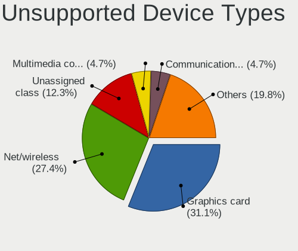

| Type                     | Desktops | Percent |
|--------------------------|----------|---------|
| Graphics card            | 20       | 35.09%  |
| Net/wireless             | 17       | 29.82%  |
| Unassigned class         | 8        | 14.04%  |
| Sound                    | 2        | 3.51%   |
| Multimedia controller    | 2        | 3.51%   |
| Fingerprint reader       | 2        | 3.51%   |
| Communication controller | 2        | 3.51%   |
| Camera                   | 2        | 3.51%   |
| Dvb card                 | 1        | 1.75%   |
| Card reader              | 1        | 1.75%   |

