Ubuntu 21.04 - Tested Hardware & Statistics (Notebooks)
-------------------------------------------------------

A project to collect tested hardware configurations for Ubuntu 21.04.

Anyone can contribute to this report by the [hw-probe](https://github.com/linuxhw/hw-probe) tool:

    sudo -E hw-probe -all -upload

Please contribute! Especially if your hardware is rare.

Contents
--------

* [ Test Cases ](#test-cases)

* [ System ](#system)
  - [ Kernel                   ](#kernel)
  - [ Kernel Family            ](#kernel-family)
  - [ Kernel Major Ver.        ](#kernel-major-ver)
  - [ Arch                     ](#arch)
  - [ DE                       ](#de)
  - [ Display Server           ](#display-server)
  - [ Display Manager          ](#display-manager)
  - [ OS Lang                  ](#os-lang)
  - [ Boot Mode                ](#boot-mode)
  - [ Filesystem               ](#filesystem)
  - [ Part. scheme             ](#part-scheme)
  - [ Dual Boot with Linux/BSD ](#dual-boot-with-linuxbsd)
  - [ Dual Boot (Win)          ](#dual-boot-win)

* [ Board ](#board)
  - [ Vendor                   ](#vendor)
  - [ Model                    ](#model)
  - [ Model Family             ](#model-family)
  - [ MFG Year                 ](#mfg-year)
  - [ Form Factor              ](#form-factor)
  - [ Secure Boot              ](#secure-boot)
  - [ Coreboot                 ](#coreboot)
  - [ RAM Size                 ](#ram-size)
  - [ RAM Used                 ](#ram-used)
  - [ Total Drives             ](#total-drives)
  - [ Has CD-ROM               ](#has-cd-rom)
  - [ Has Ethernet             ](#has-ethernet)
  - [ Has WiFi                 ](#has-wifi)
  - [ Has Bluetooth            ](#has-bluetooth)

* [ Location ](#location)
  - [ Country                  ](#country)
  - [ City                     ](#city)

* [ Drives ](#drives)
  - [ Drive Vendor             ](#drive-vendor)
  - [ Drive Model              ](#drive-model)
  - [ HDD Vendor               ](#hdd-vendor)
  - [ SSD Vendor               ](#ssd-vendor)
  - [ Drive Kind               ](#drive-kind)
  - [ Drive Connector          ](#drive-connector)
  - [ Drive Size               ](#drive-size)
  - [ Space Total              ](#space-total)
  - [ Space Used               ](#space-used)
  - [ Malfunc. Drives          ](#malfunc-drives)
  - [ Malfunc. Drive Vendor    ](#malfunc-drive-vendor)
  - [ Malfunc. HDD Vendor      ](#malfunc-hdd-vendor)
  - [ Malfunc. Drive Kind      ](#malfunc-drive-kind)
  - [ Failed Drives            ](#failed-drives)
  - [ Failed Drive Vendor      ](#failed-drive-vendor)
  - [ Drive Status             ](#drive-status)

* [ Storage controller ](#storage-controller)
  - [ Storage Vendor           ](#storage-vendor)
  - [ Storage Model            ](#storage-model)
  - [ Storage Kind             ](#storage-kind)

* [ Processor ](#processor)
  - [ CPU Vendor               ](#cpu-vendor)
  - [ CPU Model                ](#cpu-model)
  - [ CPU Model Family         ](#cpu-model-family)
  - [ CPU Cores                ](#cpu-cores)
  - [ CPU Sockets              ](#cpu-sockets)
  - [ CPU Threads              ](#cpu-threads)
  - [ CPU Op-Modes             ](#cpu-op-modes)
  - [ CPU Microcode            ](#cpu-microcode)
  - [ CPU Microarch            ](#cpu-microarch)

* [ Graphics ](#graphics)
  - [ GPU Vendor               ](#gpu-vendor)
  - [ GPU Model                ](#gpu-model)
  - [ GPU Combo                ](#gpu-combo)
  - [ GPU Driver               ](#gpu-driver)
  - [ GPU Memory               ](#gpu-memory)

* [ Monitor ](#monitor)
  - [ Monitor Vendor           ](#monitor-vendor)
  - [ Monitor Model            ](#monitor-model)
  - [ Monitor Resolution       ](#monitor-resolution)
  - [ Monitor Diagonal         ](#monitor-diagonal)
  - [ Monitor Width            ](#monitor-width)
  - [ Aspect Ratio             ](#aspect-ratio)
  - [ Monitor Area             ](#monitor-area)
  - [ Pixel Density            ](#pixel-density)
  - [ Multiple Monitors        ](#multiple-monitors)

* [ Network ](#network)
  - [ Net Controller Vendor    ](#net-controller-vendor)
  - [ Net Controller Model     ](#net-controller-model)
  - [ Wireless Vendor          ](#wireless-vendor)
  - [ Wireless Model           ](#wireless-model)
  - [ Ethernet Vendor          ](#ethernet-vendor)
  - [ Ethernet Model           ](#ethernet-model)
  - [ Net Controller Kind      ](#net-controller-kind)
  - [ Used Controller          ](#used-controller)
  - [ NICs                     ](#nics)
  - [ IPv6                     ](#ipv6)

* [ Bluetooth ](#bluetooth)
  - [ Bluetooth Vendor         ](#bluetooth-vendor)
  - [ Bluetooth Model          ](#bluetooth-model)

* [ Sound ](#sound)
  - [ Sound Vendor             ](#sound-vendor)
  - [ Sound Model              ](#sound-model)

* [ Memory ](#memory)
  - [ Memory Vendor            ](#memory-vendor)
  - [ Memory Model             ](#memory-model)
  - [ Memory Kind              ](#memory-kind)
  - [ Memory Form Factor       ](#memory-form-factor)
  - [ Memory Size              ](#memory-size)
  - [ Memory Speed             ](#memory-speed)

* [ Printers & scanners ](#printers--scanners)
  - [ Printer Vendor           ](#printer-vendor)
  - [ Printer Model            ](#printer-model)
  - [ Scanner Vendor           ](#scanner-vendor)
  - [ Scanner Model            ](#scanner-model)

* [ Camera ](#camera)
  - [ Camera Vendor            ](#camera-vendor)
  - [ Camera Model             ](#camera-model)

* [ Security ](#security)
  - [ Fingerprint Vendor       ](#fingerprint-vendor)
  - [ Fingerprint Model        ](#fingerprint-model)
  - [ Chipcard Vendor          ](#chipcard-vendor)
  - [ Chipcard Model           ](#chipcard-model)

* [ Unsupported ](#unsupported)
  - [ Unsupported Devices      ](#unsupported-devices)
  - [ Unsupported Device Types ](#unsupported-device-types)

Test Cases
----------

Total: 1262

| Vendor        | Model                       | Probe                                                      | Date         |
|---------------|-----------------------------|------------------------------------------------------------|--------------|
| HP            | Laptop 15-db0xxx            | [fada18bff7](https://linux-hardware.org/?probe=fada18bff7) | Nov 27, 2022 |
| HP            | Pavilion dv6                | [fe166a1906](https://linux-hardware.org/?probe=fe166a1906) | Nov 14, 2022 |
| Lenovo        | IdeaPad Gaming 3 15IHU6 ... | [8a4208caa8](https://linux-hardware.org/?probe=8a4208caa8) | Aug 02, 2022 |
| Lenovo        | ThinkBook 15-IIL 20SM       | [662b422bcd](https://linux-hardware.org/?probe=662b422bcd) | Jul 17, 2022 |
| Dell          | Inspiron 3543               | [0a4fd044e4](https://linux-hardware.org/?probe=0a4fd044e4) | Jul 10, 2022 |
| HP            | Laptop 17-ak0xx             | [7065eb875e](https://linux-hardware.org/?probe=7065eb875e) | Jun 15, 2022 |
| Dell          | Latitude 5511               | [93210ee531](https://linux-hardware.org/?probe=93210ee531) | Jun 12, 2022 |
| Lenovo        | IdeaPad 510-15ISK 80SR      | [53c2e38d14](https://linux-hardware.org/?probe=53c2e38d14) | Jun 10, 2022 |
| Lenovo        | IdeaPad Yoga 13 20175       | [b7e4b7a2ec](https://linux-hardware.org/?probe=b7e4b7a2ec) | Jun 03, 2022 |
| Alienware     | M11x R2                     | [0b6837debb](https://linux-hardware.org/?probe=0b6837debb) | Jun 01, 2022 |
| Alienware     | M11x R2                     | [4a364390a6](https://linux-hardware.org/?probe=4a364390a6) | May 31, 2022 |
| Lenovo        | ThinkBook 15-IIL 20SM       | [4932c3cd73](https://linux-hardware.org/?probe=4932c3cd73) | May 10, 2022 |
| Notebook      | PB50_70RF,RD,RC             | [43afa2936d](https://linux-hardware.org/?probe=43afa2936d) | May 01, 2022 |
| HUAWEI        | NBLB-WAX9N                  | [a89ca51e1b](https://linux-hardware.org/?probe=a89ca51e1b) | Apr 15, 2022 |
| Lenovo        | ThinkPad E15 Gen 3 20YG0... | [8570b5ab84](https://linux-hardware.org/?probe=8570b5ab84) | Apr 12, 2022 |
| TongFang      | GM5TG8W                     | [a37f30bc86](https://linux-hardware.org/?probe=a37f30bc86) | Apr 12, 2022 |
| TongFang      | GM5TG8W                     | [b4004b859e](https://linux-hardware.org/?probe=b4004b859e) | Apr 10, 2022 |
| HP            | Pavilion Gaming Laptop 1... | [7c0d1ce382](https://linux-hardware.org/?probe=7c0d1ce382) | Mar 29, 2022 |
| Packard Be... | EasyNote TK85               | [bfc20224d0](https://linux-hardware.org/?probe=bfc20224d0) | Mar 28, 2022 |
| Unknown       | Unknown                     | [0d58e4449b](https://linux-hardware.org/?probe=0d58e4449b) | Mar 26, 2022 |
| Lenovo        | ThinkPad X230 2325BN8       | [3ad2d0f3ee](https://linux-hardware.org/?probe=3ad2d0f3ee) | Mar 25, 2022 |
| HP            | Laptop 15-da0xxx            | [794139f740](https://linux-hardware.org/?probe=794139f740) | Mar 24, 2022 |
| Lenovo        | ThinkPad E15 Gen 2 20TD0... | [67e6e7097c](https://linux-hardware.org/?probe=67e6e7097c) | Mar 16, 2022 |
| Dell          | Inspiron 5590               | [30f82f9c0a](https://linux-hardware.org/?probe=30f82f9c0a) | Mar 12, 2022 |
| Positivo      | H14BT58                     | [5bcf783e8d](https://linux-hardware.org/?probe=5bcf783e8d) | Mar 02, 2022 |
| Dell          | Latitude E4300              | [ff42bce998](https://linux-hardware.org/?probe=ff42bce998) | Feb 23, 2022 |
| Dell          | Latitude E4300              | [ce00b44454](https://linux-hardware.org/?probe=ce00b44454) | Feb 23, 2022 |
| ASUSTek       | X555LAB                     | [9e1f07c164](https://linux-hardware.org/?probe=9e1f07c164) | Feb 22, 2022 |
| Lenovo        | ThinkPad P14s Gen 2a 21A... | [10d9500000](https://linux-hardware.org/?probe=10d9500000) | Feb 22, 2022 |
| HP            | ProBook 450 G7              | [6b77f8012b](https://linux-hardware.org/?probe=6b77f8012b) | Feb 18, 2022 |
| HP            | ProBook 450 G7              | [74e488319b](https://linux-hardware.org/?probe=74e488319b) | Feb 18, 2022 |
| Dell          | Precision 5530              | [5650039a15](https://linux-hardware.org/?probe=5650039a15) | Feb 18, 2022 |
| ASUSTek       | X540UA                      | [681b4aca6f](https://linux-hardware.org/?probe=681b4aca6f) | Feb 16, 2022 |
| Dell          | Precision 7760              | [c40cc0206c](https://linux-hardware.org/?probe=c40cc0206c) | Feb 16, 2022 |
| Lenovo        | ThinkPad X1 Carbon 6th 2... | [832c433c19](https://linux-hardware.org/?probe=832c433c19) | Feb 15, 2022 |
| Acer          | TravelMate 6592             | [a12fc5be70](https://linux-hardware.org/?probe=a12fc5be70) | Feb 13, 2022 |
| ASUSTek       | TAICHI31                    | [760fdd8fdd](https://linux-hardware.org/?probe=760fdd8fdd) | Feb 12, 2022 |
| Acer          | TravelMate X349-G2-M        | [99296fdd45](https://linux-hardware.org/?probe=99296fdd45) | Feb 10, 2022 |
| HP            | EliteBook 840 G3            | [82d892f3e5](https://linux-hardware.org/?probe=82d892f3e5) | Feb 07, 2022 |
| Lenovo        | IdeaPad 330-15IGM 81D1      | [52a7fb252a](https://linux-hardware.org/?probe=52a7fb252a) | Feb 06, 2022 |
| Lenovo        | ThinkPad X280 20KF001GGE    | [f076061f22](https://linux-hardware.org/?probe=f076061f22) | Feb 02, 2022 |
| Dell          | Inspiron 3576               | [4ea07fe50a](https://linux-hardware.org/?probe=4ea07fe50a) | Jan 31, 2022 |
| Acer          | TravelMate P214-53          | [8b138118b8](https://linux-hardware.org/?probe=8b138118b8) | Jan 28, 2022 |
| ASUSTek       | ROG Strix G513QM_G513QM     | [3c241e8e7f](https://linux-hardware.org/?probe=3c241e8e7f) | Jan 27, 2022 |
| HP            | Compaq Presario CQ70        | [a31ae712c0](https://linux-hardware.org/?probe=a31ae712c0) | Jan 26, 2022 |
| HP            | Compaq Presario CQ70        | [82a45a6067](https://linux-hardware.org/?probe=82a45a6067) | Jan 26, 2022 |
| Lenovo        | ThinkPad T470 20HES50400    | [4ebbaf952f](https://linux-hardware.org/?probe=4ebbaf952f) | Jan 26, 2022 |
| HP            | Laptop 15-bs2xx             | [3770e775f9](https://linux-hardware.org/?probe=3770e775f9) | Jan 25, 2022 |
| Lenovo        | Yoga 2 11 20332             | [8003b9ec29](https://linux-hardware.org/?probe=8003b9ec29) | Jan 20, 2022 |
| Lenovo        | Yoga 2 11 20332             | [046d8a907a](https://linux-hardware.org/?probe=046d8a907a) | Jan 20, 2022 |
| HUAWEI        | HVY-WXX9                    | [49d5581480](https://linux-hardware.org/?probe=49d5581480) | Jan 19, 2022 |
| ASUSTek       | GL553VD                     | [5d1c8ba7f2](https://linux-hardware.org/?probe=5d1c8ba7f2) | Jan 18, 2022 |
| Lenovo        | ThinkPad Edge E531 68852... | [2e8135c20d](https://linux-hardware.org/?probe=2e8135c20d) | Jan 15, 2022 |
| Acer          | Aspire V3-772G              | [c6dc2d8971](https://linux-hardware.org/?probe=c6dc2d8971) | Jan 14, 2022 |
| ASUSTek       | GL752VW                     | [2bc7b76882](https://linux-hardware.org/?probe=2bc7b76882) | Jan 13, 2022 |
| Acer          | Aspire V3-772G              | [aaf1227ec4](https://linux-hardware.org/?probe=aaf1227ec4) | Jan 11, 2022 |
| Dell          | Inspiron M5040              | [2fa8f23cb9](https://linux-hardware.org/?probe=2fa8f23cb9) | Jan 09, 2022 |
| Dell          | Inspiron M5040              | [a0b1a9f1d3](https://linux-hardware.org/?probe=a0b1a9f1d3) | Jan 09, 2022 |
| Lenovo        | ThinkPad T61 6463WCH        | [b0936c6830](https://linux-hardware.org/?probe=b0936c6830) | Jan 05, 2022 |
| ASUSTek       | UX490UA                     | [d8024aef8a](https://linux-hardware.org/?probe=d8024aef8a) | Jan 05, 2022 |
| Dell          | Inspiron 7720               | [4e1ebc00ff](https://linux-hardware.org/?probe=4e1ebc00ff) | Jan 02, 2022 |
| Dell          | Latitude E6510              | [7a6c58b609](https://linux-hardware.org/?probe=7a6c58b609) | Jan 02, 2022 |
| Acer          | Aspire A315-22              | [73ec029d3d](https://linux-hardware.org/?probe=73ec029d3d) | Dec 31, 2021 |
| HP            | Split 13 x2 PC              | [1f6fddb4f0](https://linux-hardware.org/?probe=1f6fddb4f0) | Dec 31, 2021 |
| Lenovo        | ThinkPad E15 Gen 2 20TD0... | [4ee18a044c](https://linux-hardware.org/?probe=4ee18a044c) | Dec 30, 2021 |
| Dell          | XPS 13 7390                 | [9406d941f5](https://linux-hardware.org/?probe=9406d941f5) | Dec 29, 2021 |
| Lenovo        | ThinkPad T440 20B7S06M00    | [be06952436](https://linux-hardware.org/?probe=be06952436) | Dec 29, 2021 |
| HP            | 15                          | [e0d79905e2](https://linux-hardware.org/?probe=e0d79905e2) | Dec 29, 2021 |
| Acer          | Aspire A315-22              | [69b22953b2](https://linux-hardware.org/?probe=69b22953b2) | Dec 29, 2021 |
| Dell          | Inspiron 5502               | [0fc6dd4a3f](https://linux-hardware.org/?probe=0fc6dd4a3f) | Dec 28, 2021 |
| ASUSTek       | TUF Gaming FX505DY_FX505... | [712f1bf709](https://linux-hardware.org/?probe=712f1bf709) | Dec 27, 2021 |
| Lenovo        | ThinkPad E15 Gen 3 20YG0... | [17cc2bca69](https://linux-hardware.org/?probe=17cc2bca69) | Dec 26, 2021 |
| HP            | Split 13 x2 PC              | [8891bd5101](https://linux-hardware.org/?probe=8891bd5101) | Dec 26, 2021 |
| Dell          | Inspiron 1501               | [69ea9bcec2](https://linux-hardware.org/?probe=69ea9bcec2) | Dec 25, 2021 |
| HP            | ProBook 450 G8 Notebook ... | [09799e1378](https://linux-hardware.org/?probe=09799e1378) | Dec 23, 2021 |
| HP            | Stream Laptop 11-ak0xxx     | [91dfb2417e](https://linux-hardware.org/?probe=91dfb2417e) | Dec 23, 2021 |
| HP            | Laptop 15-da0xxx            | [7e520450ed](https://linux-hardware.org/?probe=7e520450ed) | Dec 22, 2021 |
| Acer          | Aspire ES1-331              | [229ffb6197](https://linux-hardware.org/?probe=229ffb6197) | Dec 21, 2021 |
| ASUSTek       | ROG Zephyrus G15 GA502IU... | [041e50f6a8](https://linux-hardware.org/?probe=041e50f6a8) | Dec 20, 2021 |
| Dell          | Vostro 3500                 | [91efbf7a41](https://linux-hardware.org/?probe=91efbf7a41) | Dec 20, 2021 |
| ASUSTek       | X551CAP                     | [cb7b24735e](https://linux-hardware.org/?probe=cb7b24735e) | Dec 18, 2021 |
| Acer          | Aspire ES1-331              | [f1d39480bb](https://linux-hardware.org/?probe=f1d39480bb) | Dec 17, 2021 |
| Acer          | Aspire ES1-331              | [4d373ac2a3](https://linux-hardware.org/?probe=4d373ac2a3) | Dec 17, 2021 |
| Dell          | Inspiron 3585               | [e12da201c3](https://linux-hardware.org/?probe=e12da201c3) | Dec 16, 2021 |
| ASUSTek       | K54L                        | [335a4179a6](https://linux-hardware.org/?probe=335a4179a6) | Dec 16, 2021 |
| Dell          | Inspiron 3585               | [f8e1e0ea63](https://linux-hardware.org/?probe=f8e1e0ea63) | Dec 16, 2021 |
| HP            | 240 G6 Notebook PC          | [0eee85762e](https://linux-hardware.org/?probe=0eee85762e) | Dec 14, 2021 |
| Dell          | Precision 7510              | [59a0d1a314](https://linux-hardware.org/?probe=59a0d1a314) | Dec 13, 2021 |
| Acer          | Aspire A315-22              | [c7dec3c83d](https://linux-hardware.org/?probe=c7dec3c83d) | Dec 12, 2021 |
| HP            | Pavilion dv6                | [24e1124f28](https://linux-hardware.org/?probe=24e1124f28) | Dec 12, 2021 |
| HP            | ProBook 6470b               | [a950763fdb](https://linux-hardware.org/?probe=a950763fdb) | Dec 12, 2021 |
| Lenovo        | IdeaPad Y510P 20217         | [c33bc12a7a](https://linux-hardware.org/?probe=c33bc12a7a) | Dec 11, 2021 |
| Acer          | Aspire A315-22              | [43938eb3c9](https://linux-hardware.org/?probe=43938eb3c9) | Dec 11, 2021 |
| ASUSTek       | VivoBook_ASUSLaptop X412... | [fd5ad714f1](https://linux-hardware.org/?probe=fd5ad714f1) | Dec 10, 2021 |
| ASUSTek       | N550JV                      | [696dd578ab](https://linux-hardware.org/?probe=696dd578ab) | Dec 08, 2021 |
| Dell          | Precision M6800             | [da95c95a07](https://linux-hardware.org/?probe=da95c95a07) | Dec 08, 2021 |
| Medion        | Akoya P7818                 | [93ecb6c404](https://linux-hardware.org/?probe=93ecb6c404) | Dec 07, 2021 |
| Toshiba       | Satellite C850-19Z          | [4fdaf4108a](https://linux-hardware.org/?probe=4fdaf4108a) | Dec 07, 2021 |
| Toshiba       | dynabook Satellite B552/... | [b3c78d548b](https://linux-hardware.org/?probe=b3c78d548b) | Dec 03, 2021 |
| HUAWEI        | BOHB-WAX9                   | [c7b4e4cc3c](https://linux-hardware.org/?probe=c7b4e4cc3c) | Dec 02, 2021 |
| HP            | ProBook 4520s               | [a4d5e80bbc](https://linux-hardware.org/?probe=a4d5e80bbc) | Dec 02, 2021 |
| Notebook      | N13_N140ZU                  | [d63f7874c8](https://linux-hardware.org/?probe=d63f7874c8) | Nov 29, 2021 |
| Lenovo        | V560                        | [83e5b46ba2](https://linux-hardware.org/?probe=83e5b46ba2) | Nov 28, 2021 |
| Dell          | Inspiron 5437               | [3c089ce814](https://linux-hardware.org/?probe=3c089ce814) | Nov 25, 2021 |
| Dell          | Latitude E6430              | [f18bb8ac48](https://linux-hardware.org/?probe=f18bb8ac48) | Nov 24, 2021 |
| Lenovo        | B50-70 80EU                 | [9476bb5e05](https://linux-hardware.org/?probe=9476bb5e05) | Nov 24, 2021 |
| Acer          | Aspire E5-511               | [d4bfc15ece](https://linux-hardware.org/?probe=d4bfc15ece) | Nov 24, 2021 |
| Notebook      | N13_N140ZU                  | [dca6d021bb](https://linux-hardware.org/?probe=dca6d021bb) | Nov 23, 2021 |
| Lenovo        | G50-70 20351                | [667c9a87dc](https://linux-hardware.org/?probe=667c9a87dc) | Nov 23, 2021 |
| Dell          | Latitude E6430              | [ce21d5f8d7](https://linux-hardware.org/?probe=ce21d5f8d7) | Nov 23, 2021 |
| Apple         | MacBook10,1                 | [6cb99e6a5f](https://linux-hardware.org/?probe=6cb99e6a5f) | Nov 23, 2021 |
| ASUSTek       | N71Vg                       | [4657bca419](https://linux-hardware.org/?probe=4657bca419) | Nov 21, 2021 |
| Lenovo        | IdeaPad 3 15ITL6 82H8       | [08b2395aa0](https://linux-hardware.org/?probe=08b2395aa0) | Nov 21, 2021 |
| Toshiba       | Satellite L875D             | [abf232b07d](https://linux-hardware.org/?probe=abf232b07d) | Nov 21, 2021 |
| Lenovo        | ThinkPad T430 2349DS1       | [cd04ef3811](https://linux-hardware.org/?probe=cd04ef3811) | Nov 21, 2021 |
| Toshiba       | Satellite C850-19Z          | [38b73bb691](https://linux-hardware.org/?probe=38b73bb691) | Nov 20, 2021 |
| Dell          | XPS 15 9500                 | [a73d04c7ba](https://linux-hardware.org/?probe=a73d04c7ba) | Nov 20, 2021 |
| HP            | ZBook Power G7 Mobile Wo... | [55554fa68d](https://linux-hardware.org/?probe=55554fa68d) | Nov 18, 2021 |
| Toshiba       | Satellite L875D             | [894d6602f9](https://linux-hardware.org/?probe=894d6602f9) | Nov 18, 2021 |
| Lenovo        | ThinkPad E15 Gen 3 20YG0... | [8fc5db0cd9](https://linux-hardware.org/?probe=8fc5db0cd9) | Nov 17, 2021 |
| Dell          | Latitude 7420               | [52bd94ce90](https://linux-hardware.org/?probe=52bd94ce90) | Nov 17, 2021 |
| Acer          | Extensa 5635Z               | [dac5f9f46b](https://linux-hardware.org/?probe=dac5f9f46b) | Nov 16, 2021 |
| Medion        | Akoya P7818                 | [273e1d36c0](https://linux-hardware.org/?probe=273e1d36c0) | Nov 15, 2021 |
| Dell          | XPS 15 9500                 | [bc424a9c53](https://linux-hardware.org/?probe=bc424a9c53) | Nov 15, 2021 |
| Dell          | XPS 13 7390                 | [c4e6de1315](https://linux-hardware.org/?probe=c4e6de1315) | Nov 15, 2021 |
| Dell          | Inspiron 5567               | [049c9e4f07](https://linux-hardware.org/?probe=049c9e4f07) | Nov 10, 2021 |
| Dell          | XPS 15 9500                 | [f1d7eca0f3](https://linux-hardware.org/?probe=f1d7eca0f3) | Nov 10, 2021 |
| Acer          | Swift SF514-52T             | [020a93edbc](https://linux-hardware.org/?probe=020a93edbc) | Nov 10, 2021 |
| Unknown       | Unknown                     | [cc507fc6de](https://linux-hardware.org/?probe=cc507fc6de) | Nov 08, 2021 |
| Lenovo        | ThinkPad E14 20RAS1M600     | [d1ca56887d](https://linux-hardware.org/?probe=d1ca56887d) | Nov 07, 2021 |
| Dell          | Inspiron 3501               | [5d35bd9e4a](https://linux-hardware.org/?probe=5d35bd9e4a) | Nov 07, 2021 |
| Lenovo        | ThinkPad T61 6463WCH        | [7b7a362cc1](https://linux-hardware.org/?probe=7b7a362cc1) | Nov 06, 2021 |
| HP            | 15                          | [0719e191d4](https://linux-hardware.org/?probe=0719e191d4) | Nov 04, 2021 |
| Acer          | Aspire E1-410               | [5d4401610d](https://linux-hardware.org/?probe=5d4401610d) | Nov 01, 2021 |
| Lenovo        | IdeaPad 3 14ITL6 82H7       | [5fbff69f17](https://linux-hardware.org/?probe=5fbff69f17) | Nov 01, 2021 |
| HP            | 15                          | [ab5e53c9ed](https://linux-hardware.org/?probe=ab5e53c9ed) | Nov 01, 2021 |
| Apple         | MacBookPro9,2               | [783d081b5a](https://linux-hardware.org/?probe=783d081b5a) | Oct 31, 2021 |
| Lenovo        | ThinkPad T14 Gen 1 20S0C... | [26adc81160](https://linux-hardware.org/?probe=26adc81160) | Oct 30, 2021 |
| Lenovo        | IdeaPad 3 15IIL05 81WE      | [ff8c85568e](https://linux-hardware.org/?probe=ff8c85568e) | Oct 29, 2021 |
| Lenovo        | ThinkPad T15g Gen 1 20UR... | [6ae3033841](https://linux-hardware.org/?probe=6ae3033841) | Oct 28, 2021 |
| Dell          | XPS 15 9510                 | [27f4b2412f](https://linux-hardware.org/?probe=27f4b2412f) | Oct 27, 2021 |
| HUAWEI        | HN-WX9X                     | [c62bb4adc9](https://linux-hardware.org/?probe=c62bb4adc9) | Oct 27, 2021 |
| Lenovo        | ThinkPad E490 20N80010RT    | [3fc424b8c6](https://linux-hardware.org/?probe=3fc424b8c6) | Oct 27, 2021 |
| ASUSTek       | ROG Strix G513QC_G513QC     | [cc4c888046](https://linux-hardware.org/?probe=cc4c888046) | Oct 27, 2021 |
| HP            | Laptop 15-bs2xx             | [d0f14fd899](https://linux-hardware.org/?probe=d0f14fd899) | Oct 26, 2021 |
| Acer          | AO722                       | [832ca83fcd](https://linux-hardware.org/?probe=832ca83fcd) | Oct 25, 2021 |
| HP            | Laptop 15s-du1xxx           | [23c770232c](https://linux-hardware.org/?probe=23c770232c) | Oct 25, 2021 |
| Dell          | XPS 13 9350                 | [1f26867986](https://linux-hardware.org/?probe=1f26867986) | Oct 25, 2021 |
| HP            | ProBook 4540s               | [49ce392cd2](https://linux-hardware.org/?probe=49ce392cd2) | Oct 24, 2021 |
| ASUSTek       | ROG Zephyrus G14 GA401II... | [9b3e361eb7](https://linux-hardware.org/?probe=9b3e361eb7) | Oct 24, 2021 |
| HP            | Laptop 15-da0xxx            | [2de5c74bc0](https://linux-hardware.org/?probe=2de5c74bc0) | Oct 23, 2021 |
| Lenovo        | Legion 5 Pro 16ACH6H 82J... | [e9991e486b](https://linux-hardware.org/?probe=e9991e486b) | Oct 23, 2021 |
| Lenovo        | IdeaPad 5 15ITL05 82FG      | [16268db25b](https://linux-hardware.org/?probe=16268db25b) | Oct 22, 2021 |
| Dell          | Latitude E7470              | [96ef0ee68c](https://linux-hardware.org/?probe=96ef0ee68c) | Oct 22, 2021 |
| HP            | ZBook Fury 15 G7 Mobile ... | [c7d518ca51](https://linux-hardware.org/?probe=c7d518ca51) | Oct 22, 2021 |
| HP            | Stream Laptop               | [95df1a4e45](https://linux-hardware.org/?probe=95df1a4e45) | Oct 22, 2021 |
| Acer          | Aspire ES1-111              | [98323be6f8](https://linux-hardware.org/?probe=98323be6f8) | Oct 22, 2021 |
| Acer          | NG-AN515-51-522Q            | [e4762b54f7](https://linux-hardware.org/?probe=e4762b54f7) | Oct 21, 2021 |
| Samsung       | 300E5EV/300E4EV/270E5EV/... | [3fe556cde3](https://linux-hardware.org/?probe=3fe556cde3) | Oct 21, 2021 |
| Samsung       | 300E5EV/300E4EV/270E5EV/... | [0413ebb72c](https://linux-hardware.org/?probe=0413ebb72c) | Oct 21, 2021 |
| Toshiba       | Satellite Pro C850-1G8      | [37b87b5c45](https://linux-hardware.org/?probe=37b87b5c45) | Oct 21, 2021 |
| Dell          | Latitude 5400               | [6a14ed2d5e](https://linux-hardware.org/?probe=6a14ed2d5e) | Oct 21, 2021 |
| Dell          | Latitude E6420              | [4c3c43daaa](https://linux-hardware.org/?probe=4c3c43daaa) | Oct 20, 2021 |
| Lenovo        | ThinkPad E15 Gen 2 20T80... | [f1449188a9](https://linux-hardware.org/?probe=f1449188a9) | Oct 20, 2021 |
| ASUSTek       | U56E                        | [a610876405](https://linux-hardware.org/?probe=a610876405) | Oct 20, 2021 |
| HP            | ProBook 450 G7              | [2db5d6dc7c](https://linux-hardware.org/?probe=2db5d6dc7c) | Oct 20, 2021 |
| HP            | ProBook 450 G7              | [1faf3f28e5](https://linux-hardware.org/?probe=1faf3f28e5) | Oct 20, 2021 |
| Lenovo        | G40-70 20369                | [c8606a3a2a](https://linux-hardware.org/?probe=c8606a3a2a) | Oct 20, 2021 |
| ASUSTek       | K72F                        | [0eedfc8a67](https://linux-hardware.org/?probe=0eedfc8a67) | Oct 20, 2021 |
| Lenovo        | ThinkPad E14 20RAS1M600     | [a14a745c3a](https://linux-hardware.org/?probe=a14a745c3a) | Oct 19, 2021 |
| HP            | Notebook                    | [ff690977bf](https://linux-hardware.org/?probe=ff690977bf) | Oct 19, 2021 |
| Lenovo        | IdeaPad S145-15API 81V7     | [a174c1781d](https://linux-hardware.org/?probe=a174c1781d) | Oct 19, 2021 |
| Dell          | Latitude E4300              | [127b65224f](https://linux-hardware.org/?probe=127b65224f) | Oct 18, 2021 |
| Framework     | Laptop                      | [591c9d1d8f](https://linux-hardware.org/?probe=591c9d1d8f) | Oct 18, 2021 |
| Dell          | XPS 15 7590                 | [c61bb65266](https://linux-hardware.org/?probe=c61bb65266) | Oct 18, 2021 |
| Fujitsu       | LIFEBOOK E752               | [4768b805ff](https://linux-hardware.org/?probe=4768b805ff) | Oct 17, 2021 |
| Dell          | Latitude E6400              | [fbc4bfa1b0](https://linux-hardware.org/?probe=fbc4bfa1b0) | Oct 16, 2021 |
| Lenovo        | Legion 5 15ARH05H 82B1      | [214d892f21](https://linux-hardware.org/?probe=214d892f21) | Oct 16, 2021 |
| ASUSTek       | ROG Strix G713QM_G713QM     | [a4d3e13675](https://linux-hardware.org/?probe=a4d3e13675) | Oct 16, 2021 |
| ASUSTek       | ROG Strix G713QM_G713QM     | [19105d9255](https://linux-hardware.org/?probe=19105d9255) | Oct 16, 2021 |
| Acer          | Aspire 7715Z                | [d2b159ed70](https://linux-hardware.org/?probe=d2b159ed70) | Oct 16, 2021 |
| Lenovo        | ThinkPad T470s 20HGS0180... | [da345e8de3](https://linux-hardware.org/?probe=da345e8de3) | Oct 15, 2021 |
| Dell          | Latitude E4300              | [81efc2581c](https://linux-hardware.org/?probe=81efc2581c) | Oct 15, 2021 |
| Lenovo        | G550 2958                   | [570b8131d1](https://linux-hardware.org/?probe=570b8131d1) | Oct 15, 2021 |
| Dell          | XPS 13 9310                 | [f04cc5e7a8](https://linux-hardware.org/?probe=f04cc5e7a8) | Oct 15, 2021 |
| Toshiba       | PORTEGE R830                | [06223f6db9](https://linux-hardware.org/?probe=06223f6db9) | Oct 15, 2021 |
| HP            | ProBook 4540s               | [046acc5982](https://linux-hardware.org/?probe=046acc5982) | Oct 14, 2021 |
| Google        | Treeya                      | [6c10b9bcb3](https://linux-hardware.org/?probe=6c10b9bcb3) | Oct 14, 2021 |
| Durabook      | S14AT                       | [60d38664ee](https://linux-hardware.org/?probe=60d38664ee) | Oct 14, 2021 |
| Alienware     | 17 R3                       | [0f1a877034](https://linux-hardware.org/?probe=0f1a877034) | Oct 13, 2021 |
| HP            | G42                         | [52ade78428](https://linux-hardware.org/?probe=52ade78428) | Oct 13, 2021 |
| Lenovo        | ThinkPad T14s Gen 1 20T0... | [df32df0b62](https://linux-hardware.org/?probe=df32df0b62) | Oct 13, 2021 |
| HP            | Laptop 15s-du1xxx           | [6b3505b5f2](https://linux-hardware.org/?probe=6b3505b5f2) | Oct 13, 2021 |
| Lenovo        | ThinkPad T14s Gen 1 20T0... | [c7239a1379](https://linux-hardware.org/?probe=c7239a1379) | Oct 13, 2021 |
| Sony          | SVE14126CXB                 | [acf29b49fd](https://linux-hardware.org/?probe=acf29b49fd) | Oct 13, 2021 |
| Dell          | XPS 13 9310                 | [20dc49f637](https://linux-hardware.org/?probe=20dc49f637) | Oct 13, 2021 |
| Wortmann      | TERRA_MOBILE_1541H          | [28dd4b8caf](https://linux-hardware.org/?probe=28dd4b8caf) | Oct 13, 2021 |
| Toshiba       | Satellite C850-19Z          | [59617db66a](https://linux-hardware.org/?probe=59617db66a) | Oct 13, 2021 |
| Acer          | Aspire 5741G                | [69b1b6e13e](https://linux-hardware.org/?probe=69b1b6e13e) | Oct 12, 2021 |
| Lenovo        | ThinkPad X260 20F5S08N00    | [c8e9d8e7a9](https://linux-hardware.org/?probe=c8e9d8e7a9) | Oct 12, 2021 |
| Apple         | MacBook7,1                  | [450992ab23](https://linux-hardware.org/?probe=450992ab23) | Oct 12, 2021 |
| HP            | Laptop 15-bs2xx             | [cc04e66dc0](https://linux-hardware.org/?probe=cc04e66dc0) | Oct 12, 2021 |
| Toshiba       | PORTEGE R830                | [b22927e36e](https://linux-hardware.org/?probe=b22927e36e) | Oct 12, 2021 |
| HP            | Notebook                    | [0b5eb78634](https://linux-hardware.org/?probe=0b5eb78634) | Oct 12, 2021 |
| ASUSTek       | ROG Strix G513QC_G513QC     | [80718210cc](https://linux-hardware.org/?probe=80718210cc) | Oct 12, 2021 |
| Lenovo        | ThinkPad X250 20CLS03Y00    | [6047c37a95](https://linux-hardware.org/?probe=6047c37a95) | Oct 11, 2021 |
| Lenovo        | ThinkPad X250 20CLS03Y00    | [3a3c3e4ad6](https://linux-hardware.org/?probe=3a3c3e4ad6) | Oct 11, 2021 |
| Lenovo        | E50-80 80J2                 | [c3d31689ec](https://linux-hardware.org/?probe=c3d31689ec) | Oct 11, 2021 |
| Sony          | SVE1713Y1EB                 | [b59de957b3](https://linux-hardware.org/?probe=b59de957b3) | Oct 11, 2021 |
| Sony          | SVE1713Y1EB                 | [a427a26f34](https://linux-hardware.org/?probe=a427a26f34) | Oct 11, 2021 |
| HP            | EliteBook 830 G8 Noteboo... | [26a075831a](https://linux-hardware.org/?probe=26a075831a) | Oct 11, 2021 |
| Apple         | MacBookPro8,2               | [a3f3c59edc](https://linux-hardware.org/?probe=a3f3c59edc) | Oct 11, 2021 |
| Lenovo        | ThinkPad T410 2522ED2       | [c8c010b75c](https://linux-hardware.org/?probe=c8c010b75c) | Oct 11, 2021 |
| Alienware     | M11x R2                     | [e45fcc146d](https://linux-hardware.org/?probe=e45fcc146d) | Oct 10, 2021 |
| Toshiba       | Satellite L830              | [e8652672c3](https://linux-hardware.org/?probe=e8652672c3) | Oct 10, 2021 |
| Toshiba       | Satellite M305D             | [1ef98af428](https://linux-hardware.org/?probe=1ef98af428) | Oct 10, 2021 |
| Toshiba       | Satellite M305D             | [1b61cfb354](https://linux-hardware.org/?probe=1b61cfb354) | Oct 10, 2021 |
| Unknown       | Unknown                     | [1fe376939c](https://linux-hardware.org/?probe=1fe376939c) | Oct 10, 2021 |
| Lenovo        | ThinkPad X260 20F5S08N00    | [f8f9a09e2a](https://linux-hardware.org/?probe=f8f9a09e2a) | Oct 10, 2021 |
| Samsung       | RV410/RV510/S3510/E3510     | [0ca3ca1067](https://linux-hardware.org/?probe=0ca3ca1067) | Oct 10, 2021 |
| Dell          | Vostro 3401                 | [5e53dc591c](https://linux-hardware.org/?probe=5e53dc591c) | Oct 10, 2021 |
| Dell          | Latitude E4300              | [89506f9460](https://linux-hardware.org/?probe=89506f9460) | Oct 10, 2021 |
| HP            | Pavilion g6                 | [07c4424a4e](https://linux-hardware.org/?probe=07c4424a4e) | Oct 10, 2021 |
| Acer          | Aspire E5-551               | [264e09233b](https://linux-hardware.org/?probe=264e09233b) | Oct 09, 2021 |
| Toshiba       | PORTEGE R830                | [43d48e705c](https://linux-hardware.org/?probe=43d48e705c) | Oct 09, 2021 |
| ASUSTek       | X555DG                      | [a7e80c532d](https://linux-hardware.org/?probe=a7e80c532d) | Oct 09, 2021 |
| HP            | Laptop 15s-fq2xxx           | [e5056b55dd](https://linux-hardware.org/?probe=e5056b55dd) | Oct 09, 2021 |
| ASUSTek       | VivoBook_ASUSLaptop X412... | [52a27483b1](https://linux-hardware.org/?probe=52a27483b1) | Oct 09, 2021 |
| Lenovo        | ThinkPad T440p 20AN00DJA... | [0797c0312e](https://linux-hardware.org/?probe=0797c0312e) | Oct 09, 2021 |
| Lenovo        | G50-45 80E3                 | [a0bc3d8be0](https://linux-hardware.org/?probe=a0bc3d8be0) | Oct 09, 2021 |
| ASUSTek       | VivoBook_ASUSLaptop X412... | [4fc1c292cb](https://linux-hardware.org/?probe=4fc1c292cb) | Oct 09, 2021 |
| Dell          | Latitude E7250              | [782a17c042](https://linux-hardware.org/?probe=782a17c042) | Oct 09, 2021 |
| Alienware     | M11x R2                     | [a2bb09f85a](https://linux-hardware.org/?probe=a2bb09f85a) | Oct 09, 2021 |
| HP            | Pavilion dv7                | [ba21dd1dd0](https://linux-hardware.org/?probe=ba21dd1dd0) | Oct 08, 2021 |
| Lenovo        | IdeaPad 330-15AST 81D6      | [d521223809](https://linux-hardware.org/?probe=d521223809) | Oct 08, 2021 |
| Lenovo        | ThinkPad T420 4236AK9       | [2d3cccc2d0](https://linux-hardware.org/?probe=2d3cccc2d0) | Oct 08, 2021 |
| Dell          | Latitude E5520              | [5cabb513b7](https://linux-hardware.org/?probe=5cabb513b7) | Oct 07, 2021 |
| Sony          | VGN-NW21MF_W                | [3a4e2269af](https://linux-hardware.org/?probe=3a4e2269af) | Oct 07, 2021 |
| Lenovo        | IdeaPad Gaming 3 15ARH05... | [9b74440deb](https://linux-hardware.org/?probe=9b74440deb) | Oct 07, 2021 |
| Lenovo        | IdeaPad Gaming 3 15IHU6 ... | [9e72075ce8](https://linux-hardware.org/?probe=9e72075ce8) | Oct 07, 2021 |
| HP            | EliteBook 840 G2            | [24efeaacb7](https://linux-hardware.org/?probe=24efeaacb7) | Oct 07, 2021 |
| Notebook      | NH5x_NH7x_HHx_HJx_HKx       | [d2088e43b2](https://linux-hardware.org/?probe=d2088e43b2) | Oct 07, 2021 |
| Acer          | Aspire E5-573T              | [749a8c4ccc](https://linux-hardware.org/?probe=749a8c4ccc) | Oct 07, 2021 |
| Dell          | Inspiron 7586               | [2ecf794b47](https://linux-hardware.org/?probe=2ecf794b47) | Oct 07, 2021 |
| Lenovo        | IdeaPad 5 14ARE05 81YM      | [ae154711ac](https://linux-hardware.org/?probe=ae154711ac) | Oct 07, 2021 |
| MSI           | GL63 8RD                    | [9f55f25caf](https://linux-hardware.org/?probe=9f55f25caf) | Oct 07, 2021 |
| Lenovo        | IdeaPad Gaming 3 15IHU6 ... | [018213b3d3](https://linux-hardware.org/?probe=018213b3d3) | Oct 06, 2021 |
| Acer          | Aspire 5560                 | [6a49f40963](https://linux-hardware.org/?probe=6a49f40963) | Oct 06, 2021 |
| Acer          | Aspire 5560                 | [ac4da0432d](https://linux-hardware.org/?probe=ac4da0432d) | Oct 06, 2021 |
| Lenovo        | ThinkPad L14 Gen 1 20U50... | [ac5c6a0dd6](https://linux-hardware.org/?probe=ac5c6a0dd6) | Oct 06, 2021 |
| Lenovo        | IdeaPad 3 15ALC6 82KU       | [a68932119c](https://linux-hardware.org/?probe=a68932119c) | Oct 05, 2021 |
| Dell          | XPS 13 7390                 | [843d9a14d4](https://linux-hardware.org/?probe=843d9a14d4) | Oct 05, 2021 |
| Dell          | Latitude 5501               | [633e0959bc](https://linux-hardware.org/?probe=633e0959bc) | Oct 05, 2021 |
| Acer          | Predator PH315-51           | [fb9a605481](https://linux-hardware.org/?probe=fb9a605481) | Oct 05, 2021 |
| Dell          | Inspiron 5775               | [1f37c7ca65](https://linux-hardware.org/?probe=1f37c7ca65) | Oct 05, 2021 |
| Dell          | Inspiron 5775               | [c42e665e24](https://linux-hardware.org/?probe=c42e665e24) | Oct 05, 2021 |
| Acer          | Aspire 4750                 | [b00fc610cd](https://linux-hardware.org/?probe=b00fc610cd) | Oct 05, 2021 |
| HUAWEI        | KLVL-WXX9                   | [c3cccd51c4](https://linux-hardware.org/?probe=c3cccd51c4) | Oct 05, 2021 |
| Dell          | XPS 13 9310                 | [a37e8d930c](https://linux-hardware.org/?probe=a37e8d930c) | Oct 04, 2021 |
| Lenovo        | ThinkPad P1 Gen 3 20TH00... | [9c58f85510](https://linux-hardware.org/?probe=9c58f85510) | Oct 04, 2021 |
| Dell          | Latitude 5290               | [e3afd1ef97](https://linux-hardware.org/?probe=e3afd1ef97) | Oct 04, 2021 |
| Lenovo        | ThinkPad E14 Gen 3 20Y70... | [d9dcb6b432](https://linux-hardware.org/?probe=d9dcb6b432) | Oct 04, 2021 |
| Fujitsu       | LIFEBOOK S751               | [f34d1166a5](https://linux-hardware.org/?probe=f34d1166a5) | Oct 03, 2021 |
| Dell          | Latitude E4300              | [d6bb983804](https://linux-hardware.org/?probe=d6bb983804) | Oct 03, 2021 |
| Acer          | Aspire A315-31              | [65388cbcfc](https://linux-hardware.org/?probe=65388cbcfc) | Oct 03, 2021 |
| Acer          | Aspire A315-31              | [97dde270fa](https://linux-hardware.org/?probe=97dde270fa) | Oct 03, 2021 |
| Haier         | Y11C                        | [74b9ee5509](https://linux-hardware.org/?probe=74b9ee5509) | Oct 03, 2021 |
| Hampoo        | Cherry Trail CR             | [b95391e679](https://linux-hardware.org/?probe=b95391e679) | Oct 03, 2021 |
| Hampoo        | Cherry Trail CR             | [61c4dc2ac2](https://linux-hardware.org/?probe=61c4dc2ac2) | Oct 03, 2021 |
| Samsung       | 355V4C/355V4X/355V5C/355... | [b5e9ab8f07](https://linux-hardware.org/?probe=b5e9ab8f07) | Oct 03, 2021 |
| Dell          | Inspiron 3541               | [43649f98a5](https://linux-hardware.org/?probe=43649f98a5) | Oct 02, 2021 |
| Lenovo        | IdeaPad 5 15ALC05 82LN      | [96264b5cde](https://linux-hardware.org/?probe=96264b5cde) | Oct 02, 2021 |
| HP            | Laptop 15-ra0xx             | [5e542184d8](https://linux-hardware.org/?probe=5e542184d8) | Oct 02, 2021 |
| HP            | Pavilion Laptop 13-bb0xx... | [5a6c7b98c0](https://linux-hardware.org/?probe=5a6c7b98c0) | Oct 02, 2021 |
| Acer          | Predator G3-571             | [de7f48c895](https://linux-hardware.org/?probe=de7f48c895) | Oct 02, 2021 |
| Dell          | Latitude E6430              | [470770630d](https://linux-hardware.org/?probe=470770630d) | Oct 01, 2021 |
| ASUSTek       | G72GX                       | [984966986d](https://linux-hardware.org/?probe=984966986d) | Oct 01, 2021 |
| HP            | ENVY Laptop 13-ad0xx        | [a6d1182c1c](https://linux-hardware.org/?probe=a6d1182c1c) | Oct 01, 2021 |
| ASUSTek       | VivoBook_ASUSLaptop X412... | [5ac27f4e29](https://linux-hardware.org/?probe=5ac27f4e29) | Oct 01, 2021 |
| HP            | Laptop 15s-fq2xxx           | [b1066885ba](https://linux-hardware.org/?probe=b1066885ba) | Oct 01, 2021 |
| Acer          | Nitro AN515-52              | [a7e79f067e](https://linux-hardware.org/?probe=a7e79f067e) | Sep 30, 2021 |
| Acer          | Swift SF314-54              | [071fdd49c5](https://linux-hardware.org/?probe=071fdd49c5) | Sep 30, 2021 |
| ASUSTek       | VivoBook_ASUSLaptop X412... | [6e2173f8b4](https://linux-hardware.org/?probe=6e2173f8b4) | Sep 30, 2021 |
| Fujitsu       | U9311                       | [a76f2fbbe3](https://linux-hardware.org/?probe=a76f2fbbe3) | Sep 30, 2021 |
| Acer          | Nitro AN515-52              | [0b2f645654](https://linux-hardware.org/?probe=0b2f645654) | Sep 30, 2021 |
| ASUSTek       | ZenBook UX425EA_UX425EA     | [6876f0e86d](https://linux-hardware.org/?probe=6876f0e86d) | Sep 29, 2021 |
| HUAWEI        | MACHC-WAX9                  | [ae8aed0f28](https://linux-hardware.org/?probe=ae8aed0f28) | Sep 29, 2021 |
| TrekStor      | SurfTab wintron 7.0 ST70... | [c63b30f0df](https://linux-hardware.org/?probe=c63b30f0df) | Sep 29, 2021 |
| Dell          | XPS 15 9570                 | [cb6b5c443a](https://linux-hardware.org/?probe=cb6b5c443a) | Sep 29, 2021 |
| HP            | EliteBook 820 G1            | [5a23abfa74](https://linux-hardware.org/?probe=5a23abfa74) | Sep 29, 2021 |
| Dell          | Latitude E6540              | [f0552909c1](https://linux-hardware.org/?probe=f0552909c1) | Sep 29, 2021 |
| Minix         | NEO Z83-4A                  | [2a5bd76571](https://linux-hardware.org/?probe=2a5bd76571) | Sep 28, 2021 |
| Dell          | Latitude E6430              | [178e06b47b](https://linux-hardware.org/?probe=178e06b47b) | Sep 28, 2021 |
| HP            | Pavilion dv7                | [9e073b9a8e](https://linux-hardware.org/?probe=9e073b9a8e) | Sep 28, 2021 |
| Lenovo        | IdeaPad 710S Plus-13IKB ... | [4a91c75662](https://linux-hardware.org/?probe=4a91c75662) | Sep 28, 2021 |
| HP            | Laptop 15-bs0xx             | [e9dd5491e8](https://linux-hardware.org/?probe=e9dd5491e8) | Sep 28, 2021 |
| ASUSTek       | ZenBook UX325EA_UX325EA     | [9fef1cf40f](https://linux-hardware.org/?probe=9fef1cf40f) | Sep 28, 2021 |
| HP            | Laptop 15-bs0xx             | [44d29122aa](https://linux-hardware.org/?probe=44d29122aa) | Sep 28, 2021 |
| Dell          | Latitude D620               | [1dc8e001f5](https://linux-hardware.org/?probe=1dc8e001f5) | Sep 28, 2021 |
| Linx          | LINX1010B                   | [5fd6a97443](https://linux-hardware.org/?probe=5fd6a97443) | Sep 28, 2021 |
| Lenovo        | ThinkPad X1 Carbon Gen 8... | [feed153041](https://linux-hardware.org/?probe=feed153041) | Sep 28, 2021 |
| Haier         | Y11C                        | [591740bf00](https://linux-hardware.org/?probe=591740bf00) | Sep 27, 2021 |
| ASUSTek       | ROG Zephyrus G14 GA401QM... | [691e7c2746](https://linux-hardware.org/?probe=691e7c2746) | Sep 27, 2021 |
| Dell          | Latitude E6430              | [b442a8bd08](https://linux-hardware.org/?probe=b442a8bd08) | Sep 27, 2021 |
| Dell          | Latitude E5470              | [e466f1b4d8](https://linux-hardware.org/?probe=e466f1b4d8) | Sep 27, 2021 |
| ASUSTek       | ROG Strix G732LV_G732LV     | [591896b2ee](https://linux-hardware.org/?probe=591896b2ee) | Sep 27, 2021 |
| HP            | EliteBook 820 G1            | [0646fc1739](https://linux-hardware.org/?probe=0646fc1739) | Sep 27, 2021 |
| Acer          | Aspire A315-31              | [7af0b1b5dd](https://linux-hardware.org/?probe=7af0b1b5dd) | Sep 27, 2021 |
| ASUSTek       | GL553VD                     | [07b1aa0f24](https://linux-hardware.org/?probe=07b1aa0f24) | Sep 27, 2021 |
| ASUSTek       | GL553VD                     | [2cdb257de7](https://linux-hardware.org/?probe=2cdb257de7) | Sep 27, 2021 |
| Toshiba       | Satellite C50-A             | [b1ae9995d6](https://linux-hardware.org/?probe=b1ae9995d6) | Sep 27, 2021 |
| Acer          | Extensa 2509                | [8383547e0a](https://linux-hardware.org/?probe=8383547e0a) | Sep 27, 2021 |
| Fujitsu       | LIFEBOOK T900               | [b8d983bbb2](https://linux-hardware.org/?probe=b8d983bbb2) | Sep 27, 2021 |
| Positivo      | W940TU                      | [0153e89101](https://linux-hardware.org/?probe=0153e89101) | Sep 27, 2021 |
| Fujitsu       | LIFEBOOK T900               | [0ad5cc2ce2](https://linux-hardware.org/?probe=0ad5cc2ce2) | Sep 26, 2021 |
| Positivo      | W940TU                      | [fc44f175b0](https://linux-hardware.org/?probe=fc44f175b0) | Sep 26, 2021 |
| ASUSTek       | GL702VSK                    | [bdc99c7ccb](https://linux-hardware.org/?probe=bdc99c7ccb) | Sep 26, 2021 |
| Dell          | Inspiron 15-3573            | [320d64d26e](https://linux-hardware.org/?probe=320d64d26e) | Sep 26, 2021 |
| Acer          | Nitro AN515-52              | [bb17541aae](https://linux-hardware.org/?probe=bb17541aae) | Sep 26, 2021 |
| HP            | EliteBook 2170p             | [58e81067e0](https://linux-hardware.org/?probe=58e81067e0) | Sep 26, 2021 |
| HP            | EliteBook 2170p             | [5e8a05628b](https://linux-hardware.org/?probe=5e8a05628b) | Sep 26, 2021 |
| Dell          | Latitude E5470              | [24f254f7e8](https://linux-hardware.org/?probe=24f254f7e8) | Sep 25, 2021 |
| Lenovo        | IdeaPad 3 14ITL6 82H7       | [2ae9eaaa44](https://linux-hardware.org/?probe=2ae9eaaa44) | Sep 25, 2021 |
| Dell          | Latitude 5420               | [63d0044154](https://linux-hardware.org/?probe=63d0044154) | Sep 25, 2021 |
| Dell          | Inspiron 5502               | [b484f4f0cc](https://linux-hardware.org/?probe=b484f4f0cc) | Sep 25, 2021 |
| Dell          | XPS 13 9360                 | [8bb0307157](https://linux-hardware.org/?probe=8bb0307157) | Sep 25, 2021 |
| HUAWEI        | NBLK-WAX9X                  | [0a11365d2c](https://linux-hardware.org/?probe=0a11365d2c) | Sep 25, 2021 |
| Acer          | Aspire 4752                 | [c68b87dd56](https://linux-hardware.org/?probe=c68b87dd56) | Sep 25, 2021 |
| Toshiba       | Satellite C70D-A            | [936256d533](https://linux-hardware.org/?probe=936256d533) | Sep 24, 2021 |
| Lenovo        | ThinkPad X270 W10DG 20K5... | [7565c48d46](https://linux-hardware.org/?probe=7565c48d46) | Sep 24, 2021 |
| Lenovo        | ThinkPad X270 W10DG 20K5... | [004998105d](https://linux-hardware.org/?probe=004998105d) | Sep 24, 2021 |
| Lenovo        | ThinkPad T14s Gen 1 20UH... | [01362b36bf](https://linux-hardware.org/?probe=01362b36bf) | Sep 24, 2021 |
| Lenovo        | Legion 7 16ITHg6 82K6       | [44e4e1004f](https://linux-hardware.org/?probe=44e4e1004f) | Sep 24, 2021 |
| ASUSTek       | U47A                        | [226b519fcc](https://linux-hardware.org/?probe=226b519fcc) | Sep 23, 2021 |
| Lenovo        | IdeaPad 3 14ITL6 82H7       | [d9d5a32bc0](https://linux-hardware.org/?probe=d9d5a32bc0) | Sep 23, 2021 |
| Apple         | MacBookPro6,2               | [01f37a66c7](https://linux-hardware.org/?probe=01f37a66c7) | Sep 23, 2021 |
| ASUSTek       | U36JC                       | [c6e87f1fb7](https://linux-hardware.org/?probe=c6e87f1fb7) | Sep 23, 2021 |
| Dell          | Latitude 5480               | [a62c0b3e81](https://linux-hardware.org/?probe=a62c0b3e81) | Sep 22, 2021 |
| HP            | Laptop 15s-eq2xxx           | [b08cd2f11d](https://linux-hardware.org/?probe=b08cd2f11d) | Sep 22, 2021 |
| Acer          | Aspire V3-571G              | [b9fcdffa50](https://linux-hardware.org/?probe=b9fcdffa50) | Sep 22, 2021 |
| HP            | EliteBook 845 G7 Noteboo... | [710301deba](https://linux-hardware.org/?probe=710301deba) | Sep 22, 2021 |
| Dell          | Vostro 5402                 | [9662887c26](https://linux-hardware.org/?probe=9662887c26) | Sep 22, 2021 |
| HP            | G42                         | [3f3e8bf19a](https://linux-hardware.org/?probe=3f3e8bf19a) | Sep 22, 2021 |
| ASUSTek       | K55VD                       | [0860cc542c](https://linux-hardware.org/?probe=0860cc542c) | Sep 21, 2021 |
| Dell          | XPS 15 7590                 | [7e0c5640af](https://linux-hardware.org/?probe=7e0c5640af) | Sep 21, 2021 |
| Apple         | MacBookAir3,2               | [17c3d61831](https://linux-hardware.org/?probe=17c3d61831) | Sep 21, 2021 |
| Acer          | Aspire 7740                 | [dda5431cbb](https://linux-hardware.org/?probe=dda5431cbb) | Sep 20, 2021 |
| Dell          | Vostro 15-3568              | [c0334c463b](https://linux-hardware.org/?probe=c0334c463b) | Sep 20, 2021 |
| HP            | Laptop 15-dw3xxx            | [0d4306fd72](https://linux-hardware.org/?probe=0d4306fd72) | Sep 20, 2021 |
| Dell          | Latitude 7424 Rugged Ext... | [362307c0b1](https://linux-hardware.org/?probe=362307c0b1) | Sep 19, 2021 |
| HP            | ProBook 450 G5              | [fc7ea9d020](https://linux-hardware.org/?probe=fc7ea9d020) | Sep 19, 2021 |
| Notebook      | NL40_50CU                   | [9319323793](https://linux-hardware.org/?probe=9319323793) | Sep 19, 2021 |
| Toshiba       | Satellite C855-2J5          | [56c7260e38](https://linux-hardware.org/?probe=56c7260e38) | Sep 19, 2021 |
| Dell          | Inspiron 5570               | [d51e979887](https://linux-hardware.org/?probe=d51e979887) | Sep 19, 2021 |
| Dell          | Inspiron 5570               | [c1d4799ecf](https://linux-hardware.org/?probe=c1d4799ecf) | Sep 18, 2021 |
| Lenovo        | IdeaPad 3 14ITL6 82H7       | [e624a1c725](https://linux-hardware.org/?probe=e624a1c725) | Sep 18, 2021 |
| Lenovo        | IdeaPad 3 14ITL6 82H7       | [2149dc459f](https://linux-hardware.org/?probe=2149dc459f) | Sep 18, 2021 |
| Lenovo        | IdeaPad S145-15IIL 81W8     | [b079ec3bca](https://linux-hardware.org/?probe=b079ec3bca) | Sep 18, 2021 |
| TUXEDO        | N130BU                      | [12a72404ea](https://linux-hardware.org/?probe=12a72404ea) | Sep 18, 2021 |
| ASUSTek       | VivoBook_ASUS Laptop X50... | [7fbc9198ca](https://linux-hardware.org/?probe=7fbc9198ca) | Sep 18, 2021 |
| Dell          | XPS 13 9305                 | [369e99699a](https://linux-hardware.org/?probe=369e99699a) | Sep 18, 2021 |
| ASUSTek       | U50Vg                       | [8a8cd9fece](https://linux-hardware.org/?probe=8a8cd9fece) | Sep 18, 2021 |
| ASUSTek       | X551CAP                     | [89eb27bf06](https://linux-hardware.org/?probe=89eb27bf06) | Sep 18, 2021 |
| Dell          | Inspiron 5559               | [e646bde765](https://linux-hardware.org/?probe=e646bde765) | Sep 17, 2021 |
| ASUSTek       | N71Vg                       | [8e1fd4910a](https://linux-hardware.org/?probe=8e1fd4910a) | Sep 17, 2021 |
| Dell          | XPS 13 9310                 | [d374535153](https://linux-hardware.org/?probe=d374535153) | Sep 17, 2021 |
| ASUSTek       | ROG Strix G513QY_G513QY     | [85cb48e026](https://linux-hardware.org/?probe=85cb48e026) | Sep 17, 2021 |
| HP            | Notebook                    | [f4ae81e712](https://linux-hardware.org/?probe=f4ae81e712) | Sep 16, 2021 |
| Dell          | Vostro 5402                 | [134631220f](https://linux-hardware.org/?probe=134631220f) | Sep 16, 2021 |
| Acer          | Aspire A515-43              | [bf09dd7f40](https://linux-hardware.org/?probe=bf09dd7f40) | Sep 15, 2021 |
| HP            | Pavilion Gaming Laptop 1... | [4d4918a470](https://linux-hardware.org/?probe=4d4918a470) | Sep 15, 2021 |
| Apple         | MacBookPro9,2               | [8d085a9a13](https://linux-hardware.org/?probe=8d085a9a13) | Sep 15, 2021 |
| Toshiba       | TECRA A50-C                 | [1a625d3feb](https://linux-hardware.org/?probe=1a625d3feb) | Sep 15, 2021 |
| Acer          | Aspire 8730                 | [6e53b2cfa9](https://linux-hardware.org/?probe=6e53b2cfa9) | Sep 15, 2021 |
| ASUSTek       | U50Vg                       | [7d12a66551](https://linux-hardware.org/?probe=7d12a66551) | Sep 15, 2021 |
| Dell          | Inspiron 5570               | [218d153444](https://linux-hardware.org/?probe=218d153444) | Sep 15, 2021 |
| HP            | EliteBook 850 G7 Noteboo... | [c51f5529e4](https://linux-hardware.org/?probe=c51f5529e4) | Sep 15, 2021 |
| ASUSTek       | N552VX                      | [ca7b7f7df9](https://linux-hardware.org/?probe=ca7b7f7df9) | Sep 15, 2021 |
| Lenovo        | ThinkPad L15 Gen 2a 20X7... | [5fb084ffa4](https://linux-hardware.org/?probe=5fb084ffa4) | Sep 15, 2021 |
| ASUSTek       | N751JK                      | [9d34ea25cd](https://linux-hardware.org/?probe=9d34ea25cd) | Sep 14, 2021 |
| Dell          | Latitude 5290               | [baae3812d5](https://linux-hardware.org/?probe=baae3812d5) | Sep 14, 2021 |
| Lenovo        | ThinkPad T450s 20BWZ0CKU... | [a9e206d41b](https://linux-hardware.org/?probe=a9e206d41b) | Sep 14, 2021 |
| Lenovo        | ThinkPad P15 Gen 2i 20YR... | [b193a554c5](https://linux-hardware.org/?probe=b193a554c5) | Sep 14, 2021 |
| Acer          | Swift SF314-43              | [e5804af7f6](https://linux-hardware.org/?probe=e5804af7f6) | Sep 14, 2021 |
| HP            | EliteBook 820 G1            | [9631d6f9e1](https://linux-hardware.org/?probe=9631d6f9e1) | Sep 14, 2021 |
| Advance       | AN-5431                     | [d48465a943](https://linux-hardware.org/?probe=d48465a943) | Sep 14, 2021 |
| Dell          | Latitude E7270              | [479b6d4aa9](https://linux-hardware.org/?probe=479b6d4aa9) | Sep 14, 2021 |
| Toshiba       | Satellite C55-C             | [8966b3a7b5](https://linux-hardware.org/?probe=8966b3a7b5) | Sep 14, 2021 |
| Notebook      | W54_55SU1,SUW               | [7d4ed6e466](https://linux-hardware.org/?probe=7d4ed6e466) | Sep 13, 2021 |
| Sony          | SVS1312G3EW                 | [0a315b4077](https://linux-hardware.org/?probe=0a315b4077) | Sep 13, 2021 |
| Sony          | SVS1312G3EW                 | [bee47d862e](https://linux-hardware.org/?probe=bee47d862e) | Sep 13, 2021 |
| Dell          | Latitude 7370               | [7b446e8905](https://linux-hardware.org/?probe=7b446e8905) | Sep 13, 2021 |
| Dell          | Latitude 7370               | [ec12323a7e](https://linux-hardware.org/?probe=ec12323a7e) | Sep 13, 2021 |
| Lenovo        | ThinkPad X1 Extreme 2nd ... | [9624b39eea](https://linux-hardware.org/?probe=9624b39eea) | Sep 13, 2021 |
| HP            | Notebook                    | [9082e7207c](https://linux-hardware.org/?probe=9082e7207c) | Sep 13, 2021 |
| HP            | EliteBook 8470p             | [651fc72613](https://linux-hardware.org/?probe=651fc72613) | Sep 13, 2021 |
| ASUSTek       | U50Vg                       | [f5d7593025](https://linux-hardware.org/?probe=f5d7593025) | Sep 13, 2021 |
| Lenovo        | IdeaPad 700-15ISK 80RU      | [229830926d](https://linux-hardware.org/?probe=229830926d) | Sep 13, 2021 |
| Thomson       | WWNEO14A-2BK32              | [1423ee3d10](https://linux-hardware.org/?probe=1423ee3d10) | Sep 13, 2021 |
| Schenker      | XMG CORE (TGL/M21)          | [d1f9d8c10c](https://linux-hardware.org/?probe=d1f9d8c10c) | Sep 13, 2021 |
| Dell          | Precision 5540              | [2888ae8d0a](https://linux-hardware.org/?probe=2888ae8d0a) | Sep 13, 2021 |
| Lenovo        | ThinkPad L590 20Q8S1FX00    | [c4f8c481e7](https://linux-hardware.org/?probe=c4f8c481e7) | Sep 13, 2021 |
| Dell          | Latitude 5400               | [1fed0bdd29](https://linux-hardware.org/?probe=1fed0bdd29) | Sep 13, 2021 |
| ASUSTek       | U50Vg                       | [8013b7cbcf](https://linux-hardware.org/?probe=8013b7cbcf) | Sep 13, 2021 |
| HP            | EliteBook 840 G2            | [31ca803af1](https://linux-hardware.org/?probe=31ca803af1) | Sep 13, 2021 |
| Lenovo        | IdeaPad S145-15IIL 81W8     | [e2202296c9](https://linux-hardware.org/?probe=e2202296c9) | Sep 13, 2021 |
| Lenovo        | IdeaPad 330-15IKB 81DE      | [f8ebf7eb90](https://linux-hardware.org/?probe=f8ebf7eb90) | Sep 13, 2021 |
| Dell          | XPS 13 9300                 | [d4ae821034](https://linux-hardware.org/?probe=d4ae821034) | Sep 12, 2021 |
| HP            | EliteBook 840 G1            | [1124d5133b](https://linux-hardware.org/?probe=1124d5133b) | Sep 12, 2021 |
| Lenovo        | ThinkBook 15 G2 ITL 20VE    | [0bba3925b9](https://linux-hardware.org/?probe=0bba3925b9) | Sep 12, 2021 |
| HP            | EliteBook 840 G2            | [675a3f37b7](https://linux-hardware.org/?probe=675a3f37b7) | Sep 12, 2021 |
| Lenovo        | IdeaPad 3 14ITL6 82H7       | [ed7eccc83b](https://linux-hardware.org/?probe=ed7eccc83b) | Sep 12, 2021 |
| Lenovo        | IdeaPad 3 14ITL6 82H7       | [edc7645bfe](https://linux-hardware.org/?probe=edc7645bfe) | Sep 12, 2021 |
| HP            | Pavilion Notebook           | [8fe2203713](https://linux-hardware.org/?probe=8fe2203713) | Sep 12, 2021 |
| Lenovo        | IdeaPad 5 15IIL05 81YK      | [395e1bc884](https://linux-hardware.org/?probe=395e1bc884) | Sep 12, 2021 |
| HP            | EliteBook 820 G1            | [800d54370e](https://linux-hardware.org/?probe=800d54370e) | Sep 11, 2021 |
| Toshiba       | Satellite C850-1MC          | [98127c6225](https://linux-hardware.org/?probe=98127c6225) | Sep 11, 2021 |
| Toshiba       | Satellite Z930              | [2768d5ccb6](https://linux-hardware.org/?probe=2768d5ccb6) | Sep 11, 2021 |
| HP            | EliteBook 840 G1            | [c8da3fea5a](https://linux-hardware.org/?probe=c8da3fea5a) | Sep 11, 2021 |
| Lenovo        | IdeaPad 3 14ALC6 82KT       | [dd09fcf11e](https://linux-hardware.org/?probe=dd09fcf11e) | Sep 10, 2021 |
| Timi          | TM1613                      | [a79355ced3](https://linux-hardware.org/?probe=a79355ced3) | Sep 10, 2021 |
| Dell          | G5 5587                     | [943e12f3e8](https://linux-hardware.org/?probe=943e12f3e8) | Sep 10, 2021 |
| HP            | Pavilion x2 Detachable      | [ddcedfc109](https://linux-hardware.org/?probe=ddcedfc109) | Sep 10, 2021 |
| HP            | Pavilion Aero Laptop 13-... | [0a2430ae78](https://linux-hardware.org/?probe=0a2430ae78) | Sep 10, 2021 |
| Lenovo        | IdeaPad Y500 20193          | [6829dbdafc](https://linux-hardware.org/?probe=6829dbdafc) | Sep 10, 2021 |
| Dell          | Latitude E5400              | [191b8606ba](https://linux-hardware.org/?probe=191b8606ba) | Sep 09, 2021 |
| Notebook      | NJ5x_NJ7xLU                 | [4d544fc5d5](https://linux-hardware.org/?probe=4d544fc5d5) | Sep 09, 2021 |
| Lenovo        | ThinkPad T410 2522WZN       | [b6c19325a4](https://linux-hardware.org/?probe=b6c19325a4) | Sep 09, 2021 |
| HP            | EliteBook 850 G2            | [8a29546070](https://linux-hardware.org/?probe=8a29546070) | Sep 09, 2021 |
| Thomson       | WWNEO14A-2BK32              | [752aa1b840](https://linux-hardware.org/?probe=752aa1b840) | Sep 09, 2021 |
| Dell          | Latitude 5520               | [7e327f4604](https://linux-hardware.org/?probe=7e327f4604) | Sep 09, 2021 |
| Timi          | Mi NoteBook Ultra           | [1619cb6257](https://linux-hardware.org/?probe=1619cb6257) | Sep 08, 2021 |
| Lenovo        | IdeaPad 320-15ABR 80XS      | [588250b1be](https://linux-hardware.org/?probe=588250b1be) | Sep 08, 2021 |
| TUXEDO        | N130BU                      | [e81e4cc415](https://linux-hardware.org/?probe=e81e4cc415) | Sep 08, 2021 |
| ASUSTek       | P55VA                       | [b00df8e82a](https://linux-hardware.org/?probe=b00df8e82a) | Sep 08, 2021 |
| ASUSTek       | X550LC                      | [930ad79fe0](https://linux-hardware.org/?probe=930ad79fe0) | Sep 08, 2021 |
| Lenovo        | IdeaPad Gaming3 15ARH05D... | [f1bdc44923](https://linux-hardware.org/?probe=f1bdc44923) | Sep 08, 2021 |
| HP            | ProBook 430 G6              | [56f6e80ac3](https://linux-hardware.org/?probe=56f6e80ac3) | Sep 07, 2021 |
| Timi          | A35S                        | [0b22fc8994](https://linux-hardware.org/?probe=0b22fc8994) | Sep 07, 2021 |
| Lenovo        | ThinkPad T460p 20FWS0C50... | [5ac7df1c1c](https://linux-hardware.org/?probe=5ac7df1c1c) | Sep 07, 2021 |
| Dell          | XPS 15 9510                 | [7ca1df084e](https://linux-hardware.org/?probe=7ca1df084e) | Sep 07, 2021 |
| Acer          | Swift SF514-51              | [6ab5bc3174](https://linux-hardware.org/?probe=6ab5bc3174) | Sep 06, 2021 |
| Acer          | Swift SF514-51              | [1bf499eb80](https://linux-hardware.org/?probe=1bf499eb80) | Sep 06, 2021 |
| Lenovo        | ThinkPad T420 4180ED3       | [d410366b57](https://linux-hardware.org/?probe=d410366b57) | Sep 06, 2021 |
| TUXEDO        | P65_P67RGRERA               | [342dd3e712](https://linux-hardware.org/?probe=342dd3e712) | Sep 06, 2021 |
| Apple         | MacBookPro7,1               | [51e31a6fa5](https://linux-hardware.org/?probe=51e31a6fa5) | Sep 05, 2021 |
| Intel         | SharkBay Platform           | [a19a4b3125](https://linux-hardware.org/?probe=a19a4b3125) | Sep 05, 2021 |
| ASUSTek       | ROG Strix G513QY_G513QY     | [06404619aa](https://linux-hardware.org/?probe=06404619aa) | Sep 04, 2021 |
| Dell          | Latitude 7390 2-in-1        | [d1705e50a2](https://linux-hardware.org/?probe=d1705e50a2) | Sep 04, 2021 |
| Timi          | RedmiBook Pro 15S           | [9e63bc0888](https://linux-hardware.org/?probe=9e63bc0888) | Sep 04, 2021 |
| Acer          | Aspire 4750                 | [f88ba2a8ea](https://linux-hardware.org/?probe=f88ba2a8ea) | Sep 04, 2021 |
| HP            | OMEN by Laptop 15-dc1xxx    | [f42fc0ef77](https://linux-hardware.org/?probe=f42fc0ef77) | Sep 04, 2021 |
| Packard Be... | EasyNote TE69HW             | [b02379df11](https://linux-hardware.org/?probe=b02379df11) | Sep 04, 2021 |
| HP            | Pavilion 17                 | [ef065acdd0](https://linux-hardware.org/?probe=ef065acdd0) | Sep 04, 2021 |
| Lenovo        | ThinkPad L470 20J5S2CP00    | [9ba4ef1dc5](https://linux-hardware.org/?probe=9ba4ef1dc5) | Sep 04, 2021 |
| Lenovo        | U310                        | [0be64d0c02](https://linux-hardware.org/?probe=0be64d0c02) | Sep 03, 2021 |
| HP            | EliteBook 845 G7 Noteboo... | [ae8bd5e632](https://linux-hardware.org/?probe=ae8bd5e632) | Sep 03, 2021 |
| Lenovo        | ThinkPad P14s Gen 1 20S4... | [df9db29c8e](https://linux-hardware.org/?probe=df9db29c8e) | Sep 03, 2021 |
| HP            | Pavilion Gaming Laptop 1... | [d26d6327b1](https://linux-hardware.org/?probe=d26d6327b1) | Sep 03, 2021 |
| HP            | EliteBook Folio 1040 G3     | [6275aab341](https://linux-hardware.org/?probe=6275aab341) | Sep 03, 2021 |
| HP            | ProBook 4730s               | [36834479ab](https://linux-hardware.org/?probe=36834479ab) | Sep 03, 2021 |
| Dell          | XPS 13 7390                 | [be1de37337](https://linux-hardware.org/?probe=be1de37337) | Sep 03, 2021 |
| ASUSTek       | ASUS TUF Gaming F15 FX50... | [96642dc49d](https://linux-hardware.org/?probe=96642dc49d) | Sep 02, 2021 |
| Dell          | XPS 13 9360                 | [77a32d2048](https://linux-hardware.org/?probe=77a32d2048) | Sep 02, 2021 |
| Acer          | Aspire 8730                 | [23961f8f02](https://linux-hardware.org/?probe=23961f8f02) | Sep 02, 2021 |
| Acer          | Aspire 8730                 | [a0f96eb144](https://linux-hardware.org/?probe=a0f96eb144) | Sep 02, 2021 |
| Acer          | Aspire V3-571               | [6998aee6d0](https://linux-hardware.org/?probe=6998aee6d0) | Sep 02, 2021 |
| Dell          | Latitude 5580               | [944d9e820d](https://linux-hardware.org/?probe=944d9e820d) | Sep 01, 2021 |
| Dell          | Inspiron 5584               | [48b4af3338](https://linux-hardware.org/?probe=48b4af3338) | Sep 01, 2021 |
| Dell          | XPS 15 9510                 | [5de0135b30](https://linux-hardware.org/?probe=5de0135b30) | Sep 01, 2021 |
| Lenovo        | ThinkPad X201 3626FBU       | [2a1b838727](https://linux-hardware.org/?probe=2a1b838727) | Sep 01, 2021 |
| Acer          | Aspire ES1-572              | [301e2787bd](https://linux-hardware.org/?probe=301e2787bd) | Aug 31, 2021 |
| Lenovo        | ThinkBook 16p Gen 2 20YM    | [8c8a4d9cdf](https://linux-hardware.org/?probe=8c8a4d9cdf) | Aug 31, 2021 |
| ASUSTek       | UX550VE                     | [cd80e1ebb2](https://linux-hardware.org/?probe=cd80e1ebb2) | Aug 31, 2021 |
| Lenovo        | ThinkBook 16p Gen 2 20YM    | [bb2bba4301](https://linux-hardware.org/?probe=bb2bba4301) | Aug 31, 2021 |
| Dell          | XPS 15 9560                 | [8f1f4a2c99](https://linux-hardware.org/?probe=8f1f4a2c99) | Aug 31, 2021 |
| Dell          | XPS 15 9560                 | [d33400a4fe](https://linux-hardware.org/?probe=d33400a4fe) | Aug 31, 2021 |
| Samsung       | 530U3BI/530U4BI/530U4BH     | [2c57f8fa2f](https://linux-hardware.org/?probe=2c57f8fa2f) | Aug 31, 2021 |
| Lenovo        | IdeaPad 100-14IBY 80MH      | [0413b7b1e4](https://linux-hardware.org/?probe=0413b7b1e4) | Aug 31, 2021 |
| ASUSTek       | GL752VW                     | [1476b07c9d](https://linux-hardware.org/?probe=1476b07c9d) | Aug 31, 2021 |
| HUAWEI        | KLVL-WXX9                   | [b86e557def](https://linux-hardware.org/?probe=b86e557def) | Aug 31, 2021 |
| ASUSTek       | GL752VW                     | [625ac8c8bc](https://linux-hardware.org/?probe=625ac8c8bc) | Aug 31, 2021 |
| ASUSTek       | X550ZA                      | [210ca88228](https://linux-hardware.org/?probe=210ca88228) | Aug 30, 2021 |
| Acer          | Nitro AN515-44              | [628f8d49c7](https://linux-hardware.org/?probe=628f8d49c7) | Aug 30, 2021 |
| Acer          | Nitro AN515-44              | [882678793f](https://linux-hardware.org/?probe=882678793f) | Aug 30, 2021 |
| Acer          | Nitro AN515-44              | [1fcdd4041b](https://linux-hardware.org/?probe=1fcdd4041b) | Aug 30, 2021 |
| Dell          | Latitude E6520              | [03f5b8cb05](https://linux-hardware.org/?probe=03f5b8cb05) | Aug 30, 2021 |
| HP            | Pavilion Notebook           | [846b2e2a87](https://linux-hardware.org/?probe=846b2e2a87) | Aug 30, 2021 |
| ASUSTek       | ROG Strix G512LV_G512LV     | [780244d79f](https://linux-hardware.org/?probe=780244d79f) | Aug 30, 2021 |
| HP            | Pavilion 17                 | [ca125d2f3c](https://linux-hardware.org/?probe=ca125d2f3c) | Aug 30, 2021 |
| ASUSTek       | P55VA                       | [12266fad85](https://linux-hardware.org/?probe=12266fad85) | Aug 30, 2021 |
| Lenovo        | B50-30 20382                | [1b602738e7](https://linux-hardware.org/?probe=1b602738e7) | Aug 30, 2021 |
| Lenovo        | IdeaPad S145-15API 81V7     | [05e455f345](https://linux-hardware.org/?probe=05e455f345) | Aug 29, 2021 |
| Lenovo        | IdeaPad 5 15ITL05 82FG      | [eec643e4e2](https://linux-hardware.org/?probe=eec643e4e2) | Aug 29, 2021 |
| Lenovo        | IdeaPad 330S-15ARR 81FB     | [d700bad32f](https://linux-hardware.org/?probe=d700bad32f) | Aug 29, 2021 |
| Acer          | AOD260                      | [de4ce44515](https://linux-hardware.org/?probe=de4ce44515) | Aug 29, 2021 |
| MSI           | MS-16Y1                     | [a9801b616e](https://linux-hardware.org/?probe=a9801b616e) | Aug 29, 2021 |
| Toshiba       | Satellite C55-B             | [e7a572f322](https://linux-hardware.org/?probe=e7a572f322) | Aug 29, 2021 |
| Acer          | Aspire 5742                 | [5a1fa64f5d](https://linux-hardware.org/?probe=5a1fa64f5d) | Aug 29, 2021 |
| Lenovo        | ThinkPad X201 3626FBU       | [7fe9be041a](https://linux-hardware.org/?probe=7fe9be041a) | Aug 29, 2021 |
| Acer          | Extensa 2509                | [a185b2f23f](https://linux-hardware.org/?probe=a185b2f23f) | Aug 29, 2021 |
| HP            | EliteBook 8530w             | [19a30277a2](https://linux-hardware.org/?probe=19a30277a2) | Aug 28, 2021 |
| Acer          | Aspire A515-56              | [2672ce2fe7](https://linux-hardware.org/?probe=2672ce2fe7) | Aug 28, 2021 |
| ASUSTek       | Strix GL703GM_GL703GM       | [6bcc1e1e33](https://linux-hardware.org/?probe=6bcc1e1e33) | Aug 28, 2021 |
| Lenovo        | IdeaPad Gaming3 15ARH05D... | [757d521e89](https://linux-hardware.org/?probe=757d521e89) | Aug 28, 2021 |
| ASUSTek       | K52Jr                       | [7ec475cdd0](https://linux-hardware.org/?probe=7ec475cdd0) | Aug 28, 2021 |
| Monster       | ABRA A7 V7.3                | [17d5cd11fa](https://linux-hardware.org/?probe=17d5cd11fa) | Aug 28, 2021 |
| Apple         | MacBookPro5,5               | [97ed1ed910](https://linux-hardware.org/?probe=97ed1ed910) | Aug 28, 2021 |
| HP            | Laptop 15-bw0xx             | [3c7b22938d](https://linux-hardware.org/?probe=3c7b22938d) | Aug 27, 2021 |
| Apple         | MacBookPro5,5               | [e035ede092](https://linux-hardware.org/?probe=e035ede092) | Aug 27, 2021 |
| Lenovo        | B50-30 20382                | [a7bca9bc08](https://linux-hardware.org/?probe=a7bca9bc08) | Aug 27, 2021 |
| Google        | Careena                     | [c71e6267cb](https://linux-hardware.org/?probe=c71e6267cb) | Aug 27, 2021 |
| ASUSTek       | X550ZA                      | [0a21d3b326](https://linux-hardware.org/?probe=0a21d3b326) | Aug 27, 2021 |
| HP            | ProBook 650 G1              | [fe97c44f4f](https://linux-hardware.org/?probe=fe97c44f4f) | Aug 27, 2021 |
| Samsung       | 300E4C/300E5C/300E7C        | [50477e1758](https://linux-hardware.org/?probe=50477e1758) | Aug 27, 2021 |
| Acer          | AOD260                      | [d8cf89df4e](https://linux-hardware.org/?probe=d8cf89df4e) | Aug 27, 2021 |
| Samsung       | 300E4C/300E5C/300E7C        | [d51c8093ec](https://linux-hardware.org/?probe=d51c8093ec) | Aug 27, 2021 |
| Acer          | Swift SF314-59              | [c4ec7d7706](https://linux-hardware.org/?probe=c4ec7d7706) | Aug 27, 2021 |
| Apple         | MacBookPro16,2              | [7e1625f75d](https://linux-hardware.org/?probe=7e1625f75d) | Aug 27, 2021 |
| Acer          | Aspire 5750G                | [03a89677c0](https://linux-hardware.org/?probe=03a89677c0) | Aug 26, 2021 |
| Apple         | MacBookPro8,1               | [d76439fc39](https://linux-hardware.org/?probe=d76439fc39) | Aug 26, 2021 |
| Apple         | MacBookPro8,1               | [41dce1e5d4](https://linux-hardware.org/?probe=41dce1e5d4) | Aug 26, 2021 |
| Dell          | Inspiron 15-3573            | [9ca63b6d40](https://linux-hardware.org/?probe=9ca63b6d40) | Aug 26, 2021 |
| ASUSTek       | ZenBook UX431DA_UM431DA     | [b3185cd80d](https://linux-hardware.org/?probe=b3185cd80d) | Aug 26, 2021 |
| Lenovo        | ThinkPad P14s Gen 1 20Y1... | [cfeb92ade1](https://linux-hardware.org/?probe=cfeb92ade1) | Aug 26, 2021 |
| ASUSTek       | S400CA                      | [d1c2760711](https://linux-hardware.org/?probe=d1c2760711) | Aug 26, 2021 |
| System76      | Oryx Pro                    | [ed8769ce16](https://linux-hardware.org/?probe=ed8769ce16) | Aug 26, 2021 |
| System76      | Oryx Pro                    | [a4ba687465](https://linux-hardware.org/?probe=a4ba687465) | Aug 26, 2021 |
| Dell          | Inspiron 5521               | [24bfc2b04a](https://linux-hardware.org/?probe=24bfc2b04a) | Aug 26, 2021 |
| Acer          | Swift SF313-53              | [8b7983c6f4](https://linux-hardware.org/?probe=8b7983c6f4) | Aug 26, 2021 |
| Acer          | Swift SF313-53              | [60ba1a6cf7](https://linux-hardware.org/?probe=60ba1a6cf7) | Aug 25, 2021 |
| BANGHO        | MOV                         | [9bacff92e1](https://linux-hardware.org/?probe=9bacff92e1) | Aug 25, 2021 |
| Acer          | Swift SF313-53              | [19f99141b9](https://linux-hardware.org/?probe=19f99141b9) | Aug 25, 2021 |
| Lenovo        | ThinkPad T420s 4176W27      | [b84d5c31e3](https://linux-hardware.org/?probe=b84d5c31e3) | Aug 25, 2021 |
| Dell          | Inspiron 13-7359            | [0d1a190ded](https://linux-hardware.org/?probe=0d1a190ded) | Aug 25, 2021 |
| Dell          | Inspiron 13-7359            | [347f0ad714](https://linux-hardware.org/?probe=347f0ad714) | Aug 25, 2021 |
| Google        | Akemi                       | [11b458a90a](https://linux-hardware.org/?probe=11b458a90a) | Aug 25, 2021 |
| Google        | Akemi                       | [ebd0d7d1f9](https://linux-hardware.org/?probe=ebd0d7d1f9) | Aug 25, 2021 |
| Lenovo        | G500 20236                  | [fb90bc01bc](https://linux-hardware.org/?probe=fb90bc01bc) | Aug 25, 2021 |
| Lenovo        | ThinkPad L15 Gen 1 20U8S... | [f75424e1e1](https://linux-hardware.org/?probe=f75424e1e1) | Aug 25, 2021 |
| Dell          | XPS 13 9300                 | [2ef66334f0](https://linux-hardware.org/?probe=2ef66334f0) | Aug 24, 2021 |
| Lenovo        | B580 4377A9G                | [4a7f165a2f](https://linux-hardware.org/?probe=4a7f165a2f) | Aug 24, 2021 |
| Sony          | VGN-SZ4MN_B                 | [9b51d6eff6](https://linux-hardware.org/?probe=9b51d6eff6) | Aug 24, 2021 |
| Packard Be... | EasyNote LE69KB             | [adb16307d7](https://linux-hardware.org/?probe=adb16307d7) | Aug 24, 2021 |
| HP            | EliteBook 8530w             | [ea7f22c125](https://linux-hardware.org/?probe=ea7f22c125) | Aug 24, 2021 |
| CyberPower... | Tracer V                    | [d32f6e01af](https://linux-hardware.org/?probe=d32f6e01af) | Aug 24, 2021 |
| Lenovo        | IdeaPad Y700-15ISK 80NV     | [fa55eabafd](https://linux-hardware.org/?probe=fa55eabafd) | Aug 23, 2021 |
| HP            | Notebook                    | [5edda59c62](https://linux-hardware.org/?probe=5edda59c62) | Aug 23, 2021 |
| Samsung       | 750XDA                      | [a93fe624c9](https://linux-hardware.org/?probe=a93fe624c9) | Aug 23, 2021 |
| Dell          | Vostro 5568                 | [bf921c6ff6](https://linux-hardware.org/?probe=bf921c6ff6) | Aug 23, 2021 |
| Dell          | Inspiron 3558               | [946f2bf799](https://linux-hardware.org/?probe=946f2bf799) | Aug 22, 2021 |
| Lenovo        | IdeaPad 5 14ARE05 81YM      | [6a52dc6e12](https://linux-hardware.org/?probe=6a52dc6e12) | Aug 22, 2021 |
| Acer          | Aspire 4750                 | [6f5d61dc20](https://linux-hardware.org/?probe=6f5d61dc20) | Aug 22, 2021 |
| Toshiba       | Satellite C655D             | [63dfa0ffd8](https://linux-hardware.org/?probe=63dfa0ffd8) | Aug 22, 2021 |
| Toshiba       | Satellite C55-B             | [99dbadcdde](https://linux-hardware.org/?probe=99dbadcdde) | Aug 22, 2021 |
| HP            | EliteBook 850 G2            | [89bfd52b3d](https://linux-hardware.org/?probe=89bfd52b3d) | Aug 22, 2021 |
| HP            | EliteBook 850 G2            | [a82576e8e2](https://linux-hardware.org/?probe=a82576e8e2) | Aug 22, 2021 |
| HP            | Notebook                    | [5ac3618644](https://linux-hardware.org/?probe=5ac3618644) | Aug 22, 2021 |
| HP            | ProBook 650 G1              | [521e8315c2](https://linux-hardware.org/?probe=521e8315c2) | Aug 22, 2021 |
| Dell          | Latitude E5400              | [0e1ba1167e](https://linux-hardware.org/?probe=0e1ba1167e) | Aug 21, 2021 |
| Dell          | Latitude E5400              | [10eee4ecd9](https://linux-hardware.org/?probe=10eee4ecd9) | Aug 21, 2021 |
| ASUSTek       | ZenBook UX434FQ             | [e5778c606b](https://linux-hardware.org/?probe=e5778c606b) | Aug 21, 2021 |
| HP            | Laptop 15s-du1xxx           | [0db32c3e7e](https://linux-hardware.org/?probe=0db32c3e7e) | Aug 21, 2021 |
| Dell          | XPS 13 9305                 | [875e2fe9eb](https://linux-hardware.org/?probe=875e2fe9eb) | Aug 20, 2021 |
| Lenovo        | ThinkPad T15 Gen 2i 20W4... | [bad0ffd0e2](https://linux-hardware.org/?probe=bad0ffd0e2) | Aug 20, 2021 |
| HP            | EliteBook 8570w             | [353385ccb8](https://linux-hardware.org/?probe=353385ccb8) | Aug 20, 2021 |
| Lenovo        | G560 0679                   | [a5d3d1f80c](https://linux-hardware.org/?probe=a5d3d1f80c) | Aug 20, 2021 |
| Lenovo        | G560 0679                   | [ce91db6192](https://linux-hardware.org/?probe=ce91db6192) | Aug 20, 2021 |
| Lenovo        | IdeaPad Y500 20193          | [d1800db637](https://linux-hardware.org/?probe=d1800db637) | Aug 20, 2021 |
| HP            | Pavilion Laptop 15-cs3xx... | [e5f9d8b06f](https://linux-hardware.org/?probe=e5f9d8b06f) | Aug 20, 2021 |
| HP            | ProBook 450 G6              | [a7ce746e66](https://linux-hardware.org/?probe=a7ce746e66) | Aug 20, 2021 |
| Lenovo        | IdeaPad 5 15ALC05 82LN      | [b8f5afa2f7](https://linux-hardware.org/?probe=b8f5afa2f7) | Aug 20, 2021 |
| Dell          | Inspiron N5050              | [ed6b51261d](https://linux-hardware.org/?probe=ed6b51261d) | Aug 20, 2021 |
| SLIMBOOK      | TITAN                       | [1eb70ec6e6](https://linux-hardware.org/?probe=1eb70ec6e6) | Aug 19, 2021 |
| HP            | EliteBook 855 G7 Noteboo... | [743442952d](https://linux-hardware.org/?probe=743442952d) | Aug 19, 2021 |
| HP            | EliteBook 855 G7 Noteboo... | [a4e0272377](https://linux-hardware.org/?probe=a4e0272377) | Aug 19, 2021 |
| Dell          | Vostro 3360                 | [03074a36b2](https://linux-hardware.org/?probe=03074a36b2) | Aug 19, 2021 |
| Lenovo        | IdeaPad 330-15IKB 81DE      | [74f533e1b3](https://linux-hardware.org/?probe=74f533e1b3) | Aug 19, 2021 |
| HP            | 450                         | [9f5d03c478](https://linux-hardware.org/?probe=9f5d03c478) | Aug 19, 2021 |
| ASUSTek       | G55VW                       | [7daa09d3c3](https://linux-hardware.org/?probe=7daa09d3c3) | Aug 19, 2021 |
| Samsung       | 520U4C/520U4X               | [1863ae7d28](https://linux-hardware.org/?probe=1863ae7d28) | Aug 19, 2021 |
| ASUSTek       | K54C                        | [816e5c7efa](https://linux-hardware.org/?probe=816e5c7efa) | Aug 19, 2021 |
| HP            | EliteBook 845 G7 Noteboo... | [ea3fc1154c](https://linux-hardware.org/?probe=ea3fc1154c) | Aug 18, 2021 |
| Lenovo        | IdeaPad 5 15ITL05 82FG      | [e1467bfa3e](https://linux-hardware.org/?probe=e1467bfa3e) | Aug 18, 2021 |
| Lenovo        | ThinkPad T15 Gen 1 20S7S... | [d9923e15e0](https://linux-hardware.org/?probe=d9923e15e0) | Aug 18, 2021 |
| Toshiba       | Satellite Z930              | [3138585fd8](https://linux-hardware.org/?probe=3138585fd8) | Aug 18, 2021 |
| Toshiba       | PORTEGE Z930                | [a49ad7f306](https://linux-hardware.org/?probe=a49ad7f306) | Aug 18, 2021 |
| Toshiba       | Satellite Z930              | [dfb39f616a](https://linux-hardware.org/?probe=dfb39f616a) | Aug 18, 2021 |
| HP            | Pavilion Laptop 15-eh0xx... | [251af23ff3](https://linux-hardware.org/?probe=251af23ff3) | Aug 18, 2021 |
| ASUSTek       | K52Je                       | [d35de28c56](https://linux-hardware.org/?probe=d35de28c56) | Aug 17, 2021 |
| HP            | ENVY 17                     | [339f78f408](https://linux-hardware.org/?probe=339f78f408) | Aug 17, 2021 |
| Acer          | Nitro AN515-57              | [3c18d3a700](https://linux-hardware.org/?probe=3c18d3a700) | Aug 17, 2021 |
| Lenovo        | ThinkPad W541 20EF0020GE    | [ea3fc647ce](https://linux-hardware.org/?probe=ea3fc647ce) | Aug 17, 2021 |
| HP            | EliteBook 820 G1            | [00bff94489](https://linux-hardware.org/?probe=00bff94489) | Aug 17, 2021 |
| Acer          | Swift SF314-54              | [d238322295](https://linux-hardware.org/?probe=d238322295) | Aug 16, 2021 |
| Medion        | P6640                       | [e83d5a51ac](https://linux-hardware.org/?probe=e83d5a51ac) | Aug 16, 2021 |
| Acer          | Aspire 5733                 | [7d63c49cee](https://linux-hardware.org/?probe=7d63c49cee) | Aug 16, 2021 |
| Notebook      | W94_95_97JU                 | [816ddae34c](https://linux-hardware.org/?probe=816ddae34c) | Aug 16, 2021 |
| Lenovo        | G550 2958                   | [5207c5584c](https://linux-hardware.org/?probe=5207c5584c) | Aug 16, 2021 |
| Lenovo        | G550 2958                   | [b7b363db20](https://linux-hardware.org/?probe=b7b363db20) | Aug 15, 2021 |
| Lenovo        | ThinkPad X1 Carbon 7th 2... | [8e47965ba8](https://linux-hardware.org/?probe=8e47965ba8) | Aug 15, 2021 |
| HUAWEI        | BOHK-WAX9X                  | [f406892aa9](https://linux-hardware.org/?probe=f406892aa9) | Aug 15, 2021 |
| HUAWEI        | BOHK-WAX9X                  | [b333da4703](https://linux-hardware.org/?probe=b333da4703) | Aug 14, 2021 |
| Lenovo        | ThinkPad T15 Gen 2i 20W4... | [3a83d976d0](https://linux-hardware.org/?probe=3a83d976d0) | Aug 14, 2021 |
| Dell          | Inspiron 1525               | [7df7534dd9](https://linux-hardware.org/?probe=7df7534dd9) | Aug 14, 2021 |
| Lenovo        | IdeaPad Gaming 3 15ARH05... | [977c948bad](https://linux-hardware.org/?probe=977c948bad) | Aug 14, 2021 |
| Apple         | MacBookAir3,2               | [e359985b75](https://linux-hardware.org/?probe=e359985b75) | Aug 14, 2021 |
| HP            | EliteBook Folio 1040 G3     | [d03439a8d0](https://linux-hardware.org/?probe=d03439a8d0) | Aug 14, 2021 |
| Medion        | E2213 MD60193               | [5bb52d1b1b](https://linux-hardware.org/?probe=5bb52d1b1b) | Aug 14, 2021 |
| ASUSTek       | ROG Zephyrus G14 GA401IV    | [6346388737](https://linux-hardware.org/?probe=6346388737) | Aug 13, 2021 |
| Lenovo        | ThinkPad X1 Carbon 7th 2... | [11f9ccb3ad](https://linux-hardware.org/?probe=11f9ccb3ad) | Aug 13, 2021 |
| Radxa         | ROCK Pi X v1.4              | [d5c46e7235](https://linux-hardware.org/?probe=d5c46e7235) | Aug 13, 2021 |
| Dell          | XPS 15 7590                 | [8bb8411127](https://linux-hardware.org/?probe=8bb8411127) | Aug 13, 2021 |
| Acer          | TravelMate B117-M           | [be84ceed7a](https://linux-hardware.org/?probe=be84ceed7a) | Aug 12, 2021 |
| MSI           | Modern 14 A10M              | [d6668ff825](https://linux-hardware.org/?probe=d6668ff825) | Aug 12, 2021 |
| HP            | EliteBook Folio 1040 G3     | [fbeb3986b3](https://linux-hardware.org/?probe=fbeb3986b3) | Aug 12, 2021 |
| Lenovo        | ThinkPad L14 Gen 2a 20X5... | [6d351fec42](https://linux-hardware.org/?probe=6d351fec42) | Aug 12, 2021 |
| Dell          | G5 5587                     | [204e0318ab](https://linux-hardware.org/?probe=204e0318ab) | Aug 12, 2021 |
| Razer         | Blade                       | [d04a50103d](https://linux-hardware.org/?probe=d04a50103d) | Aug 11, 2021 |
| Lenovo        | ThinkPad T15 Gen 1 20S7S... | [1f6745d6bb](https://linux-hardware.org/?probe=1f6745d6bb) | Aug 11, 2021 |
| Lenovo        | ThinkPad L590 20Q8S1FX00    | [d24254d911](https://linux-hardware.org/?probe=d24254d911) | Aug 11, 2021 |
| Dell          | Latitude 5400               | [4f804f2046](https://linux-hardware.org/?probe=4f804f2046) | Aug 11, 2021 |
| HP            | Laptop 15s-du1xxx           | [19412614ef](https://linux-hardware.org/?probe=19412614ef) | Aug 11, 2021 |
| ASUSTek       | VivoBook_ASUSLaptop X509... | [90ae378555](https://linux-hardware.org/?probe=90ae378555) | Aug 11, 2021 |
| ASUSTek       | VivoBook_ASUSLaptop X509... | [268452e2ee](https://linux-hardware.org/?probe=268452e2ee) | Aug 11, 2021 |
| ASUSTek       | TP300LA                     | [f5dca95f99](https://linux-hardware.org/?probe=f5dca95f99) | Aug 11, 2021 |
| Apple         | MacBookPro7,1               | [4b8bdfd1eb](https://linux-hardware.org/?probe=4b8bdfd1eb) | Aug 10, 2021 |
| Dell          | Latitude E6330              | [cc6a9823e1](https://linux-hardware.org/?probe=cc6a9823e1) | Aug 10, 2021 |
| Lenovo        | IdeaPad S340-15API 81NC     | [eb1b7627ff](https://linux-hardware.org/?probe=eb1b7627ff) | Aug 10, 2021 |
| HP            | 15 Notebook PC              | [d01d6a6ab0](https://linux-hardware.org/?probe=d01d6a6ab0) | Aug 10, 2021 |
| ASUSTek       | T100HAN                     | [8b463c7abb](https://linux-hardware.org/?probe=8b463c7abb) | Aug 10, 2021 |
| Dell          | Latitude E5400              | [c54ea52d26](https://linux-hardware.org/?probe=c54ea52d26) | Aug 09, 2021 |
| Lenovo        | ThinkPad T450 20BUS0G91F    | [8db659cf12](https://linux-hardware.org/?probe=8db659cf12) | Aug 09, 2021 |
| HP            | ProBook 450 G5              | [8e62a52f33](https://linux-hardware.org/?probe=8e62a52f33) | Aug 09, 2021 |
| LG Electro... | 17Z90P-G.AD88B              | [d18eda768e](https://linux-hardware.org/?probe=d18eda768e) | Aug 09, 2021 |
| ASUSTek       | N552VW                      | [9cc9b3d62e](https://linux-hardware.org/?probe=9cc9b3d62e) | Aug 09, 2021 |
| Monster       | TULPAR T7 V20.4             | [f94dfc2fc6](https://linux-hardware.org/?probe=f94dfc2fc6) | Aug 09, 2021 |
| HP            | Laptop 15-da0xxx            | [22fa8558fa](https://linux-hardware.org/?probe=22fa8558fa) | Aug 09, 2021 |
| Dell          | Precision M6600             | [58b77bf05d](https://linux-hardware.org/?probe=58b77bf05d) | Aug 09, 2021 |
| ASUSTek       | VivoBook_ASUSLaptop X512... | [e88a377feb](https://linux-hardware.org/?probe=e88a377feb) | Aug 08, 2021 |
| HP            | EliteBook 8570w             | [59783ba71d](https://linux-hardware.org/?probe=59783ba71d) | Aug 08, 2021 |
| HP            | EliteBook 8570w             | [093f956e28](https://linux-hardware.org/?probe=093f956e28) | Aug 08, 2021 |
| HP            | EliteBook 840 G4            | [756d4b46ad](https://linux-hardware.org/?probe=756d4b46ad) | Aug 08, 2021 |
| ASUSTek       | VivoBook_ASUSLaptop X512... | [45d400c67b](https://linux-hardware.org/?probe=45d400c67b) | Aug 08, 2021 |
| Dell          | Inspiron N5110              | [f36ecee8d1](https://linux-hardware.org/?probe=f36ecee8d1) | Aug 07, 2021 |
| Dell          | Latitude 5290 2-in-1        | [293b45eded](https://linux-hardware.org/?probe=293b45eded) | Aug 07, 2021 |
| Panasonic     | CF-19KDR78CE                | [29eee33555](https://linux-hardware.org/?probe=29eee33555) | Aug 07, 2021 |
| ASUSTek       | E402SA                      | [790033a704](https://linux-hardware.org/?probe=790033a704) | Aug 07, 2021 |
| ASUSTek       | ROG Zephyrus G14 GA401IV... | [b3dfe4bfe4](https://linux-hardware.org/?probe=b3dfe4bfe4) | Aug 07, 2021 |
| Medion        | P6640                       | [ee12482cc7](https://linux-hardware.org/?probe=ee12482cc7) | Aug 07, 2021 |
| Lenovo        | ThinkPad L580 20LW0010GE    | [3d2bc47483](https://linux-hardware.org/?probe=3d2bc47483) | Aug 07, 2021 |
| HP            | EliteBook 840 G4            | [0dd35a18fe](https://linux-hardware.org/?probe=0dd35a18fe) | Aug 07, 2021 |
| Dell          | XPS 13 9380                 | [9ffd679117](https://linux-hardware.org/?probe=9ffd679117) | Aug 07, 2021 |
| Dell          | XPS 13 9380                 | [e9e8cca53d](https://linux-hardware.org/?probe=e9e8cca53d) | Aug 07, 2021 |
| ASUSTek       | X550CA                      | [a1e7efd7c1](https://linux-hardware.org/?probe=a1e7efd7c1) | Aug 07, 2021 |
| HP            | EliteBook 840 G3            | [78bd17f4c4](https://linux-hardware.org/?probe=78bd17f4c4) | Aug 06, 2021 |
| HP            | ProBook 4540s               | [52b0186956](https://linux-hardware.org/?probe=52b0186956) | Aug 06, 2021 |
| eMachines     | E627                        | [b83fe7564f](https://linux-hardware.org/?probe=b83fe7564f) | Aug 06, 2021 |
| HP            | ENVY Laptop 13-ba1xxx       | [da4fd46a9b](https://linux-hardware.org/?probe=da4fd46a9b) | Aug 06, 2021 |
| HP            | ENVY Laptop 13-aq1xxx       | [6af058344f](https://linux-hardware.org/?probe=6af058344f) | Aug 06, 2021 |
| Dell          | Inspiron 5515               | [975daf858c](https://linux-hardware.org/?probe=975daf858c) | Aug 06, 2021 |
| Acer          | Aspire ES1-511              | [d8963041b5](https://linux-hardware.org/?probe=d8963041b5) | Aug 06, 2021 |
| HP            | ProBook 640 G1              | [4d0bb591af](https://linux-hardware.org/?probe=4d0bb591af) | Aug 06, 2021 |
| Lenovo        | ThinkPad L14 Gen 1 20U50... | [e0b87e63a3](https://linux-hardware.org/?probe=e0b87e63a3) | Aug 05, 2021 |
| Lenovo        | ThinkPad T410 253725G       | [47fca1c82c](https://linux-hardware.org/?probe=47fca1c82c) | Aug 05, 2021 |
| HKC           | Y11CC                       | [a8e149ef22](https://linux-hardware.org/?probe=a8e149ef22) | Aug 05, 2021 |
| Unknown       | Unknown                     | [d4db86e4ac](https://linux-hardware.org/?probe=d4db86e4ac) | Aug 05, 2021 |
| Unknown       | Unknown                     | [bcb72c9247](https://linux-hardware.org/?probe=bcb72c9247) | Aug 05, 2021 |
| Dell          | Latitude 7380               | [c83f32076d](https://linux-hardware.org/?probe=c83f32076d) | Aug 05, 2021 |
| IP3 Tech      | X30                         | [700e39c30d](https://linux-hardware.org/?probe=700e39c30d) | Aug 04, 2021 |
| Lenovo        | ThinkPad E14 Gen 2 20TA0... | [eaa9723b34](https://linux-hardware.org/?probe=eaa9723b34) | Aug 03, 2021 |
| Acer          | Swift SF313-53              | [f16feed16c](https://linux-hardware.org/?probe=f16feed16c) | Aug 03, 2021 |
| HP            | ENVY Laptop 13-ad0xx        | [fc2c2761bc](https://linux-hardware.org/?probe=fc2c2761bc) | Aug 03, 2021 |
| ASUSTek       | X542UQ                      | [63d2276d55](https://linux-hardware.org/?probe=63d2276d55) | Aug 03, 2021 |
| ASUSTek       | K73BY                       | [37b4b1362f](https://linux-hardware.org/?probe=37b4b1362f) | Aug 03, 2021 |
| Lenovo        | ThinkPad T440p 20AWS3980... | [32507fdf80](https://linux-hardware.org/?probe=32507fdf80) | Aug 03, 2021 |
| Dell          | G3 3500                     | [3480d1f83d](https://linux-hardware.org/?probe=3480d1f83d) | Aug 03, 2021 |
| HP            | ENVY m6                     | [6d72ad672c](https://linux-hardware.org/?probe=6d72ad672c) | Aug 03, 2021 |
| Lenovo        | ThinkPad T440p 20AW0002I... | [7f53bdba21](https://linux-hardware.org/?probe=7f53bdba21) | Aug 03, 2021 |
| Dell          | Inspiron 5301               | [2387a6a66c](https://linux-hardware.org/?probe=2387a6a66c) | Aug 03, 2021 |
| HP            | ProBook 4540s               | [42b95781f5](https://linux-hardware.org/?probe=42b95781f5) | Aug 03, 2021 |
| Acer          | Swift SF314-54G             | [04a33a7d5c](https://linux-hardware.org/?probe=04a33a7d5c) | Aug 02, 2021 |
| HP            | ZBook 15u G4                | [d77bb6209a](https://linux-hardware.org/?probe=d77bb6209a) | Aug 02, 2021 |
| ASUSTek       | K73BY                       | [8fb5845dd4](https://linux-hardware.org/?probe=8fb5845dd4) | Aug 02, 2021 |
| ASUSTek       | TUF Gaming FX705DT_FX705... | [5ac36e570a](https://linux-hardware.org/?probe=5ac36e570a) | Aug 02, 2021 |
| HP            | EliteBook 820 G1            | [7b564a6ba6](https://linux-hardware.org/?probe=7b564a6ba6) | Aug 02, 2021 |
| HP            | 250 G4                      | [bd80a8cdf0](https://linux-hardware.org/?probe=bd80a8cdf0) | Aug 02, 2021 |
| HP            | EliteBook 820 G1            | [e9e0269b1a](https://linux-hardware.org/?probe=e9e0269b1a) | Aug 01, 2021 |
| Acer          | Swift SF313-53              | [5144862148](https://linux-hardware.org/?probe=5144862148) | Aug 01, 2021 |
| HP            | Pavilion dm1                | [ac0e534d86](https://linux-hardware.org/?probe=ac0e534d86) | Aug 01, 2021 |
| Advance       | AN-5431                     | [06409d8637](https://linux-hardware.org/?probe=06409d8637) | Aug 01, 2021 |
| HP            | Presario CQ61               | [3496f82684](https://linux-hardware.org/?probe=3496f82684) | Aug 01, 2021 |
| Lenovo        | IdeaPad 3 17ADA05 81W2      | [fb4efe3736](https://linux-hardware.org/?probe=fb4efe3736) | Aug 01, 2021 |
| Lenovo        | IdeaPad S530-13IWL 81J7     | [22790f2a7e](https://linux-hardware.org/?probe=22790f2a7e) | Aug 01, 2021 |
| Alienware     | M17xR4                      | [940c3efccf](https://linux-hardware.org/?probe=940c3efccf) | Aug 01, 2021 |
| Lenovo        | IdeaPad 3 17ADA05 81W2      | [ec65d6706f](https://linux-hardware.org/?probe=ec65d6706f) | Aug 01, 2021 |
| Lenovo        | IdeaPad 3 17ADA05 81W2      | [91cc6c6711](https://linux-hardware.org/?probe=91cc6c6711) | Aug 01, 2021 |
| ASUSTek       | VivoBook_ASUSLaptop X512... | [69c078f12b](https://linux-hardware.org/?probe=69c078f12b) | Aug 01, 2021 |
| MSI           | MS-16GF                     | [ba0b532d35](https://linux-hardware.org/?probe=ba0b532d35) | Aug 01, 2021 |
| Google        | Stout                       | [dcc159aacb](https://linux-hardware.org/?probe=dcc159aacb) | Aug 01, 2021 |
| Dell          | Latitude E5520              | [495c7ad655](https://linux-hardware.org/?probe=495c7ad655) | Jul 31, 2021 |
| Lenovo        | Yoga 500-15IBD 80N6         | [e2db581d0b](https://linux-hardware.org/?probe=e2db581d0b) | Jul 31, 2021 |
| Lenovo        | Yoga 500-15IBD 80N6         | [b893ad294a](https://linux-hardware.org/?probe=b893ad294a) | Jul 31, 2021 |
| Dell          | Vostro 14-5459              | [1a120753db](https://linux-hardware.org/?probe=1a120753db) | Jul 31, 2021 |
| HP            | Pavilion g6                 | [147539a271](https://linux-hardware.org/?probe=147539a271) | Jul 31, 2021 |
| Dell          | Vostro 14-5459              | [affecdcdb7](https://linux-hardware.org/?probe=affecdcdb7) | Jul 31, 2021 |
| Apple         | MacBookPro9,2               | [abb1e8ea82](https://linux-hardware.org/?probe=abb1e8ea82) | Jul 31, 2021 |
| Dell          | XPS 15 9570                 | [75228088e0](https://linux-hardware.org/?probe=75228088e0) | Jul 30, 2021 |
| Dell          | Inspiron 5720               | [08e504b4d9](https://linux-hardware.org/?probe=08e504b4d9) | Jul 30, 2021 |
| ASUSTek       | ROG Strix G513QY_G513QY     | [d7a0f68d0d](https://linux-hardware.org/?probe=d7a0f68d0d) | Jul 30, 2021 |
| ASUSTek       | ASUS TUF Gaming A15 FA50... | [64b0d25c3a](https://linux-hardware.org/?probe=64b0d25c3a) | Jul 29, 2021 |
| ASUSTek       | ASUS TUF Gaming A15 FA50... | [5c8b0fb32b](https://linux-hardware.org/?probe=5c8b0fb32b) | Jul 29, 2021 |
| Sony          | SVF1521H2EW                 | [025ae9003b](https://linux-hardware.org/?probe=025ae9003b) | Jul 29, 2021 |
| Lenovo        | ThinkPad T430 2347AT2       | [ceac6ce540](https://linux-hardware.org/?probe=ceac6ce540) | Jul 29, 2021 |
| ASUSTek       | ROG Zephyrus G15 GA503QS... | [5cacc2c659](https://linux-hardware.org/?probe=5cacc2c659) | Jul 29, 2021 |
| Toshiba       | TECRA Z40-B                 | [d353412a4f](https://linux-hardware.org/?probe=d353412a4f) | Jul 29, 2021 |
| Sony          | VPCEJ1L1E                   | [03e1c179a3](https://linux-hardware.org/?probe=03e1c179a3) | Jul 29, 2021 |
| Samsung       | 935XDB                      | [ebc69d8a77](https://linux-hardware.org/?probe=ebc69d8a77) | Jul 29, 2021 |
| Sony          | VPCEJ1L1E                   | [a43c899910](https://linux-hardware.org/?probe=a43c899910) | Jul 29, 2021 |
| Dell          | Inspiron 5521               | [8242b46551](https://linux-hardware.org/?probe=8242b46551) | Jul 29, 2021 |
| Lenovo        | Unknown                     | [eef802c064](https://linux-hardware.org/?probe=eef802c064) | Jul 29, 2021 |
| ASUSTek       | T100HAN                     | [bdea6cca11](https://linux-hardware.org/?probe=bdea6cca11) | Jul 29, 2021 |
| Lenovo        | ThinkPad X201 Tablet 311... | [09419fd70a](https://linux-hardware.org/?probe=09419fd70a) | Jul 28, 2021 |
| Apple         | MacBookAir1,1               | [53bd733ffa](https://linux-hardware.org/?probe=53bd733ffa) | Jul 28, 2021 |
| Gigabyte      | i1520M                      | [5d0fb03190](https://linux-hardware.org/?probe=5d0fb03190) | Jul 28, 2021 |
| Gigabyte      | i1520M                      | [95de13078b](https://linux-hardware.org/?probe=95de13078b) | Jul 28, 2021 |
| HP            | 255 G7 Notebook PC          | [4b4496337a](https://linux-hardware.org/?probe=4b4496337a) | Jul 27, 2021 |
| Dell          | XPS 15 9570                 | [b6f42df92b](https://linux-hardware.org/?probe=b6f42df92b) | Jul 27, 2021 |
| Fujitsu       | LIFEBOOK E752               | [72e045b4da](https://linux-hardware.org/?probe=72e045b4da) | Jul 27, 2021 |
| Dell          | Latitude 7370               | [8844c61431](https://linux-hardware.org/?probe=8844c61431) | Jul 27, 2021 |
| Dell          | Latitude 7370               | [65b034f3f3](https://linux-hardware.org/?probe=65b034f3f3) | Jul 27, 2021 |
| Toshiba       | Satellite Pro L650          | [10e8624257](https://linux-hardware.org/?probe=10e8624257) | Jul 27, 2021 |
| Lenovo        | ThinkPad E14 Gen 2 20T60... | [e2877b1692](https://linux-hardware.org/?probe=e2877b1692) | Jul 27, 2021 |
| Chuwi         | GemiBook Pro                | [a4ecebc31b](https://linux-hardware.org/?probe=a4ecebc31b) | Jul 27, 2021 |
| ASUSTek       | X551CAP                     | [59e9b7398f](https://linux-hardware.org/?probe=59e9b7398f) | Jul 27, 2021 |
| HP            | ProBook 650 G1              | [98486b5f47](https://linux-hardware.org/?probe=98486b5f47) | Jul 27, 2021 |
| Dell          | Precision M6600             | [67a1d8b2e4](https://linux-hardware.org/?probe=67a1d8b2e4) | Jul 27, 2021 |
| ASUSTek       | N551JM                      | [4334fcb285](https://linux-hardware.org/?probe=4334fcb285) | Jul 27, 2021 |
| ASUSTek       | G73Jh                       | [e7af78fad2](https://linux-hardware.org/?probe=e7af78fad2) | Jul 26, 2021 |
| Lenovo        | IdeaPad S540-15IWL GTX 8... | [b56b5cfff2](https://linux-hardware.org/?probe=b56b5cfff2) | Jul 26, 2021 |
| roda compu... | DS13                        | [be0c6525a4](https://linux-hardware.org/?probe=be0c6525a4) | Jul 26, 2021 |
| Acer          | Swift SF314-43              | [690b0d3adc](https://linux-hardware.org/?probe=690b0d3adc) | Jul 26, 2021 |
| Acer          | Swift SF314-43              | [3c2e8b0074](https://linux-hardware.org/?probe=3c2e8b0074) | Jul 26, 2021 |
| Acer          | Aspire V5-531P              | [b236b9b9d9](https://linux-hardware.org/?probe=b236b9b9d9) | Jul 26, 2021 |
| Lenovo        | IdeaPad 530S-14IKB 81EU     | [26ab6b470a](https://linux-hardware.org/?probe=26ab6b470a) | Jul 25, 2021 |
| Dell          | XPS 15 9510                 | [074932b079](https://linux-hardware.org/?probe=074932b079) | Jul 25, 2021 |
| HUAWEI        | BOHK-WAX9X                  | [fb1170efa6](https://linux-hardware.org/?probe=fb1170efa6) | Jul 25, 2021 |
| HUAWEI        | BOHK-WAX9X                  | [19f5976aa3](https://linux-hardware.org/?probe=19f5976aa3) | Jul 25, 2021 |
| ASUSTek       | ROG CROSSHAIR VIII DARK ... | [02dad54406](https://linux-hardware.org/?probe=02dad54406) | Jul 25, 2021 |
| HP            | ProBook 650 G1              | [335bb2e92e](https://linux-hardware.org/?probe=335bb2e92e) | Jul 25, 2021 |
| HP            | ProBook 650 G5              | [6d3f09e9c2](https://linux-hardware.org/?probe=6d3f09e9c2) | Jul 25, 2021 |
| Acer          | Aspire V7-582P              | [308aee8cb1](https://linux-hardware.org/?probe=308aee8cb1) | Jul 25, 2021 |
| Acer          | Aspire V7-582P              | [6ce43ddc17](https://linux-hardware.org/?probe=6ce43ddc17) | Jul 25, 2021 |
| Lenovo        | ThinkBook 14-IML 20RV       | [c466690f21](https://linux-hardware.org/?probe=c466690f21) | Jul 25, 2021 |
| Lenovo        | ThinkBook 14-IML 20RV       | [bfbf5b3302](https://linux-hardware.org/?probe=bfbf5b3302) | Jul 25, 2021 |
| HP            | EliteBook 820 G1            | [7ed4e2945c](https://linux-hardware.org/?probe=7ed4e2945c) | Jul 24, 2021 |
| HP            | OMEN by Laptop 15-dc0xxx    | [7fa1d5f6ab](https://linux-hardware.org/?probe=7fa1d5f6ab) | Jul 24, 2021 |
| Sony          | VPCEJ1L1E                   | [ae5dc242e4](https://linux-hardware.org/?probe=ae5dc242e4) | Jul 24, 2021 |
| Dell          | Inspiron N5010              | [d83e888f43](https://linux-hardware.org/?probe=d83e888f43) | Jul 24, 2021 |
| Dell          | XPS 15 7590                 | [df948c9a32](https://linux-hardware.org/?probe=df948c9a32) | Jul 23, 2021 |
| Dell          | XPS 15 7590                 | [80e7ec8f3f](https://linux-hardware.org/?probe=80e7ec8f3f) | Jul 23, 2021 |
| DNS           | Unknown                     | [fce7ca77f0](https://linux-hardware.org/?probe=fce7ca77f0) | Jul 23, 2021 |
| roda compu... | DS13                        | [ff3f6c2d6f](https://linux-hardware.org/?probe=ff3f6c2d6f) | Jul 23, 2021 |
| Lenovo        | ThinkPad T420 4180ED3       | [d058df63d2](https://linux-hardware.org/?probe=d058df63d2) | Jul 23, 2021 |
| Dell          | Inspiron N5010              | [cca8fb82b1](https://linux-hardware.org/?probe=cca8fb82b1) | Jul 23, 2021 |
| Lenovo        | ThinkPad T420 4180ED3       | [0dc7d14a68](https://linux-hardware.org/?probe=0dc7d14a68) | Jul 23, 2021 |
| HP            | 14                          | [29af89c91b](https://linux-hardware.org/?probe=29af89c91b) | Jul 23, 2021 |
| Medion        | E6226                       | [aee8a0be6f](https://linux-hardware.org/?probe=aee8a0be6f) | Jul 22, 2021 |
| Lenovo        | Unknown                     | [425e6aa6da](https://linux-hardware.org/?probe=425e6aa6da) | Jul 22, 2021 |
| Dell          | Inspiron N5010              | [4f3af1bdc2](https://linux-hardware.org/?probe=4f3af1bdc2) | Jul 22, 2021 |
| Dell          | Latitude 3410               | [4058065b38](https://linux-hardware.org/?probe=4058065b38) | Jul 21, 2021 |
| HP            | EliteBook 820 G1            | [2682c21b3a](https://linux-hardware.org/?probe=2682c21b3a) | Jul 21, 2021 |
| Lenovo        | G485                        | [0810c75be3](https://linux-hardware.org/?probe=0810c75be3) | Jul 21, 2021 |
| ASUSTek       | K52JT                       | [243cac5745](https://linux-hardware.org/?probe=243cac5745) | Jul 20, 2021 |
| HP            | ProBook 650 G5              | [0880c07a99](https://linux-hardware.org/?probe=0880c07a99) | Jul 20, 2021 |
| Lenovo        | G485                        | [aa805dfe8d](https://linux-hardware.org/?probe=aa805dfe8d) | Jul 20, 2021 |
| Apple         | MacBookPro12,1              | [20eed1cd12](https://linux-hardware.org/?probe=20eed1cd12) | Jul 20, 2021 |
| HP            | 14                          | [345be169ae](https://linux-hardware.org/?probe=345be169ae) | Jul 20, 2021 |
| HP            | Pavilion Laptop 15-cs3xx... | [30a28565e9](https://linux-hardware.org/?probe=30a28565e9) | Jul 19, 2021 |
| HP            | ProBook 650 G1              | [1a9549039b](https://linux-hardware.org/?probe=1a9549039b) | Jul 19, 2021 |
| HP            | ProBook 650 G1              | [576d7b9871](https://linux-hardware.org/?probe=576d7b9871) | Jul 19, 2021 |
| Lenovo        | G500 20236                  | [e9ecd52e2c](https://linux-hardware.org/?probe=e9ecd52e2c) | Jul 18, 2021 |
| Apple         | MacBook8,1                  | [f7cabbb5fe](https://linux-hardware.org/?probe=f7cabbb5fe) | Jul 18, 2021 |
| Dell          | Latitude E6520              | [67d96eeb17](https://linux-hardware.org/?probe=67d96eeb17) | Jul 17, 2021 |
| HUAWEI        | HLYL-WXX9                   | [a44ab9f722](https://linux-hardware.org/?probe=a44ab9f722) | Jul 17, 2021 |
| ASUSTek       | K52Jr                       | [e8672d5819](https://linux-hardware.org/?probe=e8672d5819) | Jul 17, 2021 |
| Dell          | G3 3500                     | [12e1eb1ce7](https://linux-hardware.org/?probe=12e1eb1ce7) | Jul 17, 2021 |
| HP            | ProBook 640 G1              | [2db57969aa](https://linux-hardware.org/?probe=2db57969aa) | Jul 17, 2021 |
| Dell          | XPS 15 9550                 | [1183f6f39b](https://linux-hardware.org/?probe=1183f6f39b) | Jul 16, 2021 |
| Lenovo        | IdeaPad 5 15ITL05 82FG      | [d1105aa53f](https://linux-hardware.org/?probe=d1105aa53f) | Jul 16, 2021 |
| Dell          | Inspiron 3793               | [a87acc7896](https://linux-hardware.org/?probe=a87acc7896) | Jul 15, 2021 |
| ASUSTek       | X751LJ                      | [fcbeeff3a2](https://linux-hardware.org/?probe=fcbeeff3a2) | Jul 15, 2021 |
| ASUSTek       | X751SA                      | [8bde6f919c](https://linux-hardware.org/?probe=8bde6f919c) | Jul 15, 2021 |
| Dell          | Inspiron 15-3567            | [1b1591901f](https://linux-hardware.org/?probe=1b1591901f) | Jul 15, 2021 |
| Samsung       | 800G5H/800G5S               | [43c5271ff4](https://linux-hardware.org/?probe=43c5271ff4) | Jul 15, 2021 |
| HP            | Laptop 15-bs1xx             | [3d1c92e425](https://linux-hardware.org/?probe=3d1c92e425) | Jul 15, 2021 |
| System76      | Serval WS                   | [9c6e77076c](https://linux-hardware.org/?probe=9c6e77076c) | Jul 15, 2021 |
| Acer          | Swift SF114-34              | [a27de08174](https://linux-hardware.org/?probe=a27de08174) | Jul 15, 2021 |
| Dell          | XPS 13 9310                 | [96ce85594c](https://linux-hardware.org/?probe=96ce85594c) | Jul 14, 2021 |
| Dell          | XPS 13 9310                 | [8e96e56dc3](https://linux-hardware.org/?probe=8e96e56dc3) | Jul 14, 2021 |
| Lenovo        | ThinkPad E14 20RBS7WC00     | [4d34393d9f](https://linux-hardware.org/?probe=4d34393d9f) | Jul 14, 2021 |
| Dell          | Latitude 5300               | [c1bf5424e4](https://linux-hardware.org/?probe=c1bf5424e4) | Jul 14, 2021 |
| HP            | ProBook 4530s               | [603ec2d5c9](https://linux-hardware.org/?probe=603ec2d5c9) | Jul 14, 2021 |
| HP            | EliteBook 8560p             | [41a7775b52](https://linux-hardware.org/?probe=41a7775b52) | Jul 13, 2021 |
| Lenovo        | ThinkPad X1C 5th W10DG 2... | [aa5fadb321](https://linux-hardware.org/?probe=aa5fadb321) | Jul 13, 2021 |
| Lenovo        | ThinkPad X1C 5th W10DG 2... | [dcc22fa273](https://linux-hardware.org/?probe=dcc22fa273) | Jul 13, 2021 |
| Dell          | Latitude E7440              | [e4d6f94ccb](https://linux-hardware.org/?probe=e4d6f94ccb) | Jul 13, 2021 |
| HP            | EliteBook 8460p             | [870b9bdfca](https://linux-hardware.org/?probe=870b9bdfca) | Jul 13, 2021 |
| Dell          | Inspiron 7501               | [f63afb571d](https://linux-hardware.org/?probe=f63afb571d) | Jul 13, 2021 |
| Acer          | AS5750G                     | [5059f64428](https://linux-hardware.org/?probe=5059f64428) | Jul 13, 2021 |
| Dell          | Inspiron 7501               | [4ad9830a25](https://linux-hardware.org/?probe=4ad9830a25) | Jul 12, 2021 |
| Lenovo        | ThinkPad W540 20BHS2LM02    | [6d00312e5e](https://linux-hardware.org/?probe=6d00312e5e) | Jul 12, 2021 |
| Acer          | Aspire E1-571               | [a32287126e](https://linux-hardware.org/?probe=a32287126e) | Jul 12, 2021 |
| Lenovo        | ThinkPad T430 2342A19       | [393ed0c954](https://linux-hardware.org/?probe=393ed0c954) | Jul 12, 2021 |
| Chuwi         | HeroBook Pro+               | [ab9af242f2](https://linux-hardware.org/?probe=ab9af242f2) | Jul 12, 2021 |
| Samsung       | 530U3C/530U4C/532U3C        | [3cf8675c2d](https://linux-hardware.org/?probe=3cf8675c2d) | Jul 12, 2021 |
| Fujitsu       | LIFEBOOK A556               | [076bf0f706](https://linux-hardware.org/?probe=076bf0f706) | Jul 11, 2021 |
| Dell          | XPS 15 9560                 | [62a4b43bb7](https://linux-hardware.org/?probe=62a4b43bb7) | Jul 11, 2021 |
| Apple         | MacBookAir6,2               | [f00c776e5d](https://linux-hardware.org/?probe=f00c776e5d) | Jul 11, 2021 |
| Dell          | Inspiron 15-3567            | [e76377da85](https://linux-hardware.org/?probe=e76377da85) | Jul 11, 2021 |
| Lenovo        | 3000 N200 0769ESG           | [17edd23abd](https://linux-hardware.org/?probe=17edd23abd) | Jul 10, 2021 |
| Lenovo        | ThinkBook 16p Gen 2 20YM    | [dc0cd1d174](https://linux-hardware.org/?probe=dc0cd1d174) | Jul 10, 2021 |
| Acer          | Aspire V3-771               | [9371836e3e](https://linux-hardware.org/?probe=9371836e3e) | Jul 10, 2021 |
| Acer          | Aspire E1-531               | [064d13dec1](https://linux-hardware.org/?probe=064d13dec1) | Jul 10, 2021 |
| Medion        | Akoya E6416 MD99610         | [fa99920590](https://linux-hardware.org/?probe=fa99920590) | Jul 10, 2021 |
| Medion        | Akoya E6416 MD99610         | [a1a9ad6ac8](https://linux-hardware.org/?probe=a1a9ad6ac8) | Jul 10, 2021 |
| Lenovo        | ThinkPad T430 2342A19       | [cd0155712e](https://linux-hardware.org/?probe=cd0155712e) | Jul 10, 2021 |
| Lenovo        | ThinkPad T430 2342A19       | [9727587570](https://linux-hardware.org/?probe=9727587570) | Jul 10, 2021 |
| Lenovo        | ThinkPad E14 Gen 2 20T6C... | [516709833b](https://linux-hardware.org/?probe=516709833b) | Jul 10, 2021 |
| ASUSTek       | VivoBook_ASUSLaptop X415... | [c006002427](https://linux-hardware.org/?probe=c006002427) | Jul 09, 2021 |
| Dell          | Vostro 5470                 | [aff224171e](https://linux-hardware.org/?probe=aff224171e) | Jul 09, 2021 |
| Wiltronic     | IVIEW Maximus Pro           | [94e424774a](https://linux-hardware.org/?probe=94e424774a) | Jul 09, 2021 |
| HP            | EliteBook 840 G3            | [950a407dff](https://linux-hardware.org/?probe=950a407dff) | Jul 08, 2021 |
| Fujitsu       | LIFEBOOK E752               | [71f2a9ae1f](https://linux-hardware.org/?probe=71f2a9ae1f) | Jul 08, 2021 |
| Lenovo        | G500 20236                  | [cdc6087931](https://linux-hardware.org/?probe=cdc6087931) | Jul 08, 2021 |
| Lenovo        | G500 20236                  | [905b293afa](https://linux-hardware.org/?probe=905b293afa) | Jul 08, 2021 |
| MSI           | Bravo 17 A4DDR              | [6aa95f6599](https://linux-hardware.org/?probe=6aa95f6599) | Jul 08, 2021 |
| MSI           | Bravo 17 A4DDR              | [2a2e03aaa8](https://linux-hardware.org/?probe=2a2e03aaa8) | Jul 08, 2021 |
| Unknown       | 1.0                         | [deb4346da8](https://linux-hardware.org/?probe=deb4346da8) | Jul 08, 2021 |
| HP            | Laptop 14s-fq1xxx           | [f05a96bdac](https://linux-hardware.org/?probe=f05a96bdac) | Jul 07, 2021 |
| Lenovo        | ThinkPad T440p 20AWS3980... | [99729a0a68](https://linux-hardware.org/?probe=99729a0a68) | Jul 07, 2021 |
| Lenovo        | ThinkBook 16p Gen 2 20YM    | [de0ab0b7c2](https://linux-hardware.org/?probe=de0ab0b7c2) | Jul 07, 2021 |
| Dell          | G7 7700                     | [6fc41408bf](https://linux-hardware.org/?probe=6fc41408bf) | Jul 07, 2021 |
| Dell          | Inspiron 3501               | [64371c73a0](https://linux-hardware.org/?probe=64371c73a0) | Jul 07, 2021 |
| ASUSTek       | X551CAP                     | [bc8df07ff7](https://linux-hardware.org/?probe=bc8df07ff7) | Jul 06, 2021 |
| Dell          | Inspiron 5482               | [0d8c9adb49](https://linux-hardware.org/?probe=0d8c9adb49) | Jul 06, 2021 |
| ASUSTek       | ROG Strix G713QR_G713QR     | [0b10aaa23c](https://linux-hardware.org/?probe=0b10aaa23c) | Jul 06, 2021 |
| ASUSTek       | ROG Strix G713QR_G713QR     | [6c81e98dd0](https://linux-hardware.org/?probe=6c81e98dd0) | Jul 06, 2021 |
| HP            | Pavilion Gaming Laptop 1... | [1b38515a6a](https://linux-hardware.org/?probe=1b38515a6a) | Jul 06, 2021 |
| HP            | Pavilion Gaming Laptop 1... | [0033ea368f](https://linux-hardware.org/?probe=0033ea368f) | Jul 06, 2021 |
| ASUSTek       | X551CAP                     | [c3bed169fd](https://linux-hardware.org/?probe=c3bed169fd) | Jul 06, 2021 |
| Dell          | Inspiron 5521               | [f2ab6f6a6f](https://linux-hardware.org/?probe=f2ab6f6a6f) | Jul 05, 2021 |
| Dell          | Inspiron 5521               | [260f6cb321](https://linux-hardware.org/?probe=260f6cb321) | Jul 05, 2021 |
| HP            | ENVY Laptop 13-ad0xx        | [92cfe5edd3](https://linux-hardware.org/?probe=92cfe5edd3) | Jul 05, 2021 |
| Dell          | Latitude E6320              | [dc31c90631](https://linux-hardware.org/?probe=dc31c90631) | Jul 05, 2021 |
| HP            | Pavilion Gaming Laptop 1... | [621494a6e3](https://linux-hardware.org/?probe=621494a6e3) | Jul 05, 2021 |
| Packard Be... | EasyNote LS11HR             | [09dbdc286a](https://linux-hardware.org/?probe=09dbdc286a) | Jul 05, 2021 |
| Dell          | Latitude E5520              | [11a20a01eb](https://linux-hardware.org/?probe=11a20a01eb) | Jul 05, 2021 |
| ASUSTek       | X751SA                      | [98d8d8a1ca](https://linux-hardware.org/?probe=98d8d8a1ca) | Jul 04, 2021 |
| Lenovo        | ThinkPad X1 Carbon 6th 2... | [94e917d395](https://linux-hardware.org/?probe=94e917d395) | Jul 04, 2021 |
| Samsung       | RV410/RV510/S3510/E3510     | [867e24050a](https://linux-hardware.org/?probe=867e24050a) | Jul 04, 2021 |
| HP            | Compaq 510                  | [cd27b78fea](https://linux-hardware.org/?probe=cd27b78fea) | Jul 04, 2021 |
| HP            | EliteBook 840 G2            | [e807bd56bc](https://linux-hardware.org/?probe=e807bd56bc) | Jul 04, 2021 |
| Dell          | Inspiron 5593               | [926e72bc56](https://linux-hardware.org/?probe=926e72bc56) | Jul 03, 2021 |
| Dell          | Latitude E6400              | [18d5b00f71](https://linux-hardware.org/?probe=18d5b00f71) | Jul 03, 2021 |
| Dell          | Latitude 7490               | [c669795b35](https://linux-hardware.org/?probe=c669795b35) | Jul 03, 2021 |
| Dell          | Latitude E6430              | [43100da49e](https://linux-hardware.org/?probe=43100da49e) | Jul 02, 2021 |
| Dell          | Inspiron 1750               | [2ff81df67a](https://linux-hardware.org/?probe=2ff81df67a) | Jul 02, 2021 |
| Toshiba       | QOSMIO X70-B                | [dcec6c2c5f](https://linux-hardware.org/?probe=dcec6c2c5f) | Jul 02, 2021 |
| HP            | Stream Laptop 11-ak0xxx     | [f0de8a11c7](https://linux-hardware.org/?probe=f0de8a11c7) | Jul 02, 2021 |
| Sony          | VGN-FE880E                  | [920adf56ec](https://linux-hardware.org/?probe=920adf56ec) | Jul 02, 2021 |
| Sony          | VGN-FE880E                  | [6ae2ef9b19](https://linux-hardware.org/?probe=6ae2ef9b19) | Jul 02, 2021 |
| HP            | ProBook 430 G3              | [36176e3082](https://linux-hardware.org/?probe=36176e3082) | Jul 02, 2021 |
| Lenovo        | IdeaPad 320-15ABR 80XS      | [0dd8596f55](https://linux-hardware.org/?probe=0dd8596f55) | Jul 01, 2021 |
| Acer          | Aspire ES1-572              | [4e808a5437](https://linux-hardware.org/?probe=4e808a5437) | Jul 01, 2021 |
| Timi          | TM1701                      | [fe9f90644b](https://linux-hardware.org/?probe=fe9f90644b) | Jul 01, 2021 |
| HP            | 620                         | [a1ca12ac2c](https://linux-hardware.org/?probe=a1ca12ac2c) | Jul 01, 2021 |
| Dell          | Studio 1735                 | [2ed92032e0](https://linux-hardware.org/?probe=2ed92032e0) | Jul 01, 2021 |
| HP            | ProBook 430 G3              | [c7dfa113bc](https://linux-hardware.org/?probe=c7dfa113bc) | Jul 01, 2021 |
| HP            | EliteBook 840 G2            | [1c7ba3c173](https://linux-hardware.org/?probe=1c7ba3c173) | Jul 01, 2021 |
| HP            | EliteBook 8570w             | [57d8d9da44](https://linux-hardware.org/?probe=57d8d9da44) | Jun 30, 2021 |
| Dell          | Inspiron 7472               | [0624b57fad](https://linux-hardware.org/?probe=0624b57fad) | Jun 30, 2021 |
| Lenovo        | ThinkBook 15 G2 ITL 20VE    | [3ec309cb24](https://linux-hardware.org/?probe=3ec309cb24) | Jun 30, 2021 |
| Lenovo        | IdeaPad 1 11ADA05 82GV      | [618305c432](https://linux-hardware.org/?probe=618305c432) | Jun 30, 2021 |
| HP            | Laptop 15-dw1xxx            | [fa67031341](https://linux-hardware.org/?probe=fa67031341) | Jun 29, 2021 |
| HP            | Notebook                    | [3087e92283](https://linux-hardware.org/?probe=3087e92283) | Jun 29, 2021 |
| HP            | ENVY Laptop 17m-ch0xxx      | [a310f33226](https://linux-hardware.org/?probe=a310f33226) | Jun 29, 2021 |
| Timi          | Mi Laptop Pro 15 2020       | [6632675d89](https://linux-hardware.org/?probe=6632675d89) | Jun 29, 2021 |
| Acer          | Aspire V3-771               | [44ea4016b6](https://linux-hardware.org/?probe=44ea4016b6) | Jun 29, 2021 |
| Acer          | Aspire V3-771               | [3f2438194e](https://linux-hardware.org/?probe=3f2438194e) | Jun 29, 2021 |
| Lenovo        | IdeaPad 700-17ISK 80RV      | [a26ce90876](https://linux-hardware.org/?probe=a26ce90876) | Jun 29, 2021 |
| Wiltronic     | IVIEW Maximus Pro           | [92570b133c](https://linux-hardware.org/?probe=92570b133c) | Jun 29, 2021 |
| HP            | Pavilion dv6                | [c0e15bcf06](https://linux-hardware.org/?probe=c0e15bcf06) | Jun 27, 2021 |
| Acer          | TravelMate P653-M           | [f8509314e3](https://linux-hardware.org/?probe=f8509314e3) | Jun 27, 2021 |
| Lenovo        | IdeaPad 110-15ISK 80UD      | [5c56f0fc2f](https://linux-hardware.org/?probe=5c56f0fc2f) | Jun 27, 2021 |
| Lenovo        | ThinkPad P14s Gen 2i 20V... | [d96ffce12a](https://linux-hardware.org/?probe=d96ffce12a) | Jun 27, 2021 |
| HP            | ProBook 440 G5              | [d7bcf08f6a](https://linux-hardware.org/?probe=d7bcf08f6a) | Jun 26, 2021 |
| Lenovo        | XiaoXinPro 16ACH 2021 82... | [fa17f630fc](https://linux-hardware.org/?probe=fa17f630fc) | Jun 26, 2021 |
| HP            | ProBook 440 G4              | [730c184b2b](https://linux-hardware.org/?probe=730c184b2b) | Jun 26, 2021 |
| Dell          | Inspiron MM061              | [b28ac0c857](https://linux-hardware.org/?probe=b28ac0c857) | Jun 26, 2021 |
| Dell          | G3 3590                     | [06d10d0717](https://linux-hardware.org/?probe=06d10d0717) | Jun 26, 2021 |
| HP            | Laptop 15s-eq1xxx           | [d1d2e34e3c](https://linux-hardware.org/?probe=d1d2e34e3c) | Jun 25, 2021 |
| Lenovo        | ThinkPad P73 20QR0024GE     | [16b2f5dcfc](https://linux-hardware.org/?probe=16b2f5dcfc) | Jun 25, 2021 |
| Lenovo        | Legion 5 17ARH05H 82GN      | [71134cd640](https://linux-hardware.org/?probe=71134cd640) | Jun 25, 2021 |
| Lenovo        | Legion 5 17ARH05H 82GN      | [7c679b05c3](https://linux-hardware.org/?probe=7c679b05c3) | Jun 25, 2021 |
| Teclast       | F7 Plus                     | [a11823af5a](https://linux-hardware.org/?probe=a11823af5a) | Jun 24, 2021 |
| Dell          | Latitude E6420              | [68f21f9b57](https://linux-hardware.org/?probe=68f21f9b57) | Jun 24, 2021 |
| Medion        | E6429 MD60812               | [8f8daf18b9](https://linux-hardware.org/?probe=8f8daf18b9) | Jun 24, 2021 |
| HP            | 245 G6                      | [7f8e4b050a](https://linux-hardware.org/?probe=7f8e4b050a) | Jun 24, 2021 |
| ASUSTek       | E402SA                      | [6e79fb94aa](https://linux-hardware.org/?probe=6e79fb94aa) | Jun 24, 2021 |
| Dell          | Latitude 5511               | [10434415d8](https://linux-hardware.org/?probe=10434415d8) | Jun 24, 2021 |
| HP            | Notebook                    | [c3f23110da](https://linux-hardware.org/?probe=c3f23110da) | Jun 24, 2021 |
| Toshiba       | PORTEGE R705                | [fe7063735e](https://linux-hardware.org/?probe=fe7063735e) | Jun 24, 2021 |
| Dell          | Latitude E5540              | [a240b57157](https://linux-hardware.org/?probe=a240b57157) | Jun 24, 2021 |
| HP            | Pavilion Gaming Laptop 1... | [7804268ecf](https://linux-hardware.org/?probe=7804268ecf) | Jun 23, 2021 |
| HP            | Pavilion dv6700             | [f1d9fcd165](https://linux-hardware.org/?probe=f1d9fcd165) | Jun 23, 2021 |
| HP            | EliteBook 8460p             | [463c88f144](https://linux-hardware.org/?probe=463c88f144) | Jun 23, 2021 |
| Acer          | Extensa 5635Z               | [8c9260d570](https://linux-hardware.org/?probe=8c9260d570) | Jun 23, 2021 |
| Dell          | Vostro 5581                 | [5e0ea603d3](https://linux-hardware.org/?probe=5e0ea603d3) | Jun 23, 2021 |
| Lenovo        | Legion Y540-15IRH 81SX      | [f52276d111](https://linux-hardware.org/?probe=f52276d111) | Jun 22, 2021 |
| Maibenben     | MaiBook S                   | [a6e045f815](https://linux-hardware.org/?probe=a6e045f815) | Jun 22, 2021 |
| ASUSTek       | ROG Strix G513IH_G513IH     | [b6ea706618](https://linux-hardware.org/?probe=b6ea706618) | Jun 22, 2021 |
| Positivo      | W940SU2                     | [7baff31673](https://linux-hardware.org/?probe=7baff31673) | Jun 21, 2021 |
| HP            | Laptop 17-ak0xx             | [4ae96f3d68](https://linux-hardware.org/?probe=4ae96f3d68) | Jun 21, 2021 |
| Medion        | E6429 MD60812               | [05db194f3f](https://linux-hardware.org/?probe=05db194f3f) | Jun 21, 2021 |
| Dell          | Vostro 5581                 | [bd7fdd93ec](https://linux-hardware.org/?probe=bd7fdd93ec) | Jun 21, 2021 |
| Lenovo        | ThinkPad X13 Gen 1 20UF0... | [ba24de57b3](https://linux-hardware.org/?probe=ba24de57b3) | Jun 21, 2021 |
| ASUSTek       | VivoBook_ASUSLaptop X512... | [08c40500a8](https://linux-hardware.org/?probe=08c40500a8) | Jun 21, 2021 |
| ASUSTek       | VivoBook_ASUSLaptop X512... | [550a41e850](https://linux-hardware.org/?probe=550a41e850) | Jun 21, 2021 |
| ASUSTek       | X550LB                      | [81070e651b](https://linux-hardware.org/?probe=81070e651b) | Jun 21, 2021 |
| Lenovo        | ThinkPad X230 23255NG       | [e8196c8861](https://linux-hardware.org/?probe=e8196c8861) | Jun 21, 2021 |
| Lenovo        | IdeaPad 5 14ARE05 81YM      | [ac12b3d63e](https://linux-hardware.org/?probe=ac12b3d63e) | Jun 21, 2021 |
| Lenovo        | Yoga 14sACH 2021 82MS       | [3f07752a76](https://linux-hardware.org/?probe=3f07752a76) | Jun 20, 2021 |
| Positivo      | CHT12CP                     | [a563fa0660](https://linux-hardware.org/?probe=a563fa0660) | Jun 20, 2021 |
| Samsung       | RV410/RV510/S3510/E3510     | [a3b81cc44c](https://linux-hardware.org/?probe=a3b81cc44c) | Jun 20, 2021 |
| Samsung       | 300V3A/300V4A/300V5A/200... | [6cd85599cd](https://linux-hardware.org/?probe=6cd85599cd) | Jun 20, 2021 |
| Pegatron      | H36Y                        | [9209a16c5c](https://linux-hardware.org/?probe=9209a16c5c) | Jun 20, 2021 |
| System76      | Serval WS serw8-17g         | [913f491e05](https://linux-hardware.org/?probe=913f491e05) | Jun 20, 2021 |
| HP            | Laptop 14-dq1xxx            | [24e2ca432c](https://linux-hardware.org/?probe=24e2ca432c) | Jun 19, 2021 |
| Dell          | Latitude E5570              | [b4bd39cf38](https://linux-hardware.org/?probe=b4bd39cf38) | Jun 19, 2021 |
| HP            | Notebook                    | [daae35477b](https://linux-hardware.org/?probe=daae35477b) | Jun 19, 2021 |
| Toshiba       | PORTEGE R705                | [a53fb9eb09](https://linux-hardware.org/?probe=a53fb9eb09) | Jun 19, 2021 |
| HP            | 18-5600br                   | [d0583b92ed](https://linux-hardware.org/?probe=d0583b92ed) | Jun 19, 2021 |
| Dell          | Latitude E6420              | [c9cefa3aea](https://linux-hardware.org/?probe=c9cefa3aea) | Jun 18, 2021 |
| Schenker      | XMG CORE 17(M20, GTX 165... | [9445d67978](https://linux-hardware.org/?probe=9445d67978) | Jun 18, 2021 |
| Lenovo        | ThinkPad L580 20LXS6NE02    | [d9a2077c08](https://linux-hardware.org/?probe=d9a2077c08) | Jun 18, 2021 |
| Dell          | Latitude XT3                | [1c523898cb](https://linux-hardware.org/?probe=1c523898cb) | Jun 18, 2021 |
| Dell          | Latitude XT3                | [80e1b1d818](https://linux-hardware.org/?probe=80e1b1d818) | Jun 18, 2021 |
| HP            | EliteBook Folio 9470m       | [33fce68a70](https://linux-hardware.org/?probe=33fce68a70) | Jun 18, 2021 |
| Dell          | XPS 15 7590                 | [11daeeac47](https://linux-hardware.org/?probe=11daeeac47) | Jun 18, 2021 |
| HP            | Pavilion Laptop 15-cc6xx    | [b0d1052f9f](https://linux-hardware.org/?probe=b0d1052f9f) | Jun 17, 2021 |
| Lenovo        | IdeaPadFlex 15 20309        | [7a60f78b32](https://linux-hardware.org/?probe=7a60f78b32) | Jun 17, 2021 |
| Acer          | Aspire A715-75G             | [32ef787520](https://linux-hardware.org/?probe=32ef787520) | Jun 17, 2021 |
| Dell          | G3 3590                     | [adf875d64d](https://linux-hardware.org/?probe=adf875d64d) | Jun 17, 2021 |
| Lenovo        | IdeaPad 330S-15ARR 81FB     | [097a4a8f7c](https://linux-hardware.org/?probe=097a4a8f7c) | Jun 16, 2021 |
| Acer          | Aspire A715-75G             | [886132fd6a](https://linux-hardware.org/?probe=886132fd6a) | Jun 16, 2021 |
| Lenovo        | ThinkPad E495 20NE001MRT    | [fff555363c](https://linux-hardware.org/?probe=fff555363c) | Jun 16, 2021 |
| HP            | EliteBook 725 G3            | [f57f7d1e53](https://linux-hardware.org/?probe=f57f7d1e53) | Jun 16, 2021 |
| Lenovo        | IdeaPad 520-15IKB 81BF      | [9045745027](https://linux-hardware.org/?probe=9045745027) | Jun 15, 2021 |
| Lenovo        | IdeaPad S540-15IWL          | [ab0934d142](https://linux-hardware.org/?probe=ab0934d142) | Jun 15, 2021 |
| Lenovo        | BS145-15IIL 82HB            | [e1e37c4609](https://linux-hardware.org/?probe=e1e37c4609) | Jun 15, 2021 |
| Lenovo        | IdeaPad Gaming 3 15IMH05... | [27be88c747](https://linux-hardware.org/?probe=27be88c747) | Jun 14, 2021 |
| Dell          | Vostro 1220                 | [c951207d24](https://linux-hardware.org/?probe=c951207d24) | Jun 14, 2021 |
| HP            | 255 G7 Notebook PC          | [79627ead32](https://linux-hardware.org/?probe=79627ead32) | Jun 14, 2021 |
| Lenovo        | ThinkPad E590 20NB0029UK    | [073912d946](https://linux-hardware.org/?probe=073912d946) | Jun 14, 2021 |
| Dell          | Latitude 3350               | [7fe0552d03](https://linux-hardware.org/?probe=7fe0552d03) | Jun 14, 2021 |
| HP            | 18-5600br                   | [2fca89986a](https://linux-hardware.org/?probe=2fca89986a) | Jun 13, 2021 |
| Dell          | Studio 1735                 | [6cd1b25005](https://linux-hardware.org/?probe=6cd1b25005) | Jun 13, 2021 |
| VINGA         | Iron S140                   | [24d0a16acd](https://linux-hardware.org/?probe=24d0a16acd) | Jun 13, 2021 |
| HP            | Notebook                    | [f1263ec1fc](https://linux-hardware.org/?probe=f1263ec1fc) | Jun 13, 2021 |
| HUAWEI        | NBLK-WAX9X                  | [8b7af4e6fa](https://linux-hardware.org/?probe=8b7af4e6fa) | Jun 13, 2021 |
| Acer          | Aspire A515-44              | [611dfe93f6](https://linux-hardware.org/?probe=611dfe93f6) | Jun 12, 2021 |
| Timi          | TM1703                      | [61a3e61fd2](https://linux-hardware.org/?probe=61a3e61fd2) | Jun 12, 2021 |
| Samsung       | 300E4C/300E5C/300E7C        | [6c64f10207](https://linux-hardware.org/?probe=6c64f10207) | Jun 12, 2021 |
| UNOWHY        | Y13G002S4EI                 | [805e3de988](https://linux-hardware.org/?probe=805e3de988) | Jun 11, 2021 |
| Dell          | Inspiron 3480               | [5e9614f03e](https://linux-hardware.org/?probe=5e9614f03e) | Jun 11, 2021 |
| Chuwi         | HeroBook Pro+               | [978d937d24](https://linux-hardware.org/?probe=978d937d24) | Jun 11, 2021 |
| Lenovo        | G50-80 80L0                 | [e13e5ed99e](https://linux-hardware.org/?probe=e13e5ed99e) | Jun 11, 2021 |
| Dell          | Precision 5540              | [b21ffd09ff](https://linux-hardware.org/?probe=b21ffd09ff) | Jun 11, 2021 |
| ASUSTek       | X550LD                      | [aea5a6b230](https://linux-hardware.org/?probe=aea5a6b230) | Jun 10, 2021 |
| Acer          | AS5750G                     | [29a60b38c7](https://linux-hardware.org/?probe=29a60b38c7) | Jun 10, 2021 |
| Dell          | XPS 15 9500                 | [fa7bfd58f6](https://linux-hardware.org/?probe=fa7bfd58f6) | Jun 10, 2021 |
| Lenovo        | ThinkPad T480s 20L7001PF... | [b54604a23d](https://linux-hardware.org/?probe=b54604a23d) | Jun 10, 2021 |
| HUAWEI        | HLYL-WXX9                   | [22e9ce0306](https://linux-hardware.org/?probe=22e9ce0306) | Jun 10, 2021 |
| HUAWEI        | HLYL-WXX9                   | [4bc5bdf702](https://linux-hardware.org/?probe=4bc5bdf702) | Jun 10, 2021 |
| Acer          | Aspire A515-51G             | [301f84c1e8](https://linux-hardware.org/?probe=301f84c1e8) | Jun 09, 2021 |
| Acer          | Aspire ES1-512              | [ca026e3930](https://linux-hardware.org/?probe=ca026e3930) | Jun 09, 2021 |
| Fujitsu       | STYLISTIC Q702              | [7607b3bb86](https://linux-hardware.org/?probe=7607b3bb86) | Jun 09, 2021 |
| Dell          | XPS 15 7590                 | [03514539b0](https://linux-hardware.org/?probe=03514539b0) | Jun 09, 2021 |
| MSI           | GS63 Stealth 8RE            | [a098121a4b](https://linux-hardware.org/?probe=a098121a4b) | Jun 09, 2021 |
| Dell          | XPS 13 7390                 | [54b62ad499](https://linux-hardware.org/?probe=54b62ad499) | Jun 08, 2021 |
| Acer          | Aspire A517-51P             | [0d9f4bfb3f](https://linux-hardware.org/?probe=0d9f4bfb3f) | Jun 08, 2021 |
| Acer          | Aspire V5-573G              | [4f2c1d3cf1](https://linux-hardware.org/?probe=4f2c1d3cf1) | Jun 08, 2021 |
| HP            | Pavilion dv5                | [a3ec72db59](https://linux-hardware.org/?probe=a3ec72db59) | Jun 08, 2021 |
| ASUSTek       | F50Z                        | [cf099f4a72](https://linux-hardware.org/?probe=cf099f4a72) | Jun 08, 2021 |
| Dell          | Inspiron 3480               | [c37379b181](https://linux-hardware.org/?probe=c37379b181) | Jun 08, 2021 |
| Dell          | Latitude E7440              | [5f0d57018e](https://linux-hardware.org/?probe=5f0d57018e) | Jun 07, 2021 |
| HP            | EliteBook 850 G7 Noteboo... | [7c843291b5](https://linux-hardware.org/?probe=7c843291b5) | Jun 07, 2021 |
| Dell          | Inspiron N5110              | [81034d3717](https://linux-hardware.org/?probe=81034d3717) | Jun 07, 2021 |
| Lenovo        | V14-IIL 82C4                | [5ccbd0c9dc](https://linux-hardware.org/?probe=5ccbd0c9dc) | Jun 07, 2021 |
| Lenovo        | V14-IIL 82C4                | [bf27f62c50](https://linux-hardware.org/?probe=bf27f62c50) | Jun 07, 2021 |

...

See full list of test cases in the file [Test_Cases.md](</Dist/Ubuntu_21.04/Notebook/Test_Cases.md>).

System
------

Kernel
------

Version of the Linux kernel

| Version                | Notebooks | Percent |
|------------------------|-----------|---------|
| 5.11.0-16-generic      | 119       | 11.94%  |
| 5.11.0-25-generic      | 112       | 11.23%  |
| 5.11.0-37-generic      | 93        | 9.33%   |
| 5.11.0-31-generic      | 93        | 9.33%   |
| 5.11.0-22-generic      | 91        | 9.13%   |
| 5.11.0-18-generic      | 80        | 8.02%   |
| 5.11.0-17-generic      | 79        | 7.92%   |
| 5.11.0-34-generic      | 68        | 6.82%   |
| 5.11.0-38-generic      | 29        | 2.91%   |
| 5.11.0-49-generic      | 27        | 2.71%   |
| 5.11.0-36-generic      | 26        | 2.61%   |
| 5.11.0-41-generic      | 19        | 1.91%   |
| 5.11.0-40-generic      | 15        | 1.5%    |
| 5.11.0-26-generic      | 12        | 1.2%    |
| 5.11.0-42-generic      | 7         | 0.7%    |
| 5.11.0-20-generic      | 7         | 0.7%    |
| 5.11.0-44-generic      | 6         | 0.6%    |
| 5.11.0-33-generic      | 6         | 0.6%    |
| 5.11.0-24-generic      | 6         | 0.6%    |
| 5.11.0-13-generic      | 6         | 0.6%    |
| 5.13.0-051300-generic  | 4         | 0.4%    |
| 5.13.1-051301-generic  | 3         | 0.3%    |
| 5.11.0-35-generic      | 3         | 0.3%    |
| 5.11.0-11-generic      | 3         | 0.3%    |
| 5.10.0-14-generic      | 3         | 0.3%    |
| 5.8.0-55-generic       | 2         | 0.2%    |
| 5.8.0-50-generic       | 2         | 0.2%    |
| 5.8.0-36-generic       | 2         | 0.2%    |
| 5.8.0-32-generic       | 2         | 0.2%    |
| 5.8.0-25-generic       | 2         | 0.2%    |
| 5.14.9-051409-generic  | 2         | 0.2%    |
| 5.14.0-051400-generic  | 2         | 0.2%    |
| 5.13.9-051309-generic  | 2         | 0.2%    |
| 5.13.12-051312-generic | 2         | 0.2%    |
| 5.12.12-051212-generic | 2         | 0.2%    |
| 5.12.0-051200-generic  | 2         | 0.2%    |
| 5.11.0-43-generic      | 2         | 0.2%    |
| 5.11.0-14-generic      | 2         | 0.2%    |
| 5.8.0-63-generic       | 1         | 0.1%    |
| 5.8.0-56-generic       | 1         | 0.1%    |

Kernel Family
-------------

Linux kernel without a distro release

| Version | Notebooks | Percent |
|---------|-----------|---------|
| 5.11.0  | 845       | 92.25%  |
| 5.8.0   | 17        | 1.86%   |
| 5.13.0  | 11        | 1.2%    |
| 5.14.0  | 5         | 0.55%   |
| 5.10.0  | 5         | 0.55%   |
| 5.12.0  | 4         | 0.44%   |
| 5.13.1  | 3         | 0.33%   |
| 5.14.9  | 2         | 0.22%   |
| 5.13.9  | 2         | 0.22%   |
| 5.13.12 | 2         | 0.22%   |
| 5.12.12 | 2         | 0.22%   |
| 5.16.1  | 1         | 0.11%   |
| 5.15.8  | 1         | 0.11%   |
| 5.15.0  | 1         | 0.11%   |
| 5.14.8  | 1         | 0.11%   |
| 5.14.6  | 1         | 0.11%   |
| 5.14.3  | 1         | 0.11%   |
| 5.14.2  | 1         | 0.11%   |
| 5.14.10 | 1         | 0.11%   |
| 5.14.1  | 1         | 0.11%   |
| 5.13.7  | 1         | 0.11%   |
| 5.13.4  | 1         | 0.11%   |
| 5.12.9  | 1         | 0.11%   |
| 5.12.8  | 1         | 0.11%   |
| 5.12.4  | 1         | 0.11%   |
| 5.11.6  | 1         | 0.11%   |
| 5.11.20 | 1         | 0.11%   |
| 5.11.12 | 1         | 0.11%   |
| 5.10.69 | 1         | 0.11%   |

Kernel Major Ver.
-----------------

Linux kernel major version

| Version | Notebooks | Percent |
|---------|-----------|---------|
| 5.11    | 848       | 92.58%  |
| 5.13    | 20        | 2.18%   |
| 5.8     | 17        | 1.86%   |
| 5.14    | 13        | 1.42%   |
| 5.12    | 9         | 0.98%   |
| 5.10    | 6         | 0.66%   |
| 5.15    | 2         | 0.22%   |
| 5.16    | 1         | 0.11%   |

Arch
----

OS architecture (x86_64, i586, etc.)

| Name   | Notebooks | Percent |
|--------|-----------|---------|
| x86_64 | 910       | 100%    |

DE
--

Desktop Environment

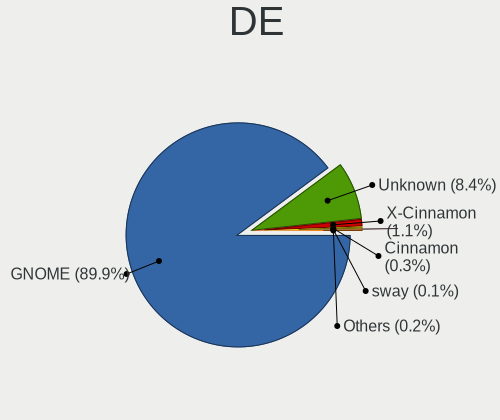

| Name            | Notebooks | Percent |
|-----------------|-----------|---------|
| GNOME           | 827       | 89.7%   |
| Unknown         | 78        | 8.46%   |
| X-Cinnamon      | 10        | 1.08%   |
| Cinnamon        | 3         | 0.33%   |
| i3              | 2         | 0.22%   |
| sway            | 1         | 0.11%   |
| GNOME Flashback | 1         | 0.11%   |

Display Server
--------------

X11 or Wayland

| Name    | Notebooks | Percent |
|---------|-----------|---------|
| Wayland | 591       | 63.48%  |
| X11     | 293       | 31.47%  |
| Unknown | 41        | 4.4%    |
| Tty     | 6         | 0.64%   |

Display Manager
---------------

SDDM, LightDM, etc.

| Name    | Notebooks | Percent |
|---------|-----------|---------|
| Unknown | 462       | 49.52%  |
| GDM     | 296       | 31.73%  |
| GDM3    | 158       | 16.93%  |
| LightDM | 9         | 0.96%   |
| TDM     | 6         | 0.64%   |
| SDDM    | 2         | 0.21%   |

OS Lang
-------

Language

| Lang    | Notebooks | Percent |
|---------|-----------|---------|
| en_US   | 410       | 44.91%  |
| de_DE   | 78        | 8.54%   |
| en_GB   | 57        | 6.24%   |
| fr_FR   | 51        | 5.59%   |
| en_IN   | 36        | 3.94%   |
| pt_BR   | 29        | 3.18%   |
| it_IT   | 25        | 2.74%   |
| es_ES   | 23        | 2.52%   |
| ru_RU   | 21        | 2.3%    |
| pl_PL   | 18        | 1.97%   |
| en_CA   | 18        | 1.97%   |
| en_AU   | 14        | 1.53%   |
| cs_CZ   | 13        | 1.42%   |
| nl_NL   | 11        | 1.2%    |
| en_ZA   | 10        | 1.1%    |
| ja_JP   | 7         | 0.77%   |
| de_AT   | 7         | 0.77%   |
| Unknown | 6         | 0.66%   |
| zh_CN   | 5         | 0.55%   |
| es_MX   | 5         | 0.55%   |
| C       | 5         | 0.55%   |
| sv_SE   | 4         | 0.44%   |
| fr_BE   | 4         | 0.44%   |
| es_CL   | 4         | 0.44%   |
| tr_TR   | 3         | 0.33%   |
| ru_UA   | 3         | 0.33%   |
| hu_HU   | 3         | 0.33%   |
| es_AR   | 3         | 0.33%   |
| zh_TW   | 2         | 0.22%   |
| ro_RO   | 2         | 0.22%   |
| nb_NO   | 2         | 0.22%   |
| fr_CA   | 2         | 0.22%   |
| fi_FI   | 2         | 0.22%   |
| es_UY   | 2         | 0.22%   |
| es_EC   | 2         | 0.22%   |
| es_CO   | 2         | 0.22%   |
| en_NZ   | 2         | 0.22%   |
| en_IL   | 2         | 0.22%   |
| da_DK   | 2         | 0.22%   |
| vi_VN   | 1         | 0.11%   |

Boot Mode
---------

EFI or BIOS

| Mode | Notebooks | Percent |
|------|-----------|---------|
| BIOS | 540       | 58.63%  |
| EFI  | 381       | 41.37%  |

Filesystem
----------

Type of filesystem

| Type    | Notebooks | Percent |
|---------|-----------|---------|
| Ext4    | 842       | 92.43%  |
| Zfs     | 31        | 3.4%    |
| Overlay | 22        | 2.41%   |
| Btrfs   | 9         | 0.99%   |
| Xfs     | 3         | 0.33%   |
| Ext2    | 2         | 0.22%   |
| Unknown | 2         | 0.22%   |

Part. scheme
------------

Scheme of partitioning

| Type    | Notebooks | Percent |
|---------|-----------|---------|
| Unknown | 594       | 65.13%  |
| GPT     | 305       | 33.44%  |
| MBR     | 13        | 1.43%   |

Dual Boot with Linux/BSD
------------------------

Hosting more than one Linux/BSD

| Dual boot | Notebooks | Percent |
|-----------|-----------|---------|
| No        | 828       | 90.59%  |
| Yes       | 86        | 9.41%   |

Dual Boot (Win)
---------------

Hosting Linux and Windows

| Dual boot | Notebooks | Percent |
|-----------|-----------|---------|
| No        | 603       | 65.97%  |
| Yes       | 311       | 34.03%  |

Board
-----

Vendor
------

Motherboard manufacturer

| Name                  | Notebooks | Percent |
|-----------------------|-----------|---------|
| Lenovo                | 180       | 19.78%  |
| Dell                  | 173       | 19.01%  |
| Hewlett-Packard       | 168       | 18.46%  |
| ASUSTek Computer      | 103       | 11.32%  |
| Acer                  | 79        | 8.68%   |
| Apple                 | 23        | 2.53%   |
| Toshiba               | 22        | 2.42%   |
| Samsung Electronics   | 17        | 1.87%   |
| HUAWEI                | 17        | 1.87%   |
| Sony                  | 14        | 1.54%   |
| MSI                   | 10        | 1.1%    |
| Fujitsu               | 10        | 1.1%    |
| Notebook              | 8         | 0.88%   |
| Timi                  | 7         | 0.77%   |
| Medion                | 6         | 0.66%   |
| Positivo              | 5         | 0.55%   |
| Unknown               | 5         | 0.55%   |
| TUXEDO                | 4         | 0.44%   |
| System76              | 4         | 0.44%   |
| Packard Bell          | 4         | 0.44%   |
| Alienware             | 4         | 0.44%   |
| Razer                 | 3         | 0.33%   |
| Google                | 3         | 0.33%   |
| Schenker              | 2         | 0.22%   |
| Monster               | 2         | 0.22%   |
| LG Electronics        | 2         | 0.22%   |
| Chuwi                 | 2         | 0.22%   |
| Wortmann AG           | 1         | 0.11%   |
| Wiltronic             | 1         | 0.11%   |
| VINGA                 | 1         | 0.11%   |
| TrekStor              | 1         | 0.11%   |
| TongFang              | 1         | 0.11%   |
| Thomson               | 1         | 0.11%   |
| Teclast               | 1         | 0.11%   |
| Standard              | 1         | 0.11%   |
| roda computer         | 1         | 0.11%   |
| Radxa                 | 1         | 0.11%   |
| Positivo Bahia - VAIO | 1         | 0.11%   |
| Pegatron              | 1         | 0.11%   |
| Panasonic             | 1         | 0.11%   |

Model
-----

Motherboard model

| Name                                     | Notebooks | Percent |
|------------------------------------------|-----------|---------|
| Unknown                                  | 10        | 1.1%    |
| Dell XPS 15 7590                         | 9         | 0.99%   |
| HP Notebook                              | 8         | 0.88%   |
| HP EliteBook 820 G1                      | 5         | 0.55%   |
| Dell XPS 13 9310                         | 5         | 0.55%   |
| HP ProBook 450 G7                        | 4         | 0.44%   |
| HP Pavilion dv6                          | 4         | 0.44%   |
| Dell XPS 15 9510                         | 4         | 0.44%   |
| Dell XPS 13 7390                         | 4         | 0.44%   |
| Lenovo IdeaPad 5 14ARE05 81YM            | 3         | 0.33%   |
| Lenovo G500 20236                        | 3         | 0.33%   |
| HUAWEI HLYL-WXX9                         | 3         | 0.33%   |
| HP Pavilion Notebook                     | 3         | 0.33%   |
| HP Laptop 15-da0xxx                      | 3         | 0.33%   |
| HP EliteBook 845 G7 Notebook PC          | 3         | 0.33%   |
| HP EliteBook 840 G3                      | 3         | 0.33%   |
| HP EliteBook 840 G2                      | 3         | 0.33%   |
| HP 15                                    | 3         | 0.33%   |
| Dell XPS 15 9570                         | 3         | 0.33%   |
| Dell XPS 15 9500                         | 3         | 0.33%   |
| Dell XPS 13 9360                         | 3         | 0.33%   |
| Dell Latitude E6430                      | 3         | 0.33%   |
| Dell Latitude E4300                      | 3         | 0.33%   |
| Dell G5 5587                             | 3         | 0.33%   |
| Dell G3 3500                             | 3         | 0.33%   |
| ASUS X551CAP                             | 3         | 0.33%   |
| ASUS U50Vg                               | 3         | 0.33%   |
| ASUS ROG Strix G513QY_G513QY             | 3         | 0.33%   |
| Apple MacBookPro9,2                      | 3         | 0.33%   |
| Acer Swift SF314-59                      | 3         | 0.33%   |
| Acer Aspire A515-44                      | 3         | 0.33%   |
| Toshiba PORTEGE Z930                     | 2         | 0.22%   |
| System76 Serval WS                       | 2         | 0.22%   |
| Samsung 300E4C/300E5C/300E7C             | 2         | 0.22%   |
| Razer Blade                              | 2         | 0.22%   |
| Lenovo ThinkPad X1 Carbon 6th 20KHCTO1WW | 2         | 0.22%   |
| Lenovo ThinkPad P14s Gen 1 20Y1CTO1WW    | 2         | 0.22%   |
| Lenovo ThinkBook 16p Gen 2 20YM          | 2         | 0.22%   |
| Lenovo IdeaPad Gaming 3 15ARH05 82EY     | 2         | 0.22%   |
| Lenovo IdeaPad 520-15IKB 81BF            | 2         | 0.22%   |

Model Family
------------

Motherboard model prefix

| Name                  | Notebooks | Percent |
|-----------------------|-----------|---------|
| Lenovo ThinkPad       | 92        | 10.11%  |
| Dell Latitude         | 53        | 5.82%   |
| Lenovo IdeaPad        | 48        | 5.27%   |
| Dell Inspiron         | 48        | 5.27%   |
| Acer Aspire           | 47        | 5.16%   |
| Dell XPS              | 40        | 4.4%    |
| HP EliteBook          | 38        | 4.18%   |
| HP Pavilion           | 30        | 3.3%    |
| HP ProBook            | 27        | 2.97%   |
| HP Laptop             | 23        | 2.53%   |
| ASUS ROG              | 21        | 2.31%   |
| Toshiba Satellite     | 15        | 1.65%   |
| Dell Vostro           | 13        | 1.43%   |
| Acer Swift            | 13        | 1.43%   |
| ASUS VivoBook         | 11        | 1.21%   |
| Unknown               | 10        | 1.1%    |
| Dell Precision        | 9         | 0.99%   |
| HP Notebook           | 8         | 0.88%   |
| HP ENVY               | 7         | 0.77%   |
| Fujitsu LIFEBOOK      | 7         | 0.77%   |
| Lenovo ThinkBook      | 6         | 0.66%   |
| ASUS ZenBook          | 6         | 0.66%   |
| Acer TravelMate       | 6         | 0.66%   |
| Lenovo Legion         | 5         | 0.55%   |
| Packard Bell EasyNote | 4         | 0.44%   |
| HP ZBook              | 4         | 0.44%   |
| HP 15                 | 4         | 0.44%   |
| Dell G3               | 4         | 0.44%   |
| Apple MacBookPro8     | 4         | 0.44%   |
| Acer Nitro            | 4         | 0.44%   |
| Toshiba PORTEGE       | 3         | 0.33%   |
| Razer Blade           | 3         | 0.33%   |
| Lenovo Yoga           | 3         | 0.33%   |
| Lenovo G500           | 3         | 0.33%   |
| HUAWEI HLYL-WXX9      | 3         | 0.33%   |
| HP Stream             | 3         | 0.33%   |
| HP OMEN               | 3         | 0.33%   |
| HP Compaq             | 3         | 0.33%   |
| Dell G5               | 3         | 0.33%   |
| ASUS X551CAP          | 3         | 0.33%   |

MFG Year
--------

Motherboard manufacture year

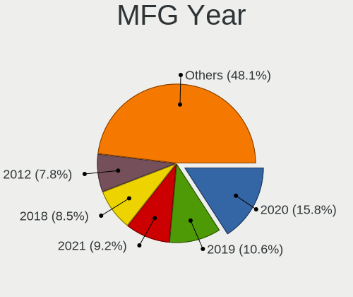

| Year | Notebooks | Percent |
|------|-----------|---------|
| 2020 | 148       | 16.26%  |
| 2019 | 95        | 10.44%  |
| 2021 | 86        | 9.45%   |
| 2018 | 76        | 8.35%   |
| 2012 | 68        | 7.47%   |
| 2013 | 67        | 7.36%   |
| 2015 | 61        | 6.7%    |
| 2017 | 60        | 6.59%   |
| 2011 | 53        | 5.82%   |
| 2016 | 51        | 5.6%    |
| 2014 | 38        | 4.18%   |
| 2010 | 37        | 4.07%   |
| 2008 | 31        | 3.41%   |
| 2009 | 30        | 3.3%    |
| 2007 | 5         | 0.55%   |
| 2006 | 4         | 0.44%   |

Form Factor
-----------

Physical design of the computer

| Name     | Notebooks | Percent |
|----------|-----------|---------|
| Notebook | 910       | 100%    |

Secure Boot
-----------

Enabled or disabled

| State    | Notebooks | Percent |
|----------|-----------|---------|
| Disabled | 801       | 87.64%  |
| Enabled  | 113       | 12.36%  |

Coreboot
--------

Have coreboot on board

| Used | Notebooks | Percent |
|------|-----------|---------|
| No   | 906       | 99.56%  |
| Yes  | 4         | 0.44%   |

RAM Size
--------

Total RAM memory

| Size in GB  | Notebooks | Percent |
|-------------|-----------|---------|
| 4.01-8.0    | 263       | 28.87%  |
| 16.01-24.0  | 188       | 20.64%  |
| 3.01-4.0    | 186       | 20.42%  |
| 8.01-16.0   | 151       | 16.58%  |
| 32.01-64.0  | 68        | 7.46%   |
| 1.01-2.0    | 30        | 3.29%   |
| 64.01-256.0 | 12        | 1.32%   |
| 24.01-32.0  | 6         | 0.66%   |
| 2.01-3.0    | 6         | 0.66%   |
| 0.51-1.0    | 1         | 0.11%   |

RAM Used
--------

Used RAM memory

| Used GB    | Notebooks | Percent |
|------------|-----------|---------|
| 1.01-2.0   | 347       | 36.22%  |
| 2.01-3.0   | 269       | 28.08%  |
| 4.01-8.0   | 151       | 15.76%  |
| 3.01-4.0   | 133       | 13.88%  |
| 8.01-16.0  | 30        | 3.13%   |
| 0.51-1.0   | 19        | 1.98%   |
| 16.01-24.0 | 5         | 0.52%   |
| 0.01-0.5   | 3         | 0.31%   |
| 24.01-32.0 | 1         | 0.1%    |

Total Drives
------------

Number of drives on board

| Drives | Notebooks | Percent |
|--------|-----------|---------|
| 1      | 686       | 75.05%  |
| 2      | 187       | 20.46%  |
| 3      | 24        | 2.63%   |
| 0      | 9         | 0.98%   |
| 4      | 5         | 0.55%   |
| 6      | 2         | 0.22%   |
| 5      | 1         | 0.11%   |

Has CD-ROM
----------

Has CD-ROM on board

| Presented | Notebooks | Percent |
|-----------|-----------|---------|
| No        | 614       | 67.47%  |
| Yes       | 296       | 32.53%  |

Has Ethernet
------------

Has Ethernet on board

| Presented | Notebooks | Percent |
|-----------|-----------|---------|
| Yes       | 703       | 77.08%  |
| No        | 209       | 22.92%  |

Has WiFi
--------

Has WiFi module

| Presented | Notebooks | Percent |
|-----------|-----------|---------|
| Yes       | 888       | 97.48%  |
| No        | 23        | 2.52%   |

Has Bluetooth
-------------

Has Bluetooth module

| Presented | Notebooks | Percent |
|-----------|-----------|---------|
| Yes       | 749       | 81.5%   |
| No        | 170       | 18.5%   |

Location
--------

Country
-------

Geographic location (country)

| Country      | Notebooks | Percent |
|--------------|-----------|---------|
| USA          | 138       | 15.1%   |
| Germany      | 99        | 10.83%  |
| France       | 56        | 6.13%   |
| UK           | 44        | 4.81%   |
| Italy        | 40        | 4.38%   |
| Russia       | 39        | 4.27%   |
| India        | 38        | 4.16%   |
| Brazil       | 38        | 4.16%   |
| Spain        | 32        | 3.5%    |
| Poland       | 32        | 3.5%    |
| Netherlands  | 25        | 2.74%   |
| Canada       | 23        | 2.52%   |
| Czechia      | 18        | 1.97%   |
| Finland      | 16        | 1.75%   |
| Austria      | 16        | 1.75%   |
| Ukraine      | 14        | 1.53%   |
| Australia    | 14        | 1.53%   |
| Turkey       | 11        | 1.2%    |
| Sweden       | 11        | 1.2%    |
| South Africa | 11        | 1.2%    |
| Hungary      | 10        | 1.09%   |
| Romania      | 9         | 0.98%   |
| Mexico       | 9         | 0.98%   |
| Belgium      | 9         | 0.98%   |
| Japan        | 7         | 0.77%   |
| Israel       | 7         | 0.77%   |
| Switzerland  | 6         | 0.66%   |
| Indonesia    | 6         | 0.66%   |
| Greece       | 6         | 0.66%   |
| Vietnam      | 5         | 0.55%   |
| Portugal     | 5         | 0.55%   |
| Iran         | 5         | 0.55%   |
| Colombia     | 5         | 0.55%   |
| China        | 5         | 0.55%   |
| Peru         | 4         | 0.44%   |
| New Zealand  | 4         | 0.44%   |
| Denmark      | 4         | 0.44%   |
| Croatia      | 4         | 0.44%   |
| Chile        | 4         | 0.44%   |
| Argentina    | 4         | 0.44%   |

City
----

Geographic location (city)

| City             | Notebooks | Percent |
|------------------|-----------|---------|
| Moscow           | 13        | 1.38%   |
| Paris            | 12        | 1.28%   |
| Warsaw           | 11        | 1.17%   |
| Vienna           | 11        | 1.17%   |
| Prague           | 9         | 0.96%   |
| Helsinki         | 8         | 0.85%   |
| Berlin           | 8         | 0.85%   |
| Los Angeles      | 6         | 0.64%   |
| Kyiv             | 6         | 0.64%   |
| Budapest         | 6         | 0.64%   |
| Sao Paulo        | 5         | 0.53%   |
| Nuremberg        | 5         | 0.53%   |
| New Delhi        | 5         | 0.53%   |
| Munich           | 5         | 0.53%   |
| Madrid           | 5         | 0.53%   |
| Cologne          | 5         | 0.53%   |
| Athens           | 5         | 0.53%   |
| Tehran           | 4         | 0.43%   |
| London           | 4         | 0.43%   |
| Kolkata          | 4         | 0.43%   |
| Zagreb           | 3         | 0.32%   |
| Turin            | 3         | 0.32%   |
| Tokyo            | 3         | 0.32%   |
| Tel Aviv         | 3         | 0.32%   |
| Tampere          | 3         | 0.32%   |
| Sydney           | 3         | 0.32%   |
| St Petersburg    | 3         | 0.32%   |
| San Jos        | 3         | 0.32%   |
| Pretoria         | 3         | 0.32%   |
| Oklahoma City    | 3         | 0.32%   |
| Nizhnevartovsk   | 3         | 0.32%   |
| Nairobi          | 3         | 0.32%   |
| Milan            | 3         | 0.32%   |
| Melbourne        | 3         | 0.32%   |
| Lima             | 3         | 0.32%   |
| Krasnodar        | 3         | 0.32%   |
| Krakow           | 3         | 0.32%   |
| Istanbul         | 3         | 0.32%   |
| Ho Chi Minh City | 3         | 0.32%   |
| Hamburg          | 3         | 0.32%   |

Drives
------

Drive Vendor
------------

Hard drive vendors

| Vendor                    | Notebooks | Drives | Percent |
|---------------------------|-----------|--------|---------|
| Samsung Electronics       | 182       | 210    | 16.64%  |
| WDC                       | 144       | 158    | 13.16%  |
| Toshiba                   | 117       | 138    | 10.69%  |
| Seagate                   | 115       | 134    | 10.51%  |
| SK hynix                  | 59        | 62     | 5.39%   |
| SanDisk                   | 58        | 69     | 5.3%    |
| Unknown                   | 55        | 69     | 5.03%   |
| Kingston                  | 47        | 56     | 4.3%    |
| Intel                     | 43        | 52     | 3.93%   |
| HGST                      | 31        | 36     | 2.83%   |
| Crucial                   | 31        | 40     | 2.83%   |
| Micron Technology         | 28        | 31     | 2.56%   |
| Hitachi                   | 25        | 30     | 2.29%   |
| KIOXIA                    | 19        | 21     | 1.74%   |
| Apple                     | 10        | 13     | 0.91%   |
| A-DATA Technology         | 10        | 11     | 0.91%   |
| LITEON                    | 9         | 9      | 0.82%   |
| Phison                    | 7         | 9      | 0.64%   |
| Patriot                   | 7         | 8      | 0.64%   |
| Micron/Crucial Technology | 5         | 5      | 0.46%   |
| JMicron Technology        | 5         | 8      | 0.46%   |
| Transcend                 | 4         | 5      | 0.37%   |
| Team                      | 4         | 4      | 0.37%   |
| SPCC                      | 4         | 5      | 0.37%   |
| LITEONIT                  | 4         | 6      | 0.37%   |
| Hewlett-Packard           | 4         | 5      | 0.37%   |
| China                     | 4         | 5      | 0.37%   |
| Union Memory              | 3         | 3      | 0.27%   |
| KingSpec                  | 3         | 3      | 0.27%   |
| Intenso                   | 3         | 4      | 0.27%   |
| Indilinx                  | 3         | 3      | 0.27%   |
| ASMT                      | 3         | 6      | 0.27%   |
| UMIS                      | 2         | 2      | 0.18%   |
| SSSTC                     | 2         | 2      | 0.18%   |
| Silicon Motion            | 2         | 2      | 0.18%   |
| PNY                       | 2         | 3      | 0.18%   |
| OSCOO                     | 2         | 2      | 0.18%   |
| OCZ                       | 2         | 2      | 0.18%   |
| Lenovo                    | 2         | 3      | 0.18%   |
| BIWIN                     | 2         | 2      | 0.18%   |

Drive Model
-----------

Hard drive models

| Model                                  | Notebooks | Percent |
|----------------------------------------|-----------|---------|
| Samsung NVMe SSD Drive 512GB           | 27        | 2.38%   |
| Seagate ST1000LM035-1RK172 1TB         | 22        | 1.94%   |
| Toshiba MQ01ABD100 1TB                 | 20        | 1.76%   |
| Unknown MMC Card  32GB                 | 17        | 1.5%    |
| Toshiba MQ04ABF100 1TB                 | 12        | 1.06%   |
| Toshiba MQ01ABF050 500GB               | 12        | 1.06%   |
| Seagate ST500LT012-1DG142 500GB        | 12        | 1.06%   |
| HGST HTS721010A9E630 1TB               | 12        | 1.06%   |
| Seagate ST1000LM024 HN-M101MBB 1TB     | 11        | 0.97%   |
| Intel NVMe SSD Drive 512GB             | 11        | 0.97%   |
| SK hynix NVMe SSD Drive 512GB          | 10        | 0.88%   |
| HGST HTS545050A7E680 500GB             | 8         | 0.71%   |
| Unknown MMC Card  64GB                 | 7         | 0.62%   |
| Toshiba NVMe SSD Drive 512GB           | 7         | 0.62%   |
| SanDisk NVMe SSD Drive 512GB           | 7         | 0.62%   |
| Samsung NVMe SSD Drive 1TB             | 7         | 0.62%   |
| Seagate ST9500325AS 500GB              | 6         | 0.53%   |
| Kingston SA400S37240G 240GB SSD        | 6         | 0.53%   |
| WDC WDS240G2G0A-00JH30 240GB SSD       | 5         | 0.44%   |
| Unknown SD/MMC/MS PRO 64GB             | 5         | 0.44%   |
| Unknown MMC Card  128GB                | 5         | 0.44%   |
| SanDisk NVMe SSD Drive 256GB           | 5         | 0.44%   |
| Samsung SM963 2.5" NVMe PCIe SSD 256GB | 5         | 0.44%   |
| Samsung HM500JI 500GB                  | 5         | 0.44%   |
| Kingston SA400S37120G 120GB SSD        | 5         | 0.44%   |
| WDC WDS500G2B0A-00SM50 500GB SSD       | 4         | 0.35%   |
| WDC PC SN730 SDBQNTY-512G-1001 512GB   | 4         | 0.35%   |
| WDC PC SN730 SDBPNTY-512G-1027 512GB   | 4         | 0.35%   |
| WDC PC SN730 NVMe 1024GB               | 4         | 0.35%   |
| Toshiba NVMe SSD Drive 256GB           | 4         | 0.35%   |
| SK hynix NVMe SSD Drive 128GB          | 4         | 0.35%   |
| SK hynix NVMe SSD Drive 1024GB         | 4         | 0.35%   |
| Seagate ST750LM022 HN-M750MBB 752GB    | 4         | 0.35%   |
| SanDisk SSD PLUS 480GB                 | 4         | 0.35%   |
| Samsung SSD 860 EVO 1TB                | 4         | 0.35%   |
| Samsung SSD 850 EVO 250GB              | 4         | 0.35%   |
| Samsung SSD 840 EVO 120GB              | 4         | 0.35%   |
| Samsung NVMe SSD Drive 500GB           | 4         | 0.35%   |
| KIOXIA KBG40ZNV512G 512GB              | 4         | 0.35%   |
| Kingston SUV400S37120G 120GB SSD       | 4         | 0.35%   |

HDD Vendor
----------

Hard disk drive vendors

| Vendor              | Notebooks | Drives | Percent |
|---------------------|-----------|--------|---------|
| Seagate             | 111       | 127    | 33.64%  |
| WDC                 | 71        | 79     | 21.52%  |
| Toshiba             | 67        | 77     | 20.3%   |
| HGST                | 31        | 36     | 9.39%   |
| Hitachi             | 25        | 30     | 7.58%   |
| Samsung Electronics | 10        | 12     | 3.03%   |
| Unknown             | 5         | 5      | 1.52%   |
| ASMT                | 3         | 6      | 0.91%   |
| Intenso             | 2         | 3      | 0.61%   |
| Apple               | 2         | 3      | 0.61%   |
| RSH-339             | 1         | 1      | 0.3%    |
| JMicron Technology  | 1         | 3      | 0.3%    |
| Fujitsu             | 1         | 1      | 0.3%    |

SSD Vendor
----------

Solid state drive vendors

| Vendor              | Notebooks | Drives | Percent |
|---------------------|-----------|--------|---------|
| Samsung Electronics | 75        | 83     | 23.89%  |
| SanDisk             | 39        | 46     | 12.42%  |
| Kingston            | 32        | 39     | 10.19%  |
| Crucial             | 28        | 37     | 8.92%   |
| WDC                 | 20        | 20     | 6.37%   |
| Micron Technology   | 12        | 13     | 3.82%   |
| Intel               | 12        | 16     | 3.82%   |
| Toshiba             | 9         | 10     | 2.87%   |
| LITEON              | 9         | 9      | 2.87%   |
| SK hynix            | 7         | 7      | 2.23%   |
| Patriot             | 7         | 8      | 2.23%   |
| Apple               | 5         | 6      | 1.59%   |
| A-DATA Technology   | 5         | 5      | 1.59%   |
| Transcend           | 4         | 5      | 1.27%   |
| Team                | 4         | 4      | 1.27%   |
| SPCC                | 4         | 5      | 1.27%   |
| LITEONIT            | 4         | 6      | 1.27%   |
| Hewlett-Packard     | 4         | 5      | 1.27%   |
| China               | 4         | 5      | 1.27%   |
| KingSpec            | 3         | 3      | 0.96%   |
| JMicron Technology  | 3         | 3      | 0.96%   |
| PNY                 | 2         | 3      | 0.64%   |
| OSCOO               | 2         | 2      | 0.64%   |
| OCZ                 | 2         | 2      | 0.64%   |
| Indilinx            | 2         | 2      | 0.64%   |
| Yeyian              | 1         | 1      | 0.32%   |
| Union Memory        | 1         | 1      | 0.32%   |
| TwinMOS             | 1         | 1      | 0.32%   |
| Teclast             | 1         | 1      | 0.32%   |
| StoreJet            | 1         | 1      | 0.32%   |
| Seagate             | 1         | 1      | 0.32%   |
| S3+                 | 1         | 1      | 0.32%   |
| Plextor             | 1         | 1      | 0.32%   |
| Netac               | 1         | 1      | 0.32%   |
| Lenovo              | 1         | 2      | 0.32%   |
| KIOXIA-EXCERIA      | 1         | 1      | 0.32%   |
| Intenso             | 1         | 1      | 0.32%   |
| EZCOOL              | 1         | 1      | 0.32%   |
| Dogfish             | 1         | 1      | 0.32%   |
| Biostar             | 1         | 2      | 0.32%   |

Drive Kind
----------

HDD or SSD

| Kind    | Notebooks | Drives | Percent |
|---------|-----------|--------|---------|
| NVMe    | 375       | 446    | 35.82%  |
| HDD     | 316       | 383    | 30.18%  |
| SSD     | 291       | 362    | 27.79%  |
| MMC     | 49        | 63     | 4.68%   |
| Unknown | 16        | 20     | 1.53%   |

Drive Connector
---------------

SATA, SAS, NVMe, etc.

| Type | Notebooks | Drives | Percent |
|------|-----------|--------|---------|
| SATA | 556       | 710    | 54.72%  |
| NVMe | 373       | 444    | 36.71%  |
| MMC  | 49        | 63     | 4.82%   |
| SAS  | 38        | 57     | 3.74%   |

Drive Size
----------

Size of hard drive

| Size in TB | Notebooks | Drives | Percent |
|------------|-----------|--------|---------|
| 0.01-0.5   | 392       | 490    | 64.79%  |
| 0.51-1.0   | 192       | 228    | 31.74%  |
| 1.01-2.0   | 15        | 17     | 2.48%   |
| 3.01-4.0   | 3         | 6      | 0.5%    |
| 4.01-10.0  | 2         | 3      | 0.33%   |
| 10.01-20.0 | 1         | 1      | 0.17%   |

Space Total
-----------

Amount of disk space available on the file system

| Size in GB     | Notebooks | Percent |
|----------------|-----------|---------|
| 251-500        | 269       | 29.27%  |
| 101-250        | 267       | 29.05%  |
| 501-1000       | 146       | 15.89%  |
| 51-100         | 76        | 8.27%   |
| 1-20           | 59        | 6.42%   |
| 1001-2000      | 41        | 4.46%   |
| 21-50          | 35        | 3.81%   |
| More than 3000 | 16        | 1.74%   |
| 2001-3000      | 5         | 0.54%   |
| Unknown        | 5         | 0.54%   |

Space Used
----------

Amount of used disk space

| Used GB        | Notebooks | Percent |
|----------------|-----------|---------|
| 1-20           | 372       | 39.45%  |
| 21-50          | 201       | 21.31%  |
| 51-100         | 138       | 14.63%  |
| 101-250        | 120       | 12.73%  |
| 251-500        | 59        | 6.26%   |
| 501-1000       | 29        | 3.08%   |
| 1001-2000      | 9         | 0.95%   |
| More than 3000 | 8         | 0.85%   |
| Unknown        | 5         | 0.53%   |
| 2001-3000      | 2         | 0.21%   |

Malfunc. Drives
---------------

Drive models with a malfunction

| Model                                          | Notebooks | Drives | Percent |
|------------------------------------------------|-----------|--------|---------|
| Seagate ST500LM021-1KJ152 500GB                | 2         | 2      | 5.88%   |
| SanDisk SSD PLUS 480GB                         | 2         | 2      | 5.88%   |
| WDC WD5000LPLX-60ZNTT1 500GB                   | 1         | 1      | 2.94%   |
| WDC WD3200LPCX-24C6HT0 320GB                   | 1         | 1      | 2.94%   |
| WDC WD3200BEKT-60PVMT0 320GB                   | 1         | 1      | 2.94%   |
| WDC WD10SPZX-17Z10T0 1TB                       | 1         | 1      | 2.94%   |
| Toshiba MQ01ABD100 1TB                         | 1         | 1      | 2.94%   |
| Toshiba MK3263GSXN 320GB                       | 1         | 1      | 2.94%   |
| Toshiba MK3252GSX 320GB                        | 1         | 1      | 2.94%   |
| SK hynix HFS256G39TND-N210A 256GB SSD          | 1         | 1      | 2.94%   |
| Seagate ST9320423AS 320GB                      | 1         | 1      | 2.94%   |
| Seagate ST500LT012-1DG142 500GB                | 1         | 1      | 2.94%   |
| Seagate ST500LM000-1EJ162 500GB                | 1         | 1      | 2.94%   |
| Seagate ST320LT020-9YG142 320GB                | 1         | 1      | 2.94%   |
| Seagate ST1000LM035-1RK172 1TB                 | 1         | 1      | 2.94%   |
| SanDisk SSD U100 128GB                         | 1         | 1      | 2.94%   |
| SanDisk SDSSDHII240G 240GB                     | 1         | 1      | 2.94%   |
| SanDisk SDSSDA240G 240GB                       | 1         | 1      | 2.94%   |
| SanDisk SD7SB3Q128G1002 128GB SSD              | 1         | 1      | 2.94%   |
| Samsung Electronics SSD 860 EVO 500GB          | 1         | 1      | 2.94%   |
| Samsung Electronics HM250HI 250GB              | 1         | 1      | 2.94%   |
| Micron Technology MTFDDAT256MAM-1K2 256GB SSD  | 1         | 1      | 2.94%   |
| Micron Technology 1100_MTFDDAV512TBN 512GB SSD | 1         | 1      | 2.94%   |
| LITEONIT LMT-32L3M mSATA 32GB SSD              | 1         | 1      | 2.94%   |
| Kingston SV300S37A120G 120GB SSD               | 1         | 1      | 2.94%   |
| Intel SSDSC2KF256H6L 256GB                     | 1         | 1      | 2.94%   |
| Intel SSDPEKKF256G7L 256GB                     | 1         | 1      | 2.94%   |
| Hitachi HTS542525K9A300 250GB                  | 1         | 1      | 2.94%   |
| HGST HTS725050A7E630 500GB                     | 1         | 1      | 2.94%   |
| Fujitsu MHV2080BH PL 80GB                      | 1         | 1      | 2.94%   |
| Crucial CT1000P1SSD8 1TB                       | 1         | 1      | 2.94%   |
| A-DATA Technology SU800NS38 512GB SSD          | 1         | 1      | 2.94%   |

Malfunc. Drive Vendor
---------------------

Vendors of faulty drives

| Vendor              | Notebooks | Drives | Percent |
|---------------------|-----------|--------|---------|
| Seagate             | 7         | 7      | 20.59%  |
| SanDisk             | 6         | 6      | 17.65%  |
| WDC                 | 4         | 4      | 11.76%  |
| Toshiba             | 3         | 3      | 8.82%   |
| Samsung Electronics | 2         | 2      | 5.88%   |
| Micron Technology   | 2         | 2      | 5.88%   |
| Intel               | 2         | 2      | 5.88%   |
| SK hynix            | 1         | 1      | 2.94%   |
| LITEONIT            | 1         | 1      | 2.94%   |
| Kingston            | 1         | 1      | 2.94%   |
| Hitachi             | 1         | 1      | 2.94%   |
| HGST                | 1         | 1      | 2.94%   |
| Fujitsu             | 1         | 1      | 2.94%   |
| Crucial             | 1         | 1      | 2.94%   |
| A-DATA Technology   | 1         | 1      | 2.94%   |

Malfunc. HDD Vendor
-------------------

Vendors of faulty HDD drives

| Vendor              | Notebooks | Drives | Percent |
|---------------------|-----------|--------|---------|
| Seagate             | 7         | 7      | 38.89%  |
| WDC                 | 4         | 4      | 22.22%  |
| Toshiba             | 3         | 3      | 16.67%  |
| Samsung Electronics | 1         | 1      | 5.56%   |
| Hitachi             | 1         | 1      | 5.56%   |
| HGST                | 1         | 1      | 5.56%   |
| Fujitsu             | 1         | 1      | 5.56%   |

Malfunc. Drive Kind
-------------------

Kinds of faulty drives

| Kind | Notebooks | Drives | Percent |
|------|-----------|--------|---------|
| HDD  | 18        | 18     | 52.94%  |
| SSD  | 14        | 14     | 41.18%  |
| NVMe | 2         | 2      | 5.88%   |

Failed Drives
-------------

Failed drive models

Zero info for selected period =(

Failed Drive Vendor
-------------------

Failed drive vendors

Zero info for selected period =(

Drive Status
------------

Number of failed and malfunc. drives

| Status   | Notebooks | Drives | Percent |
|----------|-----------|--------|---------|
| Detected | 582       | 830    | 61.07%  |
| Works    | 337       | 410    | 35.36%  |
| Malfunc  | 34        | 34     | 3.57%   |

Storage controller
------------------

Storage Vendor
--------------

Storage controller vendors

| Vendor                         | Notebooks | Percent |
|--------------------------------|-----------|---------|
| Intel                          | 630       | 56.96%  |
| AMD                            | 104       | 9.4%    |
| Samsung Electronics            | 100       | 9.04%   |
| SanDisk                        | 73        | 6.6%    |
| SK hynix                       | 51        | 4.61%   |
| Toshiba America Info Systems   | 44        | 3.98%   |
| KIOXIA                         | 20        | 1.81%   |
| Micron Technology              | 16        | 1.45%   |
| Kingston Technology Company    | 15        | 1.36%   |
| Phison Electronics             | 9         | 0.81%   |
| Micron/Crucial Technology      | 8         | 0.72%   |
| Nvidia                         | 7         | 0.63%   |
| ADATA Technology               | 7         | 0.63%   |
| Union Memory (Shenzhen)        | 5         | 0.45%   |
| Silicon Motion                 | 4         | 0.36%   |
| Solid State Storage Technology | 3         | 0.27%   |
| Apple                          | 3         | 0.27%   |
| Seagate Technology             | 1         | 0.09%   |
| Realtek Semiconductor          | 1         | 0.09%   |
| Marvell Technology Group       | 1         | 0.09%   |
| Lite-On Technology             | 1         | 0.09%   |
| Lenovo                         | 1         | 0.09%   |
| INNOGRIT                       | 1         | 0.09%   |
| ASMedia Technology             | 1         | 0.09%   |

Storage Model
-------------

Storage controller models

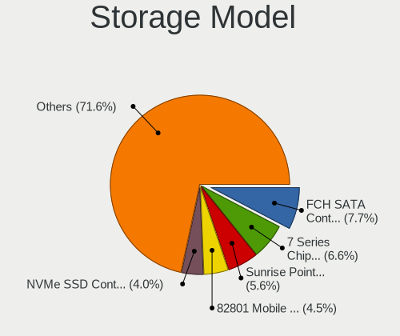

| Model                                                                            | Notebooks | Percent |
|----------------------------------------------------------------------------------|-----------|---------|
| AMD FCH SATA Controller [AHCI mode]                                              | 90        | 7.69%   |
| Intel 7 Series Chipset Family 6-port SATA Controller [AHCI mode]                 | 77        | 6.58%   |
| Intel Sunrise Point-LP SATA Controller [AHCI mode]                               | 66        | 5.64%   |
| Intel 82801 Mobile SATA Controller [RAID mode]                                   | 52        | 4.44%   |
| Samsung NVMe SSD Controller SM981/PM981/PM983                                    | 47        | 4.02%   |
| Intel Volume Management Device NVMe RAID Controller                              | 42        | 3.59%   |
| Intel 6 Series/C200 Series Chipset Family 6 port Mobile SATA AHCI Controller     | 39        | 3.33%   |
| Intel 8 Series SATA Controller 1 [AHCI mode]                                     | 38        | 3.25%   |
| Samsung NVMe SSD Controller 980                                                  | 37        | 3.16%   |
| Intel Cannon Lake Mobile PCH SATA AHCI Controller                                | 32        | 2.74%   |
| SanDisk WD Black SN750 / PC SN730 NVMe SSD                                       | 30        | 2.56%   |
| Intel Wildcat Point-LP SATA Controller [AHCI Mode]                               | 25        | 2.14%   |
| Intel HM170/QM170 Chipset SATA Controller [AHCI Mode]                            | 22        | 1.88%   |
| Intel 5 Series/3400 Series Chipset 4 port SATA AHCI Controller                   | 22        | 1.88%   |
| Intel 82801IBM/IEM (ICH9M/ICH9M-E) 4 port SATA Controller [AHCI mode]            | 21        | 1.79%   |
| Intel 8 Series/C220 Series Chipset Family 6-port SATA Controller 1 [AHCI mode]   | 19        | 1.62%   |
| KIOXIA NVMe SSD Controller BG4                                                   | 18        | 1.54%   |
| Intel Comet Lake SATA AHCI Controller                                            | 18        | 1.54%   |
| Intel Tiger Lake-LP SATA Controller                                              | 17        | 1.45%   |
| Toshiba America Info Systems XG6 NVMe SSD Controller                             | 16        | 1.37%   |
| Micron Non-Volatile memory controller                                            | 16        | 1.37%   |
| Intel Ice Lake-LP SATA Controller [AHCI mode]                                    | 16        | 1.37%   |
| Intel Cannon Point-LP SATA Controller [AHCI Mode]                                | 16        | 1.37%   |
| SK hynix BC511                                                                   | 15        | 1.28%   |
| Intel SSD 660P Series                                                            | 15        | 1.28%   |
| Intel Atom Processor E3800 Series SATA AHCI Controller                           | 15        | 1.28%   |
| Intel 5 Series/3400 Series Chipset 6 port SATA AHCI Controller                   | 15        | 1.28%   |
| SK hynix Gold P31/PC711 NVMe Solid State Drive                                   | 14        | 1.2%    |
| SanDisk WD Blue SN550 NVMe SSD                                                   | 14        | 1.2%    |
| Intel 400 Series Chipset Family SATA AHCI Controller                             | 13        | 1.11%   |
| Intel 82801HM/HEM (ICH8M/ICH8M-E) IDE Controller                                 | 12        | 1.03%   |
| SK hynix Non-Volatile memory controller                                          | 11        | 0.94%   |
| SanDisk WD Blue SN500 / PC SN520 NVMe SSD                                        | 11        | 0.94%   |
| Intel 82801HM/HEM (ICH8M/ICH8M-E) SATA Controller [AHCI mode]                    | 11        | 0.94%   |
| Toshiba America Info Systems XG5 NVMe SSD Controller                             | 10        | 0.85%   |
| Toshiba America Info Systems BG3 NVMe SSD Controller                             | 10        | 0.85%   |
| Samsung NVMe SSD Controller SM961/PM961/SM963                                    | 10        | 0.85%   |
| AMD SB7x0/SB8x0/SB9x0 SATA Controller [AHCI mode]                                | 10        | 0.85%   |
| Intel Atom/Celeron/Pentium Processor x5-E8000/J3xxx/N3xxx Series SATA Controller | 9         | 0.77%   |
| SK hynix BC501 NVMe Solid State Drive                                            | 8         | 0.68%   |

Storage Kind
------------

Kind of storage controller (IDE, SATA, NVMe, SAS, ...)

| Kind | Notebooks | Percent |
|------|-----------|---------|
| SATA | 631       | 55.16%  |
| NVMe | 378       | 33.04%  |
| RAID | 98        | 8.57%   |
| IDE  | 37        | 3.23%   |

Processor
---------

CPU Vendor
----------

Processor vendors

| Vendor | Notebooks | Percent |
|--------|-----------|---------|
| Intel  | 746       | 81.98%  |
| AMD    | 164       | 18.02%  |

CPU Model
---------

Processor models

| Model                                         | Notebooks | Percent |
|-----------------------------------------------|-----------|---------|
| Intel 11th Gen Core i7-1165G7 @ 2.80GHz       | 24        | 2.64%   |
| Intel Core i7-10510U CPU @ 1.80GHz            | 20        | 2.2%    |
| Intel 11th Gen Core i5-1135G7 @ 2.40GHz       | 18        | 1.98%   |
| Intel Core i7-8550U CPU @ 1.80GHz             | 16        | 1.76%   |
| Intel Core i7-7500U CPU @ 2.70GHz             | 16        | 1.76%   |
| Intel Core i5-8250U CPU @ 1.60GHz             | 15        | 1.65%   |
| Intel Core i7-9750H CPU @ 2.60GHz             | 14        | 1.54%   |
| Intel Core i7-10750H CPU @ 2.60GHz            | 14        | 1.54%   |
| Intel Core i7-7700HQ CPU @ 2.80GHz            | 13        | 1.43%   |
| Intel Core i5-3210M CPU @ 2.50GHz             | 12        | 1.32%   |
| Intel Core i7-8565U CPU @ 1.80GHz             | 11        | 1.21%   |
| Intel Core i5-7200U CPU @ 2.50GHz             | 11        | 1.21%   |
| Intel 11th Gen Core i7-1185G7 @ 3.00GHz       | 11        | 1.21%   |
| Intel Core i7-8750H CPU @ 2.20GHz             | 10        | 1.1%    |
| Intel Core i5-8265U CPU @ 1.60GHz             | 10        | 1.1%    |
| Intel Core i5-1035G1 CPU @ 1.00GHz            | 10        | 1.1%    |
| Intel Core i5-10210U CPU @ 1.60GHz            | 10        | 1.1%    |
| Intel 11th Gen Core i7-11800H @ 2.30GHz       | 10        | 1.1%    |
| Intel Core i5-5200U CPU @ 2.20GHz             | 9         | 0.99%   |
| Intel Core i5-4200U CPU @ 1.60GHz             | 9         | 0.99%   |
| AMD Ryzen 7 4800H with Radeon Graphics        | 9         | 0.99%   |
| AMD Ryzen 5 4600H with Radeon Graphics        | 9         | 0.99%   |
| Intel Core i7-6700HQ CPU @ 2.60GHz            | 8         | 0.88%   |
| Intel Core i5-6200U CPU @ 2.30GHz             | 8         | 0.88%   |
| Intel Core i5-5300U CPU @ 2.30GHz             | 8         | 0.88%   |
| Intel Core i5-3320M CPU @ 2.60GHz             | 8         | 0.88%   |
| Intel Core i5 CPU M 520 @ 2.40GHz             | 8         | 0.88%   |
| Intel Core i3-2310M CPU @ 2.10GHz             | 8         | 0.88%   |
| AMD Ryzen 9 5900HX with Radeon Graphics       | 8         | 0.88%   |
| AMD Ryzen 7 PRO 4750U with Radeon Graphics    | 8         | 0.88%   |
| AMD Ryzen 5 3500U with Radeon Vega Mobile Gfx | 8         | 0.88%   |
| Intel Core i5-4300U CPU @ 1.90GHz             | 7         | 0.77%   |
| Intel Celeron CPU N3060 @ 1.60GHz             | 7         | 0.77%   |
| AMD Ryzen 7 5800H with Radeon Graphics        | 7         | 0.77%   |
| AMD Ryzen 7 5700U with Radeon Graphics        | 7         | 0.77%   |
| Intel Core i3-1005G1 CPU @ 1.20GHz            | 6         | 0.66%   |
| Intel Core 2 Duo CPU P8700 @ 2.53GHz          | 6         | 0.66%   |
| Intel Core 2 Duo CPU P8600 @ 2.40GHz          | 6         | 0.66%   |
| Intel Atom x5-Z8350 CPU @ 1.44GHz             | 6         | 0.66%   |
| AMD Ryzen 5 4500U with Radeon Graphics        | 6         | 0.66%   |

CPU Model Family
----------------

Processor model prefix

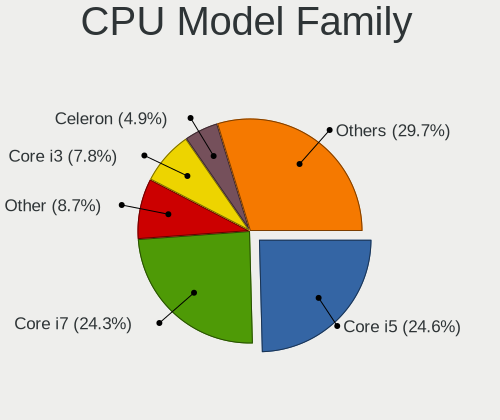

| Model                                | Notebooks | Percent |
|--------------------------------------|-----------|---------|
| Intel Core i5                        | 224       | 24.62%  |
| Intel Core i7                        | 220       | 24.18%  |
| Other                                | 79        | 8.68%   |
| Intel Core i3                        | 71        | 7.8%    |
| Intel Celeron                        | 44        | 4.84%   |
| Intel Core 2 Duo                     | 43        | 4.73%   |
| AMD Ryzen 5                          | 37        | 4.07%   |
| AMD Ryzen 7                          | 33        | 3.63%   |
| Intel Pentium                        | 24        | 2.64%   |
| Intel Atom                           | 18        | 1.98%   |
| AMD Ryzen 9                          | 13        | 1.43%   |
| AMD Ryzen 7 PRO                      | 11        | 1.21%   |
| AMD Ryzen 3                          | 8         | 0.88%   |
| AMD A10                              | 8         | 0.88%   |
| AMD A6                               | 7         | 0.77%   |
| AMD Athlon                           | 6         | 0.66%   |
| AMD A8                               | 6         | 0.66%   |
| Intel Pentium Silver                 | 5         | 0.55%   |
| Intel Xeon                           | 4         | 0.44%   |
| Intel Pentium Dual-Core              | 4         | 0.44%   |
| Intel Core i9                        | 4         | 0.44%   |
| Intel Core 2                         | 4         | 0.44%   |
| AMD E2                               | 4         | 0.44%   |
| AMD E1                               | 4         | 0.44%   |
| AMD E                                | 4         | 0.44%   |
| AMD A4                               | 4         | 0.44%   |
| Intel Pentium Dual                   | 3         | 0.33%   |
| Intel Core m7                        | 2         | 0.22%   |
| Intel Core m3                        | 2         | 0.22%   |
| AMD Ryzen 5 PRO                      | 2         | 0.22%   |
| AMD C-60                             | 2         | 0.22%   |
| AMD A12                              | 2         | 0.22%   |
| Intel Core M                         | 1         | 0.11%   |
| AMD Turion X2 Ultra Dual-Core Mobile | 1         | 0.11%   |
| AMD Turion X2 Dual-Core Mobile       | 1         | 0.11%   |
| AMD Turion 64 X2 Mobile              | 1         | 0.11%   |
| AMD PRO A10                          | 1         | 0.11%   |
| AMD Athlon X2                        | 1         | 0.11%   |
| AMD Athlon II Dual-Core              | 1         | 0.11%   |
| AMD Athlon II                        | 1         | 0.11%   |

CPU Cores
---------

Number of processor cores

| Number | Notebooks | Percent |
|--------|-----------|---------|
| 2      | 446       | 49.01%  |
| 4      | 314       | 34.51%  |
| 6      | 75        | 8.24%   |
| 8      | 69        | 7.58%   |
| 1      | 4         | 0.44%   |
| 16     | 1         | 0.11%   |
| 3      | 1         | 0.11%   |

CPU Sockets
-----------

Number of sockets

| Number | Notebooks | Percent |
|--------|-----------|---------|
| 1      | 910       | 100%    |

CPU Threads
-----------

Threads per core (Hyper-Threading)

| Number | Notebooks | Percent |
|--------|-----------|---------|
| 2      | 709       | 77.91%  |
| 1      | 201       | 22.09%  |

CPU Op-Modes
------------

CPU Operation Modes (32-bit, 64-bit)

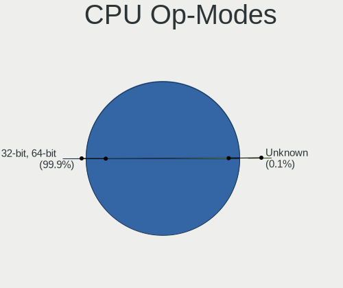

| Op mode        | Notebooks | Percent |
|----------------|-----------|---------|
| 32-bit, 64-bit | 909       | 99.89%  |
| Unknown        | 1         | 0.11%   |

CPU Microcode
-------------

Microcode number

| Number     | Notebooks | Percent |
|------------|-----------|---------|
| Unknown    | 506       | 54.35%  |
| 0x806c1    | 51        | 5.48%   |
| 0x806ec    | 29        | 3.11%   |
| 0x306a9    | 26        | 2.79%   |
| 0x806ea    | 25        | 2.69%   |
| 0xa0652    | 18        | 1.93%   |
| 0x906ea    | 18        | 1.93%   |
| 0x806e9    | 17        | 1.83%   |
| 0x08600104 | 17        | 1.83%   |
| 0x706e5    | 14        | 1.5%    |
| 0x406e3    | 14        | 1.5%    |
| 0x206a7    | 13        | 1.4%    |
| 0x0a50000c | 13        | 1.4%    |
| 0x906e9    | 11        | 1.18%   |
| 0x806d1    | 11        | 1.18%   |
| 0x08600106 | 11        | 1.18%   |
| 0x40651    | 10        | 1.07%   |
| 0x306d4    | 10        | 1.07%   |
| 0x08108109 | 9         | 0.97%   |
| 0x506e3    | 8         | 0.86%   |
| 0x30678    | 7         | 0.75%   |
| 0x08608103 | 7         | 0.75%   |
| 0x08600103 | 7         | 0.75%   |
| 0x806eb    | 6         | 0.64%   |
| 0x306c3    | 6         | 0.64%   |
| 0x20655    | 6         | 0.64%   |
| 0x406c4    | 5         | 0.54%   |
| 0x1067a    | 5         | 0.54%   |
| 0x20652    | 4         | 0.43%   |
| 0x0a50000b | 4         | 0.43%   |
| 0x08108102 | 4         | 0.43%   |
| 0x706a1    | 3         | 0.32%   |
| 0x0810100b | 3         | 0.32%   |
| 0x06006705 | 3         | 0.32%   |
| 0x906ed    | 2         | 0.21%   |
| 0x706a8    | 2         | 0.21%   |
| 0x6fd      | 2         | 0.21%   |
| 0x406c3    | 2         | 0.21%   |
| 0x106e5    | 2         | 0.21%   |
| 0x08608102 | 2         | 0.21%   |

CPU Microarch
-------------

Microarchitecture

| Name            | Notebooks | Percent |
|-----------------|-----------|---------|
| KabyLake        | 197       | 21.65%  |
| IvyBridge       | 73        | 8.02%   |
| TigerLake       | 61        | 6.7%    |
| Haswell         | 61        | 6.7%    |
| SandyBridge     | 56        | 6.15%   |
| Skylake         | 48        | 5.27%   |
| Zen 2           | 45        | 4.95%   |
| Silvermont      | 45        | 4.95%   |
| Westmere        | 39        | 4.29%   |
| Penryn          | 37        | 4.07%   |
| IceLake         | 33        | 3.63%   |
| CometLake       | 28        | 3.08%   |
| Broadwell       | 28        | 3.08%   |
| Zen 3           | 24        | 2.64%   |
| Zen+            | 22        | 2.42%   |
| Core            | 17        | 1.87%   |
| Unknown         | 16        | 1.76%   |
| Excavator       | 15        | 1.65%   |
| Goldmont plus   | 11        | 1.21%   |
| Puma            | 8         | 0.88%   |
| Bobcat          | 8         | 0.88%   |
| Zen             | 7         | 0.77%   |
| Piledriver      | 6         | 0.66%   |
| Jaguar          | 5         | 0.55%   |
| Nehalem         | 3         | 0.33%   |
| K8 & K10 hybrid | 3         | 0.33%   |
| K10 Llano       | 3         | 0.33%   |
| Goldmont        | 3         | 0.33%   |
| Steamroller     | 2         | 0.22%   |
| K8 Hammer       | 2         | 0.22%   |
| K10             | 2         | 0.22%   |
| Bonnell         | 2         | 0.22%   |

Graphics
--------

GPU Vendor
----------

Vendors of graphics cards

| Vendor | Notebooks | Percent |
|--------|-----------|---------|
| Intel  | 676       | 58.94%  |
| Nvidia | 262       | 22.84%  |
| AMD    | 209       | 18.22%  |

GPU Model
---------

Graphics card models

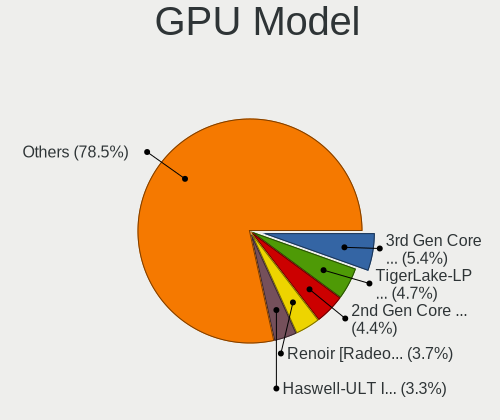

| Model                                                                                    | Notebooks | Percent |
|------------------------------------------------------------------------------------------|-----------|---------|
| Intel 3rd Gen Core processor Graphics Controller                                         | 64        | 5.48%   |
| Intel TigerLake-LP GT2 [Iris Xe Graphics]                                                | 55        | 4.71%   |
| Intel 2nd Generation Core Processor Family Integrated Graphics Controller                | 52        | 4.45%   |
| AMD Renoir                                                                               | 43        | 3.68%   |
| Intel UHD Graphics 620                                                                   | 38        | 3.25%   |
| Intel HD Graphics 620                                                                    | 38        | 3.25%   |
| Intel Haswell-ULT Integrated Graphics Controller                                         | 38        | 3.25%   |
| Intel CometLake-U GT2 [UHD Graphics]                                                     | 35        | 3%      |
| Intel CoffeeLake-H GT2 [UHD Graphics 630]                                                | 30        | 2.57%   |
| Intel Core Processor Integrated Graphics Controller                                      | 29        | 2.48%   |
| Intel WhiskeyLake-U GT2 [UHD Graphics 620]                                               | 27        | 2.31%   |
| Intel Atom/Celeron/Pentium Processor x5-E8000/J3xxx/N3xxx Integrated Graphics Controller | 25        | 2.14%   |
| Intel Skylake GT2 [HD Graphics 520]                                                      | 24        | 2.05%   |
| Intel HD Graphics 5500                                                                   | 24        | 2.05%   |
| Intel CometLake-H GT2 [UHD Graphics]                                                     | 24        | 2.05%   |
| AMD Picasso/Raven 2 [Radeon Vega Series / Radeon Vega Mobile Series]                     | 24        | 2.05%   |
| AMD Cezanne [Radeon Vega Series / Radeon Vega Mobile Series]                             | 21        | 1.8%    |
| Intel Atom Processor Z36xxx/Z37xxx Series Graphics & Display                             | 20        | 1.71%   |
| Intel 4th Gen Core Processor Integrated Graphics Controller                              | 20        | 1.71%   |
| Intel HD Graphics 530                                                                    | 17        | 1.46%   |
| Intel Iris Plus Graphics G1 (Ice Lake)                                                   | 16        | 1.37%   |
| Nvidia TU117M [GeForce GTX 1650 Mobile / Max-Q]                                          | 15        | 1.28%   |
| Intel Mobile 4 Series Chipset Integrated Graphics Controller                             | 15        | 1.28%   |
| Nvidia TU117M [GeForce GTX 1650 Ti Mobile]                                               | 12        | 1.03%   |
| Intel TigerLake-H GT1 [UHD Graphics]                                                     | 12        | 1.03%   |
| AMD Lucienne                                                                             | 12        | 1.03%   |
| Nvidia GA106M [GeForce RTX 3060 Mobile / Max-Q]                                          | 11        | 0.94%   |
| Intel HD Graphics 630                                                                    | 11        | 0.94%   |
| Nvidia TU116M [GeForce GTX 1660 Ti Mobile]                                               | 10        | 0.86%   |
| Nvidia GP106M [GeForce GTX 1060 Mobile]                                                  | 10        | 0.86%   |
| Nvidia GM108M [GeForce 940MX]                                                            | 10        | 0.86%   |
| Nvidia GP108M [GeForce MX150]                                                            | 9         | 0.77%   |
| Nvidia GP107M [GeForce GTX 1050 Mobile]                                                  | 8         | 0.68%   |
| AMD Stoney [Radeon R2/R3/R4/R5 Graphics]                                                 | 8         | 0.68%   |
| Nvidia GP108M [GeForce MX250]                                                            | 7         | 0.6%    |
| Nvidia GP107M [GeForce GTX 1050 Ti Mobile]                                               | 7         | 0.6%    |
| Intel Iris Plus Graphics G7                                                              | 7         | 0.6%    |
| Intel GeminiLake [UHD Graphics 600]                                                      | 7         | 0.6%    |
| AMD Wani [Radeon R5/R6/R7 Graphics]                                                      | 7         | 0.6%    |
| AMD Topaz XT [Radeon R7 M260/M265 / M340/M360 / M440/M445 / 530/535 / 620/625 Mobile]    | 7         | 0.6%    |

GPU Combo
---------

Combinations of graphics cards

| Name           | Notebooks | Percent |
|----------------|-----------|---------|
| 1 x Intel      | 466       | 51.21%  |
| Intel + Nvidia | 180       | 19.78%  |
| 1 x AMD        | 140       | 15.38%  |
| 1 x Nvidia     | 55        | 6.04%   |
| Intel + AMD    | 30        | 3.3%    |
| AMD + Nvidia   | 27        | 2.97%   |
| 2 x AMD        | 12        | 1.32%   |

GPU Driver
----------

Free vs proprietary

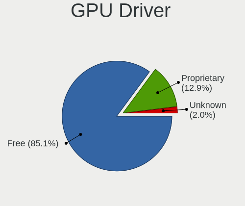

| Driver      | Notebooks | Percent |
|-------------|-----------|---------|
| Free        | 782       | 85.28%  |
| Proprietary | 119       | 12.98%  |
| Unknown     | 16        | 1.74%   |

GPU Memory
----------

Total video memory

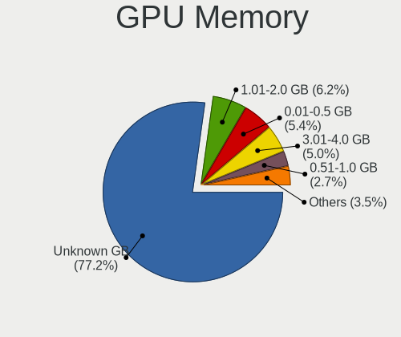

| Size in GB | Notebooks | Percent |
|------------|-----------|---------|
| Unknown    | 706       | 77.07%  |
| 1.01-2.0   | 57        | 6.22%   |
| 0.01-0.5   | 50        | 5.46%   |
| 3.01-4.0   | 45        | 4.91%   |
| 0.51-1.0   | 25        | 2.73%   |
| 5.01-6.0   | 20        | 2.18%   |
| 7.01-8.0   | 7         | 0.76%   |
| 8.01-16.0  | 5         | 0.55%   |
| 2.01-3.0   | 1         | 0.11%   |

Monitor
-------

Monitor Vendor
--------------

Monitor vendors

| Vendor                  | Notebooks | Percent |
|-------------------------|-----------|---------|
| AU Optronics            | 209       | 19.75%  |
| LG Display              | 151       | 14.27%  |
| BOE                     | 139       | 13.14%  |
| Chimei Innolux          | 127       | 12%     |
| Samsung Electronics     | 96        | 9.07%   |
| Sharp                   | 46        | 4.35%   |
| Dell                    | 33        | 3.12%   |
| Goldstar                | 27        | 2.55%   |
| Apple                   | 23        | 2.17%   |
| Chi Mei Optoelectronics | 22        | 2.08%   |
| Hewlett-Packard         | 21        | 1.98%   |
| PANDA                   | 18        | 1.7%    |
| Lenovo                  | 15        | 1.42%   |
| Acer                    | 13        | 1.23%   |
| Philips                 | 9         | 0.85%   |
| BenQ                    | 9         | 0.85%   |
| InfoVision              | 8         | 0.76%   |
| Iiyama                  | 8         | 0.76%   |
| Unknown                 | 5         | 0.47%   |
| TMX                     | 5         | 0.47%   |
| Sony                    | 5         | 0.47%   |
| CSO                     | 5         | 0.47%   |
| AOC                     | 5         | 0.47%   |
| LGD                     | 4         | 0.38%   |
| LG Philips              | 4         | 0.38%   |
| ASUSTek Computer        | 4         | 0.38%   |
| Toshiba                 | 3         | 0.28%   |
| JDI                     | 3         | 0.28%   |
| Ancor Communications    | 3         | 0.28%   |
| ViewSonic               | 2         | 0.19%   |
| Unknown (XXX)           | 2         | 0.19%   |
| Sceptre Tech            | 2         | 0.19%   |
| KDC                     | 2         | 0.19%   |
| Hitachi                 | 2         | 0.19%   |
| Denver                  | 2         | 0.19%   |
| CPT                     | 2         | 0.19%   |
| CHR                     | 2         | 0.19%   |
| BOE Technology Group    | 2         | 0.19%   |
| Westinghouse            | 1         | 0.09%   |
| Vizio                   | 1         | 0.09%   |

Monitor Model
-------------

Monitor models

| Model                                                                    | Notebooks | Percent |
|--------------------------------------------------------------------------|-----------|---------|
| Chimei Innolux LCD Monitor CMN14D4 1920x1080 309x173mm 13.9-inch         | 10        | 0.93%   |
| AU Optronics LCD Monitor AUO403D 1920x1080 309x173mm 13.9-inch           | 10        | 0.93%   |
| Sharp LCD Monitor SHP14BA 1920x1080 344x194mm 15.5-inch                  | 6         | 0.56%   |
| Samsung Electronics LCD Monitor SEC5441 1366x768 344x194mm 15.5-inch     | 6         | 0.56%   |
| Chimei Innolux LCD Monitor CMN15DB 1366x768 344x193mm 15.5-inch          | 6         | 0.56%   |
| Chi Mei Optoelectronics LCD Monitor CMO15A3 1366x768 344x193mm 15.5-inch | 6         | 0.56%   |
| AU Optronics LCD Monitor AUO22EC 1366x768 344x193mm 15.5-inch            | 6         | 0.56%   |
| AU Optronics LCD Monitor AUO10EC 1366x768 344x193mm 15.5-inch            | 6         | 0.56%   |
| TMX TL156MDMP01-0 TMX1560 3200x2000 336x210mm 15.6-inch                  | 5         | 0.47%   |
| Chimei Innolux LCD Monitor CMN14C9 1920x1080 309x173mm 13.9-inch         | 5         | 0.47%   |
| Chi Mei Optoelectronics LCD Monitor CMO15A7 1366x768 344x193mm 15.5-inch | 5         | 0.47%   |
| BOE LCD Monitor BOE07F6 1920x1080 309x174mm 14.0-inch                    | 5         | 0.47%   |
| BOE LCD Monitor BOE06A4 1366x768 344x194mm 15.5-inch                     | 5         | 0.47%   |
| AU Optronics LCD Monitor AUO21ED 1920x1080 344x193mm 15.5-inch           | 5         | 0.47%   |
| Samsung Electronics LCD Monitor SDCA029 3840x2160 344x194mm 15.5-inch    | 4         | 0.37%   |
| PANDA LCD Monitor NCP004D 1920x1080 344x194mm 15.5-inch                  | 4         | 0.37%   |
| LG Display LCD Monitor LGD062E 1920x1080 344x194mm 15.5-inch             | 4         | 0.37%   |
| LG Display LCD Monitor LGD039F 1366x768 345x194mm 15.6-inch              | 4         | 0.37%   |
| LG Display LCD Monitor LGD02DC 1366x768 344x194mm 15.5-inch              | 4         | 0.37%   |
| Chimei Innolux LCD Monitor CMN15F5 1920x1080 344x193mm 15.5-inch         | 4         | 0.37%   |
| Chimei Innolux LCD Monitor CMN15BD 1366x768 344x193mm 15.5-inch          | 4         | 0.37%   |
| BOE LCD Monitor BOE08E2 1920x1080 344x194mm 15.5-inch                    | 4         | 0.37%   |
| BOE LCD Monitor BOE0812 1920x1080 344x194mm 15.5-inch                    | 4         | 0.37%   |
| BOE LCD Monitor BOE069C 1920x1080 344x193mm 15.5-inch                    | 4         | 0.37%   |
| AU Optronics LCD Monitor AUO71EC 1366x768 344x193mm 15.5-inch            | 4         | 0.37%   |
| AU Optronics LCD Monitor AUO70EC 1366x768 344x193mm 15.5-inch            | 4         | 0.37%   |
| AU Optronics LCD Monitor AUO61ED 1920x1080 344x194mm 15.5-inch           | 4         | 0.37%   |
| AU Optronics LCD Monitor AUO38ED 1920x1080 344x193mm 15.5-inch           | 4         | 0.37%   |
| Sharp LCD Monitor SHP14FA 3840x2400 288x180mm 13.4-inch                  | 3         | 0.28%   |
| Sharp LCD Monitor SHP14D1 1920x1200 336x210mm 15.6-inch                  | 3         | 0.28%   |
| Sharp LCD Monitor SHP148D 3840x2160 344x194mm 15.5-inch                  | 3         | 0.28%   |
| Samsung Electronics LCD Monitor SEC544B 1600x900 382x214mm 17.2-inch     | 3         | 0.28%   |
| Samsung Electronics EPSON PJ SECA603 1920x1080 1600x900mm 72.3-inch      | 3         | 0.28%   |
| Samsung Electronics C24F390 SAM0D2C 1920x1080 521x293mm 23.5-inch        | 3         | 0.28%   |
| PANDA LCD Monitor NCP0050 1920x1080 309x174mm 14.0-inch                  | 3         | 0.28%   |
| LG Display LCD Monitor LGD065A 1920x1080 344x194mm 15.5-inch             | 3         | 0.28%   |
| LG Display LCD Monitor LGD05E5 1920x1080 340x190mm 15.3-inch             | 3         | 0.28%   |
| LG Display LCD Monitor LGD056D 1920x1080 382x215mm 17.3-inch             | 3         | 0.28%   |
| LG Display LCD Monitor LGD046C 1920x1080 382x215mm 17.3-inch             | 3         | 0.28%   |
| LG Display LCD Monitor LGD03EE 1366x768 277x156mm 12.5-inch              | 3         | 0.28%   |

Monitor Resolution
------------------

Monitor screen resolution

| Resolution         | Notebooks | Percent |
|--------------------|-----------|---------|
| 1920x1080 (FHD)    | 438       | 44.33%  |
| 1366x768 (WXGA)    | 270       | 27.33%  |
| 1600x900 (HD+)     | 54        | 5.47%   |
| 3840x2160 (4K)     | 42        | 4.25%   |
| 1280x800 (WXGA)    | 33        | 3.34%   |
| 2560x1440 (QHD)    | 24        | 2.43%   |
| 1440x900 (WXGA+)   | 19        | 1.92%   |
| 1920x1200 (WUXGA)  | 18        | 1.82%   |
| 2560x1600          | 10        | 1.01%   |
| 1280x1024 (SXGA)   | 9         | 0.91%   |
| 3440x1440          | 7         | 0.71%   |
| 1680x1050 (WSXGA+) | 7         | 0.71%   |
| 3840x2400          | 6         | 0.61%   |
| Unknown            | 6         | 0.61%   |
| 3200x2000          | 5         | 0.51%   |
| 2160x1440          | 5         | 0.51%   |
| 3000x2000          | 4         | 0.4%    |
| 2560x1080          | 4         | 0.4%    |
| 3200x1800 (QHD+)   | 3         | 0.3%    |
| 2256x1504          | 3         | 0.3%    |
| 1360x768           | 3         | 0.3%    |
| 3840x1080          | 2         | 0.2%    |
| 3456x2160          | 2         | 0.2%    |
| 2304x1440          | 2         | 0.2%    |
| 1920x540           | 2         | 0.2%    |
| 1920x1280          | 2         | 0.2%    |
| 5760x2160          | 1         | 0.1%    |
| 3840x1200          | 1         | 0.1%    |
| 3520x1080          | 1         | 0.1%    |
| 3280x1050          | 1         | 0.1%    |
| 2880x1800          | 1         | 0.1%    |
| 1680x945           | 1         | 0.1%    |
| 1600x1200          | 1         | 0.1%    |
| 1280x768           | 1         | 0.1%    |

Monitor Diagonal
----------------

Diagonal size in inches

| Inches  | Notebooks | Percent |
|---------|-----------|---------|
| 15      | 422       | 40%     |
| 13      | 159       | 15.07%  |
| 14      | 130       | 12.32%  |
| 17      | 77        | 7.3%    |
| 24      | 37        | 3.51%   |
| 27      | 34        | 3.22%   |
| 23      | 33        | 3.13%   |
| 12      | 26        | 2.46%   |
| 21      | 22        | 2.09%   |
| 11      | 18        | 1.71%   |
| Unknown | 16        | 1.52%   |
| 19      | 14        | 1.33%   |
| 34      | 9         | 0.85%   |
| 31      | 8         | 0.76%   |
| 18      | 8         | 0.76%   |
| 16      | 8         | 0.76%   |
| 72      | 6         | 0.57%   |
| 40      | 3         | 0.28%   |
| 22      | 3         | 0.28%   |
| 20      | 3         | 0.28%   |
| 84      | 2         | 0.19%   |
| 54      | 2         | 0.19%   |
| 48      | 2         | 0.19%   |
| 26      | 2         | 0.19%   |
| 49      | 1         | 0.09%   |
| 46      | 1         | 0.09%   |
| 43      | 1         | 0.09%   |
| 42      | 1         | 0.09%   |
| 39      | 1         | 0.09%   |
| 35      | 1         | 0.09%   |
| 32      | 1         | 0.09%   |
| 30      | 1         | 0.09%   |
| 29      | 1         | 0.09%   |
| 25      | 1         | 0.09%   |
| 10      | 1         | 0.09%   |

Monitor Width
-------------

Physical width

| Width in mm | Notebooks | Percent |
|-------------|-----------|---------|
| 301-350     | 613       | 58.66%  |
| 201-300     | 136       | 13.01%  |
| 501-600     | 98        | 9.38%   |
| 351-400     | 93        | 8.9%    |
| 401-500     | 44        | 4.21%   |
| Unknown     | 16        | 1.53%   |
| 601-700     | 14        | 1.34%   |
| 701-800     | 10        | 0.96%   |
| 1501-2000   | 8         | 0.77%   |
| 801-900     | 6         | 0.57%   |
| 1001-1500   | 6         | 0.57%   |
| 901-1000    | 1         | 0.1%    |

Aspect Ratio
------------

Proportional relationship between the width and the height

| Ratio   | Notebooks | Percent |
|---------|-----------|---------|
| 16/9    | 764       | 83.32%  |
| 16/10   | 100       | 10.91%  |
| 3/2     | 16        | 1.74%   |
| Unknown | 13        | 1.42%   |
| 21/9    | 11        | 1.2%    |
| 5/4     | 8         | 0.87%   |
| 4/3     | 3         | 0.33%   |
| 32/9    | 1         | 0.11%   |
| 1.96    | 1         | 0.11%   |

Monitor Area
------------

Area in inch

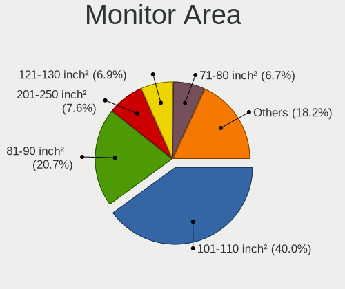

| Area in inch | Notebooks | Percent |
|----------------|-----------|---------|
| 101-110        | 424       | 40.34%  |
| 81-90          | 219       | 20.84%  |
| 201-250        | 80        | 7.61%   |
| 71-80          | 70        | 6.66%   |
| 121-130        | 70        | 6.66%   |
| 301-350        | 36        | 3.43%   |
| 61-70          | 25        | 2.38%   |
| 151-200        | 22        | 2.09%   |
| 351-500        | 20        | 1.9%    |
| 51-60          | 18        | 1.71%   |
| Unknown        | 16        | 1.52%   |
| More than 1000 | 12        | 1.14%   |
| 251-300        | 10        | 0.95%   |
| 141-150        | 9         | 0.86%   |
| 501-1000       | 8         | 0.76%   |
| 111-120        | 5         | 0.48%   |
| 131-140        | 4         | 0.38%   |
| 91-100         | 2         | 0.19%   |
| 41-50          | 1         | 0.1%    |

Pixel Density
-------------

Pixels per inch

| Density       | Notebooks | Percent |
|---------------|-----------|---------|
| 121-160       | 410       | 39.69%  |
| 101-120       | 303       | 29.33%  |
| 51-100        | 164       | 15.88%  |
| 161-240       | 77        | 7.45%   |
| More than 240 | 48        | 4.65%   |
| Unknown       | 16        | 1.55%   |
| 1-50          | 15        | 1.45%   |

Multiple Monitors
-----------------

Total monitors connected

| Total | Notebooks | Percent |
|-------|-----------|---------|
| 1     | 701       | 76.28%  |
| 2     | 173       | 18.82%  |
| 0     | 28        | 3.05%   |
| 3     | 16        | 1.74%   |
| 4     | 1         | 0.11%   |

Network
-------

Net Controller Vendor
---------------------

Controller vendors

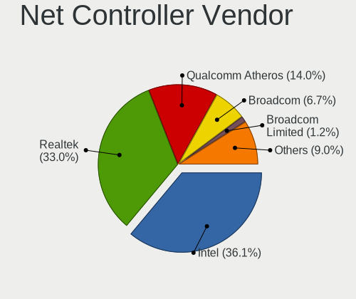

| Vendor                            | Notebooks | Percent |
|-----------------------------------|-----------|---------|
| Intel                             | 507       | 36.16%  |
| Realtek Semiconductor             | 461       | 32.88%  |
| Qualcomm Atheros                  | 198       | 14.12%  |
| Broadcom                          | 94        | 6.7%    |
| Broadcom Limited                  | 17        | 1.21%   |
| Marvell Technology Group          | 16        | 1.14%   |
| MediaTek                          | 13        | 0.93%   |
| Ralink                            | 10        | 0.71%   |
| TP-Link                           | 9         | 0.64%   |
| Lenovo                            | 7         | 0.5%    |
| Hewlett-Packard                   | 7         | 0.5%    |
| Dell                              | 7         | 0.5%    |
| JMicron Technology                | 6         | 0.43%   |
| Ericsson Business Mobile Networks | 5         | 0.36%   |
| DisplayLink                       | 5         | 0.36%   |
| Sierra Wireless                   | 4         | 0.29%   |
| Samsung Electronics               | 4         | 0.29%   |
| Ralink Technology                 | 3         | 0.21%   |
| Nvidia                            | 3         | 0.21%   |
| NetGear                           | 3         | 0.21%   |
| Xiaomi                            | 2         | 0.14%   |
| U-Blox                            | 2         | 0.14%   |
| Qualcomm                          | 2         | 0.14%   |
| OnePlus Technology (Shenzhen)     | 2         | 0.14%   |
| Fibocom                           | 2         | 0.14%   |
| Edimax Technology                 | 2         | 0.14%   |
| ASUSTek Computer                  | 2         | 0.14%   |
| ASIX Electronics                  | 2         | 0.14%   |
| Qualcomm Atheros Communications   | 1         | 0.07%   |
| Motorola PCS                      | 1         | 0.07%   |
| ICS Advent                        | 1         | 0.07%   |
| Huawei Technologies               | 1         | 0.07%   |
| Google                            | 1         | 0.07%   |
| D-Link                            | 1         | 0.07%   |
| Arduino SA                        | 1         | 0.07%   |

Net Controller Model
--------------------

Controller models

| Model                                                             | Notebooks | Percent |
|-------------------------------------------------------------------|-----------|---------|
| Realtek RTL8111/8168/8411 PCI Express Gigabit Ethernet Controller | 291       | 17.34%  |
| Realtek RTL810xE PCI Express Fast Ethernet controller             | 81        | 4.83%   |
| Intel Wi-Fi 6 AX200                                               | 63        | 3.75%   |
| Intel Wi-Fi 6 AX201                                               | 49        | 2.92%   |
| Intel Wireless 7265                                               | 35        | 2.09%   |
| Qualcomm Atheros QCA9565 / AR9565 Wireless Network Adapter        | 34        | 2.03%   |
| Intel Wireless 8265 / 8275                                        | 34        | 2.03%   |
| Realtek RTL8153 Gigabit Ethernet Adapter                          | 33        | 1.97%   |
| Qualcomm Atheros QCA9377 802.11ac Wireless Network Adapter        | 33        | 1.97%   |
| Realtek RTL8822CE 802.11ac PCIe Wireless Network Adapter          | 32        | 1.91%   |
| Intel 82579LM Gigabit Network Connection (Lewisville)             | 32        | 1.91%   |
| Qualcomm Atheros AR9285 Wireless Network Adapter (PCI-Express)    | 30        | 1.79%   |
| Qualcomm Atheros QCA6174 802.11ac Wireless Network Adapter        | 28        | 1.67%   |
| Intel Comet Lake PCH-LP CNVi WiFi                                 | 27        | 1.61%   |
| Intel Wireless 8260                                               | 24        | 1.43%   |
| Intel Wireless 7260                                               | 24        | 1.43%   |
| Intel Comet Lake PCH CNVi WiFi                                    | 24        | 1.43%   |
| Qualcomm Atheros AR9485 Wireless Network Adapter                  | 22        | 1.31%   |
| Realtek RTL8821CE 802.11ac PCIe Wireless Network Adapter          | 21        | 1.25%   |
| Intel Centrino Advanced-N 6205 [Taylor Peak]                      | 19        | 1.13%   |
| Broadcom BCM4313 802.11bgn Wireless Network Adapter               | 18        | 1.07%   |
| Broadcom BCM43142 802.11b/g/n                                     | 17        | 1.01%   |
| Intel Wireless 3165                                               | 16        | 0.95%   |
| Intel Centrino Advanced-N 6235                                    | 16        | 0.95%   |
| Intel Wireless 3160                                               | 15        | 0.89%   |
| Intel Cannon Point-LP CNVi [Wireless-AC]                          | 15        | 0.89%   |
| Intel Cannon Lake PCH CNVi WiFi                                   | 14        | 0.83%   |
| Realtek RTL8852AE 802.11ax PCIe Wireless Network Adapter          | 12        | 0.72%   |
| MediaTek MT7921 802.11ax PCI Express Wireless Network Adapter     | 12        | 0.72%   |
| Intel Ice Lake-LP PCH CNVi WiFi                                   | 12        | 0.72%   |
| Intel Ethernet Connection I218-LM                                 | 12        | 0.72%   |
| Intel 82577LM Gigabit Network Connection                          | 12        | 0.72%   |
| Realtek RTL8723BE PCIe Wireless Network Adapter                   | 11        | 0.66%   |
| Qualcomm Atheros AR8151 v2.0 Gigabit Ethernet                     | 11        | 0.66%   |
| Intel Wireless-AC 9260                                            | 11        | 0.66%   |
| Intel WiFi Link 5100                                              | 11        | 0.66%   |
| Intel Ethernet Connection I217-LM                                 | 10        | 0.6%    |
| Intel Ethernet Connection (4) I219-LM                             | 10        | 0.6%    |
| Intel Ethernet Connection (3) I218-LM                             | 10        | 0.6%    |
| Intel Centrino Advanced-N 6200                                    | 10        | 0.6%    |

Wireless Vendor
---------------

Wireless vendors

| Vendor                          | Notebooks | Percent |
|---------------------------------|-----------|---------|
| Intel                           | 484       | 52.55%  |
| Qualcomm Atheros                | 172       | 18.68%  |
| Realtek Semiconductor           | 124       | 13.46%  |
| Broadcom                        | 77        | 8.36%   |
| MediaTek                        | 13        | 1.41%   |
| Broadcom Limited                | 13        | 1.41%   |
| Ralink                          | 10        | 1.09%   |
| TP-Link                         | 5         | 0.54%   |
| Sierra Wireless                 | 4         | 0.43%   |
| Dell                            | 4         | 0.43%   |
| Ralink Technology               | 3         | 0.33%   |
| Qualcomm                        | 2         | 0.22%   |
| NetGear                         | 2         | 0.22%   |
| Fibocom                         | 2         | 0.22%   |
| Edimax Technology               | 2         | 0.22%   |
| Qualcomm Atheros Communications | 1         | 0.11%   |
| Hewlett-Packard                 | 1         | 0.11%   |
| D-Link                          | 1         | 0.11%   |
| ASUSTek Computer                | 1         | 0.11%   |

Wireless Model
--------------

Wireless models

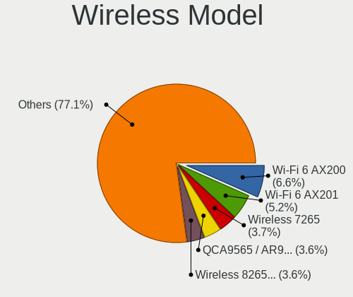

| Model                                                          | Notebooks | Percent |
|----------------------------------------------------------------|-----------|---------|
| Intel Wi-Fi 6 AX200                                            | 63        | 6.8%    |
| Intel Wi-Fi 6 AX201                                            | 49        | 5.29%   |
| Intel Wireless 7265                                            | 35        | 3.78%   |
| Qualcomm Atheros QCA9565 / AR9565 Wireless Network Adapter     | 34        | 3.67%   |
| Intel Wireless 8265 / 8275                                     | 34        | 3.67%   |
| Qualcomm Atheros QCA9377 802.11ac Wireless Network Adapter     | 33        | 3.56%   |
| Realtek RTL8822CE 802.11ac PCIe Wireless Network Adapter       | 32        | 3.45%   |
| Qualcomm Atheros AR9285 Wireless Network Adapter (PCI-Express) | 30        | 3.24%   |
| Qualcomm Atheros QCA6174 802.11ac Wireless Network Adapter     | 28        | 3.02%   |
| Intel Comet Lake PCH-LP CNVi WiFi                              | 27        | 2.91%   |
| Intel Wireless 8260                                            | 24        | 2.59%   |
| Intel Wireless 7260                                            | 24        | 2.59%   |
| Intel Comet Lake PCH CNVi WiFi                                 | 24        | 2.59%   |
| Qualcomm Atheros AR9485 Wireless Network Adapter               | 22        | 2.37%   |
| Realtek RTL8821CE 802.11ac PCIe Wireless Network Adapter       | 21        | 2.27%   |
| Intel Centrino Advanced-N 6205 [Taylor Peak]                   | 19        | 2.05%   |
| Broadcom BCM4313 802.11bgn Wireless Network Adapter            | 18        | 1.94%   |
| Broadcom BCM43142 802.11b/g/n                                  | 17        | 1.83%   |
| Intel Wireless 3165                                            | 16        | 1.73%   |
| Intel Centrino Advanced-N 6235                                 | 16        | 1.73%   |
| Intel Wireless 3160                                            | 15        | 1.62%   |
| Intel Cannon Point-LP CNVi [Wireless-AC]                       | 15        | 1.62%   |
| Intel Cannon Lake PCH CNVi WiFi                                | 14        | 1.51%   |
| Realtek RTL8852AE 802.11ax PCIe Wireless Network Adapter       | 12        | 1.29%   |
| MediaTek MT7921 802.11ax PCI Express Wireless Network Adapter  | 12        | 1.29%   |
| Intel Ice Lake-LP PCH CNVi WiFi                                | 12        | 1.29%   |
| Realtek RTL8723BE PCIe Wireless Network Adapter                | 11        | 1.19%   |
| Intel Wireless-AC 9260                                         | 11        | 1.19%   |
| Intel WiFi Link 5100                                           | 11        | 1.19%   |
| Intel Centrino Advanced-N 6200                                 | 10        | 1.08%   |
| Intel Tiger Lake PCH CNVi WiFi                                 | 9         | 0.97%   |
| Realtek RTL8822BE 802.11a/b/g/n/ac WiFi adapter                | 8         | 0.86%   |
| Intel Centrino Wireless-N 2230                                 | 8         | 0.86%   |
| Broadcom BCM4331 802.11a/b/g/n                                 | 8         | 0.86%   |
| Qualcomm Atheros AR9462 Wireless Network Adapter               | 7         | 0.76%   |
| Qualcomm Atheros AR928X Wireless Network Adapter (PCI-Express) | 7         | 0.76%   |
| Qualcomm Atheros AR9287 Wireless Network Adapter (PCI-Express) | 7         | 0.76%   |
| Intel Dual Band Wireless-AC 3165 Plus Bluetooth                | 7         | 0.76%   |
| Broadcom BCM43228 802.11a/b/g/n                                | 7         | 0.76%   |
| Broadcom BCM4322 802.11a/b/g/n Wireless LAN Controller         | 7         | 0.76%   |

Ethernet Vendor
---------------

Ethernet vendors

| Vendor                        | Notebooks | Percent |
|-------------------------------|-----------|---------|
| Realtek Semiconductor         | 411       | 56.22%  |
| Intel                         | 172       | 23.53%  |
| Qualcomm Atheros              | 47        | 6.43%   |
| Broadcom                      | 37        | 5.06%   |
| Marvell Technology Group      | 16        | 2.19%   |
| Lenovo                        | 7         | 0.96%   |
| JMicron Technology            | 6         | 0.82%   |
| DisplayLink                   | 5         | 0.68%   |
| TP-Link                       | 4         | 0.55%   |
| Samsung Electronics           | 4         | 0.55%   |
| Hewlett-Packard               | 4         | 0.55%   |
| Broadcom Limited              | 4         | 0.55%   |
| Nvidia                        | 3         | 0.41%   |
| Xiaomi                        | 2         | 0.27%   |
| ASIX Electronics              | 2         | 0.27%   |
| OnePlus Technology (Shenzhen) | 1         | 0.14%   |
| NetGear                       | 1         | 0.14%   |
| Motorola PCS                  | 1         | 0.14%   |
| ICS Advent                    | 1         | 0.14%   |
| Huawei Technologies           | 1         | 0.14%   |
| Google                        | 1         | 0.14%   |
| ASUSTek Computer              | 1         | 0.14%   |

Ethernet Model
--------------

Ethernet models

| Model                                                             | Notebooks | Percent |
|-------------------------------------------------------------------|-----------|---------|
| Realtek RTL8111/8168/8411 PCI Express Gigabit Ethernet Controller | 291       | 39.48%  |
| Realtek RTL810xE PCI Express Fast Ethernet controller             | 81        | 10.99%  |
| Realtek RTL8153 Gigabit Ethernet Adapter                          | 33        | 4.48%   |
| Intel 82579LM Gigabit Network Connection (Lewisville)             | 32        | 4.34%   |
| Intel Ethernet Connection I218-LM                                 | 12        | 1.63%   |
| Intel 82577LM Gigabit Network Connection                          | 12        | 1.63%   |
| Qualcomm Atheros AR8151 v2.0 Gigabit Ethernet                     | 11        | 1.49%   |
| Intel Ethernet Connection I217-LM                                 | 10        | 1.36%   |
| Intel Ethernet Connection (4) I219-LM                             | 10        | 1.36%   |
| Intel Ethernet Connection (3) I218-LM                             | 10        | 1.36%   |
| Qualcomm Atheros AR8131 Gigabit Ethernet                          | 9         | 1.22%   |
| Intel Ethernet Connection (4) I219-V                              | 9         | 1.22%   |
| Intel Ethernet Connection I219-LM                                 | 8         | 1.09%   |
| Intel 82567LM Gigabit Network Connection                          | 8         | 1.09%   |
| Broadcom NetLink BCM57785 Gigabit Ethernet PCIe                   | 8         | 1.09%   |
| Intel 82579V Gigabit Network Connection                           | 7         | 0.95%   |
| Broadcom NetXtreme BCM57765 Gigabit Ethernet PCIe                 | 7         | 0.95%   |
| Realtek RTL8125 2.5GbE Controller                                 | 6         | 0.81%   |
| Qualcomm Atheros Killer E2400 Gigabit Ethernet Controller         | 6         | 0.81%   |
| Marvell Group 88E8040 PCI-E Fast Ethernet Controller              | 6         | 0.81%   |
| JMicron JMC250 PCI Express Gigabit Ethernet Controller            | 6         | 0.81%   |
| Intel Ethernet Connection (2) I219-LM                             | 6         | 0.81%   |
| Broadcom NetLink BCM57780 Gigabit Ethernet PCIe                   | 6         | 0.81%   |
| TP-Link UE300 10/100/1000 LAN (ethernet mode) [Realtek RTL8153]   | 4         | 0.54%   |
| Qualcomm Atheros QCA8172 Fast Ethernet                            | 4         | 0.54%   |
| Qualcomm Atheros AR8132 Fast Ethernet                             | 4         | 0.54%   |
| Lenovo ThinkPad Lan                                               | 4         | 0.54%   |
| Intel I210 Gigabit Network Connection                             | 4         | 0.54%   |
| Intel Ethernet Connection (6) I219-LM                             | 4         | 0.54%   |
| Intel Ethernet Connection (13) I219-LM                            | 4         | 0.54%   |
| Intel Ethernet Connection (10) I219-V                             | 4         | 0.54%   |
| Intel Ethernet Connection (10) I219-LM                            | 4         | 0.54%   |
| HP lt4120 Snapdragon X5 LTE                                       | 4         | 0.54%   |
| Broadcom NetXtreme BCM5764M Gigabit Ethernet PCIe                 | 4         | 0.54%   |
| Realtek Killer E2500 Gigabit Ethernet Controller                  | 3         | 0.41%   |
| Qualcomm Atheros QCA8171 Gigabit Ethernet                         | 3         | 0.41%   |
| Qualcomm Atheros AR8161 Gigabit Ethernet                          | 3         | 0.41%   |
| Marvell Group 88E8055 PCI-E Gigabit Ethernet Controller           | 3         | 0.41%   |
| Lenovo USB-C Dock Ethernet                                        | 3         | 0.41%   |
| Intel Ethernet Connection (7) I219-V                              | 3         | 0.41%   |

Net Controller Kind
-------------------

Ethernet, WiFi or modem

| Kind     | Notebooks | Percent |
|----------|-----------|---------|
| WiFi     | 889       | 55.42%  |
| Ethernet | 701       | 43.7%   |
| Modem    | 13        | 0.81%   |
| Unknown  | 1         | 0.06%   |

Used Controller
---------------

Currently used network controller

| Kind     | Notebooks | Percent |
|----------|-----------|---------|
| WiFi     | 775       | 81.15%  |
| Ethernet | 180       | 18.85%  |

NICs
----

Total network controllers on board

| Total | Notebooks | Percent |
|-------|-----------|---------|
| 2     | 643       | 70.66%  |
| 1     | 246       | 27.03%  |
| 0     | 13        | 1.43%   |
| 3     | 8         | 0.88%   |

IPv6
----

IPv6 vs IPv4

| Used | Notebooks | Percent |
|------|-----------|---------|
| No   | 679       | 74.21%  |
| Yes  | 236       | 25.79%  |

Bluetooth
---------

Bluetooth Vendor
----------------

Controller vendors

| Vendor                          | Notebooks | Percent |
|---------------------------------|-----------|---------|
| Intel                           | 403       | 53.73%  |
| Realtek Semiconductor           | 73        | 9.73%   |
| Qualcomm Atheros Communications | 71        | 9.47%   |
| Broadcom                        | 41        | 5.47%   |
| IMC Networks                    | 28        | 3.73%   |
| Lite-On Technology              | 22        | 2.93%   |
| Foxconn / Hon Hai               | 22        | 2.93%   |
| Apple                           | 21        | 2.8%    |
| Dell                            | 14        | 1.87%   |
| Realtek                         | 10        | 1.33%   |
| Cambridge Silicon Radio         | 8         | 1.07%   |
| Toshiba                         | 7         | 0.93%   |
| Hewlett-Packard                 | 7         | 0.93%   |
| Ralink                          | 6         | 0.8%    |
| ASUSTek Computer                | 6         | 0.8%    |
| Alps Electric                   | 4         | 0.53%   |
| Ralink Technology               | 2         | 0.27%   |
| Foxconn International           | 2         | 0.27%   |
| Taiyo Yuden                     | 1         | 0.13%   |
| Chicony Electronics             | 1         | 0.13%   |
| Askey Computer                  | 1         | 0.13%   |

Bluetooth Model
---------------

Controller models

| Model                                               | Notebooks | Percent |
|-----------------------------------------------------|-----------|---------|
| Intel Bluetooth wireless interface                  | 142       | 18.93%  |
| Intel AX201 Bluetooth                               | 93        | 12.4%   |
| Intel AX200 Bluetooth                               | 61        | 8.13%   |
| Intel Bluetooth 9460/9560 Jefferson Peak (JfP)      | 59        | 7.87%   |
| Realtek Bluetooth Radio                             | 53        | 7.07%   |
| Qualcomm Atheros  Bluetooth Device                  | 32        | 4.27%   |
| Intel Centrino Bluetooth Wireless Transceiver       | 23        | 3.07%   |
| Realtek  Bluetooth 4.2 Adapter                      | 16        | 2.13%   |
| Qualcomm Atheros QCA61x4 Bluetooth 4.0              | 15        | 2%      |
| Qualcomm Atheros AR3012 Bluetooth 4.0               | 13        | 1.73%   |
| Intel Wireless-AC 9260 Bluetooth Adapter            | 11        | 1.47%   |
| Realtek Bluetooth Radio                             | 10        | 1.33%   |
| IMC Networks Wireless_Device                        | 10        | 1.33%   |
| Apple Bluetooth USB Host Controller                 | 10        | 1.33%   |
| Apple Bluetooth Host Controller                     | 10        | 1.33%   |
| Foxconn / Hon Hai Bluetooth Device                  | 9         | 1.2%    |
| Broadcom BCM2045B (BDC-2.1)                         | 9         | 1.2%    |
| Lite-On Bluetooth Device                            | 8         | 1.07%   |
| IMC Networks Bluetooth Radio                        | 8         | 1.07%   |
| Cambridge Silicon Radio Bluetooth Dongle (HCI mode) | 8         | 1.07%   |
| Qualcomm Atheros AR3011 Bluetooth                   | 7         | 0.93%   |
| Ralink RT3290 Bluetooth                             | 6         | 0.8%    |
| Lite-On Qualcomm Atheros QCA9377 Bluetooth          | 6         | 0.8%    |
| Intel AX210 Bluetooth                               | 6         | 0.8%    |
| Broadcom BCM43142A0 Bluetooth 4.0                   | 6         | 0.8%    |
| Broadcom BCM20702 Bluetooth 4.0 [ThinkPad]          | 6         | 0.8%    |
| Lite-On Atheros AR3012 Bluetooth                    | 5         | 0.67%   |
| Intel Wireless-AC 3168 Bluetooth                    | 5         | 0.67%   |
| IMC Networks Bluetooth Device                       | 5         | 0.67%   |
| HP Broadcom 2070 Bluetooth Combo                    | 5         | 0.67%   |
| Foxconn / Hon Hai BCM20702A0                        | 5         | 0.67%   |
| Dell Wireless 365 Bluetooth                         | 4         | 0.53%   |
| Dell DW375 Bluetooth Module                         | 4         | 0.53%   |
| Broadcom HP Portable SoftSailing                    | 4         | 0.53%   |
| Broadcom BCM43142 Bluetooth 4.0                     | 4         | 0.53%   |
| ASUS BT-253 Bluetooth Adapter                       | 4         | 0.53%   |
| Realtek RTL8821A Bluetooth                          | 3         | 0.4%    |
| Qualcomm Atheros AR9462 Bluetooth                   | 3         | 0.4%    |
| Intel Centrino Advanced-N 6230 Bluetooth adapter    | 3         | 0.4%    |
| IMC Networks Atheros AR3012 Bluetooth 4.0 Adapter   | 3         | 0.4%    |

Sound
-----

Sound Vendor
------------

Sound card vendors

| Vendor                                          | Notebooks | Percent |
|-------------------------------------------------|-----------|---------|
| Intel                                           | 724       | 65.88%  |
| AMD                                             | 184       | 16.74%  |
| Nvidia                                          | 134       | 12.19%  |
| C-Media Electronics                             | 8         | 0.73%   |
| Lenovo                                          | 5         | 0.45%   |
| GN Netcom                                       | 5         | 0.45%   |
| Realtek Semiconductor                           | 4         | 0.36%   |
| Hewlett-Packard                                 | 3         | 0.27%   |
| Focusrite-Novation                              | 3         | 0.27%   |
| Creative Technology                             | 3         | 0.27%   |
| Texas Instruments                               | 2         | 0.18%   |
| SteelSeries ApS                                 | 2         | 0.18%   |
| Samson Technologies                             | 2         | 0.18%   |
| Logitech                                        | 2         | 0.18%   |
| DSEA A/S                                        | 2         | 0.18%   |
| RODE Microphones                                | 1         | 0.09%   |
| Numark                                          | 1         | 0.09%   |
| No brand                                        | 1         | 0.09%   |
| MAG Technology                                  | 1         | 0.09%   |
| Licensed by Sony Computer Entertainment America | 1         | 0.09%   |
| JMTek                                           | 1         | 0.09%   |
| Elitegroup Computer Systems (ECS)               | 1         | 0.09%   |
| DEXP USB Lite                                   | 1         | 0.09%   |
| Dell                                            | 1         | 0.09%   |
| Datelink Technology                             | 1         | 0.09%   |
| Corsair                                         | 1         | 0.09%   |
| CMX Systems                                     | 1         | 0.09%   |
| Barco Display Systems                           | 1         | 0.09%   |
| Astro Gaming                                    | 1         | 0.09%   |
| Apple                                           | 1         | 0.09%   |
| Afatech                                         | 1         | 0.09%   |

Sound Model
-----------

Sound card models

| Model                                                                                             | Notebooks | Percent |
|---------------------------------------------------------------------------------------------------|-----------|---------|
| Intel Sunrise Point-LP HD Audio                                                                   | 111       | 8.31%   |
| AMD Family 17h/19h HD Audio Controller                                                            | 109       | 8.16%   |
| Intel 7 Series/C216 Chipset Family High Definition Audio Controller                               | 84        | 6.29%   |
| AMD Renoir Radeon High Definition Audio Controller                                                | 65        | 4.87%   |
| Intel Tiger Lake-LP Smart Sound Technology Audio Controller                                       | 61        | 4.57%   |
| Intel 6 Series/C200 Series Chipset Family High Definition Audio Controller                        | 45        | 3.37%   |
| Intel 5 Series/3400 Series Chipset High Definition Audio                                          | 42        | 3.15%   |
| Intel Haswell-ULT HD Audio Controller                                                             | 39        | 2.92%   |
| Intel 8 Series HD Audio Controller                                                                | 39        | 2.92%   |
| Intel Comet Lake PCH-LP cAVS                                                                      | 38        | 2.85%   |
| Intel Cannon Lake PCH cAVS                                                                        | 37        | 2.77%   |
| Intel 82801I (ICH9 Family) HD Audio Controller                                                    | 29        | 2.17%   |
| Intel Wildcat Point-LP High Definition Audio Controller                                           | 28        | 2.1%    |
| Intel Broadwell-U Audio Controller                                                                | 28        | 2.1%    |
| AMD Raven/Raven2/Fenghuang HDMI/DP Audio Controller                                               | 28        | 2.1%    |
| Intel Cannon Point-LP High Definition Audio Controller                                            | 27        | 2.02%   |
| AMD FCH Azalia Controller                                                                         | 27        | 2.02%   |
| Intel Comet Lake PCH cAVS                                                                         | 26        | 1.95%   |
| Intel Ice Lake-LP Smart Sound Technology Audio Controller                                         | 22        | 1.65%   |
| Intel 8 Series/C220 Series Chipset High Definition Audio Controller                               | 21        | 1.57%   |
| Nvidia TU107 GeForce GTX 1650 High Definition Audio Controller                                    | 19        | 1.42%   |
| Intel Xeon E3-1200 v3/4th Gen Core Processor HD Audio Controller                                  | 19        | 1.42%   |
| AMD Kabini HDMI/DP Audio                                                                          | 19        | 1.42%   |
| Intel CM238 HD Audio Controller                                                                   | 17        | 1.27%   |
| Intel 100 Series/C230 Series Chipset Family HD Audio Controller                                   | 17        | 1.27%   |
| Intel Atom Processor Z36xxx/Z37xxx Series High Definition Audio Controller                        | 15        | 1.12%   |
| AMD Family 15h (Models 60h-6fh) Audio Controller                                                  | 15        | 1.12%   |
| Intel Atom/Celeron/Pentium Processor x5-E8000/J3xxx/N3xxx Series High Definition Audio Controller | 14        | 1.05%   |
| Intel Tiger Lake-H HD Audio Controller                                                            | 13        | 0.97%   |
| Intel 82801H (ICH8 Family) HD Audio Controller                                                    | 13        | 0.97%   |
| Nvidia TU116 High Definition Audio Controller                                                     | 12        | 0.9%    |
| Nvidia TU106 High Definition Audio Controller                                                     | 12        | 0.9%    |
| Nvidia GP106 High Definition Audio Controller                                                     | 12        | 0.9%    |
| AMD SBx00 Azalia (Intel HDA)                                                                      | 12        | 0.9%    |
| Nvidia GA106 High Definition Audio Controller                                                     | 11        | 0.82%   |
| Intel Celeron/Pentium Silver Processor High Definition Audio                                      | 11        | 0.82%   |
| Nvidia GK107 HDMI Audio Controller                                                                | 10        | 0.75%   |
| Nvidia GP107GL High Definition Audio Controller                                                   | 8         | 0.6%    |
| AMD High Definition Audio Controller                                                              | 8         | 0.6%    |
| Nvidia GT216 HDMI Audio Controller                                                                | 6         | 0.45%   |

Memory
------

Memory Vendor
-------------

Memory module vendors

| Vendor              | Notebooks | Percent |
|---------------------|-----------|---------|
| Samsung Electronics | 172       | 30.88%  |
| SK hynix            | 127       | 22.8%   |
| Micron Technology   | 90        | 16.16%  |
| Kingston            | 50        | 8.98%   |
| Unknown             | 28        | 5.03%   |
| Crucial             | 20        | 3.59%   |
| Ramaxel Technology  | 11        | 1.97%   |
| A-DATA Technology   | 8         | 1.44%   |
| Elpida              | 7         | 1.26%   |
| Nanya Technology    | 6         | 1.08%   |
| G.Skill             | 6         | 1.08%   |
| Team                | 5         | 0.9%    |
| Smart               | 5         | 0.9%    |
| Corsair             | 5         | 0.9%    |
| Unknown (ABCD)      | 3         | 0.54%   |
| Unknown (09D5)      | 2         | 0.36%   |
| Transcend           | 2         | 0.36%   |
| Unknown (08AE)      | 1         | 0.18%   |
| Teikon              | 1         | 0.18%   |
| Spectek             | 1         | 0.18%   |
| Smart Modular       | 1         | 0.18%   |
| SHARETRONIC         | 1         | 0.18%   |
| High Bridge         | 1         | 0.18%   |
| GOODRAM             | 1         | 0.18%   |
| Golden Empire       | 1         | 0.18%   |
| Avant               | 1         | 0.18%   |
| Apacer              | 1         | 0.18%   |

Memory Model
------------

Memory module models

| Model                                                            | Notebooks | Percent |
|------------------------------------------------------------------|-----------|---------|
| SK hynix RAM HMA81GS6AFR8N-UH 8GB SODIMM DDR4 2667MT/s           | 11        | 1.88%   |
| Micron RAM 8ATF1G64HZ-3G2J1 8GB SODIMM DDR4 3200MT/s             | 11        | 1.88%   |
| Samsung RAM M471A1K43CB1-CTD 8GB SODIMM DDR4 2667MT/s            | 10        | 1.71%   |
| Samsung RAM M471A1G44AB0-CWE 8GB SODIMM DDR4 3200MT/s            | 10        | 1.71%   |
| Samsung RAM M471B1G73QH0-YK0 8192MB SODIMM DDR3 1600MT/s         | 7         | 1.19%   |
| Micron RAM 4ATF1G64HZ-3G2E2 8GB SODIMM DDR4 3200MT/s             | 7         | 1.19%   |
| Samsung RAM M471B5273DH0-CH9 4096MB SODIMM DDR3 1334MT/s         | 6         | 1.02%   |
| Samsung RAM M471B5173DB0-YK0 4GB SODIMM DDR3 1600MT/s            | 6         | 1.02%   |
| Samsung RAM M471A5244CB0-CWE 4GB SODIMM DDR4 3200MT/s            | 6         | 1.02%   |
| Samsung RAM M471A5244CB0-CTD 4GB SODIMM DDR4 3266MT/s            | 6         | 1.02%   |
| Samsung RAM M471A1K43BB1-CRC 8192MB SODIMM DDR4 2667MT/s         | 6         | 1.02%   |
| Samsung RAM M471A1G44AB0-CWE 8GB Row Of Chips DDR4 3200MT/s      | 6         | 1.02%   |
| SK hynix RAM HMAA2GS6CJR8N-XN 16GB SODIMM DDR4 3200MT/s          | 5         | 0.85%   |
| Samsung RAM M471A2K43CB1-CTD 16GB SODIMM DDR4 8400MT/s           | 5         | 0.85%   |
| Samsung RAM M471A1K43DB1-CWE 8GB SODIMM DDR4 3200MT/s            | 5         | 0.85%   |
| Micron RAM 4ATF51264HZ-2G6E1 4GB SODIMM DDR4 2667MT/s            | 5         | 0.85%   |
| Micron RAM 4ATF1G64HZ-3G2E1 8GB Row Of Chips DDR4 3200MT/s       | 5         | 0.85%   |
| Unknown RAM Module 2GB Row Of Chips LPDDR4 4267MT/s              | 4         | 0.68%   |
| SK hynix RAM HMT351S6EFR8A-PB 4GB SODIMM DDR3 1600MT/s           | 4         | 0.68%   |
| SK hynix RAM HMAA1GS6CJR6N-XN 8GB SODIMM DDR4 3200MT/s           | 4         | 0.68%   |
| SK hynix RAM HMA82GS6DJR8N-VK 16GB SODIMM DDR4 2667MT/s          | 4         | 0.68%   |
| SK hynix RAM HMA81GS6CJR8N-VK 8GB SODIMM DDR4 2667MT/s           | 4         | 0.68%   |
| SK hynix RAM H9CCNNNCLGALAR-NVD 8GB Row Of Chips LPDDR3 2133MT/s | 4         | 0.68%   |
| Samsung RAM M471B1G73EB0-YK0 8GB SODIMM DDR3 1600MT/s            | 4         | 0.68%   |
| Samsung RAM M471B1G73DB0-YK0 8GB SODIMM DDR3 1600MT/s            | 4         | 0.68%   |
| Samsung RAM M471A5244CB0-CWE 4GB Row Of Chips DDR4 3200MT/s      | 4         | 0.68%   |
| Samsung RAM M471A5244CB0-CRC 4GB SODIMM DDR4 2667MT/s            | 4         | 0.68%   |
| Samsung RAM M471A2K43DB1-CWE 16GB SODIMM DDR4 3200MT/s           | 4         | 0.68%   |
| Samsung RAM M471A2K43CB1-CRC 16GB SODIMM DDR4 2667MT/s           | 4         | 0.68%   |
| Samsung RAM M471A2G43AB2-CWE 16GB SODIMM DDR4 3200MT/s           | 4         | 0.68%   |
| Micron RAM 4ATS2G64HZ-3G2B1 16GB SODIMM DDR4 3200MT/s            | 4         | 0.68%   |
| Micron RAM 4ATF51264HZ-3G2J1 4GB SODIMM DDR4 3200MT/s            | 4         | 0.68%   |
| Micron RAM 4ATF1G64HZ-3G2E1 8GB SODIMM DDR4 3200MT/s             | 4         | 0.68%   |
| Unknown RAM Module 8GB SODIMM DDR3 1600MT/s                      | 3         | 0.51%   |
| Unknown (ABCD) RAM 123456789012345678 2GB SODIMM LPDDR4 2400MT/s | 3         | 0.51%   |
| Smart RAM SH564128FJ8NWRNSQG 4GB SODIMM DDR3 1600MT/s            | 3         | 0.51%   |
| SK hynix RAM HMT451S6BFR8A-PB 4GB SODIMM DDR3 1600MT/s           | 3         | 0.51%   |
| SK hynix RAM HMT351S6CFR8C-PB 4GB SODIMM DDR3 1600MT/s           | 3         | 0.51%   |
| SK hynix RAM HMAA2GS6AJR8N-XN 16GB SODIMM DDR4 3200MT/s          | 3         | 0.51%   |
| SK hynix RAM HMA851S6DJR6N-XN 4GB SODIMM DDR4 3200MT/s           | 3         | 0.51%   |

Memory Kind
-----------

Memory module kinds

| Kind   | Notebooks | Percent |
|--------|-----------|---------|
| DDR4   | 291       | 60.75%  |
| DDR3   | 116       | 24.22%  |
| LPDDR3 | 34        | 7.1%    |
| LPDDR4 | 27        | 5.64%   |
| DDR2   | 7         | 1.46%   |
| SDRAM  | 3         | 0.63%   |
| DRAM   | 1         | 0.21%   |

Memory Form Factor
------------------

Physical design of the memory module

| Name         | Notebooks | Percent |
|--------------|-----------|---------|
| SODIMM       | 400       | 81.47%  |
| Row Of Chips | 84        | 17.11%  |
| DIMM         | 4         | 0.81%   |
| Chip         | 2         | 0.41%   |
| Unknown      | 1         | 0.2%    |

Memory Size
-----------

Memory module size

| Size  | Notebooks | Percent |
|-------|-----------|---------|
| 8192  | 213       | 41.2%   |
| 4096  | 147       | 28.43%  |
| 16384 | 92        | 17.79%  |
| 2048  | 41        | 7.93%   |
| 32768 | 17        | 3.29%   |
| 1024  | 7         | 1.35%   |

Memory Speed
------------

Memory module speed

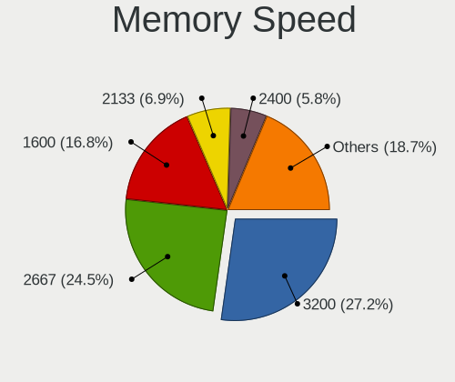

| Speed   | Notebooks | Percent |
|---------|-----------|---------|
| 3200    | 138       | 26.74%  |
| 2667    | 127       | 24.61%  |
| 1600    | 87        | 16.86%  |
| 2133    | 36        | 6.98%   |
| 2400    | 31        | 6.01%   |
| 4267    | 20        | 3.88%   |
| 1334    | 19        | 3.68%   |
| 1867    | 13        | 2.52%   |
| 1333    | 12        | 2.33%   |
| 3266    | 6         | 1.16%   |
| 8400    | 5         | 0.97%   |
| 800     | 5         | 0.97%   |
| Unknown | 4         | 0.78%   |
| 4199    | 2         | 0.39%   |
| 975     | 2         | 0.39%   |
| 4266    | 1         | 0.19%   |
| 3733    | 1         | 0.19%   |
| 3600    | 1         | 0.19%   |
| 2933    | 1         | 0.19%   |
| 2048    | 1         | 0.19%   |
| 1067    | 1         | 0.19%   |
| 1066    | 1         | 0.19%   |
| 667     | 1         | 0.19%   |
| 533     | 1         | 0.19%   |

Printers & scanners
-------------------

Printer Vendor
--------------

Printer device vendors

| Vendor                | Notebooks | Percent |
|-----------------------|-----------|---------|
| Hewlett-Packard       | 3         | 42.86%  |
| Lexmark International | 2         | 28.57%  |
| Seiko Epson           | 1         | 14.29%  |
| Canon                 | 1         | 14.29%  |

Printer Model
-------------

Printer device models

| Model                                      | Notebooks | Percent |
|--------------------------------------------|-----------|---------|
| Seiko Epson XP-4100 Series                 | 1         | 14.29%  |
| Lexmark International InkJet Color Printer | 1         | 14.29%  |
| Lexmark International 640 Series           | 1         | 14.29%  |
| HP LaserJet M101-M106                      | 1         | 14.29%  |
| HP LaserJet 400 M401n                      | 1         | 14.29%  |
| HP ENVY 5000 series                        | 1         | 14.29%  |
| Canon PIXMA TS6250                         | 1         | 14.29%  |

Scanner Vendor
--------------

Scanner device vendors

| Vendor             | Notebooks | Percent |
|--------------------|-----------|---------|
| Ultima Electronics | 1         | 33.33%  |
| Seiko Epson        | 1         | 33.33%  |
| Canon              | 1         | 33.33%  |

Scanner Model
-------------

Scanner device models

| Model                                 | Notebooks | Percent |
|---------------------------------------|-----------|---------|
| Ultima Artec Ultima 2000              | 1         | 33.33%  |
| Seiko Epson GT-X770 [Perfection V500] | 1         | 33.33%  |
| Canon CanoScan LiDE 600F              | 1         | 33.33%  |

Camera
------

Camera Vendor
-------------

Camera device vendors

| Vendor                                            | Notebooks | Percent |
|---------------------------------------------------|-----------|---------|
| Chicony Electronics                               | 214       | 25.69%  |
| Microdia                                          | 86        | 10.32%  |
| IMC Networks                                      | 85        | 10.2%   |
| Realtek Semiconductor                             | 78        | 9.36%   |
| Acer                                              | 53        | 6.36%   |
| Sunplus Innovation Technology                     | 45        | 5.4%    |
| Quanta                                            | 42        | 5.04%   |
| Cheng Uei Precision Industry (Foxlink)            | 39        | 4.68%   |
| Suyin                                             | 29        | 3.48%   |
| Lite-On Technology                                | 26        | 3.12%   |
| Apple                                             | 22        | 2.64%   |
| Silicon Motion                                    | 16        | 1.92%   |
| Syntek                                            | 14        | 1.68%   |
| Luxvisions Innotech Limited                       | 12        | 1.44%   |
| Logitech                                          | 9         | 1.08%   |
| Samsung Electronics                               | 8         | 0.96%   |
| Ricoh                                             | 8         | 0.96%   |
| Alcor Micro                                       | 8         | 0.96%   |
| Lenovo                                            | 4         | 0.48%   |
| Primax Electronics                                | 3         | 0.36%   |
| OmniVision Technologies                           | 3         | 0.36%   |
| Importek                                          | 3         | 0.36%   |
| Unknown                                           | 2         | 0.24%   |
| Intel                                             | 2         | 0.24%   |
| Generalplus Technology                            | 2         | 0.24%   |
| DJJHFA1BIF5595                                    | 2         | 0.24%   |
| Trust                                             | 1         | 0.12%   |
| SunplusIT                                         | 1         | 0.12%   |
| Sunplus Technology                                | 1         | 0.12%   |
| STMicroelectronics Imaging Division (VLSI Vision) | 1         | 0.12%   |
| Sonix Technology                                  | 1         | 0.12%   |
| RYS                                               | 1         | 0.12%   |
| Pixart Imaging                                    | 1         | 0.12%   |
| OPPO Electronics                                  | 1         | 0.12%   |
| Microsoft                                         | 1         | 0.12%   |
| LG Electronics                                    | 1         | 0.12%   |
| kingcome                                          | 1         | 0.12%   |
| Huawei Technologies                               | 1         | 0.12%   |
| Guillemot                                         | 1         | 0.12%   |
| Genesys Logic                                     | 1         | 0.12%   |

Camera Model
------------

Camera device models

| Model                                               | Notebooks | Percent |
|-----------------------------------------------------|-----------|---------|
| Microdia Integrated_Webcam_HD                       | 56        | 6.72%   |
| Chicony Integrated Camera                           | 44        | 5.28%   |
| Realtek Integrated_Webcam_HD                        | 39        | 4.68%   |
| IMC Networks Integrated Camera                      | 32        | 3.84%   |
| Chicony HD Webcam                                   | 25        | 3%      |
| IMC Networks USB2.0 HD UVC WebCam                   | 21        | 2.52%   |
| Acer Integrated Camera                              | 16        | 1.92%   |
| Sunplus Integrated_Webcam_HD                        | 13        | 1.56%   |
| Quanta HD User Facing                               | 12        | 1.44%   |
| Chicony USB2.0 Camera                               | 10        | 1.2%    |
| Realtek USB Camera                                  | 9         | 1.08%   |
| Chicony USB 2.0 Camera                              | 9         | 1.08%   |
| Chicony TOSHIBA Web Camera - HD                     | 9         | 1.08%   |
| Chicony HP HD Camera                                | 9         | 1.08%   |
| Syntek Integrated Camera                            | 8         | 0.96%   |
| Samsung Galaxy A5 (MTP)                             | 8         | 0.96%   |
| Quanta HP TrueVision HD Camera                      | 8         | 0.96%   |
| IMC Networks USB2.0 VGA UVC WebCam                  | 8         | 0.96%   |
| Lite-On HP HD Camera                                | 7         | 0.84%   |
| Chicony USB2.0 HD UVC WebCam                        | 7         | 0.84%   |
| Chicony Lenovo EasyCamera                           | 7         | 0.84%   |
| Chicony Integrated HP HD Webcam                     | 7         | 0.84%   |
| Chicony HP TrueVision HD                            | 7         | 0.84%   |
| Apple FaceTime HD Camera                            | 7         | 0.84%   |
| Apple Built-in iSight                               | 7         | 0.84%   |
| Acer Lenovo EasyCamera                              | 7         | 0.84%   |
| Sunplus HD WebCam                                   | 6         | 0.72%   |
| Lite-On Integrated Camera                           | 6         | 0.72%   |
| Lite-On HP HD Webcam                                | 6         | 0.72%   |
| Chicony FJ Camera                                   | 6         | 0.72%   |
| Chicony EasyCamera                                  | 6         | 0.72%   |
| Acer BisonCam, NB Pro                               | 6         | 0.72%   |
| Realtek Integrated Webcam                           | 5         | 0.6%    |
| Quanta HP Wide Vision HD Camera                     | 5         | 0.6%    |
| Quanta HP HD Camera                                 | 5         | 0.6%    |
| Microdia Laptop_Integrated_Webcam_HD                | 5         | 0.6%    |
| Microdia Integrated Webcam                          | 5         | 0.6%    |
| Luxvisions Innotech Limited HP TrueVision HD Camera | 5         | 0.6%    |
| IMC Networks ov9734_azurewave_camera                | 5         | 0.6%    |
| IMC Networks Integrated Webcam                      | 5         | 0.6%    |

Security
--------

Fingerprint Vendor
------------------

Fingerprint sensor vendors

| Vendor                     | Notebooks | Percent |
|----------------------------|-----------|---------|
| Validity Sensors           | 60        | 30.15%  |
| Synaptics                  | 51        | 25.63%  |
| Shenzhen Goodix Technology | 42        | 21.11%  |
| Elan Microelectronics      | 17        | 8.54%   |
| LighTuning Technology      | 13        | 6.53%   |
| Upek                       | 7         | 3.52%   |
| AuthenTec                  | 6         | 3.02%   |
| STMicroelectronics         | 2         | 1.01%   |
| HOLTEK                     | 1         | 0.5%    |

Fingerprint Model
-----------------

Fingerprint sensor models

| Model                                                                      | Notebooks | Percent |
|----------------------------------------------------------------------------|-----------|---------|
| Validity Sensors VFS495 Fingerprint Reader                                 | 25        | 12.56%  |
| Synaptics Prometheus MIS Touch Fingerprint Reader                          | 21        | 10.55%  |
| Shenzhen Goodix  FingerPrint Device                                        | 20        | 10.05%  |
| Shenzhen Goodix Fingerprint Reader                                         | 13        | 6.53%   |
| Synaptics  FS7604 Touch Fingerprint Sensor with PurePrint                  | 10        | 5.03%   |
| Elan ELAN:Fingerprint                                                      | 10        | 5.03%   |
| Shenzhen Goodix FingerPrint                                                | 9         | 4.52%   |
| Upek Biometric Touchchip/Touchstrip Fingerprint Sensor                     | 7         | 3.52%   |
| LighTuning EgisTec Touch Fingerprint Sensor                                | 7         | 3.52%   |
| Elan ELAN:ARM-M4                                                           | 7         | 3.52%   |
| Unknown                                                                    | 7         | 3.52%   |
| Validity Sensors VFS5011 Fingerprint Reader                                | 6         | 3.02%   |
| Validity Sensors VFS491                                                    | 6         | 3.02%   |
| Validity Sensors VFS 5011 fingerprint sensor                               | 5         | 2.51%   |
| Validity Sensors Synaptics WBDI                                            | 5         | 2.51%   |
| Synaptics Metallica MIS Touch Fingerprint Reader                           | 5         | 2.51%   |
| LighTuning ES603 Swipe Fingerprint Sensor                                  | 5         | 2.51%   |
| Validity Sensors VFS471 Fingerprint Reader                                 | 3         | 1.51%   |
| Synaptics  WBDI                                                            | 3         | 1.51%   |
| Validity Sensors VFS7500 Touch Fingerprint Sensor                          | 2         | 1.01%   |
| Validity Sensors VFS101 Fingerprint Reader                                 | 2         | 1.01%   |
| Validity Sensors VFS Fingerprint sensor                                    | 2         | 1.01%   |
| Synaptics  VFS7552 Touch Fingerprint Sensor with PurePrint                 | 2         | 1.01%   |
| Synaptics Metallica MOH Touch Fingerprint Reader                           | 2         | 1.01%   |
| STMicroelectronics Fingerprint Reader                                      | 2         | 1.01%   |
| AuthenTec Fingerprint Sensor                                               | 2         | 1.01%   |
| AuthenTec AES2550 Fingerprint Sensor                                       | 2         | 1.01%   |
| Validity Sensors VFS7552 Touch Fingerprint Sensor                          | 1         | 0.5%    |
| Validity Sensors VFS300 Fingerprint Reader                                 | 1         | 0.5%    |
| Validity Sensors Synaptics VFS7552 Touch Fingerprint Sensor with PurePrint | 1         | 0.5%    |
| Validity Sensors Swipe Fingerprint Sensor                                  | 1         | 0.5%    |
| Synaptics WBDI Device                                                      | 1         | 0.5%    |
| LighTuning Fingerprint Reader                                              | 1         | 0.5%    |
| HOLTEK FocalTech Fingerprint Device                                        | 1         | 0.5%    |
| AuthenTec AES2810                                                          | 1         | 0.5%    |
| AuthenTec AES2501 Fingerprint Sensor                                       | 1         | 0.5%    |

Chipcard Vendor
---------------

Chipcard module vendors

| Vendor                | Notebooks | Percent |
|-----------------------|-----------|---------|
| Broadcom              | 36        | 49.32%  |
| Alcor Micro           | 25        | 34.25%  |
| O2 Micro              | 4         | 5.48%   |
| Lenovo                | 3         | 4.11%   |
| Gemalto (was Gemplus) | 2         | 2.74%   |
| Upek                  | 1         | 1.37%   |
| Clay Logic            | 1         | 1.37%   |
| Cherry                | 1         | 1.37%   |

Chipcard Model
--------------

Chipcard module models

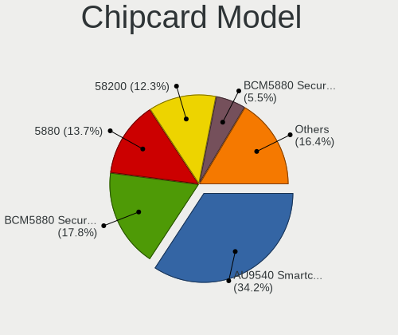

| Model                                                                        | Notebooks | Percent |
|------------------------------------------------------------------------------|-----------|---------|
| Alcor Micro AU9540 Smartcard Reader                                          | 25        | 34.25%  |
| Broadcom BCM5880 Secure Applications Processor                               | 13        | 17.81%  |
| Broadcom 5880                                                                | 10        | 13.7%   |
| Broadcom 58200                                                               | 9         | 12.33%  |
| Broadcom BCM5880 Secure Applications Processor with fingerprint swipe sensor | 4         | 5.48%   |
| O2 Micro OZ776 CCID Smartcard Reader                                         | 3         | 4.11%   |
| Lenovo Integrated Smart Card Reader                                          | 3         | 4.11%   |
| Upek TouchChip Fingerprint Coprocessor (WBF advanced mode)                   | 1         | 1.37%   |
| O2 Micro Oz776 SmartCard Reader                                              | 1         | 1.37%   |
| Gemalto (was Gemplus) GemPC Twin SmartCard Reader                            | 1         | 1.37%   |
| Gemalto (was Gemplus) GemPC Key SmartCard Reader                             | 1         | 1.37%   |
| Clay Logic Nitrokey Pro                                                      | 1         | 1.37%   |
| Cherry SmartTerminal XX1X                                                    | 1         | 1.37%   |

Unsupported
-----------

Unsupported Devices
-------------------

Total unsupported devices on board

| Total | Notebooks | Percent |
|-------|-----------|---------|
| 0     | 548       | 59.69%  |
| 1     | 298       | 32.46%  |
| 2     | 61        | 6.64%   |
| 3     | 10        | 1.09%   |
| 4     | 1         | 0.11%   |

Unsupported Device Types
------------------------

Types of unsupported devices

| Type                     | Notebooks | Percent |
|--------------------------|-----------|---------|
| Fingerprint reader       | 195       | 44.22%  |
| Graphics card            | 84        | 19.05%  |
| Chipcard                 | 64        | 14.51%  |
| Net/wireless             | 50        | 11.34%  |
| Storage                  | 9         | 2.04%   |
| Multimedia controller    | 9         | 2.04%   |
| Bluetooth                | 9         | 2.04%   |
| Card reader              | 6         | 1.36%   |
| Camera                   | 6         | 1.36%   |
| Net/ethernet             | 3         | 0.68%   |
| Sound                    | 2         | 0.45%   |
| Communication controller | 2         | 0.45%   |
| Unassigned class         | 1         | 0.23%   |
| Modem                    | 1         | 0.23%   |

