Ubuntu 21.04 - Tested Hardware & Statistics (Notebooks)
-------------------------------------------------------

A project to collect tested hardware configurations for Ubuntu 21.04 (Beta test).

Anyone can contribute to this report by the [hw-probe](https://github.com/linuxhw/hw-probe) tool:

    sudo -E hw-probe -all -upload

Please submit a probe of your configuration if it's not presented on the page or is rare.

Full-feature report is available here: https://linux-hardware.org/?view=trends&rel=ubuntu-21.04

Contents
--------

* [ Test Cases ](#test-cases)

* [ System ](#system)
  - [ Kernel                   ](#kernel)
  - [ Kernel Family            ](#kernel-family)
  - [ Kernel Major Ver.        ](#kernel-major-ver)
  - [ Arch                     ](#arch)
  - [ DE                       ](#de)
  - [ Display Server           ](#display-server)
  - [ Display Manager          ](#display-manager)
  - [ OS Lang                  ](#os-lang)
  - [ Boot Mode                ](#boot-mode)
  - [ Filesystem               ](#filesystem)
  - [ Part. scheme             ](#part-scheme)
  - [ Dual Boot with Linux/BSD ](#dual-boot-with-linuxbsd)
  - [ Dual Boot (Win)          ](#dual-boot-win)

* [ Board ](#board)
  - [ Vendor                   ](#vendor)
  - [ Model                    ](#model)
  - [ Model Family             ](#model-family)
  - [ MFG Year                 ](#mfg-year)
  - [ Form Factor              ](#form-factor)
  - [ Secure Boot              ](#secure-boot)
  - [ Coreboot                 ](#coreboot)
  - [ RAM Size                 ](#ram-size)
  - [ RAM Used                 ](#ram-used)
  - [ Total Drives             ](#total-drives)
  - [ Has CD-ROM               ](#has-cd-rom)
  - [ Has Ethernet             ](#has-ethernet)
  - [ Has WiFi                 ](#has-wifi)
  - [ Has Bluetooth            ](#has-bluetooth)

* [ Location ](#location)
  - [ Country                  ](#country)
  - [ City                     ](#city)

* [ Drives ](#drives)
  - [ Drive Vendor             ](#drive-vendor)
  - [ Drive Model              ](#drive-model)
  - [ HDD Vendor               ](#hdd-vendor)
  - [ SSD Vendor               ](#ssd-vendor)
  - [ Drive Kind               ](#drive-kind)
  - [ Drive Connector          ](#drive-connector)
  - [ Drive Size               ](#drive-size)
  - [ Space Total              ](#space-total)
  - [ Space Used               ](#space-used)
  - [ Malfunc. Drives          ](#malfunc-drives)
  - [ Malfunc. Drive Vendor    ](#malfunc-drive-vendor)
  - [ Malfunc. HDD Vendor      ](#malfunc-hdd-vendor)
  - [ Malfunc. Drive Kind      ](#malfunc-drive-kind)
  - [ Failed Drives            ](#failed-drives)
  - [ Failed Drive Vendor      ](#failed-drive-vendor)
  - [ Drive Status             ](#drive-status)

* [ Storage controller ](#storage-controller)
  - [ Storage Vendor           ](#storage-vendor)
  - [ Storage Model            ](#storage-model)
  - [ Storage Kind             ](#storage-kind)

* [ Processor ](#processor)
  - [ CPU Vendor               ](#cpu-vendor)
  - [ CPU Model                ](#cpu-model)
  - [ CPU Model Family         ](#cpu-model-family)
  - [ CPU Cores                ](#cpu-cores)
  - [ CPU Sockets              ](#cpu-sockets)
  - [ CPU Threads              ](#cpu-threads)
  - [ CPU Op-Modes             ](#cpu-op-modes)
  - [ CPU Microcode            ](#cpu-microcode)
  - [ CPU Microarch            ](#cpu-microarch)

* [ Graphics ](#graphics)
  - [ GPU Vendor               ](#gpu-vendor)
  - [ GPU Model                ](#gpu-model)
  - [ GPU Combo                ](#gpu-combo)
  - [ GPU Driver               ](#gpu-driver)
  - [ GPU Memory               ](#gpu-memory)

* [ Monitor ](#monitor)
  - [ Monitor Vendor           ](#monitor-vendor)
  - [ Monitor Model            ](#monitor-model)
  - [ Monitor Resolution       ](#monitor-resolution)
  - [ Monitor Diagonal         ](#monitor-diagonal)
  - [ Monitor Width            ](#monitor-width)
  - [ Aspect Ratio             ](#aspect-ratio)
  - [ Monitor Area             ](#monitor-area)
  - [ Pixel Density            ](#pixel-density)
  - [ Multiple Monitors        ](#multiple-monitors)

* [ Network ](#network)
  - [ Net Controller Vendor    ](#net-controller-vendor)
  - [ Net Controller Model     ](#net-controller-model)
  - [ Wireless Vendor          ](#wireless-vendor)
  - [ Wireless Model           ](#wireless-model)
  - [ Ethernet Vendor          ](#ethernet-vendor)
  - [ Ethernet Model           ](#ethernet-model)
  - [ Net Controller Kind      ](#net-controller-kind)
  - [ Used Controller          ](#used-controller)
  - [ NICs                     ](#nics)
  - [ IPv6                     ](#ipv6)

* [ Bluetooth ](#bluetooth)
  - [ Bluetooth Vendor         ](#bluetooth-vendor)
  - [ Bluetooth Model          ](#bluetooth-model)

* [ Sound ](#sound)
  - [ Sound Vendor             ](#sound-vendor)
  - [ Sound Model              ](#sound-model)

* [ Memory ](#memory)
  - [ Memory Vendor            ](#memory-vendor)
  - [ Memory Model             ](#memory-model)
  - [ Memory Kind              ](#memory-kind)
  - [ Memory Form Factor       ](#memory-form-factor)
  - [ Memory Size              ](#memory-size)
  - [ Memory Speed             ](#memory-speed)

* [ Printers & scanners ](#printers--scanners)
  - [ Printer Vendor           ](#printer-vendor)
  - [ Printer Model            ](#printer-model)
  - [ Scanner Vendor           ](#scanner-vendor)
  - [ Scanner Model            ](#scanner-model)

* [ Camera ](#camera)
  - [ Camera Vendor            ](#camera-vendor)
  - [ Camera Model             ](#camera-model)

* [ Security ](#security)
  - [ Fingerprint Vendor       ](#fingerprint-vendor)
  - [ Fingerprint Model        ](#fingerprint-model)
  - [ Chipcard Vendor          ](#chipcard-vendor)
  - [ Chipcard Model           ](#chipcard-model)

* [ Unsupported ](#unsupported)
  - [ Unsupported Devices      ](#unsupported-devices)
  - [ Unsupported Device Types ](#unsupported-device-types)

Test Cases
----------

| Vendor        | Model                       | Probe                                                      | Date         |
|---------------|-----------------------------|------------------------------------------------------------|--------------|
| ASUSTek       | X550ZA                      | [0a21d3b326](https://linux-hardware.org/?probe=0a21d3b326) | Aug 27, 2021 |
| HP            | ProBook 650 G1              | [fe97c44f4f](https://linux-hardware.org/?probe=fe97c44f4f) | Aug 27, 2021 |
| Samsung       | 300E4C/300E5C/300E7C        | [50477e1758](https://linux-hardware.org/?probe=50477e1758) | Aug 27, 2021 |
| Acer          | AOD260                      | [d8cf89df4e](https://linux-hardware.org/?probe=d8cf89df4e) | Aug 27, 2021 |
| Samsung       | 300E4C/300E5C/300E7C        | [d51c8093ec](https://linux-hardware.org/?probe=d51c8093ec) | Aug 27, 2021 |
| Acer          | Swift SF314-59              | [c4ec7d7706](https://linux-hardware.org/?probe=c4ec7d7706) | Aug 27, 2021 |
| Apple         | MacBookPro16,2              | [7e1625f75d](https://linux-hardware.org/?probe=7e1625f75d) | Aug 27, 2021 |
| Acer          | Aspire 5750G                | [03a89677c0](https://linux-hardware.org/?probe=03a89677c0) | Aug 26, 2021 |
| Apple         | MacBookPro8,1               | [d76439fc39](https://linux-hardware.org/?probe=d76439fc39) | Aug 26, 2021 |
| Apple         | MacBookPro8,1               | [41dce1e5d4](https://linux-hardware.org/?probe=41dce1e5d4) | Aug 26, 2021 |
| Dell          | Inspiron 15-3573            | [9ca63b6d40](https://linux-hardware.org/?probe=9ca63b6d40) | Aug 26, 2021 |
| ASUSTek       | ZenBook UX431DA_UM431DA     | [b3185cd80d](https://linux-hardware.org/?probe=b3185cd80d) | Aug 26, 2021 |
| Lenovo        | ThinkPad P14s Gen 1 20Y1... | [cfeb92ade1](https://linux-hardware.org/?probe=cfeb92ade1) | Aug 26, 2021 |
| Samsung       | RV410/RV510/S3510/E3510     | [b090440019](https://linux-hardware.org/?probe=b090440019) | Aug 26, 2021 |
| ASUSTek       | S400CA                      | [d1c2760711](https://linux-hardware.org/?probe=d1c2760711) | Aug 26, 2021 |
| System76      | Oryx Pro                    | [ed8769ce16](https://linux-hardware.org/?probe=ed8769ce16) | Aug 26, 2021 |
| System76      | Oryx Pro                    | [a4ba687465](https://linux-hardware.org/?probe=a4ba687465) | Aug 26, 2021 |
| Dell          | Inspiron 5521               | [24bfc2b04a](https://linux-hardware.org/?probe=24bfc2b04a) | Aug 26, 2021 |
| Acer          | Swift SF313-53              | [8b7983c6f4](https://linux-hardware.org/?probe=8b7983c6f4) | Aug 26, 2021 |
| Acer          | Swift SF313-53              | [60ba1a6cf7](https://linux-hardware.org/?probe=60ba1a6cf7) | Aug 25, 2021 |
| BANGHO        | MOV                         | [9bacff92e1](https://linux-hardware.org/?probe=9bacff92e1) | Aug 25, 2021 |
| Acer          | Swift SF313-53              | [91b876aec6](https://linux-hardware.org/?probe=91b876aec6) | Aug 25, 2021 |
| Acer          | Swift SF313-53              | [19f99141b9](https://linux-hardware.org/?probe=19f99141b9) | Aug 25, 2021 |
| Lenovo        | ThinkPad T420s 4176W27      | [b84d5c31e3](https://linux-hardware.org/?probe=b84d5c31e3) | Aug 25, 2021 |
| Dell          | Inspiron 13-7359            | [0d1a190ded](https://linux-hardware.org/?probe=0d1a190ded) | Aug 25, 2021 |
| Dell          | Inspiron 13-7359            | [347f0ad714](https://linux-hardware.org/?probe=347f0ad714) | Aug 25, 2021 |
| Google        | Akemi                       | [11b458a90a](https://linux-hardware.org/?probe=11b458a90a) | Aug 25, 2021 |
| Google        | Akemi                       | [ebd0d7d1f9](https://linux-hardware.org/?probe=ebd0d7d1f9) | Aug 25, 2021 |
| Lenovo        | G500 20236                  | [fb90bc01bc](https://linux-hardware.org/?probe=fb90bc01bc) | Aug 25, 2021 |
| Lenovo        | ThinkPad L15 Gen 1 20U8S... | [642e4b5727](https://linux-hardware.org/?probe=642e4b5727) | Aug 25, 2021 |
| Lenovo        | ThinkPad L15 Gen 1 20U8S... | [f75424e1e1](https://linux-hardware.org/?probe=f75424e1e1) | Aug 25, 2021 |
| Dell          | XPS 13 9300                 | [2ef66334f0](https://linux-hardware.org/?probe=2ef66334f0) | Aug 24, 2021 |
| Lenovo        | B580 4377A9G                | [4a7f165a2f](https://linux-hardware.org/?probe=4a7f165a2f) | Aug 24, 2021 |
| Sony          | VGN-SZ4MN_B                 | [9b51d6eff6](https://linux-hardware.org/?probe=9b51d6eff6) | Aug 24, 2021 |
| Packard Be... | EasyNote LE69KB             | [adb16307d7](https://linux-hardware.org/?probe=adb16307d7) | Aug 24, 2021 |
| HP            | EliteBook 8530w             | [ea7f22c125](https://linux-hardware.org/?probe=ea7f22c125) | Aug 24, 2021 |
| CyberPower... | TRACER V                    | [d32f6e01af](https://linux-hardware.org/?probe=d32f6e01af) | Aug 24, 2021 |
| Lenovo        | IdeaPad Y700-15ISK 80NV     | [fa55eabafd](https://linux-hardware.org/?probe=fa55eabafd) | Aug 23, 2021 |
| HP            | Notebook                    | [5edda59c62](https://linux-hardware.org/?probe=5edda59c62) | Aug 23, 2021 |
| Samsung       | 750XDA                      | [a93fe624c9](https://linux-hardware.org/?probe=a93fe624c9) | Aug 23, 2021 |
| Dell          | Vostro 5568                 | [bf921c6ff6](https://linux-hardware.org/?probe=bf921c6ff6) | Aug 23, 2021 |
| Dell          | Inspiron 3558               | [946f2bf799](https://linux-hardware.org/?probe=946f2bf799) | Aug 22, 2021 |
| Lenovo        | IdeaPad 5 14ARE05 81YM      | [6a52dc6e12](https://linux-hardware.org/?probe=6a52dc6e12) | Aug 22, 2021 |
| Acer          | Aspire 4750                 | [6f5d61dc20](https://linux-hardware.org/?probe=6f5d61dc20) | Aug 22, 2021 |
| Acer          | Aspire ES1-572              | [12cb2077ff](https://linux-hardware.org/?probe=12cb2077ff) | Aug 22, 2021 |
| Toshiba       | Satellite C655D             | [63dfa0ffd8](https://linux-hardware.org/?probe=63dfa0ffd8) | Aug 22, 2021 |
| Toshiba       | Satellite C55-B             | [99dbadcdde](https://linux-hardware.org/?probe=99dbadcdde) | Aug 22, 2021 |
| HP            | EliteBook 850 G2            | [89bfd52b3d](https://linux-hardware.org/?probe=89bfd52b3d) | Aug 22, 2021 |
| Lenovo        | IdeaPad 5 15ITL05 82FG      | [dcf6e0d950](https://linux-hardware.org/?probe=dcf6e0d950) | Aug 22, 2021 |
| HP            | EliteBook 850 G2            | [a82576e8e2](https://linux-hardware.org/?probe=a82576e8e2) | Aug 22, 2021 |
| HP            | Notebook                    | [5ac3618644](https://linux-hardware.org/?probe=5ac3618644) | Aug 22, 2021 |
| HP            | ProBook 650 G1              | [521e8315c2](https://linux-hardware.org/?probe=521e8315c2) | Aug 22, 2021 |
| Lenovo        | G500 20236                  | [37294c9129](https://linux-hardware.org/?probe=37294c9129) | Aug 21, 2021 |
| Dell          | Latitude E5400              | [0e1ba1167e](https://linux-hardware.org/?probe=0e1ba1167e) | Aug 21, 2021 |
| Dell          | Latitude E5400              | [10eee4ecd9](https://linux-hardware.org/?probe=10eee4ecd9) | Aug 21, 2021 |
| ASUSTek       | ZenBook UX434FQ             | [e5778c606b](https://linux-hardware.org/?probe=e5778c606b) | Aug 21, 2021 |
| HP            | Laptop 15s-du1xxx           | [0db32c3e7e](https://linux-hardware.org/?probe=0db32c3e7e) | Aug 21, 2021 |
| Dell          | XPS 13 9305                 | [875e2fe9eb](https://linux-hardware.org/?probe=875e2fe9eb) | Aug 20, 2021 |
| Lenovo        | IdeaPad 5 15ITL05 82FG      | [05298cb71d](https://linux-hardware.org/?probe=05298cb71d) | Aug 20, 2021 |
| Lenovo        | ThinkPad T15 Gen 2i 20W4... | [bad0ffd0e2](https://linux-hardware.org/?probe=bad0ffd0e2) | Aug 20, 2021 |
| HP            | EliteBook 8570w             | [353385ccb8](https://linux-hardware.org/?probe=353385ccb8) | Aug 20, 2021 |
| Lenovo        | G560 0679                   | [a5d3d1f80c](https://linux-hardware.org/?probe=a5d3d1f80c) | Aug 20, 2021 |
| Lenovo        | G560 0679                   | [ce91db6192](https://linux-hardware.org/?probe=ce91db6192) | Aug 20, 2021 |
| Lenovo        | IdeaPad Y500 20193          | [d1800db637](https://linux-hardware.org/?probe=d1800db637) | Aug 20, 2021 |
| HP            | Pavilion Laptop 15-cs3xx... | [e5f9d8b06f](https://linux-hardware.org/?probe=e5f9d8b06f) | Aug 20, 2021 |
| HP            | ProBook 450 G6              | [a7ce746e66](https://linux-hardware.org/?probe=a7ce746e66) | Aug 20, 2021 |
| Lenovo        | IdeaPad 5 15ALC05 82LN      | [b8f5afa2f7](https://linux-hardware.org/?probe=b8f5afa2f7) | Aug 20, 2021 |
| Dell          | Inspiron N5050              | [ed6b51261d](https://linux-hardware.org/?probe=ed6b51261d) | Aug 20, 2021 |
| SLIMBOOK      | TITAN                       | [1eb70ec6e6](https://linux-hardware.org/?probe=1eb70ec6e6) | Aug 19, 2021 |
| HP            | EliteBook 855 G7 Noteboo... | [743442952d](https://linux-hardware.org/?probe=743442952d) | Aug 19, 2021 |
| HP            | EliteBook 855 G7 Noteboo... | [a4e0272377](https://linux-hardware.org/?probe=a4e0272377) | Aug 19, 2021 |
| Samsung       | RV410/RV510/S3510/E3510     | [481800b937](https://linux-hardware.org/?probe=481800b937) | Aug 19, 2021 |
| Dell          | Vostro 3360                 | [03074a36b2](https://linux-hardware.org/?probe=03074a36b2) | Aug 19, 2021 |
| Lenovo        | IdeaPad 330-15IKB 81DE      | [74f533e1b3](https://linux-hardware.org/?probe=74f533e1b3) | Aug 19, 2021 |
| HP            | 450                         | [9f5d03c478](https://linux-hardware.org/?probe=9f5d03c478) | Aug 19, 2021 |
| ASUSTek       | G55VW                       | [7daa09d3c3](https://linux-hardware.org/?probe=7daa09d3c3) | Aug 19, 2021 |
| Samsung       | 520U4C/520U4X               | [1863ae7d28](https://linux-hardware.org/?probe=1863ae7d28) | Aug 19, 2021 |
| ASUSTek       | K54C                        | [816e5c7efa](https://linux-hardware.org/?probe=816e5c7efa) | Aug 19, 2021 |
| HP            | EliteBook 845 G7 Noteboo... | [ea3fc1154c](https://linux-hardware.org/?probe=ea3fc1154c) | Aug 18, 2021 |
| Lenovo        | IdeaPad 5 15ITL05 82FG      | [e1467bfa3e](https://linux-hardware.org/?probe=e1467bfa3e) | Aug 18, 2021 |
| Lenovo        | ThinkPad T15 Gen 1 20S7S... | [d9923e15e0](https://linux-hardware.org/?probe=d9923e15e0) | Aug 18, 2021 |
| Toshiba       | Satellite Z930              | [3138585fd8](https://linux-hardware.org/?probe=3138585fd8) | Aug 18, 2021 |
| Toshiba       | PORTEGE Z930                | [a49ad7f306](https://linux-hardware.org/?probe=a49ad7f306) | Aug 18, 2021 |
| Toshiba       | Satellite Z930              | [dfb39f616a](https://linux-hardware.org/?probe=dfb39f616a) | Aug 18, 2021 |
| HP            | Pavilion Laptop 15-eh0xx... | [251af23ff3](https://linux-hardware.org/?probe=251af23ff3) | Aug 18, 2021 |
| ASUSTek       | K52Je                       | [d35de28c56](https://linux-hardware.org/?probe=d35de28c56) | Aug 17, 2021 |
| HP            | ENVY 17                     | [339f78f408](https://linux-hardware.org/?probe=339f78f408) | Aug 17, 2021 |
| Acer          | Nitro AN515-57              | [3c18d3a700](https://linux-hardware.org/?probe=3c18d3a700) | Aug 17, 2021 |
| Lenovo        | ThinkPad W541 20EF0020GE    | [ea3fc647ce](https://linux-hardware.org/?probe=ea3fc647ce) | Aug 17, 2021 |
| HP            | EliteBook 820 G1            | [00bff94489](https://linux-hardware.org/?probe=00bff94489) | Aug 17, 2021 |
| Acer          | Swift SF314-54              | [d238322295](https://linux-hardware.org/?probe=d238322295) | Aug 16, 2021 |
| Medion        | P6640                       | [e83d5a51ac](https://linux-hardware.org/?probe=e83d5a51ac) | Aug 16, 2021 |
| Acer          | Aspire 5733                 | [7d63c49cee](https://linux-hardware.org/?probe=7d63c49cee) | Aug 16, 2021 |
| Notebook      | W94_95_97JU                 | [816ddae34c](https://linux-hardware.org/?probe=816ddae34c) | Aug 16, 2021 |
| Lenovo        | G550 2958                   | [5207c5584c](https://linux-hardware.org/?probe=5207c5584c) | Aug 16, 2021 |
| Lenovo        | G550 2958                   | [b7b363db20](https://linux-hardware.org/?probe=b7b363db20) | Aug 15, 2021 |
| Lenovo        | ThinkPad X1 Carbon 7th 2... | [8e47965ba8](https://linux-hardware.org/?probe=8e47965ba8) | Aug 15, 2021 |
| HUAWEI        | BOHK-WAX9X                  | [f406892aa9](https://linux-hardware.org/?probe=f406892aa9) | Aug 15, 2021 |
| HUAWEI        | BOHK-WAX9X                  | [b333da4703](https://linux-hardware.org/?probe=b333da4703) | Aug 14, 2021 |
| Lenovo        | ThinkPad T15 Gen 2i 20W4... | [3a83d976d0](https://linux-hardware.org/?probe=3a83d976d0) | Aug 14, 2021 |
| Dell          | Inspiron 1525               | [7df7534dd9](https://linux-hardware.org/?probe=7df7534dd9) | Aug 14, 2021 |
| Lenovo        | IdeaPad Gaming 3 15ARH05... | [977c948bad](https://linux-hardware.org/?probe=977c948bad) | Aug 14, 2021 |
| Apple         | MacBookAir3,2               | [e359985b75](https://linux-hardware.org/?probe=e359985b75) | Aug 14, 2021 |
| HP            | EliteBook Folio 1040 G3     | [d03439a8d0](https://linux-hardware.org/?probe=d03439a8d0) | Aug 14, 2021 |
| Medion        | E2213 MD60193               | [5bb52d1b1b](https://linux-hardware.org/?probe=5bb52d1b1b) | Aug 14, 2021 |
| ASUSTek       | ROG Zephyrus G14 GA401IV    | [6346388737](https://linux-hardware.org/?probe=6346388737) | Aug 13, 2021 |
| Lenovo        | ThinkPad X1 Carbon 7th 2... | [11f9ccb3ad](https://linux-hardware.org/?probe=11f9ccb3ad) | Aug 13, 2021 |
| Radxa         | ROCK Pi X v1.4              | [d5c46e7235](https://linux-hardware.org/?probe=d5c46e7235) | Aug 13, 2021 |
| Dell          | XPS 15 7590                 | [8bb8411127](https://linux-hardware.org/?probe=8bb8411127) | Aug 13, 2021 |
| Acer          | TravelMate B117-M           | [be84ceed7a](https://linux-hardware.org/?probe=be84ceed7a) | Aug 12, 2021 |
| MSI           | Modern 14 A10M              | [d6668ff825](https://linux-hardware.org/?probe=d6668ff825) | Aug 12, 2021 |
| HP            | EliteBook Folio 1040 G3     | [fbeb3986b3](https://linux-hardware.org/?probe=fbeb3986b3) | Aug 12, 2021 |
| Lenovo        | ThinkPad L14 Gen 2a 20X5... | [6d351fec42](https://linux-hardware.org/?probe=6d351fec42) | Aug 12, 2021 |
| Dell          | G5 5587                     | [204e0318ab](https://linux-hardware.org/?probe=204e0318ab) | Aug 12, 2021 |
| Razer         | Blade                       | [d04a50103d](https://linux-hardware.org/?probe=d04a50103d) | Aug 11, 2021 |
| Lenovo        | ThinkPad T15 Gen 1 20S7S... | [1f6745d6bb](https://linux-hardware.org/?probe=1f6745d6bb) | Aug 11, 2021 |
| Lenovo        | ThinkPad L590 20Q8S1FX00    | [d24254d911](https://linux-hardware.org/?probe=d24254d911) | Aug 11, 2021 |
| Dell          | Latitude 5400               | [4f804f2046](https://linux-hardware.org/?probe=4f804f2046) | Aug 11, 2021 |
| HP            | Laptop 15s-du1xxx           | [19412614ef](https://linux-hardware.org/?probe=19412614ef) | Aug 11, 2021 |
| ASUSTek       | VivoBook_ASUSLaptop X509... | [90ae378555](https://linux-hardware.org/?probe=90ae378555) | Aug 11, 2021 |
| ASUSTek       | VivoBook_ASUSLaptop X509... | [268452e2ee](https://linux-hardware.org/?probe=268452e2ee) | Aug 11, 2021 |
| ASUSTek       | TP300LA                     | [f5dca95f99](https://linux-hardware.org/?probe=f5dca95f99) | Aug 11, 2021 |
| Apple         | MacBookPro7,1               | [4b8bdfd1eb](https://linux-hardware.org/?probe=4b8bdfd1eb) | Aug 10, 2021 |
| Dell          | Latitude E6330              | [cc6a9823e1](https://linux-hardware.org/?probe=cc6a9823e1) | Aug 10, 2021 |
| Lenovo        | IdeaPad S340-15API 81NC     | [eb1b7627ff](https://linux-hardware.org/?probe=eb1b7627ff) | Aug 10, 2021 |
| HP            | 15 Notebook PC              | [d01d6a6ab0](https://linux-hardware.org/?probe=d01d6a6ab0) | Aug 10, 2021 |
| ASUSTek       | T100HAN                     | [8b463c7abb](https://linux-hardware.org/?probe=8b463c7abb) | Aug 10, 2021 |
| Dell          | Latitude E5400              | [c54ea52d26](https://linux-hardware.org/?probe=c54ea52d26) | Aug 09, 2021 |
| Lenovo        | ThinkPad T450 20BUS0G91F    | [8db659cf12](https://linux-hardware.org/?probe=8db659cf12) | Aug 09, 2021 |
| HP            | ProBook 450 G5              | [f8bbb08a59](https://linux-hardware.org/?probe=f8bbb08a59) | Aug 09, 2021 |
| HP            | ProBook 450 G5              | [8e62a52f33](https://linux-hardware.org/?probe=8e62a52f33) | Aug 09, 2021 |
| LG Electro... | 17Z90P-G.AD88B              | [d18eda768e](https://linux-hardware.org/?probe=d18eda768e) | Aug 09, 2021 |
| ASUSTek       | N552VW                      | [9cc9b3d62e](https://linux-hardware.org/?probe=9cc9b3d62e) | Aug 09, 2021 |
| Monster       | TULPAR T7 V20.4             | [f94dfc2fc6](https://linux-hardware.org/?probe=f94dfc2fc6) | Aug 09, 2021 |
| HP            | Laptop 15-da0xxx            | [22fa8558fa](https://linux-hardware.org/?probe=22fa8558fa) | Aug 09, 2021 |
| Dell          | Precision M6600             | [58b77bf05d](https://linux-hardware.org/?probe=58b77bf05d) | Aug 09, 2021 |
| ASUSTek       | VivoBook_ASUSLaptop X512... | [e88a377feb](https://linux-hardware.org/?probe=e88a377feb) | Aug 08, 2021 |
| HP            | EliteBook 8570w             | [59783ba71d](https://linux-hardware.org/?probe=59783ba71d) | Aug 08, 2021 |
| HP            | EliteBook 8570w             | [093f956e28](https://linux-hardware.org/?probe=093f956e28) | Aug 08, 2021 |
| HP            | EliteBook 840 G4            | [756d4b46ad](https://linux-hardware.org/?probe=756d4b46ad) | Aug 08, 2021 |
| ASUSTek       | VivoBook_ASUSLaptop X512... | [45d400c67b](https://linux-hardware.org/?probe=45d400c67b) | Aug 08, 2021 |
| Dell          | Inspiron N5110              | [f36ecee8d1](https://linux-hardware.org/?probe=f36ecee8d1) | Aug 07, 2021 |
| Dell          | Latitude 5290 2-in-1        | [293b45eded](https://linux-hardware.org/?probe=293b45eded) | Aug 07, 2021 |
| Panasonic     | CF-19KDR78CE                | [29eee33555](https://linux-hardware.org/?probe=29eee33555) | Aug 07, 2021 |
| ASUSTek       | E402SA                      | [790033a704](https://linux-hardware.org/?probe=790033a704) | Aug 07, 2021 |
| ASUSTek       | ROG Zephyrus G14 GA401IV... | [b3dfe4bfe4](https://linux-hardware.org/?probe=b3dfe4bfe4) | Aug 07, 2021 |
| Medion        | P6640                       | [ee12482cc7](https://linux-hardware.org/?probe=ee12482cc7) | Aug 07, 2021 |
| Lenovo        | ThinkPad L580 20LW0010GE    | [3d2bc47483](https://linux-hardware.org/?probe=3d2bc47483) | Aug 07, 2021 |
| HP            | EliteBook 840 G4            | [0dd35a18fe](https://linux-hardware.org/?probe=0dd35a18fe) | Aug 07, 2021 |
| Dell          | XPS 13 9380                 | [9ffd679117](https://linux-hardware.org/?probe=9ffd679117) | Aug 07, 2021 |
| Dell          | XPS 13 9380                 | [e9e8cca53d](https://linux-hardware.org/?probe=e9e8cca53d) | Aug 07, 2021 |
| ASUSTek       | X550CA                      | [a1e7efd7c1](https://linux-hardware.org/?probe=a1e7efd7c1) | Aug 07, 2021 |
| HP            | EliteBook 840 G3            | [78bd17f4c4](https://linux-hardware.org/?probe=78bd17f4c4) | Aug 06, 2021 |
| HP            | ProBook 4540s               | [52b0186956](https://linux-hardware.org/?probe=52b0186956) | Aug 06, 2021 |
| eMachines     | E627                        | [b83fe7564f](https://linux-hardware.org/?probe=b83fe7564f) | Aug 06, 2021 |
| HP            | ENVY Laptop 13-ba1xxx       | [da4fd46a9b](https://linux-hardware.org/?probe=da4fd46a9b) | Aug 06, 2021 |
| HP            | ENVY Laptop 13-aq1xxx       | [6af058344f](https://linux-hardware.org/?probe=6af058344f) | Aug 06, 2021 |
| Dell          | Inspiron 5515               | [975daf858c](https://linux-hardware.org/?probe=975daf858c) | Aug 06, 2021 |
| Acer          | Aspire ES1-511              | [d8963041b5](https://linux-hardware.org/?probe=d8963041b5) | Aug 06, 2021 |
| HP            | ProBook 640 G1              | [4d0bb591af](https://linux-hardware.org/?probe=4d0bb591af) | Aug 06, 2021 |
| Lenovo        | ThinkPad L14 Gen 1 20U50... | [e0b87e63a3](https://linux-hardware.org/?probe=e0b87e63a3) | Aug 05, 2021 |
| Lenovo        | ThinkPad T410 253725G       | [47fca1c82c](https://linux-hardware.org/?probe=47fca1c82c) | Aug 05, 2021 |
| HKC           | Y11CC                       | [a8e149ef22](https://linux-hardware.org/?probe=a8e149ef22) | Aug 05, 2021 |
| Fujitsu       | LIFEBOOK E752               | [85bd90092b](https://linux-hardware.org/?probe=85bd90092b) | Aug 05, 2021 |
| Unknown       | Unknown                     | [d4db86e4ac](https://linux-hardware.org/?probe=d4db86e4ac) | Aug 05, 2021 |
| Unknown       | Unknown                     | [bcb72c9247](https://linux-hardware.org/?probe=bcb72c9247) | Aug 05, 2021 |
| Dell          | Latitude 7380               | [c83f32076d](https://linux-hardware.org/?probe=c83f32076d) | Aug 05, 2021 |
| IP3 Tech      | X30                         | [700e39c30d](https://linux-hardware.org/?probe=700e39c30d) | Aug 04, 2021 |
| Lenovo        | ThinkPad E14 Gen 2 20TA0... | [eaa9723b34](https://linux-hardware.org/?probe=eaa9723b34) | Aug 03, 2021 |
| Acer          | Swift SF313-53              | [f16feed16c](https://linux-hardware.org/?probe=f16feed16c) | Aug 03, 2021 |
| HP            | ENVY Laptop 13-ad0xx        | [fc2c2761bc](https://linux-hardware.org/?probe=fc2c2761bc) | Aug 03, 2021 |
| HP            | ENVY Laptop 13-ad0xx        | [636e961fcc](https://linux-hardware.org/?probe=636e961fcc) | Aug 03, 2021 |
| ASUSTek       | X542UQ                      | [63d2276d55](https://linux-hardware.org/?probe=63d2276d55) | Aug 03, 2021 |
| ASUSTek       | K73BY                       | [37b4b1362f](https://linux-hardware.org/?probe=37b4b1362f) | Aug 03, 2021 |
| Lenovo        | ThinkPad T440p 20AWS3980... | [32507fdf80](https://linux-hardware.org/?probe=32507fdf80) | Aug 03, 2021 |
| Dell          | G3 3500                     | [3480d1f83d](https://linux-hardware.org/?probe=3480d1f83d) | Aug 03, 2021 |
| HP            | ENVY m6                     | [6d72ad672c](https://linux-hardware.org/?probe=6d72ad672c) | Aug 03, 2021 |
| Lenovo        | ThinkPad T440p 20AW0002I... | [7f53bdba21](https://linux-hardware.org/?probe=7f53bdba21) | Aug 03, 2021 |
| Dell          | Inspiron 5301               | [2387a6a66c](https://linux-hardware.org/?probe=2387a6a66c) | Aug 03, 2021 |
| HP            | ProBook 4540s               | [42b95781f5](https://linux-hardware.org/?probe=42b95781f5) | Aug 03, 2021 |
| Acer          | Swift SF314-54G             | [04a33a7d5c](https://linux-hardware.org/?probe=04a33a7d5c) | Aug 02, 2021 |
| HP            | ZBook 15u G4                | [d77bb6209a](https://linux-hardware.org/?probe=d77bb6209a) | Aug 02, 2021 |
| ASUSTek       | K73BY                       | [8fb5845dd4](https://linux-hardware.org/?probe=8fb5845dd4) | Aug 02, 2021 |
| ASUSTek       | TUF Gaming FX705DT_FX705... | [5ac36e570a](https://linux-hardware.org/?probe=5ac36e570a) | Aug 02, 2021 |
| HP            | EliteBook 820 G1            | [7b564a6ba6](https://linux-hardware.org/?probe=7b564a6ba6) | Aug 02, 2021 |
| HP            | 250 G4                      | [bd80a8cdf0](https://linux-hardware.org/?probe=bd80a8cdf0) | Aug 02, 2021 |
| HP            | EliteBook 820 G1            | [e9e0269b1a](https://linux-hardware.org/?probe=e9e0269b1a) | Aug 01, 2021 |
| Acer          | Swift SF313-53              | [5144862148](https://linux-hardware.org/?probe=5144862148) | Aug 01, 2021 |
| HP            | Pavilion dm1                | [ac0e534d86](https://linux-hardware.org/?probe=ac0e534d86) | Aug 01, 2021 |
| Advance       | AN-5431                     | [06409d8637](https://linux-hardware.org/?probe=06409d8637) | Aug 01, 2021 |
| HP            | Presario CQ61               | [3496f82684](https://linux-hardware.org/?probe=3496f82684) | Aug 01, 2021 |
| Lenovo        | IdeaPad 3 17ADA05 81W2      | [fb4efe3736](https://linux-hardware.org/?probe=fb4efe3736) | Aug 01, 2021 |
| Lenovo        | IdeaPad S530-13IWL 81J7     | [22790f2a7e](https://linux-hardware.org/?probe=22790f2a7e) | Aug 01, 2021 |
| Alienware     | M17xR4                      | [940c3efccf](https://linux-hardware.org/?probe=940c3efccf) | Aug 01, 2021 |
| Lenovo        | IdeaPad 3 17ADA05 81W2      | [ec65d6706f](https://linux-hardware.org/?probe=ec65d6706f) | Aug 01, 2021 |
| Lenovo        | IdeaPad 3 17ADA05 81W2      | [91cc6c6711](https://linux-hardware.org/?probe=91cc6c6711) | Aug 01, 2021 |
| ASUSTek       | VivoBook_ASUSLaptop X512... | [69c078f12b](https://linux-hardware.org/?probe=69c078f12b) | Aug 01, 2021 |
| MSI           | MS-16GF                     | [ba0b532d35](https://linux-hardware.org/?probe=ba0b532d35) | Aug 01, 2021 |
| Google        | Stout                       | [dcc159aacb](https://linux-hardware.org/?probe=dcc159aacb) | Aug 01, 2021 |
| Dell          | Latitude E5520              | [495c7ad655](https://linux-hardware.org/?probe=495c7ad655) | Jul 31, 2021 |
| Lenovo        | Yoga 500-15IBD 80N6         | [e2db581d0b](https://linux-hardware.org/?probe=e2db581d0b) | Jul 31, 2021 |
| Lenovo        | Yoga 500-15IBD 80N6         | [b893ad294a](https://linux-hardware.org/?probe=b893ad294a) | Jul 31, 2021 |
| Samsung       | RV410/RV510/S3510/E3510     | [1e14356790](https://linux-hardware.org/?probe=1e14356790) | Jul 31, 2021 |
| Dell          | Vostro 14-5459              | [1a120753db](https://linux-hardware.org/?probe=1a120753db) | Jul 31, 2021 |
| HP            | Pavilion g6                 | [147539a271](https://linux-hardware.org/?probe=147539a271) | Jul 31, 2021 |
| Dell          | Vostro 14-5459              | [affecdcdb7](https://linux-hardware.org/?probe=affecdcdb7) | Jul 31, 2021 |
| Apple         | MacBookPro9,2               | [abb1e8ea82](https://linux-hardware.org/?probe=abb1e8ea82) | Jul 31, 2021 |
| HP            | ENVY Laptop 13-ad0xx        | [842c9c2629](https://linux-hardware.org/?probe=842c9c2629) | Jul 30, 2021 |
| Dell          | XPS 15 9570                 | [75228088e0](https://linux-hardware.org/?probe=75228088e0) | Jul 30, 2021 |
| Dell          | Inspiron 5720               | [08e504b4d9](https://linux-hardware.org/?probe=08e504b4d9) | Jul 30, 2021 |
| ASUSTek       | ROG Strix G513QY_G513QY     | [d7a0f68d0d](https://linux-hardware.org/?probe=d7a0f68d0d) | Jul 30, 2021 |
| ASUSTek       | ASUS TUF Gaming A15 FA50... | [64b0d25c3a](https://linux-hardware.org/?probe=64b0d25c3a) | Jul 29, 2021 |
| ASUSTek       | ASUS TUF Gaming A15 FA50... | [5c8b0fb32b](https://linux-hardware.org/?probe=5c8b0fb32b) | Jul 29, 2021 |
| Sony          | SVF1521H2EW                 | [025ae9003b](https://linux-hardware.org/?probe=025ae9003b) | Jul 29, 2021 |
| Lenovo        | ThinkPad T430 2347AT2       | [ceac6ce540](https://linux-hardware.org/?probe=ceac6ce540) | Jul 29, 2021 |
| ASUSTek       | ROG Zephyrus G15 GA503QS... | [5cacc2c659](https://linux-hardware.org/?probe=5cacc2c659) | Jul 29, 2021 |
| Toshiba       | TECRA Z40-B                 | [d353412a4f](https://linux-hardware.org/?probe=d353412a4f) | Jul 29, 2021 |
| Sony          | VPCEJ1L1E                   | [03e1c179a3](https://linux-hardware.org/?probe=03e1c179a3) | Jul 29, 2021 |
| Samsung       | 935XDB                      | [ebc69d8a77](https://linux-hardware.org/?probe=ebc69d8a77) | Jul 29, 2021 |
| Sony          | VPCEJ1L1E                   | [a43c899910](https://linux-hardware.org/?probe=a43c899910) | Jul 29, 2021 |
| Dell          | Inspiron 5521               | [8242b46551](https://linux-hardware.org/?probe=8242b46551) | Jul 29, 2021 |
| Lenovo        | Unknown                     | [eef802c064](https://linux-hardware.org/?probe=eef802c064) | Jul 29, 2021 |
| ASUSTek       | T100HAN                     | [bdea6cca11](https://linux-hardware.org/?probe=bdea6cca11) | Jul 29, 2021 |
| Lenovo        | ThinkPad X201 Tablet 311... | [09419fd70a](https://linux-hardware.org/?probe=09419fd70a) | Jul 28, 2021 |
| Apple         | MacBookAir1,1               | [53bd733ffa](https://linux-hardware.org/?probe=53bd733ffa) | Jul 28, 2021 |
| Gigabyte      | i1520M                      | [5d0fb03190](https://linux-hardware.org/?probe=5d0fb03190) | Jul 28, 2021 |
| Gigabyte      | i1520M                      | [95de13078b](https://linux-hardware.org/?probe=95de13078b) | Jul 28, 2021 |
| HP            | 255 G7 Notebook PC          | [4b4496337a](https://linux-hardware.org/?probe=4b4496337a) | Jul 27, 2021 |
| Dell          | XPS 15 9570                 | [b6f42df92b](https://linux-hardware.org/?probe=b6f42df92b) | Jul 27, 2021 |
| Fujitsu       | LIFEBOOK E752               | [72e045b4da](https://linux-hardware.org/?probe=72e045b4da) | Jul 27, 2021 |
| Dell          | Latitude 7370               | [8844c61431](https://linux-hardware.org/?probe=8844c61431) | Jul 27, 2021 |
| Dell          | Latitude 7370               | [65b034f3f3](https://linux-hardware.org/?probe=65b034f3f3) | Jul 27, 2021 |
| Toshiba       | Satellite Pro L650          | [10e8624257](https://linux-hardware.org/?probe=10e8624257) | Jul 27, 2021 |
| Lenovo        | ThinkPad E14 Gen 2 20T60... | [e2877b1692](https://linux-hardware.org/?probe=e2877b1692) | Jul 27, 2021 |
| Chuwi         | GemiBook Pro                | [a4ecebc31b](https://linux-hardware.org/?probe=a4ecebc31b) | Jul 27, 2021 |
| ASUSTek       | X551CAP                     | [59e9b7398f](https://linux-hardware.org/?probe=59e9b7398f) | Jul 27, 2021 |
| HP            | ProBook 650 G1              | [98486b5f47](https://linux-hardware.org/?probe=98486b5f47) | Jul 27, 2021 |
| Dell          | Precision M6600             | [67a1d8b2e4](https://linux-hardware.org/?probe=67a1d8b2e4) | Jul 27, 2021 |
| ASUSTek       | N551JM                      | [4334fcb285](https://linux-hardware.org/?probe=4334fcb285) | Jul 27, 2021 |
| HP            | ProBook 650 G1              | [86b2b34f64](https://linux-hardware.org/?probe=86b2b34f64) | Jul 27, 2021 |
| ASUSTek       | G73Jh                       | [e7af78fad2](https://linux-hardware.org/?probe=e7af78fad2) | Jul 26, 2021 |
| Samsung       | RV410/RV510/S3510/E3510     | [177743cfae](https://linux-hardware.org/?probe=177743cfae) | Jul 26, 2021 |
| Lenovo        | IdeaPad S540-15IWL GTX 8... | [b56b5cfff2](https://linux-hardware.org/?probe=b56b5cfff2) | Jul 26, 2021 |
| roda compu... | DS13                        | [be0c6525a4](https://linux-hardware.org/?probe=be0c6525a4) | Jul 26, 2021 |
| Acer          | Swift SF314-43              | [690b0d3adc](https://linux-hardware.org/?probe=690b0d3adc) | Jul 26, 2021 |
| Acer          | Swift SF314-43              | [3c2e8b0074](https://linux-hardware.org/?probe=3c2e8b0074) | Jul 26, 2021 |
| Acer          | Aspire V5-531P              | [b236b9b9d9](https://linux-hardware.org/?probe=b236b9b9d9) | Jul 26, 2021 |
| Lenovo        | IdeaPad 530S-14IKB 81EU     | [26ab6b470a](https://linux-hardware.org/?probe=26ab6b470a) | Jul 25, 2021 |
| Lenovo        | ThinkPad E15 Gen 2 20TDS... | [f3199bc88b](https://linux-hardware.org/?probe=f3199bc88b) | Jul 25, 2021 |
| Dell          | XPS 15 9510                 | [074932b079](https://linux-hardware.org/?probe=074932b079) | Jul 25, 2021 |
| HUAWEI        | BOHK-WAX9X                  | [fb1170efa6](https://linux-hardware.org/?probe=fb1170efa6) | Jul 25, 2021 |
| HUAWEI        | BOHK-WAX9X                  | [19f5976aa3](https://linux-hardware.org/?probe=19f5976aa3) | Jul 25, 2021 |
| HP            | ProBook 650 G1              | [335bb2e92e](https://linux-hardware.org/?probe=335bb2e92e) | Jul 25, 2021 |
| ASUSTek       | T100HAN                     | [8d6daa25e8](https://linux-hardware.org/?probe=8d6daa25e8) | Jul 25, 2021 |
| HP            | ProBook 650 G5              | [6d3f09e9c2](https://linux-hardware.org/?probe=6d3f09e9c2) | Jul 25, 2021 |
| HP            | ProBook 650 G5              | [7580d2b74e](https://linux-hardware.org/?probe=7580d2b74e) | Jul 25, 2021 |
| Acer          | Aspire V7-582P              | [308aee8cb1](https://linux-hardware.org/?probe=308aee8cb1) | Jul 25, 2021 |
| Acer          | Aspire V7-582P              | [6ce43ddc17](https://linux-hardware.org/?probe=6ce43ddc17) | Jul 25, 2021 |
| HP            | ProBook 650 G5              | [d3851a242f](https://linux-hardware.org/?probe=d3851a242f) | Jul 25, 2021 |
| Lenovo        | ThinkBook 14-IML 20RV       | [c466690f21](https://linux-hardware.org/?probe=c466690f21) | Jul 25, 2021 |
| Lenovo        | ThinkBook 14-IML 20RV       | [bfbf5b3302](https://linux-hardware.org/?probe=bfbf5b3302) | Jul 25, 2021 |
| HP            | ProBook 650 G1              | [534e1afff4](https://linux-hardware.org/?probe=534e1afff4) | Jul 25, 2021 |
| HP            | ProBook 650 G1              | [1f1197a640](https://linux-hardware.org/?probe=1f1197a640) | Jul 25, 2021 |
| HP            | ProBook 650 G1              | [ad6bb28669](https://linux-hardware.org/?probe=ad6bb28669) | Jul 24, 2021 |
| HP            | EliteBook 820 G1            | [7ed4e2945c](https://linux-hardware.org/?probe=7ed4e2945c) | Jul 24, 2021 |
| HP            | OMEN by HP Laptop 15-dc0... | [7fa1d5f6ab](https://linux-hardware.org/?probe=7fa1d5f6ab) | Jul 24, 2021 |
| Sony          | VPCEJ1L1E                   | [ae5dc242e4](https://linux-hardware.org/?probe=ae5dc242e4) | Jul 24, 2021 |
| Dell          | Inspiron N5010              | [d83e888f43](https://linux-hardware.org/?probe=d83e888f43) | Jul 24, 2021 |
| Dell          | XPS 15 7590                 | [df948c9a32](https://linux-hardware.org/?probe=df948c9a32) | Jul 23, 2021 |
| Dell          | XPS 15 7590                 | [80e7ec8f3f](https://linux-hardware.org/?probe=80e7ec8f3f) | Jul 23, 2021 |
| DNS           | Unknown                     | [fce7ca77f0](https://linux-hardware.org/?probe=fce7ca77f0) | Jul 23, 2021 |
| roda compu... | DS13                        | [ff3f6c2d6f](https://linux-hardware.org/?probe=ff3f6c2d6f) | Jul 23, 2021 |
| Lenovo        | ThinkPad T420 4180ED3       | [d058df63d2](https://linux-hardware.org/?probe=d058df63d2) | Jul 23, 2021 |
| Dell          | Inspiron N5010              | [cca8fb82b1](https://linux-hardware.org/?probe=cca8fb82b1) | Jul 23, 2021 |
| Lenovo        | ThinkPad T420 4180ED3       | [0dc7d14a68](https://linux-hardware.org/?probe=0dc7d14a68) | Jul 23, 2021 |
| HP            | 14                          | [29af89c91b](https://linux-hardware.org/?probe=29af89c91b) | Jul 23, 2021 |
| Medion        | E6226                       | [aee8a0be6f](https://linux-hardware.org/?probe=aee8a0be6f) | Jul 22, 2021 |
| Lenovo        | Unknown                     | [425e6aa6da](https://linux-hardware.org/?probe=425e6aa6da) | Jul 22, 2021 |
| Dell          | Inspiron N5010              | [4f3af1bdc2](https://linux-hardware.org/?probe=4f3af1bdc2) | Jul 22, 2021 |
| Dell          | Latitude 3410               | [4058065b38](https://linux-hardware.org/?probe=4058065b38) | Jul 21, 2021 |
| HP            | EliteBook 820 G1            | [2682c21b3a](https://linux-hardware.org/?probe=2682c21b3a) | Jul 21, 2021 |
| Lenovo        | G485                        | [0810c75be3](https://linux-hardware.org/?probe=0810c75be3) | Jul 21, 2021 |
| ASUSTek       | K52JT                       | [243cac5745](https://linux-hardware.org/?probe=243cac5745) | Jul 20, 2021 |
| HP            | ProBook 650 G5              | [0880c07a99](https://linux-hardware.org/?probe=0880c07a99) | Jul 20, 2021 |
| Lenovo        | G485                        | [aa805dfe8d](https://linux-hardware.org/?probe=aa805dfe8d) | Jul 20, 2021 |
| Apple         | MacBookPro12,1              | [20eed1cd12](https://linux-hardware.org/?probe=20eed1cd12) | Jul 20, 2021 |
| HP            | 14                          | [345be169ae](https://linux-hardware.org/?probe=345be169ae) | Jul 20, 2021 |
| HP            | Pavilion Laptop 15-cs3xx... | [30a28565e9](https://linux-hardware.org/?probe=30a28565e9) | Jul 19, 2021 |
| HP            | ProBook 650 G1              | [1a9549039b](https://linux-hardware.org/?probe=1a9549039b) | Jul 19, 2021 |
| HP            | ProBook 650 G1              | [576d7b9871](https://linux-hardware.org/?probe=576d7b9871) | Jul 19, 2021 |
| Lenovo        | G500 20236                  | [e9ecd52e2c](https://linux-hardware.org/?probe=e9ecd52e2c) | Jul 18, 2021 |
| Apple         | MacBook8,1                  | [f7cabbb5fe](https://linux-hardware.org/?probe=f7cabbb5fe) | Jul 18, 2021 |
| Dell          | Latitude E6520              | [67d96eeb17](https://linux-hardware.org/?probe=67d96eeb17) | Jul 17, 2021 |
| HUAWEI        | HLYL-WXX9                   | [a44ab9f722](https://linux-hardware.org/?probe=a44ab9f722) | Jul 17, 2021 |
| ASUSTek       | K52Jr                       | [e8672d5819](https://linux-hardware.org/?probe=e8672d5819) | Jul 17, 2021 |
| Dell          | G3 3500                     | [12e1eb1ce7](https://linux-hardware.org/?probe=12e1eb1ce7) | Jul 17, 2021 |
| HP            | ProBook 640 G1              | [2db57969aa](https://linux-hardware.org/?probe=2db57969aa) | Jul 17, 2021 |
| Dell          | XPS 15 9550                 | [1183f6f39b](https://linux-hardware.org/?probe=1183f6f39b) | Jul 16, 2021 |
| Lenovo        | IdeaPad 5 15ITL05 82FG      | [d1105aa53f](https://linux-hardware.org/?probe=d1105aa53f) | Jul 16, 2021 |
| Dell          | Inspiron 3793               | [a87acc7896](https://linux-hardware.org/?probe=a87acc7896) | Jul 15, 2021 |
| ASUSTek       | X751LJ                      | [fcbeeff3a2](https://linux-hardware.org/?probe=fcbeeff3a2) | Jul 15, 2021 |
| ASUSTek       | X751SA                      | [8bde6f919c](https://linux-hardware.org/?probe=8bde6f919c) | Jul 15, 2021 |
| Dell          | Inspiron 15-3567            | [1b1591901f](https://linux-hardware.org/?probe=1b1591901f) | Jul 15, 2021 |
| Samsung       | 800G5H/800G5S               | [43c5271ff4](https://linux-hardware.org/?probe=43c5271ff4) | Jul 15, 2021 |
| HP            | Laptop 15-bs1xx             | [3d1c92e425](https://linux-hardware.org/?probe=3d1c92e425) | Jul 15, 2021 |
| System76      | Serval WS                   | [9c6e77076c](https://linux-hardware.org/?probe=9c6e77076c) | Jul 15, 2021 |
| Acer          | Swift SF114-34              | [a27de08174](https://linux-hardware.org/?probe=a27de08174) | Jul 15, 2021 |
| Dell          | XPS 13 9310                 | [96ce85594c](https://linux-hardware.org/?probe=96ce85594c) | Jul 14, 2021 |
| Timi          | A35S                        | [27f9e877a1](https://linux-hardware.org/?probe=27f9e877a1) | Jul 14, 2021 |
| Dell          | XPS 13 9310                 | [8e96e56dc3](https://linux-hardware.org/?probe=8e96e56dc3) | Jul 14, 2021 |
| Lenovo        | ThinkPad E14 20RBS7WC00     | [4d34393d9f](https://linux-hardware.org/?probe=4d34393d9f) | Jul 14, 2021 |
| Dell          | Latitude 5300               | [c1bf5424e4](https://linux-hardware.org/?probe=c1bf5424e4) | Jul 14, 2021 |
| HP            | ProBook 4530s               | [603ec2d5c9](https://linux-hardware.org/?probe=603ec2d5c9) | Jul 14, 2021 |
| HP            | EliteBook 8560p             | [41a7775b52](https://linux-hardware.org/?probe=41a7775b52) | Jul 13, 2021 |
| Lenovo        | ThinkPad X1C 5th W10DG 2... | [aa5fadb321](https://linux-hardware.org/?probe=aa5fadb321) | Jul 13, 2021 |
| Lenovo        | ThinkPad X1C 5th W10DG 2... | [dcc22fa273](https://linux-hardware.org/?probe=dcc22fa273) | Jul 13, 2021 |
| Dell          | Latitude E7440              | [e4d6f94ccb](https://linux-hardware.org/?probe=e4d6f94ccb) | Jul 13, 2021 |
| HP            | EliteBook 8460p             | [870b9bdfca](https://linux-hardware.org/?probe=870b9bdfca) | Jul 13, 2021 |
| Dell          | Inspiron 7501               | [f63afb571d](https://linux-hardware.org/?probe=f63afb571d) | Jul 13, 2021 |
| Acer          | AS5750G                     | [5059f64428](https://linux-hardware.org/?probe=5059f64428) | Jul 13, 2021 |
| Dell          | Inspiron 7501               | [4ad9830a25](https://linux-hardware.org/?probe=4ad9830a25) | Jul 12, 2021 |
| Lenovo        | ThinkPad W540 20BHS2LM02    | [6d00312e5e](https://linux-hardware.org/?probe=6d00312e5e) | Jul 12, 2021 |
| Acer          | Aspire E1-571               | [a32287126e](https://linux-hardware.org/?probe=a32287126e) | Jul 12, 2021 |
| Lenovo        | ThinkPad T430 2342A19       | [393ed0c954](https://linux-hardware.org/?probe=393ed0c954) | Jul 12, 2021 |
| Chuwi         | HeroBook Pro+               | [ab9af242f2](https://linux-hardware.org/?probe=ab9af242f2) | Jul 12, 2021 |
| Samsung       | 530U3C/530U4C/532U3C        | [3cf8675c2d](https://linux-hardware.org/?probe=3cf8675c2d) | Jul 12, 2021 |
| Fujitsu       | LIFEBOOK A556               | [076bf0f706](https://linux-hardware.org/?probe=076bf0f706) | Jul 11, 2021 |
| Dell          | XPS 15 9560                 | [62a4b43bb7](https://linux-hardware.org/?probe=62a4b43bb7) | Jul 11, 2021 |
| Apple         | MacBookAir6,2               | [f00c776e5d](https://linux-hardware.org/?probe=f00c776e5d) | Jul 11, 2021 |
| Dell          | Inspiron 15-3567            | [e76377da85](https://linux-hardware.org/?probe=e76377da85) | Jul 11, 2021 |
| Lenovo        | 3000 N200 0769ESG           | [17edd23abd](https://linux-hardware.org/?probe=17edd23abd) | Jul 10, 2021 |
| Lenovo        | ThinkBook 16p Gen 2 20YM    | [dc0cd1d174](https://linux-hardware.org/?probe=dc0cd1d174) | Jul 10, 2021 |
| Acer          | Aspire V3-771               | [9371836e3e](https://linux-hardware.org/?probe=9371836e3e) | Jul 10, 2021 |
| Acer          | Aspire E1-531               | [064d13dec1](https://linux-hardware.org/?probe=064d13dec1) | Jul 10, 2021 |
| Medion        | Akoya E6416 MD99610         | [fa99920590](https://linux-hardware.org/?probe=fa99920590) | Jul 10, 2021 |
| Medion        | Akoya E6416 MD99610         | [a1a9ad6ac8](https://linux-hardware.org/?probe=a1a9ad6ac8) | Jul 10, 2021 |
| Lenovo        | ThinkPad T430 2342A19       | [cd0155712e](https://linux-hardware.org/?probe=cd0155712e) | Jul 10, 2021 |
| Lenovo        | ThinkPad T430 2342A19       | [9727587570](https://linux-hardware.org/?probe=9727587570) | Jul 10, 2021 |
| Lenovo        | ThinkPad E14 Gen 2 20T6C... | [516709833b](https://linux-hardware.org/?probe=516709833b) | Jul 10, 2021 |
| ASUSTek       | VivoBook_ASUSLaptop X415... | [c006002427](https://linux-hardware.org/?probe=c006002427) | Jul 09, 2021 |
| Dell          | Vostro 5470                 | [aff224171e](https://linux-hardware.org/?probe=aff224171e) | Jul 09, 2021 |
| Wiltronic     | IVIEW Maximus Pro           | [94e424774a](https://linux-hardware.org/?probe=94e424774a) | Jul 09, 2021 |
| ASUSTek       | X751SA                      | [79ebf739a1](https://linux-hardware.org/?probe=79ebf739a1) | Jul 08, 2021 |
| HP            | EliteBook 840 G3            | [950a407dff](https://linux-hardware.org/?probe=950a407dff) | Jul 08, 2021 |
| Fujitsu       | LIFEBOOK E752               | [71f2a9ae1f](https://linux-hardware.org/?probe=71f2a9ae1f) | Jul 08, 2021 |
| Lenovo        | G500 20236                  | [cdc6087931](https://linux-hardware.org/?probe=cdc6087931) | Jul 08, 2021 |
| Lenovo        | G500 20236                  | [905b293afa](https://linux-hardware.org/?probe=905b293afa) | Jul 08, 2021 |
| MSI           | Bravo 17 A4DDR              | [6aa95f6599](https://linux-hardware.org/?probe=6aa95f6599) | Jul 08, 2021 |
| MSI           | Bravo 17 A4DDR              | [2a2e03aaa8](https://linux-hardware.org/?probe=2a2e03aaa8) | Jul 08, 2021 |
| Unknown       | 1.0                         | [deb4346da8](https://linux-hardware.org/?probe=deb4346da8) | Jul 08, 2021 |
| ASUSTek       | X751SA                      | [fa4822db25](https://linux-hardware.org/?probe=fa4822db25) | Jul 08, 2021 |
| HP            | Laptop 14s-fq1xxx           | [f05a96bdac](https://linux-hardware.org/?probe=f05a96bdac) | Jul 07, 2021 |
| Lenovo        | ThinkPad T440p 20AWS3980... | [99729a0a68](https://linux-hardware.org/?probe=99729a0a68) | Jul 07, 2021 |
| Lenovo        | ThinkBook 16p Gen 2 20YM    | [de0ab0b7c2](https://linux-hardware.org/?probe=de0ab0b7c2) | Jul 07, 2021 |
| Alienware     | M17xR4                      | [584079f0f6](https://linux-hardware.org/?probe=584079f0f6) | Jul 07, 2021 |
| Dell          | G7 7700                     | [6fc41408bf](https://linux-hardware.org/?probe=6fc41408bf) | Jul 07, 2021 |
| Dell          | Inspiron 3501               | [64371c73a0](https://linux-hardware.org/?probe=64371c73a0) | Jul 07, 2021 |
| ASUSTek       | X551CAP                     | [bc8df07ff7](https://linux-hardware.org/?probe=bc8df07ff7) | Jul 06, 2021 |
| Dell          | Inspiron 5482               | [0d8c9adb49](https://linux-hardware.org/?probe=0d8c9adb49) | Jul 06, 2021 |
| Dell          | Latitude 5511               | [cac1bff4a1](https://linux-hardware.org/?probe=cac1bff4a1) | Jul 06, 2021 |
| ASUSTek       | ROG Strix G713QR_G713QR     | [0b10aaa23c](https://linux-hardware.org/?probe=0b10aaa23c) | Jul 06, 2021 |
| ASUSTek       | ROG Strix G713QR_G713QR     | [6c81e98dd0](https://linux-hardware.org/?probe=6c81e98dd0) | Jul 06, 2021 |
| HP            | Pavilion Gaming Laptop 1... | [1b38515a6a](https://linux-hardware.org/?probe=1b38515a6a) | Jul 06, 2021 |
| HP            | Pavilion Gaming Laptop 1... | [0033ea368f](https://linux-hardware.org/?probe=0033ea368f) | Jul 06, 2021 |
| ASUSTek       | X551CAP                     | [c3bed169fd](https://linux-hardware.org/?probe=c3bed169fd) | Jul 06, 2021 |
| Dell          | Inspiron 5521               | [f2ab6f6a6f](https://linux-hardware.org/?probe=f2ab6f6a6f) | Jul 05, 2021 |
| Dell          | Inspiron 5521               | [260f6cb321](https://linux-hardware.org/?probe=260f6cb321) | Jul 05, 2021 |
| HP            | ENVY Laptop 13-ad0xx        | [92cfe5edd3](https://linux-hardware.org/?probe=92cfe5edd3) | Jul 05, 2021 |
| Dell          | Latitude E6320              | [dc31c90631](https://linux-hardware.org/?probe=dc31c90631) | Jul 05, 2021 |
| HP            | Pavilion Gaming Laptop 1... | [621494a6e3](https://linux-hardware.org/?probe=621494a6e3) | Jul 05, 2021 |
| Packard Be... | EasyNote LS11HR             | [09dbdc286a](https://linux-hardware.org/?probe=09dbdc286a) | Jul 05, 2021 |
| Dell          | Latitude E5520              | [11a20a01eb](https://linux-hardware.org/?probe=11a20a01eb) | Jul 05, 2021 |
| ASUSTek       | X751SA                      | [98d8d8a1ca](https://linux-hardware.org/?probe=98d8d8a1ca) | Jul 04, 2021 |
| Lenovo        | ThinkPad X1 Carbon 6th 2... | [94e917d395](https://linux-hardware.org/?probe=94e917d395) | Jul 04, 2021 |
| Samsung       | RV410/RV510/S3510/E3510     | [867e24050a](https://linux-hardware.org/?probe=867e24050a) | Jul 04, 2021 |
| HP            | Compaq 510                  | [cd27b78fea](https://linux-hardware.org/?probe=cd27b78fea) | Jul 04, 2021 |
| HP            | EliteBook 840 G2            | [e807bd56bc](https://linux-hardware.org/?probe=e807bd56bc) | Jul 04, 2021 |
| Dell          | Inspiron 5593               | [926e72bc56](https://linux-hardware.org/?probe=926e72bc56) | Jul 03, 2021 |
| Dell          | Latitude E6400              | [18d5b00f71](https://linux-hardware.org/?probe=18d5b00f71) | Jul 03, 2021 |
| Dell          | Latitude 7490               | [c669795b35](https://linux-hardware.org/?probe=c669795b35) | Jul 03, 2021 |
| Chuwi         | HeroBook Pro+               | [bbd1ce59fa](https://linux-hardware.org/?probe=bbd1ce59fa) | Jul 03, 2021 |
| Dell          | Latitude E6430              | [43100da49e](https://linux-hardware.org/?probe=43100da49e) | Jul 02, 2021 |
| Dell          | Inspiron 1750               | [2ff81df67a](https://linux-hardware.org/?probe=2ff81df67a) | Jul 02, 2021 |
| Toshiba       | QOSMIO X70-B                | [dcec6c2c5f](https://linux-hardware.org/?probe=dcec6c2c5f) | Jul 02, 2021 |
| HP            | Stream Laptop 11-ak0xxx     | [f0de8a11c7](https://linux-hardware.org/?probe=f0de8a11c7) | Jul 02, 2021 |
| Sony          | VGN-FE880E                  | [920adf56ec](https://linux-hardware.org/?probe=920adf56ec) | Jul 02, 2021 |
| Sony          | VGN-FE880E                  | [6ae2ef9b19](https://linux-hardware.org/?probe=6ae2ef9b19) | Jul 02, 2021 |
| HP            | ProBook 430 G3              | [36176e3082](https://linux-hardware.org/?probe=36176e3082) | Jul 02, 2021 |
| Lenovo        | IdeaPad 320-15ABR 80XS      | [0dd8596f55](https://linux-hardware.org/?probe=0dd8596f55) | Jul 01, 2021 |
| Acer          | Aspire ES1-572              | [4e808a5437](https://linux-hardware.org/?probe=4e808a5437) | Jul 01, 2021 |
| Timi          | TM1701                      | [fe9f90644b](https://linux-hardware.org/?probe=fe9f90644b) | Jul 01, 2021 |
| HP            | 620                         | [a1ca12ac2c](https://linux-hardware.org/?probe=a1ca12ac2c) | Jul 01, 2021 |
| Dell          | Studio 1735                 | [2ed92032e0](https://linux-hardware.org/?probe=2ed92032e0) | Jul 01, 2021 |
| HP            | ProBook 430 G3              | [c7dfa113bc](https://linux-hardware.org/?probe=c7dfa113bc) | Jul 01, 2021 |
| HP            | EliteBook 8460p             | [f95f9de725](https://linux-hardware.org/?probe=f95f9de725) | Jul 01, 2021 |
| HP            | EliteBook 8460p             | [e752d2b1b7](https://linux-hardware.org/?probe=e752d2b1b7) | Jul 01, 2021 |
| HP            | EliteBook 840 G2            | [1c7ba3c173](https://linux-hardware.org/?probe=1c7ba3c173) | Jul 01, 2021 |
| HP            | EliteBook 8570w             | [57d8d9da44](https://linux-hardware.org/?probe=57d8d9da44) | Jun 30, 2021 |
| Dell          | Inspiron 7472               | [0624b57fad](https://linux-hardware.org/?probe=0624b57fad) | Jun 30, 2021 |
| Lenovo        | ThinkBook 15 G2 ITL 20VE    | [3ec309cb24](https://linux-hardware.org/?probe=3ec309cb24) | Jun 30, 2021 |
| Lenovo        | IdeaPad 1 11ADA05 82GV      | [618305c432](https://linux-hardware.org/?probe=618305c432) | Jun 30, 2021 |
| HP            | Laptop 15-dw1xxx            | [fa67031341](https://linux-hardware.org/?probe=fa67031341) | Jun 29, 2021 |
| HP            | Notebook                    | [3087e92283](https://linux-hardware.org/?probe=3087e92283) | Jun 29, 2021 |
| HP            | Notebook                    | [510eaefd82](https://linux-hardware.org/?probe=510eaefd82) | Jun 29, 2021 |
| HP            | ENVY Laptop 17m-ch0xxx      | [a310f33226](https://linux-hardware.org/?probe=a310f33226) | Jun 29, 2021 |
| Timi          | Mi Laptop Pro 15 2020       | [6632675d89](https://linux-hardware.org/?probe=6632675d89) | Jun 29, 2021 |
| Samsung       | RV410/RV510/S3510/E3510     | [afce0a6d68](https://linux-hardware.org/?probe=afce0a6d68) | Jun 29, 2021 |
| Acer          | Aspire V3-771               | [44ea4016b6](https://linux-hardware.org/?probe=44ea4016b6) | Jun 29, 2021 |
| Acer          | Aspire V3-771               | [3f2438194e](https://linux-hardware.org/?probe=3f2438194e) | Jun 29, 2021 |
| Lenovo        | IdeaPad 700-17ISK 80RV      | [a26ce90876](https://linux-hardware.org/?probe=a26ce90876) | Jun 29, 2021 |
| Wiltronic     | IVIEW Maximus Pro           | [92570b133c](https://linux-hardware.org/?probe=92570b133c) | Jun 29, 2021 |
| HP            | Pavilion dv6                | [c0e15bcf06](https://linux-hardware.org/?probe=c0e15bcf06) | Jun 27, 2021 |
| Acer          | TravelMate P653-M           | [f8509314e3](https://linux-hardware.org/?probe=f8509314e3) | Jun 27, 2021 |
| Lenovo        | IdeaPad 110-15ISK 80UD      | [5c56f0fc2f](https://linux-hardware.org/?probe=5c56f0fc2f) | Jun 27, 2021 |
| Lenovo        | ThinkPad P14s Gen 2i 20V... | [d96ffce12a](https://linux-hardware.org/?probe=d96ffce12a) | Jun 27, 2021 |
| HP            | ProBook 440 G5              | [d7bcf08f6a](https://linux-hardware.org/?probe=d7bcf08f6a) | Jun 26, 2021 |
| Lenovo        | XiaoXinPro 16ACH 2021 82... | [fa17f630fc](https://linux-hardware.org/?probe=fa17f630fc) | Jun 26, 2021 |
| HP            | ProBook 440 G4              | [730c184b2b](https://linux-hardware.org/?probe=730c184b2b) | Jun 26, 2021 |
| Dell          | Inspiron MM061              | [b28ac0c857](https://linux-hardware.org/?probe=b28ac0c857) | Jun 26, 2021 |
| HP            | EliteBook 8460p             | [5808532dbd](https://linux-hardware.org/?probe=5808532dbd) | Jun 26, 2021 |
| Dell          | G3 3590                     | [06d10d0717](https://linux-hardware.org/?probe=06d10d0717) | Jun 26, 2021 |
| HP            | Laptop 15s-eq1xxx           | [d1d2e34e3c](https://linux-hardware.org/?probe=d1d2e34e3c) | Jun 25, 2021 |
| Lenovo        | ThinkPad P73 20QR0024GE     | [16b2f5dcfc](https://linux-hardware.org/?probe=16b2f5dcfc) | Jun 25, 2021 |
| Lenovo        | Legion 5 17ARH05H 82GN      | [71134cd640](https://linux-hardware.org/?probe=71134cd640) | Jun 25, 2021 |
| Lenovo        | Legion 5 17ARH05H 82GN      | [7c679b05c3](https://linux-hardware.org/?probe=7c679b05c3) | Jun 25, 2021 |
| Teclast       | F7 Plus                     | [a11823af5a](https://linux-hardware.org/?probe=a11823af5a) | Jun 24, 2021 |
| Dell          | Latitude E6420              | [68f21f9b57](https://linux-hardware.org/?probe=68f21f9b57) | Jun 24, 2021 |
| Medion        | E6429 MD60812               | [8f8daf18b9](https://linux-hardware.org/?probe=8f8daf18b9) | Jun 24, 2021 |
| HP            | 245 G6                      | [7f8e4b050a](https://linux-hardware.org/?probe=7f8e4b050a) | Jun 24, 2021 |
| ASUSTek       | E402SA                      | [6e79fb94aa](https://linux-hardware.org/?probe=6e79fb94aa) | Jun 24, 2021 |
| Dell          | Latitude 5511               | [10434415d8](https://linux-hardware.org/?probe=10434415d8) | Jun 24, 2021 |
| HP            | Notebook                    | [c3f23110da](https://linux-hardware.org/?probe=c3f23110da) | Jun 24, 2021 |
| Toshiba       | PORTEGE R705                | [fe7063735e](https://linux-hardware.org/?probe=fe7063735e) | Jun 24, 2021 |
| Dell          | Latitude E5540              | [a240b57157](https://linux-hardware.org/?probe=a240b57157) | Jun 24, 2021 |
| HP            | Pavilion Gaming Laptop 1... | [7804268ecf](https://linux-hardware.org/?probe=7804268ecf) | Jun 23, 2021 |
| HP            | Pavilion dv6700             | [f1d9fcd165](https://linux-hardware.org/?probe=f1d9fcd165) | Jun 23, 2021 |
| HP            | EliteBook 8460p             | [463c88f144](https://linux-hardware.org/?probe=463c88f144) | Jun 23, 2021 |
| Acer          | Extensa 5635Z               | [8c9260d570](https://linux-hardware.org/?probe=8c9260d570) | Jun 23, 2021 |
| Dell          | Vostro 5581                 | [5e0ea603d3](https://linux-hardware.org/?probe=5e0ea603d3) | Jun 23, 2021 |
| Lenovo        | Legion Y540-15IRH 81SX      | [f52276d111](https://linux-hardware.org/?probe=f52276d111) | Jun 22, 2021 |
| Maibenben     | MaiBook S                   | [a6e045f815](https://linux-hardware.org/?probe=a6e045f815) | Jun 22, 2021 |
| ASUSTek       | ROG Strix G513IH_G513IH     | [b6ea706618](https://linux-hardware.org/?probe=b6ea706618) | Jun 22, 2021 |
| Dell          | Latitude 5511               | [6625368d80](https://linux-hardware.org/?probe=6625368d80) | Jun 21, 2021 |
| Positivo      | W940SU2                     | [7baff31673](https://linux-hardware.org/?probe=7baff31673) | Jun 21, 2021 |
| HP            | Laptop 17-ak0xx             | [4ae96f3d68](https://linux-hardware.org/?probe=4ae96f3d68) | Jun 21, 2021 |
| Medion        | E6429 MD60812               | [05db194f3f](https://linux-hardware.org/?probe=05db194f3f) | Jun 21, 2021 |
| Dell          | Vostro 5581                 | [bd7fdd93ec](https://linux-hardware.org/?probe=bd7fdd93ec) | Jun 21, 2021 |
| Lenovo        | ThinkPad X13 Gen 1 20UF0... | [ba24de57b3](https://linux-hardware.org/?probe=ba24de57b3) | Jun 21, 2021 |
| ASUSTek       | VivoBook_ASUSLaptop X512... | [08c40500a8](https://linux-hardware.org/?probe=08c40500a8) | Jun 21, 2021 |
| ASUSTek       | VivoBook_ASUSLaptop X512... | [550a41e850](https://linux-hardware.org/?probe=550a41e850) | Jun 21, 2021 |
| ASUSTek       | X550LB                      | [81070e651b](https://linux-hardware.org/?probe=81070e651b) | Jun 21, 2021 |
| Lenovo        | ThinkPad X230 23255NG       | [e8196c8861](https://linux-hardware.org/?probe=e8196c8861) | Jun 21, 2021 |
| Lenovo        | IdeaPad 5 14ARE05 81YM      | [ac12b3d63e](https://linux-hardware.org/?probe=ac12b3d63e) | Jun 21, 2021 |
| Lenovo        | Yoga 14sACH 2021 82MS       | [3f07752a76](https://linux-hardware.org/?probe=3f07752a76) | Jun 20, 2021 |
| Positivo      | CHT12CP                     | [a563fa0660](https://linux-hardware.org/?probe=a563fa0660) | Jun 20, 2021 |
| Samsung       | RV410/RV510/S3510/E3510     | [a3b81cc44c](https://linux-hardware.org/?probe=a3b81cc44c) | Jun 20, 2021 |
| Samsung       | 300V3A/300V4A/300V5A/200... | [6cd85599cd](https://linux-hardware.org/?probe=6cd85599cd) | Jun 20, 2021 |
| Pegatron      | H36Y                        | [9209a16c5c](https://linux-hardware.org/?probe=9209a16c5c) | Jun 20, 2021 |
| System76      | Serval WS serw8-17g         | [913f491e05](https://linux-hardware.org/?probe=913f491e05) | Jun 20, 2021 |
| HP            | Laptop 14-dq1xxx            | [24e2ca432c](https://linux-hardware.org/?probe=24e2ca432c) | Jun 19, 2021 |
| Dell          | Latitude E5570              | [b4bd39cf38](https://linux-hardware.org/?probe=b4bd39cf38) | Jun 19, 2021 |
| Dell          | Precision 5540              | [399b3e61e0](https://linux-hardware.org/?probe=399b3e61e0) | Jun 19, 2021 |
| HP            | Notebook                    | [daae35477b](https://linux-hardware.org/?probe=daae35477b) | Jun 19, 2021 |
| Toshiba       | PORTEGE R705                | [a53fb9eb09](https://linux-hardware.org/?probe=a53fb9eb09) | Jun 19, 2021 |
| HP            | 18-5600br                   | [d0583b92ed](https://linux-hardware.org/?probe=d0583b92ed) | Jun 19, 2021 |
| HP            | 18-5600br                   | [cd3657d994](https://linux-hardware.org/?probe=cd3657d994) | Jun 19, 2021 |
| HP            | 18-5600br                   | [cae1aa1394](https://linux-hardware.org/?probe=cae1aa1394) | Jun 18, 2021 |
| HP            | 18-5600br                   | [e3f995175a](https://linux-hardware.org/?probe=e3f995175a) | Jun 18, 2021 |
| Dell          | Latitude E6420              | [c9cefa3aea](https://linux-hardware.org/?probe=c9cefa3aea) | Jun 18, 2021 |
| Schenker      | XMG CORE 17(M20, GTX 165... | [9445d67978](https://linux-hardware.org/?probe=9445d67978) | Jun 18, 2021 |
| Lenovo        | ThinkPad L580 20LXS6NE02    | [d9a2077c08](https://linux-hardware.org/?probe=d9a2077c08) | Jun 18, 2021 |
| Dell          | Latitude XT3                | [1c523898cb](https://linux-hardware.org/?probe=1c523898cb) | Jun 18, 2021 |
| Dell          | Latitude XT3                | [80e1b1d818](https://linux-hardware.org/?probe=80e1b1d818) | Jun 18, 2021 |
| HP            | EliteBook Folio 9470m       | [33fce68a70](https://linux-hardware.org/?probe=33fce68a70) | Jun 18, 2021 |
| Dell          | XPS 15 7590                 | [11daeeac47](https://linux-hardware.org/?probe=11daeeac47) | Jun 18, 2021 |
| HP            | Pavilion Laptop 15-cc6xx    | [b0d1052f9f](https://linux-hardware.org/?probe=b0d1052f9f) | Jun 17, 2021 |
| Lenovo        | IdeaPad Flex 15 20309       | [7a60f78b32](https://linux-hardware.org/?probe=7a60f78b32) | Jun 17, 2021 |
| Acer          | Aspire A715-75G             | [32ef787520](https://linux-hardware.org/?probe=32ef787520) | Jun 17, 2021 |
| Dell          | G3 3590                     | [adf875d64d](https://linux-hardware.org/?probe=adf875d64d) | Jun 17, 2021 |
| Lenovo        | IdeaPad 330S-15ARR 81FB     | [097a4a8f7c](https://linux-hardware.org/?probe=097a4a8f7c) | Jun 16, 2021 |
| Acer          | Aspire A715-75G             | [886132fd6a](https://linux-hardware.org/?probe=886132fd6a) | Jun 16, 2021 |
| Lenovo        | ThinkPad E495 20NE001MRT    | [fff555363c](https://linux-hardware.org/?probe=fff555363c) | Jun 16, 2021 |
| HP            | EliteBook 725 G3            | [f57f7d1e53](https://linux-hardware.org/?probe=f57f7d1e53) | Jun 16, 2021 |
| Lenovo        | IdeaPad 520-15IKB 81BF      | [9045745027](https://linux-hardware.org/?probe=9045745027) | Jun 15, 2021 |
| Lenovo        | IdeaPad S540-15IWL D 81N... | [ab0934d142](https://linux-hardware.org/?probe=ab0934d142) | Jun 15, 2021 |
| Lenovo        | BS145-15IIL 82HB            | [e1e37c4609](https://linux-hardware.org/?probe=e1e37c4609) | Jun 15, 2021 |
| Lenovo        | IdeaPad Gaming 3 15IMH05... | [27be88c747](https://linux-hardware.org/?probe=27be88c747) | Jun 14, 2021 |
| Dell          | Vostro 1220                 | [c951207d24](https://linux-hardware.org/?probe=c951207d24) | Jun 14, 2021 |
| HP            | 255 G7 Notebook PC          | [79627ead32](https://linux-hardware.org/?probe=79627ead32) | Jun 14, 2021 |
| Lenovo        | ThinkPad E590 20NB0029UK    | [073912d946](https://linux-hardware.org/?probe=073912d946) | Jun 14, 2021 |
| Dell          | Latitude 3350               | [7fe0552d03](https://linux-hardware.org/?probe=7fe0552d03) | Jun 14, 2021 |
| HP            | 18-5600br                   | [2fca89986a](https://linux-hardware.org/?probe=2fca89986a) | Jun 13, 2021 |
| Dell          | Studio 1735                 | [6cd1b25005](https://linux-hardware.org/?probe=6cd1b25005) | Jun 13, 2021 |
| VINGA         | Iron S140                   | [24d0a16acd](https://linux-hardware.org/?probe=24d0a16acd) | Jun 13, 2021 |
| HP            | Notebook                    | [f1263ec1fc](https://linux-hardware.org/?probe=f1263ec1fc) | Jun 13, 2021 |
| HUAWEI        | NBLK-WAX9X                  | [8b7af4e6fa](https://linux-hardware.org/?probe=8b7af4e6fa) | Jun 13, 2021 |
| Acer          | Aspire A515-44              | [611dfe93f6](https://linux-hardware.org/?probe=611dfe93f6) | Jun 12, 2021 |
| Timi          | TM1703                      | [61a3e61fd2](https://linux-hardware.org/?probe=61a3e61fd2) | Jun 12, 2021 |
| Samsung       | 300E4C/300E5C/300E7C        | [6c64f10207](https://linux-hardware.org/?probe=6c64f10207) | Jun 12, 2021 |
| Alienware     | M17xR4                      | [ea7685d41d](https://linux-hardware.org/?probe=ea7685d41d) | Jun 12, 2021 |
| UNOWHY        | Y13G002S4EI                 | [805e3de988](https://linux-hardware.org/?probe=805e3de988) | Jun 11, 2021 |
| Dell          | Inspiron 3480               | [5e9614f03e](https://linux-hardware.org/?probe=5e9614f03e) | Jun 11, 2021 |
| Chuwi         | HeroBook Pro+               | [978d937d24](https://linux-hardware.org/?probe=978d937d24) | Jun 11, 2021 |
| Lenovo        | G50-80 80L0                 | [e13e5ed99e](https://linux-hardware.org/?probe=e13e5ed99e) | Jun 11, 2021 |
| Dell          | Precision 5540              | [b21ffd09ff](https://linux-hardware.org/?probe=b21ffd09ff) | Jun 11, 2021 |
| ASUSTek       | X550LD                      | [aea5a6b230](https://linux-hardware.org/?probe=aea5a6b230) | Jun 10, 2021 |
| Acer          | AS5750G                     | [29a60b38c7](https://linux-hardware.org/?probe=29a60b38c7) | Jun 10, 2021 |
| Dell          | XPS 15 9500                 | [fa7bfd58f6](https://linux-hardware.org/?probe=fa7bfd58f6) | Jun 10, 2021 |
| Lenovo        | ThinkPad T480s 20L7001PF... | [b54604a23d](https://linux-hardware.org/?probe=b54604a23d) | Jun 10, 2021 |
| HUAWEI        | HLYL-WXX9                   | [22e9ce0306](https://linux-hardware.org/?probe=22e9ce0306) | Jun 10, 2021 |
| HUAWEI        | HLYL-WXX9                   | [4bc5bdf702](https://linux-hardware.org/?probe=4bc5bdf702) | Jun 10, 2021 |
| Acer          | Aspire A515-51G             | [301f84c1e8](https://linux-hardware.org/?probe=301f84c1e8) | Jun 09, 2021 |
| Acer          | Aspire ES1-512              | [ca026e3930](https://linux-hardware.org/?probe=ca026e3930) | Jun 09, 2021 |
| Fujitsu       | STYLISTIC Q702              | [7607b3bb86](https://linux-hardware.org/?probe=7607b3bb86) | Jun 09, 2021 |
| Dell          | XPS 15 7590                 | [03514539b0](https://linux-hardware.org/?probe=03514539b0) | Jun 09, 2021 |
| MSI           | GS63 Stealth 8RE            | [a098121a4b](https://linux-hardware.org/?probe=a098121a4b) | Jun 09, 2021 |
| Acer          | Aspire A517-51P             | [0d9f4bfb3f](https://linux-hardware.org/?probe=0d9f4bfb3f) | Jun 08, 2021 |
| Acer          | Aspire V5-573G              | [4f2c1d3cf1](https://linux-hardware.org/?probe=4f2c1d3cf1) | Jun 08, 2021 |
| HP            | Pavilion dv5                | [a3ec72db59](https://linux-hardware.org/?probe=a3ec72db59) | Jun 08, 2021 |
| ASUSTek       | F50Z                        | [cf099f4a72](https://linux-hardware.org/?probe=cf099f4a72) | Jun 08, 2021 |
| Dell          | Inspiron 3480               | [c37379b181](https://linux-hardware.org/?probe=c37379b181) | Jun 08, 2021 |
| Dell          | Latitude E7440              | [5f0d57018e](https://linux-hardware.org/?probe=5f0d57018e) | Jun 07, 2021 |
| HP            | EliteBook 850 G7 Noteboo... | [7c843291b5](https://linux-hardware.org/?probe=7c843291b5) | Jun 07, 2021 |
| Dell          | Inspiron N5110              | [81034d3717](https://linux-hardware.org/?probe=81034d3717) | Jun 07, 2021 |
| Lenovo        | V14-IIL 82C4                | [5ccbd0c9dc](https://linux-hardware.org/?probe=5ccbd0c9dc) | Jun 07, 2021 |
| Lenovo        | V14-IIL 82C4                | [bf27f62c50](https://linux-hardware.org/?probe=bf27f62c50) | Jun 07, 2021 |
| Lenovo        | 100e 2nd Gen 82GJ           | [ce0d33750c](https://linux-hardware.org/?probe=ce0d33750c) | Jun 06, 2021 |
| Fujitsu       | LIFEBOOK S751               | [8cf5dc5f75](https://linux-hardware.org/?probe=8cf5dc5f75) | Jun 06, 2021 |
| Apple         | MacBookPro10,1              | [4081189cda](https://linux-hardware.org/?probe=4081189cda) | Jun 06, 2021 |
| Lenovo        | IdeaPad Slim 1-14AST-05 ... | [e192001666](https://linux-hardware.org/?probe=e192001666) | Jun 06, 2021 |
| ASUSTek       | G72GX                       | [9445bda61c](https://linux-hardware.org/?probe=9445bda61c) | Jun 05, 2021 |
| Lenovo        | ThinkPad T61 6463WCH        | [7497f56037](https://linux-hardware.org/?probe=7497f56037) | Jun 05, 2021 |
| Acer          | Aspire 5742Z                | [89ae1206bb](https://linux-hardware.org/?probe=89ae1206bb) | Jun 05, 2021 |
| Fujitsu       | LIFEBOOK A530               | [f8d06e3e17](https://linux-hardware.org/?probe=f8d06e3e17) | Jun 04, 2021 |
| Lenovo        | IdeaPad 330-15IKB 81DE      | [f0133f78dc](https://linux-hardware.org/?probe=f0133f78dc) | Jun 04, 2021 |
| Acer          | Aspire ES1-512              | [fa65ebf8c6](https://linux-hardware.org/?probe=fa65ebf8c6) | Jun 04, 2021 |
| Dell          | Inspiron 3480               | [cf9db1ce7a](https://linux-hardware.org/?probe=cf9db1ce7a) | Jun 04, 2021 |
| ASUSTek       | ROG Strix G533QR_G533QR     | [99de24cb78](https://linux-hardware.org/?probe=99de24cb78) | Jun 04, 2021 |
| Dell          | Inspiron 3505               | [fe512b6857](https://linux-hardware.org/?probe=fe512b6857) | Jun 04, 2021 |
| HP            | ProBook 4430s               | [46588303b9](https://linux-hardware.org/?probe=46588303b9) | Jun 03, 2021 |
| HP            | ProBook 4430s               | [53188205ea](https://linux-hardware.org/?probe=53188205ea) | Jun 03, 2021 |
| HP            | EliteBook 840 G1            | [7a364bc855](https://linux-hardware.org/?probe=7a364bc855) | Jun 03, 2021 |
| LG Electro... | 16Z90P-G.AA76G              | [7a64de799d](https://linux-hardware.org/?probe=7a64de799d) | Jun 03, 2021 |
| Toshiba       | PORTEGE Z930                | [4a95259edd](https://linux-hardware.org/?probe=4a95259edd) | Jun 03, 2021 |
| Dell          | Latitude 3350               | [abb4701070](https://linux-hardware.org/?probe=abb4701070) | Jun 03, 2021 |
| ASUSTek       | X550LB                      | [c5c49a53de](https://linux-hardware.org/?probe=c5c49a53de) | Jun 03, 2021 |
| HP            | Pavilion dv6                | [caa052636f](https://linux-hardware.org/?probe=caa052636f) | Jun 03, 2021 |
| HP            | Laptop 15s-eq1xxx           | [d53b1525ed](https://linux-hardware.org/?probe=d53b1525ed) | Jun 02, 2021 |
| HP            | Laptop 14-ck0xxx            | [6b5f1170f9](https://linux-hardware.org/?probe=6b5f1170f9) | Jun 02, 2021 |
| HP            | Laptop 14-ck0xxx            | [e2389864db](https://linux-hardware.org/?probe=e2389864db) | Jun 02, 2021 |
| HP            | EliteBook 850 G7 Noteboo... | [ea28219e8a](https://linux-hardware.org/?probe=ea28219e8a) | Jun 02, 2021 |
| Dell          | Studio 1735                 | [b0485d3960](https://linux-hardware.org/?probe=b0485d3960) | Jun 02, 2021 |
| HP            | EliteBook 850 G7 Noteboo... | [8533dbc1de](https://linux-hardware.org/?probe=8533dbc1de) | Jun 02, 2021 |
| Dell          | Latitude 9520               | [10a4c770cf](https://linux-hardware.org/?probe=10a4c770cf) | Jun 02, 2021 |
| Acer          | Aspire A515-44              | [390085b056](https://linux-hardware.org/?probe=390085b056) | Jun 02, 2021 |
| Lenovo        | ThinkPad T430 2350B58       | [61b78ffc77](https://linux-hardware.org/?probe=61b78ffc77) | Jun 02, 2021 |
| Lenovo        | ThinkPad E14 Gen 2 20TA0... | [0271a8fd47](https://linux-hardware.org/?probe=0271a8fd47) | Jun 02, 2021 |
| Dell          | Inspiron 3505               | [6efb3f85be](https://linux-hardware.org/?probe=6efb3f85be) | Jun 02, 2021 |
| HP            | ProBook 6560b               | [f9ee7c5367](https://linux-hardware.org/?probe=f9ee7c5367) | Jun 01, 2021 |
| HP            | ProBook 450 G6              | [6c241e0b82](https://linux-hardware.org/?probe=6c241e0b82) | Jun 01, 2021 |
| Dell          | Inspiron 5370               | [51235b00db](https://linux-hardware.org/?probe=51235b00db) | Jun 01, 2021 |
| HP            | ProBook 6560b               | [f2b70f9230](https://linux-hardware.org/?probe=f2b70f9230) | Jun 01, 2021 |
| HUAWEI        | NBLK-WAX9X                  | [36f36a1183](https://linux-hardware.org/?probe=36f36a1183) | Jun 01, 2021 |
| Sony          | VGN-CS38GD_B                | [07aa0b9e2b](https://linux-hardware.org/?probe=07aa0b9e2b) | Jun 01, 2021 |
| Sony          | VGN-CS38GD_B                | [6b0fca64c4](https://linux-hardware.org/?probe=6b0fca64c4) | Jun 01, 2021 |
| Sony          | VGN-CS38GD_B                | [4c650b1991](https://linux-hardware.org/?probe=4c650b1991) | Jun 01, 2021 |
| Lenovo        | G50-80 80E5                 | [09cc2aed35](https://linux-hardware.org/?probe=09cc2aed35) | May 31, 2021 |
| Dell          | Latitude 3350               | [14584ee6c7](https://linux-hardware.org/?probe=14584ee6c7) | May 31, 2021 |
| HP            | ProBook 6560b               | [523614fee6](https://linux-hardware.org/?probe=523614fee6) | May 31, 2021 |
| HP            | Pavilion dv6                | [6ac306c0da](https://linux-hardware.org/?probe=6ac306c0da) | May 31, 2021 |
| Lenovo        | V560                        | [62053ae42b](https://linux-hardware.org/?probe=62053ae42b) | May 30, 2021 |
| Lenovo        | ThinkPad L590 20Q8S1FX00    | [f8eb7b0f52](https://linux-hardware.org/?probe=f8eb7b0f52) | May 30, 2021 |
| Lenovo        | ThinkPad L590 20Q8S1FX00    | [d7f2524297](https://linux-hardware.org/?probe=d7f2524297) | May 30, 2021 |
| HCL Infosy... | HCL ME Laptop               | [5c17f36c61](https://linux-hardware.org/?probe=5c17f36c61) | May 30, 2021 |
| Lenovo        | ThinkPad T420 42366Y0       | [74547808d3](https://linux-hardware.org/?probe=74547808d3) | May 30, 2021 |
| HUAWEI        | MACH-WX9                    | [9358c3afbf](https://linux-hardware.org/?probe=9358c3afbf) | May 29, 2021 |
| Dell          | Inspiron 3505               | [4157528079](https://linux-hardware.org/?probe=4157528079) | May 29, 2021 |
| Lenovo        | ThinkPad T420 42366Y0       | [d36582d3d6](https://linux-hardware.org/?probe=d36582d3d6) | May 29, 2021 |
| Lenovo        | IdeaPad 520-15IKB 81BF      | [e2d1740f3a](https://linux-hardware.org/?probe=e2d1740f3a) | May 28, 2021 |
| Acer          | Aspire A515-55              | [09499164b9](https://linux-hardware.org/?probe=09499164b9) | May 28, 2021 |
| ASUSTek       | X550LB                      | [21f1da73fd](https://linux-hardware.org/?probe=21f1da73fd) | May 28, 2021 |
| ASUSTek       | X550LB                      | [cc4245844a](https://linux-hardware.org/?probe=cc4245844a) | May 28, 2021 |
| Acer          | Aspire E5-553               | [70037bddcb](https://linux-hardware.org/?probe=70037bddcb) | May 27, 2021 |
| Samsung       | RF510/RF410/RF710           | [ee109d9097](https://linux-hardware.org/?probe=ee109d9097) | May 27, 2021 |
| Dell          | Latitude 5520               | [f9327e8bb8](https://linux-hardware.org/?probe=f9327e8bb8) | May 27, 2021 |
| Acer          | Aspire A515-55              | [3cfa12f511](https://linux-hardware.org/?probe=3cfa12f511) | May 27, 2021 |
| Alienware     | M17xR4                      | [d3da4ef72c](https://linux-hardware.org/?probe=d3da4ef72c) | May 27, 2021 |
| Alienware     | M17xR4                      | [f534e321eb](https://linux-hardware.org/?probe=f534e321eb) | May 27, 2021 |
| ASUSTek       | GL553VD                     | [5c45dfb686](https://linux-hardware.org/?probe=5c45dfb686) | May 26, 2021 |
| ASUSTek       | GL553VD                     | [5177972753](https://linux-hardware.org/?probe=5177972753) | May 26, 2021 |
| HP            | Laptop 15-dy2xxx            | [5ec38e0f3f](https://linux-hardware.org/?probe=5ec38e0f3f) | May 25, 2021 |
| Lenovo        | ThinkPad T410 2537Z2J       | [d86d3e8984](https://linux-hardware.org/?probe=d86d3e8984) | May 25, 2021 |
| Apple         | MacBookPro8,3               | [c34278c355](https://linux-hardware.org/?probe=c34278c355) | May 25, 2021 |
| Dell          | G7 7500                     | [89f41d7487](https://linux-hardware.org/?probe=89f41d7487) | May 25, 2021 |
| HP            | EliteBook 820 G2            | [f9ed2cd1c9](https://linux-hardware.org/?probe=f9ed2cd1c9) | May 25, 2021 |
| MSI           | GS60 2QE                    | [7ef8c79c08](https://linux-hardware.org/?probe=7ef8c79c08) | May 24, 2021 |
| Apple         | MacBookAir5,2               | [ec1abd9485](https://linux-hardware.org/?probe=ec1abd9485) | May 24, 2021 |
| Sony          | VGN-AR850E                  | [e17fe551fb](https://linux-hardware.org/?probe=e17fe551fb) | May 24, 2021 |
| MSI           | GS60 2QE                    | [1660ac34ec](https://linux-hardware.org/?probe=1660ac34ec) | May 24, 2021 |
| ASUSTek       | ROG Strix G533QR_G533QR     | [f6856776e4](https://linux-hardware.org/?probe=f6856776e4) | May 24, 2021 |
| Samsung       | 305E4A/305E5A/305E7A        | [08d0784b54](https://linux-hardware.org/?probe=08d0784b54) | May 24, 2021 |
| Lenovo        | G500 20236                  | [91cf490677](https://linux-hardware.org/?probe=91cf490677) | May 24, 2021 |
| Dell          | G5 5587                     | [65c1600593](https://linux-hardware.org/?probe=65c1600593) | May 24, 2021 |
| Lenovo        | IdeaPad 520-15IKB 81BF      | [2bbea8f317](https://linux-hardware.org/?probe=2bbea8f317) | May 24, 2021 |
| HUAWEI        | MACH-WX9                    | [1261bed89a](https://linux-hardware.org/?probe=1261bed89a) | May 24, 2021 |
| Acer          | TravelMate P215-53          | [dc89b4797f](https://linux-hardware.org/?probe=dc89b4797f) | May 24, 2021 |
| Acer          | Aspire one 1-431            | [db306fa1f7](https://linux-hardware.org/?probe=db306fa1f7) | May 24, 2021 |
| Dell          | Inspiron 1525               | [6fbef63c17](https://linux-hardware.org/?probe=6fbef63c17) | May 23, 2021 |
| Toshiba       | PORTEGE Z930                | [5169c2f96a](https://linux-hardware.org/?probe=5169c2f96a) | May 23, 2021 |
| Acer          | TravelMate P215-53          | [18ea2a888a](https://linux-hardware.org/?probe=18ea2a888a) | May 23, 2021 |
| System76      | Galago Pro                  | [7bc86eb366](https://linux-hardware.org/?probe=7bc86eb366) | May 23, 2021 |
| Dell          | XPS 13 9360                 | [97dbd7a2d0](https://linux-hardware.org/?probe=97dbd7a2d0) | May 23, 2021 |
| HUAWEI        | KLVL-WXX9                   | [8a8a2bded7](https://linux-hardware.org/?probe=8a8a2bded7) | May 23, 2021 |
| HP            | Pavilion dv5                | [97c2972e03](https://linux-hardware.org/?probe=97c2972e03) | May 22, 2021 |
| ASUSTek       | ASUS TUF Gaming A17 FA70... | [b3da27422d](https://linux-hardware.org/?probe=b3da27422d) | May 22, 2021 |
| Acer          | Swift SF314-59              | [c781b981de](https://linux-hardware.org/?probe=c781b981de) | May 22, 2021 |
| Unknown       | T3 MRD                      | [1c16d2db6c](https://linux-hardware.org/?probe=1c16d2db6c) | May 21, 2021 |
| Lenovo        | ThinkPad T61 6463WCH        | [e1b3b6e090](https://linux-hardware.org/?probe=e1b3b6e090) | May 21, 2021 |
| Sony          | VGN-NS21Z_S                 | [4c412bd16f](https://linux-hardware.org/?probe=4c412bd16f) | May 21, 2021 |
| Dell          | Latitude 5410               | [6b5502593e](https://linux-hardware.org/?probe=6b5502593e) | May 21, 2021 |
| HP            | Spectre Pro x360 G2         | [236efc033e](https://linux-hardware.org/?probe=236efc033e) | May 21, 2021 |
| Dell          | Precision 5530              | [a5c63380d6](https://linux-hardware.org/?probe=a5c63380d6) | May 21, 2021 |
| Razer         | Blade Stealth               | [274e57be67](https://linux-hardware.org/?probe=274e57be67) | May 21, 2021 |
| HP            | Pavilion Notebook           | [d63952115c](https://linux-hardware.org/?probe=d63952115c) | May 20, 2021 |
| HP            | 15                          | [814d85cf91](https://linux-hardware.org/?probe=814d85cf91) | May 20, 2021 |
| HP            | 350 G1                      | [949ae1ce88](https://linux-hardware.org/?probe=949ae1ce88) | May 20, 2021 |
| Dell          | XPS 15 7590                 | [6d6ff7b4d8](https://linux-hardware.org/?probe=6d6ff7b4d8) | May 20, 2021 |
| Fujitsu       | LIFEBOOK T730               | [f220f9ac45](https://linux-hardware.org/?probe=f220f9ac45) | May 20, 2021 |
| Dell          | Inspiron 3505               | [c973055db8](https://linux-hardware.org/?probe=c973055db8) | May 20, 2021 |
| HUAWEI        | MACH-WX9                    | [6331748487](https://linux-hardware.org/?probe=6331748487) | May 20, 2021 |
| Lenovo        | ThinkPad W510 4318CTO       | [ed2a5f47c6](https://linux-hardware.org/?probe=ed2a5f47c6) | May 20, 2021 |
| Acer          | Aspire A515-43              | [0a87ab06c5](https://linux-hardware.org/?probe=0a87ab06c5) | May 19, 2021 |
| HP            | ProBook 455 G7              | [30a5ddc9a4](https://linux-hardware.org/?probe=30a5ddc9a4) | May 19, 2021 |
| ASUSTek       | VivoBook_ASUSLaptop X421... | [013af3c5de](https://linux-hardware.org/?probe=013af3c5de) | May 19, 2021 |
| ASUSTek       | GL502VSK                    | [577af42985](https://linux-hardware.org/?probe=577af42985) | May 19, 2021 |
| Lenovo        | IdeaPad 5 14ARE05 81YM      | [99d22d0422](https://linux-hardware.org/?probe=99d22d0422) | May 19, 2021 |
| HP            | Pavilion 15                 | [c689ad926b](https://linux-hardware.org/?probe=c689ad926b) | May 19, 2021 |
| ASUSTek       | T100HAN                     | [bb0d60af3d](https://linux-hardware.org/?probe=bb0d60af3d) | May 19, 2021 |
| Notebook      | PCX0DX                      | [4556010665](https://linux-hardware.org/?probe=4556010665) | May 18, 2021 |
| Toshiba       | PORTEGE Z930                | [3b82b0b360](https://linux-hardware.org/?probe=3b82b0b360) | May 18, 2021 |
| Toshiba       | PORTEGE Z930                | [e006b8bf83](https://linux-hardware.org/?probe=e006b8bf83) | May 18, 2021 |
| Lenovo        | ThinkPad T14s Gen 1 20UH... | [12ffaaefb1](https://linux-hardware.org/?probe=12ffaaefb1) | May 18, 2021 |
| ASUSTek       | X550LB                      | [3dc677388a](https://linux-hardware.org/?probe=3dc677388a) | May 18, 2021 |
| Apple         | MacBook5,1                  | [1bfce84c69](https://linux-hardware.org/?probe=1bfce84c69) | May 17, 2021 |
| HP            | ProBook 450 G7              | [deb906b69f](https://linux-hardware.org/?probe=deb906b69f) | May 17, 2021 |
| Lenovo        | ThinkPad X1 Carbon Gen 8... | [7724221aba](https://linux-hardware.org/?probe=7724221aba) | May 17, 2021 |
| Lenovo        | ThinkPad X1 Carbon Gen 8... | [0e9e4151e9](https://linux-hardware.org/?probe=0e9e4151e9) | May 17, 2021 |
| HP            | Pavilion Laptop 14-dv0xx... | [ed92840007](https://linux-hardware.org/?probe=ed92840007) | May 17, 2021 |
| Fujitsu       | STYLISTIC Q702              | [6af6b1aa99](https://linux-hardware.org/?probe=6af6b1aa99) | May 17, 2021 |
| Acer          | Aspire E3-112               | [fed9ba4c7d](https://linux-hardware.org/?probe=fed9ba4c7d) | May 16, 2021 |
| HP            | Pavilion Laptop 15-cs0xx... | [65a3c1a830](https://linux-hardware.org/?probe=65a3c1a830) | May 16, 2021 |
| HP            | Pavilion Laptop 14-dv0xx... | [0c0dec114b](https://linux-hardware.org/?probe=0c0dec114b) | May 16, 2021 |
| Lenovo        | ThinkPad P53 20QNCTO1WW     | [5c67466a7e](https://linux-hardware.org/?probe=5c67466a7e) | May 16, 2021 |
| Dell          | XPS M1530                   | [19be0f2492](https://linux-hardware.org/?probe=19be0f2492) | May 16, 2021 |
| Dell          | Precision 3551              | [a080388baa](https://linux-hardware.org/?probe=a080388baa) | May 16, 2021 |
| Dell          | Precision 3551              | [f9f9852b96](https://linux-hardware.org/?probe=f9f9852b96) | May 16, 2021 |
| Dell          | Latitude 5285               | [c5396b5734](https://linux-hardware.org/?probe=c5396b5734) | May 16, 2021 |
| HP            | Pavilion Gaming Laptop 1... | [00a8ed533c](https://linux-hardware.org/?probe=00a8ed533c) | May 15, 2021 |
| HP            | Pavilion Gaming Laptop 1... | [14b8295348](https://linux-hardware.org/?probe=14b8295348) | May 15, 2021 |
| Lenovo        | IdeaPad S145-15AST 81N3     | [30fa3fc2c7](https://linux-hardware.org/?probe=30fa3fc2c7) | May 15, 2021 |
| Dell          | Latitude 3350               | [f4e6b7cf7f](https://linux-hardware.org/?probe=f4e6b7cf7f) | May 15, 2021 |
| Positivo      | C14CR21TV                   | [8af930f7e1](https://linux-hardware.org/?probe=8af930f7e1) | May 15, 2021 |
| Lenovo        | G40-70 80GA                 | [619b20ccfb](https://linux-hardware.org/?probe=619b20ccfb) | May 15, 2021 |
| Lenovo        | G40-70 80GA                 | [c674fa597f](https://linux-hardware.org/?probe=c674fa597f) | May 15, 2021 |
| HP            | 1000                        | [d23f6c89ad](https://linux-hardware.org/?probe=d23f6c89ad) | May 15, 2021 |
| HP            | G62                         | [aec231d673](https://linux-hardware.org/?probe=aec231d673) | May 14, 2021 |
| Apple         | MacBookAir7,2               | [df405076a1](https://linux-hardware.org/?probe=df405076a1) | May 14, 2021 |
| MSI           | GF65 Thin 10SDR             | [fcbfa1c448](https://linux-hardware.org/?probe=fcbfa1c448) | May 14, 2021 |
| Sony          | VGN-AR51SU                  | [6d72715029](https://linux-hardware.org/?probe=6d72715029) | May 13, 2021 |
| Dell          | Latitude 3350               | [bb64b2df5c](https://linux-hardware.org/?probe=bb64b2df5c) | May 13, 2021 |
| HP            | ProBook 430 G1              | [20a2c142bf](https://linux-hardware.org/?probe=20a2c142bf) | May 13, 2021 |
| Insignia      | NS-P11W7100                 | [6bb54d0349](https://linux-hardware.org/?probe=6bb54d0349) | May 13, 2021 |
| ASUSTek       | ZenBook UX431FAC_UX431FA    | [9f56d64c9d](https://linux-hardware.org/?probe=9f56d64c9d) | May 13, 2021 |
| HP            | ProBook 450 G4              | [b8108b310a](https://linux-hardware.org/?probe=b8108b310a) | May 13, 2021 |
| HP            | ProBook 450 G4              | [c596247722](https://linux-hardware.org/?probe=c596247722) | May 13, 2021 |
| HP            | 1000                        | [a1ff0a7b3d](https://linux-hardware.org/?probe=a1ff0a7b3d) | May 13, 2021 |
| HP            | 1000                        | [4bbe06ec7a](https://linux-hardware.org/?probe=4bbe06ec7a) | May 13, 2021 |
| MSI           | Prestige 15 A11SCS          | [f892f92e65](https://linux-hardware.org/?probe=f892f92e65) | May 12, 2021 |
| HP            | OMEN by HP Laptop 17-cb1... | [ca2397cddf](https://linux-hardware.org/?probe=ca2397cddf) | May 12, 2021 |
| Dell          | Precision M4500             | [784b8e3db4](https://linux-hardware.org/?probe=784b8e3db4) | May 11, 2021 |
| HP            | EliteBook 850 G4            | [2502c3d7e7](https://linux-hardware.org/?probe=2502c3d7e7) | May 11, 2021 |
| Positivo B... | VJFE53F11X-XXXXXX           | [2543210bfd](https://linux-hardware.org/?probe=2543210bfd) | May 11, 2021 |
| Acer          | Swift SF114-32              | [09ca2a6a53](https://linux-hardware.org/?probe=09ca2a6a53) | May 10, 2021 |
| Apple         | MacBookPro8,3               | [0537199c9f](https://linux-hardware.org/?probe=0537199c9f) | May 10, 2021 |
| Sony          | VPCCW2S8E                   | [4398b323b3](https://linux-hardware.org/?probe=4398b323b3) | May 10, 2021 |
| Sony          | VPCCW2S8E                   | [eba79cc54f](https://linux-hardware.org/?probe=eba79cc54f) | May 10, 2021 |
| ASUSTek       | ASUS TUF Gaming A17 FA70... | [5ca33ceca6](https://linux-hardware.org/?probe=5ca33ceca6) | May 10, 2021 |
| ASUSTek       | ASUS TUF Gaming A17 FA70... | [fc4143b244](https://linux-hardware.org/?probe=fc4143b244) | May 10, 2021 |
| Apple         | MacBookPro8,1               | [8afdfe2827](https://linux-hardware.org/?probe=8afdfe2827) | May 10, 2021 |
| Acer          | Aspire A315-33              | [b50018b47b](https://linux-hardware.org/?probe=b50018b47b) | May 09, 2021 |
| Dell          | Vostro 7500                 | [6041d49bff](https://linux-hardware.org/?probe=6041d49bff) | May 09, 2021 |
| Apple         | MacBookPro8,1               | [5da4e125b2](https://linux-hardware.org/?probe=5da4e125b2) | May 09, 2021 |
| Dell          | XPS 15 9500                 | [cf55e0e340](https://linux-hardware.org/?probe=cf55e0e340) | May 09, 2021 |
| Dell          | XPS 15 9500                 | [287b32a385](https://linux-hardware.org/?probe=287b32a385) | May 09, 2021 |
| HP            | Laptop 17-bs0xx             | [e6623d7b8e](https://linux-hardware.org/?probe=e6623d7b8e) | May 09, 2021 |
| Lenovo        | E41-25 81FS                 | [4ccf4659d4](https://linux-hardware.org/?probe=4ccf4659d4) | May 08, 2021 |
| Lenovo        | E41-25 81FS                 | [532af26481](https://linux-hardware.org/?probe=532af26481) | May 08, 2021 |
| Lenovo        | ThinkPad P50 20EN0007MS     | [adfdb43f0b](https://linux-hardware.org/?probe=adfdb43f0b) | May 08, 2021 |
| MSI           | GS66 Stealth 10SE           | [2869638c1b](https://linux-hardware.org/?probe=2869638c1b) | May 07, 2021 |
| ASUSTek       | VivoBook_ASUSLaptop X412... | [b7e4895fd8](https://linux-hardware.org/?probe=b7e4895fd8) | May 07, 2021 |
| ASUSTek       | ROG Zephyrus G14 GA401IV... | [9d937a5244](https://linux-hardware.org/?probe=9d937a5244) | May 07, 2021 |
| ASUSTek       | ROG Zephyrus G14 GA401IV... | [089fa466bc](https://linux-hardware.org/?probe=089fa466bc) | May 07, 2021 |
| HP            | Laptop 17-bs0xx             | [86f4c24f8f](https://linux-hardware.org/?probe=86f4c24f8f) | May 07, 2021 |
| ASUSTek       | K52F                        | [871f4c23c5](https://linux-hardware.org/?probe=871f4c23c5) | May 06, 2021 |
| Lenovo        | ThinkPad X1 Carbon 7th 2... | [34b008d2a3](https://linux-hardware.org/?probe=34b008d2a3) | May 06, 2021 |
| Samsung       | RC530/RC730                 | [479ca4a221](https://linux-hardware.org/?probe=479ca4a221) | May 06, 2021 |
| Samsung       | RC530/RC730                 | [96541e6169](https://linux-hardware.org/?probe=96541e6169) | May 06, 2021 |
| HP            | ZBook 15                    | [ccdf2eebed](https://linux-hardware.org/?probe=ccdf2eebed) | May 06, 2021 |
| HP            | ZBook 15                    | [702b924ad3](https://linux-hardware.org/?probe=702b924ad3) | May 06, 2021 |
| Lenovo        | ThinkPad P14s Gen 1 20Y1... | [bc90a54ebf](https://linux-hardware.org/?probe=bc90a54ebf) | May 06, 2021 |
| HUAWEI        | HLYL-WXX9                   | [a8ae42440e](https://linux-hardware.org/?probe=a8ae42440e) | May 06, 2021 |
| ASUSTek       | T100TA                      | [61c9e8ca48](https://linux-hardware.org/?probe=61c9e8ca48) | May 05, 2021 |
| Acer          | Swift SF314-59              | [5a4f35e056](https://linux-hardware.org/?probe=5a4f35e056) | May 05, 2021 |
| Standard      | Unknown                     | [e9a891227f](https://linux-hardware.org/?probe=e9a891227f) | May 05, 2021 |
| HP            | ProBook 430 G1              | [64221d8f8a](https://linux-hardware.org/?probe=64221d8f8a) | May 04, 2021 |
| HP            | Pavilion Notebook           | [2d0fb807ed](https://linux-hardware.org/?probe=2d0fb807ed) | May 04, 2021 |
| Dell          | Vostro 5490                 | [c89b28e2f3](https://linux-hardware.org/?probe=c89b28e2f3) | May 03, 2021 |
| Acer          | Predator G9-793             | [90b04b667a](https://linux-hardware.org/?probe=90b04b667a) | May 03, 2021 |
| Dell          | Vostro 5490                 | [b852cc3b14](https://linux-hardware.org/?probe=b852cc3b14) | May 03, 2021 |
| Dell          | Vostro 5490                 | [43ecd6539f](https://linux-hardware.org/?probe=43ecd6539f) | May 03, 2021 |
| HP            | EliteBook 2540p             | [506fb4d003](https://linux-hardware.org/?probe=506fb4d003) | May 02, 2021 |
| HP            | Pavilion Notebook           | [dc246b5e6d](https://linux-hardware.org/?probe=dc246b5e6d) | May 02, 2021 |
| System76      | Galago Pro                  | [0081dd52a5](https://linux-hardware.org/?probe=0081dd52a5) | May 02, 2021 |
| Lenovo        | ThinkPad T470 20HES1HD01    | [4eb1086713](https://linux-hardware.org/?probe=4eb1086713) | May 02, 2021 |
| TUXEDO        | Unknown                     | [9e7bc88973](https://linux-hardware.org/?probe=9e7bc88973) | May 02, 2021 |
| HP            | Pavilion Laptop 15-cs0xx... | [6223ea92f1](https://linux-hardware.org/?probe=6223ea92f1) | May 02, 2021 |
| Dell          | Vostro 3550                 | [8c78374db7](https://linux-hardware.org/?probe=8c78374db7) | May 02, 2021 |
| Acer          | Aspire A515-43              | [3c87a86111](https://linux-hardware.org/?probe=3c87a86111) | May 02, 2021 |
| HP            | ProBook 6460b               | [24fab4aa05](https://linux-hardware.org/?probe=24fab4aa05) | May 02, 2021 |
| HUAWEI        | WRTB-WXX9                   | [f9ceb7c523](https://linux-hardware.org/?probe=f9ceb7c523) | May 02, 2021 |
| Dell          | Vostro 3550                 | [9eaacbadec](https://linux-hardware.org/?probe=9eaacbadec) | May 01, 2021 |
| Sony          | VGN-FZ11S                   | [bd472575f4](https://linux-hardware.org/?probe=bd472575f4) | May 01, 2021 |
| Lenovo        | ThinkPad E480 20KN0061RT    | [6d6d654a5a](https://linux-hardware.org/?probe=6d6d654a5a) | May 01, 2021 |
| Lenovo        | ThinkPad E470 20H2S00700    | [cc35722c1f](https://linux-hardware.org/?probe=cc35722c1f) | May 01, 2021 |
| Lenovo        | ThinkPad X1 Carbon 2nd 2... | [d0838b99d8](https://linux-hardware.org/?probe=d0838b99d8) | May 01, 2021 |
| ASUSTek       | ROG Strix G513QM_G513QM     | [7d6a70d93f](https://linux-hardware.org/?probe=7d6a70d93f) | Apr 30, 2021 |
| Samsung       | 270E5J/2570EJ               | [48c0082d7e](https://linux-hardware.org/?probe=48c0082d7e) | Apr 29, 2021 |
| HP            | EliteBook 840 G7 Noteboo... | [61c335bd08](https://linux-hardware.org/?probe=61c335bd08) | Apr 28, 2021 |
| Acer          | Swift SF114-32              | [2b9b5faf20](https://linux-hardware.org/?probe=2b9b5faf20) | Apr 28, 2021 |
| Lenovo        | IdeaPad 320-15IKB 80XL      | [8e8858711b](https://linux-hardware.org/?probe=8e8858711b) | Apr 28, 2021 |
| Lenovo        | IdeaPad 320-15IKB 80XL      | [2c4d248451](https://linux-hardware.org/?probe=2c4d248451) | Apr 28, 2021 |
| ASUSTek       | ROG Zephyrus M15 GU502LU... | [56406a43bd](https://linux-hardware.org/?probe=56406a43bd) | Apr 28, 2021 |
| MSI           | GL75 Leopard 10SDR          | [458deed3d3](https://linux-hardware.org/?probe=458deed3d3) | Apr 27, 2021 |
| Lenovo        | ThinkPad E15 Gen 2 20TD0... | [b3217892ed](https://linux-hardware.org/?probe=b3217892ed) | Apr 27, 2021 |
| Lenovo        | ThinkPad E15 Gen 2 20TD0... | [ec5b0541a2](https://linux-hardware.org/?probe=ec5b0541a2) | Apr 27, 2021 |
| Lenovo        | Yoga S940-14IWL 81Q7        | [8638d59270](https://linux-hardware.org/?probe=8638d59270) | Apr 27, 2021 |
| Lenovo        | Yoga S940-14IWL 81Q7        | [f729b14cca](https://linux-hardware.org/?probe=f729b14cca) | Apr 27, 2021 |
| Dell          | Inspiron 5593               | [cd9f6f91af](https://linux-hardware.org/?probe=cd9f6f91af) | Apr 26, 2021 |
| HP            | EliteBook 845 G7 Noteboo... | [604a50766b](https://linux-hardware.org/?probe=604a50766b) | Apr 26, 2021 |
| HP            | EliteBook 840 G5            | [266fb405d7](https://linux-hardware.org/?probe=266fb405d7) | Apr 26, 2021 |
| Toshiba       | Satellite A350              | [5da06fd6b1](https://linux-hardware.org/?probe=5da06fd6b1) | Apr 26, 2021 |
| Lenovo        | ThinkPad X1 Carbon 7th 2... | [bf2ec3a69c](https://linux-hardware.org/?probe=bf2ec3a69c) | Apr 26, 2021 |
| TUXEDO        | Unknown                     | [0609ea696c](https://linux-hardware.org/?probe=0609ea696c) | Apr 26, 2021 |
| Dell          | Inspiron 3542               | [9e090254cd](https://linux-hardware.org/?probe=9e090254cd) | Apr 26, 2021 |
| Lenovo        | ThinkPad X1 Carbon 7th 2... | [0bcc333251](https://linux-hardware.org/?probe=0bcc333251) | Apr 25, 2021 |
| Lenovo        | ThinkPad T410 2537FP3       | [ae38a32169](https://linux-hardware.org/?probe=ae38a32169) | Apr 25, 2021 |
| Lenovo        | ThinkPad T410 2537FP3       | [45559a492c](https://linux-hardware.org/?probe=45559a492c) | Apr 25, 2021 |
| Lenovo        | ThinkPad T420 4236EF4       | [4d07ea7b58](https://linux-hardware.org/?probe=4d07ea7b58) | Apr 24, 2021 |
| Samsung       | NC210/NC110                 | [45678e2907](https://linux-hardware.org/?probe=45678e2907) | Apr 24, 2021 |
| Samsung       | NC210/NC110                 | [f178c672cf](https://linux-hardware.org/?probe=f178c672cf) | Apr 24, 2021 |
| HUAWEI        | MACHC-WAX9                  | [15cbbda6f8](https://linux-hardware.org/?probe=15cbbda6f8) | Apr 24, 2021 |
| Lenovo        | ThinkPad P14s Gen 1 20Y1... | [b6b305b0bd](https://linux-hardware.org/?probe=b6b305b0bd) | Apr 24, 2021 |
| HP            | ProBook 450 G7              | [f5bfb4f382](https://linux-hardware.org/?probe=f5bfb4f382) | Apr 24, 2021 |
| HP            | ProBook 450 G7              | [af9117e999](https://linux-hardware.org/?probe=af9117e999) | Apr 24, 2021 |
| ASUSTek       | K50IN                       | [7a84f17bdb](https://linux-hardware.org/?probe=7a84f17bdb) | Apr 23, 2021 |
| Lenovo        | ThinkPad X250 20CLS55S00    | [5dc10377ab](https://linux-hardware.org/?probe=5dc10377ab) | Apr 23, 2021 |
| ASUSTek       | ROG Zephyrus M15 GU502LU... | [3120e73dca](https://linux-hardware.org/?probe=3120e73dca) | Apr 23, 2021 |
| Lenovo        | ThinkPad X1 Carbon 5th 2... | [470c00d1c5](https://linux-hardware.org/?probe=470c00d1c5) | Apr 23, 2021 |
| Dell          | XPS 15 7590                 | [7963c5b064](https://linux-hardware.org/?probe=7963c5b064) | Apr 23, 2021 |
| Lenovo        | ThinkPad T420 4236EF4       | [015d11b9cb](https://linux-hardware.org/?probe=015d11b9cb) | Apr 19, 2021 |
| Acer          | Aspire E5-771G              | [eb63a6bb36](https://linux-hardware.org/?probe=eb63a6bb36) | Apr 17, 2021 |
| Acer          | Aspire E5-771G              | [e3bc507a07](https://linux-hardware.org/?probe=e3bc507a07) | Apr 17, 2021 |
| Lenovo        | ThinkBook 15-IML 20RW       | [4e23f3b6b5](https://linux-hardware.org/?probe=4e23f3b6b5) | Apr 16, 2021 |
| Lenovo        | ThinkBook 15-IML 20RW       | [18ee0d2d64](https://linux-hardware.org/?probe=18ee0d2d64) | Apr 16, 2021 |
| HP            | Compaq CQ58                 | [3274addf89](https://linux-hardware.org/?probe=3274addf89) | Apr 14, 2021 |
| HP            | Spectre XT Ultrabook PC     | [adf30d3202](https://linux-hardware.org/?probe=adf30d3202) | Apr 09, 2021 |
| HP            | EliteBook 855 G7 Noteboo... | [519d1fea88](https://linux-hardware.org/?probe=519d1fea88) | Apr 09, 2021 |
| Dell          | Inspiron 7560               | [b3110fa6fb](https://linux-hardware.org/?probe=b3110fa6fb) | Apr 09, 2021 |
| ASUSTek       | X542URR                     | [d49a5f2b6c](https://linux-hardware.org/?probe=d49a5f2b6c) | Apr 07, 2021 |
| Lenovo        | ThinkPad T430 2349DD5       | [3cf8173314](https://linux-hardware.org/?probe=3cf8173314) | Apr 05, 2021 |
| Lenovo        | B50-70 80EU                 | [6534232c53](https://linux-hardware.org/?probe=6534232c53) | Apr 04, 2021 |
| HUAWEI        | MACH-WX9                    | [806a28ffcb](https://linux-hardware.org/?probe=806a28ffcb) | Apr 02, 2021 |
| Lenovo        | ThinkPad T430 2349UWT       | [d6edf7c2df](https://linux-hardware.org/?probe=d6edf7c2df) | Mar 28, 2021 |
| Dell          | G3 3500                     | [83f2a24875](https://linux-hardware.org/?probe=83f2a24875) | Mar 27, 2021 |
| Google        | Edgar                       | [e31c334180](https://linux-hardware.org/?probe=e31c334180) | Mar 23, 2021 |
| ASUSTek       | ZenBook UX325JA_UX325JA     | [50b82af935](https://linux-hardware.org/?probe=50b82af935) | Mar 18, 2021 |
| Acer          | Aspire A515-56              | [1bdc8a756f](https://linux-hardware.org/?probe=1bdc8a756f) | Mar 17, 2021 |
| Razer         | Blade                       | [638dd21f45](https://linux-hardware.org/?probe=638dd21f45) | Mar 03, 2021 |
| HP            | OMEN Laptop 15-en0xxx       | [986679aa93](https://linux-hardware.org/?probe=986679aa93) | Feb 25, 2021 |
| Dell          | XPS 15 7590                 | [bded62870c](https://linux-hardware.org/?probe=bded62870c) | Feb 23, 2021 |
| Acer          | Aspire A515-44              | [d87649a1b4](https://linux-hardware.org/?probe=d87649a1b4) | Jan 27, 2021 |
| Acer          | Aspire A515-44              | [ea1a9ef713](https://linux-hardware.org/?probe=ea1a9ef713) | Jan 27, 2021 |
| HASEE Comp... | HINS                        | [2419cd659a](https://linux-hardware.org/?probe=2419cd659a) | Jan 24, 2021 |
| HP            | 630                         | [1e3eae8729](https://linux-hardware.org/?probe=1e3eae8729) | Jan 21, 2021 |
| Acer          | Aspire V5-552G              | [8e70dd07f9](https://linux-hardware.org/?probe=8e70dd07f9) | Jan 19, 2021 |
| HP            | ProBook 650 G1              | [57427da656](https://linux-hardware.org/?probe=57427da656) | Jan 02, 2021 |
| Lenovo        | G505s 20255                 | [772dc9d4d7](https://linux-hardware.org/?probe=772dc9d4d7) | Dec 27, 2020 |
| ASUSTek       | X541NA                      | [b17ba4582e](https://linux-hardware.org/?probe=b17ba4582e) | Dec 22, 2020 |
| ASUSTek       | X541NA                      | [1feb258908](https://linux-hardware.org/?probe=1feb258908) | Dec 20, 2020 |
| Gateway       | M290                        | [0b09493054](https://linux-hardware.org/?probe=0b09493054) | Dec 15, 2020 |
| Gateway       | M290                        | [647ec28bce](https://linux-hardware.org/?probe=647ec28bce) | Dec 13, 2020 |
| Acer          | Aspire V5-552G              | [8f8a054e09](https://linux-hardware.org/?probe=8f8a054e09) | Dec 13, 2020 |
| Gateway       | M290                        | [361d599d08](https://linux-hardware.org/?probe=361d599d08) | Dec 11, 2020 |
| ASUSTek       | X556UQ                      | [06423fe399](https://linux-hardware.org/?probe=06423fe399) | Dec 02, 2020 |
| Alienware     | 13 R3                       | [b4b8471219](https://linux-hardware.org/?probe=b4b8471219) | Nov 22, 2020 |
| ASUSTek       | X556UQ                      | [4526906af6](https://linux-hardware.org/?probe=4526906af6) | Nov 06, 2020 |
| ASUSTek       | X556UQ                      | [d55510c234](https://linux-hardware.org/?probe=d55510c234) | Nov 06, 2020 |

System
------

Kernel
------

Version of the Linux kernel

| Version                  | Notebooks | Percent |
|--------------------------|-----------|---------|
| 5.11.0-25-generic        | 113       | 18.8%   |
| 5.11.0-16-generic        | 98        | 16.31%  |
| 5.11.0-22-generic        | 92        | 15.31%  |
| 5.11.0-18-generic        | 81        | 13.48%  |
| 5.11.0-17-generic        | 80        | 13.31%  |
| 5.11.0-31-generic        | 45        | 7.49%   |
| 5.11.0-26-generic        | 11        | 1.83%   |
| 5.11.0-20-generic        | 7         | 1.16%   |
| 5.11.0-24-generic        | 6         | 1%      |
| 5.11.0-13-generic        | 6         | 1%      |
| 5.13.0-051300-generic    | 4         | 0.67%   |
| 5.11.0-33-generic        | 3         | 0.5%    |
| 5.11.0-11-generic        | 3         | 0.5%    |
| 5.10.0-14-generic        | 3         | 0.5%    |
| 5.8.0-50-generic         | 2         | 0.33%   |
| 5.8.0-36-generic         | 2         | 0.33%   |
| 5.8.0-32-generic         | 2         | 0.33%   |
| 5.8.0-25-generic         | 2         | 0.33%   |
| 5.13.9-051309-generic    | 2         | 0.33%   |
| 5.13.1-051301-generic    | 2         | 0.33%   |
| 5.12.12-051212-generic   | 2         | 0.33%   |
| 5.12.0-051200rc3-generic | 2         | 0.33%   |
| 5.12.0-051200-generic    | 2         | 0.33%   |
| 5.11.0-14-generic        | 2         | 0.33%   |
| 5.8.0-63-generic         | 1         | 0.17%   |
| 5.8.0-55-generic         | 1         | 0.17%   |
| 5.8.0-44-generic         | 1         | 0.17%   |
| 5.8.0-41-generic         | 1         | 0.17%   |
| 5.8.0-33-generic         | 1         | 0.17%   |
| 5.8.0-31-lowlatency      | 1         | 0.17%   |
| 5.8.0-29-generic         | 1         | 0.17%   |
| 5.8.0-26-lowlatency      | 1         | 0.17%   |
| 5.14.0-051400rc6-generic | 1         | 0.17%   |
| 5.14.0-051400rc5-generic | 1         | 0.17%   |
| 5.14.0-051400rc3-generic | 1         | 0.17%   |
| 5.13.7-051307-generic    | 1         | 0.17%   |
| 5.13.4-051304-generic    | 1         | 0.17%   |
| 5.13.0-051300rc7-generic | 1         | 0.17%   |
| 5.13.0-051300rc4-generic | 1         | 0.17%   |
| 5.12.9-051209-generic    | 1         | 0.17%   |
| 5.12.4-051204-generic    | 1         | 0.17%   |
| 5.12.0-051200rc5-generic | 1         | 0.17%   |
| 5.11.6-051106-generic    | 1         | 0.17%   |
| 5.11.12-051112-generic   | 1         | 0.17%   |
| 5.11.0-7620-generic      | 1         | 0.17%   |
| 5.11.0-7614-generic      | 1         | 0.17%   |
| 5.11.0-33-lowlatency     | 1         | 0.17%   |
| 5.11.0-26-lowlatency     | 1         | 0.17%   |
| 5.11.0-22-lowlatency     | 1         | 0.17%   |
| 5.11.0-19-generic        | 1         | 0.17%   |
| 5.11.0-17-lowlatency     | 1         | 0.17%   |
| 5.11.0-16-lowlatency     | 1         | 0.17%   |
| 5.10.0-12-generic        | 1         | 0.17%   |

Kernel Family
-------------

Linux kernel without a distro release

| Version | Notebooks | Percent |
|---------|-----------|---------|
| 5.11.0  | 521       | 92.05%  |
| 5.8.0   | 15        | 2.65%   |
| 5.13.0  | 6         | 1.06%   |
| 5.12.0  | 5         | 0.88%   |
| 5.10.0  | 4         | 0.71%   |
| 5.14.0  | 3         | 0.53%   |
| 5.13.9  | 2         | 0.35%   |
| 5.13.1  | 2         | 0.35%   |
| 5.12.12 | 2         | 0.35%   |
| 5.13.7  | 1         | 0.18%   |
| 5.13.4  | 1         | 0.18%   |
| 5.12.9  | 1         | 0.18%   |
| 5.12.4  | 1         | 0.18%   |
| 5.11.6  | 1         | 0.18%   |
| 5.11.12 | 1         | 0.18%   |

Kernel Major Ver.
-----------------

Linux kernel major version

| Version | Notebooks | Percent |
|---------|-----------|---------|
| 5.11    | 523       | 92.57%  |
| 5.8     | 15        | 2.65%   |
| 5.13    | 11        | 1.95%   |
| 5.12    | 9         | 1.59%   |
| 5.10    | 4         | 0.71%   |
| 5.14    | 3         | 0.53%   |

Arch
----

OS architecture (x86_64, i586, etc.)

| Name   | Notebooks | Percent |
|--------|-----------|---------|
| x86_64 | 562       | 100%    |

DE
--

Desktop Environment

| Name            | Notebooks | Percent |
|-----------------|-----------|---------|
| GNOME           | 491       | 86.44%  |
| Unknown         | 58        | 10.21%  |
| X-Cinnamon      | 6         | 1.06%   |
| Unity           | 4         | 0.7%    |
| Deepin          | 4         | 0.7%    |
| Cinnamon        | 3         | 0.53%   |
| i3              | 1         | 0.18%   |
| GNOME Flashback | 1         | 0.18%   |

Display Server
--------------

X11 or Wayland

| Name    | Notebooks | Percent |
|---------|-----------|---------|
| Wayland | 348       | 60.95%  |
| X11     | 186       | 32.57%  |
| Unknown | 34        | 5.95%   |
| Tty     | 3         | 0.53%   |

Display Manager
---------------

SDDM, LightDM, etc.

| Name    | Notebooks | Percent |
|---------|-----------|---------|
| Unknown | 381       | 67.67%  |
| GDM     | 173       | 30.73%  |
| TDM     | 6         | 1.07%   |
| SDDM    | 2         | 0.36%   |
| GDM3    | 1         | 0.18%   |

OS Lang
-------

Language

| Lang    | Notebooks | Percent |
|---------|-----------|---------|
| en_US   | 242       | 43.06%  |
| de_DE   | 53        | 9.43%   |
| fr_FR   | 35        | 6.23%   |
| en_GB   | 32        | 5.69%   |
| en_IN   | 24        | 4.27%   |
| it_IT   | 19        | 3.38%   |
| pt_BR   | 17        | 3.02%   |
| es_ES   | 15        | 2.67%   |
| ru_RU   | 14        | 2.49%   |
| pl_PL   | 12        | 2.14%   |
| cs_CZ   | 11        | 1.96%   |
| en_CA   | 10        | 1.78%   |
| en_AU   | 8         | 1.42%   |
| Unknown | 5         | 0.89%   |
| nl_NL   | 4         | 0.71%   |
| es_MX   | 4         | 0.71%   |
| es_CL   | 4         | 0.71%   |
| en_ZA   | 4         | 0.71%   |
| zh_CN   | 3         | 0.53%   |
| de_AT   | 3         | 0.53%   |
| zh_TW   | 2         | 0.36%   |
| tr_TR   | 2         | 0.36%   |
| sv_SE   | 2         | 0.36%   |
| ru_UA   | 2         | 0.36%   |
| ja_JP   | 2         | 0.36%   |
| es_UY   | 2         | 0.36%   |
| es_EC   | 2         | 0.36%   |
| es_AR   | 2         | 0.36%   |
| da_DK   | 2         | 0.36%   |
| C       | 2         | 0.36%   |
| vi_VN   | 1         | 0.18%   |
| sr_RS   | 1         | 0.18%   |
| ro_RO   | 1         | 0.18%   |
| pt_PT   | 1         | 0.18%   |
| nb_NO   | 1         | 0.18%   |
| hu_HU   | 1         | 0.18%   |
| hr_HR   | 1         | 0.18%   |
| fr_CA   | 1         | 0.18%   |
| fr_BE   | 1         | 0.18%   |
| fi_FI   | 1         | 0.18%   |
| et_EE   | 1         | 0.18%   |
| es_PE   | 1         | 0.18%   |
| es_HN   | 1         | 0.18%   |
| es_CU   | 1         | 0.18%   |
| es_CO   | 1         | 0.18%   |
| en_NZ   | 1         | 0.18%   |
| en_IL   | 1         | 0.18%   |
| en_DK   | 1         | 0.18%   |
| de_IT   | 1         | 0.18%   |
| de_CH   | 1         | 0.18%   |
| ca_ES   | 1         | 0.18%   |
| bg_BG   | 1         | 0.18%   |
| ar_SA   | 1         | 0.18%   |

Boot Mode
---------

EFI or BIOS

| Mode | Notebooks | Percent |
|------|-----------|---------|
| BIOS | 330       | 58.2%   |
| EFI  | 237       | 41.8%   |

Filesystem
----------

Type of filesystem

| Type    | Notebooks | Percent |
|---------|-----------|---------|
| Ext4    | 521       | 92.7%   |
| Zfs     | 19        | 3.38%   |
| Overlay | 11        | 1.96%   |
| Btrfs   | 7         | 1.25%   |
| Ext2    | 2         | 0.36%   |
| Xfs     | 1         | 0.18%   |
| Unknown | 1         | 0.18%   |

Part. scheme
------------

Scheme of partitioning

| Type    | Notebooks | Percent |
|---------|-----------|---------|
| Unknown | 375       | 66.61%  |
| GPT     | 181       | 32.15%  |
| MBR     | 7         | 1.24%   |

Dual Boot with Linux/BSD
------------------------

Hosting more than one Linux/BSD

| Dual boot | Notebooks | Percent |
|-----------|-----------|---------|
| No        | 503       | 89.34%  |
| Yes       | 60        | 10.66%  |

Dual Boot (Win)
---------------

Hosting Linux and Windows

| Dual boot | Notebooks | Percent |
|-----------|-----------|---------|
| No        | 379       | 67.2%   |
| Yes       | 185       | 32.8%   |

Board
-----

Vendor
------

Motherboard manufacturer

| Name                                         | Notebooks | Percent |
|----------------------------------------------|-----------|---------|
| Lenovo                                       | 112       | 19.93%  |
| Hewlett-Packard                              | 109       | 19.4%   |
| Dell                                         | 100       | 17.79%  |
| ASUSTek Computer                             | 57        | 10.14%  |
| Acer                                         | 47        | 8.36%   |
| Apple                                        | 15        | 2.67%   |
| Samsung Electronics                          | 14        | 2.49%   |
| HUAWEI                                       | 11        | 1.96%   |
| Toshiba                                      | 10        | 1.78%   |
| Sony                                         | 10        | 1.78%   |
| MSI                                          | 9         | 1.6%    |
| Fujitsu                                      | 7         | 1.25%   |
| Medion                                       | 5         | 0.89%   |
| Timi                                         | 4         | 0.71%   |
| System76                                     | 4         | 0.71%   |
| Razer                                        | 3         | 0.53%   |
| Positivo                                     | 3         | 0.53%   |
| Google                                       | 3         | 0.53%   |
| Unknown                                      | 3         | 0.53%   |
| TUXEDO                                       | 2         | 0.36%   |
| Packard Bell                                 | 2         | 0.36%   |
| Notebook                                     | 2         | 0.36%   |
| LG Electronics                               | 2         | 0.36%   |
| Alienware                                    | 2         | 0.36%   |
| Wiltronic                                    | 1         | 0.18%   |
| VINGA                                        | 1         | 0.18%   |
| Teclast                                      | 1         | 0.18%   |
| Standard                                     | 1         | 0.18%   |
| Schenker                                     | 1         | 0.18%   |
| roda computer                                | 1         | 0.18%   |
| Radxa                                        | 1         | 0.18%   |
| Positivo Bahia - VAIO                        | 1         | 0.18%   |
| Pegatron                                     | 1         | 0.18%   |
| Panasonic                                    | 1         | 0.18%   |
| Monster                                      | 1         | 0.18%   |
| Maibenben                                    | 1         | 0.18%   |
| IP3 Tech                                     | 1         | 0.18%   |
| Insignia                                     | 1         | 0.18%   |
| HKC                                          | 1         | 0.18%   |
| HCL Infosystems Limited                      | 1         | 0.18%   |
| HASEE Computer                               | 1         | 0.18%   |
| Gigabyte Technology                          | 1         | 0.18%   |
| Gateway                                      | 1         | 0.18%   |
| eMachines                                    | 1         | 0.18%   |
| DNS                                          | 1         | 0.18%   |
| CyberPowerPC                                 | 1         | 0.18%   |
| CHUWI?Innovation?And?Technology(ShenZhen)co. | 1         | 0.18%   |
| Chuwi                                        | 1         | 0.18%   |
| BANGHO                                       | 1         | 0.18%   |
| Advance                                      | 1         | 0.18%   |

Model
-----

Motherboard model

| Name                                   | Notebooks | Percent |
|----------------------------------------|-----------|---------|
| Unknown                                | 8         | 1.42%   |
| Dell XPS 15 7590                       | 7         | 1.25%   |
| HP Notebook                            | 4         | 0.71%   |
| Lenovo G500 20236                      | 3         | 0.53%   |
| HUAWEI HLYL-WXX9                       | 3         | 0.53%   |
| Dell G3 3500                           | 3         | 0.53%   |
| Acer Swift SF314-59                    | 3         | 0.53%   |
| Acer Aspire A515-44                    | 3         | 0.53%   |
| Toshiba PORTEGE Z930                   | 2         | 0.36%   |
| System76 Serval WS                     | 2         | 0.36%   |
| Samsung 300E4C/300E5C/300E7C           | 2         | 0.36%   |
| Razer Blade                            | 2         | 0.36%   |
| Lenovo ThinkPad P14s Gen 1 20Y1CTO1WW  | 2         | 0.36%   |
| Lenovo IdeaPad 520-15IKB 81BF          | 2         | 0.36%   |
| Lenovo IdeaPad 5 15ITL05 82FG          | 2         | 0.36%   |
| Lenovo IdeaPad 5 14ARE05 81YM          | 2         | 0.36%   |
| Lenovo IdeaPad 330-15IKB 81DE          | 2         | 0.36%   |
| Lenovo IdeaPad 3 17ADA05 81W2          | 2         | 0.36%   |
| HUAWEI MACH-WX9                        | 2         | 0.36%   |
| HUAWEI BOHK-WAX9X                      | 2         | 0.36%   |
| HP ProBook 650 G1                      | 2         | 0.36%   |
| HP ProBook 4540s                       | 2         | 0.36%   |
| HP ProBook 450 G7                      | 2         | 0.36%   |
| HP ProBook 450 G6                      | 2         | 0.36%   |
| HP Pavilion Notebook                   | 2         | 0.36%   |
| HP Pavilion Laptop 15-cs3xxx           | 2         | 0.36%   |
| HP Pavilion dv6                        | 2         | 0.36%   |
| HP Pavilion dv5                        | 2         | 0.36%   |
| HP Laptop 15s-eq1xxx                   | 2         | 0.36%   |
| HP EliteBook Folio 1040 G3             | 2         | 0.36%   |
| HP EliteBook 8570w                     | 2         | 0.36%   |
| HP EliteBook 840 G3                    | 2         | 0.36%   |
| HP EliteBook 840 G2                    | 2         | 0.36%   |
| HP EliteBook 820 G1                    | 2         | 0.36%   |
| HP 255 G7 Notebook PC                  | 2         | 0.36%   |
| Fujitsu STYLISTIC Q702                 | 2         | 0.36%   |
| Dell XPS 15 9570                       | 2         | 0.36%   |
| Dell XPS 15 9500                       | 2         | 0.36%   |
| Dell Latitude E7440                    | 2         | 0.36%   |
| Dell Latitude E5520                    | 2         | 0.36%   |
| Dell Latitude E5400                    | 2         | 0.36%   |
| Dell Latitude 5511                     | 2         | 0.36%   |
| Dell Inspiron 5593                     | 2         | 0.36%   |
| Dell Inspiron 5521                     | 2         | 0.36%   |
| Dell Inspiron 1525                     | 2         | 0.36%   |
| Dell Inspiron 15-3567                  | 2         | 0.36%   |
| Dell G5 5587                           | 2         | 0.36%   |
| ASUS X551CAP                           | 2         | 0.36%   |
| ASUS VivoBook_ASUSLaptop X512JA_F512JA | 2         | 0.36%   |
| ASUS T100HAN                           | 2         | 0.36%   |
| ASUS ROG Zephyrus G14 GA401IV_GA401IV  | 2         | 0.36%   |
| Apple MacBookPro8,1                    | 2         | 0.36%   |
| Acer Swift SF313-53                    | 2         | 0.36%   |
| Acer Aspire ES1-512                    | 2         | 0.36%   |
| Wiltronic IVIEW Maximus Pro            | 1         | 0.18%   |
| VINGA Iron S140                        | 1         | 0.18%   |
| Toshiba TECRA Z40-B                    | 1         | 0.18%   |
| Toshiba Satellite Z930                 | 1         | 0.18%   |
| Toshiba Satellite Pro L650             | 1         | 0.18%   |
| Toshiba Satellite C655D                | 1         | 0.18%   |

Model Family
------------

Motherboard model prefix

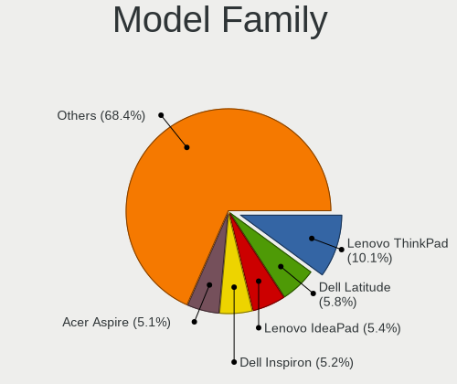

| Name                  | Notebooks | Percent |
|-----------------------|-----------|---------|
| Lenovo ThinkPad       | 58        | 10.32%  |
| Dell Latitude         | 29        | 5.16%   |
| Dell Inspiron         | 29        | 5.16%   |
| Acer Aspire           | 29        | 5.16%   |
| Lenovo IdeaPad        | 27        | 4.8%    |
| HP EliteBook          | 26        | 4.63%   |
| HP ProBook            | 20        | 3.56%   |
| Dell XPS              | 19        | 3.38%   |
| HP Pavilion           | 17        | 3.02%   |
| HP Laptop             | 11        | 1.96%   |
| ASUS ROG              | 10        | 1.78%   |
| Acer Swift            | 10        | 1.78%   |
| Dell Vostro           | 9         | 1.6%    |
| Unknown               | 8         | 1.42%   |
| ASUS VivoBook         | 7         | 1.25%   |
| HP ENVY               | 6         | 1.07%   |
| Toshiba Satellite     | 5         | 0.89%   |
| Fujitsu LIFEBOOK      | 5         | 0.89%   |
| Dell Precision        | 5         | 0.89%   |
| Lenovo ThinkBook      | 4         | 0.71%   |
| HP Notebook           | 4         | 0.71%   |
| Dell G3               | 4         | 0.71%   |
| ASUS ZenBook          | 4         | 0.71%   |
| Toshiba PORTEGE       | 3         | 0.53%   |
| Razer Blade           | 3         | 0.53%   |
| Lenovo G500           | 3         | 0.53%   |
| HUAWEI HLYL-WXX9      | 3         | 0.53%   |
| HP OMEN               | 3         | 0.53%   |
| Apple MacBookPro8     | 3         | 0.53%   |
| Acer TravelMate       | 3         | 0.53%   |
| System76 Serval       | 2         | 0.36%   |
| Samsung 300E4C        | 2         | 0.36%   |
| Packard Bell EasyNote | 2         | 0.36%   |
| Lenovo Yoga           | 2         | 0.36%   |
| Lenovo Legion         | 2         | 0.36%   |
| Lenovo G50-80         | 2         | 0.36%   |
| HUAWEI MACH-WX9       | 2         | 0.36%   |
| HUAWEI BOHK-WAX9X     | 2         | 0.36%   |
| HP ZBook              | 2         | 0.36%   |
| HP Spectre            | 2         | 0.36%   |
| HP Compaq             | 2         | 0.36%   |
| HP 255                | 2         | 0.36%   |
| HP 15                 | 2         | 0.36%   |
| Fujitsu STYLISTIC     | 2         | 0.36%   |
| Dell G7               | 2         | 0.36%   |
| Dell G5               | 2         | 0.36%   |
| ASUS X551CAP          | 2         | 0.36%   |
| ASUS T100HAN          | 2         | 0.36%   |
| ASUS ASUS             | 2         | 0.36%   |
| Wiltronic IVIEW       | 1         | 0.18%   |
| VINGA Iron            | 1         | 0.18%   |
| Toshiba TECRA         | 1         | 0.18%   |
| Toshiba QOSMIO        | 1         | 0.18%   |
| Timi TM1703           | 1         | 0.18%   |
| Timi TM1701           | 1         | 0.18%   |
| Timi Mi               | 1         | 0.18%   |
| Timi A35S             | 1         | 0.18%   |
| Teclast F7            | 1         | 0.18%   |
| System76 Oryx         | 1         | 0.18%   |
| System76 Galago       | 1         | 0.18%   |

MFG Year
--------

Motherboard manufacture year

| Year | Notebooks | Percent |
|------|-----------|---------|
| 2020 | 124       | 22.06%  |
| 2021 | 117       | 20.82%  |
| 2019 | 59        | 10.5%   |
| 2018 | 39        | 6.94%   |
| 2011 | 36        | 6.41%   |
| 2013 | 32        | 5.69%   |
| 2015 | 29        | 5.16%   |
| 2012 | 24        | 4.27%   |
| 2017 | 20        | 3.56%   |
| 2009 | 18        | 3.2%    |
| 2016 | 17        | 3.02%   |
| 2014 | 17        | 3.02%   |
| 2010 | 15        | 2.67%   |
| 2008 | 10        | 1.78%   |
| 2007 | 5         | 0.89%   |

Form Factor
-----------

Physical design of the computer

| Name     | Notebooks | Percent |
|----------|-----------|---------|
| Notebook | 562       | 100%    |

Secure Boot
-----------

Enabled or disabled

| State    | Notebooks | Percent |
|----------|-----------|---------|
| Disabled | 503       | 89.18%  |
| Enabled  | 61        | 10.82%  |

Coreboot
--------

Have coreboot on board

| Used | Notebooks | Percent |
|------|-----------|---------|
| No   | 558       | 99.29%  |
| Yes  | 4         | 0.71%   |

RAM Size
--------

Total RAM memory

| Size in GB  | Notebooks | Percent |
|-------------|-----------|---------|
| 4.01-8.0    | 179       | 31.85%  |
| 3.01-4.0    | 110       | 19.57%  |
| 16.01-24.0  | 107       | 19.04%  |
| 8.01-16.0   | 87        | 15.48%  |
| 32.01-64.0  | 45        | 8.01%   |
| 1.01-2.0    | 23        | 4.09%   |
| 64.01-256.0 | 6         | 1.07%   |
| 24.01-32.0  | 4         | 0.71%   |
| 2.01-3.0    | 1         | 0.18%   |

RAM Used
--------

Used RAM memory

| Used GB    | Notebooks | Percent |
|------------|-----------|---------|
| 1.01-2.0   | 214       | 36.71%  |
| 2.01-3.0   | 161       | 27.62%  |
| 3.01-4.0   | 88        | 15.09%  |
| 4.01-8.0   | 87        | 14.92%  |
| 8.01-16.0  | 17        | 2.92%   |
| 0.51-1.0   | 11        | 1.89%   |
| 16.01-24.0 | 2         | 0.34%   |
| 0.01-0.5   | 2         | 0.34%   |
| 24.01-32.0 | 1         | 0.17%   |

Total Drives
------------

Number of drives on board

| Drives | Notebooks | Percent |
|--------|-----------|---------|
| 1      | 422       | 74.69%  |
| 2      | 119       | 21.06%  |
| 3      | 13        | 2.3%    |
| 4      | 5         | 0.88%   |
| 0      | 4         | 0.71%   |
| 6      | 1         | 0.18%   |
| 5      | 1         | 0.18%   |

Has CD-ROM
----------

Has CD-ROM on board

| Presented | Notebooks | Percent |
|-----------|-----------|---------|
| No        | 386       | 68.68%  |
| Yes       | 176       | 31.32%  |

Has Ethernet
------------

Has Ethernet on board

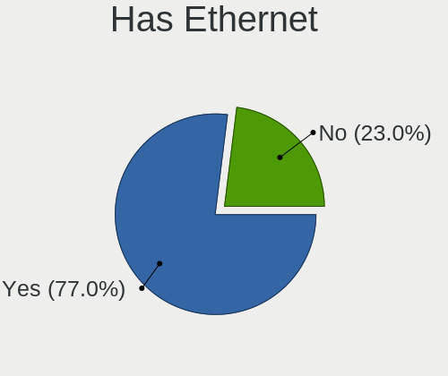

| Presented | Notebooks | Percent |
|-----------|-----------|---------|
| Yes       | 433       | 76.91%  |
| No        | 130       | 23.09%  |

Has WiFi
--------

Has WiFi module

| Presented | Notebooks | Percent |
|-----------|-----------|---------|
| Yes       | 548       | 97.34%  |
| No        | 15        | 2.66%   |

Has Bluetooth
-------------

Has Bluetooth module

| Presented | Notebooks | Percent |
|-----------|-----------|---------|
| Yes       | 451       | 80.11%  |
| No        | 112       | 19.89%  |

Location
--------

Country
-------

Geographic location (country)

| Country             | Notebooks | Percent |
|---------------------|-----------|---------|
| USA                 | 85        | 15.1%   |
| Germany             | 68        | 12.08%  |
| France              | 34        | 6.04%   |
| UK                  | 27        | 4.8%    |
| Russia              | 27        | 4.8%    |
| Italy               | 26        | 4.62%   |
| India               | 25        | 4.44%   |
| Spain               | 24        | 4.26%   |
| Brazil              | 24        | 4.26%   |
| Poland              | 20        | 3.55%   |
| Canada              | 15        | 2.66%   |
| Czechia             | 14        | 2.49%   |
| Netherlands         | 11        | 1.95%   |
| Finland             | 10        | 1.78%   |
| Ukraine             | 8         | 1.42%   |
| Mexico              | 8         | 1.42%   |
| Australia           | 8         | 1.42%   |
| Turkey              | 7         | 1.24%   |
| Austria             | 7         | 1.24%   |
| Switzerland         | 5         | 0.89%   |
| Sweden              | 5         | 0.89%   |
| Vietnam             | 4         | 0.71%   |
| South Africa        | 4         | 0.71%   |
| Romania             | 4         | 0.71%   |
| Indonesia           | 4         | 0.71%   |
| Greece              | 4         | 0.71%   |
| Chile               | 4         | 0.71%   |
| Portugal            | 3         | 0.53%   |
| Peru                | 3         | 0.53%   |
| Luxembourg          | 3         | 0.53%   |
| Japan               | 3         | 0.53%   |
| Israel              | 3         | 0.53%   |
| Hungary             | 3         | 0.53%   |
| Croatia             | 3         | 0.53%   |
| Colombia            | 3         | 0.53%   |
| China               | 3         | 0.53%   |
| Belgium             | 3         | 0.53%   |
| Belarus             | 3         | 0.53%   |
| Uruguay             | 2         | 0.36%   |
| Taiwan              | 2         | 0.36%   |
| Slovakia            | 2         | 0.36%   |
| Serbia              | 2         | 0.36%   |
| Saudi Arabia        | 2         | 0.36%   |
| Lithuania           | 2         | 0.36%   |
| Latvia              | 2         | 0.36%   |
| Ecuador             | 2         | 0.36%   |
| Denmark             | 2         | 0.36%   |
| Argentina           | 2         | 0.36%   |
| Zimbabwe            | 1         | 0.18%   |
| Trinidad and Tobago | 1         | 0.18%   |
| Sudan               | 1         | 0.18%   |
| Pakistan            | 1         | 0.18%   |
| Norway              | 1         | 0.18%   |
| New Zealand         | 1         | 0.18%   |
| Nepal               | 1         | 0.18%   |
| Morocco             | 1         | 0.18%   |
| Moldova             | 1         | 0.18%   |
| Mauritius           | 1         | 0.18%   |
| Malaysia            | 1         | 0.18%   |
| Malawi              | 1         | 0.18%   |

City
----

Geographic location (city)

| City           | Notebooks | Percent |
|----------------|-----------|---------|
| Moscow         | 10        | 1.75%   |
| Vienna         | 7         | 1.23%   |
| Prague         | 7         | 1.23%   |
| Paris          | 7         | 1.23%   |
| Milan          | 6         | 1.05%   |
| Helsinki       | 6         | 1.05%   |
| Warsaw         | 5         | 0.88%   |
| Cologne        | 5         | 0.88%   |
| Berlin         | 5         | 0.88%   |
| Kyiv           | 4         | 0.7%    |
| St Petersburg  | 3         | 0.53%   |
| Santiago       | 3         | 0.53%   |
| Nuremberg      | 3         | 0.53%   |
| New Delhi      | 3         | 0.53%   |
| Montreal       | 3         | 0.53%   |
| Madrid         | 3         | 0.53%   |
| Jakarta        | 3         | 0.53%   |
| Gdansk         | 3         | 0.53%   |
| Bielefeld      | 3         | 0.53%   |
| Athens         | 3         | 0.53%   |
| Zagreb         | 2         | 0.35%   |
| Valencia       | 2         | 0.35%   |
| Utrecht        | 2         | 0.35%   |
| Sydney         | 2         | 0.35%   |
| Stuttgart      | 2         | 0.35%   |
| Schifflange    | 2         | 0.35%   |
| S??o Paulo     | 2         | 0.35%   |
| Rostov-on-Don  | 2         | 0.35%   |
| Riga           | 2         | 0.35%   |
| Pune           | 2         | 0.35%   |
| Oklahoma City  | 2         | 0.35%   |
| Nizhnevartovsk | 2         | 0.35%   |
| New York       | 2         | 0.35%   |
| New Braunfels  | 2         | 0.35%   |
| Minsk          | 2         | 0.35%   |
| Mexico City    | 2         | 0.35%   |
| Los Angeles    | 2         | 0.35%   |
| London         | 2         | 0.35%   |
| Las Vegas      | 2         | 0.35%   |
| Krasnodar      | 2         | 0.35%   |
| Krakow         | 2         | 0.35%   |
| Kolkata        | 2         | 0.35%   |
| Kaunas         | 2         | 0.35%   |
| Johannesburg   | 2         | 0.35%   |
| Istanbul       | 2         | 0.35%   |
| Hamburg        | 2         | 0.35%   |
| Glasgow        | 2         | 0.35%   |
| Florence       | 2         | 0.35%   |
| Dresden        | 2         | 0.35%   |
| D??sseldorf    | 2         | 0.35%   |
| Dallas         | 2         | 0.35%   |
| Bucharest      | 2         | 0.35%   |
| Brno           | 2         | 0.35%   |
| Brisbane       | 2         | 0.35%   |
| Birmingham     | 2         | 0.35%   |
| Bengaluru      | 2         | 0.35%   |
| Belgrade       | 2         | 0.35%   |
| Barcelona      | 2         | 0.35%   |
| Alexandria     | 2         | 0.35%   |
| oma        | 1         | 0.18%   |

Drives
------

Drive Vendor
------------

Hard drive vendors

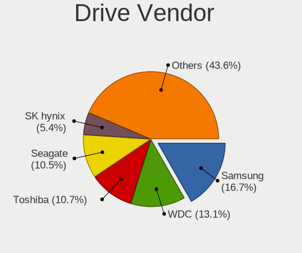

| Vendor                    | Notebooks | Drives | Percent |
|---------------------------|-----------|--------|---------|
| Samsung Electronics       | 110       | 128    | 16.13%  |
| WDC                       | 89        | 95     | 13.05%  |
| Toshiba                   | 72        | 86     | 10.56%  |
| Seagate                   | 71        | 78     | 10.41%  |
| SanDisk                   | 40        | 47     | 5.87%   |
| SK Hynix                  | 39        | 40     | 5.72%   |
| Unknown                   | 32        | 42     | 4.69%   |
| Intel                     | 27        | 35     | 3.96%   |
| Kingston                  | 25        | 26     | 3.67%   |
| HGST                      | 22        | 26     | 3.23%   |
| Crucial                   | 21        | 28     | 3.08%   |
| Micron Technology         | 17        | 18     | 2.49%   |
| Hitachi                   | 15        | 16     | 2.2%    |
| Apple                     | 8         | 8      | 1.17%   |
| A-DATA Technology         | 8         | 9      | 1.17%   |
| KIOXIA                    | 7         | 7      | 1.03%   |
| Patriot                   | 6         | 7      | 0.88%   |
| SPCC                      | 4         | 5      | 0.59%   |
| Micron/Crucial Technology | 4         | 4      | 0.59%   |
| LITEONIT                  | 4         | 8      | 0.59%   |
| LITEON                    | 4         | 4      | 0.59%   |
| Hewlett-Packard           | 4         | 4      | 0.59%   |
| Phison                    | 3         | 3      | 0.44%   |
| KingSpec                  | 3         | 3      | 0.44%   |
| China                     | 3         | 3      | 0.44%   |
| ASMT                      | 3         | 4      | 0.44%   |
| Union Memory              | 2         | 2      | 0.29%   |
| Transcend                 | 2         | 2      | 0.29%   |
| Team                      | 2         | 2      | 0.29%   |
| OCZ                       | 2         | 2      | 0.29%   |
| Lenovo                    | 2         | 3      | 0.29%   |
| Intenso                   | 2         | 3      | 0.29%   |
| Indilinx                  | 2         | 2      | 0.29%   |
| Fujitsu                   | 2         | 2      | 0.29%   |
| BIWIN                     | 2         | 2      | 0.29%   |
| XPG                       | 1         | 1      | 0.15%   |
| VALK                      | 1         | 1      | 0.15%   |
| USB3.1                    | 1         | 1      | 0.15%   |
| Teclast                   | 1         | 1      | 0.15%   |
| StoreJet                  | 1         | 1      | 0.15%   |
| Solid State Storage       | 1         | 1      | 0.15%   |
| Silicon Motion            | 1         | 1      | 0.15%   |
| S3+                       | 1         | 1      | 0.15%   |
| PNY                       | 1         | 2      | 0.15%   |
| PLEXTOR                   | 1         | 1      | 0.15%   |
| Phison Electronics        | 1         | 2      | 0.15%   |
| PCIe SSD                  | 1         | 2      | 0.15%   |
| OSCOO                     | 1         | 1      | 0.15%   |
| Netac                     | 1         | 1      | 0.15%   |
| Mushkin                   | 1         | 2      | 0.15%   |
| Lite-On                   | 1         | 1      | 0.15%   |
| KingFast                  | 1         | 1      | 0.15%   |
| HGST HUS                  | 1         | 1      | 0.15%   |
| EZCOOL                    | 1         | 1      | 0.15%   |
| External                  | 1         | 1      | 0.15%   |
| EMTEC                     | 1         | 1      | 0.15%   |
| Dogfish                   | 1         | 1      | 0.15%   |
| ADATA Technology          | 1         | 1      | 0.15%   |

Drive Model
-----------

Hard drive models

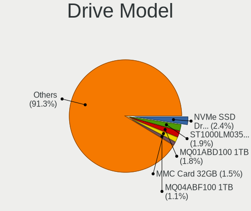

| Model                                  | Notebooks | Percent |
|----------------------------------------|-----------|---------|
| Samsung NVMe SSD Drive 512GB           | 17        | 2.39%   |
| Seagate ST1000LM035-1RK172 1TB         | 16        | 2.25%   |
| Toshiba MQ01ABD100 1TB                 | 12        | 1.69%   |
| Unknown MMC Card  32GB                 | 9         | 1.27%   |
| HGST HTS721010A9E630 1TB               | 9         | 1.27%   |
| Toshiba MQ01ABF050 500GB               | 8         | 1.13%   |
| Intel NVMe SSD Drive 512GB             | 8         | 1.13%   |
| Seagate ST500LT012-1DG142 500GB        | 7         | 0.99%   |
| Seagate ST1000LM024 HN-M101MBB 1TB     | 7         | 0.99%   |
| SK Hynix NVMe SSD Drive 512GB          | 6         | 0.85%   |
| Sandisk NVMe SSD Drive 512GB           | 6         | 0.85%   |
| Unknown MMC Card  64GB                 | 5         | 0.7%    |
| Samsung NVMe SSD Drive 1TB             | 5         | 0.7%    |
| HGST HTS545050A7E680 500GB             | 5         | 0.7%    |
| WDC PC SN730 SDBQNTY-512G-1001 512GB   | 4         | 0.56%   |
| Toshiba NVMe SSD Drive 512GB           | 4         | 0.56%   |
| Toshiba MQ04ABF100 1TB                 | 4         | 0.56%   |
| SK Hynix NVMe SSD Drive 128GB          | 4         | 0.56%   |
| SK Hynix NVMe SSD Drive 1024GB         | 4         | 0.56%   |
| Seagate ST9500325AS 500GB              | 4         | 0.56%   |
| WDC WDS500G2B0A-00SM50 500GB SSD       | 3         | 0.42%   |
| WDC PC SN730 SDBPNTY-512G-1027 512GB   | 3         | 0.42%   |
| WDC PC SN730 NVMe 1024GB               | 3         | 0.42%   |
| SK Hynix BC511 NVMe 512GB              | 3         | 0.42%   |
| Seagate ST1000LM014-1EJ164 1TB         | 3         | 0.42%   |
| SanDisk SSD PLUS 480GB                 | 3         | 0.42%   |
| SanDisk SSD PLUS 240GB                 | 3         | 0.42%   |
| Sandisk NVMe SSD Drive 256GB           | 3         | 0.42%   |
| Samsung SSD 850 EVO 250GB              | 3         | 0.42%   |
| Samsung SSD 840 EVO 120GB              | 3         | 0.42%   |
| Samsung NVMe SSD Drive 256GB           | 3         | 0.42%   |
| Samsung MZVLW256HEHP-000L7 256GB       | 3         | 0.42%   |
| Samsung MZVLQ512HALU-000H1 512GB       | 3         | 0.42%   |
| Samsung HM500JI 500GB                  | 3         | 0.42%   |
| Micron/Crucial NVMe SSD Drive 1TB      | 3         | 0.42%   |
| KIOXIA KBG40ZNS512G NVMe 512GB         | 3         | 0.42%   |
| Kingston SUV400S37120G 120GB SSD       | 3         | 0.42%   |
| Kingston SA400S37240G 240GB SSD        | 3         | 0.42%   |
| Kingston SA400S37120G 120GB SSD        | 3         | 0.42%   |
| HGST HTS545050A7E380 500GB             | 3         | 0.42%   |
| Crucial CT120BX500SSD1 120GB           | 3         | 0.42%   |
| A-DATA SP550 240GB SSD                 | 3         | 0.42%   |
| WDC WDS120G2G0A-00JH30 120GB SSD       | 2         | 0.28%   |
| WDC WDS100T2B0A-00SM50 1TB SSD         | 2         | 0.28%   |
| WDC WD5000LPVX-22V0TT0 500GB           | 2         | 0.28%   |
| WDC WD5000BPVT-22HXZT3 500GB           | 2         | 0.28%   |
| WDC WD3200BPVT-22JJ5T0 320GB           | 2         | 0.28%   |
| WDC WD10SPZX-24Z10 1TB                 | 2         | 0.28%   |
| WDC WD10SPCX-24HWST1 1TB               | 2         | 0.28%   |
| WDC WD10JPVX-22JC3T0 1TB               | 2         | 0.28%   |
| WDC PC SN530 SDBPNPZ-512G-1114 512GB   | 2         | 0.28%   |
| WDC PC SN520 SDAPNUW-512G-1006 512GB   | 2         | 0.28%   |
| WDC PC SN520 SDAPNUW-256G-1014 256GB   | 2         | 0.28%   |
| Unknown SD/MMC/MS PRO 64GB             | 2         | 0.28%   |
| Unknown MMC Card  16GB                 | 2         | 0.28%   |
| Unknown MMC Card  128GB                | 2         | 0.28%   |
| Toshiba THNSNJ128GMCU 128GB SSD        | 2         | 0.28%   |
| Toshiba KXG60ZNV512G NVMe KIOXIA 512GB | 2         | 0.28%   |
| Toshiba KXG60ZNV512G 512GB             | 2         | 0.28%   |
| Toshiba KXG60ZNV1T02 NVMe 1024GB       | 2         | 0.28%   |

HDD Vendor
----------

Hard disk drive vendors

| Vendor              | Notebooks | Drives | Percent |
|---------------------|-----------|--------|---------|
| Seagate             | 68        | 72     | 33.5%   |
| WDC                 | 48        | 51     | 23.65%  |
| Toshiba             | 37        | 42     | 18.23%  |
| HGST                | 22        | 26     | 10.84%  |
| Hitachi             | 15        | 16     | 7.39%   |
| Samsung Electronics | 5         | 7      | 2.46%   |
| Intenso             | 2         | 3      | 0.99%   |
| Fujitsu             | 2         | 2      | 0.99%   |
| ASMT                | 2         | 3      | 0.99%   |
| StoreJet            | 1         | 1      | 0.49%   |
| Apple               | 1         | 1      | 0.49%   |

SSD Vendor
----------

Solid state drive vendors

| Vendor              | Notebooks | Drives | Percent |
|---------------------|-----------|--------|---------|
| Samsung Electronics | 47        | 55     | 23.15%  |
| SanDisk             | 26        | 29     | 12.81%  |
| Crucial             | 20        | 27     | 9.85%   |
| Kingston            | 18        | 19     | 8.87%   |
| WDC                 | 10        | 10     | 4.93%   |
| Intel               | 9         | 12     | 4.43%   |
| Toshiba             | 7         | 8      | 3.45%   |
| Patriot             | 6         | 7      | 2.96%   |
| Micron Technology   | 6         | 6      | 2.96%   |
| Apple               | 5         | 5      | 2.46%   |
| SPCC                | 4         | 5      | 1.97%   |
| SK Hynix            | 4         | 4      | 1.97%   |
| LITEONIT            | 4         | 8      | 1.97%   |
| LITEON              | 4         | 4      | 1.97%   |
| Hewlett-Packard     | 4         | 4      | 1.97%   |
| A-DATA Technology   | 4         | 4      | 1.97%   |
| KingSpec            | 3         | 3      | 1.48%   |
| China               | 3         | 3      | 1.48%   |
| Transcend           | 2         | 2      | 0.99%   |
| Team                | 2         | 2      | 0.99%   |
| OCZ                 | 2         | 2      | 0.99%   |
| Indilinx            | 2         | 2      | 0.99%   |
| VALK                | 1         | 1      | 0.49%   |
| Union Memory        | 1         | 1      | 0.49%   |
| Teclast             | 1         | 1      | 0.49%   |
| S3+                 | 1         | 1      | 0.49%   |
| PNY                 | 1         | 2      | 0.49%   |
| PLEXTOR             | 1         | 1      | 0.49%   |
| OSCOO               | 1         | 1      | 0.49%   |
| Lenovo              | 1         | 2      | 0.49%   |
| EZCOOL              | 1         | 1      | 0.49%   |
| Dogfish             | 1         | 1      | 0.49%   |
| ASMT                | 1         | 1      | 0.49%   |

Drive Kind
----------

HDD or SSD

| Kind    | Notebooks | Drives | Percent |
|---------|-----------|--------|---------|
| NVMe    | 229       | 266    | 34.7%   |
| HDD     | 197       | 224    | 29.85%  |
| SSD     | 190       | 234    | 28.79%  |
| MMC     | 31        | 41     | 4.7%    |
| Unknown | 13        | 16     | 1.97%   |

Drive Connector
---------------

SATA, SAS, NVMe, etc.

| Type | Notebooks | Drives | Percent |
|------|-----------|--------|---------|
| SATA | 350       | 442    | 55.47%  |
| NVMe | 228       | 265    | 36.13%  |
| MMC  | 31        | 41     | 4.91%   |
| SAS  | 22        | 33     | 3.49%   |

Drive Size
----------

Size of hard drive

| Size in TB | Notebooks | Drives | Percent |
|------------|-----------|--------|---------|
| 0.01-0.5   | 249       | 307    | 65.35%  |
| 0.51-1.0   | 118       | 134    | 30.97%  |
| 1.01-2.0   | 11        | 12     | 2.89%   |
| 3.01-4.0   | 1         | 2      | 0.26%   |
| 2.01-3.0   | 1         | 1      | 0.26%   |
| 4.01-10.0  | 1         | 2      | 0.26%   |

Space Total
-----------

Amount of disk space available on the file system

| Size in GB     | Notebooks | Percent |
|----------------|-----------|---------|
| 101-250        | 170       | 30.04%  |
| 251-500        | 164       | 28.98%  |
| 501-1000       | 87        | 15.37%  |
| 51-100         | 43        | 7.6%    |
| 1-20           | 38        | 6.71%   |
| 1001-2000      | 24        | 4.24%   |
| 21-50          | 21        | 3.71%   |
| More than 3000 | 11        | 1.94%   |
| 2001-3000      | 4         | 0.71%   |
| Unknown        | 4         | 0.71%   |

Space Used
----------

Amount of used disk space

| Used GB        | Notebooks | Percent |
|----------------|-----------|---------|
| 1-20           | 239       | 41.49%  |
| 21-50          | 107       | 18.58%  |
| 51-100         | 84        | 14.58%  |
| 101-250        | 76        | 13.19%  |
| 251-500        | 33        | 5.73%   |
| 501-1000       | 19        | 3.3%    |
| 1001-2000      | 7         | 1.22%   |
| More than 3000 | 6         | 1.04%   |
| Unknown        | 4         | 0.69%   |
| 2001-3000      | 1         | 0.17%   |

Malfunc. Drives
---------------

Drive models with a malfunction

| Model                                         | Notebooks | Drives | Percent |
|-----------------------------------------------|-----------|--------|---------|
| Seagate ST500LM021-1KJ152 500GB               | 2         | 2      | 9.09%   |
| WDC WD5000LPLX-60ZNTT1 500GB                  | 1         | 1      | 4.55%   |
| WDC WD3200LPCX-24C6HT0 320GB                  | 1         | 1      | 4.55%   |
| WDC WD10SPZX-17Z10T0 1TB                      | 1         | 1      | 4.55%   |
| Toshiba MK3263GSXN 320GB                      | 1         | 1      | 4.55%   |
| SK Hynix HFS256G39TND-N210A 256GB SSD         | 1         | 1      | 4.55%   |
| Seagate ST9320423AS 320GB                     | 1         | 1      | 4.55%   |
| Seagate ST500LT012-1DG142 500GB               | 1         | 1      | 4.55%   |
| Seagate ST320LT020-9YG142 320GB               | 1         | 1      | 4.55%   |
| Seagate ST1000LM035-1RK172 1TB                | 1         | 1      | 4.55%   |
| SanDisk SSD U100 128GB                        | 1         | 1      | 4.55%   |
| SanDisk SSD PLUS 480GB                        | 1         | 1      | 4.55%   |
| SanDisk SDSSDHII240G 240GB                    | 1         | 1      | 4.55%   |
| Samsung Electronics SSD 860 EVO 500GB         | 1         | 1      | 4.55%   |
| Samsung Electronics SSD 850 EVO 250GB         | 1         | 1      | 4.55%   |
| Micron Technology MTFDDAT256MAM-1K2 256GB SSD | 1         | 1      | 4.55%   |
| LITEONIT LMT-32L3M mSATA 32GB SSD             | 1         | 1      | 4.55%   |
| Hitachi HTS542525K9A300 250GB                 | 1         | 1      | 4.55%   |
| HGST HTS725050A7E630 500GB                    | 1         | 1      | 4.55%   |
| Fujitsu MHV2080BH PL 80GB                     | 1         | 1      | 4.55%   |
| Crucial CT1000P1SSD8 1TB                      | 1         | 1      | 4.55%   |

Malfunc. Drive Vendor
---------------------

Vendors of faulty drives

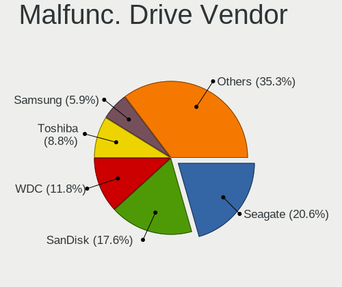

| Vendor              | Notebooks | Drives | Percent |
|---------------------|-----------|--------|---------|
| Seagate             | 6         | 6      | 27.27%  |
| WDC                 | 3         | 3      | 13.64%  |
| SanDisk             | 3         | 3      | 13.64%  |
| Samsung Electronics | 2         | 2      | 9.09%   |
| Toshiba             | 1         | 1      | 4.55%   |
| SK Hynix            | 1         | 1      | 4.55%   |
| Micron Technology   | 1         | 1      | 4.55%   |
| LITEONIT            | 1         | 1      | 4.55%   |
| Hitachi             | 1         | 1      | 4.55%   |
| HGST                | 1         | 1      | 4.55%   |
| Fujitsu             | 1         | 1      | 4.55%   |
| Crucial             | 1         | 1      | 4.55%   |

Malfunc. HDD Vendor
-------------------

Vendors of faulty HDD drives

| Vendor  | Notebooks | Drives | Percent |
|---------|-----------|--------|---------|
| Seagate | 6         | 6      | 46.15%  |
| WDC     | 3         | 3      | 23.08%  |
| Toshiba | 1         | 1      | 7.69%   |
| Hitachi | 1         | 1      | 7.69%   |
| HGST    | 1         | 1      | 7.69%   |
| Fujitsu | 1         | 1      | 7.69%   |

Malfunc. Drive Kind
-------------------

Kinds of faulty drives

| Kind | Notebooks | Drives | Percent |
|------|-----------|--------|---------|
| HDD  | 13        | 13     | 59.09%  |
| SSD  | 8         | 8      | 36.36%  |
| NVMe | 1         | 1      | 4.55%   |

Failed Drives
-------------

Failed drive models

Zero info for selected period =(

Failed Drive Vendor
-------------------

Failed drive vendors

Zero info for selected period =(

Drive Status
------------

Number of failed and malfunc. drives

| Status   | Notebooks | Drives | Percent |
|----------|-----------|--------|---------|
| Detected | 360       | 502    | 60.71%  |
| Works    | 211       | 257    | 35.58%  |
| Malfunc  | 22        | 22     | 3.71%   |

Storage controller
------------------

Storage Vendor
--------------

Storage controller vendors

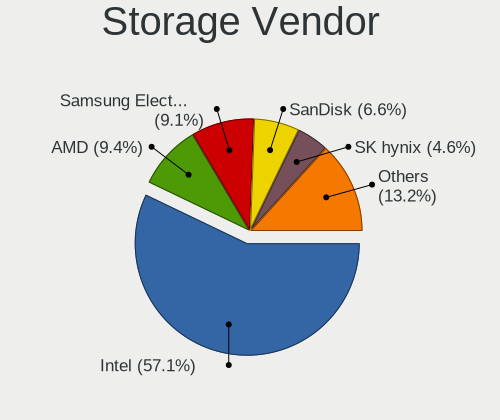

| Vendor                         | Notebooks | Percent |
|--------------------------------|-----------|---------|
| Intel                          | 394       | 58.2%   |
| Samsung Electronics            | 61        | 9.01%   |
| AMD                            | 58        | 8.57%   |
| Sandisk                        | 44        | 6.5%    |
| SK Hynix                       | 34        | 5.02%   |
| Toshiba America Info Systems   | 27        | 3.99%   |
| Micron Technology              | 11        | 1.62%   |
| KIOXIA                         | 10        | 1.48%   |
| Kingston Technology Company    | 7         | 1.03%   |
| Micron/Crucial Technology      | 5         | 0.74%   |
| ADATA Technology               | 5         | 0.74%   |
| Phison Electronics             | 4         | 0.59%   |
| Nvidia                         | 4         | 0.59%   |
| Silicon Motion                 | 3         | 0.44%   |
| Apple                          | 2         | 0.3%    |
| Union Memory (Shenzhen)        | 1         | 0.15%   |
| Solid State Storage Technology | 1         | 0.15%   |
| Seagate Technology             | 1         | 0.15%   |
| Realtek Semiconductor          | 1         | 0.15%   |
| Marvell Technology Group       | 1         | 0.15%   |
| Lite-On Technology             | 1         | 0.15%   |
| Lenovo                         | 1         | 0.15%   |
| ASMedia Technology             | 1         | 0.15%   |

Storage Model
-------------

Storage controller models

| Model                                                                            | Notebooks | Percent |
|----------------------------------------------------------------------------------|-----------|---------|
| AMD FCH SATA Controller [AHCI mode]                                              | 50        | 6.98%   |
| Intel 7 Series Chipset Family 6-port SATA Controller [AHCI mode]                 | 49        | 6.84%   |
| Intel Sunrise Point-LP SATA Controller [AHCI mode]                               | 42        | 5.87%   |
| Intel 82801 Mobile SATA Controller [RAID mode]                                   | 35        | 4.89%   |
| Intel 6 Series/C200 Series Chipset Family 6 port Mobile SATA AHCI Controller     | 29        | 4.05%   |
| Samsung NVMe SSD Controller SM981/PM981/PM983                                    | 25        | 3.49%   |
| Samsung NVMe Controller                                                          | 25        | 3.49%   |
| Intel 8 Series SATA Controller 1 [AHCI mode]                                     | 24        | 3.35%   |
| Intel Volume Management Device NVMe RAID Controller                              | 20        | 2.79%   |
| Sandisk WD Black SN750 / PC SN730 NVMe SSD                                       | 19        | 2.65%   |
| Intel Cannon Lake Mobile PCH SATA AHCI Controller                                | 19        | 2.65%   |
| Intel Wildcat Point-LP SATA Controller [AHCI Mode]                               | 16        | 2.23%   |
| Intel 82801IBM/IEM (ICH9M/ICH9M-E) 4 port SATA Controller [AHCI mode]            | 14        | 1.96%   |
| Intel 5 Series/3400 Series Chipset 4 port SATA AHCI Controller                   | 14        | 1.96%   |
| Intel 8 Series/C220 Series Chipset Family 6-port SATA Controller 1 [AHCI mode]   | 13        | 1.82%   |
| Toshiba America Info Systems XG6 NVMe SSD Controller                             | 11        | 1.54%   |
| Micron Non-Volatile memory controller                                            | 11        | 1.54%   |
| Intel Comet Lake SATA AHCI Controller                                            | 11        | 1.54%   |
| Intel 400 Series Chipset Family SATA AHCI Controller                             | 11        | 1.54%   |
| SK Hynix BC511                                                                   | 10        | 1.4%    |
| KIOXIA Non-Volatile memory controller                                            | 10        | 1.4%    |
| Intel Ice Lake-LP SATA Controller [AHCI mode]                                    | 10        | 1.4%    |
| Intel Cannon Point-LP SATA Controller [AHCI Mode]                                | 10        | 1.4%    |
| Intel 82801HM/HEM (ICH8M/ICH8M-E) IDE Controller                                 | 10        | 1.4%    |
| Intel 5 Series/3400 Series Chipset 6 port SATA AHCI Controller                   | 10        | 1.4%    |
| SK Hynix NVMe SSD Controller                                                     | 9         | 1.26%   |
| Sandisk WD Blue SN550 NVMe SSD                                                   | 9         | 1.26%   |
| Intel HM170/QM170 Chipset SATA Controller [AHCI Mode]                            | 9         | 1.26%   |
| Intel 82801HM/HEM (ICH8M/ICH8M-E) SATA Controller [AHCI mode]                    | 9         | 1.26%   |
| Toshiba America Info Systems Toshiba America Info Non-Volatile memory controller | 8         | 1.12%   |
| Sandisk WD Blue SN500 / PC SN520 NVMe SSD                                        | 8         | 1.12%   |
| Samsung NVMe SSD Controller SM961/PM961/SM963                                    | 8         | 1.12%   |
| Intel Tiger Lake-LP SATA Controller [AHCI mode]                                  | 8         | 1.12%   |
| Intel SSD 660P Series                                                            | 8         | 1.12%   |
| SK Hynix BC501 NVMe Solid State Drive                                            | 7         | 0.98%   |
| Toshiba America Info Systems BG3 NVMe SSD Controller                             | 6         | 0.84%   |
| SK Hynix Non-Volatile memory controller                                          | 6         | 0.84%   |
| Intel Celeron/Pentium Silver Processor SATA Controller                           | 6         | 0.84%   |
| AMD SB7x0/SB8x0/SB9x0 SATA Controller [AHCI mode]                                | 6         | 0.84%   |
| Intel Atom/Celeron/Pentium Processor x5-E8000/J3xxx/N3xxx Series SATA Controller | 5         | 0.7%    |
| Intel Atom Processor E3800 Series SATA AHCI Controller                           | 5         | 0.7%    |
| Sandisk PC SN520 NVMe SSD                                                        | 4         | 0.56%   |
| Intel SSD Pro 7600p/760p/E 6100p Series                                          | 4         | 0.56%   |
| Intel Non-Volatile memory controller                                             | 4         | 0.56%   |
| Sandisk WD Black 2018/SN750 / PC SN720 NVMe SSD                                  | 3         | 0.42%   |
| Phison E12 NVMe Controller                                                       | 3         | 0.42%   |
| Micron/Crucial P1 NVMe PCIe SSD                                                  | 3         | 0.42%   |
| Kingston Company A2000 NVMe SSD                                                  | 3         | 0.42%   |
| Intel Q170/Q150/B150/H170/H110/Z170/CM236 Chipset SATA Controller [AHCI Mode]    | 3         | 0.42%   |
| Intel 82801GBM/GHM (ICH7-M Family) SATA Controller [IDE mode]                    | 3         | 0.42%   |
| Intel 500 Series Chipset Family SATA AHCI Controller                             | 3         | 0.42%   |
| ADATA Non-Volatile memory controller                                             | 3         | 0.42%   |
| Silicon Motion SM2263EN/SM2263XT SSD Controller                                  | 2         | 0.28%   |
| Samsung Electronics SATA controller                                              | 2         | 0.28%   |
| Nvidia MCP89 SATA Controller (AHCI mode)                                         | 2         | 0.28%   |
| Nvidia MCP79 AHCI Controller                                                     | 2         | 0.28%   |
| Kingston Company U-SNS8154P3 NVMe SSD                                            | 2         | 0.28%   |
| Intel SSD 600P Series                                                            | 2         | 0.28%   |
| Intel NM10/ICH7 Family SATA Controller [AHCI mode]                               | 2         | 0.28%   |
| Intel Celeron N3350/Pentium N4200/Atom E3900 Series SATA AHCI Controller         | 2         | 0.28%   |

Storage Kind
------------

Kind of storage controller (IDE, SATA, NVMe, SAS, ...)

| Kind | Notebooks | Percent |
|------|-----------|---------|
| SATA | 391       | 55.86%  |
| NVMe | 227       | 32.43%  |
| RAID | 57        | 8.14%   |
| IDE  | 25        | 3.57%   |

Processor
---------

CPU Vendor
----------

Processor vendors

| Vendor | Notebooks | Percent |
|--------|-----------|---------|
| Intel  | 465       | 82.74%  |
| AMD    | 97        | 17.26%  |

CPU Model
---------

Processor models

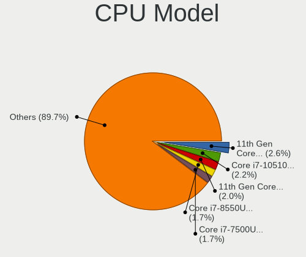

| Model                                         | Notebooks | Percent |
|-----------------------------------------------|-----------|---------|
| Intel Core i7-10750H CPU @ 2.60GHz            | 14        | 2.49%   |
| Intel Core i7-8550U CPU @ 1.80GHz             | 13        | 2.31%   |
| Intel Core i7-10510U CPU @ 1.80GHz            | 13        | 2.31%   |
| Intel 11th Gen Core i7-1165G7 @ 2.80GHz       | 12        | 2.14%   |
| Intel Core i5-8250U CPU @ 1.60GHz             | 11        | 1.96%   |
| Intel Core i7-9750H CPU @ 2.60GHz             | 10        | 1.78%   |
| Intel 11th Gen Core i5-1135G7 @ 2.40GHz       | 10        | 1.78%   |
| Intel Core i7-7500U CPU @ 2.70GHz             | 9         | 1.6%    |
| Intel Core i5-8265U CPU @ 1.60GHz             | 9         | 1.6%    |
| AMD Ryzen 7 PRO 4750U with Radeon Graphics    | 9         | 1.6%    |
| Intel Core i7-8565U CPU @ 1.80GHz             | 8         | 1.42%   |
| Intel Core i7-7700HQ CPU @ 2.80GHz            | 8         | 1.42%   |
| Intel Core i5-1035G1 CPU @ 1.00GHz            | 8         | 1.42%   |
| Intel Core i5-4200U CPU @ 1.60GHz             | 7         | 1.25%   |
| Intel Core i5-3320M CPU @ 2.60GHz             | 7         | 1.25%   |
| Intel Core i3-2310M CPU @ 2.10GHz             | 7         | 1.25%   |
| AMD Ryzen 7 4800H with Radeon Graphics        | 7         | 1.25%   |
| Intel Core i5-7200U CPU @ 2.50GHz             | 6         | 1.07%   |
| Intel Core i5-5200U CPU @ 2.20GHz             | 6         | 1.07%   |
| AMD Ryzen 7 5800H with Radeon Graphics        | 6         | 1.07%   |
| AMD Ryzen 5 4500U with Radeon Graphics        | 6         | 1.07%   |
| Intel Core i5-5300U CPU @ 2.30GHz             | 5         | 0.89%   |
| Intel Core i5-3210M CPU @ 2.50GHz             | 5         | 0.89%   |
| Intel Core i5-10210U CPU @ 1.60GHz            | 5         | 0.89%   |
| Intel Core i3-4005U CPU @ 1.70GHz             | 5         | 0.89%   |
| Intel Core 2 Duo CPU P8600 @ 2.40GHz          | 5         | 0.89%   |
| Intel 11th Gen Core i7-1185G7 @ 3.00GHz       | 5         | 0.89%   |
| AMD Ryzen 5 4600H with Radeon Graphics        | 5         | 0.89%   |
| AMD Ryzen 5 3500U with Radeon Vega Mobile Gfx | 5         | 0.89%   |
| Intel Core i7-8750H CPU @ 2.20GHz             | 4         | 0.71%   |
| Intel Core i7-6500U CPU @ 2.50GHz             | 4         | 0.71%   |
| Intel Core i5-6200U CPU @ 2.30GHz             | 4         | 0.71%   |
| Intel Atom x5-Z8350 CPU @ 1.44GHz             | 4         | 0.71%   |
| AMD Athlon Silver 3050U with Radeon Graphics  | 4         | 0.71%   |
| Intel Core i7-6700HQ CPU @ 2.60GHz            | 3         | 0.53%   |
| Intel Core i7-4800MQ CPU @ 2.70GHz            | 3         | 0.53%   |
| Intel Core i7-4710HQ CPU @ 2.50GHz            | 3         | 0.53%   |
| Intel Core i7-3630QM CPU @ 2.40GHz            | 3         | 0.53%   |
| Intel Core i7-2640M CPU @ 2.80GHz             | 3         | 0.53%   |
| Intel Core i7-1065G7 CPU @ 1.30GHz            | 3         | 0.53%   |
| Intel Core i5-8350U CPU @ 1.70GHz             | 3         | 0.53%   |
| Intel Core i5-7300U CPU @ 2.60GHz             | 3         | 0.53%   |
| Intel Core i5-4300U CPU @ 1.90GHz             | 3         | 0.53%   |
| Intel Core i5-4210U CPU @ 1.70GHz             | 3         | 0.53%   |
| Intel Core i5-3427U CPU @ 1.80GHz             | 3         | 0.53%   |
| Intel Core i5-3230M CPU @ 2.60GHz             | 3         | 0.53%   |
| Intel Core i5-2520M CPU @ 2.50GHz             | 3         | 0.53%   |
| Intel Core i5-2450M CPU @ 2.50GHz             | 3         | 0.53%   |
| Intel Core i5-2410M CPU @ 2.30GHz             | 3         | 0.53%   |
| Intel Core i5 CPU M 520 @ 2.40GHz             | 3         | 0.53%   |
| Intel Core i3-3217U CPU @ 1.80GHz             | 3         | 0.53%   |
| Intel Core i3-2330M CPU @ 2.20GHz             | 3         | 0.53%   |
| Intel Core i3-1005G1 CPU @ 1.20GHz            | 3         | 0.53%   |
| Intel Core i3 CPU M 380 @ 2.53GHz             | 3         | 0.53%   |
| Intel Core i3 CPU M 330 @ 2.13GHz             | 3         | 0.53%   |
| Intel Core 2 Duo CPU T6600 @ 2.20GHz          | 3         | 0.53%   |
| Intel Celeron CPU N3060 @ 1.60GHz             | 3         | 0.53%   |
| Intel Celeron CPU N2840 @ 2.16GHz             | 3         | 0.53%   |
| Intel Celeron CPU 1007U @ 1.50GHz             | 3         | 0.53%   |
| Intel 11th Gen Core i7-11800H @ 2.30GHz       | 3         | 0.53%   |

CPU Model Family
----------------

Processor model prefix

| Model                          | Notebooks | Percent |
|--------------------------------|-----------|---------|
| Intel Core i7                  | 144       | 25.62%  |
| Intel Core i5                  | 140       | 24.91%  |
| Intel Core i3                  | 50        | 8.9%    |
| Other                          | 39        | 6.94%   |
| Intel Core 2 Duo               | 28        | 4.98%   |
| Intel Celeron                  | 24        | 4.27%   |
| AMD Ryzen 7                    | 21        | 3.74%   |
| AMD Ryzen 5                    | 20        | 3.56%   |
| Intel Pentium                  | 16        | 2.85%   |
| Intel Atom                     | 12        | 2.14%   |
| AMD Ryzen 7 PRO                | 10        | 1.78%   |
| AMD Ryzen 9                    | 6         | 1.07%   |
| AMD Athlon                     | 6         | 1.07%   |
| AMD Ryzen 3                    | 5         | 0.89%   |
| AMD A10                        | 5         | 0.89%   |
| Intel Pentium Silver           | 4         | 0.71%   |
| AMD E                          | 4         | 0.71%   |
| AMD A8                         | 4         | 0.71%   |
| AMD A6                         | 4         | 0.71%   |
| Intel Pentium Dual-Core        | 3         | 0.53%   |
| Intel Core 2                   | 3         | 0.53%   |
| Intel Pentium Dual             | 2         | 0.36%   |
| Intel Core i9                  | 2         | 0.36%   |
| AMD E1                         | 2         | 0.36%   |
| Intel Core m7                  | 1         | 0.18%   |
| Intel Core M                   | 1         | 0.18%   |
| AMD Turion X2 Dual-Core Mobile | 1         | 0.18%   |
| AMD PRO A10                    | 1         | 0.18%   |
| AMD E2                         | 1         | 0.18%   |
| AMD Athlon X2                  | 1         | 0.18%   |
| AMD Athlon II Dual-Core        | 1         | 0.18%   |
| AMD A12                        | 1         | 0.18%   |

CPU Cores
---------

Number of processor cores

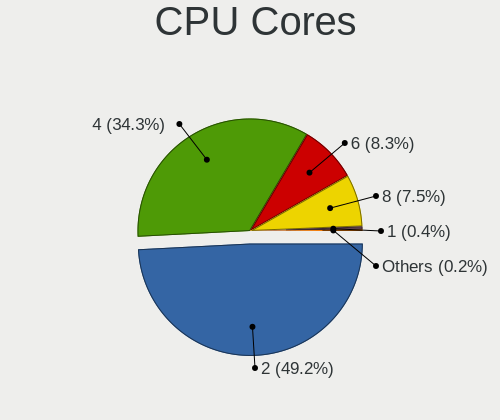

| Number | Notebooks | Percent |
|--------|-----------|---------|
| 2      | 279       | 49.64%  |
| 4      | 196       | 34.88%  |
| 6      | 47        | 8.36%   |
| 8      | 36        | 6.41%   |
| 1      | 3         | 0.53%   |
| 3      | 1         | 0.18%   |

CPU Sockets
-----------

Number of sockets

| Number | Notebooks | Percent |
|--------|-----------|---------|
| 1      | 562       | 100%    |

CPU Threads
-----------

Threads per core (Hyper-Threading)

| Number | Notebooks | Percent |
|--------|-----------|---------|
| 2      | 441       | 78.47%  |
| 1      | 121       | 21.53%  |

CPU Op-Modes
------------

CPU Operation Modes (32-bit, 64-bit)

| Op mode        | Notebooks | Percent |
|----------------|-----------|---------|
| 32-bit, 64-bit | 561       | 99.82%  |
| Unknown        | 1         | 0.18%   |

CPU Microcode
-------------

Microcode number

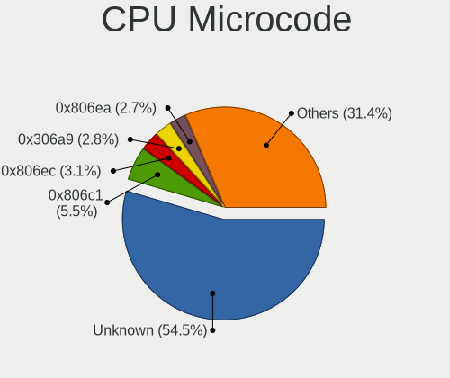

| Number     | Notebooks | Percent |
|------------|-----------|---------|
| Unknown    | 298       | 52.37%  |
| 0x806c1    | 25        | 4.39%   |
| 0x806ec    | 24        | 4.22%   |
| 0x806ea    | 19        | 3.34%   |
| 0x306a9    | 19        | 3.34%   |
| 0xa0652    | 14        | 2.46%   |
| 0x08600104 | 12        | 2.11%   |
| 0x206a7    | 11        | 1.93%   |
| 0x08600106 | 11        | 1.93%   |
| 0x706e5    | 10        | 1.76%   |
| 0x906ea    | 9         | 1.58%   |
| 0x806e9    | 9         | 1.58%   |
| 0x406e3    | 9         | 1.58%   |
| 0x306d4    | 9         | 1.58%   |
| 0x906e9    | 6         | 1.05%   |
| 0x806eb    | 6         | 1.05%   |
| 0x306c3    | 6         | 1.05%   |
| 0x08600103 | 6         | 1.05%   |
| 0x08108109 | 6         | 1.05%   |
| 0x1067a    | 5         | 0.88%   |
| 0x806d1    | 4         | 0.7%    |
| 0x406c4    | 4         | 0.7%    |
| 0x40651    | 4         | 0.7%    |
| 0x30678    | 4         | 0.7%    |
| 0x0a50000b | 4         | 0.7%    |
| 0x0a50000c | 3         | 0.53%   |
| 0x06006705 | 3         | 0.53%   |
| 0x706a1    | 2         | 0.35%   |
| 0x6fd      | 2         | 0.35%   |
| 0x506e3    | 2         | 0.35%   |
| 0x20655    | 2         | 0.35%   |
| 0x106e5    | 2         | 0.35%   |
| 0x08200103 | 2         | 0.35%   |
| 0x08108102 | 2         | 0.35%   |
| 0x05000119 | 2         | 0.35%   |
| 0x906ed    | 1         | 0.18%   |
| 0x706a8    | 1         | 0.18%   |
| 0x406c3    | 1         | 0.18%   |
| 0x30673    | 1         | 0.18%   |
| 0x20652    | 1         | 0.18%   |
| 0x08608103 | 1         | 0.18%   |
| 0x08608102 | 1         | 0.18%   |
| 0x0810100b | 1         | 0.18%   |
| 0x07030106 | 1         | 0.18%   |
| 0x07030105 | 1         | 0.18%   |
| 0x06006704 | 1         | 0.18%   |
| 0x06006110 | 1         | 0.18%   |
| 0x02000032 | 1         | 0.18%   |

CPU Microarch
-------------

Microarchitecture

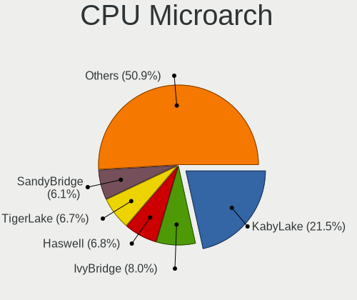

| Name            | Notebooks | Percent |
|-----------------|-----------|---------|
| KabyLake        | 124       | 22.06%  |
| IvyBridge       | 46        | 8.19%   |
| SandyBridge     | 43        | 7.65%   |
| Haswell         | 40        | 7.12%   |
| Zen 2           | 34        | 6.05%   |
| TigerLake       | 31        | 5.52%   |
| Westmere        | 24        | 4.27%   |
| Skylake         | 24        | 4.27%   |
| Silvermont      | 24        | 4.27%   |
| Penryn          | 22        | 3.91%   |
| IceLake         | 20        | 3.56%   |
| CometLake       | 19        | 3.38%   |
| Broadwell       | 19        | 3.38%   |
| Zen+            | 15        | 2.67%   |
| Core            | 14        | 2.49%   |
| Zen 3           | 11        | 1.96%   |
| Excavator       | 8         | 1.42%   |
| Goldmont plus   | 7         | 1.25%   |
| Piledriver      | 5         | 0.89%   |
| Bobcat          | 5         | 0.89%   |
| Unknown         | 5         | 0.89%   |
| Zen             | 4         | 0.71%   |
| Puma            | 3         | 0.53%   |
| Nehalem         | 3         | 0.53%   |
| K8 & K10 hybrid | 2         | 0.36%   |
| Jaguar          | 2         | 0.36%   |
| Goldmont        | 2         | 0.36%   |
| Bonnell         | 2         | 0.36%   |
| Steamroller     | 1         | 0.18%   |
| K8 Hammer       | 1         | 0.18%   |
| K10 Llano       | 1         | 0.18%   |
| K10             | 1         | 0.18%   |

Graphics
--------

GPU Vendor
----------

Vendors of graphics cards

| Vendor | Notebooks | Percent |
|--------|-----------|---------|
| Intel  | 418       | 59.12%  |
| Nvidia | 165       | 23.34%  |
| AMD    | 124       | 17.54%  |

GPU Model
---------

Graphics card models

| Model                                                                                    | Notebooks | Percent |
|------------------------------------------------------------------------------------------|-----------|---------|
| Intel 3rd Gen Core processor Graphics Controller                                         | 42        | 5.83%   |
| Intel 2nd Generation Core Processor Family Integrated Graphics Controller                | 39        | 5.41%   |
| AMD Renoir                                                                               | 33        | 4.58%   |
| Intel UHD Graphics 620                                                                   | 28        | 3.88%   |
| Intel TigerLake-LP GT2 [Iris Xe Graphics]                                                | 27        | 3.74%   |
| Intel Haswell-ULT Integrated Graphics Controller                                         | 25        | 3.47%   |
| Intel HD Graphics 620                                                                    | 22        | 3.05%   |
| Intel CometLake-U GT2 [UHD Graphics]                                                     | 22        | 3.05%   |
| Intel WhiskeyLake-U GT2 [UHD Graphics 620]                                               | 20        | 2.77%   |
| Intel Core Processor Integrated Graphics Controller                                      | 17        | 2.36%   |
| Intel CometLake-H GT2 [UHD Graphics]                                                     | 17        | 2.36%   |
| Intel CoffeeLake-H GT2 [UHD Graphics 630]                                                | 17        | 2.36%   |
| AMD Picasso                                                                              | 17        | 2.36%   |
| Intel Atom/Celeron/Pentium Processor x5-E8000/J3xxx/N3xxx Integrated Graphics Controller | 16        | 2.22%   |
| Intel HD Graphics 5500                                                                   | 15        | 2.08%   |
| Intel Skylake GT2 [HD Graphics 520]                                                      | 14        | 1.94%   |
| Intel 4th Gen Core Processor Integrated Graphics Controller                              | 14        | 1.94%   |
| Nvidia TU117M [GeForce GTX 1650 Mobile / Max-Q]                                          | 11        | 1.53%   |
| Intel Iris Plus Graphics G1 (Ice Lake)                                                   | 11        | 1.53%   |
| AMD Cezanne                                                                              | 10        | 1.39%   |
| Intel Mobile 4 Series Chipset Integrated Graphics Controller                             | 9         | 1.25%   |
| Nvidia GP108M [GeForce MX150]                                                            | 8         | 1.11%   |
| Intel Atom Processor Z36xxx/Z37xxx Series Graphics & Display                             | 8         | 1.11%   |
| Nvidia TU117M [GeForce GTX 1650 Ti Mobile]                                               | 7         | 0.97%   |
| Nvidia TU116M [GeForce GTX 1660 Ti Mobile]                                               | 7         | 0.97%   |
| Nvidia GM108M [GeForce 940MX]                                                            | 7         | 0.97%   |
| Intel Mobile GM965/GL960 Integrated Graphics Controller (secondary)                      | 6         | 0.83%   |
| Intel Mobile GM965/GL960 Integrated Graphics Controller (primary)                        | 6         | 0.83%   |
| Intel HD Graphics 530                                                                    | 6         | 0.83%   |
| Nvidia GP108M [GeForce MX250]                                                            | 5         | 0.69%   |
| Nvidia GP106M [GeForce GTX 1060 Mobile]                                                  | 5         | 0.69%   |
| Nvidia GA106M [GeForce RTX 3060 Mobile / Max-Q]                                          | 5         | 0.69%   |
| Intel HD Graphics 630                                                                    | 5         | 0.69%   |
| Nvidia TU117M                                                                            | 4         | 0.55%   |
| Nvidia TU106M [GeForce RTX 2060 Mobile]                                                  | 4         | 0.55%   |
| Nvidia GF117M [GeForce 610M/710M/810M/820M / GT 620M/625M/630M/720M]                     | 4         | 0.55%   |
| Intel TigerLake-H GT1 [UHD Graphics]                                                     | 4         | 0.55%   |
| Intel Iris Plus Graphics G7                                                              | 4         | 0.55%   |
| Intel GeminiLake [UHD Graphics 600]                                                      | 4         | 0.55%   |
| AMD Wani [Radeon R5/R6/R7 Graphics]                                                      | 4         | 0.55%   |
| AMD Stoney [Radeon R2/R3/R4/R5 Graphics]                                                 | 4         | 0.55%   |
| AMD Seymour [Radeon HD 6400M/7400M Series]                                               | 4         | 0.55%   |
| AMD Lucienne                                                                             | 4         | 0.55%   |
| Nvidia GP108M [GeForce MX230]                                                            | 3         | 0.42%   |
| Nvidia GP108BM [GeForce MX250]                                                           | 3         | 0.42%   |
| Nvidia GP107M [GeForce MX350]                                                            | 3         | 0.42%   |
| Nvidia GP107M [GeForce GTX 1050 Ti Mobile]                                               | 3         | 0.42%   |
| Nvidia GP107M [GeForce GTX 1050 Mobile]                                                  | 3         | 0.42%   |
| Nvidia GM204M [GeForce GTX 970M]                                                         | 3         | 0.42%   |
| Nvidia GM107M [GeForce GTX 960M]                                                         | 3         | 0.42%   |
| Nvidia GK208M [GeForce GT 740M]                                                          | 3         | 0.42%   |
| Nvidia GF108M [GeForce GT 540M]                                                          | 3         | 0.42%   |
| Nvidia GA104M [GeForce RTX 3070 Mobile / Max-Q]                                          | 3         | 0.42%   |
| Nvidia G84M [GeForce 8600M GT]                                                           | 3         | 0.42%   |
| Intel Tiger Lake UHD Graphics                                                            | 3         | 0.42%   |
| Intel GeminiLake [UHD Graphics 605]                                                      | 3         | 0.42%   |
| AMD Whistler [Radeon HD 6630M/6650M/6750M/7670M/7690M]                                   | 3         | 0.42%   |
| AMD Topaz XT [Radeon R7 M260/M265 / M340/M360 / M440/M445 / 530/535 / 620/625 Mobile]    | 3         | 0.42%   |
| Nvidia TU117M [GeForce MX450]                                                            | 2         | 0.28%   |
| Nvidia TU117GLM [Quadro T1000 Mobile]                                                    | 2         | 0.28%   |

GPU Combo
---------

Combinations of graphics cards

| Name           | Notebooks | Percent |
|----------------|-----------|---------|
| 1 x Intel      | 290       | 51.6%   |
| Intel + Nvidia | 111       | 19.75%  |
| 1 x AMD        | 84        | 14.95%  |
| 1 x Nvidia     | 37        | 6.58%   |
| Intel + AMD    | 17        | 3.02%   |
| AMD + Nvidia   | 17        | 3.02%   |
| 2 x AMD        | 6         | 1.07%   |

GPU Driver
----------

Free vs proprietary

| Driver      | Notebooks | Percent |
|-------------|-----------|---------|
| Free        | 478       | 84.75%  |
| Proprietary | 79        | 14.01%  |
| Unknown     | 7         | 1.24%   |

GPU Memory
----------

Total video memory

| Size in GB | Notebooks | Percent |
|------------|-----------|---------|
| Unknown    | 427       | 75.44%  |
| 1.01-2.0   | 42        | 7.42%   |
| 0.01-0.5   | 36        | 6.36%   |
| 3.01-4.0   | 26        | 4.59%   |
| 5.01-6.0   | 17        | 3%      |
| 0.51-1.0   | 11        | 1.94%   |
| 7.01-8.0   | 5         | 0.88%   |
| 2.01-3.0   | 1         | 0.18%   |
| 8.01-16.0  | 1         | 0.18%   |

Monitor
-------

Monitor Vendor
--------------

Monitor vendors

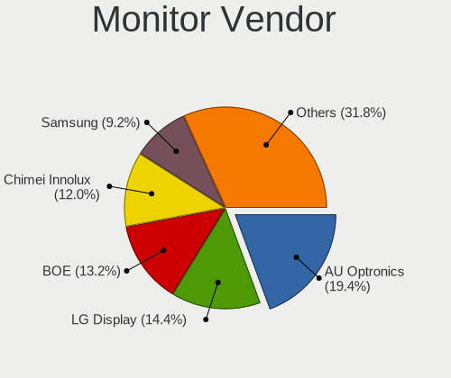

| Vendor                  | Notebooks | Percent |
|-------------------------|-----------|---------|
| AU Optronics            | 132       | 20.25%  |
| LG Display              | 98        | 15.03%  |
| Chimei Innolux          | 79        | 12.12%  |
| BOE                     | 77        | 11.81%  |
| Samsung Electronics     | 61        | 9.36%   |
| Sharp                   | 26        | 3.99%   |
| Dell                    | 22        | 3.37%   |
| Goldstar                | 16        | 2.45%   |
| Apple                   | 15        | 2.3%    |
| Chi Mei Optoelectronics | 14        | 2.15%   |
| Hewlett-Packard         | 13        | 1.99%   |
| Acer                    | 12        | 1.84%   |
| Lenovo                  | 11        | 1.69%   |
| PANDA                   | 10        | 1.53%   |
| BenQ                    | 6         | 0.92%   |
| Unknown                 | 5         | 0.77%   |
| Philips                 | 5         | 0.77%   |
| InfoVision              | 4         | 0.61%   |
| Ancor Communications    | 4         | 0.61%   |
| LGD                     | 3         | 0.46%   |
| LG Philips              | 3         | 0.46%   |
| CSO                     | 3         | 0.46%   |
| ASUSTek Computer        | 3         | 0.46%   |
| Toshiba                 | 2         | 0.31%   |
| Sony                    | 2         | 0.31%   |
| Sceptre Tech            | 2         | 0.31%   |
| JDI                     | 2         | 0.31%   |
| Iiyama                  | 2         | 0.31%   |
| CHR                     | 2         | 0.31%   |
| Vizio                   | 1         | 0.15%   |
| ViewSonic               | 1         | 0.15%   |
| Unknown (XXX)           | 1         | 0.15%   |
| TIANMA XM               | 1         | 0.15%   |
| SGT                     | 1         | 0.15%   |
| Sanyo                   | 1         | 0.15%   |
| S2-Tek                  | 1         | 0.15%   |
| Panasonic               | 1         | 0.15%   |
| Nvidia                  | 1         | 0.15%   |
| MiTAC                   | 1         | 0.15%   |
| LG Electronics          | 1         | 0.15%   |
| Insignia                | 1         | 0.15%   |
| Hitachi                 | 1         | 0.15%   |
| HannStar                | 1         | 0.15%   |
| Denver                  | 1         | 0.15%   |
| Cbox                    | 1         | 0.15%   |
| BOE Technology Group    | 1         | 0.15%   |
| AOC                     | 1         | 0.15%   |

Monitor Model
-------------

Monitor models

| Model                                                                    | Notebooks | Percent |
|--------------------------------------------------------------------------|-----------|---------|
| Chimei Innolux LCD Monitor CMN14D4 1920x1080 309x173mm 13.9-inch         | 8         | 1.21%   |
| AU Optronics LCD Monitor AUO403D 1920x1080 309x173mm 13.9-inch           | 8         | 1.21%   |
| Samsung Electronics LCD Monitor SEC5441 1366x768 344x194mm 15.5-inch     | 5         | 0.76%   |
| Chi Mei Optoelectronics LCD Monitor CMO15A3 1366x768 344x193mm 15.5-inch | 5         | 0.76%   |
| Sharp LCD Monitor SHP14BA 1920x1080 344x194mm 15.5-inch                  | 4         | 0.61%   |
| Chimei Innolux LCD Monitor CMN14C9 1920x1080 309x173mm 13.9-inch         | 4         | 0.61%   |
| AU Optronics LCD Monitor AUO38ED 1920x1080 340x190mm 15.3-inch           | 4         | 0.61%   |
| AU Optronics LCD Monitor AUO22EC 1366x768 344x193mm 15.5-inch            | 4         | 0.61%   |
| AU Optronics LCD Monitor AUO10EC 1366x768 340x190mm 15.3-inch            | 4         | 0.61%   |
| Samsung Electronics Color LCD SDCA029 2160x1440 252x168mm 11.9-inch      | 3         | 0.45%   |
| LG Display LCD Monitor LGD065A 1920x1080 344x194mm 15.5-inch             | 3         | 0.45%   |
| LG Display LCD Monitor LGD062E 1920x1080 344x194mm 15.5-inch             | 3         | 0.45%   |
| LG Display LCD Monitor LGD039F 1366x768 345x194mm 15.6-inch              | 3         | 0.45%   |
| LG Display LCD Monitor LGD02DC 1366x768 344x194mm 15.5-inch              | 3         | 0.45%   |
| Chimei Innolux LCD Monitor CMN15DB 1366x768 344x193mm 15.5-inch          | 3         | 0.45%   |
| Chimei Innolux LCD Monitor CMN15BD 1366x768 344x194mm 15.5-inch          | 3         | 0.45%   |
| Chimei Innolux LCD Monitor CMN14C0 1920x1080 308x173mm 13.9-inch         | 3         | 0.45%   |
| Chimei Innolux LCD Monitor CMN1132 1366x768 260x140mm 11.6-inch          | 3         | 0.45%   |
| Chi Mei Optoelectronics LCD Monitor CMO15A7 1366x768 350x190mm 15.7-inch | 3         | 0.45%   |
| BOE LCD Monitor BOE069C 1920x1080 344x193mm 15.5-inch                    | 3         | 0.45%   |
| AU Optronics LCD Monitor AUO61ED 1920x1080 340x190mm 15.3-inch           | 3         | 0.45%   |
| AU Optronics LCD Monitor AUO573D 1920x1080 309x174mm 14.0-inch           | 3         | 0.45%   |
| AU Optronics LCD Monitor AUO21ED 1920x1080 344x194mm 15.5-inch           | 3         | 0.45%   |
| Sharp LCD Monitor SHP14B9 3840x2160 344x194mm 15.5-inch                  | 2         | 0.3%    |
| Sharp LCD Monitor SHP148D 3840x2160 344x194mm 15.5-inch                  | 2         | 0.3%    |
| Sharp LCD Monitor SHP1479 1920x1280 259x173mm 12.3-inch                  | 2         | 0.3%    |
| Sharp LCD Monitor SHP1453 1920x1080 346x194mm 15.6-inch                  | 2         | 0.3%    |
| Samsung Electronics LCD Monitor SEC544B 1600x900 382x214mm 17.2-inch     | 2         | 0.3%    |
| Samsung Electronics LCD Monitor SEC325A 1366x768 344x194mm 15.5-inch     | 2         | 0.3%    |
| Samsung Electronics LCD Monitor SEC324C 1366x768 353x198mm 15.9-inch     | 2         | 0.3%    |
| Samsung Electronics LCD Monitor SDC484E 1600x900 309x174mm 14.0-inch     | 2         | 0.3%    |
| Samsung Electronics LCD Monitor SAM7016 3840x2160 950x540mm 43.0-inch    | 2         | 0.3%    |
| PANDA LCD Monitor NCP0050 1920x1080 309x174mm 14.0-inch                  | 2         | 0.3%    |
| PANDA LCD Monitor NCP004D 1920x1080 344x194mm 15.5-inch                  | 2         | 0.3%    |
| PANDA LCD Monitor NCP0035 1920x1080 309x174mm 14.0-inch                  | 2         | 0.3%    |
| LG Philips LCD Monitor LPL0301 1280x800 331x207mm 15.4-inch              | 2         | 0.3%    |
| LG Display LP156WH2-TLBA LGD026C 1366x768 344x194mm 15.5-inch            | 2         | 0.3%    |
| LG Display LP156WH2-TLAA LGD0230 1366x768 344x194mm 15.5-inch            | 2         | 0.3%    |
| LG Display LCD Monitor LGD056D 1920x1080 380x210mm 17.1-inch             | 2         | 0.3%    |
| LG Display LCD Monitor LGD046C 1920x1080 380x210mm 17.1-inch             | 2         | 0.3%    |
| LG Display LCD Monitor LGD0469 1920x1080 382x215mm 17.3-inch             | 2         | 0.3%    |
| LG Display LCD Monitor LGD0456 1366x768 344x194mm 15.5-inch              | 2         | 0.3%    |
| LG Display LCD Monitor LGD03EE 1366x768 277x156mm 12.5-inch              | 2         | 0.3%    |
| LG Display LCD Monitor LGD038C 1366x768 256x144mm 11.6-inch              | 2         | 0.3%    |
| LG Display LCD Monitor LGD033A 1366x768 340x190mm 15.3-inch              | 2         | 0.3%    |
| LG Display LCD Monitor LGD02EB 1366x768 309x174mm 14.0-inch              | 2         | 0.3%    |
| LG Display LCD Monitor LGD0258 1600x900 345x194mm 15.6-inch              | 2         | 0.3%    |
| LG Display LCD Monitor LGD0250 1366x768 345x194mm 15.6-inch              | 2         | 0.3%    |
| Lenovo LCD Monitor LEN40BA 1920x1080 344x194mm 15.5-inch                 | 2         | 0.3%    |
| Lenovo LCD Monitor LEN4035 1280x800 304x190mm 14.1-inch                  | 2         | 0.3%    |
| JDI LCD Monitor JDI422A 3000x2000 293x196mm 13.9-inch                    | 2         | 0.3%    |
| InfoVision LCD Monitor IVO061F 1920x1080 344x194mm 15.5-inch             | 2         | 0.3%    |
| Dell SE2219H DELF10F 1920x1080 476x268mm 21.5-inch                       | 2         | 0.3%    |
| Dell P2419H DELD0DA 1920x1080 527x296mm 23.8-inch                        | 2         | 0.3%    |
| CHR AIO-21.5"-10 CHR7511 1920x1080 476x268mm 21.5-inch                   | 2         | 0.3%    |
| Chimei Innolux P130ZDZ-EF1 CMN8201 2160x1440 275x183mm 13.0-inch         | 2         | 0.3%    |
| Chimei Innolux LCD Monitor CMN1604 1920x1080 355x199mm 16.0-inch         | 2         | 0.3%    |
| Chimei Innolux LCD Monitor CMN15F5 1920x1080 344x193mm 15.5-inch         | 2         | 0.3%    |
| Chimei Innolux LCD Monitor CMN15E8 1920x1080 344x193mm 15.5-inch         | 2         | 0.3%    |
| Chimei Innolux LCD Monitor CMN15D3 1920x1080 344x193mm 15.5-inch         | 2         | 0.3%    |

Monitor Resolution
------------------

Monitor screen resolution

| Resolution         | Notebooks | Percent |
|--------------------|-----------|---------|
| 1920x1080 (FHD)    | 275       | 45.38%  |
| 1366x768 (WXGA)    | 165       | 27.23%  |
| 1600x900 (HD+)     | 36        | 5.94%   |
| 3840x2160 (4K)     | 22        | 3.63%   |
| 1280x800 (WXGA)    | 19        | 3.14%   |
| 2560x1440 (QHD)    | 16        | 2.64%   |
| 1440x900 (WXGA+)   | 10        | 1.65%   |
| 1920x1200 (WUXGA)  | 9         | 1.49%   |
| 2560x1600          | 6         | 0.99%   |
| 3440x1440          | 5         | 0.83%   |
| 1280x1024 (SXGA)   | 5         | 0.83%   |
| Unknown            | 5         | 0.83%   |
| 3000x2000          | 3         | 0.5%    |
| 2160x1440          | 3         | 0.5%    |
| 3456x2160          | 2         | 0.33%   |
| 3200x1800 (QHD+)   | 2         | 0.33%   |
| 2560x1080          | 2         | 0.33%   |
| 2256x1504          | 2         | 0.33%   |
| 1920x540           | 2         | 0.33%   |
| 1920x1280          | 2         | 0.33%   |
| 1360x768           | 2         | 0.33%   |
| 5760x2160          | 1         | 0.17%   |
| 3840x2400          | 1         | 0.17%   |
| 3840x1200          | 1         | 0.17%   |
| 3840x1080          | 1         | 0.17%   |
| 3520x1080          | 1         | 0.17%   |
| 3280x1050          | 1         | 0.17%   |
| 2880x1800          | 1         | 0.17%   |
| 2304x1440          | 1         | 0.17%   |
| 1680x1050 (WSXGA+) | 1         | 0.17%   |
| 1600x1200          | 1         | 0.17%   |
| 1280x768           | 1         | 0.17%   |
| 1080x2160          | 1         | 0.17%   |
| 1024x600           | 1         | 0.17%   |

Monitor Diagonal
----------------

Diagonal size in inches

| Inches  | Notebooks | Percent |
|---------|-----------|---------|
| 15      | 266       | 40.86%  |
| 13      | 91        | 13.98%  |
| 14      | 81        | 12.44%  |
| 17      | 47        | 7.22%   |
| 23      | 26        | 3.99%   |
| 24      | 21        | 3.23%   |
| 21      | 19        | 2.92%   |
| 27      | 17        | 2.61%   |
| 12      | 14        | 2.15%   |
| 11      | 12        | 1.84%   |
| Unknown | 12        | 1.84%   |
| 19      | 8         | 1.23%   |
| 31      | 7         | 1.08%   |
| 34      | 6         | 0.92%   |
| 16      | 6         | 0.92%   |
| 84      | 2         | 0.31%   |
| 48      | 2         | 0.31%   |
| 40      | 2         | 0.31%   |
| 18      | 2         | 0.31%   |
| 54      | 1         | 0.15%   |
| 49      | 1         | 0.15%   |
| 43      | 1         | 0.15%   |
| 42      | 1         | 0.15%   |
| 32      | 1         | 0.15%   |
| 29      | 1         | 0.15%   |
| 22      | 1         | 0.15%   |
| 20      | 1         | 0.15%   |
| 10      | 1         | 0.15%   |
| 5       | 1         | 0.15%   |

Monitor Width
-------------

Physical width

| Width in mm | Notebooks | Percent |
|-------------|-----------|---------|
| 301-350     | 382       | 58.86%  |
| 201-300     | 77        | 11.86%  |
| 351-400     | 62        | 9.55%   |
| 501-600     | 60        | 9.24%   |
| 401-500     | 28        | 4.31%   |
| Unknown     | 12        | 1.85%   |
| 601-700     | 10        | 1.54%   |
| 701-800     | 7         | 1.08%   |
| 1001-1500   | 4         | 0.62%   |
| 801-900     | 3         | 0.46%   |
| 1501-2000   | 2         | 0.31%   |
| 901-1000    | 1         | 0.15%   |
| 1-100       | 1         | 0.15%   |

Aspect Ratio
------------

Proportional relationship between the width and the height

| Ratio   | Notebooks | Percent |
|---------|-----------|---------|
| 16/9    | 477       | 84.57%  |
| 16/10   | 50        | 8.87%   |
| 3/2     | 11        | 1.95%   |
| Unknown | 9         | 1.6%    |
| 21/9    | 7         | 1.24%   |
| 5/4     | 5         | 0.89%   |
| 4/3     | 2         | 0.35%   |
| 32/9    | 1         | 0.18%   |
| 1.96    | 1         | 0.18%   |
| 0.46    | 1         | 0.18%   |

Monitor Area
------------

Area in inch

| Area in inch | Notebooks | Percent |
|----------------|-----------|---------|
| 101-110        | 268       | 41.36%  |
| 81-90          | 136       | 20.99%  |
| 201-250        | 56        | 8.64%   |
| 121-130        | 44        | 6.79%   |
| 71-80          | 35        | 5.4%    |
| 301-350        | 18        | 2.78%   |
| 61-70          | 14        | 2.16%   |
| 351-500        | 14        | 2.16%   |
| 51-60          | 12        | 1.85%   |
| 151-200        | 12        | 1.85%   |
| Unknown        | 12        | 1.85%   |
| More than 1000 | 5         | 0.77%   |
| 251-300        | 5         | 0.77%   |
| 501-1000       | 5         | 0.77%   |
| 141-150        | 3         | 0.46%   |
| 111-120        | 3         | 0.46%   |
| 131-140        | 2         | 0.31%   |
| 91-100         | 2         | 0.31%   |
| 41-50          | 1         | 0.15%   |
| 1-40           | 1         | 0.15%   |

Pixel Density
-------------

Pixels per inch

| Density       | Notebooks | Percent |
|---------------|-----------|---------|
| 121-160       | 257       | 40.35%  |
| 101-120       | 180       | 28.26%  |
| 51-100        | 107       | 16.8%   |
| 161-240       | 49        | 7.69%   |
| More than 240 | 25        | 3.92%   |
| Unknown       | 12        | 1.88%   |
| 1-50          | 7         | 1.1%    |

Multiple Monitors
-----------------

Total monitors connected

| Total | Notebooks | Percent |
|-------|-----------|---------|
| 1     | 429       | 75.93%  |
| 2     | 105       | 18.58%  |
| 0     | 19        | 3.36%   |
| 3     | 11        | 1.95%   |
| 4     | 1         | 0.18%   |

Network
-------

Net Controller Vendor
---------------------

Controller vendors

| Vendor                            | Notebooks | Percent |
|-----------------------------------|-----------|---------|
| Intel                             | 312       | 35.49%  |
| Realtek Semiconductor             | 279       | 31.74%  |
| Qualcomm Atheros                  | 126       | 14.33%  |
| Broadcom                          | 63        | 7.17%   |
| Marvell Technology Group          | 14        | 1.59%   |
| Broadcom Limited                  | 13        | 1.48%   |
| Ralink                            | 7         | 0.8%    |
| TP-Link                           | 6         | 0.68%   |
| JMicron Technology                | 6         | 0.68%   |
| Hewlett-Packard                   | 6         | 0.68%   |
| MEDIATEK                          | 5         | 0.57%   |
| Samsung Electronics               | 4         | 0.46%   |
| Lenovo                            | 4         | 0.46%   |
| Ericsson Business Mobile Networks | 4         | 0.46%   |
| Dell                              | 4         | 0.46%   |
| NetGear                           | 3         | 0.34%   |
| Xiaomi                            | 2         | 0.23%   |
| U-Blox                            | 2         | 0.23%   |
| Ralink Technology                 | 2         | 0.23%   |
| Edimax Technology                 | 2         | 0.23%   |
| DisplayLink                       | 2         | 0.23%   |
| ASUSTek Computer                  | 2         | 0.23%   |
| Sierra Wireless                   | 1         | 0.11%   |
| Qualcomm Atheros Communications   | 1         | 0.11%   |
| Nvidia                            | 1         | 0.11%   |
| Motorola PCS                      | 1         | 0.11%   |
| ICS Advent                        | 1         | 0.11%   |
| Huawei Technologies               | 1         | 0.11%   |
| Google                            | 1         | 0.11%   |
| FIBOCOM                           | 1         | 0.11%   |
| D-Link                            | 1         | 0.11%   |
| ASIX Electronics                  | 1         | 0.11%   |
| Arduino SA                        | 1         | 0.11%   |

Net Controller Model
--------------------

Controller models

| Model                                                             | Notebooks | Percent |
|-------------------------------------------------------------------|-----------|---------|
| Realtek RTL8111/8168/8411 PCI Express Gigabit Ethernet Controller | 180       | 17.32%  |
| Realtek RTL810xE PCI Express Fast Ethernet controller             | 45        | 4.33%   |
| Intel Wi-Fi 6 AX200                                               | 40        | 3.85%   |
| Intel Wi-Fi 6 AX201                                               | 26        | 2.5%    |
| Intel 82579LM Gigabit Network Connection (Lewisville)             | 26        | 2.5%    |
| Qualcomm Atheros QCA9377 802.11ac Wireless Network Adapter        | 22        | 2.12%   |
| Qualcomm Atheros AR9285 Wireless Network Adapter (PCI-Express)    | 22        | 2.12%   |
| Qualcomm Atheros QCA6174 802.11ac Wireless Network Adapter        | 21        | 2.02%   |
| Intel Wireless 7265                                               | 21        | 2.02%   |
| Intel Wireless 8265 / 8275                                        | 20        | 1.92%   |
| Realtek RTL8822CE 802.11ac PCIe Wireless Network Adapter          | 19        | 1.83%   |
| Realtek RTL8153 Gigabit Ethernet Adapter                          | 19        | 1.83%   |
| Qualcomm Atheros QCA9565 / AR9565 Wireless Network Adapter        | 19        | 1.83%   |
| Intel Comet Lake PCH-LP CNVi WiFi                                 | 18        | 1.73%   |
| Intel Comet Lake PCH CNVi WiFi                                    | 18        | 1.73%   |
| Intel Centrino Advanced-N 6205 [Taylor Peak]                      | 17        | 1.64%   |
| Intel Wireless 7260                                               | 15        | 1.44%   |
| Broadcom BCM4313 802.11bgn Wireless Network Adapter               | 15        | 1.44%   |
| Realtek RTL8821CE 802.11ac PCIe Wireless Network Adapter          | 14        | 1.35%   |
| Qualcomm Atheros AR9485 Wireless Network Adapter                  | 13        | 1.25%   |
| Broadcom BCM43142 802.11b/g/n                                     | 13        | 1.25%   |
| Intel Cannon Point-LP CNVi [Wireless-AC]                          | 12        | 1.15%   |
| Intel Wireless 8260                                               | 10        | 0.96%   |
| Intel Wireless 3165                                               | 10        | 0.96%   |
| Intel Wireless 3160                                               | 10        | 0.96%   |
| Intel Centrino Advanced-N 6235                                    | 10        | 0.96%   |
| Intel Wireless-AC 9260                                            | 8         | 0.77%   |
| Intel 82577LM Gigabit Network Connection                          | 8         | 0.77%   |
| Intel Ice Lake-LP PCH CNVi WiFi                                   | 7         | 0.67%   |
| Intel Ethernet Connection I218-LM                                 | 7         | 0.67%   |
| Intel Ethernet Connection I217-LM                                 | 7         | 0.67%   |
| Intel Ethernet Connection (4) I219-V                              | 7         | 0.67%   |
| Intel Centrino Advanced-N 6200                                    | 7         | 0.67%   |
| Qualcomm Atheros AR8151 v2.0 Gigabit Ethernet                     | 6         | 0.58%   |
| Marvell Group 88E8040 PCI-E Fast Ethernet Controller              | 6         | 0.58%   |
| JMicron JMC250 PCI Express Gigabit Ethernet Controller            | 6         | 0.58%   |
| Intel Cannon Lake PCH CNVi WiFi                                   | 6         | 0.58%   |
| Realtek RTL8822BE 802.11a/b/g/n/ac WiFi adapter                   | 5         | 0.48%   |
| Ralink RT3290 Wireless 802.11n 1T/1R PCIe                         | 5         | 0.48%   |
| Qualcomm Atheros AR9462 Wireless Network Adapter                  | 5         | 0.48%   |
| MEDIATEK Network controller                                       | 5         | 0.48%   |
| Intel PRO/Wireless 3945ABG [Golan] Network Connection             | 5         | 0.48%   |
| Intel Ethernet Connection (4) I219-LM                             | 5         | 0.48%   |
| Intel Ethernet Connection (3) I218-LM                             | 5         | 0.48%   |
| Intel Dual Band Wireless-AC 3165 Plus Bluetooth                   | 5         | 0.48%   |
| Broadcom NetLink BCM57785 Gigabit Ethernet PCIe                   | 5         | 0.48%   |
| Broadcom BCM4331 802.11a/b/g/n                                    | 5         | 0.48%   |
| Broadcom BCM43228 802.11a/b/g/n                                   | 5         | 0.48%   |
| TP-Link USB 10/100/1000 LAN                                       | 4         | 0.38%   |
| Realtek RTL8723BE PCIe Wireless Network Adapter                   | 4         | 0.38%   |
| Realtek RTL8188CE 802.11b/g/n WiFi Adapter                        | 4         | 0.38%   |
| Realtek Realtek Network controller                                | 4         | 0.38%   |
| Realtek 802.11ac NIC                                              | 4         | 0.38%   |
| Qualcomm Atheros QCA8172 Fast Ethernet                            | 4         | 0.38%   |
| Qualcomm Atheros Killer E2400 Gigabit Ethernet Controller         | 4         | 0.38%   |
| Qualcomm Atheros AR928X Wireless Network Adapter (PCI-Express)    | 4         | 0.38%   |
| Qualcomm Atheros AR8131 Gigabit Ethernet                          | 4         | 0.38%   |
| Intel WiFi Link 5100                                              | 4         | 0.38%   |
| Intel Tiger Lake PCH CNVi WiFi                                    | 4         | 0.38%   |
| Intel Ethernet Connection I219-LM                                 | 4         | 0.38%   |

Wireless Vendor
---------------

Wireless vendors

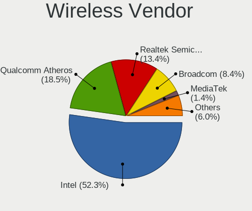

| Vendor                            | Notebooks | Percent |
|-----------------------------------|-----------|---------|
| Intel                             | 297       | 52.2%   |
| Qualcomm Atheros                  | 111       | 19.51%  |
| Realtek Semiconductor             | 68        | 11.95%  |
| Broadcom                          | 54        | 9.49%   |
| Broadcom Limited                  | 10        | 1.76%   |
| Ralink                            | 7         | 1.23%   |
| MEDIATEK                          | 5         | 0.88%   |
| TP-Link                           | 2         | 0.35%   |
| Ralink Technology                 | 2         | 0.35%   |
| NetGear                           | 2         | 0.35%   |
| Edimax Technology                 | 2         | 0.35%   |
| Dell                              | 2         | 0.35%   |
| Sierra Wireless                   | 1         | 0.18%   |
| Qualcomm Atheros Communications   | 1         | 0.18%   |
| Hewlett-Packard                   | 1         | 0.18%   |
| FIBOCOM                           | 1         | 0.18%   |
| Ericsson Business Mobile Networks | 1         | 0.18%   |
| D-Link                            | 1         | 0.18%   |
| ASUSTek Computer                  | 1         | 0.18%   |

Wireless Model
--------------

Wireless models

| Model                                                          | Notebooks | Percent |
|----------------------------------------------------------------|-----------|---------|
| Intel Wi-Fi 6 AX200                                            | 40        | 6.99%   |
| Intel Wi-Fi 6 AX201                                            | 26        | 4.55%   |
| Qualcomm Atheros QCA9377 802.11ac Wireless Network Adapter     | 22        | 3.85%   |
| Qualcomm Atheros AR9285 Wireless Network Adapter (PCI-Express) | 22        | 3.85%   |
| Qualcomm Atheros QCA6174 802.11ac Wireless Network Adapter     | 21        | 3.67%   |
| Intel Wireless 7265                                            | 21        | 3.67%   |
| Intel Wireless 8265 / 8275                                     | 20        | 3.5%    |
| Realtek RTL8822CE 802.11ac PCIe Wireless Network Adapter       | 19        | 3.32%   |
| Qualcomm Atheros QCA9565 / AR9565 Wireless Network Adapter     | 19        | 3.32%   |
| Intel Comet Lake PCH-LP CNVi WiFi                              | 18        | 3.15%   |
| Intel Comet Lake PCH CNVi WiFi                                 | 18        | 3.15%   |
| Intel Centrino Advanced-N 6205 [Taylor Peak]                   | 17        | 2.97%   |
| Intel Wireless 7260                                            | 15        | 2.62%   |
| Broadcom BCM4313 802.11bgn Wireless Network Adapter            | 15        | 2.62%   |
| Realtek RTL8821CE 802.11ac PCIe Wireless Network Adapter       | 14        | 2.45%   |
| Qualcomm Atheros AR9485 Wireless Network Adapter               | 13        | 2.27%   |
| Broadcom BCM43142 802.11b/g/n                                  | 13        | 2.27%   |
| Intel Cannon Point-LP CNVi [Wireless-AC]                       | 12        | 2.1%    |
| Intel Wireless 8260                                            | 10        | 1.75%   |
| Intel Wireless 3165                                            | 10        | 1.75%   |
| Intel Wireless 3160                                            | 10        | 1.75%   |
| Intel Centrino Advanced-N 6235                                 | 10        | 1.75%   |
| Intel Wireless-AC 9260                                         | 8         | 1.4%    |
| Intel Ice Lake-LP PCH CNVi WiFi                                | 7         | 1.22%   |
| Intel Centrino Advanced-N 6200                                 | 7         | 1.22%   |
| Intel Cannon Lake PCH CNVi WiFi                                | 6         | 1.05%   |
| Realtek RTL8822BE 802.11a/b/g/n/ac WiFi adapter                | 5         | 0.87%   |
| Ralink RT3290 Wireless 802.11n 1T/1R PCIe                      | 5         | 0.87%   |
| Qualcomm Atheros AR9462 Wireless Network Adapter               | 5         | 0.87%   |
| MEDIATEK Network controller                                    | 5         | 0.87%   |
| Intel PRO/Wireless 3945ABG [Golan] Network Connection          | 5         | 0.87%   |
| Intel Dual Band Wireless-AC 3165 Plus Bluetooth                | 5         | 0.87%   |
| Broadcom BCM4331 802.11a/b/g/n                                 | 5         | 0.87%   |
| Broadcom BCM43228 802.11a/b/g/n                                | 5         | 0.87%   |
| Realtek RTL8723BE PCIe Wireless Network Adapter                | 4         | 0.7%    |
| Realtek RTL8188CE 802.11b/g/n WiFi Adapter                     | 4         | 0.7%    |
| Realtek Realtek Network controller                             | 4         | 0.7%    |
| Realtek 802.11ac NIC                                           | 4         | 0.7%    |
| Qualcomm Atheros AR928X Wireless Network Adapter (PCI-Express) | 4         | 0.7%    |
| Intel WiFi Link 5100                                           | 4         | 0.7%    |
| Intel Tiger Lake PCH CNVi WiFi                                 | 4         | 0.7%    |
| Broadcom Limited BCM4360 802.11ac Wireless Network Adapter     | 4         | 0.7%    |
| Broadcom BCM4322 802.11a/b/g/n Wireless LAN Controller         | 4         | 0.7%    |
| Realtek RTL8723DE Wireless Network Adapter                     | 3         | 0.52%   |
| Realtek RTL8188EE Wireless Network Adapter                     | 3         | 0.52%   |
| Qualcomm Atheros AR9287 Wireless Network Adapter (PCI-Express) | 3         | 0.52%   |
| Intel Dual Band Wireless-AC 3168NGW [Stone Peak]               | 3         | 0.52%   |
| Intel Centrino Wireless-N 2230                                 | 3         | 0.52%   |
| Intel Centrino Ultimate-N 6300                                 | 3         | 0.52%   |
| Broadcom Limited BCM4312 802.11b/g LP-PHY                      | 3         | 0.52%   |
| Realtek RTL8821AE 802.11ac PCIe Wireless Network Adapter       | 2         | 0.35%   |
| Realtek RTL8187 Wireless Adapter                               | 2         | 0.35%   |
| Intel Wi-Fi 6 AX210/AX211/AX411 160MHz                         | 2         | 0.35%   |
| Intel Ultimate N WiFi Link 5300                                | 2         | 0.35%   |
| Intel PRO/Wireless 5100 AGN [Shiloh] Network Connection        | 2         | 0.35%   |
| Intel PRO/Wireless 4965 AG or AGN [Kedron] Network Connection  | 2         | 0.35%   |
| Intel Centrino Wireless-N 1030 [Rainbow Peak]                  | 2         | 0.35%   |
| Broadcom BCM43602 802.11ac Wireless LAN SoC                    | 2         | 0.35%   |
| Broadcom BCM43227 802.11b/g/n                                  | 2         | 0.35%   |
| Broadcom BCM43224 802.11a/b/g/n                                | 2         | 0.35%   |

Ethernet Vendor
---------------

Ethernet vendors

| Vendor                   | Notebooks | Percent |
|--------------------------|-----------|---------|
| Realtek Semiconductor    | 248       | 54.51%  |
| Intel                    | 105       | 23.08%  |
| Qualcomm Atheros         | 30        | 6.59%   |
| Broadcom                 | 21        | 4.62%   |
| Marvell Technology Group | 14        | 3.08%   |
| JMicron Technology       | 6         | 1.32%   |
| TP-Link                  | 4         | 0.88%   |
| Samsung Electronics      | 4         | 0.88%   |
| Lenovo                   | 4         | 0.88%   |
| Hewlett-Packard          | 4         | 0.88%   |
| Broadcom Limited         | 3         | 0.66%   |
| Xiaomi                   | 2         | 0.44%   |
| DisplayLink              | 2         | 0.44%   |
| Nvidia                   | 1         | 0.22%   |
| NetGear                  | 1         | 0.22%   |
| Motorola PCS             | 1         | 0.22%   |
| ICS Advent               | 1         | 0.22%   |
| Huawei Technologies      | 1         | 0.22%   |
| Google                   | 1         | 0.22%   |
| ASUSTek Computer         | 1         | 0.22%   |
| ASIX Electronics         | 1         | 0.22%   |

Ethernet Model
--------------

Ethernet models

| Model                                                                          | Notebooks | Percent |
|--------------------------------------------------------------------------------|-----------|---------|
| Realtek RTL8111/8168/8411 PCI Express Gigabit Ethernet Controller              | 180       | 39.3%   |
| Realtek RTL810xE PCI Express Fast Ethernet controller                          | 45        | 9.83%   |
| Intel 82579LM Gigabit Network Connection (Lewisville)                          | 26        | 5.68%   |
| Realtek RTL8153 Gigabit Ethernet Adapter                                       | 19        | 4.15%   |
| Intel 82577LM Gigabit Network Connection                                       | 8         | 1.75%   |
| Intel Ethernet Connection I218-LM                                              | 7         | 1.53%   |
| Intel Ethernet Connection I217-LM                                              | 7         | 1.53%   |
| Intel Ethernet Connection (4) I219-V                                           | 7         | 1.53%   |
| Qualcomm Atheros AR8151 v2.0 Gigabit Ethernet                                  | 6         | 1.31%   |
| Marvell Group 88E8040 PCI-E Fast Ethernet Controller                           | 6         | 1.31%   |
| JMicron JMC250 PCI Express Gigabit Ethernet Controller                         | 6         | 1.31%   |
| Intel Ethernet Connection (4) I219-LM                                          | 5         | 1.09%   |
| Intel Ethernet Connection (3) I218-LM                                          | 5         | 1.09%   |
| Broadcom NetLink BCM57785 Gigabit Ethernet PCIe                                | 5         | 1.09%   |
| TP-Link USB 10/100/1000 LAN                                                    | 4         | 0.87%   |
| Qualcomm Atheros QCA8172 Fast Ethernet                                         | 4         | 0.87%   |
| Qualcomm Atheros Killer E2400 Gigabit Ethernet Controller                      | 4         | 0.87%   |
| Qualcomm Atheros AR8131 Gigabit Ethernet                                       | 4         | 0.87%   |
| Intel Ethernet Connection I219-LM                                              | 4         | 0.87%   |
| Intel 82579V Gigabit Network Connection                                        | 4         | 0.87%   |
| HP lt4120 Snapdragon X5 LTE                                                    | 4         | 0.87%   |
| Broadcom NetXtreme BCM57765 Gigabit Ethernet PCIe                              | 4         | 0.87%   |
| Realtek RTL8125 2.5GbE Controller                                              | 3         | 0.66%   |
| Realtek Killer E2500 Gigabit Ethernet Controller                               | 3         | 0.66%   |
| Qualcomm Atheros AR8161 Gigabit Ethernet                                       | 3         | 0.66%   |
| Marvell Group 88E8055 PCI-E Gigabit Ethernet Controller                        | 3         | 0.66%   |
| Lenovo ThinkPad Lan                                                            | 3         | 0.66%   |
| Intel I210 Gigabit Network Connection                                          | 3         | 0.66%   |
| Intel Ethernet Connection (6) I219-V                                           | 3         | 0.66%   |
| Intel Ethernet Connection (6) I219-LM                                          | 3         | 0.66%   |
| Intel 82567LM Gigabit Network Connection                                       | 3         | 0.66%   |
| Samsung GT-I9070 (network tethering, USB debugging enabled)                    | 2         | 0.44%   |
| Samsung Galaxy series, misc. (tethering mode)                                  | 2         | 0.44%   |
| Qualcomm Atheros Killer E220x Gigabit Ethernet Controller                      | 2         | 0.44%   |
| Qualcomm Atheros AR8132 Fast Ethernet                                          | 2         | 0.44%   |
| Marvell Group 88E8036 PCI-E Fast Ethernet Controller                           | 2         | 0.44%   |
| Intel Ethernet Connection (7) I219-V                                           | 2         | 0.44%   |
| Intel Ethernet Connection (2) I219-LM                                          | 2         | 0.44%   |
| Intel Ethernet Connection (13) I219-LM                                         | 2         | 0.44%   |
| Intel Ethernet Connection (11) I219-LM                                         | 2         | 0.44%   |
| Intel Ethernet Connection (10) I219-V                                          | 2         | 0.44%   |
| Broadcom NetXtreme BCM5761 Gigabit Ethernet PCIe                               | 2         | 0.44%   |
| Broadcom NetLink BCM57780 Gigabit Ethernet PCIe                                | 2         | 0.44%   |
| Xiaomi Mi/Redmi series (RNDIS)                                                 | 1         | 0.22%   |
| Xiaomi Mi/Redmi series (RNDIS + ADB)                                           | 1         | 0.22%   |
| Realtek Killer E2600 Gigabit Ethernet Controller                               | 1         | 0.22%   |
| Qualcomm Atheros QCA8171 Gigabit Ethernet                                      | 1         | 0.22%   |
| Qualcomm Atheros Killer E2500 Gigabit Ethernet Controller                      | 1         | 0.22%   |
| Qualcomm Atheros AR8152 v2.0 Fast Ethernet                                     | 1         | 0.22%   |
| Qualcomm Atheros AR8152 v1.1 Fast Ethernet                                     | 1         | 0.22%   |
| Qualcomm Atheros AR8121/AR8113/AR8114 Gigabit or Fast Ethernet                 | 1         | 0.22%   |
| Nvidia MCP79 Ethernet                                                          | 1         | 0.22%   |
| NetGear LB1120-100NAS                                                          | 1         | 0.22%   |
| Motorola PCS moto g(30)                                                        | 1         | 0.22%   |
| Marvell Group Yukon Optima 88E8059 [PCIe Gigabit Ethernet Controller with AVB] | 1         | 0.22%   |
| Marvell Group 88E8057 PCI-E Gigabit Ethernet Controller                        | 1         | 0.22%   |
| Marvell Group 88E8042 PCI-E Fast Ethernet Controller                           | 1         | 0.22%   |
| Lenovo USB-C Dock Ethernet                                                     | 1         | 0.22%   |
| Intel PRO/100 VE Network Connection                                            | 1         | 0.22%   |
| Intel Ethernet controller                                                      | 1         | 0.22%   |

Net Controller Kind
-------------------

Ethernet, WiFi or modem

| Kind     | Notebooks | Percent |
|----------|-----------|---------|
| WiFi     | 549       | 55.4%   |
| Ethernet | 433       | 43.69%  |
| Modem    | 9         | 0.91%   |

Used Controller
---------------

Currently used network controller

| Kind     | Notebooks | Percent |
|----------|-----------|---------|
| WiFi     | 478       | 69.99%  |
| Ethernet | 205       | 30.01%  |

NICs
----

Total network controllers on board

| Total | Notebooks | Percent |
|-------|-----------|---------|
| 2     | 398       | 70.82%  |
| 1     | 152       | 27.05%  |
| 0     | 8         | 1.42%   |
| 3     | 4         | 0.71%   |

IPv6
----

IPv6 vs IPv4

| Used | Notebooks | Percent |
|------|-----------|---------|
| No   | 424       | 75.31%  |
| Yes  | 139       | 24.69%  |

Bluetooth
---------

Bluetooth Vendor
----------------

Controller vendors

| Vendor                          | Notebooks | Percent |
|---------------------------------|-----------|---------|
| Intel                           | 240       | 53.1%   |
| Qualcomm Atheros Communications | 48        | 10.62%  |
| Realtek Semiconductor           | 38        | 8.41%   |
| Broadcom                        | 28        | 6.19%   |
| IMC Networks                    | 15        | 3.32%   |
| Apple                           | 15        | 3.32%   |
| Lite-On Technology              | 11        | 2.43%   |
| Foxconn / Hon Hai               | 11        | 2.43%   |
| Dell                            | 10        | 2.21%   |
| Realtek                         | 7         | 1.55%   |
| Cambridge Silicon Radio         | 7         | 1.55%   |
| Ralink                          | 5         | 1.11%   |
| Hewlett-Packard                 | 5         | 1.11%   |
| Alps Electric                   | 4         | 0.88%   |
| ASUSTek Computer                | 3         | 0.66%   |
| Toshiba                         | 2         | 0.44%   |
| Foxconn International           | 2         | 0.44%   |
| Askey Computer                  | 1         | 0.22%   |

Bluetooth Model
---------------

Controller models

| Model                                                                               | Notebooks | Percent |
|-------------------------------------------------------------------------------------|-----------|---------|
| Intel Bluetooth wireless interface                                                  | 82        | 18.14%  |
| Intel Bluetooth Device                                                              | 63        | 13.94%  |
| Intel AX200 Bluetooth                                                               | 39        | 8.63%   |
| Intel Bluetooth 9460/9560 Jefferson Peak (JfP)                                      | 34        | 7.52%   |
| Realtek Bluetooth Radio                                                             | 24        | 5.31%   |
| Qualcomm Atheros  Bluetooth Device                                                  | 22        | 4.87%   |
| Qualcomm Atheros QCA61x4 Bluetooth 4.0                                              | 12        | 2.65%   |
| Intel Centrino Bluetooth Wireless Transceiver                                       | 12        | 2.65%   |
| Realtek  Bluetooth 4.2 Adapter                                                      | 10        | 2.21%   |
| Qualcomm Atheros AR3012 Bluetooth 4.0                                               | 8         | 1.77%   |
| Intel Wireless-AC 9260 Bluetooth Adapter                                            | 8         | 1.77%   |
| Realtek Bluetooth Radio                                                             | 7         | 1.55%   |
| Cambridge Silicon Radio Bluetooth Dongle (HCI mode)                                 | 7         | 1.55%   |
| Apple Bluetooth USB Host Controller                                                 | 7         | 1.55%   |
| Apple Bluetooth Host Controller                                                     | 7         | 1.55%   |
| Broadcom BCM2045B (BDC-2.1)                                                         | 6         | 1.33%   |
| Ralink RT3290 Bluetooth                                                             | 5         | 1.11%   |
| Qualcomm Atheros AR3011 Bluetooth                                                   | 5         | 1.11%   |
| IMC Networks Bluetooth Radio                                                        | 5         | 1.11%   |
| IMC Networks Bluetooth Device                                                       | 5         | 1.11%   |
| Foxconn / Hon Hai Bluetooth Device                                                  | 5         | 1.11%   |
| Broadcom BCM43142A0 Bluetooth 4.0                                                   | 5         | 1.11%   |
| Lite-On Qualcomm Atheros QCA9377 Bluetooth                                          | 4         | 0.88%   |
| Lite-On Bluetooth Device                                                            | 4         | 0.88%   |
| IMC Networks Wireless_Device                                                        | 4         | 0.88%   |
| Dell DW375 Bluetooth Module                                                         | 4         | 0.88%   |
| Broadcom BCM20702 Bluetooth 4.0 [ThinkPad]                                          | 4         | 0.88%   |
| HP Broadcom 2070 Bluetooth Combo                                                    | 3         | 0.66%   |
| Foxconn / Hon Hai BCM20702A0                                                        | 3         | 0.66%   |
| Dell Wireless 365 Bluetooth                                                         | 3         | 0.66%   |
| Broadcom BCM43142 Bluetooth 4.0                                                     | 3         | 0.66%   |
| Realtek RTL8821A Bluetooth                                                          | 2         | 0.44%   |
| Lite-On Atheros AR3012 Bluetooth                                                    | 2         | 0.44%   |
| Intel AX210 Bluetooth                                                               | 2         | 0.44%   |
| HP Bluetooth 2.0 Interface [Broadcom BCM2045]                                       | 2         | 0.44%   |
| Foxconn International BCM43142A0 Bluetooth module                                   | 2         | 0.44%   |
| Dell BCM20702A0 Bluetooth Module                                                    | 2         | 0.44%   |
| Broadcom HP Portable SoftSailing                                                    | 2         | 0.44%   |
| ASUS BT-270 Bluetooth Adapter                                                       | 2         | 0.44%   |
| Alps Electric Bluetooth Controller (ALPS/UGPZ6)                                     | 2         | 0.44%   |
| Toshiba Bluetooth Device                                                            | 1         | 0.22%   |
| Toshiba Askey Bluetooth Module                                                      | 1         | 0.22%   |
| Realtek RTL8822BE Bluetooth 4.2 Adapter                                             | 1         | 0.22%   |
| Realtek RTL8723A Bluetooth                                                          | 1         | 0.22%   |
| Qualcomm Atheros AR9462 Bluetooth                                                   | 1         | 0.22%   |
| Lite-On Wireless_Device                                                             | 1         | 0.22%   |
| IMC Networks Broadcom Bluetooth 2.1                                                 | 1         | 0.22%   |
| Foxconn / Hon Hai Foxconn T77H114 BCM2070 [Single-Chip Bluetooth 2.1 + EDR Adapter] | 1         | 0.22%   |
| Foxconn / Hon Hai BCM43142A0                                                        | 1         | 0.22%   |
| Foxconn / Hon Hai BCM2045A0                                                         | 1         | 0.22%   |
| Dell Wireless 355 Bluetooth                                                         | 1         | 0.22%   |
| Broadcom HP Portable Valentine                                                      | 1         | 0.22%   |
| Broadcom HP Portable Bumble Bee                                                     | 1         | 0.22%   |
| Broadcom BCM43142A0 Bluetooth Device                                                | 1         | 0.22%   |
| Broadcom BCM20703A1 Bluetooth 4.1 + LE                                              | 1         | 0.22%   |
| Broadcom BCM20702A0                                                                 | 1         | 0.22%   |
| Broadcom BCM2070 Bluetooth 2.1 + EDR                                                | 1         | 0.22%   |
| Broadcom BCM2045B (BDC-2) [Bluetooth Controller]                                    | 1         | 0.22%   |
| Broadcom BCM2045 Bluetooth                                                          | 1         | 0.22%   |
| ASUS BT-253 Bluetooth Adapter                                                       | 1         | 0.22%   |

Sound
-----

Sound Vendor
------------

Sound card vendors

| Vendor                                          | Notebooks | Percent |
|-------------------------------------------------|-----------|---------|
| Intel                                           | 452       | 66.96%  |
| AMD                                             | 109       | 16.15%  |
| Nvidia                                          | 80        | 11.85%  |
| C-Media Electronics                             | 5         | 0.74%   |
| Lenovo                                          | 3         | 0.44%   |
| Texas Instruments                               | 2         | 0.3%    |
| Sennheiser Communications                       | 2         | 0.3%    |
| Logitech                                        | 2         | 0.3%    |
| GN Netcom                                       | 2         | 0.3%    |
| Focusrite-Novation                              | 2         | 0.3%    |
| Creative Technology                             | 2         | 0.3%    |
| SteelSeries ApS                                 | 1         | 0.15%   |
| Samson Technologies                             | 1         | 0.15%   |
| RODE Microphones                                | 1         | 0.15%   |
| Realtek Semiconductor                           | 1         | 0.15%   |
| No brand                                        | 1         | 0.15%   |
| Licensed by Sony Computer Entertainment America | 1         | 0.15%   |
| JMTek                                           | 1         | 0.15%   |
| Elitegroup Computer Systems (ECS)               | 1         | 0.15%   |
| Dell                                            | 1         | 0.15%   |
| Corsair                                         | 1         | 0.15%   |
| CMX Systems                                     | 1         | 0.15%   |
| Astro Gaming                                    | 1         | 0.15%   |
| Apple                                           | 1         | 0.15%   |
| Afatech                                         | 1         | 0.15%   |

Sound Model
-----------

Sound card models

| Model                                                                                             | Notebooks | Percent |
|---------------------------------------------------------------------------------------------------|-----------|---------|
| Intel Sunrise Point-LP HD Audio                                                                   | 69        | 8.41%   |
| AMD Family 17h (Models 10h-1fh) HD Audio Controller                                               | 68        | 8.29%   |
| Intel 7 Series/C216 Chipset Family High Definition Audio Controller                               | 54        | 6.59%   |
| AMD Renoir Radeon High Definition Audio Controller                                                | 41        | 5%      |
| Intel 6 Series/C200 Series Chipset Family High Definition Audio Controller                        | 35        | 4.27%   |
| Intel Tiger Lake-LP Smart Sound Technology Audio Controller                                       | 31        | 3.78%   |
| Intel 5 Series/3400 Series Chipset High Definition Audio                                          | 27        | 3.29%   |
| Intel Haswell-ULT HD Audio Controller                                                             | 25        | 3.05%   |
| Intel 8 Series HD Audio Controller                                                                | 25        | 3.05%   |
| Intel Comet Lake PCH-LP cAVS                                                                      | 23        | 2.8%    |
| Intel Cannon Lake PCH cAVS                                                                        | 21        | 2.56%   |
| Intel Cannon Point-LP High Definition Audio Controller                                            | 20        | 2.44%   |
| Intel Wildcat Point-LP High Definition Audio Controller                                           | 19        | 2.32%   |
| Intel Comet Lake PCH cAVS                                                                         | 19        | 2.32%   |
| Intel Broadwell-U Audio Controller                                                                | 19        | 2.32%   |
| AMD Raven/Raven2/Fenghuang HDMI/DP Audio Controller                                               | 18        | 2.2%    |
| Intel 82801I (ICH9 Family) HD Audio Controller                                                    | 16        | 1.95%   |
| Intel Ice Lake-LP Smart Sound Technology Audio Controller                                         | 15        | 1.83%   |
| Intel 8 Series/C220 Series Chipset High Definition Audio Controller                               | 14        | 1.71%   |
| AMD FCH Azalia Controller                                                                         | 14        | 1.71%   |
| Intel Xeon E3-1200 v3/4th Gen Core Processor HD Audio Controller                                  | 13        | 1.59%   |
| Nvidia TU107 GeForce GTX 1650 High Definition Audio Controller                                    | 12        | 1.46%   |
| Intel 82801H (ICH8 Family) HD Audio Controller                                                    | 12        | 1.46%   |
| Intel Atom/Celeron/Pentium Processor x5-E8000/J3xxx/N3xxx Series High Definition Audio Controller | 9         | 1.1%    |
| Nvidia TU116 High Definition Audio Controller                                                     | 8         | 0.98%   |
| Nvidia TU106 High Definition Audio Controller                                                     | 8         | 0.98%   |
| Nvidia GK107 HDMI Audio Controller                                                                | 8         | 0.98%   |
| Intel CM238 HD Audio Controller                                                                   | 8         | 0.98%   |
| AMD Kabini HDMI/DP Audio                                                                          | 8         | 0.98%   |
| AMD Family 15h (Models 60h-6fh) Audio Controller                                                  | 8         | 0.98%   |
| Nvidia GP106 High Definition Audio Controller                                                     | 7         | 0.85%   |
| Intel Celeron/Pentium Silver Processor High Definition Audio                                      | 7         | 0.85%   |
| Intel 100 Series/C230 Series Chipset Family HD Audio Controller                                   | 7         | 0.85%   |
| AMD SBx00 Azalia (Intel HDA)                                                                      | 7         | 0.85%   |
| Nvidia Audio device                                                                               | 5         | 0.61%   |
| Intel NM10/ICH7 Family High Definition Audio Controller                                           | 5         | 0.61%   |
| Intel Atom Processor Z36xxx/Z37xxx Series High Definition Audio Controller                        | 5         | 0.61%   |
| AMD Trinity HDMI Audio Controller                                                                 | 5         | 0.61%   |
| Nvidia GT216 HDMI Audio Controller                                                                | 4         | 0.49%   |
| Nvidia GP107GL High Definition Audio Controller                                                   | 4         | 0.49%   |
| Nvidia GA104 High Definition Audio Controller                                                     | 4         | 0.49%   |
| Intel Tiger Lake-H HD Audio Controller                                                            | 4         | 0.49%   |
| AMD High Definition Audio Controller                                                              | 4         | 0.49%   |
| Nvidia GF108 High Definition Audio Controller                                                     | 3         | 0.37%   |
| AMD Wrestler HDMI Audio                                                                           | 3         | 0.37%   |
| AMD Cedar HDMI Audio [Radeon HD 5400/6300/7300 Series]                                            | 3         | 0.37%   |
| AMD Caicos HDMI Audio [Radeon HD 6450 / 7450/8450/8490 OEM / R5 230/235/235X OEM]                 | 3         | 0.37%   |
| Nvidia MCP89 High Definition Audio                                                                | 2         | 0.24%   |
| Nvidia MCP79 High Definition Audio                                                                | 2         | 0.24%   |
| Nvidia High Definition Audio Controller                                                           | 2         | 0.24%   |
| Nvidia GP104 High Definition Audio Controller                                                     | 2         | 0.24%   |
| Nvidia GM204 High Definition Audio Controller                                                     | 2         | 0.24%   |
| Nvidia GK106 HDMI Audio Controller                                                                | 2         | 0.24%   |
| Nvidia GF119 HDMI Audio Controller                                                                | 2         | 0.24%   |
| Intel Celeron N3350/Pentium N4200/Atom E3900 Series Audio Cluster                                 | 2         | 0.24%   |
| C-Media Electronics CM108 Audio Controller                                                        | 2         | 0.24%   |
| C-Media Electronics Audio Adapter (Unitek Y-247A)                                                 | 2         | 0.24%   |
| AMD RV710/730 HDMI Audio [Radeon HD 4000 series]                                                  | 2         | 0.24%   |
| AMD RV620 HDMI Audio [Radeon HD 3450/3470/3550/3570]                                              | 2         | 0.24%   |
| Texas Instruments PCM2912A Audio Codec                                                            | 1         | 0.12%   |

Memory
------

Memory Vendor
-------------

Memory module vendors

| Vendor              | Notebooks | Percent |
|---------------------|-----------|---------|
| Samsung Electronics | 113       | 32.19%  |
| SK Hynix            | 84        | 23.93%  |
| Micron Technology   | 44        | 12.54%  |
| Kingston            | 35        | 9.97%   |
| Unknown             | 22        | 6.27%   |
| Crucial             | 13        | 3.7%    |
| Elpida              | 5         | 1.42%   |
| A-DATA Technology   | 5         | 1.42%   |
| Team                | 4         | 1.14%   |
| Smart               | 4         | 1.14%   |
| Nanya Technology    | 4         | 1.14%   |
| Unknown (ABCD)      | 3         | 0.85%   |
| Ramaxel Technology  | 3         | 0.85%   |
| G.Skill             | 3         | 0.85%   |
| Corsair             | 3         | 0.85%   |
| Transcend           | 2         | 0.57%   |
| Unknown (08AE)      | 1         | 0.28%   |
| Smart Modular       | 1         | 0.28%   |
| High Bridge         | 1         | 0.28%   |
| GOODRAM             | 1         | 0.28%   |

Memory Model
------------

Memory module models

| Model                                                               | Notebooks | Percent |
|---------------------------------------------------------------------|-----------|---------|
| Samsung RAM M471A1K43CB1-CTD 8GB SODIMM DDR4 2667MT/s               | 8         | 2.17%   |
| Samsung RAM M471A1G44AB0-CWE 8192MB SODIMM DDR4 3200MT/s            | 6         | 1.63%   |
| Micron RAM 8ATF1G64HZ-3G2J1 8GB SODIMM DDR4 3200MT/s                | 6         | 1.63%   |
| Samsung RAM M471A2K43DB1-CWE 16384MB SODIMM DDR4 3200MT/s           | 5         | 1.36%   |
| Samsung RAM M471A1K43BB1-CRC 8GB SODIMM DDR4 2667MT/s               | 5         | 1.36%   |
| SK Hynix RAM HMA81GS6AFR8N-UH 8192MB SODIMM DDR4 2667MT/s           | 4         | 1.09%   |
| Samsung RAM M471B1G73QH0-YK0 8GB SODIMM DDR3 2667MT/s               | 4         | 1.09%   |
| Samsung RAM M471A5244CB0-CWE 4GB SODIMM DDR4 3200MT/s               | 4         | 1.09%   |
| Samsung RAM M471A2K43CB1-CTD 16GB SODIMM DDR4 2667MT/s              | 4         | 1.09%   |
| Samsung RAM M471A1K43DB1-CWE 8GB SODIMM DDR4 3200MT/s               | 4         | 1.09%   |
| Micron RAM 4ATS2G64HZ-3G2B1 16GB SODIMM DDR4 3200MT/s               | 4         | 1.09%   |
| Unknown (ABCD) RAM 123456789012345678 2GB SODIMM LPDDR4 2400MT/s    | 3         | 0.82%   |
| SK Hynix RAM HMT351S6EFR8A-PB 4096MB SODIMM DDR3 1600MT/s           | 3         | 0.82%   |
| SK Hynix RAM HMT351S6CFR8C-PB 4GB SODIMM DDR3 1600MT/s              | 3         | 0.82%   |
| SK Hynix RAM HMA82GS6DJR8N-XN 16GB SODIMM DDR4 3200MT/s             | 3         | 0.82%   |
| SK Hynix RAM HMA81GS6DJR8N-XN 8GB SODIMM DDR4 3200MT/s              | 3         | 0.82%   |
| SK Hynix RAM HMA81GS6CJR8N-VK 8GB SODIMM DDR4 2667MT/s              | 3         | 0.82%   |
| SK Hynix RAM H9CCNNNCLGALAR-NVD 8192MB Row Of Chips LPDDR3 2133MT/s | 3         | 0.82%   |
| Samsung RAM Module 8GB SODIMM DDR4 2133MT/s                         | 3         | 0.82%   |
| Samsung RAM M471B5273DH0-CH9 4GB SODIMM DDR3 1334MT/s               | 3         | 0.82%   |
| Samsung RAM M471B5173DB0-YK0 4096MB SODIMM DDR3 1600MT/s            | 3         | 0.82%   |
| Samsung RAM M471B1G73EB0-YK0 8192MB SODIMM DDR3 1600MT/s            | 3         | 0.82%   |
| Samsung RAM M471A5244CB0-CTD 4096MB SODIMM DDR4 2667MT/s            | 3         | 0.82%   |
| Samsung RAM M471A5244CB0-CRC 4096MB SODIMM DDR4 2667MT/s            | 3         | 0.82%   |
| Samsung RAM M471A1K43DB1-CTD 8192MB SODIMM DDR4 2667MT/s            | 3         | 0.82%   |
| Samsung RAM M471A1G44AB0-CWE 8GB Row Of Chips DDR4 3200MT/s         | 3         | 0.82%   |
| Micron RAM 4ATF51264HZ-3G2J1 4096MB SODIMM DDR4 3200MT/s            | 3         | 0.82%   |
| Micron RAM 4ATF1G64HZ-3G2E2 8GB SODIMM DDR4 3200MT/s                | 3         | 0.82%   |
| Unknown RAM Module 8GB SODIMM DDR3 1600MT/s                         | 2         | 0.54%   |
| Smart RAM SH564568FH8NZPHSCR 2GB SODIMM DDR3 1333MT/s               | 2         | 0.54%   |
| Smart RAM SH564128FJ8NWRNSQG 4096MB SODIMM DDR3 1600MT/s            | 2         | 0.54%   |
| SK Hynix RAM Module 2GB SODIMM DDR3 1600MT/s                        | 2         | 0.54%   |
| SK Hynix RAM Module 16GB SODIMM DDR4 2667MT/s                       | 2         | 0.54%   |
| SK Hynix RAM Module 16GB SODIMM DDR4 2133MT/s                       | 2         | 0.54%   |
| SK Hynix RAM HYMP125S64CP8-S6 2GB SODIMM DDR2 975MT/s               | 2         | 0.54%   |
| SK Hynix RAM HMT41GS6BFR8A-PB 8GB SODIMM DDR3 1600MT/s              | 2         | 0.54%   |
| SK Hynix RAM HMAA2GS6CJR8N-XN 16GB SODIMM DDR4 3200MT/s             | 2         | 0.54%   |
| SK Hynix RAM HMAA2GS6AJR8N-XN 16384MB SODIMM DDR4 3200MT/s          | 2         | 0.54%   |
| SK Hynix RAM HMAA1GS6CMR6N-XN 8GB SODIMM DDR4 3200MT/s              | 2         | 0.54%   |
| SK Hynix RAM HMAA1GS6CMR6N-VK 8GB SODIMM DDR4 2667MT/s              | 2         | 0.54%   |
| SK Hynix RAM HMA851S6CJR6N-XN 4GB SODIMM DDR4 3200MT/s              | 2         | 0.54%   |
| SK Hynix RAM HMA851S6CJR6N-VK 4GB SODIMM DDR4 2667MT/s              | 2         | 0.54%   |
| SK Hynix RAM HMA851S6AFR6N-UH 4096MB SODIMM DDR4 2667MT/s           | 2         | 0.54%   |
| SK Hynix RAM HMA82GS6DJR8N-VK 16384MB SODIMM DDR4 2667MT/s          | 2         | 0.54%   |
| SK Hynix RAM HCNNNCPMMLXR-NEE 2048MB Row Of Chips LPDDR4 4267MT/s   | 2         | 0.54%   |
| SK Hynix RAM H9CCNNNBJTALAR-NVD 4GB Row Of Chips LPDDR3 2133MT/s    | 2         | 0.54%   |
| Samsung RAM U6E3S4AA-MGCR 1GB Row Of Chips LPDDR4 4267MT/s          | 2         | 0.54%   |
| Samsung RAM Module 8GB Row Of Chips LPDDR3 2133MT/s                 | 2         | 0.54%   |
| Samsung RAM M471B5273DH0-CK0 4GB SODIMM DDR3 1600MT/s               | 2         | 0.54%   |
| Samsung RAM M471B5173QH0-YK0 4096MB SODIMM DDR3 1600MT/s            | 2         | 0.54%   |
| Samsung RAM M471B1G73DB0-YK0 8GB SODIMM DDR3 1600MT/s               | 2         | 0.54%   |
| Samsung RAM M471A5244CB0-CWE 4GB Row Of Chips DDR4 3200MT/s         | 2         | 0.54%   |
| Samsung RAM M471A5244BB0-CRC 4096MB SODIMM DDR4 2667MT/s            | 2         | 0.54%   |
| Samsung RAM M471A4G43MB1-CTD 32GB SODIMM DDR4 2667MT/s              | 2         | 0.54%   |
| Samsung RAM M471A2K43EB1-CWE 16GB SODIMM DDR4 3200MT/s              | 2         | 0.54%   |
| Samsung RAM M471A2K43CB1-CRC 16GB SODIMM DDR4 2667MT/s              | 2         | 0.54%   |
| Samsung RAM M471A2G44AM0-CWE 16GB SODIMM DDR4 3200MT/s              | 2         | 0.54%   |
| Samsung RAM M471A2G43AB2-CWE 16GB SODIMM DDR4 3200MT/s              | 2         | 0.54%   |
| Samsung RAM M471A1K43EB1-CWE 8192MB SODIMM DDR4 3200MT/s            | 2         | 0.54%   |
| Samsung RAM M471A1G44AB0-CTD 8GB Row Of Chips DDR4 2667MT/s         | 2         | 0.54%   |

Memory Kind
-----------

Memory module kinds

| Kind   | Notebooks | Percent |
|--------|-----------|---------|
| DDR4   | 174       | 57.62%  |
| DDR3   | 80        | 26.49%  |
| LPDDR4 | 20        | 6.62%   |
| LPDDR3 | 20        | 6.62%   |
| DDR2   | 7         | 2.32%   |
| SDRAM  | 1         | 0.33%   |

Memory Form Factor
------------------

Physical design of the memory module

| Name         | Notebooks | Percent |
|--------------|-----------|---------|
| SODIMM       | 253       | 82.95%  |
| Row Of Chips | 49        | 16.07%  |
| DIMM         | 2         | 0.66%   |
| Unknown      | 1         | 0.33%   |

Memory Size
-----------

Memory module size

| Size  | Notebooks | Percent |
|-------|-----------|---------|
| 8192  | 125       | 38.94%  |
| 4096  | 98        | 30.53%  |
| 16384 | 54        | 16.82%  |
| 2048  | 31        | 9.66%   |
| 32768 | 8         | 2.49%   |
| 1024  | 5         | 1.56%   |

Memory Speed
------------

Memory module speed

| Speed   | Notebooks | Percent |
|---------|-----------|---------|
| 2667    | 85        | 26.32%  |
| 3200    | 76        | 23.53%  |
| 1600    | 58        | 17.96%  |
| 2133    | 25        | 7.74%   |
| 2400    | 19        | 5.88%   |
| 4267    | 13        | 4.02%   |
| 1334    | 13        | 4.02%   |
| 1333    | 10        | 3.1%    |
| 1867    | 7         | 2.17%   |
| 800     | 5         | 1.55%   |
| Unknown | 3         | 0.93%   |
| 975     | 2         | 0.62%   |
| 4266    | 1         | 0.31%   |
| 3733    | 1         | 0.31%   |
| 2048    | 1         | 0.31%   |
| 1777    | 1         | 0.31%   |
| 1066    | 1         | 0.31%   |
| 667     | 1         | 0.31%   |
| 533     | 1         | 0.31%   |

Printers & scanners
-------------------

Printer Vendor
--------------

Printer device vendors

| Vendor          | Notebooks | Percent |
|-----------------|-----------|---------|
| Seiko Epson     | 1         | 33.33%  |
| Hewlett-Packard | 1         | 33.33%  |
| Canon           | 1         | 33.33%  |

Printer Model
-------------

Printer device models

| Model                      | Notebooks | Percent |
|----------------------------|-----------|---------|
| Seiko Epson XP-4100 Series | 1         | 33.33%  |
| HP LaserJet M101-M106      | 1         | 33.33%  |
| Canon PIXMA TS6250         | 1         | 33.33%  |

Scanner Vendor
--------------

Scanner device vendors

| Vendor      | Notebooks | Percent |
|-------------|-----------|---------|
| Seiko Epson | 1         | 50%     |
| Canon       | 1         | 50%     |

Scanner Model
-------------

Scanner device models

| Model                                 | Notebooks | Percent |
|---------------------------------------|-----------|---------|
| Seiko Epson GT-X770 [Perfection V500] | 1         | 50%     |
| Canon CanoScan LiDE 600F              | 1         | 50%     |

Camera
------

Camera Vendor
-------------

Camera device vendors

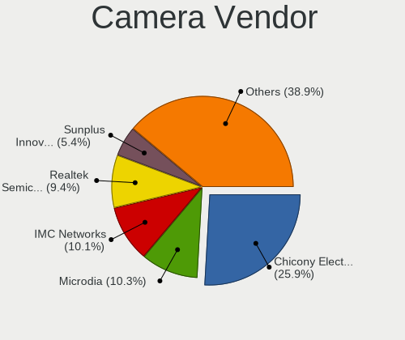

| Vendor                                 | Notebooks | Percent |
|----------------------------------------|-----------|---------|
| Chicony Electronics                    | 130       | 25.9%   |
| IMC Networks                           | 56        | 11.16%  |
| Realtek Semiconductor                  | 48        | 9.56%   |
| Microdia                               | 46        | 9.16%   |
| Acer                                   | 31        | 6.18%   |
| Quanta                                 | 28        | 5.58%   |
| Cheng Uei Precision Industry (Foxlink) | 27        | 5.38%   |
| Sunplus Innovation Technology          | 26        | 5.18%   |
| Suyin                                  | 17        | 3.39%   |
| Lite-On Technology                     | 15        | 2.99%   |
| Silicon Motion                         | 13        | 2.59%   |
| Apple                                  | 12        | 2.39%   |
| Syntek                                 | 7         | 1.39%   |
| Ricoh                                  | 7         | 1.39%   |
| Luxvisions Innotech Limited            | 6         | 1.2%    |
| Alcor Micro                            | 6         | 1.2%    |
| Samsung Electronics                    | 4         | 0.8%    |
| OmniVision Technologies                | 3         | 0.6%    |
| Logitech                               | 3         | 0.6%    |
| Importek                               | 2         | 0.4%    |
| 8SSC20F27114V1SR11K1SE2                | 2         | 0.4%    |
| Unknown                                | 1         | 0.2%    |
| Trust                                  | 1         | 0.2%    |
| SunplusIT                              | 1         | 0.2%    |
| Sunplus Technology                     | 1         | 0.2%    |
| Primax Electronics                     | 1         | 0.2%    |
| Pixart Imaging                         | 1         | 0.2%    |
| OPPO Electronics                       | 1         | 0.2%    |
| LG Electronics                         | 1         | 0.2%    |
| Lenovo                                 | 1         | 0.2%    |
| kingcome                               | 1         | 0.2%    |
| Intel                                  | 1         | 0.2%    |
| Huawei Technologies                    | 1         | 0.2%    |
| ARC International                      | 1         | 0.2%    |

Camera Model
------------

Camera device models

| Model                                               | Notebooks | Percent |
|-----------------------------------------------------|-----------|---------|
| Microdia Integrated_Webcam_HD                       | 29        | 5.78%   |
| Chicony integrated camera                           | 27        | 5.38%   |
| Realtek Integrated_Webcam_HD                        | 24        | 4.78%   |
| IMC Networks Integrated Camera                      | 22        | 4.38%   |
| Chicony HD WebCam                                   | 16        | 3.19%   |
| IMC Networks USB2.0 HD UVC WebCam                   | 13        | 2.59%   |
| Quanta HD User Facing                               | 10        | 1.99%   |
| Realtek USB Camera                                  | 8         | 1.59%   |
| Acer Integrated Camera                              | 8         | 1.59%   |
| Chicony HP HD Camera                                | 7         | 1.39%   |
| Sunplus Integrated_Webcam_HD                        | 6         | 1.2%    |
| Lite-On HP HD Camera                                | 6         | 1.2%    |
| Chicony HP TrueVision HD                            | 6         | 1.2%    |
| Acer BisonCam, NB Pro                               | 6         | 1.2%    |
| Quanta HP TrueVision HD Camera                      | 5         | 1%      |
| IMC Networks USB2.0 VGA UVC WebCam                  | 5         | 1%      |
| Chicony USB2.0 Camera                               | 5         | 1%      |
| Chicony USB 2.0 Camera                              | 5         | 1%      |
| Chicony Lenovo EasyCamera                           | 5         | 1%      |
| Chicony Integrated HP HD Webcam                     | 5         | 1%      |
| Cheng Uei Precision Industry (Foxlink) Webcam       | 5         | 1%      |
| Syntek Integrated Camera                            | 4         | 0.8%    |
| Samsung Galaxy series, misc. (MTP mode)             | 4         | 0.8%    |
| IMC Networks Integrated Webcam                      | 4         | 0.8%    |
| Chicony HP Wide Vision HD Camera                    | 4         | 0.8%    |
| Chicony FJ Camera                                   | 4         | 0.8%    |
| Cheng Uei Precision Industry (Foxlink) HP HD Webcam | 4         | 0.8%    |
| Cheng Uei Precision Industry (Foxlink) HP HD Camera | 4         | 0.8%    |
| Apple FaceTime HD Camera                            | 4         | 0.8%    |
| Acer SunplusIT Integrated Camera                    | 4         | 0.8%    |
| Acer Lenovo EasyCamera                              | 4         | 0.8%    |
| Suyin 1.3M HD WebCam                                | 3         | 0.6%    |
| Sunplus HD WebCam                                   | 3         | 0.6%    |
| Realtek USB2.0 HD UVC WebCam                        | 3         | 0.6%    |
| Realtek Lenovo EasyCamera                           | 3         | 0.6%    |
| Realtek Integrated Webcam                           | 3         | 0.6%    |
| Quanta HP Wide Vision HD Camera                     | 3         | 0.6%    |
| Quanta HD Webcam                                    | 3         | 0.6%    |
| Microdia Integrated Webcam                          | 3         | 0.6%    |
| Lite-On Integrated Camera                           | 3         | 0.6%    |
| Lite-On HP HD Webcam                                | 3         | 0.6%    |
| IMC Networks ov9734_azurewave_camera                | 3         | 0.6%    |
| Chicony VGA Webcam                                  | 3         | 0.6%    |
| Chicony USB2.0 HD UVC WebCam                        | 3         | 0.6%    |
| Chicony TOSHIBA Web Camera - HD                     | 3         | 0.6%    |
| Chicony Integrated Camera (1280x720@30)             | 3         | 0.6%    |
| Chicony HD User Facing                              | 3         | 0.6%    |
| Chicony EasyCamera                                  | 3         | 0.6%    |
| Cheng Uei Precision Industry (Foxlink) HD Camera    | 3         | 0.6%    |
| Apple Built-in iSight                               | 3         | 0.6%    |
| Syntek EasyCamera                                   | 2         | 0.4%    |
| Suyin HP Truevision HD                              | 2         | 0.4%    |
| Sunplus Laptop Integrated Webcam FHD                | 2         | 0.4%    |
| Sunplus HP HD Webcam [Fixed]                        | 2         | 0.4%    |
| Sunplus Asus Webcam                                 | 2         | 0.4%    |
| Silicon Motion WebCam SC-13HDL12131N                | 2         | 0.4%    |
| Silicon Motion 300k Pixel Camera                    | 2         | 0.4%    |
| Ricoh Sony Vaio Integrated Webcam                   | 2         | 0.4%    |
| Ricoh Integrated Webcam                             | 2         | 0.4%    |
| Quanta ov9734_techfront_camera                      | 2         | 0.4%    |

Security
--------

Fingerprint Vendor
------------------

Fingerprint sensor vendors

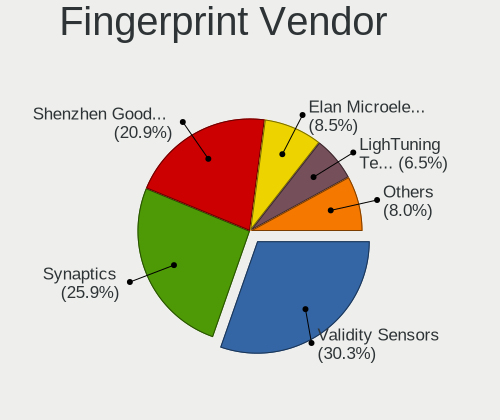

| Vendor                     | Notebooks | Percent |
|----------------------------|-----------|---------|
| Validity Sensors           | 45        | 34.88%  |
| Synaptics                  | 35        | 27.13%  |
| Shenzhen Goodix Technology | 27        | 20.93%  |
| LighTuning Technology      | 7         | 5.43%   |
| Elan Microelectronics      | 6         | 4.65%   |
| AuthenTec                  | 4         | 3.1%    |
| Upek                       | 2         | 1.55%   |
| STMicroelectronics         | 2         | 1.55%   |
| HOLTEK                     | 1         | 0.78%   |

Fingerprint Model
-----------------

Fingerprint sensor models

| Model                                                                      | Notebooks | Percent |
|----------------------------------------------------------------------------|-----------|---------|
| Validity Sensors VFS495 Fingerprint Reader                                 | 21        | 16.28%  |
| Synaptics Prometheus MIS Touch Fingerprint Reader                          | 13        | 10.08%  |
| Shenzhen Goodix  FingerPrint Device                                        | 13        | 10.08%  |
| Shenzhen Goodix Fingerprint Reader                                         | 11        | 8.53%   |
| Synaptics  FS7604 Touch Fingerprint Sensor with PurePrint                  | 6         | 4.65%   |
| Elan ELAN:Fingerprint                                                      | 6         | 4.65%   |
| Unknown                                                                    | 5         | 3.88%   |
| Validity Sensors VFS5011 Fingerprint Reader                                | 4         | 3.1%    |
| Validity Sensors VFS491                                                    | 4         | 3.1%    |
| Synaptics Metallica MIS Touch Fingerprint Reader                           | 4         | 3.1%    |
| Validity Sensors VFS471 Fingerprint Reader                                 | 3         | 2.33%   |
| Validity Sensors VFS 5011 fingerprint sensor                               | 3         | 2.33%   |
| Validity Sensors Synaptics WBDI                                            | 3         | 2.33%   |
| Synaptics  WBDI                                                            | 3         | 2.33%   |
| Shenzhen Goodix FingerPrint                                                | 3         | 2.33%   |
| LighTuning EgisTec_ES603                                                   | 3         | 2.33%   |
| LighTuning EgisTec Touch Fingerprint Sensor                                | 3         | 2.33%   |
| Validity Sensors VFS101 Fingerprint Reader                                 | 2         | 1.55%   |
| Upek Biometric Touchchip/Touchstrip Fingerprint Sensor                     | 2         | 1.55%   |
| Synaptics  VFS7552 Touch Fingerprint Sensor with PurePrint                 | 2         | 1.55%   |
| STMicroelectronics Fingerprint Reader                                      | 2         | 1.55%   |
| AuthenTec Fingerprint Sensor                                               | 2         | 1.55%   |
| Validity Sensors VFS7500 Touch Fingerprint Sensor                          | 1         | 0.78%   |
| Validity Sensors VFS300 Fingerprint Reader                                 | 1         | 0.78%   |
| Validity Sensors VFS Fingerprint sensor                                    | 1         | 0.78%   |
| Validity Sensors Synaptics VFS7552 Touch Fingerprint Sensor with PurePrint | 1         | 0.78%   |
| Validity Sensors Swipe Fingerprint Sensor                                  | 1         | 0.78%   |
| Synaptics WBDI Device                                                      | 1         | 0.78%   |
| Synaptics Metallica MOH Touch Fingerprint Reader                           | 1         | 0.78%   |
| LighTuning Fingerprint Reader                                              | 1         | 0.78%   |
| HOLTEK FocalTech Fingerprint Device                                        | 1         | 0.78%   |
| AuthenTec AES2550 Fingerprint Sensor                                       | 1         | 0.78%   |
| AuthenTec AES2501 Fingerprint Sensor                                       | 1         | 0.78%   |

Chipcard Vendor
---------------

Chipcard module vendors

| Vendor                | Notebooks | Percent |
|-----------------------|-----------|---------|
| Broadcom              | 17        | 43.59%  |
| Alcor Micro           | 14        | 35.9%   |
| Lenovo                | 2         | 5.13%   |
| Gemalto (was Gemplus) | 2         | 5.13%   |
| Upek                  | 1         | 2.56%   |
| O2 Micro              | 1         | 2.56%   |
| Clay Logic            | 1         | 2.56%   |
| Cherry                | 1         | 2.56%   |

Chipcard Model
--------------

Chipcard module models

| Model                                                                        | Notebooks | Percent |
|------------------------------------------------------------------------------|-----------|---------|
| Alcor Micro AU9540 Smartcard Reader                                          | 14        | 35.9%   |
| Broadcom BCM5880 Secure Applications Processor                               | 6         | 15.38%  |
| Broadcom 58200                                                               | 5         | 12.82%  |
| Broadcom 5880                                                                | 4         | 10.26%  |
| Lenovo Integrated Smart Card Reader                                          | 2         | 5.13%   |
| Broadcom BCM5880 Secure Applications Processor with fingerprint swipe sensor | 2         | 5.13%   |
| Upek TouchChip Fingerprint Coprocessor (WBF advanced mode)                   | 1         | 2.56%   |
| O2 Micro OZ776 CCID Smartcard Reader                                         | 1         | 2.56%   |
| Gemalto (was Gemplus) GemPC Twin SmartCard Reader                            | 1         | 2.56%   |
| Gemalto (was Gemplus) GemPC Key SmartCard Reader                             | 1         | 2.56%   |
| Clay Logic Nitrokey Pro                                                      | 1         | 2.56%   |
| Cherry SmartTerminal XX1X                                                    | 1         | 2.56%   |

Unsupported
-----------

Unsupported Devices
-------------------

Total unsupported devices on board

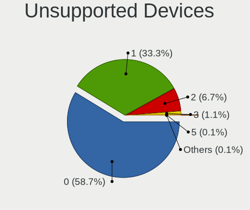

| Total | Notebooks | Percent |
|-------|-----------|---------|
| 0     | 339       | 59.89%  |
| 1     | 173       | 30.57%  |
| 2     | 46        | 8.13%   |
| 3     | 8         | 1.41%   |

Unsupported Device Types
------------------------

Types of unsupported devices

| Type                     | Notebooks | Percent |
|--------------------------|-----------|---------|
| Fingerprint reader       | 126       | 45.49%  |
| Graphics card            | 47        | 16.97%  |
| Net/wireless             | 37        | 13.36%  |
| Chipcard                 | 35        | 12.64%  |
| Multimedia controller    | 8         | 2.89%   |
| Storage                  | 6         | 2.17%   |
| Bluetooth                | 6         | 2.17%   |
| Camera                   | 4         | 1.44%   |
| Card reader              | 3         | 1.08%   |
| Sound                    | 2         | 0.72%   |
| Net/ethernet             | 1         | 0.36%   |
| Modem                    | 1         | 0.36%   |
| Communication controller | 1         | 0.36%   |

