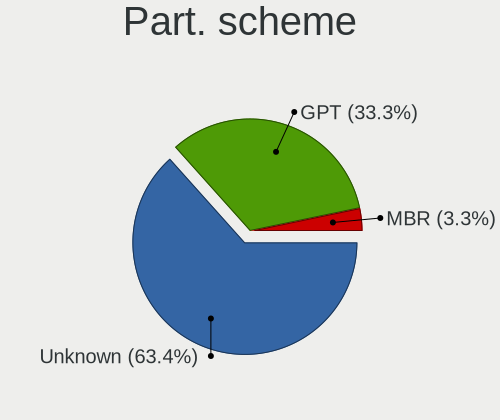
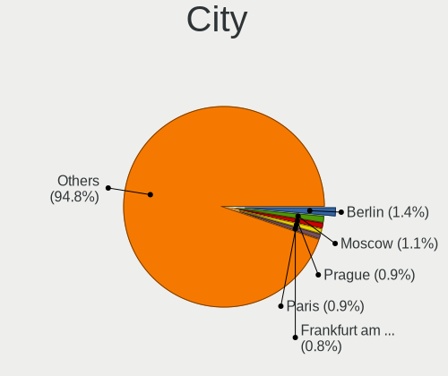
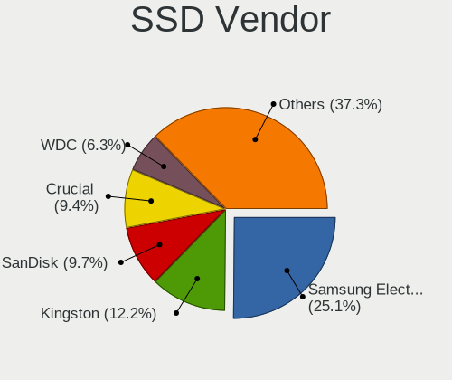
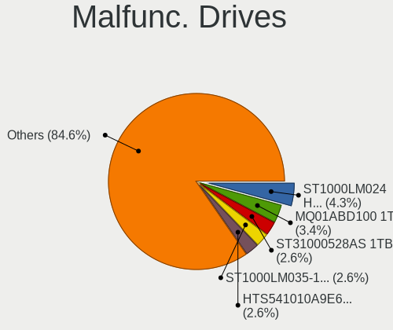
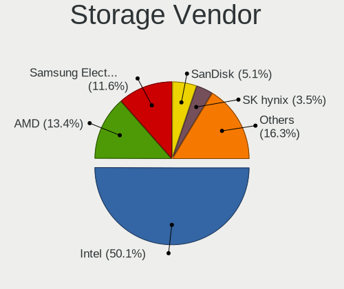
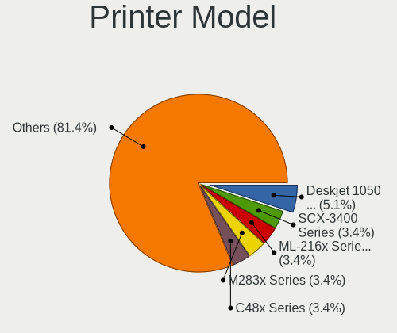

Ubuntu 21.10 - Tested Hardware & Statistics
-------------------------------------------

A project to collect tested hardware configurations for Ubuntu 21.10.

Anyone can contribute to this report by the [hw-probe](https://github.com/linuxhw/hw-probe) tool:

    sudo -E hw-probe -all -upload

Please submit a probe of your configuration if it's not presented on the page or is rare.

This is a report for all computer types. See also reports for [desktops](/Dist/Ubuntu_21.10/Desktop/README.md) and [notebooks](/Dist/Ubuntu_21.10/Notebook/README.md).

Full-feature report is available here: https://linux-hardware.org/?view=trends

Contents
--------

* [ Test Cases ](#test-cases)

* [ System ](#system)
  - [ Kernel                   ](#kernel)
  - [ Kernel Family            ](#kernel-family)
  - [ Kernel Major Ver.        ](#kernel-major-ver)
  - [ Arch                     ](#arch)
  - [ DE                       ](#de)
  - [ Display Server           ](#display-server)
  - [ Display Manager          ](#display-manager)
  - [ OS Lang                  ](#os-lang)
  - [ Boot Mode                ](#boot-mode)
  - [ Filesystem               ](#filesystem)
  - [ Part. scheme             ](#part-scheme)
  - [ Dual Boot with Linux/BSD ](#dual-boot-with-linuxbsd)
  - [ Dual Boot (Win)          ](#dual-boot-win)

* [ Board ](#board)
  - [ Vendor                   ](#vendor)
  - [ Model                    ](#model)
  - [ Model Family             ](#model-family)
  - [ MFG Year                 ](#mfg-year)
  - [ Form Factor              ](#form-factor)
  - [ Secure Boot              ](#secure-boot)
  - [ Coreboot                 ](#coreboot)
  - [ RAM Size                 ](#ram-size)
  - [ RAM Used                 ](#ram-used)
  - [ Total Drives             ](#total-drives)
  - [ Has CD-ROM               ](#has-cd-rom)
  - [ Has Ethernet             ](#has-ethernet)
  - [ Has WiFi                 ](#has-wifi)
  - [ Has Bluetooth            ](#has-bluetooth)

* [ Location ](#location)
  - [ Country                  ](#country)
  - [ City                     ](#city)

* [ Drives ](#drives)
  - [ Drive Vendor             ](#drive-vendor)
  - [ Drive Model              ](#drive-model)
  - [ HDD Vendor               ](#hdd-vendor)
  - [ SSD Vendor               ](#ssd-vendor)
  - [ Drive Kind               ](#drive-kind)
  - [ Drive Connector          ](#drive-connector)
  - [ Drive Size               ](#drive-size)
  - [ Space Total              ](#space-total)
  - [ Space Used               ](#space-used)
  - [ Malfunc. Drives          ](#malfunc-drives)
  - [ Malfunc. Drive Vendor    ](#malfunc-drive-vendor)
  - [ Malfunc. HDD Vendor      ](#malfunc-hdd-vendor)
  - [ Malfunc. Drive Kind      ](#malfunc-drive-kind)
  - [ Failed Drives            ](#failed-drives)
  - [ Failed Drive Vendor      ](#failed-drive-vendor)
  - [ Drive Status             ](#drive-status)

* [ Storage controller ](#storage-controller)
  - [ Storage Vendor           ](#storage-vendor)
  - [ Storage Model            ](#storage-model)
  - [ Storage Kind             ](#storage-kind)

* [ Processor ](#processor)
  - [ CPU Vendor               ](#cpu-vendor)
  - [ CPU Model                ](#cpu-model)
  - [ CPU Model Family         ](#cpu-model-family)
  - [ CPU Cores                ](#cpu-cores)
  - [ CPU Sockets              ](#cpu-sockets)
  - [ CPU Threads              ](#cpu-threads)
  - [ CPU Op-Modes             ](#cpu-op-modes)
  - [ CPU Microcode            ](#cpu-microcode)
  - [ CPU Microarch            ](#cpu-microarch)

* [ Graphics ](#graphics)
  - [ GPU Vendor               ](#gpu-vendor)
  - [ GPU Model                ](#gpu-model)
  - [ GPU Combo                ](#gpu-combo)
  - [ GPU Driver               ](#gpu-driver)
  - [ GPU Memory               ](#gpu-memory)

* [ Monitor ](#monitor)
  - [ Monitor Vendor           ](#monitor-vendor)
  - [ Monitor Model            ](#monitor-model)
  - [ Monitor Resolution       ](#monitor-resolution)
  - [ Monitor Diagonal         ](#monitor-diagonal)
  - [ Monitor Width            ](#monitor-width)
  - [ Aspect Ratio             ](#aspect-ratio)
  - [ Monitor Area             ](#monitor-area)
  - [ Pixel Density            ](#pixel-density)
  - [ Multiple Monitors        ](#multiple-monitors)

* [ Network ](#network)
  - [ Net Controller Vendor    ](#net-controller-vendor)
  - [ Net Controller Model     ](#net-controller-model)
  - [ Wireless Vendor          ](#wireless-vendor)
  - [ Wireless Model           ](#wireless-model)
  - [ Ethernet Vendor          ](#ethernet-vendor)
  - [ Ethernet Model           ](#ethernet-model)
  - [ Net Controller Kind      ](#net-controller-kind)
  - [ Used Controller          ](#used-controller)
  - [ NICs                     ](#nics)
  - [ IPv6                     ](#ipv6)

* [ Bluetooth ](#bluetooth)
  - [ Bluetooth Vendor         ](#bluetooth-vendor)
  - [ Bluetooth Model          ](#bluetooth-model)

* [ Sound ](#sound)
  - [ Sound Vendor             ](#sound-vendor)
  - [ Sound Model              ](#sound-model)

* [ Memory ](#memory)
  - [ Memory Vendor            ](#memory-vendor)
  - [ Memory Model             ](#memory-model)
  - [ Memory Kind              ](#memory-kind)
  - [ Memory Form Factor       ](#memory-form-factor)
  - [ Memory Size              ](#memory-size)
  - [ Memory Speed             ](#memory-speed)

* [ Printers & scanners ](#printers--scanners)
  - [ Printer Vendor           ](#printer-vendor)
  - [ Printer Model            ](#printer-model)
  - [ Scanner Vendor           ](#scanner-vendor)
  - [ Scanner Model            ](#scanner-model)

* [ Camera ](#camera)
  - [ Camera Vendor            ](#camera-vendor)
  - [ Camera Model             ](#camera-model)

* [ Security ](#security)
  - [ Fingerprint Vendor       ](#fingerprint-vendor)
  - [ Fingerprint Model        ](#fingerprint-model)
  - [ Chipcard Vendor          ](#chipcard-vendor)
  - [ Chipcard Model           ](#chipcard-model)

* [ Unsupported ](#unsupported)
  - [ Unsupported Devices      ](#unsupported-devices)
  - [ Unsupported Device Types ](#unsupported-device-types)

Test Cases
----------

| Vendor        | Model                       | Form-Factor | Probe                                                      | Date         |
|---------------|-----------------------------|-------------|------------------------------------------------------------|--------------|
| Dell          | Inspiron 3584               | Notebook    | [14630b0a02](https://linux-hardware.org/?probe=14630b0a02) | Feb 01, 2022 |
| Lenovo        | IdeaPad 5 14ITL05 82FE      | Notebook    | [2621c151ec](https://linux-hardware.org/?probe=2621c151ec) | Feb 01, 2022 |
| Lenovo        | Rev B 20YM                  | Notebook    | [83c63da100](https://linux-hardware.org/?probe=83c63da100) | Feb 01, 2022 |
| HP            | 255 G6 Notebook PC          | Notebook    | [302b9789d3](https://linux-hardware.org/?probe=302b9789d3) | Feb 01, 2022 |
| Dell          | Inspiron 7506 2n1           | Convertible | [24ef258921](https://linux-hardware.org/?probe=24ef258921) | Feb 01, 2022 |
| Toshiba       | Satellite C50-A-19T         | Notebook    | [7ea7ab684e](https://linux-hardware.org/?probe=7ea7ab684e) | Feb 01, 2022 |
| Lenovo        | G580 20157                  | Notebook    | [fe6a35d3f8](https://linux-hardware.org/?probe=fe6a35d3f8) | Jan 31, 2022 |
| HP            | ProBook 650 G2              | Notebook    | [1835f9c2d4](https://linux-hardware.org/?probe=1835f9c2d4) | Jan 31, 2022 |
| HP            | ProBook 440 G5              | Notebook    | [0e27902494](https://linux-hardware.org/?probe=0e27902494) | Jan 31, 2022 |
| HP            | 255 G6 Notebook PC          | Notebook    | [3ec8d6dcf6](https://linux-hardware.org/?probe=3ec8d6dcf6) | Jan 31, 2022 |
| HP            | 255 G8 Notebook PC          | Notebook    | [d6a1e99ba7](https://linux-hardware.org/?probe=d6a1e99ba7) | Jan 31, 2022 |
| Dell          | Inspiron 7506 2n1           | Convertible | [aa8e03cdf5](https://linux-hardware.org/?probe=aa8e03cdf5) | Jan 31, 2022 |
| Apple         | MacBook5,1                  | Notebook    | [dd9f492694](https://linux-hardware.org/?probe=dd9f492694) | Jan 31, 2022 |
| MSI           | Z370 GAMING PLUS            | Desktop     | [72ad880143](https://linux-hardware.org/?probe=72ad880143) | Jan 31, 2022 |
| HP            | Laptop 15s-fq1xxx           | Notebook    | [7c2762f41c](https://linux-hardware.org/?probe=7c2762f41c) | Jan 31, 2022 |
| HP            | Laptop 15s-fq1xxx           | Notebook    | [2aa45a8d1b](https://linux-hardware.org/?probe=2aa45a8d1b) | Jan 31, 2022 |
| ASUSTek       | CM6870                      | Desktop     | [f217244fb2](https://linux-hardware.org/?probe=f217244fb2) | Jan 31, 2022 |
| Gigabyte      | Z370 HD3P-CF                | Desktop     | [44411daa5a](https://linux-hardware.org/?probe=44411daa5a) | Jan 31, 2022 |
| ASUSTek       | ROG Maximus X HERO          | Desktop     | [f3ed6567f9](https://linux-hardware.org/?probe=f3ed6567f9) | Jan 31, 2022 |
| Samsung       | R430/P430/R480              | Notebook    | [b08c9147e6](https://linux-hardware.org/?probe=b08c9147e6) | Jan 31, 2022 |
| BESSTAR Te... | UM300 V1.0                  | Desktop     | [66320a8981](https://linux-hardware.org/?probe=66320a8981) | Jan 31, 2022 |
| MACHINIST     | X99-RS9 V2.0                | Desktop     | [927a82eb86](https://linux-hardware.org/?probe=927a82eb86) | Jan 30, 2022 |
| HP            | ProBook 440 G5              | Notebook    | [df88db4d1b](https://linux-hardware.org/?probe=df88db4d1b) | Jan 30, 2022 |
| Toshiba       | TECRA R940                  | Notebook    | [c326f16d07](https://linux-hardware.org/?probe=c326f16d07) | Jan 30, 2022 |
| Fujitsu       | D3161-A1 S26361-D3161-A1    | Desktop     | [fc9ddc34b0](https://linux-hardware.org/?probe=fc9ddc34b0) | Jan 30, 2022 |
| AVITA         | NS14A6                      | Notebook    | [bbf5494b7f](https://linux-hardware.org/?probe=bbf5494b7f) | Jan 30, 2022 |
| AVITA         | NS14A6                      | Notebook    | [5cb93a7ead](https://linux-hardware.org/?probe=5cb93a7ead) | Jan 30, 2022 |
| Lenovo        | ThinkPad X390 20Q1S9RB00    | Notebook    | [9970037d9d](https://linux-hardware.org/?probe=9970037d9d) | Jan 30, 2022 |
| Gigabyte      | GA-890FXA-UD5               | Desktop     | [a7a2a13e23](https://linux-hardware.org/?probe=a7a2a13e23) | Jan 30, 2022 |
| ASUSTek       | ROG Maximus XI HERO         | Desktop     | [87a19ca6bd](https://linux-hardware.org/?probe=87a19ca6bd) | Jan 30, 2022 |
| HP            | ProBook 440 G5              | Notebook    | [930aa74ba2](https://linux-hardware.org/?probe=930aa74ba2) | Jan 30, 2022 |
| Samsung       | Galaxy Book 12              | Tablet      | [9f15060010](https://linux-hardware.org/?probe=9f15060010) | Jan 30, 2022 |
| HP            | 3048h                       | Desktop     | [cb51d0cf78](https://linux-hardware.org/?probe=cb51d0cf78) | Jan 30, 2022 |
| Acer          | Aspire A515-51              | Notebook    | [d38f4418f9](https://linux-hardware.org/?probe=d38f4418f9) | Jan 30, 2022 |
| Acer          | Aspire A515-51              | Notebook    | [f1987d67dc](https://linux-hardware.org/?probe=f1987d67dc) | Jan 30, 2022 |
| Lenovo        | V130-15IGM 81HL             | Notebook    | [67505d4784](https://linux-hardware.org/?probe=67505d4784) | Jan 30, 2022 |
| Lenovo        | IdeaPad Flex-14API 81SS     | Notebook    | [f93eabba88](https://linux-hardware.org/?probe=f93eabba88) | Jan 30, 2022 |
| HP            | Laptop 15s-eq2xxx           | Notebook    | [af5eb12b7b](https://linux-hardware.org/?probe=af5eb12b7b) | Jan 29, 2022 |
| HP            | Laptop 15s-eq2xxx           | Notebook    | [c9528e87c0](https://linux-hardware.org/?probe=c9528e87c0) | Jan 29, 2022 |
| Lenovo        | ThinkPad T430 2350B58       | Notebook    | [9c867cc4a8](https://linux-hardware.org/?probe=9c867cc4a8) | Jan 29, 2022 |
| HP            | Pavilion Aero Laptop 13-... | Notebook    | [478d5281bd](https://linux-hardware.org/?probe=478d5281bd) | Jan 29, 2022 |
| MSI           | GF75 Thin 10SDR             | Notebook    | [dadcf8d49c](https://linux-hardware.org/?probe=dadcf8d49c) | Jan 29, 2022 |
| Dell          | XPS 15 9500                 | Notebook    | [b5db02e326](https://linux-hardware.org/?probe=b5db02e326) | Jan 29, 2022 |
| ASUSTek       | M5A78L-M/USB3               | Desktop     | [38eb148f2e](https://linux-hardware.org/?probe=38eb148f2e) | Jan 29, 2022 |
| HP            | ProBook 455 G7              | Notebook    | [08b0a66098](https://linux-hardware.org/?probe=08b0a66098) | Jan 29, 2022 |
| Acer          | Aspire V3-772G              | Notebook    | [1e4b8a880e](https://linux-hardware.org/?probe=1e4b8a880e) | Jan 29, 2022 |
| HP            | Pavilion Laptop 13-bb0xx... | Notebook    | [b1fc771c31](https://linux-hardware.org/?probe=b1fc771c31) | Jan 28, 2022 |
| Dell          | Inspiron 7506 2n1           | Convertible | [f95d149397](https://linux-hardware.org/?probe=f95d149397) | Jan 28, 2022 |
| Lenovo        | IdeaPad 5 Pro 16ACH6 82L... | Notebook    | [a73b683284](https://linux-hardware.org/?probe=a73b683284) | Jan 28, 2022 |
| ASRock        | H570M-ITX/ac                | Desktop     | [e901364a26](https://linux-hardware.org/?probe=e901364a26) | Jan 28, 2022 |
| ASRock        | 970 Extreme3                | Desktop     | [82d0c3e60e](https://linux-hardware.org/?probe=82d0c3e60e) | Jan 28, 2022 |
| MSI           | B560M PRO                   | Desktop     | [00b3d4717d](https://linux-hardware.org/?probe=00b3d4717d) | Jan 28, 2022 |
| ASRock        | H570M-ITX/ac                | Desktop     | [7295dda221](https://linux-hardware.org/?probe=7295dda221) | Jan 28, 2022 |
| Lenovo        | ThinkPad T420 4180ED3       | Notebook    | [b115732b3b](https://linux-hardware.org/?probe=b115732b3b) | Jan 28, 2022 |
| MSI           | B560M PRO                   | Desktop     | [b3a84eebc3](https://linux-hardware.org/?probe=b3a84eebc3) | Jan 28, 2022 |
| Lenovo        | ThinkBook 15p 20V3          | Notebook    | [04a57a90f9](https://linux-hardware.org/?probe=04a57a90f9) | Jan 28, 2022 |
| Chuwi         | LarkBox                     | Desktop     | [8ddd1a7c4d](https://linux-hardware.org/?probe=8ddd1a7c4d) | Jan 28, 2022 |
| Dell          | Inspiron 5480               | Notebook    | [85796c8359](https://linux-hardware.org/?probe=85796c8359) | Jan 28, 2022 |
| Dell          | Inspiron 5480               | Notebook    | [59b6841322](https://linux-hardware.org/?probe=59b6841322) | Jan 28, 2022 |
| Lenovo        | IdeaPad 3 15IIL05 81WE      | Notebook    | [23efd3ad0d](https://linux-hardware.org/?probe=23efd3ad0d) | Jan 28, 2022 |
| Acer          | Aspire E5-553G              | Notebook    | [6e72e70430](https://linux-hardware.org/?probe=6e72e70430) | Jan 28, 2022 |
| Dell          | 0WMJ54 A01                  | Desktop     | [d4c6610ae0](https://linux-hardware.org/?probe=d4c6610ae0) | Jan 28, 2022 |
| ASUSTek       | TUF Gaming FX505DY_FX505... | Notebook    | [2309c1e501](https://linux-hardware.org/?probe=2309c1e501) | Jan 28, 2022 |
| Fusion5       | FWIN232 PRO S2              | Tablet      | [cc685152fd](https://linux-hardware.org/?probe=cc685152fd) | Jan 28, 2022 |
| ASUSTek       | K50ID                       | Notebook    | [fed48cd01d](https://linux-hardware.org/?probe=fed48cd01d) | Jan 27, 2022 |
| ASUSTek       | H81M-K                      | Desktop     | [74149e531c](https://linux-hardware.org/?probe=74149e531c) | Jan 27, 2022 |
| Samsung       | RV410/RV510/S3510/E3510     | Notebook    | [32ad79e4bc](https://linux-hardware.org/?probe=32ad79e4bc) | Jan 27, 2022 |
| ASUSTek       | X550WA                      | Notebook    | [e146d6a0f8](https://linux-hardware.org/?probe=e146d6a0f8) | Jan 27, 2022 |
| Gigabyte      | X58A-UD3R                   | Desktop     | [42f1ea1af3](https://linux-hardware.org/?probe=42f1ea1af3) | Jan 27, 2022 |
| Apple         | Mac-F42C88C8 Proto1         | Desktop     | [f967c472e5](https://linux-hardware.org/?probe=f967c472e5) | Jan 27, 2022 |
| Apple         | Mac-F42C88C8 Proto1         | Desktop     | [e92de9ab2e](https://linux-hardware.org/?probe=e92de9ab2e) | Jan 27, 2022 |
| HUAWEI        | NBLB-WAX9N                  | Notebook    | [9c8d4276ff](https://linux-hardware.org/?probe=9c8d4276ff) | Jan 27, 2022 |
| Raspberry ... | Raspberry Pi                | Soc         | [7133090590](https://linux-hardware.org/?probe=7133090590) | Jan 27, 2022 |
| Raspberry ... | Raspberry Pi                | Soc         | [b225cb9fe5](https://linux-hardware.org/?probe=b225cb9fe5) | Jan 27, 2022 |
| ASUSTek       | X555LD                      | Notebook    | [0665a1599c](https://linux-hardware.org/?probe=0665a1599c) | Jan 26, 2022 |
| Apple         | MacBookPro9,2               | Notebook    | [fb7312d608](https://linux-hardware.org/?probe=fb7312d608) | Jan 26, 2022 |
| Lenovo        | G40-80 80E4                 | Notebook    | [4c27ace709](https://linux-hardware.org/?probe=4c27ace709) | Jan 26, 2022 |
| Lenovo        | V130-15IGM 81HL             | Notebook    | [4a7b39821e](https://linux-hardware.org/?probe=4a7b39821e) | Jan 26, 2022 |
| Intel         | NUC8BEB J72692-310          | Mini pc     | [f6af641a5e](https://linux-hardware.org/?probe=f6af641a5e) | Jan 26, 2022 |
| Clevo         | W76x/M77xCUH                | Notebook    | [48d0efb057](https://linux-hardware.org/?probe=48d0efb057) | Jan 26, 2022 |
| Acer          | Nitro AN515-52              | Notebook    | [34c8096b74](https://linux-hardware.org/?probe=34c8096b74) | Jan 26, 2022 |
| Fanless Mi... | Rev GMLR1                   | Mini pc     | [22c37d0166](https://linux-hardware.org/?probe=22c37d0166) | Jan 26, 2022 |
| Dell          | Inspiron 5570               | Notebook    | [db63ce439f](https://linux-hardware.org/?probe=db63ce439f) | Jan 26, 2022 |
| ASUSTek       | PRIME Z370-A                | Desktop     | [53b2c696ff](https://linux-hardware.org/?probe=53b2c696ff) | Jan 26, 2022 |
| HP            | 8054                        | Desktop     | [332217129d](https://linux-hardware.org/?probe=332217129d) | Jan 26, 2022 |
| ASUSTek       | PRIME Z370-A                | Desktop     | [7b2482036e](https://linux-hardware.org/?probe=7b2482036e) | Jan 26, 2022 |
| Dell          | XPS 15 7590                 | Notebook    | [f31c2dda65](https://linux-hardware.org/?probe=f31c2dda65) | Jan 26, 2022 |
| ASUSTek       | VivoBook_ASUSLaptop X509... | Notebook    | [992ccf1855](https://linux-hardware.org/?probe=992ccf1855) | Jan 26, 2022 |
| Samsung       | 935XDB                      | Notebook    | [ef096190b6](https://linux-hardware.org/?probe=ef096190b6) | Jan 26, 2022 |
| Acer          | Aspire A715-42G             | Notebook    | [b585a9d6bb](https://linux-hardware.org/?probe=b585a9d6bb) | Jan 26, 2022 |
| ASUSTek       | ROG STRIX Z390-E GAMING     | Desktop     | [00cdb626d7](https://linux-hardware.org/?probe=00cdb626d7) | Jan 26, 2022 |
| Lenovo        | ThinkPad T15 Gen 2i 20W4... | Notebook    | [115b4f412c](https://linux-hardware.org/?probe=115b4f412c) | Jan 25, 2022 |
| Packard Be... | EasyNote TE11BZ             | Notebook    | [1f3f4d2107](https://linux-hardware.org/?probe=1f3f4d2107) | Jan 25, 2022 |
| ASUSTek       | VivoBook_ASUSLaptop X509... | Notebook    | [eed0593d0a](https://linux-hardware.org/?probe=eed0593d0a) | Jan 25, 2022 |
| HP            | ENVY x360 Convertible 15... | Convertible | [5f5b79eabf](https://linux-hardware.org/?probe=5f5b79eabf) | Jan 25, 2022 |
| MSI           | B450 GAMING PRO CARBON A... | Desktop     | [12e94e5413](https://linux-hardware.org/?probe=12e94e5413) | Jan 25, 2022 |
| Gigabyte      | B460M AORUS PRO             | Desktop     | [33521b66a1](https://linux-hardware.org/?probe=33521b66a1) | Jan 25, 2022 |
| Medion        | H110H4-CM2                  | Desktop     | [8574d37f58](https://linux-hardware.org/?probe=8574d37f58) | Jan 25, 2022 |
| Dell          | 0DXYK6 A01                  | Desktop     | [f270a1ab38](https://linux-hardware.org/?probe=f270a1ab38) | Jan 25, 2022 |
| Apple         | MacBook5,1                  | Notebook    | [0f6c39f50e](https://linux-hardware.org/?probe=0f6c39f50e) | Jan 25, 2022 |
| Raspberry ... | Raspberry Pi                | Soc         | [32af7dc312](https://linux-hardware.org/?probe=32af7dc312) | Jan 24, 2022 |
| Dell          | Latitude E5530 non-vPro     | Notebook    | [16aeee2b77](https://linux-hardware.org/?probe=16aeee2b77) | Jan 24, 2022 |
| Dell          | Latitude E6420              | Notebook    | [027f726453](https://linux-hardware.org/?probe=027f726453) | Jan 24, 2022 |
| Framework     | Laptop                      | Notebook    | [99c660804f](https://linux-hardware.org/?probe=99c660804f) | Jan 24, 2022 |
| Medion        | P2A4-EM                     | Desktop     | [6e80bcdcd1](https://linux-hardware.org/?probe=6e80bcdcd1) | Jan 24, 2022 |
| Raspberry ... | Raspberry Pi                | Soc         | [0892ac4796](https://linux-hardware.org/?probe=0892ac4796) | Jan 24, 2022 |
| HP            | Pavilion 17                 | Notebook    | [d2c545576e](https://linux-hardware.org/?probe=d2c545576e) | Jan 24, 2022 |
| Lenovo        | ThinkPad E590 20NB0058RT    | Notebook    | [0b56eb1e6e](https://linux-hardware.org/?probe=0b56eb1e6e) | Jan 23, 2022 |
| Acer          | Spin SP314-51               | Convertible | [3b7769aa97](https://linux-hardware.org/?probe=3b7769aa97) | Jan 23, 2022 |
| MSI           | Summit E13FlipEvo A11MT     | Notebook    | [b59e4cbfef](https://linux-hardware.org/?probe=b59e4cbfef) | Jan 23, 2022 |
| Acer          | Spin SP314-51               | Convertible | [1273501b4c](https://linux-hardware.org/?probe=1273501b4c) | Jan 23, 2022 |
| ASUSTek       | ROG Zephyrus G14 GA401QM... | Notebook    | [de23657e81](https://linux-hardware.org/?probe=de23657e81) | Jan 23, 2022 |
| Dell          | 0DXYK6 A01                  | Desktop     | [a145a49fc6](https://linux-hardware.org/?probe=a145a49fc6) | Jan 23, 2022 |
| ASUSTek       | D642MF                      | Desktop     | [1d59c9470c](https://linux-hardware.org/?probe=1d59c9470c) | Jan 23, 2022 |
| MSI           | 760GM-P23                   | Desktop     | [65ce5265d3](https://linux-hardware.org/?probe=65ce5265d3) | Jan 23, 2022 |
| Huanan        | X99-BD4 V1.3                | Desktop     | [d9cbf7e314](https://linux-hardware.org/?probe=d9cbf7e314) | Jan 23, 2022 |
| Apple         | Mac-942B5BF58194151B        | All in one  | [9164aa7783](https://linux-hardware.org/?probe=9164aa7783) | Jan 23, 2022 |
| Fujitsu       | D3220-A1 S26361-D3220-A1    | Desktop     | [b1cfd38100](https://linux-hardware.org/?probe=b1cfd38100) | Jan 23, 2022 |
| MSI           | H310M PRO-M2 PLUS           | Desktop     | [b63214b1e1](https://linux-hardware.org/?probe=b63214b1e1) | Jan 23, 2022 |
| Positivo      | Q464C                       | Notebook    | [c5fa0e3561](https://linux-hardware.org/?probe=c5fa0e3561) | Jan 23, 2022 |
| ASUSTek       | X450LD                      | Notebook    | [07edc503a1](https://linux-hardware.org/?probe=07edc503a1) | Jan 23, 2022 |
| Lenovo        | ThinkPad 20TDZMS            | Notebook    | [143bc3f79b](https://linux-hardware.org/?probe=143bc3f79b) | Jan 23, 2022 |
| Razer         | Blade 15 Advanced Model ... | Notebook    | [c07445f559](https://linux-hardware.org/?probe=c07445f559) | Jan 23, 2022 |
| Packard Be... | EasyNote TV44HC             | Notebook    | [38fb76e085](https://linux-hardware.org/?probe=38fb76e085) | Jan 23, 2022 |
| ASUSTek       | P8B75-M LX                  | Desktop     | [dc2c32aac2](https://linux-hardware.org/?probe=dc2c32aac2) | Jan 23, 2022 |
| Acer          | FIH57                       | Desktop     | [af79e42583](https://linux-hardware.org/?probe=af79e42583) | Jan 23, 2022 |
| MSI           | GL65 Leopard 10SDR          | Notebook    | [db5f5da948](https://linux-hardware.org/?probe=db5f5da948) | Jan 23, 2022 |
| Dell          | Inspiron 5481               | Convertible | [3f2f40863b](https://linux-hardware.org/?probe=3f2f40863b) | Jan 23, 2022 |
| HP            | Pavilion Aero Laptop 13-... | Notebook    | [3363e2fdb0](https://linux-hardware.org/?probe=3363e2fdb0) | Jan 23, 2022 |
| Dell          | Latitude 7490               | Notebook    | [fea8be783a](https://linux-hardware.org/?probe=fea8be783a) | Jan 23, 2022 |
| Raspberry ... | Raspberry Pi                | Soc         | [f6fc8d9281](https://linux-hardware.org/?probe=f6fc8d9281) | Jan 23, 2022 |
| Alienware     | 17 R4                       | Notebook    | [d82171f734](https://linux-hardware.org/?probe=d82171f734) | Jan 22, 2022 |
| ASUSTek       | ROG Zephyrus G14 GA401QM... | Notebook    | [882dab7b0e](https://linux-hardware.org/?probe=882dab7b0e) | Jan 22, 2022 |
| Notebook      | N13xWU                      | Notebook    | [0d615c6812](https://linux-hardware.org/?probe=0d615c6812) | Jan 22, 2022 |
| ASUSTek       | P8H61-M LX R2.0             | Desktop     | [7f92d6ff46](https://linux-hardware.org/?probe=7f92d6ff46) | Jan 22, 2022 |
| Dell          | XPS 13 9305                 | Notebook    | [f5385f201e](https://linux-hardware.org/?probe=f5385f201e) | Jan 22, 2022 |
| Acer          | Swift SF314-43              | Notebook    | [567c5725d5](https://linux-hardware.org/?probe=567c5725d5) | Jan 22, 2022 |
| Lenovo        | ThinkPad E15 Gen 3 20YG0... | Notebook    | [fa90e37c2d](https://linux-hardware.org/?probe=fa90e37c2d) | Jan 22, 2022 |
| Acer          | Swift SF315-41              | Notebook    | [95afa35615](https://linux-hardware.org/?probe=95afa35615) | Jan 22, 2022 |
| Lenovo        | G50-45 80MQ                 | Notebook    | [6a21be0bff](https://linux-hardware.org/?probe=6a21be0bff) | Jan 22, 2022 |
| ASUSTek       | PRIME B360M-A               | Desktop     | [3825d7e113](https://linux-hardware.org/?probe=3825d7e113) | Jan 22, 2022 |
| ASUSTek       | H81M-R                      | Desktop     | [d324ae2959](https://linux-hardware.org/?probe=d324ae2959) | Jan 22, 2022 |
| MSI           | H55M-E33                    | Desktop     | [bb0b689514](https://linux-hardware.org/?probe=bb0b689514) | Jan 22, 2022 |
| Dell          | Studio 1737                 | Notebook    | [d2d85d9b73](https://linux-hardware.org/?probe=d2d85d9b73) | Jan 21, 2022 |
| HP            | 843F                        | Desktop     | [75459e99d4](https://linux-hardware.org/?probe=75459e99d4) | Jan 21, 2022 |
| ASRock        | H510 Pro BTC+               | Desktop     | [ff2dd45add](https://linux-hardware.org/?probe=ff2dd45add) | Jan 21, 2022 |
| ASRock        | H510 Pro BTC+               | Desktop     | [234acd7143](https://linux-hardware.org/?probe=234acd7143) | Jan 21, 2022 |
| Lenovo        | G580 2189                   | Notebook    | [3f1adf101d](https://linux-hardware.org/?probe=3f1adf101d) | Jan 21, 2022 |
| Lenovo        | ThinkPad T480s 20L7CTO1W... | Notebook    | [1d478097a3](https://linux-hardware.org/?probe=1d478097a3) | Jan 21, 2022 |
| Dell          | Precision 5550              | Notebook    | [d918e1f390](https://linux-hardware.org/?probe=d918e1f390) | Jan 21, 2022 |
| Gigabyte      | GA-MA790FXT-UD5P            | Desktop     | [773f86769e](https://linux-hardware.org/?probe=773f86769e) | Jan 21, 2022 |
| Raspberry ... | Raspberry Pi                | Soc         | [5d52b59ecf](https://linux-hardware.org/?probe=5d52b59ecf) | Jan 21, 2022 |
| NCS-Tech      | ONE1                        | Notebook    | [409bede257](https://linux-hardware.org/?probe=409bede257) | Jan 21, 2022 |
| Raspberry ... | Raspberry Pi                | Soc         | [6250d056d0](https://linux-hardware.org/?probe=6250d056d0) | Jan 20, 2022 |
| Dell          | Inspiron 7506 2n1           | Convertible | [926eb15e71](https://linux-hardware.org/?probe=926eb15e71) | Jan 20, 2022 |
| MSI           | MS-7469 100                 | Desktop     | [8476ffa27e](https://linux-hardware.org/?probe=8476ffa27e) | Jan 20, 2022 |
| Dell          | Precision 5550              | Notebook    | [66ccaaa19f](https://linux-hardware.org/?probe=66ccaaa19f) | Jan 20, 2022 |
| Lenovo        | IdeaPad 110-15IBR 80T7      | Notebook    | [cdda13eba7](https://linux-hardware.org/?probe=cdda13eba7) | Jan 20, 2022 |
| ASUSTek       | Z97-K                       | Desktop     | [7d370214de](https://linux-hardware.org/?probe=7d370214de) | Jan 20, 2022 |
| Toshiba       | PORTEGE R930                | Notebook    | [1ee5471d24](https://linux-hardware.org/?probe=1ee5471d24) | Jan 20, 2022 |
| Timi          | A34R                        | Notebook    | [fcf594f19a](https://linux-hardware.org/?probe=fcf594f19a) | Jan 20, 2022 |
| Timi          | A34R                        | Notebook    | [046409a8e2](https://linux-hardware.org/?probe=046409a8e2) | Jan 20, 2022 |
| Raspberry ... | Raspberry Pi                | Soc         | [4a3f08d0c7](https://linux-hardware.org/?probe=4a3f08d0c7) | Jan 20, 2022 |
| HP            | 18EB                        | Desktop     | [59cce3a9a2](https://linux-hardware.org/?probe=59cce3a9a2) | Jan 19, 2022 |
| HUAWEI        | HVY-WXX9                    | Notebook    | [7926e3c998](https://linux-hardware.org/?probe=7926e3c998) | Jan 19, 2022 |
| HP            | Laptop 15s-fq1xxx           | Notebook    | [b48e7b60cd](https://linux-hardware.org/?probe=b48e7b60cd) | Jan 19, 2022 |
| Toshiba       | Satellite NB10t-A-103       | Notebook    | [e5d8911653](https://linux-hardware.org/?probe=e5d8911653) | Jan 19, 2022 |
| HP            | ProBook 430 G8 Notebook ... | Notebook    | [ca34cbdf64](https://linux-hardware.org/?probe=ca34cbdf64) | Jan 19, 2022 |
| HUAWEI        | MateBook X                  | Notebook    | [b8def0a48d](https://linux-hardware.org/?probe=b8def0a48d) | Jan 19, 2022 |
| HP            | EliteBook 1050 G1           | Notebook    | [1bb5cb826f](https://linux-hardware.org/?probe=1bb5cb826f) | Jan 19, 2022 |
| Gigabyte      | X58A-UD3R                   | Desktop     | [93b6fafb6e](https://linux-hardware.org/?probe=93b6fafb6e) | Jan 19, 2022 |
| Lenovo        | ThinkBook 14s Yoga ITL 2... | Convertible | [75c70d6dee](https://linux-hardware.org/?probe=75c70d6dee) | Jan 19, 2022 |
| ASUSTek       | PRIME B350M-A               | Desktop     | [8cf30a73c8](https://linux-hardware.org/?probe=8cf30a73c8) | Jan 19, 2022 |
| HP            | ProBook 6550b               | Notebook    | [d4ab3277b0](https://linux-hardware.org/?probe=d4ab3277b0) | Jan 19, 2022 |
| ASUSTek       | TUF GAMING X570-PLUS        | Desktop     | [f6a7e71141](https://linux-hardware.org/?probe=f6a7e71141) | Jan 18, 2022 |
| ASUSTek       | ZenBook Pro Duo UX581GV_... | Notebook    | [cc39f1fd96](https://linux-hardware.org/?probe=cc39f1fd96) | Jan 18, 2022 |
| Lenovo        | Legion Y540-17IRH 81Q4      | Notebook    | [3dc8b324bd](https://linux-hardware.org/?probe=3dc8b324bd) | Jan 18, 2022 |
| Clevo         | W251ESQ/W270ESQ             | Notebook    | [50380c8301](https://linux-hardware.org/?probe=50380c8301) | Jan 18, 2022 |
| Lenovo        | ThinkPad P15v Gen 1 20TQ... | Notebook    | [6fd36db1e0](https://linux-hardware.org/?probe=6fd36db1e0) | Jan 18, 2022 |
| Acer          | Predator G6-710             | Desktop     | [29bdcc72c9](https://linux-hardware.org/?probe=29bdcc72c9) | Jan 18, 2022 |
| ASRock        | Z270M-ITX/ac                | Desktop     | [4c32bf6d7b](https://linux-hardware.org/?probe=4c32bf6d7b) | Jan 18, 2022 |
| LG Electro... | 16Z90P-K.AAB7U1             | Notebook    | [1cd8321a44](https://linux-hardware.org/?probe=1cd8321a44) | Jan 18, 2022 |
| MSI           | P65 Creator 9SE             | Notebook    | [da7b942050](https://linux-hardware.org/?probe=da7b942050) | Jan 18, 2022 |
| Dell          | 0KH290                      | Desktop     | [1ec02399c2](https://linux-hardware.org/?probe=1ec02399c2) | Jan 18, 2022 |
| Gigabyte      | X570 AORUS ULTRA            | Desktop     | [e3f87f47e8](https://linux-hardware.org/?probe=e3f87f47e8) | Jan 18, 2022 |
| Lenovo        | IdeaPad 3 15IIL05 81WE      | Notebook    | [ff8f10a4f3](https://linux-hardware.org/?probe=ff8f10a4f3) | Jan 17, 2022 |
| HP            | Pavilion Laptop 15-eh0xx... | Notebook    | [4137cdd7e2](https://linux-hardware.org/?probe=4137cdd7e2) | Jan 17, 2022 |
| Apple         | Mac-63001698E7A34814 iMa... | All in one  | [4d965760ae](https://linux-hardware.org/?probe=4d965760ae) | Jan 17, 2022 |
| Lenovo        | IdeaPadFlex 5 14ALC05 82... | Convertible | [7dd316af53](https://linux-hardware.org/?probe=7dd316af53) | Jan 17, 2022 |
| Dell          | XPS 13 7390                 | Notebook    | [0db509562e](https://linux-hardware.org/?probe=0db509562e) | Jan 17, 2022 |
| MSI           | A320M-A PRO MAX             | Desktop     | [f8018a96fb](https://linux-hardware.org/?probe=f8018a96fb) | Jan 17, 2022 |
| Apple         | Mac-63001698E7A34814 iMa... | All in one  | [4cd00814d9](https://linux-hardware.org/?probe=4cd00814d9) | Jan 17, 2022 |
| Lenovo        | ThinkCentre M71e 3157R75    | Desktop     | [871b2aecd9](https://linux-hardware.org/?probe=871b2aecd9) | Jan 17, 2022 |
| Gigabyte      | Z690 AORUS ELITE DDR4       | Desktop     | [1668e6dc43](https://linux-hardware.org/?probe=1668e6dc43) | Jan 17, 2022 |
| HP            | Laptop 15-dy2xxx            | Notebook    | [d3a7880a3c](https://linux-hardware.org/?probe=d3a7880a3c) | Jan 17, 2022 |
| Dell          | Inspiron 1545               | Notebook    | [3017de5307](https://linux-hardware.org/?probe=3017de5307) | Jan 17, 2022 |
| Lenovo        | ThinkPad T530 2359CTO       | Notebook    | [7e133f725e](https://linux-hardware.org/?probe=7e133f725e) | Jan 17, 2022 |
| PCWare        | IPMH61R1                    | Desktop     | [9bad24f3d9](https://linux-hardware.org/?probe=9bad24f3d9) | Jan 17, 2022 |
| Gigabyte      | Z270X-Gaming 5              | Desktop     | [d1cf9b9344](https://linux-hardware.org/?probe=d1cf9b9344) | Jan 17, 2022 |
| Gigabyte      | X58A-UD3R                   | Desktop     | [dc02dbb307](https://linux-hardware.org/?probe=dc02dbb307) | Jan 16, 2022 |
| Lenovo        | IdeaPad 100-15IBY 80MJ      | Notebook    | [7cc691c557](https://linux-hardware.org/?probe=7cc691c557) | Jan 16, 2022 |
| Dell          | Inspiron 3501               | Notebook    | [898eb7ce85](https://linux-hardware.org/?probe=898eb7ce85) | Jan 16, 2022 |
| Acer          | Aspire E5-511               | Notebook    | [c2691bf00b](https://linux-hardware.org/?probe=c2691bf00b) | Jan 16, 2022 |
| ASUSTek       | VivoBook_ASUSLaptop TP42... | Convertible | [7e08b66a40](https://linux-hardware.org/?probe=7e08b66a40) | Jan 16, 2022 |
| ASUSTek       | ZenBook UX425UAZ_UM425UA... | Notebook    | [03293e9384](https://linux-hardware.org/?probe=03293e9384) | Jan 16, 2022 |
| Lenovo        | ThinkPad Yoga 260 20FES0... | Convertible | [c7eaebd796](https://linux-hardware.org/?probe=c7eaebd796) | Jan 16, 2022 |
| Lenovo        | ThinkPad Yoga 260 20FES0... | Convertible | [d8c5bf5691](https://linux-hardware.org/?probe=d8c5bf5691) | Jan 16, 2022 |
| MSI           | MS-AA1511                   | Other       | [bf5395a5d3](https://linux-hardware.org/?probe=bf5395a5d3) | Jan 16, 2022 |
| MSI           | MS-AA1511                   | Other       | [a54115e872](https://linux-hardware.org/?probe=a54115e872) | Jan 16, 2022 |
| Lenovo        | ThinkPad X1 Tablet 20GHC... | Tablet      | [923ccb09a5](https://linux-hardware.org/?probe=923ccb09a5) | Jan 16, 2022 |
| Raspberry ... | Raspberry Pi                | Soc         | [216bce9e93](https://linux-hardware.org/?probe=216bce9e93) | Jan 16, 2022 |
| ASUSTek       | ROG Zephyrus G15 GA503QS... | Notebook    | [4dd3961675](https://linux-hardware.org/?probe=4dd3961675) | Jan 16, 2022 |
| HP            | 8906 SMVB                   | Desktop     | [566e943f08](https://linux-hardware.org/?probe=566e943f08) | Jan 16, 2022 |
| ASUSTek       | B250 MINING EXPERT          | Desktop     | [17d01b9a1d](https://linux-hardware.org/?probe=17d01b9a1d) | Jan 16, 2022 |
| Lenovo        | IdeaPad 110-15ISK 80UD      | Notebook    | [a1fffe7c0f](https://linux-hardware.org/?probe=a1fffe7c0f) | Jan 16, 2022 |
| HP            | Notebook                    | Notebook    | [5d45aad44f](https://linux-hardware.org/?probe=5d45aad44f) | Jan 16, 2022 |
| ASUSTek       | Z97-K                       | Desktop     | [4b03f84c93](https://linux-hardware.org/?probe=4b03f84c93) | Jan 16, 2022 |
| Timi          | A18R                        | Notebook    | [37b8388616](https://linux-hardware.org/?probe=37b8388616) | Jan 16, 2022 |
| Dell          | XPS 17 9710                 | Notebook    | [3417abe371](https://linux-hardware.org/?probe=3417abe371) | Jan 16, 2022 |
| Fujitsu Si... | ESPRIMO Mobile V6505        | Notebook    | [4ceae99710](https://linux-hardware.org/?probe=4ceae99710) | Jan 15, 2022 |
| HP            | 8266                        | Desktop     | [c2cbb29774](https://linux-hardware.org/?probe=c2cbb29774) | Jan 15, 2022 |
| Raspberry ... | Raspberry Pi                | Soc         | [02fba86000](https://linux-hardware.org/?probe=02fba86000) | Jan 15, 2022 |
| Dell          | XPS 13 9305                 | Notebook    | [d6594c7edb](https://linux-hardware.org/?probe=d6594c7edb) | Jan 15, 2022 |
| Lenovo        | IdeaPad 110-15IBR 80T7      | Notebook    | [7b614a5d11](https://linux-hardware.org/?probe=7b614a5d11) | Jan 15, 2022 |
| Lenovo        | ThinkPad E15 Gen 2 20TD0... | Notebook    | [e37b97a3e7](https://linux-hardware.org/?probe=e37b97a3e7) | Jan 15, 2022 |
| Toshiba       | Satellite Pro L500          | Notebook    | [987c5a92d0](https://linux-hardware.org/?probe=987c5a92d0) | Jan 15, 2022 |
| Notebook      | W94_95_97SU2,SUY,-C,-T      | Notebook    | [786f091b04](https://linux-hardware.org/?probe=786f091b04) | Jan 15, 2022 |
| Raspberry ... | Raspberry Pi                | Soc         | [5ee1a86d06](https://linux-hardware.org/?probe=5ee1a86d06) | Jan 15, 2022 |
| HP            | 3048h                       | Desktop     | [d6f6435471](https://linux-hardware.org/?probe=d6f6435471) | Jan 15, 2022 |
| ASUSTek       | SABERTOOTH P67              | Desktop     | [5d9e7dcdd1](https://linux-hardware.org/?probe=5d9e7dcdd1) | Jan 15, 2022 |
| Dell          | XPS 17 9710                 | Notebook    | [3d2a67265f](https://linux-hardware.org/?probe=3d2a67265f) | Jan 15, 2022 |
| Acer          | Aspire E5-553               | Notebook    | [71f81101f2](https://linux-hardware.org/?probe=71f81101f2) | Jan 15, 2022 |
| Raspberry ... | Raspberry Pi                | Soc         | [a7e12a6a67](https://linux-hardware.org/?probe=a7e12a6a67) | Jan 15, 2022 |
| Lenovo        | ThinkPad E14 Gen 3 20Y7C... | Notebook    | [4ebb815948](https://linux-hardware.org/?probe=4ebb815948) | Jan 15, 2022 |
| Fujitsu       | LIFEBOOK UH572              | Notebook    | [b6e46bc4f5](https://linux-hardware.org/?probe=b6e46bc4f5) | Jan 15, 2022 |
| Fujitsu       | LIFEBOOK UH572              | Notebook    | [e82910b9d3](https://linux-hardware.org/?probe=e82910b9d3) | Jan 15, 2022 |
| Raspberry ... | Raspberry Pi                | Soc         | [7b3700265a](https://linux-hardware.org/?probe=7b3700265a) | Jan 15, 2022 |
| MSI           | Z490-A PRO                  | Desktop     | [62d5c59aec](https://linux-hardware.org/?probe=62d5c59aec) | Jan 15, 2022 |
| Supermicro    | X10SDV-4C-TLN2F             | Server      | [12db3650f6](https://linux-hardware.org/?probe=12db3650f6) | Jan 14, 2022 |
| Lenovo        | ThinkPad X240 20AMS4SL00    | Notebook    | [3888a941b9](https://linux-hardware.org/?probe=3888a941b9) | Jan 14, 2022 |
| ASUSTek       | ROG Zephyrus G15 GA502IU... | Notebook    | [fb4c60c7b1](https://linux-hardware.org/?probe=fb4c60c7b1) | Jan 14, 2022 |
| Dell          | XPS 15 9500                 | Notebook    | [9a887349f4](https://linux-hardware.org/?probe=9a887349f4) | Jan 14, 2022 |
| Unknown       | Unknown                     | Notebook    | [4790b017ca](https://linux-hardware.org/?probe=4790b017ca) | Jan 14, 2022 |
| Lenovo        | ThinkPad X240 20AMS6170H    | Notebook    | [03fc719875](https://linux-hardware.org/?probe=03fc719875) | Jan 14, 2022 |
| HP            | 1495                        | Desktop     | [ea7df45832](https://linux-hardware.org/?probe=ea7df45832) | Jan 14, 2022 |
| Gigabyte      | B550M AORUS PRO-P           | Desktop     | [9b8c21a3d0](https://linux-hardware.org/?probe=9b8c21a3d0) | Jan 14, 2022 |
| Raspberry ... | Raspberry Pi                | Soc         | [286449f8c4](https://linux-hardware.org/?probe=286449f8c4) | Jan 14, 2022 |
| ASUSTek       | VivoBook_ASUSLaptop X513... | Notebook    | [eee9a2ae45](https://linux-hardware.org/?probe=eee9a2ae45) | Jan 14, 2022 |
| Raspberry ... | Raspberry Pi                | Soc         | [8105b661fc](https://linux-hardware.org/?probe=8105b661fc) | Jan 14, 2022 |
| Raspberry ... | Raspberry Pi                | Soc         | [a7674e0031](https://linux-hardware.org/?probe=a7674e0031) | Jan 14, 2022 |
| Raspberry ... | Raspberry Pi                | Soc         | [4c7e2cd169](https://linux-hardware.org/?probe=4c7e2cd169) | Jan 14, 2022 |
| Razer         | Blade 15 Advanced Model ... | Notebook    | [6f992c3b94](https://linux-hardware.org/?probe=6f992c3b94) | Jan 14, 2022 |
| HP            | 0AECh D                     | Desktop     | [c42b2d840d](https://linux-hardware.org/?probe=c42b2d840d) | Jan 14, 2022 |
| Razer         | Blade 15 Advanced Model ... | Notebook    | [95724a0980](https://linux-hardware.org/?probe=95724a0980) | Jan 14, 2022 |
| Acer          | Predator PH317-52           | Notebook    | [1de1d4e14c](https://linux-hardware.org/?probe=1de1d4e14c) | Jan 14, 2022 |
| Unknown       | X99-GT                      | Desktop     | [4562aa0142](https://linux-hardware.org/?probe=4562aa0142) | Jan 13, 2022 |
| ASUSTek       | ROG Maximus X HERO          | Desktop     | [7723b652d9](https://linux-hardware.org/?probe=7723b652d9) | Jan 13, 2022 |
| MSI           | GT70                        | Notebook    | [ae15bd941d](https://linux-hardware.org/?probe=ae15bd941d) | Jan 13, 2022 |
| Lenovo        | Z50-70 20354                | Notebook    | [5cff653045](https://linux-hardware.org/?probe=5cff653045) | Jan 13, 2022 |
| ASUSTek       | ASUS EXPERTBOOK B1400CEP... | Notebook    | [d57b07dcea](https://linux-hardware.org/?probe=d57b07dcea) | Jan 13, 2022 |
| Dell          | 0KWVT8 A00                  | Desktop     | [c4a3e67da7](https://linux-hardware.org/?probe=c4a3e67da7) | Jan 13, 2022 |
| MSI           | H510I PRO WIFI              | Desktop     | [efc8b1b1ff](https://linux-hardware.org/?probe=efc8b1b1ff) | Jan 13, 2022 |
| MSI           | H510I PRO WIFI              | Desktop     | [58bc68bd8c](https://linux-hardware.org/?probe=58bc68bd8c) | Jan 13, 2022 |
| Acer          | Aspire E5-553               | Notebook    | [622899f837](https://linux-hardware.org/?probe=622899f837) | Jan 13, 2022 |
| Acer          | Aspire E5-553               | Notebook    | [149c0538ca](https://linux-hardware.org/?probe=149c0538ca) | Jan 13, 2022 |
| Lenovo        | ThinkPad T480s 20L8S3FV0... | Notebook    | [78080db667](https://linux-hardware.org/?probe=78080db667) | Jan 13, 2022 |
| Dell          | 0X2MKR A00                  | All in one  | [a3637ddcd4](https://linux-hardware.org/?probe=a3637ddcd4) | Jan 13, 2022 |
| HP            | EliteBook 855 G7 Noteboo... | Notebook    | [de24bac4e8](https://linux-hardware.org/?probe=de24bac4e8) | Jan 13, 2022 |
| Lenovo        | ThinkPad L14 Gen 1 20U50... | Notebook    | [f7ea85c311](https://linux-hardware.org/?probe=f7ea85c311) | Jan 13, 2022 |
| ASUSTek       | VivoBook_ASUSLaptop X712... | Notebook    | [cbf786613d](https://linux-hardware.org/?probe=cbf786613d) | Jan 13, 2022 |
| MSI           | A320M-A PRO MAX             | Desktop     | [c0cb966fb7](https://linux-hardware.org/?probe=c0cb966fb7) | Jan 13, 2022 |
| Acer          | Aspire 5750G                | Notebook    | [dd5e1ff4bd](https://linux-hardware.org/?probe=dd5e1ff4bd) | Jan 13, 2022 |
| MSI           | Z270 GAMING PLUS            | Desktop     | [bf0493bb07](https://linux-hardware.org/?probe=bf0493bb07) | Jan 13, 2022 |
| MSI           | Z270 GAMING PLUS            | Desktop     | [cbc37c86d0](https://linux-hardware.org/?probe=cbc37c86d0) | Jan 13, 2022 |
| MSI           | Z270 GAMING PLUS            | Desktop     | [126563feda](https://linux-hardware.org/?probe=126563feda) | Jan 13, 2022 |
| Dell          | Latitude 5290               | Notebook    | [f1c632a454](https://linux-hardware.org/?probe=f1c632a454) | Jan 12, 2022 |
| MSI           | B75MA-P45                   | Desktop     | [dc73e7a540](https://linux-hardware.org/?probe=dc73e7a540) | Jan 12, 2022 |
| MSI           | PRO Z690-A WIFI DDR4        | Desktop     | [2b42fd9ee4](https://linux-hardware.org/?probe=2b42fd9ee4) | Jan 12, 2022 |
| MSI           | PRO Z690-A WIFI DDR4        | Desktop     | [1dd4561367](https://linux-hardware.org/?probe=1dd4561367) | Jan 12, 2022 |
| MSI           | B75MA-P45                   | Desktop     | [60d7670ca3](https://linux-hardware.org/?probe=60d7670ca3) | Jan 12, 2022 |
| Dell          | Inspiron 5570               | Notebook    | [5f41c8e050](https://linux-hardware.org/?probe=5f41c8e050) | Jan 12, 2022 |
| ASUSTek       | VivoBook_ASUSLaptop X513... | Notebook    | [97274ab2da](https://linux-hardware.org/?probe=97274ab2da) | Jan 12, 2022 |
| Toshiba       | Satellite NB10t-A-103       | Notebook    | [9111c65725](https://linux-hardware.org/?probe=9111c65725) | Jan 12, 2022 |
| HP            | EliteBook 855 G7 Noteboo... | Notebook    | [7edab0851b](https://linux-hardware.org/?probe=7edab0851b) | Jan 12, 2022 |
| Packard Be... | EG43M                       | Desktop     | [bd7097f415](https://linux-hardware.org/?probe=bd7097f415) | Jan 12, 2022 |
| ASUSTek       | P8Z68-V PRO GEN3            | Desktop     | [7dac64a6ff](https://linux-hardware.org/?probe=7dac64a6ff) | Jan 12, 2022 |
| Samsung       | 950QDB                      | Convertible | [d2f65665cd](https://linux-hardware.org/?probe=d2f65665cd) | Jan 12, 2022 |
| Fujitsu       | LIFEBOOK S782               | Notebook    | [054e0bda78](https://linux-hardware.org/?probe=054e0bda78) | Jan 11, 2022 |
| Dell          | Inspiron 7506 2n1           | Convertible | [7010c6ee83](https://linux-hardware.org/?probe=7010c6ee83) | Jan 11, 2022 |
| Unknown       | Unknown                     | Notebook    | [3c853ef1b3](https://linux-hardware.org/?probe=3c853ef1b3) | Jan 11, 2022 |
| Lenovo        | ThinkPad E490 20N8S11G00    | Notebook    | [9db0c57d6e](https://linux-hardware.org/?probe=9db0c57d6e) | Jan 11, 2022 |
| Acer          | Aspire A515-56              | Notebook    | [4b9aea4afc](https://linux-hardware.org/?probe=4b9aea4afc) | Jan 11, 2022 |
| ASUSTek       | ROG STRIX B550-E GAMING     | Desktop     | [1e08ba87bd](https://linux-hardware.org/?probe=1e08ba87bd) | Jan 11, 2022 |
| Dell          | Precision 5510              | Notebook    | [4df6b95a0d](https://linux-hardware.org/?probe=4df6b95a0d) | Jan 11, 2022 |
| ASUSTek       | PN50-E1                     | Mini pc     | [4e0ba9d6d3](https://linux-hardware.org/?probe=4e0ba9d6d3) | Jan 11, 2022 |
| Gigabyte      | B550M AORUS PRO-P           | Desktop     | [2afab06632](https://linux-hardware.org/?probe=2afab06632) | Jan 11, 2022 |
| HP            | 212B                        | Desktop     | [c8d010ae43](https://linux-hardware.org/?probe=c8d010ae43) | Jan 11, 2022 |
| Dell          | Inspiron 3505               | Notebook    | [85c2838614](https://linux-hardware.org/?probe=85c2838614) | Jan 11, 2022 |
| HP            | EliteBook 8470p             | Notebook    | [55ac557cb2](https://linux-hardware.org/?probe=55ac557cb2) | Jan 11, 2022 |
| Dell          | XPS 13 9300                 | Notebook    | [72c9b73ff1](https://linux-hardware.org/?probe=72c9b73ff1) | Jan 10, 2022 |
| Lenovo        | IdeaPad S340-15API 81NC     | Notebook    | [1e31796586](https://linux-hardware.org/?probe=1e31796586) | Jan 10, 2022 |
| ASRock        | FM2A88M-HD+                 | Desktop     | [2d834a40f5](https://linux-hardware.org/?probe=2d834a40f5) | Jan 10, 2022 |
| MSI           | Prestige 14Evo A11MO        | Notebook    | [bc9be11aa0](https://linux-hardware.org/?probe=bc9be11aa0) | Jan 10, 2022 |
| HP            | 250 G7 Notebook PC          | Notebook    | [0bd99eab19](https://linux-hardware.org/?probe=0bd99eab19) | Jan 10, 2022 |
| MSI           | B550M-A PRO                 | Desktop     | [450ef59cb0](https://linux-hardware.org/?probe=450ef59cb0) | Jan 10, 2022 |
| HP            | ENVY x360 Convertible 13... | Convertible | [a1afced389](https://linux-hardware.org/?probe=a1afced389) | Jan 10, 2022 |
| Dell          | Inspiron 1720               | Notebook    | [e3e7fc8951](https://linux-hardware.org/?probe=e3e7fc8951) | Jan 10, 2022 |
| ASUSTek       | ROG CROSSHAIR VIII DARK ... | Desktop     | [b431bed91e](https://linux-hardware.org/?probe=b431bed91e) | Jan 10, 2022 |
| ASUSTek       | H81M-PLUS                   | Desktop     | [67ab65d5f0](https://linux-hardware.org/?probe=67ab65d5f0) | Jan 10, 2022 |
| Multilaser    | PC112                       | Convertible | [688f006263](https://linux-hardware.org/?probe=688f006263) | Jan 10, 2022 |
| HP            | 0AECh D                     | Desktop     | [f755fbe60f](https://linux-hardware.org/?probe=f755fbe60f) | Jan 09, 2022 |
| ASUSTek       | Z97-K                       | Desktop     | [78f18e59c9](https://linux-hardware.org/?probe=78f18e59c9) | Jan 09, 2022 |
| HP            | EliteBook 820 G1            | Notebook    | [03c6f51322](https://linux-hardware.org/?probe=03c6f51322) | Jan 09, 2022 |
| ASUSTek       | Z97-K                       | Desktop     | [569783a078](https://linux-hardware.org/?probe=569783a078) | Jan 09, 2022 |
| HP            | Notebook                    | Notebook    | [66028752f5](https://linux-hardware.org/?probe=66028752f5) | Jan 09, 2022 |
| Acer          | Predator PH317-52           | Notebook    | [d25b20faf0](https://linux-hardware.org/?probe=d25b20faf0) | Jan 08, 2022 |
| Lenovo        | ThinkPad P1 Gen 2 20QUS2... | Notebook    | [9dce7e12db](https://linux-hardware.org/?probe=9dce7e12db) | Jan 08, 2022 |
| Gigabyte      | B85M-D3PH                   | Desktop     | [5602ba99c2](https://linux-hardware.org/?probe=5602ba99c2) | Jan 08, 2022 |
| Dell          | Latitude 5420 Rugged        | Notebook    | [99d0d37d11](https://linux-hardware.org/?probe=99d0d37d11) | Jan 08, 2022 |
| Lenovo        | ThinkPad E590 20NB001WMC    | Notebook    | [f114fe6200](https://linux-hardware.org/?probe=f114fe6200) | Jan 08, 2022 |
| Dell          | XPS 13 9305                 | Notebook    | [83ccc00b28](https://linux-hardware.org/?probe=83ccc00b28) | Jan 08, 2022 |
| Dell          | Inspiron 1720               | Notebook    | [8c9acc1c52](https://linux-hardware.org/?probe=8c9acc1c52) | Jan 08, 2022 |
| Acer          | Predator PH317-52           | Notebook    | [4596b71283](https://linux-hardware.org/?probe=4596b71283) | Jan 08, 2022 |
| Razer         | Blade                       | Notebook    | [afad6aaa95](https://linux-hardware.org/?probe=afad6aaa95) | Jan 08, 2022 |
| HP            | EliteBook 8540p             | Notebook    | [20b9948e89](https://linux-hardware.org/?probe=20b9948e89) | Jan 08, 2022 |
| HP            | Laptop 15-db1xxx            | Notebook    | [28db094e56](https://linux-hardware.org/?probe=28db094e56) | Jan 08, 2022 |
| HP            | ZBook 15v G5                | Notebook    | [f529eb1829](https://linux-hardware.org/?probe=f529eb1829) | Jan 08, 2022 |
| HP            | ZBook 15v G5                | Notebook    | [5d912e6781](https://linux-hardware.org/?probe=5d912e6781) | Jan 08, 2022 |
| Acer          | Aspire 5750G                | Notebook    | [088c5ba19e](https://linux-hardware.org/?probe=088c5ba19e) | Jan 08, 2022 |
| Acer          | Aspire 5750G                | Notebook    | [b4a8ca7f90](https://linux-hardware.org/?probe=b4a8ca7f90) | Jan 08, 2022 |
| Lenovo        | IdeaPad S145-15API 81V7     | Notebook    | [103f52795a](https://linux-hardware.org/?probe=103f52795a) | Jan 08, 2022 |
| ASUSTek       | M4A785TD-M EVO              | Desktop     | [72fa18d5dd](https://linux-hardware.org/?probe=72fa18d5dd) | Jan 08, 2022 |
| Dell          | Inspiron 7506 2n1           | Convertible | [3cdd0b1fea](https://linux-hardware.org/?probe=3cdd0b1fea) | Jan 07, 2022 |
| Lenovo        | IdeaPad 5 15ARE05 81YQ      | Notebook    | [f85ea7cd3a](https://linux-hardware.org/?probe=f85ea7cd3a) | Jan 07, 2022 |
| Dell          | XPS 15 7590                 | Notebook    | [26bd64900c](https://linux-hardware.org/?probe=26bd64900c) | Jan 07, 2022 |
| Lenovo        | IdeaPad S145-15API 81V7     | Notebook    | [c87cec55bd](https://linux-hardware.org/?probe=c87cec55bd) | Jan 07, 2022 |
| HONOR         | NBR-WAX9                    | Notebook    | [979f80197d](https://linux-hardware.org/?probe=979f80197d) | Jan 07, 2022 |
| Raspberry ... | Raspberry Pi                | Soc         | [ffe8633188](https://linux-hardware.org/?probe=ffe8633188) | Jan 07, 2022 |
| Raspberry ... | Raspberry Pi                | Soc         | [61f9e58770](https://linux-hardware.org/?probe=61f9e58770) | Jan 07, 2022 |
| MSI           | B550M PRO-VDH               | Desktop     | [5c63b79779](https://linux-hardware.org/?probe=5c63b79779) | Jan 07, 2022 |
| Lenovo        | IdeaPad 3 15IIL05 81WE      | Notebook    | [656596c5c0](https://linux-hardware.org/?probe=656596c5c0) | Jan 07, 2022 |
| HP            | EliteBook 2740p             | Notebook    | [eaaa9e2ef5](https://linux-hardware.org/?probe=eaaa9e2ef5) | Jan 07, 2022 |
| HP            | Laptop 15-dw3xxx            | Notebook    | [07acd8ae78](https://linux-hardware.org/?probe=07acd8ae78) | Jan 07, 2022 |
| KOGAN         | KAL11C250SB                 | Notebook    | [a153354498](https://linux-hardware.org/?probe=a153354498) | Jan 07, 2022 |
| Dell          | Inspiron 3585               | Notebook    | [bd035d052c](https://linux-hardware.org/?probe=bd035d052c) | Jan 07, 2022 |
| MSI           | B150 GAMING M3              | Desktop     | [3514e82b43](https://linux-hardware.org/?probe=3514e82b43) | Jan 07, 2022 |
| Dell          | Inspiron One 2320           | All in one  | [6008fda2ad](https://linux-hardware.org/?probe=6008fda2ad) | Jan 07, 2022 |
| TYAN Compu... | Tempest-i5000VS-S5372-LC... | Desktop     | [d1cfd7ca04](https://linux-hardware.org/?probe=d1cfd7ca04) | Jan 07, 2022 |
| Dell          | Latitude 5480               | Notebook    | [25e067d7cd](https://linux-hardware.org/?probe=25e067d7cd) | Jan 06, 2022 |
| Dell          | Latitude 5480               | Notebook    | [d53f380ad3](https://linux-hardware.org/?probe=d53f380ad3) | Jan 06, 2022 |
| HP            | ProBook 4510s               | Notebook    | [50904e6b69](https://linux-hardware.org/?probe=50904e6b69) | Jan 06, 2022 |
| Lenovo        | ThinkPad L380 20M6S1VV00    | Notebook    | [bc4fe37053](https://linux-hardware.org/?probe=bc4fe37053) | Jan 06, 2022 |
| Apple         | Mac-942B5BF58194151B        | All in one  | [39affa759d](https://linux-hardware.org/?probe=39affa759d) | Jan 06, 2022 |
| ASUSTek       | P8H77-M PRO                 | Desktop     | [14a4cdc223](https://linux-hardware.org/?probe=14a4cdc223) | Jan 06, 2022 |
| Dell          | G7 7700                     | Notebook    | [f02bcbdcfe](https://linux-hardware.org/?probe=f02bcbdcfe) | Jan 06, 2022 |
| HP            | ProBook 455 G8 Notebook ... | Notebook    | [3412915dd0](https://linux-hardware.org/?probe=3412915dd0) | Jan 06, 2022 |
| MSI           | B450M PRO-M2 MAX            | Desktop     | [32cae94f00](https://linux-hardware.org/?probe=32cae94f00) | Jan 06, 2022 |
| Lenovo        | ThinkPad L14 Gen 2a 20X5... | Notebook    | [7ff88b76ff](https://linux-hardware.org/?probe=7ff88b76ff) | Jan 06, 2022 |
| MSI           | B450M PRO-M2 MAX            | Desktop     | [c103969fdf](https://linux-hardware.org/?probe=c103969fdf) | Jan 06, 2022 |
| Toshiba       | PORTEGE R830                | Notebook    | [097edea6f9](https://linux-hardware.org/?probe=097edea6f9) | Jan 06, 2022 |
| Toshiba       | PORTEGE R830                | Notebook    | [3b3c03d206](https://linux-hardware.org/?probe=3b3c03d206) | Jan 06, 2022 |
| Lenovo        | G50-80 80L0                 | Notebook    | [1af76e03c5](https://linux-hardware.org/?probe=1af76e03c5) | Jan 06, 2022 |
| Acer          | Aspire A315-42              | Notebook    | [b2d5bf7483](https://linux-hardware.org/?probe=b2d5bf7483) | Jan 06, 2022 |
| Fujitsu Si... | D2179-R1 S26361-D2179-R1    | Server      | [367e589eb0](https://linux-hardware.org/?probe=367e589eb0) | Jan 06, 2022 |
| MSI           | Z390-A PRO                  | Desktop     | [b1fe0d9671](https://linux-hardware.org/?probe=b1fe0d9671) | Jan 06, 2022 |
| Lenovo        | G50-70 20351                | Notebook    | [5467cc6a24](https://linux-hardware.org/?probe=5467cc6a24) | Jan 06, 2022 |
| GEO           | GeoFlex 340                 | Convertible | [753514265b](https://linux-hardware.org/?probe=753514265b) | Jan 05, 2022 |
| HP            | Spectre x360 Convertible... | Convertible | [ba0f0252d7](https://linux-hardware.org/?probe=ba0f0252d7) | Jan 05, 2022 |
| MSI           | Z270 GAMING PRO CARBON      | Desktop     | [f00aac4419](https://linux-hardware.org/?probe=f00aac4419) | Jan 05, 2022 |
| Raspberry ... | rpi                         | Soc         | [9806b5ab79](https://linux-hardware.org/?probe=9806b5ab79) | Jan 05, 2022 |
| Gigabyte      | GA-880GA-UD3H               | Desktop     | [40324b4766](https://linux-hardware.org/?probe=40324b4766) | Jan 05, 2022 |
| Lenovo        | ThinkPad X1 Extreme 2nd ... | Notebook    | [66c455085b](https://linux-hardware.org/?probe=66c455085b) | Jan 05, 2022 |
| ASUSTek       | PRIME Z690-P WIFI D4        | Desktop     | [81efe23b11](https://linux-hardware.org/?probe=81efe23b11) | Jan 04, 2022 |
| Dell          | Inspiron One 2320           | All in one  | [5ad8eee194](https://linux-hardware.org/?probe=5ad8eee194) | Jan 04, 2022 |
| Dell          | Inspiron 7506 2n1           | Convertible | [fe6b823f28](https://linux-hardware.org/?probe=fe6b823f28) | Jan 04, 2022 |
| Dell          | 0D28YY A00                  | Desktop     | [8525880542](https://linux-hardware.org/?probe=8525880542) | Jan 04, 2022 |
| Sony          | VPCF130FD                   | Notebook    | [f83b105795](https://linux-hardware.org/?probe=f83b105795) | Jan 04, 2022 |
| Gigabyte      | X570 AORUS PRO WIFI         | Desktop     | [ad7422345b](https://linux-hardware.org/?probe=ad7422345b) | Jan 04, 2022 |
| Intel         | HURONRIVER                  | Desktop     | [85b441d7cb](https://linux-hardware.org/?probe=85b441d7cb) | Jan 04, 2022 |
| Toshiba       | PORTEGE R830                | Notebook    | [41ed435a4f](https://linux-hardware.org/?probe=41ed435a4f) | Jan 04, 2022 |
| HP            | ProBook 440 G7              | Notebook    | [e5806fd9d0](https://linux-hardware.org/?probe=e5806fd9d0) | Jan 04, 2022 |
| Lenovo        | ThinkPad E15 Gen 2 20TD0... | Notebook    | [4dbb6731ed](https://linux-hardware.org/?probe=4dbb6731ed) | Jan 04, 2022 |
| HP            | EliteBook 2740p             | Notebook    | [339900943a](https://linux-hardware.org/?probe=339900943a) | Jan 04, 2022 |
| Dell          | XPS 13 9380                 | Notebook    | [c3eb7aacda](https://linux-hardware.org/?probe=c3eb7aacda) | Jan 04, 2022 |
| Dell          | XPS 13 9380                 | Notebook    | [52c3af4003](https://linux-hardware.org/?probe=52c3af4003) | Jan 04, 2022 |
| MSI           | B85M ECO                    | Desktop     | [927ae260f1](https://linux-hardware.org/?probe=927ae260f1) | Jan 04, 2022 |
| MSI           | A320M-A PRO MAX             | Desktop     | [d595df0e84](https://linux-hardware.org/?probe=d595df0e84) | Jan 04, 2022 |
| Dell          | XPS 13 9310 2-in-1          | Convertible | [0731f1a6d9](https://linux-hardware.org/?probe=0731f1a6d9) | Jan 04, 2022 |
| Raspberry ... | rpi                         | Soc         | [375a542384](https://linux-hardware.org/?probe=375a542384) | Jan 03, 2022 |
| Acer          | Aspire 8730                 | Notebook    | [b2f2a7f746](https://linux-hardware.org/?probe=b2f2a7f746) | Jan 03, 2022 |
| ASUSTek       | ROG Flow X13 GV301QE_GV3... | Notebook    | [d8b53c12c7](https://linux-hardware.org/?probe=d8b53c12c7) | Jan 03, 2022 |
| MSI           | A320M PRO-VD/S              | Desktop     | [40afcf3662](https://linux-hardware.org/?probe=40afcf3662) | Jan 03, 2022 |
| HP            | 0AECh D                     | Desktop     | [c25b4d18af](https://linux-hardware.org/?probe=c25b4d18af) | Jan 03, 2022 |
| Samsung       | 750XBE/730XBE               | Notebook    | [5608016bcb](https://linux-hardware.org/?probe=5608016bcb) | Jan 03, 2022 |
| Medion        | S6421 MD61010               | Notebook    | [88c3c7c11b](https://linux-hardware.org/?probe=88c3c7c11b) | Jan 03, 2022 |
| Sony          | VGN-AR61E                   | Notebook    | [3068c7aa95](https://linux-hardware.org/?probe=3068c7aa95) | Jan 03, 2022 |
| MSI           | GT70 2PC                    | Notebook    | [61a5023d6a](https://linux-hardware.org/?probe=61a5023d6a) | Jan 03, 2022 |
| ASUSTek       | ASUS TUF Gaming F17 FX70... | Notebook    | [5dd20e2872](https://linux-hardware.org/?probe=5dd20e2872) | Jan 03, 2022 |
| Apple         | MacBookAir7,2               | Notebook    | [4e7a5311a7](https://linux-hardware.org/?probe=4e7a5311a7) | Jan 03, 2022 |
| HP            | 82B4                        | Desktop     | [363fec4fa2](https://linux-hardware.org/?probe=363fec4fa2) | Jan 03, 2022 |
| HP            | 0AECh D                     | Desktop     | [6cf0733967](https://linux-hardware.org/?probe=6cf0733967) | Jan 03, 2022 |
| HP            | 0AECh D                     | Desktop     | [78a40041d5](https://linux-hardware.org/?probe=78a40041d5) | Jan 03, 2022 |
| HP            | Laptop 15-dy2xxx            | Notebook    | [86af58375a](https://linux-hardware.org/?probe=86af58375a) | Jan 03, 2022 |
| Intel         | NUC10i5FNB K61361-303       | Mini pc     | [226a67696a](https://linux-hardware.org/?probe=226a67696a) | Jan 03, 2022 |
| Lenovo        | ThinkPad P50 20EQS6J100     | Notebook    | [f366de3acf](https://linux-hardware.org/?probe=f366de3acf) | Jan 03, 2022 |
| Biostar       | Z490A-SILVER                | Desktop     | [b5e7622be0](https://linux-hardware.org/?probe=b5e7622be0) | Jan 02, 2022 |
| Samsung       | NC210/NC110                 | Notebook    | [ccee740b06](https://linux-hardware.org/?probe=ccee740b06) | Jan 02, 2022 |
| HP            | ENVY 17                     | Notebook    | [bd8db07a0a](https://linux-hardware.org/?probe=bd8db07a0a) | Jan 02, 2022 |
| MSI           | MPG X570 GAMING PLUS        | Desktop     | [c30b1e6110](https://linux-hardware.org/?probe=c30b1e6110) | Jan 02, 2022 |
| MSI           | MPG X570 GAMING PLUS        | Desktop     | [eeb310ed49](https://linux-hardware.org/?probe=eeb310ed49) | Jan 02, 2022 |
| Wortmann      | TERRA_MOBILE_1512/1712      | Notebook    | [014c0d6df9](https://linux-hardware.org/?probe=014c0d6df9) | Jan 02, 2022 |
| Lenovo        | Yoga C740-15IML 81TD        | Convertible | [d3add77fc5](https://linux-hardware.org/?probe=d3add77fc5) | Jan 02, 2022 |
| Samsung       | NC210/NC110                 | Notebook    | [de9e54be88](https://linux-hardware.org/?probe=de9e54be88) | Jan 02, 2022 |
| HP            | ENVY 17                     | Notebook    | [a140a1a272](https://linux-hardware.org/?probe=a140a1a272) | Jan 02, 2022 |
| Teclast       | F15 Plus                    | Notebook    | [48888c4e5a](https://linux-hardware.org/?probe=48888c4e5a) | Jan 02, 2022 |
| Dell          | XPS 15 7590                 | Notebook    | [3299ab62e8](https://linux-hardware.org/?probe=3299ab62e8) | Jan 02, 2022 |
| ASUSTek       | K52F                        | Notebook    | [3d895c327a](https://linux-hardware.org/?probe=3d895c327a) | Jan 01, 2022 |
| Lenovo        | IdeaPad Y700-15ISK 80NV     | Notebook    | [cbceb1c15b](https://linux-hardware.org/?probe=cbceb1c15b) | Jan 01, 2022 |
| ASUSTek       | P8Z68-V PRO GEN3            | Desktop     | [f8f1977c46](https://linux-hardware.org/?probe=f8f1977c46) | Jan 01, 2022 |
| ASUSTek       | P8Z68-V PRO GEN3            | Desktop     | [f5589634ef](https://linux-hardware.org/?probe=f5589634ef) | Jan 01, 2022 |
| Raspberry ... | Raspberry Pi                | Soc         | [4f92dea8f4](https://linux-hardware.org/?probe=4f92dea8f4) | Jan 01, 2022 |
| MSI           | A320M-A PRO MAX             | Desktop     | [b010826415](https://linux-hardware.org/?probe=b010826415) | Jan 01, 2022 |
| Lenovo        | IdeaPad 320S-13IKB 81AK     | Notebook    | [42b1c43334](https://linux-hardware.org/?probe=42b1c43334) | Jan 01, 2022 |
| HP            | 0AA0h                       | Desktop     | [bf7b3e968e](https://linux-hardware.org/?probe=bf7b3e968e) | Jan 01, 2022 |
| HP            | ENVY x360 Convertible 15... | Convertible | [dba61a887b](https://linux-hardware.org/?probe=dba61a887b) | Jan 01, 2022 |
| ASUSTek       | B250 MINING EXPERT          | Desktop     | [3df571fbbb](https://linux-hardware.org/?probe=3df571fbbb) | Jan 01, 2022 |
| ASUSTek       | B250 MINING EXPERT          | Desktop     | [3fe93d0957](https://linux-hardware.org/?probe=3fe93d0957) | Jan 01, 2022 |
| ASUSTek       | G550JK                      | Notebook    | [b26b378274](https://linux-hardware.org/?probe=b26b378274) | Jan 01, 2022 |
| Lenovo        | IdeaPadFlex 5 14ARE05 81... | Convertible | [6f91143fc9](https://linux-hardware.org/?probe=6f91143fc9) | Jan 01, 2022 |
| Lenovo        | IdeaPadFlex 5 14ARE05 81... | Convertible | [cb38f88221](https://linux-hardware.org/?probe=cb38f88221) | Jan 01, 2022 |
| Gigabyte      | Z77X-D3H                    | Desktop     | [3ebf180dc4](https://linux-hardware.org/?probe=3ebf180dc4) | Jan 01, 2022 |
| Lenovo        | Yoga C940-14IIL 81Q9        | Convertible | [c2e9f98ea7](https://linux-hardware.org/?probe=c2e9f98ea7) | Dec 31, 2021 |
| HP            | Pavilion Gaming Laptop 1... | Notebook    | [3fc1d4b98d](https://linux-hardware.org/?probe=3fc1d4b98d) | Dec 31, 2021 |
| Samsung       | NC210/NC110                 | Notebook    | [4d26b14130](https://linux-hardware.org/?probe=4d26b14130) | Dec 31, 2021 |
| Samsung       | NC210/NC110                 | Notebook    | [bb92ee12a5](https://linux-hardware.org/?probe=bb92ee12a5) | Dec 31, 2021 |
| MSI           | A320M-A PRO MAX             | Desktop     | [6601708090](https://linux-hardware.org/?probe=6601708090) | Dec 31, 2021 |
| HP            | EliteBook 840 G2            | Notebook    | [3e2bf79497](https://linux-hardware.org/?probe=3e2bf79497) | Dec 31, 2021 |
| Lenovo        | ThinkPad T440s 20ARS05V0... | Notebook    | [7c496e685d](https://linux-hardware.org/?probe=7c496e685d) | Dec 31, 2021 |
| Acer          | Aspire 5920                 | Notebook    | [b492dec09b](https://linux-hardware.org/?probe=b492dec09b) | Dec 31, 2021 |
| Intel         | NUC6i7KYB H90766-406        | Mini pc     | [c4103c8737](https://linux-hardware.org/?probe=c4103c8737) | Dec 31, 2021 |
| Lenovo        | ThinkPad X1 Yoga Gen 6 2... | Convertible | [05f7f3990c](https://linux-hardware.org/?probe=05f7f3990c) | Dec 30, 2021 |
| MSI           | A320M PRO-M2 V2             | Desktop     | [4e84971678](https://linux-hardware.org/?probe=4e84971678) | Dec 30, 2021 |
| Dell          | XPS 13 9300                 | Notebook    | [50206d4c03](https://linux-hardware.org/?probe=50206d4c03) | Dec 30, 2021 |
| Medion        | E6224                       | Notebook    | [4ebf65b683](https://linux-hardware.org/?probe=4ebf65b683) | Dec 30, 2021 |
| ASUSTek       | VivoBook_ASUSLaptop X521... | Notebook    | [c14a0f6bed](https://linux-hardware.org/?probe=c14a0f6bed) | Dec 30, 2021 |
| Lenovo        | G40-80 80E4                 | Notebook    | [993fe7cef6](https://linux-hardware.org/?probe=993fe7cef6) | Dec 30, 2021 |
| Gigabyte      | X570 GAMING X               | Desktop     | [50045a522a](https://linux-hardware.org/?probe=50045a522a) | Dec 30, 2021 |
| Lenovo        | ThinkPad T470p 20J7S0CF0... | Notebook    | [7c11e2a10b](https://linux-hardware.org/?probe=7c11e2a10b) | Dec 30, 2021 |
| MSI           | Q45MDO                      | Desktop     | [e3ea0d80d3](https://linux-hardware.org/?probe=e3ea0d80d3) | Dec 30, 2021 |
| Apple         | Mac-F227BEC8 PVT            | All in one  | [b9fb404acc](https://linux-hardware.org/?probe=b9fb404acc) | Dec 30, 2021 |
| Dell          | XPS 17 9710                 | Notebook    | [cf5002d9df](https://linux-hardware.org/?probe=cf5002d9df) | Dec 29, 2021 |
| ASUSTek       | P8H61                       | Desktop     | [682efb70d7](https://linux-hardware.org/?probe=682efb70d7) | Dec 29, 2021 |
| Pegatron      | Narra6                      | Desktop     | [da3be9b31b](https://linux-hardware.org/?probe=da3be9b31b) | Dec 29, 2021 |
| Lenovo        | Yoga C740-15IML 81TD        | Convertible | [fccbadb883](https://linux-hardware.org/?probe=fccbadb883) | Dec 29, 2021 |
| Lenovo        | Yoga C740-15IML 81TD        | Convertible | [c989baa3b2](https://linux-hardware.org/?probe=c989baa3b2) | Dec 29, 2021 |
| Lenovo        | V330-14ARR 81B1             | Notebook    | [290d6b4ad5](https://linux-hardware.org/?probe=290d6b4ad5) | Dec 29, 2021 |
| ASRock        | B550M-ITX/ac                | Desktop     | [1e4bffb013](https://linux-hardware.org/?probe=1e4bffb013) | Dec 29, 2021 |
| Raspberry ... | Raspberry Pi                | Soc         | [c38d256cab](https://linux-hardware.org/?probe=c38d256cab) | Dec 29, 2021 |
| Acer          | Predator G3-572             | Notebook    | [87dc579598](https://linux-hardware.org/?probe=87dc579598) | Dec 29, 2021 |
| ASRock        | Z170 Gaming K4              | Desktop     | [590ae02fdb](https://linux-hardware.org/?probe=590ae02fdb) | Dec 29, 2021 |
| Lenovo        | ThinkPad E595 20NF0005IX    | Notebook    | [33b1bcf72f](https://linux-hardware.org/?probe=33b1bcf72f) | Dec 29, 2021 |
| Gigabyte      | 965P-DS3                    | Desktop     | [467762be06](https://linux-hardware.org/?probe=467762be06) | Dec 29, 2021 |
| Dell          | G3 3579                     | Notebook    | [873c470afd](https://linux-hardware.org/?probe=873c470afd) | Dec 29, 2021 |
| Dell          | Latitude 5420               | Notebook    | [42e63fd746](https://linux-hardware.org/?probe=42e63fd746) | Dec 29, 2021 |
| Dell          | Inspiron 1720               | Notebook    | [b40685ea7b](https://linux-hardware.org/?probe=b40685ea7b) | Dec 29, 2021 |
| Dell          | Latitude 5420               | Notebook    | [ae4bf2544b](https://linux-hardware.org/?probe=ae4bf2544b) | Dec 29, 2021 |
| Samsung       | 355V4C/355V4X/355V5C/355... | Notebook    | [484cb2f9cf](https://linux-hardware.org/?probe=484cb2f9cf) | Dec 29, 2021 |
| Intel         | NUC8BEB J72692-309          | Mini pc     | [6d7c53d047](https://linux-hardware.org/?probe=6d7c53d047) | Dec 29, 2021 |
| Raspberry ... | Raspberry Pi                | Soc         | [d4e45cb534](https://linux-hardware.org/?probe=d4e45cb534) | Dec 29, 2021 |
| Dell          | Inspiron 7506 2n1           | Convertible | [8c61d4c730](https://linux-hardware.org/?probe=8c61d4c730) | Dec 29, 2021 |
| HP            | Pavilion g7                 | Notebook    | [751d37e5fd](https://linux-hardware.org/?probe=751d37e5fd) | Dec 29, 2021 |
| EVGA          | 134-KS-E377                 | Desktop     | [503b4d620c](https://linux-hardware.org/?probe=503b4d620c) | Dec 29, 2021 |
| Lenovo        | Ducati 5 82ES               | Notebook    | [646ce5947c](https://linux-hardware.org/?probe=646ce5947c) | Dec 28, 2021 |
| HUAWEI        | KLVL-WXX9                   | Notebook    | [88344cd6d3](https://linux-hardware.org/?probe=88344cd6d3) | Dec 28, 2021 |
| Lenovo        | Ducati 5 82ES               | Notebook    | [f53e88bfa4](https://linux-hardware.org/?probe=f53e88bfa4) | Dec 28, 2021 |
| Lenovo        | V330-15IKB 81AX             | Notebook    | [f68615959b](https://linux-hardware.org/?probe=f68615959b) | Dec 28, 2021 |
| Gigabyte      | Z690 AORUS ELITE DDR4       | Desktop     | [8b006f4339](https://linux-hardware.org/?probe=8b006f4339) | Dec 28, 2021 |
| Dell          | Latitude 5410               | Notebook    | [0e38439f9e](https://linux-hardware.org/?probe=0e38439f9e) | Dec 28, 2021 |
| Lenovo        | ThinkBook 13s G3 ACN 20Y... | Notebook    | [a4a4581b6d](https://linux-hardware.org/?probe=a4a4581b6d) | Dec 28, 2021 |
| ASRock        | 4Core1600P35-WiFi+          | Desktop     | [a3af4e5057](https://linux-hardware.org/?probe=a3af4e5057) | Dec 28, 2021 |
| ASRock        | 4Core1600P35-WiFi+          | Desktop     | [bae2ef5b28](https://linux-hardware.org/?probe=bae2ef5b28) | Dec 28, 2021 |
| Dell          | Inspiron 5537               | Notebook    | [f29a5f0ecb](https://linux-hardware.org/?probe=f29a5f0ecb) | Dec 28, 2021 |
| Lenovo        | ThinkPad T430 2342A19       | Notebook    | [a9e50f6f42](https://linux-hardware.org/?probe=a9e50f6f42) | Dec 28, 2021 |
| Acidanther... | MacBookPro12,1              | Notebook    | [82e00560e5](https://linux-hardware.org/?probe=82e00560e5) | Dec 28, 2021 |
| Dell          | Latitude E7470              | Notebook    | [55e3078baf](https://linux-hardware.org/?probe=55e3078baf) | Dec 28, 2021 |
| Google        | Akemi                       | Notebook    | [b2edfd3821](https://linux-hardware.org/?probe=b2edfd3821) | Dec 28, 2021 |
| HP            | ProBook 6450b               | Notebook    | [3b1bcce13d](https://linux-hardware.org/?probe=3b1bcce13d) | Dec 28, 2021 |
| eMachines     | E525                        | Notebook    | [fd80580005](https://linux-hardware.org/?probe=fd80580005) | Dec 28, 2021 |
| ASUSTek       | Maximus VIII EXTREME        | Desktop     | [ccc49903fd](https://linux-hardware.org/?probe=ccc49903fd) | Dec 28, 2021 |
| Sony          | VAIO                        | All in one  | [0451caeb29](https://linux-hardware.org/?probe=0451caeb29) | Dec 27, 2021 |
| Medion        | H81H3-EM2 H81EM2W08.308     | Desktop     | [cb6cfc3c5e](https://linux-hardware.org/?probe=cb6cfc3c5e) | Dec 27, 2021 |
| Sony          | VPCEL1E1E                   | Notebook    | [4deb7655c4](https://linux-hardware.org/?probe=4deb7655c4) | Dec 27, 2021 |
| Gigabyte      | Z690 AORUS ELITE DDR4       | Desktop     | [5ea8f7d7a8](https://linux-hardware.org/?probe=5ea8f7d7a8) | Dec 27, 2021 |
| Avell High... | A70 MOB                     | Notebook    | [dac7555e81](https://linux-hardware.org/?probe=dac7555e81) | Dec 27, 2021 |
| Lenovo        | ThinkPad L14 Gen 2 20X10... | Notebook    | [938d24e76e](https://linux-hardware.org/?probe=938d24e76e) | Dec 27, 2021 |
| ASUSTek       | CM6870                      | Desktop     | [0a24371b49](https://linux-hardware.org/?probe=0a24371b49) | Dec 27, 2021 |
| Acer          | Predator G3-572             | Notebook    | [ea72b1c252](https://linux-hardware.org/?probe=ea72b1c252) | Dec 27, 2021 |
| Acer          | Predator PO3-620            | Desktop     | [d33f608e2e](https://linux-hardware.org/?probe=d33f608e2e) | Dec 27, 2021 |
| ASUSTek       | B250 MINING EXPERT          | Desktop     | [9089dc4f34](https://linux-hardware.org/?probe=9089dc4f34) | Dec 27, 2021 |
| ASUSTek       | B250 MINING EXPERT          | Desktop     | [a5e698c32b](https://linux-hardware.org/?probe=a5e698c32b) | Dec 27, 2021 |
| Dell          | Inspiron 7506 2n1           | Convertible | [ace110f6bf](https://linux-hardware.org/?probe=ace110f6bf) | Dec 27, 2021 |
| Acer          | Aspire ES1-132              | Notebook    | [bb6f2edc27](https://linux-hardware.org/?probe=bb6f2edc27) | Dec 27, 2021 |
| MSI           | GL62M 7RDX                  | Notebook    | [3f8cb0706d](https://linux-hardware.org/?probe=3f8cb0706d) | Dec 27, 2021 |
| HUAWEI        | NBLK-WAX9X                  | Notebook    | [6a4ffab5ad](https://linux-hardware.org/?probe=6a4ffab5ad) | Dec 27, 2021 |
| ASUSTek       | B250 MINING EXPERT          | Desktop     | [757d6a5d20](https://linux-hardware.org/?probe=757d6a5d20) | Dec 27, 2021 |
| Sony          | VGN-CS320J                  | Notebook    | [1b74edca8c](https://linux-hardware.org/?probe=1b74edca8c) | Dec 27, 2021 |
| Sony          | VGN-CS320J                  | Notebook    | [2dbfd6ad98](https://linux-hardware.org/?probe=2dbfd6ad98) | Dec 27, 2021 |
| Dell          | 0HD5W2 A01                  | Desktop     | [143f0ef296](https://linux-hardware.org/?probe=143f0ef296) | Dec 27, 2021 |
| Positivo      | POS-MIH61CF                 | Desktop     | [a8fd13db4c](https://linux-hardware.org/?probe=a8fd13db4c) | Dec 27, 2021 |
| Dell          | Inspiron 3543               | Notebook    | [30756486fd](https://linux-hardware.org/?probe=30756486fd) | Dec 26, 2021 |
| ASUSTek       | P5G41T-M LX3                | Desktop     | [05b30c96fd](https://linux-hardware.org/?probe=05b30c96fd) | Dec 26, 2021 |
| ASRock        | Z690M-ITX/ax                | Desktop     | [0a35834719](https://linux-hardware.org/?probe=0a35834719) | Dec 26, 2021 |
| Dell          | Precision M6700             | Notebook    | [5a31793e53](https://linux-hardware.org/?probe=5a31793e53) | Dec 26, 2021 |
| Acer          | Aspire 5750G                | Notebook    | [052954142f](https://linux-hardware.org/?probe=052954142f) | Dec 26, 2021 |
| Gigabyte      | X570 GAMING X               | Desktop     | [4ca65158f1](https://linux-hardware.org/?probe=4ca65158f1) | Dec 26, 2021 |
| Gigabyte      | X570 GAMING X               | Desktop     | [19959c7845](https://linux-hardware.org/?probe=19959c7845) | Dec 26, 2021 |
| Dell          | Inspiron 7506 2n1           | Convertible | [8720952902](https://linux-hardware.org/?probe=8720952902) | Dec 26, 2021 |
| Dell          | 0WN7Y6 A01                  | Desktop     | [45220bb46c](https://linux-hardware.org/?probe=45220bb46c) | Dec 26, 2021 |
| ASRock        | Z690M-ITX/ax                | Desktop     | [fcc19136e0](https://linux-hardware.org/?probe=fcc19136e0) | Dec 26, 2021 |
| ASUSTek       | X550CL                      | Notebook    | [4eb9e6a01b](https://linux-hardware.org/?probe=4eb9e6a01b) | Dec 25, 2021 |
| Acer          | Swift SF315-41              | Notebook    | [92f264978e](https://linux-hardware.org/?probe=92f264978e) | Dec 25, 2021 |
| Acer          | Swift SF315-41              | Notebook    | [d94d38f29b](https://linux-hardware.org/?probe=d94d38f29b) | Dec 25, 2021 |
| MSI           | MPG X570 GAMING EDGE WIF... | Desktop     | [8881d4e351](https://linux-hardware.org/?probe=8881d4e351) | Dec 25, 2021 |
| ASUSTek       | X705NC                      | Notebook    | [c3cdc81bd8](https://linux-hardware.org/?probe=c3cdc81bd8) | Dec 25, 2021 |
| Lenovo        | ThinkPad T14s 20UJ0014FR    | Notebook    | [e7ccf2fa85](https://linux-hardware.org/?probe=e7ccf2fa85) | Dec 25, 2021 |
| ASUSTek       | M4A89GTD-PRO/USB3           | Desktop     | [0ed55de90b](https://linux-hardware.org/?probe=0ed55de90b) | Dec 25, 2021 |
| ASUSTek       | M4A89GTD-PRO/USB3           | Desktop     | [e93a789ba7](https://linux-hardware.org/?probe=e93a789ba7) | Dec 25, 2021 |
| Foxconn       | 2ABF                        | Desktop     | [fdc6aac853](https://linux-hardware.org/?probe=fdc6aac853) | Dec 25, 2021 |
| Medion        | MS-7707                     | Desktop     | [2590f9fac3](https://linux-hardware.org/?probe=2590f9fac3) | Dec 25, 2021 |
| Medion        | MS-7707                     | Desktop     | [9a64e7919f](https://linux-hardware.org/?probe=9a64e7919f) | Dec 25, 2021 |
| eMachines     | E525                        | Notebook    | [fcc3b2a5e3](https://linux-hardware.org/?probe=fcc3b2a5e3) | Dec 25, 2021 |
| eMachines     | E525                        | Notebook    | [e5853e5629](https://linux-hardware.org/?probe=e5853e5629) | Dec 25, 2021 |
| HP            | 8643 SMVB                   | Desktop     | [18fdb46bb5](https://linux-hardware.org/?probe=18fdb46bb5) | Dec 24, 2021 |
| HP            | EliteBook 840 G3            | Notebook    | [d149e3e8cd](https://linux-hardware.org/?probe=d149e3e8cd) | Dec 24, 2021 |
| Positivo      | POS-MIH61CF                 | Desktop     | [f10e90bd72](https://linux-hardware.org/?probe=f10e90bd72) | Dec 24, 2021 |
| Dell          | 0F3KHR A00                  | Desktop     | [3efe58bf92](https://linux-hardware.org/?probe=3efe58bf92) | Dec 24, 2021 |
| Dell          | Inspiron N5050              | Notebook    | [df6e5df46d](https://linux-hardware.org/?probe=df6e5df46d) | Dec 24, 2021 |
| HP            | 158A                        | Desktop     | [dc1212a83a](https://linux-hardware.org/?probe=dc1212a83a) | Dec 24, 2021 |
| Gigabyte      | B150M-HD3-CF                | Desktop     | [8b9eeb5990](https://linux-hardware.org/?probe=8b9eeb5990) | Dec 24, 2021 |
| ASUSTek       | TUF GAMING Z690-PLUS WIF... | Desktop     | [26b64d67a9](https://linux-hardware.org/?probe=26b64d67a9) | Dec 24, 2021 |
| HP            | 82B4                        | Desktop     | [02f9952fa5](https://linux-hardware.org/?probe=02f9952fa5) | Dec 24, 2021 |
| HP            | 83EE                        | Desktop     | [225f3c4b8d](https://linux-hardware.org/?probe=225f3c4b8d) | Dec 24, 2021 |
| Sony          | VPCEA3S1E                   | Notebook    | [15bf845627](https://linux-hardware.org/?probe=15bf845627) | Dec 24, 2021 |
| Lenovo        | NOK                         | Desktop     | [5671e681fe](https://linux-hardware.org/?probe=5671e681fe) | Dec 24, 2021 |
| HP            | EliteBook 840 G2            | Notebook    | [2be9e8fd67](https://linux-hardware.org/?probe=2be9e8fd67) | Dec 23, 2021 |
| HP            | EliteBook 840 G2            | Notebook    | [024febade8](https://linux-hardware.org/?probe=024febade8) | Dec 23, 2021 |
| Dell          | Inspiron 1720               | Notebook    | [6d1e22e244](https://linux-hardware.org/?probe=6d1e22e244) | Dec 23, 2021 |
| Raspberry ... | Raspberry Pi                | Soc         | [c7138099f0](https://linux-hardware.org/?probe=c7138099f0) | Dec 23, 2021 |
| ASUSTek       | TUF B450-PLUS GAMING        | Desktop     | [04f1714e45](https://linux-hardware.org/?probe=04f1714e45) | Dec 23, 2021 |
| Dell          | 0WN7Y6 A01                  | Desktop     | [80a3b049dd](https://linux-hardware.org/?probe=80a3b049dd) | Dec 23, 2021 |
| HP            | 3048h                       | Desktop     | [2e47687170](https://linux-hardware.org/?probe=2e47687170) | Dec 23, 2021 |
| HP            | ENVY 17                     | Notebook    | [1601038695](https://linux-hardware.org/?probe=1601038695) | Dec 23, 2021 |
| Samsung       | 700T                        | Notebook    | [dcd96a051e](https://linux-hardware.org/?probe=dcd96a051e) | Dec 23, 2021 |
| ASUSTek       | B250 MINING EXPERT          | Desktop     | [35e30d5285](https://linux-hardware.org/?probe=35e30d5285) | Dec 23, 2021 |
| ASUSTek       | ZenBook UX363EA_UX363EA     | Convertible | [2bc32958f5](https://linux-hardware.org/?probe=2bc32958f5) | Dec 23, 2021 |
| HP            | ProBook 6450b               | Notebook    | [da7840b49c](https://linux-hardware.org/?probe=da7840b49c) | Dec 23, 2021 |
| ASUSTek       | B250 MINING EXPERT          | Desktop     | [040ae5d30d](https://linux-hardware.org/?probe=040ae5d30d) | Dec 23, 2021 |
| HP            | ProBook 6450b               | Notebook    | [0bad0405df](https://linux-hardware.org/?probe=0bad0405df) | Dec 23, 2021 |
| Apple         | MacBookPro11,1              | Notebook    | [187a32ebb8](https://linux-hardware.org/?probe=187a32ebb8) | Dec 23, 2021 |
| MSI           | Z97 GAMING 5                | Desktop     | [4f71fa3090](https://linux-hardware.org/?probe=4f71fa3090) | Dec 23, 2021 |
| ASRock        | Z370 Pro4                   | Desktop     | [482842307e](https://linux-hardware.org/?probe=482842307e) | Dec 23, 2021 |
| Dell          | 0VHWTR A02                  | Desktop     | [3be006d99a](https://linux-hardware.org/?probe=3be006d99a) | Dec 23, 2021 |
| Schenker T... | VIA13                       | Notebook    | [91faaef5d1](https://linux-hardware.org/?probe=91faaef5d1) | Dec 22, 2021 |
| ASUSTek       | TP300LD                     | Notebook    | [b6a5dd1c92](https://linux-hardware.org/?probe=b6a5dd1c92) | Dec 22, 2021 |
| ASUSTek       | TP300LD                     | Notebook    | [7c11fdeeeb](https://linux-hardware.org/?probe=7c11fdeeeb) | Dec 22, 2021 |
| ASUSTek       | P5P43TD PRO                 | Desktop     | [6019461793](https://linux-hardware.org/?probe=6019461793) | Dec 22, 2021 |
| ASUSTek       | TUF GAMING X570-PRO         | Desktop     | [c66f391530](https://linux-hardware.org/?probe=c66f391530) | Dec 22, 2021 |
| MSI           | GF65 Thin 9SEXR             | Notebook    | [2be4e41c8e](https://linux-hardware.org/?probe=2be4e41c8e) | Dec 22, 2021 |
| MSI           | H81M PRO-VD                 | Desktop     | [b0c70d78fd](https://linux-hardware.org/?probe=b0c70d78fd) | Dec 22, 2021 |
| Dell          | 0MM599                      | Desktop     | [91a32378db](https://linux-hardware.org/?probe=91a32378db) | Dec 22, 2021 |
| HP            | Pavilion g7                 | Notebook    | [68d9fe0608](https://linux-hardware.org/?probe=68d9fe0608) | Dec 22, 2021 |
| Sony          | VGN-CS320J                  | Notebook    | [9f1e770843](https://linux-hardware.org/?probe=9f1e770843) | Dec 22, 2021 |
| Lenovo        | IdeaPad S145-15IWL 81S9     | Notebook    | [985fc37716](https://linux-hardware.org/?probe=985fc37716) | Dec 22, 2021 |
| Raspberry ... | Raspberry Pi                | Soc         | [61eab6932d](https://linux-hardware.org/?probe=61eab6932d) | Dec 22, 2021 |
| Raspberry ... | Raspberry Pi                | Soc         | [8ebac10290](https://linux-hardware.org/?probe=8ebac10290) | Dec 22, 2021 |
| Lenovo        | ThinkPad L15 Gen 2 20X3C... | Notebook    | [40282bb1fd](https://linux-hardware.org/?probe=40282bb1fd) | Dec 21, 2021 |
| Dell          | Latitude E6400              | Notebook    | [e09bc74c03](https://linux-hardware.org/?probe=e09bc74c03) | Dec 21, 2021 |
| Dell          | Latitude E6400              | Notebook    | [b4e84b9759](https://linux-hardware.org/?probe=b4e84b9759) | Dec 21, 2021 |
| Dell          | Latitude 7310               | Convertible | [3a78e82ce7](https://linux-hardware.org/?probe=3a78e82ce7) | Dec 21, 2021 |
| Sony          | VPCEA3S1E                   | Notebook    | [17a79ba919](https://linux-hardware.org/?probe=17a79ba919) | Dec 21, 2021 |
| Acer          | Swift SF114-34              | Notebook    | [84c382b787](https://linux-hardware.org/?probe=84c382b787) | Dec 21, 2021 |
| Lenovo        | IdeaPad 3 15IIL05 81WE      | Notebook    | [13ec8a9420](https://linux-hardware.org/?probe=13ec8a9420) | Dec 21, 2021 |
| ASUSTek       | ProArt X570-CREATOR WIFI    | Desktop     | [427ddfb2d9](https://linux-hardware.org/?probe=427ddfb2d9) | Dec 21, 2021 |
| MSI           | B85M ECO                    | Desktop     | [034b632cee](https://linux-hardware.org/?probe=034b632cee) | Dec 21, 2021 |
| Razer         | Blade 15 Advanced Model ... | Notebook    | [5408a1a82b](https://linux-hardware.org/?probe=5408a1a82b) | Dec 21, 2021 |
| Toshiba       | Satellite C55-B             | Notebook    | [fb0b43fb55](https://linux-hardware.org/?probe=fb0b43fb55) | Dec 21, 2021 |
| MSI           | B85M ECO                    | Desktop     | [9c63b4bd85](https://linux-hardware.org/?probe=9c63b4bd85) | Dec 21, 2021 |
| Lenovo        | IdeaPad 3 15IIL05 81WE      | Notebook    | [0e34c5b120](https://linux-hardware.org/?probe=0e34c5b120) | Dec 21, 2021 |
| MSI           | 790XT-G45                   | Desktop     | [8f8e171a52](https://linux-hardware.org/?probe=8f8e171a52) | Dec 20, 2021 |
| Acer          | Aspire V5-531               | Notebook    | [0a0ee7ecaf](https://linux-hardware.org/?probe=0a0ee7ecaf) | Dec 20, 2021 |
| Dell          | Latitude 5400               | Notebook    | [692bc521a6](https://linux-hardware.org/?probe=692bc521a6) | Dec 20, 2021 |
| Dell          | Inspiron 7506 2n1           | Convertible | [4079a60f5d](https://linux-hardware.org/?probe=4079a60f5d) | Dec 20, 2021 |
| Sony          | VGN-CS320J                  | Notebook    | [7143ced3cd](https://linux-hardware.org/?probe=7143ced3cd) | Dec 20, 2021 |
| Dell          | XPS 15 9500                 | Notebook    | [e5592dfde0](https://linux-hardware.org/?probe=e5592dfde0) | Dec 20, 2021 |
| Lenovo        | ThinkPad T430 2349MMS       | Notebook    | [d14536043e](https://linux-hardware.org/?probe=d14536043e) | Dec 20, 2021 |
| MSI           | GS66 Stealth 11UE           | Notebook    | [ab09d4463d](https://linux-hardware.org/?probe=ab09d4463d) | Dec 20, 2021 |
| Dell          | G15 5510                    | Notebook    | [1209f0844f](https://linux-hardware.org/?probe=1209f0844f) | Dec 20, 2021 |
| Acer          | TravelMate8472TG            | Notebook    | [28362377e3](https://linux-hardware.org/?probe=28362377e3) | Dec 20, 2021 |
| Gigabyte      | Z170X-Gaming 7              | Desktop     | [bcd3f5edf4](https://linux-hardware.org/?probe=bcd3f5edf4) | Dec 20, 2021 |
| Acer          | Swift SF114-34              | Notebook    | [f7d3352cbc](https://linux-hardware.org/?probe=f7d3352cbc) | Dec 19, 2021 |
| ASRock        | X58 Extreme3                | Desktop     | [0e188e9dd0](https://linux-hardware.org/?probe=0e188e9dd0) | Dec 19, 2021 |
| Samsung       | 270E5J/2570EJ               | Notebook    | [a15986fe04](https://linux-hardware.org/?probe=a15986fe04) | Dec 19, 2021 |
| Lenovo        | ThinkPad T470p 20J7S0CF0... | Notebook    | [183c18d8a8](https://linux-hardware.org/?probe=183c18d8a8) | Dec 19, 2021 |
| Raspberry ... | Raspberry Pi                | Soc         | [261f98a324](https://linux-hardware.org/?probe=261f98a324) | Dec 19, 2021 |
| HUAWEI        | MACH-WX9                    | Notebook    | [033e872459](https://linux-hardware.org/?probe=033e872459) | Dec 19, 2021 |
| ASUSTek       | M5A99FX PRO R2.0            | Desktop     | [16017b88bc](https://linux-hardware.org/?probe=16017b88bc) | Dec 19, 2021 |
| MSI           | B450 TOMAHAWK               | Desktop     | [125b9e5965](https://linux-hardware.org/?probe=125b9e5965) | Dec 19, 2021 |
| Lenovo        | IdeaPad 330-15AST 81D6      | Notebook    | [79165f1ffe](https://linux-hardware.org/?probe=79165f1ffe) | Dec 19, 2021 |
| Schenker      | XMG CORE (REN/E21)          | Notebook    | [8fc46b7322](https://linux-hardware.org/?probe=8fc46b7322) | Dec 19, 2021 |
| Samsung       | R430/P430/R480              | Notebook    | [a45bad76ae](https://linux-hardware.org/?probe=a45bad76ae) | Dec 19, 2021 |
| HP            | Pavilion dv7                | Notebook    | [bfc5e45295](https://linux-hardware.org/?probe=bfc5e45295) | Dec 19, 2021 |
| HP            | Pavilion dv7                | Notebook    | [184202cc4e](https://linux-hardware.org/?probe=184202cc4e) | Dec 19, 2021 |
| HP            | Presario CQ61               | Notebook    | [de2053aa1e](https://linux-hardware.org/?probe=de2053aa1e) | Dec 19, 2021 |
| MSI           | GT80 2QC                    | Notebook    | [68b70c6ff9](https://linux-hardware.org/?probe=68b70c6ff9) | Dec 19, 2021 |
| ASUSTek       | M4A77TD PRO                 | Desktop     | [4e65d26e64](https://linux-hardware.org/?probe=4e65d26e64) | Dec 18, 2021 |
| Lenovo        | ThinkPad E495 20NECTO1WW    | Notebook    | [515a90b57b](https://linux-hardware.org/?probe=515a90b57b) | Dec 18, 2021 |
| Fujitsu       | LIFEBOOK S782               | Notebook    | [2fed9ebf97](https://linux-hardware.org/?probe=2fed9ebf97) | Dec 18, 2021 |
| HP            | Pro x2 612 G1 Tablet        | Notebook    | [ec2c4c7d27](https://linux-hardware.org/?probe=ec2c4c7d27) | Dec 18, 2021 |
| Dell          | G15 5510                    | Notebook    | [e5039b3b7d](https://linux-hardware.org/?probe=e5039b3b7d) | Dec 18, 2021 |
| UMAX          | VisionBook 10Wi-S 64G       | Tablet      | [5143e2a3fe](https://linux-hardware.org/?probe=5143e2a3fe) | Dec 18, 2021 |
| Dell          | 042P49 A02                  | Desktop     | [56afcbdd15](https://linux-hardware.org/?probe=56afcbdd15) | Dec 18, 2021 |
| Dell          | Inspiron 5515               | Notebook    | [2e61608393](https://linux-hardware.org/?probe=2e61608393) | Dec 18, 2021 |
| Dell          | Precision 5520              | Notebook    | [2b76ccd66c](https://linux-hardware.org/?probe=2b76ccd66c) | Dec 18, 2021 |
| MSI           | Katana GF66 11UE            | Notebook    | [36aea8dc19](https://linux-hardware.org/?probe=36aea8dc19) | Dec 18, 2021 |
| ASUSTek       | M5A97 EVO R2.0              | Desktop     | [1564f2f5ea](https://linux-hardware.org/?probe=1564f2f5ea) | Dec 18, 2021 |
| MSI           | Katana GF66 11UE            | Notebook    | [56be528067](https://linux-hardware.org/?probe=56be528067) | Dec 18, 2021 |
| Raspberry ... | Raspberry Pi                | Soc         | [10d6088bf3](https://linux-hardware.org/?probe=10d6088bf3) | Dec 18, 2021 |
| Acer          | Swift SF314-51              | Notebook    | [6b157ea1d6](https://linux-hardware.org/?probe=6b157ea1d6) | Dec 18, 2021 |
| Dell          | XPS 15 9500                 | Notebook    | [7bb94e89f6](https://linux-hardware.org/?probe=7bb94e89f6) | Dec 18, 2021 |
| Raspberry ... | Raspberry Pi                | Soc         | [b6dc948236](https://linux-hardware.org/?probe=b6dc948236) | Dec 18, 2021 |
| MSI           | X399 SLI PLUS               | Desktop     | [08c23ed037](https://linux-hardware.org/?probe=08c23ed037) | Dec 17, 2021 |
| Dell          | 500                         | Notebook    | [b0e7e6d913](https://linux-hardware.org/?probe=b0e7e6d913) | Dec 17, 2021 |
| ASUSTek       | T300CHI                     | Notebook    | [87feb239ae](https://linux-hardware.org/?probe=87feb239ae) | Dec 17, 2021 |
| Apple         | MacBookPro5,5               | Notebook    | [5de20fd13d](https://linux-hardware.org/?probe=5de20fd13d) | Dec 17, 2021 |
| Lenovo        | IdeaPad 330-15AST 81D6      | Notebook    | [3f89172d4b](https://linux-hardware.org/?probe=3f89172d4b) | Dec 17, 2021 |
| HUAWEI        | KLVL-WXX9                   | Notebook    | [99473bac5d](https://linux-hardware.org/?probe=99473bac5d) | Dec 17, 2021 |
| Acer          | Aspire A515-56              | Notebook    | [a50b285530](https://linux-hardware.org/?probe=a50b285530) | Dec 17, 2021 |
| Sony          | SVF1521L6EW                 | Notebook    | [64160de19b](https://linux-hardware.org/?probe=64160de19b) | Dec 17, 2021 |
| ASUSTek       | PRIME B450M-A               | Desktop     | [b639c498bb](https://linux-hardware.org/?probe=b639c498bb) | Dec 17, 2021 |
| MSI           | MAG B460 TORPEDO            | Desktop     | [a26f1ed9a0](https://linux-hardware.org/?probe=a26f1ed9a0) | Dec 17, 2021 |
| Lenovo        | IdeaPad Z570 HuronRiver ... | Notebook    | [6ac6be1d38](https://linux-hardware.org/?probe=6ac6be1d38) | Dec 17, 2021 |
| ASUSTek       | PN50                        | Mini pc     | [c05211db95](https://linux-hardware.org/?probe=c05211db95) | Dec 17, 2021 |
| Dell          | Latitude 5420 Rugged        | Notebook    | [34eebffb9b](https://linux-hardware.org/?probe=34eebffb9b) | Dec 17, 2021 |
| Dell          | Latitude 7389               | Notebook    | [9c25379d7d](https://linux-hardware.org/?probe=9c25379d7d) | Dec 16, 2021 |
| Dell          | Latitude 5420 Rugged        | Notebook    | [e5337761c4](https://linux-hardware.org/?probe=e5337761c4) | Dec 16, 2021 |
| Alienware     | 17 R5                       | Notebook    | [8a377c49a4](https://linux-hardware.org/?probe=8a377c49a4) | Dec 16, 2021 |
| Fujitsu       | LIFEBOOK E752               | Notebook    | [0b84572cff](https://linux-hardware.org/?probe=0b84572cff) | Dec 16, 2021 |
| HP            | ProBook 650 G8 Notebook ... | Notebook    | [6e8ba23594](https://linux-hardware.org/?probe=6e8ba23594) | Dec 16, 2021 |
| HP            | ProBook 650 G8 Notebook ... | Notebook    | [70a9d341b1](https://linux-hardware.org/?probe=70a9d341b1) | Dec 16, 2021 |
| Gigabyte      | EP35-DS4                    | Desktop     | [46e2648ab6](https://linux-hardware.org/?probe=46e2648ab6) | Dec 16, 2021 |
| Wortmann      | 1220679_1470212             | Notebook    | [798fc3faee](https://linux-hardware.org/?probe=798fc3faee) | Dec 16, 2021 |
| Dell          | 0WR7PY A02                  | Desktop     | [459b162eab](https://linux-hardware.org/?probe=459b162eab) | Dec 16, 2021 |
| HP            | EliteBook 840 G6            | Notebook    | [46dab8c74a](https://linux-hardware.org/?probe=46dab8c74a) | Dec 16, 2021 |
| Dell          | Inspiron 7506 2n1           | Convertible | [163992a264](https://linux-hardware.org/?probe=163992a264) | Dec 16, 2021 |
| ASUSTek       | X550VX                      | Notebook    | [db3cd6403d](https://linux-hardware.org/?probe=db3cd6403d) | Dec 16, 2021 |
| Microsoft     | Surface 3                   | Tablet      | [91f5c431ed](https://linux-hardware.org/?probe=91f5c431ed) | Dec 15, 2021 |
| Biostar       | H61MLC                      | Desktop     | [ff1c843adf](https://linux-hardware.org/?probe=ff1c843adf) | Dec 15, 2021 |
| ASUSTek       | ROG STRIX Z370-F GAMING     | Desktop     | [6aee0ff442](https://linux-hardware.org/?probe=6aee0ff442) | Dec 15, 2021 |
| ASUSTek       | P6T DELUXE V2               | Desktop     | [275bcfce49](https://linux-hardware.org/?probe=275bcfce49) | Dec 15, 2021 |
| Acer          | Swift SF314-51              | Notebook    | [3a62e5502b](https://linux-hardware.org/?probe=3a62e5502b) | Dec 15, 2021 |
| Dell          | Vostro 5402                 | Notebook    | [2cc6e5b35b](https://linux-hardware.org/?probe=2cc6e5b35b) | Dec 15, 2021 |
| Dell          | 0WN7Y6 A01                  | Desktop     | [48e34ad548](https://linux-hardware.org/?probe=48e34ad548) | Dec 15, 2021 |
| Dell          | 0TP412                      | Desktop     | [8c26fae09d](https://linux-hardware.org/?probe=8c26fae09d) | Dec 15, 2021 |
| Dell          | Latitude E6400              | Notebook    | [2936dcb6ab](https://linux-hardware.org/?probe=2936dcb6ab) | Dec 14, 2021 |
| Positivo      | POS-MIH61CF                 | Desktop     | [20ecdbd153](https://linux-hardware.org/?probe=20ecdbd153) | Dec 14, 2021 |
| Lenovo        | ThinkPad L15 Gen 2 20X3C... | Notebook    | [0705e530b4](https://linux-hardware.org/?probe=0705e530b4) | Dec 14, 2021 |
| ASUSTek       | PRIME B450M-A               | Desktop     | [906909677d](https://linux-hardware.org/?probe=906909677d) | Dec 14, 2021 |
| HP            | Pavilion Gaming Laptop 1... | Notebook    | [9b89720cb4](https://linux-hardware.org/?probe=9b89720cb4) | Dec 14, 2021 |
| HP            | Spectre x360 Convertible... | Convertible | [1e85df2e35](https://linux-hardware.org/?probe=1e85df2e35) | Dec 14, 2021 |
| Sony          | VPCF130FD                   | Notebook    | [4ff7ca9b6c](https://linux-hardware.org/?probe=4ff7ca9b6c) | Dec 14, 2021 |
| MSI           | MAG Z490 TOMAHAWK           | Desktop     | [38d013c7db](https://linux-hardware.org/?probe=38d013c7db) | Dec 14, 2021 |
| Lenovo        | ThinkPad T430 2349MMS       | Notebook    | [191acd1645](https://linux-hardware.org/?probe=191acd1645) | Dec 14, 2021 |
| HP            | ProBook 4530s               | Notebook    | [0003fe091b](https://linux-hardware.org/?probe=0003fe091b) | Dec 14, 2021 |
| Lenovo        | V15 G2 ALC 82KD             | Notebook    | [d391c926e7](https://linux-hardware.org/?probe=d391c926e7) | Dec 13, 2021 |
| Gigabyte      | GA-H170TN                   | All in one  | [3fec2a8768](https://linux-hardware.org/?probe=3fec2a8768) | Dec 13, 2021 |
| HP            | 8054                        | Desktop     | [454fd4c8c7](https://linux-hardware.org/?probe=454fd4c8c7) | Dec 13, 2021 |
| ASRock        | Z170 Gaming K4              | Desktop     | [4f8e294d95](https://linux-hardware.org/?probe=4f8e294d95) | Dec 13, 2021 |
| Dell          | 0HN7XN A01                  | Desktop     | [648ce917b9](https://linux-hardware.org/?probe=648ce917b9) | Dec 13, 2021 |
| Dell          | Inspiron 7506 2n1           | Convertible | [da63b9f690](https://linux-hardware.org/?probe=da63b9f690) | Dec 13, 2021 |
| ASUSTek       | VivoBook_ASUSLaptop X513... | Notebook    | [a22c6968b8](https://linux-hardware.org/?probe=a22c6968b8) | Dec 13, 2021 |
| ASUSTek       | M5A78L-M/USB3               | Desktop     | [a85c1b3793](https://linux-hardware.org/?probe=a85c1b3793) | Dec 13, 2021 |
| Toshiba       | Satellite L755              | Notebook    | [62e66068da](https://linux-hardware.org/?probe=62e66068da) | Dec 13, 2021 |
| Dell          | Inspiron 7506 2n1           | Convertible | [1474098787](https://linux-hardware.org/?probe=1474098787) | Dec 13, 2021 |
| HUAWEI        | NBLB-WAX9N                  | Notebook    | [2e8509fb8b](https://linux-hardware.org/?probe=2e8509fb8b) | Dec 12, 2021 |
| HP            | EliteBook 725 G3            | Notebook    | [88a4be9c2e](https://linux-hardware.org/?probe=88a4be9c2e) | Dec 12, 2021 |
| ASUSTek       | TUF GAMING B550M-PLUS       | Desktop     | [1ee5ab4347](https://linux-hardware.org/?probe=1ee5ab4347) | Dec 12, 2021 |
| Gigabyte      | GA-78LMT-USB3               | Desktop     | [6e9b3e47ac](https://linux-hardware.org/?probe=6e9b3e47ac) | Dec 12, 2021 |
| Dell          | 0YXT71 A01                  | Desktop     | [fbe4f7fdb9](https://linux-hardware.org/?probe=fbe4f7fdb9) | Dec 12, 2021 |
| HP            | ENVY x360 Convertible 13... | Convertible | [1609282738](https://linux-hardware.org/?probe=1609282738) | Dec 12, 2021 |
| HUAWEI        | NBLK-WAX9X                  | Notebook    | [3228031778](https://linux-hardware.org/?probe=3228031778) | Dec 12, 2021 |
| HP            | ZBook 15 G6                 | Notebook    | [b241f46e61](https://linux-hardware.org/?probe=b241f46e61) | Dec 12, 2021 |
| HP            | Laptop 14-cf0xxx            | Notebook    | [2f4ec869f9](https://linux-hardware.org/?probe=2f4ec869f9) | Dec 12, 2021 |
| ASUSTek       | B250 MINING EXPERT          | Desktop     | [36f09857c2](https://linux-hardware.org/?probe=36f09857c2) | Dec 12, 2021 |
| Framework     | Laptop                      | Notebook    | [3f9c87fb23](https://linux-hardware.org/?probe=3f9c87fb23) | Dec 12, 2021 |
| Dell          | XPS 17 9700                 | Notebook    | [eef9ef9d60](https://linux-hardware.org/?probe=eef9ef9d60) | Dec 12, 2021 |
| Dell          | Inspiron 3501               | Notebook    | [3b33dbdc6b](https://linux-hardware.org/?probe=3b33dbdc6b) | Dec 12, 2021 |
| Raspberry ... | Raspberry Pi                | Soc         | [33593b35b3](https://linux-hardware.org/?probe=33593b35b3) | Dec 12, 2021 |
| LG Electro... | 16T90P-G.AA78G              | Convertible | [42fb0585aa](https://linux-hardware.org/?probe=42fb0585aa) | Dec 11, 2021 |
| Apple         | Mac-F2268DC8                | All in one  | [99c299c85b](https://linux-hardware.org/?probe=99c299c85b) | Dec 11, 2021 |
| ASRock        | N68-GS4 FX                  | Desktop     | [17296e4753](https://linux-hardware.org/?probe=17296e4753) | Dec 11, 2021 |
| Lenovo        | Z50-75 80EC                 | Notebook    | [94bfedf240](https://linux-hardware.org/?probe=94bfedf240) | Dec 11, 2021 |
| ASRock        | N68-GS4 FX                  | Desktop     | [883dca4bce](https://linux-hardware.org/?probe=883dca4bce) | Dec 11, 2021 |
| Acer          | ConceptD CN315-71P          | Notebook    | [ac834a5768](https://linux-hardware.org/?probe=ac834a5768) | Dec 11, 2021 |
| Lenovo        | Yoga 530-14IKB 81EK         | Convertible | [6b160f6c46](https://linux-hardware.org/?probe=6b160f6c46) | Dec 11, 2021 |
| Dell          | Inspiron 3501               | Notebook    | [61e912c283](https://linux-hardware.org/?probe=61e912c283) | Dec 11, 2021 |
| HP            | ProBook 440 G6              | Notebook    | [b7313134e3](https://linux-hardware.org/?probe=b7313134e3) | Dec 11, 2021 |
| Dell          | Inspiron 3421               | Notebook    | [b18adbf17f](https://linux-hardware.org/?probe=b18adbf17f) | Dec 11, 2021 |
| EVGA          | 134-KS-E377                 | Desktop     | [537cce12a4](https://linux-hardware.org/?probe=537cce12a4) | Dec 11, 2021 |
| Gigabyte      | Z390 AORUS MASTER-CF        | Desktop     | [19a0f28f2f](https://linux-hardware.org/?probe=19a0f28f2f) | Dec 11, 2021 |
| Apple         | Mac-942B59F58194171B iMa... | All in one  | [2bfe190f67](https://linux-hardware.org/?probe=2bfe190f67) | Dec 11, 2021 |
| EVGA          | 134-KS-E377                 | Desktop     | [1ad3ddd70b](https://linux-hardware.org/?probe=1ad3ddd70b) | Dec 11, 2021 |
| ASUSTek       | CROSSHAIR VI HERO           | Desktop     | [15df6092b7](https://linux-hardware.org/?probe=15df6092b7) | Dec 11, 2021 |
| ASUSTek       | VivoBook_ASUSLaptop X513... | Notebook    | [5740d7d60c](https://linux-hardware.org/?probe=5740d7d60c) | Dec 11, 2021 |
| ASUSTek       | ZenBook UX425EA_UX425EA     | Notebook    | [22eeff89e5](https://linux-hardware.org/?probe=22eeff89e5) | Dec 11, 2021 |
| Dell          | Latitude 7370               | Notebook    | [d2bbf57105](https://linux-hardware.org/?probe=d2bbf57105) | Dec 11, 2021 |
| ASUSTek       | P5N-D                       | Desktop     | [772d984bb8](https://linux-hardware.org/?probe=772d984bb8) | Dec 10, 2021 |
| Dell          | 03KWTV A02                  | Desktop     | [446130659d](https://linux-hardware.org/?probe=446130659d) | Dec 10, 2021 |
| Fujitsu       | LIFEBOOK AH530/HD6          | Notebook    | [232b26315a](https://linux-hardware.org/?probe=232b26315a) | Dec 10, 2021 |
| HP            | ENVY x360 Convertible 13... | Convertible | [64e11d4c06](https://linux-hardware.org/?probe=64e11d4c06) | Dec 10, 2021 |
| Toshiba       | PORTEGE A600                | Notebook    | [7a5e987cb3](https://linux-hardware.org/?probe=7a5e987cb3) | Dec 10, 2021 |
| MSI           | H510I PRO WIFI              | Desktop     | [86ba639fd8](https://linux-hardware.org/?probe=86ba639fd8) | Dec 10, 2021 |
| Raspberry ... | Raspberry Pi                | Soc         | [38cd03103a](https://linux-hardware.org/?probe=38cd03103a) | Dec 10, 2021 |
| Gigabyte      | X570 AORUS MASTER           | Desktop     | [2ad79030d4](https://linux-hardware.org/?probe=2ad79030d4) | Dec 10, 2021 |
| Dell          | Inspiron 13 5310            | Notebook    | [70a974c325](https://linux-hardware.org/?probe=70a974c325) | Dec 10, 2021 |
| Dell          | Latitude 9420               | Notebook    | [5e00e700d4](https://linux-hardware.org/?probe=5e00e700d4) | Dec 10, 2021 |
| ASUSTek       | ROG CROSSHAIR VIII HERO     | Desktop     | [8d9bc5957a](https://linux-hardware.org/?probe=8d9bc5957a) | Dec 10, 2021 |
| Raspberry ... | Raspberry Pi                | Soc         | [564767815b](https://linux-hardware.org/?probe=564767815b) | Dec 10, 2021 |
| Lenovo        | ThinkPad Edge E531 68852... | Notebook    | [bb53c502d7](https://linux-hardware.org/?probe=bb53c502d7) | Dec 09, 2021 |
| Lenovo        | ThinkBook 14p Gen 2 20YN    | Notebook    | [45674cbd76](https://linux-hardware.org/?probe=45674cbd76) | Dec 09, 2021 |
| Samsung       | 750XDA                      | Notebook    | [30d61197a1](https://linux-hardware.org/?probe=30d61197a1) | Dec 09, 2021 |
| Dell          | 03KWTV A02                  | Desktop     | [643a045c8b](https://linux-hardware.org/?probe=643a045c8b) | Dec 09, 2021 |
| Lenovo        | ThinkPad L14 Gen 2 20X10... | Notebook    | [bb9141f09c](https://linux-hardware.org/?probe=bb9141f09c) | Dec 09, 2021 |
| Lenovo        | ThinkPad L14 Gen 2 20X10... | Notebook    | [b3c42ca2c2](https://linux-hardware.org/?probe=b3c42ca2c2) | Dec 09, 2021 |
| YJKC          | vBOOK Plus RVP7             | Notebook    | [5a0e887e34](https://linux-hardware.org/?probe=5a0e887e34) | Dec 09, 2021 |
| ASUSTek       | VivoBook_ASUSLaptop X521... | Notebook    | [e82de9b10d](https://linux-hardware.org/?probe=e82de9b10d) | Dec 09, 2021 |
| MSI           | Z87-G45 GAMING              | Desktop     | [1a012f2f1f](https://linux-hardware.org/?probe=1a012f2f1f) | Dec 09, 2021 |
| HP            | ENVY x360 Convertible 15... | Convertible | [1852143c8f](https://linux-hardware.org/?probe=1852143c8f) | Dec 09, 2021 |
| ASRock        | X58 Extreme3                | Desktop     | [5c8c08277f](https://linux-hardware.org/?probe=5c8c08277f) | Dec 09, 2021 |
| ASRock        | X58 Extreme3                | Desktop     | [73fa8b0ca4](https://linux-hardware.org/?probe=73fa8b0ca4) | Dec 09, 2021 |
| Dell          | Inspiron 7472               | Notebook    | [64b7b3a797](https://linux-hardware.org/?probe=64b7b3a797) | Dec 09, 2021 |
| ASUSTek       | PRIME B450M-A               | Desktop     | [b6e2e39051](https://linux-hardware.org/?probe=b6e2e39051) | Dec 09, 2021 |
| HP            | ENVY x360 Convertible 15... | Convertible | [e0090c1ab4](https://linux-hardware.org/?probe=e0090c1ab4) | Dec 09, 2021 |
| HP            | Pavilion dv6                | Notebook    | [46ad5598d6](https://linux-hardware.org/?probe=46ad5598d6) | Dec 09, 2021 |
| HP            | Pavilion dv6                | Notebook    | [6bc2a41542](https://linux-hardware.org/?probe=6bc2a41542) | Dec 09, 2021 |
| Lenovo        | MAHOBAY Win8 Pro DPK TPG    | Desktop     | [83df1d7ac7](https://linux-hardware.org/?probe=83df1d7ac7) | Dec 09, 2021 |
| Dell          | Inspiron 7386               | Convertible | [66e7ddf3f0](https://linux-hardware.org/?probe=66e7ddf3f0) | Dec 09, 2021 |
| ASUSTek       | H97I-PLUS                   | Desktop     | [47f631ff16](https://linux-hardware.org/?probe=47f631ff16) | Dec 09, 2021 |
| Gigabyte      | 945GCM-S2L                  | Desktop     | [a253c74be5](https://linux-hardware.org/?probe=a253c74be5) | Dec 08, 2021 |
| Razer         | Blade 15 Advanced Model ... | Notebook    | [ccc253bb9a](https://linux-hardware.org/?probe=ccc253bb9a) | Dec 08, 2021 |
| Lenovo        | IdeaPad S145-15AST 81N3     | Notebook    | [e3be4cf88c](https://linux-hardware.org/?probe=e3be4cf88c) | Dec 08, 2021 |
| Dell          | 088DT1 A00                  | Desktop     | [1825e90eed](https://linux-hardware.org/?probe=1825e90eed) | Dec 08, 2021 |
| ASUSTek       | M4A89GTD-PRO/USB3           | Desktop     | [160b6097cd](https://linux-hardware.org/?probe=160b6097cd) | Dec 08, 2021 |
| Toshiba       | PORTEGE A600                | Notebook    | [2ecaddef09](https://linux-hardware.org/?probe=2ecaddef09) | Dec 08, 2021 |
| Microsoft     | Surface Pro 4               | Tablet      | [574f983303](https://linux-hardware.org/?probe=574f983303) | Dec 08, 2021 |
| ASUSTek       | STRIX Z270E GAMING          | Desktop     | [caa363c86c](https://linux-hardware.org/?probe=caa363c86c) | Dec 08, 2021 |
| Lenovo        | ThinkPad T520 4243CJ2       | Notebook    | [15d1aafe1d](https://linux-hardware.org/?probe=15d1aafe1d) | Dec 08, 2021 |
| Gigabyte      | GA-990FX-GAMING             | Desktop     | [38c5e135f8](https://linux-hardware.org/?probe=38c5e135f8) | Dec 08, 2021 |
| LG Electro... | 16T90P-G.AA78G              | Convertible | [84f09678d8](https://linux-hardware.org/?probe=84f09678d8) | Dec 08, 2021 |
| Raspberry ... | Raspberry Pi                | Soc         | [3303e6eb5e](https://linux-hardware.org/?probe=3303e6eb5e) | Dec 08, 2021 |
| LG Electro... | 16T90P-G.AA78G              | Convertible | [7d1e2b3874](https://linux-hardware.org/?probe=7d1e2b3874) | Dec 08, 2021 |
| Lenovo        | IdeaPad 100-15IBD 80QQ      | Notebook    | [98f25277f5](https://linux-hardware.org/?probe=98f25277f5) | Dec 08, 2021 |
| MSI           | Z270 GAMING PLUS            | Desktop     | [dc62f56792](https://linux-hardware.org/?probe=dc62f56792) | Dec 08, 2021 |
| Dell          | Inspiron 5406 2n1           | Convertible | [5b7f08a29b](https://linux-hardware.org/?probe=5b7f08a29b) | Dec 08, 2021 |
| Avell High... | B.ON                        | Notebook    | [5bfb9e677a](https://linux-hardware.org/?probe=5bfb9e677a) | Dec 07, 2021 |
| Avell High... | B.ON                        | Notebook    | [d2b832ea0a](https://linux-hardware.org/?probe=d2b832ea0a) | Dec 07, 2021 |
| OEM           | TOP77D Ver1.0               | Desktop     | [5747ccfcd4](https://linux-hardware.org/?probe=5747ccfcd4) | Dec 07, 2021 |
| Gigabyte      | EX58-UD5                    | Desktop     | [29f0eb6b67](https://linux-hardware.org/?probe=29f0eb6b67) | Dec 07, 2021 |
| ASUSTek       | PRIME B350-PLUS             | Desktop     | [70d51853a0](https://linux-hardware.org/?probe=70d51853a0) | Dec 07, 2021 |
| ASUSTek       | PRIME B350-PLUS             | Desktop     | [c0928aad35](https://linux-hardware.org/?probe=c0928aad35) | Dec 07, 2021 |
| Toshiba       | Satellite Pro L650          | Notebook    | [fd40a9d639](https://linux-hardware.org/?probe=fd40a9d639) | Dec 07, 2021 |
| ASRock        | B360M-ITX/ac                | Desktop     | [2490a94114](https://linux-hardware.org/?probe=2490a94114) | Dec 07, 2021 |
| Dell          | Inspiron 5775               | Notebook    | [60c2ee09f1](https://linux-hardware.org/?probe=60c2ee09f1) | Dec 07, 2021 |
| Dell          | Inspiron 14-3467            | Notebook    | [c53e56384e](https://linux-hardware.org/?probe=c53e56384e) | Dec 07, 2021 |
| Dell          | Latitude E7470              | Notebook    | [06666f541b](https://linux-hardware.org/?probe=06666f541b) | Dec 07, 2021 |
| Lenovo        | ThinkPad T440 20B7S06M00    | Notebook    | [66c0123f35](https://linux-hardware.org/?probe=66c0123f35) | Dec 07, 2021 |
| Sony          | SVF14211CLB                 | Notebook    | [d25b1846ff](https://linux-hardware.org/?probe=d25b1846ff) | Dec 07, 2021 |
| Dell          | Inspiron 7506 2n1           | Convertible | [a10da99801](https://linux-hardware.org/?probe=a10da99801) | Dec 07, 2021 |
| MSI           | MEG X570 ACE                | Desktop     | [ce4bd7acd9](https://linux-hardware.org/?probe=ce4bd7acd9) | Dec 07, 2021 |
| Acer          | Aspire E5-511               | Notebook    | [9e8fd519f0](https://linux-hardware.org/?probe=9e8fd519f0) | Dec 07, 2021 |
| Sony          | SVF14211CLB                 | Notebook    | [41bfe6e292](https://linux-hardware.org/?probe=41bfe6e292) | Dec 06, 2021 |
| HP            | Pavilion dv6                | Notebook    | [38e3ffa8ec](https://linux-hardware.org/?probe=38e3ffa8ec) | Dec 06, 2021 |
| HP            | Pavilion dv6                | Notebook    | [c0ecac4d9e](https://linux-hardware.org/?probe=c0ecac4d9e) | Dec 06, 2021 |
| Acer          | Swift SF314-51              | Notebook    | [8d158d2fb2](https://linux-hardware.org/?probe=8d158d2fb2) | Dec 06, 2021 |
| HP            | ENVY dv7                    | Notebook    | [1ab140a424](https://linux-hardware.org/?probe=1ab140a424) | Dec 06, 2021 |
| Gigabyte      | B450 AORUS M                | Desktop     | [1493fa959b](https://linux-hardware.org/?probe=1493fa959b) | Dec 06, 2021 |
| Dell          | Latitude E6410              | Notebook    | [69e0c044fe](https://linux-hardware.org/?probe=69e0c044fe) | Dec 06, 2021 |
| Packard Be... | EasyNote TJ66               | Notebook    | [8083f4fc11](https://linux-hardware.org/?probe=8083f4fc11) | Dec 06, 2021 |
| Acer          | Swift SF314-43              | Notebook    | [ed43af14cf](https://linux-hardware.org/?probe=ed43af14cf) | Dec 06, 2021 |
| Acer          | Aspire 7715Z                | Notebook    | [8124f61a3f](https://linux-hardware.org/?probe=8124f61a3f) | Dec 06, 2021 |
| Dell          | Venue 11 Pro 7140           | Notebook    | [2cda03e17b](https://linux-hardware.org/?probe=2cda03e17b) | Dec 06, 2021 |
| EVGA          | 111-CS-E371                 | Desktop     | [e6af9b4e1e](https://linux-hardware.org/?probe=e6af9b4e1e) | Dec 06, 2021 |
| Dell          | Latitude E6410              | Notebook    | [0b4762f0fd](https://linux-hardware.org/?probe=0b4762f0fd) | Dec 05, 2021 |
| ASUSTek       | UX360UAK                    | Convertible | [76fcef9590](https://linux-hardware.org/?probe=76fcef9590) | Dec 05, 2021 |
| Gigabyte      | B365M DS3H                  | Desktop     | [8365e0bff7](https://linux-hardware.org/?probe=8365e0bff7) | Dec 05, 2021 |
| ASUSTek       | TUF GAMING Z690-PLUS WIF... | Desktop     | [0a69990530](https://linux-hardware.org/?probe=0a69990530) | Dec 05, 2021 |
| HP            | Spectre x360 Convertible... | Convertible | [66cbadb1c1](https://linux-hardware.org/?probe=66cbadb1c1) | Dec 05, 2021 |
| Dell          | 0KRC95 A00                  | Desktop     | [d16dfb27de](https://linux-hardware.org/?probe=d16dfb27de) | Dec 05, 2021 |
| Raspberry ... | Raspberry Pi                | Soc         | [56a5d7c15f](https://linux-hardware.org/?probe=56a5d7c15f) | Dec 05, 2021 |
| Acer          | Aspire VN7-792G             | Notebook    | [4cbc6b946a](https://linux-hardware.org/?probe=4cbc6b946a) | Dec 05, 2021 |
| HP            | 15 Notebook PC              | Notebook    | [88f8ff50c8](https://linux-hardware.org/?probe=88f8ff50c8) | Dec 05, 2021 |
| HP            | Spectre x360 Convertible... | Convertible | [dedcb1a236](https://linux-hardware.org/?probe=dedcb1a236) | Dec 05, 2021 |
| HP            | Spectre x360 Convertible... | Convertible | [9c6465b0ee](https://linux-hardware.org/?probe=9c6465b0ee) | Dec 05, 2021 |
| Samsung       | 930QDB                      | Convertible | [a2970ca52d](https://linux-hardware.org/?probe=a2970ca52d) | Dec 05, 2021 |
| ASUSTek       | M4A87TD/USB3                | Desktop     | [6550b760b5](https://linux-hardware.org/?probe=6550b760b5) | Dec 05, 2021 |
| Raspberry ... | Raspberry Pi                | Soc         | [6b94a512ed](https://linux-hardware.org/?probe=6b94a512ed) | Dec 05, 2021 |
| Raspberry ... | Raspberry Pi                | Soc         | [1d4763f12a](https://linux-hardware.org/?probe=1d4763f12a) | Dec 05, 2021 |
| ASUSTek       | Vivobook_ASUSLaptop X740... | Notebook    | [9bbc3af34c](https://linux-hardware.org/?probe=9bbc3af34c) | Dec 05, 2021 |
| Lenovo        | SHARKBAY SDK0E50510 WIN     | Desktop     | [7a511dda3d](https://linux-hardware.org/?probe=7a511dda3d) | Dec 04, 2021 |
| Lenovo        | SHARKBAY SDK0E50510 WIN     | Desktop     | [60e7267ddb](https://linux-hardware.org/?probe=60e7267ddb) | Dec 04, 2021 |
| ASUSTek       | PRIME A320M-K               | Desktop     | [1f37d4567d](https://linux-hardware.org/?probe=1f37d4567d) | Dec 04, 2021 |
| Google        | Rammus                      | Notebook    | [5cdd87fe56](https://linux-hardware.org/?probe=5cdd87fe56) | Dec 04, 2021 |
| ASUSTek       | ROG STRIX X570-F GAMING     | Desktop     | [142f88e753](https://linux-hardware.org/?probe=142f88e753) | Dec 04, 2021 |
| HP            | EliteBook 8460p             | Notebook    | [0dc1338ba5](https://linux-hardware.org/?probe=0dc1338ba5) | Dec 04, 2021 |
| Apple         | Mac-942B59F58194171B iMa... | All in one  | [22f7fc3dbe](https://linux-hardware.org/?probe=22f7fc3dbe) | Dec 04, 2021 |
| Raspberry ... | Raspberry Pi                | Soc         | [f7d52203c7](https://linux-hardware.org/?probe=f7d52203c7) | Dec 04, 2021 |
| Toshiba       | Satellite C50-A489          | Notebook    | [4d29ea3b9c](https://linux-hardware.org/?probe=4d29ea3b9c) | Dec 04, 2021 |
| HP            | 1587h                       | Desktop     | [aaa0c74349](https://linux-hardware.org/?probe=aaa0c74349) | Dec 04, 2021 |
| Avell High... | B.ON                        | Notebook    | [91a81934ed](https://linux-hardware.org/?probe=91a81934ed) | Dec 04, 2021 |
| ASUSTek       | X505BA                      | Notebook    | [ed64395695](https://linux-hardware.org/?probe=ed64395695) | Dec 04, 2021 |
| Jooyontech... | J3GP Pro                    | Notebook    | [6f13d68344](https://linux-hardware.org/?probe=6f13d68344) | Dec 04, 2021 |
| HP            | ProBook 6450b               | Notebook    | [df1987d444](https://linux-hardware.org/?probe=df1987d444) | Dec 04, 2021 |
| ASUSTek       | ROG Zephyrus G15 GA503QR... | Notebook    | [b90a8aa2b6](https://linux-hardware.org/?probe=b90a8aa2b6) | Dec 04, 2021 |
| Gigabyte      | X79-UP4                     | Desktop     | [c98cb8462e](https://linux-hardware.org/?probe=c98cb8462e) | Dec 04, 2021 |
| HP            | 250 G5 Notebook PC          | Notebook    | [c977d7c465](https://linux-hardware.org/?probe=c977d7c465) | Dec 04, 2021 |
| ASUSTek       | B250 MINING EXPERT          | Desktop     | [a83c80b9bd](https://linux-hardware.org/?probe=a83c80b9bd) | Dec 04, 2021 |
| Dell          | Inspiron 5490               | Notebook    | [21da3b7e37](https://linux-hardware.org/?probe=21da3b7e37) | Dec 03, 2021 |
| Acer          | Extensa 5620                | Notebook    | [1f4dcd31db](https://linux-hardware.org/?probe=1f4dcd31db) | Dec 03, 2021 |
| TUXEDO        | InfinityBook Pro 14 Gen6    | Notebook    | [61ace3554b](https://linux-hardware.org/?probe=61ace3554b) | Dec 03, 2021 |
| TUXEDO        | InfinityBook Pro 14 Gen6    | Notebook    | [bedc746ec5](https://linux-hardware.org/?probe=bedc746ec5) | Dec 03, 2021 |
| ASUSTek       | A88XM-PLUS                  | Desktop     | [16fa85e296](https://linux-hardware.org/?probe=16fa85e296) | Dec 03, 2021 |
| Packard Be... | EasyNote ENLG81BA           | Notebook    | [65df411fac](https://linux-hardware.org/?probe=65df411fac) | Dec 03, 2021 |
| Packard Be... | EasyNote ENLG81BA           | Notebook    | [2e396ceaf9](https://linux-hardware.org/?probe=2e396ceaf9) | Dec 03, 2021 |
| ASRock        | ConRoe1333-D667             | Desktop     | [dce4f3f103](https://linux-hardware.org/?probe=dce4f3f103) | Dec 03, 2021 |
| Fujitsu       | D2901-A1 S26361-D2901-A1    | Desktop     | [b9550ddc31](https://linux-hardware.org/?probe=b9550ddc31) | Dec 03, 2021 |
| Fujitsu       | D2901-A1 S26361-D2901-A1    | Desktop     | [61d0324f27](https://linux-hardware.org/?probe=61d0324f27) | Dec 03, 2021 |
| Dell          | Inspiron 7506 2n1           | Convertible | [042979c8d0](https://linux-hardware.org/?probe=042979c8d0) | Dec 03, 2021 |
| LG Electro... | 16ZD90P-GX5LK               | Notebook    | [c7cc850f29](https://linux-hardware.org/?probe=c7cc850f29) | Dec 03, 2021 |
| LG Electro... | 16ZD90P-GX5LK               | Notebook    | [901fdc3726](https://linux-hardware.org/?probe=901fdc3726) | Dec 03, 2021 |
| MSI           | B450M-A PRO MAX             | Desktop     | [17a6983b50](https://linux-hardware.org/?probe=17a6983b50) | Dec 03, 2021 |
| Apple         | MacBookPro12,1              | Notebook    | [48284cb8a5](https://linux-hardware.org/?probe=48284cb8a5) | Dec 02, 2021 |
| Gigabyte      | 970A-DS3P                   | Desktop     | [054aa7b858](https://linux-hardware.org/?probe=054aa7b858) | Dec 02, 2021 |
| Toshiba       | Satellite L655              | Notebook    | [6cf5d39778](https://linux-hardware.org/?probe=6cf5d39778) | Dec 02, 2021 |
| Lenovo        | ThinkPad T410 2537W2L       | Notebook    | [92068cb097](https://linux-hardware.org/?probe=92068cb097) | Dec 02, 2021 |
| Lenovo        | ThinkPad T410 2537N99       | Notebook    | [a77255409f](https://linux-hardware.org/?probe=a77255409f) | Dec 02, 2021 |
| Lenovo        | ThinkPad T410 2537N99       | Notebook    | [ef02c2fb6c](https://linux-hardware.org/?probe=ef02c2fb6c) | Dec 02, 2021 |
| OEM           | TOP77D Ver1.0               | Desktop     | [8348cb42fc](https://linux-hardware.org/?probe=8348cb42fc) | Dec 02, 2021 |
| Lenovo        | NO DPK                      | Desktop     | [0d7784e414](https://linux-hardware.org/?probe=0d7784e414) | Dec 02, 2021 |
| Apple         | MacBookPro13,3              | Notebook    | [d5c66e036d](https://linux-hardware.org/?probe=d5c66e036d) | Dec 02, 2021 |
| Dell          | XPS 13 9310                 | Notebook    | [fa0051b73b](https://linux-hardware.org/?probe=fa0051b73b) | Dec 02, 2021 |
| Dell          | XPS 17 9710                 | Notebook    | [e34c5d610c](https://linux-hardware.org/?probe=e34c5d610c) | Dec 02, 2021 |
| HP            | ENVY x360 Convertible 15... | Convertible | [1081536552](https://linux-hardware.org/?probe=1081536552) | Dec 02, 2021 |
| Raspberry ... | Raspberry Pi                | Soc         | [807a8acefd](https://linux-hardware.org/?probe=807a8acefd) | Dec 02, 2021 |
| ASUSTek       | ROG Zephyrus S17 GX703HS... | Notebook    | [32a7506932](https://linux-hardware.org/?probe=32a7506932) | Dec 01, 2021 |
| DukaPC        | Notebook                    | Notebook    | [cfb399153a](https://linux-hardware.org/?probe=cfb399153a) | Dec 01, 2021 |
| Lenovo        | IdeaPad 320-15IKB 80XL      | Notebook    | [74b0b6dc77](https://linux-hardware.org/?probe=74b0b6dc77) | Dec 01, 2021 |
| Acer          | Swift SF314-43              | Notebook    | [dc17b5db95](https://linux-hardware.org/?probe=dc17b5db95) | Dec 01, 2021 |
| Lenovo        | Yoga 7 14ITL5 82BH          | Convertible | [d7cbea8f57](https://linux-hardware.org/?probe=d7cbea8f57) | Dec 01, 2021 |
| MSI           | Prestige 15 A11SCS          | Notebook    | [1de5756d09](https://linux-hardware.org/?probe=1de5756d09) | Dec 01, 2021 |
| Gigabyte      | X570 UD                     | Desktop     | [79c117738b](https://linux-hardware.org/?probe=79c117738b) | Dec 01, 2021 |
| MSI           | CR61 2M/CX61 2OC/CX61 2O... | Notebook    | [a42ba12bea](https://linux-hardware.org/?probe=a42ba12bea) | Dec 01, 2021 |
| ASUSTek       | CROSSHAIR VI HERO           | Desktop     | [876f4598f0](https://linux-hardware.org/?probe=876f4598f0) | Dec 01, 2021 |
| Dell          | Inspiron 5770               | Notebook    | [207ec37d70](https://linux-hardware.org/?probe=207ec37d70) | Dec 01, 2021 |
| HP            | ZBook Fury 15.6 inch G8 ... | Notebook    | [0ebc40df56](https://linux-hardware.org/?probe=0ebc40df56) | Dec 01, 2021 |
| Dell          | XPS 13 9310 2-in-1          | Convertible | [eb4fb496ae](https://linux-hardware.org/?probe=eb4fb496ae) | Dec 01, 2021 |
| HP            | ENVY x360 Convertible 15... | Convertible | [3f8d37c2e8](https://linux-hardware.org/?probe=3f8d37c2e8) | Dec 01, 2021 |
| HP            | 212B                        | Desktop     | [b8688e6712](https://linux-hardware.org/?probe=b8688e6712) | Dec 01, 2021 |
| Lenovo        | Annapurna CRB 0B98401 PR... | Desktop     | [0e0cd0b225](https://linux-hardware.org/?probe=0e0cd0b225) | Dec 01, 2021 |
| Dell          | Inspiron 7506 2n1           | Convertible | [f20a222421](https://linux-hardware.org/?probe=f20a222421) | Dec 01, 2021 |
| Raspberry ... | Raspberry Pi                | Soc         | [b3fc9b3ec5](https://linux-hardware.org/?probe=b3fc9b3ec5) | Dec 01, 2021 |
| ASUSTek       | Q325UA                      | Convertible | [a0d505d98e](https://linux-hardware.org/?probe=a0d505d98e) | Nov 30, 2021 |
| Dell          | 072J5G A00                  | Server      | [2cb0bf19f0](https://linux-hardware.org/?probe=2cb0bf19f0) | Nov 30, 2021 |
| Lenovo        | G500 20236                  | Notebook    | [f61434ecc0](https://linux-hardware.org/?probe=f61434ecc0) | Nov 30, 2021 |
| HP            | ProBook 440 G6              | Notebook    | [c819afbd7a](https://linux-hardware.org/?probe=c819afbd7a) | Nov 30, 2021 |
| HP            | ProBook 440 G6              | Notebook    | [a30cacf7ad](https://linux-hardware.org/?probe=a30cacf7ad) | Nov 30, 2021 |
| Timi          | A35S                        | Notebook    | [dbb600147d](https://linux-hardware.org/?probe=dbb600147d) | Nov 30, 2021 |
| OEM           | TOP77D Ver1.0               | Desktop     | [6b91b58b81](https://linux-hardware.org/?probe=6b91b58b81) | Nov 30, 2021 |
| Raspberry ... | Raspberry Pi                | Soc         | [0fb4cebb4a](https://linux-hardware.org/?probe=0fb4cebb4a) | Nov 30, 2021 |
| MSI           | B460M-A PRO                 | Desktop     | [f972dc5e2a](https://linux-hardware.org/?probe=f972dc5e2a) | Nov 30, 2021 |
| Framework     | Laptop                      | Notebook    | [e5f72bfb66](https://linux-hardware.org/?probe=e5f72bfb66) | Nov 30, 2021 |
| Dell          | Latitude 5420               | Notebook    | [b0f561b8a8](https://linux-hardware.org/?probe=b0f561b8a8) | Nov 30, 2021 |
| Lenovo        | IdeaPad 5 14ARE05 81YM      | Notebook    | [29a3dcf41b](https://linux-hardware.org/?probe=29a3dcf41b) | Nov 30, 2021 |
| MSI           | MAG Z490 TOMAHAWK           | Desktop     | [b3f648de8e](https://linux-hardware.org/?probe=b3f648de8e) | Nov 29, 2021 |
| Lenovo        | ThinkPad T14 Gen 1 20UES... | Notebook    | [ae6614d6fb](https://linux-hardware.org/?probe=ae6614d6fb) | Nov 29, 2021 |
| Sony          | SVE1713Y1EB                 | Notebook    | [317b686b33](https://linux-hardware.org/?probe=317b686b33) | Nov 29, 2021 |
| Acer          | Aspire 5560                 | Notebook    | [db900fbb00](https://linux-hardware.org/?probe=db900fbb00) | Nov 29, 2021 |
| Acer          | Aspire A315-57G             | Notebook    | [cfc036a421](https://linux-hardware.org/?probe=cfc036a421) | Nov 29, 2021 |
| ECS           | G31T-M7                     | Desktop     | [749da166c4](https://linux-hardware.org/?probe=749da166c4) | Nov 29, 2021 |
| Packard Be... | EasyNote ENLG81BA           | Notebook    | [c596ffcab5](https://linux-hardware.org/?probe=c596ffcab5) | Nov 29, 2021 |
| Lenovo        | IdeaPad 5 Pro 14ITL6 82L... | Notebook    | [3a85954b66](https://linux-hardware.org/?probe=3a85954b66) | Nov 29, 2021 |
| Raspberry ... | Raspberry Pi                | Soc         | [c9ecec864f](https://linux-hardware.org/?probe=c9ecec864f) | Nov 29, 2021 |
| Lenovo        | IdeaPad 5 Pro 14ITL6 82L... | Notebook    | [5271c46262](https://linux-hardware.org/?probe=5271c46262) | Nov 29, 2021 |
| Raspberry ... | Raspberry Pi                | Soc         | [89adc65591](https://linux-hardware.org/?probe=89adc65591) | Nov 29, 2021 |
| Lenovo        | IdeaPad 5 14IIL05 81YH      | Notebook    | [dddc3d3a11](https://linux-hardware.org/?probe=dddc3d3a11) | Nov 29, 2021 |
| Lenovo        | G500 20236                  | Notebook    | [e97bbbd7a9](https://linux-hardware.org/?probe=e97bbbd7a9) | Nov 29, 2021 |
| Panasonic     | CF-19RDRAMGA                | Notebook    | [5aaebfbf19](https://linux-hardware.org/?probe=5aaebfbf19) | Nov 29, 2021 |
| Lenovo        | IdeaPad 320-15IKB 81BT      | Notebook    | [fb633e3cb9](https://linux-hardware.org/?probe=fb633e3cb9) | Nov 29, 2021 |
| Samsung       | R520/R522/R620              | Notebook    | [babd307b08](https://linux-hardware.org/?probe=babd307b08) | Nov 29, 2021 |
| ASRock        | G31M-VS                     | Desktop     | [b042297ea5](https://linux-hardware.org/?probe=b042297ea5) | Nov 29, 2021 |
| Dell          | Inspiron 15-3567            | Notebook    | [2ae4de7517](https://linux-hardware.org/?probe=2ae4de7517) | Nov 29, 2021 |
| Lenovo        | IdeaPad 330-15AST 81D6      | Notebook    | [4aa9def017](https://linux-hardware.org/?probe=4aa9def017) | Nov 29, 2021 |
| Raspberry ... | Raspberry Pi                | Soc         | [910e5d265f](https://linux-hardware.org/?probe=910e5d265f) | Nov 28, 2021 |
| Acer          | Aspire A515-56              | Notebook    | [b0ed9bece9](https://linux-hardware.org/?probe=b0ed9bece9) | Nov 28, 2021 |
| HP            | EliteBook 845 G8 Noteboo... | Notebook    | [8d962864f8](https://linux-hardware.org/?probe=8d962864f8) | Nov 28, 2021 |
| Raspberry ... | Raspberry Pi                | Soc         | [2310ed4d7c](https://linux-hardware.org/?probe=2310ed4d7c) | Nov 28, 2021 |
| Lenovo        | G780 2182                   | Notebook    | [2eeaf69158](https://linux-hardware.org/?probe=2eeaf69158) | Nov 28, 2021 |
| Razer         | Blade Stealth               | Notebook    | [54acf9844b](https://linux-hardware.org/?probe=54acf9844b) | Nov 28, 2021 |
| Lenovo        | IdeaPad 5 14ARE05 81YM      | Notebook    | [5e38544a06](https://linux-hardware.org/?probe=5e38544a06) | Nov 28, 2021 |
| Gigabyte      | X570 AORUS ELITE            | Desktop     | [8c2024b822](https://linux-hardware.org/?probe=8c2024b822) | Nov 28, 2021 |
| Dell          | 0WR7PY A01                  | Desktop     | [f886714ec5](https://linux-hardware.org/?probe=f886714ec5) | Nov 28, 2021 |
| Lenovo        | ThinkPad L470 W10DG 20JV... | Notebook    | [1a717e5780](https://linux-hardware.org/?probe=1a717e5780) | Nov 28, 2021 |
| ASUSTek       | P8Z77-V LX                  | Desktop     | [17bd2e3558](https://linux-hardware.org/?probe=17bd2e3558) | Nov 28, 2021 |
| Dell          | XPS 15 9570                 | Notebook    | [ee3aa93d09](https://linux-hardware.org/?probe=ee3aa93d09) | Nov 28, 2021 |
| Lenovo        | ThinkPad X1 Tablet 20GHC... | Tablet      | [c9a56629e1](https://linux-hardware.org/?probe=c9a56629e1) | Nov 28, 2021 |
| Acer          | Aspire A315-51              | Notebook    | [397f62191b](https://linux-hardware.org/?probe=397f62191b) | Nov 28, 2021 |
| ASUSTek       | PRIME B450M-A               | Desktop     | [629e6cac75](https://linux-hardware.org/?probe=629e6cac75) | Nov 28, 2021 |
| Apple         | MacBook7,1                  | Notebook    | [22e54de439](https://linux-hardware.org/?probe=22e54de439) | Nov 27, 2021 |
| HP            | ProBook 450 G5              | Notebook    | [dd2b422dd8](https://linux-hardware.org/?probe=dd2b422dd8) | Nov 27, 2021 |
| ASUSTek       | ROG STRIX X570-E GAMING     | Desktop     | [88cf97c553](https://linux-hardware.org/?probe=88cf97c553) | Nov 27, 2021 |
| Acer          | Swift SF314-42              | Notebook    | [c5b8c42409](https://linux-hardware.org/?probe=c5b8c42409) | Nov 27, 2021 |
| PC Special... | X170KM-G                    | Notebook    | [6321e2900b](https://linux-hardware.org/?probe=6321e2900b) | Nov 27, 2021 |
| Packard Be... | EasyNote ENLG81BA           | Notebook    | [f85f2dbd4e](https://linux-hardware.org/?probe=f85f2dbd4e) | Nov 27, 2021 |
| Packard Be... | EasyNote ENLG81BA           | Notebook    | [3fcadd0f73](https://linux-hardware.org/?probe=3fcadd0f73) | Nov 27, 2021 |
| Dell          | Precision 7530              | Notebook    | [2b64eebf55](https://linux-hardware.org/?probe=2b64eebf55) | Nov 27, 2021 |
| HP            | ProBook 4540s               | Notebook    | [f047b9db0a](https://linux-hardware.org/?probe=f047b9db0a) | Nov 27, 2021 |
| HP            | ProBook 4540s               | Notebook    | [d8d17c1820](https://linux-hardware.org/?probe=d8d17c1820) | Nov 27, 2021 |
| Lenovo        | G500 20236                  | Notebook    | [c1dd144b77](https://linux-hardware.org/?probe=c1dd144b77) | Nov 27, 2021 |
| Gigabyte      | P35-S3G                     | Desktop     | [f8b94398df](https://linux-hardware.org/?probe=f8b94398df) | Nov 27, 2021 |
| HP            | EliteBook 745 G3            | Notebook    | [92968d4a23](https://linux-hardware.org/?probe=92968d4a23) | Nov 27, 2021 |
| Raspberry ... | Raspberry Pi                | Soc         | [921e1bd601](https://linux-hardware.org/?probe=921e1bd601) | Nov 27, 2021 |
| Raspberry ... | Raspberry Pi                | Soc         | [9ed99cbcfb](https://linux-hardware.org/?probe=9ed99cbcfb) | Nov 27, 2021 |
| ASRock        | A320M-HDV R4.0              | Desktop     | [59f124bbad](https://linux-hardware.org/?probe=59f124bbad) | Nov 27, 2021 |
| Lenovo        | Legion 7 16ITHg6 82K6       | Notebook    | [50e118bf49](https://linux-hardware.org/?probe=50e118bf49) | Nov 27, 2021 |
| HP            | Laptop 15z-ef2xxx           | Notebook    | [8acaaafb63](https://linux-hardware.org/?probe=8acaaafb63) | Nov 27, 2021 |
| Lenovo        | G780                        | Notebook    | [ffeaa607f9](https://linux-hardware.org/?probe=ffeaa607f9) | Nov 27, 2021 |
| Lenovo        | G780                        | Notebook    | [26ea5410e6](https://linux-hardware.org/?probe=26ea5410e6) | Nov 27, 2021 |
| Dell          | XPS 13 9310                 | Notebook    | [c3abf33b86](https://linux-hardware.org/?probe=c3abf33b86) | Nov 27, 2021 |
| Dell          | XPS 13 9310                 | Notebook    | [87c80403ae](https://linux-hardware.org/?probe=87c80403ae) | Nov 27, 2021 |
| Lenovo        | ThinkPad T510 43494JG       | Notebook    | [3564b21c35](https://linux-hardware.org/?probe=3564b21c35) | Nov 26, 2021 |
| Pegatron      | 2A86E01                     | Desktop     | [17a1186394](https://linux-hardware.org/?probe=17a1186394) | Nov 26, 2021 |
| Samsung       | 300E5EV/300E4EV/270E5EV/... | Notebook    | [8a5475fd42](https://linux-hardware.org/?probe=8a5475fd42) | Nov 26, 2021 |
| HP            | 81B7                        | All in one  | [9d99a6fff8](https://linux-hardware.org/?probe=9d99a6fff8) | Nov 26, 2021 |
| Gigabyte      | GA-MA770-UD3                | Desktop     | [551c45ed6b](https://linux-hardware.org/?probe=551c45ed6b) | Nov 26, 2021 |
| HP            | 2129                        | Desktop     | [8379f5fd56](https://linux-hardware.org/?probe=8379f5fd56) | Nov 26, 2021 |
| Gigabyte      | GA-MA770-UD3                | Desktop     | [58da56c671](https://linux-hardware.org/?probe=58da56c671) | Nov 26, 2021 |
| Dell          | Latitude D830               | Notebook    | [080fac6354](https://linux-hardware.org/?probe=080fac6354) | Nov 26, 2021 |
| Gigabyte      | H77M-D3H                    | Desktop     | [a2606aebd8](https://linux-hardware.org/?probe=a2606aebd8) | Nov 26, 2021 |
| HP            | EliteBook 850 G8 Noteboo... | Notebook    | [fbec23b579](https://linux-hardware.org/?probe=fbec23b579) | Nov 26, 2021 |
| Samsung       | RV410/RV510/S3510/E3510     | Notebook    | [9240ce23bd](https://linux-hardware.org/?probe=9240ce23bd) | Nov 26, 2021 |
| Notebook      | PCX0DX                      | Notebook    | [dd551e6aad](https://linux-hardware.org/?probe=dd551e6aad) | Nov 26, 2021 |
| Apple         | MacBookPro8,1               | Notebook    | [a0b9aec393](https://linux-hardware.org/?probe=a0b9aec393) | Nov 26, 2021 |
| Apple         | MacBookPro8,1               | Notebook    | [62a1aeadc4](https://linux-hardware.org/?probe=62a1aeadc4) | Nov 26, 2021 |
| HP            | Pavilion Aero Laptop 13-... | Notebook    | [5a1e505112](https://linux-hardware.org/?probe=5a1e505112) | Nov 25, 2021 |
| Medion        | P15648                      | Notebook    | [1328e63002](https://linux-hardware.org/?probe=1328e63002) | Nov 25, 2021 |
| Raspberry ... | Raspberry Pi                | Soc         | [2ad5116172](https://linux-hardware.org/?probe=2ad5116172) | Nov 25, 2021 |
| Lenovo        | IdeaPad S145-15API 81UT     | Notebook    | [dea62ab6ef](https://linux-hardware.org/?probe=dea62ab6ef) | Nov 25, 2021 |
| Lenovo        | ThinkPad Edge E431 62779... | Notebook    | [1ec79ee5e6](https://linux-hardware.org/?probe=1ec79ee5e6) | Nov 25, 2021 |
| ASUSTek       | X751LN                      | Notebook    | [2c8e1bfecd](https://linux-hardware.org/?probe=2c8e1bfecd) | Nov 25, 2021 |
| Gigabyte      | H110M-D2P-WG-CF             | Desktop     | [52d32ab3be](https://linux-hardware.org/?probe=52d32ab3be) | Nov 25, 2021 |
| Dell          | Vostro 5402                 | Notebook    | [a10a19ecfb](https://linux-hardware.org/?probe=a10a19ecfb) | Nov 25, 2021 |
| Dell          | Inspiron 7506 2n1           | Convertible | [427d88392e](https://linux-hardware.org/?probe=427d88392e) | Nov 25, 2021 |
| Dell          | Latitude 5520               | Notebook    | [6fae6c9e46](https://linux-hardware.org/?probe=6fae6c9e46) | Nov 25, 2021 |
| HUAWEI        | KLVL-WXXW                   | Notebook    | [806d1fa87a](https://linux-hardware.org/?probe=806d1fa87a) | Nov 25, 2021 |
| Dell          | Inspiron 5593               | Notebook    | [fb416125d9](https://linux-hardware.org/?probe=fb416125d9) | Nov 25, 2021 |
| Gigabyte      | B450M DS3H-CF               | Desktop     | [1c3cabc42a](https://linux-hardware.org/?probe=1c3cabc42a) | Nov 25, 2021 |
| MSI           | MPG Z590 GAMING CARBON W... | Desktop     | [651bc7560d](https://linux-hardware.org/?probe=651bc7560d) | Nov 25, 2021 |
| Acer          | G31T-M5                     | Desktop     | [a561aa834a](https://linux-hardware.org/?probe=a561aa834a) | Nov 25, 2021 |
| Raspberry ... | Raspberry Pi                | Soc         | [c6bc434485](https://linux-hardware.org/?probe=c6bc434485) | Nov 25, 2021 |
| Jemper        | EZPAD WS_reserve            | Notebook    | [de173db361](https://linux-hardware.org/?probe=de173db361) | Nov 25, 2021 |
| Fujitsu       | LIFEBOOK E751               | Notebook    | [3f1db85e8a](https://linux-hardware.org/?probe=3f1db85e8a) | Nov 25, 2021 |
| Gigabyte      | 970A-D3P                    | Desktop     | [76e0745afc](https://linux-hardware.org/?probe=76e0745afc) | Nov 24, 2021 |
| Dell          | Latitude 7420               | Notebook    | [648247b3cc](https://linux-hardware.org/?probe=648247b3cc) | Nov 24, 2021 |
| Toshiba       | Satellite Pro C850-1GU      | Notebook    | [46a6f52122](https://linux-hardware.org/?probe=46a6f52122) | Nov 24, 2021 |
| ASUSTek       | UX331UA                     | Notebook    | [7aee71ceed](https://linux-hardware.org/?probe=7aee71ceed) | Nov 24, 2021 |
| Lenovo        | ThinkPad W530 2447GW3       | Notebook    | [893bad1753](https://linux-hardware.org/?probe=893bad1753) | Nov 24, 2021 |
| HP            | EliteBook x360 830 G7 No... | Convertible | [4c596fa022](https://linux-hardware.org/?probe=4c596fa022) | Nov 24, 2021 |
| Apple         | Mac-F2218FA9                | All in one  | [5904464381](https://linux-hardware.org/?probe=5904464381) | Nov 24, 2021 |
| Chuwi         | GemiBook Pro                | Notebook    | [1dc5d193a3](https://linux-hardware.org/?probe=1dc5d193a3) | Nov 24, 2021 |
| ASRock        | A320M-HDV R4.0              | Desktop     | [e7ab7b2011](https://linux-hardware.org/?probe=e7ab7b2011) | Nov 24, 2021 |
| Dell          | XPS 17 9710                 | Notebook    | [c97bbaf0c5](https://linux-hardware.org/?probe=c97bbaf0c5) | Nov 24, 2021 |
| Lenovo        | IdeaPad 5 15IIL05 81YK      | Notebook    | [5632c40eac](https://linux-hardware.org/?probe=5632c40eac) | Nov 24, 2021 |
| MSI           | H510I PRO WIFI              | Desktop     | [b9b9b8c6ee](https://linux-hardware.org/?probe=b9b9b8c6ee) | Nov 24, 2021 |
| MSI           | H510I PRO WIFI              | Desktop     | [1abf510439](https://linux-hardware.org/?probe=1abf510439) | Nov 24, 2021 |
| Lenovo        | ThinkPad X230 23252FG       | Notebook    | [35508b1562](https://linux-hardware.org/?probe=35508b1562) | Nov 24, 2021 |
| ASUSTek       | STRIX Z270F GAMING          | Desktop     | [148f8b6de1](https://linux-hardware.org/?probe=148f8b6de1) | Nov 24, 2021 |
| ASUSTek       | PRIME X370-PRO              | Desktop     | [011f4ef64a](https://linux-hardware.org/?probe=011f4ef64a) | Nov 24, 2021 |
| ASUSTek       | VivoBook_ASUSLaptop TP40... | Convertible | [2fbb75de6f](https://linux-hardware.org/?probe=2fbb75de6f) | Nov 24, 2021 |
| ASUSTek       | STRIX Z270F GAMING          | Desktop     | [021d70dbf2](https://linux-hardware.org/?probe=021d70dbf2) | Nov 24, 2021 |
| Dell          | Latitude 5421               | Notebook    | [4f39514ffc](https://linux-hardware.org/?probe=4f39514ffc) | Nov 24, 2021 |
| Gigabyte      | GA-78LMT-USB3               | Desktop     | [bcf9812525](https://linux-hardware.org/?probe=bcf9812525) | Nov 24, 2021 |
| Gigabyte      | GA-78LMT-USB3 SEx           | Desktop     | [dab9856bd1](https://linux-hardware.org/?probe=dab9856bd1) | Nov 24, 2021 |
| ASUSTek       | VivoBook_ASUSLaptop TP40... | Convertible | [c70684a5e6](https://linux-hardware.org/?probe=c70684a5e6) | Nov 24, 2021 |
| Acer          | Nitro AN515-54              | Notebook    | [bf1ef9f271](https://linux-hardware.org/?probe=bf1ef9f271) | Nov 24, 2021 |
| ASUSTek       | TUF GAMING X570-PLUS        | Desktop     | [9bd8ca78c3](https://linux-hardware.org/?probe=9bd8ca78c3) | Nov 24, 2021 |
| Dell          | XPS 17 9710                 | Notebook    | [fb1cce8ab4](https://linux-hardware.org/?probe=fb1cce8ab4) | Nov 24, 2021 |
| Dell          | Inspiron 5570               | Notebook    | [774f732180](https://linux-hardware.org/?probe=774f732180) | Nov 24, 2021 |
| Dell          | XPS 15 9560                 | Notebook    | [ed470afd8a](https://linux-hardware.org/?probe=ed470afd8a) | Nov 24, 2021 |
| Lenovo        | Legion Y530-15ICH 81FV      | Notebook    | [2fc0deb231](https://linux-hardware.org/?probe=2fc0deb231) | Nov 24, 2021 |
| Dell          | XPS 15 9570                 | Notebook    | [524d775cd9](https://linux-hardware.org/?probe=524d775cd9) | Nov 24, 2021 |
| Dell          | Inspiron 5558               | Notebook    | [772ca16963](https://linux-hardware.org/?probe=772ca16963) | Nov 23, 2021 |
| HP            | EliteBook 850 G7 Noteboo... | Notebook    | [30e9ef2236](https://linux-hardware.org/?probe=30e9ef2236) | Nov 23, 2021 |
| HP            | 3397                        | Desktop     | [5412dd8b52](https://linux-hardware.org/?probe=5412dd8b52) | Nov 23, 2021 |
| MSI           | MPG Z390 GAMING PLUS        | Desktop     | [2d5ec95a93](https://linux-hardware.org/?probe=2d5ec95a93) | Nov 23, 2021 |
| MSI           | MPG Z390 GAMING PLUS        | Desktop     | [3fcd092ee3](https://linux-hardware.org/?probe=3fcd092ee3) | Nov 23, 2021 |
| Supermicro    | X9DRi-LN4+/X9DR3-LN4+       | Server      | [5416eaf379](https://linux-hardware.org/?probe=5416eaf379) | Nov 23, 2021 |
| Gigabyte      | GB-BRR7H-4800               | Desktop     | [8e73316539](https://linux-hardware.org/?probe=8e73316539) | Nov 23, 2021 |
| HP            | ProBook 440 G7              | Notebook    | [7863ad05f4](https://linux-hardware.org/?probe=7863ad05f4) | Nov 23, 2021 |
| HP            | 8139                        | All in one  | [453674eca2](https://linux-hardware.org/?probe=453674eca2) | Nov 23, 2021 |
| Toshiba       | TECRA R940                  | Notebook    | [778fe1dfcc](https://linux-hardware.org/?probe=778fe1dfcc) | Nov 23, 2021 |
| Google        | Eve                         | Convertible | [3d062571c2](https://linux-hardware.org/?probe=3d062571c2) | Nov 23, 2021 |
| ASUSTek       | PRIME Z590-P                | Desktop     | [69fe9cde99](https://linux-hardware.org/?probe=69fe9cde99) | Nov 23, 2021 |
| Lenovo        | IdeaPad 330-17IKB 81DM      | Notebook    | [35b7ff3a68](https://linux-hardware.org/?probe=35b7ff3a68) | Nov 23, 2021 |
| Unknown       | Unknown                     | Desktop     | [57364e93b2](https://linux-hardware.org/?probe=57364e93b2) | Nov 23, 2021 |
| Google        | Eve                         | Convertible | [1e2ba16265](https://linux-hardware.org/?probe=1e2ba16265) | Nov 23, 2021 |
| Lenovo        | IdeaPad S145-15IIL 81W8     | Notebook    | [ec94d40844](https://linux-hardware.org/?probe=ec94d40844) | Nov 23, 2021 |
| MSI           | PRO Z690-A DDR4             | Desktop     | [1022ba26e4](https://linux-hardware.org/?probe=1022ba26e4) | Nov 22, 2021 |
| Toshiba       | Satellite C855-1JD          | Notebook    | [9ead13671d](https://linux-hardware.org/?probe=9ead13671d) | Nov 22, 2021 |
| Microsoft     | Surface Pro 7               | Tablet      | [4c05633d40](https://linux-hardware.org/?probe=4c05633d40) | Nov 22, 2021 |
| JGINYUE       | H97I PLUS V2.0              | Desktop     | [fcefb22fe5](https://linux-hardware.org/?probe=fcefb22fe5) | Nov 22, 2021 |
| Lenovo        | IdeaPad 330-15IKB 81DE      | Notebook    | [f1620f693d](https://linux-hardware.org/?probe=f1620f693d) | Nov 22, 2021 |
| Gigabyte      | A320M-DS2-CF                | Desktop     | [02020c5820](https://linux-hardware.org/?probe=02020c5820) | Nov 22, 2021 |
| Fujitsu       | D2901-A1 S26361-D2901-A1    | Desktop     | [c2d85e5d81](https://linux-hardware.org/?probe=c2d85e5d81) | Nov 22, 2021 |
| Samsung       | 530U3BI/530U4BI/530U4BH     | Notebook    | [d0a08a7a23](https://linux-hardware.org/?probe=d0a08a7a23) | Nov 22, 2021 |
| Samsung       | 530U3BI/530U4BI/530U4BH     | Notebook    | [507c380abb](https://linux-hardware.org/?probe=507c380abb) | Nov 22, 2021 |
| Lenovo        | ThinkPad T520 4243CJ2       | Notebook    | [418a8830c3](https://linux-hardware.org/?probe=418a8830c3) | Nov 22, 2021 |
| Raspberry ... | Raspberry Pi                | Soc         | [7ddf0db7ec](https://linux-hardware.org/?probe=7ddf0db7ec) | Nov 22, 2021 |
| HP            | 550                         | Notebook    | [bbbca1ed06](https://linux-hardware.org/?probe=bbbca1ed06) | Nov 22, 2021 |
| Gigabyte      | B75M-D3H                    | Desktop     | [939cd87ee7](https://linux-hardware.org/?probe=939cd87ee7) | Nov 22, 2021 |
| Lenovo        | V145-15AST 81MT             | Notebook    | [941396daf4](https://linux-hardware.org/?probe=941396daf4) | Nov 22, 2021 |
| Gigabyte      | X570 AORUS ELITE            | Desktop     | [4c603f8b64](https://linux-hardware.org/?probe=4c603f8b64) | Nov 22, 2021 |
| ASUSTek       | X751LN                      | Notebook    | [50d304e970](https://linux-hardware.org/?probe=50d304e970) | Nov 22, 2021 |
| Dell          | 0C27VV A00                  | Desktop     | [d3a7b5b39b](https://linux-hardware.org/?probe=d3a7b5b39b) | Nov 22, 2021 |
| Unknown       | Unknown                     | Desktop     | [ebc991da95](https://linux-hardware.org/?probe=ebc991da95) | Nov 22, 2021 |
| Dell          | Inspiron 5558               | Notebook    | [bae9fdec30](https://linux-hardware.org/?probe=bae9fdec30) | Nov 22, 2021 |
| Lenovo        | ThinkPad T470s W10DG 20J... | Notebook    | [3964ebaadd](https://linux-hardware.org/?probe=3964ebaadd) | Nov 22, 2021 |
| HP            | Pavilion Laptop 15-eh0xx... | Notebook    | [61308173d9](https://linux-hardware.org/?probe=61308173d9) | Nov 22, 2021 |
| ASRock        | X99M Extreme4               | Desktop     | [3f738eedfc](https://linux-hardware.org/?probe=3f738eedfc) | Nov 22, 2021 |
| Exo           | Smart Serie M               | Notebook    | [cbf705cf51](https://linux-hardware.org/?probe=cbf705cf51) | Nov 22, 2021 |
| Lenovo        | Legion Y530-15ICH 81FV      | Notebook    | [af11f87974](https://linux-hardware.org/?probe=af11f87974) | Nov 22, 2021 |
| Lenovo        | 1036 SDK0T76457 WIN 3915... | Desktop     | [f894442edc](https://linux-hardware.org/?probe=f894442edc) | Nov 22, 2021 |
| Dell          | XPS 15 9510                 | Notebook    | [c89373bfad](https://linux-hardware.org/?probe=c89373bfad) | Nov 21, 2021 |
| Apple         | MacBookPro12,1              | Notebook    | [685ef4de17](https://linux-hardware.org/?probe=685ef4de17) | Nov 21, 2021 |
| Dell          | XPS 15 9570                 | Notebook    | [09557621d2](https://linux-hardware.org/?probe=09557621d2) | Nov 21, 2021 |
| Lenovo        | ThinkPad X1 Yoga Gen 6 2... | Convertible | [5933792dbf](https://linux-hardware.org/?probe=5933792dbf) | Nov 21, 2021 |
| ASRock        | Z390 Extreme4               | Desktop     | [12f1aecfc3](https://linux-hardware.org/?probe=12f1aecfc3) | Nov 21, 2021 |
| Apple         | MacBookPro13,3              | Notebook    | [a5935d753d](https://linux-hardware.org/?probe=a5935d753d) | Nov 21, 2021 |
| ASUSTek       | P5L-VM 1394                 | Desktop     | [a43426b94f](https://linux-hardware.org/?probe=a43426b94f) | Nov 21, 2021 |
| Dell          | Inspiron 7506 2n1           | Convertible | [6ec9debad1](https://linux-hardware.org/?probe=6ec9debad1) | Nov 21, 2021 |
| ASUSTek       | M2N                         | Desktop     | [06bba5770c](https://linux-hardware.org/?probe=06bba5770c) | Nov 21, 2021 |
| Fujitsu       | D2901-A1 S26361-D2901-A1    | Desktop     | [4edef515e0](https://linux-hardware.org/?probe=4edef515e0) | Nov 21, 2021 |
| Lenovo        | ThinkPad T430 2349DS1       | Notebook    | [1ad2d01280](https://linux-hardware.org/?probe=1ad2d01280) | Nov 21, 2021 |
| Dell          | Inspiron 1545               | Notebook    | [11710ca51d](https://linux-hardware.org/?probe=11710ca51d) | Nov 21, 2021 |
| Dell          | Inspiron 5570               | Notebook    | [d73b7c147b](https://linux-hardware.org/?probe=d73b7c147b) | Nov 21, 2021 |
| ASUSTek       | N751JK                      | Notebook    | [f64a3f1fc2](https://linux-hardware.org/?probe=f64a3f1fc2) | Nov 20, 2021 |
| ASUSTek       | P8H61/USB3 R2.0             | Desktop     | [64591821a6](https://linux-hardware.org/?probe=64591821a6) | Nov 20, 2021 |
| HP            | ZBook 17                    | Notebook    | [dddc9c534d](https://linux-hardware.org/?probe=dddc9c534d) | Nov 20, 2021 |
| Lenovo        | ThinkServer TS140           | Desktop     | [da5af2478e](https://linux-hardware.org/?probe=da5af2478e) | Nov 20, 2021 |
| HP            | G62                         | Notebook    | [7659359d92](https://linux-hardware.org/?probe=7659359d92) | Nov 20, 2021 |
| HP            | Unknown                     | Notebook    | [23dc38032d](https://linux-hardware.org/?probe=23dc38032d) | Nov 20, 2021 |
| MSI           | PRO Z690-A DDR4             | Desktop     | [64e545e8b1](https://linux-hardware.org/?probe=64e545e8b1) | Nov 20, 2021 |
| Raspberry ... | Raspberry Pi                | Soc         | [4dece01140](https://linux-hardware.org/?probe=4dece01140) | Nov 20, 2021 |
| Dell          | 0Y5DDC A00                  | Desktop     | [9f04ac4715](https://linux-hardware.org/?probe=9f04ac4715) | Nov 20, 2021 |
| HP            | G62                         | Notebook    | [5e62f156d2](https://linux-hardware.org/?probe=5e62f156d2) | Nov 20, 2021 |
| Dell          | Latitude E5400              | Notebook    | [062c0d6df1](https://linux-hardware.org/?probe=062c0d6df1) | Nov 20, 2021 |
| Fujitsu       | FujitsuTP7000 -1            | Desktop     | [a509f56734](https://linux-hardware.org/?probe=a509f56734) | Nov 20, 2021 |
| ASUSTek       | M2N                         | Desktop     | [dfc5087439](https://linux-hardware.org/?probe=dfc5087439) | Nov 20, 2021 |
| ASUSTek       | PRIME H510M-K               | Desktop     | [dc3ffc2288](https://linux-hardware.org/?probe=dc3ffc2288) | Nov 20, 2021 |
| Dell          | Inspiron 7577               | Notebook    | [06399f0deb](https://linux-hardware.org/?probe=06399f0deb) | Nov 20, 2021 |
| Lenovo        | IdeaPad 330S-14IKB 81F4     | Notebook    | [04fa536869](https://linux-hardware.org/?probe=04fa536869) | Nov 20, 2021 |
| Lenovo        | IdeaPad 330S-14IKB 81F4     | Notebook    | [097de81570](https://linux-hardware.org/?probe=097de81570) | Nov 20, 2021 |
| HUAWEI        | KLVL-WXX9                   | Notebook    | [0bccbf892a](https://linux-hardware.org/?probe=0bccbf892a) | Nov 19, 2021 |
| HUAWEI        | KLVL-WXX9                   | Notebook    | [7a4c2319fa](https://linux-hardware.org/?probe=7a4c2319fa) | Nov 19, 2021 |
| ASRock        | Z690 Steel Legend           | Desktop     | [73afa3e4f2](https://linux-hardware.org/?probe=73afa3e4f2) | Nov 19, 2021 |
| HUAWEI        | HVY-WXX9                    | Notebook    | [5825bb233c](https://linux-hardware.org/?probe=5825bb233c) | Nov 19, 2021 |
| HP            | OMEN by Laptop              | Notebook    | [0b8f3a5da9](https://linux-hardware.org/?probe=0b8f3a5da9) | Nov 19, 2021 |
| Dell          | Latitude E4300              | Notebook    | [7bb479a55e](https://linux-hardware.org/?probe=7bb479a55e) | Nov 19, 2021 |
| HP            | OMEN by Laptop              | Notebook    | [dc7136f307](https://linux-hardware.org/?probe=dc7136f307) | Nov 19, 2021 |
| ASUSTek       | Rampage IV EXTREME          | Desktop     | [50dbf1ce3d](https://linux-hardware.org/?probe=50dbf1ce3d) | Nov 19, 2021 |
| Acer          | Aspire E5-551               | Notebook    | [7ae0f74c7d](https://linux-hardware.org/?probe=7ae0f74c7d) | Nov 19, 2021 |
| HP            | Pavilion Laptop             | Notebook    | [ab2e04130f](https://linux-hardware.org/?probe=ab2e04130f) | Nov 19, 2021 |
| Dell          | Latitude 3510               | Notebook    | [9d4db04732](https://linux-hardware.org/?probe=9d4db04732) | Nov 19, 2021 |
| ASUSTek       | X401A1                      | Notebook    | [fa9b9fa473](https://linux-hardware.org/?probe=fa9b9fa473) | Nov 19, 2021 |
| Sony          | VPCF130FD                   | Notebook    | [e4468538f5](https://linux-hardware.org/?probe=e4468538f5) | Nov 19, 2021 |
| MSI           | Z170A SLI                   | Desktop     | [2705718ac8](https://linux-hardware.org/?probe=2705718ac8) | Nov 19, 2021 |
| Gigabyte      | A320M-H-CF                  | Desktop     | [8eeef70a27](https://linux-hardware.org/?probe=8eeef70a27) | Nov 19, 2021 |
| MSI           | Z270 GAMING PLUS            | Desktop     | [28b50f68d2](https://linux-hardware.org/?probe=28b50f68d2) | Nov 19, 2021 |
| ASUSTek       | P8H61/USB3 R2.0             | Desktop     | [a1261a6eca](https://linux-hardware.org/?probe=a1261a6eca) | Nov 19, 2021 |
| System76      | Gazelle                     | Notebook    | [939b96106b](https://linux-hardware.org/?probe=939b96106b) | Nov 19, 2021 |
| Acer          | Swift SF314-42              | Notebook    | [264bebca57](https://linux-hardware.org/?probe=264bebca57) | Nov 18, 2021 |
| Framework     | Laptop                      | Notebook    | [0d635923b5](https://linux-hardware.org/?probe=0d635923b5) | Nov 18, 2021 |
| HP            | Laptop 14-fq1xxx            | Notebook    | [2d996858ab](https://linux-hardware.org/?probe=2d996858ab) | Nov 18, 2021 |
| HP            | ProLiant ML350 Gen9         | Desktop     | [9a5ec34f4b](https://linux-hardware.org/?probe=9a5ec34f4b) | Nov 18, 2021 |
| Lenovo        | ThinkPad X220 4291CA0       | Notebook    | [94cebfa456](https://linux-hardware.org/?probe=94cebfa456) | Nov 18, 2021 |
| Packard Be... | EasyNote LJ75               | Notebook    | [7ec0fdf75d](https://linux-hardware.org/?probe=7ec0fdf75d) | Nov 18, 2021 |
| Timi          | RedmiBook 16                | Notebook    | [0b9130726c](https://linux-hardware.org/?probe=0b9130726c) | Nov 18, 2021 |
| HP            | ProBook 4510s               | Notebook    | [46c61312c4](https://linux-hardware.org/?probe=46c61312c4) | Nov 18, 2021 |
| HP            | 0AECh D                     | Desktop     | [e52cea7894](https://linux-hardware.org/?probe=e52cea7894) | Nov 18, 2021 |
| HP            | 304Ah                       | Desktop     | [988e1e374a](https://linux-hardware.org/?probe=988e1e374a) | Nov 18, 2021 |
| ASUSTek       | PRIME Z690-P WIFI D4        | Desktop     | [61ba55d34f](https://linux-hardware.org/?probe=61ba55d34f) | Nov 18, 2021 |
| Lenovo        | Legion 7 16ITHg6 82K6       | Notebook    | [80168c4938](https://linux-hardware.org/?probe=80168c4938) | Nov 18, 2021 |
| Gigabyte      | X570 AORUS MASTER           | Desktop     | [c754a471ba](https://linux-hardware.org/?probe=c754a471ba) | Nov 17, 2021 |
| Framework     | Laptop                      | Notebook    | [3772cd7a6e](https://linux-hardware.org/?probe=3772cd7a6e) | Nov 17, 2021 |
| MSI           | Z97-G45 GAMING              | Desktop     | [fc7a1caa36](https://linux-hardware.org/?probe=fc7a1caa36) | Nov 17, 2021 |
| ASUSTek       | P8H61-M LX R2.0             | Desktop     | [8377977aee](https://linux-hardware.org/?probe=8377977aee) | Nov 17, 2021 |
| Gigabyte      | Z77X-UD5H                   | Desktop     | [f1cd45b49a](https://linux-hardware.org/?probe=f1cd45b49a) | Nov 17, 2021 |
| Acer          | TravelMate 6292             | Notebook    | [0acf22106c](https://linux-hardware.org/?probe=0acf22106c) | Nov 17, 2021 |
| Dell          | Latitude 5520               | Notebook    | [e398be8e26](https://linux-hardware.org/?probe=e398be8e26) | Nov 17, 2021 |
| Raspberry ... | Raspberry Pi                | Soc         | [86d02c7f2c](https://linux-hardware.org/?probe=86d02c7f2c) | Nov 17, 2021 |
| HP            | 1494                        | Desktop     | [a1e8628159](https://linux-hardware.org/?probe=a1e8628159) | Nov 17, 2021 |
| Dell          | XPS 15 9500                 | Notebook    | [a77e5494bf](https://linux-hardware.org/?probe=a77e5494bf) | Nov 17, 2021 |
| Dell          | XPS 15 9500                 | Notebook    | [526d5c7a21](https://linux-hardware.org/?probe=526d5c7a21) | Nov 17, 2021 |
| Gigabyte      | Z690 UD DDR4                | Desktop     | [8435741705](https://linux-hardware.org/?probe=8435741705) | Nov 17, 2021 |
| HUAWEI        | KLVL-WXX9                   | Notebook    | [c80aeaf7b0](https://linux-hardware.org/?probe=c80aeaf7b0) | Nov 17, 2021 |
| Lenovo        | ThinkPad Edge E431 62779... | Notebook    | [30520d2f19](https://linux-hardware.org/?probe=30520d2f19) | Nov 17, 2021 |
| Dell          | XPS 15 9500                 | Notebook    | [be45eea786](https://linux-hardware.org/?probe=be45eea786) | Nov 17, 2021 |
| Gigabyte      | X470 AORUS GAMING 7 WIFI... | Desktop     | [e460a37b0f](https://linux-hardware.org/?probe=e460a37b0f) | Nov 17, 2021 |
| Dell          | Inspiron 7586               | Notebook    | [188923fc9c](https://linux-hardware.org/?probe=188923fc9c) | Nov 17, 2021 |
| ASUSTek       | PRIME Z690-P WIFI D4        | Desktop     | [2c5829a148](https://linux-hardware.org/?probe=2c5829a148) | Nov 17, 2021 |
| HP            | ProBook 4510s               | Notebook    | [cf53b2e2db](https://linux-hardware.org/?probe=cf53b2e2db) | Nov 17, 2021 |
| Positivo      | Mobile                      | Notebook    | [9b83c09ad3](https://linux-hardware.org/?probe=9b83c09ad3) | Nov 17, 2021 |
| Gigabyte      | X570 AORUS MASTER           | Desktop     | [3cc581951b](https://linux-hardware.org/?probe=3cc581951b) | Nov 17, 2021 |
| HP            | Laptop 15-db1xxx            | Notebook    | [cd32f937e9](https://linux-hardware.org/?probe=cd32f937e9) | Nov 17, 2021 |
| Microsoft     | Surface Laptop Go           | Tablet      | [67a02690c8](https://linux-hardware.org/?probe=67a02690c8) | Nov 17, 2021 |
| Apple         | Mac-F2268CC8                | All in one  | [bdae470ccb](https://linux-hardware.org/?probe=bdae470ccb) | Nov 17, 2021 |
| Dell          | Latitude 9420               | Convertible | [8d049ae3d0](https://linux-hardware.org/?probe=8d049ae3d0) | Nov 17, 2021 |
| HP            | ProBook 650 G1              | Notebook    | [07597b6850](https://linux-hardware.org/?probe=07597b6850) | Nov 16, 2021 |
| HP            | ProBook 650 G1              | Notebook    | [21f9af6edb](https://linux-hardware.org/?probe=21f9af6edb) | Nov 16, 2021 |
| Dell          | Latitude E7470              | Notebook    | [0358863974](https://linux-hardware.org/?probe=0358863974) | Nov 16, 2021 |
| MSI           | H270 GAMING M3              | Desktop     | [d863ad50dd](https://linux-hardware.org/?probe=d863ad50dd) | Nov 16, 2021 |
| HP            | ProBook 4520s               | Notebook    | [1d9f0ec825](https://linux-hardware.org/?probe=1d9f0ec825) | Nov 16, 2021 |
| HP            | ProBook 4520s               | Notebook    | [1fb5221e00](https://linux-hardware.org/?probe=1fb5221e00) | Nov 16, 2021 |
| Medion        | P6630                       | Notebook    | [235a9a3ced](https://linux-hardware.org/?probe=235a9a3ced) | Nov 16, 2021 |
| Apple         | MacBook4,1                  | Notebook    | [f9ee489abd](https://linux-hardware.org/?probe=f9ee489abd) | Nov 16, 2021 |
| Lenovo        | ThinkPad X1 Yoga 3rd 20L... | Convertible | [2984f10b43](https://linux-hardware.org/?probe=2984f10b43) | Nov 16, 2021 |
| Dell          | 0FM586                      | Desktop     | [79a63f7f55](https://linux-hardware.org/?probe=79a63f7f55) | Nov 16, 2021 |
| MSI           | PRO Z690-A DDR4             | Desktop     | [63c901cb53](https://linux-hardware.org/?probe=63c901cb53) | Nov 16, 2021 |
| ASUSTek       | X540YA                      | Notebook    | [72e7bebf84](https://linux-hardware.org/?probe=72e7bebf84) | Nov 16, 2021 |
| ASUSTek       | X540YA                      | Notebook    | [39d8ea222a](https://linux-hardware.org/?probe=39d8ea222a) | Nov 16, 2021 |
| MSI           | PRO Z690-A WIFI DDR4        | Desktop     | [22cf0835fb](https://linux-hardware.org/?probe=22cf0835fb) | Nov 16, 2021 |
| Medion        | Akoya E6240T                | Notebook    | [9f7f0a3a96](https://linux-hardware.org/?probe=9f7f0a3a96) | Nov 16, 2021 |
| HP            | Laptop 15-bs0xx             | Notebook    | [d33bc4ef7c](https://linux-hardware.org/?probe=d33bc4ef7c) | Nov 16, 2021 |
| HP            | Laptop 15-bs0xx             | Notebook    | [048cf14d2f](https://linux-hardware.org/?probe=048cf14d2f) | Nov 16, 2021 |
| Dell          | 0Y5DDC A00                  | Desktop     | [f90eb0a986](https://linux-hardware.org/?probe=f90eb0a986) | Nov 16, 2021 |
| HP            | 15                          | Notebook    | [43b117b7a1](https://linux-hardware.org/?probe=43b117b7a1) | Nov 16, 2021 |
| Dell          | 088DT1 A00                  | Desktop     | [0a20b8ab82](https://linux-hardware.org/?probe=0a20b8ab82) | Nov 16, 2021 |
| MSI           | MEG B550 UNIFY-X            | Desktop     | [c50d253bab](https://linux-hardware.org/?probe=c50d253bab) | Nov 16, 2021 |
| MSI           | MEG B550 UNIFY-X            | Desktop     | [d9142d6737](https://linux-hardware.org/?probe=d9142d6737) | Nov 16, 2021 |
| ASUSTek       | X580VD                      | Notebook    | [3c83607d76](https://linux-hardware.org/?probe=3c83607d76) | Nov 16, 2021 |
| HP            | 8056                        | Desktop     | [f62a924908](https://linux-hardware.org/?probe=f62a924908) | Nov 16, 2021 |
| Lenovo        | IdeaPad 300-14IBR 80M2      | Notebook    | [34fb650910](https://linux-hardware.org/?probe=34fb650910) | Nov 16, 2021 |
| ASRock        | Z590M-ITX/ax                | Desktop     | [aa81c59d8a](https://linux-hardware.org/?probe=aa81c59d8a) | Nov 16, 2021 |
| Microsoft     | Surface Laptop Go           | Tablet      | [1a21640c50](https://linux-hardware.org/?probe=1a21640c50) | Nov 15, 2021 |
| Gigabyte      | H110M-D2P-WG-CF             | Desktop     | [1eac89d527](https://linux-hardware.org/?probe=1eac89d527) | Nov 15, 2021 |
| Gigabyte      | A320M-H-CF                  | Desktop     | [a8e3d44c9e](https://linux-hardware.org/?probe=a8e3d44c9e) | Nov 15, 2021 |
| Lenovo        | IdeaPad S340-14IIL 81VV     | Notebook    | [10a3cb9d12](https://linux-hardware.org/?probe=10a3cb9d12) | Nov 15, 2021 |
| ASUSTek       | P8H61-M LX R2.0             | Desktop     | [1755230380](https://linux-hardware.org/?probe=1755230380) | Nov 15, 2021 |
| Microsoft     | Surface Pro 7               | Tablet      | [8facfa8bce](https://linux-hardware.org/?probe=8facfa8bce) | Nov 15, 2021 |
| Dell          | XPS 13 9305                 | Notebook    | [efa5ec3ed4](https://linux-hardware.org/?probe=efa5ec3ed4) | Nov 15, 2021 |
| HP            | Pavilion dv5                | Notebook    | [ec4890a33b](https://linux-hardware.org/?probe=ec4890a33b) | Nov 15, 2021 |
| Lenovo        | ThinkPad 25 20K70000MX      | Notebook    | [86d3ea8b6a](https://linux-hardware.org/?probe=86d3ea8b6a) | Nov 15, 2021 |
| HP            | 15                          | Notebook    | [d1c144c887](https://linux-hardware.org/?probe=d1c144c887) | Nov 15, 2021 |
| Lenovo        | ThinkPad X1 Yoga 3rd 20L... | Convertible | [d193380f1d](https://linux-hardware.org/?probe=d193380f1d) | Nov 15, 2021 |
| MSI           | MS-7250                     | Desktop     | [84c50a42f3](https://linux-hardware.org/?probe=84c50a42f3) | Nov 15, 2021 |
| Dell          | Vostro 3400                 | Notebook    | [f6ba3e3359](https://linux-hardware.org/?probe=f6ba3e3359) | Nov 15, 2021 |
| Lenovo        | ThinkPad Edge E431 62779... | Notebook    | [f998266e76](https://linux-hardware.org/?probe=f998266e76) | Nov 15, 2021 |
| Acer          | Nitro AN515-54              | Notebook    | [a9d34635cf](https://linux-hardware.org/?probe=a9d34635cf) | Nov 15, 2021 |
| HP            | ProBook 455 G4              | Notebook    | [e7976c31a1](https://linux-hardware.org/?probe=e7976c31a1) | Nov 15, 2021 |
| HP            | Pavilion dv5                | Notebook    | [4ddaeca48c](https://linux-hardware.org/?probe=4ddaeca48c) | Nov 15, 2021 |
| Dell          | Latitude E7440              | Notebook    | [60d06b6cfe](https://linux-hardware.org/?probe=60d06b6cfe) | Nov 15, 2021 |
| ASUSTek       | ROG Zephyrus M16 GU603HM    | Notebook    | [8809001b3c](https://linux-hardware.org/?probe=8809001b3c) | Nov 14, 2021 |
| HP            | ENVY x360 Convertible 13... | Convertible | [ce3c46ffb6](https://linux-hardware.org/?probe=ce3c46ffb6) | Nov 14, 2021 |
| Dell          | Inspiron 7506 2n1           | Convertible | [5d1608494a](https://linux-hardware.org/?probe=5d1608494a) | Nov 14, 2021 |
| Dell          | 0HJ054                      | Desktop     | [f7dee29940](https://linux-hardware.org/?probe=f7dee29940) | Nov 14, 2021 |
| Raspberry ... | Raspberry Pi                | Soc         | [b6bc1b40b7](https://linux-hardware.org/?probe=b6bc1b40b7) | Nov 14, 2021 |
| Dell          | 0VRWRC A01                  | Desktop     | [e202cef308](https://linux-hardware.org/?probe=e202cef308) | Nov 14, 2021 |
| Pegatron      | 2AB6                        | Desktop     | [3f03379235](https://linux-hardware.org/?probe=3f03379235) | Nov 14, 2021 |
| AVITA         | WT9M10C44A11                | Tablet      | [0f3a0e90b0](https://linux-hardware.org/?probe=0f3a0e90b0) | Nov 14, 2021 |
| HP            | EliteBook 835 G8 Noteboo... | Notebook    | [2b9e3a56a5](https://linux-hardware.org/?probe=2b9e3a56a5) | Nov 14, 2021 |
| HP            | Pavilion Notebook           | Notebook    | [d2eb7d0dc2](https://linux-hardware.org/?probe=d2eb7d0dc2) | Nov 14, 2021 |
| Dell          | XPS 13 9310                 | Notebook    | [0f6c2b21cf](https://linux-hardware.org/?probe=0f6c2b21cf) | Nov 14, 2021 |
| ASUSTek       | TUF Gaming FX505DV_TUF50... | Notebook    | [3559f352cf](https://linux-hardware.org/?probe=3559f352cf) | Nov 14, 2021 |
| HP            | ProBook 455 G6              | Notebook    | [2a37f0ed64](https://linux-hardware.org/?probe=2a37f0ed64) | Nov 14, 2021 |
| HP            | 1998                        | Desktop     | [2e830badd5](https://linux-hardware.org/?probe=2e830badd5) | Nov 14, 2021 |
| ASUSTek       | PRIME Z370-A                | Desktop     | [01b7731b34](https://linux-hardware.org/?probe=01b7731b34) | Nov 14, 2021 |
| ASUSTek       | Z87-EXPERT                  | Desktop     | [445090e2b7](https://linux-hardware.org/?probe=445090e2b7) | Nov 14, 2021 |
| ASUSTek       | X540SA                      | Notebook    | [1292ab6f15](https://linux-hardware.org/?probe=1292ab6f15) | Nov 14, 2021 |
| Dell          | 0HJ054                      | Desktop     | [298206106c](https://linux-hardware.org/?probe=298206106c) | Nov 14, 2021 |
| Dell          | Latitude E7270              | Notebook    | [b462d15a6b](https://linux-hardware.org/?probe=b462d15a6b) | Nov 14, 2021 |
| Acer          | Aspire E5-553G              | Notebook    | [b22df8f53d](https://linux-hardware.org/?probe=b22df8f53d) | Nov 14, 2021 |
| Acer          | Aspire E5-553G              | Notebook    | [93d20530a1](https://linux-hardware.org/?probe=93d20530a1) | Nov 14, 2021 |
| Timi          | A35S                        | Notebook    | [68a0b2e6bd](https://linux-hardware.org/?probe=68a0b2e6bd) | Nov 14, 2021 |
| Raspberry ... | Raspberry Pi                | Soc         | [46d79de66e](https://linux-hardware.org/?probe=46d79de66e) | Nov 13, 2021 |
| HP            | 2B0D A01                    | All in one  | [ef93dce05c](https://linux-hardware.org/?probe=ef93dce05c) | Nov 13, 2021 |
| ASUSTek       | ROG STRIX Z590-E GAMING ... | Desktop     | [b1edada81b](https://linux-hardware.org/?probe=b1edada81b) | Nov 13, 2021 |
| HP            | Pavilion Notebook           | Notebook    | [1b93110fd9](https://linux-hardware.org/?probe=1b93110fd9) | Nov 13, 2021 |
| HP            | Spectre x360 Convertible... | Convertible | [5e12700971](https://linux-hardware.org/?probe=5e12700971) | Nov 13, 2021 |
| ASUSTek       | PRIME A320M-K               | Desktop     | [7ae75212ce](https://linux-hardware.org/?probe=7ae75212ce) | Nov 13, 2021 |
| ASUSTek       | X540SA                      | Notebook    | [463e1f35a9](https://linux-hardware.org/?probe=463e1f35a9) | Nov 13, 2021 |
| HP            | Stream Laptop 14-ax0XX      | Notebook    | [3bd51f200e](https://linux-hardware.org/?probe=3bd51f200e) | Nov 13, 2021 |
| Lenovo        | Yoga710-15ISK 80U0          | Notebook    | [4bbd057aa1](https://linux-hardware.org/?probe=4bbd057aa1) | Nov 13, 2021 |
| HP            | Spectre x360 Convertible... | Convertible | [fa7207cd74](https://linux-hardware.org/?probe=fa7207cd74) | Nov 13, 2021 |
| ASUSTek       | H110M-C                     | Desktop     | [594c61d37a](https://linux-hardware.org/?probe=594c61d37a) | Nov 13, 2021 |
| MSI           | MS-7346                     | Desktop     | [66b30282c8](https://linux-hardware.org/?probe=66b30282c8) | Nov 13, 2021 |
| Acer          | RS780DV                     | Desktop     | [415847f244](https://linux-hardware.org/?probe=415847f244) | Nov 13, 2021 |
| Dell          | 0Y5DDC A00                  | Desktop     | [66188284bd](https://linux-hardware.org/?probe=66188284bd) | Nov 13, 2021 |
| Lenovo        | IdeaPad 720S-14IKB 80XC     | Notebook    | [d0f383a016](https://linux-hardware.org/?probe=d0f383a016) | Nov 13, 2021 |
| Apple         | MacBook7,1                  | Notebook    | [b898d5a09c](https://linux-hardware.org/?probe=b898d5a09c) | Nov 13, 2021 |
| Dell          | 0WMJ54 A01                  | Desktop     | [12892e0de3](https://linux-hardware.org/?probe=12892e0de3) | Nov 13, 2021 |
| Dell          | XPS 13 9310                 | Notebook    | [01c20231f2](https://linux-hardware.org/?probe=01c20231f2) | Nov 13, 2021 |
| HP            | Laptop 14-fq1xxx            | Notebook    | [cc7fba67fd](https://linux-hardware.org/?probe=cc7fba67fd) | Nov 12, 2021 |
| HP            | Pavilion Notebook           | Notebook    | [0d96ccbe28](https://linux-hardware.org/?probe=0d96ccbe28) | Nov 12, 2021 |
| HP            | ProBook 450 G5              | Notebook    | [984b162f45](https://linux-hardware.org/?probe=984b162f45) | Nov 12, 2021 |
| Dell          | XPS 15 9570                 | Notebook    | [abb7877540](https://linux-hardware.org/?probe=abb7877540) | Nov 12, 2021 |
| Dell          | Latitude E6520              | Notebook    | [e795da8420](https://linux-hardware.org/?probe=e795da8420) | Nov 12, 2021 |
| Acer          | RS780DV                     | Desktop     | [610927f2e1](https://linux-hardware.org/?probe=610927f2e1) | Nov 12, 2021 |
| Lenovo        | IdeaPad 5 15ITL05 82FG      | Notebook    | [9ba065b607](https://linux-hardware.org/?probe=9ba065b607) | Nov 12, 2021 |
| ASUSTek       | N501VW                      | Notebook    | [8701c7e1c8](https://linux-hardware.org/?probe=8701c7e1c8) | Nov 12, 2021 |
| ASUSTek       | N501VW                      | Notebook    | [fe236eaa88](https://linux-hardware.org/?probe=fe236eaa88) | Nov 12, 2021 |
| Acer          | Aspire 5755G                | Notebook    | [23a8df3372](https://linux-hardware.org/?probe=23a8df3372) | Nov 12, 2021 |
| Dell          | Inspiron 15-3573            | Notebook    | [0c659e62e6](https://linux-hardware.org/?probe=0c659e62e6) | Nov 12, 2021 |
| HP            | Elite x2 1012 G2            | Tablet      | [47d816d00f](https://linux-hardware.org/?probe=47d816d00f) | Nov 12, 2021 |
| Apple         | Mac-F2268CC8                | All in one  | [fce2b0e418](https://linux-hardware.org/?probe=fce2b0e418) | Nov 12, 2021 |
| Gigabyte      | Z690 UD DDR4                | Desktop     | [8ca8eff19e](https://linux-hardware.org/?probe=8ca8eff19e) | Nov 12, 2021 |
| Gigabyte      | Z690 UD DDR4                | Desktop     | [7f1c2cfc0b](https://linux-hardware.org/?probe=7f1c2cfc0b) | Nov 12, 2021 |
| Lenovo        | ThinkPad T400 2768WGB       | Notebook    | [9d3272960f](https://linux-hardware.org/?probe=9d3272960f) | Nov 12, 2021 |
| ASUSTek       | TUF GAMING FX504GD_FX80G... | Notebook    | [31e2521af4](https://linux-hardware.org/?probe=31e2521af4) | Nov 12, 2021 |
| Acer          | Swift SF315-41              | Notebook    | [744b18ebd1](https://linux-hardware.org/?probe=744b18ebd1) | Nov 12, 2021 |
| HP            | OMEN by Laptop              | Notebook    | [207d9a7985](https://linux-hardware.org/?probe=207d9a7985) | Nov 12, 2021 |
| ASUSTek       | GL553VD                     | Notebook    | [d152d41284](https://linux-hardware.org/?probe=d152d41284) | Nov 12, 2021 |
| Dell          | Latitude E6410              | Notebook    | [08fde74c0e](https://linux-hardware.org/?probe=08fde74c0e) | Nov 12, 2021 |
| Dell          | Precision M4700             | Notebook    | [8d8a2dcc96](https://linux-hardware.org/?probe=8d8a2dcc96) | Nov 12, 2021 |
| Dell          | Inspiron 5570               | Notebook    | [be0e281ff8](https://linux-hardware.org/?probe=be0e281ff8) | Nov 12, 2021 |
| Dell          | XPS 15 9570                 | Notebook    | [7d4e321511](https://linux-hardware.org/?probe=7d4e321511) | Nov 12, 2021 |
| Dell          | 0WMJ54 A01                  | Desktop     | [eccf63021f](https://linux-hardware.org/?probe=eccf63021f) | Nov 12, 2021 |
| Lenovo        | ThinkPad X220 Tablet 429... | Notebook    | [fdb480d5f4](https://linux-hardware.org/?probe=fdb480d5f4) | Nov 12, 2021 |
| HP            | Pavilion g6                 | Notebook    | [0332d112e9](https://linux-hardware.org/?probe=0332d112e9) | Nov 12, 2021 |
| Dell          | Latitude D630               | Notebook    | [e034675b55](https://linux-hardware.org/?probe=e034675b55) | Nov 12, 2021 |
| Dell          | Latitude D630               | Notebook    | [8227457c3b](https://linux-hardware.org/?probe=8227457c3b) | Nov 12, 2021 |
| HP            | ProBook 455 G6              | Notebook    | [6045aa2b3a](https://linux-hardware.org/?probe=6045aa2b3a) | Nov 12, 2021 |
| HP            | ENVY x360 Convertible 13... | Convertible | [0cb39d17a9](https://linux-hardware.org/?probe=0cb39d17a9) | Nov 11, 2021 |
| MSI           | B75MA-P45                   | Desktop     | [8196870f95](https://linux-hardware.org/?probe=8196870f95) | Nov 11, 2021 |
| Dell          | XPS 15 9570                 | Notebook    | [d22d46f646](https://linux-hardware.org/?probe=d22d46f646) | Nov 11, 2021 |
| Lenovo        | ThinkPad E15 Gen 2 20TD0... | Notebook    | [2f75d80207](https://linux-hardware.org/?probe=2f75d80207) | Nov 11, 2021 |
| ASUSTek       | PRIME B550M-K               | Desktop     | [e995b26637](https://linux-hardware.org/?probe=e995b26637) | Nov 11, 2021 |
| Lenovo        | ThinkPad Edge E431 62779... | Notebook    | [0d059f1720](https://linux-hardware.org/?probe=0d059f1720) | Nov 11, 2021 |
| Notebook      | P64_HJ,HK1                  | Notebook    | [f15a333240](https://linux-hardware.org/?probe=f15a333240) | Nov 11, 2021 |
| Gigabyte      | Z370 HD3-CF                 | Desktop     | [867958b2cc](https://linux-hardware.org/?probe=867958b2cc) | Nov 11, 2021 |
| win elemen... | MoreFine S500+              | Notebook    | [ace08cf199](https://linux-hardware.org/?probe=ace08cf199) | Nov 11, 2021 |
| win elemen... | MoreFine S500+              | Notebook    | [0e31d4b6fa](https://linux-hardware.org/?probe=0e31d4b6fa) | Nov 11, 2021 |
| Gigabyte      | X470 AORUS GAMING 5 WIFI... | Desktop     | [27171367d8](https://linux-hardware.org/?probe=27171367d8) | Nov 11, 2021 |
| Gigabyte      | X470 AORUS GAMING 5 WIFI... | Desktop     | [15600f6f21](https://linux-hardware.org/?probe=15600f6f21) | Nov 11, 2021 |
| Raspberry ... | Raspberry Pi                | Soc         | [9af646fd14](https://linux-hardware.org/?probe=9af646fd14) | Nov 10, 2021 |
| Dell          | 08HPGT A02                  | Desktop     | [9bf3a3f311](https://linux-hardware.org/?probe=9bf3a3f311) | Nov 10, 2021 |
| ASRock        | Z370 Pro4                   | Desktop     | [e0856ca7fa](https://linux-hardware.org/?probe=e0856ca7fa) | Nov 10, 2021 |
| Packard Be... | EasyNote TE69BM             | Notebook    | [5041e2b272](https://linux-hardware.org/?probe=5041e2b272) | Nov 10, 2021 |
| HP            | 1494                        | Desktop     | [b748a69ed1](https://linux-hardware.org/?probe=b748a69ed1) | Nov 10, 2021 |
| Dell          | Inspiron 15 7510            | Notebook    | [ba69916825](https://linux-hardware.org/?probe=ba69916825) | Nov 10, 2021 |
| Packard Be... | EasyNote TE69BM             | Notebook    | [fcb5b11b8c](https://linux-hardware.org/?probe=fcb5b11b8c) | Nov 10, 2021 |
| Timi          | A35                         | Notebook    | [f8818e4273](https://linux-hardware.org/?probe=f8818e4273) | Nov 10, 2021 |
| ASRock        | A300M-STX                   | Desktop     | [712e203294](https://linux-hardware.org/?probe=712e203294) | Nov 10, 2021 |
| Gigabyte      | GA-790XTA-UD4               | Desktop     | [6eb5a4107e](https://linux-hardware.org/?probe=6eb5a4107e) | Nov 10, 2021 |
| ASUSTek       | P5QP18L/T5-P5G41E           | Desktop     | [c64c41d162](https://linux-hardware.org/?probe=c64c41d162) | Nov 10, 2021 |
| HP            | ProBook x360 11 G5 EE       | Notebook    | [ec64c11055](https://linux-hardware.org/?probe=ec64c11055) | Nov 10, 2021 |
| ASUSTek       | X55A                        | Notebook    | [a55961748f](https://linux-hardware.org/?probe=a55961748f) | Nov 10, 2021 |
| ASUSTek       | X55A                        | Notebook    | [8c59513ced](https://linux-hardware.org/?probe=8c59513ced) | Nov 10, 2021 |
| HP            | ProLiant DL380 Gen9         | Server      | [7d9fdf4b73](https://linux-hardware.org/?probe=7d9fdf4b73) | Nov 10, 2021 |
| HP            | ProLiant DL380 Gen9         | Server      | [fd25e09529](https://linux-hardware.org/?probe=fd25e09529) | Nov 10, 2021 |
| Dell          | Inspiron 5558               | Notebook    | [c4e563c1ab](https://linux-hardware.org/?probe=c4e563c1ab) | Nov 10, 2021 |
| Lenovo        | MAHOBAY Win8 Pro DPK TPG    | Desktop     | [6f7902132b](https://linux-hardware.org/?probe=6f7902132b) | Nov 10, 2021 |
| Lenovo        | MAHOBAY Win8 Pro DPK TPG    | Desktop     | [da9d9b9d1e](https://linux-hardware.org/?probe=da9d9b9d1e) | Nov 10, 2021 |
| Apple         | Mac-F2268CC8                | All in one  | [10262b5305](https://linux-hardware.org/?probe=10262b5305) | Nov 10, 2021 |
| Sony          | VPCCB25FX                   | Notebook    | [c42c92c898](https://linux-hardware.org/?probe=c42c92c898) | Nov 09, 2021 |
| Lenovo        | ThinkPad L450 20DTCTO1WW    | Notebook    | [ad9b4ec784](https://linux-hardware.org/?probe=ad9b4ec784) | Nov 09, 2021 |
| EVGA          | 111-CS-E371                 | Desktop     | [fd202c951f](https://linux-hardware.org/?probe=fd202c951f) | Nov 09, 2021 |
| ASUSTek       | TUF Gaming FX505DU_FX505... | Notebook    | [aad3e601ad](https://linux-hardware.org/?probe=aad3e601ad) | Nov 09, 2021 |
| ASUSTek       | TUF Gaming FX505DU_FX505... | Notebook    | [dd5b331a4c](https://linux-hardware.org/?probe=dd5b331a4c) | Nov 09, 2021 |
| HP            | 84F5                        | Mini pc     | [cf5dea43e1](https://linux-hardware.org/?probe=cf5dea43e1) | Nov 09, 2021 |
| Dell          | Inspiron 1764               | Notebook    | [319a6efc5a](https://linux-hardware.org/?probe=319a6efc5a) | Nov 09, 2021 |
| Dell          | XPS 13 9310                 | Notebook    | [94b138fb37](https://linux-hardware.org/?probe=94b138fb37) | Nov 09, 2021 |
| Dell          | XPS 13 9310                 | Notebook    | [3f47def69d](https://linux-hardware.org/?probe=3f47def69d) | Nov 09, 2021 |
| HP            | Pavilion Aero Laptop 13-... | Notebook    | [94448a14f7](https://linux-hardware.org/?probe=94448a14f7) | Nov 09, 2021 |
| Samsung       | 930QCG                      | Convertible | [892dc1026e](https://linux-hardware.org/?probe=892dc1026e) | Nov 09, 2021 |
| Timi          | A30                         | Notebook    | [63583fcf04](https://linux-hardware.org/?probe=63583fcf04) | Nov 09, 2021 |
| Gigabyte      | B85M-D2V                    | Desktop     | [6fbd588373](https://linux-hardware.org/?probe=6fbd588373) | Nov 09, 2021 |
| ASUSTek       | M5A78L-M LX/BR              | Desktop     | [2458e67cf5](https://linux-hardware.org/?probe=2458e67cf5) | Nov 09, 2021 |
| HP            | ProBook 445 G7              | Notebook    | [eecec0bcf8](https://linux-hardware.org/?probe=eecec0bcf8) | Nov 08, 2021 |
| HP            | ProBook 445 G7              | Notebook    | [cb60701cba](https://linux-hardware.org/?probe=cb60701cba) | Nov 08, 2021 |
| Sony          | VPCEL2S1E                   | Notebook    | [00df9cdeb3](https://linux-hardware.org/?probe=00df9cdeb3) | Nov 08, 2021 |
| HP            | EliteBook 845 G7 Noteboo... | Notebook    | [76de163bc3](https://linux-hardware.org/?probe=76de163bc3) | Nov 08, 2021 |
| HP            | Pavilion dv7                | Notebook    | [a19e73fd27](https://linux-hardware.org/?probe=a19e73fd27) | Nov 08, 2021 |
| Intel         | NUC6CAYB J23203-404         | Mini pc     | [4ea127d6cd](https://linux-hardware.org/?probe=4ea127d6cd) | Nov 08, 2021 |
| Dell          | Inspiron 7506 2n1           | Convertible | [c5620beab2](https://linux-hardware.org/?probe=c5620beab2) | Nov 07, 2021 |
| Dell          | Inspiron 7506 2n1           | Convertible | [94ac3dba1a](https://linux-hardware.org/?probe=94ac3dba1a) | Nov 07, 2021 |
| Dell          | XPS 13 9310                 | Notebook    | [0c99cea4ba](https://linux-hardware.org/?probe=0c99cea4ba) | Nov 07, 2021 |
| MSI           | B350M PRO-VDH               | Desktop     | [7e77378fb3](https://linux-hardware.org/?probe=7e77378fb3) | Nov 07, 2021 |
| Notebook      | W54_55SU1,SUW               | Notebook    | [a0e93f5294](https://linux-hardware.org/?probe=a0e93f5294) | Nov 07, 2021 |
| HP            | 1998                        | Desktop     | [c2ab98c42f](https://linux-hardware.org/?probe=c2ab98c42f) | Nov 07, 2021 |
| Toshiba       | Satellite Pro S300          | Notebook    | [a9dd74e832](https://linux-hardware.org/?probe=a9dd74e832) | Nov 07, 2021 |
| Intel         | NUC6CAYB J23203-404         | Mini pc     | [43168aa853](https://linux-hardware.org/?probe=43168aa853) | Nov 07, 2021 |
| ASUSTek       | H87-PLUS                    | Desktop     | [a699d4683c](https://linux-hardware.org/?probe=a699d4683c) | Nov 07, 2021 |
| MSI           | MAG B550M MORTAR            | Desktop     | [35b24a070f](https://linux-hardware.org/?probe=35b24a070f) | Nov 07, 2021 |
| Acer          | Swift SF314-43              | Notebook    | [8540ada375](https://linux-hardware.org/?probe=8540ada375) | Nov 07, 2021 |
| Jumper        | EZbook                      | Notebook    | [d9f2b0f1b2](https://linux-hardware.org/?probe=d9f2b0f1b2) | Nov 07, 2021 |
| ASUSTek       | TUF GAMING X570-PLUS        | Desktop     | [3cf5d9865c](https://linux-hardware.org/?probe=3cf5d9865c) | Nov 07, 2021 |
| Jumper        | EZbook                      | Notebook    | [2752cc575b](https://linux-hardware.org/?probe=2752cc575b) | Nov 07, 2021 |
| HP            | 0A98h                       | Desktop     | [faff7d4f1b](https://linux-hardware.org/?probe=faff7d4f1b) | Nov 07, 2021 |
| Dell          | Inspiron 5558               | Notebook    | [94c8a2df98](https://linux-hardware.org/?probe=94c8a2df98) | Nov 07, 2021 |
| Dell          | XPS 15 9510                 | Notebook    | [6f9b7bffd1](https://linux-hardware.org/?probe=6f9b7bffd1) | Nov 06, 2021 |
| MSI           | MEG X570 UNIFY              | Desktop     | [651ac91f37](https://linux-hardware.org/?probe=651ac91f37) | Nov 06, 2021 |
| Dell          | G15 5515                    | Notebook    | [1e5e0ab274](https://linux-hardware.org/?probe=1e5e0ab274) | Nov 06, 2021 |
| Lenovo        | ThinkCentre A62 9935B5U     | Desktop     | [85db2ee229](https://linux-hardware.org/?probe=85db2ee229) | Nov 06, 2021 |
| Dell          | Inspiron 15-3567            | Notebook    | [630a9144f1](https://linux-hardware.org/?probe=630a9144f1) | Nov 06, 2021 |
| Lenovo        | Yoga C940-15IRH 81TE        | Convertible | [6dd5b7f191](https://linux-hardware.org/?probe=6dd5b7f191) | Nov 06, 2021 |
| MSI           | X399 GAMING PRO CARBON A... | Desktop     | [9ceab9ce1b](https://linux-hardware.org/?probe=9ceab9ce1b) | Nov 06, 2021 |
| PC Special... | W94_95_97PU                 | Notebook    | [2c6e08bf5d](https://linux-hardware.org/?probe=2c6e08bf5d) | Nov 06, 2021 |
| Lenovo        | SHARKBAY No DPK             | Desktop     | [92be8f6c8b](https://linux-hardware.org/?probe=92be8f6c8b) | Nov 06, 2021 |
| Toshiba       | Dakar10FW8                  | Notebook    | [ca1da89f22](https://linux-hardware.org/?probe=ca1da89f22) | Nov 06, 2021 |
| Lenovo        | MIIX 320-10ICR 80XF         | Tablet      | [b6127e027b](https://linux-hardware.org/?probe=b6127e027b) | Nov 06, 2021 |
| Lenovo        | ThinkBook 15 G2 ITL 20VE    | Notebook    | [999eb9102a](https://linux-hardware.org/?probe=999eb9102a) | Nov 06, 2021 |
| HP            | ProBook 440 G4              | Notebook    | [e0b2ef1603](https://linux-hardware.org/?probe=e0b2ef1603) | Nov 06, 2021 |
| Raspberry ... | Raspberry Pi                | Soc         | [e4ac0fff9d](https://linux-hardware.org/?probe=e4ac0fff9d) | Nov 06, 2021 |
| HP            | Compaq 8200 Elite SFF PC    | Desktop     | [8227932323](https://linux-hardware.org/?probe=8227932323) | Nov 06, 2021 |
| HUAWEI        | MACHD-WXX9                  | Notebook    | [364fb5b6b7](https://linux-hardware.org/?probe=364fb5b6b7) | Nov 06, 2021 |
| Dell          | 088DT1 A00                  | Desktop     | [1c0647daa9](https://linux-hardware.org/?probe=1c0647daa9) | Nov 05, 2021 |
| Dell          | Vostro 3478                 | Notebook    | [f88e5eec69](https://linux-hardware.org/?probe=f88e5eec69) | Nov 05, 2021 |
| Dell          | Vostro 3478                 | Notebook    | [8174188077](https://linux-hardware.org/?probe=8174188077) | Nov 05, 2021 |
| HP            | ProBook 430 G4              | Notebook    | [d5ff59ee05](https://linux-hardware.org/?probe=d5ff59ee05) | Nov 05, 2021 |
| HP            | Pavilion Gaming Laptop 1... | Notebook    | [cf7dc59b1a](https://linux-hardware.org/?probe=cf7dc59b1a) | Nov 05, 2021 |
| HP            | Pavilion Gaming Laptop 1... | Notebook    | [aad7742ae7](https://linux-hardware.org/?probe=aad7742ae7) | Nov 05, 2021 |
| Dell          | Latitude 7390 2-in-1        | Notebook    | [4b1fcf5e24](https://linux-hardware.org/?probe=4b1fcf5e24) | Nov 05, 2021 |
| Gigabyte      | H510M S2H                   | Desktop     | [1a749d9336](https://linux-hardware.org/?probe=1a749d9336) | Nov 05, 2021 |
| HP            | Laptop 15-dw3xxx            | Notebook    | [966b61331a](https://linux-hardware.org/?probe=966b61331a) | Nov 05, 2021 |
| HP            | Laptop 15-dw3xxx            | Notebook    | [e1c9be9f1d](https://linux-hardware.org/?probe=e1c9be9f1d) | Nov 05, 2021 |
| Dell          | XPS 13 9300                 | Notebook    | [babbbc5e56](https://linux-hardware.org/?probe=babbbc5e56) | Nov 05, 2021 |
| Avell High... | A70 LIV                     | Notebook    | [b4d7b0e021](https://linux-hardware.org/?probe=b4d7b0e021) | Nov 05, 2021 |
| Raspberry ... | Raspberry Pi                | Soc         | [6e8b50e148](https://linux-hardware.org/?probe=6e8b50e148) | Nov 05, 2021 |
| Lenovo        | IdeaPadFlex 5 14IIL05 81... | Convertible | [41451fb2a2](https://linux-hardware.org/?probe=41451fb2a2) | Nov 05, 2021 |
| Lenovo        | G40-80 80E4                 | Notebook    | [57b9418a9c](https://linux-hardware.org/?probe=57b9418a9c) | Nov 05, 2021 |
| HP            | ENVY x360 Convertible 15... | Convertible | [ee1e858e8f](https://linux-hardware.org/?probe=ee1e858e8f) | Nov 05, 2021 |
| HP            | ENVY x360 Convertible 15... | Convertible | [959c583522](https://linux-hardware.org/?probe=959c583522) | Nov 05, 2021 |
| HP            | EliteBook 8540p             | Notebook    | [048c1d5d30](https://linux-hardware.org/?probe=048c1d5d30) | Nov 05, 2021 |
| HUAWEI        | KLVD-WXX9                   | Notebook    | [b69ad25203](https://linux-hardware.org/?probe=b69ad25203) | Nov 04, 2021 |
| Lenovo        | ThinkCentre M70e 0833A29    | Desktop     | [6d1875bdd9](https://linux-hardware.org/?probe=6d1875bdd9) | Nov 04, 2021 |
| HP            | Laptop 15-dw1xxx            | Notebook    | [07b1660d10](https://linux-hardware.org/?probe=07b1660d10) | Nov 04, 2021 |
| MSI           | A75MA-G55                   | Desktop     | [ccdd789559](https://linux-hardware.org/?probe=ccdd789559) | Nov 04, 2021 |
| MSI           | B150 PC MATE                | Desktop     | [3fdd2f72ac](https://linux-hardware.org/?probe=3fdd2f72ac) | Nov 04, 2021 |
| Dell          | 0NW73C A00                  | Desktop     | [b02dd0e75e](https://linux-hardware.org/?probe=b02dd0e75e) | Nov 04, 2021 |
| ASUSTek       | TUF Gaming FX505DT_FX505... | Notebook    | [701adbe249](https://linux-hardware.org/?probe=701adbe249) | Nov 04, 2021 |
| ASUSTek       | TUF Gaming FX505DT_FX505... | Notebook    | [c221fbfc80](https://linux-hardware.org/?probe=c221fbfc80) | Nov 04, 2021 |
| ASUSTek       | VivoBook_ASUSLaptop X513... | Notebook    | [dc8f8db0fd](https://linux-hardware.org/?probe=dc8f8db0fd) | Nov 04, 2021 |
| ASUSTek       | VivoBook_ASUSLaptop X513... | Notebook    | [dc325a808a](https://linux-hardware.org/?probe=dc325a808a) | Nov 04, 2021 |
| ASUSTek       | VivoBook_ASUSLaptop X513... | Notebook    | [9fe96f497b](https://linux-hardware.org/?probe=9fe96f497b) | Nov 04, 2021 |
| HUAWEI        | HVY-WXX9                    | Notebook    | [c338e7c775](https://linux-hardware.org/?probe=c338e7c775) | Nov 04, 2021 |
| Dell          | Inspiron 7506 2n1           | Convertible | [0ada982de7](https://linux-hardware.org/?probe=0ada982de7) | Nov 04, 2021 |
| HP            | ProBook 455 G3              | Notebook    | [ccd4bcc603](https://linux-hardware.org/?probe=ccd4bcc603) | Nov 04, 2021 |
| HP            | EliteBook 8540p             | Notebook    | [c7ca645211](https://linux-hardware.org/?probe=c7ca645211) | Nov 04, 2021 |
| MSI           | 3664h                       | Desktop     | [f2547bae94](https://linux-hardware.org/?probe=f2547bae94) | Nov 03, 2021 |
| Gigabyte      | GA-MA74GMT-S2               | Desktop     | [a94050d3b2](https://linux-hardware.org/?probe=a94050d3b2) | Nov 03, 2021 |
| Timi          | TM1701                      | Notebook    | [40dc454159](https://linux-hardware.org/?probe=40dc454159) | Nov 03, 2021 |
| ASUSTek       | ROG CROSSHAIR VIII DARK ... | Desktop     | [f8baadef0e](https://linux-hardware.org/?probe=f8baadef0e) | Nov 03, 2021 |
| Dell          | 0YXT71 A01                  | Desktop     | [6f599a0889](https://linux-hardware.org/?probe=6f599a0889) | Nov 03, 2021 |
| Lenovo        | ThinkPad T420 4180ED3       | Notebook    | [dbc9c2369a](https://linux-hardware.org/?probe=dbc9c2369a) | Nov 03, 2021 |
| HP            | ZHAN 66 Pro A 14 G3         | Notebook    | [17339fe912](https://linux-hardware.org/?probe=17339fe912) | Nov 03, 2021 |
| HUAWEI        | HVY-WXX9                    | Notebook    | [fdb3a089a2](https://linux-hardware.org/?probe=fdb3a089a2) | Nov 03, 2021 |
| ASUSTek       | Z97-K                       | Desktop     | [1e136c311c](https://linux-hardware.org/?probe=1e136c311c) | Nov 03, 2021 |
| ASUSTek       | X550VX                      | Notebook    | [5718178f4b](https://linux-hardware.org/?probe=5718178f4b) | Nov 03, 2021 |
| Dell          | 0N826N A03                  | Desktop     | [d7d0a0b507](https://linux-hardware.org/?probe=d7d0a0b507) | Nov 03, 2021 |
| HP            | 18E8                        | All in one  | [bd9d548890](https://linux-hardware.org/?probe=bd9d548890) | Nov 03, 2021 |
| HP            | Pavilion Aero Laptop 13-... | Notebook    | [fe34c12d67](https://linux-hardware.org/?probe=fe34c12d67) | Nov 03, 2021 |
| Gigabyte      | EP45-UD3R                   | Desktop     | [30d809be04](https://linux-hardware.org/?probe=30d809be04) | Nov 03, 2021 |
| Samsung       | R530/R730                   | Notebook    | [a62fb59972](https://linux-hardware.org/?probe=a62fb59972) | Nov 03, 2021 |
| MSI           | Z370M MORTAR                | Desktop     | [b6d4cdb6b9](https://linux-hardware.org/?probe=b6d4cdb6b9) | Nov 03, 2021 |
| MSI           | Z370M MORTAR                | Desktop     | [af4e356569](https://linux-hardware.org/?probe=af4e356569) | Nov 03, 2021 |
| MOTILE        | M141                        | Notebook    | [00f4ccf1de](https://linux-hardware.org/?probe=00f4ccf1de) | Nov 03, 2021 |
| Dell          | 0VFV2M A00                  | All in one  | [b0d41fd17b](https://linux-hardware.org/?probe=b0d41fd17b) | Nov 03, 2021 |
| Acer          | Swift SF314-42              | Notebook    | [07025c7436](https://linux-hardware.org/?probe=07025c7436) | Nov 02, 2021 |
| Dell          | 0VFV2M A00                  | All in one  | [74c48558db](https://linux-hardware.org/?probe=74c48558db) | Nov 02, 2021 |
| Dell          | XPS 15 9500                 | Notebook    | [fc7604b4bc](https://linux-hardware.org/?probe=fc7604b4bc) | Nov 02, 2021 |
| Dell          | XPS 15 9500                 | Notebook    | [7f8efd83d8](https://linux-hardware.org/?probe=7f8efd83d8) | Nov 02, 2021 |
| HP            | ProBook 450 G8 Notebook ... | Notebook    | [f5a1f78297](https://linux-hardware.org/?probe=f5a1f78297) | Nov 02, 2021 |
| Lenovo        | IdeaPad S340-15API 81NC     | Notebook    | [5158fb179d](https://linux-hardware.org/?probe=5158fb179d) | Nov 02, 2021 |
| Lenovo        | IdeaPad S340-15API 81NC     | Notebook    | [3296f4587d](https://linux-hardware.org/?probe=3296f4587d) | Nov 02, 2021 |
| Lenovo        | G40-80 80E4                 | Notebook    | [f89ddc0ebd](https://linux-hardware.org/?probe=f89ddc0ebd) | Nov 02, 2021 |
| ASUSTek       | ROG Maximus XI HERO         | Desktop     | [2e8569e851](https://linux-hardware.org/?probe=2e8569e851) | Nov 02, 2021 |
| ASUSTek       | P8H61-M LX R2.0             | Desktop     | [290c114444](https://linux-hardware.org/?probe=290c114444) | Nov 02, 2021 |
| HP            | Laptop 14-bs0xx             | Notebook    | [3ab642249c](https://linux-hardware.org/?probe=3ab642249c) | Nov 02, 2021 |
| MSI           | 3664h                       | Desktop     | [61d2ff264b](https://linux-hardware.org/?probe=61d2ff264b) | Nov 02, 2021 |
| Lenovo        | ThinkCentre M70e 0833A29    | Desktop     | [ebaea435bf](https://linux-hardware.org/?probe=ebaea435bf) | Nov 02, 2021 |
| HP            | OMEN by Laptop              | Notebook    | [d5eda0a4df](https://linux-hardware.org/?probe=d5eda0a4df) | Nov 01, 2021 |
| ASUSTek       | TUF Gaming FX505GD_FX505... | Notebook    | [638e01b2f1](https://linux-hardware.org/?probe=638e01b2f1) | Nov 01, 2021 |
| Fujitsu       | LIFEBOOK S751               | Notebook    | [0365e0be95](https://linux-hardware.org/?probe=0365e0be95) | Nov 01, 2021 |
| Toshiba       | Satellite U920T             | Notebook    | [2151ed88f7](https://linux-hardware.org/?probe=2151ed88f7) | Nov 01, 2021 |
| Lenovo        | IdeaPad 330-17IKB 81DK      | Notebook    | [fdda57d98e](https://linux-hardware.org/?probe=fdda57d98e) | Nov 01, 2021 |
| ASUSTek       | M3N78                       | Desktop     | [07562bbf08](https://linux-hardware.org/?probe=07562bbf08) | Nov 01, 2021 |
| ASUSTek       | K52F                        | Notebook    | [34a9f3b662](https://linux-hardware.org/?probe=34a9f3b662) | Nov 01, 2021 |
| MSI           | B550-A PRO                  | Desktop     | [ee7c2851a5](https://linux-hardware.org/?probe=ee7c2851a5) | Nov 01, 2021 |
| Acer          | Aspire TC-885 V:1.1         | Desktop     | [e4aeb69a18](https://linux-hardware.org/?probe=e4aeb69a18) | Nov 01, 2021 |
| Dell          | Inspiron 5570               | Notebook    | [ddb12be458](https://linux-hardware.org/?probe=ddb12be458) | Nov 01, 2021 |
| EVGA          | Z390 FTW                    | Desktop     | [22e9e0f01b](https://linux-hardware.org/?probe=22e9e0f01b) | Nov 01, 2021 |
| HP            | Spectre x360 Convertible... | Convertible | [5541ec0f5f](https://linux-hardware.org/?probe=5541ec0f5f) | Nov 01, 2021 |
| Gigabyte      | Z390 AORUS MASTER-CF        | Desktop     | [2bee1e8a30](https://linux-hardware.org/?probe=2bee1e8a30) | Nov 01, 2021 |
| ASUSTek       | CROSSHAIR VI HERO           | Desktop     | [3676c4f8f0](https://linux-hardware.org/?probe=3676c4f8f0) | Nov 01, 2021 |
| EVGA          | 134-KS-E377                 | Desktop     | [27e29303bc](https://linux-hardware.org/?probe=27e29303bc) | Nov 01, 2021 |
| EVGA          | 111-CS-E371                 | Desktop     | [2fc377709d](https://linux-hardware.org/?probe=2fc377709d) | Nov 01, 2021 |
| Lenovo        | V14-ARE 82DQ                | Notebook    | [8948989999](https://linux-hardware.org/?probe=8948989999) | Oct 31, 2021 |
| Lenovo        | SHARKBAY SDK0E50510 WIN     | Desktop     | [068bee7912](https://linux-hardware.org/?probe=068bee7912) | Oct 31, 2021 |
| HP            | Laptop 14-bs0xx             | Notebook    | [93c1d9bd4f](https://linux-hardware.org/?probe=93c1d9bd4f) | Oct 31, 2021 |
| HP            | OMEN by Laptop              | Notebook    | [d55ac505b9](https://linux-hardware.org/?probe=d55ac505b9) | Oct 31, 2021 |
| HP            | OMEN by Laptop              | Notebook    | [65a70acf15](https://linux-hardware.org/?probe=65a70acf15) | Oct 31, 2021 |
| Dell          | Inspiron 5558               | Notebook    | [d876caae1e](https://linux-hardware.org/?probe=d876caae1e) | Oct 31, 2021 |
| Gigabyte      | G1.Assassin                 | Desktop     | [40c84c9637](https://linux-hardware.org/?probe=40c84c9637) | Oct 31, 2021 |
| Apple         | MacBookPro11,1              | Notebook    | [0c24caf245](https://linux-hardware.org/?probe=0c24caf245) | Oct 31, 2021 |
| HP            | Pavilion Notebook           | Notebook    | [9c8bb9558a](https://linux-hardware.org/?probe=9c8bb9558a) | Oct 31, 2021 |
| HP            | Pavilion Laptop 15-cs300    | Notebook    | [bcc27223cc](https://linux-hardware.org/?probe=bcc27223cc) | Oct 31, 2021 |
| MSI           | MPG Z490 GAMING EDGE WIF... | Desktop     | [5b55e39c35](https://linux-hardware.org/?probe=5b55e39c35) | Oct 31, 2021 |
| HP            | Laptop 14-bs0xx             | Notebook    | [ebc6fe2060](https://linux-hardware.org/?probe=ebc6fe2060) | Oct 31, 2021 |
| Dell          | XPS 15 7590                 | Notebook    | [58e43f0514](https://linux-hardware.org/?probe=58e43f0514) | Oct 31, 2021 |
| Acer          | Swift SF314-43              | Notebook    | [be8229729b](https://linux-hardware.org/?probe=be8229729b) | Oct 31, 2021 |
| ASUSTek       | M2N-E                       | Desktop     | [dfa80f4b9f](https://linux-hardware.org/?probe=dfa80f4b9f) | Oct 31, 2021 |
| HP            | 1587h                       | Desktop     | [0d99c162a3](https://linux-hardware.org/?probe=0d99c162a3) | Oct 31, 2021 |
| HP            | Pavilion dv6                | Notebook    | [2e9d378e76](https://linux-hardware.org/?probe=2e9d378e76) | Oct 31, 2021 |
| HP            | 1587h                       | Desktop     | [2aeea457fd](https://linux-hardware.org/?probe=2aeea457fd) | Oct 31, 2021 |
| Lenovo        | ThinkCentre M70e 0833A29    | Desktop     | [46ebbae78b](https://linux-hardware.org/?probe=46ebbae78b) | Oct 31, 2021 |
| Lenovo        | ThinkCentre M70e 0833A29    | Desktop     | [e13dd10e78](https://linux-hardware.org/?probe=e13dd10e78) | Oct 31, 2021 |
| Lenovo        | ThinkPad Edge 0578A21       | Notebook    | [570863fd8c](https://linux-hardware.org/?probe=570863fd8c) | Oct 31, 2021 |
| Acer          | Swift SF314-43              | Notebook    | [4881a9a93c](https://linux-hardware.org/?probe=4881a9a93c) | Oct 31, 2021 |
| Lenovo        | ThinkPad T410 2537GH6       | Notebook    | [8b21b7cffe](https://linux-hardware.org/?probe=8b21b7cffe) | Oct 31, 2021 |
| Lenovo        | ThinkPad T14s Gen 2i 20W... | Notebook    | [ba228b1ed7](https://linux-hardware.org/?probe=ba228b1ed7) | Oct 31, 2021 |
| Lenovo        | ThinkPad T14 Gen 1 20S0C... | Notebook    | [f7309ef31a](https://linux-hardware.org/?probe=f7309ef31a) | Oct 30, 2021 |
| Gigabyte      | G31M-ES2L                   | Desktop     | [23b6458508](https://linux-hardware.org/?probe=23b6458508) | Oct 30, 2021 |
| MSI           | GT75VR 7RF                  | Notebook    | [edd545a455](https://linux-hardware.org/?probe=edd545a455) | Oct 30, 2021 |
| ASUSTek       | N751JK                      | Notebook    | [739623468a](https://linux-hardware.org/?probe=739623468a) | Oct 30, 2021 |
| ASUSTek       | PRIME H310T R2.0            | Desktop     | [9f69e439bc](https://linux-hardware.org/?probe=9f69e439bc) | Oct 30, 2021 |
| Fujitsu       | D3633-S1 S26361-D3633-S1    | Desktop     | [0184e22e18](https://linux-hardware.org/?probe=0184e22e18) | Oct 30, 2021 |
| ASRock        | 960GM/U3S3 FX               | Desktop     | [7a2ec5ecff](https://linux-hardware.org/?probe=7a2ec5ecff) | Oct 30, 2021 |
| ASUSTek       | P8H61-M LX R2.0             | Desktop     | [4f64db367f](https://linux-hardware.org/?probe=4f64db367f) | Oct 30, 2021 |
| Lenovo        | IdeaPad Gaming 3 15IHU6 ... | Notebook    | [47907aec3e](https://linux-hardware.org/?probe=47907aec3e) | Oct 30, 2021 |
| Lenovo        | IdeaPad 5 15IIL05 81YK      | Notebook    | [0c865ddf24](https://linux-hardware.org/?probe=0c865ddf24) | Oct 30, 2021 |
| Dell          | Latitude E5570              | Notebook    | [d926705b17](https://linux-hardware.org/?probe=d926705b17) | Oct 30, 2021 |
| Dell          | Latitude E5570              | Notebook    | [b8515cfe6b](https://linux-hardware.org/?probe=b8515cfe6b) | Oct 30, 2021 |
| HP            | 0AA8h                       | Desktop     | [40da7a8ae9](https://linux-hardware.org/?probe=40da7a8ae9) | Oct 30, 2021 |
| Dell          | Latitude 5490               | Notebook    | [4efdbaeea5](https://linux-hardware.org/?probe=4efdbaeea5) | Oct 30, 2021 |
| Acer          | Swift SF314-511             | Notebook    | [43faa95812](https://linux-hardware.org/?probe=43faa95812) | Oct 30, 2021 |
| Dell          | 0N826N A03                  | Desktop     | [ffb75356ef](https://linux-hardware.org/?probe=ffb75356ef) | Oct 30, 2021 |
| MSI           | 3664h                       | Desktop     | [7d44291de8](https://linux-hardware.org/?probe=7d44291de8) | Oct 30, 2021 |
| Multilaser    | PC112                       | Convertible | [aa88177e76](https://linux-hardware.org/?probe=aa88177e76) | Oct 30, 2021 |
| Dell          | XPS 17 9700                 | Notebook    | [5e25d50915](https://linux-hardware.org/?probe=5e25d50915) | Oct 30, 2021 |
| Raspberry ... | Raspberry Pi                | Soc         | [cb0d8d901a](https://linux-hardware.org/?probe=cb0d8d901a) | Oct 29, 2021 |
| ASUSTek       | TUF Gaming FA506IU_FA506... | Notebook    | [3802a77d98](https://linux-hardware.org/?probe=3802a77d98) | Oct 29, 2021 |
| MSI           | B450M MORTAR MAX            | Desktop     | [cadb142111](https://linux-hardware.org/?probe=cadb142111) | Oct 29, 2021 |
| HP            | 2B21 A01                    | All in one  | [f8a7076d83](https://linux-hardware.org/?probe=f8a7076d83) | Oct 29, 2021 |
| Dell          | Inspiron 15-3573            | Notebook    | [141148ec26](https://linux-hardware.org/?probe=141148ec26) | Oct 29, 2021 |
| HP            | Laptop 17z-ca300            | Notebook    | [0071faabac](https://linux-hardware.org/?probe=0071faabac) | Oct 29, 2021 |
| Lenovo        | ThinkPad X1 Carbon 6th 2... | Notebook    | [2b4a1a20d9](https://linux-hardware.org/?probe=2b4a1a20d9) | Oct 29, 2021 |
| Lenovo        | V580c 20160                 | Notebook    | [779684e41d](https://linux-hardware.org/?probe=779684e41d) | Oct 29, 2021 |
| Medion        | Akoya E6240T                | Notebook    | [1a0a5790b3](https://linux-hardware.org/?probe=1a0a5790b3) | Oct 29, 2021 |
| MSI           | B150M BAZOOKA               | Desktop     | [b396e1c4f4](https://linux-hardware.org/?probe=b396e1c4f4) | Oct 29, 2021 |
| HP            | 2B21 A01                    | All in one  | [da1e3a2120](https://linux-hardware.org/?probe=da1e3a2120) | Oct 29, 2021 |
| Dell          | Inspiron 7506 2n1           | Convertible | [224ce9a44d](https://linux-hardware.org/?probe=224ce9a44d) | Oct 29, 2021 |
| ASUSTek       | M5A97 R2.0                  | Desktop     | [2ce7e668c7](https://linux-hardware.org/?probe=2ce7e668c7) | Oct 29, 2021 |
| Dell          | 0N826N A03                  | Desktop     | [db2a7eba35](https://linux-hardware.org/?probe=db2a7eba35) | Oct 29, 2021 |
| Acer          | Aspire F5-573G              | Notebook    | [9b5832381a](https://linux-hardware.org/?probe=9b5832381a) | Oct 29, 2021 |
| HP            | 0AECh D                     | Desktop     | [665bae2867](https://linux-hardware.org/?probe=665bae2867) | Oct 29, 2021 |
| MSI           | GE62 7RD                    | Notebook    | [95616813e6](https://linux-hardware.org/?probe=95616813e6) | Oct 29, 2021 |
| MSI           | GE62 6QF                    | Notebook    | [1c48df3fa2](https://linux-hardware.org/?probe=1c48df3fa2) | Oct 29, 2021 |
| Dell          | 0C3YXR A00                  | Desktop     | [3fbbe71d21](https://linux-hardware.org/?probe=3fbbe71d21) | Oct 28, 2021 |
| ASUSTek       | ROG CROSSHAIR VIII DARK ... | Desktop     | [89c1a7f472](https://linux-hardware.org/?probe=89c1a7f472) | Oct 28, 2021 |
| realme        | RMNBXXXX                    | Notebook    | [70b65bbcf8](https://linux-hardware.org/?probe=70b65bbcf8) | Oct 28, 2021 |
| Lenovo        | ThinkPad P1 Gen 4i 20Y4S... | Notebook    | [75c43f02bf](https://linux-hardware.org/?probe=75c43f02bf) | Oct 28, 2021 |
| Toshiba       | Satellite C75-B             | Notebook    | [fe77011ed7](https://linux-hardware.org/?probe=fe77011ed7) | Oct 28, 2021 |
| Lenovo        | 3111 SDK0J40697 WIN 3305... | Mini pc     | [a89ecd0b5f](https://linux-hardware.org/?probe=a89ecd0b5f) | Oct 28, 2021 |
| Dell          | 0773VG A00                  | Desktop     | [f17f22efdc](https://linux-hardware.org/?probe=f17f22efdc) | Oct 28, 2021 |
| ASUSTek       | CM6870                      | Desktop     | [1575e2c682](https://linux-hardware.org/?probe=1575e2c682) | Oct 28, 2021 |
| MSI           | A88X-G43                    | Desktop     | [1c7a02bd63](https://linux-hardware.org/?probe=1c7a02bd63) | Oct 28, 2021 |
| Sony          | SVS1312G3EW                 | Notebook    | [7951439c81](https://linux-hardware.org/?probe=7951439c81) | Oct 28, 2021 |
| Lenovo        | IdeaPad 3 15ALC6 82KU       | Notebook    | [9276790a36](https://linux-hardware.org/?probe=9276790a36) | Oct 28, 2021 |
| HP            | ENVY dv6                    | Notebook    | [31ff7dd229](https://linux-hardware.org/?probe=31ff7dd229) | Oct 28, 2021 |
| HP            | ZBook Power G7 Mobile Wo... | Notebook    | [e0d6eafd15](https://linux-hardware.org/?probe=e0d6eafd15) | Oct 28, 2021 |
| ASUSTek       | PRIME B450M-GAMING/BR       | Desktop     | [d10e4364a0](https://linux-hardware.org/?probe=d10e4364a0) | Oct 27, 2021 |
| Lenovo        | ThinkPad L590 20Q8S1FX00    | Notebook    | [7555bbd3c1](https://linux-hardware.org/?probe=7555bbd3c1) | Oct 27, 2021 |
| ASUSTek       | P8H61-M LX R2.0             | Desktop     | [28ddff13b5](https://linux-hardware.org/?probe=28ddff13b5) | Oct 27, 2021 |
| Foxconn       | 2ABF                        | Desktop     | [380d5ab9f0](https://linux-hardware.org/?probe=380d5ab9f0) | Oct 27, 2021 |
| ASUSTek       | ZenBook UX433FN_UX433FN     | Notebook    | [3377403e20](https://linux-hardware.org/?probe=3377403e20) | Oct 27, 2021 |
| Dell          | Inspiron 15 7000 Gaming     | Notebook    | [1b93e3c1c9](https://linux-hardware.org/?probe=1b93e3c1c9) | Oct 27, 2021 |
| Dell          | 05CNYF A01                  | Desktop     | [95530db3a8](https://linux-hardware.org/?probe=95530db3a8) | Oct 27, 2021 |
| Lenovo        | IdeaPad Flex-14API 81SS     | Notebook    | [3f7c00c1ef](https://linux-hardware.org/?probe=3f7c00c1ef) | Oct 27, 2021 |
| Dell          | Latitude 5420               | Notebook    | [6eef53ac22](https://linux-hardware.org/?probe=6eef53ac22) | Oct 27, 2021 |
| Fujitsu Si... | ESPRIMO Mobile M9410        | Notebook    | [2cec9ef3cc](https://linux-hardware.org/?probe=2cec9ef3cc) | Oct 27, 2021 |
| Dell          | Latitude 5420               | Notebook    | [6d4e346031](https://linux-hardware.org/?probe=6d4e346031) | Oct 27, 2021 |
| Dell          | Latitude 5521               | Notebook    | [e40947106a](https://linux-hardware.org/?probe=e40947106a) | Oct 27, 2021 |
| Dell          | Latitude 5521               | Notebook    | [7fed676309](https://linux-hardware.org/?probe=7fed676309) | Oct 27, 2021 |
| Foxconn       | 45CMX/45GMX/45CMX-K         | Desktop     | [0e8d69e9b8](https://linux-hardware.org/?probe=0e8d69e9b8) | Oct 27, 2021 |
| Acer          | Aspire X3450                | Desktop     | [8f27aff70b](https://linux-hardware.org/?probe=8f27aff70b) | Oct 27, 2021 |
| Toshiba       | PORTEGE R830                | Notebook    | [6378d53c40](https://linux-hardware.org/?probe=6378d53c40) | Oct 27, 2021 |
| Apple         | MacBook2,1                  | Notebook    | [0346bc764a](https://linux-hardware.org/?probe=0346bc764a) | Oct 27, 2021 |
| Dell          | Inspiron 3595               | Notebook    | [1df662506b](https://linux-hardware.org/?probe=1df662506b) | Oct 27, 2021 |
| Acer          | Aspire A315-21              | Notebook    | [e179a0974d](https://linux-hardware.org/?probe=e179a0974d) | Oct 27, 2021 |
| Gigabyte      | GA-970A-UD3                 | Desktop     | [aae0c56d3a](https://linux-hardware.org/?probe=aae0c56d3a) | Oct 27, 2021 |
| Dell          | Inspiron 5558               | Notebook    | [e22971aa36](https://linux-hardware.org/?probe=e22971aa36) | Oct 27, 2021 |
| MSI           | H61M-P31                    | Desktop     | [e5bf692305](https://linux-hardware.org/?probe=e5bf692305) | Oct 26, 2021 |
| ASRock        | X570 Phantom Gaming-ITX/... | Desktop     | [16a6718949](https://linux-hardware.org/?probe=16a6718949) | Oct 26, 2021 |
| MSI           | Z270 PC MATE                | Desktop     | [24329438d1](https://linux-hardware.org/?probe=24329438d1) | Oct 26, 2021 |
| Unknown       | Unknown                     | Desktop     | [668f61352d](https://linux-hardware.org/?probe=668f61352d) | Oct 26, 2021 |
| Dell          | XPS 15 9570                 | Notebook    | [0fa8c3ed0c](https://linux-hardware.org/?probe=0fa8c3ed0c) | Oct 26, 2021 |
| Acer          | Swift SF314-43              | Notebook    | [4c750c8b99](https://linux-hardware.org/?probe=4c750c8b99) | Oct 26, 2021 |
| Direkt-Tek    | DTLAPY133-1                 | Notebook    | [63facc4838](https://linux-hardware.org/?probe=63facc4838) | Oct 26, 2021 |
| HP            | Spectre x360 Convertible... | Convertible | [444e13b5ed](https://linux-hardware.org/?probe=444e13b5ed) | Oct 26, 2021 |
| Raspberry ... | Raspberry Pi                | Soc         | [fa1d6c3208](https://linux-hardware.org/?probe=fa1d6c3208) | Oct 26, 2021 |
| Direkt-Tek    | DTLAPY133-1                 | Notebook    | [a2d784b2ea](https://linux-hardware.org/?probe=a2d784b2ea) | Oct 26, 2021 |
| Raspberry ... | Raspberry Pi                | Soc         | [93d0c74de7](https://linux-hardware.org/?probe=93d0c74de7) | Oct 26, 2021 |
| Packard Be... | EasyNote TS11HR             | Notebook    | [1217a94f61](https://linux-hardware.org/?probe=1217a94f61) | Oct 26, 2021 |
| ASRock        | Z590M-ITX/ax                | Desktop     | [1fcc4e6895](https://linux-hardware.org/?probe=1fcc4e6895) | Oct 26, 2021 |
| MSI           | MAG Z490 TOMAHAWK           | Desktop     | [f5ede0a97c](https://linux-hardware.org/?probe=f5ede0a97c) | Oct 25, 2021 |
| ASUSTek       | PRIME B350M-A               | Desktop     | [19eba77c24](https://linux-hardware.org/?probe=19eba77c24) | Oct 25, 2021 |
| Acer          | Aspire ES1-523              | Notebook    | [59ab566702](https://linux-hardware.org/?probe=59ab566702) | Oct 25, 2021 |
| Acer          | Aspire ES1-523              | Notebook    | [d215eb8353](https://linux-hardware.org/?probe=d215eb8353) | Oct 25, 2021 |
| HP            | Laptop 15-da0xxx            | Notebook    | [f0a8fa5e7a](https://linux-hardware.org/?probe=f0a8fa5e7a) | Oct 25, 2021 |
| Dell          | Inspiron 7506 2n1           | Convertible | [389d1ab5db](https://linux-hardware.org/?probe=389d1ab5db) | Oct 25, 2021 |
| Dell          | Inspiron 7506 2n1           | Convertible | [a24fef894b](https://linux-hardware.org/?probe=a24fef894b) | Oct 25, 2021 |
| Acer          | Swift SF314-56G             | Notebook    | [55a32ef8dc](https://linux-hardware.org/?probe=55a32ef8dc) | Oct 25, 2021 |
| Raspberry ... | Raspberry Pi                | Soc         | [f8dc8086fb](https://linux-hardware.org/?probe=f8dc8086fb) | Oct 25, 2021 |
| MSI           | B450 TOMAHAWK MAX           | Desktop     | [97620628a8](https://linux-hardware.org/?probe=97620628a8) | Oct 25, 2021 |
| MSI           | B450 TOMAHAWK MAX           | Desktop     | [f15c4d9b54](https://linux-hardware.org/?probe=f15c4d9b54) | Oct 25, 2021 |
| Apple         | Mac-42FD25EABCABB274 iMa... | All in one  | [f4adb105a4](https://linux-hardware.org/?probe=f4adb105a4) | Oct 24, 2021 |
| Apple         | Mac-42FD25EABCABB274 iMa... | All in one  | [ffaa20bb1b](https://linux-hardware.org/?probe=ffaa20bb1b) | Oct 24, 2021 |
| Acer          | Aspire VX5-591G             | Notebook    | [6ad3cf44dc](https://linux-hardware.org/?probe=6ad3cf44dc) | Oct 24, 2021 |
| Gigabyte      | P67A-UD3                    | Desktop     | [ecaeb257a3](https://linux-hardware.org/?probe=ecaeb257a3) | Oct 24, 2021 |
| HP            | Pavilion dv6                | Notebook    | [bf8422ec46](https://linux-hardware.org/?probe=bf8422ec46) | Oct 24, 2021 |
| Dell          | 0V8F20 A01                  | Desktop     | [8e371fe4cb](https://linux-hardware.org/?probe=8e371fe4cb) | Oct 24, 2021 |
| Samsung       | 530U3C/530U4C               | Notebook    | [07df07de7d](https://linux-hardware.org/?probe=07df07de7d) | Oct 24, 2021 |
| Dell          | 0J3C2F A01                  | Desktop     | [e8cf16b696](https://linux-hardware.org/?probe=e8cf16b696) | Oct 24, 2021 |
| AMI           | Cherry Trail CR             | Desktop     | [9333e233d6](https://linux-hardware.org/?probe=9333e233d6) | Oct 24, 2021 |
| AMI           | Cherry Trail CR             | Desktop     | [7d78a3c31f](https://linux-hardware.org/?probe=7d78a3c31f) | Oct 24, 2021 |
| Acer          | Aspire ES1-512              | Notebook    | [aa7dd43b73](https://linux-hardware.org/?probe=aa7dd43b73) | Oct 24, 2021 |
| Acer          | Swift SF314-57              | Notebook    | [b416f8b251](https://linux-hardware.org/?probe=b416f8b251) | Oct 24, 2021 |
| Acer          | Swift SF314-57              | Notebook    | [5cfaf3df18](https://linux-hardware.org/?probe=5cfaf3df18) | Oct 24, 2021 |
| HP            | Laptop 15s-eq2xxx           | Notebook    | [1e9f6f2d44](https://linux-hardware.org/?probe=1e9f6f2d44) | Oct 24, 2021 |
| ASUSTek       | H110M-C                     | Desktop     | [ba3ddf870d](https://linux-hardware.org/?probe=ba3ddf870d) | Oct 24, 2021 |
| HP            | ProBook 440 G5              | Notebook    | [508961bc42](https://linux-hardware.org/?probe=508961bc42) | Oct 24, 2021 |
| Acer          | Swift SF314-43              | Notebook    | [5de95b5df3](https://linux-hardware.org/?probe=5de95b5df3) | Oct 23, 2021 |
| ASUSTek       | PRIME Z390-P                | Desktop     | [681b537e82](https://linux-hardware.org/?probe=681b537e82) | Oct 23, 2021 |
| HP            | ProBook 440 G5              | Notebook    | [db61c07848](https://linux-hardware.org/?probe=db61c07848) | Oct 23, 2021 |
| Lenovo        | NO DPK                      | Desktop     | [9c71a67df3](https://linux-hardware.org/?probe=9c71a67df3) | Oct 23, 2021 |
| Acer          | Swift SF314-43              | Notebook    | [8d0af565c3](https://linux-hardware.org/?probe=8d0af565c3) | Oct 23, 2021 |
| Acer          | Aspire TC-281               | Desktop     | [5114976821](https://linux-hardware.org/?probe=5114976821) | Oct 23, 2021 |
| ASRock        | N3150DC-ITX                 | Desktop     | [6e3084cf7f](https://linux-hardware.org/?probe=6e3084cf7f) | Oct 23, 2021 |
| ASRock        | N3150DC-ITX                 | Desktop     | [c1808f5d2f](https://linux-hardware.org/?probe=c1808f5d2f) | Oct 23, 2021 |
| Dell          | 0T10XW A00                  | Desktop     | [971b85f5db](https://linux-hardware.org/?probe=971b85f5db) | Oct 23, 2021 |
| Fujitsu       | LIFEBOOK U772               | Notebook    | [7fab4f85e2](https://linux-hardware.org/?probe=7fab4f85e2) | Oct 23, 2021 |
| ASUSTek       | PRIME X470-PRO              | Desktop     | [48db1afdd3](https://linux-hardware.org/?probe=48db1afdd3) | Oct 23, 2021 |
| HUAWEI        | MACH-WX9                    | Notebook    | [68c01947c9](https://linux-hardware.org/?probe=68c01947c9) | Oct 23, 2021 |
| Dell          | Inspiron 7506 2n1           | Convertible | [3f1b7d7322](https://linux-hardware.org/?probe=3f1b7d7322) | Oct 23, 2021 |
| Supermicro    | X7DVL                       | Desktop     | [bcbe094156](https://linux-hardware.org/?probe=bcbe094156) | Oct 23, 2021 |
| Dell          | 051FJ8 A02                  | Desktop     | [d04dae2a56](https://linux-hardware.org/?probe=d04dae2a56) | Oct 23, 2021 |
| Dell          | Inspiron 5558               | Notebook    | [bb40091a40](https://linux-hardware.org/?probe=bb40091a40) | Oct 23, 2021 |
| MSI           | MEG X570 UNIFY              | Desktop     | [7b9e7ec5f4](https://linux-hardware.org/?probe=7b9e7ec5f4) | Oct 23, 2021 |
| Acer          | Swift SF114-32              | Notebook    | [87697aa300](https://linux-hardware.org/?probe=87697aa300) | Oct 23, 2021 |
| Dell          | Latitude E7470              | Notebook    | [69a251cc1f](https://linux-hardware.org/?probe=69a251cc1f) | Oct 22, 2021 |
| ASUSTek       | TUF GAMING X570-PLUS        | Desktop     | [e071387ed6](https://linux-hardware.org/?probe=e071387ed6) | Oct 22, 2021 |
| Lenovo        | NO DPK                      | Desktop     | [ad7c805198](https://linux-hardware.org/?probe=ad7c805198) | Oct 22, 2021 |
| Dell          | Inspiron 15 5501            | Notebook    | [d252623e18](https://linux-hardware.org/?probe=d252623e18) | Oct 22, 2021 |
| Dell          | 0J3C2F A01                  | Desktop     | [a5ca7f2501](https://linux-hardware.org/?probe=a5ca7f2501) | Oct 22, 2021 |
| Acer          | Swift SF314-43              | Notebook    | [8275d5fa0b](https://linux-hardware.org/?probe=8275d5fa0b) | Oct 22, 2021 |
| HP            | ProBook 450 G5              | Notebook    | [5909be5c82](https://linux-hardware.org/?probe=5909be5c82) | Oct 22, 2021 |
| Sony          | VGN-FW550F                  | Notebook    | [c2b95c9dfa](https://linux-hardware.org/?probe=c2b95c9dfa) | Oct 22, 2021 |
| Clevo         | M740TU(N)/M760TU(N)/W7X0... | Notebook    | [85ccf0afc5](https://linux-hardware.org/?probe=85ccf0afc5) | Oct 22, 2021 |
| Gigabyte      | B550 AORUS PRO              | Desktop     | [f5c3648170](https://linux-hardware.org/?probe=f5c3648170) | Oct 22, 2021 |
| Gigabyte      | B75M-D3H                    | Desktop     | [74c2c9d725](https://linux-hardware.org/?probe=74c2c9d725) | Oct 22, 2021 |
| Dell          | 0N826N A03                  | Desktop     | [5fea6b8b9a](https://linux-hardware.org/?probe=5fea6b8b9a) | Oct 22, 2021 |
| Dell          | 0N826N A03                  | Desktop     | [eb508ab31e](https://linux-hardware.org/?probe=eb508ab31e) | Oct 22, 2021 |
| HP            | Pavilion g4                 | Notebook    | [3b86797a83](https://linux-hardware.org/?probe=3b86797a83) | Oct 22, 2021 |
| Schenker      | XMG FUSION 15 (XFU15L19)    | Notebook    | [b198944ad7](https://linux-hardware.org/?probe=b198944ad7) | Oct 22, 2021 |
| Dell          | Inspiron 5558               | Notebook    | [6ada321924](https://linux-hardware.org/?probe=6ada321924) | Oct 22, 2021 |
| MSI           | GF63 Thin 9RCX              | Notebook    | [c4768bba2d](https://linux-hardware.org/?probe=c4768bba2d) | Oct 22, 2021 |
| Lenovo        | ThinkPad T430s 23561R0      | Notebook    | [bef1593d06](https://linux-hardware.org/?probe=bef1593d06) | Oct 22, 2021 |
| Toshiba       | PORTEGE R830                | Notebook    | [5d6b560499](https://linux-hardware.org/?probe=5d6b560499) | Oct 22, 2021 |
| Raspberry ... | Raspberry Pi                | Soc         | [966d510281](https://linux-hardware.org/?probe=966d510281) | Oct 21, 2021 |
| MSI           | GF63 Thin 9RCX              | Notebook    | [aa2a33d3f0](https://linux-hardware.org/?probe=aa2a33d3f0) | Oct 21, 2021 |
| ICP / iEi     | SA58 V1.01                  | Desktop     | [bca4498e5d](https://linux-hardware.org/?probe=bca4498e5d) | Oct 21, 2021 |
| Dell          | 0200DY A01                  | Desktop     | [c67a8bb677](https://linux-hardware.org/?probe=c67a8bb677) | Oct 21, 2021 |
| Gigabyte      | B450M S2H                   | Desktop     | [71c19b42fc](https://linux-hardware.org/?probe=71c19b42fc) | Oct 21, 2021 |
| Lenovo        | ThinkPad T15g Gen 1 20UR... | Notebook    | [55de21b8b0](https://linux-hardware.org/?probe=55de21b8b0) | Oct 21, 2021 |
| Lenovo        | ThinkPad E15 Gen 2 20TD0... | Notebook    | [1b5cd08b30](https://linux-hardware.org/?probe=1b5cd08b30) | Oct 21, 2021 |
| Apple         | MacBookPro12,1              | Notebook    | [271e56e195](https://linux-hardware.org/?probe=271e56e195) | Oct 21, 2021 |
| Apple         | MacBookPro12,1              | Notebook    | [3735576026](https://linux-hardware.org/?probe=3735576026) | Oct 21, 2021 |
| realme        | RMNBXXXX                    | Notebook    | [daa57fd7da](https://linux-hardware.org/?probe=daa57fd7da) | Oct 21, 2021 |
| Lenovo        | ThinkPad S1 Yoga 20C0004... | Notebook    | [9facbd3d72](https://linux-hardware.org/?probe=9facbd3d72) | Oct 21, 2021 |
| Lenovo        | ThinkPad X1 Carbon 3rd 2... | Notebook    | [463b15301d](https://linux-hardware.org/?probe=463b15301d) | Oct 21, 2021 |
| Google        | Guado                       | Desktop     | [5aba3d29f4](https://linux-hardware.org/?probe=5aba3d29f4) | Oct 21, 2021 |
| Google        | Guado                       | Desktop     | [2393c52b33](https://linux-hardware.org/?probe=2393c52b33) | Oct 21, 2021 |
| HP            | 15                          | Notebook    | [b01898bb59](https://linux-hardware.org/?probe=b01898bb59) | Oct 21, 2021 |
| MSI           | B450M PRO-VDH MAX           | Desktop     | [b914028ca9](https://linux-hardware.org/?probe=b914028ca9) | Oct 20, 2021 |
| MSI           | GP72 2QD                    | Notebook    | [75801b27ae](https://linux-hardware.org/?probe=75801b27ae) | Oct 20, 2021 |
| MSI           | GP72 2QD                    | Notebook    | [bd12b3e948](https://linux-hardware.org/?probe=bd12b3e948) | Oct 20, 2021 |
| ASRock        | TRX40 Creator               | Desktop     | [8789f3f1e1](https://linux-hardware.org/?probe=8789f3f1e1) | Oct 20, 2021 |
| HP            | 650                         | Notebook    | [c32592cabb](https://linux-hardware.org/?probe=c32592cabb) | Oct 20, 2021 |
| HP            | ProBook 450 G7              | Notebook    | [c86d75dbbb](https://linux-hardware.org/?probe=c86d75dbbb) | Oct 20, 2021 |
| Medion        | E6226                       | Notebook    | [ebc0f3d72b](https://linux-hardware.org/?probe=ebc0f3d72b) | Oct 20, 2021 |
| Acer          | Nitro AN515-43              | Notebook    | [ac5870ab3d](https://linux-hardware.org/?probe=ac5870ab3d) | Oct 20, 2021 |
| ASUSTek       | P5KPL-AM SE                 | Desktop     | [1d5227420f](https://linux-hardware.org/?probe=1d5227420f) | Oct 20, 2021 |
| ASUSTek       | ROG Zephyrus G14 GA401QC... | Notebook    | [14d159c564](https://linux-hardware.org/?probe=14d159c564) | Oct 20, 2021 |
| Raspberry ... | Raspberry Pi                | Soc         | [ae8b1a239b](https://linux-hardware.org/?probe=ae8b1a239b) | Oct 20, 2021 |
| MSI           | MS-B0961                    | All in one  | [42eef87dd5](https://linux-hardware.org/?probe=42eef87dd5) | Oct 20, 2021 |
| Acer          | Aspire TC-885 V:1.1         | Desktop     | [b961168b44](https://linux-hardware.org/?probe=b961168b44) | Oct 20, 2021 |
| ASUSTek       | Q87M-E                      | Desktop     | [a549c95cbd](https://linux-hardware.org/?probe=a549c95cbd) | Oct 20, 2021 |
| HUAWEI        | KLVL-WXX9                   | Notebook    | [4517a98ebf](https://linux-hardware.org/?probe=4517a98ebf) | Oct 20, 2021 |
| MSI           | 2A9C                        | Desktop     | [a47442aa1f](https://linux-hardware.org/?probe=a47442aa1f) | Oct 19, 2021 |
| Apple         | MacBookPro9,2               | Notebook    | [0ec3c548af](https://linux-hardware.org/?probe=0ec3c548af) | Oct 19, 2021 |
| Lenovo        | ThinkPad T590 20N5S4Y100    | Notebook    | [f00be1a69f](https://linux-hardware.org/?probe=f00be1a69f) | Oct 19, 2021 |
| Dell          | Latitude 5400               | Notebook    | [8a880e6565](https://linux-hardware.org/?probe=8a880e6565) | Oct 19, 2021 |
| Dell          | Latitude 5400               | Notebook    | [0a94130eb2](https://linux-hardware.org/?probe=0a94130eb2) | Oct 19, 2021 |
| Lenovo        | ThinkPad T500 22437SG       | Notebook    | [0e26427d3d](https://linux-hardware.org/?probe=0e26427d3d) | Oct 19, 2021 |
| Lenovo        | ThinkPad E15 Gen 2 20T80... | Notebook    | [8e04250418](https://linux-hardware.org/?probe=8e04250418) | Oct 19, 2021 |
| Lenovo        | G505 20240                  | Notebook    | [a878fe1079](https://linux-hardware.org/?probe=a878fe1079) | Oct 19, 2021 |
| Lenovo        | G505 20240                  | Notebook    | [4c254474e3](https://linux-hardware.org/?probe=4c254474e3) | Oct 19, 2021 |
| HUAWEI        | MACHD-WXX9                  | Notebook    | [8563f3786e](https://linux-hardware.org/?probe=8563f3786e) | Oct 19, 2021 |
| Raspberry ... | Raspberry Pi                | Soc         | [1adc5682c3](https://linux-hardware.org/?probe=1adc5682c3) | Oct 19, 2021 |
| Lenovo        | Yoga 7 14ITL5 82BH          | Convertible | [ea272342bf](https://linux-hardware.org/?probe=ea272342bf) | Oct 19, 2021 |
| Gigabyte      | H61M-S1                     | Desktop     | [9978664bd7](https://linux-hardware.org/?probe=9978664bd7) | Oct 19, 2021 |
| Gigabyte      | H61M-S1                     | Desktop     | [b0fb0061f2](https://linux-hardware.org/?probe=b0fb0061f2) | Oct 19, 2021 |
| Lenovo        | ThinkPad X1 Carbon Gen 9... | Notebook    | [a16f7dac18](https://linux-hardware.org/?probe=a16f7dac18) | Oct 18, 2021 |
| ASUSTek       | P7P55 LX                    | Desktop     | [d2e3eb969f](https://linux-hardware.org/?probe=d2e3eb969f) | Oct 18, 2021 |
| ASRock        | B450 Gaming K4              | Desktop     | [92647c0170](https://linux-hardware.org/?probe=92647c0170) | Oct 18, 2021 |
| ASRock        | B450 Gaming K4              | Desktop     | [c7372168fd](https://linux-hardware.org/?probe=c7372168fd) | Oct 18, 2021 |
| ASRock        | Z87 Extreme4                | Desktop     | [2ec87a3f6f](https://linux-hardware.org/?probe=2ec87a3f6f) | Oct 18, 2021 |
| Lenovo        | ThinkPad W530 244759G       | Notebook    | [e80bbd929f](https://linux-hardware.org/?probe=e80bbd929f) | Oct 18, 2021 |
| Lenovo        | SHARKBAY SDK0E50512 STD     | Desktop     | [20ca9b4679](https://linux-hardware.org/?probe=20ca9b4679) | Oct 18, 2021 |
| congatec      | conga-MA5 B.2               | Other       | [a393bc32f9](https://linux-hardware.org/?probe=a393bc32f9) | Oct 18, 2021 |
| ASUSTek       | ROG STRIX X570-E GAMING     | Desktop     | [7e6f5e6e9f](https://linux-hardware.org/?probe=7e6f5e6e9f) | Oct 18, 2021 |
| HP            | Compaq Presario CQ50        | Notebook    | [bb34275819](https://linux-hardware.org/?probe=bb34275819) | Oct 18, 2021 |
| Acer          | Aspire XC600 v1.0           | Desktop     | [56dd661396](https://linux-hardware.org/?probe=56dd661396) | Oct 18, 2021 |
| Gigabyte      | GA-MA785GM-US2H             | Desktop     | [6522d9dc18](https://linux-hardware.org/?probe=6522d9dc18) | Oct 18, 2021 |
| MSI           | GF62 8RC                    | Notebook    | [89d77a3654](https://linux-hardware.org/?probe=89d77a3654) | Oct 18, 2021 |
| HP            | 1998                        | Desktop     | [3228ce7734](https://linux-hardware.org/?probe=3228ce7734) | Oct 18, 2021 |
| EPSON DIRE... | ST170E                      | Desktop     | [dfa0ed56ab](https://linux-hardware.org/?probe=dfa0ed56ab) | Oct 18, 2021 |
| Lenovo        | ThinkPad X1 Carbon 7th 2... | Notebook    | [080c5280d0](https://linux-hardware.org/?probe=080c5280d0) | Oct 17, 2021 |
| Lenovo        | ThinkPad T500 22437SG       | Notebook    | [751041603e](https://linux-hardware.org/?probe=751041603e) | Oct 17, 2021 |
| Dell          | Inspiron 15-3573            | Notebook    | [0eae8a7bf7](https://linux-hardware.org/?probe=0eae8a7bf7) | Oct 17, 2021 |
| Apple         | Mac-F42C88C8 Proto1         | Desktop     | [fcc82222d9](https://linux-hardware.org/?probe=fcc82222d9) | Oct 17, 2021 |
| ASUSTek       | G72GX                       | Notebook    | [48f6c89377](https://linux-hardware.org/?probe=48f6c89377) | Oct 17, 2021 |
| MSI           | Z77A-G45                    | Desktop     | [3d516c23c5](https://linux-hardware.org/?probe=3d516c23c5) | Oct 17, 2021 |
| ASUSTek       | M32CD_A_F_K20CD_K31CD       | Desktop     | [7313df4bd9](https://linux-hardware.org/?probe=7313df4bd9) | Oct 17, 2021 |
| Gigabyte      | Z77-D3H                     | Desktop     | [f7ffa54af0](https://linux-hardware.org/?probe=f7ffa54af0) | Oct 17, 2021 |
| Dell          | XPS 15 9570                 | Notebook    | [26d1a4225d](https://linux-hardware.org/?probe=26d1a4225d) | Oct 17, 2021 |
| HP            | Pavilion dv6                | Notebook    | [b60dd43240](https://linux-hardware.org/?probe=b60dd43240) | Oct 17, 2021 |
| Gigabyte      | M68MT-S2P                   | Desktop     | [d10202fe29](https://linux-hardware.org/?probe=d10202fe29) | Oct 17, 2021 |
| ASUSTek       | X501A                       | Notebook    | [b3e4d8035d](https://linux-hardware.org/?probe=b3e4d8035d) | Oct 17, 2021 |
| HP            | Laptop 17-by3xxx            | Notebook    | [e16a18bc8b](https://linux-hardware.org/?probe=e16a18bc8b) | Oct 17, 2021 |
| ASRock        | B560M-HDV                   | Desktop     | [200bfff8ba](https://linux-hardware.org/?probe=200bfff8ba) | Oct 17, 2021 |
| Gigabyte      | B550M AORUS ELITE           | Desktop     | [122a03804e](https://linux-hardware.org/?probe=122a03804e) | Oct 17, 2021 |
| Dell          | Latitude 7490               | Notebook    | [adb96facbb](https://linux-hardware.org/?probe=adb96facbb) | Oct 17, 2021 |
| Intel         | DG31PR AAE39516-304         | Desktop     | [b6addf8d7b](https://linux-hardware.org/?probe=b6addf8d7b) | Oct 17, 2021 |
| ASUSTek       | VivoBook_ASUSLaptop TP41... | Convertible | [dbbd7a332e](https://linux-hardware.org/?probe=dbbd7a332e) | Oct 17, 2021 |
| Acer          | Aspire A715-75G             | Notebook    | [87c7c24dcc](https://linux-hardware.org/?probe=87c7c24dcc) | Oct 17, 2021 |
| MSI           | MPG X570 GAMING PLUS        | Desktop     | [dd6513e107](https://linux-hardware.org/?probe=dd6513e107) | Oct 17, 2021 |
| Microsoft     | Surface Pro 7               | Tablet      | [7c8422e762](https://linux-hardware.org/?probe=7c8422e762) | Oct 17, 2021 |
| ASUSTek       | P8H61-M LX R2.0             | Desktop     | [35b768567f](https://linux-hardware.org/?probe=35b768567f) | Oct 16, 2021 |
| Acer          | ConceptD CN315-71P          | Notebook    | [50385dde8b](https://linux-hardware.org/?probe=50385dde8b) | Oct 16, 2021 |
| realme        | RMNBXXXX                    | Notebook    | [968a52c56a](https://linux-hardware.org/?probe=968a52c56a) | Oct 16, 2021 |
| HP            | EliteBook 8570w             | Notebook    | [492907a363](https://linux-hardware.org/?probe=492907a363) | Oct 16, 2021 |
| ASUSTek       | B250 MINING EXPERT          | Desktop     | [8c1989ae75](https://linux-hardware.org/?probe=8c1989ae75) | Oct 16, 2021 |
| Medion        | E7218                       | Notebook    | [cca261a107](https://linux-hardware.org/?probe=cca261a107) | Oct 16, 2021 |
| Acer          | Extensa 2519                | Notebook    | [5b33aac7c5](https://linux-hardware.org/?probe=5b33aac7c5) | Oct 16, 2021 |
| Toshiba       | Satellite C660              | Notebook    | [c70057c643](https://linux-hardware.org/?probe=c70057c643) | Oct 16, 2021 |
| HUAWEI        | KLVL-WXX9                   | Notebook    | [ff0e6377ee](https://linux-hardware.org/?probe=ff0e6377ee) | Oct 16, 2021 |
| HP            | ZBook 17 G3                 | Notebook    | [11b17af506](https://linux-hardware.org/?probe=11b17af506) | Oct 16, 2021 |
| congatec      | conga-MA5 B.2               | Other       | [10851c579f](https://linux-hardware.org/?probe=10851c579f) | Oct 16, 2021 |
| Lenovo        | ThinkPad L13 Yoga Gen 2 ... | Convertible | [1ec4861e97](https://linux-hardware.org/?probe=1ec4861e97) | Oct 16, 2021 |
| Lenovo        | ThinkBook 15-IIL 20SM       | Notebook    | [c7fc550482](https://linux-hardware.org/?probe=c7fc550482) | Oct 16, 2021 |
| HP            | 870C                        | Desktop     | [8b056a8a9f](https://linux-hardware.org/?probe=8b056a8a9f) | Oct 16, 2021 |
| Lenovo        | SHARKBAY 31900058 STD       | Desktop     | [8b50d81590](https://linux-hardware.org/?probe=8b50d81590) | Oct 16, 2021 |
| Dell          | 0G214D A00                  | Desktop     | [69857eb3a8](https://linux-hardware.org/?probe=69857eb3a8) | Oct 16, 2021 |
| Lenovo        | SHARKBAY 0B98401 WIN        | Desktop     | [7f15c21293](https://linux-hardware.org/?probe=7f15c21293) | Oct 16, 2021 |
| Microsoft     | Surface 3                   | Tablet      | [acf86afb8c](https://linux-hardware.org/?probe=acf86afb8c) | Oct 16, 2021 |
| ASUSTek       | B250 MINING EXPERT          | Desktop     | [6c2357c3a8](https://linux-hardware.org/?probe=6c2357c3a8) | Oct 16, 2021 |
| Apple         | MacBookPro12,1              | Notebook    | [4bfee9269a](https://linux-hardware.org/?probe=4bfee9269a) | Oct 16, 2021 |
| Lenovo        | SHARKBAY 31900058 STD       | Desktop     | [6e15fcad52](https://linux-hardware.org/?probe=6e15fcad52) | Oct 15, 2021 |
| Sony          | VPCEB2S1E                   | Notebook    | [b42e7996bf](https://linux-hardware.org/?probe=b42e7996bf) | Oct 15, 2021 |
| Acer          | Aspire 7530G                | Notebook    | [09694e2816](https://linux-hardware.org/?probe=09694e2816) | Oct 15, 2021 |
| Pegatron      | Eureka3                     | Desktop     | [6499d1cf77](https://linux-hardware.org/?probe=6499d1cf77) | Oct 15, 2021 |
| Pegatron      | Eureka3                     | Desktop     | [a456734f94](https://linux-hardware.org/?probe=a456734f94) | Oct 15, 2021 |
| Dell          | Inspiron 15-3567            | Notebook    | [a629aeaa1b](https://linux-hardware.org/?probe=a629aeaa1b) | Oct 15, 2021 |
| Lenovo        | B570 1068GEG                | Notebook    | [cb2f8c100b](https://linux-hardware.org/?probe=cb2f8c100b) | Oct 15, 2021 |
| Lenovo        | ThinkBook 15-IML 20RW       | Notebook    | [c6478e67c7](https://linux-hardware.org/?probe=c6478e67c7) | Oct 15, 2021 |
| HP            | ZHAN 66 Pro A 14 G3         | Notebook    | [00196d9727](https://linux-hardware.org/?probe=00196d9727) | Oct 15, 2021 |
| Acer          | Aspire A715-75G             | Notebook    | [0d9ad64b08](https://linux-hardware.org/?probe=0d9ad64b08) | Oct 15, 2021 |
| Lenovo        | ThinkPad T470s 20HGS0180... | Notebook    | [11539dc528](https://linux-hardware.org/?probe=11539dc528) | Oct 15, 2021 |
| Acer          | Aspire 7741                 | Notebook    | [2f093c19bf](https://linux-hardware.org/?probe=2f093c19bf) | Oct 15, 2021 |
| Intel         | NUC10i7FNB M38062-307       | Mini pc     | [8add857c1a](https://linux-hardware.org/?probe=8add857c1a) | Oct 15, 2021 |
| ASUSTek       | PRIME B350-PLUS             | Desktop     | [e646d30e4f](https://linux-hardware.org/?probe=e646d30e4f) | Oct 15, 2021 |
| ASUSTek       | Pro WS X570-ACE             | Desktop     | [152b670fcb](https://linux-hardware.org/?probe=152b670fcb) | Oct 15, 2021 |
| ASRock        | AB350 Gaming-ITX/ac         | Desktop     | [22b047f0a1](https://linux-hardware.org/?probe=22b047f0a1) | Oct 15, 2021 |
| Dell          | XPS 13 9300                 | Notebook    | [22029905ac](https://linux-hardware.org/?probe=22029905ac) | Oct 15, 2021 |
| ASUSTek       | GL753VD                     | Notebook    | [a63eee78d3](https://linux-hardware.org/?probe=a63eee78d3) | Oct 14, 2021 |
| Dell          | Latitude E6520              | Notebook    | [b84ef4472b](https://linux-hardware.org/?probe=b84ef4472b) | Oct 14, 2021 |
| Google        | Treeya                      | Notebook    | [82b0964b6d](https://linux-hardware.org/?probe=82b0964b6d) | Oct 14, 2021 |
| Framework     | Laptop                      | Notebook    | [bd65852653](https://linux-hardware.org/?probe=bd65852653) | Oct 14, 2021 |
| Dell          | Latitude E6320              | Notebook    | [e8538ce77d](https://linux-hardware.org/?probe=e8538ce77d) | Oct 12, 2021 |
| ASRock        | 990FX Extreme3              | Desktop     | [5de7270820](https://linux-hardware.org/?probe=5de7270820) | Oct 11, 2021 |
| ASRock        | 990FX Extreme3              | Desktop     | [b4eb4dbe24](https://linux-hardware.org/?probe=b4eb4dbe24) | Oct 11, 2021 |
| Lenovo        | ThinkPad X201T 3113CC7      | Notebook    | [47f63d40d5](https://linux-hardware.org/?probe=47f63d40d5) | Oct 09, 2021 |
| Dell          | 0Y2MRG A00                  | Desktop     | [d60ca7a452](https://linux-hardware.org/?probe=d60ca7a452) | Oct 09, 2021 |
| Lenovo        | IdeaPad 330S-15IKB 81F5     | Notebook    | [f8d957d29f](https://linux-hardware.org/?probe=f8d957d29f) | Oct 09, 2021 |
| Lenovo        | ThinkPad E14 Gen 2 20TBS... | Notebook    | [954005ca3d](https://linux-hardware.org/?probe=954005ca3d) | Oct 08, 2021 |
| Microsoft     | Surface Laptop Go           | Tablet      | [b3a9a2c025](https://linux-hardware.org/?probe=b3a9a2c025) | Oct 08, 2021 |
| Lenovo        | IdeaPad 330S-15IKB 81F5     | Notebook    | [6c5495590b](https://linux-hardware.org/?probe=6c5495590b) | Oct 08, 2021 |
| Lenovo        | G570 20079                  | Notebook    | [81875a0613](https://linux-hardware.org/?probe=81875a0613) | Oct 06, 2021 |
| HP            | 3647h                       | Desktop     | [729a9e9683](https://linux-hardware.org/?probe=729a9e9683) | Oct 05, 2021 |
| Dell          | XPS 13 7390                 | Notebook    | [66d13e4e24](https://linux-hardware.org/?probe=66d13e4e24) | Oct 03, 2021 |
| Lenovo        | ThinkPad T15g Gen 1 20UR... | Notebook    | [08a44500da](https://linux-hardware.org/?probe=08a44500da) | Oct 03, 2021 |
| Dell          | Inspiron 7506 2n1           | Convertible | [406b81a0e5](https://linux-hardware.org/?probe=406b81a0e5) | Oct 03, 2021 |
| Lenovo        | MIIX 310-10ICR 80SG         | Tablet      | [72ef63c911](https://linux-hardware.org/?probe=72ef63c911) | Oct 03, 2021 |
| ASRock        | X370 Killer SLI/ac          | Desktop     | [52d4dd8f39](https://linux-hardware.org/?probe=52d4dd8f39) | Oct 02, 2021 |
| Dell          | 0RY007                      | Desktop     | [4e574a8988](https://linux-hardware.org/?probe=4e574a8988) | Oct 02, 2021 |
| Lenovo        | G570 20079                  | Notebook    | [a0cac25f22](https://linux-hardware.org/?probe=a0cac25f22) | Oct 02, 2021 |
| Lenovo        | G570 20079                  | Notebook    | [93f8496968](https://linux-hardware.org/?probe=93f8496968) | Oct 02, 2021 |
| Huanan        | X79 INTEL (INTEL Xeon E5... | Desktop     | [db26b44773](https://linux-hardware.org/?probe=db26b44773) | Oct 02, 2021 |
| Huanan        | X79 INTEL (INTEL Xeon E5... | Desktop     | [3be52ed98f](https://linux-hardware.org/?probe=3be52ed98f) | Oct 02, 2021 |
| Dell          | XPS 13 7390                 | Notebook    | [c6882f7282](https://linux-hardware.org/?probe=c6882f7282) | Oct 01, 2021 |
| Lenovo        | ThinkBook 14-IIL 20SL       | Notebook    | [2b03e34e82](https://linux-hardware.org/?probe=2b03e34e82) | Sep 30, 2021 |
| Gigabyte      | B550 AORUS ELITE V2         | Desktop     | [b6f82cf92b](https://linux-hardware.org/?probe=b6f82cf92b) | Sep 30, 2021 |
| Intel         | DG41WV AAE90316-103         | Desktop     | [0055a963ef](https://linux-hardware.org/?probe=0055a963ef) | Sep 30, 2021 |
| ASUSTek       | A68HM-PLUS                  | Desktop     | [8ea8e6afe8](https://linux-hardware.org/?probe=8ea8e6afe8) | Sep 30, 2021 |
| Lenovo        | ThinkPad T15g Gen 1 20UR... | Notebook    | [1b81ca9e7a](https://linux-hardware.org/?probe=1b81ca9e7a) | Sep 29, 2021 |
| ASRock        | 990FX Extreme4              | Desktop     | [9c631b51b1](https://linux-hardware.org/?probe=9c631b51b1) | Sep 28, 2021 |
| HP            | Pavilion Laptop 15-cs3xx... | Notebook    | [51b49beb10](https://linux-hardware.org/?probe=51b49beb10) | Sep 28, 2021 |
| Gigabyte      | H81M-D2V                    | Desktop     | [e8749db36a](https://linux-hardware.org/?probe=e8749db36a) | Sep 27, 2021 |
| Gigabyte      | H81M-D2V                    | Desktop     | [aa1a6086e7](https://linux-hardware.org/?probe=aa1a6086e7) | Sep 27, 2021 |
| Gigabyte      | H81M-D2V                    | Desktop     | [b05cdb0bab](https://linux-hardware.org/?probe=b05cdb0bab) | Sep 26, 2021 |
| Dell          | Inspiron 7506 2n1           | Convertible | [7f7c48cd3e](https://linux-hardware.org/?probe=7f7c48cd3e) | Sep 26, 2021 |
| ASRock        | X399M Taichi                | Desktop     | [eba541c6b9](https://linux-hardware.org/?probe=eba541c6b9) | Sep 25, 2021 |
| Gigabyte      | H81M-S                      | Desktop     | [357f7466e6](https://linux-hardware.org/?probe=357f7466e6) | Sep 25, 2021 |
| Lenovo        | ThinkPad T400 2768WGB       | Notebook    | [fc93efcead](https://linux-hardware.org/?probe=fc93efcead) | Sep 25, 2021 |
| Lenovo        | ThinkPad T400 2768WGB       | Notebook    | [8a2d72befe](https://linux-hardware.org/?probe=8a2d72befe) | Sep 24, 2021 |
| TUXEDO        | N7x0WU                      | Notebook    | [10f446b51e](https://linux-hardware.org/?probe=10f446b51e) | Sep 24, 2021 |
| ASRock        | Z390M Pro4                  | Desktop     | [138ae00012](https://linux-hardware.org/?probe=138ae00012) | Sep 23, 2021 |
| Dell          | Precision 7710              | Notebook    | [fa8e5cdff5](https://linux-hardware.org/?probe=fa8e5cdff5) | Sep 23, 2021 |
| Acer          | Swift SFX14-41G             | Notebook    | [6b06b9e5dd](https://linux-hardware.org/?probe=6b06b9e5dd) | Sep 23, 2021 |
| Apple         | MacBookPro8,1               | Notebook    | [5b337fdb0a](https://linux-hardware.org/?probe=5b337fdb0a) | Sep 20, 2021 |
| Apple         | MacBookPro8,1               | Notebook    | [7c806aa7c5](https://linux-hardware.org/?probe=7c806aa7c5) | Sep 19, 2021 |
| Medion        | B360H4-EM V1.0              | Desktop     | [1985156471](https://linux-hardware.org/?probe=1985156471) | Sep 19, 2021 |
| ASUSTek       | VivoBook_ASUSLaptop X580... | Notebook    | [824a26d7e0](https://linux-hardware.org/?probe=824a26d7e0) | Sep 18, 2021 |
| Dell          | Vostro 3550                 | Notebook    | [1fe8420099](https://linux-hardware.org/?probe=1fe8420099) | Sep 17, 2021 |
| Dell          | Vostro 3550                 | Notebook    | [10f08c1bfd](https://linux-hardware.org/?probe=10f08c1bfd) | Sep 17, 2021 |
| Gigabyte      | B85M-D3H                    | Desktop     | [9de4382874](https://linux-hardware.org/?probe=9de4382874) | Sep 15, 2021 |
| Lenovo        | ThinkPad T400 2768WGB       | Notebook    | [77d801bf3c](https://linux-hardware.org/?probe=77d801bf3c) | Sep 15, 2021 |
| HP            | ProBook 455 G6              | Notebook    | [8c5aa4304c](https://linux-hardware.org/?probe=8c5aa4304c) | Sep 14, 2021 |
| Lenovo        | ThinkPad T400 2768WGB       | Notebook    | [c105819db0](https://linux-hardware.org/?probe=c105819db0) | Sep 13, 2021 |
| HP            | 3032h                       | Desktop     | [3fad749d1a](https://linux-hardware.org/?probe=3fad749d1a) | Sep 12, 2021 |
| Intel         | NUC11PABi5 K90634-302       | Mini pc     | [e1c9dadb12](https://linux-hardware.org/?probe=e1c9dadb12) | Sep 12, 2021 |
| Lenovo        | ThinkPad T400 2768WGB       | Notebook    | [04299c1c72](https://linux-hardware.org/?probe=04299c1c72) | Sep 10, 2021 |
| Lenovo        | G570 20079                  | Notebook    | [070f80905a](https://linux-hardware.org/?probe=070f80905a) | Sep 09, 2021 |
| Dell          | XPS 13 9310                 | Notebook    | [ce30239886](https://linux-hardware.org/?probe=ce30239886) | Sep 08, 2021 |
| Lenovo        | ThinkPad T470 20JNS3M500    | Notebook    | [1dcfa059c1](https://linux-hardware.org/?probe=1dcfa059c1) | Sep 07, 2021 |
| Lenovo        | V310-14IKB 80T2             | Notebook    | [9036570a3d](https://linux-hardware.org/?probe=9036570a3d) | Sep 07, 2021 |
| Dell          | XPS 13 9310                 | Notebook    | [a23d662013](https://linux-hardware.org/?probe=a23d662013) | Sep 06, 2021 |
| Lenovo        | G570 20079                  | Notebook    | [92d47c8db5](https://linux-hardware.org/?probe=92d47c8db5) | Sep 05, 2021 |
| Google        | Nautilus                    | Notebook    | [3b25f1b84a](https://linux-hardware.org/?probe=3b25f1b84a) | Sep 05, 2021 |
| Lenovo        | G570 20079                  | Notebook    | [897adf5520](https://linux-hardware.org/?probe=897adf5520) | Sep 04, 2021 |
| Huanan        | X99 F8D V2.2                | Desktop     | [c080ec772f](https://linux-hardware.org/?probe=c080ec772f) | Sep 03, 2021 |
| Lenovo        | ThinkPad T400 2768WGB       | Notebook    | [a66a6f00e4](https://linux-hardware.org/?probe=a66a6f00e4) | Sep 03, 2021 |
| Lenovo        | V310-14IKB 80T2             | Notebook    | [682d409384](https://linux-hardware.org/?probe=682d409384) | Sep 02, 2021 |
| Dell          | Latitude E6410              | Notebook    | [8b57d50d95](https://linux-hardware.org/?probe=8b57d50d95) | Sep 02, 2021 |
| ASUSTek       | GL753VD                     | Notebook    | [d17c6ba3fc](https://linux-hardware.org/?probe=d17c6ba3fc) | Sep 01, 2021 |
| Huanan        | X99 F8D V2.2                | Desktop     | [30fe8d6bb3](https://linux-hardware.org/?probe=30fe8d6bb3) | Aug 26, 2021 |
| ASUSTek       | ROG Strix G533QS_G533QS     | Notebook    | [cae806f49d](https://linux-hardware.org/?probe=cae806f49d) | Aug 22, 2021 |
| LG Electro... | 22V280 FAB1                 | All in one  | [b7af19f2f4](https://linux-hardware.org/?probe=b7af19f2f4) | Aug 20, 2021 |
| LG Electro... | 22V280 FAB1                 | All in one  | [f194373e42](https://linux-hardware.org/?probe=f194373e42) | Aug 20, 2021 |
| ASUSTek       | ROG ZENITH II EXTREME       | Desktop     | [1a371ea24e](https://linux-hardware.org/?probe=1a371ea24e) | Aug 16, 2021 |
| ASUSTek       | ROG Strix G533QS_G533QS     | Notebook    | [b8aa2e41d5](https://linux-hardware.org/?probe=b8aa2e41d5) | Aug 16, 2021 |
| Fujitsu       | D3400-B2 S26361-D3400-B2    | Desktop     | [067c79a9fe](https://linux-hardware.org/?probe=067c79a9fe) | Aug 13, 2021 |
| ASUSTek       | ROG Strix G533QS_G533QS     | Notebook    | [612dda8fba](https://linux-hardware.org/?probe=612dda8fba) | Aug 13, 2021 |
| ASUSTek       | ROG Strix G533QS_G533QS     | Notebook    | [1eb6008b88](https://linux-hardware.org/?probe=1eb6008b88) | Aug 13, 2021 |
| ASUSTek       | VivoBook_ASUSLaptop X509... | Notebook    | [808cfab06b](https://linux-hardware.org/?probe=808cfab06b) | Aug 12, 2021 |
| Lenovo        | ThinkPad T510 4484A63       | Notebook    | [c1bcb3451f](https://linux-hardware.org/?probe=c1bcb3451f) | Aug 09, 2021 |
| Lenovo        | ThinkPad T510 4484A63       | Notebook    | [4336b50906](https://linux-hardware.org/?probe=4336b50906) | Aug 06, 2021 |
| MSI           | MAG B550M MORTAR            | Desktop     | [912b2a77a2](https://linux-hardware.org/?probe=912b2a77a2) | Aug 05, 2021 |
| ASUSTek       | VivoBook_ASUSLaptop X530... | Notebook    | [961031411d](https://linux-hardware.org/?probe=961031411d) | Aug 03, 2021 |
| Lenovo        | ZhaoYang K3-ITL 82E3        | Notebook    | [ee2be4cea9](https://linux-hardware.org/?probe=ee2be4cea9) | Aug 03, 2021 |
| ASUSTek       | GL753VD                     | Notebook    | [eabe6a8723](https://linux-hardware.org/?probe=eabe6a8723) | Jul 31, 2021 |
| Acer          | Aspire 5920                 | Notebook    | [f41defe215](https://linux-hardware.org/?probe=f41defe215) | Jul 31, 2021 |
| Dell          | XPS 13 7390                 | Notebook    | [901bcb991b](https://linux-hardware.org/?probe=901bcb991b) | Jul 31, 2021 |
| Teclast       | F6 Pro                      | Notebook    | [e28004c24b](https://linux-hardware.org/?probe=e28004c24b) | Jul 27, 2021 |
| Huanan        | X99 F8D V2.2                | Desktop     | [74e4c61bbf](https://linux-hardware.org/?probe=74e4c61bbf) | Jul 23, 2021 |
| Huanan        | X99 F8D V2.2                | Desktop     | [02ad72fb54](https://linux-hardware.org/?probe=02ad72fb54) | Jul 21, 2021 |
| ASUSTek       | VivoBook_ASUSLaptop X421... | Notebook    | [f5458b4f56](https://linux-hardware.org/?probe=f5458b4f56) | Jul 19, 2021 |
| ASUSTek       | VivoBook_ASUSLaptop X421... | Notebook    | [5ac65f3389](https://linux-hardware.org/?probe=5ac65f3389) | Jul 18, 2021 |
| Lenovo        | Z50-70 20354                | Notebook    | [85aadf8abd](https://linux-hardware.org/?probe=85aadf8abd) | Jul 16, 2021 |
| Gigabyte      | F2A55M-HD2                  | Desktop     | [6a69f09403](https://linux-hardware.org/?probe=6a69f09403) | Jul 15, 2021 |
| Lenovo        | Z50-70 20354                | Notebook    | [b2c80f450e](https://linux-hardware.org/?probe=b2c80f450e) | Jul 14, 2021 |
| HP            | Pavilion Gaming Laptop 1... | Notebook    | [f024f2512e](https://linux-hardware.org/?probe=f024f2512e) | Jul 14, 2021 |
| Lenovo        | ThinkPad X201 3626FAG       | Notebook    | [259908557b](https://linux-hardware.org/?probe=259908557b) | Jun 28, 2021 |
| Positivo      | H14BT58                     | Notebook    | [51b9ba65e0](https://linux-hardware.org/?probe=51b9ba65e0) | Jun 18, 2021 |
| ASUSTek       | ROG Strix G533QR_G533QR     | Notebook    | [4befd5f360](https://linux-hardware.org/?probe=4befd5f360) | Jun 04, 2021 |
| Dell          | XPS 13 9343                 | Notebook    | [4ee08e92ae](https://linux-hardware.org/?probe=4ee08e92ae) | May 18, 2021 |

System
------

Kernel
------

Version of the Linux kernel

| Version                     | Computers | Percent |
|-----------------------------|-----------|---------|
| 5.13.0-22-generic           | 301       | 22.35%  |
| 5.13.0-21-generic           | 250       | 18.56%  |
| 5.13.0-20-generic           | 188       | 13.96%  |
| 5.13.0-19-generic           | 163       | 12.1%   |
| 5.13.0-27-generic           | 97        | 7.2%    |
| 5.13.0-23-generic           | 75        | 5.57%   |
| 5.13.0-25-generic           | 73        | 5.42%   |
| 5.13.0-16-generic           | 29        | 2.15%   |
| 5.13.0-1011-raspi           | 14        | 1.04%   |
| 5.13.0-14-generic           | 13        | 0.97%   |
| 5.13.0-28-generic           | 11        | 0.82%   |
| 5.15.2-051502-generic       | 9         | 0.67%   |
| 5.13.0-1008-raspi           | 9         | 0.67%   |
| 5.13.0-1013-raspi           | 7         | 0.52%   |
| 5.13.0-1010-raspi           | 7         | 0.52%   |
| 5.13.0-24-generic           | 6         | 0.45%   |
| 5.13.0-1009-raspi           | 5         | 0.37%   |
| 5.11.0-20-generic           | 5         | 0.37%   |
| 5.15.0-051500-generic       | 3         | 0.22%   |
| 5.11.0-25-generic           | 3         | 0.22%   |
| 5.16.0-051600rc3-generic    | 2         | 0.15%   |
| 5.15.5-051505-generic       | 2         | 0.15%   |
| 5.15.4-051504-generic       | 2         | 0.15%   |
| 5.15.1-051501-generic       | 2         | 0.15%   |
| 5.15.0-051500rc5-generic    | 2         | 0.15%   |
| 5.14.16-surface             | 2         | 0.15%   |
| 5.14.14-051414-generic      | 2         | 0.15%   |
| 5.14.0-051400rc7-lowlatency | 2         | 0.15%   |
| 5.13.0-22-lowlatency        | 2         | 0.15%   |
| 5.13.0-20-lowlatency        | 2         | 0.15%   |
| 5.13.0-192110311031-generic | 2         | 0.15%   |
| 5.13.0-17-generic           | 2         | 0.15%   |
| 5.13.0-12-generic           | 2         | 0.15%   |
| 5.11.0-40-generic           | 2         | 0.15%   |
| 5.11.0-38-generic           | 2         | 0.15%   |
| 5.11.0-37-generic           | 2         | 0.15%   |
| 5.11.0-18-generic           | 2         | 0.15%   |
| 5.8.0-50-generic            | 1         | 0.07%   |
| 5.16.1-tkg-pds              | 1         | 0.07%   |
| 5.16.0-051600rc8-generic    | 1         | 0.07%   |
| 5.16.0-051600rc2-generic    | 1         | 0.07%   |
| 5.16.0-051600rc1-generic    | 1         | 0.07%   |
| 5.16.0                      | 1         | 0.07%   |
| 5.15.7-051507-generic       | 1         | 0.07%   |
| 5.15.12-xanmod1             | 1         | 0.07%   |
| 5.15.12-051512-generic      | 1         | 0.07%   |
| 5.15.11-051511-generic      | 1         | 0.07%   |
| 5.15.0-5.4-liquorix-amd64   | 1         | 0.07%   |
| 5.15.0                      | 1         | 0.07%   |
| 5.14.17-051417-generic      | 1         | 0.07%   |
| 5.14.15-051415-generic      | 1         | 0.07%   |
| 5.14.15                     | 1         | 0.07%   |
| 5.14.14-xanmod2             | 1         | 0.07%   |
| 5.14.13-051413-generic      | 1         | 0.07%   |
| 5.14.11-051411-generic      | 1         | 0.07%   |
| 5.14.0-1005-oem             | 1         | 0.07%   |
| 5.13.6-xanmod2-edge         | 1         | 0.07%   |
| 5.13.4-051304-generic       | 1         | 0.07%   |
| 5.13.2-051302-generic       | 1         | 0.07%   |
| 5.13.14-t2-j-mojave         | 1         | 0.07%   |

Kernel Family
-------------

Linux kernel without a distro release

| Version | Computers | Percent |
|---------|-----------|---------|
| 5.13.0  | 1207      | 93.86%  |
| 5.11.0  | 23        | 1.79%   |
| 5.15.2  | 9         | 0.7%    |
| 5.15.0  | 7         | 0.54%   |
| 5.16.0  | 6         | 0.47%   |
| 5.14.14 | 3         | 0.23%   |
| 5.14.0  | 3         | 0.23%   |
| 5.15.5  | 2         | 0.16%   |
| 5.15.4  | 2         | 0.16%   |
| 5.15.12 | 2         | 0.16%   |
| 5.15.1  | 2         | 0.16%   |
| 5.14.16 | 2         | 0.16%   |
| 5.14.15 | 2         | 0.16%   |
| 5.8.0   | 1         | 0.08%   |
| 5.16.1  | 1         | 0.08%   |
| 5.15.7  | 1         | 0.08%   |
| 5.15.11 | 1         | 0.08%   |
| 5.14.17 | 1         | 0.08%   |
| 5.14.13 | 1         | 0.08%   |
| 5.14.11 | 1         | 0.08%   |
| 5.13.6  | 1         | 0.08%   |
| 5.13.4  | 1         | 0.08%   |
| 5.13.2  | 1         | 0.08%   |
| 5.13.14 | 1         | 0.08%   |
| 5.13.11 | 1         | 0.08%   |
| 5.12.19 | 1         | 0.08%   |
| 5.10.77 | 1         | 0.08%   |
| 5.10.65 | 1         | 0.08%   |
| 5.10.0  | 1         | 0.08%   |

Kernel Major Ver.
-----------------

Linux kernel major version

| Version | Computers | Percent |
|---------|-----------|---------|
| 5.13    | 1212      | 94.32%  |
| 5.15    | 25        | 1.95%   |
| 5.11    | 23        | 1.79%   |
| 5.14    | 13        | 1.01%   |
| 5.16    | 7         | 0.54%   |
| 5.10    | 3         | 0.23%   |
| 5.8     | 1         | 0.08%   |
| 5.12    | 1         | 0.08%   |

Arch
----

OS architecture (x86_64, i586, etc.)

| Name    | Computers | Percent |
|---------|-----------|---------|
| x86_64  | 1237      | 96.79%  |
| aarch64 | 40        | 3.13%   |
| armv7l  | 1         | 0.08%   |

DE
--

Desktop Environment

| Name            | Computers | Percent |
|-----------------|-----------|---------|
| GNOME           | 1171      | 91.27%  |
| Unknown         | 67        | 5.22%   |
| GNOME Flashback | 13        | 1.01%   |
| X-Cinnamon      | 11        | 0.86%   |
| Unity           | 8         | 0.62%   |
| i3              | 5         | 0.39%   |
| Cinnamon        | 4         | 0.31%   |
| sway            | 1         | 0.08%   |
| ICEWM           | 1         | 0.08%   |
| GNOME Classic   | 1         | 0.08%   |
| Deepin          | 1         | 0.08%   |

Display Server
--------------

X11 or Wayland

| Name    | Computers | Percent |
|---------|-----------|---------|
| Wayland | 831       | 64.47%  |
| X11     | 411       | 31.89%  |
| Unknown | 31        | 2.4%    |
| Tty     | 16        | 1.24%   |

Display Manager
---------------

SDDM, LightDM, etc.

| Name    | Computers | Percent |
|---------|-----------|---------|
| GDM3    | 743       | 57.87%  |
| GDM     | 406       | 31.62%  |
| Unknown | 110       | 8.57%   |
| LightDM | 19        | 1.48%   |
| SDDM    | 4         | 0.31%   |
| TDM     | 1         | 0.08%   |
| Ly      | 1         | 0.08%   |

OS Lang
-------

Language

| Lang    | Computers | Percent |
|---------|-----------|---------|
| en_US   | 527       | 41.08%  |
| de_DE   | 169       | 13.17%  |
| en_GB   | 77        | 6%      |
| fr_FR   | 63        | 4.91%   |
| it_IT   | 42        | 3.27%   |
| ru_RU   | 35        | 2.73%   |
| en_CA   | 35        | 2.73%   |
| pt_BR   | 34        | 2.65%   |
| en_AU   | 33        | 2.57%   |
| es_ES   | 27        | 2.1%    |
| en_IN   | 27        | 2.1%    |
| C       | 18        | 1.4%    |
| pl_PL   | 17        | 1.33%   |
| cs_CZ   | 17        | 1.33%   |
| zh_CN   | 11        | 0.86%   |
| nl_NL   | 11        | 0.86%   |
| hu_HU   | 11        | 0.86%   |
| de_CH   | 10        | 0.78%   |
| es_MX   | 9         | 0.7%    |
| da_DK   | 9         | 0.7%    |
| sv_SE   | 8         | 0.62%   |
| Unknown | 8         | 0.62%   |
| es_AR   | 6         | 0.47%   |
| tr_TR   | 4         | 0.31%   |
| pt_PT   | 4         | 0.31%   |
| ja_JP   | 4         | 0.31%   |
| fi_FI   | 4         | 0.31%   |
| es_CL   | 4         | 0.31%   |
| el_GR   | 4         | 0.31%   |
| de_AT   | 4         | 0.31%   |
| ru_UA   | 3         | 0.23%   |
| ko_KR   | 3         | 0.23%   |
| fr_CA   | 3         | 0.23%   |
| es_PE   | 3         | 0.23%   |
| en_ZA   | 3         | 0.23%   |
| en_NZ   | 3         | 0.23%   |
| ro_RO   | 2         | 0.16%   |
| nb_NO   | 2         | 0.16%   |
| id_ID   | 2         | 0.16%   |
| fr_BE   | 2         | 0.16%   |
| et_EE   | 2         | 0.16%   |
| en_ZW   | 2         | 0.16%   |
| en_IL   | 2         | 0.16%   |
| en_IE   | 2         | 0.16%   |
| ar_EG   | 2         | 0.16%   |
| zh_TW   | 1         | 0.08%   |
| sl_SI   | 1         | 0.08%   |
| sk_SK   | 1         | 0.08%   |
| nl_BE   | 1         | 0.08%   |
| lt_LT   | 1         | 0.08%   |
| hr_HR   | 1         | 0.08%   |
| es_UY   | 1         | 0.08%   |
| es_CO   | 1         | 0.08%   |
| es_BO   | 1         | 0.08%   |
| en_ZM   | 1         | 0.08%   |
| en_PH   | 1         | 0.08%   |
| en_NG   | 1         | 0.08%   |
| en_HK   | 1         | 0.08%   |
| de_IT   | 1         | 0.08%   |
| bg_BG   | 1         | 0.08%   |

Boot Mode
---------

EFI or BIOS

| Mode | Computers | Percent |
|------|-----------|---------|
| BIOS | 810       | 63.04%  |
| EFI  | 475       | 36.96%  |

Filesystem
----------

Type of filesystem

| Type     | Computers | Percent |
|----------|-----------|---------|
| Ext4     | 1163      | 91%     |
| Overlay  | 41        | 3.21%   |
| Zfs      | 36        | 2.82%   |
| Btrfs    | 22        | 1.72%   |
| Xfs      | 7         | 0.55%   |
| Ext3     | 4         | 0.31%   |
| Ext2     | 3         | 0.23%   |
| Reiserfs | 1         | 0.08%   |
| Unknown  | 1         | 0.08%   |

Part. scheme
------------

Scheme of partitioning

| Type    | Computers | Percent |
|---------|-----------|---------|
| Unknown | 841       | 65.6%   |
| GPT     | 411       | 32.06%  |
| MBR     | 30        | 2.34%   |

Dual Boot with Linux/BSD
------------------------

Hosting more than one Linux/BSD

| Dual boot | Computers | Percent |
|-----------|-----------|---------|
| No        | 1117      | 86.79%  |
| Yes       | 170       | 13.21%  |

Dual Boot (Win)
---------------

Hosting Linux and Windows

| Dual boot | Computers | Percent |
|-----------|-----------|---------|
| No        | 770       | 60.02%  |
| Yes       | 513       | 39.98%  |

Board
-----

Vendor
------

Motherboard manufacturer

| Name                    | Computers | Percent |
|-------------------------|-----------|---------|
| Lenovo                  | 185       | 14.48%  |
| Dell                    | 179       | 14.01%  |
| Hewlett-Packard         | 175       | 13.69%  |
| ASUSTek Computer        | 165       | 12.91%  |
| MSI                     | 94        | 7.36%   |
| Acer                    | 71        | 5.56%   |
| Gigabyte Technology     | 69        | 5.4%    |
| Raspberry Pi Foundation | 41        | 3.21%   |
| ASRock                  | 36        | 2.82%   |
| Apple                   | 30        | 2.35%   |
| Samsung Electronics     | 19        | 1.49%   |
| HUAWEI                  | 19        | 1.49%   |
| Toshiba                 | 18        | 1.41%   |
| Sony                    | 14        | 1.1%    |
| Fujitsu                 | 13        | 1.02%   |
| Medion                  | 12        | 0.94%   |
| Intel                   | 10        | 0.78%   |
| Timi                    | 8         | 0.63%   |
| Packard Bell            | 7         | 0.55%   |
| Microsoft               | 7         | 0.55%   |
| Google                  | 6         | 0.47%   |
| Razer                   | 5         | 0.39%   |
| Notebook                | 5         | 0.39%   |
| Positivo                | 4         | 0.31%   |
| Pegatron                | 4         | 0.31%   |
| Avell High Performance  | 4         | 0.31%   |
| Supermicro              | 3         | 0.23%   |
| realme                  | 3         | 0.23%   |
| LG Electronics          | 3         | 0.23%   |
| Huanan                  | 3         | 0.23%   |
| Fujitsu Siemens         | 3         | 0.23%   |
| Framework               | 3         | 0.23%   |
| Foxconn                 | 3         | 0.23%   |
| EVGA                    | 3         | 0.23%   |
| Clevo                   | 3         | 0.23%   |
| Unknown                 | 3         | 0.23%   |
| Wortmann AG             | 2         | 0.16%   |
| TUXEDO                  | 2         | 0.16%   |
| Teclast                 | 2         | 0.16%   |
| PC Specialist           | 2         | 0.16%   |
| Biostar                 | 2         | 0.16%   |
| AVITA                   | 2         | 0.16%   |
| Alienware               | 2         | 0.16%   |
| YJKC                    | 1         | 0.08%   |
| win element             | 1         | 0.08%   |
| UMAX                    | 1         | 0.08%   |
| TYAN Computer           | 1         | 0.08%   |
| System76                | 1         | 0.08%   |
| Schenker                | 1         | 0.08%   |
| PCWare                  | 1         | 0.08%   |
| Panasonic               | 1         | 0.08%   |
| OEM                     | 1         | 0.08%   |
| NCS-Tech                | 1         | 0.08%   |
| Multilaser              | 1         | 0.08%   |
| MOTILE                  | 1         | 0.08%   |
| MACHINIST               | 1         | 0.08%   |
| Jumper                  | 1         | 0.08%   |
| Jooyontech Computer     | 1         | 0.08%   |
| JGINYUE                 | 1         | 0.08%   |
| Jemper                  | 1         | 0.08%   |

Model
-----

Motherboard model

| Name                                                  | Computers | Percent |
|-------------------------------------------------------|-----------|---------|
| RPi Raspberry Pi                                      | 40        | 3.13%   |
| ASUS All Series                                       | 9         | 0.7%    |
| Dell XPS 13 9310                                      | 6         | 0.47%   |
| Acer Swift SF314-43                                   | 6         | 0.47%   |
| HUAWEI KLVL-WXX9                                      | 5         | 0.39%   |
| HP Pavilion Aero Laptop 13-be0xxx                     | 5         | 0.39%   |
| Dell XPS 15 9570                                      | 5         | 0.39%   |
| Dell XPS 15 9500                                      | 5         | 0.39%   |
| Dell OptiPlex 7010                                    | 5         | 0.39%   |
| MSI MS-7D25                                           | 4         | 0.31%   |
| Dell XPS 13 9300                                      | 4         | 0.31%   |
| Dell Inspiron 5570                                    | 4         | 0.31%   |
| ASUS PRIME B450M-A                                    | 4         | 0.31%   |
| Apple iMac10,1                                        | 4         | 0.31%   |
| realme RMNBXXXX                                       | 3         | 0.23%   |
| MSI MS-7C37                                           | 3         | 0.23%   |
| MSI MS-7C35                                           | 3         | 0.23%   |
| HUAWEI HVY-WXX9                                       | 3         | 0.23%   |
| HP Z800 Workstation                                   | 3         | 0.23%   |
| HP Pavilion Notebook                                  | 3         | 0.23%   |
| HP Pavilion dv6                                       | 3         | 0.23%   |
| Gigabyte X570 AORUS MASTER                            | 3         | 0.23%   |
| Framework Laptop                                      | 3         | 0.23%   |
| Dell XPS 15 7590                                      | 3         | 0.23%   |
| Dell XPS 13 9305                                      | 3         | 0.23%   |
| Dell XPS 13 7390                                      | 3         | 0.23%   |
| Dell OptiPlex 9010                                    | 3         | 0.23%   |
| Dell Latitude E6410                                   | 3         | 0.23%   |
| Dell Latitude 5420                                    | 3         | 0.23%   |
| Dell Inspiron 15-3567                                 | 3         | 0.23%   |
| ASUS TUF GAMING X570-PLUS                             | 3         | 0.23%   |
| Apple MacBookPro12,1                                  | 3         | 0.23%   |
| Acer Swift SF314-42                                   | 3         | 0.23%   |
| Acer Aspire A515-56                                   | 3         | 0.23%   |
| Unknown                                               | 3         | 0.23%   |
| Timi A35S                                             | 2         | 0.16%   |
| Samsung R430/P430/R480                                | 2         | 0.16%   |
| Razer Blade 15 Advanced Model (Early 2020) - RZ09-033 | 2         | 0.16%   |
| MSI MS-7C94                                           | 2         | 0.16%   |
| MSI MS-7C80                                           | 2         | 0.16%   |
| MSI MS-7C52                                           | 2         | 0.16%   |
| MSI MS-7C02                                           | 2         | 0.16%   |
| MSI MS-7B84                                           | 2         | 0.16%   |
| MSI MS-7B09                                           | 2         | 0.16%   |
| MSI MS-7A38                                           | 2         | 0.16%   |
| MSI MS-7821                                           | 2         | 0.16%   |
| MSI MS-7817                                           | 2         | 0.16%   |
| Microsoft Surface Pro 7                               | 2         | 0.16%   |
| Microsoft Surface Laptop Go                           | 2         | 0.16%   |
| Microsoft Surface 3                                   | 2         | 0.16%   |
| Lenovo Z50-70 20354                                   | 2         | 0.16%   |
| Lenovo Yoga C740-15IML 81TD                           | 2         | 0.16%   |
| Lenovo Yoga 7 14ITL5 82BH                             | 2         | 0.16%   |
| Lenovo ThinkPad X1 Yoga Gen 6 20XYCTO1WW              | 2         | 0.16%   |
| Lenovo ThinkPad T400 2768WGB                          | 2         | 0.16%   |
| Lenovo Legion Y530-15ICH 81FV                         | 2         | 0.16%   |
| Lenovo IdeaPad S340-15API 81NC                        | 2         | 0.16%   |
| Lenovo IdeaPad Flex-14API 81SS                        | 2         | 0.16%   |
| Lenovo IdeaPad 330-15AST 81D6                         | 2         | 0.16%   |
| Lenovo IdeaPad 3 15IIL05 81WE                         | 2         | 0.16%   |

Model Family
------------

Motherboard model prefix

| Name                   | Computers | Percent |
|------------------------|-----------|---------|
| Lenovo ThinkPad        | 78        | 6.1%    |
| Dell Inspiron          | 45        | 3.52%   |
| Dell XPS               | 43        | 3.36%   |
| Dell Latitude          | 42        | 3.29%   |
| RPi Raspberry          | 40        | 3.13%   |
| Lenovo IdeaPad         | 39        | 3.05%   |
| Acer Aspire            | 37        | 2.9%    |
| HP ProBook             | 30        | 2.35%   |
| HP Pavilion            | 29        | 2.27%   |
| Dell OptiPlex          | 25        | 1.96%   |
| HP EliteBook           | 21        | 1.64%   |
| ASUS ROG               | 21        | 1.64%   |
| ASUS PRIME             | 21        | 1.64%   |
| Acer Swift             | 19        | 1.49%   |
| HP Laptop              | 16        | 1.25%   |
| Toshiba Satellite      | 14        | 1.1%    |
| ASUS VivoBook          | 14        | 1.1%    |
| ASUS TUF               | 13        | 1.02%   |
| Lenovo ThinkCentre     | 11        | 0.86%   |
| HP ENVY                | 11        | 0.86%   |
| HP Compaq              | 11        | 0.86%   |
| Dell Precision         | 11        | 0.86%   |
| ASUS All               | 9         | 0.7%    |
| Lenovo ThinkBook       | 8         | 0.63%   |
| Gigabyte X570          | 8         | 0.63%   |
| Microsoft Surface      | 7         | 0.55%   |
| Lenovo Yoga            | 7         | 0.55%   |
| HP EliteDesk           | 7         | 0.55%   |
| Fujitsu LIFEBOOK       | 7         | 0.55%   |
| Packard Bell EasyNote  | 6         | 0.47%   |
| HP ZBook               | 6         | 0.47%   |
| Razer Blade            | 5         | 0.39%   |
| HUAWEI KLVL-WXX9       | 5         | 0.39%   |
| HP Spectre             | 5         | 0.39%   |
| ASUS ZenBook           | 5         | 0.39%   |
| MSI MS-7D25            | 4         | 0.31%   |
| Lenovo Legion          | 4         | 0.31%   |
| Dell Vostro            | 4         | 0.31%   |
| Apple iMac12           | 4         | 0.31%   |
| Apple iMac10           | 4         | 0.31%   |
| Acer Predator          | 4         | 0.31%   |
| Toshiba PORTEGE        | 3         | 0.23%   |
| realme RMNBXXXX        | 3         | 0.23%   |
| MSI MS-7C37            | 3         | 0.23%   |
| MSI MS-7C35            | 3         | 0.23%   |
| Lenovo IdeaPadFlex     | 3         | 0.23%   |
| HUAWEI HVY-WXX9        | 3         | 0.23%   |
| HP Z800                | 3         | 0.23%   |
| HP ProDesk             | 3         | 0.23%   |
| HP 15                  | 3         | 0.23%   |
| Gigabyte GA-78LMT-USB3 | 3         | 0.23%   |
| Fujitsu ESPRIMO        | 3         | 0.23%   |
| Framework Laptop       | 3         | 0.23%   |
| ASUS M5A78L-M          | 3         | 0.23%   |
| Apple MacBookPro12     | 3         | 0.23%   |
| Acer Nitro             | 3         | 0.23%   |
| Unknown                | 3         | 0.23%   |
| Timi A35S              | 2         | 0.16%   |
| Samsung R430           | 2         | 0.16%   |
| MSI Prestige           | 2         | 0.16%   |

MFG Year
--------

Motherboard manufacture year

| Year    | Computers | Percent |
|---------|-----------|---------|
| 2021    | 182       | 14.24%  |
| 2020    | 172       | 13.46%  |
| 2019    | 139       | 10.88%  |
| 2018    | 112       | 8.76%   |
| 2012    | 82        | 6.42%   |
| 2017    | 81        | 6.34%   |
| 2011    | 75        | 5.87%   |
| 2010    | 61        | 4.77%   |
| 2014    | 59        | 4.62%   |
| 2013    | 56        | 4.38%   |
| 2016    | 53        | 4.15%   |
| 2015    | 51        | 3.99%   |
| 2009    | 48        | 3.76%   |
| 2008    | 45        | 3.52%   |
| Unknown | 40        | 3.13%   |
| 2007    | 16        | 1.25%   |
| 2006    | 6         | 0.47%   |

Form Factor
-----------

Physical design of the computer

| Name           | Computers | Percent |
|----------------|-----------|---------|
| Notebook       | 712       | 55.71%  |
| Desktop        | 417       | 32.63%  |
| Convertible    | 51        | 3.99%   |
| System on chip | 41        | 3.21%   |
| All in one     | 23        | 1.8%    |
| Tablet         | 15        | 1.17%   |
| Mini pc        | 12        | 0.94%   |
| Server         | 5         | 0.39%   |
| Other          | 2         | 0.16%   |

Secure Boot
-----------

Enabled or disabled

| State    | Computers | Percent |
|----------|-----------|---------|
| Disabled | 1157      | 90.46%  |
| Enabled  | 122       | 9.54%   |

Coreboot
--------

Have coreboot on board

| Used | Computers | Percent |
|------|-----------|---------|
| No   | 1271      | 99.45%  |
| Yes  | 7         | 0.55%   |

RAM Size
--------

Total RAM memory

| Size in GB      | Computers | Percent |
|-----------------|-----------|---------|
| 4.01-8.0        | 341       | 26.6%   |
| 16.01-24.0      | 258       | 20.12%  |
| 3.01-4.0        | 214       | 16.69%  |
| 8.01-16.0       | 210       | 16.38%  |
| 32.01-64.0      | 162       | 12.64%  |
| 64.01-256.0     | 44        | 3.43%   |
| 1.01-2.0        | 23        | 1.79%   |
| 24.01-32.0      | 17        | 1.33%   |
| 2.01-3.0        | 10        | 0.78%   |
| 0.51-1.0        | 2         | 0.16%   |
| More than 256.0 | 1         | 0.08%   |

RAM Used
--------

Used RAM memory

| Used GB     | Computers | Percent |
|-------------|-----------|---------|
| 1.01-2.0    | 493       | 37.29%  |
| 2.01-3.0    | 364       | 27.53%  |
| 4.01-8.0    | 217       | 16.41%  |
| 3.01-4.0    | 175       | 13.24%  |
| 8.01-16.0   | 45        | 3.4%    |
| 0.51-1.0    | 16        | 1.21%   |
| 0.01-0.5    | 5         | 0.38%   |
| 16.01-24.0  | 4         | 0.3%    |
| 32.01-64.0  | 1         | 0.08%   |
| 24.01-32.0  | 1         | 0.08%   |
| 64.01-256.0 | 1         | 0.08%   |

Total Drives
------------

Number of drives on board

| Drives | Computers | Percent |
|--------|-----------|---------|
| 1      | 796       | 61.9%   |
| 2      | 305       | 23.72%  |
| 3      | 85        | 6.61%   |
| 4      | 42        | 3.27%   |
| 5      | 31        | 2.41%   |
| 6      | 8         | 0.62%   |
| 0      | 8         | 0.62%   |
| 7      | 6         | 0.47%   |
| 11     | 2         | 0.16%   |
| 87     | 1         | 0.08%   |
| 9      | 1         | 0.08%   |
| 8      | 1         | 0.08%   |

Has CD-ROM
----------

Has CD-ROM on board

| Presented | Computers | Percent |
|-----------|-----------|---------|
| No        | 831       | 64.87%  |
| Yes       | 450       | 35.13%  |

Has Ethernet
------------

Has Ethernet on board

| Presented | Computers | Percent |
|-----------|-----------|---------|
| Yes       | 990       | 77.28%  |
| No        | 291       | 22.72%  |

Has WiFi
--------

Has WiFi module

| Presented | Computers | Percent |
|-----------|-----------|---------|
| Yes       | 1005      | 78.58%  |
| No        | 274       | 21.42%  |

Has Bluetooth
-------------

Has Bluetooth module

| Presented | Computers | Percent |
|-----------|-----------|---------|
| Yes       | 821       | 64.14%  |
| No        | 459       | 35.86%  |

Location
--------

Country
-------

Geographic location (country)

| Country      | Computers | Percent |
|--------------|-----------|---------|
| USA          | 215       | 16.78%  |
| Germany      | 209       | 16.32%  |
| France       | 79        | 6.17%   |
| Italy        | 62        | 4.84%   |
| UK           | 60        | 4.68%   |
| Russia       | 50        | 3.9%    |
| Brazil       | 46        | 3.59%   |
| Canada       | 40        | 3.12%   |
| Australia    | 35        | 2.73%   |
| India        | 32        | 2.5%    |
| Poland       | 31        | 2.42%   |
| Spain        | 28        | 2.19%   |
| Czechia      | 26        | 2.03%   |
| Netherlands  | 24        | 1.87%   |
| Switzerland  | 22        | 1.72%   |
| Ukraine      | 21        | 1.64%   |
| Denmark      | 21        | 1.64%   |
| Sweden       | 18        | 1.41%   |
| Mexico       | 15        | 1.17%   |
| Hungary      | 14        | 1.09%   |
| Finland      | 12        | 0.94%   |
| Romania      | 10        | 0.78%   |
| China        | 10        | 0.78%   |
| Belgium      | 10        | 0.78%   |
| Portugal     | 9         | 0.7%    |
| Indonesia    | 9         | 0.7%    |
| Austria      | 9         | 0.7%    |
| Turkey       | 8         | 0.62%   |
| Greece       | 8         | 0.62%   |
| Iran         | 7         | 0.55%   |
| Chile        | 7         | 0.55%   |
| South Korea  | 6         | 0.47%   |
| Japan        | 6         | 0.47%   |
| Argentina    | 6         | 0.47%   |
| South Africa | 5         | 0.39%   |
| Norway       | 5         | 0.39%   |
| New Zealand  | 5         | 0.39%   |
| Vietnam      | 4         | 0.31%   |
| Serbia       | 4         | 0.31%   |
| Lithuania    | 4         | 0.31%   |
| Bulgaria     | 4         | 0.31%   |
| Tunisia      | 3         | 0.23%   |
| Peru         | 3         | 0.23%   |
| Pakistan     | 3         | 0.23%   |
| Malaysia     | 3         | 0.23%   |
| Israel       | 3         | 0.23%   |
| Egypt        | 3         | 0.23%   |
| Uruguay      | 2         | 0.16%   |
| Uganda       | 2         | 0.16%   |
| UAE          | 2         | 0.16%   |
| Thailand     | 2         | 0.16%   |
| Slovenia     | 2         | 0.16%   |
| Singapore    | 2         | 0.16%   |
| Saudi Arabia | 2         | 0.16%   |
| Puerto Rico  | 2         | 0.16%   |
| Morocco      | 2         | 0.16%   |
| Lebanon      | 2         | 0.16%   |
| Latvia       | 2         | 0.16%   |
| Kenya        | 2         | 0.16%   |
| Ireland      | 2         | 0.16%   |

City
----

Geographic location (city)

| City              | Computers | Percent |
|-------------------|-----------|---------|
| Berlin            | 24        | 1.84%   |
| Paris             | 15        | 1.15%   |
| Moscow            | 15        | 1.15%   |
| Prague            | 12        | 0.92%   |
| S??o Paulo        | 11        | 0.84%   |
| Milan             | 10        | 0.77%   |
| Kyiv              | 10        | 0.77%   |
| Cleveland         | 10        | 0.77%   |
| Warsaw            | 9         | 0.69%   |
| Munich            | 9         | 0.69%   |
| Madrid            | 8         | 0.61%   |
| Frankfurt am Main | 8         | 0.61%   |
| Sydney            | 7         | 0.54%   |
| Perth             | 7         | 0.54%   |
| Helsinki          | 7         | 0.54%   |
| Dresden           | 7         | 0.54%   |
| Vienna            | 6         | 0.46%   |
| Santiago          | 6         | 0.46%   |
| Washington        | 5         | 0.38%   |
| Vancouver         | 5         | 0.38%   |
| Toronto           | 5         | 0.38%   |
| Stuttgart         | 5         | 0.38%   |
| Rome              | 5         | 0.38%   |
| Krakow            | 5         | 0.38%   |
| Houston           | 5         | 0.38%   |
| Denver            | 5         | 0.38%   |
| Brisbane          | 5         | 0.38%   |
| Tehran            | 4         | 0.31%   |
| Stockholm         | 4         | 0.31%   |
| San Francisco     | 4         | 0.31%   |
| Samara            | 4         | 0.31%   |
| Oslo              | 4         | 0.31%   |
| New York          | 4         | 0.31%   |
| Melbourne         | 4         | 0.31%   |
| Mannheim          | 4         | 0.31%   |
| London            | 4         | 0.31%   |
| Leipzig           | 4         | 0.31%   |
| Kazan?          | 4         | 0.31%   |
| Istanbul          | 4         | 0.31%   |
| Budapest          | 4         | 0.31%   |
| Bristol           | 4         | 0.31%   |
| Belo Horizonte    | 4         | 0.31%   |
| Auckland          | 4         | 0.31%   |
| Athens            | 4         | 0.31%   |
| Amsterdam         | 4         | 0.31%   |
| Wuhan             | 3         | 0.23%   |
| Wroclaw           | 3         | 0.23%   |
| Winterthur        | 3         | 0.23%   |
| Vlasikha          | 3         | 0.23%   |
| Turin             | 3         | 0.23%   |
| Saarbr??cken      | 3         | 0.23%   |
| Porto Alegre      | 3         | 0.23%   |
| New Delhi         | 3         | 0.23%   |
| Mumbai            | 3         | 0.23%   |
| Mexico City       | 3         | 0.23%   |
| Los Angeles       | 3         | 0.23%   |
| Lisbon            | 3         | 0.23%   |
| Lima              | 3         | 0.23%   |
| Landsberg am Lech | 3         | 0.23%   |
| Lahore            | 3         | 0.23%   |

Drives
------

Drive Vendor
------------

Hard drive vendors

| Vendor                         | Computers | Drives | Percent |
|--------------------------------|-----------|--------|---------|
| Samsung Electronics            | 312       | 419    | 17.16%  |
| WDC                            | 267       | 340    | 14.69%  |
| Seagate                        | 249       | 391    | 13.7%   |
| Toshiba                        | 116       | 159    | 6.38%   |
| Sandisk                        | 101       | 117    | 5.56%   |
| Kingston                       | 100       | 119    | 5.5%    |
| Unknown                        | 94        | 109    | 5.17%   |
| SK Hynix                       | 71        | 79     | 3.91%   |
| Crucial                        | 57        | 64     | 3.14%   |
| Hitachi                        | 50        | 66     | 2.75%   |
| Intel                          | 40        | 59     | 2.2%    |
| HGST                           | 34        | 40     | 1.87%   |
| Micron Technology              | 26        | 27     | 1.43%   |
| KIOXIA                         | 24        | 24     | 1.32%   |
| A-DATA Technology              | 24        | 27     | 1.32%   |
| Phison                         | 20        | 25     | 1.1%    |
| LITEON                         | 14        | 15     | 0.77%   |
| Silicon Motion                 | 10        | 14     | 0.55%   |
| PNY                            | 9         | 11     | 0.5%    |
| Micron/Crucial Technology      | 9         | 9      | 0.5%    |
| Intenso                        | 9         | 9      | 0.5%    |
| JMicron                        | 8         | 9      | 0.44%   |
| Apple                          | 8         | 12     | 0.44%   |
| China                          | 7         | 8      | 0.39%   |
| Unknown                        | 7         | 8      | 0.39%   |
| SABRENT                        | 6         | 6      | 0.33%   |
| MAXTOR                         | 6         | 6      | 0.33%   |
| ASMT                           | 6         | 6      | 0.33%   |
| SPCC                           | 5         | 6      | 0.28%   |
| Phison Electronics             | 5         | 6      | 0.28%   |
| Patriot                        | 5         | 5      | 0.28%   |
| OCZ                            | 5         | 5      | 0.28%   |
| Corsair                        | 5         | 6      | 0.28%   |
| Transcend                      | 4         | 4      | 0.22%   |
| Realtek Semiconductor          | 4         | 4      | 0.22%   |
| Netac                          | 4         | 5      | 0.22%   |
| LITEONIT                       | 4         | 4      | 0.22%   |
| Lexar                          | 4         | 4      | 0.22%   |
| YMTC                           | 3         | 3      | 0.17%   |
| Teclast                        | 3         | 3      | 0.17%   |
| Solid State Storage Technology | 3         | 3      | 0.17%   |
| PLEXTOR                        | 3         | 4      | 0.17%   |
| Lite-On                        | 3         | 3      | 0.17%   |
| LDLC                           | 3         | 3      | 0.17%   |
| Hewlett-Packard                | 3         | 3      | 0.17%   |
| GOODRAM                        | 3         | 4      | 0.17%   |
| Gigabyte Technology            | 3         | 3      | 0.17%   |
| Fujitsu                        | 3         | 3      | 0.17%   |
| XPG                            | 2         | 3      | 0.11%   |
| Team                           | 2         | 2      | 0.11%   |
| SSSTC                          | 2         | 2      | 0.11%   |
| Realtek                        | 2         | 2      | 0.11%   |
| KIOXIA-EXCERIA                 | 2         | 2      | 0.11%   |
| KingDian                       | 2         | 2      | 0.11%   |
| Emtec                          | 2         | 2      | 0.11%   |
| Apacer                         | 2         | 2      | 0.11%   |
| ADATA Technology               | 2         | 2      | 0.11%   |
| Yangtze Memory Technologies    | 1         | 1      | 0.06%   |
| Verbatim                       | 1         | 1      | 0.06%   |
| ValueTech                      | 1         | 1      | 0.06%   |

Drive Model
-----------

Hard drive models

| Model                               | Computers | Percent |
|-------------------------------------|-----------|---------|
| Samsung NVMe SSD Drive 512GB        | 25        | 1.24%   |
| Kingston SA400S37240G 240GB SSD     | 24        | 1.19%   |
| Unknown MMC Card  32GB              | 21        | 1.04%   |
| Seagate ST1000LM035-1RK172 1TB      | 21        | 1.04%   |
| Unknown MMC Card  128GB             | 17        | 0.84%   |
| Samsung SSD 860 EVO 500GB           | 17        | 0.84%   |
| Unknown MMC Card  64GB              | 14        | 0.7%    |
| Seagate ST1000LM024 HN-M101MBB 1TB  | 14        | 0.7%    |
| Samsung SSD 860 EVO 1TB             | 14        | 0.7%    |
| Samsung SSD 850 EVO 250GB           | 14        | 0.7%    |
| Samsung NVMe SSD Drive 1TB          | 14        | 0.7%    |
| Samsung SSD 850 EVO 500GB           | 13        | 0.65%   |
| Seagate ST500DM002-1BD142 500GB     | 12        | 0.6%    |
| Sandisk NVMe SSD Drive 512GB        | 12        | 0.6%    |
| Samsung NVMe SSD Drive 250GB        | 12        | 0.6%    |
| Seagate ST2000DM008-2FR102 2TB      | 11        | 0.55%   |
| Sandisk NVMe SSD Drive 1TB          | 11        | 0.55%   |
| Samsung SSD 970 EVO 500GB           | 11        | 0.55%   |
| Kingston SA400S37480G 480GB SSD     | 11        | 0.55%   |
| Toshiba MQ04ABF100 1TB              | 10        | 0.5%    |
| Samsung NVMe SSD Drive 500GB        | 10        | 0.5%    |
| Toshiba MQ01ABD100 1TB              | 9         | 0.45%   |
| SK Hynix NVMe SSD Drive 512GB       | 9         | 0.45%   |
| Seagate Expansion 1TB               | 9         | 0.45%   |
| Sandisk NVMe SSD Drive 500GB        | 9         | 0.45%   |
| Samsung NVMe SSD Drive 1024GB       | 9         | 0.45%   |
| HGST HTS721010A9E630 1TB            | 9         | 0.45%   |
| Crucial CT500MX500SSD1 500GB        | 9         | 0.45%   |
| Seagate ST1000DM003-1CH162 1TB      | 8         | 0.4%    |
| Sandisk NVMe SSD Drive 256GB        | 8         | 0.4%    |
| Samsung SSD 970 EVO Plus 1TB        | 8         | 0.4%    |
| Samsung NVMe SSD Drive 256GB        | 8         | 0.4%    |
| Kingston SA400S37120G 120GB SSD     | 8         | 0.4%    |
| WDC WDS240G2G0A-00JH30 240GB SSD    | 7         | 0.35%   |
| Toshiba MQ01ABF050 500GB            | 7         | 0.35%   |
| Toshiba DT01ACA100 1TB              | 7         | 0.35%   |
| SK Hynix NVMe SSD Drive 1024GB      | 7         | 0.35%   |
| Samsung SSD 970 EVO 1TB             | 7         | 0.35%   |
| Samsung SSD 860 EVO 250GB           | 7         | 0.35%   |
| Kingston SV300S37A120G 120GB SSD    | 7         | 0.35%   |
| Unknown                             | 7         | 0.35%   |
| Unknown SD/MMC/MS PRO 128GB         | 6         | 0.3%    |
| Toshiba NVMe SSD Drive 512GB        | 6         | 0.3%    |
| Seagate ST9500325AS 500GB           | 6         | 0.3%    |
| Seagate ST2000DM001-1ER164 2TB      | 6         | 0.3%    |
| Seagate ST1000DM003-1ER162 1TB      | 6         | 0.3%    |
| Samsung SSD 980 PRO 1TB             | 6         | 0.3%    |
| SABRENT Disk 1TB                    | 6         | 0.3%    |
| Micron NVMe SSD Drive 512GB         | 6         | 0.3%    |
| Kingston NVMe SSD Drive 500GB       | 6         | 0.3%    |
| HGST HTS541010A9E680 1TB            | 6         | 0.3%    |
| WDC WD5000LPVX-22V0TT0 500GB        | 5         | 0.25%   |
| WDC WD10JPVX-22JC3T0 1TB            | 5         | 0.25%   |
| Toshiba KBG30ZMS128G 128GB NVMe SSD | 5         | 0.25%   |
| Seagate ST4000DM004-2CV104 4TB      | 5         | 0.25%   |
| Seagate ST3250318AS 250GB           | 5         | 0.25%   |
| Seagate ST2000LM007-1R8174 2TB      | 5         | 0.25%   |
| SanDisk SSD PLUS 240GB              | 5         | 0.25%   |
| Samsung SSD 870 QVO 1TB             | 5         | 0.25%   |
| Samsung SSD 840 EVO 250GB           | 5         | 0.25%   |

HDD Vendor
----------

Hard disk drive vendors

| Vendor              | Computers | Drives | Percent |
|---------------------|-----------|--------|---------|
| Seagate             | 245       | 384    | 37.52%  |
| WDC                 | 194       | 257    | 29.71%  |
| Toshiba             | 77        | 117    | 11.79%  |
| Hitachi             | 50        | 66     | 7.66%   |
| HGST                | 34        | 40     | 5.21%   |
| Samsung Electronics | 28        | 35     | 4.29%   |
| Unknown             | 6         | 7      | 0.92%   |
| MAXTOR              | 6         | 6      | 0.92%   |
| Fujitsu             | 3         | 3      | 0.46%   |
| Apple               | 2         | 2      | 0.31%   |
| TO Exter            | 1         | 1      | 0.15%   |
| PHD 3.0             | 1         | 1      | 0.15%   |
| Maxone              | 1         | 1      | 0.15%   |
| MARVELL             | 1         | 1      | 0.15%   |
| Intenso             | 1         | 1      | 0.15%   |
| Hewlett-Packard     | 1         | 1      | 0.15%   |
| External            | 1         | 1      | 0.15%   |
| Unknown             | 1         | 1      | 0.15%   |

SSD Vendor
----------

Solid state drive vendors

| Vendor              | Computers | Drives | Percent |
|---------------------|-----------|--------|---------|
| Samsung Electronics | 128       | 160    | 24.33%  |
| Kingston            | 74        | 90     | 14.07%  |
| SanDisk             | 52        | 61     | 9.89%   |
| Crucial             | 47        | 52     | 8.94%   |
| WDC                 | 33        | 34     | 6.27%   |
| Toshiba             | 18        | 18     | 3.42%   |
| LITEON              | 13        | 14     | 2.47%   |
| A-DATA Technology   | 13        | 15     | 2.47%   |
| Intel               | 10        | 11     | 1.9%    |
| SK Hynix            | 9         | 11     | 1.71%   |
| Micron Technology   | 9         | 9      | 1.71%   |
| PNY                 | 7         | 8      | 1.33%   |
| Intenso             | 7         | 7      | 1.33%   |
| China               | 7         | 8      | 1.33%   |
| SABRENT             | 6         | 6      | 1.14%   |
| Apple               | 6         | 6      | 1.14%   |
| Patriot             | 5         | 5      | 0.95%   |
| OCZ                 | 5         | 5      | 0.95%   |
| ASMT                | 5         | 5      | 0.95%   |
| Transcend           | 4         | 4      | 0.76%   |
| SPCC                | 4         | 5      | 0.76%   |
| Netac               | 4         | 5      | 0.76%   |
| LITEONIT            | 4         | 4      | 0.76%   |
| Lexar               | 4         | 4      | 0.76%   |
| Teclast             | 3         | 3      | 0.57%   |
| Seagate             | 3         | 3      | 0.57%   |
| PLEXTOR             | 3         | 4      | 0.57%   |
| LDLC                | 3         | 3      | 0.57%   |
| Corsair             | 3         | 4      | 0.57%   |
| Team                | 2         | 2      | 0.38%   |
| KIOXIA-EXCERIA      | 2         | 2      | 0.38%   |
| KingDian            | 2         | 2      | 0.38%   |
| Hewlett-Packard     | 2         | 2      | 0.38%   |
| GOODRAM             | 2         | 2      | 0.38%   |
| Emtec               | 2         | 2      | 0.38%   |
| Apacer              | 2         | 2      | 0.38%   |
| Verbatim            | 1         | 1      | 0.19%   |
| ValueTech           | 1         | 1      | 0.19%   |
| Q200                | 1         | 4      | 0.19%   |
| OYUNKEY             | 1         | 1      | 0.19%   |
| OSCOO               | 1         | 1      | 0.19%   |
| ORTIAL              | 1         | 1      | 0.19%   |
| KLEVV               | 1         | 3      | 0.19%   |
| KingSpec            | 1         | 1      | 0.19%   |
| kimtigo             | 1         | 1      | 0.19%   |
| INTEL SS            | 1         | 1      | 0.19%   |
| Hoodisk             | 1         | 1      | 0.19%   |
| Green House         | 1         | 1      | 0.19%   |
| Gigabyte Technology | 1         | 1      | 0.19%   |
| Freecom             | 1         | 1      | 0.19%   |
| FORESEE             | 1         | 1      | 0.19%   |
| DRVEO               | 1         | 2      | 0.19%   |
| Dogfish             | 1         | 1      | 0.19%   |
| CT500MX5            | 1         | 1      | 0.19%   |
| BAITITON            | 1         | 1      | 0.19%   |
| Argon               | 1         | 1      | 0.19%   |
| AMD                 | 1         | 2      | 0.19%   |
| 2-Power             | 1         | 2      | 0.19%   |
| Unknown             | 1         | 1      | 0.19%   |

Drive Kind
----------

HDD or SSD

| Kind    | Computers | Drives | Percent |
|---------|-----------|--------|---------|
| HDD     | 554       | 925    | 33.47%  |
| NVMe    | 527       | 662    | 31.84%  |
| SSD     | 461       | 609    | 27.85%  |
| MMC     | 90        | 102    | 5.44%   |
| Unknown | 23        | 29     | 1.39%   |

Drive Connector
---------------

SATA, SAS, NVMe, etc.

| Type | Computers | Drives | Percent |
|------|-----------|--------|---------|
| SATA | 831       | 1472   | 54.78%  |
| NVMe | 523       | 654    | 34.48%  |
| MMC  | 90        | 102    | 5.93%   |
| SAS  | 73        | 99     | 4.81%   |

Drive Size
----------

Size of hard drive

| Size in TB | Computers | Drives | Percent |
|------------|-----------|--------|---------|
| 0.01-0.5   | 597       | 827    | 55.74%  |
| 0.51-1.0   | 319       | 397    | 29.79%  |
| 1.01-2.0   | 88        | 114    | 8.22%   |
| 3.01-4.0   | 25        | 43     | 2.33%   |
| 2.01-3.0   | 22        | 37     | 2.05%   |
| 4.01-10.0  | 15        | 28     | 1.4%    |
| 10.01-20.0 | 4         | 87     | 0.37%   |
| 0          | 1         | 1      | 0.09%   |

Space Total
-----------

Amount of disk space available on the file system

| Size in GB     | Computers | Percent |
|----------------|-----------|---------|
| 101-250        | 351       | 27.17%  |
| 251-500        | 320       | 24.77%  |
| 501-1000       | 206       | 15.94%  |
| 51-100         | 95        | 7.35%   |
| 1001-2000      | 94        | 7.28%   |
| 1-20           | 75        | 5.8%    |
| 21-50          | 51        | 3.95%   |
| More than 3000 | 50        | 3.87%   |
| 2001-3000      | 40        | 3.1%    |
| Unknown        | 10        | 0.77%   |

Space Used
----------

Amount of used disk space

| Used GB        | Computers | Percent |
|----------------|-----------|---------|
| 1-20           | 511       | 39.07%  |
| 21-50          | 232       | 17.74%  |
| 51-100         | 176       | 13.46%  |
| 101-250        | 173       | 13.23%  |
| 251-500        | 79        | 6.04%   |
| 501-1000       | 62        | 4.74%   |
| 1001-2000      | 31        | 2.37%   |
| More than 3000 | 22        | 1.68%   |
| 2001-3000      | 12        | 0.92%   |
| Unknown        | 10        | 0.76%   |

Malfunc. Drives
---------------

Drive models with a malfunction

| Model                                      | Computers | Drives | Percent |
|--------------------------------------------|-----------|--------|---------|
| Seagate ST1000LM035-1RK172 1TB             | 3         | 3      | 4.55%   |
| Seagate ST1000LM024 HN-M101MBB 1TB         | 3         | 4      | 4.55%   |
| HGST HTS541010A9E680 1TB                   | 3         | 3      | 4.55%   |
| WDC WD5000BEVT-22A0RT0 500GB               | 2         | 2      | 3.03%   |
| SK Hynix HFS256G39TND-N210A 256GB SSD      | 2         | 2      | 3.03%   |
| Seagate ST31000528AS 1TB                   | 2         | 2      | 3.03%   |
| Seagate ST1000DM003-1CH162 1TB             | 2         | 2      | 3.03%   |
| LITEON CV8-8E128-HP 128GB SSD              | 2         | 2      | 3.03%   |
| Kingston SV300S37A120G 120GB SSD           | 2         | 3      | 3.03%   |
| Hitachi HTS543232A7A384 320GB              | 2         | 2      | 3.03%   |
| WDC WD5000BPVT-00HXZT3 500GB               | 1         | 1      | 1.52%   |
| WDC WD5000BEVT-26A0RT0 500GB               | 1         | 1      | 1.52%   |
| WDC WD5000AAKX-083CA1 500GB                | 1         | 1      | 1.52%   |
| WDC WD30EZRX-00DC0B0 3TB                   | 1         | 1      | 1.52%   |
| WDC WD2500HHTZ-04N21V0 250GB               | 1         | 1      | 1.52%   |
| WDC WD20EARX-00PASB0 2TB                   | 1         | 1      | 1.52%   |
| WDC WD1600AAJS-00L7A0 160GB                | 1         | 1      | 1.52%   |
| WDC WD10JPVT-08A1YT2 1TB                   | 1         | 1      | 1.52%   |
| WDC WD10EZEX-00BN5A0 1TB                   | 1         | 1      | 1.52%   |
| WDC WD10EARS-00Y5B1 1TB                    | 1         | 1      | 1.52%   |
| WDC WD1002FAEX-00Z3A0 1TB                  | 1         | 1      | 1.52%   |
| Toshiba THNSNK256GVN8 M.2 2280 256GB SSD   | 1         | 1      | 1.52%   |
| Toshiba MQ04ABF100 1TB                     | 1         | 1      | 1.52%   |
| Toshiba MQ01ABD100M 1TB                    | 1         | 1      | 1.52%   |
| Toshiba MQ01ABD100 1TB                     | 1         | 2      | 1.52%   |
| Toshiba MK3276GSX 320GB                    | 1         | 1      | 1.52%   |
| SK Hynix PC401 NVMe 512GB                  | 1         | 1      | 1.52%   |
| SK Hynix BC501 HFM256GDJTNG-8310A 256GB    | 1         | 1      | 1.52%   |
| Seagate ST9500325AS 500GB                  | 1         | 1      | 1.52%   |
| Seagate ST9250827AS 250GB                  | 1         | 1      | 1.52%   |
| Seagate ST500LT012-9WS142 500GB            | 1         | 1      | 1.52%   |
| Seagate ST500DM002-1BD142 500GB            | 1         | 1      | 1.52%   |
| Seagate ST3500320AS 500GB                  | 1         | 1      | 1.52%   |
| Seagate ST320LT020-9YG142 320GB            | 1         | 1      | 1.52%   |
| Seagate ST3000DM001-1CH166 3TB             | 1         | 2      | 1.52%   |
| Seagate ST1000LM048-2E7172 1TB             | 1         | 1      | 1.52%   |
| Seagate ST1000DM003-9YN162 1TB             | 1         | 1      | 1.52%   |
| SanDisk SD7SN3Q-256G-1006 256GB SSD        | 1         | 1      | 1.52%   |
| Samsung Electronics SSD 870 EVO 500GB      | 1         | 1      | 1.52%   |
| Samsung Electronics SSD 870 EVO 1TB        | 1         | 1      | 1.52%   |
| Samsung Electronics MZVLB1T0HALR-00000 1TB | 1         | 1      | 1.52%   |
| MAXTOR 6G160E0 160GB                       | 1         | 1      | 1.52%   |
| Hitachi HTS725032A9A364 320GB              | 1         | 1      | 1.52%   |
| Hitachi HTS543232L9A300 320GB              | 1         | 1      | 1.52%   |
| Hitachi HDS721680PLA380 80GB               | 1         | 1      | 1.52%   |
| HGST HTS725050A7E630 500GB                 | 1         | 1      | 1.52%   |
| HGST HTS725032A7E630 320GB                 | 1         | 1      | 1.52%   |
| HGST HTS721010A9E630 1TB                   | 1         | 1      | 1.52%   |
| HGST HTS545050A7E680 500GB                 | 1         | 1      | 1.52%   |
| Crucial CT1050MX300SSD1 1050GB             | 1         | 1      | 1.52%   |
| Crucial CT1000MX500SSD1 1TB                | 1         | 1      | 1.52%   |
| ASMT 2115 500GB                            | 1         | 1      | 1.52%   |
| A-DATA Technology IM2P33F3A NVMe 256GB     | 1         | 1      | 1.52%   |

Malfunc. Drive Vendor
---------------------

Vendors of faulty drives

| Vendor              | Computers | Drives | Percent |
|---------------------|-----------|--------|---------|
| Seagate             | 19        | 21     | 29.23%  |
| WDC                 | 13        | 13     | 20%     |
| HGST                | 7         | 7      | 10.77%  |
| Toshiba             | 5         | 6      | 7.69%   |
| Hitachi             | 5         | 5      | 7.69%   |
| SK Hynix            | 4         | 4      | 6.15%   |
| Samsung Electronics | 2         | 3      | 3.08%   |
| LITEON              | 2         | 2      | 3.08%   |
| Kingston            | 2         | 3      | 3.08%   |
| Crucial             | 2         | 2      | 3.08%   |
| SanDisk             | 1         | 1      | 1.54%   |
| MAXTOR              | 1         | 1      | 1.54%   |
| ASMT                | 1         | 1      | 1.54%   |
| A-DATA Technology   | 1         | 1      | 1.54%   |

Malfunc. HDD Vendor
-------------------

Vendors of faulty HDD drives

| Vendor  | Computers | Drives | Percent |
|---------|-----------|--------|---------|
| Seagate | 19        | 21     | 38.78%  |
| WDC     | 13        | 13     | 26.53%  |
| HGST    | 7         | 7      | 14.29%  |
| Hitachi | 5         | 5      | 10.2%   |
| Toshiba | 4         | 5      | 8.16%   |
| MAXTOR  | 1         | 1      | 2.04%   |

Malfunc. Drive Kind
-------------------

Kinds of faulty drives

| Kind | Computers | Drives | Percent |
|------|-----------|--------|---------|
| HDD  | 47        | 52     | 74.6%   |
| SSD  | 12        | 14     | 19.05%  |
| NVMe | 4         | 4      | 6.35%   |

Failed Drives
-------------

Failed drive models

| Model                                      | Computers | Drives | Percent |
|--------------------------------------------|-----------|--------|---------|
| Samsung Electronics MZVLB1T0HALR-00000 1TB | 1         | 1      | 100%    |

Failed Drive Vendor
-------------------

Failed drive vendors

| Vendor              | Computers | Drives | Percent |
|---------------------|-----------|--------|---------|
| Samsung Electronics | 1         | 1      | 100%    |

Drive Status
------------

Number of failed and malfunc. drives

| Status   | Computers | Drives | Percent |
|----------|-----------|--------|---------|
| Detected | 853       | 1587   | 63.19%  |
| Works    | 433       | 669    | 32.07%  |
| Malfunc  | 63        | 70     | 4.67%   |
| Failed   | 1         | 1      | 0.07%   |

Storage controller
------------------

Storage Vendor
--------------

Storage controller vendors

| Vendor                         | Computers | Percent |
|--------------------------------|-----------|---------|
| Intel                          | 798       | 48.84%  |
| AMD                            | 215       | 13.16%  |
| Samsung Electronics            | 187       | 11.44%  |
| Sandisk                        | 90        | 5.51%   |
| SK Hynix                       | 63        | 3.86%   |
| Phison Electronics             | 31        | 1.9%    |
| Toshiba America Info Systems   | 26        | 1.59%   |
| Kingston Technology Company    | 26        | 1.59%   |
| JMicron Technology             | 22        | 1.35%   |
| Nvidia                         | 21        | 1.29%   |
| Marvell Technology Group       | 20        | 1.22%   |
| Micron Technology              | 18        | 1.1%    |
| KIOXIA                         | 18        | 1.1%    |
| ASMedia Technology             | 18        | 1.1%    |
| Micron/Crucial Technology      | 17        | 1.04%   |
| Silicon Motion                 | 12        | 0.73%   |
| ADATA Technology               | 11        | 0.67%   |
| Realtek Semiconductor          | 7         | 0.43%   |
| LSI Logic / Symbios Logic      | 6         | 0.37%   |
| Yangtze Memory Technologies    | 4         | 0.24%   |
| Lite-On Technology             | 4         | 0.24%   |
| Solid State Storage Technology | 3         | 0.18%   |
| Silicon Image                  | 2         | 0.12%   |
| Hewlett-Packard                | 2         | 0.12%   |
| Broadcom / LSI                 | 2         | 0.12%   |
| VIA Technologies               | 1         | 0.06%   |
| Union Memory (Shenzhen)        | 1         | 0.06%   |
| Shenzhen Longsys Electronics   | 1         | 0.06%   |
| Seagate Technology             | 1         | 0.06%   |
| MAXIO Technology (Hangzhou)    | 1         | 0.06%   |
| Lite-On IT Corp. / Plextor     | 1         | 0.06%   |
| Lenovo                         | 1         | 0.06%   |
| Apple                          | 1         | 0.06%   |
| Advanced System Products       | 1         | 0.06%   |
| Adaptec                        | 1         | 0.06%   |
| 3ware                          | 1         | 0.06%   |

Storage Model
-------------

Storage controller models

| Model                                                                          | Computers | Percent |
|--------------------------------------------------------------------------------|-----------|---------|
| AMD FCH SATA Controller [AHCI mode]                                            | 152       | 8.25%   |
| Samsung NVMe SSD Controller SM981/PM981/PM983                                  | 90        | 4.88%   |
| Intel Volume Management Device NVMe RAID Controller                            | 52        | 2.82%   |
| Intel Sunrise Point-LP SATA Controller [AHCI mode]                             | 52        | 2.82%   |
| Intel 7 Series Chipset Family 6-port SATA Controller [AHCI mode]               | 51        | 2.77%   |
| Samsung NVMe SSD Controller 980                                                | 50        | 2.71%   |
| Intel 8 Series/C220 Series Chipset Family 6-port SATA Controller 1 [AHCI mode] | 48        | 2.6%    |
| Intel 82801 Mobile SATA Controller [RAID mode]                                 | 46        | 2.5%    |
| Intel 6 Series/C200 Series Chipset Family 6 port Mobile SATA AHCI Controller   | 36        | 1.95%   |
| Intel 6 Series/C200 Series Chipset Family 6 port Desktop SATA AHCI Controller  | 29        | 1.57%   |
| Intel Cannon Lake Mobile PCH SATA AHCI Controller                              | 28        | 1.52%   |
| Sandisk WD Blue SN550 NVMe SSD                                                 | 27        | 1.47%   |
| Intel SATA Controller [RAID mode]                                              | 27        | 1.47%   |
| Intel Q170/Q150/B150/H170/H110/Z170/CM236 Chipset SATA Controller [AHCI Mode]  | 27        | 1.47%   |
| SK Hynix Gold P31 SSD                                                          | 26        | 1.41%   |
| Samsung NVMe SSD Controller PM9A1/PM9A3/980PRO                                 | 26        | 1.41%   |
| Sandisk WD Black SN750 / PC SN730 NVMe SSD                                     | 25        | 1.36%   |
| AMD SB7x0/SB8x0/SB9x0 IDE Controller                                           | 25        | 1.36%   |
| Intel 82801IBM/IEM (ICH9M/ICH9M-E) 4 port SATA Controller [AHCI mode]          | 24        | 1.3%    |
| AMD SB7x0/SB8x0/SB9x0 SATA Controller [AHCI mode]                              | 22        | 1.19%   |
| AMD 400 Series Chipset SATA Controller                                         | 22        | 1.19%   |
| Intel Comet Lake SATA AHCI Controller                                          | 21        | 1.14%   |
| Intel 8 Series SATA Controller 1 [AHCI mode]                                   | 20        | 1.09%   |
| Intel 200 Series PCH SATA controller [AHCI mode]                               | 20        | 1.09%   |
| Intel 7 Series/C210 Series Chipset Family 6-port SATA Controller [AHCI mode]   | 19        | 1.03%   |
| Intel 5 Series/3400 Series Chipset 6 port SATA AHCI Controller                 | 19        | 1.03%   |
| Micron Non-Volatile memory controller                                          | 18        | 0.98%   |
| KIOXIA Non-Volatile memory controller                                          | 18        | 0.98%   |
| Intel NM10/ICH7 Family SATA Controller [IDE mode]                              | 18        | 0.98%   |
| Intel Cannon Lake PCH SATA AHCI Controller                                     | 18        | 0.98%   |
| Samsung NVMe SSD Controller SM961/PM961/SM963                                  | 17        | 0.92%   |
| Intel 500 Series Chipset Family SATA AHCI Controller                           | 17        | 0.92%   |
| Intel Wildcat Point-LP SATA Controller [AHCI Mode]                             | 16        | 0.87%   |
| Intel Celeron/Pentium Silver Processor SATA Controller                         | 16        | 0.87%   |
| Intel 82801G (ICH7 Family) IDE Controller                                      | 16        | 0.87%   |
| ASMedia ASM1062 Serial ATA Controller                                          | 16        | 0.87%   |
| AMD SB7x0/SB8x0/SB9x0 SATA Controller [IDE mode]                               | 16        | 0.87%   |
| Toshiba America Info Systems XG6 NVMe SSD Controller                           | 14        | 0.76%   |
| Intel Tiger Lake-LP SATA Controller [AHCI mode]                                | 14        | 0.76%   |
| Intel Non-Volatile memory controller                                           | 14        | 0.76%   |
| Intel Cannon Point-LP SATA Controller [AHCI Mode]                              | 14        | 0.76%   |
| Intel 5 Series/3400 Series Chipset 4 port SATA AHCI Controller                 | 14        | 0.76%   |
| AMD Starship/Matisse Chipset SATA Controller [AHCI mode]                       | 14        | 0.76%   |
| Sandisk Non-Volatile memory controller                                         | 13        | 0.71%   |
| Phison E12 NVMe Controller                                                     | 13        | 0.71%   |
| Intel HM170/QM170 Chipset SATA Controller [AHCI Mode]                          | 13        | 0.71%   |
| SK Hynix BC511                                                                 | 12        | 0.65%   |
| JMicron JMB363 SATA/IDE Controller                                             | 12        | 0.65%   |
| Intel SSD 660P Series                                                          | 12        | 0.65%   |
| Silicon Motion SM2263EN/SM2263XT SSD Controller                                | 11        | 0.6%    |
| Intel Ice Lake-LP SATA Controller [AHCI mode]                                  | 11        | 0.6%    |
| Intel Alder Lake-S PCH SATA Controller [AHCI Mode]                             | 11        | 0.6%    |
| SK Hynix Non-Volatile memory controller                                        | 10        | 0.54%   |
| SK Hynix BC501 NVMe Solid State Drive                                          | 10        | 0.54%   |
| Intel 82801HM/HEM (ICH8M/ICH8M-E) IDE Controller                               | 10        | 0.54%   |
| Intel 400 Series Chipset Family SATA AHCI Controller                           | 10        | 0.54%   |
| Nvidia MCP79 AHCI Controller                                                   | 9         | 0.49%   |
| Intel Atom Processor E3800 Series SATA AHCI Controller                         | 9         | 0.49%   |
| Intel 82801JI (ICH10 Family) 4 port SATA IDE Controller #1                     | 9         | 0.49%   |
| AMD FCH SATA Controller D                                                      | 9         | 0.49%   |

Storage Kind
------------

Kind of storage controller (IDE, SATA, NVMe, SAS, ...)

| Kind | Computers | Percent |
|------|-----------|---------|
| SATA | 845       | 51.06%  |
| NVMe | 519       | 31.36%  |
| RAID | 141       | 8.52%   |
| IDE  | 137       | 8.28%   |
| SCSI | 8         | 0.48%   |
| SAS  | 5         | 0.3%    |

Processor
---------

CPU Vendor
----------

Processor vendors

| Vendor | Computers | Percent |
|--------|-----------|---------|
| Intel  | 948       | 74.18%  |
| AMD    | 289       | 22.61%  |
| ARM    | 41        | 3.21%   |

CPU Model
---------

Processor models

| Model                                         | Computers | Percent |
|-----------------------------------------------|-----------|---------|
| ARM Processor                                 | 40        | 3.13%   |
| Intel 11th Gen Core i7-1165G7 @ 2.80GHz       | 39        | 3.05%   |
| Intel 11th Gen Core i5-1135G7 @ 2.40GHz       | 22        | 1.72%   |
| Intel Core i7-8550U CPU @ 1.80GHz             | 14        | 1.1%    |
| Intel 11th Gen Core i7-1185G7 @ 3.00GHz       | 14        | 1.1%    |
| AMD Ryzen 5 5500U with Radeon Graphics        | 14        | 1.1%    |
| Intel Core i5-8250U CPU @ 1.60GHz             | 13        | 1.02%   |
| Intel Core i5-1035G1 CPU @ 1.00GHz            | 12        | 0.94%   |
| Intel Core i7-8565U CPU @ 1.80GHz             | 11        | 0.86%   |
| Intel Core i5-7200U CPU @ 2.50GHz             | 11        | 0.86%   |
| Intel Core i7-9750H CPU @ 2.60GHz             | 10        | 0.78%   |
| Intel Core i7-8750H CPU @ 2.20GHz             | 10        | 0.78%   |
| Intel Core i7-7700HQ CPU @ 2.80GHz            | 10        | 0.78%   |
| Intel Core i7-1065G7 CPU @ 1.30GHz            | 10        | 0.78%   |
| AMD Ryzen 5 4500U with Radeon Graphics        | 10        | 0.78%   |
| Intel Core i7-10510U CPU @ 1.80GHz            | 9         | 0.7%    |
| Intel Core i5-2520M CPU @ 2.50GHz             | 9         | 0.7%    |
| Intel Core i5-2400 CPU @ 3.10GHz              | 9         | 0.7%    |
| Intel Core i5-10210U CPU @ 1.60GHz            | 9         | 0.7%    |
| Intel 11th Gen Core i7-11800H @ 2.30GHz       | 9         | 0.7%    |
| AMD Ryzen 7 5700U with Radeon Graphics        | 9         | 0.7%    |
| Intel Core i7-8700K CPU @ 3.70GHz             | 8         | 0.63%   |
| Intel Core i7-3770 CPU @ 3.40GHz              | 8         | 0.63%   |
| Intel Core i7-10750H CPU @ 2.60GHz            | 8         | 0.63%   |
| Intel Core i5-8265U CPU @ 1.60GHz             | 8         | 0.63%   |
| Intel Core i5-5200U CPU @ 2.20GHz             | 8         | 0.63%   |
| Intel Core i3-3220 CPU @ 3.30GHz              | 8         | 0.63%   |
| AMD Ryzen 5 3600 6-Core Processor             | 8         | 0.63%   |
| Intel Core i7-7700K CPU @ 4.20GHz             | 7         | 0.55%   |
| Intel Core i7-10875H CPU @ 2.30GHz            | 7         | 0.55%   |
| Intel Core i5-6300U CPU @ 2.40GHz             | 7         | 0.55%   |
| Intel Core i3-1005G1 CPU @ 1.20GHz            | 7         | 0.55%   |
| Intel Atom x5-Z8350 CPU @ 1.44GHz             | 7         | 0.55%   |
| AMD Ryzen 7 5800H with Radeon Graphics        | 7         | 0.55%   |
| AMD Ryzen 7 4700U with Radeon Graphics        | 7         | 0.55%   |
| AMD Ryzen 5 3500U with Radeon Vega Mobile Gfx | 7         | 0.55%   |
| Intel Core i7-7500U CPU @ 2.70GHz             | 6         | 0.47%   |
| Intel Core i7-4790K CPU @ 4.00GHz             | 6         | 0.47%   |
| Intel Core i5-8300H CPU @ 2.30GHz             | 6         | 0.47%   |
| Intel Core i5-6500 CPU @ 3.20GHz              | 6         | 0.47%   |
| Intel Core i5-6200U CPU @ 2.30GHz             | 6         | 0.47%   |
| Intel Core i5 CPU M 520 @ 2.40GHz             | 6         | 0.47%   |
| Intel Core i3-2310M CPU @ 2.10GHz             | 6         | 0.47%   |
| AMD Ryzen 7 5800X 8-Core Processor            | 6         | 0.47%   |
| AMD Ryzen 7 3700U with Radeon Vega Mobile Gfx | 6         | 0.47%   |
| AMD Ryzen 5 5600X 6-Core Processor            | 6         | 0.47%   |
| AMD FX-6300 Six-Core Processor                | 6         | 0.47%   |
| Intel Core i7-6820HQ CPU @ 2.70GHz            | 5         | 0.39%   |
| Intel Core i7-4510U CPU @ 2.00GHz             | 5         | 0.39%   |
| Intel Core i7-2620M CPU @ 2.70GHz             | 5         | 0.39%   |
| Intel Core i5-9300H CPU @ 2.40GHz             | 5         | 0.39%   |
| Intel Core i5-4570 CPU @ 3.20GHz              | 5         | 0.39%   |
| Intel Core 2 Duo CPU P8600 @ 2.40GHz          | 5         | 0.39%   |
| Intel Core 2 Duo CPU E8400 @ 3.00GHz          | 5         | 0.39%   |
| Intel Celeron CPU N3060 @ 1.60GHz             | 5         | 0.39%   |
| Intel 11th Gen Core i7-11370H @ 3.30GHz       | 5         | 0.39%   |
| AMD Ryzen 9 5900HS with Radeon Graphics       | 5         | 0.39%   |
| AMD Ryzen 9 3900X 12-Core Processor           | 5         | 0.39%   |
| AMD Ryzen 7 5700G with Radeon Graphics        | 5         | 0.39%   |
| AMD Ryzen 5 4600H with Radeon Graphics        | 5         | 0.39%   |

CPU Model Family
----------------

Processor model prefix

| Model                          | Computers | Percent |
|--------------------------------|-----------|---------|
| Intel Core i5                  | 264       | 20.66%  |
| Intel Core i7                  | 244       | 19.09%  |
| Other                          | 171       | 13.38%  |
| Intel Core i3                  | 87        | 6.81%   |
| AMD Ryzen 5                    | 77        | 6.03%   |
| AMD Ryzen 7                    | 67        | 5.24%   |
| Intel Core 2 Duo               | 53        | 4.15%   |
| Intel Celeron                  | 52        | 4.07%   |
| Intel Xeon                     | 26        | 2.03%   |
| AMD Ryzen 9                    | 22        | 1.72%   |
| Intel Pentium                  | 17        | 1.33%   |
| AMD FX                         | 17        | 1.33%   |
| Intel Core i9                  | 15        | 1.17%   |
| Intel Pentium Dual-Core        | 13        | 1.02%   |
| AMD Ryzen 3                    | 13        | 1.02%   |
| Intel Atom                     | 12        | 0.94%   |
| Intel Core 2 Quad              | 11        | 0.86%   |
| AMD A10                        | 8         | 0.63%   |
| AMD Ryzen 7 PRO                | 7         | 0.55%   |
| AMD A8                         | 7         | 0.55%   |
| Intel Pentium Silver           | 6         | 0.47%   |
| AMD E2                         | 6         | 0.47%   |
| AMD A6                         | 6         | 0.47%   |
| AMD Ryzen Threadripper         | 5         | 0.39%   |
| AMD Ryzen 5 PRO                | 5         | 0.39%   |
| AMD Athlon II X2               | 5         | 0.39%   |
| Intel Pentium Dual             | 4         | 0.31%   |
| AMD Phenom II X6               | 4         | 0.31%   |
| AMD Phenom II X4               | 4         | 0.31%   |
| AMD Athlon 64 X2               | 4         | 0.31%   |
| Intel Pentium D                | 3         | 0.23%   |
| Intel Core m3                  | 3         | 0.23%   |
| Intel Core 2                   | 3         | 0.23%   |
| AMD Athlon II X4               | 3         | 0.23%   |
| AMD A4                         | 3         | 0.23%   |
| Intel Pentium Gold             | 2         | 0.16%   |
| Intel Celeron Dual-Core        | 2         | 0.16%   |
| AMD Turion X2 Dual-Core Mobile | 2         | 0.16%   |
| AMD Sempron                    | 2         | 0.16%   |
| AMD PRO A10                    | 2         | 0.16%   |
| AMD E1                         | 2         | 0.16%   |
| AMD E                          | 2         | 0.16%   |
| AMD Athlon                     | 2         | 0.16%   |
| Intel Genuine                  | 1         | 0.08%   |
| Intel Core m7                  | 1         | 0.08%   |
| Intel Core m5                  | 1         | 0.08%   |
| Intel Core M                   | 1         | 0.08%   |
| Intel Celeron D                | 1         | 0.08%   |
| ARM BCM                        | 1         | 0.08%   |
| AMD QC                         | 1         | 0.08%   |
| AMD PRO A8                     | 1         | 0.08%   |
| AMD Phenom II X3               | 1         | 0.08%   |
| AMD Phenom II X2               | 1         | 0.08%   |
| AMD Phenom II                  | 1         | 0.08%   |
| AMD Phenom                     | 1         | 0.08%   |
| AMD Athlon X4                  | 1         | 0.08%   |
| AMD Athlon II Dual-Core        | 1         | 0.08%   |
| AMD Athlon Dual Core           | 1         | 0.08%   |

CPU Cores
---------

Number of processor cores

| Number | Computers | Percent |
|--------|-----------|---------|
| 4      | 529       | 41.39%  |
| 2      | 422       | 33.02%  |
| 6      | 141       | 11.03%  |
| 8      | 123       | 9.62%   |
| 12     | 22        | 1.72%   |
| 3      | 11        | 0.86%   |
| 16     | 9         | 0.7%    |
| 1      | 9         | 0.7%    |
| 10     | 8         | 0.63%   |
| 36     | 1         | 0.08%   |
| 32     | 1         | 0.08%   |
| 28     | 1         | 0.08%   |
| 24     | 1         | 0.08%   |

CPU Sockets
-----------

Number of sockets

| Number | Computers | Percent |
|--------|-----------|---------|
| 1      | 1264      | 98.9%   |
| 2      | 14        | 1.1%    |

CPU Threads
-----------

Threads per core (Hyper-Threading)

| Number | Computers | Percent |
|--------|-----------|---------|
| 2      | 876       | 68.54%  |
| 1      | 402       | 31.46%  |

CPU Op-Modes
------------

CPU Operation Modes (32-bit, 64-bit)

| Op mode        | Computers | Percent |
|----------------|-----------|---------|
| 32-bit, 64-bit | 1243      | 97.26%  |
| Unknown        | 35        | 2.74%   |

CPU Microcode
-------------

Microcode number

| Number     | Computers | Percent |
|------------|-----------|---------|
| Unknown    | 757       | 58.41%  |
| 0x806c1    | 72        | 5.56%   |
| 0x906ea    | 28        | 2.16%   |
| 0x0a50000c | 26        | 2.01%   |
| 0x706e5    | 25        | 1.93%   |
| 0x306a9    | 21        | 1.62%   |
| 0x806ec    | 20        | 1.54%   |
| 0x806ea    | 20        | 1.54%   |
| 0x206a7    | 20        | 1.54%   |
| 0xa0652    | 18        | 1.39%   |
| 0x306c3    | 18        | 1.39%   |
| 0x806e9    | 16        | 1.23%   |
| 0x08600106 | 16        | 1.23%   |
| 0x906e9    | 13        | 1%      |
| 0x806d1    | 13        | 1%      |
| 0x1067a    | 12        | 0.93%   |
| 0x08608103 | 11        | 0.85%   |
| 0x506e3    | 9         | 0.69%   |
| 0x306d4    | 9         | 0.69%   |
| 0x90672    | 8         | 0.62%   |
| 0x406e3    | 8         | 0.62%   |
| 0x08608102 | 7         | 0.54%   |
| 0x08108102 | 7         | 0.54%   |
| 0x906ed    | 6         | 0.46%   |
| 0x806eb    | 6         | 0.46%   |
| 0x406c4    | 6         | 0.46%   |
| 0x0a201009 | 6         | 0.46%   |
| 0x08701013 | 6         | 0.46%   |
| 0x506c9    | 5         | 0.39%   |
| 0x20655    | 5         | 0.39%   |
| 0x0a201016 | 5         | 0.39%   |
| 0x08108109 | 5         | 0.39%   |
| 0x06000852 | 5         | 0.39%   |
| 0xa0671    | 4         | 0.31%   |
| 0xa0655    | 4         | 0.31%   |
| 0x706a8    | 4         | 0.31%   |
| 0x08600102 | 4         | 0.31%   |
| 0x806c2    | 3         | 0.23%   |
| 0x706a1    | 3         | 0.23%   |
| 0x406c3    | 3         | 0.23%   |
| 0x40651    | 3         | 0.23%   |
| 0x206d7    | 3         | 0.23%   |
| 0x08701021 | 3         | 0.23%   |
| 0x0800820d | 3         | 0.23%   |
| 0x0600611a | 3         | 0.23%   |
| 0x906c0    | 2         | 0.15%   |
| 0x306f2    | 2         | 0.15%   |
| 0x20652    | 2         | 0.15%   |
| 0x106a5    | 2         | 0.15%   |
| 0x0a50000b | 2         | 0.15%   |
| 0x08600104 | 2         | 0.15%   |
| 0x08001138 | 2         | 0.15%   |
| 0x06006705 | 2         | 0.15%   |
| 0x06006118 | 2         | 0.15%   |
| 0x010000dc | 2         | 0.15%   |
| 0x010000db | 2         | 0.15%   |
| 0xf65      | 1         | 0.08%   |
| 0xf47      | 1         | 0.08%   |
| 0xa0660    | 1         | 0.08%   |
| 0xa0653    | 1         | 0.08%   |

CPU Microarch
-------------

Microarchitecture

| Name             | Computers | Percent |
|------------------|-----------|---------|
| KabyLake         | 217       | 16.97%  |
| TigerLake        | 92        | 7.19%   |
| SandyBridge      | 86        | 6.72%   |
| Haswell          | 85        | 6.65%   |
| IvyBridge        | 78        | 6.1%    |
| Penryn           | 75        | 5.86%   |
| Unknown          | 75        | 5.86%   |
| Zen 2            | 57        | 4.46%   |
| Zen 3            | 55        | 4.3%    |
| Skylake          | 54        | 4.22%   |
| Icelake          | 49        | 3.83%   |
| CometLake        | 42        | 3.28%   |
| Zen+             | 40        | 3.13%   |
| Westmere         | 39        | 3.05%   |
| Silvermont       | 27        | 2.11%   |
| Broadwell        | 25        | 1.95%   |
| Zen              | 22        | 1.72%   |
| Piledriver       | 22        | 1.72%   |
| K10              | 22        | 1.72%   |
| Excavator        | 20        | 1.56%   |
| Core             | 19        | 1.49%   |
| Goldmont plus    | 16        | 1.25%   |
| Nehalem          | 11        | 0.86%   |
| Goldmont         | 8         | 0.63%   |
| Alderlake Hybrid | 8         | 0.63%   |
| K8 Hammer        | 5         | 0.39%   |
| NetBurst         | 4         | 0.31%   |
| K10 Llano        | 4         | 0.31%   |
| Jaguar           | 4         | 0.31%   |
| Bobcat           | 4         | 0.31%   |
| Puma             | 3         | 0.23%   |
| K8 & K10 hybrid  | 3         | 0.23%   |
| Tremont          | 2         | 0.16%   |
| Steamroller      | 2         | 0.16%   |
| Bulldozer        | 2         | 0.16%   |
| Bonnell          | 2         | 0.16%   |

Graphics
--------

GPU Vendor
----------

Vendors of graphics cards

| Vendor                                       | Computers | Percent |
|----------------------------------------------|-----------|---------|
| Intel                                        | 738       | 50.44%  |
| Nvidia                                       | 400       | 27.34%  |
| AMD                                          | 320       | 21.87%  |
| Matrox Electronics Systems                   | 3         | 0.21%   |
| XGI Technology (eXtreme Graphics Innovation) | 1         | 0.07%   |
| ASPEED Technology                            | 1         | 0.07%   |

GPU Model
---------

Graphics card models

| Model                                                                                    | Computers | Percent |
|------------------------------------------------------------------------------------------|-----------|---------|
| Intel TigerLake-LP GT2 [Iris Xe Graphics]                                                | 87        | 5.84%   |
| Intel 2nd Generation Core Processor Family Integrated Graphics Controller                | 62        | 4.16%   |
| Intel 3rd Gen Core processor Graphics Controller                                         | 42        | 2.82%   |
| Intel UHD Graphics 620                                                                   | 37        | 2.48%   |
| Intel CoffeeLake-H GT2 [UHD Graphics 630]                                                | 36        | 2.42%   |
| AMD Cezanne                                                                              | 35        | 2.35%   |
| AMD Renoir                                                                               | 33        | 2.22%   |
| AMD Picasso/Raven 2 [Radeon Vega Series / Radeon Vega Mobile Series]                     | 30        | 2.01%   |
| Intel WhiskeyLake-U GT2 [UHD Graphics 620]                                               | 24        | 1.61%   |
| AMD Lucienne                                                                             | 24        | 1.61%   |
| Intel HD Graphics 530                                                                    | 23        | 1.54%   |
| Intel Core Processor Integrated Graphics Controller                                      | 23        | 1.54%   |
| Intel Haswell-ULT Integrated Graphics Controller                                         | 22        | 1.48%   |
| Intel CometLake-U GT2 [UHD Graphics]                                                     | 22        | 1.48%   |
| Intel CometLake-H GT2 [UHD Graphics]                                                     | 22        | 1.48%   |
| Intel HD Graphics 620                                                                    | 21        | 1.41%   |
| Intel Xeon E3-1200 v3/4th Gen Core Processor Integrated Graphics Controller              | 19        | 1.28%   |
| Intel Mobile 4 Series Chipset Integrated Graphics Controller                             | 19        | 1.28%   |
| Intel Iris Plus Graphics G1 (Ice Lake)                                                   | 19        | 1.28%   |
| Intel HD Graphics 630                                                                    | 19        | 1.28%   |
| Intel Skylake GT2 [HD Graphics 520]                                                      | 18        | 1.21%   |
| Intel Atom/Celeron/Pentium Processor x5-E8000/J3xxx/N3xxx Integrated Graphics Controller | 18        | 1.21%   |
| Intel TigerLake-H GT1 [UHD Graphics]                                                     | 16        | 1.07%   |
| Nvidia GP107M [GeForce GTX 1050 Mobile]                                                  | 15        | 1.01%   |
| Nvidia GK208B [GeForce GT 710]                                                           | 15        | 1.01%   |
| Intel HD Graphics 5500                                                                   | 15        | 1.01%   |
| Intel Xeon E3-1200 v2/3rd Gen Core processor Graphics Controller                         | 13        | 0.87%   |
| Intel CoffeeLake-S GT2 [UHD Graphics 630]                                                | 13        | 0.87%   |
| Intel GeminiLake [UHD Graphics 600]                                                      | 11        | 0.74%   |
| AMD Topaz XT [Radeon R7 M260/M265 / M340/M360 / M440/M445 / 530/535 / 620/625 Mobile]    | 11        | 0.74%   |
| AMD Ellesmere [Radeon RX 470/480/570/570X/580/580X/590]                                  | 11        | 0.74%   |
| Nvidia GP108M [GeForce MX150]                                                            | 10        | 0.67%   |
| Nvidia GF117M [GeForce 610M/710M/810M/820M / GT 620M/625M/630M/720M]                     | 10        | 0.67%   |
| Nvidia GA106M [GeForce RTX 3060 Mobile / Max-Q]                                          | 10        | 0.67%   |
| Intel Iris Plus Graphics G7                                                              | 10        | 0.67%   |
| Intel AlderLake-S GT1                                                                    | 10        | 0.67%   |
| Nvidia TU117M [GeForce GTX 1650 Mobile / Max-Q]                                          | 9         | 0.6%    |
| Nvidia GP107M [GeForce GTX 1050 Ti Mobile]                                               | 9         | 0.6%    |
| Intel Atom Processor Z36xxx/Z37xxx Series Graphics & Display                             | 9         | 0.6%    |
| Intel 4th Gen Core Processor Integrated Graphics Controller                              | 9         | 0.6%    |
| Intel 4 Series Chipset Integrated Graphics Controller                                    | 9         | 0.6%    |
| AMD Wani [Radeon R5/R6/R7 Graphics]                                                      | 9         | 0.6%    |
| AMD Stoney [Radeon R2/R3/R4/R5 Graphics]                                                 | 9         | 0.6%    |
| AMD Raven Ridge [Radeon Vega Series / Radeon Vega Mobile Series]                         | 9         | 0.6%    |
| Nvidia GP107 [GeForce GTX 1050 Ti]                                                       | 8         | 0.54%   |
| Intel Comet Lake UHD Graphics                                                            | 8         | 0.54%   |
| Nvidia GT218 [GeForce 210]                                                               | 7         | 0.47%   |
| Nvidia GK208B [GeForce GT 730]                                                           | 7         | 0.47%   |
| Nvidia GA107M [GeForce RTX 3050 Ti Mobile]                                               | 7         | 0.47%   |
| Intel HD Graphics 500                                                                    | 7         | 0.47%   |
| Intel 4th Generation Core Processor Family Integrated Graphics Controller                | 7         | 0.47%   |
| Nvidia TU117M [GeForce GTX 1650 Ti Mobile]                                               | 6         | 0.4%    |
| Nvidia TU116M [GeForce GTX 1660 Ti Mobile]                                               | 6         | 0.4%    |
| Nvidia GP108 [GeForce GT 1030]                                                           | 6         | 0.4%    |
| Nvidia GM206 [GeForce GTX 960]                                                           | 6         | 0.4%    |
| Nvidia GF108M [GeForce GT 620M/630M/635M/640M LE]                                        | 6         | 0.4%    |
| Nvidia GA107M [GeForce RTX 3050 Mobile]                                                  | 6         | 0.4%    |
| Intel Mobile GM965/GL960 Integrated Graphics Controller (secondary)                      | 6         | 0.4%    |
| Intel Mobile GM965/GL960 Integrated Graphics Controller (primary)                        | 6         | 0.4%    |
| AMD Navi 10 [Radeon RX 5600 OEM/5600 XT / 5700/5700 XT]                                  | 6         | 0.4%    |

GPU Combo
---------

Combinations of graphics cards

| Name           | Computers | Percent |
|----------------|-----------|---------|
| 1 x Intel      | 533       | 41.71%  |
| 1 x AMD        | 265       | 20.74%  |
| 1 x Nvidia     | 199       | 15.57%  |
| Intel + Nvidia | 173       | 13.54%  |
| Other          | 41        | 3.21%   |
| Intel + AMD    | 24        | 1.88%   |
| AMD + Nvidia   | 20        | 1.56%   |
| 2 x AMD        | 11        | 0.86%   |
| 2 x Nvidia     | 6         | 0.47%   |
| 1 x Matrox     | 3         | 0.23%   |
| 2 x Intel      | 1         | 0.08%   |
| 1 x XGI        | 1         | 0.08%   |
| 1 x ASPEED     | 1         | 0.08%   |

GPU Driver
----------

Free vs proprietary

| Driver      | Computers | Percent |
|-------------|-----------|---------|
| Free        | 979       | 76.13%  |
| Proprietary | 232       | 18.04%  |
| Unknown     | 75        | 5.83%   |

GPU Memory
----------

Total video memory

| Size in GB | Computers | Percent |
|------------|-----------|---------|
| Unknown    | 1012      | 78.94%  |
| 0.01-0.5   | 77        | 6.01%   |
| 1.01-2.0   | 69        | 5.38%   |
| 3.01-4.0   | 37        | 2.89%   |
| 0.51-1.0   | 31        | 2.42%   |
| 7.01-8.0   | 26        | 2.03%   |
| 5.01-6.0   | 14        | 1.09%   |
| 8.01-16.0  | 11        | 0.86%   |
| 2.01-3.0   | 5         | 0.39%   |

Monitor
-------

Monitor Vendor
--------------

Monitor vendors

| Vendor                  | Computers | Percent |
|-------------------------|-----------|---------|
| Samsung Electronics     | 160       | 11.54%  |
| AU Optronics            | 158       | 11.39%  |
| BOE                     | 133       | 9.59%   |
| LG Display              | 122       | 8.8%    |
| Chimei Innolux          | 117       | 8.44%   |
| Dell                    | 85        | 6.13%   |
| Goldstar                | 61        | 4.4%    |
| Sharp                   | 48        | 3.46%   |
| Hewlett-Packard         | 47        | 3.39%   |
| Acer                    | 39        | 2.81%   |
| AOC                     | 32        | 2.31%   |
| Philips                 | 31        | 2.24%   |
| Lenovo                  | 31        | 2.24%   |
| Ancor Communications    | 30        | 2.16%   |
| Apple                   | 28        | 2.02%   |
| BenQ                    | 26        | 1.87%   |
| Chi Mei Optoelectronics | 15        | 1.08%   |
| InfoVision              | 14        | 1.01%   |
| Sony                    | 13        | 0.94%   |
| Iiyama                  | 13        | 0.94%   |
| ASUSTek Computer        | 13        | 0.94%   |
| Unknown                 | 12        | 0.87%   |
| PANDA                   | 12        | 0.87%   |
| ViewSonic               | 11        | 0.79%   |
| NEC Computers           | 7         | 0.5%    |
| Medion                  | 7         | 0.5%    |
| CSO                     | 7         | 0.5%    |
| Vizio                   | 5         | 0.36%   |
| LG Philips              | 5         | 0.36%   |
| Fujitsu Siemens         | 5         | 0.36%   |
| MSI                     | 4         | 0.29%   |
| Westinghouse            | 3         | 0.22%   |
| Toshiba                 | 3         | 0.22%   |
| Sceptre Tech            | 3         | 0.22%   |
| LG Electronics          | 3         | 0.22%   |
| KDC                     | 3         | 0.22%   |
| Hyundai ImageQuest      | 3         | 0.22%   |
| HJW                     | 3         | 0.22%   |
| Compaq Computer         | 3         | 0.22%   |
| SKY                     | 2         | 0.14%   |
| RTK                     | 2         | 0.14%   |
| Panasonic               | 2         | 0.14%   |
| Packard Bell            | 2         | 0.14%   |
| MStar                   | 2         | 0.14%   |
| MPI                     | 2         | 0.14%   |
| JDI                     | 2         | 0.14%   |
| Hitachi                 | 2         | 0.14%   |
| HannStar                | 2         | 0.14%   |
| Eizo                    | 2         | 0.14%   |
| CVT                     | 2         | 0.14%   |
| ___                     | 1         | 0.07%   |
| Wacom                   | 1         | 0.07%   |
| VIZ                     | 1         | 0.07%   |
| VIE                     | 1         | 0.07%   |
| Vestel Elektronik       | 1         | 0.07%   |
| Unknown (ADA)           | 1         | 0.07%   |
| TMX                     | 1         | 0.07%   |
| TIANMA XM               | 1         | 0.07%   |
| TCL                     | 1         | 0.07%   |
| Targa Visionary         | 1         | 0.07%   |

Monitor Model
-------------

Monitor models

| Model                                                                    | Computers | Percent |
|--------------------------------------------------------------------------|-----------|---------|
| Chimei Innolux LCD Monitor CMN14D4 1920x1080 309x173mm 13.9-inch         | 10        | 0.7%    |
| LG Display LCD Monitor LGD02DC 1366x768 344x194mm 15.5-inch              | 8         | 0.56%   |
| Chimei Innolux LCD Monitor CMN15F5 1920x1080 344x193mm 15.5-inch         | 8         | 0.56%   |
| AU Optronics LCD Monitor AUO38ED 1920x1080 344x193mm 15.5-inch           | 8         | 0.56%   |
| AU Optronics LCD Monitor AUO403D 1920x1080 309x173mm 13.9-inch           | 7         | 0.49%   |
| AU Optronics LCD Monitor AUO21ED 1920x1080 344x193mm 15.5-inch           | 7         | 0.49%   |
| Samsung Electronics LCD Monitor SEC5441 1366x768 344x194mm 15.5-inch     | 6         | 0.42%   |
| Samsung Electronics C27F390 SAM0D32 1920x1080 598x336mm 27.0-inch        | 6         | 0.42%   |
| BOE LCD Monitor BOE0893 2160x1440 296x197mm 14.0-inch                    | 6         | 0.42%   |
| Sharp LCD Monitor SHP14D1 1920x1200 336x210mm 15.6-inch                  | 5         | 0.35%   |
| Chimei Innolux P140ZKA-BZ1 CMN8C03 2160x1440 296x197mm 14.0-inch         | 5         | 0.35%   |
| Chimei Innolux LCD Monitor CMN15E7 1920x1080 344x193mm 15.5-inch         | 5         | 0.35%   |
| Chimei Innolux LCD Monitor CMN15E6 1366x768 344x193mm 15.5-inch          | 5         | 0.35%   |
| Chimei Innolux LCD Monitor CMN14D5 1920x1080 309x173mm 13.9-inch         | 5         | 0.35%   |
| Chi Mei Optoelectronics LCD Monitor CMO15A7 1366x768 344x193mm 15.5-inch | 5         | 0.35%   |
| BOE LCD Monitor BOE08D7 1920x1080 309x174mm 14.0-inch                    | 5         | 0.35%   |
| BOE LCD Monitor BOE0877 1920x1080 309x173mm 13.9-inch                    | 5         | 0.35%   |
| Sharp LCD Monitor SHP14F9 1920x1200 288x180mm 13.4-inch                  | 4         | 0.28%   |
| Samsung Electronics LCD Monitor SDC4150 3456x2160 336x210mm 15.6-inch    | 4         | 0.28%   |
| Samsung Electronics Color LCD SDCA029 2160x1440 252x168mm 11.9-inch      | 4         | 0.28%   |
| LG Display LCD Monitor LGD060F 1920x1080 309x174mm 14.0-inch             | 4         | 0.28%   |
| LG Display LCD Monitor LGD05E5 1920x1080 344x194mm 15.5-inch             | 4         | 0.28%   |
| LG Display LCD Monitor LGD0555 2736x1824 260x173mm 12.3-inch             | 4         | 0.28%   |
| Lenovo LCD Monitor LEN4036 1440x900 303x190mm 14.1-inch                  | 4         | 0.28%   |
| Goldstar Ultra HD GSM5B09 3840x2160 600x340mm 27.2-inch                  | 4         | 0.28%   |
| Goldstar 2D FHD TV GSM59C6 1920x1080 509x286mm 23.0-inch                 | 4         | 0.28%   |
| Chimei Innolux LCD Monitor CMN15DB 1366x768 344x193mm 15.5-inch          | 4         | 0.28%   |
| AU Optronics LCD Monitor AUO61ED 1920x1080 344x194mm 15.5-inch           | 4         | 0.28%   |
| AU Optronics LCD Monitor AUO22EC 1366x768 344x193mm 15.5-inch            | 4         | 0.28%   |
| ASUSTek Computer VP278 AUS27AE 1920x1080 598x336mm 27.0-inch             | 4         | 0.28%   |
| Unknown LCD Monitor FFFF 2288x1287 2550x2550mm 142.0-inch                | 3         | 0.21%   |
| Sharp LCD Monitor SHP148D 3840x2160 344x194mm 15.5-inch                  | 3         | 0.21%   |
| Samsung Electronics U28E590 SAM0C4C 3840x2160 608x345mm 27.5-inch        | 3         | 0.21%   |
| Samsung Electronics LCD Monitor SEC4251 1366x768 344x194mm 15.5-inch     | 3         | 0.21%   |
| Samsung Electronics C24F390 SAM0D2C 1920x1080 521x293mm 23.5-inch        | 3         | 0.21%   |
| Philips PHL 223V5 PHLC0CF 1920x1080 477x268mm 21.5-inch                  | 3         | 0.21%   |
| LG Display LCD Monitor LGD065A 1920x1080 344x194mm 15.5-inch             | 3         | 0.21%   |
| LG Display LCD Monitor LGD062E 1920x1080 344x194mm 15.5-inch             | 3         | 0.21%   |
| LG Display LCD Monitor LGD033A 1366x768 344x194mm 15.5-inch              | 3         | 0.21%   |
| Lenovo LCD Monitor LEN40BA 1920x1080 344x194mm 15.5-inch                 | 3         | 0.21%   |
| Goldstar ULTRAWIDE GSM59F1 2560x1080 677x290mm 29.0-inch                 | 3         | 0.21%   |
| Dell 1908FP DEL4025 1280x1024 376x301mm 19.0-inch                        | 3         | 0.21%   |
| Chimei Innolux LCD Monitor CMN1728 1600x900 382x215mm 17.3-inch          | 3         | 0.21%   |
| Chimei Innolux LCD Monitor CMN1482 1600x900 309x174mm 14.0-inch          | 3         | 0.21%   |
| Chi Mei Optoelectronics LCD Monitor CMO1592 1366x768 344x193mm 15.5-inch | 3         | 0.21%   |
| BOE LCD Monitor BOE095F 2256x1504 285x190mm 13.5-inch                    | 3         | 0.21%   |
| BOE LCD Monitor BOE0878 1920x1080 355x200mm 16.0-inch                    | 3         | 0.21%   |
| BOE LCD Monitor BOE0868 1920x1080 309x174mm 14.0-inch                    | 3         | 0.21%   |
| BOE LCD Monitor BOE0700 1920x1080 344x194mm 15.5-inch                    | 3         | 0.21%   |
| BOE LCD Monitor BOE0697 1366x768 309x173mm 13.9-inch                     | 3         | 0.21%   |
| BOE LCD Monitor BOE0672 1366x768 344x194mm 15.5-inch                     | 3         | 0.21%   |
| AU Optronics LCD Monitor AUOA08B 1920x1080 344x193mm 15.5-inch           | 3         | 0.21%   |
| AU Optronics LCD Monitor AUO71EC 1366x768 344x193mm 15.5-inch            | 3         | 0.21%   |
| AU Optronics LCD Monitor AUO70EC 1366x768 344x193mm 15.5-inch            | 3         | 0.21%   |
| AU Optronics LCD Monitor AUO45EC 1366x768 344x193mm 15.5-inch            | 3         | 0.21%   |
| AU Optronics LCD Monitor AUO243D 1920x1080 309x173mm 13.9-inch           | 3         | 0.21%   |
| AU Optronics LCD Monitor AUO21EC 1366x768 344x193mm 15.5-inch            | 3         | 0.21%   |
| AU Optronics LCD Monitor AUO219D 1920x1080 381x214mm 17.2-inch           | 3         | 0.21%   |
| ASUSTek Computer VP28U AUS28B1 3840x2160 620x340mm 27.8-inch             | 3         | 0.21%   |
| AOC 27B1 AOC2701 1920x1080 598x336mm 27.0-inch                           | 3         | 0.21%   |

Monitor Resolution
------------------

Monitor screen resolution

| Resolution         | Computers | Percent |
|--------------------|-----------|---------|
| 1920x1080 (FHD)    | 599       | 45.41%  |
| 1366x768 (WXGA)    | 199       | 15.09%  |
| 3840x2160 (4K)     | 85        | 6.44%   |
| 2560x1440 (QHD)    | 67        | 5.08%   |
| 1600x900 (HD+)     | 49        | 3.71%   |
| 1280x1024 (SXGA)   | 41        | 3.11%   |
| 1920x1200 (WUXGA)  | 40        | 3.03%   |
| 1680x1050 (WSXGA+) | 35        | 2.65%   |
| 1440x900 (WXGA+)   | 28        | 2.12%   |
| 1280x800 (WXGA)    | 27        | 2.05%   |
| 2560x1600          | 18        | 1.36%   |
| 3440x1440          | 17        | 1.29%   |
| 3840x2400          | 15        | 1.14%   |
| 2160x1440          | 13        | 0.99%   |
| Unknown            | 11        | 0.83%   |
| 2560x1080          | 9         | 0.68%   |
| 1360x768           | 9         | 0.68%   |
| 2736x1824          | 6         | 0.45%   |
| 3840x1080          | 5         | 0.38%   |
| 3456x2160          | 4         | 0.3%    |
| 3000x2000          | 4         | 0.3%    |
| 2880x1800          | 3         | 0.23%   |
| 2288x1287          | 3         | 0.23%   |
| 2256x1504          | 3         | 0.23%   |
| 1600x1200          | 3         | 0.23%   |
| 1024x768 (XGA)     | 3         | 0.23%   |
| 800x480            | 2         | 0.15%   |
| 3200x1080          | 2         | 0.15%   |
| 1920x540           | 2         | 0.15%   |
| 1280x720 (HD)      | 2         | 0.15%   |
| 5520x2160          | 1         | 0.08%   |
| 4480x1440          | 1         | 0.08%   |
| 4480x1080          | 1         | 0.08%   |
| 3840x1600          | 1         | 0.08%   |
| 3840x1100          | 1         | 0.08%   |
| 3200x1800 (QHD+)   | 1         | 0.08%   |
| 2880x1920          | 1         | 0.08%   |
| 2400x1600          | 1         | 0.08%   |
| 2240x1400          | 1         | 0.08%   |
| 2048x1152          | 1         | 0.08%   |
| 1720x1440          | 1         | 0.08%   |
| 1680x945           | 1         | 0.08%   |
| 1400x1050          | 1         | 0.08%   |
| 1360x765           | 1         | 0.08%   |
| 1280x768           | 1         | 0.08%   |

Monitor Diagonal
----------------

Diagonal size in inches

| Inches  | Computers | Percent |
|---------|-----------|---------|
| 15      | 354       | 25.82%  |
| 13      | 158       | 11.52%  |
| 14      | 124       | 9.04%   |
| 27      | 114       | 8.32%   |
| 24      | 85        | 6.2%    |
| 23      | 81        | 5.91%   |
| 17      | 78        | 5.69%   |
| 21      | 64        | 4.67%   |
| Unknown | 46        | 3.36%   |
| 19      | 40        | 2.92%   |
| 12      | 27        | 1.97%   |
| 22      | 26        | 1.9%    |
| 34      | 23        | 1.68%   |
| 18      | 22        | 1.6%    |
| 31      | 19        | 1.39%   |
| 20      | 12        | 0.88%   |
| 16      | 11        | 0.8%    |
| 84      | 9         | 0.66%   |
| 72      | 9         | 0.66%   |
| 32      | 8         | 0.58%   |
| 40      | 6         | 0.44%   |
| 26      | 6         | 0.44%   |
| 28      | 4         | 0.29%   |
| 25      | 4         | 0.29%   |
| 142     | 3         | 0.22%   |
| 54      | 3         | 0.22%   |
| 49      | 3         | 0.22%   |
| 35      | 3         | 0.22%   |
| 33      | 3         | 0.22%   |
| 11      | 3         | 0.22%   |
| 65      | 2         | 0.15%   |
| 52      | 2         | 0.15%   |
| 30      | 2         | 0.15%   |
| 10      | 2         | 0.15%   |
| 75      | 1         | 0.07%   |
| 74      | 1         | 0.07%   |
| 64      | 1         | 0.07%   |
| 63      | 1         | 0.07%   |
| 59      | 1         | 0.07%   |
| 57      | 1         | 0.07%   |
| 48      | 1         | 0.07%   |
| 46      | 1         | 0.07%   |
| 44      | 1         | 0.07%   |
| 43      | 1         | 0.07%   |
| 42      | 1         | 0.07%   |
| 41      | 1         | 0.07%   |
| 39      | 1         | 0.07%   |
| 38      | 1         | 0.07%   |
| 37      | 1         | 0.07%   |

Monitor Width
-------------

Physical width

| Width in mm    | Computers | Percent |
|----------------|-----------|---------|
| 301-350        | 547       | 40.4%   |
| 501-600        | 265       | 19.57%  |
| 201-300        | 138       | 10.19%  |
| 401-500        | 137       | 10.12%  |
| 351-400        | 93        | 6.87%   |
| Unknown        | 46        | 3.4%    |
| 601-700        | 39        | 2.88%   |
| 701-800        | 35        | 2.58%   |
| 1501-2000      | 20        | 1.48%   |
| 1001-1500      | 16        | 1.18%   |
| 801-900        | 11        | 0.81%   |
| 901-1000       | 4         | 0.3%    |
| More than 2000 | 3         | 0.22%   |

Aspect Ratio
------------

Proportional relationship between the width and the height

| Ratio   | Computers | Percent |
|---------|-----------|---------|
| 16/9    | 918       | 73.62%  |
| 16/10   | 170       | 13.63%  |
| 5/4     | 40        | 3.21%   |
| Unknown | 40        | 3.21%   |
| 3/2     | 33        | 2.65%   |
| 21/9    | 27        | 2.17%   |
| 4/3     | 7         | 0.56%   |
| 6/5     | 6         | 0.48%   |
| 1.00    | 4         | 0.32%   |
| 3.40    | 1         | 0.08%   |
| 2.01    | 1         | 0.08%   |

Monitor Area
------------

Area in inch

| Area in inch | Computers | Percent |
|----------------|-----------|---------|
| 101-110        | 354       | 25.93%  |
| 81-90          | 207       | 15.16%  |
| 201-250        | 206       | 15.09%  |
| 301-350        | 117       | 8.57%   |
| 71-80          | 77        | 5.64%   |
| 151-200        | 77        | 5.64%   |
| 351-500        | 61        | 4.47%   |
| 121-130        | 53        | 3.88%   |
| Unknown        | 46        | 3.37%   |
| More than 1000 | 38        | 2.78%   |
| 251-300        | 35        | 2.56%   |
| 141-150        | 31        | 2.27%   |
| 61-70          | 23        | 1.68%   |
| 501-1000       | 15        | 1.1%    |
| 131-140        | 8         | 0.59%   |
| 111-120        | 8         | 0.59%   |
| 51-60          | 4         | 0.29%   |
| 91-100         | 3         | 0.22%   |
| 41-50          | 2         | 0.15%   |

Pixel Density
-------------

Pixels per inch

| Density       | Computers | Percent |
|---------------|-----------|---------|
| 51-100        | 406       | 30.28%  |
| 121-160       | 373       | 27.82%  |
| 101-120       | 317       | 23.64%  |
| 161-240       | 114       | 8.5%    |
| More than 240 | 53        | 3.95%   |
| Unknown       | 46        | 3.43%   |
| 1-50          | 32        | 2.39%   |

Multiple Monitors
-----------------

Total monitors connected

| Total | Computers | Percent |
|-------|-----------|---------|
| 1     | 995       | 77.19%  |
| 2     | 204       | 15.83%  |
| 0     | 65        | 5.04%   |
| 3     | 23        | 1.78%   |
| 6     | 1         | 0.08%   |
| 4     | 1         | 0.08%   |

Network
-------

Net Controller Vendor
---------------------

Controller vendors

| Vendor                            | Computers | Percent |
|-----------------------------------|-----------|---------|
| Intel                             | 665       | 35.97%  |
| Realtek Semiconductor             | 629       | 34.02%  |
| Qualcomm Atheros                  | 204       | 11.03%  |
| Broadcom                          | 84        | 4.54%   |
| TP-Link                           | 29        | 1.57%   |
| Marvell Technology Group          | 27        | 1.46%   |
| MEDIATEK                          | 26        | 1.41%   |
| Broadcom Limited                  | 23        | 1.24%   |
| Ralink                            | 16        | 0.87%   |
| Ralink Technology                 | 15        | 0.81%   |
| Nvidia                            | 15        | 0.81%   |
| DisplayLink                       | 11        | 0.59%   |
| Microsoft                         | 7         | 0.38%   |
| Samsung Electronics               | 6         | 0.32%   |
| Aquantia                          | 6         | 0.32%   |
| Qualcomm                          | 5         | 0.27%   |
| NetGear                           | 5         | 0.27%   |
| ASIX Electronics                  | 5         | 0.27%   |
| Sierra Wireless                   | 4         | 0.22%   |
| Qualcomm Atheros Communications   | 4         | 0.22%   |
| Linksys                           | 4         | 0.22%   |
| Lenovo                            | 4         | 0.22%   |
| Ericsson Business Mobile Networks | 4         | 0.22%   |
| Dell                              | 4         | 0.22%   |
| Xiaomi                            | 3         | 0.16%   |
| Toshiba                           | 3         | 0.16%   |
| JMicron Technology                | 3         | 0.16%   |
| D-Link                            | 3         | 0.16%   |
| ASUSTek Computer                  | 3         | 0.16%   |
| OnePlus Technology (Shenzhen)     | 2         | 0.11%   |
| Motorola PCS                      | 2         | 0.11%   |
| Micro Star International          | 2         | 0.11%   |
| ICS Advent                        | 2         | 0.11%   |
| D-Link System                     | 2         | 0.11%   |
| Wacom                             | 1         | 0.05%   |
| VIA Technologies                  | 1         | 0.05%   |
| Texas Instruments                 | 1         | 0.05%   |
| Tenda                             | 1         | 0.05%   |
| STMicroelectronics                | 1         | 0.05%   |
| Standard Microsystems             | 1         | 0.05%   |
| SILICON Laboratories              | 1         | 0.05%   |
| OPPO Electronics                  | 1         | 0.05%   |
| Microchip Technology              | 1         | 0.05%   |
| Mellanox Technologies             | 1         | 0.05%   |
| Manta                             | 1         | 0.05%   |
| LG Electronics                    | 1         | 0.05%   |
| IMC Networks                      | 1         | 0.05%   |
| Hewlett-Packard                   | 1         | 0.05%   |
| GDMicroelectronics                | 1         | 0.05%   |
| Franklin Wireless                 | 1         | 0.05%   |
| Foxconn / Hon Hai                 | 1         | 0.05%   |
| Fibocom                           | 1         | 0.05%   |
| Elecom                            | 1         | 0.05%   |
| Edimax Technology                 | 1         | 0.05%   |
| Belkin Components                 | 1         | 0.05%   |
| AVM                               | 1         | 0.05%   |

Net Controller Model
--------------------

Controller models

| Model                                                             | Computers | Percent |
|-------------------------------------------------------------------|-----------|---------|
| Realtek RTL8111/8168/8411 PCI Express Gigabit Ethernet Controller | 403       | 18.81%  |
| Intel Wi-Fi 6 AX200                                               | 77        | 3.59%   |
| Intel Wi-Fi 6 AX201                                               | 68        | 3.17%   |
| Realtek RTL810xE PCI Express Fast Ethernet controller             | 59        | 2.75%   |
| Realtek RTL8153 Gigabit Ethernet Adapter                          | 49        | 2.29%   |
| Intel 82579LM Gigabit Network Connection (Lewisville)             | 49        | 2.29%   |
| Realtek RTL8125 2.5GbE Controller                                 | 39        | 1.82%   |
| Qualcomm Atheros QCA9377 802.11ac Wireless Network Adapter        | 39        | 1.82%   |
| Intel Wireless 8265 / 8275                                        | 30        | 1.4%    |
| Realtek RTL8821CE 802.11ac PCIe Wireless Network Adapter          | 28        | 1.31%   |
| Qualcomm Atheros QCA6174 802.11ac Wireless Network Adapter        | 28        | 1.31%   |
| Intel I211 Gigabit Network Connection                             | 27        | 1.26%   |
| Intel Wi-Fi 6 AX210/AX211/AX411 160MHz                            | 25        | 1.17%   |
| Realtek RTL8822CE 802.11ac PCIe Wireless Network Adapter          | 23        | 1.07%   |
| Intel Ice Lake-LP PCH CNVi WiFi                                   | 23        | 1.07%   |
| Intel Ethernet Connection (2) I219-V                              | 23        | 1.07%   |
| MEDIATEK MT7921 802.11ax PCI Express Wireless Network Adapter     | 22        | 1.03%   |
| Intel Comet Lake PCH-LP CNVi WiFi                                 | 22        | 1.03%   |
| Intel Comet Lake PCH CNVi WiFi                                    | 22        | 1.03%   |
| Qualcomm Atheros AR9485 Wireless Network Adapter                  | 21        | 0.98%   |
| Intel Wireless 8260                                               | 21        | 0.98%   |
| Intel Wireless 7265                                               | 21        | 0.98%   |
| Intel Wireless 7260                                               | 21        | 0.98%   |
| Intel Cannon Lake PCH CNVi WiFi                                   | 21        | 0.98%   |
| Qualcomm Atheros AR9285 Wireless Network Adapter (PCI-Express)    | 19        | 0.89%   |
| Intel Wireless 3165                                               | 17        | 0.79%   |
| Qualcomm Atheros QCA9565 / AR9565 Wireless Network Adapter        | 16        | 0.75%   |
| Intel Cannon Point-LP CNVi [Wireless-AC]                          | 16        | 0.75%   |
| Intel Dual Band Wireless-AC 3168NGW [Stone Peak]                  | 15        | 0.7%    |
| Intel Centrino Advanced-N 6205 [Taylor Peak]                      | 15        | 0.7%    |
| Intel 82577LM Gigabit Network Connection                          | 15        | 0.7%    |
| Intel Wireless-AC 9260                                            | 14        | 0.65%   |
| Intel Ethernet Connection (7) I219-V                              | 14        | 0.65%   |
| Realtek RTL8822BE 802.11a/b/g/n/ac WiFi adapter                   | 13        | 0.61%   |
| Intel Ethernet Connection (2) I219-LM                             | 13        | 0.61%   |
| Intel Tiger Lake PCH CNVi WiFi                                    | 12        | 0.56%   |
| Intel Ethernet Controller I225-V                                  | 12        | 0.56%   |
| Intel Ethernet Connection I217-LM                                 | 12        | 0.56%   |
| Intel 82579V Gigabit Network Connection                           | 11        | 0.51%   |
| Realtek RTL8852AE 802.11ax PCIe Wireless Network Adapter          | 10        | 0.47%   |
| Realtek RTL8188CE 802.11b/g/n WiFi Adapter                        | 10        | 0.47%   |
| Qualcomm Atheros AR928X Wireless Network Adapter (PCI-Express)    | 10        | 0.47%   |
| Qualcomm Atheros AR8151 v2.0 Gigabit Ethernet                     | 10        | 0.47%   |
| Intel Centrino Advanced-N 6200                                    | 10        | 0.47%   |
| Broadcom BCM43142 802.11b/g/n                                     | 10        | 0.47%   |
| Realtek RTL88x2bu [AC1200 Techkey]                                | 9         | 0.42%   |
| Realtek 802.11ac NIC                                              | 9         | 0.42%   |
| Qualcomm Atheros AR9287 Wireless Network Adapter (PCI-Express)    | 9         | 0.42%   |
| Intel WiFi Link 5100                                              | 9         | 0.42%   |
| Intel Dual Band Wireless-AC 3165 Plus Bluetooth                   | 9         | 0.42%   |
| Intel Centrino Ultimate-N 6300                                    | 9         | 0.42%   |
| Ralink MT7601U Wireless Adapter                                   | 8         | 0.37%   |
| Qualcomm Atheros Killer E220x Gigabit Ethernet Controller         | 8         | 0.37%   |
| Marvell Group 88E8040 PCI-E Fast Ethernet Controller              | 8         | 0.37%   |
| Intel Wireless 3160                                               | 8         | 0.37%   |
| Intel Ethernet Connection (4) I219-LM                             | 8         | 0.37%   |
| Broadcom NetXtreme BCM57765 Gigabit Ethernet PCIe                 | 8         | 0.37%   |
| Realtek RTL8723BE PCIe Wireless Network Adapter                   | 7         | 0.33%   |
| Nvidia MCP79 Ethernet                                             | 7         | 0.33%   |
| Intel Ethernet Connection I219-LM                                 | 7         | 0.33%   |

Wireless Vendor
---------------

Wireless vendors

| Vendor                          | Computers | Percent |
|---------------------------------|-----------|---------|
| Intel                           | 534       | 50.95%  |
| Qualcomm Atheros                | 159       | 15.17%  |
| Realtek Semiconductor           | 158       | 15.08%  |
| Broadcom                        | 50        | 4.77%   |
| TP-Link                         | 25        | 2.39%   |
| MEDIATEK                        | 24        | 2.29%   |
| Ralink                          | 16        | 1.53%   |
| Ralink Technology               | 15        | 1.43%   |
| Broadcom Limited                | 15        | 1.43%   |
| Microsoft                       | 7         | 0.67%   |
| Qualcomm                        | 5         | 0.48%   |
| NetGear                         | 5         | 0.48%   |
| Sierra Wireless                 | 4         | 0.38%   |
| Qualcomm Atheros Communications | 4         | 0.38%   |
| Linksys                         | 4         | 0.38%   |
| Marvell Technology Group        | 3         | 0.29%   |
| ASUSTek Computer                | 3         | 0.29%   |
| Micro Star International        | 2         | 0.19%   |
| Dell                            | 2         | 0.19%   |
| D-Link System                   | 2         | 0.19%   |
| D-Link                          | 2         | 0.19%   |
| Wacom                           | 1         | 0.1%    |
| Tenda                           | 1         | 0.1%    |
| IMC Networks                    | 1         | 0.1%    |
| Hewlett-Packard                 | 1         | 0.1%    |
| Fibocom                         | 1         | 0.1%    |
| Elecom                          | 1         | 0.1%    |
| Edimax Technology               | 1         | 0.1%    |
| Belkin Components               | 1         | 0.1%    |
| AVM                             | 1         | 0.1%    |

Wireless Model
--------------

Wireless models

| Model                                                          | Computers | Percent |
|----------------------------------------------------------------|-----------|---------|
| Intel Wi-Fi 6 AX200                                            | 77        | 7.33%   |
| Intel Wi-Fi 6 AX201                                            | 68        | 6.48%   |
| Qualcomm Atheros QCA9377 802.11ac Wireless Network Adapter     | 39        | 3.71%   |
| Intel Wireless 8265 / 8275                                     | 30        | 2.86%   |
| Realtek RTL8821CE 802.11ac PCIe Wireless Network Adapter       | 28        | 2.67%   |
| Qualcomm Atheros QCA6174 802.11ac Wireless Network Adapter     | 28        | 2.67%   |
| Intel Wi-Fi 6 AX210/AX211/AX411 160MHz                         | 25        | 2.38%   |
| Realtek RTL8822CE 802.11ac PCIe Wireless Network Adapter       | 23        | 2.19%   |
| Intel Ice Lake-LP PCH CNVi WiFi                                | 23        | 2.19%   |
| MEDIATEK MT7921 802.11ax PCI Express Wireless Network Adapter  | 22        | 2.1%    |
| Intel Comet Lake PCH-LP CNVi WiFi                              | 22        | 2.1%    |
| Intel Comet Lake PCH CNVi WiFi                                 | 22        | 2.1%    |
| Qualcomm Atheros AR9485 Wireless Network Adapter               | 21        | 2%      |
| Intel Wireless 8260                                            | 21        | 2%      |
| Intel Wireless 7265                                            | 21        | 2%      |
| Intel Wireless 7260                                            | 21        | 2%      |
| Intel Cannon Lake PCH CNVi WiFi                                | 21        | 2%      |
| Qualcomm Atheros AR9285 Wireless Network Adapter (PCI-Express) | 19        | 1.81%   |
| Intel Wireless 3165                                            | 17        | 1.62%   |
| Qualcomm Atheros QCA9565 / AR9565 Wireless Network Adapter     | 16        | 1.52%   |
| Intel Cannon Point-LP CNVi [Wireless-AC]                       | 16        | 1.52%   |
| Intel Dual Band Wireless-AC 3168NGW [Stone Peak]               | 15        | 1.43%   |
| Intel Centrino Advanced-N 6205 [Taylor Peak]                   | 15        | 1.43%   |
| Intel Wireless-AC 9260                                         | 14        | 1.33%   |
| Realtek RTL8822BE 802.11a/b/g/n/ac WiFi adapter                | 13        | 1.24%   |
| Intel Tiger Lake PCH CNVi WiFi                                 | 12        | 1.14%   |
| Realtek RTL8852AE 802.11ax PCIe Wireless Network Adapter       | 10        | 0.95%   |
| Realtek RTL8188CE 802.11b/g/n WiFi Adapter                     | 10        | 0.95%   |
| Qualcomm Atheros AR928X Wireless Network Adapter (PCI-Express) | 10        | 0.95%   |
| Intel Centrino Advanced-N 6200                                 | 10        | 0.95%   |
| Broadcom BCM43142 802.11b/g/n                                  | 10        | 0.95%   |
| Realtek RTL88x2bu [AC1200 Techkey]                             | 9         | 0.86%   |
| Realtek 802.11ac NIC                                           | 9         | 0.86%   |
| Qualcomm Atheros AR9287 Wireless Network Adapter (PCI-Express) | 9         | 0.86%   |
| Intel WiFi Link 5100                                           | 9         | 0.86%   |
| Intel Dual Band Wireless-AC 3165 Plus Bluetooth                | 9         | 0.86%   |
| Intel Centrino Ultimate-N 6300                                 | 9         | 0.86%   |
| Ralink MT7601U Wireless Adapter                                | 8         | 0.76%   |
| Intel Wireless 3160                                            | 8         | 0.76%   |
| Realtek RTL8723BE PCIe Wireless Network Adapter                | 7         | 0.67%   |
| Intel Alder Lake-S PCH CNVi WiFi                               | 7         | 0.67%   |
| Broadcom BCM4313 802.11bgn Wireless Network Adapter            | 7         | 0.67%   |
| Realtek RTL8188EUS 802.11n Wireless Network Adapter            | 6         | 0.57%   |
| Qualcomm Atheros AR9462 Wireless Network Adapter               | 6         | 0.57%   |
| Qualcomm Atheros AR93xx Wireless Network Adapter               | 6         | 0.57%   |
| Intel Centrino Wireless-N 2230                                 | 6         | 0.57%   |
| Broadcom BCM4360 802.11ac Wireless Network Adapter             | 6         | 0.57%   |
| TP-Link TL-WN823N v2/v3 [Realtek RTL8192EU]                    | 5         | 0.48%   |
| TP-Link 802.11ac WLAN Adapter                                  | 5         | 0.48%   |
| Realtek RTL8192CU 802.11n WLAN Adapter                         | 5         | 0.48%   |
| Realtek RTL8188EE Wireless Network Adapter                     | 5         | 0.48%   |
| Qualcomm QCA6390 Wireless Network Adapter [AX500-DBS (2x2)]    | 5         | 0.48%   |
| Intel PRO/Wireless 3945ABG [Golan] Network Connection          | 5         | 0.48%   |
| Intel Centrino Wireless-N 1030 [Rainbow Peak]                  | 5         | 0.48%   |
| Intel Centrino Wireless-N 1000 [Condor Peak]                   | 5         | 0.48%   |
| TP-Link Archer T3U [Realtek RTL8812BU]                         | 4         | 0.38%   |
| Realtek RTL8821AE 802.11ac PCIe Wireless Network Adapter       | 4         | 0.38%   |
| Realtek RTL8191SEvB Wireless LAN Controller                    | 4         | 0.38%   |
| Realtek RTL8188FTV 802.11b/g/n 1T1R 2.4G WLAN Adapter          | 4         | 0.38%   |
| Ralink RT5390 Wireless 802.11n 1T/1R PCIe                      | 4         | 0.38%   |

Ethernet Vendor
---------------

Ethernet vendors

| Vendor                        | Computers | Percent |
|-------------------------------|-----------|---------|
| Realtek Semiconductor         | 557       | 52.4%   |
| Intel                         | 299       | 28.13%  |
| Qualcomm Atheros              | 59        | 5.55%   |
| Broadcom                      | 43        | 4.05%   |
| Marvell Technology Group      | 24        | 2.26%   |
| Nvidia                        | 15        | 1.41%   |
| DisplayLink                   | 11        | 1.03%   |
| Broadcom Limited              | 8         | 0.75%   |
| Samsung Electronics           | 6         | 0.56%   |
| Aquantia                      | 6         | 0.56%   |
| ASIX Electronics              | 5         | 0.47%   |
| TP-Link                       | 4         | 0.38%   |
| Lenovo                        | 4         | 0.38%   |
| Xiaomi                        | 3         | 0.28%   |
| JMicron Technology            | 3         | 0.28%   |
| OnePlus Technology (Shenzhen) | 2         | 0.19%   |
| Motorola PCS                  | 2         | 0.19%   |
| MediaTek                      | 2         | 0.19%   |
| ICS Advent                    | 2         | 0.19%   |
| VIA Technologies              | 1         | 0.09%   |
| Standard Microsystems         | 1         | 0.09%   |
| OPPO Electronics              | 1         | 0.09%   |
| Microchip Technology          | 1         | 0.09%   |
| Mellanox Technologies         | 1         | 0.09%   |
| LG Electronics                | 1         | 0.09%   |
| Foxconn / Hon Hai             | 1         | 0.09%   |
| D-Link                        | 1         | 0.09%   |

Ethernet Model
--------------

Ethernet models

| Model                                                             | Computers | Percent |
|-------------------------------------------------------------------|-----------|---------|
| Realtek RTL8111/8168/8411 PCI Express Gigabit Ethernet Controller | 403       | 37.42%  |
| Realtek RTL810xE PCI Express Fast Ethernet controller             | 59        | 5.48%   |
| Realtek RTL8153 Gigabit Ethernet Adapter                          | 49        | 4.55%   |
| Intel 82579LM Gigabit Network Connection (Lewisville)             | 49        | 4.55%   |
| Realtek RTL8125 2.5GbE Controller                                 | 39        | 3.62%   |
| Intel I211 Gigabit Network Connection                             | 27        | 2.51%   |
| Intel Ethernet Connection (2) I219-V                              | 23        | 2.14%   |
| Intel 82577LM Gigabit Network Connection                          | 15        | 1.39%   |
| Intel Ethernet Connection (7) I219-V                              | 14        | 1.3%    |
| Intel Ethernet Connection (2) I219-LM                             | 13        | 1.21%   |
| Intel Ethernet Controller I225-V                                  | 12        | 1.11%   |
| Intel Ethernet Connection I217-LM                                 | 12        | 1.11%   |
| Intel 82579V Gigabit Network Connection                           | 11        | 1.02%   |
| Qualcomm Atheros AR8151 v2.0 Gigabit Ethernet                     | 10        | 0.93%   |
| Qualcomm Atheros Killer E220x Gigabit Ethernet Controller         | 8         | 0.74%   |
| Marvell Group 88E8040 PCI-E Fast Ethernet Controller              | 8         | 0.74%   |
| Intel Ethernet Connection (4) I219-LM                             | 8         | 0.74%   |
| Broadcom NetXtreme BCM57765 Gigabit Ethernet PCIe                 | 8         | 0.74%   |
| Nvidia MCP79 Ethernet                                             | 7         | 0.65%   |
| Intel Ethernet Connection I219-LM                                 | 7         | 0.65%   |
| Intel Ethernet Connection I218-LM                                 | 7         | 0.65%   |
| Intel Ethernet Connection (14) I219-V                             | 7         | 0.65%   |
| Intel 82567LM-3 Gigabit Network Connection                        | 7         | 0.65%   |
| Realtek RTL8169 PCI Gigabit Ethernet Controller                   | 6         | 0.56%   |
| Qualcomm Atheros Killer E2400 Gigabit Ethernet Controller         | 6         | 0.56%   |
| Qualcomm Atheros AR8162 Fast Ethernet                             | 6         | 0.56%   |
| Qualcomm Atheros AR8161 Gigabit Ethernet                          | 6         | 0.56%   |
| Intel Ethernet Connection (7) I219-LM                             | 6         | 0.56%   |
| Intel Ethernet Connection (13) I219-V                             | 6         | 0.56%   |
| Intel 82567LM Gigabit Network Connection                          | 6         | 0.56%   |
| DisplayLink LAPDOCK                                               | 6         | 0.56%   |
| Broadcom NetXtreme BCM5764M Gigabit Ethernet PCIe                 | 6         | 0.56%   |
| Qualcomm Atheros QCA8171 Gigabit Ethernet                         | 5         | 0.46%   |
| Intel Ethernet Connection (6) I219-V                              | 5         | 0.46%   |
| Intel Ethernet Connection (13) I219-LM                            | 5         | 0.46%   |
| Broadcom NetLink BCM57785 Gigabit Ethernet PCIe                   | 5         | 0.46%   |
| TP-Link UE300 10/100/1000 LAN (ethernet mode) [Realtek RTL8153]   | 4         | 0.37%   |
| Samsung Galaxy series, misc. (tethering mode)                     | 4         | 0.37%   |
| Qualcomm Atheros Killer E2500 Gigabit Ethernet Controller         | 4         | 0.37%   |
| Intel Ethernet Connection I217-V                                  | 4         | 0.37%   |
| Intel Ethernet Connection (2) I218-V                              | 4         | 0.37%   |
| Intel Ethernet Connection (10) I219-V                             | 4         | 0.37%   |
| Intel 80003ES2LAN Gigabit Ethernet Controller (Copper)            | 4         | 0.37%   |
| Xiaomi Mi/Redmi series (RNDIS)                                    | 3         | 0.28%   |
| Nvidia MCP61 Ethernet                                             | 3         | 0.28%   |
| Marvell Group 88E8057 PCI-E Gigabit Ethernet Controller           | 3         | 0.28%   |
| JMicron JMC250 PCI Express Gigabit Ethernet Controller            | 3         | 0.28%   |
| Intel I210 Gigabit Network Connection                             | 3         | 0.28%   |
| Intel Ethernet Connection (5) I219-LM                             | 3         | 0.28%   |
| Intel Ethernet Connection (4) I219-V                              | 3         | 0.28%   |
| Intel Ethernet Connection (11) I219-LM                            | 3         | 0.28%   |
| Intel 82574L Gigabit Network Connection                           | 3         | 0.28%   |
| DisplayLink Dell Universal Dock D6000                             | 3         | 0.28%   |
| Broadcom NetXtreme BCM5762 Gigabit Ethernet PCIe                  | 3         | 0.28%   |
| Broadcom NetXtreme BCM5719 Gigabit Ethernet PCIe                  | 3         | 0.28%   |
| Aquantia AQC107 NBase-T/IEEE 802.3bz Ethernet Controller [AQtion] | 3         | 0.28%   |
| Realtek RTL8152 Fast Ethernet Adapter                             | 2         | 0.19%   |
| Realtek RTL-8100/8101L/8139 PCI Fast Ethernet Adapter             | 2         | 0.19%   |
| Realtek Realtek Ethernet controller                               | 2         | 0.19%   |
| Realtek Killer E3000 2.5GbE Controller                            | 2         | 0.19%   |

Net Controller Kind
-------------------

Ethernet, WiFi or modem

| Kind     | Computers | Percent |
|----------|-----------|---------|
| WiFi     | 1005      | 50.1%   |
| Ethernet | 986       | 49.15%  |
| Modem    | 12        | 0.6%    |
| Unknown  | 3         | 0.15%   |

Used Controller
---------------

Currently used network controller

| Kind     | Computers | Percent |
|----------|-----------|---------|
| WiFi     | 902       | 54.5%   |
| Ethernet | 751       | 45.38%  |
| Unknown  | 2         | 0.12%   |

NICs
----

Total network controllers on board

| Total | Computers | Percent |
|-------|-----------|---------|
| 2     | 629       | 49.22%  |
| 1     | 557       | 43.58%  |
| 0     | 55        | 4.3%    |
| 3     | 30        | 2.35%   |
| 4     | 3         | 0.23%   |
| 6     | 2         | 0.16%   |
| 5     | 2         | 0.16%   |

IPv6
----

IPv6 vs IPv4

| Used | Computers | Percent |
|------|-----------|---------|
| No   | 888       | 68.84%  |
| Yes  | 402       | 31.16%  |

Bluetooth
---------

Bluetooth Vendor
----------------

Controller vendors

| Vendor                          | Computers | Percent |
|---------------------------------|-----------|---------|
| Intel                           | 441       | 53.52%  |
| Realtek Semiconductor           | 74        | 8.98%   |
| Qualcomm Atheros Communications | 65        | 7.89%   |
| Cambridge Silicon Radio         | 52        | 6.31%   |
| Lite-On Technology              | 32        | 3.88%   |
| Broadcom                        | 31        | 3.76%   |
| Apple                           | 28        | 3.4%    |
| IMC Networks                    | 27        | 3.28%   |
| Foxconn / Hon Hai               | 18        | 2.18%   |
| ASUSTek Computer                | 11        | 1.33%   |
| Realtek                         | 10        | 1.21%   |
| Dell                            | 6         | 0.73%   |
| Hewlett-Packard                 | 5         | 0.61%   |
| Toshiba                         | 4         | 0.49%   |
| Alps Electric                   | 3         | 0.36%   |
| Ralink Technology               | 2         | 0.24%   |
| Ralink                          | 2         | 0.24%   |
| Micro Star International        | 2         | 0.24%   |
| Marvell Semiconductor           | 2         | 0.24%   |
| Integrated System Solution      | 2         | 0.24%   |
| Foxconn International           | 2         | 0.24%   |
| Belkin Components               | 2         | 0.24%   |
| Edimax Technology               | 1         | 0.12%   |
| Chicony Electronics             | 1         | 0.12%   |
| Askey Computer                  | 1         | 0.12%   |

Bluetooth Model
---------------

Controller models

| Model                                               | Computers | Percent |
|-----------------------------------------------------|-----------|---------|
| Intel Bluetooth Device                              | 277       | 33.58%  |
| Intel Bluetooth 9460/9560 Jefferson Peak (JfP)      | 53        | 6.42%   |
| Cambridge Silicon Radio Bluetooth Dongle (HCI mode) | 52        | 6.3%    |
| Realtek Bluetooth Radio                             | 50        | 6.06%   |
| Intel Bluetooth wireless interface                  | 42        | 5.09%   |
| Qualcomm Atheros  Bluetooth Device                  | 35        | 4.24%   |
| Intel AX210 Bluetooth                               | 24        | 2.91%   |
| Realtek  Bluetooth 4.2 Adapter                      | 14        | 1.7%    |
| Intel Wireless-AC 9260 Bluetooth Adapter            | 14        | 1.7%    |
| Intel Wireless-AC 3168 Bluetooth                    | 14        | 1.7%    |
| IMC Networks Wireless_Device                        | 12        | 1.45%   |
| Intel Centrino Bluetooth Wireless Transceiver       | 11        | 1.33%   |
| Realtek Bluetooth Radio                             | 10        | 1.21%   |
| Qualcomm Atheros QCA61x4 Bluetooth 4.0              | 10        | 1.21%   |
| Lite-On Qualcomm Atheros QCA9377 Bluetooth          | 10        | 1.21%   |
| Apple Bluetooth Host Controller                     | 10        | 1.21%   |
| Apple Built-in Bluetooth 2.0+EDR HCI                | 9         | 1.09%   |
| Lite-On Wireless_Device                             | 8         | 0.97%   |
| Lite-On Bluetooth Device                            | 8         | 0.97%   |
| Broadcom BCM20702 Bluetooth 4.0 [ThinkPad]          | 8         | 0.97%   |
| Qualcomm Atheros AR3012 Bluetooth 4.0               | 7         | 0.85%   |
| Intel Centrino Advanced-N 6230 Bluetooth adapter    | 7         | 0.85%   |
| IMC Networks Bluetooth Radio                        | 7         | 0.85%   |
| Realtek RTL8822BE Bluetooth 4.2 Adapter             | 6         | 0.73%   |
| Qualcomm Atheros Bluetooth USB Host Controller      | 6         | 0.73%   |
| Broadcom BCM2045B (BDC-2.1)                         | 6         | 0.73%   |
| Qualcomm Atheros AR3011 Bluetooth                   | 5         | 0.61%   |
| Broadcom BCM20702A0 Bluetooth 4.0                   | 5         | 0.61%   |
| Apple Bluetooth HCI                                 | 5         | 0.61%   |
| IMC Networks Bluetooth Device                       | 4         | 0.48%   |
| HP Broadcom 2070 Bluetooth Combo                    | 4         | 0.48%   |
| Foxconn / Hon Hai Broadcom BCM20702 Bluetooth       | 4         | 0.48%   |
| Foxconn / Hon Hai Bluetooth Device                  | 4         | 0.48%   |
| ASUS ASUS USB-BT500                                 | 4         | 0.48%   |
| Apple Bluetooth USB Host Controller                 | 4         | 0.48%   |
| Dell DW375 Bluetooth Module                         | 3         | 0.36%   |
| Toshiba Integrated Bluetooth HCI                    | 2         | 0.24%   |
| Realtek RTL8821A Bluetooth                          | 2         | 0.24%   |
| Realtek RTL8723B Bluetooth                          | 2         | 0.24%   |
| Ralink Motorola BC4 Bluetooth 3.0+HS Adapter        | 2         | 0.24%   |
| Ralink RT3290 Bluetooth                             | 2         | 0.24%   |
| Qualcomm Atheros AR9462 Bluetooth                   | 2         | 0.24%   |
| Micro Star International Bluetooth Device           | 2         | 0.24%   |
| Marvell Bluetooth and Wireless LAN Composite Device | 2         | 0.24%   |
| Lite-On Bluetooth Radio                             | 2         | 0.24%   |
| Lite-On Atheros AR3012 Bluetooth                    | 2         | 0.24%   |
| IMC Networks Bluetooth                              | 2         | 0.24%   |
| Foxconn International BCM43142A0 Bluetooth module   | 2         | 0.24%   |
| Foxconn / Hon Hai Wireless_Device                   | 2         | 0.24%   |
| Foxconn / Hon Hai BCM43142A0                        | 2         | 0.24%   |
| Foxconn / Hon Hai BCM20702A0                        | 2         | 0.24%   |
| Broadcom HP Portable SoftSailing                    | 2         | 0.24%   |
| Broadcom BCM43142A0 Bluetooth Device                | 2         | 0.24%   |
| Broadcom BCM2070 Bluetooth 2.1 + EDR                | 2         | 0.24%   |
| ASUS Broadcom BCM20702A0 Bluetooth                  | 2         | 0.24%   |
| Alps Electric BCM2046 Bluetooth Device              | 2         | 0.24%   |
| Toshiba Bluetooth Device                            | 1         | 0.12%   |
| Toshiba Askey Bluetooth Module                      | 1         | 0.12%   |
| Lite-On Broadcom BCM43142A0 Bluetooth Device        | 1         | 0.12%   |
| Lite-On BCM43142A0                                  | 1         | 0.12%   |

Sound
-----

Sound Vendor
------------

Sound card vendors

| Vendor                            | Computers | Percent |
|-----------------------------------|-----------|---------|
| Intel                             | 905       | 53.55%  |
| AMD                               | 334       | 19.76%  |
| Nvidia                            | 286       | 16.92%  |
| C-Media Electronics               | 20        | 1.18%   |
| Creative Labs                     | 19        | 1.12%   |
| Logitech                          | 16        | 0.95%   |
| Realtek Semiconductor             | 8         | 0.47%   |
| GN Netcom                         | 7         | 0.41%   |
| Texas Instruments                 | 5         | 0.3%    |
| Focusrite-Novation                | 5         | 0.3%    |
| ASUSTek Computer                  | 5         | 0.3%    |
| Sennheiser Communications         | 4         | 0.24%   |
| Razer USA                         | 4         | 0.24%   |
| Lenovo                            | 4         | 0.24%   |
| Corsair                           | 4         | 0.24%   |
| VIA Technologies                  | 3         | 0.18%   |
| Tenx Technology                   | 3         | 0.18%   |
| Plantronics                       | 3         | 0.18%   |
| Hewlett-Packard                   | 3         | 0.18%   |
| Generalplus Technology            | 3         | 0.18%   |
| Creative Technology               | 3         | 0.18%   |
| Yamaha                            | 2         | 0.12%   |
| XMOS                              | 2         | 0.12%   |
| SAVITECH                          | 2         | 0.12%   |
| Kingston Technology               | 2         | 0.12%   |
| JMTek                             | 2         | 0.12%   |
| Elitegroup Computer Systems (ECS) | 2         | 0.12%   |
| Digidesign                        | 2         | 0.12%   |
| Dell                              | 2         | 0.12%   |
| Unknown                           | 1         | 0.06%   |
| SteelSeries ApS                   | 1         | 0.06%   |
| Sony                              | 1         | 0.06%   |
| Satechi                           | 1         | 0.06%   |
| Samson Technologies               | 1         | 0.06%   |
| RODE Microphones                  | 1         | 0.06%   |
| Qualsense                         | 1         | 0.06%   |
| PreSonus Audio Electronics        | 1         | 0.06%   |
| Panasonic (Matsushita)            | 1         | 0.06%   |
| NXP Semiconductors                | 1         | 0.06%   |
| Native Instruments                | 1         | 0.06%   |
| mvsilicon                         | 1         | 0.06%   |
| Microsoft                         | 1         | 0.06%   |
| Micro Star International          | 1         | 0.06%   |
| MAG Technology                    | 1         | 0.06%   |
| M-Audio                           | 1         | 0.06%   |
| Google                            | 1         | 0.06%   |
| FiiO Electronics Technology       | 1         | 0.06%   |
| FIFINE Microphones                | 1         | 0.06%   |
| FENDER MUSICAL INSTRUMENTS        | 1         | 0.06%   |
| Ensoniq                           | 1         | 0.06%   |
| DCMT Technology                   | 1         | 0.06%   |
| Conexant Systems                  | 1         | 0.06%   |
| Conexant                          | 1         | 0.06%   |
| Cambridge Silicon Radio           | 1         | 0.06%   |
| Bose                              | 1         | 0.06%   |
| Audio-Technica                    | 1         | 0.06%   |
| Astro Gaming                      | 1         | 0.06%   |
| Apple                             | 1         | 0.06%   |
| Unknown                           | 1         | 0.06%   |

Sound Model
-----------

Sound card models

| Model                                                                                             | Computers | Percent |
|---------------------------------------------------------------------------------------------------|-----------|---------|
| AMD Family 17h (Models 10h-1fh) HD Audio Controller                                               | 128       | 6.45%   |
| Intel Tiger Lake-LP Smart Sound Technology Audio Controller                                       | 92        | 4.63%   |
| AMD Renoir Radeon High Definition Audio Controller                                                | 90        | 4.53%   |
| Intel Sunrise Point-LP HD Audio                                                                   | 86        | 4.33%   |
| Intel 7 Series/C216 Chipset Family High Definition Audio Controller                               | 82        | 4.13%   |
| Intel 6 Series/C200 Series Chipset Family High Definition Audio Controller                        | 74        | 3.73%   |
| Intel Cannon Lake PCH cAVS                                                                        | 57        | 2.87%   |
| Intel 8 Series/C220 Series Chipset High Definition Audio Controller                               | 52        | 2.62%   |
| AMD SBx00 Azalia (Intel HDA)                                                                      | 39        | 1.96%   |
| Intel 5 Series/3400 Series Chipset High Definition Audio                                          | 38        | 1.91%   |
| AMD Starship/Matisse HD Audio Controller                                                          | 38        | 1.91%   |
| Intel 82801I (ICH9 Family) HD Audio Controller                                                    | 36        | 1.81%   |
| AMD Raven/Raven2/Fenghuang HDMI/DP Audio Controller                                               | 36        | 1.81%   |
| Intel 100 Series/C230 Series Chipset Family HD Audio Controller                                   | 34        | 1.71%   |
| Intel Ice Lake-LP Smart Sound Technology Audio Controller                                         | 32        | 1.61%   |
| Intel Xeon E3-1200 v3/4th Gen Core Processor HD Audio Controller                                  | 30        | 1.51%   |
| Intel Comet Lake PCH cAVS                                                                         | 29        | 1.46%   |
| Intel Comet Lake PCH-LP cAVS                                                                      | 27        | 1.36%   |
| Intel Cannon Point-LP High Definition Audio Controller                                            | 26        | 1.31%   |
| Nvidia GK208 HDMI/DP Audio Controller                                                             | 24        | 1.21%   |
| Nvidia GP107GL High Definition Audio Controller                                                   | 23        | 1.16%   |
| Intel Haswell-ULT HD Audio Controller                                                             | 23        | 1.16%   |
| Intel 8 Series HD Audio Controller                                                                | 23        | 1.16%   |
| Intel 200 Series PCH HD Audio                                                                     | 23        | 1.16%   |
| Intel Tiger Lake-H HD Audio Controller                                                            | 22        | 1.11%   |
| AMD FCH Azalia Controller                                                                         | 22        | 1.11%   |
| Intel Broadwell-U Audio Controller                                                                | 20        | 1.01%   |
| Nvidia GF108 High Definition Audio Controller                                                     | 19        | 0.96%   |
| Nvidia Audio device                                                                               | 19        | 0.96%   |
| Intel Wildcat Point-LP High Definition Audio Controller                                           | 19        | 0.96%   |
| Intel NM10/ICH7 Family High Definition Audio Controller                                           | 19        | 0.96%   |
| AMD Family 15h (Models 60h-6fh) Audio Controller                                                  | 19        | 0.96%   |
| AMD Family 17h (Models 00h-0fh) HD Audio Controller                                               | 18        | 0.91%   |
| Intel 82801JI (ICH10 Family) HD Audio Controller                                                  | 16        | 0.81%   |
| AMD Kabini HDMI/DP Audio                                                                          | 16        | 0.81%   |
| Nvidia GP106 High Definition Audio Controller                                                     | 15        | 0.76%   |
| Intel CM238 HD Audio Controller                                                                   | 15        | 0.76%   |
| Intel Celeron/Pentium Silver Processor High Definition Audio                                      | 15        | 0.76%   |
| Nvidia TU106 High Definition Audio Controller                                                     | 14        | 0.7%    |
| Nvidia High Definition Audio Controller                                                           | 14        | 0.7%    |
| Nvidia TU104 HD Audio Controller                                                                  | 13        | 0.65%   |
| Nvidia TU116 High Definition Audio Controller                                                     | 12        | 0.6%    |
| Nvidia TU107 GeForce GTX 1650 High Definition Audio Controller                                    | 12        | 0.6%    |
| Nvidia GK107 HDMI Audio Controller                                                                | 12        | 0.6%    |
| Nvidia GA104 High Definition Audio Controller                                                     | 12        | 0.6%    |
| Intel 82801H (ICH8 Family) HD Audio Controller                                                    | 12        | 0.6%    |
| Intel Alder Lake-S HD Audio Controller                                                            | 11        | 0.55%   |
| AMD RV710/730 HDMI Audio [Radeon HD 4000 series]                                                  | 11        | 0.55%   |
| AMD Ellesmere HDMI Audio [Radeon RX 470/480 / 570/580/590]                                        | 11        | 0.55%   |
| AMD Baffin HDMI/DP Audio [Radeon RX 550 640SP / RX 560/560X]                                      | 11        | 0.55%   |
| Nvidia GP104 High Definition Audio Controller                                                     | 10        | 0.5%    |
| AMD Oland/Hainan/Cape Verde/Pitcairn HDMI Audio [Radeon HD 7000 Series]                           | 10        | 0.5%    |
| AMD Navi 21 HDMI Audio [Radeon RX 6800/6800 XT / 6900 XT]                                         | 10        | 0.5%    |
| Nvidia MCP79 High Definition Audio                                                                | 9         | 0.45%   |
| Nvidia GF119 HDMI Audio Controller                                                                | 9         | 0.45%   |
| Intel Atom/Celeron/Pentium Processor x5-E8000/J3xxx/N3xxx Series High Definition Audio Controller | 9         | 0.45%   |
| Intel Atom Processor Z36xxx/Z37xxx Series High Definition Audio Controller                        | 9         | 0.45%   |
| C-Media Electronics Audio Adapter (Unitek Y-247A)                                                 | 9         | 0.45%   |
| AMD High Definition Audio Controller                                                              | 9         | 0.45%   |
| Nvidia GM107 High Definition Audio Controller [GeForce 940MX]                                     | 8         | 0.4%    |

Memory
------

Memory Vendor
-------------

Memory module vendors

| Vendor              | Computers | Percent |
|---------------------|-----------|---------|
| Samsung Electronics | 170       | 24.39%  |
| SK Hynix            | 120       | 17.22%  |
| Micron Technology   | 97        | 13.92%  |
| Kingston            | 64        | 9.18%   |
| Crucial             | 52        | 7.46%   |
| Unknown             | 51        | 7.32%   |
| Corsair             | 31        | 4.45%   |
| G.Skill             | 27        | 3.87%   |
| Ramaxel Technology  | 14        | 2.01%   |
| A-DATA Technology   | 12        | 1.72%   |
| Nanya Technology    | 10        | 1.43%   |
| Unknown (ABCD)      | 6         | 0.86%   |
| Patriot             | 5         | 0.72%   |
| Team                | 4         | 0.57%   |
| Elpida              | 4         | 0.57%   |
| Transcend           | 3         | 0.43%   |
| Unknown             | 3         | 0.43%   |
| SMART               | 2         | 0.29%   |
| PNY                 | 2         | 0.29%   |
| Neo Forza           | 2         | 0.29%   |
| Hewlett-Packard     | 2         | 0.29%   |
| CSX                 | 2         | 0.29%   |
| V-GeN               | 1         | 0.14%   |
| V-Color             | 1         | 0.14%   |
| Undefi              | 1         | 0.14%   |
| Strontium           | 1         | 0.14%   |
| Smart Brazil        | 1         | 0.14%   |
| Sesame              | 1         | 0.14%   |
| Kingmax             | 1         | 0.14%   |
| GOODRAM             | 1         | 0.14%   |
| GEIL                | 1         | 0.14%   |
| Avant               | 1         | 0.14%   |
| ASint Technology    | 1         | 0.14%   |
| AMD                 | 1         | 0.14%   |
| 8001000080AD        | 1         | 0.14%   |
| 48spaces            | 1         | 0.14%   |

Memory Model
------------

Memory module models

| Model                                                            | Computers | Percent |
|------------------------------------------------------------------|-----------|---------|
| Samsung RAM M471A1G44AB0-CWE 8192MB SODIMM DDR4 3200MT/s         | 17        | 2.34%   |
| Samsung RAM M471A1G44AB0-CWE 8GB Row Of Chips DDR4 3200MT/s      | 14        | 1.93%   |
| SK Hynix RAM HMA81GS6DJR8N-XN 8GB SODIMM DDR4 3200MT/s           | 12        | 1.65%   |
| SK Hynix RAM HMA81GS6AFR8N-UH 8192MB SODIMM DDR4 2667MT/s        | 10        | 1.38%   |
| Micron RAM 4ATF1G64HZ-3G2E1 8GB SODIMM DDR4 3200MT/s             | 8         | 1.1%    |
| Unknown RAM Module 4GB DIMM 1333MT/s                             | 7         | 0.96%   |
| Unknown RAM Module 2GB Row Of Chips LPDDR4 4267MT/s              | 7         | 0.96%   |
| Samsung RAM M471A2K43DB1-CWE 16GB SODIMM DDR4 3200MT/s           | 7         | 0.96%   |
| Micron RAM 4ATF1G64HZ-3G2E2 8GB SODIMM DDR4 3200MT/s             | 7         | 0.96%   |
| SK Hynix RAM HMA851S6CJR6N-VK 4GB SODIMM DDR4 2667MT/s           | 6         | 0.83%   |
| Samsung RAM M471A5244CB0-CWE 4GB Row Of Chips DDR4 3200MT/s      | 6         | 0.83%   |
| Samsung RAM M471A1K43DB1-CWE 8GB SODIMM DDR4 3200MT/s            | 6         | 0.83%   |
| SK Hynix RAM HCNNNFAMMLXR-NEE 4GB Row Of Chips LPDDR4 4267MT/s   | 5         | 0.69%   |
| Samsung RAM UBE3D4AA-MGCR 8GB Row Of Chips LPDDR4 4267MT/s       | 5         | 0.69%   |
| Micron RAM 4ATF51264HZ-3G2J1 4GB SODIMM DDR4 3200MT/s            | 5         | 0.69%   |
| Micron RAM 4ATF51264HZ-2G3B1 4GB SODIMM DDR4 2400MT/s            | 5         | 0.69%   |
| G.Skill RAM F4-3200C16-8GVKB 8192MB DIMM DDR4 3200MT/s           | 5         | 0.69%   |
| Crucial RAM CT16G4SFRA32A.M16FRS 16GB SODIMM DDR4 3200MT/s       | 5         | 0.69%   |
| Unknown (ABCD) RAM 123456789012345678 4GB SODIMM LPDDR3 2400MT/s | 4         | 0.55%   |
| SK Hynix RAM HMAA2GS6CJR8N-XN 16GB SODIMM DDR4 3200MT/s          | 4         | 0.55%   |
| Samsung RAM U6E3S4AA-MGCR 1024MB Row Of Chips LPDDR4 4267MT/s    | 4         | 0.55%   |
| Samsung RAM Module 16GB SODIMM DDR4 3200MT/s                     | 4         | 0.55%   |
| Samsung RAM M471B5173DB0-YK0 4GB SODIMM DDR3 1600MT/s            | 4         | 0.55%   |
| Samsung RAM M471A5244CB0-CRC 4096MB SODIMM DDR4 2667MT/s         | 4         | 0.55%   |
| Samsung RAM M471A2K43CB1-CRC 16GB SODIMM DDR4 2667MT/s           | 4         | 0.55%   |
| Samsung RAM M471A1K43DB1-CTD 8GB SODIMM DDR4 2667MT/s            | 4         | 0.55%   |
| Micron RAM 4ATF1G64HZ-3G2E1 8192MB Row Of Chips DDR4 3200MT/s    | 4         | 0.55%   |
| Unknown RAM Module 8GB Row Of Chips LPDDR4 4267MT/s              | 3         | 0.41%   |
| Unknown RAM Module 4GB Row Of Chips LPDDR4 4267MT/s              | 3         | 0.41%   |
| SK Hynix RAM HMT451S6BFR8A-PB 4GB SODIMM DDR3 1600MT/s           | 3         | 0.41%   |
| SK Hynix RAM HMAA1GS6CJR6N-XN 8GB SODIMM DDR4 3200MT/s           | 3         | 0.41%   |
| SK Hynix RAM HMAA1GS6CJR6N-XN 8GB Row Of Chips DDR4 3200MT/s     | 3         | 0.41%   |
| SK Hynix RAM HMA81GS6JJR8N-VK 8GB SODIMM DDR4 2667MT/s           | 3         | 0.41%   |
| SK Hynix RAM HMA81GS6CJR8N-VK 8GB SODIMM DDR4 2667MT/s           | 3         | 0.41%   |
| Samsung RAM M471B1G73DB0-YK0 8GB SODIMM DDR3 1600MT/s            | 3         | 0.41%   |
| Samsung RAM M471A5244CB0-CWE 4GB SODIMM DDR4 3200MT/s            | 3         | 0.41%   |
| Samsung RAM M471A5244CB0-CTD 4GB SODIMM DDR4 3266MT/s            | 3         | 0.41%   |
| Samsung RAM M471A2G43AB2-CWE 16GB SODIMM DDR4 3200MT/s           | 3         | 0.41%   |
| Samsung RAM M471A1K43CB1-CTD 8GB SODIMM DDR4 2667MT/s            | 3         | 0.41%   |
| Samsung RAM M471A1K43CB1-CRC 8GB SODIMM DDR4 2667MT/s            | 3         | 0.41%   |
| Samsung RAM M471A1K43BB1-CRC 8192MB SODIMM DDR4 2667MT/s         | 3         | 0.41%   |
| Samsung RAM K4EBE304EB-EGCG 8GB Row Of Chips LPDDR3 2133MT/s     | 3         | 0.41%   |
| Ramaxel RAM RMSA3260NA78HAF-2666 8GB SODIMM DDR4 2667MT/s        | 3         | 0.41%   |
| Micron RAM MT53E1G32D2NP-046 8GB SODIMM LPDDR4 4266MT/s          | 3         | 0.41%   |
| Micron RAM 8ATF2G64HZ-3G2E2 16GB SODIMM DDR4 3200MT/s            | 3         | 0.41%   |
| Micron RAM 8ATF1G64HZ-3G2J1 8GB SODIMM DDR4 3200MT/s             | 3         | 0.41%   |
| Kingston RAM KHX3200C16D4/8GX 8192MB DIMM DDR4 3533MT/s          | 3         | 0.41%   |
| Corsair RAM CMW16GX4M2C3200C16 8GB DIMM DDR4 3266MT/s            | 3         | 0.41%   |
| Unknown                                                          | 3         | 0.41%   |
| Unknown RAM Module 8GB SODIMM DDR4 3200MT/s                      | 2         | 0.28%   |
| Unknown RAM Module 8GB DIMM 1333MT/s                             | 2         | 0.28%   |
| Unknown RAM Module 4GB SODIMM DDR3 1600MT/s                      | 2         | 0.28%   |
| Unknown RAM Module 2GB SODIMM DDR2 800MT/s                       | 2         | 0.28%   |
| Unknown RAM Module 2GB SODIMM DDR2                               | 2         | 0.28%   |
| Unknown (ABCD) RAM 123456789012345678 4GB DIMM LPDDR4 2400MT/s   | 2         | 0.28%   |
| SK Hynix RAM Module 8GB SODIMM DDR4 3200MT/s                     | 2         | 0.28%   |
| SK Hynix RAM Module 4GB SODIMM DDR3 1867MT/s                     | 2         | 0.28%   |
| SK Hynix RAM Module 4GB SODIMM DDR3 1333MT/s                     | 2         | 0.28%   |
| SK Hynix RAM Module 16GB SODIMM DDR4 3200MT/s                    | 2         | 0.28%   |
| SK Hynix RAM HYMP125U64CP8-S6 2048MB DIMM DDR2 49926MT/s         | 2         | 0.28%   |

Memory Kind
-----------

Memory module kinds

| Kind    | Computers | Percent |
|---------|-----------|---------|
| DDR4    | 369       | 60.69%  |
| DDR3    | 118       | 19.41%  |
| LPDDR4  | 71        | 11.68%  |
| LPDDR3  | 18        | 2.96%   |
| DDR2    | 13        | 2.14%   |
| Unknown | 10        | 1.64%   |
| SDRAM   | 5         | 0.82%   |
| DRAM    | 2         | 0.33%   |
| DDR     | 2         | 0.33%   |

Memory Form Factor
------------------

Physical design of the memory module

| Name         | Computers | Percent |
|--------------|-----------|---------|
| SODIMM       | 353       | 57.96%  |
| DIMM         | 149       | 24.47%  |
| Row Of Chips | 103       | 16.91%  |
| Chip         | 2         | 0.33%   |
| Unknown      | 2         | 0.33%   |

Memory Size
-----------

Memory module size

| Size  | Computers | Percent |
|-------|-----------|---------|
| 8192  | 284       | 43.29%  |
| 4096  | 169       | 25.76%  |
| 16384 | 114       | 17.38%  |
| 2048  | 51        | 7.77%   |
| 32768 | 30        | 4.57%   |
| 1024  | 8         | 1.22%   |

Memory Speed
------------

Memory module speed

| Speed   | Computers | Percent |
|---------|-----------|---------|
| 3200    | 178       | 27.47%  |
| 2667    | 111       | 17.13%  |
| 1600    | 73        | 11.27%  |
| 2400    | 57        | 8.8%    |
| 4267    | 46        | 7.1%    |
| 2133    | 32        | 4.94%   |
| 1333    | 25        | 3.86%   |
| 3600    | 13        | 2.01%   |
| 1867    | 13        | 2.01%   |
| 4266    | 11        | 1.7%    |
| 3733    | 7         | 1.08%   |
| 1334    | 7         | 1.08%   |
| 1067    | 7         | 1.08%   |
| Unknown | 7         | 1.08%   |
| 3266    | 6         | 0.93%   |
| 1800    | 5         | 0.77%   |
| 800     | 5         | 0.77%   |
| 2933    | 4         | 0.62%   |
| 2048    | 4         | 0.62%   |
| 1066    | 4         | 0.62%   |
| 3533    | 3         | 0.46%   |
| 3000    | 3         | 0.46%   |
| 667     | 3         | 0.46%   |
| 49926   | 2         | 0.31%   |
| 2666    | 2         | 0.31%   |
| 1866    | 2         | 0.31%   |
| 975     | 2         | 0.31%   |
| 533     | 2         | 0.31%   |
| 4199    | 1         | 0.15%   |
| 4000    | 1         | 0.15%   |
| 3866    | 1         | 0.15%   |
| 3800    | 1         | 0.15%   |
| 3400    | 1         | 0.15%   |
| 3067    | 1         | 0.15%   |
| 2800    | 1         | 0.15%   |
| 2733    | 1         | 0.15%   |
| 2134    | 1         | 0.15%   |
| 2000    | 1         | 0.15%   |
| 1776    | 1         | 0.15%   |
| 1639    | 1         | 0.15%   |
| 1200    | 1         | 0.15%   |
| 400     | 1         | 0.15%   |

Printers & scanners
-------------------

Printer Vendor
--------------

Printer device vendors

| Vendor              | Computers | Percent |
|---------------------|-----------|---------|
| Brother Industries  | 11        | 29.73%  |
| Samsung Electronics | 9         | 24.32%  |
| Hewlett-Packard     | 9         | 24.32%  |
| Canon               | 7         | 18.92%  |
| Seiko Epson         | 1         | 2.7%    |

Printer Model
-------------

Printer device models

| Model                                                 | Computers | Percent |
|-------------------------------------------------------|-----------|---------|
| Samsung SCX-3400 Series                               | 2         | 5.41%   |
| Samsung M283x Series                                  | 2         | 5.41%   |
| Brother Printer                                       | 2         | 5.41%   |
| Brother DCP-7030                                      | 2         | 5.41%   |
| Seiko Epson XP-4100 Series                            | 1         | 2.7%    |
| Samsung ML-216x Series Laser Printer                  | 1         | 2.7%    |
| Samsung ML-1865                                       | 1         | 2.7%    |
| Samsung Composite Device                              | 1         | 2.7%    |
| Samsung C48x Series Color Laser Multifunction Printer | 1         | 2.7%    |
| Samsung C43x Series                                   | 1         | 2.7%    |
| HP OfficeJet 5200 series                              | 1         | 2.7%    |
| HP LaserJet 400 M401dne                               | 1         | 2.7%    |
| HP LaserJet 400 colorMFP M475dw                       | 1         | 2.7%    |
| HP LaserJet 1010                                      | 1         | 2.7%    |
| HP ENVY Photo 7800 series                             | 1         | 2.7%    |
| HP ENVY Photo 6200 series                             | 1         | 2.7%    |
| HP DeskJet F4100 Printer series                       | 1         | 2.7%    |
| HP DeskJet 3700 series                                | 1         | 2.7%    |
| HP Deskjet 1050 J410                                  | 1         | 2.7%    |
| Canon TR8600 series                                   | 1         | 2.7%    |
| Canon TR4500 series                                   | 1         | 2.7%    |
| Canon PIXMA MP280                                     | 1         | 2.7%    |
| Canon PIXMA MG3600 Series                             | 1         | 2.7%    |
| Canon PIXMA MG2500 Series                             | 1         | 2.7%    |
| Canon MF731C/733C                                     | 1         | 2.7%    |
| Canon iP7200 series                                   | 1         | 2.7%    |
| Brother MFC-J6945DW                                   | 1         | 2.7%    |
| Brother MFC Composite Device                          | 1         | 2.7%    |
| Brother HL-3140CW series                              | 1         | 2.7%    |
| Brother HL-2140 series                                | 1         | 2.7%    |
| Brother HL-1430 Laser Printer                         | 1         | 2.7%    |
| Brother DCP-1600                                      | 1         | 2.7%    |
| Brother DCP-1510                                      | 1         | 2.7%    |

Scanner Vendor
--------------

Scanner device vendors

| Vendor          | Computers | Percent |
|-----------------|-----------|---------|
| Canon           | 7         | 58.33%  |
| Seiko Epson     | 4         | 33.33%  |
| Hewlett-Packard | 1         | 8.33%   |

Scanner Model
-------------

Scanner device models

| Model                                             | Computers | Percent |
|---------------------------------------------------|-----------|---------|
| Canon CanoScan LiDE 210                           | 2         | 15.38%  |
| Seiko Epson Scanner                               | 1         | 7.69%   |
| Seiko Epson GT-X900 [Perfection V700/V750 Photo]  | 1         | 7.69%   |
| Seiko Epson GT-9400UF [Perfection 3170]           | 1         | 7.69%   |
| Seiko Epson GT-9300UF [Perfection 2400 PHOTO]     | 1         | 7.69%   |
| Seiko Epson GT-7200U [Perfection 1250/1250 PHOTO] | 1         | 7.69%   |
| HP ScanJet 3970c                                  | 1         | 7.69%   |
| Canon CanoScan N1240U/LiDE 30                     | 1         | 7.69%   |
| Canon CanoScan LIDE 25                            | 1         | 7.69%   |
| Canon CanoScan LiDE 220                           | 1         | 7.69%   |
| Canon CanoScan LiDE 200                           | 1         | 7.69%   |
| Canon CanoScan LiDE 110                           | 1         | 7.69%   |

Camera
------

Camera Vendor
-------------

Camera device vendors

| Vendor                                 | Computers | Percent |
|----------------------------------------|-----------|---------|
| Chicony Electronics                    | 175       | 21.37%  |
| IMC Networks                           | 79        | 9.65%   |
| Microdia                               | 75        | 9.16%   |
| Realtek Semiconductor                  | 64        | 7.81%   |
| Acer                                   | 64        | 7.81%   |
| Logitech                               | 48        | 5.86%   |
| Quanta                                 | 46        | 5.62%   |
| Sunplus Innovation Technology          | 31        | 3.79%   |
| Cheng Uei Precision Industry (Foxlink) | 31        | 3.79%   |
| Apple                                  | 30        | 3.66%   |
| Syntek                                 | 22        | 2.69%   |
| Lite-On Technology                     | 19        | 2.32%   |
| Suyin                                  | 16        | 1.95%   |
| Luxvisions Innotech Limited            | 13        | 1.59%   |
| Ricoh                                  | 11        | 1.34%   |
| Alcor Micro                            | 10        | 1.22%   |
| Silicon Motion                         | 8         | 0.98%   |
| Samsung Electronics                    | 8         | 0.98%   |
| Lenovo                                 | 8         | 0.98%   |
| Unknown                                | 7         | 0.85%   |
| Microsoft                              | 7         | 0.85%   |
| Generalplus Technology                 | 5         | 0.61%   |
| ARC International                      | 4         | 0.49%   |
| Z-Star Microelectronics                | 3         | 0.37%   |
| SunplusIT                              | 3         | 0.37%   |
| Jieli Technology                       | 3         | 0.37%   |
| USB2.0 Webcamera                       | 2         | 0.24%   |
| PC-LM1E                                | 2         | 0.24%   |
| OmniVision Technologies                | 2         | 0.24%   |
| Huawei Technologies                    | 2         | 0.24%   |
| DJJHFA1BIEW726                         | 2         | 0.24%   |
| DigiTech                               | 2         | 0.24%   |
| Creative Technology                    | 2         | 0.24%   |
| Tobii Technology AB                    | 1         | 0.12%   |
| Sunplus Technology                     | 1         | 0.12%   |
| Sony                                   | 1         | 0.12%   |
| Sonix Technology                       | 1         | 0.12%   |
| SHENZHEN EMEET TECHNOLOGY              | 1         | 0.12%   |
| Ruision                                | 1         | 0.12%   |
| Primax Electronics                     | 1         | 0.12%   |
| PrehKeyTec                             | 1         | 0.12%   |
| Philips (or NXP)                       | 1         | 0.12%   |
| LG Electronics                         | 1         | 0.12%   |
| Importek                               | 1         | 0.12%   |
| GenesysLogic Technology                | 1         | 0.12%   |
| Audio-Technica                         | 1         | 0.12%   |
| ALi                                    | 1         | 0.12%   |
| 8SSC20F27114V1SR0BM1TEX                | 1         | 0.12%   |

Camera Model
------------

Camera device models

| Model                                                | Computers | Percent |
|------------------------------------------------------|-----------|---------|
| Microdia Integrated_Webcam_HD                        | 52        | 6.32%   |
| Chicony Integrated Camera                            | 37        | 4.5%    |
| Realtek Integrated_Webcam_HD                         | 28        | 3.4%    |
| IMC Networks Integrated Camera                       | 25        | 3.04%   |
| IMC Networks USB2.0 HD UVC WebCam                    | 24        | 2.92%   |
| Chicony HD WebCam                                    | 24        | 2.92%   |
| Acer Integrated Camera                               | 24        | 2.92%   |
| Quanta HD User Facing                                | 17        | 2.07%   |
| Syntek Integrated Camera                             | 14        | 1.7%    |
| Logitech Webcam C270                                 | 13        | 1.58%   |
| Chicony HP HD Camera                                 | 11        | 1.34%   |
| Cheng Uei Precision Industry (Foxlink) HD Camera     | 11        | 1.34%   |
| Chicony USB 2.0 Camera                               | 10        | 1.22%   |
| Sunplus Integrated_Webcam_HD                         | 9         | 1.09%   |
| Quanta HP HD Camera                                  | 9         | 1.09%   |
| Lite-On HP HD Camera                                 | 9         | 1.09%   |
| Apple Built-in iSight                                | 9         | 1.09%   |
| Samsung Galaxy A5 (MTP)                              | 8         | 0.97%   |
| Sunplus FHD Camera Microphone                        | 7         | 0.85%   |
| IMC Networks HD Camera                               | 7         | 0.85%   |
| Chicony HP Wide Vision HD Camera                     | 7         | 0.85%   |
| Apple iPhone 5/5C/5S/6/SE                            | 7         | 0.85%   |
| Realtek Integrated Webcam                            | 6         | 0.73%   |
| Luxvisions Innotech Limited HP TrueVision HD Camera  | 6         | 0.73%   |
| IMC Networks USB2.0 VGA UVC WebCam                   | 6         | 0.73%   |
| Apple FaceTime HD Camera (Built-in)                  | 6         | 0.73%   |
| Acer EasyCamera                                      | 6         | 0.73%   |
| Unknown 720p HD Camera                               | 5         | 0.61%   |
| Luxvisions Innotech Limited HP Wide Vision HD Camera | 5         | 0.61%   |
| Logitech HD Pro Webcam C920                          | 5         | 0.61%   |
| Lite-On Integrated Camera                            | 5         | 0.61%   |
| Chicony HP Truevision HD                             | 5         | 0.61%   |
| Chicony EasyCamera                                   | 5         | 0.61%   |
| Acer Lenovo EasyCamera                               | 5         | 0.61%   |
| Realtek USB Camera                                   | 4         | 0.49%   |
| Quanta HP TrueVision HD Camera                       | 4         | 0.49%   |
| Microdia Webcam Vitade AF                            | 4         | 0.49%   |
| Logitech HD Webcam C910                              | 4         | 0.49%   |
| Lenovo Integrated Webcam                             | 4         | 0.49%   |
| IMC Networks XiaoMi Webcam                           | 4         | 0.49%   |
| Chicony USB2.0 HD UVC WebCam                         | 4         | 0.49%   |
| Chicony TOSHIBA Web Camera - HD                      | 4         | 0.49%   |
| Chicony Lenovo EasyCamera                            | 4         | 0.49%   |
| Chicony HP Truevision HD camera                      | 4         | 0.49%   |
| Chicony HD User Facing                               | 4         | 0.49%   |
| ARC International Camera                             | 4         | 0.49%   |
| Apple FaceTime HD Camera                             | 4         | 0.49%   |
| Acer SunplusIT Integrated Camera                     | 4         | 0.49%   |
| Acer Lenovo Integrated Webcam                        | 4         | 0.49%   |
| Acer BisonCam,NB Pro                                 | 4         | 0.49%   |
| Syntek Lenovo EasyCamera                             | 3         | 0.36%   |
| Syntek EasyCamera                                    | 3         | 0.36%   |
| SunplusIT 720p HD Camera                             | 3         | 0.36%   |
| Sunplus Integrated_Webcam_FHD                        | 3         | 0.36%   |
| Ricoh Integrated Webcam                              | 3         | 0.36%   |
| Realtek Laptop Camera                                | 3         | 0.36%   |
| Quanta VGA WebCam                                    | 3         | 0.36%   |
| Quanta HP Wide Vision HD Camera                      | 3         | 0.36%   |
| Microsoft LifeCam HD-3000                            | 3         | 0.36%   |
| Microdia HP Webcam                                   | 3         | 0.36%   |

Security
--------

Fingerprint Vendor
------------------

Fingerprint sensor vendors

| Vendor                     | Computers | Percent |
|----------------------------|-----------|---------|
| Synaptics                  | 57        | 30.48%  |
| Shenzhen Goodix Technology | 52        | 27.81%  |
| Validity Sensors           | 45        | 24.06%  |
| LighTuning Technology      | 11        | 5.88%   |
| Upek                       | 9         | 4.81%   |
| AuthenTec                  | 7         | 3.74%   |
| Elan Microelectronics      | 4         | 2.14%   |
| Samsung Electronics        | 2         | 1.07%   |

Fingerprint Model
-----------------

Fingerprint sensor models

| Model                                                                      | Computers | Percent |
|----------------------------------------------------------------------------|-----------|---------|
| Unknown                                                                    | 29        | 15.51%  |
| Shenzhen Goodix  FingerPrint Device                                        | 27        | 14.44%  |
| Shenzhen Goodix FingerPrint                                                | 18        | 9.63%   |
| Validity Sensors VFS495 Fingerprint Reader                                 | 12        | 6.42%   |
| Synaptics Prometheus MIS Touch Fingerprint Reader                          | 11        | 5.88%   |
| Upek Biometric Touchchip/Touchstrip Fingerprint Sensor                     | 9         | 4.81%   |
| LighTuning EgisTec Touch Fingerprint Sensor                                | 9         | 4.81%   |
| Shenzhen Goodix Fingerprint Reader                                         | 7         | 3.74%   |
| Validity Sensors VFS451 Fingerprint Reader                                 | 6         | 3.21%   |
| Validity Sensors Fingerprint scanner                                       | 5         | 2.67%   |
| Synaptics  FS7604 Touch Fingerprint Sensor with PurePrint                  | 5         | 2.67%   |
| Elan ELAN:Fingerprint                                                      | 4         | 2.14%   |
| AuthenTec Fingerprint Sensor                                               | 4         | 2.14%   |
| Validity Sensors VFS5011 Fingerprint Reader                                | 3         | 1.6%    |
| Validity Sensors VFS 5011 fingerprint sensor                               | 3         | 1.6%    |
| Validity Sensors Synaptics WBDI                                            | 3         | 1.6%    |
| Validity Sensors Synaptics VFS7552 Touch Fingerprint Sensor with PurePrint | 3         | 1.6%    |
| Synaptics  WBDI                                                            | 3         | 1.6%    |
| Synaptics  VFS7552 Touch Fingerprint Sensor with PurePrint                 | 3         | 1.6%    |
| Synaptics Metallica MOH Touch Fingerprint Reader                           | 3         | 1.6%    |
| Synaptics Metallica MIS Touch Fingerprint Reader                           | 3         | 1.6%    |
| Validity Sensors VFS7500 Touch Fingerprint Sensor                          | 2         | 1.07%   |
| Validity Sensors VFS491                                                    | 2         | 1.07%   |
| Validity Sensors Synaptics VFS7552 Touch Fingerprint Sensor                | 2         | 1.07%   |
| Validity Sensors Swipe Fingerprint Sensor                                  | 2         | 1.07%   |
| AuthenTec AES1600                                                          | 2         | 1.07%   |
| Validity Sensors VFS471 Fingerprint Reader                                 | 1         | 0.53%   |
| Validity Sensors VFS301 Fingerprint Reader                                 | 1         | 0.53%   |
| Samsung Fingerprint Sensor Device - 730B                                   | 1         | 0.53%   |
| Samsung Fingerprint Device                                                 | 1         | 0.53%   |
| LighTuning Fingerprint Reader                                              | 1         | 0.53%   |
| LighTuning ES603 Swipe Fingerprint Sensor                                  | 1         | 0.53%   |
| AuthenTec AES2810                                                          | 1         | 0.53%   |

Chipcard Vendor
---------------

Chipcard module vendors

| Vendor                            | Computers | Percent |
|-----------------------------------|-----------|---------|
| Broadcom                          | 32        | 53.33%  |
| Alcor Micro                       | 8         | 13.33%  |
| O2 Micro                          | 6         | 10%     |
| Lenovo                            | 6         | 10%     |
| Upek                              | 4         | 6.67%   |
| VASCO Data Security International | 1         | 1.67%   |
| Reiner SCT Kartensysteme          | 1         | 1.67%   |
| Realtek Semiconductor             | 1         | 1.67%   |
| Hewlett-Packard                   | 1         | 1.67%   |

Chipcard Model
--------------

Chipcard module models

| Model                                                                      | Computers | Percent |
|----------------------------------------------------------------------------|-----------|---------|
| Broadcom 5880                                                              | 13        | 21.67%  |
| Broadcom BCM5880 Secure Applications Processor                             | 10        | 16.67%  |
| Broadcom 58200                                                             | 9         | 15%     |
| Alcor Micro AU9540 Smartcard Reader                                        | 7         | 11.67%  |
| O2 Micro OZ776 CCID Smartcard Reader                                       | 6         | 10%     |
| Lenovo Integrated Smart Card Reader                                        | 6         | 10%     |
| Upek TouchChip Fingerprint Coprocessor (WBF advanced mode)                 | 4         | 6.67%   |
| VASCO Data Security International DIGIPASS 870                             | 1         | 1.67%   |
| Reiner SCT Kartensysteme cyberJack RFID basis contactless smartcard reader | 1         | 1.67%   |
| Realtek Semiconductor Smart Card Reader Interface                          | 1         | 1.67%   |
| Hewlett-Packard SC Keyboard - Apollo (Liteon)                              | 1         | 1.67%   |
| Alcor Micro Watchdata W 1981                                               | 1         | 1.67%   |

Unsupported
-----------

Unsupported Devices
-------------------

Total unsupported devices on board

| Total | Computers | Percent |
|-------|-----------|---------|
| 0     | 896       | 69.78%  |
| 1     | 333       | 25.93%  |
| 2     | 49        | 3.82%   |
| 3     | 5         | 0.39%   |
| 5     | 1         | 0.08%   |

Unsupported Device Types
------------------------

Types of unsupported devices

| Type                     | Computers | Percent |
|--------------------------|-----------|---------|
| Fingerprint reader       | 183       | 41.59%  |
| Graphics card            | 85        | 19.32%  |
| Chipcard                 | 58        | 13.18%  |
| Net/wireless             | 53        | 12.05%  |
| Multimedia controller    | 18        | 4.09%   |
| Communication controller | 7         | 1.59%   |
| Unassigned class         | 6         | 1.36%   |
| Card reader              | 6         | 1.36%   |
| Camera                   | 5         | 1.14%   |
| Net/ethernet             | 4         | 0.91%   |
| Bluetooth                | 4         | 0.91%   |
| Storage                  | 3         | 0.68%   |
| Sound                    | 3         | 0.68%   |
| Storage/raid             | 2         | 0.45%   |
| Modem                    | 2         | 0.45%   |
| Dvb card                 | 1         | 0.23%   |

