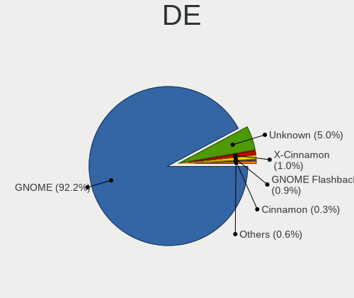
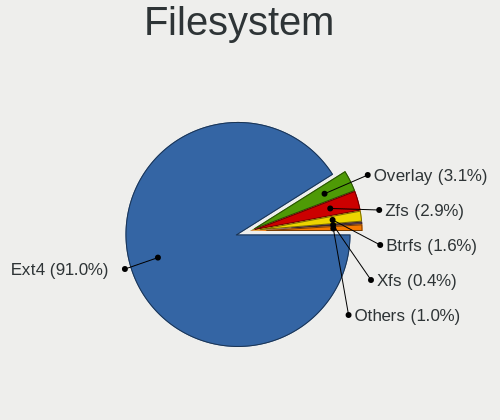
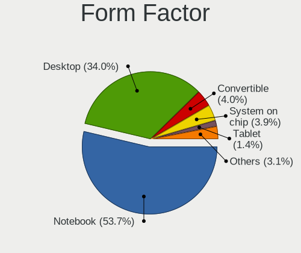
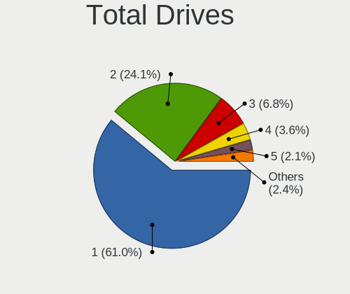
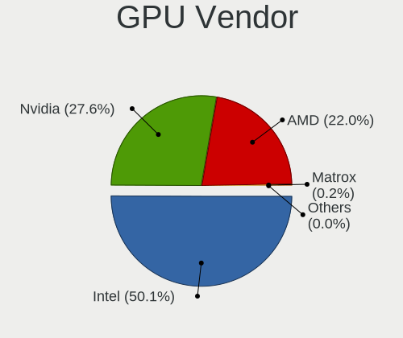
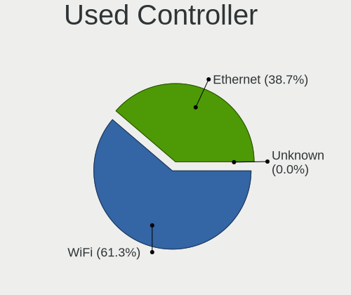

Ubuntu 21.10 - Tested Hardware & Statistics
-------------------------------------------

A project to collect tested hardware configurations for Ubuntu 21.10.

Anyone can contribute to this report by the [hw-probe](https://github.com/linuxhw/hw-probe) tool:

    sudo -E hw-probe -all -upload

Please contribute! Especially if your hardware is rare.

This is a report for all computer types. See also reports for [desktops](/Dist/Ubuntu_21.10/Desktop/README.md) and [notebooks](/Dist/Ubuntu_21.10/Notebook/README.md).

Contents
--------

* [ Test Cases ](#test-cases)

* [ System ](#system)
  - [ Kernel                   ](#kernel)
  - [ Kernel Family            ](#kernel-family)
  - [ Kernel Major Ver.        ](#kernel-major-ver)
  - [ Arch                     ](#arch)
  - [ DE                       ](#de)
  - [ Display Server           ](#display-server)
  - [ Display Manager          ](#display-manager)
  - [ OS Lang                  ](#os-lang)
  - [ Boot Mode                ](#boot-mode)
  - [ Filesystem               ](#filesystem)
  - [ Part. scheme             ](#part-scheme)
  - [ Dual Boot with Linux/BSD ](#dual-boot-with-linuxbsd)
  - [ Dual Boot (Win)          ](#dual-boot-win)

* [ Board ](#board)
  - [ Vendor                   ](#vendor)
  - [ Model                    ](#model)
  - [ Model Family             ](#model-family)
  - [ MFG Year                 ](#mfg-year)
  - [ Form Factor              ](#form-factor)
  - [ Secure Boot              ](#secure-boot)
  - [ Coreboot                 ](#coreboot)
  - [ RAM Size                 ](#ram-size)
  - [ RAM Used                 ](#ram-used)
  - [ Total Drives             ](#total-drives)
  - [ Has CD-ROM               ](#has-cd-rom)
  - [ Has Ethernet             ](#has-ethernet)
  - [ Has WiFi                 ](#has-wifi)
  - [ Has Bluetooth            ](#has-bluetooth)

* [ Location ](#location)
  - [ Country                  ](#country)
  - [ City                     ](#city)

* [ Drives ](#drives)
  - [ Drive Vendor             ](#drive-vendor)
  - [ Drive Model              ](#drive-model)
  - [ HDD Vendor               ](#hdd-vendor)
  - [ SSD Vendor               ](#ssd-vendor)
  - [ Drive Kind               ](#drive-kind)
  - [ Drive Connector          ](#drive-connector)
  - [ Drive Size               ](#drive-size)
  - [ Space Total              ](#space-total)
  - [ Space Used               ](#space-used)
  - [ Malfunc. Drives          ](#malfunc-drives)
  - [ Malfunc. Drive Vendor    ](#malfunc-drive-vendor)
  - [ Malfunc. HDD Vendor      ](#malfunc-hdd-vendor)
  - [ Malfunc. Drive Kind      ](#malfunc-drive-kind)
  - [ Failed Drives            ](#failed-drives)
  - [ Failed Drive Vendor      ](#failed-drive-vendor)
  - [ Drive Status             ](#drive-status)

* [ Storage controller ](#storage-controller)
  - [ Storage Vendor           ](#storage-vendor)
  - [ Storage Model            ](#storage-model)
  - [ Storage Kind             ](#storage-kind)

* [ Processor ](#processor)
  - [ CPU Vendor               ](#cpu-vendor)
  - [ CPU Model                ](#cpu-model)
  - [ CPU Model Family         ](#cpu-model-family)
  - [ CPU Cores                ](#cpu-cores)
  - [ CPU Sockets              ](#cpu-sockets)
  - [ CPU Threads              ](#cpu-threads)
  - [ CPU Op-Modes             ](#cpu-op-modes)
  - [ CPU Microcode            ](#cpu-microcode)
  - [ CPU Microarch            ](#cpu-microarch)

* [ Graphics ](#graphics)
  - [ GPU Vendor               ](#gpu-vendor)
  - [ GPU Model                ](#gpu-model)
  - [ GPU Combo                ](#gpu-combo)
  - [ GPU Driver               ](#gpu-driver)
  - [ GPU Memory               ](#gpu-memory)

* [ Monitor ](#monitor)
  - [ Monitor Vendor           ](#monitor-vendor)
  - [ Monitor Model            ](#monitor-model)
  - [ Monitor Resolution       ](#monitor-resolution)
  - [ Monitor Diagonal         ](#monitor-diagonal)
  - [ Monitor Width            ](#monitor-width)
  - [ Aspect Ratio             ](#aspect-ratio)
  - [ Monitor Area             ](#monitor-area)
  - [ Pixel Density            ](#pixel-density)
  - [ Multiple Monitors        ](#multiple-monitors)

* [ Network ](#network)
  - [ Net Controller Vendor    ](#net-controller-vendor)
  - [ Net Controller Model     ](#net-controller-model)
  - [ Wireless Vendor          ](#wireless-vendor)
  - [ Wireless Model           ](#wireless-model)
  - [ Ethernet Vendor          ](#ethernet-vendor)
  - [ Ethernet Model           ](#ethernet-model)
  - [ Net Controller Kind      ](#net-controller-kind)
  - [ Used Controller          ](#used-controller)
  - [ NICs                     ](#nics)
  - [ IPv6                     ](#ipv6)

* [ Bluetooth ](#bluetooth)
  - [ Bluetooth Vendor         ](#bluetooth-vendor)
  - [ Bluetooth Model          ](#bluetooth-model)

* [ Sound ](#sound)
  - [ Sound Vendor             ](#sound-vendor)
  - [ Sound Model              ](#sound-model)

* [ Memory ](#memory)
  - [ Memory Vendor            ](#memory-vendor)
  - [ Memory Model             ](#memory-model)
  - [ Memory Kind              ](#memory-kind)
  - [ Memory Form Factor       ](#memory-form-factor)
  - [ Memory Size              ](#memory-size)
  - [ Memory Speed             ](#memory-speed)

* [ Printers & scanners ](#printers--scanners)
  - [ Printer Vendor           ](#printer-vendor)
  - [ Printer Model            ](#printer-model)
  - [ Scanner Vendor           ](#scanner-vendor)
  - [ Scanner Model            ](#scanner-model)

* [ Camera ](#camera)
  - [ Camera Vendor            ](#camera-vendor)
  - [ Camera Model             ](#camera-model)

* [ Security ](#security)
  - [ Fingerprint Vendor       ](#fingerprint-vendor)
  - [ Fingerprint Model        ](#fingerprint-model)
  - [ Chipcard Vendor          ](#chipcard-vendor)
  - [ Chipcard Model           ](#chipcard-model)

* [ Unsupported ](#unsupported)
  - [ Unsupported Devices      ](#unsupported-devices)
  - [ Unsupported Device Types ](#unsupported-device-types)

Test Cases
----------

Total: 2861

| Vendor        | Model                       | Form-Factor | Probe                                                      | Date         |
|---------------|-----------------------------|-------------|------------------------------------------------------------|--------------|
| Dell          | 0C3YXR A01                  | Desktop     | [95fbd0e6b4](https://linux-hardware.org/?probe=95fbd0e6b4) | Nov 30, 2022 |
| Samsung       | R59P/R60P/R61P              | Notebook    | [62510109f9](https://linux-hardware.org/?probe=62510109f9) | Nov 25, 2022 |
| ASUSTek       | H81M-V3                     | Desktop     | [f6be8306c7](https://linux-hardware.org/?probe=f6be8306c7) | Nov 22, 2022 |
| Gigabyte      | GA-MA74GM-S2H               | Desktop     | [5468f11c01](https://linux-hardware.org/?probe=5468f11c01) | Nov 15, 2022 |
| ASUSTek       | P5Q-E                       | Desktop     | [a37be95e80](https://linux-hardware.org/?probe=a37be95e80) | Nov 10, 2022 |
| ASUSTek       | X200CA                      | Notebook    | [673e0589ca](https://linux-hardware.org/?probe=673e0589ca) | Nov 05, 2022 |
| Lenovo        | V130-15IGM 81HL             | Notebook    | [5dbeb8f7dd](https://linux-hardware.org/?probe=5dbeb8f7dd) | Nov 03, 2022 |
| Dell          | Latitude E6420              | Notebook    | [032920f109](https://linux-hardware.org/?probe=032920f109) | Nov 02, 2022 |
| Intel         | H61                         | Desktop     | [326fa40958](https://linux-hardware.org/?probe=326fa40958) | Nov 01, 2022 |
| HP            | G60                         | Notebook    | [ec1164f001](https://linux-hardware.org/?probe=ec1164f001) | Oct 24, 2022 |
| Samsung       | R59P/R60P/R61P              | Notebook    | [0465cb7dee](https://linux-hardware.org/?probe=0465cb7dee) | Oct 23, 2022 |
| HP            | Pavilion dv7                | Notebook    | [bb650e8400](https://linux-hardware.org/?probe=bb650e8400) | Oct 18, 2022 |
| ASUSTek       | X550VX                      | Notebook    | [adbd1fa089](https://linux-hardware.org/?probe=adbd1fa089) | Oct 14, 2022 |
| ASUSTek       | X550VX                      | Notebook    | [c0fefb30fe](https://linux-hardware.org/?probe=c0fefb30fe) | Oct 12, 2022 |
| Gigabyte      | GA-MA74GM-S2H               | Desktop     | [b50165d9c9](https://linux-hardware.org/?probe=b50165d9c9) | Oct 11, 2022 |
| HP            | 3398                        | Desktop     | [8ef4543254](https://linux-hardware.org/?probe=8ef4543254) | Sep 30, 2022 |
| ASRock        | 960GM-VGS3 FX               | Desktop     | [45bf4d54bf](https://linux-hardware.org/?probe=45bf4d54bf) | Sep 26, 2022 |
| HP            | 3398                        | Desktop     | [9add0a56b5](https://linux-hardware.org/?probe=9add0a56b5) | Sep 17, 2022 |
| HP            | Pavilion dv7                | Notebook    | [f94d6a4e8f](https://linux-hardware.org/?probe=f94d6a4e8f) | Sep 14, 2022 |
| Acer          | Aspire E3-112               | Notebook    | [bfa4cc7ddc](https://linux-hardware.org/?probe=bfa4cc7ddc) | Sep 10, 2022 |
| Dell          | Inspiron 1720               | Notebook    | [27de3ede0c](https://linux-hardware.org/?probe=27de3ede0c) | Sep 09, 2022 |
| ASUSTek       | ROG Zephyrus G14 GA401QE... | Notebook    | [4b56f15871](https://linux-hardware.org/?probe=4b56f15871) | Aug 29, 2022 |
| ASUSTek       | A68HM-PLUS                  | Desktop     | [f585d57226](https://linux-hardware.org/?probe=f585d57226) | Aug 27, 2022 |
| ASUSTek       | H61M-K                      | Desktop     | [1f4f742288](https://linux-hardware.org/?probe=1f4f742288) | Aug 23, 2022 |
| HP            | Pavilion Gaming Laptop 1... | Notebook    | [f4fedfb271](https://linux-hardware.org/?probe=f4fedfb271) | Aug 14, 2022 |
| ASRock        | H67M                        | Desktop     | [c09d83ca79](https://linux-hardware.org/?probe=c09d83ca79) | Aug 13, 2022 |
| ASUSTek       | T100HAN                     | Notebook    | [4159616818](https://linux-hardware.org/?probe=4159616818) | Aug 12, 2022 |
| Dell          | 0J3C2F A00                  | Desktop     | [dc5cc9ef0c](https://linux-hardware.org/?probe=dc5cc9ef0c) | Aug 10, 2022 |
| Dell          | 0J3C2F A00                  | Desktop     | [650bca22c4](https://linux-hardware.org/?probe=650bca22c4) | Aug 10, 2022 |
| Lenovo        | IdeaPad 330-15IKB 81DE      | Notebook    | [759c9dee6b](https://linux-hardware.org/?probe=759c9dee6b) | Aug 09, 2022 |
| Raspberry ... | Raspberry Pi                | Soc         | [e9a845914f](https://linux-hardware.org/?probe=e9a845914f) | Aug 07, 2022 |
| Raspberry ... | Raspberry Pi                | Soc         | [9edfd441ac](https://linux-hardware.org/?probe=9edfd441ac) | Aug 07, 2022 |
| ASUSTek       | VivoBook 15_ASUS Laptop ... | Notebook    | [93ae3bfcfd](https://linux-hardware.org/?probe=93ae3bfcfd) | Aug 02, 2022 |
| Dell          | Latitude E7470              | Notebook    | [0851479f6b](https://linux-hardware.org/?probe=0851479f6b) | Aug 01, 2022 |
| Dell          | Latitude E7470              | Notebook    | [ca7878faab](https://linux-hardware.org/?probe=ca7878faab) | Jul 30, 2022 |
| MSI           | Z97 GAMING 5                | Desktop     | [a834f9f0ed](https://linux-hardware.org/?probe=a834f9f0ed) | Jul 28, 2022 |
| Lenovo        | B560 43308UG                | Notebook    | [72c6b28a01](https://linux-hardware.org/?probe=72c6b28a01) | Jul 27, 2022 |
| Lenovo        | B560 43308UG                | Notebook    | [4f9d97753e](https://linux-hardware.org/?probe=4f9d97753e) | Jul 26, 2022 |
| Dell          | Vostro 1510                 | Notebook    | [e4814062ec](https://linux-hardware.org/?probe=e4814062ec) | Jul 25, 2022 |
| HP            | Pavilion Aero Laptop 13-... | Notebook    | [e1850b16b9](https://linux-hardware.org/?probe=e1850b16b9) | Jul 24, 2022 |
| Apple         | Mac-F2208EC8                | Mini pc     | [c3b0b45b0b](https://linux-hardware.org/?probe=c3b0b45b0b) | Jul 21, 2022 |
| Dell          | 0GY6Y8 A03                  | Desktop     | [88d49ee4d4](https://linux-hardware.org/?probe=88d49ee4d4) | Jul 21, 2022 |
| Dell          | 0GY6Y8 A03                  | Desktop     | [636819dfaf](https://linux-hardware.org/?probe=636819dfaf) | Jul 21, 2022 |
| Apple         | MacBookAir7,2               | Notebook    | [b0cdba7434](https://linux-hardware.org/?probe=b0cdba7434) | Jul 20, 2022 |
| Gigabyte      | GA-78LMT-USB3 SEx           | Desktop     | [d5ebe1a737](https://linux-hardware.org/?probe=d5ebe1a737) | Jul 20, 2022 |
| HP            | 15 Notebook PC              | Notebook    | [0ce333723c](https://linux-hardware.org/?probe=0ce333723c) | Jul 19, 2022 |
| Intel         | H55                         | Desktop     | [b58f7300e1](https://linux-hardware.org/?probe=b58f7300e1) | Jul 18, 2022 |
| MSI           | B550M-A PRO                 | Desktop     | [15790ffff1](https://linux-hardware.org/?probe=15790ffff1) | Jul 16, 2022 |
| Lenovo        | ThinkPad X1 Carbon 7th 2... | Notebook    | [50c5c54f5a](https://linux-hardware.org/?probe=50c5c54f5a) | Jul 16, 2022 |
| Intel         | H55                         | Desktop     | [f8e7b20a53](https://linux-hardware.org/?probe=f8e7b20a53) | Jul 14, 2022 |
| Raspberry ... | Raspberry Pi                | Soc         | [cae0f57919](https://linux-hardware.org/?probe=cae0f57919) | Jul 14, 2022 |
| Intel         | H55                         | Desktop     | [b199ed9707](https://linux-hardware.org/?probe=b199ed9707) | Jul 14, 2022 |
| ASUSTek       | X555LD                      | Notebook    | [afcccf6436](https://linux-hardware.org/?probe=afcccf6436) | Jul 13, 2022 |
| Lenovo        | ThinkBook 14-IIL 20SL       | Notebook    | [9703351d30](https://linux-hardware.org/?probe=9703351d30) | Jul 12, 2022 |
| ASRock        | J5005-ITX                   | Desktop     | [1f6eafefae](https://linux-hardware.org/?probe=1f6eafefae) | Jul 11, 2022 |
| Biostar       | TZ77A                       | Desktop     | [ee21238738](https://linux-hardware.org/?probe=ee21238738) | Jul 11, 2022 |
| MSI           | H110M GAMING                | Desktop     | [92f54d6efd](https://linux-hardware.org/?probe=92f54d6efd) | Jul 09, 2022 |
| Lenovo        | ThinkPad L14 Gen 1 20U5S... | Notebook    | [87edfcaadf](https://linux-hardware.org/?probe=87edfcaadf) | Jul 09, 2022 |
| Dell          | 0M858N A01                  | Desktop     | [36aca635a8](https://linux-hardware.org/?probe=36aca635a8) | Jul 06, 2022 |
| Dell          | 0GM819                      | Desktop     | [a366983f6a](https://linux-hardware.org/?probe=a366983f6a) | Jul 06, 2022 |
| Dell          | 0GM819                      | Desktop     | [78e233e42f](https://linux-hardware.org/?probe=78e233e42f) | Jul 06, 2022 |
| ASRock        | B450M Gaming                | Desktop     | [7da921047e](https://linux-hardware.org/?probe=7da921047e) | Jul 05, 2022 |
| Lenovo        | ThinkPad P53 20QNS00Y00     | Notebook    | [64dc631691](https://linux-hardware.org/?probe=64dc631691) | Jul 05, 2022 |
| Dell          | 0GDG8Y A00                  | Desktop     | [4ccd9d239d](https://linux-hardware.org/?probe=4ccd9d239d) | Jun 30, 2022 |
| Lenovo        | ThinkBook 15 G2 ITL 20VE    | Notebook    | [82ca4386ae](https://linux-hardware.org/?probe=82ca4386ae) | Jun 30, 2022 |
| Lenovo        | ThinkBook 15 G2 ITL 20VE    | Notebook    | [42462e221b](https://linux-hardware.org/?probe=42462e221b) | Jun 29, 2022 |
| Lenovo        | B41-80 80LG                 | Notebook    | [30f6e726bd](https://linux-hardware.org/?probe=30f6e726bd) | Jun 28, 2022 |
| ZOTAC         | ZBOX-ID84                   | Mini pc     | [6162be584a](https://linux-hardware.org/?probe=6162be584a) | Jun 27, 2022 |
| ASUSTek       | ROG Strix G713QE_G713QE     | Notebook    | [65782f9daa](https://linux-hardware.org/?probe=65782f9daa) | Jun 27, 2022 |
| ASUSTek       | ROG Strix G713QE_G713QE     | Notebook    | [e881903397](https://linux-hardware.org/?probe=e881903397) | Jun 27, 2022 |
| Unknown       | 1.0                         | Desktop     | [340f931c7f](https://linux-hardware.org/?probe=340f931c7f) | Jun 26, 2022 |
| HP            | 8054                        | Desktop     | [82dd44f05f](https://linux-hardware.org/?probe=82dd44f05f) | Jun 26, 2022 |
| MSI           | Z97 GAMING 5                | Desktop     | [473a0abca4](https://linux-hardware.org/?probe=473a0abca4) | Jun 25, 2022 |
| Dell          | Latitude E7450              | Notebook    | [a03ea66786](https://linux-hardware.org/?probe=a03ea66786) | Jun 24, 2022 |
| Lenovo        | Legion 5 15ACH6H 82JU       | Notebook    | [b450b0c2dc](https://linux-hardware.org/?probe=b450b0c2dc) | Jun 24, 2022 |
| Acer          | Aspire 5750G                | Notebook    | [958b381973](https://linux-hardware.org/?probe=958b381973) | Jun 22, 2022 |
| Samsung       | 950XDB/951XDB/950XDY        | Notebook    | [f51131f21a](https://linux-hardware.org/?probe=f51131f21a) | Jun 21, 2022 |
| Lenovo        | ThinkBook 15 G2 ITL 20VE    | Notebook    | [96c4f21509](https://linux-hardware.org/?probe=96c4f21509) | Jun 21, 2022 |
| Foxconn       | 2ADA                        | Desktop     | [d720505734](https://linux-hardware.org/?probe=d720505734) | Jun 20, 2022 |
| Foxconn       | 2ADA                        | Desktop     | [c2b0898c1a](https://linux-hardware.org/?probe=c2b0898c1a) | Jun 20, 2022 |
| HP            | Pavilion Notebook           | Notebook    | [9b350b9918](https://linux-hardware.org/?probe=9b350b9918) | Jun 20, 2022 |
| Dell          | Inspiron 1720               | Notebook    | [8cc15a5651](https://linux-hardware.org/?probe=8cc15a5651) | Jun 19, 2022 |
| Fujitsu       | LIFEBOOK E752               | Notebook    | [c434320a62](https://linux-hardware.org/?probe=c434320a62) | Jun 19, 2022 |
| Intel         | X79 V2.72B                  | Desktop     | [fbd8e560b4](https://linux-hardware.org/?probe=fbd8e560b4) | Jun 18, 2022 |
| congatec      | conga-MA5 B.2               | Mini pc     | [b30a078392](https://linux-hardware.org/?probe=b30a078392) | Jun 15, 2022 |
| Unknown       | 1.0                         | Desktop     | [de849825ee](https://linux-hardware.org/?probe=de849825ee) | Jun 14, 2022 |
| ASUSTek       | VivoBook E14 E402WAS        | Notebook    | [2570d889fd](https://linux-hardware.org/?probe=2570d889fd) | Jun 14, 2022 |
| HP            | 8906 SMVB                   | Desktop     | [772043704c](https://linux-hardware.org/?probe=772043704c) | Jun 13, 2022 |
| Unknown       | X99-GT                      | Desktop     | [0e1115fdc9](https://linux-hardware.org/?probe=0e1115fdc9) | Jun 12, 2022 |
| congatec      | conga-MA5 B.2               | Mini pc     | [df2d1b5c12](https://linux-hardware.org/?probe=df2d1b5c12) | Jun 11, 2022 |
| Google        | Ekko                        | Notebook    | [9ef19da0ca](https://linux-hardware.org/?probe=9ef19da0ca) | Jun 09, 2022 |
| Google        | Ekko                        | Notebook    | [92af4a5d59](https://linux-hardware.org/?probe=92af4a5d59) | Jun 09, 2022 |
| HP            | EliteBook 2560p             | Notebook    | [5f1e0dfee7](https://linux-hardware.org/?probe=5f1e0dfee7) | Jun 09, 2022 |
| HP            | EliteBook 2560p             | Notebook    | [cf8d972149](https://linux-hardware.org/?probe=cf8d972149) | Jun 09, 2022 |
| ASUSTek       | Q87M-E                      | Desktop     | [4b3fedcb8a](https://linux-hardware.org/?probe=4b3fedcb8a) | Jun 06, 2022 |
| Raspberry ... | Raspberry Pi                | Soc         | [4e6dfbd0eb](https://linux-hardware.org/?probe=4e6dfbd0eb) | Jun 04, 2022 |
| ASUSTek       | N61Vg                       | Notebook    | [5593b63d10](https://linux-hardware.org/?probe=5593b63d10) | Jun 04, 2022 |
| Raspberry ... | Raspberry Pi                | Soc         | [3fd62a1d06](https://linux-hardware.org/?probe=3fd62a1d06) | Jun 04, 2022 |
| ASUSTek       | ASUS TUF Gaming F15 FX50... | Notebook    | [83b786e73a](https://linux-hardware.org/?probe=83b786e73a) | Jun 04, 2022 |
| Raspberry ... | Raspberry Pi                | Soc         | [7a8d99ead8](https://linux-hardware.org/?probe=7a8d99ead8) | Jun 04, 2022 |
| Dell          | 0GDG8Y A00                  | Desktop     | [00a4463324](https://linux-hardware.org/?probe=00a4463324) | Jun 04, 2022 |
| HP            | 1632                        | Desktop     | [4f7993cf34](https://linux-hardware.org/?probe=4f7993cf34) | Jun 01, 2022 |
| HP            | 1632                        | Desktop     | [9e69c11025](https://linux-hardware.org/?probe=9e69c11025) | Jun 01, 2022 |
| Toshiba       | Satellite C70D-A            | Notebook    | [70313d6ed4](https://linux-hardware.org/?probe=70313d6ed4) | May 31, 2022 |
| Lenovo        | Z50-75 80EC                 | Notebook    | [11f3206539](https://linux-hardware.org/?probe=11f3206539) | May 31, 2022 |
| Toshiba       | Satellite M305D             | Notebook    | [6d558c3665](https://linux-hardware.org/?probe=6d558c3665) | May 31, 2022 |
| Toshiba       | Satellite M305D             | Notebook    | [43315304ac](https://linux-hardware.org/?probe=43315304ac) | May 31, 2022 |
| Toshiba       | Satellite C70D-A            | Notebook    | [820a9fb182](https://linux-hardware.org/?probe=820a9fb182) | May 30, 2022 |
| Gigabyte      | H97N-WIFI                   | Desktop     | [031d4a8f7f](https://linux-hardware.org/?probe=031d4a8f7f) | May 29, 2022 |
| Dell          | 0PM2CW A00                  | Server      | [2b559392cc](https://linux-hardware.org/?probe=2b559392cc) | May 29, 2022 |
| Minix         | NEO Z83-4A V1.1             | Desktop     | [e828d9bd38](https://linux-hardware.org/?probe=e828d9bd38) | May 29, 2022 |
| Raspberry ... | Raspberry Pi                | Soc         | [1bb179225c](https://linux-hardware.org/?probe=1bb179225c) | May 28, 2022 |
| HP            | Presario CQ62               | Notebook    | [fe3cac8868](https://linux-hardware.org/?probe=fe3cac8868) | May 27, 2022 |
| Lenovo        | IdeaPad Flex-14IWL 81SQ     | Convertible | [650e81d0df](https://linux-hardware.org/?probe=650e81d0df) | May 27, 2022 |
| HP            | 8767 A                      | Desktop     | [553a8de02a](https://linux-hardware.org/?probe=553a8de02a) | May 26, 2022 |
| ASUSTek       | P8Z77-V LX                  | Desktop     | [5f505dd767](https://linux-hardware.org/?probe=5f505dd767) | May 26, 2022 |
| Lenovo        | ThinkPad E15 Gen 2 20T80... | Notebook    | [143ca380f9](https://linux-hardware.org/?probe=143ca380f9) | May 26, 2022 |
| Dell          | 0RF703                      | Desktop     | [228efad4f1](https://linux-hardware.org/?probe=228efad4f1) | May 25, 2022 |
| ASUSTek       | TP500LA                     | Notebook    | [d72b249f1a](https://linux-hardware.org/?probe=d72b249f1a) | May 25, 2022 |
| Lenovo        | 313A NOK                    | Desktop     | [9df6ec850c](https://linux-hardware.org/?probe=9df6ec850c) | May 24, 2022 |
| Dell          | Latitude E5440              | Notebook    | [21f0eba93a](https://linux-hardware.org/?probe=21f0eba93a) | May 24, 2022 |
| ASUSTek       | M5A78L-M LX                 | Desktop     | [6c5438b4b4](https://linux-hardware.org/?probe=6c5438b4b4) | May 24, 2022 |
| HP            | ProBook 6460b               | Notebook    | [7af90825ff](https://linux-hardware.org/?probe=7af90825ff) | May 23, 2022 |
| HP            | ProBook 6460b               | Notebook    | [e3819153ed](https://linux-hardware.org/?probe=e3819153ed) | May 23, 2022 |
| HP            | Notebook                    | Notebook    | [efacf04654](https://linux-hardware.org/?probe=efacf04654) | May 23, 2022 |
| ASRock        | B365M Pro4-F                | Desktop     | [4cbbeda22c](https://linux-hardware.org/?probe=4cbbeda22c) | May 22, 2022 |
| Dell          | Latitude 3490               | Notebook    | [36a2ce11ef](https://linux-hardware.org/?probe=36a2ce11ef) | May 22, 2022 |
| ASUSTek       | P8H61-I                     | Desktop     | [2b589c0488](https://linux-hardware.org/?probe=2b589c0488) | May 20, 2022 |
| HP            | Pavilion Aero Laptop 13-... | Notebook    | [6efbcdabfc](https://linux-hardware.org/?probe=6efbcdabfc) | May 17, 2022 |
| Lenovo        | Legion 5 15ACH6H 82JU       | Notebook    | [124aa63eaf](https://linux-hardware.org/?probe=124aa63eaf) | May 17, 2022 |
| MSI           | B150M MORTAR                | Desktop     | [a2124255a2](https://linux-hardware.org/?probe=a2124255a2) | May 17, 2022 |
| Gigabyte      | Z690 UD DDR4                | Desktop     | [858abd9c59](https://linux-hardware.org/?probe=858abd9c59) | May 15, 2022 |
| Dell          | Precision M6300             | Notebook    | [874055cf5b](https://linux-hardware.org/?probe=874055cf5b) | May 14, 2022 |
| Dell          | Inspiron 5584               | Notebook    | [88414fb6bb](https://linux-hardware.org/?probe=88414fb6bb) | May 13, 2022 |
| MSI           | Z97 GAMING 5                | Desktop     | [e395176aad](https://linux-hardware.org/?probe=e395176aad) | May 13, 2022 |
| ASUSTek       | X580VD                      | Notebook    | [1d71c877c7](https://linux-hardware.org/?probe=1d71c877c7) | May 13, 2022 |
| Fujitsu Si... | D2817-A1 S26361-D2817-A1    | Desktop     | [8dace3d601](https://linux-hardware.org/?probe=8dace3d601) | May 12, 2022 |
| ASUSTek       | K55DR                       | Notebook    | [12c3e32108](https://linux-hardware.org/?probe=12c3e32108) | May 12, 2022 |
| Acer          | Swift SF314-51              | Notebook    | [5b2cacdf1a](https://linux-hardware.org/?probe=5b2cacdf1a) | May 12, 2022 |
| Lenovo        | ThinkBook 14-IML 20RV       | Notebook    | [17dda821a0](https://linux-hardware.org/?probe=17dda821a0) | May 11, 2022 |
| ASRock        | 960GM/U3S3 FX               | Desktop     | [06dfd102d5](https://linux-hardware.org/?probe=06dfd102d5) | May 11, 2022 |
| Lenovo        | ThinkPad T14s Gen 1 20UH... | Notebook    | [a63f7cf593](https://linux-hardware.org/?probe=a63f7cf593) | May 10, 2022 |
| Dell          | Precision M6300             | Notebook    | [6cb903a178](https://linux-hardware.org/?probe=6cb903a178) | May 09, 2022 |
| ASUSTek       | M4A79T Deluxe               | Desktop     | [92e7a68e33](https://linux-hardware.org/?probe=92e7a68e33) | May 09, 2022 |
| ASUSTek       | Z87-A                       | Desktop     | [ecff4161ad](https://linux-hardware.org/?probe=ecff4161ad) | May 08, 2022 |
| Apple         | Mac-8ED6AF5B48C039E1 Mac... | Mini pc     | [8a10210f97](https://linux-hardware.org/?probe=8a10210f97) | May 08, 2022 |
| Gigabyte      | G31M-S2L                    | Desktop     | [78b1868a67](https://linux-hardware.org/?probe=78b1868a67) | May 08, 2022 |
| MSI           | B450 GAMING PLUS MAX        | Desktop     | [56cecf6472](https://linux-hardware.org/?probe=56cecf6472) | May 07, 2022 |
| MSI           | Z590-A PRO                  | Desktop     | [f4f7118a5a](https://linux-hardware.org/?probe=f4f7118a5a) | May 07, 2022 |
| MSI           | Z590-A PRO                  | Desktop     | [68130c42bb](https://linux-hardware.org/?probe=68130c42bb) | May 07, 2022 |
| Lenovo        | ThinkPad P1 Gen 2 20QT00... | Notebook    | [5f62eb4b30](https://linux-hardware.org/?probe=5f62eb4b30) | May 05, 2022 |
| Intel         | X79 V2.72B                  | Desktop     | [87dd767f71](https://linux-hardware.org/?probe=87dd767f71) | May 05, 2022 |
| Lenovo        | ThinkPad L412 0553A13       | Notebook    | [bd3cf16002](https://linux-hardware.org/?probe=bd3cf16002) | May 04, 2022 |
| Sony          | VGN-FW56J                   | Notebook    | [92f7897c3c](https://linux-hardware.org/?probe=92f7897c3c) | May 04, 2022 |
| Toshiba       | Satellite L735              | Notebook    | [cb523c0933](https://linux-hardware.org/?probe=cb523c0933) | May 02, 2022 |
| Lenovo        | Yoga C930-13IKB 81C4        | Convertible | [6a9e757624](https://linux-hardware.org/?probe=6a9e757624) | May 02, 2022 |
| HP            | 0B54h D                     | Desktop     | [a90845be26](https://linux-hardware.org/?probe=a90845be26) | May 02, 2022 |
| Dell          | XPS 15 9570                 | Notebook    | [01a95b61fe](https://linux-hardware.org/?probe=01a95b61fe) | May 02, 2022 |
| ASUSTek       | TUF Gaming B550-PLUS        | Desktop     | [04c7c1f7f4](https://linux-hardware.org/?probe=04c7c1f7f4) | May 02, 2022 |
| Lenovo        | IdeaPad Gaming 3 15ARH05... | Notebook    | [6537fb670a](https://linux-hardware.org/?probe=6537fb670a) | May 01, 2022 |
| Lenovo        | ThinkPad 10 2nd 20E30035... | Tablet      | [f51fab0e09](https://linux-hardware.org/?probe=f51fab0e09) | Apr 30, 2022 |
| HP            | Laptop 15-dw3xxx            | Notebook    | [889f1cba36](https://linux-hardware.org/?probe=889f1cba36) | Apr 30, 2022 |
| Dell          | Latitude 5480               | Notebook    | [ba1ff8183e](https://linux-hardware.org/?probe=ba1ff8183e) | Apr 30, 2022 |
| HP            | 0B54h D                     | Desktop     | [2023024a05](https://linux-hardware.org/?probe=2023024a05) | Apr 29, 2022 |
| HP            | Pavilion Gaming Laptop 1... | Notebook    | [f842336794](https://linux-hardware.org/?probe=f842336794) | Apr 29, 2022 |
| HP            | 158A                        | Desktop     | [11b5037897](https://linux-hardware.org/?probe=11b5037897) | Apr 29, 2022 |
| Gigabyte      | Z77X-UD3H                   | Desktop     | [b07e1c97aa](https://linux-hardware.org/?probe=b07e1c97aa) | Apr 29, 2022 |
| Acer          | Predator G3620              | Desktop     | [556a67d50d](https://linux-hardware.org/?probe=556a67d50d) | Apr 28, 2022 |
| MSI           | H510I PRO WIFI              | Desktop     | [5e6c23c3b5](https://linux-hardware.org/?probe=5e6c23c3b5) | Apr 28, 2022 |
| Lenovo        | ThinkPad T440s 20ARS3640... | Notebook    | [13ec979f89](https://linux-hardware.org/?probe=13ec979f89) | Apr 28, 2022 |
| Sony          | VGN-FW56J                   | Notebook    | [45c6c458bc](https://linux-hardware.org/?probe=45c6c458bc) | Apr 28, 2022 |
| Microsoft     | Surface Pro 7               | Tablet      | [998ef3a4fe](https://linux-hardware.org/?probe=998ef3a4fe) | Apr 27, 2022 |
| MSI           | H510I PRO WIFI              | Desktop     | [f6df392394](https://linux-hardware.org/?probe=f6df392394) | Apr 27, 2022 |
| NF541         | 1.0                         | Desktop     | [c0999696b6](https://linux-hardware.org/?probe=c0999696b6) | Apr 27, 2022 |
| Lenovo        | IdeaPad Gaming 3 15ARH05... | Notebook    | [8ece944a7b](https://linux-hardware.org/?probe=8ece944a7b) | Apr 27, 2022 |
| HP            | Laptop 15-bw0xx             | Notebook    | [dc46901a64](https://linux-hardware.org/?probe=dc46901a64) | Apr 27, 2022 |
| Lenovo        | ThinkPad L460 20FVS3X800    | Notebook    | [adbec7ed2e](https://linux-hardware.org/?probe=adbec7ed2e) | Apr 27, 2022 |
| Foxconn       | 2AB1                        | Desktop     | [2d6ef9c4b6](https://linux-hardware.org/?probe=2d6ef9c4b6) | Apr 27, 2022 |
| Raspberry ... | Raspberry Pi 4 Model B R... | Soc         | [f3eb691337](https://linux-hardware.org/?probe=f3eb691337) | Apr 27, 2022 |
| Gigabyte      | GA-78LMT-USB3 SEx           | Desktop     | [5721b7c107](https://linux-hardware.org/?probe=5721b7c107) | Apr 27, 2022 |
| Dell          | XPS 13 9380                 | Notebook    | [c052066ee4](https://linux-hardware.org/?probe=c052066ee4) | Apr 26, 2022 |
| Gigabyte      | F2A78M-HD2                  | Desktop     | [454d879501](https://linux-hardware.org/?probe=454d879501) | Apr 26, 2022 |
| MSI           | GP66 Leopard 11UH           | Notebook    | [549c216d66](https://linux-hardware.org/?probe=549c216d66) | Apr 26, 2022 |
| ASUSTek       | P55VA                       | Notebook    | [21c5b79768](https://linux-hardware.org/?probe=21c5b79768) | Apr 26, 2022 |
| Lenovo        | ThinkPad E15 20RDS03500     | Notebook    | [6aa4c36808](https://linux-hardware.org/?probe=6aa4c36808) | Apr 26, 2022 |
| Acer          | Aspire E1-570               | Notebook    | [b8257c292a](https://linux-hardware.org/?probe=b8257c292a) | Apr 26, 2022 |
| Lenovo        | ThinkPad T440 20B7S3UD00    | Notebook    | [9c66fd444a](https://linux-hardware.org/?probe=9c66fd444a) | Apr 25, 2022 |
| Lenovo        | ThinkPad T440 20B7S3UD00    | Notebook    | [942267c99b](https://linux-hardware.org/?probe=942267c99b) | Apr 25, 2022 |
| Unknown       | Unknown                     | Desktop     | [f67ff826d9](https://linux-hardware.org/?probe=f67ff826d9) | Apr 25, 2022 |
| HP            | 3397                        | Desktop     | [754e703cc5](https://linux-hardware.org/?probe=754e703cc5) | Apr 25, 2022 |
| Dell          | Inspiron 5577               | Notebook    | [0925d92173](https://linux-hardware.org/?probe=0925d92173) | Apr 25, 2022 |
| Dell          | Inspiron N4050              | Notebook    | [7b82407cba](https://linux-hardware.org/?probe=7b82407cba) | Apr 25, 2022 |
| Sony          | SVE1513R1EB                 | Notebook    | [5275d17d40](https://linux-hardware.org/?probe=5275d17d40) | Apr 24, 2022 |
| ASUSTek       | P8H61-M LX2                 | Desktop     | [a60c0bf48d](https://linux-hardware.org/?probe=a60c0bf48d) | Apr 24, 2022 |
| ASUSTek       | X540LA                      | Notebook    | [370a60692a](https://linux-hardware.org/?probe=370a60692a) | Apr 24, 2022 |
| HUAWEI        | MACHC-WAX9                  | Notebook    | [9cda67e701](https://linux-hardware.org/?probe=9cda67e701) | Apr 24, 2022 |
| Dell          | 0WMJ54 A01                  | Desktop     | [2e3ae2a664](https://linux-hardware.org/?probe=2e3ae2a664) | Apr 24, 2022 |
| Raspberry ... | Raspberry Pi                | Soc         | [f7e2496340](https://linux-hardware.org/?probe=f7e2496340) | Apr 24, 2022 |
| ASUSTek       | P5GD1                       | Desktop     | [11b7aa3465](https://linux-hardware.org/?probe=11b7aa3465) | Apr 24, 2022 |
| MSI           | MAG Z490 TOMAHAWK           | Desktop     | [88318f48e8](https://linux-hardware.org/?probe=88318f48e8) | Apr 24, 2022 |
| Gigabyte      | Z370P D3-CF                 | Desktop     | [df7e090d9c](https://linux-hardware.org/?probe=df7e090d9c) | Apr 24, 2022 |
| Gigabyte      | B450 AORUS M                | Desktop     | [20d9884cb6](https://linux-hardware.org/?probe=20d9884cb6) | Apr 24, 2022 |
| Gigabyte      | B450 AORUS M                | Desktop     | [dac092d7bc](https://linux-hardware.org/?probe=dac092d7bc) | Apr 24, 2022 |
| SANTECH       | NHx0EH_EJ_EK                | Notebook    | [2e51ffc9e7](https://linux-hardware.org/?probe=2e51ffc9e7) | Apr 24, 2022 |
| Gigabyte      | F2A88XN-WIFI                | Desktop     | [347ded3d71](https://linux-hardware.org/?probe=347ded3d71) | Apr 23, 2022 |
| Unknown       | Unknown                     | Notebook    | [ff32f84c4e](https://linux-hardware.org/?probe=ff32f84c4e) | Apr 23, 2022 |
| Dell          | Latitude 3190 2-in-1        | Convertible | [cba75446b8](https://linux-hardware.org/?probe=cba75446b8) | Apr 23, 2022 |
| Dell          | Latitude 3190 2-in-1        | Convertible | [8ed6b948aa](https://linux-hardware.org/?probe=8ed6b948aa) | Apr 23, 2022 |
| HP            | Elite x2 G8 Tablet          | Tablet      | [d6ba8e665c](https://linux-hardware.org/?probe=d6ba8e665c) | Apr 23, 2022 |
| MSI           | Z590-A PRO                  | Desktop     | [5b78ae1e5e](https://linux-hardware.org/?probe=5b78ae1e5e) | Apr 23, 2022 |
| Seco          | C40 C                       | Desktop     | [3e1fffcda7](https://linux-hardware.org/?probe=3e1fffcda7) | Apr 22, 2022 |
| ASUSTek       | P7H55-M BR                  | Desktop     | [e3c7a6ade9](https://linux-hardware.org/?probe=e3c7a6ade9) | Apr 22, 2022 |
| Intel         | NUC8BEB J72692-303          | Mini pc     | [19d81a0ef0](https://linux-hardware.org/?probe=19d81a0ef0) | Apr 22, 2022 |
| Intel         | NUC8BEB J72692-303          | Mini pc     | [cd9c2dd8f9](https://linux-hardware.org/?probe=cd9c2dd8f9) | Apr 22, 2022 |
| MSI           | MPG Z590 GAMING EDGE WIF... | Desktop     | [18f00ab5d9](https://linux-hardware.org/?probe=18f00ab5d9) | Apr 22, 2022 |
| HP            | ZBook 15 G5                 | Notebook    | [3b1d5e2bb8](https://linux-hardware.org/?probe=3b1d5e2bb8) | Apr 22, 2022 |
| ASUSTek       | P5QC                        | Desktop     | [63f53fd6cb](https://linux-hardware.org/?probe=63f53fd6cb) | Apr 22, 2022 |
| Dell          | Inspiron 7506 2n1           | Convertible | [8009de24c8](https://linux-hardware.org/?probe=8009de24c8) | Apr 22, 2022 |
| Lenovo        | E41-25 81FS                 | Notebook    | [4880f7c2d5](https://linux-hardware.org/?probe=4880f7c2d5) | Apr 22, 2022 |
| Acer          | Aspire E1-570               | Notebook    | [b8e8a058d2](https://linux-hardware.org/?probe=b8e8a058d2) | Apr 22, 2022 |
| Gigabyte      | Z590 VISION G               | Desktop     | [597940fbe8](https://linux-hardware.org/?probe=597940fbe8) | Apr 22, 2022 |
| Lenovo        | B50-70 20384                | Notebook    | [35cf0f09e4](https://linux-hardware.org/?probe=35cf0f09e4) | Apr 22, 2022 |
| Fujitsu       | LIFEBOOK E744               | Notebook    | [ca56dc9824](https://linux-hardware.org/?probe=ca56dc9824) | Apr 21, 2022 |
| AMI           | Cherry Trail CR             | Desktop     | [61d45f784c](https://linux-hardware.org/?probe=61d45f784c) | Apr 21, 2022 |
| MSI           | B550-A PRO                  | Desktop     | [212c60ebc5](https://linux-hardware.org/?probe=212c60ebc5) | Apr 21, 2022 |
| Acer          | Aspire E5-553               | Notebook    | [1c736596fa](https://linux-hardware.org/?probe=1c736596fa) | Apr 21, 2022 |
| ASUSTek       | H97-PLUS                    | Desktop     | [6495b55188](https://linux-hardware.org/?probe=6495b55188) | Apr 21, 2022 |
| Unknown       | Unknown                     | Desktop     | [80099b4b7f](https://linux-hardware.org/?probe=80099b4b7f) | Apr 21, 2022 |
| HP            | Laptop 14-ck0xxx            | Notebook    | [02dd52b3b5](https://linux-hardware.org/?probe=02dd52b3b5) | Apr 21, 2022 |
| HP            | 15                          | Notebook    | [3253e0fc56](https://linux-hardware.org/?probe=3253e0fc56) | Apr 21, 2022 |
| MSI           | Z97 GAMING 5                | Desktop     | [180e1b4ab7](https://linux-hardware.org/?probe=180e1b4ab7) | Apr 21, 2022 |
| HP            | 2AF7                        | Desktop     | [0a92bfa831](https://linux-hardware.org/?probe=0a92bfa831) | Apr 21, 2022 |
| Dell          | XPS 15 7590                 | Notebook    | [7338b3ccc3](https://linux-hardware.org/?probe=7338b3ccc3) | Apr 20, 2022 |
| Dell          | 0200DY A01                  | Desktop     | [5cb77cb68e](https://linux-hardware.org/?probe=5cb77cb68e) | Apr 20, 2022 |
| ASUSTek       | X540LJ                      | Notebook    | [33a74b2070](https://linux-hardware.org/?probe=33a74b2070) | Apr 20, 2022 |
| HP            | 3048h                       | Desktop     | [b35df4ed74](https://linux-hardware.org/?probe=b35df4ed74) | Apr 20, 2022 |
| MSI           | H110M PRO-VD PLUS           | Desktop     | [37d0f0bb74](https://linux-hardware.org/?probe=37d0f0bb74) | Apr 20, 2022 |
| HP            | ProBook 440 G5              | Notebook    | [288c8e99b2](https://linux-hardware.org/?probe=288c8e99b2) | Apr 20, 2022 |
| MSI           | B450 TOMAHAWK               | Desktop     | [4c46fa8a5b](https://linux-hardware.org/?probe=4c46fa8a5b) | Apr 19, 2022 |
| Dell          | Inspiron 15-3567            | Notebook    | [b87e7c08ab](https://linux-hardware.org/?probe=b87e7c08ab) | Apr 19, 2022 |
| Medion        | H110H4-EM                   | Desktop     | [358d943521](https://linux-hardware.org/?probe=358d943521) | Apr 19, 2022 |
| Acer          | Aspire ES1-731              | Notebook    | [451ce5305a](https://linux-hardware.org/?probe=451ce5305a) | Apr 19, 2022 |
| Acer          | Aspire ES1-731              | Notebook    | [fa843a199c](https://linux-hardware.org/?probe=fa843a199c) | Apr 19, 2022 |
| Raspberry ... | Raspberry Pi                | Soc         | [fc4ba6c008](https://linux-hardware.org/?probe=fc4ba6c008) | Apr 19, 2022 |
| HP            | 470 G8                      | Notebook    | [fb6853bfde](https://linux-hardware.org/?probe=fb6853bfde) | Apr 18, 2022 |
| Dell          | Inspiron 5585               | Notebook    | [2c6e96d91f](https://linux-hardware.org/?probe=2c6e96d91f) | Apr 18, 2022 |
| HP            | G42                         | Notebook    | [18486c3d27](https://linux-hardware.org/?probe=18486c3d27) | Apr 18, 2022 |
| Acer          | Aspire A315-51              | Notebook    | [a6ae41a1c9](https://linux-hardware.org/?probe=a6ae41a1c9) | Apr 18, 2022 |
| ASRock        | Z170 Gaming K4              | Desktop     | [81e06a1dcb](https://linux-hardware.org/?probe=81e06a1dcb) | Apr 18, 2022 |
| Medion        | E6215                       | Notebook    | [39eedb46b2](https://linux-hardware.org/?probe=39eedb46b2) | Apr 18, 2022 |
| MSI           | Z87-GD65 GAMING             | Desktop     | [5bfeeef88e](https://linux-hardware.org/?probe=5bfeeef88e) | Apr 18, 2022 |
| ASUSTek       | ASUS TUF Gaming F17 FX70... | Notebook    | [885a3f046f](https://linux-hardware.org/?probe=885a3f046f) | Apr 18, 2022 |
| MSI           | X470 GAMING PLUS            | Desktop     | [2ddbae278a](https://linux-hardware.org/?probe=2ddbae278a) | Apr 18, 2022 |
| ASUSTek       | Rampage V EDITION 10        | Desktop     | [028f7e340b](https://linux-hardware.org/?probe=028f7e340b) | Apr 18, 2022 |
| Lenovo        | IdeaPad 5 15ITL05 82FG      | Notebook    | [1f3827f38e](https://linux-hardware.org/?probe=1f3827f38e) | Apr 18, 2022 |
| Acer          | TMP645-M                    | Notebook    | [9b20e644dd](https://linux-hardware.org/?probe=9b20e644dd) | Apr 18, 2022 |
| ASUSTek       | PRIME B460M-A               | Desktop     | [98637b4cf2](https://linux-hardware.org/?probe=98637b4cf2) | Apr 18, 2022 |
| MSI           | B450-A PRO MAX              | Desktop     | [9ce44bf30d](https://linux-hardware.org/?probe=9ce44bf30d) | Apr 17, 2022 |
| ASUSTek       | PRIME B660-PLUS D4          | Desktop     | [d921190f7e](https://linux-hardware.org/?probe=d921190f7e) | Apr 17, 2022 |
| HP            | 339A                        | Desktop     | [7949378026](https://linux-hardware.org/?probe=7949378026) | Apr 17, 2022 |
| HUAWEI        | KLVL-WXX9                   | Notebook    | [9868b4e681](https://linux-hardware.org/?probe=9868b4e681) | Apr 17, 2022 |
| Acer          | Nitro AN515-55              | Notebook    | [6d20f56bba](https://linux-hardware.org/?probe=6d20f56bba) | Apr 17, 2022 |
| Gigabyte      | 970A-UD3                    | Desktop     | [7128f5f2b4](https://linux-hardware.org/?probe=7128f5f2b4) | Apr 17, 2022 |
| Lenovo        | ThinkPad X1 Carbon Gen 9... | Notebook    | [1f7292b20a](https://linux-hardware.org/?probe=1f7292b20a) | Apr 16, 2022 |
| Gigabyte      | F2A68HM-DS2                 | Desktop     | [a016ec1bce](https://linux-hardware.org/?probe=a016ec1bce) | Apr 16, 2022 |
| Dell          | Latitude E6430              | Notebook    | [c9a365bfe3](https://linux-hardware.org/?probe=c9a365bfe3) | Apr 16, 2022 |
| Packard Be... | EasyNote TK85               | Notebook    | [c20035dfb3](https://linux-hardware.org/?probe=c20035dfb3) | Apr 16, 2022 |
| Dell          | Inspiron 13-5378            | Notebook    | [3998a17f75](https://linux-hardware.org/?probe=3998a17f75) | Apr 16, 2022 |
| Acer          | Aspire E5-471G              | Notebook    | [a7179e1ba3](https://linux-hardware.org/?probe=a7179e1ba3) | Apr 16, 2022 |
| HP            | Pavilion dv7                | Notebook    | [60eee202a1](https://linux-hardware.org/?probe=60eee202a1) | Apr 16, 2022 |
| Acer          | Aspire ES1-512              | Notebook    | [0f19c624fb](https://linux-hardware.org/?probe=0f19c624fb) | Apr 16, 2022 |
| Acer          | Aspire ES1-512              | Notebook    | [6467d63e0d](https://linux-hardware.org/?probe=6467d63e0d) | Apr 16, 2022 |
| Dell          | Inspiron 7300 2n1           | Convertible | [17b7ab1ae3](https://linux-hardware.org/?probe=17b7ab1ae3) | Apr 16, 2022 |
| Dell          | XPS 13 9310                 | Notebook    | [2c395ea438](https://linux-hardware.org/?probe=2c395ea438) | Apr 15, 2022 |
| ASUSTek       | B150-PRO                    | Desktop     | [1ebe5f0e99](https://linux-hardware.org/?probe=1ebe5f0e99) | Apr 15, 2022 |
| Lenovo        | SDK0J40700 WIN              | Desktop     | [142a0092f1](https://linux-hardware.org/?probe=142a0092f1) | Apr 15, 2022 |
| HP            | 255 G7 Notebook PC          | Notebook    | [c9a7153c14](https://linux-hardware.org/?probe=c9a7153c14) | Apr 15, 2022 |
| MSI           | Z87-GD65 GAMING             | Desktop     | [8c57fd797b](https://linux-hardware.org/?probe=8c57fd797b) | Apr 15, 2022 |
| Medion        | H110H4-EM                   | Desktop     | [d4c3d27956](https://linux-hardware.org/?probe=d4c3d27956) | Apr 15, 2022 |
| KREZ          | TY1103B                     | Tablet      | [cea21e2ae8](https://linux-hardware.org/?probe=cea21e2ae8) | Apr 15, 2022 |
| Dell          | Latitude E6430              | Notebook    | [fc7e6fce7b](https://linux-hardware.org/?probe=fc7e6fce7b) | Apr 15, 2022 |
| Dell          | Latitude 5420               | Notebook    | [7b97392ed4](https://linux-hardware.org/?probe=7b97392ed4) | Apr 15, 2022 |
| Dell          | Inspiron 3481               | Notebook    | [69d336ac59](https://linux-hardware.org/?probe=69d336ac59) | Apr 15, 2022 |
| HP            | ENVY x360 Convertible 15... | Convertible | [893e6a634e](https://linux-hardware.org/?probe=893e6a634e) | Apr 15, 2022 |
| HP            | ENVY x360 Convertible 15... | Convertible | [b6a3177491](https://linux-hardware.org/?probe=b6a3177491) | Apr 15, 2022 |
| Unknown       | Unknown                     | Desktop     | [6476542bc7](https://linux-hardware.org/?probe=6476542bc7) | Apr 14, 2022 |
| Lenovo        | ThinkPad T15g Gen 1 20UR... | Notebook    | [c60feffffb](https://linux-hardware.org/?probe=c60feffffb) | Apr 14, 2022 |
| Huanan        | X99-AD3 V4.0                | Desktop     | [186bccefad](https://linux-hardware.org/?probe=186bccefad) | Apr 14, 2022 |
| MSI           | H81M-P33                    | Desktop     | [af0e50e873](https://linux-hardware.org/?probe=af0e50e873) | Apr 14, 2022 |
| Dell          | Inspiron 15-3567            | Notebook    | [73be944f6c](https://linux-hardware.org/?probe=73be944f6c) | Apr 14, 2022 |
| MSI           | Z390-A PRO                  | Desktop     | [a642b9ec3a](https://linux-hardware.org/?probe=a642b9ec3a) | Apr 14, 2022 |
| SLIMBOOK      | PRO                         | Notebook    | [97f545c3d4](https://linux-hardware.org/?probe=97f545c3d4) | Apr 14, 2022 |
| Lenovo        | Yoga C740-14IML 81TC        | Convertible | [2b32ed7311](https://linux-hardware.org/?probe=2b32ed7311) | Apr 14, 2022 |
| HP            | 158B                        | Desktop     | [01b455c74a](https://linux-hardware.org/?probe=01b455c74a) | Apr 14, 2022 |
| Dell          | Latitude E7250              | Notebook    | [2d0ac286da](https://linux-hardware.org/?probe=2d0ac286da) | Apr 14, 2022 |
| Dell          | Latitude 5590               | Notebook    | [c306b97fcd](https://linux-hardware.org/?probe=c306b97fcd) | Apr 14, 2022 |
| Lenovo        | ThinkPad T490 20N2CTO1WW    | Notebook    | [6e22aff30c](https://linux-hardware.org/?probe=6e22aff30c) | Apr 14, 2022 |
| MSI           | 970A-G43 PLUS               | Desktop     | [9200891771](https://linux-hardware.org/?probe=9200891771) | Apr 14, 2022 |
| Dell          | 0GN6JF A01                  | Desktop     | [c215aa8e06](https://linux-hardware.org/?probe=c215aa8e06) | Apr 14, 2022 |
| Gigabyte      | B550 AORUS PRO V2           | Desktop     | [2a5f0afcc8](https://linux-hardware.org/?probe=2a5f0afcc8) | Apr 14, 2022 |
| Dell          | Inspiron One 2320           | All in one  | [dfdb90274e](https://linux-hardware.org/?probe=dfdb90274e) | Apr 14, 2022 |
| Dell          | Precision 5540              | Notebook    | [6bd831ee00](https://linux-hardware.org/?probe=6bd831ee00) | Apr 14, 2022 |
| ASUSTek       | M4A78T-E                    | Desktop     | [3cbf78454e](https://linux-hardware.org/?probe=3cbf78454e) | Apr 14, 2022 |
| Gigabyte      | B450 AORUS PRO WIFI-CF      | Desktop     | [656e8c50dd](https://linux-hardware.org/?probe=656e8c50dd) | Apr 13, 2022 |
| Lenovo        | ThinkPad P70 20ERCTO1WW     | Notebook    | [d8a70fe32c](https://linux-hardware.org/?probe=d8a70fe32c) | Apr 13, 2022 |
| Acer          | Aspire A514-54G             | Notebook    | [af418a6f28](https://linux-hardware.org/?probe=af418a6f28) | Apr 13, 2022 |
| ASUSTek       | ROG STRIX B450-F GAMING     | Desktop     | [1a7a8bf92e](https://linux-hardware.org/?probe=1a7a8bf92e) | Apr 13, 2022 |
| Gigabyte      | Z97X-UD3H-CF                | Desktop     | [a676bf83eb](https://linux-hardware.org/?probe=a676bf83eb) | Apr 13, 2022 |
| Dell          | Inspiron 7570               | Notebook    | [8d68856bad](https://linux-hardware.org/?probe=8d68856bad) | Apr 13, 2022 |
| ASUSTek       | TUF B450M-PLUS GAMING       | Desktop     | [c28c553d03](https://linux-hardware.org/?probe=c28c553d03) | Apr 13, 2022 |
| ASUSTek       | H81M-E                      | Desktop     | [b26d147ae3](https://linux-hardware.org/?probe=b26d147ae3) | Apr 13, 2022 |
| ECS           | H81H3-I                     | Desktop     | [1bf6cc284c](https://linux-hardware.org/?probe=1bf6cc284c) | Apr 13, 2022 |
| Lenovo        | IdeaPad 5 15ARE05 81YQ      | Notebook    | [01e2f073c1](https://linux-hardware.org/?probe=01e2f073c1) | Apr 13, 2022 |
| ASUSTek       | PRIME Z370-P                | Desktop     | [3b91a78742](https://linux-hardware.org/?probe=3b91a78742) | Apr 13, 2022 |
| Dell          | XPS 15 9500                 | Notebook    | [986cb2363c](https://linux-hardware.org/?probe=986cb2363c) | Apr 13, 2022 |
| HP            | ZBook Power 15.6 inch G8... | Notebook    | [7f83d03bf3](https://linux-hardware.org/?probe=7f83d03bf3) | Apr 13, 2022 |
| HP            | ZBook Power 15.6 inch G8... | Notebook    | [bbcb05781f](https://linux-hardware.org/?probe=bbcb05781f) | Apr 13, 2022 |
| Lenovo        | NOK                         | Desktop     | [f99d93fc1e](https://linux-hardware.org/?probe=f99d93fc1e) | Apr 13, 2022 |
| Lenovo        | ThinkPad T14s Gen 2a 20X... | Notebook    | [b2fc1649d1](https://linux-hardware.org/?probe=b2fc1649d1) | Apr 13, 2022 |
| Dell          | Inspiron 5590               | Notebook    | [1605fca16d](https://linux-hardware.org/?probe=1605fca16d) | Apr 13, 2022 |
| Acer          | Swift SF514-51              | Notebook    | [147a0161aa](https://linux-hardware.org/?probe=147a0161aa) | Apr 13, 2022 |
| MSI           | X470 GAMING PRO             | Desktop     | [1ba8ee75be](https://linux-hardware.org/?probe=1ba8ee75be) | Apr 13, 2022 |
| MSI           | Indio                       | Desktop     | [ca3a24d84d](https://linux-hardware.org/?probe=ca3a24d84d) | Apr 13, 2022 |
| Lenovo        | IdeaPad 330-15ARR 81D2      | Notebook    | [3f66b1cb5c](https://linux-hardware.org/?probe=3f66b1cb5c) | Apr 13, 2022 |
| ASUSTek       | H81M-A                      | Desktop     | [9d42acb7dc](https://linux-hardware.org/?probe=9d42acb7dc) | Apr 13, 2022 |
| Raspberry ... | Raspberry Pi 4 Model B R... | Soc         | [ac864fd90c](https://linux-hardware.org/?probe=ac864fd90c) | Apr 13, 2022 |
| Foxconn       | 2ABF                        | Desktop     | [6267f2f88d](https://linux-hardware.org/?probe=6267f2f88d) | Apr 13, 2022 |
| Lenovo        | IdeaPadFlex 5 14ALC05 82... | Convertible | [efc9013314](https://linux-hardware.org/?probe=efc9013314) | Apr 13, 2022 |
| Lenovo        | Legion 5 15ARH05 82B5       | Notebook    | [5aafaf0890](https://linux-hardware.org/?probe=5aafaf0890) | Apr 13, 2022 |
| Lenovo        | Legion 5 15ARH05 82B5       | Notebook    | [983dbbf9e8](https://linux-hardware.org/?probe=983dbbf9e8) | Apr 13, 2022 |
| Lenovo        | V130-15IKB 81HN             | Notebook    | [4228ebaeeb](https://linux-hardware.org/?probe=4228ebaeeb) | Apr 13, 2022 |
| Lenovo        | Legion S7 15IMH5 82BC       | Notebook    | [96fc2ced60](https://linux-hardware.org/?probe=96fc2ced60) | Apr 13, 2022 |
| Sony          | VGN-NW21EF_S                | Notebook    | [4ade997baf](https://linux-hardware.org/?probe=4ade997baf) | Apr 13, 2022 |
| MSI           | 970A-G43 PLUS               | Desktop     | [5a0a8374bd](https://linux-hardware.org/?probe=5a0a8374bd) | Apr 12, 2022 |
| ASUSTek       | PRIME B550-PLUS             | Desktop     | [8c88f1c50a](https://linux-hardware.org/?probe=8c88f1c50a) | Apr 12, 2022 |
| Microsoft     | Surface Pro                 | Tablet      | [aa5e10cc7a](https://linux-hardware.org/?probe=aa5e10cc7a) | Apr 12, 2022 |
| Dell          | Vostro 5515                 | Notebook    | [710d07a9bd](https://linux-hardware.org/?probe=710d07a9bd) | Apr 12, 2022 |
| Dell          | Vostro 5515                 | Notebook    | [677234b8b8](https://linux-hardware.org/?probe=677234b8b8) | Apr 12, 2022 |
| Packard Be... | EasyNote TK85               | Notebook    | [c0eb727f3c](https://linux-hardware.org/?probe=c0eb727f3c) | Apr 12, 2022 |
| Gigabyte      | 970A-DS3P                   | Desktop     | [97bd95a7bb](https://linux-hardware.org/?probe=97bd95a7bb) | Apr 12, 2022 |
| Lenovo        | E41-25 81FS                 | Notebook    | [8d0dfa3de3](https://linux-hardware.org/?probe=8d0dfa3de3) | Apr 12, 2022 |
| HP            | Stream Laptop 11-ak0xxx     | Notebook    | [93ec29bb99](https://linux-hardware.org/?probe=93ec29bb99) | Apr 12, 2022 |
| Raspberry ... | Raspberry Pi                | Soc         | [dc635b2efb](https://linux-hardware.org/?probe=dc635b2efb) | Apr 12, 2022 |
| Gigabyte      | Z87X-UD4H-CF                | Desktop     | [ceb55f32d7](https://linux-hardware.org/?probe=ceb55f32d7) | Apr 12, 2022 |
| HP            | Laptop 17-cp0xxx            | Notebook    | [15cf291bf3](https://linux-hardware.org/?probe=15cf291bf3) | Apr 12, 2022 |
| HP            | Laptop 17-cp0xxx            | Notebook    | [b8ca5707e7](https://linux-hardware.org/?probe=b8ca5707e7) | Apr 11, 2022 |
| Positivo      | H14BU08                     | Notebook    | [11014257c0](https://linux-hardware.org/?probe=11014257c0) | Apr 11, 2022 |
| Acer          | Aspire E5-721               | Notebook    | [abdc523e93](https://linux-hardware.org/?probe=abdc523e93) | Apr 11, 2022 |
| ASUSTek       | PRIME Z270-A                | Desktop     | [c31ef29891](https://linux-hardware.org/?probe=c31ef29891) | Apr 11, 2022 |
| HP            | Spectre x360 Conv 15-df1... | Convertible | [74cfc23ef9](https://linux-hardware.org/?probe=74cfc23ef9) | Apr 11, 2022 |
| Raspberry ... | Raspberry Pi 4 Model B R... | Soc         | [5bce6bbead](https://linux-hardware.org/?probe=5bce6bbead) | Apr 11, 2022 |
| Intel         | W7650                       | Notebook    | [7c970783e1](https://linux-hardware.org/?probe=7c970783e1) | Apr 11, 2022 |
| HP            | 15                          | Notebook    | [5aeb5a94c1](https://linux-hardware.org/?probe=5aeb5a94c1) | Apr 11, 2022 |
| ASUSTek       | Pro WS 565-ACE              | Desktop     | [71adeab793](https://linux-hardware.org/?probe=71adeab793) | Apr 10, 2022 |
| Raspberry ... | Raspberry Pi 4 Model B R... | Soc         | [81f5f2dadb](https://linux-hardware.org/?probe=81f5f2dadb) | Apr 10, 2022 |
| Raspberry ... | Raspberry Pi                | Soc         | [eec4231e44](https://linux-hardware.org/?probe=eec4231e44) | Apr 10, 2022 |
| MSI           | B450 GAMING PRO CARBON M... | Desktop     | [63df7871b0](https://linux-hardware.org/?probe=63df7871b0) | Apr 10, 2022 |
| MSI           | B450 GAMING PRO CARBON M... | Desktop     | [6884809c79](https://linux-hardware.org/?probe=6884809c79) | Apr 10, 2022 |
| Raspberry ... | Raspberry Pi                | Soc         | [08ef3b4eb5](https://linux-hardware.org/?probe=08ef3b4eb5) | Apr 10, 2022 |
| ASUSTek       | ROG ZENITH EXTREME          | Desktop     | [1345425e85](https://linux-hardware.org/?probe=1345425e85) | Apr 10, 2022 |
| Fujitsu       | D3500-A1 S26361-D3500-A1    | Desktop     | [50cfb4d530](https://linux-hardware.org/?probe=50cfb4d530) | Apr 09, 2022 |
| LG Electro... | 16T90P-G.AA78G              | Convertible | [ce2baa0955](https://linux-hardware.org/?probe=ce2baa0955) | Apr 09, 2022 |
| Lenovo        | ThinkBook 14s Yoga ITL 2... | Convertible | [bd37b65123](https://linux-hardware.org/?probe=bd37b65123) | Apr 09, 2022 |
| Lenovo        | ThinkBook 14s Yoga ITL 2... | Convertible | [37392321fc](https://linux-hardware.org/?probe=37392321fc) | Apr 09, 2022 |
| Dell          | Vostro 15-3568              | Notebook    | [6f7d1fdcbf](https://linux-hardware.org/?probe=6f7d1fdcbf) | Apr 09, 2022 |
| HP            | Pavilion dv7                | Notebook    | [031ac42e46](https://linux-hardware.org/?probe=031ac42e46) | Apr 09, 2022 |
| Raspberry ... | Raspberry Pi 4 Model B R... | Soc         | [cd14172a62](https://linux-hardware.org/?probe=cd14172a62) | Apr 09, 2022 |
| Lenovo        | ThinkPad L13 Yoga Gen 2 ... | Convertible | [e349262622](https://linux-hardware.org/?probe=e349262622) | Apr 09, 2022 |
| Gigabyte      | B550M AORUS ELITE           | Desktop     | [648d7a9a57](https://linux-hardware.org/?probe=648d7a9a57) | Apr 09, 2022 |
| Lenovo        | ThinkPad T490 20N2CTO1WW    | Notebook    | [0dbb9e7eb0](https://linux-hardware.org/?probe=0dbb9e7eb0) | Apr 09, 2022 |
| Medion        | TJ4125                      | Desktop     | [4541511f38](https://linux-hardware.org/?probe=4541511f38) | Apr 08, 2022 |
| Lenovo        | ThinkBook 14s Yoga ITL 2... | Convertible | [5dd55bbf65](https://linux-hardware.org/?probe=5dd55bbf65) | Apr 08, 2022 |
| Lenovo        | ThinkBook 14s Yoga ITL 2... | Convertible | [1946a36c0f](https://linux-hardware.org/?probe=1946a36c0f) | Apr 08, 2022 |
| ASUSTek       | PRIME B450-PLUS             | Desktop     | [c0d7bcd89b](https://linux-hardware.org/?probe=c0d7bcd89b) | Apr 08, 2022 |
| Dell          | Inspiron 5515               | Notebook    | [de3e7023c4](https://linux-hardware.org/?probe=de3e7023c4) | Apr 08, 2022 |
| HP            | Pavilion Laptop 15-eg0xx... | Notebook    | [8adf631258](https://linux-hardware.org/?probe=8adf631258) | Apr 08, 2022 |
| Dell          | Latitude E5440              | Notebook    | [18290ab7b0](https://linux-hardware.org/?probe=18290ab7b0) | Apr 08, 2022 |
| ASUSTek       | PRIME B450M-A II            | Desktop     | [3d20e0e751](https://linux-hardware.org/?probe=3d20e0e751) | Apr 08, 2022 |
| ASUSTek       | PRIME B450M-A II            | Desktop     | [61d0948083](https://linux-hardware.org/?probe=61d0948083) | Apr 08, 2022 |
| ASUSTek       | H170 PRO GAMING             | Desktop     | [88d231a24a](https://linux-hardware.org/?probe=88d231a24a) | Apr 08, 2022 |
| Lenovo        | ThinkPad T430 2349AK5       | Notebook    | [57e3c5731e](https://linux-hardware.org/?probe=57e3c5731e) | Apr 08, 2022 |
| HP            | 1998                        | Desktop     | [0ed4dbebcb](https://linux-hardware.org/?probe=0ed4dbebcb) | Apr 08, 2022 |
| HP            | 15 Notebook PC              | Notebook    | [7c20470181](https://linux-hardware.org/?probe=7c20470181) | Apr 08, 2022 |
| Dell          | Inspiron 3793               | Notebook    | [f39ad72be3](https://linux-hardware.org/?probe=f39ad72be3) | Apr 07, 2022 |
| MSI           | Z370-A PRO                  | Desktop     | [52f833f67d](https://linux-hardware.org/?probe=52f833f67d) | Apr 07, 2022 |
| HP            | Stream Laptop 11-ak0xxx     | Notebook    | [c0a176be72](https://linux-hardware.org/?probe=c0a176be72) | Apr 07, 2022 |
| ASUSTek       | Z97-K                       | Desktop     | [6451bf5197](https://linux-hardware.org/?probe=6451bf5197) | Apr 07, 2022 |
| Lenovo        | ThinkPad 10 2nd 20E30035... | Tablet      | [76ddd6a6bc](https://linux-hardware.org/?probe=76ddd6a6bc) | Apr 07, 2022 |
| Lenovo        | Yoga 920-13IKB 80Y7         | Convertible | [8e920e4b38](https://linux-hardware.org/?probe=8e920e4b38) | Apr 07, 2022 |
| Lenovo        | ThinkPad L14 Gen 2 20X10... | Notebook    | [45548a6fe5](https://linux-hardware.org/?probe=45548a6fe5) | Apr 07, 2022 |
| Dell          | 0GDG8Y A00                  | Desktop     | [c610098aac](https://linux-hardware.org/?probe=c610098aac) | Apr 07, 2022 |
| HP            | Laptop 14s-dq1xxx           | Notebook    | [72c98b5e79](https://linux-hardware.org/?probe=72c98b5e79) | Apr 07, 2022 |
| Dell          | 0VD5HY A04                  | Desktop     | [8672ef6c18](https://linux-hardware.org/?probe=8672ef6c18) | Apr 07, 2022 |
| Dell          | Inspiron 7506 2n1           | Convertible | [7c72e22d2c](https://linux-hardware.org/?probe=7c72e22d2c) | Apr 07, 2022 |
| ASUSTek       | ROG Strix G731GU_G731GU     | Notebook    | [c4ed41947f](https://linux-hardware.org/?probe=c4ed41947f) | Apr 07, 2022 |
| ASUSTek       | PRIME Z390-A                | Desktop     | [8ba327aee7](https://linux-hardware.org/?probe=8ba327aee7) | Apr 07, 2022 |
| Dell          | 0RY007                      | Desktop     | [5ce0e84669](https://linux-hardware.org/?probe=5ce0e84669) | Apr 07, 2022 |
| Toshiba       | Satellite L735              | Notebook    | [b7873249a4](https://linux-hardware.org/?probe=b7873249a4) | Apr 07, 2022 |
| Dell          | 0GDG8Y A00                  | Desktop     | [4440e8ed7c](https://linux-hardware.org/?probe=4440e8ed7c) | Apr 07, 2022 |
| ASUSTek       | ROG STRIX B550-I GAMING     | Desktop     | [c1e66c6b66](https://linux-hardware.org/?probe=c1e66c6b66) | Apr 06, 2022 |
| Lenovo        | Yoga 6 13ALC6 82ND          | Convertible | [f68ed48f1b](https://linux-hardware.org/?probe=f68ed48f1b) | Apr 06, 2022 |
| Dell          | 0JP3NX A01                  | Desktop     | [159b7c81e0](https://linux-hardware.org/?probe=159b7c81e0) | Apr 06, 2022 |
| ASUSTek       | VivoBook_ASUSLaptop X515... | Notebook    | [f6c87488b0](https://linux-hardware.org/?probe=f6c87488b0) | Apr 06, 2022 |
| ASUSTek       | Z97-K                       | Desktop     | [605aa4f068](https://linux-hardware.org/?probe=605aa4f068) | Apr 06, 2022 |
| Lenovo        | ThinkPad L13 Yoga 20R500... | Convertible | [79304f2f1b](https://linux-hardware.org/?probe=79304f2f1b) | Apr 06, 2022 |
| Dell          | Inspiron 16 7610            | Notebook    | [8b2c078f25](https://linux-hardware.org/?probe=8b2c078f25) | Apr 06, 2022 |
| Lenovo        | IdeaPad 510-15ISK 80SR      | Notebook    | [fe1e7bc4e4](https://linux-hardware.org/?probe=fe1e7bc4e4) | Apr 06, 2022 |
| Gigabyte      | X570S AORUS PRO AX          | Desktop     | [ef16b5252f](https://linux-hardware.org/?probe=ef16b5252f) | Apr 06, 2022 |
| Dell          | XPS 13 9310                 | Notebook    | [93dd14057b](https://linux-hardware.org/?probe=93dd14057b) | Apr 05, 2022 |
| Acer          | Aspire E5-774G              | Notebook    | [2e61b0b4d5](https://linux-hardware.org/?probe=2e61b0b4d5) | Apr 05, 2022 |
| Biostar       | H110MHC                     | Desktop     | [09715fbaf2](https://linux-hardware.org/?probe=09715fbaf2) | Apr 05, 2022 |
| HP            | ENVY x360 Convertible 15... | Convertible | [951f88b858](https://linux-hardware.org/?probe=951f88b858) | Apr 05, 2022 |
| HP            | Stream Laptop 11-ak0xxx     | Notebook    | [8f985de338](https://linux-hardware.org/?probe=8f985de338) | Apr 05, 2022 |
| ASUSTek       | N61Vg                       | Notebook    | [96372fecb5](https://linux-hardware.org/?probe=96372fecb5) | Apr 05, 2022 |
| Gigabyte      | B75M-D3H                    | Desktop     | [79aee125b7](https://linux-hardware.org/?probe=79aee125b7) | Apr 05, 2022 |
| Sony          | VJZ141C11L                  | Notebook    | [bb26d704f1](https://linux-hardware.org/?probe=bb26d704f1) | Apr 05, 2022 |
| ASUSTek       | UX32VD                      | Notebook    | [31836fcaa9](https://linux-hardware.org/?probe=31836fcaa9) | Apr 05, 2022 |
| ASUSTek       | Z87-PRO                     | Desktop     | [ca1d842423](https://linux-hardware.org/?probe=ca1d842423) | Apr 04, 2022 |
| ASUSTek       | PRIME Z690-P WIFI D4        | Desktop     | [7e44cf1d2c](https://linux-hardware.org/?probe=7e44cf1d2c) | Apr 04, 2022 |
| Biostar       | B350GT5                     | Desktop     | [b8aba828d1](https://linux-hardware.org/?probe=b8aba828d1) | Apr 04, 2022 |
| Lenovo        | ThinkPad T14 Gen 2a 20XK... | Notebook    | [37b0484558](https://linux-hardware.org/?probe=37b0484558) | Apr 04, 2022 |
| Raspberry ... | Raspberry Pi 4 Model B R... | Soc         | [55ad4e2b02](https://linux-hardware.org/?probe=55ad4e2b02) | Apr 04, 2022 |
| MSI           | P45 Neo-F                   | Desktop     | [8f1c621674](https://linux-hardware.org/?probe=8f1c621674) | Apr 04, 2022 |
| Gigabyte      | F2A68HM-H                   | Desktop     | [bd5be9b918](https://linux-hardware.org/?probe=bd5be9b918) | Apr 04, 2022 |
| ASUSTek       | M5A78L-M LX                 | Desktop     | [2bbc147beb](https://linux-hardware.org/?probe=2bbc147beb) | Apr 04, 2022 |
| HP            | EliteBook 840 G3            | Notebook    | [8c03dcd371](https://linux-hardware.org/?probe=8c03dcd371) | Apr 04, 2022 |
| Raspberry ... | Raspberry Pi                | Soc         | [a6aea71be3](https://linux-hardware.org/?probe=a6aea71be3) | Apr 04, 2022 |
| Dell          | Precision M4600             | Notebook    | [98d32306ea](https://linux-hardware.org/?probe=98d32306ea) | Apr 04, 2022 |
| Rockchip      | evb_rk3399                  | Soc         | [eb6d292832](https://linux-hardware.org/?probe=eb6d292832) | Apr 04, 2022 |
| ASRock        | X99 Extreme4                | Desktop     | [e29b4c30f1](https://linux-hardware.org/?probe=e29b4c30f1) | Apr 04, 2022 |
| Medion        | S561X                       | Notebook    | [468655cc72](https://linux-hardware.org/?probe=468655cc72) | Apr 03, 2022 |
| Dell          | Latitude E5470              | Notebook    | [e05f59de23](https://linux-hardware.org/?probe=e05f59de23) | Apr 03, 2022 |
| Lenovo        | 30BC SDK0J40697 WIN 3305... | Desktop     | [d268200bd2](https://linux-hardware.org/?probe=d268200bd2) | Apr 03, 2022 |
| HP            | Pavilion g6                 | Notebook    | [5469395f5c](https://linux-hardware.org/?probe=5469395f5c) | Apr 03, 2022 |
| HP            | 0AA8h                       | Desktop     | [f599c9dc5b](https://linux-hardware.org/?probe=f599c9dc5b) | Apr 03, 2022 |
| HP            | ZBook 15 G5                 | Notebook    | [79f27f1c98](https://linux-hardware.org/?probe=79f27f1c98) | Apr 03, 2022 |
| Dell          | Inspiron 3505               | Notebook    | [982bcd3a5b](https://linux-hardware.org/?probe=982bcd3a5b) | Apr 03, 2022 |
| Lenovo        | ThinkPad L13 Yoga Gen 2a... | Convertible | [6a09ec0e6a](https://linux-hardware.org/?probe=6a09ec0e6a) | Apr 03, 2022 |
| Packard Be... | M2N-NM                      | Desktop     | [7231602b33](https://linux-hardware.org/?probe=7231602b33) | Apr 03, 2022 |
| Gigabyte      | H61M-D2-B3                  | Desktop     | [d95c37955a](https://linux-hardware.org/?probe=d95c37955a) | Apr 03, 2022 |
| Kogan         | KAL11C250SB                 | Notebook    | [ea426eda5e](https://linux-hardware.org/?probe=ea426eda5e) | Apr 03, 2022 |
| Medion        | E7419 MD60827               | Notebook    | [9b5701db0b](https://linux-hardware.org/?probe=9b5701db0b) | Apr 03, 2022 |
| Alienware     | 07W25T A01                  | Desktop     | [e7280e6116](https://linux-hardware.org/?probe=e7280e6116) | Apr 03, 2022 |
| ASUSTek       | Maximus VI HERO             | Desktop     | [bf16aedd75](https://linux-hardware.org/?probe=bf16aedd75) | Apr 03, 2022 |
| ASUSTek       | H170 PRO GAMING             | Desktop     | [f7bc6dd5a3](https://linux-hardware.org/?probe=f7bc6dd5a3) | Apr 03, 2022 |
| ASUSTek       | Maximus VIII RANGER         | Desktop     | [53df2c9f1a](https://linux-hardware.org/?probe=53df2c9f1a) | Apr 03, 2022 |
| ASUSTek       | Maximus VI HERO             | Desktop     | [3c0ef3960c](https://linux-hardware.org/?probe=3c0ef3960c) | Apr 02, 2022 |
| HP            | Pavilion Aero Laptop 13-... | Notebook    | [8865aba7b6](https://linux-hardware.org/?probe=8865aba7b6) | Apr 02, 2022 |
| Dell          | Inspiron N5050              | Notebook    | [273eefb222](https://linux-hardware.org/?probe=273eefb222) | Apr 02, 2022 |
| ASUSTek       | P9X79 DELUXE                | Desktop     | [a8425c2df8](https://linux-hardware.org/?probe=a8425c2df8) | Apr 02, 2022 |
| ASUSTek       | P9X79 DELUXE                | Desktop     | [6655399773](https://linux-hardware.org/?probe=6655399773) | Apr 02, 2022 |
| Gigabyte      | H87-HD3                     | Desktop     | [0a4247912e](https://linux-hardware.org/?probe=0a4247912e) | Apr 02, 2022 |
| ASUSTek       | PB50                        | Desktop     | [32ab9e7da2](https://linux-hardware.org/?probe=32ab9e7da2) | Apr 02, 2022 |
| Dell          | Inspiron N5050              | Notebook    | [73d3ef24bb](https://linux-hardware.org/?probe=73d3ef24bb) | Apr 02, 2022 |
| ASUSTek       | ROG STRIX B550-E GAMING     | Desktop     | [68483bc13a](https://linux-hardware.org/?probe=68483bc13a) | Apr 02, 2022 |
| Jumper        | EZbook                      | Notebook    | [82059d364a](https://linux-hardware.org/?probe=82059d364a) | Apr 02, 2022 |
| Jumper        | EZbook                      | Notebook    | [e27bed6542](https://linux-hardware.org/?probe=e27bed6542) | Apr 02, 2022 |
| Lenovo        | V14-ADA 82C6                | Notebook    | [8f74b48f7c](https://linux-hardware.org/?probe=8f74b48f7c) | Apr 02, 2022 |
| Gigabyte      | Z690 UD AX                  | Desktop     | [62982f1e80](https://linux-hardware.org/?probe=62982f1e80) | Apr 02, 2022 |
| Lenovo        | V14-ADA 82C6                | Notebook    | [c80f6bbe22](https://linux-hardware.org/?probe=c80f6bbe22) | Apr 02, 2022 |
| Lenovo        | G580 2189                   | Notebook    | [da5b37bf9f](https://linux-hardware.org/?probe=da5b37bf9f) | Apr 02, 2022 |
| Raspberry ... | Raspberry Pi                | Soc         | [b0e85c5934](https://linux-hardware.org/?probe=b0e85c5934) | Apr 02, 2022 |
| Raspberry ... | Raspberry Pi                | Soc         | [4a757bd59d](https://linux-hardware.org/?probe=4a757bd59d) | Apr 02, 2022 |
| HP            | EliteBook 840 G5            | Notebook    | [30573f4db5](https://linux-hardware.org/?probe=30573f4db5) | Apr 02, 2022 |
| Lenovo        | IdeaPad S540-15IWL GTX 8... | Notebook    | [f1ceaa5222](https://linux-hardware.org/?probe=f1ceaa5222) | Apr 02, 2022 |
| Unknown       | HX90                        | Desktop     | [9cb3335bb0](https://linux-hardware.org/?probe=9cb3335bb0) | Apr 01, 2022 |
| ASRock        | B85M-ITX                    | Desktop     | [1a2849588f](https://linux-hardware.org/?probe=1a2849588f) | Apr 01, 2022 |
| Notebook      | W65_67SZ                    | Notebook    | [1b085791cc](https://linux-hardware.org/?probe=1b085791cc) | Apr 01, 2022 |
| Samsung       | 950XCJ/951XCJ/950XCR        | Notebook    | [f22fa67906](https://linux-hardware.org/?probe=f22fa67906) | Apr 01, 2022 |
| Unknown       | HX90                        | Desktop     | [cd18483c45](https://linux-hardware.org/?probe=cd18483c45) | Apr 01, 2022 |
| HP            | 250 G4                      | Notebook    | [cb7cd2ea49](https://linux-hardware.org/?probe=cb7cd2ea49) | Apr 01, 2022 |
| Dell          | XPS 15 9570                 | Notebook    | [5fdfbe6b61](https://linux-hardware.org/?probe=5fdfbe6b61) | Apr 01, 2022 |
| ASUSTek       | P8Z77-V PRO                 | Desktop     | [3ac2dfc728](https://linux-hardware.org/?probe=3ac2dfc728) | Apr 01, 2022 |
| HP            | EliteBook 850 G8 Noteboo... | Notebook    | [24fe7f7148](https://linux-hardware.org/?probe=24fe7f7148) | Apr 01, 2022 |
| Lenovo        | Yoga Slim 7 14ARE05 82A2    | Notebook    | [96e4eca691](https://linux-hardware.org/?probe=96e4eca691) | Apr 01, 2022 |
| Medion        | E7419 MD60827               | Notebook    | [d4fc165219](https://linux-hardware.org/?probe=d4fc165219) | Apr 01, 2022 |
| Lenovo        | ThinkPad Edge E530 62724... | Notebook    | [d7e0c70bf4](https://linux-hardware.org/?probe=d7e0c70bf4) | Apr 01, 2022 |
| Lenovo        | Legion 7 16ACHg6 82N6       | Notebook    | [ce4341b7b1](https://linux-hardware.org/?probe=ce4341b7b1) | Apr 01, 2022 |
| ASUSTek       | ROG Zephyrus G14 GA401QC... | Notebook    | [87dfbaa9e8](https://linux-hardware.org/?probe=87dfbaa9e8) | Apr 01, 2022 |
| ASUSTek       | ROG Zephyrus G14 GA401QC... | Notebook    | [36563f3934](https://linux-hardware.org/?probe=36563f3934) | Apr 01, 2022 |
| Raspberry ... | Raspberry Pi                | Soc         | [4db8daba6a](https://linux-hardware.org/?probe=4db8daba6a) | Mar 31, 2022 |
| Samsung       | 530U3C/530U4C/532U3C        | Notebook    | [0330b4bb9e](https://linux-hardware.org/?probe=0330b4bb9e) | Mar 31, 2022 |
| BESSTAR Te... | JB9                         | Desktop     | [ad56d40441](https://linux-hardware.org/?probe=ad56d40441) | Mar 31, 2022 |
| Gigabyte      | Z390 AORUS ULTRA-CF         | Desktop     | [ff4a7768d2](https://linux-hardware.org/?probe=ff4a7768d2) | Mar 31, 2022 |
| Positivo      | POS-PIG41BO                 | Desktop     | [865f71148c](https://linux-hardware.org/?probe=865f71148c) | Mar 31, 2022 |
| ASUSTek       | N750JK                      | Notebook    | [3a5ab0c5a6](https://linux-hardware.org/?probe=3a5ab0c5a6) | Mar 31, 2022 |
| Gigabyte      | F2A88XM-DS2                 | Desktop     | [f265f5e3b1](https://linux-hardware.org/?probe=f265f5e3b1) | Mar 31, 2022 |
| Dell          | G15 5510                    | Notebook    | [79f800bf0c](https://linux-hardware.org/?probe=79f800bf0c) | Mar 31, 2022 |
| Dell          | Inspiron 7506 2n1           | Convertible | [600e1be474](https://linux-hardware.org/?probe=600e1be474) | Mar 31, 2022 |
| ASUSTek       | VivoBook_ASUSLaptop X435... | Notebook    | [0cfca0c3f1](https://linux-hardware.org/?probe=0cfca0c3f1) | Mar 30, 2022 |
| Dell          | Inspiron 7506 2n1           | Convertible | [b20141ddbb](https://linux-hardware.org/?probe=b20141ddbb) | Mar 30, 2022 |
| MSI           | 770-C45                     | Desktop     | [f77be5fea4](https://linux-hardware.org/?probe=f77be5fea4) | Mar 30, 2022 |
| ASUSTek       | ZenBook UX425EA_UX425EA     | Notebook    | [0b247aa185](https://linux-hardware.org/?probe=0b247aa185) | Mar 30, 2022 |
| ASUSTek       | PRIME Z270-A                | Desktop     | [e8bc504167](https://linux-hardware.org/?probe=e8bc504167) | Mar 30, 2022 |
| HP            | Laptop 14-dk1xxx            | Notebook    | [83f5079647](https://linux-hardware.org/?probe=83f5079647) | Mar 30, 2022 |
| HP            | Laptop 14-dk1xxx            | Notebook    | [0ba5fd01fa](https://linux-hardware.org/?probe=0ba5fd01fa) | Mar 30, 2022 |
| Lenovo        | G40-80 80JE                 | Notebook    | [47c1543863](https://linux-hardware.org/?probe=47c1543863) | Mar 30, 2022 |
| Gigabyte      | F2A88XM-DS2                 | Desktop     | [69e5ad3c75](https://linux-hardware.org/?probe=69e5ad3c75) | Mar 30, 2022 |
| Schenker      | VISION 14                   | Notebook    | [f6c59875a1](https://linux-hardware.org/?probe=f6c59875a1) | Mar 30, 2022 |
| Dell          | Latitude 5520               | Notebook    | [19ae38fc11](https://linux-hardware.org/?probe=19ae38fc11) | Mar 30, 2022 |
| Lenovo        | ThinkPad L13 Yoga Gen 2a... | Convertible | [b78407edfa](https://linux-hardware.org/?probe=b78407edfa) | Mar 30, 2022 |
| Lenovo        | ThinkPad T470 W10DG 20JN... | Notebook    | [48e596f082](https://linux-hardware.org/?probe=48e596f082) | Mar 30, 2022 |
| Lenovo        | ThinkPad L13 Yoga Gen 2a... | Convertible | [eab41ef6e3](https://linux-hardware.org/?probe=eab41ef6e3) | Mar 30, 2022 |
| Lenovo        | ThinkPad T470 W10DG 20JN... | Notebook    | [fab15ee731](https://linux-hardware.org/?probe=fab15ee731) | Mar 30, 2022 |
| HP            | 0AA8h                       | Desktop     | [374efb9d66](https://linux-hardware.org/?probe=374efb9d66) | Mar 29, 2022 |
| ASRock        | B75M-GL R2.0                | Desktop     | [b951c3cc48](https://linux-hardware.org/?probe=b951c3cc48) | Mar 29, 2022 |
| MSI           | H510M-A PRO                 | Desktop     | [03b7f74d31](https://linux-hardware.org/?probe=03b7f74d31) | Mar 29, 2022 |
| MSI           | H510M-A PRO                 | Desktop     | [42e921877b](https://linux-hardware.org/?probe=42e921877b) | Mar 29, 2022 |
| Dell          | 0VD92X A00                  | Desktop     | [464e58f41f](https://linux-hardware.org/?probe=464e58f41f) | Mar 29, 2022 |
| Apple         | MacBookPro14,3              | Notebook    | [33107e3ea3](https://linux-hardware.org/?probe=33107e3ea3) | Mar 29, 2022 |
| HP            | Laptop 15-bw0xx             | Notebook    | [b9a21aea35](https://linux-hardware.org/?probe=b9a21aea35) | Mar 29, 2022 |
| Dell          | Latitude 5285               | Notebook    | [162d3bef44](https://linux-hardware.org/?probe=162d3bef44) | Mar 29, 2022 |
| Gigabyte      | X99-UD4-CF                  | Desktop     | [2a9a30b011](https://linux-hardware.org/?probe=2a9a30b011) | Mar 29, 2022 |
| Dell          | 0VD92X A00                  | Desktop     | [567627010e](https://linux-hardware.org/?probe=567627010e) | Mar 29, 2022 |
| Dell          | Inspiron 7506 2n1           | Convertible | [0039c01471](https://linux-hardware.org/?probe=0039c01471) | Mar 29, 2022 |
| HUAWEI        | CREM-WXX9                   | Notebook    | [67475db5e9](https://linux-hardware.org/?probe=67475db5e9) | Mar 29, 2022 |
| HUAWEI        | CREM-WXX9                   | Notebook    | [2c7227662f](https://linux-hardware.org/?probe=2c7227662f) | Mar 29, 2022 |
| Dell          | Inspiron 1764               | Notebook    | [6eb66d942d](https://linux-hardware.org/?probe=6eb66d942d) | Mar 29, 2022 |
| Lenovo        | V15-G2-ITL 82KB             | Notebook    | [38700103d3](https://linux-hardware.org/?probe=38700103d3) | Mar 29, 2022 |
| Raspberry ... | Raspberry Pi                | Soc         | [aa3fb80f72](https://linux-hardware.org/?probe=aa3fb80f72) | Mar 29, 2022 |
| Dell          | 0F3KHR A00                  | Desktop     | [edee0670e3](https://linux-hardware.org/?probe=edee0670e3) | Mar 28, 2022 |
| ASRock        | B365M Pro4                  | Desktop     | [6920de7907](https://linux-hardware.org/?probe=6920de7907) | Mar 28, 2022 |
| Unknown       | X133                        | Notebook    | [996dfaa50f](https://linux-hardware.org/?probe=996dfaa50f) | Mar 28, 2022 |
| Multilaser    | PC112                       | Convertible | [d272117426](https://linux-hardware.org/?probe=d272117426) | Mar 28, 2022 |
| Fujitsu       | LIFEBOOK T734               | Notebook    | [2b36726e65](https://linux-hardware.org/?probe=2b36726e65) | Mar 28, 2022 |
| HP            | ENVY x360 Convertible 15... | Convertible | [70a12c79b6](https://linux-hardware.org/?probe=70a12c79b6) | Mar 28, 2022 |
| Google        | Guado                       | Desktop     | [b9e3791c3d](https://linux-hardware.org/?probe=b9e3791c3d) | Mar 28, 2022 |
| ASUSTek       | ZenBook UX482EAR_UX482EA... | Notebook    | [649bc1b13a](https://linux-hardware.org/?probe=649bc1b13a) | Mar 28, 2022 |
| ASUSTek       | ZenBook UX482EAR_UX482EA... | Notebook    | [d1638977bc](https://linux-hardware.org/?probe=d1638977bc) | Mar 28, 2022 |
| HP            | 255 G7 Notebook PC          | Notebook    | [0e63a73617](https://linux-hardware.org/?probe=0e63a73617) | Mar 28, 2022 |
| Dell          | 0VD92X A00                  | Desktop     | [304f31d5a7](https://linux-hardware.org/?probe=304f31d5a7) | Mar 28, 2022 |
| MSI           | MAG B550M MORTAR WIFI       | Desktop     | [6f2a0d378d](https://linux-hardware.org/?probe=6f2a0d378d) | Mar 28, 2022 |
| ASUSTek       | PRIME H410M-E               | Desktop     | [e02f2032f1](https://linux-hardware.org/?probe=e02f2032f1) | Mar 28, 2022 |
| Raspberry ... | Raspberry Pi                | Soc         | [53cc2f0e19](https://linux-hardware.org/?probe=53cc2f0e19) | Mar 27, 2022 |
| Dell          | 0F3KHR A00                  | Desktop     | [17a15d4648](https://linux-hardware.org/?probe=17a15d4648) | Mar 27, 2022 |
| HP            | 18E7                        | Desktop     | [18decc1420](https://linux-hardware.org/?probe=18decc1420) | Mar 27, 2022 |
| Dell          | 0VD92X A00                  | Desktop     | [0e1e24ffe0](https://linux-hardware.org/?probe=0e1e24ffe0) | Mar 27, 2022 |
| ASRock        | AMCP7AION-HT                | Desktop     | [23f929c975](https://linux-hardware.org/?probe=23f929c975) | Mar 27, 2022 |
| HP            | ZBook 17 G3                 | Notebook    | [b016648f02](https://linux-hardware.org/?probe=b016648f02) | Mar 27, 2022 |
| ASUSTek       | Pro WS WRX80E-SAGE SE WI... | Desktop     | [8cdf89a270](https://linux-hardware.org/?probe=8cdf89a270) | Mar 27, 2022 |
| Raspberry ... | Raspberry Pi                | Soc         | [bac5e4b9c2](https://linux-hardware.org/?probe=bac5e4b9c2) | Mar 27, 2022 |
| Raspberry ... | Raspberry Pi                | Soc         | [12b7ee9f76](https://linux-hardware.org/?probe=12b7ee9f76) | Mar 27, 2022 |
| Dell          | Inspiron 5406 2n1           | Convertible | [1297813d45](https://linux-hardware.org/?probe=1297813d45) | Mar 27, 2022 |
| MSI           | PRO Z690-A WIFI             | Desktop     | [f4e7cba010](https://linux-hardware.org/?probe=f4e7cba010) | Mar 27, 2022 |
| Dell          | 0F3KHR A00                  | Desktop     | [5019c3645d](https://linux-hardware.org/?probe=5019c3645d) | Mar 26, 2022 |
| Dell          | Latitude 5285               | Notebook    | [d5a93ff0d5](https://linux-hardware.org/?probe=d5a93ff0d5) | Mar 26, 2022 |
| Lenovo        | Yoga 6 13ALC6 82ND          | Convertible | [a7fbdd0858](https://linux-hardware.org/?probe=a7fbdd0858) | Mar 26, 2022 |
| ASUSTek       | ZenBook UX333FA_UX333FA     | Notebook    | [5b484e3ef3](https://linux-hardware.org/?probe=5b484e3ef3) | Mar 26, 2022 |
| HP            | EliteBook Revolve 810 G1    | Notebook    | [e18a60f6bf](https://linux-hardware.org/?probe=e18a60f6bf) | Mar 26, 2022 |
| Acer          | Swift SF314-511             | Notebook    | [ffde31bd20](https://linux-hardware.org/?probe=ffde31bd20) | Mar 26, 2022 |
| ASUSTek       | N550JK                      | Notebook    | [145b778642](https://linux-hardware.org/?probe=145b778642) | Mar 26, 2022 |
| Lenovo        | ThinkPad E485 20KUCTO1WW    | Notebook    | [8e439f57c8](https://linux-hardware.org/?probe=8e439f57c8) | Mar 26, 2022 |
| HP            | ENVY m7 Notebook            | Notebook    | [c7b7914b87](https://linux-hardware.org/?probe=c7b7914b87) | Mar 26, 2022 |
| ASRock        | H110M-HDS                   | Desktop     | [4d571e07cc](https://linux-hardware.org/?probe=4d571e07cc) | Mar 25, 2022 |
| MSI           | GL65 Leopard 10SFK          | Notebook    | [96afe8ccf1](https://linux-hardware.org/?probe=96afe8ccf1) | Mar 25, 2022 |
| Acer          | Aspire 5750G                | Notebook    | [4a7e22384f](https://linux-hardware.org/?probe=4a7e22384f) | Mar 25, 2022 |
| Lenovo        | Yoga 6 13ALC6 82ND          | Convertible | [18bc4eb505](https://linux-hardware.org/?probe=18bc4eb505) | Mar 25, 2022 |
| Fujitsu       | D3500-A1 S26361-D3500-A1    | Desktop     | [d975f1b581](https://linux-hardware.org/?probe=d975f1b581) | Mar 25, 2022 |
| MSI           | B550M PRO-VDH               | Desktop     | [acd7be917a](https://linux-hardware.org/?probe=acd7be917a) | Mar 25, 2022 |
| Dell          | XPS 13 9310                 | Notebook    | [47bfb83f06](https://linux-hardware.org/?probe=47bfb83f06) | Mar 25, 2022 |
| Dell          | Latitude 5420               | Notebook    | [fed42f2345](https://linux-hardware.org/?probe=fed42f2345) | Mar 25, 2022 |
| Dell          | XPS 13 9310                 | Notebook    | [9d1c916f94](https://linux-hardware.org/?probe=9d1c916f94) | Mar 25, 2022 |
| HP            | 3398                        | Desktop     | [b84864ecc4](https://linux-hardware.org/?probe=b84864ecc4) | Mar 25, 2022 |
| HP            | EliteBook 845 G8 Noteboo... | Notebook    | [c6ed527183](https://linux-hardware.org/?probe=c6ed527183) | Mar 25, 2022 |
| Dell          | Inspiron 15-3567            | Notebook    | [2bbea411a6](https://linux-hardware.org/?probe=2bbea411a6) | Mar 24, 2022 |
| HP            | ProBook 455 G8 Notebook ... | Notebook    | [6796eb3981](https://linux-hardware.org/?probe=6796eb3981) | Mar 24, 2022 |
| Raspberry ... | Raspberry Pi 4 Model B R... | Soc         | [d59da741c5](https://linux-hardware.org/?probe=d59da741c5) | Mar 24, 2022 |
| HP            | 82FF                        | Desktop     | [cb8d5d95bb](https://linux-hardware.org/?probe=cb8d5d95bb) | Mar 24, 2022 |
| Irbis         | NB656                       | Notebook    | [b151b2e16e](https://linux-hardware.org/?probe=b151b2e16e) | Mar 24, 2022 |
| Dell          | Latitude 9420               | Notebook    | [bee4bccd5f](https://linux-hardware.org/?probe=bee4bccd5f) | Mar 24, 2022 |
| Gigabyte      | H270-Gaming 3               | Desktop     | [90ce7b8310](https://linux-hardware.org/?probe=90ce7b8310) | Mar 24, 2022 |
| MSI           | MPG X570 GAMING EDGE WIF... | Desktop     | [4c70e2fa37](https://linux-hardware.org/?probe=4c70e2fa37) | Mar 24, 2022 |
| Dell          | Inspiron 7577               | Notebook    | [ebf14b91f0](https://linux-hardware.org/?probe=ebf14b91f0) | Mar 24, 2022 |
| ASUSTek       | K30AD_M31AD_M51AD_M32AD     | Desktop     | [4bc13fce28](https://linux-hardware.org/?probe=4bc13fce28) | Mar 24, 2022 |
| HP            | 8643 SMVB                   | Desktop     | [3b5e516908](https://linux-hardware.org/?probe=3b5e516908) | Mar 24, 2022 |
| Lenovo        | V145-15AST 81MT             | Notebook    | [10ea2311cc](https://linux-hardware.org/?probe=10ea2311cc) | Mar 24, 2022 |
| ASUSTek       | ROG CROSSHAIR VIII DARK ... | Notebook    | [58cfc7fbae](https://linux-hardware.org/?probe=58cfc7fbae) | Mar 23, 2022 |
| ASUSTek       | ROG STRIX B450-F GAMING ... | Desktop     | [bd0e0e448b](https://linux-hardware.org/?probe=bd0e0e448b) | Mar 23, 2022 |
| Gigabyte      | X79-UD3                     | Desktop     | [6a88c14776](https://linux-hardware.org/?probe=6a88c14776) | Mar 23, 2022 |
| ASUSTek       | T103HAF                     | Tablet      | [79ba1b5d1a](https://linux-hardware.org/?probe=79ba1b5d1a) | Mar 23, 2022 |
| HP            | EliteBook 845 G7 Noteboo... | Notebook    | [57c001c06e](https://linux-hardware.org/?probe=57c001c06e) | Mar 23, 2022 |
| Gigabyte      | GA-73PVM-S2H                | Desktop     | [ac9f20a77c](https://linux-hardware.org/?probe=ac9f20a77c) | Mar 23, 2022 |
| Lenovo        | IdeaPad Gaming 3 15ARH05... | Notebook    | [0ac448a13f](https://linux-hardware.org/?probe=0ac448a13f) | Mar 23, 2022 |
| HP            | Laptop 15-bs0xx             | Notebook    | [e12f0f1eed](https://linux-hardware.org/?probe=e12f0f1eed) | Mar 23, 2022 |
| Lenovo        | IdeaPad 320S-14IKB 81BN     | Notebook    | [19fbf78cc0](https://linux-hardware.org/?probe=19fbf78cc0) | Mar 23, 2022 |
| Lenovo        | ThinkPad L15 Gen 1 20U4A... | Notebook    | [a257719dcf](https://linux-hardware.org/?probe=a257719dcf) | Mar 23, 2022 |
| Matsushita... | CF-19FHGADAM                | Notebook    | [72135c79c9](https://linux-hardware.org/?probe=72135c79c9) | Mar 23, 2022 |
| Acer          | Aspire 4750                 | Notebook    | [1b7f98b34d](https://linux-hardware.org/?probe=1b7f98b34d) | Mar 23, 2022 |
| HP            | 18E9                        | Desktop     | [5a223b8722](https://linux-hardware.org/?probe=5a223b8722) | Mar 23, 2022 |
| HP            | ProBook 430 G3              | Notebook    | [71a1efb495](https://linux-hardware.org/?probe=71a1efb495) | Mar 23, 2022 |
| Acer          | Aspire 5930                 | Notebook    | [ac66ce376e](https://linux-hardware.org/?probe=ac66ce376e) | Mar 23, 2022 |
| HUAWEI        | DRC-WXX                     | Tablet      | [cbac732b10](https://linux-hardware.org/?probe=cbac732b10) | Mar 22, 2022 |
| HP            | ProLiant ML310e Gen8        | Desktop     | [db93476384](https://linux-hardware.org/?probe=db93476384) | Mar 22, 2022 |
| HP            | Notebook                    | Notebook    | [4cc8a23994](https://linux-hardware.org/?probe=4cc8a23994) | Mar 22, 2022 |
| HP            | Notebook                    | Notebook    | [cb2c910f05](https://linux-hardware.org/?probe=cb2c910f05) | Mar 22, 2022 |
| MSI           | GP62 7RD                    | Notebook    | [edc0dd3639](https://linux-hardware.org/?probe=edc0dd3639) | Mar 22, 2022 |
| Raspberry ... | Raspberry Pi                | Soc         | [e28a8e0a3c](https://linux-hardware.org/?probe=e28a8e0a3c) | Mar 22, 2022 |
| ASUSTek       | Strix GL704GV_GL704GV       | Notebook    | [87c17cc6e1](https://linux-hardware.org/?probe=87c17cc6e1) | Mar 22, 2022 |
| HUAWEI        | DRC-WXX                     | Tablet      | [ba87d92608](https://linux-hardware.org/?probe=ba87d92608) | Mar 22, 2022 |
| Dell          | Latitude 7400 2-in-1        | Convertible | [076c89e071](https://linux-hardware.org/?probe=076c89e071) | Mar 22, 2022 |
| Dell          | Latitude 7400 2-in-1        | Convertible | [565a9dc93c](https://linux-hardware.org/?probe=565a9dc93c) | Mar 22, 2022 |
| HP            | EliteBook 8470p             | Notebook    | [6df1ac7011](https://linux-hardware.org/?probe=6df1ac7011) | Mar 22, 2022 |
| Dell          | Inspiron 15-3567            | Notebook    | [c55e29b1e9](https://linux-hardware.org/?probe=c55e29b1e9) | Mar 22, 2022 |
| ASUSTek       | TUF Gaming X570-PLUS        | Desktop     | [9183654349](https://linux-hardware.org/?probe=9183654349) | Mar 22, 2022 |
| HP            | Pavilion dv7                | Notebook    | [64d5f14244](https://linux-hardware.org/?probe=64d5f14244) | Mar 22, 2022 |
| HP            | Pavilion dv7                | Notebook    | [e2bfdae482](https://linux-hardware.org/?probe=e2bfdae482) | Mar 22, 2022 |
| Samsung       | RV410/RV510/S3510/E3510     | Notebook    | [c6af42491f](https://linux-hardware.org/?probe=c6af42491f) | Mar 22, 2022 |
| ASRock        | X370 Killer SLI             | Desktop     | [8f2239d221](https://linux-hardware.org/?probe=8f2239d221) | Mar 22, 2022 |
| HP            | EliteBook 840 G5            | Notebook    | [dd13dcfd89](https://linux-hardware.org/?probe=dd13dcfd89) | Mar 22, 2022 |
| Lenovo        | IdeaPad 3 15ITL6 82H8       | Notebook    | [f0047d02ea](https://linux-hardware.org/?probe=f0047d02ea) | Mar 22, 2022 |
| Matsushita... | CF-19FHGADAM                | Notebook    | [c5c47f4c5e](https://linux-hardware.org/?probe=c5c47f4c5e) | Mar 22, 2022 |
| Panasonic     | CF53-4                      | Notebook    | [b5ec65aed6](https://linux-hardware.org/?probe=b5ec65aed6) | Mar 22, 2022 |
| Avell High... | B.ON                        | Notebook    | [28dd4cfea0](https://linux-hardware.org/?probe=28dd4cfea0) | Mar 22, 2022 |
| Lenovo        | Yoga 6 13ALC6 82ND          | Convertible | [6d6865b081](https://linux-hardware.org/?probe=6d6865b081) | Mar 22, 2022 |
| Lenovo        | MIIX 310-10ICR 80SG         | Tablet      | [7810210cf5](https://linux-hardware.org/?probe=7810210cf5) | Mar 22, 2022 |
| Dell          | 04GJJT A00                  | Desktop     | [0b2a7b240f](https://linux-hardware.org/?probe=0b2a7b240f) | Mar 22, 2022 |
| ASUSTek       | VivoBook_ASUS Laptop E21... | Notebook    | [f06aa387e9](https://linux-hardware.org/?probe=f06aa387e9) | Mar 22, 2022 |
| ASUSTek       | Q87M-E                      | Desktop     | [42e766a482](https://linux-hardware.org/?probe=42e766a482) | Mar 22, 2022 |
| Apple         | MacBookPro16,1              | Notebook    | [61b027d6b1](https://linux-hardware.org/?probe=61b027d6b1) | Mar 22, 2022 |
| HP            | ProLiant ML310e Gen8        | Desktop     | [c8afce0622](https://linux-hardware.org/?probe=c8afce0622) | Mar 22, 2022 |
| Lenovo        | Legion S7 15IMH5 82BC       | Notebook    | [5a5b9bfbe4](https://linux-hardware.org/?probe=5a5b9bfbe4) | Mar 22, 2022 |
| ASUSTek       | N550JK                      | Notebook    | [c759bc20a2](https://linux-hardware.org/?probe=c759bc20a2) | Mar 21, 2022 |
| Supermicro    | C2SBC-Q                     | Desktop     | [338275254e](https://linux-hardware.org/?probe=338275254e) | Mar 21, 2022 |
| Lenovo        | IdeaPad 3 15ARE05 81W4      | Notebook    | [626ee37f9b](https://linux-hardware.org/?probe=626ee37f9b) | Mar 21, 2022 |
| Intel         | NUC6i7KYB H90766-406        | Mini pc     | [db124982e8](https://linux-hardware.org/?probe=db124982e8) | Mar 21, 2022 |
| Dell          | Latitude E6420              | Notebook    | [dd8dd6e0fa](https://linux-hardware.org/?probe=dd8dd6e0fa) | Mar 21, 2022 |
| Dell          | 0VD92X A00                  | Desktop     | [1f00b8ed57](https://linux-hardware.org/?probe=1f00b8ed57) | Mar 21, 2022 |
| HP            | 8054                        | Desktop     | [38288fadf8](https://linux-hardware.org/?probe=38288fadf8) | Mar 21, 2022 |
| Dell          | 04GJJT A00                  | Desktop     | [b94dc1035d](https://linux-hardware.org/?probe=b94dc1035d) | Mar 21, 2022 |
| Raspberry ... | Raspberry Pi 4 Model B R... | Soc         | [feb07b5f78](https://linux-hardware.org/?probe=feb07b5f78) | Mar 21, 2022 |
| HP            | EliteBook 840 G3            | Notebook    | [c9284d222f](https://linux-hardware.org/?probe=c9284d222f) | Mar 20, 2022 |
| Thomson       | N14C4WH64                   | Notebook    | [9b3b9c113d](https://linux-hardware.org/?probe=9b3b9c113d) | Mar 20, 2022 |
| Acer          | Nitro AN515-55              | Notebook    | [4354802bd6](https://linux-hardware.org/?probe=4354802bd6) | Mar 20, 2022 |
| Lenovo        | V145-15AST 81MT             | Notebook    | [92126b1954](https://linux-hardware.org/?probe=92126b1954) | Mar 20, 2022 |
| MSI           | A320M-A PRO MAX             | Desktop     | [7504eeaaa1](https://linux-hardware.org/?probe=7504eeaaa1) | Mar 20, 2022 |
| ASUSTek       | M5A97 R2.0                  | Desktop     | [d98f42c86b](https://linux-hardware.org/?probe=d98f42c86b) | Mar 20, 2022 |
| Intel         | DG35EC AAE29266-205         | Desktop     | [0008f2b843](https://linux-hardware.org/?probe=0008f2b843) | Mar 20, 2022 |
| Intel         | DG35EC AAE29266-205         | Desktop     | [34d7600473](https://linux-hardware.org/?probe=34d7600473) | Mar 20, 2022 |
| Lenovo        | Legion S7 15IMH5 82BC       | Notebook    | [afeb6102a1](https://linux-hardware.org/?probe=afeb6102a1) | Mar 20, 2022 |
| Lenovo        | Legion S7 15IMH5 82BC       | Notebook    | [6f0abc624a](https://linux-hardware.org/?probe=6f0abc624a) | Mar 20, 2022 |
| Unknown       | Unknown                     | Desktop     | [4f882f4865](https://linux-hardware.org/?probe=4f882f4865) | Mar 20, 2022 |
| HUAWEI        | KLVL-WXX9                   | Notebook    | [7ad353e47f](https://linux-hardware.org/?probe=7ad353e47f) | Mar 20, 2022 |
| Biostar       | G41D3+                      | Desktop     | [8d6a4e54b1](https://linux-hardware.org/?probe=8d6a4e54b1) | Mar 20, 2022 |
| Acer          | Swift SF314-57              | Notebook    | [a93c59159d](https://linux-hardware.org/?probe=a93c59159d) | Mar 20, 2022 |
| Acer          | Swift SF514-55GT            | Notebook    | [ae09c5da41](https://linux-hardware.org/?probe=ae09c5da41) | Mar 20, 2022 |
| Acer          | Swift SF114-33              | Notebook    | [7e8098be12](https://linux-hardware.org/?probe=7e8098be12) | Mar 20, 2022 |
| Samsung       | 950XDB/951XDB/950XDY        | Notebook    | [18068927e6](https://linux-hardware.org/?probe=18068927e6) | Mar 20, 2022 |
| HUAWEI        | KPL-W0X                     | Notebook    | [bd7accdfd5](https://linux-hardware.org/?probe=bd7accdfd5) | Mar 20, 2022 |
| Toshiba       | Satellite C55-A             | Notebook    | [64205d8db1](https://linux-hardware.org/?probe=64205d8db1) | Mar 19, 2022 |
| Dell          | Vostro 5481                 | Notebook    | [0b4c6544c1](https://linux-hardware.org/?probe=0b4c6544c1) | Mar 19, 2022 |
| Gigabyte      | Z170-Gaming K3-CF           | Desktop     | [fb3415d61d](https://linux-hardware.org/?probe=fb3415d61d) | Mar 19, 2022 |
| Dell          | 0VRWRC A01                  | Desktop     | [48a73bd70f](https://linux-hardware.org/?probe=48a73bd70f) | Mar 19, 2022 |
| Lenovo        | ThinkPad X1 Extreme 20MF... | Notebook    | [fef247389a](https://linux-hardware.org/?probe=fef247389a) | Mar 19, 2022 |
| Lenovo        | ThinkPad X1 Extreme 20MF... | Notebook    | [7dcf73063d](https://linux-hardware.org/?probe=7dcf73063d) | Mar 19, 2022 |
| Fujitsu       | D3162-A1 S26361-D3162-A1    | Desktop     | [a763963402](https://linux-hardware.org/?probe=a763963402) | Mar 19, 2022 |
| Dell          | XPS 15 9510                 | Notebook    | [bbe016165a](https://linux-hardware.org/?probe=bbe016165a) | Mar 19, 2022 |
| Samsung       | 950XDB/951XDB/950XDY        | Notebook    | [61cccd28c6](https://linux-hardware.org/?probe=61cccd28c6) | Mar 18, 2022 |
| Gigabyte      | Z170-Gaming K3-CF           | Desktop     | [f7c5c30266](https://linux-hardware.org/?probe=f7c5c30266) | Mar 18, 2022 |
| Gigabyte      | B450M S2H                   | Desktop     | [1602a60580](https://linux-hardware.org/?probe=1602a60580) | Mar 18, 2022 |
| Dell          | 0YNVJG A01                  | Desktop     | [7a52c137cf](https://linux-hardware.org/?probe=7a52c137cf) | Mar 18, 2022 |
| HP            | EliteBook 2740p             | Notebook    | [b0fbd4018d](https://linux-hardware.org/?probe=b0fbd4018d) | Mar 18, 2022 |
| Dell          | 0VD92X A00                  | Desktop     | [d52410b817](https://linux-hardware.org/?probe=d52410b817) | Mar 18, 2022 |
| ASUSTek       | P5E                         | Desktop     | [ec2b80980d](https://linux-hardware.org/?probe=ec2b80980d) | Mar 18, 2022 |
| HP            | Pavilion Notebook 15-dp0... | Notebook    | [4824a016cc](https://linux-hardware.org/?probe=4824a016cc) | Mar 18, 2022 |
| HP            | 3398                        | Desktop     | [5f018df1dd](https://linux-hardware.org/?probe=5f018df1dd) | Mar 17, 2022 |
| HP            | Pavilion Notebook 15-dp0... | Notebook    | [847871aa63](https://linux-hardware.org/?probe=847871aa63) | Mar 17, 2022 |
| Medion        | TJ4125                      | Desktop     | [d8535f37cc](https://linux-hardware.org/?probe=d8535f37cc) | Mar 17, 2022 |
| Dell          | 0804P1 A05                  | Server      | [97777b0db4](https://linux-hardware.org/?probe=97777b0db4) | Mar 17, 2022 |
| Dell          | Inspiron 3583               | Notebook    | [a3a8154156](https://linux-hardware.org/?probe=a3a8154156) | Mar 17, 2022 |
| Gigabyte      | GA-78LMT-USB3 SEx           | Desktop     | [b68926de8f](https://linux-hardware.org/?probe=b68926de8f) | Mar 17, 2022 |
| Fujitsu       | LIFEBOOK S751               | Notebook    | [80788c6cd4](https://linux-hardware.org/?probe=80788c6cd4) | Mar 17, 2022 |
| Raspberry ... | Raspberry Pi                | Soc         | [f8dc18bdeb](https://linux-hardware.org/?probe=f8dc18bdeb) | Mar 17, 2022 |
| Dell          | Inspiron 17-7778            | Notebook    | [bcc52b2596](https://linux-hardware.org/?probe=bcc52b2596) | Mar 17, 2022 |
| Lenovo        | IdeaPad 330-15AST 81D6      | Notebook    | [c9c40c34bd](https://linux-hardware.org/?probe=c9c40c34bd) | Mar 17, 2022 |
| Lenovo        | ThinkPad T440 20B7S1PD0M    | Notebook    | [ed01dc4465](https://linux-hardware.org/?probe=ed01dc4465) | Mar 17, 2022 |
| Lenovo        | ThinkPad T440 20B7S1PD0M    | Notebook    | [dbed1562e8](https://linux-hardware.org/?probe=dbed1562e8) | Mar 17, 2022 |
| ASUSTek       | M5A78L/USB3                 | Desktop     | [15a04898a4](https://linux-hardware.org/?probe=15a04898a4) | Mar 17, 2022 |
| ASUSTek       | PRIME A320M-K               | Desktop     | [42ce115c70](https://linux-hardware.org/?probe=42ce115c70) | Mar 17, 2022 |
| Gigabyte      | H110M-S2H-CF                | Desktop     | [d62422fe16](https://linux-hardware.org/?probe=d62422fe16) | Mar 17, 2022 |
| ECS           | H110I-C4P                   | Desktop     | [de40e2a12d](https://linux-hardware.org/?probe=de40e2a12d) | Mar 16, 2022 |
| ASUSTek       | TUF Gaming B550-PLUS        | Desktop     | [d2b4181439](https://linux-hardware.org/?probe=d2b4181439) | Mar 16, 2022 |
| Dell          | Latitude E6330              | Notebook    | [860a9593af](https://linux-hardware.org/?probe=860a9593af) | Mar 16, 2022 |
| Positivo      | W942SW_SW1                  | Notebook    | [bd035566a4](https://linux-hardware.org/?probe=bd035566a4) | Mar 16, 2022 |
| Dell          | XPS 13 9310 2-in-1          | Convertible | [7bdb7d2aeb](https://linux-hardware.org/?probe=7bdb7d2aeb) | Mar 16, 2022 |
| MSI           | A320M-A PRO MAX             | Desktop     | [dceb87e505](https://linux-hardware.org/?probe=dceb87e505) | Mar 16, 2022 |
| ASUSTek       | X756UQK                     | Notebook    | [f7ba1c3708](https://linux-hardware.org/?probe=f7ba1c3708) | Mar 16, 2022 |
| ASUSTek       | Z97-PRO GAMER               | Desktop     | [0d0e297d92](https://linux-hardware.org/?probe=0d0e297d92) | Mar 16, 2022 |
| ASUSTek       | M5A78L-M LX                 | Desktop     | [33a4b92bf4](https://linux-hardware.org/?probe=33a4b92bf4) | Mar 16, 2022 |
| MSI           | Prestige 15 A11SCS          | Notebook    | [4dc9f1c79d](https://linux-hardware.org/?probe=4dc9f1c79d) | Mar 16, 2022 |
| Dell          | Latitude E7470              | Notebook    | [db5eecff9e](https://linux-hardware.org/?probe=db5eecff9e) | Mar 16, 2022 |
| ASUSTek       | M5A99X EVO                  | Desktop     | [117ebec9fc](https://linux-hardware.org/?probe=117ebec9fc) | Mar 15, 2022 |
| Dell          | Inspiron 15-3567            | Notebook    | [5da90f10f4](https://linux-hardware.org/?probe=5da90f10f4) | Mar 15, 2022 |
| Dell          | 0XHGV1 A00                  | Desktop     | [605d83cd15](https://linux-hardware.org/?probe=605d83cd15) | Mar 15, 2022 |
| ASRock        | X300M-STX                   | Desktop     | [5b18945822](https://linux-hardware.org/?probe=5b18945822) | Mar 15, 2022 |
| Dell          | Precision 7540              | Notebook    | [0af29774c8](https://linux-hardware.org/?probe=0af29774c8) | Mar 15, 2022 |
| Acer          | Aspire ES1-512              | Notebook    | [d88c5e255a](https://linux-hardware.org/?probe=d88c5e255a) | Mar 15, 2022 |
| Panasonic     | CF-52PFN820G                | Notebook    | [515d0d5c5b](https://linux-hardware.org/?probe=515d0d5c5b) | Mar 15, 2022 |
| Raspberry ... | Raspberry Pi                | Soc         | [93ebda3a4d](https://linux-hardware.org/?probe=93ebda3a4d) | Mar 15, 2022 |
| Gigabyte      | Z690 UD DDR4                | Desktop     | [e2c193b366](https://linux-hardware.org/?probe=e2c193b366) | Mar 15, 2022 |
| Sony          | VPCEB3PGX                   | Notebook    | [a11076558f](https://linux-hardware.org/?probe=a11076558f) | Mar 15, 2022 |
| HP            | Spectre x360 Convertible... | Convertible | [10d490dfac](https://linux-hardware.org/?probe=10d490dfac) | Mar 15, 2022 |
| ASUSTek       | ROG Zephyrus G15 GA503QS... | Notebook    | [a9b38043c8](https://linux-hardware.org/?probe=a9b38043c8) | Mar 14, 2022 |
| HP            | Pavilion Laptop 15-cs0xx... | Notebook    | [fe194c95e7](https://linux-hardware.org/?probe=fe194c95e7) | Mar 14, 2022 |
| ASUSTek       | M5A78L-M LX                 | Desktop     | [3eb18e0c33](https://linux-hardware.org/?probe=3eb18e0c33) | Mar 14, 2022 |
| ASUSTek       | Z97-PRO GAMER               | Desktop     | [cc0cf690b8](https://linux-hardware.org/?probe=cc0cf690b8) | Mar 14, 2022 |
| HP            | EliteBook 850 G8 Noteboo... | Notebook    | [7649fad366](https://linux-hardware.org/?probe=7649fad366) | Mar 14, 2022 |
| Dell          | Precision M6800             | Notebook    | [20f9f607f6](https://linux-hardware.org/?probe=20f9f607f6) | Mar 14, 2022 |
| HP            | EliteBook Folio 9480m       | Notebook    | [865bf7a50e](https://linux-hardware.org/?probe=865bf7a50e) | Mar 14, 2022 |
| MSI           | MPG X570 GAMING PRO CARB... | Desktop     | [d555e645ce](https://linux-hardware.org/?probe=d555e645ce) | Mar 14, 2022 |
| Lenovo        | IdeaPadFlex 5 14ARE05 81... | Convertible | [d20947cecc](https://linux-hardware.org/?probe=d20947cecc) | Mar 13, 2022 |
| MSI           | X470 GAMING PLUS            | Desktop     | [45b54744d3](https://linux-hardware.org/?probe=45b54744d3) | Mar 13, 2022 |
| ASUSTek       | P5QC                        | Desktop     | [144a20f079](https://linux-hardware.org/?probe=144a20f079) | Mar 13, 2022 |
| MSI           | GP66 Leopard 11UH           | Notebook    | [1e2a1731f7](https://linux-hardware.org/?probe=1e2a1731f7) | Mar 13, 2022 |
| Fujitsu       | LIFEBOOK E782               | Notebook    | [77b3a7f272](https://linux-hardware.org/?probe=77b3a7f272) | Mar 13, 2022 |
| ASUSTek       | GL502VSK                    | Notebook    | [f9f75e4f3d](https://linux-hardware.org/?probe=f9f75e4f3d) | Mar 13, 2022 |
| HP            | Pavilion dv7                | Notebook    | [91b8a77019](https://linux-hardware.org/?probe=91b8a77019) | Mar 13, 2022 |
| Samsung       | SP55S                       | Notebook    | [8f80ddd945](https://linux-hardware.org/?probe=8f80ddd945) | Mar 13, 2022 |
| Unknown       | Unknown                     | Notebook    | [472d23c4f4](https://linux-hardware.org/?probe=472d23c4f4) | Mar 13, 2022 |
| Dell          | 0D28YY A00                  | Desktop     | [065495a18e](https://linux-hardware.org/?probe=065495a18e) | Mar 13, 2022 |
| ASUSTek       | TUF B360M-PLUS GAMING/BR    | Desktop     | [9391de1a74](https://linux-hardware.org/?probe=9391de1a74) | Mar 12, 2022 |
| HP            | Pavilion dv7                | Notebook    | [5645f0fbec](https://linux-hardware.org/?probe=5645f0fbec) | Mar 12, 2022 |
| System76      | Bonobo Extreme              | Notebook    | [c6e68c91be](https://linux-hardware.org/?probe=c6e68c91be) | Mar 12, 2022 |
| Intel         | DX79SR AAG57199-200         | Desktop     | [1ab5b833d9](https://linux-hardware.org/?probe=1ab5b833d9) | Mar 12, 2022 |
| MSI           | MS-7502 Fab D               | Desktop     | [8c29483032](https://linux-hardware.org/?probe=8c29483032) | Mar 12, 2022 |
| ASRock        | B450M/ac R2.0               | Desktop     | [27ad4e792a](https://linux-hardware.org/?probe=27ad4e792a) | Mar 12, 2022 |
| Acer          | Swift SF314-42              | Notebook    | [9bb5bb3bd4](https://linux-hardware.org/?probe=9bb5bb3bd4) | Mar 12, 2022 |
| MSI           | B450 GAMING PLUS            | Desktop     | [f5aebd2929](https://linux-hardware.org/?probe=f5aebd2929) | Mar 12, 2022 |
| Lenovo        | Yoga 6 13ALC6 82ND          | Convertible | [2ce797deb7](https://linux-hardware.org/?probe=2ce797deb7) | Mar 12, 2022 |
| Gigabyte      | H61MA-D3V                   | Desktop     | [d8b0e137ea](https://linux-hardware.org/?probe=d8b0e137ea) | Mar 12, 2022 |
| Apple         | MacBookPro14,3              | Notebook    | [4d955ba9c5](https://linux-hardware.org/?probe=4d955ba9c5) | Mar 12, 2022 |
| Gigabyte      | G1.Sniper 3                 | Desktop     | [718c17782e](https://linux-hardware.org/?probe=718c17782e) | Mar 12, 2022 |
| ZYREX COMP... | TACTICAL                    | Desktop     | [73a4735670](https://linux-hardware.org/?probe=73a4735670) | Mar 12, 2022 |
| Avell High... | B.ON                        | Notebook    | [3632f15fda](https://linux-hardware.org/?probe=3632f15fda) | Mar 12, 2022 |
| MSI           | MAG X570 TOMAHAWK WIFI      | Desktop     | [0b912c2834](https://linux-hardware.org/?probe=0b912c2834) | Mar 12, 2022 |
| ASUSTek       | ROG STRIX Z370-E GAMING     | Desktop     | [c92ad1d825](https://linux-hardware.org/?probe=c92ad1d825) | Mar 12, 2022 |
| Fujitsu       | LIFEBOOK AH544              | Notebook    | [03b27c8ca4](https://linux-hardware.org/?probe=03b27c8ca4) | Mar 12, 2022 |
| ASUSTek       | X99-A                       | Desktop     | [4c62821984](https://linux-hardware.org/?probe=4c62821984) | Mar 12, 2022 |
| HP            | EliteBook 840 G3            | Notebook    | [bad1a1b41f](https://linux-hardware.org/?probe=bad1a1b41f) | Mar 12, 2022 |
| Dell          | Latitude 5420 Rugged        | Notebook    | [2b5fbf2b8d](https://linux-hardware.org/?probe=2b5fbf2b8d) | Mar 12, 2022 |
| HP            | 3398                        | Desktop     | [6afe044e03](https://linux-hardware.org/?probe=6afe044e03) | Mar 12, 2022 |
| ASRock        | FM2A55M-VG3+                | Desktop     | [ebf747ad50](https://linux-hardware.org/?probe=ebf747ad50) | Mar 12, 2022 |
| ASUSTek       | PRIME H410M-E               | Desktop     | [671a3fc70b](https://linux-hardware.org/?probe=671a3fc70b) | Mar 12, 2022 |
| ASUSTek       | VivoBook_ASUS Laptop X50... | Notebook    | [0ec42d934b](https://linux-hardware.org/?probe=0ec42d934b) | Mar 12, 2022 |
| Raspberry ... | Raspberry Pi                | Soc         | [df1ed73c0f](https://linux-hardware.org/?probe=df1ed73c0f) | Mar 11, 2022 |
| ASUSTek       | VivoBook_ASUSLaptop X509... | Notebook    | [f0c0038ae3](https://linux-hardware.org/?probe=f0c0038ae3) | Mar 11, 2022 |
| ASUSTek       | ROG STRIX B550-F GAMING     | Desktop     | [110670e1e6](https://linux-hardware.org/?probe=110670e1e6) | Mar 11, 2022 |
| Raspberry ... | Raspberry Pi                | Soc         | [facc8337d2](https://linux-hardware.org/?probe=facc8337d2) | Mar 11, 2022 |
| Lenovo        | Yoga 530-14IKB 81EK         | Convertible | [ffae437989](https://linux-hardware.org/?probe=ffae437989) | Mar 11, 2022 |
| ASUSTek       | N752VX                      | Notebook    | [5e4484efd4](https://linux-hardware.org/?probe=5e4484efd4) | Mar 11, 2022 |
| Toshiba       | PORTEGE R600                | Notebook    | [0ef53cb367](https://linux-hardware.org/?probe=0ef53cb367) | Mar 11, 2022 |
| Toshiba       | Satellite P755              | Notebook    | [fb67cfa88f](https://linux-hardware.org/?probe=fb67cfa88f) | Mar 11, 2022 |
| Raspberry ... | Raspberry Pi                | Soc         | [43bb230e40](https://linux-hardware.org/?probe=43bb230e40) | Mar 11, 2022 |
| Hardkernel    | ODROID-N2Plus               | Soc         | [016bf7f6ab](https://linux-hardware.org/?probe=016bf7f6ab) | Mar 11, 2022 |
| Unknown       | Intel X79                   | Desktop     | [e947d6af7f](https://linux-hardware.org/?probe=e947d6af7f) | Mar 11, 2022 |
| Dell          | Inspiron 5409               | Notebook    | [e99c4341ca](https://linux-hardware.org/?probe=e99c4341ca) | Mar 11, 2022 |
| Dell          | Inspiron 5409               | Notebook    | [777b585f05](https://linux-hardware.org/?probe=777b585f05) | Mar 11, 2022 |
| Fujitsu       | LIFEBOOK AH544              | Notebook    | [96b36779e0](https://linux-hardware.org/?probe=96b36779e0) | Mar 11, 2022 |
| Dell          | XPS 15 9500                 | Notebook    | [7d27557ebe](https://linux-hardware.org/?probe=7d27557ebe) | Mar 11, 2022 |
| HP            | ProBook 450 G5              | Notebook    | [02df6e8b6e](https://linux-hardware.org/?probe=02df6e8b6e) | Mar 10, 2022 |
| Dell          | 0F3KHR A00                  | Desktop     | [f486888101](https://linux-hardware.org/?probe=f486888101) | Mar 10, 2022 |
| Dell          | Inspiron 15-5578            | Notebook    | [c31b5d363f](https://linux-hardware.org/?probe=c31b5d363f) | Mar 10, 2022 |
| ASUSTek       | ZenBook UX463FA_UX463FA     | Convertible | [e3aada5dec](https://linux-hardware.org/?probe=e3aada5dec) | Mar 10, 2022 |
| ASUSTek       | ROG Zephyrus G14 GA401QM... | Notebook    | [589486d805](https://linux-hardware.org/?probe=589486d805) | Mar 10, 2022 |
| Lenovo        | ThinkPad Edge E330 33544... | Notebook    | [3cb7da8e63](https://linux-hardware.org/?probe=3cb7da8e63) | Mar 10, 2022 |
| Clevo         | P15xEMx                     | Notebook    | [08e970fd6c](https://linux-hardware.org/?probe=08e970fd6c) | Mar 10, 2022 |
| Intel         | NUC8BEB J72692-310          | Mini pc     | [2068efcd75](https://linux-hardware.org/?probe=2068efcd75) | Mar 10, 2022 |
| Acer          | Aspire ES1-512              | Notebook    | [5879c41cf0](https://linux-hardware.org/?probe=5879c41cf0) | Mar 10, 2022 |
| ASUSTek       | ROG Zephyrus G14 GA401IH... | Notebook    | [8cf2f55cf8](https://linux-hardware.org/?probe=8cf2f55cf8) | Mar 10, 2022 |
| Intel         | NUC8BEB J72692-309          | Mini pc     | [6536e752dd](https://linux-hardware.org/?probe=6536e752dd) | Mar 10, 2022 |
| Acer          | Aspire V3-772G              | Notebook    | [1526117b64](https://linux-hardware.org/?probe=1526117b64) | Mar 10, 2022 |
| HP            | Notebook                    | Notebook    | [c7d735dc99](https://linux-hardware.org/?probe=c7d735dc99) | Mar 10, 2022 |
| HP            | EliteBook Folio 9470m       | Notebook    | [bd4f7daadb](https://linux-hardware.org/?probe=bd4f7daadb) | Mar 10, 2022 |
| Lenovo        | G400s VILG1                 | Notebook    | [d20ef03d37](https://linux-hardware.org/?probe=d20ef03d37) | Mar 10, 2022 |
| Apple         | Mac-942B59F58194171B iMa... | All in one  | [17b7d9dd0c](https://linux-hardware.org/?probe=17b7d9dd0c) | Mar 10, 2022 |
| HP            | EliteBook Folio 9480m       | Notebook    | [354c365696](https://linux-hardware.org/?probe=354c365696) | Mar 10, 2022 |
| Dell          | Inspiron 3583               | Notebook    | [7280c9c630](https://linux-hardware.org/?probe=7280c9c630) | Mar 10, 2022 |
| Raspberry ... | Raspberry Pi                | Soc         | [f1562f69c5](https://linux-hardware.org/?probe=f1562f69c5) | Mar 10, 2022 |
| Lenovo        | ThinkPad L390 20NSS1YV0B    | Notebook    | [a48bd2e59b](https://linux-hardware.org/?probe=a48bd2e59b) | Mar 10, 2022 |
| Raspberry ... | Raspberry Pi                | Soc         | [e2dc2da2e8](https://linux-hardware.org/?probe=e2dc2da2e8) | Mar 10, 2022 |
| Microsoft     | Surface Pro 4               | Tablet      | [26a4220432](https://linux-hardware.org/?probe=26a4220432) | Mar 09, 2022 |
| Gigabyte      | A520M H                     | Desktop     | [db7727accf](https://linux-hardware.org/?probe=db7727accf) | Mar 09, 2022 |
| Gigabyte      | A520M H                     | Desktop     | [b8038bbdc8](https://linux-hardware.org/?probe=b8038bbdc8) | Mar 09, 2022 |
| Timi          | TM1703                      | Notebook    | [f9a954eea3](https://linux-hardware.org/?probe=f9a954eea3) | Mar 09, 2022 |
| Gigabyte      | Z690 UD DDR4                | Desktop     | [40e96f459b](https://linux-hardware.org/?probe=40e96f459b) | Mar 09, 2022 |
| HP            | Pavilion x360 Convertibl... | Convertible | [89ef99bd01](https://linux-hardware.org/?probe=89ef99bd01) | Mar 09, 2022 |
| Acer          | Aspire 5750G                | Notebook    | [a308e376c2](https://linux-hardware.org/?probe=a308e376c2) | Mar 09, 2022 |
| Dell          | 0XHGV1 A00                  | Desktop     | [8d3cfb2f81](https://linux-hardware.org/?probe=8d3cfb2f81) | Mar 09, 2022 |
| Gigabyte      | Z690 UD DDR4                | Desktop     | [0d20279113](https://linux-hardware.org/?probe=0d20279113) | Mar 09, 2022 |
| Acer          | FX58M                       | Desktop     | [7404e9534e](https://linux-hardware.org/?probe=7404e9534e) | Mar 09, 2022 |
| HP            | EliteBook 840 G6            | Notebook    | [a6fa73ec8d](https://linux-hardware.org/?probe=a6fa73ec8d) | Mar 09, 2022 |
| Apple         | MacBookPro9,1               | Notebook    | [db53a0fd9b](https://linux-hardware.org/?probe=db53a0fd9b) | Mar 09, 2022 |
| HP            | Laptop 15z-ef2xxx           | Notebook    | [4f0186b9ec](https://linux-hardware.org/?probe=4f0186b9ec) | Mar 09, 2022 |
| HP            | Pavilion dv7                | Notebook    | [708bc5f491](https://linux-hardware.org/?probe=708bc5f491) | Mar 09, 2022 |
| Gigabyte      | A320M-S2H-CF                | Desktop     | [7c7762632c](https://linux-hardware.org/?probe=7c7762632c) | Mar 08, 2022 |
| Dell          | Latitude E6400              | Notebook    | [cb7be41f15](https://linux-hardware.org/?probe=cb7be41f15) | Mar 08, 2022 |
| HP            | EliteBook 840 G6            | Notebook    | [05bb30084a](https://linux-hardware.org/?probe=05bb30084a) | Mar 08, 2022 |
| Apple         | Mac-942B5BF58194151B        | All in one  | [8639c407d7](https://linux-hardware.org/?probe=8639c407d7) | Mar 08, 2022 |
| Gigabyte      | Z690 UD DDR4                | Desktop     | [c99d57dabd](https://linux-hardware.org/?probe=c99d57dabd) | Mar 07, 2022 |
| EVGA          | X58 SLI FTW3 Tylersburg     | Desktop     | [4946a1c5b0](https://linux-hardware.org/?probe=4946a1c5b0) | Mar 07, 2022 |
| EVGA          | X58 SLI FTW3 Tylersburg     | Desktop     | [f68258a39f](https://linux-hardware.org/?probe=f68258a39f) | Mar 07, 2022 |
| Lenovo        | SHARKBAY SDK0E50510 WIN     | Desktop     | [8b6d3c257a](https://linux-hardware.org/?probe=8b6d3c257a) | Mar 07, 2022 |
| ASUSTek       | G752VY                      | Notebook    | [379733b3e7](https://linux-hardware.org/?probe=379733b3e7) | Mar 07, 2022 |
| Acer          | Predator G3-572             | Notebook    | [156e7734be](https://linux-hardware.org/?probe=156e7734be) | Mar 07, 2022 |
| Intel         | NUC10i7FNB K61360-302       | Mini pc     | [afa3998157](https://linux-hardware.org/?probe=afa3998157) | Mar 07, 2022 |
| Acer          | Swift SF314-43              | Notebook    | [6d16601f06](https://linux-hardware.org/?probe=6d16601f06) | Mar 07, 2022 |
| Gigabyte      | X58A-UD3R                   | Desktop     | [f56996aab6](https://linux-hardware.org/?probe=f56996aab6) | Mar 07, 2022 |
| Chuwi         | GemiBook                    | Notebook    | [60146fd918](https://linux-hardware.org/?probe=60146fd918) | Mar 07, 2022 |
| HP            | Compaq nw8440 (RH415EA#A... | Notebook    | [55a6d982b3](https://linux-hardware.org/?probe=55a6d982b3) | Mar 07, 2022 |
| Gigabyte      | B75M-D3P                    | Desktop     | [ffa701db86](https://linux-hardware.org/?probe=ffa701db86) | Mar 06, 2022 |
| ASUSTek       | VivoBook_ASUSLaptop X515... | Notebook    | [07d3e9d934](https://linux-hardware.org/?probe=07d3e9d934) | Mar 06, 2022 |
| Dell          | Latitude E6540              | Notebook    | [97de37d664](https://linux-hardware.org/?probe=97de37d664) | Mar 06, 2022 |
| Acer          | H57M01                      | Desktop     | [7519d0fded](https://linux-hardware.org/?probe=7519d0fded) | Mar 06, 2022 |
| HP            | ENVY x360 Convertible 15... | Convertible | [aaee5488dd](https://linux-hardware.org/?probe=aaee5488dd) | Mar 06, 2022 |
| Acer          | Aspire 8943G                | Notebook    | [b7e82c9025](https://linux-hardware.org/?probe=b7e82c9025) | Mar 06, 2022 |
| Lenovo        | Bantry CRB 31900058 STD     | Desktop     | [2bb4d5ab6d](https://linux-hardware.org/?probe=2bb4d5ab6d) | Mar 06, 2022 |
| Lenovo        | ThinkBook 14p Gen 2 20YN    | Notebook    | [3b3220eeee](https://linux-hardware.org/?probe=3b3220eeee) | Mar 06, 2022 |
| MSI           | A320M-A PRO MAX             | Desktop     | [f37fbd930e](https://linux-hardware.org/?probe=f37fbd930e) | Mar 06, 2022 |
| ASUSTek       | X541UV                      | Notebook    | [a90d26bc2d](https://linux-hardware.org/?probe=a90d26bc2d) | Mar 06, 2022 |
| Samsung       | 300E4A/300E5A/300E7A        | Notebook    | [0456c09970](https://linux-hardware.org/?probe=0456c09970) | Mar 06, 2022 |
| Samsung       | 300E4A/300E5A/300E7A        | Notebook    | [d3b3f1e5d2](https://linux-hardware.org/?probe=d3b3f1e5d2) | Mar 05, 2022 |
| Lenovo        | IdeaPadFlex 5 14IIL05 81... | Convertible | [be661f5a39](https://linux-hardware.org/?probe=be661f5a39) | Mar 05, 2022 |
| Lenovo        | SHARKBAY SDK0E50510 WIN     | Desktop     | [a95029db57](https://linux-hardware.org/?probe=a95029db57) | Mar 05, 2022 |
| Lenovo        | Legion Y7000P 2019 81Q5     | Notebook    | [e1da80ec6f](https://linux-hardware.org/?probe=e1da80ec6f) | Mar 05, 2022 |
| HP            | 255 G7 Notebook PC          | Notebook    | [0171fa003c](https://linux-hardware.org/?probe=0171fa003c) | Mar 05, 2022 |
| HP            | ENVY x360 Convertible 15... | Convertible | [efd8c169a2](https://linux-hardware.org/?probe=efd8c169a2) | Mar 05, 2022 |
| HUAWEI        | MACH-WX9                    | Notebook    | [17cc3f10df](https://linux-hardware.org/?probe=17cc3f10df) | Mar 05, 2022 |
| ASUSTek       | T100HAN                     | Notebook    | [22e9c0f37c](https://linux-hardware.org/?probe=22e9c0f37c) | Mar 05, 2022 |
| HP            | EliteBook 845 G7 Noteboo... | Notebook    | [034f4d4131](https://linux-hardware.org/?probe=034f4d4131) | Mar 05, 2022 |
| Acer          | Aspire 5742                 | Notebook    | [c039f0a68d](https://linux-hardware.org/?probe=c039f0a68d) | Mar 05, 2022 |
| Acer          | Aspire 5742                 | Notebook    | [ec7b25958d](https://linux-hardware.org/?probe=ec7b25958d) | Mar 05, 2022 |
| Lenovo        | ThinkPad P14s Gen 1 20Y1... | Notebook    | [3333e54277](https://linux-hardware.org/?probe=3333e54277) | Mar 04, 2022 |
| Lenovo        | ThinkPad E580 20KS001QMX    | Notebook    | [af4563cb12](https://linux-hardware.org/?probe=af4563cb12) | Mar 04, 2022 |
| Lenovo        | Yoga Duet 7 13ITL6 82MA     | Tablet      | [047ff4ad80](https://linux-hardware.org/?probe=047ff4ad80) | Mar 04, 2022 |
| ASUSTek       | P6T DELUXE V2               | Desktop     | [d37684f01f](https://linux-hardware.org/?probe=d37684f01f) | Mar 04, 2022 |
| ASUSTek       | P6T DELUXE V2               | Desktop     | [30da3f764c](https://linux-hardware.org/?probe=30da3f764c) | Mar 04, 2022 |
| ASUSTek       | Rampage V EDITION 10        | Desktop     | [2b6fd5817c](https://linux-hardware.org/?probe=2b6fd5817c) | Mar 03, 2022 |
| ASUSTek       | B150M-D                     | Desktop     | [98291d2c13](https://linux-hardware.org/?probe=98291d2c13) | Mar 03, 2022 |
| Sony          | VPCCW2UFX                   | Notebook    | [47587383d1](https://linux-hardware.org/?probe=47587383d1) | Mar 03, 2022 |
| ASUSTek       | GL553VD                     | Notebook    | [b3c5530f89](https://linux-hardware.org/?probe=b3c5530f89) | Mar 03, 2022 |
| ASUSTek       | Rampage V EDITION 10        | Desktop     | [0f8e19d199](https://linux-hardware.org/?probe=0f8e19d199) | Mar 03, 2022 |
| Dell          | Inspiron 3583               | Notebook    | [f87b97e105](https://linux-hardware.org/?probe=f87b97e105) | Mar 03, 2022 |
| HP            | EliteBook Folio 9480m       | Notebook    | [7683d10ccf](https://linux-hardware.org/?probe=7683d10ccf) | Mar 03, 2022 |
| HP            | Pavilion g6                 | Notebook    | [e9b1f4c1ec](https://linux-hardware.org/?probe=e9b1f4c1ec) | Mar 03, 2022 |
| HP            | Pavilion g6                 | Notebook    | [f378d8a1df](https://linux-hardware.org/?probe=f378d8a1df) | Mar 03, 2022 |
| Gigabyte      | GA-78LMT-USB3               | Desktop     | [154e9a732e](https://linux-hardware.org/?probe=154e9a732e) | Mar 02, 2022 |
| ASUSTek       | ZenBook UX425EA_UX425EA     | Notebook    | [88a973e27f](https://linux-hardware.org/?probe=88a973e27f) | Mar 02, 2022 |
| Gigabyte      | X58A-UD3R                   | Desktop     | [3cc5bac970](https://linux-hardware.org/?probe=3cc5bac970) | Mar 02, 2022 |
| ASRock        | N68C-S UCC                  | Desktop     | [22b1e02dcd](https://linux-hardware.org/?probe=22b1e02dcd) | Mar 02, 2022 |
| Dell          | Inspiron 16 7610            | Notebook    | [da9f6479f1](https://linux-hardware.org/?probe=da9f6479f1) | Mar 02, 2022 |
| Dell          | Inspiron 7520               | Notebook    | [e7723c7a12](https://linux-hardware.org/?probe=e7723c7a12) | Mar 02, 2022 |
| ASUSTek       | ROG STRIX B550-F GAMING     | Desktop     | [35d5963329](https://linux-hardware.org/?probe=35d5963329) | Mar 02, 2022 |
| Samsung       | 950QDB                      | Convertible | [5da9cc9b0d](https://linux-hardware.org/?probe=5da9cc9b0d) | Mar 02, 2022 |
| Chuwi         | GemiBook                    | Notebook    | [af28b0f0d8](https://linux-hardware.org/?probe=af28b0f0d8) | Mar 02, 2022 |
| Lenovo        | ThinkPad X1 Carbon 2nd 2... | Notebook    | [27797bf55a](https://linux-hardware.org/?probe=27797bf55a) | Mar 01, 2022 |
| Lenovo        | IdeaPad Gaming 3 15ARH05... | Notebook    | [6dffde9e7f](https://linux-hardware.org/?probe=6dffde9e7f) | Mar 01, 2022 |
| Lenovo        | ThinkBook 15p Gen 2 21B1    | Notebook    | [f2fb3da876](https://linux-hardware.org/?probe=f2fb3da876) | Mar 01, 2022 |
| ASUSTek       | UX303UB                     | Notebook    | [f62c829839](https://linux-hardware.org/?probe=f62c829839) | Mar 01, 2022 |
| ASRock        | B450M/ac R2.0               | Desktop     | [a88394b0f9](https://linux-hardware.org/?probe=a88394b0f9) | Feb 28, 2022 |
| HP            | EliteBook 840 G4            | Notebook    | [c00d2254e9](https://linux-hardware.org/?probe=c00d2254e9) | Feb 28, 2022 |
| HP            | EliteBook 840 G4            | Notebook    | [4e9488a678](https://linux-hardware.org/?probe=4e9488a678) | Feb 28, 2022 |
| Raspberry ... | Raspberry Pi                | Soc         | [4d9d764960](https://linux-hardware.org/?probe=4d9d764960) | Feb 28, 2022 |
| ASUSTek       | H97M-E                      | Desktop     | [e55893075e](https://linux-hardware.org/?probe=e55893075e) | Feb 28, 2022 |
| HP            | 18E7                        | Desktop     | [07d0861eff](https://linux-hardware.org/?probe=07d0861eff) | Feb 28, 2022 |
| Raspberry ... | Raspberry Pi                | Soc         | [2511c4e555](https://linux-hardware.org/?probe=2511c4e555) | Feb 28, 2022 |
| Unknown       | Unknown                     | Notebook    | [75ca7615ac](https://linux-hardware.org/?probe=75ca7615ac) | Feb 28, 2022 |
| MAXDATA       | PRO6100IW                   | Notebook    | [023e60cf6e](https://linux-hardware.org/?probe=023e60cf6e) | Feb 28, 2022 |
| ASUSTek       | ASUS TUF Gaming F15 FX50... | Notebook    | [2f1bb56767](https://linux-hardware.org/?probe=2f1bb56767) | Feb 28, 2022 |
| ASUSTek       | ROG STRIX Z370-E GAMING     | Desktop     | [0da8223b4e](https://linux-hardware.org/?probe=0da8223b4e) | Feb 28, 2022 |
| Unknown       | Unknown                     | Notebook    | [cff012598b](https://linux-hardware.org/?probe=cff012598b) | Feb 28, 2022 |
| Samsung       | 930XCJ/931XCJ/930XCR        | Notebook    | [b7db3a112d](https://linux-hardware.org/?probe=b7db3a112d) | Feb 27, 2022 |
| Dell          | Latitude E5440              | Notebook    | [9e496b4990](https://linux-hardware.org/?probe=9e496b4990) | Feb 27, 2022 |
| Acer          | TP-W700-53334G12            | Notebook    | [4f274ebb66](https://linux-hardware.org/?probe=4f274ebb66) | Feb 27, 2022 |
| Gigabyte      | AERO 17 KC                  | Notebook    | [08b488b969](https://linux-hardware.org/?probe=08b488b969) | Feb 27, 2022 |
| Lenovo        | ThinkPad T14 Gen 2i 20W0... | Notebook    | [abed4a5863](https://linux-hardware.org/?probe=abed4a5863) | Feb 27, 2022 |
| Minix         | NEO Z83-4 V1.1              | Desktop     | [8aa7469422](https://linux-hardware.org/?probe=8aa7469422) | Feb 27, 2022 |
| Raspberry ... | Raspberry Pi                | Soc         | [eab0bfce5e](https://linux-hardware.org/?probe=eab0bfce5e) | Feb 27, 2022 |
| ASUSTek       | M4A87TD EVO                 | Desktop     | [b9bec9d182](https://linux-hardware.org/?probe=b9bec9d182) | Feb 27, 2022 |
| ASUSTek       | M4A87TD EVO                 | Desktop     | [0bf1a63f98](https://linux-hardware.org/?probe=0bf1a63f98) | Feb 27, 2022 |
| Lenovo        | IdeaPad 320-15IKB 80YH      | Notebook    | [e65c4dc3c7](https://linux-hardware.org/?probe=e65c4dc3c7) | Feb 26, 2022 |
| ASUSTek       | ROG STRIX B360-G GAMING     | Desktop     | [b2e75d51bb](https://linux-hardware.org/?probe=b2e75d51bb) | Feb 26, 2022 |
| HP            | ENVY x360 Convertible 15... | Convertible | [94863ceac1](https://linux-hardware.org/?probe=94863ceac1) | Feb 26, 2022 |
| ASUSTek       | PRIME B550M-K               | Desktop     | [dfcdd05598](https://linux-hardware.org/?probe=dfcdd05598) | Feb 26, 2022 |
| HP            | ENVY x360 Convertible 15... | Convertible | [f09e586977](https://linux-hardware.org/?probe=f09e586977) | Feb 26, 2022 |
| ASUSTek       | VivoBook_ASUSLaptop M350... | Notebook    | [d7f14afdd4](https://linux-hardware.org/?probe=d7f14afdd4) | Feb 26, 2022 |
| Lenovo        | 310C SDK0J40697 WIN 3305... | Mini pc     | [b4770c2901](https://linux-hardware.org/?probe=b4770c2901) | Feb 26, 2022 |
| Lenovo        | 310C SDK0J40697 WIN 3305... | Mini pc     | [8a91d1a9ff](https://linux-hardware.org/?probe=8a91d1a9ff) | Feb 26, 2022 |
| Dell          | Inspiron 5537               | Notebook    | [72d6263861](https://linux-hardware.org/?probe=72d6263861) | Feb 26, 2022 |
| HP            | 339A                        | Desktop     | [118fee2993](https://linux-hardware.org/?probe=118fee2993) | Feb 26, 2022 |
| Unknown       | Unknown                     | Notebook    | [1a8b02fe5e](https://linux-hardware.org/?probe=1a8b02fe5e) | Feb 26, 2022 |
| HP            | ProBook 430 G5              | Notebook    | [1cf6d56319](https://linux-hardware.org/?probe=1cf6d56319) | Feb 25, 2022 |
| ASRock        | Z370 Pro4                   | Desktop     | [e996ec20ea](https://linux-hardware.org/?probe=e996ec20ea) | Feb 25, 2022 |
| ASUSTek       | K50IJ                       | Notebook    | [8f931f7385](https://linux-hardware.org/?probe=8f931f7385) | Feb 25, 2022 |
| Lenovo        | IdeaPad 530S-14ARR 81H1     | Notebook    | [408821b06e](https://linux-hardware.org/?probe=408821b06e) | Feb 25, 2022 |
| ASUSTek       | PRIME B450-PLUS             | Desktop     | [cb5e72732d](https://linux-hardware.org/?probe=cb5e72732d) | Feb 25, 2022 |
| Chuwi         | GemiBook Pro                | Notebook    | [37c0889ae6](https://linux-hardware.org/?probe=37c0889ae6) | Feb 25, 2022 |
| HP            | 255 G7 Notebook PC          | Notebook    | [cdcea77db0](https://linux-hardware.org/?probe=cdcea77db0) | Feb 25, 2022 |
| Raspberry ... | Raspberry Pi                | Soc         | [e6ee79f80e](https://linux-hardware.org/?probe=e6ee79f80e) | Feb 25, 2022 |
| MSI           | H110M PRO-VH PLUS           | Desktop     | [6754afe86b](https://linux-hardware.org/?probe=6754afe86b) | Feb 25, 2022 |
| Raspberry ... | Raspberry Pi 4 Model B R... | Soc         | [d8ffac9451](https://linux-hardware.org/?probe=d8ffac9451) | Feb 25, 2022 |
| ASUSTek       | ROG Strix G531GV_G531GV     | Notebook    | [bee22eb4da](https://linux-hardware.org/?probe=bee22eb4da) | Feb 25, 2022 |
| ASUSTek       | ROG Zephyrus G15 GA502IV... | Notebook    | [ec13490009](https://linux-hardware.org/?probe=ec13490009) | Feb 25, 2022 |
| Acer          | TMP455-MG                   | Notebook    | [f1a500ae43](https://linux-hardware.org/?probe=f1a500ae43) | Feb 25, 2022 |
| Positivo      | H14BU08                     | Notebook    | [b3cb8e0d72](https://linux-hardware.org/?probe=b3cb8e0d72) | Feb 25, 2022 |
| Teclast       | X5 Pro                      | Tablet      | [0f05f12004](https://linux-hardware.org/?probe=0f05f12004) | Feb 24, 2022 |
| ASRock        | B450M Steel Legend          | Desktop     | [dfebbb508b](https://linux-hardware.org/?probe=dfebbb508b) | Feb 24, 2022 |
| ASUSTek       | H81M-K                      | Desktop     | [22061aea18](https://linux-hardware.org/?probe=22061aea18) | Feb 24, 2022 |
| Lenovo        | ThinkBook 15 G2 ARE 20VG    | Notebook    | [30879c05cc](https://linux-hardware.org/?probe=30879c05cc) | Feb 24, 2022 |
| Raspberry ... | Raspberry Pi 4 Model B R... | Soc         | [e137f00d95](https://linux-hardware.org/?probe=e137f00d95) | Feb 24, 2022 |
| Gigabyte      | H510M S2                    | Desktop     | [2049c813f6](https://linux-hardware.org/?probe=2049c813f6) | Feb 24, 2022 |
| Gigabyte      | H510M S2                    | Desktop     | [ae837f007b](https://linux-hardware.org/?probe=ae837f007b) | Feb 24, 2022 |
| Acer          | Swift SF514-52T             | Notebook    | [3bfa40a4c8](https://linux-hardware.org/?probe=3bfa40a4c8) | Feb 24, 2022 |
| Medion        | MS-7501                     | Desktop     | [3f2b6c92b5](https://linux-hardware.org/?probe=3f2b6c92b5) | Feb 24, 2022 |
| EVGA          | Z390 FTW                    | Desktop     | [fe3889fa32](https://linux-hardware.org/?probe=fe3889fa32) | Feb 24, 2022 |
| Dell          | Inspiron 3541               | Notebook    | [efd2dc8d13](https://linux-hardware.org/?probe=efd2dc8d13) | Feb 24, 2022 |
| Lenovo        | ThinkPad T420 4236A26       | Notebook    | [c0129677c2](https://linux-hardware.org/?probe=c0129677c2) | Feb 24, 2022 |
| Dell          | Inspiron 3541               | Notebook    | [a37855e3e8](https://linux-hardware.org/?probe=a37855e3e8) | Feb 24, 2022 |
| Intel         | X79G V2.x                   | Desktop     | [cdc3afd163](https://linux-hardware.org/?probe=cdc3afd163) | Feb 24, 2022 |
| HP            | Stream Laptop 14-cb1xxx     | Notebook    | [68e116fc1e](https://linux-hardware.org/?probe=68e116fc1e) | Feb 24, 2022 |
| Raspberry ... | Raspberry Pi                | Soc         | [bb4176a149](https://linux-hardware.org/?probe=bb4176a149) | Feb 23, 2022 |
| Dell          | XPS 15 9500                 | Notebook    | [26fde0fb01](https://linux-hardware.org/?probe=26fde0fb01) | Feb 23, 2022 |
| ASUSTek       | Q87M-E                      | Desktop     | [9d4c111e9a](https://linux-hardware.org/?probe=9d4c111e9a) | Feb 23, 2022 |
| Lenovo        | V15-G2-ITL 82KB             | Notebook    | [6d10cb57e1](https://linux-hardware.org/?probe=6d10cb57e1) | Feb 23, 2022 |
| ASRock        | P67 Professional            | Desktop     | [3135f5a2d7](https://linux-hardware.org/?probe=3135f5a2d7) | Feb 23, 2022 |
| Gigabyte      | B450M DS3H-CF               | Desktop     | [ee4e2d4e73](https://linux-hardware.org/?probe=ee4e2d4e73) | Feb 23, 2022 |
| Acer          | Aspire ES1-512              | Notebook    | [71e1fcf98a](https://linux-hardware.org/?probe=71e1fcf98a) | Feb 23, 2022 |
| Raspberry ... | Raspberry Pi                | Soc         | [e49db6d68f](https://linux-hardware.org/?probe=e49db6d68f) | Feb 23, 2022 |
| Raspberry ... | Raspberry Pi                | Soc         | [1939779f84](https://linux-hardware.org/?probe=1939779f84) | Feb 23, 2022 |
| ASUSTek       | B75M-PLUS                   | Desktop     | [c408f72a53](https://linux-hardware.org/?probe=c408f72a53) | Feb 23, 2022 |
| Dell          | Latitude E6520              | Notebook    | [2e2e342f0f](https://linux-hardware.org/?probe=2e2e342f0f) | Feb 23, 2022 |
| ASUSTek       | PRIME X570-P                | Desktop     | [9bef02ada7](https://linux-hardware.org/?probe=9bef02ada7) | Feb 22, 2022 |
| ASRock        | J4005M                      | Desktop     | [bff0e9d532](https://linux-hardware.org/?probe=bff0e9d532) | Feb 22, 2022 |
| ASUSTek       | ROG Strix G513QC_G513QC     | Notebook    | [f6175c2b08](https://linux-hardware.org/?probe=f6175c2b08) | Feb 22, 2022 |
| Lenovo        | ThinkPad X1 Carbon 2nd 2... | Notebook    | [4327d37f2d](https://linux-hardware.org/?probe=4327d37f2d) | Feb 22, 2022 |
| HP            | Pavilion dv7                | Notebook    | [e5544b291b](https://linux-hardware.org/?probe=e5544b291b) | Feb 22, 2022 |
| HP            | 1850                        | Desktop     | [6e1dca6cb5](https://linux-hardware.org/?probe=6e1dca6cb5) | Feb 22, 2022 |
| HP            | ENVY 17                     | Notebook    | [f840cfbb6b](https://linux-hardware.org/?probe=f840cfbb6b) | Feb 22, 2022 |
| ASRock        | B450M Steel Legend          | Desktop     | [26729d3227](https://linux-hardware.org/?probe=26729d3227) | Feb 22, 2022 |
| HP            | 86C7                        | All in one  | [efb6906a46](https://linux-hardware.org/?probe=efb6906a46) | Feb 21, 2022 |
| Acer          | Aspire E5-774               | Notebook    | [39ee56bc80](https://linux-hardware.org/?probe=39ee56bc80) | Feb 21, 2022 |
| ASUSTek       | TUF Gaming B550-PLUS        | Desktop     | [f6ac7c7952](https://linux-hardware.org/?probe=f6ac7c7952) | Feb 21, 2022 |
| Timi          | TM1707                      | Notebook    | [7a55d3b954](https://linux-hardware.org/?probe=7a55d3b954) | Feb 21, 2022 |
| HP            | Pavilion Laptop 15-cs3xx... | Notebook    | [96aa797713](https://linux-hardware.org/?probe=96aa797713) | Feb 21, 2022 |
| Intel         | NUC5i3MYBE H47781-202       | Mini pc     | [abf846a2c2](https://linux-hardware.org/?probe=abf846a2c2) | Feb 21, 2022 |
| Timi          | TM1707                      | Notebook    | [2e24a060cc](https://linux-hardware.org/?probe=2e24a060cc) | Feb 21, 2022 |
| Raspberry ... | Raspberry Pi                | Soc         | [b75534890a](https://linux-hardware.org/?probe=b75534890a) | Feb 21, 2022 |
| Raspberry ... | Raspberry Pi                | Soc         | [9130546637](https://linux-hardware.org/?probe=9130546637) | Feb 21, 2022 |
| ASRock        | J4005M                      | Desktop     | [aa149b39ea](https://linux-hardware.org/?probe=aa149b39ea) | Feb 20, 2022 |
| Packard Be... | TBGM01                      | Desktop     | [01fcf9c4ce](https://linux-hardware.org/?probe=01fcf9c4ce) | Feb 20, 2022 |
| Dell          | 0WMJ54 A01                  | Desktop     | [eb584535c7](https://linux-hardware.org/?probe=eb584535c7) | Feb 20, 2022 |
| HP            | 843F                        | Desktop     | [8dfd1523c9](https://linux-hardware.org/?probe=8dfd1523c9) | Feb 20, 2022 |
| ASRock        | 970 Pro3 R2.0               | Desktop     | [5b7a77242b](https://linux-hardware.org/?probe=5b7a77242b) | Feb 20, 2022 |
| ASRock        | 970 Pro3 R2.0               | Desktop     | [8e70b5fb30](https://linux-hardware.org/?probe=8e70b5fb30) | Feb 20, 2022 |
| ASUSTek       | P8H61-M LX3 R2.0            | Desktop     | [b9e6d11567](https://linux-hardware.org/?probe=b9e6d11567) | Feb 20, 2022 |
| ASUSTek       | P8H61-M LX3 R2.0            | Desktop     | [5d16d8202f](https://linux-hardware.org/?probe=5d16d8202f) | Feb 20, 2022 |
| ASUSTek       | VivoBook_ASUSLaptop M350... | Notebook    | [fbb2caeacf](https://linux-hardware.org/?probe=fbb2caeacf) | Feb 20, 2022 |
| Gigabyte      | B450M DS3H V2               | Desktop     | [9d3a5fd18e](https://linux-hardware.org/?probe=9d3a5fd18e) | Feb 20, 2022 |
| Lenovo        | G505 20240                  | Notebook    | [7813a47a19](https://linux-hardware.org/?probe=7813a47a19) | Feb 20, 2022 |
| Dell          | G3 3779                     | Notebook    | [a5eae29522](https://linux-hardware.org/?probe=a5eae29522) | Feb 19, 2022 |
| Wortmann      | Mobile 1511                 | Notebook    | [bc5fabbc04](https://linux-hardware.org/?probe=bc5fabbc04) | Feb 19, 2022 |
| ASUSTek       | VivoBook_ASUSLaptop M350... | Notebook    | [c5acc050e4](https://linux-hardware.org/?probe=c5acc050e4) | Feb 19, 2022 |
| HP            | Pavilion Aero Laptop 13-... | Notebook    | [b8e767511b](https://linux-hardware.org/?probe=b8e767511b) | Feb 19, 2022 |
| ASUSTek       | M50Vm                       | Notebook    | [c562a6a3ad](https://linux-hardware.org/?probe=c562a6a3ad) | Feb 19, 2022 |
| HP            | EliteBook 8540w (WD930EA... | Notebook    | [fff6280eed](https://linux-hardware.org/?probe=fff6280eed) | Feb 19, 2022 |
| Samsung       | SP55S                       | Notebook    | [3f39c45f19](https://linux-hardware.org/?probe=3f39c45f19) | Feb 19, 2022 |
| HP            | Pavilion Laptop 15-cs0xx... | Notebook    | [81bee8c72c](https://linux-hardware.org/?probe=81bee8c72c) | Feb 19, 2022 |
| HP            | Pavilion Laptop 15-cs0xx... | Notebook    | [df8c5bef9c](https://linux-hardware.org/?probe=df8c5bef9c) | Feb 19, 2022 |
| Raspberry ... | Raspberry Pi                | Soc         | [a75c5a2c02](https://linux-hardware.org/?probe=a75c5a2c02) | Feb 19, 2022 |
| Raspberry ... | Raspberry Pi                | Soc         | [7761cd622a](https://linux-hardware.org/?probe=7761cd622a) | Feb 19, 2022 |
| ASUSTek       | PRIME X570-PRO              | Desktop     | [2ce44e02c7](https://linux-hardware.org/?probe=2ce44e02c7) | Feb 19, 2022 |
| ASRock        | FM2A55M-VG3+                | Desktop     | [546d09f207](https://linux-hardware.org/?probe=546d09f207) | Feb 19, 2022 |
| HP            | EliteBook Folio 9480m       | Notebook    | [f53c1a8403](https://linux-hardware.org/?probe=f53c1a8403) | Feb 19, 2022 |
| Raspberry ... | Raspberry Pi                | Soc         | [e65c4d13bf](https://linux-hardware.org/?probe=e65c4d13bf) | Feb 19, 2022 |
| Acer          | Aspire 4720Z                | Notebook    | [eba3609129](https://linux-hardware.org/?probe=eba3609129) | Feb 19, 2022 |
| Lenovo        | Yoga 500-14IBD 80NE         | Notebook    | [8b199e2a77](https://linux-hardware.org/?probe=8b199e2a77) | Feb 19, 2022 |
| Lenovo        | ThinkPad T420s 41742AG      | Notebook    | [042758bceb](https://linux-hardware.org/?probe=042758bceb) | Feb 18, 2022 |
| EVGA          | X570 FTW WIFI.0             | Desktop     | [8780994e21](https://linux-hardware.org/?probe=8780994e21) | Feb 18, 2022 |
| Toshiba       | PORTEGE R600                | Notebook    | [b4dbc4297f](https://linux-hardware.org/?probe=b4dbc4297f) | Feb 18, 2022 |
| Gigabyte      | Z68MX-UD2H-B3               | Desktop     | [4ee5a962df](https://linux-hardware.org/?probe=4ee5a962df) | Feb 18, 2022 |
| Lenovo        | SDK0J40700 WIN              | Desktop     | [01c12eb94c](https://linux-hardware.org/?probe=01c12eb94c) | Feb 18, 2022 |
| Dell          | XPS 15 9510                 | Notebook    | [04d70dfe98](https://linux-hardware.org/?probe=04d70dfe98) | Feb 18, 2022 |
| ASRock        | B450M Steel Legend          | Desktop     | [024513d4a8](https://linux-hardware.org/?probe=024513d4a8) | Feb 18, 2022 |
| Dell          | 0NW73C A00                  | Desktop     | [6b25bd6a18](https://linux-hardware.org/?probe=6b25bd6a18) | Feb 18, 2022 |
| Lenovo        | ThinkPad Edge E430 62715... | Notebook    | [0610fed917](https://linux-hardware.org/?probe=0610fed917) | Feb 18, 2022 |
| Packard Be... | ENLK11BZ                    | Notebook    | [f4bd8ff9b0](https://linux-hardware.org/?probe=f4bd8ff9b0) | Feb 18, 2022 |
| ASRock        | A520M-HVS                   | Desktop     | [f9705ca187](https://linux-hardware.org/?probe=f9705ca187) | Feb 18, 2022 |
| Packard Be... | ENLK11BZ                    | Notebook    | [85f36d66f1](https://linux-hardware.org/?probe=85f36d66f1) | Feb 18, 2022 |
| ASRock        | A520M-HVS                   | Desktop     | [54887060c2](https://linux-hardware.org/?probe=54887060c2) | Feb 18, 2022 |
| Lenovo        | ThinkPad Edge E430 62715... | Notebook    | [2929577463](https://linux-hardware.org/?probe=2929577463) | Feb 18, 2022 |
| Dell          | Inspiron 7506 2n1           | Convertible | [c66cc8aa4e](https://linux-hardware.org/?probe=c66cc8aa4e) | Feb 17, 2022 |
| ASUSTek       | ROG Zephyrus G15 GA503QS... | Notebook    | [7cea4f8b0f](https://linux-hardware.org/?probe=7cea4f8b0f) | Feb 17, 2022 |
| Gigabyte      | MSH87TN-00                  | Desktop     | [6baa824f3a](https://linux-hardware.org/?probe=6baa824f3a) | Feb 17, 2022 |
| ASRock        | X299 Taichi XE              | Desktop     | [04a1425dca](https://linux-hardware.org/?probe=04a1425dca) | Feb 17, 2022 |
| Apple         | MacBookPro14,1              | Notebook    | [f7c7bd4baf](https://linux-hardware.org/?probe=f7c7bd4baf) | Feb 17, 2022 |
| Dell          | Inspiron 5521               | Notebook    | [e0b1929884](https://linux-hardware.org/?probe=e0b1929884) | Feb 17, 2022 |
| Dell          | Latitude E5550              | Notebook    | [302c0a3b5f](https://linux-hardware.org/?probe=302c0a3b5f) | Feb 16, 2022 |
| MSI           | Stealth GS66 12UHS          | Notebook    | [5272f7aa5b](https://linux-hardware.org/?probe=5272f7aa5b) | Feb 16, 2022 |
| Dell          | Latitude 5320               | Notebook    | [13c53062b6](https://linux-hardware.org/?probe=13c53062b6) | Feb 16, 2022 |
| HP            | Spectre x360 Convertible... | Convertible | [4ebe999152](https://linux-hardware.org/?probe=4ebe999152) | Feb 16, 2022 |
| HP            | EliteBook 2740p             | Notebook    | [30d2deeb07](https://linux-hardware.org/?probe=30d2deeb07) | Feb 16, 2022 |
| HP            | 339A                        | Desktop     | [d35aeac271](https://linux-hardware.org/?probe=d35aeac271) | Feb 16, 2022 |
| Apple         | MacBookPro16,3              | Notebook    | [ee62794632](https://linux-hardware.org/?probe=ee62794632) | Feb 16, 2022 |

...

See full list of test cases in the file [Test_Cases.md](</Dist/Ubuntu_21.10/All/Test_Cases.md>).

System
------

Kernel
------

Version of the Linux kernel

| Version               | Computers | Percent |
|-----------------------|-----------|---------|
| 5.13.0-22-generic     | 303       | 13.42%  |
| 5.13.0-21-generic     | 254       | 11.25%  |
| 5.13.0-19-generic     | 221       | 9.79%   |
| 5.13.0-20-generic     | 189       | 8.37%   |
| 5.13.0-39-generic     | 162       | 7.17%   |
| 5.13.0-28-generic     | 148       | 6.55%   |
| 5.13.0-27-generic     | 112       | 4.96%   |
| 5.13.0-35-generic     | 103       | 4.56%   |
| 5.13.0-30-generic     | 98        | 4.34%   |
| 5.13.0-40-generic     | 79        | 3.5%    |
| 5.13.0-25-generic     | 75        | 3.32%   |
| 5.13.0-37-generic     | 72        | 3.19%   |
| 5.13.0-23-generic     | 70        | 3.1%    |
| 5.13.0-16-generic     | 29        | 1.28%   |
| 5.13.0-52-generic     | 28        | 1.24%   |
| 5.13.0-41-generic     | 15        | 0.66%   |
| 5.13.0-44-generic     | 14        | 0.62%   |
| 5.13.0-1011-raspi     | 14        | 0.62%   |
| 5.13.0-14-generic     | 12        | 0.53%   |
| 5.13.0-1008-raspi     | 12        | 0.53%   |
| 5.13.0-1016-raspi     | 10        | 0.44%   |
| 5.15.2-051502-generic | 9         | 0.4%    |
| 5.13.0-32-generic     | 7         | 0.31%   |
| 5.13.0-29-generic     | 7         | 0.31%   |
| 5.13.0-1017-raspi     | 7         | 0.31%   |
| 5.13.0-1010-raspi     | 7         | 0.31%   |
| 5.13.0-51-generic     | 6         | 0.27%   |
| 5.13.0-1022-raspi     | 6         | 0.27%   |
| 5.13.0-1013-raspi     | 6         | 0.27%   |
| 5.13.0-48-generic     | 5         | 0.22%   |
| 5.13.0-24-generic     | 5         | 0.22%   |
| 5.13.0-1024-raspi     | 5         | 0.22%   |
| 5.13.0-1020-raspi     | 5         | 0.22%   |
| 5.13.0-1009-raspi     | 5         | 0.22%   |
| 5.15.0-051500-generic | 4         | 0.18%   |
| 5.11.0-20-generic     | 4         | 0.18%   |
| 5.15.4-051504-generic | 3         | 0.13%   |
| 5.13.0-38-generic     | 3         | 0.13%   |
| 5.13.0-37-lowlatency  | 3         | 0.13%   |
| 5.11.0-40-generic     | 3         | 0.13%   |

Kernel Family
-------------

Linux kernel without a distro release

| Version | Computers | Percent |
|---------|-----------|---------|
| 5.13.0  | 1976      | 94.14%  |
| 5.11.0  | 26        | 1.24%   |
| 5.16.0  | 10        | 0.48%   |
| 5.15.0  | 10        | 0.48%   |
| 5.15.2  | 9         | 0.43%   |
| 5.14.0  | 5         | 0.24%   |
| 5.17.0  | 4         | 0.19%   |
| 5.15.4  | 3         | 0.14%   |
| 5.14.14 | 3         | 0.14%   |
| 5.16.5  | 2         | 0.1%    |
| 5.15.6  | 2         | 0.1%    |
| 5.15.5  | 2         | 0.1%    |
| 5.15.12 | 2         | 0.1%    |
| 5.15.1  | 2         | 0.1%    |
| 5.14.16 | 2         | 0.1%    |
| 5.14.15 | 2         | 0.1%    |
| 5.13.19 | 2         | 0.1%    |
| 5.10.0  | 2         | 0.1%    |
| 5.8.0   | 1         | 0.05%   |
| 5.4.0   | 1         | 0.05%   |
| 5.17.4  | 1         | 0.05%   |
| 5.17.3  | 1         | 0.05%   |
| 5.17.2  | 1         | 0.05%   |
| 5.17.1  | 1         | 0.05%   |
| 5.16.9  | 1         | 0.05%   |
| 5.16.7  | 1         | 0.05%   |
| 5.16.4  | 1         | 0.05%   |
| 5.16.3  | 1         | 0.05%   |
| 5.16.18 | 1         | 0.05%   |
| 5.16.17 | 1         | 0.05%   |
| 5.16.12 | 1         | 0.05%   |
| 5.16.10 | 1         | 0.05%   |
| 5.16.1  | 1         | 0.05%   |
| 5.15.7  | 1         | 0.05%   |
| 5.15.32 | 1         | 0.05%   |
| 5.15.29 | 1         | 0.05%   |
| 5.15.27 | 1         | 0.05%   |
| 5.15.23 | 1         | 0.05%   |
| 5.15.22 | 1         | 0.05%   |
| 5.15.13 | 1         | 0.05%   |

Kernel Major Ver.
-----------------

Linux kernel major version

| Version | Computers | Percent |
|---------|-----------|---------|
| 5.13    | 1983      | 94.52%  |
| 5.15    | 37        | 1.76%   |
| 5.11    | 26        | 1.24%   |
| 5.16    | 21        | 1%      |
| 5.14    | 15        | 0.71%   |
| 5.17    | 8         | 0.38%   |
| 5.10    | 5         | 0.24%   |
| 5.8     | 1         | 0.05%   |
| 5.4     | 1         | 0.05%   |
| 5.12    | 1         | 0.05%   |

Arch
----

OS architecture (x86_64, i586, etc.)

| Name    | Computers | Percent |
|---------|-----------|---------|
| x86_64  | 2002      | 96.11%  |
| aarch64 | 80        | 3.84%   |
| armv7l  | 1         | 0.05%   |

DE
--

Desktop Environment

| Name            | Computers | Percent |
|-----------------|-----------|---------|
| GNOME           | 1930      | 92.17%  |
| Unknown         | 106       | 5.06%   |
| X-Cinnamon      | 20        | 0.96%   |
| GNOME Flashback | 19        | 0.91%   |
| Cinnamon        | 6         | 0.29%   |
| i3              | 5         | 0.24%   |
| Cutefish        | 2         | 0.1%    |
| sway            | 1         | 0.05%   |
| openbox         | 1         | 0.05%   |
| kde             | 1         | 0.05%   |
| ICEWM           | 1         | 0.05%   |
| GNOME Classic   | 1         | 0.05%   |
| awesome         | 1         | 0.05%   |

Display Server
--------------

X11 or Wayland

| Name    | Computers | Percent |
|---------|-----------|---------|
| Wayland | 1335      | 63.51%  |
| X11     | 684       | 32.54%  |
| Unknown | 45        | 2.14%   |
| Tty     | 38        | 1.81%   |

Display Manager
---------------

SDDM, LightDM, etc.

| Name    | Computers | Percent |
|---------|-----------|---------|
| GDM3    | 1204      | 57.47%  |
| GDM     | 669       | 31.93%  |
| Unknown | 178       | 8.5%    |
| LightDM | 30        | 1.43%   |
| SDDM    | 12        | 0.57%   |
| TDM     | 1         | 0.05%   |
| Ly      | 1         | 0.05%   |

OS Lang
-------

Language

| Lang    | Computers | Percent |
|---------|-----------|---------|
| en_US   | 888       | 42.47%  |
| de_DE   | 284       | 13.58%  |
| en_GB   | 110       | 5.26%   |
| fr_FR   | 96        | 4.59%   |
| it_IT   | 67        | 3.2%    |
| pt_BR   | 58        | 2.77%   |
| en_CA   | 55        | 2.63%   |
| ru_RU   | 48        | 2.3%    |
| en_AU   | 46        | 2.2%    |
| es_ES   | 45        | 2.15%   |
| en_IN   | 37        | 1.77%   |
| C       | 35        | 1.67%   |
| cs_CZ   | 24        | 1.15%   |
| pl_PL   | 23        | 1.1%    |
| nl_NL   | 21        | 1%      |
| zh_CN   | 17        | 0.81%   |
| es_MX   | 17        | 0.81%   |
| Unknown | 17        | 0.81%   |
| hu_HU   | 15        | 0.72%   |
| de_CH   | 14        | 0.67%   |
| tr_TR   | 11        | 0.53%   |
| sv_SE   | 10        | 0.48%   |
| ja_JP   | 10        | 0.48%   |
| da_DK   | 10        | 0.48%   |
| es_AR   | 9         | 0.43%   |
| de_AT   | 9         | 0.43%   |
| pt_PT   | 7         | 0.33%   |
| en_ZA   | 7         | 0.33%   |
| fr_CA   | 6         | 0.29%   |
| ko_KR   | 5         | 0.24%   |
| fi_FI   | 5         | 0.24%   |
| es_CL   | 5         | 0.24%   |
| en_NZ   | 5         | 0.24%   |
| en_IL   | 5         | 0.24%   |
| el_GR   | 5         | 0.24%   |
| ru_UA   | 4         | 0.19%   |
| fr_BE   | 4         | 0.19%   |
| es_CO   | 4         | 0.19%   |
| zh_TW   | 3         | 0.14%   |
| nb_NO   | 3         | 0.14%   |

Boot Mode
---------

EFI or BIOS

| Mode | Computers | Percent |
|------|-----------|---------|
| BIOS | 1330      | 63.21%  |
| EFI  | 774       | 36.79%  |

Filesystem
----------

Type of filesystem

| Type     | Computers | Percent |
|----------|-----------|---------|
| Ext4     | 1907      | 91.42%  |
| Overlay  | 64        | 3.07%   |
| Zfs      | 61        | 2.92%   |
| Btrfs    | 33        | 1.58%   |
| Xfs      | 8         | 0.38%   |
| Ext2     | 6         | 0.29%   |
| Ext3     | 5         | 0.24%   |
| Reiserfs | 1         | 0.05%   |
| Unknown  | 1         | 0.05%   |

Part. scheme
------------

Scheme of partitioning

| Type    | Computers | Percent |
|---------|-----------|---------|
| Unknown | 1338      | 63.9%   |
| GPT     | 690       | 32.95%  |
| MBR     | 66        | 3.15%   |

Dual Boot with Linux/BSD
------------------------

Hosting more than one Linux/BSD

| Dual boot | Computers | Percent |
|-----------|-----------|---------|
| No        | 1821      | 86.71%  |
| Yes       | 279       | 13.29%  |

Dual Boot (Win)
---------------

Hosting Linux and Windows

| Dual boot | Computers | Percent |
|-----------|-----------|---------|
| No        | 1265      | 60.47%  |
| Yes       | 827       | 39.53%  |

Board
-----

Vendor
------

Motherboard manufacturer

| Name                    | Computers | Percent |
|-------------------------|-----------|---------|
| ASUSTek Computer        | 299       | 14.35%  |
| Lenovo                  | 298       | 14.31%  |
| Dell                    | 295       | 14.16%  |
| Hewlett-Packard         | 286       | 13.73%  |
| MSI                     | 133       | 6.39%   |
| Gigabyte Technology     | 114       | 5.47%   |
| Acer                    | 108       | 5.18%   |
| Raspberry Pi Foundation | 79        | 3.79%   |
| ASRock                  | 62        | 2.98%   |
| Apple                   | 40        | 1.92%   |
| Samsung Electronics     | 31        | 1.49%   |
| HUAWEI                  | 25        | 1.2%    |
| Toshiba                 | 24        | 1.15%   |
| Intel                   | 22        | 1.06%   |
| Fujitsu                 | 21        | 1.01%   |
| Sony                    | 19        | 0.91%   |
| Medion                  | 17        | 0.82%   |
| Unknown                 | 14        | 0.67%   |
| Packard Bell            | 13        | 0.62%   |
| Microsoft               | 12        | 0.58%   |
| Timi                    | 10        | 0.48%   |
| Google                  | 9         | 0.43%   |
| Positivo                | 7         | 0.34%   |
| Notebook                | 7         | 0.34%   |
| Foxconn                 | 7         | 0.34%   |
| Biostar                 | 6         | 0.29%   |
| Razer                   | 5         | 0.24%   |
| EVGA                    | 5         | 0.24%   |
| Avell High Performance  | 5         | 0.24%   |
| Supermicro              | 4         | 0.19%   |
| Pegatron                | 4         | 0.19%   |
| Huanan                  | 4         | 0.19%   |
| Fujitsu Siemens         | 4         | 0.19%   |
| Clevo                   | 4         | 0.19%   |
| Chuwi                   | 4         | 0.19%   |
| Wortmann AG             | 3         | 0.14%   |
| System76                | 3         | 0.14%   |
| realme                  | 3         | 0.14%   |
| Panasonic               | 3         | 0.14%   |
| LG Electronics          | 3         | 0.14%   |

Model
-----

Motherboard model

| Name                               | Computers | Percent |
|------------------------------------|-----------|---------|
| RPi Raspberry Pi                   | 58        | 2.78%   |
| ASUS All Series                    | 25        | 1.2%    |
| Unknown                            | 14        | 0.67%   |
| RPi Raspberry Pi 4 Model B Rev 1.4 | 9         | 0.43%   |
| HP Pavilion Aero Laptop 13-be0xxx  | 8         | 0.38%   |
| Dell XPS 15 9570                   | 8         | 0.38%   |
| Dell XPS 15 9500                   | 8         | 0.38%   |
| Dell XPS 13 9310                   | 8         | 0.38%   |
| Dell OptiPlex 7010                 | 8         | 0.38%   |
| Acer Swift SF314-43                | 7         | 0.34%   |
| HUAWEI KLVL-WXX9                   | 6         | 0.29%   |
| HP Pavilion dv7                    | 6         | 0.29%   |
| Dell Inspiron 15-3567              | 6         | 0.29%   |
| RPi Raspberry Pi 4 Model B Rev 1.2 | 5         | 0.24%   |
| MSI MS-7D25                        | 5         | 0.24%   |
| MSI MS-7817                        | 5         | 0.24%   |
| Dell OptiPlex 9010                 | 5         | 0.24%   |
| Dell OptiPlex 790                  | 5         | 0.24%   |
| Dell Latitude 5420                 | 5         | 0.24%   |
| MSI MS-7B86                        | 4         | 0.19%   |
| HP Z800 Workstation                | 4         | 0.19%   |
| HP ProDesk 600 G1 SFF              | 4         | 0.19%   |
| HP Pavilion Notebook               | 4         | 0.19%   |
| HP Pavilion dv6                    | 4         | 0.19%   |
| HP Notebook                        | 4         | 0.19%   |
| HP 15                              | 4         | 0.19%   |
| Dell XPS 15 9510                   | 4         | 0.19%   |
| Dell XPS 15 7590                   | 4         | 0.19%   |
| Dell XPS 13 9305                   | 4         | 0.19%   |
| Dell XPS 13 9300                   | 4         | 0.19%   |
| Dell OptiPlex 3020                 | 4         | 0.19%   |
| Dell Inspiron 5570                 | 4         | 0.19%   |
| ASUS TUF Gaming X570-PLUS          | 4         | 0.19%   |
| ASUS PRIME B450M-A                 | 4         | 0.19%   |
| Apple iMac12,1                     | 4         | 0.19%   |
| Apple iMac10,1                     | 4         | 0.19%   |
| Acer Aspire 5750G                  | 4         | 0.19%   |
| Samsung 950XDB/951XDB/950XDY       | 3         | 0.14%   |
| realme RMNBXXXX                    | 3         | 0.14%   |
| MSI MS-7C94                        | 3         | 0.14%   |

Model Family
------------

Motherboard model prefix

| Name                  | Computers | Percent |
|-----------------------|-----------|---------|
| Lenovo ThinkPad       | 123       | 5.9%    |
| RPi Raspberry         | 78        | 3.74%   |
| Dell Inspiron         | 78        | 3.74%   |
| Dell Latitude         | 73        | 3.5%    |
| Dell XPS              | 58        | 2.78%   |
| Acer Aspire           | 58        | 2.78%   |
| Lenovo IdeaPad        | 55        | 2.64%   |
| HP Pavilion           | 51        | 2.45%   |
| Dell OptiPlex         | 44        | 2.11%   |
| ASUS ROG              | 42        | 2.02%   |
| HP ProBook            | 38        | 1.82%   |
| HP EliteBook          | 35        | 1.68%   |
| ASUS PRIME            | 35        | 1.68%   |
| Acer Swift            | 28        | 1.34%   |
| ASUS VivoBook         | 26        | 1.25%   |
| ASUS All              | 25        | 1.2%    |
| HP Laptop             | 23        | 1.1%    |
| HP ENVY               | 21        | 1.01%   |
| HP Compaq             | 20        | 0.96%   |
| Dell Precision        | 20        | 0.96%   |
| Toshiba Satellite     | 19        | 0.91%   |
| ASUS TUF              | 19        | 0.91%   |
| Lenovo Yoga           | 16        | 0.77%   |
| Lenovo ThinkBook      | 16        | 0.77%   |
| Lenovo ThinkCentre    | 14        | 0.67%   |
| Unknown               | 14        | 0.67%   |
| Fujitsu LIFEBOOK      | 13        | 0.62%   |
| Microsoft Surface     | 12        | 0.58%   |
| HP Spectre            | 11        | 0.53%   |
| Lenovo Legion         | 10        | 0.48%   |
| HP ZBook              | 10        | 0.48%   |
| ASUS ZenBook          | 10        | 0.48%   |
| HP ProDesk            | 9         | 0.43%   |
| HP EliteDesk          | 9         | 0.43%   |
| Dell Vostro           | 9         | 0.43%   |
| Packard Bell EasyNote | 8         | 0.38%   |
| Gigabyte X570         | 8         | 0.38%   |
| Apple iMac12          | 7         | 0.34%   |
| Acer Predator         | 7         | 0.34%   |
| Lenovo IdeaPadFlex    | 6         | 0.29%   |

MFG Year
--------

Motherboard manufacture year

| Year    | Computers | Percent |
|---------|-----------|---------|
| 2021    | 286       | 13.73%  |
| 2020    | 269       | 12.91%  |
| 2019    | 207       | 9.94%   |
| 2018    | 183       | 8.79%   |
| 2012    | 138       | 6.63%   |
| 2017    | 126       | 6.05%   |
| 2011    | 122       | 5.86%   |
| 2013    | 117       | 5.62%   |
| 2014    | 113       | 5.42%   |
| 2015    | 88        | 4.22%   |
| 2010    | 84        | 4.03%   |
| 2016    | 83        | 3.98%   |
| Unknown | 78        | 3.74%   |
| 2008    | 73        | 3.5%    |
| 2009    | 70        | 3.36%   |
| 2007    | 30        | 1.44%   |
| 2006    | 9         | 0.43%   |
| 2022    | 6         | 0.29%   |
| 2005    | 1         | 0.05%   |

Form Factor
-----------

Physical design of the computer

| Name           | Computers | Percent |
|----------------|-----------|---------|
| Notebook       | 1118      | 53.67%  |
| Desktop        | 709       | 34.04%  |
| Convertible    | 83        | 3.98%   |
| System on chip | 81        | 3.89%   |
| All in one     | 30        | 1.44%   |
| Tablet         | 29        | 1.39%   |
| Mini pc        | 25        | 1.2%    |
| Server         | 8         | 0.38%   |

Secure Boot
-----------

Enabled or disabled

| State    | Computers | Percent |
|----------|-----------|---------|
| Disabled | 1905      | 90.93%  |
| Enabled  | 190       | 9.07%   |

Coreboot
--------

Have coreboot on board

| Used | Computers | Percent |
|------|-----------|---------|
| No   | 2072      | 99.47%  |
| Yes  | 11        | 0.53%   |

RAM Size
--------

Total RAM memory

| Size in GB      | Computers | Percent |
|-----------------|-----------|---------|
| 4.01-8.0        | 531       | 25.39%  |
| 16.01-24.0      | 426       | 20.37%  |
| 3.01-4.0        | 355       | 16.98%  |
| 8.01-16.0       | 349       | 16.69%  |
| 32.01-64.0      | 261       | 12.48%  |
| 64.01-256.0     | 74        | 3.54%   |
| 1.01-2.0        | 46        | 2.2%    |
| 24.01-32.0      | 30        | 1.43%   |
| 2.01-3.0        | 14        | 0.67%   |
| More than 256.0 | 3         | 0.14%   |
| 0.51-1.0        | 2         | 0.1%    |

RAM Used
--------

Used RAM memory

| Used GB     | Computers | Percent |
|-------------|-----------|---------|
| 1.01-2.0    | 794       | 36.24%  |
| 2.01-3.0    | 599       | 27.34%  |
| 4.01-8.0    | 360       | 16.43%  |
| 3.01-4.0    | 285       | 13.01%  |
| 8.01-16.0   | 93        | 4.24%   |
| 0.51-1.0    | 34        | 1.55%   |
| 16.01-24.0  | 11        | 0.5%    |
| 0.01-0.5    | 8         | 0.37%   |
| 32.01-64.0  | 3         | 0.14%   |
| 24.01-32.0  | 3         | 0.14%   |
| 64.01-256.0 | 1         | 0.05%   |

Total Drives
------------

Number of drives on board

| Drives | Computers | Percent |
|--------|-----------|---------|
| 1      | 1291      | 61.13%  |
| 2      | 508       | 24.05%  |
| 3      | 143       | 6.77%   |
| 4      | 77        | 3.65%   |
| 5      | 45        | 2.13%   |
| 0      | 17        | 0.8%    |
| 6      | 14        | 0.66%   |
| 7      | 7         | 0.33%   |
| 11     | 5         | 0.24%   |
| 8      | 2         | 0.09%   |
| 87     | 1         | 0.05%   |
| 45     | 1         | 0.05%   |
| 13     | 1         | 0.05%   |

Has CD-ROM
----------

Has CD-ROM on board

| Presented | Computers | Percent |
|-----------|-----------|---------|
| No        | 1366      | 65.33%  |
| Yes       | 725       | 34.67%  |

Has Ethernet
------------

Has Ethernet on board

| Presented | Computers | Percent |
|-----------|-----------|---------|
| Yes       | 1626      | 77.8%   |
| No        | 464       | 22.2%   |

Has WiFi
--------

Has WiFi module

| Presented | Computers | Percent |
|-----------|-----------|---------|
| Yes       | 1595      | 76.43%  |
| No        | 492       | 23.57%  |

Has Bluetooth
-------------

Has Bluetooth module

| Presented | Computers | Percent |
|-----------|-----------|---------|
| Yes       | 1294      | 61.8%   |
| No        | 800       | 38.2%   |

Location
--------

Country
-------

Geographic location (country)

| Country      | Computers | Percent |
|--------------|-----------|---------|
| USA          | 385       | 18.42%  |
| Germany      | 340       | 16.27%  |
| France       | 121       | 5.79%   |
| Italy        | 96        | 4.59%   |
| UK           | 94        | 4.5%    |
| Brazil       | 76        | 3.64%   |
| Russia       | 73        | 3.49%   |
| Canada       | 69        | 3.3%    |
| Netherlands  | 51        | 2.44%   |
| Spain        | 50        | 2.39%   |
| Australia    | 46        | 2.2%    |
| India        | 45        | 2.15%   |
| Poland       | 44        | 2.11%   |
| Switzerland  | 38        | 1.82%   |
| Czechia      | 38        | 1.82%   |
| Sweden       | 29        | 1.39%   |
| Denmark      | 25        | 1.2%    |
| Ukraine      | 24        | 1.15%   |
| Mexico       | 24        | 1.15%   |
| Romania      | 20        | 0.96%   |
| Hungary      | 19        | 0.91%   |
| Turkey       | 18        | 0.86%   |
| Belgium      | 17        | 0.81%   |
| Austria      | 17        | 0.81%   |
| Indonesia    | 16        | 0.77%   |
| Finland      | 16        | 0.77%   |
| China        | 16        | 0.77%   |
| Portugal     | 15        | 0.72%   |
| Argentina    | 14        | 0.67%   |
| Japan        | 13        | 0.62%   |
| Greece       | 13        | 0.62%   |
| Chile        | 11        | 0.53%   |
| South Africa | 10        | 0.48%   |
| Serbia       | 10        | 0.48%   |
| Iran         | 10        | 0.48%   |
| South Korea  | 9         | 0.43%   |
| Norway       | 9         | 0.43%   |
| New Zealand  | 9         | 0.43%   |
| Tunisia      | 6         | 0.29%   |
| Egypt        | 6         | 0.29%   |

City
----

Geographic location (city)

| City              | Computers | Percent |
|-------------------|-----------|---------|
| Berlin            | 31        | 1.45%   |
| Moscow            | 24        | 1.12%   |
| Prague            | 19        | 0.89%   |
| Paris             | 19        | 0.89%   |
| Frankfurt am Main | 18        | 0.84%   |
| Warsaw            | 17        | 0.8%    |
| Milan             | 16        | 0.75%   |
| Sao Paulo         | 13        | 0.61%   |
| Madrid            | 12        | 0.56%   |
| Cleveland         | 12        | 0.56%   |
| Vienna            | 11        | 0.51%   |
| Munich            | 11        | 0.51%   |
| Toronto           | 10        | 0.47%   |
| Sydney            | 10        | 0.47%   |
| Helsinki          | 10        | 0.47%   |
| Stuttgart         | 9         | 0.42%   |
| Perth             | 9         | 0.42%   |
| Leipzig           | 9         | 0.42%   |
| Kyiv              | 9         | 0.42%   |
| Istanbul          | 9         | 0.42%   |
| Budapest          | 9         | 0.42%   |
| Houston           | 8         | 0.37%   |
| Bucharest         | 8         | 0.37%   |
| Bristol           | 8         | 0.37%   |
| Athens            | 8         | 0.37%   |
| Turin             | 7         | 0.33%   |
| San Francisco     | 7         | 0.33%   |
| Rome              | 7         | 0.33%   |
| Hamburg           | 7         | 0.33%   |
| Brisbane          | 7         | 0.33%   |
| Vancouver         | 6         | 0.28%   |
| Tehran            | 6         | 0.28%   |
| St Petersburg     | 6         | 0.28%   |
| Santiago          | 6         | 0.28%   |
| New Delhi         | 6         | 0.28%   |
| Melbourne         | 6         | 0.28%   |
| Lisbon            | 6         | 0.28%   |
| Bengaluru         | 6         | 0.28%   |
| Auckland          | 6         | 0.28%   |
| Amsterdam         | 6         | 0.28%   |

Drives
------

Drive Vendor
------------

Hard drive vendors

| Vendor                    | Computers | Drives | Percent |
|---------------------------|-----------|--------|---------|
| Samsung Electronics       | 523       | 722    | 17.63%  |
| WDC                       | 440       | 576    | 14.83%  |
| Seagate                   | 390       | 581    | 13.14%  |
| Toshiba                   | 188       | 262    | 6.34%   |
| Unknown                   | 174       | 207    | 5.86%   |
| SanDisk                   | 160       | 198    | 5.39%   |
| Kingston                  | 147       | 181    | 4.95%   |
| SK hynix                  | 109       | 129    | 3.67%   |
| Crucial                   | 95        | 116    | 3.2%    |
| Intel                     | 83        | 113    | 2.8%    |
| Hitachi                   | 75        | 113    | 2.53%   |
| HGST                      | 47        | 55     | 1.58%   |
| Micron Technology         | 46        | 51     | 1.55%   |
| KIOXIA                    | 37        | 43     | 1.25%   |
| A-DATA Technology         | 36        | 42     | 1.21%   |
| Phison                    | 29        | 37     | 0.98%   |
| PNY                       | 19        | 23     | 0.64%   |
| LITEON                    | 19        | 21     | 0.64%   |
| Unknown                   | 19        | 20     | 0.64%   |
| Silicon Motion            | 16        | 22     | 0.54%   |
| JMicron Technology        | 16        | 19     | 0.54%   |
| China                     | 14        | 17     | 0.47%   |
| Intenso                   | 12        | 13     | 0.4%    |
| Corsair                   | 12        | 17     | 0.4%    |
| Apple                     | 12        | 16     | 0.4%    |
| Micron/Crucial Technology | 11        | 11     | 0.37%   |
| ASMT                      | 11        | 12     | 0.37%   |
| Transcend                 | 9         | 9      | 0.3%    |
| SABRENT                   | 9         | 9      | 0.3%    |
| Netac                     | 9         | 10     | 0.3%    |
| SPCC                      | 8         | 12     | 0.27%   |
| Patriot                   | 8         | 8      | 0.27%   |
| Maxtor                    | 8         | 8      | 0.27%   |
| Lexar                     | 8         | 9      | 0.27%   |
| OCZ                       | 7         | 9      | 0.24%   |
| Team                      | 6         | 7      | 0.2%    |
| Realtek Semiconductor     | 6         | 6      | 0.2%    |
| Phison Electronics        | 6         | 7      | 0.2%    |
| Hewlett-Packard           | 6         | 6      | 0.2%    |
| Gigabyte Technology       | 6         | 7      | 0.2%    |

Drive Model
-----------

Hard drive models

| Model                                  | Computers | Percent |
|----------------------------------------|-----------|---------|
| Unknown MMC Card  64GB                 | 37        | 1.12%   |
| Kingston SA400S37240G 240GB SSD        | 36        | 1.09%   |
| Unknown MMC Card  32GB                 | 35        | 1.06%   |
| Samsung NVMe SSD Drive 512GB           | 35        | 1.06%   |
| Unknown MMC Card  128GB                | 29        | 0.88%   |
| Seagate ST1000LM035-1RK172 1TB         | 28        | 0.85%   |
| Seagate ST1000LM024 HN-M101MBB 1TB     | 25        | 0.76%   |
| Samsung NVMe SSD Drive 1TB             | 25        | 0.76%   |
| Samsung SSD 860 EVO 500GB              | 23        | 0.7%    |
| Samsung SSD 860 EVO 1TB                | 23        | 0.7%    |
| Samsung SSD 850 EVO 250GB              | 20        | 0.61%   |
| SanDisk NVMe SSD Drive 512GB           | 19        | 0.58%   |
| Samsung SSD 850 EVO 500GB              | 19        | 0.58%   |
| Samsung SM963 2.5" NVMe PCIe SSD 256GB | 19        | 0.58%   |
| Unknown                                | 19        | 0.58%   |
| Seagate ST500DM002-1BD142 500GB        | 18        | 0.55%   |
| Samsung NVMe SSD Drive 500GB           | 17        | 0.52%   |
| Kingston SA400S37480G 480GB SSD        | 17        | 0.52%   |
| Toshiba MQ01ABD100 1TB                 | 16        | 0.48%   |
| Seagate ST2000DM008-2FR102 2TB         | 16        | 0.48%   |
| Samsung NVMe SSD Drive 250GB           | 16        | 0.48%   |
| Toshiba MQ01ABF050 500GB               | 15        | 0.45%   |
| Samsung SSD 860 EVO 250GB              | 15        | 0.45%   |
| Samsung NVMe SSD Drive 1024GB          | 15        | 0.45%   |
| Unknown SD/MMC/MS PRO 64GB             | 14        | 0.42%   |
| Samsung SSD 970 EVO 500GB              | 14        | 0.42%   |
| Crucial CT500MX500SSD1 500GB           | 14        | 0.42%   |
| SK hynix NVMe SSD Drive 512GB          | 13        | 0.39%   |
| SanDisk NVMe SSD Drive 500GB           | 13        | 0.39%   |
| SanDisk NVMe SSD Drive 1TB             | 13        | 0.39%   |
| Samsung SSD 970 EVO Plus 1TB           | 13        | 0.39%   |
| Seagate Expansion 4TB                  | 12        | 0.36%   |
| Intel NVMe SSD Drive 512GB             | 12        | 0.36%   |
| HGST HTS721010A9E630 1TB               | 12        | 0.36%   |
| Toshiba MQ04ABF100 1TB                 | 11        | 0.33%   |
| Seagate ST2000LM007-1R8174 2TB         | 11        | 0.33%   |
| Seagate ST1000DM003-1ER162 1TB         | 11        | 0.33%   |
| Seagate ST1000DM003-1CH162 1TB         | 11        | 0.33%   |
| WDC WDS240G2G0A-00JH30 240GB SSD       | 10        | 0.3%    |
| Toshiba DT01ACA100 1TB                 | 10        | 0.3%    |

HDD Vendor
----------

Hard disk drive vendors

| Vendor              | Computers | Drives | Percent |
|---------------------|-----------|--------|---------|
| Seagate             | 384       | 570    | 36.4%   |
| WDC                 | 327       | 442    | 31%     |
| Toshiba             | 128       | 192    | 12.13%  |
| Hitachi             | 75        | 113    | 7.11%   |
| HGST                | 47        | 55     | 4.45%   |
| Samsung Electronics | 42        | 57     | 3.98%   |
| Unknown             | 15        | 17     | 1.42%   |
| ASMT                | 9         | 10     | 0.85%   |
| Maxtor              | 7         | 7      | 0.66%   |
| Fujitsu             | 5         | 5      | 0.47%   |
| JMicron Technology  | 2         | 2      | 0.19%   |
| Intenso             | 2         | 2      | 0.19%   |
| Apple               | 2         | 2      | 0.19%   |
| USB3.0              | 1         | 1      | 0.09%   |
| USB 3.0             | 1         | 1      | 0.09%   |
| StoreJet            | 1         | 1      | 0.09%   |
| Pioneer             | 1         | 1      | 0.09%   |
| PHD 3.0             | 1         | 1      | 0.09%   |
| Maxone              | 1         | 1      | 0.09%   |
| MARVELL             | 1         | 1      | 0.09%   |
| HGST HTS            | 1         | 1      | 0.09%   |
| Hewlett-Packard     | 1         | 1      | 0.09%   |
| Unknown             | 1         | 1      | 0.09%   |

SSD Vendor
----------

Solid state drive vendors

| Vendor              | Computers | Drives | Percent |
|---------------------|-----------|--------|---------|
| Samsung Electronics | 221       | 290    | 25.23%  |
| Kingston            | 108       | 132    | 12.33%  |
| SanDisk             | 86        | 113    | 9.82%   |
| Crucial             | 82        | 101    | 9.36%   |
| WDC                 | 56        | 59     | 6.39%   |
| Toshiba             | 23        | 25     | 2.63%   |
| A-DATA Technology   | 22        | 26     | 2.51%   |
| Micron Technology   | 20        | 22     | 2.28%   |
| Intel               | 20        | 24     | 2.28%   |
| LITEON              | 18        | 20     | 2.05%   |
| SK hynix            | 17        | 21     | 1.94%   |
| PNY                 | 14        | 17     | 1.6%    |
| China               | 14        | 17     | 1.6%    |
| Transcend           | 9         | 9      | 1.03%   |
| Netac               | 9         | 10     | 1.03%   |
| JMicron Technology  | 9         | 9      | 1.03%   |
| Intenso             | 9         | 10     | 1.03%   |
| Corsair             | 9         | 14     | 1.03%   |
| Patriot             | 8         | 8      | 0.91%   |
| Lexar               | 8         | 9      | 0.91%   |
| SPCC                | 7         | 11     | 0.8%    |
| OCZ                 | 7         | 9      | 0.8%    |
| Apple               | 7         | 7      | 0.8%    |
| Unknown             | 7         | 7      | 0.8%    |
| Team                | 6         | 7      | 0.68%   |
| Hewlett-Packard     | 5         | 5      | 0.57%   |
| Teclast             | 4         | 4      | 0.46%   |
| LITEONIT            | 4         | 4      | 0.46%   |
| GOODRAM             | 4         | 4      | 0.46%   |
| Argon               | 4         | 4      | 0.46%   |
| Seagate             | 3         | 3      | 0.34%   |
| Plextor             | 3         | 4      | 0.34%   |
| LDLC                | 3         | 3      | 0.34%   |
| Gigabyte Technology | 3         | 4      | 0.34%   |
| Emtec               | 3         | 3      | 0.34%   |
| Apacer              | 3         | 3      | 0.34%   |
| Unknown             | 2         | 2      | 0.23%   |
| TwinMOS             | 2         | 2      | 0.23%   |
| TO Exter            | 2         | 4      | 0.23%   |
| Phison              | 2         | 3      | 0.23%   |

Drive Kind
----------

HDD or SSD

| Kind    | Computers | Drives | Percent |
|---------|-----------|--------|---------|
| HDD     | 892       | 1484   | 33.05%  |
| NVMe    | 827       | 1068   | 30.64%  |
| SSD     | 771       | 1072   | 28.57%  |
| MMC     | 164       | 190    | 6.08%   |
| Unknown | 45        | 58     | 1.67%   |

Drive Connector
---------------

SATA, SAS, NVMe, etc.

| Type | Computers | Drives | Percent |
|------|-----------|--------|---------|
| SATA | 1335      | 2407   | 54.09%  |
| NVMe | 822       | 1054   | 33.31%  |
| MMC  | 164       | 190    | 6.65%   |
| SAS  | 147       | 221    | 5.96%   |

Drive Size
----------

Size of hard drive

| Size in TB | Computers | Drives | Percent |
|------------|-----------|--------|---------|
| 0.01-0.5   | 980       | 1407   | 55.81%  |
| 0.51-1.0   | 507       | 661    | 28.87%  |
| 1.01-2.0   | 145       | 204    | 8.26%   |
| 3.01-4.0   | 59        | 89     | 3.36%   |
| 2.01-3.0   | 31        | 47     | 1.77%   |
| 4.01-10.0  | 29        | 60     | 1.65%   |
| 10.01-20.0 | 4         | 87     | 0.23%   |
| 0          | 1         | 1      | 0.06%   |

Space Total
-----------

Amount of disk space available on the file system

| Size in GB     | Computers | Percent |
|----------------|-----------|---------|
| 101-250        | 582       | 27.39%  |
| 251-500        | 509       | 23.95%  |
| 501-1000       | 322       | 15.15%  |
| 1001-2000      | 169       | 7.95%   |
| 51-100         | 149       | 7.01%   |
| 1-20           | 127       | 5.98%   |
| More than 3000 | 86        | 4.05%   |
| 21-50          | 84        | 3.95%   |
| 2001-3000      | 74        | 3.48%   |
| Unknown        | 23        | 1.08%   |

Space Used
----------

Amount of used disk space

| Used GB        | Computers | Percent |
|----------------|-----------|---------|
| 1-20           | 806       | 37.23%  |
| 21-50          | 402       | 18.57%  |
| 51-100         | 287       | 13.26%  |
| 101-250        | 286       | 13.21%  |
| 251-500        | 148       | 6.84%   |
| 501-1000       | 94        | 4.34%   |
| 1001-2000      | 61        | 2.82%   |
| More than 3000 | 34        | 1.57%   |
| 2001-3000      | 24        | 1.11%   |
| Unknown        | 23        | 1.06%   |

Malfunc. Drives
---------------

Drive models with a malfunction

| Model                                    | Computers | Drives | Percent |
|------------------------------------------|-----------|--------|---------|
| Seagate ST1000LM024 HN-M101MBB 1TB       | 5         | 6      | 4.27%   |
| Toshiba MQ01ABD100 1TB                   | 4         | 6      | 3.42%   |
| Seagate ST31000528AS 1TB                 | 3         | 3      | 2.56%   |
| Seagate ST1000LM035-1RK172 1TB           | 3         | 3      | 2.56%   |
| HGST HTS541010A9E680 1TB                 | 3         | 3      | 2.56%   |
| WDC WD5000BEVT-22A0RT0 500GB             | 2         | 2      | 1.71%   |
| WDC WD10EZEX-00BN5A0 1TB                 | 2         | 2      | 1.71%   |
| WDC WD10EARS-00Y5B1 1TB                  | 2         | 2      | 1.71%   |
| SK hynix HFS256G39TND-N210A 256GB SSD    | 2         | 2      | 1.71%   |
| SK hynix HFS256G32MND-2200A 256GB SSD    | 2         | 2      | 1.71%   |
| Seagate ST3500320AS 500GB                | 2         | 2      | 1.71%   |
| Seagate ST2000DM001-1CH164 2TB           | 2         | 2      | 1.71%   |
| Seagate ST1000DM003-1CH162 1TB           | 2         | 2      | 1.71%   |
| Samsung Electronics SSD 870 EVO 500GB    | 2         | 2      | 1.71%   |
| LITEON CV8-8E128-HP 128GB SSD            | 2         | 2      | 1.71%   |
| Kingston SV300S37A120G 120GB SSD         | 2         | 3      | 1.71%   |
| Hitachi HTS543232A7A384 320GB            | 2         | 2      | 1.71%   |
| WDC WDS240G2G0B-00EPW0 240GB SSD         | 1         | 1      | 0.85%   |
| WDC WDS240G2G0A-00JH30 240GB SSD         | 1         | 1      | 0.85%   |
| WDC WD740GD-00FLA1 74GB                  | 1         | 1      | 0.85%   |
| WDC WD5000BPVT-00HXZT3 500GB             | 1         | 1      | 0.85%   |
| WDC WD5000BEVT-26A0RT0 500GB             | 1         | 1      | 0.85%   |
| WDC WD5000AAKX-083CA1 500GB              | 1         | 1      | 0.85%   |
| WDC WD5000AAKX-001CA0 500GB              | 1         | 1      | 0.85%   |
| WDC WD3200SD-01KNB0 320GB                | 1         | 2      | 0.85%   |
| WDC WD3200AAKS-75L9A0 320GB              | 1         | 1      | 0.85%   |
| WDC WD30EZRX-00DC0B0 3TB                 | 1         | 1      | 0.85%   |
| WDC WD2500HHTZ-04N21V0 250GB             | 1         | 1      | 0.85%   |
| WDC WD20EARX-00PASB0 2TB                 | 1         | 1      | 0.85%   |
| WDC WD1600AAJS-00L7A0 160GB              | 1         | 1      | 0.85%   |
| WDC WD10JPVT-08A1YT2 1TB                 | 1         | 1      | 0.85%   |
| WDC WD10EZRZ-00HTKB0 1TB                 | 1         | 1      | 0.85%   |
| WDC WD10EALX-009BA0 1TB                  | 1         | 1      | 0.85%   |
| WDC WD10EADS-00L5B1 1TB                  | 1         | 1      | 0.85%   |
| WDC WD1002FBYS-02A6B0 1TB                | 1         | 1      | 0.85%   |
| WDC WD1002FAEX-00Z3A0 1TB                | 1         | 1      | 0.85%   |
| WDC WD1001FALS-00J7B0 1TB                | 1         | 1      | 0.85%   |
| Unknown MS 500GB                         | 1         | 1      | 0.85%   |
| Toshiba THNSNK256GVN8 M.2 2280 256GB SSD | 1         | 1      | 0.85%   |
| Toshiba MQ04ABF100 1TB                   | 1         | 1      | 0.85%   |

Malfunc. Drive Vendor
---------------------

Vendors of faulty drives

| Vendor              | Computers | Drives | Percent |
|---------------------|-----------|--------|---------|
| Seagate             | 33        | 35     | 28.7%   |
| WDC                 | 26        | 27     | 22.61%  |
| Toshiba             | 9         | 11     | 7.83%   |
| Hitachi             | 9         | 9      | 7.83%   |
| SK hynix            | 7         | 7      | 6.09%   |
| HGST                | 7         | 7      | 6.09%   |
| Samsung Electronics | 5         | 6      | 4.35%   |
| Kingston            | 4         | 5      | 3.48%   |
| SanDisk             | 2         | 2      | 1.74%   |
| LITEON              | 2         | 2      | 1.74%   |
| Intel               | 2         | 2      | 1.74%   |
| Crucial             | 2         | 2      | 1.74%   |
| Unknown             | 1         | 1      | 0.87%   |
| Patriot             | 1         | 1      | 0.87%   |
| OCZ-AGIL            | 1         | 1      | 0.87%   |
| Micron Technology   | 1         | 1      | 0.87%   |
| Maxtor              | 1         | 1      | 0.87%   |
| ASMT                | 1         | 1      | 0.87%   |
| A-DATA Technology   | 1         | 1      | 0.87%   |

Malfunc. HDD Vendor
-------------------

Vendors of faulty HDD drives

| Vendor              | Computers | Drives | Percent |
|---------------------|-----------|--------|---------|
| Seagate             | 33        | 35     | 38.37%  |
| WDC                 | 24        | 25     | 27.91%  |
| Hitachi             | 9         | 9      | 10.47%  |
| Toshiba             | 8         | 10     | 9.3%    |
| HGST                | 7         | 7      | 8.14%   |
| Samsung Electronics | 2         | 2      | 2.33%   |
| Unknown             | 1         | 1      | 1.16%   |
| Maxtor              | 1         | 1      | 1.16%   |
| ASMT                | 1         | 1      | 1.16%   |

Malfunc. Drive Kind
-------------------

Kinds of faulty drives

| Kind | Computers | Drives | Percent |
|------|-----------|--------|---------|
| HDD  | 81        | 91     | 74.31%  |
| SSD  | 22        | 25     | 20.18%  |
| NVMe | 6         | 6      | 5.5%    |

Failed Drives
-------------

Failed drive models

| Model                                      | Computers | Drives | Percent |
|--------------------------------------------|-----------|--------|---------|
| Seagate ST31000520AS 1TB                   | 1         | 1      | 50%     |
| Samsung Electronics MZVLB1T0HALR-00000 1TB | 1         | 1      | 50%     |

Failed Drive Vendor
-------------------

Failed drive vendors

| Vendor              | Computers | Drives | Percent |
|---------------------|-----------|--------|---------|
| Seagate             | 1         | 1      | 50%     |
| Samsung Electronics | 1         | 1      | 50%     |

Drive Status
------------

Number of failed and malfunc. drives

| Status   | Computers | Drives | Percent |
|----------|-----------|--------|---------|
| Detected | 1384      | 2621   | 62.57%  |
| Works    | 721       | 1127   | 32.59%  |
| Malfunc  | 105       | 122    | 4.75%   |
| Failed   | 2         | 2      | 0.09%   |

Storage controller
------------------

Storage Vendor
--------------

Storage controller vendors

| Vendor                         | Computers | Percent |
|--------------------------------|-----------|---------|
| Intel                          | 1318      | 50.04%  |
| AMD                            | 353       | 13.4%   |
| Samsung Electronics            | 306       | 11.62%  |
| SanDisk                        | 133       | 5.05%   |
| SK hynix                       | 93        | 3.53%   |
| Toshiba America Info Systems   | 45        | 1.71%   |
| Phison Electronics             | 45        | 1.71%   |
| Kingston Technology Company    | 38        | 1.44%   |
| Marvell Technology Group       | 37        | 1.4%    |
| KIOXIA                         | 32        | 1.21%   |
| JMicron Technology             | 32        | 1.21%   |
| ASMedia Technology             | 30        | 1.14%   |
| Nvidia                         | 27        | 1.03%   |
| Micron Technology              | 27        | 1.03%   |
| Micron/Crucial Technology      | 22        | 0.84%   |
| Silicon Motion                 | 19        | 0.72%   |
| ADATA Technology               | 16        | 0.61%   |
| Realtek Semiconductor          | 9         | 0.34%   |
| LSI Logic / Symbios Logic      | 7         | 0.27%   |
| Broadcom / LSI                 | 6         | 0.23%   |
| Yangtze Memory Technologies    | 4         | 0.15%   |
| Solid State Storage Technology | 4         | 0.15%   |
| Lite-On Technology             | 4         | 0.15%   |
| Union Memory (Shenzhen)        | 3         | 0.11%   |
| Silicon Image                  | 3         | 0.11%   |
| Integrated Technology Express  | 3         | 0.11%   |
| Apple                          | 3         | 0.11%   |
| VIA Technologies               | 2         | 0.08%   |
| Hewlett-Packard                | 2         | 0.08%   |
| Biwin Storage Technology       | 2         | 0.08%   |
| Adaptec                        | 2         | 0.08%   |
| Shenzhen Longsys Electronics   | 1         | 0.04%   |
| Seagate Technology             | 1         | 0.04%   |
| MAXIO Technology (Hangzhou)    | 1         | 0.04%   |
| Lite-On IT Corp. / Plextor     | 1         | 0.04%   |
| Lenovo                         | 1         | 0.04%   |
| Advanced System Products       | 1         | 0.04%   |
| 3ware                          | 1         | 0.04%   |

Storage Model
-------------

Storage controller models

| Model                                                                          | Computers | Percent |
|--------------------------------------------------------------------------------|-----------|---------|
| AMD FCH SATA Controller [AHCI mode]                                            | 245       | 8.21%   |
| Samsung NVMe SSD Controller SM981/PM981/PM983                                  | 146       | 4.89%   |
| Intel Volume Management Device NVMe RAID Controller                            | 96        | 3.22%   |
| Intel Sunrise Point-LP SATA Controller [AHCI mode]                             | 96        | 3.22%   |
| Intel 8 Series/C220 Series Chipset Family 6-port SATA Controller 1 [AHCI mode] | 89        | 2.98%   |
| Samsung NVMe SSD Controller 980                                                | 86        | 2.88%   |
| Intel 7 Series Chipset Family 6-port SATA Controller [AHCI mode]               | 74        | 2.48%   |
| Intel 82801 Mobile SATA Controller [RAID mode]                                 | 72        | 2.41%   |
| Intel 6 Series/C200 Series Chipset Family 6 port Mobile SATA AHCI Controller   | 57        | 1.91%   |
| Intel Q170/Q150/B150/H170/H110/Z170/CM236 Chipset SATA Controller [AHCI Mode]  | 48        | 1.61%   |
| Intel 6 Series/C200 Series Chipset Family 6 port Desktop SATA AHCI Controller  | 47        | 1.58%   |
| AMD 400 Series Chipset SATA Controller                                         | 46        | 1.54%   |
| SK hynix Gold P31/PC711 NVMe Solid State Drive                                 | 42        | 1.41%   |
| SanDisk WD Blue SN550 NVMe SSD                                                 | 42        | 1.41%   |
| Intel Cannon Lake Mobile PCH SATA AHCI Controller                              | 42        | 1.41%   |
| Intel SATA Controller [RAID mode]                                              | 41        | 1.37%   |
| Intel 8 Series SATA Controller 1 [AHCI mode]                                   | 39        | 1.31%   |
| AMD SB7x0/SB8x0/SB9x0 IDE Controller                                           | 39        | 1.31%   |
| Intel 7 Series/C210 Series Chipset Family 6-port SATA Controller [AHCI mode]   | 38        | 1.27%   |
| AMD SB7x0/SB8x0/SB9x0 SATA Controller [AHCI mode]                              | 37        | 1.24%   |
| SanDisk WD Black SN750 / PC SN730 NVMe SSD                                     | 36        | 1.21%   |
| Samsung NVMe SSD Controller PM9A1/PM9A3/980PRO                                 | 36        | 1.21%   |
| Samsung NVMe SSD Controller SM961/PM961/SM963                                  | 34        | 1.14%   |
| Intel 82801IBM/IEM (ICH9M/ICH9M-E) 4 port SATA Controller [AHCI mode]          | 33        | 1.11%   |
| KIOXIA NVMe SSD Controller BG4                                                 | 32        | 1.07%   |
| Intel 200 Series PCH SATA controller [AHCI mode]                               | 31        | 1.04%   |
| Intel Comet Lake SATA AHCI Controller                                          | 30        | 1.01%   |
| Intel Celeron/Pentium Silver Processor SATA Controller                         | 29        | 0.97%   |
| ASMedia ASM1062 Serial ATA Controller                                          | 28        | 0.94%   |
| Micron Non-Volatile memory controller                                          | 27        | 0.91%   |
| Intel Wildcat Point-LP SATA Controller [AHCI Mode]                             | 27        | 0.91%   |
| AMD 500 Series Chipset SATA Controller                                         | 27        | 0.91%   |
| Intel Tiger Lake-LP SATA Controller                                            | 26        | 0.87%   |
| Intel NM10/ICH7 Family SATA Controller [IDE mode]                              | 26        | 0.87%   |
| Intel SSD 660P Series                                                          | 25        | 0.84%   |
| Intel Non-Volatile memory controller                                           | 25        | 0.84%   |
| Intel Cannon Lake PCH SATA AHCI Controller                                     | 24        | 0.8%    |
| Intel 5 Series/3400 Series Chipset 6 port SATA AHCI Controller                 | 24        | 0.8%    |
| Intel 5 Series/3400 Series Chipset 4 port SATA AHCI Controller                 | 24        | 0.8%    |
| AMD SB7x0/SB8x0/SB9x0 SATA Controller [IDE mode]                               | 24        | 0.8%    |

Storage Kind
------------

Kind of storage controller (IDE, SATA, NVMe, SAS, ...)

| Kind | Computers | Percent |
|------|-----------|---------|
| SATA | 1376      | 51.54%  |
| NVMe | 816       | 30.56%  |
| RAID | 234       | 8.76%   |
| IDE  | 225       | 8.43%   |
| SCSI | 10        | 0.37%   |
| SAS  | 9         | 0.34%   |

Processor
---------

CPU Vendor
----------

Processor vendors

| Vendor | Computers | Percent |
|--------|-----------|---------|
| Intel  | 1539      | 73.88%  |
| AMD    | 463       | 22.23%  |
| ARM    | 81        | 3.89%   |

CPU Model
---------

Processor models

| Model                                   | Computers | Percent |
|-----------------------------------------|-----------|---------|
| ARM Processor                           | 80        | 3.84%   |
| Intel 11th Gen Core i7-1165G7 @ 2.80GHz | 57        | 2.74%   |
| Intel 11th Gen Core i5-1135G7 @ 2.40GHz | 39        | 1.87%   |
| Intel Core i7-8550U CPU @ 1.80GHz       | 23        | 1.1%    |
| Intel Core i5-8250U CPU @ 1.60GHz       | 23        | 1.1%    |
| Intel 11th Gen Core i7-1185G7 @ 3.00GHz | 22        | 1.06%   |
| Intel Core i7-7700HQ CPU @ 2.80GHz      | 18        | 0.86%   |
| Intel Core i7-8565U CPU @ 1.80GHz       | 17        | 0.82%   |
| Intel Core i7-10510U CPU @ 1.80GHz      | 17        | 0.82%   |
| Intel Core i5-7200U CPU @ 2.50GHz       | 17        | 0.82%   |
| Intel Core i5-1035G1 CPU @ 1.00GHz      | 17        | 0.82%   |
| AMD Ryzen 7 5700U with Radeon Graphics  | 17        | 0.82%   |
| AMD Ryzen 5 5500U with Radeon Graphics  | 16        | 0.77%   |
| Intel Core i7-9750H CPU @ 2.60GHz       | 15        | 0.72%   |
| Intel Core i5-10210U CPU @ 1.60GHz      | 15        | 0.72%   |
| Intel Atom x5-Z8350 CPU @ 1.44GHz       | 14        | 0.67%   |
| AMD Ryzen 7 5800H with Radeon Graphics  | 14        | 0.67%   |
| Intel Core i7-8750H CPU @ 2.20GHz       | 13        | 0.62%   |
| Intel Core i7-8700K CPU @ 3.70GHz       | 13        | 0.62%   |
| Intel Core i7-10750H CPU @ 2.60GHz      | 13        | 0.62%   |
| Intel Core i7-1065G7 CPU @ 1.30GHz      | 13        | 0.62%   |
| Intel Core i5-8265U CPU @ 1.60GHz       | 13        | 0.62%   |
| Intel Core i5-6300U CPU @ 2.40GHz       | 13        | 0.62%   |
| Intel Core i5-5200U CPU @ 2.20GHz       | 13        | 0.62%   |
| Intel Core i5-2520M CPU @ 2.50GHz       | 13        | 0.62%   |
| Intel Core i5-2400 CPU @ 3.10GHz        | 13        | 0.62%   |
| Intel 11th Gen Core i7-11800H @ 2.30GHz | 13        | 0.62%   |
| AMD Ryzen 7 4700U with Radeon Graphics  | 13        | 0.62%   |
| AMD Ryzen 5 3600 6-Core Processor       | 13        | 0.62%   |
| Intel Core i5-6200U CPU @ 2.30GHz       | 12        | 0.58%   |
| Intel Core 2 Duo CPU E8400 @ 3.00GHz    | 12        | 0.58%   |
| Intel Core i7-4790K CPU @ 4.00GHz       | 11        | 0.53%   |
| Intel Core i7-3770 CPU @ 3.40GHz        | 11        | 0.53%   |
| Intel Core i3-3220 CPU @ 3.30GHz        | 11        | 0.53%   |
| AMD Ryzen 7 5800X 8-Core Processor      | 11        | 0.53%   |
| AMD Ryzen 5 4600H with Radeon Graphics  | 10        | 0.48%   |
| AMD Ryzen 5 4500U with Radeon Graphics  | 10        | 0.48%   |
| Intel Core i7-7700K CPU @ 4.20GHz       | 9         | 0.43%   |
| Intel Core i7-7500U CPU @ 2.70GHz       | 9         | 0.43%   |
| Intel Core i7-6700HQ CPU @ 2.60GHz      | 9         | 0.43%   |

CPU Model Family
----------------

Processor model prefix

| Model                          | Computers | Percent |
|--------------------------------|-----------|---------|
| Intel Core i5                  | 438       | 21.02%  |
| Intel Core i7                  | 400       | 19.19%  |
| Other                          | 282       | 13.53%  |
| Intel Core i3                  | 150       | 7.2%    |
| AMD Ryzen 7                    | 120       | 5.76%   |
| AMD Ryzen 5                    | 110       | 5.28%   |
| Intel Celeron                  | 85        | 4.08%   |
| Intel Core 2 Duo               | 74        | 3.55%   |
| Intel Xeon                     | 43        | 2.06%   |
| AMD Ryzen 9                    | 35        | 1.68%   |
| Intel Pentium                  | 27        | 1.3%    |
| Intel Core i9                  | 26        | 1.25%   |
| Intel Atom                     | 25        | 1.2%    |
| AMD FX                         | 25        | 1.2%    |
| Intel Core 2 Quad              | 20        | 0.96%   |
| AMD Ryzen 3                    | 20        | 0.96%   |
| Intel Pentium Dual-Core        | 18        | 0.86%   |
| AMD A10                        | 13        | 0.62%   |
| AMD A8                         | 12        | 0.58%   |
| AMD Ryzen 7 PRO                | 11        | 0.53%   |
| AMD A6                         | 11        | 0.53%   |
| AMD A4                         | 11        | 0.53%   |
| AMD Phenom II X4               | 10        | 0.48%   |
| Intel Pentium Silver           | 9         | 0.43%   |
| AMD E2                         | 9         | 0.43%   |
| AMD Ryzen 5 PRO                | 8         | 0.38%   |
| AMD Ryzen Threadripper         | 7         | 0.34%   |
| Intel Pentium Dual             | 6         | 0.29%   |
| Intel Core 2                   | 6         | 0.29%   |
| AMD Athlon II X2               | 6         | 0.29%   |
| AMD Athlon 64 X2               | 6         | 0.29%   |
| AMD Turion X2 Dual-Core Mobile | 4         | 0.19%   |
| AMD Phenom II X6               | 4         | 0.19%   |
| Intel Pentium Gold             | 3         | 0.14%   |
| Intel Pentium D                | 3         | 0.14%   |
| Intel Core m3                  | 3         | 0.14%   |
| AMD Phenom II X2               | 3         | 0.14%   |
| AMD E1                         | 3         | 0.14%   |
| AMD E                          | 3         | 0.14%   |
| AMD Athlon II X4               | 3         | 0.14%   |

CPU Cores
---------

Number of processor cores

| Number | Computers | Percent |
|--------|-----------|---------|
| 4      | 881       | 42.29%  |
| 2      | 681       | 32.69%  |
| 6      | 214       | 10.27%  |
| 8      | 212       | 10.18%  |
| 12     | 33        | 1.58%   |
| 1      | 15        | 0.72%   |
| 16     | 14        | 0.67%   |
| 3      | 14        | 0.67%   |
| 10     | 12        | 0.58%   |
| 32     | 2         | 0.1%    |
| 24     | 2         | 0.1%    |
| 36     | 1         | 0.05%   |
| 28     | 1         | 0.05%   |
| 14     | 1         | 0.05%   |

CPU Sockets
-----------

Number of sockets

| Number | Computers | Percent |
|--------|-----------|---------|
| 1      | 2063      | 99.04%  |
| 2      | 20        | 0.96%   |

CPU Threads
-----------

Threads per core (Hyper-Threading)

| Number | Computers | Percent |
|--------|-----------|---------|
| 2      | 1425      | 68.38%  |
| 1      | 659       | 31.62%  |

CPU Op-Modes
------------

CPU Operation Modes (32-bit, 64-bit)

| Op mode        | Computers | Percent |
|----------------|-----------|---------|
| 32-bit, 64-bit | 2015      | 96.74%  |
| Unknown        | 68        | 3.26%   |

CPU Microcode
-------------

Microcode number

| Number     | Computers | Percent |
|------------|-----------|---------|
| Unknown    | 1250      | 58.85%  |
| 0x806c1    | 102       | 4.8%    |
| 0x0a50000c | 48        | 2.26%   |
| 0x906ea    | 42        | 1.98%   |
| 0x806ea    | 40        | 1.88%   |
| 0x806ec    | 37        | 1.74%   |
| 0x306c3    | 31        | 1.46%   |
| 0x206a7    | 31        | 1.46%   |
| 0x306a9    | 30        | 1.41%   |
| 0x706e5    | 29        | 1.37%   |
| 0x806e9    | 28        | 1.32%   |
| 0xa0652    | 25        | 1.18%   |
| 0x906e9    | 24        | 1.13%   |
| 0x08600106 | 22        | 1.04%   |
| 0x806d1    | 19        | 0.89%   |
| 0x1067a    | 19        | 0.89%   |
| 0x306d4    | 18        | 0.85%   |
| 0x506e3    | 17        | 0.8%    |
| 0x08608103 | 17        | 0.8%    |
| 0x406e3    | 16        | 0.75%   |
| 0x90672    | 13        | 0.61%   |
| 0x906ed    | 11        | 0.52%   |
| 0x706a8    | 11        | 0.52%   |
| 0x08701021 | 11        | 0.52%   |
| 0x806eb    | 9         | 0.42%   |
| 0x0a201016 | 9         | 0.42%   |
| 0x08608102 | 9         | 0.42%   |
| 0x08108102 | 9         | 0.42%   |
| 0x506c9    | 8         | 0.38%   |
| 0x406c4    | 8         | 0.38%   |
| 0x20655    | 8         | 0.38%   |
| 0x08701013 | 8         | 0.38%   |
| 0x08108109 | 7         | 0.33%   |
| 0x06000852 | 7         | 0.33%   |
| 0xa0671    | 6         | 0.28%   |
| 0xa0655    | 6         | 0.28%   |
| 0x806c2    | 6         | 0.28%   |
| 0x206d7    | 6         | 0.28%   |
| 0x0a201009 | 6         | 0.28%   |
| 0x0800820d | 6         | 0.28%   |

CPU Microarch
-------------

Microarchitecture

| Name             | Computers | Percent |
|------------------|-----------|---------|
| KabyLake         | 351       | 16.83%  |
| Haswell          | 164       | 7.87%   |
| TigerLake        | 144       | 6.91%   |
| SandyBridge      | 138       | 6.62%   |
| IvyBridge        | 134       | 6.43%   |
| Unknown          | 132       | 6.33%   |
| Penryn           | 109       | 5.23%   |
| Zen 2            | 96        | 4.6%    |
| Skylake          | 94        | 4.51%   |
| Zen 3            | 91        | 4.36%   |
| IceLake          | 65        | 3.12%   |
| CometLake        | 64        | 3.07%   |
| Zen+             | 59        | 2.83%   |
| Westmere         | 59        | 2.83%   |
| Silvermont       | 42        | 2.01%   |
| Broadwell        | 42        | 2.01%   |
| Zen              | 37        | 1.77%   |
| Piledriver       | 35        | 1.68%   |
| K10              | 35        | 1.68%   |
| Goldmont plus    | 31        | 1.49%   |
| Core             | 31        | 1.49%   |
| Excavator        | 27        | 1.29%   |
| Nehalem          | 17        | 0.82%   |
| Goldmont         | 14        | 0.67%   |
| Alderlake Hybrid | 12        | 0.58%   |
| Puma             | 10        | 0.48%   |
| Jaguar           | 8         | 0.38%   |
| K8 Hammer        | 7         | 0.34%   |
| Steamroller      | 5         | 0.24%   |
| NetBurst         | 5         | 0.24%   |
| K8 & K10 hybrid  | 5         | 0.24%   |
| K10 Llano        | 5         | 0.24%   |
| Bonnell          | 5         | 0.24%   |
| Bobcat           | 5         | 0.24%   |
| Bulldozer        | 4         | 0.19%   |
| Tremont          | 3         | 0.14%   |

Graphics
--------

GPU Vendor
----------

Vendors of graphics cards

| Vendor                                       | Computers | Percent |
|----------------------------------------------|-----------|---------|
| Intel                                        | 1191      | 50.04%  |
| Nvidia                                       | 660       | 27.73%  |
| AMD                                          | 522       | 21.93%  |
| Matrox Electronics Systems                   | 4         | 0.17%   |
| ASPEED Technology                            | 2         | 0.08%   |
| XGI Technology (eXtreme Graphics Innovation) | 1         | 0.04%   |

GPU Model
---------

Graphics card models

| Model                                                                                    | Computers | Percent |
|------------------------------------------------------------------------------------------|-----------|---------|
| Intel TigerLake-LP GT2 [Iris Xe Graphics]                                                | 136       | 5.62%   |
| Intel 2nd Generation Core Processor Family Integrated Graphics Controller                | 99        | 4.09%   |
| Intel 3rd Gen Core processor Graphics Controller                                         | 66        | 2.73%   |
| Intel UHD Graphics 620                                                                   | 65        | 2.69%   |
| AMD Cezanne [Radeon Vega Series / Radeon Vega Mobile Series]                             | 60        | 2.48%   |
| AMD Renoir                                                                               | 50        | 2.07%   |
| Intel CoffeeLake-H GT2 [UHD Graphics 630]                                                | 47        | 1.94%   |
| Intel Haswell-ULT Integrated Graphics Controller                                         | 43        | 1.78%   |
| Intel WhiskeyLake-U GT2 [UHD Graphics 620]                                               | 41        | 1.69%   |
| AMD Picasso/Raven 2 [Radeon Vega Series / Radeon Vega Mobile Series]                     | 41        | 1.69%   |
| Intel Xeon E3-1200 v3/4th Gen Core Processor Integrated Graphics Controller              | 40        | 1.65%   |
| Intel HD Graphics 620                                                                    | 40        | 1.65%   |
| Intel CometLake-U GT2 [UHD Graphics]                                                     | 36        | 1.49%   |
| Intel Skylake GT2 [HD Graphics 520]                                                      | 35        | 1.45%   |
| Intel Core Processor Integrated Graphics Controller                                      | 35        | 1.45%   |
| Intel HD Graphics 530                                                                    | 34        | 1.41%   |
| Intel CometLake-H GT2 [UHD Graphics]                                                     | 34        | 1.41%   |
| AMD Lucienne                                                                             | 34        | 1.41%   |
| Intel HD Graphics 630                                                                    | 33        | 1.36%   |
| Intel HD Graphics 5500                                                                   | 29        | 1.2%    |
| Intel Atom/Celeron/Pentium Processor x5-E8000/J3xxx/N3xxx Integrated Graphics Controller | 29        | 1.2%    |
| Intel Iris Plus Graphics G1 (Ice Lake)                                                   | 25        | 1.03%   |
| Intel Mobile 4 Series Chipset Integrated Graphics Controller                             | 24        | 0.99%   |
| Intel Xeon E3-1200 v2/3rd Gen Core processor Graphics Controller                         | 23        | 0.95%   |
| Intel GeminiLake [UHD Graphics 600]                                                      | 23        | 0.95%   |
| AMD Ellesmere [Radeon RX 470/480/570/570X/580/580X/590]                                  | 23        | 0.95%   |
| Intel TigerLake-H GT1 [UHD Graphics]                                                     | 22        | 0.91%   |
| Nvidia GK208B [GeForce GT 710]                                                           | 21        | 0.87%   |
| Nvidia GP107M [GeForce GTX 1050 Mobile]                                                  | 20        | 0.83%   |
| Intel CoffeeLake-S GT2 [UHD Graphics 630]                                                | 18        | 0.74%   |
| Intel 4th Gen Core Processor Integrated Graphics Controller                              | 18        | 0.74%   |
| AMD Raven Ridge [Radeon Vega Series / Radeon Vega Mobile Series]                         | 18        | 0.74%   |
| Nvidia GF117M [GeForce 610M/710M/810M/820M / GT 620M/625M/630M/720M]                     | 17        | 0.7%    |
| AMD Stoney [Radeon R2/R3/R4/R5 Graphics]                                                 | 15        | 0.62%   |
| Nvidia GP107M [GeForce GTX 1050 Ti Mobile]                                               | 14        | 0.58%   |
| Nvidia GA106M [GeForce RTX 3060 Mobile / Max-Q]                                          | 14        | 0.58%   |
| Intel 4th Generation Core Processor Family Integrated Graphics Controller                | 14        | 0.58%   |
| Nvidia GP108M [GeForce MX150]                                                            | 13        | 0.54%   |
| Nvidia GA107M [GeForce RTX 3050 Mobile]                                                  | 13        | 0.54%   |
| Intel Iris Plus Graphics G7                                                              | 13        | 0.54%   |

GPU Combo
---------

Combinations of graphics cards

| Name                     | Computers | Percent |
|--------------------------|-----------|---------|
| 1 x Intel                | 858       | 41.11%  |
| 1 x AMD                  | 422       | 20.22%  |
| 1 x Nvidia               | 344       | 16.48%  |
| Intel + Nvidia           | 268       | 12.84%  |
| Other                    | 81        | 3.88%   |
| Intel + AMD              | 41        | 1.96%   |
| AMD + Nvidia             | 39        | 1.87%   |
| 2 x AMD                  | 19        | 0.91%   |
| 2 x Nvidia               | 6         | 0.29%   |
| 1 x Matrox               | 3         | 0.14%   |
| 1 x ASPEED               | 2         | 0.1%    |
| 2 x Intel                | 1         | 0.05%   |
| 1 x XGI                  | 1         | 0.05%   |
| Intel + AMD + 1 x Nvidia | 1         | 0.05%   |
| AMD + Matrox             | 1         | 0.05%   |

GPU Driver
----------

Free vs proprietary

| Driver      | Computers | Percent |
|-------------|-----------|---------|
| Free        | 1585      | 75.66%  |
| Proprietary | 365       | 17.42%  |
| Unknown     | 145       | 6.92%   |

GPU Memory
----------

Total video memory

| Size in GB | Computers | Percent |
|------------|-----------|---------|
| Unknown    | 1645      | 78.45%  |
| 0.01-0.5   | 121       | 5.77%   |
| 1.01-2.0   | 110       | 5.25%   |
| 3.01-4.0   | 64        | 3.05%   |
| 0.51-1.0   | 56        | 2.67%   |
| 7.01-8.0   | 48        | 2.29%   |
| 5.01-6.0   | 24        | 1.14%   |
| 8.01-16.0  | 21        | 1%      |
| 2.01-3.0   | 7         | 0.33%   |
| 16.01-24.0 | 1         | 0.05%   |

Monitor
-------

Monitor Vendor
--------------

Monitor vendors

| Vendor                  | Computers | Percent |
|-------------------------|-----------|---------|
| Samsung Electronics     | 275       | 12.01%  |
| AU Optronics            | 263       | 11.49%  |
| BOE                     | 205       | 8.96%   |
| LG Display              | 196       | 8.56%   |
| Chimei Innolux          | 196       | 8.56%   |
| Dell                    | 146       | 6.38%   |
| Goldstar                | 107       | 4.67%   |
| Hewlett-Packard         | 74        | 3.23%   |
| Sharp                   | 71        | 3.1%    |
| Acer                    | 68        | 2.97%   |
| Ancor Communications    | 60        | 2.62%   |
| AOC                     | 53        | 2.32%   |
| Philips                 | 52        | 2.27%   |
| Lenovo                  | 49        | 2.14%   |
| BenQ                    | 40        | 1.75%   |
| Apple                   | 36        | 1.57%   |
| Chi Mei Optoelectronics | 24        | 1.05%   |
| ASUSTek Computer        | 24        | 1.05%   |
| Sony                    | 23        | 1%      |
| ViewSonic               | 21        | 0.92%   |
| Unknown                 | 19        | 0.83%   |
| Iiyama                  | 19        | 0.83%   |
| PANDA                   | 18        | 0.79%   |
| InfoVision              | 18        | 0.79%   |
| Vizio                   | 11        | 0.48%   |
| NEC Computers           | 10        | 0.44%   |
| CSO                     | 10        | 0.44%   |
| Medion                  | 9         | 0.39%   |
| LG Electronics          | 7         | 0.31%   |
| Toshiba                 | 6         | 0.26%   |
| Panasonic               | 6         | 0.26%   |
| LG Philips              | 6         | 0.26%   |
| Fujitsu Siemens         | 6         | 0.26%   |
| MSI                     | 5         | 0.22%   |
| KDC                     | 5         | 0.22%   |
| Eizo                    | 5         | 0.22%   |
| Westinghouse            | 4         | 0.17%   |
| Vestel Elektronik       | 4         | 0.17%   |
| Sceptre Tech            | 4         | 0.17%   |
| HJW                     | 4         | 0.17%   |

Monitor Model
-------------

Monitor models

| Model                                                                    | Computers | Percent |
|--------------------------------------------------------------------------|-----------|---------|
| Chimei Innolux LCD Monitor CMN14D4 1920x1080 309x173mm 13.9-inch         | 18        | 0.77%   |
| Chimei Innolux LCD Monitor CMN15E7 1920x1080 344x193mm 15.5-inch         | 11        | 0.47%   |
| AU Optronics LCD Monitor AUO38ED 1920x1080 344x193mm 15.5-inch           | 11        | 0.47%   |
| Samsung Electronics C27F390 SAM0D32 1920x1080 598x336mm 27.0-inch        | 10        | 0.43%   |
| Chimei Innolux LCD Monitor CMN15F5 1920x1080 344x193mm 15.5-inch         | 10        | 0.43%   |
| Samsung Electronics LCD Monitor SEC5441 1366x768 344x194mm 15.5-inch     | 9         | 0.38%   |
| LG Display LCD Monitor LGD02DC 1366x768 344x194mm 15.5-inch              | 9         | 0.38%   |
| Chimei Innolux LCD Monitor CMN15E6 1366x768 344x193mm 15.5-inch          | 8         | 0.34%   |
| Chimei Innolux LCD Monitor CMN15DB 1366x768 344x193mm 15.5-inch          | 8         | 0.34%   |
| AU Optronics LCD Monitor AUO22EC 1366x768 344x193mm 15.5-inch            | 8         | 0.34%   |
| AU Optronics LCD Monitor AUO21ED 1920x1080 344x193mm 15.5-inch           | 8         | 0.34%   |
| Sharp LCD Monitor SHP14D1 1920x1200 336x210mm 15.6-inch                  | 7         | 0.3%    |
| Philips PHL 223V5 PHLC0CF 1920x1080 477x268mm 21.5-inch                  | 7         | 0.3%    |
| LG Display LCD Monitor LGD0555 1536x1024 263x175mm 12.4-inch             | 7         | 0.3%    |
| LG Display LCD Monitor LGD033A 1366x768 344x194mm 15.5-inch              | 7         | 0.3%    |
| Goldstar Ultra HD GSM5B09 3840x2160 600x340mm 27.2-inch                  | 7         | 0.3%    |
| BOE LCD Monitor BOE0893 2160x1440 296x197mm 14.0-inch                    | 7         | 0.3%    |
| AU Optronics LCD Monitor AUO403D 1920x1080 309x173mm 13.9-inch           | 7         | 0.3%    |
| Unknown LCD Monitor FFFF 2288x1287 2550x2550mm 142.0-inch                | 6         | 0.26%   |
| Goldstar ULTRAWIDE GSM59F1 2560x1080 798x334mm 34.1-inch                 | 6         | 0.26%   |
| Goldstar HDR 4K GSM7707 3840x2160 600x340mm 27.2-inch                    | 6         | 0.26%   |
| Sharp LCD Monitor SHP149A 1920x1080 344x194mm 15.5-inch                  | 5         | 0.21%   |
| Samsung Electronics LCD Monitor SDCA029 3840x2160 344x194mm 15.5-inch    | 5         | 0.21%   |
| Samsung Electronics LCD Monitor SDC4159 1920x1080 344x194mm 15.5-inch    | 5         | 0.21%   |
| LG Display LCD Monitor LGD05E5 1920x1080 340x190mm 15.3-inch             | 5         | 0.21%   |
| Lenovo LCD Monitor LEN40BA 1920x1080 344x194mm 15.5-inch                 | 5         | 0.21%   |
| Goldstar FULL HD GSM5B55 1920x1080 480x270mm 21.7-inch                   | 5         | 0.21%   |
| Chimei Innolux P140ZKA-BZ1 CMN8C03 2160x1440 296x197mm 14.0-inch         | 5         | 0.21%   |
| Chimei Innolux LCD Monitor CMN14D5 1920x1080 309x173mm 13.9-inch         | 5         | 0.21%   |
| Chi Mei Optoelectronics LCD Monitor CMO15A7 1366x768 344x193mm 15.5-inch | 5         | 0.21%   |
| BOE LCD Monitor BOE08D7 1920x1080 309x174mm 14.0-inch                    | 5         | 0.21%   |
| BOE LCD Monitor BOE0877 1920x1080 309x173mm 13.9-inch                    | 5         | 0.21%   |
| AU Optronics LCD Monitor AUO61ED 1920x1080 344x194mm 15.5-inch           | 5         | 0.21%   |
| AU Optronics LCD Monitor AUO26EC 1366x768 344x193mm 15.5-inch            | 5         | 0.21%   |
| AU Optronics LCD Monitor AUO219D 1920x1080 381x214mm 17.2-inch           | 5         | 0.21%   |
| Vestel Elektronik 40UHD_LCD_TV VES3700 3840x2160 890x500mm 40.2-inch     | 4         | 0.17%   |
| Sharp LQ140M1JW49 SHP1523 1920x1080 309x174mm 14.0-inch                  | 4         | 0.17%   |
| Sharp LCD Monitor SHP14FA 3840x2400 288x180mm 13.4-inch                  | 4         | 0.17%   |
| Sharp LCD Monitor SHP14F9 1920x1200 288x180mm 13.4-inch                  | 4         | 0.17%   |
| Samsung Electronics LCD Monitor SDC4150 3456x2160 336x210mm 15.6-inch    | 4         | 0.17%   |

Monitor Resolution
------------------

Monitor screen resolution

| Resolution         | Computers | Percent |
|--------------------|-----------|---------|
| 1920x1080 (FHD)    | 989       | 45.43%  |
| 1366x768 (WXGA)    | 330       | 15.16%  |
| 3840x2160 (4K)     | 161       | 7.4%    |
| 2560x1440 (QHD)    | 94        | 4.32%   |
| 1600x900 (HD+)     | 89        | 4.09%   |
| 1920x1200 (WUXGA)  | 66        | 3.03%   |
| 1280x1024 (SXGA)   | 64        | 2.94%   |
| 1680x1050 (WSXGA+) | 55        | 2.53%   |
| 1440x900 (WXGA+)   | 46        | 2.11%   |
| 1280x800 (WXGA)    | 33        | 1.52%   |
| 3440x1440          | 26        | 1.19%   |
| 2560x1600          | 22        | 1.01%   |
| 2560x1080          | 21        | 0.96%   |
| Unknown            | 20        | 0.92%   |
| 3840x2400          | 19        | 0.87%   |
| 1360x768           | 18        | 0.83%   |
| 2160x1440          | 16        | 0.73%   |
| 2736x1824          | 11        | 0.51%   |
| 1024x768 (XGA)     | 10        | 0.46%   |
| 3840x1080          | 8         | 0.37%   |
| 3000x2000          | 6         | 0.28%   |
| 2288x1287          | 6         | 0.28%   |
| 1600x1200          | 6         | 0.28%   |
| 3456x2160          | 5         | 0.23%   |
| 2880x1800          | 5         | 0.23%   |
| 1920x540           | 5         | 0.23%   |
| 1400x1050          | 4         | 0.18%   |
| 2256x1504          | 3         | 0.14%   |
| 2240x1400          | 3         | 0.14%   |
| 1280x720 (HD)      | 3         | 0.14%   |
| 800x480            | 2         | 0.09%   |
| 4480x1440          | 2         | 0.09%   |
| 3200x1800 (QHD+)   | 2         | 0.09%   |
| 3200x1080          | 2         | 0.09%   |
| 3072x1920          | 2         | 0.09%   |
| 2048x1152          | 2         | 0.09%   |
| 1920x1280          | 2         | 0.09%   |
| 7280x1440          | 1         | 0.05%   |
| 6400x1600          | 1         | 0.05%   |
| 5760x1080          | 1         | 0.05%   |

Monitor Diagonal
----------------

Diagonal size in inches

| Inches  | Computers | Percent |
|---------|-----------|---------|
| 15      | 561       | 24.74%  |
| 13      | 242       | 10.67%  |
| 14      | 208       | 9.17%   |
| 27      | 179       | 7.89%   |
| 24      | 154       | 6.79%   |
| 23      | 136       | 6%      |
| 17      | 135       | 5.95%   |
| 21      | 112       | 4.94%   |
| Unknown | 83        | 3.66%   |
| 19      | 62        | 2.73%   |
| 22      | 43        | 1.9%    |
| 34      | 40        | 1.76%   |
| 18      | 37        | 1.63%   |
| 12      | 36        | 1.59%   |
| 31      | 35        | 1.54%   |
| 20      | 26        | 1.15%   |
| 84      | 19        | 0.84%   |
| 16      | 15        | 0.66%   |
| 72      | 14        | 0.62%   |
| 32      | 14        | 0.62%   |
| 40      | 11        | 0.49%   |
| 11      | 11        | 0.49%   |
| 26      | 9         | 0.4%    |
| 54      | 8         | 0.35%   |
| 28      | 8         | 0.35%   |
| 142     | 6         | 0.26%   |
| 52      | 6         | 0.26%   |
| 25      | 6         | 0.26%   |
| 33      | 4         | 0.18%   |
| 29      | 4         | 0.18%   |
| 65      | 3         | 0.13%   |
| 49      | 3         | 0.13%   |
| 35      | 3         | 0.13%   |
| 10      | 3         | 0.13%   |
| 86      | 2         | 0.09%   |
| 74      | 2         | 0.09%   |
| 64      | 2         | 0.09%   |
| 57      | 2         | 0.09%   |
| 47      | 2         | 0.09%   |
| 46      | 2         | 0.09%   |

Monitor Width
-------------

Physical width

| Width in mm    | Computers | Percent |
|----------------|-----------|---------|
| 301-350        | 885       | 39.78%  |
| 501-600        | 440       | 19.78%  |
| 401-500        | 238       | 10.7%   |
| 201-300        | 200       | 8.99%   |
| 351-400        | 152       | 6.83%   |
| Unknown        | 83        | 3.73%   |
| 601-700        | 67        | 3.01%   |
| 701-800        | 60        | 2.7%    |
| 1501-2000      | 38        | 1.71%   |
| 1001-1500      | 32        | 1.44%   |
| 801-900        | 17        | 0.76%   |
| 901-1000       | 7         | 0.31%   |
| More than 2000 | 6         | 0.27%   |

Aspect Ratio
------------

Proportional relationship between the width and the height

| Ratio   | Computers | Percent |
|---------|-----------|---------|
| 16/9    | 1511      | 73.85%  |
| 16/10   | 267       | 13.05%  |
| Unknown | 69        | 3.37%   |
| 5/4     | 60        | 2.93%   |
| 21/9    | 48        | 2.35%   |
| 3/2     | 47        | 2.3%    |
| 4/3     | 25        | 1.22%   |
| 6/5     | 8         | 0.39%   |
| 1.00    | 7         | 0.34%   |
| 32/9    | 1         | 0.05%   |
| 3.73    | 1         | 0.05%   |
| 3.40    | 1         | 0.05%   |
| 2.01    | 1         | 0.05%   |

Monitor Area
------------

Area in inch

| Area in inch | Computers | Percent |
|----------------|-----------|---------|
| 101-110        | 557       | 24.79%  |
| 201-250        | 352       | 15.67%  |
| 81-90          | 339       | 15.09%  |
| 301-350        | 186       | 8.28%   |
| 151-200        | 127       | 5.65%   |
| 71-80          | 116       | 5.16%   |
| 351-500        | 104       | 4.63%   |
| 121-130        | 91        | 4.05%   |
| Unknown        | 83        | 3.69%   |
| More than 1000 | 72        | 3.2%    |
| 251-300        | 62        | 2.76%   |
| 141-150        | 55        | 2.45%   |
| 501-1000       | 28        | 1.25%   |
| 61-70          | 27        | 1.2%    |
| 131-140        | 14        | 0.62%   |
| 111-120        | 13        | 0.58%   |
| 51-60          | 12        | 0.53%   |
| 91-100         | 6         | 0.27%   |
| 41-50          | 3         | 0.13%   |

Pixel Density
-------------

Pixels per inch

| Density       | Computers | Percent |
|---------------|-----------|---------|
| 51-100        | 689       | 31.38%  |
| 121-160       | 595       | 27.09%  |
| 101-120       | 517       | 23.54%  |
| 161-240       | 169       | 7.7%    |
| Unknown       | 83        | 3.78%   |
| More than 240 | 80        | 3.64%   |
| 1-50          | 63        | 2.87%   |

Multiple Monitors
-----------------

Total monitors connected

| Total | Computers | Percent |
|-------|-----------|---------|
| 1     | 1589      | 75.56%  |
| 2     | 354       | 16.83%  |
| 0     | 119       | 5.66%   |
| 3     | 39        | 1.85%   |
| 4     | 2         | 0.1%    |

Network
-------

Net Controller Vendor
---------------------

Controller vendors

| Vendor                            | Computers | Percent |
|-----------------------------------|-----------|---------|
| Intel                             | 1065      | 35.58%  |
| Realtek Semiconductor             | 1038      | 34.68%  |
| Qualcomm Atheros                  | 325       | 10.86%  |
| Broadcom                          | 130       | 4.34%   |
| MediaTek                          | 53        | 1.77%   |
| TP-Link                           | 49        | 1.64%   |
| Marvell Technology Group          | 44        | 1.47%   |
| Broadcom Limited                  | 31        | 1.04%   |
| Ralink Technology                 | 25        | 0.84%   |
| Ralink                            | 24        | 0.8%    |
| Nvidia                            | 19        | 0.63%   |
| DisplayLink                       | 14        | 0.47%   |
| Microsoft                         | 11        | 0.37%   |
| Sierra Wireless                   | 10        | 0.33%   |
| Samsung Electronics               | 9         | 0.3%    |
| NetGear                           | 9         | 0.3%    |
| Dell                              | 9         | 0.3%    |
| ASIX Electronics                  | 9         | 0.3%    |
| Qualcomm Atheros Communications   | 8         | 0.27%   |
| Qualcomm                          | 7         | 0.23%   |
| Aquantia                          | 7         | 0.23%   |
| D-Link                            | 6         | 0.2%    |
| Linksys                           | 5         | 0.17%   |
| Lenovo                            | 5         | 0.17%   |
| ICS Advent                        | 5         | 0.17%   |
| Ericsson Business Mobile Networks | 5         | 0.17%   |
| ASUSTek Computer                  | 5         | 0.17%   |
| Xiaomi                            | 4         | 0.13%   |
| Toshiba                           | 4         | 0.13%   |
| JMicron Technology                | 4         | 0.13%   |
| Huawei Technologies               | 3         | 0.1%    |
| D-Link System                     | 3         | 0.1%    |
| Belkin Components                 | 3         | 0.1%    |
| AVM                               | 3         | 0.1%    |
| VIA Technologies                  | 2         | 0.07%   |
| OPPO Electronics                  | 2         | 0.07%   |
| OnePlus Technology (Shenzhen)     | 2         | 0.07%   |
| Motorola PCS                      | 2         | 0.07%   |
| Micro Star International          | 2         | 0.07%   |
| Manta                             | 2         | 0.07%   |

Net Controller Model
--------------------

Controller models

| Model                                                             | Computers | Percent |
|-------------------------------------------------------------------|-----------|---------|
| Realtek RTL8111/8168/8411 PCI Express Gigabit Ethernet Controller | 684       | 19.63%  |
| Intel Wi-Fi 6 AX200                                               | 113       | 3.24%   |
| Intel Wi-Fi 6 AX201                                               | 101       | 2.9%    |
| Realtek RTL810xE PCI Express Fast Ethernet controller             | 98        | 2.81%   |
| Intel 82579LM Gigabit Network Connection (Lewisville)             | 84        | 2.41%   |
| Realtek RTL8153 Gigabit Ethernet Adapter                          | 80        | 2.3%    |
| Qualcomm Atheros QCA9377 802.11ac Wireless Network Adapter        | 59        | 1.69%   |
| Realtek RTL8125 2.5GbE Controller                                 | 55        | 1.58%   |
| Intel Wireless 8265 / 8275                                        | 51        | 1.46%   |
| Qualcomm Atheros QCA6174 802.11ac Wireless Network Adapter        | 47        | 1.35%   |
| Intel Wi-Fi 6 AX210/AX211/AX411 160MHz                            | 43        | 1.23%   |
| MediaTek MT7921 802.11ax PCI Express Wireless Network Adapter     | 42        | 1.21%   |
| Intel I211 Gigabit Network Connection                             | 41        | 1.18%   |
| Realtek RTL8821CE 802.11ac PCIe Wireless Network Adapter          | 40        | 1.15%   |
| Intel Wireless 7260                                               | 40        | 1.15%   |
| Intel Wireless 7265                                               | 37        | 1.06%   |
| Intel Comet Lake PCH-LP CNVi WiFi                                 | 37        | 1.06%   |
| Realtek RTL8822CE 802.11ac PCIe Wireless Network Adapter          | 35        | 1%      |
| Qualcomm Atheros QCA9565 / AR9565 Wireless Network Adapter        | 35        | 1%      |
| Intel Wireless 8260                                               | 33        | 0.95%   |
| Intel Ethernet Connection (2) I219-V                              | 33        | 0.95%   |
| Intel Comet Lake PCH CNVi WiFi                                    | 33        | 0.95%   |
| Intel Wireless 3165                                               | 32        | 0.92%   |
| Qualcomm Atheros AR9485 Wireless Network Adapter                  | 30        | 0.86%   |
| Intel Cannon Point-LP CNVi [Wireless-AC]                          | 30        | 0.86%   |
| Intel Cannon Lake PCH CNVi WiFi                                   | 30        | 0.86%   |
| Intel Ice Lake-LP PCH CNVi WiFi                                   | 29        | 0.83%   |
| Qualcomm Atheros AR9285 Wireless Network Adapter (PCI-Express)    | 28        | 0.8%    |
| Intel Ethernet Connection I217-LM                                 | 24        | 0.69%   |
| Intel Centrino Advanced-N 6205 [Taylor Peak]                      | 23        | 0.66%   |
| Intel Ethernet Controller I225-V                                  | 22        | 0.63%   |
| Intel Wireless-AC 9260                                            | 21        | 0.6%    |
| Intel Dual Band Wireless-AC 3168NGW [Stone Peak]                  | 21        | 0.6%    |
| Realtek RTL8852AE 802.11ax PCIe Wireless Network Adapter          | 20        | 0.57%   |
| Intel Ethernet Connection (7) I219-V                              | 20        | 0.57%   |
| Intel Ethernet Connection (2) I219-LM                             | 20        | 0.57%   |
| Realtek RTL8822BE 802.11a/b/g/n/ac WiFi adapter                   | 19        | 0.55%   |
| Intel Ethernet Connection I218-LM                                 | 18        | 0.52%   |
| Intel 82579V Gigabit Network Connection                           | 18        | 0.52%   |
| Realtek RTL88x2bu [AC1200 Techkey]                                | 17        | 0.49%   |

Wireless Vendor
---------------

Wireless vendors

| Vendor                          | Computers | Percent |
|---------------------------------|-----------|---------|
| Intel                           | 832       | 49.55%  |
| Qualcomm Atheros                | 260       | 15.49%  |
| Realtek Semiconductor           | 253       | 15.07%  |
| Broadcom                        | 80        | 4.76%   |
| MediaTek                        | 50        | 2.98%   |
| TP-Link                         | 43        | 2.56%   |
| Ralink Technology               | 25        | 1.49%   |
| Ralink                          | 24        | 1.43%   |
| Broadcom Limited                | 19        | 1.13%   |
| Sierra Wireless                 | 10        | 0.6%    |
| Microsoft                       | 10        | 0.6%    |
| NetGear                         | 9         | 0.54%   |
| Qualcomm Atheros Communications | 8         | 0.48%   |
| Marvell Technology Group        | 7         | 0.42%   |
| Qualcomm                        | 6         | 0.36%   |
| Dell                            | 6         | 0.36%   |
| Linksys                         | 5         | 0.3%    |
| D-Link                          | 5         | 0.3%    |
| ASUSTek Computer                | 5         | 0.3%    |
| D-Link System                   | 3         | 0.18%   |
| Belkin Components               | 3         | 0.18%   |
| AVM                             | 3         | 0.18%   |
| Micro Star International        | 2         | 0.12%   |
| Edimax Technology               | 2         | 0.12%   |
| Wilocity                        | 1         | 0.06%   |
| Wacom                           | 1         | 0.06%   |
| Tenda                           | 1         | 0.06%   |
| Sitecom Europe                  | 1         | 0.06%   |
| IMC Networks                    | 1         | 0.06%   |
| Hewlett-Packard                 | 1         | 0.06%   |
| Fibocom                         | 1         | 0.06%   |
| Elecom                          | 1         | 0.06%   |
| Apple                           | 1         | 0.06%   |

Wireless Model
--------------

Wireless models

| Model                                                          | Computers | Percent |
|----------------------------------------------------------------|-----------|---------|
| Intel Wi-Fi 6 AX200                                            | 113       | 6.71%   |
| Intel Wi-Fi 6 AX201                                            | 101       | 5.99%   |
| Qualcomm Atheros QCA9377 802.11ac Wireless Network Adapter     | 59        | 3.5%    |
| Intel Wireless 8265 / 8275                                     | 51        | 3.03%   |
| Qualcomm Atheros QCA6174 802.11ac Wireless Network Adapter     | 47        | 2.79%   |
| Intel Wi-Fi 6 AX210/AX211/AX411 160MHz                         | 43        | 2.55%   |
| MediaTek MT7921 802.11ax PCI Express Wireless Network Adapter  | 42        | 2.49%   |
| Realtek RTL8821CE 802.11ac PCIe Wireless Network Adapter       | 40        | 2.37%   |
| Intel Wireless 7260                                            | 40        | 2.37%   |
| Intel Wireless 7265                                            | 37        | 2.2%    |
| Intel Comet Lake PCH-LP CNVi WiFi                              | 37        | 2.2%    |
| Realtek RTL8822CE 802.11ac PCIe Wireless Network Adapter       | 35        | 2.08%   |
| Qualcomm Atheros QCA9565 / AR9565 Wireless Network Adapter     | 35        | 2.08%   |
| Intel Wireless 8260                                            | 33        | 1.96%   |
| Intel Comet Lake PCH CNVi WiFi                                 | 33        | 1.96%   |
| Intel Wireless 3165                                            | 32        | 1.9%    |
| Qualcomm Atheros AR9485 Wireless Network Adapter               | 30        | 1.78%   |
| Intel Cannon Point-LP CNVi [Wireless-AC]                       | 30        | 1.78%   |
| Intel Cannon Lake PCH CNVi WiFi                                | 30        | 1.78%   |
| Intel Ice Lake-LP PCH CNVi WiFi                                | 29        | 1.72%   |
| Qualcomm Atheros AR9285 Wireless Network Adapter (PCI-Express) | 28        | 1.66%   |
| Intel Centrino Advanced-N 6205 [Taylor Peak]                   | 23        | 1.36%   |
| Intel Wireless-AC 9260                                         | 21        | 1.25%   |
| Intel Dual Band Wireless-AC 3168NGW [Stone Peak]               | 21        | 1.25%   |
| Realtek RTL8852AE 802.11ax PCIe Wireless Network Adapter       | 20        | 1.19%   |
| Realtek RTL8822BE 802.11a/b/g/n/ac WiFi adapter                | 19        | 1.13%   |
| Realtek RTL88x2bu [AC1200 Techkey]                             | 17        | 1.01%   |
| Intel Tiger Lake PCH CNVi WiFi                                 | 17        | 1.01%   |
| Intel Dual Band Wireless-AC 3165 Plus Bluetooth                | 17        | 1.01%   |
| Broadcom BCM43142 802.11b/g/n                                  | 16        | 0.95%   |
| Qualcomm Atheros AR928X Wireless Network Adapter (PCI-Express) | 14        | 0.83%   |
| Qualcomm Atheros AR9287 Wireless Network Adapter (PCI-Express) | 14        | 0.83%   |
| Ralink MT7601U Wireless Adapter                                | 13        | 0.77%   |
| Intel WiFi Link 5100                                           | 13        | 0.77%   |
| Broadcom BCM4313 802.11bgn Wireless Network Adapter            | 13        | 0.77%   |
| Realtek RTL8723BE PCIe Wireless Network Adapter                | 12        | 0.71%   |
| Realtek 802.11ac NIC                                           | 12        | 0.71%   |
| Intel Centrino Ultimate-N 6300                                 | 12        | 0.71%   |
| Intel Centrino Advanced-N 6200                                 | 12        | 0.71%   |
| Realtek RTL8188EUS 802.11n Wireless Network Adapter            | 11        | 0.65%   |

Ethernet Vendor
---------------

Ethernet vendors

| Vendor                        | Computers | Percent |
|-------------------------------|-----------|---------|
| Realtek Semiconductor         | 923       | 53.23%  |
| Intel                         | 503       | 29.01%  |
| Qualcomm Atheros              | 86        | 4.96%   |
| Broadcom                      | 64        | 3.69%   |
| Marvell Technology Group      | 37        | 2.13%   |
| Nvidia                        | 19        | 1.1%    |
| DisplayLink                   | 14        | 0.81%   |
| Broadcom Limited              | 12        | 0.69%   |
| Samsung Electronics           | 9         | 0.52%   |
| ASIX Electronics              | 9         | 0.52%   |
| Aquantia                      | 7         | 0.4%    |
| TP-Link                       | 6         | 0.35%   |
| Lenovo                        | 5         | 0.29%   |
| ICS Advent                    | 5         | 0.29%   |
| Xiaomi                        | 4         | 0.23%   |
| JMicron Technology            | 4         | 0.23%   |
| MediaTek                      | 3         | 0.17%   |
| Huawei Technologies           | 3         | 0.17%   |
| VIA Technologies              | 2         | 0.12%   |
| OPPO Electronics              | 2         | 0.12%   |
| OnePlus Technology (Shenzhen) | 2         | 0.12%   |
| Motorola PCS                  | 2         | 0.12%   |
| Google                        | 2         | 0.12%   |
| Trendchip Technologies        | 1         | 0.06%   |
| Standard Microsystems         | 1         | 0.06%   |
| Qualcomm                      | 1         | 0.06%   |
| Microsoft                     | 1         | 0.06%   |
| Microchip Technology          | 1         | 0.06%   |
| Mellanox Technologies         | 1         | 0.06%   |
| LG Electronics                | 1         | 0.06%   |
| Lab126                        | 1         | 0.06%   |
| Foxconn / Hon Hai             | 1         | 0.06%   |
| D-Link                        | 1         | 0.06%   |
| 3Com                          | 1         | 0.06%   |

Ethernet Model
--------------

Ethernet models

| Model                                                             | Computers | Percent |
|-------------------------------------------------------------------|-----------|---------|
| Realtek RTL8111/8168/8411 PCI Express Gigabit Ethernet Controller | 684       | 38.51%  |
| Realtek RTL810xE PCI Express Fast Ethernet controller             | 98        | 5.52%   |
| Intel 82579LM Gigabit Network Connection (Lewisville)             | 84        | 4.73%   |
| Realtek RTL8153 Gigabit Ethernet Adapter                          | 80        | 4.5%    |
| Realtek RTL8125 2.5GbE Controller                                 | 55        | 3.1%    |
| Intel I211 Gigabit Network Connection                             | 41        | 2.31%   |
| Intel Ethernet Connection (2) I219-V                              | 33        | 1.86%   |
| Intel Ethernet Connection I217-LM                                 | 24        | 1.35%   |
| Intel Ethernet Controller I225-V                                  | 22        | 1.24%   |
| Intel Ethernet Connection (7) I219-V                              | 20        | 1.13%   |
| Intel Ethernet Connection (2) I219-LM                             | 20        | 1.13%   |
| Intel Ethernet Connection I218-LM                                 | 18        | 1.01%   |
| Intel 82579V Gigabit Network Connection                           | 18        | 1.01%   |
| Intel 82577LM Gigabit Network Connection                          | 17        | 0.96%   |
| Intel Ethernet Connection I217-V                                  | 14        | 0.79%   |
| Intel Ethernet Connection (4) I219-LM                             | 14        | 0.79%   |
| Intel Ethernet Connection (7) I219-LM                             | 13        | 0.73%   |
| Broadcom NetXtreme BCM57765 Gigabit Ethernet PCIe                 | 13        | 0.73%   |
| Qualcomm Atheros Killer E220x Gigabit Ethernet Controller         | 12        | 0.68%   |
| Qualcomm Atheros AR8151 v2.0 Gigabit Ethernet                     | 11        | 0.62%   |
| Intel Ethernet Connection I219-LM                                 | 11        | 0.62%   |
| Intel Ethernet Connection (6) I219-V                              | 11        | 0.62%   |
| Intel Ethernet Connection (2) I218-V                              | 11        | 0.62%   |
| Intel 82567LM-3 Gigabit Network Connection                        | 10        | 0.56%   |
| Intel Ethernet Connection (13) I219-V                             | 9         | 0.51%   |
| Intel Ethernet Connection (13) I219-LM                            | 9         | 0.51%   |
| Intel Ethernet Connection (10) I219-V                             | 9         | 0.51%   |
| Broadcom NetLink BCM57785 Gigabit Ethernet PCIe                   | 9         | 0.51%   |
| Qualcomm Atheros AR8162 Fast Ethernet                             | 8         | 0.45%   |
| Nvidia MCP79 Ethernet                                             | 8         | 0.45%   |
| Marvell Group 88E8040 PCI-E Fast Ethernet Controller              | 8         | 0.45%   |
| Intel 82574L Gigabit Network Connection                           | 8         | 0.45%   |
| Intel 82567LM Gigabit Network Connection                          | 8         | 0.45%   |
| Broadcom NetXtreme BCM5764M Gigabit Ethernet PCIe                 | 8         | 0.45%   |
| Samsung Galaxy series, misc. (tethering mode)                     | 7         | 0.39%   |
| Realtek RTL8169 PCI Gigabit Ethernet Controller                   | 7         | 0.39%   |
| Qualcomm Atheros Killer E2400 Gigabit Ethernet Controller         | 7         | 0.39%   |
| Qualcomm Atheros AR8161 Gigabit Ethernet                          | 7         | 0.39%   |
| Qualcomm Atheros AR8121/AR8113/AR8114 Gigabit or Fast Ethernet    | 7         | 0.39%   |
| Intel Ethernet Connection (14) I219-V                             | 7         | 0.39%   |

Net Controller Kind
-------------------

Ethernet, WiFi or modem

| Kind     | Computers | Percent |
|----------|-----------|---------|
| Ethernet | 1623      | 50.05%  |
| WiFi     | 1596      | 49.21%  |
| Modem    | 18        | 0.56%   |
| Unknown  | 6         | 0.19%   |

Used Controller
---------------

Currently used network controller

| Kind     | Computers | Percent |
|----------|-----------|---------|
| WiFi     | 1288      | 61.22%  |
| Ethernet | 815       | 38.74%  |
| Unknown  | 1         | 0.05%   |

NICs
----

Total network controllers on board

| Total | Computers | Percent |
|-------|-----------|---------|
| 2     | 1022      | 49.06%  |
| 1     | 900       | 43.21%  |
| 0     | 107       | 5.14%   |
| 3     | 43        | 2.06%   |
| 4     | 4         | 0.19%   |
| 6     | 3         | 0.14%   |
| 5     | 2         | 0.1%    |
| 13    | 1         | 0.05%   |
| 7     | 1         | 0.05%   |

IPv6
----

IPv6 vs IPv4

| Used | Computers | Percent |
|------|-----------|---------|
| No   | 1456      | 69.1%   |
| Yes  | 651       | 30.9%   |

Bluetooth
---------

Bluetooth Vendor
----------------

Controller vendors

| Vendor                          | Computers | Percent |
|---------------------------------|-----------|---------|
| Intel                           | 693       | 53.27%  |
| Realtek Semiconductor           | 124       | 9.53%   |
| Qualcomm Atheros Communications | 111       | 8.53%   |
| Cambridge Silicon Radio         | 75        | 5.76%   |
| IMC Networks                    | 49        | 3.77%   |
| Broadcom                        | 47        | 3.61%   |
| Lite-On Technology              | 43        | 3.31%   |
| Apple                           | 35        | 2.69%   |
| Foxconn / Hon Hai               | 32        | 2.46%   |
| ASUSTek Computer                | 25        | 1.92%   |
| Realtek                         | 12        | 0.92%   |
| Hewlett-Packard                 | 7         | 0.54%   |
| Dell                            | 7         | 0.54%   |
| Toshiba                         | 6         | 0.46%   |
| Marvell Semiconductor           | 6         | 0.46%   |
| Alps Electric                   | 5         | 0.38%   |
| Ralink Technology               | 4         | 0.31%   |
| Ralink                          | 3         | 0.23%   |
| Foxconn International           | 3         | 0.23%   |
| Micro Star International        | 2         | 0.15%   |
| Integrated System Solution      | 2         | 0.15%   |
| Edimax Technology               | 2         | 0.15%   |
| Belkin Components               | 2         | 0.15%   |
| TP-Link                         | 1         | 0.08%   |
| Mobile Action Technology        | 1         | 0.08%   |
| MediaTek                        | 1         | 0.08%   |
| Dynex                           | 1         | 0.08%   |
| Chicony Electronics             | 1         | 0.08%   |
| Askey Computer                  | 1         | 0.08%   |

Bluetooth Model
---------------

Controller models

| Model                                               | Computers | Percent |
|-----------------------------------------------------|-----------|---------|
| Intel Bluetooth wireless interface                  | 204       | 15.67%  |
| Intel AX201 Bluetooth                               | 189       | 14.52%  |
| Intel AX200 Bluetooth                               | 106       | 8.14%   |
| Realtek Bluetooth Radio                             | 94        | 7.22%   |
| Intel Bluetooth 9460/9560 Jefferson Peak (JfP)      | 82        | 6.3%    |
| Cambridge Silicon Radio Bluetooth Dongle (HCI mode) | 75        | 5.76%   |
| Qualcomm Atheros  Bluetooth Device                  | 58        | 4.45%   |
| Intel AX210 Bluetooth                               | 42        | 3.23%   |
| IMC Networks Wireless_Device                        | 25        | 1.92%   |
| Realtek  Bluetooth 4.2 Adapter                      | 24        | 1.84%   |
| Intel Wireless-AC 9260 Bluetooth Adapter            | 20        | 1.54%   |
| Qualcomm Atheros QCA61x4 Bluetooth 4.0              | 19        | 1.46%   |
| Intel Wireless-AC 3168 Bluetooth                    | 19        | 1.46%   |
| Intel Centrino Bluetooth Wireless Transceiver       | 19        | 1.46%   |
| Qualcomm Atheros AR3012 Bluetooth 4.0               | 14        | 1.08%   |
| Lite-On Qualcomm Atheros QCA9377 Bluetooth          | 13        | 1%      |
| Lite-On Bluetooth Device                            | 13        | 1%      |
| Apple Built-in Bluetooth 2.0+EDR HCI                | 13        | 1%      |
| Realtek Bluetooth Radio                             | 12        | 0.92%   |
| Apple Bluetooth Host Controller                     | 12        | 0.92%   |
| IMC Networks Bluetooth Device                       | 11        | 0.84%   |
| Intel Centrino Advanced-N 6230 Bluetooth adapter    | 10        | 0.77%   |
| IMC Networks Bluetooth Radio                        | 10        | 0.77%   |
| Broadcom BCM20702 Bluetooth 4.0 [ThinkPad]          | 10        | 0.77%   |
| ASUS Bluetooth Device                               | 10        | 0.77%   |
| Lite-On Wireless_Device                             | 9         | 0.69%   |
| Qualcomm Atheros AR3011 Bluetooth                   | 8         | 0.61%   |
| Foxconn / Hon Hai Wireless_Device                   | 8         | 0.61%   |
| Broadcom BCM20702A0 Bluetooth 4.0                   | 8         | 0.61%   |
| Broadcom BCM2045B (BDC-2.1)                         | 8         | 0.61%   |
| Marvell Bluetooth and Wireless LAN Composite        | 6         | 0.46%   |
| Foxconn / Hon Hai Bluetooth Device                  | 6         | 0.46%   |
| ASUS Broadcom BCM20702A0 Bluetooth                  | 6         | 0.46%   |
| Qualcomm Atheros Bluetooth USB Host Controller      | 5         | 0.38%   |
| HP Broadcom 2070 Bluetooth Combo                    | 5         | 0.38%   |
| Apple Bluetooth USB Host Controller                 | 5         | 0.38%   |
| Apple Bluetooth HCI                                 | 5         | 0.38%   |
| Realtek RTL8821A Bluetooth                          | 4         | 0.31%   |
| Qualcomm Atheros AR9462 Bluetooth                   | 4         | 0.31%   |
| Lite-On Atheros AR3012 Bluetooth                    | 4         | 0.31%   |

Sound
-----

Sound Vendor
------------

Sound card vendors

| Vendor                            | Computers | Percent |
|-----------------------------------|-----------|---------|
| Intel                             | 1473      | 53.18%  |
| AMD                               | 555       | 20.04%  |
| Nvidia                            | 475       | 17.15%  |
| C-Media Electronics               | 35        | 1.26%   |
| Logitech                          | 28        | 1.01%   |
| Creative Labs                     | 26        | 0.94%   |
| Realtek Semiconductor             | 13        | 0.47%   |
| GN Netcom                         | 13        | 0.47%   |
| Focusrite-Novation                | 10        | 0.36%   |
| Texas Instruments                 | 9         | 0.32%   |
| Corsair                           | 8         | 0.29%   |
| ASUSTek Computer                  | 7         | 0.25%   |
| Razer USA                         | 6         | 0.22%   |
| Plantronics                       | 6         | 0.22%   |
| JMTek                             | 6         | 0.22%   |
| Tenx Technology                   | 5         | 0.18%   |
| Lenovo                            | 5         | 0.18%   |
| Generalplus Technology            | 5         | 0.18%   |
| Creative Technology               | 5         | 0.18%   |
| XMOS                              | 4         | 0.14%   |
| SteelSeries ApS                   | 3         | 0.11%   |
| Sony                              | 3         | 0.11%   |
| Sennheiser Communications         | 3         | 0.11%   |
| Micro Star International          | 3         | 0.11%   |
| Kingston Technology               | 3         | 0.11%   |
| Hewlett-Packard                   | 3         | 0.11%   |
| Dell                              | 3         | 0.11%   |
| Apple                             | 3         | 0.11%   |
| Yamaha                            | 2         | 0.07%   |
| VIA Technologies                  | 2         | 0.07%   |
| Unknown                           | 2         | 0.07%   |
| SAVITECH                          | 2         | 0.07%   |
| PreSonus Audio Electronics        | 2         | 0.07%   |
| Philips (or NXP)                  | 2         | 0.07%   |
| Native Instruments                | 2         | 0.07%   |
| M-Audio                           | 2         | 0.07%   |
| Elitegroup Computer Systems (ECS) | 2         | 0.07%   |
| Digidesign                        | 2         | 0.07%   |
| Bose                              | 2         | 0.07%   |
| Unknown (ABC)                     | 1         | 0.04%   |

Sound Model
-----------

Sound card models

| Model                                                                      | Computers | Percent |
|----------------------------------------------------------------------------|-----------|---------|
| AMD Family 17h/19h HD Audio Controller                                     | 203       | 6.22%   |
| Intel Sunrise Point-LP HD Audio                                            | 148       | 4.54%   |
| Intel Tiger Lake-LP Smart Sound Technology Audio Controller                | 144       | 4.41%   |
| AMD Renoir Radeon High Definition Audio Controller                         | 137       | 4.2%    |
| Intel 7 Series/C216 Chipset Family High Definition Audio Controller        | 130       | 3.98%   |
| Intel 6 Series/C200 Series Chipset Family High Definition Audio Controller | 122       | 3.74%   |
| Intel 8 Series/C220 Series Chipset High Definition Audio Controller        | 96        | 2.94%   |
| Intel Cannon Lake PCH cAVS                                                 | 83        | 2.54%   |
| AMD Starship/Matisse HD Audio Controller                                   | 65        | 1.99%   |
| Intel Xeon E3-1200 v3/4th Gen Core Processor HD Audio Controller           | 63        | 1.93%   |
| AMD SBx00 Azalia (Intel HDA)                                               | 63        | 1.93%   |
| Intel 100 Series/C230 Series Chipset Family HD Audio Controller            | 60        | 1.84%   |
| Intel 5 Series/3400 Series Chipset High Definition Audio                   | 58        | 1.78%   |
| Intel 82801I (ICH9 Family) HD Audio Controller                             | 56        | 1.72%   |
| AMD Raven/Raven2/Fenghuang HDMI/DP Audio Controller                        | 56        | 1.72%   |
| Intel Cannon Point-LP High Definition Audio Controller                     | 47        | 1.44%   |
| Intel Haswell-ULT HD Audio Controller                                      | 45        | 1.38%   |
| Intel 8 Series HD Audio Controller                                         | 45        | 1.38%   |
| AMD FCH Azalia Controller                                                  | 45        | 1.38%   |
| Intel Comet Lake PCH-LP cAVS                                               | 44        | 1.35%   |
| Intel Comet Lake PCH cAVS                                                  | 44        | 1.35%   |
| Intel Ice Lake-LP Smart Sound Technology Audio Controller                  | 41        | 1.26%   |
| Nvidia GP107GL High Definition Audio Controller                            | 36        | 1.1%    |
| Nvidia GK208 HDMI/DP Audio Controller                                      | 36        | 1.1%    |
| Intel 200 Series PCH HD Audio                                              | 36        | 1.1%    |
| Intel Broadwell-U Audio Controller                                         | 35        | 1.07%   |
| Intel Wildcat Point-LP High Definition Audio Controller                    | 34        | 1.04%   |
| Intel Tiger Lake-H HD Audio Controller                                     | 31        | 0.95%   |
| AMD Family 17h (Models 00h-0fh) HD Audio Controller                        | 31        | 0.95%   |
| Intel Celeron/Pentium Silver Processor High Definition Audio               | 30        | 0.92%   |
| Nvidia GP106 High Definition Audio Controller                              | 29        | 0.89%   |
| Intel NM10/ICH7 Family High Definition Audio Controller                    | 29        | 0.89%   |
| Nvidia GF108 High Definition Audio Controller                              | 28        | 0.86%   |
| AMD Kabini HDMI/DP Audio                                                   | 28        | 0.86%   |
| Nvidia TU107 GeForce GTX 1650 High Definition Audio Controller             | 26        | 0.8%    |
| Intel 82801JI (ICH10 Family) HD Audio Controller                           | 26        | 0.8%    |
| AMD Family 15h (Models 60h-6fh) Audio Controller                           | 25        | 0.77%   |
| Intel CM238 HD Audio Controller                                            | 23        | 0.7%    |
| AMD Ellesmere HDMI Audio [Radeon RX 470/480 / 570/580/590]                 | 23        | 0.7%    |
| Nvidia TU106 High Definition Audio Controller                              | 22        | 0.67%   |

Memory
------

Memory Vendor
-------------

Memory module vendors

| Vendor              | Computers | Percent |
|---------------------|-----------|---------|
| Samsung Electronics | 268       | 23.24%  |
| SK hynix            | 208       | 18.04%  |
| Micron Technology   | 155       | 13.44%  |
| Kingston            | 101       | 8.76%   |
| Unknown             | 84        | 7.29%   |
| Crucial             | 77        | 6.68%   |
| Corsair             | 54        | 4.68%   |
| G.Skill             | 50        | 4.34%   |
| Ramaxel Technology  | 24        | 2.08%   |
| A-DATA Technology   | 18        | 1.56%   |
| Nanya Technology    | 16        | 1.39%   |
| Unknown (ABCD)      | 11        | 0.95%   |
| Team                | 10        | 0.87%   |
| Unknown             | 9         | 0.78%   |
| Patriot             | 8         | 0.69%   |
| Elpida              | 8         | 0.69%   |
| Smart               | 4         | 0.35%   |
| Transcend           | 3         | 0.26%   |
| GOODRAM             | 3         | 0.26%   |
| PNY                 | 2         | 0.17%   |
| Neo Forza           | 2         | 0.17%   |
| Hewlett-Packard     | 2         | 0.17%   |
| GeIL                | 2         | 0.17%   |
| CSX                 | 2         | 0.17%   |
| Avant               | 2         | 0.17%   |
| Apacer              | 2         | 0.17%   |
| AMD                 | 2         | 0.17%   |
| V-GeN               | 1         | 0.09%   |
| V-Color             | 1         | 0.09%   |
| Unknown (C289)      | 1         | 0.09%   |
| Unknown (0x1007)    | 1         | 0.09%   |
| Unknown (08C8)      | 1         | 0.09%   |
| Undefined-00FE      | 1         | 0.09%   |
| Undefi              | 1         | 0.09%   |
| Teikon              | 1         | 0.09%   |
| Strontium           | 1         | 0.09%   |
| Smart Modular       | 1         | 0.09%   |
| Smart Brazil        | 1         | 0.09%   |
| Silicon Power       | 1         | 0.09%   |
| Sesame              | 1         | 0.09%   |

Memory Model
------------

Memory module models

| Model                                                            | Computers | Percent |
|------------------------------------------------------------------|-----------|---------|
| Samsung RAM M471A1G44AB0-CWE 8GB SODIMM DDR4 3200MT/s            | 28        | 2.33%   |
| SK hynix RAM HMA81GS6AFR8N-UH 8GB SODIMM DDR4 2667MT/s           | 17        | 1.41%   |
| Samsung RAM M471A1G44AB0-CWE 8GB Row Of Chips DDR4 3200MT/s      | 16        | 1.33%   |
| SK hynix RAM HMA81GS6DJR8N-XN 8GB SODIMM DDR4 3200MT/s           | 14        | 1.16%   |
| Micron RAM 4ATF1G64HZ-3G2E2 8GB SODIMM DDR4 3200MT/s             | 12        | 1%      |
| Micron RAM 4ATF1G64HZ-3G2E1 8GB SODIMM DDR4 3200MT/s             | 12        | 1%      |
| Samsung RAM M471A1K43DB1-CWE 8GB SODIMM DDR4 3200MT/s            | 10        | 0.83%   |
| Unknown RAM Module 2GB Row Of Chips LPDDR4 4267MT/s              | 9         | 0.75%   |
| SK hynix RAM HMAA1GS6CJR6N-XN 8GB SODIMM DDR4 3200MT/s           | 9         | 0.75%   |
| Samsung RAM UBE3D4AA-MGCR 2048MB Row Of Chips LPDDR4 4267MT/s    | 9         | 0.75%   |
| Samsung RAM M471A5244CB0-CTD 4GB SODIMM DDR4 3266MT/s            | 9         | 0.75%   |
| Unknown                                                          | 9         | 0.75%   |
| Unknown RAM Module 4GB DIMM 1333MT/s                             | 8         | 0.67%   |
| Samsung RAM M471A2K43DB1-CWE 16GB SODIMM DDR4 3200MT/s           | 8         | 0.67%   |
| Unknown (ABCD) RAM 123456789012345678 2GB SODIMM LPDDR4 2400MT/s | 7         | 0.58%   |
| SK hynix RAM HMA81GS6CJR8N-VK 8GB SODIMM DDR4 2667MT/s           | 7         | 0.58%   |
| SK hynix RAM HCNNNFAMMLXR-NEE 4GB Row Of Chips LPDDR4 4267MT/s   | 7         | 0.58%   |
| Samsung RAM M471A5244CB0-CWE 4GB Row Of Chips DDR4 3200MT/s      | 7         | 0.58%   |
| Samsung RAM M471A1K43DB1-CTD 8GB SODIMM DDR4 2667MT/s            | 7         | 0.58%   |
| Micron RAM 8ATF1G64HZ-3G2J1 8GB SODIMM DDR4 3200MT/s             | 7         | 0.58%   |
| Unknown RAM Module 4GB Row Of Chips LPDDR4 4267MT/s              | 6         | 0.5%    |
| SK hynix RAM HMAA2GS6CJR8N-XN 16GB SODIMM DDR4 3200MT/s          | 6         | 0.5%    |
| SK hynix RAM HMA851S6CJR6N-VK 4GB SODIMM DDR4 2667MT/s           | 6         | 0.5%    |
| Samsung RAM Module 16GB SODIMM DDR4 3200MT/s                     | 6         | 0.5%    |
| Samsung RAM M471B5173DB0-YK0 4GB SODIMM DDR3 1600MT/s            | 6         | 0.5%    |
| Samsung RAM M471A5244CB0-CRC 4GB SODIMM DDR4 2667MT/s            | 6         | 0.5%    |
| Micron RAM 8ATF1G64HZ-2G6E1 8GB SODIMM DDR4 2667MT/s             | 6         | 0.5%    |
| Micron RAM 4ATF51264HZ-3G2J1 4GB SODIMM DDR4 3200MT/s            | 6         | 0.5%    |
| Micron RAM 4ATF1G64HZ-3G2E1 8GB Row Of Chips DDR4 3200MT/s       | 6         | 0.5%    |
| G.Skill RAM F4-3200C16-8GVKB 8GB DIMM DDR4 3866MT/s              | 6         | 0.5%    |
| Corsair RAM CMK16GX4M2B3200C16 8GB DIMM DDR4 3600MT/s            | 6         | 0.5%    |
| SK hynix RAM HMAA1GS6CJR6N-XN 8GB Row Of Chips DDR4 3200MT/s     | 5         | 0.42%   |
| SK hynix RAM HMA81GS6JJR8N-VK 8GB SODIMM DDR4 2667MT/s           | 5         | 0.42%   |
| Samsung RAM U6E3S4AA-MGCR 1GB Row Of Chips LPDDR4 4267MT/s       | 5         | 0.42%   |
| Samsung RAM M471A2K43CB1-CRC 16GB SODIMM DDR4 2667MT/s           | 5         | 0.42%   |
| Samsung RAM M471A2G43AB2-CWE 16GB SODIMM DDR4 3200MT/s           | 5         | 0.42%   |
| Samsung RAM M471A1K43EB1-CWE 8GB SODIMM DDR4 3200MT/s            | 5         | 0.42%   |
| Micron RAM MT53E1G32D2NP-046 8GB SODIMM LPDDR4 4266MT/s          | 5         | 0.42%   |
| Micron RAM 4ATF51264HZ-2G3B1 4GB SODIMM DDR4 2400MT/s            | 5         | 0.42%   |
| Crucial RAM CT16G4SFRA32A.M16FRS 16GB SODIMM DDR4 3200MT/s       | 5         | 0.42%   |

Memory Kind
-----------

Memory module kinds

| Kind    | Computers | Percent |
|---------|-----------|---------|
| DDR4    | 596       | 60.14%  |
| DDR3    | 204       | 20.59%  |
| LPDDR4  | 100       | 10.09%  |
| LPDDR3  | 27        | 2.72%   |
| DDR2    | 26        | 2.62%   |
| Unknown | 17        | 1.72%   |
| SDRAM   | 15        | 1.51%   |
| DDR     | 4         | 0.4%    |
| DRAM    | 2         | 0.2%    |

Memory Form Factor
------------------

Physical design of the memory module

| Name         | Computers | Percent |
|--------------|-----------|---------|
| SODIMM       | 567       | 57.21%  |
| DIMM         | 272       | 27.45%  |
| Row Of Chips | 146       | 14.73%  |
| Unknown      | 4         | 0.4%    |
| Chip         | 2         | 0.2%    |

Memory Size
-----------

Memory module size

| Size  | Computers | Percent |
|-------|-----------|---------|
| 8192  | 475       | 44.48%  |
| 4096  | 249       | 23.31%  |
| 16384 | 188       | 17.6%   |
| 2048  | 83        | 7.77%   |
| 32768 | 56        | 5.24%   |
| 1024  | 17        | 1.59%   |

Memory Speed
------------

Memory module speed

| Speed   | Computers | Percent |
|---------|-----------|---------|
| 3200    | 265       | 24.95%  |
| 2667    | 180       | 16.95%  |
| 1600    | 137       | 12.9%   |
| 2400    | 84        | 7.91%   |
| 4267    | 65        | 6.12%   |
| 2133    | 45        | 4.24%   |
| 1333    | 44        | 4.14%   |
| 3600    | 33        | 3.11%   |
| 1867    | 23        | 2.17%   |
| 3733    | 13        | 1.22%   |
| 1334    | 13        | 1.22%   |
| Unknown | 13        | 1.22%   |
| 4266    | 11        | 1.04%   |
| 800     | 11        | 1.04%   |
| 1067    | 10        | 0.94%   |
| 1066    | 10        | 0.94%   |
| 3266    | 9         | 0.85%   |
| 3866    | 8         | 0.75%   |
| 1800    | 8         | 0.75%   |
| 3000    | 7         | 0.66%   |
| 667     | 7         | 0.66%   |
| 3400    | 6         | 0.56%   |
| 3800    | 5         | 0.47%   |
| 2800    | 4         | 0.38%   |
| 2666    | 4         | 0.38%   |
| 2048    | 4         | 0.38%   |
| 1866    | 4         | 0.38%   |
| 49926   | 3         | 0.28%   |
| 2933    | 3         | 0.28%   |
| 533     | 3         | 0.28%   |
| 4199    | 2         | 0.19%   |
| 4000    | 2         | 0.19%   |
| 1639    | 2         | 0.19%   |
| 975     | 2         | 0.19%   |
| 400     | 2         | 0.19%   |
| 5600    | 1         | 0.09%   |
| 4800    | 1         | 0.09%   |
| 4400    | 1         | 0.09%   |
| 4200    | 1         | 0.09%   |
| 3666    | 1         | 0.09%   |

Printers & scanners
-------------------

Printer Vendor
--------------

Printer device vendors

| Vendor                   | Computers | Percent |
|--------------------------|-----------|---------|
| Hewlett-Packard          | 18        | 30.51%  |
| Brother Industries       | 13        | 22.03%  |
| Samsung Electronics      | 12        | 20.34%  |
| Canon                    | 11        | 18.64%  |
| Seiko Epson              | 3         | 5.08%   |
| Zhuhai Poskey Technology | 1         | 1.69%   |
| QinHeng Electronics      | 1         | 1.69%   |

Printer Model
-------------

Printer device models

| Model                                | Computers | Percent |
|--------------------------------------|-----------|---------|
| HP Deskjet 1050 J410                 | 3         | 5.08%   |
| Samsung SCX-3400 Series              | 2         | 3.39%   |
| Samsung ML-216x Series Laser Printer | 2         | 3.39%   |
| Samsung M283x Series                 | 2         | 3.39%   |
| Samsung C48x Series                  | 2         | 3.39%   |
| HP ENVY Photo 6200 series            | 2         | 3.39%   |
| HP ENVY 4520 series                  | 2         | 3.39%   |
| Brother Printer                      | 2         | 3.39%   |
| Brother DCP-7030                     | 2         | 3.39%   |
| Zhuhai Poskey Printer                | 1         | 1.69%   |
| Seiko Epson XP-4100 Series           | 1         | 1.69%   |
| Seiko Epson L3160 Series             | 1         | 1.69%   |
| Seiko Epson L3110 Series             | 1         | 1.69%   |
| Samsung ML-1865                      | 1         | 1.69%   |
| Samsung ML-1640 Series Laser Printer | 1         | 1.69%   |
| Samsung Composite Device             | 1         | 1.69%   |
| Samsung C43x Series                  | 1         | 1.69%   |
| QinHeng CH340S                       | 1         | 1.69%   |
| HP OfficeJet 5200 series             | 1         | 1.69%   |
| HP LaserJet 400 M401n                | 1         | 1.69%   |
| HP LaserJet 400 colorMFP M475dw      | 1         | 1.69%   |
| HP LaserJet 1010                     | 1         | 1.69%   |
| HP ENVY Photo 7800 series            | 1         | 1.69%   |
| HP DeskJet F4100 Printer series      | 1         | 1.69%   |
| HP DeskJet 5810 series               | 1         | 1.69%   |
| HP DeskJet 5150c                     | 1         | 1.69%   |
| HP DeskJet 3700 series               | 1         | 1.69%   |
| HP DeskJet 2700 series               | 1         | 1.69%   |
| HP DeskJet 2620 All-in-One Printer   | 1         | 1.69%   |
| Canon TR8600 series                  | 1         | 1.69%   |
| Canon TR8500 series                  | 1         | 1.69%   |
| Canon TR4500 series                  | 1         | 1.69%   |
| Canon PIXMA MP280                    | 1         | 1.69%   |
| Canon PIXMA MG3600 Series            | 1         | 1.69%   |
| Canon PIXMA MG2500 Series            | 1         | 1.69%   |
| Canon PIXMA iX6850 Printer           | 1         | 1.69%   |
| Canon Pixma iP4500 Printer           | 1         | 1.69%   |
| Canon MF731C/733C                    | 1         | 1.69%   |
| Canon iP7200 series                  | 1         | 1.69%   |
| Canon G3000 series                   | 1         | 1.69%   |

Scanner Vendor
--------------

Scanner device vendors

| Vendor          | Computers | Percent |
|-----------------|-----------|---------|
| Canon           | 10        | 66.67%  |
| Seiko Epson     | 4         | 26.67%  |
| Hewlett-Packard | 1         | 6.67%   |

Scanner Model
-------------

Scanner device models

| Model                                               | Computers | Percent |
|-----------------------------------------------------|-----------|---------|
| Canon CanoScan LIDE 25                              | 2         | 12.5%   |
| Canon CanoScan LiDE 220                             | 2         | 12.5%   |
| Canon CanoScan LiDE 210                             | 2         | 12.5%   |
| Seiko Epson Scanner                                 | 1         | 6.25%   |
| Seiko Epson GT-X900 [Perfection V700/V750 Photo]    | 1         | 6.25%   |
| Seiko Epson GT-F520/GT-F570 [Perfection 3590 PHOTO] | 1         | 6.25%   |
| Seiko Epson GT-9400UF [Perfection 3170]             | 1         | 6.25%   |
| Seiko Epson GT-7200U [Perfection 1250/1250 PHOTO]   | 1         | 6.25%   |
| HP ScanJet 3970c                                    | 1         | 6.25%   |
| Canon CanoScan N1240U/LiDE 30                       | 1         | 6.25%   |
| Canon CanoScan LiDE 200                             | 1         | 6.25%   |
| Canon CanoScan LiDE 110                             | 1         | 6.25%   |
| Canon CanoScan LiDE 100                             | 1         | 6.25%   |

Camera
------

Camera Vendor
-------------

Camera device vendors

| Vendor                                 | Computers | Percent |
|----------------------------------------|-----------|---------|
| Chicony Electronics                    | 272       | 20.83%  |
| Microdia                               | 129       | 9.88%   |
| IMC Networks                           | 120       | 9.19%   |
| Realtek Semiconductor                  | 105       | 8.04%   |
| Acer                                   | 97        | 7.43%   |
| Logitech                               | 78        | 5.97%   |
| Quanta                                 | 69        | 5.28%   |
| Cheng Uei Precision Industry (Foxlink) | 56        | 4.29%   |
| Sunplus Innovation Technology          | 52        | 3.98%   |
| Apple                                  | 42        | 3.22%   |
| Syntek                                 | 34        | 2.6%    |
| Suyin                                  | 29        | 2.22%   |
| Lite-On Technology                     | 28        | 2.14%   |
| Luxvisions Innotech Limited            | 21        | 1.61%   |
| Silicon Motion                         | 14        | 1.07%   |
| Unknown                                | 13        | 1%      |
| Ricoh                                  | 13        | 1%      |
| Alcor Micro                            | 13        | 1%      |
| Samsung Electronics                    | 11        | 0.84%   |
| Microsoft                              | 11        | 0.84%   |
| Generalplus Technology                 | 11        | 0.84%   |
| Lenovo                                 | 9         | 0.69%   |
| Jieli Technology                       | 6         | 0.46%   |
| ARC International                      | 6         | 0.46%   |
| Z-Star Microelectronics                | 5         | 0.38%   |
| SunplusIT                              | 4         | 0.31%   |
| OmniVision Technologies                | 4         | 0.31%   |
| DJJHFA1BIF5595                         | 4         | 0.31%   |
| USB Camera                             | 3         | 0.23%   |
| Sonix Technology                       | 3         | 0.23%   |
| Importek                               | 3         | 0.23%   |
| Creative Technology                    | 3         | 0.23%   |
| Razer USA                              | 2         | 0.15%   |
| Huawei Technologies                    | 2         | 0.15%   |
| HD 2MP WEBCAM                          | 2         | 0.15%   |
| GEMBIRD                                | 2         | 0.15%   |
| DigiTech                               | 2         | 0.15%   |
| ALi                                    | 2         | 0.15%   |
| YGTek                                  | 1         | 0.08%   |
| Y Media                                | 1         | 0.08%   |

Camera Model
------------

Camera device models

| Model                                                | Computers | Percent |
|------------------------------------------------------|-----------|---------|
| Microdia Integrated_Webcam_HD                        | 80        | 6.09%   |
| Chicony Integrated Camera                            | 57        | 4.34%   |
| Realtek Integrated_Webcam_HD                         | 45        | 3.43%   |
| IMC Networks Integrated Camera                       | 44        | 3.35%   |
| Acer Integrated Camera                               | 42        | 3.2%    |
| IMC Networks USB2.0 HD UVC WebCam                    | 34        | 2.59%   |
| Chicony HD WebCam                                    | 33        | 2.51%   |
| Quanta HD User Facing                                | 23        | 1.75%   |
| Syntek Integrated Camera                             | 21        | 1.6%    |
| Logitech Webcam C270                                 | 20        | 1.52%   |
| Sunplus Integrated_Webcam_HD                         | 17        | 1.29%   |
| Chicony HP Wide Vision HD Camera                     | 14        | 1.07%   |
| Apple iPhone5/5C/5S/6                                | 14        | 1.07%   |
| IMC Networks USB2.0 VGA UVC WebCam                   | 13        | 0.99%   |
| Chicony HP HD Camera                                 | 13        | 0.99%   |
| Cheng Uei Precision Industry (Foxlink) HD Camera     | 13        | 0.99%   |
| Chicony USB 2.0 Camera                               | 12        | 0.91%   |
| Unknown 720p HD Camera                               | 11        | 0.84%   |
| Samsung Galaxy A5 (MTP)                              | 11        | 0.84%   |
| Quanta HP HD Camera                                  | 11        | 0.84%   |
| Microdia USB 2.0 Camera                              | 10        | 0.76%   |
| Logitech HD Pro Webcam C920                          | 10        | 0.76%   |
| Lite-On Integrated Camera                            | 10        | 0.76%   |
| Lite-On HP HD Camera                                 | 10        | 0.76%   |
| Apple Built-in iSight                                | 10        | 0.76%   |
| Sunplus SPCA2650 AV Camera                           | 9         | 0.69%   |
| Apple FaceTime HD Camera (Built-in)                  | 9         | 0.69%   |
| Realtek Integrated Webcam                            | 8         | 0.61%   |
| Microdia Webcam Vitade AF                            | 8         | 0.61%   |
| Luxvisions Innotech Limited HP Wide Vision HD Camera | 8         | 0.61%   |
| Logitech C922 Pro Stream Webcam                      | 8         | 0.61%   |
| Acer SunplusIT Integrated Camera                     | 8         | 0.61%   |
| Acer Lenovo EasyCamera                               | 8         | 0.61%   |
| Microdia Integrated Webcam                           | 7         | 0.53%   |
| Luxvisions Innotech Limited HP TrueVision HD Camera  | 7         | 0.53%   |
| IMC Networks HD Camera                               | 7         | 0.53%   |
| Chicony HP TrueVision HD Camera                      | 7         | 0.53%   |
| Chicony HP Truevision HD                             | 7         | 0.53%   |
| Chicony HD User Facing                               | 7         | 0.53%   |
| Chicony FJ Camera                                    | 7         | 0.53%   |

Security
--------

Fingerprint Vendor
------------------

Fingerprint sensor vendors

| Vendor                     | Computers | Percent |
|----------------------------|-----------|---------|
| Synaptics                  | 87        | 28.34%  |
| Shenzhen Goodix Technology | 81        | 26.38%  |
| Validity Sensors           | 75        | 24.43%  |
| Elan Microelectronics      | 22        | 7.17%   |
| LighTuning Technology      | 18        | 5.86%   |
| Upek                       | 10        | 3.26%   |
| AuthenTec                  | 10        | 3.26%   |
| Samsung Electronics        | 4         | 1.3%    |

Fingerprint Model
-----------------

Fingerprint sensor models

| Model                                                                      | Computers | Percent |
|----------------------------------------------------------------------------|-----------|---------|
| Shenzhen Goodix  FingerPrint Device                                        | 40        | 13.03%  |
| Unknown                                                                    | 38        | 12.38%  |
| Shenzhen Goodix FingerPrint                                                | 23        | 7.49%   |
| Synaptics Prometheus MIS Touch Fingerprint Reader                          | 22        | 7.17%   |
| Validity Sensors VFS495 Fingerprint Reader                                 | 20        | 6.51%   |
| Shenzhen Goodix Fingerprint Reader                                         | 18        | 5.86%   |
| Elan ELAN:ARM-M4                                                           | 14        | 4.56%   |
| LighTuning EgisTec Touch Fingerprint Sensor                                | 11        | 3.58%   |
| Upek Biometric Touchchip/Touchstrip Fingerprint Sensor                     | 10        | 3.26%   |
| Validity Sensors Fingerprint scanner                                       | 9         | 2.93%   |
| Validity Sensors VFS5011 Fingerprint Reader                                | 7         | 2.28%   |
| Validity Sensors VFS451 Fingerprint Reader                                 | 7         | 2.28%   |
| Validity Sensors VFS 5011 fingerprint sensor                               | 7         | 2.28%   |
| Validity Sensors Synaptics VFS7552 Touch Fingerprint Sensor with PurePrint | 6         | 1.95%   |
| Synaptics  WBDI                                                            | 6         | 1.95%   |
| Synaptics Metallica MOH Touch Fingerprint Reader                           | 6         | 1.95%   |
| Elan ELAN:Fingerprint                                                      | 6         | 1.95%   |
| Synaptics  VFS7552 Touch Fingerprint Sensor with PurePrint                 | 5         | 1.63%   |
| Synaptics  FS7604 Touch Fingerprint Sensor with PurePrint                  | 5         | 1.63%   |
| Synaptics Metallica MIS Touch Fingerprint Reader                           | 5         | 1.63%   |
| Validity Sensors VFS491                                                    | 4         | 1.3%    |
| Validity Sensors Synaptics WBDI                                            | 4         | 1.3%    |
| LighTuning ES603 Swipe Fingerprint Sensor                                  | 4         | 1.3%    |
| AuthenTec Fingerprint Sensor                                               | 4         | 1.3%    |
| AuthenTec AES1600                                                          | 4         | 1.3%    |
| Validity Sensors VFS7500 Touch Fingerprint Sensor                          | 3         | 0.98%   |
| Validity Sensors Swipe Fingerprint Sensor                                  | 3         | 0.98%   |
| Samsung Fingerprint Sensor Device - 730B                                   | 3         | 0.98%   |
| LighTuning Fingerprint Reader                                              | 3         | 0.98%   |
| Validity Sensors VFS471 Fingerprint Reader                                 | 2         | 0.65%   |
| Validity Sensors Synaptics VFS7552 Touch Fingerprint Sensor                | 2         | 0.65%   |
| Elan fingerprint sensor [FeinTech FPS00200]                                | 2         | 0.65%   |
| Validity Sensors VFS301 Fingerprint Reader                                 | 1         | 0.33%   |
| Samsung Fingerprint Device                                                 | 1         | 0.33%   |
| AuthenTec AES2810                                                          | 1         | 0.33%   |
| AuthenTec AES2501 Fingerprint Sensor                                       | 1         | 0.33%   |

Chipcard Vendor
---------------

Chipcard module vendors

| Vendor                            | Computers | Percent |
|-----------------------------------|-----------|---------|
| Broadcom                          | 56        | 53.33%  |
| Alcor Micro                       | 19        | 18.1%   |
| O2 Micro                          | 11        | 10.48%  |
| Lenovo                            | 7         | 6.67%   |
| Upek                              | 5         | 4.76%   |
| VASCO Data Security International | 1         | 0.95%   |
| SCM Microsystems                  | 1         | 0.95%   |
| Reiner SCT Kartensysteme          | 1         | 0.95%   |
| Realtek Semiconductor             | 1         | 0.95%   |
| OmniKey                           | 1         | 0.95%   |
| Hewlett-Packard                   | 1         | 0.95%   |
| Gemalto (was Gemplus)             | 1         | 0.95%   |

Chipcard Model
--------------

Chipcard module models

| Model                                                                        | Computers | Percent |
|------------------------------------------------------------------------------|-----------|---------|
| Broadcom 5880                                                                | 18        | 17.14%  |
| Alcor Micro AU9540 Smartcard Reader                                          | 18        | 17.14%  |
| Broadcom 58200                                                               | 17        | 16.19%  |
| Broadcom BCM5880 Secure Applications Processor                               | 16        | 15.24%  |
| O2 Micro OZ776 CCID Smartcard Reader                                         | 11        | 10.48%  |
| Lenovo Integrated Smart Card Reader                                          | 7         | 6.67%   |
| Upek TouchChip Fingerprint Coprocessor (WBF advanced mode)                   | 5         | 4.76%   |
| Broadcom BCM5880 Secure Applications Processor with fingerprint swipe sensor | 5         | 4.76%   |
| VASCO Data Security International DIGIPASS 870                               | 1         | 0.95%   |
| SCM Microsystems SCR35xx Smart Card Reader                                   | 1         | 0.95%   |
| Reiner SCT Kartensysteme cyberJack RFID basis contactless smartcard reader   | 1         | 0.95%   |
| Realtek Semiconductor Smart Card Reader Interface                            | 1         | 0.95%   |
| OmniKey 3x21 Smart Card Reader                                               | 1         | 0.95%   |
| Hewlett-Packard SC Keyboard - Apollo (Liteon)                                | 1         | 0.95%   |
| Gemalto (was Gemplus) GemPC Twin SmartCard Reader                            | 1         | 0.95%   |
| Alcor Micro Watchdata W 1981                                                 | 1         | 0.95%   |

Unsupported
-----------

Unsupported Devices
-------------------

Total unsupported devices on board

| Total | Computers | Percent |
|-------|-----------|---------|
| 0     | 1462      | 69.45%  |
| 1     | 548       | 26.03%  |
| 2     | 76        | 3.61%   |
| 3     | 13        | 0.62%   |
| 5     | 2         | 0.1%    |
| 8     | 1         | 0.05%   |
| 7     | 1         | 0.05%   |
| 6     | 1         | 0.05%   |
| 4     | 1         | 0.05%   |

Unsupported Device Types
------------------------

Types of unsupported devices

| Type                     | Computers | Percent |
|--------------------------|-----------|---------|
| Fingerprint reader       | 302       | 40.32%  |
| Graphics card            | 148       | 19.76%  |
| Chipcard                 | 102       | 13.62%  |
| Net/wireless             | 84        | 11.21%  |
| Multimedia controller    | 31        | 4.14%   |
| Unassigned class         | 14        | 1.87%   |
| Communication controller | 13        | 1.74%   |
| Bluetooth                | 11        | 1.47%   |
| Sound                    | 10        | 1.34%   |
| Card reader              | 10        | 1.34%   |
| Storage                  | 8         | 1.07%   |
| Camera                   | 7         | 0.93%   |
| Net/ethernet             | 4         | 0.53%   |
| Storage/raid             | 2         | 0.27%   |
| Modem                    | 2         | 0.27%   |
| Dvb card                 | 1         | 0.13%   |

