Ubuntu 21.10 - Tested Hardware & Statistics (Desktops)
------------------------------------------------------

A project to collect tested hardware configurations for Ubuntu 21.10.

Anyone can contribute to this report by the [hw-probe](https://github.com/linuxhw/hw-probe) tool:

    sudo -E hw-probe -all -upload

Please submit a probe of your configuration if it's not presented on the page or is rare.

Full-feature report is available here: https://linux-hardware.org/?view=trends

Contents
--------

* [ Test Cases ](#test-cases)

* [ System ](#system)
  - [ Kernel                   ](#kernel)
  - [ Kernel Family            ](#kernel-family)
  - [ Kernel Major Ver.        ](#kernel-major-ver)
  - [ Arch                     ](#arch)
  - [ DE                       ](#de)
  - [ Display Server           ](#display-server)
  - [ Display Manager          ](#display-manager)
  - [ OS Lang                  ](#os-lang)
  - [ Boot Mode                ](#boot-mode)
  - [ Filesystem               ](#filesystem)
  - [ Part. scheme             ](#part-scheme)
  - [ Dual Boot with Linux/BSD ](#dual-boot-with-linuxbsd)
  - [ Dual Boot (Win)          ](#dual-boot-win)

* [ Board ](#board)
  - [ Vendor                   ](#vendor)
  - [ Model                    ](#model)
  - [ Model Family             ](#model-family)
  - [ MFG Year                 ](#mfg-year)
  - [ Form Factor              ](#form-factor)
  - [ Secure Boot              ](#secure-boot)
  - [ Coreboot                 ](#coreboot)
  - [ RAM Size                 ](#ram-size)
  - [ RAM Used                 ](#ram-used)
  - [ Total Drives             ](#total-drives)
  - [ Has CD-ROM               ](#has-cd-rom)
  - [ Has Ethernet             ](#has-ethernet)
  - [ Has WiFi                 ](#has-wifi)
  - [ Has Bluetooth            ](#has-bluetooth)

* [ Location ](#location)
  - [ Country                  ](#country)
  - [ City                     ](#city)

* [ Drives ](#drives)
  - [ Drive Vendor             ](#drive-vendor)
  - [ Drive Model              ](#drive-model)
  - [ HDD Vendor               ](#hdd-vendor)
  - [ SSD Vendor               ](#ssd-vendor)
  - [ Drive Kind               ](#drive-kind)
  - [ Drive Connector          ](#drive-connector)
  - [ Drive Size               ](#drive-size)
  - [ Space Total              ](#space-total)
  - [ Space Used               ](#space-used)
  - [ Malfunc. Drives          ](#malfunc-drives)
  - [ Malfunc. Drive Vendor    ](#malfunc-drive-vendor)
  - [ Malfunc. HDD Vendor      ](#malfunc-hdd-vendor)
  - [ Malfunc. Drive Kind      ](#malfunc-drive-kind)
  - [ Failed Drives            ](#failed-drives)
  - [ Failed Drive Vendor      ](#failed-drive-vendor)
  - [ Drive Status             ](#drive-status)

* [ Storage controller ](#storage-controller)
  - [ Storage Vendor           ](#storage-vendor)
  - [ Storage Model            ](#storage-model)
  - [ Storage Kind             ](#storage-kind)

* [ Processor ](#processor)
  - [ CPU Vendor               ](#cpu-vendor)
  - [ CPU Model                ](#cpu-model)
  - [ CPU Model Family         ](#cpu-model-family)
  - [ CPU Cores                ](#cpu-cores)
  - [ CPU Sockets              ](#cpu-sockets)
  - [ CPU Threads              ](#cpu-threads)
  - [ CPU Op-Modes             ](#cpu-op-modes)
  - [ CPU Microcode            ](#cpu-microcode)
  - [ CPU Microarch            ](#cpu-microarch)

* [ Graphics ](#graphics)
  - [ GPU Vendor               ](#gpu-vendor)
  - [ GPU Model                ](#gpu-model)
  - [ GPU Combo                ](#gpu-combo)
  - [ GPU Driver               ](#gpu-driver)
  - [ GPU Memory               ](#gpu-memory)

* [ Monitor ](#monitor)
  - [ Monitor Vendor           ](#monitor-vendor)
  - [ Monitor Model            ](#monitor-model)
  - [ Monitor Resolution       ](#monitor-resolution)
  - [ Monitor Diagonal         ](#monitor-diagonal)
  - [ Monitor Width            ](#monitor-width)
  - [ Aspect Ratio             ](#aspect-ratio)
  - [ Monitor Area             ](#monitor-area)
  - [ Pixel Density            ](#pixel-density)
  - [ Multiple Monitors        ](#multiple-monitors)

* [ Network ](#network)
  - [ Net Controller Vendor    ](#net-controller-vendor)
  - [ Net Controller Model     ](#net-controller-model)
  - [ Wireless Vendor          ](#wireless-vendor)
  - [ Wireless Model           ](#wireless-model)
  - [ Ethernet Vendor          ](#ethernet-vendor)
  - [ Ethernet Model           ](#ethernet-model)
  - [ Net Controller Kind      ](#net-controller-kind)
  - [ Used Controller          ](#used-controller)
  - [ NICs                     ](#nics)
  - [ IPv6                     ](#ipv6)

* [ Bluetooth ](#bluetooth)
  - [ Bluetooth Vendor         ](#bluetooth-vendor)
  - [ Bluetooth Model          ](#bluetooth-model)

* [ Sound ](#sound)
  - [ Sound Vendor             ](#sound-vendor)
  - [ Sound Model              ](#sound-model)

* [ Memory ](#memory)
  - [ Memory Vendor            ](#memory-vendor)
  - [ Memory Model             ](#memory-model)
  - [ Memory Kind              ](#memory-kind)
  - [ Memory Form Factor       ](#memory-form-factor)
  - [ Memory Size              ](#memory-size)
  - [ Memory Speed             ](#memory-speed)

* [ Printers & scanners ](#printers--scanners)
  - [ Printer Vendor           ](#printer-vendor)
  - [ Printer Model            ](#printer-model)
  - [ Scanner Vendor           ](#scanner-vendor)
  - [ Scanner Model            ](#scanner-model)

* [ Camera ](#camera)
  - [ Camera Vendor            ](#camera-vendor)
  - [ Camera Model             ](#camera-model)

* [ Security ](#security)
  - [ Fingerprint Vendor       ](#fingerprint-vendor)
  - [ Fingerprint Model        ](#fingerprint-model)
  - [ Chipcard Vendor          ](#chipcard-vendor)
  - [ Chipcard Model           ](#chipcard-model)

* [ Unsupported ](#unsupported)
  - [ Unsupported Devices      ](#unsupported-devices)
  - [ Unsupported Device Types ](#unsupported-device-types)

Test Cases
----------

Total: 819

| Vendor        | Model                       | Probe                                                      | Date         |
|---------------|-----------------------------|------------------------------------------------------------|--------------|
| BESSTAR Te... | JB9                         | [ad56d40441](https://linux-hardware.org/?probe=ad56d40441) | Mar 31, 2022 |
| Gigabyte      | Z390 AORUS ULTRA-CF         | [ff4a7768d2](https://linux-hardware.org/?probe=ff4a7768d2) | Mar 31, 2022 |
| Positivo      | POS-PIG41BO                 | [865f71148c](https://linux-hardware.org/?probe=865f71148c) | Mar 31, 2022 |
| Gigabyte      | F2A88XM-DS2                 | [f265f5e3b1](https://linux-hardware.org/?probe=f265f5e3b1) | Mar 31, 2022 |
| MSI           | 770-C45                     | [f77be5fea4](https://linux-hardware.org/?probe=f77be5fea4) | Mar 30, 2022 |
| ASUSTek       | PRIME Z270-A                | [e8bc504167](https://linux-hardware.org/?probe=e8bc504167) | Mar 30, 2022 |
| Gigabyte      | F2A88XM-DS2                 | [69e5ad3c75](https://linux-hardware.org/?probe=69e5ad3c75) | Mar 30, 2022 |
| HP            | 0AA8h                       | [374efb9d66](https://linux-hardware.org/?probe=374efb9d66) | Mar 29, 2022 |
| ASRock        | B75M-GL R2.0                | [b951c3cc48](https://linux-hardware.org/?probe=b951c3cc48) | Mar 29, 2022 |
| MSI           | H510M-A PRO                 | [03b7f74d31](https://linux-hardware.org/?probe=03b7f74d31) | Mar 29, 2022 |
| MSI           | H510M-A PRO                 | [42e921877b](https://linux-hardware.org/?probe=42e921877b) | Mar 29, 2022 |
| Dell          | 0VD92X A00                  | [464e58f41f](https://linux-hardware.org/?probe=464e58f41f) | Mar 29, 2022 |
| Gigabyte      | X99-UD4-CF                  | [2a9a30b011](https://linux-hardware.org/?probe=2a9a30b011) | Mar 29, 2022 |
| Dell          | 0VD92X A00                  | [567627010e](https://linux-hardware.org/?probe=567627010e) | Mar 29, 2022 |
| Dell          | 0F3KHR A00                  | [edee0670e3](https://linux-hardware.org/?probe=edee0670e3) | Mar 28, 2022 |
| ASRock        | B365M Pro4                  | [6920de7907](https://linux-hardware.org/?probe=6920de7907) | Mar 28, 2022 |
| Google        | Guado                       | [b9e3791c3d](https://linux-hardware.org/?probe=b9e3791c3d) | Mar 28, 2022 |
| Dell          | 0VD92X A00                  | [304f31d5a7](https://linux-hardware.org/?probe=304f31d5a7) | Mar 28, 2022 |
| MSI           | MAG B550M MORTAR WIFI       | [6f2a0d378d](https://linux-hardware.org/?probe=6f2a0d378d) | Mar 28, 2022 |
| ASUSTek       | PRIME H410M-E               | [e02f2032f1](https://linux-hardware.org/?probe=e02f2032f1) | Mar 28, 2022 |
| Dell          | 0VD92X A00                  | [1d704a72e1](https://linux-hardware.org/?probe=1d704a72e1) | Mar 27, 2022 |
| Dell          | 0F3KHR A00                  | [17a15d4648](https://linux-hardware.org/?probe=17a15d4648) | Mar 27, 2022 |
| ASUSTek       | PRIME H410M-E               | [a8ba9467c8](https://linux-hardware.org/?probe=a8ba9467c8) | Mar 27, 2022 |
| HP            | 18E7                        | [18decc1420](https://linux-hardware.org/?probe=18decc1420) | Mar 27, 2022 |
| Dell          | 0VD92X A00                  | [0e1e24ffe0](https://linux-hardware.org/?probe=0e1e24ffe0) | Mar 27, 2022 |
| ASRock        | AMCP7AION-HT                | [23f929c975](https://linux-hardware.org/?probe=23f929c975) | Mar 27, 2022 |
| ASUSTek       | Pro WS WRX80E-SAGE SE WI... | [8cdf89a270](https://linux-hardware.org/?probe=8cdf89a270) | Mar 27, 2022 |
| MSI           | PRO Z690-A WIFI             | [f4e7cba010](https://linux-hardware.org/?probe=f4e7cba010) | Mar 27, 2022 |
| Dell          | 0F3KHR A00                  | [5019c3645d](https://linux-hardware.org/?probe=5019c3645d) | Mar 26, 2022 |
| ASRock        | H110M-HDS                   | [4d571e07cc](https://linux-hardware.org/?probe=4d571e07cc) | Mar 25, 2022 |
| Fujitsu       | D3500-A1 S26361-D3500-A1    | [d975f1b581](https://linux-hardware.org/?probe=d975f1b581) | Mar 25, 2022 |
| MSI           | B550M PRO-VDH               | [acd7be917a](https://linux-hardware.org/?probe=acd7be917a) | Mar 25, 2022 |
| HP            | 3398                        | [b84864ecc4](https://linux-hardware.org/?probe=b84864ecc4) | Mar 25, 2022 |
| HP            | 82FF                        | [cb8d5d95bb](https://linux-hardware.org/?probe=cb8d5d95bb) | Mar 24, 2022 |
| Gigabyte      | H270-Gaming 3               | [90ce7b8310](https://linux-hardware.org/?probe=90ce7b8310) | Mar 24, 2022 |
| MSI           | MPG X570 GAMING EDGE WIF... | [4c70e2fa37](https://linux-hardware.org/?probe=4c70e2fa37) | Mar 24, 2022 |
| ASUSTek       | K30AD_M31AD_M51AD_M32AD     | [4bc13fce28](https://linux-hardware.org/?probe=4bc13fce28) | Mar 24, 2022 |
| HP            | 8643 SMVB                   | [3b5e516908](https://linux-hardware.org/?probe=3b5e516908) | Mar 24, 2022 |
| ASUSTek       | ROG CROSSHAIR VIII DARK ... | [58cfc7fbae](https://linux-hardware.org/?probe=58cfc7fbae) | Mar 23, 2022 |
| ASUSTek       | ROG STRIX B450-F GAMING ... | [bd0e0e448b](https://linux-hardware.org/?probe=bd0e0e448b) | Mar 23, 2022 |
| Gigabyte      | X79-UD3                     | [6a88c14776](https://linux-hardware.org/?probe=6a88c14776) | Mar 23, 2022 |
| Gigabyte      | GA-73PVM-S2H                | [ac9f20a77c](https://linux-hardware.org/?probe=ac9f20a77c) | Mar 23, 2022 |
| HP            | 18E9                        | [5a223b8722](https://linux-hardware.org/?probe=5a223b8722) | Mar 23, 2022 |
| HP            | ProLiant ML310e Gen8        | [db93476384](https://linux-hardware.org/?probe=db93476384) | Mar 22, 2022 |
| ASRock        | B75M-GL R2.0                | [b80c58b93c](https://linux-hardware.org/?probe=b80c58b93c) | Mar 22, 2022 |
| ASUSTek       | TUF Gaming X570-PLUS        | [9183654349](https://linux-hardware.org/?probe=9183654349) | Mar 22, 2022 |
| ASRock        | X370 Killer SLI             | [8f2239d221](https://linux-hardware.org/?probe=8f2239d221) | Mar 22, 2022 |
| Dell          | 04GJJT A00                  | [0b2a7b240f](https://linux-hardware.org/?probe=0b2a7b240f) | Mar 22, 2022 |
| ASUSTek       | Q87M-E                      | [42e766a482](https://linux-hardware.org/?probe=42e766a482) | Mar 22, 2022 |
| HP            | ProLiant ML310e Gen8        | [c8afce0622](https://linux-hardware.org/?probe=c8afce0622) | Mar 22, 2022 |
| ASRock        | B75M-GL R2.0                | [8b7a65c8e3](https://linux-hardware.org/?probe=8b7a65c8e3) | Mar 21, 2022 |
| Supermicro    | C2SBC-Q                     | [338275254e](https://linux-hardware.org/?probe=338275254e) | Mar 21, 2022 |
| ASRock        | B75M-GL R2.0                | [f4d30f6c20](https://linux-hardware.org/?probe=f4d30f6c20) | Mar 21, 2022 |
| Dell          | 0VD92X A00                  | [1f00b8ed57](https://linux-hardware.org/?probe=1f00b8ed57) | Mar 21, 2022 |
| HP            | 8054                        | [38288fadf8](https://linux-hardware.org/?probe=38288fadf8) | Mar 21, 2022 |
| Dell          | 04GJJT A00                  | [b94dc1035d](https://linux-hardware.org/?probe=b94dc1035d) | Mar 21, 2022 |
| MSI           | A320M-A PRO MAX             | [7504eeaaa1](https://linux-hardware.org/?probe=7504eeaaa1) | Mar 20, 2022 |
| ASUSTek       | M5A97 R2.0                  | [d98f42c86b](https://linux-hardware.org/?probe=d98f42c86b) | Mar 20, 2022 |
| Intel         | DG35EC AAE29266-205         | [0008f2b843](https://linux-hardware.org/?probe=0008f2b843) | Mar 20, 2022 |
| Intel         | DG35EC AAE29266-205         | [34d7600473](https://linux-hardware.org/?probe=34d7600473) | Mar 20, 2022 |
| Unknown       | Unknown                     | [4f882f4865](https://linux-hardware.org/?probe=4f882f4865) | Mar 20, 2022 |
| Biostar       | G41D3+                      | [8d6a4e54b1](https://linux-hardware.org/?probe=8d6a4e54b1) | Mar 20, 2022 |
| Gigabyte      | Z170-Gaming K3-CF           | [fb3415d61d](https://linux-hardware.org/?probe=fb3415d61d) | Mar 19, 2022 |
| Dell          | 0VRWRC A01                  | [48a73bd70f](https://linux-hardware.org/?probe=48a73bd70f) | Mar 19, 2022 |
| Dell          | 0VRWRC A01                  | [bcced0a8f2](https://linux-hardware.org/?probe=bcced0a8f2) | Mar 19, 2022 |
| Fujitsu       | D3162-A1 S26361-D3162-A1    | [a763963402](https://linux-hardware.org/?probe=a763963402) | Mar 19, 2022 |
| Gigabyte      | Z170-Gaming K3-CF           | [f7c5c30266](https://linux-hardware.org/?probe=f7c5c30266) | Mar 18, 2022 |
| Gigabyte      | B450M S2H                   | [1602a60580](https://linux-hardware.org/?probe=1602a60580) | Mar 18, 2022 |
| Dell          | 0YNVJG A01                  | [7a52c137cf](https://linux-hardware.org/?probe=7a52c137cf) | Mar 18, 2022 |
| Dell          | 0VD92X A00                  | [d52410b817](https://linux-hardware.org/?probe=d52410b817) | Mar 18, 2022 |
| ASUSTek       | P5E                         | [ec2b80980d](https://linux-hardware.org/?probe=ec2b80980d) | Mar 18, 2022 |
| Gigabyte      | F2A68HM-DS2                 | [554e077e77](https://linux-hardware.org/?probe=554e077e77) | Mar 17, 2022 |
| HP            | 3398                        | [5f018df1dd](https://linux-hardware.org/?probe=5f018df1dd) | Mar 17, 2022 |
| Medion        | TJ4125                      | [d8535f37cc](https://linux-hardware.org/?probe=d8535f37cc) | Mar 17, 2022 |
| Gigabyte      | GA-78LMT-USB3 SEx           | [b68926de8f](https://linux-hardware.org/?probe=b68926de8f) | Mar 17, 2022 |
| ASUSTek       | M5A78L/USB3                 | [15a04898a4](https://linux-hardware.org/?probe=15a04898a4) | Mar 17, 2022 |
| ASUSTek       | PRIME A320M-K               | [42ce115c70](https://linux-hardware.org/?probe=42ce115c70) | Mar 17, 2022 |
| Gigabyte      | H110M-S2H-CF                | [d62422fe16](https://linux-hardware.org/?probe=d62422fe16) | Mar 17, 2022 |
| Gigabyte      | F2A68HM-DS2                 | [cd72609d99](https://linux-hardware.org/?probe=cd72609d99) | Mar 16, 2022 |
| ECS           | H110I-C4P                   | [de40e2a12d](https://linux-hardware.org/?probe=de40e2a12d) | Mar 16, 2022 |
| ASUSTek       | TUF Gaming B550-PLUS        | [d2b4181439](https://linux-hardware.org/?probe=d2b4181439) | Mar 16, 2022 |
| MSI           | A320M-A PRO MAX             | [dceb87e505](https://linux-hardware.org/?probe=dceb87e505) | Mar 16, 2022 |
| ASUSTek       | Z97-PRO GAMER               | [0d0e297d92](https://linux-hardware.org/?probe=0d0e297d92) | Mar 16, 2022 |
| ASUSTek       | M5A78L-M LX                 | [33a4b92bf4](https://linux-hardware.org/?probe=33a4b92bf4) | Mar 16, 2022 |
| ASUSTek       | M5A99X EVO                  | [117ebec9fc](https://linux-hardware.org/?probe=117ebec9fc) | Mar 15, 2022 |
| Dell          | 0XHGV1 A00                  | [605d83cd15](https://linux-hardware.org/?probe=605d83cd15) | Mar 15, 2022 |
| ASRock        | X300M-STX                   | [5b18945822](https://linux-hardware.org/?probe=5b18945822) | Mar 15, 2022 |
| Gigabyte      | Z690 UD DDR4                | [e2c193b366](https://linux-hardware.org/?probe=e2c193b366) | Mar 15, 2022 |
| ASUSTek       | M5A78L-M LX                 | [3eb18e0c33](https://linux-hardware.org/?probe=3eb18e0c33) | Mar 14, 2022 |
| ASUSTek       | Z97-PRO GAMER               | [cc0cf690b8](https://linux-hardware.org/?probe=cc0cf690b8) | Mar 14, 2022 |
| MSI           | MPG X570 GAMING PRO CARB... | [d555e645ce](https://linux-hardware.org/?probe=d555e645ce) | Mar 14, 2022 |
| MSI           | X470 GAMING PLUS            | [45b54744d3](https://linux-hardware.org/?probe=45b54744d3) | Mar 13, 2022 |
| ASUSTek       | P5QC                        | [144a20f079](https://linux-hardware.org/?probe=144a20f079) | Mar 13, 2022 |
| Dell          | 0D28YY A00                  | [065495a18e](https://linux-hardware.org/?probe=065495a18e) | Mar 13, 2022 |
| ASUSTek       | TUF B360M-PLUS GAMING/BR    | [9391de1a74](https://linux-hardware.org/?probe=9391de1a74) | Mar 12, 2022 |
| Intel         | DX79SR AAG57199-200         | [1ab5b833d9](https://linux-hardware.org/?probe=1ab5b833d9) | Mar 12, 2022 |
| MSI           | MS-7502 Fab D               | [8c29483032](https://linux-hardware.org/?probe=8c29483032) | Mar 12, 2022 |
| ASRock        | B450M/ac R2.0               | [27ad4e792a](https://linux-hardware.org/?probe=27ad4e792a) | Mar 12, 2022 |
| MSI           | B450 GAMING PLUS            | [f5aebd2929](https://linux-hardware.org/?probe=f5aebd2929) | Mar 12, 2022 |
| Gigabyte      | H61MA-D3V                   | [d8b0e137ea](https://linux-hardware.org/?probe=d8b0e137ea) | Mar 12, 2022 |
| Gigabyte      | G1.Sniper 3                 | [718c17782e](https://linux-hardware.org/?probe=718c17782e) | Mar 12, 2022 |
| ZYREX COMP... | TACTICAL                    | [73a4735670](https://linux-hardware.org/?probe=73a4735670) | Mar 12, 2022 |
| MSI           | MAG X570 TOMAHAWK WIFI      | [0b912c2834](https://linux-hardware.org/?probe=0b912c2834) | Mar 12, 2022 |
| ASUSTek       | ROG STRIX Z370-E GAMING     | [c92ad1d825](https://linux-hardware.org/?probe=c92ad1d825) | Mar 12, 2022 |
| ASUSTek       | X99-A                       | [4c62821984](https://linux-hardware.org/?probe=4c62821984) | Mar 12, 2022 |
| HP            | 3398                        | [6afe044e03](https://linux-hardware.org/?probe=6afe044e03) | Mar 12, 2022 |
| ASRock        | FM2A55M-VG3+                | [ebf747ad50](https://linux-hardware.org/?probe=ebf747ad50) | Mar 12, 2022 |
| ASUSTek       | PRIME H410M-E               | [671a3fc70b](https://linux-hardware.org/?probe=671a3fc70b) | Mar 12, 2022 |
| ASUSTek       | ROG STRIX B550-F GAMING     | [110670e1e6](https://linux-hardware.org/?probe=110670e1e6) | Mar 11, 2022 |
| Unknown       | Intel X79                   | [e947d6af7f](https://linux-hardware.org/?probe=e947d6af7f) | Mar 11, 2022 |
| Dell          | 0F3KHR A00                  | [f486888101](https://linux-hardware.org/?probe=f486888101) | Mar 10, 2022 |
| Gigabyte      | A520M H                     | [db7727accf](https://linux-hardware.org/?probe=db7727accf) | Mar 09, 2022 |
| Gigabyte      | A520M H                     | [b8038bbdc8](https://linux-hardware.org/?probe=b8038bbdc8) | Mar 09, 2022 |
| Gigabyte      | Z690 UD DDR4                | [40e96f459b](https://linux-hardware.org/?probe=40e96f459b) | Mar 09, 2022 |
| Dell          | 0XHGV1 A00                  | [8d3cfb2f81](https://linux-hardware.org/?probe=8d3cfb2f81) | Mar 09, 2022 |
| Gigabyte      | Z690 UD DDR4                | [0d20279113](https://linux-hardware.org/?probe=0d20279113) | Mar 09, 2022 |
| Acer          | FX58M                       | [7404e9534e](https://linux-hardware.org/?probe=7404e9534e) | Mar 09, 2022 |
| Gigabyte      | A320M-S2H-CF                | [7c7762632c](https://linux-hardware.org/?probe=7c7762632c) | Mar 08, 2022 |
| Gigabyte      | Z690 UD DDR4                | [c99d57dabd](https://linux-hardware.org/?probe=c99d57dabd) | Mar 07, 2022 |
| EVGA          | X58 SLI FTW3 Tylersburg     | [4946a1c5b0](https://linux-hardware.org/?probe=4946a1c5b0) | Mar 07, 2022 |
| EVGA          | X58 SLI FTW3 Tylersburg     | [f68258a39f](https://linux-hardware.org/?probe=f68258a39f) | Mar 07, 2022 |
| Lenovo        | SHARKBAY SDK0E50510 WIN     | [8b6d3c257a](https://linux-hardware.org/?probe=8b6d3c257a) | Mar 07, 2022 |
| Gigabyte      | X58A-UD3R                   | [f56996aab6](https://linux-hardware.org/?probe=f56996aab6) | Mar 07, 2022 |
| Gigabyte      | B75M-D3P                    | [ffa701db86](https://linux-hardware.org/?probe=ffa701db86) | Mar 06, 2022 |
| Acer          | H57M01                      | [7519d0fded](https://linux-hardware.org/?probe=7519d0fded) | Mar 06, 2022 |
| Gigabyte      | B550M AORUS ELITE           | [ddc210f8d1](https://linux-hardware.org/?probe=ddc210f8d1) | Mar 06, 2022 |
| Lenovo        | Bantry CRB 31900058 STD     | [2bb4d5ab6d](https://linux-hardware.org/?probe=2bb4d5ab6d) | Mar 06, 2022 |
| MSI           | A320M-A PRO MAX             | [f37fbd930e](https://linux-hardware.org/?probe=f37fbd930e) | Mar 06, 2022 |
| Lenovo        | SHARKBAY SDK0E50510 WIN     | [a95029db57](https://linux-hardware.org/?probe=a95029db57) | Mar 05, 2022 |
| ASUSTek       | P6T DELUXE V2               | [d37684f01f](https://linux-hardware.org/?probe=d37684f01f) | Mar 04, 2022 |
| ASUSTek       | P6T DELUXE V2               | [30da3f764c](https://linux-hardware.org/?probe=30da3f764c) | Mar 04, 2022 |
| ASUSTek       | Rampage V EDITION 10        | [2b6fd5817c](https://linux-hardware.org/?probe=2b6fd5817c) | Mar 03, 2022 |
| ASUSTek       | B150M-D                     | [98291d2c13](https://linux-hardware.org/?probe=98291d2c13) | Mar 03, 2022 |
| ASUSTek       | Rampage V EDITION 10        | [0f8e19d199](https://linux-hardware.org/?probe=0f8e19d199) | Mar 03, 2022 |
| Gigabyte      | GA-78LMT-USB3               | [154e9a732e](https://linux-hardware.org/?probe=154e9a732e) | Mar 02, 2022 |
| Gigabyte      | X58A-UD3R                   | [3cc5bac970](https://linux-hardware.org/?probe=3cc5bac970) | Mar 02, 2022 |
| ASRock        | N68C-S UCC                  | [22b1e02dcd](https://linux-hardware.org/?probe=22b1e02dcd) | Mar 02, 2022 |
| ASUSTek       | ROG STRIX B550-F GAMING     | [35d5963329](https://linux-hardware.org/?probe=35d5963329) | Mar 02, 2022 |
| ASRock        | B450M/ac R2.0               | [a88394b0f9](https://linux-hardware.org/?probe=a88394b0f9) | Feb 28, 2022 |
| ASUSTek       | H97M-E                      | [e55893075e](https://linux-hardware.org/?probe=e55893075e) | Feb 28, 2022 |
| HP            | 18E7                        | [07d0861eff](https://linux-hardware.org/?probe=07d0861eff) | Feb 28, 2022 |
| ASUSTek       | ROG STRIX Z370-E GAMING     | [0da8223b4e](https://linux-hardware.org/?probe=0da8223b4e) | Feb 28, 2022 |
| Minix         | NEO Z83-4 V1.1              | [8aa7469422](https://linux-hardware.org/?probe=8aa7469422) | Feb 27, 2022 |
| ASUSTek       | M4A87TD EVO                 | [b9bec9d182](https://linux-hardware.org/?probe=b9bec9d182) | Feb 27, 2022 |
| ASUSTek       | M4A87TD EVO                 | [0bf1a63f98](https://linux-hardware.org/?probe=0bf1a63f98) | Feb 27, 2022 |
| ASUSTek       | ROG STRIX B360-G GAMING     | [b2e75d51bb](https://linux-hardware.org/?probe=b2e75d51bb) | Feb 26, 2022 |
| ASUSTek       | PRIME B550M-K               | [dfcdd05598](https://linux-hardware.org/?probe=dfcdd05598) | Feb 26, 2022 |
| HP            | 339A                        | [118fee2993](https://linux-hardware.org/?probe=118fee2993) | Feb 26, 2022 |
| ASRock        | Z370 Pro4                   | [e996ec20ea](https://linux-hardware.org/?probe=e996ec20ea) | Feb 25, 2022 |
| ASUSTek       | PRIME B450-PLUS             | [cb5e72732d](https://linux-hardware.org/?probe=cb5e72732d) | Feb 25, 2022 |
| ASRock        | B75M-GL R2.0                | [3023d0fddd](https://linux-hardware.org/?probe=3023d0fddd) | Feb 25, 2022 |
| MSI           | H110M PRO-VH PLUS           | [6754afe86b](https://linux-hardware.org/?probe=6754afe86b) | Feb 25, 2022 |
| ASRock        | B450M Steel Legend          | [dfebbb508b](https://linux-hardware.org/?probe=dfebbb508b) | Feb 24, 2022 |
| ASUSTek       | H81M-K                      | [22061aea18](https://linux-hardware.org/?probe=22061aea18) | Feb 24, 2022 |
| Gigabyte      | H510M S2                    | [2049c813f6](https://linux-hardware.org/?probe=2049c813f6) | Feb 24, 2022 |
| Gigabyte      | H510M S2                    | [ae837f007b](https://linux-hardware.org/?probe=ae837f007b) | Feb 24, 2022 |
| Medion        | MS-7501                     | [3f2b6c92b5](https://linux-hardware.org/?probe=3f2b6c92b5) | Feb 24, 2022 |
| EVGA          | Z390 FTW                    | [fe3889fa32](https://linux-hardware.org/?probe=fe3889fa32) | Feb 24, 2022 |
| Intel         | X79G V2.x                   | [cdc3afd163](https://linux-hardware.org/?probe=cdc3afd163) | Feb 24, 2022 |
| ASUSTek       | Q87M-E                      | [9d4c111e9a](https://linux-hardware.org/?probe=9d4c111e9a) | Feb 23, 2022 |
| ASRock        | P67 Professional            | [3135f5a2d7](https://linux-hardware.org/?probe=3135f5a2d7) | Feb 23, 2022 |
| Gigabyte      | B450M DS3H-CF               | [ee4e2d4e73](https://linux-hardware.org/?probe=ee4e2d4e73) | Feb 23, 2022 |
| ASUSTek       | B75M-PLUS                   | [c408f72a53](https://linux-hardware.org/?probe=c408f72a53) | Feb 23, 2022 |
| Dell          | 0JP3NX A01                  | [95b1251334](https://linux-hardware.org/?probe=95b1251334) | Feb 23, 2022 |
| ASUSTek       | PRIME X570-P                | [9bef02ada7](https://linux-hardware.org/?probe=9bef02ada7) | Feb 22, 2022 |
| ASRock        | J4005M                      | [bff0e9d532](https://linux-hardware.org/?probe=bff0e9d532) | Feb 22, 2022 |
| HP            | 1850                        | [6e1dca6cb5](https://linux-hardware.org/?probe=6e1dca6cb5) | Feb 22, 2022 |
| ASRock        | B450M Steel Legend          | [26729d3227](https://linux-hardware.org/?probe=26729d3227) | Feb 22, 2022 |
| ASUSTek       | TUF GAMING B550-PLUS        | [f6ac7c7952](https://linux-hardware.org/?probe=f6ac7c7952) | Feb 21, 2022 |
| ASRock        | J4005M                      | [aa149b39ea](https://linux-hardware.org/?probe=aa149b39ea) | Feb 20, 2022 |
| Packard Be... | TBGM01                      | [01fcf9c4ce](https://linux-hardware.org/?probe=01fcf9c4ce) | Feb 20, 2022 |
| Dell          | 0WMJ54 A01                  | [eb584535c7](https://linux-hardware.org/?probe=eb584535c7) | Feb 20, 2022 |
| HP            | 843F                        | [8dfd1523c9](https://linux-hardware.org/?probe=8dfd1523c9) | Feb 20, 2022 |
| ASRock        | 970 Pro3 R2.0               | [5b7a77242b](https://linux-hardware.org/?probe=5b7a77242b) | Feb 20, 2022 |
| ASRock        | 970 Pro3 R2.0               | [8e70b5fb30](https://linux-hardware.org/?probe=8e70b5fb30) | Feb 20, 2022 |
| ASUSTek       | P8H61-M LX3 R2.0            | [b9e6d11567](https://linux-hardware.org/?probe=b9e6d11567) | Feb 20, 2022 |
| ASUSTek       | P8H61-M LX3 R2.0            | [5d16d8202f](https://linux-hardware.org/?probe=5d16d8202f) | Feb 20, 2022 |
| Gigabyte      | B450M DS3H V2               | [9d3a5fd18e](https://linux-hardware.org/?probe=9d3a5fd18e) | Feb 20, 2022 |
| ASUSTek       | PRIME X570-PRO              | [2ce44e02c7](https://linux-hardware.org/?probe=2ce44e02c7) | Feb 19, 2022 |
| ASRock        | FM2A55M-VG3+                | [546d09f207](https://linux-hardware.org/?probe=546d09f207) | Feb 19, 2022 |
| EVGA          | X570 FTW WIFI.0             | [8780994e21](https://linux-hardware.org/?probe=8780994e21) | Feb 18, 2022 |
| Gigabyte      | Z68MX-UD2H-B3               | [4ee5a962df](https://linux-hardware.org/?probe=4ee5a962df) | Feb 18, 2022 |
| Lenovo        | SDK0J40700 WIN              | [01c12eb94c](https://linux-hardware.org/?probe=01c12eb94c) | Feb 18, 2022 |
| ASRock        | B450M Steel Legend          | [024513d4a8](https://linux-hardware.org/?probe=024513d4a8) | Feb 18, 2022 |
| Dell          | 0NW73C A00                  | [6b25bd6a18](https://linux-hardware.org/?probe=6b25bd6a18) | Feb 18, 2022 |
| ASRock        | A520M-HVS                   | [f9705ca187](https://linux-hardware.org/?probe=f9705ca187) | Feb 18, 2022 |
| ASRock        | A520M-HVS                   | [54887060c2](https://linux-hardware.org/?probe=54887060c2) | Feb 18, 2022 |
| Gigabyte      | MSH87TN-00                  | [6baa824f3a](https://linux-hardware.org/?probe=6baa824f3a) | Feb 17, 2022 |
| ASRock        | X299 Taichi XE              | [04a1425dca](https://linux-hardware.org/?probe=04a1425dca) | Feb 17, 2022 |
| HP            | 339A                        | [d35aeac271](https://linux-hardware.org/?probe=d35aeac271) | Feb 16, 2022 |
| Gigabyte      | B450M DS3H-CF               | [14f2fcb8be](https://linux-hardware.org/?probe=14f2fcb8be) | Feb 16, 2022 |
| ASUSTek       | M4A87TD/USB3                | [041b4e9976](https://linux-hardware.org/?probe=041b4e9976) | Feb 16, 2022 |
| Dell          | 0GXM1W A00                  | [f54569882a](https://linux-hardware.org/?probe=f54569882a) | Feb 16, 2022 |
| HP            | 339A                        | [aac8acdafe](https://linux-hardware.org/?probe=aac8acdafe) | Feb 16, 2022 |
| Dell          | 0GXM1W A01                  | [c06de8e7c6](https://linux-hardware.org/?probe=c06de8e7c6) | Feb 15, 2022 |
| Gigabyte      | X58A-UD3R                   | [87774dacdd](https://linux-hardware.org/?probe=87774dacdd) | Feb 15, 2022 |
| Gigabyte      | X58A-UD3R                   | [3cf4dc7f97](https://linux-hardware.org/?probe=3cf4dc7f97) | Feb 15, 2022 |
| ASRock        | B450 Pro4                   | [1b2a216e13](https://linux-hardware.org/?probe=1b2a216e13) | Feb 15, 2022 |
| Gigabyte      | H310M S2 x.x                | [9f58500ff7](https://linux-hardware.org/?probe=9f58500ff7) | Feb 13, 2022 |
| Gigabyte      | F2A68HM-DS2                 | [f3f17f2dd0](https://linux-hardware.org/?probe=f3f17f2dd0) | Feb 13, 2022 |
| ASRock        | H55M                        | [85a293bc45](https://linux-hardware.org/?probe=85a293bc45) | Feb 13, 2022 |
| HP            | 18E7                        | [b047f83746](https://linux-hardware.org/?probe=b047f83746) | Feb 12, 2022 |
| MSI           | B85M ECO                    | [4639d833bb](https://linux-hardware.org/?probe=4639d833bb) | Feb 12, 2022 |
| ASUSTek       | Berkeley                    | [e189134b88](https://linux-hardware.org/?probe=e189134b88) | Feb 12, 2022 |
| MSI           | H81M-P33                    | [e40a9cf57a](https://linux-hardware.org/?probe=e40a9cf57a) | Feb 11, 2022 |
| ASUSTek       | PRIME Z490M-PLUS            | [f4dec544b7](https://linux-hardware.org/?probe=f4dec544b7) | Feb 11, 2022 |
| Unknown       | Unknown                     | [f8ea6734a8](https://linux-hardware.org/?probe=f8ea6734a8) | Feb 11, 2022 |
| HP            | 2B2C                        | [e5b45f315c](https://linux-hardware.org/?probe=e5b45f315c) | Feb 11, 2022 |
| HP            | 2B2C                        | [08d8d29478](https://linux-hardware.org/?probe=08d8d29478) | Feb 10, 2022 |
| Gigabyte      | Z690 AORUS ELITE DDR4       | [cdc87c7a4d](https://linux-hardware.org/?probe=cdc87c7a4d) | Feb 10, 2022 |
| ASRock        | Z370 Pro4                   | [c9aa1fb558](https://linux-hardware.org/?probe=c9aa1fb558) | Feb 10, 2022 |
| ASUSTek       | P5KPL-AM/PS                 | [a530f2976f](https://linux-hardware.org/?probe=a530f2976f) | Feb 10, 2022 |
| ASUSTek       | P5KPL-AM/PS                 | [5480f2aa6c](https://linux-hardware.org/?probe=5480f2aa6c) | Feb 10, 2022 |
| Gigabyte      | Z77X-D3H                    | [62d5812547](https://linux-hardware.org/?probe=62d5812547) | Feb 09, 2022 |
| ASRock        | 960GM/U3S3 FX               | [2660c70aaf](https://linux-hardware.org/?probe=2660c70aaf) | Feb 09, 2022 |
| HP            | 8906 SMVB                   | [454f14e47d](https://linux-hardware.org/?probe=454f14e47d) | Feb 09, 2022 |
| Gigabyte      | X58A-UD3R                   | [f4c4b60509](https://linux-hardware.org/?probe=f4c4b60509) | Feb 09, 2022 |
| HP            | 18E7                        | [11c3f1c67f](https://linux-hardware.org/?probe=11c3f1c67f) | Feb 09, 2022 |
| ASRock        | G31M-GS                     | [b6e2355249](https://linux-hardware.org/?probe=b6e2355249) | Feb 09, 2022 |
| Dell          | 0J3C2F A00                  | [44eeacc539](https://linux-hardware.org/?probe=44eeacc539) | Feb 08, 2022 |
| Packard Be... | TBGM01                      | [20ab04387b](https://linux-hardware.org/?probe=20ab04387b) | Feb 08, 2022 |
| HP            | 843F                        | [9e9ad83053](https://linux-hardware.org/?probe=9e9ad83053) | Feb 08, 2022 |
| HP            | 2B2C                        | [524718f4ab](https://linux-hardware.org/?probe=524718f4ab) | Feb 08, 2022 |
| DFI           | LP UT X58                   | [ecb951c819](https://linux-hardware.org/?probe=ecb951c819) | Feb 07, 2022 |
| HP            | 859C                        | [e984dd6733](https://linux-hardware.org/?probe=e984dd6733) | Feb 07, 2022 |
| Gigabyte      | Z97X-SLI-CF                 | [733ee79a8f](https://linux-hardware.org/?probe=733ee79a8f) | Feb 07, 2022 |
| ASUSTek       | P5Q                         | [52e57261d3](https://linux-hardware.org/?probe=52e57261d3) | Feb 07, 2022 |
| ASUSTek       | P5Q                         | [1fc7c3bed9](https://linux-hardware.org/?probe=1fc7c3bed9) | Feb 06, 2022 |
| Packard Be... | TBGM01                      | [295ffc3ec6](https://linux-hardware.org/?probe=295ffc3ec6) | Feb 06, 2022 |
| Gigabyte      | Z97X-SLI-CF                 | [7030f02dfa](https://linux-hardware.org/?probe=7030f02dfa) | Feb 06, 2022 |
| ASUSTek       | ROG STRIX Z690-F GAMING ... | [3a8c47094b](https://linux-hardware.org/?probe=3a8c47094b) | Feb 05, 2022 |
| MSI           | 760GM-P23                   | [d0df7d6097](https://linux-hardware.org/?probe=d0df7d6097) | Feb 05, 2022 |
| ASRock        | A300M-STX                   | [ed9e69a65f](https://linux-hardware.org/?probe=ed9e69a65f) | Feb 05, 2022 |
| ASRock        | 970 Extreme3                | [2ea42468c2](https://linux-hardware.org/?probe=2ea42468c2) | Feb 04, 2022 |
| HP            | 2B2C                        | [45c409ba35](https://linux-hardware.org/?probe=45c409ba35) | Feb 04, 2022 |
| Gigabyte      | B450M DS3H-CF               | [4cabeb69e3](https://linux-hardware.org/?probe=4cabeb69e3) | Feb 04, 2022 |
| Packard Be... | IMEDIA S2985                | [661d923ce2](https://linux-hardware.org/?probe=661d923ce2) | Feb 03, 2022 |
| Foxconn       | 2A8C                        | [6b15540146](https://linux-hardware.org/?probe=6b15540146) | Feb 03, 2022 |
| ASUSTek       | X99-A II                    | [6b87d8987b](https://linux-hardware.org/?probe=6b87d8987b) | Feb 03, 2022 |
| Lenovo        | SKYBAY SDK0J40700 WIN 32... | [9f9648d05c](https://linux-hardware.org/?probe=9f9648d05c) | Feb 02, 2022 |
| Dell          | 0Y7WYT A00                  | [f7cf8b586e](https://linux-hardware.org/?probe=f7cf8b586e) | Feb 01, 2022 |
| MSI           | B450-A PRO MAX              | [08a40b3e98](https://linux-hardware.org/?probe=08a40b3e98) | Feb 01, 2022 |
| ASRock        | B75M-GL R2.0                | [4cf4045deb](https://linux-hardware.org/?probe=4cf4045deb) | Feb 01, 2022 |
| Acer          | FX58M                       | [e68b127961](https://linux-hardware.org/?probe=e68b127961) | Feb 01, 2022 |
| ASUSTek       | H87M-PRO                    | [0f96c91905](https://linux-hardware.org/?probe=0f96c91905) | Feb 01, 2022 |
| BESSTAR Te... | UM300 V1.0                  | [13b724ceeb](https://linux-hardware.org/?probe=13b724ceeb) | Feb 01, 2022 |
| BESSTAR Te... | UM300 V1.0                  | [517637b71c](https://linux-hardware.org/?probe=517637b71c) | Feb 01, 2022 |
| ASRock        | 4X4-4000 Series             | [4b00e6b290](https://linux-hardware.org/?probe=4b00e6b290) | Feb 01, 2022 |
| MSI           | Z370 GAMING PLUS            | [72ad880143](https://linux-hardware.org/?probe=72ad880143) | Jan 31, 2022 |
| ASUSTek       | CM6870                      | [f217244fb2](https://linux-hardware.org/?probe=f217244fb2) | Jan 31, 2022 |
| Gigabyte      | Z370 HD3P-CF                | [44411daa5a](https://linux-hardware.org/?probe=44411daa5a) | Jan 31, 2022 |
| ASUSTek       | ROG Maximus X HERO          | [f3ed6567f9](https://linux-hardware.org/?probe=f3ed6567f9) | Jan 31, 2022 |
| BESSTAR Te... | UM300 V1.0                  | [66320a8981](https://linux-hardware.org/?probe=66320a8981) | Jan 31, 2022 |
| MACHINIST     | X99-RS9 V2.0                | [927a82eb86](https://linux-hardware.org/?probe=927a82eb86) | Jan 30, 2022 |
| Fujitsu       | D3161-A1 S26361-D3161-A1    | [fc9ddc34b0](https://linux-hardware.org/?probe=fc9ddc34b0) | Jan 30, 2022 |
| Gigabyte      | GA-890FXA-UD5               | [a7a2a13e23](https://linux-hardware.org/?probe=a7a2a13e23) | Jan 30, 2022 |
| ASUSTek       | ROG Maximus XI HERO         | [87a19ca6bd](https://linux-hardware.org/?probe=87a19ca6bd) | Jan 30, 2022 |
| HP            | 3048h                       | [cb51d0cf78](https://linux-hardware.org/?probe=cb51d0cf78) | Jan 30, 2022 |
| ASUSTek       | M5A78L-M/USB3               | [38eb148f2e](https://linux-hardware.org/?probe=38eb148f2e) | Jan 29, 2022 |
| ASRock        | H570M-ITX/ac                | [e901364a26](https://linux-hardware.org/?probe=e901364a26) | Jan 28, 2022 |
| ASRock        | 970 Extreme3                | [82d0c3e60e](https://linux-hardware.org/?probe=82d0c3e60e) | Jan 28, 2022 |
| MSI           | B560M PRO                   | [00b3d4717d](https://linux-hardware.org/?probe=00b3d4717d) | Jan 28, 2022 |
| ASRock        | H570M-ITX/ac                | [7295dda221](https://linux-hardware.org/?probe=7295dda221) | Jan 28, 2022 |
| MSI           | B560M PRO                   | [b3a84eebc3](https://linux-hardware.org/?probe=b3a84eebc3) | Jan 28, 2022 |
| Chuwi         | LarkBox                     | [8ddd1a7c4d](https://linux-hardware.org/?probe=8ddd1a7c4d) | Jan 28, 2022 |
| Dell          | 0WMJ54 A01                  | [d4c6610ae0](https://linux-hardware.org/?probe=d4c6610ae0) | Jan 28, 2022 |
| ASUSTek       | H81M-K                      | [74149e531c](https://linux-hardware.org/?probe=74149e531c) | Jan 27, 2022 |
| Gigabyte      | X58A-UD3R                   | [42f1ea1af3](https://linux-hardware.org/?probe=42f1ea1af3) | Jan 27, 2022 |
| Apple         | Mac-F42C88C8 Proto1         | [f967c472e5](https://linux-hardware.org/?probe=f967c472e5) | Jan 27, 2022 |
| Apple         | Mac-F42C88C8 Proto1         | [e92de9ab2e](https://linux-hardware.org/?probe=e92de9ab2e) | Jan 27, 2022 |
| ASUSTek       | PRIME Z370-A                | [53b2c696ff](https://linux-hardware.org/?probe=53b2c696ff) | Jan 26, 2022 |
| HP            | 8054                        | [332217129d](https://linux-hardware.org/?probe=332217129d) | Jan 26, 2022 |
| ASUSTek       | PRIME Z370-A                | [7b2482036e](https://linux-hardware.org/?probe=7b2482036e) | Jan 26, 2022 |
| ASUSTek       | ROG STRIX Z390-E GAMING     | [00cdb626d7](https://linux-hardware.org/?probe=00cdb626d7) | Jan 26, 2022 |
| MSI           | B450 GAMING PRO CARBON A... | [12e94e5413](https://linux-hardware.org/?probe=12e94e5413) | Jan 25, 2022 |
| Gigabyte      | B460M AORUS PRO             | [33521b66a1](https://linux-hardware.org/?probe=33521b66a1) | Jan 25, 2022 |
| Medion        | H110H4-CM2                  | [8574d37f58](https://linux-hardware.org/?probe=8574d37f58) | Jan 25, 2022 |
| Dell          | 0DXYK6 A01                  | [f270a1ab38](https://linux-hardware.org/?probe=f270a1ab38) | Jan 25, 2022 |
| Medion        | P2A4-EM                     | [6e80bcdcd1](https://linux-hardware.org/?probe=6e80bcdcd1) | Jan 24, 2022 |
| Dell          | 0DXYK6 A01                  | [a145a49fc6](https://linux-hardware.org/?probe=a145a49fc6) | Jan 23, 2022 |
| ASUSTek       | D642MF                      | [1d59c9470c](https://linux-hardware.org/?probe=1d59c9470c) | Jan 23, 2022 |
| MSI           | 760GM-P23                   | [65ce5265d3](https://linux-hardware.org/?probe=65ce5265d3) | Jan 23, 2022 |
| Huanan        | X99-BD4 V1.3                | [d9cbf7e314](https://linux-hardware.org/?probe=d9cbf7e314) | Jan 23, 2022 |
| Fujitsu       | D3220-A1 S26361-D3220-A1    | [b1cfd38100](https://linux-hardware.org/?probe=b1cfd38100) | Jan 23, 2022 |
| MSI           | H310M PRO-M2 PLUS           | [b63214b1e1](https://linux-hardware.org/?probe=b63214b1e1) | Jan 23, 2022 |
| ASUSTek       | P8B75-M LX                  | [dc2c32aac2](https://linux-hardware.org/?probe=dc2c32aac2) | Jan 23, 2022 |
| Acer          | FIH57                       | [af79e42583](https://linux-hardware.org/?probe=af79e42583) | Jan 23, 2022 |
| ASUSTek       | P8H61-M LX R2.0             | [7f92d6ff46](https://linux-hardware.org/?probe=7f92d6ff46) | Jan 22, 2022 |
| ASUSTek       | PRIME B360M-A               | [3825d7e113](https://linux-hardware.org/?probe=3825d7e113) | Jan 22, 2022 |
| ASUSTek       | H81M-R                      | [d324ae2959](https://linux-hardware.org/?probe=d324ae2959) | Jan 22, 2022 |
| MSI           | H55M-E33                    | [bb0b689514](https://linux-hardware.org/?probe=bb0b689514) | Jan 22, 2022 |
| HP            | 843F                        | [75459e99d4](https://linux-hardware.org/?probe=75459e99d4) | Jan 21, 2022 |
| ASRock        | H510 Pro BTC+               | [ff2dd45add](https://linux-hardware.org/?probe=ff2dd45add) | Jan 21, 2022 |
| ASRock        | H510 Pro BTC+               | [234acd7143](https://linux-hardware.org/?probe=234acd7143) | Jan 21, 2022 |
| Gigabyte      | GA-MA790FXT-UD5P            | [773f86769e](https://linux-hardware.org/?probe=773f86769e) | Jan 21, 2022 |
| MSI           | MS-7469 100                 | [8476ffa27e](https://linux-hardware.org/?probe=8476ffa27e) | Jan 20, 2022 |
| ASUSTek       | Z97-K                       | [7d370214de](https://linux-hardware.org/?probe=7d370214de) | Jan 20, 2022 |
| HP            | 18EB                        | [59cce3a9a2](https://linux-hardware.org/?probe=59cce3a9a2) | Jan 19, 2022 |
| Gigabyte      | X58A-UD3R                   | [93b6fafb6e](https://linux-hardware.org/?probe=93b6fafb6e) | Jan 19, 2022 |
| ASUSTek       | PRIME B350M-A               | [8cf30a73c8](https://linux-hardware.org/?probe=8cf30a73c8) | Jan 19, 2022 |
| ASUSTek       | TUF GAMING X570-PLUS        | [f6a7e71141](https://linux-hardware.org/?probe=f6a7e71141) | Jan 18, 2022 |
| Acer          | Predator G6-710             | [29bdcc72c9](https://linux-hardware.org/?probe=29bdcc72c9) | Jan 18, 2022 |
| ASRock        | Z270M-ITX/ac                | [4c32bf6d7b](https://linux-hardware.org/?probe=4c32bf6d7b) | Jan 18, 2022 |
| Dell          | 0KH290                      | [1ec02399c2](https://linux-hardware.org/?probe=1ec02399c2) | Jan 18, 2022 |
| Gigabyte      | X570 AORUS ULTRA            | [e3f87f47e8](https://linux-hardware.org/?probe=e3f87f47e8) | Jan 18, 2022 |
| MSI           | A320M-A PRO MAX             | [f8018a96fb](https://linux-hardware.org/?probe=f8018a96fb) | Jan 17, 2022 |
| Lenovo        | ThinkCentre M71e 3157R75    | [871b2aecd9](https://linux-hardware.org/?probe=871b2aecd9) | Jan 17, 2022 |
| Gigabyte      | Z690 AORUS ELITE DDR4       | [1668e6dc43](https://linux-hardware.org/?probe=1668e6dc43) | Jan 17, 2022 |
| PCWare        | IPMH61R1                    | [9bad24f3d9](https://linux-hardware.org/?probe=9bad24f3d9) | Jan 17, 2022 |
| Gigabyte      | Z270X-Gaming 5              | [d1cf9b9344](https://linux-hardware.org/?probe=d1cf9b9344) | Jan 17, 2022 |
| Gigabyte      | X58A-UD3R                   | [dc02dbb307](https://linux-hardware.org/?probe=dc02dbb307) | Jan 16, 2022 |
| HP            | 8906 SMVB                   | [566e943f08](https://linux-hardware.org/?probe=566e943f08) | Jan 16, 2022 |
| ASUSTek       | B250 MINING EXPERT          | [17d01b9a1d](https://linux-hardware.org/?probe=17d01b9a1d) | Jan 16, 2022 |
| ASUSTek       | Z97-K                       | [4b03f84c93](https://linux-hardware.org/?probe=4b03f84c93) | Jan 16, 2022 |
| HP            | 8266                        | [c2cbb29774](https://linux-hardware.org/?probe=c2cbb29774) | Jan 15, 2022 |
| HP            | 3048h                       | [d6f6435471](https://linux-hardware.org/?probe=d6f6435471) | Jan 15, 2022 |
| ASUSTek       | SABERTOOTH P67              | [5d9e7dcdd1](https://linux-hardware.org/?probe=5d9e7dcdd1) | Jan 15, 2022 |
| MSI           | Z490-A PRO                  | [62d5c59aec](https://linux-hardware.org/?probe=62d5c59aec) | Jan 15, 2022 |
| HP            | 1495                        | [ea7df45832](https://linux-hardware.org/?probe=ea7df45832) | Jan 14, 2022 |
| Gigabyte      | B550M AORUS PRO-P           | [9b8c21a3d0](https://linux-hardware.org/?probe=9b8c21a3d0) | Jan 14, 2022 |
| HP            | 0AECh D                     | [c42b2d840d](https://linux-hardware.org/?probe=c42b2d840d) | Jan 14, 2022 |
| Unknown       | X99-GT                      | [4562aa0142](https://linux-hardware.org/?probe=4562aa0142) | Jan 13, 2022 |
| ASUSTek       | ROG Maximus X HERO          | [7723b652d9](https://linux-hardware.org/?probe=7723b652d9) | Jan 13, 2022 |
| Dell          | 0KWVT8 A00                  | [c4a3e67da7](https://linux-hardware.org/?probe=c4a3e67da7) | Jan 13, 2022 |
| MSI           | H510I PRO WIFI              | [efc8b1b1ff](https://linux-hardware.org/?probe=efc8b1b1ff) | Jan 13, 2022 |
| MSI           | H510I PRO WIFI              | [58bc68bd8c](https://linux-hardware.org/?probe=58bc68bd8c) | Jan 13, 2022 |
| MSI           | A320M-A PRO MAX             | [c0cb966fb7](https://linux-hardware.org/?probe=c0cb966fb7) | Jan 13, 2022 |
| MSI           | Z270 GAMING PLUS            | [bf0493bb07](https://linux-hardware.org/?probe=bf0493bb07) | Jan 13, 2022 |
| MSI           | Z270 GAMING PLUS            | [cbc37c86d0](https://linux-hardware.org/?probe=cbc37c86d0) | Jan 13, 2022 |
| MSI           | Z270 GAMING PLUS            | [126563feda](https://linux-hardware.org/?probe=126563feda) | Jan 13, 2022 |
| MSI           | B75MA-P45                   | [dc73e7a540](https://linux-hardware.org/?probe=dc73e7a540) | Jan 12, 2022 |
| MSI           | PRO Z690-A WIFI DDR4        | [2b42fd9ee4](https://linux-hardware.org/?probe=2b42fd9ee4) | Jan 12, 2022 |
| MSI           | PRO Z690-A WIFI DDR4        | [1dd4561367](https://linux-hardware.org/?probe=1dd4561367) | Jan 12, 2022 |
| MSI           | B75MA-P45                   | [60d7670ca3](https://linux-hardware.org/?probe=60d7670ca3) | Jan 12, 2022 |
| Packard Be... | EG43M                       | [bd7097f415](https://linux-hardware.org/?probe=bd7097f415) | Jan 12, 2022 |
| ASUSTek       | P8Z68-V PRO GEN3            | [7dac64a6ff](https://linux-hardware.org/?probe=7dac64a6ff) | Jan 12, 2022 |
| ASUSTek       | ROG STRIX B550-E GAMING     | [1e08ba87bd](https://linux-hardware.org/?probe=1e08ba87bd) | Jan 11, 2022 |
| Gigabyte      | B550M AORUS PRO-P           | [2afab06632](https://linux-hardware.org/?probe=2afab06632) | Jan 11, 2022 |
| HP            | 212B                        | [c8d010ae43](https://linux-hardware.org/?probe=c8d010ae43) | Jan 11, 2022 |
| ASRock        | FM2A88M-HD+                 | [2d834a40f5](https://linux-hardware.org/?probe=2d834a40f5) | Jan 10, 2022 |
| MSI           | B550M-A PRO                 | [450ef59cb0](https://linux-hardware.org/?probe=450ef59cb0) | Jan 10, 2022 |
| ASUSTek       | ROG CROSSHAIR VIII DARK ... | [b431bed91e](https://linux-hardware.org/?probe=b431bed91e) | Jan 10, 2022 |
| ASUSTek       | H81M-PLUS                   | [67ab65d5f0](https://linux-hardware.org/?probe=67ab65d5f0) | Jan 10, 2022 |
| HP            | 0AECh D                     | [f755fbe60f](https://linux-hardware.org/?probe=f755fbe60f) | Jan 09, 2022 |
| ASUSTek       | Z97-K                       | [78f18e59c9](https://linux-hardware.org/?probe=78f18e59c9) | Jan 09, 2022 |
| ASUSTek       | Z97-K                       | [569783a078](https://linux-hardware.org/?probe=569783a078) | Jan 09, 2022 |
| Gigabyte      | B85M-D3PH                   | [5602ba99c2](https://linux-hardware.org/?probe=5602ba99c2) | Jan 08, 2022 |
| ASUSTek       | M4A785TD-M EVO              | [72fa18d5dd](https://linux-hardware.org/?probe=72fa18d5dd) | Jan 08, 2022 |
| MSI           | B550M PRO-VDH               | [5c63b79779](https://linux-hardware.org/?probe=5c63b79779) | Jan 07, 2022 |
| MSI           | B150 GAMING M3              | [3514e82b43](https://linux-hardware.org/?probe=3514e82b43) | Jan 07, 2022 |
| TYAN Compu... | Tempest-i5000VS-S5372-LC... | [d1cfd7ca04](https://linux-hardware.org/?probe=d1cfd7ca04) | Jan 07, 2022 |
| ASUSTek       | P8H77-M PRO                 | [14a4cdc223](https://linux-hardware.org/?probe=14a4cdc223) | Jan 06, 2022 |
| MSI           | B450M PRO-M2 MAX            | [32cae94f00](https://linux-hardware.org/?probe=32cae94f00) | Jan 06, 2022 |
| MSI           | B450M PRO-M2 MAX            | [c103969fdf](https://linux-hardware.org/?probe=c103969fdf) | Jan 06, 2022 |
| MSI           | Z390-A PRO                  | [b1fe0d9671](https://linux-hardware.org/?probe=b1fe0d9671) | Jan 06, 2022 |
| MSI           | Z270 GAMING PRO CARBON      | [f00aac4419](https://linux-hardware.org/?probe=f00aac4419) | Jan 05, 2022 |
| Gigabyte      | GA-880GA-UD3H               | [40324b4766](https://linux-hardware.org/?probe=40324b4766) | Jan 05, 2022 |
| ASUSTek       | PRIME Z690-P WIFI D4        | [81efe23b11](https://linux-hardware.org/?probe=81efe23b11) | Jan 04, 2022 |
| Dell          | 0D28YY A00                  | [8525880542](https://linux-hardware.org/?probe=8525880542) | Jan 04, 2022 |
| Gigabyte      | X570 AORUS PRO WIFI         | [ad7422345b](https://linux-hardware.org/?probe=ad7422345b) | Jan 04, 2022 |
| Intel         | HURONRIVER                  | [85b441d7cb](https://linux-hardware.org/?probe=85b441d7cb) | Jan 04, 2022 |
| MSI           | B85M ECO                    | [927ae260f1](https://linux-hardware.org/?probe=927ae260f1) | Jan 04, 2022 |
| MSI           | A320M-A PRO MAX             | [d595df0e84](https://linux-hardware.org/?probe=d595df0e84) | Jan 04, 2022 |
| MSI           | A320M PRO-VD/S              | [40afcf3662](https://linux-hardware.org/?probe=40afcf3662) | Jan 03, 2022 |
| HP            | 0AECh D                     | [c25b4d18af](https://linux-hardware.org/?probe=c25b4d18af) | Jan 03, 2022 |
| HP            | 82B4                        | [363fec4fa2](https://linux-hardware.org/?probe=363fec4fa2) | Jan 03, 2022 |
| HP            | 0AECh D                     | [6cf0733967](https://linux-hardware.org/?probe=6cf0733967) | Jan 03, 2022 |
| HP            | 0AECh D                     | [78a40041d5](https://linux-hardware.org/?probe=78a40041d5) | Jan 03, 2022 |
| Biostar       | Z490A-SILVER                | [b5e7622be0](https://linux-hardware.org/?probe=b5e7622be0) | Jan 02, 2022 |
| MSI           | MPG X570 GAMING PLUS        | [c30b1e6110](https://linux-hardware.org/?probe=c30b1e6110) | Jan 02, 2022 |
| MSI           | MPG X570 GAMING PLUS        | [eeb310ed49](https://linux-hardware.org/?probe=eeb310ed49) | Jan 02, 2022 |
| ASUSTek       | P8Z68-V PRO GEN3            | [f8f1977c46](https://linux-hardware.org/?probe=f8f1977c46) | Jan 01, 2022 |
| ASUSTek       | P8Z68-V PRO GEN3            | [f5589634ef](https://linux-hardware.org/?probe=f5589634ef) | Jan 01, 2022 |
| MSI           | A320M-A PRO MAX             | [b010826415](https://linux-hardware.org/?probe=b010826415) | Jan 01, 2022 |
| HP            | 0AA0h                       | [bf7b3e968e](https://linux-hardware.org/?probe=bf7b3e968e) | Jan 01, 2022 |
| ASUSTek       | B250 MINING EXPERT          | [3df571fbbb](https://linux-hardware.org/?probe=3df571fbbb) | Jan 01, 2022 |
| ASUSTek       | B250 MINING EXPERT          | [3fe93d0957](https://linux-hardware.org/?probe=3fe93d0957) | Jan 01, 2022 |
| Gigabyte      | Z77X-D3H                    | [3ebf180dc4](https://linux-hardware.org/?probe=3ebf180dc4) | Jan 01, 2022 |
| MSI           | A320M-A PRO MAX             | [6601708090](https://linux-hardware.org/?probe=6601708090) | Dec 31, 2021 |
| MSI           | A320M PRO-M2 V2             | [4e84971678](https://linux-hardware.org/?probe=4e84971678) | Dec 30, 2021 |
| Gigabyte      | X570 GAMING X               | [50045a522a](https://linux-hardware.org/?probe=50045a522a) | Dec 30, 2021 |
| MSI           | Q45MDO                      | [e3ea0d80d3](https://linux-hardware.org/?probe=e3ea0d80d3) | Dec 30, 2021 |
| ASUSTek       | P8H61                       | [682efb70d7](https://linux-hardware.org/?probe=682efb70d7) | Dec 29, 2021 |
| Pegatron      | Narra6                      | [da3be9b31b](https://linux-hardware.org/?probe=da3be9b31b) | Dec 29, 2021 |
| ASRock        | B550M-ITX/ac                | [1e4bffb013](https://linux-hardware.org/?probe=1e4bffb013) | Dec 29, 2021 |
| ASRock        | Z170 Gaming K4              | [590ae02fdb](https://linux-hardware.org/?probe=590ae02fdb) | Dec 29, 2021 |
| Gigabyte      | 965P-DS3                    | [467762be06](https://linux-hardware.org/?probe=467762be06) | Dec 29, 2021 |
| EVGA          | 134-KS-E377                 | [503b4d620c](https://linux-hardware.org/?probe=503b4d620c) | Dec 29, 2021 |
| Gigabyte      | Z690 AORUS ELITE DDR4       | [8b006f4339](https://linux-hardware.org/?probe=8b006f4339) | Dec 28, 2021 |
| ASRock        | 4Core1600P35-WiFi+          | [a3af4e5057](https://linux-hardware.org/?probe=a3af4e5057) | Dec 28, 2021 |
| ASRock        | 4Core1600P35-WiFi+          | [bae2ef5b28](https://linux-hardware.org/?probe=bae2ef5b28) | Dec 28, 2021 |
| ASUSTek       | Maximus VIII EXTREME        | [ccc49903fd](https://linux-hardware.org/?probe=ccc49903fd) | Dec 28, 2021 |
| Medion        | H81H3-EM2 H81EM2W08.308     | [cb6cfc3c5e](https://linux-hardware.org/?probe=cb6cfc3c5e) | Dec 27, 2021 |
| Gigabyte      | Z690 AORUS ELITE DDR4       | [5ea8f7d7a8](https://linux-hardware.org/?probe=5ea8f7d7a8) | Dec 27, 2021 |
| ASUSTek       | CM6870                      | [0a24371b49](https://linux-hardware.org/?probe=0a24371b49) | Dec 27, 2021 |
| Acer          | Predator PO3-620            | [d33f608e2e](https://linux-hardware.org/?probe=d33f608e2e) | Dec 27, 2021 |
| ASUSTek       | B250 MINING EXPERT          | [9089dc4f34](https://linux-hardware.org/?probe=9089dc4f34) | Dec 27, 2021 |
| ASUSTek       | B250 MINING EXPERT          | [a5e698c32b](https://linux-hardware.org/?probe=a5e698c32b) | Dec 27, 2021 |
| ASUSTek       | B250 MINING EXPERT          | [757d6a5d20](https://linux-hardware.org/?probe=757d6a5d20) | Dec 27, 2021 |
| Dell          | 0HD5W2 A01                  | [143f0ef296](https://linux-hardware.org/?probe=143f0ef296) | Dec 27, 2021 |
| Positivo      | POS-MIH61CF                 | [a8fd13db4c](https://linux-hardware.org/?probe=a8fd13db4c) | Dec 27, 2021 |
| ASUSTek       | P5G41T-M LX3                | [05b30c96fd](https://linux-hardware.org/?probe=05b30c96fd) | Dec 26, 2021 |
| ASRock        | Z690M-ITX/ax                | [0a35834719](https://linux-hardware.org/?probe=0a35834719) | Dec 26, 2021 |
| Gigabyte      | X570 GAMING X               | [4ca65158f1](https://linux-hardware.org/?probe=4ca65158f1) | Dec 26, 2021 |
| Gigabyte      | X570 GAMING X               | [19959c7845](https://linux-hardware.org/?probe=19959c7845) | Dec 26, 2021 |
| Dell          | 0WN7Y6 A01                  | [45220bb46c](https://linux-hardware.org/?probe=45220bb46c) | Dec 26, 2021 |
| ASRock        | Z690M-ITX/ax                | [fcc19136e0](https://linux-hardware.org/?probe=fcc19136e0) | Dec 26, 2021 |
| MSI           | MPG X570 GAMING EDGE WIF... | [8881d4e351](https://linux-hardware.org/?probe=8881d4e351) | Dec 25, 2021 |
| ASUSTek       | M4A89GTD-PRO/USB3           | [0ed55de90b](https://linux-hardware.org/?probe=0ed55de90b) | Dec 25, 2021 |
| ASUSTek       | M4A89GTD-PRO/USB3           | [e93a789ba7](https://linux-hardware.org/?probe=e93a789ba7) | Dec 25, 2021 |
| Foxconn       | 2ABF                        | [fdc6aac853](https://linux-hardware.org/?probe=fdc6aac853) | Dec 25, 2021 |
| Medion        | MS-7707                     | [2590f9fac3](https://linux-hardware.org/?probe=2590f9fac3) | Dec 25, 2021 |
| Medion        | MS-7707                     | [9a64e7919f](https://linux-hardware.org/?probe=9a64e7919f) | Dec 25, 2021 |
| HP            | 8643 SMVB                   | [18fdb46bb5](https://linux-hardware.org/?probe=18fdb46bb5) | Dec 24, 2021 |
| Positivo      | POS-MIH61CF                 | [f10e90bd72](https://linux-hardware.org/?probe=f10e90bd72) | Dec 24, 2021 |
| Dell          | 0F3KHR A00                  | [3efe58bf92](https://linux-hardware.org/?probe=3efe58bf92) | Dec 24, 2021 |
| HP            | 158A                        | [dc1212a83a](https://linux-hardware.org/?probe=dc1212a83a) | Dec 24, 2021 |
| Gigabyte      | B150M-HD3-CF                | [8b9eeb5990](https://linux-hardware.org/?probe=8b9eeb5990) | Dec 24, 2021 |
| ASUSTek       | TUF GAMING Z690-PLUS WIF... | [26b64d67a9](https://linux-hardware.org/?probe=26b64d67a9) | Dec 24, 2021 |
| HP            | 82B4                        | [02f9952fa5](https://linux-hardware.org/?probe=02f9952fa5) | Dec 24, 2021 |
| HP            | 83EE                        | [225f3c4b8d](https://linux-hardware.org/?probe=225f3c4b8d) | Dec 24, 2021 |
| Lenovo        | NOK                         | [5671e681fe](https://linux-hardware.org/?probe=5671e681fe) | Dec 24, 2021 |
| ASUSTek       | TUF B450-PLUS GAMING        | [04f1714e45](https://linux-hardware.org/?probe=04f1714e45) | Dec 23, 2021 |
| Dell          | 0WN7Y6 A01                  | [80a3b049dd](https://linux-hardware.org/?probe=80a3b049dd) | Dec 23, 2021 |
| HP            | 3048h                       | [2e47687170](https://linux-hardware.org/?probe=2e47687170) | Dec 23, 2021 |
| ASUSTek       | B250 MINING EXPERT          | [35e30d5285](https://linux-hardware.org/?probe=35e30d5285) | Dec 23, 2021 |
| ASUSTek       | B250 MINING EXPERT          | [040ae5d30d](https://linux-hardware.org/?probe=040ae5d30d) | Dec 23, 2021 |
| MSI           | Z97 GAMING 5                | [4f71fa3090](https://linux-hardware.org/?probe=4f71fa3090) | Dec 23, 2021 |
| ASRock        | Z370 Pro4                   | [482842307e](https://linux-hardware.org/?probe=482842307e) | Dec 23, 2021 |
| Dell          | 0VHWTR A02                  | [3be006d99a](https://linux-hardware.org/?probe=3be006d99a) | Dec 23, 2021 |
| ASUSTek       | P5P43TD PRO                 | [6019461793](https://linux-hardware.org/?probe=6019461793) | Dec 22, 2021 |
| ASUSTek       | TUF GAMING X570-PRO         | [c66f391530](https://linux-hardware.org/?probe=c66f391530) | Dec 22, 2021 |
| MSI           | H81M PRO-VD                 | [b0c70d78fd](https://linux-hardware.org/?probe=b0c70d78fd) | Dec 22, 2021 |
| Dell          | 0MM599                      | [91a32378db](https://linux-hardware.org/?probe=91a32378db) | Dec 22, 2021 |
| ASUSTek       | ProArt X570-CREATOR WIFI    | [427ddfb2d9](https://linux-hardware.org/?probe=427ddfb2d9) | Dec 21, 2021 |
| MSI           | B85M ECO                    | [034b632cee](https://linux-hardware.org/?probe=034b632cee) | Dec 21, 2021 |
| MSI           | B85M ECO                    | [9c63b4bd85](https://linux-hardware.org/?probe=9c63b4bd85) | Dec 21, 2021 |
| MSI           | 790XT-G45                   | [8f8e171a52](https://linux-hardware.org/?probe=8f8e171a52) | Dec 20, 2021 |
| Gigabyte      | Z170X-Gaming 7              | [bcd3f5edf4](https://linux-hardware.org/?probe=bcd3f5edf4) | Dec 20, 2021 |
| ASRock        | X58 Extreme3                | [0e188e9dd0](https://linux-hardware.org/?probe=0e188e9dd0) | Dec 19, 2021 |
| ASUSTek       | M5A99FX PRO R2.0            | [16017b88bc](https://linux-hardware.org/?probe=16017b88bc) | Dec 19, 2021 |
| MSI           | B450 TOMAHAWK               | [125b9e5965](https://linux-hardware.org/?probe=125b9e5965) | Dec 19, 2021 |
| ASUSTek       | M4A77TD PRO                 | [4e65d26e64](https://linux-hardware.org/?probe=4e65d26e64) | Dec 18, 2021 |
| Dell          | 042P49 A02                  | [56afcbdd15](https://linux-hardware.org/?probe=56afcbdd15) | Dec 18, 2021 |
| ASUSTek       | M5A97 EVO R2.0              | [1564f2f5ea](https://linux-hardware.org/?probe=1564f2f5ea) | Dec 18, 2021 |
| MSI           | X399 SLI PLUS               | [08c23ed037](https://linux-hardware.org/?probe=08c23ed037) | Dec 17, 2021 |
| ASUSTek       | PRIME B450M-A               | [b639c498bb](https://linux-hardware.org/?probe=b639c498bb) | Dec 17, 2021 |
| MSI           | MAG B460 TORPEDO            | [a26f1ed9a0](https://linux-hardware.org/?probe=a26f1ed9a0) | Dec 17, 2021 |
| Gigabyte      | EP35-DS4                    | [46e2648ab6](https://linux-hardware.org/?probe=46e2648ab6) | Dec 16, 2021 |
| Dell          | 0WR7PY A02                  | [459b162eab](https://linux-hardware.org/?probe=459b162eab) | Dec 16, 2021 |
| Biostar       | H61MLC                      | [ff1c843adf](https://linux-hardware.org/?probe=ff1c843adf) | Dec 15, 2021 |
| ASUSTek       | ROG STRIX Z370-F GAMING     | [6aee0ff442](https://linux-hardware.org/?probe=6aee0ff442) | Dec 15, 2021 |
| ASUSTek       | P6T DELUXE V2               | [275bcfce49](https://linux-hardware.org/?probe=275bcfce49) | Dec 15, 2021 |
| Dell          | 0WN7Y6 A01                  | [48e34ad548](https://linux-hardware.org/?probe=48e34ad548) | Dec 15, 2021 |
| Dell          | 0TP412                      | [8c26fae09d](https://linux-hardware.org/?probe=8c26fae09d) | Dec 15, 2021 |
| Positivo      | POS-MIH61CF                 | [20ecdbd153](https://linux-hardware.org/?probe=20ecdbd153) | Dec 14, 2021 |
| ASUSTek       | PRIME B450M-A               | [906909677d](https://linux-hardware.org/?probe=906909677d) | Dec 14, 2021 |
| MSI           | MAG Z490 TOMAHAWK           | [38d013c7db](https://linux-hardware.org/?probe=38d013c7db) | Dec 14, 2021 |
| HP            | 8054                        | [454fd4c8c7](https://linux-hardware.org/?probe=454fd4c8c7) | Dec 13, 2021 |
| ASRock        | Z170 Gaming K4              | [4f8e294d95](https://linux-hardware.org/?probe=4f8e294d95) | Dec 13, 2021 |
| Dell          | 0HN7XN A01                  | [648ce917b9](https://linux-hardware.org/?probe=648ce917b9) | Dec 13, 2021 |
| ASUSTek       | M5A78L-M/USB3               | [a85c1b3793](https://linux-hardware.org/?probe=a85c1b3793) | Dec 13, 2021 |
| ASUSTek       | TUF GAMING B550M-PLUS       | [1ee5ab4347](https://linux-hardware.org/?probe=1ee5ab4347) | Dec 12, 2021 |
| Gigabyte      | GA-78LMT-USB3               | [6e9b3e47ac](https://linux-hardware.org/?probe=6e9b3e47ac) | Dec 12, 2021 |
| Dell          | 0YXT71 A01                  | [fbe4f7fdb9](https://linux-hardware.org/?probe=fbe4f7fdb9) | Dec 12, 2021 |
| ASUSTek       | B250 MINING EXPERT          | [36f09857c2](https://linux-hardware.org/?probe=36f09857c2) | Dec 12, 2021 |
| ASRock        | N68-GS4 FX                  | [17296e4753](https://linux-hardware.org/?probe=17296e4753) | Dec 11, 2021 |
| ASRock        | N68-GS4 FX                  | [883dca4bce](https://linux-hardware.org/?probe=883dca4bce) | Dec 11, 2021 |
| EVGA          | 134-KS-E377                 | [537cce12a4](https://linux-hardware.org/?probe=537cce12a4) | Dec 11, 2021 |
| Gigabyte      | Z390 AORUS MASTER-CF        | [19a0f28f2f](https://linux-hardware.org/?probe=19a0f28f2f) | Dec 11, 2021 |
| EVGA          | 134-KS-E377                 | [1ad3ddd70b](https://linux-hardware.org/?probe=1ad3ddd70b) | Dec 11, 2021 |
| ASUSTek       | CROSSHAIR VI HERO           | [15df6092b7](https://linux-hardware.org/?probe=15df6092b7) | Dec 11, 2021 |
| ASUSTek       | P5N-D                       | [772d984bb8](https://linux-hardware.org/?probe=772d984bb8) | Dec 10, 2021 |
| Dell          | 03KWTV A02                  | [446130659d](https://linux-hardware.org/?probe=446130659d) | Dec 10, 2021 |
| MSI           | H510I PRO WIFI              | [86ba639fd8](https://linux-hardware.org/?probe=86ba639fd8) | Dec 10, 2021 |
| Gigabyte      | X570 AORUS MASTER           | [2ad79030d4](https://linux-hardware.org/?probe=2ad79030d4) | Dec 10, 2021 |
| ASUSTek       | ROG CROSSHAIR VIII HERO     | [8d9bc5957a](https://linux-hardware.org/?probe=8d9bc5957a) | Dec 10, 2021 |
| Dell          | 03KWTV A02                  | [643a045c8b](https://linux-hardware.org/?probe=643a045c8b) | Dec 09, 2021 |
| MSI           | Z87-G45 GAMING              | [1a012f2f1f](https://linux-hardware.org/?probe=1a012f2f1f) | Dec 09, 2021 |
| ASRock        | X58 Extreme3                | [5c8c08277f](https://linux-hardware.org/?probe=5c8c08277f) | Dec 09, 2021 |
| ASRock        | X58 Extreme3                | [73fa8b0ca4](https://linux-hardware.org/?probe=73fa8b0ca4) | Dec 09, 2021 |
| ASUSTek       | PRIME B450M-A               | [b6e2e39051](https://linux-hardware.org/?probe=b6e2e39051) | Dec 09, 2021 |
| Lenovo        | MAHOBAY Win8 Pro DPK TPG    | [83df1d7ac7](https://linux-hardware.org/?probe=83df1d7ac7) | Dec 09, 2021 |
| ASUSTek       | H97I-PLUS                   | [47f631ff16](https://linux-hardware.org/?probe=47f631ff16) | Dec 09, 2021 |
| Gigabyte      | 945GCM-S2L                  | [a253c74be5](https://linux-hardware.org/?probe=a253c74be5) | Dec 08, 2021 |
| Dell          | 088DT1 A00                  | [1825e90eed](https://linux-hardware.org/?probe=1825e90eed) | Dec 08, 2021 |
| ASUSTek       | M4A89GTD-PRO/USB3           | [160b6097cd](https://linux-hardware.org/?probe=160b6097cd) | Dec 08, 2021 |
| ASUSTek       | STRIX Z270E GAMING          | [caa363c86c](https://linux-hardware.org/?probe=caa363c86c) | Dec 08, 2021 |
| Gigabyte      | GA-990FX-GAMING             | [38c5e135f8](https://linux-hardware.org/?probe=38c5e135f8) | Dec 08, 2021 |
| MSI           | Z270 GAMING PLUS            | [dc62f56792](https://linux-hardware.org/?probe=dc62f56792) | Dec 08, 2021 |
| OEM           | TOP77D Ver1.0               | [5747ccfcd4](https://linux-hardware.org/?probe=5747ccfcd4) | Dec 07, 2021 |
| Gigabyte      | EX58-UD5                    | [29f0eb6b67](https://linux-hardware.org/?probe=29f0eb6b67) | Dec 07, 2021 |
| ASUSTek       | PRIME B350-PLUS             | [70d51853a0](https://linux-hardware.org/?probe=70d51853a0) | Dec 07, 2021 |
| ASUSTek       | PRIME B350-PLUS             | [c0928aad35](https://linux-hardware.org/?probe=c0928aad35) | Dec 07, 2021 |
| ASRock        | B360M-ITX/ac                | [2490a94114](https://linux-hardware.org/?probe=2490a94114) | Dec 07, 2021 |
| MSI           | MEG X570 ACE                | [ce4bd7acd9](https://linux-hardware.org/?probe=ce4bd7acd9) | Dec 07, 2021 |
| Gigabyte      | B450 AORUS M                | [1493fa959b](https://linux-hardware.org/?probe=1493fa959b) | Dec 06, 2021 |
| EVGA          | 111-CS-E371                 | [e6af9b4e1e](https://linux-hardware.org/?probe=e6af9b4e1e) | Dec 06, 2021 |
| Gigabyte      | B365M DS3H                  | [8365e0bff7](https://linux-hardware.org/?probe=8365e0bff7) | Dec 05, 2021 |
| ASUSTek       | TUF GAMING Z690-PLUS WIF... | [0a69990530](https://linux-hardware.org/?probe=0a69990530) | Dec 05, 2021 |
| Dell          | 0KRC95 A00                  | [d16dfb27de](https://linux-hardware.org/?probe=d16dfb27de) | Dec 05, 2021 |
| ASUSTek       | M4A87TD/USB3                | [6550b760b5](https://linux-hardware.org/?probe=6550b760b5) | Dec 05, 2021 |
| Lenovo        | SHARKBAY SDK0E50510 WIN     | [7a511dda3d](https://linux-hardware.org/?probe=7a511dda3d) | Dec 04, 2021 |
| Lenovo        | SHARKBAY SDK0E50510 WIN     | [60e7267ddb](https://linux-hardware.org/?probe=60e7267ddb) | Dec 04, 2021 |
| ASUSTek       | PRIME A320M-K               | [1f37d4567d](https://linux-hardware.org/?probe=1f37d4567d) | Dec 04, 2021 |
| ASUSTek       | ROG STRIX X570-F GAMING     | [142f88e753](https://linux-hardware.org/?probe=142f88e753) | Dec 04, 2021 |
| HP            | 1587h                       | [aaa0c74349](https://linux-hardware.org/?probe=aaa0c74349) | Dec 04, 2021 |
| Gigabyte      | X79-UP4                     | [c98cb8462e](https://linux-hardware.org/?probe=c98cb8462e) | Dec 04, 2021 |
| ASUSTek       | B250 MINING EXPERT          | [a83c80b9bd](https://linux-hardware.org/?probe=a83c80b9bd) | Dec 04, 2021 |
| ASUSTek       | A88XM-PLUS                  | [16fa85e296](https://linux-hardware.org/?probe=16fa85e296) | Dec 03, 2021 |
| ASRock        | ConRoe1333-D667             | [dce4f3f103](https://linux-hardware.org/?probe=dce4f3f103) | Dec 03, 2021 |
| MSI           | B450M-A PRO MAX             | [17a6983b50](https://linux-hardware.org/?probe=17a6983b50) | Dec 03, 2021 |
| Gigabyte      | 970A-DS3P                   | [054aa7b858](https://linux-hardware.org/?probe=054aa7b858) | Dec 02, 2021 |
| OEM           | TOP77D Ver1.0               | [8348cb42fc](https://linux-hardware.org/?probe=8348cb42fc) | Dec 02, 2021 |
| Lenovo        | NO DPK                      | [0d7784e414](https://linux-hardware.org/?probe=0d7784e414) | Dec 02, 2021 |
| Gigabyte      | X570 UD                     | [79c117738b](https://linux-hardware.org/?probe=79c117738b) | Dec 01, 2021 |
| ASUSTek       | CROSSHAIR VI HERO           | [876f4598f0](https://linux-hardware.org/?probe=876f4598f0) | Dec 01, 2021 |
| HP            | 212B                        | [b8688e6712](https://linux-hardware.org/?probe=b8688e6712) | Dec 01, 2021 |
| Lenovo        | Annapurna CRB 0B98401 PR... | [0e0cd0b225](https://linux-hardware.org/?probe=0e0cd0b225) | Dec 01, 2021 |
| OEM           | TOP77D Ver1.0               | [6b91b58b81](https://linux-hardware.org/?probe=6b91b58b81) | Nov 30, 2021 |
| MSI           | B460M-A PRO                 | [f972dc5e2a](https://linux-hardware.org/?probe=f972dc5e2a) | Nov 30, 2021 |
| MSI           | MAG Z490 TOMAHAWK           | [b3f648de8e](https://linux-hardware.org/?probe=b3f648de8e) | Nov 29, 2021 |
| ECS           | G31T-M7                     | [749da166c4](https://linux-hardware.org/?probe=749da166c4) | Nov 29, 2021 |
| ASRock        | G31M-VS                     | [b042297ea5](https://linux-hardware.org/?probe=b042297ea5) | Nov 29, 2021 |
| Gigabyte      | X570 AORUS ELITE            | [8c2024b822](https://linux-hardware.org/?probe=8c2024b822) | Nov 28, 2021 |
| Dell          | 0WR7PY A01                  | [f886714ec5](https://linux-hardware.org/?probe=f886714ec5) | Nov 28, 2021 |
| ASUSTek       | P8Z77-V LX                  | [17bd2e3558](https://linux-hardware.org/?probe=17bd2e3558) | Nov 28, 2021 |
| ASUSTek       | PRIME B450M-A               | [629e6cac75](https://linux-hardware.org/?probe=629e6cac75) | Nov 28, 2021 |
| ASUSTek       | ROG STRIX X570-E GAMING     | [88cf97c553](https://linux-hardware.org/?probe=88cf97c553) | Nov 27, 2021 |
| Gigabyte      | P35-S3G                     | [f8b94398df](https://linux-hardware.org/?probe=f8b94398df) | Nov 27, 2021 |
| ASRock        | A320M-HDV R4.0              | [59f124bbad](https://linux-hardware.org/?probe=59f124bbad) | Nov 27, 2021 |
| Pegatron      | 2A86E01                     | [17a1186394](https://linux-hardware.org/?probe=17a1186394) | Nov 26, 2021 |
| Gigabyte      | GA-MA770-UD3                | [551c45ed6b](https://linux-hardware.org/?probe=551c45ed6b) | Nov 26, 2021 |
| HP            | 2129                        | [8379f5fd56](https://linux-hardware.org/?probe=8379f5fd56) | Nov 26, 2021 |
| Gigabyte      | GA-MA770-UD3                | [58da56c671](https://linux-hardware.org/?probe=58da56c671) | Nov 26, 2021 |
| Gigabyte      | H77M-D3H                    | [a2606aebd8](https://linux-hardware.org/?probe=a2606aebd8) | Nov 26, 2021 |
| Gigabyte      | H110M-D2P-WG-CF             | [52d32ab3be](https://linux-hardware.org/?probe=52d32ab3be) | Nov 25, 2021 |
| Gigabyte      | B450M DS3H-CF               | [1c3cabc42a](https://linux-hardware.org/?probe=1c3cabc42a) | Nov 25, 2021 |
| MSI           | MPG Z590 GAMING CARBON W... | [651bc7560d](https://linux-hardware.org/?probe=651bc7560d) | Nov 25, 2021 |
| Acer          | G31T-M5                     | [a561aa834a](https://linux-hardware.org/?probe=a561aa834a) | Nov 25, 2021 |
| Gigabyte      | 970A-D3P                    | [76e0745afc](https://linux-hardware.org/?probe=76e0745afc) | Nov 24, 2021 |
| ASRock        | A320M-HDV R4.0              | [e7ab7b2011](https://linux-hardware.org/?probe=e7ab7b2011) | Nov 24, 2021 |
| MSI           | H510I PRO WIFI              | [b9b9b8c6ee](https://linux-hardware.org/?probe=b9b9b8c6ee) | Nov 24, 2021 |
| MSI           | H510I PRO WIFI              | [1abf510439](https://linux-hardware.org/?probe=1abf510439) | Nov 24, 2021 |
| ASUSTek       | STRIX Z270F GAMING          | [148f8b6de1](https://linux-hardware.org/?probe=148f8b6de1) | Nov 24, 2021 |
| ASUSTek       | PRIME X370-PRO              | [011f4ef64a](https://linux-hardware.org/?probe=011f4ef64a) | Nov 24, 2021 |
| ASUSTek       | STRIX Z270F GAMING          | [021d70dbf2](https://linux-hardware.org/?probe=021d70dbf2) | Nov 24, 2021 |
| Gigabyte      | GA-78LMT-USB3               | [bcf9812525](https://linux-hardware.org/?probe=bcf9812525) | Nov 24, 2021 |
| Gigabyte      | GA-78LMT-USB3 SEx           | [dab9856bd1](https://linux-hardware.org/?probe=dab9856bd1) | Nov 24, 2021 |
| ASUSTek       | TUF GAMING X570-PLUS        | [9bd8ca78c3](https://linux-hardware.org/?probe=9bd8ca78c3) | Nov 24, 2021 |
| HP            | 3397                        | [5412dd8b52](https://linux-hardware.org/?probe=5412dd8b52) | Nov 23, 2021 |
| MSI           | MPG Z390 GAMING PLUS        | [2d5ec95a93](https://linux-hardware.org/?probe=2d5ec95a93) | Nov 23, 2021 |
| MSI           | MPG Z390 GAMING PLUS        | [3fcd092ee3](https://linux-hardware.org/?probe=3fcd092ee3) | Nov 23, 2021 |
| Gigabyte      | GB-BRR7H-4800               | [8e73316539](https://linux-hardware.org/?probe=8e73316539) | Nov 23, 2021 |
| ASUSTek       | PRIME Z590-P                | [69fe9cde99](https://linux-hardware.org/?probe=69fe9cde99) | Nov 23, 2021 |
| Unknown       | Unknown                     | [57364e93b2](https://linux-hardware.org/?probe=57364e93b2) | Nov 23, 2021 |
| MSI           | PRO Z690-A DDR4             | [1022ba26e4](https://linux-hardware.org/?probe=1022ba26e4) | Nov 22, 2021 |
| JGINYUE       | H97I PLUS V2.0              | [fcefb22fe5](https://linux-hardware.org/?probe=fcefb22fe5) | Nov 22, 2021 |
| Gigabyte      | A320M-DS2-CF                | [02020c5820](https://linux-hardware.org/?probe=02020c5820) | Nov 22, 2021 |
| Gigabyte      | B75M-D3H                    | [939cd87ee7](https://linux-hardware.org/?probe=939cd87ee7) | Nov 22, 2021 |
| Gigabyte      | X570 AORUS ELITE            | [4c603f8b64](https://linux-hardware.org/?probe=4c603f8b64) | Nov 22, 2021 |
| Dell          | 0C27VV A00                  | [d3a7b5b39b](https://linux-hardware.org/?probe=d3a7b5b39b) | Nov 22, 2021 |
| Unknown       | Unknown                     | [ebc991da95](https://linux-hardware.org/?probe=ebc991da95) | Nov 22, 2021 |
| ASRock        | X99M Extreme4               | [3f738eedfc](https://linux-hardware.org/?probe=3f738eedfc) | Nov 22, 2021 |
| Lenovo        | 1036 SDK0T76457 WIN 3915... | [f894442edc](https://linux-hardware.org/?probe=f894442edc) | Nov 22, 2021 |
| ASRock        | Z390 Extreme4               | [12f1aecfc3](https://linux-hardware.org/?probe=12f1aecfc3) | Nov 21, 2021 |
| ASUSTek       | P5L-VM 1394                 | [a43426b94f](https://linux-hardware.org/?probe=a43426b94f) | Nov 21, 2021 |
| ASUSTek       | M2N                         | [06bba5770c](https://linux-hardware.org/?probe=06bba5770c) | Nov 21, 2021 |
| ASUSTek       | P8H61/USB3 R2.0             | [64591821a6](https://linux-hardware.org/?probe=64591821a6) | Nov 20, 2021 |
| Lenovo        | ThinkServer TS140           | [da5af2478e](https://linux-hardware.org/?probe=da5af2478e) | Nov 20, 2021 |
| MSI           | PRO Z690-A DDR4             | [64e545e8b1](https://linux-hardware.org/?probe=64e545e8b1) | Nov 20, 2021 |
| Dell          | 0Y5DDC A00                  | [9f04ac4715](https://linux-hardware.org/?probe=9f04ac4715) | Nov 20, 2021 |
| Fujitsu       | FujitsuTP7000 -1            | [a509f56734](https://linux-hardware.org/?probe=a509f56734) | Nov 20, 2021 |
| ASUSTek       | M2N                         | [dfc5087439](https://linux-hardware.org/?probe=dfc5087439) | Nov 20, 2021 |
| ASUSTek       | PRIME H510M-K               | [dc3ffc2288](https://linux-hardware.org/?probe=dc3ffc2288) | Nov 20, 2021 |
| ASRock        | Z690 Steel Legend           | [73afa3e4f2](https://linux-hardware.org/?probe=73afa3e4f2) | Nov 19, 2021 |
| ASUSTek       | Rampage IV EXTREME          | [50dbf1ce3d](https://linux-hardware.org/?probe=50dbf1ce3d) | Nov 19, 2021 |
| MSI           | Z170A SLI                   | [2705718ac8](https://linux-hardware.org/?probe=2705718ac8) | Nov 19, 2021 |
| Gigabyte      | A320M-H-CF                  | [8eeef70a27](https://linux-hardware.org/?probe=8eeef70a27) | Nov 19, 2021 |
| MSI           | Z270 GAMING PLUS            | [28b50f68d2](https://linux-hardware.org/?probe=28b50f68d2) | Nov 19, 2021 |
| ASUSTek       | P8H61/USB3 R2.0             | [a1261a6eca](https://linux-hardware.org/?probe=a1261a6eca) | Nov 19, 2021 |
| HP            | ProLiant ML350 Gen9         | [9a5ec34f4b](https://linux-hardware.org/?probe=9a5ec34f4b) | Nov 18, 2021 |
| HP            | 0AECh D                     | [e52cea7894](https://linux-hardware.org/?probe=e52cea7894) | Nov 18, 2021 |
| HP            | 304Ah                       | [988e1e374a](https://linux-hardware.org/?probe=988e1e374a) | Nov 18, 2021 |
| ASUSTek       | PRIME Z690-P WIFI D4        | [61ba55d34f](https://linux-hardware.org/?probe=61ba55d34f) | Nov 18, 2021 |
| Gigabyte      | X570 AORUS MASTER           | [c754a471ba](https://linux-hardware.org/?probe=c754a471ba) | Nov 17, 2021 |
| MSI           | Z97-G45 GAMING              | [fc7a1caa36](https://linux-hardware.org/?probe=fc7a1caa36) | Nov 17, 2021 |
| ASUSTek       | P8H61-M LX R2.0             | [8377977aee](https://linux-hardware.org/?probe=8377977aee) | Nov 17, 2021 |
| Gigabyte      | Z77X-UD5H                   | [f1cd45b49a](https://linux-hardware.org/?probe=f1cd45b49a) | Nov 17, 2021 |
| HP            | 1494                        | [a1e8628159](https://linux-hardware.org/?probe=a1e8628159) | Nov 17, 2021 |
| Gigabyte      | Z690 UD DDR4                | [8435741705](https://linux-hardware.org/?probe=8435741705) | Nov 17, 2021 |
| Gigabyte      | X470 AORUS GAMING 7 WIFI... | [e460a37b0f](https://linux-hardware.org/?probe=e460a37b0f) | Nov 17, 2021 |
| ASUSTek       | PRIME Z690-P WIFI D4        | [2c5829a148](https://linux-hardware.org/?probe=2c5829a148) | Nov 17, 2021 |
| Gigabyte      | X570 AORUS MASTER           | [3cc581951b](https://linux-hardware.org/?probe=3cc581951b) | Nov 17, 2021 |
| MSI           | H270 GAMING M3              | [d863ad50dd](https://linux-hardware.org/?probe=d863ad50dd) | Nov 16, 2021 |
| Dell          | 0FM586                      | [79a63f7f55](https://linux-hardware.org/?probe=79a63f7f55) | Nov 16, 2021 |
| MSI           | PRO Z690-A DDR4             | [63c901cb53](https://linux-hardware.org/?probe=63c901cb53) | Nov 16, 2021 |
| MSI           | PRO Z690-A WIFI DDR4        | [22cf0835fb](https://linux-hardware.org/?probe=22cf0835fb) | Nov 16, 2021 |
| Dell          | 0Y5DDC A00                  | [f90eb0a986](https://linux-hardware.org/?probe=f90eb0a986) | Nov 16, 2021 |
| Dell          | 088DT1 A00                  | [0a20b8ab82](https://linux-hardware.org/?probe=0a20b8ab82) | Nov 16, 2021 |
| MSI           | MEG B550 UNIFY-X            | [c50d253bab](https://linux-hardware.org/?probe=c50d253bab) | Nov 16, 2021 |
| MSI           | MEG B550 UNIFY-X            | [d9142d6737](https://linux-hardware.org/?probe=d9142d6737) | Nov 16, 2021 |
| HP            | 8056                        | [f62a924908](https://linux-hardware.org/?probe=f62a924908) | Nov 16, 2021 |
| ASRock        | Z590M-ITX/ax                | [aa81c59d8a](https://linux-hardware.org/?probe=aa81c59d8a) | Nov 16, 2021 |
| Gigabyte      | H110M-D2P-WG-CF             | [1eac89d527](https://linux-hardware.org/?probe=1eac89d527) | Nov 15, 2021 |
| Gigabyte      | A320M-H-CF                  | [a8e3d44c9e](https://linux-hardware.org/?probe=a8e3d44c9e) | Nov 15, 2021 |
| ASUSTek       | P8H61-M LX R2.0             | [1755230380](https://linux-hardware.org/?probe=1755230380) | Nov 15, 2021 |
| MSI           | MS-7250                     | [84c50a42f3](https://linux-hardware.org/?probe=84c50a42f3) | Nov 15, 2021 |
| Dell          | 0HJ054                      | [f7dee29940](https://linux-hardware.org/?probe=f7dee29940) | Nov 14, 2021 |
| Dell          | 0VRWRC A01                  | [e202cef308](https://linux-hardware.org/?probe=e202cef308) | Nov 14, 2021 |
| Pegatron      | 2AB6                        | [3f03379235](https://linux-hardware.org/?probe=3f03379235) | Nov 14, 2021 |
| HP            | 1998                        | [2e830badd5](https://linux-hardware.org/?probe=2e830badd5) | Nov 14, 2021 |
| ASUSTek       | PRIME Z370-A                | [01b7731b34](https://linux-hardware.org/?probe=01b7731b34) | Nov 14, 2021 |
| ASUSTek       | Z87-EXPERT                  | [445090e2b7](https://linux-hardware.org/?probe=445090e2b7) | Nov 14, 2021 |
| Dell          | 0HJ054                      | [298206106c](https://linux-hardware.org/?probe=298206106c) | Nov 14, 2021 |
| ASUSTek       | ROG STRIX Z590-E GAMING ... | [b1edada81b](https://linux-hardware.org/?probe=b1edada81b) | Nov 13, 2021 |
| ASUSTek       | PRIME A320M-K               | [7ae75212ce](https://linux-hardware.org/?probe=7ae75212ce) | Nov 13, 2021 |
| ASUSTek       | H110M-C                     | [594c61d37a](https://linux-hardware.org/?probe=594c61d37a) | Nov 13, 2021 |
| MSI           | MS-7346                     | [66b30282c8](https://linux-hardware.org/?probe=66b30282c8) | Nov 13, 2021 |
| Acer          | RS780DV                     | [415847f244](https://linux-hardware.org/?probe=415847f244) | Nov 13, 2021 |
| Dell          | 0Y5DDC A00                  | [66188284bd](https://linux-hardware.org/?probe=66188284bd) | Nov 13, 2021 |
| Dell          | 0WMJ54 A01                  | [12892e0de3](https://linux-hardware.org/?probe=12892e0de3) | Nov 13, 2021 |
| Acer          | RS780DV                     | [610927f2e1](https://linux-hardware.org/?probe=610927f2e1) | Nov 12, 2021 |
| Gigabyte      | Z690 UD DDR4                | [8ca8eff19e](https://linux-hardware.org/?probe=8ca8eff19e) | Nov 12, 2021 |
| Gigabyte      | Z690 UD DDR4                | [7f1c2cfc0b](https://linux-hardware.org/?probe=7f1c2cfc0b) | Nov 12, 2021 |
| Dell          | 0WMJ54 A01                  | [eccf63021f](https://linux-hardware.org/?probe=eccf63021f) | Nov 12, 2021 |
| MSI           | B75MA-P45                   | [8196870f95](https://linux-hardware.org/?probe=8196870f95) | Nov 11, 2021 |
| ASUSTek       | PRIME B550M-K               | [e995b26637](https://linux-hardware.org/?probe=e995b26637) | Nov 11, 2021 |
| Gigabyte      | Z370 HD3-CF                 | [867958b2cc](https://linux-hardware.org/?probe=867958b2cc) | Nov 11, 2021 |
| Gigabyte      | X470 AORUS GAMING 5 WIFI... | [27171367d8](https://linux-hardware.org/?probe=27171367d8) | Nov 11, 2021 |
| Gigabyte      | X470 AORUS GAMING 5 WIFI... | [15600f6f21](https://linux-hardware.org/?probe=15600f6f21) | Nov 11, 2021 |
| Dell          | 08HPGT A02                  | [9bf3a3f311](https://linux-hardware.org/?probe=9bf3a3f311) | Nov 10, 2021 |
| ASRock        | Z370 Pro4                   | [e0856ca7fa](https://linux-hardware.org/?probe=e0856ca7fa) | Nov 10, 2021 |
| HP            | 1494                        | [b748a69ed1](https://linux-hardware.org/?probe=b748a69ed1) | Nov 10, 2021 |
| ASRock        | A300M-STX                   | [712e203294](https://linux-hardware.org/?probe=712e203294) | Nov 10, 2021 |
| Gigabyte      | GA-790XTA-UD4               | [6eb5a4107e](https://linux-hardware.org/?probe=6eb5a4107e) | Nov 10, 2021 |
| ASUSTek       | P5QP18L/T5-P5G41E           | [c64c41d162](https://linux-hardware.org/?probe=c64c41d162) | Nov 10, 2021 |
| Lenovo        | MAHOBAY Win8 Pro DPK TPG    | [6f7902132b](https://linux-hardware.org/?probe=6f7902132b) | Nov 10, 2021 |
| Lenovo        | MAHOBAY Win8 Pro DPK TPG    | [da9d9b9d1e](https://linux-hardware.org/?probe=da9d9b9d1e) | Nov 10, 2021 |
| EVGA          | 111-CS-E371                 | [fd202c951f](https://linux-hardware.org/?probe=fd202c951f) | Nov 09, 2021 |
| Gigabyte      | B85M-D2V                    | [6fbd588373](https://linux-hardware.org/?probe=6fbd588373) | Nov 09, 2021 |
| ASUSTek       | M5A78L-M LX/BR              | [2458e67cf5](https://linux-hardware.org/?probe=2458e67cf5) | Nov 09, 2021 |
| MSI           | B350M PRO-VDH               | [7e77378fb3](https://linux-hardware.org/?probe=7e77378fb3) | Nov 07, 2021 |
| HP            | 1998                        | [c2ab98c42f](https://linux-hardware.org/?probe=c2ab98c42f) | Nov 07, 2021 |
| ASUSTek       | H87-PLUS                    | [a699d4683c](https://linux-hardware.org/?probe=a699d4683c) | Nov 07, 2021 |
| MSI           | MAG B550M MORTAR            | [35b24a070f](https://linux-hardware.org/?probe=35b24a070f) | Nov 07, 2021 |
| ASUSTek       | TUF GAMING X570-PLUS        | [3cf5d9865c](https://linux-hardware.org/?probe=3cf5d9865c) | Nov 07, 2021 |
| HP            | 0A98h                       | [faff7d4f1b](https://linux-hardware.org/?probe=faff7d4f1b) | Nov 07, 2021 |
| MSI           | MEG X570 UNIFY              | [651ac91f37](https://linux-hardware.org/?probe=651ac91f37) | Nov 06, 2021 |
| Lenovo        | ThinkCentre A62 9935B5U     | [85db2ee229](https://linux-hardware.org/?probe=85db2ee229) | Nov 06, 2021 |
| MSI           | X399 GAMING PRO CARBON A... | [9ceab9ce1b](https://linux-hardware.org/?probe=9ceab9ce1b) | Nov 06, 2021 |
| Lenovo        | SHARKBAY No DPK             | [92be8f6c8b](https://linux-hardware.org/?probe=92be8f6c8b) | Nov 06, 2021 |
| HP            | Compaq 8200 Elite SFF PC    | [8227932323](https://linux-hardware.org/?probe=8227932323) | Nov 06, 2021 |
| Dell          | 088DT1 A00                  | [1c0647daa9](https://linux-hardware.org/?probe=1c0647daa9) | Nov 05, 2021 |
| Gigabyte      | H510M S2H                   | [1a749d9336](https://linux-hardware.org/?probe=1a749d9336) | Nov 05, 2021 |
| Lenovo        | ThinkCentre M70e 0833A29    | [6d1875bdd9](https://linux-hardware.org/?probe=6d1875bdd9) | Nov 04, 2021 |
| MSI           | A75MA-G55                   | [ccdd789559](https://linux-hardware.org/?probe=ccdd789559) | Nov 04, 2021 |
| MSI           | B150 PC MATE                | [3fdd2f72ac](https://linux-hardware.org/?probe=3fdd2f72ac) | Nov 04, 2021 |
| Dell          | 0NW73C A00                  | [b02dd0e75e](https://linux-hardware.org/?probe=b02dd0e75e) | Nov 04, 2021 |
| MSI           | 3664h                       | [f2547bae94](https://linux-hardware.org/?probe=f2547bae94) | Nov 03, 2021 |
| Gigabyte      | GA-MA74GMT-S2               | [a94050d3b2](https://linux-hardware.org/?probe=a94050d3b2) | Nov 03, 2021 |
| ASUSTek       | ROG CROSSHAIR VIII DARK ... | [f8baadef0e](https://linux-hardware.org/?probe=f8baadef0e) | Nov 03, 2021 |
| Dell          | 0YXT71 A01                  | [6f599a0889](https://linux-hardware.org/?probe=6f599a0889) | Nov 03, 2021 |
| ASUSTek       | Z97-K                       | [1e136c311c](https://linux-hardware.org/?probe=1e136c311c) | Nov 03, 2021 |
| Dell          | 0N826N A03                  | [d7d0a0b507](https://linux-hardware.org/?probe=d7d0a0b507) | Nov 03, 2021 |
| Gigabyte      | EP45-UD3R                   | [30d809be04](https://linux-hardware.org/?probe=30d809be04) | Nov 03, 2021 |
| MSI           | Z370M MORTAR                | [b6d4cdb6b9](https://linux-hardware.org/?probe=b6d4cdb6b9) | Nov 03, 2021 |
| MSI           | Z370M MORTAR                | [af4e356569](https://linux-hardware.org/?probe=af4e356569) | Nov 03, 2021 |
| ASUSTek       | ROG Maximus XI HERO         | [2e8569e851](https://linux-hardware.org/?probe=2e8569e851) | Nov 02, 2021 |
| ASUSTek       | P8H61-M LX R2.0             | [290c114444](https://linux-hardware.org/?probe=290c114444) | Nov 02, 2021 |
| MSI           | 3664h                       | [61d2ff264b](https://linux-hardware.org/?probe=61d2ff264b) | Nov 02, 2021 |
| Lenovo        | ThinkCentre M70e 0833A29    | [ebaea435bf](https://linux-hardware.org/?probe=ebaea435bf) | Nov 02, 2021 |
| ASUSTek       | M3N78                       | [07562bbf08](https://linux-hardware.org/?probe=07562bbf08) | Nov 01, 2021 |
| MSI           | B550-A PRO                  | [ee7c2851a5](https://linux-hardware.org/?probe=ee7c2851a5) | Nov 01, 2021 |
| Acer          | Aspire TC-885 V:1.1         | [e4aeb69a18](https://linux-hardware.org/?probe=e4aeb69a18) | Nov 01, 2021 |
| EVGA          | Z390 FTW                    | [22e9e0f01b](https://linux-hardware.org/?probe=22e9e0f01b) | Nov 01, 2021 |
| Gigabyte      | Z390 AORUS MASTER-CF        | [2bee1e8a30](https://linux-hardware.org/?probe=2bee1e8a30) | Nov 01, 2021 |
| ASUSTek       | CROSSHAIR VI HERO           | [3676c4f8f0](https://linux-hardware.org/?probe=3676c4f8f0) | Nov 01, 2021 |
| EVGA          | 134-KS-E377                 | [27e29303bc](https://linux-hardware.org/?probe=27e29303bc) | Nov 01, 2021 |
| EVGA          | 111-CS-E371                 | [2fc377709d](https://linux-hardware.org/?probe=2fc377709d) | Nov 01, 2021 |
| Lenovo        | SHARKBAY SDK0E50510 WIN     | [068bee7912](https://linux-hardware.org/?probe=068bee7912) | Oct 31, 2021 |
| Gigabyte      | G1.Assassin                 | [40c84c9637](https://linux-hardware.org/?probe=40c84c9637) | Oct 31, 2021 |
| MSI           | MPG Z490 GAMING EDGE WIF... | [5b55e39c35](https://linux-hardware.org/?probe=5b55e39c35) | Oct 31, 2021 |
| ASUSTek       | M2N-E                       | [dfa80f4b9f](https://linux-hardware.org/?probe=dfa80f4b9f) | Oct 31, 2021 |
| HP            | 1587h                       | [0d99c162a3](https://linux-hardware.org/?probe=0d99c162a3) | Oct 31, 2021 |
| HP            | 1587h                       | [2aeea457fd](https://linux-hardware.org/?probe=2aeea457fd) | Oct 31, 2021 |
| Lenovo        | ThinkCentre M70e 0833A29    | [46ebbae78b](https://linux-hardware.org/?probe=46ebbae78b) | Oct 31, 2021 |
| Lenovo        | ThinkCentre M70e 0833A29    | [e13dd10e78](https://linux-hardware.org/?probe=e13dd10e78) | Oct 31, 2021 |
| Gigabyte      | G31M-ES2L                   | [23b6458508](https://linux-hardware.org/?probe=23b6458508) | Oct 30, 2021 |
| ASUSTek       | PRIME H310T R2.0            | [9f69e439bc](https://linux-hardware.org/?probe=9f69e439bc) | Oct 30, 2021 |
| Fujitsu       | D3633-S1 S26361-D3633-S1    | [0184e22e18](https://linux-hardware.org/?probe=0184e22e18) | Oct 30, 2021 |
| ASRock        | 960GM/U3S3 FX               | [7a2ec5ecff](https://linux-hardware.org/?probe=7a2ec5ecff) | Oct 30, 2021 |
| ASUSTek       | P8H61-M LX R2.0             | [4f64db367f](https://linux-hardware.org/?probe=4f64db367f) | Oct 30, 2021 |
| HP            | 0AA8h                       | [40da7a8ae9](https://linux-hardware.org/?probe=40da7a8ae9) | Oct 30, 2021 |
| Dell          | 0N826N A03                  | [ffb75356ef](https://linux-hardware.org/?probe=ffb75356ef) | Oct 30, 2021 |
| MSI           | 3664h                       | [7d44291de8](https://linux-hardware.org/?probe=7d44291de8) | Oct 30, 2021 |
| MSI           | B450M MORTAR MAX            | [cadb142111](https://linux-hardware.org/?probe=cadb142111) | Oct 29, 2021 |
| MSI           | B150M BAZOOKA               | [b396e1c4f4](https://linux-hardware.org/?probe=b396e1c4f4) | Oct 29, 2021 |
| ASUSTek       | M5A97 R2.0                  | [2ce7e668c7](https://linux-hardware.org/?probe=2ce7e668c7) | Oct 29, 2021 |
| Dell          | 0N826N A03                  | [db2a7eba35](https://linux-hardware.org/?probe=db2a7eba35) | Oct 29, 2021 |
| HP            | 0AECh D                     | [665bae2867](https://linux-hardware.org/?probe=665bae2867) | Oct 29, 2021 |
| Dell          | 0C3YXR A00                  | [3fbbe71d21](https://linux-hardware.org/?probe=3fbbe71d21) | Oct 28, 2021 |
| ASUSTek       | ROG CROSSHAIR VIII DARK ... | [89c1a7f472](https://linux-hardware.org/?probe=89c1a7f472) | Oct 28, 2021 |
| Dell          | 0773VG A00                  | [f17f22efdc](https://linux-hardware.org/?probe=f17f22efdc) | Oct 28, 2021 |
| ASUSTek       | CM6870                      | [1575e2c682](https://linux-hardware.org/?probe=1575e2c682) | Oct 28, 2021 |
| MSI           | A88X-G43                    | [1c7a02bd63](https://linux-hardware.org/?probe=1c7a02bd63) | Oct 28, 2021 |
| ASUSTek       | PRIME B450M-GAMING/BR       | [d10e4364a0](https://linux-hardware.org/?probe=d10e4364a0) | Oct 27, 2021 |
| ASUSTek       | P8H61-M LX R2.0             | [28ddff13b5](https://linux-hardware.org/?probe=28ddff13b5) | Oct 27, 2021 |
| Foxconn       | 2ABF                        | [380d5ab9f0](https://linux-hardware.org/?probe=380d5ab9f0) | Oct 27, 2021 |
| Dell          | 05CNYF A01                  | [95530db3a8](https://linux-hardware.org/?probe=95530db3a8) | Oct 27, 2021 |
| Foxconn       | 45CMX/45GMX/45CMX-K         | [0e8d69e9b8](https://linux-hardware.org/?probe=0e8d69e9b8) | Oct 27, 2021 |
| Acer          | Aspire X3450                | [8f27aff70b](https://linux-hardware.org/?probe=8f27aff70b) | Oct 27, 2021 |
| Gigabyte      | GA-970A-UD3                 | [aae0c56d3a](https://linux-hardware.org/?probe=aae0c56d3a) | Oct 27, 2021 |
| MSI           | H61M-P31                    | [e5bf692305](https://linux-hardware.org/?probe=e5bf692305) | Oct 26, 2021 |
| ASRock        | X570 Phantom Gaming-ITX/... | [16a6718949](https://linux-hardware.org/?probe=16a6718949) | Oct 26, 2021 |
| MSI           | Z270 PC MATE                | [24329438d1](https://linux-hardware.org/?probe=24329438d1) | Oct 26, 2021 |
| Unknown       | Unknown                     | [668f61352d](https://linux-hardware.org/?probe=668f61352d) | Oct 26, 2021 |
| ASRock        | Z590M-ITX/ax                | [1fcc4e6895](https://linux-hardware.org/?probe=1fcc4e6895) | Oct 26, 2021 |
| MSI           | MAG Z490 TOMAHAWK           | [f5ede0a97c](https://linux-hardware.org/?probe=f5ede0a97c) | Oct 25, 2021 |
| ASUSTek       | PRIME B350M-A               | [19eba77c24](https://linux-hardware.org/?probe=19eba77c24) | Oct 25, 2021 |
| MSI           | B450 TOMAHAWK MAX           | [97620628a8](https://linux-hardware.org/?probe=97620628a8) | Oct 25, 2021 |
| MSI           | B450 TOMAHAWK MAX           | [f15c4d9b54](https://linux-hardware.org/?probe=f15c4d9b54) | Oct 25, 2021 |
| Gigabyte      | P67A-UD3                    | [ecaeb257a3](https://linux-hardware.org/?probe=ecaeb257a3) | Oct 24, 2021 |
| Dell          | 0V8F20 A01                  | [8e371fe4cb](https://linux-hardware.org/?probe=8e371fe4cb) | Oct 24, 2021 |
| Dell          | 0J3C2F A01                  | [e8cf16b696](https://linux-hardware.org/?probe=e8cf16b696) | Oct 24, 2021 |
| AMI           | Cherry Trail CR             | [9333e233d6](https://linux-hardware.org/?probe=9333e233d6) | Oct 24, 2021 |
| AMI           | Cherry Trail CR             | [7d78a3c31f](https://linux-hardware.org/?probe=7d78a3c31f) | Oct 24, 2021 |
| ASUSTek       | H110M-C                     | [ba3ddf870d](https://linux-hardware.org/?probe=ba3ddf870d) | Oct 24, 2021 |
| ASUSTek       | PRIME Z390-P                | [681b537e82](https://linux-hardware.org/?probe=681b537e82) | Oct 23, 2021 |
| Lenovo        | NO DPK                      | [9c71a67df3](https://linux-hardware.org/?probe=9c71a67df3) | Oct 23, 2021 |
| Acer          | Aspire TC-281               | [5114976821](https://linux-hardware.org/?probe=5114976821) | Oct 23, 2021 |
| ASRock        | N3150DC-ITX                 | [6e3084cf7f](https://linux-hardware.org/?probe=6e3084cf7f) | Oct 23, 2021 |
| ASRock        | N3150DC-ITX                 | [c1808f5d2f](https://linux-hardware.org/?probe=c1808f5d2f) | Oct 23, 2021 |
| Dell          | 0T10XW A00                  | [971b85f5db](https://linux-hardware.org/?probe=971b85f5db) | Oct 23, 2021 |
| ASUSTek       | PRIME X470-PRO              | [48db1afdd3](https://linux-hardware.org/?probe=48db1afdd3) | Oct 23, 2021 |
| Supermicro    | X7DVL                       | [bcbe094156](https://linux-hardware.org/?probe=bcbe094156) | Oct 23, 2021 |
| Dell          | 051FJ8 A02                  | [d04dae2a56](https://linux-hardware.org/?probe=d04dae2a56) | Oct 23, 2021 |
| MSI           | MEG X570 UNIFY              | [7b9e7ec5f4](https://linux-hardware.org/?probe=7b9e7ec5f4) | Oct 23, 2021 |
| ASUSTek       | TUF GAMING X570-PLUS        | [e071387ed6](https://linux-hardware.org/?probe=e071387ed6) | Oct 22, 2021 |
| Lenovo        | NO DPK                      | [ad7c805198](https://linux-hardware.org/?probe=ad7c805198) | Oct 22, 2021 |
| Dell          | 0J3C2F A01                  | [a5ca7f2501](https://linux-hardware.org/?probe=a5ca7f2501) | Oct 22, 2021 |
| Gigabyte      | B550 AORUS PRO              | [f5c3648170](https://linux-hardware.org/?probe=f5c3648170) | Oct 22, 2021 |
| Gigabyte      | B75M-D3H                    | [74c2c9d725](https://linux-hardware.org/?probe=74c2c9d725) | Oct 22, 2021 |
| Dell          | 0N826N A03                  | [5fea6b8b9a](https://linux-hardware.org/?probe=5fea6b8b9a) | Oct 22, 2021 |
| Dell          | 0N826N A03                  | [eb508ab31e](https://linux-hardware.org/?probe=eb508ab31e) | Oct 22, 2021 |
| ICP / iEi     | SA58 V1.01                  | [bca4498e5d](https://linux-hardware.org/?probe=bca4498e5d) | Oct 21, 2021 |
| Dell          | 0200DY A01                  | [c67a8bb677](https://linux-hardware.org/?probe=c67a8bb677) | Oct 21, 2021 |
| Gigabyte      | B450M S2H                   | [71c19b42fc](https://linux-hardware.org/?probe=71c19b42fc) | Oct 21, 2021 |
| Google        | Guado                       | [5aba3d29f4](https://linux-hardware.org/?probe=5aba3d29f4) | Oct 21, 2021 |
| Google        | Guado                       | [2393c52b33](https://linux-hardware.org/?probe=2393c52b33) | Oct 21, 2021 |
| MSI           | B450M PRO-VDH MAX           | [b914028ca9](https://linux-hardware.org/?probe=b914028ca9) | Oct 20, 2021 |
| ASRock        | TRX40 Creator               | [8789f3f1e1](https://linux-hardware.org/?probe=8789f3f1e1) | Oct 20, 2021 |
| ASUSTek       | P5KPL-AM SE                 | [1d5227420f](https://linux-hardware.org/?probe=1d5227420f) | Oct 20, 2021 |
| Acer          | Aspire TC-885 V:1.1         | [b961168b44](https://linux-hardware.org/?probe=b961168b44) | Oct 20, 2021 |
| ASUSTek       | Q87M-E                      | [a549c95cbd](https://linux-hardware.org/?probe=a549c95cbd) | Oct 20, 2021 |
| MSI           | 2A9C                        | [a47442aa1f](https://linux-hardware.org/?probe=a47442aa1f) | Oct 19, 2021 |
| Gigabyte      | H61M-S1                     | [9978664bd7](https://linux-hardware.org/?probe=9978664bd7) | Oct 19, 2021 |
| Gigabyte      | H61M-S1                     | [b0fb0061f2](https://linux-hardware.org/?probe=b0fb0061f2) | Oct 19, 2021 |
| ASUSTek       | P7P55 LX                    | [d2e3eb969f](https://linux-hardware.org/?probe=d2e3eb969f) | Oct 18, 2021 |
| ASRock        | B450 Gaming K4              | [92647c0170](https://linux-hardware.org/?probe=92647c0170) | Oct 18, 2021 |
| ASRock        | B450 Gaming K4              | [c7372168fd](https://linux-hardware.org/?probe=c7372168fd) | Oct 18, 2021 |
| ASRock        | Z87 Extreme4                | [2ec87a3f6f](https://linux-hardware.org/?probe=2ec87a3f6f) | Oct 18, 2021 |
| Lenovo        | SHARKBAY SDK0E50512 STD     | [20ca9b4679](https://linux-hardware.org/?probe=20ca9b4679) | Oct 18, 2021 |
| ASUSTek       | ROG STRIX X570-E GAMING     | [7e6f5e6e9f](https://linux-hardware.org/?probe=7e6f5e6e9f) | Oct 18, 2021 |
| Acer          | Aspire XC600 v1.0           | [56dd661396](https://linux-hardware.org/?probe=56dd661396) | Oct 18, 2021 |
| Gigabyte      | GA-MA785GM-US2H             | [6522d9dc18](https://linux-hardware.org/?probe=6522d9dc18) | Oct 18, 2021 |
| HP            | 1998                        | [3228ce7734](https://linux-hardware.org/?probe=3228ce7734) | Oct 18, 2021 |
| EPSON DIRE... | ST170E                      | [dfa0ed56ab](https://linux-hardware.org/?probe=dfa0ed56ab) | Oct 18, 2021 |
| Apple         | Mac-F42C88C8 Proto1         | [fcc82222d9](https://linux-hardware.org/?probe=fcc82222d9) | Oct 17, 2021 |
| MSI           | Z77A-G45                    | [3d516c23c5](https://linux-hardware.org/?probe=3d516c23c5) | Oct 17, 2021 |
| ASUSTek       | M32CD_A_F_K20CD_K31CD       | [7313df4bd9](https://linux-hardware.org/?probe=7313df4bd9) | Oct 17, 2021 |
| Gigabyte      | Z77-D3H                     | [f7ffa54af0](https://linux-hardware.org/?probe=f7ffa54af0) | Oct 17, 2021 |
| Gigabyte      | M68MT-S2P                   | [d10202fe29](https://linux-hardware.org/?probe=d10202fe29) | Oct 17, 2021 |
| ASRock        | B560M-HDV                   | [200bfff8ba](https://linux-hardware.org/?probe=200bfff8ba) | Oct 17, 2021 |
| Gigabyte      | B550M AORUS ELITE           | [122a03804e](https://linux-hardware.org/?probe=122a03804e) | Oct 17, 2021 |
| Intel         | DG31PR AAE39516-304         | [b6addf8d7b](https://linux-hardware.org/?probe=b6addf8d7b) | Oct 17, 2021 |
| MSI           | MPG X570 GAMING PLUS        | [dd6513e107](https://linux-hardware.org/?probe=dd6513e107) | Oct 17, 2021 |
| ASUSTek       | P8H61-M LX R2.0             | [35b768567f](https://linux-hardware.org/?probe=35b768567f) | Oct 16, 2021 |
| ASUSTek       | B250 MINING EXPERT          | [8c1989ae75](https://linux-hardware.org/?probe=8c1989ae75) | Oct 16, 2021 |
| HP            | 870C                        | [8b056a8a9f](https://linux-hardware.org/?probe=8b056a8a9f) | Oct 16, 2021 |
| Lenovo        | SHARKBAY 31900058 STD       | [8b50d81590](https://linux-hardware.org/?probe=8b50d81590) | Oct 16, 2021 |
| Dell          | 0G214D A00                  | [69857eb3a8](https://linux-hardware.org/?probe=69857eb3a8) | Oct 16, 2021 |
| Lenovo        | SHARKBAY 0B98401 WIN        | [7f15c21293](https://linux-hardware.org/?probe=7f15c21293) | Oct 16, 2021 |
| ASUSTek       | B250 MINING EXPERT          | [6c2357c3a8](https://linux-hardware.org/?probe=6c2357c3a8) | Oct 16, 2021 |
| Lenovo        | SHARKBAY 31900058 STD       | [6e15fcad52](https://linux-hardware.org/?probe=6e15fcad52) | Oct 15, 2021 |
| Pegatron      | Eureka3                     | [6499d1cf77](https://linux-hardware.org/?probe=6499d1cf77) | Oct 15, 2021 |
| Pegatron      | Eureka3                     | [a456734f94](https://linux-hardware.org/?probe=a456734f94) | Oct 15, 2021 |
| ASUSTek       | PRIME B350-PLUS             | [e646d30e4f](https://linux-hardware.org/?probe=e646d30e4f) | Oct 15, 2021 |
| ASUSTek       | Pro WS X570-ACE             | [152b670fcb](https://linux-hardware.org/?probe=152b670fcb) | Oct 15, 2021 |
| ASRock        | AB350 Gaming-ITX/ac         | [22b047f0a1](https://linux-hardware.org/?probe=22b047f0a1) | Oct 15, 2021 |
| ASRock        | 990FX Extreme3              | [5de7270820](https://linux-hardware.org/?probe=5de7270820) | Oct 11, 2021 |
| ASRock        | 990FX Extreme3              | [b4eb4dbe24](https://linux-hardware.org/?probe=b4eb4dbe24) | Oct 11, 2021 |
| Dell          | 0Y2MRG A00                  | [d60ca7a452](https://linux-hardware.org/?probe=d60ca7a452) | Oct 09, 2021 |
| HP            | 3647h                       | [729a9e9683](https://linux-hardware.org/?probe=729a9e9683) | Oct 05, 2021 |
| ASRock        | X370 Killer SLI/ac          | [52d4dd8f39](https://linux-hardware.org/?probe=52d4dd8f39) | Oct 02, 2021 |
| Dell          | 0RY007                      | [4e574a8988](https://linux-hardware.org/?probe=4e574a8988) | Oct 02, 2021 |
| Huanan        | X79 INTEL (INTEL Xeon E5... | [db26b44773](https://linux-hardware.org/?probe=db26b44773) | Oct 02, 2021 |
| Huanan        | X79 INTEL (INTEL Xeon E5... | [3be52ed98f](https://linux-hardware.org/?probe=3be52ed98f) | Oct 02, 2021 |
| Gigabyte      | B550 AORUS ELITE V2         | [b6f82cf92b](https://linux-hardware.org/?probe=b6f82cf92b) | Sep 30, 2021 |
| Intel         | DG41WV AAE90316-103         | [0055a963ef](https://linux-hardware.org/?probe=0055a963ef) | Sep 30, 2021 |
| ASUSTek       | A68HM-PLUS                  | [8ea8e6afe8](https://linux-hardware.org/?probe=8ea8e6afe8) | Sep 30, 2021 |
| ASRock        | 990FX Extreme4              | [9c631b51b1](https://linux-hardware.org/?probe=9c631b51b1) | Sep 28, 2021 |
| Gigabyte      | H81M-D2V                    | [e8749db36a](https://linux-hardware.org/?probe=e8749db36a) | Sep 27, 2021 |
| Gigabyte      | H81M-D2V                    | [aa1a6086e7](https://linux-hardware.org/?probe=aa1a6086e7) | Sep 27, 2021 |
| Gigabyte      | H81M-D2V                    | [b05cdb0bab](https://linux-hardware.org/?probe=b05cdb0bab) | Sep 26, 2021 |
| ASRock        | X399M Taichi                | [eba541c6b9](https://linux-hardware.org/?probe=eba541c6b9) | Sep 25, 2021 |
| Gigabyte      | H81M-S                      | [357f7466e6](https://linux-hardware.org/?probe=357f7466e6) | Sep 25, 2021 |
| ASRock        | Z390M Pro4                  | [138ae00012](https://linux-hardware.org/?probe=138ae00012) | Sep 23, 2021 |
| Medion        | B360H4-EM V1.0              | [1985156471](https://linux-hardware.org/?probe=1985156471) | Sep 19, 2021 |
| Gigabyte      | B85M-D3H                    | [9de4382874](https://linux-hardware.org/?probe=9de4382874) | Sep 15, 2021 |
| HP            | 3032h                       | [3fad749d1a](https://linux-hardware.org/?probe=3fad749d1a) | Sep 12, 2021 |
| Huanan        | X99 F8D V2.2                | [c080ec772f](https://linux-hardware.org/?probe=c080ec772f) | Sep 03, 2021 |
| Huanan        | X99 F8D V2.2                | [30fe8d6bb3](https://linux-hardware.org/?probe=30fe8d6bb3) | Aug 26, 2021 |
| ASUSTek       | ROG ZENITH II EXTREME       | [1a371ea24e](https://linux-hardware.org/?probe=1a371ea24e) | Aug 16, 2021 |
| Fujitsu       | D3400-B2 S26361-D3400-B2    | [067c79a9fe](https://linux-hardware.org/?probe=067c79a9fe) | Aug 13, 2021 |
| MSI           | MAG B550M MORTAR            | [912b2a77a2](https://linux-hardware.org/?probe=912b2a77a2) | Aug 05, 2021 |
| Huanan        | X99 F8D V2.2                | [74e4c61bbf](https://linux-hardware.org/?probe=74e4c61bbf) | Jul 23, 2021 |
| Huanan        | X99 F8D V2.2                | [02ad72fb54](https://linux-hardware.org/?probe=02ad72fb54) | Jul 21, 2021 |
| Gigabyte      | F2A55M-HD2                  | [6a69f09403](https://linux-hardware.org/?probe=6a69f09403) | Jul 15, 2021 |

System
------

Kernel
------

Version of the Linux kernel

| Version                     | Desktops | Percent |
|-----------------------------|----------|---------|
| 5.13.0-22-generic           | 101      | 16.19%  |
| 5.13.0-21-generic           | 84       | 13.46%  |
| 5.13.0-19-generic           | 80       | 12.82%  |
| 5.13.0-20-generic           | 70       | 11.22%  |
| 5.13.0-28-generic           | 39       | 6.25%   |
| 5.13.0-27-generic           | 37       | 5.93%   |
| 5.13.0-30-generic           | 36       | 5.77%   |
| 5.13.0-35-generic           | 34       | 5.45%   |
| 5.13.0-23-generic           | 28       | 4.49%   |
| 5.13.0-37-generic           | 24       | 3.85%   |
| 5.13.0-25-generic           | 22       | 3.53%   |
| 5.13.0-16-generic           | 12       | 1.92%   |
| 5.13.0-39-generic           | 6        | 0.96%   |
| 5.15.2-051502-generic       | 5        | 0.8%    |
| 5.13.0-32-generic           | 3        | 0.48%   |
| 5.13.0-14-generic           | 3        | 0.48%   |
| 5.14.0-051400rc7-lowlatency | 2        | 0.32%   |
| 5.13.0-35-lowlatency        | 2        | 0.32%   |
| 5.13.0-29-generic           | 2        | 0.32%   |
| 5.13.0-272202022022-generic | 2        | 0.32%   |
| 5.13.0-24-generic           | 2        | 0.32%   |
| 5.13.0-22-lowlatency        | 2        | 0.32%   |
| 5.13.0-192110311031-generic | 2        | 0.32%   |
| 5.13.0-17-generic           | 2        | 0.32%   |
| 5.13.0-12-generic           | 2        | 0.32%   |
| 5.8.0-50-generic            | 1        | 0.16%   |
| 5.17.0                      | 1        | 0.16%   |
| 5.16.3-051603-generic       | 1        | 0.16%   |
| 5.16.1-tkg-pds              | 1        | 0.16%   |
| 5.16.0-18.1-liquorix-amd64  | 1        | 0.16%   |
| 5.16.0-10.1-liquorix-amd64  | 1        | 0.16%   |
| 5.16.0                      | 1        | 0.16%   |
| 5.15.11-051511-generic      | 1        | 0.16%   |
| 5.15.0-051500rc7-generic    | 1        | 0.16%   |
| 5.15.0                      | 1        | 0.16%   |
| 5.14.15                     | 1        | 0.16%   |
| 5.14.14-xanmod2             | 1        | 0.16%   |
| 5.14.14-051414-generic      | 1        | 0.16%   |
| 5.13.19-2-pve               | 1        | 0.16%   |
| 5.13.0-37-lowlatency        | 1        | 0.16%   |
| 5.13.0-36-generic           | 1        | 0.16%   |
| 5.13.0-272201191901-generic | 1        | 0.16%   |
| 5.13.0-1010-oracle          | 1        | 0.16%   |
| 5.13.0-051300-generic       | 1        | 0.16%   |
| 5.11.0-44-generic           | 1        | 0.16%   |
| 5.11.0-25-generic           | 1        | 0.16%   |
| 5.11.0-20-generic           | 1        | 0.16%   |

Kernel Family
-------------

Linux kernel without a distro release

| Version | Desktops | Percent |
|---------|----------|---------|
| 5.13.0  | 558      | 95.88%  |
| 5.15.2  | 5        | 0.86%   |
| 5.16.0  | 3        | 0.52%   |
| 5.11.0  | 3        | 0.52%   |
| 5.15.0  | 2        | 0.34%   |
| 5.14.14 | 2        | 0.34%   |
| 5.14.0  | 2        | 0.34%   |
| 5.8.0   | 1        | 0.17%   |
| 5.17.0  | 1        | 0.17%   |
| 5.16.3  | 1        | 0.17%   |
| 5.16.1  | 1        | 0.17%   |
| 5.15.11 | 1        | 0.17%   |
| 5.14.15 | 1        | 0.17%   |
| 5.13.19 | 1        | 0.17%   |

Kernel Major Ver.
-----------------

Linux kernel major version

| Version | Desktops | Percent |
|---------|----------|---------|
| 5.13    | 559      | 96.05%  |
| 5.15    | 8        | 1.37%   |
| 5.16    | 5        | 0.86%   |
| 5.14    | 5        | 0.86%   |
| 5.11    | 3        | 0.52%   |
| 5.8     | 1        | 0.17%   |
| 5.17    | 1        | 0.17%   |

Arch
----

OS architecture (x86_64, i586, etc.)

| Name   | Desktops | Percent |
|--------|----------|---------|
| x86_64 | 577      | 100%    |

DE
--

Desktop Environment

| Name            | Desktops | Percent |
|-----------------|----------|---------|
| GNOME           | 533      | 91.74%  |
| Unknown         | 26       | 4.48%   |
| X-Cinnamon      | 8        | 1.38%   |
| GNOME Flashback | 5        | 0.86%   |
| Unity           | 3        | 0.52%   |
| i3              | 3        | 0.52%   |
| Cinnamon        | 2        | 0.34%   |
| sway            | 1        | 0.17%   |

Display Server
--------------

X11 or Wayland

| Name    | Desktops | Percent |
|---------|----------|---------|
| Wayland | 312      | 53.7%   |
| X11     | 247      | 42.51%  |
| Tty     | 14       | 2.41%   |
| Unknown | 8        | 1.38%   |

Display Manager
---------------

SDDM, LightDM, etc.

| Name    | Desktops | Percent |
|---------|----------|---------|
| GDM3    | 393      | 67.88%  |
| GDM     | 127      | 21.93%  |
| Unknown | 45       | 7.77%   |
| LightDM | 11       | 1.9%    |
| SDDM    | 3        | 0.52%   |

OS Lang
-------

Language

| Lang        | Desktops | Percent |
|-------------|----------|---------|
| en_US       | 207      | 35.57%  |
| de_DE       | 115      | 19.76%  |
| fr_FR       | 26       | 4.47%   |
| en_GB       | 22       | 3.78%   |
| it_IT       | 21       | 3.61%   |
| pt_BR       | 19       | 3.26%   |
| en_AU       | 18       | 3.09%   |
| en_CA       | 15       | 2.58%   |
| es_ES       | 12       | 2.06%   |
| C           | 12       | 2.06%   |
| ru_RU       | 11       | 1.89%   |
| pl_PL       | 11       | 1.89%   |
| en_IN       | 7        | 1.2%    |
| nl_NL       | 6        | 1.03%   |
| ja_JP       | 5        | 0.86%   |
| hu_HU       | 5        | 0.86%   |
| es_AR       | 5        | 0.86%   |
| zh_CN       | 4        | 0.69%   |
| sv_SE       | 4        | 0.69%   |
| es_MX       | 4        | 0.69%   |
| de_AT       | 4        | 0.69%   |
| ru_UA       | 3        | 0.52%   |
| fr_BE       | 3        | 0.52%   |
| el_GR       | 3        | 0.52%   |
| de_CH       | 3        | 0.52%   |
| cs_CZ       | 3        | 0.52%   |
| zh_TW       | 2        | 0.34%   |
| pt_PT       | 2        | 0.34%   |
| nb_NO       | 2        | 0.34%   |
| fi_FI       | 2        | 0.34%   |
| et_EE       | 2        | 0.34%   |
| es_PE       | 2        | 0.34%   |
| en_PH       | 2        | 0.34%   |
| da_DK       | 2        | 0.34%   |
| ar_EG       | 2        | 0.34%   |
| tr_TR       | 1        | 0.17%   |
| sr_RS@latin | 1        | 0.17%   |
| sk_SK       | 1        | 0.17%   |
| nl_BE       | 1        | 0.17%   |
| ko_KR       | 1        | 0.17%   |
| hr_HR       | 1        | 0.17%   |
| es_CO       | 1        | 0.17%   |
| es_BO       | 1        | 0.17%   |
| en_ZW       | 1        | 0.17%   |
| en_ZA       | 1        | 0.17%   |
| en_NZ       | 1        | 0.17%   |
| en_NG       | 1        | 0.17%   |
| en_IL       | 1        | 0.17%   |
| en_HK       | 1        | 0.17%   |
| ar_SA       | 1        | 0.17%   |
| aa_DJ       | 1        | 0.17%   |

Boot Mode
---------

EFI or BIOS

| Mode | Desktops | Percent |
|------|----------|---------|
| BIOS | 449      | 77.55%  |
| EFI  | 130      | 22.45%  |

Filesystem
----------

Type of filesystem

| Type    | Desktops | Percent |
|---------|----------|---------|
| Ext4    | 512      | 88.73%  |
| Overlay | 30       | 5.2%    |
| Zfs     | 17       | 2.95%   |
| Btrfs   | 12       | 2.08%   |
| Xfs     | 3        | 0.52%   |
| Ext2    | 2        | 0.35%   |
| Ext3    | 1        | 0.17%   |

Part. scheme
------------

Scheme of partitioning

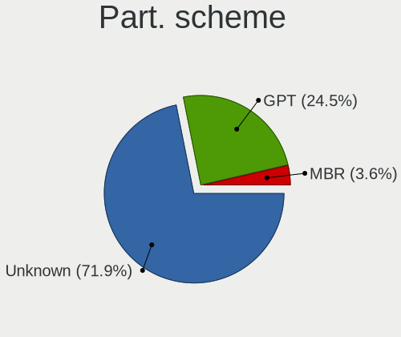

| Type    | Desktops | Percent |
|---------|----------|---------|
| Unknown | 441      | 76.43%  |
| GPT     | 122      | 21.14%  |
| MBR     | 14       | 2.43%   |

Dual Boot with Linux/BSD
------------------------

Hosting more than one Linux/BSD

| Dual boot | Desktops | Percent |
|-----------|----------|---------|
| No        | 464      | 79.86%  |
| Yes       | 117      | 20.14%  |

Dual Boot (Win)
---------------

Hosting Linux and Windows

| Dual boot | Desktops | Percent |
|-----------|----------|---------|
| No        | 317      | 54.75%  |
| Yes       | 262      | 45.25%  |

Board
-----

Vendor
------

Motherboard manufacturer

| Name                   | Desktops | Percent |
|------------------------|----------|---------|
| ASUSTek Computer       | 140      | 24.26%  |
| Gigabyte Technology    | 93       | 16.12%  |
| MSI                    | 88       | 15.25%  |
| ASRock                 | 55       | 9.53%   |
| Dell                   | 52       | 9.01%   |
| Hewlett-Packard        | 47       | 8.15%   |
| Lenovo                 | 19       | 3.29%   |
| Acer                   | 12       | 2.08%   |
| Medion                 | 7        | 1.21%   |
| Fujitsu                | 7        | 1.21%   |
| Intel                  | 6        | 1.04%   |
| EVGA                   | 5        | 0.87%   |
| Unknown                | 5        | 0.87%   |
| Pegatron               | 4        | 0.69%   |
| Foxconn                | 4        | 0.69%   |
| Packard Bell           | 3        | 0.52%   |
| Huanan                 | 3        | 0.52%   |
| Biostar                | 3        | 0.52%   |
| Supermicro             | 2        | 0.35%   |
| Positivo               | 2        | 0.35%   |
| Google                 | 2        | 0.35%   |
| ECS                    | 2        | 0.35%   |
| BESSTAR Tech           | 2        | 0.35%   |
| Apple                  | 2        | 0.35%   |
| ZYREX COMPUTER SYSTEMS | 1        | 0.17%   |
| TYAN Computer          | 1        | 0.17%   |
| PCWare                 | 1        | 0.17%   |
| OEM                    | 1        | 0.17%   |
| Minix                  | 1        | 0.17%   |
| MACHINIST              | 1        | 0.17%   |
| JGINYUE                | 1        | 0.17%   |
| ICP / iEi              | 1        | 0.17%   |
| EPSON DIRECT           | 1        | 0.17%   |
| DFI                    | 1        | 0.17%   |
| Chuwi                  | 1        | 0.17%   |
| AMI                    | 1        | 0.17%   |

Model
-----

Motherboard model

| Name                              | Desktops | Percent |
|-----------------------------------|----------|---------|
| ASUS All Series                   | 17       | 2.95%   |
| Dell OptiPlex 7010                | 7        | 1.21%   |
| MSI MS-7D25                       | 5        | 0.87%   |
| Dell OptiPlex 9010                | 5        | 0.87%   |
| Unknown                           | 5        | 0.87%   |
| MSI MS-7817                       | 4        | 0.69%   |
| HP ProDesk 600 G1 SFF             | 4        | 0.69%   |
| Dell OptiPlex 790                 | 4        | 0.69%   |
| ASUS TUF GAMING X570-PLUS         | 4        | 0.69%   |
| ASUS PRIME B450M-A                | 4        | 0.69%   |
| MSI MS-7C94                       | 3        | 0.52%   |
| MSI MS-7C52                       | 3        | 0.52%   |
| MSI MS-7C37                       | 3        | 0.52%   |
| MSI MS-7C35                       | 3        | 0.52%   |
| HP Z800 Workstation               | 3        | 0.52%   |
| HP EliteDesk 800 G2 SFF           | 3        | 0.52%   |
| Gigabyte X570 AORUS MASTER        | 3        | 0.52%   |
| Gigabyte GA-78LMT-USB3            | 3        | 0.52%   |
| Gigabyte B450M DS3H               | 3        | 0.52%   |
| Dell OptiPlex 3020                | 3        | 0.52%   |
| ASUS PRIME A320M-K                | 3        | 0.52%   |
| MSI MS-7C95                       | 2        | 0.35%   |
| MSI MS-7C80                       | 2        | 0.35%   |
| MSI MS-7C02                       | 2        | 0.35%   |
| MSI MS-7B86                       | 2        | 0.35%   |
| MSI MS-7B84                       | 2        | 0.35%   |
| MSI MS-7B09                       | 2        | 0.35%   |
| MSI MS-7A38                       | 2        | 0.35%   |
| MSI MS-7821                       | 2        | 0.35%   |
| MSI MS-7641                       | 2        | 0.35%   |
| HP EliteDesk 800 G1 SFF           | 2        | 0.35%   |
| HP Compaq Elite 8300 USDT         | 2        | 0.35%   |
| HP Compaq 8200 Elite CMT PC       | 2        | 0.35%   |
| Google Guado                      | 2        | 0.35%   |
| Gigabyte Z690 UD DDR4             | 2        | 0.35%   |
| Gigabyte X58A-UD3R                | 2        | 0.35%   |
| Gigabyte GA-78LMT-USB3 6.0        | 2        | 0.35%   |
| Gigabyte B450M S2H                | 2        | 0.35%   |
| Dell XPS 8500                     | 2        | 0.35%   |
| Dell OptiPlex 780                 | 2        | 0.35%   |
| Dell OptiPlex 7040                | 2        | 0.35%   |
| Dell OptiPlex 3010                | 2        | 0.35%   |
| Dell Inspiron 545                 | 2        | 0.35%   |
| ASUS TUF GAMING Z690-PLUS WIFI D4 | 2        | 0.35%   |
| ASUS TUF Gaming B550-PLUS         | 2        | 0.35%   |
| ASUS ROG STRIX Z370-E GAMING      | 2        | 0.35%   |
| ASUS PRIME Z690-P WIFI D4         | 2        | 0.35%   |
| ASUS PRIME B550M-K                | 2        | 0.35%   |
| ASUS PRIME B350M-A                | 2        | 0.35%   |
| ASUS M5A97 R2.0                   | 2        | 0.35%   |
| ASUS M5A78L-M/USB3                | 2        | 0.35%   |
| ASUS M4A89GTD-PRO/USB3            | 2        | 0.35%   |
| ASUS H110M-C                      | 2        | 0.35%   |
| ASUS CROSSHAIR VI HERO            | 2        | 0.35%   |
| ASUS B250 MINING EXPERT           | 2        | 0.35%   |
| ASRock Z590M-ITX/ax               | 2        | 0.35%   |
| ASRock Z370 Pro4                  | 2        | 0.35%   |
| Apple MacPro3,1                   | 2        | 0.35%   |
| Acer Aspire M7720                 | 2        | 0.35%   |
| ZYREX COMPUTER SYSTEMS TACTICAL   | 1        | 0.17%   |

Model Family
------------

Motherboard model prefix

| Name                   | Desktops | Percent |
|------------------------|----------|---------|
| Dell OptiPlex          | 35       | 6.07%   |
| ASUS PRIME             | 29       | 5.03%   |
| ASUS ROG               | 17       | 2.95%   |
| ASUS All               | 17       | 2.95%   |
| HP Compaq              | 14       | 2.43%   |
| Lenovo ThinkCentre     | 11       | 1.91%   |
| ASUS TUF               | 10       | 1.73%   |
| HP ProDesk             | 9        | 1.56%   |
| HP EliteDesk           | 8        | 1.39%   |
| Gigabyte X570          | 8        | 1.39%   |
| Acer Aspire            | 8        | 1.39%   |
| Gigabyte B450M         | 6        | 1.04%   |
| Dell Inspiron          | 6        | 1.04%   |
| MSI MS-7D25            | 5        | 0.87%   |
| Gigabyte GA-78LMT-USB3 | 5        | 0.87%   |
| Unknown                | 5        | 0.87%   |
| MSI MS-7817            | 4        | 0.69%   |
| Fujitsu ESPRIMO        | 4        | 0.69%   |
| Dell XPS               | 4        | 0.69%   |
| Dell Precision         | 4        | 0.69%   |
| ASUS M5A78L-M          | 4        | 0.69%   |
| MSI MS-7C94            | 3        | 0.52%   |
| MSI MS-7C52            | 3        | 0.52%   |
| MSI MS-7C37            | 3        | 0.52%   |
| MSI MS-7C35            | 3        | 0.52%   |
| HP Z800                | 3        | 0.52%   |
| HP Pavilion            | 3        | 0.52%   |
| Gigabyte Z690          | 3        | 0.52%   |
| ASUS M5A97             | 3        | 0.52%   |
| MSI MS-7C95            | 2        | 0.35%   |
| MSI MS-7C80            | 2        | 0.35%   |
| MSI MS-7C02            | 2        | 0.35%   |
| MSI MS-7B86            | 2        | 0.35%   |
| MSI MS-7B84            | 2        | 0.35%   |
| MSI MS-7B09            | 2        | 0.35%   |
| MSI MS-7A38            | 2        | 0.35%   |
| MSI MS-7821            | 2        | 0.35%   |
| MSI MS-7641            | 2        | 0.35%   |
| HP ProLiant            | 2        | 0.35%   |
| Google Guado           | 2        | 0.35%   |
| Gigabyte Z390          | 2        | 0.35%   |
| Gigabyte Z370          | 2        | 0.35%   |
| Gigabyte X58A-UD3R     | 2        | 0.35%   |
| Gigabyte X470          | 2        | 0.35%   |
| Gigabyte H510M         | 2        | 0.35%   |
| Gigabyte B550M         | 2        | 0.35%   |
| Gigabyte B550          | 2        | 0.35%   |
| Dell Vostro            | 2        | 0.35%   |
| ASUS STRIX             | 2        | 0.35%   |
| ASUS Pro               | 2        | 0.35%   |
| ASUS P8H61-M           | 2        | 0.35%   |
| ASUS P8H61             | 2        | 0.35%   |
| ASUS P5KPL-AM          | 2        | 0.35%   |
| ASUS M4A89GTD-PRO      | 2        | 0.35%   |
| ASUS M4A87TD           | 2        | 0.35%   |
| ASUS H110M-C           | 2        | 0.35%   |
| ASUS CROSSHAIR         | 2        | 0.35%   |
| ASUS B250              | 2        | 0.35%   |
| ASRock Z590M-ITX       | 2        | 0.35%   |
| ASRock Z370            | 2        | 0.35%   |

MFG Year
--------

Motherboard manufacture year

| Year | Desktops | Percent |
|------|----------|---------|
| 2018 | 56       | 9.71%   |
| 2012 | 54       | 9.36%   |
| 2020 | 52       | 9.01%   |
| 2019 | 51       | 8.84%   |
| 2021 | 49       | 8.49%   |
| 2013 | 45       | 7.8%    |
| 2014 | 42       | 7.28%   |
| 2011 | 39       | 6.76%   |
| 2017 | 36       | 6.24%   |
| 2010 | 32       | 5.55%   |
| 2008 | 29       | 5.03%   |
| 2009 | 28       | 4.85%   |
| 2015 | 27       | 4.68%   |
| 2016 | 15       | 2.6%    |
| 2007 | 14       | 2.43%   |
| 2006 | 6        | 1.04%   |
| 2022 | 2        | 0.35%   |

Form Factor
-----------

Physical design of the computer

| Name    | Desktops | Percent |
|---------|----------|---------|
| Desktop | 577      | 100%    |

Secure Boot
-----------

Enabled or disabled

| State    | Desktops | Percent |
|----------|----------|---------|
| Disabled | 566      | 97.92%  |
| Enabled  | 12       | 2.08%   |

Coreboot
--------

Have coreboot on board

| Used | Desktops | Percent |
|------|----------|---------|
| No   | 574      | 99.48%  |
| Yes  | 3        | 0.52%   |

RAM Size
--------

Total RAM memory

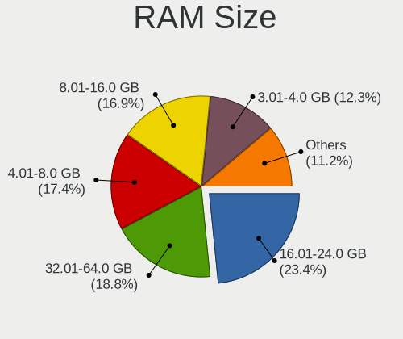

| Size in GB      | Desktops | Percent |
|-----------------|----------|---------|
| 16.01-24.0      | 134      | 23.14%  |
| 32.01-64.0      | 114      | 19.69%  |
| 4.01-8.0        | 106      | 18.31%  |
| 8.01-16.0       | 98       | 16.93%  |
| 3.01-4.0        | 73       | 12.61%  |
| 64.01-256.0     | 31       | 5.35%   |
| 24.01-32.0      | 14       | 2.42%   |
| 1.01-2.0        | 7        | 1.21%   |
| More than 256.0 | 1        | 0.17%   |
| 2.01-3.0        | 1        | 0.17%   |

RAM Used
--------

Used RAM memory

| Used GB    | Desktops | Percent |
|------------|----------|---------|
| 1.01-2.0   | 248      | 40.99%  |
| 2.01-3.0   | 173      | 28.6%   |
| 4.01-8.0   | 88       | 14.55%  |
| 3.01-4.0   | 70       | 11.57%  |
| 8.01-16.0  | 15       | 2.48%   |
| 0.51-1.0   | 7        | 1.16%   |
| 16.01-24.0 | 2        | 0.33%   |
| 32.01-64.0 | 1        | 0.17%   |
| 0.01-0.5   | 1        | 0.17%   |

Total Drives
------------

Number of drives on board

| Drives | Desktops | Percent |
|--------|----------|---------|
| 1      | 224      | 38.36%  |
| 2      | 155      | 26.54%  |
| 3      | 86       | 14.73%  |
| 4      | 54       | 9.25%   |
| 5      | 36       | 6.16%   |
| 6      | 11       | 1.88%   |
| 7      | 7        | 1.2%    |
| 11     | 5        | 0.86%   |
| 0      | 5        | 0.86%   |
| 8      | 1        | 0.17%   |

Has CD-ROM
----------

Has CD-ROM on board

| Presented | Desktops | Percent |
|-----------|----------|---------|
| No        | 304      | 52.5%   |
| Yes       | 275      | 47.5%   |

Has Ethernet
------------

Has Ethernet on board

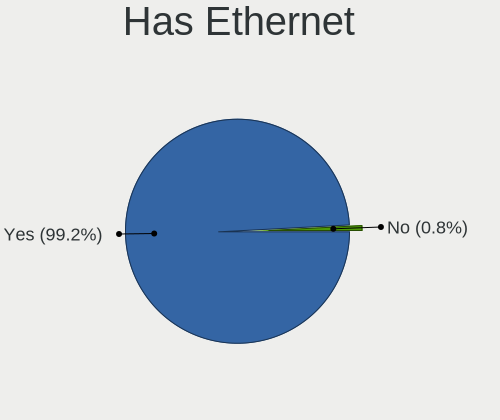

| Presented | Desktops | Percent |
|-----------|----------|---------|
| Yes       | 571      | 98.96%  |
| No        | 6        | 1.04%   |

Has WiFi
--------

Has WiFi module

| Presented | Desktops | Percent |
|-----------|----------|---------|
| No        | 314      | 54.23%  |
| Yes       | 265      | 45.77%  |

Has Bluetooth
-------------

Has Bluetooth module

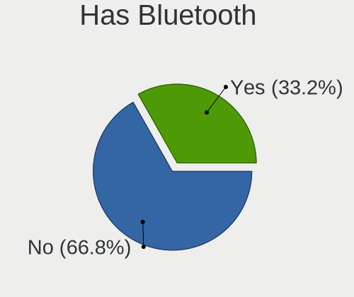

| Presented | Desktops | Percent |
|-----------|----------|---------|
| No        | 385      | 66.27%  |
| Yes       | 196      | 33.73%  |

Location
--------

Country
-------

Geographic location (country)

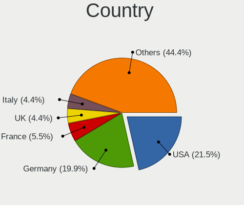

| Country      | Desktops | Percent |
|--------------|----------|---------|
| Germany      | 126      | 21.84%  |
| USA          | 112      | 19.41%  |
| France       | 29       | 5.03%   |
| Italy        | 27       | 4.68%   |
| Brazil       | 25       | 4.33%   |
| UK           | 24       | 4.16%   |
| Canada       | 17       | 2.95%   |
| Australia    | 17       | 2.95%   |
| Russia       | 14       | 2.43%   |
| Poland       | 14       | 2.43%   |
| Spain        | 10       | 1.73%   |
| Netherlands  | 10       | 1.73%   |
| Switzerland  | 8        | 1.39%   |
| Ukraine      | 7        | 1.21%   |
| Sweden       | 7        | 1.21%   |
| Mexico       | 7        | 1.21%   |
| India        | 7        | 1.21%   |
| Hungary      | 7        | 1.21%   |
| Argentina    | 7        | 1.21%   |
| Belgium      | 6        | 1.04%   |
| Japan        | 5        | 0.87%   |
| Greece       | 5        | 0.87%   |
| China        | 5        | 0.87%   |
| Serbia       | 4        | 0.69%   |
| Norway       | 4        | 0.69%   |
| Finland      | 4        | 0.69%   |
| Czechia      | 4        | 0.69%   |
| Austria      | 4        | 0.69%   |
| South Africa | 3        | 0.52%   |
| Peru         | 3        | 0.52%   |
| New Zealand  | 3        | 0.52%   |
| Lithuania    | 3        | 0.52%   |
| Estonia      | 3        | 0.52%   |
| Denmark      | 3        | 0.52%   |
| Chile        | 3        | 0.52%   |
| Turkey       | 2        | 0.35%   |
| Thailand     | 2        | 0.35%   |
| Taiwan       | 2        | 0.35%   |
| South Korea  | 2        | 0.35%   |
| Saudi Arabia | 2        | 0.35%   |
| Portugal     | 2        | 0.35%   |
| Philippines  | 2        | 0.35%   |
| Israel       | 2        | 0.35%   |
| Iran         | 2        | 0.35%   |
| Indonesia    | 2        | 0.35%   |
| Hong Kong    | 2        | 0.35%   |
| Uruguay      | 1        | 0.17%   |
| Sri Lanka    | 1        | 0.17%   |
| Slovenia     | 1        | 0.17%   |
| Nigeria      | 1        | 0.17%   |
| Malaysia     | 1        | 0.17%   |
| Kazakhstan   | 1        | 0.17%   |
| Iceland      | 1        | 0.17%   |
| Honduras     | 1        | 0.17%   |
| Georgia      | 1        | 0.17%   |
| Gabon        | 1        | 0.17%   |
| Egypt        | 1        | 0.17%   |
| Ecuador      | 1        | 0.17%   |
| Croatia      | 1        | 0.17%   |
| Colombia     | 1        | 0.17%   |

City
----

Geographic location (city)

| City              | Desktops | Percent |
|-------------------|----------|---------|
| Cleveland         | 12       | 2.03%   |
| Berlin            | 11       | 1.86%   |
| Stuttgart         | 5        | 0.84%   |
| Sao Paulo         | 5        | 0.84%   |
| Milan             | 5        | 0.84%   |
| Madrid            | 5        | 0.84%   |
| Sydney            | 4        | 0.68%   |
| Munich            | 4        | 0.68%   |
| Dresden           | 4        | 0.68%   |
| Wuhan             | 3        | 0.51%   |
| Warsaw            | 3        | 0.51%   |
| Perth             | 3        | 0.51%   |
| Paris             | 3        | 0.51%   |
| Moscow            | 3        | 0.51%   |
| Lima              | 3        | 0.51%   |
| Houston           | 3        | 0.51%   |
| Dubuque           | 3        | 0.51%   |
| Bristol           | 3        | 0.51%   |
| Brisbane          | 3        | 0.51%   |
| Wroclaw           | 2        | 0.34%   |
| Wittlich          | 2        | 0.34%   |
| Washington        | 2        | 0.34%   |
| Vladivostok       | 2        | 0.34%   |
| Vilnius           | 2        | 0.34%   |
| Vienna            | 2        | 0.34%   |
| Toronto           | 2        | 0.34%   |
| Tijuana           | 2        | 0.34%   |
| Thessaloniki      | 2        | 0.34%   |
| Tehran            | 2        | 0.34%   |
| Tallinn           | 2        | 0.34%   |
| Stockholm         | 2        | 0.34%   |
| San Francisco     | 2        | 0.34%   |
| San Antonio       | 2        | 0.34%   |
| Poznan            | 2        | 0.34%   |
| Porto Alegre      | 2        | 0.34%   |
| Phoenix           | 2        | 0.34%   |
| Oslo              | 2        | 0.34%   |
| Oakland           | 2        | 0.34%   |
| Newport           | 2        | 0.34%   |
| New Taipei        | 2        | 0.34%   |
| Montreal          | 2        | 0.34%   |
| Landsberg am Lech | 2        | 0.34%   |
| Kyiv              | 2        | 0.34%   |
| Krefeld           | 2        | 0.34%   |
| Karlsruhe         | 2        | 0.34%   |
| Helsinki          | 2        | 0.34%   |
| Hamburg           | 2        | 0.34%   |
| Giessen           | 2        | 0.34%   |
| Essen             | 2        | 0.34%   |
| El Paso           | 2        | 0.34%   |
| Croydon           | 2        | 0.34%   |
| Cannes            | 2        | 0.34%   |
| Buenos Aires      | 2        | 0.34%   |
| Budapest          | 2        | 0.34%   |
| Brussels          | 2        | 0.34%   |
| Bodenheim         | 2        | 0.34%   |
| Birmingham        | 2        | 0.34%   |
| Belo Horizonte    | 2        | 0.34%   |
| Auckland          | 2        | 0.34%   |
| Athens            | 2        | 0.34%   |

Drives
------

Drive Vendor
------------

Hard drive vendors

| Vendor                      | Desktops | Drives | Percent |
|-----------------------------|----------|--------|---------|
| WDC                         | 201      | 294    | 19.27%  |
| Seagate                     | 186      | 280    | 17.83%  |
| Samsung Electronics         | 174      | 284    | 16.68%  |
| Kingston                    | 62       | 78     | 5.94%   |
| SanDisk                     | 53       | 74     | 5.08%   |
| Toshiba                     | 48       | 66     | 4.6%    |
| Crucial                     | 48       | 59     | 4.6%    |
| Hitachi                     | 42       | 56     | 4.03%   |
| A-DATA Technology           | 16       | 18     | 1.53%   |
| Silicon Motion              | 15       | 19     | 1.44%   |
| Phison                      | 15       | 20     | 1.44%   |
| Intel                       | 15       | 18     | 1.44%   |
| Unknown                     | 14       | 18     | 1.34%   |
| HGST                        | 13       | 18     | 1.25%   |
| PNY                         | 12       | 15     | 1.15%   |
| Intenso                     | 8        | 9      | 0.77%   |
| Corsair                     | 8        | 10     | 0.77%   |
| Micron/Crucial Technology   | 6        | 6      | 0.58%   |
| MAXTOR                      | 6        | 6      | 0.58%   |
| Phison Electronics          | 5        | 6      | 0.48%   |
| OCZ                         | 5        | 7      | 0.48%   |
| SK Hynix                    | 4        | 10     | 0.38%   |
| JMicron                     | 4        | 4      | 0.38%   |
| China                       | 4        | 4      | 0.38%   |
| Unknown                     | 4        | 4      | 0.38%   |
| Team                        | 3        | 3      | 0.29%   |
| SABRENT                     | 3        | 3      | 0.29%   |
| Realtek Semiconductor       | 3        | 3      | 0.29%   |
| Patriot                     | 3        | 3      | 0.29%   |
| Netac                       | 3        | 4      | 0.29%   |
| LITEON                      | 3        | 3      | 0.29%   |
| Lexar                       | 3        | 3      | 0.29%   |
| GOODRAM                     | 3        | 4      | 0.29%   |
| Gigabyte Technology         | 3        | 4      | 0.29%   |
| Transcend                   | 2        | 2      | 0.19%   |
| SPCC                        | 2        | 2      | 0.19%   |
| PLEXTOR                     | 2        | 3      | 0.19%   |
| Micron Technology           | 2        | 3      | 0.19%   |
| LITEONIT                    | 2        | 2      | 0.19%   |
| LDLC                        | 2        | 2      | 0.19%   |
| KIOXIA-EXCERIA              | 2        | 2      | 0.19%   |
| KingDian                    | 2        | 2      | 0.19%   |
| Hewlett-Packard             | 2        | 2      | 0.19%   |
| XPG                         | 1        | 1      | 0.1%    |
| WDBRPG00                    | 1        | 1      | 0.1%    |
| USB 3.0                     | 1        | 1      | 0.1%    |
| TO Exter                    | 1        | 2      | 0.1%    |
| SUPERSONIC                  | 1        | 1      | 0.1%    |
| SSSTC                       | 1        | 1      | 0.1%    |
| Q200                        | 1        | 4      | 0.1%    |
| PHD 3.0                     | 1        | 1      | 0.1%    |
| OYUNKEY                     | 1        | 1      | 0.1%    |
| OWC                         | 1        | 1      | 0.1%    |
| NTC                         | 1        | 1      | 0.1%    |
| Memory                      | 1        | 1      | 0.1%    |
| Maxone                      | 1        | 1      | 0.1%    |
| MAXIO Technology (Hangzhou) | 1        | 1      | 0.1%    |
| MARVELL                     | 1        | 1      | 0.1%    |
| KLEVV                       | 1        | 3      | 0.1%    |
| KIOXIA                      | 1        | 2      | 0.1%    |

Drive Model
-----------

Hard drive models

| Model                               | Desktops | Percent |
|-------------------------------------|----------|---------|
| Kingston SA400S37240G 240GB SSD     | 16       | 1.29%   |
| Seagate ST2000DM008-2FR102 2TB      | 15       | 1.21%   |
| Seagate ST500DM002-1BD142 500GB     | 14       | 1.13%   |
| Samsung SSD 850 EVO 250GB           | 14       | 1.13%   |
| Samsung NVMe SSD Drive 1TB          | 14       | 1.13%   |
| Samsung SSD 850 EVO 500GB           | 12       | 0.97%   |
| Samsung NVMe SSD Drive 250GB        | 12       | 0.97%   |
| Samsung SSD 860 EVO 1TB             | 11       | 0.89%   |
| Samsung NVMe SSD Drive 500GB        | 11       | 0.89%   |
| Samsung SSD 860 EVO 500GB           | 10       | 0.81%   |
| Sandisk NVMe SSD Drive 1TB          | 9        | 0.72%   |
| Crucial CT500MX500SSD1 500GB        | 9        | 0.72%   |
| Toshiba DT01ACA100 1TB              | 8        | 0.64%   |
| Seagate ST1000DM003-1CH162 1TB      | 8        | 0.64%   |
| Sandisk NVMe SSD Drive 500GB        | 8        | 0.64%   |
| Samsung SSD 970 EVO 500GB           | 8        | 0.64%   |
| Kingston SA400S37480G 480GB SSD     | 8        | 0.64%   |
| Kingston SA400S37120G 120GB SSD     | 8        | 0.64%   |
| Seagate ST1000DM003-1ER162 1TB      | 7        | 0.56%   |
| Kingston SV300S37A120G 120GB SSD    | 7        | 0.56%   |
| WDC WD10EZEX-00BN5A0 1TB            | 6        | 0.48%   |
| Unknown SD/MMC/MS PRO 32GB          | 6        | 0.48%   |
| Seagate ST3500413AS 500GB           | 6        | 0.48%   |
| Seagate ST2000DM001-1ER164 2TB      | 6        | 0.48%   |
| SanDisk SSD PLUS 240GB              | 6        | 0.48%   |
| Kingston SV300S37A240G 240GB SSD    | 6        | 0.48%   |
| Hitachi HUS724030ALE641 3TB         | 6        | 0.48%   |
| WDC WD40EZRZ-00GXCB0 4TB            | 5        | 0.4%    |
| WDC WD20EZRX-00D8PB0 2TB            | 5        | 0.4%    |
| WDC WD10EZEX-08WN4A0 1TB            | 5        | 0.4%    |
| WDC WD10EZEX-08M2NA0 1TB            | 5        | 0.4%    |
| Silicon Motion NVMe SSD Drive 256GB | 5        | 0.4%    |
| Seagate ST8000DM004-2CX188 8TB      | 5        | 0.4%    |
| Seagate ST4000DM004-2CV104 4TB      | 5        | 0.4%    |
| Seagate ST3500418AS 500GB           | 5        | 0.4%    |
| Seagate ST3500312CS 500GB           | 5        | 0.4%    |
| Seagate ST3250318AS 250GB           | 5        | 0.4%    |
| Seagate ST31000524AS 1TB            | 5        | 0.4%    |
| Seagate ST1000DM010-2EP102 1TB      | 5        | 0.4%    |
| Seagate Expansion 320GB             | 5        | 0.4%    |
| Samsung SSD 970 EVO Plus 1TB        | 5        | 0.4%    |
| Samsung SSD 870 EVO 250GB           | 5        | 0.4%    |
| Samsung SSD 860 EVO 250GB           | 5        | 0.4%    |
| Samsung SSD 840 EVO 250GB           | 5        | 0.4%    |
| Samsung NVMe SSD Drive 512GB        | 5        | 0.4%    |
| Phison PCIe SSD 256GB               | 5        | 0.4%    |
| Kingston NVMe SSD Drive 500GB       | 5        | 0.4%    |
| Hitachi HDS721010CLA332 1TB         | 5        | 0.4%    |
| WDC WDBNCE0010PNC 1TB SSD           | 4        | 0.32%   |
| WDC WD4003FZEX-00Z4SA0 4TB          | 4        | 0.32%   |
| WDC WD2002FAEX-007BA0 2TB           | 4        | 0.32%   |
| WDC WD10EZEX-00WN4A0 1TB            | 4        | 0.32%   |
| Toshiba DT01ACA300 3TB              | 4        | 0.32%   |
| Toshiba DT01ACA200 2TB              | 4        | 0.32%   |
| Seagate ST2000DL003-9VT166 2TB      | 4        | 0.32%   |
| SanDisk Ultra II 480GB SSD          | 4        | 0.32%   |
| SanDisk SSD PLUS 1000GB             | 4        | 0.32%   |
| Samsung SSD 980 PRO 1TB             | 4        | 0.32%   |
| Samsung SSD 870 QVO 1TB             | 4        | 0.32%   |
| Samsung SSD 870 EVO 1TB             | 4        | 0.32%   |

HDD Vendor
----------

Hard disk drive vendors

| Vendor              | Desktops | Drives | Percent |
|---------------------|----------|--------|---------|
| Seagate             | 185      | 277    | 35.51%  |
| WDC                 | 181      | 264    | 34.74%  |
| Toshiba             | 43       | 59     | 8.25%   |
| Hitachi             | 42       | 56     | 8.06%   |
| Samsung Electronics | 33       | 44     | 6.33%   |
| HGST                | 13       | 18     | 2.5%    |
| Unknown             | 6        | 6      | 1.15%   |
| MAXTOR              | 6        | 6      | 1.15%   |
| SABRENT             | 3        | 3      | 0.58%   |
| Intenso             | 2        | 2      | 0.38%   |
| USB 3.0             | 1        | 1      | 0.19%   |
| PHD 3.0             | 1        | 1      | 0.19%   |
| Maxone              | 1        | 1      | 0.19%   |
| MARVELL             | 1        | 1      | 0.19%   |
| Hewlett-Packard     | 1        | 1      | 0.19%   |
| ASMT                | 1        | 1      | 0.19%   |
| Unknown             | 1        | 1      | 0.19%   |

SSD Vendor
----------

Solid state drive vendors

| Vendor              | Desktops | Drives | Percent |
|---------------------|----------|--------|---------|
| Samsung Electronics | 89       | 134    | 25.21%  |
| Kingston            | 52       | 66     | 14.73%  |
| Crucial             | 42       | 52     | 11.9%   |
| SanDisk             | 34       | 48     | 9.63%   |
| WDC                 | 24       | 25     | 6.8%    |
| A-DATA Technology   | 12       | 14     | 3.4%    |
| PNY                 | 9        | 11     | 2.55%   |
| Intel               | 9        | 11     | 2.55%   |
| Toshiba             | 6        | 6      | 1.7%    |
| OCZ                 | 5        | 7      | 1.42%   |
| Intenso             | 5        | 6      | 1.42%   |
| Corsair             | 5        | 7      | 1.42%   |
| China               | 4        | 4      | 1.13%   |
| Team                | 3        | 3      | 0.85%   |
| Patriot             | 3        | 3      | 0.85%   |
| Netac               | 3        | 4      | 0.85%   |
| LITEON              | 3        | 3      | 0.85%   |
| Lexar               | 3        | 3      | 0.85%   |
| JMicron             | 3        | 3      | 0.85%   |
| Transcend           | 2        | 2      | 0.57%   |
| SK Hynix            | 2        | 3      | 0.57%   |
| PLEXTOR             | 2        | 3      | 0.57%   |
| PHISON              | 2        | 2      | 0.57%   |
| Micron Technology   | 2        | 3      | 0.57%   |
| LITEONIT            | 2        | 2      | 0.57%   |
| LDLC                | 2        | 2      | 0.57%   |
| KIOXIA-EXCERIA      | 2        | 2      | 0.57%   |
| KingDian            | 2        | 2      | 0.57%   |
| GOODRAM             | 2        | 2      | 0.57%   |
| Gigabyte Technology | 2        | 3      | 0.57%   |
| TO Exter            | 1        | 2      | 0.28%   |
| SPCC                | 1        | 1      | 0.28%   |
| Seagate             | 1        | 1      | 0.28%   |
| Q200                | 1        | 4      | 0.28%   |
| OYUNKEY             | 1        | 1      | 0.28%   |
| Memory              | 1        | 1      | 0.28%   |
| KLEVV               | 1        | 3      | 0.28%   |
| kimtigo             | 1        | 1      | 0.28%   |
| INTEL SS            | 1        | 1      | 0.28%   |
| Hewlett-Packard     | 1        | 1      | 0.28%   |
| Green House         | 1        | 1      | 0.28%   |
| FORESEE             | 1        | 1      | 0.28%   |
| EMTEC               | 1        | 1      | 0.28%   |
| BAITITON            | 1        | 1      | 0.28%   |
| Apacer              | 1        | 1      | 0.28%   |
| 2-Power             | 1        | 2      | 0.28%   |
| Unknown             | 1        | 1      | 0.28%   |

Drive Kind
----------

HDD or SSD

| Kind    | Desktops | Drives | Percent |
|---------|----------|--------|---------|
| HDD     | 398      | 742    | 45.54%  |
| SSD     | 283      | 460    | 32.38%  |
| NVMe    | 173      | 244    | 19.79%  |
| Unknown | 16       | 21     | 1.83%   |
| MMC     | 4        | 4      | 0.46%   |

Drive Connector
---------------

SATA, SAS, NVMe, etc.

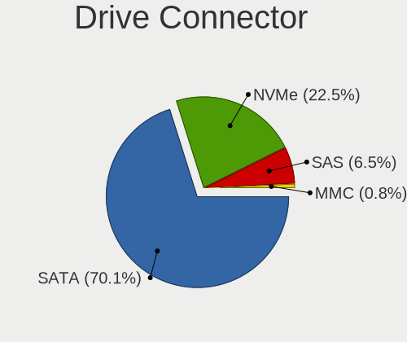

| Type | Desktops | Drives | Percent |
|------|----------|--------|---------|
| SATA | 514      | 1159   | 69.65%  |
| NVMe | 173      | 244    | 23.44%  |
| SAS  | 47       | 64     | 6.37%   |
| MMC  | 4        | 4      | 0.54%   |

Drive Size
----------

Size of hard drive

| Size in TB | Desktops | Drives | Percent |
|------------|----------|--------|---------|
| 0.01-0.5   | 376      | 637    | 49.28%  |
| 0.51-1.0   | 212      | 302    | 27.79%  |
| 1.01-2.0   | 88       | 117    | 11.53%  |
| 3.01-4.0   | 35       | 60     | 4.59%   |
| 2.01-3.0   | 30       | 45     | 3.93%   |
| 4.01-10.0  | 19       | 38     | 2.49%   |
| 10.01-20.0 | 2        | 2      | 0.26%   |
| 0          | 1        | 1      | 0.13%   |

Space Total
-----------

Amount of disk space available on the file system

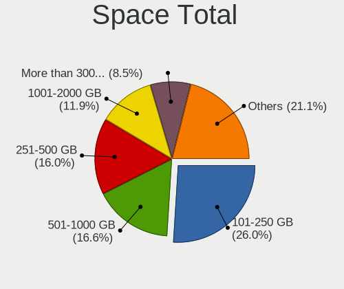

| Size in GB     | Desktops | Percent |
|----------------|----------|---------|
| 101-250        | 153      | 26.11%  |
| 251-500        | 99       | 16.89%  |
| 501-1000       | 96       | 16.38%  |
| 1001-2000      | 75       | 12.8%   |
| More than 3000 | 48       | 8.19%   |
| 1-20           | 45       | 7.68%   |
| 2001-3000      | 30       | 5.12%   |
| 51-100         | 24       | 4.1%    |
| 21-50          | 14       | 2.39%   |
| Unknown        | 2        | 0.34%   |

Space Used
----------

Amount of used disk space

| Used GB        | Desktops | Percent |
|----------------|----------|---------|
| 1-20           | 224      | 37.46%  |
| 21-50          | 89       | 14.88%  |
| 51-100         | 74       | 12.37%  |
| 101-250        | 73       | 12.21%  |
| 501-1000       | 39       | 6.52%   |
| 251-500        | 38       | 6.35%   |
| 1001-2000      | 29       | 4.85%   |
| More than 3000 | 20       | 3.34%   |
| 2001-3000      | 10       | 1.67%   |
| Unknown        | 2        | 0.33%   |

Malfunc. Drives
---------------

Drive models with a malfunction

| Model                                      | Desktops | Drives | Percent |
|--------------------------------------------|----------|--------|---------|
| Seagate ST3500320AS 500GB                  | 2        | 2      | 5.56%   |
| Seagate ST31000528AS 1TB                   | 2        | 2      | 5.56%   |
| Seagate ST1000DM003-1CH162 1TB             | 2        | 2      | 5.56%   |
| Samsung Electronics SSD 870 EVO 500GB      | 2        | 2      | 5.56%   |
| WDC WD5000BPVT-00HXZT3 500GB               | 1        | 1      | 2.78%   |
| WDC WD5000AAKX-083CA1 500GB                | 1        | 1      | 2.78%   |
| WDC WD5000AAKX-001CA0 500GB                | 1        | 1      | 2.78%   |
| WDC WD3200SD-01KNB0 320GB                  | 1        | 1      | 2.78%   |
| WDC WD30EZRX-00DC0B0 3TB                   | 1        | 1      | 2.78%   |
| WDC WD2500HHTZ-04N21V0 250GB               | 1        | 1      | 2.78%   |
| WDC WD20EARX-00PASB0 2TB                   | 1        | 1      | 2.78%   |
| WDC WD1600AAJS-00L7A0 160GB                | 1        | 1      | 2.78%   |
| WDC WD10EZRZ-00HTKB0 1TB                   | 1        | 1      | 2.78%   |
| WDC WD10EZEX-00BN5A0 1TB                   | 1        | 1      | 2.78%   |
| WDC WD10EARS-00Y5B1 1TB                    | 1        | 1      | 2.78%   |
| WDC WD1002FAEX-00Z3A0 1TB                  | 1        | 1      | 2.78%   |
| Toshiba MQ01ABD100 1TB                     | 1        | 2      | 2.78%   |
| Seagate ST500DM002-1BD142 500GB            | 1        | 1      | 2.78%   |
| Seagate ST3120813AS 120GB                  | 1        | 1      | 2.78%   |
| Seagate ST3000DM008-2DM166 3TB             | 1        | 1      | 2.78%   |
| Seagate ST3000DM001-1CH166 3TB             | 1        | 2      | 2.78%   |
| Seagate ST1000LM024 HN-M101MBB 1TB         | 1        | 1      | 2.78%   |
| Seagate ST1000DM003-9YN162 1TB             | 1        | 1      | 2.78%   |
| Samsung Electronics SSD 870 EVO 1TB        | 1        | 1      | 2.78%   |
| Samsung Electronics MZVLB1T0HALR-00000 1TB | 1        | 1      | 2.78%   |
| Samsung Electronics HD502HJ 500GB          | 1        | 1      | 2.78%   |
| Patriot Pyro m3 240GB SSD                  | 1        | 1      | 2.78%   |
| MAXTOR 6G160E0 160GB                       | 1        | 1      | 2.78%   |
| Kingston SV300S37A120G 120GB SSD           | 1        | 1      | 2.78%   |
| Hitachi HUA722010CLA330 1TB                | 1        | 1      | 2.78%   |
| Hitachi HDS721680PLA380 80GB               | 1        | 1      | 2.78%   |
| Hitachi HDS721010CLA332 1TB                | 1        | 1      | 2.78%   |

Malfunc. Drive Vendor
---------------------

Vendors of faulty drives

| Vendor              | Desktops | Drives | Percent |
|---------------------|----------|--------|---------|
| WDC                 | 12       | 12     | 35.29%  |
| Seagate             | 11       | 13     | 32.35%  |
| Samsung Electronics | 4        | 5      | 11.76%  |
| Hitachi             | 3        | 3      | 8.82%   |
| Toshiba             | 1        | 2      | 2.94%   |
| Patriot             | 1        | 1      | 2.94%   |
| MAXTOR              | 1        | 1      | 2.94%   |
| Kingston            | 1        | 1      | 2.94%   |

Malfunc. HDD Vendor
-------------------

Vendors of faulty HDD drives

| Vendor              | Desktops | Drives | Percent |
|---------------------|----------|--------|---------|
| WDC                 | 12       | 12     | 41.38%  |
| Seagate             | 11       | 13     | 37.93%  |
| Hitachi             | 3        | 3      | 10.34%  |
| Toshiba             | 1        | 2      | 3.45%   |
| Samsung Electronics | 1        | 1      | 3.45%   |
| MAXTOR              | 1        | 1      | 3.45%   |

Malfunc. Drive Kind
-------------------

Kinds of faulty drives

| Kind | Desktops | Drives | Percent |
|------|----------|--------|---------|
| HDD  | 26       | 32     | 83.87%  |
| SSD  | 4        | 5      | 12.9%   |
| NVMe | 1        | 1      | 3.23%   |

Failed Drives
-------------

Failed drive models

Zero info for selected period =(

Failed Drive Vendor
-------------------

Failed drive vendors

Zero info for selected period =(

Drive Status
------------

Number of failed and malfunc. drives

| Status   | Desktops | Drives | Percent |
|----------|----------|--------|---------|
| Detected | 441      | 1088   | 71.94%  |
| Works    | 141      | 345    | 23%     |
| Malfunc  | 31       | 38     | 5.06%   |

Storage controller
------------------

Storage Vendor
--------------

Storage controller vendors

| Vendor                        | Desktops | Percent |
|-------------------------------|----------|---------|
| Intel                         | 380      | 44.6%   |
| AMD                           | 181      | 21.24%  |
| Samsung Electronics           | 78       | 9.15%   |
| Marvell Technology Group      | 29       | 3.4%    |
| JMicron Technology            | 29       | 3.4%    |
| Phison Electronics            | 25       | 2.93%   |
| Sandisk                       | 23       | 2.7%    |
| ASMedia Technology            | 21       | 2.46%   |
| Silicon Motion                | 17       | 2%      |
| Nvidia                        | 12       | 1.41%   |
| Micron/Crucial Technology     | 11       | 1.29%   |
| Kingston Technology Company   | 10       | 1.17%   |
| Realtek Semiconductor         | 5        | 0.59%   |
| LSI Logic / Symbios Logic     | 4        | 0.47%   |
| Broadcom / LSI                | 4        | 0.47%   |
| SK Hynix                      | 3        | 0.35%   |
| Silicon Image                 | 3        | 0.35%   |
| ADATA Technology              | 3        | 0.35%   |
| VIA Technologies              | 2        | 0.23%   |
| Toshiba America Info Systems  | 1        | 0.12%   |
| Shenzhen Longsys Electronics  | 1        | 0.12%   |
| Seagate Technology            | 1        | 0.12%   |
| Micron Technology             | 1        | 0.12%   |
| MAXIO Technology (Hangzhou)   | 1        | 0.12%   |
| Lite-On IT Corp. / Plextor    | 1        | 0.12%   |
| KIOXIA                        | 1        | 0.12%   |
| Integrated Technology Express | 1        | 0.12%   |
| Hewlett-Packard               | 1        | 0.12%   |
| Advanced System Products      | 1        | 0.12%   |
| Adaptec                       | 1        | 0.12%   |
| 3ware                         | 1        | 0.12%   |

Storage Model
-------------

Storage controller models

| Model                                                                                   | Desktops | Percent |
|-----------------------------------------------------------------------------------------|----------|---------|
| AMD FCH SATA Controller [AHCI mode]                                                     | 100      | 9.54%   |
| Intel 8 Series/C220 Series Chipset Family 6-port SATA Controller 1 [AHCI mode]          | 50       | 4.77%   |
| Samsung NVMe SSD Controller SM981/PM981/PM983                                           | 48       | 4.58%   |
| AMD 400 Series Chipset SATA Controller                                                  | 34       | 3.24%   |
| AMD SB7x0/SB8x0/SB9x0 IDE Controller                                                    | 32       | 3.05%   |
| Intel SATA Controller [RAID mode]                                                       | 29       | 2.77%   |
| Intel 7 Series/C210 Series Chipset Family 6-port SATA Controller [AHCI mode]            | 29       | 2.77%   |
| Intel 6 Series/C200 Series Chipset Family 6 port Desktop SATA AHCI Controller           | 29       | 2.77%   |
| Intel Q170/Q150/B150/H170/H110/Z170/CM236 Chipset SATA Controller [AHCI Mode]           | 27       | 2.58%   |
| Intel 200 Series PCH SATA controller [AHCI mode]                                        | 26       | 2.48%   |
| AMD SB7x0/SB8x0/SB9x0 SATA Controller [AHCI mode]                                       | 25       | 2.39%   |
| Intel NM10/ICH7 Family SATA Controller [IDE mode]                                       | 24       | 2.29%   |
| Intel Cannon Lake PCH SATA AHCI Controller                                              | 21       | 2%      |
| AMD 500 Series Chipset SATA Controller                                                  | 21       | 2%      |
| AMD SB7x0/SB8x0/SB9x0 SATA Controller [IDE mode]                                        | 20       | 1.91%   |
| ASMedia ASM1062 Serial ATA Controller                                                   | 19       | 1.81%   |
| Samsung NVMe SSD Controller PM9A1/PM9A3/980PRO                                          | 18       | 1.72%   |
| Intel 82801G (ICH7 Family) IDE Controller                                               | 18       | 1.72%   |
| Silicon Motion SM2263EN/SM2263XT SSD Controller                                         | 15       | 1.43%   |
| JMicron JMB363 SATA/IDE Controller                                                      | 15       | 1.43%   |
| Intel Alder Lake-S PCH SATA Controller [AHCI Mode]                                      | 15       | 1.43%   |
| Intel 500 Series Chipset Family SATA AHCI Controller                                    | 14       | 1.34%   |
| Phison E12 NVMe Controller                                                              | 13       | 1.24%   |
| AMD FCH SATA Controller D                                                               | 12       | 1.15%   |
| Samsung NVMe SSD Controller SM961/PM961/SM963                                           | 11       | 1.05%   |
| Intel 82801JI (ICH10 Family) 4 port SATA IDE Controller #1                              | 11       | 1.05%   |
| Intel 82801JI (ICH10 Family) 2 port SATA IDE Controller #2                              | 10       | 0.95%   |
| Marvell Group 88SE9172 SATA 6Gb/s Controller                                            | 9        | 0.86%   |
| Sandisk WD Black SN750 / PC SN730 NVMe SSD                                              | 8        | 0.76%   |
| JMicron JMB368 IDE controller                                                           | 8        | 0.76%   |
| Intel 9 Series Chipset Family SATA Controller [AHCI Mode]                               | 8        | 0.76%   |
| Intel 82801JI (ICH10 Family) SATA AHCI Controller                                       | 8        | 0.76%   |
| Intel 6 Series/C200 Series Chipset Family Desktop SATA Controller (IDE mode, ports 4-5) | 8        | 0.76%   |
| Intel 6 Series/C200 Series Chipset Family Desktop SATA Controller (IDE mode, ports 0-3) | 8        | 0.76%   |
| Samsung NVMe SSD Controller 980                                                         | 7        | 0.67%   |
| Phison E16 PCIe4 NVMe Controller                                                        | 7        | 0.67%   |
| Micron/Crucial P2 NVMe PCIe SSD                                                         | 7        | 0.67%   |
| Kingston Company A2000 NVMe SSD                                                         | 7        | 0.67%   |
| Intel Comet Lake SATA AHCI Controller                                                   | 7        | 0.67%   |
| Sandisk WD Blue SN550 NVMe SSD                                                          | 6        | 0.57%   |
| Intel C600/X79 series chipset SATA RAID Controller                                      | 6        | 0.57%   |
| Intel C600/X79 series chipset 6-Port SATA AHCI Controller                               | 6        | 0.57%   |
| Intel 82801IR/IO/IH (ICH9R/DO/DH) 4 port SATA Controller [IDE mode]                     | 6        | 0.57%   |
| Intel 82801I (ICH9 Family) 2 port SATA Controller [IDE mode]                            | 6        | 0.57%   |
| AMD 300 Series Chipset SATA Controller                                                  | 6        | 0.57%   |
| Nvidia MCP61 SATA Controller                                                            | 5        | 0.48%   |
| Intel Volume Management Device NVMe RAID Controller                                     | 5        | 0.48%   |
| Intel Celeron/Pentium Silver Processor SATA Controller                                  | 5        | 0.48%   |
| Intel 82801JD/DO (ICH10 Family) SATA AHCI Controller                                    | 5        | 0.48%   |
| Intel 631xESB/632xESB IDE Controller                                                    | 5        | 0.48%   |
| Intel 5 Series/3400 Series Chipset 6 port SATA AHCI Controller                          | 5        | 0.48%   |
| Intel 400 Series Chipset Family SATA AHCI Controller                                    | 5        | 0.48%   |
| Intel 4 Series Chipset PT IDER Controller                                               | 5        | 0.48%   |
| AMD X370 Series Chipset SATA Controller                                                 | 5        | 0.48%   |
| AMD FCH IDE Controller                                                                  | 5        | 0.48%   |
| Marvell Group 88SE9172 SATA III 6Gb/s RAID Controller                                   | 4        | 0.38%   |
| Marvell Group 88SE912x IDE Controller                                                   | 4        | 0.38%   |
| JMicron JMB361 AHCI/IDE                                                                 | 4        | 0.38%   |
| Intel C610/X99 series chipset sSATA Controller [AHCI mode]                              | 4        | 0.38%   |
| Intel C610/X99 series chipset 6-Port SATA Controller [AHCI mode]                        | 4        | 0.38%   |

Storage Kind
------------

Kind of storage controller (IDE, SATA, NVMe, SAS, ...)

| Kind | Desktops | Percent |
|------|----------|---------|
| SATA | 465      | 55.09%  |
| NVMe | 172      | 20.38%  |
| IDE  | 145      | 17.18%  |
| RAID | 50       | 5.92%   |
| SCSI | 7        | 0.83%   |
| SAS  | 5        | 0.59%   |

Processor
---------

CPU Vendor
----------

Processor vendors

| Vendor | Desktops | Percent |
|--------|----------|---------|
| Intel  | 385      | 66.72%  |
| AMD    | 192      | 33.28%  |

CPU Model
---------

Processor models

| Model                                       | Desktops | Percent |
|---------------------------------------------|----------|---------|
| Intel Core i7-8700K CPU @ 3.70GHz           | 10       | 1.73%   |
| Intel Core i7-3770 CPU @ 3.40GHz            | 10       | 1.73%   |
| AMD Ryzen 5 3600 6-Core Processor           | 10       | 1.73%   |
| Intel Core i7-7700K CPU @ 4.20GHz           | 8        | 1.38%   |
| Intel Core i5-2400 CPU @ 3.10GHz            | 8        | 1.38%   |
| Intel Core i3-3220 CPU @ 3.30GHz            | 8        | 1.38%   |
| AMD Ryzen 9 3900X 12-Core Processor         | 8        | 1.38%   |
| AMD Ryzen 7 5800X 8-Core Processor          | 8        | 1.38%   |
| AMD Ryzen 5 3400G with Radeon Vega Graphics | 8        | 1.38%   |
| Intel Core i7-4790K CPU @ 4.00GHz           | 7        | 1.21%   |
| Intel Core i5-6500 CPU @ 3.20GHz            | 7        | 1.21%   |
| Intel Core 2 Duo CPU E8400 @ 3.00GHz        | 7        | 1.21%   |
| AMD Ryzen 7 5700G with Radeon Graphics      | 7        | 1.21%   |
| AMD FX-6300 Six-Core Processor              | 7        | 1.21%   |
| Intel Core i9-9900K CPU @ 3.60GHz           | 6        | 1.04%   |
| Intel Core i7-4790 CPU @ 3.60GHz            | 6        | 1.04%   |
| Intel Core i7 CPU 920 @ 2.67GHz             | 6        | 1.04%   |
| Intel Core i5-4570 CPU @ 3.20GHz            | 6        | 1.04%   |
| Intel Core i3-4130 CPU @ 3.40GHz            | 6        | 1.04%   |
| Intel Core 2 Quad CPU Q6600 @ 2.40GHz       | 6        | 1.04%   |
| Intel 12th Gen Core i7-12700K               | 6        | 1.04%   |
| AMD Ryzen 7 3700X 8-Core Processor          | 6        | 1.04%   |
| AMD Ryzen 5 5600X 6-Core Processor          | 6        | 1.04%   |
| AMD Ryzen 9 5950X 16-Core Processor         | 5        | 0.87%   |
| AMD Ryzen 9 5900X 12-Core Processor         | 5        | 0.87%   |
| AMD FX-4300 Quad-Core Processor             | 5        | 0.87%   |
| Intel Core i7-8700 CPU @ 3.20GHz            | 4        | 0.69%   |
| Intel Core i7-6700K CPU @ 4.00GHz           | 4        | 0.69%   |
| Intel Core i7-4770K CPU @ 3.50GHz           | 4        | 0.69%   |
| Intel Core i7-2600 CPU @ 3.40GHz            | 4        | 0.69%   |
| Intel Core i5-7400 CPU @ 3.00GHz            | 4        | 0.69%   |
| Intel Core i5-4590 CPU @ 3.30GHz            | 4        | 0.69%   |
| Intel Core i5-3570 CPU @ 3.40GHz            | 4        | 0.69%   |
| Intel Core i5-3470 CPU @ 3.20GHz            | 4        | 0.69%   |
| Intel Core i3-2120 CPU @ 3.30GHz            | 4        | 0.69%   |
| Intel Core i3-2100 CPU @ 3.10GHz            | 4        | 0.69%   |
| Intel 12th Gen Core i5-12600K               | 4        | 0.69%   |
| AMD Ryzen 7 3800X 8-Core Processor          | 4        | 0.69%   |
| AMD Ryzen 7 2700X Eight-Core Processor      | 4        | 0.69%   |
| AMD Ryzen 5 5600G with Radeon Graphics      | 4        | 0.69%   |
| AMD Ryzen 5 1600 Six-Core Processor         | 4        | 0.69%   |
| AMD FX-8320 Eight-Core Processor            | 4        | 0.69%   |
| Intel Pentium Dual-Core CPU E5300 @ 2.60GHz | 3        | 0.52%   |
| Intel Core i7-9700K CPU @ 3.60GHz           | 3        | 0.52%   |
| Intel Core i7-7700 CPU @ 3.60GHz            | 3        | 0.52%   |
| Intel Core i7-4770 CPU @ 3.40GHz            | 3        | 0.52%   |
| Intel Core i7 CPU X 980 @ 3.33GHz           | 3        | 0.52%   |
| Intel Core i5-8400 CPU @ 2.80GHz            | 3        | 0.52%   |
| Intel Core i5-6600K CPU @ 3.50GHz           | 3        | 0.52%   |
| Intel Core i5-4690 CPU @ 3.50GHz            | 3        | 0.52%   |
| Intel Core i5-4670K CPU @ 3.40GHz           | 3        | 0.52%   |
| Intel Core i5-3570K CPU @ 3.40GHz           | 3        | 0.52%   |
| Intel Core 2 Quad CPU Q9550 @ 2.83GHz       | 3        | 0.52%   |
| Intel Core 2 Quad CPU Q8200 @ 2.33GHz       | 3        | 0.52%   |
| Intel Core 2 Duo CPU E7500 @ 2.93GHz        | 3        | 0.52%   |
| Intel Celeron J4125 CPU @ 2.00GHz           | 3        | 0.52%   |
| AMD Ryzen 7 1700X Eight-Core Processor      | 3        | 0.52%   |
| AMD Ryzen 3 3200G with Radeon Vega Graphics | 3        | 0.52%   |
| AMD Ryzen 3 2200G with Radeon Vega Graphics | 3        | 0.52%   |
| AMD Phenom II X4 965 Processor              | 3        | 0.52%   |

CPU Model Family
----------------

Processor model prefix

| Model                   | Desktops | Percent |
|-------------------------|----------|---------|
| Intel Core i7           | 101      | 17.47%  |
| Intel Core i5           | 97       | 16.78%  |
| Intel Core i3           | 46       | 7.96%   |
| AMD Ryzen 5             | 42       | 7.27%   |
| AMD Ryzen 7             | 37       | 6.4%    |
| Intel Xeon              | 27       | 4.67%   |
| Other                   | 23       | 3.98%   |
| AMD FX                  | 22       | 3.81%   |
| AMD Ryzen 9             | 20       | 3.46%   |
| Intel Core 2 Quad       | 18       | 3.11%   |
| Intel Core 2 Duo        | 17       | 2.94%   |
| Intel Celeron           | 15       | 2.6%    |
| Intel Core i9           | 12       | 2.08%   |
| Intel Pentium Dual-Core | 9        | 1.56%   |
| AMD Ryzen 3             | 9        | 1.56%   |
| AMD Phenom II X4        | 9        | 1.56%   |
| AMD A8                  | 7        | 1.21%   |
| AMD Ryzen Threadripper  | 6        | 1.04%   |
| AMD Athlon II X2        | 6        | 1.04%   |
| Intel Pentium           | 5        | 0.87%   |
| Intel Atom              | 5        | 0.87%   |
| AMD Phenom II X6        | 4        | 0.69%   |
| AMD Athlon 64 X2        | 4        | 0.69%   |
| AMD A10                 | 4        | 0.69%   |
| Intel Pentium Gold      | 3        | 0.52%   |
| Intel Pentium Dual      | 3        | 0.52%   |
| AMD Ryzen 5 PRO         | 3        | 0.52%   |
| AMD Athlon II X4        | 3        | 0.52%   |
| AMD A4                  | 3        | 0.52%   |
| Intel Pentium D         | 2        | 0.35%   |
| Intel Core 2            | 2        | 0.35%   |
| AMD Phenom              | 2        | 0.35%   |
| AMD A6                  | 2        | 0.35%   |
| Intel Genuine           | 1        | 0.17%   |
| Intel Celeron D         | 1        | 0.17%   |
| AMD Sempron             | 1        | 0.17%   |
| AMD Ryzen 7 PRO         | 1        | 0.17%   |
| AMD PRO A10             | 1        | 0.17%   |
| AMD Phenom II X3        | 1        | 0.17%   |
| AMD Phenom II X2        | 1        | 0.17%   |
| AMD Athlon X4           | 1        | 0.17%   |
| AMD Athlon Dual Core    | 1        | 0.17%   |
| AMD Athlon              | 1        | 0.17%   |

CPU Cores
---------

Number of processor cores

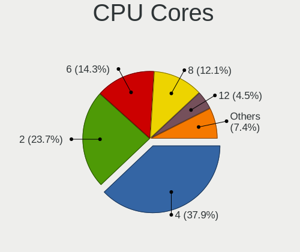

| Number | Desktops | Percent |
|--------|----------|---------|
| 4      | 223      | 38.65%  |
| 2      | 131      | 22.7%   |
| 6      | 88       | 15.25%  |
| 8      | 63       | 10.92%  |
| 12     | 29       | 5.03%   |
| 3      | 12       | 2.08%   |
| 16     | 11       | 1.91%   |
| 10     | 10       | 1.73%   |
| 1      | 5        | 0.87%   |
| 32     | 2        | 0.35%   |
| 28     | 1        | 0.17%   |
| 24     | 1        | 0.17%   |
| 14     | 1        | 0.17%   |

CPU Sockets
-----------

Number of sockets

| Number | Desktops | Percent |
|--------|----------|---------|
| 1      | 566      | 98.09%  |
| 2      | 11       | 1.91%   |

CPU Threads
-----------

Threads per core (Hyper-Threading)

| Number | Desktops | Percent |
|--------|----------|---------|
| 2      | 336      | 58.13%  |
| 1      | 242      | 41.87%  |

CPU Op-Modes
------------

CPU Operation Modes (32-bit, 64-bit)

| Op mode        | Desktops | Percent |
|----------------|----------|---------|
| 32-bit, 64-bit | 577      | 100%    |

CPU Microcode
-------------

Microcode number

| Number     | Desktops | Percent |
|------------|----------|---------|
| Unknown    | 400      | 68.14%  |
| 0x306c3    | 15       | 2.56%   |
| 0x906ea    | 12       | 2.04%   |
| 0x90672    | 12       | 2.04%   |
| 0x306a9    | 9        | 1.53%   |
| 0x206a7    | 9        | 1.53%   |
| 0x906e9    | 7        | 1.19%   |
| 0x08701013 | 7        | 1.19%   |
| 0x506e3    | 6        | 1.02%   |
| 0x1067a    | 6        | 1.02%   |
| 0x0a201016 | 6        | 1.02%   |
| 0x0a201009 | 6        | 1.02%   |
| 0x08701021 | 6        | 1.02%   |
| 0x06000852 | 6        | 1.02%   |
| 0xa0671    | 5        | 0.85%   |
| 0xa0655    | 5        | 0.85%   |
| 0x906ed    | 5        | 0.85%   |
| 0x0a50000c | 5        | 0.85%   |
| 0x08108109 | 4        | 0.68%   |
| 0x206d7    | 3        | 0.51%   |
| 0x106a5    | 3        | 0.51%   |
| 0x0800820d | 3        | 0.51%   |
| 0x08001138 | 3        | 0.51%   |
| 0x706a8    | 2        | 0.34%   |
| 0x50654    | 2        | 0.34%   |
| 0x306f2    | 2        | 0.34%   |
| 0x306d4    | 2        | 0.34%   |
| 0x206c2    | 2        | 0.34%   |
| 0x10677    | 2        | 0.34%   |
| 0x0a201204 | 2        | 0.34%   |
| 0x08600103 | 2        | 0.34%   |
| 0x0600063e | 2        | 0.34%   |
| 0x010000dc | 2        | 0.34%   |
| 0x010000db | 2        | 0.34%   |
| 0xf65      | 1        | 0.17%   |
| 0xf47      | 1        | 0.17%   |
| 0xa0653    | 1        | 0.17%   |
| 0x906ec    | 1        | 0.17%   |
| 0x906eb    | 1        | 0.17%   |
| 0x706a1    | 1        | 0.17%   |
| 0x6fd      | 1        | 0.17%   |
| 0x6fb      | 1        | 0.17%   |
| 0x506e8    | 1        | 0.17%   |
| 0x406c3    | 1        | 0.17%   |
| 0x306e4    | 1        | 0.17%   |
| 0x106a4    | 1        | 0.17%   |
| 0x10676    | 1        | 0.17%   |
| 0x0a50000b | 1        | 0.17%   |
| 0x0830104d | 1        | 0.17%   |
| 0x08108102 | 1        | 0.17%   |
| 0x08001137 | 1        | 0.17%   |
| 0x0600611a | 1        | 0.17%   |
| 0x06006118 | 1        | 0.17%   |
| 0x06003106 | 1        | 0.17%   |
| 0x010000c8 | 1        | 0.17%   |
| 0x010000c7 | 1        | 0.17%   |

CPU Microarch
-------------

Microarchitecture

| Name             | Desktops | Percent |
|------------------|----------|---------|
| Haswell          | 69       | 11.96%  |
| KabyLake         | 62       | 10.75%  |
| IvyBridge        | 49       | 8.49%   |
| Penryn           | 43       | 7.45%   |
| Zen 2            | 40       | 6.93%   |
| SandyBridge      | 37       | 6.41%   |
| Zen 3            | 36       | 6.24%   |
| Piledriver       | 30       | 5.2%    |
| K10              | 27       | 4.68%   |
| Zen+             | 25       | 4.33%   |
| Skylake          | 25       | 4.33%   |
| CometLake        | 19       | 3.29%   |
| Zen              | 18       | 3.12%   |
| Core             | 15       | 2.6%    |
| Nehalem          | 13       | 2.25%   |
| Alderlake Hybrid | 11       | 1.91%   |
| Westmere         | 10       | 1.73%   |
| Unknown          | 7        | 1.21%   |
| Broadwell        | 6        | 1.04%   |
| K8 Hammer        | 5        | 0.87%   |
| Icelake          | 5        | 0.87%   |
| Goldmont plus    | 5        | 0.87%   |
| Excavator        | 5        | 0.87%   |
| Silvermont       | 3        | 0.52%   |
| NetBurst         | 3        | 0.52%   |
| Bulldozer        | 3        | 0.52%   |
| Bonnell          | 3        | 0.52%   |
| Steamroller      | 1        | 0.17%   |
| Puma             | 1        | 0.17%   |
| K10 Llano        | 1        | 0.17%   |

Graphics
--------

GPU Vendor
----------

Vendors of graphics cards

| Vendor                                       | Desktops | Percent |
|----------------------------------------------|----------|---------|
| Nvidia                                       | 245      | 40.83%  |
| AMD                                          | 178      | 29.67%  |
| Intel                                        | 176      | 29.33%  |
| XGI Technology (eXtreme Graphics Innovation) | 1        | 0.17%   |

GPU Model
---------

Graphics card models

| Model                                                                                    | Desktops | Percent |
|------------------------------------------------------------------------------------------|----------|---------|
| Intel Xeon E3-1200 v3/4th Gen Core Processor Integrated Graphics Controller              | 29       | 4.74%   |
| Nvidia GK208B [GeForce GT 710]                                                           | 18       | 2.94%   |
| Intel Xeon E3-1200 v2/3rd Gen Core processor Graphics Controller                         | 17       | 2.78%   |
| AMD Ellesmere [Radeon RX 470/480/570/570X/580/580X/590]                                  | 16       | 2.61%   |
| Intel CoffeeLake-S GT2 [UHD Graphics 630]                                                | 15       | 2.45%   |
| Intel 2nd Generation Core Processor Family Integrated Graphics Controller                | 14       | 2.29%   |
| AMD Picasso/Raven 2 [Radeon Vega Series / Radeon Vega Mobile Series]                     | 12       | 1.96%   |
| AMD Cezanne                                                                              | 12       | 1.96%   |
| Nvidia GK208B [GeForce GT 730]                                                           | 11       | 1.8%    |
| Intel AlderLake-S GT1                                                                    | 11       | 1.8%    |
| Intel 4 Series Chipset Integrated Graphics Controller                                    | 11       | 1.8%    |
| Intel IvyBridge GT2 [HD Graphics 4000]                                                   | 10       | 1.63%   |
| Intel HD Graphics 530                                                                    | 10       | 1.63%   |
| Nvidia GP108 [GeForce GT 1030]                                                           | 9        | 1.47%   |
| Nvidia GP107 [GeForce GTX 1050 Ti]                                                       | 9        | 1.47%   |
| Intel HD Graphics 630                                                                    | 9        | 1.47%   |
| Intel 4th Generation Core Processor Family Integrated Graphics Controller                | 9        | 1.47%   |
| Nvidia GT218 [GeForce 210]                                                               | 8        | 1.31%   |
| AMD Navi 10 [Radeon RX 5600 OEM/5600 XT / 5700/5700 XT]                                  | 8        | 1.31%   |
| AMD Cedar [Radeon HD 5000/6000/7350/8350 Series]                                         | 8        | 1.31%   |
| Nvidia GP106 [GeForce GTX 1060 6GB]                                                      | 7        | 1.14%   |
| Nvidia GM206 [GeForce GTX 960]                                                           | 7        | 1.14%   |
| Intel CometLake-S GT2 [UHD Graphics 630]                                                 | 7        | 1.14%   |
| Nvidia TU102 [GeForce RTX 2080 Ti Rev. A]                                                | 6        | 0.98%   |
| Nvidia GP107 [GeForce GTX 1050]                                                          | 6        | 0.98%   |
| Nvidia GP106 [GeForce GTX 1060 3GB]                                                      | 6        | 0.98%   |
| Nvidia GF119 [GeForce GT 610]                                                            | 6        | 0.98%   |
| Nvidia TU104 [GeForce RTX 2070 SUPER]                                                    | 5        | 0.82%   |
| Nvidia GF108 [GeForce GT 730]                                                            | 5        | 0.82%   |
| Intel GeminiLake [UHD Graphics 600]                                                      | 5        | 0.82%   |
| AMD RS780L [Radeon 3000]                                                                 | 5        | 0.82%   |
| AMD Navi 21 [Radeon RX 6800/6800 XT / 6900 XT]                                           | 5        | 0.82%   |
| AMD Navi 14 [Radeon RX 5500/5500M / Pro 5500M]                                           | 5        | 0.82%   |
| AMD Lexa PRO [Radeon 540/540X/550/550X / RX 540X/550/550X]                               | 5        | 0.82%   |
| AMD Caicos [Radeon HD 6450/7450/8450 / R5 230 OEM]                                       | 5        | 0.82%   |
| Nvidia GP104 [GeForce GTX 1080]                                                          | 4        | 0.65%   |
| Nvidia GP104 [GeForce GTX 1070]                                                          | 4        | 0.65%   |
| Nvidia GM204 [GeForce GTX 970]                                                           | 4        | 0.65%   |
| Nvidia GK107 [GeForce GTX 650]                                                           | 4        | 0.65%   |
| AMD Richland [Radeon HD 8570D]                                                           | 4        | 0.65%   |
| AMD Raven Ridge [Radeon Vega Series / Radeon Vega Mobile Series]                         | 4        | 0.65%   |
| Nvidia TU116 [GeForce GTX 1660]                                                          | 3        | 0.49%   |
| Nvidia TU116 [GeForce GTX 1660 SUPER]                                                    | 3        | 0.49%   |
| Nvidia TU106 [GeForce RTX 2060 SUPER]                                                    | 3        | 0.49%   |
| Nvidia TU104 [GeForce RTX 2080 SUPER]                                                    | 3        | 0.49%   |
| Nvidia GT218 [GeForce 8400 GS Rev. 3]                                                    | 3        | 0.49%   |
| Nvidia GP102 [GeForce GTX 1080 Ti]                                                       | 3        | 0.49%   |
| Nvidia GM107 [GeForce GTX 750 Ti]                                                        | 3        | 0.49%   |
| Nvidia GK110 [GeForce GTX 780]                                                           | 3        | 0.49%   |
| Nvidia GK107 [GeForce GT 640]                                                            | 3        | 0.49%   |
| Nvidia GF119 [GeForce GT 520]                                                            | 3        | 0.49%   |
| Nvidia GF108GL [Quadro 600]                                                              | 3        | 0.49%   |
| Nvidia GA104 [GeForce RTX 3060 Ti Lite Hash Rate]                                        | 3        | 0.49%   |
| Nvidia G98 [GeForce 8400 GS Rev. 2]                                                      | 3        | 0.49%   |
| Intel RocketLake-S GT1 [UHD Graphics 750]                                                | 3        | 0.49%   |
| Intel CometLake-S GT1 [UHD Graphics 610]                                                 | 3        | 0.49%   |
| Intel Atom/Celeron/Pentium Processor x5-E8000/J3xxx/N3xxx Integrated Graphics Controller | 3        | 0.49%   |
| AMD Tobago PRO [Radeon R7 360 / R9 360 OEM]                                              | 3        | 0.49%   |
| AMD RV730 PRO [Radeon HD 4650]                                                           | 3        | 0.49%   |
| AMD RS880 [Radeon HD 4200]                                                               | 3        | 0.49%   |

GPU Combo
---------

Combinations of graphics cards

| Name           | Desktops | Percent |
|----------------|----------|---------|
| 1 x Nvidia     | 228      | 39.51%  |
| 1 x AMD        | 164      | 28.42%  |
| 1 x Intel      | 159      | 27.56%  |
| 2 x AMD        | 6        | 1.04%   |
| Intel + Nvidia | 6        | 1.04%   |
| 2 x Nvidia     | 5        | 0.87%   |
| Intel + AMD    | 4        | 0.69%   |
| AMD + Nvidia   | 4        | 0.69%   |
| 1 x XGI        | 1        | 0.17%   |

GPU Driver
----------

Free vs proprietary

| Driver      | Desktops | Percent |
|-------------|----------|---------|
| Free        | 410      | 70.45%  |
| Proprietary | 146      | 25.09%  |
| Unknown     | 26       | 4.47%   |

GPU Memory
----------

Total video memory

| Size in GB | Desktops | Percent |
|------------|----------|---------|
| Unknown    | 411      | 70.98%  |
| 1.01-2.0   | 48       | 8.29%   |
| 7.01-8.0   | 26       | 4.49%   |
| 0.51-1.0   | 25       | 4.32%   |
| 3.01-4.0   | 24       | 4.15%   |
| 0.01-0.5   | 14       | 2.42%   |
| 8.01-16.0  | 13       | 2.25%   |
| 5.01-6.0   | 10       | 1.73%   |
| 2.01-3.0   | 7        | 1.21%   |
| 16.01-24.0 | 1        | 0.17%   |

Monitor
-------

Monitor Vendor
--------------

Monitor vendors

| Vendor               | Desktops | Percent |
|----------------------|----------|---------|
| Samsung Electronics  | 101      | 16.72%  |
| Dell                 | 74       | 12.25%  |
| Goldstar             | 58       | 9.6%    |
| Acer                 | 38       | 6.29%   |
| Ancor Communications | 35       | 5.79%   |
| Philips              | 32       | 5.3%    |
| Hewlett-Packard      | 32       | 5.3%    |
| AOC                  | 27       | 4.47%   |
| BenQ                 | 23       | 3.81%   |
| ViewSonic            | 14       | 2.32%   |
| Lenovo               | 14       | 2.32%   |
| ASUSTek Computer     | 13       | 2.15%   |
| Iiyama               | 12       | 1.99%   |
| Unknown              | 11       | 1.82%   |
| Sony                 | 11       | 1.82%   |
| Medion               | 8        | 1.32%   |
| NEC Computers        | 7        | 1.16%   |
| Vizio                | 5        | 0.83%   |
| Fujitsu Siemens      | 5        | 0.83%   |
| Toshiba              | 4        | 0.66%   |
| MSI                  | 4        | 0.66%   |
| LG Electronics       | 4        | 0.66%   |
| Eizo                 | 4        | 0.66%   |
| Panasonic            | 3        | 0.5%    |
| Packard Bell         | 3        | 0.5%    |
| Hyundai ImageQuest   | 3        | 0.5%    |
| HJW                  | 3        | 0.5%    |
| HannStar             | 3        | 0.5%    |
| Compaq Computer      | 3        | 0.5%    |
| SKY                  | 2        | 0.33%   |
| Sceptre Tech         | 2        | 0.33%   |
| OEM                  | 2        | 0.33%   |
| CVT                  | 2        | 0.33%   |
| AUS                  | 2        | 0.33%   |
| ___                  | 1        | 0.17%   |
| Westinghouse         | 1        | 0.17%   |
| Wacom                | 1        | 0.17%   |
| VIZ                  | 1        | 0.17%   |
| VIE                  | 1        | 0.17%   |
| UGD                  | 1        | 0.17%   |
| Targa Visionary      | 1        | 0.17%   |
| Sun                  | 1        | 0.17%   |
| SHC                  | 1        | 0.17%   |
| Sceptre              | 1        | 0.17%   |
| Sanyo                | 1        | 0.17%   |
| SAC                  | 1        | 0.17%   |
| PZG                  | 1        | 0.17%   |
| PKB                  | 1        | 0.17%   |
| ONN                  | 1        | 0.17%   |
| NVISION              | 1        | 0.17%   |
| NUL                  | 1        | 0.17%   |
| MStar                | 1        | 0.17%   |
| LYC                  | 1        | 0.17%   |
| Lenovo Group Limited | 1        | 0.17%   |
| LED                  | 1        | 0.17%   |
| KAT                  | 1        | 0.17%   |
| IPS                  | 1        | 0.17%   |
| Hitachi              | 1        | 0.17%   |
| HIC                  | 1        | 0.17%   |
| HannStar Display     | 1        | 0.17%   |

Monitor Model
-------------

Monitor models

| Model                                                                 | Desktops | Percent |
|-----------------------------------------------------------------------|----------|---------|
| Philips PHL 223V5 PHLC0CF 1920x1080 477x268mm 21.5-inch               | 6        | 0.94%   |
| Samsung Electronics C27F390 SAM0D32 1920x1080 598x336mm 27.0-inch     | 4        | 0.63%   |
| Samsung Electronics C24F390 SAM0D2C 1920x1080 521x293mm 23.5-inch     | 4        | 0.63%   |
| Goldstar Ultra HD GSM5B09 3840x2160 600x340mm 27.2-inch               | 4        | 0.63%   |
| Goldstar 2D FHD TV GSM59C6 1920x1080 509x286mm 23.0-inch              | 4        | 0.63%   |
| ASUSTek Computer VP278 AUS27AE 1920x1080 598x336mm 27.0-inch          | 4        | 0.63%   |
| AOC Q27P1B AOC2701 2560x1440 597x336mm 27.0-inch                      | 4        | 0.63%   |
| Samsung Electronics U28E590 SAM0C4D 3840x2160 607x345mm 27.5-inch     | 3        | 0.47%   |
| Philips LCD Monitor FTV 1920x1080                                     | 3        | 0.47%   |
| Goldstar FULL HD GSM5B55 1920x1080 480x270mm 21.7-inch                | 3        | 0.47%   |
| Dell 1908FP DEL4025 1280x1024 376x301mm 19.0-inch                     | 3        | 0.47%   |
| Ancor Communications ASUS VS247 ACI249A 1920x1080 521x293mm 23.5-inch | 3        | 0.47%   |
| Ancor Communications ASUS VP228 ACI22C3 1920x1080 476x268mm 21.5-inch | 3        | 0.47%   |
| Acer K242HL ACR03E3 1920x1080 531x299mm 24.0-inch                     | 3        | 0.47%   |
| ViewSonic VA703-3Series VSC631E 1280x1024 338x270mm 17.0-inch         | 2        | 0.31%   |
| ViewSonic PF790-2 VSC4500 1600x1200 353x265mm 17.4-inch               | 2        | 0.31%   |
| Unknown LCD Monitor SAMSUNG 1920x1080                                 | 2        | 0.31%   |
| Samsung Electronics SyncMaster SAM0524 1920x1080 480x270mm 21.7-inch  | 2        | 0.31%   |
| Samsung Electronics SyncMaster SAM0285 1440x900 410x257mm 19.1-inch   | 2        | 0.31%   |
| Samsung Electronics C27FG7x SAM0E41 1920x1080 598x337mm 27.0-inch     | 2        | 0.31%   |
| Philips PHL 274E5 PHLC0C8 1920x1080 598x336mm 27.0-inch               | 2        | 0.31%   |
| Philips 220XW PHLC01B 1680x1050 474x297mm 22.0-inch                   | 2        | 0.31%   |
| Panasonic TV MEIA296 3840x2160 698x392mm 31.5-inch                    | 2        | 0.31%   |
| OEM 22_LCD_TV OEM3700 1920x540                                        | 2        | 0.31%   |
| NEC Computers EA223WM NEC6890 1680x1050 474x296mm 22.0-inch           | 2        | 0.31%   |
| MSI Optix MAG27C MSI1462 1920x1080 598x336mm 27.0-inch                | 2        | 0.31%   |
| Lenovo L192 Wide LEN6920 1440x900 408x255mm 18.9-inch                 | 2        | 0.31%   |
| HJW MACROSILICON HJW1836 1680x1050 530x290mm 23.8-inch                | 2        | 0.31%   |
| Hewlett-Packard LE1901w HWP2842 1440x900 410x256mm 19.0-inch          | 2        | 0.31%   |
| Hewlett-Packard LA2205 HWP2848 1680x1050 473x296mm 22.0-inch          | 2        | 0.31%   |
| Goldstar W2442 GSM56CC 1920x1080 531x299mm 24.0-inch                  | 2        | 0.31%   |
| Goldstar ULTRAWIDE GSM76F9 2560x1080 531x298mm 24.0-inch              | 2        | 0.31%   |
| Goldstar LG HDR WFHD GSM7714 2560x1080 800x340mm 34.2-inch            | 2        | 0.31%   |
| Dell U2415 DELA0B8 1920x1200 518x324mm 24.1-inch                      | 2        | 0.31%   |
| Dell U2412M DELA07A 1920x1200 518x324mm 24.1-inch                     | 2        | 0.31%   |
| Dell P2719H DEL4184 1920x1080 598x336mm 27.0-inch                     | 2        | 0.31%   |
| Dell P2219H DELA114 1920x1080 476x267mm 21.5-inch                     | 2        | 0.31%   |
| Dell E2020H DELA15A 1600x900 430x240mm 19.4-inch                      | 2        | 0.31%   |
| Dell AW3418DW DELA0FA 3440x1440 798x335mm 34.1-inch                   | 2        | 0.31%   |
| Dell 1704FPV DEL3015 1280x1024 338x270mm 17.0-inch                    | 2        | 0.31%   |
| CVT CVTE TV CVT0003 1360x768 575x323mm 26.0-inch                      | 2        | 0.31%   |
| Compaq Computer Compaq Q1859 CPQ2826 1366x768 410x230mm 18.5-inch     | 2        | 0.31%   |
| BenQ GW2270 BNQ78DB 1920x1080 476x268mm 21.5-inch                     | 2        | 0.31%   |
| BenQ GL2580 BNQ78E5 1920x1080 544x303mm 24.5-inch                     | 2        | 0.31%   |
| BenQ GL2450H BNQ78A7 1920x1080 531x298mm 24.0-inch                    | 2        | 0.31%   |
| ASUSTek Computer VZ239 AUS23CC 1920x1080 509x286mm 23.0-inch          | 2        | 0.31%   |
| ASUSTek Computer VP28U AUS28B1 3840x2160 621x341mm 27.9-inch          | 2        | 0.31%   |
| ASUSTek Computer VG27A AUS2722 2560x1440 597x336mm 27.0-inch          | 2        | 0.31%   |
| AOC Q27G2WG4 AOC2702 2560x1440 597x336mm 27.0-inch                    | 2        | 0.31%   |
| AOC 2470W AOC2470 1920x1080 521x293mm 23.5-inch                       | 2        | 0.31%   |
| AOC 2460G5 AOC246A 1920x1080 531x299mm 24.0-inch                      | 2        | 0.31%   |
| Ancor Communications ASUS VW247 ACI2496 1920x1080 531x299mm 24.0-inch | 2        | 0.31%   |
| Ancor Communications ASUS VS228 ACI22FD 1920x1080 480x270mm 21.7-inch | 2        | 0.31%   |
| Ancor Communications ASUS VN247 ACI24C3 1920x1080 521x293mm 23.5-inch | 2        | 0.31%   |
| Acer K272HL ACR0523 1920x1080 600x340mm 27.2-inch                     | 2        | 0.31%   |
| ___ LCDTV16 ___0101 1360x768                                          | 1        | 0.16%   |
| Westinghouse LTV-19w6 WDE1906 1440x900 408x255mm 18.9-inch            | 1        | 0.16%   |
| Wacom Cintiq21UX WAC1014 1600x1200 432x324mm 21.3-inch                | 1        | 0.16%   |
| Vizio E500i-A0 VIZ0092 1920x1080 1096x616mm 49.5-inch                 | 1        | 0.16%   |
| Vizio E40-D0 VIZ2001 1920x1080 885x498mm 40.0-inch                    | 1        | 0.16%   |

Monitor Resolution
------------------

Monitor screen resolution

| Resolution         | Desktops | Percent |
|--------------------|----------|---------|
| 1920x1080 (FHD)    | 266      | 44.86%  |
| 3840x2160 (4K)     | 55       | 9.27%   |
| 1280x1024 (SXGA)   | 42       | 7.08%   |
| 1680x1050 (WSXGA+) | 38       | 6.41%   |
| 2560x1440 (QHD)    | 37       | 6.24%   |
| 1440x900 (WXGA+)   | 21       | 3.54%   |
| 1920x1200 (WUXGA)  | 20       | 3.37%   |
| 1600x900 (HD+)     | 15       | 2.53%   |
| Unknown            | 15       | 2.53%   |
| 1366x768 (WXGA)    | 14       | 2.36%   |
| 2560x1080          | 12       | 2.02%   |
| 3440x1440          | 11       | 1.85%   |
| 1360x768           | 11       | 1.85%   |
| 3840x1080          | 7        | 1.18%   |
| 1600x1200          | 4        | 0.67%   |
| 2560x1600          | 3        | 0.51%   |
| 1920x540           | 3        | 0.51%   |
| 1024x768 (XGA)     | 3        | 0.51%   |
| 4480x1440          | 2        | 0.34%   |
| 3200x1080          | 2        | 0.34%   |
| 1400x1050          | 2        | 0.34%   |
| 1280x720 (HD)      | 2        | 0.34%   |
| 5520x2160          | 1        | 0.17%   |
| 4480x1080          | 1        | 0.17%   |
| 3840x1600          | 1        | 0.17%   |
| 3360x1200          | 1        | 0.17%   |
| 3360x1050          | 1        | 0.17%   |
| 2288x1287          | 1        | 0.17%   |
| 1360x765           | 1        | 0.17%   |
| 1280x768           | 1        | 0.17%   |

Monitor Diagonal
----------------

Diagonal size in inches

| Inches  | Desktops | Percent |
|---------|----------|---------|
| 27      | 88       | 14.92%  |
| 23      | 72       | 12.2%   |
| 24      | 70       | 11.86%  |
| 21      | 66       | 11.19%  |
| Unknown | 57       | 9.66%   |
| 19      | 36       | 6.1%    |
| 22      | 27       | 4.58%   |
| 17      | 26       | 4.41%   |
| 18      | 22       | 3.73%   |
| 34      | 18       | 3.05%   |
| 31      | 18       | 3.05%   |
| 20      | 15       | 2.54%   |
| 84      | 9        | 1.53%   |
| 72      | 9        | 1.53%   |
| 40      | 8        | 1.36%   |
| 26      | 7        | 1.19%   |
| 15      | 6        | 1.02%   |
| 32      | 5        | 0.85%   |
| 54      | 3        | 0.51%   |
| 65      | 2        | 0.34%   |
| 49      | 2        | 0.34%   |
| 33      | 2        | 0.34%   |
| 30      | 2        | 0.34%   |
| 28      | 2        | 0.34%   |
| 142     | 1        | 0.17%   |
| 75      | 1        | 0.17%   |
| 74      | 1        | 0.17%   |
| 64      | 1        | 0.17%   |
| 63      | 1        | 0.17%   |
| 60      | 1        | 0.17%   |
| 59      | 1        | 0.17%   |
| 57      | 1        | 0.17%   |
| 52      | 1        | 0.17%   |
| 48      | 1        | 0.17%   |
| 46      | 1        | 0.17%   |
| 42      | 1        | 0.17%   |
| 38      | 1        | 0.17%   |
| 37      | 1        | 0.17%   |
| 36      | 1        | 0.17%   |
| 29      | 1        | 0.17%   |
| 14      | 1        | 0.17%   |
| 12      | 1        | 0.17%   |

Monitor Width
-------------

Physical width

| Width in mm    | Desktops | Percent |
|----------------|----------|---------|
| 501-600        | 215      | 37.59%  |
| 401-500        | 143      | 25%     |
| Unknown        | 57       | 9.97%   |
| 601-700        | 33       | 5.77%   |
| 301-350        | 28       | 4.9%    |
| 701-800        | 26       | 4.55%   |
| 351-400        | 22       | 3.85%   |
| 1501-2000      | 19       | 3.32%   |
| 1001-1500      | 15       | 2.62%   |
| 801-900        | 10       | 1.75%   |
| 201-300        | 2        | 0.35%   |
| More than 2000 | 1        | 0.17%   |
| 901-1000       | 1        | 0.17%   |

Aspect Ratio
------------

Proportional relationship between the width and the height

| Ratio   | Desktops | Percent |
|---------|----------|---------|
| 16/9    | 338      | 61.57%  |
| 16/10   | 78       | 14.21%  |
| Unknown | 52       | 9.47%   |
| 5/4     | 40       | 7.29%   |
| 21/9    | 22       | 4.01%   |
| 4/3     | 11       | 2%      |
| 3/2     | 4        | 0.73%   |
| 6/5     | 2        | 0.36%   |
| 1.00    | 2        | 0.36%   |

Monitor Area
------------

Area in inch

| Area in inch | Desktops | Percent |
|----------------|----------|---------|
| 201-250        | 193      | 33.16%  |
| 301-350        | 92       | 15.81%  |
| 151-200        | 72       | 12.37%  |
| Unknown        | 57       | 9.79%   |
| 351-500        | 47       | 8.08%   |
| 141-150        | 36       | 6.19%   |
| More than 1000 | 34       | 5.84%   |
| 251-300        | 29       | 4.98%   |
| 501-1000       | 13       | 2.23%   |
| 101-110        | 6        | 1.03%   |
| 71-80          | 1        | 0.17%   |
| 131-140        | 1        | 0.17%   |
| 91-100         | 1        | 0.17%   |

Pixel Density
-------------

Pixels per inch

| Density | Desktops | Percent |
|---------|----------|---------|
| 51-100  | 349      | 62.43%  |
| 101-120 | 98       | 17.53%  |
| Unknown | 57       | 10.2%   |
| 1-50    | 26       | 4.65%   |
| 121-160 | 19       | 3.4%    |
| 161-240 | 10       | 1.79%   |

Multiple Monitors
-----------------

Total monitors connected

| Total | Desktops | Percent |
|-------|----------|---------|
| 1     | 428      | 73.54%  |
| 2     | 107      | 18.38%  |
| 0     | 36       | 6.19%   |
| 3     | 11       | 1.89%   |

Network
-------

Net Controller Vendor
---------------------

Controller vendors

| Vendor                          | Desktops | Percent |
|---------------------------------|----------|---------|
| Realtek Semiconductor           | 356      | 43.52%  |
| Intel                           | 259      | 31.66%  |
| Qualcomm Atheros                | 52       | 6.36%   |
| Broadcom                        | 28       | 3.42%   |
| TP-Link                         | 25       | 3.06%   |
| Ralink Technology               | 13       | 1.59%   |
| Ralink                          | 8        | 0.98%   |
| Nvidia                          | 8        | 0.98%   |
| Marvell Technology Group        | 7        | 0.86%   |
| Microsoft                       | 6        | 0.73%   |
| Qualcomm Atheros Communications | 5        | 0.61%   |
| NetGear                         | 5        | 0.61%   |
| Aquantia                        | 5        | 0.61%   |
| Samsung Electronics             | 3        | 0.37%   |
| MediaTek                        | 3        | 0.37%   |
| Linksys                         | 3        | 0.37%   |
| Broadcom Limited                | 3        | 0.37%   |
| ASUSTek Computer                | 3        | 0.37%   |
| Micro Star International        | 2        | 0.24%   |
| DisplayLink                     | 2        | 0.24%   |
| D-Link System                   | 2        | 0.24%   |
| AVM                             | 2        | 0.24%   |
| Wacom                           | 1        | 0.12%   |
| VIA Technologies                | 1        | 0.12%   |
| Tenda                           | 1        | 0.12%   |
| STMicroelectronics              | 1        | 0.12%   |
| SILICON Laboratories            | 1        | 0.12%   |
| OPPO Electronics                | 1        | 0.12%   |
| Montage                         | 1        | 0.12%   |
| Microchip Technology            | 1        | 0.12%   |
| Manta                           | 1        | 0.12%   |
| JMicron Technology              | 1        | 0.12%   |
| IMC Networks                    | 1        | 0.12%   |
| Google                          | 1        | 0.12%   |
| GDMicroelectronics              | 1        | 0.12%   |
| Elecom                          | 1        | 0.12%   |
| D-Link                          | 1        | 0.12%   |
| Belkin Components               | 1        | 0.12%   |
| ASIX Electronics                | 1        | 0.12%   |
| Arduino SA                      | 1        | 0.12%   |

Net Controller Model
--------------------

Controller models

| Model                                                                         | Desktops | Percent |
|-------------------------------------------------------------------------------|----------|---------|
| Realtek RTL8111/8168/8411 PCI Express Gigabit Ethernet Controller             | 263      | 28.34%  |
| Realtek RTL8125 2.5GbE Controller                                             | 41       | 4.42%   |
| Intel Wi-Fi 6 AX200                                                           | 36       | 3.88%   |
| Intel I211 Gigabit Network Connection                                         | 34       | 3.66%   |
| Intel 82579LM Gigabit Network Connection (Lewisville)                         | 31       | 3.34%   |
| Intel Ethernet Connection (2) I219-V                                          | 27       | 2.91%   |
| Intel Ethernet Connection I217-LM                                             | 16       | 1.72%   |
| Intel Ethernet Connection (7) I219-V                                          | 16       | 1.72%   |
| Intel Ethernet Controller I225-V                                              | 14       | 1.51%   |
| Realtek RTL810xE PCI Express Fast Ethernet controller                         | 11       | 1.19%   |
| Intel Wi-Fi 6 AX210/AX211/AX411 160MHz                                        | 10       | 1.08%   |
| Intel Ethernet Connection (2) I218-V                                          | 10       | 1.08%   |
| Realtek RTL88x2bu [AC1200 Techkey]                                            | 9        | 0.97%   |
| Intel Dual Band Wireless-AC 3168NGW [Stone Peak]                              | 9        | 0.97%   |
| Intel 82579V Gigabit Network Connection                                       | 9        | 0.97%   |
| Realtek 802.11ac NIC                                                          | 8        | 0.86%   |
| Intel Ethernet Connection (2) I219-LM                                         | 8        | 0.86%   |
| Intel Alder Lake-S PCH CNVi WiFi                                              | 8        | 0.86%   |
| Realtek RTL8188EUS 802.11n Wireless Network Adapter                           | 7        | 0.75%   |
| Realtek RTL8169 PCI Gigabit Ethernet Controller                               | 7        | 0.75%   |
| Ralink MT7601U Wireless Adapter                                               | 7        | 0.75%   |
| Intel Wireless-AC 9260                                                        | 7        | 0.75%   |
| Intel Cannon Lake PCH CNVi WiFi                                               | 7        | 0.75%   |
| Intel 82567LM-3 Gigabit Network Connection                                    | 7        | 0.75%   |
| Broadcom BCM4360 802.11ac Wireless Network Adapter                            | 7        | 0.75%   |
| Realtek RTL8153 Gigabit Ethernet Adapter                                      | 6        | 0.65%   |
| Intel Ethernet Connection I217-V                                              | 6        | 0.65%   |
| Intel Ethernet Connection (14) I219-V                                         | 6        | 0.65%   |
| TP-Link TL-WN823N v2/v3 [Realtek RTL8192EU]                                   | 5        | 0.54%   |
| Realtek RTL8192CU 802.11n WLAN Adapter                                        | 5        | 0.54%   |
| Qualcomm Atheros Killer E220x Gigabit Ethernet Controller                     | 5        | 0.54%   |
| Qualcomm Atheros AR9271 802.11n                                               | 5        | 0.54%   |
| Qualcomm Atheros AR9485 Wireless Network Adapter                              | 5        | 0.54%   |
| Intel 82574L Gigabit Network Connection                                       | 5        | 0.54%   |
| Realtek RTL8821CE 802.11ac PCIe Wireless Network Adapter                      | 4        | 0.43%   |
| Realtek RTL8812AE 802.11ac PCIe Wireless Network Adapter                      | 4        | 0.43%   |
| Qualcomm Atheros QCA9565 / AR9565 Wireless Network Adapter                    | 4        | 0.43%   |
| Qualcomm Atheros Killer E2400 Gigabit Ethernet Controller                     | 4        | 0.43%   |
| Qualcomm Atheros AR8121/AR8113/AR8114 Gigabit or Fast Ethernet                | 4        | 0.43%   |
| Nvidia MCP61 Ethernet                                                         | 4        | 0.43%   |
| Intel Wireless 3165                                                           | 4        | 0.43%   |
| Intel 80003ES2LAN Gigabit Ethernet Controller (Copper)                        | 4        | 0.43%   |
| TP-Link Archer T3U [Realtek RTL8812BU]                                        | 3        | 0.32%   |
| Samsung Galaxy series, misc. (tethering mode)                                 | 3        | 0.32%   |
| Realtek RTL8188CUS 802.11n WLAN Adapter                                       | 3        | 0.32%   |
| Realtek RTL-8100/8101L/8139 PCI Fast Ethernet Adapter                         | 3        | 0.32%   |
| Realtek 802.11n                                                               | 3        | 0.32%   |
| Qualcomm Atheros Killer E2500 Gigabit Ethernet Controller                     | 3        | 0.32%   |
| Qualcomm Atheros AR9462 Wireless Network Adapter                              | 3        | 0.32%   |
| Qualcomm Atheros AR93xx Wireless Network Adapter                              | 3        | 0.32%   |
| Qualcomm Atheros AR9287 Wireless Network Adapter (PCI-Express)                | 3        | 0.32%   |
| Qualcomm Atheros AR8161 Gigabit Ethernet                                      | 3        | 0.32%   |
| Microsoft Xbox 360 Wireless Adapter                                           | 3        | 0.32%   |
| Marvell Group 88E8056 PCI-E Gigabit Ethernet Controller                       | 3        | 0.32%   |
| Intel Wireless 8260                                                           | 3        | 0.32%   |
| Intel Wireless 7265                                                           | 3        | 0.32%   |
| Intel Wireless 7260                                                           | 3        | 0.32%   |
| Intel Ethernet Connection (7) I219-LM                                         | 3        | 0.32%   |
| Intel Comet Lake PCH CNVi WiFi                                                | 3        | 0.32%   |
| Intel 82571EB/82571GB Gigabit Ethernet Controller D0/D1 (copper applications) | 3        | 0.32%   |

Wireless Vendor
---------------

Wireless vendors

| Vendor                          | Desktops | Percent |
|---------------------------------|----------|---------|
| Intel                           | 101      | 35.94%  |
| Realtek Semiconductor           | 61       | 21.71%  |
| Qualcomm Atheros                | 25       | 8.9%    |
| TP-Link                         | 24       | 8.54%   |
| Ralink Technology               | 13       | 4.63%   |
| Broadcom                        | 12       | 4.27%   |
| Ralink                          | 8        | 2.85%   |
| Microsoft                       | 6        | 2.14%   |
| Qualcomm Atheros Communications | 5        | 1.78%   |
| NetGear                         | 5        | 1.78%   |
| Linksys                         | 3        | 1.07%   |
| ASUSTek Computer                | 3        | 1.07%   |
| Micro Star International        | 2        | 0.71%   |
| MediaTek                        | 2        | 0.71%   |
| D-Link System                   | 2        | 0.71%   |
| AVM                             | 2        | 0.71%   |
| Wacom                           | 1        | 0.36%   |
| Tenda                           | 1        | 0.36%   |
| IMC Networks                    | 1        | 0.36%   |
| Elecom                          | 1        | 0.36%   |
| D-Link                          | 1        | 0.36%   |
| Broadcom Limited                | 1        | 0.36%   |
| Belkin Components               | 1        | 0.36%   |

Wireless Model
--------------

Wireless models

| Model                                                                      | Desktops | Percent |
|----------------------------------------------------------------------------|----------|---------|
| Intel Wi-Fi 6 AX200                                                        | 36       | 12.77%  |
| Intel Wi-Fi 6 AX210/AX211/AX411 160MHz                                     | 10       | 3.55%   |
| Realtek RTL88x2bu [AC1200 Techkey]                                         | 9        | 3.19%   |
| Intel Dual Band Wireless-AC 3168NGW [Stone Peak]                           | 9        | 3.19%   |
| Realtek 802.11ac NIC                                                       | 8        | 2.84%   |
| Intel Alder Lake-S PCH CNVi WiFi                                           | 8        | 2.84%   |
| Realtek RTL8188EUS 802.11n Wireless Network Adapter                        | 7        | 2.48%   |
| Ralink MT7601U Wireless Adapter                                            | 7        | 2.48%   |
| Intel Wireless-AC 9260                                                     | 7        | 2.48%   |
| Intel Cannon Lake PCH CNVi WiFi                                            | 7        | 2.48%   |
| Broadcom BCM4360 802.11ac Wireless Network Adapter                         | 7        | 2.48%   |
| TP-Link TL-WN823N v2/v3 [Realtek RTL8192EU]                                | 5        | 1.77%   |
| Realtek RTL8192CU 802.11n WLAN Adapter                                     | 5        | 1.77%   |
| Qualcomm Atheros AR9271 802.11n                                            | 5        | 1.77%   |
| Qualcomm Atheros AR9485 Wireless Network Adapter                           | 5        | 1.77%   |
| Realtek RTL8821CE 802.11ac PCIe Wireless Network Adapter                   | 4        | 1.42%   |
| Realtek RTL8812AE 802.11ac PCIe Wireless Network Adapter                   | 4        | 1.42%   |
| Qualcomm Atheros QCA9565 / AR9565 Wireless Network Adapter                 | 4        | 1.42%   |
| Intel Wireless 3165                                                        | 4        | 1.42%   |
| TP-Link Archer T3U [Realtek RTL8812BU]                                     | 3        | 1.06%   |
| Realtek RTL8188CUS 802.11n WLAN Adapter                                    | 3        | 1.06%   |
| Realtek 802.11n                                                            | 3        | 1.06%   |
| Qualcomm Atheros AR9462 Wireless Network Adapter                           | 3        | 1.06%   |
| Qualcomm Atheros AR93xx Wireless Network Adapter                           | 3        | 1.06%   |
| Qualcomm Atheros AR9287 Wireless Network Adapter (PCI-Express)             | 3        | 1.06%   |
| Microsoft Xbox 360 Wireless Adapter                                        | 3        | 1.06%   |
| Intel Wireless 8260                                                        | 3        | 1.06%   |
| Intel Wireless 7265                                                        | 3        | 1.06%   |
| Intel Wireless 7260                                                        | 3        | 1.06%   |
| Intel Comet Lake PCH CNVi WiFi                                             | 3        | 1.06%   |
| TP-Link TL-WN822N Version 4 RTL8192EU                                      | 2        | 0.71%   |
| TP-Link TL-WN722N v2/v3 [Realtek RTL8188EUS]                               | 2        | 0.71%   |
| TP-Link Archer T9UH v1 [Realtek RTL8814AU]                                 | 2        | 0.71%   |
| TP-Link Archer T4U ver.3                                                   | 2        | 0.71%   |
| TP-Link AC600 wireless Realtek RTL8811AU [Archer T2U Nano]                 | 2        | 0.71%   |
| TP-Link 802.11n NIC                                                        | 2        | 0.71%   |
| Realtek RTL8822BE 802.11a/b/g/n/ac WiFi adapter                            | 2        | 0.71%   |
| Realtek RTL8821AE 802.11ac PCIe Wireless Network Adapter                   | 2        | 0.71%   |
| Realtek RTL8814AU 802.11a/b/g/n/ac Wireless Adapter                        | 2        | 0.71%   |
| Realtek RTL8192CE PCIe Wireless Network Adapter                            | 2        | 0.71%   |
| Realtek RTL8188CE 802.11b/g/n WiFi Adapter                                 | 2        | 0.71%   |
| Ralink RT5372 Wireless Adapter                                             | 2        | 0.71%   |
| Ralink RT5370 Wireless Adapter                                             | 2        | 0.71%   |
| Ralink RT2800 802.11n PCI                                                  | 2        | 0.71%   |
| Ralink RT2561/RT61 802.11g PCI                                             | 2        | 0.71%   |
| Qualcomm Atheros QCA6174 802.11ac Wireless Network Adapter                 | 2        | 0.71%   |
| Microsoft Wireless XBox Controller Dongle                                  | 2        | 0.71%   |
| Micro Star International MS-3871 802.11bgn Wireless Module [Ralink RT8070] | 2        | 0.71%   |
| MediaTek MT7612U 802.11a/b/g/n/ac Wireless Adapter                         | 2        | 0.71%   |
| Linksys WUSB54GC v1 802.11g Adapter [Ralink RT73]                          | 2        | 0.71%   |
| Intel Gemini Lake PCH CNVi WiFi                                            | 2        | 0.71%   |
| D-Link System DWA-110 Wireless G Adapter(rev.A1) [Ralink RT2571W]          | 2        | 0.71%   |
| Broadcom Network controller                                                | 2        | 0.71%   |
| ASUS AC51 802.11a/b/g/n/ac Wireless Adapter [Mediatek MT7610U]             | 2        | 0.71%   |
| Wacom ACK-40401 [Wireless Accessory Kit]                                   | 1        | 0.35%   |
| TP-Link Archer T4U v2 [Realtek RTL8812AU]                                  | 1        | 0.35%   |
| TP-Link Archer T2U PLUS [RTL8821AU]                                        | 1        | 0.35%   |
| TP-Link 802.11ac WLAN Adapter                                              | 1        | 0.35%   |
| TP-Link 802.11ac NIC                                                       | 1        | 0.35%   |
| Tenda U12                                                                  | 1        | 0.35%   |

Ethernet Vendor
---------------

Ethernet vendors

| Vendor                   | Desktops | Percent |
|--------------------------|----------|---------|
| Realtek Semiconductor    | 329      | 52.64%  |
| Intel                    | 219      | 35.04%  |
| Qualcomm Atheros         | 27       | 4.32%   |
| Broadcom                 | 16       | 2.56%   |
| Nvidia                   | 8        | 1.28%   |
| Marvell Technology Group | 7        | 1.12%   |
| Aquantia                 | 5        | 0.8%    |
| Samsung Electronics      | 3        | 0.48%   |
| DisplayLink              | 2        | 0.32%   |
| Broadcom Limited         | 2        | 0.32%   |
| VIA Technologies         | 1        | 0.16%   |
| TP-Link                  | 1        | 0.16%   |
| OPPO Electronics         | 1        | 0.16%   |
| Microchip Technology     | 1        | 0.16%   |
| MediaTek                 | 1        | 0.16%   |
| JMicron Technology       | 1        | 0.16%   |
| ASIX Electronics         | 1        | 0.16%   |

Ethernet Model
--------------

Ethernet models

| Model                                                                         | Desktops | Percent |
|-------------------------------------------------------------------------------|----------|---------|
| Realtek RTL8111/8168/8411 PCI Express Gigabit Ethernet Controller             | 263      | 41.16%  |
| Realtek RTL8125 2.5GbE Controller                                             | 41       | 6.42%   |
| Intel I211 Gigabit Network Connection                                         | 34       | 5.32%   |
| Intel 82579LM Gigabit Network Connection (Lewisville)                         | 31       | 4.85%   |
| Intel Ethernet Connection (2) I219-V                                          | 27       | 4.23%   |
| Intel Ethernet Connection I217-LM                                             | 16       | 2.5%    |
| Intel Ethernet Connection (7) I219-V                                          | 16       | 2.5%    |
| Intel Ethernet Controller I225-V                                              | 14       | 2.19%   |
| Realtek RTL810xE PCI Express Fast Ethernet controller                         | 11       | 1.72%   |
| Intel Ethernet Connection (2) I218-V                                          | 10       | 1.56%   |
| Intel 82579V Gigabit Network Connection                                       | 9        | 1.41%   |
| Intel Ethernet Connection (2) I219-LM                                         | 8        | 1.25%   |
| Realtek RTL8169 PCI Gigabit Ethernet Controller                               | 7        | 1.1%    |
| Intel 82567LM-3 Gigabit Network Connection                                    | 7        | 1.1%    |
| Realtek RTL8153 Gigabit Ethernet Adapter                                      | 6        | 0.94%   |
| Intel Ethernet Connection I217-V                                              | 6        | 0.94%   |
| Intel Ethernet Connection (14) I219-V                                         | 6        | 0.94%   |
| Qualcomm Atheros Killer E220x Gigabit Ethernet Controller                     | 5        | 0.78%   |
| Intel 82574L Gigabit Network Connection                                       | 5        | 0.78%   |
| Qualcomm Atheros Killer E2400 Gigabit Ethernet Controller                     | 4        | 0.63%   |
| Qualcomm Atheros AR8121/AR8113/AR8114 Gigabit or Fast Ethernet                | 4        | 0.63%   |
| Nvidia MCP61 Ethernet                                                         | 4        | 0.63%   |
| Intel 80003ES2LAN Gigabit Ethernet Controller (Copper)                        | 4        | 0.63%   |
| Samsung Galaxy series, misc. (tethering mode)                                 | 3        | 0.47%   |
| Realtek RTL-8100/8101L/8139 PCI Fast Ethernet Adapter                         | 3        | 0.47%   |
| Qualcomm Atheros Killer E2500 Gigabit Ethernet Controller                     | 3        | 0.47%   |
| Qualcomm Atheros AR8161 Gigabit Ethernet                                      | 3        | 0.47%   |
| Marvell Group 88E8056 PCI-E Gigabit Ethernet Controller                       | 3        | 0.47%   |
| Intel Ethernet Connection (7) I219-LM                                         | 3        | 0.47%   |
| Intel 82571EB/82571GB Gigabit Ethernet Controller D0/D1 (copper applications) | 3        | 0.47%   |
| Intel 82566DM-2 Gigabit Network Connection                                    | 3        | 0.47%   |
| Broadcom NetXtreme BCM5764M Gigabit Ethernet PCIe                             | 3        | 0.47%   |
| Qualcomm Atheros QCA8171 Gigabit Ethernet                                     | 2        | 0.31%   |
| Qualcomm Atheros AR8151 v2.0 Gigabit Ethernet                                 | 2        | 0.31%   |
| Nvidia MCP51 Ethernet Controller                                              | 2        | 0.31%   |
| Intel I210 Gigabit Network Connection                                         | 2        | 0.31%   |
| Intel Ethernet Connection (5) I219-LM                                         | 2        | 0.31%   |
| Intel Ethernet Connection (2) I218-LM                                         | 2        | 0.31%   |
| Intel Ethernet Connection (11) I219-V                                         | 2        | 0.31%   |
| Intel 82576 Gigabit Network Connection                                        | 2        | 0.31%   |
| Intel 82567V-2 Gigabit Network Connection                                     | 2        | 0.31%   |
| Intel 82567LF-2 Gigabit Network Connection                                    | 2        | 0.31%   |
| Intel 82562V-2 10/100 Network Connection                                      | 2        | 0.31%   |
| Broadcom NetXtreme BCM5754 Gigabit Ethernet PCI Express                       | 2        | 0.31%   |
| Broadcom NetXtreme BCM5719 Gigabit Ethernet PCIe                              | 2        | 0.31%   |
| Broadcom NetLink BCM57781 Gigabit Ethernet PCIe                               | 2        | 0.31%   |
| Aquantia AQC111 NBase-T/IEEE 802.3bz Ethernet Controller [AQtion]             | 2        | 0.31%   |
| Aquantia AQC107 NBase-T/IEEE 802.3bz Ethernet Controller [AQtion]             | 2        | 0.31%   |
| VIA VT6102/VT6103 [Rhine-II]                                                  | 1        | 0.16%   |
| TP-Link UE300 10/100/1000 LAN (ethernet mode) [Realtek RTL8153]               | 1        | 0.16%   |
| Realtek Killer E2600 Gigabit Ethernet Controller                              | 1        | 0.16%   |
| Qualcomm Atheros Attansic L2 Fast Ethernet                                    | 1        | 0.16%   |
| Qualcomm Atheros Attansic L1 Gigabit Ethernet                                 | 1        | 0.16%   |
| Qualcomm Atheros AR8152 v2.0 Fast Ethernet                                    | 1        | 0.16%   |
| Qualcomm Atheros AR8131 Gigabit Ethernet                                      | 1        | 0.16%   |
| OPPO RMX2001                                                                  | 1        | 0.16%   |
| Nvidia MCP79 Ethernet                                                         | 1        | 0.16%   |
| Nvidia MCP55 Ethernet                                                         | 1        | 0.16%   |
| Microchip LAN9500A/LAN9500Ai                                                  | 1        | 0.16%   |
| MediaTek U FEEL                                                               | 1        | 0.16%   |

Net Controller Kind
-------------------

Ethernet, WiFi or modem

| Kind     | Desktops | Percent |
|----------|----------|---------|
| Ethernet | 572      | 67.85%  |
| WiFi     | 264      | 31.32%  |
| Modem    | 5        | 0.59%   |
| Unknown  | 2        | 0.24%   |

Used Controller
---------------

Currently used network controller

| Kind     | Desktops | Percent |
|----------|----------|---------|
| Ethernet | 506      | 71.47%  |
| WiFi     | 202      | 28.53%  |

NICs
----

Total network controllers on board

| Total | Desktops | Percent |
|-------|----------|---------|
| 1     | 365      | 63.26%  |
| 2     | 171      | 29.64%  |
| 3     | 34       | 5.89%   |
| 0     | 3        | 0.52%   |
| 5     | 2        | 0.35%   |
| 6     | 1        | 0.17%   |
| 4     | 1        | 0.17%   |

IPv6
----

IPv6 vs IPv4

| Used | Desktops | Percent |
|------|----------|---------|
| No   | 374      | 64.15%  |
| Yes  | 209      | 35.85%  |

Bluetooth
---------

Bluetooth Vendor
----------------

Controller vendors

| Vendor                          | Desktops | Percent |
|---------------------------------|----------|---------|
| Intel                           | 88       | 44.44%  |
| Cambridge Silicon Radio         | 52       | 26.26%  |
| Realtek Semiconductor           | 17       | 8.59%   |
| ASUSTek Computer                | 14       | 7.07%   |
| Qualcomm Atheros Communications | 10       | 5.05%   |
| Broadcom                        | 6        | 3.03%   |
| Micro Star International        | 2        | 1.01%   |
| Edimax Technology               | 2        | 1.01%   |
| Belkin Components               | 2        | 1.01%   |
| Apple                           | 2        | 1.01%   |
| TP-Link                         | 1        | 0.51%   |
| Integrated System Solution      | 1        | 0.51%   |
| IMC Networks                    | 1        | 0.51%   |

Bluetooth Model
---------------

Controller models

| Model                                                 | Desktops | Percent |
|-------------------------------------------------------|----------|---------|
| Cambridge Silicon Radio Bluetooth Dongle (HCI mode)   | 52       | 26.26%  |
| Intel AX200 Bluetooth                                 | 33       | 16.67%  |
| Intel Bluetooth wireless interface                    | 15       | 7.58%   |
| Realtek Bluetooth Radio                               | 12       | 6.06%   |
| Intel Bluetooth Device                                | 10       | 5.05%   |
| Intel Bluetooth 9460/9560 Jefferson Peak (JfP)        | 9        | 4.55%   |
| Intel AX210 Bluetooth                                 | 9        | 4.55%   |
| Intel Wireless-AC 3168 Bluetooth                      | 7        | 3.54%   |
| Intel AX201 Bluetooth                                 | 5        | 2.53%   |
| Broadcom BCM20702A0 Bluetooth 4.0                     | 5        | 2.53%   |
| Qualcomm Atheros  Bluetooth Device                    | 4        | 2.02%   |
| ASUS Broadcom BCM20702A0 Bluetooth                    | 4        | 2.02%   |
| ASUS ASUS USB-BT500                                   | 4        | 2.02%   |
| Realtek  Bluetooth 4.2 Adapter                        | 3        | 1.52%   |
| Qualcomm Atheros Bluetooth USB Host Controller        | 3        | 1.52%   |
| Realtek RTL8821A Bluetooth                            | 2        | 1.01%   |
| Micro Star International Bluetooth Device             | 2        | 1.01%   |
| Edimax Bluetooth Adapter                              | 2        | 1.01%   |
| ASUS Broadcom BCM20702 Single-Chip Bluetooth 4.0 + LE | 2        | 1.01%   |
| ASUS Bluetooth Radio                                  | 2        | 1.01%   |
| Apple Bluetooth HCI                                   | 2        | 1.01%   |
| TP-Link UB500 Adapter                                 | 1        | 0.51%   |
| Qualcomm Atheros QCA61x4 Bluetooth 4.0                | 1        | 0.51%   |
| Qualcomm Atheros AR9462 Bluetooth                     | 1        | 0.51%   |
| Qualcomm Atheros AR3011 Bluetooth                     | 1        | 0.51%   |
| Integrated System Solution Bluetooth Device           | 1        | 0.51%   |
| IMC Networks Bluetooth Radio                          | 1        | 0.51%   |
| Broadcom BCM2045 Bluetooth                            | 1        | 0.51%   |
| Belkin Components F8T065BF Mini Bluetooth 4.0 Adapter | 1        | 0.51%   |
| Belkin Components F8T001v2 Bluetooth                  | 1        | 0.51%   |
| ASUS Qualcomm Bluetooth 4.1                           | 1        | 0.51%   |
| ASUS Bluetooth Adapter                                | 1        | 0.51%   |

Sound
-----

Sound Vendor
------------

Sound card vendors

| Vendor                     | Desktops | Percent |
|----------------------------|----------|---------|
| Intel                      | 358      | 37.45%  |
| AMD                        | 237      | 24.79%  |
| Nvidia                     | 232      | 24.27%  |
| Creative Labs              | 23       | 2.41%   |
| C-Media Electronics        | 20       | 2.09%   |
| Logitech                   | 12       | 1.26%   |
| ASUSTek Computer           | 6        | 0.63%   |
| GN Netcom                  | 5        | 0.52%   |
| Focusrite-Novation         | 5        | 0.52%   |
| XMOS                       | 4        | 0.42%   |
| Tenx Technology            | 4        | 0.42%   |
| Razer USA                  | 4        | 0.42%   |
| Corsair                    | 4        | 0.42%   |
| VIA Technologies           | 3        | 0.31%   |
| Creative Technology        | 3        | 0.31%   |
| Yamaha                     | 2        | 0.21%   |
| Unknown                    | 2        | 0.21%   |
| Texas Instruments          | 2        | 0.21%   |
| Realtek Semiconductor      | 2        | 0.21%   |
| JMTek                      | 2        | 0.21%   |
| Generalplus Technology     | 2        | 0.21%   |
| Bose                       | 2        | 0.21%   |
| Sennheiser Communications  | 1        | 0.1%    |
| SAVITECH                   | 1        | 0.1%    |
| Samson Technologies        | 1        | 0.1%    |
| RODE Microphones           | 1        | 0.1%    |
| PreSonus Audio Electronics | 1        | 0.1%    |
| Plantronics                | 1        | 0.1%    |
| Philips (or NXP)           | 1        | 0.1%    |
| Panasonic (Matsushita)     | 1        | 0.1%    |
| Native Instruments         | 1        | 0.1%    |
| Micro Star International   | 1        | 0.1%    |
| Medeli Electronics         | 1        | 0.1%    |
| MAG Technology             | 1        | 0.1%    |
| M-Audio                    | 1        | 0.1%    |
| Kingston Technology        | 1        | 0.1%    |
| FIFINE Microphones         | 1        | 0.1%    |
| FENDER MUSICAL INSTRUMENTS | 1        | 0.1%    |
| Digidesign                 | 1        | 0.1%    |
| Dell                       | 1        | 0.1%    |
| DCMT Technology            | 1        | 0.1%    |
| Cambridge Silicon Radio    | 1        | 0.1%    |
| Audio-Technica             | 1        | 0.1%    |
| Astro Gaming               | 1        | 0.1%    |

Sound Model
-----------

Sound card models

| Model                                                                             | Desktops | Percent |
|-----------------------------------------------------------------------------------|----------|---------|
| AMD Starship/Matisse HD Audio Controller                                          | 54       | 4.86%   |
| Intel 8 Series/C220 Series Chipset High Definition Audio Controller               | 53       | 4.77%   |
| AMD SBx00 Azalia (Intel HDA)                                                      | 46       | 4.14%   |
| Intel 6 Series/C200 Series Chipset Family High Definition Audio Controller        | 38       | 3.42%   |
| Intel 7 Series/C216 Chipset Family High Definition Audio Controller               | 37       | 3.33%   |
| AMD Family 17h/19h HD Audio Controller                                            | 34       | 3.06%   |
| Intel Xeon E3-1200 v3/4th Gen Core Processor HD Audio Controller                  | 33       | 2.97%   |
| Intel 200 Series PCH HD Audio                                                     | 30       | 2.7%    |
| Nvidia GK208 HDMI/DP Audio Controller                                             | 29       | 2.61%   |
| Intel 100 Series/C230 Series Chipset Family HD Audio Controller                   | 28       | 2.52%   |
| Intel NM10/ICH7 Family High Definition Audio Controller                           | 23       | 2.07%   |
| Intel Cannon Lake PCH cAVS                                                        | 23       | 2.07%   |
| AMD Family 17h (Models 00h-0fh) HD Audio Controller                               | 22       | 1.98%   |
| Intel 82801JI (ICH10 Family) HD Audio Controller                                  | 20       | 1.8%    |
| Nvidia GP107GL High Definition Audio Controller                                   | 16       | 1.44%   |
| Nvidia GP106 High Definition Audio Controller                                     | 16       | 1.44%   |
| AMD Raven/Raven2/Fenghuang HDMI/DP Audio Controller                               | 16       | 1.44%   |
| AMD Oland/Hainan/Cape Verde/Pitcairn HDMI Audio [Radeon HD 7000 Series]           | 16       | 1.44%   |
| AMD Ellesmere HDMI Audio [Radeon RX 470/480 / 570/580/590]                        | 16       | 1.44%   |
| Intel Alder Lake-S HD Audio Controller                                            | 15       | 1.35%   |
| AMD Renoir Radeon High Definition Audio Controller                                | 15       | 1.35%   |
| Intel 82801I (ICH9 Family) HD Audio Controller                                    | 13       | 1.17%   |
| AMD Navi 10 HDMI Audio                                                            | 13       | 1.17%   |
| AMD FCH Azalia Controller                                                         | 13       | 1.17%   |
| Nvidia High Definition Audio Controller                                           | 12       | 1.08%   |
| Nvidia TU104 HD Audio Controller                                                  | 11       | 0.99%   |
| Nvidia GF119 HDMI Audio Controller                                                | 11       | 0.99%   |
| AMD Navi 21/23 HDMI/DP Audio Controller                                           | 11       | 0.99%   |
| AMD Baffin HDMI/DP Audio [Radeon RX 550 640SP / RX 560/560X]                      | 11       | 0.99%   |
| Nvidia TU116 High Definition Audio Controller                                     | 9        | 0.81%   |
| Nvidia GP108 High Definition Audio Controller                                     | 9        | 0.81%   |
| Nvidia GP104 High Definition Audio Controller                                     | 9        | 0.81%   |
| Nvidia GM206 High Definition Audio Controller                                     | 9        | 0.81%   |
| Nvidia GF108 High Definition Audio Controller                                     | 9        | 0.81%   |
| Intel 9 Series Chipset Family HD Audio Controller                                 | 9        | 0.81%   |
| Creative Labs Sound Core3D [Sound Blaster Recon3D / Z-Series]                     | 9        | 0.81%   |
| Nvidia GM107 High Definition Audio Controller [GeForce 940MX]                     | 8        | 0.72%   |
| Nvidia GK107 HDMI Audio Controller                                                | 8        | 0.72%   |
| Intel C610/X99 series chipset HD Audio Controller                                 | 8        | 0.72%   |
| AMD Caicos HDMI Audio [Radeon HD 6450 / 7450/8450/8490 OEM / R5 230/235/235X OEM] | 8        | 0.72%   |
| Nvidia GM204 High Definition Audio Controller                                     | 7        | 0.63%   |
| Nvidia GA104 High Definition Audio Controller                                     | 7        | 0.63%   |
| Intel C600/X79 series chipset High Definition Audio Controller                    | 7        | 0.63%   |
| Intel Audio device                                                                | 7        | 0.63%   |
| Intel 82801JD/DO (ICH10 Family) HD Audio Controller                               | 7        | 0.63%   |
| Intel 5 Series/3400 Series Chipset High Definition Audio                          | 7        | 0.63%   |
| C-Media Electronics Audio Adapter (Unitek Y-247A)                                 | 7        | 0.63%   |
| AMD Trinity HDMI Audio Controller                                                 | 7        | 0.63%   |
| AMD RV710/730 HDMI Audio [Radeon HD 4000 series]                                  | 7        | 0.63%   |
| AMD Cedar HDMI Audio [Radeon HD 5400/6300/7300 Series]                            | 7        | 0.63%   |
| Nvidia TU106 High Definition Audio Controller                                     | 6        | 0.54%   |
| Nvidia TU102 High Definition Audio Controller                                     | 6        | 0.54%   |
| Nvidia GK110 High Definition Audio Controller                                     | 6        | 0.54%   |
| Nvidia GA102 High Definition Audio Controller                                     | 6        | 0.54%   |
| Intel Tiger Lake-H HD Audio Controller                                            | 6        | 0.54%   |
| Intel Comet Lake PCH cAVS                                                         | 6        | 0.54%   |
| Nvidia MCP61 High Definition Audio                                                | 5        | 0.45%   |
| Nvidia GK106 HDMI Audio Controller                                                | 5        | 0.45%   |
| Nvidia GF106 High Definition Audio Controller                                     | 5        | 0.45%   |
| Intel Comet Lake PCH-V cAVS                                                       | 5        | 0.45%   |

Memory
------

Memory Vendor
-------------

Memory module vendors

| Vendor                       | Desktops | Percent |
|------------------------------|----------|---------|
| Kingston                     | 40       | 16.19%  |
| Corsair                      | 36       | 14.57%  |
| G.Skill                      | 29       | 11.74%  |
| Unknown                      | 28       | 11.34%  |
| Crucial                      | 28       | 11.34%  |
| Samsung Electronics          | 20       | 8.1%    |
| SK Hynix                     | 13       | 5.26%   |
| Micron Technology            | 11       | 4.45%   |
| Nanya Technology             | 7        | 2.83%   |
| Team                         | 5        | 2.02%   |
| A-DATA Technology            | 4        | 1.62%   |
| Unknown                      | 4        | 1.62%   |
| Unknown (ABCD)               | 3        | 1.21%   |
| Patriot                      | 3        | 1.21%   |
| Transcend                    | 2        | 0.81%   |
| PNY                          | 2        | 0.81%   |
| GEIL                         | 2        | 0.81%   |
| Elpida                       | 2        | 0.81%   |
| V-Color                      | 1        | 0.4%    |
| SMART                        | 1        | 0.4%    |
| Ramaxel Technology           | 1        | 0.4%    |
| Patriot Memory (PDP Systems) | 1        | 0.4%    |
| Kingmax                      | 1        | 0.4%    |
| Hewlett-Packard              | 1        | 0.4%    |
| ASint Technology             | 1        | 0.4%    |
| AMD                          | 1        | 0.4%    |

Memory Model
------------

Memory module models

| Model                                                          | Desktops | Percent |
|----------------------------------------------------------------|----------|---------|
| Unknown RAM Module 4GB DIMM 1333MT/s                           | 8        | 3.03%   |
| G.Skill RAM F4-3200C16-8GVKB 8GB DIMM DDR4 3200MT/s            | 6        | 2.27%   |
| Corsair RAM CMK16GX4M2B3200C16 8192MB DIMM DDR4 3600MT/s       | 5        | 1.89%   |
| Kingston RAM KHX3200C16D4/8GX 8GB DIMM DDR4 3533MT/s           | 4        | 1.52%   |
| Corsair RAM CMW16GX4M2C3200C16 8GB DIMM DDR4 3266MT/s          | 4        | 1.52%   |
| Unknown                                                        | 4        | 1.52%   |
| Unknown RAM Module 8GB DIMM 1333MT/s                           | 3        | 1.14%   |
| Unknown (ABCD) RAM 123456789012345678 2GB DIMM LPDDR4 2400MT/s | 3        | 1.14%   |
| Kingston RAM KHX2400C15/8G 8GB DIMM DDR4 2933MT/s              | 3        | 1.14%   |
| G.Skill RAM F4-3600C16-16GTZNC 16384MB DIMM DDR4 3600MT/s      | 3        | 1.14%   |
| Corsair RAM CMK32GX4M2E3200C16 16384MB DIMM DDR4 3200MT/s      | 3        | 1.14%   |
| Unknown RAM Module 2GB DIMM SDRAM                              | 2        | 0.76%   |
| Unknown RAM Module 2GB DIMM DDR2 800MT/s                       | 2        | 0.76%   |
| Unknown RAM Module 2GB DIMM 1333MT/s                           | 2        | 0.76%   |
| SK Hynix RAM HYMP125U64CP8-S6 2GB DIMM DDR2 49926MT/s          | 2        | 0.76%   |
| SK Hynix RAM HMT451U6BFR8C-PB 4096MB DIMM DDR3 1600MT/s        | 2        | 0.76%   |
| SK Hynix RAM HMT351U6CFR8C-PB 4096MB DIMM DDR3 1800MT/s        | 2        | 0.76%   |
| Nanya RAM NT4GC64B8HG0NF-DI 4GB DIMM DDR3 1600MT/s             | 2        | 0.76%   |
| Nanya RAM NT2GT64U8HD0BY-AD 2GB DIMM DDR2 2048MT/s             | 2        | 0.76%   |
| Micron RAM 36ASF2G72PZ-2G1A2 16GB DIMM DDR4 2133MT/s           | 2        | 0.76%   |
| Kingston RAM CL16-18-18 D4-3000 8192MB DIMM DDR4 3000MT/s      | 2        | 0.76%   |
| G.Skill RAM F4-3200C16-16GVK 16GB DIMM DDR4 3600MT/s           | 2        | 0.76%   |
| G.Skill RAM F3-2133C9-8GXH 8GB DIMM DDR3 2133MT/s              | 2        | 0.76%   |
| Corsair RAM CMX8GX3M2A1600C9 4GB DIMM DDR3 1800MT/s            | 2        | 0.76%   |
| Corsair RAM CMV4GX3M1A1333C9 4GB DIMM DDR3 1600MT/s            | 2        | 0.76%   |
| Corsair RAM CML8GX3M2A1600C9 4GB DIMM DDR3 1867MT/s            | 2        | 0.76%   |
| A-DATA RAM DDR4 3000 8GB DIMM DDR4 3600MT/s                    | 2        | 0.76%   |
| V-Color RAM TD48G26S819K-VC 8GB DIMM DDR4 2667MT/s             | 1        | 0.38%   |
| Unknown RAM Module 8GB DIMM DDR4 2667MT/s                      | 1        | 0.38%   |
| Unknown RAM Module 8GB DIMM DDR3 1600MT/s                      | 1        | 0.38%   |
| Unknown RAM Module 8GB DIMM DDR3 1066MT/s                      | 1        | 0.38%   |
| Unknown RAM Module 8GB DIMM 400MT/s                            | 1        | 0.38%   |
| Unknown RAM Module 4GB DIMM DDR3 1333MT/s                      | 1        | 0.38%   |
| Unknown RAM Module 4GB DIMM 1600MT/s                           | 1        | 0.38%   |
| Unknown RAM Module 4GB DDR3 1600MT/s                           | 1        | 0.38%   |
| Unknown RAM Module 2GB DIMM DDR3 1067MT/s                      | 1        | 0.38%   |
| Unknown RAM Module 2GB DIMM DDR2                               | 1        | 0.38%   |
| Unknown RAM Module 2GB DIMM DDR 1333MT/s                       | 1        | 0.38%   |
| Unknown RAM Module 2GB DIMM 800MT/s                            | 1        | 0.38%   |
| Unknown RAM Module 2GB DIMM 400MT/s                            | 1        | 0.38%   |
| Unknown RAM Module 2GB DIMM 1600MT/s                           | 1        | 0.38%   |
| Unknown RAM Module 2GB DIMM 1066MT/s                           | 1        | 0.38%   |
| Unknown RAM Module 1GB DIMM SDRAM                              | 1        | 0.38%   |
| Unknown RAM Module 1GB DIMM 800MT/s                            | 1        | 0.38%   |
| Unknown RAM 3000 C16 Series 8192MB DIMM DDR4 2133MT/s          | 1        | 0.38%   |
| Transcend RAM TS512MLK72W6H 4GB DIMM DDR3 1600MT/s             | 1        | 0.38%   |
| Transcend RAM JM800QLU-2G 2GB DIMM DDR2 2048MT/s               | 1        | 0.38%   |
| Team RAM TEAMGROUP-UD4-3600 16GB DIMM DDR4 3600MT/s            | 1        | 0.38%   |
| Team RAM TEAMGROUP-UD4-3200 8GB DIMM DDR4 3200MT/s             | 1        | 0.38%   |
| Team RAM TEAMGROUP-UD4-3200 16384MB DIMM DDR4 3733MT/s         | 1        | 0.38%   |
| Team RAM TEAMGROUP-UD4-3000 8GB DIMM DDR4 3067MT/s             | 1        | 0.38%   |
| Team RAM TEAMGROUP-UD3-1600 8192MB DIMM DDR3 1600MT/s          | 1        | 0.38%   |
| SMART RAM Module 8GB SODIMM DDR4 2133MT/s                      | 1        | 0.38%   |
| SK Hynix RAM Module 2GB DIMM DDR3 1333MT/s                     | 1        | 0.38%   |
| SK Hynix RAM HMT451S6BFR8A-PB 4GB SODIMM DDR3 1600MT/s         | 1        | 0.38%   |
| SK Hynix RAM HMT351U6EFR8C-PB 4GB DIMM DDR3 1800MT/s           | 1        | 0.38%   |
| SK Hynix RAM HMT351S6CFR8C-PB 4GB DIMM DDR3 1600MT/s           | 1        | 0.38%   |
| SK Hynix RAM HMT325U6CFR8C-PB 2GB DIMM DDR3 1600MT/s           | 1        | 0.38%   |
| SK Hynix RAM HMA81GU6DJR8N-XN 8GB DIMM DDR4 3200MT/s           | 1        | 0.38%   |
| SK Hynix RAM HMA81GU6AFR8N-UH 8GB DIMM DDR4 2400MT/s           | 1        | 0.38%   |

Memory Kind
-----------

Memory module kinds

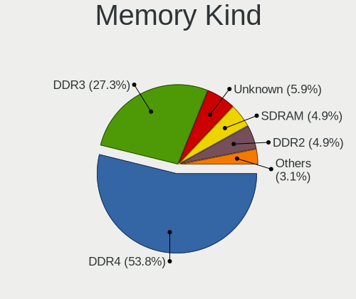

| Kind    | Desktops | Percent |
|---------|----------|---------|
| DDR4    | 125      | 57.6%   |
| DDR3    | 53       | 24.42%  |
| Unknown | 16       | 7.37%   |
| DDR2    | 11       | 5.07%   |
| SDRAM   | 4        | 1.84%   |
| LPDDR4  | 3        | 1.38%   |
| DDR     | 3        | 1.38%   |
| DRAM    | 2        | 0.92%   |

Memory Form Factor
------------------

Physical design of the memory module

| Name    | Desktops | Percent |
|---------|----------|---------|
| DIMM    | 203      | 95.31%  |
| SODIMM  | 8        | 3.76%   |
| Unknown | 2        | 0.94%   |

Memory Size
-----------

Memory module size

| Size  | Desktops | Percent |
|-------|----------|---------|
| 8192  | 96       | 40.51%  |
| 16384 | 50       | 21.1%   |
| 4096  | 47       | 19.83%  |
| 2048  | 26       | 10.97%  |
| 32768 | 14       | 5.91%   |
| 1024  | 4        | 1.69%   |

Memory Speed
------------

Memory module speed

| Speed   | Desktops | Percent |
|---------|----------|---------|
| 3200    | 32       | 13.56%  |
| 1600    | 30       | 12.71%  |
| 1333    | 24       | 10.17%  |
| 3600    | 21       | 8.9%    |
| 2400    | 21       | 8.9%    |
| 2133    | 14       | 5.93%   |
| 2667    | 13       | 5.51%   |
| 3466    | 6        | 2.54%   |
| 1800    | 6        | 2.54%   |
| 2933    | 5        | 2.12%   |
| 1066    | 5        | 2.12%   |
| 3533    | 4        | 1.69%   |
| 3266    | 4        | 1.69%   |
| 1867    | 4        | 1.69%   |
| 800     | 4        | 1.69%   |
| Unknown | 4        | 1.69%   |
| 3733    | 3        | 1.27%   |
| 3000    | 3        | 1.27%   |
| 2666    | 3        | 1.27%   |
| 2048    | 3        | 1.27%   |
| 49926   | 2        | 0.85%   |
| 4000    | 2        | 0.85%   |
| 3400    | 2        | 0.85%   |
| 1067    | 2        | 0.85%   |
| 667     | 2        | 0.85%   |
| 533     | 2        | 0.85%   |
| 400     | 2        | 0.85%   |
| 5600    | 1        | 0.42%   |
| 4800    | 1        | 0.42%   |
| 4266    | 1        | 0.42%   |
| 3866    | 1        | 0.42%   |
| 3800    | 1        | 0.42%   |
| 3500    | 1        | 0.42%   |
| 3334    | 1        | 0.42%   |
| 3067    | 1        | 0.42%   |
| 2800    | 1        | 0.42%   |
| 2733    | 1        | 0.42%   |
| 2134    | 1        | 0.42%   |
| 2000    | 1        | 0.42%   |
| 1866    | 1        | 0.42%   |

Printers & scanners
-------------------

Printer Vendor
--------------

Printer device vendors

| Vendor                   | Desktops | Percent |
|--------------------------|----------|---------|
| Samsung Electronics      | 11       | 29.73%  |
| Hewlett-Packard          | 9        | 24.32%  |
| Canon                    | 8        | 21.62%  |
| Brother Industries       | 6        | 16.22%  |
| Zhuhai Poskey Technology | 1        | 2.7%    |
| Seiko Epson              | 1        | 2.7%    |
| QinHeng Electronics      | 1        | 2.7%    |

Printer Model
-------------

Printer device models

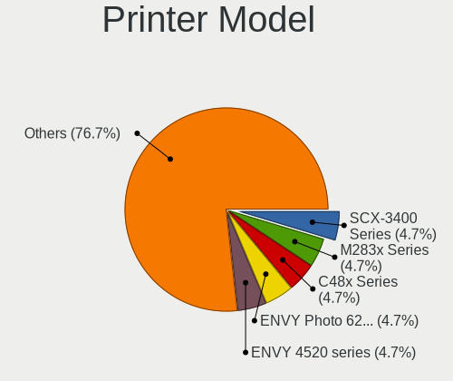

| Model                                                 | Desktops | Percent |
|-------------------------------------------------------|----------|---------|
| Samsung SCX-3400 Series                               | 2        | 5.41%   |
| Samsung M283x Series                                  | 2        | 5.41%   |
| Samsung C48x Series Color Laser Multifunction Printer | 2        | 5.41%   |
| HP ENVY Photo 6200 series                             | 2        | 5.41%   |
| Brother Printer                                       | 2        | 5.41%   |
| Zhuhai Poskey Printer                                 | 1        | 2.7%    |
| Seiko Epson ET-2720 Series                            | 1        | 2.7%    |
| Samsung ML-216x Series Laser Printer                  | 1        | 2.7%    |
| Samsung ML-1865                                       | 1        | 2.7%    |
| Samsung ML-1640 Series Laser Printer                  | 1        | 2.7%    |
| Samsung Composite Device                              | 1        | 2.7%    |
| Samsung C43x Series                                   | 1        | 2.7%    |
| QinHeng CH340S                                        | 1        | 2.7%    |
| HP OfficeJet 5200 series                              | 1        | 2.7%    |
| HP LaserJet 400 M401dne                               | 1        | 2.7%    |
| HP LaserJet 400 colorMFP M475dw                       | 1        | 2.7%    |
| HP DeskJet F4100 Printer series                       | 1        | 2.7%    |
| HP DeskJet 5150c                                      | 1        | 2.7%    |
| HP DeskJet 3700 series                                | 1        | 2.7%    |
| HP Deskjet 1050 J410                                  | 1        | 2.7%    |
| Canon TR8600 series                                   | 1        | 2.7%    |
| Canon TR4500 series                                   | 1        | 2.7%    |
| Canon PIXMA MP280                                     | 1        | 2.7%    |
| Canon PIXMA MG3600 Series                             | 1        | 2.7%    |
| Canon PIXMA MG2500 Series                             | 1        | 2.7%    |
| Canon Pixma iP4500 Printer                            | 1        | 2.7%    |
| Canon MF731C/733C                                     | 1        | 2.7%    |
| Canon iP7200 series                                   | 1        | 2.7%    |
| Brother HL-3140CW series                              | 1        | 2.7%    |
| Brother HL-3040CN series                              | 1        | 2.7%    |
| Brother HL-2130 series                                | 1        | 2.7%    |
| Brother HL-1430 Laser Printer                         | 1        | 2.7%    |

Scanner Vendor
--------------

Scanner device vendors

| Vendor          | Desktops | Percent |
|-----------------|----------|---------|
| Canon           | 8        | 61.54%  |
| Seiko Epson     | 4        | 30.77%  |
| Hewlett-Packard | 1        | 7.69%   |

Scanner Model
-------------

Scanner device models

| Model                                               | Desktops | Percent |
|-----------------------------------------------------|----------|---------|
| Canon CanoScan LIDE 25                              | 2        | 14.29%  |
| Canon CanoScan LiDE 210                             | 2        | 14.29%  |
| Seiko Epson Scanner                                 | 1        | 7.14%   |
| Seiko Epson GT-X900 [Perfection V700/V750 Photo]    | 1        | 7.14%   |
| Seiko Epson GT-F520/GT-F570 [Perfection 3590 PHOTO] | 1        | 7.14%   |
| Seiko Epson GT-9400UF [Perfection 3170]             | 1        | 7.14%   |
| Seiko Epson GT-9300UF [Perfection 2400 PHOTO]       | 1        | 7.14%   |
| HP ScanJet 3970c                                    | 1        | 7.14%   |
| Canon CanoScan N1240U/LiDE 30                       | 1        | 7.14%   |
| Canon CanoScan LiDE 220                             | 1        | 7.14%   |
| Canon CanoScan LiDE 200                             | 1        | 7.14%   |
| Canon CanoScan LiDE 100                             | 1        | 7.14%   |

Camera
------

Camera Vendor
-------------

Camera device vendors

| Vendor                        | Desktops | Percent |
|-------------------------------|----------|---------|
| Logitech                      | 48       | 44.04%  |
| Microdia                      | 11       | 10.09%  |
| Microsoft                     | 7        | 6.42%   |
| Generalplus Technology        | 7        | 6.42%   |
| Apple                         | 5        | 4.59%   |
| Sunplus Innovation Technology | 3        | 2.75%   |
| Samsung Electronics           | 3        | 2.75%   |
| ARC International             | 3        | 2.75%   |
| Unknown                       | 2        | 1.83%   |
| Realtek Semiconductor         | 2        | 1.83%   |
| OmniVision Technologies       | 2        | 1.83%   |
| Huawei Technologies           | 2        | 1.83%   |
| Creative Technology           | 2        | 1.83%   |
| Z-Star Microelectronics       | 1        | 0.92%   |
| Sony                          | 1        | 0.92%   |
| Razer USA                     | 1        | 0.92%   |
| PrehKeyTec                    | 1        | 0.92%   |
| Philips (or NXP)              | 1        | 0.92%   |
| KYE Systems (Mouse Systems)   | 1        | 0.92%   |
| Jieli Technology              | 1        | 0.92%   |
| HD 2MP WEBCAM                 | 1        | 0.92%   |
| GEMBIRD                       | 1        | 0.92%   |
| Arkmicro Technologies         | 1        | 0.92%   |
| Alcor Micro                   | 1        | 0.92%   |
| A4Tech                        | 1        | 0.92%   |

Camera Model
------------

Camera device models

| Model                                      | Desktops | Percent |
|--------------------------------------------|----------|---------|
| Logitech Webcam C270                       | 14       | 12.73%  |
| Logitech HD Pro Webcam C920                | 5        | 4.55%   |
| Microdia Webcam Vitade AF                  | 4        | 3.64%   |
| Logitech HD Webcam C910                    | 4        | 3.64%   |
| Logitech HD Webcam C615                    | 4        | 3.64%   |
| Logitech C922 Pro Stream Webcam            | 4        | 3.64%   |
| Generalplus GENERAL WEBCAM                 | 4        | 3.64%   |
| Samsung Galaxy series, misc. (MTP mode)    | 3        | 2.73%   |
| Microsoft LifeCam HD-3000                  | 3        | 2.73%   |
| Logitech Webcam C930e                      | 3        | 2.73%   |
| Logitech BRIO                              | 3        | 2.73%   |
| ARC International Camera                   | 3        | 2.73%   |
| OmniVision Monitor Webcam                  | 2        | 1.82%   |
| Microsoft LifeCam Studio                   | 2        | 1.82%   |
| Microdia Sonix USB 2.0 Camera              | 2        | 1.82%   |
| Microdia Hy-HD-Camera                      | 2        | 1.82%   |
| Logitech Webcam C310                       | 2        | 1.82%   |
| Huawei UVC Camera                          | 2        | 1.82%   |
| Generalplus 808 Camera #9 (web-cam mode)   | 2        | 1.82%   |
| Apple iPhone 5/5C/5S/6/SE                  | 2        | 1.82%   |
| Z-Star Lenovo USB 2.0 UVC Camera           | 1        | 0.91%   |
| Unknown Integrated RGB Camera              | 1        | 0.91%   |
| Unknown HD camera                          | 1        | 0.91%   |
| Sunplus Integrated_Webcam_HD               | 1        | 0.91%   |
| Sunplus HD 720P webcam                     | 1        | 0.91%   |
| Sunplus FULL HD webcam                     | 1        | 0.91%   |
| Sony CEVCECM                               | 1        | 0.91%   |
| Realtek NexiGo N960E FHD Webcam            | 1        | 0.91%   |
| Realtek HK 2M CAM                          | 1        | 0.91%   |
| Razer USA Gaming Webcam [Kiyo]             | 1        | 0.91%   |
| PrehKeyTec TA-0120-AS                      | 1        | 0.91%   |
| Philips (or NXP) SPC 520/525NC PC Camera   | 1        | 0.91%   |
| Microsoft LifeCam VX-7000 (UVC-compliant)  | 1        | 0.91%   |
| Microsoft LifeCam HD-5000                  | 1        | 0.91%   |
| Microdia USB Live camera                   | 1        | 0.91%   |
| Microdia USB camera                        | 1        | 0.91%   |
| Microdia ACR010 USB Webcam                 | 1        | 0.91%   |
| Logitech Webcam Pro 9000                   | 1        | 0.91%   |
| Logitech Webcam C300                       | 1        | 0.91%   |
| Logitech Webcam C110                       | 1        | 0.91%   |
| Logitech QuickCam Pro for Notebooks        | 1        | 0.91%   |
| Logitech QuickCam Pro 9000                 | 1        | 0.91%   |
| Logitech QuickCam Orbit/Sphere AF          | 1        | 0.91%   |
| Logitech QuickCam E 3500                   | 1        | 0.91%   |
| Logitech HD Webcam C525                    | 1        | 0.91%   |
| Logitech HD Webcam B910                    | 1        | 0.91%   |
| Logitech B525 HD Webcam                    | 1        | 0.91%   |
| KYE Systems (Mouse Systems) PC-LM1E Camera | 1        | 0.91%   |
| Jieli USB PHY 2.0                          | 1        | 0.91%   |
| HD 2MP WEBCAM HD 2MP WEBCAM                | 1        | 0.91%   |
| Generalplus WEB CAM                        | 1        | 0.91%   |
| GEMBIRD USB2.0 PC CAMERA                   | 1        | 0.91%   |
| Creative Live! Cam Sync HD [VF0770]        | 1        | 0.91%   |
| Creative Live! Cam Chat HD [VF0700]        | 1        | 0.91%   |
| Arkmicro USB2.0 PC CAMERA                  | 1        | 0.91%   |
| Apple iPod Touch 5.Gen [A1421]             | 1        | 0.91%   |
| Apple iPhone 4S                            | 1        | 0.91%   |
| Apple iPhone 4                             | 1        | 0.91%   |
| Alcor Micro 2.0 Camera                     | 1        | 0.91%   |
| A4Tech FHD 1080P PC Camera                 | 1        | 0.91%   |

Security
--------

Fingerprint Vendor
------------------

Fingerprint sensor vendors

| Vendor                | Desktops | Percent |
|-----------------------|----------|---------|
| Elan Microelectronics | 2        | 100%    |

Fingerprint Model
-----------------

Fingerprint sensor models

| Model                 | Desktops | Percent |
|-----------------------|----------|---------|
| Elan ELAN:Fingerprint | 2        | 100%    |

Chipcard Vendor
---------------

Chipcard module vendors

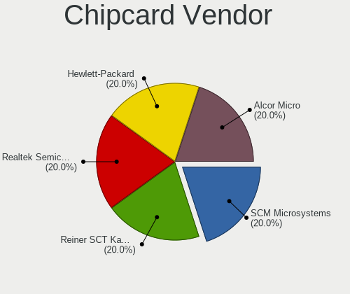

| Vendor                   | Desktops | Percent |
|--------------------------|----------|---------|
| Reiner SCT Kartensysteme | 1        | 25%     |
| Realtek Semiconductor    | 1        | 25%     |
| Hewlett-Packard          | 1        | 25%     |
| Alcor Micro              | 1        | 25%     |

Chipcard Model
--------------

Chipcard module models

| Model                                                                      | Desktops | Percent |
|----------------------------------------------------------------------------|----------|---------|
| Reiner SCT Kartensysteme cyberJack RFID basis contactless smartcard reader | 1        | 25%     |
| Realtek Semiconductor Smart Card Reader Interface                          | 1        | 25%     |
| Hewlett-Packard SC Keyboard - Apollo (Liteon)                              | 1        | 25%     |
| Alcor Micro AU9540 Smartcard Reader                                        | 1        | 25%     |

Unsupported
-----------

Unsupported Devices
-------------------

Total unsupported devices on board

| Total | Desktops | Percent |
|-------|----------|---------|
| 0     | 496      | 85.22%  |
| 1     | 75       | 12.89%  |
| 2     | 8        | 1.37%   |
| 5     | 2        | 0.34%   |
| 3     | 1        | 0.17%   |

Unsupported Device Types
------------------------

Types of unsupported devices

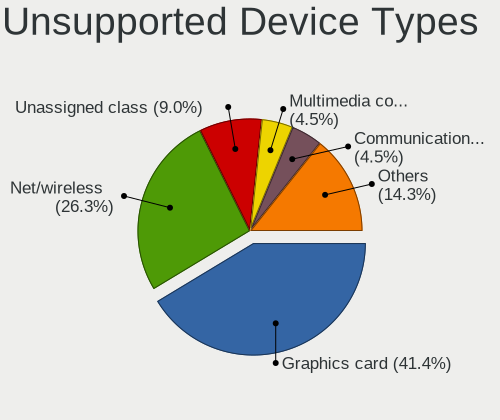

| Type                     | Desktops | Percent |
|--------------------------|----------|---------|
| Graphics card            | 36       | 37.5%   |
| Net/wireless             | 27       | 28.13%  |
| Unassigned class         | 10       | 10.42%  |
| Multimedia controller    | 4        | 4.17%   |
| Communication controller | 4        | 4.17%   |
| Sound                    | 3        | 3.13%   |
| Chipcard                 | 3        | 3.13%   |
| Storage/raid             | 2        | 2.08%   |
| Fingerprint reader       | 2        | 2.08%   |
| Card reader              | 2        | 2.08%   |
| Modem                    | 1        | 1.04%   |
| Camera                   | 1        | 1.04%   |
| Bluetooth                | 1        | 1.04%   |

