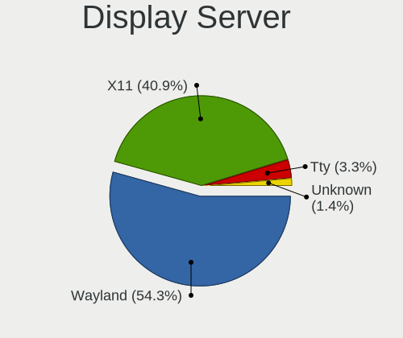
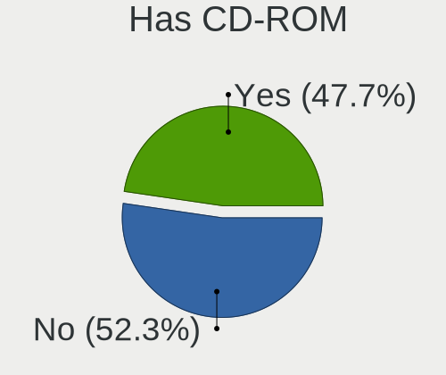
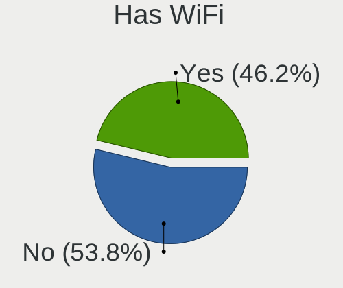
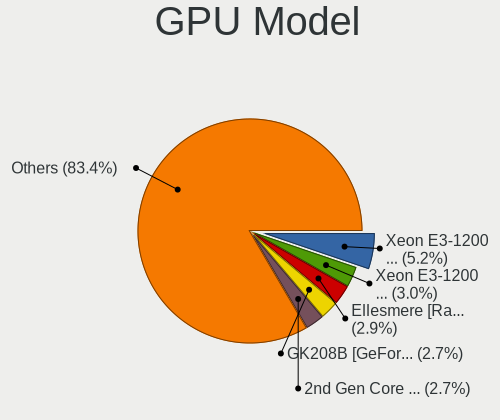
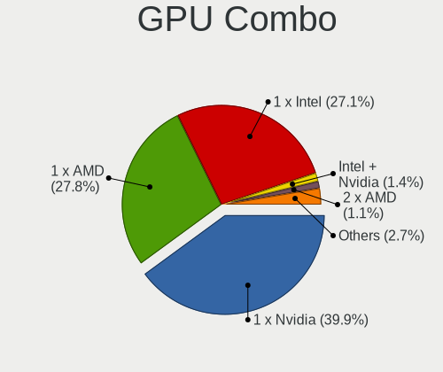
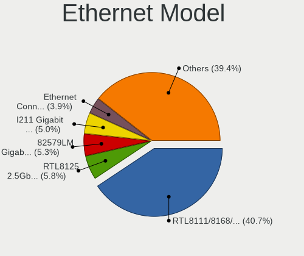
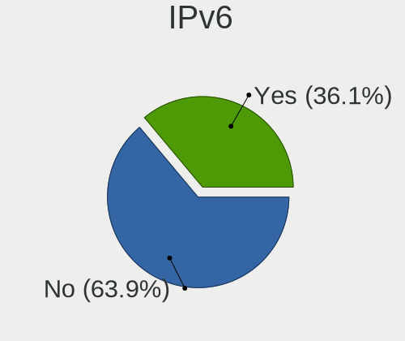

Ubuntu 21.10 - Tested Hardware & Statistics (Desktops)
------------------------------------------------------

A project to collect tested hardware configurations for Ubuntu 21.10 (Beta test).

Anyone can contribute to this report by the [hw-probe](https://github.com/linuxhw/hw-probe) tool:

    sudo -E hw-probe -all -upload

Please submit a probe of your configuration if it's not presented on the page or is rare.

Full-feature report is available here: https://linux-hardware.org/?view=trends&rel=ubuntu-21.10

Contents
--------

* [ Test Cases ](#test-cases)

* [ System ](#system)
  - [ Kernel                   ](#kernel)
  - [ Kernel Family            ](#kernel-family)
  - [ Kernel Major Ver.        ](#kernel-major-ver)
  - [ Arch                     ](#arch)
  - [ DE                       ](#de)
  - [ Display Server           ](#display-server)
  - [ Display Manager          ](#display-manager)
  - [ OS Lang                  ](#os-lang)
  - [ Boot Mode                ](#boot-mode)
  - [ Filesystem               ](#filesystem)
  - [ Part. scheme             ](#part-scheme)
  - [ Dual Boot with Linux/BSD ](#dual-boot-with-linuxbsd)
  - [ Dual Boot (Win)          ](#dual-boot-win)

* [ Board ](#board)
  - [ Vendor                   ](#vendor)
  - [ Model                    ](#model)
  - [ Model Family             ](#model-family)
  - [ MFG Year                 ](#mfg-year)
  - [ Form Factor              ](#form-factor)
  - [ Secure Boot              ](#secure-boot)
  - [ Coreboot                 ](#coreboot)
  - [ RAM Size                 ](#ram-size)
  - [ RAM Used                 ](#ram-used)
  - [ Total Drives             ](#total-drives)
  - [ Has CD-ROM               ](#has-cd-rom)
  - [ Has Ethernet             ](#has-ethernet)
  - [ Has WiFi                 ](#has-wifi)
  - [ Has Bluetooth            ](#has-bluetooth)

* [ Location ](#location)
  - [ Country                  ](#country)
  - [ City                     ](#city)

* [ Drives ](#drives)
  - [ Drive Vendor             ](#drive-vendor)
  - [ Drive Model              ](#drive-model)
  - [ HDD Vendor               ](#hdd-vendor)
  - [ SSD Vendor               ](#ssd-vendor)
  - [ Drive Kind               ](#drive-kind)
  - [ Drive Connector          ](#drive-connector)
  - [ Drive Size               ](#drive-size)
  - [ Space Total              ](#space-total)
  - [ Space Used               ](#space-used)
  - [ Malfunc. Drives          ](#malfunc-drives)
  - [ Malfunc. Drive Vendor    ](#malfunc-drive-vendor)
  - [ Malfunc. HDD Vendor      ](#malfunc-hdd-vendor)
  - [ Malfunc. Drive Kind      ](#malfunc-drive-kind)
  - [ Failed Drives            ](#failed-drives)
  - [ Failed Drive Vendor      ](#failed-drive-vendor)
  - [ Drive Status             ](#drive-status)

* [ Storage controller ](#storage-controller)
  - [ Storage Vendor           ](#storage-vendor)
  - [ Storage Model            ](#storage-model)
  - [ Storage Kind             ](#storage-kind)

* [ Processor ](#processor)
  - [ CPU Vendor               ](#cpu-vendor)
  - [ CPU Model                ](#cpu-model)
  - [ CPU Model Family         ](#cpu-model-family)
  - [ CPU Cores                ](#cpu-cores)
  - [ CPU Sockets              ](#cpu-sockets)
  - [ CPU Threads              ](#cpu-threads)
  - [ CPU Op-Modes             ](#cpu-op-modes)
  - [ CPU Microcode            ](#cpu-microcode)
  - [ CPU Microarch            ](#cpu-microarch)

* [ Graphics ](#graphics)
  - [ GPU Vendor               ](#gpu-vendor)
  - [ GPU Model                ](#gpu-model)
  - [ GPU Combo                ](#gpu-combo)
  - [ GPU Driver               ](#gpu-driver)
  - [ GPU Memory               ](#gpu-memory)

* [ Monitor ](#monitor)
  - [ Monitor Vendor           ](#monitor-vendor)
  - [ Monitor Model            ](#monitor-model)
  - [ Monitor Resolution       ](#monitor-resolution)
  - [ Monitor Diagonal         ](#monitor-diagonal)
  - [ Monitor Width            ](#monitor-width)
  - [ Aspect Ratio             ](#aspect-ratio)
  - [ Monitor Area             ](#monitor-area)
  - [ Pixel Density            ](#pixel-density)
  - [ Multiple Monitors        ](#multiple-monitors)

* [ Network ](#network)
  - [ Net Controller Vendor    ](#net-controller-vendor)
  - [ Net Controller Model     ](#net-controller-model)
  - [ Wireless Vendor          ](#wireless-vendor)
  - [ Wireless Model           ](#wireless-model)
  - [ Ethernet Vendor          ](#ethernet-vendor)
  - [ Ethernet Model           ](#ethernet-model)
  - [ Net Controller Kind      ](#net-controller-kind)
  - [ Used Controller          ](#used-controller)
  - [ NICs                     ](#nics)
  - [ IPv6                     ](#ipv6)

* [ Bluetooth ](#bluetooth)
  - [ Bluetooth Vendor         ](#bluetooth-vendor)
  - [ Bluetooth Model          ](#bluetooth-model)

* [ Sound ](#sound)
  - [ Sound Vendor             ](#sound-vendor)
  - [ Sound Model              ](#sound-model)

* [ Memory ](#memory)
  - [ Memory Vendor            ](#memory-vendor)
  - [ Memory Model             ](#memory-model)
  - [ Memory Kind              ](#memory-kind)
  - [ Memory Form Factor       ](#memory-form-factor)
  - [ Memory Size              ](#memory-size)
  - [ Memory Speed             ](#memory-speed)

* [ Printers & scanners ](#printers--scanners)
  - [ Printer Vendor           ](#printer-vendor)
  - [ Printer Model            ](#printer-model)
  - [ Scanner Vendor           ](#scanner-vendor)
  - [ Scanner Model            ](#scanner-model)

* [ Camera ](#camera)
  - [ Camera Vendor            ](#camera-vendor)
  - [ Camera Model             ](#camera-model)

* [ Security ](#security)
  - [ Fingerprint Vendor       ](#fingerprint-vendor)
  - [ Fingerprint Model        ](#fingerprint-model)
  - [ Chipcard Vendor          ](#chipcard-vendor)
  - [ Chipcard Model           ](#chipcard-model)

* [ Unsupported ](#unsupported)
  - [ Unsupported Devices      ](#unsupported-devices)
  - [ Unsupported Device Types ](#unsupported-device-types)

Test Cases
----------

| Vendor   | Model            | Probe                                                      | Date         |
|----------|------------------|------------------------------------------------------------|--------------|
| MSI      | MAG B550M MORTAR | [912b2a77a2](https://linux-hardware.org/?probe=912b2a77a2) | Aug 05, 2021 |
| Huanan   | X99 F8D V2.2     | [74e4c61bbf](https://linux-hardware.org/?probe=74e4c61bbf) | Jul 23, 2021 |
| Huanan   | X99 F8D V2.2     | [02ad72fb54](https://linux-hardware.org/?probe=02ad72fb54) | Jul 21, 2021 |
| Gigabyte | F2A55M-HD2       | [6a69f09403](https://linux-hardware.org/?probe=6a69f09403) | Jul 15, 2021 |

System
------

Kernel
------

Version of the Linux kernel

| Version               | Desktops | Percent |
|-----------------------|----------|---------|
| 5.13.0-12-generic     | 1        | 33.33%  |
| 5.13.0-051300-generic | 1        | 33.33%  |
| 5.11.0-20-generic     | 1        | 33.33%  |

Kernel Family
-------------

Linux kernel without a distro release

| Version | Desktops | Percent |
|---------|----------|---------|
| 5.13.0  | 2        | 66.67%  |
| 5.11.0  | 1        | 33.33%  |

Kernel Major Ver.
-----------------

Linux kernel major version

| Version | Desktops | Percent |
|---------|----------|---------|
| 5.13    | 2        | 66.67%  |
| 5.11    | 1        | 33.33%  |

Arch
----

OS architecture (x86_64, i586, etc.)

| Name   | Desktops | Percent |
|--------|----------|---------|
| x86_64 | 3        | 100%    |

DE
--

Desktop Environment

| Name       | Desktops | Percent |
|------------|----------|---------|
| GNOME      | 2        | 66.67%  |
| X-Cinnamon | 1        | 33.33%  |

Display Server
--------------

X11 or Wayland

| Name | Desktops | Percent |
|------|----------|---------|
| X11  | 3        | 100%    |

Display Manager
---------------

SDDM, LightDM, etc.

| Name    | Desktops | Percent |
|---------|----------|---------|
| Unknown | 2        | 66.67%  |
| GDM     | 1        | 33.33%  |

OS Lang
-------

Language

| Lang  | Desktops | Percent |
|-------|----------|---------|
| es_AR | 1        | 33.33%  |
| en_US | 1        | 33.33%  |
| en_GB | 1        | 33.33%  |

Boot Mode
---------

EFI or BIOS

| Mode | Desktops | Percent |
|------|----------|---------|
| BIOS | 2        | 66.67%  |
| EFI  | 1        | 33.33%  |

Filesystem
----------

Type of filesystem

| Type | Desktops | Percent |
|------|----------|---------|
| Ext4 | 3        | 100%    |

Part. scheme
------------

Scheme of partitioning

| Type    | Desktops | Percent |
|---------|----------|---------|
| Unknown | 2        | 66.67%  |
| GPT     | 1        | 33.33%  |

Dual Boot with Linux/BSD
------------------------

Hosting more than one Linux/BSD

| Dual boot | Desktops | Percent |
|-----------|----------|---------|
| No        | 2        | 66.67%  |
| Yes       | 1        | 33.33%  |

Dual Boot (Win)
---------------

Hosting Linux and Windows

| Dual boot | Desktops | Percent |
|-----------|----------|---------|
| Yes       | 3        | 100%    |

Board
-----

Vendor
------

Motherboard manufacturer

| Name                | Desktops | Percent |
|---------------------|----------|---------|
| MSI                 | 1        | 33.33%  |
| Huanan              | 1        | 33.33%  |
| Gigabyte Technology | 1        | 33.33%  |

Model
-----

Motherboard model

| Name                | Desktops | Percent |
|---------------------|----------|---------|
| MSI MS-7C94         | 1        | 33.33%  |
| Huanan X99 F8D V2.2 | 1        | 33.33%  |
| Gigabyte F2A55M-HD2 | 1        | 33.33%  |

Model Family
------------

Motherboard model prefix

| Name                | Desktops | Percent |
|---------------------|----------|---------|
| MSI MS-7C94         | 1        | 33.33%  |
| Huanan X99          | 1        | 33.33%  |
| Gigabyte F2A55M-HD2 | 1        | 33.33%  |

MFG Year
--------

Motherboard manufacture year

| Year | Desktops | Percent |
|------|----------|---------|
| 2021 | 2        | 66.67%  |
| 2013 | 1        | 33.33%  |

Form Factor
-----------

Physical design of the computer

| Name    | Desktops | Percent |
|---------|----------|---------|
| Desktop | 3        | 100%    |

Secure Boot
-----------

Enabled or disabled

| State    | Desktops | Percent |
|----------|----------|---------|
| Disabled | 3        | 100%    |

Coreboot
--------

Have coreboot on board

| Used | Desktops | Percent |
|------|----------|---------|
| No   | 3        | 100%    |

RAM Size
--------

Total RAM memory

| Size in GB | Desktops | Percent |
|------------|----------|---------|
| 32.01-64.0 | 2        | 66.67%  |
| 4.01-8.0   | 1        | 33.33%  |

RAM Used
--------

Used RAM memory

| Used GB  | Desktops | Percent |
|----------|----------|---------|
| 3.01-4.0 | 2        | 66.67%  |
| 4.01-8.0 | 1        | 33.33%  |

Total Drives
------------

Number of drives on board

| Drives | Desktops | Percent |
|--------|----------|---------|
| 5      | 1        | 33.33%  |
| 2      | 1        | 33.33%  |
| 1      | 1        | 33.33%  |

Has CD-ROM
----------

Has CD-ROM on board

| Presented | Desktops | Percent |
|-----------|----------|---------|
| No        | 3        | 100%    |

Has Ethernet
------------

Has Ethernet on board

| Presented | Desktops | Percent |
|-----------|----------|---------|
| Yes       | 3        | 100%    |

Has WiFi
--------

Has WiFi module

| Presented | Desktops | Percent |
|-----------|----------|---------|
| No        | 3        | 100%    |

Has Bluetooth
-------------

Has Bluetooth module

| Presented | Desktops | Percent |
|-----------|----------|---------|
| No        | 2        | 66.67%  |
| Yes       | 1        | 33.33%  |

Location
--------

Country
-------

Geographic location (country)

| Country   | Desktops | Percent |
|-----------|----------|---------|
| UK        | 1        | 33.33%  |
| Brazil    | 1        | 33.33%  |
| Argentina | 1        | 33.33%  |

City
----

Geographic location (city)

| City    | Desktops | Percent |
|---------|----------|---------|
| Rosario | 1        | 33.33%  |
| Osasco  | 1        | 33.33%  |
| Leiston | 1        | 33.33%  |

Drives
------

Drive Vendor
------------

Hard drive vendors

| Vendor              | Desktops | Drives | Percent |
|---------------------|----------|--------|---------|
| WDC                 | 1        | 1      | 14.29%  |
| Silicon Motion      | 1        | 1      | 14.29%  |
| Seagate             | 1        | 1      | 14.29%  |
| Samsung Electronics | 1        | 2      | 14.29%  |
| PNY                 | 1        | 1      | 14.29%  |
| KIOXIA-EXCERIA      | 1        | 1      | 14.29%  |
| Kingston            | 1        | 1      | 14.29%  |

Drive Model
-----------

Hard drive models

| Model                               | Desktops | Percent |
|-------------------------------------|----------|---------|
| WDC WD3200AAJS-56B4A0 320GB         | 1        | 12.5%   |
| Silicon Motion NVMe SSD Drive 256GB | 1        | 12.5%   |
| Seagate BUP Slim BK 1TB             | 1        | 12.5%   |
| Samsung SSD 980 PRO 500GB           | 1        | 12.5%   |
| Samsung SSD 860 EVO 500GB           | 1        | 12.5%   |
| PNY CS900 240GB SSD                 | 1        | 12.5%   |
| KIOXIA-EXCERIA SATA SSD 480GB       | 1        | 12.5%   |
| Kingston SHFS37A120G 120GB SSD      | 1        | 12.5%   |

HDD Vendor
----------

Hard disk drive vendors

| Vendor  | Desktops | Drives | Percent |
|---------|----------|--------|---------|
| WDC     | 1        | 1      | 50%     |
| Seagate | 1        | 1      | 50%     |

SSD Vendor
----------

Solid state drive vendors

| Vendor              | Desktops | Drives | Percent |
|---------------------|----------|--------|---------|
| Samsung Electronics | 1        | 1      | 25%     |
| PNY                 | 1        | 1      | 25%     |
| KIOXIA-EXCERIA      | 1        | 1      | 25%     |
| Kingston            | 1        | 1      | 25%     |

Drive Kind
----------

HDD or SSD

| Kind | Desktops | Drives | Percent |
|------|----------|--------|---------|
| NVMe | 2        | 2      | 33.33%  |
| SSD  | 2        | 4      | 33.33%  |
| HDD  | 2        | 2      | 33.33%  |

Drive Connector
---------------

SATA, SAS, NVMe, etc.

| Type | Desktops | Drives | Percent |
|------|----------|--------|---------|
| SATA | 3        | 5      | 50%     |
| NVMe | 2        | 2      | 33.33%  |
| SAS  | 1        | 1      | 16.67%  |

Drive Size
----------

Size of hard drive

| Size in TB | Desktops | Drives | Percent |
|------------|----------|--------|---------|
| 0.01-0.5   | 3        | 5      | 75%     |
| 0.51-1.0   | 1        | 1      | 25%     |

Space Total
-----------

Amount of disk space available on the file system

| Size in GB | Desktops | Percent |
|------------|----------|---------|
| 101-250    | 2        | 66.67%  |
| 1001-2000  | 1        | 33.33%  |

Space Used
----------

Amount of used disk space

| Used GB   | Desktops | Percent |
|-----------|----------|---------|
| 101-250   | 1        | 33.33%  |
| 1001-2000 | 1        | 33.33%  |
| 51-100    | 1        | 33.33%  |

Malfunc. Drives
---------------

Drive models with a malfunction

Zero info for selected period =(

Malfunc. Drive Vendor
---------------------

Vendors of faulty drives

Zero info for selected period =(

Malfunc. HDD Vendor
-------------------

Vendors of faulty HDD drives

Zero info for selected period =(

Malfunc. Drive Kind
-------------------

Kinds of faulty drives

Zero info for selected period =(

Failed Drives
-------------

Failed drive models

Zero info for selected period =(

Failed Drive Vendor
-------------------

Failed drive vendors

Zero info for selected period =(

Drive Status
------------

Number of failed and malfunc. drives

| Status   | Desktops | Drives | Percent |
|----------|----------|--------|---------|
| Detected | 3        | 4      | 75%     |
| Works    | 1        | 4      | 25%     |

Storage controller
------------------

Storage Vendor
--------------

Storage controller vendors

| Vendor              | Desktops | Percent |
|---------------------|----------|---------|
| AMD                 | 2        | 40%     |
| Silicon Motion      | 1        | 20%     |
| Samsung Electronics | 1        | 20%     |
| Intel               | 1        | 20%     |

Storage Model
-------------

Storage controller models

| Model                                                            | Desktops | Percent |
|------------------------------------------------------------------|----------|---------|
| Silicon Motion SM2263EN/SM2263XT SSD Controller                  | 1        | 16.67%  |
| Samsung NVMe SSD Controller PM9A1/PM9A3/980PRO                   | 1        | 16.67%  |
| Intel C610/X99 series chipset 6-Port SATA Controller [AHCI mode] | 1        | 16.67%  |
| AMD Starship/Matisse Chipset SATA Controller [AHCI mode]         | 1        | 16.67%  |
| AMD FCH SATA Controller [IDE mode]                               | 1        | 16.67%  |
| AMD FCH IDE Controller                                           | 1        | 16.67%  |

Storage Kind
------------

Kind of storage controller (IDE, SATA, NVMe, SAS, ...)

| Kind | Desktops | Percent |
|------|----------|---------|
| SATA | 3        | 50%     |
| NVMe | 2        | 33.33%  |
| IDE  | 1        | 16.67%  |

Processor
---------

CPU Vendor
----------

Processor vendors

| Vendor | Desktops | Percent |
|--------|----------|---------|
| AMD    | 2        | 66.67%  |
| Intel  | 1        | 33.33%  |

CPU Model
---------

Processor models

| Model                                   | Desktops | Percent |
|-----------------------------------------|----------|---------|
| Intel Xeon CPU E5-2690 v4 @ 2.60GHz     | 1        | 33.33%  |
| AMD Ryzen 5 5600X 6-Core Processor      | 1        | 33.33%  |
| AMD A4-4000 APU with Radeon HD Graphics | 1        | 33.33%  |

CPU Model Family
----------------

Processor model prefix

| Model       | Desktops | Percent |
|-------------|----------|---------|
| Intel Xeon  | 1        | 33.33%  |
| AMD Ryzen 5 | 1        | 33.33%  |
| AMD A4      | 1        | 33.33%  |

CPU Cores
---------

Number of processor cores

| Number | Desktops | Percent |
|--------|----------|---------|
| 28     | 1        | 33.33%  |
| 6      | 1        | 33.33%  |
| 1      | 1        | 33.33%  |

CPU Sockets
-----------

Number of sockets

| Number | Desktops | Percent |
|--------|----------|---------|
| 1      | 2        | 66.67%  |
| 2      | 1        | 33.33%  |

CPU Threads
-----------

Threads per core (Hyper-Threading)

| Number | Desktops | Percent |
|--------|----------|---------|
| 2      | 3        | 100%    |

CPU Op-Modes
------------

CPU Operation Modes (32-bit, 64-bit)

| Op mode        | Desktops | Percent |
|----------------|----------|---------|
| 32-bit, 64-bit | 3        | 100%    |

CPU Microcode
-------------

Microcode number

| Number  | Desktops | Percent |
|---------|----------|---------|
| Unknown | 3        | 100%    |

CPU Microarch
-------------

Microarchitecture

| Name       | Desktops | Percent |
|------------|----------|---------|
| Zen 3      | 1        | 33.33%  |
| Piledriver | 1        | 33.33%  |
| Broadwell  | 1        | 33.33%  |

Graphics
--------

GPU Vendor
----------

Vendors of graphics cards

| Vendor | Desktops | Percent |
|--------|----------|---------|
| Nvidia | 2        | 66.67%  |
| AMD    | 1        | 33.33%  |

GPU Model
---------

Graphics card models

| Model                           | Desktops | Percent |
|---------------------------------|----------|---------|
| Nvidia GP108 [GeForce GT 1030]  | 1        | 25%     |
| Nvidia GK208B [GeForce GT 710]  | 1        | 25%     |
| Nvidia GK104 [GeForce GTX 680]  | 1        | 25%     |
| AMD Trinity 2 [Radeon HD 7480D] | 1        | 25%     |

GPU Combo
---------

Combinations of graphics cards

| Name       | Desktops | Percent |
|------------|----------|---------|
| 2 x Nvidia | 1        | 33.33%  |
| 1 x Nvidia | 1        | 33.33%  |
| 1 x AMD    | 1        | 33.33%  |

GPU Driver
----------

Free vs proprietary

| Driver      | Desktops | Percent |
|-------------|----------|---------|
| Proprietary | 2        | 66.67%  |
| Free        | 1        | 33.33%  |

GPU Memory
----------

Total video memory

| Size in GB | Desktops | Percent |
|------------|----------|---------|
| 1.01-2.0   | 2        | 66.67%  |
| Unknown    | 1        | 33.33%  |

Monitor
-------

Monitor Vendor
--------------

Monitor vendors

| Vendor         | Desktops | Percent |
|----------------|----------|---------|
| SKY            | 1        | 33.33%  |
| LG Electronics | 1        | 33.33%  |
| Lenovo         | 1        | 33.33%  |

Monitor Model
-------------

Monitor models

| Model                                                    | Desktops | Percent |
|----------------------------------------------------------|----------|---------|
| SKY TV-monitor SKY0001 1920x1080 697x392mm 31.5-inch     | 1        | 25%     |
| LG Electronics LCD Monitor LG ULTRAWIDE 2560x1080        | 1        | 25%     |
| LG Electronics LCD Monitor LG ULTRAWIDE                  | 1        | 25%     |
| Lenovo LEN L24q-30 LEN65FB 2560x1440 527x296mm 23.8-inch | 1        | 25%     |

Monitor Resolution
------------------

Monitor screen resolution

| Resolution      | Desktops | Percent |
|-----------------|----------|---------|
| 2560x1440 (QHD) | 1        | 25%     |
| 2560x1080       | 1        | 25%     |
| 1920x1080 (FHD) | 1        | 25%     |
| Unknown         | 1        | 25%     |

Monitor Diagonal
----------------

Diagonal size in inches

| Inches  | Desktops | Percent |
|---------|----------|---------|
| 40      | 1        | 33.33%  |
| 24      | 1        | 33.33%  |
| Unknown | 1        | 33.33%  |

Monitor Width
-------------

Physical width

| Width in mm | Desktops | Percent |
|-------------|----------|---------|
| 801-900     | 1        | 33.33%  |
| 501-600     | 1        | 33.33%  |
| Unknown     | 1        | 33.33%  |

Aspect Ratio
------------

Proportional relationship between the width and the height

| Ratio   | Desktops | Percent |
|---------|----------|---------|
| 16/9    | 2        | 66.67%  |
| Unknown | 1        | 33.33%  |

Monitor Area
------------

Area in inch²

| Area in inch² | Desktops | Percent |
|----------------|----------|---------|
| 201-250        | 1        | 33.33%  |
| 501-1000       | 1        | 33.33%  |
| Unknown        | 1        | 33.33%  |

Pixel Density
-------------

Pixels per inch

| Density | Desktops | Percent |
|---------|----------|---------|
| 1-50    | 1        | 33.33%  |
| 121-160 | 1        | 33.33%  |
| Unknown | 1        | 33.33%  |

Multiple Monitors
-----------------

Total monitors connected

| Total | Desktops | Percent |
|-------|----------|---------|
| 1     | 3        | 100%    |

Network
-------

Net Controller Vendor
---------------------

Controller vendors

| Vendor                | Desktops | Percent |
|-----------------------|----------|---------|
| Realtek Semiconductor | 3        | 100%    |

Net Controller Model
--------------------

Controller models

| Model                                                             | Desktops | Percent |
|-------------------------------------------------------------------|----------|---------|
| Realtek RTL8111/8168/8411 PCI Express Gigabit Ethernet Controller | 2        | 66.67%  |
| Realtek RTL8125 2.5GbE Controller                                 | 1        | 33.33%  |

Wireless Vendor
---------------

Wireless vendors

Zero info for selected period =(

Wireless Model
--------------

Wireless models

Zero info for selected period =(

Ethernet Vendor
---------------

Ethernet vendors

| Vendor                | Desktops | Percent |
|-----------------------|----------|---------|
| Realtek Semiconductor | 3        | 100%    |

Ethernet Model
--------------

Ethernet models

| Model                                                             | Desktops | Percent |
|-------------------------------------------------------------------|----------|---------|
| Realtek RTL8111/8168/8411 PCI Express Gigabit Ethernet Controller | 2        | 66.67%  |
| Realtek RTL8125 2.5GbE Controller                                 | 1        | 33.33%  |

Net Controller Kind
-------------------

Ethernet, WiFi or modem

| Kind     | Desktops | Percent |
|----------|----------|---------|
| Ethernet | 3        | 100%    |

Used Controller
---------------

Currently used network controller

| Kind     | Desktops | Percent |
|----------|----------|---------|
| Ethernet | 2        | 100%    |

NICs
----

Total network controllers on board

| Total | Desktops | Percent |
|-------|----------|---------|
| 1     | 2        | 66.67%  |
| 2     | 1        | 33.33%  |

IPv6
----

IPv6 vs IPv4

| Used | Desktops | Percent |
|------|----------|---------|
| No   | 2        | 66.67%  |
| Yes  | 1        | 33.33%  |

Bluetooth
---------

Bluetooth Vendor
----------------

Controller vendors

| Vendor                | Desktops | Percent |
|-----------------------|----------|---------|
| Realtek Semiconductor | 1        | 100%    |

Bluetooth Model
---------------

Controller models

| Model                   | Desktops | Percent |
|-------------------------|----------|---------|
| Realtek Bluetooth Radio | 1        | 100%    |

Sound
-----

Sound Vendor
------------

Sound card vendors

| Vendor | Desktops | Percent |
|--------|----------|---------|
| Nvidia | 2        | 40%     |
| XMOS   | 1        | 20%     |
| Intel  | 1        | 20%     |
| AMD    | 1        | 20%     |

Sound Model
-----------

Sound card models

| Model                                             | Desktops | Percent |
|---------------------------------------------------|----------|---------|
| XMOS HIFI DSD                                     | 1        | 14.29%  |
| Nvidia GP108 High Definition Audio Controller     | 1        | 14.29%  |
| Nvidia GK208 HDMI/DP Audio Controller             | 1        | 14.29%  |
| Nvidia GK104 HDMI Audio Controller                | 1        | 14.29%  |
| Intel C610/X99 series chipset HD Audio Controller | 1        | 14.29%  |
| AMD Trinity HDMI Audio Controller                 | 1        | 14.29%  |
| AMD FCH Azalia Controller                         | 1        | 14.29%  |

Memory
------

Memory Vendor
-------------

Memory module vendors

| Vendor              | Desktops | Percent |
|---------------------|----------|---------|
| Unknown             | 1        | 33.33%  |
| Samsung Electronics | 1        | 33.33%  |
| Crucial             | 1        | 33.33%  |

Memory Model
------------

Memory module models

| Model                                                 | Desktops | Percent |
|-------------------------------------------------------|----------|---------|
| Unknown RAM Module 8GB DIMM DDR4 2667MT/s             | 1        | 33.33%  |
| Samsung RAM M471A1K43CB1-CTD 8GB DIMM DDR4 2667MT/s   | 1        | 33.33%  |
| Crucial RAM BL8G36C16U4B.M8FE1 8GB DIMM DDR4 3733MT/s | 1        | 33.33%  |

Memory Kind
-----------

Memory module kinds

| Kind | Desktops | Percent |
|------|----------|---------|
| DDR4 | 2        | 100%    |

Memory Form Factor
------------------

Physical design of the memory module

| Name | Desktops | Percent |
|------|----------|---------|
| DIMM | 2        | 100%    |

Memory Size
-----------

Memory module size

| Size | Desktops | Percent |
|------|----------|---------|
| 8192 | 2        | 100%    |

Memory Speed
------------

Memory module speed

| Speed | Desktops | Percent |
|-------|----------|---------|
| 3733  | 1        | 50%     |
| 2667  | 1        | 50%     |

Printers & scanners
-------------------

Printer Vendor
--------------

Printer device vendors

Zero info for selected period =(

Printer Model
-------------

Printer device models

Zero info for selected period =(

Scanner Vendor
--------------

Scanner device vendors

Zero info for selected period =(

Scanner Model
-------------

Scanner device models

Zero info for selected period =(

Camera
------

Camera Vendor
-------------

Camera device vendors

Zero info for selected period =(

Camera Model
------------

Camera device models

Zero info for selected period =(

Security
--------

Fingerprint Vendor
------------------

Fingerprint sensor vendors

Zero info for selected period =(

Fingerprint Model
-----------------

Fingerprint sensor models

Zero info for selected period =(

Chipcard Vendor
---------------

Chipcard module vendors

Zero info for selected period =(

Chipcard Model
--------------

Chipcard module models

Zero info for selected period =(

Unsupported
-----------

Unsupported Devices
-------------------

Total unsupported devices on board

| Total | Desktops | Percent |
|-------|----------|---------|
| 0     | 2        | 66.67%  |
| 1     | 1        | 33.33%  |

Unsupported Device Types
------------------------

Types of unsupported devices

| Type             | Desktops | Percent |
|------------------|----------|---------|
| Unassigned class | 1        | 100%    |

