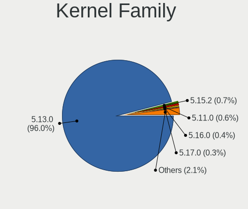
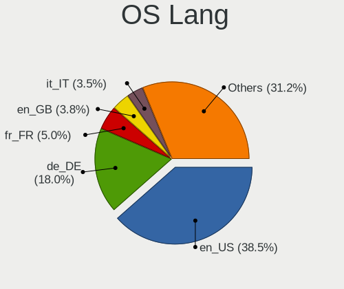
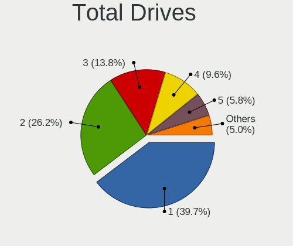
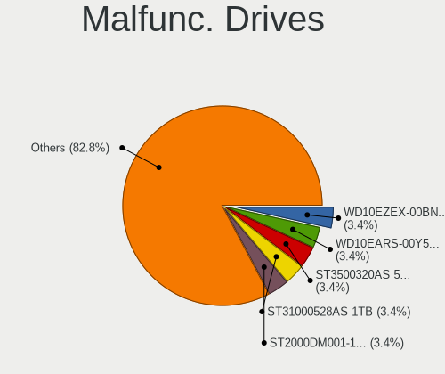
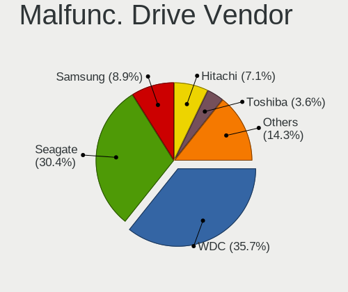
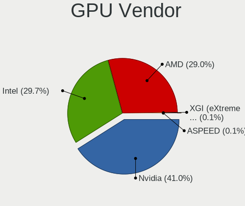
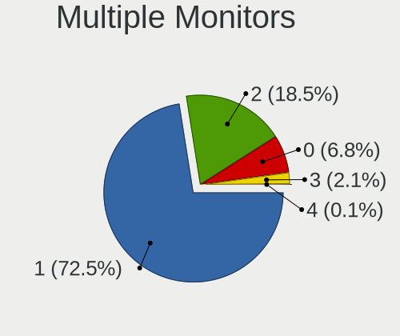
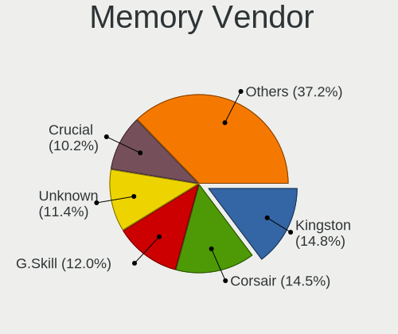
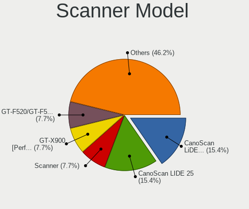

Ubuntu 21.10 - Tested Hardware & Statistics (Desktops)
------------------------------------------------------

A project to collect tested hardware configurations for Ubuntu 21.10.

Anyone can contribute to this report by the [hw-probe](https://github.com/linuxhw/hw-probe) tool:

    sudo -E hw-probe -all -upload

Please submit a probe of your configuration if it's not presented on the page or is rare.

Full-feature report is available here: https://linux-hardware.org/?view=trends&rel=ubuntu-21.10

Contents
--------

* [ Test Cases ](#test-cases)

* [ System ](#system)
  - [ Kernel                   ](#kernel)
  - [ Kernel Family            ](#kernel-family)
  - [ Kernel Major Ver.        ](#kernel-major-ver)
  - [ Arch                     ](#arch)
  - [ DE                       ](#de)
  - [ Display Server           ](#display-server)
  - [ Display Manager          ](#display-manager)
  - [ OS Lang                  ](#os-lang)
  - [ Boot Mode                ](#boot-mode)
  - [ Filesystem               ](#filesystem)
  - [ Part. scheme             ](#part-scheme)
  - [ Dual Boot with Linux/BSD ](#dual-boot-with-linuxbsd)
  - [ Dual Boot (Win)          ](#dual-boot-win)

* [ Board ](#board)
  - [ Vendor                   ](#vendor)
  - [ Model                    ](#model)
  - [ Model Family             ](#model-family)
  - [ MFG Year                 ](#mfg-year)
  - [ Form Factor              ](#form-factor)
  - [ Secure Boot              ](#secure-boot)
  - [ Coreboot                 ](#coreboot)
  - [ RAM Size                 ](#ram-size)
  - [ RAM Used                 ](#ram-used)
  - [ Total Drives             ](#total-drives)
  - [ Has CD-ROM               ](#has-cd-rom)
  - [ Has Ethernet             ](#has-ethernet)
  - [ Has WiFi                 ](#has-wifi)
  - [ Has Bluetooth            ](#has-bluetooth)

* [ Location ](#location)
  - [ Country                  ](#country)
  - [ City                     ](#city)

* [ Drives ](#drives)
  - [ Drive Vendor             ](#drive-vendor)
  - [ Drive Model              ](#drive-model)
  - [ HDD Vendor               ](#hdd-vendor)
  - [ SSD Vendor               ](#ssd-vendor)
  - [ Drive Kind               ](#drive-kind)
  - [ Drive Connector          ](#drive-connector)
  - [ Drive Size               ](#drive-size)
  - [ Space Total              ](#space-total)
  - [ Space Used               ](#space-used)
  - [ Malfunc. Drives          ](#malfunc-drives)
  - [ Malfunc. Drive Vendor    ](#malfunc-drive-vendor)
  - [ Malfunc. HDD Vendor      ](#malfunc-hdd-vendor)
  - [ Malfunc. Drive Kind      ](#malfunc-drive-kind)
  - [ Failed Drives            ](#failed-drives)
  - [ Failed Drive Vendor      ](#failed-drive-vendor)
  - [ Drive Status             ](#drive-status)

* [ Storage controller ](#storage-controller)
  - [ Storage Vendor           ](#storage-vendor)
  - [ Storage Model            ](#storage-model)
  - [ Storage Kind             ](#storage-kind)

* [ Processor ](#processor)
  - [ CPU Vendor               ](#cpu-vendor)
  - [ CPU Model                ](#cpu-model)
  - [ CPU Model Family         ](#cpu-model-family)
  - [ CPU Cores                ](#cpu-cores)
  - [ CPU Sockets              ](#cpu-sockets)
  - [ CPU Threads              ](#cpu-threads)
  - [ CPU Op-Modes             ](#cpu-op-modes)
  - [ CPU Microcode            ](#cpu-microcode)
  - [ CPU Microarch            ](#cpu-microarch)

* [ Graphics ](#graphics)
  - [ GPU Vendor               ](#gpu-vendor)
  - [ GPU Model                ](#gpu-model)
  - [ GPU Combo                ](#gpu-combo)
  - [ GPU Driver               ](#gpu-driver)
  - [ GPU Memory               ](#gpu-memory)

* [ Monitor ](#monitor)
  - [ Monitor Vendor           ](#monitor-vendor)
  - [ Monitor Model            ](#monitor-model)
  - [ Monitor Resolution       ](#monitor-resolution)
  - [ Monitor Diagonal         ](#monitor-diagonal)
  - [ Monitor Width            ](#monitor-width)
  - [ Aspect Ratio             ](#aspect-ratio)
  - [ Monitor Area             ](#monitor-area)
  - [ Pixel Density            ](#pixel-density)
  - [ Multiple Monitors        ](#multiple-monitors)

* [ Network ](#network)
  - [ Net Controller Vendor    ](#net-controller-vendor)
  - [ Net Controller Model     ](#net-controller-model)
  - [ Wireless Vendor          ](#wireless-vendor)
  - [ Wireless Model           ](#wireless-model)
  - [ Ethernet Vendor          ](#ethernet-vendor)
  - [ Ethernet Model           ](#ethernet-model)
  - [ Net Controller Kind      ](#net-controller-kind)
  - [ Used Controller          ](#used-controller)
  - [ NICs                     ](#nics)
  - [ IPv6                     ](#ipv6)

* [ Bluetooth ](#bluetooth)
  - [ Bluetooth Vendor         ](#bluetooth-vendor)
  - [ Bluetooth Model          ](#bluetooth-model)

* [ Sound ](#sound)
  - [ Sound Vendor             ](#sound-vendor)
  - [ Sound Model              ](#sound-model)

* [ Memory ](#memory)
  - [ Memory Vendor            ](#memory-vendor)
  - [ Memory Model             ](#memory-model)
  - [ Memory Kind              ](#memory-kind)
  - [ Memory Form Factor       ](#memory-form-factor)
  - [ Memory Size              ](#memory-size)
  - [ Memory Speed             ](#memory-speed)

* [ Printers & scanners ](#printers--scanners)
  - [ Printer Vendor           ](#printer-vendor)
  - [ Printer Model            ](#printer-model)
  - [ Scanner Vendor           ](#scanner-vendor)
  - [ Scanner Model            ](#scanner-model)

* [ Camera ](#camera)
  - [ Camera Vendor            ](#camera-vendor)
  - [ Camera Model             ](#camera-model)

* [ Security ](#security)
  - [ Fingerprint Vendor       ](#fingerprint-vendor)
  - [ Fingerprint Model        ](#fingerprint-model)
  - [ Chipcard Vendor          ](#chipcard-vendor)
  - [ Chipcard Model           ](#chipcard-model)

* [ Unsupported ](#unsupported)
  - [ Unsupported Devices      ](#unsupported-devices)
  - [ Unsupported Device Types ](#unsupported-device-types)

Test Cases
----------

| Vendor        | Model                       | Probe                                                      | Date         |
|---------------|-----------------------------|------------------------------------------------------------|--------------|
| EVGA          | 134-KS-E377                 | [27e29303bc](https://linux-hardware.org/?probe=27e29303bc) | Nov 01, 2021 |
| EVGA          | 111-CS-E371                 | [2fc377709d](https://linux-hardware.org/?probe=2fc377709d) | Nov 01, 2021 |
| Lenovo        | SHARKBAY SDK0E50510 WIN     | [068bee7912](https://linux-hardware.org/?probe=068bee7912) | Oct 31, 2021 |
| Gigabyte      | G1.Assassin                 | [40c84c9637](https://linux-hardware.org/?probe=40c84c9637) | Oct 31, 2021 |
| MSI           | MPG Z490 GAMING EDGE WIF... | [5b55e39c35](https://linux-hardware.org/?probe=5b55e39c35) | Oct 31, 2021 |
| ASUSTek       | M2N-E                       | [dfa80f4b9f](https://linux-hardware.org/?probe=dfa80f4b9f) | Oct 31, 2021 |
| HP            | 1587h                       | [0d99c162a3](https://linux-hardware.org/?probe=0d99c162a3) | Oct 31, 2021 |
| HP            | 1587h                       | [2aeea457fd](https://linux-hardware.org/?probe=2aeea457fd) | Oct 31, 2021 |
| Lenovo        | ThinkCentre M70e 0833A29    | [46ebbae78b](https://linux-hardware.org/?probe=46ebbae78b) | Oct 31, 2021 |
| Lenovo        | ThinkCentre M70e 0833A29    | [e13dd10e78](https://linux-hardware.org/?probe=e13dd10e78) | Oct 31, 2021 |
| Gigabyte      | G31M-ES2L                   | [23b6458508](https://linux-hardware.org/?probe=23b6458508) | Oct 30, 2021 |
| ASUSTek       | PRIME H310T R2.0            | [9f69e439bc](https://linux-hardware.org/?probe=9f69e439bc) | Oct 30, 2021 |
| Fujitsu       | D3633-S1 S26361-D3633-S1    | [0184e22e18](https://linux-hardware.org/?probe=0184e22e18) | Oct 30, 2021 |
| ASRock        | 960GM/U3S3 FX               | [7a2ec5ecff](https://linux-hardware.org/?probe=7a2ec5ecff) | Oct 30, 2021 |
| ASUSTek       | P8H61-M LX R2.0             | [4f64db367f](https://linux-hardware.org/?probe=4f64db367f) | Oct 30, 2021 |
| HP            | 0AA8h                       | [40da7a8ae9](https://linux-hardware.org/?probe=40da7a8ae9) | Oct 30, 2021 |
| Dell          | 0N826N A03                  | [ffb75356ef](https://linux-hardware.org/?probe=ffb75356ef) | Oct 30, 2021 |
| MSI           | 3664h                       | [7d44291de8](https://linux-hardware.org/?probe=7d44291de8) | Oct 30, 2021 |
| MSI           | B450M MORTAR MAX            | [cadb142111](https://linux-hardware.org/?probe=cadb142111) | Oct 29, 2021 |
| MSI           | B150M BAZOOKA               | [b396e1c4f4](https://linux-hardware.org/?probe=b396e1c4f4) | Oct 29, 2021 |
| ASUSTek       | M5A97 R2.0                  | [2ce7e668c7](https://linux-hardware.org/?probe=2ce7e668c7) | Oct 29, 2021 |
| Dell          | 0N826N A03                  | [db2a7eba35](https://linux-hardware.org/?probe=db2a7eba35) | Oct 29, 2021 |
| HP            | 0AECh D                     | [665bae2867](https://linux-hardware.org/?probe=665bae2867) | Oct 29, 2021 |
| Dell          | 0C3YXR A00                  | [3fbbe71d21](https://linux-hardware.org/?probe=3fbbe71d21) | Oct 28, 2021 |
| ASUSTek       | ROG CROSSHAIR VIII DARK ... | [89c1a7f472](https://linux-hardware.org/?probe=89c1a7f472) | Oct 28, 2021 |
| Dell          | 0773VG A00                  | [f17f22efdc](https://linux-hardware.org/?probe=f17f22efdc) | Oct 28, 2021 |
| ASUSTek       | CM6870                      | [1575e2c682](https://linux-hardware.org/?probe=1575e2c682) | Oct 28, 2021 |
| MSI           | A88X-G43                    | [1c7a02bd63](https://linux-hardware.org/?probe=1c7a02bd63) | Oct 28, 2021 |
| ASUSTek       | PRIME B450M-GAMING/BR       | [d10e4364a0](https://linux-hardware.org/?probe=d10e4364a0) | Oct 27, 2021 |
| ASUSTek       | P8H61-M LX R2.0             | [28ddff13b5](https://linux-hardware.org/?probe=28ddff13b5) | Oct 27, 2021 |
| Foxconn       | 2ABF                        | [380d5ab9f0](https://linux-hardware.org/?probe=380d5ab9f0) | Oct 27, 2021 |
| Dell          | 05CNYF A01                  | [95530db3a8](https://linux-hardware.org/?probe=95530db3a8) | Oct 27, 2021 |
| Foxconn       | 45CMX/45GMX/45CMX-K         | [0e8d69e9b8](https://linux-hardware.org/?probe=0e8d69e9b8) | Oct 27, 2021 |
| Acer          | Aspire X3450                | [8f27aff70b](https://linux-hardware.org/?probe=8f27aff70b) | Oct 27, 2021 |
| Gigabyte      | GA-970A-UD3                 | [aae0c56d3a](https://linux-hardware.org/?probe=aae0c56d3a) | Oct 27, 2021 |
| MSI           | H61M-P31                    | [e5bf692305](https://linux-hardware.org/?probe=e5bf692305) | Oct 26, 2021 |
| ASRock        | X570 Phantom Gaming-ITX/... | [16a6718949](https://linux-hardware.org/?probe=16a6718949) | Oct 26, 2021 |
| MSI           | Z270 PC MATE                | [24329438d1](https://linux-hardware.org/?probe=24329438d1) | Oct 26, 2021 |
| Unknown       | Unknown                     | [668f61352d](https://linux-hardware.org/?probe=668f61352d) | Oct 26, 2021 |
| ASRock        | Z590M-ITX/ax                | [1fcc4e6895](https://linux-hardware.org/?probe=1fcc4e6895) | Oct 26, 2021 |
| MSI           | MAG Z490 TOMAHAWK           | [f5ede0a97c](https://linux-hardware.org/?probe=f5ede0a97c) | Oct 25, 2021 |
| ASUSTek       | PRIME B350M-A               | [19eba77c24](https://linux-hardware.org/?probe=19eba77c24) | Oct 25, 2021 |
| MSI           | B450 TOMAHAWK MAX           | [97620628a8](https://linux-hardware.org/?probe=97620628a8) | Oct 25, 2021 |
| MSI           | B450 TOMAHAWK MAX           | [f15c4d9b54](https://linux-hardware.org/?probe=f15c4d9b54) | Oct 25, 2021 |
| Gigabyte      | P67A-UD3                    | [ecaeb257a3](https://linux-hardware.org/?probe=ecaeb257a3) | Oct 24, 2021 |
| Dell          | 0V8F20 A01                  | [8e371fe4cb](https://linux-hardware.org/?probe=8e371fe4cb) | Oct 24, 2021 |
| Dell          | 0J3C2F A01                  | [e8cf16b696](https://linux-hardware.org/?probe=e8cf16b696) | Oct 24, 2021 |
| AMI           | Cherry Trail CR             | [9333e233d6](https://linux-hardware.org/?probe=9333e233d6) | Oct 24, 2021 |
| AMI           | Cherry Trail CR             | [7d78a3c31f](https://linux-hardware.org/?probe=7d78a3c31f) | Oct 24, 2021 |
| ASUSTek       | H110M-C                     | [ba3ddf870d](https://linux-hardware.org/?probe=ba3ddf870d) | Oct 24, 2021 |
| ASUSTek       | PRIME Z390-P                | [681b537e82](https://linux-hardware.org/?probe=681b537e82) | Oct 23, 2021 |
| Lenovo        | NO DPK                      | [9c71a67df3](https://linux-hardware.org/?probe=9c71a67df3) | Oct 23, 2021 |
| Acer          | Aspire TC-281               | [5114976821](https://linux-hardware.org/?probe=5114976821) | Oct 23, 2021 |
| ASRock        | N3150DC-ITX                 | [6e3084cf7f](https://linux-hardware.org/?probe=6e3084cf7f) | Oct 23, 2021 |
| ASRock        | N3150DC-ITX                 | [c1808f5d2f](https://linux-hardware.org/?probe=c1808f5d2f) | Oct 23, 2021 |
| Dell          | 0T10XW A00                  | [971b85f5db](https://linux-hardware.org/?probe=971b85f5db) | Oct 23, 2021 |
| ASUSTek       | PRIME X470-PRO              | [48db1afdd3](https://linux-hardware.org/?probe=48db1afdd3) | Oct 23, 2021 |
| Supermicro    | X7DVL                       | [bcbe094156](https://linux-hardware.org/?probe=bcbe094156) | Oct 23, 2021 |
| Dell          | 051FJ8 A02                  | [d04dae2a56](https://linux-hardware.org/?probe=d04dae2a56) | Oct 23, 2021 |
| MSI           | MEG X570 UNIFY              | [7b9e7ec5f4](https://linux-hardware.org/?probe=7b9e7ec5f4) | Oct 23, 2021 |
| ASUSTek       | TUF GAMING X570-PLUS        | [e071387ed6](https://linux-hardware.org/?probe=e071387ed6) | Oct 22, 2021 |
| Lenovo        | NO DPK                      | [ad7c805198](https://linux-hardware.org/?probe=ad7c805198) | Oct 22, 2021 |
| Dell          | 0J3C2F A01                  | [a5ca7f2501](https://linux-hardware.org/?probe=a5ca7f2501) | Oct 22, 2021 |
| Gigabyte      | B550 AORUS PRO              | [f5c3648170](https://linux-hardware.org/?probe=f5c3648170) | Oct 22, 2021 |
| Gigabyte      | B75M-D3H                    | [74c2c9d725](https://linux-hardware.org/?probe=74c2c9d725) | Oct 22, 2021 |
| Dell          | 0N826N A03                  | [5fea6b8b9a](https://linux-hardware.org/?probe=5fea6b8b9a) | Oct 22, 2021 |
| Dell          | 0N826N A03                  | [eb508ab31e](https://linux-hardware.org/?probe=eb508ab31e) | Oct 22, 2021 |
| ICP / iEi     | SA58 V1.01                  | [bca4498e5d](https://linux-hardware.org/?probe=bca4498e5d) | Oct 21, 2021 |
| Dell          | 0200DY A01                  | [c67a8bb677](https://linux-hardware.org/?probe=c67a8bb677) | Oct 21, 2021 |
| Gigabyte      | B450M S2H                   | [71c19b42fc](https://linux-hardware.org/?probe=71c19b42fc) | Oct 21, 2021 |
| Google        | Guado                       | [5aba3d29f4](https://linux-hardware.org/?probe=5aba3d29f4) | Oct 21, 2021 |
| Google        | Guado                       | [2393c52b33](https://linux-hardware.org/?probe=2393c52b33) | Oct 21, 2021 |
| MSI           | B450M PRO-VDH MAX           | [b914028ca9](https://linux-hardware.org/?probe=b914028ca9) | Oct 20, 2021 |
| ASRock        | TRX40 Creator               | [8789f3f1e1](https://linux-hardware.org/?probe=8789f3f1e1) | Oct 20, 2021 |
| ASUSTek       | P5KPL-AM SE                 | [1d5227420f](https://linux-hardware.org/?probe=1d5227420f) | Oct 20, 2021 |
| Acer          | Aspire TC-885 V:1.1         | [b961168b44](https://linux-hardware.org/?probe=b961168b44) | Oct 20, 2021 |
| ASUSTek       | Q87M-E                      | [a549c95cbd](https://linux-hardware.org/?probe=a549c95cbd) | Oct 20, 2021 |
| MSI           | 2A9C                        | [a47442aa1f](https://linux-hardware.org/?probe=a47442aa1f) | Oct 19, 2021 |
| Gigabyte      | H61M-S1                     | [9978664bd7](https://linux-hardware.org/?probe=9978664bd7) | Oct 19, 2021 |
| Gigabyte      | H61M-S1                     | [b0fb0061f2](https://linux-hardware.org/?probe=b0fb0061f2) | Oct 19, 2021 |
| ASUSTek       | P7P55 LX                    | [d2e3eb969f](https://linux-hardware.org/?probe=d2e3eb969f) | Oct 18, 2021 |
| ASRock        | B450 Gaming K4              | [92647c0170](https://linux-hardware.org/?probe=92647c0170) | Oct 18, 2021 |
| ASRock        | B450 Gaming K4              | [c7372168fd](https://linux-hardware.org/?probe=c7372168fd) | Oct 18, 2021 |
| ASRock        | Z87 Extreme4                | [2ec87a3f6f](https://linux-hardware.org/?probe=2ec87a3f6f) | Oct 18, 2021 |
| Lenovo        | SHARKBAY SDK0E50512 STD     | [20ca9b4679](https://linux-hardware.org/?probe=20ca9b4679) | Oct 18, 2021 |
| ASUSTek       | ROG STRIX X570-E GAMING     | [7e6f5e6e9f](https://linux-hardware.org/?probe=7e6f5e6e9f) | Oct 18, 2021 |
| Acer          | Aspire XC600 v1.0           | [56dd661396](https://linux-hardware.org/?probe=56dd661396) | Oct 18, 2021 |
| Gigabyte      | GA-MA785GM-US2H             | [6522d9dc18](https://linux-hardware.org/?probe=6522d9dc18) | Oct 18, 2021 |
| HP            | 1998                        | [3228ce7734](https://linux-hardware.org/?probe=3228ce7734) | Oct 18, 2021 |
| EPSON DIRE... | ST170E                      | [dfa0ed56ab](https://linux-hardware.org/?probe=dfa0ed56ab) | Oct 18, 2021 |
| Apple         | Mac-F42C88C8 Proto1         | [fcc82222d9](https://linux-hardware.org/?probe=fcc82222d9) | Oct 17, 2021 |
| MSI           | Z77A-G45                    | [3d516c23c5](https://linux-hardware.org/?probe=3d516c23c5) | Oct 17, 2021 |
| ASUSTek       | M32CD_A_F_K20CD_K31CD       | [7313df4bd9](https://linux-hardware.org/?probe=7313df4bd9) | Oct 17, 2021 |
| Gigabyte      | Z77-D3H                     | [f7ffa54af0](https://linux-hardware.org/?probe=f7ffa54af0) | Oct 17, 2021 |
| Gigabyte      | M68MT-S2P                   | [d10202fe29](https://linux-hardware.org/?probe=d10202fe29) | Oct 17, 2021 |
| ASRock        | B560M-HDV                   | [200bfff8ba](https://linux-hardware.org/?probe=200bfff8ba) | Oct 17, 2021 |
| Gigabyte      | B550M AORUS ELITE           | [122a03804e](https://linux-hardware.org/?probe=122a03804e) | Oct 17, 2021 |
| Intel         | DG31PR AAE39516-304         | [b6addf8d7b](https://linux-hardware.org/?probe=b6addf8d7b) | Oct 17, 2021 |
| MSI           | MPG X570 GAMING PLUS        | [dd6513e107](https://linux-hardware.org/?probe=dd6513e107) | Oct 17, 2021 |
| ASUSTek       | P8H61-M LX R2.0             | [35b768567f](https://linux-hardware.org/?probe=35b768567f) | Oct 16, 2021 |
| ASUSTek       | B250 MINING EXPERT          | [8c1989ae75](https://linux-hardware.org/?probe=8c1989ae75) | Oct 16, 2021 |
| HP            | 870C                        | [8b056a8a9f](https://linux-hardware.org/?probe=8b056a8a9f) | Oct 16, 2021 |
| Lenovo        | SHARKBAY 31900058 STD       | [8b50d81590](https://linux-hardware.org/?probe=8b50d81590) | Oct 16, 2021 |
| Dell          | 0G214D A00                  | [69857eb3a8](https://linux-hardware.org/?probe=69857eb3a8) | Oct 16, 2021 |
| Lenovo        | SHARKBAY 0B98401 WIN        | [7f15c21293](https://linux-hardware.org/?probe=7f15c21293) | Oct 16, 2021 |
| ASUSTek       | B250 MINING EXPERT          | [6c2357c3a8](https://linux-hardware.org/?probe=6c2357c3a8) | Oct 16, 2021 |
| Lenovo        | SHARKBAY 31900058 STD       | [6e15fcad52](https://linux-hardware.org/?probe=6e15fcad52) | Oct 15, 2021 |
| Pegatron      | Eureka3                     | [6499d1cf77](https://linux-hardware.org/?probe=6499d1cf77) | Oct 15, 2021 |
| Pegatron      | Eureka3                     | [a456734f94](https://linux-hardware.org/?probe=a456734f94) | Oct 15, 2021 |
| ASUSTek       | PRIME B350-PLUS             | [e646d30e4f](https://linux-hardware.org/?probe=e646d30e4f) | Oct 15, 2021 |
| ASUSTek       | Pro WS X570-ACE             | [152b670fcb](https://linux-hardware.org/?probe=152b670fcb) | Oct 15, 2021 |
| ASRock        | AB350 Gaming-ITX/ac         | [22b047f0a1](https://linux-hardware.org/?probe=22b047f0a1) | Oct 15, 2021 |
| ASRock        | 990FX Extreme3              | [5de7270820](https://linux-hardware.org/?probe=5de7270820) | Oct 11, 2021 |
| ASRock        | 990FX Extreme3              | [b4eb4dbe24](https://linux-hardware.org/?probe=b4eb4dbe24) | Oct 11, 2021 |
| Dell          | 0Y2MRG A00                  | [d60ca7a452](https://linux-hardware.org/?probe=d60ca7a452) | Oct 09, 2021 |
| HP            | 3647h                       | [729a9e9683](https://linux-hardware.org/?probe=729a9e9683) | Oct 05, 2021 |
| ASRock        | X370 Killer SLI/ac          | [52d4dd8f39](https://linux-hardware.org/?probe=52d4dd8f39) | Oct 02, 2021 |
| Dell          | 0RY007                      | [4e574a8988](https://linux-hardware.org/?probe=4e574a8988) | Oct 02, 2021 |
| Huanan        | X79 INTEL (INTEL Xeon E5... | [db26b44773](https://linux-hardware.org/?probe=db26b44773) | Oct 02, 2021 |
| Huanan        | X79 INTEL (INTEL Xeon E5... | [3be52ed98f](https://linux-hardware.org/?probe=3be52ed98f) | Oct 02, 2021 |
| Gigabyte      | B550 AORUS ELITE V2         | [b6f82cf92b](https://linux-hardware.org/?probe=b6f82cf92b) | Sep 30, 2021 |
| Intel         | DG41WV AAE90316-103         | [0055a963ef](https://linux-hardware.org/?probe=0055a963ef) | Sep 30, 2021 |
| ASUSTek       | A68HM-PLUS                  | [8ea8e6afe8](https://linux-hardware.org/?probe=8ea8e6afe8) | Sep 30, 2021 |
| ASRock        | 990FX Extreme4              | [9c631b51b1](https://linux-hardware.org/?probe=9c631b51b1) | Sep 28, 2021 |
| Gigabyte      | H81M-D2V                    | [e8749db36a](https://linux-hardware.org/?probe=e8749db36a) | Sep 27, 2021 |
| Gigabyte      | H81M-D2V                    | [aa1a6086e7](https://linux-hardware.org/?probe=aa1a6086e7) | Sep 27, 2021 |
| Gigabyte      | H81M-D2V                    | [b05cdb0bab](https://linux-hardware.org/?probe=b05cdb0bab) | Sep 26, 2021 |
| ASRock        | X399M Taichi                | [eba541c6b9](https://linux-hardware.org/?probe=eba541c6b9) | Sep 25, 2021 |
| Gigabyte      | H81M-S                      | [357f7466e6](https://linux-hardware.org/?probe=357f7466e6) | Sep 25, 2021 |
| ASRock        | Z390M Pro4                  | [138ae00012](https://linux-hardware.org/?probe=138ae00012) | Sep 23, 2021 |
| Medion        | B360H4-EM V1.0              | [1985156471](https://linux-hardware.org/?probe=1985156471) | Sep 19, 2021 |
| Gigabyte      | B85M-D3H                    | [9de4382874](https://linux-hardware.org/?probe=9de4382874) | Sep 15, 2021 |
| HP            | 3032h                       | [3fad749d1a](https://linux-hardware.org/?probe=3fad749d1a) | Sep 12, 2021 |
| Huanan        | X99 F8D V2.2                | [c080ec772f](https://linux-hardware.org/?probe=c080ec772f) | Sep 03, 2021 |
| Huanan        | X99 F8D V2.2                | [30fe8d6bb3](https://linux-hardware.org/?probe=30fe8d6bb3) | Aug 26, 2021 |
| ASUSTek       | ROG ZENITH II EXTREME       | [1a371ea24e](https://linux-hardware.org/?probe=1a371ea24e) | Aug 16, 2021 |
| Fujitsu       | D3400-B2 S26361-D3400-B2    | [067c79a9fe](https://linux-hardware.org/?probe=067c79a9fe) | Aug 13, 2021 |
| MSI           | MAG B550M MORTAR            | [912b2a77a2](https://linux-hardware.org/?probe=912b2a77a2) | Aug 05, 2021 |
| Huanan        | X99 F8D V2.2                | [74e4c61bbf](https://linux-hardware.org/?probe=74e4c61bbf) | Jul 23, 2021 |
| Huanan        | X99 F8D V2.2                | [02ad72fb54](https://linux-hardware.org/?probe=02ad72fb54) | Jul 21, 2021 |
| Gigabyte      | F2A55M-HD2                  | [6a69f09403](https://linux-hardware.org/?probe=6a69f09403) | Jul 15, 2021 |

System
------

Kernel
------

Version of the Linux kernel

| Version                     | Desktops | Percent |
|-----------------------------|----------|---------|
| 5.13.0-20-generic           | 46       | 39.66%  |
| 5.13.0-19-generic           | 40       | 34.48%  |
| 5.13.0-16-generic           | 12       | 10.34%  |
| 5.13.0-21-generic           | 4        | 3.45%   |
| 5.13.0-14-generic           | 3        | 2.59%   |
| 5.13.0-17-generic           | 2        | 1.72%   |
| 5.13.0-12-generic           | 2        | 1.72%   |
| 5.8.0-50-generic            | 1        | 0.86%   |
| 5.14.15                     | 1        | 0.86%   |
| 5.14.14-xanmod2             | 1        | 0.86%   |
| 5.14.0-051400rc7-lowlatency | 1        | 0.86%   |
| 5.13.0-051300-generic       | 1        | 0.86%   |
| 5.11.0-25-generic           | 1        | 0.86%   |
| 5.11.0-20-generic           | 1        | 0.86%   |

Kernel Family
-------------

Linux kernel without a distro release

| Version | Desktops | Percent |
|---------|----------|---------|
| 5.13.0  | 110      | 94.83%  |
| 5.11.0  | 2        | 1.72%   |
| 5.8.0   | 1        | 0.86%   |
| 5.14.15 | 1        | 0.86%   |
| 5.14.14 | 1        | 0.86%   |
| 5.14.0  | 1        | 0.86%   |

Kernel Major Ver.
-----------------

Linux kernel major version

| Version | Desktops | Percent |
|---------|----------|---------|
| 5.13    | 110      | 94.83%  |
| 5.14    | 3        | 2.59%   |
| 5.11    | 2        | 1.72%   |
| 5.8     | 1        | 0.86%   |

Arch
----

OS architecture (x86_64, i586, etc.)

| Name   | Desktops | Percent |
|--------|----------|---------|
| x86_64 | 115      | 100%    |

DE
--

Desktop Environment

| Name            | Desktops | Percent |
|-----------------|----------|---------|
| GNOME           | 104      | 89.66%  |
| Unknown         | 6        | 5.17%   |
| X-Cinnamon      | 2        | 1.72%   |
| i3              | 2        | 1.72%   |
| GNOME Flashback | 2        | 1.72%   |

Display Server
--------------

X11 or Wayland

| Name    | Desktops | Percent |
|---------|----------|---------|
| Wayland | 64       | 55.17%  |
| X11     | 48       | 41.38%  |
| Tty     | 3        | 2.59%   |
| Unknown | 1        | 0.86%   |

Display Manager
---------------

SDDM, LightDM, etc.

| Name    | Desktops | Percent |
|---------|----------|---------|
| GDM3    | 76       | 66.09%  |
| GDM     | 18       | 15.65%  |
| Unknown | 15       | 13.04%  |
| LightDM | 5        | 4.35%   |
| SDDM    | 1        | 0.87%   |

OS Lang
-------

Language

| Lang  | Desktops | Percent |
|-------|----------|---------|
| en_US | 39       | 33.91%  |
| de_DE | 16       | 13.91%  |
| fr_FR | 8        | 6.96%   |
| en_AU | 7        | 6.09%   |
| it_IT | 6        | 5.22%   |
| en_GB | 6        | 5.22%   |
| pl_PL | 5        | 4.35%   |
| en_CA | 5        | 4.35%   |
| pt_BR | 3        | 2.61%   |
| nl_NL | 3        | 2.61%   |
| es_ES | 3        | 2.61%   |
| en_IN | 2        | 1.74%   |
| sv_SE | 1        | 0.87%   |
| sk_SK | 1        | 0.87%   |
| ru_UA | 1        | 0.87%   |
| ru_RU | 1        | 0.87%   |
| ko_KR | 1        | 0.87%   |
| ja_JP | 1        | 0.87%   |
| fr_BE | 1        | 0.87%   |
| es_PE | 1        | 0.87%   |
| es_MX | 1        | 0.87%   |
| es_AR | 1        | 0.87%   |
| de_CH | 1        | 0.87%   |
| ar_EG | 1        | 0.87%   |

Boot Mode
---------

EFI or BIOS

| Mode | Desktops | Percent |
|------|----------|---------|
| BIOS | 95       | 82.61%  |
| EFI  | 20       | 17.39%  |

Filesystem
----------

Type of filesystem

| Type    | Desktops | Percent |
|---------|----------|---------|
| Ext4    | 105      | 91.3%   |
| Zfs     | 4        | 3.48%   |
| Overlay | 4        | 3.48%   |
| Btrfs   | 2        | 1.74%   |

Part. scheme
------------

Scheme of partitioning

| Type    | Desktops | Percent |
|---------|----------|---------|
| Unknown | 95       | 82.61%  |
| GPT     | 17       | 14.78%  |
| MBR     | 3        | 2.61%   |

Dual Boot with Linux/BSD
------------------------

Hosting more than one Linux/BSD

| Dual boot | Desktops | Percent |
|-----------|----------|---------|
| No        | 94       | 81.74%  |
| Yes       | 21       | 18.26%  |

Dual Boot (Win)
---------------

Hosting Linux and Windows

| Dual boot | Desktops | Percent |
|-----------|----------|---------|
| No        | 67       | 58.26%  |
| Yes       | 48       | 41.74%  |

Board
-----

Vendor
------

Motherboard manufacturer

| Name                | Desktops | Percent |
|---------------------|----------|---------|
| ASUSTek Computer    | 22       | 19.13%  |
| Gigabyte Technology | 17       | 14.78%  |
| MSI                 | 15       | 13.04%  |
| ASRock              | 14       | 12.17%  |
| Dell                | 12       | 10.43%  |
| Hewlett-Packard     | 7        | 6.09%   |
| Lenovo              | 6        | 5.22%   |
| Acer                | 4        | 3.48%   |
| Intel               | 2        | 1.74%   |
| Huanan              | 2        | 1.74%   |
| Fujitsu             | 2        | 1.74%   |
| Foxconn             | 2        | 1.74%   |
| EVGA                | 2        | 1.74%   |
| Supermicro          | 1        | 0.87%   |
| Pegatron            | 1        | 0.87%   |
| Medion              | 1        | 0.87%   |
| ICP / iEi           | 1        | 0.87%   |
| Google              | 1        | 0.87%   |
| EPSON DIRECT        | 1        | 0.87%   |
| Apple               | 1        | 0.87%   |
| AMI                 | 1        | 0.87%   |

Model
-----

Motherboard model

| Name                                                                   | Desktops | Percent |
|------------------------------------------------------------------------|----------|---------|
| Dell Inspiron 545                                                      | 2        | 1.74%   |
| Supermicro X7DVL                                                       | 1        | 0.87%   |
| Pegatron VC903AA-ABF p6145fr                                           | 1        | 0.87%   |
| MSI Pro 3000/3080                                                      | 1        | 0.87%   |
| MSI PPPPP-CCC#MMMMMMMM                                                 | 1        | 0.87%   |
| MSI MS-7C94                                                            | 1        | 0.87%   |
| MSI MS-7C80                                                            | 1        | 0.87%   |
| MSI MS-7C79                                                            | 1        | 0.87%   |
| MSI MS-7C37                                                            | 1        | 0.87%   |
| MSI MS-7C35                                                            | 1        | 0.87%   |
| MSI MS-7C02                                                            | 1        | 0.87%   |
| MSI MS-7B89                                                            | 1        | 0.87%   |
| MSI MS-7A72                                                            | 1        | 0.87%   |
| MSI MS-7A38                                                            | 1        | 0.87%   |
| MSI MS-7982                                                            | 1        | 0.87%   |
| MSI MS-7793                                                            | 1        | 0.87%   |
| MSI MS-7788                                                            | 1        | 0.87%   |
| MSI MS-7752                                                            | 1        | 0.87%   |
| Medion X87085                                                          | 1        | 0.87%   |
| Lenovo ThinkCentre M93p 10AAS2V200                                     | 1        | 0.87%   |
| Lenovo ThinkCentre M93p 10A8S3C100                                     | 1        | 0.87%   |
| Lenovo ThinkCentre M93p 10A7000HAU                                     | 1        | 0.87%   |
| Lenovo ThinkCentre M72e 3664AD7                                        | 1        | 0.87%   |
| Lenovo ThinkCentre M70e 0833A29                                        | 1        | 0.87%   |
| Lenovo H50-50 90B60081IX                                               | 1        | 0.87%   |
| Intel DG41WV AAE90316-103                                              | 1        | 0.87%   |
| Intel DG31PR AAE39516-304                                              | 1        | 0.87%   |
| ICP / iEi SA58                                                         | 1        | 0.87%   |
| Huanan X99 F8D V2.2                                                    | 1        | 0.87%   |
| Huanan X79 INTEL (INTEL Xeon E5/Corei7 DMI2 - C600/C200 Cipset V2.49PB | 1        | 0.87%   |
| HP Z800 Workstation                                                    | 1        | 0.87%   |
| HP Z210 Workstation                                                    | 1        | 0.87%   |
| HP EliteDesk 800 G6 Small Form Factor PC                               | 1        | 0.87%   |
| HP EliteDesk 800 G1 SFF                                                | 1        | 0.87%   |
| HP Compaq dc7900 Convertible Minitower                                 | 1        | 0.87%   |
| HP Compaq dc7800p Small Form Factor                                    | 1        | 0.87%   |
| HP Compaq 8000 Elite CMT PC                                            | 1        | 0.87%   |
| Google Guado                                                           | 1        | 0.87%   |
| Gigabyte Z77-D3H                                                       | 1        | 0.87%   |
| Gigabyte P67A-UD3                                                      | 1        | 0.87%   |
| Gigabyte M68MT-S2P                                                     | 1        | 0.87%   |
| Gigabyte H81M-S                                                        | 1        | 0.87%   |
| Gigabyte H81M-D2V                                                      | 1        | 0.87%   |
| Gigabyte H61M-S1                                                       | 1        | 0.87%   |
| Gigabyte GA-MA785GM-US2H                                               | 1        | 0.87%   |
| Gigabyte GA-970A-UD3                                                   | 1        | 0.87%   |
| Gigabyte G31M-ES2L                                                     | 1        | 0.87%   |
| Gigabyte G1.Assassin                                                   | 1        | 0.87%   |
| Gigabyte F2A55M-HD2                                                    | 1        | 0.87%   |
| Gigabyte B85M-D3H                                                      | 1        | 0.87%   |
| Gigabyte B75M-D3H                                                      | 1        | 0.87%   |
| Gigabyte B550M AORUS ELITE                                             | 1        | 0.87%   |
| Gigabyte B550 AORUS PRO                                                | 1        | 0.87%   |
| Gigabyte B550 AORUS ELITE V2                                           | 1        | 0.87%   |
| Gigabyte B450M S2H                                                     | 1        | 0.87%   |
| Fujitsu S1100F                                                         | 1        | 0.87%   |
| Fujitsu B-201-CFL                                                      | 1        | 0.87%   |
| Foxconn p6-2040fr                                                      | 1        | 0.87%   |
| Foxconn 45CMX/45GMX/45CMX-K                                            | 1        | 0.87%   |
| EVGA 134-KS-E377                                                       | 1        | 0.87%   |

Model Family
------------

Motherboard model prefix

| Name                     | Desktops | Percent |
|--------------------------|----------|---------|
| Dell OptiPlex            | 6        | 5.22%   |
| ASUS PRIME               | 6        | 5.22%   |
| Lenovo ThinkCentre       | 5        | 4.35%   |
| Acer Aspire              | 4        | 3.48%   |
| HP Compaq                | 3        | 2.61%   |
| Dell Inspiron            | 3        | 2.61%   |
| ASUS ROG                 | 3        | 2.61%   |
| HP EliteDesk             | 2        | 1.74%   |
| Gigabyte B550            | 2        | 1.74%   |
| ASRock 990FX             | 2        | 1.74%   |
| Supermicro X7DVL         | 1        | 0.87%   |
| Pegatron VC903AA-ABF     | 1        | 0.87%   |
| MSI Pro                  | 1        | 0.87%   |
| MSI PPPPP-CCC#MMMMMMMM   | 1        | 0.87%   |
| MSI MS-7C94              | 1        | 0.87%   |
| MSI MS-7C80              | 1        | 0.87%   |
| MSI MS-7C79              | 1        | 0.87%   |
| MSI MS-7C37              | 1        | 0.87%   |
| MSI MS-7C35              | 1        | 0.87%   |
| MSI MS-7C02              | 1        | 0.87%   |
| MSI MS-7B89              | 1        | 0.87%   |
| MSI MS-7A72              | 1        | 0.87%   |
| MSI MS-7A38              | 1        | 0.87%   |
| MSI MS-7982              | 1        | 0.87%   |
| MSI MS-7793              | 1        | 0.87%   |
| MSI MS-7788              | 1        | 0.87%   |
| MSI MS-7752              | 1        | 0.87%   |
| Medion X87085            | 1        | 0.87%   |
| Lenovo H50-50            | 1        | 0.87%   |
| Intel DG41WV             | 1        | 0.87%   |
| Intel DG31PR             | 1        | 0.87%   |
| ICP / iEi SA58           | 1        | 0.87%   |
| Huanan X99               | 1        | 0.87%   |
| Huanan X79               | 1        | 0.87%   |
| HP Z800                  | 1        | 0.87%   |
| HP Z210                  | 1        | 0.87%   |
| Google Guado             | 1        | 0.87%   |
| Gigabyte Z77-D3H         | 1        | 0.87%   |
| Gigabyte P67A-UD3        | 1        | 0.87%   |
| Gigabyte M68MT-S2P       | 1        | 0.87%   |
| Gigabyte H81M-S          | 1        | 0.87%   |
| Gigabyte H81M-D2V        | 1        | 0.87%   |
| Gigabyte H61M-S1         | 1        | 0.87%   |
| Gigabyte GA-MA785GM-US2H | 1        | 0.87%   |
| Gigabyte GA-970A-UD3     | 1        | 0.87%   |
| Gigabyte G31M-ES2L       | 1        | 0.87%   |
| Gigabyte G1.Assassin     | 1        | 0.87%   |
| Gigabyte F2A55M-HD2      | 1        | 0.87%   |
| Gigabyte B85M-D3H        | 1        | 0.87%   |
| Gigabyte B75M-D3H        | 1        | 0.87%   |
| Gigabyte B550M           | 1        | 0.87%   |
| Gigabyte B450M           | 1        | 0.87%   |
| Fujitsu S1100F           | 1        | 0.87%   |
| Fujitsu B-201-CFL        | 1        | 0.87%   |
| Foxconn p6-2040fr        | 1        | 0.87%   |
| Foxconn 45CMX            | 1        | 0.87%   |
| EVGA 134-KS-E377         | 1        | 0.87%   |
| EVGA 111-CS-E371         | 1        | 0.87%   |
| EPSON DIRECT Endeavor    | 1        | 0.87%   |
| Dell XPS                 | 1        | 0.87%   |

MFG Year
--------

Motherboard manufacture year

| Year | Desktops | Percent |
|------|----------|---------|
| 2021 | 18       | 15.65%  |
| 2020 | 17       | 14.78%  |
| 2019 | 11       | 9.57%   |
| 2013 | 10       | 8.7%    |
| 2015 | 8        | 6.96%   |
| 2010 | 8        | 6.96%   |
| 2018 | 7        | 6.09%   |
| 2011 | 7        | 6.09%   |
| 2012 | 6        | 5.22%   |
| 2014 | 5        | 4.35%   |
| 2009 | 5        | 4.35%   |
| 2016 | 4        | 3.48%   |
| 2008 | 4        | 3.48%   |
| 2017 | 3        | 2.61%   |
| 2007 | 2        | 1.74%   |

Form Factor
-----------

Physical design of the computer

| Name    | Desktops | Percent |
|---------|----------|---------|
| Desktop | 115      | 100%    |

Secure Boot
-----------

Enabled or disabled

| State    | Desktops | Percent |
|----------|----------|---------|
| Disabled | 115      | 100%    |

Coreboot
--------

Have coreboot on board

| Used | Desktops | Percent |
|------|----------|---------|
| No   | 114      | 99.13%  |
| Yes  | 1        | 0.87%   |

RAM Size
--------

Total RAM memory

| Size in GB  | Desktops | Percent |
|-------------|----------|---------|
| 16.01-24.0  | 27       | 23.28%  |
| 4.01-8.0    | 26       | 22.41%  |
| 8.01-16.0   | 20       | 17.24%  |
| 32.01-64.0  | 16       | 13.79%  |
| 3.01-4.0    | 12       | 10.34%  |
| 64.01-256.0 | 8        | 6.9%    |
| 24.01-32.0  | 5        | 4.31%   |
| 1.01-2.0    | 2        | 1.72%   |

RAM Used
--------

Used RAM memory

| Used GB   | Desktops | Percent |
|-----------|----------|---------|
| 1.01-2.0  | 53       | 45.69%  |
| 2.01-3.0  | 26       | 22.41%  |
| 4.01-8.0  | 18       | 15.52%  |
| 3.01-4.0  | 14       | 12.07%  |
| 8.01-16.0 | 4        | 3.45%   |
| 0.51-1.0  | 1        | 0.86%   |

Total Drives
------------

Number of drives on board

| Drives | Desktops | Percent |
|--------|----------|---------|
| 1      | 45       | 39.13%  |
| 2      | 37       | 32.17%  |
| 4      | 11       | 9.57%   |
| 3      | 10       | 8.7%    |
| 5      | 8        | 6.96%   |
| 7      | 2        | 1.74%   |
| 6      | 1        | 0.87%   |
| 0      | 1        | 0.87%   |

Has CD-ROM
----------

Has CD-ROM on board

| Presented | Desktops | Percent |
|-----------|----------|---------|
| Yes       | 58       | 50.43%  |
| No        | 57       | 49.57%  |

Has Ethernet
------------

Has Ethernet on board

| Presented | Desktops | Percent |
|-----------|----------|---------|
| Yes       | 113      | 98.26%  |
| No        | 2        | 1.74%   |

Has WiFi
--------

Has WiFi module

| Presented | Desktops | Percent |
|-----------|----------|---------|
| No        | 68       | 59.13%  |
| Yes       | 47       | 40.87%  |

Has Bluetooth
-------------

Has Bluetooth module

| Presented | Desktops | Percent |
|-----------|----------|---------|
| No        | 73       | 63.48%  |
| Yes       | 42       | 36.52%  |

Location
--------

Country
-------

Geographic location (country)

| Country      | Desktops | Percent |
|--------------|----------|---------|
| Germany      | 18       | 15.65%  |
| USA          | 14       | 12.17%  |
| France       | 8        | 6.96%   |
| Poland       | 7        | 6.09%   |
| Italy        | 7        | 6.09%   |
| Canada       | 6        | 5.22%   |
| Australia    | 6        | 5.22%   |
| UK           | 5        | 4.35%   |
| Brazil       | 5        | 4.35%   |
| Mexico       | 4        | 3.48%   |
| Switzerland  | 3        | 2.61%   |
| Netherlands  | 3        | 2.61%   |
| Ukraine      | 2        | 1.74%   |
| Sweden       | 2        | 1.74%   |
| Spain        | 2        | 1.74%   |
| Russia       | 2        | 1.74%   |
| Lithuania    | 2        | 1.74%   |
| India        | 2        | 1.74%   |
| Belgium      | 2        | 1.74%   |
| South Korea  | 1        | 0.87%   |
| South Africa | 1        | 0.87%   |
| Serbia       | 1        | 0.87%   |
| Saudi Arabia | 1        | 0.87%   |
| Portugal     | 1        | 0.87%   |
| Peru         | 1        | 0.87%   |
| New Zealand  | 1        | 0.87%   |
| Malaysia     | 1        | 0.87%   |
| Japan        | 1        | 0.87%   |
| Israel       | 1        | 0.87%   |
| Finland      | 1        | 0.87%   |
| Egypt        | 1        | 0.87%   |
| Denmark      | 1        | 0.87%   |
| Chile        | 1        | 0.87%   |
| Argentina    | 1        | 0.87%   |

City
----

Geographic location (city)

| City                | Desktops | Percent |
|---------------------|----------|---------|
| Wittlich            | 3        | 2.61%   |
| Cleveland           | 3        | 2.61%   |
| Warsaw              | 2        | 1.74%   |
| Tijuana             | 2        | 1.74%   |
| Perth               | 2        | 1.74%   |
| Oakland             | 2        | 1.74%   |
| Madrid              | 2        | 1.74%   |
| Brussels            | 2        | 1.74%   |
| Birmingham          | 2        | 1.74%   |
| Berlin              | 2        | 1.74%   |
| Yakima              | 1        | 0.87%   |
| Wynau               | 1        | 0.87%   |
| Wroclaw             | 1        | 0.87%   |
| Winnipeg            | 1        | 0.87%   |
| Wadern              | 1        | 0.87%   |
| Vilnius             | 1        | 0.87%   |
| Uppsala             | 1        | 0.87%   |
| Trapani             | 1        | 0.87%   |
| Trakai              | 1        | 0.87%   |
| Toronto             | 1        | 0.87%   |
| Tiel                | 1        | 0.87%   |
| Telford             | 1        | 0.87%   |
| Tampere             | 1        | 0.87%   |
| Sydney              | 1        | 0.87%   |
| Suhr                | 1        | 0.87%   |
| Stassfurt           | 1        | 0.87%   |
| Serracapriola       | 1        | 0.87%   |
| S??o Paulo          | 1        | 0.87%   |
| S??o Caetano do Sul | 1        | 0.87%   |
| Santo Tirso         | 1        | 0.87%   |
| Safford             | 1        | 0.87%   |
| Rosario             | 1        | 0.87%   |
| Rome                | 1        | 0.87%   |
| Riyadh              | 1        | 0.87%   |
| Poznan              | 1        | 0.87%   |
| Portland            | 1        | 0.87%   |
| Ploen               | 1        | 0.87%   |
| Pitrufquen          | 1        | 0.87%   |
| Petaling Jaya       | 1        | 0.87%   |
| Peta??– Tiqwa       | 1        | 0.87%   |
| Palanka             | 1        | 0.87%   |
| Osasco              | 1        | 0.87%   |
| Oleksandriya        | 1        | 0.87%   |
| Oerlenbach          | 1        | 0.87%   |
| Oak Park            | 1        | 0.87%   |
| Newport             | 1        | 0.87%   |
| N?®mes              | 1        | 0.87%   |
| Munich              | 1        | 0.87%   |
| Moscow              | 1        | 0.87%   |
| Montreal            | 1        | 0.87%   |
| Montpellier         | 1        | 0.87%   |
| Milan               | 1        | 0.87%   |
| Mexicali            | 1        | 0.87%   |
| M??hlhausen         | 1        | 0.87%   |
| Mazatl??n           | 1        | 0.87%   |
| Manaus              | 1        | 0.87%   |
| Lowell              | 1        | 0.87%   |
| Los Angeles         | 1        | 0.87%   |
| Lodz                | 1        | 0.87%   |
| Lima                | 1        | 0.87%   |

Drives
------

Drive Vendor
------------

Hard drive vendors

| Vendor                    | Desktops | Drives | Percent |
|---------------------------|----------|--------|---------|
| Samsung Electronics       | 39       | 58     | 19.8%   |
| Seagate                   | 35       | 49     | 17.77%  |
| WDC                       | 34       | 44     | 17.26%  |
| Kingston                  | 13       | 17     | 6.6%    |
| Hitachi                   | 12       | 13     | 6.09%   |
| Crucial                   | 12       | 13     | 6.09%   |
| Toshiba                   | 8        | 9      | 4.06%   |
| SanDisk                   | 5        | 5      | 2.54%   |
| Silicon Motion            | 4        | 6      | 2.03%   |
| Phison                    | 4        | 4      | 2.03%   |
| Unknown                   | 3        | 5      | 1.52%   |
| Intel                     | 3        | 3      | 1.52%   |
| A-DATA Technology         | 3        | 3      | 1.52%   |
| Realtek Semiconductor     | 2        | 2      | 1.02%   |
| PNY                       | 2        | 2      | 1.02%   |
| Micron/Crucial Technology | 2        | 2      | 1.02%   |
| KIOXIA-EXCERIA            | 2        | 2      | 1.02%   |
| Hewlett-Packard           | 2        | 2      | 1.02%   |
| GOODRAM                   | 2        | 3      | 1.02%   |
| Transcend                 | 1        | 1      | 0.51%   |
| SPCC                      | 1        | 1      | 0.51%   |
| Phison Electronics        | 1        | 1      | 0.51%   |
| MAXTOR                    | 1        | 1      | 0.51%   |
| MARVELL                   | 1        | 1      | 0.51%   |
| LITEON                    | 1        | 1      | 0.51%   |
| LDLC                      | 1        | 1      | 0.51%   |
| KingDian                  | 1        | 1      | 0.51%   |
| China                     | 1        | 1      | 0.51%   |
| Unknown                   | 1        | 1      | 0.51%   |

Drive Model
-----------

Hard drive models

| Model                                  | Desktops | Percent |
|----------------------------------------|----------|---------|
| Samsung SSD 860 EVO 500GB              | 4        | 1.75%   |
| Kingston SA400S37240G 240GB SSD        | 4        | 1.75%   |
| WDC WD20EZRX-00D8PB0 2TB               | 3        | 1.31%   |
| Seagate ST500DM002-1BD142 500GB        | 3        | 1.31%   |
| Seagate ST2000DM008-2FR102 2TB         | 3        | 1.31%   |
| Samsung SSD 850 EVO 500GB              | 3        | 1.31%   |
| Samsung SM963 2.5" NVMe PCIe SSD 250GB | 3        | 1.31%   |
| Samsung NVMe SSD Drive 1TB             | 3        | 1.31%   |
| Kingston SA400S37480G 480GB SSD        | 3        | 1.31%   |
| Kingston SA400S37120G 120GB SSD        | 3        | 1.31%   |
| Crucial CT500MX500SSD1 500GB           | 3        | 1.31%   |
| Crucial CT120BX500SSD1 120GB           | 3        | 1.31%   |
| WDC WD6400AACS-00G8B1 640GB            | 2        | 0.87%   |
| WDC WD2500AAKX-753CA1 250GB            | 2        | 0.87%   |
| WDC WD10EZEX-08M2NA0 1TB               | 2        | 0.87%   |
| Silicon Motion NVMe SSD Drive 256GB    | 2        | 0.87%   |
| Seagate ST31000524AS 1TB               | 2        | 0.87%   |
| Seagate ST1000DM003-1CH162 1TB         | 2        | 0.87%   |
| Seagate Expansion 1TB                  | 2        | 0.87%   |
| Samsung SSD 870 EVO 250GB              | 2        | 0.87%   |
| Samsung SSD 850 EVO 120GB              | 2        | 0.87%   |
| Phison NVMe SSD Drive 1024GB           | 2        | 0.87%   |
| KIOXIA-EXCERIA SATA SSD 480GB          | 2        | 0.87%   |
| Intel SSDSC2BW120A4 120GB              | 2        | 0.87%   |
| Crucial CT480BX500SSD1 480GB           | 2        | 0.87%   |
| WDC WD80EZAZ-11TDBA0 8TB               | 1        | 0.44%   |
| WDC WD6400AAKS-75A7B0 640GB            | 1        | 0.44%   |
| WDC WD6000HLHX-01JJPV0 600GB           | 1        | 0.44%   |
| WDC WD5000AZLX-60K2TA0 500GB           | 1        | 0.44%   |
| WDC WD5000AZLX-22JKKA0 500GB           | 1        | 0.44%   |
| WDC WD5000AAKX-08U6AA0 500GB           | 1        | 0.44%   |
| WDC WD5000AAKX-083CA1 500GB            | 1        | 0.44%   |
| WDC WD5000AAJS-00TKA0 500GB            | 1        | 0.44%   |
| WDC WD40EZRZ-00WN9B0 4TB               | 1        | 0.44%   |
| WDC WD40EZRZ-00GXCB0 4TB               | 1        | 0.44%   |
| WDC WD4003FZEX-00Z4SA0 4TB             | 1        | 0.44%   |
| WDC WD3200AAKS-00V6A0 320GB            | 1        | 0.44%   |
| WDC WD3200AAJS-56B4A0 320GB            | 1        | 0.44%   |
| WDC WD30EZRZ-00Z5HB0 3TB               | 1        | 0.44%   |
| WDC WD30EZRZ-00WN9B0 3TB               | 1        | 0.44%   |
| WDC WD3000HLFS-60G6U2 304GB            | 1        | 0.44%   |
| WDC WD2500AAKX-08ERMA0 250GB           | 1        | 0.44%   |
| WDC WD20EZAZ-00L9GB0 2TB               | 1        | 0.44%   |
| WDC WD20EARS-00J2GB0 2TB               | 1        | 0.44%   |
| WDC WD2003FZEX-00SRLA0 2TB             | 1        | 0.44%   |
| WDC WD10SPZX-60Z10T0 1TB               | 1        | 0.44%   |
| WDC WD10EZEX-75WN4A0 1TB               | 1        | 0.44%   |
| WDC WD10EZEX-21WN4A0 1TB               | 1        | 0.44%   |
| WDC WD10EZEX-08WN4A0 1TB               | 1        | 0.44%   |
| WDC WD10EZEX-00WN4A0 1TB               | 1        | 0.44%   |
| WDC WD10EZEX-00MFCA0 1TB               | 1        | 0.44%   |
| WDC WD10EZEX-00BN5A0 1TB               | 1        | 0.44%   |
| WDC WD10EARX-00N0YB0 1TB               | 1        | 0.44%   |
| WDC WD10EARS-00MVWB0 1TB               | 1        | 0.44%   |
| WDC WD10EADS-65L5B1 1TB                | 1        | 0.44%   |
| Unknown SD/MMC/MS PRO 128GB            | 1        | 0.44%   |
| Unknown SD/MMC/M.S.PRO 32GB            | 1        | 0.44%   |
| Unknown SD/MMC 64GB                    | 1        | 0.44%   |
| Unknown MMC Card  32GB                 | 1        | 0.44%   |
| Unknown M.S./M.S.Pro/HG 16GB           | 1        | 0.44%   |

HDD Vendor
----------

Hard disk drive vendors

| Vendor              | Desktops | Drives | Percent |
|---------------------|----------|--------|---------|
| Seagate             | 35       | 49     | 35%     |
| WDC                 | 34       | 44     | 34%     |
| Hitachi             | 12       | 13     | 12%     |
| Samsung Electronics | 8        | 10     | 8%      |
| Toshiba             | 6        | 7      | 6%      |
| Unknown             | 1        | 1      | 1%      |
| MAXTOR              | 1        | 1      | 1%      |
| MARVELL             | 1        | 1      | 1%      |
| Hewlett-Packard     | 1        | 1      | 1%      |
| Unknown             | 1        | 1      | 1%      |

SSD Vendor
----------

Solid state drive vendors

| Vendor              | Desktops | Drives | Percent |
|---------------------|----------|--------|---------|
| Samsung Electronics | 23       | 26     | 34.33%  |
| Kingston            | 12       | 16     | 17.91%  |
| Crucial             | 11       | 12     | 16.42%  |
| SanDisk             | 4        | 4      | 5.97%   |
| Intel               | 3        | 3      | 4.48%   |
| PNY                 | 2        | 2      | 2.99%   |
| KIOXIA-EXCERIA      | 2        | 2      | 2.99%   |
| A-DATA Technology   | 2        | 2      | 2.99%   |
| Transcend           | 1        | 1      | 1.49%   |
| Toshiba             | 1        | 1      | 1.49%   |
| LITEON              | 1        | 1      | 1.49%   |
| LDLC                | 1        | 1      | 1.49%   |
| KingDian            | 1        | 1      | 1.49%   |
| Hewlett-Packard     | 1        | 1      | 1.49%   |
| GOODRAM             | 1        | 1      | 1.49%   |
| China               | 1        | 1      | 1.49%   |

Drive Kind
----------

HDD or SSD

| Kind    | Desktops | Drives | Percent |
|---------|----------|--------|---------|
| HDD     | 78       | 128    | 46.15%  |
| SSD     | 56       | 75     | 33.14%  |
| NVMe    | 33       | 45     | 19.53%  |
| MMC     | 1        | 1      | 0.59%   |
| Unknown | 1        | 3      | 0.59%   |

Drive Connector
---------------

SATA, SAS, NVMe, etc.

| Type | Desktops | Drives | Percent |
|------|----------|--------|---------|
| SATA | 100      | 196    | 70.92%  |
| NVMe | 33       | 45     | 23.4%   |
| SAS  | 7        | 10     | 4.96%   |
| MMC  | 1        | 1      | 0.71%   |

Drive Size
----------

Size of hard drive

| Size in TB | Desktops | Drives | Percent |
|------------|----------|--------|---------|
| 0.01-0.5   | 67       | 109    | 48.2%   |
| 0.51-1.0   | 43       | 53     | 30.94%  |
| 1.01-2.0   | 19       | 23     | 13.67%  |
| 2.01-3.0   | 5        | 5      | 3.6%    |
| 3.01-4.0   | 3        | 7      | 2.16%   |
| 4.01-10.0  | 1        | 5      | 0.72%   |
| 0          | 1        | 1      | 0.72%   |

Space Total
-----------

Amount of disk space available on the file system

| Size in GB     | Desktops | Percent |
|----------------|----------|---------|
| 101-250        | 29       | 25.22%  |
| 501-1000       | 26       | 22.61%  |
| 251-500        | 18       | 15.65%  |
| 1001-2000      | 16       | 13.91%  |
| 1-20           | 9        | 7.83%   |
| 2001-3000      | 6        | 5.22%   |
| More than 3000 | 5        | 4.35%   |
| 21-50          | 3        | 2.61%   |
| 51-100         | 3        | 2.61%   |

Space Used
----------

Amount of used disk space

| Used GB        | Desktops | Percent |
|----------------|----------|---------|
| 1-20           | 37       | 32.17%  |
| 21-50          | 19       | 16.52%  |
| 101-250        | 19       | 16.52%  |
| 51-100         | 13       | 11.3%   |
| 251-500        | 11       | 9.57%   |
| 501-1000       | 7        | 6.09%   |
| 1001-2000      | 4        | 3.48%   |
| 2001-3000      | 3        | 2.61%   |
| More than 3000 | 2        | 1.74%   |

Malfunc. Drives
---------------

Drive models with a malfunction

| Model                              | Desktops | Drives | Percent |
|------------------------------------|----------|--------|---------|
| WDC WD5000AAKX-083CA1 500GB        | 1        | 1      | 33.33%  |
| Seagate ST1000LM024 HN-M101MBB 1TB | 1        | 1      | 33.33%  |
| Seagate ST1000DM003-1CH162 1TB     | 1        | 1      | 33.33%  |

Malfunc. Drive Vendor
---------------------

Vendors of faulty drives

| Vendor  | Desktops | Drives | Percent |
|---------|----------|--------|---------|
| Seagate | 2        | 2      | 66.67%  |
| WDC     | 1        | 1      | 33.33%  |

Malfunc. HDD Vendor
-------------------

Vendors of faulty HDD drives

| Vendor  | Desktops | Drives | Percent |
|---------|----------|--------|---------|
| Seagate | 2        | 2      | 66.67%  |
| WDC     | 1        | 1      | 33.33%  |

Malfunc. Drive Kind
-------------------

Kinds of faulty drives

| Kind | Desktops | Drives | Percent |
|------|----------|--------|---------|
| HDD  | 3        | 3      | 100%    |

Failed Drives
-------------

Failed drive models

Zero info for selected period =(

Failed Drive Vendor
-------------------

Failed drive vendors

Zero info for selected period =(

Drive Status
------------

Number of failed and malfunc. drives

| Status   | Desktops | Drives | Percent |
|----------|----------|--------|---------|
| Detected | 93       | 194    | 78.81%  |
| Works    | 22       | 55     | 18.64%  |
| Malfunc  | 3        | 3      | 2.54%   |

Storage controller
------------------

Storage Vendor
--------------

Storage controller vendors

| Vendor                       | Desktops | Percent |
|------------------------------|----------|---------|
| Intel                        | 75       | 45.73%  |
| AMD                          | 35       | 21.34%  |
| Samsung Electronics          | 16       | 9.76%   |
| ASMedia Technology           | 6        | 3.66%   |
| Silicon Motion               | 5        | 3.05%   |
| Phison Electronics           | 5        | 3.05%   |
| Marvell Technology Group     | 4        | 2.44%   |
| Micron/Crucial Technology    | 3        | 1.83%   |
| Realtek Semiconductor        | 2        | 1.22%   |
| Nvidia                       | 2        | 1.22%   |
| LSI Logic / Symbios Logic    | 2        | 1.22%   |
| VIA Technologies             | 1        | 0.61%   |
| Toshiba America Info Systems | 1        | 0.61%   |
| Silicon Image                | 1        | 0.61%   |
| Shenzhen Longsys Electronics | 1        | 0.61%   |
| Sandisk                      | 1        | 0.61%   |
| Kingston Technology Company  | 1        | 0.61%   |
| Advanced System Products     | 1        | 0.61%   |
| ADATA Technology             | 1        | 0.61%   |
| 3ware                        | 1        | 0.61%   |

Storage Model
-------------

Storage controller models

| Model                                                                                   | Desktops | Percent |
|-----------------------------------------------------------------------------------------|----------|---------|
| AMD FCH SATA Controller [AHCI mode]                                                     | 22       | 10.95%  |
| Intel 8 Series/C220 Series Chipset Family 6-port SATA Controller 1 [AHCI mode]          | 9        | 4.48%   |
| Intel 6 Series/C200 Series Chipset Family 6 port Desktop SATA AHCI Controller           | 9        | 4.48%   |
| Samsung NVMe SSD Controller SM981/PM981/PM983                                           | 8        | 3.98%   |
| Intel SATA Controller [RAID mode]                                                       | 7        | 3.48%   |
| AMD 400 Series Chipset SATA Controller                                                  | 7        | 3.48%   |
| Intel NM10/ICH7 Family SATA Controller [IDE mode]                                       | 6        | 2.99%   |
| Intel Cannon Lake PCH SATA AHCI Controller                                              | 6        | 2.99%   |
| Silicon Motion SM2263EN/SM2263XT SSD Controller                                         | 5        | 2.49%   |
| Samsung NVMe SSD Controller PM9A1/PM9A3/980PRO                                          | 5        | 2.49%   |
| Intel 7 Series/C210 Series Chipset Family 6-port SATA Controller [AHCI mode]            | 5        | 2.49%   |
| ASMedia ASM1062 Serial ATA Controller                                                   | 5        | 2.49%   |
| Samsung NVMe SSD Controller SM961/PM961/SM963                                           | 4        | 1.99%   |
| Intel Q170/Q150/B150/H170/H110/Z170/CM236 Chipset SATA Controller [AHCI Mode]           | 4        | 1.99%   |
| Intel 82801G (ICH7 Family) IDE Controller                                               | 4        | 1.99%   |
| Intel 200 Series PCH SATA controller [AHCI mode]                                        | 4        | 1.99%   |
| AMD Starship/Matisse Chipset SATA Controller [AHCI mode]                                | 4        | 1.99%   |
| AMD SB7x0/SB8x0/SB9x0 SATA Controller [AHCI mode]                                       | 4        | 1.99%   |
| AMD SB7x0/SB8x0/SB9x0 IDE Controller                                                    | 4        | 1.99%   |
| AMD 300 Series Chipset SATA Controller                                                  | 4        | 1.99%   |
| Phison E12 NVMe Controller                                                              | 3        | 1.49%   |
| Intel Comet Lake SATA AHCI Controller                                                   | 3        | 1.49%   |
| Intel 82801JI (ICH10 Family) 4 port SATA IDE Controller #1                              | 3        | 1.49%   |
| Intel 82801JD/DO (ICH10 Family) SATA AHCI Controller                                    | 3        | 1.49%   |
| Intel 6 Series/C200 Series Chipset Family Desktop SATA Controller (IDE mode, ports 4-5) | 3        | 1.49%   |
| Intel 6 Series/C200 Series Chipset Family Desktop SATA Controller (IDE mode, ports 0-3) | 3        | 1.49%   |
| AMD SB7x0/SB8x0/SB9x0 SATA Controller [IDE mode]                                        | 3        | 1.49%   |
| Realtek RTS5763DL NVMe SSD Controller                                                   | 2        | 1%      |
| Micron/Crucial P1 NVMe PCIe SSD                                                         | 2        | 1%      |
| Marvell Group 88SE9230 PCIe 2.0 x2 4-port SATA 6 Gb/s RAID Controller                   | 2        | 1%      |
| Intel 82801JI (ICH10 Family) 2 port SATA IDE Controller #2                              | 2        | 1%      |
| Intel 631xESB/632xESB IDE Controller                                                    | 2        | 1%      |
| Intel 500 Series Chipset Family SATA AHCI Controller                                    | 2        | 1%      |
| Intel 5 Series/3400 Series Chipset 6 port SATA AHCI Controller                          | 2        | 1%      |
| Intel 4 Series Chipset PT IDER Controller                                               | 2        | 1%      |
| VIA VT6415 PATA IDE Host Controller                                                     | 1        | 0.5%    |
| Toshiba America Info Systems XG6 NVMe SSD Controller                                    | 1        | 0.5%    |
| Silicon Image SiI 3114 [SATALink/SATARaid] Serial ATA Controller                        | 1        | 0.5%    |
| Shenzhen Longsys SM2263EN/SM2263XT-based OEM SSD                                        | 1        | 0.5%    |
| Sandisk WD Blue SN550 NVMe SSD                                                          | 1        | 0.5%    |
| Phison E18 PCIe4 NVMe Controller                                                        | 1        | 0.5%    |
| Phison E16 PCIe4 NVMe Controller                                                        | 1        | 0.5%    |
| Nvidia MCP61 SATA Controller                                                            | 1        | 0.5%    |
| Nvidia MCP55 SATA Controller                                                            | 1        | 0.5%    |
| Nvidia MCP55 IDE                                                                        | 1        | 0.5%    |
| Micron/Crucial Non-Volatile memory controller                                           | 1        | 0.5%    |
| Marvell Group 88SE91A2 SATA 6G Controller                                               | 1        | 0.5%    |
| Marvell Group 88SE912x SATA 6Gb/s Controller [IDE mode]                                 | 1        | 0.5%    |
| LSI Logic / Symbios Logic SAS1068E PCI-Express Fusion-MPT SAS                           | 1        | 0.5%    |
| LSI Logic / Symbios Logic SAS1064ET PCI-Express Fusion-MPT SAS                          | 1        | 0.5%    |
| Kingston Company A2000 NVMe SSD                                                         | 1        | 0.5%    |
| Intel Wildcat Point-LP SATA Controller [AHCI Mode]                                      | 1        | 0.5%    |
| Intel C610/X99 series chipset 6-Port SATA Controller [AHCI mode]                        | 1        | 0.5%    |
| Intel Atom/Celeron/Pentium Processor x5-E8000/J3xxx/N3xxx Series SATA Controller        | 1        | 0.5%    |
| Intel 82Q35 Express PT IDER Controller                                                  | 1        | 0.5%    |
| Intel 82801JD/DO (ICH10 Family) 4-port SATA IDE Controller                              | 1        | 0.5%    |
| Intel 82801JD/DO (ICH10 Family) 2-port SATA IDE Controller                              | 1        | 0.5%    |
| Intel 82801IR/IO/IH (ICH9R/DO/DH) 4 port SATA Controller [IDE mode]                     | 1        | 0.5%    |
| Intel 82801I (ICH9 Family) 2 port SATA Controller [IDE mode]                            | 1        | 0.5%    |
| Intel 8 Series/C220 Series Chipset Family 4-port SATA Controller 1 [IDE mode]           | 1        | 0.5%    |

Storage Kind
------------

Kind of storage controller (IDE, SATA, NVMe, SAS, ...)

| Kind | Desktops | Percent |
|------|----------|---------|
| SATA | 87       | 53.7%   |
| NVMe | 33       | 20.37%  |
| IDE  | 29       | 17.9%   |
| RAID | 10       | 6.17%   |
| SCSI | 3        | 1.85%   |

Processor
---------

CPU Vendor
----------

Processor vendors

| Vendor | Desktops | Percent |
|--------|----------|---------|
| Intel  | 77       | 66.96%  |
| AMD    | 38       | 33.04%  |

CPU Model
---------

Processor models

| Model                                       | Desktops | Percent |
|---------------------------------------------|----------|---------|
| Intel Core i7-3770 CPU @ 3.40GHz            | 4        | 3.48%   |
| Intel Core i5-4570 CPU @ 3.20GHz            | 4        | 3.48%   |
| Intel Core i3-2120 CPU @ 3.30GHz            | 3        | 2.61%   |
| Intel Pentium Dual-Core CPU E5400 @ 2.70GHz | 2        | 1.74%   |
| Intel Pentium Dual-Core CPU E5300 @ 2.60GHz | 2        | 1.74%   |
| Intel Core i7-8700K CPU @ 3.70GHz           | 2        | 1.74%   |
| Intel Core i5-9600K CPU @ 3.70GHz           | 2        | 1.74%   |
| Intel Core i5-3570K CPU @ 3.40GHz           | 2        | 1.74%   |
| Intel Core i5-3570 CPU @ 3.40GHz            | 2        | 1.74%   |
| Intel Core 2 Duo CPU E8400 @ 3.00GHz        | 2        | 1.74%   |
| AMD Ryzen 7 5800X 8-Core Processor          | 2        | 1.74%   |
| AMD Ryzen 7 5700G with Radeon Graphics      | 2        | 1.74%   |
| AMD Ryzen 5 3600 6-Core Processor           | 2        | 1.74%   |
| AMD Ryzen 3 2200G with Radeon Vega Graphics | 2        | 1.74%   |
| AMD A8-6600K APU with Radeon HD Graphics    | 2        | 1.74%   |
| Intel Xeon CPU X5570 @ 2.93GHz              | 1        | 0.87%   |
| Intel Xeon CPU E5462 @ 2.80GHz              | 1        | 0.87%   |
| Intel Xeon CPU E5410 @ 2.33GHz              | 1        | 0.87%   |
| Intel Xeon CPU E5-2690 v4 @ 2.60GHz         | 1        | 0.87%   |
| Intel Xeon CPU E5-2670 0 @ 2.60GHz          | 1        | 0.87%   |
| Intel Pentium Dual-Core CPU E5800 @ 3.20GHz | 1        | 0.87%   |
| Intel Pentium Dual-Core CPU E5500 @ 2.80GHz | 1        | 0.87%   |
| Intel Pentium Dual CPU E2200 @ 2.20GHz      | 1        | 0.87%   |
| Intel Pentium CPU G645 @ 2.90GHz            | 1        | 0.87%   |
| Intel Core i9-10900K CPU @ 3.70GHz          | 1        | 0.87%   |
| Intel Core i9-10900 CPU @ 2.80GHz           | 1        | 0.87%   |
| Intel Core i7-9700K CPU @ 3.60GHz           | 1        | 0.87%   |
| Intel Core i7-9700 CPU @ 3.00GHz            | 1        | 0.87%   |
| Intel Core i7-8700 CPU @ 3.20GHz            | 1        | 0.87%   |
| Intel Core i7-7700K CPU @ 4.20GHz           | 1        | 0.87%   |
| Intel Core i7-6700K CPU @ 4.00GHz           | 1        | 0.87%   |
| Intel Core i7-5500U CPU @ 2.40GHz           | 1        | 0.87%   |
| Intel Core i7-4770K CPU @ 3.50GHz           | 1        | 0.87%   |
| Intel Core i7-4770 CPU @ 3.40GHz            | 1        | 0.87%   |
| Intel Core i7-2600K CPU @ 3.40GHz           | 1        | 0.87%   |
| Intel Core i7-2600 CPU @ 3.40GHz            | 1        | 0.87%   |
| Intel Core i7-10700K CPU @ 3.80GHz          | 1        | 0.87%   |
| Intel Core i7 CPU X 990 @ 3.47GHz           | 1        | 0.87%   |
| Intel Core i7 CPU 870 @ 2.93GHz             | 1        | 0.87%   |
| Intel Core i5-9500E CPU @ 3.00GHz           | 1        | 0.87%   |
| Intel Core i5-8400 CPU @ 2.80GHz            | 1        | 0.87%   |
| Intel Core i5-7500 CPU @ 3.40GHz            | 1        | 0.87%   |
| Intel Core i5-7400 CPU @ 3.00GHz            | 1        | 0.87%   |
| Intel Core i5-6500 CPU @ 3.20GHz            | 1        | 0.87%   |
| Intel Core i5-4690 CPU @ 3.50GHz            | 1        | 0.87%   |
| Intel Core i5-4670K CPU @ 3.40GHz           | 1        | 0.87%   |
| Intel Core i5-2500 CPU @ 3.30GHz            | 1        | 0.87%   |
| Intel Core i5-2400 CPU @ 3.10GHz            | 1        | 0.87%   |
| Intel Core i5-2320 CPU @ 3.00GHz            | 1        | 0.87%   |
| Intel Core i5-10600K CPU @ 4.10GHz          | 1        | 0.87%   |
| Intel Core i5 CPU 760 @ 2.80GHz             | 1        | 0.87%   |
| Intel Core i3-8100 CPU @ 3.60GHz            | 1        | 0.87%   |
| Intel Core i3-7100 CPU @ 3.90GHz            | 1        | 0.87%   |
| Intel Core i3-4160 CPU @ 3.60GHz            | 1        | 0.87%   |
| Intel Core i3-4150 CPU @ 3.50GHz            | 1        | 0.87%   |
| Intel Core i3-4100M CPU @ 2.50GHz           | 1        | 0.87%   |
| Intel Core i3-3240 CPU @ 3.40GHz            | 1        | 0.87%   |
| Intel Core i3-2130 CPU @ 3.40GHz            | 1        | 0.87%   |
| Intel Core 2 Quad CPU Q9400 @ 2.66GHz       | 1        | 0.87%   |
| Intel Core 2 Quad CPU Q8200 @ 2.33GHz       | 1        | 0.87%   |

CPU Model Family
----------------

Processor model prefix

| Model                   | Desktops | Percent |
|-------------------------|----------|---------|
| Intel Core i5           | 22       | 19.13%  |
| Intel Core i7           | 19       | 16.52%  |
| Intel Core i3           | 10       | 8.7%    |
| AMD Ryzen 5             | 10       | 8.7%    |
| AMD Ryzen 7             | 7        | 6.09%   |
| Intel Pentium Dual-Core | 6        | 5.22%   |
| Intel Core 2 Duo        | 6        | 5.22%   |
| Intel Xeon              | 5        | 4.35%   |
| AMD FX                  | 5        | 4.35%   |
| AMD Ryzen Threadripper  | 3        | 2.61%   |
| AMD Ryzen 9             | 3        | 2.61%   |
| Intel Core i9           | 2        | 1.74%   |
| Intel Core 2 Quad       | 2        | 1.74%   |
| AMD Ryzen 3             | 2        | 1.74%   |
| AMD Athlon II X2        | 2        | 1.74%   |
| AMD A8                  | 2        | 1.74%   |
| Other                   | 1        | 0.87%   |
| Intel Pentium Dual      | 1        | 0.87%   |
| Intel Pentium           | 1        | 0.87%   |
| Intel Celeron           | 1        | 0.87%   |
| Intel Atom              | 1        | 0.87%   |
| AMD Phenom II X2        | 1        | 0.87%   |
| AMD Athlon 64 X2        | 1        | 0.87%   |
| AMD A4                  | 1        | 0.87%   |
| AMD A10                 | 1        | 0.87%   |

CPU Cores
---------

Number of processor cores

| Number | Desktops | Percent |
|--------|----------|---------|
| 4      | 39       | 33.91%  |
| 2      | 32       | 27.83%  |
| 6      | 18       | 15.65%  |
| 8      | 14       | 12.17%  |
| 12     | 3        | 2.61%   |
| 10     | 2        | 1.74%   |
| 3      | 2        | 1.74%   |
| 32     | 1        | 0.87%   |
| 28     | 1        | 0.87%   |
| 24     | 1        | 0.87%   |
| 16     | 1        | 0.87%   |
| 1      | 1        | 0.87%   |

CPU Sockets
-----------

Number of sockets

| Number | Desktops | Percent |
|--------|----------|---------|
| 1      | 111      | 96.52%  |
| 2      | 4        | 3.48%   |

CPU Threads
-----------

Threads per core (Hyper-Threading)

| Number | Desktops | Percent |
|--------|----------|---------|
| 2      | 64       | 55.65%  |
| 1      | 51       | 44.35%  |

CPU Op-Modes
------------

CPU Operation Modes (32-bit, 64-bit)

| Op mode        | Desktops | Percent |
|----------------|----------|---------|
| 32-bit, 64-bit | 115      | 100%    |

CPU Microcode
-------------

Microcode number

| Number     | Desktops | Percent |
|------------|----------|---------|
| Unknown    | 82       | 71.3%   |
| 0x306a9    | 5        | 4.35%   |
| 0xa0655    | 2        | 1.74%   |
| 0x906ed    | 2        | 1.74%   |
| 0x906ea    | 2        | 1.74%   |
| 0x306c3    | 2        | 1.74%   |
| 0x206a7    | 2        | 1.74%   |
| 0x0a50000c | 2        | 1.74%   |
| 0x08701013 | 2        | 1.74%   |
| 0x06000852 | 2        | 1.74%   |
| 0xa0671    | 1        | 0.87%   |
| 0x906e9    | 1        | 0.87%   |
| 0x506e3    | 1        | 0.87%   |
| 0x406c3    | 1        | 0.87%   |
| 0x306d4    | 1        | 0.87%   |
| 0x206d7    | 1        | 0.87%   |
| 0x1067a    | 1        | 0.87%   |
| 0x0a201009 | 1        | 0.87%   |
| 0x0800820d | 1        | 0.87%   |
| 0x08001137 | 1        | 0.87%   |
| 0x06006118 | 1        | 0.87%   |
| 0x010000db | 1        | 0.87%   |

CPU Microarch
-------------

Microarchitecture

| Name        | Desktops | Percent |
|-------------|----------|---------|
| Penryn      | 15       | 13.04%  |
| KabyLake    | 14       | 12.17%  |
| SandyBridge | 11       | 9.57%   |
| Haswell     | 11       | 9.57%   |
| IvyBridge   | 9        | 7.83%   |
| Zen 3       | 8        | 6.96%   |
| Zen 2       | 7        | 6.09%   |
| Piledriver  | 7        | 6.09%   |
| Zen         | 6        | 5.22%   |
| Zen+        | 4        | 3.48%   |
| CometLake   | 4        | 3.48%   |
| Nehalem     | 3        | 2.61%   |
| K10         | 3        | 2.61%   |
| Skylake     | 2        | 1.74%   |
| Silvermont  | 2        | 1.74%   |
| Core        | 2        | 1.74%   |
| Broadwell   | 2        | 1.74%   |
| Westmere    | 1        | 0.87%   |
| K8 Hammer   | 1        | 0.87%   |
| Icelake     | 1        | 0.87%   |
| Excavator   | 1        | 0.87%   |
| Bulldozer   | 1        | 0.87%   |

Graphics
--------

GPU Vendor
----------

Vendors of graphics cards

| Vendor | Desktops | Percent |
|--------|----------|---------|
| AMD    | 44       | 36.67%  |
| Nvidia | 39       | 32.5%   |
| Intel  | 37       | 30.83%  |

GPU Model
---------

Graphics card models

| Model                                                                                    | Desktops | Percent |
|------------------------------------------------------------------------------------------|----------|---------|
| Intel CometLake-S GT2 [UHD Graphics 630]                                                 | 7        | 5.74%   |
| Intel 2nd Generation Core Processor Family Integrated Graphics Controller                | 5        | 4.1%    |
| AMD Lexa PRO [Radeon 540/540X/550/550X / RX 540X/550/550X]                               | 5        | 4.1%    |
| Nvidia GK208B [GeForce GT 710]                                                           | 4        | 3.28%   |
| Intel Xeon E3-1200 v3/4th Gen Core Processor Integrated Graphics Controller              | 4        | 3.28%   |
| Intel Xeon E3-1200 v2/3rd Gen Core processor Graphics Controller                         | 4        | 3.28%   |
| Intel 4 Series Chipset Integrated Graphics Controller                                    | 4        | 3.28%   |
| AMD Cedar [Radeon HD 5000/6000/7350/8350 Series]                                         | 4        | 3.28%   |
| Intel HD Graphics 630                                                                    | 3        | 2.46%   |
| AMD Raven Ridge [Radeon Vega Series / Radeon Vega Mobile Series]                         | 3        | 2.46%   |
| AMD Ellesmere [Radeon RX 470/480/570/570X/580/580X/590]                                  | 3        | 2.46%   |
| AMD Cezanne                                                                              | 3        | 2.46%   |
| Nvidia GT218 [GeForce 8400 GS Rev. 3]                                                    | 2        | 1.64%   |
| Nvidia GT218 [GeForce 210]                                                               | 2        | 1.64%   |
| Nvidia GP106 [GeForce GTX 1060 6GB]                                                      | 2        | 1.64%   |
| Nvidia GP106 [GeForce GTX 1060 3GB]                                                      | 2        | 1.64%   |
| Nvidia GF119 [GeForce GT 520]                                                            | 2        | 1.64%   |
| Nvidia G98 [GeForce 8400 GS Rev. 2]                                                      | 2        | 1.64%   |
| Intel CoffeeLake-S GT2 [UHD Graphics 630]                                                | 2        | 1.64%   |
| Intel Atom/Celeron/Pentium Processor x5-E8000/J3xxx/N3xxx Integrated Graphics Controller | 2        | 1.64%   |
| AMD Richland [Radeon HD 8570D]                                                           | 2        | 1.64%   |
| AMD Navi 21 [Radeon RX 6800/6800 XT / 6900 XT]                                           | 2        | 1.64%   |
| AMD Caicos XT [Radeon HD 7470/8470 / R5 235/310 OEM]                                     | 2        | 1.64%   |
| Nvidia TU106 [GeForce RTX 2070]                                                          | 1        | 0.82%   |
| Nvidia TU104 [GeForce RTX 2080]                                                          | 1        | 0.82%   |
| Nvidia TU104 [GeForce RTX 2080 Rev. A]                                                   | 1        | 0.82%   |
| Nvidia NV44 [GeForce 6200 LE]                                                            | 1        | 0.82%   |
| Nvidia GP108 [GeForce GT 1030]                                                           | 1        | 0.82%   |
| Nvidia GP107 [GeForce GTX 1050 Ti]                                                       | 1        | 0.82%   |
| Nvidia GP104 [GeForce GTX 1070]                                                          | 1        | 0.82%   |
| Nvidia GM206 [GeForce GTX 960]                                                           | 1        | 0.82%   |
| Nvidia GM204 [GeForce GTX 970]                                                           | 1        | 0.82%   |
| Nvidia GM107 [GeForce GTX 750]                                                           | 1        | 0.82%   |
| Nvidia GM107 [GeForce GTX 745]                                                           | 1        | 0.82%   |
| Nvidia GK208B [GeForce GT 730]                                                           | 1        | 0.82%   |
| Nvidia GK208B [GeForce GT 720]                                                           | 1        | 0.82%   |
| Nvidia GK107GL [Quadro K2000]                                                            | 1        | 0.82%   |
| Nvidia GK107 [GeForce GTX 650]                                                           | 1        | 0.82%   |
| Nvidia GK107 [GeForce GT 640]                                                            | 1        | 0.82%   |
| Nvidia GK106GL [Quadro K4000]                                                            | 1        | 0.82%   |
| Nvidia GK104 [GeForce GTX 680]                                                           | 1        | 0.82%   |
| Nvidia GF108 [GeForce GT 730]                                                            | 1        | 0.82%   |
| Nvidia GF106 [GeForce GTS 450]                                                           | 1        | 0.82%   |
| Nvidia GF106 [GeForce GT 440]                                                            | 1        | 0.82%   |
| Nvidia GA102 [GeForce RTX 3090]                                                          | 1        | 0.82%   |
| Nvidia GA102 [GeForce RTX 3080 Ti]                                                       | 1        | 0.82%   |
| Nvidia G92 [GeForce 8800 GS]                                                             | 1        | 0.82%   |
| Nvidia G73 [GeForce 7600 GT]                                                             | 1        | 0.82%   |
| Intel RocketLake-S GT1 [UHD Graphics 750]                                                | 1        | 0.82%   |
| Intel HD Graphics 5500                                                                   | 1        | 0.82%   |
| Intel HD Graphics 530                                                                    | 1        | 0.82%   |
| Intel 82G33/G31 Express Integrated Graphics Controller                                   | 1        | 0.82%   |
| Intel 4th Generation Core Processor Family Integrated Graphics Controller                | 1        | 0.82%   |
| Intel 4th Gen Core Processor Integrated Graphics Controller                              | 1        | 0.82%   |
| AMD Trinity 2 [Radeon HD 7480D]                                                          | 1        | 0.82%   |
| AMD Tobago PRO [Radeon R7 360 / R9 360 OEM]                                              | 1        | 0.82%   |
| AMD Tahiti XT [Radeon HD 7970/8970 OEM / R9 280X]                                        | 1        | 0.82%   |
| AMD RV730 PRO [Radeon HD 4650]                                                           | 1        | 0.82%   |
| AMD RS880 [Radeon HD 4250]                                                               | 1        | 0.82%   |
| AMD RS880 [Radeon HD 4200]                                                               | 1        | 0.82%   |

GPU Combo
---------

Combinations of graphics cards

| Name           | Desktops | Percent |
|----------------|----------|---------|
| 1 x AMD        | 42       | 36.52%  |
| 1 x Nvidia     | 34       | 29.57%  |
| 1 x Intel      | 33       | 28.7%   |
| 2 x Nvidia     | 2        | 1.74%   |
| Intel + Nvidia | 2        | 1.74%   |
| Intel + AMD    | 1        | 0.87%   |
| AMD + Nvidia   | 1        | 0.87%   |

GPU Driver
----------

Free vs proprietary

| Driver      | Desktops | Percent |
|-------------|----------|---------|
| Free        | 91       | 79.13%  |
| Proprietary | 20       | 17.39%  |
| Unknown     | 4        | 3.48%   |

GPU Memory
----------

Total video memory

| Size in GB | Desktops | Percent |
|------------|----------|---------|
| Unknown    | 84       | 73.04%  |
| 1.01-2.0   | 9        | 7.83%   |
| 0.51-1.0   | 6        | 5.22%   |
| 7.01-8.0   | 4        | 3.48%   |
| 2.01-3.0   | 4        | 3.48%   |
| 3.01-4.0   | 3        | 2.61%   |
| 5.01-6.0   | 2        | 1.74%   |
| 0.01-0.5   | 2        | 1.74%   |
| 8.01-16.0  | 1        | 0.87%   |

Monitor
-------

Monitor Vendor
--------------

Monitor vendors

| Vendor               | Desktops | Percent |
|----------------------|----------|---------|
| Goldstar             | 18       | 14.75%  |
| Dell                 | 18       | 14.75%  |
| Samsung Electronics  | 17       | 13.93%  |
| Philips              | 11       | 9.02%   |
| BenQ                 | 7        | 5.74%   |
| Hewlett-Packard      | 6        | 4.92%   |
| Acer                 | 6        | 4.92%   |
| Iiyama               | 5        | 4.1%    |
| Lenovo               | 4        | 3.28%   |
| AOC                  | 4        | 3.28%   |
| Ancor Communications | 4        | 3.28%   |
| Unknown              | 2        | 1.64%   |
| Sony                 | 2        | 1.64%   |
| MSI                  | 2        | 1.64%   |
| Compaq Computer      | 2        | 1.64%   |
| ASUSTek Computer     | 2        | 1.64%   |
| VIZ                  | 1        | 0.82%   |
| Sun                  | 1        | 0.82%   |
| SKY                  | 1        | 0.82%   |
| Packard Bell         | 1        | 0.82%   |
| NUL                  | 1        | 0.82%   |
| NEC Computers        | 1        | 0.82%   |
| MStar                | 1        | 0.82%   |
| Medion               | 1        | 0.82%   |
| LG Electronics       | 1        | 0.82%   |
| Hyundai ImageQuest   | 1        | 0.82%   |
| CVT                  | 1        | 0.82%   |
| Belinea              | 1        | 0.82%   |

Monitor Model
-------------

Monitor models

| Model                                                                  | Desktops | Percent |
|------------------------------------------------------------------------|----------|---------|
| Goldstar 2D FHD LG TV GSM59C6 1920x1080 509x286mm 23.0-inch            | 3        | 2.34%   |
| Philips PHL 274E5 PHLC0C8 1920x1080 600x340mm 27.2-inch                | 2        | 1.56%   |
| Goldstar HDR WFHD GSM7714 2560x1080 798x334mm 34.1-inch                | 2        | 1.56%   |
| Dell 1704FPV DEL3015 1280x1024 338x270mm 17.0-inch                     | 2        | 1.56%   |
| Compaq Computer Compaq Q1859 CPQ2826 1366x768 410x230mm 18.5-inch      | 2        | 1.56%   |
| BenQ GL2580 BNQ78E5 1920x1080 544x303mm 24.5-inch                      | 2        | 1.56%   |
| VIZ LCD Monitor V405-H9 3840x2160                                      | 1        | 0.78%   |
| Unknown LCD Monitor Sanyo Electric Co.,Ltd. SANYO-TV 1360x765          | 1        | 0.78%   |
| Unknown LCD Monitor Maxdata/XXXXXXX BelArtist22W 5520x2160             | 1        | 0.78%   |
| Sun SCEI MONITOR SCE0301 1920x1080 522x294mm 23.6-inch                 | 1        | 0.78%   |
| Sony TV SNY5501 1024x768 1600x900mm 72.3-inch                          | 1        | 0.78%   |
| Sony TV *00 SNY4B04 3840x2160 1600x900mm 72.3-inch                     | 1        | 0.78%   |
| SKY TV-monitor SKY0001 1920x1080 697x392mm 31.5-inch                   | 1        | 0.78%   |
| Samsung Electronics U24E590 SAM0CD2 3840x2160 521x293mm 23.5-inch      | 1        | 0.78%   |
| Samsung Electronics SyncMaster SAM0598 1360x768 410x230mm 18.5-inch    | 1        | 0.78%   |
| Samsung Electronics SyncMaster SAM0587 1920x1200 518x324mm 24.1-inch   | 1        | 0.78%   |
| Samsung Electronics SyncMaster SAM044C 1680x1050 474x296mm 22.0-inch   | 1        | 0.78%   |
| Samsung Electronics SyncMaster SAM03E5 1680x1050 470x300mm 22.0-inch   | 1        | 0.78%   |
| Samsung Electronics SMS24A450 SAM083A 1920x1200 518x324mm 24.1-inch    | 1        | 0.78%   |
| Samsung Electronics SMS24A450 SAM0839 1920x1200 518x324mm 24.1-inch    | 1        | 0.78%   |
| Samsung Electronics SMS19A450 SAM0848 1280x1024 376x301mm 19.0-inch    | 1        | 0.78%   |
| Samsung Electronics SMBX2450 SAM0722 1920x1080 531x299mm 24.0-inch     | 1        | 0.78%   |
| Samsung Electronics SMBX2050 SAM0718 1600x900 443x249mm 20.0-inch      | 1        | 0.78%   |
| Samsung Electronics S24F350 SAM0D21 1680x1050 520x290mm 23.4-inch      | 1        | 0.78%   |
| Samsung Electronics S24B300 SAM08B4 1920x1080 521x293mm 23.5-inch      | 1        | 0.78%   |
| Samsung Electronics LCD Monitor U28E590                                | 1        | 0.78%   |
| Samsung Electronics LCD Monitor SMBX2331 1920x1080                     | 1        | 0.78%   |
| Samsung Electronics LCD Monitor SAM0A7A 1920x1080 1060x626mm 48.5-inch | 1        | 0.78%   |
| Samsung Electronics LCD Monitor SAM0669 1920x1080                      | 1        | 0.78%   |
| Samsung Electronics LCD Monitor SAM065E 1360x768 410x256mm 19.0-inch   | 1        | 0.78%   |
| Samsung Electronics CF791 SAM0DC3 3440x1440 800x330mm 34.1-inch        | 1        | 0.78%   |
| Samsung Electronics C24F390 SAM0D2C 1920x1080 520x290mm 23.4-inch      | 1        | 0.78%   |
| Philips PHL 243S5L PHL091F 1920x1080 521x293mm 23.5-inch               | 1        | 0.78%   |
| Philips PHL 223V5 PHLC0CF 1920x1080 480x270mm 21.7-inch                | 1        | 0.78%   |
| Philips PHL 216V6 PHLC10D 1920x1080 420x260mm 19.4-inch                | 1        | 0.78%   |
| Philips LCD Monitor PHL0001 1920x1080 710x400mm 32.1-inch              | 1        | 0.78%   |
| Philips LCD Monitor PHL 243V5 1920x1080                                | 1        | 0.78%   |
| Philips LCD Monitor 244E 1920x1080                                     | 1        | 0.78%   |
| Philips FTV PHL04C3 1920x1080 1440x810mm 65.0-inch                     | 1        | 0.78%   |
| Philips 221P3LPY PHL08A3 1920x1080 477x268mm 21.5-inch                 | 1        | 0.78%   |
| Philips 220SW PHL086F 1680x1050 474x296mm 22.0-inch                    | 1        | 0.78%   |
| Packard Bell Viseo 160W PKB00D0 1366x768 344x193mm 15.5-inch           | 1        | 0.78%   |
| NUL Checksum: 0xd6 (valid) NUL0001 1280x1024 338x270mm 17.0-inch       | 1        | 0.78%   |
| NEC Computers EA223WM NEC6890 1680x1050 474x296mm 22.0-inch            | 1        | 0.78%   |
| MStar TV_MONITOR MST0030 1440x900 1150x650mm 52.0-inch                 | 1        | 0.78%   |
| MSI Optix MAG27CQ MSI1462 2560x1440 597x336mm 27.0-inch                | 1        | 0.78%   |
| MSI G27C5 MSI3CA9 1920x1080 598x336mm 27.0-inch                        | 1        | 0.78%   |
| Medion MD7212AZ MED493D 1280x1024 359x287mm 18.1-inch                  | 1        | 0.78%   |
| LG Electronics LCD Monitor LG ULTRAWIDE 2560x1080                      | 1        | 0.78%   |
| LG Electronics LCD Monitor LG ULTRAWIDE                                | 1        | 0.78%   |
| Lenovo P27q-20 LEN61EA 2560x1440 609x349mm 27.6-inch                   | 1        | 0.78%   |
| Lenovo LEN L24q-30 LEN65FB 2560x1440 527x296mm 23.8-inch               | 1        | 0.78%   |
| Lenovo L2251x Wide LEN0A12 1680x1050 474x296mm 22.0-inch               | 1        | 0.78%   |
| Lenovo L192 Wide LEN6920 1440x900 408x255mm 18.9-inch                  | 1        | 0.78%   |
| Iiyama PL3291 IVM7605 1920x1080 698x393mm 31.5-inch                    | 1        | 0.78%   |
| Iiyama PL3270Q IVM7608 2560x1440 698x393mm 31.5-inch                   | 1        | 0.78%   |
| Iiyama PL3270Q IVM7607 2560x1440 700x390mm 31.5-inch                   | 1        | 0.78%   |
| Iiyama PL2776HD IVM6605 1920x1080 598x336mm 27.0-inch                  | 1        | 0.78%   |
| Iiyama PL2710HD IVM6600 1920x1080 598x336mm 27.0-inch                  | 1        | 0.78%   |
| Iiyama PL2409HD IVM560C 1920x1080 521x293mm 23.5-inch                  | 1        | 0.78%   |

Monitor Resolution
------------------

Monitor screen resolution

| Resolution         | Desktops | Percent |
|--------------------|----------|---------|
| 1920x1080 (FHD)    | 54       | 45%     |
| 3840x2160 (4K)     | 11       | 9.17%   |
| 2560x1440 (QHD)    | 9        | 7.5%    |
| 1680x1050 (WSXGA+) | 8        | 6.67%   |
| 1280x1024 (SXGA)   | 8        | 6.67%   |
| 3440x1440          | 4        | 3.33%   |
| 1366x768 (WXGA)    | 4        | 3.33%   |
| 2560x1080          | 3        | 2.5%    |
| 1920x1200 (WUXGA)  | 3        | 2.5%    |
| 1360x768           | 3        | 2.5%    |
| Unknown            | 3        | 2.5%    |
| 1600x900 (HD+)     | 2        | 1.67%   |
| 1440x900 (WXGA+)   | 2        | 1.67%   |
| 5520x2160          | 1        | 0.83%   |
| 4480x1080          | 1        | 0.83%   |
| 3840x1080          | 1        | 0.83%   |
| 2560x1600          | 1        | 0.83%   |
| 1360x765           | 1        | 0.83%   |
| 1280x768           | 1        | 0.83%   |

Monitor Diagonal
----------------

Diagonal size in inches

| Inches  | Desktops | Percent |
|---------|----------|---------|
| 27      | 17       | 14.41%  |
| 23      | 17       | 14.41%  |
| 24      | 15       | 12.71%  |
| 21      | 12       | 10.17%  |
| Unknown | 10       | 8.47%   |
| 22      | 8        | 6.78%   |
| 34      | 6        | 5.08%   |
| 18      | 6        | 5.08%   |
| 19      | 5        | 4.24%   |
| 17      | 5        | 4.24%   |
| 31      | 3        | 2.54%   |
| 40      | 2        | 1.69%   |
| 20      | 2        | 1.69%   |
| 72      | 1        | 0.85%   |
| 65      | 1        | 0.85%   |
| 59      | 1        | 0.85%   |
| 57      | 1        | 0.85%   |
| 52      | 1        | 0.85%   |
| 48      | 1        | 0.85%   |
| 42      | 1        | 0.85%   |
| 30      | 1        | 0.85%   |
| 26      | 1        | 0.85%   |
| 15      | 1        | 0.85%   |

Monitor Width
-------------

Physical width

| Width in mm | Desktops | Percent |
|-------------|----------|---------|
| 501-600     | 47       | 39.83%  |
| 401-500     | 31       | 26.27%  |
| Unknown     | 10       | 8.47%   |
| 701-800     | 6        | 5.08%   |
| 601-700     | 6        | 5.08%   |
| 301-350     | 6        | 5.08%   |
| 1001-1500   | 5        | 4.24%   |
| 351-400     | 3        | 2.54%   |
| 801-900     | 2        | 1.69%   |
| 1501-2000   | 1        | 0.85%   |
| 901-1000    | 1        | 0.85%   |

Aspect Ratio
------------

Proportional relationship between the width and the height

| Ratio   | Desktops | Percent |
|---------|----------|---------|
| 16/9    | 72       | 63.72%  |
| 16/10   | 16       | 14.16%  |
| Unknown | 9        | 7.96%   |
| 5/4     | 8        | 7.08%   |
| 21/9    | 6        | 5.31%   |
| 4/3     | 1        | 0.88%   |
| 3/2     | 1        | 0.88%   |

Monitor Area
------------

Area in inch²

| Area in inch² | Desktops | Percent |
|----------------|----------|---------|
| 201-250        | 44       | 38.26%  |
| 301-350        | 17       | 14.78%  |
| 151-200        | 11       | 9.57%   |
| 351-500        | 10       | 8.7%    |
| Unknown        | 10       | 8.7%    |
| 141-150        | 7        | 6.09%   |
| More than 1000 | 6        | 5.22%   |
| 251-300        | 6        | 5.22%   |
| 501-1000       | 3        | 2.61%   |
| 101-110        | 1        | 0.87%   |

Pixel Density
-------------

Pixels per inch

| Density | Desktops | Percent |
|---------|----------|---------|
| 51-100  | 63       | 55.75%  |
| 101-120 | 26       | 23.01%  |
| Unknown | 10       | 8.85%   |
| 1-50    | 6        | 5.31%   |
| 161-240 | 4        | 3.54%   |
| 121-160 | 4        | 3.54%   |

Multiple Monitors
-----------------

Total monitors connected

| Total | Desktops | Percent |
|-------|----------|---------|
| 1     | 92       | 79.31%  |
| 2     | 18       | 15.52%  |
| 0     | 4        | 3.45%   |
| 3     | 2        | 1.72%   |

Network
-------

Net Controller Vendor
---------------------

Controller vendors

| Vendor                          | Desktops | Percent |
|---------------------------------|----------|---------|
| Realtek Semiconductor           | 76       | 47.8%   |
| Intel                           | 45       | 28.3%   |
| Broadcom                        | 7        | 4.4%    |
| Qualcomm Atheros                | 6        | 3.77%   |
| Realtek                         | 3        | 1.89%   |
| Aquantia                        | 3        | 1.89%   |
| TP-Link                         | 2        | 1.26%   |
| Ralink                          | 2        | 1.26%   |
| Qualcomm Atheros Communications | 2        | 1.26%   |
| Linksys                         | 2        | 1.26%   |
| Tenda                           | 1        | 0.63%   |
| STMicroelectronics              | 1        | 0.63%   |
| SILICON Laboratories            | 1        | 0.63%   |
| Samsung Electronics             | 1        | 0.63%   |
| Ralink Technology               | 1        | 0.63%   |
| Nvidia                          | 1        | 0.63%   |
| Microchip Technology            | 1        | 0.63%   |
| Marvell Technology Group        | 1        | 0.63%   |
| GDMicroelectronics              | 1        | 0.63%   |
| Broadcom Limited                | 1        | 0.63%   |
| ASIX Electronics                | 1        | 0.63%   |

Net Controller Model
--------------------

Controller models

| Model                                                             | Desktops | Percent |
|-------------------------------------------------------------------|----------|---------|
| Realtek RTL8111/8168/8411 PCI Express Gigabit Ethernet Controller | 57       | 32.39%  |
| Realtek RTL8125 2.5GbE Controller                                 | 9        | 5.11%   |
| Intel Wi-Fi 6 AX200                                               | 8        | 4.55%   |
| Intel I211 Gigabit Network Connection                             | 8        | 4.55%   |
| Intel Ethernet Connection I217-LM                                 | 5        | 2.84%   |
| Intel 82579LM Gigabit Network Connection (Lewisville)             | 5        | 2.84%   |
| Realtek RTL810xE PCI Express Fast Ethernet controller             | 4        | 2.27%   |
| Intel 82567LM-3 Gigabit Network Connection                        | 4        | 2.27%   |
| Realtek 802.11n NIC                                               | 3        | 1.7%    |
| Intel Ethernet Connection (7) I219-V                              | 3        | 1.7%    |
| Intel Ethernet Connection (2) I219-V                              | 3        | 1.7%    |
| Intel Dual Band Wireless-AC 3168NGW [Stone Peak]                  | 3        | 1.7%    |
| Realtek RTL88x2bu [AC1200 Techkey]                                | 2        | 1.14%   |
| Realtek RTL8169 PCI Gigabit Ethernet Controller                   | 2        | 1.14%   |
| Qualcomm Atheros QCA9565 / AR9565 Wireless Network Adapter        | 2        | 1.14%   |
| Qualcomm Atheros AR9271 802.11n                                   | 2        | 1.14%   |
| Intel Ethernet Connection I217-V                                  | 2        | 1.14%   |
| Intel Ethernet Connection (14) I219-V                             | 2        | 1.14%   |
| Intel Comet Lake PCH CNVi WiFi                                    | 2        | 1.14%   |
| Intel Cannon Lake PCH CNVi WiFi                                   | 2        | 1.14%   |
| Intel 80003ES2LAN Gigabit Ethernet Controller (Copper)            | 2        | 1.14%   |
| Broadcom NetLink BCM57781 Gigabit Ethernet PCIe                   | 2        | 1.14%   |
| Broadcom BCM4360 802.11ac Wireless Network Adapter                | 2        | 1.14%   |
| Aquantia AQC107 NBase-T/IEEE 802.3bz Ethernet Controller [AQtion] | 2        | 1.14%   |
| TP-Link Archer T4U ver.3                                          | 1        | 0.57%   |
| TP-Link 802.11ac WLAN Adapter                                     | 1        | 0.57%   |
| Tenda U12                                                         | 1        | 0.57%   |
| STMicroelectronics Virtual COM Port                               | 1        | 0.57%   |
| SILICON Laboratories Intel 537 [Winmodem]                         | 1        | 0.57%   |
| Samsung Galaxy series, misc. (tethering mode)                     | 1        | 0.57%   |
| Realtek RTL8814AU 802.11a/b/g/n/ac Wireless Adapter               | 1        | 0.57%   |
| Realtek RTL8812AE 802.11ac PCIe Wireless Network Adapter          | 1        | 0.57%   |
| Realtek RTL8192CE PCIe Wireless Network Adapter                   | 1        | 0.57%   |
| Realtek RTL8188FTV 802.11b/g/n 1T1R 2.4G WLAN Adapter             | 1        | 0.57%   |
| Realtek RTL8188EUS 802.11n Wireless Network Adapter               | 1        | 0.57%   |
| Realtek 802.11ac NIC                                              | 1        | 0.57%   |
| Ralink MT7601U Wireless Adapter                                   | 1        | 0.57%   |
| Ralink RT3090 Wireless 802.11n 1T/1R PCIe                         | 1        | 0.57%   |
| Ralink RT2561/RT61 rev B 802.11g                                  | 1        | 0.57%   |
| Qualcomm Atheros AR9462 Wireless Network Adapter                  | 1        | 0.57%   |
| Qualcomm Atheros AR9287 Wireless Network Adapter (PCI-Express)    | 1        | 0.57%   |
| Qualcomm Atheros AR8161 Gigabit Ethernet                          | 1        | 0.57%   |
| Qualcomm Atheros AR8131 Gigabit Ethernet                          | 1        | 0.57%   |
| Nvidia MCP61 Ethernet                                             | 1        | 0.57%   |
| Microchip LAN9500A/LAN9500Ai                                      | 1        | 0.57%   |
| Marvell Group 88E8057 PCI-E Gigabit Ethernet Controller           | 1        | 0.57%   |
| Linksys WUSB6100M 802.11a/b/g/n/ac Wireless Adapter               | 1        | 0.57%   |
| Linksys WUSB54GC v1 802.11g Adapter [Ralink RT73]                 | 1        | 0.57%   |
| Intel Wireless-AC 9260                                            | 1        | 0.57%   |
| Intel Wireless 7260                                               | 1        | 0.57%   |
| Intel Wi-Fi 6 AX210/AX211/AX411 160MHz                            | 1        | 0.57%   |
| Intel I210 Gigabit Network Connection                             | 1        | 0.57%   |
| Intel Ethernet Connection (7) I219-LM                             | 1        | 0.57%   |
| Intel Ethernet Connection (11) I219-LM                            | 1        | 0.57%   |
| Intel 82579V Gigabit Network Connection                           | 1        | 0.57%   |
| Intel 82574L Gigabit Network Connection                           | 1        | 0.57%   |
| Intel 82566DM-2 Gigabit Network Connection                        | 1        | 0.57%   |
| GDMicroelectronics GD32 Virtual ComPort in FS Mode                | 1        | 0.57%   |
| Broadcom NetXtreme BCM5764M Gigabit Ethernet PCIe                 | 1        | 0.57%   |
| Broadcom Network controller                                       | 1        | 0.57%   |

Wireless Vendor
---------------

Wireless vendors

| Vendor                          | Desktops | Percent |
|---------------------------------|----------|---------|
| Intel                           | 18       | 37.5%   |
| Realtek Semiconductor           | 8        | 16.67%  |
| Qualcomm Atheros                | 4        | 8.33%   |
| Broadcom                        | 4        | 8.33%   |
| Realtek                         | 3        | 6.25%   |
| TP-Link                         | 2        | 4.17%   |
| Ralink                          | 2        | 4.17%   |
| Qualcomm Atheros Communications | 2        | 4.17%   |
| Linksys                         | 2        | 4.17%   |
| Tenda                           | 1        | 2.08%   |
| Ralink Technology               | 1        | 2.08%   |
| Broadcom Limited                | 1        | 2.08%   |

Wireless Model
--------------

Wireless models

| Model                                                                       | Desktops | Percent |
|-----------------------------------------------------------------------------|----------|---------|
| Intel Wi-Fi 6 AX200                                                         | 8        | 16.67%  |
| Realtek 802.11n NIC                                                         | 3        | 6.25%   |
| Intel Dual Band Wireless-AC 3168NGW [Stone Peak]                            | 3        | 6.25%   |
| Realtek RTL88x2bu [AC1200 Techkey]                                          | 2        | 4.17%   |
| Qualcomm Atheros QCA9565 / AR9565 Wireless Network Adapter                  | 2        | 4.17%   |
| Qualcomm Atheros AR9271 802.11n                                             | 2        | 4.17%   |
| Intel Comet Lake PCH CNVi WiFi                                              | 2        | 4.17%   |
| Intel Cannon Lake PCH CNVi WiFi                                             | 2        | 4.17%   |
| Broadcom BCM4360 802.11ac Wireless Network Adapter                          | 2        | 4.17%   |
| TP-Link Archer T4U ver.3                                                    | 1        | 2.08%   |
| TP-Link 802.11ac WLAN Adapter                                               | 1        | 2.08%   |
| Tenda U12                                                                   | 1        | 2.08%   |
| Realtek RTL8814AU 802.11a/b/g/n/ac Wireless Adapter                         | 1        | 2.08%   |
| Realtek RTL8812AE 802.11ac PCIe Wireless Network Adapter                    | 1        | 2.08%   |
| Realtek RTL8192CE PCIe Wireless Network Adapter                             | 1        | 2.08%   |
| Realtek RTL8188FTV 802.11b/g/n 1T1R 2.4G WLAN Adapter                       | 1        | 2.08%   |
| Realtek RTL8188EUS 802.11n Wireless Network Adapter                         | 1        | 2.08%   |
| Realtek 802.11ac NIC                                                        | 1        | 2.08%   |
| Ralink MT7601U Wireless Adapter                                             | 1        | 2.08%   |
| Ralink RT3090 Wireless 802.11n 1T/1R PCIe                                   | 1        | 2.08%   |
| Ralink RT2561/RT61 rev B 802.11g                                            | 1        | 2.08%   |
| Qualcomm Atheros AR9462 Wireless Network Adapter                            | 1        | 2.08%   |
| Qualcomm Atheros AR9287 Wireless Network Adapter (PCI-Express)              | 1        | 2.08%   |
| Linksys WUSB6100M 802.11a/b/g/n/ac Wireless Adapter                         | 1        | 2.08%   |
| Linksys WUSB54GC v1 802.11g Adapter [Ralink RT73]                           | 1        | 2.08%   |
| Intel Wireless-AC 9260                                                      | 1        | 2.08%   |
| Intel Wireless 7260                                                         | 1        | 2.08%   |
| Intel Wi-Fi 6 AX210/AX211/AX411 160MHz                                      | 1        | 2.08%   |
| Broadcom Network controller                                                 | 1        | 2.08%   |
| Broadcom Limited BCM4318 [AirForce One 54g] 802.11g Wireless LAN Controller | 1        | 2.08%   |
| Broadcom BCM4313 802.11bgn Wireless Network Adapter                         | 1        | 2.08%   |

Ethernet Vendor
---------------

Ethernet vendors

| Vendor                   | Desktops | Percent |
|--------------------------|----------|---------|
| Realtek Semiconductor    | 72       | 58.06%  |
| Intel                    | 39       | 31.45%  |
| Broadcom                 | 3        | 2.42%   |
| Aquantia                 | 3        | 2.42%   |
| Qualcomm Atheros         | 2        | 1.61%   |
| Samsung Electronics      | 1        | 0.81%   |
| Nvidia                   | 1        | 0.81%   |
| Microchip Technology     | 1        | 0.81%   |
| Marvell Technology Group | 1        | 0.81%   |
| ASIX Electronics         | 1        | 0.81%   |

Ethernet Model
--------------

Ethernet models

| Model                                                             | Desktops | Percent |
|-------------------------------------------------------------------|----------|---------|
| Realtek RTL8111/8168/8411 PCI Express Gigabit Ethernet Controller | 57       | 45.6%   |
| Realtek RTL8125 2.5GbE Controller                                 | 9        | 7.2%    |
| Intel I211 Gigabit Network Connection                             | 8        | 6.4%    |
| Intel Ethernet Connection I217-LM                                 | 5        | 4%      |
| Intel 82579LM Gigabit Network Connection (Lewisville)             | 5        | 4%      |
| Realtek RTL810xE PCI Express Fast Ethernet controller             | 4        | 3.2%    |
| Intel 82567LM-3 Gigabit Network Connection                        | 4        | 3.2%    |
| Intel Ethernet Connection (7) I219-V                              | 3        | 2.4%    |
| Intel Ethernet Connection (2) I219-V                              | 3        | 2.4%    |
| Realtek RTL8169 PCI Gigabit Ethernet Controller                   | 2        | 1.6%    |
| Intel Ethernet Connection I217-V                                  | 2        | 1.6%    |
| Intel Ethernet Connection (14) I219-V                             | 2        | 1.6%    |
| Intel 80003ES2LAN Gigabit Ethernet Controller (Copper)            | 2        | 1.6%    |
| Broadcom NetLink BCM57781 Gigabit Ethernet PCIe                   | 2        | 1.6%    |
| Aquantia AQC107 NBase-T/IEEE 802.3bz Ethernet Controller [AQtion] | 2        | 1.6%    |
| Samsung Galaxy series, misc. (tethering mode)                     | 1        | 0.8%    |
| Qualcomm Atheros AR8161 Gigabit Ethernet                          | 1        | 0.8%    |
| Qualcomm Atheros AR8131 Gigabit Ethernet                          | 1        | 0.8%    |
| Nvidia MCP61 Ethernet                                             | 1        | 0.8%    |
| Microchip LAN9500A/LAN9500Ai                                      | 1        | 0.8%    |
| Marvell Group 88E8057 PCI-E Gigabit Ethernet Controller           | 1        | 0.8%    |
| Intel I210 Gigabit Network Connection                             | 1        | 0.8%    |
| Intel Ethernet Connection (7) I219-LM                             | 1        | 0.8%    |
| Intel Ethernet Connection (11) I219-LM                            | 1        | 0.8%    |
| Intel 82579V Gigabit Network Connection                           | 1        | 0.8%    |
| Intel 82574L Gigabit Network Connection                           | 1        | 0.8%    |
| Intel 82566DM-2 Gigabit Network Connection                        | 1        | 0.8%    |
| Broadcom NetXtreme BCM5764M Gigabit Ethernet PCIe                 | 1        | 0.8%    |
| ASIX AX88179 Gigabit Ethernet                                     | 1        | 0.8%    |
| Aquantia AQC111 NBase-T/IEEE 802.3bz Ethernet Controller [AQtion] | 1        | 0.8%    |

Net Controller Kind
-------------------

Ethernet, WiFi or modem

| Kind     | Desktops | Percent |
|----------|----------|---------|
| Ethernet | 113      | 69.33%  |
| WiFi     | 47       | 28.83%  |
| Modem    | 3        | 1.84%   |

Used Controller
---------------

Currently used network controller

| Kind     | Desktops | Percent |
|----------|----------|---------|
| Ethernet | 96       | 77.42%  |
| WiFi     | 28       | 22.58%  |

NICs
----

Total network controllers on board

| Total | Desktops | Percent |
|-------|----------|---------|
| 1     | 76       | 66.09%  |
| 2     | 30       | 26.09%  |
| 3     | 7        | 6.09%   |
| 5     | 1        | 0.87%   |
| 0     | 1        | 0.87%   |

IPv6
----

IPv6 vs IPv4

| Used | Desktops | Percent |
|------|----------|---------|
| No   | 78       | 67.83%  |
| Yes  | 37       | 32.17%  |

Bluetooth
---------

Bluetooth Vendor
----------------

Controller vendors

| Vendor                          | Desktops | Percent |
|---------------------------------|----------|---------|
| Intel                           | 17       | 40.48%  |
| Cambridge Silicon Radio         | 14       | 33.33%  |
| Realtek Semiconductor           | 3        | 7.14%   |
| Broadcom                        | 3        | 7.14%   |
| Qualcomm Atheros Communications | 2        | 4.76%   |
| ASUSTek Computer                | 2        | 4.76%   |
| Apple                           | 1        | 2.38%   |

Bluetooth Model
---------------

Controller models

| Model                                               | Desktops | Percent |
|-----------------------------------------------------|----------|---------|
| Cambridge Silicon Radio Bluetooth Dongle (HCI mode) | 14       | 33.33%  |
| Intel AX200 Bluetooth                               | 8        | 19.05%  |
| Realtek Bluetooth Radio                             | 3        | 7.14%   |
| Broadcom BCM20702A0 Bluetooth 4.0                   | 3        | 7.14%   |
| Qualcomm Atheros  Bluetooth Device                  | 2        | 4.76%   |
| Intel Wireless-AC 3168 Bluetooth                    | 2        | 4.76%   |
| Intel Bluetooth 9460/9560 Jefferson Peak (JfP)      | 2        | 4.76%   |
| Intel AX201 Bluetooth                               | 2        | 4.76%   |
| Intel Wireless-AC 9260 Bluetooth Adapter            | 1        | 2.38%   |
| Intel Bluetooth wireless interface                  | 1        | 2.38%   |
| Intel AX210 Bluetooth                               | 1        | 2.38%   |
| ASUS Broadcom BCM20702A0 Bluetooth                  | 1        | 2.38%   |
| ASUS ASUS USB-BT500                                 | 1        | 2.38%   |
| Apple Bluetooth HCI                                 | 1        | 2.38%   |

Sound
-----

Sound Vendor
------------

Sound card vendors

| Vendor                     | Desktops | Percent |
|----------------------------|----------|---------|
| Intel                      | 71       | 39.01%  |
| AMD                        | 47       | 25.82%  |
| Nvidia                     | 36       | 19.78%  |
| Creative Labs              | 6        | 3.3%    |
| C-Media Electronics        | 3        | 1.65%   |
| GN Netcom                  | 2        | 1.1%    |
| XMOS                       | 1        | 0.55%   |
| VIA Technologies           | 1        | 0.55%   |
| Unknown                    | 1        | 0.55%   |
| Texas Instruments          | 1        | 0.55%   |
| Samson Technologies        | 1        | 0.55%   |
| PreSonus Audio Electronics | 1        | 0.55%   |
| Panasonic (Matsushita)     | 1        | 0.55%   |
| MAG Technology             | 1        | 0.55%   |
| Logitech                   | 1        | 0.55%   |
| JMTek                      | 1        | 0.55%   |
| Generalplus Technology     | 1        | 0.55%   |
| FIFINE Microphones         | 1        | 0.55%   |
| Creative Technology        | 1        | 0.55%   |
| Corsair                    | 1        | 0.55%   |
| Cambridge Silicon Radio    | 1        | 0.55%   |
| Audio-Technica             | 1        | 0.55%   |
| ASUSTek Computer           | 1        | 0.55%   |

Sound Model
-----------

Sound card models

| Model                                                                             | Desktops | Percent |
|-----------------------------------------------------------------------------------|----------|---------|
| Intel 6 Series/C200 Series Chipset Family High Definition Audio Controller        | 13       | 6.02%   |
| AMD Starship/Matisse HD Audio Controller                                          | 11       | 5.09%   |
| Intel 8 Series/C220 Series Chipset High Definition Audio Controller               | 10       | 4.63%   |
| Intel Cannon Lake PCH cAVS                                                        | 8        | 3.7%    |
| Intel 7 Series/C216 Chipset Family High Definition Audio Controller               | 7        | 3.24%   |
| AMD SBx00 Azalia (Intel HDA)                                                      | 7        | 3.24%   |
| AMD Family 17h (Models 10h-1fh) HD Audio Controller                               | 7        | 3.24%   |
| AMD Baffin HDMI/DP Audio [Radeon RX 550 640SP / RX 560/560X]                      | 7        | 3.24%   |
| Nvidia GK208 HDMI/DP Audio Controller                                             | 6        | 2.78%   |
| Intel NM10/ICH7 Family High Definition Audio Controller                           | 6        | 2.78%   |
| Intel Xeon E3-1200 v3/4th Gen Core Processor HD Audio Controller                  | 5        | 2.31%   |
| Nvidia High Definition Audio Controller                                           | 4        | 1.85%   |
| Nvidia GP106 High Definition Audio Controller                                     | 4        | 1.85%   |
| Intel 82801JD/DO (ICH10 Family) HD Audio Controller                               | 4        | 1.85%   |
| Intel 100 Series/C230 Series Chipset Family HD Audio Controller                   | 4        | 1.85%   |
| AMD Raven/Raven2/Fenghuang HDMI/DP Audio Controller                               | 4        | 1.85%   |
| AMD Family 17h (Models 00h-0fh) HD Audio Controller                               | 4        | 1.85%   |
| Nvidia GK107 HDMI Audio Controller                                                | 3        | 1.39%   |
| Intel 82801JI (ICH10 Family) HD Audio Controller                                  | 3        | 1.39%   |
| Intel 200 Series PCH HD Audio                                                     | 3        | 1.39%   |
| AMD Trinity HDMI Audio Controller                                                 | 3        | 1.39%   |
| AMD Renoir Radeon High Definition Audio Controller                                | 3        | 1.39%   |
| AMD FCH Azalia Controller                                                         | 3        | 1.39%   |
| AMD Ellesmere HDMI Audio [Radeon RX 470/480 / 570/580/590]                        | 3        | 1.39%   |
| AMD Caicos HDMI Audio [Radeon HD 6450 / 7450/8450/8490 OEM / R5 230/235/235X OEM] | 3        | 1.39%   |
| Nvidia TU104 HD Audio Controller                                                  | 2        | 0.93%   |
| Nvidia GM107 High Definition Audio Controller [GeForce 940MX]                     | 2        | 0.93%   |
| Nvidia GF119 HDMI Audio Controller                                                | 2        | 0.93%   |
| Nvidia GF106 High Definition Audio Controller                                     | 2        | 0.93%   |
| Nvidia GA102 High Definition Audio Controller                                     | 2        | 0.93%   |
| Intel Comet Lake PCH cAVS                                                         | 2        | 0.93%   |
| Intel 82801I (ICH9 Family) HD Audio Controller                                    | 2        | 0.93%   |
| Intel 5 Series/3400 Series Chipset High Definition Audio                          | 2        | 0.93%   |
| Creative Labs Sound Core3D [Sound Blaster Recon3D / Z-Series]                     | 2        | 0.93%   |
| Creative Labs EMU20k2 [Sound Blaster X-Fi Titanium Series]                        | 2        | 0.93%   |
| C-Media Electronics Audio Adapter (Unitek Y-247A)                                 | 2        | 0.93%   |
| AMD Tobago HDMI Audio [Radeon R7 360 / R9 360 OEM]                                | 2        | 0.93%   |
| AMD RS880 HDMI Audio [Radeon HD 4200 Series]                                      | 2        | 0.93%   |
| AMD Oland/Hainan/Cape Verde/Pitcairn HDMI Audio [Radeon HD 7000 Series]           | 2        | 0.93%   |
| AMD Navi 21 HDMI Audio [Radeon RX 6800/6800 XT / 6900 XT]                         | 2        | 0.93%   |
| AMD Navi 10 HDMI Audio                                                            | 2        | 0.93%   |
| AMD Cypress HDMI Audio [Radeon HD 5830/5850/5870 / 6850/6870 Rebrand]             | 2        | 0.93%   |
| AMD Cedar HDMI Audio [Radeon HD 5400/6300/7300 Series]                            | 2        | 0.93%   |
| XMOS Mayfield Audio                                                               | 1        | 0.46%   |
| VIA Technologies USB Device                                                       | 1        | 0.46%   |
| Unknown USB Audio                                                                 | 1        | 0.46%   |
| Texas Instruments PCM2902 Audio Codec                                             | 1        | 0.46%   |
| Samson Technologies C03U multi-pattern microphone                                 | 1        | 0.46%   |
| PreSonus Audio Electronics PreSonus AudioBox iOne                                 | 1        | 0.46%   |
| Panasonic (Matsushita) TY-CC10                                                    | 1        | 0.46%   |
| Nvidia TU106 High Definition Audio Controller                                     | 1        | 0.46%   |
| Nvidia MCP61 High Definition Audio                                                | 1        | 0.46%   |
| Nvidia MCP55 High Definition Audio                                                | 1        | 0.46%   |
| Nvidia GP108 High Definition Audio Controller                                     | 1        | 0.46%   |
| Nvidia GP107GL High Definition Audio Controller                                   | 1        | 0.46%   |
| Nvidia GP104 High Definition Audio Controller                                     | 1        | 0.46%   |
| Nvidia GM206 High Definition Audio Controller                                     | 1        | 0.46%   |
| Nvidia GM204 High Definition Audio Controller                                     | 1        | 0.46%   |
| Nvidia GK106 HDMI Audio Controller                                                | 1        | 0.46%   |
| Nvidia GK104 HDMI Audio Controller                                                | 1        | 0.46%   |

Memory
------

Memory Vendor
-------------

Memory module vendors

| Vendor              | Desktops | Percent |
|---------------------|----------|---------|
| Kingston            | 8        | 17.78%  |
| Unknown             | 7        | 15.56%  |
| Samsung Electronics | 6        | 13.33%  |
| G.Skill             | 5        | 11.11%  |
| Corsair             | 5        | 11.11%  |
| Crucial             | 4        | 8.89%   |
| SK Hynix            | 2        | 4.44%   |
| Micron Technology   | 2        | 4.44%   |
| Team                | 1        | 2.22%   |
| Patriot             | 1        | 2.22%   |
| Nanya Technology    | 1        | 2.22%   |
| EVGA                | 1        | 2.22%   |
| ASint Technology    | 1        | 2.22%   |
| A-DATA Technology   | 1        | 2.22%   |

Memory Model
------------

Memory module models

| Model                                                   | Desktops | Percent |
|---------------------------------------------------------|----------|---------|
| Unknown RAM Module 4GB DIMM 1333MT/s                    | 2        | 4.08%   |
| Unknown RAM Module 8GB DIMM DDR4 2667MT/s               | 1        | 2.04%   |
| Unknown RAM Module 8GB DIMM DDR3 1600MT/s               | 1        | 2.04%   |
| Unknown RAM Module 4GB DDR3 1600MT/s                    | 1        | 2.04%   |
| Unknown RAM Module 2GB DIMM 800MT/s                     | 1        | 2.04%   |
| Unknown RAM Module 1GB DIMM 800MT/s                     | 1        | 2.04%   |
| Unknown RAM 3000 C16 Series 8192MB DIMM DDR4 2133MT/s   | 1        | 2.04%   |
| Team RAM TEAMGROUP-UD4-3000 8GB DIMM DDR4 3067MT/s      | 1        | 2.04%   |
| SK Hynix RAM HYMP125U64CP8-S6 2GB DIMM DDR2 49926MT/s   | 1        | 2.04%   |
| SK Hynix RAM HMT351U6CFR8C-PB 4GB DIMM DDR3 1800MT/s    | 1        | 2.04%   |
| SK Hynix RAM HMT325U6CFR8C-PB 2GB DIMM DDR3 1600MT/s    | 1        | 2.04%   |
| Samsung RAM M471A4G43MB1-CTD 32GB SODIMM DDR4 2667MT/s  | 1        | 2.04%   |
| Samsung RAM M471A1K43CB1-CTD 8GB DIMM DDR4 2667MT/s     | 1        | 2.04%   |
| Samsung RAM M393B1K70DH0 8GB DIMM DDR3 1866MT/s         | 1        | 2.04%   |
| Samsung RAM M378B5273DH0-CH9 4GB SODIMM DDR3 1333MT/s   | 1        | 2.04%   |
| Samsung RAM M378B5273CH0-CK0 4GB DIMM DDR3 2000MT/s     | 1        | 2.04%   |
| Samsung RAM M378A1K43BB2-CRC 8GB DIMM DDR4 3400MT/s     | 1        | 2.04%   |
| Patriot RAM 4400 C19 Series 8GB DIMM DDR4 4266MT/s      | 1        | 2.04%   |
| Nanya RAM NT2GT64U8HD0BY-AD 2GB DIMM DDR2 2048MT/s      | 1        | 2.04%   |
| Micron RAM 4ATF51264AZ-2G3B1 4GB DIMM DDR4 2800MT/s     | 1        | 2.04%   |
| Micron RAM 16HTF25664AZ-800H1 2048MB DIMM DDR2 800MT/s  | 1        | 2.04%   |
| Kingston RAM KHX3600C18D4/32GX 32GB DIMM DDR4 3600MT/s  | 1        | 2.04%   |
| Kingston RAM KHX3200C16D4/8GX 8192MB DIMM DDR4 3533MT/s | 1        | 2.04%   |
| Kingston RAM KHX2666C13/8GX 8192MB DIMM DDR4 2667MT/s   | 1        | 2.04%   |
| Kingston RAM KHX1600C9D3/4GX 4096MB DIMM DDR3 2400MT/s  | 1        | 2.04%   |
| Kingston RAM KHX1600C10D3/8G 8192MB DIMM 1867MT/s       | 1        | 2.04%   |
| Kingston RAM KF3600C18D4/32GX 32GB DIMM DDR4 2400MT/s   | 1        | 2.04%   |
| Kingston RAM ACR26D4U9S8MH-8 8GB DIMM DDR4 2400MT/s     | 1        | 2.04%   |
| Kingston RAM 9905678-023.A00G 8GB DIMM DDR4 2134MT/s    | 1        | 2.04%   |
| G.Skill RAM F4-4000C17-16GTZRB 16GB DIMM DDR4 4000MT/s  | 1        | 2.04%   |
| G.Skill RAM F4-3600C16-32GTRS 32GB DIMM DDR4 3600MT/s   | 1        | 2.04%   |
| G.Skill RAM F4-3200C16-8GVKB 8GB DIMM DDR4 3200MT/s     | 1        | 2.04%   |
| G.Skill RAM F4-3200C16-32GVK 32GB DIMM DDR4 3200MT/s    | 1        | 2.04%   |
| G.Skill RAM F3-2133C9-8GXH 8GB DIMM DDR3 2133MT/s       | 1        | 2.04%   |
| EVGA RAM 8GX-D4-3000-MR 8GB DIMM DDR4 2133MT/s          | 1        | 2.04%   |
| Crucial RAM CT8G4DFD824A.C16FBD2 8GB DIMM DDR4 2400MT/s | 1        | 2.04%   |
| Crucial RAM CT16G4DFD824A.M16FD 16GB DIMM DDR4 2400MT/s | 1        | 2.04%   |
| Crucial RAM BLS8G3D1609ES2LX0. 8GB DIMM DDR3 1600MT/s   | 1        | 2.04%   |
| Crucial RAM BL8G36C16U4B.M8FE1 8GB DIMM DDR4 3733MT/s   | 1        | 2.04%   |
| Crucial RAM BL16G32C16U4B.16FE 16GB DIMM DDR4 3200MT/s  | 1        | 2.04%   |
| Corsair RAM CMX8GX3M2A1600C9 4GB DIMM DDR3 1800MT/s     | 1        | 2.04%   |
| Corsair RAM CMW16GX4M2C3200C16 8GB DIMM DDR4 3266MT/s   | 1        | 2.04%   |
| Corsair RAM CMSO8GX3M1A1333C9 8GB DIMM DDR3 1333MT/s    | 1        | 2.04%   |
| Corsair RAM CML8GX3M2A1600C9W 4GB DIMM DDR3 2133MT/s    | 1        | 2.04%   |
| Corsair RAM CML8GX3M2A1600C9 4GB DIMM DDR3 1867MT/s     | 1        | 2.04%   |
| Corsair RAM CMK16GX4M2B3200C16 8GB DIMM DDR4 3600MT/s   | 1        | 2.04%   |
| ASint RAM SLA302G08-GGNNG 4GB DIMM DDR3 3200MT/s        | 1        | 2.04%   |
| A-DATA RAM DDR4 3000 8GB DIMM DDR4 3600MT/s             | 1        | 2.04%   |

Memory Kind
-----------

Memory module kinds

| Kind    | Desktops | Percent |
|---------|----------|---------|
| DDR4    | 22       | 57.89%  |
| DDR3    | 12       | 31.58%  |
| Unknown | 3        | 7.89%   |
| DDR2    | 1        | 2.63%   |

Memory Form Factor
------------------

Physical design of the memory module

| Name    | Desktops | Percent |
|---------|----------|---------|
| DIMM    | 35       | 92.11%  |
| SODIMM  | 2        | 5.26%   |
| Unknown | 1        | 2.63%   |

Memory Size
-----------

Memory module size

| Size  | Desktops | Percent |
|-------|----------|---------|
| 8192  | 18       | 41.86%  |
| 4096  | 10       | 23.26%  |
| 32768 | 6        | 13.95%  |
| 16384 | 5        | 11.63%  |
| 2048  | 3        | 6.98%   |
| 1024  | 1        | 2.33%   |

Memory Speed
------------

Memory module speed

| Speed | Desktops | Percent |
|-------|----------|---------|
| 3200  | 5        | 11.11%  |
| 3600  | 4        | 8.89%   |
| 1600  | 4        | 8.89%   |
| 1333  | 4        | 8.89%   |
| 2667  | 3        | 6.67%   |
| 2400  | 3        | 6.67%   |
| 2133  | 3        | 6.67%   |
| 1867  | 2        | 4.44%   |
| 1800  | 2        | 4.44%   |
| 800   | 2        | 4.44%   |
| 49926 | 1        | 2.22%   |
| 4266  | 1        | 2.22%   |
| 4000  | 1        | 2.22%   |
| 3733  | 1        | 2.22%   |
| 3533  | 1        | 2.22%   |
| 3400  | 1        | 2.22%   |
| 3266  | 1        | 2.22%   |
| 3067  | 1        | 2.22%   |
| 2800  | 1        | 2.22%   |
| 2134  | 1        | 2.22%   |
| 2048  | 1        | 2.22%   |
| 2000  | 1        | 2.22%   |
| 1866  | 1        | 2.22%   |

Printers & scanners
-------------------

Printer Vendor
--------------

Printer device vendors

| Vendor              | Desktops | Percent |
|---------------------|----------|---------|
| Samsung Electronics | 4        | 44.44%  |
| Canon               | 3        | 33.33%  |
| Hewlett-Packard     | 1        | 11.11%  |
| Brother Industries  | 1        | 11.11%  |

Printer Model
-------------

Printer device models

| Model                           | Desktops | Percent |
|---------------------------------|----------|---------|
| Samsung M283x Series            | 2        | 22.22%  |
| Samsung SCX-3400 Series         | 1        | 11.11%  |
| Samsung C43x Series             | 1        | 11.11%  |
| HP DeskJet F4100 Printer series | 1        | 11.11%  |
| Canon TR8600 series             | 1        | 11.11%  |
| Canon PIXMA MP280               | 1        | 11.11%  |
| Canon PIXMA MG3600 Series       | 1        | 11.11%  |
| Brother HL-1430 Laser Printer   | 1        | 11.11%  |

Scanner Vendor
--------------

Scanner device vendors

| Vendor      | Desktops | Percent |
|-------------|----------|---------|
| Canon       | 2        | 66.67%  |
| Seiko Epson | 1        | 33.33%  |

Scanner Model
-------------

Scanner device models

| Model                                   | Desktops | Percent |
|-----------------------------------------|----------|---------|
| Seiko Epson GT-9400UF [Perfection 3170] | 1        | 33.33%  |
| Canon CanoScan N1240U/LiDE 30           | 1        | 33.33%  |
| Canon CanoScan LiDE 210                 | 1        | 33.33%  |

Camera
------

Camera Vendor
-------------

Camera device vendors

| Vendor                  | Desktops | Percent |
|-------------------------|----------|---------|
| Logitech                | 13       | 54.17%  |
| Microsoft               | 2        | 8.33%   |
| Generalplus Technology  | 2        | 8.33%   |
| Z-Star Microelectronics | 1        | 4.17%   |
| Unknown                 | 1        | 4.17%   |
| Samsung Electronics     | 1        | 4.17%   |
| Microdia                | 1        | 4.17%   |
| Huawei Technologies     | 1        | 4.17%   |
| ARC International       | 1        | 4.17%   |
| Apple                   | 1        | 4.17%   |

Camera Model
------------

Camera device models

| Model                               | Desktops | Percent |
|-------------------------------------|----------|---------|
| Logitech Webcam C930e               | 3        | 12.5%   |
| Logitech Webcam C270                | 3        | 12.5%   |
| Logitech HD Pro Webcam C920         | 2        | 8.33%   |
| Generalplus 808 Camera              | 2        | 8.33%   |
| Z-Star Lenovo USB 2.0 UVC Camera    | 1        | 4.17%   |
| Unknown HD camera                   | 1        | 4.17%   |
| Samsung Galaxy A5 (MTP)             | 1        | 4.17%   |
| Microsoft LifeCam HD-5000           | 1        | 4.17%   |
| Microsoft LifeCam HD-3000           | 1        | 4.17%   |
| Microdia Sonix USB 2.0 Camera       | 1        | 4.17%   |
| Logitech QuickCam Pro for Notebooks | 1        | 4.17%   |
| Logitech HD Webcam C910             | 1        | 4.17%   |
| Logitech HD Webcam C615             | 1        | 4.17%   |
| Logitech C922 Pro Stream Webcam     | 1        | 4.17%   |
| Logitech BRIO                       | 1        | 4.17%   |
| Huawei UVC Camera                   | 1        | 4.17%   |
| ARC International Camera            | 1        | 4.17%   |
| Apple iPhone 4                      | 1        | 4.17%   |

Security
--------

Fingerprint Vendor
------------------

Fingerprint sensor vendors

| Vendor                | Desktops | Percent |
|-----------------------|----------|---------|
| Elan Microelectronics | 1        | 100%    |

Fingerprint Model
-----------------

Fingerprint sensor models

| Model                 | Desktops | Percent |
|-----------------------|----------|---------|
| Elan ELAN:Fingerprint | 1        | 100%    |

Chipcard Vendor
---------------

Chipcard module vendors

Zero info for selected period =(

Chipcard Model
--------------

Chipcard module models

Zero info for selected period =(

Unsupported
-----------

Unsupported Devices
-------------------

Total unsupported devices on board

| Total | Desktops | Percent |
|-------|----------|---------|
| 0     | 102      | 88.7%   |
| 1     | 11       | 9.57%   |
| 2     | 2        | 1.74%   |

Unsupported Device Types
------------------------

Types of unsupported devices

| Type                  | Desktops | Percent |
|-----------------------|----------|---------|
| Graphics card         | 5        | 35.71%  |
| Net/wireless          | 4        | 28.57%  |
| Unassigned class      | 1        | 7.14%   |
| Sound                 | 1        | 7.14%   |
| Multimedia controller | 1        | 7.14%   |
| Modem                 | 1        | 7.14%   |
| Fingerprint reader    | 1        | 7.14%   |

