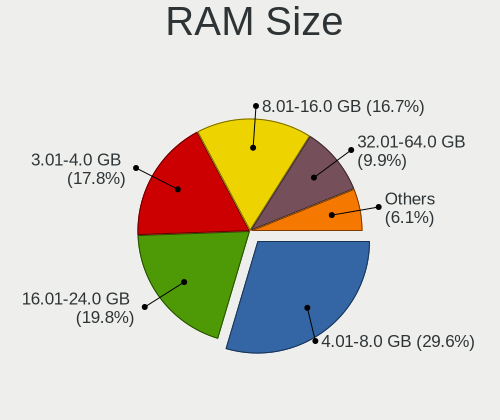
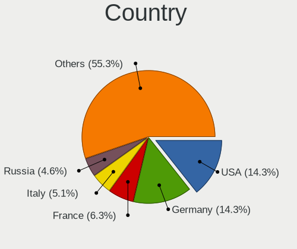
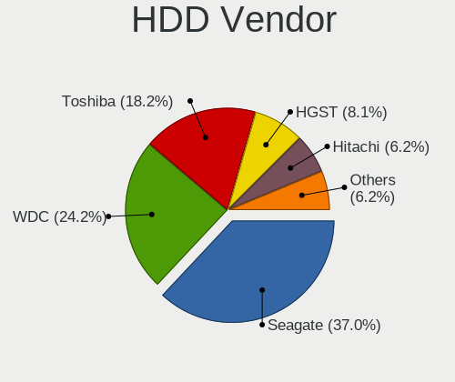
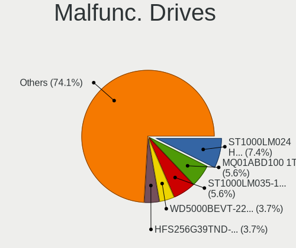
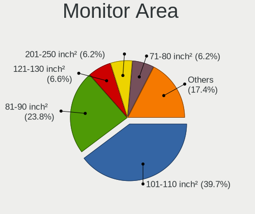
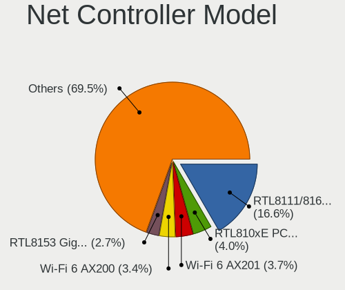
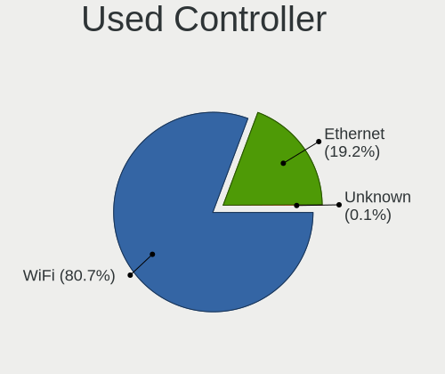
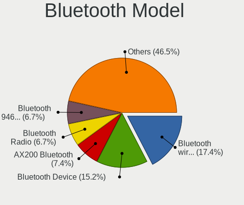
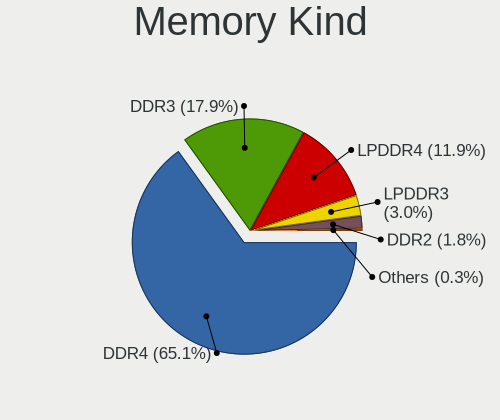

Ubuntu 21.10 - Tested Hardware & Statistics (Notebooks)
-------------------------------------------------------

A project to collect tested hardware configurations for Ubuntu 21.10.

Anyone can contribute to this report by the [hw-probe](https://github.com/linuxhw/hw-probe) tool:

    sudo -E hw-probe -all -upload

Please submit a probe of your configuration if it's not presented on the page or is rare.

Full-feature report is available here: https://linux-hardware.org/?view=trends&rel=ubuntu-21.10

Contents
--------

* [ Test Cases ](#test-cases)

* [ System ](#system)
  - [ Kernel                   ](#kernel)
  - [ Kernel Family            ](#kernel-family)
  - [ Kernel Major Ver.        ](#kernel-major-ver)
  - [ Arch                     ](#arch)
  - [ DE                       ](#de)
  - [ Display Server           ](#display-server)
  - [ Display Manager          ](#display-manager)
  - [ OS Lang                  ](#os-lang)
  - [ Boot Mode                ](#boot-mode)
  - [ Filesystem               ](#filesystem)
  - [ Part. scheme             ](#part-scheme)
  - [ Dual Boot with Linux/BSD ](#dual-boot-with-linuxbsd)
  - [ Dual Boot (Win)          ](#dual-boot-win)

* [ Board ](#board)
  - [ Vendor                   ](#vendor)
  - [ Model                    ](#model)
  - [ Model Family             ](#model-family)
  - [ MFG Year                 ](#mfg-year)
  - [ Form Factor              ](#form-factor)
  - [ Secure Boot              ](#secure-boot)
  - [ Coreboot                 ](#coreboot)
  - [ RAM Size                 ](#ram-size)
  - [ RAM Used                 ](#ram-used)
  - [ Total Drives             ](#total-drives)
  - [ Has CD-ROM               ](#has-cd-rom)
  - [ Has Ethernet             ](#has-ethernet)
  - [ Has WiFi                 ](#has-wifi)
  - [ Has Bluetooth            ](#has-bluetooth)

* [ Location ](#location)
  - [ Country                  ](#country)
  - [ City                     ](#city)

* [ Drives ](#drives)
  - [ Drive Vendor             ](#drive-vendor)
  - [ Drive Model              ](#drive-model)
  - [ HDD Vendor               ](#hdd-vendor)
  - [ SSD Vendor               ](#ssd-vendor)
  - [ Drive Kind               ](#drive-kind)
  - [ Drive Connector          ](#drive-connector)
  - [ Drive Size               ](#drive-size)
  - [ Space Total              ](#space-total)
  - [ Space Used               ](#space-used)
  - [ Malfunc. Drives          ](#malfunc-drives)
  - [ Malfunc. Drive Vendor    ](#malfunc-drive-vendor)
  - [ Malfunc. HDD Vendor      ](#malfunc-hdd-vendor)
  - [ Malfunc. Drive Kind      ](#malfunc-drive-kind)
  - [ Failed Drives            ](#failed-drives)
  - [ Failed Drive Vendor      ](#failed-drive-vendor)
  - [ Drive Status             ](#drive-status)

* [ Storage controller ](#storage-controller)
  - [ Storage Vendor           ](#storage-vendor)
  - [ Storage Model            ](#storage-model)
  - [ Storage Kind             ](#storage-kind)

* [ Processor ](#processor)
  - [ CPU Vendor               ](#cpu-vendor)
  - [ CPU Model                ](#cpu-model)
  - [ CPU Model Family         ](#cpu-model-family)
  - [ CPU Cores                ](#cpu-cores)
  - [ CPU Sockets              ](#cpu-sockets)
  - [ CPU Threads              ](#cpu-threads)
  - [ CPU Op-Modes             ](#cpu-op-modes)
  - [ CPU Microcode            ](#cpu-microcode)
  - [ CPU Microarch            ](#cpu-microarch)

* [ Graphics ](#graphics)
  - [ GPU Vendor               ](#gpu-vendor)
  - [ GPU Model                ](#gpu-model)
  - [ GPU Combo                ](#gpu-combo)
  - [ GPU Driver               ](#gpu-driver)
  - [ GPU Memory               ](#gpu-memory)

* [ Monitor ](#monitor)
  - [ Monitor Vendor           ](#monitor-vendor)
  - [ Monitor Model            ](#monitor-model)
  - [ Monitor Resolution       ](#monitor-resolution)
  - [ Monitor Diagonal         ](#monitor-diagonal)
  - [ Monitor Width            ](#monitor-width)
  - [ Aspect Ratio             ](#aspect-ratio)
  - [ Monitor Area             ](#monitor-area)
  - [ Pixel Density            ](#pixel-density)
  - [ Multiple Monitors        ](#multiple-monitors)

* [ Network ](#network)
  - [ Net Controller Vendor    ](#net-controller-vendor)
  - [ Net Controller Model     ](#net-controller-model)
  - [ Wireless Vendor          ](#wireless-vendor)
  - [ Wireless Model           ](#wireless-model)
  - [ Ethernet Vendor          ](#ethernet-vendor)
  - [ Ethernet Model           ](#ethernet-model)
  - [ Net Controller Kind      ](#net-controller-kind)
  - [ Used Controller          ](#used-controller)
  - [ NICs                     ](#nics)
  - [ IPv6                     ](#ipv6)

* [ Bluetooth ](#bluetooth)
  - [ Bluetooth Vendor         ](#bluetooth-vendor)
  - [ Bluetooth Model          ](#bluetooth-model)

* [ Sound ](#sound)
  - [ Sound Vendor             ](#sound-vendor)
  - [ Sound Model              ](#sound-model)

* [ Memory ](#memory)
  - [ Memory Vendor            ](#memory-vendor)
  - [ Memory Model             ](#memory-model)
  - [ Memory Kind              ](#memory-kind)
  - [ Memory Form Factor       ](#memory-form-factor)
  - [ Memory Size              ](#memory-size)
  - [ Memory Speed             ](#memory-speed)

* [ Printers & scanners ](#printers--scanners)
  - [ Printer Vendor           ](#printer-vendor)
  - [ Printer Model            ](#printer-model)
  - [ Scanner Vendor           ](#scanner-vendor)
  - [ Scanner Model            ](#scanner-model)

* [ Camera ](#camera)
  - [ Camera Vendor            ](#camera-vendor)
  - [ Camera Model             ](#camera-model)

* [ Security ](#security)
  - [ Fingerprint Vendor       ](#fingerprint-vendor)
  - [ Fingerprint Model        ](#fingerprint-model)
  - [ Chipcard Vendor          ](#chipcard-vendor)
  - [ Chipcard Model           ](#chipcard-model)

* [ Unsupported ](#unsupported)
  - [ Unsupported Devices      ](#unsupported-devices)
  - [ Unsupported Device Types ](#unsupported-device-types)

Test Cases
----------

| Vendor        | Model                       | Probe                                                      | Date         |
|---------------|-----------------------------|------------------------------------------------------------|--------------|
| Lenovo        | V14-ARE 82DQ                | [8948989999](https://linux-hardware.org/?probe=8948989999) | Oct 31, 2021 |
| HP            | Laptop 14-bs0xx             | [93c1d9bd4f](https://linux-hardware.org/?probe=93c1d9bd4f) | Oct 31, 2021 |
| HP            | OMEN by Laptop              | [d55ac505b9](https://linux-hardware.org/?probe=d55ac505b9) | Oct 31, 2021 |
| HP            | OMEN by Laptop              | [65a70acf15](https://linux-hardware.org/?probe=65a70acf15) | Oct 31, 2021 |
| Dell          | Inspiron 5558               | [d876caae1e](https://linux-hardware.org/?probe=d876caae1e) | Oct 31, 2021 |
| Apple         | MacBookPro11,1              | [0c24caf245](https://linux-hardware.org/?probe=0c24caf245) | Oct 31, 2021 |
| HP            | Pavilion Notebook           | [9c8bb9558a](https://linux-hardware.org/?probe=9c8bb9558a) | Oct 31, 2021 |
| HP            | Pavilion Laptop 15-cs300    | [bcc27223cc](https://linux-hardware.org/?probe=bcc27223cc) | Oct 31, 2021 |
| HP            | Laptop 14-bs0xx             | [ebc6fe2060](https://linux-hardware.org/?probe=ebc6fe2060) | Oct 31, 2021 |
| Dell          | XPS 15 7590                 | [58e43f0514](https://linux-hardware.org/?probe=58e43f0514) | Oct 31, 2021 |
| Acer          | Swift SF314-43              | [be8229729b](https://linux-hardware.org/?probe=be8229729b) | Oct 31, 2021 |
| HP            | Pavilion dv6                | [2e9d378e76](https://linux-hardware.org/?probe=2e9d378e76) | Oct 31, 2021 |
| Lenovo        | ThinkPad Edge 0578A21       | [570863fd8c](https://linux-hardware.org/?probe=570863fd8c) | Oct 31, 2021 |
| Acer          | Swift SF314-43              | [4881a9a93c](https://linux-hardware.org/?probe=4881a9a93c) | Oct 31, 2021 |
| Lenovo        | ThinkPad T410 2537GH6       | [8b21b7cffe](https://linux-hardware.org/?probe=8b21b7cffe) | Oct 31, 2021 |
| Lenovo        | ThinkPad T14s Gen 2i 20W... | [ba228b1ed7](https://linux-hardware.org/?probe=ba228b1ed7) | Oct 31, 2021 |
| Lenovo        | ThinkPad T14 Gen 1 20S0C... | [f7309ef31a](https://linux-hardware.org/?probe=f7309ef31a) | Oct 30, 2021 |
| MSI           | GT75VR 7RF                  | [edd545a455](https://linux-hardware.org/?probe=edd545a455) | Oct 30, 2021 |
| ASUSTek       | N751JK                      | [739623468a](https://linux-hardware.org/?probe=739623468a) | Oct 30, 2021 |
| Lenovo        | IdeaPad Gaming 3 15IHU6 ... | [47907aec3e](https://linux-hardware.org/?probe=47907aec3e) | Oct 30, 2021 |
| Lenovo        | IdeaPad 5 15IIL05 81YK      | [0c865ddf24](https://linux-hardware.org/?probe=0c865ddf24) | Oct 30, 2021 |
| Dell          | Latitude E5570              | [d926705b17](https://linux-hardware.org/?probe=d926705b17) | Oct 30, 2021 |
| Dell          | Latitude E5570              | [b8515cfe6b](https://linux-hardware.org/?probe=b8515cfe6b) | Oct 30, 2021 |
| Dell          | Latitude 5490               | [4efdbaeea5](https://linux-hardware.org/?probe=4efdbaeea5) | Oct 30, 2021 |
| Acer          | Swift SF314-511             | [43faa95812](https://linux-hardware.org/?probe=43faa95812) | Oct 30, 2021 |
| Dell          | XPS 17 9700                 | [5e25d50915](https://linux-hardware.org/?probe=5e25d50915) | Oct 30, 2021 |
| ASUSTek       | TUF Gaming FA506IU_FA506... | [3802a77d98](https://linux-hardware.org/?probe=3802a77d98) | Oct 29, 2021 |
| Dell          | Inspiron 15-3573            | [141148ec26](https://linux-hardware.org/?probe=141148ec26) | Oct 29, 2021 |
| HP            | Laptop 17z-ca300            | [0071faabac](https://linux-hardware.org/?probe=0071faabac) | Oct 29, 2021 |
| Lenovo        | ThinkPad X1 Carbon 6th 2... | [2b4a1a20d9](https://linux-hardware.org/?probe=2b4a1a20d9) | Oct 29, 2021 |
| Lenovo        | V580c 20160                 | [779684e41d](https://linux-hardware.org/?probe=779684e41d) | Oct 29, 2021 |
| Medion        | Akoya E6240T                | [1a0a5790b3](https://linux-hardware.org/?probe=1a0a5790b3) | Oct 29, 2021 |
| Acer          | Aspire F5-573G              | [9b5832381a](https://linux-hardware.org/?probe=9b5832381a) | Oct 29, 2021 |
| MSI           | GE62 7RD                    | [95616813e6](https://linux-hardware.org/?probe=95616813e6) | Oct 29, 2021 |
| MSI           | GE62 6QF                    | [1c48df3fa2](https://linux-hardware.org/?probe=1c48df3fa2) | Oct 29, 2021 |
| realme        | RMNBXXXX                    | [70b65bbcf8](https://linux-hardware.org/?probe=70b65bbcf8) | Oct 28, 2021 |
| Lenovo        | ThinkPad P1 Gen 4i 20Y4S... | [75c43f02bf](https://linux-hardware.org/?probe=75c43f02bf) | Oct 28, 2021 |
| Toshiba       | Satellite C75-B             | [fe77011ed7](https://linux-hardware.org/?probe=fe77011ed7) | Oct 28, 2021 |
| Sony          | SVS1312G3EW                 | [7951439c81](https://linux-hardware.org/?probe=7951439c81) | Oct 28, 2021 |
| Lenovo        | IdeaPad 3 15ALC6 82KU       | [9276790a36](https://linux-hardware.org/?probe=9276790a36) | Oct 28, 2021 |
| HP            | ENVY dv6                    | [31ff7dd229](https://linux-hardware.org/?probe=31ff7dd229) | Oct 28, 2021 |
| HP            | ZBook Power G7 Mobile Wo... | [e0d6eafd15](https://linux-hardware.org/?probe=e0d6eafd15) | Oct 28, 2021 |
| Lenovo        | ThinkPad L590 20Q8S1FX00    | [7555bbd3c1](https://linux-hardware.org/?probe=7555bbd3c1) | Oct 27, 2021 |
| ASUSTek       | ZenBook UX433FN_UX433FN     | [3377403e20](https://linux-hardware.org/?probe=3377403e20) | Oct 27, 2021 |
| Dell          | Inspiron 15 7000 Gaming     | [1b93e3c1c9](https://linux-hardware.org/?probe=1b93e3c1c9) | Oct 27, 2021 |
| Lenovo        | IdeaPad Flex-14API 81SS     | [3f7c00c1ef](https://linux-hardware.org/?probe=3f7c00c1ef) | Oct 27, 2021 |
| Dell          | Latitude 5420               | [6eef53ac22](https://linux-hardware.org/?probe=6eef53ac22) | Oct 27, 2021 |
| Fujitsu Si... | ESPRIMO Mobile M9410        | [2cec9ef3cc](https://linux-hardware.org/?probe=2cec9ef3cc) | Oct 27, 2021 |
| Dell          | Latitude 5420               | [6d4e346031](https://linux-hardware.org/?probe=6d4e346031) | Oct 27, 2021 |
| Dell          | Latitude 5521               | [e40947106a](https://linux-hardware.org/?probe=e40947106a) | Oct 27, 2021 |
| Dell          | Latitude 5521               | [7fed676309](https://linux-hardware.org/?probe=7fed676309) | Oct 27, 2021 |
| Toshiba       | PORTEGE R830                | [6378d53c40](https://linux-hardware.org/?probe=6378d53c40) | Oct 27, 2021 |
| Apple         | MacBook2,1                  | [0346bc764a](https://linux-hardware.org/?probe=0346bc764a) | Oct 27, 2021 |
| Dell          | Inspiron 3595               | [1df662506b](https://linux-hardware.org/?probe=1df662506b) | Oct 27, 2021 |
| Acer          | Aspire A315-21              | [e179a0974d](https://linux-hardware.org/?probe=e179a0974d) | Oct 27, 2021 |
| Dell          | Inspiron 5558               | [e22971aa36](https://linux-hardware.org/?probe=e22971aa36) | Oct 27, 2021 |
| Dell          | XPS 15 9570                 | [0fa8c3ed0c](https://linux-hardware.org/?probe=0fa8c3ed0c) | Oct 26, 2021 |
| Acer          | Swift SF314-43              | [4c750c8b99](https://linux-hardware.org/?probe=4c750c8b99) | Oct 26, 2021 |
| Direkt-Tek    | DTLAPY133-1                 | [63facc4838](https://linux-hardware.org/?probe=63facc4838) | Oct 26, 2021 |
| Direkt-Tek    | DTLAPY133-1                 | [a2d784b2ea](https://linux-hardware.org/?probe=a2d784b2ea) | Oct 26, 2021 |
| Packard Be... | EasyNote TS11HR             | [1217a94f61](https://linux-hardware.org/?probe=1217a94f61) | Oct 26, 2021 |
| Acer          | Aspire ES1-523              | [59ab566702](https://linux-hardware.org/?probe=59ab566702) | Oct 25, 2021 |
| Acer          | Aspire ES1-523              | [d215eb8353](https://linux-hardware.org/?probe=d215eb8353) | Oct 25, 2021 |
| HP            | Laptop 15-da0xxx            | [f0a8fa5e7a](https://linux-hardware.org/?probe=f0a8fa5e7a) | Oct 25, 2021 |
| Acer          | Swift SF314-56G             | [55a32ef8dc](https://linux-hardware.org/?probe=55a32ef8dc) | Oct 25, 2021 |
| Acer          | Aspire VX5-591G             | [6ad3cf44dc](https://linux-hardware.org/?probe=6ad3cf44dc) | Oct 24, 2021 |
| HP            | Pavilion dv6                | [bf8422ec46](https://linux-hardware.org/?probe=bf8422ec46) | Oct 24, 2021 |
| Samsung       | 530U3C/530U4C               | [07df07de7d](https://linux-hardware.org/?probe=07df07de7d) | Oct 24, 2021 |
| Acer          | Aspire ES1-512              | [aa7dd43b73](https://linux-hardware.org/?probe=aa7dd43b73) | Oct 24, 2021 |
| Acer          | Swift SF314-57              | [b416f8b251](https://linux-hardware.org/?probe=b416f8b251) | Oct 24, 2021 |
| Acer          | Swift SF314-57              | [5cfaf3df18](https://linux-hardware.org/?probe=5cfaf3df18) | Oct 24, 2021 |
| HP            | Laptop 15s-eq2xxx           | [1e9f6f2d44](https://linux-hardware.org/?probe=1e9f6f2d44) | Oct 24, 2021 |
| HP            | ProBook 440 G5              | [508961bc42](https://linux-hardware.org/?probe=508961bc42) | Oct 24, 2021 |
| Acer          | Swift SF314-43              | [5de95b5df3](https://linux-hardware.org/?probe=5de95b5df3) | Oct 23, 2021 |
| HP            | ProBook 440 G5              | [db61c07848](https://linux-hardware.org/?probe=db61c07848) | Oct 23, 2021 |
| Acer          | Swift SF314-43              | [8d0af565c3](https://linux-hardware.org/?probe=8d0af565c3) | Oct 23, 2021 |
| Fujitsu       | LIFEBOOK U772               | [7fab4f85e2](https://linux-hardware.org/?probe=7fab4f85e2) | Oct 23, 2021 |
| HUAWEI        | MACH-WX9                    | [68c01947c9](https://linux-hardware.org/?probe=68c01947c9) | Oct 23, 2021 |
| Dell          | Inspiron 5558               | [bb40091a40](https://linux-hardware.org/?probe=bb40091a40) | Oct 23, 2021 |
| Acer          | Swift SF114-32              | [87697aa300](https://linux-hardware.org/?probe=87697aa300) | Oct 23, 2021 |
| Dell          | Latitude E7470              | [69a251cc1f](https://linux-hardware.org/?probe=69a251cc1f) | Oct 22, 2021 |
| Dell          | Inspiron 15 5501            | [d252623e18](https://linux-hardware.org/?probe=d252623e18) | Oct 22, 2021 |
| Acer          | Swift SF314-43              | [8275d5fa0b](https://linux-hardware.org/?probe=8275d5fa0b) | Oct 22, 2021 |
| HP            | ProBook 450 G5              | [5909be5c82](https://linux-hardware.org/?probe=5909be5c82) | Oct 22, 2021 |
| Sony          | VGN-FW550F                  | [c2b95c9dfa](https://linux-hardware.org/?probe=c2b95c9dfa) | Oct 22, 2021 |
| Clevo         | M740TU(N)/M760TU(N)/W7X0... | [85ccf0afc5](https://linux-hardware.org/?probe=85ccf0afc5) | Oct 22, 2021 |
| HP            | Pavilion g4                 | [3b86797a83](https://linux-hardware.org/?probe=3b86797a83) | Oct 22, 2021 |
| Schenker      | XMG FUSION 15 (XFU15L19)    | [b198944ad7](https://linux-hardware.org/?probe=b198944ad7) | Oct 22, 2021 |
| Dell          | Inspiron 5558               | [6ada321924](https://linux-hardware.org/?probe=6ada321924) | Oct 22, 2021 |
| MSI           | GF63 Thin 9RCX              | [c4768bba2d](https://linux-hardware.org/?probe=c4768bba2d) | Oct 22, 2021 |
| Lenovo        | ThinkPad T430s 23561R0      | [bef1593d06](https://linux-hardware.org/?probe=bef1593d06) | Oct 22, 2021 |
| Toshiba       | PORTEGE R830                | [5d6b560499](https://linux-hardware.org/?probe=5d6b560499) | Oct 22, 2021 |
| MSI           | GF63 Thin 9RCX              | [aa2a33d3f0](https://linux-hardware.org/?probe=aa2a33d3f0) | Oct 21, 2021 |
| Lenovo        | ThinkPad T15g Gen 1 20UR... | [55de21b8b0](https://linux-hardware.org/?probe=55de21b8b0) | Oct 21, 2021 |
| Lenovo        | ThinkPad E15 Gen 2 20TD0... | [1b5cd08b30](https://linux-hardware.org/?probe=1b5cd08b30) | Oct 21, 2021 |
| Apple         | MacBookPro12,1              | [271e56e195](https://linux-hardware.org/?probe=271e56e195) | Oct 21, 2021 |
| Apple         | MacBookPro12,1              | [3735576026](https://linux-hardware.org/?probe=3735576026) | Oct 21, 2021 |
| realme        | RMNBXXXX                    | [daa57fd7da](https://linux-hardware.org/?probe=daa57fd7da) | Oct 21, 2021 |
| Lenovo        | ThinkPad S1 Yoga 20C0004... | [9facbd3d72](https://linux-hardware.org/?probe=9facbd3d72) | Oct 21, 2021 |
| Lenovo        | ThinkPad X1 Carbon 3rd 2... | [463b15301d](https://linux-hardware.org/?probe=463b15301d) | Oct 21, 2021 |
| HP            | 15                          | [b01898bb59](https://linux-hardware.org/?probe=b01898bb59) | Oct 21, 2021 |
| MSI           | GP72 2QD                    | [75801b27ae](https://linux-hardware.org/?probe=75801b27ae) | Oct 20, 2021 |
| MSI           | GP72 2QD                    | [bd12b3e948](https://linux-hardware.org/?probe=bd12b3e948) | Oct 20, 2021 |
| HP            | 650                         | [c32592cabb](https://linux-hardware.org/?probe=c32592cabb) | Oct 20, 2021 |
| HP            | ProBook 450 G7              | [c86d75dbbb](https://linux-hardware.org/?probe=c86d75dbbb) | Oct 20, 2021 |
| Medion        | E6226                       | [ebc0f3d72b](https://linux-hardware.org/?probe=ebc0f3d72b) | Oct 20, 2021 |
| Acer          | Nitro AN515-43              | [ac5870ab3d](https://linux-hardware.org/?probe=ac5870ab3d) | Oct 20, 2021 |
| ASUSTek       | ROG Zephyrus G14 GA401QC... | [14d159c564](https://linux-hardware.org/?probe=14d159c564) | Oct 20, 2021 |
| HUAWEI        | KLVL-WXX9                   | [4517a98ebf](https://linux-hardware.org/?probe=4517a98ebf) | Oct 20, 2021 |
| Apple         | MacBookPro9,2               | [0ec3c548af](https://linux-hardware.org/?probe=0ec3c548af) | Oct 19, 2021 |
| Lenovo        | ThinkPad T590 20N5S4Y100    | [f00be1a69f](https://linux-hardware.org/?probe=f00be1a69f) | Oct 19, 2021 |
| Dell          | Latitude 5400               | [8a880e6565](https://linux-hardware.org/?probe=8a880e6565) | Oct 19, 2021 |
| Dell          | Latitude 5400               | [0a94130eb2](https://linux-hardware.org/?probe=0a94130eb2) | Oct 19, 2021 |
| Lenovo        | ThinkPad T500 22437SG       | [0e26427d3d](https://linux-hardware.org/?probe=0e26427d3d) | Oct 19, 2021 |
| Lenovo        | ThinkPad E15 Gen 2 20T80... | [8e04250418](https://linux-hardware.org/?probe=8e04250418) | Oct 19, 2021 |
| Lenovo        | G505 20240                  | [a878fe1079](https://linux-hardware.org/?probe=a878fe1079) | Oct 19, 2021 |
| Lenovo        | G505 20240                  | [4c254474e3](https://linux-hardware.org/?probe=4c254474e3) | Oct 19, 2021 |
| HUAWEI        | MACHD-WXX9                  | [8563f3786e](https://linux-hardware.org/?probe=8563f3786e) | Oct 19, 2021 |
| Lenovo        | ThinkPad X1 Carbon Gen 9... | [a16f7dac18](https://linux-hardware.org/?probe=a16f7dac18) | Oct 18, 2021 |
| Lenovo        | ThinkPad W530 244759G       | [e80bbd929f](https://linux-hardware.org/?probe=e80bbd929f) | Oct 18, 2021 |
| HP            | Compaq Presario CQ50        | [bb34275819](https://linux-hardware.org/?probe=bb34275819) | Oct 18, 2021 |
| MSI           | GF62 8RC                    | [89d77a3654](https://linux-hardware.org/?probe=89d77a3654) | Oct 18, 2021 |
| Lenovo        | ThinkPad X1 Carbon 7th 2... | [080c5280d0](https://linux-hardware.org/?probe=080c5280d0) | Oct 17, 2021 |
| Lenovo        | ThinkPad T500 22437SG       | [751041603e](https://linux-hardware.org/?probe=751041603e) | Oct 17, 2021 |
| Dell          | Inspiron 15-3573            | [0eae8a7bf7](https://linux-hardware.org/?probe=0eae8a7bf7) | Oct 17, 2021 |
| ASUSTek       | G72GX                       | [48f6c89377](https://linux-hardware.org/?probe=48f6c89377) | Oct 17, 2021 |
| Dell          | XPS 15 9570                 | [26d1a4225d](https://linux-hardware.org/?probe=26d1a4225d) | Oct 17, 2021 |
| HP            | Pavilion dv6                | [b60dd43240](https://linux-hardware.org/?probe=b60dd43240) | Oct 17, 2021 |
| ASUSTek       | X501A                       | [b3e4d8035d](https://linux-hardware.org/?probe=b3e4d8035d) | Oct 17, 2021 |
| HP            | Laptop 17-by3xxx            | [e16a18bc8b](https://linux-hardware.org/?probe=e16a18bc8b) | Oct 17, 2021 |
| Dell          | Latitude 7490               | [adb96facbb](https://linux-hardware.org/?probe=adb96facbb) | Oct 17, 2021 |
| Acer          | Aspire A715-75G             | [87c7c24dcc](https://linux-hardware.org/?probe=87c7c24dcc) | Oct 17, 2021 |
| Acer          | ConceptD CN315-71P          | [50385dde8b](https://linux-hardware.org/?probe=50385dde8b) | Oct 16, 2021 |
| realme        | RMNBXXXX                    | [968a52c56a](https://linux-hardware.org/?probe=968a52c56a) | Oct 16, 2021 |
| HP            | EliteBook 8570w             | [492907a363](https://linux-hardware.org/?probe=492907a363) | Oct 16, 2021 |
| Medion        | E7218                       | [cca261a107](https://linux-hardware.org/?probe=cca261a107) | Oct 16, 2021 |
| Acer          | Extensa 2519                | [5b33aac7c5](https://linux-hardware.org/?probe=5b33aac7c5) | Oct 16, 2021 |
| Toshiba       | Satellite C660              | [c70057c643](https://linux-hardware.org/?probe=c70057c643) | Oct 16, 2021 |
| HUAWEI        | KLVL-WXX9                   | [ff0e6377ee](https://linux-hardware.org/?probe=ff0e6377ee) | Oct 16, 2021 |
| HP            | ZBook 17 G3                 | [11b17af506](https://linux-hardware.org/?probe=11b17af506) | Oct 16, 2021 |
| Lenovo        | ThinkBook 15-IIL 20SM       | [c7fc550482](https://linux-hardware.org/?probe=c7fc550482) | Oct 16, 2021 |
| Apple         | MacBookPro12,1              | [4bfee9269a](https://linux-hardware.org/?probe=4bfee9269a) | Oct 16, 2021 |
| Sony          | VPCEB2S1E                   | [b42e7996bf](https://linux-hardware.org/?probe=b42e7996bf) | Oct 15, 2021 |
| Acer          | Aspire 7530G                | [09694e2816](https://linux-hardware.org/?probe=09694e2816) | Oct 15, 2021 |
| Dell          | Inspiron 15-3567            | [a629aeaa1b](https://linux-hardware.org/?probe=a629aeaa1b) | Oct 15, 2021 |
| Lenovo        | B570 1068GEG                | [cb2f8c100b](https://linux-hardware.org/?probe=cb2f8c100b) | Oct 15, 2021 |
| Lenovo        | ThinkBook 15-IML 20RW       | [c6478e67c7](https://linux-hardware.org/?probe=c6478e67c7) | Oct 15, 2021 |
| HP            | ZHAN 66 Pro A 14 G3         | [00196d9727](https://linux-hardware.org/?probe=00196d9727) | Oct 15, 2021 |
| Acer          | Aspire A715-75G             | [0d9ad64b08](https://linux-hardware.org/?probe=0d9ad64b08) | Oct 15, 2021 |
| Lenovo        | ThinkPad T470s 20HGS0180... | [11539dc528](https://linux-hardware.org/?probe=11539dc528) | Oct 15, 2021 |
| Acer          | Aspire 7741                 | [2f093c19bf](https://linux-hardware.org/?probe=2f093c19bf) | Oct 15, 2021 |
| Dell          | XPS 13 9300                 | [22029905ac](https://linux-hardware.org/?probe=22029905ac) | Oct 15, 2021 |
| ASUSTek       | GL753VD                     | [a63eee78d3](https://linux-hardware.org/?probe=a63eee78d3) | Oct 14, 2021 |
| Dell          | Latitude E6520              | [b84ef4472b](https://linux-hardware.org/?probe=b84ef4472b) | Oct 14, 2021 |
| Google        | Treeya                      | [82b0964b6d](https://linux-hardware.org/?probe=82b0964b6d) | Oct 14, 2021 |
| Framework     | Laptop                      | [bd65852653](https://linux-hardware.org/?probe=bd65852653) | Oct 14, 2021 |
| Dell          | Latitude E6320              | [e8538ce77d](https://linux-hardware.org/?probe=e8538ce77d) | Oct 12, 2021 |
| Lenovo        | ThinkPad X201T 3113CC7      | [47f63d40d5](https://linux-hardware.org/?probe=47f63d40d5) | Oct 09, 2021 |
| Lenovo        | IdeaPad 330S-15IKB 81F5     | [f8d957d29f](https://linux-hardware.org/?probe=f8d957d29f) | Oct 09, 2021 |
| Lenovo        | ThinkPad E14 Gen 2 20TBS... | [954005ca3d](https://linux-hardware.org/?probe=954005ca3d) | Oct 08, 2021 |
| Lenovo        | IdeaPad 330S-15IKB 81F5     | [6c5495590b](https://linux-hardware.org/?probe=6c5495590b) | Oct 08, 2021 |
| Lenovo        | G570 20079                  | [81875a0613](https://linux-hardware.org/?probe=81875a0613) | Oct 06, 2021 |
| Dell          | XPS 13 7390                 | [66d13e4e24](https://linux-hardware.org/?probe=66d13e4e24) | Oct 03, 2021 |
| Lenovo        | ThinkPad T15g Gen 1 20UR... | [08a44500da](https://linux-hardware.org/?probe=08a44500da) | Oct 03, 2021 |
| Lenovo        | G570 20079                  | [a0cac25f22](https://linux-hardware.org/?probe=a0cac25f22) | Oct 02, 2021 |
| Lenovo        | G570 20079                  | [93f8496968](https://linux-hardware.org/?probe=93f8496968) | Oct 02, 2021 |
| Dell          | XPS 13 7390                 | [c6882f7282](https://linux-hardware.org/?probe=c6882f7282) | Oct 01, 2021 |
| Lenovo        | ThinkBook 14-IIL 20SL       | [2b03e34e82](https://linux-hardware.org/?probe=2b03e34e82) | Sep 30, 2021 |
| Lenovo        | ThinkPad T15g Gen 1 20UR... | [1b81ca9e7a](https://linux-hardware.org/?probe=1b81ca9e7a) | Sep 29, 2021 |
| HP            | Pavilion Laptop 15-cs3xx... | [51b49beb10](https://linux-hardware.org/?probe=51b49beb10) | Sep 28, 2021 |
| Lenovo        | ThinkPad T400 2768WGB       | [fc93efcead](https://linux-hardware.org/?probe=fc93efcead) | Sep 25, 2021 |
| Lenovo        | ThinkPad T400 2768WGB       | [8a2d72befe](https://linux-hardware.org/?probe=8a2d72befe) | Sep 24, 2021 |
| TUXEDO        | N7x0WU                      | [10f446b51e](https://linux-hardware.org/?probe=10f446b51e) | Sep 24, 2021 |
| Dell          | Precision 7710              | [fa8e5cdff5](https://linux-hardware.org/?probe=fa8e5cdff5) | Sep 23, 2021 |
| Acer          | Swift SFX14-41G             | [6b06b9e5dd](https://linux-hardware.org/?probe=6b06b9e5dd) | Sep 23, 2021 |
| Apple         | MacBookPro8,1               | [5b337fdb0a](https://linux-hardware.org/?probe=5b337fdb0a) | Sep 20, 2021 |
| Apple         | MacBookPro8,1               | [7c806aa7c5](https://linux-hardware.org/?probe=7c806aa7c5) | Sep 19, 2021 |
| ASUSTek       | VivoBook_ASUSLaptop X580... | [824a26d7e0](https://linux-hardware.org/?probe=824a26d7e0) | Sep 18, 2021 |
| Dell          | Vostro 3550                 | [1fe8420099](https://linux-hardware.org/?probe=1fe8420099) | Sep 17, 2021 |
| Dell          | Vostro 3550                 | [10f08c1bfd](https://linux-hardware.org/?probe=10f08c1bfd) | Sep 17, 2021 |
| Lenovo        | ThinkPad T400 2768WGB       | [77d801bf3c](https://linux-hardware.org/?probe=77d801bf3c) | Sep 15, 2021 |
| HP            | ProBook 455 G6              | [8c5aa4304c](https://linux-hardware.org/?probe=8c5aa4304c) | Sep 14, 2021 |
| Lenovo        | ThinkPad T400 2768WGB       | [c105819db0](https://linux-hardware.org/?probe=c105819db0) | Sep 13, 2021 |
| Lenovo        | ThinkPad T400 2768WGB       | [04299c1c72](https://linux-hardware.org/?probe=04299c1c72) | Sep 10, 2021 |
| Lenovo        | G570 20079                  | [070f80905a](https://linux-hardware.org/?probe=070f80905a) | Sep 09, 2021 |
| Dell          | XPS 13 9310                 | [ce30239886](https://linux-hardware.org/?probe=ce30239886) | Sep 08, 2021 |
| Lenovo        | ThinkPad T470 20JNS3M500    | [1dcfa059c1](https://linux-hardware.org/?probe=1dcfa059c1) | Sep 07, 2021 |
| Lenovo        | V310-14IKB 80T2             | [9036570a3d](https://linux-hardware.org/?probe=9036570a3d) | Sep 07, 2021 |
| Dell          | XPS 13 9310                 | [a23d662013](https://linux-hardware.org/?probe=a23d662013) | Sep 06, 2021 |
| Lenovo        | G570 20079                  | [92d47c8db5](https://linux-hardware.org/?probe=92d47c8db5) | Sep 05, 2021 |
| Google        | Nautilus                    | [3b25f1b84a](https://linux-hardware.org/?probe=3b25f1b84a) | Sep 05, 2021 |
| Lenovo        | G570 20079                  | [897adf5520](https://linux-hardware.org/?probe=897adf5520) | Sep 04, 2021 |
| Lenovo        | ThinkPad T400 2768WGB       | [a66a6f00e4](https://linux-hardware.org/?probe=a66a6f00e4) | Sep 03, 2021 |
| Lenovo        | V310-14IKB 80T2             | [682d409384](https://linux-hardware.org/?probe=682d409384) | Sep 02, 2021 |
| Dell          | Latitude E6410              | [8b57d50d95](https://linux-hardware.org/?probe=8b57d50d95) | Sep 02, 2021 |
| ASUSTek       | GL753VD                     | [d17c6ba3fc](https://linux-hardware.org/?probe=d17c6ba3fc) | Sep 01, 2021 |
| ASUSTek       | ROG Strix G533QS_G533QS     | [cae806f49d](https://linux-hardware.org/?probe=cae806f49d) | Aug 22, 2021 |
| ASUSTek       | ROG Strix G533QS_G533QS     | [b8aa2e41d5](https://linux-hardware.org/?probe=b8aa2e41d5) | Aug 16, 2021 |
| ASUSTek       | ROG Strix G533QS_G533QS     | [612dda8fba](https://linux-hardware.org/?probe=612dda8fba) | Aug 13, 2021 |
| ASUSTek       | ROG Strix G533QS_G533QS     | [1eb6008b88](https://linux-hardware.org/?probe=1eb6008b88) | Aug 13, 2021 |
| ASUSTek       | VivoBook_ASUSLaptop X509... | [808cfab06b](https://linux-hardware.org/?probe=808cfab06b) | Aug 12, 2021 |
| Lenovo        | ThinkPad T510 4484A63       | [c1bcb3451f](https://linux-hardware.org/?probe=c1bcb3451f) | Aug 09, 2021 |
| Lenovo        | ThinkPad T510 4484A63       | [4336b50906](https://linux-hardware.org/?probe=4336b50906) | Aug 06, 2021 |
| ASUSTek       | VivoBook_ASUSLaptop X530... | [961031411d](https://linux-hardware.org/?probe=961031411d) | Aug 03, 2021 |
| Lenovo        | ZhaoYang K3-ITL 82E3        | [ee2be4cea9](https://linux-hardware.org/?probe=ee2be4cea9) | Aug 03, 2021 |
| ASUSTek       | GL753VD                     | [eabe6a8723](https://linux-hardware.org/?probe=eabe6a8723) | Jul 31, 2021 |
| Acer          | Aspire 5920                 | [f41defe215](https://linux-hardware.org/?probe=f41defe215) | Jul 31, 2021 |
| Dell          | XPS 13 7390                 | [901bcb991b](https://linux-hardware.org/?probe=901bcb991b) | Jul 31, 2021 |
| Teclast       | F6 Pro                      | [e28004c24b](https://linux-hardware.org/?probe=e28004c24b) | Jul 27, 2021 |
| ASUSTek       | VivoBook_ASUSLaptop X421... | [f5458b4f56](https://linux-hardware.org/?probe=f5458b4f56) | Jul 19, 2021 |
| ASUSTek       | VivoBook_ASUSLaptop X421... | [5ac65f3389](https://linux-hardware.org/?probe=5ac65f3389) | Jul 18, 2021 |
| Lenovo        | Z50-70 20354                | [85aadf8abd](https://linux-hardware.org/?probe=85aadf8abd) | Jul 16, 2021 |
| Lenovo        | Z50-70 20354                | [b2c80f450e](https://linux-hardware.org/?probe=b2c80f450e) | Jul 14, 2021 |
| HP            | Pavilion Gaming Laptop 1... | [f024f2512e](https://linux-hardware.org/?probe=f024f2512e) | Jul 14, 2021 |
| Lenovo        | ThinkPad X201 3626FAG       | [259908557b](https://linux-hardware.org/?probe=259908557b) | Jun 28, 2021 |
| Positivo      | H14BT58                     | [51b9ba65e0](https://linux-hardware.org/?probe=51b9ba65e0) | Jun 18, 2021 |
| ASUSTek       | ROG Strix G533QR_G533QR     | [4befd5f360](https://linux-hardware.org/?probe=4befd5f360) | Jun 04, 2021 |
| Dell          | XPS 13 9343                 | [4ee08e92ae](https://linux-hardware.org/?probe=4ee08e92ae) | May 18, 2021 |

System
------

Kernel
------

Version of the Linux kernel

| Version                  | Notebooks | Percent |
|--------------------------|-----------|---------|
| 5.13.0-20-generic        | 67        | 40.36%  |
| 5.13.0-19-generic        | 47        | 28.31%  |
| 5.13.0-16-generic        | 14        | 8.43%   |
| 5.13.0-14-generic        | 8         | 4.82%   |
| 5.13.0-21-generic        | 4         | 2.41%   |
| 5.11.0-20-generic        | 4         | 2.41%   |
| 5.15.0-051500rc5-generic | 2         | 1.2%    |
| 5.11.0-25-generic        | 2         | 1.2%    |
| 5.11.0-18-generic        | 2         | 1.2%    |
| 5.14.14-051414-generic   | 1         | 0.6%    |
| 5.14.0-1005-oem          | 1         | 0.6%    |
| 5.13.6-xanmod2-edge      | 1         | 0.6%    |
| 5.13.4-051304-generic    | 1         | 0.6%    |
| 5.13.2-051302-generic    | 1         | 0.6%    |
| 5.13.0-20-lowlatency     | 1         | 0.6%    |
| 5.13.0-13-generic        | 1         | 0.6%    |
| 5.12.19-051219-generic   | 1         | 0.6%    |
| 5.11.0-40-generic        | 1         | 0.6%    |
| 5.11.0-38-generic        | 1         | 0.6%    |
| 5.11.0-37-generic        | 1         | 0.6%    |
| 5.11.0-31-generic        | 1         | 0.6%    |
| 5.11.0-26-generic        | 1         | 0.6%    |
| 5.11.0-22-generic        | 1         | 0.6%    |
| 5.11.0-16-generic        | 1         | 0.6%    |
| 5.10.0-1050-oem          | 1         | 0.6%    |

Kernel Family
-------------

Linux kernel without a distro release

| Version | Notebooks | Percent |
|---------|-----------|---------|
| 5.13.0  | 140       | 85.37%  |
| 5.11.0  | 15        | 9.15%   |
| 5.15.0  | 2         | 1.22%   |
| 5.14.14 | 1         | 0.61%   |
| 5.14.0  | 1         | 0.61%   |
| 5.13.6  | 1         | 0.61%   |
| 5.13.4  | 1         | 0.61%   |
| 5.13.2  | 1         | 0.61%   |
| 5.12.19 | 1         | 0.61%   |
| 5.10.0  | 1         | 0.61%   |

Kernel Major Ver.
-----------------

Linux kernel major version

| Version | Notebooks | Percent |
|---------|-----------|---------|
| 5.13    | 143       | 87.2%   |
| 5.11    | 15        | 9.15%   |
| 5.15    | 2         | 1.22%   |
| 5.14    | 2         | 1.22%   |
| 5.12    | 1         | 0.61%   |
| 5.10    | 1         | 0.61%   |

Arch
----

OS architecture (x86_64, i586, etc.)

| Name   | Notebooks | Percent |
|--------|-----------|---------|
| x86_64 | 164       | 100%    |

DE
--

Desktop Environment

| Name            | Notebooks | Percent |
|-----------------|-----------|---------|
| GNOME           | 145       | 87.88%  |
| Unknown         | 12        | 7.27%   |
| GNOME Flashback | 3         | 1.82%   |
| X-Cinnamon      | 2         | 1.21%   |
| Unity           | 1         | 0.61%   |
| i3              | 1         | 0.61%   |
| Cinnamon        | 1         | 0.61%   |

Display Server
--------------

X11 or Wayland

| Name    | Notebooks | Percent |
|---------|-----------|---------|
| Wayland | 112       | 68.29%  |
| X11     | 45        | 27.44%  |
| Unknown | 6         | 3.66%   |
| Tty     | 1         | 0.61%   |

Display Manager
---------------

SDDM, LightDM, etc.

| Name    | Notebooks | Percent |
|---------|-----------|---------|
| GDM3    | 81        | 48.8%   |
| GDM     | 56        | 33.73%  |
| Unknown | 24        | 14.46%  |
| LightDM | 3         | 1.81%   |
| TDM     | 1         | 0.6%    |
| Ly      | 1         | 0.6%    |

OS Lang
-------

Language

| Lang    | Notebooks | Percent |
|---------|-----------|---------|
| en_US   | 72        | 43.9%   |
| de_DE   | 17        | 10.37%  |
| en_GB   | 12        | 7.32%   |
| ru_RU   | 7         | 4.27%   |
| en_IN   | 7         | 4.27%   |
| fr_FR   | 6         | 3.66%   |
| en_CA   | 6         | 3.66%   |
| cs_CZ   | 4         | 2.44%   |
| pt_BR   | 3         | 1.83%   |
| hu_HU   | 3         | 1.83%   |
| es_ES   | 3         | 1.83%   |
| en_AU   | 3         | 1.83%   |
| sv_SE   | 2         | 1.22%   |
| pl_PL   | 2         | 1.22%   |
| es_MX   | 2         | 1.22%   |
| C       | 2         | 1.22%   |
| zh_CN   | 1         | 0.61%   |
| tr_TR   | 1         | 0.61%   |
| pt_PT   | 1         | 0.61%   |
| ko_KR   | 1         | 0.61%   |
| it_IT   | 1         | 0.61%   |
| id_ID   | 1         | 0.61%   |
| es_PE   | 1         | 0.61%   |
| en_ZM   | 1         | 0.61%   |
| en_NZ   | 1         | 0.61%   |
| de_CH   | 1         | 0.61%   |
| de_AT   | 1         | 0.61%   |
| da_DK   | 1         | 0.61%   |
| Unknown | 1         | 0.61%   |

Boot Mode
---------

EFI or BIOS

| Mode | Notebooks | Percent |
|------|-----------|---------|
| BIOS | 94        | 56.97%  |
| EFI  | 71        | 43.03%  |

Filesystem
----------

Type of filesystem

| Type     | Notebooks | Percent |
|----------|-----------|---------|
| Ext4     | 148       | 90.24%  |
| Btrfs    | 6         | 3.66%   |
| Zfs      | 4         | 2.44%   |
| Overlay  | 4         | 2.44%   |
| Xfs      | 1         | 0.61%   |
| Reiserfs | 1         | 0.61%   |

Part. scheme
------------

Scheme of partitioning

| Type    | Notebooks | Percent |
|---------|-----------|---------|
| Unknown | 99        | 60.37%  |
| GPT     | 59        | 35.98%  |
| MBR     | 6         | 3.66%   |

Dual Boot with Linux/BSD
------------------------

Hosting more than one Linux/BSD

| Dual boot | Notebooks | Percent |
|-----------|-----------|---------|
| No        | 140       | 84.85%  |
| Yes       | 25        | 15.15%  |

Dual Boot (Win)
---------------

Hosting Linux and Windows

| Dual boot | Notebooks | Percent |
|-----------|-----------|---------|
| No        | 97        | 59.15%  |
| Yes       | 67        | 40.85%  |

Board
-----

Vendor
------

Motherboard manufacturer

| Name                | Notebooks | Percent |
|---------------------|-----------|---------|
| Lenovo              | 40        | 24.39%  |
| Dell                | 27        | 16.46%  |
| Hewlett-Packard     | 23        | 14.02%  |
| Acer                | 21        | 12.8%   |
| ASUSTek Computer    | 13        | 7.93%   |
| MSI                 | 6         | 3.66%   |
| Apple               | 6         | 3.66%   |
| HUAWEI              | 4         | 2.44%   |
| Sony                | 3         | 1.83%   |
| realme              | 3         | 1.83%   |
| Medion              | 3         | 1.83%   |
| Toshiba             | 2         | 1.22%   |
| Google              | 2         | 1.22%   |
| TUXEDO              | 1         | 0.61%   |
| Teclast             | 1         | 0.61%   |
| Schenker            | 1         | 0.61%   |
| Samsung Electronics | 1         | 0.61%   |
| Positivo            | 1         | 0.61%   |
| Packard Bell        | 1         | 0.61%   |
| Fujitsu Siemens     | 1         | 0.61%   |
| Fujitsu             | 1         | 0.61%   |
| Framework           | 1         | 0.61%   |
| Direkt-Tek          | 1         | 0.61%   |
| Clevo               | 1         | 0.61%   |

Model
-----

Motherboard model

| Name                                       | Notebooks | Percent |
|--------------------------------------------|-----------|---------|
| Acer Swift SF314-43                        | 4         | 2.44%   |
| realme RMNBXXXX                            | 3         | 1.83%   |
| Lenovo ThinkPad T400 2768WGB               | 2         | 1.22%   |
| HUAWEI KLVL-WXX9                           | 2         | 1.22%   |
| HP Pavilion dv6                            | 2         | 1.22%   |
| Dell XPS 15 9570                           | 2         | 1.22%   |
| Dell XPS 13 7390                           | 2         | 1.22%   |
| Apple MacBookPro12,1                       | 2         | 1.22%   |
| TUXEDO N7x0WU                              | 1         | 0.61%   |
| Toshiba Satellite C75-B                    | 1         | 0.61%   |
| Toshiba Satellite C660                     | 1         | 0.61%   |
| Teclast F6 Pro                             | 1         | 0.61%   |
| Sony VPCEB2S1E                             | 1         | 0.61%   |
| Sony VGN-FW550F                            | 1         | 0.61%   |
| Sony SVS1312G3EW                           | 1         | 0.61%   |
| Schenker XMG FUSION 15 (XFU15L19)          | 1         | 0.61%   |
| Samsung 530U3C/530U4C                      | 1         | 0.61%   |
| Positivo H14BT58                           | 1         | 0.61%   |
| Packard Bell EasyNote TS11HR               | 1         | 0.61%   |
| MSI GT75VR 7RF                             | 1         | 0.61%   |
| MSI GP72 2QD                               | 1         | 0.61%   |
| MSI GF63 Thin 9RCX                         | 1         | 0.61%   |
| MSI GF62 8RC                               | 1         | 0.61%   |
| MSI GE62 7RD                               | 1         | 0.61%   |
| MSI GE62 6QF                               | 1         | 0.61%   |
| Medion E7218                               | 1         | 0.61%   |
| Medion E6226                               | 1         | 0.61%   |
| Medion Akoya E6240T                        | 1         | 0.61%   |
| Lenovo ZhaoYang K3-ITL 82E3                | 1         | 0.61%   |
| Lenovo Z50-70 20354                        | 1         | 0.61%   |
| Lenovo V580c 20160                         | 1         | 0.61%   |
| Lenovo V310-14IKB 80T2                     | 1         | 0.61%   |
| Lenovo V14-ARE 82DQ                        | 1         | 0.61%   |
| Lenovo ThinkPad X201T 3113CC7              | 1         | 0.61%   |
| Lenovo ThinkPad X201 3626FAG               | 1         | 0.61%   |
| Lenovo ThinkPad X1 Carbon Gen 9 20XWCTO1WW | 1         | 0.61%   |
| Lenovo ThinkPad X1 Carbon 7th 20R1S05400   | 1         | 0.61%   |
| Lenovo ThinkPad X1 Carbon 6th 20KHCTO1WW   | 1         | 0.61%   |
| Lenovo ThinkPad X1 Carbon 3rd 20BT001PAU   | 1         | 0.61%   |
| Lenovo ThinkPad W530 244759G               | 1         | 0.61%   |
| Lenovo ThinkPad T590 20N5S4Y100            | 1         | 0.61%   |
| Lenovo ThinkPad T500 22437SG               | 1         | 0.61%   |
| Lenovo ThinkPad T470 20JNS3M500            | 1         | 0.61%   |
| Lenovo ThinkPad T430s 23561R0              | 1         | 0.61%   |
| Lenovo ThinkPad T410 2537GH6               | 1         | 0.61%   |
| Lenovo ThinkPad T15g Gen 1 20URCTO1WW      | 1         | 0.61%   |
| Lenovo ThinkPad T14s Gen 2i 20WNS1FH00     | 1         | 0.61%   |
| Lenovo ThinkPad T14 Gen 1 20S0CTO1WW       | 1         | 0.61%   |
| Lenovo ThinkPad S1 Yoga 20C0004SUS         | 1         | 0.61%   |
| Lenovo ThinkPad P1 Gen 4i 20Y4S0KS00       | 1         | 0.61%   |
| Lenovo ThinkPad L590 20Q8S1FX00            | 1         | 0.61%   |
| Lenovo ThinkPad Edge 0578A21               | 1         | 0.61%   |
| Lenovo ThinkPad E15 Gen 2 20TD001HSP       | 1         | 0.61%   |
| Lenovo ThinkPad E15 Gen 2 20T8000TGE       | 1         | 0.61%   |
| Lenovo ThinkPad E14 Gen 2 20TBS0DU00       | 1         | 0.61%   |
| Lenovo ThinkBook 15-IML 20RW               | 1         | 0.61%   |
| Lenovo ThinkBook 15-IIL 20SM               | 1         | 0.61%   |
| Lenovo ThinkBook 14-IIL 20SL               | 1         | 0.61%   |
| Lenovo IdeaPad Gaming 3 15IHU6 82K1        | 1         | 0.61%   |
| Lenovo IdeaPad Flex-14API 81SS             | 1         | 0.61%   |

Model Family
------------

Motherboard model prefix

| Name                    | Notebooks | Percent |
|-------------------------|-----------|---------|
| Lenovo ThinkPad         | 24        | 14.63%  |
| Dell Latitude           | 10        | 6.1%    |
| Dell XPS                | 9         | 5.49%   |
| Acer Swift              | 9         | 5.49%   |
| Acer Aspire             | 9         | 5.49%   |
| HP Pavilion             | 7         | 4.27%   |
| Dell Inspiron           | 6         | 3.66%   |
| Lenovo IdeaPad          | 5         | 3.05%   |
| HP ProBook              | 4         | 2.44%   |
| HP Laptop               | 4         | 2.44%   |
| ASUS VivoBook           | 4         | 2.44%   |
| realme RMNBXXXX         | 3         | 1.83%   |
| Lenovo ThinkBook        | 3         | 1.83%   |
| ASUS ROG                | 3         | 1.83%   |
| Toshiba Satellite       | 2         | 1.22%   |
| MSI GE62                | 2         | 1.22%   |
| HUAWEI KLVL-WXX9        | 2         | 1.22%   |
| HP ZBook                | 2         | 1.22%   |
| Apple MacBookPro12      | 2         | 1.22%   |
| TUXEDO N7x0WU           | 1         | 0.61%   |
| Teclast F6              | 1         | 0.61%   |
| Sony VPCEB2S1E          | 1         | 0.61%   |
| Sony VGN-FW550F         | 1         | 0.61%   |
| Sony SVS1312G3EW        | 1         | 0.61%   |
| Schenker XMG            | 1         | 0.61%   |
| Samsung 530U3C          | 1         | 0.61%   |
| Positivo H14BT58        | 1         | 0.61%   |
| Packard Bell EasyNote   | 1         | 0.61%   |
| MSI GT75VR              | 1         | 0.61%   |
| MSI GP72                | 1         | 0.61%   |
| MSI GF63                | 1         | 0.61%   |
| MSI GF62                | 1         | 0.61%   |
| Medion E7218            | 1         | 0.61%   |
| Medion E6226            | 1         | 0.61%   |
| Medion Akoya            | 1         | 0.61%   |
| Lenovo ZhaoYang         | 1         | 0.61%   |
| Lenovo Z50-70           | 1         | 0.61%   |
| Lenovo V580c            | 1         | 0.61%   |
| Lenovo V310-14IKB       | 1         | 0.61%   |
| Lenovo V14-ARE          | 1         | 0.61%   |
| Lenovo G570             | 1         | 0.61%   |
| Lenovo G505             | 1         | 0.61%   |
| Lenovo B570             | 1         | 0.61%   |
| HUAWEI MACHD-WXX9       | 1         | 0.61%   |
| HUAWEI MACH-WX9         | 1         | 0.61%   |
| HP OMEN                 | 1         | 0.61%   |
| HP ENVY                 | 1         | 0.61%   |
| HP EliteBook            | 1         | 0.61%   |
| HP Compaq               | 1         | 0.61%   |
| HP 650                  | 1         | 0.61%   |
| HP 15                   | 1         | 0.61%   |
| Google Treeya           | 1         | 0.61%   |
| Google Nautilus         | 1         | 0.61%   |
| Fujitsu Siemens ESPRIMO | 1         | 0.61%   |
| Fujitsu LIFEBOOK        | 1         | 0.61%   |
| Framework Laptop        | 1         | 0.61%   |
| Direkt-Tek DTLAPY133-1  | 1         | 0.61%   |
| Dell Vostro             | 1         | 0.61%   |
| Dell Precision          | 1         | 0.61%   |
| Clevo M740TU(N)         | 1         | 0.61%   |

MFG Year
--------

Motherboard manufacture year

| Year | Notebooks | Percent |
|------|-----------|---------|
| 2021 | 59        | 35.98%  |
| 2020 | 25        | 15.24%  |
| 2019 | 14        | 8.54%   |
| 2012 | 11        | 6.71%   |
| 2017 | 9         | 5.49%   |
| 2015 | 9         | 5.49%   |
| 2018 | 8         | 4.88%   |
| 2011 | 8         | 4.88%   |
| 2014 | 4         | 2.44%   |
| 2013 | 4         | 2.44%   |
| 2010 | 4         | 2.44%   |
| 2009 | 4         | 2.44%   |
| 2008 | 3         | 1.83%   |
| 2016 | 1         | 0.61%   |
| 2007 | 1         | 0.61%   |

Form Factor
-----------

Physical design of the computer

| Name     | Notebooks | Percent |
|----------|-----------|---------|
| Notebook | 164       | 100%    |

Secure Boot
-----------

Enabled or disabled

| State    | Notebooks | Percent |
|----------|-----------|---------|
| Disabled | 143       | 87.2%   |
| Enabled  | 21        | 12.8%   |

Coreboot
--------

Have coreboot on board

| Used | Notebooks | Percent |
|------|-----------|---------|
| No   | 162       | 98.78%  |
| Yes  | 2         | 1.22%   |

RAM Size
--------

Total RAM memory

| Size in GB  | Notebooks | Percent |
|-------------|-----------|---------|
| 4.01-8.0    | 53        | 32.32%  |
| 8.01-16.0   | 32        | 19.51%  |
| 16.01-24.0  | 31        | 18.9%   |
| 3.01-4.0    | 23        | 14.02%  |
| 32.01-64.0  | 18        | 10.98%  |
| 24.01-32.0  | 2         | 1.22%   |
| 2.01-3.0    | 2         | 1.22%   |
| 64.01-256.0 | 2         | 1.22%   |
| 1.01-2.0    | 1         | 0.61%   |

RAM Used
--------

Used RAM memory

| Used GB    | Notebooks | Percent |
|------------|-----------|---------|
| 2.01-3.0   | 51        | 30.54%  |
| 1.01-2.0   | 50        | 29.94%  |
| 4.01-8.0   | 31        | 18.56%  |
| 3.01-4.0   | 28        | 16.77%  |
| 8.01-16.0  | 4         | 2.4%    |
| 0.51-1.0   | 2         | 1.2%    |
| 16.01-24.0 | 1         | 0.6%    |

Total Drives
------------

Number of drives on board

| Drives | Notebooks | Percent |
|--------|-----------|---------|
| 1      | 122       | 73.94%  |
| 2      | 32        | 19.39%  |
| 3      | 8         | 4.85%   |
| 4      | 2         | 1.21%   |
| 0      | 1         | 0.61%   |

Has CD-ROM
----------

Has CD-ROM on board

| Presented | Notebooks | Percent |
|-----------|-----------|---------|
| No        | 121       | 73.33%  |
| Yes       | 44        | 26.67%  |

Has Ethernet
------------

Has Ethernet on board

| Presented | Notebooks | Percent |
|-----------|-----------|---------|
| Yes       | 122       | 74.39%  |
| No        | 42        | 25.61%  |

Has WiFi
--------

Has WiFi module

| Presented | Notebooks | Percent |
|-----------|-----------|---------|
| Yes       | 164       | 100%    |

Has Bluetooth
-------------

Has Bluetooth module

| Presented | Notebooks | Percent |
|-----------|-----------|---------|
| Yes       | 139       | 84.76%  |
| No        | 25        | 15.24%  |

Location
--------

Country
-------

Geographic location (country)

| Country     | Notebooks | Percent |
|-------------|-----------|---------|
| Germany     | 25        | 15.24%  |
| USA         | 18        | 10.98%  |
| UK          | 11        | 6.71%   |
| Russia      | 10        | 6.1%    |
| India       | 8         | 4.88%   |
| France      | 8         | 4.88%   |
| Canada      | 7         | 4.27%   |
| Poland      | 6         | 3.66%   |
| Czechia     | 6         | 3.66%   |
| Spain       | 5         | 3.05%   |
| Hungary     | 5         | 3.05%   |
| Italy       | 4         | 2.44%   |
| Sweden      | 3         | 1.83%   |
| Finland     | 3         | 1.83%   |
| Denmark     | 3         | 1.83%   |
| Brazil      | 3         | 1.83%   |
| Austria     | 3         | 1.83%   |
| Australia   | 3         | 1.83%   |
| Ukraine     | 2         | 1.22%   |
| Switzerland | 2         | 1.22%   |
| Romania     | 2         | 1.22%   |
| Portugal    | 2         | 1.22%   |
| Pakistan    | 2         | 1.22%   |
| Netherlands | 2         | 1.22%   |
| Mexico      | 2         | 1.22%   |
| Indonesia   | 2         | 1.22%   |
| Zambia      | 1         | 0.61%   |
| Turkey      | 1         | 0.61%   |
| South Korea | 1         | 0.61%   |
| Peru        | 1         | 0.61%   |
| Norway      | 1         | 0.61%   |
| New Zealand | 1         | 0.61%   |
| Japan       | 1         | 0.61%   |
| Jamaica     | 1         | 0.61%   |
| Iran        | 1         | 0.61%   |
| Egypt       | 1         | 0.61%   |
| Cyprus      | 1         | 0.61%   |
| Costa Rica  | 1         | 0.61%   |
| China       | 1         | 0.61%   |
| Chile       | 1         | 0.61%   |
| Cambodia    | 1         | 0.61%   |
| Bulgaria    | 1         | 0.61%   |
| Algeria     | 1         | 0.61%   |

City
----

Geographic location (city)

| City                  | Notebooks | Percent |
|-----------------------|-----------|---------|
| Berlin                | 4         | 2.42%   |
| Warsaw                | 3         | 1.82%   |
| Vienna                | 3         | 1.82%   |
| Moscow                | 3         | 1.82%   |
| Vancouver             | 2         | 1.21%   |
| Tatab??nya            | 2         | 1.21%   |
| Prague                | 2         | 1.21%   |
| Paris                 | 2         | 1.21%   |
| New Delhi             | 2         | 1.21%   |
| Lahore                | 2         | 1.21%   |
| Krakow                | 2         | 1.21%   |
| Helsinki              | 2         | 1.21%   |
| Budapest              | 2         | 1.21%   |
| Zurich                | 1         | 0.61%   |
| Zagazig               | 1         | 0.61%   |
| Yongin-si             | 1         | 0.61%   |
| Yekaterinburg         | 1         | 0.61%   |
| Worb                  | 1         | 0.61%   |
| Woellstadt            | 1         | 0.61%   |
| Wittlich              | 1         | 0.61%   |
| Walthamstow           | 1         | 0.61%   |
| Voysil                | 1         | 0.61%   |
| Voronezh              | 1         | 0.61%   |
| Vit??ria da Conquista | 1         | 0.61%   |
| Valencia              | 1         | 0.61%   |
| Ufa                   | 1         | 0.61%   |
| Turku                 | 1         | 0.61%   |
| Trivandrum            | 1         | 0.61%   |
| Tottori-shi           | 1         | 0.61%   |
| Tottenham             | 1         | 0.61%   |
| Toms River            | 1         | 0.61%   |
| Surrey                | 1         | 0.61%   |
| Straz pod Ralskem     | 1         | 0.61%   |
| Stockholm             | 1         | 0.61%   |
| Stockach              | 1         | 0.61%   |
| Shepherds Bush        | 1         | 0.61%   |
| Shepetivka            | 1         | 0.61%   |
| Shanghai              | 1         | 0.61%   |
| Semarang              | 1         | 0.61%   |
| Seattle               | 1         | 0.61%   |
| S??o Paulo            | 1         | 0.61%   |
| Santiago              | 1         | 0.61%   |
| San Jose              | 1         | 0.61%   |
| Samara                | 1         | 0.61%   |
| Rome                  | 1         | 0.61%   |
| Rio de Janeiro        | 1         | 0.61%   |
| Rennes                | 1         | 0.61%   |
| Qazvin                | 1         | 0.61%   |
| Prelouc               | 1         | 0.61%   |
| Playa del Carmen      | 1         | 0.61%   |
| Pilsen                | 1         | 0.61%   |
| Piccarello            | 1         | 0.61%   |
| Phnom Penh            | 1         | 0.61%   |
| Perth                 | 1         | 0.61%   |
| Pembroke              | 1         | 0.61%   |
| Ottawa                | 1         | 0.61%   |
| Oslo                  | 1         | 0.61%   |
| Old Windsor           | 1         | 0.61%   |
| Odense                | 1         | 0.61%   |
| Nykobing Mors         | 1         | 0.61%   |

Drives
------

Drive Vendor
------------

Hard drive vendors

| Vendor                    | Notebooks | Drives | Percent |
|---------------------------|-----------|--------|---------|
| Samsung Electronics       | 36        | 41     | 17.91%  |
| Toshiba                   | 24        | 25     | 11.94%  |
| Seagate                   | 20        | 24     | 9.95%   |
| WDC                       | 17        | 18     | 8.46%   |
| SK Hynix                  | 13        | 13     | 6.47%   |
| Sandisk                   | 13        | 15     | 6.47%   |
| Kingston                  | 10        | 11     | 4.98%   |
| Unknown                   | 9         | 10     | 4.48%   |
| Micron Technology         | 7         | 7      | 3.48%   |
| Intel                     | 7         | 8      | 3.48%   |
| Hitachi                   | 5         | 5      | 2.49%   |
| HGST                      | 5         | 7      | 2.49%   |
| Crucial                   | 5         | 5      | 2.49%   |
| KIOXIA                    | 4         | 4      | 1.99%   |
| SPCC                      | 3         | 3      | 1.49%   |
| Apple                     | 3         | 3      | 1.49%   |
| Lexar                     | 2         | 2      | 1%      |
| Verbatim                  | 1         | 1      | 0.5%    |
| Transcend                 | 1         | 1      | 0.5%    |
| SSK                       | 1         | 1      | 0.5%    |
| SP                        | 1         | 1      | 0.5%    |
| PNY                       | 1         | 1      | 0.5%    |
| Phison                    | 1         | 1      | 0.5%    |
| OCZ                       | 1         | 1      | 0.5%    |
| Micron/Crucial Technology | 1         | 1      | 0.5%    |
| LITEON                    | 1         | 1      | 0.5%    |
| Lite-On                   | 1         | 1      | 0.5%    |
| KingDian                  | 1         | 1      | 0.5%    |
| JMicron                   | 1         | 1      | 0.5%    |
| GOODRAM                   | 1         | 1      | 0.5%    |
| Gigabyte Technology       | 1         | 1      | 0.5%    |
| Fujitsu                   | 1         | 1      | 0.5%    |
| CT500MX5                  | 1         | 1      | 0.5%    |
| ASMT                      | 1         | 1      | 0.5%    |
| AMD                       | 1         | 1      | 0.5%    |

Drive Model
-----------

Hard drive models

| Model                                    | Notebooks | Percent |
|------------------------------------------|-----------|---------|
| Seagate Expansion 1TB                    | 5         | 2.35%   |
| Samsung SSD 860 EVO 500GB                | 4         | 1.88%   |
| Samsung PM963 2.5" NVMe PCIe SSD 512GB   | 4         | 1.88%   |
| Kingston OM8PDP3512B-AA1 512GB           | 4         | 1.88%   |
| Seagate ST1000LM035-1RK172 1TB           | 3         | 1.41%   |
| Sandisk NVMe SSD Drive 512GB             | 3         | 1.41%   |
| Samsung NVMe SSD Drive 1024GB            | 3         | 1.41%   |
| HGST HTS721010A9E630 1TB                 | 3         | 1.41%   |
| Unknown SD32G  32GB                      | 2         | 0.94%   |
| Toshiba NVMe SSD Drive 512GB             | 2         | 0.94%   |
| Toshiba MQ04ABF100 1TB                   | 2         | 0.94%   |
| Toshiba MQ01ABF050 500GB                 | 2         | 0.94%   |
| Toshiba MQ01ABD100 1TB                   | 2         | 0.94%   |
| SPCC Solid State Disk 128GB              | 2         | 0.94%   |
| SK Hynix NVMe SSD Drive 512GB            | 2         | 0.94%   |
| SK Hynix HFM001TD3JX013N 1TB             | 2         | 0.94%   |
| Seagate ST1000LM049-2GH172 1TB           | 2         | 0.94%   |
| Seagate ST1000LM024 HN-M101MBB 1TB       | 2         | 0.94%   |
| Seagate BUP Slim RD 1TB                  | 2         | 0.94%   |
| Samsung SSD 970 EVO 1TB                  | 2         | 0.94%   |
| Samsung SSD 860 EVO 1TB                  | 2         | 0.94%   |
| Samsung NVMe SSD Drive 1TB               | 2         | 0.94%   |
| WDC WDBNCE0010PNC 1TB SSD                | 1         | 0.47%   |
| WDC WD7500BPKT-75PK4T0 752GB             | 1         | 0.47%   |
| WDC WD5000LPVX-60V0TT0 500GB             | 1         | 0.47%   |
| WDC WD5000LPVX-22V0TT0 500GB             | 1         | 0.47%   |
| WDC WD5000LPCX-21VHAT0 4X5.8GB           | 1         | 0.47%   |
| WDC WD5000BEVT-26A0RT0 500GB             | 1         | 0.47%   |
| WDC WD20SPZX-21UA7T0 2TB                 | 1         | 0.47%   |
| WDC WD10SPZX-24Z10 1TB                   | 1         | 0.47%   |
| WDC WD10SPZX-21Z10T0 1TB                 | 1         | 0.47%   |
| WDC WD10JPVX-22JC3T0 1TB                 | 1         | 0.47%   |
| WDC WD10JPVT-08A1YT2 1TB                 | 1         | 0.47%   |
| WDC PC SN730 SDBPNTY-512G-1006 512GB     | 1         | 0.47%   |
| WDC PC SN720 SDAPNTW-256G-1014 256GB     | 1         | 0.47%   |
| WDC PC SN530 SDBPNPZ-512G-1027 512GB     | 1         | 0.47%   |
| WDC PC SN530 SDBPNPZ-512G-1002 512GB     | 1         | 0.47%   |
| WDC PC SN530 SDBPNPZ-1T00-1014 1TB       | 1         | 0.47%   |
| WDC PC SN520 SDAPNUW-512G-1014 512GB     | 1         | 0.47%   |
| WDC PC SN520 SDAPMUW-256G-1101 256GB     | 1         | 0.47%   |
| Verbatim Vi500 S3 120GB SSD              | 1         | 0.47%   |
| Unknown USB DISK 3.2 250GB               | 1         | 0.47%   |
| Unknown SB64G  64GB                      | 1         | 0.47%   |
| Unknown MMC32G  32GB                     | 1         | 0.47%   |
| Unknown MMC Card  64GB                   | 1         | 0.47%   |
| Unknown MMC Card  536GB                  | 1         | 0.47%   |
| Unknown MMC Card  4GB                    | 1         | 0.47%   |
| Unknown MMC Card  2GB                    | 1         | 0.47%   |
| Unknown MMC Card  16GB                   | 1         | 0.47%   |
| Transcend TS128GMTS430S 128GB SSD        | 1         | 0.47%   |
| Toshiba THNSNK256GVN8 M.2 2280 256GB SSD | 1         | 0.47%   |
| Toshiba THNSNJ256G8NY 256GB SSD          | 1         | 0.47%   |
| Toshiba THNSNJ128GDNU 128GB SSD          | 1         | 0.47%   |
| Toshiba THNSNF128GCSS 128GB SSD          | 1         | 0.47%   |
| Toshiba THNSFJ256GCSU 256GB SSD          | 1         | 0.47%   |
| Toshiba THNS128GG4BAAA-NonFDE 128GB SSD  | 1         | 0.47%   |
| Toshiba Q300. 120GB SSD                  | 1         | 0.47%   |
| Toshiba NVMe SSD Drive 256GB             | 1         | 0.47%   |
| Toshiba NVMe SSD Drive 1024GB            | 1         | 0.47%   |
| Toshiba MK7575GSX 752GB                  | 1         | 0.47%   |

HDD Vendor
----------

Hard disk drive vendors

| Vendor  | Notebooks | Drives | Percent |
|---------|-----------|--------|---------|
| Seagate | 20        | 23     | 38.46%  |
| Toshiba | 11        | 11     | 21.15%  |
| WDC     | 10        | 10     | 19.23%  |
| Hitachi | 5         | 5      | 9.62%   |
| HGST    | 5         | 7      | 9.62%   |
| Fujitsu | 1         | 1      | 1.92%   |

SSD Vendor
----------

Solid state drive vendors

| Vendor              | Notebooks | Drives | Percent |
|---------------------|-----------|--------|---------|
| Samsung Electronics | 15        | 15     | 25.42%  |
| Toshiba             | 7         | 7      | 11.86%  |
| SanDisk             | 6         | 6      | 10.17%  |
| Kingston            | 5         | 5      | 8.47%   |
| Micron Technology   | 4         | 4      | 6.78%   |
| Crucial             | 4         | 4      | 6.78%   |
| SPCC                | 3         | 3      | 5.08%   |
| Apple               | 3         | 3      | 5.08%   |
| Lexar               | 2         | 2      | 3.39%   |
| WDC                 | 1         | 1      | 1.69%   |
| Verbatim            | 1         | 1      | 1.69%   |
| Transcend           | 1         | 1      | 1.69%   |
| SK Hynix            | 1         | 1      | 1.69%   |
| OCZ                 | 1         | 1      | 1.69%   |
| LITEON              | 1         | 1      | 1.69%   |
| KingDian            | 1         | 1      | 1.69%   |
| GOODRAM             | 1         | 1      | 1.69%   |
| CT500MX5            | 1         | 1      | 1.69%   |
| AMD                 | 1         | 1      | 1.69%   |

Drive Kind
----------

HDD or SSD

| Kind    | Notebooks | Drives | Percent |
|---------|-----------|--------|---------|
| NVMe    | 78        | 87     | 39.8%   |
| SSD     | 56        | 59     | 28.57%  |
| HDD     | 49        | 57     | 25%     |
| MMC     | 9         | 10     | 4.59%   |
| Unknown | 4         | 6      | 2.04%   |

Drive Connector
---------------

SATA, SAS, NVMe, etc.

| Type | Notebooks | Drives | Percent |
|------|-----------|--------|---------|
| SATA | 91        | 107    | 48.4%   |
| NVMe | 78        | 87     | 41.49%  |
| SAS  | 10        | 15     | 5.32%   |
| MMC  | 9         | 10     | 4.79%   |

Drive Size
----------

Size of hard drive

| Size in TB | Notebooks | Drives | Percent |
|------------|-----------|--------|---------|
| 0.01-0.5   | 66        | 72     | 64.08%  |
| 0.51-1.0   | 35        | 42     | 33.98%  |
| 3.01-4.0   | 1         | 1      | 0.97%   |
| 1.01-2.0   | 1         | 1      | 0.97%   |

Space Total
-----------

Amount of disk space available on the file system

| Size in GB     | Notebooks | Percent |
|----------------|-----------|---------|
| 251-500        | 51        | 30.72%  |
| 101-250        | 45        | 27.11%  |
| 501-1000       | 21        | 12.65%  |
| 51-100         | 17        | 10.24%  |
| 1001-2000      | 13        | 7.83%   |
| 21-50          | 7         | 4.22%   |
| 1-20           | 6         | 3.61%   |
| More than 3000 | 3         | 1.81%   |
| 2001-3000      | 2         | 1.2%    |
| Unknown        | 1         | 0.6%    |

Space Used
----------

Amount of used disk space

| Used GB        | Notebooks | Percent |
|----------------|-----------|---------|
| 1-20           | 59        | 35.76%  |
| 21-50          | 31        | 18.79%  |
| 51-100         | 25        | 15.15%  |
| 101-250        | 23        | 13.94%  |
| 251-500        | 11        | 6.67%   |
| 501-1000       | 10        | 6.06%   |
| More than 3000 | 2         | 1.21%   |
| 1001-2000      | 2         | 1.21%   |
| 2001-3000      | 1         | 0.61%   |
| Unknown        | 1         | 0.61%   |

Malfunc. Drives
---------------

Drive models with a malfunction

| Model                                    | Notebooks | Drives | Percent |
|------------------------------------------|-----------|--------|---------|
| WDC WD5000BEVT-26A0RT0 500GB             | 1         | 1      | 14.29%  |
| WDC WD10JPVT-08A1YT2 1TB                 | 1         | 1      | 14.29%  |
| Toshiba THNSNK256GVN8 M.2 2280 256GB SSD | 1         | 1      | 14.29%  |
| Hitachi HTS543232L9A300 320GB            | 1         | 1      | 14.29%  |
| Hitachi HTS543232A7A384 320GB            | 1         | 1      | 14.29%  |
| HGST HTS725050A7E630 500GB               | 1         | 1      | 14.29%  |
| Crucial CT1000MX500SSD1 1TB              | 1         | 1      | 14.29%  |

Malfunc. Drive Vendor
---------------------

Vendors of faulty drives

| Vendor  | Notebooks | Drives | Percent |
|---------|-----------|--------|---------|
| WDC     | 2         | 2      | 28.57%  |
| Hitachi | 2         | 2      | 28.57%  |
| Toshiba | 1         | 1      | 14.29%  |
| HGST    | 1         | 1      | 14.29%  |
| Crucial | 1         | 1      | 14.29%  |

Malfunc. HDD Vendor
-------------------

Vendors of faulty HDD drives

| Vendor  | Notebooks | Drives | Percent |
|---------|-----------|--------|---------|
| WDC     | 2         | 2      | 40%     |
| Hitachi | 2         | 2      | 40%     |
| HGST    | 1         | 1      | 20%     |

Malfunc. Drive Kind
-------------------

Kinds of faulty drives

| Kind | Notebooks | Drives | Percent |
|------|-----------|--------|---------|
| HDD  | 5         | 5      | 71.43%  |
| SSD  | 2         | 2      | 28.57%  |

Failed Drives
-------------

Failed drive models

Zero info for selected period =(

Failed Drive Vendor
-------------------

Failed drive vendors

Zero info for selected period =(

Drive Status
------------

Number of failed and malfunc. drives

| Status   | Notebooks | Drives | Percent |
|----------|-----------|--------|---------|
| Detected | 101       | 135    | 57.39%  |
| Works    | 68        | 77     | 38.64%  |
| Malfunc  | 7         | 7      | 3.98%   |

Storage controller
------------------

Storage Vendor
--------------

Storage controller vendors

| Vendor                       | Notebooks | Percent |
|------------------------------|-----------|---------|
| Intel                        | 107       | 52.71%  |
| Samsung Electronics          | 25        | 12.32%  |
| AMD                          | 19        | 9.36%   |
| SK Hynix                     | 12        | 5.91%   |
| Sandisk                      | 12        | 5.91%   |
| Toshiba America Info Systems | 9         | 4.43%   |
| Kingston Technology Company  | 5         | 2.46%   |
| Phison Electronics           | 3         | 1.48%   |
| Micron Technology            | 3         | 1.48%   |
| Nvidia                       | 2         | 0.99%   |
| Micron/Crucial Technology    | 2         | 0.99%   |
| KIOXIA                       | 2         | 0.99%   |
| Marvell Technology Group     | 1         | 0.49%   |
| Lite-On Technology           | 1         | 0.49%   |

Storage Model
-------------

Storage controller models

| Model                                                                            | Notebooks | Percent |
|----------------------------------------------------------------------------------|-----------|---------|
| AMD FCH SATA Controller [AHCI mode]                                              | 18        | 8.45%   |
| Samsung NVMe SSD Controller SM981/PM981/PM983                                    | 11        | 5.16%   |
| Intel 82801 Mobile SATA Controller [RAID mode]                                   | 11        | 5.16%   |
| Intel 6 Series/C200 Series Chipset Family 6 port Mobile SATA AHCI Controller     | 11        | 5.16%   |
| Intel Sunrise Point-LP SATA Controller [AHCI mode]                               | 10        | 4.69%   |
| Intel 7 Series Chipset Family 6-port SATA Controller [AHCI mode]                 | 10        | 4.69%   |
| Samsung NVMe SSD Controller 980                                                  | 9         | 4.23%   |
| Intel Cannon Lake Mobile PCH SATA AHCI Controller                                | 8         | 3.76%   |
| Toshiba America Info Systems Toshiba America Info Non-Volatile memory controller | 5         | 2.35%   |
| SK Hynix Gold P31 SSD                                                            | 5         | 2.35%   |
| Sandisk WD Blue SN550 NVMe SSD                                                   | 5         | 2.35%   |
| Intel Volume Management Device NVMe RAID Controller                              | 5         | 2.35%   |
| Intel 82801IBM/IEM (ICH9M/ICH9M-E) 4 port SATA Controller [AHCI mode]            | 5         | 2.35%   |
| Toshiba America Info Systems XG6 NVMe SSD Controller                             | 4         | 1.88%   |
| Kingston Company OM3PDP3 NVMe SSD                                                | 4         | 1.88%   |
| Intel Wildcat Point-LP SATA Controller [AHCI Mode]                               | 4         | 1.88%   |
| Intel Q170/Q150/B150/H170/H110/Z170/CM236 Chipset SATA Controller [AHCI Mode]    | 4         | 1.88%   |
| Intel HM170/QM170 Chipset SATA Controller [AHCI Mode]                            | 4         | 1.88%   |
| Intel 5 Series/3400 Series Chipset 6 port SATA AHCI Controller                   | 4         | 1.88%   |
| Sandisk WD Blue SN500 / PC SN520 NVMe SSD                                        | 3         | 1.41%   |
| Micron Non-Volatile memory controller                                            | 3         | 1.41%   |
| Intel SSD 660P Series                                                            | 3         | 1.41%   |
| Intel Non-Volatile memory controller                                             | 3         | 1.41%   |
| Intel Ice Lake-LP SATA Controller [AHCI mode]                                    | 3         | 1.41%   |
| Intel Cannon Point-LP SATA Controller [AHCI Mode]                                | 3         | 1.41%   |
| Intel Atom Processor E3800 Series SATA AHCI Controller                           | 3         | 1.41%   |
| Intel 5 Series/3400 Series Chipset 4 port SATA AHCI Controller                   | 3         | 1.41%   |
| SK Hynix Non-Volatile memory controller                                          | 2         | 0.94%   |
| SK Hynix BC511                                                                   | 2         | 0.94%   |
| Sandisk WD Black SN750 / PC SN730 NVMe SSD                                       | 2         | 0.94%   |
| Samsung NVMe SSD Controller PM9A1/PM9A3/980PRO                                   | 2         | 0.94%   |
| Samsung Electronics SATA controller                                              | 2         | 0.94%   |
| Phison PS5013 E13 NVMe Controller                                                | 2         | 0.94%   |
| KIOXIA Non-Volatile memory controller                                            | 2         | 0.94%   |
| Intel Comet Lake SATA AHCI Controller                                            | 2         | 0.94%   |
| Intel Celeron/Pentium Silver Processor SATA Controller                           | 2         | 0.94%   |
| Intel 8 Series/C220 Series Chipset Family 6-port SATA Controller 1 [AHCI mode]   | 2         | 0.94%   |
| Intel 8 Series SATA Controller 1 [AHCI mode]                                     | 2         | 0.94%   |
| SK Hynix PC401 NVMe Solid State Drive 256GB                                      | 1         | 0.47%   |
| SK Hynix PC300 NVMe Solid State Drive 512GB                                      | 1         | 0.47%   |
| SK Hynix BC501 NVMe Solid State Drive                                            | 1         | 0.47%   |
| Sandisk WD Black 2018/SN750 / PC SN720 NVMe SSD                                  | 1         | 0.47%   |
| Sandisk PC SN520 NVMe SSD                                                        | 1         | 0.47%   |
| Samsung NVMe SSD Controller SM961/PM961/SM963                                    | 1         | 0.47%   |
| Phison E12 NVMe Controller                                                       | 1         | 0.47%   |
| Nvidia nForce SATA Controller                                                    | 1         | 0.47%   |
| Nvidia MCP78S [GeForce 8200] SATA Controller (non-AHCI mode)                     | 1         | 0.47%   |
| Nvidia MCP78S [GeForce 8200] IDE                                                 | 1         | 0.47%   |
| Micron/Crucial P1 NVMe PCIe SSD                                                  | 1         | 0.47%   |
| Micron/Crucial NVMe Controller                                                   | 1         | 0.47%   |
| Marvell Group 88SS9183 PCIe SSD Controller                                       | 1         | 0.47%   |
| Lite-On NVMe Controller                                                          | 1         | 0.47%   |
| Kingston Company A2000 NVMe SSD                                                  | 1         | 0.47%   |
| Intel Tiger Lake-LP SATA Controller [AHCI mode]                                  | 1         | 0.47%   |
| Intel SSD Pro 7600p/760p/E 6100p Series                                          | 1         | 0.47%   |
| Intel Celeron N3350/Pentium N4200/Atom E3900 Series SATA AHCI Controller         | 1         | 0.47%   |
| Intel Atom/Celeron/Pentium Processor x5-E8000/J3xxx/N3xxx Series SATA Controller | 1         | 0.47%   |
| Intel 82801JI (ICH10 Family) SATA AHCI Controller                                | 1         | 0.47%   |
| Intel 82801IBM/IEM (ICH9M/ICH9M-E) 2 port SATA Controller [IDE mode]             | 1         | 0.47%   |
| Intel 82801HM/HEM (ICH8M/ICH8M-E) SATA Controller [AHCI mode]                    | 1         | 0.47%   |

Storage Kind
------------

Kind of storage controller (IDE, SATA, NVMe, SAS, ...)

| Kind | Notebooks | Percent |
|------|-----------|---------|
| SATA | 109       | 52.4%   |
| NVMe | 77        | 37.02%  |
| RAID | 16        | 7.69%   |
| IDE  | 6         | 2.88%   |

Processor
---------

CPU Vendor
----------

Processor vendors

| Vendor | Notebooks | Percent |
|--------|-----------|---------|
| Intel  | 135       | 82.32%  |
| AMD    | 29        | 17.68%  |

CPU Model
---------

Processor models

| Model                                         | Notebooks | Percent |
|-----------------------------------------------|-----------|---------|
| Intel 11th Gen Core i5-1135G7 @ 2.40GHz       | 5         | 3.05%   |
| Intel Core i7-9750H CPU @ 2.60GHz             | 4         | 2.44%   |
| Intel Core i5-8250U CPU @ 1.60GHz             | 4         | 2.44%   |
| Intel Core i5-5200U CPU @ 2.20GHz             | 4         | 2.44%   |
| Intel 11th Gen Core i7-1165G7 @ 2.80GHz       | 4         | 2.44%   |
| Intel Core i7-8750H CPU @ 2.20GHz             | 3         | 1.83%   |
| Intel Core i7-8565U CPU @ 1.80GHz             | 3         | 1.83%   |
| Intel Core i7-7700HQ CPU @ 2.80GHz            | 3         | 1.83%   |
| Intel Core i7-6820HQ CPU @ 2.70GHz            | 3         | 1.83%   |
| Intel Core i7-1065G7 CPU @ 1.30GHz            | 3         | 1.83%   |
| Intel Core i7-10510U CPU @ 1.80GHz            | 3         | 1.83%   |
| Intel Core i5-1035G1 CPU @ 1.00GHz            | 3         | 1.83%   |
| Intel Core i3-1005G1 CPU @ 1.20GHz            | 3         | 1.83%   |
| Intel Core 2 Duo CPU P8700 @ 2.53GHz          | 3         | 1.83%   |
| AMD Ryzen 7 5700U with Radeon Graphics        | 3         | 1.83%   |
| AMD Ryzen 5 5500U with Radeon Graphics        | 3         | 1.83%   |
| Intel Core m3-7Y30 CPU @ 1.00GHz              | 2         | 1.22%   |
| Intel Core i7-8550U CPU @ 1.80GHz             | 2         | 1.22%   |
| Intel Core i7-3630QM CPU @ 2.40GHz            | 2         | 1.22%   |
| Intel Core i7-10875H CPU @ 2.30GHz            | 2         | 1.22%   |
| Intel Core i5-8350U CPU @ 1.70GHz             | 2         | 1.22%   |
| Intel Core i5-8300H CPU @ 2.30GHz             | 2         | 1.22%   |
| Intel Core i5-8265U CPU @ 1.60GHz             | 2         | 1.22%   |
| Intel Core i5-7300HQ CPU @ 2.50GHz            | 2         | 1.22%   |
| Intel Core i5-7200U CPU @ 2.50GHz             | 2         | 1.22%   |
| Intel Core i5-5257U CPU @ 2.70GHz             | 2         | 1.22%   |
| Intel Core i5-2520M CPU @ 2.50GHz             | 2         | 1.22%   |
| Intel Core i5-10210U CPU @ 1.60GHz            | 2         | 1.22%   |
| Intel Core i5 CPU M 540 @ 2.53GHz             | 2         | 1.22%   |
| Intel Core i3-2310M CPU @ 2.10GHz             | 2         | 1.22%   |
| Intel Core i3 CPU M 350 @ 2.27GHz             | 2         | 1.22%   |
| Intel Core 2 Duo CPU P8600 @ 2.40GHz          | 2         | 1.22%   |
| Intel 11th Gen Core i7-11850H @ 2.50GHz       | 2         | 1.22%   |
| Intel 11th Gen Core i5-1145G7 @ 2.60GHz       | 2         | 1.22%   |
| AMD Ryzen 9 5900HX with Radeon Graphics       | 2         | 1.22%   |
| AMD Ryzen 5 4600H with Radeon Graphics        | 2         | 1.22%   |
| AMD Ryzen 5 4500U with Radeon Graphics        | 2         | 1.22%   |
| AMD Ryzen 5 3500U with Radeon Vega Mobile Gfx | 2         | 1.22%   |
| Intel Pentium Silver N5030 CPU @ 1.10GHz      | 1         | 0.61%   |
| Intel Pentium Silver N5000 CPU @ 1.10GHz      | 1         | 0.61%   |
| Intel Pentium CPU B960 @ 2.20GHz              | 1         | 0.61%   |
| Intel Core i7-8650U CPU @ 1.90GHz             | 1         | 0.61%   |
| Intel Core i7-7500U CPU @ 2.70GHz             | 1         | 0.61%   |
| Intel Core i7-6700HQ CPU @ 2.60GHz            | 1         | 0.61%   |
| Intel Core i7-6500U CPU @ 2.50GHz             | 1         | 0.61%   |
| Intel Core i7-4710HQ CPU @ 2.50GHz            | 1         | 0.61%   |
| Intel Core i7-4510U CPU @ 2.00GHz             | 1         | 0.61%   |
| Intel Core i7-3840QM CPU @ 2.80GHz            | 1         | 0.61%   |
| Intel Core i7-2670QM CPU @ 2.20GHz            | 1         | 0.61%   |
| Intel Core i7-2630QM CPU @ 2.00GHz            | 1         | 0.61%   |
| Intel Core i7-2620M CPU @ 2.70GHz             | 1         | 0.61%   |
| Intel Core i7-10750H CPU @ 2.60GHz            | 1         | 0.61%   |
| Intel Core i7-10710U CPU @ 1.10GHz            | 1         | 0.61%   |
| Intel Core i7 CPU L 620 @ 2.00GHz             | 1         | 0.61%   |
| Intel Core i5-9300H CPU @ 2.40GHz             | 1         | 0.61%   |
| Intel Core i5-8365U CPU @ 1.60GHz             | 1         | 0.61%   |
| Intel Core i5-6300U CPU @ 2.40GHz             | 1         | 0.61%   |
| Intel Core i5-6200U CPU @ 2.30GHz             | 1         | 0.61%   |
| Intel Core i5-4300U CPU @ 1.90GHz             | 1         | 0.61%   |
| Intel Core i5-4258U CPU @ 2.40GHz             | 1         | 0.61%   |

CPU Model Family
----------------

Processor model prefix

| Model                          | Notebooks | Percent |
|--------------------------------|-----------|---------|
| Intel Core i5                  | 44        | 26.83%  |
| Intel Core i7                  | 41        | 25%     |
| Other                          | 18        | 10.98%  |
| Intel Core i3                  | 14        | 8.54%   |
| AMD Ryzen 5                    | 9         | 5.49%   |
| Intel Core 2 Duo               | 8         | 4.88%   |
| AMD Ryzen 7                    | 7         | 4.27%   |
| Intel Celeron                  | 6         | 3.66%   |
| AMD Ryzen 9                    | 3         | 1.83%   |
| Intel Pentium Silver           | 2         | 1.22%   |
| Intel Core m3                  | 2         | 1.22%   |
| AMD A8                         | 2         | 1.22%   |
| Intel Pentium                  | 1         | 0.61%   |
| Intel Core 2                   | 1         | 0.61%   |
| AMD Turion X2 Dual-Core Mobile | 1         | 0.61%   |
| AMD Sempron                    | 1         | 0.61%   |
| AMD Ryzen 7 PRO                | 1         | 0.61%   |
| AMD E2                         | 1         | 0.61%   |
| AMD E1                         | 1         | 0.61%   |
| AMD A4                         | 1         | 0.61%   |

CPU Cores
---------

Number of processor cores

| Number | Notebooks | Percent |
|--------|-----------|---------|
| 4      | 68        | 41.46%  |
| 2      | 66        | 40.24%  |
| 6      | 16        | 9.76%   |
| 8      | 13        | 7.93%   |
| 1      | 1         | 0.61%   |

CPU Sockets
-----------

Number of sockets

| Number | Notebooks | Percent |
|--------|-----------|---------|
| 1      | 164       | 100%    |

CPU Threads
-----------

Threads per core (Hyper-Threading)

| Number | Notebooks | Percent |
|--------|-----------|---------|
| 2      | 132       | 80.49%  |
| 1      | 32        | 19.51%  |

CPU Op-Modes
------------

CPU Operation Modes (32-bit, 64-bit)

| Op mode        | Notebooks | Percent |
|----------------|-----------|---------|
| 32-bit, 64-bit | 164       | 100%    |

CPU Microcode
-------------

Microcode number

| Number     | Notebooks | Percent |
|------------|-----------|---------|
| Unknown    | 87        | 52.41%  |
| 0x806c1    | 11        | 6.63%   |
| 0x906ea    | 7         | 4.22%   |
| 0x706e5    | 7         | 4.22%   |
| 0x806e9    | 5         | 3.01%   |
| 0x206a7    | 5         | 3.01%   |
| 0xa0652    | 4         | 2.41%   |
| 0x806ea    | 4         | 2.41%   |
| 0x08608102 | 4         | 2.41%   |
| 0x906e9    | 3         | 1.81%   |
| 0x806ec    | 3         | 1.81%   |
| 0x306d4    | 3         | 1.81%   |
| 0x306a9    | 3         | 1.81%   |
| 0x806eb    | 2         | 1.2%    |
| 0x806d1    | 2         | 1.2%    |
| 0x306c3    | 2         | 1.2%    |
| 0x1067a    | 2         | 1.2%    |
| 0x08600106 | 2         | 1.2%    |
| 0x506c9    | 1         | 0.6%    |
| 0x406e3    | 1         | 0.6%    |
| 0x20655    | 1         | 0.6%    |
| 0x20652    | 1         | 0.6%    |
| 0x0a50000c | 1         | 0.6%    |
| 0x0a50000b | 1         | 0.6%    |
| 0x08608103 | 1         | 0.6%    |
| 0x08600102 | 1         | 0.6%    |
| 0x06006704 | 1         | 0.6%    |
| 0x02000032 | 1         | 0.6%    |

CPU Microarch
-------------

Microarchitecture

| Name            | Notebooks | Percent |
|-----------------|-----------|---------|
| KabyLake        | 40        | 24.39%  |
| SandyBridge     | 15        | 9.15%   |
| TigerLake       | 14        | 8.54%   |
| IceLake         | 11        | 6.71%   |
| Skylake         | 8         | 4.88%   |
| Penryn          | 8         | 4.88%   |
| IvyBridge       | 8         | 4.88%   |
| Westmere        | 7         | 4.27%   |
| Zen 2           | 6         | 3.66%   |
| Broadwell       | 6         | 3.66%   |
| Unknown         | 6         | 3.66%   |
| Haswell         | 5         | 3.05%   |
| CometLake       | 5         | 3.05%   |
| Zen 3           | 4         | 2.44%   |
| Silvermont      | 4         | 2.44%   |
| Zen+            | 3         | 1.83%   |
| Excavator       | 3         | 1.83%   |
| K8 & K10 hybrid | 2         | 1.22%   |
| Jaguar          | 2         | 1.22%   |
| Goldmont plus   | 2         | 1.22%   |
| Zen             | 1         | 0.61%   |
| Puma            | 1         | 0.61%   |
| K10 Llano       | 1         | 0.61%   |
| Goldmont        | 1         | 0.61%   |
| Core            | 1         | 0.61%   |

Graphics
--------

GPU Vendor
----------

Vendors of graphics cards

| Vendor | Notebooks | Percent |
|--------|-----------|---------|
| Intel  | 124       | 56.62%  |
| Nvidia | 56        | 25.57%  |
| AMD    | 39        | 17.81%  |

GPU Model
---------

Graphics card models

| Model                                                                                 | Notebooks | Percent |
|---------------------------------------------------------------------------------------|-----------|---------|
| Intel TigerLake-LP GT2 [Iris Xe Graphics]                                             | 13        | 5.83%   |
| Intel 2nd Generation Core Processor Family Integrated Graphics Controller             | 13        | 5.83%   |
| Intel CoffeeLake-H GT2 [UHD Graphics 630]                                             | 10        | 4.48%   |
| Intel UHD Graphics 620                                                                | 9         | 4.04%   |
| Intel 3rd Gen Core processor Graphics Controller                                      | 7         | 3.14%   |
| Nvidia GP107M [GeForce GTX 1050 Mobile]                                               | 6         | 2.69%   |
| Intel WhiskeyLake-U GT2 [UHD Graphics 620]                                            | 6         | 2.69%   |
| Intel Iris Plus Graphics G1 (Ice Lake)                                                | 6         | 2.69%   |
| AMD Renoir                                                                            | 6         | 2.69%   |
| AMD Lucienne                                                                          | 6         | 2.69%   |
| Intel Core Processor Integrated Graphics Controller                                   | 5         | 2.24%   |
| Intel CometLake-U GT2 [UHD Graphics]                                                  | 5         | 2.24%   |
| Nvidia GP107M [GeForce GTX 1050 Ti Mobile]                                            | 4         | 1.79%   |
| Intel Skylake GT2 [HD Graphics 520]                                                   | 4         | 1.79%   |
| Intel HD Graphics 630                                                                 | 4         | 1.79%   |
| Intel HD Graphics 5500                                                                | 4         | 1.79%   |
| Intel HD Graphics 530                                                                 | 4         | 1.79%   |
| Intel CometLake-H GT2 [UHD Graphics]                                                  | 4         | 1.79%   |
| AMD Cezanne                                                                           | 4         | 1.79%   |
| Nvidia GP108M [GeForce MX150]                                                         | 3         | 1.35%   |
| Intel Iris Plus Graphics G7                                                           | 3         | 1.35%   |
| Intel HD Graphics 620                                                                 | 3         | 1.35%   |
| Intel Haswell-ULT Integrated Graphics Controller                                      | 3         | 1.35%   |
| Intel Atom Processor Z36xxx/Z37xxx Series Graphics & Display                          | 3         | 1.35%   |
| AMD Stoney [Radeon R2/R3/R4/R5 Graphics]                                              | 3         | 1.35%   |
| AMD Picasso                                                                           | 3         | 1.35%   |
| Nvidia TU117M [GeForce GTX 1650 Mobile / Max-Q]                                       | 2         | 0.9%    |
| Nvidia TU117GLM [Quadro T1000 Mobile]                                                 | 2         | 0.9%    |
| Nvidia TU116M [GeForce GTX 1660 Ti Mobile]                                            | 2         | 0.9%    |
| Nvidia GM107M [GeForce GTX 950M]                                                      | 2         | 0.9%    |
| Nvidia GF117M [GeForce 610M/710M/810M/820M / GT 620M/625M/630M/720M]                  | 2         | 0.9%    |
| Nvidia GA107M [GeForce RTX 3050 Mobile]                                               | 2         | 0.9%    |
| Nvidia GA104M [GeForce RTX 3070 Mobile / Max-Q]                                       | 2         | 0.9%    |
| Intel TigerLake-H GT1 [UHD Graphics]                                                  | 2         | 0.9%    |
| Intel Mobile 4 Series Chipset Integrated Graphics Controller                          | 2         | 0.9%    |
| Intel Iris Graphics 6100                                                              | 2         | 0.9%    |
| Intel HD Graphics 615                                                                 | 2         | 0.9%    |
| Intel GeminiLake [UHD Graphics 605]                                                   | 2         | 0.9%    |
| Intel 4th Gen Core Processor Integrated Graphics Controller                           | 2         | 0.9%    |
| AMD Whistler [Radeon HD 6630M/6650M/6750M/7670M/7690M]                                | 2         | 0.9%    |
| AMD Topaz XT [Radeon R7 M260/M265 / M340/M360 / M440/M445 / 530/535 / 620/625 Mobile] | 2         | 0.9%    |
| AMD Sun XT [Radeon HD 8670A/8670M/8690M / R5 M330 / M430 / Radeon 520 Mobile]         | 2         | 0.9%    |
| AMD RV620/M82 [Mobility Radeon HD 3450/3470]                                          | 2         | 0.9%    |
| Nvidia TU117M                                                                         | 1         | 0.45%   |
| Nvidia TU106M [GeForce RTX 2060 Max-Q]                                                | 1         | 0.45%   |
| Nvidia TU104M [GeForce RTX 2080 SUPER Mobile / Max-Q]                                 | 1         | 0.45%   |
| Nvidia GT218M [GeForce 315M]                                                          | 1         | 0.45%   |
| Nvidia GP108M [GeForce MX330]                                                         | 1         | 0.45%   |
| Nvidia GP108M [GeForce MX250]                                                         | 1         | 0.45%   |
| Nvidia GP108M [GeForce MX230]                                                         | 1         | 0.45%   |
| Nvidia GP107M [GeForce MX350]                                                         | 1         | 0.45%   |
| Nvidia GP107M [GeForce GTX 1050 3 GB Max-Q]                                           | 1         | 0.45%   |
| Nvidia GP104BM [GeForce GTX 1080 Mobile]                                              | 1         | 0.45%   |
| Nvidia GM204M [GeForce GTX 970M]                                                      | 1         | 0.45%   |
| Nvidia GM204GLM [Quadro M4000M]                                                       | 1         | 0.45%   |
| Nvidia GM204GLM [Quadro M3000M]                                                       | 1         | 0.45%   |
| Nvidia GM108M [GeForce 940M]                                                          | 1         | 0.45%   |
| Nvidia GM108M [GeForce 930MX]                                                         | 1         | 0.45%   |
| Nvidia GM107M [GeForce GTX 850M]                                                      | 1         | 0.45%   |
| Nvidia GK208M [GeForce GT 740M]                                                       | 1         | 0.45%   |

GPU Combo
---------

Combinations of graphics cards

| Name           | Notebooks | Percent |
|----------------|-----------|---------|
| 1 x Intel      | 76        | 46.34%  |
| Intel + Nvidia | 41        | 25%     |
| 1 x AMD        | 24        | 14.63%  |
| 1 x Nvidia     | 7         | 4.27%   |
| Intel + AMD    | 7         | 4.27%   |
| AMD + Nvidia   | 7         | 4.27%   |
| 2 x Nvidia     | 1         | 0.61%   |
| 2 x AMD        | 1         | 0.61%   |

GPU Driver
----------

Free vs proprietary

| Driver      | Notebooks | Percent |
|-------------|-----------|---------|
| Free        | 135       | 82.32%  |
| Proprietary | 26        | 15.85%  |
| Unknown     | 3         | 1.83%   |

GPU Memory
----------

Total video memory

| Size in GB | Notebooks | Percent |
|------------|-----------|---------|
| Unknown    | 137       | 83.54%  |
| 0.01-0.5   | 12        | 7.32%   |
| 1.01-2.0   | 7         | 4.27%   |
| 3.01-4.0   | 6         | 3.66%   |
| 7.01-8.0   | 1         | 0.61%   |
| 0.51-1.0   | 1         | 0.61%   |

Monitor
-------

Monitor Vendor
--------------

Monitor vendors

| Vendor                  | Notebooks | Percent |
|-------------------------|-----------|---------|
| AU Optronics            | 35        | 18.32%  |
| LG Display              | 27        | 14.14%  |
| Chimei Innolux          | 25        | 13.09%  |
| BOE                     | 20        | 10.47%  |
| Samsung Electronics     | 16        | 8.38%   |
| Sharp                   | 9         | 4.71%   |
| Lenovo                  | 9         | 4.71%   |
| Apple                   | 6         | 3.14%   |
| PANDA                   | 5         | 2.62%   |
| Dell                    | 4         | 2.09%   |
| Chi Mei Optoelectronics | 4         | 2.09%   |
| Acer                    | 4         | 2.09%   |
| Philips                 | 3         | 1.57%   |
| BenQ                    | 3         | 1.57%   |
| LG Philips              | 2         | 1.05%   |
| Hewlett-Packard         | 2         | 1.05%   |
| Goldstar                | 2         | 1.05%   |
| CSO                     | 2         | 1.05%   |
| AOC                     | 2         | 1.05%   |
| ViewSonic               | 1         | 0.52%   |
| Unknown                 | 1         | 0.52%   |
| Sony                    | 1         | 0.52%   |
| Sceptre Tech            | 1         | 0.52%   |
| NEC Computers           | 1         | 0.52%   |
| KDC                     | 1         | 0.52%   |
| JDI                     | 1         | 0.52%   |
| InfoVision              | 1         | 0.52%   |
| GDH                     | 1         | 0.52%   |
| DZX                     | 1         | 0.52%   |
| Ancor Communications    | 1         | 0.52%   |

Monitor Model
-------------

Monitor models

| Model                                                                 | Notebooks | Percent |
|-----------------------------------------------------------------------|-----------|---------|
| Chimei Innolux LCD Monitor CMN14D4 1920x1080 309x173mm 13.9-inch      | 4         | 2.05%   |
| AU Optronics LCD Monitor AUO21ED 1920x1080 344x194mm 15.5-inch        | 4         | 2.05%   |
| Lenovo LCD Monitor LEN4036 1440x900 304x190mm 14.1-inch               | 3         | 1.54%   |
| Chimei Innolux P140ZKA-BZ1 CMN8C03 2160x1440 296x197mm 14.0-inch      | 3         | 1.54%   |
| AU Optronics LCD Monitor AUO403D 1920x1080 309x173mm 13.9-inch        | 3         | 1.54%   |
| AU Optronics LCD Monitor AUO38ED 1920x1080 340x190mm 15.3-inch        | 3         | 1.54%   |
| Sharp LCD Monitor SHP149A 1920x1080 344x194mm 15.5-inch               | 2         | 1.03%   |
| Samsung Electronics LCD Monitor SEC4251 1366x768 344x194mm 15.5-inch  | 2         | 1.03%   |
| LG Display LCD Monitor LGD065A 1920x1080 344x194mm 15.5-inch          | 2         | 1.03%   |
| LG Display LCD Monitor LGD02DC 1366x768 344x194mm 15.5-inch           | 2         | 1.03%   |
| Lenovo LCD Monitor LEN4011 1280x800 261x163mm 12.1-inch               | 2         | 1.03%   |
| Chimei Innolux LCD Monitor CMN1738 1920x1080 381x214mm 17.2-inch      | 2         | 1.03%   |
| Chimei Innolux LCD Monitor CMN14D5 1920x1080 309x173mm 13.9-inch      | 2         | 1.03%   |
| BOE LCD Monitor BOE0893 2160x1440 296x197mm 14.0-inch                 | 2         | 1.03%   |
| BOE LCD Monitor BOE0697 1366x768 309x173mm 13.9-inch                  | 2         | 1.03%   |
| AU Optronics LCD Monitor AUO61ED 1920x1080 340x190mm 15.3-inch        | 2         | 1.03%   |
| AU Optronics LCD Monitor AUO22EC 1366x768 344x193mm 15.5-inch         | 2         | 1.03%   |
| Acer XV340CK P ACR06F3 3440x1440 800x335mm 34.1-inch                  | 2         | 1.03%   |
| ViewSonic VA2419 Series VSC7B32 1920x1080 527x296mm 23.8-inch         | 1         | 0.51%   |
| Unknown LCD Monitor FFFF 2288x1287 2550x2550mm 142.0-inch             | 1         | 0.51%   |
| Sony Nvidia Defaul SNY05FA 1366x768 290x170mm 13.2-inch               | 1         | 0.51%   |
| Sharp LQ156M1JW25 SHP152C 1920x1080 344x194mm 15.5-inch               | 1         | 0.51%   |
| Sharp LCD Monitor SHP14FA 3840x2400 288x180mm 13.4-inch               | 1         | 0.51%   |
| Sharp LCD Monitor SHP14D6 3840x2400 366x229mm 17.0-inch               | 1         | 0.51%   |
| Sharp LCD Monitor SHP14CC 3840x2400 288x180mm 13.4-inch               | 1         | 0.51%   |
| Sharp LCD Monitor SHP14BA 1920x1080 344x194mm 15.5-inch               | 1         | 0.51%   |
| Sharp LCD Monitor SHP14AD 3840x2160 294x165mm 13.3-inch               | 1         | 0.51%   |
| Sharp LCD Monitor SHP144A 3200x1800 294x165mm 13.3-inch               | 1         | 0.51%   |
| Sceptre Tech Sceptre C32 SPT0CC1 1920x1080 798x397mm 35.1-inch        | 1         | 0.51%   |
| Samsung Electronics SyncMaster SAM010C 1280x1024 338x270mm 17.0-inch  | 1         | 0.51%   |
| Samsung Electronics SA300/SA350 SAM0793 1920x1080 531x299mm 24.0-inch | 1         | 0.51%   |
| Samsung Electronics LCD Monitor SEC5442 1440x900 367x230mm 17.1-inch  | 1         | 0.51%   |
| Samsung Electronics LCD Monitor SEC5441 1366x768 344x194mm 15.5-inch  | 1         | 0.51%   |
| Samsung Electronics LCD Monitor SEC504B 1600x900 382x215mm 17.3-inch  | 1         | 0.51%   |
| Samsung Electronics LCD Monitor SEC4E45 1280x800 331x207mm 15.4-inch  | 1         | 0.51%   |
| Samsung Electronics LCD Monitor SEC3959 1366x768 344x194mm 15.5-inch  | 1         | 0.51%   |
| Samsung Electronics LCD Monitor SEC3945 1280x800 331x207mm 15.4-inch  | 1         | 0.51%   |
| Samsung Electronics LCD Monitor SEC3152 1366x768 344x194mm 15.5-inch  | 1         | 0.51%   |
| Samsung Electronics LCD Monitor SDC4754 1920x1080 382x215mm 17.3-inch | 1         | 0.51%   |
| Samsung Electronics LCD Monitor SAM7016 3840x2160 950x540mm 43.0-inch | 1         | 0.51%   |
| Samsung Electronics LCD Monitor SAM04FD 1920x1080                     | 1         | 0.51%   |
| Samsung Electronics C27F591 SAM0D37 1920x1080 598x336mm 27.0-inch     | 1         | 0.51%   |
| Samsung Electronics C27F390 SAM0D32 1920x1080 600x340mm 27.2-inch     | 1         | 0.51%   |
| Philips PHL 272B4Q PHL08E5 2560x1440 597x336mm 27.0-inch              | 1         | 0.51%   |
| Philips PHL 234E5 PHLC0C7 1920x1080 509x286mm 23.0-inch               | 1         | 0.51%   |
| Philips 190B PHL0840 1280x1024 376x301mm 19.0-inch                    | 1         | 0.51%   |
| PANDA LCD Monitor NCP005E 1920x1080 309x174mm 14.0-inch               | 1         | 0.51%   |
| PANDA LCD Monitor NCP0057 1920x1080 344x194mm 15.5-inch               | 1         | 0.51%   |
| PANDA LCD Monitor NCP004D 1920x1080 344x194mm 15.5-inch               | 1         | 0.51%   |
| PANDA LCD Monitor NCP003B 1920x1080 344x194mm 15.5-inch               | 1         | 0.51%   |
| PANDA LC133LF2L03 NCP0015 1920x1080 294x165mm 13.3-inch               | 1         | 0.51%   |
| NEC Computers LCD19WV NEC671C 1440x900 410x256mm 19.0-inch            | 1         | 0.51%   |
| LG Philips LCD Monitor LPLE700 1280x800 304x190mm 14.1-inch           | 1         | 0.51%   |
| LG Philips LCD Monitor LPLA103 1440x900 367x230mm 17.1-inch           | 1         | 0.51%   |
| LG Display LCD Monitor LGD06AA 3840x2400 344x215mm 16.0-inch          | 1         | 0.51%   |
| LG Display LCD Monitor LGD062F 1920x1080 344x194mm 15.5-inch          | 1         | 0.51%   |
| LG Display LCD Monitor LGD062E 1920x1080 344x194mm 15.5-inch          | 1         | 0.51%   |
| LG Display LCD Monitor LGD062B 1920x1080 344x194mm 15.5-inch          | 1         | 0.51%   |
| LG Display LCD Monitor LGD05F6 1920x1080 309x174mm 14.0-inch          | 1         | 0.51%   |
| LG Display LCD Monitor LGD05F5 1920x1080 309x174mm 14.0-inch          | 1         | 0.51%   |

Monitor Resolution
------------------

Monitor screen resolution

| Resolution        | Notebooks | Percent |
|-------------------|-----------|---------|
| 1920x1080 (FHD)   | 86        | 48.04%  |
| 1366x768 (WXGA)   | 34        | 18.99%  |
| 2560x1440 (QHD)   | 9         | 5.03%   |
| 1280x800 (WXGA)   | 9         | 5.03%   |
| 1600x900 (HD+)    | 7         | 3.91%   |
| 1440x900 (WXGA+)  | 6         | 3.35%   |
| 3840x2400         | 5         | 2.79%   |
| 2160x1440         | 5         | 2.79%   |
| 3840x2160 (4K)    | 4         | 2.23%   |
| 2560x1600         | 3         | 1.68%   |
| 3440x1440         | 2         | 1.12%   |
| 3000x2000         | 2         | 1.12%   |
| 1920x1200 (WUXGA) | 2         | 1.12%   |
| 1280x1024 (SXGA)  | 2         | 1.12%   |
| 3200x1800 (QHD+)  | 1         | 0.56%   |
| 2288x1287         | 1         | 0.56%   |
| 2256x1504         | 1         | 0.56%   |

Monitor Diagonal
----------------

Diagonal size in inches

| Inches | Notebooks | Percent |
|--------|-----------|---------|
| 15     | 75        | 39.27%  |
| 13     | 33        | 17.28%  |
| 14     | 29        | 15.18%  |
| 17     | 17        | 8.9%    |
| 27     | 9         | 4.71%   |
| 24     | 7         | 3.66%   |
| 19     | 4         | 2.09%   |
| 12     | 4         | 2.09%   |
| 34     | 2         | 1.05%   |
| 23     | 2         | 1.05%   |
| 21     | 2         | 1.05%   |
| 142    | 1         | 0.52%   |
| 84     | 1         | 0.52%   |
| 35     | 1         | 0.52%   |
| 32     | 1         | 0.52%   |
| 31     | 1         | 0.52%   |
| 20     | 1         | 0.52%   |
| 16     | 1         | 0.52%   |

Monitor Width
-------------

Physical width

| Width in mm    | Notebooks | Percent |
|----------------|-----------|---------|
| 301-350        | 115       | 60.53%  |
| 201-300        | 26        | 13.68%  |
| 351-400        | 19        | 10%     |
| 501-600        | 18        | 9.47%   |
| 401-500        | 5         | 2.63%   |
| 701-800        | 4         | 2.11%   |
| More than 2000 | 1         | 0.53%   |
| 601-700        | 1         | 0.53%   |
| 1501-2000      | 1         | 0.53%   |

Aspect Ratio
------------

Proportional relationship between the width and the height

| Ratio | Notebooks | Percent |
|-------|-----------|---------|
| 16/9  | 128       | 75.74%  |
| 16/10 | 24        | 14.2%   |
| 3/2   | 10        | 5.92%   |
| 5/4   | 3         | 1.78%   |
| 21/9  | 2         | 1.18%   |
| 2.01  | 1         | 0.59%   |
| 1.00  | 1         | 0.59%   |

Monitor Area
------------

Area in inch

| Area in inch | Notebooks | Percent |
|----------------|-----------|---------|
| 101-110        | 74        | 38.54%  |
| 81-90          | 53        | 27.6%   |
| 121-130        | 14        | 7.29%   |
| 201-250        | 10        | 5.21%   |
| 71-80          | 9         | 4.69%   |
| 301-350        | 9         | 4.69%   |
| 151-200        | 6         | 3.13%   |
| 351-500        | 5         | 2.6%    |
| 61-70          | 4         | 2.08%   |
| More than 1000 | 2         | 1.04%   |
| 131-140        | 2         | 1.04%   |
| 251-300        | 1         | 0.52%   |
| 141-150        | 1         | 0.52%   |
| 111-120        | 1         | 0.52%   |
| 91-100         | 1         | 0.52%   |

Pixel Density
-------------

Pixels per inch

| Density       | Notebooks | Percent |
|---------------|-----------|---------|
| 121-160       | 86        | 45.26%  |
| 101-120       | 47        | 24.74%  |
| 51-100        | 30        | 15.79%  |
| 161-240       | 16        | 8.42%   |
| More than 240 | 10        | 5.26%   |
| 1-50          | 1         | 0.53%   |

Multiple Monitors
-----------------

Total monitors connected

| Total | Notebooks | Percent |
|-------|-----------|---------|
| 1     | 128       | 78.05%  |
| 2     | 27        | 16.46%  |
| 3     | 5         | 3.05%   |
| 0     | 4         | 2.44%   |

Network
-------

Net Controller Vendor
---------------------

Controller vendors

| Vendor                            | Notebooks | Percent |
|-----------------------------------|-----------|---------|
| Intel                             | 97        | 38.96%  |
| Realtek Semiconductor             | 73        | 29.32%  |
| Qualcomm Atheros                  | 33        | 13.25%  |
| Broadcom                          | 11        | 4.42%   |
| MEDIATEK                          | 9         | 3.61%   |
| Ralink                            | 5         | 2.01%   |
| Marvell Technology Group          | 3         | 1.2%    |
| Broadcom Limited                  | 3         | 1.2%    |
| Samsung Electronics               | 2         | 0.8%    |
| Lenovo                            | 2         | 0.8%    |
| DisplayLink                       | 2         | 0.8%    |
| Xiaomi                            | 1         | 0.4%    |
| TP-Link                           | 1         | 0.4%    |
| Texas Instruments                 | 1         | 0.4%    |
| Sierra Wireless                   | 1         | 0.4%    |
| Qualcomm                          | 1         | 0.4%    |
| OnePlus Technology (Shenzhen)     | 1         | 0.4%    |
| Nvidia                            | 1         | 0.4%    |
| Ericsson Business Mobile Networks | 1         | 0.4%    |
| Aquantia                          | 1         | 0.4%    |

Net Controller Model
--------------------

Controller models

| Model                                                             | Notebooks | Percent |
|-------------------------------------------------------------------|-----------|---------|
| Realtek RTL8111/8168/8411 PCI Express Gigabit Ethernet Controller | 56        | 18.79%  |
| Intel Wi-Fi 6 AX201                                               | 12        | 4.03%   |
| Qualcomm Atheros QCA9377 802.11ac Wireless Network Adapter        | 8         | 2.68%   |
| MEDIATEK Network controller                                       | 8         | 2.68%   |
| Intel Wi-Fi 6 AX200                                               | 8         | 2.68%   |
| Intel Wireless 8265 / 8275                                        | 7         | 2.35%   |
| Intel Ice Lake-LP PCH CNVi WiFi                                   | 7         | 2.35%   |
| Realtek RTL8153 Gigabit Ethernet Adapter                          | 6         | 2.01%   |
| Intel 82579LM Gigabit Network Connection (Lewisville)             | 6         | 2.01%   |
| Realtek RTL810xE PCI Express Fast Ethernet controller             | 5         | 1.68%   |
| Qualcomm Atheros QCA6174 802.11ac Wireless Network Adapter        | 5         | 1.68%   |
| Intel Wireless 7265                                               | 5         | 1.68%   |
| Realtek RTL8822CE 802.11ac PCIe Wireless Network Adapter          | 4         | 1.34%   |
| Realtek RTL8822BE 802.11a/b/g/n/ac WiFi adapter                   | 4         | 1.34%   |
| Realtek RTL8821CE 802.11ac PCIe Wireless Network Adapter          | 4         | 1.34%   |
| Intel Wireless 8260                                               | 4         | 1.34%   |
| Intel Wireless 3165                                               | 4         | 1.34%   |
| Intel Comet Lake PCH-LP CNVi WiFi                                 | 4         | 1.34%   |
| Intel Comet Lake PCH CNVi WiFi                                    | 4         | 1.34%   |
| Intel Cannon Point-LP CNVi [Wireless-AC]                          | 4         | 1.34%   |
| Intel Cannon Lake PCH CNVi WiFi                                   | 4         | 1.34%   |
| Intel 82577LM Gigabit Network Connection                          | 4         | 1.34%   |
| Qualcomm Atheros QCA9565 / AR9565 Wireless Network Adapter        | 3         | 1.01%   |
| Qualcomm Atheros AR9285 Wireless Network Adapter (PCI-Express)    | 3         | 1.01%   |
| Intel Wireless 7260                                               | 3         | 1.01%   |
| Intel PRO/Wireless 5100 AGN [Shiloh] Network Connection           | 3         | 1.01%   |
| Intel Ethernet Connection (4) I219-LM                             | 3         | 1.01%   |
| Intel Ethernet Connection (2) I219-LM                             | 3         | 1.01%   |
| Intel Centrino Wireless-N 1030 [Rainbow Peak]                     | 3         | 1.01%   |
| Intel Centrino Ultimate-N 6300                                    | 3         | 1.01%   |
| Intel Centrino Advanced-N 6205 [Taylor Peak]                      | 3         | 1.01%   |
| Samsung Galaxy series, misc. (tethering mode)                     | 2         | 0.67%   |
| Realtek RTL8188EE Wireless Network Adapter                        | 2         | 0.67%   |
| Ralink RT5390 Wireless 802.11n 1T/1R PCIe                         | 2         | 0.67%   |
| Qualcomm Atheros Killer E2400 Gigabit Ethernet Controller         | 2         | 0.67%   |
| Qualcomm Atheros AR9485 Wireless Network Adapter                  | 2         | 0.67%   |
| Qualcomm Atheros AR928X Wireless Network Adapter (PCI-Express)    | 2         | 0.67%   |
| Qualcomm Atheros AR8151 v2.0 Gigabit Ethernet                     | 2         | 0.67%   |
| Intel Wireless-AC 9260                                            | 2         | 0.67%   |
| Intel Wireless 3160                                               | 2         | 0.67%   |
| Intel Wi-Fi 6 AX210/AX211/AX411 160MHz                            | 2         | 0.67%   |
| Intel Ethernet Connection (6) I219-V                              | 2         | 0.67%   |
| Intel Ethernet Connection (13) I219-LM                            | 2         | 0.67%   |
| Intel Ethernet Connection (10) I219-V                             | 2         | 0.67%   |
| Intel Dual Band Wireless-AC 3168NGW [Stone Peak]                  | 2         | 0.67%   |
| Intel Centrino Advanced-N 6235                                    | 2         | 0.67%   |
| Intel Centrino Advanced-N 6200                                    | 2         | 0.67%   |
| Intel 82567LM Gigabit Network Connection                          | 2         | 0.67%   |
| Intel 82567LF Gigabit Network Connection                          | 2         | 0.67%   |
| Broadcom NetXtreme BCM57765 Gigabit Ethernet PCIe                 | 2         | 0.67%   |
| Broadcom BCM43602 802.11ac Wireless LAN SoC                       | 2         | 0.67%   |
| Broadcom BCM4331 802.11a/b/g/n                                    | 2         | 0.67%   |
| Broadcom BCM4313 802.11bgn Wireless Network Adapter               | 2         | 0.67%   |
| Xiaomi Mi/Redmi series (RNDIS)                                    | 1         | 0.34%   |
| TP-Link UE300 10/100/1000 LAN (ethernet mode) [Realtek RTL8153]   | 1         | 0.34%   |
| Texas Instruments CC2531 ZigBee                                   | 1         | 0.34%   |
| Sierra Wireless MC8305 Modem                                      | 1         | 0.34%   |
| Realtek RTL88x2bu [AC1200 Techkey]                                | 1         | 0.34%   |
| Realtek RTL8723BE PCIe Wireless Network Adapter                   | 1         | 0.34%   |
| Realtek RTL8188CE 802.11b/g/n WiFi Adapter                        | 1         | 0.34%   |

Wireless Vendor
---------------

Wireless vendors

| Vendor                | Notebooks | Percent |
|-----------------------|-----------|---------|
| Intel                 | 95        | 57.23%  |
| Qualcomm Atheros      | 27        | 16.27%  |
| Realtek Semiconductor | 18        | 10.84%  |
| MEDIATEK              | 9         | 5.42%   |
| Broadcom              | 7         | 4.22%   |
| Ralink                | 5         | 3.01%   |
| Broadcom Limited      | 3         | 1.81%   |
| Sierra Wireless       | 1         | 0.6%    |
| Qualcomm              | 1         | 0.6%    |

Wireless Model
--------------

Wireless models

| Model                                                                                 | Notebooks | Percent |
|---------------------------------------------------------------------------------------|-----------|---------|
| Intel Wi-Fi 6 AX201                                                                   | 12        | 7.19%   |
| Qualcomm Atheros QCA9377 802.11ac Wireless Network Adapter                            | 8         | 4.79%   |
| MEDIATEK Network controller                                                           | 8         | 4.79%   |
| Intel Wi-Fi 6 AX200                                                                   | 8         | 4.79%   |
| Intel Wireless 8265 / 8275                                                            | 7         | 4.19%   |
| Intel Ice Lake-LP PCH CNVi WiFi                                                       | 7         | 4.19%   |
| Qualcomm Atheros QCA6174 802.11ac Wireless Network Adapter                            | 5         | 2.99%   |
| Intel Wireless 7265                                                                   | 5         | 2.99%   |
| Realtek RTL8822CE 802.11ac PCIe Wireless Network Adapter                              | 4         | 2.4%    |
| Realtek RTL8822BE 802.11a/b/g/n/ac WiFi adapter                                       | 4         | 2.4%    |
| Realtek RTL8821CE 802.11ac PCIe Wireless Network Adapter                              | 4         | 2.4%    |
| Intel Wireless 8260                                                                   | 4         | 2.4%    |
| Intel Wireless 3165                                                                   | 4         | 2.4%    |
| Intel Comet Lake PCH-LP CNVi WiFi                                                     | 4         | 2.4%    |
| Intel Comet Lake PCH CNVi WiFi                                                        | 4         | 2.4%    |
| Intel Cannon Point-LP CNVi [Wireless-AC]                                              | 4         | 2.4%    |
| Intel Cannon Lake PCH CNVi WiFi                                                       | 4         | 2.4%    |
| Qualcomm Atheros QCA9565 / AR9565 Wireless Network Adapter                            | 3         | 1.8%    |
| Qualcomm Atheros AR9285 Wireless Network Adapter (PCI-Express)                        | 3         | 1.8%    |
| Intel Wireless 7260                                                                   | 3         | 1.8%    |
| Intel PRO/Wireless 5100 AGN [Shiloh] Network Connection                               | 3         | 1.8%    |
| Intel Centrino Wireless-N 1030 [Rainbow Peak]                                         | 3         | 1.8%    |
| Intel Centrino Ultimate-N 6300                                                        | 3         | 1.8%    |
| Intel Centrino Advanced-N 6205 [Taylor Peak]                                          | 3         | 1.8%    |
| Realtek RTL8188EE Wireless Network Adapter                                            | 2         | 1.2%    |
| Ralink RT5390 Wireless 802.11n 1T/1R PCIe                                             | 2         | 1.2%    |
| Qualcomm Atheros AR9485 Wireless Network Adapter                                      | 2         | 1.2%    |
| Qualcomm Atheros AR928X Wireless Network Adapter (PCI-Express)                        | 2         | 1.2%    |
| Intel Wireless-AC 9260                                                                | 2         | 1.2%    |
| Intel Wireless 3160                                                                   | 2         | 1.2%    |
| Intel Wi-Fi 6 AX210/AX211/AX411 160MHz                                                | 2         | 1.2%    |
| Intel Dual Band Wireless-AC 3168NGW [Stone Peak]                                      | 2         | 1.2%    |
| Intel Centrino Advanced-N 6235                                                        | 2         | 1.2%    |
| Intel Centrino Advanced-N 6200                                                        | 2         | 1.2%    |
| Broadcom BCM43602 802.11ac Wireless LAN SoC                                           | 2         | 1.2%    |
| Broadcom BCM4331 802.11a/b/g/n                                                        | 2         | 1.2%    |
| Broadcom BCM4313 802.11bgn Wireless Network Adapter                                   | 2         | 1.2%    |
| Sierra Wireless MC8305 Modem                                                          | 1         | 0.6%    |
| Realtek RTL88x2bu [AC1200 Techkey]                                                    | 1         | 0.6%    |
| Realtek RTL8723BE PCIe Wireless Network Adapter                                       | 1         | 0.6%    |
| Realtek RTL8188CE 802.11b/g/n WiFi Adapter                                            | 1         | 0.6%    |
| Realtek RTL8187B Wireless 802.11g 54Mbps Network Adapter                              | 1         | 0.6%    |
| Ralink RT5390R 802.11bgn PCIe Wireless Network Adapter                                | 1         | 0.6%    |
| Ralink RT3290 Wireless 802.11n 1T/1R PCIe                                             | 1         | 0.6%    |
| Ralink RT3090 Wireless 802.11n 1T/1R PCIe                                             | 1         | 0.6%    |
| Qualcomm QCA6390 Wireless Network Adapter [AX500-DBS (2x2)]                           | 1         | 0.6%    |
| Qualcomm Atheros AR9462 Wireless Network Adapter                                      | 1         | 0.6%    |
| Qualcomm Atheros AR9287 Wireless Network Adapter (PCI-Express)                        | 1         | 0.6%    |
| Qualcomm Atheros AR5418 Wireless Network Adapter [AR5008E 802.11(a)bgn] (PCI-Express) | 1         | 0.6%    |
| Qualcomm Atheros AR242x / AR542x Wireless Network Adapter (PCI-Express)               | 1         | 0.6%    |
| MEDIATEK MT7630e 802.11bgn Wireless Network Adapter                                   | 1         | 0.6%    |
| Intel Wireless Gigabit 17265                                                          | 1         | 0.6%    |
| Intel WiFi Link 5100                                                                  | 1         | 0.6%    |
| Intel Tiger Lake PCH CNVi WiFi                                                        | 1         | 0.6%    |
| Intel PRO/Wireless 3945ABG [Golan] Network Connection                                 | 1         | 0.6%    |
| Intel Gemini Lake PCH CNVi WiFi                                                       | 1         | 0.6%    |
| Intel Centrino Wireless-N 1000 [Condor Peak]                                          | 1         | 0.6%    |
| Broadcom Limited BCM4360 802.11ac Wireless Network Adapter                            | 1         | 0.6%    |
| Broadcom Limited BCM4352 802.11ac Wireless Network Adapter                            | 1         | 0.6%    |
| Broadcom Limited BCM4312 802.11b/g LP-PHY                                             | 1         | 0.6%    |

Ethernet Vendor
---------------

Ethernet vendors

| Vendor                        | Notebooks | Percent |
|-------------------------------|-----------|---------|
| Realtek Semiconductor         | 67        | 51.94%  |
| Intel                         | 33        | 25.58%  |
| Qualcomm Atheros              | 8         | 6.2%    |
| Broadcom                      | 7         | 5.43%   |
| Marvell Technology Group      | 3         | 2.33%   |
| Samsung Electronics           | 2         | 1.55%   |
| Lenovo                        | 2         | 1.55%   |
| DisplayLink                   | 2         | 1.55%   |
| Xiaomi                        | 1         | 0.78%   |
| TP-Link                       | 1         | 0.78%   |
| OnePlus Technology (Shenzhen) | 1         | 0.78%   |
| Nvidia                        | 1         | 0.78%   |
| Aquantia                      | 1         | 0.78%   |

Ethernet Model
--------------

Ethernet models

| Model                                                                          | Notebooks | Percent |
|--------------------------------------------------------------------------------|-----------|---------|
| Realtek RTL8111/8168/8411 PCI Express Gigabit Ethernet Controller              | 56        | 43.41%  |
| Realtek RTL8153 Gigabit Ethernet Adapter                                       | 6         | 4.65%   |
| Intel 82579LM Gigabit Network Connection (Lewisville)                          | 6         | 4.65%   |
| Realtek RTL810xE PCI Express Fast Ethernet controller                          | 5         | 3.88%   |
| Intel 82577LM Gigabit Network Connection                                       | 4         | 3.1%    |
| Intel Ethernet Connection (4) I219-LM                                          | 3         | 2.33%   |
| Intel Ethernet Connection (2) I219-LM                                          | 3         | 2.33%   |
| Samsung Galaxy series, misc. (tethering mode)                                  | 2         | 1.55%   |
| Qualcomm Atheros Killer E2400 Gigabit Ethernet Controller                      | 2         | 1.55%   |
| Qualcomm Atheros AR8151 v2.0 Gigabit Ethernet                                  | 2         | 1.55%   |
| Intel Ethernet Connection (6) I219-V                                           | 2         | 1.55%   |
| Intel Ethernet Connection (13) I219-LM                                         | 2         | 1.55%   |
| Intel Ethernet Connection (10) I219-V                                          | 2         | 1.55%   |
| Intel 82567LM Gigabit Network Connection                                       | 2         | 1.55%   |
| Intel 82567LF Gigabit Network Connection                                       | 2         | 1.55%   |
| Broadcom NetXtreme BCM57765 Gigabit Ethernet PCIe                              | 2         | 1.55%   |
| Xiaomi Mi/Redmi series (RNDIS)                                                 | 1         | 0.78%   |
| TP-Link UE300 10/100/1000 LAN (ethernet mode) [Realtek RTL8153]                | 1         | 0.78%   |
| Qualcomm Atheros Killer E2500 Gigabit Ethernet Controller                      | 1         | 0.78%   |
| Qualcomm Atheros Killer E220x Gigabit Ethernet Controller                      | 1         | 0.78%   |
| Qualcomm Atheros AR8162 Fast Ethernet                                          | 1         | 0.78%   |
| Qualcomm Atheros AR8152 v2.0 Fast Ethernet                                     | 1         | 0.78%   |
| OnePlus (Shenzhen) AC2003                                                      | 1         | 0.78%   |
| Nvidia MCP77 Ethernet                                                          | 1         | 0.78%   |
| Marvell Group Yukon Optima 88E8059 [PCIe Gigabit Ethernet Controller with AVB] | 1         | 0.78%   |
| Marvell Group 88E8055 PCI-E Gigabit Ethernet Controller                        | 1         | 0.78%   |
| Marvell Group 88E8053 PCI-E Gigabit Ethernet Controller                        | 1         | 0.78%   |
| Lenovo USB-C Dock Ethernet                                                     | 1         | 0.78%   |
| Lenovo ThinkPad Lan                                                            | 1         | 0.78%   |
| Intel Ethernet Connection I219-V                                               | 1         | 0.78%   |
| Intel Ethernet Connection I219-LM                                              | 1         | 0.78%   |
| Intel Ethernet Connection (6) I219-LM                                          | 1         | 0.78%   |
| Intel Ethernet Connection (3) I218-V                                           | 1         | 0.78%   |
| Intel Ethernet Connection (14) I219-LM                                         | 1         | 0.78%   |
| Intel Ethernet Connection (11) I219-LM                                         | 1         | 0.78%   |
| Intel Ethernet Connection (10) I219-LM                                         | 1         | 0.78%   |
| DisplayLink USB-C Hybrid UHD Video Dock                                        | 1         | 0.78%   |
| DisplayLink Dell Universal Dock D6000                                          | 1         | 0.78%   |
| Broadcom NetXtreme BCM57762 Gigabit Ethernet PCIe                              | 1         | 0.78%   |
| Broadcom NetXtreme BCM5764M Gigabit Ethernet PCIe                              | 1         | 0.78%   |
| Broadcom NetLink BCM5787M Gigabit Ethernet PCI Express                         | 1         | 0.78%   |
| Broadcom NetLink BCM57785 Gigabit Ethernet PCIe                                | 1         | 0.78%   |
| Broadcom NetLink BCM57780 Gigabit Ethernet PCIe                                | 1         | 0.78%   |
| Aquantia AQC107 NBase-T/IEEE 802.3bz Ethernet Controller [AQtion]              | 1         | 0.78%   |

Net Controller Kind
-------------------

Ethernet, WiFi or modem

| Kind     | Notebooks | Percent |
|----------|-----------|---------|
| WiFi     | 164       | 57.14%  |
| Ethernet | 121       | 42.16%  |
| Modem    | 2         | 0.7%    |

Used Controller
---------------

Currently used network controller

| Kind     | Notebooks | Percent |
|----------|-----------|---------|
| WiFi     | 149       | 71.98%  |
| Ethernet | 58        | 28.02%  |

NICs
----

Total network controllers on board

| Total | Notebooks | Percent |
|-------|-----------|---------|
| 2     | 112       | 68.29%  |
| 1     | 51        | 31.1%   |
| 3     | 1         | 0.61%   |

IPv6
----

IPv6 vs IPv4

| Used | Notebooks | Percent |
|------|-----------|---------|
| No   | 123       | 75%     |
| Yes  | 41        | 25%     |

Bluetooth
---------

Bluetooth Vendor
----------------

Controller vendors

| Vendor                          | Notebooks | Percent |
|---------------------------------|-----------|---------|
| Intel                           | 77        | 54.61%  |
| Lite-On Technology              | 13        | 9.22%   |
| Qualcomm Atheros Communications | 12        | 8.51%   |
| Broadcom                        | 9         | 6.38%   |
| Realtek Semiconductor           | 7         | 4.96%   |
| Apple                           | 6         | 4.26%   |
| IMC Networks                    | 5         | 3.55%   |
| Cambridge Silicon Radio         | 4         | 2.84%   |
| Realtek                         | 2         | 1.42%   |
| Foxconn / Hon Hai               | 2         | 1.42%   |
| Ralink                          | 1         | 0.71%   |
| Dell                            | 1         | 0.71%   |
| ASUSTek Computer                | 1         | 0.71%   |
| Alps Electric                   | 1         | 0.71%   |

Bluetooth Model
---------------

Controller models

| Model                                               | Notebooks | Percent |
|-----------------------------------------------------|-----------|---------|
| Intel AX201 Bluetooth                               | 22        | 15.6%   |
| Intel Bluetooth wireless interface                  | 14        | 9.93%   |
| Intel Bluetooth Device                              | 14        | 9.93%   |
| Intel Bluetooth 9460/9560 Jefferson Peak (JfP)      | 14        | 9.93%   |
| Intel AX200 Bluetooth                               | 7         | 4.96%   |
| Qualcomm Atheros  Bluetooth Device                  | 6         | 4.26%   |
| Realtek  Bluetooth 4.2 Adapter                      | 5         | 3.55%   |
| Lite-On Wireless_Device                             | 5         | 3.55%   |
| Lite-On Bluetooth Device                            | 4         | 2.84%   |
| Cambridge Silicon Radio Bluetooth Dongle (HCI mode) | 4         | 2.84%   |
| Apple Bluetooth Host Controller                     | 4         | 2.84%   |
| Qualcomm Atheros QCA61x4 Bluetooth 4.0              | 3         | 2.13%   |
| IMC Networks Wireless_Device                        | 3         | 2.13%   |
| Broadcom BCM2045B (BDC-2.1)                         | 3         | 2.13%   |
| Realtek Bluetooth Radio                             | 2         | 1.42%   |
| Qualcomm Atheros AR3012 Bluetooth 4.0               | 2         | 1.42%   |
| Lite-On Bluetooth Radio                             | 2         | 1.42%   |
| Lite-On Atheros AR3012 Bluetooth                    | 2         | 1.42%   |
| Intel Wireless-AC 9260 Bluetooth Adapter            | 2         | 1.42%   |
| Intel Wireless-AC 3168 Bluetooth                    | 2         | 1.42%   |
| Intel AX210 Bluetooth                               | 2         | 1.42%   |
| IMC Networks Bluetooth Radio                        | 2         | 1.42%   |
| Broadcom BCM20702 Bluetooth 4.0 [ThinkPad]          | 2         | 1.42%   |
| Realtek RTL8822BE Bluetooth 4.2 Adapter             | 1         | 0.71%   |
| Realtek Bluetooth Radio                             | 1         | 0.71%   |
| Ralink RT3290 Bluetooth                             | 1         | 0.71%   |
| Qualcomm Atheros AR3011 Bluetooth                   | 1         | 0.71%   |
| Foxconn / Hon Hai Broadcom Bluetooth 2.1 Device     | 1         | 0.71%   |
| Foxconn / Hon Hai BCM20702A0                        | 1         | 0.71%   |
| Dell DW375 Bluetooth Module                         | 1         | 0.71%   |
| Broadcom HP Portable SoftSailing                    | 1         | 0.71%   |
| Broadcom BCM20702A0 Bluetooth                       | 1         | 0.71%   |
| Broadcom BCM2070 Bluetooth 2.1 + EDR                | 1         | 0.71%   |
| Broadcom BCM2045B (BDC-2.1) [Bluetooth Controller]  | 1         | 0.71%   |
| ASUS BT-253 Bluetooth Adapter                       | 1         | 0.71%   |
| Apple Bluetooth USB Host Controller                 | 1         | 0.71%   |
| Apple Bluetooth HCI                                 | 1         | 0.71%   |
| Alps Electric BCM2046 Bluetooth Device              | 1         | 0.71%   |

Sound
-----

Sound Vendor
------------

Sound card vendors

| Vendor                            | Notebooks | Percent |
|-----------------------------------|-----------|---------|
| Intel                             | 135       | 66.18%  |
| AMD                               | 30        | 14.71%  |
| Nvidia                            | 25        | 12.25%  |
| Lenovo                            | 2         | 0.98%   |
| GN Netcom                         | 2         | 0.98%   |
| Elitegroup Computer Systems (ECS) | 2         | 0.98%   |
| Sennheiser Communications         | 1         | 0.49%   |
| Realtek Semiconductor             | 1         | 0.49%   |
| Plantronics                       | 1         | 0.49%   |
| Focusrite-Novation                | 1         | 0.49%   |
| Creative Technology               | 1         | 0.49%   |
| Corsair                           | 1         | 0.49%   |
| Conexant                          | 1         | 0.49%   |
| C-Media Electronics               | 1         | 0.49%   |

Sound Model
-----------

Sound card models

| Model                                                                                             | Notebooks | Percent |
|---------------------------------------------------------------------------------------------------|-----------|---------|
| AMD Family 17h (Models 10h-1fh) HD Audio Controller                                               | 19        | 7.92%   |
| Intel Sunrise Point-LP HD Audio                                                                   | 18        | 7.5%    |
| AMD Renoir Radeon High Definition Audio Controller                                                | 16        | 6.67%   |
| Intel Tiger Lake-LP Smart Sound Technology Audio Controller                                       | 14        | 5.83%   |
| Intel 6 Series/C200 Series Chipset Family High Definition Audio Controller                        | 12        | 5%      |
| Intel 7 Series/C216 Chipset Family High Definition Audio Controller                               | 11        | 4.58%   |
| Intel Cannon Lake PCH cAVS                                                                        | 10        | 4.17%   |
| Intel Ice Lake-LP Smart Sound Technology Audio Controller                                         | 9         | 3.75%   |
| Intel 5 Series/3400 Series Chipset High Definition Audio                                          | 7         | 2.92%   |
| Intel Wildcat Point-LP High Definition Audio Controller                                           | 6         | 2.5%    |
| Intel Comet Lake PCH-LP cAVS                                                                      | 6         | 2.5%    |
| Intel Cannon Point-LP High Definition Audio Controller                                            | 6         | 2.5%    |
| Intel Broadwell-U Audio Controller                                                                | 6         | 2.5%    |
| Intel 82801I (ICH9 Family) HD Audio Controller                                                    | 6         | 2.5%    |
| Intel CM238 HD Audio Controller                                                                   | 5         | 2.08%   |
| Intel Comet Lake PCH cAVS                                                                         | 4         | 1.67%   |
| Intel 100 Series/C230 Series Chipset Family HD Audio Controller                                   | 4         | 1.67%   |
| AMD Raven/Raven2/Fenghuang HDMI/DP Audio Controller                                               | 4         | 1.67%   |
| AMD FCH Azalia Controller                                                                         | 4         | 1.67%   |
| Nvidia GP107GL High Definition Audio Controller                                                   | 3         | 1.25%   |
| Nvidia GA104 High Definition Audio Controller                                                     | 3         | 1.25%   |
| Intel Haswell-ULT HD Audio Controller                                                             | 3         | 1.25%   |
| Intel Atom Processor Z36xxx/Z37xxx Series High Definition Audio Controller                        | 3         | 1.25%   |
| Intel 8 Series HD Audio Controller                                                                | 3         | 1.25%   |
| AMD Kabini HDMI/DP Audio                                                                          | 3         | 1.25%   |
| AMD High Definition Audio Controller                                                              | 3         | 1.25%   |
| Nvidia TU116 High Definition Audio Controller                                                     | 2         | 0.83%   |
| Nvidia TU107 GeForce GTX 1650 High Definition Audio Controller                                    | 2         | 0.83%   |
| Nvidia MCP72XE/MCP72P/MCP78U/MCP78S High Definition Audio                                         | 2         | 0.83%   |
| Nvidia GM204 High Definition Audio Controller                                                     | 2         | 0.83%   |
| Nvidia GK107 HDMI Audio Controller                                                                | 2         | 0.83%   |
| Nvidia GF108 High Definition Audio Controller                                                     | 2         | 0.83%   |
| Lenovo ThinkPad USB-C Dock Gen2 USB Audio                                                         | 2         | 0.83%   |
| Intel Xeon E3-1200 v3/4th Gen Core Processor HD Audio Controller                                  | 2         | 0.83%   |
| Intel Tiger Lake-H HD Audio Controller                                                            | 2         | 0.83%   |
| Intel Celeron/Pentium Silver Processor High Definition Audio                                      | 2         | 0.83%   |
| Intel 8 Series/C220 Series Chipset High Definition Audio Controller                               | 2         | 0.83%   |
| Elitegroup Computer Systems (ECS) FOSTEX USB AUDIO HP-A4                                          | 2         | 0.83%   |
| AMD Family 15h (Models 60h-6fh) Audio Controller                                                  | 2         | 0.83%   |
| Sennheiser Communications Headset [PC 8]                                                          | 1         | 0.42%   |
| Realtek Semiconductor USB Audio                                                                   | 1         | 0.42%   |
| Plantronics C620                                                                                  | 1         | 0.42%   |
| Nvidia TU106 High Definition Audio Controller                                                     | 1         | 0.42%   |
| Nvidia TU104 HD Audio Controller                                                                  | 1         | 0.42%   |
| Nvidia High Definition Audio Controller                                                           | 1         | 0.42%   |
| Nvidia GP104 High Definition Audio Controller                                                     | 1         | 0.42%   |
| Nvidia GM107 High Definition Audio Controller [GeForce 940MX]                                     | 1         | 0.42%   |
| Nvidia GF119 HDMI Audio Controller                                                                | 1         | 0.42%   |
| Nvidia Audio device                                                                               | 1         | 0.42%   |
| Intel NM10/ICH7 Family High Definition Audio Controller                                           | 1         | 0.42%   |
| Intel Celeron N3350/Pentium N4200/Atom E3900 Series Audio Cluster                                 | 1         | 0.42%   |
| Intel Atom/Celeron/Pentium Processor x5-E8000/J3xxx/N3xxx Series High Definition Audio Controller | 1         | 0.42%   |
| Intel 82801JI (ICH10 Family) HD Audio Controller                                                  | 1         | 0.42%   |
| Intel 82801H (ICH8 Family) HD Audio Controller                                                    | 1         | 0.42%   |
| GN Netcom Jabra SPEAK 510                                                                         | 1         | 0.42%   |
| GN Netcom Jabra Link 370                                                                          | 1         | 0.42%   |
| Focusrite-Novation Scarlett 18i20 3rd Gen                                                         | 1         | 0.42%   |
| Creative Technology SB X-Fi Surround 5.1 Pro                                                      | 1         | 0.42%   |
| Corsair HS70 Pro Wireless Gaming Headset                                                          | 1         | 0.42%   |
| Conexant USB Speaker Phone                                                                        | 1         | 0.42%   |

Memory
------

Memory Vendor
-------------

Memory module vendors

| Vendor              | Notebooks | Percent |
|---------------------|-----------|---------|
| Samsung Electronics | 27        | 25.96%  |
| SK Hynix            | 24        | 23.08%  |
| Micron Technology   | 18        | 17.31%  |
| Kingston            | 7         | 6.73%   |
| Crucial             | 7         | 6.73%   |
| Unknown             | 6         | 5.77%   |
| Nanya Technology    | 5         | 4.81%   |
| Ramaxel Technology  | 3         | 2.88%   |
| Corsair             | 2         | 1.92%   |
| A-DATA Technology   | 2         | 1.92%   |
| G.Skill             | 1         | 0.96%   |
| Elpida              | 1         | 0.96%   |
| AMD                 | 1         | 0.96%   |

Memory Model
------------

Memory module models

| Model                                                               | Notebooks | Percent |
|---------------------------------------------------------------------|-----------|---------|
| SK Hynix RAM HMA81GS6AFR8N-UH 8GB SODIMM DDR4 2667MT/s              | 4         | 3.77%   |
| Samsung RAM U6E3S4AA-MGCR 1GB Row Of Chips LPDDR4 4267MT/s          | 3         | 2.83%   |
| Samsung RAM M471A2G43AB2-CWE 16GB SODIMM DDR4 3200MT/s              | 3         | 2.83%   |
| Samsung RAM M471A1G44AB0-CWE 8GB SODIMM DDR4 3200MT/s               | 3         | 2.83%   |
| Micron RAM MT53E1G32D2NP-046 8GB SODIMM LPDDR4 4266MT/s             | 3         | 2.83%   |
| SK Hynix RAM Module 4GB SODIMM DDR3 1867MT/s                        | 2         | 1.89%   |
| SK Hynix RAM HMA81GS6DJR8N-XN 8GB SODIMM DDR4 3200MT/s              | 2         | 1.89%   |
| SK Hynix RAM H9HCNNNCPMMLXR-NEE 8GB SODIMM LPDDR4 4266MT/s          | 2         | 1.89%   |
| Samsung RAM M471B5673FH0-CF8 2GB SODIMM DDR3 1067MT/s               | 2         | 1.89%   |
| Samsung RAM M471A1G44AB0-CWE 8192MB Row Of Chips DDR4 3200MT/s      | 2         | 1.89%   |
| Nanya RAM NT4GC64B8HG0NS-CG 4GB SODIMM DDR3 1334MT/s                | 2         | 1.89%   |
| Micron RAM 4ATF51264HZ-3G2J1 4GB SODIMM DDR4 3200MT/s               | 2         | 1.89%   |
| Micron RAM 4ATF1G64HZ-3G2E1 8GB SODIMM DDR4 3200MT/s                | 2         | 1.89%   |
| Unknown RAM Module 4GB Row Of Chips LPDDR4 4267MT/s                 | 1         | 0.94%   |
| Unknown RAM Module 2GB SODIMM DDR3                                  | 1         | 0.94%   |
| Unknown RAM Module 2GB SODIMM DDR2                                  | 1         | 0.94%   |
| Unknown RAM Module 1GB SODIMM DDR3 1600MT/s                         | 1         | 0.94%   |
| Unknown RAM Module 16GB Row Of Chips LPDDR4 3733MT/s                | 1         | 0.94%   |
| Unknown RAM DDR3 1600 8G 8GB SODIMM DDR3 1333MT/s                   | 1         | 0.94%   |
| SK Hynix RAM Module 4GB Row Of Chips LPDDR4 3733MT/s                | 1         | 0.94%   |
| SK Hynix RAM Module 16GB SODIMM DDR4 3200MT/s                       | 1         | 0.94%   |
| SK Hynix RAM HMT851S6AMR6R-PB 4GB Chip DDR3 1600MT/s                | 1         | 0.94%   |
| SK Hynix RAM HMT451S6DFR8A-PB 4GB SODIMM DDR3 1600MT/s              | 1         | 0.94%   |
| SK Hynix RAM HMT451S6BFR8A-PB 4GB SODIMM DDR3 1600MT/s              | 1         | 0.94%   |
| SK Hynix RAM HMT451S6AFR8C-PB 4GB SODIMM DDR3 1600MT/s              | 1         | 0.94%   |
| SK Hynix RAM HMT41GS6BFR8A-PB 8192MB SODIMM DDR3 1600MT/s           | 1         | 0.94%   |
| SK Hynix RAM HMAA2GS6AJR8N-XN 16GB SODIMM DDR4 3200MT/s             | 1         | 0.94%   |
| SK Hynix RAM HMA851S6JJR6N-VK 4096MB SODIMM DDR4 2667MT/s           | 1         | 0.94%   |
| SK Hynix RAM HMA851S6CJR6N-VK 4GB SODIMM DDR4 2667MT/s              | 1         | 0.94%   |
| SK Hynix RAM HMA82GS6AFR8N-UH 16GB SODIMM DDR4 2667MT/s             | 1         | 0.94%   |
| SK Hynix RAM HMA81GS6JJR8N-VK 8192MB SODIMM DDR4 2667MT/s           | 1         | 0.94%   |
| SK Hynix RAM HMA81GS6DJR8N-VK 8GB SODIMM DDR4 2667MT/s              | 1         | 0.94%   |
| SK Hynix RAM HCNNNBKMBLHR-NEE 1GB Row Of Chips LPDDR4 4267MT/s      | 1         | 0.94%   |
| SK Hynix RAM H9CCNNNCLGALAR-NVD 8192MB Row Of Chips LPDDR3 2133MT/s | 1         | 0.94%   |
| Samsung RAM UBE3D4AA-MGCR 2GB Row Of Chips LPDDR4 4267MT/s          | 1         | 0.94%   |
| Samsung RAM Module 8GB SODIMM DDR4 3200MT/s                         | 1         | 0.94%   |
| Samsung RAM M471B5773DH0-CH9 2GB SODIMM DDR3 1600MT/s               | 1         | 0.94%   |
| Samsung RAM M471B5273BH1-CF8 4GB SODIMM DDR3 1067MT/s               | 1         | 0.94%   |
| Samsung RAM M471B1G73DB0-YK0 8GB SODIMM DDR3 1600MT/s               | 1         | 0.94%   |
| Samsung RAM M471A5244CB0-CWE 4GB SODIMM DDR4 3200MT/s               | 1         | 0.94%   |
| Samsung RAM M471A5244CB0-CWE 4GB Row Of Chips DDR4 3200MT/s         | 1         | 0.94%   |
| Samsung RAM M471A5244CB0-CTD 4GB SODIMM DDR4 3266MT/s               | 1         | 0.94%   |
| Samsung RAM M471A5244CB0-CRC 4GB SODIMM DDR4 2667MT/s               | 1         | 0.94%   |
| Samsung RAM M471A4G43AB1-CWE 32GB SODIMM DDR4 3200MT/s              | 1         | 0.94%   |
| Samsung RAM M471A2K43DB1-CWE 16GB SODIMM DDR4 3200MT/s              | 1         | 0.94%   |
| Samsung RAM M471A2K43CB1-CRC 16384MB SODIMM DDR4 2667MT/s           | 1         | 0.94%   |
| Samsung RAM M471A1K43CB1-CRC 8GB SODIMM DDR4 2667MT/s               | 1         | 0.94%   |
| Samsung RAM K4EBE304EB-EGCG 8GB Row Of Chips LPDDR3 2133MT/s        | 1         | 0.94%   |
| Samsung RAM K4E8E324EB-EGCF 2GB SODIMM LPDDR3 1867MT/s              | 1         | 0.94%   |
| Ramaxel RAM RMT3020EC58E9F1333 4GB SODIMM DDR3 4199MT/s             | 1         | 0.94%   |
| Ramaxel RAM RMSA3310MJ86H9F-3200 4GB Row Of Chips DDR4 3200MT/s     | 1         | 0.94%   |
| Ramaxel RAM RMSA3260NA78HAF-2666 8GB SODIMM DDR4 2667MT/s           | 1         | 0.94%   |
| Nanya RAM NT8GA64D88AX3S-HR 8GB SODIMM DDR4 2667MT/s                | 1         | 0.94%   |
| Nanya RAM NT4GC64B8HG0NS-DI 4GB SODIMM DDR3 1600MT/s                | 1         | 0.94%   |
| Nanya RAM NT4GC64B8HB0NS-CG 4GB SODIMM DDR3 1334MT/s                | 1         | 0.94%   |
| Micron RAM MT52L1G32D4PG-093 8GB Row Of Chips LPDDR3 2133MT/s       | 1         | 0.94%   |
| Micron RAM 8ATF2G64HZ-3G2E2 16GB SODIMM DDR4 3200MT/s               | 1         | 0.94%   |
| Micron RAM 8ATF2G64HZ-3G2E1 16GB SODIMM DDR4 3200MT/s               | 1         | 0.94%   |
| Micron RAM 8ATF1G64HZ-3G2J1 8GB SODIMM DDR4 3200MT/s                | 1         | 0.94%   |
| Micron RAM 8ATF1G64HZ-2G6E1 8GB SODIMM DDR4 2667MT/s                | 1         | 0.94%   |

Memory Kind
-----------

Memory module kinds

| Kind   | Notebooks | Percent |
|--------|-----------|---------|
| DDR4   | 48        | 53.33%  |
| DDR3   | 20        | 22.22%  |
| LPDDR4 | 15        | 16.67%  |
| LPDDR3 | 5         | 5.56%   |
| SDRAM  | 1         | 1.11%   |
| DDR2   | 1         | 1.11%   |

Memory Form Factor
------------------

Physical design of the memory module

| Name         | Notebooks | Percent |
|--------------|-----------|---------|
| SODIMM       | 72        | 80%     |
| Row Of Chips | 17        | 18.89%  |
| Chip         | 1         | 1.11%   |

Memory Size
-----------

Memory module size

| Size  | Notebooks | Percent |
|-------|-----------|---------|
| 8192  | 38        | 40.43%  |
| 4096  | 27        | 28.72%  |
| 16384 | 18        | 19.15%  |
| 2048  | 8         | 8.51%   |
| 1024  | 2         | 2.13%   |
| 32768 | 1         | 1.06%   |

Memory Speed
------------

Memory module speed

| Speed   | Notebooks | Percent |
|---------|-----------|---------|
| 3200    | 25        | 25.51%  |
| 2667    | 20        | 20.41%  |
| 1600    | 11        | 11.22%  |
| 4267    | 8         | 8.16%   |
| 4266    | 5         | 5.1%    |
| 2400    | 5         | 5.1%    |
| 2133    | 4         | 4.08%   |
| 1867    | 4         | 4.08%   |
| 1334    | 4         | 4.08%   |
| 1067    | 3         | 3.06%   |
| 3733    | 2         | 2.04%   |
| 1333    | 2         | 2.04%   |
| Unknown | 2         | 2.04%   |
| 4199    | 1         | 1.02%   |
| 3266    | 1         | 1.02%   |
| 3000    | 1         | 1.02%   |

Printers & scanners
-------------------

Printer Vendor
--------------

Printer device vendors

| Vendor             | Notebooks | Percent |
|--------------------|-----------|---------|
| Brother Industries | 2         | 100%    |

Printer Model
-------------

Printer device models

| Model               | Notebooks | Percent |
|---------------------|-----------|---------|
| Brother MFC-J6945DW | 1         | 50%     |
| Brother DCP-1510    | 1         | 50%     |

Scanner Vendor
--------------

Scanner device vendors

Zero info for selected period =(

Scanner Model
-------------

Scanner device models

Zero info for selected period =(

Camera
------

Camera Vendor
-------------

Camera device vendors

| Vendor                                 | Notebooks | Percent |
|----------------------------------------|-----------|---------|
| Chicony Electronics                    | 38        | 24.52%  |
| Microdia                               | 13        | 8.39%   |
| Realtek Semiconductor                  | 12        | 7.74%   |
| IMC Networks                           | 12        | 7.74%   |
| Acer                                   | 12        | 7.74%   |
| Quanta                                 | 11        | 7.1%    |
| Cheng Uei Precision Industry (Foxlink) | 10        | 6.45%   |
| Lenovo                                 | 7         | 4.52%   |
| Suyin                                  | 5         | 3.23%   |
| Sunplus Innovation Technology          | 5         | 3.23%   |
| Apple                                  | 5         | 3.23%   |
| Syntek                                 | 4         | 2.58%   |
| Lite-On Technology                     | 4         | 2.58%   |
| Alcor Micro                            | 4         | 2.58%   |
| SunplusIT                              | 3         | 1.94%   |
| Ricoh                                  | 3         | 1.94%   |
| Samsung Electronics                    | 2         | 1.29%   |
| Silicon Motion                         | 1         | 0.65%   |
| Logitech                               | 1         | 0.65%   |
| GenesysLogic Technology                | 1         | 0.65%   |
| Creative Technology                    | 1         | 0.65%   |
| 8SSC20F27114V1SR0C71XEG                | 1         | 0.65%   |

Camera Model
------------

Camera device models

| Model                                                          | Notebooks | Percent |
|----------------------------------------------------------------|-----------|---------|
| Microdia Integrated_Webcam_HD                                  | 9         | 5.81%   |
| Quanta HD User Facing                                          | 7         | 4.52%   |
| Acer Integrated Camera                                         | 7         | 4.52%   |
| Chicony HD WebCam                                              | 6         | 3.87%   |
| Realtek Integrated_Webcam_HD                                   | 5         | 3.23%   |
| IMC Networks Integrated Camera                                 | 5         | 3.23%   |
| Sunplus Integrated_Webcam_HD                                   | 4         | 2.58%   |
| Lenovo Integrated Webcam                                       | 4         | 2.58%   |
| IMC Networks USB2.0 HD UVC WebCam                              | 4         | 2.58%   |
| Chicony Integrated Camera                                      | 4         | 2.58%   |
| Cheng Uei Precision Industry (Foxlink) HD Camera               | 4         | 2.58%   |
| SunplusIT 720p HD Camera                                       | 3         | 1.94%   |
| Chicony USB 2.0 Webcam Device                                  | 3         | 1.94%   |
| Chicony USB 2.0 Camera                                         | 3         | 1.94%   |
| Chicony HP Wide Vision HD Camera                               | 3         | 1.94%   |
| Cheng Uei Precision Industry (Foxlink) HP TrueVision HD Camera | 3         | 1.94%   |
| Syntek Integrated Camera                                       | 2         | 1.29%   |
| Samsung Galaxy A5 (MTP)                                        | 2         | 1.29%   |
| Microdia Integrated Webcam HD                                  | 2         | 1.29%   |
| Lite-On Integrated Camera                                      | 2         | 1.29%   |
| Lite-On HP HD Camera                                           | 2         | 1.29%   |
| Lenovo Integrated Webcam [R5U877]                              | 2         | 1.29%   |
| Chicony VGA Webcam                                             | 2         | 1.29%   |
| Chicony HP Truevision HD                                       | 2         | 1.29%   |
| Chicony HD User Facing                                         | 2         | 1.29%   |
| Apple iPhone 5/5C/5S/6/SE                                      | 2         | 1.29%   |
| Apple FaceTime HD Camera                                       | 2         | 1.29%   |
| Alcor Micro USB 2.0 PC Camera                                  | 2         | 1.29%   |
| Acer Lenovo Integrated Webcam                                  | 2         | 1.29%   |
| Syntek USB2.0 Camera                                           | 1         | 0.65%   |
| Syntek Lenovo EasyCamera                                       | 1         | 0.65%   |
| Suyin USB 2.0 UVC 2.0M Webcam                                  | 1         | 0.65%   |
| Suyin HP TrueVision HD Integrated Webcam                       | 1         | 0.65%   |
| Suyin Acer/HP Integrated Webcam [CN0314]                       | 1         | 0.65%   |
| Suyin Acer CrystalEye Webcam                                   | 1         | 0.65%   |
| Suyin 1.3M WebCam (notebook emachines E730, Acer sub-brand)    | 1         | 0.65%   |
| Sunplus HP TrueVision HD Camera                                | 1         | 0.65%   |
| Silicon Motion WebCam SC-13HDL12131N                           | 1         | 0.65%   |
| Ricoh Sony Vaio Integrated Webcam                              | 1         | 0.65%   |
| Ricoh Integrated Webcam                                        | 1         | 0.65%   |
| Ricoh HD Webcam                                                | 1         | 0.65%   |
| Realtek Laptop Camera                                          | 1         | 0.65%   |
| Realtek Integrated_Webcam_FHD                                  | 1         | 0.65%   |
| Realtek Integrated Webcam                                      | 1         | 0.65%   |
| Realtek Integrated Camera                                      | 1         | 0.65%   |
| Realtek HP Truevision HD integrated webcam                     | 1         | 0.65%   |
| Realtek FJ Camera                                              | 1         | 0.65%   |
| Realtek Acer 640 x 480 laptop camera                           | 1         | 0.65%   |
| Quanta VGA WebCam                                              | 1         | 0.65%   |
| Quanta USB2.0 HD UVC WebCam                                    | 1         | 0.65%   |
| Quanta HP Wide Vision HD Camera                                | 1         | 0.65%   |
| Quanta HP HD Camera                                            | 1         | 0.65%   |
| Microdia Webcam Vitade AF                                      | 1         | 0.65%   |
| Microdia Webcam                                                | 1         | 0.65%   |
| Logitech HD Pro Webcam C920                                    | 1         | 0.65%   |
| Lenovo UVC Camera                                              | 1         | 0.65%   |
| IMC Networks UVC VGA Webcam                                    | 1         | 0.65%   |
| IMC Networks USB2.0 VGA UVC WebCam                             | 1         | 0.65%   |
| IMC Networks USB2.0 HD IR UVC WebCam                           | 1         | 0.65%   |
| GenesysLogic USB2.0 UVC PC Camera                              | 1         | 0.65%   |

Security
--------

Fingerprint Vendor
------------------

Fingerprint sensor vendors

| Vendor                     | Notebooks | Percent |
|----------------------------|-----------|---------|
| Shenzhen Goodix Technology | 10        | 27.78%  |
| Validity Sensors           | 8         | 22.22%  |
| Synaptics                  | 6         | 16.67%  |
| LighTuning Technology      | 5         | 13.89%  |
| Upek                       | 4         | 11.11%  |
| AuthenTec                  | 2         | 5.56%   |
| Elan Microelectronics      | 1         | 2.78%   |

Fingerprint Model
-----------------

Fingerprint sensor models

| Model                                                      | Notebooks | Percent |
|------------------------------------------------------------|-----------|---------|
| Shenzhen Goodix  FingerPrint Device                        | 6         | 16.67%  |
| Upek Biometric Touchchip/Touchstrip Fingerprint Sensor     | 4         | 11.11%  |
| LighTuning EgisTec Touch Fingerprint Sensor                | 4         | 11.11%  |
| Validity Sensors Fingerprint scanner                       | 3         | 8.33%   |
| Synaptics Prometheus MIS Touch Fingerprint Reader          | 3         | 8.33%   |
| Shenzhen Goodix FingerPrint                                | 3         | 8.33%   |
| Validity Sensors VFS495 Fingerprint Reader                 | 2         | 5.56%   |
| Validity Sensors VFS5011 Fingerprint Reader                | 1         | 2.78%   |
| Validity Sensors VFS491                                    | 1         | 2.78%   |
| Validity Sensors VFS 5011 fingerprint sensor               | 1         | 2.78%   |
| Synaptics  VFS7552 Touch Fingerprint Sensor with PurePrint | 1         | 2.78%   |
| Synaptics Metallica MIS Touch Fingerprint Reader           | 1         | 2.78%   |
| Shenzhen Goodix Fingerprint Reader                         | 1         | 2.78%   |
| LighTuning ES603 Swipe Fingerprint Sensor                  | 1         | 2.78%   |
| Elan ELAN:Fingerprint                                      | 1         | 2.78%   |
| AuthenTec Fingerprint Sensor                               | 1         | 2.78%   |
| AuthenTec AES2810                                          | 1         | 2.78%   |
| Unknown                                                    | 1         | 2.78%   |

Chipcard Vendor
---------------

Chipcard module vendors

| Vendor      | Notebooks | Percent |
|-------------|-----------|---------|
| Broadcom    | 9         | 56.25%  |
| Upek        | 2         | 12.5%   |
| Lenovo      | 2         | 12.5%   |
| Alcor Micro | 2         | 12.5%   |
| O2 Micro    | 1         | 6.25%   |

Chipcard Model
--------------

Chipcard module models

| Model                                                      | Notebooks | Percent |
|------------------------------------------------------------|-----------|---------|
| Broadcom 5880                                              | 5         | 31.25%  |
| Broadcom BCM5880 Secure Applications Processor             | 3         | 18.75%  |
| Upek TouchChip Fingerprint Coprocessor (WBF advanced mode) | 2         | 12.5%   |
| Lenovo Integrated Smart Card Reader                        | 2         | 12.5%   |
| Alcor Micro AU9540 Smartcard Reader                        | 2         | 12.5%   |
| O2 Micro OZ776 CCID Smartcard Reader                       | 1         | 6.25%   |
| Broadcom 58200                                             | 1         | 6.25%   |

Unsupported
-----------

Unsupported Devices
-------------------

Total unsupported devices on board

| Total | Notebooks | Percent |
|-------|-----------|---------|
| 0     | 92        | 56.1%   |
| 1     | 60        | 36.59%  |
| 2     | 10        | 6.1%    |
| 3     | 2         | 1.22%   |

Unsupported Device Types
------------------------

Types of unsupported devices

| Type                  | Notebooks | Percent |
|-----------------------|-----------|---------|
| Fingerprint reader    | 35        | 41.18%  |
| Graphics card         | 16        | 18.82%  |
| Chipcard              | 16        | 18.82%  |
| Net/wireless          | 7         | 8.24%   |
| Multimedia controller | 3         | 3.53%   |
| Card reader           | 3         | 3.53%   |
| Bluetooth             | 2         | 2.35%   |
| Storage               | 1         | 1.18%   |
| Dvb card              | 1         | 1.18%   |
| Camera                | 1         | 1.18%   |

