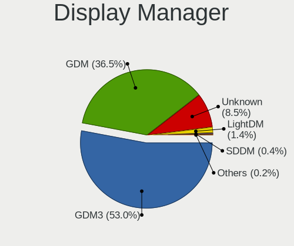
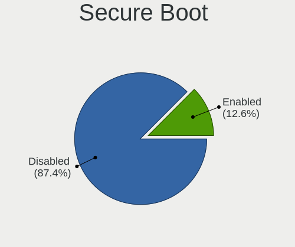
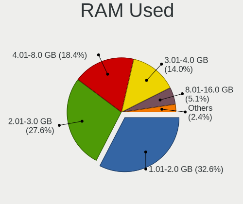
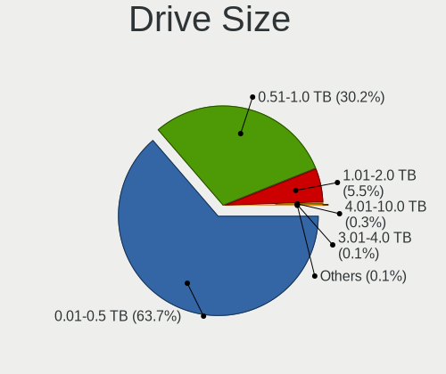
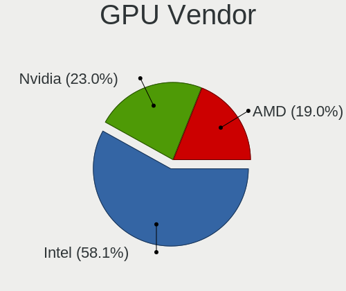
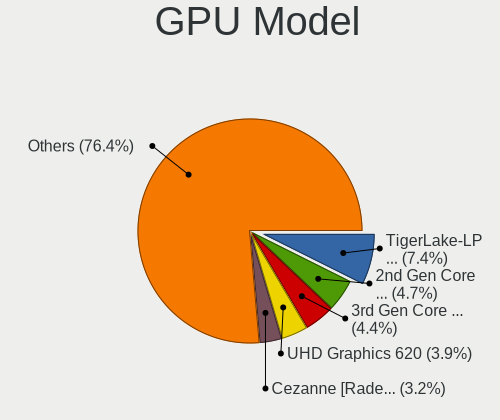
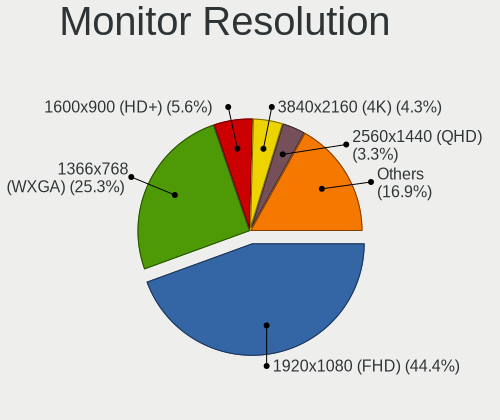
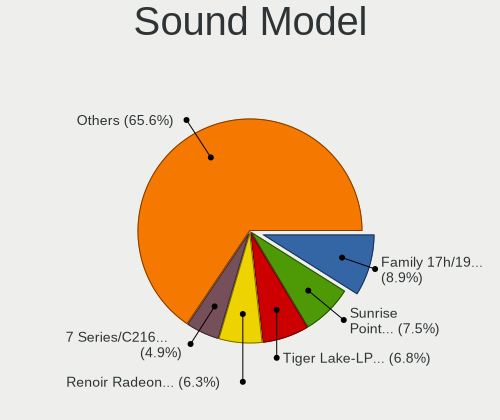

Ubuntu 21.10 - Tested Hardware & Statistics (Notebooks)
-------------------------------------------------------

A project to collect tested hardware configurations for Ubuntu 21.10.

Anyone can contribute to this report by the [hw-probe](https://github.com/linuxhw/hw-probe) tool:

    sudo -E hw-probe -all -upload

Please submit a probe of your configuration if it's not presented on the page or is rare.

Full-feature report is available here: https://linux-hardware.org/?view=trends

Contents
--------

* [ Test Cases ](#test-cases)

* [ System ](#system)
  - [ Kernel                   ](#kernel)
  - [ Kernel Family            ](#kernel-family)
  - [ Kernel Major Ver.        ](#kernel-major-ver)
  - [ Arch                     ](#arch)
  - [ DE                       ](#de)
  - [ Display Server           ](#display-server)
  - [ Display Manager          ](#display-manager)
  - [ OS Lang                  ](#os-lang)
  - [ Boot Mode                ](#boot-mode)
  - [ Filesystem               ](#filesystem)
  - [ Part. scheme             ](#part-scheme)
  - [ Dual Boot with Linux/BSD ](#dual-boot-with-linuxbsd)
  - [ Dual Boot (Win)          ](#dual-boot-win)

* [ Board ](#board)
  - [ Vendor                   ](#vendor)
  - [ Model                    ](#model)
  - [ Model Family             ](#model-family)
  - [ MFG Year                 ](#mfg-year)
  - [ Form Factor              ](#form-factor)
  - [ Secure Boot              ](#secure-boot)
  - [ Coreboot                 ](#coreboot)
  - [ RAM Size                 ](#ram-size)
  - [ RAM Used                 ](#ram-used)
  - [ Total Drives             ](#total-drives)
  - [ Has CD-ROM               ](#has-cd-rom)
  - [ Has Ethernet             ](#has-ethernet)
  - [ Has WiFi                 ](#has-wifi)
  - [ Has Bluetooth            ](#has-bluetooth)

* [ Location ](#location)
  - [ Country                  ](#country)
  - [ City                     ](#city)

* [ Drives ](#drives)
  - [ Drive Vendor             ](#drive-vendor)
  - [ Drive Model              ](#drive-model)
  - [ HDD Vendor               ](#hdd-vendor)
  - [ SSD Vendor               ](#ssd-vendor)
  - [ Drive Kind               ](#drive-kind)
  - [ Drive Connector          ](#drive-connector)
  - [ Drive Size               ](#drive-size)
  - [ Space Total              ](#space-total)
  - [ Space Used               ](#space-used)
  - [ Malfunc. Drives          ](#malfunc-drives)
  - [ Malfunc. Drive Vendor    ](#malfunc-drive-vendor)
  - [ Malfunc. HDD Vendor      ](#malfunc-hdd-vendor)
  - [ Malfunc. Drive Kind      ](#malfunc-drive-kind)
  - [ Failed Drives            ](#failed-drives)
  - [ Failed Drive Vendor      ](#failed-drive-vendor)
  - [ Drive Status             ](#drive-status)

* [ Storage controller ](#storage-controller)
  - [ Storage Vendor           ](#storage-vendor)
  - [ Storage Model            ](#storage-model)
  - [ Storage Kind             ](#storage-kind)

* [ Processor ](#processor)
  - [ CPU Vendor               ](#cpu-vendor)
  - [ CPU Model                ](#cpu-model)
  - [ CPU Model Family         ](#cpu-model-family)
  - [ CPU Cores                ](#cpu-cores)
  - [ CPU Sockets              ](#cpu-sockets)
  - [ CPU Threads              ](#cpu-threads)
  - [ CPU Op-Modes             ](#cpu-op-modes)
  - [ CPU Microcode            ](#cpu-microcode)
  - [ CPU Microarch            ](#cpu-microarch)

* [ Graphics ](#graphics)
  - [ GPU Vendor               ](#gpu-vendor)
  - [ GPU Model                ](#gpu-model)
  - [ GPU Combo                ](#gpu-combo)
  - [ GPU Driver               ](#gpu-driver)
  - [ GPU Memory               ](#gpu-memory)

* [ Monitor ](#monitor)
  - [ Monitor Vendor           ](#monitor-vendor)
  - [ Monitor Model            ](#monitor-model)
  - [ Monitor Resolution       ](#monitor-resolution)
  - [ Monitor Diagonal         ](#monitor-diagonal)
  - [ Monitor Width            ](#monitor-width)
  - [ Aspect Ratio             ](#aspect-ratio)
  - [ Monitor Area             ](#monitor-area)
  - [ Pixel Density            ](#pixel-density)
  - [ Multiple Monitors        ](#multiple-monitors)

* [ Network ](#network)
  - [ Net Controller Vendor    ](#net-controller-vendor)
  - [ Net Controller Model     ](#net-controller-model)
  - [ Wireless Vendor          ](#wireless-vendor)
  - [ Wireless Model           ](#wireless-model)
  - [ Ethernet Vendor          ](#ethernet-vendor)
  - [ Ethernet Model           ](#ethernet-model)
  - [ Net Controller Kind      ](#net-controller-kind)
  - [ Used Controller          ](#used-controller)
  - [ NICs                     ](#nics)
  - [ IPv6                     ](#ipv6)

* [ Bluetooth ](#bluetooth)
  - [ Bluetooth Vendor         ](#bluetooth-vendor)
  - [ Bluetooth Model          ](#bluetooth-model)

* [ Sound ](#sound)
  - [ Sound Vendor             ](#sound-vendor)
  - [ Sound Model              ](#sound-model)

* [ Memory ](#memory)
  - [ Memory Vendor            ](#memory-vendor)
  - [ Memory Model             ](#memory-model)
  - [ Memory Kind              ](#memory-kind)
  - [ Memory Form Factor       ](#memory-form-factor)
  - [ Memory Size              ](#memory-size)
  - [ Memory Speed             ](#memory-speed)

* [ Printers & scanners ](#printers--scanners)
  - [ Printer Vendor           ](#printer-vendor)
  - [ Printer Model            ](#printer-model)
  - [ Scanner Vendor           ](#scanner-vendor)
  - [ Scanner Model            ](#scanner-model)

* [ Camera ](#camera)
  - [ Camera Vendor            ](#camera-vendor)
  - [ Camera Model             ](#camera-model)

* [ Security ](#security)
  - [ Fingerprint Vendor       ](#fingerprint-vendor)
  - [ Fingerprint Model        ](#fingerprint-model)
  - [ Chipcard Vendor          ](#chipcard-vendor)
  - [ Chipcard Model           ](#chipcard-model)

* [ Unsupported ](#unsupported)
  - [ Unsupported Devices      ](#unsupported-devices)
  - [ Unsupported Device Types ](#unsupported-device-types)

Test Cases
----------

| Vendor        | Model                       | Probe                                                      | Date         |
|---------------|-----------------------------|------------------------------------------------------------|--------------|
| Lenovo        | ThinkBook 15p Gen 2 21B1    | [f2fb3da876](https://linux-hardware.org/?probe=f2fb3da876) | Mar 01, 2022 |
| ASUSTek       | UX303UB                     | [f62c829839](https://linux-hardware.org/?probe=f62c829839) | Mar 01, 2022 |
| Samsung       | RV410/RV510/S3510/E3510     | [ea619bdb65](https://linux-hardware.org/?probe=ea619bdb65) | Feb 28, 2022 |
| HP            | EliteBook 840 G4            | [c00d2254e9](https://linux-hardware.org/?probe=c00d2254e9) | Feb 28, 2022 |
| HP            | EliteBook 840 G4            | [4e9488a678](https://linux-hardware.org/?probe=4e9488a678) | Feb 28, 2022 |
| Unknown       | Unknown                     | [75ca7615ac](https://linux-hardware.org/?probe=75ca7615ac) | Feb 28, 2022 |
| MAXDATA       | PRO6100IW                   | [023e60cf6e](https://linux-hardware.org/?probe=023e60cf6e) | Feb 28, 2022 |
| ASUSTek       | ASUS TUF Gaming F15 FX50... | [2f1bb56767](https://linux-hardware.org/?probe=2f1bb56767) | Feb 28, 2022 |
| Unknown       | Unknown                     | [cff012598b](https://linux-hardware.org/?probe=cff012598b) | Feb 28, 2022 |
| Samsung       | 930XCJ/931XCJ/930XCR        | [b7db3a112d](https://linux-hardware.org/?probe=b7db3a112d) | Feb 27, 2022 |
| Dell          | Latitude E5440              | [9e496b4990](https://linux-hardware.org/?probe=9e496b4990) | Feb 27, 2022 |
| Acer          | TP-W700-53334G12            | [4f274ebb66](https://linux-hardware.org/?probe=4f274ebb66) | Feb 27, 2022 |
| Gigabyte      | AERO 17 KC                  | [08b488b969](https://linux-hardware.org/?probe=08b488b969) | Feb 27, 2022 |
| Lenovo        | ThinkPad T14 Gen 2i 20W0... | [abed4a5863](https://linux-hardware.org/?probe=abed4a5863) | Feb 27, 2022 |
| Acer          | Aspire ES1-512              | [93e96365b5](https://linux-hardware.org/?probe=93e96365b5) | Feb 27, 2022 |
| Lenovo        | IdeaPad 320-15IKB 80YH      | [e65c4dc3c7](https://linux-hardware.org/?probe=e65c4dc3c7) | Feb 26, 2022 |
| ASUSTek       | Vivobook_ASUSLaptop M350... | [d7f14afdd4](https://linux-hardware.org/?probe=d7f14afdd4) | Feb 26, 2022 |
| HP            | EliteBook Folio 9480m       | [e03d1d025e](https://linux-hardware.org/?probe=e03d1d025e) | Feb 26, 2022 |
| Dell          | Inspiron 5537               | [72d6263861](https://linux-hardware.org/?probe=72d6263861) | Feb 26, 2022 |
| Unknown       | Unknown                     | [1a8b02fe5e](https://linux-hardware.org/?probe=1a8b02fe5e) | Feb 26, 2022 |
| HP            | ProBook 430 G5              | [1cf6d56319](https://linux-hardware.org/?probe=1cf6d56319) | Feb 25, 2022 |
| ASUSTek       | K50IJ                       | [8f931f7385](https://linux-hardware.org/?probe=8f931f7385) | Feb 25, 2022 |
| Lenovo        | IdeaPad 530S-14ARR 81H1     | [408821b06e](https://linux-hardware.org/?probe=408821b06e) | Feb 25, 2022 |
| Chuwi         | GemiBook Pro                | [37c0889ae6](https://linux-hardware.org/?probe=37c0889ae6) | Feb 25, 2022 |
| HP            | 255 G7 Notebook PC          | [cdcea77db0](https://linux-hardware.org/?probe=cdcea77db0) | Feb 25, 2022 |
| ASUSTek       | ROG Strix G531GV_G531GV     | [bee22eb4da](https://linux-hardware.org/?probe=bee22eb4da) | Feb 25, 2022 |
| ASUSTek       | ROG Zephyrus G15 GA502IV... | [ec13490009](https://linux-hardware.org/?probe=ec13490009) | Feb 25, 2022 |
| Acer          | TMP455-MG                   | [f1a500ae43](https://linux-hardware.org/?probe=f1a500ae43) | Feb 25, 2022 |
| Positivo      | H14BU08                     | [b3cb8e0d72](https://linux-hardware.org/?probe=b3cb8e0d72) | Feb 25, 2022 |
| Lenovo        | ThinkBook 15 G2 ARE 20VG    | [30879c05cc](https://linux-hardware.org/?probe=30879c05cc) | Feb 24, 2022 |
| Acer          | Swift SF514-52T             | [3bfa40a4c8](https://linux-hardware.org/?probe=3bfa40a4c8) | Feb 24, 2022 |
| Dell          | Inspiron 3541               | [efd2dc8d13](https://linux-hardware.org/?probe=efd2dc8d13) | Feb 24, 2022 |
| Lenovo        | ThinkPad T420 4236A26       | [c0129677c2](https://linux-hardware.org/?probe=c0129677c2) | Feb 24, 2022 |
| Dell          | Inspiron 3541               | [a37855e3e8](https://linux-hardware.org/?probe=a37855e3e8) | Feb 24, 2022 |
| HP            | Stream Laptop 14-cb1xxx     | [68e116fc1e](https://linux-hardware.org/?probe=68e116fc1e) | Feb 24, 2022 |
| Dell          | XPS 15 9500                 | [26fde0fb01](https://linux-hardware.org/?probe=26fde0fb01) | Feb 23, 2022 |
| Lenovo        | V15 G2 ITL 82KB             | [6d10cb57e1](https://linux-hardware.org/?probe=6d10cb57e1) | Feb 23, 2022 |
| Acer          | Aspire ES1-512              | [71e1fcf98a](https://linux-hardware.org/?probe=71e1fcf98a) | Feb 23, 2022 |
| Dell          | Latitude E6520              | [2e2e342f0f](https://linux-hardware.org/?probe=2e2e342f0f) | Feb 23, 2022 |
| Dell          | Latitude E6520              | [20fdd52b94](https://linux-hardware.org/?probe=20fdd52b94) | Feb 22, 2022 |
| ASUSTek       | ROG Strix G513QC_G513QC     | [f6175c2b08](https://linux-hardware.org/?probe=f6175c2b08) | Feb 22, 2022 |
| Lenovo        | ThinkPad X1 Carbon 2nd 2... | [4327d37f2d](https://linux-hardware.org/?probe=4327d37f2d) | Feb 22, 2022 |
| HP            | Pavilion dv7                | [e5544b291b](https://linux-hardware.org/?probe=e5544b291b) | Feb 22, 2022 |
| HP            | ENVY 17                     | [f840cfbb6b](https://linux-hardware.org/?probe=f840cfbb6b) | Feb 22, 2022 |
| Acer          | Aspire E5-774               | [39ee56bc80](https://linux-hardware.org/?probe=39ee56bc80) | Feb 21, 2022 |
| Timi          | TM1707                      | [7a55d3b954](https://linux-hardware.org/?probe=7a55d3b954) | Feb 21, 2022 |
| HP            | Pavilion Laptop 15-cs3xx... | [96aa797713](https://linux-hardware.org/?probe=96aa797713) | Feb 21, 2022 |
| Timi          | TM1707                      | [2e24a060cc](https://linux-hardware.org/?probe=2e24a060cc) | Feb 21, 2022 |
| Acer          | Aspire ES1-512              | [86e4c4469f](https://linux-hardware.org/?probe=86e4c4469f) | Feb 20, 2022 |
| ASUSTek       | Vivobook_ASUSLaptop M350... | [fbb2caeacf](https://linux-hardware.org/?probe=fbb2caeacf) | Feb 20, 2022 |
| Lenovo        | G505 20240                  | [7813a47a19](https://linux-hardware.org/?probe=7813a47a19) | Feb 20, 2022 |
| Dell          | G3 3779                     | [a5eae29522](https://linux-hardware.org/?probe=a5eae29522) | Feb 19, 2022 |
| Wortmann      | Mobile 1511                 | [bc5fabbc04](https://linux-hardware.org/?probe=bc5fabbc04) | Feb 19, 2022 |
| ASUSTek       | Vivobook_ASUSLaptop M350... | [c5acc050e4](https://linux-hardware.org/?probe=c5acc050e4) | Feb 19, 2022 |
| HP            | Pavilion Aero Laptop 13-... | [b8e767511b](https://linux-hardware.org/?probe=b8e767511b) | Feb 19, 2022 |
| ASUSTek       | M50Vm                       | [c562a6a3ad](https://linux-hardware.org/?probe=c562a6a3ad) | Feb 19, 2022 |
| HP            | EliteBook 8540w (WD930EA... | [fff6280eed](https://linux-hardware.org/?probe=fff6280eed) | Feb 19, 2022 |
| Samsung       | SP55S                       | [3f39c45f19](https://linux-hardware.org/?probe=3f39c45f19) | Feb 19, 2022 |
| HP            | Pavilion Laptop 15-cs0xx... | [81bee8c72c](https://linux-hardware.org/?probe=81bee8c72c) | Feb 19, 2022 |
| HP            | Pavilion Laptop 15-cs0xx... | [df8c5bef9c](https://linux-hardware.org/?probe=df8c5bef9c) | Feb 19, 2022 |
| HP            | EliteBook Folio 9480m       | [f53c1a8403](https://linux-hardware.org/?probe=f53c1a8403) | Feb 19, 2022 |
| Acer          | Aspire 4720Z                | [eba3609129](https://linux-hardware.org/?probe=eba3609129) | Feb 19, 2022 |
| Lenovo        | Yoga 500-14IBD 80NE         | [8b199e2a77](https://linux-hardware.org/?probe=8b199e2a77) | Feb 19, 2022 |
| Lenovo        | ThinkPad T420s 41742AG      | [042758bceb](https://linux-hardware.org/?probe=042758bceb) | Feb 18, 2022 |
| Toshiba       | PORTEGE R600                | [b4dbc4297f](https://linux-hardware.org/?probe=b4dbc4297f) | Feb 18, 2022 |
| Dell          | XPS 15 9510                 | [04d70dfe98](https://linux-hardware.org/?probe=04d70dfe98) | Feb 18, 2022 |
| Lenovo        | ThinkPad Edge E430 62715... | [0610fed917](https://linux-hardware.org/?probe=0610fed917) | Feb 18, 2022 |
| Packard Be... | ENLK11BZ                    | [f4bd8ff9b0](https://linux-hardware.org/?probe=f4bd8ff9b0) | Feb 18, 2022 |
| Packard Be... | ENLK11BZ                    | [85f36d66f1](https://linux-hardware.org/?probe=85f36d66f1) | Feb 18, 2022 |
| Lenovo        | ThinkPad Edge E430 62715... | [2929577463](https://linux-hardware.org/?probe=2929577463) | Feb 18, 2022 |
| ASUSTek       | ROG Zephyrus G15 GA503QS... | [7cea4f8b0f](https://linux-hardware.org/?probe=7cea4f8b0f) | Feb 17, 2022 |
| Apple         | MacBookPro14,1              | [f7c7bd4baf](https://linux-hardware.org/?probe=f7c7bd4baf) | Feb 17, 2022 |
| Dell          | Inspiron 5521               | [e0b1929884](https://linux-hardware.org/?probe=e0b1929884) | Feb 17, 2022 |
| Dell          | Latitude E5550              | [302c0a3b5f](https://linux-hardware.org/?probe=302c0a3b5f) | Feb 16, 2022 |
| MSI           | Stealth GS66 12UHS          | [5272f7aa5b](https://linux-hardware.org/?probe=5272f7aa5b) | Feb 16, 2022 |
| Dell          | Latitude 5320               | [13c53062b6](https://linux-hardware.org/?probe=13c53062b6) | Feb 16, 2022 |
| HP            | EliteBook 2740p             | [30d2deeb07](https://linux-hardware.org/?probe=30d2deeb07) | Feb 16, 2022 |
| Acer          | Aspire ES1-512              | [a40803fa19](https://linux-hardware.org/?probe=a40803fa19) | Feb 16, 2022 |
| Acer          | Aspire ES1-512              | [5ccb5ac081](https://linux-hardware.org/?probe=5ccb5ac081) | Feb 16, 2022 |
| Apple         | MacBookPro16,3              | [ee62794632](https://linux-hardware.org/?probe=ee62794632) | Feb 16, 2022 |
| Dell          | Precision 7540              | [edd235687e](https://linux-hardware.org/?probe=edd235687e) | Feb 16, 2022 |
| Lenovo        | ThinkPad T450s 20BXCTO1W... | [ee898ad2ba](https://linux-hardware.org/?probe=ee898ad2ba) | Feb 16, 2022 |
| Lenovo        | Legion 7 15IMH05 81YT       | [fb3c1499b1](https://linux-hardware.org/?probe=fb3c1499b1) | Feb 15, 2022 |
| Apple         | MacBookPro16,3              | [a651af2ee1](https://linux-hardware.org/?probe=a651af2ee1) | Feb 15, 2022 |
| HP            | ProBook 430 G4              | [20bf4c2464](https://linux-hardware.org/?probe=20bf4c2464) | Feb 15, 2022 |
| HP            | ProBook 440 G7              | [bf3d7b3f6c](https://linux-hardware.org/?probe=bf3d7b3f6c) | Feb 15, 2022 |
| Fujitsu       | FARQ02010                   | [04fbabcfd2](https://linux-hardware.org/?probe=04fbabcfd2) | Feb 15, 2022 |
| Dell          | Latitude 5400               | [6e2d3c1031](https://linux-hardware.org/?probe=6e2d3c1031) | Feb 15, 2022 |
| Dell          | XPS 15 9570                 | [f65c6b2c80](https://linux-hardware.org/?probe=f65c6b2c80) | Feb 15, 2022 |
| ASUSTek       | VivoBook_ASUS Laptop E21... | [8688e7f486](https://linux-hardware.org/?probe=8688e7f486) | Feb 15, 2022 |
| ASUSTek       | ROG Zephyrus G14 GA401QE... | [6b8d6986e4](https://linux-hardware.org/?probe=6b8d6986e4) | Feb 15, 2022 |
| Dell          | Inspiron 5502               | [79b0957899](https://linux-hardware.org/?probe=79b0957899) | Feb 14, 2022 |
| Dell          | Inspiron 5521               | [aee089a0aa](https://linux-hardware.org/?probe=aee089a0aa) | Feb 14, 2022 |
| System76      | Galago Pro                  | [6ecd530026](https://linux-hardware.org/?probe=6ecd530026) | Feb 14, 2022 |
| System76      | Galago Pro                  | [b3b3e5cfa0](https://linux-hardware.org/?probe=b3b3e5cfa0) | Feb 14, 2022 |
| Dell          | Latitude 5414               | [3ed4a50f41](https://linux-hardware.org/?probe=3ed4a50f41) | Feb 13, 2022 |
| Dell          | Latitude 14 Rugged (5404... | [c15ba7893e](https://linux-hardware.org/?probe=c15ba7893e) | Feb 13, 2022 |
| HP            | ENVY Laptop 14-eb1xxx       | [e4d3cf0edd](https://linux-hardware.org/?probe=e4d3cf0edd) | Feb 13, 2022 |
| Lenovo        | ThinkPad T480s 20L8S5JW0... | [df9633e08e](https://linux-hardware.org/?probe=df9633e08e) | Feb 13, 2022 |
| Dell          | XPS 13 9305                 | [a829525047](https://linux-hardware.org/?probe=a829525047) | Feb 13, 2022 |
| Lenovo        | ThinkPad E560 20EV002FUS    | [68b1132b5e](https://linux-hardware.org/?probe=68b1132b5e) | Feb 13, 2022 |
| Dell          | Latitude 14 Rugged (5404... | [37267c6596](https://linux-hardware.org/?probe=37267c6596) | Feb 13, 2022 |
| ASUSTek       | N751JK                      | [aed08889fc](https://linux-hardware.org/?probe=aed08889fc) | Feb 12, 2022 |
| Lenovo        | ThinkPad T440p 20AN00DJA... | [9209921869](https://linux-hardware.org/?probe=9209921869) | Feb 12, 2022 |
| ASUSTek       | VivoBook_ASUSLaptop X513... | [6c64279dbc](https://linux-hardware.org/?probe=6c64279dbc) | Feb 12, 2022 |
| KOGAN         | KAL11C250SB                 | [600104b8e2](https://linux-hardware.org/?probe=600104b8e2) | Feb 12, 2022 |
| Dynabook      | PORTEGE X30L-J              | [2c27a1eed4](https://linux-hardware.org/?probe=2c27a1eed4) | Feb 12, 2022 |
| HP            | EliteBook 840 G6            | [b4d4fb0502](https://linux-hardware.org/?probe=b4d4fb0502) | Feb 12, 2022 |
| HP            | EliteBook 840 G6            | [5597b2ca5f](https://linux-hardware.org/?probe=5597b2ca5f) | Feb 12, 2022 |
| Dell          | Latitude 7490               | [2a2d61c483](https://linux-hardware.org/?probe=2a2d61c483) | Feb 12, 2022 |
| HUAWEI        | HLY-WX9XX                   | [4e250e6a7e](https://linux-hardware.org/?probe=4e250e6a7e) | Feb 11, 2022 |
| ASUSTek       | ROG Strix G513QY_G513QY     | [7b71e39aa7](https://linux-hardware.org/?probe=7b71e39aa7) | Feb 11, 2022 |
| HP            | Compaq 15                   | [78b2f3bfa6](https://linux-hardware.org/?probe=78b2f3bfa6) | Feb 11, 2022 |
| Dell          | Latitude E7240              | [0ba881cc6e](https://linux-hardware.org/?probe=0ba881cc6e) | Feb 11, 2022 |
| Dell          | Latitude 5511               | [418c4bc399](https://linux-hardware.org/?probe=418c4bc399) | Feb 11, 2022 |
| Acer          | Swift SF314-43              | [fe2ff58a88](https://linux-hardware.org/?probe=fe2ff58a88) | Feb 10, 2022 |
| Lenovo        | ThinkPad Edge 0301DMG       | [ab580c3edd](https://linux-hardware.org/?probe=ab580c3edd) | Feb 10, 2022 |
| Lenovo        | ThinkPad Edge 0301DMG       | [c11f9d5c6d](https://linux-hardware.org/?probe=c11f9d5c6d) | Feb 10, 2022 |
| TongFang      | LYNX 4                      | [425c72db05](https://linux-hardware.org/?probe=425c72db05) | Feb 10, 2022 |
| ASUSTek       | X550LD                      | [65d1ec0733](https://linux-hardware.org/?probe=65d1ec0733) | Feb 10, 2022 |
| Dell          | Inspiron 5515               | [a3e3482bf8](https://linux-hardware.org/?probe=a3e3482bf8) | Feb 10, 2022 |
| ASUSTek       | Vivobook_ASUSLaptop M740... | [265a5ef9aa](https://linux-hardware.org/?probe=265a5ef9aa) | Feb 10, 2022 |
| Lenovo        | ThinkPad T430 2349U2B       | [dd76d59ffd](https://linux-hardware.org/?probe=dd76d59ffd) | Feb 09, 2022 |
| Acer          | Predator G9-792             | [a01c295f77](https://linux-hardware.org/?probe=a01c295f77) | Feb 09, 2022 |
| Acer          | Predator G9-792             | [c030ff8b96](https://linux-hardware.org/?probe=c030ff8b96) | Feb 09, 2022 |
| HP            | Spectre 13 x2 PC            | [ed95e4c1c7](https://linux-hardware.org/?probe=ed95e4c1c7) | Feb 09, 2022 |
| Acer          | Aspire A315-41G             | [84a6cc3fad](https://linux-hardware.org/?probe=84a6cc3fad) | Feb 08, 2022 |
| Dell          | Precision M4700             | [192250957c](https://linux-hardware.org/?probe=192250957c) | Feb 08, 2022 |
| Acer          | Swift SF114-33              | [3a0c2e30ff](https://linux-hardware.org/?probe=3a0c2e30ff) | Feb 08, 2022 |
| HP            | ProBook 450 G2              | [57c513ecbc](https://linux-hardware.org/?probe=57c513ecbc) | Feb 08, 2022 |
| Dell          | XPS 15 9500                 | [f9d02c76f2](https://linux-hardware.org/?probe=f9d02c76f2) | Feb 08, 2022 |
| HP            | Spectre 13 x2 PC            | [a597b083c9](https://linux-hardware.org/?probe=a597b083c9) | Feb 08, 2022 |
| ASUSTek       | ASUS EXPERTBOOK B1500CEP... | [f814537586](https://linux-hardware.org/?probe=f814537586) | Feb 08, 2022 |
| Lenovo        | G500s 20245                 | [841d62ce23](https://linux-hardware.org/?probe=841d62ce23) | Feb 08, 2022 |
| HP            | ENVY Laptop 17-ch0xxx       | [d2034ed9f7](https://linux-hardware.org/?probe=d2034ed9f7) | Feb 08, 2022 |
| Acer          | Aspire A315-41G             | [370a0709e9](https://linux-hardware.org/?probe=370a0709e9) | Feb 07, 2022 |
| ASUSTek       | ROG Strix G513QY_G513QY     | [7a7ec8b299](https://linux-hardware.org/?probe=7a7ec8b299) | Feb 07, 2022 |
| ASUSTek       | P55VA                       | [b6cdbbcb90](https://linux-hardware.org/?probe=b6cdbbcb90) | Feb 07, 2022 |
| ASUSTek       | ROG Strix G513QC_G513QC     | [1bbcbcc9a2](https://linux-hardware.org/?probe=1bbcbcc9a2) | Feb 07, 2022 |
| Google        | Pantheon                    | [eebf10f1bb](https://linux-hardware.org/?probe=eebf10f1bb) | Feb 07, 2022 |
| Google        | Pantheon                    | [54f96033d0](https://linux-hardware.org/?probe=54f96033d0) | Feb 07, 2022 |
| MSI           | GF75 Thin 10SDR             | [12d6260c75](https://linux-hardware.org/?probe=12d6260c75) | Feb 07, 2022 |
| HP            | 15                          | [61a2d1f80a](https://linux-hardware.org/?probe=61a2d1f80a) | Feb 07, 2022 |
| Lenovo        | ThinkPad T460 20FMS3W300    | [a49c14ab70](https://linux-hardware.org/?probe=a49c14ab70) | Feb 06, 2022 |
| Lenovo        | IdeaPad C340-14API 81N6     | [6bee100b0a](https://linux-hardware.org/?probe=6bee100b0a) | Feb 06, 2022 |
| ASUSTek       | ZenBook UX325EA_UX325EA     | [e0765c9f5a](https://linux-hardware.org/?probe=e0765c9f5a) | Feb 06, 2022 |
| HP            | Pavilion g7                 | [6e6d2c79fd](https://linux-hardware.org/?probe=6e6d2c79fd) | Feb 06, 2022 |
| HP            | Pavilion g7                 | [334aee9a72](https://linux-hardware.org/?probe=334aee9a72) | Feb 06, 2022 |
| Samsung       | RV420/RV520/RV720/E3530/... | [36c068678e](https://linux-hardware.org/?probe=36c068678e) | Feb 06, 2022 |
| HP            | ProBook 430 G7              | [77e19eae1e](https://linux-hardware.org/?probe=77e19eae1e) | Feb 06, 2022 |
| Samsung       | 300E4C/300E5C/300E7C        | [338f25a016](https://linux-hardware.org/?probe=338f25a016) | Feb 06, 2022 |
| Lenovo        | Flex 2-15D 20377            | [deb06aeda3](https://linux-hardware.org/?probe=deb06aeda3) | Feb 05, 2022 |
| HP            | Laptop 17-cn0xxx            | [cfdee7d88e](https://linux-hardware.org/?probe=cfdee7d88e) | Feb 05, 2022 |
| HP            | Pavilion Sleekbook 14       | [35ecfbbaf1](https://linux-hardware.org/?probe=35ecfbbaf1) | Feb 05, 2022 |
| Dell          | Latitude E6420              | [45ce016cb4](https://linux-hardware.org/?probe=45ce016cb4) | Feb 05, 2022 |
| Lenovo        | G70-70 80HW002UGE           | [9f901c16b5](https://linux-hardware.org/?probe=9f901c16b5) | Feb 05, 2022 |
| Dell          | XPS 15 9500                 | [2fb86c0c90](https://linux-hardware.org/?probe=2fb86c0c90) | Feb 05, 2022 |
| Dell          | Inspiron 5502               | [acacc1d256](https://linux-hardware.org/?probe=acacc1d256) | Feb 05, 2022 |
| Lenovo        | IdeaPad C340-14API 81N6     | [a554a842f7](https://linux-hardware.org/?probe=a554a842f7) | Feb 05, 2022 |
| Lenovo        | ThinkPad T15 Gen 2i 20W4... | [c2d57771a1](https://linux-hardware.org/?probe=c2d57771a1) | Feb 04, 2022 |
| Acer          | Aspire E5-553               | [57b0a6d16a](https://linux-hardware.org/?probe=57b0a6d16a) | Feb 04, 2022 |
| HP            | EliteBook 2740p             | [1573e0f231](https://linux-hardware.org/?probe=1573e0f231) | Feb 04, 2022 |
| Chuwi         | GemiBook Pro                | [39298baf68](https://linux-hardware.org/?probe=39298baf68) | Feb 04, 2022 |
| Dell          | Latitude E5430 non-vPro     | [5ed9b5b2b8](https://linux-hardware.org/?probe=5ed9b5b2b8) | Feb 04, 2022 |
| Dell          | XPS 13 9310                 | [28544c13f5](https://linux-hardware.org/?probe=28544c13f5) | Feb 04, 2022 |
| Notebook      | NL5xRU                      | [448fbbbd68](https://linux-hardware.org/?probe=448fbbbd68) | Feb 03, 2022 |
| HP            | Pavilion dv6                | [a30b2daa0f](https://linux-hardware.org/?probe=a30b2daa0f) | Feb 03, 2022 |
| Packard Be... | EasyNote TV44HC             | [60aaa89bfa](https://linux-hardware.org/?probe=60aaa89bfa) | Feb 03, 2022 |
| Lenovo        | ThinkPad T490s 20NYS8J90... | [c1aee9b559](https://linux-hardware.org/?probe=c1aee9b559) | Feb 03, 2022 |
| Acer          | Swift SF314-511             | [9f7733e6ec](https://linux-hardware.org/?probe=9f7733e6ec) | Feb 03, 2022 |
| Packard Be... | EasyNote TS11HR             | [a5f676a32a](https://linux-hardware.org/?probe=a5f676a32a) | Feb 02, 2022 |
| Dell          | Inspiron 7577               | [9ab100b85c](https://linux-hardware.org/?probe=9ab100b85c) | Feb 02, 2022 |
| Lenovo        | ThinkBook 15p 20V3          | [dace307da3](https://linux-hardware.org/?probe=dace307da3) | Feb 02, 2022 |
| ASUSTek       | VivoBook_ASUSLaptop X515... | [1a682734eb](https://linux-hardware.org/?probe=1a682734eb) | Feb 02, 2022 |
| HUAWEI        | NBLB-WAX9N                  | [006670e3fd](https://linux-hardware.org/?probe=006670e3fd) | Feb 02, 2022 |
| ASUSTek       | VivoBook_ASUSLaptop X515... | [e0138c9f63](https://linux-hardware.org/?probe=e0138c9f63) | Feb 02, 2022 |
| Lenovo        | G50-80 80L0                 | [29e746f2a8](https://linux-hardware.org/?probe=29e746f2a8) | Feb 02, 2022 |
| Dell          | Inspiron 3584               | [14630b0a02](https://linux-hardware.org/?probe=14630b0a02) | Feb 01, 2022 |
| Lenovo        | IdeaPad 5 14ITL05 82FE      | [2621c151ec](https://linux-hardware.org/?probe=2621c151ec) | Feb 01, 2022 |
| Lenovo        | Rev B 20YM                  | [83c63da100](https://linux-hardware.org/?probe=83c63da100) | Feb 01, 2022 |
| HP            | 255 G6 Notebook PC          | [302b9789d3](https://linux-hardware.org/?probe=302b9789d3) | Feb 01, 2022 |
| Toshiba       | Satellite C50-A-19T         | [7ea7ab684e](https://linux-hardware.org/?probe=7ea7ab684e) | Feb 01, 2022 |
| Lenovo        | G580 20157                  | [fe6a35d3f8](https://linux-hardware.org/?probe=fe6a35d3f8) | Jan 31, 2022 |
| HP            | ProBook 650 G2              | [1835f9c2d4](https://linux-hardware.org/?probe=1835f9c2d4) | Jan 31, 2022 |
| HP            | ProBook 440 G5              | [0e27902494](https://linux-hardware.org/?probe=0e27902494) | Jan 31, 2022 |
| HP            | 255 G6 Notebook PC          | [3ec8d6dcf6](https://linux-hardware.org/?probe=3ec8d6dcf6) | Jan 31, 2022 |
| HP            | 255 G8 Notebook PC          | [d6a1e99ba7](https://linux-hardware.org/?probe=d6a1e99ba7) | Jan 31, 2022 |
| Apple         | MacBook5,1                  | [dd9f492694](https://linux-hardware.org/?probe=dd9f492694) | Jan 31, 2022 |
| HP            | Laptop 15s-fq1xxx           | [7c2762f41c](https://linux-hardware.org/?probe=7c2762f41c) | Jan 31, 2022 |
| HP            | Laptop 15s-fq1xxx           | [2aa45a8d1b](https://linux-hardware.org/?probe=2aa45a8d1b) | Jan 31, 2022 |
| Samsung       | R430/P430/R480              | [b08c9147e6](https://linux-hardware.org/?probe=b08c9147e6) | Jan 31, 2022 |
| HP            | ProBook 440 G5              | [df88db4d1b](https://linux-hardware.org/?probe=df88db4d1b) | Jan 30, 2022 |
| Toshiba       | TECRA R940                  | [c326f16d07](https://linux-hardware.org/?probe=c326f16d07) | Jan 30, 2022 |
| AVITA         | NS14A6                      | [bbf5494b7f](https://linux-hardware.org/?probe=bbf5494b7f) | Jan 30, 2022 |
| AVITA         | NS14A6                      | [5cb93a7ead](https://linux-hardware.org/?probe=5cb93a7ead) | Jan 30, 2022 |
| Lenovo        | ThinkPad X390 20Q1S9RB00    | [9970037d9d](https://linux-hardware.org/?probe=9970037d9d) | Jan 30, 2022 |
| HP            | ProBook 440 G5              | [930aa74ba2](https://linux-hardware.org/?probe=930aa74ba2) | Jan 30, 2022 |
| Acer          | Aspire A515-51              | [d38f4418f9](https://linux-hardware.org/?probe=d38f4418f9) | Jan 30, 2022 |
| Acer          | Aspire A515-51              | [f1987d67dc](https://linux-hardware.org/?probe=f1987d67dc) | Jan 30, 2022 |
| Lenovo        | V130-15IGM 81HL             | [67505d4784](https://linux-hardware.org/?probe=67505d4784) | Jan 30, 2022 |
| Lenovo        | IdeaPad Flex-14API 81SS     | [f93eabba88](https://linux-hardware.org/?probe=f93eabba88) | Jan 30, 2022 |
| HP            | Laptop 15s-eq2xxx           | [af5eb12b7b](https://linux-hardware.org/?probe=af5eb12b7b) | Jan 29, 2022 |
| HP            | Laptop 15s-eq2xxx           | [c9528e87c0](https://linux-hardware.org/?probe=c9528e87c0) | Jan 29, 2022 |
| Lenovo        | ThinkPad T430 2350B58       | [9c867cc4a8](https://linux-hardware.org/?probe=9c867cc4a8) | Jan 29, 2022 |
| HP            | Pavilion Aero Laptop 13-... | [478d5281bd](https://linux-hardware.org/?probe=478d5281bd) | Jan 29, 2022 |
| MSI           | GF75 Thin 10SDR             | [dadcf8d49c](https://linux-hardware.org/?probe=dadcf8d49c) | Jan 29, 2022 |
| Dell          | XPS 15 9500                 | [b5db02e326](https://linux-hardware.org/?probe=b5db02e326) | Jan 29, 2022 |
| HP            | ProBook 455 G7              | [08b0a66098](https://linux-hardware.org/?probe=08b0a66098) | Jan 29, 2022 |
| Acer          | Aspire V3-772G              | [1e4b8a880e](https://linux-hardware.org/?probe=1e4b8a880e) | Jan 29, 2022 |
| HP            | Pavilion Laptop 13-bb0xx... | [b1fc771c31](https://linux-hardware.org/?probe=b1fc771c31) | Jan 28, 2022 |
| Lenovo        | IdeaPad 5 Pro 16ACH6 82L... | [a73b683284](https://linux-hardware.org/?probe=a73b683284) | Jan 28, 2022 |
| Lenovo        | ThinkPad T420 4180ED3       | [b115732b3b](https://linux-hardware.org/?probe=b115732b3b) | Jan 28, 2022 |
| Lenovo        | ThinkBook 15p 20V3          | [04a57a90f9](https://linux-hardware.org/?probe=04a57a90f9) | Jan 28, 2022 |
| Dell          | Inspiron 5480               | [85796c8359](https://linux-hardware.org/?probe=85796c8359) | Jan 28, 2022 |
| Dell          | Inspiron 5480               | [59b6841322](https://linux-hardware.org/?probe=59b6841322) | Jan 28, 2022 |
| Lenovo        | IdeaPad 3 15IIL05 81WE      | [23efd3ad0d](https://linux-hardware.org/?probe=23efd3ad0d) | Jan 28, 2022 |
| Acer          | Aspire E5-553G              | [6e72e70430](https://linux-hardware.org/?probe=6e72e70430) | Jan 28, 2022 |
| ASUSTek       | TUF Gaming FX505DY_FX505... | [2309c1e501](https://linux-hardware.org/?probe=2309c1e501) | Jan 28, 2022 |
| ASUSTek       | K50ID                       | [fed48cd01d](https://linux-hardware.org/?probe=fed48cd01d) | Jan 27, 2022 |
| Samsung       | RV410/RV510/S3510/E3510     | [32ad79e4bc](https://linux-hardware.org/?probe=32ad79e4bc) | Jan 27, 2022 |
| ASUSTek       | X550WA                      | [e146d6a0f8](https://linux-hardware.org/?probe=e146d6a0f8) | Jan 27, 2022 |
| HUAWEI        | NBLB-WAX9N                  | [9c8d4276ff](https://linux-hardware.org/?probe=9c8d4276ff) | Jan 27, 2022 |
| ASUSTek       | X555LD                      | [0665a1599c](https://linux-hardware.org/?probe=0665a1599c) | Jan 26, 2022 |
| Apple         | MacBookPro9,2               | [fb7312d608](https://linux-hardware.org/?probe=fb7312d608) | Jan 26, 2022 |
| Lenovo        | G40-80 80E4                 | [4c27ace709](https://linux-hardware.org/?probe=4c27ace709) | Jan 26, 2022 |
| Lenovo        | V130-15IGM 81HL             | [4a7b39821e](https://linux-hardware.org/?probe=4a7b39821e) | Jan 26, 2022 |
| Clevo         | W76x/M77xCUH                | [48d0efb057](https://linux-hardware.org/?probe=48d0efb057) | Jan 26, 2022 |
| Acer          | Nitro AN515-52              | [34c8096b74](https://linux-hardware.org/?probe=34c8096b74) | Jan 26, 2022 |
| Dell          | Inspiron 5570               | [db63ce439f](https://linux-hardware.org/?probe=db63ce439f) | Jan 26, 2022 |
| Dell          | XPS 15 7590                 | [f31c2dda65](https://linux-hardware.org/?probe=f31c2dda65) | Jan 26, 2022 |
| ASUSTek       | VivoBook_ASUSLaptop X509... | [992ccf1855](https://linux-hardware.org/?probe=992ccf1855) | Jan 26, 2022 |
| Samsung       | 935XDB                      | [ef096190b6](https://linux-hardware.org/?probe=ef096190b6) | Jan 26, 2022 |
| Acer          | Aspire A715-42G             | [b585a9d6bb](https://linux-hardware.org/?probe=b585a9d6bb) | Jan 26, 2022 |
| Lenovo        | ThinkPad T15 Gen 2i 20W4... | [115b4f412c](https://linux-hardware.org/?probe=115b4f412c) | Jan 25, 2022 |
| Packard Be... | EasyNote TE11BZ             | [1f3f4d2107](https://linux-hardware.org/?probe=1f3f4d2107) | Jan 25, 2022 |
| ASUSTek       | VivoBook_ASUSLaptop X509... | [eed0593d0a](https://linux-hardware.org/?probe=eed0593d0a) | Jan 25, 2022 |
| Apple         | MacBook5,1                  | [0f6c39f50e](https://linux-hardware.org/?probe=0f6c39f50e) | Jan 25, 2022 |
| Dell          | Latitude E5530 non-vPro     | [16aeee2b77](https://linux-hardware.org/?probe=16aeee2b77) | Jan 24, 2022 |
| Dell          | Latitude E6420              | [027f726453](https://linux-hardware.org/?probe=027f726453) | Jan 24, 2022 |
| Framework     | Laptop                      | [99c660804f](https://linux-hardware.org/?probe=99c660804f) | Jan 24, 2022 |
| HP            | Pavilion 17                 | [d2c545576e](https://linux-hardware.org/?probe=d2c545576e) | Jan 24, 2022 |
| Lenovo        | ThinkPad E590 20NB0058RT    | [0b56eb1e6e](https://linux-hardware.org/?probe=0b56eb1e6e) | Jan 23, 2022 |
| MSI           | Summit E13FlipEvo A11MT     | [b59e4cbfef](https://linux-hardware.org/?probe=b59e4cbfef) | Jan 23, 2022 |
| ASUSTek       | ROG Zephyrus G14 GA401QM... | [de23657e81](https://linux-hardware.org/?probe=de23657e81) | Jan 23, 2022 |
| Positivo      | Q464C                       | [c5fa0e3561](https://linux-hardware.org/?probe=c5fa0e3561) | Jan 23, 2022 |
| ASUSTek       | X450LD                      | [07edc503a1](https://linux-hardware.org/?probe=07edc503a1) | Jan 23, 2022 |
| Lenovo        | ThinkPad 20TDZMS            | [143bc3f79b](https://linux-hardware.org/?probe=143bc3f79b) | Jan 23, 2022 |
| Razer         | Blade 15 Advanced Model ... | [c07445f559](https://linux-hardware.org/?probe=c07445f559) | Jan 23, 2022 |
| Packard Be... | EasyNote TV44HC             | [38fb76e085](https://linux-hardware.org/?probe=38fb76e085) | Jan 23, 2022 |
| MSI           | GL65 Leopard 10SDR          | [db5f5da948](https://linux-hardware.org/?probe=db5f5da948) | Jan 23, 2022 |
| HP            | Pavilion Aero Laptop 13-... | [3363e2fdb0](https://linux-hardware.org/?probe=3363e2fdb0) | Jan 23, 2022 |
| Dell          | Latitude 7490               | [fea8be783a](https://linux-hardware.org/?probe=fea8be783a) | Jan 23, 2022 |
| Alienware     | 17 R4                       | [d82171f734](https://linux-hardware.org/?probe=d82171f734) | Jan 22, 2022 |
| ASUSTek       | ROG Zephyrus G14 GA401QM... | [882dab7b0e](https://linux-hardware.org/?probe=882dab7b0e) | Jan 22, 2022 |
| Notebook      | N13xWU                      | [0d615c6812](https://linux-hardware.org/?probe=0d615c6812) | Jan 22, 2022 |
| Dell          | XPS 13 9305                 | [f5385f201e](https://linux-hardware.org/?probe=f5385f201e) | Jan 22, 2022 |
| Acer          | Swift SF314-43              | [567c5725d5](https://linux-hardware.org/?probe=567c5725d5) | Jan 22, 2022 |
| Lenovo        | ThinkPad E15 Gen 3 20YG0... | [fa90e37c2d](https://linux-hardware.org/?probe=fa90e37c2d) | Jan 22, 2022 |
| Acer          | Swift SF315-41              | [95afa35615](https://linux-hardware.org/?probe=95afa35615) | Jan 22, 2022 |
| Lenovo        | G50-45 80MQ                 | [6a21be0bff](https://linux-hardware.org/?probe=6a21be0bff) | Jan 22, 2022 |
| Dell          | Studio 1737                 | [d2d85d9b73](https://linux-hardware.org/?probe=d2d85d9b73) | Jan 21, 2022 |
| Lenovo        | G580 2189                   | [3f1adf101d](https://linux-hardware.org/?probe=3f1adf101d) | Jan 21, 2022 |
| Lenovo        | ThinkPad T480s 20L7CTO1W... | [1d478097a3](https://linux-hardware.org/?probe=1d478097a3) | Jan 21, 2022 |
| Dell          | Precision 5550              | [d918e1f390](https://linux-hardware.org/?probe=d918e1f390) | Jan 21, 2022 |
| NCS-Tech      | ONE1                        | [409bede257](https://linux-hardware.org/?probe=409bede257) | Jan 21, 2022 |
| Dell          | Precision 5550              | [66ccaaa19f](https://linux-hardware.org/?probe=66ccaaa19f) | Jan 20, 2022 |
| Lenovo        | IdeaPad 110-15IBR 80T7      | [cdda13eba7](https://linux-hardware.org/?probe=cdda13eba7) | Jan 20, 2022 |
| Toshiba       | PORTEGE R930                | [1ee5471d24](https://linux-hardware.org/?probe=1ee5471d24) | Jan 20, 2022 |
| Timi          | A34R                        | [fcf594f19a](https://linux-hardware.org/?probe=fcf594f19a) | Jan 20, 2022 |
| Timi          | A34R                        | [046409a8e2](https://linux-hardware.org/?probe=046409a8e2) | Jan 20, 2022 |
| HUAWEI        | HVY-WXX9                    | [7926e3c998](https://linux-hardware.org/?probe=7926e3c998) | Jan 19, 2022 |
| HP            | Laptop 15s-fq1xxx           | [b48e7b60cd](https://linux-hardware.org/?probe=b48e7b60cd) | Jan 19, 2022 |
| Toshiba       | Satellite NB10t-A-103       | [e5d8911653](https://linux-hardware.org/?probe=e5d8911653) | Jan 19, 2022 |
| HP            | ProBook 430 G8 Notebook ... | [ca34cbdf64](https://linux-hardware.org/?probe=ca34cbdf64) | Jan 19, 2022 |
| HUAWEI        | MateBook X                  | [b8def0a48d](https://linux-hardware.org/?probe=b8def0a48d) | Jan 19, 2022 |
| HP            | EliteBook 1050 G1           | [1bb5cb826f](https://linux-hardware.org/?probe=1bb5cb826f) | Jan 19, 2022 |
| HP            | ProBook 6550b               | [d4ab3277b0](https://linux-hardware.org/?probe=d4ab3277b0) | Jan 19, 2022 |
| ASUSTek       | ZenBook Pro Duo UX581GV_... | [cc39f1fd96](https://linux-hardware.org/?probe=cc39f1fd96) | Jan 18, 2022 |
| Lenovo        | Legion Y540-17IRH 81Q4      | [3dc8b324bd](https://linux-hardware.org/?probe=3dc8b324bd) | Jan 18, 2022 |
| Clevo         | W251ESQ/W270ESQ             | [50380c8301](https://linux-hardware.org/?probe=50380c8301) | Jan 18, 2022 |
| Lenovo        | ThinkPad P15v Gen 1 20TQ... | [6fd36db1e0](https://linux-hardware.org/?probe=6fd36db1e0) | Jan 18, 2022 |
| LG Electro... | 16Z90P-K.AAB7U1             | [1cd8321a44](https://linux-hardware.org/?probe=1cd8321a44) | Jan 18, 2022 |
| MSI           | P65 Creator 9SE             | [da7b942050](https://linux-hardware.org/?probe=da7b942050) | Jan 18, 2022 |
| Lenovo        | IdeaPad 3 15IIL05 81WE      | [ff8f10a4f3](https://linux-hardware.org/?probe=ff8f10a4f3) | Jan 17, 2022 |
| HP            | Pavilion Laptop 15-eh0xx... | [4137cdd7e2](https://linux-hardware.org/?probe=4137cdd7e2) | Jan 17, 2022 |
| Dell          | XPS 13 7390                 | [0db509562e](https://linux-hardware.org/?probe=0db509562e) | Jan 17, 2022 |
| HP            | Laptop 15-dy2xxx            | [d3a7880a3c](https://linux-hardware.org/?probe=d3a7880a3c) | Jan 17, 2022 |
| Dell          | Inspiron 1545               | [3017de5307](https://linux-hardware.org/?probe=3017de5307) | Jan 17, 2022 |
| Lenovo        | ThinkPad T530 2359CTO       | [7e133f725e](https://linux-hardware.org/?probe=7e133f725e) | Jan 17, 2022 |
| Lenovo        | IdeaPad 100-15IBY 80MJ      | [7cc691c557](https://linux-hardware.org/?probe=7cc691c557) | Jan 16, 2022 |
| Dell          | Inspiron 3501               | [898eb7ce85](https://linux-hardware.org/?probe=898eb7ce85) | Jan 16, 2022 |
| Acer          | Aspire E5-511               | [c2691bf00b](https://linux-hardware.org/?probe=c2691bf00b) | Jan 16, 2022 |
| ASUSTek       | ZenBook UX425UAZ_UM425UA... | [03293e9384](https://linux-hardware.org/?probe=03293e9384) | Jan 16, 2022 |
| ASUSTek       | ROG Zephyrus G15 GA503QS... | [4dd3961675](https://linux-hardware.org/?probe=4dd3961675) | Jan 16, 2022 |
| Lenovo        | IdeaPad 110-15ISK 80UD      | [a1fffe7c0f](https://linux-hardware.org/?probe=a1fffe7c0f) | Jan 16, 2022 |
| HP            | Notebook                    | [5d45aad44f](https://linux-hardware.org/?probe=5d45aad44f) | Jan 16, 2022 |
| Timi          | A18R                        | [37b8388616](https://linux-hardware.org/?probe=37b8388616) | Jan 16, 2022 |
| Dell          | XPS 17 9710                 | [3417abe371](https://linux-hardware.org/?probe=3417abe371) | Jan 16, 2022 |
| Fujitsu Si... | ESPRIMO Mobile V6505        | [4ceae99710](https://linux-hardware.org/?probe=4ceae99710) | Jan 15, 2022 |
| Dell          | XPS 13 9305                 | [d6594c7edb](https://linux-hardware.org/?probe=d6594c7edb) | Jan 15, 2022 |
| Lenovo        | IdeaPad 110-15IBR 80T7      | [7b614a5d11](https://linux-hardware.org/?probe=7b614a5d11) | Jan 15, 2022 |
| Lenovo        | ThinkPad E15 Gen 2 20TD0... | [e37b97a3e7](https://linux-hardware.org/?probe=e37b97a3e7) | Jan 15, 2022 |
| Toshiba       | Satellite Pro L500          | [987c5a92d0](https://linux-hardware.org/?probe=987c5a92d0) | Jan 15, 2022 |
| Notebook      | W94_95_97SU2,SUY,-C,-T      | [786f091b04](https://linux-hardware.org/?probe=786f091b04) | Jan 15, 2022 |
| Dell          | XPS 17 9710                 | [3d2a67265f](https://linux-hardware.org/?probe=3d2a67265f) | Jan 15, 2022 |
| Acer          | Aspire E5-553               | [71f81101f2](https://linux-hardware.org/?probe=71f81101f2) | Jan 15, 2022 |
| Lenovo        | ThinkPad E14 Gen 3 20Y7C... | [4ebb815948](https://linux-hardware.org/?probe=4ebb815948) | Jan 15, 2022 |
| Fujitsu       | LIFEBOOK UH572              | [b6e46bc4f5](https://linux-hardware.org/?probe=b6e46bc4f5) | Jan 15, 2022 |
| Fujitsu       | LIFEBOOK UH572              | [e82910b9d3](https://linux-hardware.org/?probe=e82910b9d3) | Jan 15, 2022 |
| Lenovo        | ThinkPad X240 20AMS4SL00    | [3888a941b9](https://linux-hardware.org/?probe=3888a941b9) | Jan 14, 2022 |
| ASUSTek       | ROG Zephyrus G15 GA502IU... | [fb4c60c7b1](https://linux-hardware.org/?probe=fb4c60c7b1) | Jan 14, 2022 |
| Dell          | XPS 15 9500                 | [9a887349f4](https://linux-hardware.org/?probe=9a887349f4) | Jan 14, 2022 |
| Unknown       | Unknown                     | [4790b017ca](https://linux-hardware.org/?probe=4790b017ca) | Jan 14, 2022 |
| Lenovo        | ThinkPad X240 20AMS6170H    | [03fc719875](https://linux-hardware.org/?probe=03fc719875) | Jan 14, 2022 |
| ASUSTek       | VivoBook_ASUSLaptop X513... | [eee9a2ae45](https://linux-hardware.org/?probe=eee9a2ae45) | Jan 14, 2022 |
| Razer         | Blade 15 Advanced Model ... | [6f992c3b94](https://linux-hardware.org/?probe=6f992c3b94) | Jan 14, 2022 |
| Razer         | Blade 15 Advanced Model ... | [95724a0980](https://linux-hardware.org/?probe=95724a0980) | Jan 14, 2022 |
| Acer          | Predator PH317-52           | [1de1d4e14c](https://linux-hardware.org/?probe=1de1d4e14c) | Jan 14, 2022 |
| MSI           | GT70                        | [ae15bd941d](https://linux-hardware.org/?probe=ae15bd941d) | Jan 13, 2022 |
| Lenovo        | Z50-70 20354                | [5cff653045](https://linux-hardware.org/?probe=5cff653045) | Jan 13, 2022 |
| ASUSTek       | ASUS EXPERTBOOK B1400CEP... | [d57b07dcea](https://linux-hardware.org/?probe=d57b07dcea) | Jan 13, 2022 |
| Acer          | Aspire E5-553               | [622899f837](https://linux-hardware.org/?probe=622899f837) | Jan 13, 2022 |
| Acer          | Aspire E5-553               | [149c0538ca](https://linux-hardware.org/?probe=149c0538ca) | Jan 13, 2022 |
| Lenovo        | ThinkPad T480s 20L8S3FV0... | [78080db667](https://linux-hardware.org/?probe=78080db667) | Jan 13, 2022 |
| HP            | EliteBook 855 G7 Noteboo... | [de24bac4e8](https://linux-hardware.org/?probe=de24bac4e8) | Jan 13, 2022 |
| Lenovo        | ThinkPad L14 Gen 1 20U50... | [f7ea85c311](https://linux-hardware.org/?probe=f7ea85c311) | Jan 13, 2022 |
| ASUSTek       | VivoBook_ASUSLaptop X712... | [cbf786613d](https://linux-hardware.org/?probe=cbf786613d) | Jan 13, 2022 |
| Acer          | Aspire 5750G                | [dd5e1ff4bd](https://linux-hardware.org/?probe=dd5e1ff4bd) | Jan 13, 2022 |
| Dell          | Latitude 5290               | [f1c632a454](https://linux-hardware.org/?probe=f1c632a454) | Jan 12, 2022 |
| Dell          | Inspiron 5570               | [5f41c8e050](https://linux-hardware.org/?probe=5f41c8e050) | Jan 12, 2022 |
| ASUSTek       | VivoBook_ASUSLaptop X513... | [97274ab2da](https://linux-hardware.org/?probe=97274ab2da) | Jan 12, 2022 |
| Toshiba       | Satellite NB10t-A-103       | [9111c65725](https://linux-hardware.org/?probe=9111c65725) | Jan 12, 2022 |
| HP            | EliteBook 855 G7 Noteboo... | [7edab0851b](https://linux-hardware.org/?probe=7edab0851b) | Jan 12, 2022 |
| Fujitsu       | LIFEBOOK S782               | [054e0bda78](https://linux-hardware.org/?probe=054e0bda78) | Jan 11, 2022 |
| Unknown       | Unknown                     | [3c853ef1b3](https://linux-hardware.org/?probe=3c853ef1b3) | Jan 11, 2022 |
| Lenovo        | ThinkPad E490 20N8S11G00    | [9db0c57d6e](https://linux-hardware.org/?probe=9db0c57d6e) | Jan 11, 2022 |
| Acer          | Aspire A515-56              | [4b9aea4afc](https://linux-hardware.org/?probe=4b9aea4afc) | Jan 11, 2022 |
| Dell          | Precision 5510              | [4df6b95a0d](https://linux-hardware.org/?probe=4df6b95a0d) | Jan 11, 2022 |
| Dell          | Inspiron 3505               | [85c2838614](https://linux-hardware.org/?probe=85c2838614) | Jan 11, 2022 |
| HP            | EliteBook 8470p             | [55ac557cb2](https://linux-hardware.org/?probe=55ac557cb2) | Jan 11, 2022 |
| Dell          | XPS 13 9300                 | [72c9b73ff1](https://linux-hardware.org/?probe=72c9b73ff1) | Jan 10, 2022 |
| Lenovo        | IdeaPad S340-15API 81NC     | [1e31796586](https://linux-hardware.org/?probe=1e31796586) | Jan 10, 2022 |
| MSI           | Prestige 14Evo A11MO        | [bc9be11aa0](https://linux-hardware.org/?probe=bc9be11aa0) | Jan 10, 2022 |
| HP            | 250 G7 Notebook PC          | [0bd99eab19](https://linux-hardware.org/?probe=0bd99eab19) | Jan 10, 2022 |
| Dell          | Inspiron 1720               | [e3e7fc8951](https://linux-hardware.org/?probe=e3e7fc8951) | Jan 10, 2022 |
| HP            | EliteBook 820 G1            | [03c6f51322](https://linux-hardware.org/?probe=03c6f51322) | Jan 09, 2022 |
| HP            | Notebook                    | [66028752f5](https://linux-hardware.org/?probe=66028752f5) | Jan 09, 2022 |
| Acer          | Predator PH317-52           | [d25b20faf0](https://linux-hardware.org/?probe=d25b20faf0) | Jan 08, 2022 |
| Lenovo        | ThinkPad P1 Gen 2 20QUS2... | [9dce7e12db](https://linux-hardware.org/?probe=9dce7e12db) | Jan 08, 2022 |
| Dell          | Latitude 5420 Rugged        | [99d0d37d11](https://linux-hardware.org/?probe=99d0d37d11) | Jan 08, 2022 |
| Lenovo        | ThinkPad E590 20NB001WMC    | [f114fe6200](https://linux-hardware.org/?probe=f114fe6200) | Jan 08, 2022 |
| Dell          | XPS 13 9305                 | [83ccc00b28](https://linux-hardware.org/?probe=83ccc00b28) | Jan 08, 2022 |
| Dell          | Inspiron 1720               | [8c9acc1c52](https://linux-hardware.org/?probe=8c9acc1c52) | Jan 08, 2022 |
| Acer          | Predator PH317-52           | [4596b71283](https://linux-hardware.org/?probe=4596b71283) | Jan 08, 2022 |
| Razer         | Blade                       | [afad6aaa95](https://linux-hardware.org/?probe=afad6aaa95) | Jan 08, 2022 |
| HP            | EliteBook 8540p             | [20b9948e89](https://linux-hardware.org/?probe=20b9948e89) | Jan 08, 2022 |
| HP            | Laptop 15-db1xxx            | [28db094e56](https://linux-hardware.org/?probe=28db094e56) | Jan 08, 2022 |
| HP            | ZBook 15v G5                | [f529eb1829](https://linux-hardware.org/?probe=f529eb1829) | Jan 08, 2022 |
| HP            | ZBook 15v G5                | [5d912e6781](https://linux-hardware.org/?probe=5d912e6781) | Jan 08, 2022 |
| Acer          | Aspire 5750G                | [088c5ba19e](https://linux-hardware.org/?probe=088c5ba19e) | Jan 08, 2022 |
| Acer          | Aspire 5750G                | [b4a8ca7f90](https://linux-hardware.org/?probe=b4a8ca7f90) | Jan 08, 2022 |
| Lenovo        | IdeaPad S145-15API 81V7     | [103f52795a](https://linux-hardware.org/?probe=103f52795a) | Jan 08, 2022 |
| Lenovo        | IdeaPad 5 15ARE05 81YQ      | [f85ea7cd3a](https://linux-hardware.org/?probe=f85ea7cd3a) | Jan 07, 2022 |
| Dell          | XPS 15 7590                 | [26bd64900c](https://linux-hardware.org/?probe=26bd64900c) | Jan 07, 2022 |
| Lenovo        | IdeaPad S145-15API 81V7     | [c87cec55bd](https://linux-hardware.org/?probe=c87cec55bd) | Jan 07, 2022 |
| HONOR         | NBR-WAX9                    | [979f80197d](https://linux-hardware.org/?probe=979f80197d) | Jan 07, 2022 |
| Lenovo        | IdeaPad 3 15IIL05 81WE      | [656596c5c0](https://linux-hardware.org/?probe=656596c5c0) | Jan 07, 2022 |
| HP            | EliteBook 2740p             | [eaaa9e2ef5](https://linux-hardware.org/?probe=eaaa9e2ef5) | Jan 07, 2022 |
| HP            | Laptop 15-dw3xxx            | [07acd8ae78](https://linux-hardware.org/?probe=07acd8ae78) | Jan 07, 2022 |
| KOGAN         | KAL11C250SB                 | [a153354498](https://linux-hardware.org/?probe=a153354498) | Jan 07, 2022 |
| Dell          | Inspiron 3585               | [bd035d052c](https://linux-hardware.org/?probe=bd035d052c) | Jan 07, 2022 |
| Dell          | Latitude 5480               | [25e067d7cd](https://linux-hardware.org/?probe=25e067d7cd) | Jan 06, 2022 |
| Dell          | Latitude 5480               | [d53f380ad3](https://linux-hardware.org/?probe=d53f380ad3) | Jan 06, 2022 |
| HP            | ProBook 4510s               | [50904e6b69](https://linux-hardware.org/?probe=50904e6b69) | Jan 06, 2022 |
| Lenovo        | ThinkPad L380 20M6S1VV00    | [bc4fe37053](https://linux-hardware.org/?probe=bc4fe37053) | Jan 06, 2022 |
| Dell          | G7 7700                     | [f02bcbdcfe](https://linux-hardware.org/?probe=f02bcbdcfe) | Jan 06, 2022 |
| HP            | ProBook 455 G8 Notebook ... | [3412915dd0](https://linux-hardware.org/?probe=3412915dd0) | Jan 06, 2022 |
| Lenovo        | ThinkPad L14 Gen 2a 20X5... | [7ff88b76ff](https://linux-hardware.org/?probe=7ff88b76ff) | Jan 06, 2022 |
| Toshiba       | PORTEGE R830                | [097edea6f9](https://linux-hardware.org/?probe=097edea6f9) | Jan 06, 2022 |
| Toshiba       | PORTEGE R830                | [3b3c03d206](https://linux-hardware.org/?probe=3b3c03d206) | Jan 06, 2022 |
| Lenovo        | G50-80 80L0                 | [1af76e03c5](https://linux-hardware.org/?probe=1af76e03c5) | Jan 06, 2022 |
| Acer          | Aspire A315-42              | [b2d5bf7483](https://linux-hardware.org/?probe=b2d5bf7483) | Jan 06, 2022 |
| Lenovo        | G50-70 20351                | [5467cc6a24](https://linux-hardware.org/?probe=5467cc6a24) | Jan 06, 2022 |
| Lenovo        | ThinkPad X1 Extreme 2nd ... | [66c455085b](https://linux-hardware.org/?probe=66c455085b) | Jan 05, 2022 |
| Sony          | VPCF130FD                   | [f83b105795](https://linux-hardware.org/?probe=f83b105795) | Jan 04, 2022 |
| Toshiba       | PORTEGE R830                | [41ed435a4f](https://linux-hardware.org/?probe=41ed435a4f) | Jan 04, 2022 |
| HP            | ProBook 440 G7              | [e5806fd9d0](https://linux-hardware.org/?probe=e5806fd9d0) | Jan 04, 2022 |
| Lenovo        | ThinkPad E15 Gen 2 20TD0... | [4dbb6731ed](https://linux-hardware.org/?probe=4dbb6731ed) | Jan 04, 2022 |
| HP            | EliteBook 2740p             | [339900943a](https://linux-hardware.org/?probe=339900943a) | Jan 04, 2022 |
| Dell          | XPS 13 9380                 | [c3eb7aacda](https://linux-hardware.org/?probe=c3eb7aacda) | Jan 04, 2022 |
| Dell          | XPS 13 9380                 | [52c3af4003](https://linux-hardware.org/?probe=52c3af4003) | Jan 04, 2022 |
| Acer          | Aspire 8730                 | [b2f2a7f746](https://linux-hardware.org/?probe=b2f2a7f746) | Jan 03, 2022 |
| ASUSTek       | ROG Flow X13 GV301QE_GV3... | [d8b53c12c7](https://linux-hardware.org/?probe=d8b53c12c7) | Jan 03, 2022 |
| Samsung       | 750XBE/730XBE               | [5608016bcb](https://linux-hardware.org/?probe=5608016bcb) | Jan 03, 2022 |
| Medion        | S6421 MD61010               | [88c3c7c11b](https://linux-hardware.org/?probe=88c3c7c11b) | Jan 03, 2022 |
| Sony          | VGN-AR61E                   | [3068c7aa95](https://linux-hardware.org/?probe=3068c7aa95) | Jan 03, 2022 |
| MSI           | GT70 2PC                    | [61a5023d6a](https://linux-hardware.org/?probe=61a5023d6a) | Jan 03, 2022 |
| ASUSTek       | ASUS TUF Gaming F17 FX70... | [5dd20e2872](https://linux-hardware.org/?probe=5dd20e2872) | Jan 03, 2022 |
| Apple         | MacBookAir7,2               | [4e7a5311a7](https://linux-hardware.org/?probe=4e7a5311a7) | Jan 03, 2022 |
| HP            | Laptop 15-dy2xxx            | [86af58375a](https://linux-hardware.org/?probe=86af58375a) | Jan 03, 2022 |
| Lenovo        | ThinkPad P50 20EQS6J100     | [f366de3acf](https://linux-hardware.org/?probe=f366de3acf) | Jan 03, 2022 |
| Samsung       | NC210/NC110                 | [ccee740b06](https://linux-hardware.org/?probe=ccee740b06) | Jan 02, 2022 |
| HP            | ENVY 17                     | [bd8db07a0a](https://linux-hardware.org/?probe=bd8db07a0a) | Jan 02, 2022 |
| Wortmann      | TERRA_MOBILE_1512/1712      | [014c0d6df9](https://linux-hardware.org/?probe=014c0d6df9) | Jan 02, 2022 |
| Samsung       | NC210/NC110                 | [de9e54be88](https://linux-hardware.org/?probe=de9e54be88) | Jan 02, 2022 |
| HP            | ENVY 17                     | [a140a1a272](https://linux-hardware.org/?probe=a140a1a272) | Jan 02, 2022 |
| Teclast       | F15 Plus                    | [48888c4e5a](https://linux-hardware.org/?probe=48888c4e5a) | Jan 02, 2022 |
| Dell          | XPS 15 7590                 | [3299ab62e8](https://linux-hardware.org/?probe=3299ab62e8) | Jan 02, 2022 |
| ASUSTek       | K52F                        | [3d895c327a](https://linux-hardware.org/?probe=3d895c327a) | Jan 01, 2022 |
| Lenovo        | IdeaPad Y700-15ISK 80NV     | [cbceb1c15b](https://linux-hardware.org/?probe=cbceb1c15b) | Jan 01, 2022 |
| Lenovo        | IdeaPad 320S-13IKB 81AK     | [42b1c43334](https://linux-hardware.org/?probe=42b1c43334) | Jan 01, 2022 |
| ASUSTek       | G550JK                      | [b26b378274](https://linux-hardware.org/?probe=b26b378274) | Jan 01, 2022 |
| HP            | Pavilion Gaming Laptop 1... | [3fc1d4b98d](https://linux-hardware.org/?probe=3fc1d4b98d) | Dec 31, 2021 |
| Samsung       | NC210/NC110                 | [4d26b14130](https://linux-hardware.org/?probe=4d26b14130) | Dec 31, 2021 |
| Samsung       | NC210/NC110                 | [bb92ee12a5](https://linux-hardware.org/?probe=bb92ee12a5) | Dec 31, 2021 |
| HP            | EliteBook 840 G2            | [3e2bf79497](https://linux-hardware.org/?probe=3e2bf79497) | Dec 31, 2021 |
| Lenovo        | ThinkPad T440s 20ARS05V0... | [7c496e685d](https://linux-hardware.org/?probe=7c496e685d) | Dec 31, 2021 |
| Acer          | Aspire 5920                 | [b492dec09b](https://linux-hardware.org/?probe=b492dec09b) | Dec 31, 2021 |
| Dell          | XPS 13 9300                 | [50206d4c03](https://linux-hardware.org/?probe=50206d4c03) | Dec 30, 2021 |
| Medion        | E6224                       | [4ebf65b683](https://linux-hardware.org/?probe=4ebf65b683) | Dec 30, 2021 |
| ASUSTek       | VivoBook_ASUSLaptop X521... | [c14a0f6bed](https://linux-hardware.org/?probe=c14a0f6bed) | Dec 30, 2021 |
| Lenovo        | G40-80 80E4                 | [993fe7cef6](https://linux-hardware.org/?probe=993fe7cef6) | Dec 30, 2021 |
| Lenovo        | ThinkPad T470p 20J7S0CF0... | [7c11e2a10b](https://linux-hardware.org/?probe=7c11e2a10b) | Dec 30, 2021 |
| Dell          | XPS 17 9710                 | [cf5002d9df](https://linux-hardware.org/?probe=cf5002d9df) | Dec 29, 2021 |
| Lenovo        | V330-14ARR 81B1             | [290d6b4ad5](https://linux-hardware.org/?probe=290d6b4ad5) | Dec 29, 2021 |
| Acer          | Predator G3-572             | [87dc579598](https://linux-hardware.org/?probe=87dc579598) | Dec 29, 2021 |
| Lenovo        | ThinkPad E595 20NF0005IX    | [33b1bcf72f](https://linux-hardware.org/?probe=33b1bcf72f) | Dec 29, 2021 |
| Dell          | G3 3579                     | [873c470afd](https://linux-hardware.org/?probe=873c470afd) | Dec 29, 2021 |
| Dell          | Latitude 5420               | [42e63fd746](https://linux-hardware.org/?probe=42e63fd746) | Dec 29, 2021 |
| Dell          | Inspiron 1720               | [b40685ea7b](https://linux-hardware.org/?probe=b40685ea7b) | Dec 29, 2021 |
| Dell          | Latitude 5420               | [ae4bf2544b](https://linux-hardware.org/?probe=ae4bf2544b) | Dec 29, 2021 |
| Samsung       | 355V4C/355V4X/355V5C/355... | [484cb2f9cf](https://linux-hardware.org/?probe=484cb2f9cf) | Dec 29, 2021 |
| HP            | Pavilion g7                 | [751d37e5fd](https://linux-hardware.org/?probe=751d37e5fd) | Dec 29, 2021 |
| Lenovo        | Ducati 5 82ES               | [646ce5947c](https://linux-hardware.org/?probe=646ce5947c) | Dec 28, 2021 |
| HUAWEI        | KLVL-WXX9                   | [88344cd6d3](https://linux-hardware.org/?probe=88344cd6d3) | Dec 28, 2021 |
| Lenovo        | Ducati 5 82ES               | [f53e88bfa4](https://linux-hardware.org/?probe=f53e88bfa4) | Dec 28, 2021 |
| Lenovo        | V330-15IKB 81AX             | [f68615959b](https://linux-hardware.org/?probe=f68615959b) | Dec 28, 2021 |
| Dell          | Latitude 5410               | [0e38439f9e](https://linux-hardware.org/?probe=0e38439f9e) | Dec 28, 2021 |
| Lenovo        | ThinkBook 13s G3 ACN 20Y... | [a4a4581b6d](https://linux-hardware.org/?probe=a4a4581b6d) | Dec 28, 2021 |
| Dell          | Inspiron 5537               | [f29a5f0ecb](https://linux-hardware.org/?probe=f29a5f0ecb) | Dec 28, 2021 |
| Lenovo        | ThinkPad T430 2342A19       | [a9e50f6f42](https://linux-hardware.org/?probe=a9e50f6f42) | Dec 28, 2021 |
| Acidanther... | MacBookPro12,1              | [82e00560e5](https://linux-hardware.org/?probe=82e00560e5) | Dec 28, 2021 |
| Dell          | Latitude E7470              | [55e3078baf](https://linux-hardware.org/?probe=55e3078baf) | Dec 28, 2021 |
| Google        | Akemi                       | [b2edfd3821](https://linux-hardware.org/?probe=b2edfd3821) | Dec 28, 2021 |
| HP            | ProBook 6450b               | [3b1bcce13d](https://linux-hardware.org/?probe=3b1bcce13d) | Dec 28, 2021 |
| eMachines     | E525                        | [fd80580005](https://linux-hardware.org/?probe=fd80580005) | Dec 28, 2021 |
| Sony          | VPCEL1E1E                   | [4deb7655c4](https://linux-hardware.org/?probe=4deb7655c4) | Dec 27, 2021 |
| Avell High... | A70 MOB                     | [dac7555e81](https://linux-hardware.org/?probe=dac7555e81) | Dec 27, 2021 |
| Lenovo        | ThinkPad L14 Gen 2 20X10... | [938d24e76e](https://linux-hardware.org/?probe=938d24e76e) | Dec 27, 2021 |
| Acer          | Predator G3-572             | [ea72b1c252](https://linux-hardware.org/?probe=ea72b1c252) | Dec 27, 2021 |
| Acer          | Aspire ES1-132              | [bb6f2edc27](https://linux-hardware.org/?probe=bb6f2edc27) | Dec 27, 2021 |
| MSI           | GL62M 7RDX                  | [3f8cb0706d](https://linux-hardware.org/?probe=3f8cb0706d) | Dec 27, 2021 |
| HUAWEI        | NBLK-WAX9X                  | [6a4ffab5ad](https://linux-hardware.org/?probe=6a4ffab5ad) | Dec 27, 2021 |
| Sony          | VGN-CS320J                  | [1b74edca8c](https://linux-hardware.org/?probe=1b74edca8c) | Dec 27, 2021 |
| Sony          | VGN-CS320J                  | [2dbfd6ad98](https://linux-hardware.org/?probe=2dbfd6ad98) | Dec 27, 2021 |
| Dell          | Inspiron 3543               | [30756486fd](https://linux-hardware.org/?probe=30756486fd) | Dec 26, 2021 |
| Dell          | Precision M6700             | [5a31793e53](https://linux-hardware.org/?probe=5a31793e53) | Dec 26, 2021 |
| Acer          | Aspire 5750G                | [052954142f](https://linux-hardware.org/?probe=052954142f) | Dec 26, 2021 |
| ASUSTek       | X550CL                      | [4eb9e6a01b](https://linux-hardware.org/?probe=4eb9e6a01b) | Dec 25, 2021 |
| Acer          | Swift SF315-41              | [92f264978e](https://linux-hardware.org/?probe=92f264978e) | Dec 25, 2021 |
| Acer          | Swift SF315-41              | [d94d38f29b](https://linux-hardware.org/?probe=d94d38f29b) | Dec 25, 2021 |
| ASUSTek       | X705NC                      | [c3cdc81bd8](https://linux-hardware.org/?probe=c3cdc81bd8) | Dec 25, 2021 |
| Lenovo        | ThinkPad T14s 20UJ0014FR    | [e7ccf2fa85](https://linux-hardware.org/?probe=e7ccf2fa85) | Dec 25, 2021 |
| eMachines     | E525                        | [fcc3b2a5e3](https://linux-hardware.org/?probe=fcc3b2a5e3) | Dec 25, 2021 |
| eMachines     | E525                        | [e5853e5629](https://linux-hardware.org/?probe=e5853e5629) | Dec 25, 2021 |
| HP            | EliteBook 840 G3            | [d149e3e8cd](https://linux-hardware.org/?probe=d149e3e8cd) | Dec 24, 2021 |
| Dell          | Inspiron N5050              | [df6e5df46d](https://linux-hardware.org/?probe=df6e5df46d) | Dec 24, 2021 |
| Sony          | VPCEA3S1E                   | [15bf845627](https://linux-hardware.org/?probe=15bf845627) | Dec 24, 2021 |
| HP            | EliteBook 840 G2            | [2be9e8fd67](https://linux-hardware.org/?probe=2be9e8fd67) | Dec 23, 2021 |
| HP            | EliteBook 840 G2            | [024febade8](https://linux-hardware.org/?probe=024febade8) | Dec 23, 2021 |
| Dell          | Inspiron 1720               | [6d1e22e244](https://linux-hardware.org/?probe=6d1e22e244) | Dec 23, 2021 |
| HP            | ENVY 17                     | [1601038695](https://linux-hardware.org/?probe=1601038695) | Dec 23, 2021 |
| Samsung       | 700T                        | [dcd96a051e](https://linux-hardware.org/?probe=dcd96a051e) | Dec 23, 2021 |
| HP            | ProBook 6450b               | [da7840b49c](https://linux-hardware.org/?probe=da7840b49c) | Dec 23, 2021 |
| HP            | ProBook 6450b               | [0bad0405df](https://linux-hardware.org/?probe=0bad0405df) | Dec 23, 2021 |
| Apple         | MacBookPro11,1              | [187a32ebb8](https://linux-hardware.org/?probe=187a32ebb8) | Dec 23, 2021 |
| Schenker T... | VIA13                       | [91faaef5d1](https://linux-hardware.org/?probe=91faaef5d1) | Dec 22, 2021 |
| ASUSTek       | TP300LD                     | [b6a5dd1c92](https://linux-hardware.org/?probe=b6a5dd1c92) | Dec 22, 2021 |
| ASUSTek       | TP300LD                     | [7c11fdeeeb](https://linux-hardware.org/?probe=7c11fdeeeb) | Dec 22, 2021 |
| MSI           | GF65 Thin 9SEXR             | [2be4e41c8e](https://linux-hardware.org/?probe=2be4e41c8e) | Dec 22, 2021 |
| HP            | Pavilion g7                 | [68d9fe0608](https://linux-hardware.org/?probe=68d9fe0608) | Dec 22, 2021 |
| Sony          | VGN-CS320J                  | [9f1e770843](https://linux-hardware.org/?probe=9f1e770843) | Dec 22, 2021 |
| Lenovo        | IdeaPad S145-15IWL 81S9     | [985fc37716](https://linux-hardware.org/?probe=985fc37716) | Dec 22, 2021 |
| Lenovo        | ThinkPad L15 Gen 2 20X3C... | [40282bb1fd](https://linux-hardware.org/?probe=40282bb1fd) | Dec 21, 2021 |
| Dell          | Latitude E6400              | [e09bc74c03](https://linux-hardware.org/?probe=e09bc74c03) | Dec 21, 2021 |
| Dell          | Latitude E6400              | [b4e84b9759](https://linux-hardware.org/?probe=b4e84b9759) | Dec 21, 2021 |
| Sony          | VPCEA3S1E                   | [17a79ba919](https://linux-hardware.org/?probe=17a79ba919) | Dec 21, 2021 |
| Acer          | Swift SF114-34              | [84c382b787](https://linux-hardware.org/?probe=84c382b787) | Dec 21, 2021 |
| Lenovo        | IdeaPad 3 15IIL05 81WE      | [13ec8a9420](https://linux-hardware.org/?probe=13ec8a9420) | Dec 21, 2021 |
| Razer         | Blade 15 Advanced Model ... | [5408a1a82b](https://linux-hardware.org/?probe=5408a1a82b) | Dec 21, 2021 |
| Toshiba       | Satellite C55-B             | [fb0b43fb55](https://linux-hardware.org/?probe=fb0b43fb55) | Dec 21, 2021 |
| Lenovo        | IdeaPad 3 15IIL05 81WE      | [0e34c5b120](https://linux-hardware.org/?probe=0e34c5b120) | Dec 21, 2021 |
| Acer          | Aspire V5-531               | [0a0ee7ecaf](https://linux-hardware.org/?probe=0a0ee7ecaf) | Dec 20, 2021 |
| Dell          | Latitude 5400               | [692bc521a6](https://linux-hardware.org/?probe=692bc521a6) | Dec 20, 2021 |
| Sony          | VGN-CS320J                  | [7143ced3cd](https://linux-hardware.org/?probe=7143ced3cd) | Dec 20, 2021 |
| Dell          | XPS 15 9500                 | [e5592dfde0](https://linux-hardware.org/?probe=e5592dfde0) | Dec 20, 2021 |
| Lenovo        | ThinkPad T430 2349MMS       | [d14536043e](https://linux-hardware.org/?probe=d14536043e) | Dec 20, 2021 |
| MSI           | GS66 Stealth 11UE           | [ab09d4463d](https://linux-hardware.org/?probe=ab09d4463d) | Dec 20, 2021 |
| Dell          | G15 5510                    | [1209f0844f](https://linux-hardware.org/?probe=1209f0844f) | Dec 20, 2021 |
| Acer          | TravelMate8472TG            | [28362377e3](https://linux-hardware.org/?probe=28362377e3) | Dec 20, 2021 |
| Acer          | Swift SF114-34              | [f7d3352cbc](https://linux-hardware.org/?probe=f7d3352cbc) | Dec 19, 2021 |
| Samsung       | 270E5J/2570EJ               | [a15986fe04](https://linux-hardware.org/?probe=a15986fe04) | Dec 19, 2021 |
| Lenovo        | ThinkPad T470p 20J7S0CF0... | [183c18d8a8](https://linux-hardware.org/?probe=183c18d8a8) | Dec 19, 2021 |
| HUAWEI        | MACH-WX9                    | [033e872459](https://linux-hardware.org/?probe=033e872459) | Dec 19, 2021 |
| Lenovo        | IdeaPad 330-15AST 81D6      | [79165f1ffe](https://linux-hardware.org/?probe=79165f1ffe) | Dec 19, 2021 |
| Schenker      | XMG CORE (REN/E21)          | [8fc46b7322](https://linux-hardware.org/?probe=8fc46b7322) | Dec 19, 2021 |
| Samsung       | R430/P430/R480              | [a45bad76ae](https://linux-hardware.org/?probe=a45bad76ae) | Dec 19, 2021 |
| HP            | Pavilion dv7                | [bfc5e45295](https://linux-hardware.org/?probe=bfc5e45295) | Dec 19, 2021 |
| HP            | Pavilion dv7                | [184202cc4e](https://linux-hardware.org/?probe=184202cc4e) | Dec 19, 2021 |
| HP            | Presario CQ61               | [de2053aa1e](https://linux-hardware.org/?probe=de2053aa1e) | Dec 19, 2021 |
| MSI           | GT80 2QC                    | [68b70c6ff9](https://linux-hardware.org/?probe=68b70c6ff9) | Dec 19, 2021 |
| Lenovo        | ThinkPad E495 20NECTO1WW    | [515a90b57b](https://linux-hardware.org/?probe=515a90b57b) | Dec 18, 2021 |
| Fujitsu       | LIFEBOOK S782               | [2fed9ebf97](https://linux-hardware.org/?probe=2fed9ebf97) | Dec 18, 2021 |
| HP            | Pro x2 612 G1 Tablet        | [ec2c4c7d27](https://linux-hardware.org/?probe=ec2c4c7d27) | Dec 18, 2021 |
| Dell          | G15 5510                    | [e5039b3b7d](https://linux-hardware.org/?probe=e5039b3b7d) | Dec 18, 2021 |
| Dell          | Inspiron 5515               | [2e61608393](https://linux-hardware.org/?probe=2e61608393) | Dec 18, 2021 |
| Dell          | Precision 5520              | [2b76ccd66c](https://linux-hardware.org/?probe=2b76ccd66c) | Dec 18, 2021 |
| MSI           | Katana GF66 11UE            | [36aea8dc19](https://linux-hardware.org/?probe=36aea8dc19) | Dec 18, 2021 |
| MSI           | Katana GF66 11UE            | [56be528067](https://linux-hardware.org/?probe=56be528067) | Dec 18, 2021 |
| Acer          | Swift SF314-51              | [6b157ea1d6](https://linux-hardware.org/?probe=6b157ea1d6) | Dec 18, 2021 |
| Dell          | XPS 15 9500                 | [7bb94e89f6](https://linux-hardware.org/?probe=7bb94e89f6) | Dec 18, 2021 |
| Dell          | 500                         | [b0e7e6d913](https://linux-hardware.org/?probe=b0e7e6d913) | Dec 17, 2021 |
| ASUSTek       | T300CHI                     | [87feb239ae](https://linux-hardware.org/?probe=87feb239ae) | Dec 17, 2021 |
| Apple         | MacBookPro5,5               | [5de20fd13d](https://linux-hardware.org/?probe=5de20fd13d) | Dec 17, 2021 |
| Lenovo        | IdeaPad 330-15AST 81D6      | [3f89172d4b](https://linux-hardware.org/?probe=3f89172d4b) | Dec 17, 2021 |
| HUAWEI        | KLVL-WXX9                   | [99473bac5d](https://linux-hardware.org/?probe=99473bac5d) | Dec 17, 2021 |
| Acer          | Aspire A515-56              | [a50b285530](https://linux-hardware.org/?probe=a50b285530) | Dec 17, 2021 |
| Sony          | SVF1521L6EW                 | [64160de19b](https://linux-hardware.org/?probe=64160de19b) | Dec 17, 2021 |
| Lenovo        | IdeaPad Z570 HuronRiver ... | [6ac6be1d38](https://linux-hardware.org/?probe=6ac6be1d38) | Dec 17, 2021 |
| Dell          | Latitude 5420 Rugged        | [34eebffb9b](https://linux-hardware.org/?probe=34eebffb9b) | Dec 17, 2021 |
| Dell          | Latitude 7389               | [9c25379d7d](https://linux-hardware.org/?probe=9c25379d7d) | Dec 16, 2021 |
| Dell          | Latitude 5420 Rugged        | [e5337761c4](https://linux-hardware.org/?probe=e5337761c4) | Dec 16, 2021 |
| Alienware     | 17 R5                       | [8a377c49a4](https://linux-hardware.org/?probe=8a377c49a4) | Dec 16, 2021 |
| Fujitsu       | LIFEBOOK E752               | [0b84572cff](https://linux-hardware.org/?probe=0b84572cff) | Dec 16, 2021 |
| HP            | ProBook 650 G8 Notebook ... | [6e8ba23594](https://linux-hardware.org/?probe=6e8ba23594) | Dec 16, 2021 |
| HP            | ProBook 650 G8 Notebook ... | [70a9d341b1](https://linux-hardware.org/?probe=70a9d341b1) | Dec 16, 2021 |
| Wortmann      | 1220679_1470212             | [798fc3faee](https://linux-hardware.org/?probe=798fc3faee) | Dec 16, 2021 |
| HP            | EliteBook 840 G6            | [46dab8c74a](https://linux-hardware.org/?probe=46dab8c74a) | Dec 16, 2021 |
| ASUSTek       | X550VX                      | [db3cd6403d](https://linux-hardware.org/?probe=db3cd6403d) | Dec 16, 2021 |
| Acer          | Swift SF314-51              | [3a62e5502b](https://linux-hardware.org/?probe=3a62e5502b) | Dec 15, 2021 |
| Dell          | Vostro 5402                 | [2cc6e5b35b](https://linux-hardware.org/?probe=2cc6e5b35b) | Dec 15, 2021 |
| Dell          | Latitude E6400              | [2936dcb6ab](https://linux-hardware.org/?probe=2936dcb6ab) | Dec 14, 2021 |
| Lenovo        | ThinkPad L15 Gen 2 20X3C... | [0705e530b4](https://linux-hardware.org/?probe=0705e530b4) | Dec 14, 2021 |
| HP            | Pavilion Gaming Laptop 1... | [9b89720cb4](https://linux-hardware.org/?probe=9b89720cb4) | Dec 14, 2021 |
| Sony          | VPCF130FD                   | [4ff7ca9b6c](https://linux-hardware.org/?probe=4ff7ca9b6c) | Dec 14, 2021 |
| Lenovo        | ThinkPad T430 2349MMS       | [191acd1645](https://linux-hardware.org/?probe=191acd1645) | Dec 14, 2021 |
| HP            | ProBook 4530s               | [0003fe091b](https://linux-hardware.org/?probe=0003fe091b) | Dec 14, 2021 |
| Lenovo        | V15 G2 ALC 82KD             | [d391c926e7](https://linux-hardware.org/?probe=d391c926e7) | Dec 13, 2021 |
| ASUSTek       | VivoBook_ASUSLaptop X513... | [a22c6968b8](https://linux-hardware.org/?probe=a22c6968b8) | Dec 13, 2021 |
| Toshiba       | Satellite L755              | [62e66068da](https://linux-hardware.org/?probe=62e66068da) | Dec 13, 2021 |
| HUAWEI        | NBLB-WAX9N                  | [2e8509fb8b](https://linux-hardware.org/?probe=2e8509fb8b) | Dec 12, 2021 |
| HP            | EliteBook 725 G3            | [88a4be9c2e](https://linux-hardware.org/?probe=88a4be9c2e) | Dec 12, 2021 |
| HUAWEI        | NBLK-WAX9X                  | [3228031778](https://linux-hardware.org/?probe=3228031778) | Dec 12, 2021 |
| HP            | ZBook 15 G6                 | [b241f46e61](https://linux-hardware.org/?probe=b241f46e61) | Dec 12, 2021 |
| HP            | Laptop 14-cf0xxx            | [2f4ec869f9](https://linux-hardware.org/?probe=2f4ec869f9) | Dec 12, 2021 |
| Framework     | Laptop                      | [3f9c87fb23](https://linux-hardware.org/?probe=3f9c87fb23) | Dec 12, 2021 |
| Dell          | XPS 17 9700                 | [eef9ef9d60](https://linux-hardware.org/?probe=eef9ef9d60) | Dec 12, 2021 |
| Dell          | Inspiron 3501               | [3b33dbdc6b](https://linux-hardware.org/?probe=3b33dbdc6b) | Dec 12, 2021 |
| Lenovo        | Z50-75 80EC                 | [94bfedf240](https://linux-hardware.org/?probe=94bfedf240) | Dec 11, 2021 |
| Acer          | ConceptD CN315-71P          | [ac834a5768](https://linux-hardware.org/?probe=ac834a5768) | Dec 11, 2021 |
| Dell          | Inspiron 3501               | [61e912c283](https://linux-hardware.org/?probe=61e912c283) | Dec 11, 2021 |
| HP            | ProBook 440 G6              | [b7313134e3](https://linux-hardware.org/?probe=b7313134e3) | Dec 11, 2021 |
| Dell          | Inspiron 3421               | [b18adbf17f](https://linux-hardware.org/?probe=b18adbf17f) | Dec 11, 2021 |
| ASUSTek       | VivoBook_ASUSLaptop X513... | [5740d7d60c](https://linux-hardware.org/?probe=5740d7d60c) | Dec 11, 2021 |
| ASUSTek       | ZenBook UX425EA_UX425EA     | [22eeff89e5](https://linux-hardware.org/?probe=22eeff89e5) | Dec 11, 2021 |
| Dell          | Latitude 7370               | [d2bbf57105](https://linux-hardware.org/?probe=d2bbf57105) | Dec 11, 2021 |
| Fujitsu       | LIFEBOOK AH530/HD6          | [232b26315a](https://linux-hardware.org/?probe=232b26315a) | Dec 10, 2021 |
| Toshiba       | PORTEGE A600                | [7a5e987cb3](https://linux-hardware.org/?probe=7a5e987cb3) | Dec 10, 2021 |
| Dell          | Inspiron 13 5310            | [70a974c325](https://linux-hardware.org/?probe=70a974c325) | Dec 10, 2021 |
| Dell          | Latitude 9420               | [5e00e700d4](https://linux-hardware.org/?probe=5e00e700d4) | Dec 10, 2021 |
| Lenovo        | ThinkPad Edge E531 68852... | [bb53c502d7](https://linux-hardware.org/?probe=bb53c502d7) | Dec 09, 2021 |
| Lenovo        | ThinkBook 14p Gen 2 20YN    | [45674cbd76](https://linux-hardware.org/?probe=45674cbd76) | Dec 09, 2021 |
| Samsung       | 750XDA                      | [30d61197a1](https://linux-hardware.org/?probe=30d61197a1) | Dec 09, 2021 |
| Lenovo        | ThinkPad L14 Gen 2 20X10... | [bb9141f09c](https://linux-hardware.org/?probe=bb9141f09c) | Dec 09, 2021 |
| Lenovo        | ThinkPad L14 Gen 2 20X10... | [b3c42ca2c2](https://linux-hardware.org/?probe=b3c42ca2c2) | Dec 09, 2021 |
| YJKC          | vBOOK Plus RVP7             | [5a0e887e34](https://linux-hardware.org/?probe=5a0e887e34) | Dec 09, 2021 |
| ASUSTek       | VivoBook_ASUSLaptop X521... | [e82de9b10d](https://linux-hardware.org/?probe=e82de9b10d) | Dec 09, 2021 |
| Dell          | Inspiron 7472               | [64b7b3a797](https://linux-hardware.org/?probe=64b7b3a797) | Dec 09, 2021 |
| HP            | Pavilion dv6                | [46ad5598d6](https://linux-hardware.org/?probe=46ad5598d6) | Dec 09, 2021 |
| HP            | Pavilion dv6                | [6bc2a41542](https://linux-hardware.org/?probe=6bc2a41542) | Dec 09, 2021 |
| Razer         | Blade 15 Advanced Model ... | [ccc253bb9a](https://linux-hardware.org/?probe=ccc253bb9a) | Dec 08, 2021 |
| Lenovo        | IdeaPad S145-15AST 81N3     | [e3be4cf88c](https://linux-hardware.org/?probe=e3be4cf88c) | Dec 08, 2021 |
| Toshiba       | PORTEGE A600                | [2ecaddef09](https://linux-hardware.org/?probe=2ecaddef09) | Dec 08, 2021 |
| Lenovo        | ThinkPad T520 4243CJ2       | [15d1aafe1d](https://linux-hardware.org/?probe=15d1aafe1d) | Dec 08, 2021 |
| Lenovo        | IdeaPad 100-15IBD 80QQ      | [98f25277f5](https://linux-hardware.org/?probe=98f25277f5) | Dec 08, 2021 |
| Avell High... | B.ON                        | [5bfb9e677a](https://linux-hardware.org/?probe=5bfb9e677a) | Dec 07, 2021 |
| Avell High... | B.ON                        | [d2b832ea0a](https://linux-hardware.org/?probe=d2b832ea0a) | Dec 07, 2021 |
| Toshiba       | Satellite Pro L650          | [fd40a9d639](https://linux-hardware.org/?probe=fd40a9d639) | Dec 07, 2021 |
| Dell          | Inspiron 5775               | [60c2ee09f1](https://linux-hardware.org/?probe=60c2ee09f1) | Dec 07, 2021 |
| Dell          | Inspiron 14-3467            | [c53e56384e](https://linux-hardware.org/?probe=c53e56384e) | Dec 07, 2021 |
| Dell          | Latitude E7470              | [06666f541b](https://linux-hardware.org/?probe=06666f541b) | Dec 07, 2021 |
| Lenovo        | ThinkPad T440 20B7S06M00    | [66c0123f35](https://linux-hardware.org/?probe=66c0123f35) | Dec 07, 2021 |
| Sony          | SVF14211CLB                 | [d25b1846ff](https://linux-hardware.org/?probe=d25b1846ff) | Dec 07, 2021 |
| Acer          | Aspire E5-511               | [9e8fd519f0](https://linux-hardware.org/?probe=9e8fd519f0) | Dec 07, 2021 |
| Sony          | SVF14211CLB                 | [41bfe6e292](https://linux-hardware.org/?probe=41bfe6e292) | Dec 06, 2021 |
| HP            | Pavilion dv6                | [38e3ffa8ec](https://linux-hardware.org/?probe=38e3ffa8ec) | Dec 06, 2021 |
| HP            | Pavilion dv6                | [c0ecac4d9e](https://linux-hardware.org/?probe=c0ecac4d9e) | Dec 06, 2021 |
| Acer          | Swift SF314-51              | [8d158d2fb2](https://linux-hardware.org/?probe=8d158d2fb2) | Dec 06, 2021 |
| HP            | ENVY dv7                    | [1ab140a424](https://linux-hardware.org/?probe=1ab140a424) | Dec 06, 2021 |
| Dell          | Latitude E6410              | [69e0c044fe](https://linux-hardware.org/?probe=69e0c044fe) | Dec 06, 2021 |
| Packard Be... | EasyNote TJ66               | [8083f4fc11](https://linux-hardware.org/?probe=8083f4fc11) | Dec 06, 2021 |
| Acer          | Swift SF314-43              | [ed43af14cf](https://linux-hardware.org/?probe=ed43af14cf) | Dec 06, 2021 |
| Acer          | Aspire 7715Z                | [8124f61a3f](https://linux-hardware.org/?probe=8124f61a3f) | Dec 06, 2021 |
| Dell          | Venue 11 Pro 7140           | [2cda03e17b](https://linux-hardware.org/?probe=2cda03e17b) | Dec 06, 2021 |
| Dell          | Latitude E6410              | [0b4762f0fd](https://linux-hardware.org/?probe=0b4762f0fd) | Dec 05, 2021 |
| Acer          | Aspire VN7-792G             | [4cbc6b946a](https://linux-hardware.org/?probe=4cbc6b946a) | Dec 05, 2021 |
| HP            | 15 Notebook PC              | [88f8ff50c8](https://linux-hardware.org/?probe=88f8ff50c8) | Dec 05, 2021 |
| ASUSTek       | Vivobook_ASUSLaptop X740... | [9bbc3af34c](https://linux-hardware.org/?probe=9bbc3af34c) | Dec 05, 2021 |
| Google        | Rammus                      | [5cdd87fe56](https://linux-hardware.org/?probe=5cdd87fe56) | Dec 04, 2021 |
| HP            | EliteBook 8460p             | [0dc1338ba5](https://linux-hardware.org/?probe=0dc1338ba5) | Dec 04, 2021 |
| Toshiba       | Satellite C50-A489          | [4d29ea3b9c](https://linux-hardware.org/?probe=4d29ea3b9c) | Dec 04, 2021 |
| Avell High... | B.ON                        | [91a81934ed](https://linux-hardware.org/?probe=91a81934ed) | Dec 04, 2021 |
| ASUSTek       | X505BA                      | [ed64395695](https://linux-hardware.org/?probe=ed64395695) | Dec 04, 2021 |
| Jooyontech... | J3GP Pro                    | [6f13d68344](https://linux-hardware.org/?probe=6f13d68344) | Dec 04, 2021 |
| HP            | ProBook 6450b               | [df1987d444](https://linux-hardware.org/?probe=df1987d444) | Dec 04, 2021 |
| ASUSTek       | ROG Zephyrus G15 GA503QR... | [b90a8aa2b6](https://linux-hardware.org/?probe=b90a8aa2b6) | Dec 04, 2021 |
| HP            | 250 G5 Notebook PC          | [c977d7c465](https://linux-hardware.org/?probe=c977d7c465) | Dec 04, 2021 |
| Dell          | Inspiron 5490               | [21da3b7e37](https://linux-hardware.org/?probe=21da3b7e37) | Dec 03, 2021 |
| Acer          | Extensa 5620                | [1f4dcd31db](https://linux-hardware.org/?probe=1f4dcd31db) | Dec 03, 2021 |
| TUXEDO        | InfinityBook Pro 14 Gen6    | [61ace3554b](https://linux-hardware.org/?probe=61ace3554b) | Dec 03, 2021 |
| TUXEDO        | InfinityBook Pro 14 Gen6    | [bedc746ec5](https://linux-hardware.org/?probe=bedc746ec5) | Dec 03, 2021 |
| Packard Be... | EasyNote ENLG81BA           | [65df411fac](https://linux-hardware.org/?probe=65df411fac) | Dec 03, 2021 |
| Packard Be... | EasyNote ENLG81BA           | [2e396ceaf9](https://linux-hardware.org/?probe=2e396ceaf9) | Dec 03, 2021 |
| LG Electro... | 16ZD90P-GX5LK               | [c7cc850f29](https://linux-hardware.org/?probe=c7cc850f29) | Dec 03, 2021 |
| LG Electro... | 16ZD90P-GX5LK               | [901fdc3726](https://linux-hardware.org/?probe=901fdc3726) | Dec 03, 2021 |
| Apple         | MacBookPro12,1              | [48284cb8a5](https://linux-hardware.org/?probe=48284cb8a5) | Dec 02, 2021 |
| Toshiba       | Satellite L655              | [6cf5d39778](https://linux-hardware.org/?probe=6cf5d39778) | Dec 02, 2021 |
| Lenovo        | ThinkPad T410 2537W2L       | [92068cb097](https://linux-hardware.org/?probe=92068cb097) | Dec 02, 2021 |
| Lenovo        | ThinkPad T410 2537N99       | [a77255409f](https://linux-hardware.org/?probe=a77255409f) | Dec 02, 2021 |
| Lenovo        | ThinkPad T410 2537N99       | [ef02c2fb6c](https://linux-hardware.org/?probe=ef02c2fb6c) | Dec 02, 2021 |
| Apple         | MacBookPro13,3              | [d5c66e036d](https://linux-hardware.org/?probe=d5c66e036d) | Dec 02, 2021 |
| Dell          | XPS 13 9310                 | [fa0051b73b](https://linux-hardware.org/?probe=fa0051b73b) | Dec 02, 2021 |
| Dell          | XPS 17 9710                 | [e34c5d610c](https://linux-hardware.org/?probe=e34c5d610c) | Dec 02, 2021 |
| ASUSTek       | ROG Zephyrus S17 GX703HS... | [32a7506932](https://linux-hardware.org/?probe=32a7506932) | Dec 01, 2021 |
| DukaPC        | Notebook                    | [cfb399153a](https://linux-hardware.org/?probe=cfb399153a) | Dec 01, 2021 |
| Lenovo        | IdeaPad 320-15IKB 80XL      | [74b0b6dc77](https://linux-hardware.org/?probe=74b0b6dc77) | Dec 01, 2021 |
| Acer          | Swift SF314-43              | [dc17b5db95](https://linux-hardware.org/?probe=dc17b5db95) | Dec 01, 2021 |
| MSI           | Prestige 15 A11SCS          | [1de5756d09](https://linux-hardware.org/?probe=1de5756d09) | Dec 01, 2021 |
| MSI           | CR61 2M/CX61 2OC/CX61 2O... | [a42ba12bea](https://linux-hardware.org/?probe=a42ba12bea) | Dec 01, 2021 |
| Dell          | Inspiron 5770               | [207ec37d70](https://linux-hardware.org/?probe=207ec37d70) | Dec 01, 2021 |
| HP            | ZBook Fury 15.6 inch G8 ... | [0ebc40df56](https://linux-hardware.org/?probe=0ebc40df56) | Dec 01, 2021 |
| Lenovo        | G500 20236                  | [f61434ecc0](https://linux-hardware.org/?probe=f61434ecc0) | Nov 30, 2021 |
| HP            | ProBook 440 G6              | [c819afbd7a](https://linux-hardware.org/?probe=c819afbd7a) | Nov 30, 2021 |
| HP            | ProBook 440 G6              | [a30cacf7ad](https://linux-hardware.org/?probe=a30cacf7ad) | Nov 30, 2021 |
| Timi          | A35S                        | [dbb600147d](https://linux-hardware.org/?probe=dbb600147d) | Nov 30, 2021 |
| Framework     | Laptop                      | [e5f72bfb66](https://linux-hardware.org/?probe=e5f72bfb66) | Nov 30, 2021 |
| Dell          | Latitude 5420               | [b0f561b8a8](https://linux-hardware.org/?probe=b0f561b8a8) | Nov 30, 2021 |
| Lenovo        | IdeaPad 5 14ARE05 81YM      | [29a3dcf41b](https://linux-hardware.org/?probe=29a3dcf41b) | Nov 30, 2021 |
| Lenovo        | ThinkPad T14 Gen 1 20UES... | [ae6614d6fb](https://linux-hardware.org/?probe=ae6614d6fb) | Nov 29, 2021 |
| Sony          | SVE1713Y1EB                 | [317b686b33](https://linux-hardware.org/?probe=317b686b33) | Nov 29, 2021 |
| Acer          | Aspire 5560                 | [db900fbb00](https://linux-hardware.org/?probe=db900fbb00) | Nov 29, 2021 |
| Acer          | Aspire A315-57G             | [cfc036a421](https://linux-hardware.org/?probe=cfc036a421) | Nov 29, 2021 |
| Packard Be... | EasyNote ENLG81BA           | [c596ffcab5](https://linux-hardware.org/?probe=c596ffcab5) | Nov 29, 2021 |
| Lenovo        | IdeaPad 5 Pro 14ITL6 82L... | [3a85954b66](https://linux-hardware.org/?probe=3a85954b66) | Nov 29, 2021 |
| Lenovo        | IdeaPad 5 Pro 14ITL6 82L... | [5271c46262](https://linux-hardware.org/?probe=5271c46262) | Nov 29, 2021 |
| Lenovo        | IdeaPad 5 14IIL05 81YH      | [dddc3d3a11](https://linux-hardware.org/?probe=dddc3d3a11) | Nov 29, 2021 |
| Lenovo        | G500 20236                  | [e97bbbd7a9](https://linux-hardware.org/?probe=e97bbbd7a9) | Nov 29, 2021 |
| Panasonic     | CF-19RDRAMGA                | [5aaebfbf19](https://linux-hardware.org/?probe=5aaebfbf19) | Nov 29, 2021 |
| Lenovo        | IdeaPad 320-15IKB 81BT      | [fb633e3cb9](https://linux-hardware.org/?probe=fb633e3cb9) | Nov 29, 2021 |
| Samsung       | R520/R522/R620              | [babd307b08](https://linux-hardware.org/?probe=babd307b08) | Nov 29, 2021 |
| Dell          | Inspiron 15-3567            | [2ae4de7517](https://linux-hardware.org/?probe=2ae4de7517) | Nov 29, 2021 |
| Lenovo        | IdeaPad 330-15AST 81D6      | [4aa9def017](https://linux-hardware.org/?probe=4aa9def017) | Nov 29, 2021 |
| Acer          | Aspire A515-56              | [b0ed9bece9](https://linux-hardware.org/?probe=b0ed9bece9) | Nov 28, 2021 |
| HP            | EliteBook 845 G8 Noteboo... | [8d962864f8](https://linux-hardware.org/?probe=8d962864f8) | Nov 28, 2021 |
| Lenovo        | G780 2182                   | [2eeaf69158](https://linux-hardware.org/?probe=2eeaf69158) | Nov 28, 2021 |
| Razer         | Blade Stealth               | [54acf9844b](https://linux-hardware.org/?probe=54acf9844b) | Nov 28, 2021 |
| Lenovo        | IdeaPad 5 14ARE05 81YM      | [5e38544a06](https://linux-hardware.org/?probe=5e38544a06) | Nov 28, 2021 |
| Lenovo        | ThinkPad L470 W10DG 20JV... | [1a717e5780](https://linux-hardware.org/?probe=1a717e5780) | Nov 28, 2021 |
| Dell          | XPS 15 9570                 | [ee3aa93d09](https://linux-hardware.org/?probe=ee3aa93d09) | Nov 28, 2021 |
| Acer          | Aspire A315-51              | [397f62191b](https://linux-hardware.org/?probe=397f62191b) | Nov 28, 2021 |
| Apple         | MacBook7,1                  | [22e54de439](https://linux-hardware.org/?probe=22e54de439) | Nov 27, 2021 |
| HP            | ProBook 450 G5              | [dd2b422dd8](https://linux-hardware.org/?probe=dd2b422dd8) | Nov 27, 2021 |
| Acer          | Swift SF314-42              | [c5b8c42409](https://linux-hardware.org/?probe=c5b8c42409) | Nov 27, 2021 |
| PC Special... | X170KM-G                    | [6321e2900b](https://linux-hardware.org/?probe=6321e2900b) | Nov 27, 2021 |
| Packard Be... | EasyNote ENLG81BA           | [f85f2dbd4e](https://linux-hardware.org/?probe=f85f2dbd4e) | Nov 27, 2021 |
| Packard Be... | EasyNote ENLG81BA           | [3fcadd0f73](https://linux-hardware.org/?probe=3fcadd0f73) | Nov 27, 2021 |
| Dell          | Precision 7530              | [2b64eebf55](https://linux-hardware.org/?probe=2b64eebf55) | Nov 27, 2021 |
| HP            | ProBook 4540s               | [f047b9db0a](https://linux-hardware.org/?probe=f047b9db0a) | Nov 27, 2021 |
| HP            | ProBook 4540s               | [d8d17c1820](https://linux-hardware.org/?probe=d8d17c1820) | Nov 27, 2021 |
| Lenovo        | G500 20236                  | [c1dd144b77](https://linux-hardware.org/?probe=c1dd144b77) | Nov 27, 2021 |
| HP            | EliteBook 745 G3            | [92968d4a23](https://linux-hardware.org/?probe=92968d4a23) | Nov 27, 2021 |
| Lenovo        | Legion 7 16ITHg6 82K6       | [50e118bf49](https://linux-hardware.org/?probe=50e118bf49) | Nov 27, 2021 |
| HP            | Laptop 15z-ef2xxx           | [8acaaafb63](https://linux-hardware.org/?probe=8acaaafb63) | Nov 27, 2021 |
| Lenovo        | G780                        | [ffeaa607f9](https://linux-hardware.org/?probe=ffeaa607f9) | Nov 27, 2021 |
| Lenovo        | G780                        | [26ea5410e6](https://linux-hardware.org/?probe=26ea5410e6) | Nov 27, 2021 |
| Dell          | XPS 13 9310                 | [c3abf33b86](https://linux-hardware.org/?probe=c3abf33b86) | Nov 27, 2021 |
| Dell          | XPS 13 9310                 | [87c80403ae](https://linux-hardware.org/?probe=87c80403ae) | Nov 27, 2021 |
| Lenovo        | ThinkPad T510 43494JG       | [3564b21c35](https://linux-hardware.org/?probe=3564b21c35) | Nov 26, 2021 |
| Samsung       | 300E5EV/300E4EV/270E5EV/... | [8a5475fd42](https://linux-hardware.org/?probe=8a5475fd42) | Nov 26, 2021 |
| Dell          | Latitude D830               | [080fac6354](https://linux-hardware.org/?probe=080fac6354) | Nov 26, 2021 |
| HP            | EliteBook 850 G8 Noteboo... | [fbec23b579](https://linux-hardware.org/?probe=fbec23b579) | Nov 26, 2021 |
| Samsung       | RV410/RV510/S3510/E3510     | [9240ce23bd](https://linux-hardware.org/?probe=9240ce23bd) | Nov 26, 2021 |
| Notebook      | PCX0DX                      | [dd551e6aad](https://linux-hardware.org/?probe=dd551e6aad) | Nov 26, 2021 |
| Apple         | MacBookPro8,1               | [a0b9aec393](https://linux-hardware.org/?probe=a0b9aec393) | Nov 26, 2021 |
| Apple         | MacBookPro8,1               | [62a1aeadc4](https://linux-hardware.org/?probe=62a1aeadc4) | Nov 26, 2021 |
| HP            | Pavilion Aero Laptop 13-... | [5a1e505112](https://linux-hardware.org/?probe=5a1e505112) | Nov 25, 2021 |
| Medion        | P15648                      | [1328e63002](https://linux-hardware.org/?probe=1328e63002) | Nov 25, 2021 |
| Lenovo        | IdeaPad S145-15API 81UT     | [dea62ab6ef](https://linux-hardware.org/?probe=dea62ab6ef) | Nov 25, 2021 |
| Lenovo        | ThinkPad Edge E431 62779... | [1ec79ee5e6](https://linux-hardware.org/?probe=1ec79ee5e6) | Nov 25, 2021 |
| ASUSTek       | X751LN                      | [2c8e1bfecd](https://linux-hardware.org/?probe=2c8e1bfecd) | Nov 25, 2021 |
| Dell          | Vostro 5402                 | [a10a19ecfb](https://linux-hardware.org/?probe=a10a19ecfb) | Nov 25, 2021 |
| Dell          | Latitude 5520               | [6fae6c9e46](https://linux-hardware.org/?probe=6fae6c9e46) | Nov 25, 2021 |
| HUAWEI        | KLVL-WXXW                   | [806d1fa87a](https://linux-hardware.org/?probe=806d1fa87a) | Nov 25, 2021 |
| Dell          | Inspiron 5593               | [fb416125d9](https://linux-hardware.org/?probe=fb416125d9) | Nov 25, 2021 |
| Jemper        | EZPAD WS_reserve            | [de173db361](https://linux-hardware.org/?probe=de173db361) | Nov 25, 2021 |
| Fujitsu       | LIFEBOOK E751               | [3f1db85e8a](https://linux-hardware.org/?probe=3f1db85e8a) | Nov 25, 2021 |
| Dell          | Latitude 7420               | [648247b3cc](https://linux-hardware.org/?probe=648247b3cc) | Nov 24, 2021 |
| Toshiba       | Satellite Pro C850-1GU      | [46a6f52122](https://linux-hardware.org/?probe=46a6f52122) | Nov 24, 2021 |
| ASUSTek       | UX331UA                     | [7aee71ceed](https://linux-hardware.org/?probe=7aee71ceed) | Nov 24, 2021 |
| Lenovo        | ThinkPad W530 2447GW3       | [893bad1753](https://linux-hardware.org/?probe=893bad1753) | Nov 24, 2021 |
| Chuwi         | GemiBook Pro                | [1dc5d193a3](https://linux-hardware.org/?probe=1dc5d193a3) | Nov 24, 2021 |
| Dell          | XPS 17 9710                 | [c97bbaf0c5](https://linux-hardware.org/?probe=c97bbaf0c5) | Nov 24, 2021 |
| Lenovo        | IdeaPad 5 15IIL05 81YK      | [5632c40eac](https://linux-hardware.org/?probe=5632c40eac) | Nov 24, 2021 |
| Lenovo        | ThinkPad X230 23252FG       | [35508b1562](https://linux-hardware.org/?probe=35508b1562) | Nov 24, 2021 |
| Dell          | Latitude 5421               | [4f39514ffc](https://linux-hardware.org/?probe=4f39514ffc) | Nov 24, 2021 |
| Acer          | Nitro AN515-54              | [bf1ef9f271](https://linux-hardware.org/?probe=bf1ef9f271) | Nov 24, 2021 |
| Dell          | XPS 17 9710                 | [fb1cce8ab4](https://linux-hardware.org/?probe=fb1cce8ab4) | Nov 24, 2021 |
| Dell          | Inspiron 5570               | [774f732180](https://linux-hardware.org/?probe=774f732180) | Nov 24, 2021 |
| Dell          | XPS 15 9560                 | [ed470afd8a](https://linux-hardware.org/?probe=ed470afd8a) | Nov 24, 2021 |
| Lenovo        | Legion Y530-15ICH 81FV      | [2fc0deb231](https://linux-hardware.org/?probe=2fc0deb231) | Nov 24, 2021 |
| Dell          | XPS 15 9570                 | [524d775cd9](https://linux-hardware.org/?probe=524d775cd9) | Nov 24, 2021 |
| Dell          | Inspiron 5558               | [772ca16963](https://linux-hardware.org/?probe=772ca16963) | Nov 23, 2021 |
| HP            | EliteBook 850 G7 Noteboo... | [30e9ef2236](https://linux-hardware.org/?probe=30e9ef2236) | Nov 23, 2021 |
| HP            | ProBook 440 G7              | [7863ad05f4](https://linux-hardware.org/?probe=7863ad05f4) | Nov 23, 2021 |
| Toshiba       | TECRA R940                  | [778fe1dfcc](https://linux-hardware.org/?probe=778fe1dfcc) | Nov 23, 2021 |
| Lenovo        | IdeaPad 330-17IKB 81DM      | [35b7ff3a68](https://linux-hardware.org/?probe=35b7ff3a68) | Nov 23, 2021 |
| Lenovo        | IdeaPad S145-15IIL 81W8     | [ec94d40844](https://linux-hardware.org/?probe=ec94d40844) | Nov 23, 2021 |
| Toshiba       | Satellite C855-1JD          | [9ead13671d](https://linux-hardware.org/?probe=9ead13671d) | Nov 22, 2021 |
| Lenovo        | IdeaPad 330-15IKB 81DE      | [f1620f693d](https://linux-hardware.org/?probe=f1620f693d) | Nov 22, 2021 |
| Samsung       | 530U3BI/530U4BI/530U4BH     | [d0a08a7a23](https://linux-hardware.org/?probe=d0a08a7a23) | Nov 22, 2021 |
| Samsung       | 530U3BI/530U4BI/530U4BH     | [507c380abb](https://linux-hardware.org/?probe=507c380abb) | Nov 22, 2021 |
| Lenovo        | ThinkPad T520 4243CJ2       | [418a8830c3](https://linux-hardware.org/?probe=418a8830c3) | Nov 22, 2021 |
| HP            | 550                         | [bbbca1ed06](https://linux-hardware.org/?probe=bbbca1ed06) | Nov 22, 2021 |
| Lenovo        | V145-15AST 81MT             | [941396daf4](https://linux-hardware.org/?probe=941396daf4) | Nov 22, 2021 |
| ASUSTek       | X751LN                      | [50d304e970](https://linux-hardware.org/?probe=50d304e970) | Nov 22, 2021 |
| Dell          | Inspiron 5558               | [bae9fdec30](https://linux-hardware.org/?probe=bae9fdec30) | Nov 22, 2021 |
| Lenovo        | ThinkPad T470s W10DG 20J... | [3964ebaadd](https://linux-hardware.org/?probe=3964ebaadd) | Nov 22, 2021 |
| HP            | Pavilion Laptop 15-eh0xx... | [61308173d9](https://linux-hardware.org/?probe=61308173d9) | Nov 22, 2021 |
| Exo           | Smart Serie M               | [cbf705cf51](https://linux-hardware.org/?probe=cbf705cf51) | Nov 22, 2021 |
| Lenovo        | Legion Y530-15ICH 81FV      | [af11f87974](https://linux-hardware.org/?probe=af11f87974) | Nov 22, 2021 |
| Dell          | XPS 15 9510                 | [c89373bfad](https://linux-hardware.org/?probe=c89373bfad) | Nov 21, 2021 |
| Apple         | MacBookPro12,1              | [685ef4de17](https://linux-hardware.org/?probe=685ef4de17) | Nov 21, 2021 |
| Dell          | XPS 15 9570                 | [09557621d2](https://linux-hardware.org/?probe=09557621d2) | Nov 21, 2021 |
| Apple         | MacBookPro13,3              | [a5935d753d](https://linux-hardware.org/?probe=a5935d753d) | Nov 21, 2021 |
| Lenovo        | ThinkPad T430 2349DS1       | [1ad2d01280](https://linux-hardware.org/?probe=1ad2d01280) | Nov 21, 2021 |
| Dell          | Inspiron 1545               | [11710ca51d](https://linux-hardware.org/?probe=11710ca51d) | Nov 21, 2021 |
| Dell          | Inspiron 5570               | [d73b7c147b](https://linux-hardware.org/?probe=d73b7c147b) | Nov 21, 2021 |
| ASUSTek       | N751JK                      | [f64a3f1fc2](https://linux-hardware.org/?probe=f64a3f1fc2) | Nov 20, 2021 |
| HP            | ZBook 17                    | [dddc9c534d](https://linux-hardware.org/?probe=dddc9c534d) | Nov 20, 2021 |
| HP            | G62                         | [7659359d92](https://linux-hardware.org/?probe=7659359d92) | Nov 20, 2021 |
| HP            | Unknown                     | [23dc38032d](https://linux-hardware.org/?probe=23dc38032d) | Nov 20, 2021 |
| HP            | G62                         | [5e62f156d2](https://linux-hardware.org/?probe=5e62f156d2) | Nov 20, 2021 |
| Dell          | Latitude E5400              | [062c0d6df1](https://linux-hardware.org/?probe=062c0d6df1) | Nov 20, 2021 |
| Dell          | Inspiron 7577               | [06399f0deb](https://linux-hardware.org/?probe=06399f0deb) | Nov 20, 2021 |
| Lenovo        | IdeaPad 330S-14IKB 81F4     | [04fa536869](https://linux-hardware.org/?probe=04fa536869) | Nov 20, 2021 |
| Lenovo        | IdeaPad 330S-14IKB 81F4     | [097de81570](https://linux-hardware.org/?probe=097de81570) | Nov 20, 2021 |
| HUAWEI        | KLVL-WXX9                   | [0bccbf892a](https://linux-hardware.org/?probe=0bccbf892a) | Nov 19, 2021 |
| HUAWEI        | KLVL-WXX9                   | [7a4c2319fa](https://linux-hardware.org/?probe=7a4c2319fa) | Nov 19, 2021 |
| HUAWEI        | HVY-WXX9                    | [5825bb233c](https://linux-hardware.org/?probe=5825bb233c) | Nov 19, 2021 |
| HP            | OMEN by Laptop              | [0b8f3a5da9](https://linux-hardware.org/?probe=0b8f3a5da9) | Nov 19, 2021 |
| Dell          | Latitude E4300              | [7bb479a55e](https://linux-hardware.org/?probe=7bb479a55e) | Nov 19, 2021 |
| HP            | OMEN by Laptop              | [dc7136f307](https://linux-hardware.org/?probe=dc7136f307) | Nov 19, 2021 |
| Acer          | Aspire E5-551               | [7ae0f74c7d](https://linux-hardware.org/?probe=7ae0f74c7d) | Nov 19, 2021 |
| HP            | Pavilion Laptop             | [ab2e04130f](https://linux-hardware.org/?probe=ab2e04130f) | Nov 19, 2021 |
| Dell          | Latitude 3510               | [9d4db04732](https://linux-hardware.org/?probe=9d4db04732) | Nov 19, 2021 |
| ASUSTek       | X401A1                      | [fa9b9fa473](https://linux-hardware.org/?probe=fa9b9fa473) | Nov 19, 2021 |
| Sony          | VPCF130FD                   | [e4468538f5](https://linux-hardware.org/?probe=e4468538f5) | Nov 19, 2021 |
| System76      | Gazelle                     | [939b96106b](https://linux-hardware.org/?probe=939b96106b) | Nov 19, 2021 |
| Acer          | Swift SF314-42              | [264bebca57](https://linux-hardware.org/?probe=264bebca57) | Nov 18, 2021 |
| Framework     | Laptop                      | [0d635923b5](https://linux-hardware.org/?probe=0d635923b5) | Nov 18, 2021 |
| HP            | Laptop 14-fq1xxx            | [2d996858ab](https://linux-hardware.org/?probe=2d996858ab) | Nov 18, 2021 |
| Lenovo        | ThinkPad X220 4291CA0       | [94cebfa456](https://linux-hardware.org/?probe=94cebfa456) | Nov 18, 2021 |
| Packard Be... | EasyNote LJ75               | [7ec0fdf75d](https://linux-hardware.org/?probe=7ec0fdf75d) | Nov 18, 2021 |
| Timi          | RedmiBook 16                | [0b9130726c](https://linux-hardware.org/?probe=0b9130726c) | Nov 18, 2021 |
| HP            | ProBook 4510s               | [46c61312c4](https://linux-hardware.org/?probe=46c61312c4) | Nov 18, 2021 |
| Lenovo        | Legion 7 16ITHg6 82K6       | [80168c4938](https://linux-hardware.org/?probe=80168c4938) | Nov 18, 2021 |
| Framework     | Laptop                      | [3772cd7a6e](https://linux-hardware.org/?probe=3772cd7a6e) | Nov 17, 2021 |
| Acer          | TravelMate 6292             | [0acf22106c](https://linux-hardware.org/?probe=0acf22106c) | Nov 17, 2021 |
| Dell          | Latitude 5520               | [e398be8e26](https://linux-hardware.org/?probe=e398be8e26) | Nov 17, 2021 |
| Dell          | XPS 15 9500                 | [a77e5494bf](https://linux-hardware.org/?probe=a77e5494bf) | Nov 17, 2021 |
| Dell          | XPS 15 9500                 | [526d5c7a21](https://linux-hardware.org/?probe=526d5c7a21) | Nov 17, 2021 |
| HUAWEI        | KLVL-WXX9                   | [c80aeaf7b0](https://linux-hardware.org/?probe=c80aeaf7b0) | Nov 17, 2021 |
| Lenovo        | ThinkPad Edge E431 62779... | [30520d2f19](https://linux-hardware.org/?probe=30520d2f19) | Nov 17, 2021 |
| Dell          | XPS 15 9500                 | [be45eea786](https://linux-hardware.org/?probe=be45eea786) | Nov 17, 2021 |
| Dell          | Inspiron 7586               | [188923fc9c](https://linux-hardware.org/?probe=188923fc9c) | Nov 17, 2021 |
| HP            | ProBook 4510s               | [cf53b2e2db](https://linux-hardware.org/?probe=cf53b2e2db) | Nov 17, 2021 |
| Positivo      | Mobile                      | [9b83c09ad3](https://linux-hardware.org/?probe=9b83c09ad3) | Nov 17, 2021 |
| HP            | Laptop 15-db1xxx            | [cd32f937e9](https://linux-hardware.org/?probe=cd32f937e9) | Nov 17, 2021 |
| HP            | ProBook 650 G1              | [07597b6850](https://linux-hardware.org/?probe=07597b6850) | Nov 16, 2021 |
| HP            | ProBook 650 G1              | [21f9af6edb](https://linux-hardware.org/?probe=21f9af6edb) | Nov 16, 2021 |
| Dell          | Latitude E7470              | [0358863974](https://linux-hardware.org/?probe=0358863974) | Nov 16, 2021 |
| HP            | ProBook 4520s               | [1d9f0ec825](https://linux-hardware.org/?probe=1d9f0ec825) | Nov 16, 2021 |
| HP            | ProBook 4520s               | [1fb5221e00](https://linux-hardware.org/?probe=1fb5221e00) | Nov 16, 2021 |
| Medion        | P6630                       | [235a9a3ced](https://linux-hardware.org/?probe=235a9a3ced) | Nov 16, 2021 |
| Apple         | MacBook4,1                  | [f9ee489abd](https://linux-hardware.org/?probe=f9ee489abd) | Nov 16, 2021 |
| ASUSTek       | X540YA                      | [72e7bebf84](https://linux-hardware.org/?probe=72e7bebf84) | Nov 16, 2021 |
| ASUSTek       | X540YA                      | [39d8ea222a](https://linux-hardware.org/?probe=39d8ea222a) | Nov 16, 2021 |
| Medion        | Akoya E6240T                | [9f7f0a3a96](https://linux-hardware.org/?probe=9f7f0a3a96) | Nov 16, 2021 |
| HP            | Laptop 15-bs0xx             | [d33bc4ef7c](https://linux-hardware.org/?probe=d33bc4ef7c) | Nov 16, 2021 |
| HP            | Laptop 15-bs0xx             | [048cf14d2f](https://linux-hardware.org/?probe=048cf14d2f) | Nov 16, 2021 |
| HP            | 15                          | [43b117b7a1](https://linux-hardware.org/?probe=43b117b7a1) | Nov 16, 2021 |
| ASUSTek       | X580VD                      | [3c83607d76](https://linux-hardware.org/?probe=3c83607d76) | Nov 16, 2021 |
| Lenovo        | IdeaPad 300-14IBR 80M2      | [34fb650910](https://linux-hardware.org/?probe=34fb650910) | Nov 16, 2021 |
| Lenovo        | IdeaPad S340-14IIL 81VV     | [10a3cb9d12](https://linux-hardware.org/?probe=10a3cb9d12) | Nov 15, 2021 |
| Dell          | XPS 13 9305                 | [efa5ec3ed4](https://linux-hardware.org/?probe=efa5ec3ed4) | Nov 15, 2021 |
| HP            | Pavilion dv5                | [ec4890a33b](https://linux-hardware.org/?probe=ec4890a33b) | Nov 15, 2021 |
| Lenovo        | ThinkPad 25 20K70000MX      | [86d3ea8b6a](https://linux-hardware.org/?probe=86d3ea8b6a) | Nov 15, 2021 |
| HP            | 15                          | [d1c144c887](https://linux-hardware.org/?probe=d1c144c887) | Nov 15, 2021 |
| Dell          | Vostro 3400                 | [f6ba3e3359](https://linux-hardware.org/?probe=f6ba3e3359) | Nov 15, 2021 |
| Lenovo        | ThinkPad Edge E431 62779... | [f998266e76](https://linux-hardware.org/?probe=f998266e76) | Nov 15, 2021 |
| Acer          | Nitro AN515-54              | [a9d34635cf](https://linux-hardware.org/?probe=a9d34635cf) | Nov 15, 2021 |
| HP            | ProBook 455 G4              | [e7976c31a1](https://linux-hardware.org/?probe=e7976c31a1) | Nov 15, 2021 |
| HP            | Pavilion dv5                | [4ddaeca48c](https://linux-hardware.org/?probe=4ddaeca48c) | Nov 15, 2021 |
| Dell          | Latitude E7440              | [60d06b6cfe](https://linux-hardware.org/?probe=60d06b6cfe) | Nov 15, 2021 |
| ASUSTek       | ROG Zephyrus M16 GU603HM    | [8809001b3c](https://linux-hardware.org/?probe=8809001b3c) | Nov 14, 2021 |
| HP            | EliteBook 835 G8 Noteboo... | [2b9e3a56a5](https://linux-hardware.org/?probe=2b9e3a56a5) | Nov 14, 2021 |
| HP            | Pavilion Notebook           | [d2eb7d0dc2](https://linux-hardware.org/?probe=d2eb7d0dc2) | Nov 14, 2021 |
| Dell          | XPS 13 9310                 | [0f6c2b21cf](https://linux-hardware.org/?probe=0f6c2b21cf) | Nov 14, 2021 |
| ASUSTek       | TUF Gaming FX505DV_TUF50... | [3559f352cf](https://linux-hardware.org/?probe=3559f352cf) | Nov 14, 2021 |
| HP            | ProBook 455 G6              | [2a37f0ed64](https://linux-hardware.org/?probe=2a37f0ed64) | Nov 14, 2021 |
| ASUSTek       | X540SA                      | [1292ab6f15](https://linux-hardware.org/?probe=1292ab6f15) | Nov 14, 2021 |
| Dell          | Latitude E7270              | [b462d15a6b](https://linux-hardware.org/?probe=b462d15a6b) | Nov 14, 2021 |
| Acer          | Aspire E5-553G              | [b22df8f53d](https://linux-hardware.org/?probe=b22df8f53d) | Nov 14, 2021 |
| Acer          | Aspire E5-553G              | [93d20530a1](https://linux-hardware.org/?probe=93d20530a1) | Nov 14, 2021 |
| Timi          | A35S                        | [68a0b2e6bd](https://linux-hardware.org/?probe=68a0b2e6bd) | Nov 14, 2021 |
| HP            | Pavilion Notebook           | [1b93110fd9](https://linux-hardware.org/?probe=1b93110fd9) | Nov 13, 2021 |
| ASUSTek       | X540SA                      | [463e1f35a9](https://linux-hardware.org/?probe=463e1f35a9) | Nov 13, 2021 |
| HP            | Stream Laptop 14-ax0XX      | [3bd51f200e](https://linux-hardware.org/?probe=3bd51f200e) | Nov 13, 2021 |
| Lenovo        | Yoga710-15ISK 80U0          | [4bbd057aa1](https://linux-hardware.org/?probe=4bbd057aa1) | Nov 13, 2021 |
| Lenovo        | IdeaPad 720S-14IKB 80XC     | [d0f383a016](https://linux-hardware.org/?probe=d0f383a016) | Nov 13, 2021 |
| Apple         | MacBook7,1                  | [b898d5a09c](https://linux-hardware.org/?probe=b898d5a09c) | Nov 13, 2021 |
| Dell          | XPS 13 9310                 | [01c20231f2](https://linux-hardware.org/?probe=01c20231f2) | Nov 13, 2021 |
| HP            | Laptop 14-fq1xxx            | [cc7fba67fd](https://linux-hardware.org/?probe=cc7fba67fd) | Nov 12, 2021 |
| HP            | Pavilion Notebook           | [0d96ccbe28](https://linux-hardware.org/?probe=0d96ccbe28) | Nov 12, 2021 |
| HP            | ProBook 450 G5              | [984b162f45](https://linux-hardware.org/?probe=984b162f45) | Nov 12, 2021 |
| Dell          | XPS 15 9570                 | [abb7877540](https://linux-hardware.org/?probe=abb7877540) | Nov 12, 2021 |
| Dell          | Latitude E6520              | [e795da8420](https://linux-hardware.org/?probe=e795da8420) | Nov 12, 2021 |
| Lenovo        | IdeaPad 5 15ITL05 82FG      | [9ba065b607](https://linux-hardware.org/?probe=9ba065b607) | Nov 12, 2021 |
| ASUSTek       | N501VW                      | [8701c7e1c8](https://linux-hardware.org/?probe=8701c7e1c8) | Nov 12, 2021 |
| ASUSTek       | N501VW                      | [fe236eaa88](https://linux-hardware.org/?probe=fe236eaa88) | Nov 12, 2021 |
| Acer          | Aspire 5755G                | [23a8df3372](https://linux-hardware.org/?probe=23a8df3372) | Nov 12, 2021 |
| Dell          | Inspiron 15-3573            | [0c659e62e6](https://linux-hardware.org/?probe=0c659e62e6) | Nov 12, 2021 |
| Lenovo        | ThinkPad T400 2768WGB       | [9d3272960f](https://linux-hardware.org/?probe=9d3272960f) | Nov 12, 2021 |
| ASUSTek       | TUF GAMING FX504GD_FX80G... | [31e2521af4](https://linux-hardware.org/?probe=31e2521af4) | Nov 12, 2021 |
| Acer          | Swift SF315-41              | [744b18ebd1](https://linux-hardware.org/?probe=744b18ebd1) | Nov 12, 2021 |
| HP            | OMEN by Laptop              | [207d9a7985](https://linux-hardware.org/?probe=207d9a7985) | Nov 12, 2021 |
| ASUSTek       | GL553VD                     | [d152d41284](https://linux-hardware.org/?probe=d152d41284) | Nov 12, 2021 |
| Dell          | Latitude E6410              | [08fde74c0e](https://linux-hardware.org/?probe=08fde74c0e) | Nov 12, 2021 |
| Dell          | Precision M4700             | [8d8a2dcc96](https://linux-hardware.org/?probe=8d8a2dcc96) | Nov 12, 2021 |
| Dell          | Inspiron 5570               | [be0e281ff8](https://linux-hardware.org/?probe=be0e281ff8) | Nov 12, 2021 |
| Dell          | XPS 15 9570                 | [7d4e321511](https://linux-hardware.org/?probe=7d4e321511) | Nov 12, 2021 |
| Lenovo        | ThinkPad X220 Tablet 429... | [fdb480d5f4](https://linux-hardware.org/?probe=fdb480d5f4) | Nov 12, 2021 |
| HP            | Pavilion g6                 | [0332d112e9](https://linux-hardware.org/?probe=0332d112e9) | Nov 12, 2021 |
| Dell          | Latitude D630               | [e034675b55](https://linux-hardware.org/?probe=e034675b55) | Nov 12, 2021 |
| Dell          | Latitude D630               | [8227457c3b](https://linux-hardware.org/?probe=8227457c3b) | Nov 12, 2021 |
| HP            | ProBook 455 G6              | [6045aa2b3a](https://linux-hardware.org/?probe=6045aa2b3a) | Nov 12, 2021 |
| Dell          | XPS 15 9570                 | [d22d46f646](https://linux-hardware.org/?probe=d22d46f646) | Nov 11, 2021 |
| Lenovo        | ThinkPad E15 Gen 2 20TD0... | [2f75d80207](https://linux-hardware.org/?probe=2f75d80207) | Nov 11, 2021 |
| Lenovo        | ThinkPad Edge E431 62779... | [0d059f1720](https://linux-hardware.org/?probe=0d059f1720) | Nov 11, 2021 |
| Notebook      | P64_HJ,HK1                  | [f15a333240](https://linux-hardware.org/?probe=f15a333240) | Nov 11, 2021 |
| win elemen... | MoreFine S500+              | [ace08cf199](https://linux-hardware.org/?probe=ace08cf199) | Nov 11, 2021 |
| win elemen... | MoreFine S500+              | [0e31d4b6fa](https://linux-hardware.org/?probe=0e31d4b6fa) | Nov 11, 2021 |
| Packard Be... | EasyNote TE69BM             | [5041e2b272](https://linux-hardware.org/?probe=5041e2b272) | Nov 10, 2021 |
| Dell          | Inspiron 15 7510            | [ba69916825](https://linux-hardware.org/?probe=ba69916825) | Nov 10, 2021 |
| Packard Be... | EasyNote TE69BM             | [fcb5b11b8c](https://linux-hardware.org/?probe=fcb5b11b8c) | Nov 10, 2021 |
| Timi          | A35                         | [f8818e4273](https://linux-hardware.org/?probe=f8818e4273) | Nov 10, 2021 |
| HP            | ProBook x360 11 G5 EE       | [ec64c11055](https://linux-hardware.org/?probe=ec64c11055) | Nov 10, 2021 |
| ASUSTek       | X55A                        | [a55961748f](https://linux-hardware.org/?probe=a55961748f) | Nov 10, 2021 |
| ASUSTek       | X55A                        | [8c59513ced](https://linux-hardware.org/?probe=8c59513ced) | Nov 10, 2021 |
| Dell          | Inspiron 5558               | [c4e563c1ab](https://linux-hardware.org/?probe=c4e563c1ab) | Nov 10, 2021 |
| Sony          | VPCCB25FX                   | [c42c92c898](https://linux-hardware.org/?probe=c42c92c898) | Nov 09, 2021 |
| Lenovo        | ThinkPad L450 20DTCTO1WW    | [ad9b4ec784](https://linux-hardware.org/?probe=ad9b4ec784) | Nov 09, 2021 |
| ASUSTek       | TUF Gaming FX505DU_FX505... | [aad3e601ad](https://linux-hardware.org/?probe=aad3e601ad) | Nov 09, 2021 |
| ASUSTek       | TUF Gaming FX505DU_FX505... | [dd5b331a4c](https://linux-hardware.org/?probe=dd5b331a4c) | Nov 09, 2021 |
| Dell          | Inspiron 1764               | [319a6efc5a](https://linux-hardware.org/?probe=319a6efc5a) | Nov 09, 2021 |
| Dell          | XPS 13 9310                 | [94b138fb37](https://linux-hardware.org/?probe=94b138fb37) | Nov 09, 2021 |
| Dell          | XPS 13 9310                 | [3f47def69d](https://linux-hardware.org/?probe=3f47def69d) | Nov 09, 2021 |
| HP            | Pavilion Aero Laptop 13-... | [94448a14f7](https://linux-hardware.org/?probe=94448a14f7) | Nov 09, 2021 |
| Timi          | A30                         | [63583fcf04](https://linux-hardware.org/?probe=63583fcf04) | Nov 09, 2021 |
| HP            | ProBook 445 G7              | [eecec0bcf8](https://linux-hardware.org/?probe=eecec0bcf8) | Nov 08, 2021 |
| HP            | ProBook 445 G7              | [cb60701cba](https://linux-hardware.org/?probe=cb60701cba) | Nov 08, 2021 |
| Sony          | VPCEL2S1E                   | [00df9cdeb3](https://linux-hardware.org/?probe=00df9cdeb3) | Nov 08, 2021 |
| HP            | EliteBook 845 G7 Noteboo... | [76de163bc3](https://linux-hardware.org/?probe=76de163bc3) | Nov 08, 2021 |
| HP            | Pavilion dv7                | [a19e73fd27](https://linux-hardware.org/?probe=a19e73fd27) | Nov 08, 2021 |
| Dell          | XPS 13 9310                 | [0c99cea4ba](https://linux-hardware.org/?probe=0c99cea4ba) | Nov 07, 2021 |
| Notebook      | W54_55SU1,SUW               | [a0e93f5294](https://linux-hardware.org/?probe=a0e93f5294) | Nov 07, 2021 |
| Toshiba       | Satellite Pro S300          | [a9dd74e832](https://linux-hardware.org/?probe=a9dd74e832) | Nov 07, 2021 |
| Acer          | Swift SF314-43              | [8540ada375](https://linux-hardware.org/?probe=8540ada375) | Nov 07, 2021 |
| Jumper        | EZbook                      | [d9f2b0f1b2](https://linux-hardware.org/?probe=d9f2b0f1b2) | Nov 07, 2021 |
| Jumper        | EZbook                      | [2752cc575b](https://linux-hardware.org/?probe=2752cc575b) | Nov 07, 2021 |
| Dell          | Inspiron 5558               | [94c8a2df98](https://linux-hardware.org/?probe=94c8a2df98) | Nov 07, 2021 |
| Dell          | XPS 15 9510                 | [6f9b7bffd1](https://linux-hardware.org/?probe=6f9b7bffd1) | Nov 06, 2021 |
| Dell          | G15 5515                    | [1e5e0ab274](https://linux-hardware.org/?probe=1e5e0ab274) | Nov 06, 2021 |
| Dell          | Inspiron 15-3567            | [630a9144f1](https://linux-hardware.org/?probe=630a9144f1) | Nov 06, 2021 |
| PC Special... | W94_95_97PU                 | [2c6e08bf5d](https://linux-hardware.org/?probe=2c6e08bf5d) | Nov 06, 2021 |
| Toshiba       | Dakar10FW8                  | [ca1da89f22](https://linux-hardware.org/?probe=ca1da89f22) | Nov 06, 2021 |
| Lenovo        | ThinkBook 15 G2 ITL 20VE    | [999eb9102a](https://linux-hardware.org/?probe=999eb9102a) | Nov 06, 2021 |
| HP            | ProBook 440 G4              | [e0b2ef1603](https://linux-hardware.org/?probe=e0b2ef1603) | Nov 06, 2021 |
| HUAWEI        | MACHD-WXX9                  | [364fb5b6b7](https://linux-hardware.org/?probe=364fb5b6b7) | Nov 06, 2021 |
| Dell          | Vostro 3478                 | [f88e5eec69](https://linux-hardware.org/?probe=f88e5eec69) | Nov 05, 2021 |
| Dell          | Vostro 3478                 | [8174188077](https://linux-hardware.org/?probe=8174188077) | Nov 05, 2021 |
| HP            | ProBook 430 G4              | [d5ff59ee05](https://linux-hardware.org/?probe=d5ff59ee05) | Nov 05, 2021 |
| HP            | Pavilion Gaming Laptop 1... | [cf7dc59b1a](https://linux-hardware.org/?probe=cf7dc59b1a) | Nov 05, 2021 |
| HP            | Pavilion Gaming Laptop 1... | [aad7742ae7](https://linux-hardware.org/?probe=aad7742ae7) | Nov 05, 2021 |
| Dell          | Latitude 7390 2-in-1        | [4b1fcf5e24](https://linux-hardware.org/?probe=4b1fcf5e24) | Nov 05, 2021 |
| HP            | Laptop 15-dw3xxx            | [966b61331a](https://linux-hardware.org/?probe=966b61331a) | Nov 05, 2021 |
| HP            | Laptop 15-dw3xxx            | [e1c9be9f1d](https://linux-hardware.org/?probe=e1c9be9f1d) | Nov 05, 2021 |
| Dell          | XPS 13 9300                 | [babbbc5e56](https://linux-hardware.org/?probe=babbbc5e56) | Nov 05, 2021 |
| Avell High... | A70 LIV                     | [b4d7b0e021](https://linux-hardware.org/?probe=b4d7b0e021) | Nov 05, 2021 |
| Lenovo        | G40-80 80E4                 | [57b9418a9c](https://linux-hardware.org/?probe=57b9418a9c) | Nov 05, 2021 |
| HP            | EliteBook 8540p             | [048c1d5d30](https://linux-hardware.org/?probe=048c1d5d30) | Nov 05, 2021 |
| HUAWEI        | KLVD-WXX9                   | [b69ad25203](https://linux-hardware.org/?probe=b69ad25203) | Nov 04, 2021 |
| HP            | Laptop 15-dw1xxx            | [07b1660d10](https://linux-hardware.org/?probe=07b1660d10) | Nov 04, 2021 |
| ASUSTek       | TUF Gaming FX505DT_FX505... | [701adbe249](https://linux-hardware.org/?probe=701adbe249) | Nov 04, 2021 |
| ASUSTek       | TUF Gaming FX505DT_FX505... | [c221fbfc80](https://linux-hardware.org/?probe=c221fbfc80) | Nov 04, 2021 |
| ASUSTek       | VivoBook_ASUSLaptop X513... | [dc8f8db0fd](https://linux-hardware.org/?probe=dc8f8db0fd) | Nov 04, 2021 |
| ASUSTek       | VivoBook_ASUSLaptop X513... | [dc325a808a](https://linux-hardware.org/?probe=dc325a808a) | Nov 04, 2021 |
| ASUSTek       | VivoBook_ASUSLaptop X513... | [9fe96f497b](https://linux-hardware.org/?probe=9fe96f497b) | Nov 04, 2021 |
| HUAWEI        | HVY-WXX9                    | [c338e7c775](https://linux-hardware.org/?probe=c338e7c775) | Nov 04, 2021 |
| HP            | ProBook 455 G3              | [ccd4bcc603](https://linux-hardware.org/?probe=ccd4bcc603) | Nov 04, 2021 |
| HP            | EliteBook 8540p             | [c7ca645211](https://linux-hardware.org/?probe=c7ca645211) | Nov 04, 2021 |
| Timi          | TM1701                      | [40dc454159](https://linux-hardware.org/?probe=40dc454159) | Nov 03, 2021 |
| Lenovo        | ThinkPad T420 4180ED3       | [dbc9c2369a](https://linux-hardware.org/?probe=dbc9c2369a) | Nov 03, 2021 |
| HP            | ZHAN 66 Pro A 14 G3         | [17339fe912](https://linux-hardware.org/?probe=17339fe912) | Nov 03, 2021 |
| HUAWEI        | HVY-WXX9                    | [fdb3a089a2](https://linux-hardware.org/?probe=fdb3a089a2) | Nov 03, 2021 |
| ASUSTek       | X550VX                      | [5718178f4b](https://linux-hardware.org/?probe=5718178f4b) | Nov 03, 2021 |
| HP            | Pavilion Aero Laptop 13-... | [fe34c12d67](https://linux-hardware.org/?probe=fe34c12d67) | Nov 03, 2021 |
| Samsung       | R530/R730                   | [a62fb59972](https://linux-hardware.org/?probe=a62fb59972) | Nov 03, 2021 |
| MOTILE        | M141                        | [00f4ccf1de](https://linux-hardware.org/?probe=00f4ccf1de) | Nov 03, 2021 |
| Acer          | Swift SF314-42              | [07025c7436](https://linux-hardware.org/?probe=07025c7436) | Nov 02, 2021 |
| Dell          | XPS 15 9500                 | [fc7604b4bc](https://linux-hardware.org/?probe=fc7604b4bc) | Nov 02, 2021 |
| Dell          | XPS 15 9500                 | [7f8efd83d8](https://linux-hardware.org/?probe=7f8efd83d8) | Nov 02, 2021 |
| HP            | ProBook 450 G8 Notebook ... | [f5a1f78297](https://linux-hardware.org/?probe=f5a1f78297) | Nov 02, 2021 |
| Lenovo        | IdeaPad S340-15API 81NC     | [5158fb179d](https://linux-hardware.org/?probe=5158fb179d) | Nov 02, 2021 |
| Lenovo        | IdeaPad S340-15API 81NC     | [3296f4587d](https://linux-hardware.org/?probe=3296f4587d) | Nov 02, 2021 |
| Lenovo        | G40-80 80E4                 | [f89ddc0ebd](https://linux-hardware.org/?probe=f89ddc0ebd) | Nov 02, 2021 |
| HP            | Laptop 14-bs0xx             | [3ab642249c](https://linux-hardware.org/?probe=3ab642249c) | Nov 02, 2021 |
| HP            | OMEN by Laptop              | [d5eda0a4df](https://linux-hardware.org/?probe=d5eda0a4df) | Nov 01, 2021 |
| ASUSTek       | TUF Gaming FX505GD_FX505... | [638e01b2f1](https://linux-hardware.org/?probe=638e01b2f1) | Nov 01, 2021 |
| Fujitsu       | LIFEBOOK S751               | [0365e0be95](https://linux-hardware.org/?probe=0365e0be95) | Nov 01, 2021 |
| Toshiba       | Satellite U920T             | [2151ed88f7](https://linux-hardware.org/?probe=2151ed88f7) | Nov 01, 2021 |
| Lenovo        | IdeaPad 330-17IKB 81DK      | [fdda57d98e](https://linux-hardware.org/?probe=fdda57d98e) | Nov 01, 2021 |
| ASUSTek       | K52F                        | [34a9f3b662](https://linux-hardware.org/?probe=34a9f3b662) | Nov 01, 2021 |
| Dell          | Inspiron 5570               | [ddb12be458](https://linux-hardware.org/?probe=ddb12be458) | Nov 01, 2021 |
| Lenovo        | V14-ARE 82DQ                | [8948989999](https://linux-hardware.org/?probe=8948989999) | Oct 31, 2021 |
| HP            | Laptop 14-bs0xx             | [93c1d9bd4f](https://linux-hardware.org/?probe=93c1d9bd4f) | Oct 31, 2021 |
| HP            | OMEN by Laptop              | [d55ac505b9](https://linux-hardware.org/?probe=d55ac505b9) | Oct 31, 2021 |
| HP            | OMEN by Laptop              | [65a70acf15](https://linux-hardware.org/?probe=65a70acf15) | Oct 31, 2021 |
| Dell          | Inspiron 5558               | [d876caae1e](https://linux-hardware.org/?probe=d876caae1e) | Oct 31, 2021 |
| Apple         | MacBookPro11,1              | [0c24caf245](https://linux-hardware.org/?probe=0c24caf245) | Oct 31, 2021 |
| HP            | Pavilion Notebook           | [9c8bb9558a](https://linux-hardware.org/?probe=9c8bb9558a) | Oct 31, 2021 |
| HP            | Pavilion Laptop 15-cs300    | [bcc27223cc](https://linux-hardware.org/?probe=bcc27223cc) | Oct 31, 2021 |
| HP            | Laptop 14-bs0xx             | [ebc6fe2060](https://linux-hardware.org/?probe=ebc6fe2060) | Oct 31, 2021 |
| Dell          | XPS 15 7590                 | [58e43f0514](https://linux-hardware.org/?probe=58e43f0514) | Oct 31, 2021 |
| Acer          | Swift SF314-43              | [be8229729b](https://linux-hardware.org/?probe=be8229729b) | Oct 31, 2021 |
| HP            | Pavilion dv6                | [2e9d378e76](https://linux-hardware.org/?probe=2e9d378e76) | Oct 31, 2021 |
| Lenovo        | ThinkPad Edge 0578A21       | [570863fd8c](https://linux-hardware.org/?probe=570863fd8c) | Oct 31, 2021 |
| Acer          | Swift SF314-43              | [4881a9a93c](https://linux-hardware.org/?probe=4881a9a93c) | Oct 31, 2021 |
| Lenovo        | ThinkPad T410 2537GH6       | [8b21b7cffe](https://linux-hardware.org/?probe=8b21b7cffe) | Oct 31, 2021 |
| Lenovo        | ThinkPad T14s Gen 2i 20W... | [ba228b1ed7](https://linux-hardware.org/?probe=ba228b1ed7) | Oct 31, 2021 |
| Lenovo        | ThinkPad T14 Gen 1 20S0C... | [f7309ef31a](https://linux-hardware.org/?probe=f7309ef31a) | Oct 30, 2021 |
| MSI           | GT75VR 7RF                  | [edd545a455](https://linux-hardware.org/?probe=edd545a455) | Oct 30, 2021 |
| ASUSTek       | N751JK                      | [739623468a](https://linux-hardware.org/?probe=739623468a) | Oct 30, 2021 |
| Lenovo        | IdeaPad Gaming 3 15IHU6 ... | [47907aec3e](https://linux-hardware.org/?probe=47907aec3e) | Oct 30, 2021 |
| Lenovo        | IdeaPad 5 15IIL05 81YK      | [0c865ddf24](https://linux-hardware.org/?probe=0c865ddf24) | Oct 30, 2021 |
| Dell          | Latitude E5570              | [d926705b17](https://linux-hardware.org/?probe=d926705b17) | Oct 30, 2021 |
| Dell          | Latitude E5570              | [b8515cfe6b](https://linux-hardware.org/?probe=b8515cfe6b) | Oct 30, 2021 |
| Dell          | Latitude 5490               | [4efdbaeea5](https://linux-hardware.org/?probe=4efdbaeea5) | Oct 30, 2021 |
| Acer          | Swift SF314-511             | [43faa95812](https://linux-hardware.org/?probe=43faa95812) | Oct 30, 2021 |
| Dell          | XPS 17 9700                 | [5e25d50915](https://linux-hardware.org/?probe=5e25d50915) | Oct 30, 2021 |
| ASUSTek       | TUF Gaming FA506IU_FA506... | [3802a77d98](https://linux-hardware.org/?probe=3802a77d98) | Oct 29, 2021 |
| Dell          | Inspiron 15-3573            | [141148ec26](https://linux-hardware.org/?probe=141148ec26) | Oct 29, 2021 |
| HP            | Laptop 17z-ca300            | [0071faabac](https://linux-hardware.org/?probe=0071faabac) | Oct 29, 2021 |
| Lenovo        | ThinkPad X1 Carbon 6th 2... | [2b4a1a20d9](https://linux-hardware.org/?probe=2b4a1a20d9) | Oct 29, 2021 |
| Lenovo        | V580c 20160                 | [779684e41d](https://linux-hardware.org/?probe=779684e41d) | Oct 29, 2021 |
| Medion        | Akoya E6240T                | [1a0a5790b3](https://linux-hardware.org/?probe=1a0a5790b3) | Oct 29, 2021 |
| Acer          | Aspire F5-573G              | [9b5832381a](https://linux-hardware.org/?probe=9b5832381a) | Oct 29, 2021 |
| MSI           | GE62 7RD                    | [95616813e6](https://linux-hardware.org/?probe=95616813e6) | Oct 29, 2021 |
| MSI           | GE62 6QF                    | [1c48df3fa2](https://linux-hardware.org/?probe=1c48df3fa2) | Oct 29, 2021 |
| realme        | RMNBXXXX                    | [70b65bbcf8](https://linux-hardware.org/?probe=70b65bbcf8) | Oct 28, 2021 |
| Lenovo        | ThinkPad P1 Gen 4i 20Y4S... | [75c43f02bf](https://linux-hardware.org/?probe=75c43f02bf) | Oct 28, 2021 |
| Toshiba       | Satellite C75-B             | [fe77011ed7](https://linux-hardware.org/?probe=fe77011ed7) | Oct 28, 2021 |
| Sony          | SVS1312G3EW                 | [7951439c81](https://linux-hardware.org/?probe=7951439c81) | Oct 28, 2021 |
| Lenovo        | IdeaPad 3 15ALC6 82KU       | [9276790a36](https://linux-hardware.org/?probe=9276790a36) | Oct 28, 2021 |
| HP            | ENVY dv6                    | [31ff7dd229](https://linux-hardware.org/?probe=31ff7dd229) | Oct 28, 2021 |
| HP            | ZBook Power G7 Mobile Wo... | [e0d6eafd15](https://linux-hardware.org/?probe=e0d6eafd15) | Oct 28, 2021 |
| Lenovo        | ThinkPad L590 20Q8S1FX00    | [7555bbd3c1](https://linux-hardware.org/?probe=7555bbd3c1) | Oct 27, 2021 |
| ASUSTek       | ZenBook UX433FN_UX433FN     | [3377403e20](https://linux-hardware.org/?probe=3377403e20) | Oct 27, 2021 |
| Dell          | Inspiron 15 7000 Gaming     | [1b93e3c1c9](https://linux-hardware.org/?probe=1b93e3c1c9) | Oct 27, 2021 |
| Lenovo        | IdeaPad Flex-14API 81SS     | [3f7c00c1ef](https://linux-hardware.org/?probe=3f7c00c1ef) | Oct 27, 2021 |
| Dell          | Latitude 5420               | [6eef53ac22](https://linux-hardware.org/?probe=6eef53ac22) | Oct 27, 2021 |
| Fujitsu Si... | ESPRIMO Mobile M9410        | [2cec9ef3cc](https://linux-hardware.org/?probe=2cec9ef3cc) | Oct 27, 2021 |
| Dell          | Latitude 5420               | [6d4e346031](https://linux-hardware.org/?probe=6d4e346031) | Oct 27, 2021 |
| Dell          | Latitude 5521               | [e40947106a](https://linux-hardware.org/?probe=e40947106a) | Oct 27, 2021 |
| Dell          | Latitude 5521               | [7fed676309](https://linux-hardware.org/?probe=7fed676309) | Oct 27, 2021 |
| Toshiba       | PORTEGE R830                | [6378d53c40](https://linux-hardware.org/?probe=6378d53c40) | Oct 27, 2021 |
| Apple         | MacBook2,1                  | [0346bc764a](https://linux-hardware.org/?probe=0346bc764a) | Oct 27, 2021 |
| Dell          | Inspiron 3595               | [1df662506b](https://linux-hardware.org/?probe=1df662506b) | Oct 27, 2021 |
| Acer          | Aspire A315-21              | [e179a0974d](https://linux-hardware.org/?probe=e179a0974d) | Oct 27, 2021 |
| Dell          | Inspiron 5558               | [e22971aa36](https://linux-hardware.org/?probe=e22971aa36) | Oct 27, 2021 |
| Dell          | XPS 15 9570                 | [0fa8c3ed0c](https://linux-hardware.org/?probe=0fa8c3ed0c) | Oct 26, 2021 |
| Acer          | Swift SF314-43              | [4c750c8b99](https://linux-hardware.org/?probe=4c750c8b99) | Oct 26, 2021 |
| Direkt-Tek    | DTLAPY133-1                 | [63facc4838](https://linux-hardware.org/?probe=63facc4838) | Oct 26, 2021 |
| Direkt-Tek    | DTLAPY133-1                 | [a2d784b2ea](https://linux-hardware.org/?probe=a2d784b2ea) | Oct 26, 2021 |
| Packard Be... | EasyNote TS11HR             | [1217a94f61](https://linux-hardware.org/?probe=1217a94f61) | Oct 26, 2021 |
| Acer          | Aspire ES1-523              | [59ab566702](https://linux-hardware.org/?probe=59ab566702) | Oct 25, 2021 |
| Acer          | Aspire ES1-523              | [d215eb8353](https://linux-hardware.org/?probe=d215eb8353) | Oct 25, 2021 |
| HP            | Laptop 15-da0xxx            | [f0a8fa5e7a](https://linux-hardware.org/?probe=f0a8fa5e7a) | Oct 25, 2021 |
| Acer          | Swift SF314-56G             | [55a32ef8dc](https://linux-hardware.org/?probe=55a32ef8dc) | Oct 25, 2021 |
| Acer          | Aspire VX5-591G             | [6ad3cf44dc](https://linux-hardware.org/?probe=6ad3cf44dc) | Oct 24, 2021 |
| HP            | Pavilion dv6                | [bf8422ec46](https://linux-hardware.org/?probe=bf8422ec46) | Oct 24, 2021 |
| Samsung       | 530U3C/530U4C               | [07df07de7d](https://linux-hardware.org/?probe=07df07de7d) | Oct 24, 2021 |
| Acer          | Aspire ES1-512              | [aa7dd43b73](https://linux-hardware.org/?probe=aa7dd43b73) | Oct 24, 2021 |
| Acer          | Swift SF314-57              | [b416f8b251](https://linux-hardware.org/?probe=b416f8b251) | Oct 24, 2021 |
| Acer          | Swift SF314-57              | [5cfaf3df18](https://linux-hardware.org/?probe=5cfaf3df18) | Oct 24, 2021 |
| HP            | Laptop 15s-eq2xxx           | [1e9f6f2d44](https://linux-hardware.org/?probe=1e9f6f2d44) | Oct 24, 2021 |
| HP            | ProBook 440 G5              | [508961bc42](https://linux-hardware.org/?probe=508961bc42) | Oct 24, 2021 |
| Acer          | Swift SF314-43              | [5de95b5df3](https://linux-hardware.org/?probe=5de95b5df3) | Oct 23, 2021 |
| HP            | ProBook 440 G5              | [db61c07848](https://linux-hardware.org/?probe=db61c07848) | Oct 23, 2021 |
| Acer          | Swift SF314-43              | [8d0af565c3](https://linux-hardware.org/?probe=8d0af565c3) | Oct 23, 2021 |
| Fujitsu       | LIFEBOOK U772               | [7fab4f85e2](https://linux-hardware.org/?probe=7fab4f85e2) | Oct 23, 2021 |
| HUAWEI        | MACH-WX9                    | [68c01947c9](https://linux-hardware.org/?probe=68c01947c9) | Oct 23, 2021 |
| Dell          | Inspiron 5558               | [bb40091a40](https://linux-hardware.org/?probe=bb40091a40) | Oct 23, 2021 |
| Acer          | Swift SF114-32              | [87697aa300](https://linux-hardware.org/?probe=87697aa300) | Oct 23, 2021 |
| Dell          | Latitude E7470              | [69a251cc1f](https://linux-hardware.org/?probe=69a251cc1f) | Oct 22, 2021 |
| Dell          | Inspiron 15 5501            | [d252623e18](https://linux-hardware.org/?probe=d252623e18) | Oct 22, 2021 |
| Acer          | Swift SF314-43              | [8275d5fa0b](https://linux-hardware.org/?probe=8275d5fa0b) | Oct 22, 2021 |
| HP            | ProBook 450 G5              | [5909be5c82](https://linux-hardware.org/?probe=5909be5c82) | Oct 22, 2021 |
| Sony          | VGN-FW550F                  | [c2b95c9dfa](https://linux-hardware.org/?probe=c2b95c9dfa) | Oct 22, 2021 |
| Clevo         | M740TU(N)/M760TU(N)/W7X0... | [85ccf0afc5](https://linux-hardware.org/?probe=85ccf0afc5) | Oct 22, 2021 |
| HP            | Pavilion g4                 | [3b86797a83](https://linux-hardware.org/?probe=3b86797a83) | Oct 22, 2021 |
| Schenker      | XMG FUSION 15 (XFU15L19)    | [b198944ad7](https://linux-hardware.org/?probe=b198944ad7) | Oct 22, 2021 |
| Dell          | Inspiron 5558               | [6ada321924](https://linux-hardware.org/?probe=6ada321924) | Oct 22, 2021 |
| MSI           | GF63 Thin 9RCX              | [c4768bba2d](https://linux-hardware.org/?probe=c4768bba2d) | Oct 22, 2021 |
| Lenovo        | ThinkPad T430s 23561R0      | [bef1593d06](https://linux-hardware.org/?probe=bef1593d06) | Oct 22, 2021 |
| Toshiba       | PORTEGE R830                | [5d6b560499](https://linux-hardware.org/?probe=5d6b560499) | Oct 22, 2021 |
| MSI           | GF63 Thin 9RCX              | [aa2a33d3f0](https://linux-hardware.org/?probe=aa2a33d3f0) | Oct 21, 2021 |
| Lenovo        | ThinkPad T15g Gen 1 20UR... | [55de21b8b0](https://linux-hardware.org/?probe=55de21b8b0) | Oct 21, 2021 |
| Lenovo        | ThinkPad E15 Gen 2 20TD0... | [1b5cd08b30](https://linux-hardware.org/?probe=1b5cd08b30) | Oct 21, 2021 |
| Apple         | MacBookPro12,1              | [271e56e195](https://linux-hardware.org/?probe=271e56e195) | Oct 21, 2021 |
| Apple         | MacBookPro12,1              | [3735576026](https://linux-hardware.org/?probe=3735576026) | Oct 21, 2021 |
| realme        | RMNBXXXX                    | [daa57fd7da](https://linux-hardware.org/?probe=daa57fd7da) | Oct 21, 2021 |
| Lenovo        | ThinkPad S1 Yoga 20C0004... | [9facbd3d72](https://linux-hardware.org/?probe=9facbd3d72) | Oct 21, 2021 |
| Lenovo        | ThinkPad X1 Carbon 3rd 2... | [463b15301d](https://linux-hardware.org/?probe=463b15301d) | Oct 21, 2021 |
| HP            | 15                          | [b01898bb59](https://linux-hardware.org/?probe=b01898bb59) | Oct 21, 2021 |
| MSI           | GP72 2QD                    | [75801b27ae](https://linux-hardware.org/?probe=75801b27ae) | Oct 20, 2021 |
| MSI           | GP72 2QD                    | [bd12b3e948](https://linux-hardware.org/?probe=bd12b3e948) | Oct 20, 2021 |
| HP            | 650                         | [c32592cabb](https://linux-hardware.org/?probe=c32592cabb) | Oct 20, 2021 |
| HP            | ProBook 450 G7              | [c86d75dbbb](https://linux-hardware.org/?probe=c86d75dbbb) | Oct 20, 2021 |
| Medion        | E6226                       | [ebc0f3d72b](https://linux-hardware.org/?probe=ebc0f3d72b) | Oct 20, 2021 |
| Acer          | Nitro AN515-43              | [ac5870ab3d](https://linux-hardware.org/?probe=ac5870ab3d) | Oct 20, 2021 |
| ASUSTek       | ROG Zephyrus G14 GA401QC... | [14d159c564](https://linux-hardware.org/?probe=14d159c564) | Oct 20, 2021 |
| HUAWEI        | KLVL-WXX9                   | [4517a98ebf](https://linux-hardware.org/?probe=4517a98ebf) | Oct 20, 2021 |
| Apple         | MacBookPro9,2               | [0ec3c548af](https://linux-hardware.org/?probe=0ec3c548af) | Oct 19, 2021 |
| Lenovo        | ThinkPad T590 20N5S4Y100    | [f00be1a69f](https://linux-hardware.org/?probe=f00be1a69f) | Oct 19, 2021 |
| Dell          | Latitude 5400               | [8a880e6565](https://linux-hardware.org/?probe=8a880e6565) | Oct 19, 2021 |
| Dell          | Latitude 5400               | [0a94130eb2](https://linux-hardware.org/?probe=0a94130eb2) | Oct 19, 2021 |
| Lenovo        | ThinkPad T500 22437SG       | [0e26427d3d](https://linux-hardware.org/?probe=0e26427d3d) | Oct 19, 2021 |
| Lenovo        | ThinkPad E15 Gen 2 20T80... | [8e04250418](https://linux-hardware.org/?probe=8e04250418) | Oct 19, 2021 |
| Lenovo        | G505 20240                  | [a878fe1079](https://linux-hardware.org/?probe=a878fe1079) | Oct 19, 2021 |
| Lenovo        | G505 20240                  | [4c254474e3](https://linux-hardware.org/?probe=4c254474e3) | Oct 19, 2021 |
| HUAWEI        | MACHD-WXX9                  | [8563f3786e](https://linux-hardware.org/?probe=8563f3786e) | Oct 19, 2021 |
| Lenovo        | ThinkPad X1 Carbon Gen 9... | [a16f7dac18](https://linux-hardware.org/?probe=a16f7dac18) | Oct 18, 2021 |
| Lenovo        | ThinkPad W530 244759G       | [e80bbd929f](https://linux-hardware.org/?probe=e80bbd929f) | Oct 18, 2021 |
| HP            | Compaq Presario CQ50        | [bb34275819](https://linux-hardware.org/?probe=bb34275819) | Oct 18, 2021 |
| MSI           | GF62 8RC                    | [89d77a3654](https://linux-hardware.org/?probe=89d77a3654) | Oct 18, 2021 |
| Lenovo        | ThinkPad X1 Carbon 7th 2... | [080c5280d0](https://linux-hardware.org/?probe=080c5280d0) | Oct 17, 2021 |
| Lenovo        | ThinkPad T500 22437SG       | [751041603e](https://linux-hardware.org/?probe=751041603e) | Oct 17, 2021 |
| Dell          | Inspiron 15-3573            | [0eae8a7bf7](https://linux-hardware.org/?probe=0eae8a7bf7) | Oct 17, 2021 |
| ASUSTek       | G72GX                       | [48f6c89377](https://linux-hardware.org/?probe=48f6c89377) | Oct 17, 2021 |
| Dell          | XPS 15 9570                 | [26d1a4225d](https://linux-hardware.org/?probe=26d1a4225d) | Oct 17, 2021 |
| HP            | Pavilion dv6                | [b60dd43240](https://linux-hardware.org/?probe=b60dd43240) | Oct 17, 2021 |
| ASUSTek       | X501A                       | [b3e4d8035d](https://linux-hardware.org/?probe=b3e4d8035d) | Oct 17, 2021 |
| HP            | Laptop 17-by3xxx            | [e16a18bc8b](https://linux-hardware.org/?probe=e16a18bc8b) | Oct 17, 2021 |
| Dell          | Latitude 7490               | [adb96facbb](https://linux-hardware.org/?probe=adb96facbb) | Oct 17, 2021 |
| Acer          | Aspire A715-75G             | [87c7c24dcc](https://linux-hardware.org/?probe=87c7c24dcc) | Oct 17, 2021 |
| Acer          | ConceptD CN315-71P          | [50385dde8b](https://linux-hardware.org/?probe=50385dde8b) | Oct 16, 2021 |
| realme        | RMNBXXXX                    | [968a52c56a](https://linux-hardware.org/?probe=968a52c56a) | Oct 16, 2021 |
| HP            | EliteBook 8570w             | [492907a363](https://linux-hardware.org/?probe=492907a363) | Oct 16, 2021 |
| Medion        | E7218                       | [cca261a107](https://linux-hardware.org/?probe=cca261a107) | Oct 16, 2021 |
| Acer          | Extensa 2519                | [5b33aac7c5](https://linux-hardware.org/?probe=5b33aac7c5) | Oct 16, 2021 |
| Toshiba       | Satellite C660              | [c70057c643](https://linux-hardware.org/?probe=c70057c643) | Oct 16, 2021 |
| HUAWEI        | KLVL-WXX9                   | [ff0e6377ee](https://linux-hardware.org/?probe=ff0e6377ee) | Oct 16, 2021 |
| HP            | ZBook 17 G3                 | [11b17af506](https://linux-hardware.org/?probe=11b17af506) | Oct 16, 2021 |
| Lenovo        | ThinkBook 15-IIL 20SM       | [c7fc550482](https://linux-hardware.org/?probe=c7fc550482) | Oct 16, 2021 |
| Apple         | MacBookPro12,1              | [4bfee9269a](https://linux-hardware.org/?probe=4bfee9269a) | Oct 16, 2021 |
| Sony          | VPCEB2S1E                   | [b42e7996bf](https://linux-hardware.org/?probe=b42e7996bf) | Oct 15, 2021 |
| Acer          | Aspire 7530G                | [09694e2816](https://linux-hardware.org/?probe=09694e2816) | Oct 15, 2021 |
| Dell          | Inspiron 15-3567            | [a629aeaa1b](https://linux-hardware.org/?probe=a629aeaa1b) | Oct 15, 2021 |
| Lenovo        | B570 1068GEG                | [cb2f8c100b](https://linux-hardware.org/?probe=cb2f8c100b) | Oct 15, 2021 |
| Lenovo        | ThinkBook 15-IML 20RW       | [c6478e67c7](https://linux-hardware.org/?probe=c6478e67c7) | Oct 15, 2021 |
| HP            | ZHAN 66 Pro A 14 G3         | [00196d9727](https://linux-hardware.org/?probe=00196d9727) | Oct 15, 2021 |
| Acer          | Aspire A715-75G             | [0d9ad64b08](https://linux-hardware.org/?probe=0d9ad64b08) | Oct 15, 2021 |
| Lenovo        | ThinkPad T470s 20HGS0180... | [11539dc528](https://linux-hardware.org/?probe=11539dc528) | Oct 15, 2021 |
| Acer          | Aspire 7741                 | [2f093c19bf](https://linux-hardware.org/?probe=2f093c19bf) | Oct 15, 2021 |
| Dell          | XPS 13 9300                 | [22029905ac](https://linux-hardware.org/?probe=22029905ac) | Oct 15, 2021 |
| ASUSTek       | GL753VD                     | [a63eee78d3](https://linux-hardware.org/?probe=a63eee78d3) | Oct 14, 2021 |
| Dell          | Latitude E6520              | [b84ef4472b](https://linux-hardware.org/?probe=b84ef4472b) | Oct 14, 2021 |
| Google        | Treeya                      | [82b0964b6d](https://linux-hardware.org/?probe=82b0964b6d) | Oct 14, 2021 |
| Framework     | Laptop                      | [bd65852653](https://linux-hardware.org/?probe=bd65852653) | Oct 14, 2021 |
| Dell          | Latitude E6320              | [e8538ce77d](https://linux-hardware.org/?probe=e8538ce77d) | Oct 12, 2021 |
| Lenovo        | ThinkPad X201T 3113CC7      | [47f63d40d5](https://linux-hardware.org/?probe=47f63d40d5) | Oct 09, 2021 |
| Lenovo        | IdeaPad 330S-15IKB 81F5     | [f8d957d29f](https://linux-hardware.org/?probe=f8d957d29f) | Oct 09, 2021 |
| Lenovo        | ThinkPad E14 Gen 2 20TBS... | [954005ca3d](https://linux-hardware.org/?probe=954005ca3d) | Oct 08, 2021 |
| Lenovo        | IdeaPad 330S-15IKB 81F5     | [6c5495590b](https://linux-hardware.org/?probe=6c5495590b) | Oct 08, 2021 |
| Lenovo        | G570 20079                  | [81875a0613](https://linux-hardware.org/?probe=81875a0613) | Oct 06, 2021 |
| Dell          | XPS 13 7390                 | [66d13e4e24](https://linux-hardware.org/?probe=66d13e4e24) | Oct 03, 2021 |
| Lenovo        | ThinkPad T15g Gen 1 20UR... | [08a44500da](https://linux-hardware.org/?probe=08a44500da) | Oct 03, 2021 |
| Lenovo        | G570 20079                  | [a0cac25f22](https://linux-hardware.org/?probe=a0cac25f22) | Oct 02, 2021 |
| Lenovo        | G570 20079                  | [93f8496968](https://linux-hardware.org/?probe=93f8496968) | Oct 02, 2021 |
| Dell          | XPS 13 7390                 | [c6882f7282](https://linux-hardware.org/?probe=c6882f7282) | Oct 01, 2021 |
| Lenovo        | ThinkBook 14-IIL 20SL       | [2b03e34e82](https://linux-hardware.org/?probe=2b03e34e82) | Sep 30, 2021 |
| Lenovo        | ThinkPad T15g Gen 1 20UR... | [1b81ca9e7a](https://linux-hardware.org/?probe=1b81ca9e7a) | Sep 29, 2021 |
| HP            | Pavilion Laptop 15-cs3xx... | [51b49beb10](https://linux-hardware.org/?probe=51b49beb10) | Sep 28, 2021 |
| Lenovo        | ThinkPad T400 2768WGB       | [fc93efcead](https://linux-hardware.org/?probe=fc93efcead) | Sep 25, 2021 |
| Lenovo        | ThinkPad T400 2768WGB       | [8a2d72befe](https://linux-hardware.org/?probe=8a2d72befe) | Sep 24, 2021 |
| TUXEDO        | N7x0WU                      | [10f446b51e](https://linux-hardware.org/?probe=10f446b51e) | Sep 24, 2021 |
| Dell          | Precision 7710              | [fa8e5cdff5](https://linux-hardware.org/?probe=fa8e5cdff5) | Sep 23, 2021 |
| Acer          | Swift SFX14-41G             | [6b06b9e5dd](https://linux-hardware.org/?probe=6b06b9e5dd) | Sep 23, 2021 |
| Apple         | MacBookPro8,1               | [5b337fdb0a](https://linux-hardware.org/?probe=5b337fdb0a) | Sep 20, 2021 |
| Apple         | MacBookPro8,1               | [7c806aa7c5](https://linux-hardware.org/?probe=7c806aa7c5) | Sep 19, 2021 |
| ASUSTek       | VivoBook_ASUSLaptop X580... | [824a26d7e0](https://linux-hardware.org/?probe=824a26d7e0) | Sep 18, 2021 |
| Dell          | Vostro 3550                 | [1fe8420099](https://linux-hardware.org/?probe=1fe8420099) | Sep 17, 2021 |
| Dell          | Vostro 3550                 | [10f08c1bfd](https://linux-hardware.org/?probe=10f08c1bfd) | Sep 17, 2021 |
| Lenovo        | ThinkPad T400 2768WGB       | [77d801bf3c](https://linux-hardware.org/?probe=77d801bf3c) | Sep 15, 2021 |
| HP            | ProBook 455 G6              | [8c5aa4304c](https://linux-hardware.org/?probe=8c5aa4304c) | Sep 14, 2021 |
| Lenovo        | ThinkPad T400 2768WGB       | [c105819db0](https://linux-hardware.org/?probe=c105819db0) | Sep 13, 2021 |
| Lenovo        | ThinkPad T400 2768WGB       | [04299c1c72](https://linux-hardware.org/?probe=04299c1c72) | Sep 10, 2021 |
| Lenovo        | G570 20079                  | [070f80905a](https://linux-hardware.org/?probe=070f80905a) | Sep 09, 2021 |
| Dell          | XPS 13 9310                 | [ce30239886](https://linux-hardware.org/?probe=ce30239886) | Sep 08, 2021 |
| Lenovo        | ThinkPad T470 20JNS3M500    | [1dcfa059c1](https://linux-hardware.org/?probe=1dcfa059c1) | Sep 07, 2021 |
| Lenovo        | V310-14IKB 80T2             | [9036570a3d](https://linux-hardware.org/?probe=9036570a3d) | Sep 07, 2021 |
| Dell          | XPS 13 9310                 | [a23d662013](https://linux-hardware.org/?probe=a23d662013) | Sep 06, 2021 |
| Lenovo        | G570 20079                  | [92d47c8db5](https://linux-hardware.org/?probe=92d47c8db5) | Sep 05, 2021 |
| Google        | Nautilus                    | [3b25f1b84a](https://linux-hardware.org/?probe=3b25f1b84a) | Sep 05, 2021 |
| Lenovo        | G570 20079                  | [897adf5520](https://linux-hardware.org/?probe=897adf5520) | Sep 04, 2021 |
| Lenovo        | ThinkPad T400 2768WGB       | [a66a6f00e4](https://linux-hardware.org/?probe=a66a6f00e4) | Sep 03, 2021 |
| Lenovo        | V310-14IKB 80T2             | [682d409384](https://linux-hardware.org/?probe=682d409384) | Sep 02, 2021 |
| Dell          | Latitude E6410              | [8b57d50d95](https://linux-hardware.org/?probe=8b57d50d95) | Sep 02, 2021 |
| ASUSTek       | GL753VD                     | [d17c6ba3fc](https://linux-hardware.org/?probe=d17c6ba3fc) | Sep 01, 2021 |
| ASUSTek       | ROG Strix G533QS_G533QS     | [cae806f49d](https://linux-hardware.org/?probe=cae806f49d) | Aug 22, 2021 |
| ASUSTek       | ROG Strix G533QS_G533QS     | [b8aa2e41d5](https://linux-hardware.org/?probe=b8aa2e41d5) | Aug 16, 2021 |
| ASUSTek       | ROG Strix G533QS_G533QS     | [612dda8fba](https://linux-hardware.org/?probe=612dda8fba) | Aug 13, 2021 |
| ASUSTek       | ROG Strix G533QS_G533QS     | [1eb6008b88](https://linux-hardware.org/?probe=1eb6008b88) | Aug 13, 2021 |
| ASUSTek       | VivoBook_ASUSLaptop X509... | [808cfab06b](https://linux-hardware.org/?probe=808cfab06b) | Aug 12, 2021 |
| Lenovo        | ThinkPad T510 4484A63       | [c1bcb3451f](https://linux-hardware.org/?probe=c1bcb3451f) | Aug 09, 2021 |
| Lenovo        | ThinkPad T510 4484A63       | [4336b50906](https://linux-hardware.org/?probe=4336b50906) | Aug 06, 2021 |
| ASUSTek       | VivoBook_ASUSLaptop X530... | [961031411d](https://linux-hardware.org/?probe=961031411d) | Aug 03, 2021 |
| Lenovo        | ZhaoYang K3-ITL 82E3        | [ee2be4cea9](https://linux-hardware.org/?probe=ee2be4cea9) | Aug 03, 2021 |
| ASUSTek       | GL753VD                     | [eabe6a8723](https://linux-hardware.org/?probe=eabe6a8723) | Jul 31, 2021 |
| Acer          | Aspire 5920                 | [f41defe215](https://linux-hardware.org/?probe=f41defe215) | Jul 31, 2021 |
| Dell          | XPS 13 7390                 | [901bcb991b](https://linux-hardware.org/?probe=901bcb991b) | Jul 31, 2021 |
| Teclast       | F6 Pro                      | [e28004c24b](https://linux-hardware.org/?probe=e28004c24b) | Jul 27, 2021 |
| ASUSTek       | VivoBook_ASUSLaptop X421... | [f5458b4f56](https://linux-hardware.org/?probe=f5458b4f56) | Jul 19, 2021 |
| ASUSTek       | VivoBook_ASUSLaptop X421... | [5ac65f3389](https://linux-hardware.org/?probe=5ac65f3389) | Jul 18, 2021 |
| Lenovo        | Z50-70 20354                | [85aadf8abd](https://linux-hardware.org/?probe=85aadf8abd) | Jul 16, 2021 |
| Lenovo        | Z50-70 20354                | [b2c80f450e](https://linux-hardware.org/?probe=b2c80f450e) | Jul 14, 2021 |
| HP            | Pavilion Gaming Laptop 1... | [f024f2512e](https://linux-hardware.org/?probe=f024f2512e) | Jul 14, 2021 |
| Lenovo        | ThinkPad X201 3626FAG       | [259908557b](https://linux-hardware.org/?probe=259908557b) | Jun 28, 2021 |
| Positivo      | H14BT58                     | [51b9ba65e0](https://linux-hardware.org/?probe=51b9ba65e0) | Jun 18, 2021 |
| ASUSTek       | ROG Strix G533QR_G533QR     | [4befd5f360](https://linux-hardware.org/?probe=4befd5f360) | Jun 04, 2021 |
| Dell          | XPS 13 9343                 | [4ee08e92ae](https://linux-hardware.org/?probe=4ee08e92ae) | May 18, 2021 |

System
------

Kernel
------

Version of the Linux kernel

| Version                   | Notebooks | Percent |
|---------------------------|-----------|---------|
| 5.13.0-22-generic         | 167       | 18.76%  |
| 5.13.0-21-generic         | 147       | 16.52%  |
| 5.13.0-20-generic         | 107       | 12.02%  |
| 5.13.0-19-generic         | 91        | 10.22%  |
| 5.13.0-28-generic         | 90        | 10.11%  |
| 5.13.0-27-generic         | 69        | 7.75%   |
| 5.13.0-25-generic         | 45        | 5.06%   |
| 5.13.0-23-generic         | 44        | 4.94%   |
| 5.13.0-30-generic         | 29        | 3.26%   |
| 5.13.0-16-generic         | 14        | 1.57%   |
| 5.13.0-14-generic         | 8         | 0.9%    |
| 5.15.2-051502-generic     | 4         | 0.45%   |
| 5.13.0-29-generic         | 4         | 0.45%   |
| 5.11.0-20-generic         | 4         | 0.45%   |
| 5.15.0-051500-generic     | 3         | 0.34%   |
| 5.13.0-32-generic         | 3         | 0.34%   |
| 5.13.0-24-generic         | 3         | 0.34%   |
| 5.11.0-40-generic         | 3         | 0.34%   |
| 5.16.5-051605-generic     | 2         | 0.22%   |
| 5.15.5-051505-generic     | 2         | 0.22%   |
| 5.15.4-051504-generic     | 2         | 0.22%   |
| 5.15.0-051500rc5-generic  | 2         | 0.22%   |
| 5.13.0-20-lowlatency      | 2         | 0.22%   |
| 5.11.0-38-generic         | 2         | 0.22%   |
| 5.11.0-37-generic         | 2         | 0.22%   |
| 5.11.0-25-generic         | 2         | 0.22%   |
| 5.11.0-18-generic         | 2         | 0.22%   |
| 5.16.9-051609-generic     | 1         | 0.11%   |
| 5.16.0-051600rc8-generic  | 1         | 0.11%   |
| 5.16.0-051600rc3-generic  | 1         | 0.11%   |
| 5.16.0-051600rc2-generic  | 1         | 0.11%   |
| 5.16.0-051600rc1-generic  | 1         | 0.11%   |
| 5.16.0-051600-generic     | 1         | 0.11%   |
| 5.15.7-051507-generic     | 1         | 0.11%   |
| 5.15.22-051522-generic    | 1         | 0.11%   |
| 5.15.13-051513-generic    | 1         | 0.11%   |
| 5.15.12-xanmod1           | 1         | 0.11%   |
| 5.15.12-051512-generic    | 1         | 0.11%   |
| 5.15.1-051501-generic     | 1         | 0.11%   |
| 5.15.0-5.4-liquorix-amd64 | 1         | 0.11%   |
| 5.14.17-051417-generic    | 1         | 0.11%   |
| 5.14.14-051414-generic    | 1         | 0.11%   |
| 5.14.13-051413-generic    | 1         | 0.11%   |
| 5.14.11-051411-generic    | 1         | 0.11%   |
| 5.14.0-1005-oem           | 1         | 0.11%   |
| 5.13.6-xanmod2-edge       | 1         | 0.11%   |
| 5.13.4-051304-generic     | 1         | 0.11%   |
| 5.13.2-051302-generic     | 1         | 0.11%   |
| 5.13.11-051311-generic    | 1         | 0.11%   |
| 5.13.0-28-lowlatency      | 1         | 0.11%   |
| 5.13.0-27-lowlatency      | 1         | 0.11%   |
| 5.13.0-23-lowlatency      | 1         | 0.11%   |
| 5.13.0-21-lowlatency      | 1         | 0.11%   |
| 5.13.0-13-generic         | 1         | 0.11%   |
| 5.12.19-051219-generic    | 1         | 0.11%   |
| 5.11.0-50-generic         | 1         | 0.11%   |
| 5.11.0-41-generic         | 1         | 0.11%   |
| 5.11.0-31-generic         | 1         | 0.11%   |
| 5.11.0-26-generic         | 1         | 0.11%   |
| 5.11.0-22-generic         | 1         | 0.11%   |

Kernel Family
-------------

Linux kernel without a distro release

| Version | Notebooks | Percent |
|---------|-----------|---------|
| 5.13.0  | 782       | 92.65%  |
| 5.11.0  | 21        | 2.49%   |
| 5.15.0  | 6         | 0.71%   |
| 5.16.0  | 5         | 0.59%   |
| 5.15.2  | 4         | 0.47%   |
| 5.16.5  | 2         | 0.24%   |
| 5.15.5  | 2         | 0.24%   |
| 5.15.4  | 2         | 0.24%   |
| 5.15.12 | 2         | 0.24%   |
| 5.16.9  | 1         | 0.12%   |
| 5.15.7  | 1         | 0.12%   |
| 5.15.22 | 1         | 0.12%   |
| 5.15.13 | 1         | 0.12%   |
| 5.15.1  | 1         | 0.12%   |
| 5.14.17 | 1         | 0.12%   |
| 5.14.14 | 1         | 0.12%   |
| 5.14.13 | 1         | 0.12%   |
| 5.14.11 | 1         | 0.12%   |
| 5.14.0  | 1         | 0.12%   |
| 5.13.6  | 1         | 0.12%   |
| 5.13.4  | 1         | 0.12%   |
| 5.13.2  | 1         | 0.12%   |
| 5.13.11 | 1         | 0.12%   |
| 5.12.19 | 1         | 0.12%   |
| 5.10.77 | 1         | 0.12%   |
| 5.10.65 | 1         | 0.12%   |
| 5.10.0  | 1         | 0.12%   |

Kernel Major Ver.
-----------------

Linux kernel major version

| Version | Notebooks | Percent |
|---------|-----------|---------|
| 5.13    | 786       | 93.24%  |
| 5.11    | 21        | 2.49%   |
| 5.15    | 19        | 2.25%   |
| 5.16    | 8         | 0.95%   |
| 5.14    | 5         | 0.59%   |
| 5.10    | 3         | 0.36%   |
| 5.12    | 1         | 0.12%   |

Arch
----

OS architecture (x86_64, i586, etc.)

| Name   | Notebooks | Percent |
|--------|-----------|---------|
| x86_64 | 838       | 100%    |

DE
--

Desktop Environment

| Name            | Notebooks | Percent |
|-----------------|-----------|---------|
| GNOME           | 769       | 91.55%  |
| Unknown         | 40        | 4.76%   |
| GNOME Flashback | 9         | 1.07%   |
| X-Cinnamon      | 8         | 0.95%   |
| Unity           | 5         | 0.6%    |
| Cinnamon        | 3         | 0.36%   |
| i3              | 2         | 0.24%   |
| ICEWM           | 1         | 0.12%   |
| GNOME Classic   | 1         | 0.12%   |
| Deepin          | 1         | 0.12%   |
| Cutefish        | 1         | 0.12%   |

Display Server
--------------

X11 or Wayland

| Name    | Notebooks | Percent |
|---------|-----------|---------|
| Wayland | 572       | 67.61%  |
| X11     | 247       | 29.2%   |
| Unknown | 24        | 2.84%   |
| Tty     | 3         | 0.35%   |

Display Manager
---------------

SDDM, LightDM, etc.

| Name    | Notebooks | Percent |
|---------|-----------|---------|
| GDM3    | 442       | 52.31%  |
| GDM     | 312       | 36.92%  |
| Unknown | 71        | 8.4%    |
| LightDM | 13        | 1.54%   |
| SDDM    | 5         | 0.59%   |
| TDM     | 1         | 0.12%   |
| Ly      | 1         | 0.12%   |

OS Lang
-------

Language

| Lang    | Notebooks | Percent |
|---------|-----------|---------|
| en_US   | 365       | 43.45%  |
| de_DE   | 90        | 10.71%  |
| en_GB   | 60        | 7.14%   |
| fr_FR   | 41        | 4.88%   |
| ru_RU   | 27        | 3.21%   |
| it_IT   | 27        | 3.21%   |
| pt_BR   | 21        | 2.5%    |
| en_CA   | 21        | 2.5%    |
| es_ES   | 20        | 2.38%   |
| en_IN   | 19        | 2.26%   |
| en_AU   | 17        | 2.02%   |
| cs_CZ   | 15        | 1.79%   |
| Unknown | 9         | 1.07%   |
| es_MX   | 8         | 0.95%   |
| pl_PL   | 7         | 0.83%   |
| nl_NL   | 7         | 0.83%   |
| zh_CN   | 6         | 0.71%   |
| tr_TR   | 6         | 0.71%   |
| hu_HU   | 6         | 0.71%   |
| C       | 6         | 0.71%   |
| pt_PT   | 5         | 0.6%    |
| es_CL   | 5         | 0.6%    |
| de_CH   | 5         | 0.6%    |
| sv_SE   | 4         | 0.48%   |
| de_AT   | 4         | 0.48%   |
| da_DK   | 4         | 0.48%   |
| ko_KR   | 3         | 0.36%   |
| fi_FI   | 3         | 0.36%   |
| es_AR   | 3         | 0.36%   |
| en_NZ   | 3         | 0.36%   |
| id_ID   | 2         | 0.24%   |
| fr_CA   | 2         | 0.24%   |
| en_ZA   | 2         | 0.24%   |
| sl_SI   | 1         | 0.12%   |
| ru_UA   | 1         | 0.12%   |
| ro_RO   | 1         | 0.12%   |
| nl_BE   | 1         | 0.12%   |
| nb_NO   | 1         | 0.12%   |
| lt_LT   | 1         | 0.12%   |
| ja_JP   | 1         | 0.12%   |
| hr_HR   | 1         | 0.12%   |
| es_UY   | 1         | 0.12%   |
| es_PE   | 1         | 0.12%   |
| en_ZM   | 1         | 0.12%   |
| en_SG   | 1         | 0.12%   |
| en_IL   | 1         | 0.12%   |
| en_IE   | 1         | 0.12%   |
| el_GR   | 1         | 0.12%   |
| de_IT   | 1         | 0.12%   |
| bg_BG   | 1         | 0.12%   |

Boot Mode
---------

EFI or BIOS

| Mode | Notebooks | Percent |
|------|-----------|---------|
| BIOS | 480       | 56.74%  |
| EFI  | 366       | 43.26%  |

Filesystem
----------

Type of filesystem

| Type     | Notebooks | Percent |
|----------|-----------|---------|
| Ext4     | 766       | 91.41%  |
| Zfs      | 27        | 3.22%   |
| Overlay  | 22        | 2.63%   |
| Btrfs    | 14        | 1.67%   |
| Ext3     | 3         | 0.36%   |
| Ext2     | 3         | 0.36%   |
| Xfs      | 1         | 0.12%   |
| Reiserfs | 1         | 0.12%   |
| Unknown  | 1         | 0.12%   |

Part. scheme
------------

Scheme of partitioning

| Type    | Notebooks | Percent |
|---------|-----------|---------|
| Unknown | 504       | 59.72%  |
| GPT     | 322       | 38.15%  |
| MBR     | 18        | 2.13%   |

Dual Boot with Linux/BSD
------------------------

Hosting more than one Linux/BSD

| Dual boot | Notebooks | Percent |
|-----------|-----------|---------|
| No        | 763       | 90.51%  |
| Yes       | 80        | 9.49%   |

Dual Boot (Win)
---------------

Hosting Linux and Windows

| Dual boot | Notebooks | Percent |
|-----------|-----------|---------|
| No        | 510       | 60.64%  |
| Yes       | 331       | 39.36%  |

Board
-----

Vendor
------

Motherboard manufacturer

| Name                                         | Notebooks | Percent |
|----------------------------------------------|-----------|---------|
| Lenovo                                       | 177       | 21.12%  |
| Dell                                         | 153       | 18.26%  |
| Hewlett-Packard                              | 143       | 17.06%  |
| ASUSTek Computer                             | 78        | 9.31%   |
| Acer                                         | 70        | 8.35%   |
| MSI                                          | 20        | 2.39%   |
| HUAWEI                                       | 20        | 2.39%   |
| Toshiba                                      | 19        | 2.27%   |
| Samsung Electronics                          | 19        | 2.27%   |
| Apple                                        | 17        | 2.03%   |
| Sony                                         | 13        | 1.55%   |
| Timi                                         | 9         | 1.07%   |
| Packard Bell                                 | 8         | 0.95%   |
| Fujitsu                                      | 8         | 0.95%   |
| Medion                                       | 7         | 0.84%   |
| Notebook                                     | 6         | 0.72%   |
| Razer                                        | 5         | 0.6%    |
| Google                                       | 5         | 0.6%    |
| Positivo                                     | 4         | 0.48%   |
| Avell High Performance                       | 4         | 0.48%   |
| Wortmann AG                                  | 3         | 0.36%   |
| realme                                       | 3         | 0.36%   |
| Framework                                    | 3         | 0.36%   |
| Clevo                                        | 3         | 0.36%   |
| CHUWI Innovation And Technology(ShenZhen)c0. | 3         | 0.36%   |
| Unknown                                      | 3         | 0.36%   |
| TUXEDO                                       | 2         | 0.24%   |
| Teclast                                      | 2         | 0.24%   |
| System76                                     | 2         | 0.24%   |
| PC Specialist                                | 2         | 0.24%   |
| LG Electronics                               | 2         | 0.24%   |
| Fujitsu Siemens                              | 2         | 0.24%   |
| Alienware                                    | 2         | 0.24%   |
| YJKC                                         | 1         | 0.12%   |
| win element                                  | 1         | 0.12%   |
| TongFang                                     | 1         | 0.12%   |
| Schenker                                     | 1         | 0.12%   |
| Panasonic                                    | 1         | 0.12%   |
| NCS-Tech                                     | 1         | 0.12%   |
| MOTILE                                       | 1         | 0.12%   |
| MAXDATA                                      | 1         | 0.12%   |
| KOGAN                                        | 1         | 0.12%   |
| Jumper                                       | 1         | 0.12%   |
| Jooyontech Computer                          | 1         | 0.12%   |
| Jemper                                       | 1         | 0.12%   |
| HONOR                                        | 1         | 0.12%   |
| Gigabyte Technology                          | 1         | 0.12%   |
| Exo                                          | 1         | 0.12%   |
| eMachines                                    | 1         | 0.12%   |
| Dynabook                                     | 1         | 0.12%   |
| DukaPC                                       | 1         | 0.12%   |
| Direkt-Tek                                   | 1         | 0.12%   |
| AVITA                                        | 1         | 0.12%   |
| Acidanthera                                  | 1         | 0.12%   |

Model
-----

Motherboard model

| Name                                                      | Notebooks | Percent |
|-----------------------------------------------------------|-----------|---------|
| Dell XPS 15 9500                                          | 7         | 0.84%   |
| Dell XPS 13 9310                                          | 7         | 0.84%   |
| HP Pavilion Aero Laptop 13-be0xxx                         | 6         | 0.72%   |
| Dell XPS 15 9570                                          | 6         | 0.72%   |
| Acer Swift SF314-43                                       | 6         | 0.72%   |
| HUAWEI KLVL-WXX9                                          | 5         | 0.6%    |
| HP Pavilion dv6                                           | 4         | 0.48%   |
| Dell XPS 13 9305                                          | 4         | 0.48%   |
| Dell XPS 13 9300                                          | 4         | 0.48%   |
| Dell Inspiron 5570                                        | 4         | 0.48%   |
| realme RMNBXXXX                                           | 3         | 0.36%   |
| HUAWEI HVY-WXX9                                           | 3         | 0.36%   |
| HP Pavilion Notebook                                      | 3         | 0.36%   |
| HP ENVY 17                                                | 3         | 0.36%   |
| HP 15                                                     | 3         | 0.36%   |
| Framework Laptop                                          | 3         | 0.36%   |
| Dell XPS 15 9510                                          | 3         | 0.36%   |
| Dell XPS 15 7590                                          | 3         | 0.36%   |
| Dell XPS 13 7390                                          | 3         | 0.36%   |
| Dell Latitude E6410                                       | 3         | 0.36%   |
| Dell Latitude 7490                                        | 3         | 0.36%   |
| Dell Latitude 5420                                        | 3         | 0.36%   |
| Dell Inspiron 15-3567                                     | 3         | 0.36%   |
| CHUWI Innovation And Technology(ShenZhen)c0. GemiBook Pro | 3         | 0.36%   |
| Apple MacBookPro12,1                                      | 3         | 0.36%   |
| Acer Swift SF314-42                                       | 3         | 0.36%   |
| Acer Aspire A515-56                                       | 3         | 0.36%   |
| Unknown                                                   | 3         | 0.36%   |
| Timi A35S                                                 | 2         | 0.24%   |
| Samsung R430/P430/R480                                    | 2         | 0.24%   |
| Razer Blade 15 Advanced Model (Early 2020) - RZ09-033     | 2         | 0.24%   |
| Packard Bell EasyNote TS11HR                              | 2         | 0.24%   |
| Lenovo Z50-70 20354                                       | 2         | 0.24%   |
| Lenovo ThinkPad T400 2768WGB                              | 2         | 0.24%   |
| Lenovo Legion Y530-15ICH 81FV                             | 2         | 0.24%   |
| Lenovo IdeaPad S340-15API 81NC                            | 2         | 0.24%   |
| Lenovo IdeaPad Flex-14API 81SS                            | 2         | 0.24%   |
| Lenovo IdeaPad 330-15AST 81D6                             | 2         | 0.24%   |
| Lenovo IdeaPad 3 15IIL05 81WE                             | 2         | 0.24%   |
| Lenovo G505 20240                                         | 2         | 0.24%   |
| Lenovo G50-80 80L0                                        | 2         | 0.24%   |
| Lenovo G40-80 80E4                                        | 2         | 0.24%   |
| HUAWEI NBLK-WAX9X                                         | 2         | 0.24%   |
| HUAWEI NBLB-WAX9N                                         | 2         | 0.24%   |
| HUAWEI MACHD-WXX9                                         | 2         | 0.24%   |
| HUAWEI MACH-WX9                                           | 2         | 0.24%   |
| HP ProBook 6450b                                          | 2         | 0.24%   |
| HP ProBook 4510s                                          | 2         | 0.24%   |
| HP ProBook 440 G7                                         | 2         | 0.24%   |
| HP ProBook 440 G6                                         | 2         | 0.24%   |
| HP ProBook 440 G5                                         | 2         | 0.24%   |
| HP Pavilion Laptop 15-cs3xxx                              | 2         | 0.24%   |
| HP Pavilion Gaming Laptop 15-dk0xxx                       | 2         | 0.24%   |
| HP Pavilion g7                                            | 2         | 0.24%   |
| HP Pavilion dv7                                           | 2         | 0.24%   |
| HP Notebook                                               | 2         | 0.24%   |
| HP Laptop 15s-fq1xxx                                      | 2         | 0.24%   |
| HP Laptop 14-fq1xxx                                       | 2         | 0.24%   |
| HP EliteBook 8540p                                        | 2         | 0.24%   |
| HP EliteBook 840 G6                                       | 2         | 0.24%   |

Model Family
------------

Motherboard model prefix

| Name                                               | Notebooks | Percent |
|----------------------------------------------------|-----------|---------|
| Lenovo ThinkPad                                    | 86        | 10.26%  |
| Dell Latitude                                      | 51        | 6.09%   |
| Dell XPS                                           | 44        | 5.25%   |
| Lenovo IdeaPad                                     | 42        | 5.01%   |
| Dell Inspiron                                      | 39        | 4.65%   |
| Acer Aspire                                        | 35        | 4.18%   |
| HP ProBook                                         | 33        | 3.94%   |
| HP Pavilion                                        | 33        | 3.94%   |
| HP EliteBook                                       | 24        | 2.86%   |
| Acer Swift                                         | 22        | 2.63%   |
| HP Laptop                                          | 17        | 2.03%   |
| ASUS VivoBook                                      | 16        | 1.91%   |
| ASUS ROG                                           | 16        | 1.91%   |
| Toshiba Satellite                                  | 14        | 1.67%   |
| Lenovo ThinkBook                                   | 9         | 1.07%   |
| Dell Precision                                     | 8         | 0.95%   |
| Packard Bell EasyNote                              | 7         | 0.84%   |
| HP ENVY                                            | 7         | 0.84%   |
| Fujitsu LIFEBOOK                                   | 7         | 0.84%   |
| ASUS TUF                                           | 7         | 0.84%   |
| HP ZBook                                           | 6         | 0.72%   |
| Razer Blade                                        | 5         | 0.6%    |
| Lenovo Legion                                      | 5         | 0.6%    |
| HUAWEI KLVL-WXX9                                   | 5         | 0.6%    |
| ASUS ZenBook                                       | 5         | 0.6%    |
| Toshiba PORTEGE                                    | 4         | 0.48%   |
| HP 15                                              | 4         | 0.48%   |
| ASUS ASUS                                          | 4         | 0.48%   |
| realme RMNBXXXX                                    | 3         | 0.36%   |
| HUAWEI HVY-WXX9                                    | 3         | 0.36%   |
| HP 255                                             | 3         | 0.36%   |
| Framework Laptop                                   | 3         | 0.36%   |
| Dell Vostro                                        | 3         | 0.36%   |
| CHUWI Innovation And Technology(ShenZhen)c0. GemiB | 3         | 0.36%   |
| Apple MacBookPro12                                 | 3         | 0.36%   |
| Acer Predator                                      | 3         | 0.36%   |
| Acer Nitro                                         | 3         | 0.36%   |
| Unknown                                            | 3         | 0.36%   |
| Timi A35S                                          | 2         | 0.24%   |
| Samsung R430                                       | 2         | 0.24%   |
| MSI Prestige                                       | 2         | 0.24%   |
| MSI GT70                                           | 2         | 0.24%   |
| MSI GE62                                           | 2         | 0.24%   |
| Lenovo Z50-70                                      | 2         | 0.24%   |
| Lenovo V15                                         | 2         | 0.24%   |
| Lenovo G780                                        | 2         | 0.24%   |
| Lenovo G580                                        | 2         | 0.24%   |
| Lenovo G505                                        | 2         | 0.24%   |
| Lenovo G50-80                                      | 2         | 0.24%   |
| Lenovo G40-80                                      | 2         | 0.24%   |
| HUAWEI NBLK-WAX9X                                  | 2         | 0.24%   |
| HUAWEI NBLB-WAX9N                                  | 2         | 0.24%   |
| HUAWEI MACHD-WXX9                                  | 2         | 0.24%   |
| HUAWEI MACH-WX9                                    | 2         | 0.24%   |
| HP Stream                                          | 2         | 0.24%   |
| HP Notebook                                        | 2         | 0.24%   |
| HP Compaq                                          | 2         | 0.24%   |
| HP 250                                             | 2         | 0.24%   |
| Fujitsu Siemens ESPRIMO                            | 2         | 0.24%   |
| Dell G3                                            | 2         | 0.24%   |

MFG Year
--------

Motherboard manufacture year

| Year | Notebooks | Percent |
|------|-----------|---------|
| 2021 | 145       | 17.3%   |
| 2020 | 132       | 15.75%  |
| 2019 | 89        | 10.62%  |
| 2018 | 69        | 8.23%   |
| 2017 | 57        | 6.8%    |
| 2012 | 51        | 6.09%   |
| 2011 | 50        | 5.97%   |
| 2016 | 41        | 4.89%   |
| 2013 | 39        | 4.65%   |
| 2014 | 38        | 4.53%   |
| 2010 | 34        | 4.06%   |
| 2015 | 33        | 3.94%   |
| 2008 | 28        | 3.34%   |
| 2009 | 22        | 2.63%   |
| 2007 | 9         | 1.07%   |
| 2022 | 1         | 0.12%   |

Form Factor
-----------

Physical design of the computer

| Name     | Notebooks | Percent |
|----------|-----------|---------|
| Notebook | 838       | 100%    |

Secure Boot
-----------

Enabled or disabled

| State    | Notebooks | Percent |
|----------|-----------|---------|
| Disabled | 731       | 87.13%  |
| Enabled  | 108       | 12.87%  |

Coreboot
--------

Have coreboot on board

| Used | Notebooks | Percent |
|------|-----------|---------|
| No   | 832       | 99.28%  |
| Yes  | 6         | 0.72%   |

RAM Size
--------

Total RAM memory

| Size in GB  | Notebooks | Percent |
|-------------|-----------|---------|
| 4.01-8.0    | 255       | 30.32%  |
| 16.01-24.0  | 163       | 19.38%  |
| 3.01-4.0    | 148       | 17.6%   |
| 8.01-16.0   | 136       | 16.17%  |
| 32.01-64.0  | 86        | 10.23%  |
| 64.01-256.0 | 20        | 2.38%   |
| 1.01-2.0    | 15        | 1.78%   |
| 2.01-3.0    | 9         | 1.07%   |
| 24.01-32.0  | 8         | 0.95%   |
| 0.51-1.0    | 1         | 0.12%   |

RAM Used
--------

Used RAM memory

| Used GB    | Notebooks | Percent |
|------------|-----------|---------|
| 1.01-2.0   | 290       | 33.37%  |
| 2.01-3.0   | 240       | 27.62%  |
| 4.01-8.0   | 160       | 18.41%  |
| 3.01-4.0   | 126       | 14.5%   |
| 8.01-16.0  | 38        | 4.37%   |
| 0.51-1.0   | 11        | 1.27%   |
| 16.01-24.0 | 3         | 0.35%   |
| 24.01-32.0 | 1         | 0.12%   |

Total Drives
------------

Number of drives on board

| Drives | Notebooks | Percent |
|--------|-----------|---------|
| 1      | 616       | 73.16%  |
| 2      | 194       | 23.04%  |
| 3      | 26        | 3.09%   |
| 4      | 3         | 0.36%   |
| 0      | 3         | 0.36%   |

Has CD-ROM
----------

Has CD-ROM on board

| Presented | Notebooks | Percent |
|-----------|-----------|---------|
| No        | 571       | 67.9%   |
| Yes       | 270       | 32.1%   |

Has Ethernet
------------

Has Ethernet on board

| Presented | Notebooks | Percent |
|-----------|-----------|---------|
| Yes       | 617       | 73.45%  |
| No        | 223       | 26.55%  |

Has WiFi
--------

Has WiFi module

| Presented | Notebooks | Percent |
|-----------|-----------|---------|
| Yes       | 828       | 98.81%  |
| No        | 10        | 1.19%   |

Has Bluetooth
-------------

Has Bluetooth module

| Presented | Notebooks | Percent |
|-----------|-----------|---------|
| Yes       | 687       | 81.88%  |
| No        | 152       | 18.12%  |

Location
--------

Country
-------

Geographic location (country)

| Country            | Notebooks | Percent |
|--------------------|-----------|---------|
| Germany            | 126       | 15%     |
| USA                | 110       | 13.1%   |
| France             | 57        | 6.79%   |
| UK                 | 44        | 5.24%   |
| Italy              | 43        | 5.12%   |
| Russia             | 41        | 4.88%   |
| Brazil             | 28        | 3.33%   |
| Canada             | 25        | 2.98%   |
| India              | 24        | 2.86%   |
| Spain              | 23        | 2.74%   |
| Czechia            | 23        | 2.74%   |
| Netherlands        | 20        | 2.38%   |
| Poland             | 18        | 2.14%   |
| Ukraine            | 16        | 1.9%    |
| Australia          | 16        | 1.9%    |
| Sweden             | 13        | 1.55%   |
| Denmark            | 13        | 1.55%   |
| Switzerland        | 12        | 1.43%   |
| Turkey             | 11        | 1.31%   |
| Portugal           | 10        | 1.19%   |
| Mexico             | 10        | 1.19%   |
| Romania            | 9         | 1.07%   |
| Hungary            | 9         | 1.07%   |
| Finland            | 9         | 1.07%   |
| Austria            | 9         | 1.07%   |
| Indonesia          | 8         | 0.95%   |
| Chile              | 7         | 0.83%   |
| South Korea        | 5         | 0.6%    |
| New Zealand        | 5         | 0.6%    |
| China              | 5         | 0.6%    |
| Vietnam            | 4         | 0.48%   |
| Tunisia            | 4         | 0.48%   |
| Serbia             | 4         | 0.48%   |
| Iran               | 4         | 0.48%   |
| Greece             | 4         | 0.48%   |
| Belgium            | 4         | 0.48%   |
| Argentina          | 4         | 0.48%   |
| Pakistan           | 3         | 0.36%   |
| Norway             | 3         | 0.36%   |
| Japan              | 3         | 0.36%   |
| Cyprus             | 3         | 0.36%   |
| Bulgaria           | 3         | 0.36%   |
| Uganda             | 2         | 0.24%   |
| UAE                | 2         | 0.24%   |
| Singapore          | 2         | 0.24%   |
| Morocco            | 2         | 0.24%   |
| Lebanon            | 2         | 0.24%   |
| Latvia             | 2         | 0.24%   |
| Kenya              | 2         | 0.24%   |
| Ireland            | 2         | 0.24%   |
| Guadeloupe         | 2         | 0.24%   |
| Egypt              | 2         | 0.24%   |
| Dominican Republic | 2         | 0.24%   |
| Zambia             | 1         | 0.12%   |
| Uzbekistan         | 1         | 0.12%   |
| Uruguay            | 1         | 0.12%   |
| Thailand           | 1         | 0.12%   |
| Tanzania           | 1         | 0.12%   |
| Syria              | 1         | 0.12%   |
| South Africa       | 1         | 0.12%   |

City
----

Geographic location (city)

| City              | Notebooks | Percent |
|-------------------|-----------|---------|
| Berlin            | 17        | 1.98%   |
| Paris             | 13        | 1.52%   |
| Moscow            | 13        | 1.52%   |
| Prague            | 12        | 1.4%    |
| Milan             | 8         | 0.93%   |
| Kyiv              | 8         | 0.93%   |
| Warsaw            | 7         | 0.82%   |
| So Paulo      | 6         | 0.7%    |
| Munich            | 6         | 0.7%    |
| Helsinki          | 6         | 0.7%    |
| Frankfurt am Main | 6         | 0.7%    |
| Vienna            | 5         | 0.58%   |
| Santiago          | 5         | 0.58%   |
| Lisbon            | 5         | 0.58%   |
| Turin             | 4         | 0.47%   |
| Toronto           | 4         | 0.47%   |
| Rome              | 4         | 0.47%   |
| Perth             | 4         | 0.47%   |
| Madrid            | 4         | 0.47%   |
| Leipzig           | 4         | 0.47%   |
| Istanbul          | 4         | 0.47%   |
| Budapest          | 4         | 0.47%   |
| Bucharest         | 4         | 0.47%   |
| Ankara            | 4         | 0.47%   |
| Zurich            | 3         | 0.35%   |
| Winterthur        | 3         | 0.35%   |
| Vlasikha          | 3         | 0.35%   |
| Vancouver         | 3         | 0.35%   |
| Stuttgart         | 3         | 0.35%   |
| Stockholm         | 3         | 0.35%   |
| Samara            | 3         | 0.35%   |
| Pune              | 3         | 0.35%   |
| Portland          | 3         | 0.35%   |
| New York          | 3         | 0.35%   |
| Mexico City       | 3         | 0.35%   |
| London            | 3         | 0.35%   |
| Lahore            | 3         | 0.35%   |
| Krasnodar         | 3         | 0.35%   |
| Krakow            | 3         | 0.35%   |
| Gothenburg        | 3         | 0.35%   |
| Frechen           | 3         | 0.35%   |
| Dresden           | 3         | 0.35%   |
| Copenhagen        | 3         | 0.35%   |
| Cologne           | 3         | 0.35%   |
| Brisbane          | 3         | 0.35%   |
| Brescia           | 3         | 0.35%   |
| Belo Horizonte    | 3         | 0.35%   |
| Barcelona         | 3         | 0.35%   |
| Auckland          | 3         | 0.35%   |
| Athens            | 3         | 0.35%   |
| Amsterdam         | 3         | 0.35%   |
| Wuppertal         | 2         | 0.23%   |
| Washington        | 2         | 0.23%   |
| Valencia          | 2         | 0.23%   |
| Valence           | 2         | 0.23%   |
| Turku             | 2         | 0.23%   |
| The Hague         | 2         | 0.23%   |
| Tehran            | 2         | 0.23%   |
| Tatabnya      | 2         | 0.23%   |
| Sydney            | 2         | 0.23%   |

Drives
------

Drive Vendor
------------

Hard drive vendors

| Vendor                         | Notebooks | Drives | Percent |
|--------------------------------|-----------|--------|---------|
| Samsung Electronics            | 188       | 226    | 18.23%  |
| WDC                            | 127       | 135    | 12.32%  |
| Seagate                        | 116       | 130    | 11.25%  |
| Toshiba                        | 87        | 92     | 8.44%   |
| SK Hynix                       | 66        | 70     | 6.4%    |
| Sandisk                        | 63        | 68     | 6.11%   |
| Kingston                       | 52        | 61     | 5.04%   |
| Unknown                        | 49        | 55     | 4.75%   |
| Intel                          | 33        | 37     | 3.2%    |
| Micron Technology              | 29        | 30     | 2.81%   |
| Crucial                        | 23        | 25     | 2.23%   |
| KIOXIA                         | 22        | 24     | 2.13%   |
| HGST                           | 21        | 23     | 2.04%   |
| Hitachi                        | 18        | 21     | 1.75%   |
| A-DATA Technology              | 12        | 14     | 1.16%   |
| LITEON                         | 11        | 12     | 1.07%   |
| Phison                         | 9         | 11     | 0.87%   |
| Apple                          | 7         | 10     | 0.68%   |
| Transcend                      | 4         | 4      | 0.39%   |
| Intenso                        | 4         | 4      | 0.39%   |
| YMTC                           | 3         | 3      | 0.29%   |
| SPCC                           | 3         | 5      | 0.29%   |
| Solid State Storage Technology | 3         | 3      | 0.29%   |
| Patriot                        | 3         | 3      | 0.29%   |
| Micron/Crucial Technology      | 3         | 3      | 0.29%   |
| Lite-On                        | 3         | 3      | 0.29%   |
| Lexar                          | 3         | 3      | 0.29%   |
| Fujitsu                        | 3         | 3      | 0.29%   |
| Corsair                        | 3         | 4      | 0.29%   |
| China                          | 3         | 4      | 0.29%   |
| Teclast                        | 2         | 2      | 0.19%   |
| Team                           | 2         | 2      | 0.19%   |
| SABRENT                        | 2         | 2      | 0.19%   |
| Realtek                        | 2         | 2      | 0.19%   |
| PNY                            | 2         | 2      | 0.19%   |
| LITEONIT                       | 2         | 2      | 0.19%   |
| JMicron                        | 2         | 2      | 0.19%   |
| Emtec                          | 2         | 2      | 0.19%   |
| Biwin                          | 2         | 2      | 0.19%   |
| ASMT                           | 2         | 2      | 0.19%   |
| ADATA Technology               | 2         | 2      | 0.19%   |
| Unknown                        | 2         | 2      | 0.19%   |
| Yangtze Memory Technologies    | 1         | 1      | 0.1%    |
| XPG                            | 1         | 2      | 0.1%    |
| Verbatim                       | 1         | 1      | 0.1%    |
| Vaseky                         | 1         | 1      | 0.1%    |
| ValueTech                      | 1         | 1      | 0.1%    |
| Union Memory                   | 1         | 1      | 0.1%    |
| TO Exter                       | 1         | 1      | 0.1%    |
| SSSTC                          | 1         | 1      | 0.1%    |
| SSK                            | 1         | 1      | 0.1%    |
| SP                             | 1         | 1      | 0.1%    |
| Silicon Motion                 | 1         | 1      | 0.1%    |
| Realtek Semiconductor          | 1         | 1      | 0.1%    |
| PNY USB                        | 1         | 1      | 0.1%    |
| PLEXTOR                        | 1         | 1      | 0.1%    |
| OSCOO                          | 1         | 1      | 0.1%    |
| ORTIAL                         | 1         | 1      | 0.1%    |
| OCZ-AGIL                       | 1         | 1      | 0.1%    |
| OCZ                            | 1         | 1      | 0.1%    |

Drive Model
-----------

Hard drive models

| Model                                  | Notebooks | Percent |
|----------------------------------------|-----------|---------|
| Seagate ST1000LM035-1RK172 1TB         | 22        | 2.05%   |
| Samsung NVMe SSD Drive 512GB           | 22        | 2.05%   |
| Seagate ST1000LM024 HN-M101MBB 1TB     | 14        | 1.3%    |
| Unknown MMC Card  64GB                 | 13        | 1.21%   |
| Toshiba MQ04ABF100 1TB                 | 10        | 0.93%   |
| Kingston SA400S37240G 240GB SSD        | 10        | 0.93%   |
| Toshiba MQ01ABF050 500GB               | 9         | 0.84%   |
| Sandisk NVMe SSD Drive 512GB           | 9         | 0.84%   |
| Sandisk NVMe SSD Drive 256GB           | 9         | 0.84%   |
| Samsung SSD 860 EVO 500GB              | 8         | 0.74%   |
| Samsung NVMe SSD Drive 1024GB          | 8         | 0.74%   |
| Toshiba MQ01ABD100 1TB                 | 7         | 0.65%   |
| SK Hynix NVMe SSD Drive 1024GB         | 7         | 0.65%   |
| Samsung SM963 2.5" NVMe PCIe SSD 256GB | 7         | 0.65%   |
| WDC WDS240G2G0A-00JH30 240GB SSD       | 6         | 0.56%   |
| Toshiba NVMe SSD Drive 512GB           | 6         | 0.56%   |
| Toshiba KBG30ZMS128G 128GB NVMe SSD    | 6         | 0.56%   |
| SK Hynix PC711 NVMe 512GB              | 6         | 0.56%   |
| Seagate Expansion+ 2TB                 | 6         | 0.56%   |
| Samsung SSD 970 EVO Plus 1TB           | 6         | 0.56%   |
| Micron NVMe SSD Drive 512GB            | 6         | 0.56%   |
| HGST HTS721010A9E630 1TB               | 6         | 0.56%   |
| WDC WD5000LPVX-22V0TT0 500GB           | 5         | 0.47%   |
| WDC WD5000LPCX-24VHAT0 500GB           | 5         | 0.47%   |
| WDC WD10JPVX-22JC3T0 1TB               | 5         | 0.47%   |
| Unknown MMC Card  128GB                | 5         | 0.47%   |
| SK Hynix NVMe SSD Drive 512GB          | 5         | 0.47%   |
| SK Hynix HFM001TD3JX013N 1TB           | 5         | 0.47%   |
| Seagate ST9500325AS 500GB              | 5         | 0.47%   |
| Seagate ST9320423AS 320GB              | 5         | 0.47%   |
| Seagate ST2000LM007-1R8174 2TB         | 5         | 0.47%   |
| Samsung SSD 860 EVO 250GB              | 5         | 0.47%   |
| Samsung NVMe SSD Drive 1TB             | 5         | 0.47%   |
| Kingston OM8PDP3512B-AA1 512GB         | 5         | 0.47%   |
| WDC WD10SPZX-21Z10T0 1TB               | 4         | 0.37%   |
| Seagate ST500LT012-1DG142 500GB        | 4         | 0.37%   |
| Seagate ST500LM012 HN-M500MBB 500GB    | 4         | 0.37%   |
| Seagate ST320LT020-9YG142 320GB        | 4         | 0.37%   |
| Seagate ST2000LM015-2E8174 2TB         | 4         | 0.37%   |
| Seagate ST2000LM003 HN-M201RAD 2TB     | 4         | 0.37%   |
| Sandisk NVMe SSD Drive 500GB           | 4         | 0.37%   |
| Sandisk NVMe SSD Drive 1024GB          | 4         | 0.37%   |
| Samsung SSD 980 1TB                    | 4         | 0.37%   |
| Samsung SSD 970 EVO 1TB                | 4         | 0.37%   |
| Samsung SSD 860 EVO 1TB                | 4         | 0.37%   |
| Samsung SSD 850 EVO 500GB              | 4         | 0.37%   |
| Samsung MZVLQ512HBLU-00B00 512GB       | 4         | 0.37%   |
| KIOXIA KBG40ZNV512G 512GB              | 4         | 0.37%   |
| Kingston SA400S37480G 480GB SSD        | 4         | 0.37%   |
| HGST HTS541010A9E680 1TB               | 4         | 0.37%   |
| Crucial CT500MX500SSD1 500GB           | 4         | 0.37%   |
| YMTC PC005 512GB                       | 3         | 0.28%   |
| WDC WDS500G2B0C-00PXH0 500GB           | 3         | 0.28%   |
| WDC WDS500G2B0B-00YS70 500GB SSD       | 3         | 0.28%   |
| WDC WD10SPZX-08Z10 1TB                 | 3         | 0.28%   |
| WDC WD10JPCX-24UE4T0 1TB               | 3         | 0.28%   |
| WDC PC SN530 SDBPNPZ-512G-1002 512GB   | 3         | 0.28%   |
| Unknown SD32G  32GB                    | 3         | 0.28%   |
| Unknown MMC Card  4GB                  | 3         | 0.28%   |
| Unknown MMC Card  32GB                 | 3         | 0.28%   |

HDD Vendor
----------

Hard disk drive vendors

| Vendor              | Notebooks | Drives | Percent |
|---------------------|-----------|--------|---------|
| Seagate             | 113       | 126    | 40.5%   |
| WDC                 | 68        | 71     | 24.37%  |
| Toshiba             | 48        | 51     | 17.2%   |
| HGST                | 21        | 23     | 7.53%   |
| Hitachi             | 18        | 21     | 6.45%   |
| Samsung Electronics | 4         | 6      | 1.43%   |
| Fujitsu             | 3         | 3      | 1.08%   |
| SABRENT             | 2         | 2      | 0.72%   |
| Unknown             | 1         | 2      | 0.36%   |
| ASMT                | 1         | 1      | 0.36%   |

SSD Vendor
----------

Solid state drive vendors

| Vendor              | Notebooks | Drives | Percent |
|---------------------|-----------|--------|---------|
| Samsung Electronics | 66        | 72     | 23.32%  |
| SanDisk             | 31        | 33     | 10.95%  |
| Kingston            | 29        | 34     | 10.25%  |
| WDC                 | 20        | 21     | 7.07%   |
| Crucial             | 20        | 21     | 7.07%   |
| Toshiba             | 15        | 15     | 5.3%    |
| Micron Technology   | 10        | 10     | 3.53%   |
| LITEON              | 10        | 11     | 3.53%   |
| SK Hynix            | 9         | 10     | 3.18%   |
| Intel               | 7         | 7      | 2.47%   |
| Apple               | 5         | 5      | 1.77%   |
| Transcend           | 4         | 4      | 1.41%   |
| Intenso             | 4         | 4      | 1.41%   |
| A-DATA Technology   | 4         | 5      | 1.41%   |
| SPCC                | 3         | 5      | 1.06%   |
| Patriot             | 3         | 3      | 1.06%   |
| Lexar               | 3         | 3      | 1.06%   |
| Corsair             | 3         | 4      | 1.06%   |
| China               | 3         | 4      | 1.06%   |
| Teclast             | 2         | 2      | 0.71%   |
| Team                | 2         | 2      | 0.71%   |
| LITEONIT            | 2         | 2      | 0.71%   |
| Emtec               | 2         | 2      | 0.71%   |
| Verbatim            | 1         | 1      | 0.35%   |
| Vaseky              | 1         | 1      | 0.35%   |
| ValueTech           | 1         | 1      | 0.35%   |
| TO Exter            | 1         | 1      | 0.35%   |
| Seagate             | 1         | 1      | 0.35%   |
| PNY USB             | 1         | 1      | 0.35%   |
| PNY                 | 1         | 1      | 0.35%   |
| PLEXTOR             | 1         | 1      | 0.35%   |
| OSCOO               | 1         | 1      | 0.35%   |
| ORTIAL              | 1         | 1      | 0.35%   |
| OCZ-AGIL            | 1         | 1      | 0.35%   |
| OCZ                 | 1         | 1      | 0.35%   |
| Netac               | 1         | 1      | 0.35%   |
| LDLC                | 1         | 1      | 0.35%   |
| KingSpec            | 1         | 1      | 0.35%   |
| KingDian            | 1         | 1      | 0.35%   |
| Hoodisk             | 1         | 1      | 0.35%   |
| Hewlett-Packard     | 1         | 1      | 0.35%   |
| GOODRAM             | 1         | 1      | 0.35%   |
| Freecom             | 1         | 1      | 0.35%   |
| DRVEO               | 1         | 2      | 0.35%   |
| Dogfish             | 1         | 1      | 0.35%   |
| CT500MX5            | 1         | 1      | 0.35%   |
| Apacer              | 1         | 1      | 0.35%   |
| AMD                 | 1         | 2      | 0.35%   |
| Unknown             | 1         | 1      | 0.35%   |

Drive Kind
----------

HDD or SSD

| Kind    | Notebooks | Drives | Percent |
|---------|-----------|--------|---------|
| NVMe    | 394       | 471    | 39.56%  |
| HDD     | 274       | 306    | 27.51%  |
| SSD     | 270       | 307    | 27.11%  |
| MMC     | 49        | 54     | 4.92%   |
| Unknown | 9         | 11     | 0.9%    |

Drive Connector
---------------

SATA, SAS, NVMe, etc.

| Type | Notebooks | Drives | Percent |
|------|-----------|--------|---------|
| SATA | 481       | 591    | 50.47%  |
| NVMe | 392       | 466    | 41.13%  |
| MMC  | 49        | 54     | 5.14%   |
| SAS  | 31        | 38     | 3.25%   |

Drive Size
----------

Size of hard drive

| Size in TB | Notebooks | Drives | Percent |
|------------|-----------|--------|---------|
| 0.01-0.5   | 349       | 412    | 64.99%  |
| 0.51-1.0   | 155       | 168    | 28.86%  |
| 1.01-2.0   | 31        | 31     | 5.77%   |
| 4.01-10.0  | 2         | 2      | 0.37%   |

Space Total
-----------

Amount of disk space available on the file system

| Size in GB     | Notebooks | Percent |
|----------------|-----------|---------|
| 251-500        | 263       | 30.94%  |
| 101-250        | 246       | 28.94%  |
| 501-1000       | 128       | 15.06%  |
| 51-100         | 64        | 7.53%   |
| 1001-2000      | 50        | 5.88%   |
| 1-20           | 44        | 5.18%   |
| 21-50          | 25        | 2.94%   |
| 2001-3000      | 13        | 1.53%   |
| Unknown        | 10        | 1.18%   |
| More than 3000 | 7         | 0.82%   |

Space Used
----------

Amount of used disk space

| Used GB        | Notebooks | Percent |
|----------------|-----------|---------|
| 1-20           | 319       | 37.01%  |
| 21-50          | 176       | 20.42%  |
| 51-100         | 128       | 14.85%  |
| 101-250        | 126       | 14.62%  |
| 251-500        | 57        | 6.61%   |
| 501-1000       | 29        | 3.36%   |
| 1001-2000      | 11        | 1.28%   |
| Unknown        | 10        | 1.16%   |
| More than 3000 | 3         | 0.35%   |
| 2001-3000      | 3         | 0.35%   |

Malfunc. Drives
---------------

Drive models with a malfunction

| Model                                    | Notebooks | Drives | Percent |
|------------------------------------------|-----------|--------|---------|
| Seagate ST1000LM035-1RK172 1TB           | 3         | 3      | 6.82%   |
| WDC WD5000BEVT-22A0RT0 500GB             | 2         | 2      | 4.55%   |
| SK Hynix HFS256G39TND-N210A 256GB SSD    | 2         | 2      | 4.55%   |
| Seagate ST1000LM024 HN-M101MBB 1TB       | 2         | 3      | 4.55%   |
| LITEON CV8-8E128-HP 128GB SSD            | 2         | 2      | 4.55%   |
| Hitachi HTS543232A7A384 320GB            | 2         | 2      | 4.55%   |
| HGST HTS541010A9E680 1TB                 | 2         | 2      | 4.55%   |
| WDC WDS240G2G0B-00EPW0 240GB SSD         | 1         | 1      | 2.27%   |
| WDC WDS240G2G0A-00JH30 240GB SSD         | 1         | 1      | 2.27%   |
| WDC WD5000BEVT-26A0RT0 500GB             | 1         | 1      | 2.27%   |
| WDC WD10JPVT-08A1YT2 1TB                 | 1         | 1      | 2.27%   |
| Toshiba THNSNK256GVN8 M.2 2280 256GB SSD | 1         | 1      | 2.27%   |
| Toshiba MQ04ABF100 1TB                   | 1         | 1      | 2.27%   |
| Toshiba MQ01ABD100M 1TB                  | 1         | 1      | 2.27%   |
| Toshiba MK3276GSX 320GB                  | 1         | 1      | 2.27%   |
| SK Hynix PC401 NVMe 512GB                | 1         | 1      | 2.27%   |
| SK Hynix HFS256G32MND-2200A 256GB SSD    | 1         | 1      | 2.27%   |
| Seagate ST9500325AS 500GB                | 1         | 1      | 2.27%   |
| Seagate ST9320423AS 320GB                | 1         | 1      | 2.27%   |
| Seagate ST9250827AS 250GB                | 1         | 1      | 2.27%   |
| Seagate ST500LT012-9WS142 500GB          | 1         | 1      | 2.27%   |
| Seagate ST320LT020-9YG142 320GB          | 1         | 1      | 2.27%   |
| Seagate ST2000LM003 HN-M201RAD 2TB       | 1         | 1      | 2.27%   |
| Seagate ST1000LM048-2E7172 1TB           | 1         | 1      | 2.27%   |
| SanDisk SD7SN3Q-256G-1006 256GB SSD      | 1         | 1      | 2.27%   |
| OCZ-AGIL ITY3 120GB SSD                  | 1         | 1      | 2.27%   |
| Kingston SV300S37A120G 120GB SSD         | 1         | 2      | 2.27%   |
| Hitachi HTS725032A9A364 320GB            | 1         | 1      | 2.27%   |
| Hitachi HTS543232L9A300 320GB            | 1         | 1      | 2.27%   |
| HGST HTS725050A7E630 500GB               | 1         | 1      | 2.27%   |
| HGST HTS725032A7E630 320GB               | 1         | 1      | 2.27%   |
| HGST HTS545050A7E680 500GB               | 1         | 1      | 2.27%   |
| Crucial CT1050MX300SSD1 1050GB           | 1         | 1      | 2.27%   |
| Crucial CT1000MX500SSD1 1TB              | 1         | 1      | 2.27%   |
| ASMT 2115 128GB                          | 1         | 1      | 2.27%   |
| A-DATA Technology IM2P33F3A NVMe 256GB   | 1         | 1      | 2.27%   |

Malfunc. Drive Vendor
---------------------

Vendors of faulty drives

| Vendor            | Notebooks | Drives | Percent |
|-------------------|-----------|--------|---------|
| Seagate           | 12        | 13     | 27.27%  |
| WDC               | 6         | 6      | 13.64%  |
| HGST              | 5         | 5      | 11.36%  |
| Toshiba           | 4         | 4      | 9.09%   |
| SK Hynix          | 4         | 4      | 9.09%   |
| Hitachi           | 4         | 4      | 9.09%   |
| LITEON            | 2         | 2      | 4.55%   |
| Crucial           | 2         | 2      | 4.55%   |
| SanDisk           | 1         | 1      | 2.27%   |
| OCZ-AGIL          | 1         | 1      | 2.27%   |
| Kingston          | 1         | 2      | 2.27%   |
| ASMT              | 1         | 1      | 2.27%   |
| A-DATA Technology | 1         | 1      | 2.27%   |

Malfunc. HDD Vendor
-------------------

Vendors of faulty HDD drives

| Vendor  | Notebooks | Drives | Percent |
|---------|-----------|--------|---------|
| Seagate | 12        | 13     | 41.38%  |
| HGST    | 5         | 5      | 17.24%  |
| WDC     | 4         | 4      | 13.79%  |
| Hitachi | 4         | 4      | 13.79%  |
| Toshiba | 3         | 3      | 10.34%  |
| ASMT    | 1         | 1      | 3.45%   |

Malfunc. Drive Kind
-------------------

Kinds of faulty drives

| Kind | Notebooks | Drives | Percent |
|------|-----------|--------|---------|
| HDD  | 29        | 30     | 65.91%  |
| SSD  | 13        | 14     | 29.55%  |
| NVMe | 2         | 2      | 4.55%   |

Failed Drives
-------------

Failed drive models

| Model                                      | Notebooks | Drives | Percent |
|--------------------------------------------|-----------|--------|---------|
| Samsung Electronics MZVLB1T0HALR-00000 1TB | 1         | 1      | 100%    |

Failed Drive Vendor
-------------------

Failed drive vendors

| Vendor              | Notebooks | Drives | Percent |
|---------------------|-----------|--------|---------|
| Samsung Electronics | 1         | 1      | 100%    |

Drive Status
------------

Number of failed and malfunc. drives

| Status   | Notebooks | Drives | Percent |
|----------|-----------|--------|---------|
| Detected | 514       | 692    | 57.69%  |
| Works    | 333       | 410    | 37.37%  |
| Malfunc  | 43        | 46     | 4.83%   |
| Failed   | 1         | 1      | 0.11%   |

Storage controller
------------------

Storage Vendor
--------------

Storage controller vendors

| Vendor                         | Notebooks | Percent |
|--------------------------------|-----------|---------|
| Intel                          | 544       | 52.61%  |
| Samsung Electronics            | 127       | 12.28%  |
| AMD                            | 95        | 9.19%   |
| Sandisk                        | 70        | 6.77%   |
| SK Hynix                       | 57        | 5.51%   |
| Toshiba America Info Systems   | 28        | 2.71%   |
| Kingston Technology Company    | 23        | 2.22%   |
| Micron Technology              | 19        | 1.84%   |
| KIOXIA                         | 16        | 1.55%   |
| Phison Electronics             | 11        | 1.06%   |
| ADATA Technology               | 9         | 0.87%   |
| Nvidia                         | 6         | 0.58%   |
| Micron/Crucial Technology      | 5         | 0.48%   |
| Yangtze Memory Technologies    | 4         | 0.39%   |
| Lite-On Technology             | 4         | 0.39%   |
| Solid State Storage Technology | 3         | 0.29%   |
| Silicon Motion                 | 2         | 0.19%   |
| Realtek Semiconductor          | 2         | 0.19%   |
| Marvell Technology Group       | 2         | 0.19%   |
| Biwin Storage Technology       | 2         | 0.19%   |
| ASMedia Technology             | 2         | 0.19%   |
| Apple                          | 2         | 0.19%   |
| Lenovo                         | 1         | 0.1%    |

Storage Model
-------------

Storage controller models

| Model                                                                            | Notebooks | Percent |
|----------------------------------------------------------------------------------|-----------|---------|
| AMD FCH SATA Controller [AHCI mode]                                              | 86        | 7.84%   |
| Intel 7 Series Chipset Family 6-port SATA Controller [AHCI mode]                 | 57        | 5.2%    |
| Samsung NVMe SSD Controller SM981/PM981/PM983                                    | 54        | 4.92%   |
| Intel Sunrise Point-LP SATA Controller [AHCI mode]                               | 52        | 4.74%   |
| Samsung NVMe SSD Controller 980                                                  | 50        | 4.56%   |
| Intel Volume Management Device NVMe RAID Controller                              | 48        | 4.38%   |
| Intel 82801 Mobile SATA Controller [RAID mode]                                   | 47        | 4.28%   |
| Intel 6 Series/C200 Series Chipset Family 6 port Mobile SATA AHCI Controller     | 39        | 3.56%   |
| Intel Cannon Lake Mobile PCH SATA AHCI Controller                                | 32        | 2.92%   |
| Intel 8 Series SATA Controller 1 [AHCI mode]                                     | 30        | 2.73%   |
| SK Hynix Gold P31 SSD                                                            | 29        | 2.64%   |
| Intel 82801IBM/IEM (ICH9M/ICH9M-E) 4 port SATA Controller [AHCI mode]            | 27        | 2.46%   |
| Sandisk WD Blue SN550 NVMe SSD                                                   | 23        | 2.1%    |
| Sandisk WD Black SN750 / PC SN730 NVMe SSD                                       | 19        | 1.73%   |
| Micron Non-Volatile memory controller                                            | 19        | 1.73%   |
| Intel Tiger Lake-LP SATA Controller [AHCI mode]                                  | 18        | 1.64%   |
| Intel Wildcat Point-LP SATA Controller [AHCI Mode]                               | 17        | 1.55%   |
| KIOXIA Non-Volatile memory controller                                            | 16        | 1.46%   |
| Intel 5 Series/3400 Series Chipset 6 port SATA AHCI Controller                   | 16        | 1.46%   |
| Toshiba America Info Systems XG6 NVMe SSD Controller                             | 15        | 1.37%   |
| Intel HM170/QM170 Chipset SATA Controller [AHCI Mode]                            | 15        | 1.37%   |
| Intel 5 Series/3400 Series Chipset 4 port SATA AHCI Controller                   | 15        | 1.37%   |
| Intel SSD 660P Series                                                            | 13        | 1.19%   |
| Intel Comet Lake SATA AHCI Controller                                            | 13        | 1.19%   |
| Intel Celeron/Pentium Silver Processor SATA Controller                           | 13        | 1.19%   |
| Intel 8 Series/C220 Series Chipset Family 6-port SATA Controller 1 [AHCI mode]   | 13        | 1.19%   |
| Samsung NVMe SSD Controller PM9A1/PM9A3/980PRO                                   | 12        | 1.09%   |
| Intel Cannon Point-LP SATA Controller [AHCI Mode]                                | 11        | 1%      |
| SK Hynix Non-Volatile memory controller                                          | 10        | 0.91%   |
| Intel Non-Volatile memory controller                                             | 10        | 0.91%   |
| Intel Ice Lake-LP SATA Controller [AHCI mode]                                    | 10        | 0.91%   |
| Intel 82801HM/HEM (ICH8M/ICH8M-E) IDE Controller                                 | 10        | 0.91%   |
| SK Hynix BC511                                                                   | 9         | 0.82%   |
| Samsung NVMe SSD Controller SM961/PM961/SM963                                    | 9         | 0.82%   |
| Kingston Company OM3PDP3 NVMe SSD                                                | 9         | 0.82%   |
| Intel Atom Processor E3800 Series SATA AHCI Controller                           | 9         | 0.82%   |
| Intel 400 Series Chipset Family SATA AHCI Controller                             | 9         | 0.82%   |
| Toshiba America Info Systems Toshiba America Info Non-Volatile memory controller | 8         | 0.73%   |
| Sandisk WD Blue SN500 / PC SN520 NVMe SSD                                        | 8         | 0.73%   |
| Sandisk Non-Volatile memory controller                                           | 8         | 0.73%   |
| Intel 82801HM/HEM (ICH8M/ICH8M-E) SATA Controller [AHCI mode]                    | 8         | 0.73%   |
| Sandisk PC SN520 NVMe SSD                                                        | 7         | 0.64%   |
| Intel Q170/Q150/B150/H170/H110/Z170/CM236 Chipset SATA Controller [AHCI Mode]    | 7         | 0.64%   |
| Intel Celeron N3350/Pentium N4200/Atom E3900 Series SATA AHCI Controller         | 7         | 0.64%   |
| Intel Atom/Celeron/Pentium Processor x5-E8000/J3xxx/N3xxx Series SATA Controller | 7         | 0.64%   |
| AMD SB7x0/SB8x0/SB9x0 SATA Controller [AHCI mode]                                | 7         | 0.64%   |
| Kingston Company U-SNS8154P3 NVMe SSD                                            | 6         | 0.55%   |
| Intel 500 Series Chipset Family SATA AHCI Controller                             | 6         | 0.55%   |
| ADATA Non-Volatile memory controller                                             | 6         | 0.55%   |
| SK Hynix BC501 NVMe Solid State Drive                                            | 5         | 0.46%   |
| Sandisk WD Black 2018/SN750 / PC SN720 NVMe SSD                                  | 5         | 0.46%   |
| Phison PS5013 E13 NVMe Controller                                                | 5         | 0.46%   |
| Yangtze Memory Non-Volatile memory controller                                    | 4         | 0.36%   |
| Toshiba America Info Systems BG3 NVMe SSD Controller                             | 4         | 0.36%   |
| Phison E12 NVMe Controller                                                       | 4         | 0.36%   |
| Kingston Company Company Non-Volatile memory controller                          | 4         | 0.36%   |
| Intel 7 Series Chipset Family 4-port SATA Controller [IDE mode]                  | 4         | 0.36%   |
| Intel 7 Series Chipset Family 2-port SATA Controller [IDE mode]                  | 4         | 0.36%   |
| Intel 5 Series/3400 Series Chipset 4 port SATA IDE Controller                    | 4         | 0.36%   |
| Intel 5 Series/3400 Series Chipset 2 port SATA IDE Controller                    | 4         | 0.36%   |

Storage Kind
------------

Kind of storage controller (IDE, SATA, NVMe, SAS, ...)

| Kind | Notebooks | Percent |
|------|-----------|---------|
| SATA | 541       | 51.13%  |
| NVMe | 389       | 36.77%  |
| RAID | 97        | 9.17%   |
| IDE  | 31        | 2.93%   |

Processor
---------

CPU Vendor
----------

Processor vendors

| Vendor | Notebooks | Percent |
|--------|-----------|---------|
| Intel  | 674       | 80.43%  |
| AMD    | 164       | 19.57%  |

CPU Model
---------

Processor models

| Model                                         | Notebooks | Percent |
|-----------------------------------------------|-----------|---------|
| Intel 11th Gen Core i7-1165G7 @ 2.80GHz       | 31        | 3.7%    |
| Intel 11th Gen Core i5-1135G7 @ 2.40GHz       | 22        | 2.63%   |
| Intel Core i5-8250U CPU @ 1.60GHz             | 15        | 1.79%   |
| Intel Core i7-8550U CPU @ 1.80GHz             | 14        | 1.67%   |
| Intel 11th Gen Core i7-1185G7 @ 3.00GHz       | 14        | 1.67%   |
| Intel Core i5-2520M CPU @ 2.50GHz             | 12        | 1.43%   |
| AMD Ryzen 5 5500U with Radeon Graphics        | 12        | 1.43%   |
| Intel Core i7-8750H CPU @ 2.20GHz             | 11        | 1.31%   |
| Intel Core i7-7700HQ CPU @ 2.80GHz            | 11        | 1.31%   |
| Intel 11th Gen Core i7-11800H @ 2.30GHz       | 11        | 1.31%   |
| Intel Core i7-9750H CPU @ 2.60GHz             | 10        | 1.19%   |
| Intel Core i7-8565U CPU @ 1.80GHz             | 10        | 1.19%   |
| Intel Core i7-10750H CPU @ 2.60GHz            | 10        | 1.19%   |
| Intel Core i5-5200U CPU @ 2.20GHz             | 10        | 1.19%   |
| Intel Core i5-10210U CPU @ 1.60GHz            | 10        | 1.19%   |
| AMD Ryzen 5 4500U with Radeon Graphics        | 10        | 1.19%   |
| Intel Core i5-8265U CPU @ 1.60GHz             | 9         | 1.07%   |
| Intel Core i5-7200U CPU @ 2.50GHz             | 9         | 1.07%   |
| Intel Core i5-1035G1 CPU @ 1.00GHz            | 9         | 1.07%   |
| AMD Ryzen 7 5800H with Radeon Graphics        | 9         | 1.07%   |
| Intel Core i7-10875H CPU @ 2.30GHz            | 8         | 0.95%   |
| Intel Core i7-1065G7 CPU @ 1.30GHz            | 8         | 0.95%   |
| Intel Core i5-6200U CPU @ 2.30GHz             | 8         | 0.95%   |
| AMD Ryzen 7 5700U with Radeon Graphics        | 8         | 0.95%   |
| AMD Ryzen 5 3500U with Radeon Vega Mobile Gfx | 8         | 0.95%   |
| Intel Core i5-8300H CPU @ 2.30GHz             | 7         | 0.84%   |
| Intel Core i3-2310M CPU @ 2.10GHz             | 7         | 0.84%   |
| Intel Core i7-10510U CPU @ 1.80GHz            | 6         | 0.72%   |
| Intel Core i5-6300U CPU @ 2.40GHz             | 6         | 0.72%   |
| Intel Core i5-4300U CPU @ 1.90GHz             | 6         | 0.72%   |
| Intel Core i5 CPU M 520 @ 2.40GHz             | 6         | 0.72%   |
| Intel Core i3-1005G1 CPU @ 1.20GHz            | 6         | 0.72%   |
| Intel Core i7-7500U CPU @ 2.70GHz             | 5         | 0.6%    |
| Intel Core i7-6820HQ CPU @ 2.70GHz            | 5         | 0.6%    |
| Intel Core i7-6700HQ CPU @ 2.60GHz            | 5         | 0.6%    |
| Intel Core i7-4510U CPU @ 2.00GHz             | 5         | 0.6%    |
| Intel Core i7-2620M CPU @ 2.70GHz             | 5         | 0.6%    |
| Intel Core i5-9300H CPU @ 2.40GHz             | 5         | 0.6%    |
| Intel Core i5-8350U CPU @ 1.70GHz             | 5         | 0.6%    |
| Intel Core i5-3230M CPU @ 2.60GHz             | 5         | 0.6%    |
| Intel Core i5-3210M CPU @ 2.50GHz             | 5         | 0.6%    |
| Intel Core i3-6006U CPU @ 2.00GHz             | 5         | 0.6%    |
| Intel Core 2 Duo CPU P8600 @ 2.40GHz          | 5         | 0.6%    |
| Intel Celeron CPU N3060 @ 1.60GHz             | 5         | 0.6%    |
| Intel 11th Gen Core i7-11370H @ 3.30GHz       | 5         | 0.6%    |
| Intel 11th Gen Core i5-1145G7 @ 2.60GHz       | 5         | 0.6%    |
| AMD Ryzen 9 5900HX with Radeon Graphics       | 5         | 0.6%    |
| AMD Ryzen 9 5900HS with Radeon Graphics       | 5         | 0.6%    |
| AMD Ryzen 7 5800U with Radeon Graphics        | 5         | 0.6%    |
| AMD Ryzen 7 4700U with Radeon Graphics        | 5         | 0.6%    |
| AMD Ryzen 7 3700U with Radeon Vega Mobile Gfx | 5         | 0.6%    |
| AMD Ryzen 5 4600H with Radeon Graphics        | 5         | 0.6%    |
| AMD Ryzen 5 2500U with Radeon Vega Mobile Gfx | 5         | 0.6%    |
| Intel Pentium Silver N5000 CPU @ 1.10GHz      | 4         | 0.48%   |
| Intel Core i7-8650U CPU @ 1.90GHz             | 4         | 0.48%   |
| Intel Core i7-3520M CPU @ 2.90GHz             | 4         | 0.48%   |
| Intel Core i7-2630QM CPU @ 2.00GHz            | 4         | 0.48%   |
| Intel Core i5-4210U CPU @ 1.70GHz             | 4         | 0.48%   |
| Intel Core i5-3320M CPU @ 2.60GHz             | 4         | 0.48%   |
| Intel Core 2 Duo CPU P8700 @ 2.53GHz          | 4         | 0.48%   |

CPU Model Family
----------------

Processor model prefix

| Model                          | Notebooks | Percent |
|--------------------------------|-----------|---------|
| Intel Core i5                  | 202       | 24.11%  |
| Intel Core i7                  | 178       | 21.24%  |
| Other                          | 111       | 13.25%  |
| Intel Core i3                  | 58        | 6.92%   |
| AMD Ryzen 5                    | 48        | 5.73%   |
| Intel Celeron                  | 45        | 5.37%   |
| AMD Ryzen 7                    | 42        | 5.01%   |
| Intel Core 2 Duo               | 36        | 4.3%    |
| Intel Pentium                  | 13        | 1.55%   |
| AMD Ryzen 9                    | 11        | 1.31%   |
| Intel Pentium Silver           | 7         | 0.84%   |
| Intel Core i9                  | 7         | 0.84%   |
| AMD E2                         | 7         | 0.84%   |
| Intel Pentium Dual-Core        | 6         | 0.72%   |
| AMD Ryzen 7 PRO                | 6         | 0.72%   |
| AMD Ryzen 3                    | 6         | 0.72%   |
| AMD A4                         | 6         | 0.72%   |
| AMD A10                        | 6         | 0.72%   |
| Intel Atom                     | 5         | 0.6%    |
| AMD A6                         | 5         | 0.6%    |
| Intel Core m3                  | 3         | 0.36%   |
| AMD Turion X2 Dual-Core Mobile | 3         | 0.36%   |
| AMD Ryzen 5 PRO                | 3         | 0.36%   |
| AMD E1                         | 3         | 0.36%   |
| AMD E                          | 3         | 0.36%   |
| Intel Pentium Dual             | 2         | 0.24%   |
| Intel Core 2                   | 2         | 0.24%   |
| AMD A8                         | 2         | 0.24%   |
| Intel Xeon                     | 1         | 0.12%   |
| Intel Core m7                  | 1         | 0.12%   |
| Intel Core M                   | 1         | 0.12%   |
| Intel Celeron Dual-Core        | 1         | 0.12%   |
| AMD Sempron                    | 1         | 0.12%   |
| AMD QC                         | 1         | 0.12%   |
| AMD PRO A8                     | 1         | 0.12%   |
| AMD PRO A10                    | 1         | 0.12%   |
| AMD Phenom II                  | 1         | 0.12%   |
| AMD FX                         | 1         | 0.12%   |
| AMD Athlon II Dual-Core        | 1         | 0.12%   |
| AMD Athlon                     | 1         | 0.12%   |

CPU Cores
---------

Number of processor cores

| Number | Notebooks | Percent |
|--------|-----------|---------|
| 2      | 353       | 42.12%  |
| 4      | 319       | 38.07%  |
| 8      | 83        | 9.9%    |
| 6      | 77        | 9.19%   |
| 1      | 5         | 0.6%    |
| 3      | 1         | 0.12%   |

CPU Sockets
-----------

Number of sockets

| Number | Notebooks | Percent |
|--------|-----------|---------|
| 1      | 838       | 100%    |

CPU Threads
-----------

Threads per core (Hyper-Threading)

| Number | Notebooks | Percent |
|--------|-----------|---------|
| 2      | 664       | 79.24%  |
| 1      | 174       | 20.76%  |

CPU Op-Modes
------------

CPU Operation Modes (32-bit, 64-bit)

| Op mode        | Notebooks | Percent |
|----------------|-----------|---------|
| 32-bit, 64-bit | 838       | 100%    |

CPU Microcode
-------------

Microcode number

| Number     | Notebooks | Percent |
|------------|-----------|---------|
| Unknown    | 456       | 53.52%  |
| 0x806c1    | 61        | 7.16%   |
| 0x0a50000c | 29        | 3.4%    |
| 0xa0652    | 22        | 2.58%   |
| 0x806ea    | 20        | 2.35%   |
| 0x806ec    | 18        | 2.11%   |
| 0x706e5    | 18        | 2.11%   |
| 0x906ea    | 17        | 2%      |
| 0x08600106 | 16        | 1.88%   |
| 0x306a9    | 15        | 1.76%   |
| 0x806d1    | 14        | 1.64%   |
| 0x806e9    | 11        | 1.29%   |
| 0x306d4    | 10        | 1.17%   |
| 0x206a7    | 10        | 1.17%   |
| 0x906e9    | 9         | 1.06%   |
| 0x406e3    | 9         | 1.06%   |
| 0x08608103 | 8         | 0.94%   |
| 0x08608102 | 8         | 0.94%   |
| 0x1067a    | 7         | 0.82%   |
| 0x806eb    | 6         | 0.7%    |
| 0x306c3    | 6         | 0.7%    |
| 0x20655    | 6         | 0.7%    |
| 0x08108102 | 6         | 0.7%    |
| 0x806c2    | 5         | 0.59%   |
| 0x706a8    | 5         | 0.59%   |
| 0x506e3    | 5         | 0.59%   |
| 0x506c9    | 5         | 0.59%   |
| 0x40651    | 5         | 0.59%   |
| 0x906c0    | 4         | 0.47%   |
| 0x406c4    | 4         | 0.47%   |
| 0x08600102 | 4         | 0.47%   |
| 0x08108109 | 3         | 0.35%   |
| 0x906ed    | 2         | 0.23%   |
| 0x706a1    | 2         | 0.23%   |
| 0x406c3    | 2         | 0.23%   |
| 0x30678    | 2         | 0.23%   |
| 0x20652    | 2         | 0.23%   |
| 0x0a50000b | 2         | 0.23%   |
| 0x06006705 | 2         | 0.23%   |
| 0x0600611a | 2         | 0.23%   |
| 0x6fd      | 1         | 0.12%   |
| 0x30673    | 1         | 0.12%   |
| 0x106ca    | 1         | 0.12%   |
| 0x08600104 | 1         | 0.12%   |
| 0x0810100b | 1         | 0.12%   |
| 0x08101007 | 1         | 0.12%   |
| 0x0700010f | 1         | 0.12%   |
| 0x06006704 | 1         | 0.12%   |
| 0x06006118 | 1         | 0.12%   |
| 0x06006113 | 1         | 0.12%   |
| 0x06006110 | 1         | 0.12%   |
| 0x05000119 | 1         | 0.12%   |
| 0x03000027 | 1         | 0.12%   |
| 0x02000032 | 1         | 0.12%   |

CPU Microarch
-------------

Microarchitecture

| Name            | Notebooks | Percent |
|-----------------|-----------|---------|
| KabyLake        | 165       | 19.67%  |
| TigerLake       | 87        | 10.37%  |
| SandyBridge     | 56        | 6.67%   |
| IvyBridge       | 52        | 6.2%    |
| Haswell         | 48        | 5.72%   |
| Penryn          | 39        | 4.65%   |
| IceLake         | 38        | 4.53%   |
| Westmere        | 36        | 4.29%   |
| Skylake         | 36        | 4.29%   |
| Zen 3           | 35        | 4.17%   |
| CometLake       | 32        | 3.81%   |
| Zen 2           | 30        | 3.58%   |
| Unknown         | 27        | 3.22%   |
| Zen+            | 23        | 2.74%   |
| Broadwell       | 23        | 2.74%   |
| Silvermont      | 21        | 2.5%    |
| Excavator       | 17        | 2.03%   |
| Goldmont plus   | 14        | 1.67%   |
| Core            | 10        | 1.19%   |
| Zen             | 8         | 0.95%   |
| Jaguar          | 7         | 0.83%   |
| Goldmont        | 7         | 0.83%   |
| Puma            | 5         | 0.6%    |
| Bobcat          | 5         | 0.6%    |
| Tremont         | 4         | 0.48%   |
| K8 & K10 hybrid | 4         | 0.48%   |
| K10 Llano       | 4         | 0.48%   |
| Steamroller     | 2         | 0.24%   |
| K10             | 2         | 0.24%   |
| Piledriver      | 1         | 0.12%   |
| Bonnell         | 1         | 0.12%   |

Graphics
--------

GPU Vendor
----------

Vendors of graphics cards

| Vendor | Notebooks | Percent |
|--------|-----------|---------|
| Intel  | 626       | 58.18%  |
| Nvidia | 247       | 22.96%  |
| AMD    | 203       | 18.87%  |

GPU Model
---------

Graphics card models

| Model                                                                                    | Notebooks | Percent |
|------------------------------------------------------------------------------------------|-----------|---------|
| Intel TigerLake-LP GT2 [Iris Xe Graphics]                                                | 82        | 7.49%   |
| Intel 2nd Generation Core Processor Family Integrated Graphics Controller                | 51        | 4.66%   |
| Intel 3rd Gen Core processor Graphics Controller                                         | 48        | 4.38%   |
| Intel UHD Graphics 620                                                                   | 41        | 3.74%   |
| Intel CoffeeLake-H GT2 [UHD Graphics 630]                                                | 38        | 3.47%   |
| Intel Haswell-ULT Integrated Graphics Controller                                         | 33        | 3.01%   |
| AMD Cezanne                                                                              | 33        | 3.01%   |
| AMD Renoir                                                                               | 30        | 2.74%   |
| Intel CometLake-H GT2 [UHD Graphics]                                                     | 28        | 2.56%   |
| Intel WhiskeyLake-U GT2 [UHD Graphics 620]                                               | 24        | 2.19%   |
| Intel Core Processor Integrated Graphics Controller                                      | 23        | 2.1%    |
| AMD Picasso/Raven 2 [Radeon Vega Series / Radeon Vega Mobile Series]                     | 23        | 2.1%    |
| Intel Skylake GT2 [HD Graphics 520]                                                      | 21        | 1.92%   |
| Intel Mobile 4 Series Chipset Integrated Graphics Controller                             | 21        | 1.92%   |
| AMD Lucienne                                                                             | 21        | 1.92%   |
| Intel TigerLake-H GT1 [UHD Graphics]                                                     | 18        | 1.64%   |
| Intel CometLake-U GT2 [UHD Graphics]                                                     | 18        | 1.64%   |
| Intel HD Graphics 5500                                                                   | 17        | 1.55%   |
| Nvidia GP107M [GeForce GTX 1050 Mobile]                                                  | 16        | 1.46%   |
| Intel HD Graphics 620                                                                    | 16        | 1.46%   |
| Intel Iris Plus Graphics G1 (Ice Lake)                                                   | 15        | 1.37%   |
| Intel HD Graphics 630                                                                    | 15        | 1.37%   |
| Nvidia GF117M [GeForce 610M/710M/810M/820M / GT 620M/625M/630M/720M]                     | 13        | 1.19%   |
| Intel HD Graphics 530                                                                    | 12        | 1.1%    |
| AMD Topaz XT [Radeon R7 M260/M265 / M340/M360 / M440/M445 / 530/535 / 620/625 Mobile]    | 12        | 1.1%    |
| Nvidia GP108M [GeForce MX150]                                                            | 11        | 1%      |
| Nvidia GP107M [GeForce GTX 1050 Ti Mobile]                                               | 11        | 1%      |
| Nvidia GA107M [GeForce RTX 3050 Mobile]                                                  | 11        | 1%      |
| Nvidia GA106M [GeForce RTX 3060 Mobile / Max-Q]                                          | 11        | 1%      |
| Intel Atom/Celeron/Pentium Processor x5-E8000/J3xxx/N3xxx Integrated Graphics Controller | 11        | 1%      |
| Intel Atom Processor Z36xxx/Z37xxx Series Graphics & Display                             | 10        | 0.91%   |
| Intel 4th Gen Core Processor Integrated Graphics Controller                              | 10        | 0.91%   |
| AMD Stoney [Radeon R2/R3/R4/R5 Graphics]                                                 | 10        | 0.91%   |
| Nvidia TU117M [GeForce GTX 1650 Mobile / Max-Q]                                          | 9         | 0.82%   |
| Nvidia TU117M [GeForce GTX 1650 Ti Mobile]                                               | 8         | 0.73%   |
| Nvidia GA107M [GeForce RTX 3050 Ti Mobile]                                               | 8         | 0.73%   |
| Intel Mobile GM965/GL960 Integrated Graphics Controller (secondary)                      | 8         | 0.73%   |
| Intel Mobile GM965/GL960 Integrated Graphics Controller (primary)                        | 8         | 0.73%   |
| Intel Iris Plus Graphics G7                                                              | 8         | 0.73%   |
| Intel GeminiLake [UHD Graphics 600]                                                      | 8         | 0.73%   |
| AMD Raven Ridge [Radeon Vega Series / Radeon Vega Mobile Series]                         | 8         | 0.73%   |
| Nvidia GF108M [GeForce GT 620M/630M/635M/640M LE]                                        | 7         | 0.64%   |
| Intel HD Graphics 500                                                                    | 7         | 0.64%   |
| AMD Wani [Radeon R5/R6/R7 Graphics]                                                      | 7         | 0.64%   |
| Nvidia TU117M [GeForce MX450]                                                            | 6         | 0.55%   |
| Nvidia TU116M [GeForce GTX 1660 Ti Mobile]                                               | 6         | 0.55%   |
| Nvidia TU106M [GeForce RTX 2060 Mobile]                                                  | 6         | 0.55%   |
| Nvidia GP106M [GeForce GTX 1060 Mobile]                                                  | 6         | 0.55%   |
| Intel GeminiLake [UHD Graphics 605]                                                      | 6         | 0.55%   |
| Nvidia GP108M [GeForce MX330]                                                            | 5         | 0.46%   |
| Nvidia GM107M [GeForce GTX 950M]                                                         | 5         | 0.46%   |
| Nvidia GA104M [GeForce RTX 3080 Mobile / Max-Q 8GB/16GB]                                 | 5         | 0.46%   |
| Nvidia GA104M [GeForce RTX 3070 Mobile / Max-Q]                                          | 5         | 0.46%   |
| Intel Comet Lake UHD Graphics                                                            | 5         | 0.46%   |
| AMD Seymour [Radeon HD 6400M/7400M Series]                                               | 5         | 0.46%   |
| Nvidia TU117M                                                                            | 4         | 0.37%   |
| Nvidia TU117GLM [Quadro T1000 Mobile]                                                    | 4         | 0.37%   |
| Nvidia GP108M [GeForce MX250]                                                            | 4         | 0.37%   |
| Nvidia GF108M [GeForce GT 540M]                                                          | 4         | 0.37%   |
| Intel Tiger Lake UHD Graphics                                                            | 4         | 0.37%   |

GPU Combo
---------

Combinations of graphics cards

| Name           | Notebooks | Percent |
|----------------|-----------|---------|
| 1 x Intel      | 411       | 49.05%  |
| Intel + Nvidia | 188       | 22.43%  |
| 1 x AMD        | 145       | 17.3%   |
| 1 x Nvidia     | 35        | 4.18%   |
| Intel + AMD    | 26        | 3.1%    |
| AMD + Nvidia   | 23        | 2.74%   |
| 2 x AMD        | 9         | 1.07%   |
| 2 x Nvidia     | 1         | 0.12%   |

GPU Driver
----------

Free vs proprietary

| Driver      | Notebooks | Percent |
|-------------|-----------|---------|
| Free        | 697       | 82.78%  |
| Proprietary | 132       | 15.68%  |
| Unknown     | 13        | 1.54%   |

GPU Memory
----------

Total video memory

| Size in GB | Notebooks | Percent |
|------------|-----------|---------|
| Unknown    | 682       | 81.19%  |
| 0.01-0.5   | 67        | 7.98%   |
| 1.01-2.0   | 35        | 4.17%   |
| 3.01-4.0   | 26        | 3.1%    |
| 0.51-1.0   | 14        | 1.67%   |
| 7.01-8.0   | 8         | 0.95%   |
| 5.01-6.0   | 6         | 0.71%   |
| 8.01-16.0  | 2         | 0.24%   |

Monitor
-------

Monitor Vendor
--------------

Monitor vendors

| Vendor                  | Notebooks | Percent |
|-------------------------|-----------|---------|
| AU Optronics            | 171       | 17.57%  |
| BOE                     | 139       | 14.29%  |
| Chimei Innolux          | 136       | 13.98%  |
| LG Display              | 135       | 13.87%  |
| Samsung Electronics     | 87        | 8.94%   |
| Sharp                   | 54        | 5.55%   |
| Dell                    | 27        | 2.77%   |
| Lenovo                  | 24        | 2.47%   |
| Chi Mei Optoelectronics | 20        | 2.06%   |
| Apple                   | 18        | 1.85%   |
| PANDA                   | 16        | 1.64%   |
| Goldstar                | 15        | 1.54%   |
| Hewlett-Packard         | 14        | 1.44%   |
| Acer                    | 13        | 1.34%   |
| Philips                 | 10        | 1.03%   |
| InfoVision              | 9         | 0.92%   |
| CSO                     | 7         | 0.72%   |
| BenQ                    | 7         | 0.72%   |
| Ancor Communications    | 7         | 0.72%   |
| AOC                     | 6         | 0.62%   |
| LG Philips              | 5         | 0.51%   |
| KDC                     | 5         | 0.51%   |
| Sony                    | 4         | 0.41%   |
| Unknown                 | 3         | 0.31%   |
| Iiyama                  | 3         | 0.31%   |
| ASUSTek Computer        | 3         | 0.31%   |
| Vestel Elektronik       | 2         | 0.21%   |
| TMX                     | 2         | 0.21%   |
| LLL                     | 2         | 0.21%   |
| JDI                     | 2         | 0.21%   |
| CPT                     | 2         | 0.21%   |
| Westinghouse            | 1         | 0.1%    |
| ViewSonic               | 1         | 0.1%    |
| Toshiba                 | 1         | 0.1%    |
| TIANMA XM               | 1         | 0.1%    |
| TCL                     | 1         | 0.1%    |
| STA                     | 1         | 0.1%    |
| SLD                     | 1         | 0.1%    |
| SKK                     | 1         | 0.1%    |
| Seiko/Epson             | 1         | 0.1%    |
| Sceptre Tech            | 1         | 0.1%    |
| Plain Tree Systems      | 1         | 0.1%    |
| Panasonic               | 1         | 0.1%    |
| Onkyo                   | 1         | 0.1%    |
| NEC Computers           | 1         | 0.1%    |
| MStar                   | 1         | 0.1%    |
| Mi                      | 1         | 0.1%    |
| KEB                     | 1         | 0.1%    |
| JXC                     | 1         | 0.1%    |
| Hitachi                 | 1         | 0.1%    |
| GDH                     | 1         | 0.1%    |
| DZX                     | 1         | 0.1%    |
| CVT                     | 1         | 0.1%    |
| CMN                     | 1         | 0.1%    |
| AOpen                   | 1         | 0.1%    |
| AGO                     | 1         | 0.1%    |

Monitor Model
-------------

Monitor models

| Model                                                                    | Notebooks | Percent |
|--------------------------------------------------------------------------|-----------|---------|
| Chimei Innolux LCD Monitor CMN15F5 1920x1080 344x193mm 15.5-inch         | 9         | 0.92%   |
| Chimei Innolux LCD Monitor CMN14D4 1920x1080 309x173mm 13.9-inch         | 9         | 0.92%   |
| LG Display LCD Monitor LGD02DC 1366x768 344x194mm 15.5-inch              | 8         | 0.81%   |
| Chimei Innolux LCD Monitor CMN15E7 1920x1080 344x193mm 15.5-inch         | 8         | 0.81%   |
| AU Optronics LCD Monitor AUO38ED 1920x1080 344x193mm 15.5-inch           | 8         | 0.81%   |
| Samsung Electronics LCD Monitor SEC5441 1366x768 344x194mm 15.5-inch     | 7         | 0.71%   |
| AU Optronics LCD Monitor AUO403D 1920x1080 309x174mm 14.0-inch           | 7         | 0.71%   |
| AU Optronics LCD Monitor AUO21ED 1920x1080 344x194mm 15.5-inch           | 7         | 0.71%   |
| Sharp LCD Monitor SHP14D1 1920x1200 336x210mm 15.6-inch                  | 6         | 0.61%   |
| Chimei Innolux P140ZKA-BZ1 CMN8C03 2160x1440 296x197mm 14.0-inch         | 6         | 0.61%   |
| Chimei Innolux LCD Monitor CMN15E6 1366x768 344x193mm 15.5-inch          | 6         | 0.61%   |
| BOE LCD Monitor BOE0893 2160x1440 296x197mm 14.0-inch                    | 6         | 0.61%   |
| LG Display LCD Monitor LGD05E5 1920x1080 344x194mm 15.5-inch             | 5         | 0.51%   |
| Chimei Innolux LCD Monitor CMN15DB 1366x768 344x193mm 15.5-inch          | 5         | 0.51%   |
| Chimei Innolux LCD Monitor CMN14D5 1920x1080 309x173mm 13.9-inch         | 5         | 0.51%   |
| Chi Mei Optoelectronics LCD Monitor CMO15A7 1366x768 344x193mm 15.5-inch | 5         | 0.51%   |
| BOE LCD Monitor BOE08D7 1920x1080 309x174mm 14.0-inch                    | 5         | 0.51%   |
| BOE LCD Monitor BOE0877 1920x1080 309x173mm 13.9-inch                    | 5         | 0.51%   |
| Sharp LCD Monitor SHP14F9 1920x1200 288x180mm 13.4-inch                  | 4         | 0.41%   |
| Samsung Electronics LCD Monitor SDC4150 3456x2160 336x210mm 15.6-inch    | 4         | 0.41%   |
| LG Display LCD Monitor LGD060F 1920x1080 309x174mm 14.0-inch             | 4         | 0.41%   |
| LG Display LCD Monitor LGD033A 1366x768 344x194mm 15.5-inch              | 4         | 0.41%   |
| Lenovo LCD Monitor LEN4036 1440x900 303x190mm 14.1-inch                  | 4         | 0.41%   |
| Chimei Innolux LCD Monitor CMN1482 1600x900 309x174mm 14.0-inch          | 4         | 0.41%   |
| AU Optronics LCD Monitor AUO61ED 1920x1080 344x194mm 15.5-inch           | 4         | 0.41%   |
| AU Optronics LCD Monitor AUO243D 1920x1080 309x173mm 13.9-inch           | 4         | 0.41%   |
| AU Optronics LCD Monitor AUO22EC 1366x768 344x193mm 15.5-inch            | 4         | 0.41%   |
| AU Optronics LCD Monitor AUO219D 1920x1080 381x214mm 17.2-inch           | 4         | 0.41%   |
| Sharp LCD Monitor SHP14FA 3840x2400 288x180mm 13.4-inch                  | 3         | 0.31%   |
| Sharp LCD Monitor SHP14D0 3840x2400 336x210mm 15.6-inch                  | 3         | 0.31%   |
| Sharp LCD Monitor SHP14AE 1920x1080 294x165mm 13.3-inch                  | 3         | 0.31%   |
| Sharp LCD Monitor SHP149A 1920x1080 344x194mm 15.5-inch                  | 3         | 0.31%   |
| Sharp LCD Monitor SHP148D 3840x2160 344x194mm 15.5-inch                  | 3         | 0.31%   |
| Samsung Electronics LCD Monitor SEC4251 1366x768 344x194mm 15.5-inch     | 3         | 0.31%   |
| Samsung Electronics C27F390 SAM0D32 1920x1080 598x336mm 27.0-inch        | 3         | 0.31%   |
| PANDA LCD Monitor NCP004D 1920x1080 344x194mm 15.5-inch                  | 3         | 0.31%   |
| LG Display LCD Monitor LGD06B9 1920x1200 286x179mm 13.3-inch             | 3         | 0.31%   |
| LG Display LCD Monitor LGD065A 1920x1080 344x194mm 15.5-inch             | 3         | 0.31%   |
| LG Display LCD Monitor LGD062E 1920x1080 344x194mm 15.5-inch             | 3         | 0.31%   |
| LG Display LCD Monitor LGD05F2 1920x1080 344x194mm 15.5-inch             | 3         | 0.31%   |
| LG Display LCD Monitor LGD053F 1920x1080 344x194mm 15.5-inch             | 3         | 0.31%   |
| LG Display LCD Monitor LGD027A 1600x900 382x215mm 17.3-inch              | 3         | 0.31%   |
| Lenovo LCD Monitor LEN40BA 1920x1080 344x194mm 15.5-inch                 | 3         | 0.31%   |
| Goldstar ULTRAWIDE GSM59F1 2560x1080 673x284mm 28.8-inch                 | 3         | 0.31%   |
| CSO LCD Monitor CSO1500 3840x2160 344x194mm 15.5-inch                    | 3         | 0.31%   |
| Chimei Innolux LCD Monitor CMN1738 1920x1080 381x214mm 17.2-inch         | 3         | 0.31%   |
| Chimei Innolux LCD Monitor CMN1728 1600x900 382x215mm 17.3-inch          | 3         | 0.31%   |
| Chi Mei Optoelectronics LCD Monitor CMO15A3 1366x768 344x193mm 15.5-inch | 3         | 0.31%   |
| Chi Mei Optoelectronics LCD Monitor CMO1592 1366x768 344x193mm 15.5-inch | 3         | 0.31%   |
| BOE LCD Monitor BOE095F 2256x1504 285x190mm 13.5-inch                    | 3         | 0.31%   |
| BOE LCD Monitor BOE0878 1920x1080 355x200mm 16.0-inch                    | 3         | 0.31%   |
| BOE LCD Monitor BOE0868 1920x1080 309x174mm 14.0-inch                    | 3         | 0.31%   |
| BOE LCD Monitor BOE0747 1920x1080 344x194mm 15.5-inch                    | 3         | 0.31%   |
| BOE LCD Monitor BOE0700 1920x1080 344x194mm 15.5-inch                    | 3         | 0.31%   |
| BOE LCD Monitor BOE0697 1366x768 309x173mm 13.9-inch                     | 3         | 0.31%   |
| BOE LCD Monitor BOE0672 1366x768 344x194mm 15.5-inch                     | 3         | 0.31%   |
| AU Optronics LCD Monitor AUOA08B 1920x1080 344x193mm 15.5-inch           | 3         | 0.31%   |
| AU Optronics LCD Monitor AUO81EC 1366x768 344x193mm 15.5-inch            | 3         | 0.31%   |
| AU Optronics LCD Monitor AUO71EC 1366x768 344x193mm 15.5-inch            | 3         | 0.31%   |
| AU Optronics LCD Monitor AUO70EC 1366x768 344x193mm 15.5-inch            | 3         | 0.31%   |

Monitor Resolution
------------------

Monitor screen resolution

| Resolution         | Notebooks | Percent |
|--------------------|-----------|---------|
| 1920x1080 (FHD)    | 408       | 44.79%  |
| 1366x768 (WXGA)    | 222       | 24.37%  |
| 1600x900 (HD+)     | 49        | 5.38%   |
| 2560x1440 (QHD)    | 35        | 3.84%   |
| 3840x2160 (4K)     | 33        | 3.62%   |
| 1280x800 (WXGA)    | 30        | 3.29%   |
| 1920x1200 (WUXGA)  | 26        | 2.85%   |
| 2560x1600          | 16        | 1.76%   |
| 3840x2400          | 14        | 1.54%   |
| 2160x1440          | 14        | 1.54%   |
| 1440x900 (WXGA+)   | 14        | 1.54%   |
| 3440x1440          | 10        | 1.1%    |
| 1280x1024 (SXGA)   | 6         | 0.66%   |
| 3456x2160          | 4         | 0.44%   |
| 3000x2000          | 4         | 0.44%   |
| 2880x1800          | 4         | 0.44%   |
| 2560x1080          | 3         | 0.33%   |
| 2256x1504          | 3         | 0.33%   |
| 2288x1287          | 2         | 0.22%   |
| 2240x1400          | 2         | 0.22%   |
| 1680x1050 (WSXGA+) | 2         | 0.22%   |
| 1360x768           | 2         | 0.22%   |
| 3840x1100          | 1         | 0.11%   |
| 3200x1800 (QHD+)   | 1         | 0.11%   |
| 2880x1920          | 1         | 0.11%   |
| 2048x1152          | 1         | 0.11%   |
| 1920x540           | 1         | 0.11%   |
| 1720x1440          | 1         | 0.11%   |
| 1680x945           | 1         | 0.11%   |
| 1400x1050          | 1         | 0.11%   |

Monitor Diagonal
----------------

Diagonal size in inches

| Inches  | Notebooks | Percent |
|---------|-----------|---------|
| 15      | 397       | 40.89%  |
| 13      | 160       | 16.48%  |
| 14      | 133       | 13.7%   |
| 17      | 73        | 7.52%   |
| 27      | 34        | 3.5%    |
| 24      | 33        | 3.4%    |
| 12      | 20        | 2.06%   |
| 23      | 19        | 1.96%   |
| 34      | 12        | 1.24%   |
| 21      | 12        | 1.24%   |
| 16      | 12        | 1.24%   |
| 19      | 10        | 1.03%   |
| 32      | 7         | 0.72%   |
| 18      | 6         | 0.62%   |
| 11      | 6         | 0.62%   |
| Unknown | 6         | 0.62%   |
| 28      | 4         | 0.41%   |
| 84      | 3         | 0.31%   |
| 35      | 3         | 0.31%   |
| 31      | 3         | 0.31%   |
| 142     | 2         | 0.21%   |
| 72      | 2         | 0.21%   |
| 44      | 2         | 0.21%   |
| 25      | 2         | 0.21%   |
| 22      | 2         | 0.21%   |
| 10      | 2         | 0.21%   |
| 64      | 1         | 0.1%    |
| 52      | 1         | 0.1%    |
| 40      | 1         | 0.1%    |
| 33      | 1         | 0.1%    |
| 26      | 1         | 0.1%    |
| 20      | 1         | 0.1%    |

Monitor Width
-------------

Physical width

| Width in mm    | Notebooks | Percent |
|----------------|-----------|---------|
| 301-350        | 588       | 61.06%  |
| 201-300        | 128       | 13.29%  |
| 351-400        | 87        | 9.03%   |
| 501-600        | 86        | 8.93%   |
| 401-500        | 24        | 2.49%   |
| 701-800        | 21        | 2.18%   |
| 601-700        | 9         | 0.93%   |
| Unknown        | 6         | 0.62%   |
| 1501-2000      | 5         | 0.52%   |
| 801-900        | 3         | 0.31%   |
| More than 2000 | 2         | 0.21%   |
| 1001-1500      | 2         | 0.21%   |
| 901-1000       | 2         | 0.21%   |

Aspect Ratio
------------

Proportional relationship between the width and the height

| Ratio   | Notebooks | Percent |
|---------|-----------|---------|
| 16/9    | 692       | 80.28%  |
| 16/10   | 115       | 13.34%  |
| 3/2     | 23        | 2.67%   |
| 21/9    | 14        | 1.62%   |
| 5/4     | 7         | 0.81%   |
| Unknown | 4         | 0.46%   |
| 4/3     | 2         | 0.23%   |
| 1.00    | 2         | 0.23%   |
| 6/5     | 1         | 0.12%   |
| 3.40    | 1         | 0.12%   |
| 2.01    | 1         | 0.12%   |

Monitor Area
------------

Area in inch

| Area in inch | Notebooks | Percent |
|----------------|-----------|---------|
| 101-110        | 399       | 41.18%  |
| 81-90          | 224       | 23.12%  |
| 71-80          | 69        | 7.12%   |
| 121-130        | 63        | 6.5%    |
| 201-250        | 52        | 5.37%   |
| 301-350        | 34        | 3.51%   |
| 351-500        | 29        | 2.99%   |
| 61-70          | 19        | 1.96%   |
| 151-200        | 16        | 1.65%   |
| 251-300        | 10        | 1.03%   |
| More than 1000 | 9         | 0.93%   |
| 141-150        | 9         | 0.93%   |
| 131-140        | 8         | 0.83%   |
| 51-60          | 7         | 0.72%   |
| 111-120        | 7         | 0.72%   |
| Unknown        | 6         | 0.62%   |
| 501-1000       | 3         | 0.31%   |
| 91-100         | 3         | 0.31%   |
| 41-50          | 2         | 0.21%   |

Pixel Density
-------------

Pixels per inch

| Density       | Notebooks | Percent |
|---------------|-----------|---------|
| 121-160       | 385       | 40.27%  |
| 101-120       | 267       | 27.93%  |
| 51-100        | 139       | 14.54%  |
| 161-240       | 105       | 10.98%  |
| More than 240 | 45        | 4.71%   |
| 1-50          | 9         | 0.94%   |
| Unknown       | 6         | 0.63%   |

Multiple Monitors
-----------------

Total monitors connected

| Total | Notebooks | Percent |
|-------|-----------|---------|
| 1     | 667       | 78.93%  |
| 2     | 144       | 17.04%  |
| 0     | 21        | 2.49%   |
| 3     | 11        | 1.3%    |
| 6     | 1         | 0.12%   |
| 4     | 1         | 0.12%   |

Network
-------

Net Controller Vendor
---------------------

Controller vendors

| Vendor                            | Notebooks | Percent |
|-----------------------------------|-----------|---------|
| Intel                             | 479       | 36.96%  |
| Realtek Semiconductor             | 407       | 31.4%   |
| Qualcomm Atheros                  | 177       | 13.66%  |
| Broadcom                          | 56        | 4.32%   |
| MEDIATEK                          | 32        | 2.47%   |
| Broadcom Limited                  | 21        | 1.62%   |
| Marvell Technology Group          | 19        | 1.47%   |
| TP-Link                           | 15        | 1.16%   |
| DisplayLink                       | 11        | 0.85%   |
| Ralink                            | 10        | 0.77%   |
| Sierra Wireless                   | 5         | 0.39%   |
| Qualcomm                          | 5         | 0.39%   |
| Ericsson Business Mobile Networks | 5         | 0.39%   |
| Dell                              | 5         | 0.39%   |
| Toshiba                           | 4         | 0.31%   |
| Samsung Electronics               | 4         | 0.31%   |
| Nvidia                            | 4         | 0.31%   |
| Lenovo                            | 4         | 0.31%   |
| Xiaomi                            | 3         | 0.23%   |
| Ralink Technology                 | 3         | 0.23%   |
| JMicron Technology                | 3         | 0.23%   |
| ASIX Electronics                  | 3         | 0.23%   |
| OnePlus                           | 2         | 0.15%   |
| Microsoft                         | 2         | 0.15%   |
| Edimax Technology                 | 2         | 0.15%   |
| D-Link                            | 2         | 0.15%   |
| Texas Instruments                 | 1         | 0.08%   |
| OPPO Electronics                  | 1         | 0.08%   |
| Motorola PCS                      | 1         | 0.08%   |
| Linksys                           | 1         | 0.08%   |
| LG Electronics                    | 1         | 0.08%   |
| ICS Advent                        | 1         | 0.08%   |
| Hewlett-Packard                   | 1         | 0.08%   |
| Google                            | 1         | 0.08%   |
| Franklin Wireless                 | 1         | 0.08%   |
| Foxconn / Hon Hai                 | 1         | 0.08%   |
| Fibocom                           | 1         | 0.08%   |
| AVM                               | 1         | 0.08%   |
| Aquantia                          | 1         | 0.08%   |

Net Controller Model
--------------------

Controller models

| Model                                                             | Notebooks | Percent |
|-------------------------------------------------------------------|-----------|---------|
| Realtek RTL8111/8168/8411 PCI Express Gigabit Ethernet Controller | 246       | 16.06%  |
| Intel Wi-Fi 6 AX201                                               | 60        | 3.92%   |
| Realtek RTL810xE PCI Express Fast Ethernet controller             | 59        | 3.85%   |
| Intel Wi-Fi 6 AX200                                               | 53        | 3.46%   |
| Qualcomm Atheros QCA9377 802.11ac Wireless Network Adapter        | 42        | 2.74%   |
| Realtek RTL8153 Gigabit Ethernet Adapter                          | 41        | 2.68%   |
| Intel Wireless 8265 / 8275                                        | 32        | 2.09%   |
| Intel 82579LM Gigabit Network Connection (Lewisville)             | 31        | 2.02%   |
| MEDIATEK MT7921 802.11ax PCI Express Wireless Network Adapter     | 30        | 1.96%   |
| Qualcomm Atheros QCA6174 802.11ac Wireless Network Adapter        | 28        | 1.83%   |
| Realtek RTL8821CE 802.11ac PCIe Wireless Network Adapter          | 27        | 1.76%   |
| Realtek RTL8822CE 802.11ac PCIe Wireless Network Adapter          | 23        | 1.5%    |
| Intel Wireless 7260                                               | 23        | 1.5%    |
| Intel Comet Lake PCH CNVi WiFi                                    | 23        | 1.5%    |
| Qualcomm Atheros AR9485 Wireless Network Adapter                  | 21        | 1.37%   |
| Qualcomm Atheros AR9285 Wireless Network Adapter (PCI-Express)    | 20        | 1.31%   |
| Intel Wireless 7265                                               | 20        | 1.31%   |
| Qualcomm Atheros QCA9565 / AR9565 Wireless Network Adapter        | 18        | 1.17%   |
| Intel Wi-Fi 6 AX210/AX211/AX411 160MHz                            | 17        | 1.11%   |
| Intel Comet Lake PCH-LP CNVi WiFi                                 | 17        | 1.11%   |
| Intel Centrino Advanced-N 6205 [Taylor Peak]                      | 17        | 1.11%   |
| Intel Cannon Lake PCH CNVi WiFi                                   | 17        | 1.11%   |
| Intel Ice Lake-LP PCH CNVi WiFi                                   | 16        | 1.04%   |
| Intel 82577LM Gigabit Network Connection                          | 16        | 1.04%   |
| Intel Wireless 8260                                               | 15        | 0.98%   |
| Intel Wireless 3165                                               | 14        | 0.91%   |
| Intel Cannon Point-LP CNVi [Wireless-AC]                          | 14        | 0.91%   |
| Intel Tiger Lake PCH CNVi WiFi                                    | 13        | 0.85%   |
| Realtek RTL8822BE 802.11a/b/g/n/ac WiFi adapter                   | 12        | 0.78%   |
| Intel Ethernet Connection I218-LM                                 | 12        | 0.78%   |
| Intel WiFi Link 5100                                              | 11        | 0.72%   |
| Intel Centrino Ultimate-N 6300                                    | 11        | 0.72%   |
| Broadcom BCM43142 802.11b/g/n                                     | 11        | 0.72%   |
| Intel Ethernet Connection (4) I219-LM                             | 10        | 0.65%   |
| Intel Centrino Advanced-N 6200                                    | 10        | 0.65%   |
| Intel Wireless-AC 9260                                            | 9         | 0.59%   |
| Intel Dual Band Wireless-AC 3165 Plus Bluetooth                   | 9         | 0.59%   |
| Realtek RTL8852AE 802.11ax PCIe Wireless Network Adapter          | 8         | 0.52%   |
| Realtek RTL8723BE PCIe Wireless Network Adapter                   | 8         | 0.52%   |
| Realtek RTL8188CE 802.11b/g/n WiFi Adapter                        | 8         | 0.52%   |
| Qualcomm Atheros AR8151 v2.0 Gigabit Ethernet                     | 8         | 0.52%   |
| Marvell Group 88E8040 PCI-E Fast Ethernet Controller              | 8         | 0.52%   |
| Broadcom BCM4313 802.11bgn Wireless Network Adapter               | 8         | 0.52%   |
| Realtek RTL8188EE Wireless Network Adapter                        | 7         | 0.46%   |
| Qualcomm Atheros AR9287 Wireless Network Adapter (PCI-Express)    | 7         | 0.46%   |
| Intel Wireless 3160                                               | 7         | 0.46%   |
| Intel PRO/Wireless 3945ABG [Golan] Network Connection             | 7         | 0.46%   |
| Intel Ethernet Connection I219-LM                                 | 7         | 0.46%   |
| Intel Ethernet Connection (13) I219-V                             | 7         | 0.46%   |
| Intel Ethernet Connection (13) I219-LM                            | 7         | 0.46%   |
| Intel Centrino Wireless-N 2230                                    | 7         | 0.46%   |
| Intel 82567LM Gigabit Network Connection                          | 7         | 0.46%   |
| Realtek RTL8125 2.5GbE Controller                                 | 6         | 0.39%   |
| Qualcomm Atheros AR9462 Wireless Network Adapter                  | 6         | 0.39%   |
| Qualcomm Atheros AR928X Wireless Network Adapter (PCI-Express)    | 6         | 0.39%   |
| Qualcomm Atheros AR8162 Fast Ethernet                             | 6         | 0.39%   |
| Intel Dual Band Wireless-AC 3168NGW [Stone Peak]                  | 6         | 0.39%   |
| Intel Centrino Wireless-N 1000 [Condor Peak]                      | 6         | 0.39%   |
| Broadcom NetLink BCM57785 Gigabit Ethernet PCIe                   | 6         | 0.39%   |
| Qualcomm QCA6390 Wireless Network Adapter [AX500-DBS (2x2)]       | 5         | 0.33%   |

Wireless Vendor
---------------

Wireless vendors

| Vendor                | Notebooks | Percent |
|-----------------------|-----------|---------|
| Intel                 | 459       | 53.19%  |
| Qualcomm Atheros      | 153       | 17.73%  |
| Realtek Semiconductor | 118       | 13.67%  |
| Broadcom              | 41        | 4.75%   |
| MEDIATEK              | 31        | 3.59%   |
| Broadcom Limited      | 14        | 1.62%   |
| TP-Link               | 12        | 1.39%   |
| Ralink                | 10        | 1.16%   |
| Sierra Wireless       | 5         | 0.58%   |
| Qualcomm              | 5         | 0.58%   |
| Ralink Technology     | 3         | 0.35%   |
| Dell                  | 3         | 0.35%   |
| Microsoft             | 2         | 0.23%   |
| Edimax Technology     | 2         | 0.23%   |
| Linksys               | 1         | 0.12%   |
| Hewlett-Packard       | 1         | 0.12%   |
| Fibocom               | 1         | 0.12%   |
| D-Link                | 1         | 0.12%   |
| AVM                   | 1         | 0.12%   |

Wireless Model
--------------

Wireless models

| Model                                                                   | Notebooks | Percent |
|-------------------------------------------------------------------------|-----------|---------|
| Intel Wi-Fi 6 AX201                                                     | 60        | 6.93%   |
| Intel Wi-Fi 6 AX200                                                     | 53        | 6.12%   |
| Qualcomm Atheros QCA9377 802.11ac Wireless Network Adapter              | 42        | 4.85%   |
| Intel Wireless 8265 / 8275                                              | 32        | 3.7%    |
| MEDIATEK MT7921 802.11ax PCI Express Wireless Network Adapter           | 30        | 3.46%   |
| Qualcomm Atheros QCA6174 802.11ac Wireless Network Adapter              | 28        | 3.23%   |
| Realtek RTL8821CE 802.11ac PCIe Wireless Network Adapter                | 27        | 3.12%   |
| Realtek RTL8822CE 802.11ac PCIe Wireless Network Adapter                | 23        | 2.66%   |
| Intel Wireless 7260                                                     | 23        | 2.66%   |
| Intel Comet Lake PCH CNVi WiFi                                          | 23        | 2.66%   |
| Qualcomm Atheros AR9485 Wireless Network Adapter                        | 21        | 2.42%   |
| Qualcomm Atheros AR9285 Wireless Network Adapter (PCI-Express)          | 20        | 2.31%   |
| Intel Wireless 7265                                                     | 20        | 2.31%   |
| Qualcomm Atheros QCA9565 / AR9565 Wireless Network Adapter              | 18        | 2.08%   |
| Intel Wi-Fi 6 AX210/AX211/AX411 160MHz                                  | 17        | 1.96%   |
| Intel Comet Lake PCH-LP CNVi WiFi                                       | 17        | 1.96%   |
| Intel Centrino Advanced-N 6205 [Taylor Peak]                            | 17        | 1.96%   |
| Intel Cannon Lake PCH CNVi WiFi                                         | 17        | 1.96%   |
| Intel Ice Lake-LP PCH CNVi WiFi                                         | 16        | 1.85%   |
| Intel Wireless 8260                                                     | 15        | 1.73%   |
| Intel Wireless 3165                                                     | 14        | 1.62%   |
| Intel Cannon Point-LP CNVi [Wireless-AC]                                | 14        | 1.62%   |
| Intel Tiger Lake PCH CNVi WiFi                                          | 13        | 1.5%    |
| Realtek RTL8822BE 802.11a/b/g/n/ac WiFi adapter                         | 12        | 1.39%   |
| Intel WiFi Link 5100                                                    | 11        | 1.27%   |
| Intel Centrino Ultimate-N 6300                                          | 11        | 1.27%   |
| Broadcom BCM43142 802.11b/g/n                                           | 11        | 1.27%   |
| Intel Centrino Advanced-N 6200                                          | 10        | 1.15%   |
| Intel Wireless-AC 9260                                                  | 9         | 1.04%   |
| Intel Dual Band Wireless-AC 3165 Plus Bluetooth                         | 9         | 1.04%   |
| Realtek RTL8852AE 802.11ax PCIe Wireless Network Adapter                | 8         | 0.92%   |
| Realtek RTL8723BE PCIe Wireless Network Adapter                         | 8         | 0.92%   |
| Realtek RTL8188CE 802.11b/g/n WiFi Adapter                              | 8         | 0.92%   |
| Broadcom BCM4313 802.11bgn Wireless Network Adapter                     | 8         | 0.92%   |
| Realtek RTL8188EE Wireless Network Adapter                              | 7         | 0.81%   |
| Qualcomm Atheros AR9287 Wireless Network Adapter (PCI-Express)          | 7         | 0.81%   |
| Intel Wireless 3160                                                     | 7         | 0.81%   |
| Intel PRO/Wireless 3945ABG [Golan] Network Connection                   | 7         | 0.81%   |
| Intel Centrino Wireless-N 2230                                          | 7         | 0.81%   |
| Qualcomm Atheros AR9462 Wireless Network Adapter                        | 6         | 0.69%   |
| Qualcomm Atheros AR928X Wireless Network Adapter (PCI-Express)          | 6         | 0.69%   |
| Intel Dual Band Wireless-AC 3168NGW [Stone Peak]                        | 6         | 0.69%   |
| Intel Centrino Wireless-N 1000 [Condor Peak]                            | 6         | 0.69%   |
| Qualcomm QCA6390 Wireless Network Adapter [AX500-DBS (2x2)]             | 5         | 0.58%   |
| Intel Centrino Wireless-N 1030 [Rainbow Peak]                           | 5         | 0.58%   |
| Intel Centrino Advanced-N 6235                                          | 5         | 0.58%   |
| Realtek RTL8821AE 802.11ac PCIe Wireless Network Adapter                | 4         | 0.46%   |
| Realtek Realtek Network controller                                      | 4         | 0.46%   |
| Ralink RT5390 Wireless 802.11n 1T/1R PCIe                               | 4         | 0.46%   |
| Qualcomm Atheros AR242x / AR542x Wireless Network Adapter (PCI-Express) | 4         | 0.46%   |
| Broadcom Limited BCM4313 802.11bgn Wireless Network Adapter             | 4         | 0.46%   |
| Broadcom BCM43602 802.11ac Wireless LAN SoC                             | 4         | 0.46%   |
| Broadcom BCM4331 802.11a/b/g/n                                          | 4         | 0.46%   |
| TP-Link AC600 wireless Realtek RTL8811AU [Archer T2U Nano]              | 3         | 0.35%   |
| TP-Link 802.11ac WLAN Adapter                                           | 3         | 0.35%   |
| TP-Link 802.11ac NIC                                                    | 3         | 0.35%   |
| Sierra Wireless MC8305                                                  | 3         | 0.35%   |
| Realtek RTL88x2bu [AC1200 Techkey]                                      | 3         | 0.35%   |
| Realtek RTL8723AE PCIe Wireless Network Adapter                         | 3         | 0.35%   |
| Realtek RTL8191SEvB Wireless LAN Controller                             | 3         | 0.35%   |

Ethernet Vendor
---------------

Ethernet vendors

| Vendor                   | Notebooks | Percent |
|--------------------------|-----------|---------|
| Realtek Semiconductor    | 353       | 54.73%  |
| Intel                    | 155       | 24.03%  |
| Qualcomm Atheros         | 42        | 6.51%   |
| Broadcom                 | 24        | 3.72%   |
| Marvell Technology Group | 19        | 2.95%   |
| DisplayLink              | 11        | 1.71%   |
| Broadcom Limited         | 7         | 1.09%   |
| Nvidia                   | 4         | 0.62%   |
| Lenovo                   | 4         | 0.62%   |
| Xiaomi                   | 3         | 0.47%   |
| TP-Link                  | 3         | 0.47%   |
| Samsung Electronics      | 3         | 0.47%   |
| JMicron Technology       | 3         | 0.47%   |
| ASIX Electronics         | 3         | 0.47%   |
| OnePlus                  | 2         | 0.31%   |
| OPPO Electronics         | 1         | 0.16%   |
| Motorola PCS             | 1         | 0.16%   |
| MediaTek                 | 1         | 0.16%   |
| LG Electronics           | 1         | 0.16%   |
| ICS Advent               | 1         | 0.16%   |
| Google                   | 1         | 0.16%   |
| Foxconn / Hon Hai        | 1         | 0.16%   |
| D-Link                   | 1         | 0.16%   |
| Aquantia                 | 1         | 0.16%   |

Ethernet Model
--------------

Ethernet models

| Model                                                                          | Notebooks | Percent |
|--------------------------------------------------------------------------------|-----------|---------|
| Realtek RTL8111/8168/8411 PCI Express Gigabit Ethernet Controller              | 246       | 37.79%  |
| Realtek RTL810xE PCI Express Fast Ethernet controller                          | 59        | 9.06%   |
| Realtek RTL8153 Gigabit Ethernet Adapter                                       | 41        | 6.3%    |
| Intel 82579LM Gigabit Network Connection (Lewisville)                          | 31        | 4.76%   |
| Intel 82577LM Gigabit Network Connection                                       | 16        | 2.46%   |
| Intel Ethernet Connection I218-LM                                              | 12        | 1.84%   |
| Intel Ethernet Connection (4) I219-LM                                          | 10        | 1.54%   |
| Qualcomm Atheros AR8151 v2.0 Gigabit Ethernet                                  | 8         | 1.23%   |
| Marvell Group 88E8040 PCI-E Fast Ethernet Controller                           | 8         | 1.23%   |
| Intel Ethernet Connection I219-LM                                              | 7         | 1.08%   |
| Intel Ethernet Connection (13) I219-V                                          | 7         | 1.08%   |
| Intel Ethernet Connection (13) I219-LM                                         | 7         | 1.08%   |
| Intel 82567LM Gigabit Network Connection                                       | 7         | 1.08%   |
| Realtek RTL8125 2.5GbE Controller                                              | 6         | 0.92%   |
| Qualcomm Atheros AR8162 Fast Ethernet                                          | 6         | 0.92%   |
| Broadcom NetLink BCM57785 Gigabit Ethernet PCIe                                | 6         | 0.92%   |
| Intel Ethernet Connection (7) I219-LM                                          | 5         | 0.77%   |
| DisplayLink USB 3.0 Dual Video Dock                                            | 5         | 0.77%   |
| Qualcomm Atheros QCA8172 Fast Ethernet                                         | 4         | 0.61%   |
| Qualcomm Atheros Killer E2400 Gigabit Ethernet Controller                      | 4         | 0.61%   |
| Qualcomm Atheros Killer E220x Gigabit Ethernet Controller                      | 4         | 0.61%   |
| Intel Ethernet Connection I219-V                                               | 4         | 0.61%   |
| Intel Ethernet Connection (6) I219-V                                           | 4         | 0.61%   |
| Intel Ethernet Connection (6) I219-LM                                          | 4         | 0.61%   |
| Intel Ethernet Connection (2) I219-LM                                          | 4         | 0.61%   |
| Intel 82579V Gigabit Network Connection                                        | 4         | 0.61%   |
| DisplayLink Dell Universal Dock D6000                                          | 4         | 0.61%   |
| Broadcom NetXtreme BCM57765 Gigabit Ethernet PCIe                              | 4         | 0.61%   |
| Xiaomi Mi/Redmi series (RNDIS)                                                 | 3         | 0.46%   |
| TP-Link UE300 10/100/1000 LAN (ethernet mode) [Realtek RTL8153]                | 3         | 0.46%   |
| Qualcomm Atheros QCA8171 Gigabit Ethernet                                      | 3         | 0.46%   |
| Qualcomm Atheros AR8161 Gigabit Ethernet                                       | 3         | 0.46%   |
| Marvell Group 88E8055 PCI-E Gigabit Ethernet Controller                        | 3         | 0.46%   |
| Intel Ethernet Connection (4) I219-V                                           | 3         | 0.46%   |
| Intel Ethernet Connection (3) I218-V                                           | 3         | 0.46%   |
| Intel Ethernet Connection (3) I218-LM                                          | 3         | 0.46%   |
| Intel Ethernet Connection (11) I219-LM                                         | 3         | 0.46%   |
| Samsung Galaxy series, misc. (tethering mode)                                  | 2         | 0.31%   |
| Realtek RTL8152 Fast Ethernet Adapter                                          | 2         | 0.31%   |
| Realtek Realtek Ethernet controller                                            | 2         | 0.31%   |
| Realtek Killer E3000 2.5GbE Controller                                         | 2         | 0.31%   |
| Qualcomm Atheros Killer E2500 Gigabit Ethernet Controller                      | 2         | 0.31%   |
| Qualcomm Atheros AR8152 v2.0 Fast Ethernet                                     | 2         | 0.31%   |
| Qualcomm Atheros AR8152 v1.1 Fast Ethernet                                     | 2         | 0.31%   |
| Qualcomm Atheros AR8132 Fast Ethernet                                          | 2         | 0.31%   |
| OnePlus OnePlus                                                                | 2         | 0.31%   |
| Nvidia MCP79 Ethernet                                                          | 2         | 0.31%   |
| Marvell Group Yukon Optima 88E8059 [PCIe Gigabit Ethernet Controller with AVB] | 2         | 0.31%   |
| Marvell Group 88E8072 PCI-E Gigabit Ethernet Controller                        | 2         | 0.31%   |
| Marvell Group 88E8057 PCI-E Gigabit Ethernet Controller                        | 2         | 0.31%   |
| Lenovo USB-C Dock Ethernet                                                     | 2         | 0.31%   |
| JMicron JMC250 PCI Express Gigabit Ethernet Controller                         | 2         | 0.31%   |
| Intel Ethernet Connection I217-LM                                              | 2         | 0.31%   |
| Intel Ethernet Connection (5) I219-LM                                          | 2         | 0.31%   |
| Intel Ethernet Connection (14) I219-LM                                         | 2         | 0.31%   |
| Intel Ethernet Connection (10) I219-V                                          | 2         | 0.31%   |
| Intel Ethernet Connection (10) I219-LM                                         | 2         | 0.31%   |
| Intel 82577LC Gigabit Network Connection                                       | 2         | 0.31%   |
| Intel 82567LF Gigabit Network Connection                                       | 2         | 0.31%   |
| Broadcom NetXtreme BCM5764M Gigabit Ethernet PCIe                              | 2         | 0.31%   |

Net Controller Kind
-------------------

Ethernet, WiFi or modem

| Kind     | Notebooks | Percent |
|----------|-----------|---------|
| WiFi     | 828       | 56.83%  |
| Ethernet | 614       | 42.14%  |
| Modem    | 12        | 0.82%   |
| Unknown  | 3         | 0.21%   |

Used Controller
---------------

Currently used network controller

| Kind     | Notebooks | Percent |
|----------|-----------|---------|
| WiFi     | 778       | 64.14%  |
| Ethernet | 432       | 35.61%  |
| Unknown  | 3         | 0.25%   |

NICs
----

Total network controllers on board

| Total | Notebooks | Percent |
|-------|-----------|---------|
| 2     | 559       | 66.71%  |
| 1     | 264       | 31.5%   |
| 0     | 11        | 1.31%   |
| 3     | 3         | 0.36%   |
| 4     | 1         | 0.12%   |

IPv6
----

IPv6 vs IPv4

| Used | Notebooks | Percent |
|------|-----------|---------|
| No   | 606       | 71.63%  |
| Yes  | 240       | 28.37%  |

Bluetooth
---------

Bluetooth Vendor
----------------

Controller vendors

| Vendor                          | Notebooks | Percent |
|---------------------------------|-----------|---------|
| Intel                           | 367       | 53.27%  |
| Realtek Semiconductor           | 64        | 9.29%   |
| Qualcomm Atheros Communications | 58        | 8.42%   |
| Lite-On Technology              | 35        | 5.08%   |
| IMC Networks                    | 35        | 5.08%   |
| Broadcom                        | 30        | 4.35%   |
| Foxconn / Hon Hai               | 20        | 2.9%    |
| Apple                           | 15        | 2.18%   |
| Realtek                         | 11        | 1.6%    |
| Qualcomm Atheros                | 11        | 1.6%    |
| Cambridge Silicon Radio         | 9         | 1.31%   |
| Dell                            | 7         | 1.02%   |
| Hewlett-Packard                 | 6         | 0.87%   |
| Toshiba                         | 5         | 0.73%   |
| Foxconn International           | 3         | 0.44%   |
| ASUSTek Computer                | 3         | 0.44%   |
| Alps Electric                   | 3         | 0.44%   |
| Ralink Technology               | 2         | 0.29%   |
| Ralink                          | 2         | 0.29%   |
| Integrated System Solution      | 1         | 0.15%   |
| Chicony Electronics             | 1         | 0.15%   |
| Askey Computer                  | 1         | 0.15%   |

Bluetooth Model
---------------

Controller models

| Model                                                 | Notebooks | Percent |
|-------------------------------------------------------|-----------|---------|
| Intel AX201 Bluetooth                                 | 112       | 16.26%  |
| Intel Bluetooth Device                                | 108       | 15.67%  |
| Intel Bluetooth wireless interface                    | 69        | 10.01%  |
| Intel AX200 Bluetooth                                 | 51        | 7.4%    |
| Realtek Bluetooth Radio                               | 48        | 6.97%   |
| Qualcomm Atheros  Bluetooth Device                    | 46        | 6.68%   |
| Lite-On Bluetooth Device                              | 21        | 3.05%   |
| IMC Networks Wireless_Device                          | 19        | 2.76%   |
| Realtek  Bluetooth 4.2 Adapter                        | 13        | 1.89%   |
| Intel Centrino Bluetooth Wireless Transceiver         | 13        | 1.89%   |
| Realtek Bluetooth Radio                               | 11        | 1.6%    |
| Qualcomm Atheros AR3012 Bluetooth 4.0                 | 11        | 1.6%    |
| Apple Bluetooth Host Controller                       | 10        | 1.45%   |
| Cambridge Silicon Radio Bluetooth Dongle (HCI mode)   | 9         | 1.31%   |
| Broadcom BCM20702 Bluetooth 4.0 [ThinkPad]            | 9         | 1.31%   |
| Lite-On Wireless_Device                               | 8         | 1.16%   |
| Intel Wireless-AC 9260 Bluetooth Adapter              | 8         | 1.16%   |
| Broadcom BCM2045B (BDC-2.1)                           | 8         | 1.16%   |
| IMC Networks Bluetooth Radio                          | 7         | 1.02%   |
| Intel Wireless-AC 3168 Bluetooth                      | 6         | 0.87%   |
| Qualcomm Atheros Bluetooth USB Host Controller        | 5         | 0.73%   |
| IMC Networks Bluetooth Device                         | 5         | 0.73%   |
| HP Broadcom 2070 Bluetooth Combo                      | 5         | 0.73%   |
| Qualcomm Atheros AR3011 Bluetooth                     | 4         | 0.58%   |
| Foxconn / Hon Hai Broadcom BCM20702 Bluetooth         | 4         | 0.58%   |
| Foxconn / Hon Hai Bluetooth Device                    | 4         | 0.58%   |
| Dell DW375 Bluetooth Module                           | 4         | 0.58%   |
| Toshiba Integrated Bluetooth HCI                      | 3         | 0.44%   |
| Qualcomm Atheros AR9462 Bluetooth                     | 3         | 0.44%   |
| Foxconn International BCM43142A0 Bluetooth module     | 3         | 0.44%   |
| Foxconn / Hon Hai Wireless_Device                     | 3         | 0.44%   |
| Foxconn / Hon Hai BCM20702A0                          | 3         | 0.44%   |
| Apple Bluetooth USB Host Controller                   | 3         | 0.44%   |
| Realtek RTL8821A Bluetooth                            | 2         | 0.29%   |
| Ralink Motorola BC4 Bluetooth 3.0+HS Adapter          | 2         | 0.29%   |
| Ralink RT3290 Bluetooth                               | 2         | 0.29%   |
| Lite-On Bluetooth Radio                               | 2         | 0.29%   |
| Lite-On Atheros AR3012 Bluetooth                      | 2         | 0.29%   |
| IMC Networks Bluetooth                                | 2         | 0.29%   |
| Foxconn / Hon Hai BCM43142A0                          | 2         | 0.29%   |
| Broadcom HP Portable SoftSailing                      | 2         | 0.29%   |
| Broadcom BCM43142A0 Bluetooth Device                  | 2         | 0.29%   |
| Broadcom BCM2070 Bluetooth 2.1 + EDR                  | 2         | 0.29%   |
| Apple Bluetooth HCI                                   | 2         | 0.29%   |
| Alps Electric BCM2046 Bluetooth Device                | 2         | 0.29%   |
| Toshiba Bluetooth Device                              | 1         | 0.15%   |
| Toshiba Askey Bluetooth Module                        | 1         | 0.15%   |
| Realtek RTL8723B Bluetooth                            | 1         | 0.15%   |
| Lite-On Broadcom BCM43142A0 Bluetooth Device          | 1         | 0.15%   |
| Lite-On BCM43142A0                                    | 1         | 0.15%   |
| Integrated System Solution KY-BT100 Bluetooth Adapter | 1         | 0.15%   |
| IMC Networks Bluetooth USB Host Controller            | 1         | 0.15%   |
| IMC Networks Atheros AR3012 Bluetooth 4.0 Adapter     | 1         | 0.15%   |
| HP Bluetooth 2.0 Interface [Broadcom BCM2045]         | 1         | 0.15%   |
| Foxconn / Hon Hai BT                                  | 1         | 0.15%   |
| Foxconn / Hon Hai Broadcom Bluetooth 2.1 Device       | 1         | 0.15%   |
| Foxconn / Hon Hai Bluetooth USB Host Controller       | 1         | 0.15%   |
| Foxconn / Hon Hai BCM43142A0 broadcom bluetooth       | 1         | 0.15%   |
| Dell Wireless 365 Bluetooth                           | 1         | 0.15%   |
| Dell Wireless 355 Bluetooth                           | 1         | 0.15%   |

Sound
-----

Sound Vendor
------------

Sound card vendors

| Vendor                            | Notebooks | Percent |
|-----------------------------------|-----------|---------|
| Intel                             | 667       | 65.14%  |
| AMD                               | 176       | 17.19%  |
| Nvidia                            | 127       | 12.4%   |
| Realtek Semiconductor             | 5         | 0.49%   |
| Logitech                          | 5         | 0.49%   |
| Lenovo                            | 5         | 0.49%   |
| C-Media Electronics               | 5         | 0.49%   |
| Sennheiser Communications         | 3         | 0.29%   |
| Plantronics                       | 3         | 0.29%   |
| Hewlett-Packard                   | 3         | 0.29%   |
| GN Netcom                         | 3         | 0.29%   |
| Texas Instruments                 | 2         | 0.2%    |
| Elitegroup Computer Systems (ECS) | 2         | 0.2%    |
| Dell                              | 2         | 0.2%    |
| SteelSeries ApS                   | 1         | 0.1%    |
| SAVITECH                          | 1         | 0.1%    |
| Qualsense                         | 1         | 0.1%    |
| Native Instruments                | 1         | 0.1%    |
| Microsoft                         | 1         | 0.1%    |
| Kingston Technology               | 1         | 0.1%    |
| Google                            | 1         | 0.1%    |
| Generalplus Technology            | 1         | 0.1%    |
| Focusrite-Novation                | 1         | 0.1%    |
| FiiO Electronics Technology       | 1         | 0.1%    |
| Creative Technology               | 1         | 0.1%    |
| Corsair                           | 1         | 0.1%    |
| Conexant Systems                  | 1         | 0.1%    |
| Conexant                          | 1         | 0.1%    |
| Apple                             | 1         | 0.1%    |
| Unknown                           | 1         | 0.1%    |

Sound Model
-----------

Sound card models

| Model                                                                                             | Notebooks | Percent |
|---------------------------------------------------------------------------------------------------|-----------|---------|
| AMD Family 17h/19h HD Audio Controller                                                            | 110       | 8.87%   |
| Intel Tiger Lake-LP Smart Sound Technology Audio Controller                                       | 87        | 7.02%   |
| Intel Sunrise Point-LP HD Audio                                                                   | 87        | 7.02%   |
| AMD Renoir Radeon High Definition Audio Controller                                                | 82        | 6.61%   |
| Intel 7 Series/C216 Chipset Family High Definition Audio Controller                               | 65        | 5.24%   |
| Intel 6 Series/C200 Series Chipset Family High Definition Audio Controller                        | 42        | 3.39%   |
| Intel Cannon Lake PCH cAVS                                                                        | 41        | 3.31%   |
| Intel 5 Series/3400 Series Chipset High Definition Audio                                          | 36        | 2.9%    |
| Intel Haswell-ULT HD Audio Controller                                                             | 35        | 2.82%   |
| Intel 8 Series HD Audio Controller                                                                | 35        | 2.82%   |
| Intel 82801I (ICH9 Family) HD Audio Controller                                                    | 31        | 2.5%    |
| Intel Comet Lake PCH cAVS                                                                         | 30        | 2.42%   |
| AMD Raven/Raven2/Fenghuang HDMI/DP Audio Controller                                               | 28        | 2.26%   |
| Intel Cannon Point-LP High Definition Audio Controller                                            | 25        | 2.02%   |
| Intel Ice Lake-LP Smart Sound Technology Audio Controller                                         | 24        | 1.94%   |
| Intel Comet Lake PCH-LP cAVS                                                                      | 22        | 1.77%   |
| Intel Broadwell-U Audio Controller                                                                | 22        | 1.77%   |
| Intel Wildcat Point-LP High Definition Audio Controller                                           | 21        | 1.69%   |
| AMD FCH Azalia Controller                                                                         | 21        | 1.69%   |
| Intel Tiger Lake-H HD Audio Controller                                                            | 19        | 1.53%   |
| AMD Kabini HDMI/DP Audio                                                                          | 19        | 1.53%   |
| Nvidia Audio device                                                                               | 18        | 1.45%   |
| Intel CM238 HD Audio Controller                                                                   | 16        | 1.29%   |
| AMD Family 15h (Models 60h-6fh) Audio Controller                                                  | 16        | 1.29%   |
| Intel Celeron/Pentium Silver Processor High Definition Audio                                      | 14        | 1.13%   |
| Intel 8 Series/C220 Series Chipset High Definition Audio Controller                               | 14        | 1.13%   |
| Nvidia GF108 High Definition Audio Controller                                                     | 13        | 1.05%   |
| Nvidia TU107 GeForce GTX 1650 High Definition Audio Controller                                    | 12        | 0.97%   |
| Nvidia TU106 High Definition Audio Controller                                                     | 12        | 0.97%   |
| Nvidia GP107GL High Definition Audio Controller                                                   | 12        | 0.97%   |
| Intel 100 Series/C230 Series Chipset Family HD Audio Controller                                   | 12        | 0.97%   |
| Intel Xeon E3-1200 v3/4th Gen Core Processor HD Audio Controller                                  | 11        | 0.89%   |
| Intel 82801H (ICH8 Family) HD Audio Controller                                                    | 11        | 0.89%   |
| Nvidia GA104 High Definition Audio Controller                                                     | 10        | 0.81%   |
| AMD High Definition Audio Controller                                                              | 10        | 0.81%   |
| Intel Atom Processor Z36xxx/Z37xxx Series High Definition Audio Controller                        | 9         | 0.73%   |
| Intel Atom/Celeron/Pentium Processor x5-E8000/J3xxx/N3xxx Series High Definition Audio Controller | 8         | 0.65%   |
| Intel Celeron N3350/Pentium N4200/Atom E3900 Series Audio Cluster                                 | 7         | 0.56%   |
| AMD SBx00 Azalia (Intel HDA)                                                                      | 7         | 0.56%   |
| Nvidia TU116 High Definition Audio Controller                                                     | 6         | 0.48%   |
| Nvidia GP106 High Definition Audio Controller                                                     | 6         | 0.48%   |
| Realtek Semiconductor USB Audio                                                                   | 5         | 0.4%    |
| Nvidia TU104 HD Audio Controller                                                                  | 5         | 0.4%    |
| AMD Wrestler HDMI Audio                                                                           | 5         | 0.4%    |
| AMD RV710/730 HDMI Audio [Radeon HD 4000 series]                                                  | 5         | 0.4%    |
| Nvidia High Definition Audio Controller                                                           | 4         | 0.32%   |
| Nvidia GT216 HDMI Audio Controller                                                                | 4         | 0.32%   |
| Nvidia GM204 High Definition Audio Controller                                                     | 4         | 0.32%   |
| Nvidia GK107 HDMI Audio Controller                                                                | 4         | 0.32%   |
| Intel Jasper Lake HD Audio                                                                        | 4         | 0.32%   |
| C-Media Electronics Audio Adapter (Unitek Y-247A)                                                 | 4         | 0.32%   |
| AMD BeaverCreek HDMI Audio [Radeon HD 6500D and 6400G-6600G series]                               | 4         | 0.32%   |
| Nvidia MCP79 High Definition Audio                                                                | 3         | 0.24%   |
| Nvidia GK104 HDMI Audio Controller                                                                | 3         | 0.24%   |
| Nvidia GF119 HDMI Audio Controller                                                                | 3         | 0.24%   |
| Lenovo ThinkPad USB-C Dock Gen2 USB Audio                                                         | 3         | 0.24%   |
| Intel NM10/ICH7 Family High Definition Audio Controller                                           | 3         | 0.24%   |
| Hewlett-Packard USB Audio                                                                         | 3         | 0.24%   |
| AMD Turks HDMI Audio [Radeon HD 6500/6600 / 6700M Series]                                         | 3         | 0.24%   |
| AMD Redwood HDMI Audio [Radeon HD 5000 Series]                                                    | 3         | 0.24%   |

Memory
------

Memory Vendor
-------------

Memory module vendors

| Vendor              | Notebooks | Percent |
|---------------------|-----------|---------|
| Samsung Electronics | 154       | 29.22%  |
| SK Hynix            | 105       | 19.92%  |
| Micron Technology   | 96        | 18.22%  |
| Unknown             | 33        | 6.26%   |
| Kingston            | 32        | 6.07%   |
| Crucial             | 32        | 6.07%   |
| Ramaxel Technology  | 12        | 2.28%   |
| G.Skill             | 8         | 1.52%   |
| A-DATA Technology   | 8         | 1.52%   |
| Nanya Technology    | 7         | 1.33%   |
| Unknown (ABCD)      | 6         | 1.14%   |
| Corsair             | 5         | 0.95%   |
| Unknown             | 4         | 0.76%   |
| Elpida              | 3         | 0.57%   |
| Patriot             | 2         | 0.38%   |
| Neo Forza           | 2         | 0.38%   |
| V-GeN               | 1         | 0.19%   |
| Unknown (C289)      | 1         | 0.19%   |
| Transcend           | 1         | 0.19%   |
| Teikon              | 1         | 0.19%   |
| Team                | 1         | 0.19%   |
| Strontium           | 1         | 0.19%   |
| Smart Brazil        | 1         | 0.19%   |
| Smart               | 1         | 0.19%   |
| Sesame              | 1         | 0.19%   |
| Lenovo              | 1         | 0.19%   |
| GOODRAM             | 1         | 0.19%   |
| Goldkey             | 1         | 0.19%   |
| Essencore Limited   | 1         | 0.19%   |
| CSX                 | 1         | 0.19%   |
| Avant               | 1         | 0.19%   |
| AMD                 | 1         | 0.19%   |
| 8001000080AD        | 1         | 0.19%   |
| 48spaces            | 1         | 0.19%   |

Memory Model
------------

Memory module models

| Model                                                            | Notebooks | Percent |
|------------------------------------------------------------------|-----------|---------|
| Samsung RAM M471A1G44AB0-CWE 8GB SODIMM DDR4 3200MT/s            | 21        | 3.87%   |
| Samsung RAM M471A1G44AB0-CWE 8GB Row Of Chips DDR4 3200MT/s      | 12        | 2.21%   |
| SK Hynix RAM HMA81GS6AFR8N-UH 8192MB SODIMM DDR4 2667MT/s        | 10        | 1.85%   |
| Micron RAM 4ATF1G64HZ-3G2E2 8GB SODIMM DDR4 3200MT/s             | 9         | 1.66%   |
| Micron RAM 4ATF1G64HZ-3G2E1 8192MB SODIMM DDR4 3200MT/s          | 9         | 1.66%   |
| SK Hynix RAM HMA81GS6DJR8N-XN 8192MB SODIMM DDR4 3200MT/s        | 8         | 1.48%   |
| Unknown RAM Module 2GB Row Of Chips LPDDR4 4267MT/s              | 7         | 1.29%   |
| Samsung RAM M471A2K43DB1-CWE 16GB SODIMM DDR4 3200MT/s           | 7         | 1.29%   |
| Samsung RAM M471B5173DB0-YK0 4GB SODIMM DDR3 1600MT/s            | 6         | 1.11%   |
| Unknown (ABCD) RAM 123456789012345678 2GB SODIMM LPDDR4 2400MT/s | 5         | 0.92%   |
| SK Hynix RAM HMA851S6CJR6N-VK 4GB SODIMM DDR4 2667MT/s           | 5         | 0.92%   |
| Micron RAM 8ATF1G64HZ-3G2J1 8192MB SODIMM DDR4 3200MT/s          | 5         | 0.92%   |
| Micron RAM 4ATF51264HZ-3G2J1 4GB SODIMM DDR4 3200MT/s            | 5         | 0.92%   |
| Micron RAM 4ATF51264HZ-2G3B1 4GB SODIMM DDR4 2400MT/s            | 5         | 0.92%   |
| SK Hynix RAM HMAA1GS6CJR6N-XN 8GB SODIMM DDR4 3200MT/s           | 4         | 0.74%   |
| SK Hynix RAM HMAA1GS6CJR6N-XN 8GB Row Of Chips DDR4 3200MT/s     | 4         | 0.74%   |
| SK Hynix RAM HMA81GS6DJR8N-XN 8GB SODIMM DDR4 3200MT/s           | 4         | 0.74%   |
| Samsung RAM U6E3S4AA-MGCR 4096MB Row Of Chips LPDDR4 4267MT/s    | 4         | 0.74%   |
| Samsung RAM M471B5173EB0-YK0 4GB SODIMM DDR3 1600MT/s            | 4         | 0.74%   |
| Samsung RAM M471A5244CB0-CWE 4GB Row Of Chips DDR4 3200MT/s      | 4         | 0.74%   |
| Samsung RAM M471A5244CB0-CTD 4096MB SODIMM DDR4 3266MT/s         | 4         | 0.74%   |
| Samsung RAM M471A5244CB0-CRC 4096MB SODIMM DDR4 2667MT/s         | 4         | 0.74%   |
| Samsung RAM M471A2K43CB1-CRC 16GB SODIMM DDR4 2667MT/s           | 4         | 0.74%   |
| Samsung RAM M471A2G43AB2-CWE 16GB SODIMM DDR4 3200MT/s           | 4         | 0.74%   |
| Samsung RAM M471A1K43DB1-CWE 8GB SODIMM DDR4 3200MT/s            | 4         | 0.74%   |
| Samsung RAM M471A1K43DB1-CTD 8GB SODIMM DDR4 2667MT/s            | 4         | 0.74%   |
| Samsung RAM M471A1K43BB1-CRC 8192MB SODIMM DDR4 2667MT/s         | 4         | 0.74%   |
| Crucial RAM CT16G4SFRA32A.M16FRS 16GB SODIMM DDR4 3200MT/s       | 4         | 0.74%   |
| Unknown                                                          | 4         | 0.74%   |
| Unknown RAM Module 8GB Row Of Chips LPDDR4 4267MT/s              | 3         | 0.55%   |
| Unknown RAM Module 4GB Row Of Chips LPDDR4 4267MT/s              | 3         | 0.55%   |
| SK Hynix RAM HMAA2GS6CJR8N-XN 16384MB SODIMM DDR4 3200MT/s       | 3         | 0.55%   |
| SK Hynix RAM HMA81GS6JJR8N-VK 8GB SODIMM DDR4 2667MT/s           | 3         | 0.55%   |
| Samsung RAM UBE3D4AA-MGCR 2GB Row Of Chips LPDDR4 4267MT/s       | 3         | 0.55%   |
| Samsung RAM Module 16GB SODIMM DDR4 3200MT/s                     | 3         | 0.55%   |
| Samsung RAM M471B1G73DB0-YK0 8GB SODIMM DDR3 1600MT/s            | 3         | 0.55%   |
| Samsung RAM M471A5244CB0-CWE 4GB SODIMM DDR4 3200MT/s            | 3         | 0.55%   |
| Samsung RAM M471A1K43CB1-CRC 8192MB SODIMM DDR4 2667MT/s         | 3         | 0.55%   |
| Ramaxel RAM RMSA3260NA78HAF-2666 8GB SODIMM DDR4 2667MT/s        | 3         | 0.55%   |
| Micron RAM MT53E1G32D2NP-046 8GB SODIMM LPDDR4 4266MT/s          | 3         | 0.55%   |
| Micron RAM 8ATF2G64HZ-3G2E2 16GB SODIMM DDR4 3200MT/s            | 3         | 0.55%   |
| Micron RAM 8ATF1G64HZ-2G6E1 8GB SODIMM DDR4 2667MT/s             | 3         | 0.55%   |
| Micron RAM 53E1G32D4NQ-046WTE 4GB Row Of Chips LPDDR4 3200MT/s   | 3         | 0.55%   |
| Micron RAM 4ATF51264HZ-2G6E1 4GB SODIMM DDR4 2667MT/s            | 3         | 0.55%   |
| Micron RAM 4ATF1G64HZ-3G2E1 8192MB Row Of Chips DDR4 3200MT/s    | 3         | 0.55%   |
| Crucial RAM CT32G4SFD8266.C16FB 32GB SODIMM DDR4 2667MT/s        | 3         | 0.55%   |
| Unknown RAM Module 8GB SODIMM DDR4 3200MT/s                      | 2         | 0.37%   |
| Unknown RAM Module 8GB SODIMM DDR3 1333MT/s                      | 2         | 0.37%   |
| Unknown RAM Module 2GB SODIMM DDR2 800MT/s                       | 2         | 0.37%   |
| Unknown RAM Module 2GB SODIMM DDR2                               | 2         | 0.37%   |
| SK Hynix RAM Module 8GB SODIMM DDR4 3200MT/s                     | 2         | 0.37%   |
| SK Hynix RAM Module 4GB SODIMM DDR3 1867MT/s                     | 2         | 0.37%   |
| SK Hynix RAM Module 16GB SODIMM DDR4 3200MT/s                    | 2         | 0.37%   |
| SK Hynix RAM HMT451S6MFR8A-PB 4GB SODIMM DDR3 1600MT/s           | 2         | 0.37%   |
| SK Hynix RAM HMT451S6BFR8A-PB 4096MB SODIMM DDR3 1600MT/s        | 2         | 0.37%   |
| SK Hynix RAM HMT41GS6BFR8A-PB 8192MB SODIMM DDR3 1600MT/s        | 2         | 0.37%   |
| SK Hynix RAM HMT351S6EFR8A-PB 4GB SODIMM DDR3 1600MT/s           | 2         | 0.37%   |
| SK Hynix RAM HMAA4GS6CJR8N-XN 32GB SODIMM DDR4 3200MT/s          | 2         | 0.37%   |
| SK Hynix RAM HMAA2GS6CJR8N-XN 16GB SODIMM DDR4 3200MT/s          | 2         | 0.37%   |
| SK Hynix RAM HMAA2GS6AJR8N-XN 16GB SODIMM DDR4 3200MT/s          | 2         | 0.37%   |

Memory Kind
-----------

Memory module kinds

| Kind   | Notebooks | Percent |
|--------|-----------|---------|
| DDR4   | 286       | 63.98%  |
| DDR3   | 80        | 17.9%   |
| LPDDR4 | 57        | 12.75%  |
| LPDDR3 | 14        | 3.13%   |
| DDR2   | 9         | 2.01%   |
| SDRAM  | 1         | 0.22%   |

Memory Form Factor
------------------

Physical design of the memory module

| Name         | Notebooks | Percent |
|--------------|-----------|---------|
| SODIMM       | 367       | 81.19%  |
| Row Of Chips | 82        | 18.14%  |
| DIMM         | 1         | 0.22%   |
| Chip         | 1         | 0.22%   |
| Unknown      | 1         | 0.22%   |

Memory Size
-----------

Memory module size

| Size  | Notebooks | Percent |
|-------|-----------|---------|
| 8192  | 212       | 43.35%  |
| 4096  | 131       | 26.79%  |
| 16384 | 82        | 16.77%  |
| 2048  | 33        | 6.75%   |
| 32768 | 25        | 5.11%   |
| 1024  | 6         | 1.23%   |

Memory Speed
------------

Memory module speed

| Speed   | Notebooks | Percent |
|---------|-----------|---------|
| 3200    | 161       | 33.89%  |
| 2667    | 98        | 20.63%  |
| 1600    | 57        | 12%     |
| 2400    | 42        | 8.84%   |
| 4267    | 32        | 6.74%   |
| 2133    | 17        | 3.58%   |
| 1334    | 11        | 2.32%   |
| 4266    | 10        | 2.11%   |
| 1867    | 9         | 1.89%   |
| 1333    | 7         | 1.47%   |
| Unknown | 5         | 1.05%   |
| 3733    | 4         | 0.84%   |
| 3266    | 4         | 0.84%   |
| 1067    | 4         | 0.84%   |
| 800     | 3         | 0.63%   |
| 1066    | 2         | 0.42%   |
| 975     | 2         | 0.42%   |
| 667     | 2         | 0.42%   |
| 4199    | 1         | 0.21%   |
| 3000    | 1         | 0.21%   |
| 1776    | 1         | 0.21%   |
| 1200    | 1         | 0.21%   |
| 533     | 1         | 0.21%   |

Printers & scanners
-------------------

Printer Vendor
--------------

Printer device vendors

| Vendor             | Notebooks | Percent |
|--------------------|-----------|---------|
| Brother Industries | 6         | 66.67%  |
| Hewlett-Packard    | 2         | 22.22%  |
| Seiko Epson        | 1         | 11.11%  |

Printer Model
-------------

Printer device models

| Model                        | Notebooks | Percent |
|------------------------------|-----------|---------|
| Brother DCP-7030             | 2         | 22.22%  |
| Seiko Epson XP-4100 Series   | 1         | 11.11%  |
| HP LaserJet 1010             | 1         | 11.11%  |
| HP ENVY Photo 7800 series    | 1         | 11.11%  |
| Brother MFC-J6945DW          | 1         | 11.11%  |
| Brother MFC Composite Device | 1         | 11.11%  |
| Brother DCP-1600             | 1         | 11.11%  |
| Brother DCP-1510             | 1         | 11.11%  |

Scanner Vendor
--------------

Scanner device vendors

| Vendor      | Notebooks | Percent |
|-------------|-----------|---------|
| Canon       | 2         | 66.67%  |
| Seiko Epson | 1         | 33.33%  |

Scanner Model
-------------

Scanner device models

| Model                                             | Notebooks | Percent |
|---------------------------------------------------|-----------|---------|
| Seiko Epson GT-7200U [Perfection 1250/1250 PHOTO] | 1         | 33.33%  |
| Canon CanoScan LiDE 220                           | 1         | 33.33%  |
| Canon CanoScan LiDE 110                           | 1         | 33.33%  |

Camera
------

Camera Vendor
-------------

Camera device vendors

| Vendor                                 | Notebooks | Percent |
|----------------------------------------|-----------|---------|
| Chicony Electronics                    | 193       | 24.74%  |
| IMC Networks                           | 84        | 10.77%  |
| Microdia                               | 78        | 10%     |
| Acer                                   | 68        | 8.72%   |
| Realtek Semiconductor                  | 66        | 8.46%   |
| Quanta                                 | 47        | 6.03%   |
| Cheng Uei Precision Industry (Foxlink) | 36        | 4.62%   |
| Sunplus Innovation Technology          | 31        | 3.97%   |
| Lite-On Technology                     | 22        | 2.82%   |
| Syntek                                 | 20        | 2.56%   |
| Suyin                                  | 18        | 2.31%   |
| Apple                                  | 13        | 1.67%   |
| Silicon Motion                         | 12        | 1.54%   |
| Luxvisions Innotech Limited            | 11        | 1.41%   |
| Ricoh                                  | 10        | 1.28%   |
| Logitech                               | 10        | 1.28%   |
| Lenovo                                 | 9         | 1.15%   |
| Alcor Micro                            | 7         | 0.9%    |
| Samsung Electronics                    | 5         | 0.64%   |
| DJKANA1BIF866I                         | 5         | 0.64%   |
| Unknown                                | 3         | 0.38%   |
| SunplusIT                              | 3         | 0.38%   |
| Jieli Technology                       | 3         | 0.38%   |
| Z-Star Microelectronics                | 2         | 0.26%   |
| Sonix Technology                       | 2         | 0.26%   |
| Microsoft                              | 2         | 0.26%   |
| icSpring                               | 2         | 0.26%   |
| DigiTech                               | 2         | 0.26%   |
| Tobii Technology AB                    | 1         | 0.13%   |
| Sunplus Technology                     | 1         | 0.13%   |
| Sony Ericsson Mobile Communications AB | 1         | 0.13%   |
| SHENZHEN EMEET TECHNOLOGY              | 1         | 0.13%   |
| Ruision                                | 1         | 0.13%   |
| Primax Electronics                     | 1         | 0.13%   |
| OmniVision Technologies                | 1         | 0.13%   |
| Importek                               | 1         | 0.13%   |
| HD 2MP WEBCAM                          | 1         | 0.13%   |
| GenesysLogic Technology                | 1         | 0.13%   |
| Generalplus Technology                 | 1         | 0.13%   |
| GEMBIRD                                | 1         | 0.13%   |
| Creative Technology                    | 1         | 0.13%   |
| ARC International                      | 1         | 0.13%   |
| ALi                                    | 1         | 0.13%   |
| 8SSC20F27114V1SR0C91796                | 1         | 0.13%   |

Camera Model
------------

Camera device models

| Model                                               | Notebooks | Percent |
|-----------------------------------------------------|-----------|---------|
| Microdia Integrated_Webcam_HD                       | 56        | 7.13%   |
| Chicony integrated camera                           | 38        | 4.84%   |
| Realtek Integrated_Webcam_HD                        | 30        | 3.82%   |
| IMC Networks USB2.0 HD UVC WebCam                   | 27        | 3.44%   |
| Chicony HD WebCam                                   | 27        | 3.44%   |
| IMC Networks Integrated Camera                      | 25        | 3.18%   |
| Acer Integrated Camera                              | 24        | 3.06%   |
| Quanta HD User Facing                               | 18        | 2.29%   |
| Chicony USB 2.0 Camera                              | 12        | 1.53%   |
| Syntek Integrated Camera                            | 11        | 1.4%    |
| Chicony HP HD Camera                                | 11        | 1.4%    |
| Sunplus Integrated_Webcam_HD                        | 10        | 1.27%   |
| Quanta HP HD Camera                                 | 9         | 1.15%   |
| Lite-On HP HD Camera                                | 9         | 1.15%   |
| Cheng Uei Precision Industry (Foxlink) HD Camera    | 9         | 1.15%   |
| Chicony HP Wide Vision HD Camera                    | 8         | 1.02%   |
| Acer Lenovo EasyCamera                              | 7         | 0.89%   |
| Realtek Integrated Webcam                           | 6         | 0.76%   |
| Luxvisions Innotech Limited HP TrueVision HD Camera | 6         | 0.76%   |
| Lite-On Integrated Camera                           | 6         | 0.76%   |
| IMC Networks USB2.0 VGA UVC WebCam                  | 6         | 0.76%   |
| IMC Networks HD Camera                              | 6         | 0.76%   |
| Chicony HP Truevision HD camera                     | 6         | 0.76%   |
| Acer EasyCamera                                     | 6         | 0.76%   |
| Sunplus WebCamera                                   | 5         | 0.64%   |
| Samsung Galaxy A5 (MTP)                             | 5         | 0.64%   |
| DJKANA1BIF866I HP Wide Vision HD Camera             | 5         | 0.64%   |
| Chicony USB2.0 HD UVC WebCam                        | 5         | 0.64%   |
| Chicony Lenovo EasyCamera                           | 5         | 0.64%   |
| Chicony HP Truevision HD                            | 5         | 0.64%   |
| Chicony HD User Facing                              | 5         | 0.64%   |
| Chicony EasyCamera                                  | 5         | 0.64%   |
| Acer SunplusIT Integrated Camera                    | 5         | 0.64%   |
| Acer BisonCam,NB Pro                                | 5         | 0.64%   |
| Syntek EasyCamera                                   | 4         | 0.51%   |
| Quanta HP TrueVision HD Camera                      | 4         | 0.51%   |
| Microdia Webcam Vitade AF                           | 4         | 0.51%   |
| Luxvisions Innotech Limited HP HD Camera            | 4         | 0.51%   |
| Lenovo Integrated Webcam [R5U877]                   | 4         | 0.51%   |
| Lenovo Integrated Webcam                            | 4         | 0.51%   |
| IMC Networks XiaoMi Webcam                          | 4         | 0.51%   |
| Chicony TOSHIBA Web Camera - HD                     | 4         | 0.51%   |
| Chicony HP Webcam [2 MP Macro]                      | 4         | 0.51%   |
| Apple iPhone 5/5C/5S/6/SE                           | 4         | 0.51%   |
| Apple FaceTime HD Camera                            | 4         | 0.51%   |
| Acer Lenovo Integrated Webcam                       | 4         | 0.51%   |
| Unknown 720p HD Camera                              | 3         | 0.38%   |
| Syntek Lenovo EasyCamera                            | 3         | 0.38%   |
| SunplusIT 720p HD Camera                            | 3         | 0.38%   |
| Silicon Motion 300k Pixel Camera                    | 3         | 0.38%   |
| Ricoh Integrated Webcam                             | 3         | 0.38%   |
| Realtek USB Camera                                  | 3         | 0.38%   |
| Realtek Laptop Camera                               | 3         | 0.38%   |
| Quanta VGA WebCam                                   | 3         | 0.38%   |
| Quanta USB2.0 HD UVC WebCam                         | 3         | 0.38%   |
| Microdia Lenovo EasyCamera                          | 3         | 0.38%   |
| Microdia Integrated Webcam                          | 3         | 0.38%   |
| Microdia HP Webcam                                  | 3         | 0.38%   |
| Logitech Webcam C270                                | 3         | 0.38%   |
| Logitech HD Pro Webcam C920                         | 3         | 0.38%   |

Security
--------

Fingerprint Vendor
------------------

Fingerprint sensor vendors

| Vendor                     | Notebooks | Percent |
|----------------------------|-----------|---------|
| Validity Sensors           | 55        | 29.41%  |
| Shenzhen Goodix Technology | 54        | 28.88%  |
| Synaptics                  | 43        | 22.99%  |
| LighTuning Technology      | 13        | 6.95%   |
| AuthenTec                  | 9         | 4.81%   |
| Upek                       | 8         | 4.28%   |
| Elan Microelectronics      | 3         | 1.6%    |
| Samsung Electronics        | 2         | 1.07%   |

Fingerprint Model
-----------------

Fingerprint sensor models

| Model                                                                      | Notebooks | Percent |
|----------------------------------------------------------------------------|-----------|---------|
| Shenzhen Goodix  FingerPrint Device                                        | 28        | 14.97%  |
| Shenzhen Goodix FingerPrint                                                | 21        | 11.23%  |
| Validity Sensors VFS495 Fingerprint Reader                                 | 16        | 8.56%   |
| Synaptics Prometheus MIS Touch Fingerprint Reader                          | 13        | 6.95%   |
| Unknown                                                                    | 13        | 6.95%   |
| LighTuning EgisTec Touch Fingerprint Sensor                                | 10        | 5.35%   |
| Upek Biometric Touchchip/Touchstrip Fingerprint Sensor                     | 8         | 4.28%   |
| Validity Sensors VFS451 Fingerprint Reader                                 | 7         | 3.74%   |
| Validity Sensors VFS 5011 fingerprint sensor                               | 6         | 3.21%   |
| Validity Sensors Fingerprint scanner                                       | 6         | 3.21%   |
| Shenzhen Goodix Fingerprint Reader                                         | 5         | 2.67%   |
| Validity Sensors VFS5011 Fingerprint Reader                                | 4         | 2.14%   |
| Synaptics  VFS7552 Touch Fingerprint Sensor with PurePrint                 | 4         | 2.14%   |
| Synaptics  FS7604 Touch Fingerprint Sensor with PurePrint                  | 4         | 2.14%   |
| Synaptics Metallica MIS Touch Fingerprint Reader                           | 4         | 2.14%   |
| AuthenTec Fingerprint Sensor                                               | 4         | 2.14%   |
| AuthenTec AES1600                                                          | 4         | 2.14%   |
| Validity Sensors VFS491                                                    | 3         | 1.6%    |
| Validity Sensors Synaptics WBDI                                            | 3         | 1.6%    |
| Validity Sensors Synaptics VFS7552 Touch Fingerprint Sensor with PurePrint | 3         | 1.6%    |
| Validity Sensors Swipe Fingerprint Sensor                                  | 3         | 1.6%    |
| Synaptics Metallica MOH Touch Fingerprint Reader                           | 3         | 1.6%    |
| Elan ELAN:Fingerprint                                                      | 3         | 1.6%    |
| Synaptics  WBDI                                                            | 2         | 1.07%   |
| LighTuning ES603 Swipe Fingerprint Sensor                                  | 2         | 1.07%   |
| Validity Sensors VFS7500 Touch Fingerprint Sensor                          | 1         | 0.53%   |
| Validity Sensors VFS471 Fingerprint Reader                                 | 1         | 0.53%   |
| Validity Sensors VFS301 Fingerprint Reader                                 | 1         | 0.53%   |
| Validity Sensors Synaptics VFS7552 Touch Fingerprint Sensor                | 1         | 0.53%   |
| Samsung Fingerprint Sensor Device - 730B                                   | 1         | 0.53%   |
| Samsung Fingerprint Device                                                 | 1         | 0.53%   |
| LighTuning Fingerprint Reader                                              | 1         | 0.53%   |
| AuthenTec AES2810                                                          | 1         | 0.53%   |

Chipcard Vendor
---------------

Chipcard module vendors

| Vendor                            | Notebooks | Percent |
|-----------------------------------|-----------|---------|
| Broadcom                          | 37        | 56.92%  |
| Alcor Micro                       | 8         | 12.31%  |
| Lenovo                            | 7         | 10.77%  |
| O2 Micro                          | 6         | 9.23%   |
| Upek                              | 5         | 7.69%   |
| VASCO Data Security International | 1         | 1.54%   |
| OmniKey                           | 1         | 1.54%   |

Chipcard Model
--------------

Chipcard module models

| Model                                                                        | Notebooks | Percent |
|------------------------------------------------------------------------------|-----------|---------|
| Broadcom 5880                                                                | 14        | 21.54%  |
| Broadcom BCM5880 Secure Applications Processor                               | 11        | 16.92%  |
| Broadcom 58200                                                               | 10        | 15.38%  |
| Lenovo Integrated Smart Card Reader                                          | 7         | 10.77%  |
| Alcor Micro AU9540 Smartcard Reader                                          | 7         | 10.77%  |
| O2 Micro OZ776 CCID Smartcard Reader                                         | 6         | 9.23%   |
| Upek TouchChip Fingerprint Coprocessor (WBF advanced mode)                   | 5         | 7.69%   |
| Broadcom BCM5880 Secure Applications Processor with fingerprint swipe sensor | 2         | 3.08%   |
| VASCO Data Security International DIGIPASS 870                               | 1         | 1.54%   |
| OmniKey 3x21 Smart Card Reader                                               | 1         | 1.54%   |
| Alcor Micro Watchdata W 1981                                                 | 1         | 1.54%   |

Unsupported
-----------

Unsupported Devices
-------------------

Total unsupported devices on board

| Total | Notebooks | Percent |
|-------|-----------|---------|
| 0     | 512       | 60.66%  |
| 1     | 282       | 33.41%  |
| 2     | 43        | 5.09%   |
| 3     | 7         | 0.83%   |

Unsupported Device Types
------------------------

Types of unsupported devices

| Type                     | Notebooks | Percent |
|--------------------------|-----------|---------|
| Fingerprint reader       | 182       | 47.4%   |
| Chipcard                 | 66        | 17.19%  |
| Graphics card            | 64        | 16.67%  |
| Net/wireless             | 37        | 9.64%   |
| Multimedia controller    | 9         | 2.34%   |
| Card reader              | 6         | 1.56%   |
| Storage                  | 4         | 1.04%   |
| Net/ethernet             | 4         | 1.04%   |
| Bluetooth                | 4         | 1.04%   |
| Camera                   | 3         | 0.78%   |
| Sound                    | 2         | 0.52%   |
| Modem                    | 1         | 0.26%   |
| Dvb card                 | 1         | 0.26%   |
| Communication controller | 1         | 0.26%   |

