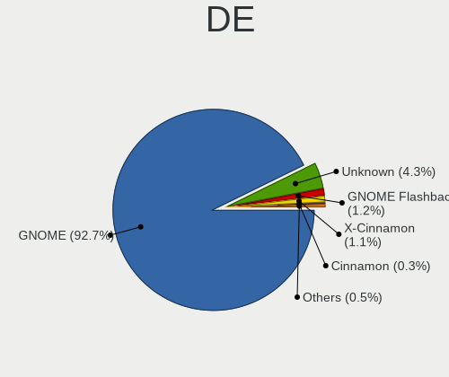
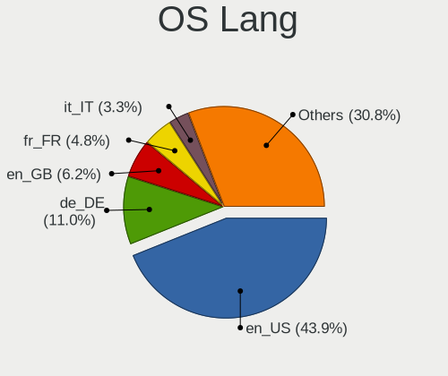
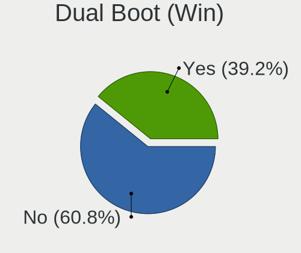
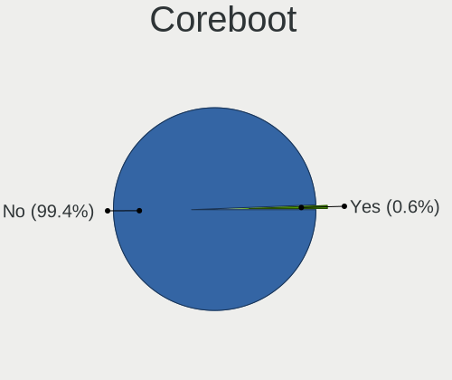
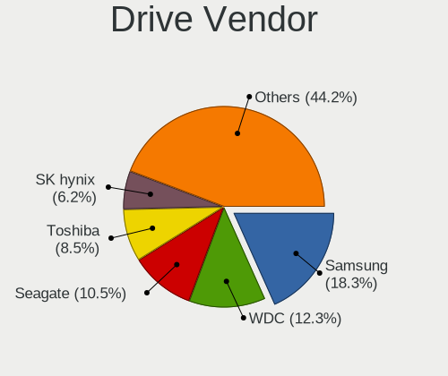
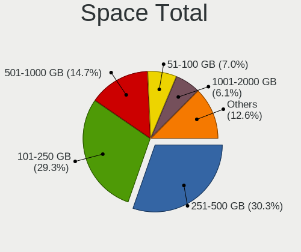
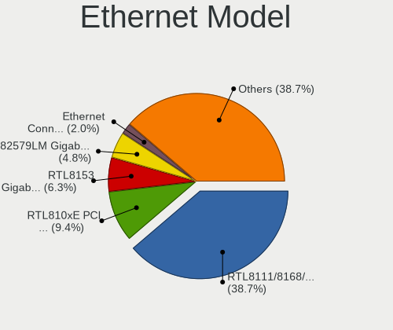
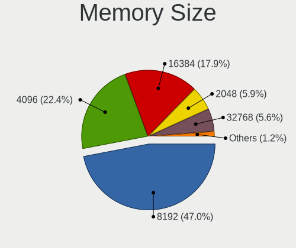

Ubuntu 21.10 - Tested Hardware & Statistics (Notebooks)
-------------------------------------------------------

A project to collect tested hardware configurations for Ubuntu 21.10.

Anyone can contribute to this report by the [hw-probe](https://github.com/linuxhw/hw-probe) tool:

    sudo -E hw-probe -all -upload

Please contribute! Especially if your hardware is rare.

Contents
--------

* [ Test Cases ](#test-cases)

* [ System ](#system)
  - [ Kernel                   ](#kernel)
  - [ Kernel Family            ](#kernel-family)
  - [ Kernel Major Ver.        ](#kernel-major-ver)
  - [ Arch                     ](#arch)
  - [ DE                       ](#de)
  - [ Display Server           ](#display-server)
  - [ Display Manager          ](#display-manager)
  - [ OS Lang                  ](#os-lang)
  - [ Boot Mode                ](#boot-mode)
  - [ Filesystem               ](#filesystem)
  - [ Part. scheme             ](#part-scheme)
  - [ Dual Boot with Linux/BSD ](#dual-boot-with-linuxbsd)
  - [ Dual Boot (Win)          ](#dual-boot-win)

* [ Board ](#board)
  - [ Vendor                   ](#vendor)
  - [ Model                    ](#model)
  - [ Model Family             ](#model-family)
  - [ MFG Year                 ](#mfg-year)
  - [ Form Factor              ](#form-factor)
  - [ Secure Boot              ](#secure-boot)
  - [ Coreboot                 ](#coreboot)
  - [ RAM Size                 ](#ram-size)
  - [ RAM Used                 ](#ram-used)
  - [ Total Drives             ](#total-drives)
  - [ Has CD-ROM               ](#has-cd-rom)
  - [ Has Ethernet             ](#has-ethernet)
  - [ Has WiFi                 ](#has-wifi)
  - [ Has Bluetooth            ](#has-bluetooth)

* [ Location ](#location)
  - [ Country                  ](#country)
  - [ City                     ](#city)

* [ Drives ](#drives)
  - [ Drive Vendor             ](#drive-vendor)
  - [ Drive Model              ](#drive-model)
  - [ HDD Vendor               ](#hdd-vendor)
  - [ SSD Vendor               ](#ssd-vendor)
  - [ Drive Kind               ](#drive-kind)
  - [ Drive Connector          ](#drive-connector)
  - [ Drive Size               ](#drive-size)
  - [ Space Total              ](#space-total)
  - [ Space Used               ](#space-used)
  - [ Malfunc. Drives          ](#malfunc-drives)
  - [ Malfunc. Drive Vendor    ](#malfunc-drive-vendor)
  - [ Malfunc. HDD Vendor      ](#malfunc-hdd-vendor)
  - [ Malfunc. Drive Kind      ](#malfunc-drive-kind)
  - [ Failed Drives            ](#failed-drives)
  - [ Failed Drive Vendor      ](#failed-drive-vendor)
  - [ Drive Status             ](#drive-status)

* [ Storage controller ](#storage-controller)
  - [ Storage Vendor           ](#storage-vendor)
  - [ Storage Model            ](#storage-model)
  - [ Storage Kind             ](#storage-kind)

* [ Processor ](#processor)
  - [ CPU Vendor               ](#cpu-vendor)
  - [ CPU Model                ](#cpu-model)
  - [ CPU Model Family         ](#cpu-model-family)
  - [ CPU Cores                ](#cpu-cores)
  - [ CPU Sockets              ](#cpu-sockets)
  - [ CPU Threads              ](#cpu-threads)
  - [ CPU Op-Modes             ](#cpu-op-modes)
  - [ CPU Microcode            ](#cpu-microcode)
  - [ CPU Microarch            ](#cpu-microarch)

* [ Graphics ](#graphics)
  - [ GPU Vendor               ](#gpu-vendor)
  - [ GPU Model                ](#gpu-model)
  - [ GPU Combo                ](#gpu-combo)
  - [ GPU Driver               ](#gpu-driver)
  - [ GPU Memory               ](#gpu-memory)

* [ Monitor ](#monitor)
  - [ Monitor Vendor           ](#monitor-vendor)
  - [ Monitor Model            ](#monitor-model)
  - [ Monitor Resolution       ](#monitor-resolution)
  - [ Monitor Diagonal         ](#monitor-diagonal)
  - [ Monitor Width            ](#monitor-width)
  - [ Aspect Ratio             ](#aspect-ratio)
  - [ Monitor Area             ](#monitor-area)
  - [ Pixel Density            ](#pixel-density)
  - [ Multiple Monitors        ](#multiple-monitors)

* [ Network ](#network)
  - [ Net Controller Vendor    ](#net-controller-vendor)
  - [ Net Controller Model     ](#net-controller-model)
  - [ Wireless Vendor          ](#wireless-vendor)
  - [ Wireless Model           ](#wireless-model)
  - [ Ethernet Vendor          ](#ethernet-vendor)
  - [ Ethernet Model           ](#ethernet-model)
  - [ Net Controller Kind      ](#net-controller-kind)
  - [ Used Controller          ](#used-controller)
  - [ NICs                     ](#nics)
  - [ IPv6                     ](#ipv6)

* [ Bluetooth ](#bluetooth)
  - [ Bluetooth Vendor         ](#bluetooth-vendor)
  - [ Bluetooth Model          ](#bluetooth-model)

* [ Sound ](#sound)
  - [ Sound Vendor             ](#sound-vendor)
  - [ Sound Model              ](#sound-model)

* [ Memory ](#memory)
  - [ Memory Vendor            ](#memory-vendor)
  - [ Memory Model             ](#memory-model)
  - [ Memory Kind              ](#memory-kind)
  - [ Memory Form Factor       ](#memory-form-factor)
  - [ Memory Size              ](#memory-size)
  - [ Memory Speed             ](#memory-speed)

* [ Printers & scanners ](#printers--scanners)
  - [ Printer Vendor           ](#printer-vendor)
  - [ Printer Model            ](#printer-model)
  - [ Scanner Vendor           ](#scanner-vendor)
  - [ Scanner Model            ](#scanner-model)

* [ Camera ](#camera)
  - [ Camera Vendor            ](#camera-vendor)
  - [ Camera Model             ](#camera-model)

* [ Security ](#security)
  - [ Fingerprint Vendor       ](#fingerprint-vendor)
  - [ Fingerprint Model        ](#fingerprint-model)
  - [ Chipcard Vendor          ](#chipcard-vendor)
  - [ Chipcard Model           ](#chipcard-model)

* [ Unsupported ](#unsupported)
  - [ Unsupported Devices      ](#unsupported-devices)
  - [ Unsupported Device Types ](#unsupported-device-types)

Test Cases
----------

Total: 1533

| Vendor        | Model                       | Probe                                                      | Date         |
|---------------|-----------------------------|------------------------------------------------------------|--------------|
| Samsung       | R59P/R60P/R61P              | [62510109f9](https://linux-hardware.org/?probe=62510109f9) | Nov 25, 2022 |
| ASUSTek       | X200CA                      | [673e0589ca](https://linux-hardware.org/?probe=673e0589ca) | Nov 05, 2022 |
| Lenovo        | V130-15IGM 81HL             | [5dbeb8f7dd](https://linux-hardware.org/?probe=5dbeb8f7dd) | Nov 03, 2022 |
| Dell          | Latitude E6420              | [032920f109](https://linux-hardware.org/?probe=032920f109) | Nov 02, 2022 |
| HP            | G60                         | [ec1164f001](https://linux-hardware.org/?probe=ec1164f001) | Oct 24, 2022 |
| Samsung       | R59P/R60P/R61P              | [0465cb7dee](https://linux-hardware.org/?probe=0465cb7dee) | Oct 23, 2022 |
| HP            | Pavilion dv7                | [bb650e8400](https://linux-hardware.org/?probe=bb650e8400) | Oct 18, 2022 |
| ASUSTek       | X550VX                      | [adbd1fa089](https://linux-hardware.org/?probe=adbd1fa089) | Oct 14, 2022 |
| ASUSTek       | X550VX                      | [c0fefb30fe](https://linux-hardware.org/?probe=c0fefb30fe) | Oct 12, 2022 |
| HP            | Pavilion dv7                | [f94d6a4e8f](https://linux-hardware.org/?probe=f94d6a4e8f) | Sep 14, 2022 |
| Acer          | Aspire E3-112               | [bfa4cc7ddc](https://linux-hardware.org/?probe=bfa4cc7ddc) | Sep 10, 2022 |
| Dell          | Inspiron 1720               | [27de3ede0c](https://linux-hardware.org/?probe=27de3ede0c) | Sep 09, 2022 |
| ASUSTek       | ROG Zephyrus G14 GA401QE... | [4b56f15871](https://linux-hardware.org/?probe=4b56f15871) | Aug 29, 2022 |
| HP            | Pavilion Gaming Laptop 1... | [f4fedfb271](https://linux-hardware.org/?probe=f4fedfb271) | Aug 14, 2022 |
| ASUSTek       | T100HAN                     | [4159616818](https://linux-hardware.org/?probe=4159616818) | Aug 12, 2022 |
| Lenovo        | IdeaPad 330-15IKB 81DE      | [759c9dee6b](https://linux-hardware.org/?probe=759c9dee6b) | Aug 09, 2022 |
| ASUSTek       | VivoBook 15_ASUS Laptop ... | [93ae3bfcfd](https://linux-hardware.org/?probe=93ae3bfcfd) | Aug 02, 2022 |
| Dell          | Latitude E7470              | [0851479f6b](https://linux-hardware.org/?probe=0851479f6b) | Aug 01, 2022 |
| Dell          | Latitude E7470              | [ca7878faab](https://linux-hardware.org/?probe=ca7878faab) | Jul 30, 2022 |
| Lenovo        | B560 43308UG                | [72c6b28a01](https://linux-hardware.org/?probe=72c6b28a01) | Jul 27, 2022 |
| Lenovo        | B560 43308UG                | [4f9d97753e](https://linux-hardware.org/?probe=4f9d97753e) | Jul 26, 2022 |
| Dell          | Vostro 1510                 | [e4814062ec](https://linux-hardware.org/?probe=e4814062ec) | Jul 25, 2022 |
| HP            | Pavilion Aero Laptop 13-... | [e1850b16b9](https://linux-hardware.org/?probe=e1850b16b9) | Jul 24, 2022 |
| Apple         | MacBookAir7,2               | [b0cdba7434](https://linux-hardware.org/?probe=b0cdba7434) | Jul 20, 2022 |
| HP            | 15 Notebook PC              | [0ce333723c](https://linux-hardware.org/?probe=0ce333723c) | Jul 19, 2022 |
| Lenovo        | ThinkPad X1 Carbon 7th 2... | [50c5c54f5a](https://linux-hardware.org/?probe=50c5c54f5a) | Jul 16, 2022 |
| ASUSTek       | X555LD                      | [afcccf6436](https://linux-hardware.org/?probe=afcccf6436) | Jul 13, 2022 |
| Lenovo        | ThinkBook 14-IIL 20SL       | [9703351d30](https://linux-hardware.org/?probe=9703351d30) | Jul 12, 2022 |
| Lenovo        | ThinkPad L14 Gen 1 20U5S... | [87edfcaadf](https://linux-hardware.org/?probe=87edfcaadf) | Jul 09, 2022 |
| Lenovo        | ThinkPad P53 20QNS00Y00     | [64dc631691](https://linux-hardware.org/?probe=64dc631691) | Jul 05, 2022 |
| Lenovo        | ThinkBook 15 G2 ITL 20VE    | [82ca4386ae](https://linux-hardware.org/?probe=82ca4386ae) | Jun 30, 2022 |
| Lenovo        | ThinkBook 15 G2 ITL 20VE    | [42462e221b](https://linux-hardware.org/?probe=42462e221b) | Jun 29, 2022 |
| Lenovo        | B41-80 80LG                 | [30f6e726bd](https://linux-hardware.org/?probe=30f6e726bd) | Jun 28, 2022 |
| ASUSTek       | ROG Strix G713QE_G713QE     | [65782f9daa](https://linux-hardware.org/?probe=65782f9daa) | Jun 27, 2022 |
| ASUSTek       | ROG Strix G713QE_G713QE     | [e881903397](https://linux-hardware.org/?probe=e881903397) | Jun 27, 2022 |
| Dell          | Latitude E7450              | [a03ea66786](https://linux-hardware.org/?probe=a03ea66786) | Jun 24, 2022 |
| Lenovo        | Legion 5 15ACH6H 82JU       | [b450b0c2dc](https://linux-hardware.org/?probe=b450b0c2dc) | Jun 24, 2022 |
| Acer          | Aspire 5750G                | [958b381973](https://linux-hardware.org/?probe=958b381973) | Jun 22, 2022 |
| Samsung       | 950XDB/951XDB/950XDY        | [f51131f21a](https://linux-hardware.org/?probe=f51131f21a) | Jun 21, 2022 |
| Lenovo        | ThinkBook 15 G2 ITL 20VE    | [96c4f21509](https://linux-hardware.org/?probe=96c4f21509) | Jun 21, 2022 |
| HP            | Pavilion Notebook           | [9b350b9918](https://linux-hardware.org/?probe=9b350b9918) | Jun 20, 2022 |
| Dell          | Inspiron 1720               | [8cc15a5651](https://linux-hardware.org/?probe=8cc15a5651) | Jun 19, 2022 |
| Fujitsu       | LIFEBOOK E752               | [c434320a62](https://linux-hardware.org/?probe=c434320a62) | Jun 19, 2022 |
| ASUSTek       | VivoBook E14 E402WAS        | [2570d889fd](https://linux-hardware.org/?probe=2570d889fd) | Jun 14, 2022 |
| Google        | Ekko                        | [9ef19da0ca](https://linux-hardware.org/?probe=9ef19da0ca) | Jun 09, 2022 |
| Google        | Ekko                        | [92af4a5d59](https://linux-hardware.org/?probe=92af4a5d59) | Jun 09, 2022 |
| HP            | EliteBook 2560p             | [5f1e0dfee7](https://linux-hardware.org/?probe=5f1e0dfee7) | Jun 09, 2022 |
| HP            | EliteBook 2560p             | [cf8d972149](https://linux-hardware.org/?probe=cf8d972149) | Jun 09, 2022 |
| ASUSTek       | N61Vg                       | [5593b63d10](https://linux-hardware.org/?probe=5593b63d10) | Jun 04, 2022 |
| ASUSTek       | ASUS TUF Gaming F15 FX50... | [83b786e73a](https://linux-hardware.org/?probe=83b786e73a) | Jun 04, 2022 |
| Toshiba       | Satellite C70D-A            | [70313d6ed4](https://linux-hardware.org/?probe=70313d6ed4) | May 31, 2022 |
| Lenovo        | Z50-75 80EC                 | [11f3206539](https://linux-hardware.org/?probe=11f3206539) | May 31, 2022 |
| Toshiba       | Satellite M305D             | [6d558c3665](https://linux-hardware.org/?probe=6d558c3665) | May 31, 2022 |
| Toshiba       | Satellite M305D             | [43315304ac](https://linux-hardware.org/?probe=43315304ac) | May 31, 2022 |
| Toshiba       | Satellite C70D-A            | [820a9fb182](https://linux-hardware.org/?probe=820a9fb182) | May 30, 2022 |
| HP            | Presario CQ62               | [fe3cac8868](https://linux-hardware.org/?probe=fe3cac8868) | May 27, 2022 |
| Lenovo        | ThinkPad E15 Gen 2 20T80... | [143ca380f9](https://linux-hardware.org/?probe=143ca380f9) | May 26, 2022 |
| ASUSTek       | TP500LA                     | [d72b249f1a](https://linux-hardware.org/?probe=d72b249f1a) | May 25, 2022 |
| Dell          | Latitude E5440              | [21f0eba93a](https://linux-hardware.org/?probe=21f0eba93a) | May 24, 2022 |
| HP            | ProBook 6460b               | [7af90825ff](https://linux-hardware.org/?probe=7af90825ff) | May 23, 2022 |
| HP            | ProBook 6460b               | [e3819153ed](https://linux-hardware.org/?probe=e3819153ed) | May 23, 2022 |
| HP            | Notebook                    | [efacf04654](https://linux-hardware.org/?probe=efacf04654) | May 23, 2022 |
| Dell          | Latitude 3490               | [36a2ce11ef](https://linux-hardware.org/?probe=36a2ce11ef) | May 22, 2022 |
| HP            | Pavilion Aero Laptop 13-... | [6efbcdabfc](https://linux-hardware.org/?probe=6efbcdabfc) | May 17, 2022 |
| Lenovo        | Legion 5 15ACH6H 82JU       | [124aa63eaf](https://linux-hardware.org/?probe=124aa63eaf) | May 17, 2022 |
| Dell          | Precision M6300             | [874055cf5b](https://linux-hardware.org/?probe=874055cf5b) | May 14, 2022 |
| Dell          | Inspiron 5584               | [88414fb6bb](https://linux-hardware.org/?probe=88414fb6bb) | May 13, 2022 |
| ASUSTek       | X580VD                      | [1d71c877c7](https://linux-hardware.org/?probe=1d71c877c7) | May 13, 2022 |
| ASUSTek       | K55DR                       | [12c3e32108](https://linux-hardware.org/?probe=12c3e32108) | May 12, 2022 |
| Acer          | Swift SF314-51              | [5b2cacdf1a](https://linux-hardware.org/?probe=5b2cacdf1a) | May 12, 2022 |
| Lenovo        | ThinkBook 14-IML 20RV       | [17dda821a0](https://linux-hardware.org/?probe=17dda821a0) | May 11, 2022 |
| Lenovo        | ThinkPad T14s Gen 1 20UH... | [a63f7cf593](https://linux-hardware.org/?probe=a63f7cf593) | May 10, 2022 |
| Dell          | Precision M6300             | [6cb903a178](https://linux-hardware.org/?probe=6cb903a178) | May 09, 2022 |
| Lenovo        | ThinkPad P1 Gen 2 20QT00... | [5f62eb4b30](https://linux-hardware.org/?probe=5f62eb4b30) | May 05, 2022 |
| Lenovo        | ThinkPad L412 0553A13       | [bd3cf16002](https://linux-hardware.org/?probe=bd3cf16002) | May 04, 2022 |
| Sony          | VGN-FW56J                   | [92f7897c3c](https://linux-hardware.org/?probe=92f7897c3c) | May 04, 2022 |
| Toshiba       | Satellite L735              | [cb523c0933](https://linux-hardware.org/?probe=cb523c0933) | May 02, 2022 |
| Dell          | XPS 15 9570                 | [01a95b61fe](https://linux-hardware.org/?probe=01a95b61fe) | May 02, 2022 |
| Lenovo        | IdeaPad Gaming 3 15ARH05... | [6537fb670a](https://linux-hardware.org/?probe=6537fb670a) | May 01, 2022 |
| HP            | Laptop 15-dw3xxx            | [889f1cba36](https://linux-hardware.org/?probe=889f1cba36) | Apr 30, 2022 |
| Dell          | Latitude 5480               | [ba1ff8183e](https://linux-hardware.org/?probe=ba1ff8183e) | Apr 30, 2022 |
| HP            | Pavilion Gaming Laptop 1... | [f842336794](https://linux-hardware.org/?probe=f842336794) | Apr 29, 2022 |
| Lenovo        | ThinkPad T440s 20ARS3640... | [13ec979f89](https://linux-hardware.org/?probe=13ec979f89) | Apr 28, 2022 |
| Sony          | VGN-FW56J                   | [45c6c458bc](https://linux-hardware.org/?probe=45c6c458bc) | Apr 28, 2022 |
| Lenovo        | IdeaPad Gaming 3 15ARH05... | [8ece944a7b](https://linux-hardware.org/?probe=8ece944a7b) | Apr 27, 2022 |
| HP            | Laptop 15-bw0xx             | [dc46901a64](https://linux-hardware.org/?probe=dc46901a64) | Apr 27, 2022 |
| Lenovo        | ThinkPad L460 20FVS3X800    | [adbec7ed2e](https://linux-hardware.org/?probe=adbec7ed2e) | Apr 27, 2022 |
| Dell          | XPS 13 9380                 | [c052066ee4](https://linux-hardware.org/?probe=c052066ee4) | Apr 26, 2022 |
| MSI           | GP66 Leopard 11UH           | [549c216d66](https://linux-hardware.org/?probe=549c216d66) | Apr 26, 2022 |
| ASUSTek       | P55VA                       | [21c5b79768](https://linux-hardware.org/?probe=21c5b79768) | Apr 26, 2022 |
| Lenovo        | ThinkPad E15 20RDS03500     | [6aa4c36808](https://linux-hardware.org/?probe=6aa4c36808) | Apr 26, 2022 |
| Acer          | Aspire E1-570               | [b8257c292a](https://linux-hardware.org/?probe=b8257c292a) | Apr 26, 2022 |
| Lenovo        | ThinkPad T440 20B7S3UD00    | [9c66fd444a](https://linux-hardware.org/?probe=9c66fd444a) | Apr 25, 2022 |
| Lenovo        | ThinkPad T440 20B7S3UD00    | [942267c99b](https://linux-hardware.org/?probe=942267c99b) | Apr 25, 2022 |
| Dell          | Inspiron 5577               | [0925d92173](https://linux-hardware.org/?probe=0925d92173) | Apr 25, 2022 |
| Dell          | Inspiron N4050              | [7b82407cba](https://linux-hardware.org/?probe=7b82407cba) | Apr 25, 2022 |
| Sony          | SVE1513R1EB                 | [5275d17d40](https://linux-hardware.org/?probe=5275d17d40) | Apr 24, 2022 |
| ASUSTek       | X540LA                      | [370a60692a](https://linux-hardware.org/?probe=370a60692a) | Apr 24, 2022 |
| HUAWEI        | MACHC-WAX9                  | [9cda67e701](https://linux-hardware.org/?probe=9cda67e701) | Apr 24, 2022 |
| SANTECH       | NHx0EH_EJ_EK                | [2e51ffc9e7](https://linux-hardware.org/?probe=2e51ffc9e7) | Apr 24, 2022 |
| Unknown       | Unknown                     | [ff32f84c4e](https://linux-hardware.org/?probe=ff32f84c4e) | Apr 23, 2022 |
| HP            | ZBook 15 G5                 | [3b1d5e2bb8](https://linux-hardware.org/?probe=3b1d5e2bb8) | Apr 22, 2022 |
| Lenovo        | E41-25 81FS                 | [4880f7c2d5](https://linux-hardware.org/?probe=4880f7c2d5) | Apr 22, 2022 |
| Acer          | Aspire E1-570               | [b8e8a058d2](https://linux-hardware.org/?probe=b8e8a058d2) | Apr 22, 2022 |
| Lenovo        | B50-70 20384                | [35cf0f09e4](https://linux-hardware.org/?probe=35cf0f09e4) | Apr 22, 2022 |
| Fujitsu       | LIFEBOOK E744               | [ca56dc9824](https://linux-hardware.org/?probe=ca56dc9824) | Apr 21, 2022 |
| Acer          | Aspire E5-553               | [1c736596fa](https://linux-hardware.org/?probe=1c736596fa) | Apr 21, 2022 |
| HP            | Laptop 14-ck0xxx            | [02dd52b3b5](https://linux-hardware.org/?probe=02dd52b3b5) | Apr 21, 2022 |
| HP            | 15                          | [3253e0fc56](https://linux-hardware.org/?probe=3253e0fc56) | Apr 21, 2022 |
| Dell          | XPS 15 7590                 | [7338b3ccc3](https://linux-hardware.org/?probe=7338b3ccc3) | Apr 20, 2022 |
| ASUSTek       | X540LJ                      | [33a74b2070](https://linux-hardware.org/?probe=33a74b2070) | Apr 20, 2022 |
| HP            | ProBook 440 G5              | [288c8e99b2](https://linux-hardware.org/?probe=288c8e99b2) | Apr 20, 2022 |
| Dell          | Inspiron 15-3567            | [b87e7c08ab](https://linux-hardware.org/?probe=b87e7c08ab) | Apr 19, 2022 |
| Acer          | Aspire ES1-731              | [451ce5305a](https://linux-hardware.org/?probe=451ce5305a) | Apr 19, 2022 |
| Acer          | Aspire ES1-731              | [fa843a199c](https://linux-hardware.org/?probe=fa843a199c) | Apr 19, 2022 |
| HP            | 470 G8                      | [fb6853bfde](https://linux-hardware.org/?probe=fb6853bfde) | Apr 18, 2022 |
| Dell          | Inspiron 5585               | [2c6e96d91f](https://linux-hardware.org/?probe=2c6e96d91f) | Apr 18, 2022 |
| HP            | G42                         | [18486c3d27](https://linux-hardware.org/?probe=18486c3d27) | Apr 18, 2022 |
| Acer          | Aspire A315-51              | [a6ae41a1c9](https://linux-hardware.org/?probe=a6ae41a1c9) | Apr 18, 2022 |
| Medion        | E6215                       | [39eedb46b2](https://linux-hardware.org/?probe=39eedb46b2) | Apr 18, 2022 |
| ASUSTek       | ASUS TUF Gaming F17 FX70... | [885a3f046f](https://linux-hardware.org/?probe=885a3f046f) | Apr 18, 2022 |
| Lenovo        | IdeaPad 5 15ITL05 82FG      | [1f3827f38e](https://linux-hardware.org/?probe=1f3827f38e) | Apr 18, 2022 |
| Acer          | TMP645-M                    | [9b20e644dd](https://linux-hardware.org/?probe=9b20e644dd) | Apr 18, 2022 |
| HUAWEI        | KLVL-WXX9                   | [9868b4e681](https://linux-hardware.org/?probe=9868b4e681) | Apr 17, 2022 |
| Acer          | Nitro AN515-55              | [6d20f56bba](https://linux-hardware.org/?probe=6d20f56bba) | Apr 17, 2022 |
| Lenovo        | ThinkPad X1 Carbon Gen 9... | [1f7292b20a](https://linux-hardware.org/?probe=1f7292b20a) | Apr 16, 2022 |
| Dell          | Latitude E6430              | [c9a365bfe3](https://linux-hardware.org/?probe=c9a365bfe3) | Apr 16, 2022 |
| Packard Be... | EasyNote TK85               | [c20035dfb3](https://linux-hardware.org/?probe=c20035dfb3) | Apr 16, 2022 |
| Dell          | Inspiron 13-5378            | [3998a17f75](https://linux-hardware.org/?probe=3998a17f75) | Apr 16, 2022 |
| Acer          | Aspire E5-471G              | [a7179e1ba3](https://linux-hardware.org/?probe=a7179e1ba3) | Apr 16, 2022 |
| HP            | Pavilion dv7                | [60eee202a1](https://linux-hardware.org/?probe=60eee202a1) | Apr 16, 2022 |
| Acer          | Aspire ES1-512              | [0f19c624fb](https://linux-hardware.org/?probe=0f19c624fb) | Apr 16, 2022 |
| Acer          | Aspire ES1-512              | [6467d63e0d](https://linux-hardware.org/?probe=6467d63e0d) | Apr 16, 2022 |
| Dell          | XPS 13 9310                 | [2c395ea438](https://linux-hardware.org/?probe=2c395ea438) | Apr 15, 2022 |
| HP            | 255 G7 Notebook PC          | [c9a7153c14](https://linux-hardware.org/?probe=c9a7153c14) | Apr 15, 2022 |
| Dell          | Latitude E6430              | [fc7e6fce7b](https://linux-hardware.org/?probe=fc7e6fce7b) | Apr 15, 2022 |
| Dell          | Latitude 5420               | [7b97392ed4](https://linux-hardware.org/?probe=7b97392ed4) | Apr 15, 2022 |
| Dell          | Inspiron 3481               | [69d336ac59](https://linux-hardware.org/?probe=69d336ac59) | Apr 15, 2022 |
| Lenovo        | ThinkPad T15g Gen 1 20UR... | [c60feffffb](https://linux-hardware.org/?probe=c60feffffb) | Apr 14, 2022 |
| Dell          | Inspiron 15-3567            | [73be944f6c](https://linux-hardware.org/?probe=73be944f6c) | Apr 14, 2022 |
| SLIMBOOK      | PRO                         | [97f545c3d4](https://linux-hardware.org/?probe=97f545c3d4) | Apr 14, 2022 |
| Dell          | Latitude E7250              | [2d0ac286da](https://linux-hardware.org/?probe=2d0ac286da) | Apr 14, 2022 |
| Dell          | Latitude 5590               | [c306b97fcd](https://linux-hardware.org/?probe=c306b97fcd) | Apr 14, 2022 |
| Lenovo        | ThinkPad T490 20N2CTO1WW    | [6e22aff30c](https://linux-hardware.org/?probe=6e22aff30c) | Apr 14, 2022 |
| Dell          | Precision 5540              | [6bd831ee00](https://linux-hardware.org/?probe=6bd831ee00) | Apr 14, 2022 |
| Lenovo        | ThinkPad P70 20ERCTO1WW     | [d8a70fe32c](https://linux-hardware.org/?probe=d8a70fe32c) | Apr 13, 2022 |
| Acer          | Aspire A514-54G             | [af418a6f28](https://linux-hardware.org/?probe=af418a6f28) | Apr 13, 2022 |
| Dell          | Inspiron 7570               | [8d68856bad](https://linux-hardware.org/?probe=8d68856bad) | Apr 13, 2022 |
| Lenovo        | IdeaPad 5 15ARE05 81YQ      | [01e2f073c1](https://linux-hardware.org/?probe=01e2f073c1) | Apr 13, 2022 |
| Dell          | XPS 15 9500                 | [986cb2363c](https://linux-hardware.org/?probe=986cb2363c) | Apr 13, 2022 |
| HP            | ZBook Power 15.6 inch G8... | [7f83d03bf3](https://linux-hardware.org/?probe=7f83d03bf3) | Apr 13, 2022 |
| HP            | ZBook Power 15.6 inch G8... | [bbcb05781f](https://linux-hardware.org/?probe=bbcb05781f) | Apr 13, 2022 |
| Lenovo        | ThinkPad T14s Gen 2a 20X... | [b2fc1649d1](https://linux-hardware.org/?probe=b2fc1649d1) | Apr 13, 2022 |
| Dell          | Inspiron 5590               | [1605fca16d](https://linux-hardware.org/?probe=1605fca16d) | Apr 13, 2022 |
| Acer          | Swift SF514-51              | [147a0161aa](https://linux-hardware.org/?probe=147a0161aa) | Apr 13, 2022 |
| Lenovo        | IdeaPad 330-15ARR 81D2      | [3f66b1cb5c](https://linux-hardware.org/?probe=3f66b1cb5c) | Apr 13, 2022 |
| Lenovo        | Legion 5 15ARH05 82B5       | [5aafaf0890](https://linux-hardware.org/?probe=5aafaf0890) | Apr 13, 2022 |
| Lenovo        | Legion 5 15ARH05 82B5       | [983dbbf9e8](https://linux-hardware.org/?probe=983dbbf9e8) | Apr 13, 2022 |
| Lenovo        | V130-15IKB 81HN             | [4228ebaeeb](https://linux-hardware.org/?probe=4228ebaeeb) | Apr 13, 2022 |
| Lenovo        | Legion S7 15IMH5 82BC       | [96fc2ced60](https://linux-hardware.org/?probe=96fc2ced60) | Apr 13, 2022 |
| Sony          | VGN-NW21EF_S                | [4ade997baf](https://linux-hardware.org/?probe=4ade997baf) | Apr 13, 2022 |
| Dell          | Vostro 5515                 | [710d07a9bd](https://linux-hardware.org/?probe=710d07a9bd) | Apr 12, 2022 |
| Dell          | Vostro 5515                 | [677234b8b8](https://linux-hardware.org/?probe=677234b8b8) | Apr 12, 2022 |
| Packard Be... | EasyNote TK85               | [c0eb727f3c](https://linux-hardware.org/?probe=c0eb727f3c) | Apr 12, 2022 |
| Lenovo        | E41-25 81FS                 | [8d0dfa3de3](https://linux-hardware.org/?probe=8d0dfa3de3) | Apr 12, 2022 |
| HP            | Stream Laptop 11-ak0xxx     | [93ec29bb99](https://linux-hardware.org/?probe=93ec29bb99) | Apr 12, 2022 |
| HP            | Laptop 17-cp0xxx            | [15cf291bf3](https://linux-hardware.org/?probe=15cf291bf3) | Apr 12, 2022 |
| HP            | Laptop 17-cp0xxx            | [b8ca5707e7](https://linux-hardware.org/?probe=b8ca5707e7) | Apr 11, 2022 |
| Positivo      | H14BU08                     | [11014257c0](https://linux-hardware.org/?probe=11014257c0) | Apr 11, 2022 |
| Acer          | Aspire E5-721               | [abdc523e93](https://linux-hardware.org/?probe=abdc523e93) | Apr 11, 2022 |
| Intel         | W7650                       | [7c970783e1](https://linux-hardware.org/?probe=7c970783e1) | Apr 11, 2022 |
| HP            | 15                          | [5aeb5a94c1](https://linux-hardware.org/?probe=5aeb5a94c1) | Apr 11, 2022 |
| Dell          | Vostro 15-3568              | [6f7d1fdcbf](https://linux-hardware.org/?probe=6f7d1fdcbf) | Apr 09, 2022 |
| HP            | Pavilion dv7                | [031ac42e46](https://linux-hardware.org/?probe=031ac42e46) | Apr 09, 2022 |
| Lenovo        | ThinkPad T490 20N2CTO1WW    | [0dbb9e7eb0](https://linux-hardware.org/?probe=0dbb9e7eb0) | Apr 09, 2022 |
| Dell          | Inspiron 5515               | [de3e7023c4](https://linux-hardware.org/?probe=de3e7023c4) | Apr 08, 2022 |
| HP            | Pavilion Laptop 15-eg0xx... | [8adf631258](https://linux-hardware.org/?probe=8adf631258) | Apr 08, 2022 |
| Dell          | Latitude E5440              | [18290ab7b0](https://linux-hardware.org/?probe=18290ab7b0) | Apr 08, 2022 |
| Lenovo        | ThinkPad T430 2349AK5       | [57e3c5731e](https://linux-hardware.org/?probe=57e3c5731e) | Apr 08, 2022 |
| HP            | 15 Notebook PC              | [7c20470181](https://linux-hardware.org/?probe=7c20470181) | Apr 08, 2022 |
| Dell          | Inspiron 3793               | [f39ad72be3](https://linux-hardware.org/?probe=f39ad72be3) | Apr 07, 2022 |
| HP            | Stream Laptop 11-ak0xxx     | [c0a176be72](https://linux-hardware.org/?probe=c0a176be72) | Apr 07, 2022 |
| Lenovo        | ThinkPad L14 Gen 2 20X10... | [45548a6fe5](https://linux-hardware.org/?probe=45548a6fe5) | Apr 07, 2022 |
| HP            | Laptop 14s-dq1xxx           | [72c98b5e79](https://linux-hardware.org/?probe=72c98b5e79) | Apr 07, 2022 |
| ASUSTek       | ROG Strix G731GU_G731GU     | [c4ed41947f](https://linux-hardware.org/?probe=c4ed41947f) | Apr 07, 2022 |
| Toshiba       | Satellite L735              | [b7873249a4](https://linux-hardware.org/?probe=b7873249a4) | Apr 07, 2022 |
| ASUSTek       | VivoBook_ASUSLaptop X515... | [f6c87488b0](https://linux-hardware.org/?probe=f6c87488b0) | Apr 06, 2022 |
| Dell          | Inspiron 16 7610            | [8b2c078f25](https://linux-hardware.org/?probe=8b2c078f25) | Apr 06, 2022 |
| Lenovo        | IdeaPad 510-15ISK 80SR      | [fe1e7bc4e4](https://linux-hardware.org/?probe=fe1e7bc4e4) | Apr 06, 2022 |
| Dell          | XPS 13 9310                 | [93dd14057b](https://linux-hardware.org/?probe=93dd14057b) | Apr 05, 2022 |
| Acer          | Aspire E5-774G              | [2e61b0b4d5](https://linux-hardware.org/?probe=2e61b0b4d5) | Apr 05, 2022 |
| HP            | Stream Laptop 11-ak0xxx     | [8f985de338](https://linux-hardware.org/?probe=8f985de338) | Apr 05, 2022 |
| ASUSTek       | N61Vg                       | [96372fecb5](https://linux-hardware.org/?probe=96372fecb5) | Apr 05, 2022 |
| Sony          | VJZ141C11L                  | [bb26d704f1](https://linux-hardware.org/?probe=bb26d704f1) | Apr 05, 2022 |
| ASUSTek       | UX32VD                      | [31836fcaa9](https://linux-hardware.org/?probe=31836fcaa9) | Apr 05, 2022 |
| Lenovo        | ThinkPad T14 Gen 2a 20XK... | [37b0484558](https://linux-hardware.org/?probe=37b0484558) | Apr 04, 2022 |
| HP            | EliteBook 840 G3            | [8c03dcd371](https://linux-hardware.org/?probe=8c03dcd371) | Apr 04, 2022 |
| Dell          | Precision M4600             | [98d32306ea](https://linux-hardware.org/?probe=98d32306ea) | Apr 04, 2022 |
| Medion        | S561X                       | [468655cc72](https://linux-hardware.org/?probe=468655cc72) | Apr 03, 2022 |
| Dell          | Latitude E5470              | [e05f59de23](https://linux-hardware.org/?probe=e05f59de23) | Apr 03, 2022 |
| HP            | Pavilion g6                 | [5469395f5c](https://linux-hardware.org/?probe=5469395f5c) | Apr 03, 2022 |
| HP            | ZBook 15 G5                 | [79f27f1c98](https://linux-hardware.org/?probe=79f27f1c98) | Apr 03, 2022 |
| Dell          | Inspiron 3505               | [982bcd3a5b](https://linux-hardware.org/?probe=982bcd3a5b) | Apr 03, 2022 |
| Kogan         | KAL11C250SB                 | [ea426eda5e](https://linux-hardware.org/?probe=ea426eda5e) | Apr 03, 2022 |
| Medion        | E7419 MD60827               | [9b5701db0b](https://linux-hardware.org/?probe=9b5701db0b) | Apr 03, 2022 |
| HP            | Pavilion Aero Laptop 13-... | [8865aba7b6](https://linux-hardware.org/?probe=8865aba7b6) | Apr 02, 2022 |
| Dell          | Inspiron N5050              | [273eefb222](https://linux-hardware.org/?probe=273eefb222) | Apr 02, 2022 |
| Dell          | Inspiron N5050              | [73d3ef24bb](https://linux-hardware.org/?probe=73d3ef24bb) | Apr 02, 2022 |
| Jumper        | EZbook                      | [82059d364a](https://linux-hardware.org/?probe=82059d364a) | Apr 02, 2022 |
| Jumper        | EZbook                      | [e27bed6542](https://linux-hardware.org/?probe=e27bed6542) | Apr 02, 2022 |
| Lenovo        | V14-ADA 82C6                | [8f74b48f7c](https://linux-hardware.org/?probe=8f74b48f7c) | Apr 02, 2022 |
| Lenovo        | V14-ADA 82C6                | [c80f6bbe22](https://linux-hardware.org/?probe=c80f6bbe22) | Apr 02, 2022 |
| Lenovo        | G580 2189                   | [da5b37bf9f](https://linux-hardware.org/?probe=da5b37bf9f) | Apr 02, 2022 |
| HP            | EliteBook 840 G5            | [30573f4db5](https://linux-hardware.org/?probe=30573f4db5) | Apr 02, 2022 |
| Lenovo        | IdeaPad S540-15IWL GTX 8... | [f1ceaa5222](https://linux-hardware.org/?probe=f1ceaa5222) | Apr 02, 2022 |
| Notebook      | W65_67SZ                    | [1b085791cc](https://linux-hardware.org/?probe=1b085791cc) | Apr 01, 2022 |
| Samsung       | 950XCJ/951XCJ/950XCR        | [f22fa67906](https://linux-hardware.org/?probe=f22fa67906) | Apr 01, 2022 |
| HP            | 250 G4                      | [cb7cd2ea49](https://linux-hardware.org/?probe=cb7cd2ea49) | Apr 01, 2022 |
| Dell          | XPS 15 9570                 | [5fdfbe6b61](https://linux-hardware.org/?probe=5fdfbe6b61) | Apr 01, 2022 |
| HP            | EliteBook 850 G8 Noteboo... | [24fe7f7148](https://linux-hardware.org/?probe=24fe7f7148) | Apr 01, 2022 |
| Lenovo        | Yoga Slim 7 14ARE05 82A2    | [96e4eca691](https://linux-hardware.org/?probe=96e4eca691) | Apr 01, 2022 |
| Medion        | E7419 MD60827               | [d4fc165219](https://linux-hardware.org/?probe=d4fc165219) | Apr 01, 2022 |
| Lenovo        | ThinkPad Edge E530 62724... | [d7e0c70bf4](https://linux-hardware.org/?probe=d7e0c70bf4) | Apr 01, 2022 |
| Lenovo        | Legion 7 16ACHg6 82N6       | [ce4341b7b1](https://linux-hardware.org/?probe=ce4341b7b1) | Apr 01, 2022 |
| ASUSTek       | ROG Zephyrus G14 GA401QC... | [87dfbaa9e8](https://linux-hardware.org/?probe=87dfbaa9e8) | Apr 01, 2022 |
| ASUSTek       | ROG Zephyrus G14 GA401QC... | [36563f3934](https://linux-hardware.org/?probe=36563f3934) | Apr 01, 2022 |
| Samsung       | 530U3C/530U4C/532U3C        | [0330b4bb9e](https://linux-hardware.org/?probe=0330b4bb9e) | Mar 31, 2022 |
| ASUSTek       | N750JK                      | [3a5ab0c5a6](https://linux-hardware.org/?probe=3a5ab0c5a6) | Mar 31, 2022 |
| Dell          | G15 5510                    | [79f800bf0c](https://linux-hardware.org/?probe=79f800bf0c) | Mar 31, 2022 |
| ASUSTek       | VivoBook_ASUSLaptop X435... | [0cfca0c3f1](https://linux-hardware.org/?probe=0cfca0c3f1) | Mar 30, 2022 |
| ASUSTek       | ZenBook UX425EA_UX425EA     | [0b247aa185](https://linux-hardware.org/?probe=0b247aa185) | Mar 30, 2022 |
| HP            | Laptop 14-dk1xxx            | [83f5079647](https://linux-hardware.org/?probe=83f5079647) | Mar 30, 2022 |
| HP            | Laptop 14-dk1xxx            | [0ba5fd01fa](https://linux-hardware.org/?probe=0ba5fd01fa) | Mar 30, 2022 |
| Lenovo        | G40-80 80JE                 | [47c1543863](https://linux-hardware.org/?probe=47c1543863) | Mar 30, 2022 |
| Schenker      | VISION 14                   | [f6c59875a1](https://linux-hardware.org/?probe=f6c59875a1) | Mar 30, 2022 |
| Dell          | Latitude 5520               | [19ae38fc11](https://linux-hardware.org/?probe=19ae38fc11) | Mar 30, 2022 |
| Lenovo        | ThinkPad T470 W10DG 20JN... | [48e596f082](https://linux-hardware.org/?probe=48e596f082) | Mar 30, 2022 |
| Lenovo        | ThinkPad T470 W10DG 20JN... | [fab15ee731](https://linux-hardware.org/?probe=fab15ee731) | Mar 30, 2022 |
| Apple         | MacBookPro14,3              | [33107e3ea3](https://linux-hardware.org/?probe=33107e3ea3) | Mar 29, 2022 |
| HP            | Laptop 15-bw0xx             | [b9a21aea35](https://linux-hardware.org/?probe=b9a21aea35) | Mar 29, 2022 |
| Dell          | Latitude 5285               | [162d3bef44](https://linux-hardware.org/?probe=162d3bef44) | Mar 29, 2022 |
| HUAWEI        | CREM-WXX9                   | [67475db5e9](https://linux-hardware.org/?probe=67475db5e9) | Mar 29, 2022 |
| HUAWEI        | CREM-WXX9                   | [2c7227662f](https://linux-hardware.org/?probe=2c7227662f) | Mar 29, 2022 |
| Dell          | Inspiron 1764               | [6eb66d942d](https://linux-hardware.org/?probe=6eb66d942d) | Mar 29, 2022 |
| Lenovo        | V15-G2-ITL 82KB             | [38700103d3](https://linux-hardware.org/?probe=38700103d3) | Mar 29, 2022 |
| Unknown       | X133                        | [996dfaa50f](https://linux-hardware.org/?probe=996dfaa50f) | Mar 28, 2022 |
| Fujitsu       | LIFEBOOK T734               | [2b36726e65](https://linux-hardware.org/?probe=2b36726e65) | Mar 28, 2022 |
| ASUSTek       | ZenBook UX482EAR_UX482EA... | [649bc1b13a](https://linux-hardware.org/?probe=649bc1b13a) | Mar 28, 2022 |
| ASUSTek       | ZenBook UX482EAR_UX482EA... | [d1638977bc](https://linux-hardware.org/?probe=d1638977bc) | Mar 28, 2022 |
| HP            | 255 G7 Notebook PC          | [0e63a73617](https://linux-hardware.org/?probe=0e63a73617) | Mar 28, 2022 |
| HP            | ZBook 17 G3                 | [b016648f02](https://linux-hardware.org/?probe=b016648f02) | Mar 27, 2022 |
| Dell          | Latitude 5285               | [d5a93ff0d5](https://linux-hardware.org/?probe=d5a93ff0d5) | Mar 26, 2022 |
| ASUSTek       | ZenBook UX333FA_UX333FA     | [5b484e3ef3](https://linux-hardware.org/?probe=5b484e3ef3) | Mar 26, 2022 |
| HP            | EliteBook Revolve 810 G1    | [e18a60f6bf](https://linux-hardware.org/?probe=e18a60f6bf) | Mar 26, 2022 |
| Acer          | Swift SF314-511             | [ffde31bd20](https://linux-hardware.org/?probe=ffde31bd20) | Mar 26, 2022 |
| ASUSTek       | N550JK                      | [145b778642](https://linux-hardware.org/?probe=145b778642) | Mar 26, 2022 |
| Lenovo        | ThinkPad E485 20KUCTO1WW    | [8e439f57c8](https://linux-hardware.org/?probe=8e439f57c8) | Mar 26, 2022 |
| HP            | ENVY m7 Notebook            | [c7b7914b87](https://linux-hardware.org/?probe=c7b7914b87) | Mar 26, 2022 |
| MSI           | GL65 Leopard 10SFK          | [96afe8ccf1](https://linux-hardware.org/?probe=96afe8ccf1) | Mar 25, 2022 |
| Acer          | Aspire 5750G                | [4a7e22384f](https://linux-hardware.org/?probe=4a7e22384f) | Mar 25, 2022 |
| Dell          | XPS 13 9310                 | [47bfb83f06](https://linux-hardware.org/?probe=47bfb83f06) | Mar 25, 2022 |
| Dell          | Latitude 5420               | [fed42f2345](https://linux-hardware.org/?probe=fed42f2345) | Mar 25, 2022 |
| Dell          | XPS 13 9310                 | [9d1c916f94](https://linux-hardware.org/?probe=9d1c916f94) | Mar 25, 2022 |
| HP            | EliteBook 845 G8 Noteboo... | [c6ed527183](https://linux-hardware.org/?probe=c6ed527183) | Mar 25, 2022 |
| Dell          | Inspiron 15-3567            | [2bbea411a6](https://linux-hardware.org/?probe=2bbea411a6) | Mar 24, 2022 |
| HP            | ProBook 455 G8 Notebook ... | [6796eb3981](https://linux-hardware.org/?probe=6796eb3981) | Mar 24, 2022 |
| Irbis         | NB656                       | [b151b2e16e](https://linux-hardware.org/?probe=b151b2e16e) | Mar 24, 2022 |
| Dell          | Latitude 9420               | [bee4bccd5f](https://linux-hardware.org/?probe=bee4bccd5f) | Mar 24, 2022 |
| Dell          | Inspiron 7577               | [ebf14b91f0](https://linux-hardware.org/?probe=ebf14b91f0) | Mar 24, 2022 |
| Lenovo        | V145-15AST 81MT             | [10ea2311cc](https://linux-hardware.org/?probe=10ea2311cc) | Mar 24, 2022 |
| ASUSTek       | ROG CROSSHAIR VIII DARK ... | [58cfc7fbae](https://linux-hardware.org/?probe=58cfc7fbae) | Mar 23, 2022 |
| HP            | EliteBook 845 G7 Noteboo... | [57c001c06e](https://linux-hardware.org/?probe=57c001c06e) | Mar 23, 2022 |
| Lenovo        | IdeaPad Gaming 3 15ARH05... | [0ac448a13f](https://linux-hardware.org/?probe=0ac448a13f) | Mar 23, 2022 |
| HP            | Laptop 15-bs0xx             | [e12f0f1eed](https://linux-hardware.org/?probe=e12f0f1eed) | Mar 23, 2022 |
| Lenovo        | IdeaPad 320S-14IKB 81BN     | [19fbf78cc0](https://linux-hardware.org/?probe=19fbf78cc0) | Mar 23, 2022 |
| Lenovo        | ThinkPad L15 Gen 1 20U4A... | [a257719dcf](https://linux-hardware.org/?probe=a257719dcf) | Mar 23, 2022 |
| Matsushita... | CF-19FHGADAM                | [72135c79c9](https://linux-hardware.org/?probe=72135c79c9) | Mar 23, 2022 |
| Acer          | Aspire 4750                 | [1b7f98b34d](https://linux-hardware.org/?probe=1b7f98b34d) | Mar 23, 2022 |
| HP            | ProBook 430 G3              | [71a1efb495](https://linux-hardware.org/?probe=71a1efb495) | Mar 23, 2022 |
| Acer          | Aspire 5930                 | [ac66ce376e](https://linux-hardware.org/?probe=ac66ce376e) | Mar 23, 2022 |
| HP            | Notebook                    | [4cc8a23994](https://linux-hardware.org/?probe=4cc8a23994) | Mar 22, 2022 |
| HP            | Notebook                    | [cb2c910f05](https://linux-hardware.org/?probe=cb2c910f05) | Mar 22, 2022 |
| MSI           | GP62 7RD                    | [edc0dd3639](https://linux-hardware.org/?probe=edc0dd3639) | Mar 22, 2022 |
| ASUSTek       | Strix GL704GV_GL704GV       | [87c17cc6e1](https://linux-hardware.org/?probe=87c17cc6e1) | Mar 22, 2022 |
| HP            | EliteBook 8470p             | [6df1ac7011](https://linux-hardware.org/?probe=6df1ac7011) | Mar 22, 2022 |
| Dell          | Inspiron 15-3567            | [c55e29b1e9](https://linux-hardware.org/?probe=c55e29b1e9) | Mar 22, 2022 |
| HP            | Pavilion dv7                | [64d5f14244](https://linux-hardware.org/?probe=64d5f14244) | Mar 22, 2022 |
| HP            | Pavilion dv7                | [e2bfdae482](https://linux-hardware.org/?probe=e2bfdae482) | Mar 22, 2022 |
| Samsung       | RV410/RV510/S3510/E3510     | [c6af42491f](https://linux-hardware.org/?probe=c6af42491f) | Mar 22, 2022 |
| HP            | EliteBook 840 G5            | [dd13dcfd89](https://linux-hardware.org/?probe=dd13dcfd89) | Mar 22, 2022 |
| Lenovo        | IdeaPad 3 15ITL6 82H8       | [f0047d02ea](https://linux-hardware.org/?probe=f0047d02ea) | Mar 22, 2022 |
| Matsushita... | CF-19FHGADAM                | [c5c47f4c5e](https://linux-hardware.org/?probe=c5c47f4c5e) | Mar 22, 2022 |
| Panasonic     | CF53-4                      | [b5ec65aed6](https://linux-hardware.org/?probe=b5ec65aed6) | Mar 22, 2022 |
| Avell High... | B.ON                        | [28dd4cfea0](https://linux-hardware.org/?probe=28dd4cfea0) | Mar 22, 2022 |
| ASUSTek       | VivoBook_ASUS Laptop E21... | [f06aa387e9](https://linux-hardware.org/?probe=f06aa387e9) | Mar 22, 2022 |
| Apple         | MacBookPro16,1              | [61b027d6b1](https://linux-hardware.org/?probe=61b027d6b1) | Mar 22, 2022 |
| Lenovo        | Legion S7 15IMH5 82BC       | [5a5b9bfbe4](https://linux-hardware.org/?probe=5a5b9bfbe4) | Mar 22, 2022 |
| ASUSTek       | N550JK                      | [c759bc20a2](https://linux-hardware.org/?probe=c759bc20a2) | Mar 21, 2022 |
| Lenovo        | IdeaPad 3 15ARE05 81W4      | [626ee37f9b](https://linux-hardware.org/?probe=626ee37f9b) | Mar 21, 2022 |
| Dell          | Latitude E6420              | [dd8dd6e0fa](https://linux-hardware.org/?probe=dd8dd6e0fa) | Mar 21, 2022 |
| HP            | EliteBook 840 G3            | [c9284d222f](https://linux-hardware.org/?probe=c9284d222f) | Mar 20, 2022 |
| Thomson       | N14C4WH64                   | [9b3b9c113d](https://linux-hardware.org/?probe=9b3b9c113d) | Mar 20, 2022 |
| Acer          | Nitro AN515-55              | [4354802bd6](https://linux-hardware.org/?probe=4354802bd6) | Mar 20, 2022 |
| Lenovo        | V145-15AST 81MT             | [92126b1954](https://linux-hardware.org/?probe=92126b1954) | Mar 20, 2022 |
| Lenovo        | Legion S7 15IMH5 82BC       | [afeb6102a1](https://linux-hardware.org/?probe=afeb6102a1) | Mar 20, 2022 |
| Lenovo        | Legion S7 15IMH5 82BC       | [6f0abc624a](https://linux-hardware.org/?probe=6f0abc624a) | Mar 20, 2022 |
| HUAWEI        | KLVL-WXX9                   | [7ad353e47f](https://linux-hardware.org/?probe=7ad353e47f) | Mar 20, 2022 |
| Acer          | Swift SF314-57              | [a93c59159d](https://linux-hardware.org/?probe=a93c59159d) | Mar 20, 2022 |
| Acer          | Swift SF514-55GT            | [ae09c5da41](https://linux-hardware.org/?probe=ae09c5da41) | Mar 20, 2022 |
| Acer          | Swift SF114-33              | [7e8098be12](https://linux-hardware.org/?probe=7e8098be12) | Mar 20, 2022 |
| Samsung       | 950XDB/951XDB/950XDY        | [18068927e6](https://linux-hardware.org/?probe=18068927e6) | Mar 20, 2022 |
| HUAWEI        | KPL-W0X                     | [bd7accdfd5](https://linux-hardware.org/?probe=bd7accdfd5) | Mar 20, 2022 |
| Toshiba       | Satellite C55-A             | [64205d8db1](https://linux-hardware.org/?probe=64205d8db1) | Mar 19, 2022 |
| Dell          | Vostro 5481                 | [0b4c6544c1](https://linux-hardware.org/?probe=0b4c6544c1) | Mar 19, 2022 |
| Lenovo        | ThinkPad X1 Extreme 20MF... | [fef247389a](https://linux-hardware.org/?probe=fef247389a) | Mar 19, 2022 |
| Lenovo        | ThinkPad X1 Extreme 20MF... | [7dcf73063d](https://linux-hardware.org/?probe=7dcf73063d) | Mar 19, 2022 |
| Dell          | XPS 15 9510                 | [bbe016165a](https://linux-hardware.org/?probe=bbe016165a) | Mar 19, 2022 |
| Samsung       | 950XDB/951XDB/950XDY        | [61cccd28c6](https://linux-hardware.org/?probe=61cccd28c6) | Mar 18, 2022 |
| HP            | EliteBook 2740p             | [b0fbd4018d](https://linux-hardware.org/?probe=b0fbd4018d) | Mar 18, 2022 |
| HP            | Pavilion Notebook 15-dp0... | [4824a016cc](https://linux-hardware.org/?probe=4824a016cc) | Mar 18, 2022 |
| HP            | Pavilion Notebook 15-dp0... | [847871aa63](https://linux-hardware.org/?probe=847871aa63) | Mar 17, 2022 |
| Dell          | Inspiron 3583               | [a3a8154156](https://linux-hardware.org/?probe=a3a8154156) | Mar 17, 2022 |
| Fujitsu       | LIFEBOOK S751               | [80788c6cd4](https://linux-hardware.org/?probe=80788c6cd4) | Mar 17, 2022 |
| Dell          | Inspiron 17-7778            | [bcc52b2596](https://linux-hardware.org/?probe=bcc52b2596) | Mar 17, 2022 |
| Lenovo        | IdeaPad 330-15AST 81D6      | [c9c40c34bd](https://linux-hardware.org/?probe=c9c40c34bd) | Mar 17, 2022 |
| Lenovo        | ThinkPad T440 20B7S1PD0M    | [ed01dc4465](https://linux-hardware.org/?probe=ed01dc4465) | Mar 17, 2022 |
| Lenovo        | ThinkPad T440 20B7S1PD0M    | [dbed1562e8](https://linux-hardware.org/?probe=dbed1562e8) | Mar 17, 2022 |
| Dell          | Latitude E6330              | [860a9593af](https://linux-hardware.org/?probe=860a9593af) | Mar 16, 2022 |
| Positivo      | W942SW_SW1                  | [bd035566a4](https://linux-hardware.org/?probe=bd035566a4) | Mar 16, 2022 |
| ASUSTek       | X756UQK                     | [f7ba1c3708](https://linux-hardware.org/?probe=f7ba1c3708) | Mar 16, 2022 |
| MSI           | Prestige 15 A11SCS          | [4dc9f1c79d](https://linux-hardware.org/?probe=4dc9f1c79d) | Mar 16, 2022 |
| Dell          | Latitude E7470              | [db5eecff9e](https://linux-hardware.org/?probe=db5eecff9e) | Mar 16, 2022 |
| Dell          | Inspiron 15-3567            | [5da90f10f4](https://linux-hardware.org/?probe=5da90f10f4) | Mar 15, 2022 |
| Dell          | Precision 7540              | [0af29774c8](https://linux-hardware.org/?probe=0af29774c8) | Mar 15, 2022 |
| Acer          | Aspire ES1-512              | [d88c5e255a](https://linux-hardware.org/?probe=d88c5e255a) | Mar 15, 2022 |
| Panasonic     | CF-52PFN820G                | [515d0d5c5b](https://linux-hardware.org/?probe=515d0d5c5b) | Mar 15, 2022 |
| Sony          | VPCEB3PGX                   | [a11076558f](https://linux-hardware.org/?probe=a11076558f) | Mar 15, 2022 |
| ASUSTek       | ROG Zephyrus G15 GA503QS... | [a9b38043c8](https://linux-hardware.org/?probe=a9b38043c8) | Mar 14, 2022 |
| HP            | Pavilion Laptop 15-cs0xx... | [fe194c95e7](https://linux-hardware.org/?probe=fe194c95e7) | Mar 14, 2022 |
| HP            | EliteBook 850 G8 Noteboo... | [7649fad366](https://linux-hardware.org/?probe=7649fad366) | Mar 14, 2022 |
| Dell          | Precision M6800             | [20f9f607f6](https://linux-hardware.org/?probe=20f9f607f6) | Mar 14, 2022 |
| HP            | EliteBook Folio 9480m       | [865bf7a50e](https://linux-hardware.org/?probe=865bf7a50e) | Mar 14, 2022 |
| MSI           | GP66 Leopard 11UH           | [1e2a1731f7](https://linux-hardware.org/?probe=1e2a1731f7) | Mar 13, 2022 |
| Fujitsu       | LIFEBOOK E782               | [77b3a7f272](https://linux-hardware.org/?probe=77b3a7f272) | Mar 13, 2022 |
| ASUSTek       | GL502VSK                    | [f9f75e4f3d](https://linux-hardware.org/?probe=f9f75e4f3d) | Mar 13, 2022 |
| HP            | Pavilion dv7                | [91b8a77019](https://linux-hardware.org/?probe=91b8a77019) | Mar 13, 2022 |
| Samsung       | SP55S                       | [8f80ddd945](https://linux-hardware.org/?probe=8f80ddd945) | Mar 13, 2022 |
| Unknown       | Unknown                     | [472d23c4f4](https://linux-hardware.org/?probe=472d23c4f4) | Mar 13, 2022 |
| HP            | Pavilion dv7                | [5645f0fbec](https://linux-hardware.org/?probe=5645f0fbec) | Mar 12, 2022 |
| System76      | Bonobo Extreme              | [c6e68c91be](https://linux-hardware.org/?probe=c6e68c91be) | Mar 12, 2022 |
| Acer          | Swift SF314-42              | [9bb5bb3bd4](https://linux-hardware.org/?probe=9bb5bb3bd4) | Mar 12, 2022 |
| Apple         | MacBookPro14,3              | [4d955ba9c5](https://linux-hardware.org/?probe=4d955ba9c5) | Mar 12, 2022 |
| Avell High... | B.ON                        | [3632f15fda](https://linux-hardware.org/?probe=3632f15fda) | Mar 12, 2022 |
| Fujitsu       | LIFEBOOK AH544              | [03b27c8ca4](https://linux-hardware.org/?probe=03b27c8ca4) | Mar 12, 2022 |
| HP            | EliteBook 840 G3            | [bad1a1b41f](https://linux-hardware.org/?probe=bad1a1b41f) | Mar 12, 2022 |
| Dell          | Latitude 5420 Rugged        | [2b5fbf2b8d](https://linux-hardware.org/?probe=2b5fbf2b8d) | Mar 12, 2022 |
| ASUSTek       | VivoBook_ASUS Laptop X50... | [0ec42d934b](https://linux-hardware.org/?probe=0ec42d934b) | Mar 12, 2022 |
| ASUSTek       | VivoBook_ASUSLaptop X509... | [f0c0038ae3](https://linux-hardware.org/?probe=f0c0038ae3) | Mar 11, 2022 |
| ASUSTek       | N752VX                      | [5e4484efd4](https://linux-hardware.org/?probe=5e4484efd4) | Mar 11, 2022 |
| Toshiba       | PORTEGE R600                | [0ef53cb367](https://linux-hardware.org/?probe=0ef53cb367) | Mar 11, 2022 |
| Toshiba       | Satellite P755              | [fb67cfa88f](https://linux-hardware.org/?probe=fb67cfa88f) | Mar 11, 2022 |
| Dell          | Inspiron 5409               | [e99c4341ca](https://linux-hardware.org/?probe=e99c4341ca) | Mar 11, 2022 |
| Dell          | Inspiron 5409               | [777b585f05](https://linux-hardware.org/?probe=777b585f05) | Mar 11, 2022 |
| Fujitsu       | LIFEBOOK AH544              | [96b36779e0](https://linux-hardware.org/?probe=96b36779e0) | Mar 11, 2022 |
| Dell          | XPS 15 9500                 | [7d27557ebe](https://linux-hardware.org/?probe=7d27557ebe) | Mar 11, 2022 |
| HP            | ProBook 450 G5              | [02df6e8b6e](https://linux-hardware.org/?probe=02df6e8b6e) | Mar 10, 2022 |
| Dell          | Inspiron 15-5578            | [c31b5d363f](https://linux-hardware.org/?probe=c31b5d363f) | Mar 10, 2022 |
| ASUSTek       | ROG Zephyrus G14 GA401QM... | [589486d805](https://linux-hardware.org/?probe=589486d805) | Mar 10, 2022 |
| Lenovo        | ThinkPad Edge E330 33544... | [3cb7da8e63](https://linux-hardware.org/?probe=3cb7da8e63) | Mar 10, 2022 |
| Clevo         | P15xEMx                     | [08e970fd6c](https://linux-hardware.org/?probe=08e970fd6c) | Mar 10, 2022 |
| Acer          | Aspire ES1-512              | [5879c41cf0](https://linux-hardware.org/?probe=5879c41cf0) | Mar 10, 2022 |
| ASUSTek       | ROG Zephyrus G14 GA401IH... | [8cf2f55cf8](https://linux-hardware.org/?probe=8cf2f55cf8) | Mar 10, 2022 |
| Acer          | Aspire V3-772G              | [1526117b64](https://linux-hardware.org/?probe=1526117b64) | Mar 10, 2022 |
| HP            | Notebook                    | [c7d735dc99](https://linux-hardware.org/?probe=c7d735dc99) | Mar 10, 2022 |
| HP            | EliteBook Folio 9470m       | [bd4f7daadb](https://linux-hardware.org/?probe=bd4f7daadb) | Mar 10, 2022 |
| Lenovo        | G400s VILG1                 | [d20ef03d37](https://linux-hardware.org/?probe=d20ef03d37) | Mar 10, 2022 |
| HP            | EliteBook Folio 9480m       | [354c365696](https://linux-hardware.org/?probe=354c365696) | Mar 10, 2022 |
| Dell          | Inspiron 3583               | [7280c9c630](https://linux-hardware.org/?probe=7280c9c630) | Mar 10, 2022 |
| Lenovo        | ThinkPad L390 20NSS1YV0B    | [a48bd2e59b](https://linux-hardware.org/?probe=a48bd2e59b) | Mar 10, 2022 |
| Timi          | TM1703                      | [f9a954eea3](https://linux-hardware.org/?probe=f9a954eea3) | Mar 09, 2022 |
| Acer          | Aspire 5750G                | [a308e376c2](https://linux-hardware.org/?probe=a308e376c2) | Mar 09, 2022 |
| HP            | EliteBook 840 G6            | [a6fa73ec8d](https://linux-hardware.org/?probe=a6fa73ec8d) | Mar 09, 2022 |
| Apple         | MacBookPro9,1               | [db53a0fd9b](https://linux-hardware.org/?probe=db53a0fd9b) | Mar 09, 2022 |
| HP            | Laptop 15z-ef2xxx           | [4f0186b9ec](https://linux-hardware.org/?probe=4f0186b9ec) | Mar 09, 2022 |
| HP            | Pavilion dv7                | [708bc5f491](https://linux-hardware.org/?probe=708bc5f491) | Mar 09, 2022 |
| Dell          | Latitude E6400              | [cb7be41f15](https://linux-hardware.org/?probe=cb7be41f15) | Mar 08, 2022 |
| HP            | EliteBook 840 G6            | [05bb30084a](https://linux-hardware.org/?probe=05bb30084a) | Mar 08, 2022 |
| ASUSTek       | G752VY                      | [379733b3e7](https://linux-hardware.org/?probe=379733b3e7) | Mar 07, 2022 |
| Acer          | Predator G3-572             | [156e7734be](https://linux-hardware.org/?probe=156e7734be) | Mar 07, 2022 |
| Acer          | Swift SF314-43              | [6d16601f06](https://linux-hardware.org/?probe=6d16601f06) | Mar 07, 2022 |
| Chuwi         | GemiBook                    | [60146fd918](https://linux-hardware.org/?probe=60146fd918) | Mar 07, 2022 |
| HP            | Compaq nw8440 (RH415EA#A... | [55a6d982b3](https://linux-hardware.org/?probe=55a6d982b3) | Mar 07, 2022 |
| ASUSTek       | VivoBook_ASUSLaptop X515... | [07d3e9d934](https://linux-hardware.org/?probe=07d3e9d934) | Mar 06, 2022 |
| Dell          | Latitude E6540              | [97de37d664](https://linux-hardware.org/?probe=97de37d664) | Mar 06, 2022 |
| Acer          | Aspire 8943G                | [b7e82c9025](https://linux-hardware.org/?probe=b7e82c9025) | Mar 06, 2022 |
| Lenovo        | ThinkBook 14p Gen 2 20YN    | [3b3220eeee](https://linux-hardware.org/?probe=3b3220eeee) | Mar 06, 2022 |
| ASUSTek       | X541UV                      | [a90d26bc2d](https://linux-hardware.org/?probe=a90d26bc2d) | Mar 06, 2022 |
| Samsung       | 300E4A/300E5A/300E7A        | [0456c09970](https://linux-hardware.org/?probe=0456c09970) | Mar 06, 2022 |
| Samsung       | 300E4A/300E5A/300E7A        | [d3b3f1e5d2](https://linux-hardware.org/?probe=d3b3f1e5d2) | Mar 05, 2022 |
| Lenovo        | Legion Y7000P 2019 81Q5     | [e1da80ec6f](https://linux-hardware.org/?probe=e1da80ec6f) | Mar 05, 2022 |
| HP            | 255 G7 Notebook PC          | [0171fa003c](https://linux-hardware.org/?probe=0171fa003c) | Mar 05, 2022 |
| HUAWEI        | MACH-WX9                    | [17cc3f10df](https://linux-hardware.org/?probe=17cc3f10df) | Mar 05, 2022 |
| ASUSTek       | T100HAN                     | [22e9c0f37c](https://linux-hardware.org/?probe=22e9c0f37c) | Mar 05, 2022 |
| HP            | EliteBook 845 G7 Noteboo... | [034f4d4131](https://linux-hardware.org/?probe=034f4d4131) | Mar 05, 2022 |
| Acer          | Aspire 5742                 | [c039f0a68d](https://linux-hardware.org/?probe=c039f0a68d) | Mar 05, 2022 |
| Acer          | Aspire 5742                 | [ec7b25958d](https://linux-hardware.org/?probe=ec7b25958d) | Mar 05, 2022 |
| Lenovo        | ThinkPad P14s Gen 1 20Y1... | [3333e54277](https://linux-hardware.org/?probe=3333e54277) | Mar 04, 2022 |
| Lenovo        | ThinkPad E580 20KS001QMX    | [af4563cb12](https://linux-hardware.org/?probe=af4563cb12) | Mar 04, 2022 |
| Sony          | VPCCW2UFX                   | [47587383d1](https://linux-hardware.org/?probe=47587383d1) | Mar 03, 2022 |
| ASUSTek       | GL553VD                     | [b3c5530f89](https://linux-hardware.org/?probe=b3c5530f89) | Mar 03, 2022 |
| Dell          | Inspiron 3583               | [f87b97e105](https://linux-hardware.org/?probe=f87b97e105) | Mar 03, 2022 |
| HP            | EliteBook Folio 9480m       | [7683d10ccf](https://linux-hardware.org/?probe=7683d10ccf) | Mar 03, 2022 |
| HP            | Pavilion g6                 | [e9b1f4c1ec](https://linux-hardware.org/?probe=e9b1f4c1ec) | Mar 03, 2022 |
| HP            | Pavilion g6                 | [f378d8a1df](https://linux-hardware.org/?probe=f378d8a1df) | Mar 03, 2022 |
| ASUSTek       | ZenBook UX425EA_UX425EA     | [88a973e27f](https://linux-hardware.org/?probe=88a973e27f) | Mar 02, 2022 |
| Dell          | Inspiron 16 7610            | [da9f6479f1](https://linux-hardware.org/?probe=da9f6479f1) | Mar 02, 2022 |
| Dell          | Inspiron 7520               | [e7723c7a12](https://linux-hardware.org/?probe=e7723c7a12) | Mar 02, 2022 |
| Chuwi         | GemiBook                    | [af28b0f0d8](https://linux-hardware.org/?probe=af28b0f0d8) | Mar 02, 2022 |
| Lenovo        | ThinkPad X1 Carbon 2nd 2... | [27797bf55a](https://linux-hardware.org/?probe=27797bf55a) | Mar 01, 2022 |
| Lenovo        | IdeaPad Gaming 3 15ARH05... | [6dffde9e7f](https://linux-hardware.org/?probe=6dffde9e7f) | Mar 01, 2022 |
| Lenovo        | ThinkBook 15p Gen 2 21B1    | [f2fb3da876](https://linux-hardware.org/?probe=f2fb3da876) | Mar 01, 2022 |
| ASUSTek       | UX303UB                     | [f62c829839](https://linux-hardware.org/?probe=f62c829839) | Mar 01, 2022 |
| HP            | EliteBook 840 G4            | [c00d2254e9](https://linux-hardware.org/?probe=c00d2254e9) | Feb 28, 2022 |
| HP            | EliteBook 840 G4            | [4e9488a678](https://linux-hardware.org/?probe=4e9488a678) | Feb 28, 2022 |
| Unknown       | Unknown                     | [75ca7615ac](https://linux-hardware.org/?probe=75ca7615ac) | Feb 28, 2022 |
| MAXDATA       | PRO6100IW                   | [023e60cf6e](https://linux-hardware.org/?probe=023e60cf6e) | Feb 28, 2022 |
| ASUSTek       | ASUS TUF Gaming F15 FX50... | [2f1bb56767](https://linux-hardware.org/?probe=2f1bb56767) | Feb 28, 2022 |
| Unknown       | Unknown                     | [cff012598b](https://linux-hardware.org/?probe=cff012598b) | Feb 28, 2022 |
| Samsung       | 930XCJ/931XCJ/930XCR        | [b7db3a112d](https://linux-hardware.org/?probe=b7db3a112d) | Feb 27, 2022 |
| Dell          | Latitude E5440              | [9e496b4990](https://linux-hardware.org/?probe=9e496b4990) | Feb 27, 2022 |
| Acer          | TP-W700-53334G12            | [4f274ebb66](https://linux-hardware.org/?probe=4f274ebb66) | Feb 27, 2022 |
| Gigabyte      | AERO 17 KC                  | [08b488b969](https://linux-hardware.org/?probe=08b488b969) | Feb 27, 2022 |
| Lenovo        | ThinkPad T14 Gen 2i 20W0... | [abed4a5863](https://linux-hardware.org/?probe=abed4a5863) | Feb 27, 2022 |
| Lenovo        | IdeaPad 320-15IKB 80YH      | [e65c4dc3c7](https://linux-hardware.org/?probe=e65c4dc3c7) | Feb 26, 2022 |
| ASUSTek       | VivoBook_ASUSLaptop M350... | [d7f14afdd4](https://linux-hardware.org/?probe=d7f14afdd4) | Feb 26, 2022 |
| Dell          | Inspiron 5537               | [72d6263861](https://linux-hardware.org/?probe=72d6263861) | Feb 26, 2022 |
| Unknown       | Unknown                     | [1a8b02fe5e](https://linux-hardware.org/?probe=1a8b02fe5e) | Feb 26, 2022 |
| HP            | ProBook 430 G5              | [1cf6d56319](https://linux-hardware.org/?probe=1cf6d56319) | Feb 25, 2022 |
| ASUSTek       | K50IJ                       | [8f931f7385](https://linux-hardware.org/?probe=8f931f7385) | Feb 25, 2022 |
| Lenovo        | IdeaPad 530S-14ARR 81H1     | [408821b06e](https://linux-hardware.org/?probe=408821b06e) | Feb 25, 2022 |
| Chuwi         | GemiBook Pro                | [37c0889ae6](https://linux-hardware.org/?probe=37c0889ae6) | Feb 25, 2022 |
| HP            | 255 G7 Notebook PC          | [cdcea77db0](https://linux-hardware.org/?probe=cdcea77db0) | Feb 25, 2022 |
| ASUSTek       | ROG Strix G531GV_G531GV     | [bee22eb4da](https://linux-hardware.org/?probe=bee22eb4da) | Feb 25, 2022 |
| ASUSTek       | ROG Zephyrus G15 GA502IV... | [ec13490009](https://linux-hardware.org/?probe=ec13490009) | Feb 25, 2022 |
| Acer          | TMP455-MG                   | [f1a500ae43](https://linux-hardware.org/?probe=f1a500ae43) | Feb 25, 2022 |
| Positivo      | H14BU08                     | [b3cb8e0d72](https://linux-hardware.org/?probe=b3cb8e0d72) | Feb 25, 2022 |
| Lenovo        | ThinkBook 15 G2 ARE 20VG    | [30879c05cc](https://linux-hardware.org/?probe=30879c05cc) | Feb 24, 2022 |
| Acer          | Swift SF514-52T             | [3bfa40a4c8](https://linux-hardware.org/?probe=3bfa40a4c8) | Feb 24, 2022 |
| Dell          | Inspiron 3541               | [efd2dc8d13](https://linux-hardware.org/?probe=efd2dc8d13) | Feb 24, 2022 |
| Lenovo        | ThinkPad T420 4236A26       | [c0129677c2](https://linux-hardware.org/?probe=c0129677c2) | Feb 24, 2022 |
| Dell          | Inspiron 3541               | [a37855e3e8](https://linux-hardware.org/?probe=a37855e3e8) | Feb 24, 2022 |
| HP            | Stream Laptop 14-cb1xxx     | [68e116fc1e](https://linux-hardware.org/?probe=68e116fc1e) | Feb 24, 2022 |
| Dell          | XPS 15 9500                 | [26fde0fb01](https://linux-hardware.org/?probe=26fde0fb01) | Feb 23, 2022 |
| Lenovo        | V15-G2-ITL 82KB             | [6d10cb57e1](https://linux-hardware.org/?probe=6d10cb57e1) | Feb 23, 2022 |
| Acer          | Aspire ES1-512              | [71e1fcf98a](https://linux-hardware.org/?probe=71e1fcf98a) | Feb 23, 2022 |
| Dell          | Latitude E6520              | [2e2e342f0f](https://linux-hardware.org/?probe=2e2e342f0f) | Feb 23, 2022 |
| ASUSTek       | ROG Strix G513QC_G513QC     | [f6175c2b08](https://linux-hardware.org/?probe=f6175c2b08) | Feb 22, 2022 |
| Lenovo        | ThinkPad X1 Carbon 2nd 2... | [4327d37f2d](https://linux-hardware.org/?probe=4327d37f2d) | Feb 22, 2022 |
| HP            | Pavilion dv7                | [e5544b291b](https://linux-hardware.org/?probe=e5544b291b) | Feb 22, 2022 |
| HP            | ENVY 17                     | [f840cfbb6b](https://linux-hardware.org/?probe=f840cfbb6b) | Feb 22, 2022 |
| Acer          | Aspire E5-774               | [39ee56bc80](https://linux-hardware.org/?probe=39ee56bc80) | Feb 21, 2022 |
| Timi          | TM1707                      | [7a55d3b954](https://linux-hardware.org/?probe=7a55d3b954) | Feb 21, 2022 |
| HP            | Pavilion Laptop 15-cs3xx... | [96aa797713](https://linux-hardware.org/?probe=96aa797713) | Feb 21, 2022 |
| Timi          | TM1707                      | [2e24a060cc](https://linux-hardware.org/?probe=2e24a060cc) | Feb 21, 2022 |
| ASUSTek       | VivoBook_ASUSLaptop M350... | [fbb2caeacf](https://linux-hardware.org/?probe=fbb2caeacf) | Feb 20, 2022 |
| Lenovo        | G505 20240                  | [7813a47a19](https://linux-hardware.org/?probe=7813a47a19) | Feb 20, 2022 |
| Dell          | G3 3779                     | [a5eae29522](https://linux-hardware.org/?probe=a5eae29522) | Feb 19, 2022 |
| Wortmann      | Mobile 1511                 | [bc5fabbc04](https://linux-hardware.org/?probe=bc5fabbc04) | Feb 19, 2022 |
| ASUSTek       | VivoBook_ASUSLaptop M350... | [c5acc050e4](https://linux-hardware.org/?probe=c5acc050e4) | Feb 19, 2022 |
| HP            | Pavilion Aero Laptop 13-... | [b8e767511b](https://linux-hardware.org/?probe=b8e767511b) | Feb 19, 2022 |
| ASUSTek       | M50Vm                       | [c562a6a3ad](https://linux-hardware.org/?probe=c562a6a3ad) | Feb 19, 2022 |
| HP            | EliteBook 8540w (WD930EA... | [fff6280eed](https://linux-hardware.org/?probe=fff6280eed) | Feb 19, 2022 |
| Samsung       | SP55S                       | [3f39c45f19](https://linux-hardware.org/?probe=3f39c45f19) | Feb 19, 2022 |
| HP            | Pavilion Laptop 15-cs0xx... | [81bee8c72c](https://linux-hardware.org/?probe=81bee8c72c) | Feb 19, 2022 |
| HP            | Pavilion Laptop 15-cs0xx... | [df8c5bef9c](https://linux-hardware.org/?probe=df8c5bef9c) | Feb 19, 2022 |
| HP            | EliteBook Folio 9480m       | [f53c1a8403](https://linux-hardware.org/?probe=f53c1a8403) | Feb 19, 2022 |
| Acer          | Aspire 4720Z                | [eba3609129](https://linux-hardware.org/?probe=eba3609129) | Feb 19, 2022 |
| Lenovo        | Yoga 500-14IBD 80NE         | [8b199e2a77](https://linux-hardware.org/?probe=8b199e2a77) | Feb 19, 2022 |
| Lenovo        | ThinkPad T420s 41742AG      | [042758bceb](https://linux-hardware.org/?probe=042758bceb) | Feb 18, 2022 |
| Toshiba       | PORTEGE R600                | [b4dbc4297f](https://linux-hardware.org/?probe=b4dbc4297f) | Feb 18, 2022 |
| Dell          | XPS 15 9510                 | [04d70dfe98](https://linux-hardware.org/?probe=04d70dfe98) | Feb 18, 2022 |
| Lenovo        | ThinkPad Edge E430 62715... | [0610fed917](https://linux-hardware.org/?probe=0610fed917) | Feb 18, 2022 |
| Packard Be... | ENLK11BZ                    | [f4bd8ff9b0](https://linux-hardware.org/?probe=f4bd8ff9b0) | Feb 18, 2022 |
| Packard Be... | ENLK11BZ                    | [85f36d66f1](https://linux-hardware.org/?probe=85f36d66f1) | Feb 18, 2022 |
| Lenovo        | ThinkPad Edge E430 62715... | [2929577463](https://linux-hardware.org/?probe=2929577463) | Feb 18, 2022 |
| ASUSTek       | ROG Zephyrus G15 GA503QS... | [7cea4f8b0f](https://linux-hardware.org/?probe=7cea4f8b0f) | Feb 17, 2022 |
| Apple         | MacBookPro14,1              | [f7c7bd4baf](https://linux-hardware.org/?probe=f7c7bd4baf) | Feb 17, 2022 |
| Dell          | Inspiron 5521               | [e0b1929884](https://linux-hardware.org/?probe=e0b1929884) | Feb 17, 2022 |
| Dell          | Latitude E5550              | [302c0a3b5f](https://linux-hardware.org/?probe=302c0a3b5f) | Feb 16, 2022 |
| MSI           | Stealth GS66 12UHS          | [5272f7aa5b](https://linux-hardware.org/?probe=5272f7aa5b) | Feb 16, 2022 |
| Dell          | Latitude 5320               | [13c53062b6](https://linux-hardware.org/?probe=13c53062b6) | Feb 16, 2022 |
| HP            | EliteBook 2740p             | [30d2deeb07](https://linux-hardware.org/?probe=30d2deeb07) | Feb 16, 2022 |
| Apple         | MacBookPro16,3              | [ee62794632](https://linux-hardware.org/?probe=ee62794632) | Feb 16, 2022 |
| Dell          | Precision 7540              | [edd235687e](https://linux-hardware.org/?probe=edd235687e) | Feb 16, 2022 |
| Lenovo        | ThinkPad T450s 20BXCTO1W... | [ee898ad2ba](https://linux-hardware.org/?probe=ee898ad2ba) | Feb 16, 2022 |
| Lenovo        | Legion 7 15IMH05 81YT       | [fb3c1499b1](https://linux-hardware.org/?probe=fb3c1499b1) | Feb 15, 2022 |
| Apple         | MacBookPro16,3              | [a651af2ee1](https://linux-hardware.org/?probe=a651af2ee1) | Feb 15, 2022 |
| HP            | ProBook 430 G4              | [20bf4c2464](https://linux-hardware.org/?probe=20bf4c2464) | Feb 15, 2022 |
| HP            | ProBook 440 G7              | [bf3d7b3f6c](https://linux-hardware.org/?probe=bf3d7b3f6c) | Feb 15, 2022 |
| Fujitsu       | FARQ02010                   | [04fbabcfd2](https://linux-hardware.org/?probe=04fbabcfd2) | Feb 15, 2022 |
| Dell          | Latitude 5400               | [6e2d3c1031](https://linux-hardware.org/?probe=6e2d3c1031) | Feb 15, 2022 |
| Dell          | XPS 15 9570                 | [f65c6b2c80](https://linux-hardware.org/?probe=f65c6b2c80) | Feb 15, 2022 |
| ASUSTek       | VivoBook_ASUS Laptop E21... | [8688e7f486](https://linux-hardware.org/?probe=8688e7f486) | Feb 15, 2022 |
| ASUSTek       | ROG Zephyrus G14 GA401QE... | [6b8d6986e4](https://linux-hardware.org/?probe=6b8d6986e4) | Feb 15, 2022 |
| Dell          | Inspiron 5502               | [79b0957899](https://linux-hardware.org/?probe=79b0957899) | Feb 14, 2022 |
| Dell          | Inspiron 5521               | [aee089a0aa](https://linux-hardware.org/?probe=aee089a0aa) | Feb 14, 2022 |
| System76      | Galago Pro                  | [6ecd530026](https://linux-hardware.org/?probe=6ecd530026) | Feb 14, 2022 |
| System76      | Galago Pro                  | [b3b3e5cfa0](https://linux-hardware.org/?probe=b3b3e5cfa0) | Feb 14, 2022 |
| Dell          | Latitude 5414               | [3ed4a50f41](https://linux-hardware.org/?probe=3ed4a50f41) | Feb 13, 2022 |
| Dell          | Latitude 14 Rugged (5404... | [c15ba7893e](https://linux-hardware.org/?probe=c15ba7893e) | Feb 13, 2022 |
| HP            | ENVY Laptop 14-eb1xxx       | [e4d3cf0edd](https://linux-hardware.org/?probe=e4d3cf0edd) | Feb 13, 2022 |
| Lenovo        | ThinkPad T480s 20L8S5JW0... | [df9633e08e](https://linux-hardware.org/?probe=df9633e08e) | Feb 13, 2022 |
| Dell          | XPS 13 9305                 | [a829525047](https://linux-hardware.org/?probe=a829525047) | Feb 13, 2022 |
| Lenovo        | ThinkPad E560 20EV002FUS    | [68b1132b5e](https://linux-hardware.org/?probe=68b1132b5e) | Feb 13, 2022 |
| Dell          | Latitude 14 Rugged (5404... | [37267c6596](https://linux-hardware.org/?probe=37267c6596) | Feb 13, 2022 |
| ASUSTek       | N751JK                      | [aed08889fc](https://linux-hardware.org/?probe=aed08889fc) | Feb 12, 2022 |
| Lenovo        | ThinkPad T440p 20AN00DJA... | [9209921869](https://linux-hardware.org/?probe=9209921869) | Feb 12, 2022 |
| ASUSTek       | VivoBook_ASUSLaptop X513... | [6c64279dbc](https://linux-hardware.org/?probe=6c64279dbc) | Feb 12, 2022 |
| Kogan         | KAL11C250SB                 | [600104b8e2](https://linux-hardware.org/?probe=600104b8e2) | Feb 12, 2022 |
| Dynabook      | PORTEGE X30L-J              | [2c27a1eed4](https://linux-hardware.org/?probe=2c27a1eed4) | Feb 12, 2022 |
| HP            | EliteBook 840 G6            | [b4d4fb0502](https://linux-hardware.org/?probe=b4d4fb0502) | Feb 12, 2022 |
| HP            | EliteBook 840 G6            | [5597b2ca5f](https://linux-hardware.org/?probe=5597b2ca5f) | Feb 12, 2022 |
| Dell          | Latitude 7490               | [2a2d61c483](https://linux-hardware.org/?probe=2a2d61c483) | Feb 12, 2022 |
| HUAWEI        | HLY-WX9XX                   | [4e250e6a7e](https://linux-hardware.org/?probe=4e250e6a7e) | Feb 11, 2022 |
| ASUSTek       | ROG Strix G513QY_G513QY     | [7b71e39aa7](https://linux-hardware.org/?probe=7b71e39aa7) | Feb 11, 2022 |
| HP            | Compaq 15                   | [78b2f3bfa6](https://linux-hardware.org/?probe=78b2f3bfa6) | Feb 11, 2022 |
| Dell          | Latitude E7240              | [0ba881cc6e](https://linux-hardware.org/?probe=0ba881cc6e) | Feb 11, 2022 |
| Dell          | Latitude 5511               | [418c4bc399](https://linux-hardware.org/?probe=418c4bc399) | Feb 11, 2022 |
| Acer          | Swift SF314-43              | [fe2ff58a88](https://linux-hardware.org/?probe=fe2ff58a88) | Feb 10, 2022 |
| Lenovo        | ThinkPad Edge 0301DMG       | [ab580c3edd](https://linux-hardware.org/?probe=ab580c3edd) | Feb 10, 2022 |
| Lenovo        | ThinkPad Edge 0301DMG       | [c11f9d5c6d](https://linux-hardware.org/?probe=c11f9d5c6d) | Feb 10, 2022 |
| TongFang      | LYNX 4                      | [425c72db05](https://linux-hardware.org/?probe=425c72db05) | Feb 10, 2022 |
| ASUSTek       | X550LD                      | [65d1ec0733](https://linux-hardware.org/?probe=65d1ec0733) | Feb 10, 2022 |
| Dell          | Inspiron 5515               | [a3e3482bf8](https://linux-hardware.org/?probe=a3e3482bf8) | Feb 10, 2022 |
| ASUSTek       | VivoBook_ASUSLaptop M740... | [265a5ef9aa](https://linux-hardware.org/?probe=265a5ef9aa) | Feb 10, 2022 |
| Lenovo        | ThinkPad T430 2349U2B       | [dd76d59ffd](https://linux-hardware.org/?probe=dd76d59ffd) | Feb 09, 2022 |
| Acer          | Predator G9-792             | [a01c295f77](https://linux-hardware.org/?probe=a01c295f77) | Feb 09, 2022 |
| Acer          | Predator G9-792             | [c030ff8b96](https://linux-hardware.org/?probe=c030ff8b96) | Feb 09, 2022 |
| HP            | Spectre 13 x2 PC            | [ed95e4c1c7](https://linux-hardware.org/?probe=ed95e4c1c7) | Feb 09, 2022 |
| Acer          | Aspire A315-41G             | [84a6cc3fad](https://linux-hardware.org/?probe=84a6cc3fad) | Feb 08, 2022 |
| Dell          | Precision M4700             | [192250957c](https://linux-hardware.org/?probe=192250957c) | Feb 08, 2022 |
| Acer          | Swift SF114-33              | [3a0c2e30ff](https://linux-hardware.org/?probe=3a0c2e30ff) | Feb 08, 2022 |
| HP            | ProBook 450 G2              | [57c513ecbc](https://linux-hardware.org/?probe=57c513ecbc) | Feb 08, 2022 |
| Dell          | XPS 15 9500                 | [f9d02c76f2](https://linux-hardware.org/?probe=f9d02c76f2) | Feb 08, 2022 |
| HP            | Spectre 13 x2 PC            | [a597b083c9](https://linux-hardware.org/?probe=a597b083c9) | Feb 08, 2022 |
| ASUSTek       | ASUS EXPERTBOOK B1500CEP... | [f814537586](https://linux-hardware.org/?probe=f814537586) | Feb 08, 2022 |
| Lenovo        | G500s 20245                 | [841d62ce23](https://linux-hardware.org/?probe=841d62ce23) | Feb 08, 2022 |
| HP            | ENVY Laptop 17-ch0xxx       | [d2034ed9f7](https://linux-hardware.org/?probe=d2034ed9f7) | Feb 08, 2022 |
| Acer          | Aspire A315-41G             | [370a0709e9](https://linux-hardware.org/?probe=370a0709e9) | Feb 07, 2022 |
| ASUSTek       | ROG Strix G513QY_G513QY     | [7a7ec8b299](https://linux-hardware.org/?probe=7a7ec8b299) | Feb 07, 2022 |
| ASUSTek       | P55VA                       | [b6cdbbcb90](https://linux-hardware.org/?probe=b6cdbbcb90) | Feb 07, 2022 |
| ASUSTek       | ROG Strix G513QC_G513QC     | [1bbcbcc9a2](https://linux-hardware.org/?probe=1bbcbcc9a2) | Feb 07, 2022 |
| Google        | Pantheon                    | [eebf10f1bb](https://linux-hardware.org/?probe=eebf10f1bb) | Feb 07, 2022 |
| Google        | Pantheon                    | [54f96033d0](https://linux-hardware.org/?probe=54f96033d0) | Feb 07, 2022 |
| MSI           | GF75 Thin 10SDR             | [12d6260c75](https://linux-hardware.org/?probe=12d6260c75) | Feb 07, 2022 |
| HP            | 15                          | [61a2d1f80a](https://linux-hardware.org/?probe=61a2d1f80a) | Feb 07, 2022 |
| Lenovo        | ThinkPad T460 20FMS3W300    | [a49c14ab70](https://linux-hardware.org/?probe=a49c14ab70) | Feb 06, 2022 |
| Lenovo        | IdeaPad C340-14API 81N6     | [6bee100b0a](https://linux-hardware.org/?probe=6bee100b0a) | Feb 06, 2022 |
| ASUSTek       | ZenBook UX325EA_UX325EA     | [e0765c9f5a](https://linux-hardware.org/?probe=e0765c9f5a) | Feb 06, 2022 |
| HP            | Pavilion g7                 | [6e6d2c79fd](https://linux-hardware.org/?probe=6e6d2c79fd) | Feb 06, 2022 |
| HP            | Pavilion g7                 | [334aee9a72](https://linux-hardware.org/?probe=334aee9a72) | Feb 06, 2022 |
| Samsung       | RV420/RV520/RV720/E3530/... | [36c068678e](https://linux-hardware.org/?probe=36c068678e) | Feb 06, 2022 |
| HP            | ProBook 430 G7              | [77e19eae1e](https://linux-hardware.org/?probe=77e19eae1e) | Feb 06, 2022 |
| Samsung       | 300E4C/300E5C/300E7C        | [338f25a016](https://linux-hardware.org/?probe=338f25a016) | Feb 06, 2022 |
| Lenovo        | Flex 2-15D 20377            | [deb06aeda3](https://linux-hardware.org/?probe=deb06aeda3) | Feb 05, 2022 |
| HP            | Laptop 17-cn0xxx            | [cfdee7d88e](https://linux-hardware.org/?probe=cfdee7d88e) | Feb 05, 2022 |
| HP            | Pavilion Sleekbook 14       | [35ecfbbaf1](https://linux-hardware.org/?probe=35ecfbbaf1) | Feb 05, 2022 |
| Dell          | Latitude E6420              | [45ce016cb4](https://linux-hardware.org/?probe=45ce016cb4) | Feb 05, 2022 |
| Lenovo        | G70-70 80HW002UGE           | [9f901c16b5](https://linux-hardware.org/?probe=9f901c16b5) | Feb 05, 2022 |
| Dell          | XPS 15 9500                 | [2fb86c0c90](https://linux-hardware.org/?probe=2fb86c0c90) | Feb 05, 2022 |
| Dell          | Inspiron 5502               | [acacc1d256](https://linux-hardware.org/?probe=acacc1d256) | Feb 05, 2022 |
| Lenovo        | IdeaPad C340-14API 81N6     | [a554a842f7](https://linux-hardware.org/?probe=a554a842f7) | Feb 05, 2022 |
| Lenovo        | ThinkPad T15 Gen 2i 20W4... | [c2d57771a1](https://linux-hardware.org/?probe=c2d57771a1) | Feb 04, 2022 |
| Chuwi         | GemiBook Pro                | [39298baf68](https://linux-hardware.org/?probe=39298baf68) | Feb 04, 2022 |
| Dell          | Latitude E5430 non-vPro     | [5ed9b5b2b8](https://linux-hardware.org/?probe=5ed9b5b2b8) | Feb 04, 2022 |
| Dell          | XPS 13 9310                 | [28544c13f5](https://linux-hardware.org/?probe=28544c13f5) | Feb 04, 2022 |
| Notebook      | NL5xRU                      | [448fbbbd68](https://linux-hardware.org/?probe=448fbbbd68) | Feb 03, 2022 |
| HP            | Pavilion dv6                | [a30b2daa0f](https://linux-hardware.org/?probe=a30b2daa0f) | Feb 03, 2022 |
| Packard Be... | EasyNote TV44HC             | [60aaa89bfa](https://linux-hardware.org/?probe=60aaa89bfa) | Feb 03, 2022 |
| Lenovo        | ThinkPad T490s 20NYS8J90... | [c1aee9b559](https://linux-hardware.org/?probe=c1aee9b559) | Feb 03, 2022 |
| Acer          | Swift SF314-511             | [9f7733e6ec](https://linux-hardware.org/?probe=9f7733e6ec) | Feb 03, 2022 |
| Packard Be... | EasyNote TS11HR             | [a5f676a32a](https://linux-hardware.org/?probe=a5f676a32a) | Feb 02, 2022 |
| Dell          | Inspiron 7577               | [9ab100b85c](https://linux-hardware.org/?probe=9ab100b85c) | Feb 02, 2022 |
| Lenovo        | ThinkBook 15p 20V3          | [dace307da3](https://linux-hardware.org/?probe=dace307da3) | Feb 02, 2022 |
| ASUSTek       | VivoBook_ASUSLaptop X515... | [1a682734eb](https://linux-hardware.org/?probe=1a682734eb) | Feb 02, 2022 |
| HUAWEI        | NBLB-WAX9N                  | [006670e3fd](https://linux-hardware.org/?probe=006670e3fd) | Feb 02, 2022 |
| ASUSTek       | VivoBook_ASUSLaptop X515... | [e0138c9f63](https://linux-hardware.org/?probe=e0138c9f63) | Feb 02, 2022 |
| Lenovo        | G50-80 80L0                 | [29e746f2a8](https://linux-hardware.org/?probe=29e746f2a8) | Feb 02, 2022 |
| Dell          | Inspiron 3584               | [14630b0a02](https://linux-hardware.org/?probe=14630b0a02) | Feb 01, 2022 |
| Lenovo        | IdeaPad 5 14ITL05 82FE      | [2621c151ec](https://linux-hardware.org/?probe=2621c151ec) | Feb 01, 2022 |
| Lenovo        | Rev B 20YM                  | [83c63da100](https://linux-hardware.org/?probe=83c63da100) | Feb 01, 2022 |
| HP            | 255 G6 Notebook PC          | [302b9789d3](https://linux-hardware.org/?probe=302b9789d3) | Feb 01, 2022 |
| Toshiba       | Satellite C50-A-19T         | [7ea7ab684e](https://linux-hardware.org/?probe=7ea7ab684e) | Feb 01, 2022 |
| Lenovo        | G580 20157                  | [fe6a35d3f8](https://linux-hardware.org/?probe=fe6a35d3f8) | Jan 31, 2022 |
| HP            | ProBook 650 G2              | [1835f9c2d4](https://linux-hardware.org/?probe=1835f9c2d4) | Jan 31, 2022 |
| HP            | ProBook 440 G5              | [0e27902494](https://linux-hardware.org/?probe=0e27902494) | Jan 31, 2022 |
| HP            | 255 G6 Notebook PC          | [3ec8d6dcf6](https://linux-hardware.org/?probe=3ec8d6dcf6) | Jan 31, 2022 |
| HP            | 255 G8 Notebook PC          | [d6a1e99ba7](https://linux-hardware.org/?probe=d6a1e99ba7) | Jan 31, 2022 |
| Apple         | MacBook5,1                  | [dd9f492694](https://linux-hardware.org/?probe=dd9f492694) | Jan 31, 2022 |
| HP            | Laptop 15s-fq1xxx           | [7c2762f41c](https://linux-hardware.org/?probe=7c2762f41c) | Jan 31, 2022 |
| HP            | Laptop 15s-fq1xxx           | [2aa45a8d1b](https://linux-hardware.org/?probe=2aa45a8d1b) | Jan 31, 2022 |
| Samsung       | R430/P430/R480              | [b08c9147e6](https://linux-hardware.org/?probe=b08c9147e6) | Jan 31, 2022 |
| Toshiba       | TECRA R940                  | [c326f16d07](https://linux-hardware.org/?probe=c326f16d07) | Jan 30, 2022 |
| AVITA         | NS14A6                      | [bbf5494b7f](https://linux-hardware.org/?probe=bbf5494b7f) | Jan 30, 2022 |
| AVITA         | NS14A6                      | [5cb93a7ead](https://linux-hardware.org/?probe=5cb93a7ead) | Jan 30, 2022 |
| Lenovo        | ThinkPad X390 20Q1S9RB00    | [9970037d9d](https://linux-hardware.org/?probe=9970037d9d) | Jan 30, 2022 |
| HP            | ProBook 440 G5              | [930aa74ba2](https://linux-hardware.org/?probe=930aa74ba2) | Jan 30, 2022 |
| Acer          | Aspire A515-51              | [d38f4418f9](https://linux-hardware.org/?probe=d38f4418f9) | Jan 30, 2022 |
| Acer          | Aspire A515-51              | [f1987d67dc](https://linux-hardware.org/?probe=f1987d67dc) | Jan 30, 2022 |
| Lenovo        | V130-15IGM 81HL             | [67505d4784](https://linux-hardware.org/?probe=67505d4784) | Jan 30, 2022 |
| Lenovo        | IdeaPad Flex-14API 81SS     | [f93eabba88](https://linux-hardware.org/?probe=f93eabba88) | Jan 30, 2022 |
| HP            | Laptop 15s-eq2xxx           | [af5eb12b7b](https://linux-hardware.org/?probe=af5eb12b7b) | Jan 29, 2022 |
| HP            | Laptop 15s-eq2xxx           | [c9528e87c0](https://linux-hardware.org/?probe=c9528e87c0) | Jan 29, 2022 |
| Lenovo        | ThinkPad T430 2350B58       | [9c867cc4a8](https://linux-hardware.org/?probe=9c867cc4a8) | Jan 29, 2022 |
| HP            | Pavilion Aero Laptop 13-... | [478d5281bd](https://linux-hardware.org/?probe=478d5281bd) | Jan 29, 2022 |
| MSI           | GF75 Thin 10SDR             | [dadcf8d49c](https://linux-hardware.org/?probe=dadcf8d49c) | Jan 29, 2022 |
| Dell          | XPS 15 9500                 | [b5db02e326](https://linux-hardware.org/?probe=b5db02e326) | Jan 29, 2022 |
| HP            | ProBook 455 G7              | [08b0a66098](https://linux-hardware.org/?probe=08b0a66098) | Jan 29, 2022 |
| Acer          | Aspire V3-772G              | [1e4b8a880e](https://linux-hardware.org/?probe=1e4b8a880e) | Jan 29, 2022 |
| HP            | Pavilion Laptop 13-bb0xx... | [b1fc771c31](https://linux-hardware.org/?probe=b1fc771c31) | Jan 28, 2022 |
| Lenovo        | IdeaPad 5 Pro 16ACH6 82L... | [a73b683284](https://linux-hardware.org/?probe=a73b683284) | Jan 28, 2022 |
| Lenovo        | ThinkPad T420 4180ED3       | [b115732b3b](https://linux-hardware.org/?probe=b115732b3b) | Jan 28, 2022 |
| Lenovo        | ThinkBook 15p 20V3          | [04a57a90f9](https://linux-hardware.org/?probe=04a57a90f9) | Jan 28, 2022 |
| Dell          | Inspiron 5480               | [85796c8359](https://linux-hardware.org/?probe=85796c8359) | Jan 28, 2022 |
| Dell          | Inspiron 5480               | [59b6841322](https://linux-hardware.org/?probe=59b6841322) | Jan 28, 2022 |
| Lenovo        | IdeaPad 3 15IIL05 81WE      | [23efd3ad0d](https://linux-hardware.org/?probe=23efd3ad0d) | Jan 28, 2022 |
| Acer          | Aspire E5-553G              | [6e72e70430](https://linux-hardware.org/?probe=6e72e70430) | Jan 28, 2022 |
| ASUSTek       | TUF Gaming FX505DY_FX505... | [2309c1e501](https://linux-hardware.org/?probe=2309c1e501) | Jan 28, 2022 |
| ASUSTek       | K50ID                       | [fed48cd01d](https://linux-hardware.org/?probe=fed48cd01d) | Jan 27, 2022 |
| ASUSTek       | X550WA                      | [e146d6a0f8](https://linux-hardware.org/?probe=e146d6a0f8) | Jan 27, 2022 |
| HUAWEI        | NBLB-WAX9N                  | [9c8d4276ff](https://linux-hardware.org/?probe=9c8d4276ff) | Jan 27, 2022 |
| ASUSTek       | X555LD                      | [0665a1599c](https://linux-hardware.org/?probe=0665a1599c) | Jan 26, 2022 |
| Apple         | MacBookPro9,2               | [fb7312d608](https://linux-hardware.org/?probe=fb7312d608) | Jan 26, 2022 |
| Lenovo        | G40-80 80E4                 | [4c27ace709](https://linux-hardware.org/?probe=4c27ace709) | Jan 26, 2022 |
| Lenovo        | V130-15IGM 81HL             | [4a7b39821e](https://linux-hardware.org/?probe=4a7b39821e) | Jan 26, 2022 |
| Clevo         | W76x/M77xCUH                | [48d0efb057](https://linux-hardware.org/?probe=48d0efb057) | Jan 26, 2022 |
| Acer          | Nitro AN515-52              | [34c8096b74](https://linux-hardware.org/?probe=34c8096b74) | Jan 26, 2022 |
| Dell          | Inspiron 5570               | [db63ce439f](https://linux-hardware.org/?probe=db63ce439f) | Jan 26, 2022 |
| Dell          | XPS 15 7590                 | [f31c2dda65](https://linux-hardware.org/?probe=f31c2dda65) | Jan 26, 2022 |
| ASUSTek       | VivoBook_ASUSLaptop X509... | [992ccf1855](https://linux-hardware.org/?probe=992ccf1855) | Jan 26, 2022 |
| Samsung       | 935XDB                      | [ef096190b6](https://linux-hardware.org/?probe=ef096190b6) | Jan 26, 2022 |
| Acer          | Aspire A715-42G             | [b585a9d6bb](https://linux-hardware.org/?probe=b585a9d6bb) | Jan 26, 2022 |
| Lenovo        | ThinkPad T15 Gen 2i 20W4... | [115b4f412c](https://linux-hardware.org/?probe=115b4f412c) | Jan 25, 2022 |
| Packard Be... | EasyNote TE11BZ             | [1f3f4d2107](https://linux-hardware.org/?probe=1f3f4d2107) | Jan 25, 2022 |
| ASUSTek       | VivoBook_ASUSLaptop X509... | [eed0593d0a](https://linux-hardware.org/?probe=eed0593d0a) | Jan 25, 2022 |
| Apple         | MacBook5,1                  | [0f6c39f50e](https://linux-hardware.org/?probe=0f6c39f50e) | Jan 25, 2022 |
| Dell          | Latitude E5530 non-vPro     | [16aeee2b77](https://linux-hardware.org/?probe=16aeee2b77) | Jan 24, 2022 |
| Dell          | Latitude E6420              | [027f726453](https://linux-hardware.org/?probe=027f726453) | Jan 24, 2022 |
| Framework     | Laptop                      | [99c660804f](https://linux-hardware.org/?probe=99c660804f) | Jan 24, 2022 |
| HP            | Pavilion 17                 | [d2c545576e](https://linux-hardware.org/?probe=d2c545576e) | Jan 24, 2022 |
| Lenovo        | ThinkPad E590 20NB0058RT    | [0b56eb1e6e](https://linux-hardware.org/?probe=0b56eb1e6e) | Jan 23, 2022 |
| MSI           | Summit E13FlipEvo A11MT     | [b59e4cbfef](https://linux-hardware.org/?probe=b59e4cbfef) | Jan 23, 2022 |
| ASUSTek       | ROG Zephyrus G14 GA401QM... | [de23657e81](https://linux-hardware.org/?probe=de23657e81) | Jan 23, 2022 |
| Positivo      | Q464C                       | [c5fa0e3561](https://linux-hardware.org/?probe=c5fa0e3561) | Jan 23, 2022 |
| ASUSTek       | X450LD                      | [07edc503a1](https://linux-hardware.org/?probe=07edc503a1) | Jan 23, 2022 |
| Lenovo        | ThinkPad 20TDZMS            | [143bc3f79b](https://linux-hardware.org/?probe=143bc3f79b) | Jan 23, 2022 |
| Razer         | Blade 15 Advanced Model ... | [c07445f559](https://linux-hardware.org/?probe=c07445f559) | Jan 23, 2022 |
| Packard Be... | EasyNote TV44HC             | [38fb76e085](https://linux-hardware.org/?probe=38fb76e085) | Jan 23, 2022 |
| MSI           | GL65 Leopard 10SDR          | [db5f5da948](https://linux-hardware.org/?probe=db5f5da948) | Jan 23, 2022 |
| HP            | Pavilion Aero Laptop 13-... | [3363e2fdb0](https://linux-hardware.org/?probe=3363e2fdb0) | Jan 23, 2022 |
| Dell          | Latitude 7490               | [fea8be783a](https://linux-hardware.org/?probe=fea8be783a) | Jan 23, 2022 |
| Alienware     | 17 R4                       | [d82171f734](https://linux-hardware.org/?probe=d82171f734) | Jan 22, 2022 |
| ASUSTek       | ROG Zephyrus G14 GA401QM... | [882dab7b0e](https://linux-hardware.org/?probe=882dab7b0e) | Jan 22, 2022 |
| Notebook      | N13xWU                      | [0d615c6812](https://linux-hardware.org/?probe=0d615c6812) | Jan 22, 2022 |
| Dell          | XPS 13 9305                 | [f5385f201e](https://linux-hardware.org/?probe=f5385f201e) | Jan 22, 2022 |
| Acer          | Swift SF314-43              | [567c5725d5](https://linux-hardware.org/?probe=567c5725d5) | Jan 22, 2022 |
| Lenovo        | ThinkPad E15 Gen 3 20YG0... | [fa90e37c2d](https://linux-hardware.org/?probe=fa90e37c2d) | Jan 22, 2022 |
| Acer          | Swift SF315-41              | [95afa35615](https://linux-hardware.org/?probe=95afa35615) | Jan 22, 2022 |
| Lenovo        | G50-45 80MQ                 | [6a21be0bff](https://linux-hardware.org/?probe=6a21be0bff) | Jan 22, 2022 |
| Dell          | Studio 1737                 | [d2d85d9b73](https://linux-hardware.org/?probe=d2d85d9b73) | Jan 21, 2022 |
| Lenovo        | G580 2189                   | [3f1adf101d](https://linux-hardware.org/?probe=3f1adf101d) | Jan 21, 2022 |
| Lenovo        | ThinkPad T480s 20L7CTO1W... | [1d478097a3](https://linux-hardware.org/?probe=1d478097a3) | Jan 21, 2022 |
| Dell          | Precision 5550              | [d918e1f390](https://linux-hardware.org/?probe=d918e1f390) | Jan 21, 2022 |
| NCS-Tech      | ONE1                        | [409bede257](https://linux-hardware.org/?probe=409bede257) | Jan 21, 2022 |
| Dell          | Precision 5550              | [66ccaaa19f](https://linux-hardware.org/?probe=66ccaaa19f) | Jan 20, 2022 |
| Lenovo        | IdeaPad 110-15IBR 80T7      | [cdda13eba7](https://linux-hardware.org/?probe=cdda13eba7) | Jan 20, 2022 |
| Toshiba       | PORTEGE R930                | [1ee5471d24](https://linux-hardware.org/?probe=1ee5471d24) | Jan 20, 2022 |
| Timi          | A34R                        | [fcf594f19a](https://linux-hardware.org/?probe=fcf594f19a) | Jan 20, 2022 |
| Timi          | A34R                        | [046409a8e2](https://linux-hardware.org/?probe=046409a8e2) | Jan 20, 2022 |
| HUAWEI        | HVY-WXX9                    | [7926e3c998](https://linux-hardware.org/?probe=7926e3c998) | Jan 19, 2022 |
| HP            | Laptop 15s-fq1xxx           | [b48e7b60cd](https://linux-hardware.org/?probe=b48e7b60cd) | Jan 19, 2022 |
| Toshiba       | Satellite NB10t-A-103       | [e5d8911653](https://linux-hardware.org/?probe=e5d8911653) | Jan 19, 2022 |
| HP            | ProBook 430 G8 Notebook ... | [ca34cbdf64](https://linux-hardware.org/?probe=ca34cbdf64) | Jan 19, 2022 |
| HUAWEI        | MateBook X                  | [b8def0a48d](https://linux-hardware.org/?probe=b8def0a48d) | Jan 19, 2022 |
| HP            | EliteBook 1050 G1           | [1bb5cb826f](https://linux-hardware.org/?probe=1bb5cb826f) | Jan 19, 2022 |
| HP            | ProBook 6550b               | [d4ab3277b0](https://linux-hardware.org/?probe=d4ab3277b0) | Jan 19, 2022 |
| ASUSTek       | ZenBook Pro Duo UX581GV_... | [cc39f1fd96](https://linux-hardware.org/?probe=cc39f1fd96) | Jan 18, 2022 |
| Lenovo        | Legion Y540-17IRH 81Q4      | [3dc8b324bd](https://linux-hardware.org/?probe=3dc8b324bd) | Jan 18, 2022 |
| Clevo         | W251ESQ/W270ESQ             | [50380c8301](https://linux-hardware.org/?probe=50380c8301) | Jan 18, 2022 |
| Lenovo        | ThinkPad P15v Gen 1 20TQ... | [6fd36db1e0](https://linux-hardware.org/?probe=6fd36db1e0) | Jan 18, 2022 |
| LG Electro... | 16Z90P-K.AAB7U1             | [1cd8321a44](https://linux-hardware.org/?probe=1cd8321a44) | Jan 18, 2022 |
| MSI           | P65 Creator 9SE             | [da7b942050](https://linux-hardware.org/?probe=da7b942050) | Jan 18, 2022 |
| Lenovo        | IdeaPad 3 15IIL05 81WE      | [ff8f10a4f3](https://linux-hardware.org/?probe=ff8f10a4f3) | Jan 17, 2022 |
| HP            | Pavilion Laptop 15-eh0xx... | [4137cdd7e2](https://linux-hardware.org/?probe=4137cdd7e2) | Jan 17, 2022 |
| Dell          | XPS 13 7390                 | [0db509562e](https://linux-hardware.org/?probe=0db509562e) | Jan 17, 2022 |
| HP            | Laptop 15-dy2xxx            | [d3a7880a3c](https://linux-hardware.org/?probe=d3a7880a3c) | Jan 17, 2022 |
| Dell          | Inspiron 1545               | [3017de5307](https://linux-hardware.org/?probe=3017de5307) | Jan 17, 2022 |
| Lenovo        | ThinkPad T530 2359CTO       | [7e133f725e](https://linux-hardware.org/?probe=7e133f725e) | Jan 17, 2022 |
| Lenovo        | IdeaPad 100-15IBY 80MJ      | [7cc691c557](https://linux-hardware.org/?probe=7cc691c557) | Jan 16, 2022 |
| Dell          | Inspiron 3501               | [898eb7ce85](https://linux-hardware.org/?probe=898eb7ce85) | Jan 16, 2022 |
| Acer          | Aspire E5-511               | [c2691bf00b](https://linux-hardware.org/?probe=c2691bf00b) | Jan 16, 2022 |
| ASUSTek       | ZenBook UX425UAZ_UM425UA... | [03293e9384](https://linux-hardware.org/?probe=03293e9384) | Jan 16, 2022 |
| ASUSTek       | ROG Zephyrus G15 GA503QS... | [4dd3961675](https://linux-hardware.org/?probe=4dd3961675) | Jan 16, 2022 |
| Lenovo        | IdeaPad 110-15ISK 80UD      | [a1fffe7c0f](https://linux-hardware.org/?probe=a1fffe7c0f) | Jan 16, 2022 |
| HP            | Notebook                    | [5d45aad44f](https://linux-hardware.org/?probe=5d45aad44f) | Jan 16, 2022 |
| Timi          | A18R                        | [37b8388616](https://linux-hardware.org/?probe=37b8388616) | Jan 16, 2022 |
| Dell          | XPS 17 9710                 | [3417abe371](https://linux-hardware.org/?probe=3417abe371) | Jan 16, 2022 |
| Fujitsu Si... | ESPRIMO Mobile V6505        | [4ceae99710](https://linux-hardware.org/?probe=4ceae99710) | Jan 15, 2022 |
| Dell          | XPS 13 9305                 | [d6594c7edb](https://linux-hardware.org/?probe=d6594c7edb) | Jan 15, 2022 |
| Lenovo        | IdeaPad 110-15IBR 80T7      | [7b614a5d11](https://linux-hardware.org/?probe=7b614a5d11) | Jan 15, 2022 |
| Lenovo        | ThinkPad E15 Gen 2 20TD0... | [e37b97a3e7](https://linux-hardware.org/?probe=e37b97a3e7) | Jan 15, 2022 |
| Toshiba       | Satellite Pro L500          | [987c5a92d0](https://linux-hardware.org/?probe=987c5a92d0) | Jan 15, 2022 |
| Notebook      | W94_95_97SU2,SUY,-C,-T      | [786f091b04](https://linux-hardware.org/?probe=786f091b04) | Jan 15, 2022 |
| Dell          | XPS 17 9710                 | [3d2a67265f](https://linux-hardware.org/?probe=3d2a67265f) | Jan 15, 2022 |
| Lenovo        | ThinkPad E14 Gen 3 20Y7C... | [4ebb815948](https://linux-hardware.org/?probe=4ebb815948) | Jan 15, 2022 |
| Fujitsu       | LIFEBOOK UH572              | [b6e46bc4f5](https://linux-hardware.org/?probe=b6e46bc4f5) | Jan 15, 2022 |
| Fujitsu       | LIFEBOOK UH572              | [e82910b9d3](https://linux-hardware.org/?probe=e82910b9d3) | Jan 15, 2022 |
| Lenovo        | ThinkPad X240 20AMS4SL00    | [3888a941b9](https://linux-hardware.org/?probe=3888a941b9) | Jan 14, 2022 |
| ASUSTek       | ROG Zephyrus G15 GA502IU... | [fb4c60c7b1](https://linux-hardware.org/?probe=fb4c60c7b1) | Jan 14, 2022 |
| Dell          | XPS 15 9500                 | [9a887349f4](https://linux-hardware.org/?probe=9a887349f4) | Jan 14, 2022 |
| Unknown       | Unknown                     | [4790b017ca](https://linux-hardware.org/?probe=4790b017ca) | Jan 14, 2022 |
| Lenovo        | ThinkPad X240 20AMS6170H    | [03fc719875](https://linux-hardware.org/?probe=03fc719875) | Jan 14, 2022 |
| ASUSTek       | VivoBook_ASUSLaptop X513... | [eee9a2ae45](https://linux-hardware.org/?probe=eee9a2ae45) | Jan 14, 2022 |
| Razer         | Blade 15 Advanced Model ... | [6f992c3b94](https://linux-hardware.org/?probe=6f992c3b94) | Jan 14, 2022 |
| Razer         | Blade 15 Advanced Model ... | [95724a0980](https://linux-hardware.org/?probe=95724a0980) | Jan 14, 2022 |
| Acer          | Predator PH317-52           | [1de1d4e14c](https://linux-hardware.org/?probe=1de1d4e14c) | Jan 14, 2022 |
| MSI           | GT70                        | [ae15bd941d](https://linux-hardware.org/?probe=ae15bd941d) | Jan 13, 2022 |
| Lenovo        | Z50-70 20354                | [5cff653045](https://linux-hardware.org/?probe=5cff653045) | Jan 13, 2022 |
| ASUSTek       | ASUS EXPERTBOOK B1400CEP... | [d57b07dcea](https://linux-hardware.org/?probe=d57b07dcea) | Jan 13, 2022 |
| Acer          | Aspire E5-553               | [149c0538ca](https://linux-hardware.org/?probe=149c0538ca) | Jan 13, 2022 |
| Lenovo        | ThinkPad T480s 20L8S3FV0... | [78080db667](https://linux-hardware.org/?probe=78080db667) | Jan 13, 2022 |
| HP            | EliteBook 855 G7 Noteboo... | [de24bac4e8](https://linux-hardware.org/?probe=de24bac4e8) | Jan 13, 2022 |
| Lenovo        | ThinkPad L14 Gen 1 20U50... | [f7ea85c311](https://linux-hardware.org/?probe=f7ea85c311) | Jan 13, 2022 |
| ASUSTek       | VivoBook_ASUSLaptop X712... | [cbf786613d](https://linux-hardware.org/?probe=cbf786613d) | Jan 13, 2022 |
| Acer          | Aspire 5750G                | [dd5e1ff4bd](https://linux-hardware.org/?probe=dd5e1ff4bd) | Jan 13, 2022 |
| Dell          | Latitude 5290               | [f1c632a454](https://linux-hardware.org/?probe=f1c632a454) | Jan 12, 2022 |
| Dell          | Inspiron 5570               | [5f41c8e050](https://linux-hardware.org/?probe=5f41c8e050) | Jan 12, 2022 |
| ASUSTek       | VivoBook_ASUSLaptop X513... | [97274ab2da](https://linux-hardware.org/?probe=97274ab2da) | Jan 12, 2022 |
| Toshiba       | Satellite NB10t-A-103       | [9111c65725](https://linux-hardware.org/?probe=9111c65725) | Jan 12, 2022 |
| HP            | EliteBook 855 G7 Noteboo... | [7edab0851b](https://linux-hardware.org/?probe=7edab0851b) | Jan 12, 2022 |
| Fujitsu       | LIFEBOOK S782               | [054e0bda78](https://linux-hardware.org/?probe=054e0bda78) | Jan 11, 2022 |
| Unknown       | Unknown                     | [3c853ef1b3](https://linux-hardware.org/?probe=3c853ef1b3) | Jan 11, 2022 |
| Lenovo        | ThinkPad E490 20N8S11G00    | [9db0c57d6e](https://linux-hardware.org/?probe=9db0c57d6e) | Jan 11, 2022 |
| Acer          | Aspire A515-56              | [4b9aea4afc](https://linux-hardware.org/?probe=4b9aea4afc) | Jan 11, 2022 |
| Dell          | Precision 5510              | [4df6b95a0d](https://linux-hardware.org/?probe=4df6b95a0d) | Jan 11, 2022 |
| Dell          | Inspiron 3505               | [85c2838614](https://linux-hardware.org/?probe=85c2838614) | Jan 11, 2022 |
| HP            | EliteBook 8470p             | [55ac557cb2](https://linux-hardware.org/?probe=55ac557cb2) | Jan 11, 2022 |
| Dell          | XPS 13 9300                 | [72c9b73ff1](https://linux-hardware.org/?probe=72c9b73ff1) | Jan 10, 2022 |
| Lenovo        | IdeaPad S340-15API 81NC     | [1e31796586](https://linux-hardware.org/?probe=1e31796586) | Jan 10, 2022 |
| MSI           | Prestige 14Evo A11MO        | [bc9be11aa0](https://linux-hardware.org/?probe=bc9be11aa0) | Jan 10, 2022 |
| HP            | 250 G7 Notebook PC          | [0bd99eab19](https://linux-hardware.org/?probe=0bd99eab19) | Jan 10, 2022 |
| Dell          | Inspiron 1720               | [e3e7fc8951](https://linux-hardware.org/?probe=e3e7fc8951) | Jan 10, 2022 |
| ASUSTek       | ROG CROSSHAIR VIII DARK ... | [b431bed91e](https://linux-hardware.org/?probe=b431bed91e) | Jan 10, 2022 |
| HP            | EliteBook 820 G1            | [03c6f51322](https://linux-hardware.org/?probe=03c6f51322) | Jan 09, 2022 |
| HP            | Notebook                    | [66028752f5](https://linux-hardware.org/?probe=66028752f5) | Jan 09, 2022 |
| Lenovo        | ThinkPad P1 Gen 2 20QUS2... | [9dce7e12db](https://linux-hardware.org/?probe=9dce7e12db) | Jan 08, 2022 |
| Dell          | Latitude 5420 Rugged        | [99d0d37d11](https://linux-hardware.org/?probe=99d0d37d11) | Jan 08, 2022 |
| Lenovo        | ThinkPad E590 20NB001WMC    | [f114fe6200](https://linux-hardware.org/?probe=f114fe6200) | Jan 08, 2022 |
| Dell          | XPS 13 9305                 | [83ccc00b28](https://linux-hardware.org/?probe=83ccc00b28) | Jan 08, 2022 |
| Acer          | Predator PH317-52           | [4596b71283](https://linux-hardware.org/?probe=4596b71283) | Jan 08, 2022 |
| Razer         | Blade                       | [afad6aaa95](https://linux-hardware.org/?probe=afad6aaa95) | Jan 08, 2022 |
| HP            | EliteBook 8540p             | [20b9948e89](https://linux-hardware.org/?probe=20b9948e89) | Jan 08, 2022 |
| HP            | Laptop 15-db1xxx            | [28db094e56](https://linux-hardware.org/?probe=28db094e56) | Jan 08, 2022 |
| HP            | ZBook 15v G5                | [f529eb1829](https://linux-hardware.org/?probe=f529eb1829) | Jan 08, 2022 |
| HP            | ZBook 15v G5                | [5d912e6781](https://linux-hardware.org/?probe=5d912e6781) | Jan 08, 2022 |
| Acer          | Aspire 5750G                | [088c5ba19e](https://linux-hardware.org/?probe=088c5ba19e) | Jan 08, 2022 |
| Acer          | Aspire 5750G                | [b4a8ca7f90](https://linux-hardware.org/?probe=b4a8ca7f90) | Jan 08, 2022 |
| Lenovo        | IdeaPad S145-15API 81V7     | [103f52795a](https://linux-hardware.org/?probe=103f52795a) | Jan 08, 2022 |
| Lenovo        | IdeaPad 5 15ARE05 81YQ      | [f85ea7cd3a](https://linux-hardware.org/?probe=f85ea7cd3a) | Jan 07, 2022 |
| Dell          | XPS 15 7590                 | [26bd64900c](https://linux-hardware.org/?probe=26bd64900c) | Jan 07, 2022 |
| Lenovo        | IdeaPad S145-15API 81V7     | [c87cec55bd](https://linux-hardware.org/?probe=c87cec55bd) | Jan 07, 2022 |
| HONOR         | NBR-WAX9                    | [979f80197d](https://linux-hardware.org/?probe=979f80197d) | Jan 07, 2022 |
| Lenovo        | IdeaPad 3 15IIL05 81WE      | [656596c5c0](https://linux-hardware.org/?probe=656596c5c0) | Jan 07, 2022 |
| HP            | EliteBook 2740p             | [eaaa9e2ef5](https://linux-hardware.org/?probe=eaaa9e2ef5) | Jan 07, 2022 |
| Kogan         | KAL11C250SB                 | [a153354498](https://linux-hardware.org/?probe=a153354498) | Jan 07, 2022 |
| Dell          | Inspiron 3585               | [bd035d052c](https://linux-hardware.org/?probe=bd035d052c) | Jan 07, 2022 |
| Dell          | Latitude 5480               | [25e067d7cd](https://linux-hardware.org/?probe=25e067d7cd) | Jan 06, 2022 |
| Dell          | Latitude 5480               | [d53f380ad3](https://linux-hardware.org/?probe=d53f380ad3) | Jan 06, 2022 |
| HP            | ProBook 4510s               | [50904e6b69](https://linux-hardware.org/?probe=50904e6b69) | Jan 06, 2022 |
| Lenovo        | ThinkPad L380 20M6S1VV00    | [bc4fe37053](https://linux-hardware.org/?probe=bc4fe37053) | Jan 06, 2022 |
| Dell          | G7 7700                     | [f02bcbdcfe](https://linux-hardware.org/?probe=f02bcbdcfe) | Jan 06, 2022 |
| HP            | ProBook 455 G8 Notebook ... | [3412915dd0](https://linux-hardware.org/?probe=3412915dd0) | Jan 06, 2022 |
| Lenovo        | ThinkPad L14 Gen 2a 20X5... | [7ff88b76ff](https://linux-hardware.org/?probe=7ff88b76ff) | Jan 06, 2022 |
| Toshiba       | PORTEGE R830                | [097edea6f9](https://linux-hardware.org/?probe=097edea6f9) | Jan 06, 2022 |
| Lenovo        | G50-80 80L0                 | [1af76e03c5](https://linux-hardware.org/?probe=1af76e03c5) | Jan 06, 2022 |
| Acer          | Aspire A315-42              | [b2d5bf7483](https://linux-hardware.org/?probe=b2d5bf7483) | Jan 06, 2022 |
| Lenovo        | ThinkPad X1 Extreme 2nd ... | [66c455085b](https://linux-hardware.org/?probe=66c455085b) | Jan 05, 2022 |
| Sony          | VPCF130FD                   | [f83b105795](https://linux-hardware.org/?probe=f83b105795) | Jan 04, 2022 |
| Toshiba       | PORTEGE R830                | [41ed435a4f](https://linux-hardware.org/?probe=41ed435a4f) | Jan 04, 2022 |
| HP            | ProBook 440 G7              | [e5806fd9d0](https://linux-hardware.org/?probe=e5806fd9d0) | Jan 04, 2022 |
| Lenovo        | ThinkPad E15 Gen 2 20TD0... | [4dbb6731ed](https://linux-hardware.org/?probe=4dbb6731ed) | Jan 04, 2022 |
| HP            | EliteBook 2740p             | [339900943a](https://linux-hardware.org/?probe=339900943a) | Jan 04, 2022 |
| Dell          | XPS 13 9380                 | [c3eb7aacda](https://linux-hardware.org/?probe=c3eb7aacda) | Jan 04, 2022 |
| Dell          | XPS 13 9380                 | [52c3af4003](https://linux-hardware.org/?probe=52c3af4003) | Jan 04, 2022 |
| Acer          | Aspire 8730                 | [b2f2a7f746](https://linux-hardware.org/?probe=b2f2a7f746) | Jan 03, 2022 |
| ASUSTek       | ROG Flow X13 GV301QE_GV3... | [d8b53c12c7](https://linux-hardware.org/?probe=d8b53c12c7) | Jan 03, 2022 |
| Samsung       | 750XBE/730XBE               | [5608016bcb](https://linux-hardware.org/?probe=5608016bcb) | Jan 03, 2022 |
| Medion        | S6421 MD61010               | [88c3c7c11b](https://linux-hardware.org/?probe=88c3c7c11b) | Jan 03, 2022 |
| Sony          | VGN-AR61E                   | [3068c7aa95](https://linux-hardware.org/?probe=3068c7aa95) | Jan 03, 2022 |
| MSI           | GT70 2PC                    | [61a5023d6a](https://linux-hardware.org/?probe=61a5023d6a) | Jan 03, 2022 |
| ASUSTek       | ASUS TUF Gaming F17 FX70... | [5dd20e2872](https://linux-hardware.org/?probe=5dd20e2872) | Jan 03, 2022 |
| Apple         | MacBookAir7,2               | [4e7a5311a7](https://linux-hardware.org/?probe=4e7a5311a7) | Jan 03, 2022 |
| HP            | Laptop 15-dy2xxx            | [86af58375a](https://linux-hardware.org/?probe=86af58375a) | Jan 03, 2022 |
| Lenovo        | ThinkPad P50 20EQS6J100     | [f366de3acf](https://linux-hardware.org/?probe=f366de3acf) | Jan 03, 2022 |
| Samsung       | NC210/NC110                 | [ccee740b06](https://linux-hardware.org/?probe=ccee740b06) | Jan 02, 2022 |
| HP            | ENVY 17                     | [bd8db07a0a](https://linux-hardware.org/?probe=bd8db07a0a) | Jan 02, 2022 |
| Wortmann      | TERRA_MOBILE_1512/1712      | [014c0d6df9](https://linux-hardware.org/?probe=014c0d6df9) | Jan 02, 2022 |
| HP            | ENVY 17                     | [a140a1a272](https://linux-hardware.org/?probe=a140a1a272) | Jan 02, 2022 |
| Teclast       | F15 Plus                    | [48888c4e5a](https://linux-hardware.org/?probe=48888c4e5a) | Jan 02, 2022 |
| Dell          | XPS 15 7590                 | [3299ab62e8](https://linux-hardware.org/?probe=3299ab62e8) | Jan 02, 2022 |
| ASUSTek       | K52F                        | [3d895c327a](https://linux-hardware.org/?probe=3d895c327a) | Jan 01, 2022 |
| Lenovo        | IdeaPad 320S-13IKB 81AK     | [42b1c43334](https://linux-hardware.org/?probe=42b1c43334) | Jan 01, 2022 |
| HP            | Pavilion Gaming Laptop 1... | [3fc1d4b98d](https://linux-hardware.org/?probe=3fc1d4b98d) | Dec 31, 2021 |
| Samsung       | NC210/NC110                 | [4d26b14130](https://linux-hardware.org/?probe=4d26b14130) | Dec 31, 2021 |
| Samsung       | NC210/NC110                 | [bb92ee12a5](https://linux-hardware.org/?probe=bb92ee12a5) | Dec 31, 2021 |
| HP            | EliteBook 840 G2            | [3e2bf79497](https://linux-hardware.org/?probe=3e2bf79497) | Dec 31, 2021 |
| Lenovo        | ThinkPad T440s 20ARS05V0... | [7c496e685d](https://linux-hardware.org/?probe=7c496e685d) | Dec 31, 2021 |
| Acer          | Aspire 5920                 | [b492dec09b](https://linux-hardware.org/?probe=b492dec09b) | Dec 31, 2021 |
| Dell          | XPS 13 9300                 | [50206d4c03](https://linux-hardware.org/?probe=50206d4c03) | Dec 30, 2021 |
| Medion        | E6224                       | [4ebf65b683](https://linux-hardware.org/?probe=4ebf65b683) | Dec 30, 2021 |
| ASUSTek       | VivoBook_ASUSLaptop X521... | [c14a0f6bed](https://linux-hardware.org/?probe=c14a0f6bed) | Dec 30, 2021 |
| Lenovo        | G40-80 80E4                 | [993fe7cef6](https://linux-hardware.org/?probe=993fe7cef6) | Dec 30, 2021 |
| Lenovo        | ThinkPad T470p 20J7S0CF0... | [7c11e2a10b](https://linux-hardware.org/?probe=7c11e2a10b) | Dec 30, 2021 |
| Dell          | XPS 17 9710                 | [cf5002d9df](https://linux-hardware.org/?probe=cf5002d9df) | Dec 29, 2021 |
| Lenovo        | V330-14ARR 81B1             | [290d6b4ad5](https://linux-hardware.org/?probe=290d6b4ad5) | Dec 29, 2021 |
| Acer          | Predator G3-572             | [87dc579598](https://linux-hardware.org/?probe=87dc579598) | Dec 29, 2021 |
| Lenovo        | ThinkPad E595 20NF0005IX    | [33b1bcf72f](https://linux-hardware.org/?probe=33b1bcf72f) | Dec 29, 2021 |
| Dell          | G3 3579                     | [873c470afd](https://linux-hardware.org/?probe=873c470afd) | Dec 29, 2021 |
| Dell          | Latitude 5420               | [42e63fd746](https://linux-hardware.org/?probe=42e63fd746) | Dec 29, 2021 |
| Dell          | Inspiron 1720               | [b40685ea7b](https://linux-hardware.org/?probe=b40685ea7b) | Dec 29, 2021 |
| Dell          | Latitude 5420               | [ae4bf2544b](https://linux-hardware.org/?probe=ae4bf2544b) | Dec 29, 2021 |
| Samsung       | 355V4C/355V4X/355V5C/355... | [484cb2f9cf](https://linux-hardware.org/?probe=484cb2f9cf) | Dec 29, 2021 |
| HP            | Pavilion g7                 | [751d37e5fd](https://linux-hardware.org/?probe=751d37e5fd) | Dec 29, 2021 |
| Lenovo        | Ducati 5 82ES               | [646ce5947c](https://linux-hardware.org/?probe=646ce5947c) | Dec 28, 2021 |
| Lenovo        | Ducati 5 82ES               | [f53e88bfa4](https://linux-hardware.org/?probe=f53e88bfa4) | Dec 28, 2021 |
| Lenovo        | V330-15IKB 81AX             | [f68615959b](https://linux-hardware.org/?probe=f68615959b) | Dec 28, 2021 |
| Dell          | Latitude 5410               | [0e38439f9e](https://linux-hardware.org/?probe=0e38439f9e) | Dec 28, 2021 |
| Lenovo        | ThinkBook 13s G3 ACN 20Y... | [a4a4581b6d](https://linux-hardware.org/?probe=a4a4581b6d) | Dec 28, 2021 |
| Dell          | Inspiron 5537               | [f29a5f0ecb](https://linux-hardware.org/?probe=f29a5f0ecb) | Dec 28, 2021 |
| Lenovo        | ThinkPad T430 2342A19       | [a9e50f6f42](https://linux-hardware.org/?probe=a9e50f6f42) | Dec 28, 2021 |
| Acidanther... | MacBookPro12,1              | [82e00560e5](https://linux-hardware.org/?probe=82e00560e5) | Dec 28, 2021 |
| Google        | Akemi                       | [b2edfd3821](https://linux-hardware.org/?probe=b2edfd3821) | Dec 28, 2021 |
| HP            | ProBook 6450b               | [3b1bcce13d](https://linux-hardware.org/?probe=3b1bcce13d) | Dec 28, 2021 |
| eMachines     | E525                        | [fd80580005](https://linux-hardware.org/?probe=fd80580005) | Dec 28, 2021 |
| Sony          | VPCEL1E1E                   | [4deb7655c4](https://linux-hardware.org/?probe=4deb7655c4) | Dec 27, 2021 |
| Avell High... | A70 MOB                     | [dac7555e81](https://linux-hardware.org/?probe=dac7555e81) | Dec 27, 2021 |
| Lenovo        | ThinkPad L14 Gen 2 20X10... | [938d24e76e](https://linux-hardware.org/?probe=938d24e76e) | Dec 27, 2021 |
| Acer          | Predator G3-572             | [ea72b1c252](https://linux-hardware.org/?probe=ea72b1c252) | Dec 27, 2021 |
| Acer          | Aspire ES1-132              | [bb6f2edc27](https://linux-hardware.org/?probe=bb6f2edc27) | Dec 27, 2021 |
| MSI           | GL62M 7RDX                  | [3f8cb0706d](https://linux-hardware.org/?probe=3f8cb0706d) | Dec 27, 2021 |
| HUAWEI        | NBLK-WAX9X                  | [6a4ffab5ad](https://linux-hardware.org/?probe=6a4ffab5ad) | Dec 27, 2021 |
| Sony          | VGN-CS320J                  | [1b74edca8c](https://linux-hardware.org/?probe=1b74edca8c) | Dec 27, 2021 |
| Dell          | Inspiron 3543               | [30756486fd](https://linux-hardware.org/?probe=30756486fd) | Dec 26, 2021 |
| Dell          | Precision M6700             | [5a31793e53](https://linux-hardware.org/?probe=5a31793e53) | Dec 26, 2021 |
| Acer          | Aspire 5750G                | [052954142f](https://linux-hardware.org/?probe=052954142f) | Dec 26, 2021 |
| ASUSTek       | X550CL                      | [4eb9e6a01b](https://linux-hardware.org/?probe=4eb9e6a01b) | Dec 25, 2021 |
| Acer          | Swift SF315-41              | [92f264978e](https://linux-hardware.org/?probe=92f264978e) | Dec 25, 2021 |
| Acer          | Swift SF315-41              | [d94d38f29b](https://linux-hardware.org/?probe=d94d38f29b) | Dec 25, 2021 |
| ASUSTek       | X705NC                      | [c3cdc81bd8](https://linux-hardware.org/?probe=c3cdc81bd8) | Dec 25, 2021 |
| Lenovo        | ThinkPad T14s 20UJ0014FR    | [e7ccf2fa85](https://linux-hardware.org/?probe=e7ccf2fa85) | Dec 25, 2021 |
| eMachines     | E525                        | [fcc3b2a5e3](https://linux-hardware.org/?probe=fcc3b2a5e3) | Dec 25, 2021 |
| eMachines     | E525                        | [e5853e5629](https://linux-hardware.org/?probe=e5853e5629) | Dec 25, 2021 |
| HP            | EliteBook 840 G3            | [d149e3e8cd](https://linux-hardware.org/?probe=d149e3e8cd) | Dec 24, 2021 |
| Dell          | Inspiron N5050              | [df6e5df46d](https://linux-hardware.org/?probe=df6e5df46d) | Dec 24, 2021 |
| Sony          | VPCEA3S1E                   | [15bf845627](https://linux-hardware.org/?probe=15bf845627) | Dec 24, 2021 |
| HP            | EliteBook 840 G2            | [2be9e8fd67](https://linux-hardware.org/?probe=2be9e8fd67) | Dec 23, 2021 |
| HP            | EliteBook 840 G2            | [024febade8](https://linux-hardware.org/?probe=024febade8) | Dec 23, 2021 |
| Dell          | Inspiron 1720               | [6d1e22e244](https://linux-hardware.org/?probe=6d1e22e244) | Dec 23, 2021 |
| HP            | ENVY 17                     | [1601038695](https://linux-hardware.org/?probe=1601038695) | Dec 23, 2021 |
| Samsung       | 700T                        | [dcd96a051e](https://linux-hardware.org/?probe=dcd96a051e) | Dec 23, 2021 |
| HP            | ProBook 6450b               | [da7840b49c](https://linux-hardware.org/?probe=da7840b49c) | Dec 23, 2021 |
| HP            | ProBook 6450b               | [0bad0405df](https://linux-hardware.org/?probe=0bad0405df) | Dec 23, 2021 |
| Apple         | MacBookPro11,1              | [187a32ebb8](https://linux-hardware.org/?probe=187a32ebb8) | Dec 23, 2021 |
| Schenker      | VIA13                       | [91faaef5d1](https://linux-hardware.org/?probe=91faaef5d1) | Dec 22, 2021 |
| ASUSTek       | TP300LD                     | [b6a5dd1c92](https://linux-hardware.org/?probe=b6a5dd1c92) | Dec 22, 2021 |
| ASUSTek       | TP300LD                     | [7c11fdeeeb](https://linux-hardware.org/?probe=7c11fdeeeb) | Dec 22, 2021 |
| MSI           | GF65 Thin 9SEXR             | [2be4e41c8e](https://linux-hardware.org/?probe=2be4e41c8e) | Dec 22, 2021 |
| HP            | Pavilion g7                 | [68d9fe0608](https://linux-hardware.org/?probe=68d9fe0608) | Dec 22, 2021 |
| Sony          | VGN-CS320J                  | [9f1e770843](https://linux-hardware.org/?probe=9f1e770843) | Dec 22, 2021 |
| Lenovo        | IdeaPad S145-15IWL 81S9     | [985fc37716](https://linux-hardware.org/?probe=985fc37716) | Dec 22, 2021 |
| Lenovo        | ThinkPad L15 Gen 2 20X3C... | [40282bb1fd](https://linux-hardware.org/?probe=40282bb1fd) | Dec 21, 2021 |
| Dell          | Latitude E6400              | [e09bc74c03](https://linux-hardware.org/?probe=e09bc74c03) | Dec 21, 2021 |
| Dell          | Latitude E6400              | [b4e84b9759](https://linux-hardware.org/?probe=b4e84b9759) | Dec 21, 2021 |
| Sony          | VPCEA3S1E                   | [17a79ba919](https://linux-hardware.org/?probe=17a79ba919) | Dec 21, 2021 |
| Acer          | Swift SF114-34              | [84c382b787](https://linux-hardware.org/?probe=84c382b787) | Dec 21, 2021 |
| Lenovo        | IdeaPad 3 15IIL05 81WE      | [13ec8a9420](https://linux-hardware.org/?probe=13ec8a9420) | Dec 21, 2021 |
| Razer         | Blade 15 Advanced Model ... | [5408a1a82b](https://linux-hardware.org/?probe=5408a1a82b) | Dec 21, 2021 |
| Toshiba       | Satellite C55-B             | [fb0b43fb55](https://linux-hardware.org/?probe=fb0b43fb55) | Dec 21, 2021 |
| Lenovo        | IdeaPad 3 15IIL05 81WE      | [0e34c5b120](https://linux-hardware.org/?probe=0e34c5b120) | Dec 21, 2021 |
| Acer          | Aspire V5-531               | [0a0ee7ecaf](https://linux-hardware.org/?probe=0a0ee7ecaf) | Dec 20, 2021 |
| Dell          | Latitude 5400               | [692bc521a6](https://linux-hardware.org/?probe=692bc521a6) | Dec 20, 2021 |
| Sony          | VGN-CS320J                  | [7143ced3cd](https://linux-hardware.org/?probe=7143ced3cd) | Dec 20, 2021 |
| Dell          | XPS 15 9500                 | [e5592dfde0](https://linux-hardware.org/?probe=e5592dfde0) | Dec 20, 2021 |
| Lenovo        | ThinkPad T430 2349MMS       | [d14536043e](https://linux-hardware.org/?probe=d14536043e) | Dec 20, 2021 |
| Dell          | G15 5510                    | [1209f0844f](https://linux-hardware.org/?probe=1209f0844f) | Dec 20, 2021 |
| Acer          | TravelMate8472TG            | [28362377e3](https://linux-hardware.org/?probe=28362377e3) | Dec 20, 2021 |
| Acer          | Swift SF114-34              | [f7d3352cbc](https://linux-hardware.org/?probe=f7d3352cbc) | Dec 19, 2021 |
| Samsung       | 270E5J/2570EJ               | [a15986fe04](https://linux-hardware.org/?probe=a15986fe04) | Dec 19, 2021 |
| Lenovo        | ThinkPad T470p 20J7S0CF0... | [183c18d8a8](https://linux-hardware.org/?probe=183c18d8a8) | Dec 19, 2021 |
| HUAWEI        | MACH-WX9                    | [033e872459](https://linux-hardware.org/?probe=033e872459) | Dec 19, 2021 |
| Lenovo        | IdeaPad 330-15AST 81D6      | [79165f1ffe](https://linux-hardware.org/?probe=79165f1ffe) | Dec 19, 2021 |
| Schenker      | XMG CORE (REN/E21)          | [8fc46b7322](https://linux-hardware.org/?probe=8fc46b7322) | Dec 19, 2021 |
| Samsung       | R430/P430/R480              | [a45bad76ae](https://linux-hardware.org/?probe=a45bad76ae) | Dec 19, 2021 |
| HP            | Pavilion dv7                | [bfc5e45295](https://linux-hardware.org/?probe=bfc5e45295) | Dec 19, 2021 |
| HP            | Pavilion dv7                | [184202cc4e](https://linux-hardware.org/?probe=184202cc4e) | Dec 19, 2021 |
| HP            | Presario CQ61               | [de2053aa1e](https://linux-hardware.org/?probe=de2053aa1e) | Dec 19, 2021 |
| MSI           | GT80 2QC                    | [68b70c6ff9](https://linux-hardware.org/?probe=68b70c6ff9) | Dec 19, 2021 |
| Lenovo        | ThinkPad E495 20NECTO1WW    | [515a90b57b](https://linux-hardware.org/?probe=515a90b57b) | Dec 18, 2021 |
| Fujitsu       | LIFEBOOK S782               | [2fed9ebf97](https://linux-hardware.org/?probe=2fed9ebf97) | Dec 18, 2021 |
| HP            | Pro x2 612 G1 Tablet        | [ec2c4c7d27](https://linux-hardware.org/?probe=ec2c4c7d27) | Dec 18, 2021 |
| Dell          | G15 5510                    | [e5039b3b7d](https://linux-hardware.org/?probe=e5039b3b7d) | Dec 18, 2021 |
| Dell          | Inspiron 5515               | [2e61608393](https://linux-hardware.org/?probe=2e61608393) | Dec 18, 2021 |
| Dell          | Precision 5520              | [2b76ccd66c](https://linux-hardware.org/?probe=2b76ccd66c) | Dec 18, 2021 |
| MSI           | Katana GF66 11UE            | [36aea8dc19](https://linux-hardware.org/?probe=36aea8dc19) | Dec 18, 2021 |
| MSI           | Katana GF66 11UE            | [56be528067](https://linux-hardware.org/?probe=56be528067) | Dec 18, 2021 |
| Acer          | Swift SF314-51              | [6b157ea1d6](https://linux-hardware.org/?probe=6b157ea1d6) | Dec 18, 2021 |
| Dell          | XPS 15 9500                 | [7bb94e89f6](https://linux-hardware.org/?probe=7bb94e89f6) | Dec 18, 2021 |
| Dell          | 500                         | [b0e7e6d913](https://linux-hardware.org/?probe=b0e7e6d913) | Dec 17, 2021 |
| ASUSTek       | T300CHI                     | [87feb239ae](https://linux-hardware.org/?probe=87feb239ae) | Dec 17, 2021 |
| Apple         | MacBookPro5,5               | [5de20fd13d](https://linux-hardware.org/?probe=5de20fd13d) | Dec 17, 2021 |
| Lenovo        | IdeaPad 330-15AST 81D6      | [3f89172d4b](https://linux-hardware.org/?probe=3f89172d4b) | Dec 17, 2021 |
| HUAWEI        | KLVL-WXX9                   | [99473bac5d](https://linux-hardware.org/?probe=99473bac5d) | Dec 17, 2021 |
| Acer          | Aspire A515-56              | [a50b285530](https://linux-hardware.org/?probe=a50b285530) | Dec 17, 2021 |
| Sony          | SVF1521L6EW                 | [64160de19b](https://linux-hardware.org/?probe=64160de19b) | Dec 17, 2021 |
| Lenovo        | IdeaPad Z570 HuronRiver ... | [6ac6be1d38](https://linux-hardware.org/?probe=6ac6be1d38) | Dec 17, 2021 |
| Dell          | Latitude 5420 Rugged        | [34eebffb9b](https://linux-hardware.org/?probe=34eebffb9b) | Dec 17, 2021 |
| Dell          | Latitude 7389               | [9c25379d7d](https://linux-hardware.org/?probe=9c25379d7d) | Dec 16, 2021 |
| Dell          | Latitude 5420 Rugged        | [e5337761c4](https://linux-hardware.org/?probe=e5337761c4) | Dec 16, 2021 |
| Alienware     | 17 R5                       | [8a377c49a4](https://linux-hardware.org/?probe=8a377c49a4) | Dec 16, 2021 |
| Fujitsu       | LIFEBOOK E752               | [0b84572cff](https://linux-hardware.org/?probe=0b84572cff) | Dec 16, 2021 |
| HP            | ProBook 650 G8 Notebook ... | [6e8ba23594](https://linux-hardware.org/?probe=6e8ba23594) | Dec 16, 2021 |
| HP            | ProBook 650 G8 Notebook ... | [70a9d341b1](https://linux-hardware.org/?probe=70a9d341b1) | Dec 16, 2021 |
| Wortmann      | 1220679_1470212             | [798fc3faee](https://linux-hardware.org/?probe=798fc3faee) | Dec 16, 2021 |
| HP            | EliteBook 840 G6            | [46dab8c74a](https://linux-hardware.org/?probe=46dab8c74a) | Dec 16, 2021 |
| ASUSTek       | X550VX                      | [db3cd6403d](https://linux-hardware.org/?probe=db3cd6403d) | Dec 16, 2021 |
| Acer          | Swift SF314-51              | [3a62e5502b](https://linux-hardware.org/?probe=3a62e5502b) | Dec 15, 2021 |
| Dell          | Vostro 5402                 | [2cc6e5b35b](https://linux-hardware.org/?probe=2cc6e5b35b) | Dec 15, 2021 |
| Dell          | Latitude E6400              | [2936dcb6ab](https://linux-hardware.org/?probe=2936dcb6ab) | Dec 14, 2021 |
| Lenovo        | ThinkPad L15 Gen 2 20X3C... | [0705e530b4](https://linux-hardware.org/?probe=0705e530b4) | Dec 14, 2021 |
| HP            | Pavilion Gaming Laptop 1... | [9b89720cb4](https://linux-hardware.org/?probe=9b89720cb4) | Dec 14, 2021 |
| Lenovo        | ThinkPad T430 2349MMS       | [191acd1645](https://linux-hardware.org/?probe=191acd1645) | Dec 14, 2021 |
| HP            | ProBook 4530s               | [0003fe091b](https://linux-hardware.org/?probe=0003fe091b) | Dec 14, 2021 |
| Lenovo        | V15 G2 ALC 82KD             | [d391c926e7](https://linux-hardware.org/?probe=d391c926e7) | Dec 13, 2021 |
| ASUSTek       | VivoBook_ASUSLaptop X513... | [a22c6968b8](https://linux-hardware.org/?probe=a22c6968b8) | Dec 13, 2021 |
| Toshiba       | Satellite L755              | [62e66068da](https://linux-hardware.org/?probe=62e66068da) | Dec 13, 2021 |
| HUAWEI        | NBLB-WAX9N                  | [2e8509fb8b](https://linux-hardware.org/?probe=2e8509fb8b) | Dec 12, 2021 |
| HP            | EliteBook 725 G3            | [88a4be9c2e](https://linux-hardware.org/?probe=88a4be9c2e) | Dec 12, 2021 |
| HUAWEI        | NBLK-WAX9X                  | [3228031778](https://linux-hardware.org/?probe=3228031778) | Dec 12, 2021 |
| HP            | ZBook 15 G6                 | [b241f46e61](https://linux-hardware.org/?probe=b241f46e61) | Dec 12, 2021 |
| HP            | Laptop 14-cf0xxx            | [2f4ec869f9](https://linux-hardware.org/?probe=2f4ec869f9) | Dec 12, 2021 |
| Framework     | Laptop                      | [3f9c87fb23](https://linux-hardware.org/?probe=3f9c87fb23) | Dec 12, 2021 |
| Dell          | XPS 17 9700                 | [eef9ef9d60](https://linux-hardware.org/?probe=eef9ef9d60) | Dec 12, 2021 |
| Dell          | Inspiron 3501               | [3b33dbdc6b](https://linux-hardware.org/?probe=3b33dbdc6b) | Dec 12, 2021 |
| Lenovo        | Z50-75 80EC                 | [94bfedf240](https://linux-hardware.org/?probe=94bfedf240) | Dec 11, 2021 |
| Acer          | ConceptD CN315-71P          | [ac834a5768](https://linux-hardware.org/?probe=ac834a5768) | Dec 11, 2021 |
| Dell          | Inspiron 3501               | [61e912c283](https://linux-hardware.org/?probe=61e912c283) | Dec 11, 2021 |
| HP            | ProBook 440 G6              | [b7313134e3](https://linux-hardware.org/?probe=b7313134e3) | Dec 11, 2021 |
| Dell          | Inspiron 3421               | [b18adbf17f](https://linux-hardware.org/?probe=b18adbf17f) | Dec 11, 2021 |
| ASUSTek       | VivoBook_ASUSLaptop X513... | [5740d7d60c](https://linux-hardware.org/?probe=5740d7d60c) | Dec 11, 2021 |
| ASUSTek       | ZenBook UX425EA_UX425EA     | [22eeff89e5](https://linux-hardware.org/?probe=22eeff89e5) | Dec 11, 2021 |
| Dell          | Latitude 7370               | [d2bbf57105](https://linux-hardware.org/?probe=d2bbf57105) | Dec 11, 2021 |
| Fujitsu       | LIFEBOOK AH530/HD6          | [232b26315a](https://linux-hardware.org/?probe=232b26315a) | Dec 10, 2021 |
| Toshiba       | PORTEGE A600                | [7a5e987cb3](https://linux-hardware.org/?probe=7a5e987cb3) | Dec 10, 2021 |
| Dell          | Inspiron 13 5310            | [70a974c325](https://linux-hardware.org/?probe=70a974c325) | Dec 10, 2021 |
| Dell          | Latitude 9420               | [5e00e700d4](https://linux-hardware.org/?probe=5e00e700d4) | Dec 10, 2021 |
| Lenovo        | ThinkPad Edge E531 68852... | [bb53c502d7](https://linux-hardware.org/?probe=bb53c502d7) | Dec 09, 2021 |
| Lenovo        | ThinkBook 14p Gen 2 20YN    | [45674cbd76](https://linux-hardware.org/?probe=45674cbd76) | Dec 09, 2021 |
| Samsung       | 750XDA                      | [30d61197a1](https://linux-hardware.org/?probe=30d61197a1) | Dec 09, 2021 |
| Lenovo        | ThinkPad L14 Gen 2 20X10... | [bb9141f09c](https://linux-hardware.org/?probe=bb9141f09c) | Dec 09, 2021 |
| Lenovo        | ThinkPad L14 Gen 2 20X10... | [b3c42ca2c2](https://linux-hardware.org/?probe=b3c42ca2c2) | Dec 09, 2021 |
| YJKC          | vBOOK Plus RVP7             | [5a0e887e34](https://linux-hardware.org/?probe=5a0e887e34) | Dec 09, 2021 |
| ASUSTek       | VivoBook_ASUSLaptop X521... | [e82de9b10d](https://linux-hardware.org/?probe=e82de9b10d) | Dec 09, 2021 |
| Dell          | Inspiron 7472               | [64b7b3a797](https://linux-hardware.org/?probe=64b7b3a797) | Dec 09, 2021 |
| HP            | Pavilion dv6                | [46ad5598d6](https://linux-hardware.org/?probe=46ad5598d6) | Dec 09, 2021 |
| Razer         | Blade 15 Advanced Model ... | [ccc253bb9a](https://linux-hardware.org/?probe=ccc253bb9a) | Dec 08, 2021 |
| Lenovo        | IdeaPad S145-15AST 81N3     | [e3be4cf88c](https://linux-hardware.org/?probe=e3be4cf88c) | Dec 08, 2021 |
| Toshiba       | PORTEGE A600                | [2ecaddef09](https://linux-hardware.org/?probe=2ecaddef09) | Dec 08, 2021 |
| Lenovo        | ThinkPad T520 4243CJ2       | [15d1aafe1d](https://linux-hardware.org/?probe=15d1aafe1d) | Dec 08, 2021 |
| Lenovo        | IdeaPad 100-15IBD 80QQ      | [98f25277f5](https://linux-hardware.org/?probe=98f25277f5) | Dec 08, 2021 |
| Avell High... | B.ON                        | [5bfb9e677a](https://linux-hardware.org/?probe=5bfb9e677a) | Dec 07, 2021 |
| Avell High... | B.ON                        | [d2b832ea0a](https://linux-hardware.org/?probe=d2b832ea0a) | Dec 07, 2021 |
| Toshiba       | Satellite Pro L650          | [fd40a9d639](https://linux-hardware.org/?probe=fd40a9d639) | Dec 07, 2021 |
| Dell          | Inspiron 5775               | [60c2ee09f1](https://linux-hardware.org/?probe=60c2ee09f1) | Dec 07, 2021 |
| Dell          | Inspiron 14-3467            | [c53e56384e](https://linux-hardware.org/?probe=c53e56384e) | Dec 07, 2021 |
| Dell          | Latitude E7470              | [06666f541b](https://linux-hardware.org/?probe=06666f541b) | Dec 07, 2021 |
| Lenovo        | ThinkPad T440 20B7S06M00    | [66c0123f35](https://linux-hardware.org/?probe=66c0123f35) | Dec 07, 2021 |
| Sony          | SVF14211CLB                 | [d25b1846ff](https://linux-hardware.org/?probe=d25b1846ff) | Dec 07, 2021 |
| Acer          | Aspire E5-511               | [9e8fd519f0](https://linux-hardware.org/?probe=9e8fd519f0) | Dec 07, 2021 |
| Sony          | SVF14211CLB                 | [41bfe6e292](https://linux-hardware.org/?probe=41bfe6e292) | Dec 06, 2021 |
| HP            | Pavilion dv6                | [38e3ffa8ec](https://linux-hardware.org/?probe=38e3ffa8ec) | Dec 06, 2021 |
| HP            | Pavilion dv6                | [c0ecac4d9e](https://linux-hardware.org/?probe=c0ecac4d9e) | Dec 06, 2021 |
| Acer          | Swift SF314-51              | [8d158d2fb2](https://linux-hardware.org/?probe=8d158d2fb2) | Dec 06, 2021 |
| HP            | ENVY dv7                    | [1ab140a424](https://linux-hardware.org/?probe=1ab140a424) | Dec 06, 2021 |
| Dell          | Latitude E6410              | [69e0c044fe](https://linux-hardware.org/?probe=69e0c044fe) | Dec 06, 2021 |
| Packard Be... | EasyNote TJ66               | [8083f4fc11](https://linux-hardware.org/?probe=8083f4fc11) | Dec 06, 2021 |
| Acer          | Swift SF314-43              | [ed43af14cf](https://linux-hardware.org/?probe=ed43af14cf) | Dec 06, 2021 |
| Acer          | Aspire 7715Z                | [8124f61a3f](https://linux-hardware.org/?probe=8124f61a3f) | Dec 06, 2021 |
| Dell          | Venue 11 Pro 7140           | [2cda03e17b](https://linux-hardware.org/?probe=2cda03e17b) | Dec 06, 2021 |
| Dell          | Latitude E6410              | [0b4762f0fd](https://linux-hardware.org/?probe=0b4762f0fd) | Dec 05, 2021 |
| Acer          | Aspire VN7-792G             | [4cbc6b946a](https://linux-hardware.org/?probe=4cbc6b946a) | Dec 05, 2021 |
| HP            | 15 Notebook PC              | [88f8ff50c8](https://linux-hardware.org/?probe=88f8ff50c8) | Dec 05, 2021 |

...

See full list of test cases in the file [Test_Cases.md](</Dist/Ubuntu_21.10/Notebook/Test_Cases.md>).

System
------

Kernel
------

Version of the Linux kernel

| Version                  | Notebooks | Percent |
|--------------------------|-----------|---------|
| 5.13.0-22-generic        | 168       | 13.85%  |
| 5.13.0-21-generic        | 148       | 12.2%   |
| 5.13.0-19-generic        | 110       | 9.07%   |
| 5.13.0-20-generic        | 107       | 8.82%   |
| 5.13.0-28-generic        | 91        | 7.5%    |
| 5.13.0-39-generic        | 76        | 6.27%   |
| 5.13.0-27-generic        | 69        | 5.69%   |
| 5.13.0-35-generic        | 58        | 4.78%   |
| 5.13.0-30-generic        | 54        | 4.45%   |
| 5.13.0-25-generic        | 45        | 3.71%   |
| 5.13.0-40-generic        | 41        | 3.38%   |
| 5.13.0-23-generic        | 41        | 3.38%   |
| 5.13.0-37-generic        | 35        | 2.89%   |
| 5.13.0-16-generic        | 14        | 1.15%   |
| 5.13.0-52-generic        | 13        | 1.07%   |
| 5.13.0-44-generic        | 8         | 0.66%   |
| 5.13.0-14-generic        | 7         | 0.58%   |
| 5.13.0-41-generic        | 6         | 0.49%   |
| 5.13.0-51-generic        | 5         | 0.41%   |
| 5.13.0-32-generic        | 5         | 0.41%   |
| 5.15.2-051502-generic    | 4         | 0.33%   |
| 5.15.0-051500-generic    | 4         | 0.33%   |
| 5.13.0-29-generic        | 4         | 0.33%   |
| 5.15.4-051504-generic    | 3         | 0.25%   |
| 5.13.0-48-generic        | 3         | 0.25%   |
| 5.13.0-38-generic        | 3         | 0.25%   |
| 5.13.0-24-generic        | 3         | 0.25%   |
| 5.11.0-40-generic        | 3         | 0.25%   |
| 5.11.0-20-generic        | 3         | 0.25%   |
| 5.16.5-051605-generic    | 2         | 0.16%   |
| 5.15.5-051505-generic    | 2         | 0.16%   |
| 5.15.0-051500rc5-generic | 2         | 0.16%   |
| 5.13.0-20-lowlatency     | 2         | 0.16%   |
| 5.11.0-41-generic        | 2         | 0.16%   |
| 5.11.0-38-generic        | 2         | 0.16%   |
| 5.11.0-37-generic        | 2         | 0.16%   |
| 5.11.0-25-generic        | 2         | 0.16%   |
| 5.11.0-18-generic        | 2         | 0.16%   |
| 5.4.0-94-generic         | 1         | 0.08%   |
| 5.17.2-051702-generic    | 1         | 0.08%   |

Kernel Family
-------------

Linux kernel without a distro release

| Version | Notebooks | Percent |
|---------|-----------|---------|
| 5.13.0  | 1044      | 92.31%  |
| 5.11.0  | 22        | 1.95%   |
| 5.15.0  | 9         | 0.8%    |
| 5.16.0  | 7         | 0.62%   |
| 5.15.2  | 4         | 0.35%   |
| 5.17.0  | 3         | 0.27%   |
| 5.15.4  | 3         | 0.27%   |
| 5.14.0  | 3         | 0.27%   |
| 5.16.5  | 2         | 0.18%   |
| 5.15.5  | 2         | 0.18%   |
| 5.15.12 | 2         | 0.18%   |
| 5.10.0  | 2         | 0.18%   |
| 5.4.0   | 1         | 0.09%   |
| 5.17.2  | 1         | 0.09%   |
| 5.16.9  | 1         | 0.09%   |
| 5.16.4  | 1         | 0.09%   |
| 5.16.12 | 1         | 0.09%   |
| 5.16.10 | 1         | 0.09%   |
| 5.15.7  | 1         | 0.09%   |
| 5.15.6  | 1         | 0.09%   |
| 5.15.32 | 1         | 0.09%   |
| 5.15.29 | 1         | 0.09%   |
| 5.15.27 | 1         | 0.09%   |
| 5.15.23 | 1         | 0.09%   |
| 5.15.22 | 1         | 0.09%   |
| 5.15.13 | 1         | 0.09%   |
| 5.15.1  | 1         | 0.09%   |
| 5.14.17 | 1         | 0.09%   |
| 5.14.15 | 1         | 0.09%   |
| 5.14.14 | 1         | 0.09%   |
| 5.14.13 | 1         | 0.09%   |
| 5.14.11 | 1         | 0.09%   |
| 5.13.6  | 1         | 0.09%   |
| 5.13.4  | 1         | 0.09%   |
| 5.13.2  | 1         | 0.09%   |
| 5.13.19 | 1         | 0.09%   |
| 5.13.11 | 1         | 0.09%   |
| 5.12.19 | 1         | 0.09%   |
| 5.10.77 | 1         | 0.09%   |
| 5.10.65 | 1         | 0.09%   |

Kernel Major Ver.
-----------------

Linux kernel major version

| Version | Notebooks | Percent |
|---------|-----------|---------|
| 5.13    | 1049      | 92.83%  |
| 5.15    | 28        | 2.48%   |
| 5.11    | 22        | 1.95%   |
| 5.16    | 13        | 1.15%   |
| 5.14    | 8         | 0.71%   |
| 5.17    | 4         | 0.35%   |
| 5.10    | 4         | 0.35%   |
| 5.4     | 1         | 0.09%   |
| 5.12    | 1         | 0.09%   |

Arch
----

OS architecture (x86_64, i586, etc.)

| Name   | Notebooks | Percent |
|--------|-----------|---------|
| x86_64 | 1118      | 100%    |

DE
--

Desktop Environment

| Name            | Notebooks | Percent |
|-----------------|-----------|---------|
| GNOME           | 1039      | 92.6%   |
| Unknown         | 48        | 4.28%   |
| GNOME Flashback | 13        | 1.16%   |
| X-Cinnamon      | 12        | 1.07%   |
| i3              | 3         | 0.27%   |
| Cinnamon        | 3         | 0.27%   |
| Cutefish        | 2         | 0.18%   |
| ICEWM           | 1         | 0.09%   |
| GNOME Classic   | 1         | 0.09%   |

Display Server
--------------

X11 or Wayland

| Name    | Notebooks | Percent |
|---------|-----------|---------|
| Wayland | 753       | 66.58%  |
| X11     | 348       | 30.77%  |
| Unknown | 25        | 2.21%   |
| Tty     | 5         | 0.44%   |

Display Manager
---------------

SDDM, LightDM, etc.

| Name    | Notebooks | Percent |
|---------|-----------|---------|
| GDM3    | 593       | 52.71%  |
| GDM     | 412       | 36.62%  |
| Unknown | 96        | 8.53%   |
| LightDM | 17        | 1.51%   |
| SDDM    | 5         | 0.44%   |
| TDM     | 1         | 0.09%   |
| Ly      | 1         | 0.09%   |

OS Lang
-------

Language

| Lang    | Notebooks | Percent |
|---------|-----------|---------|
| en_US   | 495       | 44.16%  |
| de_DE   | 122       | 10.88%  |
| en_GB   | 70        | 6.24%   |
| fr_FR   | 53        | 4.73%   |
| it_IT   | 37        | 3.3%    |
| ru_RU   | 35        | 3.12%   |
| pt_BR   | 31        | 2.77%   |
| en_IN   | 24        | 2.14%   |
| en_CA   | 24        | 2.14%   |
| es_ES   | 23        | 2.05%   |
| en_AU   | 19        | 1.69%   |
| cs_CZ   | 17        | 1.52%   |
| Unknown | 15        | 1.34%   |
| es_MX   | 13        | 1.16%   |
| zh_CN   | 10        | 0.89%   |
| tr_TR   | 10        | 0.89%   |
| pl_PL   | 10        | 0.89%   |
| nl_NL   | 9         | 0.8%    |
| C       | 9         | 0.8%    |
| hu_HU   | 8         | 0.71%   |
| de_CH   | 7         | 0.62%   |
| sv_SE   | 5         | 0.45%   |
| pt_PT   | 5         | 0.45%   |
| fr_CA   | 5         | 0.45%   |
| es_CL   | 5         | 0.45%   |
| de_AT   | 5         | 0.45%   |
| da_DK   | 5         | 0.45%   |
| ko_KR   | 4         | 0.36%   |
| es_AR   | 4         | 0.36%   |
| en_ZA   | 4         | 0.36%   |
| en_NZ   | 4         | 0.36%   |
| id_ID   | 3         | 0.27%   |
| fi_FI   | 3         | 0.27%   |
| es_VE   | 2         | 0.18%   |
| es_UY   | 2         | 0.18%   |
| en_IL   | 2         | 0.18%   |
| en_IE   | 2         | 0.18%   |
| sl_SI   | 1         | 0.09%   |
| ru_UA   | 1         | 0.09%   |
| ro_RO   | 1         | 0.09%   |

Boot Mode
---------

EFI or BIOS

| Mode | Notebooks | Percent |
|------|-----------|---------|
| BIOS | 639       | 56.6%   |
| EFI  | 490       | 43.4%   |

Filesystem
----------

Type of filesystem

| Type     | Notebooks | Percent |
|----------|-----------|---------|
| Ext4     | 1030      | 91.96%  |
| Zfs      | 36        | 3.21%   |
| Overlay  | 28        | 2.5%    |
| Btrfs    | 15        | 1.34%   |
| Ext3     | 4         | 0.36%   |
| Ext2     | 4         | 0.36%   |
| Xfs      | 1         | 0.09%   |
| Reiserfs | 1         | 0.09%   |
| Unknown  | 1         | 0.09%   |

Part. scheme
------------

Scheme of partitioning

| Type    | Notebooks | Percent |
|---------|-----------|---------|
| Unknown | 666       | 59.09%  |
| GPT     | 433       | 38.42%  |
| MBR     | 28        | 2.48%   |

Dual Boot with Linux/BSD
------------------------

Hosting more than one Linux/BSD

| Dual boot | Notebooks | Percent |
|-----------|-----------|---------|
| No        | 1017      | 90.4%   |
| Yes       | 108       | 9.6%    |

Dual Boot (Win)
---------------

Hosting Linux and Windows

| Dual boot | Notebooks | Percent |
|-----------|-----------|---------|
| No        | 684       | 60.85%  |
| Yes       | 440       | 39.15%  |

Board
-----

Vendor
------

Motherboard manufacturer

| Name                   | Notebooks | Percent |
|------------------------|-----------|---------|
| Lenovo                 | 236       | 21.11%  |
| Dell                   | 210       | 18.78%  |
| Hewlett-Packard        | 194       | 17.35%  |
| ASUSTek Computer       | 113       | 10.11%  |
| Acer                   | 93        | 8.32%   |
| Samsung Electronics    | 26        | 2.33%   |
| Toshiba                | 24        | 2.15%   |
| HUAWEI                 | 24        | 2.15%   |
| MSI                    | 23        | 2.06%   |
| Apple                  | 20        | 1.79%   |
| Sony                   | 18        | 1.61%   |
| Fujitsu                | 14        | 1.25%   |
| Timi                   | 10        | 0.89%   |
| Medion                 | 10        | 0.89%   |
| Packard Bell           | 9         | 0.81%   |
| Notebook               | 7         | 0.63%   |
| Google                 | 6         | 0.54%   |
| Unknown                | 6         | 0.54%   |
| Razer                  | 5         | 0.45%   |
| Positivo               | 5         | 0.45%   |
| Avell High Performance | 5         | 0.45%   |
| Clevo                  | 4         | 0.36%   |
| Wortmann AG            | 3         | 0.27%   |
| System76               | 3         | 0.27%   |
| realme                 | 3         | 0.27%   |
| Panasonic              | 3         | 0.27%   |
| Framework              | 3         | 0.27%   |
| Chuwi                  | 3         | 0.27%   |
| TUXEDO                 | 2         | 0.18%   |
| Schenker               | 2         | 0.18%   |
| PC Specialist          | 2         | 0.18%   |
| LG Electronics         | 2         | 0.18%   |
| Jumper                 | 2         | 0.18%   |
| Fujitsu Siemens        | 2         | 0.18%   |
| Alienware              | 2         | 0.18%   |
| YJKC                   | 1         | 0.09%   |
| win element            | 1         | 0.09%   |
| TongFang               | 1         | 0.09%   |
| Thomson                | 1         | 0.09%   |
| Teclast                | 1         | 0.09%   |

Model
-----

Motherboard model

| Name                                  | Notebooks | Percent |
|---------------------------------------|-----------|---------|
| HP Pavilion Aero Laptop 13-be0xxx     | 8         | 0.72%   |
| Dell XPS 15 9570                      | 8         | 0.72%   |
| Dell XPS 15 9500                      | 8         | 0.72%   |
| Dell XPS 13 9310                      | 8         | 0.72%   |
| Acer Swift SF314-43                   | 7         | 0.63%   |
| HUAWEI KLVL-WXX9                      | 6         | 0.54%   |
| HP Pavilion dv7                       | 6         | 0.54%   |
| Dell Inspiron 15-3567                 | 6         | 0.54%   |
| Unknown                               | 6         | 0.54%   |
| Dell Latitude 5420                    | 5         | 0.45%   |
| HP Pavilion Notebook                  | 4         | 0.36%   |
| HP Pavilion dv6                       | 4         | 0.36%   |
| HP Notebook                           | 4         | 0.36%   |
| HP 15                                 | 4         | 0.36%   |
| Dell XPS 15 9510                      | 4         | 0.36%   |
| Dell XPS 15 7590                      | 4         | 0.36%   |
| Dell XPS 13 9305                      | 4         | 0.36%   |
| Dell XPS 13 9300                      | 4         | 0.36%   |
| Dell Inspiron 5570                    | 4         | 0.36%   |
| Acer Aspire 5750G                     | 4         | 0.36%   |
| Samsung 950XDB/951XDB/950XDY          | 3         | 0.27%   |
| realme RMNBXXXX                       | 3         | 0.27%   |
| Lenovo IdeaPad Gaming 3 15ARH05 82EY  | 3         | 0.27%   |
| HUAWEI HVY-WXX9                       | 3         | 0.27%   |
| HP ProBook 440 G5                     | 3         | 0.27%   |
| HP ENVY 17                            | 3         | 0.27%   |
| HP EliteBook 840 G6                   | 3         | 0.27%   |
| Framework Laptop                      | 3         | 0.27%   |
| Dell XPS 13 7390                      | 3         | 0.27%   |
| Dell Latitude E7470                   | 3         | 0.27%   |
| Dell Latitude E6420                   | 3         | 0.27%   |
| Dell Latitude E6410                   | 3         | 0.27%   |
| Dell Latitude E6400                   | 3         | 0.27%   |
| Dell Latitude 7490                    | 3         | 0.27%   |
| Dell Latitude 5520                    | 3         | 0.27%   |
| Dell Inspiron 7577                    | 3         | 0.27%   |
| Avell High Performance B.ON           | 3         | 0.27%   |
| ASUS X550VX                           | 3         | 0.27%   |
| ASUS ROG Zephyrus G14 GA401QM_GA401QM | 3         | 0.27%   |
| Apple MacBookPro12,1                  | 3         | 0.27%   |

Model Family
------------

Motherboard model prefix

| Name                  | Notebooks | Percent |
|-----------------------|-----------|---------|
| Lenovo ThinkPad       | 113       | 10.11%  |
| Dell Latitude         | 69        | 6.17%   |
| Dell Inspiron         | 61        | 5.46%   |
| Lenovo IdeaPad        | 54        | 4.83%   |
| Dell XPS              | 51        | 4.56%   |
| Acer Aspire           | 49        | 4.38%   |
| HP Pavilion           | 46        | 4.11%   |
| HP ProBook            | 38        | 3.4%    |
| HP EliteBook          | 34        | 3.04%   |
| Acer Swift            | 28        | 2.5%    |
| HP Laptop             | 23        | 2.06%   |
| ASUS VivoBook         | 23        | 2.06%   |
| ASUS ROG              | 22        | 1.97%   |
| Toshiba Satellite     | 19        | 1.7%    |
| Lenovo ThinkBook      | 13        | 1.16%   |
| Fujitsu LIFEBOOK      | 13        | 1.16%   |
| Dell Precision        | 13        | 1.16%   |
| Lenovo Legion         | 10        | 0.89%   |
| HP ZBook              | 10        | 0.89%   |
| Packard Bell EasyNote | 8         | 0.72%   |
| HP ENVY               | 8         | 0.72%   |
| ASUS ZenBook          | 8         | 0.72%   |
| Dell Vostro           | 7         | 0.63%   |
| ASUS TUF              | 7         | 0.63%   |
| HUAWEI KLVL-WXX9      | 6         | 0.54%   |
| HP 15                 | 6         | 0.54%   |
| Unknown               | 6         | 0.54%   |
| Razer Blade           | 5         | 0.45%   |
| ASUS ASUS             | 5         | 0.45%   |
| Toshiba PORTEGE       | 4         | 0.36%   |
| HP Notebook           | 4         | 0.36%   |
| HP 255                | 4         | 0.36%   |
| Acer Predator         | 4         | 0.36%   |
| Acer Nitro            | 4         | 0.36%   |
| Samsung 950XDB        | 3         | 0.27%   |
| realme RMNBXXXX       | 3         | 0.27%   |
| MSI Prestige          | 3         | 0.27%   |
| Lenovo G40-80         | 3         | 0.27%   |
| HUAWEI HVY-WXX9       | 3         | 0.27%   |
| HP Stream             | 3         | 0.27%   |

MFG Year
--------

Motherboard manufacture year

| Year    | Notebooks | Percent |
|---------|-----------|---------|
| 2021    | 187       | 16.73%  |
| 2020    | 171       | 15.3%   |
| 2019    | 118       | 10.55%  |
| 2018    | 98        | 8.77%   |
| 2017    | 75        | 6.71%   |
| 2011    | 65        | 5.81%   |
| 2012    | 64        | 5.72%   |
| 2013    | 55        | 4.92%   |
| 2016    | 54        | 4.83%   |
| 2014    | 51        | 4.56%   |
| 2015    | 50        | 4.47%   |
| 2010    | 48        | 4.29%   |
| 2008    | 38        | 3.4%    |
| 2009    | 28        | 2.5%    |
| 2007    | 11        | 0.98%   |
| 2022    | 3         | 0.27%   |
| 2006    | 1         | 0.09%   |
| Unknown | 1         | 0.09%   |

Form Factor
-----------

Physical design of the computer

| Name     | Notebooks | Percent |
|----------|-----------|---------|
| Notebook | 1118      | 100%    |

Secure Boot
-----------

Enabled or disabled

| State    | Notebooks | Percent |
|----------|-----------|---------|
| Disabled | 983       | 87.38%  |
| Enabled  | 142       | 12.62%  |

Coreboot
--------

Have coreboot on board

| Used | Notebooks | Percent |
|------|-----------|---------|
| No   | 1111      | 99.37%  |
| Yes  | 7         | 0.63%   |

RAM Size
--------

Total RAM memory

| Size in GB  | Notebooks | Percent |
|-------------|-----------|---------|
| 4.01-8.0    | 332       | 29.56%  |
| 16.01-24.0  | 223       | 19.86%  |
| 3.01-4.0    | 198       | 17.63%  |
| 8.01-16.0   | 188       | 16.74%  |
| 32.01-64.0  | 112       | 9.97%   |
| 64.01-256.0 | 26        | 2.32%   |
| 1.01-2.0    | 17        | 1.51%   |
| 24.01-32.0  | 13        | 1.16%   |
| 2.01-3.0    | 13        | 1.16%   |
| 0.51-1.0    | 1         | 0.09%   |

RAM Used
--------

Used RAM memory

| Used GB    | Notebooks | Percent |
|------------|-----------|---------|
| 1.01-2.0   | 384       | 32.49%  |
| 2.01-3.0   | 326       | 27.58%  |
| 4.01-8.0   | 218       | 18.44%  |
| 3.01-4.0   | 167       | 14.13%  |
| 8.01-16.0  | 59        | 4.99%   |
| 0.51-1.0   | 15        | 1.27%   |
| 16.01-24.0 | 9         | 0.76%   |
| 24.01-32.0 | 3         | 0.25%   |
| 0.01-0.5   | 1         | 0.08%   |

Total Drives
------------

Number of drives on board

| Drives | Notebooks | Percent |
|--------|-----------|---------|
| 1      | 813       | 72.07%  |
| 2      | 267       | 23.67%  |
| 3      | 38        | 3.37%   |
| 0      | 6         | 0.53%   |
| 4      | 4         | 0.35%   |

Has CD-ROM
----------

Has CD-ROM on board

| Presented | Notebooks | Percent |
|-----------|-----------|---------|
| No        | 767       | 68.3%   |
| Yes       | 356       | 31.7%   |

Has Ethernet
------------

Has Ethernet on board

| Presented | Notebooks | Percent |
|-----------|-----------|---------|
| Yes       | 835       | 74.35%  |
| No        | 288       | 25.65%  |

Has WiFi
--------

Has WiFi module

| Presented | Notebooks | Percent |
|-----------|-----------|---------|
| Yes       | 1106      | 98.93%  |
| No        | 12        | 1.07%   |

Has Bluetooth
-------------

Has Bluetooth module

| Presented | Notebooks | Percent |
|-----------|-----------|---------|
| Yes       | 912       | 81.28%  |
| No        | 210       | 18.72%  |

Location
--------

Country
-------

Geographic location (country)

| Country      | Notebooks | Percent |
|--------------|-----------|---------|
| USA          | 161       | 14.34%  |
| Germany      | 160       | 14.25%  |
| France       | 70        | 6.23%   |
| Italy        | 59        | 5.25%   |
| Russia       | 52        | 4.63%   |
| UK           | 51        | 4.54%   |
| Brazil       | 40        | 3.56%   |
| Canada       | 33        | 2.94%   |
| Spain        | 29        | 2.58%   |
| India        | 29        | 2.58%   |
| Netherlands  | 28        | 2.49%   |
| Czechia      | 28        | 2.49%   |
| Poland       | 26        | 2.32%   |
| Romania      | 18        | 1.6%    |
| Australia    | 18        | 1.6%    |
| Ukraine      | 17        | 1.51%   |
| Switzerland  | 17        | 1.51%   |
| Turkey       | 16        | 1.42%   |
| Sweden       | 16        | 1.42%   |
| Mexico       | 15        | 1.34%   |
| Denmark      | 15        | 1.34%   |
| Portugal     | 12        | 1.07%   |
| Austria      | 12        | 1.07%   |
| Indonesia    | 11        | 0.98%   |
| Hungary      | 10        | 0.89%   |
| Finland      | 9         | 0.8%    |
| China        | 9         | 0.8%    |
| Belgium      | 9         | 0.8%    |
| Chile        | 8         | 0.71%   |
| South Korea  | 7         | 0.62%   |
| Iran         | 7         | 0.62%   |
| Argentina    | 7         | 0.62%   |
| New Zealand  | 6         | 0.53%   |
| Greece       | 6         | 0.53%   |
| Tunisia      | 5         | 0.45%   |
| Serbia       | 5         | 0.45%   |
| Vietnam      | 4         | 0.36%   |
| South Africa | 4         | 0.36%   |
| Norway       | 4         | 0.36%   |
| Japan        | 4         | 0.36%   |

City
----

Geographic location (city)

| City              | Notebooks | Percent |
|-------------------|-----------|---------|
| Moscow            | 19        | 1.65%   |
| Berlin            | 19        | 1.65%   |
| Prague            | 16        | 1.39%   |
| Warsaw            | 11        | 0.96%   |
| Frankfurt am Main | 11        | 0.96%   |
| Milan             | 10        | 0.87%   |
| Paris             | 9         | 0.78%   |
| Vienna            | 8         | 0.7%    |
| Kyiv              | 8         | 0.7%    |
| Istanbul          | 8         | 0.7%    |
| Bucharest         | 8         | 0.7%    |
| Helsinki          | 7         | 0.61%   |
| Turin             | 6         | 0.52%   |
| Munich            | 6         | 0.52%   |
| Madrid            | 6         | 0.52%   |
| Lisbon            | 6         | 0.52%   |
| Sao Paulo         | 5         | 0.43%   |
| Santiago          | 5         | 0.43%   |
| Budapest          | 5         | 0.43%   |
| Athens            | 5         | 0.43%   |
| Vancouver         | 4         | 0.35%   |
| Toronto           | 4         | 0.35%   |
| Tehran            | 4         | 0.35%   |
| St Petersburg     | 4         | 0.35%   |
| Rome              | 4         | 0.35%   |
| Reia          | 4         | 0.35%   |
| Pune              | 4         | 0.35%   |
| Perth             | 4         | 0.35%   |
| New Delhi         | 4         | 0.35%   |
| Naples            | 4         | 0.35%   |
| Leipzig           | 4         | 0.35%   |
| Krakow            | 4         | 0.35%   |
| Houston           | 4         | 0.35%   |
| Cologne           | 4         | 0.35%   |
| Brooklyn          | 4         | 0.35%   |
| Brisbane          | 4         | 0.35%   |
| Auckland          | 4         | 0.35%   |
| Ankara            | 4         | 0.35%   |
| Amsterdam         | 4         | 0.35%   |
| Valencia          | 3         | 0.26%   |

Drives
------

Drive Vendor
------------

Hard drive vendors

| Vendor                         | Notebooks | Drives | Percent |
|--------------------------------|-----------|--------|---------|
| Samsung Electronics            | 254       | 309    | 18.31%  |
| WDC                            | 171       | 187    | 12.33%  |
| Seagate                        | 145       | 162    | 10.45%  |
| Toshiba                        | 118       | 131    | 8.51%   |
| SK hynix                       | 86        | 94     | 6.2%    |
| SanDisk                        | 83        | 93     | 5.98%   |
| Unknown                        | 68        | 81     | 4.9%    |
| Kingston                       | 63        | 78     | 4.54%   |
| Intel                          | 50        | 55     | 3.6%    |
| Micron Technology              | 40        | 43     | 2.88%   |
| Crucial                        | 37        | 41     | 2.67%   |
| HGST                           | 30        | 31     | 2.16%   |
| KIOXIA                         | 29        | 33     | 2.09%   |
| Hitachi                        | 23        | 25     | 1.66%   |
| LITEON                         | 14        | 15     | 1.01%   |
| A-DATA Technology              | 14        | 16     | 1.01%   |
| Phison                         | 11        | 16     | 0.79%   |
| Apple                          | 10        | 13     | 0.72%   |
| Transcend                      | 7         | 7      | 0.5%    |
| JMicron Technology             | 6         | 6      | 0.43%   |
| China                          | 6         | 7      | 0.43%   |
| Unknown                        | 6         | 6      | 0.43%   |
| Netac                          | 5         | 5      | 0.36%   |
| Micron/Crucial Technology      | 5         | 5      | 0.36%   |
| Lexar                          | 5         | 5      | 0.36%   |
| Intenso                        | 5         | 5      | 0.36%   |
| SPCC                           | 4         | 8      | 0.29%   |
| Patriot                        | 4         | 4      | 0.29%   |
| Fujitsu                        | 4         | 4      | 0.29%   |
| ADATA Technology               | 4         | 5      | 0.29%   |
| YMTC                           | 3         | 3      | 0.22%   |
| Solid State Storage Technology | 3         | 3      | 0.22%   |
| PNY                            | 3         | 3      | 0.22%   |
| Lite-On                        | 3         | 3      | 0.22%   |
| Corsair                        | 3         | 6      | 0.22%   |
| ASMT                           | 3         | 3      | 0.22%   |
| TwinMOS                        | 2         | 2      | 0.14%   |
| Teclast                        | 2         | 2      | 0.14%   |
| Team                           | 2         | 3      | 0.14%   |
| SSSTC                          | 2         | 2      | 0.14%   |

Drive Model
-----------

Hard drive models

| Model                                  | Notebooks | Percent |
|----------------------------------------|-----------|---------|
| Seagate ST1000LM035-1RK172 1TB         | 27        | 1.86%   |
| Samsung NVMe SSD Drive 512GB           | 26        | 1.79%   |
| Seagate ST1000LM024 HN-M101MBB 1TB     | 20        | 1.38%   |
| Unknown MMC Card  64GB                 | 16        | 1.1%    |
| Toshiba MQ01ABF050 500GB               | 14        | 0.97%   |
| SanDisk NVMe SSD Drive 512GB           | 13        | 0.9%    |
| Samsung SM963 2.5" NVMe PCIe SSD 256GB | 13        | 0.9%    |
| Kingston SA400S37240G 240GB SSD        | 13        | 0.9%    |
| Toshiba MQ01ABD100 1TB                 | 12        | 0.83%   |
| Toshiba MQ04ABF100 1TB                 | 11        | 0.76%   |
| Samsung SSD 860 EVO 500GB              | 11        | 0.76%   |
| Seagate ST2000LM007-1R8174 2TB         | 10        | 0.69%   |
| Samsung NVMe SSD Drive 1024GB          | 10        | 0.69%   |
| SK hynix NVMe SSD Drive 512GB          | 9         | 0.62%   |
| Seagate ST9500325AS 500GB              | 9         | 0.62%   |
| SanDisk NVMe SSD Drive 256GB           | 9         | 0.62%   |
| Samsung SSD 860 EVO 1TB                | 9         | 0.62%   |
| HGST HTS721010A9E630 1TB               | 9         | 0.62%   |
| WDC WD10JPVX-22JC3T0 1TB               | 8         | 0.55%   |
| SK hynix NVMe SSD Drive 1024GB         | 8         | 0.55%   |
| Micron NVMe SSD Drive 512GB            | 8         | 0.55%   |
| SK hynix PC711 NVMe 512GB              | 7         | 0.48%   |
| SK hynix HFM001TD3JX013N 1TB           | 7         | 0.48%   |
| Samsung NVMe SSD Drive 1TB             | 7         | 0.48%   |
| Kingston SA400S37480G 480GB SSD        | 7         | 0.48%   |
| Intel NVMe SSD Drive 512GB             | 7         | 0.48%   |
| WDC WDS240G2G0A-00JH30 240GB SSD       | 6         | 0.41%   |
| Unknown MMC Card  32GB                 | 6         | 0.41%   |
| Toshiba NVMe SSD Drive 512GB           | 6         | 0.41%   |
| Seagate Expansion 4TB                  | 6         | 0.41%   |
| SanDisk NVMe SSD Drive 1024GB          | 6         | 0.41%   |
| Samsung SSD 970 EVO Plus 1TB           | 6         | 0.41%   |
| Samsung SSD 860 EVO 250GB              | 6         | 0.41%   |
| Crucial CT480BX500SSD1 480GB           | 6         | 0.41%   |
| Unknown                                | 6         | 0.41%   |
| WDC WD5000LPVX-22V0TT0 500GB           | 5         | 0.35%   |
| WDC WD5000LPCX-24VHAT0 500GB           | 5         | 0.35%   |
| WDC WD10SPZX-21Z10T0 1TB               | 5         | 0.35%   |
| Unknown SD/MMC/MS PRO 64GB             | 5         | 0.35%   |
| Unknown MMC Card  128GB                | 5         | 0.35%   |

HDD Vendor
----------

Hard disk drive vendors

| Vendor              | Notebooks | Drives | Percent |
|---------------------|-----------|--------|---------|
| Seagate             | 141       | 156    | 37.6%   |
| WDC                 | 93        | 101    | 24.8%   |
| Toshiba             | 70        | 78     | 18.67%  |
| HGST                | 30        | 31     | 8%      |
| Hitachi             | 23        | 25     | 6.13%   |
| Unknown             | 6         | 7      | 1.6%    |
| Samsung Electronics | 4         | 6      | 1.07%   |
| Fujitsu             | 4         | 4      | 1.07%   |
| ASMT                | 2         | 2      | 0.53%   |
| USB3.0              | 1         | 1      | 0.27%   |
| StoreJet            | 1         | 1      | 0.27%   |

SSD Vendor
----------

Solid state drive vendors

| Vendor              | Notebooks | Drives | Percent |
|---------------------|-----------|--------|---------|
| Samsung Electronics | 94        | 104    | 23.74%  |
| SanDisk             | 44        | 50     | 11.11%  |
| Kingston            | 38        | 45     | 9.6%    |
| Crucial             | 31        | 34     | 7.83%   |
| WDC                 | 27        | 29     | 6.82%   |
| Toshiba             | 15        | 16     | 3.79%   |
| Micron Technology   | 15        | 15     | 3.79%   |
| LITEON              | 13        | 14     | 3.28%   |
| SK hynix            | 12        | 14     | 3.03%   |
| Intel               | 10        | 11     | 2.53%   |
| Transcend           | 7         | 7      | 1.77%   |
| China               | 6         | 7      | 1.52%   |
| Apple               | 6         | 6      | 1.52%   |
| Netac               | 5         | 5      | 1.26%   |
| Lexar               | 5         | 5      | 1.26%   |
| Intenso             | 5         | 5      | 1.26%   |
| A-DATA Technology   | 5         | 6      | 1.26%   |
| SPCC                | 4         | 8      | 1.01%   |
| Patriot             | 4         | 4      | 1.01%   |
| Unknown             | 4         | 4      | 1.01%   |
| JMicron Technology  | 3         | 3      | 0.76%   |
| Corsair             | 3         | 6      | 0.76%   |
| TwinMOS             | 2         | 2      | 0.51%   |
| Teclast             | 2         | 2      | 0.51%   |
| Team                | 2         | 3      | 0.51%   |
| PNY                 | 2         | 2      | 0.51%   |
| LITEONIT            | 2         | 2      | 0.51%   |
| Hewlett-Packard     | 2         | 2      | 0.51%   |
| Emtec               | 2         | 2      | 0.51%   |
| Verbatim            | 1         | 1      | 0.25%   |
| Vaseky              | 1         | 1      | 0.25%   |
| ValueTech           | 1         | 3      | 0.25%   |
| Unknown             | 1         | 1      | 0.25%   |
| TO Exter            | 1         | 1      | 0.25%   |
| Seagate             | 1         | 1      | 0.25%   |
| PNY USB             | 1         | 1      | 0.25%   |
| Plextor             | 1         | 1      | 0.25%   |
| OSCOO               | 1         | 1      | 0.25%   |
| ORTIAL              | 1         | 1      | 0.25%   |
| OCZ-AGIL            | 1         | 1      | 0.25%   |

Drive Kind
----------

HDD or SSD

| Kind    | Notebooks | Drives | Percent |
|---------|-----------|--------|---------|
| NVMe    | 516       | 633    | 38.65%  |
| SSD     | 373       | 443    | 27.94%  |
| HDD     | 366       | 412    | 27.42%  |
| MMC     | 64        | 75     | 4.79%   |
| Unknown | 16        | 18     | 1.2%    |

Drive Connector
---------------

SATA, SAS, NVMe, etc.

| Type | Notebooks | Drives | Percent |
|------|-----------|--------|---------|
| SATA | 646       | 817    | 50.67%  |
| NVMe | 514       | 627    | 40.31%  |
| MMC  | 64        | 75     | 5.02%   |
| SAS  | 51        | 62     | 4%      |

Drive Size
----------

Size of hard drive

| Size in TB | Notebooks | Drives | Percent |
|------------|-----------|--------|---------|
| 0.01-0.5   | 473       | 577    | 65.06%  |
| 0.51-1.0   | 215       | 238    | 29.57%  |
| 1.01-2.0   | 28        | 29     | 3.85%   |
| 3.01-4.0   | 8         | 8      | 1.1%    |
| 4.01-10.0  | 2         | 2      | 0.28%   |
| 2.01-3.0   | 1         | 1      | 0.14%   |

Space Total
-----------

Amount of disk space available on the file system

| Size in GB     | Notebooks | Percent |
|----------------|-----------|---------|
| 251-500        | 344       | 30.26%  |
| 101-250        | 334       | 29.38%  |
| 501-1000       | 168       | 14.78%  |
| 51-100         | 78        | 6.86%   |
| 1001-2000      | 71        | 6.24%   |
| 1-20           | 60        | 5.28%   |
| 21-50          | 32        | 2.81%   |
| 2001-3000      | 19        | 1.67%   |
| Unknown        | 17        | 1.5%    |
| More than 3000 | 14        | 1.23%   |

Space Used
----------

Amount of used disk space

| Used GB        | Notebooks | Percent |
|----------------|-----------|---------|
| 1-20           | 407       | 35.06%  |
| 21-50          | 235       | 20.24%  |
| 101-250        | 175       | 15.07%  |
| 51-100         | 173       | 14.9%   |
| 251-500        | 87        | 7.49%   |
| 501-1000       | 41        | 3.53%   |
| 1001-2000      | 17        | 1.46%   |
| Unknown        | 17        | 1.46%   |
| 2001-3000      | 5         | 0.43%   |
| More than 3000 | 4         | 0.34%   |

Malfunc. Drives
---------------

Drive models with a malfunction

| Model                                    | Notebooks | Drives | Percent |
|------------------------------------------|-----------|--------|---------|
| Seagate ST1000LM024 HN-M101MBB 1TB       | 4         | 5      | 7.41%   |
| Toshiba MQ01ABD100 1TB                   | 3         | 3      | 5.56%   |
| Seagate ST1000LM035-1RK172 1TB           | 3         | 3      | 5.56%   |
| WDC WD5000BEVT-22A0RT0 500GB             | 2         | 2      | 3.7%    |
| SK hynix HFS256G39TND-N210A 256GB SSD    | 2         | 2      | 3.7%    |
| LITEON CV8-8E128-HP 128GB SSD            | 2         | 2      | 3.7%    |
| Hitachi HTS543232A7A384 320GB            | 2         | 2      | 3.7%    |
| HGST HTS541010A9E680 1TB                 | 2         | 2      | 3.7%    |
| WDC WDS240G2G0B-00EPW0 240GB SSD         | 1         | 1      | 1.85%   |
| WDC WDS240G2G0A-00JH30 240GB SSD         | 1         | 1      | 1.85%   |
| WDC WD5000BEVT-26A0RT0 500GB             | 1         | 1      | 1.85%   |
| WDC WD10JPVT-08A1YT2 1TB                 | 1         | 1      | 1.85%   |
| Unknown MS 500GB                         | 1         | 1      | 1.85%   |
| Toshiba THNSNK256GVN8 M.2 2280 256GB SSD | 1         | 1      | 1.85%   |
| Toshiba MQ04ABF100 1TB                   | 1         | 1      | 1.85%   |
| Toshiba MK5061GSYN 500GB                 | 1         | 1      | 1.85%   |
| Toshiba MK3276GSX 320GB                  | 1         | 1      | 1.85%   |
| SK hynix PC401 NVMe 512GB                | 1         | 1      | 1.85%   |
| SK hynix HFS256G32MND-2200A 256GB SSD    | 1         | 1      | 1.85%   |
| SK hynix BC711 HFM512GD3JX013N 512GB     | 1         | 1      | 1.85%   |
| Seagate ST9500420AS 500GB                | 1         | 1      | 1.85%   |
| Seagate ST9500325AS 500GB                | 1         | 1      | 1.85%   |
| Seagate ST9320423AS 320GB                | 1         | 1      | 1.85%   |
| Seagate ST9250827AS 250GB                | 1         | 1      | 1.85%   |
| Seagate ST500LT012-9WS142 500GB          | 1         | 1      | 1.85%   |
| Seagate ST320LT020-9YG142 320GB          | 1         | 1      | 1.85%   |
| Seagate ST2000LM003 HN-M201RAD 2TB       | 1         | 1      | 1.85%   |
| Seagate ST1000LM048-2E7172 1TB           | 1         | 1      | 1.85%   |
| SanDisk SD7SN3Q-256G-1006 256GB SSD      | 1         | 1      | 1.85%   |
| OCZ-AGIL ITY3 120GB SSD                  | 1         | 1      | 1.85%   |
| Kingston SV300S37A120G 120GB SSD         | 1         | 2      | 1.85%   |
| Kingston SA400S37 256G SSD               | 1         | 1      | 1.85%   |
| Intel SSDPEKKW256G7 256GB                | 1         | 1      | 1.85%   |
| Hitachi HTS725032A9A364 320GB            | 1         | 1      | 1.85%   |
| Hitachi HTS543232L9A300 320GB            | 1         | 1      | 1.85%   |
| HGST HTS725050A7E630 500GB               | 1         | 1      | 1.85%   |
| HGST HTS725032A7E630 320GB               | 1         | 1      | 1.85%   |
| HGST HTS545050A7E680 500GB               | 1         | 1      | 1.85%   |
| Crucial CT1050MX300SSD1 1TB              | 1         | 1      | 1.85%   |
| Crucial CT1000MX500SSD1 1TB              | 1         | 1      | 1.85%   |

Malfunc. Drive Vendor
---------------------

Vendors of faulty drives

| Vendor            | Notebooks | Drives | Percent |
|-------------------|-----------|--------|---------|
| Seagate           | 15        | 16     | 27.78%  |
| Toshiba           | 7         | 7      | 12.96%  |
| WDC               | 6         | 6      | 11.11%  |
| SK hynix          | 5         | 5      | 9.26%   |
| HGST              | 5         | 5      | 9.26%   |
| Hitachi           | 4         | 4      | 7.41%   |
| LITEON            | 2         | 2      | 3.7%    |
| Kingston          | 2         | 3      | 3.7%    |
| Crucial           | 2         | 2      | 3.7%    |
| Unknown           | 1         | 1      | 1.85%   |
| SanDisk           | 1         | 1      | 1.85%   |
| OCZ-AGIL          | 1         | 1      | 1.85%   |
| Intel             | 1         | 1      | 1.85%   |
| ASMT              | 1         | 1      | 1.85%   |
| A-DATA Technology | 1         | 1      | 1.85%   |

Malfunc. HDD Vendor
-------------------

Vendors of faulty HDD drives

| Vendor  | Notebooks | Drives | Percent |
|---------|-----------|--------|---------|
| Seagate | 15        | 16     | 41.67%  |
| Toshiba | 6         | 6      | 16.67%  |
| HGST    | 5         | 5      | 13.89%  |
| WDC     | 4         | 4      | 11.11%  |
| Hitachi | 4         | 4      | 11.11%  |
| Unknown | 1         | 1      | 2.78%   |
| ASMT    | 1         | 1      | 2.78%   |

Malfunc. Drive Kind
-------------------

Kinds of faulty drives

| Kind | Notebooks | Drives | Percent |
|------|-----------|--------|---------|
| HDD  | 36        | 37     | 66.67%  |
| SSD  | 14        | 15     | 25.93%  |
| NVMe | 4         | 4      | 7.41%   |

Failed Drives
-------------

Failed drive models

| Model                                      | Notebooks | Drives | Percent |
|--------------------------------------------|-----------|--------|---------|
| Samsung Electronics MZVLB1T0HALR-00000 1TB | 1         | 1      | 100%    |

Failed Drive Vendor
-------------------

Failed drive vendors

| Vendor              | Notebooks | Drives | Percent |
|---------------------|-----------|--------|---------|
| Samsung Electronics | 1         | 1      | 100%    |

Drive Status
------------

Number of failed and malfunc. drives

| Status   | Notebooks | Drives | Percent |
|----------|-----------|--------|---------|
| Detected | 684       | 963    | 57.87%  |
| Works    | 444       | 561    | 37.56%  |
| Malfunc  | 53        | 56     | 4.48%   |
| Failed   | 1         | 1      | 0.08%   |

Storage controller
------------------

Storage Vendor
--------------

Storage controller vendors

| Vendor                         | Notebooks | Percent |
|--------------------------------|-----------|---------|
| Intel                          | 744       | 53.53%  |
| Samsung Electronics            | 171       | 12.3%   |
| AMD                            | 132       | 9.5%    |
| SanDisk                        | 88        | 6.33%   |
| SK hynix                       | 74        | 5.32%   |
| Toshiba America Info Systems   | 36        | 2.59%   |
| Micron Technology              | 25        | 1.8%    |
| KIOXIA                         | 25        | 1.8%    |
| Kingston Technology Company    | 25        | 1.8%    |
| Phison Electronics             | 13        | 0.94%   |
| ADATA Technology               | 12        | 0.86%   |
| Micron/Crucial Technology      | 10        | 0.72%   |
| Nvidia                         | 6         | 0.43%   |
| Yangtze Memory Technologies    | 4         | 0.29%   |
| Solid State Storage Technology | 4         | 0.29%   |
| Lite-On Technology             | 4         | 0.29%   |
| Realtek Semiconductor          | 3         | 0.22%   |
| Apple                          | 3         | 0.22%   |
| Union Memory (Shenzhen)        | 2         | 0.14%   |
| Silicon Motion                 | 2         | 0.14%   |
| Marvell Technology Group       | 2         | 0.14%   |
| Biwin Storage Technology       | 2         | 0.14%   |
| ASMedia Technology             | 2         | 0.14%   |
| Lenovo                         | 1         | 0.07%   |

Storage Model
-------------

Storage controller models

| Model                                                                          | Notebooks | Percent |
|--------------------------------------------------------------------------------|-----------|---------|
| AMD FCH SATA Controller [AHCI mode]                                            | 120       | 8.13%   |
| Intel Sunrise Point-LP SATA Controller [AHCI mode]                             | 87        | 5.89%   |
| Intel 7 Series Chipset Family 6-port SATA Controller [AHCI mode]               | 73        | 4.95%   |
| Samsung NVMe SSD Controller SM981/PM981/PM983                                  | 72        | 4.88%   |
| Intel Volume Management Device NVMe RAID Controller                            | 70        | 4.74%   |
| Samsung NVMe SSD Controller 980                                                | 66        | 4.47%   |
| Intel 82801 Mobile SATA Controller [RAID mode]                                 | 65        | 4.4%    |
| Intel 6 Series/C200 Series Chipset Family 6 port Mobile SATA AHCI Controller   | 54        | 3.66%   |
| Intel Cannon Lake Mobile PCH SATA AHCI Controller                              | 42        | 2.85%   |
| Intel 8 Series SATA Controller 1 [AHCI mode]                                   | 39        | 2.64%   |
| SK hynix Gold P31/PC711 NVMe Solid State Drive                                 | 37        | 2.51%   |
| Intel 82801IBM/IEM (ICH9M/ICH9M-E) 4 port SATA Controller [AHCI mode]          | 33        | 2.24%   |
| SanDisk WD Blue SN550 NVMe SSD                                                 | 29        | 1.96%   |
| SanDisk WD Black SN750 / PC SN730 NVMe SSD                                     | 25        | 1.69%   |
| Micron Non-Volatile memory controller                                          | 25        | 1.69%   |
| KIOXIA NVMe SSD Controller BG4                                                 | 25        | 1.69%   |
| Intel Tiger Lake-LP SATA Controller                                            | 24        | 1.63%   |
| Intel 5 Series/3400 Series Chipset 4 port SATA AHCI Controller                 | 24        | 1.63%   |
| Intel Wildcat Point-LP SATA Controller [AHCI Mode]                             | 23        | 1.56%   |
| Intel HM170/QM170 Chipset SATA Controller [AHCI Mode]                          | 23        | 1.56%   |
| Intel SSD 660P Series                                                          | 20        | 1.36%   |
| Intel 8 Series/C220 Series Chipset Family 6-port SATA Controller 1 [AHCI mode] | 20        | 1.36%   |
| Toshiba America Info Systems XG6 NVMe SSD Controller                           | 19        | 1.29%   |
| Intel Celeron/Pentium Silver Processor SATA Controller                         | 18        | 1.22%   |
| Intel 5 Series/3400 Series Chipset 6 port SATA AHCI Controller                 | 17        | 1.15%   |
| SK hynix Non-Volatile memory controller                                        | 16        | 1.08%   |
| Intel Comet Lake SATA AHCI Controller                                          | 16        | 1.08%   |
| Samsung NVMe SSD Controller SM961/PM961/SM963                                  | 15        | 1.02%   |
| Intel Cannon Point-LP SATA Controller [AHCI Mode]                              | 15        | 1.02%   |
| Samsung NVMe SSD Controller PM9A1/PM9A3/980PRO                                 | 14        | 0.95%   |
| Intel 82801HM/HEM (ICH8M/ICH8M-E) IDE Controller                               | 13        | 0.88%   |
| SanDisk Non-Volatile memory controller                                         | 12        | 0.81%   |
| Intel Non-Volatile memory controller                                           | 12        | 0.81%   |
| Intel Ice Lake-LP SATA Controller [AHCI mode]                                  | 12        | 0.81%   |
| Toshiba America Info Systems XG5 NVMe SSD Controller                           | 11        | 0.75%   |
| Intel Q170/Q150/B150/H170/H110/Z170/CM236 Chipset SATA Controller [AHCI Mode]  | 11        | 0.75%   |
| Intel 400 Series Chipset Family SATA AHCI Controller                           | 11        | 0.75%   |
| SK hynix BC511                                                                 | 10        | 0.68%   |
| Kingston Company OM3PDP3 NVMe SSD                                              | 10        | 0.68%   |
| Intel Atom Processor E3800 Series SATA AHCI Controller                         | 10        | 0.68%   |

Storage Kind
------------

Kind of storage controller (IDE, SATA, NVMe, SAS, ...)

| Kind | Notebooks | Percent |
|------|-----------|---------|
| SATA | 733       | 51.55%  |
| NVMe | 510       | 35.86%  |
| RAID | 137       | 9.63%   |
| IDE  | 42        | 2.95%   |

Processor
---------

CPU Vendor
----------

Processor vendors

| Vendor | Notebooks | Percent |
|--------|-----------|---------|
| Intel  | 901       | 80.59%  |
| AMD    | 217       | 19.41%  |

CPU Model
---------

Processor models

| Model                                         | Notebooks | Percent |
|-----------------------------------------------|-----------|---------|
| Intel 11th Gen Core i7-1165G7 @ 2.80GHz       | 40        | 3.58%   |
| Intel 11th Gen Core i5-1135G7 @ 2.40GHz       | 30        | 2.68%   |
| Intel Core i7-8550U CPU @ 1.80GHz             | 20        | 1.79%   |
| Intel Core i5-8250U CPU @ 1.60GHz             | 19        | 1.7%    |
| Intel 11th Gen Core i7-1185G7 @ 3.00GHz       | 19        | 1.7%    |
| Intel Core i7-7700HQ CPU @ 2.80GHz            | 18        | 1.61%   |
| Intel Core i7-8565U CPU @ 1.80GHz             | 15        | 1.34%   |
| Intel Core i5-7200U CPU @ 2.50GHz             | 15        | 1.34%   |
| Intel Core i7-9750H CPU @ 2.60GHz             | 14        | 1.25%   |
| Intel Core i5-1035G1 CPU @ 1.00GHz            | 14        | 1.25%   |
| AMD Ryzen 7 5800H with Radeon Graphics        | 14        | 1.25%   |
| Intel Core i7-8750H CPU @ 2.20GHz             | 13        | 1.16%   |
| Intel Core i7-10750H CPU @ 2.60GHz            | 13        | 1.16%   |
| Intel Core i5-2520M CPU @ 2.50GHz             | 13        | 1.16%   |
| Intel Core i5-10210U CPU @ 1.60GHz            | 13        | 1.16%   |
| Intel 11th Gen Core i7-11800H @ 2.30GHz       | 13        | 1.16%   |
| Intel Core i5-8265U CPU @ 1.60GHz             | 12        | 1.07%   |
| Intel Core i5-6200U CPU @ 2.30GHz             | 12        | 1.07%   |
| Intel Core i5-5200U CPU @ 2.20GHz             | 12        | 1.07%   |
| AMD Ryzen 5 5500U with Radeon Graphics        | 12        | 1.07%   |
| AMD Ryzen 7 5700U with Radeon Graphics        | 10        | 0.89%   |
| AMD Ryzen 5 4600H with Radeon Graphics        | 10        | 0.89%   |
| AMD Ryzen 5 4500U with Radeon Graphics        | 10        | 0.89%   |
| Intel Core i7-6700HQ CPU @ 2.60GHz            | 9         | 0.81%   |
| Intel Core i7-10875H CPU @ 2.30GHz            | 9         | 0.81%   |
| Intel Core i7-1065G7 CPU @ 1.30GHz            | 9         | 0.81%   |
| Intel Core i7-10510U CPU @ 1.80GHz            | 9         | 0.81%   |
| Intel Core i5-6300U CPU @ 2.40GHz             | 9         | 0.81%   |
| Intel Core i3-2310M CPU @ 2.10GHz             | 9         | 0.81%   |
| AMD Ryzen 7 4700U with Radeon Graphics        | 9         | 0.81%   |
| Intel Core i5-8300H CPU @ 2.30GHz             | 8         | 0.72%   |
| Intel Core i5-4300U CPU @ 1.90GHz             | 8         | 0.72%   |
| AMD Ryzen 9 5900HS with Radeon Graphics       | 8         | 0.72%   |
| AMD Ryzen 5 3500U with Radeon Vega Mobile Gfx | 8         | 0.72%   |
| AMD Ryzen 5 2500U with Radeon Vega Mobile Gfx | 8         | 0.72%   |
| Intel Core i7-7500U CPU @ 2.70GHz             | 7         | 0.63%   |
| Intel Core i7-4510U CPU @ 2.00GHz             | 7         | 0.63%   |
| Intel Core i5-8350U CPU @ 1.70GHz             | 7         | 0.63%   |
| Intel Core i5 CPU M 520 @ 2.40GHz             | 7         | 0.63%   |
| Intel Core i3-7020U CPU @ 2.30GHz             | 7         | 0.63%   |

CPU Model Family
----------------

Processor model prefix

| Model                          | Notebooks | Percent |
|--------------------------------|-----------|---------|
| Intel Core i5                  | 268       | 23.97%  |
| Intel Core i7                  | 248       | 22.18%  |
| Other                          | 143       | 12.79%  |
| Intel Core i3                  | 83        | 7.42%   |
| AMD Ryzen 5                    | 58        | 5.19%   |
| Intel Celeron                  | 57        | 5.1%    |
| AMD Ryzen 7                    | 57        | 5.1%    |
| Intel Core 2 Duo               | 43        | 3.85%   |
| Intel Pentium                  | 18        | 1.61%   |
| AMD Ryzen 9                    | 15        | 1.34%   |
| Intel Core i9                  | 11        | 0.98%   |
| Intel Pentium Dual-Core        | 9         | 0.81%   |
| AMD Ryzen 7 PRO                | 9         | 0.81%   |
| AMD Ryzen 3                    | 9         | 0.81%   |
| AMD E2                         | 9         | 0.81%   |
| Intel Pentium Silver           | 8         | 0.72%   |
| AMD A6                         | 8         | 0.72%   |
| AMD A4                         | 7         | 0.63%   |
| AMD A10                        | 7         | 0.63%   |
| Intel Atom                     | 6         | 0.54%   |
| AMD Ryzen 5 PRO                | 5         | 0.45%   |
| AMD A8                         | 5         | 0.45%   |
| AMD Turion X2 Dual-Core Mobile | 4         | 0.36%   |
| Intel Pentium Dual             | 3         | 0.27%   |
| Intel Core 2                   | 3         | 0.27%   |
| AMD E1                         | 3         | 0.27%   |
| AMD E                          | 3         | 0.27%   |
| Intel Xeon                     | 2         | 0.18%   |
| Intel Core m3                  | 2         | 0.18%   |
| AMD Athlon                     | 2         | 0.18%   |
| Intel Genuine                  | 1         | 0.09%   |
| Intel Core m7                  | 1         | 0.09%   |
| Intel Core M                   | 1         | 0.09%   |
| Intel Celeron Dual-Core        | 1         | 0.09%   |
| AMD Sempron                    | 1         | 0.09%   |
| AMD Ryzen 3 PRO                | 1         | 0.09%   |
| AMD QC                         | 1         | 0.09%   |
| AMD PRO A8                     | 1         | 0.09%   |
| AMD PRO A10                    | 1         | 0.09%   |
| AMD Phenom II                  | 1         | 0.09%   |

CPU Cores
---------

Number of processor cores

| Number | Notebooks | Percent |
|--------|-----------|---------|
| 2      | 473       | 42.31%  |
| 4      | 424       | 37.92%  |
| 8      | 112       | 10.02%  |
| 6      | 101       | 9.03%   |
| 1      | 6         | 0.54%   |
| 16     | 1         | 0.09%   |
| 3      | 1         | 0.09%   |

CPU Sockets
-----------

Number of sockets

| Number | Notebooks | Percent |
|--------|-----------|---------|
| 1      | 1118      | 100%    |

CPU Threads
-----------

Threads per core (Hyper-Threading)

| Number | Notebooks | Percent |
|--------|-----------|---------|
| 2      | 893       | 79.87%  |
| 1      | 225       | 20.13%  |

CPU Op-Modes
------------

CPU Operation Modes (32-bit, 64-bit)

| Op mode        | Notebooks | Percent |
|----------------|-----------|---------|
| 32-bit, 64-bit | 1118      | 100%    |

CPU Microcode
-------------

Microcode number

| Number     | Notebooks | Percent |
|------------|-----------|---------|
| Unknown    | 607       | 53.2%   |
| 0x806c1    | 77        | 6.75%   |
| 0x0a50000c | 42        | 3.68%   |
| 0x806ec    | 29        | 2.54%   |
| 0x806ea    | 29        | 2.54%   |
| 0x906ea    | 26        | 2.28%   |
| 0xa0652    | 25        | 2.19%   |
| 0x806e9    | 21        | 1.84%   |
| 0x706e5    | 20        | 1.75%   |
| 0x08600106 | 20        | 1.75%   |
| 0x806d1    | 19        | 1.67%   |
| 0x306a9    | 18        | 1.58%   |
| 0x306d4    | 16        | 1.4%    |
| 0x406e3    | 15        | 1.31%   |
| 0x206a7    | 14        | 1.23%   |
| 0x906e9    | 12        | 1.05%   |
| 0x306c3    | 10        | 0.88%   |
| 0x506e3    | 9         | 0.79%   |
| 0x08608103 | 9         | 0.79%   |
| 0x08608102 | 9         | 0.79%   |
| 0x806eb    | 8         | 0.7%    |
| 0x1067a    | 8         | 0.7%    |
| 0x706a8    | 7         | 0.61%   |
| 0x806c2    | 6         | 0.53%   |
| 0x506c9    | 6         | 0.53%   |
| 0x20655    | 6         | 0.53%   |
| 0x08108102 | 6         | 0.53%   |
| 0x906ed    | 5         | 0.44%   |
| 0x40651    | 5         | 0.44%   |
| 0x406c4    | 4         | 0.35%   |
| 0x20652    | 4         | 0.35%   |
| 0x08600104 | 4         | 0.35%   |
| 0x08600102 | 4         | 0.35%   |
| 0x906c0    | 3         | 0.26%   |
| 0x0a50000b | 3         | 0.26%   |
| 0x08108109 | 3         | 0.26%   |
| 0x06006705 | 3         | 0.26%   |
| 0x706a1    | 2         | 0.18%   |
| 0x406c3    | 2         | 0.18%   |
| 0x30678    | 2         | 0.18%   |

CPU Microarch
-------------

Microarchitecture

| Name            | Notebooks | Percent |
|-----------------|-----------|---------|
| KabyLake        | 234       | 20.89%  |
| TigerLake       | 113       | 10.09%  |
| SandyBridge     | 73        | 6.52%   |
| IvyBridge       | 69        | 6.16%   |
| Haswell         | 67        | 5.98%   |
| Skylake         | 53        | 4.73%   |
| Zen 3           | 51        | 4.55%   |
| Penryn          | 49        | 4.38%   |
| IceLake         | 48        | 4.29%   |
| Westmere        | 46        | 4.11%   |
| Zen 2           | 43        | 3.84%   |
| CometLake       | 39        | 3.48%   |
| Broadwell       | 32        | 2.86%   |
| Unknown         | 30        | 2.68%   |
| Zen+            | 26        | 2.32%   |
| Silvermont      | 25        | 2.23%   |
| Excavator       | 21        | 1.88%   |
| Goldmont plus   | 20        | 1.79%   |
| Zen             | 14        | 1.25%   |
| Core            | 14        | 1.25%   |
| Puma            | 9         | 0.8%    |
| Goldmont        | 9         | 0.8%    |
| Jaguar          | 8         | 0.71%   |
| K8 & K10 hybrid | 5         | 0.45%   |
| Bobcat          | 5         | 0.45%   |
| K10 Llano       | 4         | 0.36%   |
| Tremont         | 3         | 0.27%   |
| Steamroller     | 3         | 0.27%   |
| K10             | 3         | 0.27%   |
| Piledriver      | 2         | 0.18%   |
| Nehalem         | 1         | 0.09%   |
| Bonnell         | 1         | 0.09%   |

Graphics
--------

GPU Vendor
----------

Vendors of graphics cards

| Vendor | Notebooks | Percent |
|--------|-----------|---------|
| Intel  | 831       | 57.95%  |
| Nvidia | 331       | 23.08%  |
| AMD    | 272       | 18.97%  |

GPU Model
---------

Graphics card models

| Model                                                                                    | Notebooks | Percent |
|------------------------------------------------------------------------------------------|-----------|---------|
| Intel TigerLake-LP GT2 [Iris Xe Graphics]                                                | 107       | 7.34%   |
| Intel 2nd Generation Core Processor Family Integrated Graphics Controller                | 68        | 4.66%   |
| Intel 3rd Gen Core processor Graphics Controller                                         | 65        | 4.46%   |
| Intel UHD Graphics 620                                                                   | 57        | 3.91%   |
| AMD Cezanne [Radeon Vega Series / Radeon Vega Mobile Series]                             | 47        | 3.22%   |
| Intel CoffeeLake-H GT2 [UHD Graphics 630]                                                | 46        | 3.16%   |
| Intel Haswell-ULT Integrated Graphics Controller                                         | 43        | 2.95%   |
| AMD Renoir                                                                               | 42        | 2.88%   |
| Intel WhiskeyLake-U GT2 [UHD Graphics 620]                                               | 35        | 2.4%    |
| Intel CometLake-H GT2 [UHD Graphics]                                                     | 34        | 2.33%   |
| Intel HD Graphics 620                                                                    | 32        | 2.19%   |
| Intel Core Processor Integrated Graphics Controller                                      | 32        | 2.19%   |
| Intel Skylake GT2 [HD Graphics 520]                                                      | 31        | 2.13%   |
| AMD Picasso/Raven 2 [Radeon Vega Series / Radeon Vega Mobile Series]                     | 27        | 1.85%   |
| Intel HD Graphics 5500                                                                   | 25        | 1.71%   |
| Intel Mobile 4 Series Chipset Integrated Graphics Controller                             | 24        | 1.65%   |
| Intel CometLake-U GT2 [UHD Graphics]                                                     | 24        | 1.65%   |
| AMD Lucienne                                                                             | 23        | 1.58%   |
| Intel TigerLake-H GT1 [UHD Graphics]                                                     | 22        | 1.51%   |
| Intel HD Graphics 630                                                                    | 21        | 1.44%   |
| Nvidia GP107M [GeForce GTX 1050 Mobile]                                                  | 20        | 1.37%   |
| Intel Iris Plus Graphics G1 (Ice Lake)                                                   | 20        | 1.37%   |
| Nvidia GF117M [GeForce 610M/710M/810M/820M / GT 620M/625M/630M/720M]                     | 17        | 1.17%   |
| Intel HD Graphics 530                                                                    | 17        | 1.17%   |
| Intel 4th Gen Core Processor Integrated Graphics Controller                              | 17        | 1.17%   |
| Nvidia GP107M [GeForce GTX 1050 Ti Mobile]                                               | 14        | 0.96%   |
| Nvidia GA106M [GeForce RTX 3060 Mobile / Max-Q]                                          | 14        | 0.96%   |
| Intel Atom/Celeron/Pentium Processor x5-E8000/J3xxx/N3xxx Integrated Graphics Controller | 14        | 0.96%   |
| AMD Stoney [Radeon R2/R3/R4/R5 Graphics]                                                 | 14        | 0.96%   |
| Nvidia GP108M [GeForce MX150]                                                            | 13        | 0.89%   |
| Nvidia GA107M [GeForce RTX 3050 Mobile]                                                  | 13        | 0.89%   |
| Intel GeminiLake [UHD Graphics 600]                                                      | 13        | 0.89%   |
| AMD Raven Ridge [Radeon Vega Series / Radeon Vega Mobile Series]                         | 13        | 0.89%   |
| Nvidia GA107M [GeForce RTX 3050 Ti Mobile]                                               | 12        | 0.82%   |
| AMD Topaz XT [Radeon R7 M260/M265 / M340/M360 / M440/M445 / 530/535 / 620/625 Mobile]    | 12        | 0.82%   |
| Nvidia TU117M [GeForce GTX 1650 Mobile / Max-Q]                                          | 11        | 0.75%   |
| Nvidia TU117M                                                                            | 11        | 0.75%   |
| Intel Atom Processor Z36xxx/Z37xxx Series Graphics & Display                             | 11        | 0.75%   |
| Nvidia TU117M [GeForce GTX 1650 Ti Mobile]                                               | 10        | 0.69%   |
| Intel Mobile GM965/GL960 Integrated Graphics Controller (secondary)                      | 10        | 0.69%   |

GPU Combo
---------

Combinations of graphics cards

| Name           | Notebooks | Percent |
|----------------|-----------|---------|
| 1 x Intel      | 548       | 48.97%  |
| Intel + Nvidia | 247       | 22.07%  |
| 1 x AMD        | 194       | 17.34%  |
| 1 x Nvidia     | 50        | 4.47%   |
| Intel + AMD    | 35        | 3.13%   |
| AMD + Nvidia   | 33        | 2.95%   |
| 2 x AMD        | 11        | 0.98%   |
| 2 x Nvidia     | 1         | 0.09%   |

GPU Driver
----------

Free vs proprietary

| Driver      | Notebooks | Percent |
|-------------|-----------|---------|
| Free        | 924       | 82.28%  |
| Proprietary | 176       | 15.67%  |
| Unknown     | 23        | 2.05%   |

GPU Memory
----------

Total video memory

| Size in GB | Notebooks | Percent |
|------------|-----------|---------|
| Unknown    | 912       | 80.99%  |
| 0.01-0.5   | 88        | 7.82%   |
| 1.01-2.0   | 44        | 3.91%   |
| 3.01-4.0   | 34        | 3.02%   |
| 0.51-1.0   | 23        | 2.04%   |
| 7.01-8.0   | 11        | 0.98%   |
| 5.01-6.0   | 11        | 0.98%   |
| 8.01-16.0  | 3         | 0.27%   |

Monitor
-------

Monitor Vendor
--------------

Monitor vendors

| Vendor                  | Notebooks | Percent |
|-------------------------|-----------|---------|
| AU Optronics            | 240       | 18.43%  |
| BOE                     | 186       | 14.29%  |
| Chimei Innolux          | 185       | 14.21%  |
| LG Display              | 175       | 13.44%  |
| Samsung Electronics     | 120       | 9.22%   |
| Sharp                   | 65        | 4.99%   |
| Dell                    | 39        | 3%      |
| Lenovo                  | 31        | 2.38%   |
| Chi Mei Optoelectronics | 24        | 1.84%   |
| Goldstar                | 22        | 1.69%   |
| Apple                   | 21        | 1.61%   |
| Hewlett-Packard         | 19        | 1.46%   |
| PANDA                   | 18        | 1.38%   |
| Philips                 | 15        | 1.15%   |
| Acer                    | 13        | 1%      |
| InfoVision              | 11        | 0.84%   |
| Ancor Communications    | 11        | 0.84%   |
| BenQ                    | 10        | 0.77%   |
| AOC                     | 10        | 0.77%   |
| CSO                     | 8         | 0.61%   |
| LG Philips              | 6         | 0.46%   |
| ViewSonic               | 5         | 0.38%   |
| Sony                    | 5         | 0.38%   |
| KDC                     | 5         | 0.38%   |
| ASUSTek Computer        | 5         | 0.38%   |
| Unknown                 | 4         | 0.31%   |
| Iiyama                  | 4         | 0.31%   |
| Vestel Elektronik       | 3         | 0.23%   |
| TMX                     | 2         | 0.15%   |
| Tianma XM               | 2         | 0.15%   |
| MStar                   | 2         | 0.15%   |
| LLL                     | 2         | 0.15%   |
| JDI                     | 2         | 0.15%   |
| HKC                     | 2         | 0.15%   |
| CVT                     | 2         | 0.15%   |
| CPT                     | 2         | 0.15%   |
| AGO                     | 2         | 0.15%   |
| Westinghouse            | 1         | 0.08%   |
| Toshiba                 | 1         | 0.08%   |
| TCL                     | 1         | 0.08%   |

Monitor Model
-------------

Monitor models

| Model                                                                    | Notebooks | Percent |
|--------------------------------------------------------------------------|-----------|---------|
| Chimei Innolux LCD Monitor CMN14D4 1920x1080 309x173mm 13.9-inch         | 16        | 1.22%   |
| Chimei Innolux LCD Monitor CMN15E7 1920x1080 344x193mm 15.5-inch         | 11        | 0.84%   |
| AU Optronics LCD Monitor AUO38ED 1920x1080 344x193mm 15.5-inch           | 11        | 0.84%   |
| Chimei Innolux LCD Monitor CMN15F5 1920x1080 344x193mm 15.5-inch         | 10        | 0.76%   |
| LG Display LCD Monitor LGD02DC 1366x768 344x194mm 15.5-inch              | 9         | 0.68%   |
| Samsung Electronics LCD Monitor SEC5441 1366x768 344x194mm 15.5-inch     | 8         | 0.61%   |
| Chimei Innolux LCD Monitor CMN15E6 1366x768 344x193mm 15.5-inch          | 8         | 0.61%   |
| Chimei Innolux LCD Monitor CMN15DB 1366x768 344x193mm 15.5-inch          | 8         | 0.61%   |
| AU Optronics LCD Monitor AUO22EC 1366x768 344x193mm 15.5-inch            | 8         | 0.61%   |
| Sharp LCD Monitor SHP14D1 1920x1200 336x210mm 15.6-inch                  | 7         | 0.53%   |
| LG Display LCD Monitor LGD033A 1366x768 344x194mm 15.5-inch              | 7         | 0.53%   |
| BOE LCD Monitor BOE0893 2160x1440 296x197mm 14.0-inch                    | 7         | 0.53%   |
| AU Optronics LCD Monitor AUO403D 1920x1080 309x173mm 13.9-inch           | 7         | 0.53%   |
| AU Optronics LCD Monitor AUO21ED 1920x1080 344x193mm 15.5-inch           | 7         | 0.53%   |
| Sharp LCD Monitor SHP149A 1920x1080 344x194mm 15.5-inch                  | 5         | 0.38%   |
| LG Display LCD Monitor LGD05E5 1920x1080 340x190mm 15.3-inch             | 5         | 0.38%   |
| Lenovo LCD Monitor LEN40BA 1920x1080 344x194mm 15.5-inch                 | 5         | 0.38%   |
| Chimei Innolux P140ZKA-BZ1 CMN8C03 2160x1440 296x197mm 14.0-inch         | 5         | 0.38%   |
| Chimei Innolux LCD Monitor CMN14D5 1920x1080 309x173mm 13.9-inch         | 5         | 0.38%   |
| Chi Mei Optoelectronics LCD Monitor CMO15A7 1366x768 344x193mm 15.5-inch | 5         | 0.38%   |
| BOE LCD Monitor BOE08D7 1920x1080 309x174mm 14.0-inch                    | 5         | 0.38%   |
| BOE LCD Monitor BOE0877 1920x1080 309x173mm 13.9-inch                    | 5         | 0.38%   |
| AU Optronics LCD Monitor AUO61ED 1920x1080 344x194mm 15.5-inch           | 5         | 0.38%   |
| AU Optronics LCD Monitor AUO26EC 1366x768 344x193mm 15.5-inch            | 5         | 0.38%   |
| AU Optronics LCD Monitor AUO219D 1920x1080 381x214mm 17.2-inch           | 5         | 0.38%   |
| Sharp LQ140M1JW49 SHP1523 1920x1080 309x174mm 14.0-inch                  | 4         | 0.3%    |
| Sharp LCD Monitor SHP14FA 3840x2400 288x180mm 13.4-inch                  | 4         | 0.3%    |
| Sharp LCD Monitor SHP14F9 1920x1200 288x180mm 13.4-inch                  | 4         | 0.3%    |
| Samsung Electronics LCD Monitor SDC4150 3456x2160 336x210mm 15.6-inch    | 4         | 0.3%    |
| Samsung Electronics C27F390 SAM0D32 1920x1080 598x336mm 27.0-inch        | 4         | 0.3%    |
| LG Display LCD Monitor LGD060F 1920x1080 309x174mm 14.0-inch             | 4         | 0.3%    |
| LG Display LCD Monitor LGD05F2 1920x1080 344x194mm 15.5-inch             | 4         | 0.3%    |
| LG Display LCD Monitor LGD027A 1600x900 382x215mm 17.3-inch              | 4         | 0.3%    |
| Lenovo LCD Monitor LEN4036 1440x900 303x189mm 14.1-inch                  | 4         | 0.3%    |
| Goldstar ULTRAWIDE GSM59F1 2560x1080 798x334mm 34.1-inch                 | 4         | 0.3%    |
| Chimei Innolux LCD Monitor CMN1738 1920x1080 381x214mm 17.2-inch         | 4         | 0.3%    |
| Chimei Innolux LCD Monitor CMN15E8 1920x1080 344x193mm 15.5-inch         | 4         | 0.3%    |
| Chimei Innolux LCD Monitor CMN1482 1600x900 309x174mm 14.0-inch          | 4         | 0.3%    |
| AU Optronics LCD Monitor AUO70EC 1366x768 344x193mm 15.5-inch            | 4         | 0.3%    |
| AU Optronics LCD Monitor AUO243D 1920x1080 309x173mm 13.9-inch           | 4         | 0.3%    |

Monitor Resolution
------------------

Monitor screen resolution

| Resolution         | Notebooks | Percent |
|--------------------|-----------|---------|
| 1920x1080 (FHD)    | 548       | 44.88%  |
| 1366x768 (WXGA)    | 305       | 24.98%  |
| 1600x900 (HD+)     | 69        | 5.65%   |
| 3840x2160 (4K)     | 53        | 4.34%   |
| 2560x1440 (QHD)    | 40        | 3.28%   |
| 1920x1200 (WUXGA)  | 34        | 2.78%   |
| 1280x800 (WXGA)    | 33        | 2.7%    |
| 2560x1600          | 18        | 1.47%   |
| 1440x900 (WXGA+)   | 17        | 1.39%   |
| 3840x2400          | 15        | 1.23%   |
| 2160x1440          | 15        | 1.23%   |
| 3440x1440          | 10        | 0.82%   |
| 1280x1024 (SXGA)   | 9         | 0.74%   |
| 2560x1080          | 6         | 0.49%   |
| 3456x2160          | 5         | 0.41%   |
| 3000x2000          | 5         | 0.41%   |
| 2880x1800          | 5         | 0.41%   |
| 1680x1050 (WSXGA+) | 4         | 0.33%   |
| 2288x1287          | 3         | 0.25%   |
| 2256x1504          | 3         | 0.25%   |
| 2240x1400          | 3         | 0.25%   |
| 3200x1800 (QHD+)   | 2         | 0.16%   |
| 3072x1920          | 2         | 0.16%   |
| 1360x768           | 2         | 0.16%   |
| Unknown            | 2         | 0.16%   |
| 6400x1600          | 1         | 0.08%   |
| 3840x1100          | 1         | 0.08%   |
| 3840x1080          | 1         | 0.08%   |
| 2880x1920          | 1         | 0.08%   |
| 2520x1680          | 1         | 0.08%   |
| 2048x1152          | 1         | 0.08%   |
| 1920x540           | 1         | 0.08%   |
| 1920x515           | 1         | 0.08%   |
| 1920x1280          | 1         | 0.08%   |
| 1680x945           | 1         | 0.08%   |
| 1600x1200          | 1         | 0.08%   |
| 1400x1050          | 1         | 0.08%   |
| 1024x768 (XGA)     | 1         | 0.08%   |

Monitor Diagonal
----------------

Diagonal size in inches

| Inches  | Notebooks | Percent |
|---------|-----------|---------|
| 15      | 522       | 40.22%  |
| 13      | 207       | 15.95%  |
| 14      | 182       | 14.02%  |
| 17      | 104       | 8.01%   |
| 24      | 48        | 3.7%    |
| 27      | 43        | 3.31%   |
| 23      | 29        | 2.23%   |
| 12      | 21        | 1.62%   |
| 21      | 19        | 1.46%   |
| 16      | 15        | 1.16%   |
| 34      | 13        | 1%      |
| 19      | 12        | 0.92%   |
| Unknown | 11        | 0.85%   |
| 18      | 9         | 0.69%   |
| 11      | 9         | 0.69%   |
| 32      | 7         | 0.54%   |
| 31      | 5         | 0.39%   |
| 28      | 5         | 0.39%   |
| 84      | 4         | 0.31%   |
| 52      | 4         | 0.31%   |
| 22      | 4         | 0.31%   |
| 142     | 3         | 0.23%   |
| 35      | 3         | 0.23%   |
| 20      | 3         | 0.23%   |
| 72      | 2         | 0.15%   |
| 44      | 2         | 0.15%   |
| 40      | 2         | 0.15%   |
| 25      | 2         | 0.15%   |
| 86      | 1         | 0.08%   |
| 64      | 1         | 0.08%   |
| 54      | 1         | 0.08%   |
| 43      | 1         | 0.08%   |
| 33      | 1         | 0.08%   |
| 30      | 1         | 0.08%   |
| 26      | 1         | 0.08%   |
| 10      | 1         | 0.08%   |

Monitor Width
-------------

Physical width

| Width in mm    | Notebooks | Percent |
|----------------|-----------|---------|
| 301-350        | 791       | 61.75%  |
| 201-300        | 148       | 11.55%  |
| 351-400        | 121       | 9.45%   |
| 501-600        | 114       | 8.9%    |
| 401-500        | 36        | 2.81%   |
| 701-800        | 22        | 1.72%   |
| 601-700        | 15        | 1.17%   |
| Unknown        | 11        | 0.86%   |
| 1501-2000      | 7         | 0.55%   |
| 1001-1500      | 6         | 0.47%   |
| 801-900        | 4         | 0.31%   |
| More than 2000 | 3         | 0.23%   |
| 901-1000       | 3         | 0.23%   |

Aspect Ratio
------------

Proportional relationship between the width and the height

| Ratio   | Notebooks | Percent |
|---------|-----------|---------|
| 16/9    | 930       | 81.29%  |
| 16/10   | 142       | 12.41%  |
| 3/2     | 27        | 2.36%   |
| 21/9    | 16        | 1.4%    |
| 5/4     | 10        | 0.87%   |
| Unknown | 6         | 0.52%   |
| 4/3     | 5         | 0.44%   |
| 1.00    | 3         | 0.26%   |
| 6/5     | 2         | 0.17%   |
| 3.73    | 1         | 0.09%   |
| 3.40    | 1         | 0.09%   |
| 2.01    | 1         | 0.09%   |

Monitor Area
------------

Area in inch

| Area in inch | Notebooks | Percent |
|----------------|-----------|---------|
| 101-110        | 522       | 40.43%  |
| 81-90          | 307       | 23.78%  |
| 121-130        | 88        | 6.82%   |
| 71-80          | 80        | 6.2%    |
| 201-250        | 79        | 6.12%   |
| 301-350        | 43        | 3.33%   |
| 351-500        | 33        | 2.56%   |
| 151-200        | 21        | 1.63%   |
| 61-70          | 20        | 1.55%   |
| More than 1000 | 16        | 1.24%   |
| 251-300        | 15        | 1.16%   |
| 141-150        | 12        | 0.93%   |
| 131-140        | 12        | 0.93%   |
| 111-120        | 12        | 0.93%   |
| Unknown        | 11        | 0.85%   |
| 51-60          | 10        | 0.77%   |
| 501-1000       | 5         | 0.39%   |
| 91-100         | 4         | 0.31%   |
| 41-50          | 1         | 0.08%   |

Pixel Density
-------------

Pixels per inch

| Density       | Notebooks | Percent |
|---------------|-----------|---------|
| 121-160       | 513       | 40.27%  |
| 101-120       | 370       | 29.04%  |
| 51-100        | 184       | 14.44%  |
| 161-240       | 122       | 9.58%   |
| More than 240 | 59        | 4.63%   |
| 1-50          | 15        | 1.18%   |
| Unknown       | 11        | 0.86%   |

Multiple Monitors
-----------------

Total monitors connected

| Total | Notebooks | Percent |
|-------|-----------|---------|
| 1     | 872       | 77.37%  |
| 2     | 197       | 17.48%  |
| 0     | 37        | 3.28%   |
| 3     | 20        | 1.77%   |
| 4     | 1         | 0.09%   |

Network
-------

Net Controller Vendor
---------------------

Controller vendors

| Vendor                            | Notebooks | Percent |
|-----------------------------------|-----------|---------|
| Intel                             | 642       | 36.69%  |
| Realtek Semiconductor             | 557       | 31.83%  |
| Qualcomm Atheros                  | 239       | 13.66%  |
| Broadcom                          | 77        | 4.4%    |
| MediaTek                          | 42        | 2.4%    |
| Marvell Technology Group          | 27        | 1.54%   |
| Broadcom Limited                  | 26        | 1.49%   |
| TP-Link                           | 17        | 0.97%   |
| Ralink                            | 14        | 0.8%    |
| DisplayLink                       | 12        | 0.69%   |
| Sierra Wireless                   | 10        | 0.57%   |
| Dell                              | 8         | 0.46%   |
| Qualcomm                          | 7         | 0.4%    |
| Samsung Electronics               | 6         | 0.34%   |
| Ralink Technology                 | 5         | 0.29%   |
| Ericsson Business Mobile Networks | 5         | 0.29%   |
| ASIX Electronics                  | 5         | 0.29%   |
| Toshiba                           | 4         | 0.23%   |
| Nvidia                            | 4         | 0.23%   |
| Microsoft                         | 4         | 0.23%   |
| Lenovo                            | 4         | 0.23%   |
| Xiaomi                            | 3         | 0.17%   |
| JMicron Technology                | 3         | 0.17%   |
| Huawei Technologies               | 3         | 0.17%   |
| OnePlus Technology (Shenzhen)     | 2         | 0.11%   |
| Edimax Technology                 | 2         | 0.11%   |
| D-Link                            | 2         | 0.11%   |
| Trendchip Technologies            | 1         | 0.06%   |
| Texas Instruments                 | 1         | 0.06%   |
| Sitecom Europe                    | 1         | 0.06%   |
| Qualcomm Atheros Communications   | 1         | 0.06%   |
| OPPO Electronics                  | 1         | 0.06%   |
| Motorola PCS                      | 1         | 0.06%   |
| Linksys                           | 1         | 0.06%   |
| LG Electronics                    | 1         | 0.06%   |
| Lab126                            | 1         | 0.06%   |
| ICS Advent                        | 1         | 0.06%   |
| Hewlett-Packard                   | 1         | 0.06%   |
| Google                            | 1         | 0.06%   |
| Franklin Wireless                 | 1         | 0.06%   |

Net Controller Model
--------------------

Controller models

| Model                                                             | Notebooks | Percent |
|-------------------------------------------------------------------|-----------|---------|
| Realtek RTL8111/8168/8411 PCI Express Gigabit Ethernet Controller | 343       | 16.58%  |
| Realtek RTL810xE PCI Express Fast Ethernet controller             | 83        | 4.01%   |
| Intel Wi-Fi 6 AX201                                               | 76        | 3.67%   |
| Intel Wi-Fi 6 AX200                                               | 72        | 3.48%   |
| Realtek RTL8153 Gigabit Ethernet Adapter                          | 56        | 2.71%   |
| Qualcomm Atheros QCA9377 802.11ac Wireless Network Adapter        | 55        | 2.66%   |
| Intel Wireless 8265 / 8275                                        | 43        | 2.08%   |
| Intel 82579LM Gigabit Network Connection (Lewisville)             | 42        | 2.03%   |
| Qualcomm Atheros QCA6174 802.11ac Wireless Network Adapter        | 41        | 1.98%   |
| MediaTek MT7921 802.11ax PCI Express Wireless Network Adapter     | 37        | 1.79%   |
| Realtek RTL8821CE 802.11ac PCIe Wireless Network Adapter          | 34        | 1.64%   |
| Intel Wireless 7260                                               | 33        | 1.59%   |
| Realtek RTL8822CE 802.11ac PCIe Wireless Network Adapter          | 32        | 1.55%   |
| Qualcomm Atheros QCA9565 / AR9565 Wireless Network Adapter        | 31        | 1.5%    |
| Intel Wireless 7265                                               | 29        | 1.4%    |
| Intel Comet Lake PCH CNVi WiFi                                    | 29        | 1.4%    |
| Qualcomm Atheros AR9285 Wireless Network Adapter (PCI-Express)    | 25        | 1.21%   |
| Intel Wi-Fi 6 AX210/AX211/AX411 160MHz                            | 25        | 1.21%   |
| Qualcomm Atheros AR9485 Wireless Network Adapter                  | 23        | 1.11%   |
| Intel Wireless 8260                                               | 23        | 1.11%   |
| Intel Cannon Lake PCH CNVi WiFi                                   | 23        | 1.11%   |
| Intel Comet Lake PCH-LP CNVi WiFi                                 | 22        | 1.06%   |
| Intel Centrino Advanced-N 6205 [Taylor Peak]                      | 22        | 1.06%   |
| Intel Cannon Point-LP CNVi [Wireless-AC]                          | 21        | 1.01%   |
| Intel Wireless 3165                                               | 20        | 0.97%   |
| Intel Ice Lake-LP PCH CNVi WiFi                                   | 19        | 0.92%   |
| Intel Ethernet Connection I218-LM                                 | 18        | 0.87%   |
| Intel 82577LM Gigabit Network Connection                          | 17        | 0.82%   |
| Intel Tiger Lake PCH CNVi WiFi                                    | 16        | 0.77%   |
| Intel Dual Band Wireless-AC 3165 Plus Bluetooth                   | 15        | 0.72%   |
| Broadcom BCM43142 802.11b/g/n                                     | 15        | 0.72%   |
| Realtek RTL8822BE 802.11a/b/g/n/ac WiFi adapter                   | 14        | 0.68%   |
| Intel Ethernet Connection (4) I219-LM                             | 14        | 0.68%   |
| Realtek RTL8852AE 802.11ax PCIe Wireless Network Adapter          | 13        | 0.63%   |
| Intel WiFi Link 5100                                              | 13        | 0.63%   |
| Realtek RTL8723BE PCIe Wireless Network Adapter                   | 12        | 0.58%   |
| Intel Centrino Advanced-N 6200                                    | 12        | 0.58%   |
| Broadcom BCM4313 802.11bgn Wireless Network Adapter               | 12        | 0.58%   |
| Qualcomm Atheros AR9287 Wireless Network Adapter (PCI-Express)    | 11        | 0.53%   |
| Intel Centrino Ultimate-N 6300                                    | 11        | 0.53%   |

Wireless Vendor
---------------

Wireless vendors

| Vendor                          | Notebooks | Percent |
|---------------------------------|-----------|---------|
| Intel                           | 612       | 52.71%  |
| Qualcomm Atheros                | 208       | 17.92%  |
| Realtek Semiconductor           | 157       | 13.52%  |
| Broadcom                        | 58        | 5%      |
| MediaTek                        | 41        | 3.53%   |
| Broadcom Limited                | 17        | 1.46%   |
| Ralink                          | 14        | 1.21%   |
| TP-Link                         | 13        | 1.12%   |
| Sierra Wireless                 | 10        | 0.86%   |
| Qualcomm                        | 6         | 0.52%   |
| Dell                            | 6         | 0.52%   |
| Ralink Technology               | 5         | 0.43%   |
| Microsoft                       | 3         | 0.26%   |
| Edimax Technology               | 2         | 0.17%   |
| Sitecom Europe                  | 1         | 0.09%   |
| Qualcomm Atheros Communications | 1         | 0.09%   |
| Linksys                         | 1         | 0.09%   |
| Hewlett-Packard                 | 1         | 0.09%   |
| Fibocom                         | 1         | 0.09%   |
| D-Link                          | 1         | 0.09%   |
| AVM                             | 1         | 0.09%   |
| ASUSTek Computer                | 1         | 0.09%   |
| Apple                           | 1         | 0.09%   |

Wireless Model
--------------

Wireless models

| Model                                                          | Notebooks | Percent |
|----------------------------------------------------------------|-----------|---------|
| Intel Wi-Fi 6 AX201                                            | 76        | 6.52%   |
| Intel Wi-Fi 6 AX200                                            | 72        | 6.18%   |
| Qualcomm Atheros QCA9377 802.11ac Wireless Network Adapter     | 55        | 4.72%   |
| Intel Wireless 8265 / 8275                                     | 43        | 3.69%   |
| Qualcomm Atheros QCA6174 802.11ac Wireless Network Adapter     | 41        | 3.52%   |
| MediaTek MT7921 802.11ax PCI Express Wireless Network Adapter  | 37        | 3.18%   |
| Realtek RTL8821CE 802.11ac PCIe Wireless Network Adapter       | 34        | 2.92%   |
| Intel Wireless 7260                                            | 33        | 2.83%   |
| Realtek RTL8822CE 802.11ac PCIe Wireless Network Adapter       | 32        | 2.75%   |
| Qualcomm Atheros QCA9565 / AR9565 Wireless Network Adapter     | 31        | 2.66%   |
| Intel Wireless 7265                                            | 29        | 2.49%   |
| Intel Comet Lake PCH CNVi WiFi                                 | 29        | 2.49%   |
| Qualcomm Atheros AR9285 Wireless Network Adapter (PCI-Express) | 25        | 2.15%   |
| Intel Wi-Fi 6 AX210/AX211/AX411 160MHz                         | 25        | 2.15%   |
| Qualcomm Atheros AR9485 Wireless Network Adapter               | 23        | 1.97%   |
| Intel Wireless 8260                                            | 23        | 1.97%   |
| Intel Cannon Lake PCH CNVi WiFi                                | 23        | 1.97%   |
| Intel Comet Lake PCH-LP CNVi WiFi                              | 22        | 1.89%   |
| Intel Centrino Advanced-N 6205 [Taylor Peak]                   | 22        | 1.89%   |
| Intel Cannon Point-LP CNVi [Wireless-AC]                       | 21        | 1.8%    |
| Intel Wireless 3165                                            | 20        | 1.72%   |
| Intel Ice Lake-LP PCH CNVi WiFi                                | 19        | 1.63%   |
| Intel Tiger Lake PCH CNVi WiFi                                 | 16        | 1.37%   |
| Intel Dual Band Wireless-AC 3165 Plus Bluetooth                | 15        | 1.29%   |
| Broadcom BCM43142 802.11b/g/n                                  | 15        | 1.29%   |
| Realtek RTL8822BE 802.11a/b/g/n/ac WiFi adapter                | 14        | 1.2%    |
| Realtek RTL8852AE 802.11ax PCIe Wireless Network Adapter       | 13        | 1.12%   |
| Intel WiFi Link 5100                                           | 13        | 1.12%   |
| Realtek RTL8723BE PCIe Wireless Network Adapter                | 12        | 1.03%   |
| Intel Centrino Advanced-N 6200                                 | 12        | 1.03%   |
| Broadcom BCM4313 802.11bgn Wireless Network Adapter            | 12        | 1.03%   |
| Qualcomm Atheros AR9287 Wireless Network Adapter (PCI-Express) | 11        | 0.94%   |
| Intel Centrino Ultimate-N 6300                                 | 11        | 0.94%   |
| Intel Wireless-AC 9260                                         | 10        | 0.86%   |
| Intel Centrino Wireless-N 2230                                 | 9         | 0.77%   |
| Intel Centrino Advanced-N 6235                                 | 9         | 0.77%   |
| Realtek RTL8188EE Wireless Network Adapter                     | 8         | 0.69%   |
| Realtek RTL8188CE 802.11b/g/n WiFi Adapter                     | 8         | 0.69%   |
| Intel Wireless 3160                                            | 8         | 0.69%   |
| Intel PRO/Wireless 3945ABG [Golan] Network Connection          | 8         | 0.69%   |

Ethernet Vendor
---------------

Ethernet vendors

| Vendor                        | Notebooks | Percent |
|-------------------------------|-----------|---------|
| Realtek Semiconductor         | 489       | 55.76%  |
| Intel                         | 211       | 24.06%  |
| Qualcomm Atheros              | 52        | 5.93%   |
| Broadcom                      | 30        | 3.42%   |
| Marvell Technology Group      | 27        | 3.08%   |
| DisplayLink                   | 12        | 1.37%   |
| Broadcom Limited              | 9         | 1.03%   |
| Samsung Electronics           | 6         | 0.68%   |
| ASIX Electronics              | 5         | 0.57%   |
| TP-Link                       | 4         | 0.46%   |
| Nvidia                        | 4         | 0.46%   |
| Lenovo                        | 4         | 0.46%   |
| Xiaomi                        | 3         | 0.34%   |
| JMicron Technology            | 3         | 0.34%   |
| Huawei Technologies           | 3         | 0.34%   |
| OnePlus Technology (Shenzhen) | 2         | 0.23%   |
| Trendchip Technologies        | 1         | 0.11%   |
| Qualcomm                      | 1         | 0.11%   |
| OPPO Electronics              | 1         | 0.11%   |
| Motorola PCS                  | 1         | 0.11%   |
| Microsoft                     | 1         | 0.11%   |
| MediaTek                      | 1         | 0.11%   |
| LG Electronics                | 1         | 0.11%   |
| Lab126                        | 1         | 0.11%   |
| ICS Advent                    | 1         | 0.11%   |
| Google                        | 1         | 0.11%   |
| Foxconn / Hon Hai             | 1         | 0.11%   |
| D-Link                        | 1         | 0.11%   |
| Aquantia                      | 1         | 0.11%   |

Ethernet Model
--------------

Ethernet models

| Model                                                             | Notebooks | Percent |
|-------------------------------------------------------------------|-----------|---------|
| Realtek RTL8111/8168/8411 PCI Express Gigabit Ethernet Controller | 343       | 38.58%  |
| Realtek RTL810xE PCI Express Fast Ethernet controller             | 83        | 9.34%   |
| Realtek RTL8153 Gigabit Ethernet Adapter                          | 56        | 6.3%    |
| Intel 82579LM Gigabit Network Connection (Lewisville)             | 42        | 4.72%   |
| Intel Ethernet Connection I218-LM                                 | 18        | 2.02%   |
| Intel 82577LM Gigabit Network Connection                          | 17        | 1.91%   |
| Intel Ethernet Connection (4) I219-LM                             | 14        | 1.57%   |
| Intel Ethernet Connection I219-LM                                 | 10        | 1.12%   |
| Intel Ethernet Connection (7) I219-LM                             | 10        | 1.12%   |
| Realtek RTL8125 2.5GbE Controller                                 | 9         | 1.01%   |
| Intel Ethernet Connection (13) I219-LM                            | 9         | 1.01%   |
| Broadcom NetLink BCM57785 Gigabit Ethernet PCIe                   | 9         | 1.01%   |
| Qualcomm Atheros AR8162 Fast Ethernet                             | 8         | 0.9%    |
| Qualcomm Atheros AR8151 v2.0 Gigabit Ethernet                     | 8         | 0.9%    |
| Marvell Group 88E8040 PCI-E Fast Ethernet Controller              | 8         | 0.9%    |
| Intel Ethernet Connection (13) I219-V                             | 8         | 0.9%    |
| Intel 82567LM Gigabit Network Connection                          | 8         | 0.9%    |
| Qualcomm Atheros QCA8172 Fast Ethernet                            | 6         | 0.67%   |
| Intel Ethernet Connection (6) I219-V                              | 6         | 0.67%   |
| Intel Ethernet Connection (6) I219-LM                             | 6         | 0.67%   |
| Intel Ethernet Connection (2) I219-LM                             | 6         | 0.67%   |
| Intel 82579V Gigabit Network Connection                           | 6         | 0.67%   |
| Marvell Group 88E8055 PCI-E Gigabit Ethernet Controller           | 5         | 0.56%   |
| Intel Ethernet Connection I219-V                                  | 5         | 0.56%   |
| Intel Ethernet Connection I217-LM                                 | 5         | 0.56%   |
| Intel Ethernet Connection (3) I218-LM                             | 5         | 0.56%   |
| DisplayLink USB3.0 Dual Video Dock                                | 5         | 0.56%   |
| TP-Link UE300 10/100/1000 LAN (ethernet mode) [Realtek RTL8153]   | 4         | 0.45%   |
| Samsung Galaxy series, misc. (tethering mode)                     | 4         | 0.45%   |
| Qualcomm Atheros Killer E2400 Gigabit Ethernet Controller         | 4         | 0.45%   |
| Qualcomm Atheros Killer E220x Gigabit Ethernet Controller         | 4         | 0.45%   |
| Qualcomm Atheros AR8131 Gigabit Ethernet                          | 4         | 0.45%   |
| Marvell Group 88E8057 PCI-E Gigabit Ethernet Controller           | 4         | 0.45%   |
| Intel Ethernet Connection (10) I219-V                             | 4         | 0.45%   |
| DisplayLink Dell Universal Dock D6000                             | 4         | 0.45%   |
| Broadcom NetXtreme BCM57765 Gigabit Ethernet PCIe                 | 4         | 0.45%   |
| Xiaomi Mi/Redmi series (RNDIS)                                    | 3         | 0.34%   |
| Realtek RTL8152 Fast Ethernet Adapter                             | 3         | 0.34%   |
| Qualcomm Atheros QCA8171 Gigabit Ethernet                         | 3         | 0.34%   |
| Qualcomm Atheros Killer E2500 Gigabit Ethernet Controller         | 3         | 0.34%   |

Net Controller Kind
-------------------

Ethernet, WiFi or modem

| Kind     | Notebooks | Percent |
|----------|-----------|---------|
| WiFi     | 1108      | 56.65%  |
| Ethernet | 833       | 42.59%  |
| Modem    | 12        | 0.61%   |
| Unknown  | 3         | 0.15%   |

Used Controller
---------------

Currently used network controller

| Kind     | Notebooks | Percent |
|----------|-----------|---------|
| WiFi     | 961       | 80.62%  |
| Ethernet | 230       | 19.3%   |
| Unknown  | 1         | 0.08%   |

NICs
----

Total network controllers on board

| Total | Notebooks | Percent |
|-------|-----------|---------|
| 2     | 761       | 68.07%  |
| 1     | 335       | 29.96%  |
| 0     | 15        | 1.34%   |
| 3     | 6         | 0.54%   |
| 4     | 1         | 0.09%   |

IPv6
----

IPv6 vs IPv4

| Used | Notebooks | Percent |
|------|-----------|---------|
| No   | 811       | 71.77%  |
| Yes  | 319       | 28.23%  |

Bluetooth
---------

Bluetooth Vendor
----------------

Controller vendors

| Vendor                          | Notebooks | Percent |
|---------------------------------|-----------|---------|
| Intel                           | 497       | 54.32%  |
| Qualcomm Atheros Communications | 95        | 10.38%  |
| Realtek Semiconductor           | 91        | 9.95%   |
| IMC Networks                    | 45        | 4.92%   |
| Lite-On Technology              | 43        | 4.7%    |
| Broadcom                        | 35        | 3.83%   |
| Foxconn / Hon Hai               | 27        | 2.95%   |
| Apple                           | 16        | 1.75%   |
| Realtek                         | 12        | 1.31%   |
| Cambridge Silicon Radio         | 12        | 1.31%   |
| Hewlett-Packard                 | 7         | 0.77%   |
| Dell                            | 7         | 0.77%   |
| Toshiba                         | 6         | 0.66%   |
| Alps Electric                   | 5         | 0.55%   |
| Ralink Technology               | 4         | 0.44%   |
| ASUSTek Computer                | 4         | 0.44%   |
| Ralink                          | 3         | 0.33%   |
| Foxconn International           | 3         | 0.33%   |
| Integrated System Solution      | 1         | 0.11%   |
| Chicony Electronics             | 1         | 0.11%   |
| Askey Computer                  | 1         | 0.11%   |

Bluetooth Model
---------------

Controller models

| Model                                               | Notebooks | Percent |
|-----------------------------------------------------|-----------|---------|
| Intel Bluetooth wireless interface                  | 159       | 17.38%  |
| Intel AX201 Bluetooth                               | 139       | 15.19%  |
| Intel AX200 Bluetooth                               | 69        | 7.54%   |
| Realtek Bluetooth Radio                             | 67        | 7.32%   |
| Intel Bluetooth 9460/9560 Jefferson Peak (JfP)      | 62        | 6.78%   |
| Qualcomm Atheros  Bluetooth Device                  | 52        | 5.68%   |
| Intel AX210 Bluetooth                               | 25        | 2.73%   |
| IMC Networks Wireless_Device                        | 24        | 2.62%   |
| Realtek  Bluetooth 4.2 Adapter                      | 20        | 2.19%   |
| Intel Centrino Bluetooth Wireless Transceiver       | 19        | 2.08%   |
| Qualcomm Atheros QCA61x4 Bluetooth 4.0              | 15        | 1.64%   |
| Qualcomm Atheros AR3012 Bluetooth 4.0               | 14        | 1.53%   |
| Lite-On Qualcomm Atheros QCA9377 Bluetooth          | 13        | 1.42%   |
| Lite-On Bluetooth Device                            | 13        | 1.42%   |
| Realtek Bluetooth Radio                             | 12        | 1.31%   |
| Cambridge Silicon Radio Bluetooth Dongle (HCI mode) | 12        | 1.31%   |
| IMC Networks Bluetooth Device                       | 10        | 1.09%   |
| Broadcom BCM20702 Bluetooth 4.0 [ThinkPad]          | 10        | 1.09%   |
| Apple Bluetooth Host Controller                     | 10        | 1.09%   |
| Lite-On Wireless_Device                             | 9         | 0.98%   |
| Intel Wireless-AC 9260 Bluetooth Adapter            | 8         | 0.87%   |
| Intel Wireless-AC 3168 Bluetooth                    | 8         | 0.87%   |
| Intel Centrino Advanced-N 6230 Bluetooth adapter    | 8         | 0.87%   |
| IMC Networks Bluetooth Radio                        | 8         | 0.87%   |
| Broadcom BCM2045B (BDC-2.1)                         | 8         | 0.87%   |
| Qualcomm Atheros AR3011 Bluetooth                   | 6         | 0.66%   |
| Foxconn / Hon Hai Bluetooth Device                  | 6         | 0.66%   |
| HP Broadcom 2070 Bluetooth Combo                    | 5         | 0.55%   |
| Lite-On Atheros AR3012 Bluetooth                    | 4         | 0.44%   |
| Foxconn / Hon Hai Wireless_Device                   | 4         | 0.44%   |
| Foxconn / Hon Hai Broadcom BCM20702 Bluetooth       | 4         | 0.44%   |
| Foxconn / Hon Hai BCM20702A0                        | 4         | 0.44%   |
| Dell DW375 Bluetooth Module                         | 4         | 0.44%   |
| Broadcom BCM43142A0 Bluetooth 4.0                   | 4         | 0.44%   |
| Apple Bluetooth USB Host Controller                 | 4         | 0.44%   |
| Toshiba Integrated Bluetooth HCI                    | 3         | 0.33%   |
| Ralink RT3290 Bluetooth                             | 3         | 0.33%   |
| Qualcomm Atheros Bluetooth                          | 3         | 0.33%   |
| Qualcomm Atheros AR9462 Bluetooth                   | 3         | 0.33%   |
| Foxconn International BCM43142A0 Bluetooth module   | 3         | 0.33%   |

Sound
-----

Sound Vendor
------------

Sound card vendors

| Vendor                            | Notebooks | Percent |
|-----------------------------------|-----------|---------|
| Intel                             | 889       | 64.42%  |
| AMD                               | 237       | 17.17%  |
| Nvidia                            | 173       | 12.54%  |
| Realtek Semiconductor             | 9         | 0.65%   |
| Logitech                          | 9         | 0.65%   |
| C-Media Electronics               | 7         | 0.51%   |
| GN Netcom                         | 6         | 0.43%   |
| Lenovo                            | 5         | 0.36%   |
| Plantronics                       | 4         | 0.29%   |
| JMTek                             | 3         | 0.22%   |
| Hewlett-Packard                   | 3         | 0.22%   |
| Texas Instruments                 | 2         | 0.14%   |
| SteelSeries ApS                   | 2         | 0.14%   |
| Sennheiser Communications         | 2         | 0.14%   |
| Kingston Technology               | 2         | 0.14%   |
| Generalplus Technology            | 2         | 0.14%   |
| Elitegroup Computer Systems (ECS) | 2         | 0.14%   |
| Dell                              | 2         | 0.14%   |
| Apple                             | 2         | 0.14%   |
| Tenx Technology                   | 1         | 0.07%   |
| SAVITECH                          | 1         | 0.07%   |
| Native Instruments                | 1         | 0.07%   |
| Microsoft                         | 1         | 0.07%   |
| Micro Star International          | 1         | 0.07%   |
| Magic Control Technology          | 1         | 0.07%   |
| MAG Technology                    | 1         | 0.07%   |
| M-Audio                           | 1         | 0.07%   |
| Google                            | 1         | 0.07%   |
| Focusrite-Novation                | 1         | 0.07%   |
| FiiO Electronics Technology       | 1         | 0.07%   |
| ELMCU                             | 1         | 0.07%   |
| DSEA A/S                          | 1         | 0.07%   |
| Drop                              | 1         | 0.07%   |
| Creative Technology               | 1         | 0.07%   |
| Corsair                           | 1         | 0.07%   |
| Conexant Systems                  | 1         | 0.07%   |
| Conexant                          | 1         | 0.07%   |
| Unknown                           | 1         | 0.07%   |

Sound Model
-----------

Sound card models

| Model                                                                                             | Notebooks | Percent |
|---------------------------------------------------------------------------------------------------|-----------|---------|
| AMD Family 17h/19h HD Audio Controller                                                            | 149       | 8.93%   |
| Intel Sunrise Point-LP HD Audio                                                                   | 125       | 7.49%   |
| Intel Tiger Lake-LP Smart Sound Technology Audio Controller                                       | 113       | 6.77%   |
| AMD Renoir Radeon High Definition Audio Controller                                                | 105       | 6.29%   |
| Intel 7 Series/C216 Chipset Family High Definition Audio Controller                               | 82        | 4.92%   |
| Intel 6 Series/C200 Series Chipset Family High Definition Audio Controller                        | 59        | 3.54%   |
| Intel Cannon Lake PCH cAVS                                                                        | 55        | 3.3%    |
| Intel 5 Series/3400 Series Chipset High Definition Audio                                          | 47        | 2.82%   |
| Intel Haswell-ULT HD Audio Controller                                                             | 45        | 2.7%    |
| Intel 8 Series HD Audio Controller                                                                | 45        | 2.7%    |
| Intel 82801I (ICH9 Family) HD Audio Controller                                                    | 40        | 2.4%    |
| AMD Raven/Raven2/Fenghuang HDMI/DP Audio Controller                                               | 37        | 2.22%   |
| Intel Comet Lake PCH cAVS                                                                         | 36        | 2.16%   |
| Intel Cannon Point-LP High Definition Audio Controller                                            | 36        | 2.16%   |
| Intel Broadwell-U Audio Controller                                                                | 31        | 1.86%   |
| Intel Wildcat Point-LP High Definition Audio Controller                                           | 30        | 1.8%    |
| Intel Ice Lake-LP Smart Sound Technology Audio Controller                                         | 30        | 1.8%    |
| Intel Comet Lake PCH-LP cAVS                                                                      | 29        | 1.74%   |
| AMD FCH Azalia Controller                                                                         | 28        | 1.68%   |
| AMD Kabini HDMI/DP Audio                                                                          | 24        | 1.44%   |
| Intel Tiger Lake-H HD Audio Controller                                                            | 23        | 1.38%   |
| Intel CM238 HD Audio Controller                                                                   | 23        | 1.38%   |
| Intel 8 Series/C220 Series Chipset High Definition Audio Controller                               | 23        | 1.38%   |
| Nvidia TU107 GeForce GTX 1650 High Definition Audio Controller                                    | 22        | 1.32%   |
| Intel Celeron/Pentium Silver Processor High Definition Audio                                      | 20        | 1.2%    |
| AMD Family 15h (Models 60h-6fh) Audio Controller                                                  | 20        | 1.2%    |
| Intel 100 Series/C230 Series Chipset Family HD Audio Controller                                   | 19        | 1.14%   |
| Intel Xeon E3-1200 v3/4th Gen Core Processor HD Audio Controller                                  | 18        | 1.08%   |
| Nvidia TU106 High Definition Audio Controller                                                     | 15        | 0.9%    |
| Nvidia GP107GL High Definition Audio Controller                                                   | 15        | 0.9%    |
| Nvidia GF108 High Definition Audio Controller                                                     | 15        | 0.9%    |
| Nvidia GA106 High Definition Audio Controller                                                     | 14        | 0.84%   |
| Intel 82801H (ICH8 Family) HD Audio Controller                                                    | 14        | 0.84%   |
| AMD High Definition Audio Controller                                                              | 14        | 0.84%   |
| Nvidia GA104 High Definition Audio Controller                                                     | 12        | 0.72%   |
| Nvidia Audio device                                                                               | 11        | 0.66%   |
| Intel Atom/Celeron/Pentium Processor x5-E8000/J3xxx/N3xxx Series High Definition Audio Controller | 10        | 0.6%    |
| Intel Atom Processor Z36xxx/Z37xxx Series High Definition Audio Controller                        | 10        | 0.6%    |
| AMD SBx00 Azalia (Intel HDA)                                                                      | 10        | 0.6%    |
| Realtek Semiconductor USB Audio                                                                   | 9         | 0.54%   |

Memory
------

Memory Vendor
-------------

Memory module vendors

| Vendor              | Notebooks | Percent |
|---------------------|-----------|---------|
| Samsung Electronics | 201       | 28.27%  |
| SK hynix            | 154       | 21.66%  |
| Micron Technology   | 127       | 17.86%  |
| Kingston            | 43        | 6.05%   |
| Unknown             | 41        | 5.77%   |
| Crucial             | 40        | 5.63%   |
| Ramaxel Technology  | 22        | 3.09%   |
| G.Skill             | 11        | 1.55%   |
| A-DATA Technology   | 11        | 1.55%   |
| Nanya Technology    | 9         | 1.27%   |
| Unknown (ABCD)      | 7         | 0.98%   |
| Corsair             | 6         | 0.84%   |
| Unknown             | 5         | 0.7%    |
| Smart               | 3         | 0.42%   |
| Patriot             | 3         | 0.42%   |
| Neo Forza           | 2         | 0.28%   |
| Goodram             | 2         | 0.28%   |
| Elpida              | 2         | 0.28%   |
| Avant               | 2         | 0.28%   |
| V-GeN               | 1         | 0.14%   |
| Unknown (C289)      | 1         | 0.14%   |
| Unknown (0x1007)    | 1         | 0.14%   |
| Unknown (08C8)      | 1         | 0.14%   |
| Transcend           | 1         | 0.14%   |
| Teikon              | 1         | 0.14%   |
| Team                | 1         | 0.14%   |
| Strontium           | 1         | 0.14%   |
| Smart Modular       | 1         | 0.14%   |
| Smart Brazil        | 1         | 0.14%   |
| Sesame              | 1         | 0.14%   |
| Qimonda             | 1         | 0.14%   |
| Lenovo              | 1         | 0.14%   |
| Goldkey             | 1         | 0.14%   |
| Essencore Limited   | 1         | 0.14%   |
| Essencore           | 1         | 0.14%   |
| CSX                 | 1         | 0.14%   |
| AMD                 | 1         | 0.14%   |
| 8001000080AD        | 1         | 0.14%   |
| 48spaces            | 1         | 0.14%   |

Memory Model
------------

Memory module models

| Model                                                            | Notebooks | Percent |
|------------------------------------------------------------------|-----------|---------|
| Samsung RAM M471A1G44AB0-CWE 8GB SODIMM DDR4 3200MT/s            | 27        | 3.68%   |
| SK hynix RAM HMA81GS6AFR8N-UH 8GB SODIMM DDR4 2667MT/s           | 17        | 2.32%   |
| SK hynix RAM HMA81GS6DJR8N-XN 8GB SODIMM DDR4 3200MT/s           | 13        | 1.77%   |
| Samsung RAM M471A1G44AB0-CWE 8GB Row Of Chips DDR4 3200MT/s      | 13        | 1.77%   |
| Micron RAM 4ATF1G64HZ-3G2E2 8GB SODIMM DDR4 3200MT/s             | 12        | 1.64%   |
| Micron RAM 4ATF1G64HZ-3G2E1 8GB SODIMM DDR4 3200MT/s             | 12        | 1.64%   |
| SK hynix RAM HMAA1GS6CJR6N-XN 8GB SODIMM DDR4 3200MT/s           | 8         | 1.09%   |
| Unknown RAM Module 2GB Row Of Chips LPDDR4 4267MT/s              | 7         | 0.95%   |
| Samsung RAM M471A5244CB0-CTD 4GB SODIMM DDR4 3266MT/s            | 7         | 0.95%   |
| Samsung RAM M471A2K43DB1-CWE 16GB SODIMM DDR4 3200MT/s           | 7         | 0.95%   |
| Samsung RAM M471A1K43DB1-CWE 8GB SODIMM DDR4 3200MT/s            | 7         | 0.95%   |
| Samsung RAM M471A1K43DB1-CTD 8GB SODIMM DDR4 2667MT/s            | 7         | 0.95%   |
| Micron RAM 8ATF1G64HZ-3G2J1 8GB SODIMM DDR4 3200MT/s             | 7         | 0.95%   |
| Unknown (ABCD) RAM 123456789012345678 2GB SODIMM LPDDR4 2400MT/s | 6         | 0.82%   |
| SK hynix RAM HMAA2GS6CJR8N-XN 16GB SODIMM DDR4 3200MT/s          | 6         | 0.82%   |
| Samsung RAM M471B5173DB0-YK0 4GB SODIMM DDR3 1600MT/s            | 6         | 0.82%   |
| Samsung RAM M471A5244CB0-CRC 4GB SODIMM DDR4 2667MT/s            | 6         | 0.82%   |
| Micron RAM 4ATF51264HZ-3G2J1 4GB SODIMM DDR4 3200MT/s            | 6         | 0.82%   |
| Unknown RAM Module 4GB Row Of Chips LPDDR4 4267MT/s              | 5         | 0.68%   |
| SK hynix RAM HMA851S6CJR6N-VK 4GB SODIMM DDR4 2667MT/s           | 5         | 0.68%   |
| SK hynix RAM HMA81GS6JJR8N-VK 8GB SODIMM DDR4 2667MT/s           | 5         | 0.68%   |
| Samsung RAM UBE3D4AA-MGCR 2048MB Row Of Chips LPDDR4 4267MT/s    | 5         | 0.68%   |
| Samsung RAM Module 16GB SODIMM DDR4 3200MT/s                     | 5         | 0.68%   |
| Samsung RAM M471A2G43AB2-CWE 16GB SODIMM DDR4 3200MT/s           | 5         | 0.68%   |
| Micron RAM MT53E1G32D2NP-046 8GB SODIMM LPDDR4 4266MT/s          | 5         | 0.68%   |
| Micron RAM 8ATF1G64HZ-2G6E1 8GB SODIMM DDR4 2667MT/s             | 5         | 0.68%   |
| Micron RAM 4ATF51264HZ-2G3B1 4GB SODIMM DDR4 2400MT/s            | 5         | 0.68%   |
| Unknown                                                          | 5         | 0.68%   |
| SK hynix RAM HMAA1GS6CJR6N-XN 8GB Row Of Chips DDR4 3200MT/s     | 4         | 0.55%   |
| SK hynix RAM HMA81GS6CJR8N-VK 8GB SODIMM DDR4 2667MT/s           | 4         | 0.55%   |
| SK hynix RAM HCNNNFAMMLXR-NEE 4GB Row Of Chips LPDDR4 4267MT/s   | 4         | 0.55%   |
| Samsung RAM U6E3S4AA-MGCR 1GB Row Of Chips LPDDR4 4267MT/s       | 4         | 0.55%   |
| Samsung RAM M471B5173EB0-YK0 4GB SODIMM DDR3 1600MT/s            | 4         | 0.55%   |
| Samsung RAM M471A5244CB0-CWE 4GB Row Of Chips DDR4 3200MT/s      | 4         | 0.55%   |
| Samsung RAM M471A2K43CB1-CRC 16GB SODIMM DDR4 2667MT/s           | 4         | 0.55%   |
| Samsung RAM M471A1K43CB1-CRC 8GB SODIMM DDR4 2667MT/s            | 4         | 0.55%   |
| Samsung RAM M471A1K43BB1-CRC 8192MB SODIMM DDR4 2667MT/s         | 4         | 0.55%   |
| Micron RAM 4ATF51264HZ-2G6E1 4GB SODIMM DDR4 2667MT/s            | 4         | 0.55%   |
| Micron RAM 4ATF1G64HZ-3G2E1 8GB Row Of Chips DDR4 3200MT/s       | 4         | 0.55%   |
| Crucial RAM CT16G4SFRA32A.M16FRS 16GB SODIMM DDR4 3200MT/s       | 4         | 0.55%   |

Memory Kind
-----------

Memory module kinds

| Kind   | Notebooks | Percent |
|--------|-----------|---------|
| DDR4   | 388       | 64.99%  |
| DDR3   | 107       | 17.92%  |
| LPDDR4 | 71        | 11.89%  |
| LPDDR3 | 18        | 3.02%   |
| DDR2   | 11        | 1.84%   |
| SDRAM  | 2         | 0.34%   |

Memory Form Factor
------------------

Physical design of the memory module

| Name         | Notebooks | Percent |
|--------------|-----------|---------|
| SODIMM       | 496       | 82.26%  |
| Row Of Chips | 101       | 16.75%  |
| DIMM         | 3         | 0.5%    |
| Unknown      | 2         | 0.33%   |
| Chip         | 1         | 0.17%   |

Memory Size
-----------

Memory module size

| Size  | Notebooks | Percent |
|-------|-----------|---------|
| 8192  | 302       | 46.82%  |
| 4096  | 154       | 23.88%  |
| 16384 | 111       | 17.21%  |
| 2048  | 38        | 5.89%   |
| 32768 | 32        | 4.96%   |
| 1024  | 8         | 1.24%   |

Memory Speed
------------

Memory module speed

| Speed   | Notebooks | Percent |
|---------|-----------|---------|
| 3200    | 202       | 31.86%  |
| 2667    | 146       | 23.03%  |
| 1600    | 79        | 12.46%  |
| 2400    | 57        | 8.99%   |
| 4267    | 43        | 6.78%   |
| 2133    | 25        | 3.94%   |
| 1334    | 13        | 2.05%   |
| 4266    | 11        | 1.74%   |
| 1867    | 10        | 1.58%   |
| 3266    | 7         | 1.1%    |
| 1333    | 7         | 1.1%    |
| Unknown | 7         | 1.1%    |
| 1067    | 6         | 0.95%   |
| 3733    | 4         | 0.63%   |
| 800     | 3         | 0.47%   |
| 667     | 3         | 0.47%   |
| 4199    | 2         | 0.32%   |
| 1066    | 2         | 0.32%   |
| 975     | 2         | 0.32%   |
| 3600    | 1         | 0.16%   |
| 3000    | 1         | 0.16%   |
| 1776    | 1         | 0.16%   |
| 1200    | 1         | 0.16%   |
| 533     | 1         | 0.16%   |

Printers & scanners
-------------------

Printer Vendor
--------------

Printer device vendors

| Vendor              | Notebooks | Percent |
|---------------------|-----------|---------|
| Brother Industries  | 6         | 40%     |
| Hewlett-Packard     | 4         | 26.67%  |
| Seiko Epson         | 2         | 13.33%  |
| Canon               | 2         | 13.33%  |
| Samsung Electronics | 1         | 6.67%   |

Printer Model
-------------

Printer device models

| Model                                | Notebooks | Percent |
|--------------------------------------|-----------|---------|
| Brother DCP-7030                     | 2         | 13.33%  |
| Seiko Epson XP-4100 Series           | 1         | 6.67%   |
| Seiko Epson L3110 Series             | 1         | 6.67%   |
| Samsung ML-216x Series Laser Printer | 1         | 6.67%   |
| HP LaserJet 1010                     | 1         | 6.67%   |
| HP ENVY Photo 7800 series            | 1         | 6.67%   |
| HP DeskJet 2700 series               | 1         | 6.67%   |
| HP Deskjet 1050 J410                 | 1         | 6.67%   |
| Canon TR8500 series                  | 1         | 6.67%   |
| Canon PIXMA iX6850 Printer           | 1         | 6.67%   |
| Brother MFC-J6945DW                  | 1         | 6.67%   |
| Brother MFC Composite Device         | 1         | 6.67%   |
| Brother DCP-1600                     | 1         | 6.67%   |
| Brother DCP-1510                     | 1         | 6.67%   |

Scanner Vendor
--------------

Scanner device vendors

| Vendor      | Notebooks | Percent |
|-------------|-----------|---------|
| Canon       | 2         | 66.67%  |
| Seiko Epson | 1         | 33.33%  |

Scanner Model
-------------

Scanner device models

| Model                                             | Notebooks | Percent |
|---------------------------------------------------|-----------|---------|
| Seiko Epson GT-7200U [Perfection 1250/1250 PHOTO] | 1         | 33.33%  |
| Canon CanoScan LiDE 220                           | 1         | 33.33%  |
| Canon CanoScan LiDE 110                           | 1         | 33.33%  |

Camera
------

Camera Vendor
-------------

Camera device vendors

| Vendor                                 | Notebooks | Percent |
|----------------------------------------|-----------|---------|
| Chicony Electronics                    | 253       | 24.19%  |
| Microdia                               | 110       | 10.52%  |
| IMC Networks                           | 108       | 10.33%  |
| Realtek Semiconductor                  | 92        | 8.8%    |
| Acer                                   | 86        | 8.22%   |
| Quanta                                 | 60        | 5.74%   |
| Cheng Uei Precision Industry (Foxlink) | 54        | 5.16%   |
| Sunplus Innovation Technology          | 45        | 4.3%    |
| Syntek                                 | 27        | 2.58%   |
| Suyin                                  | 27        | 2.58%   |
| Lite-On Technology                     | 26        | 2.49%   |
| Luxvisions Innotech Limited            | 21        | 2.01%   |
| Apple                                  | 17        | 1.63%   |
| Silicon Motion                         | 14        | 1.34%   |
| Logitech                               | 13        | 1.24%   |
| Ricoh                                  | 12        | 1.15%   |
| Lenovo                                 | 9         | 0.86%   |
| Alcor Micro                            | 8         | 0.76%   |
| Unknown                                | 7         | 0.67%   |
| Samsung Electronics                    | 7         | 0.67%   |
| Jieli Technology                       | 5         | 0.48%   |
| DJJHFA1BIF5595                         | 4         | 0.38%   |
| Z-Star Microelectronics                | 3         | 0.29%   |
| USB Camera                             | 3         | 0.29%   |
| SunplusIT                              | 3         | 0.29%   |
| Sonix Technology                       | 3         | 0.29%   |
| Importek                               | 3         | 0.29%   |
| Microsoft                              | 2         | 0.19%   |
| Generalplus Technology                 | 2         | 0.19%   |
| DigiTech                               | 2         | 0.19%   |
| ALi                                    | 2         | 0.19%   |
| YGTek                                  | 1         | 0.1%    |
| Y Media                                | 1         | 0.1%    |
| Tobii Technology AB                    | 1         | 0.1%    |
| Sunplus Technology                     | 1         | 0.1%    |
| Sony Ericsson Mobile Communications AB | 1         | 0.1%    |
| SHENZHEN EMEET TECHNOLOGY              | 1         | 0.1%    |
| Ruision                                | 1         | 0.1%    |
| Primax Electronics                     | 1         | 0.1%    |
| OmniVision Technologies                | 1         | 0.1%    |

Camera Model
------------

Camera device models

| Model                                                          | Notebooks | Percent |
|----------------------------------------------------------------|-----------|---------|
| Microdia Integrated_Webcam_HD                                  | 74        | 7.03%   |
| Chicony Integrated Camera                                      | 54        | 5.13%   |
| Realtek Integrated_Webcam_HD                                   | 39        | 3.71%   |
| IMC Networks Integrated Camera                                 | 37        | 3.52%   |
| Acer Integrated Camera                                         | 33        | 3.14%   |
| IMC Networks USB2.0 HD UVC WebCam                              | 32        | 3.04%   |
| Chicony HD WebCam                                              | 32        | 3.04%   |
| Quanta HD User Facing                                          | 23        | 2.19%   |
| Sunplus Integrated_Webcam_HD                                   | 17        | 1.62%   |
| Syntek Integrated Camera                                       | 14        | 1.33%   |
| Chicony HP HD Camera                                           | 13        | 1.24%   |
| Chicony USB 2.0 Camera                                         | 12        | 1.14%   |
| IMC Networks USB2.0 VGA UVC WebCam                             | 11        | 1.05%   |
| Cheng Uei Precision Industry (Foxlink) HD Camera               | 11        | 1.05%   |
| Quanta HP HD Camera                                            | 10        | 0.95%   |
| Lite-On HP HD Camera                                           | 10        | 0.95%   |
| Lite-On Integrated Camera                                      | 9         | 0.86%   |
| Chicony HP Wide Vision HD Camera                               | 9         | 0.86%   |
| Realtek Integrated Webcam                                      | 8         | 0.76%   |
| Luxvisions Innotech Limited HP Wide Vision HD Camera           | 8         | 0.76%   |
| Apple iPhone5/5C/5S/6                                          | 8         | 0.76%   |
| Acer SunplusIT Integrated Camera                               | 8         | 0.76%   |
| Acer Lenovo EasyCamera                                         | 8         | 0.76%   |
| Unknown 720p HD Camera                                         | 7         | 0.67%   |
| Sunplus SPCA2650 AV Camera                                     | 7         | 0.67%   |
| Samsung Galaxy A5 (MTP)                                        | 7         | 0.67%   |
| Microdia Integrated Webcam                                     | 7         | 0.67%   |
| Luxvisions Innotech Limited HP TrueVision HD Camera            | 7         | 0.67%   |
| IMC Networks HD Camera                                         | 7         | 0.67%   |
| Chicony HP TrueVision HD Camera                                | 7         | 0.67%   |
| Chicony HP Truevision HD                                       | 7         | 0.67%   |
| Chicony HD User Facing                                         | 7         | 0.67%   |
| Chicony FJ Camera                                              | 7         | 0.67%   |
| Chicony EasyCamera                                             | 7         | 0.67%   |
| Cheng Uei Precision Industry (Foxlink) Webcam                  | 7         | 0.67%   |
| Cheng Uei Precision Industry (Foxlink) HP TrueVision HD Camera | 7         | 0.67%   |
| Quanta HP TrueVision HD Camera                                 | 6         | 0.57%   |
| Chicony USB2.0 HD UVC WebCam                                   | 6         | 0.57%   |
| Chicony Lenovo EasyCamera                                      | 6         | 0.57%   |
| Acer EasyCamera                                                | 6         | 0.57%   |

Security
--------

Fingerprint Vendor
------------------

Fingerprint sensor vendors

| Vendor                     | Notebooks | Percent |
|----------------------------|-----------|---------|
| Validity Sensors           | 73        | 28.4%   |
| Shenzhen Goodix Technology | 68        | 26.46%  |
| Synaptics                  | 58        | 22.57%  |
| LighTuning Technology      | 18        | 7%      |
| Elan Microelectronics      | 18        | 7%      |
| AuthenTec                  | 10        | 3.89%   |
| Upek                       | 9         | 3.5%    |
| Samsung Electronics        | 3         | 1.17%   |

Fingerprint Model
-----------------

Fingerprint sensor models

| Model                                                                      | Notebooks | Percent |
|----------------------------------------------------------------------------|-----------|---------|
| Shenzhen Goodix  FingerPrint Device                                        | 37        | 14.4%   |
| Shenzhen Goodix FingerPrint                                                | 23        | 8.95%   |
| Validity Sensors VFS495 Fingerprint Reader                                 | 20        | 7.78%   |
| Synaptics Prometheus MIS Touch Fingerprint Reader                          | 20        | 7.78%   |
| Unknown                                                                    | 17        | 6.61%   |
| Elan ELAN:ARM-M4                                                           | 13        | 5.06%   |
| LighTuning EgisTec Touch Fingerprint Sensor                                | 11        | 4.28%   |
| Validity Sensors Fingerprint scanner                                       | 9         | 3.5%    |
| Upek Biometric Touchchip/Touchstrip Fingerprint Sensor                     | 9         | 3.5%    |
| Shenzhen Goodix Fingerprint Reader                                         | 8         | 3.11%   |
| Validity Sensors VFS5011 Fingerprint Reader                                | 7         | 2.72%   |
| Validity Sensors VFS451 Fingerprint Reader                                 | 7         | 2.72%   |
| Validity Sensors VFS 5011 fingerprint sensor                               | 7         | 2.72%   |
| Validity Sensors Synaptics VFS7552 Touch Fingerprint Sensor with PurePrint | 6         | 2.33%   |
| Synaptics  VFS7552 Touch Fingerprint Sensor with PurePrint                 | 5         | 1.95%   |
| Synaptics Metallica MOH Touch Fingerprint Reader                           | 5         | 1.95%   |
| Synaptics Metallica MIS Touch Fingerprint Reader                           | 5         | 1.95%   |
| Elan ELAN:Fingerprint                                                      | 5         | 1.95%   |
| Validity Sensors VFS491                                                    | 4         | 1.56%   |
| Validity Sensors Synaptics WBDI                                            | 4         | 1.56%   |
| Synaptics  FS7604 Touch Fingerprint Sensor with PurePrint                  | 4         | 1.56%   |
| LighTuning ES603 Swipe Fingerprint Sensor                                  | 4         | 1.56%   |
| AuthenTec Fingerprint Sensor                                               | 4         | 1.56%   |
| AuthenTec AES1600                                                          | 4         | 1.56%   |
| Validity Sensors Swipe Fingerprint Sensor                                  | 3         | 1.17%   |
| LighTuning Fingerprint Reader                                              | 3         | 1.17%   |
| Validity Sensors VFS7500 Touch Fingerprint Sensor                          | 2         | 0.78%   |
| Validity Sensors VFS471 Fingerprint Reader                                 | 2         | 0.78%   |
| Synaptics  WBDI                                                            | 2         | 0.78%   |
| Samsung Fingerprint Sensor Device - 730B                                   | 2         | 0.78%   |
| Validity Sensors VFS301 Fingerprint Reader                                 | 1         | 0.39%   |
| Validity Sensors Synaptics VFS7552 Touch Fingerprint Sensor                | 1         | 0.39%   |
| Samsung Fingerprint Device                                                 | 1         | 0.39%   |
| AuthenTec AES2810                                                          | 1         | 0.39%   |
| AuthenTec AES2501 Fingerprint Sensor                                       | 1         | 0.39%   |

Chipcard Vendor
---------------

Chipcard module vendors

| Vendor                            | Notebooks | Percent |
|-----------------------------------|-----------|---------|
| Broadcom                          | 54        | 58.06%  |
| Alcor Micro                       | 14        | 15.05%  |
| O2 Micro                          | 11        | 11.83%  |
| Lenovo                            | 7         | 7.53%   |
| Upek                              | 5         | 5.38%   |
| VASCO Data Security International | 1         | 1.08%   |
| OmniKey                           | 1         | 1.08%   |

Chipcard Model
--------------

Chipcard module models

| Model                                                                        | Notebooks | Percent |
|------------------------------------------------------------------------------|-----------|---------|
| Broadcom 5880                                                                | 18        | 19.35%  |
| Broadcom BCM5880 Secure Applications Processor                               | 16        | 17.2%   |
| Broadcom 58200                                                               | 15        | 16.13%  |
| Alcor Micro AU9540 Smartcard Reader                                          | 13        | 13.98%  |
| O2 Micro OZ776 CCID Smartcard Reader                                         | 11        | 11.83%  |
| Lenovo Integrated Smart Card Reader                                          | 7         | 7.53%   |
| Upek TouchChip Fingerprint Coprocessor (WBF advanced mode)                   | 5         | 5.38%   |
| Broadcom BCM5880 Secure Applications Processor with fingerprint swipe sensor | 5         | 5.38%   |
| VASCO Data Security International DIGIPASS 870                               | 1         | 1.08%   |
| OmniKey 3x21 Smart Card Reader                                               | 1         | 1.08%   |
| Alcor Micro Watchdata W 1981                                                 | 1         | 1.08%   |

Unsupported
-----------

Unsupported Devices
-------------------

Total unsupported devices on board

| Total | Notebooks | Percent |
|-------|-----------|---------|
| 0     | 675       | 59.84%  |
| 1     | 385       | 34.13%  |
| 2     | 57        | 5.05%   |
| 3     | 9         | 0.8%    |
| 8     | 1         | 0.09%   |
| 7     | 1         | 0.09%   |

Unsupported Device Types
------------------------

Types of unsupported devices

| Type                     | Notebooks | Percent |
|--------------------------|-----------|---------|
| Fingerprint reader       | 252       | 47.28%  |
| Chipcard                 | 93        | 17.45%  |
| Graphics card            | 90        | 16.89%  |
| Net/wireless             | 41        | 7.69%   |
| Multimedia controller    | 14        | 2.63%   |
| Bluetooth                | 9         | 1.69%   |
| Storage                  | 8         | 1.5%    |
| Card reader              | 7         | 1.31%   |
| Sound                    | 5         | 0.94%   |
| Net/ethernet             | 4         | 0.75%   |
| Communication controller | 4         | 0.75%   |
| Camera                   | 4         | 0.75%   |
| Modem                    | 1         | 0.19%   |
| Dvb card                 | 1         | 0.19%   |

