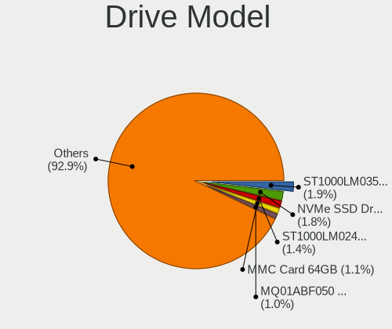
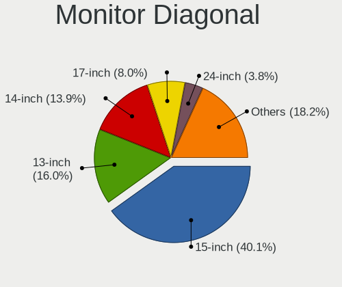
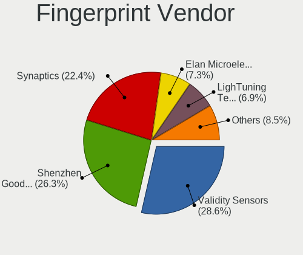
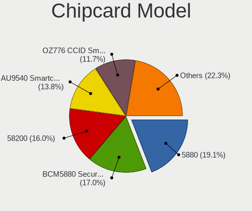
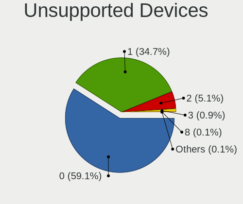

Ubuntu 21.10 - Tested Hardware & Statistics (Notebooks)
-------------------------------------------------------

A project to collect tested hardware configurations for Ubuntu 21.10.

Anyone can contribute to this report by the [hw-probe](https://github.com/linuxhw/hw-probe) tool:

    sudo -E hw-probe -all -upload

Please submit a probe of your configuration if it's not presented on the page or is rare.

Full-feature report is available here: https://linux-hardware.org/?view=trends

Contents
--------

* [ Test Cases ](#test-cases)

* [ System ](#system)
  - [ Kernel                   ](#kernel)
  - [ Kernel Family            ](#kernel-family)
  - [ Kernel Major Ver.        ](#kernel-major-ver)
  - [ Arch                     ](#arch)
  - [ DE                       ](#de)
  - [ Display Server           ](#display-server)
  - [ Display Manager          ](#display-manager)
  - [ OS Lang                  ](#os-lang)
  - [ Boot Mode                ](#boot-mode)
  - [ Filesystem               ](#filesystem)
  - [ Part. scheme             ](#part-scheme)
  - [ Dual Boot with Linux/BSD ](#dual-boot-with-linuxbsd)
  - [ Dual Boot (Win)          ](#dual-boot-win)

* [ Board ](#board)
  - [ Vendor                   ](#vendor)
  - [ Model                    ](#model)
  - [ Model Family             ](#model-family)
  - [ MFG Year                 ](#mfg-year)
  - [ Form Factor              ](#form-factor)
  - [ Secure Boot              ](#secure-boot)
  - [ Coreboot                 ](#coreboot)
  - [ RAM Size                 ](#ram-size)
  - [ RAM Used                 ](#ram-used)
  - [ Total Drives             ](#total-drives)
  - [ Has CD-ROM               ](#has-cd-rom)
  - [ Has Ethernet             ](#has-ethernet)
  - [ Has WiFi                 ](#has-wifi)
  - [ Has Bluetooth            ](#has-bluetooth)

* [ Location ](#location)
  - [ Country                  ](#country)
  - [ City                     ](#city)

* [ Drives ](#drives)
  - [ Drive Vendor             ](#drive-vendor)
  - [ Drive Model              ](#drive-model)
  - [ HDD Vendor               ](#hdd-vendor)
  - [ SSD Vendor               ](#ssd-vendor)
  - [ Drive Kind               ](#drive-kind)
  - [ Drive Connector          ](#drive-connector)
  - [ Drive Size               ](#drive-size)
  - [ Space Total              ](#space-total)
  - [ Space Used               ](#space-used)
  - [ Malfunc. Drives          ](#malfunc-drives)
  - [ Malfunc. Drive Vendor    ](#malfunc-drive-vendor)
  - [ Malfunc. HDD Vendor      ](#malfunc-hdd-vendor)
  - [ Malfunc. Drive Kind      ](#malfunc-drive-kind)
  - [ Failed Drives            ](#failed-drives)
  - [ Failed Drive Vendor      ](#failed-drive-vendor)
  - [ Drive Status             ](#drive-status)

* [ Storage controller ](#storage-controller)
  - [ Storage Vendor           ](#storage-vendor)
  - [ Storage Model            ](#storage-model)
  - [ Storage Kind             ](#storage-kind)

* [ Processor ](#processor)
  - [ CPU Vendor               ](#cpu-vendor)
  - [ CPU Model                ](#cpu-model)
  - [ CPU Model Family         ](#cpu-model-family)
  - [ CPU Cores                ](#cpu-cores)
  - [ CPU Sockets              ](#cpu-sockets)
  - [ CPU Threads              ](#cpu-threads)
  - [ CPU Op-Modes             ](#cpu-op-modes)
  - [ CPU Microcode            ](#cpu-microcode)
  - [ CPU Microarch            ](#cpu-microarch)

* [ Graphics ](#graphics)
  - [ GPU Vendor               ](#gpu-vendor)
  - [ GPU Model                ](#gpu-model)
  - [ GPU Combo                ](#gpu-combo)
  - [ GPU Driver               ](#gpu-driver)
  - [ GPU Memory               ](#gpu-memory)

* [ Monitor ](#monitor)
  - [ Monitor Vendor           ](#monitor-vendor)
  - [ Monitor Model            ](#monitor-model)
  - [ Monitor Resolution       ](#monitor-resolution)
  - [ Monitor Diagonal         ](#monitor-diagonal)
  - [ Monitor Width            ](#monitor-width)
  - [ Aspect Ratio             ](#aspect-ratio)
  - [ Monitor Area             ](#monitor-area)
  - [ Pixel Density            ](#pixel-density)
  - [ Multiple Monitors        ](#multiple-monitors)

* [ Network ](#network)
  - [ Net Controller Vendor    ](#net-controller-vendor)
  - [ Net Controller Model     ](#net-controller-model)
  - [ Wireless Vendor          ](#wireless-vendor)
  - [ Wireless Model           ](#wireless-model)
  - [ Ethernet Vendor          ](#ethernet-vendor)
  - [ Ethernet Model           ](#ethernet-model)
  - [ Net Controller Kind      ](#net-controller-kind)
  - [ Used Controller          ](#used-controller)
  - [ NICs                     ](#nics)
  - [ IPv6                     ](#ipv6)

* [ Bluetooth ](#bluetooth)
  - [ Bluetooth Vendor         ](#bluetooth-vendor)
  - [ Bluetooth Model          ](#bluetooth-model)

* [ Sound ](#sound)
  - [ Sound Vendor             ](#sound-vendor)
  - [ Sound Model              ](#sound-model)

* [ Memory ](#memory)
  - [ Memory Vendor            ](#memory-vendor)
  - [ Memory Model             ](#memory-model)
  - [ Memory Kind              ](#memory-kind)
  - [ Memory Form Factor       ](#memory-form-factor)
  - [ Memory Size              ](#memory-size)
  - [ Memory Speed             ](#memory-speed)

* [ Printers & scanners ](#printers--scanners)
  - [ Printer Vendor           ](#printer-vendor)
  - [ Printer Model            ](#printer-model)
  - [ Scanner Vendor           ](#scanner-vendor)
  - [ Scanner Model            ](#scanner-model)

* [ Camera ](#camera)
  - [ Camera Vendor            ](#camera-vendor)
  - [ Camera Model             ](#camera-model)

* [ Security ](#security)
  - [ Fingerprint Vendor       ](#fingerprint-vendor)
  - [ Fingerprint Model        ](#fingerprint-model)
  - [ Chipcard Vendor          ](#chipcard-vendor)
  - [ Chipcard Model           ](#chipcard-model)

* [ Unsupported ](#unsupported)
  - [ Unsupported Devices      ](#unsupported-devices)
  - [ Unsupported Device Types ](#unsupported-device-types)

Test Cases
----------

| Vendor        | Model                       | Probe                                                      | Date         |
|---------------|-----------------------------|------------------------------------------------------------|--------------|
| LG Electro... | 16ZD90P-GX5LK               | [c7cc850f29](https://linux-hardware.org/?probe=c7cc850f29) | Dec 03, 2021 |
| LG Electro... | 16ZD90P-GX5LK               | [901fdc3726](https://linux-hardware.org/?probe=901fdc3726) | Dec 03, 2021 |
| Apple         | MacBookPro12,1              | [48284cb8a5](https://linux-hardware.org/?probe=48284cb8a5) | Dec 02, 2021 |
| Toshiba       | Satellite L655              | [6cf5d39778](https://linux-hardware.org/?probe=6cf5d39778) | Dec 02, 2021 |
| Lenovo        | ThinkPad T410 2537W2L       | [92068cb097](https://linux-hardware.org/?probe=92068cb097) | Dec 02, 2021 |
| Lenovo        | ThinkPad T410 2537N99       | [a77255409f](https://linux-hardware.org/?probe=a77255409f) | Dec 02, 2021 |
| Lenovo        | ThinkPad T410 2537N99       | [ef02c2fb6c](https://linux-hardware.org/?probe=ef02c2fb6c) | Dec 02, 2021 |
| Apple         | MacBookPro13,2              | [d5c66e036d](https://linux-hardware.org/?probe=d5c66e036d) | Dec 02, 2021 |
| Dell          | XPS 13 9310                 | [fa0051b73b](https://linux-hardware.org/?probe=fa0051b73b) | Dec 02, 2021 |
| Dell          | XPS 17 9710                 | [e34c5d610c](https://linux-hardware.org/?probe=e34c5d610c) | Dec 02, 2021 |
| ASUSTek       | ROG Zephyrus S17 GX703HS... | [32a7506932](https://linux-hardware.org/?probe=32a7506932) | Dec 01, 2021 |
| DukaPC        | Notebook                    | [cfb399153a](https://linux-hardware.org/?probe=cfb399153a) | Dec 01, 2021 |
| Lenovo        | IdeaPad 320-15IKB 80XL      | [74b0b6dc77](https://linux-hardware.org/?probe=74b0b6dc77) | Dec 01, 2021 |
| Acer          | Swift SF314-43              | [dc17b5db95](https://linux-hardware.org/?probe=dc17b5db95) | Dec 01, 2021 |
| MSI           | Prestige 15 A11SCS          | [1de5756d09](https://linux-hardware.org/?probe=1de5756d09) | Dec 01, 2021 |
| MSI           | CR61 2M/CX61 2OC/CX61 2O... | [a42ba12bea](https://linux-hardware.org/?probe=a42ba12bea) | Dec 01, 2021 |
| Dell          | Inspiron 5770               | [207ec37d70](https://linux-hardware.org/?probe=207ec37d70) | Dec 01, 2021 |
| HP            | ZBook Fury 15.6 inch G8 ... | [0ebc40df56](https://linux-hardware.org/?probe=0ebc40df56) | Dec 01, 2021 |
| Lenovo        | G500 20236                  | [f61434ecc0](https://linux-hardware.org/?probe=f61434ecc0) | Nov 30, 2021 |
| HP            | ProBook 440 G6              | [c819afbd7a](https://linux-hardware.org/?probe=c819afbd7a) | Nov 30, 2021 |
| HP            | ProBook 440 G6              | [a30cacf7ad](https://linux-hardware.org/?probe=a30cacf7ad) | Nov 30, 2021 |
| Timi          | A35S                        | [dbb600147d](https://linux-hardware.org/?probe=dbb600147d) | Nov 30, 2021 |
| Framework     | Laptop                      | [e5f72bfb66](https://linux-hardware.org/?probe=e5f72bfb66) | Nov 30, 2021 |
| Dell          | Latitude 5420               | [b0f561b8a8](https://linux-hardware.org/?probe=b0f561b8a8) | Nov 30, 2021 |
| Lenovo        | IdeaPad 5 14ARE05 81YM      | [29a3dcf41b](https://linux-hardware.org/?probe=29a3dcf41b) | Nov 30, 2021 |
| Lenovo        | ThinkPad T14 Gen 1 20UES... | [ae6614d6fb](https://linux-hardware.org/?probe=ae6614d6fb) | Nov 29, 2021 |
| Sony          | SVE1713Y1EB                 | [317b686b33](https://linux-hardware.org/?probe=317b686b33) | Nov 29, 2021 |
| Acer          | Aspire 5560                 | [db900fbb00](https://linux-hardware.org/?probe=db900fbb00) | Nov 29, 2021 |
| Acer          | Aspire A315-57G             | [cfc036a421](https://linux-hardware.org/?probe=cfc036a421) | Nov 29, 2021 |
| Packard Be... | EasyNote ENLG81BA           | [c596ffcab5](https://linux-hardware.org/?probe=c596ffcab5) | Nov 29, 2021 |
| Lenovo        | IdeaPad 5 Pro 14ITL6 82L... | [3a85954b66](https://linux-hardware.org/?probe=3a85954b66) | Nov 29, 2021 |
| Lenovo        | IdeaPad 5 Pro 14ITL6 82L... | [5271c46262](https://linux-hardware.org/?probe=5271c46262) | Nov 29, 2021 |
| Lenovo        | IdeaPad 5 14IIL05 81YH      | [dddc3d3a11](https://linux-hardware.org/?probe=dddc3d3a11) | Nov 29, 2021 |
| Lenovo        | G500 20236                  | [e97bbbd7a9](https://linux-hardware.org/?probe=e97bbbd7a9) | Nov 29, 2021 |
| Panasonic     | CF-19RDRAMGA                | [5aaebfbf19](https://linux-hardware.org/?probe=5aaebfbf19) | Nov 29, 2021 |
| Lenovo        | IdeaPad 320-15IKB 81BT      | [fb633e3cb9](https://linux-hardware.org/?probe=fb633e3cb9) | Nov 29, 2021 |
| Samsung       | R520/R522/R620              | [babd307b08](https://linux-hardware.org/?probe=babd307b08) | Nov 29, 2021 |
| Dell          | Inspiron 15-3567            | [2ae4de7517](https://linux-hardware.org/?probe=2ae4de7517) | Nov 29, 2021 |
| Lenovo        | IdeaPad 330-15AST 81D6      | [4aa9def017](https://linux-hardware.org/?probe=4aa9def017) | Nov 29, 2021 |
| Acer          | Aspire A515-56              | [b0ed9bece9](https://linux-hardware.org/?probe=b0ed9bece9) | Nov 28, 2021 |
| HP            | EliteBook 845 G8 Noteboo... | [8d962864f8](https://linux-hardware.org/?probe=8d962864f8) | Nov 28, 2021 |
| Lenovo        | G780 2182                   | [2eeaf69158](https://linux-hardware.org/?probe=2eeaf69158) | Nov 28, 2021 |
| Razer         | Blade Stealth               | [54acf9844b](https://linux-hardware.org/?probe=54acf9844b) | Nov 28, 2021 |
| Lenovo        | IdeaPad 5 14ARE05 81YM      | [5e38544a06](https://linux-hardware.org/?probe=5e38544a06) | Nov 28, 2021 |
| Lenovo        | ThinkPad L470 W10DG 20JV... | [1a717e5780](https://linux-hardware.org/?probe=1a717e5780) | Nov 28, 2021 |
| Dell          | XPS 15 9570                 | [ee3aa93d09](https://linux-hardware.org/?probe=ee3aa93d09) | Nov 28, 2021 |
| Acer          | Aspire A315-51              | [397f62191b](https://linux-hardware.org/?probe=397f62191b) | Nov 28, 2021 |
| Apple         | MacBook7,1                  | [22e54de439](https://linux-hardware.org/?probe=22e54de439) | Nov 27, 2021 |
| HP            | ProBook 450 G5              | [dd2b422dd8](https://linux-hardware.org/?probe=dd2b422dd8) | Nov 27, 2021 |
| Acer          | Swift SF314-42              | [c5b8c42409](https://linux-hardware.org/?probe=c5b8c42409) | Nov 27, 2021 |
| PC Special... | X170KM-G                    | [6321e2900b](https://linux-hardware.org/?probe=6321e2900b) | Nov 27, 2021 |
| Packard Be... | EasyNote ENLG81BA           | [f85f2dbd4e](https://linux-hardware.org/?probe=f85f2dbd4e) | Nov 27, 2021 |
| Packard Be... | EasyNote ENLG81BA           | [3fcadd0f73](https://linux-hardware.org/?probe=3fcadd0f73) | Nov 27, 2021 |
| Dell          | Precision 7530              | [2b64eebf55](https://linux-hardware.org/?probe=2b64eebf55) | Nov 27, 2021 |
| HP            | ProBook 4540s               | [f047b9db0a](https://linux-hardware.org/?probe=f047b9db0a) | Nov 27, 2021 |
| HP            | ProBook 4540s               | [d8d17c1820](https://linux-hardware.org/?probe=d8d17c1820) | Nov 27, 2021 |
| Lenovo        | G500 20236                  | [c1dd144b77](https://linux-hardware.org/?probe=c1dd144b77) | Nov 27, 2021 |
| HP            | EliteBook 745 G3            | [92968d4a23](https://linux-hardware.org/?probe=92968d4a23) | Nov 27, 2021 |
| Lenovo        | Legion 7 16ITHg6 82K6       | [50e118bf49](https://linux-hardware.org/?probe=50e118bf49) | Nov 27, 2021 |
| HP            | Laptop 15z-ef2xxx           | [8acaaafb63](https://linux-hardware.org/?probe=8acaaafb63) | Nov 27, 2021 |
| Lenovo        | G780                        | [ffeaa607f9](https://linux-hardware.org/?probe=ffeaa607f9) | Nov 27, 2021 |
| Lenovo        | G780                        | [26ea5410e6](https://linux-hardware.org/?probe=26ea5410e6) | Nov 27, 2021 |
| Dell          | XPS 13 9310                 | [c3abf33b86](https://linux-hardware.org/?probe=c3abf33b86) | Nov 27, 2021 |
| Dell          | XPS 13 9310                 | [87c80403ae](https://linux-hardware.org/?probe=87c80403ae) | Nov 27, 2021 |
| Lenovo        | ThinkPad T510 43494JG       | [3564b21c35](https://linux-hardware.org/?probe=3564b21c35) | Nov 26, 2021 |
| Samsung       | 300E5EV/300E4EV/270E5EV/... | [8a5475fd42](https://linux-hardware.org/?probe=8a5475fd42) | Nov 26, 2021 |
| Dell          | Latitude D830               | [080fac6354](https://linux-hardware.org/?probe=080fac6354) | Nov 26, 2021 |
| HP            | EliteBook 850 G8 Noteboo... | [fbec23b579](https://linux-hardware.org/?probe=fbec23b579) | Nov 26, 2021 |
| Samsung       | RV410/RV510/S3510/E3510     | [9240ce23bd](https://linux-hardware.org/?probe=9240ce23bd) | Nov 26, 2021 |
| Notebook      | PCX0DX                      | [dd551e6aad](https://linux-hardware.org/?probe=dd551e6aad) | Nov 26, 2021 |
| Apple         | MacBookPro8,1               | [a0b9aec393](https://linux-hardware.org/?probe=a0b9aec393) | Nov 26, 2021 |
| Apple         | MacBookPro8,1               | [62a1aeadc4](https://linux-hardware.org/?probe=62a1aeadc4) | Nov 26, 2021 |
| HP            | Pavilion Aero Laptop 13-... | [5a1e505112](https://linux-hardware.org/?probe=5a1e505112) | Nov 25, 2021 |
| Medion        | P15648                      | [1328e63002](https://linux-hardware.org/?probe=1328e63002) | Nov 25, 2021 |
| Lenovo        | IdeaPad S145-15API 81UT     | [dea62ab6ef](https://linux-hardware.org/?probe=dea62ab6ef) | Nov 25, 2021 |
| Lenovo        | ThinkPad Edge E431 62779... | [1ec79ee5e6](https://linux-hardware.org/?probe=1ec79ee5e6) | Nov 25, 2021 |
| ASUSTek       | X751LN                      | [2c8e1bfecd](https://linux-hardware.org/?probe=2c8e1bfecd) | Nov 25, 2021 |
| Dell          | Vostro 5402                 | [a10a19ecfb](https://linux-hardware.org/?probe=a10a19ecfb) | Nov 25, 2021 |
| Dell          | Latitude 5520               | [6fae6c9e46](https://linux-hardware.org/?probe=6fae6c9e46) | Nov 25, 2021 |
| HUAWEI        | KLVL-WXXW                   | [806d1fa87a](https://linux-hardware.org/?probe=806d1fa87a) | Nov 25, 2021 |
| Dell          | Inspiron 5593               | [fb416125d9](https://linux-hardware.org/?probe=fb416125d9) | Nov 25, 2021 |
| Jemper        | EZPAD WS_reserve            | [de173db361](https://linux-hardware.org/?probe=de173db361) | Nov 25, 2021 |
| Fujitsu       | LIFEBOOK E751               | [3f1db85e8a](https://linux-hardware.org/?probe=3f1db85e8a) | Nov 25, 2021 |
| Dell          | Latitude 7420               | [648247b3cc](https://linux-hardware.org/?probe=648247b3cc) | Nov 24, 2021 |
| Toshiba       | Satellite Pro C850-1GU      | [46a6f52122](https://linux-hardware.org/?probe=46a6f52122) | Nov 24, 2021 |
| ASUSTek       | UX331UA                     | [7aee71ceed](https://linux-hardware.org/?probe=7aee71ceed) | Nov 24, 2021 |
| Lenovo        | ThinkPad W530 2447GW3       | [893bad1753](https://linux-hardware.org/?probe=893bad1753) | Nov 24, 2021 |
| Chuwi         | GemiBook Pro                | [1dc5d193a3](https://linux-hardware.org/?probe=1dc5d193a3) | Nov 24, 2021 |
| Dell          | XPS 17 9710                 | [c97bbaf0c5](https://linux-hardware.org/?probe=c97bbaf0c5) | Nov 24, 2021 |
| Lenovo        | IdeaPad 5 15IIL05 81YK      | [5632c40eac](https://linux-hardware.org/?probe=5632c40eac) | Nov 24, 2021 |
| Lenovo        | ThinkPad X230 23252FG       | [35508b1562](https://linux-hardware.org/?probe=35508b1562) | Nov 24, 2021 |
| Dell          | Latitude 5421               | [4f39514ffc](https://linux-hardware.org/?probe=4f39514ffc) | Nov 24, 2021 |
| Acer          | Nitro AN515-54              | [bf1ef9f271](https://linux-hardware.org/?probe=bf1ef9f271) | Nov 24, 2021 |
| Dell          | XPS 17 9710                 | [fb1cce8ab4](https://linux-hardware.org/?probe=fb1cce8ab4) | Nov 24, 2021 |
| Dell          | Inspiron 5570               | [774f732180](https://linux-hardware.org/?probe=774f732180) | Nov 24, 2021 |
| Dell          | XPS 15 9560                 | [ed470afd8a](https://linux-hardware.org/?probe=ed470afd8a) | Nov 24, 2021 |
| Lenovo        | Legion Y530-15ICH 81FV      | [2fc0deb231](https://linux-hardware.org/?probe=2fc0deb231) | Nov 24, 2021 |
| Dell          | XPS 15 9570                 | [524d775cd9](https://linux-hardware.org/?probe=524d775cd9) | Nov 24, 2021 |
| Dell          | Inspiron 5558               | [772ca16963](https://linux-hardware.org/?probe=772ca16963) | Nov 23, 2021 |
| HP            | EliteBook 850 G7 Noteboo... | [30e9ef2236](https://linux-hardware.org/?probe=30e9ef2236) | Nov 23, 2021 |
| HP            | ProBook 440 G7              | [7863ad05f4](https://linux-hardware.org/?probe=7863ad05f4) | Nov 23, 2021 |
| Toshiba       | TECRA R940                  | [778fe1dfcc](https://linux-hardware.org/?probe=778fe1dfcc) | Nov 23, 2021 |
| Lenovo        | IdeaPad 330-17IKB 81DM      | [35b7ff3a68](https://linux-hardware.org/?probe=35b7ff3a68) | Nov 23, 2021 |
| Lenovo        | IdeaPad S145-15IIL 81W8     | [ec94d40844](https://linux-hardware.org/?probe=ec94d40844) | Nov 23, 2021 |
| Toshiba       | Satellite C855-1JD          | [9ead13671d](https://linux-hardware.org/?probe=9ead13671d) | Nov 22, 2021 |
| Lenovo        | IdeaPad 330-15IKB 81DE      | [f1620f693d](https://linux-hardware.org/?probe=f1620f693d) | Nov 22, 2021 |
| Samsung       | 530U3BI/530U4BI/530U4BH     | [d0a08a7a23](https://linux-hardware.org/?probe=d0a08a7a23) | Nov 22, 2021 |
| Samsung       | 530U3BI/530U4BI/530U4BH     | [507c380abb](https://linux-hardware.org/?probe=507c380abb) | Nov 22, 2021 |
| Lenovo        | ThinkPad T520 4243CJ2       | [418a8830c3](https://linux-hardware.org/?probe=418a8830c3) | Nov 22, 2021 |
| HP            | 550                         | [bbbca1ed06](https://linux-hardware.org/?probe=bbbca1ed06) | Nov 22, 2021 |
| Lenovo        | V145-15AST 81MT             | [941396daf4](https://linux-hardware.org/?probe=941396daf4) | Nov 22, 2021 |
| ASUSTek       | X751LN                      | [50d304e970](https://linux-hardware.org/?probe=50d304e970) | Nov 22, 2021 |
| Dell          | Inspiron 5558               | [bae9fdec30](https://linux-hardware.org/?probe=bae9fdec30) | Nov 22, 2021 |
| Lenovo        | ThinkPad T470s W10DG 20J... | [3964ebaadd](https://linux-hardware.org/?probe=3964ebaadd) | Nov 22, 2021 |
| HP            | Pavilion Laptop 15-eh0xx... | [61308173d9](https://linux-hardware.org/?probe=61308173d9) | Nov 22, 2021 |
| Exo           | Smart Serie M               | [cbf705cf51](https://linux-hardware.org/?probe=cbf705cf51) | Nov 22, 2021 |
| Lenovo        | Legion Y530-15ICH 81FV      | [af11f87974](https://linux-hardware.org/?probe=af11f87974) | Nov 22, 2021 |
| Dell          | XPS 15 9510                 | [c89373bfad](https://linux-hardware.org/?probe=c89373bfad) | Nov 21, 2021 |
| Apple         | MacBookPro12,1              | [685ef4de17](https://linux-hardware.org/?probe=685ef4de17) | Nov 21, 2021 |
| Dell          | XPS 15 9570                 | [09557621d2](https://linux-hardware.org/?probe=09557621d2) | Nov 21, 2021 |
| Apple         | MacBookPro13,2              | [a5935d753d](https://linux-hardware.org/?probe=a5935d753d) | Nov 21, 2021 |
| Lenovo        | ThinkPad T430 2349DS1       | [1ad2d01280](https://linux-hardware.org/?probe=1ad2d01280) | Nov 21, 2021 |
| Dell          | Inspiron 1545               | [11710ca51d](https://linux-hardware.org/?probe=11710ca51d) | Nov 21, 2021 |
| Dell          | Inspiron 5570               | [d73b7c147b](https://linux-hardware.org/?probe=d73b7c147b) | Nov 21, 2021 |
| ASUSTek       | N751JK                      | [f64a3f1fc2](https://linux-hardware.org/?probe=f64a3f1fc2) | Nov 20, 2021 |
| HP            | ZBook 17                    | [dddc9c534d](https://linux-hardware.org/?probe=dddc9c534d) | Nov 20, 2021 |
| HP            | G62                         | [7659359d92](https://linux-hardware.org/?probe=7659359d92) | Nov 20, 2021 |
| HP            | Unknown                     | [23dc38032d](https://linux-hardware.org/?probe=23dc38032d) | Nov 20, 2021 |
| HP            | G62                         | [5e62f156d2](https://linux-hardware.org/?probe=5e62f156d2) | Nov 20, 2021 |
| Dell          | Latitude E5400              | [062c0d6df1](https://linux-hardware.org/?probe=062c0d6df1) | Nov 20, 2021 |
| Dell          | Inspiron 7577               | [06399f0deb](https://linux-hardware.org/?probe=06399f0deb) | Nov 20, 2021 |
| Lenovo        | IdeaPad 330S-14IKB 81F4     | [04fa536869](https://linux-hardware.org/?probe=04fa536869) | Nov 20, 2021 |
| Lenovo        | IdeaPad 330S-14IKB 81F4     | [097de81570](https://linux-hardware.org/?probe=097de81570) | Nov 20, 2021 |
| HUAWEI        | KLVL-WXX9                   | [0bccbf892a](https://linux-hardware.org/?probe=0bccbf892a) | Nov 19, 2021 |
| HUAWEI        | KLVL-WXX9                   | [7a4c2319fa](https://linux-hardware.org/?probe=7a4c2319fa) | Nov 19, 2021 |
| HUAWEI        | HVY-WXX9                    | [5825bb233c](https://linux-hardware.org/?probe=5825bb233c) | Nov 19, 2021 |
| HP            | OMEN by Laptop              | [0b8f3a5da9](https://linux-hardware.org/?probe=0b8f3a5da9) | Nov 19, 2021 |
| Dell          | Latitude E4300              | [7bb479a55e](https://linux-hardware.org/?probe=7bb479a55e) | Nov 19, 2021 |
| HP            | OMEN by Laptop              | [dc7136f307](https://linux-hardware.org/?probe=dc7136f307) | Nov 19, 2021 |
| Acer          | Aspire E5-551               | [7ae0f74c7d](https://linux-hardware.org/?probe=7ae0f74c7d) | Nov 19, 2021 |
| HP            | Pavilion Laptop             | [ab2e04130f](https://linux-hardware.org/?probe=ab2e04130f) | Nov 19, 2021 |
| Dell          | Latitude 3510               | [9d4db04732](https://linux-hardware.org/?probe=9d4db04732) | Nov 19, 2021 |
| ASUSTek       | X401A1                      | [fa9b9fa473](https://linux-hardware.org/?probe=fa9b9fa473) | Nov 19, 2021 |
| Sony          | VPCF130FD                   | [e4468538f5](https://linux-hardware.org/?probe=e4468538f5) | Nov 19, 2021 |
| System76      | Gazelle                     | [939b96106b](https://linux-hardware.org/?probe=939b96106b) | Nov 19, 2021 |
| Acer          | Swift SF314-42              | [264bebca57](https://linux-hardware.org/?probe=264bebca57) | Nov 18, 2021 |
| Framework     | Laptop                      | [0d635923b5](https://linux-hardware.org/?probe=0d635923b5) | Nov 18, 2021 |
| HP            | Laptop 14-fq1xxx            | [2d996858ab](https://linux-hardware.org/?probe=2d996858ab) | Nov 18, 2021 |
| Lenovo        | ThinkPad X220 4291CA0       | [94cebfa456](https://linux-hardware.org/?probe=94cebfa456) | Nov 18, 2021 |
| Packard Be... | EasyNote LJ75               | [7ec0fdf75d](https://linux-hardware.org/?probe=7ec0fdf75d) | Nov 18, 2021 |
| Timi          | RedmiBook 16                | [0b9130726c](https://linux-hardware.org/?probe=0b9130726c) | Nov 18, 2021 |
| HP            | ProBook 4510s               | [46c61312c4](https://linux-hardware.org/?probe=46c61312c4) | Nov 18, 2021 |
| Lenovo        | Legion 7 16ITHg6 82K6       | [80168c4938](https://linux-hardware.org/?probe=80168c4938) | Nov 18, 2021 |
| Framework     | Laptop                      | [3772cd7a6e](https://linux-hardware.org/?probe=3772cd7a6e) | Nov 17, 2021 |
| Acer          | TravelMate 6292             | [0acf22106c](https://linux-hardware.org/?probe=0acf22106c) | Nov 17, 2021 |
| Dell          | Latitude 5520               | [e398be8e26](https://linux-hardware.org/?probe=e398be8e26) | Nov 17, 2021 |
| Dell          | XPS 15 9500                 | [a77e5494bf](https://linux-hardware.org/?probe=a77e5494bf) | Nov 17, 2021 |
| Dell          | XPS 15 9500                 | [526d5c7a21](https://linux-hardware.org/?probe=526d5c7a21) | Nov 17, 2021 |
| HUAWEI        | KLVL-WXX9                   | [c80aeaf7b0](https://linux-hardware.org/?probe=c80aeaf7b0) | Nov 17, 2021 |
| Lenovo        | ThinkPad Edge E431 62779... | [30520d2f19](https://linux-hardware.org/?probe=30520d2f19) | Nov 17, 2021 |
| Dell          | XPS 15 9500                 | [be45eea786](https://linux-hardware.org/?probe=be45eea786) | Nov 17, 2021 |
| Dell          | Inspiron 7586               | [188923fc9c](https://linux-hardware.org/?probe=188923fc9c) | Nov 17, 2021 |
| HP            | ProBook 4510s               | [cf53b2e2db](https://linux-hardware.org/?probe=cf53b2e2db) | Nov 17, 2021 |
| Positivo      | Mobile                      | [9b83c09ad3](https://linux-hardware.org/?probe=9b83c09ad3) | Nov 17, 2021 |
| HP            | Laptop 15-db1xxx            | [cd32f937e9](https://linux-hardware.org/?probe=cd32f937e9) | Nov 17, 2021 |
| HP            | ProBook 650 G1              | [07597b6850](https://linux-hardware.org/?probe=07597b6850) | Nov 16, 2021 |
| HP            | ProBook 650 G1              | [21f9af6edb](https://linux-hardware.org/?probe=21f9af6edb) | Nov 16, 2021 |
| Dell          | Latitude E7470              | [0358863974](https://linux-hardware.org/?probe=0358863974) | Nov 16, 2021 |
| HP            | ProBook 4520s               | [1d9f0ec825](https://linux-hardware.org/?probe=1d9f0ec825) | Nov 16, 2021 |
| HP            | ProBook 4520s               | [1fb5221e00](https://linux-hardware.org/?probe=1fb5221e00) | Nov 16, 2021 |
| Medion        | P6630                       | [235a9a3ced](https://linux-hardware.org/?probe=235a9a3ced) | Nov 16, 2021 |
| Apple         | MacBook4,1                  | [f9ee489abd](https://linux-hardware.org/?probe=f9ee489abd) | Nov 16, 2021 |
| ASUSTek       | X540YA                      | [72e7bebf84](https://linux-hardware.org/?probe=72e7bebf84) | Nov 16, 2021 |
| ASUSTek       | X540YA                      | [39d8ea222a](https://linux-hardware.org/?probe=39d8ea222a) | Nov 16, 2021 |
| Medion        | Akoya E6240T                | [9f7f0a3a96](https://linux-hardware.org/?probe=9f7f0a3a96) | Nov 16, 2021 |
| HP            | Laptop 15-bs0xx             | [d33bc4ef7c](https://linux-hardware.org/?probe=d33bc4ef7c) | Nov 16, 2021 |
| HP            | Laptop 15-bs0xx             | [048cf14d2f](https://linux-hardware.org/?probe=048cf14d2f) | Nov 16, 2021 |
| HP            | 15                          | [43b117b7a1](https://linux-hardware.org/?probe=43b117b7a1) | Nov 16, 2021 |
| ASUSTek       | X580VD                      | [3c83607d76](https://linux-hardware.org/?probe=3c83607d76) | Nov 16, 2021 |
| Lenovo        | IdeaPad 300-14IBR 80M2      | [34fb650910](https://linux-hardware.org/?probe=34fb650910) | Nov 16, 2021 |
| Lenovo        | IdeaPad S340-14IIL 81VV     | [10a3cb9d12](https://linux-hardware.org/?probe=10a3cb9d12) | Nov 15, 2021 |
| Dell          | XPS 13 9305                 | [efa5ec3ed4](https://linux-hardware.org/?probe=efa5ec3ed4) | Nov 15, 2021 |
| HP            | Pavilion dv5                | [ec4890a33b](https://linux-hardware.org/?probe=ec4890a33b) | Nov 15, 2021 |
| Lenovo        | ThinkPad 25 20K70000MX      | [86d3ea8b6a](https://linux-hardware.org/?probe=86d3ea8b6a) | Nov 15, 2021 |
| HP            | 15                          | [d1c144c887](https://linux-hardware.org/?probe=d1c144c887) | Nov 15, 2021 |
| Dell          | Vostro 3400                 | [f6ba3e3359](https://linux-hardware.org/?probe=f6ba3e3359) | Nov 15, 2021 |
| Lenovo        | ThinkPad Edge E431 62779... | [f998266e76](https://linux-hardware.org/?probe=f998266e76) | Nov 15, 2021 |
| Acer          | Nitro AN515-54              | [a9d34635cf](https://linux-hardware.org/?probe=a9d34635cf) | Nov 15, 2021 |
| HP            | ProBook 455 G4              | [e7976c31a1](https://linux-hardware.org/?probe=e7976c31a1) | Nov 15, 2021 |
| HP            | Pavilion dv5                | [4ddaeca48c](https://linux-hardware.org/?probe=4ddaeca48c) | Nov 15, 2021 |
| Dell          | Latitude E7440              | [60d06b6cfe](https://linux-hardware.org/?probe=60d06b6cfe) | Nov 15, 2021 |
| ASUSTek       | ROG Zephyrus M16 GU603HM    | [8809001b3c](https://linux-hardware.org/?probe=8809001b3c) | Nov 14, 2021 |
| HP            | EliteBook 835 G8 Noteboo... | [2b9e3a56a5](https://linux-hardware.org/?probe=2b9e3a56a5) | Nov 14, 2021 |
| HP            | Pavilion Notebook           | [d2eb7d0dc2](https://linux-hardware.org/?probe=d2eb7d0dc2) | Nov 14, 2021 |
| Dell          | XPS 13 9310                 | [0f6c2b21cf](https://linux-hardware.org/?probe=0f6c2b21cf) | Nov 14, 2021 |
| ASUSTek       | TUF Gaming FX505DV_TUF50... | [3559f352cf](https://linux-hardware.org/?probe=3559f352cf) | Nov 14, 2021 |
| HP            | ProBook 455 G6              | [2a37f0ed64](https://linux-hardware.org/?probe=2a37f0ed64) | Nov 14, 2021 |
| ASUSTek       | X540SA                      | [1292ab6f15](https://linux-hardware.org/?probe=1292ab6f15) | Nov 14, 2021 |
| Dell          | Latitude E7270              | [b462d15a6b](https://linux-hardware.org/?probe=b462d15a6b) | Nov 14, 2021 |
| Acer          | Aspire E5-553G              | [b22df8f53d](https://linux-hardware.org/?probe=b22df8f53d) | Nov 14, 2021 |
| Acer          | Aspire E5-553G              | [93d20530a1](https://linux-hardware.org/?probe=93d20530a1) | Nov 14, 2021 |
| Timi          | A35S                        | [68a0b2e6bd](https://linux-hardware.org/?probe=68a0b2e6bd) | Nov 14, 2021 |
| HP            | Pavilion Notebook           | [1b93110fd9](https://linux-hardware.org/?probe=1b93110fd9) | Nov 13, 2021 |
| ASUSTek       | X540SA                      | [463e1f35a9](https://linux-hardware.org/?probe=463e1f35a9) | Nov 13, 2021 |
| HP            | Stream Laptop 14-ax0XX      | [3bd51f200e](https://linux-hardware.org/?probe=3bd51f200e) | Nov 13, 2021 |
| Lenovo        | Yoga710-15ISK 80U0          | [4bbd057aa1](https://linux-hardware.org/?probe=4bbd057aa1) | Nov 13, 2021 |
| Lenovo        | IdeaPad 720S-14IKB 80XC     | [d0f383a016](https://linux-hardware.org/?probe=d0f383a016) | Nov 13, 2021 |
| Apple         | MacBook7,1                  | [b898d5a09c](https://linux-hardware.org/?probe=b898d5a09c) | Nov 13, 2021 |
| Dell          | XPS 13 9310                 | [01c20231f2](https://linux-hardware.org/?probe=01c20231f2) | Nov 13, 2021 |
| HP            | Laptop 14-fq1xxx            | [cc7fba67fd](https://linux-hardware.org/?probe=cc7fba67fd) | Nov 12, 2021 |
| HP            | Pavilion Notebook           | [0d96ccbe28](https://linux-hardware.org/?probe=0d96ccbe28) | Nov 12, 2021 |
| HP            | ProBook 450 G5              | [984b162f45](https://linux-hardware.org/?probe=984b162f45) | Nov 12, 2021 |
| Dell          | XPS 15 9570                 | [abb7877540](https://linux-hardware.org/?probe=abb7877540) | Nov 12, 2021 |
| Dell          | Latitude E6520              | [e795da8420](https://linux-hardware.org/?probe=e795da8420) | Nov 12, 2021 |
| Lenovo        | IdeaPad 5 15ITL05 82FG      | [9ba065b607](https://linux-hardware.org/?probe=9ba065b607) | Nov 12, 2021 |
| ASUSTek       | N501VW                      | [8701c7e1c8](https://linux-hardware.org/?probe=8701c7e1c8) | Nov 12, 2021 |
| ASUSTek       | N501VW                      | [fe236eaa88](https://linux-hardware.org/?probe=fe236eaa88) | Nov 12, 2021 |
| Acer          | Aspire 5755G                | [23a8df3372](https://linux-hardware.org/?probe=23a8df3372) | Nov 12, 2021 |
| Dell          | Inspiron 15-3573            | [0c659e62e6](https://linux-hardware.org/?probe=0c659e62e6) | Nov 12, 2021 |
| Lenovo        | ThinkPad T400 2768WGB       | [9d3272960f](https://linux-hardware.org/?probe=9d3272960f) | Nov 12, 2021 |
| ASUSTek       | TUF GAMING FX504GD_FX80G... | [31e2521af4](https://linux-hardware.org/?probe=31e2521af4) | Nov 12, 2021 |
| Acer          | Swift SF315-41              | [744b18ebd1](https://linux-hardware.org/?probe=744b18ebd1) | Nov 12, 2021 |
| HP            | OMEN by Laptop              | [207d9a7985](https://linux-hardware.org/?probe=207d9a7985) | Nov 12, 2021 |
| ASUSTek       | GL553VD                     | [d152d41284](https://linux-hardware.org/?probe=d152d41284) | Nov 12, 2021 |
| Dell          | Latitude E6410              | [08fde74c0e](https://linux-hardware.org/?probe=08fde74c0e) | Nov 12, 2021 |
| Dell          | Precision M4700             | [8d8a2dcc96](https://linux-hardware.org/?probe=8d8a2dcc96) | Nov 12, 2021 |
| Dell          | Inspiron 5570               | [be0e281ff8](https://linux-hardware.org/?probe=be0e281ff8) | Nov 12, 2021 |
| Dell          | XPS 15 9570                 | [7d4e321511](https://linux-hardware.org/?probe=7d4e321511) | Nov 12, 2021 |
| Lenovo        | ThinkPad X220 Tablet 429... | [fdb480d5f4](https://linux-hardware.org/?probe=fdb480d5f4) | Nov 12, 2021 |
| HP            | Pavilion g6                 | [0332d112e9](https://linux-hardware.org/?probe=0332d112e9) | Nov 12, 2021 |
| Dell          | Latitude D630               | [e034675b55](https://linux-hardware.org/?probe=e034675b55) | Nov 12, 2021 |
| Dell          | Latitude D630               | [8227457c3b](https://linux-hardware.org/?probe=8227457c3b) | Nov 12, 2021 |
| HP            | ProBook 455 G6              | [6045aa2b3a](https://linux-hardware.org/?probe=6045aa2b3a) | Nov 12, 2021 |
| Dell          | XPS 15 9570                 | [d22d46f646](https://linux-hardware.org/?probe=d22d46f646) | Nov 11, 2021 |
| Lenovo        | ThinkPad E15 Gen 2 20TD0... | [2f75d80207](https://linux-hardware.org/?probe=2f75d80207) | Nov 11, 2021 |
| Lenovo        | ThinkPad Edge E431 62779... | [0d059f1720](https://linux-hardware.org/?probe=0d059f1720) | Nov 11, 2021 |
| Notebook      | P64_HJ,HK1                  | [f15a333240](https://linux-hardware.org/?probe=f15a333240) | Nov 11, 2021 |
| win elemen... | MoreFine S500+              | [ace08cf199](https://linux-hardware.org/?probe=ace08cf199) | Nov 11, 2021 |
| win elemen... | MoreFine S500+              | [0e31d4b6fa](https://linux-hardware.org/?probe=0e31d4b6fa) | Nov 11, 2021 |
| Packard Be... | EasyNote TE69BM             | [5041e2b272](https://linux-hardware.org/?probe=5041e2b272) | Nov 10, 2021 |
| Dell          | Inspiron 15 7510            | [ba69916825](https://linux-hardware.org/?probe=ba69916825) | Nov 10, 2021 |
| Packard Be... | EasyNote TE69BM             | [fcb5b11b8c](https://linux-hardware.org/?probe=fcb5b11b8c) | Nov 10, 2021 |
| Timi          | A35                         | [f8818e4273](https://linux-hardware.org/?probe=f8818e4273) | Nov 10, 2021 |
| HP            | ProBook x360 11 G5 EE       | [ec64c11055](https://linux-hardware.org/?probe=ec64c11055) | Nov 10, 2021 |
| ASUSTek       | X55A                        | [a55961748f](https://linux-hardware.org/?probe=a55961748f) | Nov 10, 2021 |
| ASUSTek       | X55A                        | [8c59513ced](https://linux-hardware.org/?probe=8c59513ced) | Nov 10, 2021 |
| Dell          | Inspiron 5558               | [c4e563c1ab](https://linux-hardware.org/?probe=c4e563c1ab) | Nov 10, 2021 |
| Sony          | VPCCB25FX                   | [c42c92c898](https://linux-hardware.org/?probe=c42c92c898) | Nov 09, 2021 |
| Lenovo        | ThinkPad L450 20DTCTO1WW    | [ad9b4ec784](https://linux-hardware.org/?probe=ad9b4ec784) | Nov 09, 2021 |
| ASUSTek       | TUF Gaming FX505DU_FX505... | [aad3e601ad](https://linux-hardware.org/?probe=aad3e601ad) | Nov 09, 2021 |
| ASUSTek       | TUF Gaming FX505DU_FX505... | [dd5b331a4c](https://linux-hardware.org/?probe=dd5b331a4c) | Nov 09, 2021 |
| Dell          | Inspiron 1764               | [319a6efc5a](https://linux-hardware.org/?probe=319a6efc5a) | Nov 09, 2021 |
| Dell          | XPS 13 9310                 | [94b138fb37](https://linux-hardware.org/?probe=94b138fb37) | Nov 09, 2021 |
| Dell          | XPS 13 9310                 | [3f47def69d](https://linux-hardware.org/?probe=3f47def69d) | Nov 09, 2021 |
| HP            | Pavilion Aero Laptop 13-... | [94448a14f7](https://linux-hardware.org/?probe=94448a14f7) | Nov 09, 2021 |
| Timi          | A30                         | [63583fcf04](https://linux-hardware.org/?probe=63583fcf04) | Nov 09, 2021 |
| HP            | ProBook 445 G7              | [eecec0bcf8](https://linux-hardware.org/?probe=eecec0bcf8) | Nov 08, 2021 |
| HP            | ProBook 445 G7              | [cb60701cba](https://linux-hardware.org/?probe=cb60701cba) | Nov 08, 2021 |
| Sony          | VPCEL2S1E                   | [00df9cdeb3](https://linux-hardware.org/?probe=00df9cdeb3) | Nov 08, 2021 |
| HP            | EliteBook 845 G7 Noteboo... | [76de163bc3](https://linux-hardware.org/?probe=76de163bc3) | Nov 08, 2021 |
| HP            | Pavilion dv7                | [a19e73fd27](https://linux-hardware.org/?probe=a19e73fd27) | Nov 08, 2021 |
| Dell          | XPS 13 9310                 | [0c99cea4ba](https://linux-hardware.org/?probe=0c99cea4ba) | Nov 07, 2021 |
| Notebook      | W54_55SU1,SUW               | [a0e93f5294](https://linux-hardware.org/?probe=a0e93f5294) | Nov 07, 2021 |
| Toshiba       | Satellite Pro S300          | [a9dd74e832](https://linux-hardware.org/?probe=a9dd74e832) | Nov 07, 2021 |
| Acer          | Swift SF314-43              | [8540ada375](https://linux-hardware.org/?probe=8540ada375) | Nov 07, 2021 |
| Jumper        | EZbook                      | [d9f2b0f1b2](https://linux-hardware.org/?probe=d9f2b0f1b2) | Nov 07, 2021 |
| Jumper        | EZbook                      | [2752cc575b](https://linux-hardware.org/?probe=2752cc575b) | Nov 07, 2021 |
| Dell          | Inspiron 5558               | [94c8a2df98](https://linux-hardware.org/?probe=94c8a2df98) | Nov 07, 2021 |
| Dell          | XPS 15 9510                 | [6f9b7bffd1](https://linux-hardware.org/?probe=6f9b7bffd1) | Nov 06, 2021 |
| Dell          | G15 5515                    | [1e5e0ab274](https://linux-hardware.org/?probe=1e5e0ab274) | Nov 06, 2021 |
| Dell          | Inspiron 15-3567            | [630a9144f1](https://linux-hardware.org/?probe=630a9144f1) | Nov 06, 2021 |
| PC Special... | W94_95_97PU                 | [2c6e08bf5d](https://linux-hardware.org/?probe=2c6e08bf5d) | Nov 06, 2021 |
| Toshiba       | Dakar10FW8                  | [ca1da89f22](https://linux-hardware.org/?probe=ca1da89f22) | Nov 06, 2021 |
| Lenovo        | ThinkBook 15 G2 ITL 20VE    | [999eb9102a](https://linux-hardware.org/?probe=999eb9102a) | Nov 06, 2021 |
| HP            | ProBook 440 G4              | [e0b2ef1603](https://linux-hardware.org/?probe=e0b2ef1603) | Nov 06, 2021 |
| HUAWEI        | MACHD-WXX9                  | [364fb5b6b7](https://linux-hardware.org/?probe=364fb5b6b7) | Nov 06, 2021 |
| Dell          | Vostro 3478                 | [f88e5eec69](https://linux-hardware.org/?probe=f88e5eec69) | Nov 05, 2021 |
| Dell          | Vostro 3478                 | [8174188077](https://linux-hardware.org/?probe=8174188077) | Nov 05, 2021 |
| HP            | ProBook 430 G4              | [d5ff59ee05](https://linux-hardware.org/?probe=d5ff59ee05) | Nov 05, 2021 |
| HP            | Pavilion Gaming Laptop 1... | [cf7dc59b1a](https://linux-hardware.org/?probe=cf7dc59b1a) | Nov 05, 2021 |
| HP            | Pavilion Gaming Laptop 1... | [aad7742ae7](https://linux-hardware.org/?probe=aad7742ae7) | Nov 05, 2021 |
| Dell          | Latitude 7390 2-in-1        | [4b1fcf5e24](https://linux-hardware.org/?probe=4b1fcf5e24) | Nov 05, 2021 |
| HP            | Laptop 15-dw3xxx            | [966b61331a](https://linux-hardware.org/?probe=966b61331a) | Nov 05, 2021 |
| HP            | Laptop 15-dw3xxx            | [e1c9be9f1d](https://linux-hardware.org/?probe=e1c9be9f1d) | Nov 05, 2021 |
| Dell          | XPS 13 9300                 | [babbbc5e56](https://linux-hardware.org/?probe=babbbc5e56) | Nov 05, 2021 |
| Avell High... | A70 LIV                     | [b4d7b0e021](https://linux-hardware.org/?probe=b4d7b0e021) | Nov 05, 2021 |
| Lenovo        | G40-80 80E4                 | [57b9418a9c](https://linux-hardware.org/?probe=57b9418a9c) | Nov 05, 2021 |
| HP            | EliteBook 8540p             | [048c1d5d30](https://linux-hardware.org/?probe=048c1d5d30) | Nov 05, 2021 |
| HUAWEI        | KLVD-WXX9                   | [b69ad25203](https://linux-hardware.org/?probe=b69ad25203) | Nov 04, 2021 |
| HP            | Laptop 15-dw1xxx            | [07b1660d10](https://linux-hardware.org/?probe=07b1660d10) | Nov 04, 2021 |
| ASUSTek       | TUF Gaming FX505DT_FX505... | [701adbe249](https://linux-hardware.org/?probe=701adbe249) | Nov 04, 2021 |
| ASUSTek       | TUF Gaming FX505DT_FX505... | [c221fbfc80](https://linux-hardware.org/?probe=c221fbfc80) | Nov 04, 2021 |
| ASUSTek       | VivoBook_ASUSLaptop X513... | [dc8f8db0fd](https://linux-hardware.org/?probe=dc8f8db0fd) | Nov 04, 2021 |
| ASUSTek       | VivoBook_ASUSLaptop X513... | [dc325a808a](https://linux-hardware.org/?probe=dc325a808a) | Nov 04, 2021 |
| ASUSTek       | VivoBook_ASUSLaptop X513... | [9fe96f497b](https://linux-hardware.org/?probe=9fe96f497b) | Nov 04, 2021 |
| HUAWEI        | HVY-WXX9                    | [c338e7c775](https://linux-hardware.org/?probe=c338e7c775) | Nov 04, 2021 |
| HP            | ProBook 455 G3              | [ccd4bcc603](https://linux-hardware.org/?probe=ccd4bcc603) | Nov 04, 2021 |
| HP            | EliteBook 8540p             | [c7ca645211](https://linux-hardware.org/?probe=c7ca645211) | Nov 04, 2021 |
| Timi          | TM1701                      | [40dc454159](https://linux-hardware.org/?probe=40dc454159) | Nov 03, 2021 |
| Lenovo        | ThinkPad T420 4180ED3       | [dbc9c2369a](https://linux-hardware.org/?probe=dbc9c2369a) | Nov 03, 2021 |
| HP            | ZHAN 66 Pro A 14 G3         | [17339fe912](https://linux-hardware.org/?probe=17339fe912) | Nov 03, 2021 |
| HUAWEI        | HVY-WXX9                    | [fdb3a089a2](https://linux-hardware.org/?probe=fdb3a089a2) | Nov 03, 2021 |
| ASUSTek       | X550VX                      | [5718178f4b](https://linux-hardware.org/?probe=5718178f4b) | Nov 03, 2021 |
| HP            | Pavilion Aero Laptop 13-... | [fe34c12d67](https://linux-hardware.org/?probe=fe34c12d67) | Nov 03, 2021 |
| Samsung       | R530/R730                   | [a62fb59972](https://linux-hardware.org/?probe=a62fb59972) | Nov 03, 2021 |
| MOTILE        | M141                        | [00f4ccf1de](https://linux-hardware.org/?probe=00f4ccf1de) | Nov 03, 2021 |
| Acer          | Swift SF314-42              | [07025c7436](https://linux-hardware.org/?probe=07025c7436) | Nov 02, 2021 |
| Dell          | XPS 15 9500                 | [fc7604b4bc](https://linux-hardware.org/?probe=fc7604b4bc) | Nov 02, 2021 |
| Dell          | XPS 15 9500                 | [7f8efd83d8](https://linux-hardware.org/?probe=7f8efd83d8) | Nov 02, 2021 |
| HP            | ProBook 450 G8 Notebook ... | [f5a1f78297](https://linux-hardware.org/?probe=f5a1f78297) | Nov 02, 2021 |
| Lenovo        | IdeaPad S340-15API 81NC     | [5158fb179d](https://linux-hardware.org/?probe=5158fb179d) | Nov 02, 2021 |
| Lenovo        | IdeaPad S340-15API 81NC     | [3296f4587d](https://linux-hardware.org/?probe=3296f4587d) | Nov 02, 2021 |
| Lenovo        | G40-80 80E4                 | [f89ddc0ebd](https://linux-hardware.org/?probe=f89ddc0ebd) | Nov 02, 2021 |
| HP            | Laptop 14-bs0xx             | [3ab642249c](https://linux-hardware.org/?probe=3ab642249c) | Nov 02, 2021 |
| HP            | OMEN by Laptop              | [d5eda0a4df](https://linux-hardware.org/?probe=d5eda0a4df) | Nov 01, 2021 |
| ASUSTek       | TUF Gaming FX505GD_FX505... | [638e01b2f1](https://linux-hardware.org/?probe=638e01b2f1) | Nov 01, 2021 |
| Fujitsu       | LIFEBOOK S751               | [0365e0be95](https://linux-hardware.org/?probe=0365e0be95) | Nov 01, 2021 |
| Toshiba       | Satellite U920T             | [2151ed88f7](https://linux-hardware.org/?probe=2151ed88f7) | Nov 01, 2021 |
| Lenovo        | IdeaPad 330-17IKB 81DK      | [fdda57d98e](https://linux-hardware.org/?probe=fdda57d98e) | Nov 01, 2021 |
| ASUSTek       | K52F                        | [34a9f3b662](https://linux-hardware.org/?probe=34a9f3b662) | Nov 01, 2021 |
| Dell          | Inspiron 5570               | [ddb12be458](https://linux-hardware.org/?probe=ddb12be458) | Nov 01, 2021 |
| Lenovo        | V14-ARE 82DQ                | [8948989999](https://linux-hardware.org/?probe=8948989999) | Oct 31, 2021 |
| HP            | Laptop 14-bs0xx             | [93c1d9bd4f](https://linux-hardware.org/?probe=93c1d9bd4f) | Oct 31, 2021 |
| HP            | OMEN by Laptop              | [d55ac505b9](https://linux-hardware.org/?probe=d55ac505b9) | Oct 31, 2021 |
| HP            | OMEN by Laptop              | [65a70acf15](https://linux-hardware.org/?probe=65a70acf15) | Oct 31, 2021 |
| Dell          | Inspiron 5558               | [d876caae1e](https://linux-hardware.org/?probe=d876caae1e) | Oct 31, 2021 |
| Apple         | MacBookPro11,1              | [0c24caf245](https://linux-hardware.org/?probe=0c24caf245) | Oct 31, 2021 |
| HP            | Pavilion Notebook           | [9c8bb9558a](https://linux-hardware.org/?probe=9c8bb9558a) | Oct 31, 2021 |
| HP            | Pavilion Laptop 15-cs300    | [bcc27223cc](https://linux-hardware.org/?probe=bcc27223cc) | Oct 31, 2021 |
| HP            | Laptop 14-bs0xx             | [ebc6fe2060](https://linux-hardware.org/?probe=ebc6fe2060) | Oct 31, 2021 |
| Dell          | XPS 15 7590                 | [58e43f0514](https://linux-hardware.org/?probe=58e43f0514) | Oct 31, 2021 |
| Acer          | Swift SF314-43              | [be8229729b](https://linux-hardware.org/?probe=be8229729b) | Oct 31, 2021 |
| HP            | Pavilion dv6                | [2e9d378e76](https://linux-hardware.org/?probe=2e9d378e76) | Oct 31, 2021 |
| Lenovo        | ThinkPad Edge 0578A21       | [570863fd8c](https://linux-hardware.org/?probe=570863fd8c) | Oct 31, 2021 |
| Acer          | Swift SF314-43              | [4881a9a93c](https://linux-hardware.org/?probe=4881a9a93c) | Oct 31, 2021 |
| Lenovo        | ThinkPad T410 2537GH6       | [8b21b7cffe](https://linux-hardware.org/?probe=8b21b7cffe) | Oct 31, 2021 |
| Lenovo        | ThinkPad T14s Gen 2i 20W... | [ba228b1ed7](https://linux-hardware.org/?probe=ba228b1ed7) | Oct 31, 2021 |
| Lenovo        | ThinkPad T14 Gen 1 20S0C... | [f7309ef31a](https://linux-hardware.org/?probe=f7309ef31a) | Oct 30, 2021 |
| MSI           | GT75VR 7RF                  | [edd545a455](https://linux-hardware.org/?probe=edd545a455) | Oct 30, 2021 |
| ASUSTek       | N751JK                      | [739623468a](https://linux-hardware.org/?probe=739623468a) | Oct 30, 2021 |
| Lenovo        | IdeaPad Gaming 3 15IHU6 ... | [47907aec3e](https://linux-hardware.org/?probe=47907aec3e) | Oct 30, 2021 |
| Lenovo        | IdeaPad 5 15IIL05 81YK      | [0c865ddf24](https://linux-hardware.org/?probe=0c865ddf24) | Oct 30, 2021 |
| Dell          | Latitude E5570              | [d926705b17](https://linux-hardware.org/?probe=d926705b17) | Oct 30, 2021 |
| Dell          | Latitude E5570              | [b8515cfe6b](https://linux-hardware.org/?probe=b8515cfe6b) | Oct 30, 2021 |
| Dell          | Latitude 5490               | [4efdbaeea5](https://linux-hardware.org/?probe=4efdbaeea5) | Oct 30, 2021 |
| Acer          | Swift SF314-511             | [43faa95812](https://linux-hardware.org/?probe=43faa95812) | Oct 30, 2021 |
| Dell          | XPS 17 9700                 | [5e25d50915](https://linux-hardware.org/?probe=5e25d50915) | Oct 30, 2021 |
| ASUSTek       | TUF Gaming FA506IU_FA506... | [3802a77d98](https://linux-hardware.org/?probe=3802a77d98) | Oct 29, 2021 |
| Dell          | Inspiron 15-3573            | [141148ec26](https://linux-hardware.org/?probe=141148ec26) | Oct 29, 2021 |
| HP            | Laptop 17z-ca300            | [0071faabac](https://linux-hardware.org/?probe=0071faabac) | Oct 29, 2021 |
| Lenovo        | ThinkPad X1 Carbon 6th 2... | [2b4a1a20d9](https://linux-hardware.org/?probe=2b4a1a20d9) | Oct 29, 2021 |
| Lenovo        | V580c 20160                 | [779684e41d](https://linux-hardware.org/?probe=779684e41d) | Oct 29, 2021 |
| Medion        | Akoya E6240T                | [1a0a5790b3](https://linux-hardware.org/?probe=1a0a5790b3) | Oct 29, 2021 |
| Acer          | Aspire F5-573G              | [9b5832381a](https://linux-hardware.org/?probe=9b5832381a) | Oct 29, 2021 |
| MSI           | GE62 7RD                    | [95616813e6](https://linux-hardware.org/?probe=95616813e6) | Oct 29, 2021 |
| MSI           | GE62 6QF                    | [1c48df3fa2](https://linux-hardware.org/?probe=1c48df3fa2) | Oct 29, 2021 |
| realme        | RMNBXXXX                    | [70b65bbcf8](https://linux-hardware.org/?probe=70b65bbcf8) | Oct 28, 2021 |
| Lenovo        | ThinkPad P1 Gen 4i 20Y4S... | [75c43f02bf](https://linux-hardware.org/?probe=75c43f02bf) | Oct 28, 2021 |
| Toshiba       | Satellite C75-B             | [fe77011ed7](https://linux-hardware.org/?probe=fe77011ed7) | Oct 28, 2021 |
| Sony          | SVS1312G3EW                 | [7951439c81](https://linux-hardware.org/?probe=7951439c81) | Oct 28, 2021 |
| Lenovo        | IdeaPad 3 15ALC6 82KU       | [9276790a36](https://linux-hardware.org/?probe=9276790a36) | Oct 28, 2021 |
| HP            | ENVY dv6                    | [31ff7dd229](https://linux-hardware.org/?probe=31ff7dd229) | Oct 28, 2021 |
| HP            | ZBook Power G7 Mobile Wo... | [e0d6eafd15](https://linux-hardware.org/?probe=e0d6eafd15) | Oct 28, 2021 |
| Lenovo        | ThinkPad L590 20Q8S1FX00    | [7555bbd3c1](https://linux-hardware.org/?probe=7555bbd3c1) | Oct 27, 2021 |
| ASUSTek       | ZenBook UX433FN_UX433FN     | [3377403e20](https://linux-hardware.org/?probe=3377403e20) | Oct 27, 2021 |
| Dell          | Inspiron 15 7000 Gaming     | [1b93e3c1c9](https://linux-hardware.org/?probe=1b93e3c1c9) | Oct 27, 2021 |
| Lenovo        | IdeaPad Flex-14API 81SS     | [3f7c00c1ef](https://linux-hardware.org/?probe=3f7c00c1ef) | Oct 27, 2021 |
| Dell          | Latitude 5420               | [6eef53ac22](https://linux-hardware.org/?probe=6eef53ac22) | Oct 27, 2021 |
| Fujitsu Si... | ESPRIMO Mobile M9410        | [2cec9ef3cc](https://linux-hardware.org/?probe=2cec9ef3cc) | Oct 27, 2021 |
| Dell          | Latitude 5420               | [6d4e346031](https://linux-hardware.org/?probe=6d4e346031) | Oct 27, 2021 |
| Dell          | Latitude 5521               | [e40947106a](https://linux-hardware.org/?probe=e40947106a) | Oct 27, 2021 |
| Dell          | Latitude 5521               | [7fed676309](https://linux-hardware.org/?probe=7fed676309) | Oct 27, 2021 |
| Toshiba       | PORTEGE R830                | [6378d53c40](https://linux-hardware.org/?probe=6378d53c40) | Oct 27, 2021 |
| Apple         | MacBook2,1                  | [0346bc764a](https://linux-hardware.org/?probe=0346bc764a) | Oct 27, 2021 |
| Dell          | Inspiron 3595               | [1df662506b](https://linux-hardware.org/?probe=1df662506b) | Oct 27, 2021 |
| Acer          | Aspire A315-21              | [e179a0974d](https://linux-hardware.org/?probe=e179a0974d) | Oct 27, 2021 |
| Dell          | Inspiron 5558               | [e22971aa36](https://linux-hardware.org/?probe=e22971aa36) | Oct 27, 2021 |
| Dell          | XPS 15 9570                 | [0fa8c3ed0c](https://linux-hardware.org/?probe=0fa8c3ed0c) | Oct 26, 2021 |
| Acer          | Swift SF314-43              | [4c750c8b99](https://linux-hardware.org/?probe=4c750c8b99) | Oct 26, 2021 |
| Direkt-Tek    | DTLAPY133-1                 | [63facc4838](https://linux-hardware.org/?probe=63facc4838) | Oct 26, 2021 |
| Direkt-Tek    | DTLAPY133-1                 | [a2d784b2ea](https://linux-hardware.org/?probe=a2d784b2ea) | Oct 26, 2021 |
| Packard Be... | EasyNote TS11HR             | [1217a94f61](https://linux-hardware.org/?probe=1217a94f61) | Oct 26, 2021 |
| Acer          | Aspire ES1-523              | [59ab566702](https://linux-hardware.org/?probe=59ab566702) | Oct 25, 2021 |
| Acer          | Aspire ES1-523              | [d215eb8353](https://linux-hardware.org/?probe=d215eb8353) | Oct 25, 2021 |
| HP            | Laptop 15-da0xxx            | [f0a8fa5e7a](https://linux-hardware.org/?probe=f0a8fa5e7a) | Oct 25, 2021 |
| Acer          | Swift SF314-56G             | [55a32ef8dc](https://linux-hardware.org/?probe=55a32ef8dc) | Oct 25, 2021 |
| Acer          | Aspire VX5-591G             | [6ad3cf44dc](https://linux-hardware.org/?probe=6ad3cf44dc) | Oct 24, 2021 |
| HP            | Pavilion dv6                | [bf8422ec46](https://linux-hardware.org/?probe=bf8422ec46) | Oct 24, 2021 |
| Samsung       | 530U3C/530U4C               | [07df07de7d](https://linux-hardware.org/?probe=07df07de7d) | Oct 24, 2021 |
| Acer          | Aspire ES1-512              | [aa7dd43b73](https://linux-hardware.org/?probe=aa7dd43b73) | Oct 24, 2021 |
| Acer          | Swift SF314-57              | [b416f8b251](https://linux-hardware.org/?probe=b416f8b251) | Oct 24, 2021 |
| Acer          | Swift SF314-57              | [5cfaf3df18](https://linux-hardware.org/?probe=5cfaf3df18) | Oct 24, 2021 |
| HP            | Laptop 15s-eq2xxx           | [1e9f6f2d44](https://linux-hardware.org/?probe=1e9f6f2d44) | Oct 24, 2021 |
| HP            | ProBook 440 G5              | [508961bc42](https://linux-hardware.org/?probe=508961bc42) | Oct 24, 2021 |
| Acer          | Swift SF314-43              | [5de95b5df3](https://linux-hardware.org/?probe=5de95b5df3) | Oct 23, 2021 |
| HP            | ProBook 440 G5              | [db61c07848](https://linux-hardware.org/?probe=db61c07848) | Oct 23, 2021 |
| Acer          | Swift SF314-43              | [8d0af565c3](https://linux-hardware.org/?probe=8d0af565c3) | Oct 23, 2021 |
| Fujitsu       | LIFEBOOK U772               | [7fab4f85e2](https://linux-hardware.org/?probe=7fab4f85e2) | Oct 23, 2021 |
| HUAWEI        | MACH-WX9                    | [68c01947c9](https://linux-hardware.org/?probe=68c01947c9) | Oct 23, 2021 |
| Dell          | Inspiron 5558               | [bb40091a40](https://linux-hardware.org/?probe=bb40091a40) | Oct 23, 2021 |
| Acer          | Swift SF114-32              | [87697aa300](https://linux-hardware.org/?probe=87697aa300) | Oct 23, 2021 |
| Dell          | Latitude E7470              | [69a251cc1f](https://linux-hardware.org/?probe=69a251cc1f) | Oct 22, 2021 |
| Dell          | Inspiron 15 5501            | [d252623e18](https://linux-hardware.org/?probe=d252623e18) | Oct 22, 2021 |
| Acer          | Swift SF314-43              | [8275d5fa0b](https://linux-hardware.org/?probe=8275d5fa0b) | Oct 22, 2021 |
| HP            | ProBook 450 G5              | [5909be5c82](https://linux-hardware.org/?probe=5909be5c82) | Oct 22, 2021 |
| Sony          | VGN-FW550F                  | [c2b95c9dfa](https://linux-hardware.org/?probe=c2b95c9dfa) | Oct 22, 2021 |
| Clevo         | M740TU(N)/M760TU(N)/W7X0... | [85ccf0afc5](https://linux-hardware.org/?probe=85ccf0afc5) | Oct 22, 2021 |
| HP            | Pavilion g4                 | [3b86797a83](https://linux-hardware.org/?probe=3b86797a83) | Oct 22, 2021 |
| Schenker      | XMG FUSION 15 (XFU15L19)    | [b198944ad7](https://linux-hardware.org/?probe=b198944ad7) | Oct 22, 2021 |
| Dell          | Inspiron 5558               | [6ada321924](https://linux-hardware.org/?probe=6ada321924) | Oct 22, 2021 |
| MSI           | GF63 Thin 9RCX              | [c4768bba2d](https://linux-hardware.org/?probe=c4768bba2d) | Oct 22, 2021 |
| Lenovo        | ThinkPad T430s 23561R0      | [bef1593d06](https://linux-hardware.org/?probe=bef1593d06) | Oct 22, 2021 |
| Toshiba       | PORTEGE R830                | [5d6b560499](https://linux-hardware.org/?probe=5d6b560499) | Oct 22, 2021 |
| MSI           | GF63 Thin 9RCX              | [aa2a33d3f0](https://linux-hardware.org/?probe=aa2a33d3f0) | Oct 21, 2021 |
| Lenovo        | ThinkPad T15g Gen 1 20UR... | [55de21b8b0](https://linux-hardware.org/?probe=55de21b8b0) | Oct 21, 2021 |
| Lenovo        | ThinkPad E15 Gen 2 20TD0... | [1b5cd08b30](https://linux-hardware.org/?probe=1b5cd08b30) | Oct 21, 2021 |
| Apple         | MacBookPro12,1              | [271e56e195](https://linux-hardware.org/?probe=271e56e195) | Oct 21, 2021 |
| Apple         | MacBookPro12,1              | [3735576026](https://linux-hardware.org/?probe=3735576026) | Oct 21, 2021 |
| realme        | RMNBXXXX                    | [daa57fd7da](https://linux-hardware.org/?probe=daa57fd7da) | Oct 21, 2021 |
| Lenovo        | ThinkPad S1 Yoga 20C0004... | [9facbd3d72](https://linux-hardware.org/?probe=9facbd3d72) | Oct 21, 2021 |
| Lenovo        | ThinkPad X1 Carbon 3rd 2... | [463b15301d](https://linux-hardware.org/?probe=463b15301d) | Oct 21, 2021 |
| HP            | 15                          | [b01898bb59](https://linux-hardware.org/?probe=b01898bb59) | Oct 21, 2021 |
| MSI           | GP72 2QD                    | [75801b27ae](https://linux-hardware.org/?probe=75801b27ae) | Oct 20, 2021 |
| MSI           | GP72 2QD                    | [bd12b3e948](https://linux-hardware.org/?probe=bd12b3e948) | Oct 20, 2021 |
| HP            | 650                         | [c32592cabb](https://linux-hardware.org/?probe=c32592cabb) | Oct 20, 2021 |
| HP            | ProBook 450 G7              | [c86d75dbbb](https://linux-hardware.org/?probe=c86d75dbbb) | Oct 20, 2021 |
| Medion        | E6226                       | [ebc0f3d72b](https://linux-hardware.org/?probe=ebc0f3d72b) | Oct 20, 2021 |
| Acer          | Nitro AN515-43              | [ac5870ab3d](https://linux-hardware.org/?probe=ac5870ab3d) | Oct 20, 2021 |
| ASUSTek       | ROG Zephyrus G14 GA401QC... | [14d159c564](https://linux-hardware.org/?probe=14d159c564) | Oct 20, 2021 |
| HUAWEI        | KLVL-WXX9                   | [4517a98ebf](https://linux-hardware.org/?probe=4517a98ebf) | Oct 20, 2021 |
| Apple         | MacBookPro9,2               | [0ec3c548af](https://linux-hardware.org/?probe=0ec3c548af) | Oct 19, 2021 |
| Lenovo        | ThinkPad T590 20N5S4Y100    | [f00be1a69f](https://linux-hardware.org/?probe=f00be1a69f) | Oct 19, 2021 |
| Dell          | Latitude 5400               | [8a880e6565](https://linux-hardware.org/?probe=8a880e6565) | Oct 19, 2021 |
| Dell          | Latitude 5400               | [0a94130eb2](https://linux-hardware.org/?probe=0a94130eb2) | Oct 19, 2021 |
| Lenovo        | ThinkPad T500 22437SG       | [0e26427d3d](https://linux-hardware.org/?probe=0e26427d3d) | Oct 19, 2021 |
| Lenovo        | ThinkPad E15 Gen 2 20T80... | [8e04250418](https://linux-hardware.org/?probe=8e04250418) | Oct 19, 2021 |
| Lenovo        | G505 20240                  | [a878fe1079](https://linux-hardware.org/?probe=a878fe1079) | Oct 19, 2021 |
| Lenovo        | G505 20240                  | [4c254474e3](https://linux-hardware.org/?probe=4c254474e3) | Oct 19, 2021 |
| HUAWEI        | MACHD-WXX9                  | [8563f3786e](https://linux-hardware.org/?probe=8563f3786e) | Oct 19, 2021 |
| Lenovo        | ThinkPad X1 Carbon Gen 9... | [a16f7dac18](https://linux-hardware.org/?probe=a16f7dac18) | Oct 18, 2021 |
| Lenovo        | ThinkPad W530 244759G       | [e80bbd929f](https://linux-hardware.org/?probe=e80bbd929f) | Oct 18, 2021 |
| HP            | Compaq Presario CQ50        | [bb34275819](https://linux-hardware.org/?probe=bb34275819) | Oct 18, 2021 |
| MSI           | GF62 8RC                    | [89d77a3654](https://linux-hardware.org/?probe=89d77a3654) | Oct 18, 2021 |
| Lenovo        | ThinkPad X1 Carbon 7th 2... | [080c5280d0](https://linux-hardware.org/?probe=080c5280d0) | Oct 17, 2021 |
| Lenovo        | ThinkPad T500 22437SG       | [751041603e](https://linux-hardware.org/?probe=751041603e) | Oct 17, 2021 |
| Dell          | Inspiron 15-3573            | [0eae8a7bf7](https://linux-hardware.org/?probe=0eae8a7bf7) | Oct 17, 2021 |
| ASUSTek       | G72GX                       | [48f6c89377](https://linux-hardware.org/?probe=48f6c89377) | Oct 17, 2021 |
| Dell          | XPS 15 9570                 | [26d1a4225d](https://linux-hardware.org/?probe=26d1a4225d) | Oct 17, 2021 |
| HP            | Pavilion dv6                | [b60dd43240](https://linux-hardware.org/?probe=b60dd43240) | Oct 17, 2021 |
| ASUSTek       | X501A                       | [b3e4d8035d](https://linux-hardware.org/?probe=b3e4d8035d) | Oct 17, 2021 |
| HP            | Laptop 17-by3xxx            | [e16a18bc8b](https://linux-hardware.org/?probe=e16a18bc8b) | Oct 17, 2021 |
| Dell          | Latitude 7490               | [adb96facbb](https://linux-hardware.org/?probe=adb96facbb) | Oct 17, 2021 |
| Acer          | Aspire A715-75G             | [87c7c24dcc](https://linux-hardware.org/?probe=87c7c24dcc) | Oct 17, 2021 |
| Acer          | ConceptD CN315-71P          | [50385dde8b](https://linux-hardware.org/?probe=50385dde8b) | Oct 16, 2021 |
| realme        | RMNBXXXX                    | [968a52c56a](https://linux-hardware.org/?probe=968a52c56a) | Oct 16, 2021 |
| HP            | EliteBook 8570w             | [492907a363](https://linux-hardware.org/?probe=492907a363) | Oct 16, 2021 |
| Medion        | E7218                       | [cca261a107](https://linux-hardware.org/?probe=cca261a107) | Oct 16, 2021 |
| Acer          | Extensa 2519                | [5b33aac7c5](https://linux-hardware.org/?probe=5b33aac7c5) | Oct 16, 2021 |
| Toshiba       | Satellite C660              | [c70057c643](https://linux-hardware.org/?probe=c70057c643) | Oct 16, 2021 |
| HUAWEI        | KLVL-WXX9                   | [ff0e6377ee](https://linux-hardware.org/?probe=ff0e6377ee) | Oct 16, 2021 |
| HP            | ZBook 17 G3                 | [11b17af506](https://linux-hardware.org/?probe=11b17af506) | Oct 16, 2021 |
| Lenovo        | ThinkBook 15-IIL 20SM       | [c7fc550482](https://linux-hardware.org/?probe=c7fc550482) | Oct 16, 2021 |
| Apple         | MacBookPro12,1              | [4bfee9269a](https://linux-hardware.org/?probe=4bfee9269a) | Oct 16, 2021 |
| Sony          | VPCEB2S1E                   | [b42e7996bf](https://linux-hardware.org/?probe=b42e7996bf) | Oct 15, 2021 |
| Acer          | Aspire 7530G                | [09694e2816](https://linux-hardware.org/?probe=09694e2816) | Oct 15, 2021 |
| Dell          | Inspiron 15-3567            | [a629aeaa1b](https://linux-hardware.org/?probe=a629aeaa1b) | Oct 15, 2021 |
| Lenovo        | B570 1068GEG                | [cb2f8c100b](https://linux-hardware.org/?probe=cb2f8c100b) | Oct 15, 2021 |
| Lenovo        | ThinkBook 15-IML 20RW       | [c6478e67c7](https://linux-hardware.org/?probe=c6478e67c7) | Oct 15, 2021 |
| HP            | ZHAN 66 Pro A 14 G3         | [00196d9727](https://linux-hardware.org/?probe=00196d9727) | Oct 15, 2021 |
| Acer          | Aspire A715-75G             | [0d9ad64b08](https://linux-hardware.org/?probe=0d9ad64b08) | Oct 15, 2021 |
| Lenovo        | ThinkPad T470s 20HGS0180... | [11539dc528](https://linux-hardware.org/?probe=11539dc528) | Oct 15, 2021 |
| Acer          | Aspire 7741                 | [2f093c19bf](https://linux-hardware.org/?probe=2f093c19bf) | Oct 15, 2021 |
| Dell          | XPS 13 9300                 | [22029905ac](https://linux-hardware.org/?probe=22029905ac) | Oct 15, 2021 |
| ASUSTek       | GL753VD                     | [a63eee78d3](https://linux-hardware.org/?probe=a63eee78d3) | Oct 14, 2021 |
| Dell          | Latitude E6520              | [b84ef4472b](https://linux-hardware.org/?probe=b84ef4472b) | Oct 14, 2021 |
| Google        | Treeya                      | [82b0964b6d](https://linux-hardware.org/?probe=82b0964b6d) | Oct 14, 2021 |
| Framework     | Laptop                      | [bd65852653](https://linux-hardware.org/?probe=bd65852653) | Oct 14, 2021 |
| Dell          | Latitude E6320              | [e8538ce77d](https://linux-hardware.org/?probe=e8538ce77d) | Oct 12, 2021 |
| Lenovo        | ThinkPad X201T 3113CC7      | [47f63d40d5](https://linux-hardware.org/?probe=47f63d40d5) | Oct 09, 2021 |
| Lenovo        | IdeaPad 330S-15IKB 81F5     | [f8d957d29f](https://linux-hardware.org/?probe=f8d957d29f) | Oct 09, 2021 |
| Lenovo        | ThinkPad E14 Gen 2 20TBS... | [954005ca3d](https://linux-hardware.org/?probe=954005ca3d) | Oct 08, 2021 |
| Lenovo        | IdeaPad 330S-15IKB 81F5     | [6c5495590b](https://linux-hardware.org/?probe=6c5495590b) | Oct 08, 2021 |
| Lenovo        | G570 20079                  | [81875a0613](https://linux-hardware.org/?probe=81875a0613) | Oct 06, 2021 |
| Dell          | XPS 13 7390                 | [66d13e4e24](https://linux-hardware.org/?probe=66d13e4e24) | Oct 03, 2021 |
| Lenovo        | ThinkPad T15g Gen 1 20UR... | [08a44500da](https://linux-hardware.org/?probe=08a44500da) | Oct 03, 2021 |
| Lenovo        | G570 20079                  | [a0cac25f22](https://linux-hardware.org/?probe=a0cac25f22) | Oct 02, 2021 |
| Lenovo        | G570 20079                  | [93f8496968](https://linux-hardware.org/?probe=93f8496968) | Oct 02, 2021 |
| Dell          | XPS 13 7390                 | [c6882f7282](https://linux-hardware.org/?probe=c6882f7282) | Oct 01, 2021 |
| Lenovo        | ThinkBook 14-IIL 20SL       | [2b03e34e82](https://linux-hardware.org/?probe=2b03e34e82) | Sep 30, 2021 |
| Lenovo        | ThinkPad T15g Gen 1 20UR... | [1b81ca9e7a](https://linux-hardware.org/?probe=1b81ca9e7a) | Sep 29, 2021 |
| HP            | Pavilion Laptop 15-cs3xx... | [51b49beb10](https://linux-hardware.org/?probe=51b49beb10) | Sep 28, 2021 |
| Lenovo        | ThinkPad T400 2768WGB       | [fc93efcead](https://linux-hardware.org/?probe=fc93efcead) | Sep 25, 2021 |
| Lenovo        | ThinkPad T400 2768WGB       | [8a2d72befe](https://linux-hardware.org/?probe=8a2d72befe) | Sep 24, 2021 |
| TUXEDO        | N7x0WU                      | [10f446b51e](https://linux-hardware.org/?probe=10f446b51e) | Sep 24, 2021 |
| Dell          | Precision 7710              | [fa8e5cdff5](https://linux-hardware.org/?probe=fa8e5cdff5) | Sep 23, 2021 |
| Acer          | Swift SFX14-41G             | [6b06b9e5dd](https://linux-hardware.org/?probe=6b06b9e5dd) | Sep 23, 2021 |
| Apple         | MacBookPro8,1               | [5b337fdb0a](https://linux-hardware.org/?probe=5b337fdb0a) | Sep 20, 2021 |
| Apple         | MacBookPro8,1               | [7c806aa7c5](https://linux-hardware.org/?probe=7c806aa7c5) | Sep 19, 2021 |
| ASUSTek       | VivoBook_ASUSLaptop X580... | [824a26d7e0](https://linux-hardware.org/?probe=824a26d7e0) | Sep 18, 2021 |
| Dell          | Vostro 3550                 | [1fe8420099](https://linux-hardware.org/?probe=1fe8420099) | Sep 17, 2021 |
| Dell          | Vostro 3550                 | [10f08c1bfd](https://linux-hardware.org/?probe=10f08c1bfd) | Sep 17, 2021 |
| Lenovo        | ThinkPad T400 2768WGB       | [77d801bf3c](https://linux-hardware.org/?probe=77d801bf3c) | Sep 15, 2021 |
| HP            | ProBook 455 G6              | [8c5aa4304c](https://linux-hardware.org/?probe=8c5aa4304c) | Sep 14, 2021 |
| Lenovo        | ThinkPad T400 2768WGB       | [c105819db0](https://linux-hardware.org/?probe=c105819db0) | Sep 13, 2021 |
| Lenovo        | ThinkPad T400 2768WGB       | [04299c1c72](https://linux-hardware.org/?probe=04299c1c72) | Sep 10, 2021 |
| Lenovo        | G570 20079                  | [070f80905a](https://linux-hardware.org/?probe=070f80905a) | Sep 09, 2021 |
| Dell          | XPS 13 9310                 | [ce30239886](https://linux-hardware.org/?probe=ce30239886) | Sep 08, 2021 |
| Lenovo        | ThinkPad T470 20JNS3M500    | [1dcfa059c1](https://linux-hardware.org/?probe=1dcfa059c1) | Sep 07, 2021 |
| Lenovo        | V310-14IKB 80T2             | [9036570a3d](https://linux-hardware.org/?probe=9036570a3d) | Sep 07, 2021 |
| Dell          | XPS 13 9310                 | [a23d662013](https://linux-hardware.org/?probe=a23d662013) | Sep 06, 2021 |
| Lenovo        | G570 20079                  | [92d47c8db5](https://linux-hardware.org/?probe=92d47c8db5) | Sep 05, 2021 |
| Google        | Nautilus                    | [3b25f1b84a](https://linux-hardware.org/?probe=3b25f1b84a) | Sep 05, 2021 |
| Lenovo        | G570 20079                  | [897adf5520](https://linux-hardware.org/?probe=897adf5520) | Sep 04, 2021 |
| Lenovo        | ThinkPad T400 2768WGB       | [a66a6f00e4](https://linux-hardware.org/?probe=a66a6f00e4) | Sep 03, 2021 |
| Lenovo        | V310-14IKB 80T2             | [682d409384](https://linux-hardware.org/?probe=682d409384) | Sep 02, 2021 |
| Dell          | Latitude E6410              | [8b57d50d95](https://linux-hardware.org/?probe=8b57d50d95) | Sep 02, 2021 |
| ASUSTek       | GL753VD                     | [d17c6ba3fc](https://linux-hardware.org/?probe=d17c6ba3fc) | Sep 01, 2021 |
| ASUSTek       | ROG Strix G533QS_G533QS     | [cae806f49d](https://linux-hardware.org/?probe=cae806f49d) | Aug 22, 2021 |
| ASUSTek       | ROG Strix G533QS_G533QS     | [b8aa2e41d5](https://linux-hardware.org/?probe=b8aa2e41d5) | Aug 16, 2021 |
| ASUSTek       | ROG Strix G533QS_G533QS     | [612dda8fba](https://linux-hardware.org/?probe=612dda8fba) | Aug 13, 2021 |
| ASUSTek       | ROG Strix G533QS_G533QS     | [1eb6008b88](https://linux-hardware.org/?probe=1eb6008b88) | Aug 13, 2021 |
| ASUSTek       | VivoBook_ASUSLaptop X509... | [808cfab06b](https://linux-hardware.org/?probe=808cfab06b) | Aug 12, 2021 |
| Lenovo        | ThinkPad T510 4484A63       | [c1bcb3451f](https://linux-hardware.org/?probe=c1bcb3451f) | Aug 09, 2021 |
| Lenovo        | ThinkPad T510 4484A63       | [4336b50906](https://linux-hardware.org/?probe=4336b50906) | Aug 06, 2021 |
| ASUSTek       | VivoBook_ASUSLaptop X530... | [961031411d](https://linux-hardware.org/?probe=961031411d) | Aug 03, 2021 |
| Lenovo        | ZhaoYang K3-ITL 82E3        | [ee2be4cea9](https://linux-hardware.org/?probe=ee2be4cea9) | Aug 03, 2021 |
| ASUSTek       | GL753VD                     | [eabe6a8723](https://linux-hardware.org/?probe=eabe6a8723) | Jul 31, 2021 |
| Acer          | Chapala                     | [f41defe215](https://linux-hardware.org/?probe=f41defe215) | Jul 31, 2021 |
| Dell          | XPS 13 7390                 | [901bcb991b](https://linux-hardware.org/?probe=901bcb991b) | Jul 31, 2021 |
| Teclast       | F6 Pro                      | [e28004c24b](https://linux-hardware.org/?probe=e28004c24b) | Jul 27, 2021 |
| ASUSTek       | VivoBook_ASUSLaptop X421... | [f5458b4f56](https://linux-hardware.org/?probe=f5458b4f56) | Jul 19, 2021 |
| ASUSTek       | VivoBook_ASUSLaptop X421... | [5ac65f3389](https://linux-hardware.org/?probe=5ac65f3389) | Jul 18, 2021 |
| Lenovo        | Z50-70 20354                | [85aadf8abd](https://linux-hardware.org/?probe=85aadf8abd) | Jul 16, 2021 |
| Lenovo        | Z50-70 20354                | [b2c80f450e](https://linux-hardware.org/?probe=b2c80f450e) | Jul 14, 2021 |
| HP            | Pavilion Gaming Laptop 1... | [f024f2512e](https://linux-hardware.org/?probe=f024f2512e) | Jul 14, 2021 |
| Lenovo        | ThinkPad X201 3626FAG       | [259908557b](https://linux-hardware.org/?probe=259908557b) | Jun 28, 2021 |
| Positivo      | H14BT58                     | [51b9ba65e0](https://linux-hardware.org/?probe=51b9ba65e0) | Jun 18, 2021 |
| ASUSTek       | ROG Strix G533QR_G533QR     | [4befd5f360](https://linux-hardware.org/?probe=4befd5f360) | Jun 04, 2021 |
| Dell          | XPS 13 9343                 | [4ee08e92ae](https://linux-hardware.org/?probe=4ee08e92ae) | May 18, 2021 |

System
------

Kernel
------

Version of the Linux kernel

| Version                   | Notebooks | Percent |
|---------------------------|-----------|---------|
| 5.13.0-21-generic         | 145       | 35.45%  |
| 5.13.0-20-generic         | 106       | 25.92%  |
| 5.13.0-19-generic         | 62        | 15.16%  |
| 5.13.0-22-generic         | 24        | 5.87%   |
| 5.13.0-16-generic         | 14        | 3.42%   |
| 5.13.0-14-generic         | 8         | 1.96%   |
| 5.11.0-20-generic         | 4         | 0.98%   |
| 5.15.2-051502-generic     | 3         | 0.73%   |
| 5.15.4-051504-generic     | 2         | 0.49%   |
| 5.15.0-051500rc5-generic  | 2         | 0.49%   |
| 5.15.0-051500-generic     | 2         | 0.49%   |
| 5.13.0-20-lowlatency      | 2         | 0.49%   |
| 5.11.0-40-generic         | 2         | 0.49%   |
| 5.11.0-38-generic         | 2         | 0.49%   |
| 5.11.0-37-generic         | 2         | 0.49%   |
| 5.11.0-25-generic         | 2         | 0.49%   |
| 5.11.0-18-generic         | 2         | 0.49%   |
| 5.16.0-051600rc2-generic  | 1         | 0.24%   |
| 5.16.0-051600rc1-generic  | 1         | 0.24%   |
| 5.15.5-051505-generic     | 1         | 0.24%   |
| 5.15.1-051501-generic     | 1         | 0.24%   |
| 5.15.0-5.4-liquorix-amd64 | 1         | 0.24%   |
| 5.14.17-051417-generic    | 1         | 0.24%   |
| 5.14.14-051414-generic    | 1         | 0.24%   |
| 5.14.13-051413-generic    | 1         | 0.24%   |
| 5.14.11-051411-generic    | 1         | 0.24%   |
| 5.14.0-1005-oem           | 1         | 0.24%   |
| 5.13.6-xanmod2-edge       | 1         | 0.24%   |
| 5.13.4-051304-generic     | 1         | 0.24%   |
| 5.13.2-051302-generic     | 1         | 0.24%   |
| 5.13.11-051311-generic    | 1         | 0.24%   |
| 5.13.0-23-generic         | 1         | 0.24%   |
| 5.13.0-21-lowlatency      | 1         | 0.24%   |
| 5.13.0-13-generic         | 1         | 0.24%   |
| 5.12.19-051219-generic    | 1         | 0.24%   |
| 5.11.0-31-generic         | 1         | 0.24%   |
| 5.11.0-26-generic         | 1         | 0.24%   |
| 5.11.0-22-generic         | 1         | 0.24%   |
| 5.11.0-16-generic         | 1         | 0.24%   |
| 5.10.77-051077-generic    | 1         | 0.24%   |
| 5.10.65-051065-generic    | 1         | 0.24%   |
| 5.10.0-1050-oem           | 1         | 0.24%   |

Kernel Family
-------------

Linux kernel without a distro release

| Version | Notebooks | Percent |
|---------|-----------|---------|
| 5.13.0  | 351       | 88.64%  |
| 5.11.0  | 18        | 4.55%   |
| 5.15.0  | 5         | 1.26%   |
| 5.15.2  | 3         | 0.76%   |
| 5.16.0  | 2         | 0.51%   |
| 5.15.4  | 2         | 0.51%   |
| 5.15.5  | 1         | 0.25%   |
| 5.15.1  | 1         | 0.25%   |
| 5.14.17 | 1         | 0.25%   |
| 5.14.14 | 1         | 0.25%   |
| 5.14.13 | 1         | 0.25%   |
| 5.14.11 | 1         | 0.25%   |
| 5.14.0  | 1         | 0.25%   |
| 5.13.6  | 1         | 0.25%   |
| 5.13.4  | 1         | 0.25%   |
| 5.13.2  | 1         | 0.25%   |
| 5.13.11 | 1         | 0.25%   |
| 5.12.19 | 1         | 0.25%   |
| 5.10.77 | 1         | 0.25%   |
| 5.10.65 | 1         | 0.25%   |
| 5.10.0  | 1         | 0.25%   |

Kernel Major Ver.
-----------------

Linux kernel major version

| Version | Notebooks | Percent |
|---------|-----------|---------|
| 5.13    | 355       | 89.65%  |
| 5.11    | 18        | 4.55%   |
| 5.15    | 12        | 3.03%   |
| 5.14    | 5         | 1.26%   |
| 5.10    | 3         | 0.76%   |
| 5.16    | 2         | 0.51%   |
| 5.12    | 1         | 0.25%   |

Arch
----

OS architecture (x86_64, i586, etc.)

| Name   | Notebooks | Percent |
|--------|-----------|---------|
| x86_64 | 395       | 100%    |

DE
--

Desktop Environment

| Name            | Notebooks | Percent |
|-----------------|-----------|---------|
| GNOME           | 354       | 89.39%  |
| Unknown         | 26        | 6.57%   |
| GNOME Flashback | 5         | 1.26%   |
| X-Cinnamon      | 3         | 0.76%   |
| Unity           | 3         | 0.76%   |
| i3              | 2         | 0.51%   |
| Cinnamon        | 2         | 0.51%   |
| ICEWM           | 1         | 0.25%   |

Display Server
--------------

X11 or Wayland

| Name    | Notebooks | Percent |
|---------|-----------|---------|
| Wayland | 272       | 68.51%  |
| X11     | 109       | 27.46%  |
| Unknown | 15        | 3.78%   |
| Tty     | 1         | 0.25%   |

Display Manager
---------------

SDDM, LightDM, etc.

| Name    | Notebooks | Percent |
|---------|-----------|---------|
| GDM3    | 210       | 52.9%   |
| GDM     | 136       | 34.26%  |
| Unknown | 39        | 9.82%   |
| LightDM | 8         | 2.02%   |
| SDDM    | 2         | 0.5%    |
| TDM     | 1         | 0.25%   |
| Ly      | 1         | 0.25%   |

OS Lang
-------

Language

| Lang    | Notebooks | Percent |
|---------|-----------|---------|
| en_US   | 174       | 44.05%  |
| de_DE   | 40        | 10.13%  |
| en_GB   | 28        | 7.09%   |
| fr_FR   | 18        | 4.56%   |
| ru_RU   | 13        | 3.29%   |
| it_IT   | 11        | 2.78%   |
| es_ES   | 11        | 2.78%   |
| en_IN   | 10        | 2.53%   |
| en_CA   | 10        | 2.53%   |
| cs_CZ   | 10        | 2.53%   |
| en_AU   | 9         | 2.28%   |
| pt_BR   | 7         | 1.77%   |
| Unknown | 5         | 1.27%   |
| zh_CN   | 4         | 1.01%   |
| hu_HU   | 4         | 1.01%   |
| tr_TR   | 3         | 0.76%   |
| sv_SE   | 3         | 0.76%   |
| es_MX   | 3         | 0.76%   |
| C       | 3         | 0.76%   |
| pt_PT   | 2         | 0.51%   |
| pl_PL   | 2         | 0.51%   |
| fi_FI   | 2         | 0.51%   |
| es_AR   | 2         | 0.51%   |
| en_NZ   | 2         | 0.51%   |
| de_AT   | 2         | 0.51%   |
| da_DK   | 2         | 0.51%   |
| sl_SI   | 1         | 0.25%   |
| ro_RO   | 1         | 0.25%   |
| nl_NL   | 1         | 0.25%   |
| lt_LT   | 1         | 0.25%   |
| ko_KR   | 1         | 0.25%   |
| id_ID   | 1         | 0.25%   |
| fr_CA   | 1         | 0.25%   |
| es_PE   | 1         | 0.25%   |
| es_CL   | 1         | 0.25%   |
| en_ZM   | 1         | 0.25%   |
| en_ZA   | 1         | 0.25%   |
| en_IL   | 1         | 0.25%   |
| en_IE   | 1         | 0.25%   |
| de_IT   | 1         | 0.25%   |
| de_CH   | 1         | 0.25%   |

Boot Mode
---------

EFI or BIOS

| Mode | Notebooks | Percent |
|------|-----------|---------|
| BIOS | 226       | 56.5%   |
| EFI  | 174       | 43.5%   |

Filesystem
----------

Type of filesystem

| Type     | Notebooks | Percent |
|----------|-----------|---------|
| Ext4     | 364       | 91.92%  |
| Zfs      | 10        | 2.53%   |
| Overlay  | 9         | 2.27%   |
| Btrfs    | 9         | 2.27%   |
| Ext3     | 2         | 0.51%   |
| Xfs      | 1         | 0.25%   |
| Reiserfs | 1         | 0.25%   |

Part. scheme
------------

Scheme of partitioning

| Type    | Notebooks | Percent |
|---------|-----------|---------|
| Unknown | 243       | 61.06%  |
| GPT     | 146       | 36.68%  |
| MBR     | 9         | 2.26%   |

Dual Boot with Linux/BSD
------------------------

Hosting more than one Linux/BSD

| Dual boot | Notebooks | Percent |
|-----------|-----------|---------|
| No        | 352       | 88.66%  |
| Yes       | 45        | 11.34%  |

Dual Boot (Win)
---------------

Hosting Linux and Windows

| Dual boot | Notebooks | Percent |
|-----------|-----------|---------|
| No        | 242       | 60.8%   |
| Yes       | 156       | 39.2%   |

Board
-----

Vendor
------

Motherboard manufacturer

| Name                                         | Notebooks | Percent |
|----------------------------------------------|-----------|---------|
| Lenovo                                       | 84        | 21.27%  |
| Dell                                         | 75        | 18.99%  |
| Hewlett-Packard                              | 68        | 17.22%  |
| Acer                                         | 34        | 8.61%   |
| ASUSTek Computer                             | 32        | 8.1%    |
| Apple                                        | 12        | 3.04%   |
| HUAWEI                                       | 11        | 2.78%   |
| Toshiba                                      | 8         | 2.03%   |
| MSI                                          | 8         | 2.03%   |
| Sony                                         | 7         | 1.77%   |
| Timi                                         | 6         | 1.52%   |
| Samsung Electronics                          | 6         | 1.52%   |
| Medion                                       | 5         | 1.27%   |
| Packard Bell                                 | 4         | 1.01%   |
| realme                                       | 3         | 0.76%   |
| Notebook                                     | 3         | 0.76%   |
| Fujitsu                                      | 3         | 0.76%   |
| Positivo                                     | 2         | 0.51%   |
| PC Specialist                                | 2         | 0.51%   |
| Google                                       | 2         | 0.51%   |
| Framework                                    | 2         | 0.51%   |
| win element                                  | 1         | 0.25%   |
| TUXEDO                                       | 1         | 0.25%   |
| Teclast                                      | 1         | 0.25%   |
| System76                                     | 1         | 0.25%   |
| Schenker                                     | 1         | 0.25%   |
| Razer                                        | 1         | 0.25%   |
| Panasonic                                    | 1         | 0.25%   |
| MOTILE                                       | 1         | 0.25%   |
| LG Electronics                               | 1         | 0.25%   |
| Jumper                                       | 1         | 0.25%   |
| Jemper                                       | 1         | 0.25%   |
| Fujitsu Siemens                              | 1         | 0.25%   |
| Exo                                          | 1         | 0.25%   |
| DukaPC                                       | 1         | 0.25%   |
| Direkt-Tek                                   | 1         | 0.25%   |
| Clevo                                        | 1         | 0.25%   |
| CHUWI Innovation And Technology(ShenZhen)c0. | 1         | 0.25%   |
| Avell High Performance                       | 1         | 0.25%   |

Model
-----

Motherboard model

| Name                                                  | Notebooks | Percent |
|-------------------------------------------------------|-----------|---------|
| Dell XPS 13 9310                                      | 6         | 1.52%   |
| Dell XPS 15 9570                                      | 5         | 1.27%   |
| Acer Swift SF314-43                                   | 5         | 1.27%   |
| HUAWEI KLVL-WXX9                                      | 4         | 1.01%   |
| Apple MacBookPro12,1                                  | 4         | 1.01%   |
| realme RMNBXXXX                                       | 3         | 0.76%   |
| HP Pavilion Notebook                                  | 3         | 0.76%   |
| HP Pavilion Aero Laptop 13-be0xxx                     | 3         | 0.76%   |
| Dell XPS 15 9500                                      | 3         | 0.76%   |
| Dell Inspiron 15-3567                                 | 3         | 0.76%   |
| Acer Swift SF314-42                                   | 3         | 0.76%   |
| Timi A35S                                             | 2         | 0.51%   |
| Lenovo ThinkPad T400 2768WGB                          | 2         | 0.51%   |
| Lenovo Legion Y530-15ICH 81FV                         | 2         | 0.51%   |
| HUAWEI MACHD-WXX9                                     | 2         | 0.51%   |
| HUAWEI HVY-WXX9                                       | 2         | 0.51%   |
| HP Pavilion dv6                                       | 2         | 0.51%   |
| HP Laptop 14-fq1xxx                                   | 2         | 0.51%   |
| HP 15                                                 | 2         | 0.51%   |
| Framework Laptop                                      | 2         | 0.51%   |
| Dell XPS 15 9510                                      | 2         | 0.51%   |
| Dell XPS 13 9300                                      | 2         | 0.51%   |
| Dell XPS 13 7390                                      | 2         | 0.51%   |
| Dell Latitude E6520                                   | 2         | 0.51%   |
| Dell Latitude E6410                                   | 2         | 0.51%   |
| Dell Latitude 5520                                    | 2         | 0.51%   |
| Dell Latitude 5420                                    | 2         | 0.51%   |
| Dell Inspiron 5570                                    | 2         | 0.51%   |
| Apple MacBookPro8,1                                   | 2         | 0.51%   |
| win element MoreFine S500+                            | 1         | 0.25%   |
| TUXEDO N7x0WU                                         | 1         | 0.25%   |
| Toshiba TECRA R940                                    | 1         | 0.25%   |
| Toshiba Satellite U920T                               | 1         | 0.25%   |
| Toshiba Satellite Pro S300                            | 1         | 0.25%   |
| Toshiba Satellite Pro C850-1GU                        | 1         | 0.25%   |
| Toshiba Satellite L655                                | 1         | 0.25%   |
| Toshiba Satellite C855-1JD                            | 1         | 0.25%   |
| Toshiba Satellite C75-B                               | 1         | 0.25%   |
| Toshiba Satellite C660                                | 1         | 0.25%   |
| Timi TM1701                                           | 1         | 0.25%   |
| Timi RedmiBook 16                                     | 1         | 0.25%   |
| Timi A35                                              | 1         | 0.25%   |
| Timi A30                                              | 1         | 0.25%   |
| Teclast F6 Pro                                        | 1         | 0.25%   |
| System76 Gazelle                                      | 1         | 0.25%   |
| Sony VPCF130FD                                        | 1         | 0.25%   |
| Sony VPCEL2S1E                                        | 1         | 0.25%   |
| Sony VPCEB2S1E                                        | 1         | 0.25%   |
| Sony VPCCB25FX                                        | 1         | 0.25%   |
| Sony VGN-FW550F                                       | 1         | 0.25%   |
| Sony SVS1312G3EW                                      | 1         | 0.25%   |
| Sony SVE1713Y1EB                                      | 1         | 0.25%   |
| Schenker XMG FUSION 15 (XFU15L19)                     | 1         | 0.25%   |
| Samsung RV410/RV510/S3510/E3510                       | 1         | 0.25%   |
| Samsung R530/R730                                     | 1         | 0.25%   |
| Samsung R520/R522/R620                                | 1         | 0.25%   |
| Samsung 530U3C/530U4C                                 | 1         | 0.25%   |
| Samsung 530U3BI/530U4BI/530U4BH                       | 1         | 0.25%   |
| Samsung 300E5EV/300E4EV/270E5EV/270E4EV/2470EV/2470EE | 1         | 0.25%   |
| Razer Blade Stealth                                   | 1         | 0.25%   |

Model Family
------------

Motherboard model prefix

| Name                  | Notebooks | Percent |
|-----------------------|-----------|---------|
| Lenovo ThinkPad       | 41        | 10.38%  |
| Dell XPS              | 26        | 6.58%   |
| Dell Latitude         | 25        | 6.33%   |
| Lenovo IdeaPad        | 22        | 5.57%   |
| HP Pavilion           | 18        | 4.56%   |
| HP ProBook            | 17        | 4.3%    |
| Dell Inspiron         | 17        | 4.3%    |
| Acer Aspire           | 16        | 4.05%   |
| Acer Swift            | 14        | 3.54%   |
| HP Laptop             | 11        | 2.78%   |
| HP EliteBook          | 8         | 2.03%   |
| Toshiba Satellite     | 7         | 1.77%   |
| ASUS TUF              | 6         | 1.52%   |
| ASUS VivoBook         | 5         | 1.27%   |
| ASUS ROG              | 5         | 1.27%   |
| Packard Bell EasyNote | 4         | 1.01%   |
| Lenovo ThinkBook      | 4         | 1.01%   |
| HUAWEI KLVL-WXX9      | 4         | 1.01%   |
| HP ZBook              | 4         | 1.01%   |
| Apple MacBookPro12    | 4         | 1.01%   |
| realme RMNBXXXX       | 3         | 0.76%   |
| Lenovo Legion         | 3         | 0.76%   |
| Fujitsu LIFEBOOK      | 3         | 0.76%   |
| Dell Vostro           | 3         | 0.76%   |
| Dell Precision        | 3         | 0.76%   |
| Timi A35S             | 2         | 0.51%   |
| MSI GE62              | 2         | 0.51%   |
| Lenovo G780           | 2         | 0.51%   |
| HUAWEI MACHD-WXX9     | 2         | 0.51%   |
| HUAWEI HVY-WXX9       | 2         | 0.51%   |
| HP 15                 | 2         | 0.51%   |
| Framework Laptop      | 2         | 0.51%   |
| Apple MacBookPro8     | 2         | 0.51%   |
| Acer Nitro            | 2         | 0.51%   |
| win element MoreFine  | 1         | 0.25%   |
| TUXEDO N7x0WU         | 1         | 0.25%   |
| Toshiba TECRA         | 1         | 0.25%   |
| Timi TM1701           | 1         | 0.25%   |
| Timi RedmiBook        | 1         | 0.25%   |
| Timi A35              | 1         | 0.25%   |
| Timi A30              | 1         | 0.25%   |
| Teclast F6            | 1         | 0.25%   |
| System76 Gazelle      | 1         | 0.25%   |
| Sony VPCF130FD        | 1         | 0.25%   |
| Sony VPCEL2S1E        | 1         | 0.25%   |
| Sony VPCEB2S1E        | 1         | 0.25%   |
| Sony VPCCB25FX        | 1         | 0.25%   |
| Sony VGN-FW550F       | 1         | 0.25%   |
| Sony SVS1312G3EW      | 1         | 0.25%   |
| Sony SVE1713Y1EB      | 1         | 0.25%   |
| Schenker XMG          | 1         | 0.25%   |
| Samsung RV410         | 1         | 0.25%   |
| Samsung R530          | 1         | 0.25%   |
| Samsung R520          | 1         | 0.25%   |
| Samsung 530U3C        | 1         | 0.25%   |
| Samsung 530U3BI       | 1         | 0.25%   |
| Samsung 300E5EV       | 1         | 0.25%   |
| Razer Blade           | 1         | 0.25%   |
| Positivo Mobile       | 1         | 0.25%   |
| Positivo H14BT58      | 1         | 0.25%   |

MFG Year
--------

Motherboard manufacture year

| Year | Notebooks | Percent |
|------|-----------|---------|
| 2021 | 144       | 36.46%  |
| 2020 | 51        | 12.91%  |
| 2019 | 30        | 7.59%   |
| 2018 | 29        | 7.34%   |
| 2012 | 24        | 6.08%   |
| 2017 | 22        | 5.57%   |
| 2015 | 18        | 4.56%   |
| 2013 | 18        | 4.56%   |
| 2011 | 14        | 3.54%   |
| 2010 | 13        | 3.29%   |
| 2016 | 9         | 2.28%   |
| 2014 | 8         | 2.03%   |
| 2009 | 7         | 1.77%   |
| 2008 | 7         | 1.77%   |
| 2007 | 1         | 0.25%   |

Form Factor
-----------

Physical design of the computer

| Name     | Notebooks | Percent |
|----------|-----------|---------|
| Notebook | 395       | 100%    |

Secure Boot
-----------

Enabled or disabled

| State    | Notebooks | Percent |
|----------|-----------|---------|
| Disabled | 345       | 87.12%  |
| Enabled  | 51        | 12.88%  |

Coreboot
--------

Have coreboot on board

| Used | Notebooks | Percent |
|------|-----------|---------|
| No   | 393       | 99.49%  |
| Yes  | 2         | 0.51%   |

RAM Size
--------

Total RAM memory

| Size in GB  | Notebooks | Percent |
|-------------|-----------|---------|
| 4.01-8.0    | 118       | 29.8%   |
| 16.01-24.0  | 77        | 19.44%  |
| 3.01-4.0    | 69        | 17.42%  |
| 8.01-16.0   | 69        | 17.42%  |
| 32.01-64.0  | 42        | 10.61%  |
| 64.01-256.0 | 10        | 2.53%   |
| 1.01-2.0    | 4         | 1.01%   |
| 24.01-32.0  | 3         | 0.76%   |
| 2.01-3.0    | 3         | 0.76%   |
| 0.51-1.0    | 1         | 0.25%   |

RAM Used
--------

Used RAM memory

| Used GB    | Notebooks | Percent |
|------------|-----------|---------|
| 1.01-2.0   | 135       | 33.25%  |
| 2.01-3.0   | 121       | 29.8%   |
| 4.01-8.0   | 69        | 17%     |
| 3.01-4.0   | 58        | 14.29%  |
| 8.01-16.0  | 14        | 3.45%   |
| 0.51-1.0   | 7         | 1.72%   |
| 16.01-24.0 | 2         | 0.49%   |

Total Drives
------------

Number of drives on board

| Drives | Notebooks | Percent |
|--------|-----------|---------|
| 1      | 291       | 73.12%  |
| 2      | 91        | 22.86%  |
| 3      | 12        | 3.02%   |
| 4      | 2         | 0.5%    |
| 0      | 2         | 0.5%    |

Has CD-ROM
----------

Has CD-ROM on board

| Presented | Notebooks | Percent |
|-----------|-----------|---------|
| No        | 271       | 68.26%  |
| Yes       | 126       | 31.74%  |

Has Ethernet
------------

Has Ethernet on board

| Presented | Notebooks | Percent |
|-----------|-----------|---------|
| Yes       | 293       | 73.99%  |
| No        | 103       | 26.01%  |

Has WiFi
--------

Has WiFi module

| Presented | Notebooks | Percent |
|-----------|-----------|---------|
| Yes       | 391       | 98.99%  |
| No        | 4         | 1.01%   |

Has Bluetooth
-------------

Has Bluetooth module

| Presented | Notebooks | Percent |
|-----------|-----------|---------|
| Yes       | 321       | 81.06%  |
| No        | 75        | 18.94%  |

Location
--------

Country
-------

Geographic location (country)

| Country            | Notebooks | Percent |
|--------------------|-----------|---------|
| Germany            | 61        | 15.37%  |
| USA                | 49        | 12.34%  |
| France             | 24        | 6.05%   |
| UK                 | 23        | 5.79%   |
| Russia             | 23        | 5.79%   |
| Italy              | 21        | 5.29%   |
| Czechia            | 13        | 3.27%   |
| Canada             | 13        | 3.27%   |
| Spain              | 12        | 3.02%   |
| India              | 12        | 3.02%   |
| Poland             | 8         | 2.02%   |
| Netherlands        | 8         | 2.02%   |
| Brazil             | 8         | 2.02%   |
| Australia          | 8         | 2.02%   |
| Ukraine            | 7         | 1.76%   |
| Hungary            | 6         | 1.51%   |
| Denmark            | 6         | 1.51%   |
| Switzerland        | 5         | 1.26%   |
| Sweden             | 5         | 1.26%   |
| Romania            | 5         | 1.26%   |
| Portugal           | 5         | 1.26%   |
| Indonesia          | 5         | 1.26%   |
| Finland            | 5         | 1.26%   |
| Austria            | 5         | 1.26%   |
| Turkey             | 4         | 1.01%   |
| China              | 4         | 1.01%   |
| Vietnam            | 3         | 0.76%   |
| Pakistan           | 3         | 0.76%   |
| New Zealand        | 3         | 0.76%   |
| Mexico             | 3         | 0.76%   |
| Japan              | 3         | 0.76%   |
| Chile              | 3         | 0.76%   |
| South Korea        | 2         | 0.5%    |
| Iran               | 2         | 0.5%    |
| Cyprus             | 2         | 0.5%    |
| Argentina          | 2         | 0.5%    |
| Zambia             | 1         | 0.25%   |
| Uzbekistan         | 1         | 0.25%   |
| UAE                | 1         | 0.25%   |
| Tunisia            | 1         | 0.25%   |
| Slovenia           | 1         | 0.25%   |
| R?union           | 1         | 0.25%   |
| Peru               | 1         | 0.25%   |
| Oman               | 1         | 0.25%   |
| Norway             | 1         | 0.25%   |
| Morocco            | 1         | 0.25%   |
| Lithuania          | 1         | 0.25%   |
| Lebanon            | 1         | 0.25%   |
| Latvia             | 1         | 0.25%   |
| Jamaica            | 1         | 0.25%   |
| Israel             | 1         | 0.25%   |
| Ireland            | 1         | 0.25%   |
| Guadeloupe         | 1         | 0.25%   |
| Greece             | 1         | 0.25%   |
| El Salvador        | 1         | 0.25%   |
| Egypt              | 1         | 0.25%   |
| Dominican Republic | 1         | 0.25%   |
| Costa Rica         | 1         | 0.25%   |
| Cambodia           | 1         | 0.25%   |
| Bulgaria           | 1         | 0.25%   |

City
----

Geographic location (city)

| City                  | Notebooks | Percent |
|-----------------------|-----------|---------|
| Moscow                | 9         | 2.24%   |
| Berlin                | 9         | 2.24%   |
| Prague                | 7         | 1.74%   |
| Paris                 | 6         | 1.49%   |
| Vienna                | 5         | 1.24%   |
| Helsinki              | 4         | 1%      |
| Warsaw                | 3         | 0.75%   |
| Vancouver             | 3         | 0.75%   |
| Santiago              | 3         | 0.75%   |
| Rome                  | 3         | 0.75%   |
| Munich                | 3         | 0.75%   |
| Madrid                | 3         | 0.75%   |
| Lisbon                | 3         | 0.75%   |
| Lahore                | 3         | 0.75%   |
| Kyiv                  | 3         | 0.75%   |
| Krasnodar             | 3         | 0.75%   |
| Frankfurt am Main     | 3         | 0.75%   |
| Brescia               | 3         | 0.75%   |
| Turin                 | 2         | 0.5%    |
| Tatab??nya            | 2         | 0.5%    |
| Seattle               | 2         | 0.5%    |
| Samara                | 2         | 0.5%    |
| Saarbr??cken          | 2         | 0.5%    |
| Porto Alegre          | 2         | 0.5%    |
| Perth                 | 2         | 0.5%    |
| New York              | 2         | 0.5%    |
| New Delhi             | 2         | 0.5%    |
| Monheim am Rhein      | 2         | 0.5%    |
| Milan                 | 2         | 0.5%    |
| Krakow                | 2         | 0.5%    |
| Karlsruhe             | 2         | 0.5%    |
| Istanbul              | 2         | 0.5%    |
| Houston               | 2         | 0.5%    |
| Hanover               | 2         | 0.5%    |
| Hanoi                 | 2         | 0.5%    |
| Gdynia                | 2         | 0.5%    |
| Frechen               | 2         | 0.5%    |
| Budapest              | 2         | 0.5%    |
| Bucharest             | 2         | 0.5%    |
| Braunschweig          | 2         | 0.5%    |
| Belleville            | 2         | 0.5%    |
| Barcelona             | 2         | 0.5%    |
| Auckland              | 2         | 0.5%    |
| Amsterdam             | 2         | 0.5%    |
| Zurich                | 1         | 0.25%   |
| Zeist                 | 1         | 0.25%   |
| Yongin-si             | 1         | 0.25%   |
| Yogyakarta            | 1         | 0.25%   |
| Yekaterinburg         | 1         | 0.25%   |
| Wynigen               | 1         | 0.25%   |
| Wylie                 | 1         | 0.25%   |
| Woellstadt            | 1         | 0.25%   |
| Welwyn Garden City    | 1         | 0.25%   |
| Wellington            | 1         | 0.25%   |
| Washington            | 1         | 0.25%   |
| Walthamstow           | 1         | 0.25%   |
| Voysil                | 1         | 0.25%   |
| Voronezh              | 1         | 0.25%   |
| Vniissok              | 1         | 0.25%   |
| Vit??ria da Conquista | 1         | 0.25%   |

Drives
------

Drive Vendor
------------

Hard drive vendors

| Vendor                         | Notebooks | Drives | Percent |
|--------------------------------|-----------|--------|---------|
| Samsung Electronics            | 92        | 104    | 18.93%  |
| Seagate                        | 65        | 72     | 13.37%  |
| WDC                            | 52        | 53     | 10.7%   |
| Toshiba                        | 37        | 40     | 7.61%   |
| SanDisk                        | 31        | 34     | 6.38%   |
| SK Hynix                       | 29        | 31     | 5.97%   |
| Kingston                       | 23        | 26     | 4.73%   |
| Unknown                        | 18        | 19     | 3.7%    |
| Micron Technology              | 18        | 18     | 3.7%    |
| Intel                          | 15        | 16     | 3.09%   |
| KIOXIA                         | 14        | 14     | 2.88%   |
| HGST                           | 11        | 13     | 2.26%   |
| Hitachi                        | 9         | 9      | 1.85%   |
| Crucial                        | 9         | 9      | 1.85%   |
| Apple                          | 6         | 9      | 1.23%   |
| Phison                         | 4         | 5      | 0.82%   |
| LITEON                         | 4         | 4      | 0.82%   |
| SPCC                           | 3         | 4      | 0.62%   |
| Micron/Crucial Technology      | 3         | 3      | 0.62%   |
| Fujitsu                        | 3         | 3      | 0.62%   |
| YMTC                           | 2         | 2      | 0.41%   |
| Transcend                      | 2         | 2      | 0.41%   |
| PNY                            | 2         | 2      | 0.41%   |
| Lexar                          | 2         | 2      | 0.41%   |
| JMicron                        | 2         | 2      | 0.41%   |
| Intenso                        | 2         | 2      | 0.41%   |
| ASMT                           | 2         | 2      | 0.41%   |
| A-DATA Technology              | 2         | 3      | 0.41%   |
| Yangtze Memory Technologies    | 1         | 1      | 0.21%   |
| Verbatim                       | 1         | 1      | 0.21%   |
| SSK                            | 1         | 1      | 0.21%   |
| SP                             | 1         | 1      | 0.21%   |
| Solid State Storage Technology | 1         | 1      | 0.21%   |
| SABRENT                        | 1         | 1      | 0.21%   |
| Realtek Semiconductor          | 1         | 1      | 0.21%   |
| Realtek                        | 1         | 1      | 0.21%   |
| PLEXTOR                        | 1         | 1      | 0.21%   |
| OSCOO                          | 1         | 1      | 0.21%   |
| OCZ                            | 1         | 1      | 0.21%   |
| LITEONIT                       | 1         | 1      | 0.21%   |
| Lite-On                        | 1         | 1      | 0.21%   |
| Lenovo                         | 1         | 1      | 0.21%   |
| LDLC                           | 1         | 1      | 0.21%   |
| KingDian                       | 1         | 1      | 0.21%   |
| HECTRON                        | 1         | 1      | 0.21%   |
| GOODRAM                        | 1         | 1      | 0.21%   |
| Gigabyte Technology            | 1         | 1      | 0.21%   |
| Freecom                        | 1         | 1      | 0.21%   |
| Emtec                          | 1         | 1      | 0.21%   |
| DRVEO                          | 1         | 1      | 0.21%   |
| CT500MX5                       | 1         | 1      | 0.21%   |
| AMD                            | 1         | 2      | 0.21%   |

Drive Model
-----------

Hard drive models

| Model                                 | Notebooks | Percent |
|---------------------------------------|-----------|---------|
| Seagate ST1000LM035-1RK172 1TB        | 14        | 2.78%   |
| Samsung NVMe SSD Drive 512GB          | 10        | 1.98%   |
| Seagate ST1000LM024 HN-M101MBB 1TB    | 6         | 1.19%   |
| Seagate Expansion 1TB                 | 6         | 1.19%   |
| Toshiba NVMe SSD Drive 512GB          | 5         | 0.99%   |
| Sandisk NVMe SSD Drive 512GB          | 5         | 0.99%   |
| Samsung SSD 860 EVO 500GB             | 5         | 0.99%   |
| Samsung NVMe SSD Drive 256GB          | 5         | 0.99%   |
| Micron NVMe SSD Drive 512GB           | 5         | 0.99%   |
| Kingston SA400S37240G 240GB SSD       | 5         | 0.99%   |
| Kingston OM8PDP3512B-AA1 512GB        | 5         | 0.99%   |
| WDC WD5000LPVX-22V0TT0 500GB          | 4         | 0.79%   |
| Unknown MMC Card  64GB                | 4         | 0.79%   |
| Toshiba MQ04ABF100 1TB                | 4         | 0.79%   |
| Toshiba MQ01ABD100 1TB                | 4         | 0.79%   |
| SK Hynix NVMe SSD Drive 1024GB        | 4         | 0.79%   |
| Seagate ST9320423AS 320GB             | 4         | 0.79%   |
| Sandisk NVMe SSD Drive 256GB          | 4         | 0.79%   |
| Sandisk NVMe SSD Drive 1024GB         | 4         | 0.79%   |
| Toshiba MQ01ABF050 500GB              | 3         | 0.6%    |
| SK Hynix HFM001TD3JX013N 1TB          | 3         | 0.6%    |
| Seagate ST9500325AS 500GB             | 3         | 0.6%    |
| Seagate ST2000LM007-1R8174 2TB        | 3         | 0.6%    |
| Samsung SSD 970 EVO 500GB             | 3         | 0.6%    |
| Samsung NVMe SSD Drive 1TB            | 3         | 0.6%    |
| Samsung NVMe SSD Drive 1024GB         | 3         | 0.6%    |
| Samsung MZVLQ512HBLU-00B00 512GB      | 3         | 0.6%    |
| Micron/Crucial NVMe SSD Drive 1TB     | 3         | 0.6%    |
| KIOXIA KBG40ZNV256G 256GB             | 3         | 0.6%    |
| HGST HTS721010A9E630 1TB              | 3         | 0.6%    |
| HGST HTS541010A9E680 1TB              | 3         | 0.6%    |
| YMTC PC005 512GB                      | 2         | 0.4%    |
| WDC WDS500G2B0A-00SM50 500GB SSD      | 2         | 0.4%    |
| WDC WDS240G2G0A-00JH30 240GB SSD      | 2         | 0.4%    |
| WDC WD10SPZX-08Z10 1TB                | 2         | 0.4%    |
| WDC WD10JPVX-22JC3T0 1TB              | 2         | 0.4%    |
| WDC PC SN530 SDBPNPZ-512G-1027 512GB  | 2         | 0.4%    |
| WDC PC SN530 SDBPNPZ-1T00-1014 1TB    | 2         | 0.4%    |
| Unknown SD32G  32GB                   | 2         | 0.4%    |
| Unknown MMC Card  4GB                 | 2         | 0.4%    |
| Toshiba NVMe SSD Drive 256GB          | 2         | 0.4%    |
| Toshiba NVMe SSD Drive 1024GB         | 2         | 0.4%    |
| SPCC Solid State Disk 128GB           | 2         | 0.4%    |
| SK Hynix PC711 NVMe 512GB             | 2         | 0.4%    |
| SK Hynix PC601 NVMe 512GB             | 2         | 0.4%    |
| SK Hynix PC401 NVMe 512GB             | 2         | 0.4%    |
| SK Hynix NVMe SSD Drive 512GB         | 2         | 0.4%    |
| SK Hynix HFS256G39TND-N210A 256GB SSD | 2         | 0.4%    |
| SK Hynix HFM512GDJTNI-82A0A 512GB     | 2         | 0.4%    |
| Seagate ST9250410AS 250GB             | 2         | 0.4%    |
| Seagate ST9250315AS 250GB             | 2         | 0.4%    |
| Seagate ST500LT012-1DG142 500GB       | 2         | 0.4%    |
| Seagate ST320LT020-9YG142 320GB       | 2         | 0.4%    |
| Seagate ST2000LM015-2E8174 2TB        | 2         | 0.4%    |
| Seagate ST1000LM049-2GH172 1TB        | 2         | 0.4%    |
| Seagate ST1000LM048-2E7172 1TB        | 2         | 0.4%    |
| Seagate BUP Slim RD 2TB               | 2         | 0.4%    |
| SanDisk SD8SN8U-256G-1006 256GB SSD   | 2         | 0.4%    |
| Sandisk NVMe SSD Drive 500GB          | 2         | 0.4%    |
| Samsung SSD 980 PRO 1TB               | 2         | 0.4%    |

HDD Vendor
----------

Hard disk drive vendors

| Vendor              | Notebooks | Drives | Percent |
|---------------------|-----------|--------|---------|
| Seagate             | 64        | 70     | 46.04%  |
| WDC                 | 29        | 29     | 20.86%  |
| Toshiba             | 20        | 21     | 14.39%  |
| HGST                | 11        | 13     | 7.91%   |
| Hitachi             | 9         | 9      | 6.47%   |
| Fujitsu             | 3         | 3      | 2.16%   |
| Samsung Electronics | 2         | 2      | 1.44%   |
| ASMT                | 1         | 1      | 0.72%   |

SSD Vendor
----------

Solid state drive vendors

| Vendor              | Notebooks | Drives | Percent |
|---------------------|-----------|--------|---------|
| Samsung Electronics | 31        | 32     | 25.41%  |
| SanDisk             | 13        | 14     | 10.66%  |
| Kingston            | 13        | 14     | 10.66%  |
| WDC                 | 8         | 8      | 6.56%   |
| Toshiba             | 7         | 7      | 5.74%   |
| Crucial             | 7         | 7      | 5.74%   |
| Micron Technology   | 5         | 5      | 4.1%    |
| Apple               | 5         | 5      | 4.1%    |
| SPCC                | 3         | 4      | 2.46%   |
| SK Hynix            | 3         | 4      | 2.46%   |
| LITEON              | 3         | 3      | 2.46%   |
| Intel               | 3         | 3      | 2.46%   |
| Transcend           | 2         | 2      | 1.64%   |
| Lexar               | 2         | 2      | 1.64%   |
| Intenso             | 2         | 2      | 1.64%   |
| Verbatim            | 1         | 1      | 0.82%   |
| PNY                 | 1         | 1      | 0.82%   |
| PLEXTOR             | 1         | 1      | 0.82%   |
| OSCOO               | 1         | 1      | 0.82%   |
| OCZ                 | 1         | 1      | 0.82%   |
| LITEONIT            | 1         | 1      | 0.82%   |
| LDLC                | 1         | 1      | 0.82%   |
| KingDian            | 1         | 1      | 0.82%   |
| JMicron             | 1         | 1      | 0.82%   |
| GOODRAM             | 1         | 1      | 0.82%   |
| Freecom             | 1         | 1      | 0.82%   |
| Emtec               | 1         | 1      | 0.82%   |
| DRVEO               | 1         | 1      | 0.82%   |
| CT500MX5            | 1         | 1      | 0.82%   |
| AMD                 | 1         | 2      | 0.82%   |

Drive Kind
----------

HDD or SSD

| Kind    | Notebooks | Drives | Percent |
|---------|-----------|--------|---------|
| NVMe    | 190       | 225    | 40.86%  |
| HDD     | 134       | 148    | 28.82%  |
| SSD     | 117       | 128    | 25.16%  |
| MMC     | 18        | 19     | 3.87%   |
| Unknown | 6         | 8      | 1.29%   |

Drive Connector
---------------

SATA, SAS, NVMe, etc.

| Type | Notebooks | Drives | Percent |
|------|-----------|--------|---------|
| SATA | 222       | 262    | 49.55%  |
| NVMe | 190       | 223    | 42.41%  |
| SAS  | 18        | 24     | 4.02%   |
| MMC  | 18        | 19     | 4.02%   |

Drive Size
----------

Size of hard drive

| Size in TB | Notebooks | Drives | Percent |
|------------|-----------|--------|---------|
| 0.01-0.5   | 158       | 176    | 63.45%  |
| 0.51-1.0   | 78        | 87     | 31.33%  |
| 1.01-2.0   | 11        | 11     | 4.42%   |
| 4.01-10.0  | 2         | 2      | 0.8%    |

Space Total
-----------

Amount of disk space available on the file system

| Size in GB     | Notebooks | Percent |
|----------------|-----------|---------|
| 251-500        | 123       | 30.75%  |
| 101-250        | 114       | 28.5%   |
| 501-1000       | 62        | 15.5%   |
| 51-100         | 28        | 7%      |
| 1001-2000      | 27        | 6.75%   |
| 1-20           | 17        | 4.25%   |
| 21-50          | 12        | 3%      |
| 2001-3000      | 7         | 1.75%   |
| More than 3000 | 6         | 1.5%    |
| Unknown        | 4         | 1%      |

Space Used
----------

Amount of used disk space

| Used GB        | Notebooks | Percent |
|----------------|-----------|---------|
| 1-20           | 136       | 34.09%  |
| 21-50          | 82        | 20.55%  |
| 101-250        | 61        | 15.29%  |
| 51-100         | 61        | 15.29%  |
| 251-500        | 28        | 7.02%   |
| 501-1000       | 17        | 4.26%   |
| 1001-2000      | 6         | 1.5%    |
| Unknown        | 4         | 1%      |
| More than 3000 | 3         | 0.75%   |
| 2001-3000      | 1         | 0.25%   |

Malfunc. Drives
---------------

Drive models with a malfunction

| Model                                    | Notebooks | Drives | Percent |
|------------------------------------------|-----------|--------|---------|
| SK Hynix HFS256G39TND-N210A 256GB SSD    | 2         | 2      | 9.52%   |
| Seagate ST1000LM035-1RK172 1TB           | 2         | 2      | 9.52%   |
| WDC WD5000BEVT-26A0RT0 500GB             | 1         | 1      | 4.76%   |
| WDC WD5000BEVT-22A0RT0 500GB             | 1         | 1      | 4.76%   |
| WDC WD10JPVT-08A1YT2 1TB                 | 1         | 1      | 4.76%   |
| Toshiba THNSNK256GVN8 M.2 2280 256GB SSD | 1         | 1      | 4.76%   |
| Seagate ST9500325AS 500GB                | 1         | 1      | 4.76%   |
| Seagate ST500LT012-9WS142 500GB          | 1         | 1      | 4.76%   |
| Seagate ST1000LM048-2E7172 1TB           | 1         | 1      | 4.76%   |
| Seagate ST1000LM024 HN-M101MBB 1TB       | 1         | 1      | 4.76%   |
| LITEON CV8-8E128-HP 128GB SSD            | 1         | 1      | 4.76%   |
| Kingston SV300S37A120G 120GB SSD         | 1         | 2      | 4.76%   |
| Hitachi HTS725032A9A364 320GB            | 1         | 1      | 4.76%   |
| Hitachi HTS543232L9A300 320GB            | 1         | 1      | 4.76%   |
| Hitachi HTS543232A7A384 320GB            | 1         | 1      | 4.76%   |
| HGST HTS725050A7E630 500GB               | 1         | 1      | 4.76%   |
| HGST HTS541010A9E680 1TB                 | 1         | 1      | 4.76%   |
| Crucial CT1000MX500SSD1 1TB              | 1         | 1      | 4.76%   |
| ASMT 2115 250GB                          | 1         | 1      | 4.76%   |

Malfunc. Drive Vendor
---------------------

Vendors of faulty drives

| Vendor   | Notebooks | Drives | Percent |
|----------|-----------|--------|---------|
| Seagate  | 6         | 6      | 28.57%  |
| WDC      | 3         | 3      | 14.29%  |
| Hitachi  | 3         | 3      | 14.29%  |
| SK Hynix | 2         | 2      | 9.52%   |
| HGST     | 2         | 2      | 9.52%   |
| Toshiba  | 1         | 1      | 4.76%   |
| LITEON   | 1         | 1      | 4.76%   |
| Kingston | 1         | 2      | 4.76%   |
| Crucial  | 1         | 1      | 4.76%   |
| ASMT     | 1         | 1      | 4.76%   |

Malfunc. HDD Vendor
-------------------

Vendors of faulty HDD drives

| Vendor  | Notebooks | Drives | Percent |
|---------|-----------|--------|---------|
| Seagate | 6         | 6      | 40%     |
| WDC     | 3         | 3      | 20%     |
| Hitachi | 3         | 3      | 20%     |
| HGST    | 2         | 2      | 13.33%  |
| ASMT    | 1         | 1      | 6.67%   |

Malfunc. Drive Kind
-------------------

Kinds of faulty drives

| Kind | Notebooks | Drives | Percent |
|------|-----------|--------|---------|
| HDD  | 15        | 15     | 71.43%  |
| SSD  | 6         | 7      | 28.57%  |

Failed Drives
-------------

Failed drive models

Zero info for selected period =(

Failed Drive Vendor
-------------------

Failed drive vendors

Zero info for selected period =(

Drive Status
------------

Number of failed and malfunc. drives

| Status   | Notebooks | Drives | Percent |
|----------|-----------|--------|---------|
| Detected | 241       | 317    | 57.38%  |
| Works    | 158       | 189    | 37.62%  |
| Malfunc  | 21        | 22     | 5%      |

Storage controller
------------------

Storage Vendor
--------------

Storage controller vendors

| Vendor                         | Notebooks | Percent |
|--------------------------------|-----------|---------|
| Intel                          | 257       | 51.71%  |
| Samsung Electronics            | 66        | 13.28%  |
| AMD                            | 46        | 9.26%   |
| Sandisk                        | 30        | 6.04%   |
| SK Hynix                       | 26        | 5.23%   |
| Toshiba America Info Systems   | 15        | 3.02%   |
| Micron Technology              | 13        | 2.62%   |
| Kingston Technology Company    | 10        | 2.01%   |
| KIOXIA                         | 9         | 1.81%   |
| Phison Electronics             | 6         | 1.21%   |
| Micron/Crucial Technology      | 4         | 0.8%    |
| Yangtze Memory Technologies    | 3         | 0.6%    |
| Nvidia                         | 3         | 0.6%    |
| Lite-On Technology             | 2         | 0.4%    |
| Solid State Storage Technology | 1         | 0.2%    |
| Realtek Semiconductor          | 1         | 0.2%    |
| Marvell Technology Group       | 1         | 0.2%    |
| Lenovo                         | 1         | 0.2%    |
| ASMedia Technology             | 1         | 0.2%    |
| Apple                          | 1         | 0.2%    |
| ADATA Technology               | 1         | 0.2%    |

Storage Model
-------------

Storage controller models

| Model                                                                            | Notebooks | Percent |
|----------------------------------------------------------------------------------|-----------|---------|
| AMD FCH SATA Controller [AHCI mode]                                              | 43        | 8.14%   |
| Intel Sunrise Point-LP SATA Controller [AHCI mode]                               | 27        | 5.11%   |
| Intel 7 Series Chipset Family 6-port SATA Controller [AHCI mode]                 | 26        | 4.92%   |
| Samsung NVMe SSD Controller 980                                                  | 25        | 4.73%   |
| Intel 6 Series/C200 Series Chipset Family 6 port Mobile SATA AHCI Controller     | 24        | 4.55%   |
| Intel Volume Management Device NVMe RAID Controller                              | 23        | 4.36%   |
| Intel 82801 Mobile SATA Controller [RAID mode]                                   | 22        | 4.17%   |
| Samsung NVMe SSD Controller SM981/PM981/PM983                                    | 21        | 3.98%   |
| Intel Cannon Lake Mobile PCH SATA AHCI Controller                                | 17        | 3.22%   |
| SK Hynix Gold P31 SSD                                                            | 13        | 2.46%   |
| Sandisk WD Blue SN550 NVMe SSD                                                   | 13        | 2.46%   |
| Micron Non-Volatile memory controller                                            | 13        | 2.46%   |
| Intel 82801IBM/IEM (ICH9M/ICH9M-E) 4 port SATA Controller [AHCI mode]            | 13        | 2.46%   |
| Samsung NVMe SSD Controller PM9A1/PM9A3/980PRO                                   | 10        | 1.89%   |
| Intel 5 Series/3400 Series Chipset 6 port SATA AHCI Controller                   | 10        | 1.89%   |
| Toshiba America Info Systems XG6 NVMe SSD Controller                             | 9         | 1.7%    |
| KIOXIA Non-Volatile memory controller                                            | 9         | 1.7%    |
| Intel HM170/QM170 Chipset SATA Controller [AHCI Mode]                            | 9         | 1.7%    |
| Sandisk WD Black SN750 / PC SN730 NVMe SSD                                       | 8         | 1.52%   |
| Intel Tiger Lake-LP SATA Controller [AHCI mode]                                  | 8         | 1.52%   |
| Intel Wildcat Point-LP SATA Controller [AHCI Mode]                               | 7         | 1.33%   |
| Intel SSD 660P Series                                                            | 7         | 1.33%   |
| Intel Ice Lake-LP SATA Controller [AHCI mode]                                    | 7         | 1.33%   |
| Intel 5 Series/3400 Series Chipset 4 port SATA AHCI Controller                   | 7         | 1.33%   |
| SK Hynix BC511                                                                   | 6         | 1.14%   |
| Kingston Company OM3PDP3 NVMe SSD                                                | 6         | 1.14%   |
| Intel Atom/Celeron/Pentium Processor x5-E8000/J3xxx/N3xxx Series SATA Controller | 6         | 1.14%   |
| Intel 8 Series/C220 Series Chipset Family 6-port SATA Controller 1 [AHCI mode]   | 6         | 1.14%   |
| Toshiba America Info Systems Toshiba America Info Non-Volatile memory controller | 5         | 0.95%   |
| Sandisk WD Blue SN500 / PC SN520 NVMe SSD                                        | 5         | 0.95%   |
| Samsung NVMe SSD Controller SM961/PM961/SM963                                    | 5         | 0.95%   |
| Intel Comet Lake SATA AHCI Controller                                            | 5         | 0.95%   |
| Intel Cannon Point-LP SATA Controller [AHCI Mode]                                | 5         | 0.95%   |
| Intel Atom Processor E3800 Series SATA AHCI Controller                           | 5         | 0.95%   |
| Intel 82801HM/HEM (ICH8M/ICH8M-E) IDE Controller                                 | 5         | 0.95%   |
| Samsung Electronics SATA controller                                              | 4         | 0.76%   |
| Intel Q170/Q150/B150/H170/H110/Z170/CM236 Chipset SATA Controller [AHCI Mode]    | 4         | 0.76%   |
| Intel Celeron/Pentium Silver Processor SATA Controller                           | 4         | 0.76%   |
| Intel 82801HM/HEM (ICH8M/ICH8M-E) SATA Controller [AHCI mode]                    | 4         | 0.76%   |
| Intel 5 Series/3400 Series Chipset 4 port SATA IDE Controller                    | 4         | 0.76%   |
| Intel 5 Series/3400 Series Chipset 2 port SATA IDE Controller                    | 4         | 0.76%   |
| Yangtze Memory Non-Volatile memory controller                                    | 3         | 0.57%   |
| SK Hynix Non-Volatile memory controller                                          | 3         | 0.57%   |
| Sandisk PC SN520 NVMe SSD                                                        | 3         | 0.57%   |
| Phison PS5013 E13 NVMe Controller                                                | 3         | 0.57%   |
| Kingston Company U-SNS8154P3 NVMe SSD                                            | 3         | 0.57%   |
| Intel Non-Volatile memory controller                                             | 3         | 0.57%   |
| Intel 8 Series SATA Controller 1 [AHCI mode]                                     | 3         | 0.57%   |
| Intel 500 Series Chipset Family SATA AHCI Controller                             | 3         | 0.57%   |
| Intel 400 Series Chipset Family SATA AHCI Controller                             | 3         | 0.57%   |
| SK Hynix PC401 NVMe Solid State Drive 256GB                                      | 2         | 0.38%   |
| Phison E12 NVMe Controller                                                       | 2         | 0.38%   |
| Micron/Crucial P1 NVMe PCIe SSD                                                  | 2         | 0.38%   |
| Intel Celeron N3350/Pentium N4200/Atom E3900 Series SATA AHCI Controller         | 2         | 0.38%   |
| AMD SB7x0/SB8x0/SB9x0 SATA Controller [AHCI mode]                                | 2         | 0.38%   |
| Toshiba America Info Systems BG3 NVMe SSD Controller                             | 1         | 0.19%   |
| Solid State Storage Non-Volatile memory controller                               | 1         | 0.19%   |
| SK Hynix PC300 NVMe Solid State Drive 512GB                                      | 1         | 0.19%   |
| SK Hynix BC501 NVMe Solid State Drive                                            | 1         | 0.19%   |
| Sandisk WD Black 2018/SN750 / PC SN720 NVMe SSD                                  | 1         | 0.19%   |

Storage Kind
------------

Kind of storage controller (IDE, SATA, NVMe, SAS, ...)

| Kind | Notebooks | Percent |
|------|-----------|---------|
| SATA | 260       | 51.08%  |
| NVMe | 188       | 36.94%  |
| RAID | 45        | 8.84%   |
| IDE  | 16        | 3.14%   |

Processor
---------

CPU Vendor
----------

Processor vendors

| Vendor | Notebooks | Percent |
|--------|-----------|---------|
| Intel  | 318       | 80.51%  |
| AMD    | 77        | 19.49%  |

CPU Model
---------

Processor models

| Model                                         | Notebooks | Percent |
|-----------------------------------------------|-----------|---------|
| Intel 11th Gen Core i7-1165G7 @ 2.80GHz       | 13        | 3.29%   |
| Intel 11th Gen Core i5-1135G7 @ 2.40GHz       | 10        | 2.53%   |
| Intel 11th Gen Core i7-1185G7 @ 3.00GHz       | 9         | 2.28%   |
| Intel Core i7-7700HQ CPU @ 2.80GHz            | 8         | 2.03%   |
| AMD Ryzen 5 4500U with Radeon Graphics        | 8         | 2.03%   |
| Intel Core i7-8550U CPU @ 1.80GHz             | 7         | 1.77%   |
| Intel Core i5-8250U CPU @ 1.60GHz             | 7         | 1.77%   |
| Intel Core i5-2520M CPU @ 2.50GHz             | 7         | 1.77%   |
| AMD Ryzen 5 5500U with Radeon Graphics        | 7         | 1.77%   |
| Intel Core i7-8750H CPU @ 2.20GHz             | 6         | 1.52%   |
| Intel Core i7-8565U CPU @ 1.80GHz             | 6         | 1.52%   |
| Intel 11th Gen Core i7-11800H @ 2.30GHz       | 6         | 1.52%   |
| Intel Core i7-2620M CPU @ 2.70GHz             | 5         | 1.27%   |
| Intel Core i7-1065G7 CPU @ 1.30GHz            | 5         | 1.27%   |
| Intel Core i7-10510U CPU @ 1.80GHz            | 5         | 1.27%   |
| Intel Core i5-7200U CPU @ 2.50GHz             | 5         | 1.27%   |
| Intel Core i5-5200U CPU @ 2.20GHz             | 5         | 1.27%   |
| Intel Core i5-1035G1 CPU @ 1.00GHz            | 5         | 1.27%   |
| Intel Core i7-9750H CPU @ 2.60GHz             | 4         | 1.01%   |
| Intel Core i7-7500U CPU @ 2.70GHz             | 4         | 1.01%   |
| Intel Core i7-10750H CPU @ 2.60GHz            | 4         | 1.01%   |
| Intel Core i5-8300H CPU @ 2.30GHz             | 4         | 1.01%   |
| Intel Core i5-6300U CPU @ 2.40GHz             | 4         | 1.01%   |
| Intel Core i5 CPU M 520 @ 2.40GHz             | 4         | 1.01%   |
| Intel Core i3-1005G1 CPU @ 1.20GHz            | 4         | 1.01%   |
| Intel Celeron CPU N3060 @ 1.60GHz             | 4         | 1.01%   |
| AMD Ryzen 7 5700U with Radeon Graphics        | 4         | 1.01%   |
| AMD Ryzen 5 4600H with Radeon Graphics        | 4         | 1.01%   |
| AMD Ryzen 5 3500U with Radeon Vega Mobile Gfx | 4         | 1.01%   |
| Intel Core i7-6820HQ CPU @ 2.70GHz            | 3         | 0.76%   |
| Intel Core i7-6700HQ CPU @ 2.60GHz            | 3         | 0.76%   |
| Intel Core i7-2630QM CPU @ 2.00GHz            | 3         | 0.76%   |
| Intel Core i7-10875H CPU @ 2.30GHz            | 3         | 0.76%   |
| Intel Core i5-8350U CPU @ 1.70GHz             | 3         | 0.76%   |
| Intel Core i5-8265U CPU @ 1.60GHz             | 3         | 0.76%   |
| Intel Core i5-5257U CPU @ 2.70GHz             | 3         | 0.76%   |
| Intel Core i5-10210U CPU @ 1.60GHz            | 3         | 0.76%   |
| Intel Core i3-3110M CPU @ 2.40GHz             | 3         | 0.76%   |
| Intel Core i3-2310M CPU @ 2.10GHz             | 3         | 0.76%   |
| Intel Core 2 Duo CPU P8700 @ 2.53GHz          | 3         | 0.76%   |
| Intel Core 2 Duo CPU P8600 @ 2.40GHz          | 3         | 0.76%   |
| Intel Core 2 Duo CPU P8400 @ 2.26GHz          | 3         | 0.76%   |
| Intel 11th Gen Core i7-11850H @ 2.50GHz       | 3         | 0.76%   |
| Intel 11th Gen Core i7-11370H @ 3.30GHz       | 3         | 0.76%   |
| Intel 11th Gen Core i5-1145G7 @ 2.60GHz       | 3         | 0.76%   |
| Intel 11th Gen Core i3-1115G4 @ 3.00GHz       | 3         | 0.76%   |
| AMD Ryzen 9 5900HX with Radeon Graphics       | 3         | 0.76%   |
| AMD Ryzen 7 5800H with Radeon Graphics        | 3         | 0.76%   |
| AMD Ryzen 7 4800H with Radeon Graphics        | 3         | 0.76%   |
| AMD Ryzen 7 4700U with Radeon Graphics        | 3         | 0.76%   |
| AMD Ryzen 7 3750H with Radeon Vega Mobile Gfx | 3         | 0.76%   |
| AMD Ryzen 5 5600U with Radeon Graphics        | 3         | 0.76%   |
| AMD A9-9425 RADEON R5, 5 COMPUTE CORES 2C+3G  | 3         | 0.76%   |
| Intel Pentium Dual-Core CPU T4500 @ 2.30GHz   | 2         | 0.51%   |
| Intel Pentium CPU B960 @ 2.20GHz              | 2         | 0.51%   |
| Intel Core m3-7Y30 CPU @ 1.00GHz              | 2         | 0.51%   |
| Intel Core i9-8950HK CPU @ 2.90GHz            | 2         | 0.51%   |
| Intel Core i9-10885H CPU @ 2.40GHz            | 2         | 0.51%   |
| Intel Core i7-3630QM CPU @ 2.40GHz            | 2         | 0.51%   |
| Intel Core i7-2670QM CPU @ 2.20GHz            | 2         | 0.51%   |

CPU Model Family
----------------

Processor model prefix

| Model                          | Notebooks | Percent |
|--------------------------------|-----------|---------|
| Intel Core i5                  | 89        | 22.53%  |
| Intel Core i7                  | 87        | 22.03%  |
| Other                          | 57        | 14.43%  |
| Intel Core i3                  | 28        | 7.09%   |
| AMD Ryzen 5                    | 28        | 7.09%   |
| Intel Celeron                  | 22        | 5.57%   |
| AMD Ryzen 7                    | 18        | 4.56%   |
| Intel Core 2 Duo               | 17        | 4.3%    |
| Intel Pentium                  | 8         | 2.03%   |
| Intel Core i9                  | 4         | 1.01%   |
| AMD Ryzen 9                    | 4         | 1.01%   |
| AMD Ryzen 7 PRO                | 4         | 1.01%   |
| AMD A10                        | 4         | 1.01%   |
| Intel Pentium Dual-Core        | 3         | 0.76%   |
| Intel Pentium Silver           | 2         | 0.51%   |
| Intel Core m3                  | 2         | 0.51%   |
| Intel Atom                     | 2         | 0.51%   |
| AMD Turion X2 Dual-Core Mobile | 2         | 0.51%   |
| AMD E2                         | 2         | 0.51%   |
| AMD A8                         | 2         | 0.51%   |
| AMD A4                         | 2         | 0.51%   |
| Intel Core 2                   | 1         | 0.25%   |
| AMD Sempron                    | 1         | 0.25%   |
| AMD Ryzen 5 PRO                | 1         | 0.25%   |
| AMD Ryzen 3                    | 1         | 0.25%   |
| AMD PRO A8                     | 1         | 0.25%   |
| AMD E1                         | 1         | 0.25%   |
| AMD E                          | 1         | 0.25%   |
| AMD A6                         | 1         | 0.25%   |

CPU Cores
---------

Number of processor cores

| Number | Notebooks | Percent |
|--------|-----------|---------|
| 2      | 163       | 41.27%  |
| 4      | 149       | 37.72%  |
| 6      | 42        | 10.63%  |
| 8      | 38        | 9.62%   |
| 1      | 3         | 0.76%   |

CPU Sockets
-----------

Number of sockets

| Number | Notebooks | Percent |
|--------|-----------|---------|
| 1      | 395       | 100%    |

CPU Threads
-----------

Threads per core (Hyper-Threading)

| Number | Notebooks | Percent |
|--------|-----------|---------|
| 2      | 312       | 78.99%  |
| 1      | 83        | 21.01%  |

CPU Op-Modes
------------

CPU Operation Modes (32-bit, 64-bit)

| Op mode        | Notebooks | Percent |
|----------------|-----------|---------|
| 32-bit, 64-bit | 395       | 100%    |

CPU Microcode
-------------

Microcode number

| Number     | Notebooks | Percent |
|------------|-----------|---------|
| Unknown    | 211       | 52.62%  |
| 0x806c1    | 33        | 8.23%   |
| 0x906ea    | 11        | 2.74%   |
| 0x706e5    | 11        | 2.74%   |
| 0xa0652    | 10        | 2.49%   |
| 0x806d1    | 10        | 2.49%   |
| 0x0a50000c | 9         | 2.24%   |
| 0x08600106 | 9         | 2.24%   |
| 0x806ea    | 8         | 2%      |
| 0x206a7    | 8         | 2%      |
| 0x806ec    | 7         | 1.75%   |
| 0x806e9    | 7         | 1.75%   |
| 0x906e9    | 6         | 1.5%    |
| 0x306a9    | 6         | 1.5%    |
| 0x08608102 | 6         | 1.5%    |
| 0x406e3    | 5         | 1.25%   |
| 0x306c3    | 4         | 1%      |
| 0x1067a    | 4         | 1%      |
| 0x806eb    | 3         | 0.75%   |
| 0x306d4    | 3         | 0.75%   |
| 0x20655    | 3         | 0.75%   |
| 0x08600102 | 3         | 0.75%   |
| 0x08108102 | 3         | 0.75%   |
| 0x506c9    | 2         | 0.5%    |
| 0x406c4    | 2         | 0.5%    |
| 0x20652    | 2         | 0.5%    |
| 0x0a50000b | 2         | 0.5%    |
| 0x906c0    | 1         | 0.25%   |
| 0x706a8    | 1         | 0.25%   |
| 0x706a1    | 1         | 0.25%   |
| 0x506e3    | 1         | 0.25%   |
| 0x406c3    | 1         | 0.25%   |
| 0x08608103 | 1         | 0.25%   |
| 0x08600104 | 1         | 0.25%   |
| 0x06006705 | 1         | 0.25%   |
| 0x06006704 | 1         | 0.25%   |
| 0x0600611a | 1         | 0.25%   |
| 0x06006118 | 1         | 0.25%   |
| 0x06006110 | 1         | 0.25%   |
| 0x02000032 | 1         | 0.25%   |

CPU Microarch
-------------

Microarchitecture

| Name            | Notebooks | Percent |
|-----------------|-----------|---------|
| KabyLake        | 82        | 20.71%  |
| TigerLake       | 41        | 10.35%  |
| SandyBridge     | 34        | 8.59%   |
| Icelake         | 25        | 6.31%   |
| Westmere        | 21        | 5.3%    |
| Zen 2           | 20        | 5.05%   |
| IvyBridge       | 20        | 5.05%   |
| Penryn          | 18        | 4.55%   |
| Skylake         | 16        | 4.04%   |
| Silvermont      | 14        | 3.54%   |
| Unknown         | 14        | 3.54%   |
| Zen 3           | 13        | 3.28%   |
| CometLake       | 12        | 3.03%   |
| Haswell         | 11        | 2.78%   |
| Broadwell       | 11        | 2.78%   |
| Zen+            | 10        | 2.53%   |
| Excavator       | 9         | 2.27%   |
| Goldmont plus   | 4         | 1.01%   |
| Core            | 4         | 1.01%   |
| K8 & K10 hybrid | 3         | 0.76%   |
| Zen             | 2         | 0.51%   |
| Puma            | 2         | 0.51%   |
| K10 Llano       | 2         | 0.51%   |
| Jaguar          | 2         | 0.51%   |
| Goldmont        | 2         | 0.51%   |
| Tremont         | 1         | 0.25%   |
| Steamroller     | 1         | 0.25%   |
| Piledriver      | 1         | 0.25%   |
| Bobcat          | 1         | 0.25%   |

Graphics
--------

GPU Vendor
----------

Vendors of graphics cards

| Vendor | Notebooks | Percent |
|--------|-----------|---------|
| Intel  | 297       | 57.89%  |
| Nvidia | 118       | 23%     |
| AMD    | 98        | 19.1%   |

GPU Model
---------

Graphics card models

| Model                                                                                    | Notebooks | Percent |
|------------------------------------------------------------------------------------------|-----------|---------|
| Intel TigerLake-LP GT2 [Iris Xe Graphics]                                                | 38        | 7.29%   |
| Intel 2nd Generation Core Processor Family Integrated Graphics Controller                | 31        | 5.95%   |
| Intel UHD Graphics 620                                                                   | 20        | 3.84%   |
| AMD Renoir                                                                               | 20        | 3.84%   |
| Intel CoffeeLake-H GT2 [UHD Graphics 630]                                                | 19        | 3.65%   |
| Intel 3rd Gen Core processor Graphics Controller                                         | 18        | 3.45%   |
| Intel Core Processor Integrated Graphics Controller                                      | 16        | 3.07%   |
| Nvidia GP107M [GeForce GTX 1050 Mobile]                                                  | 13        | 2.5%    |
| AMD Cezanne                                                                              | 12        | 2.3%    |
| Intel TigerLake-H GT1 [UHD Graphics]                                                     | 11        | 2.11%   |
| Intel CometLake-H GT2 [UHD Graphics]                                                     | 11        | 2.11%   |
| AMD Lucienne                                                                             | 11        | 2.11%   |
| Intel WhiskeyLake-U GT2 [UHD Graphics 620]                                               | 10        | 1.92%   |
| Intel HD Graphics 620                                                                    | 10        | 1.92%   |
| AMD Picasso/Raven 2 [Radeon Vega Series / Radeon Vega Mobile Series]                     | 10        | 1.92%   |
| Intel Skylake GT2 [HD Graphics 520]                                                      | 9         | 1.73%   |
| Intel Iris Plus Graphics G1 (Ice Lake)                                                   | 9         | 1.73%   |
| Intel HD Graphics 630                                                                    | 9         | 1.73%   |
| Intel CometLake-U GT2 [UHD Graphics]                                                     | 9         | 1.73%   |
| Intel Atom/Celeron/Pentium Processor x5-E8000/J3xxx/N3xxx Integrated Graphics Controller | 9         | 1.73%   |
| Nvidia GP107M [GeForce GTX 1050 Ti Mobile]                                               | 8         | 1.54%   |
| Intel Mobile 4 Series Chipset Integrated Graphics Controller                             | 8         | 1.54%   |
| Intel HD Graphics 5500                                                                   | 7         | 1.34%   |
| AMD Topaz XT [Radeon R7 M260/M265 / M340/M360 / M440/M445 / 530/535 / 620/625 Mobile]    | 7         | 1.34%   |
| Nvidia GP108M [GeForce MX150]                                                            | 6         | 1.15%   |
| Intel HD Graphics 530                                                                    | 6         | 1.15%   |
| Nvidia GA106M [GeForce RTX 3060 Mobile / Max-Q]                                          | 5         | 0.96%   |
| Intel Iris Plus Graphics G7                                                              | 5         | 0.96%   |
| Intel Haswell-ULT Integrated Graphics Controller                                         | 5         | 0.96%   |
| Intel Atom Processor Z36xxx/Z37xxx Series Graphics & Display                             | 5         | 0.96%   |
| AMD Stoney [Radeon R2/R3/R4/R5 Graphics]                                                 | 5         | 0.96%   |
| Nvidia TU117M [GeForce MX450]                                                            | 4         | 0.77%   |
| Nvidia TU117M [GeForce GTX 1650 Ti Mobile]                                               | 4         | 0.77%   |
| Nvidia TU117M [GeForce GTX 1650 Mobile / Max-Q]                                          | 4         | 0.77%   |
| Nvidia TU116M [GeForce GTX 1660 Ti Mobile]                                               | 4         | 0.77%   |
| Nvidia GF108M [GeForce GT 620M/630M/635M/640M LE]                                        | 4         | 0.77%   |
| Nvidia GA107M [GeForce RTX 3050 Ti Mobile]                                               | 4         | 0.77%   |
| Intel Mobile GM965/GL960 Integrated Graphics Controller (secondary)                      | 4         | 0.77%   |
| Intel Mobile GM965/GL960 Integrated Graphics Controller (primary)                        | 4         | 0.77%   |
| Intel Iris Graphics 6100                                                                 | 4         | 0.77%   |
| AMD Wani [Radeon R5/R6/R7 Graphics]                                                      | 4         | 0.77%   |
| Nvidia GP108M [GeForce MX250]                                                            | 3         | 0.58%   |
| Nvidia GM107M [GeForce GTX 950M]                                                         | 3         | 0.58%   |
| Nvidia GA107M [GeForce RTX 3050 Mobile]                                                  | 3         | 0.58%   |
| Nvidia GA104M [GeForce RTX 3080 Mobile / Max-Q 8GB/16GB]                                 | 3         | 0.58%   |
| Intel Tiger Lake UHD Graphics                                                            | 3         | 0.58%   |
| Intel 4th Gen Core Processor Integrated Graphics Controller                              | 3         | 0.58%   |
| AMD RV620/M82 [Mobility Radeon HD 3450/3470]                                             | 3         | 0.58%   |
| Nvidia TU117M                                                                            | 2         | 0.38%   |
| Nvidia TU117GLM [Quadro T1000 Mobile]                                                    | 2         | 0.38%   |
| Nvidia GP108M [GeForce MX330]                                                            | 2         | 0.38%   |
| Nvidia GP107M [GeForce MX350]                                                            | 2         | 0.38%   |
| Nvidia GM108M [GeForce 940MX]                                                            | 2         | 0.38%   |
| Nvidia GK107GLM [Quadro K2000M]                                                          | 2         | 0.38%   |
| Nvidia GF117M [GeForce 610M/710M/810M/820M / GT 620M/625M/630M/720M]                     | 2         | 0.38%   |
| Nvidia GF108M [GeForce GT 540M]                                                          | 2         | 0.38%   |
| Nvidia GA104M [GeForce RTX 3070 Mobile / Max-Q]                                          | 2         | 0.38%   |
| Intel HD Graphics 615                                                                    | 2         | 0.38%   |
| Intel HD Graphics 500                                                                    | 2         | 0.38%   |
| Intel Haswell Integrated Graphics Controller                                             | 2         | 0.38%   |

GPU Combo
---------

Combinations of graphics cards

| Name           | Notebooks | Percent |
|----------------|-----------|---------|
| 1 x Intel      | 189       | 47.85%  |
| Intel + Nvidia | 94        | 23.8%   |
| 1 x AMD        | 72        | 18.23%  |
| Intel + AMD    | 14        | 3.54%   |
| 1 x Nvidia     | 13        | 3.29%   |
| AMD + Nvidia   | 10        | 2.53%   |
| 2 x AMD        | 2         | 0.51%   |
| 2 x Nvidia     | 1         | 0.25%   |

GPU Driver
----------

Free vs proprietary

| Driver      | Notebooks | Percent |
|-------------|-----------|---------|
| Free        | 328       | 82.41%  |
| Proprietary | 64        | 16.08%  |
| Unknown     | 6         | 1.51%   |

GPU Memory
----------

Total video memory

| Size in GB | Notebooks | Percent |
|------------|-----------|---------|
| Unknown    | 317       | 80.25%  |
| 0.01-0.5   | 36        | 9.11%   |
| 1.01-2.0   | 18        | 4.56%   |
| 3.01-4.0   | 14        | 3.54%   |
| 0.51-1.0   | 4         | 1.01%   |
| 5.01-6.0   | 3         | 0.76%   |
| 7.01-8.0   | 2         | 0.51%   |
| 8.01-16.0  | 1         | 0.25%   |

Monitor
-------

Monitor Vendor
--------------

Monitor vendors

| Vendor                  | Notebooks | Percent |
|-------------------------|-----------|---------|
| AU Optronics            | 79        | 17.36%  |
| LG Display              | 70        | 15.38%  |
| Chimei Innolux          | 58        | 12.75%  |
| BOE                     | 58        | 12.75%  |
| Samsung Electronics     | 40        | 8.79%   |
| Sharp                   | 25        | 5.49%   |
| Lenovo                  | 15        | 3.3%    |
| Dell                    | 13        | 2.86%   |
| Apple                   | 12        | 2.64%   |
| PANDA                   | 8         | 1.76%   |
| Goldstar                | 8         | 1.76%   |
| Acer                    | 8         | 1.76%   |
| Hewlett-Packard         | 7         | 1.54%   |
| Chi Mei Optoelectronics | 6         | 1.32%   |
| Philips                 | 5         | 1.1%    |
| InfoVision              | 5         | 1.1%    |
| LG Philips              | 4         | 0.88%   |
| BenQ                    | 4         | 0.88%   |
| AOC                     | 4         | 0.88%   |
| Unknown                 | 3         | 0.66%   |
| Iiyama                  | 3         | 0.66%   |
| CSO                     | 3         | 0.66%   |
| Ancor Communications    | 3         | 0.66%   |
| Sony                    | 2         | 0.44%   |
| KDC                     | 2         | 0.44%   |
| Westinghouse            | 1         | 0.22%   |
| ViewSonic               | 1         | 0.22%   |
| TIANMA XM               | 1         | 0.22%   |
| TCL                     | 1         | 0.22%   |
| STA                     | 1         | 0.22%   |
| Sceptre Tech            | 1         | 0.22%   |
| NEC Computers           | 1         | 0.22%   |
| JDI                     | 1         | 0.22%   |
| GDH                     | 1         | 0.22%   |
| DZX                     | 1         | 0.22%   |

Monitor Model
-------------

Monitor models

| Model                                                                    | Notebooks | Percent |
|--------------------------------------------------------------------------|-----------|---------|
| AU Optronics LCD Monitor AUO38ED 1920x1080 340x190mm 15.3-inch           | 7         | 1.51%   |
| Chimei Innolux LCD Monitor CMN14D4 1920x1080 309x173mm 13.9-inch         | 6         | 1.29%   |
| BOE LCD Monitor BOE0893 2160x1440 296x197mm 14.0-inch                    | 6         | 1.29%   |
| AU Optronics LCD Monitor AUO403D 1920x1080 309x173mm 13.9-inch           | 6         | 1.29%   |
| Sharp LCD Monitor SHP14F9 1920x1200 288x180mm 13.4-inch                  | 4         | 0.86%   |
| Samsung Electronics LCD Monitor SDC4150 3456x2160 336x210mm 15.6-inch    | 4         | 0.86%   |
| LG Display LCD Monitor LGD060F 1920x1080 309x174mm 14.0-inch             | 4         | 0.86%   |
| LG Display LCD Monitor LGD05E5 1920x1080 344x194mm 15.5-inch             | 4         | 0.86%   |
| LG Display LCD Monitor LGD02DC 1366x768 344x194mm 15.5-inch              | 4         | 0.86%   |
| Lenovo LCD Monitor LEN4036 1440x900 304x190mm 14.1-inch                  | 4         | 0.86%   |
| Chimei Innolux P140ZKA-BZ1 CMN8C03 2160x1440 296x197mm 14.0-inch         | 4         | 0.86%   |
| AU Optronics LCD Monitor AUO22EC 1366x768 344x193mm 15.5-inch            | 4         | 0.86%   |
| AU Optronics LCD Monitor AUO21ED 1920x1080 344x194mm 15.5-inch           | 4         | 0.86%   |
| Sharp LCD Monitor SHP148D 3840x2160 344x194mm 15.5-inch                  | 3         | 0.65%   |
| Samsung Electronics LCD Monitor SEC5441 1366x768 344x194mm 15.5-inch     | 3         | 0.65%   |
| LG Display LCD Monitor LGD065A 1920x1080 344x194mm 15.5-inch             | 3         | 0.65%   |
| Chimei Innolux LCD Monitor CMN1728 1600x900 382x215mm 17.3-inch          | 3         | 0.65%   |
| Chimei Innolux LCD Monitor CMN15F5 1920x1080 344x193mm 15.5-inch         | 3         | 0.65%   |
| Chimei Innolux LCD Monitor CMN14D5 1920x1080 309x173mm 13.9-inch         | 3         | 0.65%   |
| AU Optronics LCD Monitor AUO61ED 1920x1080 340x190mm 15.3-inch           | 3         | 0.65%   |
| Apple Color LCD APPA029 2560x1600 290x180mm 13.4-inch                    | 3         | 0.65%   |
| Unknown LCD Monitor FFFF 2288x1287 2550x2550mm 142.0-inch                | 2         | 0.43%   |
| Sharp LCD Monitor SHP14FA 3840x2400 288x180mm 13.4-inch                  | 2         | 0.43%   |
| Sharp LCD Monitor SHP14D1 1920x1200 336x210mm 15.6-inch                  | 2         | 0.43%   |
| Sharp LCD Monitor SHP14D0 3840x2400 336x210mm 15.6-inch                  | 2         | 0.43%   |
| Sharp LCD Monitor SHP149A 1920x1080 344x194mm 15.5-inch                  | 2         | 0.43%   |
| Samsung Electronics LU28R55 SAM1018 3840x2160 632x360mm 28.6-inch        | 2         | 0.43%   |
| Samsung Electronics LCD Monitor SEC4E45 1280x800 331x207mm 15.4-inch     | 2         | 0.43%   |
| Samsung Electronics LCD Monitor SEC4251 1366x768 344x194mm 15.5-inch     | 2         | 0.43%   |
| Samsung Electronics C27F390 SAM0D32 1920x1080 600x340mm 27.2-inch        | 2         | 0.43%   |
| PANDA LCD Monitor NCP004D 1920x1080 344x194mm 15.5-inch                  | 2         | 0.43%   |
| LG Display LCD Monitor LGD062E 1920x1080 344x194mm 15.5-inch             | 2         | 0.43%   |
| LG Display LCD Monitor LGD05F2 1920x1080 344x194mm 15.5-inch             | 2         | 0.43%   |
| LG Display LCD Monitor LGD053F 1920x1080 344x194mm 15.5-inch             | 2         | 0.43%   |
| LG Display LCD Monitor LGD0525 1366x768 344x194mm 15.5-inch              | 2         | 0.43%   |
| Lenovo LCD Monitor LEN40B2 1920x1080 344x193mm 15.5-inch                 | 2         | 0.43%   |
| Lenovo LCD Monitor LEN40B1 1600x900 344x194mm 15.5-inch                  | 2         | 0.43%   |
| Lenovo LCD Monitor LEN4011 1280x800 261x163mm 12.1-inch                  | 2         | 0.43%   |
| InfoVision LCD Monitor IVO8C78 1920x1080 309x174mm 14.0-inch             | 2         | 0.43%   |
| Hewlett-Packard E243i HPN3463 1920x1200 518x324mm 24.1-inch              | 2         | 0.43%   |
| Dell P2419H DELD0DA 1920x1080 527x296mm 23.8-inch                        | 2         | 0.43%   |
| Chimei Innolux LCD Monitor CMN1738 1920x1080 381x214mm 17.2-inch         | 2         | 0.43%   |
| Chimei Innolux LCD Monitor CMN15D5 1920x1080 340x190mm 15.3-inch         | 2         | 0.43%   |
| Chimei Innolux LCD Monitor CMN14A7 1920x1080 308x173mm 13.9-inch         | 2         | 0.43%   |
| Chi Mei Optoelectronics LCD Monitor CMO15A7 1366x768 350x190mm 15.7-inch | 2         | 0.43%   |
| BOE LCD Monitor BOE095F 2256x1504 285x190mm 13.5-inch                    | 2         | 0.43%   |
| BOE LCD Monitor BOE08D7 1920x1080 309x174mm 14.0-inch                    | 2         | 0.43%   |
| BOE LCD Monitor BOE0878 1920x1080 355x200mm 16.0-inch                    | 2         | 0.43%   |
| BOE LCD Monitor BOE06ED 1920x1080 344x193mm 15.5-inch                    | 2         | 0.43%   |
| BOE LCD Monitor BOE0697 1366x768 309x173mm 13.9-inch                     | 2         | 0.43%   |
| BOE LCD Monitor BOE0685 1600x900 382x215mm 17.3-inch                     | 2         | 0.43%   |
| AU Optronics LCD Monitor AUO70EC 1366x768 340x190mm 15.3-inch            | 2         | 0.43%   |
| AU Optronics LCD Monitor AUO6496 1920x1200 286x178mm 13.3-inch           | 2         | 0.43%   |
| AU Optronics LCD Monitor AUO4A90 1920x1080 309x174mm 14.0-inch           | 2         | 0.43%   |
| AU Optronics LCD Monitor AUO2E8D 1920x1080 344x194mm 15.5-inch           | 2         | 0.43%   |
| AU Optronics LCD Monitor AUO20EC 1366x768 344x193mm 15.5-inch            | 2         | 0.43%   |
| Apple LCD Monitor APP9CC5 1280x800 286x179mm 13.3-inch                   | 2         | 0.43%   |
| Acer XV340CK P ACR06F3 3440x1440 800x335mm 34.1-inch                     | 2         | 0.43%   |
| Westinghouse UW32SC1W WDT1B44 1680x1050 430x250mm 19.6-inch              | 1         | 0.22%   |
| ViewSonic VA2419 Series VSC7B32 1920x1080 527x296mm 23.8-inch            | 1         | 0.22%   |

Monitor Resolution
------------------

Monitor screen resolution

| Resolution        | Notebooks | Percent |
|-------------------|-----------|---------|
| 1920x1080 (FHD)   | 199       | 46.06%  |
| 1366x768 (WXGA)   | 87        | 20.14%  |
| 1600x900 (HD+)    | 25        | 5.79%   |
| 1280x800 (WXGA)   | 18        | 4.17%   |
| 3840x2160 (4K)    | 15        | 3.47%   |
| 2560x1440 (QHD)   | 15        | 3.47%   |
| 1920x1200 (WUXGA) | 13        | 3.01%   |
| 2160x1440         | 10        | 2.31%   |
| 3840x2400         | 9         | 2.08%   |
| 1440x900 (WXGA+)  | 9         | 2.08%   |
| 2560x1600         | 8         | 1.85%   |
| 1280x1024 (SXGA)  | 5         | 1.16%   |
| 3456x2160         | 4         | 0.93%   |
| 3440x1440         | 4         | 0.93%   |
| 3000x2000         | 3         | 0.69%   |
| 2288x1287         | 2         | 0.46%   |
| 2256x1504         | 2         | 0.46%   |
| 3200x1800 (QHD+)  | 1         | 0.23%   |
| 2880x1800         | 1         | 0.23%   |
| 2048x1152         | 1         | 0.23%   |
| 1720x1440         | 1         | 0.23%   |

Monitor Diagonal
----------------

Diagonal size in inches

| Inches  | Notebooks | Percent |
|---------|-----------|---------|
| 15      | 185       | 40.66%  |
| 13      | 73        | 16.04%  |
| 14      | 63        | 13.85%  |
| 17      | 36        | 7.91%   |
| 24      | 18        | 3.96%   |
| 27      | 17        | 3.74%   |
| 12      | 10        | 2.2%    |
| 23      | 9         | 1.98%   |
| 21      | 9         | 1.98%   |
| 19      | 8         | 1.76%   |
| 16      | 7         | 1.54%   |
| 32      | 5         | 1.1%    |
| 34      | 4         | 0.88%   |
| 142     | 2         | 0.44%   |
| 35      | 2         | 0.44%   |
| 28      | 2         | 0.44%   |
| 84      | 1         | 0.22%   |
| 31      | 1         | 0.22%   |
| 20      | 1         | 0.22%   |
| 11      | 1         | 0.22%   |
| Unknown | 1         | 0.22%   |

Monitor Width
-------------

Physical width

| Width in mm    | Notebooks | Percent |
|----------------|-----------|---------|
| 301-350        | 270       | 60%     |
| 201-300        | 61        | 13.56%  |
| 351-400        | 44        | 9.78%   |
| 501-600        | 43        | 9.56%   |
| 401-500        | 13        | 2.89%   |
| 701-800        | 10        | 2.22%   |
| 601-700        | 4         | 0.89%   |
| More than 2000 | 2         | 0.44%   |
| 801-900        | 1         | 0.22%   |
| 1501-2000      | 1         | 0.22%   |
| Unknown        | 1         | 0.22%   |

Aspect Ratio
------------

Proportional relationship between the width and the height

| Ratio   | Notebooks | Percent |
|---------|-----------|---------|
| 16/9    | 311       | 76.41%  |
| 16/10   | 64        | 15.72%  |
| 3/2     | 17        | 4.18%   |
| 5/4     | 6         | 1.47%   |
| 21/9    | 5         | 1.23%   |
| 1.00    | 2         | 0.49%   |
| 2.01    | 1         | 0.25%   |
| Unknown | 1         | 0.25%   |

Monitor Area
------------

Area in inch

| Area in inch | Notebooks | Percent |
|----------------|-----------|---------|
| 101-110        | 187       | 41.01%  |
| 81-90          | 111       | 24.34%  |
| 201-250        | 29        | 6.36%   |
| 121-130        | 28        | 6.14%   |
| 71-80          | 26        | 5.7%    |
| 301-350        | 17        | 3.73%   |
| 351-500        | 14        | 3.07%   |
| 151-200        | 12        | 2.63%   |
| 61-70          | 10        | 2.19%   |
| 131-140        | 6         | 1.32%   |
| 251-300        | 4         | 0.88%   |
| 111-120        | 4         | 0.88%   |
| More than 1000 | 3         | 0.66%   |
| 141-150        | 2         | 0.44%   |
| 51-60          | 1         | 0.22%   |
| 91-100         | 1         | 0.22%   |
| Unknown        | 1         | 0.22%   |

Pixel Density
-------------

Pixels per inch

| Density       | Notebooks | Percent |
|---------------|-----------|---------|
| 121-160       | 186       | 41.52%  |
| 101-120       | 124       | 27.68%  |
| 51-100        | 66        | 14.73%  |
| 161-240       | 43        | 9.6%    |
| More than 240 | 26        | 5.8%    |
| 1-50          | 2         | 0.45%   |
| Unknown       | 1         | 0.22%   |

Multiple Monitors
-----------------

Total monitors connected

| Total | Notebooks | Percent |
|-------|-----------|---------|
| 1     | 311       | 78.54%  |
| 2     | 64        | 16.16%  |
| 0     | 12        | 3.03%   |
| 3     | 8         | 2.02%   |
| 6     | 1         | 0.25%   |

Network
-------

Net Controller Vendor
---------------------

Controller vendors

| Vendor                            | Notebooks | Percent |
|-----------------------------------|-----------|---------|
| Intel                             | 226       | 37.11%  |
| Realtek Semiconductor             | 195       | 32.02%  |
| Qualcomm Atheros                  | 79        | 12.97%  |
| Broadcom                          | 26        | 4.27%   |
| MEDIATEK                          | 13        | 2.13%   |
| Broadcom Limited                  | 12        | 1.97%   |
| Marvell Technology Group          | 10        | 1.64%   |
| Ralink                            | 8         | 1.31%   |
| TP-Link                           | 6         | 0.99%   |
| DisplayLink                       | 5         | 0.82%   |
| Qualcomm                          | 4         | 0.66%   |
| Ericsson Business Mobile Networks | 3         | 0.49%   |
| Xiaomi                            | 2         | 0.33%   |
| Sierra Wireless                   | 2         | 0.33%   |
| Samsung Electronics               | 2         | 0.33%   |
| OnePlus Technology (Shenzhen)     | 2         | 0.33%   |
| Nvidia                            | 2         | 0.33%   |
| Lenovo                            | 2         | 0.33%   |
| Toshiba                           | 1         | 0.16%   |
| Texas Instruments                 | 1         | 0.16%   |
| Motorola PCS                      | 1         | 0.16%   |
| Microsoft                         | 1         | 0.16%   |
| Linksys                           | 1         | 0.16%   |
| JMicron Technology                | 1         | 0.16%   |
| Edimax Technology                 | 1         | 0.16%   |
| Dell                              | 1         | 0.16%   |
| ASIX Electronics                  | 1         | 0.16%   |
| Aquantia                          | 1         | 0.16%   |

Net Controller Model
--------------------

Controller models

| Model                                                             | Notebooks | Percent |
|-------------------------------------------------------------------|-----------|---------|
| Realtek RTL8111/8168/8411 PCI Express Gigabit Ethernet Controller | 125       | 17.51%  |
| Intel Wi-Fi 6 AX201                                               | 32        | 4.48%   |
| Intel Wi-Fi 6 AX200                                               | 25        | 3.5%    |
| Realtek RTL8153 Gigabit Ethernet Adapter                          | 22        | 3.08%   |
| Realtek RTL810xE PCI Express Fast Ethernet controller             | 22        | 3.08%   |
| Qualcomm Atheros QCA9377 802.11ac Wireless Network Adapter        | 19        | 2.66%   |
| Intel 82579LM Gigabit Network Connection (Lewisville)             | 15        | 2.1%    |
| Realtek RTL8822CE 802.11ac PCIe Wireless Network Adapter          | 14        | 1.96%   |
| Intel Wireless 8265 / 8275                                        | 14        | 1.96%   |
| Qualcomm Atheros QCA6174 802.11ac Wireless Network Adapter        | 13        | 1.82%   |
| Realtek RTL8821CE 802.11ac PCIe Wireless Network Adapter          | 12        | 1.68%   |
| MEDIATEK Network controller                                       | 12        | 1.68%   |
| Intel Wireless 7265                                               | 11        | 1.54%   |
| Intel Centrino Advanced-N 6205 [Taylor Peak]                      | 10        | 1.4%    |
| Intel 82577LM Gigabit Network Connection                          | 10        | 1.4%    |
| Intel Wireless 3165                                               | 9         | 1.26%   |
| Intel Ice Lake-LP PCH CNVi WiFi                                   | 9         | 1.26%   |
| Qualcomm Atheros AR9285 Wireless Network Adapter (PCI-Express)    | 8         | 1.12%   |
| Intel Wireless 8260                                               | 8         | 1.12%   |
| Intel Wireless 7260                                               | 8         | 1.12%   |
| Intel Tiger Lake PCH CNVi WiFi                                    | 8         | 1.12%   |
| Intel Comet Lake PCH CNVi WiFi                                    | 8         | 1.12%   |
| Intel Cannon Point-LP CNVi [Wireless-AC]                          | 8         | 1.12%   |
| Qualcomm Atheros QCA9565 / AR9565 Wireless Network Adapter        | 7         | 0.98%   |
| Intel Comet Lake PCH-LP CNVi WiFi                                 | 7         | 0.98%   |
| Intel Centrino Ultimate-N 6300                                    | 7         | 0.98%   |
| Intel Centrino Advanced-N 6200                                    | 7         | 0.98%   |
| Intel Cannon Lake PCH CNVi WiFi                                   | 7         | 0.98%   |
| Realtek RTL8822BE 802.11a/b/g/n/ac WiFi adapter                   | 6         | 0.84%   |
| Qualcomm Atheros AR9485 Wireless Network Adapter                  | 6         | 0.84%   |
| Realtek RTL8188CE 802.11b/g/n WiFi Adapter                        | 5         | 0.7%    |
| Broadcom BCM43602 802.11ac Wireless LAN SoC                       | 5         | 0.7%    |
| Qualcomm QCA6390 Wireless Network Adapter [AX500-DBS (2x2)]       | 4         | 0.56%   |
| Qualcomm Atheros AR928X Wireless Network Adapter (PCI-Express)    | 4         | 0.56%   |
| Qualcomm Atheros AR9287 Wireless Network Adapter (PCI-Express)    | 4         | 0.56%   |
| Qualcomm Atheros AR8162 Fast Ethernet                             | 4         | 0.56%   |
| Qualcomm Atheros AR8151 v2.0 Gigabit Ethernet                     | 4         | 0.56%   |
| Intel Ethernet Connection I219-LM                                 | 4         | 0.56%   |
| Intel Ethernet Connection (13) I219-LM                            | 4         | 0.56%   |
| Intel Dual Band Wireless-AC 3165 Plus Bluetooth                   | 4         | 0.56%   |
| Intel Centrino Wireless-N 1000 [Condor Peak]                      | 4         | 0.56%   |
| Broadcom BCM43142 802.11b/g/n                                     | 4         | 0.56%   |
| Realtek RTL8723BE PCIe Wireless Network Adapter                   | 3         | 0.42%   |
| Realtek RTL8723AE PCIe Wireless Network Adapter                   | 3         | 0.42%   |
| Realtek RTL8188EE Wireless Network Adapter                        | 3         | 0.42%   |
| Realtek RTL8125 2.5GbE Controller                                 | 3         | 0.42%   |
| Ralink RT5390 Wireless 802.11n 1T/1R PCIe                         | 3         | 0.42%   |
| Ralink RT3090 Wireless 802.11n 1T/1R PCIe                         | 3         | 0.42%   |
| Qualcomm Atheros AR8161 Gigabit Ethernet                          | 3         | 0.42%   |
| Marvell Group 88E8040 PCI-E Fast Ethernet Controller              | 3         | 0.42%   |
| Intel Wireless-AC 9260                                            | 3         | 0.42%   |
| Intel Wireless 3160                                               | 3         | 0.42%   |
| Intel Wi-Fi 6 AX210/AX211/AX411 160MHz                            | 3         | 0.42%   |
| Intel PRO/Wireless 5100 AGN [Shiloh] Network Connection           | 3         | 0.42%   |
| Intel Ethernet Connection (4) I219-LM                             | 3         | 0.42%   |
| Intel Ethernet Connection (2) I219-LM                             | 3         | 0.42%   |
| Intel Dual Band Wireless-AC 3168NGW [Stone Peak]                  | 3         | 0.42%   |
| Intel Centrino Wireless-N 1030 [Rainbow Peak]                     | 3         | 0.42%   |
| Intel 82579V Gigabit Network Connection                           | 3         | 0.42%   |
| Intel 82567LM Gigabit Network Connection                          | 3         | 0.42%   |

Wireless Vendor
---------------

Wireless vendors

| Vendor                | Notebooks | Percent |
|-----------------------|-----------|---------|
| Intel                 | 217       | 53.98%  |
| Qualcomm Atheros      | 65        | 16.17%  |
| Realtek Semiconductor | 57        | 14.18%  |
| Broadcom              | 19        | 4.73%   |
| MEDIATEK              | 13        | 3.23%   |
| Ralink                | 8         | 1.99%   |
| Broadcom Limited      | 8         | 1.99%   |
| TP-Link               | 5         | 1.24%   |
| Qualcomm              | 4         | 1%      |
| Sierra Wireless       | 2         | 0.5%    |
| Microsoft             | 1         | 0.25%   |
| Linksys               | 1         | 0.25%   |
| Edimax Technology     | 1         | 0.25%   |
| Dell                  | 1         | 0.25%   |

Wireless Model
--------------

Wireless models

| Model                                                                   | Notebooks | Percent |
|-------------------------------------------------------------------------|-----------|---------|
| Intel Wi-Fi 6 AX201                                                     | 32        | 7.94%   |
| Intel Wi-Fi 6 AX200                                                     | 25        | 6.2%    |
| Qualcomm Atheros QCA9377 802.11ac Wireless Network Adapter              | 19        | 4.71%   |
| Realtek RTL8822CE 802.11ac PCIe Wireless Network Adapter                | 14        | 3.47%   |
| Intel Wireless 8265 / 8275                                              | 14        | 3.47%   |
| Qualcomm Atheros QCA6174 802.11ac Wireless Network Adapter              | 13        | 3.23%   |
| Realtek RTL8821CE 802.11ac PCIe Wireless Network Adapter                | 12        | 2.98%   |
| MEDIATEK Network controller                                             | 12        | 2.98%   |
| Intel Wireless 7265                                                     | 11        | 2.73%   |
| Intel Centrino Advanced-N 6205 [Taylor Peak]                            | 10        | 2.48%   |
| Intel Wireless 3165                                                     | 9         | 2.23%   |
| Intel Ice Lake-LP PCH CNVi WiFi                                         | 9         | 2.23%   |
| Qualcomm Atheros AR9285 Wireless Network Adapter (PCI-Express)          | 8         | 1.99%   |
| Intel Wireless 8260                                                     | 8         | 1.99%   |
| Intel Wireless 7260                                                     | 8         | 1.99%   |
| Intel Tiger Lake PCH CNVi WiFi                                          | 8         | 1.99%   |
| Intel Comet Lake PCH CNVi WiFi                                          | 8         | 1.99%   |
| Intel Cannon Point-LP CNVi [Wireless-AC]                                | 8         | 1.99%   |
| Qualcomm Atheros QCA9565 / AR9565 Wireless Network Adapter              | 7         | 1.74%   |
| Intel Comet Lake PCH-LP CNVi WiFi                                       | 7         | 1.74%   |
| Intel Centrino Ultimate-N 6300                                          | 7         | 1.74%   |
| Intel Centrino Advanced-N 6200                                          | 7         | 1.74%   |
| Intel Cannon Lake PCH CNVi WiFi                                         | 7         | 1.74%   |
| Realtek RTL8822BE 802.11a/b/g/n/ac WiFi adapter                         | 6         | 1.49%   |
| Qualcomm Atheros AR9485 Wireless Network Adapter                        | 6         | 1.49%   |
| Realtek RTL8188CE 802.11b/g/n WiFi Adapter                              | 5         | 1.24%   |
| Broadcom BCM43602 802.11ac Wireless LAN SoC                             | 5         | 1.24%   |
| Qualcomm QCA6390 Wireless Network Adapter [AX500-DBS (2x2)]             | 4         | 0.99%   |
| Qualcomm Atheros AR928X Wireless Network Adapter (PCI-Express)          | 4         | 0.99%   |
| Qualcomm Atheros AR9287 Wireless Network Adapter (PCI-Express)          | 4         | 0.99%   |
| Intel Dual Band Wireless-AC 3165 Plus Bluetooth                         | 4         | 0.99%   |
| Intel Centrino Wireless-N 1000 [Condor Peak]                            | 4         | 0.99%   |
| Broadcom BCM43142 802.11b/g/n                                           | 4         | 0.99%   |
| Realtek RTL8723BE PCIe Wireless Network Adapter                         | 3         | 0.74%   |
| Realtek RTL8723AE PCIe Wireless Network Adapter                         | 3         | 0.74%   |
| Realtek RTL8188EE Wireless Network Adapter                              | 3         | 0.74%   |
| Ralink RT5390 Wireless 802.11n 1T/1R PCIe                               | 3         | 0.74%   |
| Ralink RT3090 Wireless 802.11n 1T/1R PCIe                               | 3         | 0.74%   |
| Intel Wireless-AC 9260                                                  | 3         | 0.74%   |
| Intel Wireless 3160                                                     | 3         | 0.74%   |
| Intel Wi-Fi 6 AX210/AX211/AX411 160MHz                                  | 3         | 0.74%   |
| Intel PRO/Wireless 5100 AGN [Shiloh] Network Connection                 | 3         | 0.74%   |
| Intel Dual Band Wireless-AC 3168NGW [Stone Peak]                        | 3         | 0.74%   |
| Intel Centrino Wireless-N 1030 [Rainbow Peak]                           | 3         | 0.74%   |
| Broadcom BCM4331 802.11a/b/g/n                                          | 3         | 0.74%   |
| Realtek RTL8852AE 802.11ax PCIe Wireless Network Adapter                | 2         | 0.5%    |
| Realtek RTL8821AE 802.11ac PCIe Wireless Network Adapter                | 2         | 0.5%    |
| Realtek Realtek Network controller                                      | 2         | 0.5%    |
| Qualcomm Atheros AR242x / AR542x Wireless Network Adapter (PCI-Express) | 2         | 0.5%    |
| Intel WiFi Link 5100                                                    | 2         | 0.5%    |
| Intel PRO/Wireless 3945ABG [Golan] Network Connection                   | 2         | 0.5%    |
| Intel Gemini Lake PCH CNVi WiFi                                         | 2         | 0.5%    |
| Intel Centrino Wireless-N 2230                                          | 2         | 0.5%    |
| Intel Centrino Advanced-N 6235                                          | 2         | 0.5%    |
| Broadcom Limited BCM4313 802.11bgn Wireless Network Adapter             | 2         | 0.5%    |
| Broadcom Limited BCM4312 802.11b/g LP-PHY                               | 2         | 0.5%    |
| Broadcom BCM4322 802.11a/b/g/n Wireless LAN Controller                  | 2         | 0.5%    |
| Broadcom BCM4313 802.11bgn Wireless Network Adapter                     | 2         | 0.5%    |
| TP-Link TL-WN821N v5/v6 [RTL8192EU]                                     | 1         | 0.25%   |
| TP-Link Archer T3U [Realtek RTL8812BU]                                  | 1         | 0.25%   |

Ethernet Vendor
---------------

Ethernet vendors

| Vendor                        | Notebooks | Percent |
|-------------------------------|-----------|---------|
| Realtek Semiconductor         | 169       | 56.15%  |
| Intel                         | 69        | 22.92%  |
| Qualcomm Atheros              | 18        | 5.98%   |
| Broadcom                      | 11        | 3.65%   |
| Marvell Technology Group      | 10        | 3.32%   |
| DisplayLink                   | 5         | 1.66%   |
| Broadcom Limited              | 4         | 1.33%   |
| Xiaomi                        | 2         | 0.66%   |
| Samsung Electronics           | 2         | 0.66%   |
| OnePlus Technology (Shenzhen) | 2         | 0.66%   |
| Nvidia                        | 2         | 0.66%   |
| Lenovo                        | 2         | 0.66%   |
| TP-Link                       | 1         | 0.33%   |
| Motorola PCS                  | 1         | 0.33%   |
| JMicron Technology            | 1         | 0.33%   |
| ASIX Electronics              | 1         | 0.33%   |
| Aquantia                      | 1         | 0.33%   |

Ethernet Model
--------------

Ethernet models

| Model                                                                          | Notebooks | Percent |
|--------------------------------------------------------------------------------|-----------|---------|
| Realtek RTL8111/8168/8411 PCI Express Gigabit Ethernet Controller              | 125       | 40.85%  |
| Realtek RTL8153 Gigabit Ethernet Adapter                                       | 22        | 7.19%   |
| Realtek RTL810xE PCI Express Fast Ethernet controller                          | 22        | 7.19%   |
| Intel 82579LM Gigabit Network Connection (Lewisville)                          | 15        | 4.9%    |
| Intel 82577LM Gigabit Network Connection                                       | 10        | 3.27%   |
| Qualcomm Atheros AR8162 Fast Ethernet                                          | 4         | 1.31%   |
| Qualcomm Atheros AR8151 v2.0 Gigabit Ethernet                                  | 4         | 1.31%   |
| Intel Ethernet Connection I219-LM                                              | 4         | 1.31%   |
| Intel Ethernet Connection (13) I219-LM                                         | 4         | 1.31%   |
| Realtek RTL8125 2.5GbE Controller                                              | 3         | 0.98%   |
| Qualcomm Atheros AR8161 Gigabit Ethernet                                       | 3         | 0.98%   |
| Marvell Group 88E8040 PCI-E Fast Ethernet Controller                           | 3         | 0.98%   |
| Intel Ethernet Connection (4) I219-LM                                          | 3         | 0.98%   |
| Intel Ethernet Connection (2) I219-LM                                          | 3         | 0.98%   |
| Intel 82579V Gigabit Network Connection                                        | 3         | 0.98%   |
| Intel 82567LM Gigabit Network Connection                                       | 3         | 0.98%   |
| Broadcom NetXtreme BCM57765 Gigabit Ethernet PCIe                              | 3         | 0.98%   |
| Xiaomi Mi/Redmi series (RNDIS)                                                 | 2         | 0.65%   |
| Samsung Galaxy series, misc. (tethering mode)                                  | 2         | 0.65%   |
| Qualcomm Atheros Killer E2400 Gigabit Ethernet Controller                      | 2         | 0.65%   |
| OnePlus (Shenzhen) OnePlus                                                     | 2         | 0.65%   |
| Marvell Group 88E8057 PCI-E Gigabit Ethernet Controller                        | 2         | 0.65%   |
| Intel Ethernet Connection (6) I219-V                                           | 2         | 0.65%   |
| Intel Ethernet Connection (3) I218-V                                           | 2         | 0.65%   |
| Intel Ethernet Connection (14) I219-LM                                         | 2         | 0.65%   |
| Intel Ethernet Connection (10) I219-V                                          | 2         | 0.65%   |
| Intel 82567LF Gigabit Network Connection                                       | 2         | 0.65%   |
| DisplayLink USB3.0 Dual Video Dock                                             | 2         | 0.65%   |
| DisplayLink Dell Universal Dock D6000                                          | 2         | 0.65%   |
| Broadcom NetLink BCM57785 Gigabit Ethernet PCIe                                | 2         | 0.65%   |
| TP-Link UE300 10/100/1000 LAN (ethernet mode) [Realtek RTL8153]                | 1         | 0.33%   |
| Realtek RTL8152 Fast Ethernet Adapter                                          | 1         | 0.33%   |
| Realtek Killer E3000 2.5GbE Controller                                         | 1         | 0.33%   |
| Qualcomm Atheros Killer E2500 Gigabit Ethernet Controller                      | 1         | 0.33%   |
| Qualcomm Atheros Killer E220x Gigabit Ethernet Controller                      | 1         | 0.33%   |
| Qualcomm Atheros AR8152 v2.0 Fast Ethernet                                     | 1         | 0.33%   |
| Qualcomm Atheros AR8152 v1.1 Fast Ethernet                                     | 1         | 0.33%   |
| Qualcomm Atheros AR8131 Gigabit Ethernet                                       | 1         | 0.33%   |
| Nvidia MCP89 Ethernet                                                          | 1         | 0.33%   |
| Nvidia MCP77 Ethernet                                                          | 1         | 0.33%   |
| Motorola PCS moto g(6) plus                                                    | 1         | 0.33%   |
| Marvell Group Yukon Optima 88E8059 [PCIe Gigabit Ethernet Controller with AVB] | 1         | 0.33%   |
| Marvell Group 88E8072 PCI-E Gigabit Ethernet Controller                        | 1         | 0.33%   |
| Marvell Group 88E8058 PCI-E Gigabit Ethernet Controller                        | 1         | 0.33%   |
| Marvell Group 88E8055 PCI-E Gigabit Ethernet Controller                        | 1         | 0.33%   |
| Marvell Group 88E8053 PCI-E Gigabit Ethernet Controller                        | 1         | 0.33%   |
| Lenovo USB-C Dock Ethernet                                                     | 1         | 0.33%   |
| Lenovo ThinkPad Lan                                                            | 1         | 0.33%   |
| JMicron JMC250 PCI Express Gigabit Ethernet Controller                         | 1         | 0.33%   |
| Intel I210 Gigabit Network Connection                                          | 1         | 0.33%   |
| Intel Ethernet Connection I219-V                                               | 1         | 0.33%   |
| Intel Ethernet Connection I218-LM                                              | 1         | 0.33%   |
| Intel Ethernet Connection I217-V                                               | 1         | 0.33%   |
| Intel Ethernet Connection I217-LM                                              | 1         | 0.33%   |
| Intel Ethernet Connection (7) I219-LM                                          | 1         | 0.33%   |
| Intel Ethernet Connection (6) I219-LM                                          | 1         | 0.33%   |
| Intel Ethernet Connection (4) I219-V                                           | 1         | 0.33%   |
| Intel Ethernet Connection (14) I219-V                                          | 1         | 0.33%   |
| Intel Ethernet Connection (13) I219-V                                          | 1         | 0.33%   |
| Intel Ethernet Connection (11) I219-LM                                         | 1         | 0.33%   |

Net Controller Kind
-------------------

Ethernet, WiFi or modem

| Kind     | Notebooks | Percent |
|----------|-----------|---------|
| WiFi     | 391       | 57%     |
| Ethernet | 290       | 42.27%  |
| Modem    | 5         | 0.73%   |

Used Controller
---------------

Currently used network controller

| Kind     | Notebooks | Percent |
|----------|-----------|---------|
| WiFi     | 352       | 71.11%  |
| Ethernet | 143       | 28.89%  |

NICs
----

Total network controllers on board

| Total | Notebooks | Percent |
|-------|-----------|---------|
| 2     | 262       | 66.33%  |
| 1     | 125       | 31.65%  |
| 0     | 6         | 1.52%   |
| 3     | 2         | 0.51%   |

IPv6
----

IPv6 vs IPv4

| Used | Notebooks | Percent |
|------|-----------|---------|
| No   | 283       | 71.28%  |
| Yes  | 114       | 28.72%  |

Bluetooth
---------

Bluetooth Vendor
----------------

Controller vendors

| Vendor                          | Notebooks | Percent |
|---------------------------------|-----------|---------|
| Intel                           | 172       | 53.25%  |
| Realtek Semiconductor           | 29        | 8.98%   |
| Qualcomm Atheros Communications | 28        | 8.67%   |
| Lite-On Technology              | 20        | 6.19%   |
| Broadcom                        | 17        | 5.26%   |
| IMC Networks                    | 12        | 3.72%   |
| Apple                           | 11        | 3.41%   |
| Foxconn / Hon Hai               | 9         | 2.79%   |
| Realtek                         | 6         | 1.86%   |
| Cambridge Silicon Radio         | 6         | 1.86%   |
| Dell                            | 3         | 0.93%   |
| Ralink Technology               | 2         | 0.62%   |
| ASUSTek Computer                | 2         | 0.62%   |
| Alps Electric                   | 2         | 0.62%   |
| Toshiba                         | 1         | 0.31%   |
| Ralink                          | 1         | 0.31%   |
| Hewlett-Packard                 | 1         | 0.31%   |
| Foxconn International           | 1         | 0.31%   |

Bluetooth Model
---------------

Controller models

| Model                                               | Notebooks | Percent |
|-----------------------------------------------------|-----------|---------|
| Intel Bluetooth Device                              | 60        | 18.58%  |
| Intel Bluetooth wireless interface                  | 54        | 16.72%  |
| Intel AX200 Bluetooth                               | 24        | 7.43%   |
| Intel Bluetooth 9460/9560 Jefferson Peak (JfP)      | 22        | 6.81%   |
| Realtek Bluetooth Radio                             | 18        | 5.57%   |
| Qualcomm Atheros  Bluetooth Device                  | 16        | 4.95%   |
| Apple Bluetooth Host Controller                     | 8         | 2.48%   |
| Qualcomm Atheros QCA61x4 Bluetooth 4.0              | 7         | 2.17%   |
| Lite-On Wireless_Device                             | 7         | 2.17%   |
| Realtek  Bluetooth 4.2 Adapter                      | 6         | 1.86%   |
| Realtek Bluetooth Radio                             | 6         | 1.86%   |
| Lite-On Qualcomm Atheros QCA9377 Bluetooth          | 6         | 1.86%   |
| Cambridge Silicon Radio Bluetooth Dongle (HCI mode) | 6         | 1.86%   |
| Broadcom BCM2045B (BDC-2.1)                         | 6         | 1.86%   |
| IMC Networks Wireless_Device                        | 5         | 1.55%   |
| IMC Networks Bluetooth Radio                        | 4         | 1.24%   |
| Broadcom BCM20702 Bluetooth 4.0 [ThinkPad]          | 4         | 1.24%   |
| Realtek RTL8822BE Bluetooth 4.2 Adapter             | 3         | 0.93%   |
| Lite-On Bluetooth Device                            | 3         | 0.93%   |
| Intel Wireless-AC 9260 Bluetooth Adapter            | 3         | 0.93%   |
| Intel Wireless-AC 3168 Bluetooth                    | 3         | 0.93%   |
| Intel Centrino Advanced-N 6230 Bluetooth adapter    | 3         | 0.93%   |
| Intel AX210 Bluetooth                               | 3         | 0.93%   |
| Ralink Motorola BC4 Bluetooth 3.0+HS Adapter        | 2         | 0.62%   |
| Qualcomm Atheros AR3012 Bluetooth 4.0               | 2         | 0.62%   |
| Qualcomm Atheros AR3011 Bluetooth                   | 2         | 0.62%   |
| Lite-On Bluetooth Radio                             | 2         | 0.62%   |
| Lite-On Atheros AR3012 Bluetooth                    | 2         | 0.62%   |
| IMC Networks Bluetooth                              | 2         | 0.62%   |
| Foxconn / Hon Hai Broadcom BCM20702 Bluetooth       | 2         | 0.62%   |
| Foxconn / Hon Hai Bluetooth Device                  | 2         | 0.62%   |
| Foxconn / Hon Hai BCM20702A0                        | 2         | 0.62%   |
| Apple Bluetooth HCI                                 | 2         | 0.62%   |
| Toshiba Integrated Bluetooth HCI                    | 1         | 0.31%   |
| Realtek RTL8821A Bluetooth                          | 1         | 0.31%   |
| Realtek RTL8723B Bluetooth                          | 1         | 0.31%   |
| Ralink RT3290 Bluetooth                             | 1         | 0.31%   |
| Qualcomm Atheros Bluetooth                          | 1         | 0.31%   |
| IMC Networks Bluetooth Device                       | 1         | 0.31%   |
| HP Broadcom 2070 Bluetooth Combo                    | 1         | 0.31%   |
| Foxconn International BCM43142A0 Bluetooth module   | 1         | 0.31%   |
| Foxconn / Hon Hai Broadcom Bluetooth 2.1 Device     | 1         | 0.31%   |
| Foxconn / Hon Hai Bluetooth USB Host Controller     | 1         | 0.31%   |
| Foxconn / Hon Hai BCM43142A0 broadcom bluetooth     | 1         | 0.31%   |
| Dell Wireless 365 Bluetooth                         | 1         | 0.31%   |
| Dell DW375 Bluetooth Module                         | 1         | 0.31%   |
| Dell BCM20702A0                                     | 1         | 0.31%   |
| Broadcom HP Portable SoftSailing                    | 1         | 0.31%   |
| Broadcom BCM43142A0 Bluetooth 4.0                   | 1         | 0.31%   |
| Broadcom BCM20702A0 Bluetooth 4.0                   | 1         | 0.31%   |
| Broadcom BCM20702A0 Bluetooth                       | 1         | 0.31%   |
| Broadcom BCM20702A0                                 | 1         | 0.31%   |
| Broadcom BCM2070 Bluetooth 2.1 + EDR                | 1         | 0.31%   |
| Broadcom BCM2045B (BDC-2.1) [Bluetooth Controller]  | 1         | 0.31%   |
| ASUS BT-270 Bluetooth Adapter                       | 1         | 0.31%   |
| ASUS BT-253 Bluetooth Adapter                       | 1         | 0.31%   |
| Apple Bluetooth USB Host Controller                 | 1         | 0.31%   |
| Alps Electric UGTZ4 Bluetooth                       | 1         | 0.31%   |
| Alps Electric BCM2046 Bluetooth Device              | 1         | 0.31%   |

Sound
-----

Sound Vendor
------------

Sound card vendors

| Vendor                            | Notebooks | Percent |
|-----------------------------------|-----------|---------|
| Intel                             | 315       | 65.9%   |
| AMD                               | 82        | 17.15%  |
| Nvidia                            | 56        | 11.72%  |
| Sennheiser Communications         | 3         | 0.63%   |
| Realtek Semiconductor             | 2         | 0.42%   |
| Logitech                          | 2         | 0.42%   |
| Lenovo                            | 2         | 0.42%   |
| GN Netcom                         | 2         | 0.42%   |
| Elitegroup Computer Systems (ECS) | 2         | 0.42%   |
| C-Media Electronics               | 2         | 0.42%   |
| Texas Instruments                 | 1         | 0.21%   |
| SAVITECH                          | 1         | 0.21%   |
| Plantronics                       | 1         | 0.21%   |
| Focusrite-Novation                | 1         | 0.21%   |
| FiiO Electronics Technology       | 1         | 0.21%   |
| ELMCU                             | 1         | 0.21%   |
| Dell                              | 1         | 0.21%   |
| Creative Technology               | 1         | 0.21%   |
| Corsair                           | 1         | 0.21%   |
| Conexant                          | 1         | 0.21%   |

Sound Model
-----------

Sound card models

| Model                                                                                             | Notebooks | Percent |
|---------------------------------------------------------------------------------------------------|-----------|---------|
| AMD Family 17h (Models 10h-1fh) HD Audio Controller                                               | 51        | 9.04%   |
| Intel Sunrise Point-LP HD Audio                                                                   | 43        | 7.62%   |
| AMD Renoir Radeon High Definition Audio Controller                                                | 43        | 7.62%   |
| Intel Tiger Lake-LP Smart Sound Technology Audio Controller                                       | 41        | 7.27%   |
| Intel 7 Series/C216 Chipset Family High Definition Audio Controller                               | 28        | 4.96%   |
| Intel 6 Series/C200 Series Chipset Family High Definition Audio Controller                        | 25        | 4.43%   |
| Intel 5 Series/3400 Series Chipset High Definition Audio                                          | 21        | 3.72%   |
| Intel Cannon Lake PCH cAVS                                                                        | 19        | 3.37%   |
| Intel Ice Lake-LP Smart Sound Technology Audio Controller                                         | 15        | 2.66%   |
| Intel 82801I (ICH9 Family) HD Audio Controller                                                    | 14        | 2.48%   |
| Intel Tiger Lake-H HD Audio Controller                                                            | 12        | 2.13%   |
| Intel Wildcat Point-LP High Definition Audio Controller                                           | 11        | 1.95%   |
| Intel Comet Lake PCH-LP cAVS                                                                      | 11        | 1.95%   |
| Intel Comet Lake PCH cAVS                                                                         | 11        | 1.95%   |
| Intel Broadwell-U Audio Controller                                                                | 11        | 1.95%   |
| Intel CM238 HD Audio Controller                                                                   | 10        | 1.77%   |
| Intel Cannon Point-LP High Definition Audio Controller                                            | 10        | 1.77%   |
| AMD Raven/Raven2/Fenghuang HDMI/DP Audio Controller                                               | 9         | 1.6%    |
| Nvidia GP107GL High Definition Audio Controller                                                   | 8         | 1.42%   |
| AMD Kabini HDMI/DP Audio                                                                          | 8         | 1.42%   |
| AMD FCH Azalia Controller                                                                         | 8         | 1.42%   |
| AMD Family 15h (Models 60h-6fh) Audio Controller                                                  | 8         | 1.42%   |
| Nvidia Audio device                                                                               | 7         | 1.24%   |
| Intel Atom/Celeron/Pentium Processor x5-E8000/J3xxx/N3xxx Series High Definition Audio Controller | 7         | 1.24%   |
| Nvidia TU107 GeForce GTX 1650 High Definition Audio Controller                                    | 6         | 1.06%   |
| Nvidia GF108 High Definition Audio Controller                                                     | 6         | 1.06%   |
| Intel 8 Series/C220 Series Chipset High Definition Audio Controller                               | 6         | 1.06%   |
| Intel 100 Series/C230 Series Chipset Family HD Audio Controller                                   | 6         | 1.06%   |
| Nvidia GA104 High Definition Audio Controller                                                     | 5         | 0.89%   |
| Intel Xeon E3-1200 v3/4th Gen Core Processor HD Audio Controller                                  | 5         | 0.89%   |
| Intel Haswell-ULT HD Audio Controller                                                             | 5         | 0.89%   |
| Intel Atom Processor Z36xxx/Z37xxx Series High Definition Audio Controller                        | 5         | 0.89%   |
| Intel 82801H (ICH8 Family) HD Audio Controller                                                    | 5         | 0.89%   |
| Intel 8 Series HD Audio Controller                                                                | 5         | 0.89%   |
| AMD High Definition Audio Controller                                                              | 5         | 0.89%   |
| Nvidia TU116 High Definition Audio Controller                                                     | 4         | 0.71%   |
| Intel Celeron/Pentium Silver Processor High Definition Audio                                      | 4         | 0.71%   |
| Nvidia TU106 High Definition Audio Controller                                                     | 3         | 0.53%   |
| Nvidia GK107 HDMI Audio Controller                                                                | 3         | 0.53%   |
| Realtek Semiconductor USB Audio                                                                   | 2         | 0.35%   |
| Nvidia MCP72XE/MCP72P/MCP78U/MCP78S High Definition Audio                                         | 2         | 0.35%   |
| Nvidia High Definition Audio Controller                                                           | 2         | 0.35%   |
| Nvidia GM204 High Definition Audio Controller                                                     | 2         | 0.35%   |
| Lenovo ThinkPad USB-C Dock Gen2 USB Audio                                                         | 2         | 0.35%   |
| Intel Celeron N3350/Pentium N4200/Atom E3900 Series Audio Cluster                                 | 2         | 0.35%   |
| Elitegroup Computer Systems (ECS) FOSTEX USB AUDIO HP-A4                                          | 2         | 0.35%   |
| C-Media Electronics Audio Adapter (Unitek Y-247A)                                                 | 2         | 0.35%   |
| AMD Turks HDMI Audio [Radeon HD 6500/6600 / 6700M Series]                                         | 2         | 0.35%   |
| AMD SBx00 Azalia (Intel HDA)                                                                      | 2         | 0.35%   |
| AMD RV710/730 HDMI Audio [Radeon HD 4000 series]                                                  | 2         | 0.35%   |
| AMD Redwood HDMI Audio [Radeon HD 5000 Series]                                                    | 2         | 0.35%   |
| AMD BeaverCreek HDMI Audio [Radeon HD 6500D and 6400G-6600G series]                               | 2         | 0.35%   |
| Texas Instruments PCM2912A Audio Codec                                                            | 1         | 0.18%   |
| Sennheiser Communications Sennheiser SC 160 USB                                                   | 1         | 0.18%   |
| Sennheiser Communications SC60 for Lync                                                           | 1         | 0.18%   |
| Sennheiser Communications Headset [PC 8]                                                          | 1         | 0.18%   |
| SAVITECH USB DAC K1                                                                               | 1         | 0.18%   |
| Plantronics C620                                                                                  | 1         | 0.18%   |
| Nvidia TU104 HD Audio Controller                                                                  | 1         | 0.18%   |
| Nvidia MCP89 High Definition Audio                                                                | 1         | 0.18%   |

Memory
------

Memory Vendor
-------------

Memory module vendors

| Vendor              | Notebooks | Percent |
|---------------------|-----------|---------|
| Samsung Electronics | 71        | 28.86%  |
| SK Hynix            | 47        | 19.11%  |
| Micron Technology   | 44        | 17.89%  |
| Unknown             | 18        | 7.32%   |
| Kingston            | 17        | 6.91%   |
| Crucial             | 15        | 6.1%    |
| Ramaxel Technology  | 8         | 3.25%   |
| Nanya Technology    | 5         | 2.03%   |
| A-DATA Technology   | 5         | 2.03%   |
| G.Skill             | 4         | 1.63%   |
| Corsair             | 3         | 1.22%   |
| Unknown (ABCD)      | 1         | 0.41%   |
| Transcend           | 1         | 0.41%   |
| Patriot             | 1         | 0.41%   |
| Neo Forza           | 1         | 0.41%   |
| Elpida              | 1         | 0.41%   |
| Avant               | 1         | 0.41%   |
| AMD                 | 1         | 0.41%   |
| 8001000080AD        | 1         | 0.41%   |
| Unknown             | 1         | 0.41%   |

Memory Model
------------

Memory module models

| Model                                                          | Notebooks | Percent |
|----------------------------------------------------------------|-----------|---------|
| Samsung RAM M471A1G44AB0-CWE 8192MB SODIMM DDR4 3200MT/s       | 9         | 3.59%   |
| SK Hynix RAM HMA81GS6AFR8N-UH 8192MB SODIMM DDR4 2667MT/s      | 7         | 2.79%   |
| Samsung RAM M471A1G44AB0-CWE 8192MB Row Of Chips DDR4 3200MT/s | 7         | 2.79%   |
| Unknown RAM Module 2GB Row Of Chips LPDDR4 4267MT/s            | 5         | 1.99%   |
| SK Hynix RAM HMA81GS6DJR8N-XN 8GB SODIMM DDR4 3200MT/s         | 5         | 1.99%   |
| Micron RAM 4ATF1G64HZ-3G2E2 8192MB SODIMM DDR4 3200MT/s        | 5         | 1.99%   |
| SK Hynix RAM HMA851S6CJR6N-VK 4096MB SODIMM DDR4 2667MT/s      | 3         | 1.2%    |
| Samsung RAM U6E3S4AA-MGCR 4GB Row Of Chips LPDDR4 4267MT/s     | 3         | 1.2%    |
| Samsung RAM M471A5244CB0-CRC 4GB SODIMM DDR4 2667MT/s          | 3         | 1.2%    |
| Samsung RAM M471A2G43AB2-CWE 16384MB SODIMM DDR4 3200MT/s      | 3         | 1.2%    |
| Samsung RAM M471A1K43CB1-CRC 8GB SODIMM DDR4 2667MT/s          | 3         | 1.2%    |
| Micron RAM MT53E1G32D2NP-046 8GB SODIMM LPDDR4 4266MT/s        | 3         | 1.2%    |
| Micron RAM 8ATF2G64HZ-3G2E2 16GB SODIMM DDR4 3200MT/s          | 3         | 1.2%    |
| Micron RAM 4ATF51264HZ-3G2J1 4GB SODIMM DDR4 3200MT/s          | 3         | 1.2%    |
| Unknown RAM Module 4GB Row Of Chips LPDDR4 4267MT/s            | 2         | 0.8%    |
| SK Hynix RAM Module 4GB SODIMM DDR3 1867MT/s                   | 2         | 0.8%    |
| SK Hynix RAM Module 16GB SODIMM DDR4 3200MT/s                  | 2         | 0.8%    |
| SK Hynix RAM HMAA2GS6CJR8N-XN 16384MB SODIMM DDR4 3200MT/s     | 2         | 0.8%    |
| SK Hynix RAM HMAA2GS6AJR8N-XN 16GB SODIMM DDR4 3200MT/s        | 2         | 0.8%    |
| SK Hynix RAM HMAA1GS6CJR6N-XN 8GB Row Of Chips DDR4 3200MT/s   | 2         | 0.8%    |
| SK Hynix RAM HMA81GS6JJR8N-VK 8GB SODIMM DDR4 2667MT/s         | 2         | 0.8%    |
| SK Hynix RAM H9HCNNNCPMMLXR-NEE 8192MB SODIMM LPDDR4 4266MT/s  | 2         | 0.8%    |
| Samsung RAM Module 8GB SODIMM DDR4 3200MT/s                    | 2         | 0.8%    |
| Samsung RAM Module 32GB SODIMM DDR4 3200MT/s                   | 2         | 0.8%    |
| Samsung RAM M471B5673FH0-CF8 2GB SODIMM 1067MT/s               | 2         | 0.8%    |
| Samsung RAM M471B5273BH1-CF8 4GB SODIMM DDR3 1067MT/s          | 2         | 0.8%    |
| Samsung RAM M471B1G73DB0-YK0 8GB SODIMM DDR3 1600MT/s          | 2         | 0.8%    |
| Samsung RAM M471A5244CB0-CWE 4GB Row Of Chips DDR4 3200MT/s    | 2         | 0.8%    |
| Samsung RAM M471A5244CB0-CTD 4GB SODIMM DDR4 3266MT/s          | 2         | 0.8%    |
| Samsung RAM M471A2K43DB1-CWE 16GB SODIMM DDR4 3200MT/s         | 2         | 0.8%    |
| Samsung RAM M471A1K43CB1-CTD 8192MB SODIMM DDR4 2667MT/s       | 2         | 0.8%    |
| Samsung RAM K4F6E3S4HM-MGCJ 4GB SODIMM LPDDR4 3733MT/s         | 2         | 0.8%    |
| Samsung RAM K4EBE304EB-EGCG 8GB Row Of Chips LPDDR3 2133MT/s   | 2         | 0.8%    |
| Nanya RAM NT4GC64B8HG0NS-CG 4096MB SODIMM DDR3 1334MT/s        | 2         | 0.8%    |
| Micron RAM 8ATF2G64HZ-3G2E1 16GB SODIMM DDR4 3200MT/s          | 2         | 0.8%    |
| Micron RAM 8ATF1G64HZ-3G2J1 8GB SODIMM DDR4 3200MT/s           | 2         | 0.8%    |
| Micron RAM 8ATF1G64HZ-2G6E1 8GB SODIMM DDR4 2667MT/s           | 2         | 0.8%    |
| Micron RAM 53E1G32D4NQ 2GB Row Of Chips LPDDR4 4267MT/s        | 2         | 0.8%    |
| Micron RAM 4ATF51264HZ-2G6E1 4GB SODIMM DDR4 2667MT/s          | 2         | 0.8%    |
| Micron RAM 4ATF1G64HZ-3G2E1 8GB SODIMM DDR4 3200MT/s           | 2         | 0.8%    |
| Micron RAM 4ATF1G64HZ-3G2E1 8192MB Row Of Chips DDR4 3200MT/s  | 2         | 0.8%    |
| G.Skill RAM F4-2400C16-8GRS 8GB SODIMM DDR4 2400MT/s           | 2         | 0.8%    |
| Crucial RAM CT16G4SFRA32A.M16FRS 16384MB SODIMM DDR4 3200MT/s  | 2         | 0.8%    |
| Corsair RAM CMSX32GX4M2A2666C18 16GB SODIMM DDR4 2667MT/s      | 2         | 0.8%    |
| Unknown RAM Module 8GB SODIMM DDR3 1600MT/s                    | 1         | 0.4%    |
| Unknown RAM Module 8GB SODIMM DDR3 1333MT/s                    | 1         | 0.4%    |
| Unknown RAM Module 8GB Row Of Chips LPDDR4 4267MT/s            | 1         | 0.4%    |
| Unknown RAM Module 4GB SODIMM DDR4 2133MT/s                    | 1         | 0.4%    |
| Unknown RAM Module 2GB SODIMM DDR3                             | 1         | 0.4%    |
| Unknown RAM Module 2GB SODIMM DDR2 800MT/s                     | 1         | 0.4%    |
| Unknown RAM Module 2GB SODIMM DDR2 667MT/s                     | 1         | 0.4%    |
| Unknown RAM Module 2GB SODIMM DDR2                             | 1         | 0.4%    |
| Unknown RAM Module 1GB SODIMM DDR3 1600MT/s                    | 1         | 0.4%    |
| Unknown RAM Module 16GB Row Of Chips LPDDR4 3733MT/s           | 1         | 0.4%    |
| Unknown RAM DDR3 1600 8G 8GB SODIMM DDR3 1333MT/s              | 1         | 0.4%    |
| Unknown (ABCD) RAM 123456789012345678 2GB SODIMM DDR4 2400MT/s | 1         | 0.4%    |
| Transcend RAM JM3200HSE-32G 32GB SODIMM DDR4 3200MT/s          | 1         | 0.4%    |
| SK Hynix RAM Module 4GB SODIMM DDR4 2133MT/s                   | 1         | 0.4%    |
| SK Hynix RAM Module 4GB SODIMM DDR3 1333MT/s                   | 1         | 0.4%    |
| SK Hynix RAM Module 4GB Row Of Chips LPDDR4 3733MT/s           | 1         | 0.4%    |

Memory Kind
-----------

Memory module kinds

| Kind   | Notebooks | Percent |
|--------|-----------|---------|
| DDR4   | 134       | 62.33%  |
| DDR3   | 36        | 16.74%  |
| LPDDR4 | 32        | 14.88%  |
| LPDDR3 | 8         | 3.72%   |
| DDR2   | 4         | 1.86%   |
| SDRAM  | 1         | 0.47%   |

Memory Form Factor
------------------

Physical design of the memory module

| Name         | Notebooks | Percent |
|--------------|-----------|---------|
| SODIMM       | 173       | 80.09%  |
| Row Of Chips | 42        | 19.44%  |
| Chip         | 1         | 0.46%   |

Memory Size
-----------

Memory module size

| Size  | Notebooks | Percent |
|-------|-----------|---------|
| 8192  | 100       | 43.48%  |
| 4096  | 57        | 24.78%  |
| 16384 | 41        | 17.83%  |
| 2048  | 20        | 8.7%    |
| 32768 | 10        | 4.35%   |
| 1024  | 2         | 0.87%   |

Memory Speed
------------

Memory module speed

| Speed   | Notebooks | Percent |
|---------|-----------|---------|
| 3200    | 71        | 31%     |
| 2667    | 50        | 21.83%  |
| 1600    | 22        | 9.61%   |
| 4267    | 18        | 7.86%   |
| 2400    | 17        | 7.42%   |
| 2133    | 11        | 4.8%    |
| 4266    | 7         | 3.06%   |
| 1867    | 6         | 2.62%   |
| 1334    | 5         | 2.18%   |
| 3733    | 4         | 1.75%   |
| 1333    | 4         | 1.75%   |
| 1067    | 4         | 1.75%   |
| 3266    | 2         | 0.87%   |
| Unknown | 2         | 0.87%   |
| 4199    | 1         | 0.44%   |
| 3000    | 1         | 0.44%   |
| 1066    | 1         | 0.44%   |
| 975     | 1         | 0.44%   |
| 800     | 1         | 0.44%   |
| 667     | 1         | 0.44%   |

Printers & scanners
-------------------

Printer Vendor
--------------

Printer device vendors

| Vendor             | Notebooks | Percent |
|--------------------|-----------|---------|
| Brother Industries | 5         | 62.5%   |
| Hewlett-Packard    | 2         | 25%     |
| Seiko Epson        | 1         | 12.5%   |

Printer Model
-------------

Printer device models

| Model                      | Notebooks | Percent |
|----------------------------|-----------|---------|
| Brother DCP-7030           | 2         | 25%     |
| Seiko Epson XP-4100 Series | 1         | 12.5%   |
| HP LaserJet 1010           | 1         | 12.5%   |
| HP ENVY Photo 7800 series  | 1         | 12.5%   |
| Brother MFC-J6945DW        | 1         | 12.5%   |
| Brother DCP-1600           | 1         | 12.5%   |
| Brother DCP-1510           | 1         | 12.5%   |

Scanner Vendor
--------------

Scanner device vendors

| Vendor | Notebooks | Percent |
|--------|-----------|---------|
| Canon  | 1         | 100%    |

Scanner Model
-------------

Scanner device models

| Model                   | Notebooks | Percent |
|-------------------------|-----------|---------|
| Canon CanoScan LiDE 220 | 1         | 100%    |

Camera
------

Camera Vendor
-------------

Camera device vendors

| Vendor                                 | Notebooks | Percent |
|----------------------------------------|-----------|---------|
| Chicony Electronics                    | 92        | 25.21%  |
| IMC Networks                           | 41        | 11.23%  |
| Microdia                               | 35        | 9.59%   |
| Realtek Semiconductor                  | 30        | 8.22%   |
| Acer                                   | 30        | 8.22%   |
| Quanta                                 | 25        | 6.85%   |
| Cheng Uei Precision Industry (Foxlink) | 18        | 4.93%   |
| Sunplus Innovation Technology          | 13        | 3.56%   |
| Luxvisions Innotech Limited            | 9         | 2.47%   |
| Lite-On Technology                     | 9         | 2.47%   |
| Apple                                  | 9         | 2.47%   |
| Lenovo                                 | 8         | 2.19%   |
| Syntek                                 | 7         | 1.92%   |
| Suyin                                  | 7         | 1.92%   |
| Ricoh                                  | 6         | 1.64%   |
| Silicon Motion                         | 5         | 1.37%   |
| Logitech                               | 5         | 1.37%   |
| Alcor Micro                            | 4         | 1.1%    |
| SunplusIT                              | 3         | 0.82%   |
| Samsung Electronics                    | 2         | 0.55%   |
| Z-Star Microelectronics                | 1         | 0.27%   |
| Ruision                                | 1         | 0.27%   |
| Jieli Technology                       | 1         | 0.27%   |
| icSpring                               | 1         | 0.27%   |
| GenesysLogic Technology                | 1         | 0.27%   |
| DigiTech                               | 1         | 0.27%   |
| Creative Technology                    | 1         | 0.27%   |

Camera Model
------------

Camera device models

| Model                                                          | Notebooks | Percent |
|----------------------------------------------------------------|-----------|---------|
| Microdia Integrated_Webcam_HD                                  | 25        | 6.83%   |
| Acer Integrated Camera                                         | 16        | 4.37%   |
| Realtek Integrated_Webcam_HD                                   | 15        | 4.1%    |
| IMC Networks Integrated Camera                                 | 14        | 3.83%   |
| Quanta HD User Facing                                          | 12        | 3.28%   |
| IMC Networks USB2.0 HD UVC WebCam                              | 12        | 3.28%   |
| Chicony Integrated Camera                                      | 12        | 3.28%   |
| Chicony HD WebCam                                              | 11        | 3.01%   |
| Chicony HP HD Camera                                           | 7         | 1.91%   |
| Cheng Uei Precision Industry (Foxlink) HD Camera               | 7         | 1.91%   |
| Chicony USB 2.0 Camera                                         | 6         | 1.64%   |
| Quanta HP HD Camera                                            | 5         | 1.37%   |
| Lite-On HP HD Camera                                           | 5         | 1.37%   |
| Acer EasyCamera                                                | 5         | 1.37%   |
| Sunplus FHD Camera Microphone                                  | 4         | 1.09%   |
| Realtek Integrated Webcam                                      | 4         | 1.09%   |
| Luxvisions Innotech Limited HP HD Camera                       | 4         | 1.09%   |
| Lenovo Integrated Webcam                                       | 4         | 1.09%   |
| IMC Networks XiaoMi Webcam                                     | 4         | 1.09%   |
| Chicony HP Truevision HD                                       | 4         | 1.09%   |
| Syntek Integrated Camera                                       | 3         | 0.82%   |
| SunplusIT 720p HD Camera                                       | 3         | 0.82%   |
| Sunplus Integrated_Webcam_HD                                   | 3         | 0.82%   |
| Luxvisions Innotech Limited HP Wide Vision HD Camera           | 3         | 0.82%   |
| Logitech HD Pro Webcam C920                                    | 3         | 0.82%   |
| Lenovo Integrated Webcam [R5U877]                              | 3         | 0.82%   |
| IMC Networks HD Camera                                         | 3         | 0.82%   |
| Chicony VGA Webcam                                             | 3         | 0.82%   |
| Chicony USB2.0 HD UVC WebCam                                   | 3         | 0.82%   |
| Chicony USB 2.0 Webcam Device                                  | 3         | 0.82%   |
| Chicony TOSHIBA Web Camera - HD                                | 3         | 0.82%   |
| Chicony HP Wide Vision HD Camera                               | 3         | 0.82%   |
| Chicony HD User Facing                                         | 3         | 0.82%   |
| Chicony EasyCamera                                             | 3         | 0.82%   |
| Cheng Uei Precision Industry (Foxlink) HP TrueVision HD Camera | 3         | 0.82%   |
| Apple iPhone 5/5C/5S/6/SE                                      | 3         | 0.82%   |
| Apple FaceTime HD Camera                                       | 3         | 0.82%   |
| Acer BisonCam,NB Pro                                           | 3         | 0.82%   |
| Syntek EasyCamera                                              | 2         | 0.55%   |
| Sunplus Integrated_Webcam_FHD                                  | 2         | 0.55%   |
| Sunplus HP TrueVision HD Camera                                | 2         | 0.55%   |
| Samsung Galaxy A5 (MTP)                                        | 2         | 0.55%   |
| Ricoh Integrated Webcam                                        | 2         | 0.55%   |
| Realtek Laptop Camera                                          | 2         | 0.55%   |
| Quanta VGA WebCam                                              | 2         | 0.55%   |
| Quanta HP Wide Vision HD Camera                                | 2         | 0.55%   |
| Quanta HP TrueVision HD Camera                                 | 2         | 0.55%   |
| Microdia Webcam Vitade AF                                      | 2         | 0.55%   |
| Microdia Integrated Webcam HD                                  | 2         | 0.55%   |
| Lite-On Integrated Camera                                      | 2         | 0.55%   |
| IMC Networks USB2.0 VGA UVC WebCam                             | 2         | 0.55%   |
| IMC Networks HP TrueVision HD Camera                           | 2         | 0.55%   |
| Chicony USB2.0 VGA UVC WebCam                                  | 2         | 0.55%   |
| Chicony Thinkpad T430 camera                                   | 2         | 0.55%   |
| Chicony Lenovo Integrated Camera (0.3MP)                       | 2         | 0.55%   |
| Chicony Lenovo EasyCamera                                      | 2         | 0.55%   |
| Chicony FJ Camera                                              | 2         | 0.55%   |
| Chicony CNF9055 Toshiba Webcam                                 | 2         | 0.55%   |
| Cheng Uei Precision Industry (Foxlink) HP HD Camera            | 2         | 0.55%   |
| Alcor Micro USB Audio Device                                   | 2         | 0.55%   |

Security
--------

Fingerprint Vendor
------------------

Fingerprint sensor vendors

| Vendor                     | Notebooks | Percent |
|----------------------------|-----------|---------|
| Shenzhen Goodix Technology | 29        | 35.8%   |
| Validity Sensors           | 20        | 24.69%  |
| Synaptics                  | 13        | 16.05%  |
| Upek                       | 7         | 8.64%   |
| LighTuning Technology      | 6         | 7.41%   |
| AuthenTec                  | 4         | 4.94%   |
| Elan Microelectronics      | 2         | 2.47%   |

Fingerprint Model
-----------------

Fingerprint sensor models

| Model                                                       | Notebooks | Percent |
|-------------------------------------------------------------|-----------|---------|
| Shenzhen Goodix  FingerPrint Device                         | 15        | 18.52%  |
| Shenzhen Goodix FingerPrint                                 | 12        | 14.81%  |
| Validity Sensors VFS495 Fingerprint Reader                  | 7         | 8.64%   |
| Upek Biometric Touchchip/Touchstrip Fingerprint Sensor      | 7         | 8.64%   |
| LighTuning EgisTec Touch Fingerprint Sensor                 | 5         | 6.17%   |
| Validity Sensors Fingerprint scanner                        | 4         | 4.94%   |
| Synaptics Prometheus MIS Touch Fingerprint Reader           | 4         | 4.94%   |
| Unknown                                                     | 4         | 4.94%   |
| Validity Sensors VFS5011 Fingerprint Reader                 | 2         | 2.47%   |
| Validity Sensors VFS451 Fingerprint Reader                  | 2         | 2.47%   |
| Validity Sensors Synaptics WBDI                             | 2         | 2.47%   |
| Synaptics  FS7604 Touch Fingerprint Sensor with PurePrint   | 2         | 2.47%   |
| Shenzhen Goodix Fingerprint Reader                          | 2         | 2.47%   |
| Elan ELAN:Fingerprint                                       | 2         | 2.47%   |
| AuthenTec Fingerprint Sensor                                | 2         | 2.47%   |
| Validity Sensors VFS491                                     | 1         | 1.23%   |
| Validity Sensors VFS 5011 fingerprint sensor                | 1         | 1.23%   |
| Validity Sensors Synaptics VFS7552 Touch Fingerprint Sensor | 1         | 1.23%   |
| Synaptics  WBDI                                             | 1         | 1.23%   |
| Synaptics  VFS7552 Touch Fingerprint Sensor with PurePrint  | 1         | 1.23%   |
| Synaptics Metallica MIS Touch Fingerprint Reader            | 1         | 1.23%   |
| LighTuning ES603 Swipe Fingerprint Sensor                   | 1         | 1.23%   |
| AuthenTec AES2810                                           | 1         | 1.23%   |
| AuthenTec AES1600                                           | 1         | 1.23%   |

Chipcard Vendor
---------------

Chipcard module vendors

| Vendor      | Notebooks | Percent |
|-------------|-----------|---------|
| Broadcom    | 18        | 56.25%  |
| Lenovo      | 5         | 15.63%  |
| O2 Micro    | 4         | 12.5%   |
| Upek        | 3         | 9.38%   |
| Alcor Micro | 2         | 6.25%   |

Chipcard Model
--------------

Chipcard module models

| Model                                                      | Notebooks | Percent |
|------------------------------------------------------------|-----------|---------|
| Broadcom 5880                                              | 7         | 21.88%  |
| Broadcom BCM5880 Secure Applications Processor             | 6         | 18.75%  |
| Lenovo Integrated Smart Card Reader                        | 5         | 15.63%  |
| Broadcom 58200                                             | 5         | 15.63%  |
| O2 Micro OZ776 CCID Smartcard Reader                       | 4         | 12.5%   |
| Upek TouchChip Fingerprint Coprocessor (WBF advanced mode) | 3         | 9.38%   |
| Alcor Micro AU9540 Smartcard Reader                        | 2         | 6.25%   |

Unsupported
-----------

Unsupported Devices
-------------------

Total unsupported devices on board

| Total | Notebooks | Percent |
|-------|-----------|---------|
| 0     | 243       | 60.75%  |
| 1     | 134       | 33.5%   |
| 2     | 20        | 5%      |
| 3     | 3         | 0.75%   |

Unsupported Device Types
------------------------

Types of unsupported devices

| Type                  | Notebooks | Percent |
|-----------------------|-----------|---------|
| Fingerprint reader    | 79        | 44.13%  |
| Graphics card         | 33        | 18.44%  |
| Chipcard              | 32        | 17.88%  |
| Net/wireless          | 16        | 8.94%   |
| Multimedia controller | 5         | 2.79%   |
| Card reader           | 3         | 1.68%   |
| Camera                | 3         | 1.68%   |
| Storage               | 2         | 1.12%   |
| Bluetooth             | 2         | 1.12%   |
| Sound                 | 1         | 0.56%   |
| Net/ethernet          | 1         | 0.56%   |
| Modem                 | 1         | 0.56%   |
| Dvb card              | 1         | 0.56%   |

