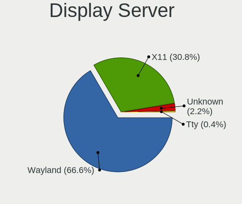
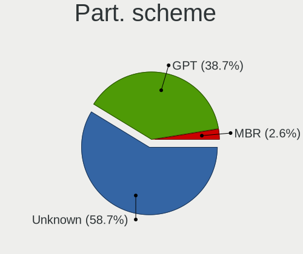
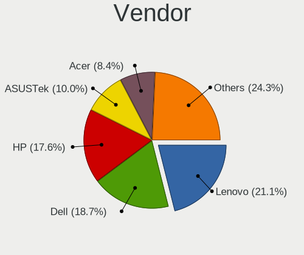
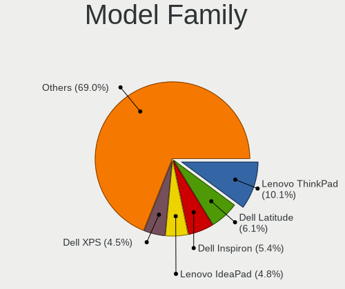
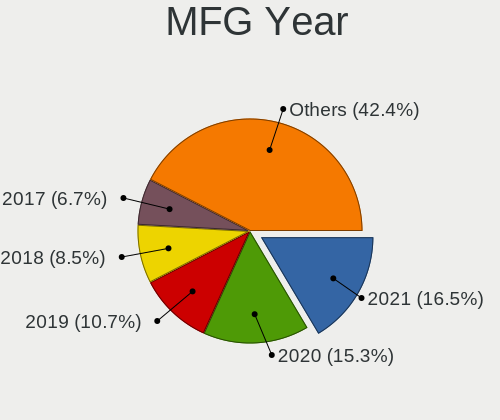
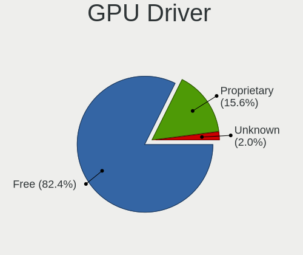
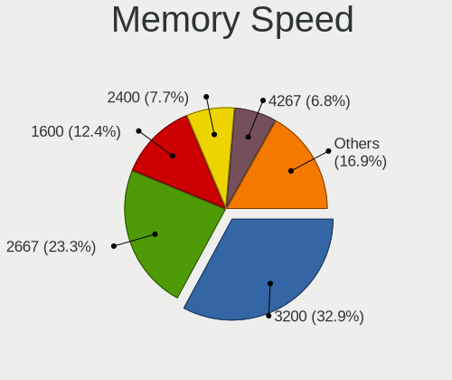
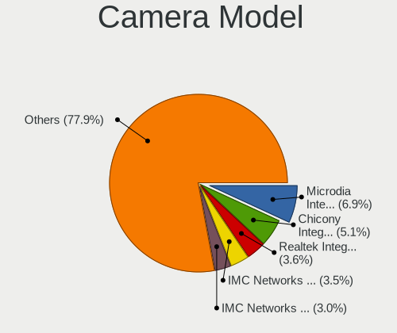

Ubuntu 21.10 - Tested Hardware & Statistics (Notebooks)
-------------------------------------------------------

A project to collect tested hardware configurations for Ubuntu 21.10.

Anyone can contribute to this report by the [hw-probe](https://github.com/linuxhw/hw-probe) tool:

    sudo -E hw-probe -all -upload

Please submit a probe of your configuration if it's not presented on the page or is rare.

Full-feature report is available here: https://linux-hardware.org/?view=trends&rel=ubuntu-21.10

Contents
--------

* [ Test Cases ](#test-cases)

* [ System ](#system)
  - [ Kernel                   ](#kernel)
  - [ Kernel Family            ](#kernel-family)
  - [ Kernel Major Ver.        ](#kernel-major-ver)
  - [ Arch                     ](#arch)
  - [ DE                       ](#de)
  - [ Display Server           ](#display-server)
  - [ Display Manager          ](#display-manager)
  - [ OS Lang                  ](#os-lang)
  - [ Boot Mode                ](#boot-mode)
  - [ Filesystem               ](#filesystem)
  - [ Part. scheme             ](#part-scheme)
  - [ Dual Boot with Linux/BSD ](#dual-boot-with-linuxbsd)
  - [ Dual Boot (Win)          ](#dual-boot-win)

* [ Board ](#board)
  - [ Vendor                   ](#vendor)
  - [ Model                    ](#model)
  - [ Model Family             ](#model-family)
  - [ MFG Year                 ](#mfg-year)
  - [ Form Factor              ](#form-factor)
  - [ Secure Boot              ](#secure-boot)
  - [ Coreboot                 ](#coreboot)
  - [ RAM Size                 ](#ram-size)
  - [ RAM Used                 ](#ram-used)
  - [ Total Drives             ](#total-drives)
  - [ Has CD-ROM               ](#has-cd-rom)
  - [ Has Ethernet             ](#has-ethernet)
  - [ Has WiFi                 ](#has-wifi)
  - [ Has Bluetooth            ](#has-bluetooth)

* [ Location ](#location)
  - [ Country                  ](#country)
  - [ City                     ](#city)

* [ Drives ](#drives)
  - [ Drive Vendor             ](#drive-vendor)
  - [ Drive Model              ](#drive-model)
  - [ HDD Vendor               ](#hdd-vendor)
  - [ SSD Vendor               ](#ssd-vendor)
  - [ Drive Kind               ](#drive-kind)
  - [ Drive Connector          ](#drive-connector)
  - [ Drive Size               ](#drive-size)
  - [ Space Total              ](#space-total)
  - [ Space Used               ](#space-used)
  - [ Malfunc. Drives          ](#malfunc-drives)
  - [ Malfunc. Drive Vendor    ](#malfunc-drive-vendor)
  - [ Malfunc. HDD Vendor      ](#malfunc-hdd-vendor)
  - [ Malfunc. Drive Kind      ](#malfunc-drive-kind)
  - [ Failed Drives            ](#failed-drives)
  - [ Failed Drive Vendor      ](#failed-drive-vendor)
  - [ Drive Status             ](#drive-status)

* [ Storage controller ](#storage-controller)
  - [ Storage Vendor           ](#storage-vendor)
  - [ Storage Model            ](#storage-model)
  - [ Storage Kind             ](#storage-kind)

* [ Processor ](#processor)
  - [ CPU Vendor               ](#cpu-vendor)
  - [ CPU Model                ](#cpu-model)
  - [ CPU Model Family         ](#cpu-model-family)
  - [ CPU Cores                ](#cpu-cores)
  - [ CPU Sockets              ](#cpu-sockets)
  - [ CPU Threads              ](#cpu-threads)
  - [ CPU Op-Modes             ](#cpu-op-modes)
  - [ CPU Microcode            ](#cpu-microcode)
  - [ CPU Microarch            ](#cpu-microarch)

* [ Graphics ](#graphics)
  - [ GPU Vendor               ](#gpu-vendor)
  - [ GPU Model                ](#gpu-model)
  - [ GPU Combo                ](#gpu-combo)
  - [ GPU Driver               ](#gpu-driver)
  - [ GPU Memory               ](#gpu-memory)

* [ Monitor ](#monitor)
  - [ Monitor Vendor           ](#monitor-vendor)
  - [ Monitor Model            ](#monitor-model)
  - [ Monitor Resolution       ](#monitor-resolution)
  - [ Monitor Diagonal         ](#monitor-diagonal)
  - [ Monitor Width            ](#monitor-width)
  - [ Aspect Ratio             ](#aspect-ratio)
  - [ Monitor Area             ](#monitor-area)
  - [ Pixel Density            ](#pixel-density)
  - [ Multiple Monitors        ](#multiple-monitors)

* [ Network ](#network)
  - [ Net Controller Vendor    ](#net-controller-vendor)
  - [ Net Controller Model     ](#net-controller-model)
  - [ Wireless Vendor          ](#wireless-vendor)
  - [ Wireless Model           ](#wireless-model)
  - [ Ethernet Vendor          ](#ethernet-vendor)
  - [ Ethernet Model           ](#ethernet-model)
  - [ Net Controller Kind      ](#net-controller-kind)
  - [ Used Controller          ](#used-controller)
  - [ NICs                     ](#nics)
  - [ IPv6                     ](#ipv6)

* [ Bluetooth ](#bluetooth)
  - [ Bluetooth Vendor         ](#bluetooth-vendor)
  - [ Bluetooth Model          ](#bluetooth-model)

* [ Sound ](#sound)
  - [ Sound Vendor             ](#sound-vendor)
  - [ Sound Model              ](#sound-model)

* [ Memory ](#memory)
  - [ Memory Vendor            ](#memory-vendor)
  - [ Memory Model             ](#memory-model)
  - [ Memory Kind              ](#memory-kind)
  - [ Memory Form Factor       ](#memory-form-factor)
  - [ Memory Size              ](#memory-size)
  - [ Memory Speed             ](#memory-speed)

* [ Printers & scanners ](#printers--scanners)
  - [ Printer Vendor           ](#printer-vendor)
  - [ Printer Model            ](#printer-model)
  - [ Scanner Vendor           ](#scanner-vendor)
  - [ Scanner Model            ](#scanner-model)

* [ Camera ](#camera)
  - [ Camera Vendor            ](#camera-vendor)
  - [ Camera Model             ](#camera-model)

* [ Security ](#security)
  - [ Fingerprint Vendor       ](#fingerprint-vendor)
  - [ Fingerprint Model        ](#fingerprint-model)
  - [ Chipcard Vendor          ](#chipcard-vendor)
  - [ Chipcard Model           ](#chipcard-model)

* [ Unsupported ](#unsupported)
  - [ Unsupported Devices      ](#unsupported-devices)
  - [ Unsupported Device Types ](#unsupported-device-types)

Test Cases
----------

| Vendor   | Model                       | Probe                                                      | Date         |
|----------|-----------------------------|------------------------------------------------------------|--------------|
| Lenovo   | ThinkPad T15g Gen 1 20UR... | [1b81ca9e7a](https://linux-hardware.org/?probe=1b81ca9e7a) | Sep 29, 2021 |
| HP       | Pavilion Laptop 15-cs3xx... | [51b49beb10](https://linux-hardware.org/?probe=51b49beb10) | Sep 28, 2021 |
| Lenovo   | ThinkPad T400 2768WGB       | [fc93efcead](https://linux-hardware.org/?probe=fc93efcead) | Sep 25, 2021 |
| Lenovo   | ThinkPad T400 2768WGB       | [8a2d72befe](https://linux-hardware.org/?probe=8a2d72befe) | Sep 24, 2021 |
| TUXEDO   | N7x0WU                      | [10f446b51e](https://linux-hardware.org/?probe=10f446b51e) | Sep 24, 2021 |
| Dell     | Precision 7710              | [fa8e5cdff5](https://linux-hardware.org/?probe=fa8e5cdff5) | Sep 23, 2021 |
| Acer     | Swift SFX14-41G             | [6b06b9e5dd](https://linux-hardware.org/?probe=6b06b9e5dd) | Sep 23, 2021 |
| Apple    | MacBookPro8,1               | [5b337fdb0a](https://linux-hardware.org/?probe=5b337fdb0a) | Sep 20, 2021 |
| Apple    | MacBookPro8,1               | [7c806aa7c5](https://linux-hardware.org/?probe=7c806aa7c5) | Sep 19, 2021 |
| ASUSTek  | VivoBook_ASUSLaptop X580... | [824a26d7e0](https://linux-hardware.org/?probe=824a26d7e0) | Sep 18, 2021 |
| Dell     | Vostro 3550                 | [1fe8420099](https://linux-hardware.org/?probe=1fe8420099) | Sep 17, 2021 |
| Dell     | Vostro 3550                 | [10f08c1bfd](https://linux-hardware.org/?probe=10f08c1bfd) | Sep 17, 2021 |
| Lenovo   | ThinkPad T400 2768WGB       | [77d801bf3c](https://linux-hardware.org/?probe=77d801bf3c) | Sep 15, 2021 |
| HP       | ProBook 455 G6              | [8c5aa4304c](https://linux-hardware.org/?probe=8c5aa4304c) | Sep 14, 2021 |
| Lenovo   | ThinkPad T400 2768WGB       | [c105819db0](https://linux-hardware.org/?probe=c105819db0) | Sep 13, 2021 |
| Lenovo   | ThinkPad T400 2768WGB       | [04299c1c72](https://linux-hardware.org/?probe=04299c1c72) | Sep 10, 2021 |
| Lenovo   | G570 20079                  | [070f80905a](https://linux-hardware.org/?probe=070f80905a) | Sep 09, 2021 |
| Dell     | XPS 13 9310                 | [ce30239886](https://linux-hardware.org/?probe=ce30239886) | Sep 08, 2021 |
| Lenovo   | ThinkPad T470 20JNS3M500    | [1dcfa059c1](https://linux-hardware.org/?probe=1dcfa059c1) | Sep 07, 2021 |
| Lenovo   | V310-14IKB 80T2             | [9036570a3d](https://linux-hardware.org/?probe=9036570a3d) | Sep 07, 2021 |
| Dell     | XPS 13 9310                 | [a23d662013](https://linux-hardware.org/?probe=a23d662013) | Sep 06, 2021 |
| Lenovo   | G570 20079                  | [92d47c8db5](https://linux-hardware.org/?probe=92d47c8db5) | Sep 05, 2021 |
| Google   | Nautilus                    | [3b25f1b84a](https://linux-hardware.org/?probe=3b25f1b84a) | Sep 05, 2021 |
| Lenovo   | G570 20079                  | [897adf5520](https://linux-hardware.org/?probe=897adf5520) | Sep 04, 2021 |
| Lenovo   | ThinkPad T400 2768WGB       | [a66a6f00e4](https://linux-hardware.org/?probe=a66a6f00e4) | Sep 03, 2021 |
| Lenovo   | V310-14IKB 80T2             | [682d409384](https://linux-hardware.org/?probe=682d409384) | Sep 02, 2021 |
| Dell     | Latitude E6410              | [8b57d50d95](https://linux-hardware.org/?probe=8b57d50d95) | Sep 02, 2021 |
| ASUSTek  | GL753VD                     | [d17c6ba3fc](https://linux-hardware.org/?probe=d17c6ba3fc) | Sep 01, 2021 |
| ASUSTek  | ROG Strix G533QS_G533QS     | [cae806f49d](https://linux-hardware.org/?probe=cae806f49d) | Aug 22, 2021 |
| ASUSTek  | ROG Strix G533QS_G533QS     | [b8aa2e41d5](https://linux-hardware.org/?probe=b8aa2e41d5) | Aug 16, 2021 |
| ASUSTek  | ROG Strix G533QS_G533QS     | [612dda8fba](https://linux-hardware.org/?probe=612dda8fba) | Aug 13, 2021 |
| ASUSTek  | ROG Strix G533QS_G533QS     | [1eb6008b88](https://linux-hardware.org/?probe=1eb6008b88) | Aug 13, 2021 |
| ASUSTek  | VivoBook_ASUSLaptop X509... | [808cfab06b](https://linux-hardware.org/?probe=808cfab06b) | Aug 12, 2021 |
| Lenovo   | ThinkPad T510 4484A63       | [c1bcb3451f](https://linux-hardware.org/?probe=c1bcb3451f) | Aug 09, 2021 |
| Lenovo   | ThinkPad T510 4484A63       | [4336b50906](https://linux-hardware.org/?probe=4336b50906) | Aug 06, 2021 |
| ASUSTek  | VivoBook_ASUSLaptop X530... | [961031411d](https://linux-hardware.org/?probe=961031411d) | Aug 03, 2021 |
| Lenovo   | ZhaoYang K3-ITL 82E3        | [ee2be4cea9](https://linux-hardware.org/?probe=ee2be4cea9) | Aug 03, 2021 |
| ASUSTek  | GL753VD                     | [eabe6a8723](https://linux-hardware.org/?probe=eabe6a8723) | Jul 31, 2021 |
| Acer     | Aspire 5920                 | [f41defe215](https://linux-hardware.org/?probe=f41defe215) | Jul 31, 2021 |
| Dell     | XPS 13 7390                 | [901bcb991b](https://linux-hardware.org/?probe=901bcb991b) | Jul 31, 2021 |
| Teclast  | F6 Pro                      | [e28004c24b](https://linux-hardware.org/?probe=e28004c24b) | Jul 27, 2021 |
| ASUSTek  | VivoBook_ASUSLaptop X421... | [f5458b4f56](https://linux-hardware.org/?probe=f5458b4f56) | Jul 19, 2021 |
| ASUSTek  | VivoBook_ASUSLaptop X421... | [5ac65f3389](https://linux-hardware.org/?probe=5ac65f3389) | Jul 18, 2021 |
| Lenovo   | Z50-70 20354                | [85aadf8abd](https://linux-hardware.org/?probe=85aadf8abd) | Jul 16, 2021 |
| Lenovo   | Z50-70 20354                | [b2c80f450e](https://linux-hardware.org/?probe=b2c80f450e) | Jul 14, 2021 |
| HP       | Pavilion Gaming Laptop 1... | [f024f2512e](https://linux-hardware.org/?probe=f024f2512e) | Jul 14, 2021 |
| Lenovo   | ThinkPad X201 3626FAG       | [259908557b](https://linux-hardware.org/?probe=259908557b) | Jun 28, 2021 |
| Positivo | H14BT58                     | [51b9ba65e0](https://linux-hardware.org/?probe=51b9ba65e0) | Jun 18, 2021 |
| ASUSTek  | ROG Strix G533QR_G533QR     | [4befd5f360](https://linux-hardware.org/?probe=4befd5f360) | Jun 04, 2021 |
| Dell     | XPS 13 9343                 | [4ee08e92ae](https://linux-hardware.org/?probe=4ee08e92ae) | May 18, 2021 |

System
------

Kernel
------

Version of the Linux kernel

| Version               | Notebooks | Percent |
|-----------------------|-----------|---------|
| 5.13.0-16-generic     | 9         | 27.27%  |
| 5.13.0-14-generic     | 8         | 24.24%  |
| 5.11.0-20-generic     | 4         | 12.12%  |
| 5.11.0-25-generic     | 2         | 6.06%   |
| 5.11.0-18-generic     | 2         | 6.06%   |
| 5.13.6-xanmod2-edge   | 1         | 3.03%   |
| 5.13.4-051304-generic | 1         | 3.03%   |
| 5.13.2-051302-generic | 1         | 3.03%   |
| 5.13.0-13-generic     | 1         | 3.03%   |
| 5.11.0-31-generic     | 1         | 3.03%   |
| 5.11.0-26-generic     | 1         | 3.03%   |
| 5.11.0-22-generic     | 1         | 3.03%   |
| 5.11.0-16-generic     | 1         | 3.03%   |

Kernel Family
-------------

Linux kernel without a distro release

| Version | Notebooks | Percent |
|---------|-----------|---------|
| 5.13.0  | 17        | 53.13%  |
| 5.11.0  | 12        | 37.5%   |
| 5.13.6  | 1         | 3.13%   |
| 5.13.4  | 1         | 3.13%   |
| 5.13.2  | 1         | 3.13%   |

Kernel Major Ver.
-----------------

Linux kernel major version

| Version | Notebooks | Percent |
|---------|-----------|---------|
| 5.13    | 20        | 62.5%   |
| 5.11    | 12        | 37.5%   |

Arch
----

OS architecture (x86_64, i586, etc.)

| Name   | Notebooks | Percent |
|--------|-----------|---------|
| x86_64 | 32        | 100%    |

DE
--

Desktop Environment

| Name            | Notebooks | Percent |
|-----------------|-----------|---------|
| GNOME           | 24        | 75%     |
| Unknown         | 3         | 9.38%   |
| X-Cinnamon      | 2         | 6.25%   |
| Unity           | 1         | 3.13%   |
| GNOME Flashback | 1         | 3.13%   |
| Cinnamon        | 1         | 3.13%   |

Display Server
--------------

X11 or Wayland

| Name    | Notebooks | Percent |
|---------|-----------|---------|
| Wayland | 21        | 65.63%  |
| X11     | 11        | 34.38%  |

Display Manager
---------------

SDDM, LightDM, etc.

| Name    | Notebooks | Percent |
|---------|-----------|---------|
| GDM     | 15        | 46.88%  |
| Unknown | 13        | 40.63%  |
| GDM3    | 3         | 9.38%   |
| TDM     | 1         | 3.13%   |

OS Lang
-------

Language

| Lang  | Notebooks | Percent |
|-------|-----------|---------|
| en_US | 11        | 34.38%  |
| en_GB | 5         | 15.63%  |
| fr_FR | 4         | 12.5%   |
| sv_SE | 2         | 6.25%   |
| hu_HU | 2         | 6.25%   |
| zh_CN | 1         | 3.13%   |
| ru_RU | 1         | 3.13%   |
| pt_BR | 1         | 3.13%   |
| ko_KR | 1         | 3.13%   |
| es_MX | 1         | 3.13%   |
| en_ZM | 1         | 3.13%   |
| en_IN | 1         | 3.13%   |
| de_DE | 1         | 3.13%   |

Boot Mode
---------

EFI or BIOS

| Mode | Notebooks | Percent |
|------|-----------|---------|
| BIOS | 17        | 53.13%  |
| EFI  | 15        | 46.88%  |

Filesystem
----------

Type of filesystem

| Type  | Notebooks | Percent |
|-------|-----------|---------|
| Ext4  | 28        | 87.5%   |
| Zfs   | 2         | 6.25%   |
| Btrfs | 2         | 6.25%   |

Part. scheme
------------

Scheme of partitioning

| Type    | Notebooks | Percent |
|---------|-----------|---------|
| GPT     | 15        | 46.88%  |
| Unknown | 15        | 46.88%  |
| MBR     | 2         | 6.25%   |

Dual Boot with Linux/BSD
------------------------

Hosting more than one Linux/BSD

| Dual boot | Notebooks | Percent |
|-----------|-----------|---------|
| No        | 25        | 75.76%  |
| Yes       | 8         | 24.24%  |

Dual Boot (Win)
---------------

Hosting Linux and Windows

| Dual boot | Notebooks | Percent |
|-----------|-----------|---------|
| No        | 19        | 59.38%  |
| Yes       | 13        | 40.63%  |

Board
-----

Vendor
------

Motherboard manufacturer

| Name             | Notebooks | Percent |
|------------------|-----------|---------|
| Lenovo           | 9         | 28.13%  |
| ASUSTek Computer | 7         | 21.88%  |
| Dell             | 6         | 18.75%  |
| Hewlett-Packard  | 3         | 9.38%   |
| Acer             | 2         | 6.25%   |
| TUXEDO           | 1         | 3.13%   |
| Teclast          | 1         | 3.13%   |
| Positivo         | 1         | 3.13%   |
| Google           | 1         | 3.13%   |
| Apple            | 1         | 3.13%   |

Model
-----

Motherboard model

| Name                                    | Notebooks | Percent |
|-----------------------------------------|-----------|---------|
| Lenovo ThinkPad T400 2768WGB            | 2         | 6.25%   |
| TUXEDO N7x0WU                           | 1         | 3.13%   |
| Teclast F6 Pro                          | 1         | 3.13%   |
| Positivo H14BT58                        | 1         | 3.13%   |
| Lenovo ZhaoYang K3-ITL 82E3             | 1         | 3.13%   |
| Lenovo Z50-70 20354                     | 1         | 3.13%   |
| Lenovo V310-14IKB 80T2                  | 1         | 3.13%   |
| Lenovo ThinkPad X201 3626FAG            | 1         | 3.13%   |
| Lenovo ThinkPad T470 20JNS3M500         | 1         | 3.13%   |
| Lenovo ThinkPad T15g Gen 1 20URCTO1WW   | 1         | 3.13%   |
| Lenovo G570 20079                       | 1         | 3.13%   |
| HP ProBook 455 G6                       | 1         | 3.13%   |
| HP Pavilion Laptop 15-cs3xxx            | 1         | 3.13%   |
| HP Pavilion Gaming Laptop 15-dk0xxx     | 1         | 3.13%   |
| Google Nautilus                         | 1         | 3.13%   |
| Dell XPS 13 9343                        | 1         | 3.13%   |
| Dell XPS 13 9310                        | 1         | 3.13%   |
| Dell XPS 13 7390                        | 1         | 3.13%   |
| Dell Vostro 3550                        | 1         | 3.13%   |
| Dell Precision 7710                     | 1         | 3.13%   |
| Dell Latitude E6410                     | 1         | 3.13%   |
| ASUS VivoBook_ASUSLaptop X580GD_NX580GD | 1         | 3.13%   |
| ASUS VivoBook_ASUSLaptop X530FN_S530FN  | 1         | 3.13%   |
| ASUS VivoBook_ASUSLaptop X509DJ_M509DJ  | 1         | 3.13%   |
| ASUS VivoBook_ASUSLaptop X421UAY_M413UA | 1         | 3.13%   |
| ASUS ROG Strix G533QS_G533QS            | 1         | 3.13%   |
| ASUS ROG Strix G533QR_G533QR            | 1         | 3.13%   |
| ASUS GL753VD                            | 1         | 3.13%   |
| Apple MacBookPro8,1                     | 1         | 3.13%   |
| Acer Swift SFX14-41G                    | 1         | 3.13%   |
| Acer Aspire 5920                        | 1         | 3.13%   |

Model Family
------------

Motherboard model prefix

| Name              | Notebooks | Percent |
|-------------------|-----------|---------|
| Lenovo ThinkPad   | 5         | 15.63%  |
| ASUS VivoBook     | 4         | 12.5%   |
| Dell XPS          | 3         | 9.38%   |
| HP Pavilion       | 2         | 6.25%   |
| ASUS ROG          | 2         | 6.25%   |
| TUXEDO N7x0WU     | 1         | 3.13%   |
| Teclast F6        | 1         | 3.13%   |
| Positivo H14BT58  | 1         | 3.13%   |
| Lenovo ZhaoYang   | 1         | 3.13%   |
| Lenovo Z50-70     | 1         | 3.13%   |
| Lenovo V310-14IKB | 1         | 3.13%   |
| Lenovo G570       | 1         | 3.13%   |
| HP ProBook        | 1         | 3.13%   |
| Google Nautilus   | 1         | 3.13%   |
| Dell Vostro       | 1         | 3.13%   |
| Dell Precision    | 1         | 3.13%   |
| Dell Latitude     | 1         | 3.13%   |
| ASUS GL753VD      | 1         | 3.13%   |
| Apple MacBookPro8 | 1         | 3.13%   |
| Acer Swift        | 1         | 3.13%   |
| Acer Aspire       | 1         | 3.13%   |

MFG Year
--------

Motherboard manufacture year

| Year | Notebooks | Percent |
|------|-----------|---------|
| 2021 | 12        | 37.5%   |
| 2020 | 6         | 18.75%  |
| 2019 | 2         | 6.25%   |
| 2018 | 2         | 6.25%   |
| 2015 | 2         | 6.25%   |
| 2014 | 2         | 6.25%   |
| 2012 | 2         | 6.25%   |
| 2017 | 1         | 3.13%   |
| 2011 | 1         | 3.13%   |
| 2010 | 1         | 3.13%   |
| 2008 | 1         | 3.13%   |

Form Factor
-----------

Physical design of the computer

| Name     | Notebooks | Percent |
|----------|-----------|---------|
| Notebook | 32        | 100%    |

Secure Boot
-----------

Enabled or disabled

| State    | Notebooks | Percent |
|----------|-----------|---------|
| Disabled | 29        | 90.63%  |
| Enabled  | 3         | 9.38%   |

Coreboot
--------

Have coreboot on board

| Used | Notebooks | Percent |
|------|-----------|---------|
| No   | 31        | 96.88%  |
| Yes  | 1         | 3.13%   |

RAM Size
--------

Total RAM memory

| Size in GB  | Notebooks | Percent |
|-------------|-----------|---------|
| 4.01-8.0    | 11        | 34.38%  |
| 8.01-16.0   | 6         | 18.75%  |
| 3.01-4.0    | 5         | 15.63%  |
| 32.01-64.0  | 3         | 9.38%   |
| 16.01-24.0  | 3         | 9.38%   |
| 64.01-256.0 | 2         | 6.25%   |
| 24.01-32.0  | 1         | 3.13%   |
| 1.01-2.0    | 1         | 3.13%   |

RAM Used
--------

Used RAM memory

| Used GB   | Notebooks | Percent |
|-----------|-----------|---------|
| 4.01-8.0  | 10        | 30.3%   |
| 2.01-3.0  | 10        | 30.3%   |
| 1.01-2.0  | 9         | 27.27%  |
| 3.01-4.0  | 2         | 6.06%   |
| 8.01-16.0 | 2         | 6.06%   |

Total Drives
------------

Number of drives on board

| Drives | Notebooks | Percent |
|--------|-----------|---------|
| 1      | 22        | 68.75%  |
| 2      | 7         | 21.88%  |
| 3      | 3         | 9.38%   |

Has CD-ROM
----------

Has CD-ROM on board

| Presented | Notebooks | Percent |
|-----------|-----------|---------|
| No        | 23        | 71.88%  |
| Yes       | 9         | 28.13%  |

Has Ethernet
------------

Has Ethernet on board

| Presented | Notebooks | Percent |
|-----------|-----------|---------|
| Yes       | 23        | 71.88%  |
| No        | 9         | 28.13%  |

Has WiFi
--------

Has WiFi module

| Presented | Notebooks | Percent |
|-----------|-----------|---------|
| Yes       | 31        | 96.88%  |
| No        | 1         | 3.13%   |

Has Bluetooth
-------------

Has Bluetooth module

| Presented | Notebooks | Percent |
|-----------|-----------|---------|
| Yes       | 26        | 81.25%  |
| No        | 6         | 18.75%  |

Location
--------

Country
-------

Geographic location (country)

| Country     | Notebooks | Percent |
|-------------|-----------|---------|
| USA         | 4         | 12.5%   |
| UK          | 4         | 12.5%   |
| France      | 4         | 12.5%   |
| Germany     | 3         | 9.38%   |
| Sweden      | 2         | 6.25%   |
| Hungary     | 2         | 6.25%   |
| Zambia      | 1         | 3.13%   |
| South Korea | 1         | 3.13%   |
| Russia      | 1         | 3.13%   |
| Poland      | 1         | 3.13%   |
| Italy       | 1         | 3.13%   |
| India       | 1         | 3.13%   |
| Finland     | 1         | 3.13%   |
| Czechia     | 1         | 3.13%   |
| Cyprus      | 1         | 3.13%   |
| China       | 1         | 3.13%   |
| Chile       | 1         | 3.13%   |
| Canada      | 1         | 3.13%   |
| Brazil      | 1         | 3.13%   |

City
----

Geographic location (city)

| City                   | Notebooks | Percent |
|------------------------|-----------|---------|
| Tatab??nya             | 2         | 6.25%   |
| Yongin-si              | 1         | 3.13%   |
| Wittlich               | 1         | 3.13%   |
| Warsaw                 | 1         | 3.13%   |
| Turku                  | 1         | 3.13%   |
| Trivandrum             | 1         | 3.13%   |
| Tottenham              | 1         | 3.13%   |
| Toms River             | 1         | 3.13%   |
| Stockholm              | 1         | 3.13%   |
| Shanghai               | 1         | 3.13%   |
| Santiago               | 1         | 3.13%   |
| Rio de Janeiro         | 1         | 3.13%   |
| Rennes                 | 1         | 3.13%   |
| Prague                 | 1         | 3.13%   |
| Paris                  | 1         | 3.13%   |
| Nizhny Tagil           | 1         | 3.13%   |
| Nicosia                | 1         | 3.13%   |
| Montreal               | 1         | 3.13%   |
| Marion                 | 1         | 3.13%   |
| Maidstone              | 1         | 3.13%   |
| Lyon                   | 1         | 3.13%   |
| Lusaka                 | 1         | 3.13%   |
| Helsingborg            | 1         | 3.13%   |
| Haselhorst             | 1         | 3.13%   |
| Glasgow                | 1         | 3.13%   |
| Fellbach               | 1         | 3.13%   |
| Crewe                  | 1         | 3.13%   |
| Ciampino               | 1         | 3.13%   |
| Charleville-M?©zi??res | 1         | 3.13%   |
| Brooklyn               | 1         | 3.13%   |
| Austin                 | 1         | 3.13%   |

Drives
------

Drive Vendor
------------

Hard drive vendors

| Vendor              | Notebooks | Drives | Percent |
|---------------------|-----------|--------|---------|
| Samsung Electronics | 8         | 9      | 18.6%   |
| Seagate             | 6         | 6      | 13.95%  |
| SK Hynix            | 4         | 4      | 9.3%    |
| Intel               | 4         | 5      | 9.3%    |
| Toshiba             | 3         | 3      | 6.98%   |
| SanDisk             | 3         | 4      | 6.98%   |
| WDC                 | 2         | 2      | 4.65%   |
| Unknown             | 2         | 2      | 4.65%   |
| SPCC                | 2         | 2      | 4.65%   |
| SP                  | 1         | 1      | 2.33%   |
| PNY                 | 1         | 1      | 2.33%   |
| Micron Technology   | 1         | 1      | 2.33%   |
| LITEON              | 1         | 1      | 2.33%   |
| Kingston            | 1         | 1      | 2.33%   |
| KingDian            | 1         | 1      | 2.33%   |
| Hitachi             | 1         | 1      | 2.33%   |
| HGST                | 1         | 2      | 2.33%   |
| Crucial             | 1         | 1      | 2.33%   |

Drive Model
-----------

Hard drive models

| Model                                   | Notebooks | Percent |
|-----------------------------------------|-----------|---------|
| SPCC Solid State Disk 128GB             | 2         | 4.44%   |
| SK Hynix HFM001TD3JX013N 1TB            | 2         | 4.44%   |
| Seagate Expansion 5TB                   | 2         | 4.44%   |
| WDC WD7500BPKT-75PK4T0 752GB            | 1         | 2.22%   |
| WDC WD5000LPVX-22V0TT0 500GB            | 1         | 2.22%   |
| Unknown SB64G  64GB                     | 1         | 2.22%   |
| Unknown MMC Card  64GB                  | 1         | 2.22%   |
| Toshiba MQ04ABF100 1TB                  | 1         | 2.22%   |
| Toshiba MQ01ABD100 1TB                  | 1         | 2.22%   |
| Toshiba KBG30ZMS128G 128GB NVMe SSD     | 1         | 2.22%   |
| SP PC60 1TB                             | 1         | 2.22%   |
| SK Hynix NVMe SSD Drive 512GB           | 1         | 2.22%   |
| SK Hynix HFM512GD3JX016N 512GB          | 1         | 2.22%   |
| Seagate ST9750420AS 752GB               | 1         | 2.22%   |
| Seagate ST9320423AS 320GB               | 1         | 2.22%   |
| Seagate ST500LT012-1DG142 500GB         | 1         | 2.22%   |
| Seagate BUP Slim RD 2TB                 | 1         | 2.22%   |
| SanDisk SD9SN8W256G1102 256GB SSD       | 1         | 2.22%   |
| SanDisk SD7SB3Q064G 56GB SSD            | 1         | 2.22%   |
| Sandisk NVMe SSD Drive 500GB            | 1         | 2.22%   |
| Samsung SSD 970 EVO 500GB               | 1         | 2.22%   |
| Samsung SSD 860 EVO 1TB                 | 1         | 2.22%   |
| Samsung SSD 850 PRO 256GB               | 1         | 2.22%   |
| Samsung SSD 850 EVO 500GB               | 1         | 2.22%   |
| Samsung NVMe SSD Drive 512GB            | 1         | 2.22%   |
| Samsung NVMe SSD Drive 250GB            | 1         | 2.22%   |
| Samsung NVMe SSD Drive 1024GB           | 1         | 2.22%   |
| Samsung MZVLQ512HALU-00000 512GB        | 1         | 2.22%   |
| Samsung MZALQ512HALU-000L2 512GB        | 1         | 2.22%   |
| PNY CS1030 1TB SSD                      | 1         | 2.22%   |
| Micron 2300 NVMe 1024GB                 | 1         | 2.22%   |
| LITEON L8H-256V2G-11 M.2 2280 256GB SSD | 1         | 2.22%   |
| Kingston SKC300S37A240G 240GB SSD       | 1         | 2.22%   |
| KingDian N400 240GB SSD                 | 1         | 2.22%   |
| Intel SSDPEKNW512G8 512GB               | 1         | 2.22%   |
| Intel SSDPEKNW010T9 1TB                 | 1         | 2.22%   |
| Intel NVMe SSD Drive 512GB              | 1         | 2.22%   |
| Intel HBRPEKNX0101AHO 16GB              | 1         | 2.22%   |
| Intel HBRPEKNX0101AH 256GB              | 1         | 2.22%   |
| Hitachi HTS545032B9A302 320GB           | 1         | 2.22%   |
| HGST HTS721010A9E630 1TB                | 1         | 2.22%   |
| Crucial CT1000MX500SSD4 1TB             | 1         | 2.22%   |

HDD Vendor
----------

Hard disk drive vendors

| Vendor  | Notebooks | Drives | Percent |
|---------|-----------|--------|---------|
| Seagate | 6         | 6      | 50%     |
| WDC     | 2         | 2      | 16.67%  |
| Toshiba | 2         | 2      | 16.67%  |
| Hitachi | 1         | 1      | 8.33%   |
| HGST    | 1         | 2      | 8.33%   |

SSD Vendor
----------

Solid state drive vendors

| Vendor              | Notebooks | Drives | Percent |
|---------------------|-----------|--------|---------|
| Samsung Electronics | 3         | 3      | 27.27%  |
| SPCC                | 2         | 2      | 18.18%  |
| SanDisk             | 2         | 2      | 18.18%  |
| LITEON              | 1         | 1      | 9.09%   |
| Kingston            | 1         | 1      | 9.09%   |
| KingDian            | 1         | 1      | 9.09%   |
| Crucial             | 1         | 1      | 9.09%   |

Drive Kind
----------

HDD or SSD

| Kind    | Notebooks | Drives | Percent |
|---------|-----------|--------|---------|
| NVMe    | 17        | 20     | 39.53%  |
| HDD     | 12        | 13     | 27.91%  |
| SSD     | 11        | 11     | 25.58%  |
| MMC     | 2         | 2      | 4.65%   |
| Unknown | 1         | 1      | 2.33%   |

Drive Connector
---------------

SATA, SAS, NVMe, etc.

| Type | Notebooks | Drives | Percent |
|------|-----------|--------|---------|
| SATA | 18        | 21     | 45%     |
| NVMe | 17        | 20     | 42.5%   |
| SAS  | 3         | 4      | 7.5%    |
| MMC  | 2         | 2      | 5%      |

Drive Size
----------

Size of hard drive

| Size in TB | Notebooks | Drives | Percent |
|------------|-----------|--------|---------|
| 0.01-0.5   | 13        | 13     | 59.09%  |
| 0.51-1.0   | 6         | 8      | 27.27%  |
| 4.01-10.0  | 2         | 2      | 9.09%   |
| 1.01-2.0   | 1         | 1      | 4.55%   |

Space Total
-----------

Amount of disk space available on the file system

| Size in GB | Notebooks | Percent |
|------------|-----------|---------|
| 101-250    | 8         | 24.24%  |
| 51-100     | 8         | 24.24%  |
| 501-1000   | 6         | 18.18%  |
| 251-500    | 4         | 12.12%  |
| 1001-2000  | 4         | 12.12%  |
| 1-20       | 2         | 6.06%   |
| 21-50      | 1         | 3.03%   |

Space Used
----------

Amount of used disk space

| Used GB  | Notebooks | Percent |
|----------|-----------|---------|
| 1-20     | 9         | 27.27%  |
| 21-50    | 8         | 24.24%  |
| 101-250  | 5         | 15.15%  |
| 501-1000 | 5         | 15.15%  |
| 51-100   | 4         | 12.12%  |
| 251-500  | 2         | 6.06%   |

Malfunc. Drives
---------------

Drive models with a malfunction

Zero info for selected period =(

Malfunc. Drive Vendor
---------------------

Vendors of faulty drives

Zero info for selected period =(

Malfunc. HDD Vendor
-------------------

Vendors of faulty HDD drives

Zero info for selected period =(

Malfunc. Drive Kind
-------------------

Kinds of faulty drives

Zero info for selected period =(

Failed Drives
-------------

Failed drive models

Zero info for selected period =(

Failed Drive Vendor
-------------------

Failed drive vendors

Zero info for selected period =(

Drive Status
------------

Number of failed and malfunc. drives

| Status   | Notebooks | Drives | Percent |
|----------|-----------|--------|---------|
| Detected | 20        | 28     | 55.56%  |
| Works    | 16        | 19     | 44.44%  |

Storage controller
------------------

Storage Vendor
--------------

Storage controller vendors

| Vendor                       | Notebooks | Percent |
|------------------------------|-----------|---------|
| Intel                        | 23        | 56.1%   |
| Samsung Electronics          | 6         | 14.63%  |
| SK Hynix                     | 4         | 9.76%   |
| AMD                          | 4         | 9.76%   |
| Toshiba America Info Systems | 1         | 2.44%   |
| Sandisk                      | 1         | 2.44%   |
| Phison Electronics           | 1         | 2.44%   |
| Micron Technology            | 1         | 2.44%   |

Storage Model
-------------

Storage controller models

| Model                                                                            | Notebooks | Percent |
|----------------------------------------------------------------------------------|-----------|---------|
| AMD FCH SATA Controller [AHCI mode]                                              | 4         | 9.09%   |
| SK Hynix Gold P31 SSD                                                            | 3         | 6.82%   |
| Samsung NVMe SSD Controller SM981/PM981/PM983                                    | 3         | 6.82%   |
| Intel Sunrise Point-LP SATA Controller [AHCI mode]                               | 3         | 6.82%   |
| Intel 82801 Mobile SATA Controller [RAID mode]                                   | 3         | 6.82%   |
| Intel 6 Series/C200 Series Chipset Family 6 port Mobile SATA AHCI Controller     | 3         | 6.82%   |
| Samsung NVMe SSD Controller 980                                                  | 2         | 4.55%   |
| Intel SSD 660P Series                                                            | 2         | 4.55%   |
| Intel Non-Volatile memory controller                                             | 2         | 4.55%   |
| Intel 82801IBM/IEM (ICH9M/ICH9M-E) 4 port SATA Controller [AHCI mode]            | 2         | 4.55%   |
| Intel 5 Series/3400 Series Chipset 6 port SATA AHCI Controller                   | 2         | 4.55%   |
| Toshiba America Info Systems Toshiba America Info Non-Volatile memory controller | 1         | 2.27%   |
| SK Hynix PC300 NVMe Solid State Drive 512GB                                      | 1         | 2.27%   |
| Sandisk WD Blue SN550 NVMe SSD                                                   | 1         | 2.27%   |
| Samsung NVMe SSD Controller SM961/PM961/SM963                                    | 1         | 2.27%   |
| Phison PS5013 E13 NVMe Controller                                                | 1         | 2.27%   |
| Micron Non-Volatile memory controller                                            | 1         | 2.27%   |
| Intel Wildcat Point-LP SATA Controller [AHCI Mode]                               | 1         | 2.27%   |
| Intel Volume Management Device NVMe RAID Controller                              | 1         | 2.27%   |
| Intel Q170/Q150/B150/H170/H110/Z170/CM236 Chipset SATA Controller [AHCI Mode]    | 1         | 2.27%   |
| Intel HM170/QM170 Chipset SATA Controller [AHCI Mode]                            | 1         | 2.27%   |
| Intel Cannon Lake Mobile PCH SATA AHCI Controller                                | 1         | 2.27%   |
| Intel Atom Processor E3800 Series SATA AHCI Controller                           | 1         | 2.27%   |
| Intel 82801HM/HEM (ICH8M/ICH8M-E) SATA Controller [AHCI mode]                    | 1         | 2.27%   |
| Intel 82801HM/HEM (ICH8M/ICH8M-E) IDE Controller                                 | 1         | 2.27%   |
| Intel 8 Series SATA Controller 1 [AHCI mode]                                     | 1         | 2.27%   |

Storage Kind
------------

Kind of storage controller (IDE, SATA, NVMe, SAS, ...)

| Kind | Notebooks | Percent |
|------|-----------|---------|
| SATA | 21        | 48.84%  |
| NVMe | 17        | 39.53%  |
| RAID | 4         | 9.3%    |
| IDE  | 1         | 2.33%   |

Processor
---------

CPU Vendor
----------

Processor vendors

| Vendor | Notebooks | Percent |
|--------|-----------|---------|
| Intel  | 26        | 81.25%  |
| AMD    | 6         | 18.75%  |

CPU Model
---------

Processor models

| Model                                           | Notebooks | Percent |
|-------------------------------------------------|-----------|---------|
| Intel Core m3-7Y30 CPU @ 1.00GHz                | 2         | 6.25%   |
| Intel Core i5 CPU M 540 @ 2.53GHz               | 2         | 6.25%   |
| Intel Core 2 Duo CPU P8600 @ 2.40GHz            | 2         | 6.25%   |
| AMD Ryzen 9 5900HX with Radeon Graphics         | 2         | 6.25%   |
| Intel Core i7-8750H CPU @ 2.20GHz               | 1         | 3.13%   |
| Intel Core i7-8565U CPU @ 1.80GHz               | 1         | 3.13%   |
| Intel Core i7-8550U CPU @ 1.80GHz               | 1         | 3.13%   |
| Intel Core i7-7700HQ CPU @ 2.80GHz              | 1         | 3.13%   |
| Intel Core i7-6820HQ CPU @ 2.70GHz              | 1         | 3.13%   |
| Intel Core i7-4510U CPU @ 2.00GHz               | 1         | 3.13%   |
| Intel Core i7-2620M CPU @ 2.70GHz               | 1         | 3.13%   |
| Intel Core i7-10875H CPU @ 2.30GHz              | 1         | 3.13%   |
| Intel Core i7-10510U CPU @ 1.80GHz              | 1         | 3.13%   |
| Intel Core i5-9300H CPU @ 2.40GHz               | 1         | 3.13%   |
| Intel Core i5-7200U CPU @ 2.50GHz               | 1         | 3.13%   |
| Intel Core i5-6200U CPU @ 2.30GHz               | 1         | 3.13%   |
| Intel Core i5-5200U CPU @ 2.20GHz               | 1         | 3.13%   |
| Intel Core i5-2415M CPU @ 2.30GHz               | 1         | 3.13%   |
| Intel Core i5-1035G1 CPU @ 1.00GHz              | 1         | 3.13%   |
| Intel Core 2 Duo CPU T8300 @ 2.40GHz            | 1         | 3.13%   |
| Intel Celeron CPU N2807 @ 1.58GHz               | 1         | 3.13%   |
| Intel Celeron CPU B800 @ 1.50GHz                | 1         | 3.13%   |
| Intel 11th Gen Core i7-1185G7 @ 3.00GHz         | 1         | 3.13%   |
| Intel 11th Gen Core i7-1165G7 @ 2.80GHz         | 1         | 3.13%   |
| AMD Ryzen 7 PRO 2700U w/ Radeon Vega Mobile Gfx | 1         | 3.13%   |
| AMD Ryzen 7 5800U with Radeon Graphics          | 1         | 3.13%   |
| AMD Ryzen 5 5500U with Radeon Graphics          | 1         | 3.13%   |
| AMD Ryzen 5 3500U with Radeon Vega Mobile Gfx   | 1         | 3.13%   |

CPU Model Family
----------------

Processor model prefix

| Model            | Notebooks | Percent |
|------------------|-----------|---------|
| Intel Core i7    | 9         | 28.13%  |
| Intel Core i5    | 8         | 25%     |
| Intel Core 2 Duo | 3         | 9.38%   |
| Other            | 2         | 6.25%   |
| Intel Core m3    | 2         | 6.25%   |
| Intel Celeron    | 2         | 6.25%   |
| AMD Ryzen 9      | 2         | 6.25%   |
| AMD Ryzen 5      | 2         | 6.25%   |
| AMD Ryzen 7 PRO  | 1         | 3.13%   |
| AMD Ryzen 7      | 1         | 3.13%   |

CPU Cores
---------

Number of processor cores

| Number | Notebooks | Percent |
|--------|-----------|---------|
| 2      | 15        | 46.88%  |
| 4      | 11        | 34.38%  |
| 8      | 4         | 12.5%   |
| 6      | 2         | 6.25%   |

CPU Sockets
-----------

Number of sockets

| Number | Notebooks | Percent |
|--------|-----------|---------|
| 1      | 32        | 100%    |

CPU Threads
-----------

Threads per core (Hyper-Threading)

| Number | Notebooks | Percent |
|--------|-----------|---------|
| 2      | 27        | 84.38%  |
| 1      | 5         | 15.63%  |

CPU Op-Modes
------------

CPU Operation Modes (32-bit, 64-bit)

| Op mode        | Notebooks | Percent |
|----------------|-----------|---------|
| 32-bit, 64-bit | 32        | 100%    |

CPU Microcode
-------------

Microcode number

| Number     | Notebooks | Percent |
|------------|-----------|---------|
| Unknown    | 14        | 43.75%  |
| 0x806e9    | 3         | 9.38%   |
| 0x906ea    | 2         | 6.25%   |
| 0x806c1    | 2         | 6.25%   |
| 0x1067a    | 2         | 6.25%   |
| 0xa0652    | 1         | 3.13%   |
| 0x806ec    | 1         | 3.13%   |
| 0x806eb    | 1         | 3.13%   |
| 0x706e5    | 1         | 3.13%   |
| 0x306d4    | 1         | 3.13%   |
| 0x206a7    | 1         | 3.13%   |
| 0x20652    | 1         | 3.13%   |
| 0x0a50000b | 1         | 3.13%   |
| 0x08608103 | 1         | 3.13%   |

CPU Microarch
-------------

Microarchitecture

| Name        | Notebooks | Percent |
|-------------|-----------|---------|
| KabyLake    | 9         | 28.13%  |
| Zen 3       | 3         | 9.38%   |
| SandyBridge | 3         | 9.38%   |
| Penryn      | 3         | 9.38%   |
| Westmere    | 2         | 6.25%   |
| TigerLake   | 2         | 6.25%   |
| Skylake     | 2         | 6.25%   |
| Zen+        | 1         | 3.13%   |
| Zen         | 1         | 3.13%   |
| Silvermont  | 1         | 3.13%   |
| IceLake     | 1         | 3.13%   |
| Haswell     | 1         | 3.13%   |
| CometLake   | 1         | 3.13%   |
| Broadwell   | 1         | 3.13%   |
| Unknown     | 1         | 3.13%   |

Graphics
--------

GPU Vendor
----------

Vendors of graphics cards

| Vendor | Notebooks | Percent |
|--------|-----------|---------|
| Intel  | 24        | 54.55%  |
| Nvidia | 11        | 25%     |
| AMD    | 9         | 20.45%  |

GPU Model
---------

Graphics card models

| Model                                                                     | Notebooks | Percent |
|---------------------------------------------------------------------------|-----------|---------|
| Intel 2nd Generation Core Processor Family Integrated Graphics Controller | 3         | 6.67%   |
| AMD Cezanne                                                               | 3         | 6.67%   |
| Nvidia GP107M [GeForce GTX 1050 Mobile]                                   | 2         | 4.44%   |
| Intel TigerLake-LP GT2 [Iris Xe Graphics]                                 | 2         | 4.44%   |
| Intel HD Graphics 615                                                     | 2         | 4.44%   |
| Intel Core Processor Integrated Graphics Controller                       | 2         | 4.44%   |
| Intel CoffeeLake-H GT2 [UHD Graphics 630]                                 | 2         | 4.44%   |
| AMD RV620/M82 [Mobility Radeon HD 3450/3470]                              | 2         | 4.44%   |
| Nvidia TU104M [GeForce RTX 2080 SUPER Mobile / Max-Q]                     | 1         | 2.22%   |
| Nvidia GP108M [GeForce MX230]                                             | 1         | 2.22%   |
| Nvidia GP108M [GeForce MX150]                                             | 1         | 2.22%   |
| Nvidia GP107M [GeForce GTX 1050 3 GB Max-Q]                               | 1         | 2.22%   |
| Nvidia GM204GLM [Quadro M4000M]                                           | 1         | 2.22%   |
| Nvidia GF117M [GeForce 610M/710M/810M/820M / GT 620M/625M/630M/720M]      | 1         | 2.22%   |
| Nvidia GA107M [GeForce RTX 3050 Ti Mobile]                                | 1         | 2.22%   |
| Nvidia GA104M [GeForce RTX 3080 Mobile / Max-Q 8GB/16GB]                  | 1         | 2.22%   |
| Nvidia GA104M [GeForce RTX 3070 Mobile / Max-Q]                           | 1         | 2.22%   |
| Intel WhiskeyLake-U GT2 [UHD Graphics 620]                                | 1         | 2.22%   |
| Intel UHD Graphics 620                                                    | 1         | 2.22%   |
| Intel Skylake GT2 [HD Graphics 520]                                       | 1         | 2.22%   |
| Intel Mobile GM965/GL960 Integrated Graphics Controller (secondary)       | 1         | 2.22%   |
| Intel Mobile GM965/GL960 Integrated Graphics Controller (primary)         | 1         | 2.22%   |
| Intel Iris Plus Graphics G1 (Ice Lake)                                    | 1         | 2.22%   |
| Intel HD Graphics 630                                                     | 1         | 2.22%   |
| Intel HD Graphics 620                                                     | 1         | 2.22%   |
| Intel HD Graphics 5500                                                    | 1         | 2.22%   |
| Intel HD Graphics 530                                                     | 1         | 2.22%   |
| Intel Haswell-ULT Integrated Graphics Controller                          | 1         | 2.22%   |
| Intel CometLake-U GT2 [UHD Graphics]                                      | 1         | 2.22%   |
| Intel CometLake-H GT2 [UHD Graphics]                                      | 1         | 2.22%   |
| Intel Atom Processor Z36xxx/Z37xxx Series Graphics & Display              | 1         | 2.22%   |
| AMD Whistler [Radeon HD 6630M/6650M/6750M/7670M/7690M]                    | 1         | 2.22%   |
| AMD Raven Ridge [Radeon Vega Series / Radeon Vega Mobile Series]          | 1         | 2.22%   |
| AMD Picasso                                                               | 1         | 2.22%   |
| AMD Lucienne                                                              | 1         | 2.22%   |

GPU Combo
---------

Combinations of graphics cards

| Name           | Notebooks | Percent |
|----------------|-----------|---------|
| 1 x Intel      | 16        | 50%     |
| Intel + Nvidia | 7         | 21.88%  |
| AMD + Nvidia   | 4         | 12.5%   |
| 1 x AMD        | 4         | 12.5%   |
| Intel + AMD    | 1         | 3.13%   |

GPU Driver
----------

Free vs proprietary

| Driver      | Notebooks | Percent |
|-------------|-----------|---------|
| Free        | 26        | 81.25%  |
| Proprietary | 6         | 18.75%  |

GPU Memory
----------

Total video memory

| Size in GB | Notebooks | Percent |
|------------|-----------|---------|
| Unknown    | 26        | 81.25%  |
| 0.01-0.5   | 4         | 12.5%   |
| 1.01-2.0   | 2         | 6.25%   |

Monitor
-------

Monitor Vendor
--------------

Monitor vendors

| Vendor                  | Notebooks | Percent |
|-------------------------|-----------|---------|
| Chimei Innolux          | 5         | 13.89%  |
| AU Optronics            | 5         | 13.89%  |
| BOE                     | 4         | 11.11%  |
| Sharp                   | 3         | 8.33%   |
| Samsung Electronics     | 3         | 8.33%   |
| LG Display              | 3         | 8.33%   |
| Lenovo                  | 3         | 8.33%   |
| PANDA                   | 2         | 5.56%   |
| Acer                    | 2         | 5.56%   |
| KDC                     | 1         | 2.78%   |
| InfoVision              | 1         | 2.78%   |
| Dell                    | 1         | 2.78%   |
| CSO                     | 1         | 2.78%   |
| Chi Mei Optoelectronics | 1         | 2.78%   |
| Apple                   | 1         | 2.78%   |

Monitor Model
-------------

Monitor models

| Model                                                                    | Notebooks | Percent |
|--------------------------------------------------------------------------|-----------|---------|
| Lenovo LCD Monitor LEN4036 1440x900 304x190mm 14.1-inch                  | 2         | 5.56%   |
| Acer XV340CK P ACR06F3 3440x1440 800x335mm 34.1-inch                     | 2         | 5.56%   |
| Sharp LQ156M1JW25 SHP152C 1920x1080 344x194mm 15.5-inch                  | 1         | 2.78%   |
| Sharp LCD Monitor SHP14FA 3840x2400 288x180mm 13.4-inch                  | 1         | 2.78%   |
| Sharp LCD Monitor SHP144A 3200x1800 294x165mm 13.3-inch                  | 1         | 2.78%   |
| Samsung Electronics SA300/SA350 SAM0793 1920x1080 531x299mm 24.0-inch    | 1         | 2.78%   |
| Samsung Electronics LCD Monitor SEC5442 1440x900 367x230mm 17.1-inch     | 1         | 2.78%   |
| Samsung Electronics LCD Monitor SEC3945 1280x800 331x207mm 15.4-inch     | 1         | 2.78%   |
| PANDA LCD Monitor NCP003B 1920x1080 344x194mm 15.5-inch                  | 1         | 2.78%   |
| PANDA LC133LF2L03 NCP0015 1920x1080 294x165mm 13.3-inch                  | 1         | 2.78%   |
| LG Display LCD Monitor LGD062F 1920x1080 344x194mm 15.5-inch             | 1         | 2.78%   |
| LG Display LCD Monitor LGD05CE 1920x1080 344x194mm 15.5-inch             | 1         | 2.78%   |
| LG Display LCD Monitor LGD04E8 1920x1080 382x215mm 17.3-inch             | 1         | 2.78%   |
| Lenovo LCD Monitor LEN4011 1280x800 261x163mm 12.1-inch                  | 1         | 2.78%   |
| KDC LCD Monitor KDC0001 1920x1200 263x164mm 12.2-inch                    | 1         | 2.78%   |
| InfoVision LCD Monitor IVO854A 1920x1200 286x179mm 13.3-inch             | 1         | 2.78%   |
| Dell S2721DS DELA19D 2560x1440 597x336mm 27.0-inch                       | 1         | 2.78%   |
| CSO LCD Monitor CSO1500 3840x2160 344x194mm 15.5-inch                    | 1         | 2.78%   |
| Chimei Innolux LCD Monitor CMN1738 1920x1080 381x214mm 17.2-inch         | 1         | 2.78%   |
| Chimei Innolux LCD Monitor CMN15CB 1920x1080 344x193mm 15.5-inch         | 1         | 2.78%   |
| Chimei Innolux LCD Monitor CMN14D5 1920x1080 309x173mm 13.9-inch         | 1         | 2.78%   |
| Chimei Innolux LCD Monitor CMN14D4 1920x1080 309x173mm 13.9-inch         | 1         | 2.78%   |
| Chimei Innolux LCD Monitor CMN14A7 1920x1080 308x173mm 13.9-inch         | 1         | 2.78%   |
| Chi Mei Optoelectronics LCD Monitor CMO15A3 1366x768 344x193mm 15.5-inch | 1         | 2.78%   |
| BOE LCD Monitor BOE0973 2560x1440 344x194mm 15.5-inch                    | 1         | 2.78%   |
| BOE LCD Monitor BOE0852 1920x1080 344x194mm 15.5-inch                    | 1         | 2.78%   |
| BOE LCD Monitor BOE0695 1920x1080 380x210mm 17.1-inch                    | 1         | 2.78%   |
| BOE LCD Monitor BOE05EC 1366x768 309x173mm 13.9-inch                     | 1         | 2.78%   |
| AU Optronics LCD Monitor AUO61ED 1920x1080 340x190mm 15.3-inch           | 1         | 2.78%   |
| AU Optronics LCD Monitor AUO5B2D 1920x1080 293x162mm 13.2-inch           | 1         | 2.78%   |
| AU Optronics LCD Monitor AUO243D 1920x1080 309x173mm 13.9-inch           | 1         | 2.78%   |
| AU Optronics LCD Monitor AUO22EC 1366x768 344x193mm 15.5-inch            | 1         | 2.78%   |
| AU Optronics LCD Monitor AUO21ED 1920x1080 344x194mm 15.5-inch           | 1         | 2.78%   |
| Apple LCD Monitor APP9CC5 1280x800 286x179mm 13.3-inch                   | 1         | 2.78%   |

Monitor Resolution
------------------

Monitor screen resolution

| Resolution        | Notebooks | Percent |
|-------------------|-----------|---------|
| 1920x1080 (FHD)   | 17        | 48.57%  |
| 1440x900 (WXGA+)  | 3         | 8.57%   |
| 1366x768 (WXGA)   | 3         | 8.57%   |
| 1280x800 (WXGA)   | 3         | 8.57%   |
| 3440x1440         | 2         | 5.71%   |
| 2560x1440 (QHD)   | 2         | 5.71%   |
| 1920x1200 (WUXGA) | 2         | 5.71%   |
| 3840x2400         | 1         | 2.86%   |
| 3840x2160 (4K)    | 1         | 2.86%   |
| 3200x1800 (QHD+)  | 1         | 2.86%   |

Monitor Diagonal
----------------

Diagonal size in inches

| Inches | Notebooks | Percent |
|--------|-----------|---------|
| 15     | 13        | 36.11%  |
| 13     | 10        | 27.78%  |
| 17     | 4         | 11.11%  |
| 14     | 3         | 8.33%   |
| 34     | 2         | 5.56%   |
| 12     | 2         | 5.56%   |
| 27     | 1         | 2.78%   |
| 24     | 1         | 2.78%   |

Monitor Width
-------------

Physical width

| Width in mm | Notebooks | Percent |
|-------------|-----------|---------|
| 301-350     | 20        | 55.56%  |
| 201-300     | 8         | 22.22%  |
| 351-400     | 4         | 11.11%  |
| 701-800     | 2         | 5.56%   |
| 501-600     | 2         | 5.56%   |

Aspect Ratio
------------

Proportional relationship between the width and the height

| Ratio | Notebooks | Percent |
|-------|-----------|---------|
| 16/9  | 23        | 67.65%  |
| 16/10 | 8         | 23.53%  |
| 21/9  | 2         | 5.88%   |
| 3/2   | 1         | 2.94%   |

Monitor Area
------------

Area in inch²

| Area in inch² | Notebooks | Percent |
|----------------|-----------|---------|
| 101-110        | 13        | 36.11%  |
| 81-90          | 8         | 22.22%  |
| 71-80          | 5         | 13.89%  |
| 121-130        | 3         | 8.33%   |
| 61-70          | 2         | 5.56%   |
| 351-500        | 2         | 5.56%   |
| 301-350        | 1         | 2.78%   |
| 201-250        | 1         | 2.78%   |
| 131-140        | 1         | 2.78%   |

Pixel Density
-------------

Pixels per inch

| Density       | Notebooks | Percent |
|---------------|-----------|---------|
| 121-160       | 18        | 50%     |
| 101-120       | 6         | 16.67%  |
| 161-240       | 5         | 13.89%  |
| 51-100        | 4         | 11.11%  |
| More than 240 | 3         | 8.33%   |

Multiple Monitors
-----------------

Total monitors connected

| Total | Notebooks | Percent |
|-------|-----------|---------|
| 1     | 28        | 87.5%   |
| 2     | 4         | 12.5%   |

Network
-------

Net Controller Vendor
---------------------

Controller vendors

| Vendor                        | Notebooks | Percent |
|-------------------------------|-----------|---------|
| Intel                         | 18        | 39.13%  |
| Realtek Semiconductor         | 15        | 32.61%  |
| Qualcomm Atheros              | 4         | 8.7%    |
| MEDIATEK                      | 3         | 6.52%   |
| Broadcom                      | 2         | 4.35%   |
| Xiaomi                        | 1         | 2.17%   |
| Qualcomm                      | 1         | 2.17%   |
| OnePlus Technology (Shenzhen) | 1         | 2.17%   |
| Broadcom Limited              | 1         | 2.17%   |

Net Controller Model
--------------------

Controller models

| Model                                                             | Notebooks | Percent |
|-------------------------------------------------------------------|-----------|---------|
| Realtek RTL8111/8168/8411 PCI Express Gigabit Ethernet Controller | 12        | 21.05%  |
| MEDIATEK Network controller                                       | 3         | 5.26%   |
| Realtek RTL8822BE 802.11a/b/g/n/ac WiFi adapter                   | 2         | 3.51%   |
| Intel Wireless 8265 / 8275                                        | 2         | 3.51%   |
| Intel Wireless 8260                                               | 2         | 3.51%   |
| Intel Wireless 7265                                               | 2         | 3.51%   |
| Intel PRO/Wireless 5100 AGN [Shiloh] Network Connection           | 2         | 3.51%   |
| Intel 82577LM Gigabit Network Connection                          | 2         | 3.51%   |
| Intel 82567LM Gigabit Network Connection                          | 2         | 3.51%   |
| Xiaomi Mi/Redmi series (RNDIS)                                    | 1         | 1.75%   |
| Realtek RTL8822CE 802.11ac PCIe Wireless Network Adapter          | 1         | 1.75%   |
| Realtek RTL8821CE 802.11ac PCIe Wireless Network Adapter          | 1         | 1.75%   |
| Realtek RTL8188EE Wireless Network Adapter                        | 1         | 1.75%   |
| Realtek RTL8153 Gigabit Ethernet Adapter                          | 1         | 1.75%   |
| Qualcomm QCA6390 Wireless Network Adapter [AX500-DBS (2x2)]       | 1         | 1.75%   |
| Qualcomm Atheros QCA9565 / AR9565 Wireless Network Adapter        | 1         | 1.75%   |
| Qualcomm Atheros QCA9377 802.11ac Wireless Network Adapter        | 1         | 1.75%   |
| Qualcomm Atheros AR9462 Wireless Network Adapter                  | 1         | 1.75%   |
| Qualcomm Atheros AR9285 Wireless Network Adapter (PCI-Express)    | 1         | 1.75%   |
| Qualcomm Atheros AR8152 v2.0 Fast Ethernet                        | 1         | 1.75%   |
| OnePlus (Shenzhen) IN2013                                         | 1         | 1.75%   |
| Intel Wireless 3165                                               | 1         | 1.75%   |
| Intel Wi-Fi 6 AX201                                               | 1         | 1.75%   |
| Intel Wi-Fi 6 AX200                                               | 1         | 1.75%   |
| Intel PRO/Wireless 3945ABG [Golan] Network Connection             | 1         | 1.75%   |
| Intel Ice Lake-LP PCH CNVi WiFi                                   | 1         | 1.75%   |
| Intel Ethernet Connection I219-V                                  | 1         | 1.75%   |
| Intel Ethernet Connection (2) I219-LM                             | 1         | 1.75%   |
| Intel Ethernet Connection (11) I219-LM                            | 1         | 1.75%   |
| Intel Comet Lake PCH CNVi WiFi                                    | 1         | 1.75%   |
| Intel Centrino Wireless-N 1030 [Rainbow Peak]                     | 1         | 1.75%   |
| Intel Centrino Advanced-N 6200                                    | 1         | 1.75%   |
| Intel Cannon Lake PCH CNVi WiFi                                   | 1         | 1.75%   |
| Broadcom NetXtreme BCM57765 Gigabit Ethernet PCIe                 | 1         | 1.75%   |
| Broadcom NetLink BCM5787M Gigabit Ethernet PCI Express            | 1         | 1.75%   |
| Broadcom Limited BCM4352 802.11ac Wireless Network Adapter        | 1         | 1.75%   |
| Broadcom BCM4331 802.11a/b/g/n                                    | 1         | 1.75%   |

Wireless Vendor
---------------

Wireless vendors

| Vendor                | Notebooks | Percent |
|-----------------------|-----------|---------|
| Intel                 | 16        | 51.61%  |
| Realtek Semiconductor | 5         | 16.13%  |
| Qualcomm Atheros      | 4         | 12.9%   |
| MEDIATEK              | 3         | 9.68%   |
| Qualcomm              | 1         | 3.23%   |
| Broadcom Limited      | 1         | 3.23%   |
| Broadcom              | 1         | 3.23%   |

Wireless Model
--------------

Wireless models

| Model                                                          | Notebooks | Percent |
|----------------------------------------------------------------|-----------|---------|
| MEDIATEK Network controller                                    | 3         | 9.68%   |
| Realtek RTL8822BE 802.11a/b/g/n/ac WiFi adapter                | 2         | 6.45%   |
| Intel Wireless 8265 / 8275                                     | 2         | 6.45%   |
| Intel Wireless 8260                                            | 2         | 6.45%   |
| Intel Wireless 7265                                            | 2         | 6.45%   |
| Intel PRO/Wireless 5100 AGN [Shiloh] Network Connection        | 2         | 6.45%   |
| Realtek RTL8822CE 802.11ac PCIe Wireless Network Adapter       | 1         | 3.23%   |
| Realtek RTL8821CE 802.11ac PCIe Wireless Network Adapter       | 1         | 3.23%   |
| Realtek RTL8188EE Wireless Network Adapter                     | 1         | 3.23%   |
| Qualcomm QCA6390 Wireless Network Adapter [AX500-DBS (2x2)]    | 1         | 3.23%   |
| Qualcomm Atheros QCA9565 / AR9565 Wireless Network Adapter     | 1         | 3.23%   |
| Qualcomm Atheros QCA9377 802.11ac Wireless Network Adapter     | 1         | 3.23%   |
| Qualcomm Atheros AR9462 Wireless Network Adapter               | 1         | 3.23%   |
| Qualcomm Atheros AR9285 Wireless Network Adapter (PCI-Express) | 1         | 3.23%   |
| Intel Wireless 3165                                            | 1         | 3.23%   |
| Intel Wi-Fi 6 AX201                                            | 1         | 3.23%   |
| Intel Wi-Fi 6 AX200                                            | 1         | 3.23%   |
| Intel PRO/Wireless 3945ABG [Golan] Network Connection          | 1         | 3.23%   |
| Intel Ice Lake-LP PCH CNVi WiFi                                | 1         | 3.23%   |
| Intel Centrino Wireless-N 1030 [Rainbow Peak]                  | 1         | 3.23%   |
| Intel Centrino Advanced-N 6200                                 | 1         | 3.23%   |
| Intel Cannon Lake PCH CNVi WiFi                                | 1         | 3.23%   |
| Broadcom Limited BCM4352 802.11ac Wireless Network Adapter     | 1         | 3.23%   |
| Broadcom BCM4331 802.11a/b/g/n                                 | 1         | 3.23%   |

Ethernet Vendor
---------------

Ethernet vendors

| Vendor                        | Notebooks | Percent |
|-------------------------------|-----------|---------|
| Realtek Semiconductor         | 13        | 52%     |
| Intel                         | 7         | 28%     |
| Broadcom                      | 2         | 8%      |
| Xiaomi                        | 1         | 4%      |
| Qualcomm Atheros              | 1         | 4%      |
| OnePlus Technology (Shenzhen) | 1         | 4%      |

Ethernet Model
--------------

Ethernet models

| Model                                                             | Notebooks | Percent |
|-------------------------------------------------------------------|-----------|---------|
| Realtek RTL8111/8168/8411 PCI Express Gigabit Ethernet Controller | 12        | 46.15%  |
| Intel 82577LM Gigabit Network Connection                          | 2         | 7.69%   |
| Intel 82567LM Gigabit Network Connection                          | 2         | 7.69%   |
| Xiaomi Mi/Redmi series (RNDIS)                                    | 1         | 3.85%   |
| Realtek RTL8153 Gigabit Ethernet Adapter                          | 1         | 3.85%   |
| Qualcomm Atheros AR8152 v2.0 Fast Ethernet                        | 1         | 3.85%   |
| OnePlus (Shenzhen) IN2013                                         | 1         | 3.85%   |
| Intel Ethernet Connection I219-V                                  | 1         | 3.85%   |
| Intel Ethernet Connection (2) I219-LM                             | 1         | 3.85%   |
| Intel Ethernet Connection (11) I219-LM                            | 1         | 3.85%   |
| Intel Comet Lake PCH CNVi WiFi                                    | 1         | 3.85%   |
| Broadcom NetXtreme BCM57765 Gigabit Ethernet PCIe                 | 1         | 3.85%   |
| Broadcom NetLink BCM5787M Gigabit Ethernet PCI Express            | 1         | 3.85%   |

Net Controller Kind
-------------------

Ethernet, WiFi or modem

| Kind     | Notebooks | Percent |
|----------|-----------|---------|
| WiFi     | 31        | 57.41%  |
| Ethernet | 23        | 42.59%  |

Used Controller
---------------

Currently used network controller

| Kind     | Notebooks | Percent |
|----------|-----------|---------|
| WiFi     | 28        | 68.29%  |
| Ethernet | 13        | 31.71%  |

NICs
----

Total network controllers on board

| Total | Notebooks | Percent |
|-------|-----------|---------|
| 2     | 22        | 68.75%  |
| 1     | 10        | 31.25%  |

IPv6
----

IPv6 vs IPv4

| Used | Notebooks | Percent |
|------|-----------|---------|
| No   | 26        | 81.25%  |
| Yes  | 6         | 18.75%  |

Bluetooth
---------

Bluetooth Vendor
----------------

Controller vendors

| Vendor                          | Notebooks | Percent |
|---------------------------------|-----------|---------|
| Intel                           | 13        | 50%     |
| Qualcomm Atheros Communications | 3         | 11.54%  |
| IMC Networks                    | 3         | 11.54%  |
| Realtek Semiconductor           | 2         | 7.69%   |
| Lite-On Technology              | 2         | 7.69%   |
| Foxconn / Hon Hai               | 1         | 3.85%   |
| Broadcom                        | 1         | 3.85%   |
| Apple                           | 1         | 3.85%   |

Bluetooth Model
---------------

Controller models

| Model                                            | Notebooks | Percent |
|--------------------------------------------------|-----------|---------|
| Intel Bluetooth Device                           | 7         | 26.92%  |
| Intel Bluetooth wireless interface               | 4         | 15.38%  |
| Realtek  Bluetooth 4.2 Adapter                   | 2         | 7.69%   |
| Qualcomm Atheros AR3012 Bluetooth 4.0            | 2         | 7.69%   |
| IMC Networks Wireless_Device                     | 2         | 7.69%   |
| Qualcomm Atheros  Bluetooth Device               | 1         | 3.85%   |
| Lite-On Wireless_Device                          | 1         | 3.85%   |
| Lite-On Bluetooth Radio                          | 1         | 3.85%   |
| Intel Centrino Advanced-N 6230 Bluetooth adapter | 1         | 3.85%   |
| Intel AX200 Bluetooth                            | 1         | 3.85%   |
| IMC Networks Bluetooth Radio                     | 1         | 3.85%   |
| Foxconn / Hon Hai Broadcom Bluetooth 2.1 Device  | 1         | 3.85%   |
| Broadcom BCM20702A0 Bluetooth                    | 1         | 3.85%   |
| Apple Bluetooth Host Controller                  | 1         | 3.85%   |

Sound
-----

Sound Vendor
------------

Sound card vendors

| Vendor                            | Notebooks | Percent |
|-----------------------------------|-----------|---------|
| Intel                             | 26        | 63.41%  |
| AMD                               | 6         | 14.63%  |
| Nvidia                            | 5         | 12.2%   |
| Elitegroup Computer Systems (ECS) | 2         | 4.88%   |
| Focusrite-Novation                | 1         | 2.44%   |
| Corsair                           | 1         | 2.44%   |

Sound Model
-----------

Sound card models

| Model                                                                      | Notebooks | Percent |
|----------------------------------------------------------------------------|-----------|---------|
| AMD Family 17h (Models 10h-1fh) HD Audio Controller                        | 6         | 12.24%  |
| Intel Sunrise Point-LP HD Audio                                            | 5         | 10.2%   |
| AMD Renoir Radeon High Definition Audio Controller                         | 4         | 8.16%   |
| Intel 6 Series/C200 Series Chipset Family High Definition Audio Controller | 3         | 6.12%   |
| Nvidia GA104 High Definition Audio Controller                              | 2         | 4.08%   |
| Intel Tiger Lake-LP Smart Sound Technology Audio Controller                | 2         | 4.08%   |
| Intel Cannon Lake PCH cAVS                                                 | 2         | 4.08%   |
| Intel 82801I (ICH9 Family) HD Audio Controller                             | 2         | 4.08%   |
| Intel 5 Series/3400 Series Chipset High Definition Audio                   | 2         | 4.08%   |
| Elitegroup Computer Systems (ECS) FOSTEX USB AUDIO HP-A4                   | 2         | 4.08%   |
| AMD Raven/Raven2/Fenghuang HDMI/DP Audio Controller                        | 2         | 4.08%   |
| Nvidia TU104 HD Audio Controller                                           | 1         | 2.04%   |
| Nvidia GP107GL High Definition Audio Controller                            | 1         | 2.04%   |
| Nvidia GM204 High Definition Audio Controller                              | 1         | 2.04%   |
| Intel Wildcat Point-LP High Definition Audio Controller                    | 1         | 2.04%   |
| Intel Ice Lake-LP Smart Sound Technology Audio Controller                  | 1         | 2.04%   |
| Intel Haswell-ULT HD Audio Controller                                      | 1         | 2.04%   |
| Intel Comet Lake PCH-LP cAVS                                               | 1         | 2.04%   |
| Intel Comet Lake PCH cAVS                                                  | 1         | 2.04%   |
| Intel CM238 HD Audio Controller                                            | 1         | 2.04%   |
| Intel Cannon Point-LP High Definition Audio Controller                     | 1         | 2.04%   |
| Intel Broadwell-U Audio Controller                                         | 1         | 2.04%   |
| Intel Atom Processor Z36xxx/Z37xxx Series High Definition Audio Controller | 1         | 2.04%   |
| Intel 82801H (ICH8 Family) HD Audio Controller                             | 1         | 2.04%   |
| Intel 8 Series HD Audio Controller                                         | 1         | 2.04%   |
| Intel 100 Series/C230 Series Chipset Family HD Audio Controller            | 1         | 2.04%   |
| Focusrite-Novation Scarlett 18i20 3rd Gen                                  | 1         | 2.04%   |
| Corsair HS70 Pro Wireless Gaming Headset                                   | 1         | 2.04%   |

Memory
------

Memory Vendor
-------------

Memory module vendors

| Vendor              | Notebooks | Percent |
|---------------------|-----------|---------|
| Samsung Electronics | 9         | 39.13%  |
| SK Hynix            | 6         | 26.09%  |
| Micron Technology   | 4         | 17.39%  |
| Unknown             | 1         | 4.35%   |
| Ramaxel Technology  | 1         | 4.35%   |
| Elpida              | 1         | 4.35%   |
| Crucial             | 1         | 4.35%   |

Memory Model
------------

Memory module models

| Model                                                               | Notebooks | Percent |
|---------------------------------------------------------------------|-----------|---------|
| SK Hynix RAM HMA81GS6AFR8N-UH 8192MB SODIMM DDR4 2667MT/s           | 2         | 8.7%    |
| Samsung RAM M471B5673FH0-CF8 2048MB SODIMM DDR3 1067MT/s            | 2         | 8.7%    |
| Samsung RAM M471A2G43AB2-CWE 16384MB SODIMM DDR4 3200MT/s           | 2         | 8.7%    |
| Unknown RAM Module 4GB Row Of Chips LPDDR4 4267MT/s                 | 1         | 4.35%   |
| SK Hynix RAM HMT851S6AMR6R-PB 4GB Chip DDR3 1600MT/s                | 1         | 4.35%   |
| SK Hynix RAM HMT451S6BFR8A-PB 4096MB SODIMM DDR3 1600MT/s           | 1         | 4.35%   |
| SK Hynix RAM H9HCNNNCPMMLXR-NEE 8GB SODIMM LPDDR4 4266MT/s          | 1         | 4.35%   |
| SK Hynix RAM H9CCNNNCLGALAR-NVD 8192MB Row Of Chips LPDDR3 2133MT/s | 1         | 4.35%   |
| Samsung RAM M471B5773DH0-CH9 2048MB SODIMM DDR3 1600MT/s            | 1         | 4.35%   |
| Samsung RAM M471A5244CB0-CRC 4096MB SODIMM DDR4 2667MT/s            | 1         | 4.35%   |
| Samsung RAM M471A4G43AB1-CWE 32GB SODIMM DDR4 3200MT/s              | 1         | 4.35%   |
| Samsung RAM M471A2K43CB1-CRC 16384MB SODIMM DDR4 2667MT/s           | 1         | 4.35%   |
| Samsung RAM K4E8E324EB-EGCF 2GB SODIMM LPDDR3 1867MT/s              | 1         | 4.35%   |
| Ramaxel RAM RMSA3260NA78HAF-2666 8GB SODIMM DDR4 2667MT/s           | 1         | 4.35%   |
| Micron RAM 53E1G32D2NP-046 2048MB Row Of Chips LPDDR4 4267MT/s      | 1         | 4.35%   |
| Micron RAM 4ATF51264HZ-3G2J1 4096MB SODIMM DDR4 3200MT/s            | 1         | 4.35%   |
| Micron RAM 4ATF1G64HZ-3G2E1 8192MB SODIMM DDR4 3200MT/s             | 1         | 4.35%   |
| Micron RAM 16JSF51264HZ-1G4D1 4096MB SODIMM DDR3 1334MT/s           | 1         | 4.35%   |
| Elpida RAM Module 4GB Row Of Chips LPDDR3 1867MT/s                  | 1         | 4.35%   |
| Crucial RAM CT16G4SFRA266.M16FRS 16GB SODIMM DDR4 2667MT/s          | 1         | 4.35%   |

Memory Kind
-----------

Memory module kinds

| Kind   | Notebooks | Percent |
|--------|-----------|---------|
| DDR4   | 10        | 47.62%  |
| DDR3   | 5         | 23.81%  |
| LPDDR4 | 3         | 14.29%  |
| LPDDR3 | 3         | 14.29%  |

Memory Form Factor
------------------

Physical design of the memory module

| Name         | Notebooks | Percent |
|--------------|-----------|---------|
| SODIMM       | 16        | 76.19%  |
| Row Of Chips | 4         | 19.05%  |
| Chip         | 1         | 4.76%   |

Memory Size
-----------

Memory module size

| Size  | Notebooks | Percent |
|-------|-----------|---------|
| 4096  | 7         | 30.43%  |
| 8192  | 6         | 26.09%  |
| 2048  | 5         | 21.74%  |
| 16384 | 4         | 17.39%  |
| 32768 | 1         | 4.35%   |

Memory Speed
------------

Memory module speed

| Speed | Notebooks | Percent |
|-------|-----------|---------|
| 2667  | 6         | 27.27%  |
| 3200  | 5         | 22.73%  |
| 4267  | 2         | 9.09%   |
| 1867  | 2         | 9.09%   |
| 1600  | 2         | 9.09%   |
| 1067  | 2         | 9.09%   |
| 4266  | 1         | 4.55%   |
| 2133  | 1         | 4.55%   |
| 1334  | 1         | 4.55%   |

Printers & scanners
-------------------

Printer Vendor
--------------

Printer device vendors

Zero info for selected period =(

Printer Model
-------------

Printer device models

Zero info for selected period =(

Scanner Vendor
--------------

Scanner device vendors

Zero info for selected period =(

Scanner Model
-------------

Scanner device models

Zero info for selected period =(

Camera
------

Camera Vendor
-------------

Camera device vendors

| Vendor                        | Notebooks | Percent |
|-------------------------------|-----------|---------|
| Chicony Electronics           | 7         | 22.58%  |
| IMC Networks                  | 6         | 19.35%  |
| Quanta                        | 3         | 9.68%   |
| Microdia                      | 3         | 9.68%   |
| Lenovo                        | 3         | 9.68%   |
| Ricoh                         | 2         | 6.45%   |
| Syntek                        | 1         | 3.23%   |
| Suyin                         | 1         | 3.23%   |
| Sunplus Innovation Technology | 1         | 3.23%   |
| Samsung Electronics           | 1         | 3.23%   |
| Apple                         | 1         | 3.23%   |
| Alcor Micro                   | 1         | 3.23%   |
| Acer                          | 1         | 3.23%   |

Camera Model
------------

Camera device models

| Model                                   | Notebooks | Percent |
|-----------------------------------------|-----------|---------|
| Lenovo Integrated Webcam                | 3         | 9.68%   |
| IMC Networks USB2.0 HD UVC WebCam       | 3         | 9.68%   |
| Microdia Integrated_Webcam_HD           | 2         | 6.45%   |
| IMC Networks Integrated Camera          | 2         | 6.45%   |
| Syntek Lenovo EasyCamera                | 1         | 3.23%   |
| Suyin Acer CrystalEye Webcam            | 1         | 3.23%   |
| Sunplus Integrated_Webcam_HD            | 1         | 3.23%   |
| Samsung Galaxy series, misc. (MTP mode) | 1         | 3.23%   |
| Ricoh Integrated Webcam                 | 1         | 3.23%   |
| Ricoh HD Webcam                         | 1         | 3.23%   |
| Quanta USB2.0 HD UVC WebCam             | 1         | 3.23%   |
| Quanta HP Wide Vision HD Camera         | 1         | 3.23%   |
| Quanta HD User Facing                   | 1         | 3.23%   |
| Microdia Integrated Webcam HD           | 1         | 3.23%   |
| IMC Networks USB2.0 VGA UVC WebCam      | 1         | 3.23%   |
| Chicony USB2.0 Camera                   | 1         | 3.23%   |
| Chicony USB 2.0 Camera                  | 1         | 3.23%   |
| Chicony Lenovo EasyCamera               | 1         | 3.23%   |
| Chicony HP Wide Vision HD Camera        | 1         | 3.23%   |
| Chicony HP HD Camera                    | 1         | 3.23%   |
| Chicony EasyCamera                      | 1         | 3.23%   |
| Chicony 720p HD Camera                  | 1         | 3.23%   |
| Apple FaceTime HD Camera                | 1         | 3.23%   |
| Alcor Micro USB 2.0 PC Camera           | 1         | 3.23%   |
| Acer Integrated Camera                  | 1         | 3.23%   |

Security
--------

Fingerprint Vendor
------------------

Fingerprint sensor vendors

| Vendor                     | Notebooks | Percent |
|----------------------------|-----------|---------|
| Synaptics                  | 2         | 28.57%  |
| Shenzhen Goodix Technology | 2         | 28.57%  |
| Validity Sensors           | 1         | 14.29%  |
| Upek                       | 1         | 14.29%  |
| Elan Microelectronics      | 1         | 14.29%  |

Fingerprint Model
-----------------

Fingerprint sensor models

| Model                                                      | Notebooks | Percent |
|------------------------------------------------------------|-----------|---------|
| Validity Sensors VFS5011 Fingerprint Reader                | 1         | 14.29%  |
| Upek Biometric Touchchip/Touchstrip Fingerprint Sensor     | 1         | 14.29%  |
| Synaptics  VFS7552 Touch Fingerprint Sensor with PurePrint | 1         | 14.29%  |
| Synaptics Prometheus MIS Touch Fingerprint Reader          | 1         | 14.29%  |
| Shenzhen Goodix  FingerPrint Device                        | 1         | 14.29%  |
| Shenzhen Goodix FingerPrint                                | 1         | 14.29%  |
| Elan ELAN:Fingerprint                                      | 1         | 14.29%  |

Chipcard Vendor
---------------

Chipcard module vendors

| Vendor      | Notebooks | Percent |
|-------------|-----------|---------|
| Lenovo      | 2         | 40%     |
| Broadcom    | 2         | 40%     |
| Alcor Micro | 1         | 20%     |

Chipcard Model
--------------

Chipcard module models

| Model                                          | Notebooks | Percent |
|------------------------------------------------|-----------|---------|
| Lenovo Integrated Smart Card Reader            | 2         | 40%     |
| Broadcom BCM5880 Secure Applications Processor | 1         | 20%     |
| Broadcom 5880                                  | 1         | 20%     |
| Alcor Micro AU9540 Smartcard Reader            | 1         | 20%     |

Unsupported
-----------

Unsupported Devices
-------------------

Total unsupported devices on board

| Total | Notebooks | Percent |
|-------|-----------|---------|
| 0     | 16        | 50%     |
| 1     | 14        | 43.75%  |
| 2     | 2         | 6.25%   |

Unsupported Device Types
------------------------

Types of unsupported devices

| Type               | Notebooks | Percent |
|--------------------|-----------|---------|
| Fingerprint reader | 7         | 38.89%  |
| Chipcard           | 5         | 27.78%  |
| Graphics card      | 3         | 16.67%  |
| Net/wireless       | 2         | 11.11%  |
| Bluetooth          | 1         | 5.56%   |

