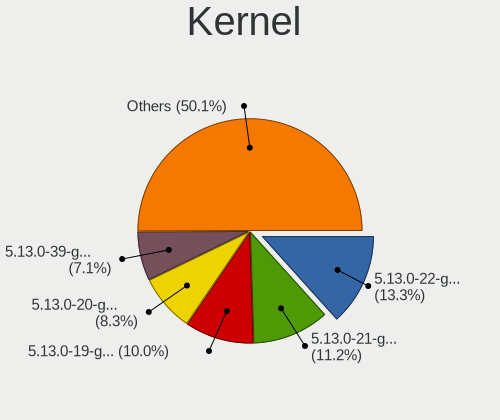
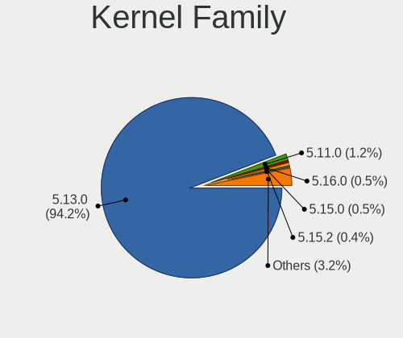
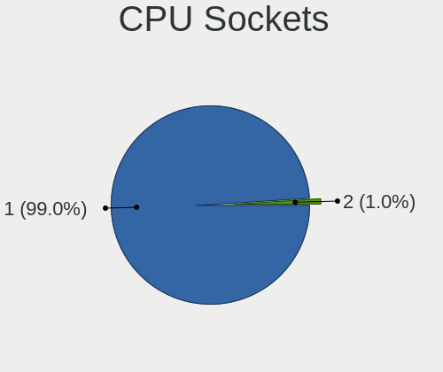
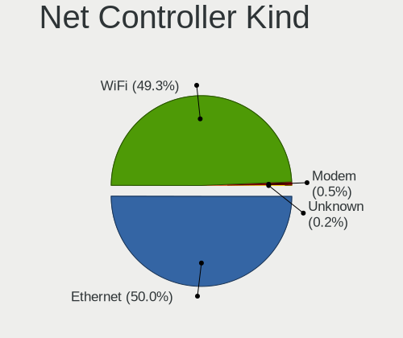
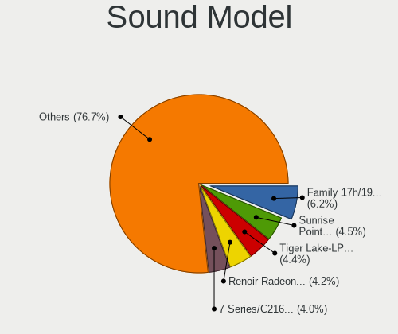
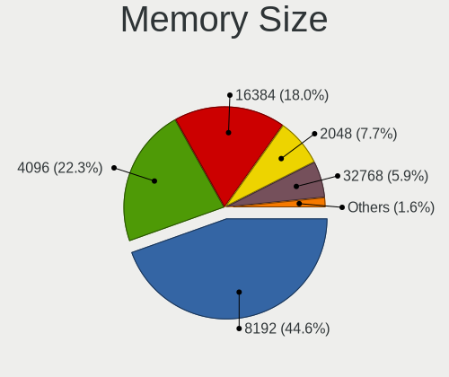
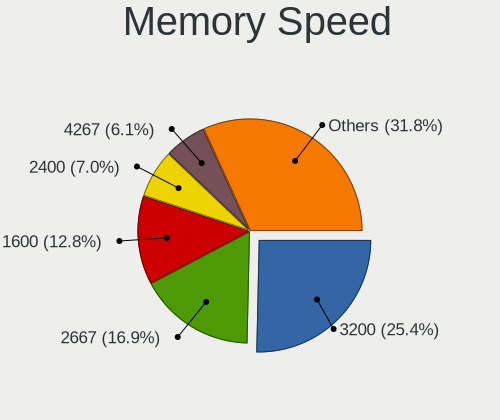
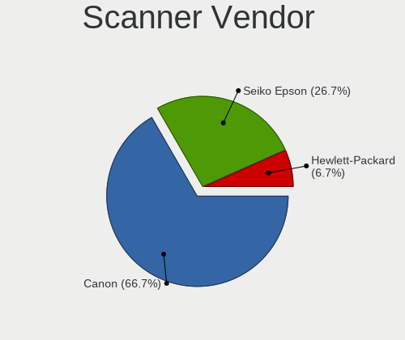
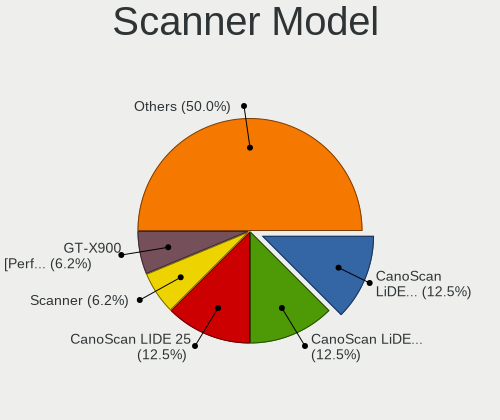

Ubuntu 21.10 - Tested Hardware & Statistics
-------------------------------------------

A project to collect tested hardware configurations for Ubuntu 21.10.

Anyone can contribute to this report by the [hw-probe](https://github.com/linuxhw/hw-probe) tool:

    sudo -E hw-probe -all -upload

Please submit a probe of your configuration if it's not presented on the page or is rare.

This is a report for all computer types. See also reports for [desktops](/Dist/Ubuntu_21.10/Desktop/README.md) and [notebooks](/Dist/Ubuntu_21.10/Notebook/README.md).

Full-feature report is available here: https://linux-hardware.org/?view=trends&rel=ubuntu-21.10

Contents
--------

* [ Test Cases ](#test-cases)

* [ System ](#system)
  - [ Kernel                   ](#kernel)
  - [ Kernel Family            ](#kernel-family)
  - [ Kernel Major Ver.        ](#kernel-major-ver)
  - [ Arch                     ](#arch)
  - [ DE                       ](#de)
  - [ Display Server           ](#display-server)
  - [ Display Manager          ](#display-manager)
  - [ OS Lang                  ](#os-lang)
  - [ Boot Mode                ](#boot-mode)
  - [ Filesystem               ](#filesystem)
  - [ Part. scheme             ](#part-scheme)
  - [ Dual Boot with Linux/BSD ](#dual-boot-with-linuxbsd)
  - [ Dual Boot (Win)          ](#dual-boot-win)

* [ Board ](#board)
  - [ Vendor                   ](#vendor)
  - [ Model                    ](#model)
  - [ Model Family             ](#model-family)
  - [ MFG Year                 ](#mfg-year)
  - [ Form Factor              ](#form-factor)
  - [ Secure Boot              ](#secure-boot)
  - [ Coreboot                 ](#coreboot)
  - [ RAM Size                 ](#ram-size)
  - [ RAM Used                 ](#ram-used)
  - [ Total Drives             ](#total-drives)
  - [ Has CD-ROM               ](#has-cd-rom)
  - [ Has Ethernet             ](#has-ethernet)
  - [ Has WiFi                 ](#has-wifi)
  - [ Has Bluetooth            ](#has-bluetooth)

* [ Location ](#location)
  - [ Country                  ](#country)
  - [ City                     ](#city)

* [ Drives ](#drives)
  - [ Drive Vendor             ](#drive-vendor)
  - [ Drive Model              ](#drive-model)
  - [ HDD Vendor               ](#hdd-vendor)
  - [ SSD Vendor               ](#ssd-vendor)
  - [ Drive Kind               ](#drive-kind)
  - [ Drive Connector          ](#drive-connector)
  - [ Drive Size               ](#drive-size)
  - [ Space Total              ](#space-total)
  - [ Space Used               ](#space-used)
  - [ Malfunc. Drives          ](#malfunc-drives)
  - [ Malfunc. Drive Vendor    ](#malfunc-drive-vendor)
  - [ Malfunc. HDD Vendor      ](#malfunc-hdd-vendor)
  - [ Malfunc. Drive Kind      ](#malfunc-drive-kind)
  - [ Failed Drives            ](#failed-drives)
  - [ Failed Drive Vendor      ](#failed-drive-vendor)
  - [ Drive Status             ](#drive-status)

* [ Storage controller ](#storage-controller)
  - [ Storage Vendor           ](#storage-vendor)
  - [ Storage Model            ](#storage-model)
  - [ Storage Kind             ](#storage-kind)

* [ Processor ](#processor)
  - [ CPU Vendor               ](#cpu-vendor)
  - [ CPU Model                ](#cpu-model)
  - [ CPU Model Family         ](#cpu-model-family)
  - [ CPU Cores                ](#cpu-cores)
  - [ CPU Sockets              ](#cpu-sockets)
  - [ CPU Threads              ](#cpu-threads)
  - [ CPU Op-Modes             ](#cpu-op-modes)
  - [ CPU Microcode            ](#cpu-microcode)
  - [ CPU Microarch            ](#cpu-microarch)

* [ Graphics ](#graphics)
  - [ GPU Vendor               ](#gpu-vendor)
  - [ GPU Model                ](#gpu-model)
  - [ GPU Combo                ](#gpu-combo)
  - [ GPU Driver               ](#gpu-driver)
  - [ GPU Memory               ](#gpu-memory)

* [ Monitor ](#monitor)
  - [ Monitor Vendor           ](#monitor-vendor)
  - [ Monitor Model            ](#monitor-model)
  - [ Monitor Resolution       ](#monitor-resolution)
  - [ Monitor Diagonal         ](#monitor-diagonal)
  - [ Monitor Width            ](#monitor-width)
  - [ Aspect Ratio             ](#aspect-ratio)
  - [ Monitor Area             ](#monitor-area)
  - [ Pixel Density            ](#pixel-density)
  - [ Multiple Monitors        ](#multiple-monitors)

* [ Network ](#network)
  - [ Net Controller Vendor    ](#net-controller-vendor)
  - [ Net Controller Model     ](#net-controller-model)
  - [ Wireless Vendor          ](#wireless-vendor)
  - [ Wireless Model           ](#wireless-model)
  - [ Ethernet Vendor          ](#ethernet-vendor)
  - [ Ethernet Model           ](#ethernet-model)
  - [ Net Controller Kind      ](#net-controller-kind)
  - [ Used Controller          ](#used-controller)
  - [ NICs                     ](#nics)
  - [ IPv6                     ](#ipv6)

* [ Bluetooth ](#bluetooth)
  - [ Bluetooth Vendor         ](#bluetooth-vendor)
  - [ Bluetooth Model          ](#bluetooth-model)

* [ Sound ](#sound)
  - [ Sound Vendor             ](#sound-vendor)
  - [ Sound Model              ](#sound-model)

* [ Memory ](#memory)
  - [ Memory Vendor            ](#memory-vendor)
  - [ Memory Model             ](#memory-model)
  - [ Memory Kind              ](#memory-kind)
  - [ Memory Form Factor       ](#memory-form-factor)
  - [ Memory Size              ](#memory-size)
  - [ Memory Speed             ](#memory-speed)

* [ Printers & scanners ](#printers--scanners)
  - [ Printer Vendor           ](#printer-vendor)
  - [ Printer Model            ](#printer-model)
  - [ Scanner Vendor           ](#scanner-vendor)
  - [ Scanner Model            ](#scanner-model)

* [ Camera ](#camera)
  - [ Camera Vendor            ](#camera-vendor)
  - [ Camera Model             ](#camera-model)

* [ Security ](#security)
  - [ Fingerprint Vendor       ](#fingerprint-vendor)
  - [ Fingerprint Model        ](#fingerprint-model)
  - [ Chipcard Vendor          ](#chipcard-vendor)
  - [ Chipcard Model           ](#chipcard-model)

* [ Unsupported ](#unsupported)
  - [ Unsupported Devices      ](#unsupported-devices)
  - [ Unsupported Device Types ](#unsupported-device-types)

Test Cases
----------

| Vendor        | Model                       | Form-Factor | Probe                                                      | Date         |
|---------------|-----------------------------|-------------|------------------------------------------------------------|--------------|
| EVGA          | 134-KS-E377                 | Desktop     | [27e29303bc](https://linux-hardware.org/?probe=27e29303bc) | Nov 01, 2021 |
| EVGA          | 111-CS-E371                 | Desktop     | [2fc377709d](https://linux-hardware.org/?probe=2fc377709d) | Nov 01, 2021 |
| Lenovo        | V14-ARE 82DQ                | Notebook    | [8948989999](https://linux-hardware.org/?probe=8948989999) | Oct 31, 2021 |
| Lenovo        | SHARKBAY SDK0E50510 WIN     | Desktop     | [068bee7912](https://linux-hardware.org/?probe=068bee7912) | Oct 31, 2021 |
| HP            | Laptop 14-bs0xx             | Notebook    | [93c1d9bd4f](https://linux-hardware.org/?probe=93c1d9bd4f) | Oct 31, 2021 |
| HP            | OMEN by Laptop              | Notebook    | [d55ac505b9](https://linux-hardware.org/?probe=d55ac505b9) | Oct 31, 2021 |
| HP            | OMEN by Laptop              | Notebook    | [65a70acf15](https://linux-hardware.org/?probe=65a70acf15) | Oct 31, 2021 |
| Dell          | Inspiron 5558               | Notebook    | [d876caae1e](https://linux-hardware.org/?probe=d876caae1e) | Oct 31, 2021 |
| Gigabyte      | G1.Assassin                 | Desktop     | [40c84c9637](https://linux-hardware.org/?probe=40c84c9637) | Oct 31, 2021 |
| Apple         | MacBookPro11,1              | Notebook    | [0c24caf245](https://linux-hardware.org/?probe=0c24caf245) | Oct 31, 2021 |
| HP            | Pavilion Notebook           | Notebook    | [9c8bb9558a](https://linux-hardware.org/?probe=9c8bb9558a) | Oct 31, 2021 |
| HP            | Pavilion Laptop 15-cs300    | Notebook    | [bcc27223cc](https://linux-hardware.org/?probe=bcc27223cc) | Oct 31, 2021 |
| MSI           | MPG Z490 GAMING EDGE WIF... | Desktop     | [5b55e39c35](https://linux-hardware.org/?probe=5b55e39c35) | Oct 31, 2021 |
| HP            | Laptop 14-bs0xx             | Notebook    | [ebc6fe2060](https://linux-hardware.org/?probe=ebc6fe2060) | Oct 31, 2021 |
| Dell          | XPS 15 7590                 | Notebook    | [58e43f0514](https://linux-hardware.org/?probe=58e43f0514) | Oct 31, 2021 |
| Acer          | Swift SF314-43              | Notebook    | [be8229729b](https://linux-hardware.org/?probe=be8229729b) | Oct 31, 2021 |
| ASUSTek       | M2N-E                       | Desktop     | [dfa80f4b9f](https://linux-hardware.org/?probe=dfa80f4b9f) | Oct 31, 2021 |
| HP            | 1587h                       | Desktop     | [0d99c162a3](https://linux-hardware.org/?probe=0d99c162a3) | Oct 31, 2021 |
| HP            | Pavilion dv6                | Notebook    | [2e9d378e76](https://linux-hardware.org/?probe=2e9d378e76) | Oct 31, 2021 |
| HP            | 1587h                       | Desktop     | [2aeea457fd](https://linux-hardware.org/?probe=2aeea457fd) | Oct 31, 2021 |
| Lenovo        | ThinkCentre M70e 0833A29    | Desktop     | [46ebbae78b](https://linux-hardware.org/?probe=46ebbae78b) | Oct 31, 2021 |
| Lenovo        | ThinkCentre M70e 0833A29    | Desktop     | [e13dd10e78](https://linux-hardware.org/?probe=e13dd10e78) | Oct 31, 2021 |
| Lenovo        | ThinkPad Edge 0578A21       | Notebook    | [570863fd8c](https://linux-hardware.org/?probe=570863fd8c) | Oct 31, 2021 |
| Acer          | Swift SF314-43              | Notebook    | [4881a9a93c](https://linux-hardware.org/?probe=4881a9a93c) | Oct 31, 2021 |
| Lenovo        | ThinkPad T410 2537GH6       | Notebook    | [8b21b7cffe](https://linux-hardware.org/?probe=8b21b7cffe) | Oct 31, 2021 |
| Lenovo        | ThinkPad T14s Gen 2i 20W... | Notebook    | [ba228b1ed7](https://linux-hardware.org/?probe=ba228b1ed7) | Oct 31, 2021 |
| Lenovo        | ThinkPad T14 Gen 1 20S0C... | Notebook    | [f7309ef31a](https://linux-hardware.org/?probe=f7309ef31a) | Oct 30, 2021 |
| Gigabyte      | G31M-ES2L                   | Desktop     | [23b6458508](https://linux-hardware.org/?probe=23b6458508) | Oct 30, 2021 |
| MSI           | GT75VR 7RF                  | Notebook    | [edd545a455](https://linux-hardware.org/?probe=edd545a455) | Oct 30, 2021 |
| ASUSTek       | N751JK                      | Notebook    | [739623468a](https://linux-hardware.org/?probe=739623468a) | Oct 30, 2021 |
| ASUSTek       | PRIME H310T R2.0            | Desktop     | [9f69e439bc](https://linux-hardware.org/?probe=9f69e439bc) | Oct 30, 2021 |
| Fujitsu       | D3633-S1 S26361-D3633-S1    | Desktop     | [0184e22e18](https://linux-hardware.org/?probe=0184e22e18) | Oct 30, 2021 |
| ASRock        | 960GM/U3S3 FX               | Desktop     | [7a2ec5ecff](https://linux-hardware.org/?probe=7a2ec5ecff) | Oct 30, 2021 |
| ASUSTek       | P8H61-M LX R2.0             | Desktop     | [4f64db367f](https://linux-hardware.org/?probe=4f64db367f) | Oct 30, 2021 |
| Lenovo        | IdeaPad Gaming 3 15IHU6 ... | Notebook    | [47907aec3e](https://linux-hardware.org/?probe=47907aec3e) | Oct 30, 2021 |
| Lenovo        | IdeaPad 5 15IIL05 81YK      | Notebook    | [0c865ddf24](https://linux-hardware.org/?probe=0c865ddf24) | Oct 30, 2021 |
| Dell          | Latitude E5570              | Notebook    | [d926705b17](https://linux-hardware.org/?probe=d926705b17) | Oct 30, 2021 |
| Dell          | Latitude E5570              | Notebook    | [b8515cfe6b](https://linux-hardware.org/?probe=b8515cfe6b) | Oct 30, 2021 |
| HP            | 0AA8h                       | Desktop     | [40da7a8ae9](https://linux-hardware.org/?probe=40da7a8ae9) | Oct 30, 2021 |
| Dell          | Latitude 5490               | Notebook    | [4efdbaeea5](https://linux-hardware.org/?probe=4efdbaeea5) | Oct 30, 2021 |
| Acer          | Swift SF314-511             | Notebook    | [43faa95812](https://linux-hardware.org/?probe=43faa95812) | Oct 30, 2021 |
| Dell          | 0N826N A03                  | Desktop     | [ffb75356ef](https://linux-hardware.org/?probe=ffb75356ef) | Oct 30, 2021 |
| MSI           | 3664h                       | Desktop     | [7d44291de8](https://linux-hardware.org/?probe=7d44291de8) | Oct 30, 2021 |
| Multilaser    | PC112                       | Convertible | [aa88177e76](https://linux-hardware.org/?probe=aa88177e76) | Oct 30, 2021 |
| Dell          | XPS 17 9700                 | Notebook    | [5e25d50915](https://linux-hardware.org/?probe=5e25d50915) | Oct 30, 2021 |
| Raspberry ... | Raspberry Pi                | Soc         | [cb0d8d901a](https://linux-hardware.org/?probe=cb0d8d901a) | Oct 29, 2021 |
| ASUSTek       | TUF Gaming FA506IU_FA506... | Notebook    | [3802a77d98](https://linux-hardware.org/?probe=3802a77d98) | Oct 29, 2021 |
| MSI           | B450M MORTAR MAX            | Desktop     | [cadb142111](https://linux-hardware.org/?probe=cadb142111) | Oct 29, 2021 |
| HP            | 2B21 A01                    | All in one  | [f8a7076d83](https://linux-hardware.org/?probe=f8a7076d83) | Oct 29, 2021 |
| Dell          | Inspiron 15-3573            | Notebook    | [141148ec26](https://linux-hardware.org/?probe=141148ec26) | Oct 29, 2021 |
| HP            | Laptop 17z-ca300            | Notebook    | [0071faabac](https://linux-hardware.org/?probe=0071faabac) | Oct 29, 2021 |
| Lenovo        | ThinkPad X1 Carbon 6th 2... | Notebook    | [2b4a1a20d9](https://linux-hardware.org/?probe=2b4a1a20d9) | Oct 29, 2021 |
| Lenovo        | V580c 20160                 | Notebook    | [779684e41d](https://linux-hardware.org/?probe=779684e41d) | Oct 29, 2021 |
| Medion        | Akoya E6240T                | Notebook    | [1a0a5790b3](https://linux-hardware.org/?probe=1a0a5790b3) | Oct 29, 2021 |
| MSI           | B150M BAZOOKA               | Desktop     | [b396e1c4f4](https://linux-hardware.org/?probe=b396e1c4f4) | Oct 29, 2021 |
| HP            | 2B21 A01                    | All in one  | [da1e3a2120](https://linux-hardware.org/?probe=da1e3a2120) | Oct 29, 2021 |
| Dell          | Inspiron 7506 2n1           | Convertible | [224ce9a44d](https://linux-hardware.org/?probe=224ce9a44d) | Oct 29, 2021 |
| ASUSTek       | M5A97 R2.0                  | Desktop     | [2ce7e668c7](https://linux-hardware.org/?probe=2ce7e668c7) | Oct 29, 2021 |
| Dell          | 0N826N A03                  | Desktop     | [db2a7eba35](https://linux-hardware.org/?probe=db2a7eba35) | Oct 29, 2021 |
| Acer          | Aspire F5-573G              | Notebook    | [9b5832381a](https://linux-hardware.org/?probe=9b5832381a) | Oct 29, 2021 |
| HP            | 0AECh D                     | Desktop     | [665bae2867](https://linux-hardware.org/?probe=665bae2867) | Oct 29, 2021 |
| MSI           | GE62 7RD                    | Notebook    | [95616813e6](https://linux-hardware.org/?probe=95616813e6) | Oct 29, 2021 |
| MSI           | GE62 6QF                    | Notebook    | [1c48df3fa2](https://linux-hardware.org/?probe=1c48df3fa2) | Oct 29, 2021 |
| Dell          | 0C3YXR A00                  | Desktop     | [3fbbe71d21](https://linux-hardware.org/?probe=3fbbe71d21) | Oct 28, 2021 |
| ASUSTek       | ROG CROSSHAIR VIII DARK ... | Desktop     | [89c1a7f472](https://linux-hardware.org/?probe=89c1a7f472) | Oct 28, 2021 |
| realme        | RMNBXXXX                    | Notebook    | [70b65bbcf8](https://linux-hardware.org/?probe=70b65bbcf8) | Oct 28, 2021 |
| Lenovo        | ThinkPad P1 Gen 4i 20Y4S... | Notebook    | [75c43f02bf](https://linux-hardware.org/?probe=75c43f02bf) | Oct 28, 2021 |
| Toshiba       | Satellite C75-B             | Notebook    | [fe77011ed7](https://linux-hardware.org/?probe=fe77011ed7) | Oct 28, 2021 |
| Lenovo        | 3111 SDK0J40697 WIN 3305... | Mini pc     | [a89ecd0b5f](https://linux-hardware.org/?probe=a89ecd0b5f) | Oct 28, 2021 |
| Dell          | 0773VG A00                  | Desktop     | [f17f22efdc](https://linux-hardware.org/?probe=f17f22efdc) | Oct 28, 2021 |
| ASUSTek       | CM6870                      | Desktop     | [1575e2c682](https://linux-hardware.org/?probe=1575e2c682) | Oct 28, 2021 |
| MSI           | A88X-G43                    | Desktop     | [1c7a02bd63](https://linux-hardware.org/?probe=1c7a02bd63) | Oct 28, 2021 |
| Sony          | SVS1312G3EW                 | Notebook    | [7951439c81](https://linux-hardware.org/?probe=7951439c81) | Oct 28, 2021 |
| Lenovo        | IdeaPad 3 15ALC6 82KU       | Notebook    | [9276790a36](https://linux-hardware.org/?probe=9276790a36) | Oct 28, 2021 |
| HP            | ENVY dv6                    | Notebook    | [31ff7dd229](https://linux-hardware.org/?probe=31ff7dd229) | Oct 28, 2021 |
| HP            | ZBook Power G7 Mobile Wo... | Notebook    | [e0d6eafd15](https://linux-hardware.org/?probe=e0d6eafd15) | Oct 28, 2021 |
| ASUSTek       | PRIME B450M-GAMING/BR       | Desktop     | [d10e4364a0](https://linux-hardware.org/?probe=d10e4364a0) | Oct 27, 2021 |
| Lenovo        | ThinkPad L590 20Q8S1FX00    | Notebook    | [7555bbd3c1](https://linux-hardware.org/?probe=7555bbd3c1) | Oct 27, 2021 |
| ASUSTek       | P8H61-M LX R2.0             | Desktop     | [28ddff13b5](https://linux-hardware.org/?probe=28ddff13b5) | Oct 27, 2021 |
| Foxconn       | 2ABF                        | Desktop     | [380d5ab9f0](https://linux-hardware.org/?probe=380d5ab9f0) | Oct 27, 2021 |
| ASUSTek       | ZenBook UX433FN_UX433FN     | Notebook    | [3377403e20](https://linux-hardware.org/?probe=3377403e20) | Oct 27, 2021 |
| Dell          | Inspiron 15 7000 Gaming     | Notebook    | [1b93e3c1c9](https://linux-hardware.org/?probe=1b93e3c1c9) | Oct 27, 2021 |
| Dell          | 05CNYF A01                  | Desktop     | [95530db3a8](https://linux-hardware.org/?probe=95530db3a8) | Oct 27, 2021 |
| Lenovo        | IdeaPad Flex-14API 81SS     | Notebook    | [3f7c00c1ef](https://linux-hardware.org/?probe=3f7c00c1ef) | Oct 27, 2021 |
| Dell          | Latitude 5420               | Notebook    | [6eef53ac22](https://linux-hardware.org/?probe=6eef53ac22) | Oct 27, 2021 |
| Fujitsu Si... | ESPRIMO Mobile M9410        | Notebook    | [2cec9ef3cc](https://linux-hardware.org/?probe=2cec9ef3cc) | Oct 27, 2021 |
| Dell          | Latitude 5420               | Notebook    | [6d4e346031](https://linux-hardware.org/?probe=6d4e346031) | Oct 27, 2021 |
| Dell          | Latitude 5521               | Notebook    | [e40947106a](https://linux-hardware.org/?probe=e40947106a) | Oct 27, 2021 |
| Dell          | Latitude 5521               | Notebook    | [7fed676309](https://linux-hardware.org/?probe=7fed676309) | Oct 27, 2021 |
| Foxconn       | 45CMX/45GMX/45CMX-K         | Desktop     | [0e8d69e9b8](https://linux-hardware.org/?probe=0e8d69e9b8) | Oct 27, 2021 |
| Acer          | Aspire X3450                | Desktop     | [8f27aff70b](https://linux-hardware.org/?probe=8f27aff70b) | Oct 27, 2021 |
| Toshiba       | PORTEGE R830                | Notebook    | [6378d53c40](https://linux-hardware.org/?probe=6378d53c40) | Oct 27, 2021 |
| Apple         | MacBook2,1                  | Notebook    | [0346bc764a](https://linux-hardware.org/?probe=0346bc764a) | Oct 27, 2021 |
| Dell          | Inspiron 3595               | Notebook    | [1df662506b](https://linux-hardware.org/?probe=1df662506b) | Oct 27, 2021 |
| Acer          | Aspire A315-21              | Notebook    | [e179a0974d](https://linux-hardware.org/?probe=e179a0974d) | Oct 27, 2021 |
| Gigabyte      | GA-970A-UD3                 | Desktop     | [aae0c56d3a](https://linux-hardware.org/?probe=aae0c56d3a) | Oct 27, 2021 |
| Dell          | Inspiron 5558               | Notebook    | [e22971aa36](https://linux-hardware.org/?probe=e22971aa36) | Oct 27, 2021 |
| MSI           | H61M-P31                    | Desktop     | [e5bf692305](https://linux-hardware.org/?probe=e5bf692305) | Oct 26, 2021 |
| ASRock        | X570 Phantom Gaming-ITX/... | Desktop     | [16a6718949](https://linux-hardware.org/?probe=16a6718949) | Oct 26, 2021 |
| MSI           | Z270 PC MATE                | Desktop     | [24329438d1](https://linux-hardware.org/?probe=24329438d1) | Oct 26, 2021 |
| Unknown       | Unknown                     | Desktop     | [668f61352d](https://linux-hardware.org/?probe=668f61352d) | Oct 26, 2021 |
| Dell          | XPS 15 9570                 | Notebook    | [0fa8c3ed0c](https://linux-hardware.org/?probe=0fa8c3ed0c) | Oct 26, 2021 |
| Acer          | Swift SF314-43              | Notebook    | [4c750c8b99](https://linux-hardware.org/?probe=4c750c8b99) | Oct 26, 2021 |
| Direkt-Tek    | DTLAPY133-1                 | Notebook    | [63facc4838](https://linux-hardware.org/?probe=63facc4838) | Oct 26, 2021 |
| HP            | Spectre x360 Convertible... | Convertible | [444e13b5ed](https://linux-hardware.org/?probe=444e13b5ed) | Oct 26, 2021 |
| Raspberry ... | Raspberry Pi                | Soc         | [fa1d6c3208](https://linux-hardware.org/?probe=fa1d6c3208) | Oct 26, 2021 |
| Direkt-Tek    | DTLAPY133-1                 | Notebook    | [a2d784b2ea](https://linux-hardware.org/?probe=a2d784b2ea) | Oct 26, 2021 |
| Raspberry ... | Raspberry Pi                | Soc         | [93d0c74de7](https://linux-hardware.org/?probe=93d0c74de7) | Oct 26, 2021 |
| Packard Be... | EasyNote TS11HR             | Notebook    | [1217a94f61](https://linux-hardware.org/?probe=1217a94f61) | Oct 26, 2021 |
| ASRock        | Z590M-ITX/ax                | Desktop     | [1fcc4e6895](https://linux-hardware.org/?probe=1fcc4e6895) | Oct 26, 2021 |
| MSI           | MAG Z490 TOMAHAWK           | Desktop     | [f5ede0a97c](https://linux-hardware.org/?probe=f5ede0a97c) | Oct 25, 2021 |
| ASUSTek       | PRIME B350M-A               | Desktop     | [19eba77c24](https://linux-hardware.org/?probe=19eba77c24) | Oct 25, 2021 |
| Acer          | Aspire ES1-523              | Notebook    | [59ab566702](https://linux-hardware.org/?probe=59ab566702) | Oct 25, 2021 |
| Acer          | Aspire ES1-523              | Notebook    | [d215eb8353](https://linux-hardware.org/?probe=d215eb8353) | Oct 25, 2021 |
| HP            | Laptop 15-da0xxx            | Notebook    | [f0a8fa5e7a](https://linux-hardware.org/?probe=f0a8fa5e7a) | Oct 25, 2021 |
| Dell          | Inspiron 7506 2n1           | Convertible | [389d1ab5db](https://linux-hardware.org/?probe=389d1ab5db) | Oct 25, 2021 |
| Dell          | Inspiron 7506 2n1           | Convertible | [a24fef894b](https://linux-hardware.org/?probe=a24fef894b) | Oct 25, 2021 |
| Acer          | Swift SF314-56G             | Notebook    | [55a32ef8dc](https://linux-hardware.org/?probe=55a32ef8dc) | Oct 25, 2021 |
| Raspberry ... | Raspberry Pi                | Soc         | [f8dc8086fb](https://linux-hardware.org/?probe=f8dc8086fb) | Oct 25, 2021 |
| MSI           | B450 TOMAHAWK MAX           | Desktop     | [97620628a8](https://linux-hardware.org/?probe=97620628a8) | Oct 25, 2021 |
| MSI           | B450 TOMAHAWK MAX           | Desktop     | [f15c4d9b54](https://linux-hardware.org/?probe=f15c4d9b54) | Oct 25, 2021 |
| Apple         | Mac-42FD25EABCABB274 iMa... | All in one  | [f4adb105a4](https://linux-hardware.org/?probe=f4adb105a4) | Oct 24, 2021 |
| Apple         | Mac-42FD25EABCABB274 iMa... | All in one  | [ffaa20bb1b](https://linux-hardware.org/?probe=ffaa20bb1b) | Oct 24, 2021 |
| Acer          | Aspire VX5-591G             | Notebook    | [6ad3cf44dc](https://linux-hardware.org/?probe=6ad3cf44dc) | Oct 24, 2021 |
| Gigabyte      | P67A-UD3                    | Desktop     | [ecaeb257a3](https://linux-hardware.org/?probe=ecaeb257a3) | Oct 24, 2021 |
| HP            | Pavilion dv6                | Notebook    | [bf8422ec46](https://linux-hardware.org/?probe=bf8422ec46) | Oct 24, 2021 |
| Dell          | 0V8F20 A01                  | Desktop     | [8e371fe4cb](https://linux-hardware.org/?probe=8e371fe4cb) | Oct 24, 2021 |
| Samsung       | 530U3C/530U4C               | Notebook    | [07df07de7d](https://linux-hardware.org/?probe=07df07de7d) | Oct 24, 2021 |
| Dell          | 0J3C2F A01                  | Desktop     | [e8cf16b696](https://linux-hardware.org/?probe=e8cf16b696) | Oct 24, 2021 |
| AMI           | Cherry Trail CR             | Desktop     | [9333e233d6](https://linux-hardware.org/?probe=9333e233d6) | Oct 24, 2021 |
| AMI           | Cherry Trail CR             | Desktop     | [7d78a3c31f](https://linux-hardware.org/?probe=7d78a3c31f) | Oct 24, 2021 |
| Acer          | Aspire ES1-512              | Notebook    | [aa7dd43b73](https://linux-hardware.org/?probe=aa7dd43b73) | Oct 24, 2021 |
| Acer          | Swift SF314-57              | Notebook    | [b416f8b251](https://linux-hardware.org/?probe=b416f8b251) | Oct 24, 2021 |
| Acer          | Swift SF314-57              | Notebook    | [5cfaf3df18](https://linux-hardware.org/?probe=5cfaf3df18) | Oct 24, 2021 |
| HP            | Laptop 15s-eq2xxx           | Notebook    | [1e9f6f2d44](https://linux-hardware.org/?probe=1e9f6f2d44) | Oct 24, 2021 |
| ASUSTek       | H110M-C                     | Desktop     | [ba3ddf870d](https://linux-hardware.org/?probe=ba3ddf870d) | Oct 24, 2021 |
| HP            | ProBook 440 G5              | Notebook    | [508961bc42](https://linux-hardware.org/?probe=508961bc42) | Oct 24, 2021 |
| Acer          | Swift SF314-43              | Notebook    | [5de95b5df3](https://linux-hardware.org/?probe=5de95b5df3) | Oct 23, 2021 |
| ASUSTek       | PRIME Z390-P                | Desktop     | [681b537e82](https://linux-hardware.org/?probe=681b537e82) | Oct 23, 2021 |
| HP            | ProBook 440 G5              | Notebook    | [db61c07848](https://linux-hardware.org/?probe=db61c07848) | Oct 23, 2021 |
| Lenovo        | NO DPK                      | Desktop     | [9c71a67df3](https://linux-hardware.org/?probe=9c71a67df3) | Oct 23, 2021 |
| Acer          | Swift SF314-43              | Notebook    | [8d0af565c3](https://linux-hardware.org/?probe=8d0af565c3) | Oct 23, 2021 |
| Acer          | Aspire TC-281               | Desktop     | [5114976821](https://linux-hardware.org/?probe=5114976821) | Oct 23, 2021 |
| ASRock        | N3150DC-ITX                 | Desktop     | [6e3084cf7f](https://linux-hardware.org/?probe=6e3084cf7f) | Oct 23, 2021 |
| ASRock        | N3150DC-ITX                 | Desktop     | [c1808f5d2f](https://linux-hardware.org/?probe=c1808f5d2f) | Oct 23, 2021 |
| Dell          | 0T10XW A00                  | Desktop     | [971b85f5db](https://linux-hardware.org/?probe=971b85f5db) | Oct 23, 2021 |
| Fujitsu       | LIFEBOOK U772               | Notebook    | [7fab4f85e2](https://linux-hardware.org/?probe=7fab4f85e2) | Oct 23, 2021 |
| ASUSTek       | PRIME X470-PRO              | Desktop     | [48db1afdd3](https://linux-hardware.org/?probe=48db1afdd3) | Oct 23, 2021 |
| HUAWEI        | MACH-WX9                    | Notebook    | [68c01947c9](https://linux-hardware.org/?probe=68c01947c9) | Oct 23, 2021 |
| Dell          | Inspiron 7506 2n1           | Convertible | [3f1b7d7322](https://linux-hardware.org/?probe=3f1b7d7322) | Oct 23, 2021 |
| Supermicro    | X7DVL                       | Desktop     | [bcbe094156](https://linux-hardware.org/?probe=bcbe094156) | Oct 23, 2021 |
| Dell          | 051FJ8 A02                  | Desktop     | [d04dae2a56](https://linux-hardware.org/?probe=d04dae2a56) | Oct 23, 2021 |
| Dell          | Inspiron 5558               | Notebook    | [bb40091a40](https://linux-hardware.org/?probe=bb40091a40) | Oct 23, 2021 |
| MSI           | MEG X570 UNIFY              | Desktop     | [7b9e7ec5f4](https://linux-hardware.org/?probe=7b9e7ec5f4) | Oct 23, 2021 |
| Acer          | Swift SF114-32              | Notebook    | [87697aa300](https://linux-hardware.org/?probe=87697aa300) | Oct 23, 2021 |
| Dell          | Latitude E7470              | Notebook    | [69a251cc1f](https://linux-hardware.org/?probe=69a251cc1f) | Oct 22, 2021 |
| ASUSTek       | TUF GAMING X570-PLUS        | Desktop     | [e071387ed6](https://linux-hardware.org/?probe=e071387ed6) | Oct 22, 2021 |
| Lenovo        | NO DPK                      | Desktop     | [ad7c805198](https://linux-hardware.org/?probe=ad7c805198) | Oct 22, 2021 |
| Dell          | Inspiron 15 5501            | Notebook    | [d252623e18](https://linux-hardware.org/?probe=d252623e18) | Oct 22, 2021 |
| Dell          | 0J3C2F A01                  | Desktop     | [a5ca7f2501](https://linux-hardware.org/?probe=a5ca7f2501) | Oct 22, 2021 |
| Acer          | Swift SF314-43              | Notebook    | [8275d5fa0b](https://linux-hardware.org/?probe=8275d5fa0b) | Oct 22, 2021 |
| HP            | ProBook 450 G5              | Notebook    | [5909be5c82](https://linux-hardware.org/?probe=5909be5c82) | Oct 22, 2021 |
| Sony          | VGN-FW550F                  | Notebook    | [c2b95c9dfa](https://linux-hardware.org/?probe=c2b95c9dfa) | Oct 22, 2021 |
| Clevo         | M740TU(N)/M760TU(N)/W7X0... | Notebook    | [85ccf0afc5](https://linux-hardware.org/?probe=85ccf0afc5) | Oct 22, 2021 |
| Gigabyte      | B550 AORUS PRO              | Desktop     | [f5c3648170](https://linux-hardware.org/?probe=f5c3648170) | Oct 22, 2021 |
| Gigabyte      | B75M-D3H                    | Desktop     | [74c2c9d725](https://linux-hardware.org/?probe=74c2c9d725) | Oct 22, 2021 |
| Dell          | 0N826N A03                  | Desktop     | [5fea6b8b9a](https://linux-hardware.org/?probe=5fea6b8b9a) | Oct 22, 2021 |
| Dell          | 0N826N A03                  | Desktop     | [eb508ab31e](https://linux-hardware.org/?probe=eb508ab31e) | Oct 22, 2021 |
| HP            | Pavilion g4                 | Notebook    | [3b86797a83](https://linux-hardware.org/?probe=3b86797a83) | Oct 22, 2021 |
| Schenker      | XMG FUSION 15 (XFU15L19)    | Notebook    | [b198944ad7](https://linux-hardware.org/?probe=b198944ad7) | Oct 22, 2021 |
| Dell          | Inspiron 5558               | Notebook    | [6ada321924](https://linux-hardware.org/?probe=6ada321924) | Oct 22, 2021 |
| MSI           | GF63 Thin 9RCX              | Notebook    | [c4768bba2d](https://linux-hardware.org/?probe=c4768bba2d) | Oct 22, 2021 |
| Lenovo        | ThinkPad T430s 23561R0      | Notebook    | [bef1593d06](https://linux-hardware.org/?probe=bef1593d06) | Oct 22, 2021 |
| Toshiba       | PORTEGE R830                | Notebook    | [5d6b560499](https://linux-hardware.org/?probe=5d6b560499) | Oct 22, 2021 |
| Raspberry ... | Raspberry Pi                | Soc         | [966d510281](https://linux-hardware.org/?probe=966d510281) | Oct 21, 2021 |
| MSI           | GF63 Thin 9RCX              | Notebook    | [aa2a33d3f0](https://linux-hardware.org/?probe=aa2a33d3f0) | Oct 21, 2021 |
| ICP / iEi     | SA58 V1.01                  | Desktop     | [bca4498e5d](https://linux-hardware.org/?probe=bca4498e5d) | Oct 21, 2021 |
| Dell          | 0200DY A01                  | Desktop     | [c67a8bb677](https://linux-hardware.org/?probe=c67a8bb677) | Oct 21, 2021 |
| Gigabyte      | B450M S2H                   | Desktop     | [71c19b42fc](https://linux-hardware.org/?probe=71c19b42fc) | Oct 21, 2021 |
| Lenovo        | ThinkPad T15g Gen 1 20UR... | Notebook    | [55de21b8b0](https://linux-hardware.org/?probe=55de21b8b0) | Oct 21, 2021 |
| Lenovo        | ThinkPad E15 Gen 2 20TD0... | Notebook    | [1b5cd08b30](https://linux-hardware.org/?probe=1b5cd08b30) | Oct 21, 2021 |
| Apple         | MacBookPro12,1              | Notebook    | [271e56e195](https://linux-hardware.org/?probe=271e56e195) | Oct 21, 2021 |
| Apple         | MacBookPro12,1              | Notebook    | [3735576026](https://linux-hardware.org/?probe=3735576026) | Oct 21, 2021 |
| realme        | RMNBXXXX                    | Notebook    | [daa57fd7da](https://linux-hardware.org/?probe=daa57fd7da) | Oct 21, 2021 |
| Lenovo        | ThinkPad S1 Yoga 20C0004... | Notebook    | [9facbd3d72](https://linux-hardware.org/?probe=9facbd3d72) | Oct 21, 2021 |
| Lenovo        | ThinkPad X1 Carbon 3rd 2... | Notebook    | [463b15301d](https://linux-hardware.org/?probe=463b15301d) | Oct 21, 2021 |
| Google        | Guado                       | Desktop     | [5aba3d29f4](https://linux-hardware.org/?probe=5aba3d29f4) | Oct 21, 2021 |
| Google        | Guado                       | Desktop     | [2393c52b33](https://linux-hardware.org/?probe=2393c52b33) | Oct 21, 2021 |
| HP            | 15                          | Notebook    | [b01898bb59](https://linux-hardware.org/?probe=b01898bb59) | Oct 21, 2021 |
| MSI           | B450M PRO-VDH MAX           | Desktop     | [b914028ca9](https://linux-hardware.org/?probe=b914028ca9) | Oct 20, 2021 |
| MSI           | GP72 2QD                    | Notebook    | [75801b27ae](https://linux-hardware.org/?probe=75801b27ae) | Oct 20, 2021 |
| MSI           | GP72 2QD                    | Notebook    | [bd12b3e948](https://linux-hardware.org/?probe=bd12b3e948) | Oct 20, 2021 |
| ASRock        | TRX40 Creator               | Desktop     | [8789f3f1e1](https://linux-hardware.org/?probe=8789f3f1e1) | Oct 20, 2021 |
| HP            | 650                         | Notebook    | [c32592cabb](https://linux-hardware.org/?probe=c32592cabb) | Oct 20, 2021 |
| HP            | ProBook 450 G7              | Notebook    | [c86d75dbbb](https://linux-hardware.org/?probe=c86d75dbbb) | Oct 20, 2021 |
| Medion        | E6226                       | Notebook    | [ebc0f3d72b](https://linux-hardware.org/?probe=ebc0f3d72b) | Oct 20, 2021 |
| Acer          | Nitro AN515-43              | Notebook    | [ac5870ab3d](https://linux-hardware.org/?probe=ac5870ab3d) | Oct 20, 2021 |
| ASUSTek       | P5KPL-AM SE                 | Desktop     | [1d5227420f](https://linux-hardware.org/?probe=1d5227420f) | Oct 20, 2021 |
| ASUSTek       | ROG Zephyrus G14 GA401QC... | Notebook    | [14d159c564](https://linux-hardware.org/?probe=14d159c564) | Oct 20, 2021 |
| Raspberry ... | Raspberry Pi                | Soc         | [ae8b1a239b](https://linux-hardware.org/?probe=ae8b1a239b) | Oct 20, 2021 |
| MSI           | MS-B0961                    | All in one  | [42eef87dd5](https://linux-hardware.org/?probe=42eef87dd5) | Oct 20, 2021 |
| Acer          | Aspire TC-885 V:1.1         | Desktop     | [b961168b44](https://linux-hardware.org/?probe=b961168b44) | Oct 20, 2021 |
| ASUSTek       | Q87M-E                      | Desktop     | [a549c95cbd](https://linux-hardware.org/?probe=a549c95cbd) | Oct 20, 2021 |
| HUAWEI        | KLVL-WXX9                   | Notebook    | [4517a98ebf](https://linux-hardware.org/?probe=4517a98ebf) | Oct 20, 2021 |
| MSI           | 2A9C                        | Desktop     | [a47442aa1f](https://linux-hardware.org/?probe=a47442aa1f) | Oct 19, 2021 |
| Apple         | MacBookPro9,2               | Notebook    | [0ec3c548af](https://linux-hardware.org/?probe=0ec3c548af) | Oct 19, 2021 |
| Lenovo        | ThinkPad T590 20N5S4Y100    | Notebook    | [f00be1a69f](https://linux-hardware.org/?probe=f00be1a69f) | Oct 19, 2021 |
| Dell          | Latitude 5400               | Notebook    | [8a880e6565](https://linux-hardware.org/?probe=8a880e6565) | Oct 19, 2021 |
| Dell          | Latitude 5400               | Notebook    | [0a94130eb2](https://linux-hardware.org/?probe=0a94130eb2) | Oct 19, 2021 |
| Lenovo        | ThinkPad T500 22437SG       | Notebook    | [0e26427d3d](https://linux-hardware.org/?probe=0e26427d3d) | Oct 19, 2021 |
| Lenovo        | ThinkPad E15 Gen 2 20T80... | Notebook    | [8e04250418](https://linux-hardware.org/?probe=8e04250418) | Oct 19, 2021 |
| Lenovo        | G505 20240                  | Notebook    | [a878fe1079](https://linux-hardware.org/?probe=a878fe1079) | Oct 19, 2021 |
| Lenovo        | G505 20240                  | Notebook    | [4c254474e3](https://linux-hardware.org/?probe=4c254474e3) | Oct 19, 2021 |
| HUAWEI        | MACHD-WXX9                  | Notebook    | [8563f3786e](https://linux-hardware.org/?probe=8563f3786e) | Oct 19, 2021 |
| Raspberry ... | Raspberry Pi                | Soc         | [1adc5682c3](https://linux-hardware.org/?probe=1adc5682c3) | Oct 19, 2021 |
| Lenovo        | Yoga 7 14ITL5 82BH          | Convertible | [ea272342bf](https://linux-hardware.org/?probe=ea272342bf) | Oct 19, 2021 |
| Gigabyte      | H61M-S1                     | Desktop     | [9978664bd7](https://linux-hardware.org/?probe=9978664bd7) | Oct 19, 2021 |
| Gigabyte      | H61M-S1                     | Desktop     | [b0fb0061f2](https://linux-hardware.org/?probe=b0fb0061f2) | Oct 19, 2021 |
| Lenovo        | ThinkPad X1 Carbon Gen 9... | Notebook    | [a16f7dac18](https://linux-hardware.org/?probe=a16f7dac18) | Oct 18, 2021 |
| ASUSTek       | P7P55 LX                    | Desktop     | [d2e3eb969f](https://linux-hardware.org/?probe=d2e3eb969f) | Oct 18, 2021 |
| ASRock        | B450 Gaming K4              | Desktop     | [92647c0170](https://linux-hardware.org/?probe=92647c0170) | Oct 18, 2021 |
| ASRock        | B450 Gaming K4              | Desktop     | [c7372168fd](https://linux-hardware.org/?probe=c7372168fd) | Oct 18, 2021 |
| ASRock        | Z87 Extreme4                | Desktop     | [2ec87a3f6f](https://linux-hardware.org/?probe=2ec87a3f6f) | Oct 18, 2021 |
| Lenovo        | ThinkPad W530 244759G       | Notebook    | [e80bbd929f](https://linux-hardware.org/?probe=e80bbd929f) | Oct 18, 2021 |
| Lenovo        | SHARKBAY SDK0E50512 STD     | Desktop     | [20ca9b4679](https://linux-hardware.org/?probe=20ca9b4679) | Oct 18, 2021 |
| congatec      | conga-MA5 B.2               | Other       | [a393bc32f9](https://linux-hardware.org/?probe=a393bc32f9) | Oct 18, 2021 |
| ASUSTek       | ROG STRIX X570-E GAMING     | Desktop     | [7e6f5e6e9f](https://linux-hardware.org/?probe=7e6f5e6e9f) | Oct 18, 2021 |
| HP            | Compaq Presario CQ50        | Notebook    | [bb34275819](https://linux-hardware.org/?probe=bb34275819) | Oct 18, 2021 |
| Acer          | Aspire XC600 v1.0           | Desktop     | [56dd661396](https://linux-hardware.org/?probe=56dd661396) | Oct 18, 2021 |
| Gigabyte      | GA-MA785GM-US2H             | Desktop     | [6522d9dc18](https://linux-hardware.org/?probe=6522d9dc18) | Oct 18, 2021 |
| MSI           | GF62 8RC                    | Notebook    | [89d77a3654](https://linux-hardware.org/?probe=89d77a3654) | Oct 18, 2021 |
| HP            | 1998                        | Desktop     | [3228ce7734](https://linux-hardware.org/?probe=3228ce7734) | Oct 18, 2021 |
| EPSON DIRE... | ST170E                      | Desktop     | [dfa0ed56ab](https://linux-hardware.org/?probe=dfa0ed56ab) | Oct 18, 2021 |
| Lenovo        | ThinkPad X1 Carbon 7th 2... | Notebook    | [080c5280d0](https://linux-hardware.org/?probe=080c5280d0) | Oct 17, 2021 |
| Lenovo        | ThinkPad T500 22437SG       | Notebook    | [751041603e](https://linux-hardware.org/?probe=751041603e) | Oct 17, 2021 |
| Dell          | Inspiron 15-3573            | Notebook    | [0eae8a7bf7](https://linux-hardware.org/?probe=0eae8a7bf7) | Oct 17, 2021 |
| Apple         | Mac-F42C88C8 Proto1         | Desktop     | [fcc82222d9](https://linux-hardware.org/?probe=fcc82222d9) | Oct 17, 2021 |
| ASUSTek       | G72GX                       | Notebook    | [48f6c89377](https://linux-hardware.org/?probe=48f6c89377) | Oct 17, 2021 |
| MSI           | Z77A-G45                    | Desktop     | [3d516c23c5](https://linux-hardware.org/?probe=3d516c23c5) | Oct 17, 2021 |
| ASUSTek       | M32CD_A_F_K20CD_K31CD       | Desktop     | [7313df4bd9](https://linux-hardware.org/?probe=7313df4bd9) | Oct 17, 2021 |
| Gigabyte      | Z77-D3H                     | Desktop     | [f7ffa54af0](https://linux-hardware.org/?probe=f7ffa54af0) | Oct 17, 2021 |
| Dell          | XPS 15 9570                 | Notebook    | [26d1a4225d](https://linux-hardware.org/?probe=26d1a4225d) | Oct 17, 2021 |
| HP            | Pavilion dv6                | Notebook    | [b60dd43240](https://linux-hardware.org/?probe=b60dd43240) | Oct 17, 2021 |
| Gigabyte      | M68MT-S2P                   | Desktop     | [d10202fe29](https://linux-hardware.org/?probe=d10202fe29) | Oct 17, 2021 |
| ASUSTek       | X501A                       | Notebook    | [b3e4d8035d](https://linux-hardware.org/?probe=b3e4d8035d) | Oct 17, 2021 |
| HP            | Laptop 17-by3xxx            | Notebook    | [e16a18bc8b](https://linux-hardware.org/?probe=e16a18bc8b) | Oct 17, 2021 |
| ASRock        | B560M-HDV                   | Desktop     | [200bfff8ba](https://linux-hardware.org/?probe=200bfff8ba) | Oct 17, 2021 |
| Gigabyte      | B550M AORUS ELITE           | Desktop     | [122a03804e](https://linux-hardware.org/?probe=122a03804e) | Oct 17, 2021 |
| Dell          | Latitude 7490               | Notebook    | [adb96facbb](https://linux-hardware.org/?probe=adb96facbb) | Oct 17, 2021 |
| Intel         | DG31PR AAE39516-304         | Desktop     | [b6addf8d7b](https://linux-hardware.org/?probe=b6addf8d7b) | Oct 17, 2021 |
| ASUSTek       | VivoBook_ASUSLaptop TP41... | Convertible | [dbbd7a332e](https://linux-hardware.org/?probe=dbbd7a332e) | Oct 17, 2021 |
| Acer          | Aspire A715-75G             | Notebook    | [87c7c24dcc](https://linux-hardware.org/?probe=87c7c24dcc) | Oct 17, 2021 |
| MSI           | MPG X570 GAMING PLUS        | Desktop     | [dd6513e107](https://linux-hardware.org/?probe=dd6513e107) | Oct 17, 2021 |
| Microsoft     | Surface Pro 7               | Tablet      | [7c8422e762](https://linux-hardware.org/?probe=7c8422e762) | Oct 17, 2021 |
| ASUSTek       | P8H61-M LX R2.0             | Desktop     | [35b768567f](https://linux-hardware.org/?probe=35b768567f) | Oct 16, 2021 |
| Acer          | ConceptD CN315-71P          | Notebook    | [50385dde8b](https://linux-hardware.org/?probe=50385dde8b) | Oct 16, 2021 |
| realme        | RMNBXXXX                    | Notebook    | [968a52c56a](https://linux-hardware.org/?probe=968a52c56a) | Oct 16, 2021 |
| HP            | EliteBook 8570w             | Notebook    | [492907a363](https://linux-hardware.org/?probe=492907a363) | Oct 16, 2021 |
| ASUSTek       | B250 MINING EXPERT          | Desktop     | [8c1989ae75](https://linux-hardware.org/?probe=8c1989ae75) | Oct 16, 2021 |
| Medion        | E7218                       | Notebook    | [cca261a107](https://linux-hardware.org/?probe=cca261a107) | Oct 16, 2021 |
| Acer          | Extensa 2519                | Notebook    | [5b33aac7c5](https://linux-hardware.org/?probe=5b33aac7c5) | Oct 16, 2021 |
| Toshiba       | Satellite C660              | Notebook    | [c70057c643](https://linux-hardware.org/?probe=c70057c643) | Oct 16, 2021 |
| HUAWEI        | KLVL-WXX9                   | Notebook    | [ff0e6377ee](https://linux-hardware.org/?probe=ff0e6377ee) | Oct 16, 2021 |
| HP            | ZBook 17 G3                 | Notebook    | [11b17af506](https://linux-hardware.org/?probe=11b17af506) | Oct 16, 2021 |
| congatec      | conga-MA5 B.2               | Other       | [10851c579f](https://linux-hardware.org/?probe=10851c579f) | Oct 16, 2021 |
| Lenovo        | ThinkPad L13 Yoga Gen 2 ... | Convertible | [1ec4861e97](https://linux-hardware.org/?probe=1ec4861e97) | Oct 16, 2021 |
| Lenovo        | ThinkBook 15-IIL 20SM       | Notebook    | [c7fc550482](https://linux-hardware.org/?probe=c7fc550482) | Oct 16, 2021 |
| HP            | 870C                        | Desktop     | [8b056a8a9f](https://linux-hardware.org/?probe=8b056a8a9f) | Oct 16, 2021 |
| Lenovo        | SHARKBAY 31900058 STD       | Desktop     | [8b50d81590](https://linux-hardware.org/?probe=8b50d81590) | Oct 16, 2021 |
| Dell          | 0G214D A00                  | Desktop     | [69857eb3a8](https://linux-hardware.org/?probe=69857eb3a8) | Oct 16, 2021 |
| Lenovo        | SHARKBAY 0B98401 WIN        | Desktop     | [7f15c21293](https://linux-hardware.org/?probe=7f15c21293) | Oct 16, 2021 |
| Microsoft     | Surface 3                   | Tablet      | [acf86afb8c](https://linux-hardware.org/?probe=acf86afb8c) | Oct 16, 2021 |
| ASUSTek       | B250 MINING EXPERT          | Desktop     | [6c2357c3a8](https://linux-hardware.org/?probe=6c2357c3a8) | Oct 16, 2021 |
| Apple         | MacBookPro12,1              | Notebook    | [4bfee9269a](https://linux-hardware.org/?probe=4bfee9269a) | Oct 16, 2021 |
| Lenovo        | SHARKBAY 31900058 STD       | Desktop     | [6e15fcad52](https://linux-hardware.org/?probe=6e15fcad52) | Oct 15, 2021 |
| Sony          | VPCEB2S1E                   | Notebook    | [b42e7996bf](https://linux-hardware.org/?probe=b42e7996bf) | Oct 15, 2021 |
| Acer          | Aspire 7530G                | Notebook    | [09694e2816](https://linux-hardware.org/?probe=09694e2816) | Oct 15, 2021 |
| Pegatron      | Eureka3                     | Desktop     | [6499d1cf77](https://linux-hardware.org/?probe=6499d1cf77) | Oct 15, 2021 |
| Pegatron      | Eureka3                     | Desktop     | [a456734f94](https://linux-hardware.org/?probe=a456734f94) | Oct 15, 2021 |
| Dell          | Inspiron 15-3567            | Notebook    | [a629aeaa1b](https://linux-hardware.org/?probe=a629aeaa1b) | Oct 15, 2021 |
| Lenovo        | B570 1068GEG                | Notebook    | [cb2f8c100b](https://linux-hardware.org/?probe=cb2f8c100b) | Oct 15, 2021 |
| Lenovo        | ThinkBook 15-IML 20RW       | Notebook    | [c6478e67c7](https://linux-hardware.org/?probe=c6478e67c7) | Oct 15, 2021 |
| HP            | ZHAN 66 Pro A 14 G3         | Notebook    | [00196d9727](https://linux-hardware.org/?probe=00196d9727) | Oct 15, 2021 |
| Acer          | Aspire A715-75G             | Notebook    | [0d9ad64b08](https://linux-hardware.org/?probe=0d9ad64b08) | Oct 15, 2021 |
| Lenovo        | ThinkPad T470s 20HGS0180... | Notebook    | [11539dc528](https://linux-hardware.org/?probe=11539dc528) | Oct 15, 2021 |
| Acer          | Aspire 7741                 | Notebook    | [2f093c19bf](https://linux-hardware.org/?probe=2f093c19bf) | Oct 15, 2021 |
| Intel         | NUC10i7FNB M38062-307       | Mini pc     | [8add857c1a](https://linux-hardware.org/?probe=8add857c1a) | Oct 15, 2021 |
| ASUSTek       | PRIME B350-PLUS             | Desktop     | [e646d30e4f](https://linux-hardware.org/?probe=e646d30e4f) | Oct 15, 2021 |
| ASUSTek       | Pro WS X570-ACE             | Desktop     | [152b670fcb](https://linux-hardware.org/?probe=152b670fcb) | Oct 15, 2021 |
| ASRock        | AB350 Gaming-ITX/ac         | Desktop     | [22b047f0a1](https://linux-hardware.org/?probe=22b047f0a1) | Oct 15, 2021 |
| Dell          | XPS 13 9300                 | Notebook    | [22029905ac](https://linux-hardware.org/?probe=22029905ac) | Oct 15, 2021 |
| ASUSTek       | GL753VD                     | Notebook    | [a63eee78d3](https://linux-hardware.org/?probe=a63eee78d3) | Oct 14, 2021 |
| Dell          | Latitude E6520              | Notebook    | [b84ef4472b](https://linux-hardware.org/?probe=b84ef4472b) | Oct 14, 2021 |
| Google        | Treeya                      | Notebook    | [82b0964b6d](https://linux-hardware.org/?probe=82b0964b6d) | Oct 14, 2021 |
| Framework     | Laptop                      | Notebook    | [bd65852653](https://linux-hardware.org/?probe=bd65852653) | Oct 14, 2021 |
| Dell          | Latitude E6320              | Notebook    | [e8538ce77d](https://linux-hardware.org/?probe=e8538ce77d) | Oct 12, 2021 |
| ASRock        | 990FX Extreme3              | Desktop     | [5de7270820](https://linux-hardware.org/?probe=5de7270820) | Oct 11, 2021 |
| ASRock        | 990FX Extreme3              | Desktop     | [b4eb4dbe24](https://linux-hardware.org/?probe=b4eb4dbe24) | Oct 11, 2021 |
| Lenovo        | ThinkPad X201T 3113CC7      | Notebook    | [47f63d40d5](https://linux-hardware.org/?probe=47f63d40d5) | Oct 09, 2021 |
| Dell          | 0Y2MRG A00                  | Desktop     | [d60ca7a452](https://linux-hardware.org/?probe=d60ca7a452) | Oct 09, 2021 |
| Lenovo        | IdeaPad 330S-15IKB 81F5     | Notebook    | [f8d957d29f](https://linux-hardware.org/?probe=f8d957d29f) | Oct 09, 2021 |
| Lenovo        | ThinkPad E14 Gen 2 20TBS... | Notebook    | [954005ca3d](https://linux-hardware.org/?probe=954005ca3d) | Oct 08, 2021 |
| Microsoft     | Surface Laptop Go           | Tablet      | [b3a9a2c025](https://linux-hardware.org/?probe=b3a9a2c025) | Oct 08, 2021 |
| Lenovo        | IdeaPad 330S-15IKB 81F5     | Notebook    | [6c5495590b](https://linux-hardware.org/?probe=6c5495590b) | Oct 08, 2021 |
| Lenovo        | G570 20079                  | Notebook    | [81875a0613](https://linux-hardware.org/?probe=81875a0613) | Oct 06, 2021 |
| HP            | 3647h                       | Desktop     | [729a9e9683](https://linux-hardware.org/?probe=729a9e9683) | Oct 05, 2021 |
| Dell          | XPS 13 7390                 | Notebook    | [66d13e4e24](https://linux-hardware.org/?probe=66d13e4e24) | Oct 03, 2021 |
| Lenovo        | ThinkPad T15g Gen 1 20UR... | Notebook    | [08a44500da](https://linux-hardware.org/?probe=08a44500da) | Oct 03, 2021 |
| Dell          | Inspiron 7506 2n1           | Convertible | [406b81a0e5](https://linux-hardware.org/?probe=406b81a0e5) | Oct 03, 2021 |
| Lenovo        | MIIX 310-10ICR 80SG         | Tablet      | [72ef63c911](https://linux-hardware.org/?probe=72ef63c911) | Oct 03, 2021 |
| ASRock        | X370 Killer SLI/ac          | Desktop     | [52d4dd8f39](https://linux-hardware.org/?probe=52d4dd8f39) | Oct 02, 2021 |
| Dell          | 0RY007                      | Desktop     | [4e574a8988](https://linux-hardware.org/?probe=4e574a8988) | Oct 02, 2021 |
| Lenovo        | G570 20079                  | Notebook    | [a0cac25f22](https://linux-hardware.org/?probe=a0cac25f22) | Oct 02, 2021 |
| Lenovo        | G570 20079                  | Notebook    | [93f8496968](https://linux-hardware.org/?probe=93f8496968) | Oct 02, 2021 |
| Huanan        | X79 INTEL (INTEL Xeon E5... | Desktop     | [db26b44773](https://linux-hardware.org/?probe=db26b44773) | Oct 02, 2021 |
| Huanan        | X79 INTEL (INTEL Xeon E5... | Desktop     | [3be52ed98f](https://linux-hardware.org/?probe=3be52ed98f) | Oct 02, 2021 |
| Dell          | XPS 13 7390                 | Notebook    | [c6882f7282](https://linux-hardware.org/?probe=c6882f7282) | Oct 01, 2021 |
| Lenovo        | ThinkBook 14-IIL 20SL       | Notebook    | [2b03e34e82](https://linux-hardware.org/?probe=2b03e34e82) | Sep 30, 2021 |
| Gigabyte      | B550 AORUS ELITE V2         | Desktop     | [b6f82cf92b](https://linux-hardware.org/?probe=b6f82cf92b) | Sep 30, 2021 |
| Intel         | DG41WV AAE90316-103         | Desktop     | [0055a963ef](https://linux-hardware.org/?probe=0055a963ef) | Sep 30, 2021 |
| ASUSTek       | A68HM-PLUS                  | Desktop     | [8ea8e6afe8](https://linux-hardware.org/?probe=8ea8e6afe8) | Sep 30, 2021 |
| Lenovo        | ThinkPad T15g Gen 1 20UR... | Notebook    | [1b81ca9e7a](https://linux-hardware.org/?probe=1b81ca9e7a) | Sep 29, 2021 |
| ASRock        | 990FX Extreme4              | Desktop     | [9c631b51b1](https://linux-hardware.org/?probe=9c631b51b1) | Sep 28, 2021 |
| HP            | Pavilion Laptop 15-cs3xx... | Notebook    | [51b49beb10](https://linux-hardware.org/?probe=51b49beb10) | Sep 28, 2021 |
| Gigabyte      | H81M-D2V                    | Desktop     | [e8749db36a](https://linux-hardware.org/?probe=e8749db36a) | Sep 27, 2021 |
| Gigabyte      | H81M-D2V                    | Desktop     | [aa1a6086e7](https://linux-hardware.org/?probe=aa1a6086e7) | Sep 27, 2021 |
| Gigabyte      | H81M-D2V                    | Desktop     | [b05cdb0bab](https://linux-hardware.org/?probe=b05cdb0bab) | Sep 26, 2021 |
| Dell          | Inspiron 7506 2n1           | Convertible | [7f7c48cd3e](https://linux-hardware.org/?probe=7f7c48cd3e) | Sep 26, 2021 |
| ASRock        | X399M Taichi                | Desktop     | [eba541c6b9](https://linux-hardware.org/?probe=eba541c6b9) | Sep 25, 2021 |
| Gigabyte      | H81M-S                      | Desktop     | [357f7466e6](https://linux-hardware.org/?probe=357f7466e6) | Sep 25, 2021 |
| Lenovo        | ThinkPad T400 2768WGB       | Notebook    | [fc93efcead](https://linux-hardware.org/?probe=fc93efcead) | Sep 25, 2021 |
| Lenovo        | ThinkPad T400 2768WGB       | Notebook    | [8a2d72befe](https://linux-hardware.org/?probe=8a2d72befe) | Sep 24, 2021 |
| TUXEDO        | N7x0WU                      | Notebook    | [10f446b51e](https://linux-hardware.org/?probe=10f446b51e) | Sep 24, 2021 |
| ASRock        | Z390M Pro4                  | Desktop     | [138ae00012](https://linux-hardware.org/?probe=138ae00012) | Sep 23, 2021 |
| Dell          | Precision 7710              | Notebook    | [fa8e5cdff5](https://linux-hardware.org/?probe=fa8e5cdff5) | Sep 23, 2021 |
| Acer          | Swift SFX14-41G             | Notebook    | [6b06b9e5dd](https://linux-hardware.org/?probe=6b06b9e5dd) | Sep 23, 2021 |
| Apple         | MacBookPro8,1               | Notebook    | [5b337fdb0a](https://linux-hardware.org/?probe=5b337fdb0a) | Sep 20, 2021 |
| Apple         | MacBookPro8,1               | Notebook    | [7c806aa7c5](https://linux-hardware.org/?probe=7c806aa7c5) | Sep 19, 2021 |
| Medion        | B360H4-EM V1.0              | Desktop     | [1985156471](https://linux-hardware.org/?probe=1985156471) | Sep 19, 2021 |
| ASUSTek       | VivoBook_ASUSLaptop X580... | Notebook    | [824a26d7e0](https://linux-hardware.org/?probe=824a26d7e0) | Sep 18, 2021 |
| Dell          | Vostro 3550                 | Notebook    | [1fe8420099](https://linux-hardware.org/?probe=1fe8420099) | Sep 17, 2021 |
| Dell          | Vostro 3550                 | Notebook    | [10f08c1bfd](https://linux-hardware.org/?probe=10f08c1bfd) | Sep 17, 2021 |
| Gigabyte      | B85M-D3H                    | Desktop     | [9de4382874](https://linux-hardware.org/?probe=9de4382874) | Sep 15, 2021 |
| Lenovo        | ThinkPad T400 2768WGB       | Notebook    | [77d801bf3c](https://linux-hardware.org/?probe=77d801bf3c) | Sep 15, 2021 |
| HP            | ProBook 455 G6              | Notebook    | [8c5aa4304c](https://linux-hardware.org/?probe=8c5aa4304c) | Sep 14, 2021 |
| Lenovo        | ThinkPad T400 2768WGB       | Notebook    | [c105819db0](https://linux-hardware.org/?probe=c105819db0) | Sep 13, 2021 |
| HP            | 3032h                       | Desktop     | [3fad749d1a](https://linux-hardware.org/?probe=3fad749d1a) | Sep 12, 2021 |
| Intel         | NUC11PABi5 K90634-302       | Mini pc     | [e1c9dadb12](https://linux-hardware.org/?probe=e1c9dadb12) | Sep 12, 2021 |
| Lenovo        | ThinkPad T400 2768WGB       | Notebook    | [04299c1c72](https://linux-hardware.org/?probe=04299c1c72) | Sep 10, 2021 |
| Lenovo        | G570 20079                  | Notebook    | [070f80905a](https://linux-hardware.org/?probe=070f80905a) | Sep 09, 2021 |
| Dell          | XPS 13 9310                 | Notebook    | [ce30239886](https://linux-hardware.org/?probe=ce30239886) | Sep 08, 2021 |
| Lenovo        | ThinkPad T470 20JNS3M500    | Notebook    | [1dcfa059c1](https://linux-hardware.org/?probe=1dcfa059c1) | Sep 07, 2021 |
| Lenovo        | V310-14IKB 80T2             | Notebook    | [9036570a3d](https://linux-hardware.org/?probe=9036570a3d) | Sep 07, 2021 |
| Dell          | XPS 13 9310                 | Notebook    | [a23d662013](https://linux-hardware.org/?probe=a23d662013) | Sep 06, 2021 |
| Lenovo        | G570 20079                  | Notebook    | [92d47c8db5](https://linux-hardware.org/?probe=92d47c8db5) | Sep 05, 2021 |
| Google        | Nautilus                    | Notebook    | [3b25f1b84a](https://linux-hardware.org/?probe=3b25f1b84a) | Sep 05, 2021 |
| Lenovo        | G570 20079                  | Notebook    | [897adf5520](https://linux-hardware.org/?probe=897adf5520) | Sep 04, 2021 |
| Huanan        | X99 F8D V2.2                | Desktop     | [c080ec772f](https://linux-hardware.org/?probe=c080ec772f) | Sep 03, 2021 |
| Lenovo        | ThinkPad T400 2768WGB       | Notebook    | [a66a6f00e4](https://linux-hardware.org/?probe=a66a6f00e4) | Sep 03, 2021 |
| Lenovo        | V310-14IKB 80T2             | Notebook    | [682d409384](https://linux-hardware.org/?probe=682d409384) | Sep 02, 2021 |
| Dell          | Latitude E6410              | Notebook    | [8b57d50d95](https://linux-hardware.org/?probe=8b57d50d95) | Sep 02, 2021 |
| ASUSTek       | GL753VD                     | Notebook    | [d17c6ba3fc](https://linux-hardware.org/?probe=d17c6ba3fc) | Sep 01, 2021 |
| Huanan        | X99 F8D V2.2                | Desktop     | [30fe8d6bb3](https://linux-hardware.org/?probe=30fe8d6bb3) | Aug 26, 2021 |
| ASUSTek       | ROG Strix G533QS_G533QS     | Notebook    | [cae806f49d](https://linux-hardware.org/?probe=cae806f49d) | Aug 22, 2021 |
| LG Electro... | 22V280 FAB1                 | All in one  | [b7af19f2f4](https://linux-hardware.org/?probe=b7af19f2f4) | Aug 20, 2021 |
| LG Electro... | 22V280 FAB1                 | All in one  | [f194373e42](https://linux-hardware.org/?probe=f194373e42) | Aug 20, 2021 |
| ASUSTek       | ROG ZENITH II EXTREME       | Desktop     | [1a371ea24e](https://linux-hardware.org/?probe=1a371ea24e) | Aug 16, 2021 |
| ASUSTek       | ROG Strix G533QS_G533QS     | Notebook    | [b8aa2e41d5](https://linux-hardware.org/?probe=b8aa2e41d5) | Aug 16, 2021 |
| Fujitsu       | D3400-B2 S26361-D3400-B2    | Desktop     | [067c79a9fe](https://linux-hardware.org/?probe=067c79a9fe) | Aug 13, 2021 |
| ASUSTek       | ROG Strix G533QS_G533QS     | Notebook    | [612dda8fba](https://linux-hardware.org/?probe=612dda8fba) | Aug 13, 2021 |
| ASUSTek       | ROG Strix G533QS_G533QS     | Notebook    | [1eb6008b88](https://linux-hardware.org/?probe=1eb6008b88) | Aug 13, 2021 |
| ASUSTek       | VivoBook_ASUSLaptop X509... | Notebook    | [808cfab06b](https://linux-hardware.org/?probe=808cfab06b) | Aug 12, 2021 |
| Lenovo        | ThinkPad T510 4484A63       | Notebook    | [c1bcb3451f](https://linux-hardware.org/?probe=c1bcb3451f) | Aug 09, 2021 |
| Lenovo        | ThinkPad T510 4484A63       | Notebook    | [4336b50906](https://linux-hardware.org/?probe=4336b50906) | Aug 06, 2021 |
| MSI           | MAG B550M MORTAR            | Desktop     | [912b2a77a2](https://linux-hardware.org/?probe=912b2a77a2) | Aug 05, 2021 |
| ASUSTek       | VivoBook_ASUSLaptop X530... | Notebook    | [961031411d](https://linux-hardware.org/?probe=961031411d) | Aug 03, 2021 |
| Lenovo        | ZhaoYang K3-ITL 82E3        | Notebook    | [ee2be4cea9](https://linux-hardware.org/?probe=ee2be4cea9) | Aug 03, 2021 |
| ASUSTek       | GL753VD                     | Notebook    | [eabe6a8723](https://linux-hardware.org/?probe=eabe6a8723) | Jul 31, 2021 |
| Acer          | Aspire 5920                 | Notebook    | [f41defe215](https://linux-hardware.org/?probe=f41defe215) | Jul 31, 2021 |
| Dell          | XPS 13 7390                 | Notebook    | [901bcb991b](https://linux-hardware.org/?probe=901bcb991b) | Jul 31, 2021 |
| Teclast       | F6 Pro                      | Notebook    | [e28004c24b](https://linux-hardware.org/?probe=e28004c24b) | Jul 27, 2021 |
| Huanan        | X99 F8D V2.2                | Desktop     | [74e4c61bbf](https://linux-hardware.org/?probe=74e4c61bbf) | Jul 23, 2021 |
| Huanan        | X99 F8D V2.2                | Desktop     | [02ad72fb54](https://linux-hardware.org/?probe=02ad72fb54) | Jul 21, 2021 |
| ASUSTek       | VivoBook_ASUSLaptop X421... | Notebook    | [f5458b4f56](https://linux-hardware.org/?probe=f5458b4f56) | Jul 19, 2021 |
| ASUSTek       | VivoBook_ASUSLaptop X421... | Notebook    | [5ac65f3389](https://linux-hardware.org/?probe=5ac65f3389) | Jul 18, 2021 |
| Lenovo        | Z50-70 20354                | Notebook    | [85aadf8abd](https://linux-hardware.org/?probe=85aadf8abd) | Jul 16, 2021 |
| Gigabyte      | F2A55M-HD2                  | Desktop     | [6a69f09403](https://linux-hardware.org/?probe=6a69f09403) | Jul 15, 2021 |
| Lenovo        | Z50-70 20354                | Notebook    | [b2c80f450e](https://linux-hardware.org/?probe=b2c80f450e) | Jul 14, 2021 |
| HP            | Pavilion Gaming Laptop 1... | Notebook    | [f024f2512e](https://linux-hardware.org/?probe=f024f2512e) | Jul 14, 2021 |
| Lenovo        | ThinkPad X201 3626FAG       | Notebook    | [259908557b](https://linux-hardware.org/?probe=259908557b) | Jun 28, 2021 |
| Positivo      | H14BT58                     | Notebook    | [51b9ba65e0](https://linux-hardware.org/?probe=51b9ba65e0) | Jun 18, 2021 |
| ASUSTek       | ROG Strix G533QR_G533QR     | Notebook    | [4befd5f360](https://linux-hardware.org/?probe=4befd5f360) | Jun 04, 2021 |
| Dell          | XPS 13 9343                 | Notebook    | [4ee08e92ae](https://linux-hardware.org/?probe=4ee08e92ae) | May 18, 2021 |

System
------

Kernel
------

Version of the Linux kernel

| Version                     | Computers | Percent |
|-----------------------------|-----------|---------|
| 5.13.0-20-generic           | 116       | 37.91%  |
| 5.13.0-19-generic           | 94        | 30.72%  |
| 5.13.0-16-generic           | 29        | 9.48%   |
| 5.13.0-14-generic           | 13        | 4.25%   |
| 5.13.0-21-generic           | 10        | 3.27%   |
| 5.13.0-1008-raspi           | 6         | 1.96%   |
| 5.11.0-20-generic           | 5         | 1.63%   |
| 5.11.0-25-generic           | 3         | 0.98%   |
| 5.15.0-051500rc5-generic    | 2         | 0.65%   |
| 5.13.0-17-generic           | 2         | 0.65%   |
| 5.13.0-12-generic           | 2         | 0.65%   |
| 5.11.0-18-generic           | 2         | 0.65%   |
| 5.8.0-50-generic            | 1         | 0.33%   |
| 5.14.15                     | 1         | 0.33%   |
| 5.14.14-xanmod2             | 1         | 0.33%   |
| 5.14.14-051414-generic      | 1         | 0.33%   |
| 5.14.0-1005-oem             | 1         | 0.33%   |
| 5.14.0-051400rc7-lowlatency | 1         | 0.33%   |
| 5.13.6-xanmod2-edge         | 1         | 0.33%   |
| 5.13.4-051304-generic       | 1         | 0.33%   |
| 5.13.2-051302-generic       | 1         | 0.33%   |
| 5.13.0-20-lowlatency        | 1         | 0.33%   |
| 5.13.0-15-generic           | 1         | 0.33%   |
| 5.13.0-13-generic           | 1         | 0.33%   |
| 5.13.0-051300-generic       | 1         | 0.33%   |
| 5.12.19-051219-generic      | 1         | 0.33%   |
| 5.11.0-40-generic           | 1         | 0.33%   |
| 5.11.0-38-generic           | 1         | 0.33%   |
| 5.11.0-37-generic           | 1         | 0.33%   |
| 5.11.0-31-generic           | 1         | 0.33%   |
| 5.11.0-26-generic           | 1         | 0.33%   |
| 5.11.0-22-generic           | 1         | 0.33%   |
| 5.11.0-16-generic           | 1         | 0.33%   |
| 5.10.0-1050-oem             | 1         | 0.33%   |

Kernel Family
-------------

Linux kernel without a distro release

| Version | Computers | Percent |
|---------|-----------|---------|
| 5.13.0  | 274       | 90.13%  |
| 5.11.0  | 17        | 5.59%   |
| 5.15.0  | 2         | 0.66%   |
| 5.14.14 | 2         | 0.66%   |
| 5.14.0  | 2         | 0.66%   |
| 5.8.0   | 1         | 0.33%   |
| 5.14.15 | 1         | 0.33%   |
| 5.13.6  | 1         | 0.33%   |
| 5.13.4  | 1         | 0.33%   |
| 5.13.2  | 1         | 0.33%   |
| 5.12.19 | 1         | 0.33%   |
| 5.10.0  | 1         | 0.33%   |

Kernel Major Ver.
-----------------

Linux kernel major version

| Version | Computers | Percent |
|---------|-----------|---------|
| 5.13    | 277       | 91.12%  |
| 5.11    | 17        | 5.59%   |
| 5.14    | 5         | 1.64%   |
| 5.15    | 2         | 0.66%   |
| 5.8     | 1         | 0.33%   |
| 5.12    | 1         | 0.33%   |
| 5.10    | 1         | 0.33%   |

Arch
----

OS architecture (x86_64, i586, etc.)

| Name    | Computers | Percent |
|---------|-----------|---------|
| x86_64  | 297       | 98.02%  |
| aarch64 | 5         | 1.65%   |
| armv7l  | 1         | 0.33%   |

DE
--

Desktop Environment

| Name            | Computers | Percent |
|-----------------|-----------|---------|
| GNOME           | 267       | 87.54%  |
| Unknown         | 23        | 7.54%   |
| GNOME Flashback | 5         | 1.64%   |
| X-Cinnamon      | 4         | 1.31%   |
| i3              | 3         | 0.98%   |
| Cinnamon        | 2         | 0.66%   |
| Unity           | 1         | 0.33%   |

Display Server
--------------

X11 or Wayland

| Name    | Computers | Percent |
|---------|-----------|---------|
| Wayland | 194       | 63.82%  |
| X11     | 95        | 31.25%  |
| Unknown | 8         | 2.63%   |
| Tty     | 7         | 2.3%    |

Display Manager
---------------

SDDM, LightDM, etc.

| Name    | Computers | Percent |
|---------|-----------|---------|
| GDM3    | 168       | 55.08%  |
| GDM     | 81        | 26.56%  |
| Unknown | 45        | 14.75%  |
| LightDM | 8         | 2.62%   |
| TDM     | 1         | 0.33%   |
| SDDM    | 1         | 0.33%   |
| Ly      | 1         | 0.33%   |

OS Lang
-------

Language

| Lang    | Computers | Percent |
|---------|-----------|---------|
| en_US   | 120       | 39.6%   |
| de_DE   | 34        | 11.22%  |
| en_GB   | 19        | 6.27%   |
| fr_FR   | 14        | 4.62%   |
| en_CA   | 13        | 4.29%   |
| en_AU   | 10        | 3.3%    |
| en_IN   | 9         | 2.97%   |
| ru_RU   | 8         | 2.64%   |
| es_ES   | 8         | 2.64%   |
| pt_BR   | 7         | 2.31%   |
| pl_PL   | 7         | 2.31%   |
| it_IT   | 7         | 2.31%   |
| cs_CZ   | 5         | 1.65%   |
| C       | 5         | 1.65%   |
| nl_NL   | 4         | 1.32%   |
| sv_SE   | 3         | 0.99%   |
| hu_HU   | 3         | 0.99%   |
| es_MX   | 3         | 0.99%   |
| zh_CN   | 2         | 0.66%   |
| ko_KR   | 2         | 0.66%   |
| es_PE   | 2         | 0.66%   |
| de_CH   | 2         | 0.66%   |
| da_DK   | 2         | 0.66%   |
| zh_TW   | 1         | 0.33%   |
| tr_TR   | 1         | 0.33%   |
| sk_SK   | 1         | 0.33%   |
| ru_UA   | 1         | 0.33%   |
| pt_PT   | 1         | 0.33%   |
| ja_JP   | 1         | 0.33%   |
| id_ID   | 1         | 0.33%   |
| fr_BE   | 1         | 0.33%   |
| es_AR   | 1         | 0.33%   |
| en_ZM   | 1         | 0.33%   |
| en_NZ   | 1         | 0.33%   |
| de_AT   | 1         | 0.33%   |
| ar_EG   | 1         | 0.33%   |
| Unknown | 1         | 0.33%   |

Boot Mode
---------

EFI or BIOS

| Mode | Computers | Percent |
|------|-----------|---------|
| BIOS | 204       | 67.11%  |
| EFI  | 100       | 32.89%  |

Filesystem
----------

Type of filesystem

| Type     | Computers | Percent |
|----------|-----------|---------|
| Ext4     | 275       | 90.76%  |
| Zfs      | 9         | 2.97%   |
| Btrfs    | 9         | 2.97%   |
| Overlay  | 8         | 2.64%   |
| Xfs      | 1         | 0.33%   |
| Reiserfs | 1         | 0.33%   |

Part. scheme
------------

Scheme of partitioning

| Type    | Computers | Percent |
|---------|-----------|---------|
| Unknown | 206       | 67.99%  |
| GPT     | 86        | 28.38%  |
| MBR     | 11        | 3.63%   |

Dual Boot with Linux/BSD
------------------------

Hosting more than one Linux/BSD

| Dual boot | Computers | Percent |
|-----------|-----------|---------|
| No        | 256       | 84.21%  |
| Yes       | 48        | 15.79%  |

Dual Boot (Win)
---------------

Hosting Linux and Windows

| Dual boot | Computers | Percent |
|-----------|-----------|---------|
| No        | 185       | 61.06%  |
| Yes       | 118       | 38.94%  |

Board
-----

Vendor
------

Motherboard manufacturer

| Name                    | Computers | Percent |
|-------------------------|-----------|---------|
| Lenovo                  | 50        | 16.5%   |
| Dell                    | 40        | 13.2%   |
| ASUSTek Computer        | 36        | 11.88%  |
| Hewlett-Packard         | 32        | 10.56%  |
| Acer                    | 25        | 8.25%   |
| MSI                     | 22        | 7.26%   |
| Gigabyte Technology     | 17        | 5.61%   |
| ASRock                  | 14        | 4.62%   |
| Apple                   | 8         | 2.64%   |
| Raspberry Pi Foundation | 6         | 1.98%   |
| Medion                  | 4         | 1.32%   |
| Intel                   | 4         | 1.32%   |
| HUAWEI                  | 4         | 1.32%   |
| Sony                    | 3         | 0.99%   |
| realme                  | 3         | 0.99%   |
| Microsoft               | 3         | 0.99%   |
| Google                  | 3         | 0.99%   |
| Fujitsu                 | 3         | 0.99%   |
| Toshiba                 | 2         | 0.66%   |
| Huanan                  | 2         | 0.66%   |
| Foxconn                 | 2         | 0.66%   |
| EVGA                    | 2         | 0.66%   |
| TUXEDO                  | 1         | 0.33%   |
| Teclast                 | 1         | 0.33%   |
| Supermicro              | 1         | 0.33%   |
| Schenker                | 1         | 0.33%   |
| Samsung Electronics     | 1         | 0.33%   |
| Positivo                | 1         | 0.33%   |
| Pegatron                | 1         | 0.33%   |
| Packard Bell            | 1         | 0.33%   |
| Multilaser              | 1         | 0.33%   |
| LG Electronics          | 1         | 0.33%   |
| ICP / iEi               | 1         | 0.33%   |
| Fujitsu Siemens         | 1         | 0.33%   |
| Framework               | 1         | 0.33%   |
| EPSON DIRECT            | 1         | 0.33%   |
| Direkt-Tek              | 1         | 0.33%   |
| congatec                | 1         | 0.33%   |
| Clevo                   | 1         | 0.33%   |
| AMI                     | 1         | 0.33%   |

Model
-----

Motherboard model

| Name                              | Computers | Percent |
|-----------------------------------|-----------|---------|
| RPi Raspberry Pi                  | 6         | 1.98%   |
| Acer Swift SF314-43               | 4         | 1.32%   |
| realme RMNBXXXX                   | 3         | 0.99%   |
| Lenovo ThinkPad T400 2768WGB      | 2         | 0.66%   |
| HUAWEI KLVL-WXX9                  | 2         | 0.66%   |
| HP Pavilion dv6                   | 2         | 0.66%   |
| Dell XPS 15 9570                  | 2         | 0.66%   |
| Dell XPS 13 7390                  | 2         | 0.66%   |
| Dell Inspiron 545                 | 2         | 0.66%   |
| Apple MacBookPro12,1              | 2         | 0.66%   |
| TUXEDO N7x0WU                     | 1         | 0.33%   |
| Toshiba Satellite C75-B           | 1         | 0.33%   |
| Toshiba Satellite C660            | 1         | 0.33%   |
| Teclast F6 Pro                    | 1         | 0.33%   |
| Supermicro X7DVL                  | 1         | 0.33%   |
| Sony VPCEB2S1E                    | 1         | 0.33%   |
| Sony VGN-FW550F                   | 1         | 0.33%   |
| Sony SVS1312G3EW                  | 1         | 0.33%   |
| Schenker XMG FUSION 15 (XFU15L19) | 1         | 0.33%   |
| Samsung 530U3C/530U4C             | 1         | 0.33%   |
| Positivo H14BT58                  | 1         | 0.33%   |
| Pegatron VC903AA-ABF p6145fr      | 1         | 0.33%   |
| Packard Bell EasyNote TS11HR      | 1         | 0.33%   |
| Multilaser PC112                  | 1         | 0.33%   |
| MSI Pro 3000/3080                 | 1         | 0.33%   |
| MSI PPPPP-CCC#MMMMMMMM            | 1         | 0.33%   |
| MSI MS-B09611                     | 1         | 0.33%   |
| MSI MS-7C94                       | 1         | 0.33%   |
| MSI MS-7C80                       | 1         | 0.33%   |
| MSI MS-7C79                       | 1         | 0.33%   |
| MSI MS-7C37                       | 1         | 0.33%   |
| MSI MS-7C35                       | 1         | 0.33%   |
| MSI MS-7C02                       | 1         | 0.33%   |
| MSI MS-7B89                       | 1         | 0.33%   |
| MSI MS-7A72                       | 1         | 0.33%   |
| MSI MS-7A38                       | 1         | 0.33%   |
| MSI MS-7982                       | 1         | 0.33%   |
| MSI MS-7793                       | 1         | 0.33%   |
| MSI MS-7788                       | 1         | 0.33%   |
| MSI MS-7752                       | 1         | 0.33%   |
| MSI GT75VR 7RF                    | 1         | 0.33%   |
| MSI GP72 2QD                      | 1         | 0.33%   |
| MSI GF63 Thin 9RCX                | 1         | 0.33%   |
| MSI GF62 8RC                      | 1         | 0.33%   |
| MSI GE62 7RD                      | 1         | 0.33%   |
| MSI GE62 6QF                      | 1         | 0.33%   |
| Microsoft Surface Pro 7           | 1         | 0.33%   |
| Microsoft Surface Laptop Go       | 1         | 0.33%   |
| Microsoft Surface 3               | 1         | 0.33%   |
| Medion X87085                     | 1         | 0.33%   |
| Medion E7218                      | 1         | 0.33%   |
| Medion E6226                      | 1         | 0.33%   |
| Medion Akoya E6240T               | 1         | 0.33%   |
| LG 22V280-L.BY31P1                | 1         | 0.33%   |
| Lenovo ZhaoYang K3-ITL 82E3       | 1         | 0.33%   |
| Lenovo Z50-70 20354               | 1         | 0.33%   |
| Lenovo Yoga 7 14ITL5 82BH         | 1         | 0.33%   |
| Lenovo V580c 20160                | 1         | 0.33%   |
| Lenovo V310-14IKB 80T2            | 1         | 0.33%   |
| Lenovo V14-ARE 82DQ               | 1         | 0.33%   |

Model Family
------------

Motherboard model prefix

| Name                   | Computers | Percent |
|------------------------|-----------|---------|
| Lenovo ThinkPad        | 25        | 8.25%   |
| Acer Aspire            | 13        | 4.29%   |
| Dell XPS               | 10        | 3.3%    |
| Dell Latitude          | 10        | 3.3%    |
| Dell Inspiron          | 10        | 3.3%    |
| Acer Swift             | 9         | 2.97%   |
| HP Pavilion            | 7         | 2.31%   |
| RPi Raspberry          | 6         | 1.98%   |
| Lenovo ThinkCentre     | 6         | 1.98%   |
| Dell OptiPlex          | 6         | 1.98%   |
| ASUS ROG               | 6         | 1.98%   |
| ASUS PRIME             | 6         | 1.98%   |
| Lenovo IdeaPad         | 5         | 1.65%   |
| ASUS VivoBook          | 5         | 1.65%   |
| HP ProBook             | 4         | 1.32%   |
| HP Laptop              | 4         | 1.32%   |
| HP Compaq              | 4         | 1.32%   |
| realme RMNBXXXX        | 3         | 0.99%   |
| Microsoft Surface      | 3         | 0.99%   |
| Lenovo ThinkBook       | 3         | 0.99%   |
| Toshiba Satellite      | 2         | 0.66%   |
| MSI GE62               | 2         | 0.66%   |
| HUAWEI KLVL-WXX9       | 2         | 0.66%   |
| HP ZBook               | 2         | 0.66%   |
| HP EliteDesk           | 2         | 0.66%   |
| Gigabyte B550          | 2         | 0.66%   |
| Dell Vostro            | 2         | 0.66%   |
| Dell Precision         | 2         | 0.66%   |
| ASUS TUF               | 2         | 0.66%   |
| ASRock 990FX           | 2         | 0.66%   |
| Apple MacBookPro12     | 2         | 0.66%   |
| TUXEDO N7x0WU          | 1         | 0.33%   |
| Teclast F6             | 1         | 0.33%   |
| Supermicro X7DVL       | 1         | 0.33%   |
| Sony VPCEB2S1E         | 1         | 0.33%   |
| Sony VGN-FW550F        | 1         | 0.33%   |
| Sony SVS1312G3EW       | 1         | 0.33%   |
| Schenker XMG           | 1         | 0.33%   |
| Samsung 530U3C         | 1         | 0.33%   |
| Positivo H14BT58       | 1         | 0.33%   |
| Pegatron VC903AA-ABF   | 1         | 0.33%   |
| Packard Bell EasyNote  | 1         | 0.33%   |
| Multilaser PC112       | 1         | 0.33%   |
| MSI Pro                | 1         | 0.33%   |
| MSI PPPPP-CCC#MMMMMMMM | 1         | 0.33%   |
| MSI MS-B09611          | 1         | 0.33%   |
| MSI MS-7C94            | 1         | 0.33%   |
| MSI MS-7C80            | 1         | 0.33%   |
| MSI MS-7C79            | 1         | 0.33%   |
| MSI MS-7C37            | 1         | 0.33%   |
| MSI MS-7C35            | 1         | 0.33%   |
| MSI MS-7C02            | 1         | 0.33%   |
| MSI MS-7B89            | 1         | 0.33%   |
| MSI MS-7A72            | 1         | 0.33%   |
| MSI MS-7A38            | 1         | 0.33%   |
| MSI MS-7982            | 1         | 0.33%   |
| MSI MS-7793            | 1         | 0.33%   |
| MSI MS-7788            | 1         | 0.33%   |
| MSI MS-7752            | 1         | 0.33%   |
| MSI GT75VR             | 1         | 0.33%   |

MFG Year
--------

Motherboard manufacture year

| Year    | Computers | Percent |
|---------|-----------|---------|
| 2021    | 85        | 28.05%  |
| 2020    | 45        | 14.85%  |
| 2019    | 27        | 8.91%   |
| 2015    | 19        | 6.27%   |
| 2018    | 17        | 5.61%   |
| 2012    | 17        | 5.61%   |
| 2011    | 15        | 4.95%   |
| 2013    | 14        | 4.62%   |
| 2017    | 12        | 3.96%   |
| 2010    | 12        | 3.96%   |
| 2014    | 10        | 3.3%    |
| 2009    | 9         | 2.97%   |
| 2008    | 7         | 2.31%   |
| Unknown | 6         | 1.98%   |
| 2016    | 5         | 1.65%   |
| 2007    | 3         | 0.99%   |

Form Factor
-----------

Physical design of the computer

| Name           | Computers | Percent |
|----------------|-----------|---------|
| Notebook       | 164       | 54.13%  |
| Desktop        | 115       | 37.95%  |
| System on chip | 6         | 1.98%   |
| Convertible    | 6         | 1.98%   |
| Tablet         | 4         | 1.32%   |
| All in one     | 4         | 1.32%   |
| Mini pc        | 3         | 0.99%   |
| Other          | 1         | 0.33%   |

Secure Boot
-----------

Enabled or disabled

| State    | Computers | Percent |
|----------|-----------|---------|
| Disabled | 279       | 92.08%  |
| Enabled  | 24        | 7.92%   |

Coreboot
--------

Have coreboot on board

| Used | Computers | Percent |
|------|-----------|---------|
| No   | 300       | 99.01%  |
| Yes  | 3         | 0.99%   |

RAM Size
--------

Total RAM memory

| Size in GB  | Computers | Percent |
|-------------|-----------|---------|
| 4.01-8.0    | 86        | 28.29%  |
| 16.01-24.0  | 60        | 19.74%  |
| 8.01-16.0   | 56        | 18.42%  |
| 3.01-4.0    | 42        | 13.82%  |
| 32.01-64.0  | 35        | 11.51%  |
| 64.01-256.0 | 10        | 3.29%   |
| 24.01-32.0  | 7         | 2.3%    |
| 1.01-2.0    | 5         | 1.64%   |
| 2.01-3.0    | 2         | 0.66%   |
| 0.51-1.0    | 1         | 0.33%   |

RAM Used
--------

Used RAM memory

| Used GB    | Computers | Percent |
|------------|-----------|---------|
| 1.01-2.0   | 111       | 36.16%  |
| 2.01-3.0   | 83        | 27.04%  |
| 4.01-8.0   | 50        | 16.29%  |
| 3.01-4.0   | 45        | 14.66%  |
| 8.01-16.0  | 9         | 2.93%   |
| 0.51-1.0   | 4         | 1.3%    |
| 0.01-0.5   | 4         | 1.3%    |
| 16.01-24.0 | 1         | 0.33%   |

Total Drives
------------

Number of drives on board

| Drives | Computers | Percent |
|--------|-----------|---------|
| 1      | 183       | 60.2%   |
| 2      | 77        | 25.33%  |
| 3      | 18        | 5.92%   |
| 4      | 13        | 4.28%   |
| 5      | 8         | 2.63%   |
| 7      | 2         | 0.66%   |
| 0      | 2         | 0.66%   |
| 6      | 1         | 0.33%   |

Has CD-ROM
----------

Has CD-ROM on board

| Presented | Computers | Percent |
|-----------|-----------|---------|
| No        | 201       | 66.12%  |
| Yes       | 103       | 33.88%  |

Has Ethernet
------------

Has Ethernet on board

| Presented | Computers | Percent |
|-----------|-----------|---------|
| Yes       | 248       | 81.85%  |
| No        | 55        | 18.15%  |

Has WiFi
--------

Has WiFi module

| Presented | Computers | Percent |
|-----------|-----------|---------|
| Yes       | 228       | 75.25%  |
| No        | 75        | 24.75%  |

Has Bluetooth
-------------

Has Bluetooth module

| Presented | Computers | Percent |
|-----------|-----------|---------|
| Yes       | 195       | 64.36%  |
| No        | 108       | 35.64%  |

Location
--------

Country
-------

Geographic location (country)

| Country      | Computers | Percent |
|--------------|-----------|---------|
| Germany      | 46        | 15.18%  |
| USA          | 39        | 12.87%  |
| UK           | 16        | 5.28%   |
| France       | 16        | 5.28%   |
| Russia       | 13        | 4.29%   |
| Poland       | 13        | 4.29%   |
| Canada       | 13        | 4.29%   |
| Italy        | 11        | 3.63%   |
| Australia    | 11        | 3.63%   |
| India        | 10        | 3.3%    |
| Brazil       | 10        | 3.3%    |
| Spain        | 9         | 2.97%   |
| Netherlands  | 7         | 2.31%   |
| Czechia      | 7         | 2.31%   |
| Mexico       | 6         | 1.98%   |
| Switzerland  | 5         | 1.65%   |
| Sweden       | 5         | 1.65%   |
| Hungary      | 5         | 1.65%   |
| Denmark      | 5         | 1.65%   |
| Ukraine      | 4         | 1.32%   |
| Finland      | 4         | 1.32%   |
| Portugal     | 3         | 0.99%   |
| Austria      | 3         | 0.99%   |
| South Korea  | 2         | 0.66%   |
| Singapore    | 2         | 0.66%   |
| Romania      | 2         | 0.66%   |
| Peru         | 2         | 0.66%   |
| Pakistan     | 2         | 0.66%   |
| New Zealand  | 2         | 0.66%   |
| Lithuania    | 2         | 0.66%   |
| Japan        | 2         | 0.66%   |
| Indonesia    | 2         | 0.66%   |
| Egypt        | 2         | 0.66%   |
| Chile        | 2         | 0.66%   |
| Belgium      | 2         | 0.66%   |
| Zambia       | 1         | 0.33%   |
| Turkey       | 1         | 0.33%   |
| Taiwan       | 1         | 0.33%   |
| South Africa | 1         | 0.33%   |
| Serbia       | 1         | 0.33%   |
| Saudi Arabia | 1         | 0.33%   |
| Norway       | 1         | 0.33%   |
| Malaysia     | 1         | 0.33%   |
| Jamaica      | 1         | 0.33%   |
| Israel       | 1         | 0.33%   |
| Iran         | 1         | 0.33%   |
| Cyprus       | 1         | 0.33%   |
| Costa Rica   | 1         | 0.33%   |
| China        | 1         | 0.33%   |
| Cambodia     | 1         | 0.33%   |
| Bulgaria     | 1         | 0.33%   |
| Argentina    | 1         | 0.33%   |
| Algeria      | 1         | 0.33%   |

City
----

Geographic location (city)

| City                  | Computers | Percent |
|-----------------------|-----------|---------|
| Berlin                | 6         | 1.97%   |
| Warsaw                | 5         | 1.64%   |
| Moscow                | 5         | 1.64%   |
| Wittlich              | 4         | 1.32%   |
| Perth                 | 4         | 1.32%   |
| Vienna                | 3         | 0.99%   |
| S??o Paulo            | 3         | 0.99%   |
| Madrid                | 3         | 0.99%   |
| Krakow                | 3         | 0.99%   |
| Cleveland             | 3         | 0.99%   |
| Vancouver             | 2         | 0.66%   |
| Tijuana               | 2         | 0.66%   |
| Tatab??nya            | 2         | 0.66%   |
| Singapore             | 2         | 0.66%   |
| Rome                  | 2         | 0.66%   |
| Prague                | 2         | 0.66%   |
| Paris                 | 2         | 0.66%   |
| Oakland               | 2         | 0.66%   |
| New Delhi             | 2         | 0.66%   |
| Munich                | 2         | 0.66%   |
| Montreal              | 2         | 0.66%   |
| Lima                  | 2         | 0.66%   |
| Lahore                | 2         | 0.66%   |
| Lachine               | 2         | 0.66%   |
| Kyiv                  | 2         | 0.66%   |
| Helsinki              | 2         | 0.66%   |
| Copenhagen            | 2         | 0.66%   |
| Budapest              | 2         | 0.66%   |
| Brussels              | 2         | 0.66%   |
| Birmingham            | 2         | 0.66%   |
| Bengaluru             | 2         | 0.66%   |
| Auckland              | 2         | 0.66%   |
| Amsterdam             | 2         | 0.66%   |
| Zurich                | 1         | 0.33%   |
| Zagazig               | 1         | 0.33%   |
| Yongin-si             | 1         | 0.33%   |
| Yekaterinburg         | 1         | 0.33%   |
| Yakima                | 1         | 0.33%   |
| Wynau                 | 1         | 0.33%   |
| Wroclaw               | 1         | 0.33%   |
| Worb                  | 1         | 0.33%   |
| Woellstadt            | 1         | 0.33%   |
| Winnipeg              | 1         | 0.33%   |
| Whitethorn            | 1         | 0.33%   |
| Wentzville            | 1         | 0.33%   |
| Walthamstow           | 1         | 0.33%   |
| Wadern                | 1         | 0.33%   |
| Voysil                | 1         | 0.33%   |
| Voronezh              | 1         | 0.33%   |
| Vit??ria da Conquista | 1         | 0.33%   |
| Vilnius               | 1         | 0.33%   |
| Valencia              | 1         | 0.33%   |
| Uppsala               | 1         | 0.33%   |
| Ufa                   | 1         | 0.33%   |
| Turku                 | 1         | 0.33%   |
| Trivandrum            | 1         | 0.33%   |
| Trapani               | 1         | 0.33%   |
| Trakai                | 1         | 0.33%   |
| Tottori-shi           | 1         | 0.33%   |
| Tottenham             | 1         | 0.33%   |

Drives
------

Drive Vendor
------------

Hard drive vendors

| Vendor                    | Computers | Drives | Percent |
|---------------------------|-----------|--------|---------|
| Samsung Electronics       | 79        | 103    | 18.46%  |
| Seagate                   | 58        | 77     | 13.55%  |
| WDC                       | 52        | 63     | 12.15%  |
| Toshiba                   | 32        | 34     | 7.48%   |
| Kingston                  | 23        | 28     | 5.37%   |
| SanDisk                   | 22        | 24     | 5.14%   |
| Unknown                   | 21        | 25     | 4.91%   |
| Hitachi                   | 17        | 18     | 3.97%   |
| Crucial                   | 17        | 18     | 3.97%   |
| SK Hynix                  | 15        | 15     | 3.5%    |
| Intel                     | 12        | 15     | 2.8%    |
| Micron Technology         | 7         | 7      | 1.64%   |
| Phison                    | 5         | 5      | 1.17%   |
| HGST                      | 5         | 7      | 1.17%   |
| SPCC                      | 4         | 4      | 0.93%   |
| Silicon Motion            | 4         | 6      | 0.93%   |
| KIOXIA                    | 4         | 4      | 0.93%   |
| Apple                     | 4         | 5      | 0.93%   |
| PNY                       | 3         | 3      | 0.7%    |
| Micron/Crucial Technology | 3         | 3      | 0.7%    |
| Hewlett-Packard           | 3         | 3      | 0.7%    |
| GOODRAM                   | 3         | 4      | 0.7%    |
| A-DATA Technology         | 3         | 3      | 0.7%    |
| Transcend                 | 2         | 2      | 0.47%   |
| Realtek Semiconductor     | 2         | 2      | 0.47%   |
| OCZ                       | 2         | 2      | 0.47%   |
| LITEON                    | 2         | 2      | 0.47%   |
| Lexar                     | 2         | 2      | 0.47%   |
| KIOXIA-EXCERIA            | 2         | 2      | 0.47%   |
| KingDian                  | 2         | 2      | 0.47%   |
| ASMT                      | 2         | 2      | 0.47%   |
| Unknown                   | 2         | 2      | 0.47%   |
| Verbatim                  | 1         | 1      | 0.23%   |
| SSK                       | 1         | 1      | 0.23%   |
| SP                        | 1         | 1      | 0.23%   |
| Phison Electronics        | 1         | 1      | 0.23%   |
| MAXTOR                    | 1         | 1      | 0.23%   |
| MARVELL                   | 1         | 1      | 0.23%   |
| Lite-On                   | 1         | 1      | 0.23%   |
| LDLC                      | 1         | 1      | 0.23%   |
| JMicron                   | 1         | 1      | 0.23%   |
| Gigabyte Technology       | 1         | 1      | 0.23%   |
| Fujitsu                   | 1         | 1      | 0.23%   |
| CT500MX5                  | 1         | 1      | 0.23%   |
| China                     | 1         | 1      | 0.23%   |
| AMD                       | 1         | 1      | 0.23%   |

Drive Model
-----------

Hard drive models

| Model                                  | Computers | Percent |
|----------------------------------------|-----------|---------|
| Samsung SSD 860 EVO 500GB              | 8         | 1.68%   |
| Seagate Expansion 1TB                  | 7         | 1.47%   |
| Samsung PM963 2.5" NVMe PCIe SSD 512GB | 6         | 1.26%   |
| Samsung NVMe SSD Drive 1TB             | 5         | 1.05%   |
| Kingston SA400S37240G 240GB SSD        | 5         | 1.05%   |
| Unknown MMC Card  32GB                 | 4         | 0.84%   |
| Samsung SSD 850 EVO 500GB              | 4         | 0.84%   |
| Samsung SM963 2.5" NVMe PCIe SSD 250GB | 4         | 0.84%   |
| Kingston OM8PDP3512B-AA1 512GB         | 4         | 0.84%   |
| WDC WD20EZRX-00D8PB0 2TB               | 3         | 0.63%   |
| Unknown SD32G  32GB                    | 3         | 0.63%   |
| Unknown MMC Card  128GB                | 3         | 0.63%   |
| Seagate ST500DM002-1BD142 500GB        | 3         | 0.63%   |
| Seagate ST2000DM008-2FR102 2TB         | 3         | 0.63%   |
| Seagate ST1000LM035-1RK172 1TB         | 3         | 0.63%   |
| Seagate ST1000LM024 HN-M101MBB 1TB     | 3         | 0.63%   |
| Sandisk NVMe SSD Drive 512GB           | 3         | 0.63%   |
| Samsung SSD 970 EVO 1TB                | 3         | 0.63%   |
| Samsung NVMe SSD Drive 1024GB          | 3         | 0.63%   |
| Kingston SA400S37480G 480GB SSD        | 3         | 0.63%   |
| Kingston SA400S37120G 120GB SSD        | 3         | 0.63%   |
| HGST HTS721010A9E630 1TB               | 3         | 0.63%   |
| Crucial CT500MX500SSD1 500GB           | 3         | 0.63%   |
| Crucial CT120BX500SSD1 120GB           | 3         | 0.63%   |
| WDC WD6400AACS-00G8B1 640GB            | 2         | 0.42%   |
| WDC WD2500AAKX-753CA1 250GB            | 2         | 0.42%   |
| WDC WD10EZEX-08M2NA0 1TB               | 2         | 0.42%   |
| Unknown SD/MMC/MS PRO 128GB            | 2         | 0.42%   |
| Toshiba NVMe SSD Drive 512GB           | 2         | 0.42%   |
| Toshiba NVMe SSD Drive 1024GB          | 2         | 0.42%   |
| Toshiba MQ04ABF100 1TB                 | 2         | 0.42%   |
| Toshiba MQ01ABF050 500GB               | 2         | 0.42%   |
| Toshiba MQ01ABD100 1TB                 | 2         | 0.42%   |
| SPCC Solid State Disk 128GB            | 2         | 0.42%   |
| SK Hynix NVMe SSD Drive 512GB          | 2         | 0.42%   |
| SK Hynix NVMe SSD Drive 256GB          | 2         | 0.42%   |
| SK Hynix HFM001TD3JX013N 1TB           | 2         | 0.42%   |
| Silicon Motion NVMe SSD Drive 256GB    | 2         | 0.42%   |
| Seagate ST31000524AS 1TB               | 2         | 0.42%   |
| Seagate ST1000LM049-2GH172 1TB         | 2         | 0.42%   |
| Seagate ST1000DM003-1ER162 1TB         | 2         | 0.42%   |
| Seagate ST1000DM003-1CH162 1TB         | 2         | 0.42%   |
| Seagate BUP Slim RD 1TB                | 2         | 0.42%   |
| SanDisk DF4032  32GB                   | 2         | 0.42%   |
| Samsung SSD 970 EVO 500GB              | 2         | 0.42%   |
| Samsung SSD 870 EVO 250GB              | 2         | 0.42%   |
| Samsung SSD 860 EVO 1TB                | 2         | 0.42%   |
| Samsung SSD 850 PRO 256GB              | 2         | 0.42%   |
| Samsung SSD 850 EVO 120GB              | 2         | 0.42%   |
| Samsung SSD 840 EVO 250GB              | 2         | 0.42%   |
| Samsung SSD 840 EVO 120GB              | 2         | 0.42%   |
| Samsung MZVLB512HBJQ-000L7 512GB       | 2         | 0.42%   |
| Phison NVMe SSD Drive 1024GB           | 2         | 0.42%   |
| KIOXIA-EXCERIA SATA SSD 480GB          | 2         | 0.42%   |
| Intel SSDSC2BW120A4 120GB              | 2         | 0.42%   |
| Crucial CT500P1SSD8 500GB              | 2         | 0.42%   |
| Crucial CT480BX500SSD1 480GB           | 2         | 0.42%   |
| Crucial CT1000MX500SSD1 1TB            | 2         | 0.42%   |
| Unknown                                | 2         | 0.42%   |
| WDC WDS500G2B0C-00PXH0 500GB           | 1         | 0.21%   |

HDD Vendor
----------

Hard disk drive vendors

| Vendor              | Computers | Drives | Percent |
|---------------------|-----------|--------|---------|
| Seagate             | 57        | 75     | 36.54%  |
| WDC                 | 44        | 54     | 28.21%  |
| Toshiba             | 17        | 18     | 10.9%   |
| Hitachi             | 17        | 18     | 10.9%   |
| Samsung Electronics | 8         | 10     | 5.13%   |
| HGST                | 5         | 7      | 3.21%   |
| Unknown             | 2         | 2      | 1.28%   |
| MAXTOR              | 1         | 1      | 0.64%   |
| MARVELL             | 1         | 1      | 0.64%   |
| Hewlett-Packard     | 1         | 1      | 0.64%   |
| Fujitsu             | 1         | 1      | 0.64%   |
| Apple               | 1         | 1      | 0.64%   |
| Unknown             | 1         | 1      | 0.64%   |

SSD Vendor
----------

Solid state drive vendors

| Vendor              | Computers | Drives | Percent |
|---------------------|-----------|--------|---------|
| Samsung Electronics | 39        | 42     | 29.1%   |
| Kingston            | 17        | 21     | 12.69%  |
| Crucial             | 15        | 16     | 11.19%  |
| SanDisk             | 12        | 12     | 8.96%   |
| Toshiba             | 8         | 8      | 5.97%   |
| Micron Technology   | 4         | 4      | 2.99%   |
| Apple               | 4         | 4      | 2.99%   |
| SPCC                | 3         | 3      | 2.24%   |
| Intel               | 3         | 3      | 2.24%   |
| Transcend           | 2         | 2      | 1.49%   |
| PNY                 | 2         | 2      | 1.49%   |
| OCZ                 | 2         | 2      | 1.49%   |
| LITEON              | 2         | 2      | 1.49%   |
| Lexar               | 2         | 2      | 1.49%   |
| KIOXIA-EXCERIA      | 2         | 2      | 1.49%   |
| KingDian            | 2         | 2      | 1.49%   |
| Hewlett-Packard     | 2         | 2      | 1.49%   |
| GOODRAM             | 2         | 2      | 1.49%   |
| A-DATA Technology   | 2         | 2      | 1.49%   |
| WDC                 | 1         | 1      | 0.75%   |
| Verbatim            | 1         | 1      | 0.75%   |
| SK Hynix            | 1         | 1      | 0.75%   |
| Seagate             | 1         | 1      | 0.75%   |
| LDLC                | 1         | 1      | 0.75%   |
| CT500MX5            | 1         | 1      | 0.75%   |
| China               | 1         | 1      | 0.75%   |
| ASMT                | 1         | 1      | 0.75%   |
| AMD                 | 1         | 1      | 0.75%   |

Drive Kind
----------

HDD or SSD

| Kind    | Computers | Drives | Percent |
|---------|-----------|--------|---------|
| HDD     | 131       | 190    | 33.16%  |
| SSD     | 120       | 142    | 30.38%  |
| NVMe    | 119       | 142    | 30.13%  |
| MMC     | 20        | 23     | 5.06%   |
| Unknown | 5         | 9      | 1.27%   |

Drive Connector
---------------

SATA, SAS, NVMe, etc.

| Type | Computers | Drives | Percent |
|------|-----------|--------|---------|
| SATA | 198       | 311    | 55.46%  |
| NVMe | 119       | 142    | 33.33%  |
| SAS  | 20        | 30     | 5.6%    |
| MMC  | 20        | 23     | 5.6%    |

Drive Size
----------

Size of hard drive

| Size in TB | Computers | Drives | Percent |
|------------|-----------|--------|---------|
| 0.01-0.5   | 141       | 190    | 55.73%  |
| 0.51-1.0   | 79        | 96     | 31.23%  |
| 1.01-2.0   | 21        | 26     | 8.3%    |
| 2.01-3.0   | 6         | 6      | 2.37%   |
| 3.01-4.0   | 4         | 8      | 1.58%   |
| 4.01-10.0  | 1         | 5      | 0.4%    |
| 0          | 1         | 1      | 0.4%    |

Space Total
-----------

Amount of disk space available on the file system

| Size in GB     | Computers | Percent |
|----------------|-----------|---------|
| 101-250        | 79        | 25.9%   |
| 251-500        | 73        | 23.93%  |
| 501-1000       | 48        | 15.74%  |
| 1001-2000      | 30        | 9.84%   |
| 51-100         | 26        | 8.52%   |
| 1-20           | 16        | 5.25%   |
| 21-50          | 14        | 4.59%   |
| 2001-3000      | 10        | 3.28%   |
| More than 3000 | 8         | 2.62%   |
| Unknown        | 1         | 0.33%   |

Space Used
----------

Amount of used disk space

| Used GB        | Computers | Percent |
|----------------|-----------|---------|
| 1-20           | 112       | 36.84%  |
| 21-50          | 53        | 17.43%  |
| 101-250        | 44        | 14.47%  |
| 51-100         | 39        | 12.83%  |
| 251-500        | 22        | 7.24%   |
| 501-1000       | 18        | 5.92%   |
| 1001-2000      | 6         | 1.97%   |
| 2001-3000      | 5         | 1.64%   |
| More than 3000 | 4         | 1.32%   |
| Unknown        | 1         | 0.33%   |

Malfunc. Drives
---------------

Drive models with a malfunction

| Model                                    | Computers | Drives | Percent |
|------------------------------------------|-----------|--------|---------|
| WDC WD5000BEVT-26A0RT0 500GB             | 1         | 1      | 10%     |
| WDC WD5000AAKX-083CA1 500GB              | 1         | 1      | 10%     |
| WDC WD10JPVT-08A1YT2 1TB                 | 1         | 1      | 10%     |
| Toshiba THNSNK256GVN8 M.2 2280 256GB SSD | 1         | 1      | 10%     |
| Seagate ST1000LM024 HN-M101MBB 1TB       | 1         | 1      | 10%     |
| Seagate ST1000DM003-1CH162 1TB           | 1         | 1      | 10%     |
| Hitachi HTS543232L9A300 320GB            | 1         | 1      | 10%     |
| Hitachi HTS543232A7A384 320GB            | 1         | 1      | 10%     |
| HGST HTS725050A7E630 500GB               | 1         | 1      | 10%     |
| Crucial CT1000MX500SSD1 1TB              | 1         | 1      | 10%     |

Malfunc. Drive Vendor
---------------------

Vendors of faulty drives

| Vendor  | Computers | Drives | Percent |
|---------|-----------|--------|---------|
| WDC     | 3         | 3      | 30%     |
| Seagate | 2         | 2      | 20%     |
| Hitachi | 2         | 2      | 20%     |
| Toshiba | 1         | 1      | 10%     |
| HGST    | 1         | 1      | 10%     |
| Crucial | 1         | 1      | 10%     |

Malfunc. HDD Vendor
-------------------

Vendors of faulty HDD drives

| Vendor  | Computers | Drives | Percent |
|---------|-----------|--------|---------|
| WDC     | 3         | 3      | 37.5%   |
| Seagate | 2         | 2      | 25%     |
| Hitachi | 2         | 2      | 25%     |
| HGST    | 1         | 1      | 12.5%   |

Malfunc. Drive Kind
-------------------

Kinds of faulty drives

| Kind | Computers | Drives | Percent |
|------|-----------|--------|---------|
| HDD  | 8         | 8      | 80%     |
| SSD  | 2         | 2      | 20%     |

Failed Drives
-------------

Failed drive models

Zero info for selected period =(

Failed Drive Vendor
-------------------

Failed drive vendors

Zero info for selected period =(

Drive Status
------------

Number of failed and malfunc. drives

| Status   | Computers | Drives | Percent |
|----------|-----------|--------|---------|
| Detected | 211       | 352    | 65.94%  |
| Works    | 99        | 144    | 30.94%  |
| Malfunc  | 10        | 10     | 3.13%   |

Storage controller
------------------

Storage Vendor
--------------

Storage controller vendors

| Vendor                       | Computers | Percent |
|------------------------------|-----------|---------|
| Intel                        | 194       | 50.26%  |
| AMD                          | 54        | 13.99%  |
| Samsung Electronics          | 44        | 11.4%   |
| SK Hynix                     | 14        | 3.63%   |
| Sandisk                      | 14        | 3.63%   |
| Toshiba America Info Systems | 10        | 2.59%   |
| Phison Electronics           | 8         | 2.07%   |
| Marvell Technology Group     | 6         | 1.55%   |
| Kingston Technology Company  | 6         | 1.55%   |
| ASMedia Technology           | 6         | 1.55%   |
| Silicon Motion               | 5         | 1.3%    |
| Micron/Crucial Technology    | 5         | 1.3%    |
| Nvidia                       | 4         | 1.04%   |
| Micron Technology            | 3         | 0.78%   |
| Realtek Semiconductor        | 2         | 0.52%   |
| LSI Logic / Symbios Logic    | 2         | 0.52%   |
| KIOXIA                       | 2         | 0.52%   |
| VIA Technologies             | 1         | 0.26%   |
| Silicon Image                | 1         | 0.26%   |
| Shenzhen Longsys Electronics | 1         | 0.26%   |
| Lite-On Technology           | 1         | 0.26%   |
| Advanced System Products     | 1         | 0.26%   |
| ADATA Technology             | 1         | 0.26%   |
| 3ware                        | 1         | 0.26%   |

Storage Model
-------------

Storage controller models

| Model                                                                                   | Computers | Percent |
|-----------------------------------------------------------------------------------------|-----------|---------|
| AMD FCH SATA Controller [AHCI mode]                                                     | 40        | 9.2%    |
| Samsung NVMe SSD Controller SM981/PM981/PM983                                           | 20        | 4.6%    |
| Intel 8 Series/C220 Series Chipset Family 6-port SATA Controller 1 [AHCI mode]          | 13        | 2.99%   |
| Intel 82801 Mobile SATA Controller [RAID mode]                                          | 11        | 2.53%   |
| Intel 6 Series/C200 Series Chipset Family 6 port Mobile SATA AHCI Controller            | 11        | 2.53%   |
| Samsung NVMe SSD Controller 980                                                         | 10        | 2.3%    |
| Intel Sunrise Point-LP SATA Controller [AHCI mode]                                      | 10        | 2.3%    |
| Intel 7 Series Chipset Family 6-port SATA Controller [AHCI mode]                        | 10        | 2.3%    |
| Intel 6 Series/C200 Series Chipset Family 6 port Desktop SATA AHCI Controller           | 9         | 2.07%   |
| Samsung NVMe SSD Controller PM9A1/PM9A3/980PRO                                          | 8         | 1.84%   |
| Intel Q170/Q150/B150/H170/H110/Z170/CM236 Chipset SATA Controller [AHCI Mode]           | 8         | 1.84%   |
| Intel Cannon Lake Mobile PCH SATA AHCI Controller                                       | 8         | 1.84%   |
| Intel Volume Management Device NVMe RAID Controller                                     | 7         | 1.61%   |
| Intel SATA Controller [RAID mode]                                                       | 7         | 1.61%   |
| AMD 400 Series Chipset SATA Controller                                                  | 7         | 1.61%   |
| Sandisk WD Blue SN550 NVMe SSD                                                          | 6         | 1.38%   |
| Intel Wildcat Point-LP SATA Controller [AHCI Mode]                                      | 6         | 1.38%   |
| Intel NM10/ICH7 Family SATA Controller [IDE mode]                                       | 6         | 1.38%   |
| Intel Comet Lake SATA AHCI Controller                                                   | 6         | 1.38%   |
| Intel Cannon Lake PCH SATA AHCI Controller                                              | 6         | 1.38%   |
| Intel 5 Series/3400 Series Chipset 6 port SATA AHCI Controller                          | 6         | 1.38%   |
| Toshiba America Info Systems XG6 NVMe SSD Controller                                    | 5         | 1.15%   |
| Toshiba America Info Systems Toshiba America Info Non-Volatile memory controller        | 5         | 1.15%   |
| SK Hynix Gold P31 SSD                                                                   | 5         | 1.15%   |
| Silicon Motion SM2263EN/SM2263XT SSD Controller                                         | 5         | 1.15%   |
| Samsung NVMe SSD Controller SM961/PM961/SM963                                           | 5         | 1.15%   |
| Intel Non-Volatile memory controller                                                    | 5         | 1.15%   |
| Intel 82801IBM/IEM (ICH9M/ICH9M-E) 4 port SATA Controller [AHCI mode]                   | 5         | 1.15%   |
| Intel 82801G (ICH7 Family) IDE Controller                                               | 5         | 1.15%   |
| Intel 7 Series/C210 Series Chipset Family 6-port SATA Controller [AHCI mode]            | 5         | 1.15%   |
| Intel 200 Series PCH SATA controller [AHCI mode]                                        | 5         | 1.15%   |
| ASMedia ASM1062 Serial ATA Controller                                                   | 5         | 1.15%   |
| Phison E12 NVMe Controller                                                              | 4         | 0.92%   |
| Kingston Company OM3PDP3 NVMe SSD                                                       | 4         | 0.92%   |
| Intel HM170/QM170 Chipset SATA Controller [AHCI Mode]                                   | 4         | 0.92%   |
| Intel Cannon Point-LP SATA Controller [AHCI Mode]                                       | 4         | 0.92%   |
| AMD Starship/Matisse Chipset SATA Controller [AHCI mode]                                | 4         | 0.92%   |
| AMD SB7x0/SB8x0/SB9x0 SATA Controller [AHCI mode]                                       | 4         | 0.92%   |
| AMD SB7x0/SB8x0/SB9x0 IDE Controller                                                    | 4         | 0.92%   |
| AMD 300 Series Chipset SATA Controller                                                  | 4         | 0.92%   |
| SK Hynix BC501 NVMe Solid State Drive                                                   | 3         | 0.69%   |
| Sandisk WD Blue SN500 / PC SN520 NVMe SSD                                               | 3         | 0.69%   |
| Micron/Crucial P1 NVMe PCIe SSD                                                         | 3         | 0.69%   |
| Micron Non-Volatile memory controller                                                   | 3         | 0.69%   |
| Intel SSD 660P Series                                                                   | 3         | 0.69%   |
| Intel Ice Lake-LP SATA Controller [AHCI mode]                                           | 3         | 0.69%   |
| Intel Celeron/Pentium Silver Processor SATA Controller                                  | 3         | 0.69%   |
| Intel Celeron N3350/Pentium N4200/Atom E3900 Series SATA AHCI Controller                | 3         | 0.69%   |
| Intel Atom Processor E3800 Series SATA AHCI Controller                                  | 3         | 0.69%   |
| Intel 82801JI (ICH10 Family) 4 port SATA IDE Controller #1                              | 3         | 0.69%   |
| Intel 82801JD/DO (ICH10 Family) SATA AHCI Controller                                    | 3         | 0.69%   |
| Intel 6 Series/C200 Series Chipset Family Desktop SATA Controller (IDE mode, ports 4-5) | 3         | 0.69%   |
| Intel 6 Series/C200 Series Chipset Family Desktop SATA Controller (IDE mode, ports 0-3) | 3         | 0.69%   |
| Intel 500 Series Chipset Family SATA AHCI Controller                                    | 3         | 0.69%   |
| Intel 5 Series/3400 Series Chipset 4 port SATA AHCI Controller                          | 3         | 0.69%   |
| AMD SB7x0/SB8x0/SB9x0 SATA Controller [IDE mode]                                        | 3         | 0.69%   |
| SK Hynix Non-Volatile memory controller                                                 | 2         | 0.46%   |
| SK Hynix BC511                                                                          | 2         | 0.46%   |
| Sandisk WD Black SN750 / PC SN730 NVMe SSD                                              | 2         | 0.46%   |
| Samsung Electronics SATA controller                                                     | 2         | 0.46%   |

Storage Kind
------------

Kind of storage controller (IDE, SATA, NVMe, SAS, ...)

| Kind | Computers | Percent |
|------|-----------|---------|
| SATA | 206       | 52.82%  |
| NVMe | 118       | 30.26%  |
| IDE  | 35        | 8.97%   |
| RAID | 28        | 7.18%   |
| SCSI | 3         | 0.77%   |

Processor
---------

CPU Vendor
----------

Processor vendors

| Vendor | Computers | Percent |
|--------|-----------|---------|
| Intel  | 230       | 75.91%  |
| AMD    | 67        | 22.11%  |
| ARM    | 6         | 1.98%   |

CPU Model
---------

Processor models

| Model                                         | Computers | Percent |
|-----------------------------------------------|-----------|---------|
| Intel 11th Gen Core i5-1135G7 @ 2.40GHz       | 8         | 2.64%   |
| Intel 11th Gen Core i7-1165G7 @ 2.80GHz       | 6         | 1.98%   |
| Intel Core i5-5200U CPU @ 2.20GHz             | 5         | 1.65%   |
| ARM Processor                                 | 5         | 1.65%   |
| Intel Core i7-9750H CPU @ 2.60GHz             | 4         | 1.32%   |
| Intel Core i7-3770 CPU @ 3.40GHz              | 4         | 1.32%   |
| Intel Core i5-8250U CPU @ 1.60GHz             | 4         | 1.32%   |
| Intel Core i5-4570 CPU @ 3.20GHz              | 4         | 1.32%   |
| Intel Core i5-1035G1 CPU @ 1.00GHz            | 4         | 1.32%   |
| Intel Core i7-8750H CPU @ 2.20GHz             | 3         | 0.99%   |
| Intel Core i7-8565U CPU @ 1.80GHz             | 3         | 0.99%   |
| Intel Core i7-7700HQ CPU @ 2.80GHz            | 3         | 0.99%   |
| Intel Core i7-6820HQ CPU @ 2.70GHz            | 3         | 0.99%   |
| Intel Core i7-1065G7 CPU @ 1.30GHz            | 3         | 0.99%   |
| Intel Core i7-10510U CPU @ 1.80GHz            | 3         | 0.99%   |
| Intel Core i3-2120 CPU @ 3.30GHz              | 3         | 0.99%   |
| Intel Core i3-1005G1 CPU @ 1.20GHz            | 3         | 0.99%   |
| Intel Core 2 Duo CPU P8700 @ 2.53GHz          | 3         | 0.99%   |
| AMD Ryzen 7 5700U with Radeon Graphics        | 3         | 0.99%   |
| AMD Ryzen 5 5500U with Radeon Graphics        | 3         | 0.99%   |
| Intel Pentium Dual-Core CPU E5400 @ 2.70GHz   | 2         | 0.66%   |
| Intel Pentium Dual-Core CPU E5300 @ 2.60GHz   | 2         | 0.66%   |
| Intel Core m3-7Y30 CPU @ 1.00GHz              | 2         | 0.66%   |
| Intel Core i7-8700K CPU @ 3.70GHz             | 2         | 0.66%   |
| Intel Core i7-8550U CPU @ 1.80GHz             | 2         | 0.66%   |
| Intel Core i7-3630QM CPU @ 2.40GHz            | 2         | 0.66%   |
| Intel Core i7-10875H CPU @ 2.30GHz            | 2         | 0.66%   |
| Intel Core i7-10710U CPU @ 1.10GHz            | 2         | 0.66%   |
| Intel Core i5-9600K CPU @ 3.70GHz             | 2         | 0.66%   |
| Intel Core i5-8350U CPU @ 1.70GHz             | 2         | 0.66%   |
| Intel Core i5-8300H CPU @ 2.30GHz             | 2         | 0.66%   |
| Intel Core i5-8265U CPU @ 1.60GHz             | 2         | 0.66%   |
| Intel Core i5-7300HQ CPU @ 2.50GHz            | 2         | 0.66%   |
| Intel Core i5-7200U CPU @ 2.50GHz             | 2         | 0.66%   |
| Intel Core i5-5257U CPU @ 2.70GHz             | 2         | 0.66%   |
| Intel Core i5-3570K CPU @ 3.40GHz             | 2         | 0.66%   |
| Intel Core i5-3570 CPU @ 3.40GHz              | 2         | 0.66%   |
| Intel Core i5-2520M CPU @ 2.50GHz             | 2         | 0.66%   |
| Intel Core i5-10210U CPU @ 1.60GHz            | 2         | 0.66%   |
| Intel Core i5 CPU M 540 @ 2.53GHz             | 2         | 0.66%   |
| Intel Core i3-2310M CPU @ 2.10GHz             | 2         | 0.66%   |
| Intel Core i3 CPU M 350 @ 2.27GHz             | 2         | 0.66%   |
| Intel Core 2 Duo CPU P8600 @ 2.40GHz          | 2         | 0.66%   |
| Intel Core 2 Duo CPU E8400 @ 3.00GHz          | 2         | 0.66%   |
| Intel Celeron CPU N3350 @ 1.10GHz             | 2         | 0.66%   |
| Intel Atom x5-Z8350 CPU @ 1.44GHz             | 2         | 0.66%   |
| Intel 11th Gen Core i7-11850H @ 2.50GHz       | 2         | 0.66%   |
| Intel 11th Gen Core i5-1145G7 @ 2.60GHz       | 2         | 0.66%   |
| AMD Ryzen 9 5900HX with Radeon Graphics       | 2         | 0.66%   |
| AMD Ryzen 7 5800X 8-Core Processor            | 2         | 0.66%   |
| AMD Ryzen 7 5700G with Radeon Graphics        | 2         | 0.66%   |
| AMD Ryzen 5 4600H with Radeon Graphics        | 2         | 0.66%   |
| AMD Ryzen 5 4500U with Radeon Graphics        | 2         | 0.66%   |
| AMD Ryzen 5 3600 6-Core Processor             | 2         | 0.66%   |
| AMD Ryzen 5 3500U with Radeon Vega Mobile Gfx | 2         | 0.66%   |
| AMD Ryzen 3 2200G with Radeon Vega Graphics   | 2         | 0.66%   |
| AMD A8-6600K APU with Radeon HD Graphics      | 2         | 0.66%   |
| Intel Xeon CPU X5570 @ 2.93GHz                | 1         | 0.33%   |
| Intel Xeon CPU E5462 @ 2.80GHz                | 1         | 0.33%   |
| Intel Xeon CPU E5410 @ 2.33GHz                | 1         | 0.33%   |

CPU Model Family
----------------

Processor model prefix

| Model                          | Computers | Percent |
|--------------------------------|-----------|---------|
| Intel Core i5                  | 70        | 23.1%   |
| Intel Core i7                  | 62        | 20.46%  |
| Other                          | 29        | 9.57%   |
| Intel Core i3                  | 26        | 8.58%   |
| AMD Ryzen 5                    | 19        | 6.27%   |
| Intel Core 2 Duo               | 14        | 4.62%   |
| AMD Ryzen 7                    | 14        | 4.62%   |
| Intel Celeron                  | 9         | 2.97%   |
| Intel Pentium Dual-Core        | 6         | 1.98%   |
| AMD Ryzen 9                    | 6         | 1.98%   |
| Intel Xeon                     | 5         | 1.65%   |
| AMD FX                         | 5         | 1.65%   |
| Intel Atom                     | 4         | 1.32%   |
| AMD A8                         | 4         | 1.32%   |
| AMD Ryzen Threadripper         | 3         | 0.99%   |
| Intel Pentium Silver           | 2         | 0.66%   |
| Intel Pentium                  | 2         | 0.66%   |
| Intel Core m3                  | 2         | 0.66%   |
| Intel Core i9                  | 2         | 0.66%   |
| Intel Core 2 Quad              | 2         | 0.66%   |
| AMD Ryzen 3                    | 2         | 0.66%   |
| AMD Athlon II X2               | 2         | 0.66%   |
| AMD A4                         | 2         | 0.66%   |
| Intel Pentium Dual             | 1         | 0.33%   |
| Intel Core 2                   | 1         | 0.33%   |
| ARM BCM                        | 1         | 0.33%   |
| AMD Turion X2 Dual-Core Mobile | 1         | 0.33%   |
| AMD Sempron                    | 1         | 0.33%   |
| AMD Ryzen 7 PRO                | 1         | 0.33%   |
| AMD Phenom II X2               | 1         | 0.33%   |
| AMD E2                         | 1         | 0.33%   |
| AMD E1                         | 1         | 0.33%   |
| AMD Athlon 64 X2               | 1         | 0.33%   |
| AMD A10                        | 1         | 0.33%   |

CPU Cores
---------

Number of processor cores

| Number | Computers | Percent |
|--------|-----------|---------|
| 4      | 126       | 41.58%  |
| 2      | 102       | 33.66%  |
| 6      | 35        | 11.55%  |
| 8      | 27        | 8.91%   |
| 12     | 3         | 0.99%   |
| 10     | 2         | 0.66%   |
| 3      | 2         | 0.66%   |
| 1      | 2         | 0.66%   |
| 32     | 1         | 0.33%   |
| 28     | 1         | 0.33%   |
| 24     | 1         | 0.33%   |
| 16     | 1         | 0.33%   |

CPU Sockets
-----------

Number of sockets

| Number | Computers | Percent |
|--------|-----------|---------|
| 1      | 299       | 98.68%  |
| 2      | 4         | 1.32%   |

CPU Threads
-----------

Threads per core (Hyper-Threading)

| Number | Computers | Percent |
|--------|-----------|---------|
| 2      | 208       | 68.65%  |
| 1      | 95        | 31.35%  |

CPU Op-Modes
------------

CPU Operation Modes (32-bit, 64-bit)

| Op mode        | Computers | Percent |
|----------------|-----------|---------|
| 32-bit, 64-bit | 298       | 98.35%  |
| Unknown        | 5         | 1.65%   |

CPU Microcode
-------------

Microcode number

| Number     | Computers | Percent |
|------------|-----------|---------|
| Unknown    | 183       | 60%     |
| 0x806c1    | 15        | 4.92%   |
| 0x906ea    | 9         | 2.95%   |
| 0x706e5    | 8         | 2.62%   |
| 0x306a9    | 8         | 2.62%   |
| 0x206a7    | 7         | 2.3%    |
| 0x906e9    | 5         | 1.64%   |
| 0x806e9    | 5         | 1.64%   |
| 0x306c3    | 5         | 1.64%   |
| 0xa0652    | 4         | 1.31%   |
| 0x806ea    | 4         | 1.31%   |
| 0x306d4    | 4         | 1.31%   |
| 0x08608102 | 4         | 1.31%   |
| 0x806ec    | 3         | 0.98%   |
| 0x1067a    | 3         | 0.98%   |
| 0x0a50000c | 3         | 0.98%   |
| 0xa0655    | 2         | 0.66%   |
| 0x906ed    | 2         | 0.66%   |
| 0x806eb    | 2         | 0.66%   |
| 0x806d1    | 2         | 0.66%   |
| 0x08701013 | 2         | 0.66%   |
| 0x08600106 | 2         | 0.66%   |
| 0x06000852 | 2         | 0.66%   |
| 0xa0671    | 1         | 0.33%   |
| 0xa0660    | 1         | 0.33%   |
| 0x506e3    | 1         | 0.33%   |
| 0x506ca    | 1         | 0.33%   |
| 0x506c9    | 1         | 0.33%   |
| 0x406e3    | 1         | 0.33%   |
| 0x406c4    | 1         | 0.33%   |
| 0x406c3    | 1         | 0.33%   |
| 0x206d7    | 1         | 0.33%   |
| 0x20655    | 1         | 0.33%   |
| 0x20652    | 1         | 0.33%   |
| 0x0a50000b | 1         | 0.33%   |
| 0x0a201009 | 1         | 0.33%   |
| 0x08608103 | 1         | 0.33%   |
| 0x08600102 | 1         | 0.33%   |
| 0x0800820d | 1         | 0.33%   |
| 0x08001137 | 1         | 0.33%   |
| 0x06006704 | 1         | 0.33%   |
| 0x06006118 | 1         | 0.33%   |
| 0x02000032 | 1         | 0.33%   |
| 0x010000db | 1         | 0.33%   |

CPU Microarch
-------------

Microarchitecture

| Name            | Computers | Percent |
|-----------------|-----------|---------|
| KabyLake        | 56        | 18.48%  |
| SandyBridge     | 26        | 8.58%   |
| Penryn          | 23        | 7.59%   |
| TigerLake       | 19        | 6.27%   |
| Haswell         | 18        | 5.94%   |
| IvyBridge       | 17        | 5.61%   |
| IceLake         | 14        | 4.62%   |
| Zen 2           | 13        | 4.29%   |
| Zen 3           | 12        | 3.96%   |
| Unknown         | 12        | 3.96%   |
| Skylake         | 10        | 3.3%    |
| CometLake       | 10        | 3.3%    |
| Broadwell       | 9         | 2.97%   |
| Westmere        | 8         | 2.64%   |
| Silvermont      | 8         | 2.64%   |
| Zen+            | 7         | 2.31%   |
| Zen             | 7         | 2.31%   |
| Piledriver      | 7         | 2.31%   |
| Excavator       | 4         | 1.32%   |
| Nehalem         | 3         | 0.99%   |
| K10             | 3         | 0.99%   |
| Goldmont plus   | 3         | 0.99%   |
| Goldmont        | 3         | 0.99%   |
| Core            | 3         | 0.99%   |
| K8 & K10 hybrid | 2         | 0.66%   |
| Jaguar          | 2         | 0.66%   |
| Puma            | 1         | 0.33%   |
| K8 Hammer       | 1         | 0.33%   |
| K10 Llano       | 1         | 0.33%   |
| Bulldozer       | 1         | 0.33%   |

Graphics
--------

GPU Vendor
----------

Vendors of graphics cards

| Vendor | Computers | Percent |
|--------|-----------|---------|
| Intel  | 178       | 49.72%  |
| Nvidia | 96        | 26.82%  |
| AMD    | 84        | 23.46%  |

GPU Model
---------

Graphics card models

| Model                                                                                    | Computers | Percent |
|------------------------------------------------------------------------------------------|-----------|---------|
| Intel TigerLake-LP GT2 [Iris Xe Graphics]                                                | 18        | 4.93%   |
| Intel 2nd Generation Core Processor Family Integrated Graphics Controller                | 18        | 4.93%   |
| Intel CoffeeLake-H GT2 [UHD Graphics 630]                                                | 10        | 2.74%   |
| Intel UHD Graphics 620                                                                   | 9         | 2.47%   |
| Intel HD Graphics 630                                                                    | 8         | 2.19%   |
| Intel WhiskeyLake-U GT2 [UHD Graphics 620]                                               | 7         | 1.92%   |
| Intel Iris Plus Graphics G1 (Ice Lake)                                                   | 7         | 1.92%   |
| Intel CometLake-S GT2 [UHD Graphics 630]                                                 | 7         | 1.92%   |
| Intel 3rd Gen Core processor Graphics Controller                                         | 7         | 1.92%   |
| AMD Cezanne                                                                              | 7         | 1.92%   |
| Nvidia GP107M [GeForce GTX 1050 Mobile]                                                  | 6         | 1.64%   |
| Intel HD Graphics 5500                                                                   | 6         | 1.64%   |
| AMD Renoir                                                                               | 6         | 1.64%   |
| AMD Lucienne                                                                             | 6         | 1.64%   |
| Intel HD Graphics 530                                                                    | 5         | 1.37%   |
| Intel Core Processor Integrated Graphics Controller                                      | 5         | 1.37%   |
| Intel CometLake-U GT2 [UHD Graphics]                                                     | 5         | 1.37%   |
| Intel Atom/Celeron/Pentium Processor x5-E8000/J3xxx/N3xxx Integrated Graphics Controller | 5         | 1.37%   |
| AMD Lexa PRO [Radeon 540/540X/550/550X / RX 540X/550/550X]                               | 5         | 1.37%   |
| Nvidia GP107M [GeForce GTX 1050 Ti Mobile]                                               | 4         | 1.1%    |
| Nvidia GK208B [GeForce GT 710]                                                           | 4         | 1.1%    |
| Intel Xeon E3-1200 v3/4th Gen Core Processor Integrated Graphics Controller              | 4         | 1.1%    |
| Intel Xeon E3-1200 v2/3rd Gen Core processor Graphics Controller                         | 4         | 1.1%    |
| Intel Skylake GT2 [HD Graphics 520]                                                      | 4         | 1.1%    |
| Intel CometLake-H GT2 [UHD Graphics]                                                     | 4         | 1.1%    |
| Intel 4 Series Chipset Integrated Graphics Controller                                    | 4         | 1.1%    |
| AMD Raven Ridge [Radeon Vega Series / Radeon Vega Mobile Series]                         | 4         | 1.1%    |
| AMD Picasso                                                                              | 4         | 1.1%    |
| AMD Cedar [Radeon HD 5000/6000/7350/8350 Series]                                         | 4         | 1.1%    |
| Nvidia GP108M [GeForce MX150]                                                            | 3         | 0.82%   |
| Intel Iris Plus Graphics G7                                                              | 3         | 0.82%   |
| Intel HD Graphics 620                                                                    | 3         | 0.82%   |
| Intel Haswell-ULT Integrated Graphics Controller                                         | 3         | 0.82%   |
| Intel Atom Processor Z36xxx/Z37xxx Series Graphics & Display                             | 3         | 0.82%   |
| Intel 4th Gen Core Processor Integrated Graphics Controller                              | 3         | 0.82%   |
| AMD Stoney [Radeon R2/R3/R4/R5 Graphics]                                                 | 3         | 0.82%   |
| AMD Ellesmere [Radeon RX 470/480/570/570X/580/580X/590]                                  | 3         | 0.82%   |
| Nvidia TU117M [GeForce GTX 1650 Mobile / Max-Q]                                          | 2         | 0.55%   |
| Nvidia TU117GLM [Quadro T1000 Mobile]                                                    | 2         | 0.55%   |
| Nvidia TU116M [GeForce GTX 1660 Ti Mobile]                                               | 2         | 0.55%   |
| Nvidia GT218 [GeForce 8400 GS Rev. 3]                                                    | 2         | 0.55%   |
| Nvidia GT218 [GeForce 210]                                                               | 2         | 0.55%   |
| Nvidia GP106 [GeForce GTX 1060 6GB]                                                      | 2         | 0.55%   |
| Nvidia GP106 [GeForce GTX 1060 3GB]                                                      | 2         | 0.55%   |
| Nvidia GM107M [GeForce GTX 950M]                                                         | 2         | 0.55%   |
| Nvidia GF119 [GeForce GT 520]                                                            | 2         | 0.55%   |
| Nvidia GF117M [GeForce 610M/710M/810M/820M / GT 620M/625M/630M/720M]                     | 2         | 0.55%   |
| Nvidia GA107M [GeForce RTX 3050 Mobile]                                                  | 2         | 0.55%   |
| Nvidia GA104M [GeForce RTX 3070 Mobile / Max-Q]                                          | 2         | 0.55%   |
| Nvidia G98 [GeForce 8400 GS Rev. 2]                                                      | 2         | 0.55%   |
| Intel TigerLake-H GT1 [UHD Graphics]                                                     | 2         | 0.55%   |
| Intel Mobile 4 Series Chipset Integrated Graphics Controller                             | 2         | 0.55%   |
| Intel Iris Graphics 6100                                                                 | 2         | 0.55%   |
| Intel HD Graphics 615                                                                    | 2         | 0.55%   |
| Intel HD Graphics 500                                                                    | 2         | 0.55%   |
| Intel GeminiLake [UHD Graphics 605]                                                      | 2         | 0.55%   |
| Intel Comet Lake UHD Graphics                                                            | 2         | 0.55%   |
| Intel CoffeeLake-S GT2 [UHD Graphics 630]                                                | 2         | 0.55%   |
| Intel 4th Generation Core Processor Family Integrated Graphics Controller                | 2         | 0.55%   |
| AMD Whistler [Radeon HD 6630M/6650M/6750M/7670M/7690M]                                   | 2         | 0.55%   |

GPU Combo
---------

Combinations of graphics cards

| Name           | Computers | Percent |
|----------------|-----------|---------|
| 1 x Intel      | 124       | 40.92%  |
| 1 x AMD        | 67        | 22.11%  |
| Intel + Nvidia | 44        | 14.52%  |
| 1 x Nvidia     | 41        | 13.53%  |
| Intel + AMD    | 8         | 2.64%   |
| AMD + Nvidia   | 8         | 2.64%   |
| Other          | 6         | 1.98%   |
| 2 x Nvidia     | 3         | 0.99%   |
| 2 x Intel      | 1         | 0.33%   |
| 2 x AMD        | 1         | 0.33%   |

GPU Driver
----------

Free vs proprietary

| Driver      | Computers | Percent |
|-------------|-----------|---------|
| Free        | 243       | 80.2%   |
| Proprietary | 47        | 15.51%  |
| Unknown     | 13        | 4.29%   |

GPU Memory
----------

Total video memory

| Size in GB | Computers | Percent |
|------------|-----------|---------|
| Unknown    | 245       | 80.86%  |
| 1.01-2.0   | 16        | 5.28%   |
| 0.01-0.5   | 14        | 4.62%   |
| 3.01-4.0   | 9         | 2.97%   |
| 0.51-1.0   | 7         | 2.31%   |
| 7.01-8.0   | 5         | 1.65%   |
| 2.01-3.0   | 4         | 1.32%   |
| 5.01-6.0   | 2         | 0.66%   |
| 8.01-16.0  | 1         | 0.33%   |

Monitor
-------

Monitor Vendor
--------------

Monitor vendors

| Vendor                  | Computers | Percent |
|-------------------------|-----------|---------|
| AU Optronics            | 36        | 10.68%  |
| Samsung Electronics     | 35        | 10.39%  |
| LG Display              | 30        | 8.9%    |
| Chimei Innolux          | 26        | 7.72%   |
| Dell                    | 23        | 6.82%   |
| Goldstar                | 22        | 6.53%   |
| BOE                     | 20        | 5.93%   |
| Philips                 | 14        | 4.15%   |
| Lenovo                  | 13        | 3.86%   |
| Hewlett-Packard         | 12        | 3.56%   |
| Acer                    | 11        | 3.26%   |
| BenQ                    | 10        | 2.97%   |
| Sharp                   | 9         | 2.67%   |
| AOC                     | 8         | 2.37%   |
| Apple                   | 7         | 2.08%   |
| PANDA                   | 5         | 1.48%   |
| Iiyama                  | 5         | 1.48%   |
| Ancor Communications    | 5         | 1.48%   |
| Chi Mei Optoelectronics | 4         | 1.19%   |
| Unknown                 | 3         | 0.89%   |
| Sony                    | 3         | 0.89%   |
| NEC Computers           | 2         | 0.59%   |
| MSI                     | 2         | 0.59%   |
| LG Philips              | 2         | 0.59%   |
| InfoVision              | 2         | 0.59%   |
| CSO                     | 2         | 0.59%   |
| Compaq Computer         | 2         | 0.59%   |
| ASUSTek Computer        | 2         | 0.59%   |
| VIZ                     | 1         | 0.3%    |
| ViewSonic               | 1         | 0.3%    |
| Sun                     | 1         | 0.3%    |
| SKY                     | 1         | 0.3%    |
| Sceptre Tech            | 1         | 0.3%    |
| RTK                     | 1         | 0.3%    |
| RRR                     | 1         | 0.3%    |
| Packard Bell            | 1         | 0.3%    |
| NUL                     | 1         | 0.3%    |
| MStar                   | 1         | 0.3%    |
| MPI                     | 1         | 0.3%    |
| Medion                  | 1         | 0.3%    |
| LG Electronics          | 1         | 0.3%    |
| KDC                     | 1         | 0.3%    |
| JDI                     | 1         | 0.3%    |
| Insignia                | 1         | 0.3%    |
| Hyundai ImageQuest      | 1         | 0.3%    |
| GDH                     | 1         | 0.3%    |
| Fujitsu Siemens         | 1         | 0.3%    |
| DZX                     | 1         | 0.3%    |
| CVT                     | 1         | 0.3%    |
| Belinea                 | 1         | 0.3%    |

Monitor Model
-------------

Monitor models

| Model                                                                 | Computers | Percent |
|-----------------------------------------------------------------------|-----------|---------|
| Chimei Innolux LCD Monitor CMN14D4 1920x1080 309x173mm 13.9-inch      | 5         | 1.44%   |
| AU Optronics LCD Monitor AUO21ED 1920x1080 344x194mm 15.5-inch        | 4         | 1.15%   |
| Lenovo LCD Monitor LEN4036 1440x900 304x190mm 14.1-inch               | 3         | 0.86%   |
| Goldstar 2D FHD LG TV GSM59C6 1920x1080 509x286mm 23.0-inch           | 3         | 0.86%   |
| Chimei Innolux P140ZKA-BZ1 CMN8C03 2160x1440 296x197mm 14.0-inch      | 3         | 0.86%   |
| AU Optronics LCD Monitor AUO403D 1920x1080 309x173mm 13.9-inch        | 3         | 0.86%   |
| AU Optronics LCD Monitor AUO38ED 1920x1080 340x190mm 15.3-inch        | 3         | 0.86%   |
| Sharp LCD Monitor SHP149A 1920x1080 344x194mm 15.5-inch               | 2         | 0.58%   |
| Samsung Electronics LCD Monitor SEC4251 1366x768 344x194mm 15.5-inch  | 2         | 0.58%   |
| Philips PHL 274E5 PHLC0C8 1920x1080 600x340mm 27.2-inch               | 2         | 0.58%   |
| LG Display LCD Monitor LGD065A 1920x1080 344x194mm 15.5-inch          | 2         | 0.58%   |
| LG Display LCD Monitor LGD0555 2736x1824 260x173mm 12.3-inch          | 2         | 0.58%   |
| LG Display LCD Monitor LGD02DC 1366x768 344x194mm 15.5-inch           | 2         | 0.58%   |
| Lenovo LCD Monitor LEN4011 1280x800 261x163mm 12.1-inch               | 2         | 0.58%   |
| Goldstar HDR WFHD GSM7714 2560x1080 798x334mm 34.1-inch               | 2         | 0.58%   |
| Dell P2419H DELD0D9 1920x1080 527x296mm 23.8-inch                     | 2         | 0.58%   |
| Dell 1704FPV DEL3015 1280x1024 338x270mm 17.0-inch                    | 2         | 0.58%   |
| Compaq Computer Compaq Q1859 CPQ2826 1366x768 410x230mm 18.5-inch     | 2         | 0.58%   |
| Chimei Innolux LCD Monitor CMN1738 1920x1080 381x214mm 17.2-inch      | 2         | 0.58%   |
| Chimei Innolux LCD Monitor CMN14D5 1920x1080 309x173mm 13.9-inch      | 2         | 0.58%   |
| BOE LCD Monitor BOE0893 2160x1440 296x197mm 14.0-inch                 | 2         | 0.58%   |
| BOE LCD Monitor BOE0697 1366x768 309x173mm 13.9-inch                  | 2         | 0.58%   |
| BenQ GL2580 BNQ78E5 1920x1080 544x303mm 24.5-inch                     | 2         | 0.58%   |
| AU Optronics LCD Monitor AUO61ED 1920x1080 340x190mm 15.3-inch        | 2         | 0.58%   |
| AU Optronics LCD Monitor AUO22EC 1366x768 344x193mm 15.5-inch         | 2         | 0.58%   |
| Ancor Communications ASUS VP228 ACI22C3 1920x1080 480x270mm 21.7-inch | 2         | 0.58%   |
| Acer XV340CK P ACR06F3 3440x1440 800x335mm 34.1-inch                  | 2         | 0.58%   |
| VIZ LCD Monitor V405-H9 3840x2160                                     | 1         | 0.29%   |
| ViewSonic VA2419 Series VSC7B32 1920x1080 527x296mm 23.8-inch         | 1         | 0.29%   |
| Unknown LCD Monitor Sanyo Electric Co.,Ltd. SANYO-TV 1360x765         | 1         | 0.29%   |
| Unknown LCD Monitor Maxdata/XXXXXXX BelArtist22W 5520x2160            | 1         | 0.29%   |
| Unknown LCD Monitor FFFF 2288x1287 2550x2550mm 142.0-inch             | 1         | 0.29%   |
| Sun SCEI MONITOR SCE0301 1920x1080 522x294mm 23.6-inch                | 1         | 0.29%   |
| Sony TV SNY5501 1024x768 1600x900mm 72.3-inch                         | 1         | 0.29%   |
| Sony TV *00 SNY4B04 3840x2160 1600x900mm 72.3-inch                    | 1         | 0.29%   |
| Sony Nvidia Defaul SNY05FA 1366x768 290x170mm 13.2-inch               | 1         | 0.29%   |
| SKY TV-monitor SKY0001 1920x1080 697x392mm 31.5-inch                  | 1         | 0.29%   |
| Sharp LQ156M1JW25 SHP152C 1920x1080 344x194mm 15.5-inch               | 1         | 0.29%   |
| Sharp LCD Monitor SHP14FA 3840x2400 288x180mm 13.4-inch               | 1         | 0.29%   |
| Sharp LCD Monitor SHP14D6 3840x2400 366x229mm 17.0-inch               | 1         | 0.29%   |
| Sharp LCD Monitor SHP14CC 3840x2400 288x180mm 13.4-inch               | 1         | 0.29%   |
| Sharp LCD Monitor SHP14BA 1920x1080 344x194mm 15.5-inch               | 1         | 0.29%   |
| Sharp LCD Monitor SHP14AD 3840x2160 294x165mm 13.3-inch               | 1         | 0.29%   |
| Sharp LCD Monitor SHP144A 3200x1800 294x165mm 13.3-inch               | 1         | 0.29%   |
| Sceptre Tech Sceptre C32 SPT0CC1 1920x1080 798x397mm 35.1-inch        | 1         | 0.29%   |
| Samsung Electronics U24E590 SAM0CD2 3840x2160 521x293mm 23.5-inch     | 1         | 0.29%   |
| Samsung Electronics SyncMaster SAM0598 1360x768 410x230mm 18.5-inch   | 1         | 0.29%   |
| Samsung Electronics SyncMaster SAM0587 1920x1200 518x324mm 24.1-inch  | 1         | 0.29%   |
| Samsung Electronics SyncMaster SAM044C 1680x1050 474x296mm 22.0-inch  | 1         | 0.29%   |
| Samsung Electronics SyncMaster SAM03E5 1680x1050 470x300mm 22.0-inch  | 1         | 0.29%   |
| Samsung Electronics SyncMaster SAM010C 1280x1024 338x270mm 17.0-inch  | 1         | 0.29%   |
| Samsung Electronics SMS24A450 SAM083A 1920x1200 518x324mm 24.1-inch   | 1         | 0.29%   |
| Samsung Electronics SMS24A450 SAM0839 1920x1200 518x324mm 24.1-inch   | 1         | 0.29%   |
| Samsung Electronics SMS19A450 SAM0848 1280x1024 376x301mm 19.0-inch   | 1         | 0.29%   |
| Samsung Electronics SMBX2450 SAM0722 1920x1080 531x299mm 24.0-inch    | 1         | 0.29%   |
| Samsung Electronics SMBX2050 SAM0718 1600x900 443x249mm 20.0-inch     | 1         | 0.29%   |
| Samsung Electronics SA300/SA350 SAM0793 1920x1080 531x299mm 24.0-inch | 1         | 0.29%   |
| Samsung Electronics S24F350 SAM0D21 1680x1050 520x290mm 23.4-inch     | 1         | 0.29%   |
| Samsung Electronics S24B300 SAM08B4 1920x1080 521x293mm 23.5-inch     | 1         | 0.29%   |
| Samsung Electronics LCD Monitor U28E590                               | 1         | 0.29%   |

Monitor Resolution
------------------

Monitor screen resolution

| Resolution         | Computers | Percent |
|--------------------|-----------|---------|
| 1920x1080 (FHD)    | 150       | 46.88%  |
| 1366x768 (WXGA)    | 38        | 11.88%  |
| 3840x2160 (4K)     | 20        | 6.25%   |
| 2560x1440 (QHD)    | 19        | 5.94%   |
| 1280x1024 (SXGA)   | 11        | 3.44%   |
| 1600x900 (HD+)     | 9         | 2.81%   |
| 1280x800 (WXGA)    | 9         | 2.81%   |
| 1680x1050 (WSXGA+) | 8         | 2.5%    |
| 1440x900 (WXGA+)   | 8         | 2.5%    |
| 3440x1440          | 6         | 1.88%   |
| 3840x2400          | 5         | 1.56%   |
| 2160x1440          | 5         | 1.56%   |
| 1920x1200 (WUXGA)  | 5         | 1.56%   |
| 2560x1600          | 4         | 1.25%   |
| 2560x1080          | 4         | 1.25%   |
| 1360x768           | 3         | 0.94%   |
| Unknown            | 3         | 0.94%   |
| 3000x2000          | 2         | 0.63%   |
| 2736x1824          | 2         | 0.63%   |
| 800x480            | 1         | 0.31%   |
| 5520x2160          | 1         | 0.31%   |
| 4480x1080          | 1         | 0.31%   |
| 3840x1080          | 1         | 0.31%   |
| 3200x1800 (QHD+)   | 1         | 0.31%   |
| 2288x1287          | 1         | 0.31%   |
| 2256x1504          | 1         | 0.31%   |
| 1360x765           | 1         | 0.31%   |
| 1280x768           | 1         | 0.31%   |

Monitor Diagonal
----------------

Diagonal size in inches

| Inches  | Computers | Percent |
|---------|-----------|---------|
| 15      | 77        | 23.26%  |
| 13      | 36        | 10.88%  |
| 14      | 30        | 9.06%   |
| 27      | 29        | 8.76%   |
| 24      | 24        | 7.25%   |
| 17      | 22        | 6.65%   |
| 23      | 21        | 6.34%   |
| 21      | 16        | 4.83%   |
| 19      | 11        | 3.32%   |
| 34      | 10        | 3.02%   |
| Unknown | 10        | 3.02%   |
| 22      | 9         | 2.72%   |
| 18      | 6         | 1.81%   |
| 12      | 6         | 1.81%   |
| 31      | 4         | 1.21%   |
| 20      | 3         | 0.91%   |
| 40      | 2         | 0.6%    |
| 142     | 1         | 0.3%    |
| 84      | 1         | 0.3%    |
| 72      | 1         | 0.3%    |
| 65      | 1         | 0.3%    |
| 59      | 1         | 0.3%    |
| 57      | 1         | 0.3%    |
| 52      | 1         | 0.3%    |
| 48      | 1         | 0.3%    |
| 42      | 1         | 0.3%    |
| 35      | 1         | 0.3%    |
| 32      | 1         | 0.3%    |
| 30      | 1         | 0.3%    |
| 26      | 1         | 0.3%    |
| 25      | 1         | 0.3%    |
| 16      | 1         | 0.3%    |

Monitor Width
-------------

Physical width

| Width in mm    | Computers | Percent |
|----------------|-----------|---------|
| 301-350        | 124       | 37.58%  |
| 501-600        | 72        | 21.82%  |
| 401-500        | 40        | 12.12%  |
| 201-300        | 31        | 9.39%   |
| 351-400        | 23        | 6.97%   |
| 701-800        | 12        | 3.64%   |
| Unknown        | 10        | 3.03%   |
| 601-700        | 7         | 2.12%   |
| 1001-1500      | 5         | 1.52%   |
| 801-900        | 2         | 0.61%   |
| 1501-2000      | 2         | 0.61%   |
| More than 2000 | 1         | 0.3%    |
| 901-1000       | 1         | 0.3%    |

Aspect Ratio
------------

Proportional relationship between the width and the height

| Ratio   | Computers | Percent |
|---------|-----------|---------|
| 16/9    | 214       | 70.63%  |
| 16/10   | 42        | 13.86%  |
| 3/2     | 13        | 4.29%   |
| 5/4     | 12        | 3.96%   |
| 21/9    | 9         | 2.97%   |
| Unknown | 9         | 2.97%   |
| 6/5     | 1         | 0.33%   |
| 4/3     | 1         | 0.33%   |
| 2.01    | 1         | 0.33%   |
| 1.00    | 1         | 0.33%   |

Monitor Area
------------

Area in inch

| Area in inch | Computers | Percent |
|----------------|-----------|---------|
| 101-110        | 76        | 23.03%  |
| 201-250        | 59        | 17.88%  |
| 81-90          | 55        | 16.67%  |
| 301-350        | 29        | 8.79%   |
| 151-200        | 20        | 6.06%   |
| 351-500        | 16        | 4.85%   |
| 121-130        | 15        | 4.55%   |
| 71-80          | 13        | 3.94%   |
| Unknown        | 10        | 3.03%   |
| 251-300        | 9         | 2.73%   |
| More than 1000 | 8         | 2.42%   |
| 141-150        | 8         | 2.42%   |
| 61-70          | 4         | 1.21%   |
| 501-1000       | 4         | 1.21%   |
| 131-140        | 2         | 0.61%   |
| 111-120        | 1         | 0.3%    |
| 91-100         | 1         | 0.3%    |

Pixel Density
-------------

Pixels per inch

| Density       | Computers | Percent |
|---------------|-----------|---------|
| 51-100        | 100       | 30.67%  |
| 121-160       | 95        | 29.14%  |
| 101-120       | 77        | 23.62%  |
| 161-240       | 23        | 7.06%   |
| More than 240 | 12        | 3.68%   |
| Unknown       | 10        | 3.07%   |
| 1-50          | 9         | 2.76%   |

Multiple Monitors
-----------------

Total monitors connected

| Total | Computers | Percent |
|-------|-----------|---------|
| 1     | 235       | 77.3%   |
| 2     | 49        | 16.12%  |
| 0     | 12        | 3.95%   |
| 3     | 8         | 2.63%   |

Network
-------

Net Controller Vendor
---------------------

Controller vendors

| Vendor                            | Computers | Percent |
|-----------------------------------|-----------|---------|
| Realtek Semiconductor             | 156       | 36.03%  |
| Intel                             | 155       | 35.8%   |
| Qualcomm Atheros                  | 39        | 9.01%   |
| Broadcom                          | 20        | 4.62%   |
| MEDIATEK                          | 9         | 2.08%   |
| Ralink                            | 7         | 1.62%   |
| Marvell Technology Group          | 5         | 1.15%   |
| Broadcom Limited                  | 4         | 0.92%   |
| Aquantia                          | 4         | 0.92%   |
| TP-Link                           | 3         | 0.69%   |
| Samsung Electronics               | 3         | 0.69%   |
| Realtek                           | 3         | 0.69%   |
| Qualcomm Atheros Communications   | 2         | 0.46%   |
| Nvidia                            | 2         | 0.46%   |
| Linksys                           | 2         | 0.46%   |
| Lenovo                            | 2         | 0.46%   |
| DisplayLink                       | 2         | 0.46%   |
| ASIX Electronics                  | 2         | 0.46%   |
| Xiaomi                            | 1         | 0.23%   |
| Texas Instruments                 | 1         | 0.23%   |
| Tenda                             | 1         | 0.23%   |
| STMicroelectronics                | 1         | 0.23%   |
| Standard Microsystems             | 1         | 0.23%   |
| SILICON Laboratories              | 1         | 0.23%   |
| Sierra Wireless                   | 1         | 0.23%   |
| Ralink Technology                 | 1         | 0.23%   |
| Qualcomm                          | 1         | 0.23%   |
| OnePlus Technology (Shenzhen)     | 1         | 0.23%   |
| Microchip Technology              | 1         | 0.23%   |
| GDMicroelectronics                | 1         | 0.23%   |
| Ericsson Business Mobile Networks | 1         | 0.23%   |

Net Controller Model
--------------------

Controller models

| Model                                                             | Computers | Percent |
|-------------------------------------------------------------------|-----------|---------|
| Realtek RTL8111/8168/8411 PCI Express Gigabit Ethernet Controller | 116       | 22.97%  |
| Intel Wi-Fi 6 AX201                                               | 17        | 3.37%   |
| Intel Wi-Fi 6 AX200                                               | 17        | 3.37%   |
| Intel 82579LM Gigabit Network Connection (Lewisville)             | 11        | 2.18%   |
| Realtek RTL8153 Gigabit Ethernet Adapter                          | 9         | 1.78%   |
| Realtek RTL8125 2.5GbE Controller                                 | 9         | 1.78%   |
| Realtek RTL810xE PCI Express Fast Ethernet controller             | 9         | 1.78%   |
| Intel Ice Lake-LP PCH CNVi WiFi                                   | 9         | 1.78%   |
| Intel I211 Gigabit Network Connection                             | 9         | 1.78%   |
| Qualcomm Atheros QCA9377 802.11ac Wireless Network Adapter        | 8         | 1.58%   |
| MEDIATEK Network controller                                       | 8         | 1.58%   |
| Intel Wireless 8265 / 8275                                        | 7         | 1.39%   |
| Intel Dual Band Wireless-AC 3168NGW [Stone Peak]                  | 6         | 1.19%   |
| Intel Comet Lake PCH CNVi WiFi                                    | 6         | 1.19%   |
| Intel Cannon Lake PCH CNVi WiFi                                   | 6         | 1.19%   |
| Qualcomm Atheros QCA9565 / AR9565 Wireless Network Adapter        | 5         | 0.99%   |
| Qualcomm Atheros QCA6174 802.11ac Wireless Network Adapter        | 5         | 0.99%   |
| Intel Wireless 7265                                               | 5         | 0.99%   |
| Intel Ethernet Connection I217-LM                                 | 5         | 0.99%   |
| Intel Comet Lake PCH-LP CNVi WiFi                                 | 5         | 0.99%   |
| Intel Cannon Point-LP CNVi [Wireless-AC]                          | 5         | 0.99%   |
| Realtek RTL8822CE 802.11ac PCIe Wireless Network Adapter          | 4         | 0.79%   |
| Realtek RTL8822BE 802.11a/b/g/n/ac WiFi adapter                   | 4         | 0.79%   |
| Realtek RTL8821CE 802.11ac PCIe Wireless Network Adapter          | 4         | 0.79%   |
| Intel Wireless 8260                                               | 4         | 0.79%   |
| Intel Wireless 7260                                               | 4         | 0.79%   |
| Intel Wireless 3165                                               | 4         | 0.79%   |
| Intel Ethernet Connection (2) I219-V                              | 4         | 0.79%   |
| Intel 82577LM Gigabit Network Connection                          | 4         | 0.79%   |
| Intel 82567LM-3 Gigabit Network Connection                        | 4         | 0.79%   |
| Samsung Galaxy series, misc. (tethering mode)                     | 3         | 0.59%   |
| Realtek RTL88x2bu [AC1200 Techkey]                                | 3         | 0.59%   |
| Realtek 802.11n NIC                                               | 3         | 0.59%   |
| Qualcomm Atheros AR9285 Wireless Network Adapter (PCI-Express)    | 3         | 0.59%   |
| Intel Wireless-AC 9260                                            | 3         | 0.59%   |
| Intel Wireless 3160                                               | 3         | 0.59%   |
| Intel Wi-Fi 6 AX210/AX211/AX411 160MHz                            | 3         | 0.59%   |
| Intel PRO/Wireless 5100 AGN [Shiloh] Network Connection           | 3         | 0.59%   |
| Intel Ethernet Connection (7) I219-V                              | 3         | 0.59%   |
| Intel Ethernet Connection (4) I219-LM                             | 3         | 0.59%   |
| Intel Ethernet Connection (2) I219-LM                             | 3         | 0.59%   |
| Intel Ethernet Connection (10) I219-V                             | 3         | 0.59%   |
| Intel Centrino Wireless-N 1030 [Rainbow Peak]                     | 3         | 0.59%   |
| Intel Centrino Ultimate-N 6300                                    | 3         | 0.59%   |
| Intel Centrino Advanced-N 6205 [Taylor Peak]                      | 3         | 0.59%   |
| Broadcom BCM4360 802.11ac Wireless Network Adapter                | 3         | 0.59%   |
| Broadcom BCM4313 802.11bgn Wireless Network Adapter               | 3         | 0.59%   |
| Aquantia AQC107 NBase-T/IEEE 802.3bz Ethernet Controller [AQtion] | 3         | 0.59%   |
| Realtek RTL8188EE Wireless Network Adapter                        | 2         | 0.4%    |
| Realtek RTL8169 PCI Gigabit Ethernet Controller                   | 2         | 0.4%    |
| Ralink RT5390 Wireless 802.11n 1T/1R PCIe                         | 2         | 0.4%    |
| Ralink RT3090 Wireless 802.11n 1T/1R PCIe                         | 2         | 0.4%    |
| Qualcomm Atheros Killer E2400 Gigabit Ethernet Controller         | 2         | 0.4%    |
| Qualcomm Atheros AR9271 802.11n                                   | 2         | 0.4%    |
| Qualcomm Atheros AR9485 Wireless Network Adapter                  | 2         | 0.4%    |
| Qualcomm Atheros AR9462 Wireless Network Adapter                  | 2         | 0.4%    |
| Qualcomm Atheros AR928X Wireless Network Adapter (PCI-Express)    | 2         | 0.4%    |
| Qualcomm Atheros AR9287 Wireless Network Adapter (PCI-Express)    | 2         | 0.4%    |
| Qualcomm Atheros AR8151 v2.0 Gigabit Ethernet                     | 2         | 0.4%    |
| Intel Ethernet Connection I217-V                                  | 2         | 0.4%    |

Wireless Vendor
---------------

Wireless vendors

| Vendor                          | Computers | Percent |
|---------------------------------|-----------|---------|
| Intel                           | 125       | 54.11%  |
| Qualcomm Atheros                | 31        | 13.42%  |
| Realtek Semiconductor           | 28        | 12.12%  |
| Broadcom                        | 13        | 5.63%   |
| MEDIATEK                        | 9         | 3.9%    |
| Ralink                          | 7         | 3.03%   |
| Broadcom Limited                | 4         | 1.73%   |
| Realtek                         | 3         | 1.3%    |
| TP-Link                         | 2         | 0.87%   |
| Qualcomm Atheros Communications | 2         | 0.87%   |
| Linksys                         | 2         | 0.87%   |
| Tenda                           | 1         | 0.43%   |
| Sierra Wireless                 | 1         | 0.43%   |
| Ralink Technology               | 1         | 0.43%   |
| Qualcomm                        | 1         | 0.43%   |
| Marvell Technology Group        | 1         | 0.43%   |

Wireless Model
--------------

Wireless models

| Model                                                          | Computers | Percent |
|----------------------------------------------------------------|-----------|---------|
| Intel Wi-Fi 6 AX201                                            | 17        | 7.33%   |
| Intel Wi-Fi 6 AX200                                            | 17        | 7.33%   |
| Intel Ice Lake-LP PCH CNVi WiFi                                | 9         | 3.88%   |
| Qualcomm Atheros QCA9377 802.11ac Wireless Network Adapter     | 8         | 3.45%   |
| MEDIATEK Network controller                                    | 8         | 3.45%   |
| Intel Wireless 8265 / 8275                                     | 7         | 3.02%   |
| Intel Dual Band Wireless-AC 3168NGW [Stone Peak]               | 6         | 2.59%   |
| Intel Comet Lake PCH CNVi WiFi                                 | 6         | 2.59%   |
| Intel Cannon Lake PCH CNVi WiFi                                | 6         | 2.59%   |
| Qualcomm Atheros QCA9565 / AR9565 Wireless Network Adapter     | 5         | 2.16%   |
| Qualcomm Atheros QCA6174 802.11ac Wireless Network Adapter     | 5         | 2.16%   |
| Intel Wireless 7265                                            | 5         | 2.16%   |
| Intel Comet Lake PCH-LP CNVi WiFi                              | 5         | 2.16%   |
| Intel Cannon Point-LP CNVi [Wireless-AC]                       | 5         | 2.16%   |
| Realtek RTL8822CE 802.11ac PCIe Wireless Network Adapter       | 4         | 1.72%   |
| Realtek RTL8822BE 802.11a/b/g/n/ac WiFi adapter                | 4         | 1.72%   |
| Realtek RTL8821CE 802.11ac PCIe Wireless Network Adapter       | 4         | 1.72%   |
| Intel Wireless 8260                                            | 4         | 1.72%   |
| Intel Wireless 7260                                            | 4         | 1.72%   |
| Intel Wireless 3165                                            | 4         | 1.72%   |
| Realtek RTL88x2bu [AC1200 Techkey]                             | 3         | 1.29%   |
| Realtek 802.11n NIC                                            | 3         | 1.29%   |
| Qualcomm Atheros AR9285 Wireless Network Adapter (PCI-Express) | 3         | 1.29%   |
| Intel Wireless-AC 9260                                         | 3         | 1.29%   |
| Intel Wireless 3160                                            | 3         | 1.29%   |
| Intel Wi-Fi 6 AX210/AX211/AX411 160MHz                         | 3         | 1.29%   |
| Intel PRO/Wireless 5100 AGN [Shiloh] Network Connection        | 3         | 1.29%   |
| Intel Centrino Wireless-N 1030 [Rainbow Peak]                  | 3         | 1.29%   |
| Intel Centrino Ultimate-N 6300                                 | 3         | 1.29%   |
| Intel Centrino Advanced-N 6205 [Taylor Peak]                   | 3         | 1.29%   |
| Broadcom BCM4360 802.11ac Wireless Network Adapter             | 3         | 1.29%   |
| Broadcom BCM4313 802.11bgn Wireless Network Adapter            | 3         | 1.29%   |
| Realtek RTL8188EE Wireless Network Adapter                     | 2         | 0.86%   |
| Ralink RT5390 Wireless 802.11n 1T/1R PCIe                      | 2         | 0.86%   |
| Ralink RT3090 Wireless 802.11n 1T/1R PCIe                      | 2         | 0.86%   |
| Qualcomm Atheros AR9271 802.11n                                | 2         | 0.86%   |
| Qualcomm Atheros AR9485 Wireless Network Adapter               | 2         | 0.86%   |
| Qualcomm Atheros AR9462 Wireless Network Adapter               | 2         | 0.86%   |
| Qualcomm Atheros AR928X Wireless Network Adapter (PCI-Express) | 2         | 0.86%   |
| Qualcomm Atheros AR9287 Wireless Network Adapter (PCI-Express) | 2         | 0.86%   |
| Intel Centrino Advanced-N 6235                                 | 2         | 0.86%   |
| Intel Centrino Advanced-N 6200                                 | 2         | 0.86%   |
| Broadcom BCM43602 802.11ac Wireless LAN SoC                    | 2         | 0.86%   |
| Broadcom BCM4331 802.11a/b/g/n                                 | 2         | 0.86%   |
| TP-Link Archer T4U ver.3                                       | 1         | 0.43%   |
| TP-Link 802.11ac WLAN Adapter                                  | 1         | 0.43%   |
| Tenda U12                                                      | 1         | 0.43%   |
| Sierra Wireless MC8305 Modem                                   | 1         | 0.43%   |
| Realtek RTL8814AU 802.11a/b/g/n/ac Wireless Adapter            | 1         | 0.43%   |
| Realtek RTL8812AE 802.11ac PCIe Wireless Network Adapter       | 1         | 0.43%   |
| Realtek RTL8723BU 802.11b/g/n WLAN Adapter                     | 1         | 0.43%   |
| Realtek RTL8723BE PCIe Wireless Network Adapter                | 1         | 0.43%   |
| Realtek RTL8192CU 802.11n WLAN Adapter                         | 1         | 0.43%   |
| Realtek RTL8192CE PCIe Wireless Network Adapter                | 1         | 0.43%   |
| Realtek RTL8188FTV 802.11b/g/n 1T1R 2.4G WLAN Adapter          | 1         | 0.43%   |
| Realtek RTL8188EUS 802.11n Wireless Network Adapter            | 1         | 0.43%   |
| Realtek RTL8188CE 802.11b/g/n WiFi Adapter                     | 1         | 0.43%   |
| Realtek RTL8187B Wireless 802.11g 54Mbps Network Adapter       | 1         | 0.43%   |
| Realtek 802.11ac NIC                                           | 1         | 0.43%   |
| Ralink MT7601U Wireless Adapter                                | 1         | 0.43%   |

Ethernet Vendor
---------------

Ethernet vendors

| Vendor                        | Computers | Percent |
|-------------------------------|-----------|---------|
| Realtek Semiconductor         | 144       | 54.14%  |
| Intel                         | 77        | 28.95%  |
| Broadcom                      | 11        | 4.14%   |
| Qualcomm Atheros              | 10        | 3.76%   |
| Marvell Technology Group      | 4         | 1.5%    |
| Aquantia                      | 4         | 1.5%    |
| Samsung Electronics           | 3         | 1.13%   |
| Nvidia                        | 2         | 0.75%   |
| Lenovo                        | 2         | 0.75%   |
| DisplayLink                   | 2         | 0.75%   |
| ASIX Electronics              | 2         | 0.75%   |
| Xiaomi                        | 1         | 0.38%   |
| TP-Link                       | 1         | 0.38%   |
| Standard Microsystems         | 1         | 0.38%   |
| OnePlus Technology (Shenzhen) | 1         | 0.38%   |
| Microchip Technology          | 1         | 0.38%   |

Ethernet Model
--------------

Ethernet models

| Model                                                                          | Computers | Percent |
|--------------------------------------------------------------------------------|-----------|---------|
| Realtek RTL8111/8168/8411 PCI Express Gigabit Ethernet Controller              | 116       | 43.28%  |
| Intel 82579LM Gigabit Network Connection (Lewisville)                          | 11        | 4.1%    |
| Realtek RTL8153 Gigabit Ethernet Adapter                                       | 9         | 3.36%   |
| Realtek RTL8125 2.5GbE Controller                                              | 9         | 3.36%   |
| Realtek RTL810xE PCI Express Fast Ethernet controller                          | 9         | 3.36%   |
| Intel I211 Gigabit Network Connection                                          | 9         | 3.36%   |
| Intel Ethernet Connection I217-LM                                              | 5         | 1.87%   |
| Intel Ethernet Connection (2) I219-V                                           | 4         | 1.49%   |
| Intel 82577LM Gigabit Network Connection                                       | 4         | 1.49%   |
| Intel 82567LM-3 Gigabit Network Connection                                     | 4         | 1.49%   |
| Samsung Galaxy series, misc. (tethering mode)                                  | 3         | 1.12%   |
| Intel Ethernet Connection (7) I219-V                                           | 3         | 1.12%   |
| Intel Ethernet Connection (4) I219-LM                                          | 3         | 1.12%   |
| Intel Ethernet Connection (2) I219-LM                                          | 3         | 1.12%   |
| Intel Ethernet Connection (10) I219-V                                          | 3         | 1.12%   |
| Aquantia AQC107 NBase-T/IEEE 802.3bz Ethernet Controller [AQtion]              | 3         | 1.12%   |
| Realtek RTL8169 PCI Gigabit Ethernet Controller                                | 2         | 0.75%   |
| Qualcomm Atheros Killer E2400 Gigabit Ethernet Controller                      | 2         | 0.75%   |
| Qualcomm Atheros AR8151 v2.0 Gigabit Ethernet                                  | 2         | 0.75%   |
| Intel Ethernet Connection I217-V                                               | 2         | 0.75%   |
| Intel Ethernet Connection (6) I219-V                                           | 2         | 0.75%   |
| Intel Ethernet Connection (14) I219-V                                          | 2         | 0.75%   |
| Intel Ethernet Connection (13) I219-LM                                         | 2         | 0.75%   |
| Intel Ethernet Connection (11) I219-LM                                         | 2         | 0.75%   |
| Intel 82567LM Gigabit Network Connection                                       | 2         | 0.75%   |
| Intel 82567LF Gigabit Network Connection                                       | 2         | 0.75%   |
| Intel 80003ES2LAN Gigabit Ethernet Controller (Copper)                         | 2         | 0.75%   |
| Broadcom NetXtreme BCM57765 Gigabit Ethernet PCIe                              | 2         | 0.75%   |
| Broadcom NetXtreme BCM5764M Gigabit Ethernet PCIe                              | 2         | 0.75%   |
| Broadcom NetLink BCM57781 Gigabit Ethernet PCIe                                | 2         | 0.75%   |
| Xiaomi Mi/Redmi series (RNDIS)                                                 | 1         | 0.37%   |
| TP-Link UE300 10/100/1000 LAN (ethernet mode) [Realtek RTL8153]                | 1         | 0.37%   |
| Standard Microsystems Ethernet controller                                      | 1         | 0.37%   |
| Qualcomm Atheros Killer E2500 Gigabit Ethernet Controller                      | 1         | 0.37%   |
| Qualcomm Atheros Killer E220x Gigabit Ethernet Controller                      | 1         | 0.37%   |
| Qualcomm Atheros AR8162 Fast Ethernet                                          | 1         | 0.37%   |
| Qualcomm Atheros AR8161 Gigabit Ethernet                                       | 1         | 0.37%   |
| Qualcomm Atheros AR8152 v2.0 Fast Ethernet                                     | 1         | 0.37%   |
| Qualcomm Atheros AR8131 Gigabit Ethernet                                       | 1         | 0.37%   |
| OnePlus (Shenzhen) AC2003                                                      | 1         | 0.37%   |
| Nvidia MCP77 Ethernet                                                          | 1         | 0.37%   |
| Nvidia MCP61 Ethernet                                                          | 1         | 0.37%   |
| Microchip LAN9500A/LAN9500Ai                                                   | 1         | 0.37%   |
| Marvell Group Yukon Optima 88E8059 [PCIe Gigabit Ethernet Controller with AVB] | 1         | 0.37%   |
| Marvell Group 88E8057 PCI-E Gigabit Ethernet Controller                        | 1         | 0.37%   |
| Marvell Group 88E8055 PCI-E Gigabit Ethernet Controller                        | 1         | 0.37%   |
| Marvell Group 88E8053 PCI-E Gigabit Ethernet Controller                        | 1         | 0.37%   |
| Lenovo USB-C Dock Ethernet                                                     | 1         | 0.37%   |
| Lenovo ThinkPad Lan                                                            | 1         | 0.37%   |
| Intel I210 Gigabit Network Connection                                          | 1         | 0.37%   |
| Intel Ethernet Controller I225-V                                               | 1         | 0.37%   |
| Intel Ethernet Connection I219-V                                               | 1         | 0.37%   |
| Intel Ethernet Connection I219-LM                                              | 1         | 0.37%   |
| Intel Ethernet Connection (7) I219-LM                                          | 1         | 0.37%   |
| Intel Ethernet Connection (6) I219-LM                                          | 1         | 0.37%   |
| Intel Ethernet Connection (3) I218-V                                           | 1         | 0.37%   |
| Intel Ethernet Connection (14) I219-LM                                         | 1         | 0.37%   |
| Intel Ethernet Connection (13) I219-V                                          | 1         | 0.37%   |
| Intel Ethernet Connection (10) I219-LM                                         | 1         | 0.37%   |
| Intel 82579V Gigabit Network Connection                                        | 1         | 0.37%   |

Net Controller Kind
-------------------

Ethernet, WiFi or modem

| Kind     | Computers | Percent |
|----------|-----------|---------|
| Ethernet | 247       | 51.57%  |
| WiFi     | 227       | 47.39%  |
| Modem    | 5         | 1.04%   |

Used Controller
---------------

Currently used network controller

| Kind     | Computers | Percent |
|----------|-----------|---------|
| WiFi     | 191       | 54.42%  |
| Ethernet | 160       | 45.58%  |

NICs
----

Total network controllers on board

| Total | Computers | Percent |
|-------|-----------|---------|
| 2     | 149       | 49.17%  |
| 1     | 136       | 44.88%  |
| 0     | 9         | 2.97%   |
| 3     | 8         | 2.64%   |
| 5     | 1         | 0.33%   |

IPv6
----

IPv6 vs IPv4

| Used | Computers | Percent |
|------|-----------|---------|
| No   | 218       | 71.95%  |
| Yes  | 85        | 28.05%  |

Bluetooth
---------

Bluetooth Vendor
----------------

Controller vendors

| Vendor                          | Computers | Percent |
|---------------------------------|-----------|---------|
| Intel                           | 106       | 53.81%  |
| Cambridge Silicon Radio         | 18        | 9.14%   |
| Qualcomm Atheros Communications | 14        | 7.11%   |
| Lite-On Technology              | 13        | 6.6%    |
| Broadcom                        | 13        | 6.6%    |
| Realtek Semiconductor           | 10        | 5.08%   |
| Apple                           | 8         | 4.06%   |
| IMC Networks                    | 5         | 2.54%   |
| ASUSTek Computer                | 3         | 1.52%   |
| Realtek                         | 2         | 1.02%   |
| Foxconn / Hon Hai               | 2         | 1.02%   |
| Ralink                          | 1         | 0.51%   |
| Dell                            | 1         | 0.51%   |
| Alps Electric                   | 1         | 0.51%   |

Bluetooth Model
---------------

Controller models

| Model                                               | Computers | Percent |
|-----------------------------------------------------|-----------|---------|
| Intel AX201 Bluetooth                               | 32        | 16.16%  |
| Cambridge Silicon Radio Bluetooth Dongle (HCI mode) | 18        | 9.09%   |
| Intel Bluetooth 9460/9560 Jefferson Peak (JfP)      | 17        | 8.59%   |
| Intel Bluetooth wireless interface                  | 16        | 8.08%   |
| Intel AX200 Bluetooth                               | 16        | 8.08%   |
| Intel Bluetooth Device                              | 14        | 7.07%   |
| Qualcomm Atheros  Bluetooth Device                  | 8         | 4.04%   |
| Realtek  Bluetooth 4.2 Adapter                      | 5         | 2.53%   |
| Lite-On Wireless_Device                             | 5         | 2.53%   |
| Intel Wireless-AC 3168 Bluetooth                    | 5         | 2.53%   |
| Realtek Bluetooth Radio                             | 4         | 2.02%   |
| Lite-On Bluetooth Device                            | 4         | 2.02%   |
| Intel Wireless-AC 9260 Bluetooth Adapter            | 4         | 2.02%   |
| Apple Bluetooth Host Controller                     | 4         | 2.02%   |
| Qualcomm Atheros QCA61x4 Bluetooth 4.0              | 3         | 1.52%   |
| Intel AX210 Bluetooth                               | 3         | 1.52%   |
| IMC Networks Wireless_Device                        | 3         | 1.52%   |
| Broadcom BCM20702A0 Bluetooth 4.0                   | 3         | 1.52%   |
| Broadcom BCM2045B (BDC-2.1)                         | 3         | 1.52%   |
| Realtek Bluetooth Radio                             | 2         | 1.01%   |
| Qualcomm Atheros AR3012 Bluetooth 4.0               | 2         | 1.01%   |
| Lite-On Bluetooth Radio                             | 2         | 1.01%   |
| Lite-On Atheros AR3012 Bluetooth                    | 2         | 1.01%   |
| IMC Networks Bluetooth Radio                        | 2         | 1.01%   |
| Broadcom BCM20702 Bluetooth 4.0 [ThinkPad]          | 2         | 1.01%   |
| Apple Bluetooth USB Host Controller                 | 2         | 1.01%   |
| Apple Bluetooth HCI                                 | 2         | 1.01%   |
| Realtek RTL8822BE Bluetooth 4.2 Adapter             | 1         | 0.51%   |
| Ralink RT3290 Bluetooth                             | 1         | 0.51%   |
| Qualcomm Atheros AR3011 Bluetooth                   | 1         | 0.51%   |
| Foxconn / Hon Hai Broadcom Bluetooth 2.1 Device     | 1         | 0.51%   |
| Foxconn / Hon Hai BCM20702A0                        | 1         | 0.51%   |
| Dell DW375 Bluetooth Module                         | 1         | 0.51%   |
| Broadcom HP Portable SoftSailing                    | 1         | 0.51%   |
| Broadcom HP Portable Bumble Bee                     | 1         | 0.51%   |
| Broadcom BCM20702A0 Bluetooth                       | 1         | 0.51%   |
| Broadcom BCM2070 Bluetooth 2.1 + EDR                | 1         | 0.51%   |
| Broadcom BCM2045B (BDC-2.1) [Bluetooth Controller]  | 1         | 0.51%   |
| ASUS BT-253 Bluetooth Adapter                       | 1         | 0.51%   |
| ASUS Broadcom BCM20702A0 Bluetooth                  | 1         | 0.51%   |
| ASUS ASUS USB-BT500                                 | 1         | 0.51%   |
| Alps Electric BCM2046 Bluetooth Device              | 1         | 0.51%   |

Sound
-----

Sound Vendor
------------

Sound card vendors

| Vendor                            | Computers | Percent |
|-----------------------------------|-----------|---------|
| Intel                             | 222       | 54.55%  |
| AMD                               | 78        | 19.16%  |
| Nvidia                            | 61        | 14.99%  |
| Creative Labs                     | 6         | 1.47%   |
| GN Netcom                         | 4         | 0.98%   |
| C-Media Electronics               | 4         | 0.98%   |
| Texas Instruments                 | 2         | 0.49%   |
| Realtek Semiconductor             | 2         | 0.49%   |
| Lenovo                            | 2         | 0.49%   |
| Elitegroup Computer Systems (ECS) | 2         | 0.49%   |
| Creative Technology               | 2         | 0.49%   |
| Corsair                           | 2         | 0.49%   |
| XMOS                              | 1         | 0.25%   |
| VIA Technologies                  | 1         | 0.25%   |
| Unknown                           | 1         | 0.25%   |
| Sennheiser Communications         | 1         | 0.25%   |
| Satechi                           | 1         | 0.25%   |
| Samson Technologies               | 1         | 0.25%   |
| PreSonus Audio Electronics        | 1         | 0.25%   |
| Plantronics                       | 1         | 0.25%   |
| Panasonic (Matsushita)            | 1         | 0.25%   |
| NXP Semiconductors                | 1         | 0.25%   |
| MAG Technology                    | 1         | 0.25%   |
| Logitech                          | 1         | 0.25%   |
| JMTek                             | 1         | 0.25%   |
| Generalplus Technology            | 1         | 0.25%   |
| Focusrite-Novation                | 1         | 0.25%   |
| FIFINE Microphones                | 1         | 0.25%   |
| Conexant                          | 1         | 0.25%   |
| Cambridge Silicon Radio           | 1         | 0.25%   |
| Audio-Technica                    | 1         | 0.25%   |
| ASUSTek Computer                  | 1         | 0.25%   |

Sound Model
-----------

Sound card models

| Model                                                                             | Computers | Percent |
|-----------------------------------------------------------------------------------|-----------|---------|
| AMD Family 17h (Models 10h-1fh) HD Audio Controller                               | 26        | 5.44%   |
| Intel 6 Series/C200 Series Chipset Family High Definition Audio Controller        | 25        | 5.23%   |
| Intel Tiger Lake-LP Smart Sound Technology Audio Controller                       | 19        | 3.97%   |
| AMD Renoir Radeon High Definition Audio Controller                                | 19        | 3.97%   |
| Intel Sunrise Point-LP HD Audio                                                   | 18        | 3.77%   |
| Intel Cannon Lake PCH cAVS                                                        | 18        | 3.77%   |
| Intel 7 Series/C216 Chipset Family High Definition Audio Controller               | 18        | 3.77%   |
| Intel 8 Series/C220 Series Chipset High Definition Audio Controller               | 14        | 2.93%   |
| Intel Ice Lake-LP Smart Sound Technology Audio Controller                         | 11        | 2.3%    |
| AMD Starship/Matisse HD Audio Controller                                          | 11        | 2.3%    |
| Intel 5 Series/3400 Series Chipset High Definition Audio                          | 9         | 1.88%   |
| Intel Wildcat Point-LP High Definition Audio Controller                           | 8         | 1.67%   |
| Intel Broadwell-U Audio Controller                                                | 8         | 1.67%   |
| Intel 82801I (ICH9 Family) HD Audio Controller                                    | 8         | 1.67%   |
| Intel 100 Series/C230 Series Chipset Family HD Audio Controller                   | 8         | 1.67%   |
| AMD Raven/Raven2/Fenghuang HDMI/DP Audio Controller                               | 8         | 1.67%   |
| Intel Xeon E3-1200 v3/4th Gen Core Processor HD Audio Controller                  | 7         | 1.46%   |
| Intel NM10/ICH7 Family High Definition Audio Controller                           | 7         | 1.46%   |
| Intel Comet Lake PCH-LP cAVS                                                      | 7         | 1.46%   |
| Intel Cannon Point-LP High Definition Audio Controller                            | 7         | 1.46%   |
| AMD SBx00 Azalia (Intel HDA)                                                      | 7         | 1.46%   |
| AMD FCH Azalia Controller                                                         | 7         | 1.46%   |
| AMD Baffin HDMI/DP Audio [Radeon RX 550 640SP / RX 560/560X]                      | 7         | 1.46%   |
| Nvidia GK208 HDMI/DP Audio Controller                                             | 6         | 1.26%   |
| Intel Comet Lake PCH cAVS                                                         | 6         | 1.26%   |
| Nvidia High Definition Audio Controller                                           | 5         | 1.05%   |
| Nvidia GK107 HDMI Audio Controller                                                | 5         | 1.05%   |
| Intel CM238 HD Audio Controller                                                   | 5         | 1.05%   |
| Nvidia GP107GL High Definition Audio Controller                                   | 4         | 0.84%   |
| Nvidia GP106 High Definition Audio Controller                                     | 4         | 0.84%   |
| Intel 82801JI (ICH10 Family) HD Audio Controller                                  | 4         | 0.84%   |
| Intel 82801JD/DO (ICH10 Family) HD Audio Controller                               | 4         | 0.84%   |
| Intel 200 Series PCH HD Audio                                                     | 4         | 0.84%   |
| AMD Family 17h (Models 00h-0fh) HD Audio Controller                               | 4         | 0.84%   |
| Nvidia TU104 HD Audio Controller                                                  | 3         | 0.63%   |
| Nvidia GM204 High Definition Audio Controller                                     | 3         | 0.63%   |
| Nvidia GM107 High Definition Audio Controller [GeForce 940MX]                     | 3         | 0.63%   |
| Nvidia GF119 HDMI Audio Controller                                                | 3         | 0.63%   |
| Nvidia GF108 High Definition Audio Controller                                     | 3         | 0.63%   |
| Nvidia GA104 High Definition Audio Controller                                     | 3         | 0.63%   |
| Intel Tiger Lake-H HD Audio Controller                                            | 3         | 0.63%   |
| Intel Haswell-ULT HD Audio Controller                                             | 3         | 0.63%   |
| Intel Celeron/Pentium Silver Processor High Definition Audio                      | 3         | 0.63%   |
| Intel Celeron N3350/Pentium N4200/Atom E3900 Series Audio Cluster                 | 3         | 0.63%   |
| Intel Atom Processor Z36xxx/Z37xxx Series High Definition Audio Controller        | 3         | 0.63%   |
| Intel 8 Series HD Audio Controller                                                | 3         | 0.63%   |
| C-Media Electronics Audio Adapter (Unitek Y-247A)                                 | 3         | 0.63%   |
| AMD Trinity HDMI Audio Controller                                                 | 3         | 0.63%   |
| AMD Oland/Hainan/Cape Verde/Pitcairn HDMI Audio [Radeon HD 7000 Series]           | 3         | 0.63%   |
| AMD Kabini HDMI/DP Audio                                                          | 3         | 0.63%   |
| AMD High Definition Audio Controller                                              | 3         | 0.63%   |
| AMD Family 15h (Models 60h-6fh) Audio Controller                                  | 3         | 0.63%   |
| AMD Ellesmere HDMI Audio [Radeon RX 470/480 / 570/580/590]                        | 3         | 0.63%   |
| AMD Cedar HDMI Audio [Radeon HD 5400/6300/7300 Series]                            | 3         | 0.63%   |
| AMD Caicos HDMI Audio [Radeon HD 6450 / 7450/8450/8490 OEM / R5 230/235/235X OEM] | 3         | 0.63%   |
| Realtek Semiconductor USB Audio                                                   | 2         | 0.42%   |
| Nvidia TU116 High Definition Audio Controller                                     | 2         | 0.42%   |
| Nvidia TU107 GeForce GTX 1650 High Definition Audio Controller                    | 2         | 0.42%   |
| Nvidia TU106 High Definition Audio Controller                                     | 2         | 0.42%   |
| Nvidia MCP72XE/MCP72P/MCP78U/MCP78S High Definition Audio                         | 2         | 0.42%   |

Memory
------

Memory Vendor
-------------

Memory module vendors

| Vendor              | Computers | Percent |
|---------------------|-----------|---------|
| Samsung Electronics | 36        | 22.36%  |
| SK Hynix            | 27        | 16.77%  |
| Micron Technology   | 21        | 13.04%  |
| Kingston            | 17        | 10.56%  |
| Unknown             | 15        | 9.32%   |
| Crucial             | 11        | 6.83%   |
| Corsair             | 7         | 4.35%   |
| Nanya Technology    | 6         | 3.73%   |
| G.Skill             | 6         | 3.73%   |
| Ramaxel Technology  | 4         | 2.48%   |
| A-DATA Technology   | 3         | 1.86%   |
| Patriot             | 2         | 1.24%   |
| Undefi              | 1         | 0.62%   |
| Team                | 1         | 0.62%   |
| EVGA                | 1         | 0.62%   |
| Elpida              | 1         | 0.62%   |
| ASint Technology    | 1         | 0.62%   |
| AMD                 | 1         | 0.62%   |

Memory Model
------------

Memory module models

| Model                                                               | Computers | Percent |
|---------------------------------------------------------------------|-----------|---------|
| SK Hynix RAM HMA81GS6AFR8N-UH 8GB SODIMM DDR4 2667MT/s              | 4         | 2.38%   |
| Samsung RAM M471A1G44AB0-CWE 8GB SODIMM DDR4 3200MT/s               | 4         | 2.38%   |
| Samsung RAM U6E3S4AA-MGCR 1GB Row Of Chips LPDDR4 4267MT/s          | 3         | 1.79%   |
| Samsung RAM M471A2G43AB2-CWE 16GB SODIMM DDR4 3200MT/s              | 3         | 1.79%   |
| Micron RAM MT53E1G32D2NP-046 8GB SODIMM LPDDR4 4266MT/s             | 3         | 1.79%   |
| Unknown RAM Module 4GB DIMM 1333MT/s                                | 2         | 1.19%   |
| SK Hynix RAM Module 4GB SODIMM DDR3 1867MT/s                        | 2         | 1.19%   |
| SK Hynix RAM HMA81GS6DJR8N-XN 8GB SODIMM DDR4 3200MT/s              | 2         | 1.19%   |
| SK Hynix RAM H9HCNNNCPMMLXR-NEE 8GB SODIMM LPDDR4 4266MT/s          | 2         | 1.19%   |
| Samsung RAM M471B5673FH0-CF8 2GB SODIMM DDR3 1067MT/s               | 2         | 1.19%   |
| Samsung RAM M471A1G44AB0-CWE 8192MB Row Of Chips DDR4 3200MT/s      | 2         | 1.19%   |
| Nanya RAM NT4GC64B8HG0NS-CG 4GB SODIMM DDR3 1334MT/s                | 2         | 1.19%   |
| Micron RAM 4ATF51264HZ-3G2J1 4GB SODIMM DDR4 3200MT/s               | 2         | 1.19%   |
| Micron RAM 4ATF1G64HZ-3G2E1 8GB SODIMM DDR4 3200MT/s                | 2         | 1.19%   |
| Unknown RAM UBE3D4AA-MGCR 8192MB Row Of Chips LPDDR4 4267MT/s       | 1         | 0.6%    |
| Unknown RAM Module 8GB DIMM DDR4 2667MT/s                           | 1         | 0.6%    |
| Unknown RAM Module 8GB DIMM DDR3 1600MT/s                           | 1         | 0.6%    |
| Unknown RAM Module 4GB SODIMM DDR3 1600MT/s                         | 1         | 0.6%    |
| Unknown RAM Module 4GB Row Of Chips LPDDR4 4267MT/s                 | 1         | 0.6%    |
| Unknown RAM Module 4GB DDR3 1600MT/s                                | 1         | 0.6%    |
| Unknown RAM Module 2GB SODIMM DDR3                                  | 1         | 0.6%    |
| Unknown RAM Module 2GB SODIMM DDR2                                  | 1         | 0.6%    |
| Unknown RAM Module 2GB DIMM 800MT/s                                 | 1         | 0.6%    |
| Unknown RAM Module 1GB SODIMM DDR3 1600MT/s                         | 1         | 0.6%    |
| Unknown RAM Module 1GB DIMM 800MT/s                                 | 1         | 0.6%    |
| Unknown RAM Module 16GB Row Of Chips LPDDR4 3733MT/s                | 1         | 0.6%    |
| Unknown RAM DDR3 1600 8G 8GB SODIMM DDR3 1333MT/s                   | 1         | 0.6%    |
| Unknown RAM 3000 C16 Series 8192MB DIMM DDR4 2133MT/s               | 1         | 0.6%    |
| Undefi RAM Module 4GB SODIMM DDR3 1866MT/s                          | 1         | 0.6%    |
| Team RAM TEAMGROUP-UD4-3000 8GB DIMM DDR4 3067MT/s                  | 1         | 0.6%    |
| SK Hynix RAM Module 4GB Row Of Chips LPDDR4 3733MT/s                | 1         | 0.6%    |
| SK Hynix RAM Module 16GB SODIMM DDR4 3200MT/s                       | 1         | 0.6%    |
| SK Hynix RAM HYMP125U64CP8-S6 2GB DIMM DDR2 49926MT/s               | 1         | 0.6%    |
| SK Hynix RAM HMT851S6AMR6R-PB 4GB Chip DDR3 1600MT/s                | 1         | 0.6%    |
| SK Hynix RAM HMT451S6DFR8A-PB 4GB SODIMM DDR3 1600MT/s              | 1         | 0.6%    |
| SK Hynix RAM HMT451S6BFR8A-PB 4GB SODIMM DDR3 1600MT/s              | 1         | 0.6%    |
| SK Hynix RAM HMT451S6AFR8C-PB 4GB SODIMM DDR3 1600MT/s              | 1         | 0.6%    |
| SK Hynix RAM HMT41GS6BFR8A-PB 8192MB SODIMM DDR3 1600MT/s           | 1         | 0.6%    |
| SK Hynix RAM HMT351U6CFR8C-PB 4GB DIMM DDR3 1800MT/s                | 1         | 0.6%    |
| SK Hynix RAM HMT325U6CFR8C-PB 2GB DIMM DDR3 1600MT/s                | 1         | 0.6%    |
| SK Hynix RAM HMAA2GS6AJR8N-XN 16GB SODIMM DDR4 3200MT/s             | 1         | 0.6%    |
| SK Hynix RAM HMA851S6JJR6N-VK 4096MB SODIMM DDR4 2667MT/s           | 1         | 0.6%    |
| SK Hynix RAM HMA851S6CJR6N-VK 4GB SODIMM DDR4 2667MT/s              | 1         | 0.6%    |
| SK Hynix RAM HMA82GS6AFR8N-UH 16GB SODIMM DDR4 2667MT/s             | 1         | 0.6%    |
| SK Hynix RAM HMA81GS6JJR8N-VK 8192MB SODIMM DDR4 2667MT/s           | 1         | 0.6%    |
| SK Hynix RAM HMA81GS6DJR8N-VK 8GB SODIMM DDR4 2667MT/s              | 1         | 0.6%    |
| SK Hynix RAM HCNNNBKMBLHR-NEE 1GB Row Of Chips LPDDR4 4267MT/s      | 1         | 0.6%    |
| SK Hynix RAM H9HCNNNBKMALHR-NEE 4GB Row Of Chips LPDDR4 4267MT/s    | 1         | 0.6%    |
| SK Hynix RAM H9CCNNNCLGALAR-NVD 8192MB Row Of Chips LPDDR3 2133MT/s | 1         | 0.6%    |
| Samsung RAM UBE3D4AA-MGCR 2GB Row Of Chips LPDDR4 4267MT/s          | 1         | 0.6%    |
| Samsung RAM Module 8GB SODIMM DDR4 3200MT/s                         | 1         | 0.6%    |
| Samsung RAM M471B5773DH0-CH9 2GB SODIMM DDR3 1600MT/s               | 1         | 0.6%    |
| Samsung RAM M471B5273BH1-CF8 4GB SODIMM DDR3 1067MT/s               | 1         | 0.6%    |
| Samsung RAM M471B5173QH0-YK0 4GB SODIMM DDR3 1600MT/s               | 1         | 0.6%    |
| Samsung RAM M471B1G73DB0-YK0 8GB SODIMM DDR3 1600MT/s               | 1         | 0.6%    |
| Samsung RAM M471A5244CB0-CWE 4GB SODIMM DDR4 3200MT/s               | 1         | 0.6%    |
| Samsung RAM M471A5244CB0-CWE 4GB Row Of Chips DDR4 3200MT/s         | 1         | 0.6%    |
| Samsung RAM M471A5244CB0-CTD 4GB SODIMM DDR4 3266MT/s               | 1         | 0.6%    |
| Samsung RAM M471A5244CB0-CRC 4GB SODIMM DDR4 2667MT/s               | 1         | 0.6%    |
| Samsung RAM M471A4G43MB1-CTD 32GB SODIMM DDR4 2667MT/s              | 1         | 0.6%    |

Memory Kind
-----------

Memory module kinds

| Kind    | Computers | Percent |
|---------|-----------|---------|
| DDR4    | 75        | 53.57%  |
| DDR3    | 36        | 25.71%  |
| LPDDR4  | 18        | 12.86%  |
| LPDDR3  | 5         | 3.57%   |
| Unknown | 3         | 2.14%   |
| DDR2    | 2         | 1.43%   |
| SDRAM   | 1         | 0.71%   |

Memory Form Factor
------------------

Physical design of the memory module

| Name         | Computers | Percent |
|--------------|-----------|---------|
| SODIMM       | 82        | 58.57%  |
| DIMM         | 35        | 25%     |
| Row Of Chips | 21        | 15%     |
| Chip         | 1         | 0.71%   |
| Unknown      | 1         | 0.71%   |

Memory Size
-----------

Memory module size

| Size  | Computers | Percent |
|-------|-----------|---------|
| 8192  | 61        | 40.67%  |
| 4096  | 43        | 28.67%  |
| 16384 | 25        | 16.67%  |
| 2048  | 11        | 7.33%   |
| 32768 | 7         | 4.67%   |
| 1024  | 3         | 2%      |

Memory Speed
------------

Memory module speed

| Speed   | Computers | Percent |
|---------|-----------|---------|
| 3200    | 33        | 21.29%  |
| 2667    | 25        | 16.13%  |
| 1600    | 18        | 11.61%  |
| 4267    | 11        | 7.1%    |
| 2400    | 8         | 5.16%   |
| 2133    | 7         | 4.52%   |
| 4266    | 6         | 3.87%   |
| 1867    | 6         | 3.87%   |
| 1333    | 6         | 3.87%   |
| 3600    | 4         | 2.58%   |
| 1334    | 4         | 2.58%   |
| 3733    | 3         | 1.94%   |
| 1067    | 3         | 1.94%   |
| 3266    | 2         | 1.29%   |
| 1866    | 2         | 1.29%   |
| 1800    | 2         | 1.29%   |
| 800     | 2         | 1.29%   |
| Unknown | 2         | 1.29%   |
| 49926   | 1         | 0.65%   |
| 4199    | 1         | 0.65%   |
| 4000    | 1         | 0.65%   |
| 3533    | 1         | 0.65%   |
| 3400    | 1         | 0.65%   |
| 3067    | 1         | 0.65%   |
| 3000    | 1         | 0.65%   |
| 2800    | 1         | 0.65%   |
| 2134    | 1         | 0.65%   |
| 2048    | 1         | 0.65%   |
| 2000    | 1         | 0.65%   |

Printers & scanners
-------------------

Printer Vendor
--------------

Printer device vendors

| Vendor              | Computers | Percent |
|---------------------|-----------|---------|
| Samsung Electronics | 4         | 36.36%  |
| Canon               | 3         | 27.27%  |
| Brother Industries  | 3         | 27.27%  |
| Hewlett-Packard     | 1         | 9.09%   |

Printer Model
-------------

Printer device models

| Model                           | Computers | Percent |
|---------------------------------|-----------|---------|
| Samsung M283x Series            | 2         | 18.18%  |
| Samsung SCX-3400 Series         | 1         | 9.09%   |
| Samsung C43x Series             | 1         | 9.09%   |
| HP DeskJet F4100 Printer series | 1         | 9.09%   |
| Canon TR8600 series             | 1         | 9.09%   |
| Canon PIXMA MP280               | 1         | 9.09%   |
| Canon PIXMA MG3600 Series       | 1         | 9.09%   |
| Brother MFC-J6945DW             | 1         | 9.09%   |
| Brother HL-1430 Laser Printer   | 1         | 9.09%   |
| Brother DCP-1510                | 1         | 9.09%   |

Scanner Vendor
--------------

Scanner device vendors

| Vendor      | Computers | Percent |
|-------------|-----------|---------|
| Canon       | 2         | 66.67%  |
| Seiko Epson | 1         | 33.33%  |

Scanner Model
-------------

Scanner device models

| Model                                   | Computers | Percent |
|-----------------------------------------|-----------|---------|
| Seiko Epson GT-9400UF [Perfection 3170] | 1         | 33.33%  |
| Canon CanoScan N1240U/LiDE 30           | 1         | 33.33%  |
| Canon CanoScan LiDE 210                 | 1         | 33.33%  |

Camera
------

Camera Vendor
-------------

Camera device vendors

| Vendor                                 | Computers | Percent |
|----------------------------------------|-----------|---------|
| Chicony Electronics                    | 41        | 21.81%  |
| Microdia                               | 14        | 7.45%   |
| Logitech                               | 14        | 7.45%   |
| Realtek Semiconductor                  | 13        | 6.91%   |
| Acer                                   | 13        | 6.91%   |
| IMC Networks                           | 12        | 6.38%   |
| Quanta                                 | 11        | 5.85%   |
| Cheng Uei Precision Industry (Foxlink) | 11        | 5.85%   |
| Lenovo                                 | 7         | 3.72%   |
| Apple                                  | 7         | 3.72%   |
| Syntek                                 | 5         | 2.66%   |
| Suyin                                  | 5         | 2.66%   |
| Sunplus Innovation Technology          | 5         | 2.66%   |
| Alcor Micro                            | 5         | 2.66%   |
| Lite-On Technology                     | 4         | 2.13%   |
| SunplusIT                              | 3         | 1.6%    |
| Samsung Electronics                    | 3         | 1.6%    |
| Ricoh                                  | 3         | 1.6%    |
| Microsoft                              | 2         | 1.06%   |
| Generalplus Technology                 | 2         | 1.06%   |
| Z-Star Microelectronics                | 1         | 0.53%   |
| Unknown                                | 1         | 0.53%   |
| Silicon Motion                         | 1         | 0.53%   |
| Huawei Technologies                    | 1         | 0.53%   |
| GenesysLogic Technology                | 1         | 0.53%   |
| Creative Technology                    | 1         | 0.53%   |
| ARC International                      | 1         | 0.53%   |
| 8SSC20F27114V1SR0C71XEG                | 1         | 0.53%   |

Camera Model
------------

Camera device models

| Model                                                          | Computers | Percent |
|----------------------------------------------------------------|-----------|---------|
| Microdia Integrated_Webcam_HD                                  | 9         | 4.79%   |
| Quanta HD User Facing                                          | 7         | 3.72%   |
| Acer Integrated Camera                                         | 7         | 3.72%   |
| Realtek Integrated_Webcam_HD                                   | 6         | 3.19%   |
| Chicony HD WebCam                                              | 6         | 3.19%   |
| IMC Networks Integrated Camera                                 | 5         | 2.66%   |
| Chicony Integrated Camera                                      | 5         | 2.66%   |
| Cheng Uei Precision Industry (Foxlink) HD Camera               | 5         | 2.66%   |
| Sunplus Integrated_Webcam_HD                                   | 4         | 2.13%   |
| Lenovo Integrated Webcam                                       | 4         | 2.13%   |
| IMC Networks USB2.0 HD UVC WebCam                              | 4         | 2.13%   |
| Syntek Integrated Camera                                       | 3         | 1.6%    |
| SunplusIT 720p HD Camera                                       | 3         | 1.6%    |
| Samsung Galaxy A5 (MTP)                                        | 3         | 1.6%    |
| Logitech Webcam C930e                                          | 3         | 1.6%    |
| Logitech Webcam C270                                           | 3         | 1.6%    |
| Logitech HD Pro Webcam C920                                    | 3         | 1.6%    |
| Chicony USB 2.0 Webcam Device                                  | 3         | 1.6%    |
| Chicony USB 2.0 Camera                                         | 3         | 1.6%    |
| Chicony HP Wide Vision HD Camera                               | 3         | 1.6%    |
| Cheng Uei Precision Industry (Foxlink) HP TrueVision HD Camera | 3         | 1.6%    |
| Microdia Integrated Webcam HD                                  | 2         | 1.06%   |
| Lite-On Integrated Camera                                      | 2         | 1.06%   |
| Lite-On HP HD Camera                                           | 2         | 1.06%   |
| Lenovo Integrated Webcam [R5U877]                              | 2         | 1.06%   |
| Generalplus 808 Camera                                         | 2         | 1.06%   |
| Chicony VGA Webcam                                             | 2         | 1.06%   |
| Chicony HP Truevision HD                                       | 2         | 1.06%   |
| Chicony HD User Facing                                         | 2         | 1.06%   |
| Apple iPhone 5/5C/5S/6/SE                                      | 2         | 1.06%   |
| Apple FaceTime HD Camera                                       | 2         | 1.06%   |
| Alcor Micro USB 2.0 PC Camera                                  | 2         | 1.06%   |
| Acer Lenovo Integrated Webcam                                  | 2         | 1.06%   |
| Z-Star Lenovo USB 2.0 UVC Camera                               | 1         | 0.53%   |
| Unknown HD camera                                              | 1         | 0.53%   |
| Syntek USB2.0 Camera                                           | 1         | 0.53%   |
| Syntek Lenovo EasyCamera                                       | 1         | 0.53%   |
| Suyin USB 2.0 UVC 2.0M Webcam                                  | 1         | 0.53%   |
| Suyin HP TrueVision HD Integrated Webcam                       | 1         | 0.53%   |
| Suyin Acer/HP Integrated Webcam [CN0314]                       | 1         | 0.53%   |
| Suyin Acer CrystalEye Webcam                                   | 1         | 0.53%   |
| Suyin 1.3M WebCam (notebook emachines E730, Acer sub-brand)    | 1         | 0.53%   |
| Sunplus HP TrueVision HD Camera                                | 1         | 0.53%   |
| Silicon Motion WebCam SC-13HDL12131N                           | 1         | 0.53%   |
| Ricoh Sony Vaio Integrated Webcam                              | 1         | 0.53%   |
| Ricoh Integrated Webcam                                        | 1         | 0.53%   |
| Ricoh HD Webcam                                                | 1         | 0.53%   |
| Realtek Laptop Camera                                          | 1         | 0.53%   |
| Realtek Integrated_Webcam_FHD                                  | 1         | 0.53%   |
| Realtek Integrated Webcam                                      | 1         | 0.53%   |
| Realtek Integrated Camera                                      | 1         | 0.53%   |
| Realtek HP Truevision HD integrated webcam                     | 1         | 0.53%   |
| Realtek FJ Camera                                              | 1         | 0.53%   |
| Realtek Acer 640 x 480 laptop camera                           | 1         | 0.53%   |
| Quanta VGA WebCam                                              | 1         | 0.53%   |
| Quanta USB2.0 HD UVC WebCam                                    | 1         | 0.53%   |
| Quanta HP Wide Vision HD Camera                                | 1         | 0.53%   |
| Quanta HP HD Camera                                            | 1         | 0.53%   |
| Microsoft LifeCam HD-5000                                      | 1         | 0.53%   |
| Microsoft LifeCam HD-3000                                      | 1         | 0.53%   |

Security
--------

Fingerprint Vendor
------------------

Fingerprint sensor vendors

| Vendor                     | Computers | Percent |
|----------------------------|-----------|---------|
| Shenzhen Goodix Technology | 10        | 25%     |
| Synaptics                  | 9         | 22.5%   |
| Validity Sensors           | 8         | 20%     |
| LighTuning Technology      | 5         | 12.5%   |
| Upek                       | 4         | 10%     |
| Elan Microelectronics      | 2         | 5%      |
| AuthenTec                  | 2         | 5%      |

Fingerprint Model
-----------------

Fingerprint sensor models

| Model                                                      | Computers | Percent |
|------------------------------------------------------------|-----------|---------|
| Shenzhen Goodix  FingerPrint Device                        | 6         | 15%     |
| Upek Biometric Touchchip/Touchstrip Fingerprint Sensor     | 4         | 10%     |
| Synaptics Prometheus MIS Touch Fingerprint Reader          | 4         | 10%     |
| LighTuning EgisTec Touch Fingerprint Sensor                | 4         | 10%     |
| Validity Sensors Fingerprint scanner                       | 3         | 7.5%    |
| Shenzhen Goodix FingerPrint                                | 3         | 7.5%    |
| Unknown                                                    | 3         | 7.5%    |
| Validity Sensors VFS495 Fingerprint Reader                 | 2         | 5%      |
| Elan ELAN:Fingerprint                                      | 2         | 5%      |
| Validity Sensors VFS5011 Fingerprint Reader                | 1         | 2.5%    |
| Validity Sensors VFS491                                    | 1         | 2.5%    |
| Validity Sensors VFS 5011 fingerprint sensor               | 1         | 2.5%    |
| Synaptics  VFS7552 Touch Fingerprint Sensor with PurePrint | 1         | 2.5%    |
| Synaptics Metallica MIS Touch Fingerprint Reader           | 1         | 2.5%    |
| Shenzhen Goodix Fingerprint Reader                         | 1         | 2.5%    |
| LighTuning ES603 Swipe Fingerprint Sensor                  | 1         | 2.5%    |
| AuthenTec Fingerprint Sensor                               | 1         | 2.5%    |
| AuthenTec AES2810                                          | 1         | 2.5%    |

Chipcard Vendor
---------------

Chipcard module vendors

| Vendor      | Computers | Percent |
|-------------|-----------|---------|
| Broadcom    | 9         | 52.94%  |
| Alcor Micro | 3         | 17.65%  |
| Upek        | 2         | 11.76%  |
| Lenovo      | 2         | 11.76%  |
| O2 Micro    | 1         | 5.88%   |

Chipcard Model
--------------

Chipcard module models

| Model                                                      | Computers | Percent |
|------------------------------------------------------------|-----------|---------|
| Broadcom 5880                                              | 5         | 29.41%  |
| Broadcom BCM5880 Secure Applications Processor             | 3         | 17.65%  |
| Alcor Micro AU9540 Smartcard Reader                        | 3         | 17.65%  |
| Upek TouchChip Fingerprint Coprocessor (WBF advanced mode) | 2         | 11.76%  |
| Lenovo Integrated Smart Card Reader                        | 2         | 11.76%  |
| O2 Micro OZ776 CCID Smartcard Reader                       | 1         | 5.88%   |
| Broadcom 58200                                             | 1         | 5.88%   |

Unsupported
-----------

Unsupported Devices
-------------------

Total unsupported devices on board

| Total | Computers | Percent |
|-------|-----------|---------|
| 0     | 212       | 69.97%  |
| 1     | 75        | 24.75%  |
| 2     | 14        | 4.62%   |
| 3     | 2         | 0.66%   |

Unsupported Device Types
------------------------

Types of unsupported devices

| Type                     | Computers | Percent |
|--------------------------|-----------|---------|
| Fingerprint reader       | 39        | 36.45%  |
| Graphics card            | 22        | 20.56%  |
| Chipcard                 | 16        | 14.95%  |
| Net/wireless             | 11        | 10.28%  |
| Multimedia controller    | 6         | 5.61%   |
| Card reader              | 4         | 3.74%   |
| Bluetooth                | 2         | 1.87%   |
| Unassigned class         | 1         | 0.93%   |
| Storage                  | 1         | 0.93%   |
| Sound                    | 1         | 0.93%   |
| Modem                    | 1         | 0.93%   |
| Dvb card                 | 1         | 0.93%   |
| Communication controller | 1         | 0.93%   |
| Camera                   | 1         | 0.93%   |

