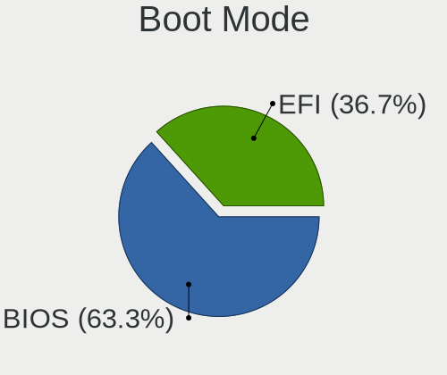
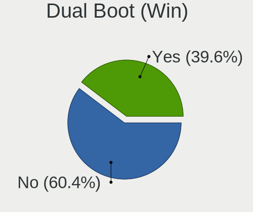
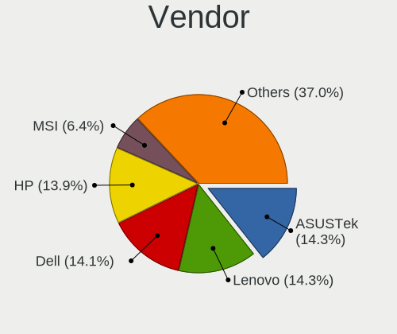
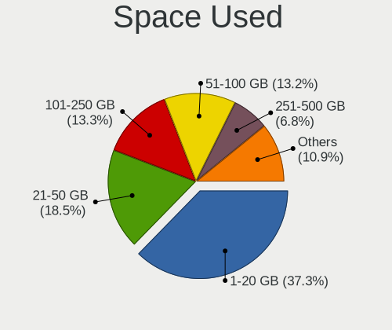
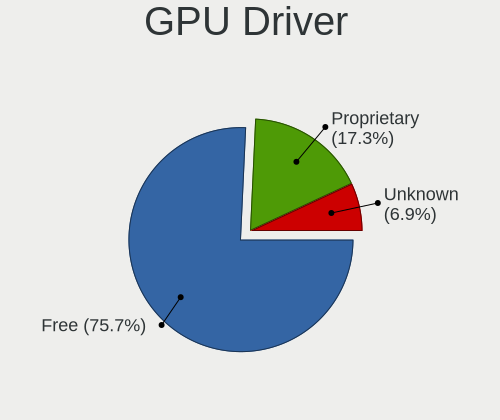
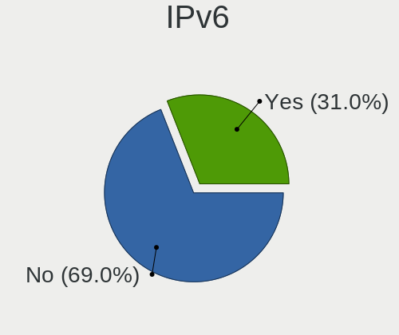

Ubuntu 21.10 - Tested Hardware & Statistics
-------------------------------------------

A project to collect tested hardware configurations for Ubuntu 21.10 (Beta test).

Anyone can contribute to this report by the [hw-probe](https://github.com/linuxhw/hw-probe) tool:

    sudo -E hw-probe -all -upload

Please submit a probe of your configuration if it's not presented on the page or is rare.

This is a report for all computer types. See also reports for [desktops](/Dist/Ubuntu_21.10/Desktop/README.md) and [notebooks](/Dist/Ubuntu_21.10/Notebook/README.md).

Full-feature report is available here: https://linux-hardware.org/?view=trends&rel=ubuntu-21.10

Contents
--------

* [ Test Cases ](#test-cases)

* [ System ](#system)
  - [ Kernel                   ](#kernel)
  - [ Kernel Family            ](#kernel-family)
  - [ Kernel Major Ver.        ](#kernel-major-ver)
  - [ Arch                     ](#arch)
  - [ DE                       ](#de)
  - [ Display Server           ](#display-server)
  - [ Display Manager          ](#display-manager)
  - [ OS Lang                  ](#os-lang)
  - [ Boot Mode                ](#boot-mode)
  - [ Filesystem               ](#filesystem)
  - [ Part. scheme             ](#part-scheme)
  - [ Dual Boot with Linux/BSD ](#dual-boot-with-linuxbsd)
  - [ Dual Boot (Win)          ](#dual-boot-win)

* [ Board ](#board)
  - [ Vendor                   ](#vendor)
  - [ Model                    ](#model)
  - [ Model Family             ](#model-family)
  - [ MFG Year                 ](#mfg-year)
  - [ Form Factor              ](#form-factor)
  - [ Secure Boot              ](#secure-boot)
  - [ Coreboot                 ](#coreboot)
  - [ RAM Size                 ](#ram-size)
  - [ RAM Used                 ](#ram-used)
  - [ Total Drives             ](#total-drives)
  - [ Has CD-ROM               ](#has-cd-rom)
  - [ Has Ethernet             ](#has-ethernet)
  - [ Has WiFi                 ](#has-wifi)
  - [ Has Bluetooth            ](#has-bluetooth)

* [ Location ](#location)
  - [ Country                  ](#country)
  - [ City                     ](#city)

* [ Drives ](#drives)
  - [ Drive Vendor             ](#drive-vendor)
  - [ Drive Model              ](#drive-model)
  - [ HDD Vendor               ](#hdd-vendor)
  - [ SSD Vendor               ](#ssd-vendor)
  - [ Drive Kind               ](#drive-kind)
  - [ Drive Connector          ](#drive-connector)
  - [ Drive Size               ](#drive-size)
  - [ Space Total              ](#space-total)
  - [ Space Used               ](#space-used)
  - [ Malfunc. Drives          ](#malfunc-drives)
  - [ Malfunc. Drive Vendor    ](#malfunc-drive-vendor)
  - [ Malfunc. HDD Vendor      ](#malfunc-hdd-vendor)
  - [ Malfunc. Drive Kind      ](#malfunc-drive-kind)
  - [ Failed Drives            ](#failed-drives)
  - [ Failed Drive Vendor      ](#failed-drive-vendor)
  - [ Drive Status             ](#drive-status)

* [ Storage controller ](#storage-controller)
  - [ Storage Vendor           ](#storage-vendor)
  - [ Storage Model            ](#storage-model)
  - [ Storage Kind             ](#storage-kind)

* [ Processor ](#processor)
  - [ CPU Vendor               ](#cpu-vendor)
  - [ CPU Model                ](#cpu-model)
  - [ CPU Model Family         ](#cpu-model-family)
  - [ CPU Cores                ](#cpu-cores)
  - [ CPU Sockets              ](#cpu-sockets)
  - [ CPU Threads              ](#cpu-threads)
  - [ CPU Op-Modes             ](#cpu-op-modes)
  - [ CPU Microcode            ](#cpu-microcode)
  - [ CPU Microarch            ](#cpu-microarch)

* [ Graphics ](#graphics)
  - [ GPU Vendor               ](#gpu-vendor)
  - [ GPU Model                ](#gpu-model)
  - [ GPU Combo                ](#gpu-combo)
  - [ GPU Driver               ](#gpu-driver)
  - [ GPU Memory               ](#gpu-memory)

* [ Monitor ](#monitor)
  - [ Monitor Vendor           ](#monitor-vendor)
  - [ Monitor Model            ](#monitor-model)
  - [ Monitor Resolution       ](#monitor-resolution)
  - [ Monitor Diagonal         ](#monitor-diagonal)
  - [ Monitor Width            ](#monitor-width)
  - [ Aspect Ratio             ](#aspect-ratio)
  - [ Monitor Area             ](#monitor-area)
  - [ Pixel Density            ](#pixel-density)
  - [ Multiple Monitors        ](#multiple-monitors)

* [ Network ](#network)
  - [ Net Controller Vendor    ](#net-controller-vendor)
  - [ Net Controller Model     ](#net-controller-model)
  - [ Wireless Vendor          ](#wireless-vendor)
  - [ Wireless Model           ](#wireless-model)
  - [ Ethernet Vendor          ](#ethernet-vendor)
  - [ Ethernet Model           ](#ethernet-model)
  - [ Net Controller Kind      ](#net-controller-kind)
  - [ Used Controller          ](#used-controller)
  - [ NICs                     ](#nics)
  - [ IPv6                     ](#ipv6)

* [ Bluetooth ](#bluetooth)
  - [ Bluetooth Vendor         ](#bluetooth-vendor)
  - [ Bluetooth Model          ](#bluetooth-model)

* [ Sound ](#sound)
  - [ Sound Vendor             ](#sound-vendor)
  - [ Sound Model              ](#sound-model)

* [ Memory ](#memory)
  - [ Memory Vendor            ](#memory-vendor)
  - [ Memory Model             ](#memory-model)
  - [ Memory Kind              ](#memory-kind)
  - [ Memory Form Factor       ](#memory-form-factor)
  - [ Memory Size              ](#memory-size)
  - [ Memory Speed             ](#memory-speed)

* [ Printers & scanners ](#printers--scanners)
  - [ Printer Vendor           ](#printer-vendor)
  - [ Printer Model            ](#printer-model)
  - [ Scanner Vendor           ](#scanner-vendor)
  - [ Scanner Model            ](#scanner-model)

* [ Camera ](#camera)
  - [ Camera Vendor            ](#camera-vendor)
  - [ Camera Model             ](#camera-model)

* [ Security ](#security)
  - [ Fingerprint Vendor       ](#fingerprint-vendor)
  - [ Fingerprint Model        ](#fingerprint-model)
  - [ Chipcard Vendor          ](#chipcard-vendor)
  - [ Chipcard Model           ](#chipcard-model)

* [ Unsupported ](#unsupported)
  - [ Unsupported Devices      ](#unsupported-devices)
  - [ Unsupported Device Types ](#unsupported-device-types)

Test Cases
----------

| Vendor   | Model                       | Form-Factor | Probe                                                      | Date         |
|----------|-----------------------------|-------------|------------------------------------------------------------|--------------|
| ASUSTek  | VivoBook_ASUSLaptop X509... | Notebook    | [808cfab06b](https://linux-hardware.org/?probe=808cfab06b) | Aug 12, 2021 |
| Lenovo   | ThinkPad T510 4484A63       | Notebook    | [c1bcb3451f](https://linux-hardware.org/?probe=c1bcb3451f) | Aug 09, 2021 |
| Lenovo   | ThinkPad T510 4484A63       | Notebook    | [4336b50906](https://linux-hardware.org/?probe=4336b50906) | Aug 06, 2021 |
| MSI      | MAG B550M MORTAR            | Desktop     | [912b2a77a2](https://linux-hardware.org/?probe=912b2a77a2) | Aug 05, 2021 |
| ASUSTek  | VivoBook_ASUSLaptop X530... | Notebook    | [961031411d](https://linux-hardware.org/?probe=961031411d) | Aug 03, 2021 |
| Lenovo   | ZhaoYang K3-ITL 82E3        | Notebook    | [ee2be4cea9](https://linux-hardware.org/?probe=ee2be4cea9) | Aug 03, 2021 |
| ASUSTek  | GL753VD                     | Notebook    | [eabe6a8723](https://linux-hardware.org/?probe=eabe6a8723) | Jul 31, 2021 |
| Acer     | Aspire 5920                 | Notebook    | [f41defe215](https://linux-hardware.org/?probe=f41defe215) | Jul 31, 2021 |
| Dell     | XPS 13 7390                 | Notebook    | [901bcb991b](https://linux-hardware.org/?probe=901bcb991b) | Jul 31, 2021 |
| Teclast  | F6 Pro                      | Notebook    | [e28004c24b](https://linux-hardware.org/?probe=e28004c24b) | Jul 27, 2021 |
| Huanan   | X99 F8D V2.2                | Desktop     | [74e4c61bbf](https://linux-hardware.org/?probe=74e4c61bbf) | Jul 23, 2021 |
| Huanan   | X99 F8D V2.2                | Desktop     | [02ad72fb54](https://linux-hardware.org/?probe=02ad72fb54) | Jul 21, 2021 |
| ASUSTek  | VivoBook_ASUSLaptop X421... | Notebook    | [f5458b4f56](https://linux-hardware.org/?probe=f5458b4f56) | Jul 19, 2021 |
| ASUSTek  | VivoBook_ASUSLaptop X421... | Notebook    | [5ac65f3389](https://linux-hardware.org/?probe=5ac65f3389) | Jul 18, 2021 |
| Lenovo   | Z50-70 20354                | Notebook    | [85aadf8abd](https://linux-hardware.org/?probe=85aadf8abd) | Jul 16, 2021 |
| Gigabyte | F2A55M-HD2                  | Desktop     | [6a69f09403](https://linux-hardware.org/?probe=6a69f09403) | Jul 15, 2021 |
| Lenovo   | Z50-70 20354                | Notebook    | [b2c80f450e](https://linux-hardware.org/?probe=b2c80f450e) | Jul 14, 2021 |
| HP       | Pavilion Gaming Laptop 1... | Notebook    | [f024f2512e](https://linux-hardware.org/?probe=f024f2512e) | Jul 14, 2021 |
| Lenovo   | ThinkPad X201 3626FAG       | Notebook    | [259908557b](https://linux-hardware.org/?probe=259908557b) | Jun 28, 2021 |
| Positivo | H14BT58                     | Notebook    | [51b9ba65e0](https://linux-hardware.org/?probe=51b9ba65e0) | Jun 18, 2021 |
| ASUSTek  | ROG Strix G533QR_G533QR     | Notebook    | [4befd5f360](https://linux-hardware.org/?probe=4befd5f360) | Jun 04, 2021 |
| Dell     | XPS 13 9343                 | Notebook    | [4ee08e92ae](https://linux-hardware.org/?probe=4ee08e92ae) | May 18, 2021 |

System
------

Kernel
------

Version of the Linux kernel

| Version               | Computers | Percent |
|-----------------------|-----------|---------|
| 5.11.0-20-generic     | 5         | 27.78%  |
| 5.11.0-25-generic     | 2         | 11.11%  |
| 5.11.0-18-generic     | 2         | 11.11%  |
| 5.13.6-xanmod2-edge   | 1         | 5.56%   |
| 5.13.4-051304-generic | 1         | 5.56%   |
| 5.13.2-051302-generic | 1         | 5.56%   |
| 5.13.0-13-generic     | 1         | 5.56%   |
| 5.13.0-12-generic     | 1         | 5.56%   |
| 5.13.0-051300-generic | 1         | 5.56%   |
| 5.11.0-26-generic     | 1         | 5.56%   |
| 5.11.0-22-generic     | 1         | 5.56%   |
| 5.11.0-16-generic     | 1         | 5.56%   |

Kernel Family
-------------

Linux kernel without a distro release

| Version | Computers | Percent |
|---------|-----------|---------|
| 5.11.0  | 12        | 66.67%  |
| 5.13.0  | 3         | 16.67%  |
| 5.13.6  | 1         | 5.56%   |
| 5.13.4  | 1         | 5.56%   |
| 5.13.2  | 1         | 5.56%   |

Kernel Major Ver.
-----------------

Linux kernel major version

| Version | Computers | Percent |
|---------|-----------|---------|
| 5.11    | 12        | 66.67%  |
| 5.13    | 6         | 33.33%  |

Arch
----

OS architecture (x86_64, i586, etc.)

| Name   | Computers | Percent |
|--------|-----------|---------|
| x86_64 | 18        | 100%    |

DE
--

Desktop Environment

| Name            | Computers | Percent |
|-----------------|-----------|---------|
| GNOME           | 12        | 66.67%  |
| X-Cinnamon      | 3         | 16.67%  |
| Unity           | 1         | 5.56%   |
| GNOME Flashback | 1         | 5.56%   |
| Cinnamon        | 1         | 5.56%   |

Display Server
--------------

X11 or Wayland

| Name    | Computers | Percent |
|---------|-----------|---------|
| X11     | 9         | 50%     |
| Wayland | 9         | 50%     |

Display Manager
---------------

SDDM, LightDM, etc.

| Name    | Computers | Percent |
|---------|-----------|---------|
| Unknown | 10        | 55.56%  |
| GDM     | 7         | 38.89%  |
| TDM     | 1         | 5.56%   |

OS Lang
-------

Language

| Lang  | Computers | Percent |
|-------|-----------|---------|
| en_GB | 6         | 33.33%  |
| fr_FR | 2         | 11.11%  |
| en_US | 2         | 11.11%  |
| zh_CN | 1         | 5.56%   |
| sv_SE | 1         | 5.56%   |
| ru_RU | 1         | 5.56%   |
| pt_BR | 1         | 5.56%   |
| ko_KR | 1         | 5.56%   |
| es_MX | 1         | 5.56%   |
| es_AR | 1         | 5.56%   |
| de_DE | 1         | 5.56%   |

Boot Mode
---------

EFI or BIOS

| Mode | Computers | Percent |
|------|-----------|---------|
| BIOS | 10        | 55.56%  |
| EFI  | 8         | 44.44%  |

Filesystem
----------

Type of filesystem

| Type | Computers | Percent |
|------|-----------|---------|
| Ext4 | 18        | 100%    |

Part. scheme
------------

Scheme of partitioning

| Type    | Computers | Percent |
|---------|-----------|---------|
| Unknown | 10        | 55.56%  |
| GPT     | 7         | 38.89%  |
| MBR     | 1         | 5.56%   |

Dual Boot with Linux/BSD
------------------------

Hosting more than one Linux/BSD

| Dual boot | Computers | Percent |
|-----------|-----------|---------|
| No        | 13        | 72.22%  |
| Yes       | 5         | 27.78%  |

Dual Boot (Win)
---------------

Hosting Linux and Windows

| Dual boot | Computers | Percent |
|-----------|-----------|---------|
| Yes       | 9         | 50%     |
| No        | 9         | 50%     |

Board
-----

Vendor
------

Motherboard manufacturer

| Name                | Computers | Percent |
|---------------------|-----------|---------|
| ASUSTek Computer    | 5         | 27.78%  |
| Lenovo              | 4         | 22.22%  |
| Dell                | 2         | 11.11%  |
| Teclast             | 1         | 5.56%   |
| Positivo            | 1         | 5.56%   |
| MSI                 | 1         | 5.56%   |
| Huanan              | 1         | 5.56%   |
| Hewlett-Packard     | 1         | 5.56%   |
| Gigabyte Technology | 1         | 5.56%   |
| Acer                | 1         | 5.56%   |

Model
-----

Motherboard model

| Name                                    | Computers | Percent |
|-----------------------------------------|-----------|---------|
| Teclast F6 Pro                          | 1         | 5.56%   |
| Positivo H14BT58                        | 1         | 5.56%   |
| MSI MS-7C94                             | 1         | 5.56%   |
| Lenovo ZhaoYang K3-ITL 82E3             | 1         | 5.56%   |
| Lenovo Z50-70 20354                     | 1         | 5.56%   |
| Lenovo ThinkPad X201 3626FAG            | 1         | 5.56%   |
| Lenovo ThinkPad T510 4484A63            | 1         | 5.56%   |
| Huanan X99 F8D V2.2                     | 1         | 5.56%   |
| HP Pavilion Gaming Laptop 15-dk0xxx     | 1         | 5.56%   |
| Gigabyte F2A55M-HD2                     | 1         | 5.56%   |
| Dell XPS 13 9343                        | 1         | 5.56%   |
| Dell XPS 13 7390                        | 1         | 5.56%   |
| ASUS VivoBook_ASUSLaptop X530FN_S530FN  | 1         | 5.56%   |
| ASUS VivoBook_ASUSLaptop X509DJ_M509DJ  | 1         | 5.56%   |
| ASUS VivoBook_ASUSLaptop X421UAY_M413UA | 1         | 5.56%   |
| ASUS ROG Strix G533QR_G533QR            | 1         | 5.56%   |
| ASUS GL753VD                            | 1         | 5.56%   |
| Acer Aspire 5920                        | 1         | 5.56%   |

Model Family
------------

Motherboard model prefix

| Name                | Computers | Percent |
|---------------------|-----------|---------|
| ASUS VivoBook       | 3         | 16.67%  |
| Lenovo ThinkPad     | 2         | 11.11%  |
| Dell XPS            | 2         | 11.11%  |
| Teclast F6          | 1         | 5.56%   |
| Positivo H14BT58    | 1         | 5.56%   |
| MSI MS-7C94         | 1         | 5.56%   |
| Lenovo ZhaoYang     | 1         | 5.56%   |
| Lenovo Z50-70       | 1         | 5.56%   |
| Huanan X99          | 1         | 5.56%   |
| HP Pavilion         | 1         | 5.56%   |
| Gigabyte F2A55M-HD2 | 1         | 5.56%   |
| ASUS ROG            | 1         | 5.56%   |
| ASUS GL753VD        | 1         | 5.56%   |
| Acer Aspire         | 1         | 5.56%   |

MFG Year
--------

Motherboard manufacture year

| Year | Computers | Percent |
|------|-----------|---------|
| 2021 | 7         | 38.89%  |
| 2020 | 2         | 11.11%  |
| 2019 | 2         | 11.11%  |
| 2010 | 2         | 11.11%  |
| 2018 | 1         | 5.56%   |
| 2015 | 1         | 5.56%   |
| 2014 | 1         | 5.56%   |
| 2013 | 1         | 5.56%   |
| 2008 | 1         | 5.56%   |

Form Factor
-----------

Physical design of the computer

| Name     | Computers | Percent |
|----------|-----------|---------|
| Notebook | 15        | 83.33%  |
| Desktop  | 3         | 16.67%  |

Secure Boot
-----------

Enabled or disabled

| State    | Computers | Percent |
|----------|-----------|---------|
| Disabled | 17        | 94.44%  |
| Enabled  | 1         | 5.56%   |

Coreboot
--------

Have coreboot on board

| Used | Computers | Percent |
|------|-----------|---------|
| No   | 18        | 100%    |

RAM Size
--------

Total RAM memory

| Size in GB | Computers | Percent |
|------------|-----------|---------|
| 4.01-8.0   | 6         | 33.33%  |
| 32.01-64.0 | 3         | 16.67%  |
| 8.01-16.0  | 3         | 16.67%  |
| 3.01-4.0   | 2         | 11.11%  |
| 16.01-24.0 | 2         | 11.11%  |
| 24.01-32.0 | 1         | 5.56%   |
| 1.01-2.0   | 1         | 5.56%   |

RAM Used
--------

Used RAM memory

| Used GB  | Computers | Percent |
|----------|-----------|---------|
| 2.01-3.0 | 6         | 33.33%  |
| 4.01-8.0 | 5         | 27.78%  |
| 1.01-2.0 | 5         | 27.78%  |
| 3.01-4.0 | 2         | 11.11%  |

Total Drives
------------

Number of drives on board

| Drives | Computers | Percent |
|--------|-----------|---------|
| 1      | 12        | 66.67%  |
| 2      | 4         | 22.22%  |
| 5      | 1         | 5.56%   |
| 3      | 1         | 5.56%   |

Has CD-ROM
----------

Has CD-ROM on board

| Presented | Computers | Percent |
|-----------|-----------|---------|
| No        | 15        | 83.33%  |
| Yes       | 3         | 16.67%  |

Has Ethernet
------------

Has Ethernet on board

| Presented | Computers | Percent |
|-----------|-----------|---------|
| Yes       | 11        | 61.11%  |
| No        | 7         | 38.89%  |

Has WiFi
--------

Has WiFi module

| Presented | Computers | Percent |
|-----------|-----------|---------|
| Yes       | 15        | 83.33%  |
| No        | 3         | 16.67%  |

Has Bluetooth
-------------

Has Bluetooth module

| Presented | Computers | Percent |
|-----------|-----------|---------|
| Yes       | 12        | 66.67%  |
| No        | 6         | 33.33%  |

Location
--------

Country
-------

Geographic location (country)

| Country     | Computers | Percent |
|-------------|-----------|---------|
| UK          | 5         | 27.78%  |
| Germany     | 2         | 11.11%  |
| France      | 2         | 11.11%  |
| Brazil      | 2         | 11.11%  |
| USA         | 1         | 5.56%   |
| Sweden      | 1         | 5.56%   |
| South Korea | 1         | 5.56%   |
| Russia      | 1         | 5.56%   |
| China       | 1         | 5.56%   |
| Chile       | 1         | 5.56%   |
| Argentina   | 1         | 5.56%   |

City
----

Geographic location (city)

| City                   | Computers | Percent |
|------------------------|-----------|---------|
| Yongin-si              | 1         | 5.56%   |
| Tottenham              | 1         | 5.56%   |
| Shanghai               | 1         | 5.56%   |
| Santiago               | 1         | 5.56%   |
| Rosario                | 1         | 5.56%   |
| Rio de Janeiro         | 1         | 5.56%   |
| Paris                  | 1         | 5.56%   |
| Osasco                 | 1         | 5.56%   |
| Nizhny Tagil           | 1         | 5.56%   |
| Nieblum                | 1         | 5.56%   |
| Maidstone              | 1         | 5.56%   |
| Leiston                | 1         | 5.56%   |
| Helsingborg            | 1         | 5.56%   |
| Haselhorst             | 1         | 5.56%   |
| Glasgow                | 1         | 5.56%   |
| Crewe                  | 1         | 5.56%   |
| Charleville-M?©zi??res | 1         | 5.56%   |
| Austin                 | 1         | 5.56%   |

Drives
------

Drive Vendor
------------

Hard drive vendors

| Vendor              | Computers | Drives | Percent |
|---------------------|-----------|--------|---------|
| Samsung Electronics | 5         | 6      | 19.23%  |
| Seagate             | 4         | 4      | 15.38%  |
| WDC                 | 2         | 2      | 7.69%   |
| SanDisk             | 2         | 2      | 7.69%   |
| Kingston            | 2         | 2      | 7.69%   |
| Intel               | 2         | 3      | 7.69%   |
| Unknown             | 1         | 1      | 3.85%   |
| Toshiba             | 1         | 1      | 3.85%   |
| SK Hynix            | 1         | 1      | 3.85%   |
| Silicon Motion      | 1         | 1      | 3.85%   |
| PNY                 | 1         | 1      | 3.85%   |
| LITEON              | 1         | 1      | 3.85%   |
| KIOXIA-EXCERIA      | 1         | 1      | 3.85%   |
| KingDian            | 1         | 1      | 3.85%   |
| HGST                | 1         | 1      | 3.85%   |

Drive Model
-----------

Hard drive models

| Model                                        | Computers | Percent |
|----------------------------------------------|-----------|---------|
| WDC WD5000LPVX-22V0TT0 500GB                 | 1         | 3.57%   |
| WDC WD3200AAJS-56B4A0 320GB                  | 1         | 3.57%   |
| Unknown SB64G  64GB                          | 1         | 3.57%   |
| Toshiba MQ04ABF100 1TB                       | 1         | 3.57%   |
| SK Hynix HFM001TD3JX013N 1TB                 | 1         | 3.57%   |
| Silicon Motion NVMe SSD Drive 256GB          | 1         | 3.57%   |
| Seagate ST9320423AS 320GB                    | 1         | 3.57%   |
| Seagate Expansion 2TB                        | 1         | 3.57%   |
| Seagate BUP Slim BK 1TB                      | 1         | 3.57%   |
| Seagate BarraCuda 120 SSD ZA500CM10003 500GB | 1         | 3.57%   |
| SanDisk SD9SN8W256G1102 256GB SSD            | 1         | 3.57%   |
| Sandisk NVMe SSD Drive 500GB                 | 1         | 3.57%   |
| Samsung SSD 980 PRO 500GB                    | 1         | 3.57%   |
| Samsung SSD 970 EVO 500GB                    | 1         | 3.57%   |
| Samsung SSD 860 EVO 500GB                    | 1         | 3.57%   |
| Samsung SSD 850 EVO 500GB                    | 1         | 3.57%   |
| Samsung MZVLQ512HALU-00000 512GB             | 1         | 3.57%   |
| Samsung MZALQ512HALU-000L2 512GB             | 1         | 3.57%   |
| PNY CS900 240GB SSD                          | 1         | 3.57%   |
| LITEON L8H-256V2G-11 M.2 2280 256GB SSD      | 1         | 3.57%   |
| KIOXIA-EXCERIA SATA SSD 480GB                | 1         | 3.57%   |
| Kingston SKC300S37A240G 240GB SSD            | 1         | 3.57%   |
| Kingston SHFS37A120G 120GB SSD               | 1         | 3.57%   |
| KingDian N400 240GB SSD                      | 1         | 3.57%   |
| Intel NVMe SSD Drive 512GB                   | 1         | 3.57%   |
| Intel HBRPEKNX0101AHO 16GB                   | 1         | 3.57%   |
| Intel HBRPEKNX0101AH 256GB                   | 1         | 3.57%   |
| HGST HTS721010A9E630 1TB                     | 1         | 3.57%   |

HDD Vendor
----------

Hard disk drive vendors

| Vendor  | Computers | Drives | Percent |
|---------|-----------|--------|---------|
| Seagate | 3         | 3      | 42.86%  |
| WDC     | 2         | 2      | 28.57%  |
| Toshiba | 1         | 1      | 14.29%  |
| HGST    | 1         | 1      | 14.29%  |

SSD Vendor
----------

Solid state drive vendors

| Vendor              | Computers | Drives | Percent |
|---------------------|-----------|--------|---------|
| Samsung Electronics | 2         | 2      | 20%     |
| Kingston            | 2         | 2      | 20%     |
| Seagate             | 1         | 1      | 10%     |
| SanDisk             | 1         | 1      | 10%     |
| PNY                 | 1         | 1      | 10%     |
| LITEON              | 1         | 1      | 10%     |
| KIOXIA-EXCERIA      | 1         | 1      | 10%     |
| KingDian            | 1         | 1      | 10%     |

Drive Kind
----------

HDD or SSD

| Kind | Computers | Drives | Percent |
|------|-----------|--------|---------|
| NVMe | 9         | 10     | 36%     |
| SSD  | 8         | 10     | 32%     |
| HDD  | 7         | 7      | 28%     |
| MMC  | 1         | 1      | 4%      |

Drive Connector
---------------

SATA, SAS, NVMe, etc.

| Type | Computers | Drives | Percent |
|------|-----------|--------|---------|
| SATA | 12        | 15     | 50%     |
| NVMe | 9         | 10     | 37.5%   |
| SAS  | 2         | 2      | 8.33%   |
| MMC  | 1         | 1      | 4.17%   |

Drive Size
----------

Size of hard drive

| Size in TB | Computers | Drives | Percent |
|------------|-----------|--------|---------|
| 0.01-0.5   | 11        | 13     | 73.33%  |
| 0.51-1.0   | 3         | 3      | 20%     |
| 1.01-2.0   | 1         | 1      | 6.67%   |

Space Total
-----------

Amount of disk space available on the file system

| Size in GB | Computers | Percent |
|------------|-----------|---------|
| 101-250    | 6         | 33.33%  |
| 251-500    | 5         | 27.78%  |
| 51-100     | 3         | 16.67%  |
| 1001-2000  | 2         | 11.11%  |
| 21-50      | 1         | 5.56%   |
| 501-1000   | 1         | 5.56%   |

Space Used
----------

Amount of used disk space

| Used GB   | Computers | Percent |
|-----------|-----------|---------|
| 101-250   | 5         | 27.78%  |
| 51-100    | 4         | 22.22%  |
| 21-50     | 3         | 16.67%  |
| 1-20      | 3         | 16.67%  |
| 501-1000  | 2         | 11.11%  |
| 1001-2000 | 1         | 5.56%   |

Malfunc. Drives
---------------

Drive models with a malfunction

Zero info for selected period =(

Malfunc. Drive Vendor
---------------------

Vendors of faulty drives

Zero info for selected period =(

Malfunc. HDD Vendor
-------------------

Vendors of faulty HDD drives

Zero info for selected period =(

Malfunc. Drive Kind
-------------------

Kinds of faulty drives

Zero info for selected period =(

Failed Drives
-------------

Failed drive models

Zero info for selected period =(

Failed Drive Vendor
-------------------

Failed drive vendors

Zero info for selected period =(

Drive Status
------------

Number of failed and malfunc. drives

| Status   | Computers | Drives | Percent |
|----------|-----------|--------|---------|
| Detected | 13        | 16     | 61.9%   |
| Works    | 8         | 12     | 38.1%   |

Storage controller
------------------

Storage Vendor
--------------

Storage controller vendors

| Vendor              | Computers | Percent |
|---------------------|-----------|---------|
| Intel               | 12        | 52.17%  |
| Samsung Electronics | 4         | 17.39%  |
| AMD                 | 4         | 17.39%  |
| SK Hynix            | 1         | 4.35%   |
| Silicon Motion      | 1         | 4.35%   |
| Sandisk             | 1         | 4.35%   |

Storage Model
-------------

Storage controller models

| Model                                                            | Computers | Percent |
|------------------------------------------------------------------|-----------|---------|
| Samsung NVMe Controller                                          | 2         | 7.69%   |
| Intel 82801 Mobile SATA Controller [RAID mode]                   | 2         | 7.69%   |
| Intel 5 Series/3400 Series Chipset 6 port SATA AHCI Controller   | 2         | 7.69%   |
| AMD FCH SATA Controller [AHCI mode]                              | 2         | 7.69%   |
| SK Hynix NVMe SSD Controller                                     | 1         | 3.85%   |
| Silicon Motion SM2263EN/SM2263XT SSD Controller                  | 1         | 3.85%   |
| Sandisk WD Blue SN550 NVMe SSD                                   | 1         | 3.85%   |
| Samsung NVMe SSD Controller SM981/PM981/PM983                    | 1         | 3.85%   |
| Samsung NVMe SSD Controller PM9A1/PM9A3/980PRO                   | 1         | 3.85%   |
| Intel Wildcat Point-LP SATA Controller [AHCI Mode]               | 1         | 3.85%   |
| Intel Sunrise Point-LP SATA Controller [AHCI mode]               | 1         | 3.85%   |
| Intel SSD 660P Series                                            | 1         | 3.85%   |
| Intel Non-Volatile memory controller                             | 1         | 3.85%   |
| Intel HM170/QM170 Chipset SATA Controller [AHCI Mode]            | 1         | 3.85%   |
| Intel C610/X99 series chipset 6-Port SATA Controller [AHCI mode] | 1         | 3.85%   |
| Intel Atom Processor E3800 Series SATA AHCI Controller           | 1         | 3.85%   |
| Intel 82801HM/HEM (ICH8M/ICH8M-E) SATA Controller [AHCI mode]    | 1         | 3.85%   |
| Intel 82801HM/HEM (ICH8M/ICH8M-E) IDE Controller                 | 1         | 3.85%   |
| Intel 8 Series SATA Controller 1 [AHCI mode]                     | 1         | 3.85%   |
| AMD Starship/Matisse Chipset SATA Controller [AHCI mode]         | 1         | 3.85%   |
| AMD FCH SATA Controller [IDE mode]                               | 1         | 3.85%   |
| AMD FCH IDE Controller                                           | 1         | 3.85%   |

Storage Kind
------------

Kind of storage controller (IDE, SATA, NVMe, SAS, ...)

| Kind | Computers | Percent |
|------|-----------|---------|
| SATA | 13        | 50%     |
| NVMe | 9         | 34.62%  |
| RAID | 2         | 7.69%   |
| IDE  | 2         | 7.69%   |

Processor
---------

CPU Vendor
----------

Processor vendors

| Vendor | Computers | Percent |
|--------|-----------|---------|
| Intel  | 13        | 72.22%  |
| AMD    | 5         | 27.78%  |

CPU Model
---------

Processor models

| Model                                         | Computers | Percent |
|-----------------------------------------------|-----------|---------|
| Intel Xeon CPU E5-2690 v4 @ 2.60GHz           | 1         | 5.56%   |
| Intel Core m3-7Y30 CPU @ 1.00GHz              | 1         | 5.56%   |
| Intel Core i7-8565U CPU @ 1.80GHz             | 1         | 5.56%   |
| Intel Core i7-7700HQ CPU @ 2.80GHz            | 1         | 5.56%   |
| Intel Core i7-4510U CPU @ 2.00GHz             | 1         | 5.56%   |
| Intel Core i7-10510U CPU @ 1.80GHz            | 1         | 5.56%   |
| Intel Core i5-9300H CPU @ 2.40GHz             | 1         | 5.56%   |
| Intel Core i5-5200U CPU @ 2.20GHz             | 1         | 5.56%   |
| Intel Core i5 CPU M 560 @ 2.67GHz             | 1         | 5.56%   |
| Intel Core i5 CPU M 540 @ 2.53GHz             | 1         | 5.56%   |
| Intel Core 2 Duo CPU T8300 @ 2.40GHz          | 1         | 5.56%   |
| Intel Celeron CPU N2807 @ 1.58GHz             | 1         | 5.56%   |
| Intel 11th Gen Core i7-1165G7 @ 2.80GHz       | 1         | 5.56%   |
| AMD Ryzen 9 5900HX with Radeon Graphics       | 1         | 5.56%   |
| AMD Ryzen 5 5600X 6-Core Processor            | 1         | 5.56%   |
| AMD Ryzen 5 5500U with Radeon Graphics        | 1         | 5.56%   |
| AMD Ryzen 5 3500U with Radeon Vega Mobile Gfx | 1         | 5.56%   |
| AMD A4-4000 APU with Radeon HD Graphics       | 1         | 5.56%   |

CPU Model Family
----------------

Processor model prefix

| Model            | Computers | Percent |
|------------------|-----------|---------|
| Intel Core i7    | 4         | 22.22%  |
| Intel Core i5    | 4         | 22.22%  |
| AMD Ryzen 5      | 3         | 16.67%  |
| Other            | 1         | 5.56%   |
| Intel Xeon       | 1         | 5.56%   |
| Intel Core m3    | 1         | 5.56%   |
| Intel Core 2 Duo | 1         | 5.56%   |
| Intel Celeron    | 1         | 5.56%   |
| AMD Ryzen 9      | 1         | 5.56%   |
| AMD A4           | 1         | 5.56%   |

CPU Cores
---------

Number of processor cores

| Number | Computers | Percent |
|--------|-----------|---------|
| 2      | 7         | 38.89%  |
| 4      | 6         | 33.33%  |
| 6      | 2         | 11.11%  |
| 28     | 1         | 5.56%   |
| 8      | 1         | 5.56%   |
| 1      | 1         | 5.56%   |

CPU Sockets
-----------

Number of sockets

| Number | Computers | Percent |
|--------|-----------|---------|
| 1      | 17        | 94.44%  |
| 2      | 1         | 5.56%   |

CPU Threads
-----------

Threads per core (Hyper-Threading)

| Number | Computers | Percent |
|--------|-----------|---------|
| 2      | 16        | 88.89%  |
| 1      | 2         | 11.11%  |

CPU Op-Modes
------------

CPU Operation Modes (32-bit, 64-bit)

| Op mode        | Computers | Percent |
|----------------|-----------|---------|
| 32-bit, 64-bit | 18        | 100%    |

CPU Microcode
-------------

Microcode number

| Number     | Computers | Percent |
|------------|-----------|---------|
| Unknown    | 10        | 55.56%  |
| 0x906ea    | 1         | 5.56%   |
| 0x806ec    | 1         | 5.56%   |
| 0x806eb    | 1         | 5.56%   |
| 0x806e9    | 1         | 5.56%   |
| 0x806c1    | 1         | 5.56%   |
| 0x306d4    | 1         | 5.56%   |
| 0x0a50000b | 1         | 5.56%   |
| 0x08608103 | 1         | 5.56%   |

CPU Microarch
-------------

Microarchitecture

| Name       | Computers | Percent |
|------------|-----------|---------|
| KabyLake   | 5         | 27.78%  |
| Zen 3      | 2         | 11.11%  |
| Westmere   | 2         | 11.11%  |
| Broadwell  | 2         | 11.11%  |
| Zen+       | 1         | 5.56%   |
| TigerLake  | 1         | 5.56%   |
| Silvermont | 1         | 5.56%   |
| Piledriver | 1         | 5.56%   |
| Penryn     | 1         | 5.56%   |
| Haswell    | 1         | 5.56%   |
| Unknown    | 1         | 5.56%   |

Graphics
--------

GPU Vendor
----------

Vendors of graphics cards

| Vendor | Computers | Percent |
|--------|-----------|---------|
| Intel  | 12        | 50%     |
| Nvidia | 8         | 33.33%  |
| AMD    | 4         | 16.67%  |

GPU Model
---------

Graphics card models

| Model                                                                | Computers | Percent |
|----------------------------------------------------------------------|-----------|---------|
| Intel Core Processor Integrated Graphics Controller                  | 2         | 7.69%   |
| Nvidia GP108M [GeForce MX230]                                        | 1         | 3.85%   |
| Nvidia GP108M [GeForce MX150]                                        | 1         | 3.85%   |
| Nvidia GP108 [GeForce GT 1030]                                       | 1         | 3.85%   |
| Nvidia GP107M [GeForce GTX 1050 Mobile]                              | 1         | 3.85%   |
| Nvidia GP107M [GeForce GTX 1050 3 GB Max-Q]                          | 1         | 3.85%   |
| Nvidia GK208B [GeForce GT 710]                                       | 1         | 3.85%   |
| Nvidia GK104 [GeForce GTX 680]                                       | 1         | 3.85%   |
| Nvidia GF117M [GeForce 610M/710M/810M/820M / GT 620M/625M/630M/720M] | 1         | 3.85%   |
| Nvidia GA104M [GeForce RTX 3070 Mobile / Max-Q]                      | 1         | 3.85%   |
| Intel WhiskeyLake-U GT2 [UHD Graphics 620]                           | 1         | 3.85%   |
| Intel TigerLake-LP GT2 [Iris Xe Graphics]                            | 1         | 3.85%   |
| Intel Mobile GM965/GL960 Integrated Graphics Controller (secondary)  | 1         | 3.85%   |
| Intel Mobile GM965/GL960 Integrated Graphics Controller (primary)    | 1         | 3.85%   |
| Intel HD Graphics 630                                                | 1         | 3.85%   |
| Intel HD Graphics 615                                                | 1         | 3.85%   |
| Intel HD Graphics 5500                                               | 1         | 3.85%   |
| Intel Haswell-ULT Integrated Graphics Controller                     | 1         | 3.85%   |
| Intel CometLake-U GT2 [UHD Graphics]                                 | 1         | 3.85%   |
| Intel CoffeeLake-H GT2 [UHD Graphics 630]                            | 1         | 3.85%   |
| Intel Atom Processor Z36xxx/Z37xxx Series Graphics & Display         | 1         | 3.85%   |
| AMD Trinity 2 [Radeon HD 7480D]                                      | 1         | 3.85%   |
| AMD Picasso                                                          | 1         | 3.85%   |
| AMD Lucienne                                                         | 1         | 3.85%   |
| AMD Cezanne                                                          | 1         | 3.85%   |

GPU Combo
---------

Combinations of graphics cards

| Name           | Computers | Percent |
|----------------|-----------|---------|
| 1 x Intel      | 8         | 44.44%  |
| Intel + Nvidia | 4         | 22.22%  |
| AMD + Nvidia   | 2         | 11.11%  |
| 1 x AMD        | 2         | 11.11%  |
| 2 x Nvidia     | 1         | 5.56%   |
| 1 x Nvidia     | 1         | 5.56%   |

GPU Driver
----------

Free vs proprietary

| Driver      | Computers | Percent |
|-------------|-----------|---------|
| Free        | 12        | 66.67%  |
| Proprietary | 6         | 33.33%  |

GPU Memory
----------

Total video memory

| Size in GB | Computers | Percent |
|------------|-----------|---------|
| Unknown    | 12        | 66.67%  |
| 1.01-2.0   | 4         | 22.22%  |
| 0.01-0.5   | 2         | 11.11%  |

Monitor
-------

Monitor Vendor
--------------

Monitor vendors

| Vendor              | Computers | Percent |
|---------------------|-----------|---------|
| Lenovo              | 3         | 15.79%  |
| BOE                 | 3         | 15.79%  |
| AU Optronics        | 3         | 15.79%  |
| Chimei Innolux      | 2         | 10.53%  |
| SKY                 | 1         | 5.26%   |
| Sharp               | 1         | 5.26%   |
| Samsung Electronics | 1         | 5.26%   |
| PANDA               | 1         | 5.26%   |
| LG Electronics      | 1         | 5.26%   |
| LG Display          | 1         | 5.26%   |
| InfoVision          | 1         | 5.26%   |
| Acer                | 1         | 5.26%   |

Monitor Model
-------------

Monitor models

| Model                                                                | Computers | Percent |
|----------------------------------------------------------------------|-----------|---------|
| SKY TV-monitor SKY0001 1920x1080 697x392mm 31.5-inch                 | 1         | 5%      |
| Sharp LCD Monitor SHP144A 3200x1800 294x165mm 13.3-inch              | 1         | 5%      |
| Samsung Electronics LCD Monitor SEC3945 1280x800 331x207mm 15.4-inch | 1         | 5%      |
| PANDA LC133LF2L03 NCP0015 1920x1080 294x165mm 13.3-inch              | 1         | 5%      |
| LG Electronics LCD Monitor LG ULTRAWIDE 2560x1080                    | 1         | 5%      |
| LG Electronics LCD Monitor LG ULTRAWIDE                              | 1         | 5%      |
| LG Display LCD Monitor LGD04E8 1920x1080 382x215mm 17.3-inch         | 1         | 5%      |
| Lenovo LEN L24q-30 LEN65FB 2560x1440 527x296mm 23.8-inch             | 1         | 5%      |
| Lenovo LCD Monitor LEN40B1 1600x900 344x194mm 15.5-inch              | 1         | 5%      |
| Lenovo LCD Monitor LEN4011 1280x800 261x163mm 12.1-inch              | 1         | 5%      |
| InfoVision LCD Monitor IVO854A 1920x1200 286x179mm 13.3-inch         | 1         | 5%      |
| Chimei Innolux LCD Monitor CMN15CB 1920x1080 344x193mm 15.5-inch     | 1         | 5%      |
| Chimei Innolux LCD Monitor CMN14D4 1920x1080 309x173mm 13.9-inch     | 1         | 5%      |
| BOE LCD Monitor BOE0973 2560x1440 344x194mm 15.5-inch                | 1         | 5%      |
| BOE LCD Monitor BOE0852 1920x1080 344x194mm 15.5-inch                | 1         | 5%      |
| BOE LCD Monitor BOE05EC 1366x768 309x173mm 13.9-inch                 | 1         | 5%      |
| AU Optronics LCD Monitor AUO61ED 1920x1080 340x190mm 15.3-inch       | 1         | 5%      |
| AU Optronics LCD Monitor AUO5B2D 1920x1080 293x162mm 13.2-inch       | 1         | 5%      |
| AU Optronics LCD Monitor AUO21ED 1920x1080 344x194mm 15.5-inch       | 1         | 5%      |
| Acer XV340CK P ACR06F3 3440x1440 800x335mm 34.1-inch                 | 1         | 5%      |

Monitor Resolution
------------------

Monitor screen resolution

| Resolution        | Computers | Percent |
|-------------------|-----------|---------|
| 1920x1080 (FHD)   | 9         | 45%     |
| 2560x1440 (QHD)   | 2         | 10%     |
| 1280x800 (WXGA)   | 2         | 10%     |
| 3440x1440         | 1         | 5%      |
| 3200x1800 (QHD+)  | 1         | 5%      |
| 2560x1080         | 1         | 5%      |
| 1920x1200 (WUXGA) | 1         | 5%      |
| 1600x900 (HD+)    | 1         | 5%      |
| 1366x768 (WXGA)   | 1         | 5%      |
| Unknown           | 1         | 5%      |

Monitor Diagonal
----------------

Diagonal size in inches

| Inches  | Computers | Percent |
|---------|-----------|---------|
| 15      | 7         | 36.84%  |
| 13      | 6         | 31.58%  |
| 40      | 1         | 5.26%   |
| 34      | 1         | 5.26%   |
| 24      | 1         | 5.26%   |
| 17      | 1         | 5.26%   |
| 12      | 1         | 5.26%   |
| Unknown | 1         | 5.26%   |

Monitor Width
-------------

Physical width

| Width in mm | Computers | Percent |
|-------------|-----------|---------|
| 301-350     | 9         | 47.37%  |
| 201-300     | 5         | 26.32%  |
| 801-900     | 1         | 5.26%   |
| 701-800     | 1         | 5.26%   |
| 501-600     | 1         | 5.26%   |
| 351-400     | 1         | 5.26%   |
| Unknown     | 1         | 5.26%   |

Aspect Ratio
------------

Proportional relationship between the width and the height

| Ratio   | Computers | Percent |
|---------|-----------|---------|
| 16/9    | 14        | 73.68%  |
| 16/10   | 2         | 10.53%  |
| 3/2     | 1         | 5.26%   |
| 21/9    | 1         | 5.26%   |
| Unknown | 1         | 5.26%   |

Monitor Area
------------

Area in inch²

| Area in inch² | Computers | Percent |
|----------------|-----------|---------|
| 101-110        | 7         | 36.84%  |
| 71-80          | 4         | 21.05%  |
| 81-90          | 2         | 10.53%  |
| 61-70          | 1         | 5.26%   |
| 351-500        | 1         | 5.26%   |
| 201-250        | 1         | 5.26%   |
| 121-130        | 1         | 5.26%   |
| 501-1000       | 1         | 5.26%   |
| Unknown        | 1         | 5.26%   |

Pixel Density
-------------

Pixels per inch

| Density       | Computers | Percent |
|---------------|-----------|---------|
| 121-160       | 8         | 42.11%  |
| 161-240       | 4         | 21.05%  |
| 101-120       | 3         | 15.79%  |
| More than 240 | 1         | 5.26%   |
| 1-50          | 1         | 5.26%   |
| 51-100        | 1         | 5.26%   |
| Unknown       | 1         | 5.26%   |

Multiple Monitors
-----------------

Total monitors connected

| Total | Computers | Percent |
|-------|-----------|---------|
| 1     | 17        | 94.44%  |
| 2     | 1         | 5.56%   |

Network
-------

Net Controller Vendor
---------------------

Controller vendors

| Vendor                | Computers | Percent |
|-----------------------|-----------|---------|
| Realtek Semiconductor | 10        | 45.45%  |
| Intel                 | 8         | 36.36%  |
| Qualcomm Atheros      | 1         | 4.55%   |
| MEDIATEK              | 1         | 4.55%   |
| Broadcom Limited      | 1         | 4.55%   |
| Broadcom              | 1         | 4.55%   |

Net Controller Model
--------------------

Controller models

| Model                                                             | Computers | Percent |
|-------------------------------------------------------------------|-----------|---------|
| Realtek RTL8111/8168/8411 PCI Express Gigabit Ethernet Controller | 7         | 26.92%  |
| Intel Centrino Advanced-N 6200                                    | 2         | 7.69%   |
| Intel 82577LM Gigabit Network Connection                          | 2         | 7.69%   |
| Realtek RTL8822CE 802.11ac PCIe Wireless Network Adapter          | 1         | 3.85%   |
| Realtek RTL8822BE 802.11a/b/g/n/ac WiFi adapter                   | 1         | 3.85%   |
| Realtek RTL8821CE 802.11ac PCIe Wireless Network Adapter          | 1         | 3.85%   |
| Realtek RTL8188EE Wireless Network Adapter                        | 1         | 3.85%   |
| Realtek RTL8125 2.5GbE Controller                                 | 1         | 3.85%   |
| Qualcomm Atheros QCA9565 / AR9565 Wireless Network Adapter        | 1         | 3.85%   |
| MEDIATEK Network controller                                       | 1         | 3.85%   |
| Intel Wireless 8265 / 8275                                        | 1         | 3.85%   |
| Intel Wireless 7265                                               | 1         | 3.85%   |
| Intel Wireless 3165                                               | 1         | 3.85%   |
| Intel Wi-Fi 6 AX201                                               | 1         | 3.85%   |
| Intel Wi-Fi 6 AX200                                               | 1         | 3.85%   |
| Intel PRO/Wireless 3945ABG [Golan] Network Connection             | 1         | 3.85%   |
| Broadcom NetLink BCM5787M Gigabit Ethernet PCI Express            | 1         | 3.85%   |
| Broadcom Limited BCM4352 802.11ac Wireless Network Adapter        | 1         | 3.85%   |

Wireless Vendor
---------------

Wireless vendors

| Vendor                | Computers | Percent |
|-----------------------|-----------|---------|
| Intel                 | 8         | 53.33%  |
| Realtek Semiconductor | 4         | 26.67%  |
| Qualcomm Atheros      | 1         | 6.67%   |
| MEDIATEK              | 1         | 6.67%   |
| Broadcom Limited      | 1         | 6.67%   |

Wireless Model
--------------

Wireless models

| Model                                                      | Computers | Percent |
|------------------------------------------------------------|-----------|---------|
| Intel Centrino Advanced-N 6200                             | 2         | 13.33%  |
| Realtek RTL8822CE 802.11ac PCIe Wireless Network Adapter   | 1         | 6.67%   |
| Realtek RTL8822BE 802.11a/b/g/n/ac WiFi adapter            | 1         | 6.67%   |
| Realtek RTL8821CE 802.11ac PCIe Wireless Network Adapter   | 1         | 6.67%   |
| Realtek RTL8188EE Wireless Network Adapter                 | 1         | 6.67%   |
| Qualcomm Atheros QCA9565 / AR9565 Wireless Network Adapter | 1         | 6.67%   |
| MEDIATEK Network controller                                | 1         | 6.67%   |
| Intel Wireless 8265 / 8275                                 | 1         | 6.67%   |
| Intel Wireless 7265                                        | 1         | 6.67%   |
| Intel Wireless 3165                                        | 1         | 6.67%   |
| Intel Wi-Fi 6 AX201                                        | 1         | 6.67%   |
| Intel Wi-Fi 6 AX200                                        | 1         | 6.67%   |
| Intel PRO/Wireless 3945ABG [Golan] Network Connection      | 1         | 6.67%   |
| Broadcom Limited BCM4352 802.11ac Wireless Network Adapter | 1         | 6.67%   |

Ethernet Vendor
---------------

Ethernet vendors

| Vendor                | Computers | Percent |
|-----------------------|-----------|---------|
| Realtek Semiconductor | 8         | 72.73%  |
| Intel                 | 2         | 18.18%  |
| Broadcom              | 1         | 9.09%   |

Ethernet Model
--------------

Ethernet models

| Model                                                             | Computers | Percent |
|-------------------------------------------------------------------|-----------|---------|
| Realtek RTL8111/8168/8411 PCI Express Gigabit Ethernet Controller | 7         | 63.64%  |
| Intel 82577LM Gigabit Network Connection                          | 2         | 18.18%  |
| Realtek RTL8125 2.5GbE Controller                                 | 1         | 9.09%   |
| Broadcom NetLink BCM5787M Gigabit Ethernet PCI Express            | 1         | 9.09%   |

Net Controller Kind
-------------------

Ethernet, WiFi or modem

| Kind     | Computers | Percent |
|----------|-----------|---------|
| WiFi     | 15        | 57.69%  |
| Ethernet | 11        | 42.31%  |

Used Controller
---------------

Currently used network controller

| Kind     | Computers | Percent |
|----------|-----------|---------|
| WiFi     | 13        | 68.42%  |
| Ethernet | 6         | 31.58%  |

NICs
----

Total network controllers on board

| Total | Computers | Percent |
|-------|-----------|---------|
| 2     | 9         | 50%     |
| 1     | 9         | 50%     |

IPv6
----

IPv6 vs IPv4

| Used | Computers | Percent |
|------|-----------|---------|
| No   | 15        | 83.33%  |
| Yes  | 3         | 16.67%  |

Bluetooth
---------

Bluetooth Vendor
----------------

Controller vendors

| Vendor                          | Computers | Percent |
|---------------------------------|-----------|---------|
| Intel                           | 5         | 41.67%  |
| Realtek Semiconductor           | 2         | 16.67%  |
| IMC Networks                    | 2         | 16.67%  |
| Qualcomm Atheros Communications | 1         | 8.33%   |
| Lite-On Technology              | 1         | 8.33%   |
| Broadcom                        | 1         | 8.33%   |

Bluetooth Model
---------------

Controller models

| Model                                 | Computers | Percent |
|---------------------------------------|-----------|---------|
| Intel Bluetooth wireless interface    | 3         | 25%     |
| Realtek Bluetooth Radio               | 2         | 16.67%  |
| Qualcomm Atheros AR3012 Bluetooth 4.0 | 1         | 8.33%   |
| Lite-On Bluetooth Radio               | 1         | 8.33%   |
| Intel AX201 Bluetooth                 | 1         | 8.33%   |
| Intel AX200 Bluetooth                 | 1         | 8.33%   |
| IMC Networks Wireless_Device          | 1         | 8.33%   |
| IMC Networks Bluetooth Radio          | 1         | 8.33%   |
| Broadcom BCM20702A0 Bluetooth         | 1         | 8.33%   |

Sound
-----

Sound Vendor
------------

Sound card vendors

| Vendor                            | Computers | Percent |
|-----------------------------------|-----------|---------|
| Intel                             | 13        | 56.52%  |
| Nvidia                            | 4         | 17.39%  |
| AMD                               | 4         | 17.39%  |
| XMOS                              | 1         | 4.35%   |
| Elitegroup Computer Systems (ECS) | 1         | 4.35%   |

Sound Model
-----------

Sound card models

| Model                                                                      | Computers | Percent |
|----------------------------------------------------------------------------|-----------|---------|
| AMD Family 17h (Models 10h-1fh) HD Audio Controller                        | 3         | 10%     |
| Intel 5 Series/3400 Series Chipset High Definition Audio                   | 2         | 6.67%   |
| AMD Renoir Radeon High Definition Audio Controller                         | 2         | 6.67%   |
| XMOS HIFI DSD                                                              | 1         | 3.33%   |
| Nvidia GP108 High Definition Audio Controller                              | 1         | 3.33%   |
| Nvidia GP107GL High Definition Audio Controller                            | 1         | 3.33%   |
| Nvidia GK208 HDMI/DP Audio Controller                                      | 1         | 3.33%   |
| Nvidia GK104 HDMI Audio Controller                                         | 1         | 3.33%   |
| Nvidia GA104 High Definition Audio Controller                              | 1         | 3.33%   |
| Intel Wildcat Point-LP High Definition Audio Controller                    | 1         | 3.33%   |
| Intel Tiger Lake-LP Smart Sound Technology Audio Controller                | 1         | 3.33%   |
| Intel Sunrise Point-LP HD Audio                                            | 1         | 3.33%   |
| Intel Haswell-ULT HD Audio Controller                                      | 1         | 3.33%   |
| Intel Comet Lake PCH-LP cAVS                                               | 1         | 3.33%   |
| Intel CM238 HD Audio Controller                                            | 1         | 3.33%   |
| Intel Cannon Point-LP High Definition Audio Controller                     | 1         | 3.33%   |
| Intel Cannon Lake PCH cAVS                                                 | 1         | 3.33%   |
| Intel C610/X99 series chipset HD Audio Controller                          | 1         | 3.33%   |
| Intel Broadwell-U Audio Controller                                         | 1         | 3.33%   |
| Intel Atom Processor Z36xxx/Z37xxx Series High Definition Audio Controller | 1         | 3.33%   |
| Intel 82801H (ICH8 Family) HD Audio Controller                             | 1         | 3.33%   |
| Intel 8 Series HD Audio Controller                                         | 1         | 3.33%   |
| Elitegroup Computer Systems (ECS) FOSTEX USB AUDIO HP-A4                   | 1         | 3.33%   |
| AMD Trinity HDMI Audio Controller                                          | 1         | 3.33%   |
| AMD Raven/Raven2/Fenghuang HDMI/DP Audio Controller                        | 1         | 3.33%   |
| AMD FCH Azalia Controller                                                  | 1         | 3.33%   |

Memory
------

Memory Vendor
-------------

Memory module vendors

| Vendor              | Computers | Percent |
|---------------------|-----------|---------|
| SK Hynix            | 3         | 25%     |
| Micron Technology   | 3         | 25%     |
| Samsung Electronics | 2         | 16.67%  |
| Crucial             | 2         | 16.67%  |
| Unknown             | 1         | 8.33%   |
| Elpida              | 1         | 8.33%   |

Memory Model
------------

Memory module models

| Model                                                            | Computers | Percent |
|------------------------------------------------------------------|-----------|---------|
| Unknown RAM Module 8GB DIMM DDR4 2667MT/s                        | 1         | 8.33%   |
| SK Hynix RAM HMT851S6AMR6R-PB 4GB Chip DDR3 1600MT/s             | 1         | 8.33%   |
| SK Hynix RAM HMA81GS6AFR8N-UH 8GB SODIMM DDR4 2667MT/s           | 1         | 8.33%   |
| SK Hynix RAM H9CCNNNCLGALAR-NVD 8GB Row Of Chips LPDDR3 2133MT/s | 1         | 8.33%   |
| Samsung RAM M471A2G43AB2-CWE 16GB SODIMM DDR4 3200MT/s           | 1         | 8.33%   |
| Samsung RAM M471A1K43CB1-CTD 8GB DIMM DDR4 2667MT/s              | 1         | 8.33%   |
| Micron RAM 53E1G32D2NP-046 2GB Row Of Chips LPDDR4 4267MT/s      | 1         | 8.33%   |
| Micron RAM 4ATF51264HZ-3G2J1 4GB SODIMM DDR4 3200MT/s            | 1         | 8.33%   |
| Micron RAM 4ATF1G64HZ-3G2E1 8GB SODIMM DDR4 3200MT/s             | 1         | 8.33%   |
| Elpida RAM Module 4GB Row Of Chips LPDDR3 1867MT/s               | 1         | 8.33%   |
| Crucial RAM CT16G4SFRA266.M16FRS 16GB SODIMM DDR4 2667MT/s       | 1         | 8.33%   |
| Crucial RAM BL8G36C16U4B.M8FE1 8GB DIMM DDR4 3733MT/s            | 1         | 8.33%   |

Memory Kind
-----------

Memory module kinds

| Kind   | Computers | Percent |
|--------|-----------|---------|
| DDR4   | 6         | 60%     |
| LPDDR3 | 2         | 20%     |
| LPDDR4 | 1         | 10%     |
| DDR3   | 1         | 10%     |

Memory Form Factor
------------------

Physical design of the memory module

| Name         | Computers | Percent |
|--------------|-----------|---------|
| SODIMM       | 4         | 40%     |
| Row Of Chips | 3         | 30%     |
| DIMM         | 2         | 20%     |
| Chip         | 1         | 10%     |

Memory Size
-----------

Memory module size

| Size  | Computers | Percent |
|-------|-----------|---------|
| 8192  | 5         | 45.45%  |
| 4096  | 3         | 27.27%  |
| 16384 | 2         | 18.18%  |
| 2048  | 1         | 9.09%   |

Memory Speed
------------

Memory module speed

| Speed | Computers | Percent |
|-------|-----------|---------|
| 3200  | 3         | 27.27%  |
| 2667  | 3         | 27.27%  |
| 4267  | 1         | 9.09%   |
| 3733  | 1         | 9.09%   |
| 2133  | 1         | 9.09%   |
| 1867  | 1         | 9.09%   |
| 1600  | 1         | 9.09%   |

Printers & scanners
-------------------

Printer Vendor
--------------

Printer device vendors

Zero info for selected period =(

Printer Model
-------------

Printer device models

Zero info for selected period =(

Scanner Vendor
--------------

Scanner device vendors

Zero info for selected period =(

Scanner Model
-------------

Scanner device models

Zero info for selected period =(

Camera
------

Camera Vendor
-------------

Camera device vendors

| Vendor              | Computers | Percent |
|---------------------|-----------|---------|
| IMC Networks        | 3         | 21.43%  |
| Microdia            | 2         | 14.29%  |
| Chicony Electronics | 2         | 14.29%  |
| Syntek              | 1         | 7.14%   |
| Suyin               | 1         | 7.14%   |
| Samsung Electronics | 1         | 7.14%   |
| Quanta              | 1         | 7.14%   |
| Lenovo              | 1         | 7.14%   |
| Alcor Micro         | 1         | 7.14%   |
| Acer                | 1         | 7.14%   |

Camera Model
------------

Camera device models

| Model                              | Computers | Percent |
|------------------------------------|-----------|---------|
| IMC Networks USB2.0 HD UVC WebCam  | 2         | 14.29%  |
| Syntek Lenovo EasyCamera           | 1         | 7.14%   |
| Suyin Acer CrystalEye Webcam       | 1         | 7.14%   |
| Samsung Galaxy A5 (MTP)            | 1         | 7.14%   |
| Quanta USB2.0 HD UVC WebCam        | 1         | 7.14%   |
| Microdia Integrated_Webcam_HD      | 1         | 7.14%   |
| Microdia Integrated Webcam HD      | 1         | 7.14%   |
| Lenovo Integrated Webcam           | 1         | 7.14%   |
| IMC Networks USB2.0 VGA UVC WebCam | 1         | 7.14%   |
| Chicony USB 2.0 Camera             | 1         | 7.14%   |
| Chicony HP Wide Vision HD Camera   | 1         | 7.14%   |
| Alcor Micro USB 2.0 PC Camera      | 1         | 7.14%   |
| Acer Integrated Camera             | 1         | 7.14%   |

Security
--------

Fingerprint Vendor
------------------

Fingerprint sensor vendors

| Vendor                     | Computers | Percent |
|----------------------------|-----------|---------|
| Upek                       | 1         | 33.33%  |
| Shenzhen Goodix Technology | 1         | 33.33%  |
| Elan Microelectronics      | 1         | 33.33%  |

Fingerprint Model
-----------------

Fingerprint sensor models

| Model                                                  | Computers | Percent |
|--------------------------------------------------------|-----------|---------|
| Upek Biometric Touchchip/Touchstrip Fingerprint Sensor | 1         | 33.33%  |
| Shenzhen Goodix  FingerPrint Device                    | 1         | 33.33%  |
| Elan ELAN:Fingerprint                                  | 1         | 33.33%  |

Chipcard Vendor
---------------

Chipcard module vendors

Zero info for selected period =(

Chipcard Model
--------------

Chipcard module models

Zero info for selected period =(

Unsupported
-----------

Unsupported Devices
-------------------

Total unsupported devices on board

| Total | Computers | Percent |
|-------|-----------|---------|
| 0     | 12        | 66.67%  |
| 1     | 6         | 33.33%  |

Unsupported Device Types
------------------------

Types of unsupported devices

| Type               | Computers | Percent |
|--------------------|-----------|---------|
| Fingerprint reader | 3         | 50%     |
| Unassigned class   | 1         | 16.67%  |
| Net/wireless       | 1         | 16.67%  |
| Bluetooth          | 1         | 16.67%  |

