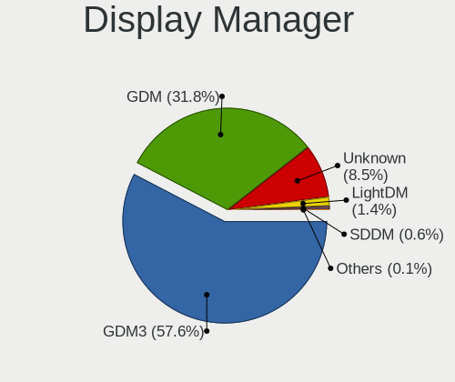
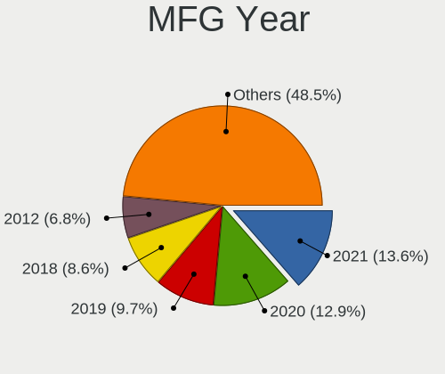
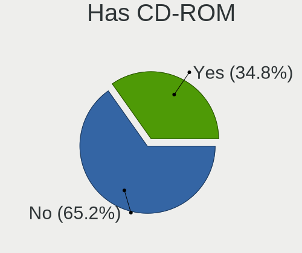
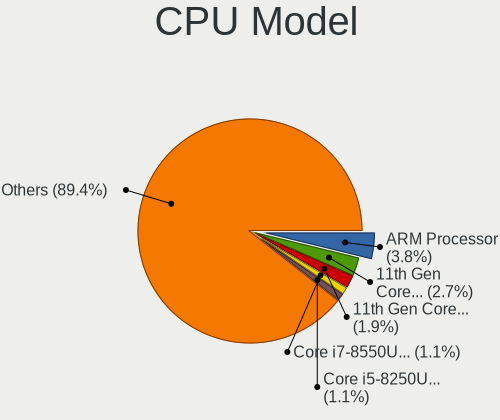
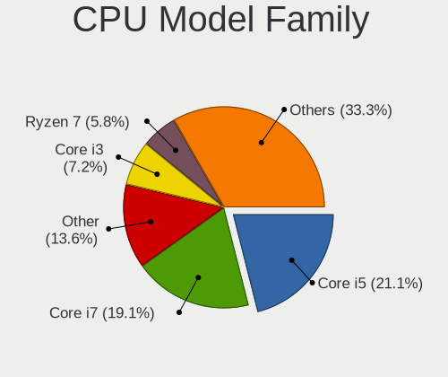
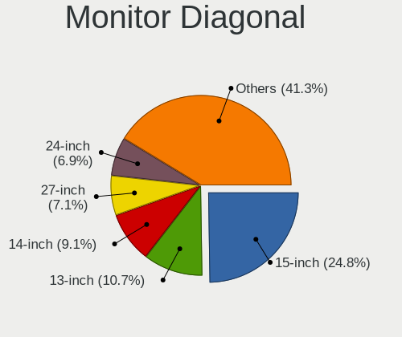
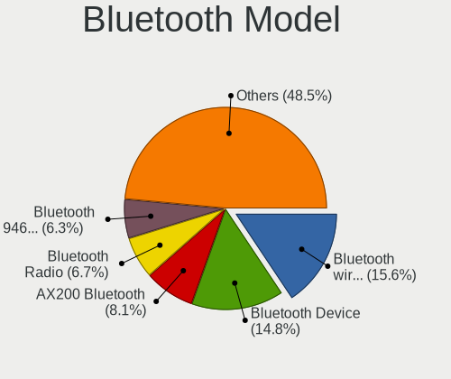
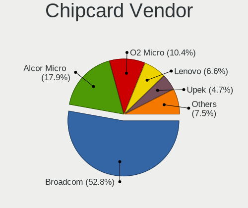

Ubuntu 21.10 - Tested Hardware & Statistics
-------------------------------------------

A project to collect tested hardware configurations for Ubuntu 21.10.

Anyone can contribute to this report by the [hw-probe](https://github.com/linuxhw/hw-probe) tool:

    sudo -E hw-probe -all -upload

Please submit a probe of your configuration if it's not presented on the page or is rare.

This is a report for all computer types. See also reports for [desktops](/Dist/Ubuntu_21.10/Desktop/README.md) and [notebooks](/Dist/Ubuntu_21.10/Notebook/README.md).

Full-feature report is available here: https://linux-hardware.org/?view=trends

Contents
--------

* [ Test Cases ](#test-cases)

* [ System ](#system)
  - [ Kernel                   ](#kernel)
  - [ Kernel Family            ](#kernel-family)
  - [ Kernel Major Ver.        ](#kernel-major-ver)
  - [ Arch                     ](#arch)
  - [ DE                       ](#de)
  - [ Display Server           ](#display-server)
  - [ Display Manager          ](#display-manager)
  - [ OS Lang                  ](#os-lang)
  - [ Boot Mode                ](#boot-mode)
  - [ Filesystem               ](#filesystem)
  - [ Part. scheme             ](#part-scheme)
  - [ Dual Boot with Linux/BSD ](#dual-boot-with-linuxbsd)
  - [ Dual Boot (Win)          ](#dual-boot-win)

* [ Board ](#board)
  - [ Vendor                   ](#vendor)
  - [ Model                    ](#model)
  - [ Model Family             ](#model-family)
  - [ MFG Year                 ](#mfg-year)
  - [ Form Factor              ](#form-factor)
  - [ Secure Boot              ](#secure-boot)
  - [ Coreboot                 ](#coreboot)
  - [ RAM Size                 ](#ram-size)
  - [ RAM Used                 ](#ram-used)
  - [ Total Drives             ](#total-drives)
  - [ Has CD-ROM               ](#has-cd-rom)
  - [ Has Ethernet             ](#has-ethernet)
  - [ Has WiFi                 ](#has-wifi)
  - [ Has Bluetooth            ](#has-bluetooth)

* [ Location ](#location)
  - [ Country                  ](#country)
  - [ City                     ](#city)

* [ Drives ](#drives)
  - [ Drive Vendor             ](#drive-vendor)
  - [ Drive Model              ](#drive-model)
  - [ HDD Vendor               ](#hdd-vendor)
  - [ SSD Vendor               ](#ssd-vendor)
  - [ Drive Kind               ](#drive-kind)
  - [ Drive Connector          ](#drive-connector)
  - [ Drive Size               ](#drive-size)
  - [ Space Total              ](#space-total)
  - [ Space Used               ](#space-used)
  - [ Malfunc. Drives          ](#malfunc-drives)
  - [ Malfunc. Drive Vendor    ](#malfunc-drive-vendor)
  - [ Malfunc. HDD Vendor      ](#malfunc-hdd-vendor)
  - [ Malfunc. Drive Kind      ](#malfunc-drive-kind)
  - [ Failed Drives            ](#failed-drives)
  - [ Failed Drive Vendor      ](#failed-drive-vendor)
  - [ Drive Status             ](#drive-status)

* [ Storage controller ](#storage-controller)
  - [ Storage Vendor           ](#storage-vendor)
  - [ Storage Model            ](#storage-model)
  - [ Storage Kind             ](#storage-kind)

* [ Processor ](#processor)
  - [ CPU Vendor               ](#cpu-vendor)
  - [ CPU Model                ](#cpu-model)
  - [ CPU Model Family         ](#cpu-model-family)
  - [ CPU Cores                ](#cpu-cores)
  - [ CPU Sockets              ](#cpu-sockets)
  - [ CPU Threads              ](#cpu-threads)
  - [ CPU Op-Modes             ](#cpu-op-modes)
  - [ CPU Microcode            ](#cpu-microcode)
  - [ CPU Microarch            ](#cpu-microarch)

* [ Graphics ](#graphics)
  - [ GPU Vendor               ](#gpu-vendor)
  - [ GPU Model                ](#gpu-model)
  - [ GPU Combo                ](#gpu-combo)
  - [ GPU Driver               ](#gpu-driver)
  - [ GPU Memory               ](#gpu-memory)

* [ Monitor ](#monitor)
  - [ Monitor Vendor           ](#monitor-vendor)
  - [ Monitor Model            ](#monitor-model)
  - [ Monitor Resolution       ](#monitor-resolution)
  - [ Monitor Diagonal         ](#monitor-diagonal)
  - [ Monitor Width            ](#monitor-width)
  - [ Aspect Ratio             ](#aspect-ratio)
  - [ Monitor Area             ](#monitor-area)
  - [ Pixel Density            ](#pixel-density)
  - [ Multiple Monitors        ](#multiple-monitors)

* [ Network ](#network)
  - [ Net Controller Vendor    ](#net-controller-vendor)
  - [ Net Controller Model     ](#net-controller-model)
  - [ Wireless Vendor          ](#wireless-vendor)
  - [ Wireless Model           ](#wireless-model)
  - [ Ethernet Vendor          ](#ethernet-vendor)
  - [ Ethernet Model           ](#ethernet-model)
  - [ Net Controller Kind      ](#net-controller-kind)
  - [ Used Controller          ](#used-controller)
  - [ NICs                     ](#nics)
  - [ IPv6                     ](#ipv6)

* [ Bluetooth ](#bluetooth)
  - [ Bluetooth Vendor         ](#bluetooth-vendor)
  - [ Bluetooth Model          ](#bluetooth-model)

* [ Sound ](#sound)
  - [ Sound Vendor             ](#sound-vendor)
  - [ Sound Model              ](#sound-model)

* [ Memory ](#memory)
  - [ Memory Vendor            ](#memory-vendor)
  - [ Memory Model             ](#memory-model)
  - [ Memory Kind              ](#memory-kind)
  - [ Memory Form Factor       ](#memory-form-factor)
  - [ Memory Size              ](#memory-size)
  - [ Memory Speed             ](#memory-speed)

* [ Printers & scanners ](#printers--scanners)
  - [ Printer Vendor           ](#printer-vendor)
  - [ Printer Model            ](#printer-model)
  - [ Scanner Vendor           ](#scanner-vendor)
  - [ Scanner Model            ](#scanner-model)

* [ Camera ](#camera)
  - [ Camera Vendor            ](#camera-vendor)
  - [ Camera Model             ](#camera-model)

* [ Security ](#security)
  - [ Fingerprint Vendor       ](#fingerprint-vendor)
  - [ Fingerprint Model        ](#fingerprint-model)
  - [ Chipcard Vendor          ](#chipcard-vendor)
  - [ Chipcard Model           ](#chipcard-model)

* [ Unsupported ](#unsupported)
  - [ Unsupported Devices      ](#unsupported-devices)
  - [ Unsupported Device Types ](#unsupported-device-types)

Test Cases
----------

| Vendor        | Model                       | Form-Factor | Probe                                                      | Date         |
|---------------|-----------------------------|-------------|------------------------------------------------------------|--------------|
| HP            | 0AECh D                     | Desktop     | [b9550ddc31](https://linux-hardware.org/?probe=b9550ddc31) | Dec 03, 2021 |
| HP            | 0AECh D                     | Desktop     | [61d0324f27](https://linux-hardware.org/?probe=61d0324f27) | Dec 03, 2021 |
| Dell          | Inspiron 7506 2n1           | Convertible | [042979c8d0](https://linux-hardware.org/?probe=042979c8d0) | Dec 03, 2021 |
| LG Electro... | 16ZD90P-GX5LK               | Notebook    | [c7cc850f29](https://linux-hardware.org/?probe=c7cc850f29) | Dec 03, 2021 |
| LG Electro... | 16ZD90P-GX5LK               | Notebook    | [901fdc3726](https://linux-hardware.org/?probe=901fdc3726) | Dec 03, 2021 |
| MSI           | B450M-A PRO MAX             | Desktop     | [17a6983b50](https://linux-hardware.org/?probe=17a6983b50) | Dec 03, 2021 |
| Apple         | MacBookPro12,1              | Notebook    | [48284cb8a5](https://linux-hardware.org/?probe=48284cb8a5) | Dec 02, 2021 |
| Gigabyte      | 970A-DS3P                   | Desktop     | [054aa7b858](https://linux-hardware.org/?probe=054aa7b858) | Dec 02, 2021 |
| Toshiba       | Satellite L655              | Notebook    | [6cf5d39778](https://linux-hardware.org/?probe=6cf5d39778) | Dec 02, 2021 |
| Lenovo        | ThinkPad T410 2537W2L       | Notebook    | [92068cb097](https://linux-hardware.org/?probe=92068cb097) | Dec 02, 2021 |
| Lenovo        | ThinkPad T410 2537N99       | Notebook    | [a77255409f](https://linux-hardware.org/?probe=a77255409f) | Dec 02, 2021 |
| Lenovo        | ThinkPad T410 2537N99       | Notebook    | [ef02c2fb6c](https://linux-hardware.org/?probe=ef02c2fb6c) | Dec 02, 2021 |
| OEM           | TOP77D Ver1.0               | Desktop     | [8348cb42fc](https://linux-hardware.org/?probe=8348cb42fc) | Dec 02, 2021 |
| Lenovo        | NO DPK                      | Desktop     | [0d7784e414](https://linux-hardware.org/?probe=0d7784e414) | Dec 02, 2021 |
| Apple         | MacBookPro13,2              | Notebook    | [d5c66e036d](https://linux-hardware.org/?probe=d5c66e036d) | Dec 02, 2021 |
| Dell          | XPS 13 9310                 | Notebook    | [fa0051b73b](https://linux-hardware.org/?probe=fa0051b73b) | Dec 02, 2021 |
| Dell          | XPS 17 9710                 | Notebook    | [e34c5d610c](https://linux-hardware.org/?probe=e34c5d610c) | Dec 02, 2021 |
| HP            | ENVY x360 Convertible 15... | Convertible | [1081536552](https://linux-hardware.org/?probe=1081536552) | Dec 02, 2021 |
| Raspberry ... | Raspberry Pi                | Soc         | [807a8acefd](https://linux-hardware.org/?probe=807a8acefd) | Dec 02, 2021 |
| ASUSTek       | ROG Zephyrus S17 GX703HS... | Notebook    | [32a7506932](https://linux-hardware.org/?probe=32a7506932) | Dec 01, 2021 |
| DukaPC        | Notebook                    | Notebook    | [cfb399153a](https://linux-hardware.org/?probe=cfb399153a) | Dec 01, 2021 |
| Lenovo        | IdeaPad 320-15IKB 80XL      | Notebook    | [74b0b6dc77](https://linux-hardware.org/?probe=74b0b6dc77) | Dec 01, 2021 |
| Acer          | Swift SF314-43              | Notebook    | [dc17b5db95](https://linux-hardware.org/?probe=dc17b5db95) | Dec 01, 2021 |
| Lenovo        | Yoga 7 14ITL5 82BH          | Convertible | [d7cbea8f57](https://linux-hardware.org/?probe=d7cbea8f57) | Dec 01, 2021 |
| MSI           | Prestige 15 A11SCS          | Notebook    | [1de5756d09](https://linux-hardware.org/?probe=1de5756d09) | Dec 01, 2021 |
| Gigabyte      | X570 UD                     | Desktop     | [79c117738b](https://linux-hardware.org/?probe=79c117738b) | Dec 01, 2021 |
| MSI           | CR61 2M/CX61 2OC/CX61 2O... | Notebook    | [a42ba12bea](https://linux-hardware.org/?probe=a42ba12bea) | Dec 01, 2021 |
| ASUSTek       | CROSSHAIR VI HERO           | Desktop     | [876f4598f0](https://linux-hardware.org/?probe=876f4598f0) | Dec 01, 2021 |
| Dell          | Inspiron 5770               | Notebook    | [207ec37d70](https://linux-hardware.org/?probe=207ec37d70) | Dec 01, 2021 |
| HP            | ZBook Fury 15.6 inch G8 ... | Notebook    | [0ebc40df56](https://linux-hardware.org/?probe=0ebc40df56) | Dec 01, 2021 |
| Dell          | XPS 13 9310 2-in-1          | Convertible | [eb4fb496ae](https://linux-hardware.org/?probe=eb4fb496ae) | Dec 01, 2021 |
| HP            | ENVY x360 Convertible 15... | Convertible | [3f8d37c2e8](https://linux-hardware.org/?probe=3f8d37c2e8) | Dec 01, 2021 |
| HP            | 212B                        | Desktop     | [b8688e6712](https://linux-hardware.org/?probe=b8688e6712) | Dec 01, 2021 |
| Lenovo        | Annapurna CRB 0B98401 PR... | Desktop     | [0e0cd0b225](https://linux-hardware.org/?probe=0e0cd0b225) | Dec 01, 2021 |
| Dell          | Inspiron 7506 2n1           | Convertible | [f20a222421](https://linux-hardware.org/?probe=f20a222421) | Dec 01, 2021 |
| Raspberry ... | Raspberry Pi                | Soc         | [b3fc9b3ec5](https://linux-hardware.org/?probe=b3fc9b3ec5) | Dec 01, 2021 |
| ASUSTek       | Q325UA                      | Convertible | [a0d505d98e](https://linux-hardware.org/?probe=a0d505d98e) | Nov 30, 2021 |
| Dell          | 072J5G A00                  | Server      | [2cb0bf19f0](https://linux-hardware.org/?probe=2cb0bf19f0) | Nov 30, 2021 |
| Lenovo        | G500 20236                  | Notebook    | [f61434ecc0](https://linux-hardware.org/?probe=f61434ecc0) | Nov 30, 2021 |
| HP            | ProBook 440 G6              | Notebook    | [c819afbd7a](https://linux-hardware.org/?probe=c819afbd7a) | Nov 30, 2021 |
| HP            | ProBook 440 G6              | Notebook    | [a30cacf7ad](https://linux-hardware.org/?probe=a30cacf7ad) | Nov 30, 2021 |
| Timi          | A35S                        | Notebook    | [dbb600147d](https://linux-hardware.org/?probe=dbb600147d) | Nov 30, 2021 |
| OEM           | TOP77D Ver1.0               | Desktop     | [6b91b58b81](https://linux-hardware.org/?probe=6b91b58b81) | Nov 30, 2021 |
| Raspberry ... | Raspberry Pi                | Soc         | [0fb4cebb4a](https://linux-hardware.org/?probe=0fb4cebb4a) | Nov 30, 2021 |
| MSI           | B460M-A PRO                 | Desktop     | [f972dc5e2a](https://linux-hardware.org/?probe=f972dc5e2a) | Nov 30, 2021 |
| Framework     | Laptop                      | Notebook    | [e5f72bfb66](https://linux-hardware.org/?probe=e5f72bfb66) | Nov 30, 2021 |
| Dell          | Latitude 5420               | Notebook    | [b0f561b8a8](https://linux-hardware.org/?probe=b0f561b8a8) | Nov 30, 2021 |
| Lenovo        | IdeaPad 5 14ARE05 81YM      | Notebook    | [29a3dcf41b](https://linux-hardware.org/?probe=29a3dcf41b) | Nov 30, 2021 |
| MSI           | MAG Z490 TOMAHAWK           | Desktop     | [b3f648de8e](https://linux-hardware.org/?probe=b3f648de8e) | Nov 29, 2021 |
| Lenovo        | ThinkPad T14 Gen 1 20UES... | Notebook    | [ae6614d6fb](https://linux-hardware.org/?probe=ae6614d6fb) | Nov 29, 2021 |
| Sony          | SVE1713Y1EB                 | Notebook    | [317b686b33](https://linux-hardware.org/?probe=317b686b33) | Nov 29, 2021 |
| Acer          | Aspire 5560                 | Notebook    | [db900fbb00](https://linux-hardware.org/?probe=db900fbb00) | Nov 29, 2021 |
| Acer          | Aspire A315-57G             | Notebook    | [cfc036a421](https://linux-hardware.org/?probe=cfc036a421) | Nov 29, 2021 |
| ECS           | G31T-M7                     | Desktop     | [749da166c4](https://linux-hardware.org/?probe=749da166c4) | Nov 29, 2021 |
| Packard Be... | EasyNote ENLG81BA           | Notebook    | [c596ffcab5](https://linux-hardware.org/?probe=c596ffcab5) | Nov 29, 2021 |
| Lenovo        | IdeaPad 5 Pro 14ITL6 82L... | Notebook    | [3a85954b66](https://linux-hardware.org/?probe=3a85954b66) | Nov 29, 2021 |
| Raspberry ... | Raspberry Pi                | Soc         | [c9ecec864f](https://linux-hardware.org/?probe=c9ecec864f) | Nov 29, 2021 |
| Lenovo        | IdeaPad 5 Pro 14ITL6 82L... | Notebook    | [5271c46262](https://linux-hardware.org/?probe=5271c46262) | Nov 29, 2021 |
| Raspberry ... | Raspberry Pi                | Soc         | [89adc65591](https://linux-hardware.org/?probe=89adc65591) | Nov 29, 2021 |
| Lenovo        | IdeaPad 5 14IIL05 81YH      | Notebook    | [dddc3d3a11](https://linux-hardware.org/?probe=dddc3d3a11) | Nov 29, 2021 |
| Lenovo        | G500 20236                  | Notebook    | [e97bbbd7a9](https://linux-hardware.org/?probe=e97bbbd7a9) | Nov 29, 2021 |
| Panasonic     | CF-19RDRAMGA                | Notebook    | [5aaebfbf19](https://linux-hardware.org/?probe=5aaebfbf19) | Nov 29, 2021 |
| Lenovo        | IdeaPad 320-15IKB 81BT      | Notebook    | [fb633e3cb9](https://linux-hardware.org/?probe=fb633e3cb9) | Nov 29, 2021 |
| Samsung       | R520/R522/R620              | Notebook    | [babd307b08](https://linux-hardware.org/?probe=babd307b08) | Nov 29, 2021 |
| ASRock        | G31M-VS                     | Desktop     | [b042297ea5](https://linux-hardware.org/?probe=b042297ea5) | Nov 29, 2021 |
| Dell          | Inspiron 15-3567            | Notebook    | [2ae4de7517](https://linux-hardware.org/?probe=2ae4de7517) | Nov 29, 2021 |
| Lenovo        | IdeaPad 330-15AST 81D6      | Notebook    | [4aa9def017](https://linux-hardware.org/?probe=4aa9def017) | Nov 29, 2021 |
| Raspberry ... | Raspberry Pi                | Soc         | [910e5d265f](https://linux-hardware.org/?probe=910e5d265f) | Nov 28, 2021 |
| Acer          | Aspire A515-56              | Notebook    | [b0ed9bece9](https://linux-hardware.org/?probe=b0ed9bece9) | Nov 28, 2021 |
| HP            | EliteBook 845 G8 Noteboo... | Notebook    | [8d962864f8](https://linux-hardware.org/?probe=8d962864f8) | Nov 28, 2021 |
| Raspberry ... | Raspberry Pi                | Soc         | [2310ed4d7c](https://linux-hardware.org/?probe=2310ed4d7c) | Nov 28, 2021 |
| Lenovo        | G780 2182                   | Notebook    | [2eeaf69158](https://linux-hardware.org/?probe=2eeaf69158) | Nov 28, 2021 |
| Razer         | Blade Stealth               | Notebook    | [54acf9844b](https://linux-hardware.org/?probe=54acf9844b) | Nov 28, 2021 |
| Lenovo        | IdeaPad 5 14ARE05 81YM      | Notebook    | [5e38544a06](https://linux-hardware.org/?probe=5e38544a06) | Nov 28, 2021 |
| Gigabyte      | X570 AORUS ELITE            | Desktop     | [8c2024b822](https://linux-hardware.org/?probe=8c2024b822) | Nov 28, 2021 |
| Dell          | 0WR7PY A01                  | Desktop     | [f886714ec5](https://linux-hardware.org/?probe=f886714ec5) | Nov 28, 2021 |
| Lenovo        | ThinkPad L470 W10DG 20JV... | Notebook    | [1a717e5780](https://linux-hardware.org/?probe=1a717e5780) | Nov 28, 2021 |
| ASUSTek       | P8Z77-V LX                  | Desktop     | [17bd2e3558](https://linux-hardware.org/?probe=17bd2e3558) | Nov 28, 2021 |
| Dell          | XPS 15 9570                 | Notebook    | [ee3aa93d09](https://linux-hardware.org/?probe=ee3aa93d09) | Nov 28, 2021 |
| Lenovo        | ThinkPad X1 Tablet 20GHC... | Tablet      | [c9a56629e1](https://linux-hardware.org/?probe=c9a56629e1) | Nov 28, 2021 |
| Acer          | Aspire A315-51              | Notebook    | [397f62191b](https://linux-hardware.org/?probe=397f62191b) | Nov 28, 2021 |
| ASUSTek       | PRIME B450M-A               | Desktop     | [629e6cac75](https://linux-hardware.org/?probe=629e6cac75) | Nov 28, 2021 |
| Apple         | MacBook7,1                  | Notebook    | [22e54de439](https://linux-hardware.org/?probe=22e54de439) | Nov 27, 2021 |
| HP            | ProBook 450 G5              | Notebook    | [dd2b422dd8](https://linux-hardware.org/?probe=dd2b422dd8) | Nov 27, 2021 |
| ASUSTek       | ROG STRIX X570-E GAMING     | Desktop     | [88cf97c553](https://linux-hardware.org/?probe=88cf97c553) | Nov 27, 2021 |
| Acer          | Swift SF314-42              | Notebook    | [c5b8c42409](https://linux-hardware.org/?probe=c5b8c42409) | Nov 27, 2021 |
| PC Special... | X170KM-G                    | Notebook    | [6321e2900b](https://linux-hardware.org/?probe=6321e2900b) | Nov 27, 2021 |
| Packard Be... | EasyNote ENLG81BA           | Notebook    | [f85f2dbd4e](https://linux-hardware.org/?probe=f85f2dbd4e) | Nov 27, 2021 |
| Packard Be... | EasyNote ENLG81BA           | Notebook    | [3fcadd0f73](https://linux-hardware.org/?probe=3fcadd0f73) | Nov 27, 2021 |
| Dell          | Precision 7530              | Notebook    | [2b64eebf55](https://linux-hardware.org/?probe=2b64eebf55) | Nov 27, 2021 |
| HP            | ProBook 4540s               | Notebook    | [f047b9db0a](https://linux-hardware.org/?probe=f047b9db0a) | Nov 27, 2021 |
| HP            | ProBook 4540s               | Notebook    | [d8d17c1820](https://linux-hardware.org/?probe=d8d17c1820) | Nov 27, 2021 |
| Lenovo        | G500 20236                  | Notebook    | [c1dd144b77](https://linux-hardware.org/?probe=c1dd144b77) | Nov 27, 2021 |
| Gigabyte      | P35-S3G                     | Desktop     | [f8b94398df](https://linux-hardware.org/?probe=f8b94398df) | Nov 27, 2021 |
| HP            | EliteBook 745 G3            | Notebook    | [92968d4a23](https://linux-hardware.org/?probe=92968d4a23) | Nov 27, 2021 |
| Raspberry ... | Raspberry Pi                | Soc         | [921e1bd601](https://linux-hardware.org/?probe=921e1bd601) | Nov 27, 2021 |
| Raspberry ... | Raspberry Pi                | Soc         | [9ed99cbcfb](https://linux-hardware.org/?probe=9ed99cbcfb) | Nov 27, 2021 |
| ASRock        | A320M-HDV R4.0              | Desktop     | [59f124bbad](https://linux-hardware.org/?probe=59f124bbad) | Nov 27, 2021 |
| Lenovo        | Legion 7 16ITHg6 82K6       | Notebook    | [50e118bf49](https://linux-hardware.org/?probe=50e118bf49) | Nov 27, 2021 |
| HP            | Laptop 15z-ef2xxx           | Notebook    | [8acaaafb63](https://linux-hardware.org/?probe=8acaaafb63) | Nov 27, 2021 |
| Lenovo        | G780                        | Notebook    | [ffeaa607f9](https://linux-hardware.org/?probe=ffeaa607f9) | Nov 27, 2021 |
| Lenovo        | G780                        | Notebook    | [26ea5410e6](https://linux-hardware.org/?probe=26ea5410e6) | Nov 27, 2021 |
| Dell          | XPS 13 9310                 | Notebook    | [c3abf33b86](https://linux-hardware.org/?probe=c3abf33b86) | Nov 27, 2021 |
| Dell          | XPS 13 9310                 | Notebook    | [87c80403ae](https://linux-hardware.org/?probe=87c80403ae) | Nov 27, 2021 |
| Lenovo        | ThinkPad T510 43494JG       | Notebook    | [3564b21c35](https://linux-hardware.org/?probe=3564b21c35) | Nov 26, 2021 |
| Pegatron      | 2A86E01                     | Desktop     | [17a1186394](https://linux-hardware.org/?probe=17a1186394) | Nov 26, 2021 |
| Samsung       | 300E5EV/300E4EV/270E5EV/... | Notebook    | [8a5475fd42](https://linux-hardware.org/?probe=8a5475fd42) | Nov 26, 2021 |
| HP            | 81B7                        | All in one  | [9d99a6fff8](https://linux-hardware.org/?probe=9d99a6fff8) | Nov 26, 2021 |
| Gigabyte      | GA-MA770-UD3                | Desktop     | [551c45ed6b](https://linux-hardware.org/?probe=551c45ed6b) | Nov 26, 2021 |
| HP            | 2129                        | Desktop     | [8379f5fd56](https://linux-hardware.org/?probe=8379f5fd56) | Nov 26, 2021 |
| Gigabyte      | GA-MA770-UD3                | Desktop     | [58da56c671](https://linux-hardware.org/?probe=58da56c671) | Nov 26, 2021 |
| Dell          | Latitude D830               | Notebook    | [080fac6354](https://linux-hardware.org/?probe=080fac6354) | Nov 26, 2021 |
| Gigabyte      | H77M-D3H                    | Desktop     | [a2606aebd8](https://linux-hardware.org/?probe=a2606aebd8) | Nov 26, 2021 |
| HP            | EliteBook 850 G8 Noteboo... | Notebook    | [fbec23b579](https://linux-hardware.org/?probe=fbec23b579) | Nov 26, 2021 |
| Samsung       | RV410/RV510/S3510/E3510     | Notebook    | [9240ce23bd](https://linux-hardware.org/?probe=9240ce23bd) | Nov 26, 2021 |
| Notebook      | PCX0DX                      | Notebook    | [dd551e6aad](https://linux-hardware.org/?probe=dd551e6aad) | Nov 26, 2021 |
| Apple         | MacBookPro8,1               | Notebook    | [a0b9aec393](https://linux-hardware.org/?probe=a0b9aec393) | Nov 26, 2021 |
| Apple         | MacBookPro8,1               | Notebook    | [62a1aeadc4](https://linux-hardware.org/?probe=62a1aeadc4) | Nov 26, 2021 |
| HP            | Pavilion Aero Laptop 13-... | Notebook    | [5a1e505112](https://linux-hardware.org/?probe=5a1e505112) | Nov 25, 2021 |
| Medion        | P15648                      | Notebook    | [1328e63002](https://linux-hardware.org/?probe=1328e63002) | Nov 25, 2021 |
| Raspberry ... | Raspberry Pi                | Soc         | [2ad5116172](https://linux-hardware.org/?probe=2ad5116172) | Nov 25, 2021 |
| Lenovo        | IdeaPad S145-15API 81UT     | Notebook    | [dea62ab6ef](https://linux-hardware.org/?probe=dea62ab6ef) | Nov 25, 2021 |
| Lenovo        | ThinkPad Edge E431 62779... | Notebook    | [1ec79ee5e6](https://linux-hardware.org/?probe=1ec79ee5e6) | Nov 25, 2021 |
| ASUSTek       | X751LN                      | Notebook    | [2c8e1bfecd](https://linux-hardware.org/?probe=2c8e1bfecd) | Nov 25, 2021 |
| Gigabyte      | H110M-D2P-WG-CF             | Desktop     | [52d32ab3be](https://linux-hardware.org/?probe=52d32ab3be) | Nov 25, 2021 |
| Dell          | Vostro 5402                 | Notebook    | [a10a19ecfb](https://linux-hardware.org/?probe=a10a19ecfb) | Nov 25, 2021 |
| Dell          | Inspiron 7506 2n1           | Convertible | [427d88392e](https://linux-hardware.org/?probe=427d88392e) | Nov 25, 2021 |
| Dell          | Latitude 5520               | Notebook    | [6fae6c9e46](https://linux-hardware.org/?probe=6fae6c9e46) | Nov 25, 2021 |
| HUAWEI        | KLVL-WXXW                   | Notebook    | [806d1fa87a](https://linux-hardware.org/?probe=806d1fa87a) | Nov 25, 2021 |
| Dell          | Inspiron 5593               | Notebook    | [fb416125d9](https://linux-hardware.org/?probe=fb416125d9) | Nov 25, 2021 |
| Gigabyte      | B450M DS3H-CF               | Desktop     | [1c3cabc42a](https://linux-hardware.org/?probe=1c3cabc42a) | Nov 25, 2021 |
| MSI           | MPG Z590 GAMING CARBON W... | Desktop     | [651bc7560d](https://linux-hardware.org/?probe=651bc7560d) | Nov 25, 2021 |
| Acer          | G31T-M5                     | Desktop     | [a561aa834a](https://linux-hardware.org/?probe=a561aa834a) | Nov 25, 2021 |
| Raspberry ... | Raspberry Pi                | Soc         | [c6bc434485](https://linux-hardware.org/?probe=c6bc434485) | Nov 25, 2021 |
| Jemper        | EZPAD WS_reserve            | Notebook    | [de173db361](https://linux-hardware.org/?probe=de173db361) | Nov 25, 2021 |
| Fujitsu       | LIFEBOOK E751               | Notebook    | [3f1db85e8a](https://linux-hardware.org/?probe=3f1db85e8a) | Nov 25, 2021 |
| Gigabyte      | 970A-D3P                    | Desktop     | [76e0745afc](https://linux-hardware.org/?probe=76e0745afc) | Nov 24, 2021 |
| Dell          | Latitude 7420               | Notebook    | [648247b3cc](https://linux-hardware.org/?probe=648247b3cc) | Nov 24, 2021 |
| Toshiba       | Satellite Pro C850-1GU      | Notebook    | [46a6f52122](https://linux-hardware.org/?probe=46a6f52122) | Nov 24, 2021 |
| ASUSTek       | UX331UA                     | Notebook    | [7aee71ceed](https://linux-hardware.org/?probe=7aee71ceed) | Nov 24, 2021 |
| Lenovo        | ThinkPad W530 2447GW3       | Notebook    | [893bad1753](https://linux-hardware.org/?probe=893bad1753) | Nov 24, 2021 |
| HP            | EliteBook x360 830 G7 No... | Convertible | [4c596fa022](https://linux-hardware.org/?probe=4c596fa022) | Nov 24, 2021 |
| Apple         | Mac-F2218FA9                | All in one  | [5904464381](https://linux-hardware.org/?probe=5904464381) | Nov 24, 2021 |
| Chuwi         | GemiBook Pro                | Notebook    | [1dc5d193a3](https://linux-hardware.org/?probe=1dc5d193a3) | Nov 24, 2021 |
| ASRock        | A320M-HDV R4.0              | Desktop     | [e7ab7b2011](https://linux-hardware.org/?probe=e7ab7b2011) | Nov 24, 2021 |
| Dell          | XPS 17 9710                 | Notebook    | [c97bbaf0c5](https://linux-hardware.org/?probe=c97bbaf0c5) | Nov 24, 2021 |
| Lenovo        | IdeaPad 5 15IIL05 81YK      | Notebook    | [5632c40eac](https://linux-hardware.org/?probe=5632c40eac) | Nov 24, 2021 |
| MSI           | H510I PRO WIFI              | Desktop     | [b9b9b8c6ee](https://linux-hardware.org/?probe=b9b9b8c6ee) | Nov 24, 2021 |
| MSI           | H510I PRO WIFI              | Desktop     | [1abf510439](https://linux-hardware.org/?probe=1abf510439) | Nov 24, 2021 |
| Lenovo        | ThinkPad X230 23252FG       | Notebook    | [35508b1562](https://linux-hardware.org/?probe=35508b1562) | Nov 24, 2021 |
| ASUSTek       | STRIX Z270F GAMING          | Desktop     | [148f8b6de1](https://linux-hardware.org/?probe=148f8b6de1) | Nov 24, 2021 |
| ASUSTek       | PRIME X370-PRO              | Desktop     | [011f4ef64a](https://linux-hardware.org/?probe=011f4ef64a) | Nov 24, 2021 |
| ASUSTek       | VivoBook_ASUSLaptop TP40... | Convertible | [2fbb75de6f](https://linux-hardware.org/?probe=2fbb75de6f) | Nov 24, 2021 |
| ASUSTek       | STRIX Z270F GAMING          | Desktop     | [021d70dbf2](https://linux-hardware.org/?probe=021d70dbf2) | Nov 24, 2021 |
| Dell          | Latitude 5421               | Notebook    | [4f39514ffc](https://linux-hardware.org/?probe=4f39514ffc) | Nov 24, 2021 |
| Gigabyte      | GA-78LMT-USB3               | Desktop     | [bcf9812525](https://linux-hardware.org/?probe=bcf9812525) | Nov 24, 2021 |
| Gigabyte      | GA-78LMT-USB3 SEx           | Desktop     | [dab9856bd1](https://linux-hardware.org/?probe=dab9856bd1) | Nov 24, 2021 |
| ASUSTek       | VivoBook_ASUSLaptop TP40... | Convertible | [c70684a5e6](https://linux-hardware.org/?probe=c70684a5e6) | Nov 24, 2021 |
| Acer          | Nitro AN515-54              | Notebook    | [bf1ef9f271](https://linux-hardware.org/?probe=bf1ef9f271) | Nov 24, 2021 |
| ASUSTek       | TUF GAMING X570-PLUS        | Desktop     | [9bd8ca78c3](https://linux-hardware.org/?probe=9bd8ca78c3) | Nov 24, 2021 |
| Dell          | XPS 17 9710                 | Notebook    | [fb1cce8ab4](https://linux-hardware.org/?probe=fb1cce8ab4) | Nov 24, 2021 |
| Dell          | Inspiron 5570               | Notebook    | [774f732180](https://linux-hardware.org/?probe=774f732180) | Nov 24, 2021 |
| Dell          | XPS 15 9560                 | Notebook    | [ed470afd8a](https://linux-hardware.org/?probe=ed470afd8a) | Nov 24, 2021 |
| Lenovo        | Legion Y530-15ICH 81FV      | Notebook    | [2fc0deb231](https://linux-hardware.org/?probe=2fc0deb231) | Nov 24, 2021 |
| Dell          | XPS 15 9570                 | Notebook    | [524d775cd9](https://linux-hardware.org/?probe=524d775cd9) | Nov 24, 2021 |
| Dell          | Inspiron 5558               | Notebook    | [772ca16963](https://linux-hardware.org/?probe=772ca16963) | Nov 23, 2021 |
| HP            | EliteBook 850 G7 Noteboo... | Notebook    | [30e9ef2236](https://linux-hardware.org/?probe=30e9ef2236) | Nov 23, 2021 |
| HP            | 3397                        | Desktop     | [5412dd8b52](https://linux-hardware.org/?probe=5412dd8b52) | Nov 23, 2021 |
| MSI           | MPG Z390 GAMING PLUS        | Desktop     | [2d5ec95a93](https://linux-hardware.org/?probe=2d5ec95a93) | Nov 23, 2021 |
| MSI           | MPG Z390 GAMING PLUS        | Desktop     | [3fcd092ee3](https://linux-hardware.org/?probe=3fcd092ee3) | Nov 23, 2021 |
| Supermicro    | X9DRi-LN4+/X9DR3-LN4+       | Server      | [5416eaf379](https://linux-hardware.org/?probe=5416eaf379) | Nov 23, 2021 |
| Gigabyte      | GB-BRR7H-4800               | Desktop     | [8e73316539](https://linux-hardware.org/?probe=8e73316539) | Nov 23, 2021 |
| HP            | ProBook 440 G7              | Notebook    | [7863ad05f4](https://linux-hardware.org/?probe=7863ad05f4) | Nov 23, 2021 |
| HP            | 8139                        | All in one  | [453674eca2](https://linux-hardware.org/?probe=453674eca2) | Nov 23, 2021 |
| Toshiba       | TECRA R940                  | Notebook    | [778fe1dfcc](https://linux-hardware.org/?probe=778fe1dfcc) | Nov 23, 2021 |
| Google        | Eve                         | Convertible | [3d062571c2](https://linux-hardware.org/?probe=3d062571c2) | Nov 23, 2021 |
| ASUSTek       | PRIME Z590-P                | Desktop     | [69fe9cde99](https://linux-hardware.org/?probe=69fe9cde99) | Nov 23, 2021 |
| Lenovo        | IdeaPad 330-17IKB 81DM      | Notebook    | [35b7ff3a68](https://linux-hardware.org/?probe=35b7ff3a68) | Nov 23, 2021 |
| Unknown       | Unknown                     | Desktop     | [57364e93b2](https://linux-hardware.org/?probe=57364e93b2) | Nov 23, 2021 |
| Google        | Eve                         | Convertible | [1e2ba16265](https://linux-hardware.org/?probe=1e2ba16265) | Nov 23, 2021 |
| Lenovo        | IdeaPad S145-15IIL 81W8     | Notebook    | [ec94d40844](https://linux-hardware.org/?probe=ec94d40844) | Nov 23, 2021 |
| MSI           | PRO Z690-A DDR4             | Desktop     | [1022ba26e4](https://linux-hardware.org/?probe=1022ba26e4) | Nov 22, 2021 |
| Toshiba       | Satellite C855-1JD          | Notebook    | [9ead13671d](https://linux-hardware.org/?probe=9ead13671d) | Nov 22, 2021 |
| Microsoft     | Surface Pro 7               | Tablet      | [4c05633d40](https://linux-hardware.org/?probe=4c05633d40) | Nov 22, 2021 |
| JGINYUE       | H97I PLUS V2.0              | Desktop     | [fcefb22fe5](https://linux-hardware.org/?probe=fcefb22fe5) | Nov 22, 2021 |
| Lenovo        | IdeaPad 330-15IKB 81DE      | Notebook    | [f1620f693d](https://linux-hardware.org/?probe=f1620f693d) | Nov 22, 2021 |
| Gigabyte      | A320M-DS2-CF                | Desktop     | [02020c5820](https://linux-hardware.org/?probe=02020c5820) | Nov 22, 2021 |
| HP            | 0AECh D                     | Desktop     | [c2d85e5d81](https://linux-hardware.org/?probe=c2d85e5d81) | Nov 22, 2021 |
| Samsung       | 530U3BI/530U4BI/530U4BH     | Notebook    | [d0a08a7a23](https://linux-hardware.org/?probe=d0a08a7a23) | Nov 22, 2021 |
| Samsung       | 530U3BI/530U4BI/530U4BH     | Notebook    | [507c380abb](https://linux-hardware.org/?probe=507c380abb) | Nov 22, 2021 |
| Lenovo        | ThinkPad T520 4243CJ2       | Notebook    | [418a8830c3](https://linux-hardware.org/?probe=418a8830c3) | Nov 22, 2021 |
| Raspberry ... | Raspberry Pi                | Soc         | [7ddf0db7ec](https://linux-hardware.org/?probe=7ddf0db7ec) | Nov 22, 2021 |
| HP            | 550                         | Notebook    | [bbbca1ed06](https://linux-hardware.org/?probe=bbbca1ed06) | Nov 22, 2021 |
| Gigabyte      | B75M-D3H                    | Desktop     | [939cd87ee7](https://linux-hardware.org/?probe=939cd87ee7) | Nov 22, 2021 |
| Lenovo        | V145-15AST 81MT             | Notebook    | [941396daf4](https://linux-hardware.org/?probe=941396daf4) | Nov 22, 2021 |
| Gigabyte      | X570 AORUS ELITE            | Desktop     | [4c603f8b64](https://linux-hardware.org/?probe=4c603f8b64) | Nov 22, 2021 |
| ASUSTek       | X751LN                      | Notebook    | [50d304e970](https://linux-hardware.org/?probe=50d304e970) | Nov 22, 2021 |
| Dell          | 0C27VV A00                  | Desktop     | [d3a7b5b39b](https://linux-hardware.org/?probe=d3a7b5b39b) | Nov 22, 2021 |
| Unknown       | Unknown                     | Desktop     | [ebc991da95](https://linux-hardware.org/?probe=ebc991da95) | Nov 22, 2021 |
| Dell          | Inspiron 5558               | Notebook    | [bae9fdec30](https://linux-hardware.org/?probe=bae9fdec30) | Nov 22, 2021 |
| Lenovo        | ThinkPad T470s W10DG 20J... | Notebook    | [3964ebaadd](https://linux-hardware.org/?probe=3964ebaadd) | Nov 22, 2021 |
| HP            | Pavilion Laptop 15-eh0xx... | Notebook    | [61308173d9](https://linux-hardware.org/?probe=61308173d9) | Nov 22, 2021 |
| ASRock        | X99M Extreme4               | Desktop     | [3f738eedfc](https://linux-hardware.org/?probe=3f738eedfc) | Nov 22, 2021 |
| Exo           | Smart Serie M               | Notebook    | [cbf705cf51](https://linux-hardware.org/?probe=cbf705cf51) | Nov 22, 2021 |
| Lenovo        | Legion Y530-15ICH 81FV      | Notebook    | [af11f87974](https://linux-hardware.org/?probe=af11f87974) | Nov 22, 2021 |
| Lenovo        | 1036 SDK0T76457 WIN 3915... | Desktop     | [f894442edc](https://linux-hardware.org/?probe=f894442edc) | Nov 22, 2021 |
| Dell          | XPS 15 9510                 | Notebook    | [c89373bfad](https://linux-hardware.org/?probe=c89373bfad) | Nov 21, 2021 |
| Apple         | MacBookPro12,1              | Notebook    | [685ef4de17](https://linux-hardware.org/?probe=685ef4de17) | Nov 21, 2021 |
| Dell          | XPS 15 9570                 | Notebook    | [09557621d2](https://linux-hardware.org/?probe=09557621d2) | Nov 21, 2021 |
| Lenovo        | ThinkPad X1 Yoga Gen 6 2... | Convertible | [5933792dbf](https://linux-hardware.org/?probe=5933792dbf) | Nov 21, 2021 |
| ASRock        | Z390 Extreme4               | Desktop     | [12f1aecfc3](https://linux-hardware.org/?probe=12f1aecfc3) | Nov 21, 2021 |
| Apple         | MacBookPro13,2              | Notebook    | [a5935d753d](https://linux-hardware.org/?probe=a5935d753d) | Nov 21, 2021 |
| ASUSTek       | P5L-VM 1394                 | Desktop     | [a43426b94f](https://linux-hardware.org/?probe=a43426b94f) | Nov 21, 2021 |
| Dell          | Inspiron 7506 2n1           | Convertible | [6ec9debad1](https://linux-hardware.org/?probe=6ec9debad1) | Nov 21, 2021 |
| ASUSTek       | M2N                         | Desktop     | [06bba5770c](https://linux-hardware.org/?probe=06bba5770c) | Nov 21, 2021 |
| HP            | 0AECh D                     | Desktop     | [4edef515e0](https://linux-hardware.org/?probe=4edef515e0) | Nov 21, 2021 |
| Lenovo        | ThinkPad T430 2349DS1       | Notebook    | [1ad2d01280](https://linux-hardware.org/?probe=1ad2d01280) | Nov 21, 2021 |
| Dell          | Inspiron 1545               | Notebook    | [11710ca51d](https://linux-hardware.org/?probe=11710ca51d) | Nov 21, 2021 |
| Dell          | Inspiron 5570               | Notebook    | [d73b7c147b](https://linux-hardware.org/?probe=d73b7c147b) | Nov 21, 2021 |
| ASUSTek       | N751JK                      | Notebook    | [f64a3f1fc2](https://linux-hardware.org/?probe=f64a3f1fc2) | Nov 20, 2021 |
| ASUSTek       | P8H61/USB3 R2.0             | Desktop     | [64591821a6](https://linux-hardware.org/?probe=64591821a6) | Nov 20, 2021 |
| HP            | ZBook 17                    | Notebook    | [dddc9c534d](https://linux-hardware.org/?probe=dddc9c534d) | Nov 20, 2021 |
| Lenovo        | ThinkServer TS140           | Desktop     | [da5af2478e](https://linux-hardware.org/?probe=da5af2478e) | Nov 20, 2021 |
| HP            | G62                         | Notebook    | [7659359d92](https://linux-hardware.org/?probe=7659359d92) | Nov 20, 2021 |
| HP            | Unknown                     | Notebook    | [23dc38032d](https://linux-hardware.org/?probe=23dc38032d) | Nov 20, 2021 |
| MSI           | PRO Z690-A DDR4             | Desktop     | [64e545e8b1](https://linux-hardware.org/?probe=64e545e8b1) | Nov 20, 2021 |
| Raspberry ... | Raspberry Pi                | Soc         | [4dece01140](https://linux-hardware.org/?probe=4dece01140) | Nov 20, 2021 |
| Dell          | 0Y5DDC A00                  | Desktop     | [9f04ac4715](https://linux-hardware.org/?probe=9f04ac4715) | Nov 20, 2021 |
| HP            | G62                         | Notebook    | [5e62f156d2](https://linux-hardware.org/?probe=5e62f156d2) | Nov 20, 2021 |
| Dell          | Latitude E5400              | Notebook    | [062c0d6df1](https://linux-hardware.org/?probe=062c0d6df1) | Nov 20, 2021 |
| Fujitsu       | FujitsuTP7000 -1            | Desktop     | [a509f56734](https://linux-hardware.org/?probe=a509f56734) | Nov 20, 2021 |
| ASUSTek       | M2N                         | Desktop     | [dfc5087439](https://linux-hardware.org/?probe=dfc5087439) | Nov 20, 2021 |
| ASUSTek       | PRIME H510M-K               | Desktop     | [dc3ffc2288](https://linux-hardware.org/?probe=dc3ffc2288) | Nov 20, 2021 |
| Dell          | Inspiron 7577               | Notebook    | [06399f0deb](https://linux-hardware.org/?probe=06399f0deb) | Nov 20, 2021 |
| Lenovo        | IdeaPad 330S-14IKB 81F4     | Notebook    | [04fa536869](https://linux-hardware.org/?probe=04fa536869) | Nov 20, 2021 |
| Lenovo        | IdeaPad 330S-14IKB 81F4     | Notebook    | [097de81570](https://linux-hardware.org/?probe=097de81570) | Nov 20, 2021 |
| HUAWEI        | KLVL-WXX9                   | Notebook    | [0bccbf892a](https://linux-hardware.org/?probe=0bccbf892a) | Nov 19, 2021 |
| HUAWEI        | KLVL-WXX9                   | Notebook    | [7a4c2319fa](https://linux-hardware.org/?probe=7a4c2319fa) | Nov 19, 2021 |
| ASRock        | Z690 Steel Legend           | Desktop     | [73afa3e4f2](https://linux-hardware.org/?probe=73afa3e4f2) | Nov 19, 2021 |
| HUAWEI        | HVY-WXX9                    | Notebook    | [5825bb233c](https://linux-hardware.org/?probe=5825bb233c) | Nov 19, 2021 |
| HP            | OMEN by Laptop              | Notebook    | [0b8f3a5da9](https://linux-hardware.org/?probe=0b8f3a5da9) | Nov 19, 2021 |
| Dell          | Latitude E4300              | Notebook    | [7bb479a55e](https://linux-hardware.org/?probe=7bb479a55e) | Nov 19, 2021 |
| HP            | OMEN by Laptop              | Notebook    | [dc7136f307](https://linux-hardware.org/?probe=dc7136f307) | Nov 19, 2021 |
| ASUSTek       | Rampage IV EXTREME          | Desktop     | [50dbf1ce3d](https://linux-hardware.org/?probe=50dbf1ce3d) | Nov 19, 2021 |
| Acer          | Aspire E5-551               | Notebook    | [7ae0f74c7d](https://linux-hardware.org/?probe=7ae0f74c7d) | Nov 19, 2021 |
| HP            | Pavilion Laptop             | Notebook    | [ab2e04130f](https://linux-hardware.org/?probe=ab2e04130f) | Nov 19, 2021 |
| Dell          | Latitude 3510               | Notebook    | [9d4db04732](https://linux-hardware.org/?probe=9d4db04732) | Nov 19, 2021 |
| ASUSTek       | X401A1                      | Notebook    | [fa9b9fa473](https://linux-hardware.org/?probe=fa9b9fa473) | Nov 19, 2021 |
| Sony          | VPCF130FD                   | Notebook    | [e4468538f5](https://linux-hardware.org/?probe=e4468538f5) | Nov 19, 2021 |
| MSI           | Z170A SLI                   | Desktop     | [2705718ac8](https://linux-hardware.org/?probe=2705718ac8) | Nov 19, 2021 |
| Gigabyte      | A320M-H-CF                  | Desktop     | [8eeef70a27](https://linux-hardware.org/?probe=8eeef70a27) | Nov 19, 2021 |
| MSI           | Z270 GAMING PLUS            | Desktop     | [28b50f68d2](https://linux-hardware.org/?probe=28b50f68d2) | Nov 19, 2021 |
| ASUSTek       | P8H61/USB3 R2.0             | Desktop     | [a1261a6eca](https://linux-hardware.org/?probe=a1261a6eca) | Nov 19, 2021 |
| System76      | Gazelle                     | Notebook    | [939b96106b](https://linux-hardware.org/?probe=939b96106b) | Nov 19, 2021 |
| Acer          | Swift SF314-42              | Notebook    | [264bebca57](https://linux-hardware.org/?probe=264bebca57) | Nov 18, 2021 |
| Framework     | Laptop                      | Notebook    | [0d635923b5](https://linux-hardware.org/?probe=0d635923b5) | Nov 18, 2021 |
| HP            | Laptop 14-fq1xxx            | Notebook    | [2d996858ab](https://linux-hardware.org/?probe=2d996858ab) | Nov 18, 2021 |
| HP            | ProLiant ML350 Gen9         | Desktop     | [9a5ec34f4b](https://linux-hardware.org/?probe=9a5ec34f4b) | Nov 18, 2021 |
| Lenovo        | ThinkPad X220 4291CA0       | Notebook    | [94cebfa456](https://linux-hardware.org/?probe=94cebfa456) | Nov 18, 2021 |
| Packard Be... | EasyNote LJ75               | Notebook    | [7ec0fdf75d](https://linux-hardware.org/?probe=7ec0fdf75d) | Nov 18, 2021 |
| Timi          | RedmiBook 16                | Notebook    | [0b9130726c](https://linux-hardware.org/?probe=0b9130726c) | Nov 18, 2021 |
| HP            | ProBook 4510s               | Notebook    | [46c61312c4](https://linux-hardware.org/?probe=46c61312c4) | Nov 18, 2021 |
| HP            | 0AECh D                     | Desktop     | [e52cea7894](https://linux-hardware.org/?probe=e52cea7894) | Nov 18, 2021 |
| HP            | 304Ah                       | Desktop     | [988e1e374a](https://linux-hardware.org/?probe=988e1e374a) | Nov 18, 2021 |
| ASUSTek       | PRIME Z690-P WIFI D4        | Desktop     | [61ba55d34f](https://linux-hardware.org/?probe=61ba55d34f) | Nov 18, 2021 |
| Lenovo        | Legion 7 16ITHg6 82K6       | Notebook    | [80168c4938](https://linux-hardware.org/?probe=80168c4938) | Nov 18, 2021 |
| Gigabyte      | X570 AORUS MASTER           | Desktop     | [c754a471ba](https://linux-hardware.org/?probe=c754a471ba) | Nov 17, 2021 |
| Framework     | Laptop                      | Notebook    | [3772cd7a6e](https://linux-hardware.org/?probe=3772cd7a6e) | Nov 17, 2021 |
| MSI           | Z97-G45 GAMING              | Desktop     | [fc7a1caa36](https://linux-hardware.org/?probe=fc7a1caa36) | Nov 17, 2021 |
| ASUSTek       | P8H61-M LX R2.0             | Desktop     | [8377977aee](https://linux-hardware.org/?probe=8377977aee) | Nov 17, 2021 |
| Gigabyte      | Z77X-UD5H                   | Desktop     | [f1cd45b49a](https://linux-hardware.org/?probe=f1cd45b49a) | Nov 17, 2021 |
| Acer          | TravelMate 6292             | Notebook    | [0acf22106c](https://linux-hardware.org/?probe=0acf22106c) | Nov 17, 2021 |
| Dell          | Latitude 5520               | Notebook    | [e398be8e26](https://linux-hardware.org/?probe=e398be8e26) | Nov 17, 2021 |
| Raspberry ... | Raspberry Pi                | Soc         | [86d02c7f2c](https://linux-hardware.org/?probe=86d02c7f2c) | Nov 17, 2021 |
| HP            | 1494                        | Desktop     | [a1e8628159](https://linux-hardware.org/?probe=a1e8628159) | Nov 17, 2021 |
| Dell          | XPS 15 9500                 | Notebook    | [a77e5494bf](https://linux-hardware.org/?probe=a77e5494bf) | Nov 17, 2021 |
| Dell          | XPS 15 9500                 | Notebook    | [526d5c7a21](https://linux-hardware.org/?probe=526d5c7a21) | Nov 17, 2021 |
| Gigabyte      | Z690 UD DDR4                | Desktop     | [8435741705](https://linux-hardware.org/?probe=8435741705) | Nov 17, 2021 |
| HUAWEI        | KLVL-WXX9                   | Notebook    | [c80aeaf7b0](https://linux-hardware.org/?probe=c80aeaf7b0) | Nov 17, 2021 |
| Lenovo        | ThinkPad Edge E431 62779... | Notebook    | [30520d2f19](https://linux-hardware.org/?probe=30520d2f19) | Nov 17, 2021 |
| Dell          | XPS 15 9500                 | Notebook    | [be45eea786](https://linux-hardware.org/?probe=be45eea786) | Nov 17, 2021 |
| Gigabyte      | X470 AORUS GAMING 7 WIFI... | Desktop     | [e460a37b0f](https://linux-hardware.org/?probe=e460a37b0f) | Nov 17, 2021 |
| Dell          | Inspiron 7586               | Notebook    | [188923fc9c](https://linux-hardware.org/?probe=188923fc9c) | Nov 17, 2021 |
| ASUSTek       | PRIME Z690-P WIFI D4        | Desktop     | [2c5829a148](https://linux-hardware.org/?probe=2c5829a148) | Nov 17, 2021 |
| HP            | ProBook 4510s               | Notebook    | [cf53b2e2db](https://linux-hardware.org/?probe=cf53b2e2db) | Nov 17, 2021 |
| Positivo      | Mobile                      | Notebook    | [9b83c09ad3](https://linux-hardware.org/?probe=9b83c09ad3) | Nov 17, 2021 |
| Gigabyte      | X570 AORUS MASTER           | Desktop     | [3cc581951b](https://linux-hardware.org/?probe=3cc581951b) | Nov 17, 2021 |
| HP            | Laptop 15-db1xxx            | Notebook    | [cd32f937e9](https://linux-hardware.org/?probe=cd32f937e9) | Nov 17, 2021 |
| Microsoft     | Surface Laptop Go           | Tablet      | [67a02690c8](https://linux-hardware.org/?probe=67a02690c8) | Nov 17, 2021 |
| Apple         | Mac-F2268CC8                | All in one  | [bdae470ccb](https://linux-hardware.org/?probe=bdae470ccb) | Nov 17, 2021 |
| Dell          | Latitude 9420               | Convertible | [8d049ae3d0](https://linux-hardware.org/?probe=8d049ae3d0) | Nov 17, 2021 |
| HP            | ProBook 650 G1              | Notebook    | [07597b6850](https://linux-hardware.org/?probe=07597b6850) | Nov 16, 2021 |
| HP            | ProBook 650 G1              | Notebook    | [21f9af6edb](https://linux-hardware.org/?probe=21f9af6edb) | Nov 16, 2021 |
| Dell          | Latitude E7470              | Notebook    | [0358863974](https://linux-hardware.org/?probe=0358863974) | Nov 16, 2021 |
| MSI           | H270 GAMING M3              | Desktop     | [d863ad50dd](https://linux-hardware.org/?probe=d863ad50dd) | Nov 16, 2021 |
| HP            | ProBook 4520s               | Notebook    | [1d9f0ec825](https://linux-hardware.org/?probe=1d9f0ec825) | Nov 16, 2021 |
| HP            | ProBook 4520s               | Notebook    | [1fb5221e00](https://linux-hardware.org/?probe=1fb5221e00) | Nov 16, 2021 |
| Medion        | P6630                       | Notebook    | [235a9a3ced](https://linux-hardware.org/?probe=235a9a3ced) | Nov 16, 2021 |
| Apple         | MacBook4,1                  | Notebook    | [f9ee489abd](https://linux-hardware.org/?probe=f9ee489abd) | Nov 16, 2021 |
| Lenovo        | ThinkPad X1 Yoga 3rd 20L... | Convertible | [2984f10b43](https://linux-hardware.org/?probe=2984f10b43) | Nov 16, 2021 |
| Dell          | 0FM586                      | Desktop     | [79a63f7f55](https://linux-hardware.org/?probe=79a63f7f55) | Nov 16, 2021 |
| MSI           | PRO Z690-A DDR4             | Desktop     | [63c901cb53](https://linux-hardware.org/?probe=63c901cb53) | Nov 16, 2021 |
| ASUSTek       | X540YA                      | Notebook    | [72e7bebf84](https://linux-hardware.org/?probe=72e7bebf84) | Nov 16, 2021 |
| ASUSTek       | X540YA                      | Notebook    | [39d8ea222a](https://linux-hardware.org/?probe=39d8ea222a) | Nov 16, 2021 |
| MSI           | PRO Z690-A WIFI DDR4        | Desktop     | [22cf0835fb](https://linux-hardware.org/?probe=22cf0835fb) | Nov 16, 2021 |
| Medion        | Akoya E6240T                | Notebook    | [9f7f0a3a96](https://linux-hardware.org/?probe=9f7f0a3a96) | Nov 16, 2021 |
| HP            | Laptop 15-bs0xx             | Notebook    | [d33bc4ef7c](https://linux-hardware.org/?probe=d33bc4ef7c) | Nov 16, 2021 |
| HP            | Laptop 15-bs0xx             | Notebook    | [048cf14d2f](https://linux-hardware.org/?probe=048cf14d2f) | Nov 16, 2021 |
| Dell          | 0Y5DDC A00                  | Desktop     | [f90eb0a986](https://linux-hardware.org/?probe=f90eb0a986) | Nov 16, 2021 |
| HP            | 15                          | Notebook    | [43b117b7a1](https://linux-hardware.org/?probe=43b117b7a1) | Nov 16, 2021 |
| Dell          | 088DT1 A00                  | Desktop     | [0a20b8ab82](https://linux-hardware.org/?probe=0a20b8ab82) | Nov 16, 2021 |
| MSI           | MEG B550 UNIFY-X            | Desktop     | [c50d253bab](https://linux-hardware.org/?probe=c50d253bab) | Nov 16, 2021 |
| MSI           | MEG B550 UNIFY-X            | Desktop     | [d9142d6737](https://linux-hardware.org/?probe=d9142d6737) | Nov 16, 2021 |
| ASUSTek       | X580VD                      | Notebook    | [3c83607d76](https://linux-hardware.org/?probe=3c83607d76) | Nov 16, 2021 |
| HP            | 8056                        | Desktop     | [f62a924908](https://linux-hardware.org/?probe=f62a924908) | Nov 16, 2021 |
| Lenovo        | IdeaPad 300-14IBR 80M2      | Notebook    | [34fb650910](https://linux-hardware.org/?probe=34fb650910) | Nov 16, 2021 |
| ASRock        | Z590M-ITX/ax                | Desktop     | [aa81c59d8a](https://linux-hardware.org/?probe=aa81c59d8a) | Nov 16, 2021 |
| Microsoft     | Surface Laptop Go           | Tablet      | [1a21640c50](https://linux-hardware.org/?probe=1a21640c50) | Nov 15, 2021 |
| Gigabyte      | H110M-D2P-WG-CF             | Desktop     | [1eac89d527](https://linux-hardware.org/?probe=1eac89d527) | Nov 15, 2021 |
| Gigabyte      | A320M-H-CF                  | Desktop     | [a8e3d44c9e](https://linux-hardware.org/?probe=a8e3d44c9e) | Nov 15, 2021 |
| Lenovo        | IdeaPad S340-14IIL 81VV     | Notebook    | [10a3cb9d12](https://linux-hardware.org/?probe=10a3cb9d12) | Nov 15, 2021 |
| ASUSTek       | P8H61-M LX R2.0             | Desktop     | [1755230380](https://linux-hardware.org/?probe=1755230380) | Nov 15, 2021 |
| Microsoft     | Surface Pro 7               | Tablet      | [8facfa8bce](https://linux-hardware.org/?probe=8facfa8bce) | Nov 15, 2021 |
| Dell          | XPS 13 9305                 | Notebook    | [efa5ec3ed4](https://linux-hardware.org/?probe=efa5ec3ed4) | Nov 15, 2021 |
| HP            | Pavilion dv5                | Notebook    | [ec4890a33b](https://linux-hardware.org/?probe=ec4890a33b) | Nov 15, 2021 |
| Lenovo        | ThinkPad 25 20K70000MX      | Notebook    | [86d3ea8b6a](https://linux-hardware.org/?probe=86d3ea8b6a) | Nov 15, 2021 |
| HP            | 15                          | Notebook    | [d1c144c887](https://linux-hardware.org/?probe=d1c144c887) | Nov 15, 2021 |
| Lenovo        | ThinkPad X1 Yoga 3rd 20L... | Convertible | [d193380f1d](https://linux-hardware.org/?probe=d193380f1d) | Nov 15, 2021 |
| MSI           | MS-7250                     | Desktop     | [84c50a42f3](https://linux-hardware.org/?probe=84c50a42f3) | Nov 15, 2021 |
| Dell          | Vostro 3400                 | Notebook    | [f6ba3e3359](https://linux-hardware.org/?probe=f6ba3e3359) | Nov 15, 2021 |
| Lenovo        | ThinkPad Edge E431 62779... | Notebook    | [f998266e76](https://linux-hardware.org/?probe=f998266e76) | Nov 15, 2021 |
| Acer          | Nitro AN515-54              | Notebook    | [a9d34635cf](https://linux-hardware.org/?probe=a9d34635cf) | Nov 15, 2021 |
| HP            | ProBook 455 G4              | Notebook    | [e7976c31a1](https://linux-hardware.org/?probe=e7976c31a1) | Nov 15, 2021 |
| HP            | Pavilion dv5                | Notebook    | [4ddaeca48c](https://linux-hardware.org/?probe=4ddaeca48c) | Nov 15, 2021 |
| Dell          | Latitude E7440              | Notebook    | [60d06b6cfe](https://linux-hardware.org/?probe=60d06b6cfe) | Nov 15, 2021 |
| ASUSTek       | ROG Zephyrus M16 GU603HM    | Notebook    | [8809001b3c](https://linux-hardware.org/?probe=8809001b3c) | Nov 14, 2021 |
| HP            | ENVY x360 Convertible 13... | Convertible | [ce3c46ffb6](https://linux-hardware.org/?probe=ce3c46ffb6) | Nov 14, 2021 |
| Dell          | Inspiron 7506 2n1           | Convertible | [5d1608494a](https://linux-hardware.org/?probe=5d1608494a) | Nov 14, 2021 |
| Dell          | 0HJ054                      | Desktop     | [f7dee29940](https://linux-hardware.org/?probe=f7dee29940) | Nov 14, 2021 |
| Raspberry ... | Raspberry Pi                | Soc         | [b6bc1b40b7](https://linux-hardware.org/?probe=b6bc1b40b7) | Nov 14, 2021 |
| Dell          | 0VRWRC A01                  | Desktop     | [e202cef308](https://linux-hardware.org/?probe=e202cef308) | Nov 14, 2021 |
| Pegatron      | 2AB6                        | Desktop     | [3f03379235](https://linux-hardware.org/?probe=3f03379235) | Nov 14, 2021 |
| AVITA         | WT9M10C44A11                | Tablet      | [0f3a0e90b0](https://linux-hardware.org/?probe=0f3a0e90b0) | Nov 14, 2021 |
| HP            | EliteBook 835 G8 Noteboo... | Notebook    | [2b9e3a56a5](https://linux-hardware.org/?probe=2b9e3a56a5) | Nov 14, 2021 |
| HP            | Pavilion Notebook           | Notebook    | [d2eb7d0dc2](https://linux-hardware.org/?probe=d2eb7d0dc2) | Nov 14, 2021 |
| Dell          | XPS 13 9310                 | Notebook    | [0f6c2b21cf](https://linux-hardware.org/?probe=0f6c2b21cf) | Nov 14, 2021 |
| ASUSTek       | TUF Gaming FX505DV_TUF50... | Notebook    | [3559f352cf](https://linux-hardware.org/?probe=3559f352cf) | Nov 14, 2021 |
| HP            | ProBook 455 G6              | Notebook    | [2a37f0ed64](https://linux-hardware.org/?probe=2a37f0ed64) | Nov 14, 2021 |
| HP            | 1998                        | Desktop     | [2e830badd5](https://linux-hardware.org/?probe=2e830badd5) | Nov 14, 2021 |
| ASUSTek       | PRIME Z370-A                | Desktop     | [01b7731b34](https://linux-hardware.org/?probe=01b7731b34) | Nov 14, 2021 |
| ASUSTek       | Z87-EXPERT                  | Desktop     | [445090e2b7](https://linux-hardware.org/?probe=445090e2b7) | Nov 14, 2021 |
| ASUSTek       | X540SA                      | Notebook    | [1292ab6f15](https://linux-hardware.org/?probe=1292ab6f15) | Nov 14, 2021 |
| Dell          | 0HJ054                      | Desktop     | [298206106c](https://linux-hardware.org/?probe=298206106c) | Nov 14, 2021 |
| Dell          | Latitude E7270              | Notebook    | [b462d15a6b](https://linux-hardware.org/?probe=b462d15a6b) | Nov 14, 2021 |
| Acer          | Aspire E5-553G              | Notebook    | [b22df8f53d](https://linux-hardware.org/?probe=b22df8f53d) | Nov 14, 2021 |
| Acer          | Aspire E5-553G              | Notebook    | [93d20530a1](https://linux-hardware.org/?probe=93d20530a1) | Nov 14, 2021 |
| Timi          | A35S                        | Notebook    | [68a0b2e6bd](https://linux-hardware.org/?probe=68a0b2e6bd) | Nov 14, 2021 |
| Raspberry ... | Raspberry Pi                | Soc         | [46d79de66e](https://linux-hardware.org/?probe=46d79de66e) | Nov 13, 2021 |
| HP            | 2B0D A01                    | All in one  | [ef93dce05c](https://linux-hardware.org/?probe=ef93dce05c) | Nov 13, 2021 |
| ASUSTek       | ROG STRIX Z590-E GAMING ... | Desktop     | [b1edada81b](https://linux-hardware.org/?probe=b1edada81b) | Nov 13, 2021 |
| HP            | Pavilion Notebook           | Notebook    | [1b93110fd9](https://linux-hardware.org/?probe=1b93110fd9) | Nov 13, 2021 |
| HP            | Spectre x360 Convertible... | Convertible | [5e12700971](https://linux-hardware.org/?probe=5e12700971) | Nov 13, 2021 |
| ASUSTek       | PRIME A320M-K               | Desktop     | [7ae75212ce](https://linux-hardware.org/?probe=7ae75212ce) | Nov 13, 2021 |
| ASUSTek       | X540SA                      | Notebook    | [463e1f35a9](https://linux-hardware.org/?probe=463e1f35a9) | Nov 13, 2021 |
| HP            | Stream Laptop 14-ax0XX      | Notebook    | [3bd51f200e](https://linux-hardware.org/?probe=3bd51f200e) | Nov 13, 2021 |
| Lenovo        | Yoga710-15ISK 80U0          | Notebook    | [4bbd057aa1](https://linux-hardware.org/?probe=4bbd057aa1) | Nov 13, 2021 |
| HP            | Spectre x360 Convertible... | Convertible | [fa7207cd74](https://linux-hardware.org/?probe=fa7207cd74) | Nov 13, 2021 |
| ASUSTek       | H110M-C                     | Desktop     | [594c61d37a](https://linux-hardware.org/?probe=594c61d37a) | Nov 13, 2021 |
| MSI           | MS-7346                     | Desktop     | [66b30282c8](https://linux-hardware.org/?probe=66b30282c8) | Nov 13, 2021 |
| Acer          | RS780DV                     | Desktop     | [415847f244](https://linux-hardware.org/?probe=415847f244) | Nov 13, 2021 |
| Dell          | 0Y5DDC A00                  | Desktop     | [66188284bd](https://linux-hardware.org/?probe=66188284bd) | Nov 13, 2021 |
| Lenovo        | IdeaPad 720S-14IKB 80XC     | Notebook    | [d0f383a016](https://linux-hardware.org/?probe=d0f383a016) | Nov 13, 2021 |
| Apple         | MacBook7,1                  | Notebook    | [b898d5a09c](https://linux-hardware.org/?probe=b898d5a09c) | Nov 13, 2021 |
| Dell          | 0WMJ54 A01                  | Desktop     | [12892e0de3](https://linux-hardware.org/?probe=12892e0de3) | Nov 13, 2021 |
| Dell          | XPS 13 9310                 | Notebook    | [01c20231f2](https://linux-hardware.org/?probe=01c20231f2) | Nov 13, 2021 |
| HP            | Laptop 14-fq1xxx            | Notebook    | [cc7fba67fd](https://linux-hardware.org/?probe=cc7fba67fd) | Nov 12, 2021 |
| HP            | Pavilion Notebook           | Notebook    | [0d96ccbe28](https://linux-hardware.org/?probe=0d96ccbe28) | Nov 12, 2021 |
| HP            | ProBook 450 G5              | Notebook    | [984b162f45](https://linux-hardware.org/?probe=984b162f45) | Nov 12, 2021 |
| Dell          | XPS 15 9570                 | Notebook    | [abb7877540](https://linux-hardware.org/?probe=abb7877540) | Nov 12, 2021 |
| Dell          | Latitude E6520              | Notebook    | [e795da8420](https://linux-hardware.org/?probe=e795da8420) | Nov 12, 2021 |
| Acer          | RS780DV                     | Desktop     | [610927f2e1](https://linux-hardware.org/?probe=610927f2e1) | Nov 12, 2021 |
| Lenovo        | IdeaPad 5 15ITL05 82FG      | Notebook    | [9ba065b607](https://linux-hardware.org/?probe=9ba065b607) | Nov 12, 2021 |
| ASUSTek       | N501VW                      | Notebook    | [8701c7e1c8](https://linux-hardware.org/?probe=8701c7e1c8) | Nov 12, 2021 |
| ASUSTek       | N501VW                      | Notebook    | [fe236eaa88](https://linux-hardware.org/?probe=fe236eaa88) | Nov 12, 2021 |
| Acer          | Aspire 5755G                | Notebook    | [23a8df3372](https://linux-hardware.org/?probe=23a8df3372) | Nov 12, 2021 |
| Dell          | Inspiron 15-3573            | Notebook    | [0c659e62e6](https://linux-hardware.org/?probe=0c659e62e6) | Nov 12, 2021 |
| HP            | Elite x2 1012 G2            | Tablet      | [47d816d00f](https://linux-hardware.org/?probe=47d816d00f) | Nov 12, 2021 |
| Apple         | Mac-F2268CC8                | All in one  | [fce2b0e418](https://linux-hardware.org/?probe=fce2b0e418) | Nov 12, 2021 |
| Gigabyte      | Z690 UD DDR4                | Desktop     | [8ca8eff19e](https://linux-hardware.org/?probe=8ca8eff19e) | Nov 12, 2021 |
| Gigabyte      | Z690 UD DDR4                | Desktop     | [7f1c2cfc0b](https://linux-hardware.org/?probe=7f1c2cfc0b) | Nov 12, 2021 |
| Lenovo        | ThinkPad T400 2768WGB       | Notebook    | [9d3272960f](https://linux-hardware.org/?probe=9d3272960f) | Nov 12, 2021 |
| ASUSTek       | TUF GAMING FX504GD_FX80G... | Notebook    | [31e2521af4](https://linux-hardware.org/?probe=31e2521af4) | Nov 12, 2021 |
| Acer          | Swift SF315-41              | Notebook    | [744b18ebd1](https://linux-hardware.org/?probe=744b18ebd1) | Nov 12, 2021 |
| HP            | OMEN by Laptop              | Notebook    | [207d9a7985](https://linux-hardware.org/?probe=207d9a7985) | Nov 12, 2021 |
| ASUSTek       | GL553VD                     | Notebook    | [d152d41284](https://linux-hardware.org/?probe=d152d41284) | Nov 12, 2021 |
| Dell          | Latitude E6410              | Notebook    | [08fde74c0e](https://linux-hardware.org/?probe=08fde74c0e) | Nov 12, 2021 |
| Dell          | Precision M4700             | Notebook    | [8d8a2dcc96](https://linux-hardware.org/?probe=8d8a2dcc96) | Nov 12, 2021 |
| Dell          | Inspiron 5570               | Notebook    | [be0e281ff8](https://linux-hardware.org/?probe=be0e281ff8) | Nov 12, 2021 |
| Dell          | XPS 15 9570                 | Notebook    | [7d4e321511](https://linux-hardware.org/?probe=7d4e321511) | Nov 12, 2021 |
| Dell          | 0WMJ54 A01                  | Desktop     | [eccf63021f](https://linux-hardware.org/?probe=eccf63021f) | Nov 12, 2021 |
| Lenovo        | ThinkPad X220 Tablet 429... | Notebook    | [fdb480d5f4](https://linux-hardware.org/?probe=fdb480d5f4) | Nov 12, 2021 |
| HP            | Pavilion g6                 | Notebook    | [0332d112e9](https://linux-hardware.org/?probe=0332d112e9) | Nov 12, 2021 |
| Dell          | Latitude D630               | Notebook    | [e034675b55](https://linux-hardware.org/?probe=e034675b55) | Nov 12, 2021 |
| Dell          | Latitude D630               | Notebook    | [8227457c3b](https://linux-hardware.org/?probe=8227457c3b) | Nov 12, 2021 |
| HP            | ProBook 455 G6              | Notebook    | [6045aa2b3a](https://linux-hardware.org/?probe=6045aa2b3a) | Nov 12, 2021 |
| HP            | ENVY x360 Convertible 13... | Convertible | [0cb39d17a9](https://linux-hardware.org/?probe=0cb39d17a9) | Nov 11, 2021 |
| MSI           | B75MA-P45                   | Desktop     | [8196870f95](https://linux-hardware.org/?probe=8196870f95) | Nov 11, 2021 |
| Dell          | XPS 15 9570                 | Notebook    | [d22d46f646](https://linux-hardware.org/?probe=d22d46f646) | Nov 11, 2021 |
| Lenovo        | ThinkPad E15 Gen 2 20TD0... | Notebook    | [2f75d80207](https://linux-hardware.org/?probe=2f75d80207) | Nov 11, 2021 |
| ASUSTek       | PRIME B550M-K               | Desktop     | [e995b26637](https://linux-hardware.org/?probe=e995b26637) | Nov 11, 2021 |
| Lenovo        | ThinkPad Edge E431 62779... | Notebook    | [0d059f1720](https://linux-hardware.org/?probe=0d059f1720) | Nov 11, 2021 |
| Notebook      | P64_HJ,HK1                  | Notebook    | [f15a333240](https://linux-hardware.org/?probe=f15a333240) | Nov 11, 2021 |
| Gigabyte      | Z370 HD3-CF                 | Desktop     | [867958b2cc](https://linux-hardware.org/?probe=867958b2cc) | Nov 11, 2021 |
| win elemen... | MoreFine S500+              | Notebook    | [ace08cf199](https://linux-hardware.org/?probe=ace08cf199) | Nov 11, 2021 |
| win elemen... | MoreFine S500+              | Notebook    | [0e31d4b6fa](https://linux-hardware.org/?probe=0e31d4b6fa) | Nov 11, 2021 |
| Gigabyte      | X470 AORUS GAMING 5 WIFI... | Desktop     | [27171367d8](https://linux-hardware.org/?probe=27171367d8) | Nov 11, 2021 |
| Gigabyte      | X470 AORUS GAMING 5 WIFI... | Desktop     | [15600f6f21](https://linux-hardware.org/?probe=15600f6f21) | Nov 11, 2021 |
| Raspberry ... | Raspberry Pi                | Soc         | [9af646fd14](https://linux-hardware.org/?probe=9af646fd14) | Nov 10, 2021 |
| Dell          | 08HPGT A02                  | Desktop     | [9bf3a3f311](https://linux-hardware.org/?probe=9bf3a3f311) | Nov 10, 2021 |
| ASRock        | Z370 Pro4                   | Desktop     | [e0856ca7fa](https://linux-hardware.org/?probe=e0856ca7fa) | Nov 10, 2021 |
| Packard Be... | EasyNote TE69BM             | Notebook    | [5041e2b272](https://linux-hardware.org/?probe=5041e2b272) | Nov 10, 2021 |
| HP            | 1494                        | Desktop     | [b748a69ed1](https://linux-hardware.org/?probe=b748a69ed1) | Nov 10, 2021 |
| Dell          | Inspiron 15 7510            | Notebook    | [ba69916825](https://linux-hardware.org/?probe=ba69916825) | Nov 10, 2021 |
| Packard Be... | EasyNote TE69BM             | Notebook    | [fcb5b11b8c](https://linux-hardware.org/?probe=fcb5b11b8c) | Nov 10, 2021 |
| Timi          | A35                         | Notebook    | [f8818e4273](https://linux-hardware.org/?probe=f8818e4273) | Nov 10, 2021 |
| ASRock        | A300M-STX                   | Desktop     | [712e203294](https://linux-hardware.org/?probe=712e203294) | Nov 10, 2021 |
| Gigabyte      | GA-790XTA-UD4               | Desktop     | [6eb5a4107e](https://linux-hardware.org/?probe=6eb5a4107e) | Nov 10, 2021 |
| ASUSTek       | P5QP18L/T5-P5G41E           | Desktop     | [c64c41d162](https://linux-hardware.org/?probe=c64c41d162) | Nov 10, 2021 |
| HP            | ProBook x360 11 G5 EE       | Notebook    | [ec64c11055](https://linux-hardware.org/?probe=ec64c11055) | Nov 10, 2021 |
| ASUSTek       | X55A                        | Notebook    | [a55961748f](https://linux-hardware.org/?probe=a55961748f) | Nov 10, 2021 |
| ASUSTek       | X55A                        | Notebook    | [8c59513ced](https://linux-hardware.org/?probe=8c59513ced) | Nov 10, 2021 |
| HP            | ProLiant DL380 Gen9         | Server      | [7d9fdf4b73](https://linux-hardware.org/?probe=7d9fdf4b73) | Nov 10, 2021 |
| HP            | ProLiant DL380 Gen9         | Server      | [fd25e09529](https://linux-hardware.org/?probe=fd25e09529) | Nov 10, 2021 |
| Dell          | Inspiron 5558               | Notebook    | [c4e563c1ab](https://linux-hardware.org/?probe=c4e563c1ab) | Nov 10, 2021 |
| Lenovo        | MAHOBAY Win8 Pro DPK TPG    | Desktop     | [6f7902132b](https://linux-hardware.org/?probe=6f7902132b) | Nov 10, 2021 |
| Lenovo        | MAHOBAY Win8 Pro DPK TPG    | Desktop     | [da9d9b9d1e](https://linux-hardware.org/?probe=da9d9b9d1e) | Nov 10, 2021 |
| Apple         | Mac-F2268CC8                | All in one  | [10262b5305](https://linux-hardware.org/?probe=10262b5305) | Nov 10, 2021 |
| Sony          | VPCCB25FX                   | Notebook    | [c42c92c898](https://linux-hardware.org/?probe=c42c92c898) | Nov 09, 2021 |
| Lenovo        | ThinkPad L450 20DTCTO1WW    | Notebook    | [ad9b4ec784](https://linux-hardware.org/?probe=ad9b4ec784) | Nov 09, 2021 |
| EVGA          | 111-CS-E371                 | Desktop     | [fd202c951f](https://linux-hardware.org/?probe=fd202c951f) | Nov 09, 2021 |
| ASUSTek       | TUF Gaming FX505DU_FX505... | Notebook    | [aad3e601ad](https://linux-hardware.org/?probe=aad3e601ad) | Nov 09, 2021 |
| ASUSTek       | TUF Gaming FX505DU_FX505... | Notebook    | [dd5b331a4c](https://linux-hardware.org/?probe=dd5b331a4c) | Nov 09, 2021 |
| HP            | 84F5                        | Mini pc     | [cf5dea43e1](https://linux-hardware.org/?probe=cf5dea43e1) | Nov 09, 2021 |
| Dell          | Inspiron 1764               | Notebook    | [319a6efc5a](https://linux-hardware.org/?probe=319a6efc5a) | Nov 09, 2021 |
| Dell          | XPS 13 9310                 | Notebook    | [94b138fb37](https://linux-hardware.org/?probe=94b138fb37) | Nov 09, 2021 |
| Dell          | XPS 13 9310                 | Notebook    | [3f47def69d](https://linux-hardware.org/?probe=3f47def69d) | Nov 09, 2021 |
| HP            | Pavilion Aero Laptop 13-... | Notebook    | [94448a14f7](https://linux-hardware.org/?probe=94448a14f7) | Nov 09, 2021 |
| Samsung       | 930QCG                      | Convertible | [892dc1026e](https://linux-hardware.org/?probe=892dc1026e) | Nov 09, 2021 |
| Timi          | A30                         | Notebook    | [63583fcf04](https://linux-hardware.org/?probe=63583fcf04) | Nov 09, 2021 |
| Gigabyte      | B85M-D2V                    | Desktop     | [6fbd588373](https://linux-hardware.org/?probe=6fbd588373) | Nov 09, 2021 |
| ASUSTek       | M5A78L-M LX/BR              | Desktop     | [2458e67cf5](https://linux-hardware.org/?probe=2458e67cf5) | Nov 09, 2021 |
| HP            | ProBook 445 G7              | Notebook    | [eecec0bcf8](https://linux-hardware.org/?probe=eecec0bcf8) | Nov 08, 2021 |
| HP            | ProBook 445 G7              | Notebook    | [cb60701cba](https://linux-hardware.org/?probe=cb60701cba) | Nov 08, 2021 |
| Sony          | VPCEL2S1E                   | Notebook    | [00df9cdeb3](https://linux-hardware.org/?probe=00df9cdeb3) | Nov 08, 2021 |
| HP            | EliteBook 845 G7 Noteboo... | Notebook    | [76de163bc3](https://linux-hardware.org/?probe=76de163bc3) | Nov 08, 2021 |
| HP            | Pavilion dv7                | Notebook    | [a19e73fd27](https://linux-hardware.org/?probe=a19e73fd27) | Nov 08, 2021 |
| Intel         | NUC6CAYB J23203-404         | Mini pc     | [4ea127d6cd](https://linux-hardware.org/?probe=4ea127d6cd) | Nov 08, 2021 |
| Dell          | Inspiron 7506 2n1           | Convertible | [c5620beab2](https://linux-hardware.org/?probe=c5620beab2) | Nov 07, 2021 |
| Dell          | Inspiron 7506 2n1           | Convertible | [94ac3dba1a](https://linux-hardware.org/?probe=94ac3dba1a) | Nov 07, 2021 |
| Dell          | XPS 13 9310                 | Notebook    | [0c99cea4ba](https://linux-hardware.org/?probe=0c99cea4ba) | Nov 07, 2021 |
| MSI           | B350M PRO-VDH               | Desktop     | [7e77378fb3](https://linux-hardware.org/?probe=7e77378fb3) | Nov 07, 2021 |
| Notebook      | W54_55SU1,SUW               | Notebook    | [a0e93f5294](https://linux-hardware.org/?probe=a0e93f5294) | Nov 07, 2021 |
| HP            | 1998                        | Desktop     | [c2ab98c42f](https://linux-hardware.org/?probe=c2ab98c42f) | Nov 07, 2021 |
| Toshiba       | Satellite Pro S300          | Notebook    | [a9dd74e832](https://linux-hardware.org/?probe=a9dd74e832) | Nov 07, 2021 |
| Intel         | NUC6CAYB J23203-404         | Mini pc     | [43168aa853](https://linux-hardware.org/?probe=43168aa853) | Nov 07, 2021 |
| ASUSTek       | H87-PLUS                    | Desktop     | [a699d4683c](https://linux-hardware.org/?probe=a699d4683c) | Nov 07, 2021 |
| MSI           | MAG B550M MORTAR            | Desktop     | [35b24a070f](https://linux-hardware.org/?probe=35b24a070f) | Nov 07, 2021 |
| Acer          | Swift SF314-43              | Notebook    | [8540ada375](https://linux-hardware.org/?probe=8540ada375) | Nov 07, 2021 |
| Jumper        | EZbook                      | Notebook    | [d9f2b0f1b2](https://linux-hardware.org/?probe=d9f2b0f1b2) | Nov 07, 2021 |
| ASUSTek       | TUF GAMING X570-PLUS        | Desktop     | [3cf5d9865c](https://linux-hardware.org/?probe=3cf5d9865c) | Nov 07, 2021 |
| Jumper        | EZbook                      | Notebook    | [2752cc575b](https://linux-hardware.org/?probe=2752cc575b) | Nov 07, 2021 |
| HP            | 0A98h                       | Desktop     | [faff7d4f1b](https://linux-hardware.org/?probe=faff7d4f1b) | Nov 07, 2021 |
| Dell          | Inspiron 5558               | Notebook    | [94c8a2df98](https://linux-hardware.org/?probe=94c8a2df98) | Nov 07, 2021 |
| Dell          | XPS 15 9510                 | Notebook    | [6f9b7bffd1](https://linux-hardware.org/?probe=6f9b7bffd1) | Nov 06, 2021 |
| MSI           | MEG X570 UNIFY              | Desktop     | [651ac91f37](https://linux-hardware.org/?probe=651ac91f37) | Nov 06, 2021 |
| Dell          | G15 5515                    | Notebook    | [1e5e0ab274](https://linux-hardware.org/?probe=1e5e0ab274) | Nov 06, 2021 |
| Lenovo        | ThinkCentre A62 9935B5U     | Desktop     | [85db2ee229](https://linux-hardware.org/?probe=85db2ee229) | Nov 06, 2021 |
| Dell          | Inspiron 15-3567            | Notebook    | [630a9144f1](https://linux-hardware.org/?probe=630a9144f1) | Nov 06, 2021 |
| Lenovo        | Yoga C940-15IRH 81TE        | Convertible | [6dd5b7f191](https://linux-hardware.org/?probe=6dd5b7f191) | Nov 06, 2021 |
| MSI           | X399 GAMING PRO CARBON A... | Desktop     | [9ceab9ce1b](https://linux-hardware.org/?probe=9ceab9ce1b) | Nov 06, 2021 |
| PC Special... | W94_95_97PU                 | Notebook    | [2c6e08bf5d](https://linux-hardware.org/?probe=2c6e08bf5d) | Nov 06, 2021 |
| Lenovo        | SHARKBAY No DPK             | Desktop     | [92be8f6c8b](https://linux-hardware.org/?probe=92be8f6c8b) | Nov 06, 2021 |
| Toshiba       | Dakar10FW8                  | Notebook    | [ca1da89f22](https://linux-hardware.org/?probe=ca1da89f22) | Nov 06, 2021 |
| Lenovo        | MIIX 320-10ICR 80XF         | Tablet      | [b6127e027b](https://linux-hardware.org/?probe=b6127e027b) | Nov 06, 2021 |
| Lenovo        | ThinkBook 15 G2 ITL 20VE    | Notebook    | [999eb9102a](https://linux-hardware.org/?probe=999eb9102a) | Nov 06, 2021 |
| HP            | ProBook 440 G4              | Notebook    | [e0b2ef1603](https://linux-hardware.org/?probe=e0b2ef1603) | Nov 06, 2021 |
| Raspberry ... | Raspberry Pi                | Soc         | [e4ac0fff9d](https://linux-hardware.org/?probe=e4ac0fff9d) | Nov 06, 2021 |
| HP            | Compaq 8200 Elite SFF PC    | Desktop     | [8227932323](https://linux-hardware.org/?probe=8227932323) | Nov 06, 2021 |
| HUAWEI        | MACHD-WXX9                  | Notebook    | [364fb5b6b7](https://linux-hardware.org/?probe=364fb5b6b7) | Nov 06, 2021 |
| Dell          | 088DT1 A00                  | Desktop     | [1c0647daa9](https://linux-hardware.org/?probe=1c0647daa9) | Nov 05, 2021 |
| Dell          | Vostro 3478                 | Notebook    | [f88e5eec69](https://linux-hardware.org/?probe=f88e5eec69) | Nov 05, 2021 |
| Dell          | Vostro 3478                 | Notebook    | [8174188077](https://linux-hardware.org/?probe=8174188077) | Nov 05, 2021 |
| HP            | ProBook 430 G4              | Notebook    | [d5ff59ee05](https://linux-hardware.org/?probe=d5ff59ee05) | Nov 05, 2021 |
| HP            | Pavilion Gaming Laptop 1... | Notebook    | [cf7dc59b1a](https://linux-hardware.org/?probe=cf7dc59b1a) | Nov 05, 2021 |
| HP            | Pavilion Gaming Laptop 1... | Notebook    | [aad7742ae7](https://linux-hardware.org/?probe=aad7742ae7) | Nov 05, 2021 |
| Dell          | Latitude 7390 2-in-1        | Notebook    | [4b1fcf5e24](https://linux-hardware.org/?probe=4b1fcf5e24) | Nov 05, 2021 |
| Gigabyte      | H510M S2H                   | Desktop     | [1a749d9336](https://linux-hardware.org/?probe=1a749d9336) | Nov 05, 2021 |
| HP            | Laptop 15-dw3xxx            | Notebook    | [966b61331a](https://linux-hardware.org/?probe=966b61331a) | Nov 05, 2021 |
| HP            | Laptop 15-dw3xxx            | Notebook    | [e1c9be9f1d](https://linux-hardware.org/?probe=e1c9be9f1d) | Nov 05, 2021 |
| Dell          | XPS 13 9300                 | Notebook    | [babbbc5e56](https://linux-hardware.org/?probe=babbbc5e56) | Nov 05, 2021 |
| Avell High... | A70 LIV                     | Notebook    | [b4d7b0e021](https://linux-hardware.org/?probe=b4d7b0e021) | Nov 05, 2021 |
| Raspberry ... | Raspberry Pi                | Soc         | [6e8b50e148](https://linux-hardware.org/?probe=6e8b50e148) | Nov 05, 2021 |
| Lenovo        | IdeaPadFlex 5 14IIL05 81... | Convertible | [41451fb2a2](https://linux-hardware.org/?probe=41451fb2a2) | Nov 05, 2021 |
| Lenovo        | G40-80 80E4                 | Notebook    | [57b9418a9c](https://linux-hardware.org/?probe=57b9418a9c) | Nov 05, 2021 |
| HP            | ENVY x360 Convertible 15... | Convertible | [ee1e858e8f](https://linux-hardware.org/?probe=ee1e858e8f) | Nov 05, 2021 |
| HP            | ENVY x360 Convertible 15... | Convertible | [959c583522](https://linux-hardware.org/?probe=959c583522) | Nov 05, 2021 |
| HP            | EliteBook 8540p             | Notebook    | [048c1d5d30](https://linux-hardware.org/?probe=048c1d5d30) | Nov 05, 2021 |
| HUAWEI        | KLVD-WXX9                   | Notebook    | [b69ad25203](https://linux-hardware.org/?probe=b69ad25203) | Nov 04, 2021 |
| Lenovo        | ThinkCentre M70e 0833A29    | Desktop     | [6d1875bdd9](https://linux-hardware.org/?probe=6d1875bdd9) | Nov 04, 2021 |
| HP            | Laptop 15-dw1xxx            | Notebook    | [07b1660d10](https://linux-hardware.org/?probe=07b1660d10) | Nov 04, 2021 |
| MSI           | A75MA-G55                   | Desktop     | [ccdd789559](https://linux-hardware.org/?probe=ccdd789559) | Nov 04, 2021 |
| MSI           | B150 PC MATE                | Desktop     | [3fdd2f72ac](https://linux-hardware.org/?probe=3fdd2f72ac) | Nov 04, 2021 |
| Dell          | 0NW73C A00                  | Desktop     | [b02dd0e75e](https://linux-hardware.org/?probe=b02dd0e75e) | Nov 04, 2021 |
| ASUSTek       | TUF Gaming FX505DT_FX505... | Notebook    | [701adbe249](https://linux-hardware.org/?probe=701adbe249) | Nov 04, 2021 |
| ASUSTek       | TUF Gaming FX505DT_FX505... | Notebook    | [c221fbfc80](https://linux-hardware.org/?probe=c221fbfc80) | Nov 04, 2021 |
| ASUSTek       | VivoBook_ASUSLaptop X513... | Notebook    | [dc8f8db0fd](https://linux-hardware.org/?probe=dc8f8db0fd) | Nov 04, 2021 |
| ASUSTek       | VivoBook_ASUSLaptop X513... | Notebook    | [dc325a808a](https://linux-hardware.org/?probe=dc325a808a) | Nov 04, 2021 |
| ASUSTek       | VivoBook_ASUSLaptop X513... | Notebook    | [9fe96f497b](https://linux-hardware.org/?probe=9fe96f497b) | Nov 04, 2021 |
| HUAWEI        | HVY-WXX9                    | Notebook    | [c338e7c775](https://linux-hardware.org/?probe=c338e7c775) | Nov 04, 2021 |
| Dell          | Inspiron 7506 2n1           | Convertible | [0ada982de7](https://linux-hardware.org/?probe=0ada982de7) | Nov 04, 2021 |
| HP            | ProBook 455 G3              | Notebook    | [ccd4bcc603](https://linux-hardware.org/?probe=ccd4bcc603) | Nov 04, 2021 |
| HP            | EliteBook 8540p             | Notebook    | [c7ca645211](https://linux-hardware.org/?probe=c7ca645211) | Nov 04, 2021 |
| MSI           | 3664h                       | Desktop     | [f2547bae94](https://linux-hardware.org/?probe=f2547bae94) | Nov 03, 2021 |
| Gigabyte      | GA-MA74GMT-S2               | Desktop     | [a94050d3b2](https://linux-hardware.org/?probe=a94050d3b2) | Nov 03, 2021 |
| Timi          | TM1701                      | Notebook    | [40dc454159](https://linux-hardware.org/?probe=40dc454159) | Nov 03, 2021 |
| ASUSTek       | ROG CROSSHAIR VIII DARK ... | Desktop     | [f8baadef0e](https://linux-hardware.org/?probe=f8baadef0e) | Nov 03, 2021 |
| Dell          | 0YXT71 A01                  | Desktop     | [6f599a0889](https://linux-hardware.org/?probe=6f599a0889) | Nov 03, 2021 |
| Lenovo        | ThinkPad T420 4180ED3       | Notebook    | [dbc9c2369a](https://linux-hardware.org/?probe=dbc9c2369a) | Nov 03, 2021 |
| HP            | ZHAN 66 Pro A 14 G3         | Notebook    | [17339fe912](https://linux-hardware.org/?probe=17339fe912) | Nov 03, 2021 |
| HUAWEI        | HVY-WXX9                    | Notebook    | [fdb3a089a2](https://linux-hardware.org/?probe=fdb3a089a2) | Nov 03, 2021 |
| ASUSTek       | Z97-K                       | Desktop     | [1e136c311c](https://linux-hardware.org/?probe=1e136c311c) | Nov 03, 2021 |
| ASUSTek       | X550VX                      | Notebook    | [5718178f4b](https://linux-hardware.org/?probe=5718178f4b) | Nov 03, 2021 |
| Dell          | 0N826N A03                  | Desktop     | [d7d0a0b507](https://linux-hardware.org/?probe=d7d0a0b507) | Nov 03, 2021 |
| HP            | 18E8                        | All in one  | [bd9d548890](https://linux-hardware.org/?probe=bd9d548890) | Nov 03, 2021 |
| HP            | Pavilion Aero Laptop 13-... | Notebook    | [fe34c12d67](https://linux-hardware.org/?probe=fe34c12d67) | Nov 03, 2021 |
| Gigabyte      | EP45-UD3R                   | Desktop     | [30d809be04](https://linux-hardware.org/?probe=30d809be04) | Nov 03, 2021 |
| Samsung       | R530/R730                   | Notebook    | [a62fb59972](https://linux-hardware.org/?probe=a62fb59972) | Nov 03, 2021 |
| MSI           | Z370M MORTAR                | Desktop     | [b6d4cdb6b9](https://linux-hardware.org/?probe=b6d4cdb6b9) | Nov 03, 2021 |
| MSI           | Z370M MORTAR                | Desktop     | [af4e356569](https://linux-hardware.org/?probe=af4e356569) | Nov 03, 2021 |
| MOTILE        | M141                        | Notebook    | [00f4ccf1de](https://linux-hardware.org/?probe=00f4ccf1de) | Nov 03, 2021 |
| Dell          | 0VFV2M A00                  | All in one  | [b0d41fd17b](https://linux-hardware.org/?probe=b0d41fd17b) | Nov 03, 2021 |
| Acer          | Swift SF314-42              | Notebook    | [07025c7436](https://linux-hardware.org/?probe=07025c7436) | Nov 02, 2021 |
| Dell          | 0VFV2M A00                  | All in one  | [74c48558db](https://linux-hardware.org/?probe=74c48558db) | Nov 02, 2021 |
| Dell          | XPS 15 9500                 | Notebook    | [fc7604b4bc](https://linux-hardware.org/?probe=fc7604b4bc) | Nov 02, 2021 |
| Dell          | XPS 15 9500                 | Notebook    | [7f8efd83d8](https://linux-hardware.org/?probe=7f8efd83d8) | Nov 02, 2021 |
| HP            | ProBook 450 G8 Notebook ... | Notebook    | [f5a1f78297](https://linux-hardware.org/?probe=f5a1f78297) | Nov 02, 2021 |
| Lenovo        | IdeaPad S340-15API 81NC     | Notebook    | [5158fb179d](https://linux-hardware.org/?probe=5158fb179d) | Nov 02, 2021 |
| Lenovo        | IdeaPad S340-15API 81NC     | Notebook    | [3296f4587d](https://linux-hardware.org/?probe=3296f4587d) | Nov 02, 2021 |
| Lenovo        | G40-80 80E4                 | Notebook    | [f89ddc0ebd](https://linux-hardware.org/?probe=f89ddc0ebd) | Nov 02, 2021 |
| ASUSTek       | ROG Maximus XI HERO         | Desktop     | [2e8569e851](https://linux-hardware.org/?probe=2e8569e851) | Nov 02, 2021 |
| ASUSTek       | P8H61-M LX R2.0             | Desktop     | [290c114444](https://linux-hardware.org/?probe=290c114444) | Nov 02, 2021 |
| HP            | Laptop 14-bs0xx             | Notebook    | [3ab642249c](https://linux-hardware.org/?probe=3ab642249c) | Nov 02, 2021 |
| MSI           | 3664h                       | Desktop     | [61d2ff264b](https://linux-hardware.org/?probe=61d2ff264b) | Nov 02, 2021 |
| Lenovo        | ThinkCentre M70e 0833A29    | Desktop     | [ebaea435bf](https://linux-hardware.org/?probe=ebaea435bf) | Nov 02, 2021 |
| HP            | OMEN by Laptop              | Notebook    | [d5eda0a4df](https://linux-hardware.org/?probe=d5eda0a4df) | Nov 01, 2021 |
| ASUSTek       | TUF Gaming FX505GD_FX505... | Notebook    | [638e01b2f1](https://linux-hardware.org/?probe=638e01b2f1) | Nov 01, 2021 |
| Fujitsu       | LIFEBOOK S751               | Notebook    | [0365e0be95](https://linux-hardware.org/?probe=0365e0be95) | Nov 01, 2021 |
| Toshiba       | Satellite U920T             | Notebook    | [2151ed88f7](https://linux-hardware.org/?probe=2151ed88f7) | Nov 01, 2021 |
| Lenovo        | IdeaPad 330-17IKB 81DK      | Notebook    | [fdda57d98e](https://linux-hardware.org/?probe=fdda57d98e) | Nov 01, 2021 |
| ASUSTek       | M3N78                       | Desktop     | [07562bbf08](https://linux-hardware.org/?probe=07562bbf08) | Nov 01, 2021 |
| ASUSTek       | K52F                        | Notebook    | [34a9f3b662](https://linux-hardware.org/?probe=34a9f3b662) | Nov 01, 2021 |
| MSI           | B550-A PRO                  | Desktop     | [ee7c2851a5](https://linux-hardware.org/?probe=ee7c2851a5) | Nov 01, 2021 |
| Acer          | Aspire TC-885 V:1.1         | Desktop     | [e4aeb69a18](https://linux-hardware.org/?probe=e4aeb69a18) | Nov 01, 2021 |
| Dell          | Inspiron 5570               | Notebook    | [ddb12be458](https://linux-hardware.org/?probe=ddb12be458) | Nov 01, 2021 |
| EVGA          | Z390 FTW                    | Desktop     | [22e9e0f01b](https://linux-hardware.org/?probe=22e9e0f01b) | Nov 01, 2021 |
| HP            | Spectre x360 Convertible... | Convertible | [5541ec0f5f](https://linux-hardware.org/?probe=5541ec0f5f) | Nov 01, 2021 |
| Gigabyte      | Z390 AORUS MASTER-CF        | Desktop     | [2bee1e8a30](https://linux-hardware.org/?probe=2bee1e8a30) | Nov 01, 2021 |
| ASUSTek       | CROSSHAIR VI HERO           | Desktop     | [3676c4f8f0](https://linux-hardware.org/?probe=3676c4f8f0) | Nov 01, 2021 |
| EVGA          | 134-KS-E377                 | Desktop     | [27e29303bc](https://linux-hardware.org/?probe=27e29303bc) | Nov 01, 2021 |
| EVGA          | 111-CS-E371                 | Desktop     | [2fc377709d](https://linux-hardware.org/?probe=2fc377709d) | Nov 01, 2021 |
| Lenovo        | V14-ARE 82DQ                | Notebook    | [8948989999](https://linux-hardware.org/?probe=8948989999) | Oct 31, 2021 |
| Lenovo        | SHARKBAY SDK0E50510 WIN     | Desktop     | [068bee7912](https://linux-hardware.org/?probe=068bee7912) | Oct 31, 2021 |
| HP            | Laptop 14-bs0xx             | Notebook    | [93c1d9bd4f](https://linux-hardware.org/?probe=93c1d9bd4f) | Oct 31, 2021 |
| HP            | OMEN by Laptop              | Notebook    | [d55ac505b9](https://linux-hardware.org/?probe=d55ac505b9) | Oct 31, 2021 |
| HP            | OMEN by Laptop              | Notebook    | [65a70acf15](https://linux-hardware.org/?probe=65a70acf15) | Oct 31, 2021 |
| Dell          | Inspiron 5558               | Notebook    | [d876caae1e](https://linux-hardware.org/?probe=d876caae1e) | Oct 31, 2021 |
| Gigabyte      | G1.Assassin                 | Desktop     | [40c84c9637](https://linux-hardware.org/?probe=40c84c9637) | Oct 31, 2021 |
| Apple         | MacBookPro11,1              | Notebook    | [0c24caf245](https://linux-hardware.org/?probe=0c24caf245) | Oct 31, 2021 |
| HP            | Pavilion Notebook           | Notebook    | [9c8bb9558a](https://linux-hardware.org/?probe=9c8bb9558a) | Oct 31, 2021 |
| HP            | Pavilion Laptop 15-cs300    | Notebook    | [bcc27223cc](https://linux-hardware.org/?probe=bcc27223cc) | Oct 31, 2021 |
| MSI           | MPG Z490 GAMING EDGE WIF... | Desktop     | [5b55e39c35](https://linux-hardware.org/?probe=5b55e39c35) | Oct 31, 2021 |
| HP            | Laptop 14-bs0xx             | Notebook    | [ebc6fe2060](https://linux-hardware.org/?probe=ebc6fe2060) | Oct 31, 2021 |
| Dell          | XPS 15 7590                 | Notebook    | [58e43f0514](https://linux-hardware.org/?probe=58e43f0514) | Oct 31, 2021 |
| Acer          | Swift SF314-43              | Notebook    | [be8229729b](https://linux-hardware.org/?probe=be8229729b) | Oct 31, 2021 |
| ASUSTek       | M2N-E                       | Desktop     | [dfa80f4b9f](https://linux-hardware.org/?probe=dfa80f4b9f) | Oct 31, 2021 |
| HP            | 1587h                       | Desktop     | [0d99c162a3](https://linux-hardware.org/?probe=0d99c162a3) | Oct 31, 2021 |
| HP            | Pavilion dv6                | Notebook    | [2e9d378e76](https://linux-hardware.org/?probe=2e9d378e76) | Oct 31, 2021 |
| HP            | 1587h                       | Desktop     | [2aeea457fd](https://linux-hardware.org/?probe=2aeea457fd) | Oct 31, 2021 |
| Lenovo        | ThinkCentre M70e 0833A29    | Desktop     | [46ebbae78b](https://linux-hardware.org/?probe=46ebbae78b) | Oct 31, 2021 |
| Lenovo        | ThinkCentre M70e 0833A29    | Desktop     | [e13dd10e78](https://linux-hardware.org/?probe=e13dd10e78) | Oct 31, 2021 |
| Lenovo        | ThinkPad Edge 0578A21       | Notebook    | [570863fd8c](https://linux-hardware.org/?probe=570863fd8c) | Oct 31, 2021 |
| Acer          | Swift SF314-43              | Notebook    | [4881a9a93c](https://linux-hardware.org/?probe=4881a9a93c) | Oct 31, 2021 |
| Lenovo        | ThinkPad T410 2537GH6       | Notebook    | [8b21b7cffe](https://linux-hardware.org/?probe=8b21b7cffe) | Oct 31, 2021 |
| Lenovo        | ThinkPad T14s Gen 2i 20W... | Notebook    | [ba228b1ed7](https://linux-hardware.org/?probe=ba228b1ed7) | Oct 31, 2021 |
| Lenovo        | ThinkPad T14 Gen 1 20S0C... | Notebook    | [f7309ef31a](https://linux-hardware.org/?probe=f7309ef31a) | Oct 30, 2021 |
| Gigabyte      | G31M-ES2L                   | Desktop     | [23b6458508](https://linux-hardware.org/?probe=23b6458508) | Oct 30, 2021 |
| MSI           | GT75VR 7RF                  | Notebook    | [edd545a455](https://linux-hardware.org/?probe=edd545a455) | Oct 30, 2021 |
| ASUSTek       | N751JK                      | Notebook    | [739623468a](https://linux-hardware.org/?probe=739623468a) | Oct 30, 2021 |
| ASUSTek       | PRIME H310T R2.0            | Desktop     | [9f69e439bc](https://linux-hardware.org/?probe=9f69e439bc) | Oct 30, 2021 |
| Fujitsu       | D3633-S1 S26361-D3633-S1    | Desktop     | [0184e22e18](https://linux-hardware.org/?probe=0184e22e18) | Oct 30, 2021 |
| ASRock        | 960GM/U3S3 FX               | Desktop     | [7a2ec5ecff](https://linux-hardware.org/?probe=7a2ec5ecff) | Oct 30, 2021 |
| ASUSTek       | P8H61-M LX R2.0             | Desktop     | [4f64db367f](https://linux-hardware.org/?probe=4f64db367f) | Oct 30, 2021 |
| Lenovo        | IdeaPad Gaming 3 15IHU6 ... | Notebook    | [47907aec3e](https://linux-hardware.org/?probe=47907aec3e) | Oct 30, 2021 |
| Lenovo        | IdeaPad 5 15IIL05 81YK      | Notebook    | [0c865ddf24](https://linux-hardware.org/?probe=0c865ddf24) | Oct 30, 2021 |
| Dell          | Latitude E5570              | Notebook    | [d926705b17](https://linux-hardware.org/?probe=d926705b17) | Oct 30, 2021 |
| Dell          | Latitude E5570              | Notebook    | [b8515cfe6b](https://linux-hardware.org/?probe=b8515cfe6b) | Oct 30, 2021 |
| HP            | 0AA8h                       | Desktop     | [40da7a8ae9](https://linux-hardware.org/?probe=40da7a8ae9) | Oct 30, 2021 |
| Dell          | Latitude 5490               | Notebook    | [4efdbaeea5](https://linux-hardware.org/?probe=4efdbaeea5) | Oct 30, 2021 |
| Acer          | Swift SF314-511             | Notebook    | [43faa95812](https://linux-hardware.org/?probe=43faa95812) | Oct 30, 2021 |
| Dell          | 0N826N A03                  | Desktop     | [ffb75356ef](https://linux-hardware.org/?probe=ffb75356ef) | Oct 30, 2021 |
| MSI           | 3664h                       | Desktop     | [7d44291de8](https://linux-hardware.org/?probe=7d44291de8) | Oct 30, 2021 |
| Multilaser    | PC112                       | Convertible | [aa88177e76](https://linux-hardware.org/?probe=aa88177e76) | Oct 30, 2021 |
| Dell          | XPS 17 9700                 | Notebook    | [5e25d50915](https://linux-hardware.org/?probe=5e25d50915) | Oct 30, 2021 |
| Raspberry ... | Raspberry Pi                | Soc         | [cb0d8d901a](https://linux-hardware.org/?probe=cb0d8d901a) | Oct 29, 2021 |
| ASUSTek       | TUF Gaming FA506IU_FA506... | Notebook    | [3802a77d98](https://linux-hardware.org/?probe=3802a77d98) | Oct 29, 2021 |
| MSI           | B450M MORTAR MAX            | Desktop     | [cadb142111](https://linux-hardware.org/?probe=cadb142111) | Oct 29, 2021 |
| HP            | 2B21 A01                    | All in one  | [f8a7076d83](https://linux-hardware.org/?probe=f8a7076d83) | Oct 29, 2021 |
| Dell          | Inspiron 15-3573            | Notebook    | [141148ec26](https://linux-hardware.org/?probe=141148ec26) | Oct 29, 2021 |
| HP            | Laptop 17z-ca300            | Notebook    | [0071faabac](https://linux-hardware.org/?probe=0071faabac) | Oct 29, 2021 |
| Lenovo        | ThinkPad X1 Carbon 6th 2... | Notebook    | [2b4a1a20d9](https://linux-hardware.org/?probe=2b4a1a20d9) | Oct 29, 2021 |
| Lenovo        | V580c 20160                 | Notebook    | [779684e41d](https://linux-hardware.org/?probe=779684e41d) | Oct 29, 2021 |
| Medion        | Akoya E6240T                | Notebook    | [1a0a5790b3](https://linux-hardware.org/?probe=1a0a5790b3) | Oct 29, 2021 |
| MSI           | B150M BAZOOKA               | Desktop     | [b396e1c4f4](https://linux-hardware.org/?probe=b396e1c4f4) | Oct 29, 2021 |
| HP            | 2B21 A01                    | All in one  | [da1e3a2120](https://linux-hardware.org/?probe=da1e3a2120) | Oct 29, 2021 |
| Dell          | Inspiron 7506 2n1           | Convertible | [224ce9a44d](https://linux-hardware.org/?probe=224ce9a44d) | Oct 29, 2021 |
| ASUSTek       | M5A97 R2.0                  | Desktop     | [2ce7e668c7](https://linux-hardware.org/?probe=2ce7e668c7) | Oct 29, 2021 |
| Dell          | 0N826N A03                  | Desktop     | [db2a7eba35](https://linux-hardware.org/?probe=db2a7eba35) | Oct 29, 2021 |
| Acer          | Aspire F5-573G              | Notebook    | [9b5832381a](https://linux-hardware.org/?probe=9b5832381a) | Oct 29, 2021 |
| HP            | 0AECh D                     | Desktop     | [665bae2867](https://linux-hardware.org/?probe=665bae2867) | Oct 29, 2021 |
| MSI           | GE62 7RD                    | Notebook    | [95616813e6](https://linux-hardware.org/?probe=95616813e6) | Oct 29, 2021 |
| MSI           | GE62 6QF                    | Notebook    | [1c48df3fa2](https://linux-hardware.org/?probe=1c48df3fa2) | Oct 29, 2021 |
| Dell          | 0C3YXR A00                  | Desktop     | [3fbbe71d21](https://linux-hardware.org/?probe=3fbbe71d21) | Oct 28, 2021 |
| ASUSTek       | ROG CROSSHAIR VIII DARK ... | Desktop     | [89c1a7f472](https://linux-hardware.org/?probe=89c1a7f472) | Oct 28, 2021 |
| realme        | RMNBXXXX                    | Notebook    | [70b65bbcf8](https://linux-hardware.org/?probe=70b65bbcf8) | Oct 28, 2021 |
| Lenovo        | ThinkPad P1 Gen 4i 20Y4S... | Notebook    | [75c43f02bf](https://linux-hardware.org/?probe=75c43f02bf) | Oct 28, 2021 |
| Toshiba       | Satellite C75-B             | Notebook    | [fe77011ed7](https://linux-hardware.org/?probe=fe77011ed7) | Oct 28, 2021 |
| Lenovo        | 3111 SDK0J40697 WIN 3305... | Mini pc     | [a89ecd0b5f](https://linux-hardware.org/?probe=a89ecd0b5f) | Oct 28, 2021 |
| Dell          | 0773VG A00                  | Desktop     | [f17f22efdc](https://linux-hardware.org/?probe=f17f22efdc) | Oct 28, 2021 |
| ASUSTek       | CM6870                      | Desktop     | [1575e2c682](https://linux-hardware.org/?probe=1575e2c682) | Oct 28, 2021 |
| MSI           | A88X-G43                    | Desktop     | [1c7a02bd63](https://linux-hardware.org/?probe=1c7a02bd63) | Oct 28, 2021 |
| Sony          | SVS1312G3EW                 | Notebook    | [7951439c81](https://linux-hardware.org/?probe=7951439c81) | Oct 28, 2021 |
| Lenovo        | IdeaPad 3 15ALC6 82KU       | Notebook    | [9276790a36](https://linux-hardware.org/?probe=9276790a36) | Oct 28, 2021 |
| HP            | ENVY dv6                    | Notebook    | [31ff7dd229](https://linux-hardware.org/?probe=31ff7dd229) | Oct 28, 2021 |
| HP            | ZBook Power G7 Mobile Wo... | Notebook    | [e0d6eafd15](https://linux-hardware.org/?probe=e0d6eafd15) | Oct 28, 2021 |
| ASUSTek       | PRIME B450M-GAMING/BR       | Desktop     | [d10e4364a0](https://linux-hardware.org/?probe=d10e4364a0) | Oct 27, 2021 |
| Lenovo        | ThinkPad L590 20Q8S1FX00    | Notebook    | [7555bbd3c1](https://linux-hardware.org/?probe=7555bbd3c1) | Oct 27, 2021 |
| ASUSTek       | P8H61-M LX R2.0             | Desktop     | [28ddff13b5](https://linux-hardware.org/?probe=28ddff13b5) | Oct 27, 2021 |
| Foxconn       | 2ABF                        | Desktop     | [380d5ab9f0](https://linux-hardware.org/?probe=380d5ab9f0) | Oct 27, 2021 |
| ASUSTek       | ZenBook UX433FN_UX433FN     | Notebook    | [3377403e20](https://linux-hardware.org/?probe=3377403e20) | Oct 27, 2021 |
| Dell          | Inspiron 15 7000 Gaming     | Notebook    | [1b93e3c1c9](https://linux-hardware.org/?probe=1b93e3c1c9) | Oct 27, 2021 |
| Dell          | 05CNYF A01                  | Desktop     | [95530db3a8](https://linux-hardware.org/?probe=95530db3a8) | Oct 27, 2021 |
| Lenovo        | IdeaPad Flex-14API 81SS     | Notebook    | [3f7c00c1ef](https://linux-hardware.org/?probe=3f7c00c1ef) | Oct 27, 2021 |
| Dell          | Latitude 5420               | Notebook    | [6eef53ac22](https://linux-hardware.org/?probe=6eef53ac22) | Oct 27, 2021 |
| Fujitsu Si... | ESPRIMO Mobile M9410        | Notebook    | [2cec9ef3cc](https://linux-hardware.org/?probe=2cec9ef3cc) | Oct 27, 2021 |
| Dell          | Latitude 5420               | Notebook    | [6d4e346031](https://linux-hardware.org/?probe=6d4e346031) | Oct 27, 2021 |
| Dell          | Latitude 5521               | Notebook    | [e40947106a](https://linux-hardware.org/?probe=e40947106a) | Oct 27, 2021 |
| Dell          | Latitude 5521               | Notebook    | [7fed676309](https://linux-hardware.org/?probe=7fed676309) | Oct 27, 2021 |
| Foxconn       | 45CMX/45GMX/45CMX-K         | Desktop     | [0e8d69e9b8](https://linux-hardware.org/?probe=0e8d69e9b8) | Oct 27, 2021 |
| Acer          | Aspire X3450                | Desktop     | [8f27aff70b](https://linux-hardware.org/?probe=8f27aff70b) | Oct 27, 2021 |
| Toshiba       | PORTEGE R830                | Notebook    | [6378d53c40](https://linux-hardware.org/?probe=6378d53c40) | Oct 27, 2021 |
| Apple         | MacBook2,1                  | Notebook    | [0346bc764a](https://linux-hardware.org/?probe=0346bc764a) | Oct 27, 2021 |
| Dell          | Inspiron 3595               | Notebook    | [1df662506b](https://linux-hardware.org/?probe=1df662506b) | Oct 27, 2021 |
| Acer          | Aspire A315-21              | Notebook    | [e179a0974d](https://linux-hardware.org/?probe=e179a0974d) | Oct 27, 2021 |
| Gigabyte      | GA-970A-UD3                 | Desktop     | [aae0c56d3a](https://linux-hardware.org/?probe=aae0c56d3a) | Oct 27, 2021 |
| Dell          | Inspiron 5558               | Notebook    | [e22971aa36](https://linux-hardware.org/?probe=e22971aa36) | Oct 27, 2021 |
| MSI           | H61M-P31                    | Desktop     | [e5bf692305](https://linux-hardware.org/?probe=e5bf692305) | Oct 26, 2021 |
| ASRock        | X570 Phantom Gaming-ITX/... | Desktop     | [16a6718949](https://linux-hardware.org/?probe=16a6718949) | Oct 26, 2021 |
| MSI           | Z270 PC MATE                | Desktop     | [24329438d1](https://linux-hardware.org/?probe=24329438d1) | Oct 26, 2021 |
| Unknown       | Unknown                     | Desktop     | [668f61352d](https://linux-hardware.org/?probe=668f61352d) | Oct 26, 2021 |
| Dell          | XPS 15 9570                 | Notebook    | [0fa8c3ed0c](https://linux-hardware.org/?probe=0fa8c3ed0c) | Oct 26, 2021 |
| Acer          | Swift SF314-43              | Notebook    | [4c750c8b99](https://linux-hardware.org/?probe=4c750c8b99) | Oct 26, 2021 |
| Direkt-Tek    | DTLAPY133-1                 | Notebook    | [63facc4838](https://linux-hardware.org/?probe=63facc4838) | Oct 26, 2021 |
| HP            | Spectre x360 Convertible... | Convertible | [444e13b5ed](https://linux-hardware.org/?probe=444e13b5ed) | Oct 26, 2021 |
| Raspberry ... | Raspberry Pi                | Soc         | [fa1d6c3208](https://linux-hardware.org/?probe=fa1d6c3208) | Oct 26, 2021 |
| Direkt-Tek    | DTLAPY133-1                 | Notebook    | [a2d784b2ea](https://linux-hardware.org/?probe=a2d784b2ea) | Oct 26, 2021 |
| Raspberry ... | Raspberry Pi                | Soc         | [93d0c74de7](https://linux-hardware.org/?probe=93d0c74de7) | Oct 26, 2021 |
| Packard Be... | EasyNote TS11HR             | Notebook    | [1217a94f61](https://linux-hardware.org/?probe=1217a94f61) | Oct 26, 2021 |
| ASRock        | Z590M-ITX/ax                | Desktop     | [1fcc4e6895](https://linux-hardware.org/?probe=1fcc4e6895) | Oct 26, 2021 |
| MSI           | MAG Z490 TOMAHAWK           | Desktop     | [f5ede0a97c](https://linux-hardware.org/?probe=f5ede0a97c) | Oct 25, 2021 |
| ASUSTek       | PRIME B350M-A               | Desktop     | [19eba77c24](https://linux-hardware.org/?probe=19eba77c24) | Oct 25, 2021 |
| Acer          | Aspire ES1-523              | Notebook    | [59ab566702](https://linux-hardware.org/?probe=59ab566702) | Oct 25, 2021 |
| Acer          | Aspire ES1-523              | Notebook    | [d215eb8353](https://linux-hardware.org/?probe=d215eb8353) | Oct 25, 2021 |
| HP            | Laptop 15-da0xxx            | Notebook    | [f0a8fa5e7a](https://linux-hardware.org/?probe=f0a8fa5e7a) | Oct 25, 2021 |
| Dell          | Inspiron 7506 2n1           | Convertible | [389d1ab5db](https://linux-hardware.org/?probe=389d1ab5db) | Oct 25, 2021 |
| Dell          | Inspiron 7506 2n1           | Convertible | [a24fef894b](https://linux-hardware.org/?probe=a24fef894b) | Oct 25, 2021 |
| Acer          | Swift SF314-56G             | Notebook    | [55a32ef8dc](https://linux-hardware.org/?probe=55a32ef8dc) | Oct 25, 2021 |
| Raspberry ... | Raspberry Pi                | Soc         | [f8dc8086fb](https://linux-hardware.org/?probe=f8dc8086fb) | Oct 25, 2021 |
| MSI           | B450 TOMAHAWK MAX           | Desktop     | [97620628a8](https://linux-hardware.org/?probe=97620628a8) | Oct 25, 2021 |
| MSI           | B450 TOMAHAWK MAX           | Desktop     | [f15c4d9b54](https://linux-hardware.org/?probe=f15c4d9b54) | Oct 25, 2021 |
| Apple         | Mac-42FD25EABCABB274 iMa... | All in one  | [f4adb105a4](https://linux-hardware.org/?probe=f4adb105a4) | Oct 24, 2021 |
| Apple         | Mac-42FD25EABCABB274 iMa... | All in one  | [ffaa20bb1b](https://linux-hardware.org/?probe=ffaa20bb1b) | Oct 24, 2021 |
| Acer          | Aspire VX5-591G             | Notebook    | [6ad3cf44dc](https://linux-hardware.org/?probe=6ad3cf44dc) | Oct 24, 2021 |
| Gigabyte      | P67A-UD3                    | Desktop     | [ecaeb257a3](https://linux-hardware.org/?probe=ecaeb257a3) | Oct 24, 2021 |
| HP            | Pavilion dv6                | Notebook    | [bf8422ec46](https://linux-hardware.org/?probe=bf8422ec46) | Oct 24, 2021 |
| Dell          | 0V8F20 A01                  | Desktop     | [8e371fe4cb](https://linux-hardware.org/?probe=8e371fe4cb) | Oct 24, 2021 |
| Samsung       | 530U3C/530U4C               | Notebook    | [07df07de7d](https://linux-hardware.org/?probe=07df07de7d) | Oct 24, 2021 |
| Dell          | 0J3C2F A01                  | Desktop     | [e8cf16b696](https://linux-hardware.org/?probe=e8cf16b696) | Oct 24, 2021 |
| AMI           | Cherry Trail CR             | Desktop     | [9333e233d6](https://linux-hardware.org/?probe=9333e233d6) | Oct 24, 2021 |
| AMI           | Cherry Trail CR             | Desktop     | [7d78a3c31f](https://linux-hardware.org/?probe=7d78a3c31f) | Oct 24, 2021 |
| Acer          | Aspire ES1-512              | Notebook    | [aa7dd43b73](https://linux-hardware.org/?probe=aa7dd43b73) | Oct 24, 2021 |
| Acer          | Swift SF314-57              | Notebook    | [b416f8b251](https://linux-hardware.org/?probe=b416f8b251) | Oct 24, 2021 |
| Acer          | Swift SF314-57              | Notebook    | [5cfaf3df18](https://linux-hardware.org/?probe=5cfaf3df18) | Oct 24, 2021 |
| HP            | Laptop 15s-eq2xxx           | Notebook    | [1e9f6f2d44](https://linux-hardware.org/?probe=1e9f6f2d44) | Oct 24, 2021 |
| ASUSTek       | H110M-C                     | Desktop     | [ba3ddf870d](https://linux-hardware.org/?probe=ba3ddf870d) | Oct 24, 2021 |
| HP            | ProBook 440 G5              | Notebook    | [508961bc42](https://linux-hardware.org/?probe=508961bc42) | Oct 24, 2021 |
| Acer          | Swift SF314-43              | Notebook    | [5de95b5df3](https://linux-hardware.org/?probe=5de95b5df3) | Oct 23, 2021 |
| ASUSTek       | PRIME Z390-P                | Desktop     | [681b537e82](https://linux-hardware.org/?probe=681b537e82) | Oct 23, 2021 |
| HP            | ProBook 440 G5              | Notebook    | [db61c07848](https://linux-hardware.org/?probe=db61c07848) | Oct 23, 2021 |
| Lenovo        | NO DPK                      | Desktop     | [9c71a67df3](https://linux-hardware.org/?probe=9c71a67df3) | Oct 23, 2021 |
| Acer          | Swift SF314-43              | Notebook    | [8d0af565c3](https://linux-hardware.org/?probe=8d0af565c3) | Oct 23, 2021 |
| Acer          | Aspire TC-281               | Desktop     | [5114976821](https://linux-hardware.org/?probe=5114976821) | Oct 23, 2021 |
| ASRock        | N3150DC-ITX                 | Desktop     | [6e3084cf7f](https://linux-hardware.org/?probe=6e3084cf7f) | Oct 23, 2021 |
| ASRock        | N3150DC-ITX                 | Desktop     | [c1808f5d2f](https://linux-hardware.org/?probe=c1808f5d2f) | Oct 23, 2021 |
| Dell          | 0T10XW A00                  | Desktop     | [971b85f5db](https://linux-hardware.org/?probe=971b85f5db) | Oct 23, 2021 |
| Fujitsu       | LIFEBOOK U772               | Notebook    | [7fab4f85e2](https://linux-hardware.org/?probe=7fab4f85e2) | Oct 23, 2021 |
| ASUSTek       | PRIME X470-PRO              | Desktop     | [48db1afdd3](https://linux-hardware.org/?probe=48db1afdd3) | Oct 23, 2021 |
| HUAWEI        | MACH-WX9                    | Notebook    | [68c01947c9](https://linux-hardware.org/?probe=68c01947c9) | Oct 23, 2021 |
| Dell          | Inspiron 7506 2n1           | Convertible | [3f1b7d7322](https://linux-hardware.org/?probe=3f1b7d7322) | Oct 23, 2021 |
| Supermicro    | X7DVL                       | Desktop     | [bcbe094156](https://linux-hardware.org/?probe=bcbe094156) | Oct 23, 2021 |
| Dell          | 051FJ8 A02                  | Desktop     | [d04dae2a56](https://linux-hardware.org/?probe=d04dae2a56) | Oct 23, 2021 |
| Dell          | Inspiron 5558               | Notebook    | [bb40091a40](https://linux-hardware.org/?probe=bb40091a40) | Oct 23, 2021 |
| MSI           | MEG X570 UNIFY              | Desktop     | [7b9e7ec5f4](https://linux-hardware.org/?probe=7b9e7ec5f4) | Oct 23, 2021 |
| Acer          | Swift SF114-32              | Notebook    | [87697aa300](https://linux-hardware.org/?probe=87697aa300) | Oct 23, 2021 |
| Dell          | Latitude E7470              | Notebook    | [69a251cc1f](https://linux-hardware.org/?probe=69a251cc1f) | Oct 22, 2021 |
| ASUSTek       | TUF GAMING X570-PLUS        | Desktop     | [e071387ed6](https://linux-hardware.org/?probe=e071387ed6) | Oct 22, 2021 |
| Lenovo        | NO DPK                      | Desktop     | [ad7c805198](https://linux-hardware.org/?probe=ad7c805198) | Oct 22, 2021 |
| Dell          | Inspiron 15 5501            | Notebook    | [d252623e18](https://linux-hardware.org/?probe=d252623e18) | Oct 22, 2021 |
| Dell          | 0J3C2F A01                  | Desktop     | [a5ca7f2501](https://linux-hardware.org/?probe=a5ca7f2501) | Oct 22, 2021 |
| Acer          | Swift SF314-43              | Notebook    | [8275d5fa0b](https://linux-hardware.org/?probe=8275d5fa0b) | Oct 22, 2021 |
| HP            | ProBook 450 G5              | Notebook    | [5909be5c82](https://linux-hardware.org/?probe=5909be5c82) | Oct 22, 2021 |
| Sony          | VGN-FW550F                  | Notebook    | [c2b95c9dfa](https://linux-hardware.org/?probe=c2b95c9dfa) | Oct 22, 2021 |
| Clevo         | M740TU(N)/M760TU(N)/W7X0... | Notebook    | [85ccf0afc5](https://linux-hardware.org/?probe=85ccf0afc5) | Oct 22, 2021 |
| Gigabyte      | B550 AORUS PRO              | Desktop     | [f5c3648170](https://linux-hardware.org/?probe=f5c3648170) | Oct 22, 2021 |
| Gigabyte      | B75M-D3H                    | Desktop     | [74c2c9d725](https://linux-hardware.org/?probe=74c2c9d725) | Oct 22, 2021 |
| Dell          | 0N826N A03                  | Desktop     | [5fea6b8b9a](https://linux-hardware.org/?probe=5fea6b8b9a) | Oct 22, 2021 |
| Dell          | 0N826N A03                  | Desktop     | [eb508ab31e](https://linux-hardware.org/?probe=eb508ab31e) | Oct 22, 2021 |
| HP            | Pavilion g4                 | Notebook    | [3b86797a83](https://linux-hardware.org/?probe=3b86797a83) | Oct 22, 2021 |
| Schenker      | XMG FUSION 15 (XFU15L19)    | Notebook    | [b198944ad7](https://linux-hardware.org/?probe=b198944ad7) | Oct 22, 2021 |
| Dell          | Inspiron 5558               | Notebook    | [6ada321924](https://linux-hardware.org/?probe=6ada321924) | Oct 22, 2021 |
| MSI           | GF63 Thin 9RCX              | Notebook    | [c4768bba2d](https://linux-hardware.org/?probe=c4768bba2d) | Oct 22, 2021 |
| Lenovo        | ThinkPad T430s 23561R0      | Notebook    | [bef1593d06](https://linux-hardware.org/?probe=bef1593d06) | Oct 22, 2021 |
| Toshiba       | PORTEGE R830                | Notebook    | [5d6b560499](https://linux-hardware.org/?probe=5d6b560499) | Oct 22, 2021 |
| Raspberry ... | Raspberry Pi                | Soc         | [966d510281](https://linux-hardware.org/?probe=966d510281) | Oct 21, 2021 |
| MSI           | GF63 Thin 9RCX              | Notebook    | [aa2a33d3f0](https://linux-hardware.org/?probe=aa2a33d3f0) | Oct 21, 2021 |
| ICP / iEi     | SA58 V1.01                  | Desktop     | [bca4498e5d](https://linux-hardware.org/?probe=bca4498e5d) | Oct 21, 2021 |
| Dell          | 0200DY A01                  | Desktop     | [c67a8bb677](https://linux-hardware.org/?probe=c67a8bb677) | Oct 21, 2021 |
| Gigabyte      | B450M S2H                   | Desktop     | [71c19b42fc](https://linux-hardware.org/?probe=71c19b42fc) | Oct 21, 2021 |
| Lenovo        | ThinkPad T15g Gen 1 20UR... | Notebook    | [55de21b8b0](https://linux-hardware.org/?probe=55de21b8b0) | Oct 21, 2021 |
| Lenovo        | ThinkPad E15 Gen 2 20TD0... | Notebook    | [1b5cd08b30](https://linux-hardware.org/?probe=1b5cd08b30) | Oct 21, 2021 |
| Apple         | MacBookPro12,1              | Notebook    | [271e56e195](https://linux-hardware.org/?probe=271e56e195) | Oct 21, 2021 |
| Apple         | MacBookPro12,1              | Notebook    | [3735576026](https://linux-hardware.org/?probe=3735576026) | Oct 21, 2021 |
| realme        | RMNBXXXX                    | Notebook    | [daa57fd7da](https://linux-hardware.org/?probe=daa57fd7da) | Oct 21, 2021 |
| Lenovo        | ThinkPad S1 Yoga 20C0004... | Notebook    | [9facbd3d72](https://linux-hardware.org/?probe=9facbd3d72) | Oct 21, 2021 |
| Lenovo        | ThinkPad X1 Carbon 3rd 2... | Notebook    | [463b15301d](https://linux-hardware.org/?probe=463b15301d) | Oct 21, 2021 |
| Google        | Guado                       | Desktop     | [5aba3d29f4](https://linux-hardware.org/?probe=5aba3d29f4) | Oct 21, 2021 |
| Google        | Guado                       | Desktop     | [2393c52b33](https://linux-hardware.org/?probe=2393c52b33) | Oct 21, 2021 |
| HP            | 15                          | Notebook    | [b01898bb59](https://linux-hardware.org/?probe=b01898bb59) | Oct 21, 2021 |
| MSI           | B450M PRO-VDH MAX           | Desktop     | [b914028ca9](https://linux-hardware.org/?probe=b914028ca9) | Oct 20, 2021 |
| MSI           | GP72 2QD                    | Notebook    | [75801b27ae](https://linux-hardware.org/?probe=75801b27ae) | Oct 20, 2021 |
| MSI           | GP72 2QD                    | Notebook    | [bd12b3e948](https://linux-hardware.org/?probe=bd12b3e948) | Oct 20, 2021 |
| ASRock        | TRX40 Creator               | Desktop     | [8789f3f1e1](https://linux-hardware.org/?probe=8789f3f1e1) | Oct 20, 2021 |
| HP            | 650                         | Notebook    | [c32592cabb](https://linux-hardware.org/?probe=c32592cabb) | Oct 20, 2021 |
| HP            | ProBook 450 G7              | Notebook    | [c86d75dbbb](https://linux-hardware.org/?probe=c86d75dbbb) | Oct 20, 2021 |
| Medion        | E6226                       | Notebook    | [ebc0f3d72b](https://linux-hardware.org/?probe=ebc0f3d72b) | Oct 20, 2021 |
| Acer          | Nitro AN515-43              | Notebook    | [ac5870ab3d](https://linux-hardware.org/?probe=ac5870ab3d) | Oct 20, 2021 |
| ASUSTek       | P5KPL-AM SE                 | Desktop     | [1d5227420f](https://linux-hardware.org/?probe=1d5227420f) | Oct 20, 2021 |
| ASUSTek       | ROG Zephyrus G14 GA401QC... | Notebook    | [14d159c564](https://linux-hardware.org/?probe=14d159c564) | Oct 20, 2021 |
| Raspberry ... | Raspberry Pi                | Soc         | [ae8b1a239b](https://linux-hardware.org/?probe=ae8b1a239b) | Oct 20, 2021 |
| MSI           | MS-B0961                    | All in one  | [42eef87dd5](https://linux-hardware.org/?probe=42eef87dd5) | Oct 20, 2021 |
| Acer          | Aspire TC-885 V:1.1         | Desktop     | [b961168b44](https://linux-hardware.org/?probe=b961168b44) | Oct 20, 2021 |
| ASUSTek       | Q87M-E                      | Desktop     | [a549c95cbd](https://linux-hardware.org/?probe=a549c95cbd) | Oct 20, 2021 |
| HUAWEI        | KLVL-WXX9                   | Notebook    | [4517a98ebf](https://linux-hardware.org/?probe=4517a98ebf) | Oct 20, 2021 |
| MSI           | 2A9C                        | Desktop     | [a47442aa1f](https://linux-hardware.org/?probe=a47442aa1f) | Oct 19, 2021 |
| Apple         | MacBookPro9,2               | Notebook    | [0ec3c548af](https://linux-hardware.org/?probe=0ec3c548af) | Oct 19, 2021 |
| Lenovo        | ThinkPad T590 20N5S4Y100    | Notebook    | [f00be1a69f](https://linux-hardware.org/?probe=f00be1a69f) | Oct 19, 2021 |
| Dell          | Latitude 5400               | Notebook    | [8a880e6565](https://linux-hardware.org/?probe=8a880e6565) | Oct 19, 2021 |
| Dell          | Latitude 5400               | Notebook    | [0a94130eb2](https://linux-hardware.org/?probe=0a94130eb2) | Oct 19, 2021 |
| Lenovo        | ThinkPad T500 22437SG       | Notebook    | [0e26427d3d](https://linux-hardware.org/?probe=0e26427d3d) | Oct 19, 2021 |
| Lenovo        | ThinkPad E15 Gen 2 20T80... | Notebook    | [8e04250418](https://linux-hardware.org/?probe=8e04250418) | Oct 19, 2021 |
| Lenovo        | G505 20240                  | Notebook    | [a878fe1079](https://linux-hardware.org/?probe=a878fe1079) | Oct 19, 2021 |
| Lenovo        | G505 20240                  | Notebook    | [4c254474e3](https://linux-hardware.org/?probe=4c254474e3) | Oct 19, 2021 |
| HUAWEI        | MACHD-WXX9                  | Notebook    | [8563f3786e](https://linux-hardware.org/?probe=8563f3786e) | Oct 19, 2021 |
| Raspberry ... | Raspberry Pi                | Soc         | [1adc5682c3](https://linux-hardware.org/?probe=1adc5682c3) | Oct 19, 2021 |
| Lenovo        | Yoga 7 14ITL5 82BH          | Convertible | [ea272342bf](https://linux-hardware.org/?probe=ea272342bf) | Oct 19, 2021 |
| Gigabyte      | H61M-S1                     | Desktop     | [9978664bd7](https://linux-hardware.org/?probe=9978664bd7) | Oct 19, 2021 |
| Gigabyte      | H61M-S1                     | Desktop     | [b0fb0061f2](https://linux-hardware.org/?probe=b0fb0061f2) | Oct 19, 2021 |
| Lenovo        | ThinkPad X1 Carbon Gen 9... | Notebook    | [a16f7dac18](https://linux-hardware.org/?probe=a16f7dac18) | Oct 18, 2021 |
| ASUSTek       | P7P55 LX                    | Desktop     | [d2e3eb969f](https://linux-hardware.org/?probe=d2e3eb969f) | Oct 18, 2021 |
| ASRock        | B450 Gaming K4              | Desktop     | [92647c0170](https://linux-hardware.org/?probe=92647c0170) | Oct 18, 2021 |
| ASRock        | B450 Gaming K4              | Desktop     | [c7372168fd](https://linux-hardware.org/?probe=c7372168fd) | Oct 18, 2021 |
| ASRock        | Z87 Extreme4                | Desktop     | [2ec87a3f6f](https://linux-hardware.org/?probe=2ec87a3f6f) | Oct 18, 2021 |
| Lenovo        | ThinkPad W530 244759G       | Notebook    | [e80bbd929f](https://linux-hardware.org/?probe=e80bbd929f) | Oct 18, 2021 |
| Lenovo        | SHARKBAY SDK0E50512 STD     | Desktop     | [20ca9b4679](https://linux-hardware.org/?probe=20ca9b4679) | Oct 18, 2021 |
| congatec      | conga-MA5 B.2               | Other       | [a393bc32f9](https://linux-hardware.org/?probe=a393bc32f9) | Oct 18, 2021 |
| ASUSTek       | ROG STRIX X570-E GAMING     | Desktop     | [7e6f5e6e9f](https://linux-hardware.org/?probe=7e6f5e6e9f) | Oct 18, 2021 |
| HP            | Compaq Presario CQ50        | Notebook    | [bb34275819](https://linux-hardware.org/?probe=bb34275819) | Oct 18, 2021 |
| Acer          | Aspire XC600 v1.0           | Desktop     | [56dd661396](https://linux-hardware.org/?probe=56dd661396) | Oct 18, 2021 |
| Gigabyte      | GA-MA785GM-US2H             | Desktop     | [6522d9dc18](https://linux-hardware.org/?probe=6522d9dc18) | Oct 18, 2021 |
| MSI           | GF62 8RC                    | Notebook    | [89d77a3654](https://linux-hardware.org/?probe=89d77a3654) | Oct 18, 2021 |
| HP            | 1998                        | Desktop     | [3228ce7734](https://linux-hardware.org/?probe=3228ce7734) | Oct 18, 2021 |
| EPSON DIRE... | ST170E                      | Desktop     | [dfa0ed56ab](https://linux-hardware.org/?probe=dfa0ed56ab) | Oct 18, 2021 |
| Lenovo        | ThinkPad X1 Carbon 7th 2... | Notebook    | [080c5280d0](https://linux-hardware.org/?probe=080c5280d0) | Oct 17, 2021 |
| Lenovo        | ThinkPad T500 22437SG       | Notebook    | [751041603e](https://linux-hardware.org/?probe=751041603e) | Oct 17, 2021 |
| Dell          | Inspiron 15-3573            | Notebook    | [0eae8a7bf7](https://linux-hardware.org/?probe=0eae8a7bf7) | Oct 17, 2021 |
| Apple         | Mac-F42C88C8 Proto1         | Desktop     | [fcc82222d9](https://linux-hardware.org/?probe=fcc82222d9) | Oct 17, 2021 |
| ASUSTek       | G72GX                       | Notebook    | [48f6c89377](https://linux-hardware.org/?probe=48f6c89377) | Oct 17, 2021 |
| MSI           | Z77A-G45                    | Desktop     | [3d516c23c5](https://linux-hardware.org/?probe=3d516c23c5) | Oct 17, 2021 |
| ASUSTek       | M32CD_A_F_K20CD_K31CD       | Desktop     | [7313df4bd9](https://linux-hardware.org/?probe=7313df4bd9) | Oct 17, 2021 |
| Gigabyte      | Z77-D3H                     | Desktop     | [f7ffa54af0](https://linux-hardware.org/?probe=f7ffa54af0) | Oct 17, 2021 |
| Dell          | XPS 15 9570                 | Notebook    | [26d1a4225d](https://linux-hardware.org/?probe=26d1a4225d) | Oct 17, 2021 |
| HP            | Pavilion dv6                | Notebook    | [b60dd43240](https://linux-hardware.org/?probe=b60dd43240) | Oct 17, 2021 |
| Gigabyte      | M68MT-S2P                   | Desktop     | [d10202fe29](https://linux-hardware.org/?probe=d10202fe29) | Oct 17, 2021 |
| ASUSTek       | X501A                       | Notebook    | [b3e4d8035d](https://linux-hardware.org/?probe=b3e4d8035d) | Oct 17, 2021 |
| HP            | Laptop 17-by3xxx            | Notebook    | [e16a18bc8b](https://linux-hardware.org/?probe=e16a18bc8b) | Oct 17, 2021 |
| ASRock        | B560M-HDV                   | Desktop     | [200bfff8ba](https://linux-hardware.org/?probe=200bfff8ba) | Oct 17, 2021 |
| Gigabyte      | B550M AORUS ELITE           | Desktop     | [122a03804e](https://linux-hardware.org/?probe=122a03804e) | Oct 17, 2021 |
| Dell          | Latitude 7490               | Notebook    | [adb96facbb](https://linux-hardware.org/?probe=adb96facbb) | Oct 17, 2021 |
| Intel         | DG31PR AAE39516-304         | Desktop     | [b6addf8d7b](https://linux-hardware.org/?probe=b6addf8d7b) | Oct 17, 2021 |
| ASUSTek       | VivoBook_ASUSLaptop TP41... | Convertible | [dbbd7a332e](https://linux-hardware.org/?probe=dbbd7a332e) | Oct 17, 2021 |
| Acer          | Aspire A715-75G             | Notebook    | [87c7c24dcc](https://linux-hardware.org/?probe=87c7c24dcc) | Oct 17, 2021 |
| MSI           | MPG X570 GAMING PLUS        | Desktop     | [dd6513e107](https://linux-hardware.org/?probe=dd6513e107) | Oct 17, 2021 |
| Microsoft     | Surface Pro 7               | Tablet      | [7c8422e762](https://linux-hardware.org/?probe=7c8422e762) | Oct 17, 2021 |
| ASUSTek       | P8H61-M LX R2.0             | Desktop     | [35b768567f](https://linux-hardware.org/?probe=35b768567f) | Oct 16, 2021 |
| Acer          | ConceptD CN315-71P          | Notebook    | [50385dde8b](https://linux-hardware.org/?probe=50385dde8b) | Oct 16, 2021 |
| realme        | RMNBXXXX                    | Notebook    | [968a52c56a](https://linux-hardware.org/?probe=968a52c56a) | Oct 16, 2021 |
| HP            | EliteBook 8570w             | Notebook    | [492907a363](https://linux-hardware.org/?probe=492907a363) | Oct 16, 2021 |
| ASUSTek       | B250 MINING EXPERT          | Desktop     | [8c1989ae75](https://linux-hardware.org/?probe=8c1989ae75) | Oct 16, 2021 |
| Medion        | E7218                       | Notebook    | [cca261a107](https://linux-hardware.org/?probe=cca261a107) | Oct 16, 2021 |
| Acer          | Extensa 2519                | Notebook    | [5b33aac7c5](https://linux-hardware.org/?probe=5b33aac7c5) | Oct 16, 2021 |
| Toshiba       | Satellite C660              | Notebook    | [c70057c643](https://linux-hardware.org/?probe=c70057c643) | Oct 16, 2021 |
| HUAWEI        | KLVL-WXX9                   | Notebook    | [ff0e6377ee](https://linux-hardware.org/?probe=ff0e6377ee) | Oct 16, 2021 |
| HP            | ZBook 17 G3                 | Notebook    | [11b17af506](https://linux-hardware.org/?probe=11b17af506) | Oct 16, 2021 |
| congatec      | conga-MA5 B.2               | Other       | [10851c579f](https://linux-hardware.org/?probe=10851c579f) | Oct 16, 2021 |
| Lenovo        | ThinkPad L13 Yoga Gen 2 ... | Convertible | [1ec4861e97](https://linux-hardware.org/?probe=1ec4861e97) | Oct 16, 2021 |
| Lenovo        | ThinkBook 15-IIL 20SM       | Notebook    | [c7fc550482](https://linux-hardware.org/?probe=c7fc550482) | Oct 16, 2021 |
| HP            | 870C                        | Desktop     | [8b056a8a9f](https://linux-hardware.org/?probe=8b056a8a9f) | Oct 16, 2021 |
| Lenovo        | SHARKBAY 31900058 STD       | Desktop     | [8b50d81590](https://linux-hardware.org/?probe=8b50d81590) | Oct 16, 2021 |
| Dell          | 0G214D A00                  | Desktop     | [69857eb3a8](https://linux-hardware.org/?probe=69857eb3a8) | Oct 16, 2021 |
| Lenovo        | SHARKBAY 0B98401 WIN        | Desktop     | [7f15c21293](https://linux-hardware.org/?probe=7f15c21293) | Oct 16, 2021 |
| Microsoft     | Surface 3                   | Tablet      | [acf86afb8c](https://linux-hardware.org/?probe=acf86afb8c) | Oct 16, 2021 |
| ASUSTek       | B250 MINING EXPERT          | Desktop     | [6c2357c3a8](https://linux-hardware.org/?probe=6c2357c3a8) | Oct 16, 2021 |
| Apple         | MacBookPro12,1              | Notebook    | [4bfee9269a](https://linux-hardware.org/?probe=4bfee9269a) | Oct 16, 2021 |
| Lenovo        | SHARKBAY 31900058 STD       | Desktop     | [6e15fcad52](https://linux-hardware.org/?probe=6e15fcad52) | Oct 15, 2021 |
| Sony          | VPCEB2S1E                   | Notebook    | [b42e7996bf](https://linux-hardware.org/?probe=b42e7996bf) | Oct 15, 2021 |
| Acer          | Aspire 7530G                | Notebook    | [09694e2816](https://linux-hardware.org/?probe=09694e2816) | Oct 15, 2021 |
| Pegatron      | Eureka3                     | Desktop     | [6499d1cf77](https://linux-hardware.org/?probe=6499d1cf77) | Oct 15, 2021 |
| Pegatron      | Eureka3                     | Desktop     | [a456734f94](https://linux-hardware.org/?probe=a456734f94) | Oct 15, 2021 |
| Dell          | Inspiron 15-3567            | Notebook    | [a629aeaa1b](https://linux-hardware.org/?probe=a629aeaa1b) | Oct 15, 2021 |
| Lenovo        | B570 1068GEG                | Notebook    | [cb2f8c100b](https://linux-hardware.org/?probe=cb2f8c100b) | Oct 15, 2021 |
| Lenovo        | ThinkBook 15-IML 20RW       | Notebook    | [c6478e67c7](https://linux-hardware.org/?probe=c6478e67c7) | Oct 15, 2021 |
| HP            | ZHAN 66 Pro A 14 G3         | Notebook    | [00196d9727](https://linux-hardware.org/?probe=00196d9727) | Oct 15, 2021 |
| Acer          | Aspire A715-75G             | Notebook    | [0d9ad64b08](https://linux-hardware.org/?probe=0d9ad64b08) | Oct 15, 2021 |
| Lenovo        | ThinkPad T470s 20HGS0180... | Notebook    | [11539dc528](https://linux-hardware.org/?probe=11539dc528) | Oct 15, 2021 |
| Acer          | Aspire 7741                 | Notebook    | [2f093c19bf](https://linux-hardware.org/?probe=2f093c19bf) | Oct 15, 2021 |
| Intel         | NUC10i7FNB M38062-307       | Mini pc     | [8add857c1a](https://linux-hardware.org/?probe=8add857c1a) | Oct 15, 2021 |
| ASUSTek       | PRIME B350-PLUS             | Desktop     | [e646d30e4f](https://linux-hardware.org/?probe=e646d30e4f) | Oct 15, 2021 |
| ASUSTek       | Pro WS X570-ACE             | Desktop     | [152b670fcb](https://linux-hardware.org/?probe=152b670fcb) | Oct 15, 2021 |
| ASRock        | AB350 Gaming-ITX/ac         | Desktop     | [22b047f0a1](https://linux-hardware.org/?probe=22b047f0a1) | Oct 15, 2021 |
| Dell          | XPS 13 9300                 | Notebook    | [22029905ac](https://linux-hardware.org/?probe=22029905ac) | Oct 15, 2021 |
| ASUSTek       | GL753VD                     | Notebook    | [a63eee78d3](https://linux-hardware.org/?probe=a63eee78d3) | Oct 14, 2021 |
| Dell          | Latitude E6520              | Notebook    | [b84ef4472b](https://linux-hardware.org/?probe=b84ef4472b) | Oct 14, 2021 |
| Google        | Treeya                      | Notebook    | [82b0964b6d](https://linux-hardware.org/?probe=82b0964b6d) | Oct 14, 2021 |
| Framework     | Laptop                      | Notebook    | [bd65852653](https://linux-hardware.org/?probe=bd65852653) | Oct 14, 2021 |
| Dell          | Latitude E6320              | Notebook    | [e8538ce77d](https://linux-hardware.org/?probe=e8538ce77d) | Oct 12, 2021 |
| ASRock        | 990FX Extreme3              | Desktop     | [5de7270820](https://linux-hardware.org/?probe=5de7270820) | Oct 11, 2021 |
| ASRock        | 990FX Extreme3              | Desktop     | [b4eb4dbe24](https://linux-hardware.org/?probe=b4eb4dbe24) | Oct 11, 2021 |
| Lenovo        | ThinkPad X201T 3113CC7      | Notebook    | [47f63d40d5](https://linux-hardware.org/?probe=47f63d40d5) | Oct 09, 2021 |
| Dell          | 0Y2MRG A00                  | Desktop     | [d60ca7a452](https://linux-hardware.org/?probe=d60ca7a452) | Oct 09, 2021 |
| Lenovo        | IdeaPad 330S-15IKB 81F5     | Notebook    | [f8d957d29f](https://linux-hardware.org/?probe=f8d957d29f) | Oct 09, 2021 |
| Lenovo        | ThinkPad E14 Gen 2 20TBS... | Notebook    | [954005ca3d](https://linux-hardware.org/?probe=954005ca3d) | Oct 08, 2021 |
| Microsoft     | Surface Laptop Go           | Tablet      | [b3a9a2c025](https://linux-hardware.org/?probe=b3a9a2c025) | Oct 08, 2021 |
| Lenovo        | IdeaPad 330S-15IKB 81F5     | Notebook    | [6c5495590b](https://linux-hardware.org/?probe=6c5495590b) | Oct 08, 2021 |
| Lenovo        | G570 20079                  | Notebook    | [81875a0613](https://linux-hardware.org/?probe=81875a0613) | Oct 06, 2021 |
| HP            | 3647h                       | Desktop     | [729a9e9683](https://linux-hardware.org/?probe=729a9e9683) | Oct 05, 2021 |
| Dell          | XPS 13 7390                 | Notebook    | [66d13e4e24](https://linux-hardware.org/?probe=66d13e4e24) | Oct 03, 2021 |
| Lenovo        | ThinkPad T15g Gen 1 20UR... | Notebook    | [08a44500da](https://linux-hardware.org/?probe=08a44500da) | Oct 03, 2021 |
| Dell          | Inspiron 7506 2n1           | Convertible | [406b81a0e5](https://linux-hardware.org/?probe=406b81a0e5) | Oct 03, 2021 |
| Lenovo        | MIIX 310-10ICR 80SG         | Tablet      | [72ef63c911](https://linux-hardware.org/?probe=72ef63c911) | Oct 03, 2021 |
| ASRock        | X370 Killer SLI/ac          | Desktop     | [52d4dd8f39](https://linux-hardware.org/?probe=52d4dd8f39) | Oct 02, 2021 |
| Dell          | 0RY007                      | Desktop     | [4e574a8988](https://linux-hardware.org/?probe=4e574a8988) | Oct 02, 2021 |
| Lenovo        | G570 20079                  | Notebook    | [a0cac25f22](https://linux-hardware.org/?probe=a0cac25f22) | Oct 02, 2021 |
| Lenovo        | G570 20079                  | Notebook    | [93f8496968](https://linux-hardware.org/?probe=93f8496968) | Oct 02, 2021 |
| Huanan        | X79 INTEL (INTEL Xeon E5... | Desktop     | [db26b44773](https://linux-hardware.org/?probe=db26b44773) | Oct 02, 2021 |
| Huanan        | X79 INTEL (INTEL Xeon E5... | Desktop     | [3be52ed98f](https://linux-hardware.org/?probe=3be52ed98f) | Oct 02, 2021 |
| Dell          | XPS 13 7390                 | Notebook    | [c6882f7282](https://linux-hardware.org/?probe=c6882f7282) | Oct 01, 2021 |
| Lenovo        | ThinkBook 14-IIL 20SL       | Notebook    | [2b03e34e82](https://linux-hardware.org/?probe=2b03e34e82) | Sep 30, 2021 |
| Gigabyte      | B550 AORUS ELITE V2         | Desktop     | [b6f82cf92b](https://linux-hardware.org/?probe=b6f82cf92b) | Sep 30, 2021 |
| Intel         | DG41WV AAE90316-103         | Desktop     | [0055a963ef](https://linux-hardware.org/?probe=0055a963ef) | Sep 30, 2021 |
| ASUSTek       | A68HM-PLUS                  | Desktop     | [8ea8e6afe8](https://linux-hardware.org/?probe=8ea8e6afe8) | Sep 30, 2021 |
| Lenovo        | ThinkPad T15g Gen 1 20UR... | Notebook    | [1b81ca9e7a](https://linux-hardware.org/?probe=1b81ca9e7a) | Sep 29, 2021 |
| ASRock        | 990FX Extreme4              | Desktop     | [9c631b51b1](https://linux-hardware.org/?probe=9c631b51b1) | Sep 28, 2021 |
| HP            | Pavilion Laptop 15-cs3xx... | Notebook    | [51b49beb10](https://linux-hardware.org/?probe=51b49beb10) | Sep 28, 2021 |
| Gigabyte      | H81M-D2V                    | Desktop     | [e8749db36a](https://linux-hardware.org/?probe=e8749db36a) | Sep 27, 2021 |
| Gigabyte      | H81M-D2V                    | Desktop     | [aa1a6086e7](https://linux-hardware.org/?probe=aa1a6086e7) | Sep 27, 2021 |
| Gigabyte      | H81M-D2V                    | Desktop     | [b05cdb0bab](https://linux-hardware.org/?probe=b05cdb0bab) | Sep 26, 2021 |
| Dell          | Inspiron 7506 2n1           | Convertible | [7f7c48cd3e](https://linux-hardware.org/?probe=7f7c48cd3e) | Sep 26, 2021 |
| ASRock        | X399M Taichi                | Desktop     | [eba541c6b9](https://linux-hardware.org/?probe=eba541c6b9) | Sep 25, 2021 |
| Gigabyte      | H81M-S                      | Desktop     | [357f7466e6](https://linux-hardware.org/?probe=357f7466e6) | Sep 25, 2021 |
| Lenovo        | ThinkPad T400 2768WGB       | Notebook    | [fc93efcead](https://linux-hardware.org/?probe=fc93efcead) | Sep 25, 2021 |
| Lenovo        | ThinkPad T400 2768WGB       | Notebook    | [8a2d72befe](https://linux-hardware.org/?probe=8a2d72befe) | Sep 24, 2021 |
| TUXEDO        | N7x0WU                      | Notebook    | [10f446b51e](https://linux-hardware.org/?probe=10f446b51e) | Sep 24, 2021 |
| ASRock        | Z390M Pro4                  | Desktop     | [138ae00012](https://linux-hardware.org/?probe=138ae00012) | Sep 23, 2021 |
| Dell          | Precision 7710              | Notebook    | [fa8e5cdff5](https://linux-hardware.org/?probe=fa8e5cdff5) | Sep 23, 2021 |
| Acer          | Swift SFX14-41G             | Notebook    | [6b06b9e5dd](https://linux-hardware.org/?probe=6b06b9e5dd) | Sep 23, 2021 |
| Apple         | MacBookPro8,1               | Notebook    | [5b337fdb0a](https://linux-hardware.org/?probe=5b337fdb0a) | Sep 20, 2021 |
| Apple         | MacBookPro8,1               | Notebook    | [7c806aa7c5](https://linux-hardware.org/?probe=7c806aa7c5) | Sep 19, 2021 |
| Medion        | B360H4-EM V1.0              | Desktop     | [1985156471](https://linux-hardware.org/?probe=1985156471) | Sep 19, 2021 |
| ASUSTek       | VivoBook_ASUSLaptop X580... | Notebook    | [824a26d7e0](https://linux-hardware.org/?probe=824a26d7e0) | Sep 18, 2021 |
| Dell          | Vostro 3550                 | Notebook    | [1fe8420099](https://linux-hardware.org/?probe=1fe8420099) | Sep 17, 2021 |
| Dell          | Vostro 3550                 | Notebook    | [10f08c1bfd](https://linux-hardware.org/?probe=10f08c1bfd) | Sep 17, 2021 |
| Gigabyte      | B85M-D3H                    | Desktop     | [9de4382874](https://linux-hardware.org/?probe=9de4382874) | Sep 15, 2021 |
| Lenovo        | ThinkPad T400 2768WGB       | Notebook    | [77d801bf3c](https://linux-hardware.org/?probe=77d801bf3c) | Sep 15, 2021 |
| HP            | ProBook 455 G6              | Notebook    | [8c5aa4304c](https://linux-hardware.org/?probe=8c5aa4304c) | Sep 14, 2021 |
| Lenovo        | ThinkPad T400 2768WGB       | Notebook    | [c105819db0](https://linux-hardware.org/?probe=c105819db0) | Sep 13, 2021 |
| HP            | 3032h                       | Desktop     | [3fad749d1a](https://linux-hardware.org/?probe=3fad749d1a) | Sep 12, 2021 |
| Intel         | NUC11PABi5 K90634-302       | Mini pc     | [e1c9dadb12](https://linux-hardware.org/?probe=e1c9dadb12) | Sep 12, 2021 |
| Lenovo        | ThinkPad T400 2768WGB       | Notebook    | [04299c1c72](https://linux-hardware.org/?probe=04299c1c72) | Sep 10, 2021 |
| Lenovo        | G570 20079                  | Notebook    | [070f80905a](https://linux-hardware.org/?probe=070f80905a) | Sep 09, 2021 |
| Dell          | XPS 13 9310                 | Notebook    | [ce30239886](https://linux-hardware.org/?probe=ce30239886) | Sep 08, 2021 |
| Lenovo        | ThinkPad T470 20JNS3M500    | Notebook    | [1dcfa059c1](https://linux-hardware.org/?probe=1dcfa059c1) | Sep 07, 2021 |
| Lenovo        | V310-14IKB 80T2             | Notebook    | [9036570a3d](https://linux-hardware.org/?probe=9036570a3d) | Sep 07, 2021 |
| Dell          | XPS 13 9310                 | Notebook    | [a23d662013](https://linux-hardware.org/?probe=a23d662013) | Sep 06, 2021 |
| Lenovo        | G570 20079                  | Notebook    | [92d47c8db5](https://linux-hardware.org/?probe=92d47c8db5) | Sep 05, 2021 |
| Google        | Nautilus                    | Notebook    | [3b25f1b84a](https://linux-hardware.org/?probe=3b25f1b84a) | Sep 05, 2021 |
| Lenovo        | G570 20079                  | Notebook    | [897adf5520](https://linux-hardware.org/?probe=897adf5520) | Sep 04, 2021 |
| Huanan        | X99 F8D V2.2                | Desktop     | [c080ec772f](https://linux-hardware.org/?probe=c080ec772f) | Sep 03, 2021 |
| Lenovo        | ThinkPad T400 2768WGB       | Notebook    | [a66a6f00e4](https://linux-hardware.org/?probe=a66a6f00e4) | Sep 03, 2021 |
| Lenovo        | V310-14IKB 80T2             | Notebook    | [682d409384](https://linux-hardware.org/?probe=682d409384) | Sep 02, 2021 |
| Dell          | Latitude E6410              | Notebook    | [8b57d50d95](https://linux-hardware.org/?probe=8b57d50d95) | Sep 02, 2021 |
| ASUSTek       | GL753VD                     | Notebook    | [d17c6ba3fc](https://linux-hardware.org/?probe=d17c6ba3fc) | Sep 01, 2021 |
| Huanan        | X99 F8D V2.2                | Desktop     | [30fe8d6bb3](https://linux-hardware.org/?probe=30fe8d6bb3) | Aug 26, 2021 |
| ASUSTek       | ROG Strix G533QS_G533QS     | Notebook    | [cae806f49d](https://linux-hardware.org/?probe=cae806f49d) | Aug 22, 2021 |
| LG Electro... | 22V280 FAB1                 | All in one  | [b7af19f2f4](https://linux-hardware.org/?probe=b7af19f2f4) | Aug 20, 2021 |
| LG Electro... | 22V280 FAB1                 | All in one  | [f194373e42](https://linux-hardware.org/?probe=f194373e42) | Aug 20, 2021 |
| ASUSTek       | ROG ZENITH II EXTREME       | Desktop     | [1a371ea24e](https://linux-hardware.org/?probe=1a371ea24e) | Aug 16, 2021 |
| ASUSTek       | ROG Strix G533QS_G533QS     | Notebook    | [b8aa2e41d5](https://linux-hardware.org/?probe=b8aa2e41d5) | Aug 16, 2021 |
| Fujitsu       | D3400-B2 S26361-D3400-B2    | Desktop     | [067c79a9fe](https://linux-hardware.org/?probe=067c79a9fe) | Aug 13, 2021 |
| ASUSTek       | ROG Strix G533QS_G533QS     | Notebook    | [612dda8fba](https://linux-hardware.org/?probe=612dda8fba) | Aug 13, 2021 |
| ASUSTek       | ROG Strix G533QS_G533QS     | Notebook    | [1eb6008b88](https://linux-hardware.org/?probe=1eb6008b88) | Aug 13, 2021 |
| ASUSTek       | VivoBook_ASUSLaptop X509... | Notebook    | [808cfab06b](https://linux-hardware.org/?probe=808cfab06b) | Aug 12, 2021 |
| Lenovo        | ThinkPad T510 4484A63       | Notebook    | [c1bcb3451f](https://linux-hardware.org/?probe=c1bcb3451f) | Aug 09, 2021 |
| Lenovo        | ThinkPad T510 4484A63       | Notebook    | [4336b50906](https://linux-hardware.org/?probe=4336b50906) | Aug 06, 2021 |
| MSI           | MAG B550M MORTAR            | Desktop     | [912b2a77a2](https://linux-hardware.org/?probe=912b2a77a2) | Aug 05, 2021 |
| ASUSTek       | VivoBook_ASUSLaptop X530... | Notebook    | [961031411d](https://linux-hardware.org/?probe=961031411d) | Aug 03, 2021 |
| Lenovo        | ZhaoYang K3-ITL 82E3        | Notebook    | [ee2be4cea9](https://linux-hardware.org/?probe=ee2be4cea9) | Aug 03, 2021 |
| ASUSTek       | GL753VD                     | Notebook    | [eabe6a8723](https://linux-hardware.org/?probe=eabe6a8723) | Jul 31, 2021 |
| Acer          | Chapala                     | Notebook    | [f41defe215](https://linux-hardware.org/?probe=f41defe215) | Jul 31, 2021 |
| Dell          | XPS 13 7390                 | Notebook    | [901bcb991b](https://linux-hardware.org/?probe=901bcb991b) | Jul 31, 2021 |
| Teclast       | F6 Pro                      | Notebook    | [e28004c24b](https://linux-hardware.org/?probe=e28004c24b) | Jul 27, 2021 |
| Huanan        | X99 F8D V2.2                | Desktop     | [74e4c61bbf](https://linux-hardware.org/?probe=74e4c61bbf) | Jul 23, 2021 |
| Huanan        | X99 F8D V2.2                | Desktop     | [02ad72fb54](https://linux-hardware.org/?probe=02ad72fb54) | Jul 21, 2021 |
| ASUSTek       | VivoBook_ASUSLaptop X421... | Notebook    | [f5458b4f56](https://linux-hardware.org/?probe=f5458b4f56) | Jul 19, 2021 |
| ASUSTek       | VivoBook_ASUSLaptop X421... | Notebook    | [5ac65f3389](https://linux-hardware.org/?probe=5ac65f3389) | Jul 18, 2021 |
| Lenovo        | Z50-70 20354                | Notebook    | [85aadf8abd](https://linux-hardware.org/?probe=85aadf8abd) | Jul 16, 2021 |
| Gigabyte      | F2A55M-HD2                  | Desktop     | [6a69f09403](https://linux-hardware.org/?probe=6a69f09403) | Jul 15, 2021 |
| Lenovo        | Z50-70 20354                | Notebook    | [b2c80f450e](https://linux-hardware.org/?probe=b2c80f450e) | Jul 14, 2021 |
| HP            | Pavilion Gaming Laptop 1... | Notebook    | [f024f2512e](https://linux-hardware.org/?probe=f024f2512e) | Jul 14, 2021 |
| Lenovo        | ThinkPad X201 3626FAG       | Notebook    | [259908557b](https://linux-hardware.org/?probe=259908557b) | Jun 28, 2021 |
| Positivo      | H14BT58                     | Notebook    | [51b9ba65e0](https://linux-hardware.org/?probe=51b9ba65e0) | Jun 18, 2021 |
| ASUSTek       | ROG Strix G533QR_G533QR     | Notebook    | [4befd5f360](https://linux-hardware.org/?probe=4befd5f360) | Jun 04, 2021 |
| Dell          | XPS 13 9343                 | Notebook    | [4ee08e92ae](https://linux-hardware.org/?probe=4ee08e92ae) | May 18, 2021 |

System
------

Kernel
------

Version of the Linux kernel

| Version                     | Computers | Percent |
|-----------------------------|-----------|---------|
| 5.13.0-21-generic           | 244       | 33.24%  |
| 5.13.0-20-generic           | 187       | 25.48%  |
| 5.13.0-19-generic           | 121       | 16.49%  |
| 5.13.0-22-generic           | 43        | 5.86%   |
| 5.13.0-16-generic           | 29        | 3.95%   |
| 5.13.0-14-generic           | 13        | 1.77%   |
| 5.13.0-1008-raspi           | 8         | 1.09%   |
| 5.15.2-051502-generic       | 7         | 0.95%   |
| 5.13.0-1010-raspi           | 7         | 0.95%   |
| 5.13.0-1009-raspi           | 5         | 0.68%   |
| 5.11.0-20-generic           | 5         | 0.68%   |
| 5.11.0-25-generic           | 3         | 0.41%   |
| 5.15.4-051504-generic       | 2         | 0.27%   |
| 5.15.1-051501-generic       | 2         | 0.27%   |
| 5.15.0-051500rc5-generic    | 2         | 0.27%   |
| 5.15.0-051500-generic       | 2         | 0.27%   |
| 5.14.16-surface             | 2         | 0.27%   |
| 5.14.14-051414-generic      | 2         | 0.27%   |
| 5.14.0-051400rc7-lowlatency | 2         | 0.27%   |
| 5.13.0-20-lowlatency        | 2         | 0.27%   |
| 5.13.0-17-generic           | 2         | 0.27%   |
| 5.13.0-12-generic           | 2         | 0.27%   |
| 5.13.0-1011-raspi           | 2         | 0.27%   |
| 5.11.0-40-generic           | 2         | 0.27%   |
| 5.11.0-38-generic           | 2         | 0.27%   |
| 5.11.0-37-generic           | 2         | 0.27%   |
| 5.11.0-18-generic           | 2         | 0.27%   |
| 5.8.0-50-generic            | 1         | 0.14%   |
| 5.16.0-051600rc3-generic    | 1         | 0.14%   |
| 5.16.0-051600rc2-generic    | 1         | 0.14%   |
| 5.16.0-051600rc1-generic    | 1         | 0.14%   |
| 5.15.5-051505-generic       | 1         | 0.14%   |
| 5.15.0-5.4-liquorix-amd64   | 1         | 0.14%   |
| 5.15.0                      | 1         | 0.14%   |
| 5.14.17-051417-generic      | 1         | 0.14%   |
| 5.14.15-051415-generic      | 1         | 0.14%   |
| 5.14.15                     | 1         | 0.14%   |
| 5.14.14-xanmod2             | 1         | 0.14%   |
| 5.14.13-051413-generic      | 1         | 0.14%   |
| 5.14.11-051411-generic      | 1         | 0.14%   |
| 5.14.0-1005-oem             | 1         | 0.14%   |
| 5.13.6-xanmod2-edge         | 1         | 0.14%   |
| 5.13.4-051304-generic       | 1         | 0.14%   |
| 5.13.2-051302-generic       | 1         | 0.14%   |
| 5.13.14-t2-j-mojave         | 1         | 0.14%   |
| 5.13.11-051311-generic      | 1         | 0.14%   |
| 5.13.0-23-generic           | 1         | 0.14%   |
| 5.13.0-21-lowlatency        | 1         | 0.14%   |
| 5.13.0-15-generic           | 1         | 0.14%   |
| 5.13.0-13-generic           | 1         | 0.14%   |
| 5.13.0-051300-generic       | 1         | 0.14%   |
| 5.12.19-051219-generic      | 1         | 0.14%   |
| 5.11.0-31-generic           | 1         | 0.14%   |
| 5.11.0-26-generic           | 1         | 0.14%   |
| 5.11.0-22-generic           | 1         | 0.14%   |
| 5.11.0-16-generic           | 1         | 0.14%   |
| 5.10.77-051077-generic      | 1         | 0.14%   |
| 5.10.65-051065-generic      | 1         | 0.14%   |
| 5.10.0-1050-oem             | 1         | 0.14%   |

Kernel Family
-------------

Linux kernel without a distro release

| Version | Computers | Percent |
|---------|-----------|---------|
| 5.13.0  | 652       | 91.06%  |
| 5.11.0  | 20        | 2.79%   |
| 5.15.2  | 7         | 0.98%   |
| 5.15.0  | 6         | 0.84%   |
| 5.16.0  | 3         | 0.42%   |
| 5.14.14 | 3         | 0.42%   |
| 5.14.0  | 3         | 0.42%   |
| 5.15.4  | 2         | 0.28%   |
| 5.15.1  | 2         | 0.28%   |
| 5.14.16 | 2         | 0.28%   |
| 5.14.15 | 2         | 0.28%   |
| 5.8.0   | 1         | 0.14%   |
| 5.15.5  | 1         | 0.14%   |
| 5.14.17 | 1         | 0.14%   |
| 5.14.13 | 1         | 0.14%   |
| 5.14.11 | 1         | 0.14%   |
| 5.13.6  | 1         | 0.14%   |
| 5.13.4  | 1         | 0.14%   |
| 5.13.2  | 1         | 0.14%   |
| 5.13.14 | 1         | 0.14%   |
| 5.13.11 | 1         | 0.14%   |
| 5.12.19 | 1         | 0.14%   |
| 5.10.77 | 1         | 0.14%   |
| 5.10.65 | 1         | 0.14%   |
| 5.10.0  | 1         | 0.14%   |

Kernel Major Ver.
-----------------

Linux kernel major version

| Version | Computers | Percent |
|---------|-----------|---------|
| 5.13    | 657       | 91.76%  |
| 5.11    | 20        | 2.79%   |
| 5.15    | 18        | 2.51%   |
| 5.14    | 13        | 1.82%   |
| 5.16    | 3         | 0.42%   |
| 5.10    | 3         | 0.42%   |
| 5.8     | 1         | 0.14%   |
| 5.12    | 1         | 0.14%   |

Arch
----

OS architecture (x86_64, i586, etc.)

| Name    | Computers | Percent |
|---------|-----------|---------|
| x86_64  | 691       | 97.05%  |
| aarch64 | 20        | 2.81%   |
| armv7l  | 1         | 0.14%   |

DE
--

Desktop Environment

| Name            | Computers | Percent |
|-----------------|-----------|---------|
| GNOME           | 635       | 88.81%  |
| Unknown         | 50        | 6.99%   |
| GNOME Flashback | 9         | 1.26%   |
| X-Cinnamon      | 8         | 1.12%   |
| Unity           | 4         | 0.56%   |
| i3              | 4         | 0.56%   |
| Cinnamon        | 3         | 0.42%   |
| sway            | 1         | 0.14%   |
| ICEWM           | 1         | 0.14%   |

Display Server
--------------

X11 or Wayland

| Name    | Computers | Percent |
|---------|-----------|---------|
| Wayland | 460       | 64.25%  |
| X11     | 219       | 30.59%  |
| Unknown | 26        | 3.63%   |
| Tty     | 11        | 1.54%   |

Display Manager
---------------

SDDM, LightDM, etc.

| Name    | Computers | Percent |
|---------|-----------|---------|
| GDM3    | 421       | 58.96%  |
| GDM     | 207       | 28.99%  |
| Unknown | 68        | 9.52%   |
| LightDM | 13        | 1.82%   |
| SDDM    | 3         | 0.42%   |
| TDM     | 1         | 0.14%   |
| Ly      | 1         | 0.14%   |

OS Lang
-------

Language

| Lang    | Computers | Percent |
|---------|-----------|---------|
| en_US   | 304       | 42.7%   |
| de_DE   | 84        | 11.8%   |
| en_GB   | 39        | 5.48%   |
| fr_FR   | 33        | 4.63%   |
| it_IT   | 22        | 3.09%   |
| en_CA   | 22        | 3.09%   |
| ru_RU   | 20        | 2.81%   |
| en_AU   | 20        | 2.81%   |
| es_ES   | 18        | 2.53%   |
| pt_BR   | 15        | 2.11%   |
| en_IN   | 13        | 1.83%   |
| cs_CZ   | 12        | 1.69%   |
| pl_PL   | 10        | 1.4%    |
| C       | 8         | 1.12%   |
| zh_CN   | 7         | 0.98%   |
| nl_NL   | 7         | 0.98%   |
| hu_HU   | 5         | 0.7%    |
| es_MX   | 5         | 0.7%    |
| es_AR   | 5         | 0.7%    |
| Unknown | 5         | 0.7%    |
| tr_TR   | 4         | 0.56%   |
| sv_SE   | 4         | 0.56%   |
| de_CH   | 4         | 0.56%   |
| da_DK   | 4         | 0.56%   |
| es_PE   | 3         | 0.42%   |
| en_ZA   | 3         | 0.42%   |
| ro_RO   | 2         | 0.28%   |
| pt_PT   | 2         | 0.28%   |
| nb_NO   | 2         | 0.28%   |
| ko_KR   | 2         | 0.28%   |
| ja_JP   | 2         | 0.28%   |
| fi_FI   | 2         | 0.28%   |
| et_EE   | 2         | 0.28%   |
| en_NZ   | 2         | 0.28%   |
| en_IL   | 2         | 0.28%   |
| de_AT   | 2         | 0.28%   |
| zh_TW   | 1         | 0.14%   |
| sl_SI   | 1         | 0.14%   |
| sk_SK   | 1         | 0.14%   |
| ru_UA   | 1         | 0.14%   |
| lt_LT   | 1         | 0.14%   |
| id_ID   | 1         | 0.14%   |
| fr_CA   | 1         | 0.14%   |
| fr_BE   | 1         | 0.14%   |
| es_CL   | 1         | 0.14%   |
| es_BO   | 1         | 0.14%   |
| en_ZM   | 1         | 0.14%   |
| en_PH   | 1         | 0.14%   |
| en_IE   | 1         | 0.14%   |
| el_GR   | 1         | 0.14%   |
| de_IT   | 1         | 0.14%   |
| ar_EG   | 1         | 0.14%   |

Boot Mode
---------

EFI or BIOS

| Mode | Computers | Percent |
|------|-----------|---------|
| BIOS | 452       | 63.04%  |
| EFI  | 265       | 36.96%  |

Filesystem
----------

Type of filesystem

| Type     | Computers | Percent |
|----------|-----------|---------|
| Ext4     | 650       | 91.16%  |
| Overlay  | 21        | 2.95%   |
| Zfs      | 19        | 2.66%   |
| Btrfs    | 15        | 2.1%    |
| Xfs      | 3         | 0.42%   |
| Ext3     | 3         | 0.42%   |
| Reiserfs | 1         | 0.14%   |
| Ext2     | 1         | 0.14%   |

Part. scheme
------------

Scheme of partitioning

| Type    | Computers | Percent |
|---------|-----------|---------|
| Unknown | 480       | 67.13%  |
| GPT     | 219       | 30.63%  |
| MBR     | 16        | 2.24%   |

Dual Boot with Linux/BSD
------------------------

Hosting more than one Linux/BSD

| Dual boot | Computers | Percent |
|-----------|-----------|---------|
| No        | 607       | 84.9%   |
| Yes       | 108       | 15.1%   |

Dual Boot (Win)
---------------

Hosting Linux and Windows

| Dual boot | Computers | Percent |
|-----------|-----------|---------|
| No        | 429       | 60%     |
| Yes       | 286       | 40%     |

Board
-----

Vendor
------

Motherboard manufacturer

| Name                                         | Computers | Percent |
|----------------------------------------------|-----------|---------|
| Lenovo                                       | 107       | 15.03%  |
| Hewlett-Packard                              | 103       | 14.47%  |
| Dell                                         | 103       | 14.47%  |
| ASUSTek Computer                             | 85        | 11.94%  |
| MSI                                          | 49        | 6.88%   |
| Gigabyte Technology                          | 43        | 6.04%   |
| Acer                                         | 40        | 5.62%   |
| ASRock                                       | 22        | 3.09%   |
| Raspberry Pi Foundation                      | 21        | 2.95%   |
| Apple                                        | 18        | 2.53%   |
| HUAWEI                                       | 11        | 1.54%   |
| Toshiba                                      | 8         | 1.12%   |
| Sony                                         | 7         | 0.98%   |
| Samsung Electronics                          | 7         | 0.98%   |
| Timi                                         | 6         | 0.84%   |
| Medion                                       | 6         | 0.84%   |
| Fujitsu                                      | 6         | 0.84%   |
| Microsoft                                    | 5         | 0.7%    |
| Intel                                        | 5         | 0.7%    |
| Packard Bell                                 | 4         | 0.56%   |
| Google                                       | 4         | 0.56%   |
| realme                                       | 3         | 0.42%   |
| Pegatron                                     | 3         | 0.42%   |
| Notebook                                     | 3         | 0.42%   |
| Supermicro                                   | 2         | 0.28%   |
| Positivo                                     | 2         | 0.28%   |
| PC Specialist                                | 2         | 0.28%   |
| LG Electronics                               | 2         | 0.28%   |
| Huanan                                       | 2         | 0.28%   |
| Framework                                    | 2         | 0.28%   |
| Foxconn                                      | 2         | 0.28%   |
| EVGA                                         | 2         | 0.28%   |
| win element                                  | 1         | 0.14%   |
| TUXEDO                                       | 1         | 0.14%   |
| Teclast                                      | 1         | 0.14%   |
| System76                                     | 1         | 0.14%   |
| Schenker                                     | 1         | 0.14%   |
| Razer                                        | 1         | 0.14%   |
| Panasonic                                    | 1         | 0.14%   |
| OEM                                          | 1         | 0.14%   |
| Multilaser                                   | 1         | 0.14%   |
| MOTILE                                       | 1         | 0.14%   |
| Jumper                                       | 1         | 0.14%   |
| JGINYUE                                      | 1         | 0.14%   |
| Jemper                                       | 1         | 0.14%   |
| ICP / iEi                                    | 1         | 0.14%   |
| Fujitsu Siemens                              | 1         | 0.14%   |
| Exo                                          | 1         | 0.14%   |
| EPSON DIRECT                                 | 1         | 0.14%   |
| ECS                                          | 1         | 0.14%   |
| DukaPC                                       | 1         | 0.14%   |
| Direkt-Tek                                   | 1         | 0.14%   |
| congatec                                     | 1         | 0.14%   |
| Clevo                                        | 1         | 0.14%   |
| CHUWI Innovation And Technology(ShenZhen)c0. | 1         | 0.14%   |
| AVITA                                        | 1         | 0.14%   |
| Avell High Performance                       | 1         | 0.14%   |
| AMI                                          | 1         | 0.14%   |
| Unknown                                      | 1         | 0.14%   |

Model
-----

Motherboard model

| Name                              | Computers | Percent |
|-----------------------------------|-----------|---------|
| RPi Raspberry Pi                  | 21        | 2.95%   |
| Dell XPS 13 9310                  | 6         | 0.84%   |
| Dell XPS 15 9570                  | 5         | 0.7%    |
| Acer Swift SF314-43               | 5         | 0.7%    |
| HUAWEI KLVL-WXX9                  | 4         | 0.56%   |
| ASUS All Series                   | 4         | 0.56%   |
| Apple MacBookPro12,1              | 4         | 0.56%   |
| realme RMNBXXXX                   | 3         | 0.42%   |
| MSI MS-7D25                       | 3         | 0.42%   |
| HP Pavilion Notebook              | 3         | 0.42%   |
| HP Pavilion Aero Laptop 13-be0xxx | 3         | 0.42%   |
| Dell XPS 15 9500                  | 3         | 0.42%   |
| Dell OptiPlex 7010                | 3         | 0.42%   |
| Dell Inspiron 15-3567             | 3         | 0.42%   |
| ASUS TUF GAMING X570-PLUS         | 3         | 0.42%   |
| Apple iMac10,1                    | 3         | 0.42%   |
| Acer Swift SF314-42               | 3         | 0.42%   |
| Timi A35S                         | 2         | 0.28%   |
| MSI MS-7C94                       | 2         | 0.28%   |
| MSI MS-7C80                       | 2         | 0.28%   |
| MSI MS-7C35                       | 2         | 0.28%   |
| MSI MS-7A38                       | 2         | 0.28%   |
| Microsoft Surface Pro 7           | 2         | 0.28%   |
| Microsoft Surface Laptop Go       | 2         | 0.28%   |
| Lenovo Yoga 7 14ITL5 82BH         | 2         | 0.28%   |
| Lenovo ThinkPad T400 2768WGB      | 2         | 0.28%   |
| Lenovo Legion Y530-15ICH 81FV     | 2         | 0.28%   |
| HUAWEI MACHD-WXX9                 | 2         | 0.28%   |
| HUAWEI HVY-WXX9                   | 2         | 0.28%   |
| HP Z800 Workstation               | 2         | 0.28%   |
| HP Pavilion dv6                   | 2         | 0.28%   |
| HP Laptop 14-fq1xxx               | 2         | 0.28%   |
| HP EliteDesk 800 G1 SFF           | 2         | 0.28%   |
| HP Compaq 8200 Elite CMT PC       | 2         | 0.28%   |
| HP 15                             | 2         | 0.28%   |
| Gigabyte X570 AORUS MASTER        | 2         | 0.28%   |
| Framework Laptop                  | 2         | 0.28%   |
| Dell XPS 15 9510                  | 2         | 0.28%   |
| Dell XPS 13 9300                  | 2         | 0.28%   |
| Dell XPS 13 7390                  | 2         | 0.28%   |
| Dell OptiPlex 780                 | 2         | 0.28%   |
| Dell Latitude E6520               | 2         | 0.28%   |
| Dell Latitude E6410               | 2         | 0.28%   |
| Dell Latitude 5520                | 2         | 0.28%   |
| Dell Latitude 5420                | 2         | 0.28%   |
| Dell Inspiron 7506 2n1            | 2         | 0.28%   |
| Dell Inspiron 5570                | 2         | 0.28%   |
| Dell Inspiron 545                 | 2         | 0.28%   |
| ASUS H110M-C                      | 2         | 0.28%   |
| ASUS CROSSHAIR VI HERO            | 2         | 0.28%   |
| ASRock Z590M-ITX/ax               | 2         | 0.28%   |
| Apple MacBookPro8,1               | 2         | 0.28%   |
| win element MoreFine S500+        | 1         | 0.14%   |
| TUXEDO N7x0WU                     | 1         | 0.14%   |
| Toshiba TECRA R940                | 1         | 0.14%   |
| Toshiba Satellite U920T           | 1         | 0.14%   |
| Toshiba Satellite Pro S300        | 1         | 0.14%   |
| Toshiba Satellite Pro C850-1GU    | 1         | 0.14%   |
| Toshiba Satellite L655            | 1         | 0.14%   |
| Toshiba Satellite C855-1JD        | 1         | 0.14%   |

Model Family
------------

Motherboard model prefix

| Name                   | Computers | Percent |
|------------------------|-----------|---------|
| Lenovo ThinkPad        | 45        | 6.32%   |
| Dell XPS               | 29        | 4.07%   |
| Dell Latitude          | 26        | 3.65%   |
| Dell Inspiron          | 24        | 3.37%   |
| Lenovo IdeaPad         | 22        | 3.09%   |
| RPi Raspberry          | 21        | 2.95%   |
| Acer Aspire            | 20        | 2.81%   |
| HP Pavilion            | 18        | 2.53%   |
| HP ProBook             | 17        | 2.39%   |
| ASUS PRIME             | 14        | 1.97%   |
| Acer Swift             | 14        | 1.97%   |
| Dell OptiPlex          | 12        | 1.69%   |
| HP Laptop              | 11        | 1.54%   |
| ASUS ROG               | 10        | 1.4%    |
| Lenovo ThinkCentre     | 9         | 1.26%   |
| HP EliteBook           | 9         | 1.26%   |
| HP Compaq              | 9         | 1.26%   |
| ASUS TUF               | 9         | 1.26%   |
| Toshiba Satellite      | 7         | 0.98%   |
| ASUS VivoBook          | 7         | 0.98%   |
| Microsoft Surface      | 5         | 0.7%    |
| HP ENVY                | 5         | 0.7%    |
| Dell Precision         | 5         | 0.7%    |
| Packard Bell EasyNote  | 4         | 0.56%   |
| Lenovo ThinkBook       | 4         | 0.56%   |
| HUAWEI KLVL-WXX9       | 4         | 0.56%   |
| HP ZBook               | 4         | 0.56%   |
| HP EliteDesk           | 4         | 0.56%   |
| Gigabyte X570          | 4         | 0.56%   |
| Dell Vostro            | 4         | 0.56%   |
| ASUS All               | 4         | 0.56%   |
| Apple MacBookPro12     | 4         | 0.56%   |
| realme RMNBXXXX        | 3         | 0.42%   |
| MSI MS-7D25            | 3         | 0.42%   |
| Lenovo Yoga            | 3         | 0.42%   |
| Lenovo Legion          | 3         | 0.42%   |
| HP Spectre             | 3         | 0.42%   |
| Fujitsu LIFEBOOK       | 3         | 0.42%   |
| Apple iMac10           | 3         | 0.42%   |
| Timi A35S              | 2         | 0.28%   |
| MSI MS-7C94            | 2         | 0.28%   |
| MSI MS-7C80            | 2         | 0.28%   |
| MSI MS-7C35            | 2         | 0.28%   |
| MSI MS-7A38            | 2         | 0.28%   |
| MSI GE62               | 2         | 0.28%   |
| Lenovo MIIX            | 2         | 0.28%   |
| Lenovo G780            | 2         | 0.28%   |
| HUAWEI MACHD-WXX9      | 2         | 0.28%   |
| HUAWEI HVY-WXX9        | 2         | 0.28%   |
| HP Z800                | 2         | 0.28%   |
| HP ProLiant            | 2         | 0.28%   |
| HP 15                  | 2         | 0.28%   |
| Gigabyte X470          | 2         | 0.28%   |
| Gigabyte GA-78LMT-USB3 | 2         | 0.28%   |
| Gigabyte B550          | 2         | 0.28%   |
| Gigabyte B450M         | 2         | 0.28%   |
| Framework Laptop       | 2         | 0.28%   |
| ASUS H110M-C           | 2         | 0.28%   |
| ASUS CROSSHAIR         | 2         | 0.28%   |
| ASRock Z590M-ITX       | 2         | 0.28%   |

MFG Year
--------

Motherboard manufacture year

| Year    | Computers | Percent |
|---------|-----------|---------|
| 2021    | 221       | 31.04%  |
| 2020    | 89        | 12.5%   |
| 2019    | 60        | 8.43%   |
| 2018    | 51        | 7.16%   |
| 2015    | 36        | 5.06%   |
| 2012    | 35        | 4.92%   |
| 2013    | 32        | 4.49%   |
| 2010    | 29        | 4.07%   |
| 2017    | 26        | 3.65%   |
| 2014    | 26        | 3.65%   |
| 2011    | 26        | 3.65%   |
| 2009    | 22        | 3.09%   |
| Unknown | 21        | 2.95%   |
| 2016    | 18        | 2.53%   |
| 2008    | 16        | 2.25%   |
| 2007    | 3         | 0.42%   |
| 2006    | 1         | 0.14%   |

Form Factor
-----------

Physical design of the computer

| Name           | Computers | Percent |
|----------------|-----------|---------|
| Notebook       | 395       | 55.48%  |
| Desktop        | 240       | 33.71%  |
| Convertible    | 25        | 3.51%   |
| System on chip | 21        | 2.95%   |
| All in one     | 12        | 1.69%   |
| Tablet         | 10        | 1.4%    |
| Mini pc        | 5         | 0.7%    |
| Server         | 3         | 0.42%   |
| Other          | 1         | 0.14%   |

Secure Boot
-----------

Enabled or disabled

| State    | Computers | Percent |
|----------|-----------|---------|
| Disabled | 645       | 90.46%  |
| Enabled  | 68        | 9.54%   |

Coreboot
--------

Have coreboot on board

| Used | Computers | Percent |
|------|-----------|---------|
| No   | 707       | 99.3%   |
| Yes  | 5         | 0.7%    |

RAM Size
--------

Total RAM memory

| Size in GB      | Computers | Percent |
|-----------------|-----------|---------|
| 4.01-8.0        | 186       | 26.05%  |
| 16.01-24.0      | 145       | 20.31%  |
| 8.01-16.0       | 119       | 16.67%  |
| 3.01-4.0        | 115       | 16.11%  |
| 32.01-64.0      | 95        | 13.31%  |
| 64.01-256.0     | 28        | 3.92%   |
| 24.01-32.0      | 10        | 1.4%    |
| 1.01-2.0        | 10        | 1.4%    |
| 2.01-3.0        | 3         | 0.42%   |
| 0.51-1.0        | 2         | 0.28%   |
| More than 256.0 | 1         | 0.14%   |

RAM Used
--------

Used RAM memory

| Used GB     | Computers | Percent |
|-------------|-----------|---------|
| 1.01-2.0    | 268       | 36.71%  |
| 2.01-3.0    | 209       | 28.63%  |
| 4.01-8.0    | 113       | 15.48%  |
| 3.01-4.0    | 98        | 13.42%  |
| 8.01-16.0   | 23        | 3.15%   |
| 0.51-1.0    | 11        | 1.51%   |
| 0.01-0.5    | 4         | 0.55%   |
| 16.01-24.0  | 3         | 0.41%   |
| 64.01-256.0 | 1         | 0.14%   |

Total Drives
------------

Number of drives on board

| Drives | Computers | Percent |
|--------|-----------|---------|
| 1      | 433       | 60.39%  |
| 2      | 183       | 25.52%  |
| 3      | 44        | 6.14%   |
| 4      | 23        | 3.21%   |
| 5      | 17        | 2.37%   |
| 6      | 6         | 0.84%   |
| 0      | 4         | 0.56%   |
| 7      | 3         | 0.42%   |
| 11     | 2         | 0.28%   |
| 87     | 1         | 0.14%   |
| 8      | 1         | 0.14%   |

Has CD-ROM
----------

Has CD-ROM on board

| Presented | Computers | Percent |
|-----------|-----------|---------|
| No        | 465       | 65.13%  |
| Yes       | 249       | 34.87%  |

Has Ethernet
------------

Has Ethernet on board

| Presented | Computers | Percent |
|-----------|-----------|---------|
| Yes       | 563       | 78.85%  |
| No        | 151       | 21.15%  |

Has WiFi
--------

Has WiFi module

| Presented | Computers | Percent |
|-----------|-----------|---------|
| Yes       | 554       | 77.81%  |
| No        | 158       | 22.19%  |

Has Bluetooth
-------------

Has Bluetooth module

| Presented | Computers | Percent |
|-----------|-----------|---------|
| Yes       | 455       | 63.73%  |
| No        | 259       | 36.27%  |

Location
--------

Country
-------

Geographic location (country)

| Country      | Computers | Percent |
|--------------|-----------|---------|
| USA          | 125       | 17.51%  |
| Germany      | 110       | 15.41%  |
| France       | 43        | 6.02%   |
| Italy        | 34        | 4.76%   |
| UK           | 32        | 4.48%   |
| Russia       | 31        | 4.34%   |
| Canada       | 24        | 3.36%   |
| Australia    | 21        | 2.94%   |
| Poland       | 20        | 2.8%    |
| Spain        | 19        | 2.66%   |
| Brazil       | 19        | 2.66%   |
| Netherlands  | 16        | 2.24%   |
| Czechia      | 16        | 2.24%   |
| India        | 15        | 2.1%    |
| Switzerland  | 13        | 1.82%   |
| Denmark      | 10        | 1.4%    |
| Ukraine      | 9         | 1.26%   |
| Mexico       | 8         | 1.12%   |
| Sweden       | 7         | 0.98%   |
| Portugal     | 7         | 0.98%   |
| Hungary      | 7         | 0.98%   |
| Romania      | 6         | 0.84%   |
| Indonesia    | 6         | 0.84%   |
| Finland      | 6         | 0.84%   |
| China        | 6         | 0.84%   |
| Turkey       | 5         | 0.7%    |
| Japan        | 5         | 0.7%    |
| Belgium      | 5         | 0.7%    |
| Austria      | 5         | 0.7%    |
| Argentina    | 5         | 0.7%    |
| South Korea  | 4         | 0.56%   |
| Norway       | 4         | 0.56%   |
| New Zealand  | 4         | 0.56%   |
| Lithuania    | 4         | 0.56%   |
| Chile        | 4         | 0.56%   |
| Vietnam      | 3         | 0.42%   |
| South Africa | 3         | 0.42%   |
| Peru         | 3         | 0.42%   |
| Pakistan     | 3         | 0.42%   |
| Israel       | 3         | 0.42%   |
| Iran         | 3         | 0.42%   |
| Greece       | 3         | 0.42%   |
| Singapore    | 2         | 0.28%   |
| Saudi Arabia | 2         | 0.28%   |
| Malaysia     | 2         | 0.28%   |
| Estonia      | 2         | 0.28%   |
| Egypt        | 2         | 0.28%   |
| Cyprus       | 2         | 0.28%   |
| Zambia       | 1         | 0.14%   |
| Uzbekistan   | 1         | 0.14%   |
| UAE          | 1         | 0.14%   |
| Tunisia      | 1         | 0.14%   |
| Taiwan       | 1         | 0.14%   |
| Slovenia     | 1         | 0.14%   |
| Serbia       | 1         | 0.14%   |
| R?union     | 1         | 0.14%   |
| Puerto Rico  | 1         | 0.14%   |
| Philippines  | 1         | 0.14%   |
| Oman         | 1         | 0.14%   |
| Morocco      | 1         | 0.14%   |

City
----

Geographic location (city)

| City                | Computers | Percent |
|---------------------|-----------|---------|
| Berlin              | 14        | 1.94%   |
| Moscow              | 11        | 1.53%   |
| Paris               | 8         | 1.11%   |
| Prague              | 7         | 0.97%   |
| Warsaw              | 6         | 0.83%   |
| Cleveland           | 6         | 0.83%   |
| Vienna              | 5         | 0.69%   |
| Sydney              | 5         | 0.69%   |
| Perth               | 5         | 0.69%   |
| Munich              | 5         | 0.69%   |
| Madrid              | 5         | 0.69%   |
| Houston             | 5         | 0.69%   |
| Vancouver           | 4         | 0.55%   |
| Santiago            | 4         | 0.55%   |
| Rome                | 4         | 0.55%   |
| Milan               | 4         | 0.55%   |
| Kyiv                | 4         | 0.55%   |
| Helsinki            | 4         | 0.55%   |
| Frankfurt am Main   | 4         | 0.55%   |
| Wroclaw             | 3         | 0.42%   |
| Washington          | 3         | 0.42%   |
| S??o Paulo          | 3         | 0.42%   |
| Samara              | 3         | 0.42%   |
| Saarbr??cken        | 3         | 0.42%   |
| Oslo                | 3         | 0.42%   |
| Lisbon              | 3         | 0.42%   |
| Lima                | 3         | 0.42%   |
| Lahore              | 3         | 0.42%   |
| Krasnodar           | 3         | 0.42%   |
| Krakow              | 3         | 0.42%   |
| Denver              | 3         | 0.42%   |
| Brescia             | 3         | 0.42%   |
| Auckland            | 3         | 0.42%   |
| Athens              | 3         | 0.42%   |
| Amsterdam           | 3         | 0.42%   |
| Wittlich            | 2         | 0.28%   |
| Walthamstow         | 2         | 0.28%   |
| Vilnius             | 2         | 0.28%   |
| Turin               | 2         | 0.28%   |
| Trivandrum          | 2         | 0.28%   |
| Toronto             | 2         | 0.28%   |
| Tijuana             | 2         | 0.28%   |
| Tehran              | 2         | 0.28%   |
| Tatab??nya          | 2         | 0.28%   |
| Stuttgart           | 2         | 0.28%   |
| Springfield         | 2         | 0.28%   |
| Spokane             | 2         | 0.28%   |
| Singapore           | 2         | 0.28%   |
| Seattle             | 2         | 0.28%   |
| S??o Caetano do Sul | 2         | 0.28%   |
| San Francisco       | 2         | 0.28%   |
| Rotterdam           | 2         | 0.28%   |
| Riverside           | 2         | 0.28%   |
| Rio de Janeiro      | 2         | 0.28%   |
| Ridgeland           | 2         | 0.28%   |
| Poznan              | 2         | 0.28%   |
| Porto Alegre        | 2         | 0.28%   |
| Pittsburgh          | 2         | 0.28%   |
| Oakland             | 2         | 0.28%   |
| New York            | 2         | 0.28%   |

Drives
------

Drive Vendor
------------

Hard drive vendors

| Vendor                         | Computers | Drives | Percent |
|--------------------------------|-----------|--------|---------|
| Samsung Electronics            | 185       | 236    | 18.19%  |
| Seagate                        | 154       | 256    | 15.14%  |
| WDC                            | 132       | 168    | 12.98%  |
| Toshiba                        | 61        | 96     | 6%      |
| Sandisk                        | 52        | 56     | 5.11%   |
| Kingston                       | 51        | 62     | 5.01%   |
| Unknown                        | 47        | 53     | 4.62%   |
| SK Hynix                       | 36        | 40     | 3.54%   |
| Crucial                        | 36        | 38     | 3.54%   |
| Hitachi                        | 30        | 34     | 2.95%   |
| Intel                          | 27        | 37     | 2.65%   |
| Micron Technology              | 18        | 18     | 1.77%   |
| HGST                           | 17        | 20     | 1.67%   |
| KIOXIA                         | 16        | 16     | 1.57%   |
| Phison                         | 12        | 14     | 1.18%   |
| A-DATA Technology              | 12        | 14     | 1.18%   |
| Silicon Motion                 | 8         | 10     | 0.79%   |
| PNY                            | 7         | 9      | 0.69%   |
| Micron/Crucial Technology      | 7         | 7      | 0.69%   |
| LITEON                         | 7         | 7      | 0.69%   |
| Apple                          | 7         | 11     | 0.69%   |
| JMicron                        | 5         | 5      | 0.49%   |
| Intenso                        | 5         | 5      | 0.49%   |
| ASMT                           | 5         | 5      | 0.49%   |
| SPCC                           | 4         | 5      | 0.39%   |
| SABRENT                        | 4         | 4      | 0.39%   |
| Unknown                        | 4         | 5      | 0.39%   |
| Transcend                      | 3         | 3      | 0.29%   |
| Realtek Semiconductor          | 3         | 3      | 0.29%   |
| PLEXTOR                        | 3         | 3      | 0.29%   |
| LITEONIT                       | 3         | 3      | 0.29%   |
| LDLC                           | 3         | 3      | 0.29%   |
| Hewlett-Packard                | 3         | 3      | 0.29%   |
| GOODRAM                        | 3         | 4      | 0.29%   |
| Fujitsu                        | 3         | 3      | 0.29%   |
| YMTC                           | 2         | 2      | 0.2%    |
| Phison Electronics             | 2         | 2      | 0.2%    |
| OCZ                            | 2         | 2      | 0.2%    |
| MAXTOR                         | 2         | 2      | 0.2%    |
| Lexar                          | 2         | 2      | 0.2%    |
| KIOXIA-EXCERIA                 | 2         | 2      | 0.2%    |
| KingDian                       | 2         | 2      | 0.2%    |
| Gigabyte Technology            | 2         | 2      | 0.2%    |
| China                          | 2         | 2      | 0.2%    |
| Yangtze Memory Technologies    | 1         | 1      | 0.1%    |
| XPG                            | 1         | 1      | 0.1%    |
| Verbatim                       | 1         | 1      | 0.1%    |
| UMIS                           | 1         | 1      | 0.1%    |
| Teclast                        | 1         | 1      | 0.1%    |
| SSSTC                          | 1         | 1      | 0.1%    |
| SSK                            | 1         | 1      | 0.1%    |
| SP                             | 1         | 1      | 0.1%    |
| Solid State Storage Technology | 1         | 1      | 0.1%    |
| Realtek                        | 1         | 1      | 0.1%    |
| Q200                           | 1         | 2      | 0.1%    |
| OSCOO                          | 1         | 1      | 0.1%    |
| Netac                          | 1         | 2      | 0.1%    |
| MARVELL                        | 1         | 1      | 0.1%    |
| Lite-On                        | 1         | 1      | 0.1%    |
| Lenovo                         | 1         | 1      | 0.1%    |

Drive Model
-----------

Hard drive models

| Model                                  | Computers | Percent |
|----------------------------------------|-----------|---------|
| Samsung NVMe SSD Drive 512GB           | 15        | 1.33%   |
| Seagate ST1000LM035-1RK172 1TB         | 14        | 1.25%   |
| Kingston SA400S37240G 240GB SSD        | 14        | 1.25%   |
| Samsung SSD 860 EVO 500GB              | 11        | 0.98%   |
| Unknown MMC Card  64GB                 | 8         | 0.71%   |
| Unknown MMC Card  32GB                 | 8         | 0.71%   |
| Seagate ST500DM002-1BD142 500GB        | 8         | 0.71%   |
| Seagate Expansion 1TB                  | 8         | 0.71%   |
| Samsung SM963 2.5" NVMe PCIe SSD 250GB | 8         | 0.71%   |
| Samsung NVMe SSD Drive 1TB             | 8         | 0.71%   |
| Unknown MMC Card  128GB                | 7         | 0.62%   |
| Seagate ST1000LM024 HN-M101MBB 1TB     | 7         | 0.62%   |
| Seagate ST1000DM003-1CH162 1TB         | 7         | 0.62%   |
| Samsung SSD 970 EVO 500GB              | 7         | 0.62%   |
| Samsung SSD 850 EVO 500GB              | 7         | 0.62%   |
| Seagate ST2000DM008-2FR102 2TB         | 6         | 0.53%   |
| WDC WD5000LPVX-22V0TT0 500GB           | 5         | 0.44%   |
| Toshiba NVMe SSD Drive 512GB           | 5         | 0.44%   |
| Toshiba MQ01ABD100 1TB                 | 5         | 0.44%   |
| Sandisk NVMe SSD Drive 512GB           | 5         | 0.44%   |
| Samsung SSD 860 EVO 1TB                | 5         | 0.44%   |
| Samsung NVMe SSD Drive 256GB           | 5         | 0.44%   |
| Micron NVMe SSD Drive 512GB            | 5         | 0.44%   |
| Kingston SA400S37480G 480GB SSD        | 5         | 0.44%   |
| Kingston SA400S37120G 120GB SSD        | 5         | 0.44%   |
| Kingston OM8PDP3512B-AA1 512GB         | 5         | 0.44%   |
| Crucial CT500MX500SSD1 500GB           | 5         | 0.44%   |
| WDC WD10EZEX-08WN4A0 1TB               | 4         | 0.36%   |
| Unknown SD/MMC/MS PRO 394GB            | 4         | 0.36%   |
| Toshiba MQ04ABF100 1TB                 | 4         | 0.36%   |
| SK Hynix NVMe SSD Drive 512GB          | 4         | 0.36%   |
| SK Hynix NVMe SSD Drive 1024GB         | 4         | 0.36%   |
| Seagate ST9500325AS 500GB              | 4         | 0.36%   |
| Seagate ST9320423AS 320GB              | 4         | 0.36%   |
| Seagate ST3250318AS 250GB              | 4         | 0.36%   |
| Seagate ST1000DM003-1ER162 1TB         | 4         | 0.36%   |
| Sandisk NVMe SSD Drive 500GB           | 4         | 0.36%   |
| Sandisk NVMe SSD Drive 256GB           | 4         | 0.36%   |
| Sandisk NVMe SSD Drive 1TB             | 4         | 0.36%   |
| Sandisk NVMe SSD Drive 1024GB          | 4         | 0.36%   |
| Samsung SSD 980 PRO 1TB                | 4         | 0.36%   |
| Samsung SSD 970 EVO Plus 1TB           | 4         | 0.36%   |
| Samsung SSD 860 EVO 250GB              | 4         | 0.36%   |
| Samsung SSD 850 EVO 250GB              | 4         | 0.36%   |
| Samsung NVMe SSD Drive 500GB           | 4         | 0.36%   |
| Samsung NVMe SSD Drive 1024GB          | 4         | 0.36%   |
| SABRENT Disk 120GB                     | 4         | 0.36%   |
| Kingston SV300S37A120G 120GB SSD       | 4         | 0.36%   |
| Crucial CT240BX500SSD1 240GB           | 4         | 0.36%   |
| ASMT 2115 250GB                        | 4         | 0.36%   |
| Unknown                                | 4         | 0.36%   |
| WDC WD20EZRX-00D8PB0 2TB               | 3         | 0.27%   |
| Unknown SD32G  32GB                    | 3         | 0.27%   |
| Toshiba NVMe SSD Drive 1024GB          | 3         | 0.27%   |
| Toshiba MQ01ABF050 500GB               | 3         | 0.27%   |
| Toshiba DT01ACA100 1TB                 | 3         | 0.27%   |
| Toshiba DT01ACA050 500GB               | 3         | 0.27%   |
| SK Hynix HFM001TD3JX013N 1TB           | 3         | 0.27%   |
| Silicon Motion NVMe SSD Drive 512GB    | 3         | 0.27%   |
| Silicon Motion NVMe SSD Drive 256GB    | 3         | 0.27%   |

HDD Vendor
----------

Hard disk drive vendors

| Vendor              | Computers | Drives | Percent |
|---------------------|-----------|--------|---------|
| Seagate             | 152       | 251    | 40.32%  |
| WDC                 | 101       | 134    | 26.79%  |
| Toshiba             | 41        | 74     | 10.88%  |
| Hitachi             | 30        | 34     | 7.96%   |
| Samsung Electronics | 19        | 24     | 5.04%   |
| HGST                | 17        | 20     | 4.51%   |
| Unknown             | 4         | 4      | 1.06%   |
| ASMT                | 4         | 4      | 1.06%   |
| Fujitsu             | 3         | 3      | 0.8%    |
| MAXTOR              | 2         | 2      | 0.53%   |
| MARVELL             | 1         | 1      | 0.27%   |
| Hewlett-Packard     | 1         | 1      | 0.27%   |
| Apple               | 1         | 1      | 0.27%   |
| Unknown             | 1         | 1      | 0.27%   |

SSD Vendor
----------

Solid state drive vendors

| Vendor              | Computers | Drives | Percent |
|---------------------|-----------|--------|---------|
| Samsung Electronics | 73        | 84     | 25.7%   |
| Kingston            | 39        | 48     | 13.73%  |
| Crucial             | 30        | 31     | 10.56%  |
| SanDisk             | 26        | 28     | 9.15%   |
| WDC                 | 13        | 13     | 4.58%   |
| Toshiba             | 9         | 9      | 3.17%   |
| Intel               | 9         | 10     | 3.17%   |
| A-DATA Technology   | 8         | 9      | 2.82%   |
| LITEON              | 6         | 6      | 2.11%   |
| Apple               | 6         | 6      | 2.11%   |
| PNY                 | 5         | 6      | 1.76%   |
| Micron Technology   | 5         | 5      | 1.76%   |
| SK Hynix            | 4         | 5      | 1.41%   |
| Intenso             | 4         | 4      | 1.41%   |
| Transcend           | 3         | 3      | 1.06%   |
| SPCC                | 3         | 4      | 1.06%   |
| PLEXTOR             | 3         | 3      | 1.06%   |
| LITEONIT            | 3         | 3      | 1.06%   |
| LDLC                | 3         | 3      | 1.06%   |
| JMicron             | 3         | 3      | 1.06%   |
| OCZ                 | 2         | 2      | 0.7%    |
| Lexar               | 2         | 2      | 0.7%    |
| KIOXIA-EXCERIA      | 2         | 2      | 0.7%    |
| KingDian            | 2         | 2      | 0.7%    |
| Hewlett-Packard     | 2         | 2      | 0.7%    |
| GOODRAM             | 2         | 2      | 0.7%    |
| China               | 2         | 2      | 0.7%    |
| Verbatim            | 1         | 1      | 0.35%   |
| Teclast             | 1         | 1      | 0.35%   |
| Seagate             | 1         | 1      | 0.35%   |
| Q200                | 1         | 2      | 0.35%   |
| OSCOO               | 1         | 1      | 0.35%   |
| Netac               | 1         | 2      | 0.35%   |
| KLEVV               | 1         | 1      | 0.35%   |
| kimtigo             | 1         | 1      | 0.35%   |
| INTEL SS            | 1         | 1      | 0.35%   |
| Freecom             | 1         | 1      | 0.35%   |
| Emtec               | 1         | 1      | 0.35%   |
| DRVEO               | 1         | 1      | 0.35%   |
| CT500MX5            | 1         | 1      | 0.35%   |
| AMD                 | 1         | 2      | 0.35%   |
| 2-Power             | 1         | 1      | 0.35%   |

Drive Kind
----------

HDD or SSD

| Kind    | Computers | Drives | Percent |
|---------|-----------|--------|---------|
| HDD     | 312       | 554    | 33.99%  |
| NVMe    | 295       | 367    | 32.14%  |
| SSD     | 253       | 315    | 27.56%  |
| MMC     | 45        | 50     | 4.9%    |
| Unknown | 13        | 17     | 1.42%   |

Drive Connector
---------------

SATA, SAS, NVMe, etc.

| Type | Computers | Drives | Percent |
|------|-----------|--------|---------|
| SATA | 457       | 829    | 54.28%  |
| NVMe | 294       | 362    | 34.92%  |
| SAS  | 46        | 62     | 5.46%   |
| MMC  | 45        | 50     | 5.34%   |

Drive Size
----------

Size of hard drive

| Size in TB | Computers | Drives | Percent |
|------------|-----------|--------|---------|
| 0.01-0.5   | 325       | 445    | 54.99%  |
| 0.51-1.0   | 178       | 220    | 30.12%  |
| 1.01-2.0   | 47        | 56     | 7.95%   |
| 3.01-4.0   | 14        | 25     | 2.37%   |
| 2.01-3.0   | 14        | 19     | 2.37%   |
| 4.01-10.0  | 9         | 17     | 1.52%   |
| 10.01-20.0 | 3         | 86     | 0.51%   |
| 0          | 1         | 1      | 0.17%   |

Space Total
-----------

Amount of disk space available on the file system

| Size in GB     | Computers | Percent |
|----------------|-----------|---------|
| 101-250        | 188       | 26.11%  |
| 251-500        | 179       | 24.86%  |
| 501-1000       | 121       | 16.81%  |
| 1001-2000      | 59        | 8.19%   |
| 51-100         | 52        | 7.22%   |
| 1-20           | 38        | 5.28%   |
| More than 3000 | 27        | 3.75%   |
| 21-50          | 26        | 3.61%   |
| 2001-3000      | 25        | 3.47%   |
| Unknown        | 5         | 0.69%   |

Space Used
----------

Amount of used disk space

| Used GB        | Computers | Percent |
|----------------|-----------|---------|
| 1-20           | 259       | 36.02%  |
| 21-50          | 134       | 18.64%  |
| 101-250        | 105       | 14.6%   |
| 51-100         | 95        | 13.21%  |
| 251-500        | 46        | 6.4%    |
| 501-1000       | 38        | 5.29%   |
| 1001-2000      | 16        | 2.23%   |
| More than 3000 | 15        | 2.09%   |
| 2001-3000      | 6         | 0.83%   |
| Unknown        | 5         | 0.7%    |

Malfunc. Drives
---------------

Drive models with a malfunction

| Model                                    | Computers | Drives | Percent |
|------------------------------------------|-----------|--------|---------|
| SK Hynix HFS256G39TND-N210A 256GB SSD    | 2         | 2      | 6.67%   |
| Seagate ST1000LM035-1RK172 1TB           | 2         | 2      | 6.67%   |
| Seagate ST1000LM024 HN-M101MBB 1TB       | 2         | 2      | 6.67%   |
| Seagate ST1000DM003-1CH162 1TB           | 2         | 2      | 6.67%   |
| WDC WD5000BEVT-26A0RT0 500GB             | 1         | 1      | 3.33%   |
| WDC WD5000BEVT-22A0RT0 500GB             | 1         | 1      | 3.33%   |
| WDC WD5000AAKX-083CA1 500GB              | 1         | 1      | 3.33%   |
| WDC WD30EZRX-00DC0B0 3TB                 | 1         | 1      | 3.33%   |
| WDC WD2500HHTZ-04N21V0 250GB             | 1         | 1      | 3.33%   |
| WDC WD10JPVT-08A1YT2 1TB                 | 1         | 1      | 3.33%   |
| Toshiba THNSNK256GVN8 M.2 2280 256GB SSD | 1         | 1      | 3.33%   |
| Toshiba MQ01ABD100 1TB                   | 1         | 1      | 3.33%   |
| Seagate ST9500325AS 500GB                | 1         | 1      | 3.33%   |
| Seagate ST500LT012-9WS142 500GB          | 1         | 1      | 3.33%   |
| Seagate ST3500320AS 500GB                | 1         | 1      | 3.33%   |
| Seagate ST1000LM048-2E7172 1TB           | 1         | 1      | 3.33%   |
| MAXTOR 6G160E0 160GB                     | 1         | 1      | 3.33%   |
| LITEON CV8-8E128-HP 128GB SSD            | 1         | 1      | 3.33%   |
| Kingston SV300S37A120G 120GB SSD         | 1         | 2      | 3.33%   |
| Hitachi HTS725032A9A364 320GB            | 1         | 1      | 3.33%   |
| Hitachi HTS543232L9A300 320GB            | 1         | 1      | 3.33%   |
| Hitachi HTS543232A7A384 320GB            | 1         | 1      | 3.33%   |
| HGST HTS725050A7E630 500GB               | 1         | 1      | 3.33%   |
| HGST HTS541010A9E680 1TB                 | 1         | 1      | 3.33%   |
| Crucial CT1000MX500SSD1 1TB              | 1         | 1      | 3.33%   |
| ASMT 2115 250GB                          | 1         | 1      | 3.33%   |

Malfunc. Drive Vendor
---------------------

Vendors of faulty drives

| Vendor   | Computers | Drives | Percent |
|----------|-----------|--------|---------|
| Seagate  | 10        | 10     | 33.33%  |
| WDC      | 6         | 6      | 20%     |
| Hitachi  | 3         | 3      | 10%     |
| Toshiba  | 2         | 2      | 6.67%   |
| SK Hynix | 2         | 2      | 6.67%   |
| HGST     | 2         | 2      | 6.67%   |
| MAXTOR   | 1         | 1      | 3.33%   |
| LITEON   | 1         | 1      | 3.33%   |
| Kingston | 1         | 2      | 3.33%   |
| Crucial  | 1         | 1      | 3.33%   |
| ASMT     | 1         | 1      | 3.33%   |

Malfunc. HDD Vendor
-------------------

Vendors of faulty HDD drives

| Vendor  | Computers | Drives | Percent |
|---------|-----------|--------|---------|
| Seagate | 10        | 10     | 41.67%  |
| WDC     | 6         | 6      | 25%     |
| Hitachi | 3         | 3      | 12.5%   |
| HGST    | 2         | 2      | 8.33%   |
| Toshiba | 1         | 1      | 4.17%   |
| MAXTOR  | 1         | 1      | 4.17%   |
| ASMT    | 1         | 1      | 4.17%   |

Malfunc. Drive Kind
-------------------

Kinds of faulty drives

| Kind | Computers | Drives | Percent |
|------|-----------|--------|---------|
| HDD  | 23        | 24     | 79.31%  |
| SSD  | 6         | 7      | 20.69%  |

Failed Drives
-------------

Failed drive models

Zero info for selected period =(

Failed Drive Vendor
-------------------

Failed drive vendors

Zero info for selected period =(

Drive Status
------------

Number of failed and malfunc. drives

| Status   | Computers | Drives | Percent |
|----------|-----------|--------|---------|
| Detected | 480       | 900    | 64%     |
| Works    | 241       | 372    | 32.13%  |
| Malfunc  | 29        | 31     | 3.87%   |

Storage controller
------------------

Storage Vendor
--------------

Storage controller vendors

| Vendor                         | Computers | Percent |
|--------------------------------|-----------|---------|
| Intel                          | 448       | 48.91%  |
| AMD                            | 122       | 13.32%  |
| Samsung Electronics            | 115       | 12.55%  |
| Sandisk                        | 38        | 4.15%   |
| SK Hynix                       | 33        | 3.6%    |
| Phison Electronics             | 18        | 1.97%   |
| Toshiba America Info Systems   | 16        | 1.75%   |
| Nvidia                         | 13        | 1.42%   |
| Micron Technology              | 13        | 1.42%   |
| Micron/Crucial Technology      | 12        | 1.31%   |
| Kingston Technology Company    | 12        | 1.31%   |
| KIOXIA                         | 11        | 1.2%    |
| ASMedia Technology             | 11        | 1.2%    |
| Silicon Motion                 | 9         | 0.98%   |
| Marvell Technology Group       | 9         | 0.98%   |
| JMicron Technology             | 6         | 0.66%   |
| LSI Logic / Symbios Logic      | 4         | 0.44%   |
| ADATA Technology               | 4         | 0.44%   |
| Yangtze Memory Technologies    | 3         | 0.33%   |
| Realtek Semiconductor          | 3         | 0.33%   |
| Lite-On Technology             | 2         | 0.22%   |
| Hewlett-Packard                | 2         | 0.22%   |
| Broadcom / LSI                 | 2         | 0.22%   |
| VIA Technologies               | 1         | 0.11%   |
| Union Memory (Shenzhen)        | 1         | 0.11%   |
| Solid State Storage Technology | 1         | 0.11%   |
| Silicon Image                  | 1         | 0.11%   |
| Shenzhen Longsys Electronics   | 1         | 0.11%   |
| Lite-On IT Corp. / Plextor     | 1         | 0.11%   |
| Lenovo                         | 1         | 0.11%   |
| Apple                          | 1         | 0.11%   |
| Advanced System Products       | 1         | 0.11%   |
| 3ware                          | 1         | 0.11%   |

Storage Model
-------------

Storage controller models

| Model                                                                                   | Computers | Percent |
|-----------------------------------------------------------------------------------------|-----------|---------|
| AMD FCH SATA Controller [AHCI mode]                                                     | 88        | 8.49%   |
| Samsung NVMe SSD Controller SM981/PM981/PM983                                           | 49        | 4.73%   |
| Intel Volume Management Device NVMe RAID Controller                                     | 32        | 3.09%   |
| Intel Sunrise Point-LP SATA Controller [AHCI mode]                                      | 31        | 2.99%   |
| Samsung NVMe SSD Controller 980                                                         | 30        | 2.89%   |
| Intel 8 Series/C220 Series Chipset Family 6-port SATA Controller 1 [AHCI mode]          | 27        | 2.6%    |
| Intel 7 Series Chipset Family 6-port SATA Controller [AHCI mode]                        | 27        | 2.6%    |
| Intel 82801 Mobile SATA Controller [RAID mode]                                          | 25        | 2.41%   |
| Intel 6 Series/C200 Series Chipset Family 6 port Mobile SATA AHCI Controller            | 24        | 2.31%   |
| Samsung NVMe SSD Controller PM9A1/PM9A3/980PRO                                          | 21        | 2.03%   |
| Intel Cannon Lake Mobile PCH SATA AHCI Controller                                       | 17        | 1.64%   |
| Sandisk WD Blue SN550 NVMe SSD                                                          | 15        | 1.45%   |
| Intel SATA Controller [RAID mode]                                                       | 15        | 1.45%   |
| Intel Q170/Q150/B150/H170/H110/Z170/CM236 Chipset SATA Controller [AHCI Mode]           | 15        | 1.45%   |
| SK Hynix Gold P31 SSD                                                                   | 14        | 1.35%   |
| Intel 6 Series/C200 Series Chipset Family 6 port Desktop SATA AHCI Controller           | 14        | 1.35%   |
| AMD SB7x0/SB8x0/SB9x0 IDE Controller                                                    | 14        | 1.35%   |
| Micron Non-Volatile memory controller                                                   | 13        | 1.25%   |
| Intel 82801IBM/IEM (ICH9M/ICH9M-E) 4 port SATA Controller [AHCI mode]                   | 13        | 1.25%   |
| Intel 7 Series/C210 Series Chipset Family 6-port SATA Controller [AHCI mode]            | 13        | 1.25%   |
| Intel NM10/ICH7 Family SATA Controller [IDE mode]                                       | 12        | 1.16%   |
| Intel 500 Series Chipset Family SATA AHCI Controller                                    | 12        | 1.16%   |
| Intel 5 Series/3400 Series Chipset 6 port SATA AHCI Controller                          | 12        | 1.16%   |
| AMD 400 Series Chipset SATA Controller                                                  | 12        | 1.16%   |
| Samsung NVMe SSD Controller SM961/PM961/SM963                                           | 11        | 1.06%   |
| KIOXIA Non-Volatile memory controller                                                   | 11        | 1.06%   |
| Intel 82801G (ICH7 Family) IDE Controller                                               | 11        | 1.06%   |
| Toshiba America Info Systems XG6 NVMe SSD Controller                                    | 10        | 0.96%   |
| Intel Comet Lake SATA AHCI Controller                                                   | 10        | 0.96%   |
| Intel Cannon Lake PCH SATA AHCI Controller                                              | 10        | 0.96%   |
| Intel 200 Series PCH SATA controller [AHCI mode]                                        | 10        | 0.96%   |
| AMD SB7x0/SB8x0/SB9x0 SATA Controller [AHCI mode]                                       | 10        | 0.96%   |
| Sandisk WD Black SN750 / PC SN730 NVMe SSD                                              | 9         | 0.87%   |
| Intel Wildcat Point-LP SATA Controller [AHCI Mode]                                      | 9         | 0.87%   |
| Intel Tiger Lake-LP SATA Controller [AHCI mode]                                         | 9         | 0.87%   |
| Intel HM170/QM170 Chipset SATA Controller [AHCI Mode]                                   | 9         | 0.87%   |
| ASMedia ASM1062 Serial ATA Controller                                                   | 9         | 0.87%   |
| SK Hynix BC511                                                                          | 8         | 0.77%   |
| Silicon Motion SM2263EN/SM2263XT SSD Controller                                         | 8         | 0.77%   |
| Intel SSD 660P Series                                                                   | 8         | 0.77%   |
| Intel Celeron/Pentium Silver Processor SATA Controller                                  | 8         | 0.77%   |
| AMD Starship/Matisse Chipset SATA Controller [AHCI mode]                                | 8         | 0.77%   |
| AMD SB7x0/SB8x0/SB9x0 SATA Controller [IDE mode]                                        | 8         | 0.77%   |
| Intel Non-Volatile memory controller                                                    | 7         | 0.68%   |
| Intel Ice Lake-LP SATA Controller [AHCI mode]                                           | 7         | 0.68%   |
| Intel Atom/Celeron/Pentium Processor x5-E8000/J3xxx/N3xxx Series SATA Controller        | 7         | 0.68%   |
| Intel 5 Series/3400 Series Chipset 4 port SATA AHCI Controller                          | 7         | 0.68%   |
| Phison E12 NVMe Controller                                                              | 6         | 0.58%   |
| Kingston Company OM3PDP3 NVMe SSD                                                       | 6         | 0.58%   |
| Intel Cannon Point-LP SATA Controller [AHCI Mode]                                       | 6         | 0.58%   |
| Toshiba America Info Systems Toshiba America Info Non-Volatile memory controller        | 5         | 0.48%   |
| SK Hynix BC501 NVMe Solid State Drive                                                   | 5         | 0.48%   |
| Sandisk WD Blue SN500 / PC SN520 NVMe SSD                                               | 5         | 0.48%   |
| Samsung Electronics SATA controller                                                     | 5         | 0.48%   |
| Phison E16 PCIe4 NVMe Controller                                                        | 5         | 0.48%   |
| Intel Celeron N3350/Pentium N4200/Atom E3900 Series SATA AHCI Controller                | 5         | 0.48%   |
| Intel Atom Processor E3800 Series SATA AHCI Controller                                  | 5         | 0.48%   |
| Intel 82801HM/HEM (ICH8M/ICH8M-E) IDE Controller                                        | 5         | 0.48%   |
| Intel 600 Series Chipset Family SATA AHCI Controller                                    | 5         | 0.48%   |
| Intel 6 Series/C200 Series Chipset Family Desktop SATA Controller (IDE mode, ports 4-5) | 5         | 0.48%   |

Storage Kind
------------

Kind of storage controller (IDE, SATA, NVMe, SAS, ...)

| Kind | Computers | Percent |
|------|-----------|---------|
| SATA | 472       | 50.64%  |
| NVMe | 291       | 31.22%  |
| RAID | 84        | 9.01%   |
| IDE  | 76        | 8.15%   |
| SCSI | 5         | 0.54%   |
| SAS  | 4         | 0.43%   |

Processor
---------

CPU Vendor
----------

Processor vendors

| Vendor | Computers | Percent |
|--------|-----------|---------|
| Intel  | 531       | 74.58%  |
| AMD    | 160       | 22.47%  |
| ARM    | 21        | 2.95%   |

CPU Model
---------

Processor models

| Model                                         | Computers | Percent |
|-----------------------------------------------|-----------|---------|
| Intel 11th Gen Core i7-1165G7 @ 2.80GHz       | 20        | 2.81%   |
| ARM Processor                                 | 20        | 2.81%   |
| Intel 11th Gen Core i5-1135G7 @ 2.40GHz       | 13        | 1.83%   |
| Intel 11th Gen Core i7-1185G7 @ 3.00GHz       | 11        | 1.54%   |
| Intel Core i7-8550U CPU @ 1.80GHz             | 8         | 1.12%   |
| Intel Core i7-7700HQ CPU @ 2.80GHz            | 8         | 1.12%   |
| Intel Core i7-3770 CPU @ 3.40GHz              | 8         | 1.12%   |
| Intel Core i5-1035G1 CPU @ 1.00GHz            | 8         | 1.12%   |
| AMD Ryzen 5 4500U with Radeon Graphics        | 8         | 1.12%   |
| Intel Core i7-1065G7 CPU @ 1.30GHz            | 7         | 0.98%   |
| Intel Core i5-8250U CPU @ 1.60GHz             | 7         | 0.98%   |
| Intel Core i5-2520M CPU @ 2.50GHz             | 7         | 0.98%   |
| AMD Ryzen 5 5500U with Radeon Graphics        | 7         | 0.98%   |
| Intel Core i7-8750H CPU @ 2.20GHz             | 6         | 0.84%   |
| Intel Core i7-8565U CPU @ 1.80GHz             | 6         | 0.84%   |
| Intel Core i7-10510U CPU @ 1.80GHz            | 6         | 0.84%   |
| Intel Core i5-5200U CPU @ 2.20GHz             | 6         | 0.84%   |
| Intel 11th Gen Core i7-11800H @ 2.30GHz       | 6         | 0.84%   |
| AMD Ryzen 5 5600X 6-Core Processor            | 6         | 0.84%   |
| Intel Core i7-9750H CPU @ 2.60GHz             | 5         | 0.7%    |
| Intel Core i7-8700K CPU @ 3.70GHz             | 5         | 0.7%    |
| Intel Core i7-7500U CPU @ 2.70GHz             | 5         | 0.7%    |
| Intel Core i7-2620M CPU @ 2.70GHz             | 5         | 0.7%    |
| Intel Core i5-7200U CPU @ 2.50GHz             | 5         | 0.7%    |
| Intel Atom x5-Z8350 CPU @ 1.44GHz             | 5         | 0.7%    |
| AMD Ryzen 7 5700U with Radeon Graphics        | 5         | 0.7%    |
| Intel Core i7-4770K CPU @ 3.50GHz             | 4         | 0.56%   |
| Intel Core i7-10750H CPU @ 2.60GHz            | 4         | 0.56%   |
| Intel Core i5-8300H CPU @ 2.30GHz             | 4         | 0.56%   |
| Intel Core i5-6300U CPU @ 2.40GHz             | 4         | 0.56%   |
| Intel Core i5-4570 CPU @ 3.20GHz              | 4         | 0.56%   |
| Intel Core i5-2400 CPU @ 3.10GHz              | 4         | 0.56%   |
| Intel Core i5 CPU M 520 @ 2.40GHz             | 4         | 0.56%   |
| Intel Core i3-1005G1 CPU @ 1.20GHz            | 4         | 0.56%   |
| Intel Core 2 Duo CPU E8400 @ 3.00GHz          | 4         | 0.56%   |
| Intel Celeron CPU N3060 @ 1.60GHz             | 4         | 0.56%   |
| AMD Ryzen 7 4700U with Radeon Graphics        | 4         | 0.56%   |
| AMD Ryzen 5 4600H with Radeon Graphics        | 4         | 0.56%   |
| AMD Ryzen 5 3600 6-Core Processor             | 4         | 0.56%   |
| AMD Ryzen 5 3500U with Radeon Vega Mobile Gfx | 4         | 0.56%   |
| AMD FX-6300 Six-Core Processor                | 4         | 0.56%   |
| Intel Pentium Dual-Core CPU E5300 @ 2.60GHz   | 3         | 0.42%   |
| Intel Core i9-9900K CPU @ 3.60GHz             | 3         | 0.42%   |
| Intel Core i7-7700K CPU @ 4.20GHz             | 3         | 0.42%   |
| Intel Core i7-6820HQ CPU @ 2.70GHz            | 3         | 0.42%   |
| Intel Core i7-6700HQ CPU @ 2.60GHz            | 3         | 0.42%   |
| Intel Core i7-4790K CPU @ 4.00GHz             | 3         | 0.42%   |
| Intel Core i7-2630QM CPU @ 2.00GHz            | 3         | 0.42%   |
| Intel Core i7-10875H CPU @ 2.30GHz            | 3         | 0.42%   |
| Intel Core i5-8350U CPU @ 1.70GHz             | 3         | 0.42%   |
| Intel Core i5-8265U CPU @ 1.60GHz             | 3         | 0.42%   |
| Intel Core i5-6500 CPU @ 3.20GHz              | 3         | 0.42%   |
| Intel Core i5-5257U CPU @ 2.70GHz             | 3         | 0.42%   |
| Intel Core i5-3570 CPU @ 3.40GHz              | 3         | 0.42%   |
| Intel Core i5-1035G4 CPU @ 1.10GHz            | 3         | 0.42%   |
| Intel Core i5-10210U CPU @ 1.60GHz            | 3         | 0.42%   |
| Intel Core i3-3110M CPU @ 2.40GHz             | 3         | 0.42%   |
| Intel Core i3-2310M CPU @ 2.10GHz             | 3         | 0.42%   |
| Intel Core i3-2120 CPU @ 3.30GHz              | 3         | 0.42%   |
| Intel Core 2 Duo CPU P8700 @ 2.53GHz          | 3         | 0.42%   |

CPU Model Family
----------------

Processor model prefix

| Model                          | Computers | Percent |
|--------------------------------|-----------|---------|
| Intel Core i5                  | 140       | 19.66%  |
| Intel Core i7                  | 137       | 19.24%  |
| Other                          | 98        | 13.76%  |
| AMD Ryzen 5                    | 50        | 7.02%   |
| Intel Core i3                  | 48        | 6.74%   |
| AMD Ryzen 7                    | 35        | 4.92%   |
| Intel Celeron                  | 32        | 4.49%   |
| Intel Core 2 Duo               | 30        | 4.21%   |
| Intel Xeon                     | 16        | 2.25%   |
| Intel Pentium                  | 11        | 1.54%   |
| AMD Ryzen 9                    | 11        | 1.54%   |
| Intel Pentium Dual-Core        | 10        | 1.4%    |
| Intel Core i9                  | 10        | 1.4%    |
| AMD FX                         | 10        | 1.4%    |
| Intel Atom                     | 7         | 0.98%   |
| Intel Core 2 Quad              | 6         | 0.84%   |
| AMD Ryzen 3                    | 5         | 0.7%    |
| AMD A8                         | 5         | 0.7%    |
| AMD A10                        | 5         | 0.7%    |
| AMD Ryzen Threadripper         | 4         | 0.56%   |
| AMD Ryzen 7 PRO                | 4         | 0.56%   |
| AMD Athlon 64 X2               | 4         | 0.56%   |
| AMD A4                         | 3         | 0.42%   |
| Intel Pentium Silver           | 2         | 0.28%   |
| Intel Pentium Dual             | 2         | 0.28%   |
| Intel Core m3                  | 2         | 0.28%   |
| AMD Turion X2 Dual-Core Mobile | 2         | 0.28%   |
| AMD E2                         | 2         | 0.28%   |
| AMD Athlon II X2               | 2         | 0.28%   |
| AMD A6                         | 2         | 0.28%   |
| Intel Pentium D                | 1         | 0.14%   |
| Intel Genuine                  | 1         | 0.14%   |
| Intel Core m5                  | 1         | 0.14%   |
| Intel Core 2                   | 1         | 0.14%   |
| ARM BCM                        | 1         | 0.14%   |
| AMD Sempron                    | 1         | 0.14%   |
| AMD Ryzen 5 PRO                | 1         | 0.14%   |
| AMD PRO A8                     | 1         | 0.14%   |
| AMD Phenom II X6               | 1         | 0.14%   |
| AMD Phenom II X4               | 1         | 0.14%   |
| AMD Phenom II X2               | 1         | 0.14%   |
| AMD Phenom                     | 1         | 0.14%   |
| AMD E1                         | 1         | 0.14%   |
| AMD E                          | 1         | 0.14%   |
| AMD Athlon II X4               | 1         | 0.14%   |
| AMD Athlon Dual Core           | 1         | 0.14%   |
| AMD Athlon                     | 1         | 0.14%   |

CPU Cores
---------

Number of processor cores

| Number | Computers | Percent |
|--------|-----------|---------|
| 4      | 290       | 40.73%  |
| 2      | 233       | 32.72%  |
| 6      | 84        | 11.8%   |
| 8      | 70        | 9.83%   |
| 12     | 10        | 1.4%    |
| 3      | 7         | 0.98%   |
| 10     | 6         | 0.84%   |
| 16     | 4         | 0.56%   |
| 1      | 4         | 0.56%   |
| 36     | 1         | 0.14%   |
| 32     | 1         | 0.14%   |
| 28     | 1         | 0.14%   |
| 24     | 1         | 0.14%   |

CPU Sockets
-----------

Number of sockets

| Number | Computers | Percent |
|--------|-----------|---------|
| 1      | 704       | 98.88%  |
| 2      | 8         | 1.12%   |

CPU Threads
-----------

Threads per core (Hyper-Threading)

| Number | Computers | Percent |
|--------|-----------|---------|
| 2      | 485       | 68.12%  |
| 1      | 227       | 31.88%  |

CPU Op-Modes
------------

CPU Operation Modes (32-bit, 64-bit)

| Op mode        | Computers | Percent |
|----------------|-----------|---------|
| 32-bit, 64-bit | 695       | 97.61%  |
| Unknown        | 17        | 2.39%   |

CPU Microcode
-------------

Microcode number

| Number     | Computers | Percent |
|------------|-----------|---------|
| Unknown    | 422       | 58.61%  |
| 0x806c1    | 44        | 6.11%   |
| 0x906ea    | 16        | 2.22%   |
| 0x706e5    | 16        | 2.22%   |
| 0x306a9    | 13        | 1.81%   |
| 0x206a7    | 12        | 1.67%   |
| 0x806e9    | 11        | 1.53%   |
| 0x306c3    | 11        | 1.53%   |
| 0x0a50000c | 11        | 1.53%   |
| 0xa0652    | 10        | 1.39%   |
| 0x906e9    | 10        | 1.39%   |
| 0x806d1    | 10        | 1.39%   |
| 0x806ec    | 9         | 1.25%   |
| 0x806ea    | 9         | 1.25%   |
| 0x08600106 | 9         | 1.25%   |
| 0x1067a    | 6         | 0.83%   |
| 0x08608102 | 6         | 0.83%   |
| 0x406e3    | 5         | 0.69%   |
| 0x90672    | 4         | 0.56%   |
| 0x406c4    | 4         | 0.56%   |
| 0x306d4    | 4         | 0.56%   |
| 0xa0671    | 3         | 0.42%   |
| 0xa0655    | 3         | 0.42%   |
| 0x906ed    | 3         | 0.42%   |
| 0x806eb    | 3         | 0.42%   |
| 0x506c9    | 3         | 0.42%   |
| 0x206d7    | 3         | 0.42%   |
| 0x20655    | 3         | 0.42%   |
| 0x0a201016 | 3         | 0.42%   |
| 0x0a201009 | 3         | 0.42%   |
| 0x08600102 | 3         | 0.42%   |
| 0x08108102 | 3         | 0.42%   |
| 0x0800820d | 3         | 0.42%   |
| 0x06000852 | 3         | 0.42%   |
| 0x706a8    | 2         | 0.28%   |
| 0x506e3    | 2         | 0.28%   |
| 0x406c3    | 2         | 0.28%   |
| 0x20652    | 2         | 0.28%   |
| 0x0a50000b | 2         | 0.28%   |
| 0x08701013 | 2         | 0.28%   |
| 0x08608103 | 2         | 0.28%   |
| 0x06006118 | 2         | 0.28%   |
| 0xf47      | 1         | 0.14%   |
| 0xa0660    | 1         | 0.14%   |
| 0x906ec    | 1         | 0.14%   |
| 0x906c0    | 1         | 0.14%   |
| 0x706a1    | 1         | 0.14%   |
| 0x506e8    | 1         | 0.14%   |
| 0x506ca    | 1         | 0.14%   |
| 0x50654    | 1         | 0.14%   |
| 0x406f1    | 1         | 0.14%   |
| 0x306f2    | 1         | 0.14%   |
| 0x106a5    | 1         | 0.14%   |
| 0x08701021 | 1         | 0.14%   |
| 0x08600104 | 1         | 0.14%   |
| 0x08600103 | 1         | 0.14%   |
| 0x08108109 | 1         | 0.14%   |
| 0x08001138 | 1         | 0.14%   |
| 0x08001137 | 1         | 0.14%   |
| 0x06006705 | 1         | 0.14%   |

CPU Microarch
-------------

Microarchitecture

| Name             | Computers | Percent |
|------------------|-----------|---------|
| KabyLake         | 118       | 16.55%  |
| SandyBridge      | 54        | 7.57%   |
| TigerLake        | 53        | 7.43%   |
| Penryn           | 45        | 6.31%   |
| Haswell          | 42        | 5.89%   |
| IvyBridge        | 40        | 5.61%   |
| Unknown          | 38        | 5.33%   |
| Zen 2            | 35        | 4.91%   |
| Icelake          | 35        | 4.91%   |
| Zen 3            | 30        | 4.21%   |
| Skylake          | 26        | 3.65%   |
| Westmere         | 24        | 3.37%   |
| CometLake        | 23        | 3.23%   |
| Zen+             | 20        | 2.81%   |
| Silvermont       | 19        | 2.66%   |
| Broadwell        | 16        | 2.24%   |
| Zen              | 14        | 1.96%   |
| Piledriver       | 14        | 1.96%   |
| Excavator        | 10        | 1.4%    |
| Core             | 9         | 1.26%   |
| Goldmont plus    | 8         | 1.12%   |
| K10              | 7         | 0.98%   |
| K8 Hammer        | 5         | 0.7%    |
| Goldmont         | 5         | 0.7%    |
| Nehalem          | 4         | 0.56%   |
| Alderlake Hybrid | 4         | 0.56%   |
| K8 & K10 hybrid  | 3         | 0.42%   |
| K10 Llano        | 3         | 0.42%   |
| Puma             | 2         | 0.28%   |
| Jaguar           | 2         | 0.28%   |
| Tremont          | 1         | 0.14%   |
| Steamroller      | 1         | 0.14%   |
| NetBurst         | 1         | 0.14%   |
| Bulldozer        | 1         | 0.14%   |
| Bobcat           | 1         | 0.14%   |

Graphics
--------

GPU Vendor
----------

Vendors of graphics cards

| Vendor                     | Computers | Percent |
|----------------------------|-----------|---------|
| Intel                      | 415       | 50.55%  |
| Nvidia                     | 224       | 27.28%  |
| AMD                        | 179       | 21.8%   |
| Matrox Electronics Systems | 3         | 0.37%   |

GPU Model
---------

Graphics card models

| Model                                                                                    | Computers | Percent |
|------------------------------------------------------------------------------------------|-----------|---------|
| Intel TigerLake-LP GT2 [Iris Xe Graphics]                                                | 50        | 5.98%   |
| Intel 2nd Generation Core Processor Family Integrated Graphics Controller                | 39        | 4.67%   |
| AMD Renoir                                                                               | 22        | 2.63%   |
| Intel UHD Graphics 620                                                                   | 21        | 2.51%   |
| Intel CoffeeLake-H GT2 [UHD Graphics 630]                                                | 20        | 2.39%   |
| Intel 3rd Gen Core processor Graphics Controller                                         | 19        | 2.27%   |
| Intel Core Processor Integrated Graphics Controller                                      | 16        | 1.91%   |
| AMD Cezanne                                                                              | 16        | 1.91%   |
| Intel HD Graphics 630                                                                    | 14        | 1.67%   |
| Intel Atom/Celeron/Pentium Processor x5-E8000/J3xxx/N3xxx Integrated Graphics Controller | 14        | 1.67%   |
| AMD Picasso/Raven 2 [Radeon Vega Series / Radeon Vega Mobile Series]                     | 14        | 1.67%   |
| Nvidia GP107M [GeForce GTX 1050 Mobile]                                                  | 13        | 1.56%   |
| Intel Xeon E3-1200 v3/4th Gen Core Processor Integrated Graphics Controller              | 13        | 1.56%   |
| Intel HD Graphics 620                                                                    | 13        | 1.56%   |
| Intel Iris Plus Graphics G1 (Ice Lake)                                                   | 12        | 1.44%   |
| AMD Lucienne                                                                             | 12        | 1.44%   |
| Nvidia GK208B [GeForce GT 710]                                                           | 11        | 1.32%   |
| Intel WhiskeyLake-U GT2 [UHD Graphics 620]                                               | 11        | 1.32%   |
| Intel TigerLake-H GT1 [UHD Graphics]                                                     | 11        | 1.32%   |
| Intel CometLake-U GT2 [UHD Graphics]                                                     | 11        | 1.32%   |
| Intel CometLake-H GT2 [UHD Graphics]                                                     | 11        | 1.32%   |
| Intel HD Graphics 530                                                                    | 10        | 1.2%    |
| Intel Skylake GT2 [HD Graphics 520]                                                      | 9         | 1.08%   |
| Intel HD Graphics 5500                                                                   | 9         | 1.08%   |
| Nvidia GP107M [GeForce GTX 1050 Ti Mobile]                                               | 8         | 0.96%   |
| Intel Mobile 4 Series Chipset Integrated Graphics Controller                             | 8         | 0.96%   |
| Intel CoffeeLake-S GT2 [UHD Graphics 630]                                                | 8         | 0.96%   |
| Intel Iris Plus Graphics G7                                                              | 7         | 0.84%   |
| AMD Topaz XT [Radeon R7 M260/M265 / M340/M360 / M440/M445 / 530/535 / 620/625 Mobile]    | 7         | 0.84%   |
| Nvidia GP108M [GeForce MX150]                                                            | 6         | 0.72%   |
| Intel GeminiLake [UHD Graphics 600]                                                      | 6         | 0.72%   |
| AMD Ellesmere [Radeon RX 470/480/570/570X/580/580X/590]                                  | 6         | 0.72%   |
| Nvidia TU117M [GeForce GTX 1650 Mobile / Max-Q]                                          | 5         | 0.6%    |
| Nvidia GP106 [GeForce GTX 1060 6GB]                                                      | 5         | 0.6%    |
| Nvidia GA106M [GeForce RTX 3060 Mobile / Max-Q]                                          | 5         | 0.6%    |
| Intel Xeon E3-1200 v2/3rd Gen Core processor Graphics Controller                         | 5         | 0.6%    |
| Intel Haswell-ULT Integrated Graphics Controller                                         | 5         | 0.6%    |
| Intel Atom Processor Z36xxx/Z37xxx Series Graphics & Display                             | 5         | 0.6%    |
| Intel 4th Generation Core Processor Family Integrated Graphics Controller                | 5         | 0.6%    |
| Intel 4 Series Chipset Integrated Graphics Controller                                    | 5         | 0.6%    |
| AMD Stoney [Radeon R2/R3/R4/R5 Graphics]                                                 | 5         | 0.6%    |
| AMD Raven Ridge [Radeon Vega Series / Radeon Vega Mobile Series]                         | 5         | 0.6%    |
| AMD Lexa PRO [Radeon 540/540X/550/550X / RX 540X/550/550X]                               | 5         | 0.6%    |
| Nvidia TU117M [GeForce MX450]                                                            | 4         | 0.48%   |
| Nvidia TU117M [GeForce GTX 1650 Ti Mobile]                                               | 4         | 0.48%   |
| Nvidia TU116M [GeForce GTX 1660 Ti Mobile]                                               | 4         | 0.48%   |
| Nvidia GT218 [GeForce 210]                                                               | 4         | 0.48%   |
| Nvidia GP108 [GeForce GT 1030]                                                           | 4         | 0.48%   |
| Nvidia GK208B [GeForce GT 730]                                                           | 4         | 0.48%   |
| Nvidia GF108M [GeForce GT 620M/630M/635M/640M LE]                                        | 4         | 0.48%   |
| Nvidia GA107M [GeForce RTX 3050 Ti Mobile]                                               | 4         | 0.48%   |
| Intel Mobile GM965/GL960 Integrated Graphics Controller (secondary)                      | 4         | 0.48%   |
| Intel Mobile GM965/GL960 Integrated Graphics Controller (primary)                        | 4         | 0.48%   |
| Intel IvyBridge GT2 [HD Graphics 4000]                                                   | 4         | 0.48%   |
| Intel Iris Graphics 6100                                                                 | 4         | 0.48%   |
| Intel HD Graphics 500                                                                    | 4         | 0.48%   |
| Intel CometLake-S GT2 [UHD Graphics 630]                                                 | 4         | 0.48%   |
| Intel Comet Lake UHD Graphics                                                            | 4         | 0.48%   |
| Intel AlderLake-S GT1                                                                    | 4         | 0.48%   |
| Intel 4th Gen Core Processor Integrated Graphics Controller                              | 4         | 0.48%   |

GPU Combo
---------

Combinations of graphics cards

| Name           | Computers | Percent |
|----------------|-----------|---------|
| 1 x Intel      | 296       | 41.57%  |
| 1 x AMD        | 147       | 20.65%  |
| 1 x Nvidia     | 108       | 15.17%  |
| Intel + Nvidia | 100       | 14.04%  |
| Other          | 21        | 2.95%   |
| Intel + AMD    | 17        | 2.39%   |
| AMD + Nvidia   | 11        | 1.54%   |
| 2 x Nvidia     | 4         | 0.56%   |
| 2 x AMD        | 4         | 0.56%   |
| 1 x Matrox     | 3         | 0.42%   |
| 2 x Intel      | 1         | 0.14%   |

GPU Driver
----------

Free vs proprietary

| Driver      | Computers | Percent |
|-------------|-----------|---------|
| Free        | 557       | 77.79%  |
| Proprietary | 123       | 17.18%  |
| Unknown     | 36        | 5.03%   |

GPU Memory
----------

Total video memory

| Size in GB | Computers | Percent |
|------------|-----------|---------|
| Unknown    | 562       | 78.82%  |
| 0.01-0.5   | 42        | 5.89%   |
| 1.01-2.0   | 40        | 5.61%   |
| 3.01-4.0   | 21        | 2.95%   |
| 0.51-1.0   | 15        | 2.1%    |
| 7.01-8.0   | 13        | 1.82%   |
| 5.01-6.0   | 8         | 1.12%   |
| 8.01-16.0  | 7         | 0.98%   |
| 2.01-3.0   | 5         | 0.7%    |

Monitor
-------

Monitor Vendor
--------------

Monitor vendors

| Vendor                  | Computers | Percent |
|-------------------------|-----------|---------|
| Samsung Electronics     | 87        | 11.11%  |
| AU Optronics            | 85        | 10.86%  |
| LG Display              | 77        | 9.83%   |
| BOE                     | 62        | 7.92%   |
| Chimei Innolux          | 59        | 7.54%   |
| Dell                    | 50        | 6.39%   |
| Goldstar                | 40        | 5.11%   |
| Hewlett-Packard         | 30        | 3.83%   |
| Sharp                   | 27        | 3.45%   |
| Acer                    | 25        | 3.19%   |
| Lenovo                  | 20        | 2.55%   |
| Philips                 | 19        | 2.43%   |
| BenQ                    | 17        | 2.17%   |
| AOC                     | 17        | 2.17%   |
| Ancor Communications    | 17        | 2.17%   |
| Apple                   | 16        | 2.04%   |
| InfoVision              | 10        | 1.28%   |
| Iiyama                  | 10        | 1.28%   |
| Sony                    | 9         | 1.15%   |
| ViewSonic               | 8         | 1.02%   |
| PANDA                   | 8         | 1.02%   |
| Chi Mei Optoelectronics | 6         | 0.77%   |
| ASUSTek Computer        | 6         | 0.77%   |
| Unknown                 | 5         | 0.64%   |
| NEC Computers           | 5         | 0.64%   |
| Vizio                   | 4         | 0.51%   |
| LG Philips              | 4         | 0.51%   |
| CSO                     | 4         | 0.51%   |
| Sceptre Tech            | 3         | 0.38%   |
| MSI                     | 3         | 0.38%   |
| Medion                  | 3         | 0.38%   |
| Fujitsu Siemens         | 3         | 0.38%   |
| Westinghouse            | 2         | 0.26%   |
| Packard Bell            | 2         | 0.26%   |
| KDC                     | 2         | 0.26%   |
| Hyundai ImageQuest      | 2         | 0.26%   |
| HannStar                | 2         | 0.26%   |
| Compaq Computer         | 2         | 0.26%   |
| VIZ                     | 1         | 0.13%   |
| VIE                     | 1         | 0.13%   |
| Toshiba                 | 1         | 0.13%   |
| TIANMA XM               | 1         | 0.13%   |
| TCL                     | 1         | 0.13%   |
| Targa Visionary         | 1         | 0.13%   |
| Sun                     | 1         | 0.13%   |
| STA                     | 1         | 0.13%   |
| SKY                     | 1         | 0.13%   |
| Sanyo                   | 1         | 0.13%   |
| SAC                     | 1         | 0.13%   |
| RTK                     | 1         | 0.13%   |
| RRR                     | 1         | 0.13%   |
| PZG                     | 1         | 0.13%   |
| Panasonic               | 1         | 0.13%   |
| NVISION                 | 1         | 0.13%   |
| NUL                     | 1         | 0.13%   |
| MStar                   | 1         | 0.13%   |
| MPI                     | 1         | 0.13%   |
| LYC                     | 1         | 0.13%   |
| LG Electronics          | 1         | 0.13%   |
| JDI                     | 1         | 0.13%   |

Monitor Model
-------------

Monitor models

| Model                                                                 | Computers | Percent |
|-----------------------------------------------------------------------|-----------|---------|
| Chimei Innolux LCD Monitor CMN14D4 1920x1080 309x173mm 13.9-inch      | 7         | 0.87%   |
| AU Optronics LCD Monitor AUO38ED 1920x1080 340x190mm 15.3-inch        | 7         | 0.87%   |
| BOE LCD Monitor BOE0893 2160x1440 296x197mm 14.0-inch                 | 6         | 0.74%   |
| AU Optronics LCD Monitor AUO403D 1920x1080 309x173mm 13.9-inch        | 6         | 0.74%   |
| AU Optronics LCD Monitor AUO21ED 1920x1080 344x194mm 15.5-inch        | 5         | 0.62%   |
| Sharp LCD Monitor SHP14F9 1920x1200 288x180mm 13.4-inch               | 4         | 0.49%   |
| Samsung Electronics LCD Monitor SDC4150 3456x2160 336x210mm 15.6-inch | 4         | 0.49%   |
| Samsung Electronics C27F390 SAM0D32 1920x1080 600x340mm 27.2-inch     | 4         | 0.49%   |
| LG Display LCD Monitor LGD060F 1920x1080 309x174mm 14.0-inch          | 4         | 0.49%   |
| LG Display LCD Monitor LGD05E5 1920x1080 344x194mm 15.5-inch          | 4         | 0.49%   |
| LG Display LCD Monitor LGD0555 2736x1824 260x173mm 12.3-inch          | 4         | 0.49%   |
| LG Display LCD Monitor LGD02DC 1366x768 344x194mm 15.5-inch           | 4         | 0.49%   |
| Lenovo LCD Monitor LEN4036 1440x900 304x190mm 14.1-inch               | 4         | 0.49%   |
| Chimei Innolux P140ZKA-BZ1 CMN8C03 2160x1440 296x197mm 14.0-inch      | 4         | 0.49%   |
| AU Optronics LCD Monitor AUO22EC 1366x768 344x193mm 15.5-inch         | 4         | 0.49%   |
| Sharp LCD Monitor SHP148D 3840x2160 344x194mm 15.5-inch               | 3         | 0.37%   |
| Samsung Electronics LCD Monitor SEC5441 1366x768 344x194mm 15.5-inch  | 3         | 0.37%   |
| Samsung Electronics C24F390 SAM0D2C 1920x1080 520x290mm 23.4-inch     | 3         | 0.37%   |
| LG Display LCD Monitor LGD065A 1920x1080 344x194mm 15.5-inch          | 3         | 0.37%   |
| Goldstar 2D FHD LG TV GSM59C6 1920x1080 509x286mm 23.0-inch           | 3         | 0.37%   |
| Chimei Innolux LCD Monitor CMN1728 1600x900 382x215mm 17.3-inch       | 3         | 0.37%   |
| Chimei Innolux LCD Monitor CMN15F5 1920x1080 344x193mm 15.5-inch      | 3         | 0.37%   |
| Chimei Innolux LCD Monitor CMN14D5 1920x1080 309x173mm 13.9-inch      | 3         | 0.37%   |
| AU Optronics LCD Monitor AUO61ED 1920x1080 340x190mm 15.3-inch        | 3         | 0.37%   |
| ASUSTek Computer VP28U AUS28B1 3840x2160 621x341mm 27.9-inch          | 3         | 0.37%   |
| Apple Color LCD APPA029 2560x1600 290x180mm 13.4-inch                 | 3         | 0.37%   |
| Ancor Communications ASUS VP228 ACI22C3 1920x1080 480x270mm 21.7-inch | 3         | 0.37%   |
| Unknown LCD Monitor FFFF 2288x1287 2550x2550mm 142.0-inch             | 2         | 0.25%   |
| Sony TV *00 SNY4B04 3840x2160 1600x900mm 72.3-inch                    | 2         | 0.25%   |
| Sharp LCD Monitor SHP14FA 3840x2400 288x180mm 13.4-inch               | 2         | 0.25%   |
| Sharp LCD Monitor SHP14D1 1920x1200 336x210mm 15.6-inch               | 2         | 0.25%   |
| Sharp LCD Monitor SHP14D0 3840x2400 336x210mm 15.6-inch               | 2         | 0.25%   |
| Sharp LCD Monitor SHP149A 1920x1080 344x194mm 15.5-inch               | 2         | 0.25%   |
| Samsung Electronics LU28R55 SAM1018 3840x2160 632x360mm 28.6-inch     | 2         | 0.25%   |
| Samsung Electronics LCD Monitor SEC4E45 1280x800 331x207mm 15.4-inch  | 2         | 0.25%   |
| Samsung Electronics LCD Monitor SEC4251 1366x768 344x194mm 15.5-inch  | 2         | 0.25%   |
| Samsung Electronics LCD Monitor SDC4149 3840x2160 294x165mm 13.3-inch | 2         | 0.25%   |
| Philips PHL 274E5 PHLC0C8 1920x1080 600x340mm 27.2-inch               | 2         | 0.25%   |
| Philips PHL 223V5 PHLC0CF 1920x1080 480x270mm 21.7-inch               | 2         | 0.25%   |
| PANDA LCD Monitor NCP004D 1920x1080 344x194mm 15.5-inch               | 2         | 0.25%   |
| LG Display LCD Monitor LGD062E 1920x1080 344x194mm 15.5-inch          | 2         | 0.25%   |
| LG Display LCD Monitor LGD05F2 1920x1080 344x194mm 15.5-inch          | 2         | 0.25%   |
| LG Display LCD Monitor LGD053F 1920x1080 344x194mm 15.5-inch          | 2         | 0.25%   |
| LG Display LCD Monitor LGD0525 1366x768 344x194mm 15.5-inch           | 2         | 0.25%   |
| Lenovo LCD Monitor LEN40B2 1920x1080 344x193mm 15.5-inch              | 2         | 0.25%   |
| Lenovo LCD Monitor LEN40B1 1600x900 344x194mm 15.5-inch               | 2         | 0.25%   |
| Lenovo LCD Monitor LEN4011 1280x800 261x163mm 12.1-inch               | 2         | 0.25%   |
| InfoVision LCD Monitor IVO8C78 1920x1080 309x174mm 14.0-inch          | 2         | 0.25%   |
| InfoVision LCD Monitor IVO8C41 1920x1080 309x174mm 14.0-inch          | 2         | 0.25%   |
| InfoVision LCD Monitor IVO8596 1920x1080 294x165mm 13.3-inch          | 2         | 0.25%   |
| Hewlett-Packard E243i HPN3463 1920x1200 518x324mm 24.1-inch           | 2         | 0.25%   |
| Hewlett-Packard E222 HWP3262 1920x1080 476x268mm 21.5-inch            | 2         | 0.25%   |
| Hewlett-Packard All-in-One HWP421A 1920x1080 509x286mm 23.0-inch      | 2         | 0.25%   |
| Goldstar LG ULTRAWIDE GSM59F1 1920x1080 580x240mm 24.7-inch           | 2         | 0.25%   |
| Goldstar HDR WFHD GSM7714 2560x1080 798x334mm 34.1-inch               | 2         | 0.25%   |
| Goldstar HDR 4K GSM7707 3840x2160 600x340mm 27.2-inch                 | 2         | 0.25%   |
| Dell U2722DE DEL4231 2560x1440 597x336mm 27.0-inch                    | 2         | 0.25%   |
| Dell U2412M DELA07A 1920x1200 518x324mm 24.1-inch                     | 2         | 0.25%   |
| Dell P2419H DELD0DA 1920x1080 527x296mm 23.8-inch                     | 2         | 0.25%   |
| Dell P2419H DELD0D9 1920x1080 527x296mm 23.8-inch                     | 2         | 0.25%   |

Monitor Resolution
------------------

Monitor screen resolution

| Resolution         | Computers | Percent |
|--------------------|-----------|---------|
| 1920x1080 (FHD)    | 346       | 46.19%  |
| 1366x768 (WXGA)    | 93        | 12.42%  |
| 3840x2160 (4K)     | 50        | 6.68%   |
| 2560x1440 (QHD)    | 36        | 4.81%   |
| 1600x900 (HD+)     | 29        | 3.87%   |
| 1280x1024 (SXGA)   | 28        | 3.74%   |
| 1920x1200 (WUXGA)  | 25        | 3.34%   |
| 1280x800 (WXGA)    | 18        | 2.4%    |
| 1680x1050 (WSXGA+) | 15        | 2%      |
| 1440x900 (WXGA+)   | 15        | 2%      |
| 2160x1440          | 11        | 1.47%   |
| 3840x2400          | 10        | 1.34%   |
| 2560x1600          | 10        | 1.34%   |
| 3440x1440          | 9         | 1.2%    |
| Unknown            | 8         | 1.07%   |
| 2560x1080          | 6         | 0.8%    |
| 1360x768           | 6         | 0.8%    |
| 2736x1824          | 5         | 0.67%   |
| 3840x1080          | 4         | 0.53%   |
| 3456x2160          | 4         | 0.53%   |
| 3000x2000          | 3         | 0.4%    |
| 2288x1287          | 2         | 0.27%   |
| 2256x1504          | 2         | 0.27%   |
| 800x480            | 1         | 0.13%   |
| 5520x2160          | 1         | 0.13%   |
| 4480x1440          | 1         | 0.13%   |
| 4480x1080          | 1         | 0.13%   |
| 3840x1600          | 1         | 0.13%   |
| 3200x1800 (QHD+)   | 1         | 0.13%   |
| 3200x1080          | 1         | 0.13%   |
| 2880x1800          | 1         | 0.13%   |
| 2400x1600          | 1         | 0.13%   |
| 2048x1152          | 1         | 0.13%   |
| 1920x540           | 1         | 0.13%   |
| 1720x1440          | 1         | 0.13%   |
| 1360x765           | 1         | 0.13%   |
| 1280x768           | 1         | 0.13%   |

Monitor Diagonal
----------------

Diagonal size in inches

| Inches  | Computers | Percent |
|---------|-----------|---------|
| 15      | 191       | 24.71%  |
| 13      | 84        | 10.87%  |
| 14      | 69        | 8.93%   |
| 27      | 68        | 8.8%    |
| 24      | 53        | 6.86%   |
| 17      | 48        | 6.21%   |
| 23      | 46        | 5.95%   |
| 21      | 42        | 5.43%   |
| 19      | 24        | 3.1%    |
| Unknown | 24        | 3.1%    |
| 12      | 17        | 2.2%    |
| 34      | 14        | 1.81%   |
| 22      | 14        | 1.81%   |
| 31      | 10        | 1.29%   |
| 18      | 10        | 1.29%   |
| 72      | 7         | 0.91%   |
| 16      | 7         | 0.91%   |
| 32      | 6         | 0.78%   |
| 20      | 6         | 0.78%   |
| 84      | 3         | 0.39%   |
| 40      | 3         | 0.39%   |
| 26      | 3         | 0.39%   |
| 142     | 2         | 0.26%   |
| 65      | 2         | 0.26%   |
| 49      | 2         | 0.26%   |
| 35      | 2         | 0.26%   |
| 28      | 2         | 0.26%   |
| 59      | 1         | 0.13%   |
| 57      | 1         | 0.13%   |
| 52      | 1         | 0.13%   |
| 48      | 1         | 0.13%   |
| 43      | 1         | 0.13%   |
| 42      | 1         | 0.13%   |
| 41      | 1         | 0.13%   |
| 39      | 1         | 0.13%   |
| 38      | 1         | 0.13%   |
| 37      | 1         | 0.13%   |
| 33      | 1         | 0.13%   |
| 30      | 1         | 0.13%   |
| 25      | 1         | 0.13%   |
| 11      | 1         | 0.13%   |

Monitor Width
-------------

Physical width

| Width in mm    | Computers | Percent |
|----------------|-----------|---------|
| 301-350        | 294       | 38.58%  |
| 501-600        | 158       | 20.73%  |
| 201-300        | 79        | 10.37%  |
| 401-500        | 77        | 10.1%   |
| 351-400        | 57        | 7.48%   |
| Unknown        | 24        | 3.15%   |
| 701-800        | 22        | 2.89%   |
| 601-700        | 21        | 2.76%   |
| 1501-2000      | 10        | 1.31%   |
| 1001-1500      | 8         | 1.05%   |
| 801-900        | 7         | 0.92%   |
| 901-1000       | 3         | 0.39%   |
| More than 2000 | 2         | 0.26%   |

Aspect Ratio
------------

Proportional relationship between the width and the height

| Ratio   | Computers | Percent |
|---------|-----------|---------|
| 16/9    | 503       | 71.45%  |
| 16/10   | 101       | 14.35%  |
| 5/4     | 28        | 3.98%   |
| 3/2     | 26        | 3.69%   |
| Unknown | 22        | 3.13%   |
| 21/9    | 16        | 2.27%   |
| 6/5     | 3         | 0.43%   |
| 4/3     | 2         | 0.28%   |
| 1.00    | 2         | 0.28%   |
| 2.01    | 1         | 0.14%   |

Monitor Area
------------

Area in inch

| Area in inch | Computers | Percent |
|----------------|-----------|---------|
| 101-110        | 193       | 25.06%  |
| 201-250        | 123       | 15.97%  |
| 81-90          | 118       | 15.32%  |
| 301-350        | 70        | 9.09%   |
| 151-200        | 45        | 5.84%   |
| 71-80          | 40        | 5.19%   |
| 351-500        | 35        | 4.55%   |
| 121-130        | 29        | 3.77%   |
| Unknown        | 24        | 3.12%   |
| 251-300        | 21        | 2.73%   |
| More than 1000 | 20        | 2.6%    |
| 141-150        | 17        | 2.21%   |
| 61-70          | 13        | 1.69%   |
| 501-1000       | 10        | 1.3%    |
| 131-140        | 6         | 0.78%   |
| 111-120        | 4         | 0.52%   |
| 51-60          | 1         | 0.13%   |
| 91-100         | 1         | 0.13%   |

Pixel Density
-------------

Pixels per inch

| Density       | Computers | Percent |
|---------------|-----------|---------|
| 51-100        | 224       | 29.75%  |
| 121-160       | 209       | 27.76%  |
| 101-120       | 182       | 24.17%  |
| 161-240       | 62        | 8.23%   |
| More than 240 | 32        | 4.25%   |
| Unknown       | 24        | 3.19%   |
| 1-50          | 20        | 2.66%   |

Multiple Monitors
-----------------

Total monitors connected

| Total | Computers | Percent |
|-------|-----------|---------|
| 1     | 547       | 76.29%  |
| 2     | 120       | 16.74%  |
| 0     | 33        | 4.6%    |
| 3     | 16        | 2.23%   |
| 6     | 1         | 0.14%   |

Network
-------

Net Controller Vendor
---------------------

Controller vendors

| Vendor                            | Computers | Percent |
|-----------------------------------|-----------|---------|
| Intel                             | 378       | 36.52%  |
| Realtek Semiconductor             | 358       | 34.59%  |
| Qualcomm Atheros                  | 103       | 9.95%   |
| Broadcom                          | 44        | 4.25%   |
| TP-Link                           | 15        | 1.45%   |
| Marvell Technology Group          | 14        | 1.35%   |
| MEDIATEK                          | 13        | 1.26%   |
| Broadcom Limited                  | 13        | 1.26%   |
| Ralink                            | 12        | 1.16%   |
| Nvidia                            | 10        | 0.97%   |
| DisplayLink                       | 7         | 0.68%   |
| Ralink Technology                 | 5         | 0.48%   |
| Aquantia                          | 5         | 0.48%   |
| Qualcomm                          | 4         | 0.39%   |
| Linksys                           | 4         | 0.39%   |
| Samsung Electronics               | 3         | 0.29%   |
| Qualcomm Atheros Communications   | 3         | 0.29%   |
| Ericsson Business Mobile Networks | 3         | 0.29%   |
| ASUSTek Computer                  | 3         | 0.29%   |
| ASIX Electronics                  | 3         | 0.29%   |
| Xiaomi                            | 2         | 0.19%   |
| Sierra Wireless                   | 2         | 0.19%   |
| OnePlus Technology (Shenzhen)     | 2         | 0.19%   |
| NetGear                           | 2         | 0.19%   |
| Motorola PCS                      | 2         | 0.19%   |
| Microsoft                         | 2         | 0.19%   |
| Micro Star International          | 2         | 0.19%   |
| Lenovo                            | 2         | 0.19%   |
| ICS Advent                        | 2         | 0.19%   |
| VIA Technologies                  | 1         | 0.1%    |
| Toshiba                           | 1         | 0.1%    |
| Texas Instruments                 | 1         | 0.1%    |
| Tenda                             | 1         | 0.1%    |
| STMicroelectronics                | 1         | 0.1%    |
| Standard Microsystems             | 1         | 0.1%    |
| SILICON Laboratories              | 1         | 0.1%    |
| Microchip Technology              | 1         | 0.1%    |
| Mellanox Technologies             | 1         | 0.1%    |
| Manta                             | 1         | 0.1%    |
| JMicron Technology                | 1         | 0.1%    |
| GDMicroelectronics                | 1         | 0.1%    |
| Edimax Technology                 | 1         | 0.1%    |
| Dell                              | 1         | 0.1%    |
| D-Link System                     | 1         | 0.1%    |
| D-Link                            | 1         | 0.1%    |
| AVM                               | 1         | 0.1%    |

Net Controller Model
--------------------

Controller models

| Model                                                             | Computers | Percent |
|-------------------------------------------------------------------|-----------|---------|
| Realtek RTL8111/8168/8411 PCI Express Gigabit Ethernet Controller | 234       | 19.6%   |
| Intel Wi-Fi 6 AX200                                               | 44        | 3.69%   |
| Intel Wi-Fi 6 AX201                                               | 43        | 3.6%    |
| Realtek RTL8153 Gigabit Ethernet Adapter                          | 32        | 2.68%   |
| Intel 82579LM Gigabit Network Connection (Lewisville)             | 29        | 2.43%   |
| Realtek RTL810xE PCI Express Fast Ethernet controller             | 27        | 2.26%   |
| Realtek RTL8125 2.5GbE Controller                                 | 25        | 2.09%   |
| Qualcomm Atheros QCA9377 802.11ac Wireless Network Adapter        | 19        | 1.59%   |
| Intel I211 Gigabit Network Connection                             | 18        | 1.51%   |
| Intel Wireless 8265 / 8275                                        | 17        | 1.42%   |
| Intel Ice Lake-LP PCH CNVi WiFi                                   | 16        | 1.34%   |
| Realtek RTL8822CE 802.11ac PCIe Wireless Network Adapter          | 15        | 1.26%   |
| Realtek RTL8821CE 802.11ac PCIe Wireless Network Adapter          | 14        | 1.17%   |
| Qualcomm Atheros QCA6174 802.11ac Wireless Network Adapter        | 13        | 1.09%   |
| Intel Wireless 7265                                               | 13        | 1.09%   |
| MEDIATEK Network controller                                       | 12        | 1.01%   |
| Intel Wireless 7260                                               | 12        | 1.01%   |
| Intel Wireless 3165                                               | 12        | 1.01%   |
| Intel Wireless 8260                                               | 11        | 0.92%   |
| Intel Ethernet Connection I217-LM                                 | 11        | 0.92%   |
| Intel Ethernet Connection (2) I219-V                              | 11        | 0.92%   |
| Intel Cannon Lake PCH CNVi WiFi                                   | 11        | 0.92%   |
| Qualcomm Atheros QCA9565 / AR9565 Wireless Network Adapter        | 10        | 0.84%   |
| Intel Wi-Fi 6 AX210/AX211/AX411 160MHz                            | 10        | 0.84%   |
| Intel Comet Lake PCH-LP CNVi WiFi                                 | 10        | 0.84%   |
| Intel Comet Lake PCH CNVi WiFi                                    | 10        | 0.84%   |
| Intel Centrino Advanced-N 6205 [Taylor Peak]                      | 10        | 0.84%   |
| Intel 82577LM Gigabit Network Connection                          | 10        | 0.84%   |
| Qualcomm Atheros AR9485 Wireless Network Adapter                  | 9         | 0.75%   |
| Intel Tiger Lake PCH CNVi WiFi                                    | 9         | 0.75%   |
| Intel Cannon Point-LP CNVi [Wireless-AC]                          | 9         | 0.75%   |
| Qualcomm Atheros AR9285 Wireless Network Adapter (PCI-Express)    | 8         | 0.67%   |
| Intel Wireless-AC 9260                                            | 8         | 0.67%   |
| Intel Ethernet Connection (7) I219-V                              | 8         | 0.67%   |
| Intel Dual Band Wireless-AC 3168NGW [Stone Peak]                  | 8         | 0.67%   |
| Intel Centrino Ultimate-N 6300                                    | 8         | 0.67%   |
| Qualcomm Atheros AR928X Wireless Network Adapter (PCI-Express)    | 7         | 0.59%   |
| Intel Centrino Advanced-N 6200                                    | 7         | 0.59%   |
| Realtek RTL8822BE 802.11a/b/g/n/ac WiFi adapter                   | 6         | 0.5%    |
| Realtek RTL8188CE 802.11b/g/n WiFi Adapter                        | 6         | 0.5%    |
| Intel Ethernet Controller I225-V                                  | 6         | 0.5%    |
| Intel Ethernet Connection (2) I219-LM                             | 6         | 0.5%    |
| Intel 82579V Gigabit Network Connection                           | 6         | 0.5%    |
| Realtek RTL88x2bu [AC1200 Techkey]                                | 5         | 0.42%   |
| Qualcomm Atheros AR9287 Wireless Network Adapter (PCI-Express)    | 5         | 0.42%   |
| Qualcomm Atheros AR8161 Gigabit Ethernet                          | 5         | 0.42%   |
| Qualcomm Atheros AR8151 v2.0 Gigabit Ethernet                     | 5         | 0.42%   |
| Intel Ethernet Connection (14) I219-V                             | 5         | 0.42%   |
| Intel 82567LM-3 Gigabit Network Connection                        | 5         | 0.42%   |
| Broadcom BCM43602 802.11ac Wireless LAN SoC                       | 5         | 0.42%   |
| Broadcom BCM4360 802.11ac Wireless Network Adapter                | 5         | 0.42%   |
| Realtek RTL8188EUS 802.11n Wireless Network Adapter               | 4         | 0.34%   |
| Realtek RTL8169 PCI Gigabit Ethernet Controller                   | 4         | 0.34%   |
| Realtek 802.11ac NIC                                              | 4         | 0.34%   |
| Ralink MT7601U Wireless Adapter                                   | 4         | 0.34%   |
| Ralink RT3090 Wireless 802.11n 1T/1R PCIe                         | 4         | 0.34%   |
| Qualcomm QCA6390 Wireless Network Adapter [AX500-DBS (2x2)]       | 4         | 0.34%   |
| Qualcomm Atheros AR8162 Fast Ethernet                             | 4         | 0.34%   |
| Nvidia MCP79 Ethernet                                             | 4         | 0.34%   |
| Intel Wireless 3160                                               | 4         | 0.34%   |

Wireless Vendor
---------------

Wireless vendors

| Vendor                          | Computers | Percent |
|---------------------------------|-----------|---------|
| Intel                           | 301       | 52.35%  |
| Realtek Semiconductor           | 85        | 14.78%  |
| Qualcomm Atheros                | 79        | 13.74%  |
| Broadcom                        | 29        | 5.04%   |
| TP-Link                         | 13        | 2.26%   |
| MEDIATEK                        | 13        | 2.26%   |
| Ralink                          | 12        | 2.09%   |
| Broadcom Limited                | 9         | 1.57%   |
| Ralink Technology               | 5         | 0.87%   |
| Qualcomm                        | 4         | 0.7%    |
| Linksys                         | 4         | 0.7%    |
| Qualcomm Atheros Communications | 3         | 0.52%   |
| ASUSTek Computer                | 3         | 0.52%   |
| Sierra Wireless                 | 2         | 0.35%   |
| NetGear                         | 2         | 0.35%   |
| Microsoft                       | 2         | 0.35%   |
| Micro Star International        | 2         | 0.35%   |
| Tenda                           | 1         | 0.17%   |
| Marvell Technology Group        | 1         | 0.17%   |
| Edimax Technology               | 1         | 0.17%   |
| Dell                            | 1         | 0.17%   |
| D-Link System                   | 1         | 0.17%   |
| D-Link                          | 1         | 0.17%   |
| AVM                             | 1         | 0.17%   |

Wireless Model
--------------

Wireless models

| Model                                                          | Computers | Percent |
|----------------------------------------------------------------|-----------|---------|
| Intel Wi-Fi 6 AX200                                            | 44        | 7.64%   |
| Intel Wi-Fi 6 AX201                                            | 43        | 7.47%   |
| Qualcomm Atheros QCA9377 802.11ac Wireless Network Adapter     | 19        | 3.3%    |
| Intel Wireless 8265 / 8275                                     | 17        | 2.95%   |
| Intel Ice Lake-LP PCH CNVi WiFi                                | 16        | 2.78%   |
| Realtek RTL8822CE 802.11ac PCIe Wireless Network Adapter       | 15        | 2.6%    |
| Realtek RTL8821CE 802.11ac PCIe Wireless Network Adapter       | 14        | 2.43%   |
| Qualcomm Atheros QCA6174 802.11ac Wireless Network Adapter     | 13        | 2.26%   |
| Intel Wireless 7265                                            | 13        | 2.26%   |
| MEDIATEK Network controller                                    | 12        | 2.08%   |
| Intel Wireless 7260                                            | 12        | 2.08%   |
| Intel Wireless 3165                                            | 12        | 2.08%   |
| Intel Wireless 8260                                            | 11        | 1.91%   |
| Intel Cannon Lake PCH CNVi WiFi                                | 11        | 1.91%   |
| Qualcomm Atheros QCA9565 / AR9565 Wireless Network Adapter     | 10        | 1.74%   |
| Intel Wi-Fi 6 AX210/AX211/AX411 160MHz                         | 10        | 1.74%   |
| Intel Comet Lake PCH-LP CNVi WiFi                              | 10        | 1.74%   |
| Intel Comet Lake PCH CNVi WiFi                                 | 10        | 1.74%   |
| Intel Centrino Advanced-N 6205 [Taylor Peak]                   | 10        | 1.74%   |
| Qualcomm Atheros AR9485 Wireless Network Adapter               | 9         | 1.56%   |
| Intel Tiger Lake PCH CNVi WiFi                                 | 9         | 1.56%   |
| Intel Cannon Point-LP CNVi [Wireless-AC]                       | 9         | 1.56%   |
| Qualcomm Atheros AR9285 Wireless Network Adapter (PCI-Express) | 8         | 1.39%   |
| Intel Wireless-AC 9260                                         | 8         | 1.39%   |
| Intel Dual Band Wireless-AC 3168NGW [Stone Peak]               | 8         | 1.39%   |
| Intel Centrino Ultimate-N 6300                                 | 8         | 1.39%   |
| Qualcomm Atheros AR928X Wireless Network Adapter (PCI-Express) | 7         | 1.22%   |
| Intel Centrino Advanced-N 6200                                 | 7         | 1.22%   |
| Realtek RTL8822BE 802.11a/b/g/n/ac WiFi adapter                | 6         | 1.04%   |
| Realtek RTL8188CE 802.11b/g/n WiFi Adapter                     | 6         | 1.04%   |
| Realtek RTL88x2bu [AC1200 Techkey]                             | 5         | 0.87%   |
| Qualcomm Atheros AR9287 Wireless Network Adapter (PCI-Express) | 5         | 0.87%   |
| Broadcom BCM43602 802.11ac Wireless LAN SoC                    | 5         | 0.87%   |
| Broadcom BCM4360 802.11ac Wireless Network Adapter             | 5         | 0.87%   |
| Realtek RTL8188EUS 802.11n Wireless Network Adapter            | 4         | 0.69%   |
| Realtek 802.11ac NIC                                           | 4         | 0.69%   |
| Ralink MT7601U Wireless Adapter                                | 4         | 0.69%   |
| Ralink RT3090 Wireless 802.11n 1T/1R PCIe                      | 4         | 0.69%   |
| Qualcomm QCA6390 Wireless Network Adapter [AX500-DBS (2x2)]    | 4         | 0.69%   |
| Intel Wireless 3160                                            | 4         | 0.69%   |
| Intel Dual Band Wireless-AC 3165 Plus Bluetooth                | 4         | 0.69%   |
| Intel Centrino Wireless-N 1000 [Condor Peak]                   | 4         | 0.69%   |
| Broadcom BCM43142 802.11b/g/n                                  | 4         | 0.69%   |
| TP-Link TL WN823N RTL8192EU                                    | 3         | 0.52%   |
| Realtek RTL8852AE 802.11ax PCIe Wireless Network Adapter       | 3         | 0.52%   |
| Realtek RTL8723BE PCIe Wireless Network Adapter                | 3         | 0.52%   |
| Realtek RTL8723AE PCIe Wireless Network Adapter                | 3         | 0.52%   |
| Realtek RTL8192CU 802.11n WLAN Adapter                         | 3         | 0.52%   |
| Realtek RTL8188EE Wireless Network Adapter                     | 3         | 0.52%   |
| Ralink RT5390 Wireless 802.11n 1T/1R PCIe                      | 3         | 0.52%   |
| Qualcomm Atheros AR9271 802.11n                                | 3         | 0.52%   |
| Qualcomm Atheros AR9462 Wireless Network Adapter               | 3         | 0.52%   |
| Intel PRO/Wireless 5100 AGN [Shiloh] Network Connection        | 3         | 0.52%   |
| Intel Centrino Wireless-N 1030 [Rainbow Peak]                  | 3         | 0.52%   |
| Broadcom BCM4331 802.11a/b/g/n                                 | 3         | 0.52%   |
| Broadcom BCM4322 802.11a/b/g/n Wireless LAN Controller         | 3         | 0.52%   |
| Broadcom BCM4313 802.11bgn Wireless Network Adapter            | 3         | 0.52%   |
| TP-Link Archer T3U [Realtek RTL8812BU]                         | 2         | 0.35%   |
| TP-Link 802.11ac WLAN Adapter                                  | 2         | 0.35%   |
| TP-Link 802.11ac NIC                                           | 2         | 0.35%   |

Ethernet Vendor
---------------

Ethernet vendors

| Vendor                        | Computers | Percent |
|-------------------------------|-----------|---------|
| Realtek Semiconductor         | 317       | 53.01%  |
| Intel                         | 171       | 28.6%   |
| Qualcomm Atheros              | 28        | 4.68%   |
| Broadcom                      | 20        | 3.34%   |
| Marvell Technology Group      | 13        | 2.17%   |
| Nvidia                        | 10        | 1.67%   |
| DisplayLink                   | 7         | 1.17%   |
| Aquantia                      | 5         | 0.84%   |
| Broadcom Limited              | 4         | 0.67%   |
| Samsung Electronics           | 3         | 0.5%    |
| ASIX Electronics              | 3         | 0.5%    |
| Xiaomi                        | 2         | 0.33%   |
| TP-Link                       | 2         | 0.33%   |
| OnePlus Technology (Shenzhen) | 2         | 0.33%   |
| Motorola PCS                  | 2         | 0.33%   |
| Lenovo                        | 2         | 0.33%   |
| ICS Advent                    | 2         | 0.33%   |
| VIA Technologies              | 1         | 0.17%   |
| Standard Microsystems         | 1         | 0.17%   |
| Microchip Technology          | 1         | 0.17%   |
| Mellanox Technologies         | 1         | 0.17%   |
| JMicron Technology            | 1         | 0.17%   |

Ethernet Model
--------------

Ethernet models

| Model                                                             | Computers | Percent |
|-------------------------------------------------------------------|-----------|---------|
| Realtek RTL8111/8168/8411 PCI Express Gigabit Ethernet Controller | 234       | 38.42%  |
| Realtek RTL8153 Gigabit Ethernet Adapter                          | 32        | 5.25%   |
| Intel 82579LM Gigabit Network Connection (Lewisville)             | 29        | 4.76%   |
| Realtek RTL810xE PCI Express Fast Ethernet controller             | 27        | 4.43%   |
| Realtek RTL8125 2.5GbE Controller                                 | 25        | 4.11%   |
| Intel I211 Gigabit Network Connection                             | 18        | 2.96%   |
| Intel Ethernet Connection I217-LM                                 | 11        | 1.81%   |
| Intel Ethernet Connection (2) I219-V                              | 11        | 1.81%   |
| Intel 82577LM Gigabit Network Connection                          | 10        | 1.64%   |
| Intel Ethernet Connection (7) I219-V                              | 8         | 1.31%   |
| Intel Ethernet Controller I225-V                                  | 6         | 0.99%   |
| Intel Ethernet Connection (2) I219-LM                             | 6         | 0.99%   |
| Intel 82579V Gigabit Network Connection                           | 6         | 0.99%   |
| Qualcomm Atheros AR8161 Gigabit Ethernet                          | 5         | 0.82%   |
| Qualcomm Atheros AR8151 v2.0 Gigabit Ethernet                     | 5         | 0.82%   |
| Intel Ethernet Connection (14) I219-V                             | 5         | 0.82%   |
| Intel 82567LM-3 Gigabit Network Connection                        | 5         | 0.82%   |
| Realtek RTL8169 PCI Gigabit Ethernet Controller                   | 4         | 0.66%   |
| Qualcomm Atheros AR8162 Fast Ethernet                             | 4         | 0.66%   |
| Nvidia MCP79 Ethernet                                             | 4         | 0.66%   |
| Intel Ethernet Connection I219-LM                                 | 4         | 0.66%   |
| Intel Ethernet Connection I217-V                                  | 4         | 0.66%   |
| Intel Ethernet Connection (13) I219-LM                            | 4         | 0.66%   |
| Samsung Galaxy series, misc. (tethering mode)                     | 3         | 0.49%   |
| Marvell Group 88E8057 PCI-E Gigabit Ethernet Controller           | 3         | 0.49%   |
| Marvell Group 88E8040 PCI-E Fast Ethernet Controller              | 3         | 0.49%   |
| Intel I210 Gigabit Network Connection                             | 3         | 0.49%   |
| Intel Ethernet Connection (4) I219-LM                             | 3         | 0.49%   |
| Intel Ethernet Connection (10) I219-V                             | 3         | 0.49%   |
| Intel 82567LM Gigabit Network Connection                          | 3         | 0.49%   |
| DisplayLink USB3.0 Dual Video Dock                                | 3         | 0.49%   |
| Broadcom NetXtreme BCM57765 Gigabit Ethernet PCIe                 | 3         | 0.49%   |
| Broadcom NetXtreme BCM5764M Gigabit Ethernet PCIe                 | 3         | 0.49%   |
| Aquantia AQC107 NBase-T/IEEE 802.3bz Ethernet Controller [AQtion] | 3         | 0.49%   |
| Xiaomi Mi/Redmi series (RNDIS)                                    | 2         | 0.33%   |
| TP-Link UE300 10/100/1000 LAN (ethernet mode) [Realtek RTL8153]   | 2         | 0.33%   |
| Qualcomm Atheros Killer E2500 Gigabit Ethernet Controller         | 2         | 0.33%   |
| Qualcomm Atheros Killer E2400 Gigabit Ethernet Controller         | 2         | 0.33%   |
| Qualcomm Atheros Killer E220x Gigabit Ethernet Controller         | 2         | 0.33%   |
| Qualcomm Atheros AR8131 Gigabit Ethernet                          | 2         | 0.33%   |
| OnePlus (Shenzhen) OnePlus                                        | 2         | 0.33%   |
| Nvidia MCP61 Ethernet                                             | 2         | 0.33%   |
| Motorola PCS moto g(6) plus                                       | 2         | 0.33%   |
| Intel Ethernet Connection (7) I219-LM                             | 2         | 0.33%   |
| Intel Ethernet Connection (6) I219-V                              | 2         | 0.33%   |
| Intel Ethernet Connection (4) I219-V                              | 2         | 0.33%   |
| Intel Ethernet Connection (3) I218-V                              | 2         | 0.33%   |
| Intel Ethernet Connection (2) I218-LM                             | 2         | 0.33%   |
| Intel Ethernet Connection (14) I219-LM                            | 2         | 0.33%   |
| Intel Ethernet Connection (13) I219-V                             | 2         | 0.33%   |
| Intel Ethernet Connection (11) I219-LM                            | 2         | 0.33%   |
| Intel 82567LF Gigabit Network Connection                          | 2         | 0.33%   |
| Intel 80003ES2LAN Gigabit Ethernet Controller (Copper)            | 2         | 0.33%   |
| ICS Advent 10/100M LAN                                            | 2         | 0.33%   |
| DisplayLink USB3.0 5K Graphic Docking                             | 2         | 0.33%   |
| DisplayLink Dell Universal Dock D6000                             | 2         | 0.33%   |
| Broadcom NetXtreme BCM5719 Gigabit Ethernet PCIe                  | 2         | 0.33%   |
| Broadcom NetLink BCM57785 Gigabit Ethernet PCIe                   | 2         | 0.33%   |
| Broadcom NetLink BCM57781 Gigabit Ethernet PCIe                   | 2         | 0.33%   |
| ASIX AX88179 Gigabit Ethernet                                     | 2         | 0.33%   |

Net Controller Kind
-------------------

Ethernet, WiFi or modem

| Kind     | Computers | Percent |
|----------|-----------|---------|
| Ethernet | 559       | 49.82%  |
| WiFi     | 554       | 49.38%  |
| Modem    | 8         | 0.71%   |
| Unknown  | 1         | 0.09%   |

Used Controller
---------------

Currently used network controller

| Kind     | Computers | Percent |
|----------|-----------|---------|
| WiFi     | 478       | 57.59%  |
| Ethernet | 352       | 42.41%  |

NICs
----

Total network controllers on board

| Total | Computers | Percent |
|-------|-----------|---------|
| 2     | 347       | 48.74%  |
| 1     | 310       | 43.54%  |
| 0     | 31        | 4.35%   |
| 3     | 19        | 2.67%   |
| 6     | 2         | 0.28%   |
| 4     | 2         | 0.28%   |
| 5     | 1         | 0.14%   |

IPv6
----

IPv6 vs IPv4

| Used | Computers | Percent |
|------|-----------|---------|
| No   | 494       | 68.99%  |
| Yes  | 222       | 31.01%  |

Bluetooth
---------

Bluetooth Vendor
----------------

Controller vendors

| Vendor                          | Computers | Percent |
|---------------------------------|-----------|---------|
| Intel                           | 250       | 54.7%   |
| Realtek Semiconductor           | 35        | 7.66%   |
| Qualcomm Atheros Communications | 32        | 7%      |
| Cambridge Silicon Radio         | 32        | 7%      |
| Broadcom                        | 22        | 4.81%   |
| Lite-On Technology              | 20        | 4.38%   |
| Apple                           | 17        | 3.72%   |
| IMC Networks                    | 13        | 2.84%   |
| Foxconn / Hon Hai               | 9         | 1.97%   |
| Realtek                         | 6         | 1.31%   |
| ASUSTek Computer                | 6         | 1.31%   |
| Dell                            | 3         | 0.66%   |
| Ralink Technology               | 2         | 0.44%   |
| Micro Star International        | 2         | 0.44%   |
| Belkin Components               | 2         | 0.44%   |
| Alps Electric                   | 2         | 0.44%   |
| Toshiba                         | 1         | 0.22%   |
| Ralink                          | 1         | 0.22%   |
| Hewlett-Packard                 | 1         | 0.22%   |
| Foxconn International           | 1         | 0.22%   |

Bluetooth Model
---------------

Controller models

| Model                                               | Computers | Percent |
|-----------------------------------------------------|-----------|---------|
| Intel Bluetooth Device                              | 85        | 18.56%  |
| Intel Bluetooth wireless interface                  | 68        | 14.85%  |
| Intel AX200 Bluetooth                               | 42        | 9.17%   |
| Cambridge Silicon Radio Bluetooth Dongle (HCI mode) | 32        | 6.99%   |
| Intel Bluetooth 9460/9560 Jefferson Peak (JfP)      | 28        | 6.11%   |
| Realtek Bluetooth Radio                             | 24        | 5.24%   |
| Qualcomm Atheros  Bluetooth Device                  | 18        | 3.93%   |
| Intel Wireless-AC 9260 Bluetooth Adapter            | 9         | 1.97%   |
| Intel AX210 Bluetooth                               | 9         | 1.97%   |
| Apple Bluetooth Host Controller                     | 8         | 1.75%   |
| Qualcomm Atheros QCA61x4 Bluetooth 4.0              | 7         | 1.53%   |
| Lite-On Wireless_Device                             | 7         | 1.53%   |
| Intel Wireless-AC 3168 Bluetooth                    | 7         | 1.53%   |
| Realtek  Bluetooth 4.2 Adapter                      | 6         | 1.31%   |
| Realtek Bluetooth Radio                             | 6         | 1.31%   |
| Lite-On Qualcomm Atheros QCA9377 Bluetooth          | 6         | 1.31%   |
| Broadcom BCM2045B (BDC-2.1)                         | 6         | 1.31%   |
| IMC Networks Wireless_Device                        | 5         | 1.09%   |
| IMC Networks Bluetooth Radio                        | 5         | 1.09%   |
| Broadcom BCM20702A0 Bluetooth 4.0                   | 5         | 1.09%   |
| Broadcom BCM20702 Bluetooth 4.0 [ThinkPad]          | 4         | 0.87%   |
| Apple Built-in Bluetooth 2.0+EDR HCI                | 4         | 0.87%   |
| Realtek RTL8822BE Bluetooth 4.2 Adapter             | 3         | 0.66%   |
| Lite-On Bluetooth Device                            | 3         | 0.66%   |
| Intel Centrino Advanced-N 6230 Bluetooth adapter    | 3         | 0.66%   |
| Apple Bluetooth HCI                                 | 3         | 0.66%   |
| Ralink Motorola BC4 Bluetooth 3.0+HS Adapter        | 2         | 0.44%   |
| Qualcomm Atheros AR3012 Bluetooth 4.0               | 2         | 0.44%   |
| Qualcomm Atheros AR3011 Bluetooth                   | 2         | 0.44%   |
| Micro Star International Bluetooth Device           | 2         | 0.44%   |
| Lite-On Bluetooth Radio                             | 2         | 0.44%   |
| Lite-On Atheros AR3012 Bluetooth                    | 2         | 0.44%   |
| IMC Networks Bluetooth                              | 2         | 0.44%   |
| Foxconn / Hon Hai Broadcom BCM20702 Bluetooth       | 2         | 0.44%   |
| Foxconn / Hon Hai Bluetooth Device                  | 2         | 0.44%   |
| Foxconn / Hon Hai BCM20702A0                        | 2         | 0.44%   |
| ASUS Broadcom BCM20702A0 Bluetooth                  | 2         | 0.44%   |
| Apple Bluetooth USB Host Controller                 | 2         | 0.44%   |
| Toshiba Integrated Bluetooth HCI                    | 1         | 0.22%   |
| Realtek RTL8821A Bluetooth                          | 1         | 0.22%   |
| Realtek RTL8723B Bluetooth                          | 1         | 0.22%   |
| Ralink RT3290 Bluetooth                             | 1         | 0.22%   |
| Qualcomm Atheros Bluetooth USB Host Controller      | 1         | 0.22%   |
| Qualcomm Atheros Bluetooth                          | 1         | 0.22%   |
| Qualcomm Atheros AR9462 Bluetooth                   | 1         | 0.22%   |
| IMC Networks Bluetooth Device                       | 1         | 0.22%   |
| HP Broadcom 2070 Bluetooth Combo                    | 1         | 0.22%   |
| Foxconn International BCM43142A0 Bluetooth module   | 1         | 0.22%   |
| Foxconn / Hon Hai Broadcom Bluetooth 2.1 Device     | 1         | 0.22%   |
| Foxconn / Hon Hai Bluetooth USB Host Controller     | 1         | 0.22%   |
| Foxconn / Hon Hai BCM43142A0 broadcom bluetooth     | 1         | 0.22%   |
| Dell Wireless 365 Bluetooth                         | 1         | 0.22%   |
| Dell DW375 Bluetooth Module                         | 1         | 0.22%   |
| Dell BCM20702A0                                     | 1         | 0.22%   |
| Broadcom HP Portable SoftSailing                    | 1         | 0.22%   |
| Broadcom HP Portable Bumble Bee                     | 1         | 0.22%   |
| Broadcom BCM43142A0 Bluetooth 4.0                   | 1         | 0.22%   |
| Broadcom BCM20702A0 Bluetooth                       | 1         | 0.22%   |
| Broadcom BCM20702A0                                 | 1         | 0.22%   |
| Broadcom BCM2070 Bluetooth 2.1 + EDR                | 1         | 0.22%   |

Sound
-----

Sound Vendor
------------

Sound card vendors

| Vendor                            | Computers | Percent |
|-----------------------------------|-----------|---------|
| Intel                             | 506       | 54.29%  |
| AMD                               | 182       | 19.53%  |
| Nvidia                            | 157       | 16.85%  |
| Creative Labs                     | 12        | 1.29%   |
| C-Media Electronics               | 11        | 1.18%   |
| Logitech                          | 6         | 0.64%   |
| GN Netcom                         | 6         | 0.64%   |
| Realtek Semiconductor             | 4         | 0.43%   |
| Texas Instruments                 | 3         | 0.32%   |
| Sennheiser Communications         | 3         | 0.32%   |
| Focusrite-Novation                | 3         | 0.32%   |
| Corsair                           | 3         | 0.32%   |
| ASUSTek Computer                  | 3         | 0.32%   |
| VIA Technologies                  | 2         | 0.21%   |
| Lenovo                            | 2         | 0.21%   |
| Generalplus Technology            | 2         | 0.21%   |
| Elitegroup Computer Systems (ECS) | 2         | 0.21%   |
| Creative Technology               | 2         | 0.21%   |
| XMOS                              | 1         | 0.11%   |
| Unknown                           | 1         | 0.11%   |
| SAVITECH                          | 1         | 0.11%   |
| Satechi                           | 1         | 0.11%   |
| Samson Technologies               | 1         | 0.11%   |
| Razer USA                         | 1         | 0.11%   |
| PreSonus Audio Electronics        | 1         | 0.11%   |
| Plantronics                       | 1         | 0.11%   |
| Panasonic (Matsushita)            | 1         | 0.11%   |
| NXP Semiconductors                | 1         | 0.11%   |
| Micro Star International          | 1         | 0.11%   |
| MAG Technology                    | 1         | 0.11%   |
| JMTek                             | 1         | 0.11%   |
| FiiO Electronics Technology       | 1         | 0.11%   |
| FIFINE Microphones                | 1         | 0.11%   |
| ELMCU                             | 1         | 0.11%   |
| Digidesign                        | 1         | 0.11%   |
| Dell                              | 1         | 0.11%   |
| Conexant                          | 1         | 0.11%   |
| Cambridge Silicon Radio           | 1         | 0.11%   |
| Bose                              | 1         | 0.11%   |
| Audio-Technica                    | 1         | 0.11%   |
| Astro Gaming                      | 1         | 0.11%   |

Sound Model
-----------

Sound card models

| Model                                                                                             | Computers | Percent |
|---------------------------------------------------------------------------------------------------|-----------|---------|
| AMD Family 17h (Models 10h-1fh) HD Audio Controller                                               | 65        | 5.97%   |
| Intel Tiger Lake-LP Smart Sound Technology Audio Controller                                       | 53        | 4.87%   |
| AMD Renoir Radeon High Definition Audio Controller                                                | 50        | 4.59%   |
| Intel Sunrise Point-LP HD Audio                                                                   | 49        | 4.5%    |
| Intel 7 Series/C216 Chipset Family High Definition Audio Controller                               | 45        | 4.13%   |
| Intel 6 Series/C200 Series Chipset Family High Definition Audio Controller                        | 44        | 4.04%   |
| Intel 8 Series/C220 Series Chipset High Definition Audio Controller                               | 30        | 2.75%   |
| Intel Cannon Lake PCH cAVS                                                                        | 29        | 2.66%   |
| AMD Starship/Matisse HD Audio Controller                                                          | 25        | 2.3%    |
| Intel 5 Series/3400 Series Chipset High Definition Audio                                          | 24        | 2.2%    |
| Intel Ice Lake-LP Smart Sound Technology Audio Controller                                         | 22        | 2.02%   |
| Intel Xeon E3-1200 v3/4th Gen Core Processor HD Audio Controller                                  | 20        | 1.84%   |
| AMD SBx00 Azalia (Intel HDA)                                                                      | 19        | 1.74%   |
| Intel 82801I (ICH9 Family) HD Audio Controller                                                    | 18        | 1.65%   |
| Intel 100 Series/C230 Series Chipset Family HD Audio Controller                                   | 17        | 1.56%   |
| Nvidia GK208 HDMI/DP Audio Controller                                                             | 16        | 1.47%   |
| Intel Tiger Lake-H HD Audio Controller                                                            | 16        | 1.47%   |
| AMD Raven/Raven2/Fenghuang HDMI/DP Audio Controller                                               | 16        | 1.47%   |
| Intel Comet Lake PCH-LP cAVS                                                                      | 14        | 1.29%   |
| Intel Comet Lake PCH cAVS                                                                         | 14        | 1.29%   |
| Nvidia GP107GL High Definition Audio Controller                                                   | 13        | 1.19%   |
| Intel Wildcat Point-LP High Definition Audio Controller                                           | 13        | 1.19%   |
| Intel NM10/ICH7 Family High Definition Audio Controller                                           | 13        | 1.19%   |
| Intel Broadwell-U Audio Controller                                                                | 13        | 1.19%   |
| AMD FCH Azalia Controller                                                                         | 13        | 1.19%   |
| AMD Family 17h (Models 00h-0fh) HD Audio Controller                                               | 13        | 1.19%   |
| Intel 200 Series PCH HD Audio                                                                     | 12        | 1.1%    |
| Nvidia GF108 High Definition Audio Controller                                                     | 11        | 1.01%   |
| Intel Cannon Point-LP High Definition Audio Controller                                            | 11        | 1.01%   |
| Nvidia GP106 High Definition Audio Controller                                                     | 10        | 0.92%   |
| Intel CM238 HD Audio Controller                                                                   | 10        | 0.92%   |
| Nvidia High Definition Audio Controller                                                           | 9         | 0.83%   |
| Nvidia Audio device                                                                               | 9         | 0.83%   |
| AMD Family 15h (Models 60h-6fh) Audio Controller                                                  | 9         | 0.83%   |
| Intel Celeron/Pentium Silver Processor High Definition Audio                                      | 8         | 0.73%   |
| Intel Atom/Celeron/Pentium Processor x5-E8000/J3xxx/N3xxx Series High Definition Audio Controller | 8         | 0.73%   |
| AMD Kabini HDMI/DP Audio                                                                          | 8         | 0.73%   |
| AMD Baffin HDMI/DP Audio [Radeon RX 550 640SP / RX 560/560X]                                      | 8         | 0.73%   |
| Nvidia TU116 High Definition Audio Controller                                                     | 7         | 0.64%   |
| Nvidia GP104 High Definition Audio Controller                                                     | 7         | 0.64%   |
| Nvidia GK107 HDMI Audio Controller                                                                | 7         | 0.64%   |
| Intel 82801JI (ICH10 Family) HD Audio Controller                                                  | 7         | 0.64%   |
| AMD Oland/Hainan/Cape Verde/Pitcairn HDMI Audio [Radeon HD 7000 Series]                           | 7         | 0.64%   |
| Nvidia TU107 GeForce GTX 1650 High Definition Audio Controller                                    | 6         | 0.55%   |
| Nvidia GA104 High Definition Audio Controller                                                     | 6         | 0.55%   |
| C-Media Electronics Audio Adapter (Unitek Y-247A)                                                 | 6         | 0.55%   |
| AMD RV710/730 HDMI Audio [Radeon HD 4000 series]                                                  | 6         | 0.55%   |
| AMD Ellesmere HDMI Audio [Radeon RX 470/480 / 570/580/590]                                        | 6         | 0.55%   |
| Nvidia TU106 High Definition Audio Controller                                                     | 5         | 0.46%   |
| Nvidia TU104 HD Audio Controller                                                                  | 5         | 0.46%   |
| Nvidia GM107 High Definition Audio Controller [GeForce 940MX]                                     | 5         | 0.46%   |
| Nvidia GF119 HDMI Audio Controller                                                                | 5         | 0.46%   |
| Intel Haswell-ULT HD Audio Controller                                                             | 5         | 0.46%   |
| Intel Celeron N3350/Pentium N4200/Atom E3900 Series Audio Cluster                                 | 5         | 0.46%   |
| Intel Audio device                                                                                | 5         | 0.46%   |
| Intel Atom Processor Z36xxx/Z37xxx Series High Definition Audio Controller                        | 5         | 0.46%   |
| Intel 82801JD/DO (ICH10 Family) HD Audio Controller                                               | 5         | 0.46%   |
| Intel 82801H (ICH8 Family) HD Audio Controller                                                    | 5         | 0.46%   |
| Intel 8 Series HD Audio Controller                                                                | 5         | 0.46%   |
| Intel 600 Series Chipset Family Smart Sound Technology (SST) Audio Controller                     | 5         | 0.46%   |

Memory
------

Memory Vendor
-------------

Memory module vendors

| Vendor              | Computers | Percent |
|---------------------|-----------|---------|
| Samsung Electronics | 95        | 24.74%  |
| SK Hynix            | 63        | 16.41%  |
| Micron Technology   | 51        | 13.28%  |
| Kingston            | 34        | 8.85%   |
| Unknown             | 31        | 8.07%   |
| Crucial             | 28        | 7.29%   |
| G.Skill             | 17        | 4.43%   |
| Corsair             | 16        | 4.17%   |
| Ramaxel Technology  | 9         | 2.34%   |
| Nanya Technology    | 7         | 1.82%   |
| A-DATA Technology   | 7         | 1.82%   |
| Patriot             | 5         | 1.3%    |
| Team                | 3         | 0.78%   |
| Transcend           | 2         | 0.52%   |
| PNY                 | 2         | 0.52%   |
| Hewlett-Packard     | 2         | 0.52%   |
| Elpida              | 2         | 0.52%   |
| Unknown             | 2         | 0.52%   |
| Unknown (ABCD)      | 1         | 0.26%   |
| Undefi              | 1         | 0.26%   |
| Neo Forza           | 1         | 0.26%   |
| GEIL                | 1         | 0.26%   |
| Avant               | 1         | 0.26%   |
| ASint Technology    | 1         | 0.26%   |
| AMD                 | 1         | 0.26%   |
| 8001000080AD        | 1         | 0.26%   |

Memory Model
------------

Memory module models

| Model                                                            | Computers | Percent |
|------------------------------------------------------------------|-----------|---------|
| Samsung RAM M471A1G44AB0-CWE 8192MB SODIMM DDR4 3200MT/s         | 10        | 2.51%   |
| Samsung RAM M471A1G44AB0-CWE 8192MB Row Of Chips DDR4 3200MT/s   | 8         | 2.01%   |
| SK Hynix RAM HMA81GS6AFR8N-UH 8192MB SODIMM DDR4 2667MT/s        | 7         | 1.76%   |
| Unknown RAM Module 2GB Row Of Chips LPDDR4 4267MT/s              | 6         | 1.51%   |
| SK Hynix RAM HMA81GS6DJR8N-XN 8GB SODIMM DDR4 3200MT/s           | 5         | 1.26%   |
| Micron RAM 4ATF1G64HZ-3G2E2 8192MB SODIMM DDR4 3200MT/s          | 5         | 1.26%   |
| Unknown RAM Module 4GB DIMM 1333MT/s                             | 4         | 1.01%   |
| SK Hynix RAM HMA851S6CJR6N-VK 4096MB SODIMM DDR4 2667MT/s        | 3         | 0.75%   |
| Samsung RAM U6E3S4AA-MGCR 4GB Row Of Chips LPDDR4 4267MT/s       | 3         | 0.75%   |
| Samsung RAM M471A5244CB0-CTD 4GB SODIMM DDR4 3266MT/s            | 3         | 0.75%   |
| Samsung RAM M471A5244CB0-CRC 4GB SODIMM DDR4 2667MT/s            | 3         | 0.75%   |
| Samsung RAM M471A2G43AB2-CWE 16384MB SODIMM DDR4 3200MT/s        | 3         | 0.75%   |
| Samsung RAM M471A1K43CB1-CRC 8GB SODIMM DDR4 2667MT/s            | 3         | 0.75%   |
| Samsung RAM K4EBE304EB-EGCG 8GB Row Of Chips LPDDR3 2133MT/s     | 3         | 0.75%   |
| Micron RAM MT53E1G32D2NP-046 8GB SODIMM LPDDR4 4266MT/s          | 3         | 0.75%   |
| Micron RAM 8ATF2G64HZ-3G2E2 16GB SODIMM DDR4 3200MT/s            | 3         | 0.75%   |
| Micron RAM 4ATF51264HZ-3G2J1 4GB SODIMM DDR4 3200MT/s            | 3         | 0.75%   |
| Micron RAM 4ATF1G64HZ-3G2E1 8192MB Row Of Chips DDR4 3200MT/s    | 3         | 0.75%   |
| G.Skill RAM F4-3200C16-8GVKB 8GB DIMM DDR4 3200MT/s              | 3         | 0.75%   |
| Crucial RAM CT16G4SFRA32A.M16FRS 16384MB SODIMM DDR4 3200MT/s    | 3         | 0.75%   |
| Unknown RAM Module 4GB SODIMM DDR3 1600MT/s                      | 2         | 0.5%    |
| Unknown RAM Module 4GB Row Of Chips LPDDR4 4267MT/s              | 2         | 0.5%    |
| SK Hynix RAM Module 4GB SODIMM DDR3 1867MT/s                     | 2         | 0.5%    |
| SK Hynix RAM Module 16GB SODIMM DDR4 3200MT/s                    | 2         | 0.5%    |
| SK Hynix RAM HMAA2GS6CJR8N-XN 16384MB SODIMM DDR4 3200MT/s       | 2         | 0.5%    |
| SK Hynix RAM HMAA2GS6AJR8N-XN 16GB SODIMM DDR4 3200MT/s          | 2         | 0.5%    |
| SK Hynix RAM HMAA1GS6CJR6N-XN 8GB Row Of Chips DDR4 3200MT/s     | 2         | 0.5%    |
| SK Hynix RAM HMA81GS6JJR8N-VK 8GB SODIMM DDR4 2667MT/s           | 2         | 0.5%    |
| SK Hynix RAM HCNNNFAMMLXR-NEE 4GB Row Of Chips LPDDR4 4267MT/s   | 2         | 0.5%    |
| SK Hynix RAM H9HCNNNCPMMLXR-NEE 8192MB SODIMM LPDDR4 4266MT/s    | 2         | 0.5%    |
| SK Hynix RAM H9CCNNNCLGALAR-NVD 8GB Row Of Chips LPDDR3 2133MT/s | 2         | 0.5%    |
| Samsung RAM UBE3D4AA-MGCR 8GB Row Of Chips LPDDR4 4267MT/s       | 2         | 0.5%    |
| Samsung RAM Module 8GB SODIMM DDR4 3200MT/s                      | 2         | 0.5%    |
| Samsung RAM Module 32GB SODIMM DDR4 3200MT/s                     | 2         | 0.5%    |
| Samsung RAM Module 16GB SODIMM DDR4 3200MT/s                     | 2         | 0.5%    |
| Samsung RAM M471B5673FH0-CF8 2GB SODIMM 1067MT/s                 | 2         | 0.5%    |
| Samsung RAM M471B5273BH1-CF8 4GB SODIMM DDR3 1067MT/s            | 2         | 0.5%    |
| Samsung RAM M471B1G73DB0-YK0 8GB SODIMM DDR3 1600MT/s            | 2         | 0.5%    |
| Samsung RAM M471A5244CB0-CWE 4GB Row Of Chips DDR4 3200MT/s      | 2         | 0.5%    |
| Samsung RAM M471A2K43DB1-CWE 16GB SODIMM DDR4 3200MT/s           | 2         | 0.5%    |
| Samsung RAM M471A1K43CB1-CTD 8192MB SODIMM DDR4 2667MT/s         | 2         | 0.5%    |
| Samsung RAM K4F6E3S4HM-MGCJ 4GB SODIMM LPDDR4 3733MT/s           | 2         | 0.5%    |
| Ramaxel RAM RMSA3260ME78HAF-2666 8GB SODIMM DDR4 2667MT/s        | 2         | 0.5%    |
| Patriot RAM PSD38G1600L2S 8GB SODIMM DDR3 1600MT/s               | 2         | 0.5%    |
| Nanya RAM NT4GC64B8HG0NS-CG 4096MB SODIMM DDR3 1334MT/s          | 2         | 0.5%    |
| Micron RAM 8ATF2G64HZ-3G2E1 16GB SODIMM DDR4 3200MT/s            | 2         | 0.5%    |
| Micron RAM 8ATF1G64HZ-3G2J1 8GB SODIMM DDR4 3200MT/s             | 2         | 0.5%    |
| Micron RAM 8ATF1G64HZ-2G6E1 8GB SODIMM DDR4 2667MT/s             | 2         | 0.5%    |
| Micron RAM 53E1G32D4NQ 2GB Row Of Chips LPDDR4 4267MT/s          | 2         | 0.5%    |
| Micron RAM 4ATF51264HZ-2G6E1 4GB SODIMM DDR4 2667MT/s            | 2         | 0.5%    |
| Micron RAM 4ATF1G64HZ-3G2E1 8GB SODIMM DDR4 3200MT/s             | 2         | 0.5%    |
| G.Skill RAM F4-2400C16-8GRS 8GB SODIMM DDR4 2400MT/s             | 2         | 0.5%    |
| G.Skill RAM F3-2133C9-8GXH 8GB DIMM DDR3 2133MT/s                | 2         | 0.5%    |
| Corsair RAM CMSX32GX4M2A2666C18 16GB SODIMM DDR4 2667MT/s        | 2         | 0.5%    |
| Corsair RAM CMK16GX4M2B3200C16 8GB DIMM DDR4 3600MT/s            | 2         | 0.5%    |
| Unknown                                                          | 2         | 0.5%    |
| Unknown RAM Module 8GB SODIMM DDR3 1600MT/s                      | 1         | 0.25%   |
| Unknown RAM Module 8GB SODIMM DDR3 1333MT/s                      | 1         | 0.25%   |
| Unknown RAM Module 8GB Row Of Chips LPDDR4 4267MT/s              | 1         | 0.25%   |
| Unknown RAM Module 8GB DIMM DDR4 2667MT/s                        | 1         | 0.25%   |

Memory Kind
-----------

Memory module kinds

| Kind    | Computers | Percent |
|---------|-----------|---------|
| DDR4    | 203       | 59.88%  |
| DDR3    | 66        | 19.47%  |
| LPDDR4  | 44        | 12.98%  |
| LPDDR3  | 12        | 3.54%   |
| DDR2    | 6         | 1.77%   |
| Unknown | 6         | 1.77%   |
| SDRAM   | 1         | 0.29%   |
| DDR     | 1         | 0.29%   |

Memory Form Factor
------------------

Physical design of the memory module

| Name         | Computers | Percent |
|--------------|-----------|---------|
| SODIMM       | 196       | 57.65%  |
| DIMM         | 83        | 24.41%  |
| Row Of Chips | 59        | 17.35%  |
| Chip         | 1         | 0.29%   |
| Unknown      | 1         | 0.29%   |

Memory Size
-----------

Memory module size

| Size  | Computers | Percent |
|-------|-----------|---------|
| 8192  | 157       | 42.9%   |
| 4096  | 91        | 24.86%  |
| 16384 | 65        | 17.76%  |
| 2048  | 28        | 7.65%   |
| 32768 | 21        | 5.74%   |
| 1024  | 4         | 1.09%   |

Memory Speed
------------

Memory module speed

| Speed   | Computers | Percent |
|---------|-----------|---------|
| 3200    | 100       | 27.55%  |
| 2667    | 62        | 17.08%  |
| 1600    | 38        | 10.47%  |
| 4267    | 28        | 7.71%   |
| 2400    | 24        | 6.61%   |
| 2133    | 20        | 5.51%   |
| 1333    | 12        | 3.31%   |
| 1867    | 10        | 2.75%   |
| 3600    | 9         | 2.48%   |
| 4266    | 8         | 2.2%    |
| 3733    | 6         | 1.65%   |
| 1067    | 6         | 1.65%   |
| 1334    | 5         | 1.38%   |
| 3266    | 4         | 1.1%    |
| 800     | 3         | 0.83%   |
| 3000    | 2         | 0.55%   |
| 2933    | 2         | 0.55%   |
| 1866    | 2         | 0.55%   |
| 1800    | 2         | 0.55%   |
| 1066    | 2         | 0.55%   |
| Unknown | 2         | 0.55%   |
| 49926   | 1         | 0.28%   |
| 4199    | 1         | 0.28%   |
| 4000    | 1         | 0.28%   |
| 3800    | 1         | 0.28%   |
| 3533    | 1         | 0.28%   |
| 3400    | 1         | 0.28%   |
| 3067    | 1         | 0.28%   |
| 2800    | 1         | 0.28%   |
| 2666    | 1         | 0.28%   |
| 2134    | 1         | 0.28%   |
| 2048    | 1         | 0.28%   |
| 2000    | 1         | 0.28%   |
| 975     | 1         | 0.28%   |
| 667     | 1         | 0.28%   |
| 533     | 1         | 0.28%   |
| 400     | 1         | 0.28%   |

Printers & scanners
-------------------

Printer Vendor
--------------

Printer device vendors

| Vendor              | Computers | Percent |
|---------------------|-----------|---------|
| Brother Industries  | 8         | 30.77%  |
| Samsung Electronics | 7         | 26.92%  |
| Hewlett-Packard     | 5         | 19.23%  |
| Canon               | 5         | 19.23%  |
| Seiko Epson         | 1         | 3.85%   |

Printer Model
-------------

Printer device models

| Model                                | Computers | Percent |
|--------------------------------------|-----------|---------|
| Samsung SCX-3400 Series              | 2         | 7.69%   |
| Samsung M283x Series                 | 2         | 7.69%   |
| Brother DCP-7030                     | 2         | 7.69%   |
| Seiko Epson XP-4100 Series           | 1         | 3.85%   |
| Samsung ML-216x Series Laser Printer | 1         | 3.85%   |
| Samsung ML-1865                      | 1         | 3.85%   |
| Samsung C43x Series                  | 1         | 3.85%   |
| HP LaserJet 1010                     | 1         | 3.85%   |
| HP ENVY Photo 7800 series            | 1         | 3.85%   |
| HP ENVY Photo 6200 series            | 1         | 3.85%   |
| HP DeskJet F4100 Printer series      | 1         | 3.85%   |
| HP DeskJet 3700 series               | 1         | 3.85%   |
| Canon TR8600 series                  | 1         | 3.85%   |
| Canon TR4500 series                  | 1         | 3.85%   |
| Canon PIXMA MP280                    | 1         | 3.85%   |
| Canon PIXMA MG3600 Series            | 1         | 3.85%   |
| Canon MF731C/733C                    | 1         | 3.85%   |
| Brother Printer                      | 1         | 3.85%   |
| Brother MFC-J6945DW                  | 1         | 3.85%   |
| Brother HL-3140CW series             | 1         | 3.85%   |
| Brother HL-1430 Laser Printer        | 1         | 3.85%   |
| Brother DCP-1600                     | 1         | 3.85%   |
| Brother DCP-1510                     | 1         | 3.85%   |

Scanner Vendor
--------------

Scanner device vendors

| Vendor      | Computers | Percent |
|-------------|-----------|---------|
| Canon       | 5         | 62.5%   |
| Seiko Epson | 3         | 37.5%   |

Scanner Model
-------------

Scanner device models

| Model                                         | Computers | Percent |
|-----------------------------------------------|-----------|---------|
| Canon CanoScan LiDE 210                       | 2         | 25%     |
| Seiko Epson Scanner                           | 1         | 12.5%   |
| Seiko Epson GT-9400UF [Perfection 3170]       | 1         | 12.5%   |
| Seiko Epson GT-9300UF [Perfection 2400 PHOTO] | 1         | 12.5%   |
| Canon CanoScan N1240U/LiDE 30                 | 1         | 12.5%   |
| Canon CanoScan LiDE 220                       | 1         | 12.5%   |
| Canon CanoScan LiDE 200                       | 1         | 12.5%   |

Camera
------

Camera Vendor
-------------

Camera device vendors

| Vendor                                 | Computers | Percent |
|----------------------------------------|-----------|---------|
| Chicony Electronics                    | 98        | 21.78%  |
| IMC Networks                           | 44        | 9.78%   |
| Microdia                               | 39        | 8.67%   |
| Realtek Semiconductor                  | 33        | 7.33%   |
| Acer                                   | 33        | 7.33%   |
| Quanta                                 | 29        | 6.44%   |
| Logitech                               | 28        | 6.22%   |
| Cheng Uei Precision Industry (Foxlink) | 20        | 4.44%   |
| Apple                                  | 19        | 4.22%   |
| Sunplus Innovation Technology          | 16        | 3.56%   |
| Syntek                                 | 10        | 2.22%   |
| Luxvisions Innotech Limited            | 9         | 2%      |
| Lite-On Technology                     | 9         | 2%      |
| Lenovo                                 | 8         | 1.78%   |
| Suyin                                  | 7         | 1.56%   |
| Ricoh                                  | 6         | 1.33%   |
| Silicon Motion                         | 5         | 1.11%   |
| Microsoft                              | 5         | 1.11%   |
| Alcor Micro                            | 5         | 1.11%   |
| SunplusIT                              | 3         | 0.67%   |
| Samsung Electronics                    | 3         | 0.67%   |
| Generalplus Technology                 | 3         | 0.67%   |
| ARC International                      | 3         | 0.67%   |
| Z-Star Microelectronics                | 2         | 0.44%   |
| Unknown                                | 2         | 0.44%   |
| Creative Technology                    | 2         | 0.44%   |
| Ruision                                | 1         | 0.22%   |
| PrehKeyTec                             | 1         | 0.22%   |
| Philips (or NXP)                       | 1         | 0.22%   |
| Jieli Technology                       | 1         | 0.22%   |
| icSpring                               | 1         | 0.22%   |
| Huawei Technologies                    | 1         | 0.22%   |
| GenesysLogic Technology                | 1         | 0.22%   |
| DigiTech                               | 1         | 0.22%   |
| Audio-Technica                         | 1         | 0.22%   |

Camera Model
------------

Camera device models

| Model                                                          | Computers | Percent |
|----------------------------------------------------------------|-----------|---------|
| Microdia Integrated_Webcam_HD                                  | 26        | 5.76%   |
| Acer Integrated Camera                                         | 18        | 3.99%   |
| Realtek Integrated_Webcam_HD                                   | 17        | 3.77%   |
| IMC Networks Integrated Camera                                 | 15        | 3.33%   |
| Quanta HD User Facing                                          | 12        | 2.66%   |
| IMC Networks USB2.0 HD UVC WebCam                              | 12        | 2.66%   |
| Chicony Integrated Camera                                      | 12        | 2.66%   |
| Chicony HD WebCam                                              | 11        | 2.44%   |
| Cheng Uei Precision Industry (Foxlink) HD Camera               | 9         | 2%      |
| Logitech HD Pro Webcam C920                                    | 7         | 1.55%   |
| Chicony HP HD Camera                                           | 7         | 1.55%   |
| Syntek Integrated Camera                                       | 6         | 1.33%   |
| Quanta HP HD Camera                                            | 6         | 1.33%   |
| Logitech Webcam C270                                           | 6         | 1.33%   |
| Chicony USB 2.0 Camera                                         | 6         | 1.33%   |
| Apple iPhone 5/5C/5S/6/SE                                      | 6         | 1.33%   |
| Sunplus FHD Camera Microphone                                  | 5         | 1.11%   |
| Lite-On HP HD Camera                                           | 5         | 1.11%   |
| Apple Built-in iSight                                          | 5         | 1.11%   |
| Acer EasyCamera                                                | 5         | 1.11%   |
| Realtek Integrated Webcam                                      | 4         | 0.89%   |
| Luxvisions Innotech Limited HP HD Camera                       | 4         | 0.89%   |
| Lenovo Integrated Webcam                                       | 4         | 0.89%   |
| IMC Networks XiaoMi Webcam                                     | 4         | 0.89%   |
| IMC Networks USB2.0 VGA UVC WebCam                             | 4         | 0.89%   |
| Chicony HP Wide Vision HD Camera                               | 4         | 0.89%   |
| Chicony HP Truevision HD                                       | 4         | 0.89%   |
| SunplusIT 720p HD Camera                                       | 3         | 0.67%   |
| Sunplus Integrated_Webcam_HD                                   | 3         | 0.67%   |
| Samsung Galaxy A5 (MTP)                                        | 3         | 0.67%   |
| Quanta HP Wide Vision HD Camera                                | 3         | 0.67%   |
| Microdia Webcam Vitade AF                                      | 3         | 0.67%   |
| Luxvisions Innotech Limited HP Wide Vision HD Camera           | 3         | 0.67%   |
| Logitech Webcam C930e                                          | 3         | 0.67%   |
| Lenovo Integrated Webcam [R5U877]                              | 3         | 0.67%   |
| IMC Networks HD Camera                                         | 3         | 0.67%   |
| Chicony VGA Webcam                                             | 3         | 0.67%   |
| Chicony USB2.0 HD UVC WebCam                                   | 3         | 0.67%   |
| Chicony USB 2.0 Webcam Device                                  | 3         | 0.67%   |
| Chicony TOSHIBA Web Camera - HD                                | 3         | 0.67%   |
| Chicony HD User Facing                                         | 3         | 0.67%   |
| Chicony EasyCamera                                             | 3         | 0.67%   |
| Cheng Uei Precision Industry (Foxlink) HP TrueVision HD Camera | 3         | 0.67%   |
| ARC International Camera                                       | 3         | 0.67%   |
| Apple FaceTime HD Camera                                       | 3         | 0.67%   |
| Acer BisonCam,NB Pro                                           | 3         | 0.67%   |
| Syntek EasyCamera                                              | 2         | 0.44%   |
| Sunplus Integrated_Webcam_FHD                                  | 2         | 0.44%   |
| Sunplus HP TrueVision HD Camera                                | 2         | 0.44%   |
| Ricoh Integrated Webcam                                        | 2         | 0.44%   |
| Realtek Laptop Camera                                          | 2         | 0.44%   |
| Quanta VGA WebCam                                              | 2         | 0.44%   |
| Quanta HP TrueVision HD Camera                                 | 2         | 0.44%   |
| Quanta HP True Vision HD Camera                                | 2         | 0.44%   |
| Microsoft LifeCam HD-3000                                      | 2         | 0.44%   |
| Microdia Integrated Webcam HD                                  | 2         | 0.44%   |
| Logitech HD Webcam C910                                        | 2         | 0.44%   |
| Logitech C922 Pro Stream Webcam                                | 2         | 0.44%   |
| Logitech BRIO Ultra HD Webcam                                  | 2         | 0.44%   |
| Lite-On Integrated Camera                                      | 2         | 0.44%   |

Security
--------

Fingerprint Vendor
------------------

Fingerprint sensor vendors

| Vendor                     | Computers | Percent |
|----------------------------|-----------|---------|
| Shenzhen Goodix Technology | 29        | 29.9%   |
| Synaptics                  | 25        | 25.77%  |
| Validity Sensors           | 21        | 21.65%  |
| Upek                       | 8         | 8.25%   |
| LighTuning Technology      | 6         | 6.19%   |
| AuthenTec                  | 4         | 4.12%   |
| Elan Microelectronics      | 3         | 3.09%   |
| Samsung Electronics        | 1         | 1.03%   |

Fingerprint Model
-----------------

Fingerprint sensor models

| Model                                                       | Computers | Percent |
|-------------------------------------------------------------|-----------|---------|
| Shenzhen Goodix  FingerPrint Device                         | 15        | 15.46%  |
| Unknown                                                     | 14        | 14.43%  |
| Shenzhen Goodix FingerPrint                                 | 12        | 12.37%  |
| Upek Biometric Touchchip/Touchstrip Fingerprint Sensor      | 8         | 8.25%   |
| Validity Sensors VFS495 Fingerprint Reader                  | 7         | 7.22%   |
| Synaptics Prometheus MIS Touch Fingerprint Reader           | 5         | 5.15%   |
| LighTuning EgisTec Touch Fingerprint Sensor                 | 5         | 5.15%   |
| Validity Sensors Fingerprint scanner                        | 4         | 4.12%   |
| Synaptics  FS7604 Touch Fingerprint Sensor with PurePrint   | 3         | 3.09%   |
| Validity Sensors VFS5011 Fingerprint Reader                 | 2         | 2.06%   |
| Validity Sensors VFS451 Fingerprint Reader                  | 2         | 2.06%   |
| Validity Sensors Synaptics WBDI                             | 2         | 2.06%   |
| Validity Sensors Synaptics VFS7552 Touch Fingerprint Sensor | 2         | 2.06%   |
| Shenzhen Goodix Fingerprint Reader                          | 2         | 2.06%   |
| Elan ELAN:Fingerprint                                       | 2         | 2.06%   |
| AuthenTec Fingerprint Sensor                                | 2         | 2.06%   |
| Validity Sensors VFS491                                     | 1         | 1.03%   |
| Validity Sensors VFS 5011 fingerprint sensor                | 1         | 1.03%   |
| Synaptics  WBDI                                             | 1         | 1.03%   |
| Synaptics  VFS7552 Touch Fingerprint Sensor with PurePrint  | 1         | 1.03%   |
| Synaptics Metallica MIS Touch Fingerprint Reader            | 1         | 1.03%   |
| Samsung Fingerprint Sensor Device - 730B                    | 1         | 1.03%   |
| LighTuning ES603 Swipe Fingerprint Sensor                   | 1         | 1.03%   |
| Elan fingerprint sensor [FeinTech FPS00200]                 | 1         | 1.03%   |
| AuthenTec AES2810                                           | 1         | 1.03%   |
| AuthenTec AES1600                                           | 1         | 1.03%   |

Chipcard Vendor
---------------

Chipcard module vendors

| Vendor      | Computers | Percent |
|-------------|-----------|---------|
| Broadcom    | 18        | 52.94%  |
| Lenovo      | 5         | 14.71%  |
| O2 Micro    | 4         | 11.76%  |
| Alcor Micro | 4         | 11.76%  |
| Upek        | 3         | 8.82%   |

Chipcard Model
--------------

Chipcard module models

| Model                                                      | Computers | Percent |
|------------------------------------------------------------|-----------|---------|
| Broadcom 5880                                              | 7         | 20.59%  |
| Broadcom BCM5880 Secure Applications Processor             | 6         | 17.65%  |
| Lenovo Integrated Smart Card Reader                        | 5         | 14.71%  |
| Broadcom 58200                                             | 5         | 14.71%  |
| O2 Micro OZ776 CCID Smartcard Reader                       | 4         | 11.76%  |
| Alcor Micro AU9540 Smartcard Reader                        | 4         | 11.76%  |
| Upek TouchChip Fingerprint Coprocessor (WBF advanced mode) | 3         | 8.82%   |

Unsupported
-----------

Unsupported Devices
-------------------

Total unsupported devices on board

| Total | Computers | Percent |
|-------|-----------|---------|
| 0     | 502       | 69.92%  |
| 1     | 186       | 25.91%  |
| 2     | 27        | 3.76%   |
| 3     | 3         | 0.42%   |

Unsupported Device Types
------------------------

Types of unsupported devices

| Type                     | Computers | Percent |
|--------------------------|-----------|---------|
| Fingerprint reader       | 95        | 39.09%  |
| Graphics card            | 48        | 19.75%  |
| Chipcard                 | 32        | 13.17%  |
| Net/wireless             | 29        | 11.93%  |
| Multimedia controller    | 11        | 4.53%   |
| Unassigned class         | 6         | 2.47%   |
| Card reader              | 5         | 2.06%   |
| Communication controller | 3         | 1.23%   |
| Camera                   | 3         | 1.23%   |
| Storage                  | 2         | 0.82%   |
| Sound                    | 2         | 0.82%   |
| Modem                    | 2         | 0.82%   |
| Bluetooth                | 2         | 0.82%   |
| Storage/raid             | 1         | 0.41%   |
| Net/ethernet             | 1         | 0.41%   |
| Dvb card                 | 1         | 0.41%   |

