Ubuntu 22.04 - Tested Hardware & Statistics
-------------------------------------------

A project to collect tested hardware configurations for Ubuntu 22.04.

Anyone can contribute to this report by the [hw-probe](https://github.com/linuxhw/hw-probe) tool:

    sudo -E hw-probe -all -upload

Please contribute! Especially if your hardware is rare.

This is a report for all computer types. See also reports for [desktops](/Dist/Ubuntu_22.04/Desktop/README.md) and [notebooks](/Dist/Ubuntu_22.04/Notebook/README.md).

Contents
--------

* [ Test Cases ](#test-cases)

* [ System ](#system)
  - [ Kernel                   ](#kernel)
  - [ Kernel Family            ](#kernel-family)
  - [ Kernel Major Ver.        ](#kernel-major-ver)
  - [ Arch                     ](#arch)
  - [ DE                       ](#de)
  - [ Display Server           ](#display-server)
  - [ Display Manager          ](#display-manager)
  - [ OS Lang                  ](#os-lang)
  - [ Boot Mode                ](#boot-mode)
  - [ Filesystem               ](#filesystem)
  - [ Part. scheme             ](#part-scheme)
  - [ Dual Boot with Linux/BSD ](#dual-boot-with-linuxbsd)
  - [ Dual Boot (Win)          ](#dual-boot-win)

* [ Board ](#board)
  - [ Vendor                   ](#vendor)
  - [ Model                    ](#model)
  - [ Model Family             ](#model-family)
  - [ MFG Year                 ](#mfg-year)
  - [ Form Factor              ](#form-factor)
  - [ Secure Boot              ](#secure-boot)
  - [ Coreboot                 ](#coreboot)
  - [ RAM Size                 ](#ram-size)
  - [ RAM Used                 ](#ram-used)
  - [ Total Drives             ](#total-drives)
  - [ Has CD-ROM               ](#has-cd-rom)
  - [ Has Ethernet             ](#has-ethernet)
  - [ Has WiFi                 ](#has-wifi)
  - [ Has Bluetooth            ](#has-bluetooth)

* [ Location ](#location)
  - [ Country                  ](#country)
  - [ City                     ](#city)

* [ Drives ](#drives)
  - [ Drive Vendor             ](#drive-vendor)
  - [ Drive Model              ](#drive-model)
  - [ HDD Vendor               ](#hdd-vendor)
  - [ SSD Vendor               ](#ssd-vendor)
  - [ Drive Kind               ](#drive-kind)
  - [ Drive Connector          ](#drive-connector)
  - [ Drive Size               ](#drive-size)
  - [ Space Total              ](#space-total)
  - [ Space Used               ](#space-used)
  - [ Malfunc. Drives          ](#malfunc-drives)
  - [ Malfunc. Drive Vendor    ](#malfunc-drive-vendor)
  - [ Malfunc. HDD Vendor      ](#malfunc-hdd-vendor)
  - [ Malfunc. Drive Kind      ](#malfunc-drive-kind)
  - [ Failed Drives            ](#failed-drives)
  - [ Failed Drive Vendor      ](#failed-drive-vendor)
  - [ Drive Status             ](#drive-status)

* [ Storage controller ](#storage-controller)
  - [ Storage Vendor           ](#storage-vendor)
  - [ Storage Model            ](#storage-model)
  - [ Storage Kind             ](#storage-kind)

* [ Processor ](#processor)
  - [ CPU Vendor               ](#cpu-vendor)
  - [ CPU Model                ](#cpu-model)
  - [ CPU Model Family         ](#cpu-model-family)
  - [ CPU Cores                ](#cpu-cores)
  - [ CPU Sockets              ](#cpu-sockets)
  - [ CPU Threads              ](#cpu-threads)
  - [ CPU Op-Modes             ](#cpu-op-modes)
  - [ CPU Microcode            ](#cpu-microcode)
  - [ CPU Microarch            ](#cpu-microarch)

* [ Graphics ](#graphics)
  - [ GPU Vendor               ](#gpu-vendor)
  - [ GPU Model                ](#gpu-model)
  - [ GPU Combo                ](#gpu-combo)
  - [ GPU Driver               ](#gpu-driver)
  - [ GPU Memory               ](#gpu-memory)

* [ Monitor ](#monitor)
  - [ Monitor Vendor           ](#monitor-vendor)
  - [ Monitor Model            ](#monitor-model)
  - [ Monitor Resolution       ](#monitor-resolution)
  - [ Monitor Diagonal         ](#monitor-diagonal)
  - [ Monitor Width            ](#monitor-width)
  - [ Aspect Ratio             ](#aspect-ratio)
  - [ Monitor Area             ](#monitor-area)
  - [ Pixel Density            ](#pixel-density)
  - [ Multiple Monitors        ](#multiple-monitors)

* [ Network ](#network)
  - [ Net Controller Vendor    ](#net-controller-vendor)
  - [ Net Controller Model     ](#net-controller-model)
  - [ Wireless Vendor          ](#wireless-vendor)
  - [ Wireless Model           ](#wireless-model)
  - [ Ethernet Vendor          ](#ethernet-vendor)
  - [ Ethernet Model           ](#ethernet-model)
  - [ Net Controller Kind      ](#net-controller-kind)
  - [ Used Controller          ](#used-controller)
  - [ NICs                     ](#nics)
  - [ IPv6                     ](#ipv6)

* [ Bluetooth ](#bluetooth)
  - [ Bluetooth Vendor         ](#bluetooth-vendor)
  - [ Bluetooth Model          ](#bluetooth-model)

* [ Sound ](#sound)
  - [ Sound Vendor             ](#sound-vendor)
  - [ Sound Model              ](#sound-model)

* [ Memory ](#memory)
  - [ Memory Vendor            ](#memory-vendor)
  - [ Memory Model             ](#memory-model)
  - [ Memory Kind              ](#memory-kind)
  - [ Memory Form Factor       ](#memory-form-factor)
  - [ Memory Size              ](#memory-size)
  - [ Memory Speed             ](#memory-speed)

* [ Printers & scanners ](#printers--scanners)
  - [ Printer Vendor           ](#printer-vendor)
  - [ Printer Model            ](#printer-model)
  - [ Scanner Vendor           ](#scanner-vendor)
  - [ Scanner Model            ](#scanner-model)

* [ Camera ](#camera)
  - [ Camera Vendor            ](#camera-vendor)
  - [ Camera Model             ](#camera-model)

* [ Security ](#security)
  - [ Fingerprint Vendor       ](#fingerprint-vendor)
  - [ Fingerprint Model        ](#fingerprint-model)
  - [ Chipcard Vendor          ](#chipcard-vendor)
  - [ Chipcard Model           ](#chipcard-model)

* [ Unsupported ](#unsupported)
  - [ Unsupported Devices      ](#unsupported-devices)
  - [ Unsupported Device Types ](#unsupported-device-types)

Test Cases
----------

Total: 28642

| Vendor        | Model                       | Form-Factor | Probe                                                      | Date         |
|---------------|-----------------------------|-------------|------------------------------------------------------------|--------------|
| HP            | EliteBook 8460p             | Notebook    | [e5a7edcec3](https://linux-hardware.org/?probe=e5a7edcec3) | Jan 03, 2026 |
| HP            | EliteBook 840 G1            | Notebook    | [1173175078](https://linux-hardware.org/?probe=1173175078) | Jan 02, 2026 |
| ASUSTek       | P7P55D-E                    | Desktop     | [e317cf27ff](https://linux-hardware.org/?probe=e317cf27ff) | Jan 02, 2026 |
| ASUSTek       | P8Z77-V PRO                 | Desktop     | [a85cfbe842](https://linux-hardware.org/?probe=a85cfbe842) | Jan 01, 2026 |
| HP            | Pavilion g6                 | Notebook    | [53050c8e69](https://linux-hardware.org/?probe=53050c8e69) | Dec 31, 2025 |
| Lenovo        | V130-15IGM 81HL             | Notebook    | [e413f44919](https://linux-hardware.org/?probe=e413f44919) | Dec 29, 2025 |
| Apple         | MacBookAir5,2               | Notebook    | [f1e12362de](https://linux-hardware.org/?probe=f1e12362de) | Dec 29, 2025 |
| Supermicro    | X8DTU                       | Server      | [18f2893feb](https://linux-hardware.org/?probe=18f2893feb) | Dec 29, 2025 |
| ASUSTek       | P8Z77-V PRO                 | Desktop     | [5c9d91ca94](https://linux-hardware.org/?probe=5c9d91ca94) | Dec 29, 2025 |
| HP            | 876C SMVB                   | Desktop     | [88d2954498](https://linux-hardware.org/?probe=88d2954498) | Dec 28, 2025 |
| HP            | 876C SMVB                   | Desktop     | [26dc3f944c](https://linux-hardware.org/?probe=26dc3f944c) | Dec 28, 2025 |
| Lenovo        | ThinkPad X1 Carbon Gen 9... | Notebook    | [7059532656](https://linux-hardware.org/?probe=7059532656) | Dec 26, 2025 |
| Packard Be... | EasyNote ML65               | Notebook    | [dd117fc69d](https://linux-hardware.org/?probe=dd117fc69d) | Dec 26, 2025 |
| Packard Be... | EasyNote ML65               | Notebook    | [a318f46686](https://linux-hardware.org/?probe=a318f46686) | Dec 26, 2025 |
| HP            | ProLiant DL360 Gen9         | Server      | [5785450005](https://linux-hardware.org/?probe=5785450005) | Dec 24, 2025 |
| Fujitsu       | JIM76YK3                    | Desktop     | [38e37e4978](https://linux-hardware.org/?probe=38e37e4978) | Dec 24, 2025 |
| Fujitsu       | JIM76YK3                    | Desktop     | [65d187f09a](https://linux-hardware.org/?probe=65d187f09a) | Dec 24, 2025 |
| Microsoft     | Surface Go                  | Tablet      | [50aa73889b](https://linux-hardware.org/?probe=50aa73889b) | Dec 23, 2025 |
| Gigabyte      | A320M-S2H V2-CF             | Desktop     | [cf2162dec3](https://linux-hardware.org/?probe=cf2162dec3) | Dec 23, 2025 |
| Fujitsu Si... | AMILO Xa 2528               | Notebook    | [6b0a0a470f](https://linux-hardware.org/?probe=6b0a0a470f) | Dec 23, 2025 |
| Dell          | 0J32FG A05                  | Desktop     | [c49a287cd5](https://linux-hardware.org/?probe=c49a287cd5) | Dec 22, 2025 |
| Gigabyte      | A320M-HD2-CF                | Desktop     | [d2c6a6bd77](https://linux-hardware.org/?probe=d2c6a6bd77) | Dec 21, 2025 |
| ASUSTek       | PRIME B450-PLUS             | Desktop     | [799a0e0fae](https://linux-hardware.org/?probe=799a0e0fae) | Dec 21, 2025 |
| HUAWEI        | BC11HGSC0 V100R003          | Server      | [2fd7d5a4fa](https://linux-hardware.org/?probe=2fd7d5a4fa) | Dec 21, 2025 |
| Nvidia        | Jetson Orin Nano Enginee... | Soc         | [ec48b6d0ff](https://linux-hardware.org/?probe=ec48b6d0ff) | Dec 21, 2025 |
| Acer          | Aspire A515-57              | Notebook    | [4f6eb2489b](https://linux-hardware.org/?probe=4f6eb2489b) | Dec 21, 2025 |
| ASUSTek       | P5KPL-AM SE                 | Desktop     | [c33dc4cac5](https://linux-hardware.org/?probe=c33dc4cac5) | Dec 20, 2025 |
| HP            | ProLiant DL360 Gen9         | Server      | [d22c8353eb](https://linux-hardware.org/?probe=d22c8353eb) | Dec 20, 2025 |
| ETegro Tec... | ETRS125G4 31S2MMB0040       | Server      | [7e76ea4716](https://linux-hardware.org/?probe=7e76ea4716) | Dec 20, 2025 |
| Supermicro    | X8DTU                       | Server      | [f3f5a830cf](https://linux-hardware.org/?probe=f3f5a830cf) | Dec 20, 2025 |
| Supermicro    | X8DTN+-F                    | Server      | [670eb216fd](https://linux-hardware.org/?probe=670eb216fd) | Dec 20, 2025 |
| ETegro Tec... | ETRS125G4 31S2MMB0040       | Server      | [860df0b5dc](https://linux-hardware.org/?probe=860df0b5dc) | Dec 20, 2025 |
| Apple         | MacBookAir4,1               | Notebook    | [046de1d3cf](https://linux-hardware.org/?probe=046de1d3cf) | Dec 20, 2025 |
| Apple         | MacBookAir4,1               | Notebook    | [5f975f6818](https://linux-hardware.org/?probe=5f975f6818) | Dec 20, 2025 |
| Medion        | E7214                       | Notebook    | [feacd90e5c](https://linux-hardware.org/?probe=feacd90e5c) | Dec 19, 2025 |
| Lenovo        | ThinkPad T450s 20BWS0HT0... | Notebook    | [66b7d175a6](https://linux-hardware.org/?probe=66b7d175a6) | Dec 18, 2025 |
| Gigabyte      | H610M H V3 DDR4             | Desktop     | [aab37fad74](https://linux-hardware.org/?probe=aab37fad74) | Dec 18, 2025 |
| Inspur        | X10DRT-PS                   | Desktop     | [90bd582547](https://linux-hardware.org/?probe=90bd582547) | Dec 18, 2025 |
| ASUSTek       | P5KPL-AM SE                 | Desktop     | [fec883c788](https://linux-hardware.org/?probe=fec883c788) | Dec 18, 2025 |
| Supermicro    | X8DTN+-F                    | Server      | [b53e0e0de9](https://linux-hardware.org/?probe=b53e0e0de9) | Dec 18, 2025 |
| Dell          | Precision 5550              | Notebook    | [c7c63bdd6a](https://linux-hardware.org/?probe=c7c63bdd6a) | Dec 18, 2025 |
| HP            | ProLiant DL360 Gen9         | Server      | [d3e1453b1a](https://linux-hardware.org/?probe=d3e1453b1a) | Dec 17, 2025 |
| HP            | ProLiant DL360 Gen9         | Server      | [41c8472868](https://linux-hardware.org/?probe=41c8472868) | Dec 17, 2025 |
| Inspur        | X10DRT-PS                   | Desktop     | [484401f82f](https://linux-hardware.org/?probe=484401f82f) | Dec 17, 2025 |
| Inspur        | X10DRT-PS                   | Desktop     | [a3491a6394](https://linux-hardware.org/?probe=a3491a6394) | Dec 17, 2025 |
| Inspur        | X10DRT-PS                   | Desktop     | [09ba019174](https://linux-hardware.org/?probe=09ba019174) | Dec 17, 2025 |
| Inspur        | X10DRT-PS                   | Desktop     | [6bed482abc](https://linux-hardware.org/?probe=6bed482abc) | Dec 17, 2025 |
| HP            | 82A5                        | Mini pc     | [e10120c7a8](https://linux-hardware.org/?probe=e10120c7a8) | Dec 16, 2025 |
| HP            | Laptop 15q-by0xx            | Notebook    | [279fb15bbb](https://linux-hardware.org/?probe=279fb15bbb) | Dec 16, 2025 |
| ETegro Tec... | ETRS125G4 31S2MMB0040       | Server      | [b793cae975](https://linux-hardware.org/?probe=b793cae975) | Dec 16, 2025 |
| Inspur        | X10DRT-PS                   | Desktop     | [8b1fbbb8ef](https://linux-hardware.org/?probe=8b1fbbb8ef) | Dec 16, 2025 |
| Intel         | S2600WT2R H21573-373        | Server      | [a44bffbcc1](https://linux-hardware.org/?probe=a44bffbcc1) | Dec 16, 2025 |
| ASUSTek       | ROG STRIX B550-A GAMING     | Desktop     | [54e9ac249c](https://linux-hardware.org/?probe=54e9ac249c) | Dec 15, 2025 |
| Supermicro    | X8DTU                       | Server      | [8dc517fc79](https://linux-hardware.org/?probe=8dc517fc79) | Dec 15, 2025 |
| Dell          | Inspiron 3542               | Notebook    | [3a3a5136d5](https://linux-hardware.org/?probe=3a3a5136d5) | Dec 15, 2025 |
| Dell          | Inspiron 3542               | Notebook    | [e0a39253d3](https://linux-hardware.org/?probe=e0a39253d3) | Dec 15, 2025 |
| Intel         | S2600WT2R H21573-373        | Server      | [3ccc4fdced](https://linux-hardware.org/?probe=3ccc4fdced) | Dec 15, 2025 |
| Inspur        | X10DRT-PS                   | Desktop     | [c18fea0aff](https://linux-hardware.org/?probe=c18fea0aff) | Dec 15, 2025 |
| Nvidia        | Jetson AGX Orin Develope... | Soc         | [4df8424ebc](https://linux-hardware.org/?probe=4df8424ebc) | Dec 15, 2025 |
| Supermicro    | X10DDW-i                    | Desktop     | [677ce10793](https://linux-hardware.org/?probe=677ce10793) | Dec 14, 2025 |
| ASRock        | 990FX Killer                | Desktop     | [d29cff17da](https://linux-hardware.org/?probe=d29cff17da) | Dec 13, 2025 |
| AMI           | Aptio CRB                   | Mini pc     | [2ca9e28658](https://linux-hardware.org/?probe=2ca9e28658) | Dec 13, 2025 |
| ASUSTek       | ZenBook 13 UX310UFR         | Notebook    | [1c744c7cea](https://linux-hardware.org/?probe=1c744c7cea) | Dec 13, 2025 |
| HP            | 2ADC                        | Desktop     | [94f850443f](https://linux-hardware.org/?probe=94f850443f) | Dec 13, 2025 |
| Dell          | 073MMW A02                  | Desktop     | [d8bf229930](https://linux-hardware.org/?probe=d8bf229930) | Dec 13, 2025 |
| Infinix       | Y3 Max                      | Notebook    | [7bbe9da30b](https://linux-hardware.org/?probe=7bbe9da30b) | Dec 12, 2025 |
| Supermicro    | X10DRU-i+                   | Server      | [c9bc8c46cd](https://linux-hardware.org/?probe=c9bc8c46cd) | Dec 11, 2025 |
| Gigabyte      | Z68X-UD3H-B3                | Desktop     | [ed89428f51](https://linux-hardware.org/?probe=ed89428f51) | Dec 11, 2025 |
| Fujitsu       | D3400-A1 S26361-D3400-A1    | Desktop     | [43a088fff2](https://linux-hardware.org/?probe=43a088fff2) | Dec 11, 2025 |
| HP            | ProLiant DL360 Gen9         | Server      | [ba4efbbb08](https://linux-hardware.org/?probe=ba4efbbb08) | Dec 10, 2025 |
| ASRock        | TRX40 Creator               | Desktop     | [566e30fb60](https://linux-hardware.org/?probe=566e30fb60) | Dec 10, 2025 |
| Gigabyte      | Z68X-UD3H-B3                | Desktop     | [fabd50e911](https://linux-hardware.org/?probe=fabd50e911) | Dec 09, 2025 |
| Lenovo        | B490 20207                  | Notebook    | [179ef90451](https://linux-hardware.org/?probe=179ef90451) | Dec 09, 2025 |
| Lenovo        | B490 20207                  | Notebook    | [4b9f602be9](https://linux-hardware.org/?probe=4b9f602be9) | Dec 09, 2025 |
| HUAWEI        | BC82AMDDA V200R002C00       | Server      | [4b4782e10f](https://linux-hardware.org/?probe=4b4782e10f) | Dec 08, 2025 |
| HP            | 1494                        | Desktop     | [fd3b57c069](https://linux-hardware.org/?probe=fd3b57c069) | Dec 07, 2025 |
| HP            | 1494                        | Desktop     | [4c4c7768b6](https://linux-hardware.org/?probe=4c4c7768b6) | Dec 07, 2025 |
| AZW           | MINI S 10                   | Desktop     | [6faccdb123](https://linux-hardware.org/?probe=6faccdb123) | Dec 07, 2025 |
| Gigabyte      | H61MS                       | Desktop     | [8065e3b9bb](https://linux-hardware.org/?probe=8065e3b9bb) | Dec 07, 2025 |
| HP            | 843B                        | Desktop     | [a63784057e](https://linux-hardware.org/?probe=a63784057e) | Dec 07, 2025 |
| ASRock        | Z590 Phantom Gaming 4       | Desktop     | [721a465b4c](https://linux-hardware.org/?probe=721a465b4c) | Dec 06, 2025 |
| Dell          | Inspiron 5537               | Notebook    | [d9a75d1588](https://linux-hardware.org/?probe=d9a75d1588) | Dec 06, 2025 |
| Dell          | XPS 13 9305                 | Notebook    | [be14709c35](https://linux-hardware.org/?probe=be14709c35) | Dec 06, 2025 |
| ASUSTek       | P53E                        | Notebook    | [6093275b6b](https://linux-hardware.org/?probe=6093275b6b) | Dec 06, 2025 |
| Dell          | 0YC03K A02                  | Desktop     | [80185d1a77](https://linux-hardware.org/?probe=80185d1a77) | Dec 05, 2025 |
| Fujitsu       | D3500-A1 S26361-D3500-A1    | Desktop     | [074d53e7bb](https://linux-hardware.org/?probe=074d53e7bb) | Dec 05, 2025 |
| Fujitsu       | D3230-A1 S26361-D3230-A1    | Desktop     | [fd6ee3c004](https://linux-hardware.org/?probe=fd6ee3c004) | Dec 05, 2025 |
| Dell          | XPS 13 9305                 | Notebook    | [3a2249f776](https://linux-hardware.org/?probe=3a2249f776) | Dec 05, 2025 |
| Lenovo        | ThinkPad P1 Gen 8 21Q9S0... | Notebook    | [6b562800a7](https://linux-hardware.org/?probe=6b562800a7) | Dec 05, 2025 |
| HP            | 8591                        | Desktop     | [b8f280fa6a](https://linux-hardware.org/?probe=b8f280fa6a) | Dec 04, 2025 |
| Supermicro    | X8DTU                       | Server      | [06452a100f](https://linux-hardware.org/?probe=06452a100f) | Dec 04, 2025 |
| Lenovo        | ThinkPad L380 Yoga 20M70... | Convertible | [31367e7135](https://linux-hardware.org/?probe=31367e7135) | Dec 04, 2025 |
| ETegro Tec... | ETRS125G4 31S2MMB0040       | Server      | [2470e1423d](https://linux-hardware.org/?probe=2470e1423d) | Dec 03, 2025 |
| HP            | ProLiant DL360 Gen9         | Server      | [db88576188](https://linux-hardware.org/?probe=db88576188) | Dec 03, 2025 |
| HUAWEI        | BC11HGSC0 V100R003          | Server      | [d59cdcae83](https://linux-hardware.org/?probe=d59cdcae83) | Dec 03, 2025 |
| HP            | ProLiant DL360 Gen9         | Server      | [ba4b9dfe4f](https://linux-hardware.org/?probe=ba4b9dfe4f) | Dec 03, 2025 |
| HUAWEI        | BC11HGSC0 V100R003          | Server      | [8cf33777ee](https://linux-hardware.org/?probe=8cf33777ee) | Dec 03, 2025 |
| Nvidia        | Jetson Orin NX Engineeri... | Soc         | [1db2346af3](https://linux-hardware.org/?probe=1db2346af3) | Dec 03, 2025 |
| HP            | Spectre x360 Convertible... | Convertible | [4beb027660](https://linux-hardware.org/?probe=4beb027660) | Dec 03, 2025 |
| Supermicro    | X10DRU-i+                   | Server      | [5773c60053](https://linux-hardware.org/?probe=5773c60053) | Dec 03, 2025 |
| HP            | Pavilion dv9535 (GA339UA... | Notebook    | [2e2af29802](https://linux-hardware.org/?probe=2e2af29802) | Dec 03, 2025 |
| HP            | ZBook 14u G6                | Notebook    | [3ced776d42](https://linux-hardware.org/?probe=3ced776d42) | Dec 02, 2025 |
| HP            | ZBook 14u G6                | Notebook    | [999ab0a421](https://linux-hardware.org/?probe=999ab0a421) | Dec 02, 2025 |
| ASUSTek       | Q170M-C                     | Desktop     | [6ea39d37c9](https://linux-hardware.org/?probe=6ea39d37c9) | Dec 02, 2025 |
| HP            | 339A                        | Desktop     | [2fd209ddfe](https://linux-hardware.org/?probe=2fd209ddfe) | Dec 01, 2025 |
| ASUSTek       | Z97-A                       | Desktop     | [998a4e4b37](https://linux-hardware.org/?probe=998a4e4b37) | Nov 30, 2025 |
| ASUSTek       | Z97-A                       | Desktop     | [28127b0575](https://linux-hardware.org/?probe=28127b0575) | Nov 30, 2025 |
| Lenovo        | ThinkPad P15s Gen 1 20T4... | Notebook    | [4c63bc264e](https://linux-hardware.org/?probe=4c63bc264e) | Nov 30, 2025 |
| HP            | 250 G6 Notebook PC          | Notebook    | [c5519e474d](https://linux-hardware.org/?probe=c5519e474d) | Nov 30, 2025 |
| ETegro Tec... | ETRS130G4 31S2RMB0020       | Server      | [59e68d2bd5](https://linux-hardware.org/?probe=59e68d2bd5) | Nov 29, 2025 |
| ETegro Tec... | ETRS125G4 31S2MMB0040       | Server      | [c0c1428ee6](https://linux-hardware.org/?probe=c0c1428ee6) | Nov 29, 2025 |
| ETegro Tec... | ETRS130G4 31S2RMB0020       | Server      | [64b28baea4](https://linux-hardware.org/?probe=64b28baea4) | Nov 29, 2025 |
| ASRock        | G41C-GS R2.0                | Desktop     | [5001d9c983](https://linux-hardware.org/?probe=5001d9c983) | Nov 29, 2025 |
| ASUSTek       | P8H77-V LE                  | Desktop     | [f9656912ba](https://linux-hardware.org/?probe=f9656912ba) | Nov 28, 2025 |
| TUXEDO        | BM1510                      | Notebook    | [0d7a85fae1](https://linux-hardware.org/?probe=0d7a85fae1) | Nov 28, 2025 |
| Dell          | 0NV0M7 A02                  | Desktop     | [4c093c1c47](https://linux-hardware.org/?probe=4c093c1c47) | Nov 28, 2025 |
| Acer          | Swift SFX16-51G             | Notebook    | [2a60110218](https://linux-hardware.org/?probe=2a60110218) | Nov 28, 2025 |
| Lenovo        | V130-15IGM 81HL             | Notebook    | [3c8aed38ce](https://linux-hardware.org/?probe=3c8aed38ce) | Nov 27, 2025 |
| HP            | ProLiant DL360 Gen9         | Server      | [032971b4c7](https://linux-hardware.org/?probe=032971b4c7) | Nov 27, 2025 |
| Inspur        | X10DRT-PS                   | Desktop     | [6514a639a8](https://linux-hardware.org/?probe=6514a639a8) | Nov 27, 2025 |
| Toshiba       | Satellite Pro C50-A-1C8     | Notebook    | [3ec1d66678](https://linux-hardware.org/?probe=3ec1d66678) | Nov 26, 2025 |
| Dell          | 0X8DXD A01                  | Desktop     | [b95b3b7d67](https://linux-hardware.org/?probe=b95b3b7d67) | Nov 26, 2025 |
| Dell          | 0HJK12 A03                  | Server      | [be01b82eee](https://linux-hardware.org/?probe=be01b82eee) | Nov 26, 2025 |
| ASUSTek       | A88X-GAMER                  | Desktop     | [f04eadb6d7](https://linux-hardware.org/?probe=f04eadb6d7) | Nov 26, 2025 |
| Nvidia        | Jetson Orin Nano Enginee... | Soc         | [c3cfa0199d](https://linux-hardware.org/?probe=c3cfa0199d) | Nov 25, 2025 |
| HP            | ProLiant DL360 Gen9         | Server      | [ece266e6ad](https://linux-hardware.org/?probe=ece266e6ad) | Nov 25, 2025 |
| Supermicro    | X10DRU-i+                   | Server      | [4556ccf68b](https://linux-hardware.org/?probe=4556ccf68b) | Nov 25, 2025 |
| Unknown       | Beelink GT-King             | Soc         | [2d72fef1ee](https://linux-hardware.org/?probe=2d72fef1ee) | Nov 25, 2025 |
| Unknown       | Beelink GT-King             | Soc         | [fe509dcf64](https://linux-hardware.org/?probe=fe509dcf64) | Nov 25, 2025 |
| Lenovo        | ThinkPad E16 Gen 3 21SR0... | Notebook    | [e691ddb170](https://linux-hardware.org/?probe=e691ddb170) | Nov 23, 2025 |
| Lenovo        | G580 2689NKG                | Notebook    | [7ed25a2b4d](https://linux-hardware.org/?probe=7ed25a2b4d) | Nov 22, 2025 |
| ASUSTek       | H81M-K                      | Desktop     | [1a3c2a26d4](https://linux-hardware.org/?probe=1a3c2a26d4) | Nov 21, 2025 |
| Intel         | DP67BA AAG10219-300         | Desktop     | [3c960dbc26](https://linux-hardware.org/?probe=3c960dbc26) | Nov 20, 2025 |
| ASUSTek       | ROG STRIX Z590-E GAMING ... | Desktop     | [8ad32c2e1b](https://linux-hardware.org/?probe=8ad32c2e1b) | Nov 20, 2025 |
| ETegro Tec... | ETRS125G4 31S2MMB0040       | Server      | [4092294d6e](https://linux-hardware.org/?probe=4092294d6e) | Nov 20, 2025 |
| ASUSTek       | ROG STRIX Z590-E GAMING ... | Desktop     | [519b7c7afc](https://linux-hardware.org/?probe=519b7c7afc) | Nov 20, 2025 |
| Samsung       | RV411/RV511/E3511/S3511/... | Notebook    | [f510c4c554](https://linux-hardware.org/?probe=f510c4c554) | Nov 19, 2025 |
| Samsung       | RV411/RV511/E3511/S3511/... | Notebook    | [2c033f7646](https://linux-hardware.org/?probe=2c033f7646) | Nov 19, 2025 |
| Dell          | Pro Max 16 MC16250          | Notebook    | [cab71d4b6a](https://linux-hardware.org/?probe=cab71d4b6a) | Nov 17, 2025 |
| Dell          | 0XHGV1 A01                  | Desktop     | [5c2f6706ff](https://linux-hardware.org/?probe=5c2f6706ff) | Nov 17, 2025 |
| Lenovo        | ThinkPad E14 Gen 2 20TA0... | Notebook    | [ec22391cc7](https://linux-hardware.org/?probe=ec22391cc7) | Nov 17, 2025 |
| Lenovo        | ThinkPad T61 6468AE1        | Notebook    | [fb4b08ffab](https://linux-hardware.org/?probe=fb4b08ffab) | Nov 17, 2025 |
| Gigabyte      | X99-Gaming 5P               | Desktop     | [3121fa33f5](https://linux-hardware.org/?probe=3121fa33f5) | Nov 16, 2025 |
| Unknown       | Unknown                     | Notebook    | [5dafcfab6f](https://linux-hardware.org/?probe=5dafcfab6f) | Nov 16, 2025 |
| Dell          | 088DT1 A01                  | Desktop     | [9df550f855](https://linux-hardware.org/?probe=9df550f855) | Nov 15, 2025 |
| Dell          | Latitude E7250              | Notebook    | [78e9328b04](https://linux-hardware.org/?probe=78e9328b04) | Nov 15, 2025 |
| Dell          | Latitude E5410              | Notebook    | [a5f4bbe12b](https://linux-hardware.org/?probe=a5f4bbe12b) | Nov 15, 2025 |
| Lenovo        | MAHOBAY 0C48431 PRO         | Desktop     | [5421f4526f](https://linux-hardware.org/?probe=5421f4526f) | Nov 15, 2025 |
| Acer          | Aspire A514-54              | Notebook    | [31cdc29540](https://linux-hardware.org/?probe=31cdc29540) | Nov 15, 2025 |
| Dell          | 0WG855                      | Desktop     | [e5d63f2fb1](https://linux-hardware.org/?probe=e5d63f2fb1) | Nov 14, 2025 |
| ASUSTek       | ENLIL                       | Desktop     | [1363fba963](https://linux-hardware.org/?probe=1363fba963) | Nov 14, 2025 |
| Fujitsu       | D3500-A1 S26361-D3500-A1    | Desktop     | [6a2f53b69e](https://linux-hardware.org/?probe=6a2f53b69e) | Nov 14, 2025 |
| Unknown       | Unknown                     | Desktop     | [671306b183](https://linux-hardware.org/?probe=671306b183) | Nov 14, 2025 |
| Lenovo        | ThinkPad E16 Gen 2 21M50... | Notebook    | [4b597b6e81](https://linux-hardware.org/?probe=4b597b6e81) | Nov 14, 2025 |
| Intel Clie... | LAPBC710                    | Notebook    | [657fc4aeee](https://linux-hardware.org/?probe=657fc4aeee) | Nov 13, 2025 |
| Medion        | Cattle24 1M                 | Desktop     | [80910fc3b8](https://linux-hardware.org/?probe=80910fc3b8) | Nov 12, 2025 |
| Medion        | Cattle24 1M                 | Desktop     | [525f967873](https://linux-hardware.org/?probe=525f967873) | Nov 12, 2025 |
| HUAWEI        | BC11HGSC0 V100R003          | Server      | [f5d0ec5e3d](https://linux-hardware.org/?probe=f5d0ec5e3d) | Nov 12, 2025 |
| Nvidia        | Jetson Orin Nano Enginee... | Soc         | [c38666ca7c](https://linux-hardware.org/?probe=c38666ca7c) | Nov 12, 2025 |
| HP            | 250 G7 Notebook PC          | Notebook    | [3c03a2aa99](https://linux-hardware.org/?probe=3c03a2aa99) | Nov 12, 2025 |
| HP            | 18E7                        | Desktop     | [d324d3c2ca](https://linux-hardware.org/?probe=d324d3c2ca) | Nov 11, 2025 |
| Gigabyte      | H110TN                      | Desktop     | [1debcaeb41](https://linux-hardware.org/?probe=1debcaeb41) | Nov 11, 2025 |
| HP            | ProLiant DL360 Gen9         | Server      | [91efef6f62](https://linux-hardware.org/?probe=91efef6f62) | Nov 11, 2025 |
| HP            | ProLiant DL360 Gen9         | Server      | [e00e9c94de](https://linux-hardware.org/?probe=e00e9c94de) | Nov 10, 2025 |
| HP            | ProLiant DL360 Gen9         | Server      | [44fe7d5238](https://linux-hardware.org/?probe=44fe7d5238) | Nov 10, 2025 |
| MSI           | MAG X870 TOMAHAWK WIFI      | Desktop     | [95d1c38312](https://linux-hardware.org/?probe=95d1c38312) | Nov 10, 2025 |
| MSI           | PRO B660M-A WIFI DDR4       | Desktop     | [2a014c5671](https://linux-hardware.org/?probe=2a014c5671) | Nov 10, 2025 |
| HP            | ENVY Notebook               | Notebook    | [87426f02a3](https://linux-hardware.org/?probe=87426f02a3) | Nov 09, 2025 |
| ASRock        | H61M-VG3                    | Desktop     | [69c07cd14f](https://linux-hardware.org/?probe=69c07cd14f) | Nov 09, 2025 |
| ATOPNUC       | MA90                        | Mini pc     | [84b67e3461](https://linux-hardware.org/?probe=84b67e3461) | Nov 09, 2025 |
| HP            | 3047h                       | Desktop     | [02a5910f4c](https://linux-hardware.org/?probe=02a5910f4c) | Nov 09, 2025 |
| Dell          | Latitude 3450               | Notebook    | [900cf58503](https://linux-hardware.org/?probe=900cf58503) | Nov 08, 2025 |
| Supermicro    | X8DTU                       | Server      | [ba127f47ed](https://linux-hardware.org/?probe=ba127f47ed) | Nov 08, 2025 |
| ETegro Tec... | ETRS125G4 31S2MMB0040       | Server      | [846a1286bc](https://linux-hardware.org/?probe=846a1286bc) | Nov 08, 2025 |
| ASUSTek       | PRIME B560M-A               | Desktop     | [448ec8ab68](https://linux-hardware.org/?probe=448ec8ab68) | Nov 07, 2025 |
| ASUSTek       | ET2321I                     | Notebook    | [9e2583d77b](https://linux-hardware.org/?probe=9e2583d77b) | Nov 07, 2025 |
| Dell          | Latitude E7250              | Notebook    | [1508893afb](https://linux-hardware.org/?probe=1508893afb) | Nov 07, 2025 |
| HP            | 1825                        | Desktop     | [95eca0a9a4](https://linux-hardware.org/?probe=95eca0a9a4) | Nov 06, 2025 |
| ETegro Tec... | ETRS125G4 31S2MMB0040       | Server      | [1499d8a13c](https://linux-hardware.org/?probe=1499d8a13c) | Nov 06, 2025 |
| HP            | OMEN by Laptop              | Notebook    | [aa0e64785f](https://linux-hardware.org/?probe=aa0e64785f) | Nov 06, 2025 |
| HUAWEI        | BC11HGSB0 V100R003          | Server      | [29bd3933b8](https://linux-hardware.org/?probe=29bd3933b8) | Nov 06, 2025 |
| Inspur        | X10DRT-PS                   | Desktop     | [dabb393837](https://linux-hardware.org/?probe=dabb393837) | Nov 06, 2025 |
| Inspur        | X10DRT-PS                   | Desktop     | [f9391b4d68](https://linux-hardware.org/?probe=f9391b4d68) | Nov 06, 2025 |
| Inspur        | X10DRT-PS                   | Desktop     | [1471558048](https://linux-hardware.org/?probe=1471558048) | Nov 06, 2025 |
| Inspur        | X10DRT-PS                   | Desktop     | [526c254235](https://linux-hardware.org/?probe=526c254235) | Nov 06, 2025 |
| Inspur        | X10DRT-PS                   | Desktop     | [3abc47fea6](https://linux-hardware.org/?probe=3abc47fea6) | Nov 06, 2025 |
| Inspur        | X10DRT-PS                   | Desktop     | [18c1420895](https://linux-hardware.org/?probe=18c1420895) | Nov 06, 2025 |
| Inspur        | X10DRT-PS                   | Desktop     | [5b69a199b4](https://linux-hardware.org/?probe=5b69a199b4) | Nov 06, 2025 |
| ETegro Tec... | ETRS125G4 31S2MMB0040       | Server      | [1e0b4ccc1a](https://linux-hardware.org/?probe=1e0b4ccc1a) | Nov 06, 2025 |
| ASUSTek       | TUF Z390-PLUS GAMING        | Desktop     | [280bed0cd6](https://linux-hardware.org/?probe=280bed0cd6) | Nov 05, 2025 |
| MSI           | MAG X870 TOMAHAWK WIFI      | Desktop     | [e90a2a065f](https://linux-hardware.org/?probe=e90a2a065f) | Nov 05, 2025 |
| ASUSTek       | PRIME Z790-P WIFI           | Desktop     | [15939cb6c2](https://linux-hardware.org/?probe=15939cb6c2) | Nov 05, 2025 |
| ASUSTek       | PRIME Z790-P WIFI           | Desktop     | [8e7b6d764f](https://linux-hardware.org/?probe=8e7b6d764f) | Nov 05, 2025 |
| Inspur        | X10DRT-PS                   | Desktop     | [439367a198](https://linux-hardware.org/?probe=439367a198) | Nov 05, 2025 |
| HP            | EliteBook 840 14 inch G1... | Notebook    | [439585a188](https://linux-hardware.org/?probe=439585a188) | Nov 05, 2025 |
| HP            | Laptop 15-dy2xxx            | Notebook    | [f07745a295](https://linux-hardware.org/?probe=f07745a295) | Nov 05, 2025 |
| Inspur        | X10DRT-PS                   | Desktop     | [1f84833956](https://linux-hardware.org/?probe=1f84833956) | Nov 05, 2025 |
| Inspur        | X10DRT-PS                   | Desktop     | [c01d6bc2af](https://linux-hardware.org/?probe=c01d6bc2af) | Nov 05, 2025 |
| Unknown       | Unknown                     | Notebook    | [a8c08e1710](https://linux-hardware.org/?probe=a8c08e1710) | Nov 05, 2025 |
| Lenovo        | ThinkPad E16 Gen 2 21M50... | Notebook    | [63dfda013b](https://linux-hardware.org/?probe=63dfda013b) | Nov 05, 2025 |
| Dell          | Pro Max 16 MC16250          | Notebook    | [1afddb3708](https://linux-hardware.org/?probe=1afddb3708) | Nov 04, 2025 |
| Dell          | Latitude 3400               | Notebook    | [06d570d3a0](https://linux-hardware.org/?probe=06d570d3a0) | Nov 03, 2025 |
| Intel         | D33217GKE G76540-203        | Desktop     | [dc9465acb7](https://linux-hardware.org/?probe=dc9465acb7) | Nov 03, 2025 |
| ASUSTek       | VivoBook_ASUSLaptop X512... | Notebook    | [65b360c988](https://linux-hardware.org/?probe=65b360c988) | Nov 03, 2025 |
| ASUSTek       | ROG Strix G731GT_GL731GT    | Notebook    | [7c0f95cce7](https://linux-hardware.org/?probe=7c0f95cce7) | Nov 03, 2025 |
| HP            | ZBook 15u G3                | Notebook    | [e65e5e74a0](https://linux-hardware.org/?probe=e65e5e74a0) | Nov 01, 2025 |
| Lenovo        | IdeaPad Gaming 3 15IHU6 ... | Notebook    | [413c591d9b](https://linux-hardware.org/?probe=413c591d9b) | Nov 01, 2025 |
| Lenovo        | IdeaPad Gaming 3 15IHU6 ... | Notebook    | [f0082d4c66](https://linux-hardware.org/?probe=f0082d4c66) | Oct 31, 2025 |
| Intel         | DQ35JO AAD82085-801         | Desktop     | [904e922f45](https://linux-hardware.org/?probe=904e922f45) | Oct 31, 2025 |
| ASRock        | B450M Gaming                | Desktop     | [2af06c22d1](https://linux-hardware.org/?probe=2af06c22d1) | Oct 31, 2025 |
| Dell          | 0VTKY7 A00                  | Desktop     | [fa4a9ad9ab](https://linux-hardware.org/?probe=fa4a9ad9ab) | Oct 31, 2025 |
| ETegro Tec... | ETRS125G4 31S2MMB0040       | Server      | [240cb12326](https://linux-hardware.org/?probe=240cb12326) | Oct 30, 2025 |
| HP            | 873E MVB                    | Server      | [cd16e8e24d](https://linux-hardware.org/?probe=cd16e8e24d) | Oct 30, 2025 |
| HP            | 873E MVB                    | Server      | [268eb0ab6c](https://linux-hardware.org/?probe=268eb0ab6c) | Oct 30, 2025 |
| HUAWEI        | BC11HGSB0 V100R003          | Server      | [35b8fa240c](https://linux-hardware.org/?probe=35b8fa240c) | Oct 30, 2025 |
| Unknown       | 1.0                         | Desktop     | [cd99fc0ec3](https://linux-hardware.org/?probe=cd99fc0ec3) | Oct 30, 2025 |
| Gigabyte      | H97-D3H-CF                  | Desktop     | [846d296dc3](https://linux-hardware.org/?probe=846d296dc3) | Oct 30, 2025 |
| HPE           | ProLiant DL380 Gen10        | Server      | [4ea88c1da5](https://linux-hardware.org/?probe=4ea88c1da5) | Oct 29, 2025 |
| HPE           | ProLiant DL380 Gen10        | Server      | [a25523bab1](https://linux-hardware.org/?probe=a25523bab1) | Oct 29, 2025 |
| Fujitsu       | D3500-A1 S26361-D3500-A1    | Desktop     | [a27a8726dc](https://linux-hardware.org/?probe=a27a8726dc) | Oct 29, 2025 |
| Supermicro    | X8DTU                       | Server      | [980990b4e4](https://linux-hardware.org/?probe=980990b4e4) | Oct 29, 2025 |
| HUAWEI        | BC11HGSC0 V100R003          | Server      | [6488ecfac8](https://linux-hardware.org/?probe=6488ecfac8) | Oct 29, 2025 |
| Supermicro    | X8DTU                       | Server      | [f9a748944b](https://linux-hardware.org/?probe=f9a748944b) | Oct 29, 2025 |
| HUAWEI        | BC11HGSC0 V100R003          | Server      | [0942625bd8](https://linux-hardware.org/?probe=0942625bd8) | Oct 29, 2025 |
| Supermicro    | X10DRL-i                    | Desktop     | [d339727235](https://linux-hardware.org/?probe=d339727235) | Oct 29, 2025 |
| Supermicro    | X8DTN+-F                    | Server      | [ecbe881a98](https://linux-hardware.org/?probe=ecbe881a98) | Oct 29, 2025 |
| Supermicro    | X8DTN+-F                    | Server      | [3016d8f381](https://linux-hardware.org/?probe=3016d8f381) | Oct 29, 2025 |
| HUAWEI        | BC11HGSC0 V100R003          | Server      | [aaf84605b2](https://linux-hardware.org/?probe=aaf84605b2) | Oct 29, 2025 |
| HUAWEI        | BC11HGSC0 V100R003          | Server      | [af2b19d9c1](https://linux-hardware.org/?probe=af2b19d9c1) | Oct 29, 2025 |
| Supermicro    | X11DDW-NT                   | Server      | [5e319c4bf1](https://linux-hardware.org/?probe=5e319c4bf1) | Oct 29, 2025 |
| Lenovo        | ThinkPad X220 429137G       | Notebook    | [57bd3cc321](https://linux-hardware.org/?probe=57bd3cc321) | Oct 28, 2025 |
| Dell          | 084YMW A04                  | Server      | [8eee653678](https://linux-hardware.org/?probe=8eee653678) | Oct 28, 2025 |
| Supermicro    | X8DTU                       | Server      | [c178f876ca](https://linux-hardware.org/?probe=c178f876ca) | Oct 28, 2025 |
| Supermicro    | X8DTU                       | Server      | [758fd3d1cf](https://linux-hardware.org/?probe=758fd3d1cf) | Oct 28, 2025 |
| Supermicro    | X8DTU                       | Server      | [56365b58a3](https://linux-hardware.org/?probe=56365b58a3) | Oct 28, 2025 |
| Supermicro    | X8DTU                       | Server      | [bc470011e5](https://linux-hardware.org/?probe=bc470011e5) | Oct 28, 2025 |
| Dell          | Inspiron 15 7000 Gaming     | Notebook    | [72691340c6](https://linux-hardware.org/?probe=72691340c6) | Oct 27, 2025 |
| ASUSTek       | TUF Gaming B450M-PRO S      | Desktop     | [919de6b9e2](https://linux-hardware.org/?probe=919de6b9e2) | Oct 27, 2025 |
| Intel Clie... | LAPAC71G                    | Notebook    | [30995020cd](https://linux-hardware.org/?probe=30995020cd) | Oct 27, 2025 |
| Intel Clie... | LAPAC71G                    | Notebook    | [de7de1d6be](https://linux-hardware.org/?probe=de7de1d6be) | Oct 27, 2025 |
| Lenovo        | ThinkPad E16 Gen 1 21JN0... | Notebook    | [41dd8e98a9](https://linux-hardware.org/?probe=41dd8e98a9) | Oct 27, 2025 |
| Gigabyte      | B550M AORUS PRO-P           | Desktop     | [eed1b102d3](https://linux-hardware.org/?probe=eed1b102d3) | Oct 26, 2025 |
| ASUSTek       | VivoBook_ASUSLaptop X170... | Notebook    | [b72f40e9d3](https://linux-hardware.org/?probe=b72f40e9d3) | Oct 26, 2025 |
| Gigabyte      | B850I AORUS PRO             | Desktop     | [559574682f](https://linux-hardware.org/?probe=559574682f) | Oct 26, 2025 |
| Gigabyte      | B850I AORUS PRO             | Desktop     | [9d79ea84ec](https://linux-hardware.org/?probe=9d79ea84ec) | Oct 26, 2025 |
| Gigabyte      | B650M AORUS ELITE AX        | Desktop     | [8d1552589b](https://linux-hardware.org/?probe=8d1552589b) | Oct 26, 2025 |
| ASUSTek       | T101MT                      | Notebook    | [17bf7d09e7](https://linux-hardware.org/?probe=17bf7d09e7) | Oct 25, 2025 |
| Acer          | Aspire V5-551               | Notebook    | [9d8814090e](https://linux-hardware.org/?probe=9d8814090e) | Oct 25, 2025 |
| Dell          | 0NV0M7 A01                  | Desktop     | [506eab20cf](https://linux-hardware.org/?probe=506eab20cf) | Oct 25, 2025 |
| HP            | 0AECh D                     | Desktop     | [2b93ec1431](https://linux-hardware.org/?probe=2b93ec1431) | Oct 25, 2025 |
| Supermicro    | X8DAH                       | Server      | [b9b5bcdd99](https://linux-hardware.org/?probe=b9b5bcdd99) | Oct 25, 2025 |
| Supermicro    | X8DAH                       | Server      | [8cb761e0d1](https://linux-hardware.org/?probe=8cb761e0d1) | Oct 25, 2025 |
| Supermicro    | X8DTU                       | Server      | [14a7c4cb23](https://linux-hardware.org/?probe=14a7c4cb23) | Oct 24, 2025 |
| ETegro Tec... | ETRS125G4 31S2MMB0040       | Server      | [0db2fdda74](https://linux-hardware.org/?probe=0db2fdda74) | Oct 24, 2025 |
| Framework     | Laptop 13 (AMD Ryzen 704... | Notebook    | [76b05e82e7](https://linux-hardware.org/?probe=76b05e82e7) | Oct 24, 2025 |
| Framework     | Laptop 13 (AMD Ryzen 704... | Notebook    | [9f96e609d4](https://linux-hardware.org/?probe=9f96e609d4) | Oct 24, 2025 |
| Supermicro    | X10DRL-i                    | Desktop     | [6ef503954a](https://linux-hardware.org/?probe=6ef503954a) | Oct 24, 2025 |
| Apple         | MacBookPro5,1               | Notebook    | [209008bb64](https://linux-hardware.org/?probe=209008bb64) | Oct 24, 2025 |
| Supermicro    | C9X299-RPGF-L               | Server      | [8aa530c915](https://linux-hardware.org/?probe=8aa530c915) | Oct 24, 2025 |
| Supermicro    | X8DTU                       | Server      | [c83093cfcb](https://linux-hardware.org/?probe=c83093cfcb) | Oct 24, 2025 |
| Supermicro    | X8DTU                       | Server      | [7815f3064d](https://linux-hardware.org/?probe=7815f3064d) | Oct 24, 2025 |
| AMI           | Aptio CRB                   | Mini pc     | [a1dc81665b](https://linux-hardware.org/?probe=a1dc81665b) | Oct 23, 2025 |
| AMI           | Aptio CRB                   | Mini pc     | [1c8b915558](https://linux-hardware.org/?probe=1c8b915558) | Oct 23, 2025 |
| Apple         | Mac-F226BEC8 PVT            | All in one  | [c16ff14c2e](https://linux-hardware.org/?probe=c16ff14c2e) | Oct 23, 2025 |
| ASUSTek       | VivoBook_ASUSLaptop TP41... | Convertible | [b70995eb78](https://linux-hardware.org/?probe=b70995eb78) | Oct 23, 2025 |
| Supermicro    | X11DDW-NT                   | Server      | [62eaab150a](https://linux-hardware.org/?probe=62eaab150a) | Oct 23, 2025 |
| Gigabyte      | A320M-S2H V2-CF             | Desktop     | [c07f9b635c](https://linux-hardware.org/?probe=c07f9b635c) | Oct 22, 2025 |
| HP            | ProLiant DL360 Gen9         | Server      | [2a710c56b1](https://linux-hardware.org/?probe=2a710c56b1) | Oct 22, 2025 |
| HP            | ProLiant DL360 Gen9         | Server      | [60e0968b6d](https://linux-hardware.org/?probe=60e0968b6d) | Oct 22, 2025 |
| Dell          | Inspiron 1525               | Notebook    | [f999193ab7](https://linux-hardware.org/?probe=f999193ab7) | Oct 21, 2025 |
| Dell          | Precision 5490              | Notebook    | [b882f288f6](https://linux-hardware.org/?probe=b882f288f6) | Oct 20, 2025 |
| Notebook      | W54_55SU1,SUW               | Notebook    | [cf6b282798](https://linux-hardware.org/?probe=cf6b282798) | Oct 19, 2025 |
| HP            | EliteBook 755 G5            | Notebook    | [abd3fa6a14](https://linux-hardware.org/?probe=abd3fa6a14) | Oct 19, 2025 |
| Lenovo        | G710 20252                  | Notebook    | [7cd6eb1fff](https://linux-hardware.org/?probe=7cd6eb1fff) | Oct 19, 2025 |
| Dell          | Inspiron 3537               | Notebook    | [6c79e7b258](https://linux-hardware.org/?probe=6c79e7b258) | Oct 19, 2025 |
| ASUSTek       | PRIME A320M-K               | Desktop     | [0a32f0690c](https://linux-hardware.org/?probe=0a32f0690c) | Oct 19, 2025 |
| ASUSTek       | Z87-C                       | Desktop     | [be0e7b70cc](https://linux-hardware.org/?probe=be0e7b70cc) | Oct 19, 2025 |
| Supermicro    | X9DRW                       | Server      | [ea39417383](https://linux-hardware.org/?probe=ea39417383) | Oct 18, 2025 |
| ETegro Tec... | ETRS125G4 31S2MMB0040       | Server      | [ae4a97032c](https://linux-hardware.org/?probe=ae4a97032c) | Oct 18, 2025 |
| Dell          | Vostro 14-5459              | Notebook    | [8e208ddc35](https://linux-hardware.org/?probe=8e208ddc35) | Oct 18, 2025 |
| ASUSTek       | P5G41T-M LX2/BR             | Desktop     | [50ca13b66b](https://linux-hardware.org/?probe=50ca13b66b) | Oct 18, 2025 |
| Maibenben     | Perfectum Series            | Notebook    | [6ba2b62232](https://linux-hardware.org/?probe=6ba2b62232) | Oct 17, 2025 |
| Dell          | Latitude 3590               | Notebook    | [cb876a411b](https://linux-hardware.org/?probe=cb876a411b) | Oct 17, 2025 |
| HUAWEI        | BC11HGSB0 V100R003          | Server      | [1cfb833806](https://linux-hardware.org/?probe=1cfb833806) | Oct 17, 2025 |
| Acer          | Aspire AG15-42P             | Notebook    | [fb4b7c61e1](https://linux-hardware.org/?probe=fb4b7c61e1) | Oct 17, 2025 |
| ETegro Tec... | ETRS125G4 31S2MMB0040       | Server      | [c0b99d433d](https://linux-hardware.org/?probe=c0b99d433d) | Oct 16, 2025 |
| Supermicro    | X8DTU                       | Server      | [7c43cc4a4d](https://linux-hardware.org/?probe=7c43cc4a4d) | Oct 16, 2025 |
| Gigabyte      | Z590 VISION G               | Desktop     | [cdda603c25](https://linux-hardware.org/?probe=cdda603c25) | Oct 16, 2025 |
| Apple         | Mac-7BA5B2DFE22DDD8C Mac... | Mini pc     | [11a1be3100](https://linux-hardware.org/?probe=11a1be3100) | Oct 15, 2025 |
| Gigabyte      | A320M-S2H V2-CF             | Desktop     | [bf66fb8b0e](https://linux-hardware.org/?probe=bf66fb8b0e) | Oct 15, 2025 |
| Supermicro    | X9DRW                       | Server      | [7cf22a9440](https://linux-hardware.org/?probe=7cf22a9440) | Oct 15, 2025 |
| Supermicro    | X9DRW                       | Server      | [fc1b419eb8](https://linux-hardware.org/?probe=fc1b419eb8) | Oct 15, 2025 |
| Dell          | 084YMW A02                  | Server      | [443eaa8b58](https://linux-hardware.org/?probe=443eaa8b58) | Oct 15, 2025 |
| Supermicro    | X9DRW                       | Server      | [a667b72767](https://linux-hardware.org/?probe=a667b72767) | Oct 15, 2025 |
| Dell          | 084YMW A02                  | Server      | [8dbd5e78d8](https://linux-hardware.org/?probe=8dbd5e78d8) | Oct 15, 2025 |
| HP            | EliteBook 755 G5            | Notebook    | [c53c0abd60](https://linux-hardware.org/?probe=c53c0abd60) | Oct 14, 2025 |
| Dell          | Precision 3591              | Notebook    | [ba08ee27f4](https://linux-hardware.org/?probe=ba08ee27f4) | Oct 14, 2025 |
| Dell          | Precision 3591              | Notebook    | [dc163d1f3f](https://linux-hardware.org/?probe=dc163d1f3f) | Oct 14, 2025 |
| ETegro Tec... | ETRS130G4 31S2RMB0020       | Server      | [ee11bd12f1](https://linux-hardware.org/?probe=ee11bd12f1) | Oct 14, 2025 |
| Dell          | Latitude E7450              | Notebook    | [ce220342c0](https://linux-hardware.org/?probe=ce220342c0) | Oct 14, 2025 |
| HP            | ProLiant DL360 Gen9         | Server      | [13566b9ed0](https://linux-hardware.org/?probe=13566b9ed0) | Oct 13, 2025 |
| Dell          | 088DT1 A01                  | Desktop     | [18a9b221ea](https://linux-hardware.org/?probe=18a9b221ea) | Oct 13, 2025 |
| Supermicro    | X10DDW-i                    | Desktop     | [b3db9deedd](https://linux-hardware.org/?probe=b3db9deedd) | Oct 13, 2025 |
| Acer          | Aspire A315-21              | Notebook    | [c8ad3306d5](https://linux-hardware.org/?probe=c8ad3306d5) | Oct 12, 2025 |
| Dell          | XPS 13 9380                 | Notebook    | [189f6b45be](https://linux-hardware.org/?probe=189f6b45be) | Oct 11, 2025 |
| HP            | ProBook 640 G1              | Notebook    | [36d3321552](https://linux-hardware.org/?probe=36d3321552) | Oct 11, 2025 |
| Supermicro    | X10DDW-i                    | Desktop     | [f6ab36e236](https://linux-hardware.org/?probe=f6ab36e236) | Oct 10, 2025 |
| HP            | ProLiant DL360 Gen9         | Server      | [4c925b4591](https://linux-hardware.org/?probe=4c925b4591) | Oct 10, 2025 |
| Gigabyte      | H61M-S2PV                   | Desktop     | [dd07254715](https://linux-hardware.org/?probe=dd07254715) | Oct 10, 2025 |
| HP            | Pavilion dv7                | Notebook    | [3bbaec83f1](https://linux-hardware.org/?probe=3bbaec83f1) | Oct 10, 2025 |
| HP            | 250 G6 Notebook PC          | Notebook    | [4d3aecb48c](https://linux-hardware.org/?probe=4d3aecb48c) | Oct 09, 2025 |
| Apple         | MacBookPro12,1              | Notebook    | [6ee581322f](https://linux-hardware.org/?probe=6ee581322f) | Oct 09, 2025 |
| Supermicro    | X10DRiB                     | Server      | [a425e30a2b](https://linux-hardware.org/?probe=a425e30a2b) | Oct 09, 2025 |
| Supermicro    | X8DTU                       | Server      | [f5823c4911](https://linux-hardware.org/?probe=f5823c4911) | Oct 09, 2025 |
| ETegro Tec... | ETRS125G4 31S2MMB0040       | Server      | [04cb72380b](https://linux-hardware.org/?probe=04cb72380b) | Oct 09, 2025 |
| HP            | ProLiant DL360 Gen9         | Server      | [50c1dad4fc](https://linux-hardware.org/?probe=50c1dad4fc) | Oct 09, 2025 |
| HP            | ProLiant DL360 Gen9         | Server      | [c132b320af](https://linux-hardware.org/?probe=c132b320af) | Oct 09, 2025 |
| HP            | ProLiant DL360 Gen9         | Server      | [5fb8e7eefe](https://linux-hardware.org/?probe=5fb8e7eefe) | Oct 09, 2025 |
| HUAWEI        | BC11HGSB0 V100R003          | Server      | [fd700be0ce](https://linux-hardware.org/?probe=fd700be0ce) | Oct 09, 2025 |
| ETegro Tec... | ETRS125G4 31S2MMB0040       | Server      | [27c1b850f9](https://linux-hardware.org/?probe=27c1b850f9) | Oct 09, 2025 |
| Sony          | VPCF13E8E                   | Notebook    | [af2dee1abf](https://linux-hardware.org/?probe=af2dee1abf) | Oct 08, 2025 |
| Dell          | Latitude 7390               | Notebook    | [1a8eaedec5](https://linux-hardware.org/?probe=1a8eaedec5) | Oct 08, 2025 |
| HUAWEI        | BC11HGSC0 V100R003          | Server      | [6271fd7f54](https://linux-hardware.org/?probe=6271fd7f54) | Oct 08, 2025 |
| Acer          | Aspire A315-58              | Notebook    | [cd1d4f4327](https://linux-hardware.org/?probe=cd1d4f4327) | Oct 08, 2025 |
| Dell          | Latitude 5520               | Notebook    | [ad04338b8b](https://linux-hardware.org/?probe=ad04338b8b) | Oct 08, 2025 |
| Dell          | Latitude 5520               | Notebook    | [89c0eb9c97](https://linux-hardware.org/?probe=89c0eb9c97) | Oct 08, 2025 |
| Rockchip      | RK3566 OPi 3B               | Soc         | [9520fcd561](https://linux-hardware.org/?probe=9520fcd561) | Oct 08, 2025 |
| Acer          | Aspire A315-21              | Notebook    | [78684eaf26](https://linux-hardware.org/?probe=78684eaf26) | Oct 07, 2025 |
| ETegro Tec... | ETRS125G4 31S2MMB0040       | Server      | [0bacaa7a4d](https://linux-hardware.org/?probe=0bacaa7a4d) | Oct 07, 2025 |
| ETegro Tec... | ETRS125G4 31S2MMB0040       | Server      | [3dd2837e37](https://linux-hardware.org/?probe=3dd2837e37) | Oct 07, 2025 |
| Acer          | TravelMate 5744Z            | Notebook    | [68800436b1](https://linux-hardware.org/?probe=68800436b1) | Oct 07, 2025 |
| Acer          | TravelMate 5744Z            | Notebook    | [cb4e236980](https://linux-hardware.org/?probe=cb4e236980) | Oct 07, 2025 |
| HUAWEI        | BC11HGSC0 V100R003          | Server      | [afc962babc](https://linux-hardware.org/?probe=afc962babc) | Oct 07, 2025 |
| HP            | Pavilion Gaming Laptop 1... | Notebook    | [c49b710ac9](https://linux-hardware.org/?probe=c49b710ac9) | Oct 07, 2025 |
| HP            | Notebook                    | Notebook    | [7e8b2d1227](https://linux-hardware.org/?probe=7e8b2d1227) | Oct 06, 2025 |
| Supermicro    | X10DRU-i+                   | Server      | [6d5bed459f](https://linux-hardware.org/?probe=6d5bed459f) | Oct 06, 2025 |
| Dell          | 084YMW A02                  | Server      | [dac02e3359](https://linux-hardware.org/?probe=dac02e3359) | Oct 05, 2025 |
| Supermicro    | X8DTU                       | Server      | [d77b48ff5c](https://linux-hardware.org/?probe=d77b48ff5c) | Oct 05, 2025 |
| Supermicro    | X8DAH                       | Server      | [dc17ea0a95](https://linux-hardware.org/?probe=dc17ea0a95) | Oct 05, 2025 |
| Supermicro    | X8DTU                       | Server      | [21886470a9](https://linux-hardware.org/?probe=21886470a9) | Oct 05, 2025 |
| HP            | Spectre x360 Convertible... | Convertible | [8d1848c7e4](https://linux-hardware.org/?probe=8d1848c7e4) | Oct 05, 2025 |
| ASUSTek       | P8H61-M LE                  | Desktop     | [0e2f07ffb0](https://linux-hardware.org/?probe=0e2f07ffb0) | Oct 05, 2025 |
| ASUSTek       | P8H61-M LE                  | Desktop     | [dc7ab616f6](https://linux-hardware.org/?probe=dc7ab616f6) | Oct 05, 2025 |
| ASUSTek       | Maximus VII HERO            | Desktop     | [6d367fe521](https://linux-hardware.org/?probe=6d367fe521) | Oct 05, 2025 |
| Supermicro    | X9DRW                       | Server      | [a2a9d8a3c2](https://linux-hardware.org/?probe=a2a9d8a3c2) | Oct 05, 2025 |
| Supermicro    | X8DTU                       | Server      | [ace20c35d8](https://linux-hardware.org/?probe=ace20c35d8) | Oct 05, 2025 |
| Supermicro    | X8DTU                       | Server      | [7c6d3f3a85](https://linux-hardware.org/?probe=7c6d3f3a85) | Oct 05, 2025 |
| Dell          | Latitude 7440               | Notebook    | [a765bd9214](https://linux-hardware.org/?probe=a765bd9214) | Oct 05, 2025 |
| Supermicro    | X8DTU                       | Server      | [0094cfd729](https://linux-hardware.org/?probe=0094cfd729) | Oct 04, 2025 |
| Supermicro    | X10DDW-i                    | Desktop     | [5e9e1245ec](https://linux-hardware.org/?probe=5e9e1245ec) | Oct 04, 2025 |
| HP            | ProLiant DL360 Gen9         | Server      | [ffceabae33](https://linux-hardware.org/?probe=ffceabae33) | Oct 04, 2025 |
| Acer          | Aspire 4738                 | Notebook    | [44f4836e4a](https://linux-hardware.org/?probe=44f4836e4a) | Oct 04, 2025 |
| HP            | ProLiant DL360 Gen9         | Server      | [bfc8dff619](https://linux-hardware.org/?probe=bfc8dff619) | Oct 04, 2025 |
| HP            | Spectre x360 Convertible... | Convertible | [769519b6c9](https://linux-hardware.org/?probe=769519b6c9) | Oct 04, 2025 |
| Supermicro    | X8DTU                       | Server      | [91e157d17d](https://linux-hardware.org/?probe=91e157d17d) | Oct 04, 2025 |
| Supermicro    | X8DTU                       | Server      | [b84d3714a8](https://linux-hardware.org/?probe=b84d3714a8) | Oct 03, 2025 |
| Supermicro    | X8DTU                       | Server      | [fe7d4ef024](https://linux-hardware.org/?probe=fe7d4ef024) | Oct 03, 2025 |
| Supermicro    | X8DTU                       | Server      | [ed5e16c66c](https://linux-hardware.org/?probe=ed5e16c66c) | Oct 03, 2025 |
| ETegro Tec... | ETRS125G4 31S2MMB0040       | Server      | [97bbe075ff](https://linux-hardware.org/?probe=97bbe075ff) | Oct 03, 2025 |
| Framework     | Laptop 13 (AMD Ryzen 704... | Notebook    | [bc54f480a6](https://linux-hardware.org/?probe=bc54f480a6) | Oct 03, 2025 |
| Positivo      | AT300n                      | Notebook    | [946cfe1b9f](https://linux-hardware.org/?probe=946cfe1b9f) | Oct 02, 2025 |
| HP            | 0B4Ch D                     | Desktop     | [c182302a97](https://linux-hardware.org/?probe=c182302a97) | Oct 02, 2025 |
| Dell          | 0KXN37 A00                  | Desktop     | [76444e43e4](https://linux-hardware.org/?probe=76444e43e4) | Oct 02, 2025 |
| Dell          | Latitude 5450               | Notebook    | [266f3e07dd](https://linux-hardware.org/?probe=266f3e07dd) | Oct 02, 2025 |
| Lenovo        | ThinkPad E14 Gen 4 21ECC... | Notebook    | [e48051f33f](https://linux-hardware.org/?probe=e48051f33f) | Oct 02, 2025 |
| ETegro Tec... | ETRS125G4 31S2MMB0040       | Server      | [7819cd5e3a](https://linux-hardware.org/?probe=7819cd5e3a) | Oct 01, 2025 |
| ETegro Tec... | ETRS125G4 31S2MMB0040       | Server      | [8499fd50f3](https://linux-hardware.org/?probe=8499fd50f3) | Oct 01, 2025 |
| ETegro Tec... | ETRS125G4 31S2MMB0040       | Server      | [2218fa01e8](https://linux-hardware.org/?probe=2218fa01e8) | Oct 01, 2025 |
| HUAWEI        | BC11HGSB0 V100R003          | Server      | [5bd7927f29](https://linux-hardware.org/?probe=5bd7927f29) | Oct 01, 2025 |
| ASUSTek       | PRIME X570-PRO              | Desktop     | [5912b460cc](https://linux-hardware.org/?probe=5912b460cc) | Sep 30, 2025 |
| WHYOPENCOM... | NS5x_NS7xAU                 | Notebook    | [096955f4b1](https://linux-hardware.org/?probe=096955f4b1) | Sep 30, 2025 |
| Supermicro    | X10DRiB                     | Server      | [aebf3e174c](https://linux-hardware.org/?probe=aebf3e174c) | Sep 30, 2025 |
| Lenovo        | 1064 NOK                    | Desktop     | [d5e6aff45d](https://linux-hardware.org/?probe=d5e6aff45d) | Sep 30, 2025 |
| Supermicro    | X8DTU                       | Server      | [7358ce0da8](https://linux-hardware.org/?probe=7358ce0da8) | Sep 30, 2025 |
| Supermicro    | X9DRW                       | Server      | [cedcb5136f](https://linux-hardware.org/?probe=cedcb5136f) | Sep 30, 2025 |
| Supermicro    | X8DAH                       | Server      | [1501995135](https://linux-hardware.org/?probe=1501995135) | Sep 30, 2025 |
| Lenovo        | ThinkBook 16 G7+ IAH 21T... | Notebook    | [e44c58e13a](https://linux-hardware.org/?probe=e44c58e13a) | Sep 30, 2025 |
| ETegro Tec... | ETRS125G4 31S2MMB0040       | Server      | [a23e4beef6](https://linux-hardware.org/?probe=a23e4beef6) | Sep 30, 2025 |
| Dell          | Inspiron 3537               | Notebook    | [65145778f9](https://linux-hardware.org/?probe=65145778f9) | Sep 30, 2025 |
| ASUSTek       | P9D-I Series                | Server      | [e6d65c9009](https://linux-hardware.org/?probe=e6d65c9009) | Sep 29, 2025 |
| Dell          | Inspiron 5515               | Notebook    | [4ebfb1bd24](https://linux-hardware.org/?probe=4ebfb1bd24) | Sep 28, 2025 |
| Dell          | Latitude E5440              | Notebook    | [730296368f](https://linux-hardware.org/?probe=730296368f) | Sep 28, 2025 |
| HP            | Laptop 15-fd0xxx            | Notebook    | [f85297918c](https://linux-hardware.org/?probe=f85297918c) | Sep 28, 2025 |
| Dell          | Latitude 7330 Rugged Ext... | Notebook    | [7417fa88c7](https://linux-hardware.org/?probe=7417fa88c7) | Sep 28, 2025 |
| ASUSTek       | TX Gaming FA608PP_FA608P... | Notebook    | [8b175d9e21](https://linux-hardware.org/?probe=8b175d9e21) | Sep 28, 2025 |
| HP            | 8D3E                        | Mini pc     | [fecd65eb1a](https://linux-hardware.org/?probe=fecd65eb1a) | Sep 28, 2025 |
| HP            | Laptop 17-by2xxx            | Notebook    | [0624071f2f](https://linux-hardware.org/?probe=0624071f2f) | Sep 28, 2025 |
| HP            | 0B4Ch D                     | Desktop     | [5680232014](https://linux-hardware.org/?probe=5680232014) | Sep 26, 2025 |
| MSI           | GF63 8RC                    | Notebook    | [3c8edcfed1](https://linux-hardware.org/?probe=3c8edcfed1) | Sep 26, 2025 |
| MSI           | 2A9Ch                       | Desktop     | [154d525436](https://linux-hardware.org/?probe=154d525436) | Sep 26, 2025 |
| ASUSTek       | PRIME Z690-P WIFI           | Desktop     | [ac04925304](https://linux-hardware.org/?probe=ac04925304) | Sep 26, 2025 |
| Gigabyte      | H61M-S2PH                   | Desktop     | [a690c4d3f5](https://linux-hardware.org/?probe=a690c4d3f5) | Sep 26, 2025 |
| HP            | 630                         | Notebook    | [18977caac7](https://linux-hardware.org/?probe=18977caac7) | Sep 25, 2025 |
| HP            | 630                         | Notebook    | [76a51245c6](https://linux-hardware.org/?probe=76a51245c6) | Sep 25, 2025 |
| Supermicro    | X11DDW-L                    | Server      | [9e0f789ab5](https://linux-hardware.org/?probe=9e0f789ab5) | Sep 25, 2025 |
| Dell          | 084YMW A02                  | Server      | [cdd53f6ff9](https://linux-hardware.org/?probe=cdd53f6ff9) | Sep 25, 2025 |
| Lenovo        | ThinkPad T480 20L6S67300    | Notebook    | [e5d48d6bf8](https://linux-hardware.org/?probe=e5d48d6bf8) | Sep 25, 2025 |
| HUAWEI        | BC11HGSC0 V100R003          | Server      | [4e4e9a33d1](https://linux-hardware.org/?probe=4e4e9a33d1) | Sep 25, 2025 |
| Supermicro    | X8DTU                       | Server      | [41144421fb](https://linux-hardware.org/?probe=41144421fb) | Sep 25, 2025 |
| Supermicro    | X8DTU                       | Server      | [6b382b38ca](https://linux-hardware.org/?probe=6b382b38ca) | Sep 25, 2025 |
| Lenovo        | Y720-15IKB 80VR             | Notebook    | [c8e2721949](https://linux-hardware.org/?probe=c8e2721949) | Sep 25, 2025 |
| ASUSTek       | E203NAS                     | Notebook    | [08813a7da6](https://linux-hardware.org/?probe=08813a7da6) | Sep 24, 2025 |
| Dell          | 084YMW A02                  | Server      | [0151240e3d](https://linux-hardware.org/?probe=0151240e3d) | Sep 24, 2025 |
| Apple         | Mac-F42386C8 PVT            | All in one  | [2421d2bdfd](https://linux-hardware.org/?probe=2421d2bdfd) | Sep 24, 2025 |
| Daten Tecn... | DA3PRO v5 DC                | Desktop     | [41a6012c4a](https://linux-hardware.org/?probe=41a6012c4a) | Sep 24, 2025 |
| Dell          | 06C1R0 A00                  | Desktop     | [7bdd199d64](https://linux-hardware.org/?probe=7bdd199d64) | Sep 24, 2025 |
| ASUSTek       | TUF Gaming B760-PLUS WIF... | Desktop     | [5e60810dff](https://linux-hardware.org/?probe=5e60810dff) | Sep 24, 2025 |
| ASUSTek       | VivoBook_ASUSLaptop M650... | Notebook    | [99532f4e53](https://linux-hardware.org/?probe=99532f4e53) | Sep 23, 2025 |
| MSI           | Bravo 15 C7VFKP             | Notebook    | [94d4e0b914](https://linux-hardware.org/?probe=94d4e0b914) | Sep 23, 2025 |
| Sony          | VPCF136FX                   | Notebook    | [65016cbcf5](https://linux-hardware.org/?probe=65016cbcf5) | Sep 22, 2025 |
| Olivetti      | OLIBOOK PX5-XXXAES          | Notebook    | [6d0c89d221](https://linux-hardware.org/?probe=6d0c89d221) | Sep 22, 2025 |
| Olivetti      | OLIBOOK PX5-XXXAES          | Notebook    | [9e697e976d](https://linux-hardware.org/?probe=9e697e976d) | Sep 22, 2025 |
| Supermicro    | X10DRiB                     | Server      | [654d8ff508](https://linux-hardware.org/?probe=654d8ff508) | Sep 22, 2025 |
| Sony          | VPCF136FX                   | Notebook    | [112dbef59e](https://linux-hardware.org/?probe=112dbef59e) | Sep 22, 2025 |
| ASUSTek       | Maximus VIII GENE           | Desktop     | [adc90a306c](https://linux-hardware.org/?probe=adc90a306c) | Sep 22, 2025 |
| Dell          | 03X6X0 A06                  | Server      | [f7189fc6af](https://linux-hardware.org/?probe=f7189fc6af) | Sep 22, 2025 |
| HP            | EliteBook 2740p             | Notebook    | [049b9aa28b](https://linux-hardware.org/?probe=049b9aa28b) | Sep 22, 2025 |
| Dell          | 0RY206                      | Desktop     | [d054f503b0](https://linux-hardware.org/?probe=d054f503b0) | Sep 21, 2025 |
| HP            | 255 G8 Notebook PC          | Notebook    | [491871ffff](https://linux-hardware.org/?probe=491871ffff) | Sep 21, 2025 |
| Lenovo        | Yoga 910-13IKB 80VF         | Convertible | [50176b0adf](https://linux-hardware.org/?probe=50176b0adf) | Sep 21, 2025 |
| MSI           | Z97 XPOWER AC               | Desktop     | [3ad838c80e](https://linux-hardware.org/?probe=3ad838c80e) | Sep 21, 2025 |
| HP            | 3397                        | Desktop     | [c12d328d20](https://linux-hardware.org/?probe=c12d328d20) | Sep 21, 2025 |
| Dell          | 0HV8FN A00                  | Desktop     | [ea08c10938](https://linux-hardware.org/?probe=ea08c10938) | Sep 21, 2025 |
| HP            | EliteBook 840 G5            | Notebook    | [6441522bbd](https://linux-hardware.org/?probe=6441522bbd) | Sep 20, 2025 |
| ASUSTek       | VivoBook 15_ASUS Laptop ... | Notebook    | [e830aa6c76](https://linux-hardware.org/?probe=e830aa6c76) | Sep 20, 2025 |
| Lenovo        | Yoga 6 13ABR8 83B2          | Convertible | [4428068e13](https://linux-hardware.org/?probe=4428068e13) | Sep 20, 2025 |
| Microsoft     | Surface Pro 7               | Tablet      | [4a4b80eeed](https://linux-hardware.org/?probe=4a4b80eeed) | Sep 19, 2025 |
| Apple         | MacBookPro9,2               | Notebook    | [57862a427c](https://linux-hardware.org/?probe=57862a427c) | Sep 19, 2025 |
| AZW           | SER                         | Mini pc     | [ba838a32bf](https://linux-hardware.org/?probe=ba838a32bf) | Sep 19, 2025 |
| HP            | Pavilion Laptop 15-cs0xx... | Notebook    | [2d81191f69](https://linux-hardware.org/?probe=2d81191f69) | Sep 18, 2025 |
| Supermicro    | X8DAH                       | Server      | [f30e9d0d98](https://linux-hardware.org/?probe=f30e9d0d98) | Sep 18, 2025 |
| ASUSTek       | VivoBook_ASUSLaptop X160... | Notebook    | [b08b5a543f](https://linux-hardware.org/?probe=b08b5a543f) | Sep 18, 2025 |
| Lenovo        | IdeaPad Slim 3 15ABR8 82... | Notebook    | [714605f866](https://linux-hardware.org/?probe=714605f866) | Sep 18, 2025 |
| HP            | ProLiant DL360 Gen9         | Server      | [041cace02a](https://linux-hardware.org/?probe=041cace02a) | Sep 17, 2025 |
| HP            | ProLiant DL360 Gen9         | Server      | [abb89af2d5](https://linux-hardware.org/?probe=abb89af2d5) | Sep 17, 2025 |
| ETegro Tec... | ETRS125G4 31S2MMB0040       | Server      | [037113d560](https://linux-hardware.org/?probe=037113d560) | Sep 17, 2025 |
| ETegro Tec... | ETRS125G4 31S2MMB0040       | Server      | [12ea98be2d](https://linux-hardware.org/?probe=12ea98be2d) | Sep 17, 2025 |
| HP            | EliteBook Folio 1040 G2     | Notebook    | [63b5e638ed](https://linux-hardware.org/?probe=63b5e638ed) | Sep 17, 2025 |
| Dell          | 0215PR A02                  | Desktop     | [f972482047](https://linux-hardware.org/?probe=f972482047) | Sep 17, 2025 |
| Acer          | Aspire A515-56G             | Notebook    | [2142fb3cb2](https://linux-hardware.org/?probe=2142fb3cb2) | Sep 17, 2025 |
| ETegro Tec... | ETRS125G4 31S2MMB0040       | Server      | [46d5b3ee49](https://linux-hardware.org/?probe=46d5b3ee49) | Sep 17, 2025 |
| ETegro Tec... | ETRS125G4 31S2MMB0040       | Server      | [b8fd5c25cc](https://linux-hardware.org/?probe=b8fd5c25cc) | Sep 17, 2025 |
| Supermicro    | X9DRW                       | Server      | [07bd06269a](https://linux-hardware.org/?probe=07bd06269a) | Sep 17, 2025 |
| ASUSTek       | M4A89GTD-PRO/USB3           | Desktop     | [91281f0fcb](https://linux-hardware.org/?probe=91281f0fcb) | Sep 17, 2025 |
| Acer          | Aspire A315-58G             | Notebook    | [a49941ec3d](https://linux-hardware.org/?probe=a49941ec3d) | Sep 17, 2025 |
| Lenovo        | SDK0E50510 WIN              | Desktop     | [fab4928841](https://linux-hardware.org/?probe=fab4928841) | Sep 17, 2025 |
| HP            | ProLiant DL360 Gen9         | Server      | [01a43ec4fa](https://linux-hardware.org/?probe=01a43ec4fa) | Sep 17, 2025 |
| Medion        | BTDD-LT                     | Desktop     | [4a4aeecaeb](https://linux-hardware.org/?probe=4a4aeecaeb) | Sep 16, 2025 |
| Apple         | MacBookPro9,2               | Notebook    | [a20e1278a5](https://linux-hardware.org/?probe=a20e1278a5) | Sep 15, 2025 |
| ASRock        | FM2A58M-HD+                 | Desktop     | [8b71e32428](https://linux-hardware.org/?probe=8b71e32428) | Sep 15, 2025 |
| Neousys Te... | NVS-9650 Rev. A2            | Server      | [9b94cb9199](https://linux-hardware.org/?probe=9b94cb9199) | Sep 15, 2025 |
| MSI           | GF63 Thin 9SC               | Notebook    | [c43505b996](https://linux-hardware.org/?probe=c43505b996) | Sep 14, 2025 |
| ETegro Tec... | ETRS125G4 31S2MMB0040       | Server      | [342357ae13](https://linux-hardware.org/?probe=342357ae13) | Sep 14, 2025 |
| Medion        | BTDD-LT                     | Desktop     | [91af9b4ecf](https://linux-hardware.org/?probe=91af9b4ecf) | Sep 13, 2025 |
| Gigabyte      | X79-UP4                     | Desktop     | [1cdb0abaf7](https://linux-hardware.org/?probe=1cdb0abaf7) | Sep 13, 2025 |
| ASRock        | 970M Pro3                   | Desktop     | [977c07efac](https://linux-hardware.org/?probe=977c07efac) | Sep 13, 2025 |
| Lenovo        | G560 20042                  | Notebook    | [9beb7c73d1](https://linux-hardware.org/?probe=9beb7c73d1) | Sep 13, 2025 |
| ASUSTek       | UX303LN                     | Notebook    | [4ab1facd09](https://linux-hardware.org/?probe=4ab1facd09) | Sep 12, 2025 |
| HP            | 0B4Ch D                     | Desktop     | [0aae33b7ba](https://linux-hardware.org/?probe=0aae33b7ba) | Sep 12, 2025 |
| Toshiba       | Satellite C50-B             | Notebook    | [6df9744d69](https://linux-hardware.org/?probe=6df9744d69) | Sep 12, 2025 |
| Dell          | Latitude 5410               | Notebook    | [5ce8c399dc](https://linux-hardware.org/?probe=5ce8c399dc) | Sep 12, 2025 |
| ASRock        | Asustek Computer Inc        | Desktop     | [61114c8e42](https://linux-hardware.org/?probe=61114c8e42) | Sep 12, 2025 |
| Gigabyte      | B650M DS3H                  | Desktop     | [d868136c6f](https://linux-hardware.org/?probe=d868136c6f) | Sep 12, 2025 |
| Chuwi         | LarkBox X                   | Mini pc     | [61365a8390](https://linux-hardware.org/?probe=61365a8390) | Sep 11, 2025 |
| ASUSTek       | N53Jf                       | Notebook    | [e37fbbf945](https://linux-hardware.org/?probe=e37fbbf945) | Sep 11, 2025 |
| THUNDEROBO... | R15                         | Notebook    | [05c69294c9](https://linux-hardware.org/?probe=05c69294c9) | Sep 11, 2025 |
| ASUSTek       | B760M-AYW WIFI              | Desktop     | [51872d2bd2](https://linux-hardware.org/?probe=51872d2bd2) | Sep 11, 2025 |
| Supermicro    | X10DDW-i                    | Desktop     | [44be0107b9](https://linux-hardware.org/?probe=44be0107b9) | Sep 10, 2025 |
| HUAWEI        | BC11HGSB0 V100R003          | Server      | [36300ea662](https://linux-hardware.org/?probe=36300ea662) | Sep 10, 2025 |
| Intel         | S2600WT2R H21573-373        | Server      | [e8416f7569](https://linux-hardware.org/?probe=e8416f7569) | Sep 10, 2025 |
| HP            | 870E SMVB                   | Desktop     | [1ec65fb32e](https://linux-hardware.org/?probe=1ec65fb32e) | Sep 10, 2025 |
| Jumper        | EZpad6                      | Notebook    | [cf84572a36](https://linux-hardware.org/?probe=cf84572a36) | Sep 10, 2025 |
| Dell          | Inspiron 15-3567            | Notebook    | [03d0038733](https://linux-hardware.org/?probe=03d0038733) | Sep 09, 2025 |
| Supermicro    | X11DDW-L                    | Server      | [7b1b355218](https://linux-hardware.org/?probe=7b1b355218) | Sep 09, 2025 |
| Dell          | Latitude 5430               | Notebook    | [3d97947907](https://linux-hardware.org/?probe=3d97947907) | Sep 09, 2025 |
| Dell          | Latitude 3500               | Notebook    | [df001c0150](https://linux-hardware.org/?probe=df001c0150) | Sep 09, 2025 |
| Dell          | G15 5530                    | Notebook    | [bfb72744fa](https://linux-hardware.org/?probe=bfb72744fa) | Sep 09, 2025 |
| MSI           | X79A-GD45                   | Desktop     | [bd3d01ee10](https://linux-hardware.org/?probe=bd3d01ee10) | Sep 09, 2025 |
| HP            | ProLiant DL360 Gen9         | Server      | [604b8d69c5](https://linux-hardware.org/?probe=604b8d69c5) | Sep 09, 2025 |
| Intel         | S2600WT2R H21573-373        | Server      | [72bf5f3867](https://linux-hardware.org/?probe=72bf5f3867) | Sep 09, 2025 |
| THUNDEROBO... | R15                         | Notebook    | [a91ea93a17](https://linux-hardware.org/?probe=a91ea93a17) | Sep 08, 2025 |
| Dell          | 03X6X0 A06                  | Server      | [8001dee0e7](https://linux-hardware.org/?probe=8001dee0e7) | Sep 08, 2025 |
| Dell          | 0D28YY A00                  | Desktop     | [89a537ee1d](https://linux-hardware.org/?probe=89a537ee1d) | Sep 08, 2025 |
| Sony          | VPCEB1J8E                   | Notebook    | [91cff4b126](https://linux-hardware.org/?probe=91cff4b126) | Sep 08, 2025 |
| ASRock        | X570 Phantom Gaming 4       | Desktop     | [d10ea97af6](https://linux-hardware.org/?probe=d10ea97af6) | Sep 07, 2025 |
| ASUSTek       | ASUS TUF Gaming F17 FX70... | Notebook    | [d67f326ddb](https://linux-hardware.org/?probe=d67f326ddb) | Sep 07, 2025 |
| Lenovo        | ThinkPad T480 20L6SCMD00    | Notebook    | [9d4aec8272](https://linux-hardware.org/?probe=9d4aec8272) | Sep 07, 2025 |
| Lenovo        | ThinkPad T480 20L6SCMD00    | Notebook    | [f345f5c7d8](https://linux-hardware.org/?probe=f345f5c7d8) | Sep 07, 2025 |
| Dell          | 0599V5 A02                  | Server      | [0b700c50ba](https://linux-hardware.org/?probe=0b700c50ba) | Sep 07, 2025 |
| Acer          | Nitro AN515-57              | Notebook    | [719ddc9f8c](https://linux-hardware.org/?probe=719ddc9f8c) | Sep 07, 2025 |
| MSI           | MS-7309                     | Desktop     | [5fba69df02](https://linux-hardware.org/?probe=5fba69df02) | Sep 07, 2025 |
| ASUSTek       | ROG STRIX X299-E GAMING     | Desktop     | [b5e53a246b](https://linux-hardware.org/?probe=b5e53a246b) | Sep 07, 2025 |
| HP            | 3646h                       | Desktop     | [2462ef2aa4](https://linux-hardware.org/?probe=2462ef2aa4) | Sep 07, 2025 |
| HP            | ProLiant DL360 Gen9         | Server      | [d1971851dd](https://linux-hardware.org/?probe=d1971851dd) | Sep 06, 2025 |
| Supermicro    | X8DTU                       | Server      | [7d4a196fa8](https://linux-hardware.org/?probe=7d4a196fa8) | Sep 06, 2025 |
| ASUSTek       | ROG STRIX X299-E GAMING     | Desktop     | [a596e23b45](https://linux-hardware.org/?probe=a596e23b45) | Sep 05, 2025 |
| Supermicro    | X8DTU                       | Server      | [cba7c05778](https://linux-hardware.org/?probe=cba7c05778) | Sep 05, 2025 |
| ASUSTek       | ROG STRIX X299-E GAMING     | Desktop     | [7ba94fa594](https://linux-hardware.org/?probe=7ba94fa594) | Sep 05, 2025 |
| Supermicro    | H8DG6/H8DGi                 | Server      | [57a05e3b5c](https://linux-hardware.org/?probe=57a05e3b5c) | Sep 05, 2025 |
| HP            | EliteBook 840 G8 Noteboo... | Notebook    | [b2a5de6a0d](https://linux-hardware.org/?probe=b2a5de6a0d) | Sep 05, 2025 |
| Dell          | Inspiron 3583               | Notebook    | [c2335c77e3](https://linux-hardware.org/?probe=c2335c77e3) | Sep 05, 2025 |
| ETegro Tec... | ETRS125G4 31S2MMB0040       | Server      | [4a842da20b](https://linux-hardware.org/?probe=4a842da20b) | Sep 05, 2025 |
| ETegro Tec... | ETRS125G4 31S2MMB0040       | Server      | [0fd7b822ff](https://linux-hardware.org/?probe=0fd7b822ff) | Sep 05, 2025 |
| HUAWEI        | BC11HGSB0 V100R003          | Server      | [a58169925f](https://linux-hardware.org/?probe=a58169925f) | Sep 04, 2025 |
| Dell          | Precision 5490              | Notebook    | [e751e5b5fa](https://linux-hardware.org/?probe=e751e5b5fa) | Sep 04, 2025 |
| Lenovo        | ThinkPad E14 Gen 4 21E3S... | Notebook    | [0afc705683](https://linux-hardware.org/?probe=0afc705683) | Sep 04, 2025 |
| Inspur        | X10DRT-PS                   | Desktop     | [d50e1461de](https://linux-hardware.org/?probe=d50e1461de) | Sep 04, 2025 |
| Inspur        | X10DRT-PS                   | Desktop     | [c0c625f030](https://linux-hardware.org/?probe=c0c625f030) | Sep 04, 2025 |
| Inspur        | X10DRT-PS                   | Desktop     | [ec8cbd87d7](https://linux-hardware.org/?probe=ec8cbd87d7) | Sep 04, 2025 |
| ASRock        | B550M Steel Legend          | Desktop     | [3fa8e09010](https://linux-hardware.org/?probe=3fa8e09010) | Sep 04, 2025 |
| Dell          | Inspiron 5437               | Notebook    | [0f562b5708](https://linux-hardware.org/?probe=0f562b5708) | Sep 04, 2025 |
| Dell          | Inspiron 5720               | Notebook    | [7b95793387](https://linux-hardware.org/?probe=7b95793387) | Sep 03, 2025 |
| Dell          | Inspiron 5720               | Notebook    | [8d8e1e144e](https://linux-hardware.org/?probe=8d8e1e144e) | Sep 03, 2025 |
| HP            | Pavilion TS Sleekbook 15    | Notebook    | [5bc78d4d72](https://linux-hardware.org/?probe=5bc78d4d72) | Sep 03, 2025 |
| HP            | Pavilion Laptop 15-eh1xx... | Notebook    | [018b4ef1cb](https://linux-hardware.org/?probe=018b4ef1cb) | Sep 02, 2025 |
| Lenovo        | ThinkPad T14 Gen 5 21MMS... | Notebook    | [1c71a3ed29](https://linux-hardware.org/?probe=1c71a3ed29) | Sep 02, 2025 |
| ASUSTek       | ROG Strix G713QM_G713QM     | Notebook    | [cdd4387f04](https://linux-hardware.org/?probe=cdd4387f04) | Sep 02, 2025 |
| Lenovo        | IdeaPad 110 Touch-15ACL ... | Notebook    | [e436561f20](https://linux-hardware.org/?probe=e436561f20) | Sep 02, 2025 |
| Apple         | MacBookAir6,2               | Notebook    | [3716bd3969](https://linux-hardware.org/?probe=3716bd3969) | Sep 02, 2025 |
| Lenovo        | IdeaPad 110 Touch-15ACL ... | Notebook    | [3c0ddfc7aa](https://linux-hardware.org/?probe=3c0ddfc7aa) | Sep 02, 2025 |
| Acer          | Aspire V3-571               | Notebook    | [0bacff508f](https://linux-hardware.org/?probe=0bacff508f) | Sep 02, 2025 |
| Acer          | Aspire V3-571               | Notebook    | [d03ff69675](https://linux-hardware.org/?probe=d03ff69675) | Sep 02, 2025 |
| Intel         | DH55TC AAE70932-206         | Desktop     | [bf330a79f8](https://linux-hardware.org/?probe=bf330a79f8) | Sep 01, 2025 |
| Apple         | Mac-F42386C8 PVT            | All in one  | [e1d6dc9b82](https://linux-hardware.org/?probe=e1d6dc9b82) | Sep 01, 2025 |
| Getac         | F110G4                      | Tablet      | [cdb703eaef](https://linux-hardware.org/?probe=cdb703eaef) | Sep 01, 2025 |
| Lenovo        | SHARKBAY SDK0E50510 PRO ... | Desktop     | [4755ba40f9](https://linux-hardware.org/?probe=4755ba40f9) | Sep 01, 2025 |
| Dell          | 03X6X0 A06                  | Server      | [13468a51fc](https://linux-hardware.org/?probe=13468a51fc) | Sep 01, 2025 |
| Apple         | Mac-F42386C8 PVT            | All in one  | [b4f6162083](https://linux-hardware.org/?probe=b4f6162083) | Sep 01, 2025 |
| Dell          | Inspiron 11-3168            | Notebook    | [c1f47b6a31](https://linux-hardware.org/?probe=c1f47b6a31) | Aug 31, 2025 |
| Dell          | Inspiron 11-3168            | Notebook    | [fbf51567e7](https://linux-hardware.org/?probe=fbf51567e7) | Aug 30, 2025 |
| Supermicro    | X10DDW-i                    | Desktop     | [2723493ed4](https://linux-hardware.org/?probe=2723493ed4) | Aug 29, 2025 |
| Lenovo        | ThinkBook 16p G5 IRX 21N... | Notebook    | [430bf042f5](https://linux-hardware.org/?probe=430bf042f5) | Aug 29, 2025 |
| HUAWEI        | BC11HGSC0 V100R003          | Server      | [d10a6fe810](https://linux-hardware.org/?probe=d10a6fe810) | Aug 28, 2025 |
| Getac         | F110G4                      | Tablet      | [fac05441b2](https://linux-hardware.org/?probe=fac05441b2) | Aug 28, 2025 |
| Dell          | Latitude 7280               | Notebook    | [0ec6b0a54d](https://linux-hardware.org/?probe=0ec6b0a54d) | Aug 27, 2025 |
| Dell          | Latitude 7280               | Notebook    | [63529d09a8](https://linux-hardware.org/?probe=63529d09a8) | Aug 27, 2025 |
| ASUSTek       | ASUS TUF Gaming F17 FX70... | Notebook    | [cb046046ba](https://linux-hardware.org/?probe=cb046046ba) | Aug 27, 2025 |
| ASUSTek       | K14PP-D24 Series 60SB0AS... | Server      | [2c3daaf6e0](https://linux-hardware.org/?probe=2c3daaf6e0) | Aug 27, 2025 |
| ETegro Tec... | ETRS125G4 31S2MMB0040       | Server      | [7c93ea96cd](https://linux-hardware.org/?probe=7c93ea96cd) | Aug 27, 2025 |
| ASUSTek       | K14PP-D24 Series 60SB0AS... | Server      | [527bda264a](https://linux-hardware.org/?probe=527bda264a) | Aug 27, 2025 |
| Pegatron      | 2ACB                        | Desktop     | [390266f17e](https://linux-hardware.org/?probe=390266f17e) | Aug 27, 2025 |
| ASRock        | X399 Taichi                 | Desktop     | [5359e59de4](https://linux-hardware.org/?probe=5359e59de4) | Aug 26, 2025 |
| HP            | Laptop 14-dq0xxx            | Notebook    | [eaedac0d54](https://linux-hardware.org/?probe=eaedac0d54) | Aug 25, 2025 |
| Dell          | Latitude 7430               | Notebook    | [6eeaea467a](https://linux-hardware.org/?probe=6eeaea467a) | Aug 25, 2025 |
| Dell          | 03X6X0 A03                  | Server      | [5fc1b5b545](https://linux-hardware.org/?probe=5fc1b5b545) | Aug 25, 2025 |
| ASUSTek       | PRIME B660M-A D4            | Desktop     | [7de942da69](https://linux-hardware.org/?probe=7de942da69) | Aug 24, 2025 |
| Dell          | 0NV0M7 A01                  | Desktop     | [d4fbeef87f](https://linux-hardware.org/?probe=d4fbeef87f) | Aug 24, 2025 |
| Gigabyte      | B365 M AORUS ELITE-CF       | Desktop     | [42a29241ac](https://linux-hardware.org/?probe=42a29241ac) | Aug 24, 2025 |
| HP            | Laptop 14-dq0xxx            | Notebook    | [4981b7e888](https://linux-hardware.org/?probe=4981b7e888) | Aug 24, 2025 |
| Intel         | H55                         | Desktop     | [e62463d0c3](https://linux-hardware.org/?probe=e62463d0c3) | Aug 24, 2025 |
| ASUSTek       | M5A97 LE R2.0               | Desktop     | [8f92732248](https://linux-hardware.org/?probe=8f92732248) | Aug 22, 2025 |
| Acer          | Aspire Lite AL15-41         | Notebook    | [d851a25a0e](https://linux-hardware.org/?probe=d851a25a0e) | Aug 22, 2025 |
| Lenovo        | ThinkPad T14 Gen 5 21MLC... | Notebook    | [96974eeac4](https://linux-hardware.org/?probe=96974eeac4) | Aug 22, 2025 |
| HPE           | ProLiant MicroServer Gen... | Desktop     | [eba1b925c2](https://linux-hardware.org/?probe=eba1b925c2) | Aug 21, 2025 |
| Gigabyte      | B460 HD3                    | Desktop     | [5222eb1047](https://linux-hardware.org/?probe=5222eb1047) | Aug 21, 2025 |
| HP            | Notebook                    | Notebook    | [3e0b1c0c14](https://linux-hardware.org/?probe=3e0b1c0c14) | Aug 20, 2025 |
| Lenovo        | IdeaPad 1 14IGL7 82V6       | Notebook    | [be9c88e521](https://linux-hardware.org/?probe=be9c88e521) | Aug 20, 2025 |
| HP            | Notebook                    | Notebook    | [fdd9a0bb0f](https://linux-hardware.org/?probe=fdd9a0bb0f) | Aug 20, 2025 |
| Dell          | Precision 7680              | Notebook    | [513f862d8f](https://linux-hardware.org/?probe=513f862d8f) | Aug 20, 2025 |
| Dell          | Pro Max 16 MC16250          | Notebook    | [c5f738039a](https://linux-hardware.org/?probe=c5f738039a) | Aug 20, 2025 |
| Acer          | Aspire 5750                 | Notebook    | [edab87f4d7](https://linux-hardware.org/?probe=edab87f4d7) | Aug 20, 2025 |
| Dell          | 0WWR83 A05                  | Server      | [54cb7d0d1b](https://linux-hardware.org/?probe=54cb7d0d1b) | Aug 19, 2025 |
| Supermicro    | X8DT6                       | Server      | [d917b15590](https://linux-hardware.org/?probe=d917b15590) | Aug 19, 2025 |
| Lenovo        | ThinkPad T480 20L6S8EY00    | Notebook    | [0d9528c289](https://linux-hardware.org/?probe=0d9528c289) | Aug 19, 2025 |
| Supermicro    | X8DTU                       | Server      | [a1c0f3585f](https://linux-hardware.org/?probe=a1c0f3585f) | Aug 19, 2025 |
| Supermicro    | X8DTU                       | Server      | [f7e814ac03](https://linux-hardware.org/?probe=f7e814ac03) | Aug 19, 2025 |
| Supermicro    | X8DTU                       | Server      | [32daccba3a](https://linux-hardware.org/?probe=32daccba3a) | Aug 19, 2025 |
| HUAWEI        | BC11HGSC0 V100R003          | Server      | [417db17674](https://linux-hardware.org/?probe=417db17674) | Aug 19, 2025 |
| ASRock        | X570 Phantom Gaming 4       | Desktop     | [c3949e4b6f](https://linux-hardware.org/?probe=c3949e4b6f) | Aug 19, 2025 |
| Gigabyte      | Z390 GAMING X-CF            | Desktop     | [bdf0b8b705](https://linux-hardware.org/?probe=bdf0b8b705) | Aug 19, 2025 |
| ETegro Tec... | ETRS125G4 31S2MMB0040       | Server      | [0bf6c1d308](https://linux-hardware.org/?probe=0bf6c1d308) | Aug 19, 2025 |
| ETegro Tec... | ETRS125G4 31S2MMB0040       | Server      | [8fe9dde994](https://linux-hardware.org/?probe=8fe9dde994) | Aug 19, 2025 |
| Alienware     | 0RF96M A02                  | Desktop     | [1dbdfc49a9](https://linux-hardware.org/?probe=1dbdfc49a9) | Aug 19, 2025 |
| HP            | ProLiant DL360 Gen9         | Server      | [a215fc886b](https://linux-hardware.org/?probe=a215fc886b) | Aug 19, 2025 |
| ETegro Tec... | ETRS125G4 31S2MMB0040       | Server      | [fb5baca914](https://linux-hardware.org/?probe=fb5baca914) | Aug 19, 2025 |
| Supermicro    | X10DDW-i                    | Desktop     | [ac5e2a9bd4](https://linux-hardware.org/?probe=ac5e2a9bd4) | Aug 19, 2025 |
| ETegro Tec... | ETRS125G4 31S2MMB0040       | Server      | [2da714cb6c](https://linux-hardware.org/?probe=2da714cb6c) | Aug 19, 2025 |
| ETegro Tec... | ETRS125G4 31S2MMB0040       | Server      | [1086246294](https://linux-hardware.org/?probe=1086246294) | Aug 19, 2025 |
| Gigabyte      | P55-UD4                     | Desktop     | [32c448069a](https://linux-hardware.org/?probe=32c448069a) | Aug 19, 2025 |
| Gigabyte      | P55-UD4                     | Desktop     | [6a8f231b70](https://linux-hardware.org/?probe=6a8f231b70) | Aug 19, 2025 |
| Dell          | Latitude 7300               | Notebook    | [4c67d13ae1](https://linux-hardware.org/?probe=4c67d13ae1) | Aug 19, 2025 |
| Dell          | Latitude 7300               | Notebook    | [ab29f99006](https://linux-hardware.org/?probe=ab29f99006) | Aug 19, 2025 |
| MSI           | A520M-A PRO                 | Desktop     | [ae5c369dcd](https://linux-hardware.org/?probe=ae5c369dcd) | Aug 19, 2025 |
| ASUSTek       | Z97-A                       | Desktop     | [4c3cfa140a](https://linux-hardware.org/?probe=4c3cfa140a) | Aug 19, 2025 |
| MSI           | PRO B550M-P GEN3            | Desktop     | [7b445d8b0d](https://linux-hardware.org/?probe=7b445d8b0d) | Aug 18, 2025 |
| Dell          | 0T10XW A00                  | Desktop     | [75c20c788a](https://linux-hardware.org/?probe=75c20c788a) | Aug 18, 2025 |
| Gigabyte      | B460 HD3                    | Desktop     | [dced1822ab](https://linux-hardware.org/?probe=dced1822ab) | Aug 18, 2025 |
| MSI           | 760GM-P34                   | Desktop     | [5a73720b3a](https://linux-hardware.org/?probe=5a73720b3a) | Aug 18, 2025 |
| MSI           | 760GM-P34                   | Desktop     | [468cc1de3c](https://linux-hardware.org/?probe=468cc1de3c) | Aug 18, 2025 |
| Lenovo        | IdeaPad 1 14IGL7 82V6       | Notebook    | [e08ef990bf](https://linux-hardware.org/?probe=e08ef990bf) | Aug 18, 2025 |
| Lenovo        | IdeaPad 3 15ITL6 82MD       | Notebook    | [22ddc973e8](https://linux-hardware.org/?probe=22ddc973e8) | Aug 18, 2025 |
| Lenovo        | IdeaPad 3 15ITL6 82MD       | Notebook    | [14fc873664](https://linux-hardware.org/?probe=14fc873664) | Aug 18, 2025 |
| Dell          | 0NV0M7 A01                  | Desktop     | [4748de7cd8](https://linux-hardware.org/?probe=4748de7cd8) | Aug 17, 2025 |
| Dell          | 0NW6H5 A00                  | Desktop     | [b24f6f6e0e](https://linux-hardware.org/?probe=b24f6f6e0e) | Aug 17, 2025 |
| ASUSTek       | PRIME B660M-A D4            | Desktop     | [cded9ff661](https://linux-hardware.org/?probe=cded9ff661) | Aug 17, 2025 |
| HC Technol... | HCAR5000-MI                 | Desktop     | [c3f47907e2](https://linux-hardware.org/?probe=c3f47907e2) | Aug 15, 2025 |
| Intel         | D510MO AAE76523-405         | Desktop     | [773c6f74fd](https://linux-hardware.org/?probe=773c6f74fd) | Aug 15, 2025 |
| Fujitsu       | CELSIUS H770                | Notebook    | [435509fd03](https://linux-hardware.org/?probe=435509fd03) | Aug 15, 2025 |
| Dell          | Inspiron 7720               | Notebook    | [976f8c020f](https://linux-hardware.org/?probe=976f8c020f) | Aug 15, 2025 |
| Gigabyte      | G41M-Combo                  | Desktop     | [3119a5d50b](https://linux-hardware.org/?probe=3119a5d50b) | Aug 15, 2025 |
| CWWK          | CW-NAS-ADLN-K               | Desktop     | [f15138a70b](https://linux-hardware.org/?probe=f15138a70b) | Aug 15, 2025 |
| Dell          | Latitude E7440              | Notebook    | [2b11c11638](https://linux-hardware.org/?probe=2b11c11638) | Aug 14, 2025 |
| CWWK          | CW-NAS-ADLN-K               | Desktop     | [80f87099d1](https://linux-hardware.org/?probe=80f87099d1) | Aug 14, 2025 |
| HP            | ProLiant DL360 Gen9         | Server      | [ad2c5552e1](https://linux-hardware.org/?probe=ad2c5552e1) | Aug 13, 2025 |
| HP            | ProLiant DL360 Gen9         | Server      | [59ed8b8853](https://linux-hardware.org/?probe=59ed8b8853) | Aug 13, 2025 |
| ASUSTek       | ASUS TUF Gaming F17 FX70... | Notebook    | [0f7d4a7f6d](https://linux-hardware.org/?probe=0f7d4a7f6d) | Aug 13, 2025 |
| Gigabyte      | G41M-Combo                  | Desktop     | [c04cfb1248](https://linux-hardware.org/?probe=c04cfb1248) | Aug 13, 2025 |
| ASRock        | X570 Phantom Gaming 4       | Desktop     | [997854ce9f](https://linux-hardware.org/?probe=997854ce9f) | Aug 13, 2025 |
| Lenovo        | ThinkPad E16 Gen 2 21MBS... | Notebook    | [a1ae9ab533](https://linux-hardware.org/?probe=a1ae9ab533) | Aug 12, 2025 |
| Lenovo        | ThinkPad E16 Gen 2 21MBS... | Notebook    | [39e8df4bd1](https://linux-hardware.org/?probe=39e8df4bd1) | Aug 12, 2025 |
| Acer          | H81-M1                      | Desktop     | [2e5b5ba668](https://linux-hardware.org/?probe=2e5b5ba668) | Aug 12, 2025 |
| Lenovo        | ThinkBook 15 G2 ITL 20VE    | Notebook    | [d6652ad4bd](https://linux-hardware.org/?probe=d6652ad4bd) | Aug 12, 2025 |
| Dell          | 0NNNCT A01                  | Desktop     | [d325e33fdb](https://linux-hardware.org/?probe=d325e33fdb) | Aug 12, 2025 |
| Dell          | Pro 16 Plus PB16250         | Notebook    | [dde1435e3d](https://linux-hardware.org/?probe=dde1435e3d) | Aug 12, 2025 |
| JINGSHA       | Unknown                     | Desktop     | [b2726910c8](https://linux-hardware.org/?probe=b2726910c8) | Aug 12, 2025 |
| Dell          | Inspiron 3551               | Notebook    | [340e0596ea](https://linux-hardware.org/?probe=340e0596ea) | Aug 12, 2025 |
| ASUSTek       | PRIME A320M-K               | Desktop     | [f149b5e90d](https://linux-hardware.org/?probe=f149b5e90d) | Aug 12, 2025 |
| Lenovo        | ThinkPad E590 20NB0004AD    | Notebook    | [0393c8e3e2](https://linux-hardware.org/?probe=0393c8e3e2) | Aug 11, 2025 |
| MSI           | PRO Z790-A MAX WIFI         | Desktop     | [b55f307744](https://linux-hardware.org/?probe=b55f307744) | Aug 11, 2025 |
| Gigabyte      | X470 AORUS GAMING 7 WIFI... | Desktop     | [5292c549d0](https://linux-hardware.org/?probe=5292c549d0) | Aug 11, 2025 |
| Lenovo        | ThinkPad E590 20NB0004AD    | Notebook    | [638208dd77](https://linux-hardware.org/?probe=638208dd77) | Aug 11, 2025 |
| Gigabyte      | X470 AORUS GAMING 7 WIFI... | Desktop     | [5ae2f50c8f](https://linux-hardware.org/?probe=5ae2f50c8f) | Aug 11, 2025 |
| Acer          | TravelMate 7730             | Notebook    | [1e8ad13e16](https://linux-hardware.org/?probe=1e8ad13e16) | Aug 11, 2025 |
| HP            | Stream Laptop 14-ds0xxx     | Notebook    | [4906d79fd0](https://linux-hardware.org/?probe=4906d79fd0) | Aug 10, 2025 |
| Gigabyte      | B760M C                     | Desktop     | [c2f222f610](https://linux-hardware.org/?probe=c2f222f610) | Aug 10, 2025 |
| Fujitsu       | CELSIUS H770                | Notebook    | [eb9bb4723c](https://linux-hardware.org/?probe=eb9bb4723c) | Aug 10, 2025 |
| ASUSTek       | G75VW                       | Notebook    | [202d5f66cf](https://linux-hardware.org/?probe=202d5f66cf) | Aug 10, 2025 |
| ASUSTek       | H87M-E                      | Desktop     | [0ae1a3d073](https://linux-hardware.org/?probe=0ae1a3d073) | Aug 09, 2025 |
| ASUSTek       | M5A78L-M LX                 | Desktop     | [46b24f9bbd](https://linux-hardware.org/?probe=46b24f9bbd) | Aug 09, 2025 |
| AZW           | S5 V1.3                     | Mini pc     | [6101c841d7](https://linux-hardware.org/?probe=6101c841d7) | Aug 09, 2025 |
| HP            | Pavilion Notebook           | Notebook    | [77247925f5](https://linux-hardware.org/?probe=77247925f5) | Aug 08, 2025 |
| ASUSTek       | PRIME H570M-PLUS            | Desktop     | [428287e336](https://linux-hardware.org/?probe=428287e336) | Aug 08, 2025 |
| HP            | 1998                        | Desktop     | [89408ccfdb](https://linux-hardware.org/?probe=89408ccfdb) | Aug 07, 2025 |
| HP            | ENVY x360 Convertible 15... | Convertible | [3281a1db51](https://linux-hardware.org/?probe=3281a1db51) | Aug 07, 2025 |
| Dell          | Latitude 9430               | Convertible | [3fa237db7a](https://linux-hardware.org/?probe=3fa237db7a) | Aug 07, 2025 |
| HP            | 8055                        | Desktop     | [6a10808d01](https://linux-hardware.org/?probe=6a10808d01) | Aug 06, 2025 |
| ASUSTek       | PRIME H510M-R               | Desktop     | [0de488a2a4](https://linux-hardware.org/?probe=0de488a2a4) | Aug 06, 2025 |
| TYAN Compu... | S8030GM4NE-2T-HOV 5411T6... | Desktop     | [1fb937a107](https://linux-hardware.org/?probe=1fb937a107) | Aug 06, 2025 |
| Shanghai h... | P5                          | Mini pc     | [68d3db94d4](https://linux-hardware.org/?probe=68d3db94d4) | Aug 05, 2025 |
| Dell          | Vostro 15 3530              | Notebook    | [af3edee5a3](https://linux-hardware.org/?probe=af3edee5a3) | Aug 05, 2025 |
| HP            | EliteBook Folio 1040 G1     | Notebook    | [3301b647e9](https://linux-hardware.org/?probe=3301b647e9) | Aug 05, 2025 |
| ETegro Tec... | ETRS130G4 31S2RMB0020       | Server      | [c9c45c72ae](https://linux-hardware.org/?probe=c9c45c72ae) | Aug 05, 2025 |
| Unknown       | Unknown                     | Desktop     | [fc11dd68d9](https://linux-hardware.org/?probe=fc11dd68d9) | Aug 05, 2025 |
| VIT           | M2400-01                    | Mini pc     | [4ba9335e9a](https://linux-hardware.org/?probe=4ba9335e9a) | Aug 04, 2025 |
| Acer          | Aspire A324-53              | Notebook    | [04ea23b9be](https://linux-hardware.org/?probe=04ea23b9be) | Aug 04, 2025 |
| Gigabyte      | B550M DS3H                  | Desktop     | [c0db5b14e8](https://linux-hardware.org/?probe=c0db5b14e8) | Aug 04, 2025 |
| Lenovo        | 36C5 SDK0K17763 WIN 1801... | Desktop     | [38cbfdd459](https://linux-hardware.org/?probe=38cbfdd459) | Aug 03, 2025 |
| ASUSTek       | P5KPL-VM                    | Desktop     | [789c6ec974](https://linux-hardware.org/?probe=789c6ec974) | Aug 03, 2025 |
| MSI           | GL65 9SD                    | Notebook    | [a117f405bb](https://linux-hardware.org/?probe=a117f405bb) | Aug 03, 2025 |
| Acer          | Aspire A324-53              | Notebook    | [47650348ac](https://linux-hardware.org/?probe=47650348ac) | Aug 03, 2025 |
| HP            | Pavilion g6                 | Notebook    | [a07e07476a](https://linux-hardware.org/?probe=a07e07476a) | Aug 03, 2025 |
| Medion        | MS-7797                     | Desktop     | [e3cee470d8](https://linux-hardware.org/?probe=e3cee470d8) | Aug 02, 2025 |
| Dell          | 02N3WF A02                  | Desktop     | [a109486f79](https://linux-hardware.org/?probe=a109486f79) | Aug 02, 2025 |
| ASUSTek       | X555LA                      | Notebook    | [b8c69dff24](https://linux-hardware.org/?probe=b8c69dff24) | Aug 01, 2025 |
| Medion        | MS-7797                     | Desktop     | [e0059f6129](https://linux-hardware.org/?probe=e0059f6129) | Aug 01, 2025 |
| Lenovo        | ThinkPad T15p Gen 3 21DB... | Notebook    | [d2fc62508a](https://linux-hardware.org/?probe=d2fc62508a) | Aug 01, 2025 |
| Dell          | Inspiron 5437               | Notebook    | [d52aed4de1](https://linux-hardware.org/?probe=d52aed4de1) | Jul 31, 2025 |
| Supermicro    | X11DPG-QTA                  | Server      | [cbb432b907](https://linux-hardware.org/?probe=cbb432b907) | Jul 31, 2025 |
| ASUSTek       | PRO H410M-C                 | Desktop     | [5000eccbd0](https://linux-hardware.org/?probe=5000eccbd0) | Jul 31, 2025 |
| Dell          | 04JYW6 A01                  | Desktop     | [3b84d64599](https://linux-hardware.org/?probe=3b84d64599) | Jul 31, 2025 |
| MSI           | X79A-GD45                   | Desktop     | [ce08197c32](https://linux-hardware.org/?probe=ce08197c32) | Jul 29, 2025 |
| MSI           | 2A9Ch                       | Desktop     | [4cdc79b50e](https://linux-hardware.org/?probe=4cdc79b50e) | Jul 29, 2025 |
| ASUSTek       | VivoBook_ASUSLaptop TP41... | Convertible | [e642acb7ab](https://linux-hardware.org/?probe=e642acb7ab) | Jul 29, 2025 |
| HUAWEI        | BC11HGSC0 V100R003          | Server      | [257ec8f424](https://linux-hardware.org/?probe=257ec8f424) | Jul 29, 2025 |
| ZOTAC         | ZBOX-QRP7N3500              | Mini pc     | [c0cc1388a1](https://linux-hardware.org/?probe=c0cc1388a1) | Jul 29, 2025 |
| HP            | 8D3E                        | Mini pc     | [1f3359e5cd](https://linux-hardware.org/?probe=1f3359e5cd) | Jul 29, 2025 |
| HP            | Victus by Gaming Laptop ... | Notebook    | [ccd25e612b](https://linux-hardware.org/?probe=ccd25e612b) | Jul 28, 2025 |
| ASUSTek       | K50ID                       | Notebook    | [5b052b894d](https://linux-hardware.org/?probe=5b052b894d) | Jul 27, 2025 |
| HP            | ENVY m6                     | Notebook    | [7a76a55fd1](https://linux-hardware.org/?probe=7a76a55fd1) | Jul 27, 2025 |
| ASUSTek       | K50ID                       | Notebook    | [c376477b7b](https://linux-hardware.org/?probe=c376477b7b) | Jul 27, 2025 |
| HP            | ProBook 6460b               | Notebook    | [3ea0c3db97](https://linux-hardware.org/?probe=3ea0c3db97) | Jul 26, 2025 |
| HP            | 250 G4 Notebook PC          | Notebook    | [94b840ef00](https://linux-hardware.org/?probe=94b840ef00) | Jul 26, 2025 |
| HP            | 250 G4 Notebook PC          | Notebook    | [2544a2604d](https://linux-hardware.org/?probe=2544a2604d) | Jul 26, 2025 |
| ASUSTek       | X751SA                      | Notebook    | [11939bdab1](https://linux-hardware.org/?probe=11939bdab1) | Jul 25, 2025 |
| MSI           | A520M-A PRO                 | Desktop     | [93cab01dc4](https://linux-hardware.org/?probe=93cab01dc4) | Jul 24, 2025 |
| Dell          | Inspiron N5030              | Notebook    | [b832394b48](https://linux-hardware.org/?probe=b832394b48) | Jul 24, 2025 |
| ETegro Tec... | ETRS130G4 31S2RMB0020       | Server      | [2c10feb4ee](https://linux-hardware.org/?probe=2c10feb4ee) | Jul 23, 2025 |
| HUAWEI        | BC11HGSB0 V100R003          | Server      | [6a66a1a30a](https://linux-hardware.org/?probe=6a66a1a30a) | Jul 23, 2025 |
| HP            | ProBook 440 G5              | Notebook    | [e0e2b3e0ee](https://linux-hardware.org/?probe=e0e2b3e0ee) | Jul 23, 2025 |
| Unknown       | Unknown                     | Desktop     | [a9446a1c8e](https://linux-hardware.org/?probe=a9446a1c8e) | Jul 22, 2025 |
| Supermicro    | X13SWA-TF                   | Server      | [0f40eab5db](https://linux-hardware.org/?probe=0f40eab5db) | Jul 22, 2025 |
| HP            | 18E5                        | Desktop     | [39bb223426](https://linux-hardware.org/?probe=39bb223426) | Jul 22, 2025 |
| ASUSTek       | VivoBook_ASUSLaptop K360... | Notebook    | [01a51d673b](https://linux-hardware.org/?probe=01a51d673b) | Jul 21, 2025 |
| HP            | Laptop 15s-fq5xxx           | Notebook    | [4ea455c229](https://linux-hardware.org/?probe=4ea455c229) | Jul 21, 2025 |
| Acer          | Nitro ANV15-51              | Notebook    | [29bf3d541a](https://linux-hardware.org/?probe=29bf3d541a) | Jul 21, 2025 |
| Lenovo        | IdeaPad 3 15ADA05 81W1      | Notebook    | [7e12b5d704](https://linux-hardware.org/?probe=7e12b5d704) | Jul 21, 2025 |
| Gigabyte      | B450M DS3H-CF               | Desktop     | [1a688b7a13](https://linux-hardware.org/?probe=1a688b7a13) | Jul 21, 2025 |
| Dell          | 0CRH6C A00                  | Desktop     | [4566bc9af8](https://linux-hardware.org/?probe=4566bc9af8) | Jul 21, 2025 |
| Dell          | 03X6X0 A06                  | Server      | [c0eb6410d8](https://linux-hardware.org/?probe=c0eb6410d8) | Jul 21, 2025 |
| HP            | 240 G7 Notebook PC          | Notebook    | [490557e657](https://linux-hardware.org/?probe=490557e657) | Jul 21, 2025 |
| ASUSTek       | Maximus VI EXTREME          | Desktop     | [fe49bfae1e](https://linux-hardware.org/?probe=fe49bfae1e) | Jul 21, 2025 |
| Dell          | Inspiron 15 3530            | Notebook    | [5b7d636dea](https://linux-hardware.org/?probe=5b7d636dea) | Jul 21, 2025 |
| Lenovo        | SHARKBAY SDK0E50510 PRO     | Desktop     | [6413f9429a](https://linux-hardware.org/?probe=6413f9429a) | Jul 20, 2025 |
| Acer          | Aspire VN7-592G             | Notebook    | [3c1b185e3b](https://linux-hardware.org/?probe=3c1b185e3b) | Jul 20, 2025 |
| Sony          | VGNFW490JGB                 | Notebook    | [3ab064cd9e](https://linux-hardware.org/?probe=3ab064cd9e) | Jul 19, 2025 |
| Gigabyte      | G5 MD                       | Notebook    | [217610671f](https://linux-hardware.org/?probe=217610671f) | Jul 19, 2025 |
| Lenovo        | SHARKBAY SDK0E50510 PRO     | Desktop     | [e16ffddb01](https://linux-hardware.org/?probe=e16ffddb01) | Jul 19, 2025 |
| Sony          | VGNFW490JGB                 | Notebook    | [afda3e32ae](https://linux-hardware.org/?probe=afda3e32ae) | Jul 19, 2025 |
| HP            | ProLiant MicroServer        | Desktop     | [11e6ebeaeb](https://linux-hardware.org/?probe=11e6ebeaeb) | Jul 19, 2025 |
| HP            | ProLiant MicroServer        | Desktop     | [dda2b75eff](https://linux-hardware.org/?probe=dda2b75eff) | Jul 19, 2025 |
| MSI           | Cyborg 15 A13VF             | Notebook    | [3d8c425bf3](https://linux-hardware.org/?probe=3d8c425bf3) | Jul 18, 2025 |
| ASUSTek       | M5A88-M                     | Desktop     | [4675053985](https://linux-hardware.org/?probe=4675053985) | Jul 18, 2025 |
| HP            | EliteBook 840 G7 Noteboo... | Notebook    | [3ebc248064](https://linux-hardware.org/?probe=3ebc248064) | Jul 18, 2025 |
| MSI           | MPG Z390 GAMING EDGE AC     | Desktop     | [f7a5b40282](https://linux-hardware.org/?probe=f7a5b40282) | Jul 18, 2025 |
| Apple         | MacBookPro4,1               | Notebook    | [7f673cb476](https://linux-hardware.org/?probe=7f673cb476) | Jul 17, 2025 |
| Apple         | MacBookPro4,1               | Notebook    | [80891f977c](https://linux-hardware.org/?probe=80891f977c) | Jul 16, 2025 |
| MSI           | MPG Z390 GAMING EDGE AC     | Desktop     | [7367d318cc](https://linux-hardware.org/?probe=7367d318cc) | Jul 16, 2025 |
| HUAWEI        | BC11HGSC0 V100R003          | Server      | [66c3b5b6ae](https://linux-hardware.org/?probe=66c3b5b6ae) | Jul 16, 2025 |
| HUAWEI        | BC11HGSC0 V100R003          | Server      | [dfd36a4f62](https://linux-hardware.org/?probe=dfd36a4f62) | Jul 16, 2025 |
| HUAWEI        | BC11HGSC0 V100R003          | Server      | [7970849e1c](https://linux-hardware.org/?probe=7970849e1c) | Jul 16, 2025 |
| Dell          | 0MGK50 A02                  | Desktop     | [7f671484d7](https://linux-hardware.org/?probe=7f671484d7) | Jul 16, 2025 |
| MSI           | GT72 2QE                    | Notebook    | [f78916f87b](https://linux-hardware.org/?probe=f78916f87b) | Jul 15, 2025 |
| HUAWEI        | BC11HGSB0 V100R003          | Server      | [d3c1d09ad5](https://linux-hardware.org/?probe=d3c1d09ad5) | Jul 14, 2025 |
| Dell          | XPS 15 9570                 | Notebook    | [4fd0f9fc93](https://linux-hardware.org/?probe=4fd0f9fc93) | Jul 14, 2025 |
| Dell          | 03X6X0 A06                  | Server      | [9f6d6d7dfd](https://linux-hardware.org/?probe=9f6d6d7dfd) | Jul 14, 2025 |
| HP            | ProBook 440 G7              | Notebook    | [e369a93b82](https://linux-hardware.org/?probe=e369a93b82) | Jul 14, 2025 |
| HP            | ProBook 440 G7              | Notebook    | [3c1581c683](https://linux-hardware.org/?probe=3c1581c683) | Jul 14, 2025 |
| Lenovo        | IdeaPad Gaming 3 15IMH05... | Notebook    | [45ba48d6bb](https://linux-hardware.org/?probe=45ba48d6bb) | Jul 14, 2025 |
| Apple         | MacBookAir8,1               | Notebook    | [7f0f0d3e51](https://linux-hardware.org/?probe=7f0f0d3e51) | Jul 13, 2025 |
| HP            | EliteBook 8540p             | Notebook    | [3baddefc99](https://linux-hardware.org/?probe=3baddefc99) | Jul 13, 2025 |
| HP            | EliteBook 8540p             | Notebook    | [94447c3120](https://linux-hardware.org/?probe=94447c3120) | Jul 13, 2025 |
| Lenovo        | 312D SDK0J40697 WIN 3305... | Mini pc     | [ae9b55f919](https://linux-hardware.org/?probe=ae9b55f919) | Jul 12, 2025 |
| Dell          | Latitude 3420               | Notebook    | [fbf619c607](https://linux-hardware.org/?probe=fbf619c607) | Jul 11, 2025 |
| HUAWEI        | BC11HGSC0 V100R003          | Server      | [e815cef039](https://linux-hardware.org/?probe=e815cef039) | Jul 10, 2025 |
| HUAWEI        | BC11HGSC0 V100R003          | Server      | [0aa81f9b6f](https://linux-hardware.org/?probe=0aa81f9b6f) | Jul 10, 2025 |
| HUAWEI        | BC11HGSC0 V100R003          | Server      | [ad2b8a8b04](https://linux-hardware.org/?probe=ad2b8a8b04) | Jul 10, 2025 |
| Apple         | MacBookPro5,5               | Notebook    | [408587b203](https://linux-hardware.org/?probe=408587b203) | Jul 10, 2025 |
| Biostar       | A520MH                      | Desktop     | [7ec0f6b00f](https://linux-hardware.org/?probe=7ec0f6b00f) | Jul 09, 2025 |
| MSI           | Z370-A PRO                  | Desktop     | [f671da85fc](https://linux-hardware.org/?probe=f671da85fc) | Jul 09, 2025 |
| Alienware     | 0R3FWM A00                  | Desktop     | [fa1eaa3255](https://linux-hardware.org/?probe=fa1eaa3255) | Jul 09, 2025 |
| Supermicro    | X9DRW                       | Server      | [1fa6f5c2d2](https://linux-hardware.org/?probe=1fa6f5c2d2) | Jul 09, 2025 |
| ETegro Tec... | ETRS125G4 31S2MMB0040       | Server      | [1a5476a7bb](https://linux-hardware.org/?probe=1a5476a7bb) | Jul 09, 2025 |
| Supermicro    | X9DRW                       | Server      | [62851c58c5](https://linux-hardware.org/?probe=62851c58c5) | Jul 09, 2025 |
| Supermicro    | X9DRW                       | Server      | [bab71ecf61](https://linux-hardware.org/?probe=bab71ecf61) | Jul 09, 2025 |
| Supermicro    | X9DRW                       | Server      | [10d557f63d](https://linux-hardware.org/?probe=10d557f63d) | Jul 09, 2025 |
| ETegro Tec... | ETRS125G4 31S2MMB0040       | Server      | [a75428bacb](https://linux-hardware.org/?probe=a75428bacb) | Jul 09, 2025 |
| Supermicro    | X9DRW                       | Server      | [9124ad5445](https://linux-hardware.org/?probe=9124ad5445) | Jul 09, 2025 |
| Supermicro    | X9DRW                       | Server      | [898ec61ccc](https://linux-hardware.org/?probe=898ec61ccc) | Jul 09, 2025 |
| Inspur        | X10DRT-PS                   | Desktop     | [0bff7c31b4](https://linux-hardware.org/?probe=0bff7c31b4) | Jul 09, 2025 |
| Inspur        | X10DRT-PS                   | Desktop     | [8132b1b773](https://linux-hardware.org/?probe=8132b1b773) | Jul 09, 2025 |
| Inspur        | X10DRT-PS                   | Desktop     | [a835af8288](https://linux-hardware.org/?probe=a835af8288) | Jul 09, 2025 |
| Inspur        | X10DRT-PS                   | Desktop     | [ccdae0313b](https://linux-hardware.org/?probe=ccdae0313b) | Jul 09, 2025 |
| Inspur        | X10DRT-PS                   | Desktop     | [aefadc5405](https://linux-hardware.org/?probe=aefadc5405) | Jul 09, 2025 |
| Inspur        | X10DRT-PS                   | Desktop     | [94ca691130](https://linux-hardware.org/?probe=94ca691130) | Jul 09, 2025 |
| Inspur        | X10DRT-PS                   | Desktop     | [4dc749d2c4](https://linux-hardware.org/?probe=4dc749d2c4) | Jul 09, 2025 |
| Inspur        | X10DRT-PS                   | Desktop     | [a9f5ea5da8](https://linux-hardware.org/?probe=a9f5ea5da8) | Jul 09, 2025 |
| HUAWEI        | BC11HGSB0 V100R003          | Server      | [5655732eac](https://linux-hardware.org/?probe=5655732eac) | Jul 08, 2025 |
| Supermicro    | X8DTU                       | Server      | [c1b45be4f3](https://linux-hardware.org/?probe=c1b45be4f3) | Jul 08, 2025 |
| ASUSTek       | ROG Strix G16 G615LW_G61... | Notebook    | [d51fe0485c](https://linux-hardware.org/?probe=d51fe0485c) | Jul 08, 2025 |
| Lenovo        | ThinkPad E16 Gen 2 21M50... | Notebook    | [c2a2ec1d63](https://linux-hardware.org/?probe=c2a2ec1d63) | Jul 07, 2025 |
| Dell          | Latitude E5570              | Notebook    | [caa636205a](https://linux-hardware.org/?probe=caa636205a) | Jul 07, 2025 |
| Medion        | P6816                       | Notebook    | [572fcdfc8d](https://linux-hardware.org/?probe=572fcdfc8d) | Jul 07, 2025 |
| Lenovo        | MIIX 320-10ICR 80XF         | Tablet      | [c24e08858a](https://linux-hardware.org/?probe=c24e08858a) | Jul 07, 2025 |
| Dell          | 03X6X0 A06                  | Server      | [b04ac54b39](https://linux-hardware.org/?probe=b04ac54b39) | Jul 07, 2025 |
| Gigabyte      | GA-78LMT-S2 sex             | Desktop     | [c65ef8de63](https://linux-hardware.org/?probe=c65ef8de63) | Jul 07, 2025 |
| Apple         | MacBookPro12,1              | Notebook    | [2000114d2f](https://linux-hardware.org/?probe=2000114d2f) | Jul 06, 2025 |
| HP            | ProBook 6460b               | Notebook    | [3fe6783bd3](https://linux-hardware.org/?probe=3fe6783bd3) | Jul 05, 2025 |
| ASUSTek       | ROG Strix G731GT_G731GT     | Notebook    | [af279e0b13](https://linux-hardware.org/?probe=af279e0b13) | Jul 04, 2025 |
| Apple         | MacBookPro14,1              | Notebook    | [99264c0955](https://linux-hardware.org/?probe=99264c0955) | Jul 04, 2025 |
| ASRock        | B450M-HDV R4.0              | Desktop     | [cf996d03fd](https://linux-hardware.org/?probe=cf996d03fd) | Jul 04, 2025 |
| HP            | Notebook                    | Notebook    | [621cac5cef](https://linux-hardware.org/?probe=621cac5cef) | Jul 03, 2025 |
| Lenovo        | ThinkPad T14s Gen 1 20T1... | Notebook    | [adba5dcfac](https://linux-hardware.org/?probe=adba5dcfac) | Jul 03, 2025 |
| Lenovo        | ThinkPad T430s 2356GRU      | Notebook    | [cb4c58aad8](https://linux-hardware.org/?probe=cb4c58aad8) | Jul 03, 2025 |
| Hardkernel    | ODROID-N2Plus               | Soc         | [b0b2c2af11](https://linux-hardware.org/?probe=b0b2c2af11) | Jul 02, 2025 |
| ASUSTek       | M5A78L-M LX                 | Desktop     | [b92a60cab5](https://linux-hardware.org/?probe=b92a60cab5) | Jul 02, 2025 |
| Inspur        | X10DRT-PS                   | Desktop     | [af72e71c83](https://linux-hardware.org/?probe=af72e71c83) | Jul 02, 2025 |
| Inspur        | X10DRT-PS                   | Desktop     | [98ad823c63](https://linux-hardware.org/?probe=98ad823c63) | Jul 02, 2025 |
| Inspur        | X10DRT-PS                   | Desktop     | [9c0fded8cd](https://linux-hardware.org/?probe=9c0fded8cd) | Jul 02, 2025 |
| Inspur        | X10DRT-PS                   | Desktop     | [c3c4e81c1d](https://linux-hardware.org/?probe=c3c4e81c1d) | Jul 02, 2025 |
| Inspur        | X10DRT-PS                   | Desktop     | [6e11ea3116](https://linux-hardware.org/?probe=6e11ea3116) | Jul 02, 2025 |
| Inspur        | X10DRT-PS                   | Desktop     | [5eda3de455](https://linux-hardware.org/?probe=5eda3de455) | Jul 02, 2025 |
| Inspur        | X10DRT-PS                   | Desktop     | [0a7058fb9a](https://linux-hardware.org/?probe=0a7058fb9a) | Jul 02, 2025 |
| Inspur        | X10DRT-PS                   | Desktop     | [bac645e8b9](https://linux-hardware.org/?probe=bac645e8b9) | Jul 02, 2025 |
| ASUSTek       | G56JR                       | Notebook    | [c3111cae02](https://linux-hardware.org/?probe=c3111cae02) | Jul 02, 2025 |
| Dell          | Latitude 5420               | Notebook    | [d8234e66cb](https://linux-hardware.org/?probe=d8234e66cb) | Jul 02, 2025 |
| ASUSTek       | Z97-C                       | Desktop     | [9e9d6f10d6](https://linux-hardware.org/?probe=9e9d6f10d6) | Jul 02, 2025 |
| Unknown       | Unknown                     | Tablet      | [ee6ee26294](https://linux-hardware.org/?probe=ee6ee26294) | Jul 02, 2025 |
| OEMNU         | Unknown                     | All in one  | [136cc0bd38](https://linux-hardware.org/?probe=136cc0bd38) | Jul 01, 2025 |
| ASUSTek       | M5A78L-M LX                 | Desktop     | [661b8d2fdf](https://linux-hardware.org/?probe=661b8d2fdf) | Jul 01, 2025 |
| Dell          | 0ND237                      | Desktop     | [8e8e6df5cb](https://linux-hardware.org/?probe=8e8e6df5cb) | Jul 01, 2025 |
| Dell          | 0ND237                      | Desktop     | [bf70019f8e](https://linux-hardware.org/?probe=bf70019f8e) | Jul 01, 2025 |
| HP            | EliteBook 840 G2            | Notebook    | [bae3f3c265](https://linux-hardware.org/?probe=bae3f3c265) | Jul 01, 2025 |
| HP            | EliteBook 840 G2            | Notebook    | [3eae4597a4](https://linux-hardware.org/?probe=3eae4597a4) | Jul 01, 2025 |
| Dell          | Inspiron 5570               | Notebook    | [a04a812be2](https://linux-hardware.org/?probe=a04a812be2) | Jun 30, 2025 |
| HP            | 8464                        | Desktop     | [08e5db93b5](https://linux-hardware.org/?probe=08e5db93b5) | Jun 30, 2025 |
| Dell          | 0N4YC8 A00                  | Desktop     | [2a4025a763](https://linux-hardware.org/?probe=2a4025a763) | Jun 29, 2025 |
| Dell          | 0N4YC8 A00                  | Desktop     | [251caa7aa3](https://linux-hardware.org/?probe=251caa7aa3) | Jun 29, 2025 |
| Acer          | Aspire 5741G                | Notebook    | [2999add951](https://linux-hardware.org/?probe=2999add951) | Jun 29, 2025 |
| Dell          | XPS 13 9380                 | Notebook    | [53368ea039](https://linux-hardware.org/?probe=53368ea039) | Jun 29, 2025 |
| KaiTian       | N80z G2e                    | Notebook    | [712528a48d](https://linux-hardware.org/?probe=712528a48d) | Jun 28, 2025 |
| HUAWEI        | BC11HGSB0 V100R003          | Server      | [9daa3a928c](https://linux-hardware.org/?probe=9daa3a928c) | Jun 28, 2025 |
| Gigabyte      | B550 AORUS ELITE AX V2      | Desktop     | [fe061457cb](https://linux-hardware.org/?probe=fe061457cb) | Jun 28, 2025 |
| Apple         | MacBookPro12,1              | Notebook    | [0dc2a6a01a](https://linux-hardware.org/?probe=0dc2a6a01a) | Jun 27, 2025 |
| Dell          | Latitude 5490               | Notebook    | [da6bcfc1e4](https://linux-hardware.org/?probe=da6bcfc1e4) | Jun 27, 2025 |
| ASUSTek       | ASUS Vivobook Pro 15 N65... | Notebook    | [389df6353b](https://linux-hardware.org/?probe=389df6353b) | Jun 27, 2025 |
| Dell          | Inspiron 15-3552            | Notebook    | [b4bef93ec9](https://linux-hardware.org/?probe=b4bef93ec9) | Jun 27, 2025 |
| MSI           | B450 TOMAHAWK MAX II        | Desktop     | [19906f36fc](https://linux-hardware.org/?probe=19906f36fc) | Jun 26, 2025 |
| Dell          | Latitude E5570              | Notebook    | [839f0e6d14](https://linux-hardware.org/?probe=839f0e6d14) | Jun 26, 2025 |
| HP            | Laptop 14s-dq2xxx           | Notebook    | [4964454dd3](https://linux-hardware.org/?probe=4964454dd3) | Jun 26, 2025 |
| Nvidia        | Jetson Orin Nano Enginee... | Soc         | [2565918698](https://linux-hardware.org/?probe=2565918698) | Jun 25, 2025 |
| Gigabyte      | Z690 AORUS ELITE DDR4       | Desktop     | [c6b165f2f5](https://linux-hardware.org/?probe=c6b165f2f5) | Jun 25, 2025 |
| ASUSTek       | ASUS TUF Gaming A17 FA70... | Notebook    | [7c45b805e3](https://linux-hardware.org/?probe=7c45b805e3) | Jun 25, 2025 |
| ETegro Tec... | ETRS125G4 31S2MMB0040       | Server      | [bce265da72](https://linux-hardware.org/?probe=bce265da72) | Jun 25, 2025 |
| ETegro Tec... | ETRS125G4 31S2MMB0040       | Server      | [ead4dc676d](https://linux-hardware.org/?probe=ead4dc676d) | Jun 25, 2025 |
| ETegro Tec... | ETRS125G4 31S2MMB0040       | Server      | [5d0e75911c](https://linux-hardware.org/?probe=5d0e75911c) | Jun 25, 2025 |
| Dell          | Latitude 3410               | Notebook    | [9327cf0a08](https://linux-hardware.org/?probe=9327cf0a08) | Jun 25, 2025 |
| Lenovo        | ThinkPad E470 20H1CTO1WW    | Notebook    | [a07853e4bf](https://linux-hardware.org/?probe=a07853e4bf) | Jun 24, 2025 |
| ASUSTek       | P6TD DELUXE                 | Desktop     | [1d18ad5df2](https://linux-hardware.org/?probe=1d18ad5df2) | Jun 23, 2025 |
| Dell          | 0X75JG A01                  | Desktop     | [4bf64d8f7c](https://linux-hardware.org/?probe=4bf64d8f7c) | Jun 23, 2025 |
| Clevo         | W110ER                      | Notebook    | [db4729cb89](https://linux-hardware.org/?probe=db4729cb89) | Jun 23, 2025 |
| Dell          | 040DDP A01                  | Desktop     | [da6531ebf3](https://linux-hardware.org/?probe=da6531ebf3) | Jun 23, 2025 |
| HUAWEI        | CREM-WXX9                   | Notebook    | [3e440fc3d7](https://linux-hardware.org/?probe=3e440fc3d7) | Jun 23, 2025 |
| Amlogic       | Meson GXL (S905X) P212 D... | Soc         | [2ee030e7e4](https://linux-hardware.org/?probe=2ee030e7e4) | Jun 22, 2025 |
| HP            | 1850                        | Desktop     | [bb3d388782](https://linux-hardware.org/?probe=bb3d388782) | Jun 22, 2025 |
| Gigabyte      | AB350M-DS3H V2-CF           | Desktop     | [6904e00cf2](https://linux-hardware.org/?probe=6904e00cf2) | Jun 22, 2025 |
| Acer          | Aspire TC-885 V:1.1         | Desktop     | [8564ef1d1f](https://linux-hardware.org/?probe=8564ef1d1f) | Jun 22, 2025 |
| ASUSTek       | VivoBook_ASUSLaptop X512... | Notebook    | [6604e0bad2](https://linux-hardware.org/?probe=6604e0bad2) | Jun 21, 2025 |
| Dell          | G15 5530                    | Notebook    | [9d909179f6](https://linux-hardware.org/?probe=9d909179f6) | Jun 21, 2025 |
| Dell          | G15 5530                    | Notebook    | [d2aedbfe4b](https://linux-hardware.org/?probe=d2aedbfe4b) | Jun 21, 2025 |
| Lenovo        | ThinkPad P14s Gen 5 AMD ... | Notebook    | [6eefc5edaf](https://linux-hardware.org/?probe=6eefc5edaf) | Jun 21, 2025 |
| Apple         | Mac-F42C88C8 Proto1         | Desktop     | [58f944e6a6](https://linux-hardware.org/?probe=58f944e6a6) | Jun 21, 2025 |
| HUAWEI        | MCLG-XX                     | Notebook    | [ff4d5d6e6d](https://linux-hardware.org/?probe=ff4d5d6e6d) | Jun 21, 2025 |
| ECS           | H61H2-M6                    | Desktop     | [47b6f338a3](https://linux-hardware.org/?probe=47b6f338a3) | Jun 21, 2025 |
| Dell          | Inspiron 3537               | Notebook    | [334b6035d8](https://linux-hardware.org/?probe=334b6035d8) | Jun 21, 2025 |
| Pegatron      | Benicia                     | Desktop     | [533913a8de](https://linux-hardware.org/?probe=533913a8de) | Jun 21, 2025 |
| Fujitsu       | LIFEBOOK U7411              | Notebook    | [0db580e07f](https://linux-hardware.org/?probe=0db580e07f) | Jun 20, 2025 |
| Lenovo        | ThinkPad P14s Gen 5 AMD ... | Notebook    | [b4b956d372](https://linux-hardware.org/?probe=b4b956d372) | Jun 20, 2025 |
| HP            | Victus by Gaming Laptop ... | Notebook    | [7478fc66cc](https://linux-hardware.org/?probe=7478fc66cc) | Jun 20, 2025 |
| THUNDEROBO... | ST Plus                     | Notebook    | [18f8f53c36](https://linux-hardware.org/?probe=18f8f53c36) | Jun 20, 2025 |
| HP            | ZBook 17 G5                 | Notebook    | [f02606e02b](https://linux-hardware.org/?probe=f02606e02b) | Jun 20, 2025 |
| Gigabyte      | X570 AORUS MASTER           | Desktop     | [1828971afb](https://linux-hardware.org/?probe=1828971afb) | Jun 19, 2025 |
| Pegatron      | Benicia                     | Desktop     | [9cd254d852](https://linux-hardware.org/?probe=9cd254d852) | Jun 19, 2025 |
| Gigabyte      | Z890 GAMING X WIFI7         | Desktop     | [0cf4c77b82](https://linux-hardware.org/?probe=0cf4c77b82) | Jun 19, 2025 |
| Acer          | Aspire V3-571G              | Notebook    | [3748684271](https://linux-hardware.org/?probe=3748684271) | Jun 19, 2025 |
| HP            | EliteBook 830 G8 Noteboo... | Notebook    | [53de938654](https://linux-hardware.org/?probe=53de938654) | Jun 19, 2025 |
| ASUSTek       | TUF Gaming B550M-PLUS       | Desktop     | [59162c44a2](https://linux-hardware.org/?probe=59162c44a2) | Jun 19, 2025 |
| Nvidia        | Jetson Orin NX Engineeri... | Soc         | [bbdaa64f71](https://linux-hardware.org/?probe=bbdaa64f71) | Jun 18, 2025 |
| Microsoft     | Surface Pro 4               | Tablet      | [866bf5df31](https://linux-hardware.org/?probe=866bf5df31) | Jun 18, 2025 |
| Dell          | Latitude 5450               | Notebook    | [1e02f7e000](https://linux-hardware.org/?probe=1e02f7e000) | Jun 17, 2025 |
| Dell          | 09M8Y8 A01                  | Desktop     | [2a77e7f2b1](https://linux-hardware.org/?probe=2a77e7f2b1) | Jun 17, 2025 |
| Acer          | Predator G3-571             | Notebook    | [b8befa91ce](https://linux-hardware.org/?probe=b8befa91ce) | Jun 17, 2025 |
| ASUSTek       | P8P67 PRO                   | Desktop     | [51ae371343](https://linux-hardware.org/?probe=51ae371343) | Jun 17, 2025 |
| Dell          | 0JD6X3 A05                  | Server      | [a4da160902](https://linux-hardware.org/?probe=a4da160902) | Jun 17, 2025 |
| Dell          | 072T6D A01                  | Server      | [8284bcd266](https://linux-hardware.org/?probe=8284bcd266) | Jun 17, 2025 |
| Dell          | 018D1Y A00                  | Desktop     | [097f1b9f8d](https://linux-hardware.org/?probe=097f1b9f8d) | Jun 17, 2025 |
| Nvidia        | Jetson Orin Nano Enginee... | Soc         | [e6c0d37655](https://linux-hardware.org/?probe=e6c0d37655) | Jun 17, 2025 |
| Acer          | Predator G3-571             | Notebook    | [569dce6c06](https://linux-hardware.org/?probe=569dce6c06) | Jun 17, 2025 |
| ASUSTek       | P8P67 PRO                   | Desktop     | [c32a37861d](https://linux-hardware.org/?probe=c32a37861d) | Jun 17, 2025 |
| Dell          | 0JD6X3 A05                  | Server      | [e5adfa4820](https://linux-hardware.org/?probe=e5adfa4820) | Jun 17, 2025 |
| Dell          | 072T6D A01                  | Server      | [9ae3834c8a](https://linux-hardware.org/?probe=9ae3834c8a) | Jun 17, 2025 |
| Dell          | 09M8Y8 A01                  | Desktop     | [c981079282](https://linux-hardware.org/?probe=c981079282) | Jun 17, 2025 |
| Microsoft     | Surface Pro 4               | Tablet      | [862d0caf21](https://linux-hardware.org/?probe=862d0caf21) | Jun 16, 2025 |
| Gigabyte      | GA-78LMT-S2P                | Desktop     | [25e7e4619e](https://linux-hardware.org/?probe=25e7e4619e) | Jun 16, 2025 |
| HP            | Spectre x360 Convertible... | Convertible | [65d2fe52c4](https://linux-hardware.org/?probe=65d2fe52c4) | Jun 16, 2025 |
| Apple         | MacBookPro7,1               | Notebook    | [d68a806caa](https://linux-hardware.org/?probe=d68a806caa) | Jun 15, 2025 |
| HP            | Pavilion Notebook           | Notebook    | [0750c16d25](https://linux-hardware.org/?probe=0750c16d25) | Jun 15, 2025 |
| HP            | Pavilion Notebook           | Notebook    | [b5899dfda9](https://linux-hardware.org/?probe=b5899dfda9) | Jun 15, 2025 |
| Unknown       | Unknown                     | Desktop     | [cd5a296616](https://linux-hardware.org/?probe=cd5a296616) | Jun 15, 2025 |
| Apple         | MacBookPro7,1               | Notebook    | [91272a9ec5](https://linux-hardware.org/?probe=91272a9ec5) | Jun 14, 2025 |
| Lenovo        | ThinkPad L380 Yoga 20M8S... | Convertible | [18d008edd1](https://linux-hardware.org/?probe=18d008edd1) | Jun 14, 2025 |
| Lenovo        | ThinkPad T14 Gen 4 21HD0... | Notebook    | [df5e349477](https://linux-hardware.org/?probe=df5e349477) | Jun 13, 2025 |
| ASUSTek       | ASUS TUF Gaming F17 FX70... | Notebook    | [e824b814d6](https://linux-hardware.org/?probe=e824b814d6) | Jun 13, 2025 |
| HP            | Laptop 15-ef2xxx            | Notebook    | [ca44309b37](https://linux-hardware.org/?probe=ca44309b37) | Jun 13, 2025 |
| HP            | Laptop 15-ef2xxx            | Notebook    | [43d78a25a2](https://linux-hardware.org/?probe=43d78a25a2) | Jun 13, 2025 |
| Dell          | G15 5530                    | Notebook    | [f91cfbf2c0](https://linux-hardware.org/?probe=f91cfbf2c0) | Jun 12, 2025 |
| Lenovo        | IdeaPad 5 14ARE05 81YM      | Notebook    | [a562514b48](https://linux-hardware.org/?probe=a562514b48) | Jun 12, 2025 |
| HP            | ENVY Laptop 17-cr1xxx       | Notebook    | [4277ea452e](https://linux-hardware.org/?probe=4277ea452e) | Jun 11, 2025 |
| Intel         | B75                         | Desktop     | [d0cc200e05](https://linux-hardware.org/?probe=d0cc200e05) | Jun 10, 2025 |
| ASUSTek       | TUF Gaming B650-PLUS        | Desktop     | [4a658395ef](https://linux-hardware.org/?probe=4a658395ef) | Jun 10, 2025 |
| Biostar       | A880GZ                      | Desktop     | [6b7f2afc93](https://linux-hardware.org/?probe=6b7f2afc93) | Jun 10, 2025 |
| Apple         | MacBookPro9,1               | Notebook    | [8ebe02aeb7](https://linux-hardware.org/?probe=8ebe02aeb7) | Jun 09, 2025 |
| MSI           | MS-7369                     | Desktop     | [fd1a0ab9e7](https://linux-hardware.org/?probe=fd1a0ab9e7) | Jun 09, 2025 |
| Lenovo        | ThinkPad X1 Carbon Gen 1... | Notebook    | [4d16a9930a](https://linux-hardware.org/?probe=4d16a9930a) | Jun 08, 2025 |
| LG Electro... | 14Z90T-G.AA75A3             | Notebook    | [4ee698412e](https://linux-hardware.org/?probe=4ee698412e) | Jun 08, 2025 |
| LG Electro... | 14Z90T-G.AA75A3             | Notebook    | [374a79ff66](https://linux-hardware.org/?probe=374a79ff66) | Jun 08, 2025 |
| Colorful T... | BATTLE-AX Z790M-PLUS D5 ... | Desktop     | [e60cc022cc](https://linux-hardware.org/?probe=e60cc022cc) | Jun 08, 2025 |
| Entroware     | Hybris                      | Notebook    | [b03a5be7d5](https://linux-hardware.org/?probe=b03a5be7d5) | Jun 08, 2025 |
| Acer          | Aspire Z5700                | All in one  | [7504be34c1](https://linux-hardware.org/?probe=7504be34c1) | Jun 07, 2025 |
| Intel         | NUC8BEB J72692-309          | Mini pc     | [c4ed219917](https://linux-hardware.org/?probe=c4ed219917) | Jun 07, 2025 |
| Digibras      | NH4CU53                     | Notebook    | [08f42cab5a](https://linux-hardware.org/?probe=08f42cab5a) | Jun 07, 2025 |
| Dell          | 019H6N A02                  | Server      | [80bc1fc65f](https://linux-hardware.org/?probe=80bc1fc65f) | Jun 06, 2025 |
| Unknown       | AX6H                        | Desktop     | [977be96589](https://linux-hardware.org/?probe=977be96589) | Jun 06, 2025 |
| HP            | Pavilion 15                 | Notebook    | [ecb1dbd08b](https://linux-hardware.org/?probe=ecb1dbd08b) | Jun 06, 2025 |
| Nvidia        | Jetson Orin Nano Enginee... | Soc         | [95ea601321](https://linux-hardware.org/?probe=95ea601321) | Jun 05, 2025 |
| ASRock        | B850 Steel Legend WiFi      | Desktop     | [e2845eca4c](https://linux-hardware.org/?probe=e2845eca4c) | Jun 05, 2025 |
| ASRock        | B850 Steel Legend WiFi      | Desktop     | [9971cf0f0b](https://linux-hardware.org/?probe=9971cf0f0b) | Jun 05, 2025 |
| Inspur        | ST1020M4                    | Desktop     | [5efbd59fe5](https://linux-hardware.org/?probe=5efbd59fe5) | Jun 04, 2025 |
| HP            | 8594                        | Desktop     | [5a43a6e768](https://linux-hardware.org/?probe=5a43a6e768) | Jun 04, 2025 |
| Gigabyte      | H81M-DS2                    | Desktop     | [62a89f4408](https://linux-hardware.org/?probe=62a89f4408) | Jun 04, 2025 |
| Dell          | 02YYK5 A01                  | Desktop     | [3b15f0fe2a](https://linux-hardware.org/?probe=3b15f0fe2a) | Jun 04, 2025 |
| ASUSTek       | PRIME H310M-E R2.0/BR       | Desktop     | [3cf3d9f998](https://linux-hardware.org/?probe=3cf3d9f998) | Jun 03, 2025 |
| ETegro Tec... | ETRS125G4 31S2MMB0040       | Server      | [4ee662c4dc](https://linux-hardware.org/?probe=4ee662c4dc) | Jun 03, 2025 |
| ETegro Tec... | ETRS125G4 31S2MMB0040       | Server      | [2e42e9c529](https://linux-hardware.org/?probe=2e42e9c529) | Jun 03, 2025 |
| ETegro Tec... | ETRS125G4 31S2MMB0040       | Server      | [5b27272600](https://linux-hardware.org/?probe=5b27272600) | Jun 03, 2025 |
| Apple         | Mac-AA95B1DDAB278B95 iMa... | All in one  | [2db693b6f7](https://linux-hardware.org/?probe=2db693b6f7) | Jun 03, 2025 |
| ASUSTek       | K52Jr                       | Notebook    | [be658def92](https://linux-hardware.org/?probe=be658def92) | Jun 03, 2025 |
| HP            | ProLiant ML30 Gen9          | Desktop     | [3193aa0650](https://linux-hardware.org/?probe=3193aa0650) | Jun 02, 2025 |
| HP            | ProLiant ML110 Gen9         | Desktop     | [f5dbb07850](https://linux-hardware.org/?probe=f5dbb07850) | Jun 02, 2025 |
| HP            | ProLiant ML110 Gen9         | Desktop     | [ff207d7281](https://linux-hardware.org/?probe=ff207d7281) | Jun 02, 2025 |
| Dell          | Inspiron 16 Plus 7630       | Notebook    | [a1042f2aff](https://linux-hardware.org/?probe=a1042f2aff) | Jun 02, 2025 |
| Dell          | 03X6X0 A06                  | Server      | [56285cc7c5](https://linux-hardware.org/?probe=56285cc7c5) | Jun 02, 2025 |
| Infinix       | INBook X1                   | Notebook    | [855c20e909](https://linux-hardware.org/?probe=855c20e909) | Jun 02, 2025 |
| Infinix       | INBook X1                   | Notebook    | [4cfb0bd2cb](https://linux-hardware.org/?probe=4cfb0bd2cb) | Jun 02, 2025 |
| Gigabyte      | X870 AORUS ELITE WIFI7      | Desktop     | [99c8b965f9](https://linux-hardware.org/?probe=99c8b965f9) | Jun 01, 2025 |
| ASUSTek       | TUF Gaming Z690-PLUS WIF... | Desktop     | [eba9b03bdd](https://linux-hardware.org/?probe=eba9b03bdd) | Jun 01, 2025 |
| Xunlong       | Orange Pi Zero              | Soc         | [eff8df03b7](https://linux-hardware.org/?probe=eff8df03b7) | Jun 01, 2025 |
| Dell          | 02YYK5 A01                  | Desktop     | [37e598781d](https://linux-hardware.org/?probe=37e598781d) | May 31, 2025 |
| HP            | 3646h                       | Desktop     | [9d371cb015](https://linux-hardware.org/?probe=9d371cb015) | May 31, 2025 |
| HUAWEI        | BOD-WXX9                    | Notebook    | [8f54c705ca](https://linux-hardware.org/?probe=8f54c705ca) | May 30, 2025 |
| Dell          | Latitude 3510               | Notebook    | [d253ffdb03](https://linux-hardware.org/?probe=d253ffdb03) | May 30, 2025 |
| ASUSTek       | PRIME A520M-A               | Desktop     | [3b81de4834](https://linux-hardware.org/?probe=3b81de4834) | May 30, 2025 |
| Acer          | Aspire M3970                | Desktop     | [c968f3f0c9](https://linux-hardware.org/?probe=c968f3f0c9) | May 30, 2025 |
| ASUSTek       | PRIME A520M-A               | Desktop     | [ceb8fd77fd](https://linux-hardware.org/?probe=ceb8fd77fd) | May 29, 2025 |
| Dell          | Inspiron N5010              | Notebook    | [ee3912edc1](https://linux-hardware.org/?probe=ee3912edc1) | May 29, 2025 |
| Gigabyte      | GA-MA785GMT-UD2H            | Desktop     | [f0d1392d18](https://linux-hardware.org/?probe=f0d1392d18) | May 29, 2025 |
| Dell          | 0804P1 A02                  | Server      | [41323a16d1](https://linux-hardware.org/?probe=41323a16d1) | May 28, 2025 |
| HUAWEI        | BC11HGSB0 V100R003          | Server      | [f637caf50e](https://linux-hardware.org/?probe=f637caf50e) | May 28, 2025 |
| Unknown       | Unknown                     | Desktop     | [c8a3e63d5b](https://linux-hardware.org/?probe=c8a3e63d5b) | May 28, 2025 |
| Lenovo        | ThinkPad T440s 20ARS3QW0... | Notebook    | [7d388ac0ea](https://linux-hardware.org/?probe=7d388ac0ea) | May 28, 2025 |
| ETegro Tec... | ETRS125G4 31S2MMB0040       | Server      | [1927047b05](https://linux-hardware.org/?probe=1927047b05) | May 27, 2025 |
| Supermicro    | X9DRW                       | Server      | [0229773fa3](https://linux-hardware.org/?probe=0229773fa3) | May 27, 2025 |
| Supermicro    | X9DRW                       | Server      | [78dc1c2f2c](https://linux-hardware.org/?probe=78dc1c2f2c) | May 27, 2025 |
| Supermicro    | X9DRW                       | Server      | [f6d354279b](https://linux-hardware.org/?probe=f6d354279b) | May 27, 2025 |
| Supermicro    | X9DRW                       | Server      | [53e62bfcd5](https://linux-hardware.org/?probe=53e62bfcd5) | May 27, 2025 |
| ETegro Tec... | ETRS125G4 31S2MMB0040       | Server      | [3169a7ddd3](https://linux-hardware.org/?probe=3169a7ddd3) | May 27, 2025 |
| Supermicro    | X9DRW                       | Server      | [e3f5682efc](https://linux-hardware.org/?probe=e3f5682efc) | May 27, 2025 |
| Supermicro    | X9DRW                       | Server      | [b76253a418](https://linux-hardware.org/?probe=b76253a418) | May 27, 2025 |
| Fujitsu       | FMVA05005                   | Notebook    | [4acc9ba6a0](https://linux-hardware.org/?probe=4acc9ba6a0) | May 27, 2025 |
| ETegro Tec... | ETRS125G4 31S2MMB0040       | Server      | [2ed8372b08](https://linux-hardware.org/?probe=2ed8372b08) | May 27, 2025 |
| ETegro Tec... | ETRS125G4 31S2MMB0040       | Server      | [e2ebd748b7](https://linux-hardware.org/?probe=e2ebd748b7) | May 27, 2025 |
| ETegro Tec... | ETRS125G4 31S2MMB0040       | Server      | [ff1aea711f](https://linux-hardware.org/?probe=ff1aea711f) | May 27, 2025 |
| ETegro Tec... | ETRS125G4 31S2MMB0040       | Server      | [e2c2a09f91](https://linux-hardware.org/?probe=e2c2a09f91) | May 27, 2025 |
| ETegro Tec... | ETRS125G4 31S2MMB0040       | Server      | [89e00de39f](https://linux-hardware.org/?probe=89e00de39f) | May 27, 2025 |
| Lenovo        | IdeaPad Gaming 3 15IMH05... | Notebook    | [1a87dcd2ae](https://linux-hardware.org/?probe=1a87dcd2ae) | May 27, 2025 |
| Dell          | 06YCRT A00                  | Desktop     | [9d44382dd5](https://linux-hardware.org/?probe=9d44382dd5) | May 27, 2025 |
| Dell          | Latitude 5350               | Convertible | [cd7444739b](https://linux-hardware.org/?probe=cd7444739b) | May 27, 2025 |
| Dell          | Inspiron 15 5510            | Notebook    | [324ad02775](https://linux-hardware.org/?probe=324ad02775) | May 26, 2025 |
| HP            | ZBook 14 G2                 | Notebook    | [099bc91498](https://linux-hardware.org/?probe=099bc91498) | May 26, 2025 |
| Dell          | 03X6X0 A06                  | Server      | [fc62d52e3e](https://linux-hardware.org/?probe=fc62d52e3e) | May 26, 2025 |
| ASUSTek       | VivoBook_ASUSLaptop X512... | Notebook    | [f7c8175ddc](https://linux-hardware.org/?probe=f7c8175ddc) | May 26, 2025 |
| Gigabyte      | Z790 AORUS ELITE AX         | Desktop     | [7a62620775](https://linux-hardware.org/?probe=7a62620775) | May 26, 2025 |
| Dell          | G16 7620                    | Notebook    | [102110ffb7](https://linux-hardware.org/?probe=102110ffb7) | May 25, 2025 |
| Lenovo        | 318D                        | All in one  | [2436211b27](https://linux-hardware.org/?probe=2436211b27) | May 25, 2025 |
| Dell          | Inspiron 5559               | Notebook    | [61b418dce7](https://linux-hardware.org/?probe=61b418dce7) | May 24, 2025 |
| Dell          | 0T10XW A00                  | Desktop     | [8b29e28616](https://linux-hardware.org/?probe=8b29e28616) | May 24, 2025 |
| Lenovo        | SHARKBAY SDK0E50510 PRO     | Desktop     | [5a4b963cc6](https://linux-hardware.org/?probe=5a4b963cc6) | May 24, 2025 |
| Dell          | XPS 13 9315 2-in-1          | Tablet      | [80eb31b5de](https://linux-hardware.org/?probe=80eb31b5de) | May 24, 2025 |
| Lenovo        | Legion Y540-17IRH 81Q4      | Notebook    | [3503a272e8](https://linux-hardware.org/?probe=3503a272e8) | May 24, 2025 |
| BANGHO        | Suma 1025                   | Tablet      | [6d8068fe6b](https://linux-hardware.org/?probe=6d8068fe6b) | May 23, 2025 |
| ECS           | H61H2-M6                    | Desktop     | [ec7a19a332](https://linux-hardware.org/?probe=ec7a19a332) | May 23, 2025 |
| Lenovo        | ThinkPad L15 Gen 4 21H4A... | Notebook    | [555d85b03e](https://linux-hardware.org/?probe=555d85b03e) | May 23, 2025 |
| HUAWEI        | HKD-WXX                     | Notebook    | [92f8a70349](https://linux-hardware.org/?probe=92f8a70349) | May 23, 2025 |
| ASUSTek       | X205TA                      | Notebook    | [afce45b4fa](https://linux-hardware.org/?probe=afce45b4fa) | May 23, 2025 |
| ASUSTek       | ROG STRIX B450-F GAMING     | Desktop     | [7224a48bf9](https://linux-hardware.org/?probe=7224a48bf9) | May 23, 2025 |
| ASUSTek       | Z97-K                       | Desktop     | [5645d6b9e9](https://linux-hardware.org/?probe=5645d6b9e9) | May 22, 2025 |
| Gigabyte      | H110M-S2HP-CF               | Desktop     | [cce53894df](https://linux-hardware.org/?probe=cce53894df) | May 22, 2025 |
| Lenovo        | Legion 5 Pro 16ACH6H 82J... | Notebook    | [af243d4710](https://linux-hardware.org/?probe=af243d4710) | May 22, 2025 |
| HP            | ENVY x360 2-in-1 Laptop ... | Convertible | [c5f560e274](https://linux-hardware.org/?probe=c5f560e274) | May 22, 2025 |
| MSI           | X79A-GD45                   | Desktop     | [4672a31288](https://linux-hardware.org/?probe=4672a31288) | May 22, 2025 |
| HP            | ZBook Power 16 inch G11 ... | Notebook    | [87a12a81b5](https://linux-hardware.org/?probe=87a12a81b5) | May 22, 2025 |
| Shuttle       | SH55J V10                   | Desktop     | [c22bd0e03d](https://linux-hardware.org/?probe=c22bd0e03d) | May 21, 2025 |
| ASUSTek       | VivoBook_ASUSLaptop X509... | Notebook    | [ff89f03dd2](https://linux-hardware.org/?probe=ff89f03dd2) | May 21, 2025 |
| Lenovo        | 36C5 SDK0K17763 WIN 1801... | Desktop     | [f63a29cc56](https://linux-hardware.org/?probe=f63a29cc56) | May 21, 2025 |
| Lenovo        | 36C5 SDK0K17763 WIN 1801... | Desktop     | [177c3f2670](https://linux-hardware.org/?probe=177c3f2670) | May 21, 2025 |
| HP            | 339A                        | Desktop     | [9e45d664c8](https://linux-hardware.org/?probe=9e45d664c8) | May 21, 2025 |
| HP            | 339A                        | Desktop     | [ea8975bcf7](https://linux-hardware.org/?probe=ea8975bcf7) | May 21, 2025 |
| Lenovo        | ThinkPad X13 Gen 2i 20WL... | Notebook    | [50712984ea](https://linux-hardware.org/?probe=50712984ea) | May 21, 2025 |
| Toshiba       | Satellite L50-A-1CX         | Notebook    | [cdb379186f](https://linux-hardware.org/?probe=cdb379186f) | May 21, 2025 |
| HUAWEI        | BC11HGSB0 V100R003          | Server      | [a6a4cc091e](https://linux-hardware.org/?probe=a6a4cc091e) | May 20, 2025 |
| HP            | Victus by Gaming Laptop ... | Notebook    | [5d95e1a0b4](https://linux-hardware.org/?probe=5d95e1a0b4) | May 20, 2025 |
| Supermicro    | X8DTU                       | Server      | [67e1cdd530](https://linux-hardware.org/?probe=67e1cdd530) | May 20, 2025 |
| Inspur        | X10DRT-PS                   | Desktop     | [a1a20fe6ec](https://linux-hardware.org/?probe=a1a20fe6ec) | May 20, 2025 |
| Inspur        | X10DRT-PS                   | Desktop     | [17deebcd01](https://linux-hardware.org/?probe=17deebcd01) | May 20, 2025 |
| Inspur        | X10DRT-PS                   | Desktop     | [280fbb8d4d](https://linux-hardware.org/?probe=280fbb8d4d) | May 20, 2025 |
| Inspur        | X10DRT-PS                   | Desktop     | [91f2fc899b](https://linux-hardware.org/?probe=91f2fc899b) | May 20, 2025 |
| Inspur        | X10DRT-PS                   | Desktop     | [ac10388e9f](https://linux-hardware.org/?probe=ac10388e9f) | May 20, 2025 |
| Acer          | TravelMate B311-31          | Notebook    | [ac7f8e212c](https://linux-hardware.org/?probe=ac7f8e212c) | May 20, 2025 |
| Inspur        | X10DRT-PS                   | Desktop     | [f943073f86](https://linux-hardware.org/?probe=f943073f86) | May 20, 2025 |
| Inspur        | X10DRT-PS                   | Desktop     | [e19aac3253](https://linux-hardware.org/?probe=e19aac3253) | May 20, 2025 |
| Inspur        | X10DRT-PS                   | Desktop     | [61814e1cd0](https://linux-hardware.org/?probe=61814e1cd0) | May 20, 2025 |
| Inspur        | X10DRT-PS                   | Desktop     | [4e22e2f028](https://linux-hardware.org/?probe=4e22e2f028) | May 20, 2025 |
| Inspur        | X10DRT-PS                   | Desktop     | [327cdb1aa8](https://linux-hardware.org/?probe=327cdb1aa8) | May 20, 2025 |
| Inspur        | X10DRT-PS                   | Desktop     | [2ffd8b0605](https://linux-hardware.org/?probe=2ffd8b0605) | May 20, 2025 |
| Inspur        | X10DRT-PS                   | Desktop     | [8935e39656](https://linux-hardware.org/?probe=8935e39656) | May 20, 2025 |
| Inspur        | X10DRT-PS                   | Desktop     | [dba03e8d4a](https://linux-hardware.org/?probe=dba03e8d4a) | May 20, 2025 |
| Inspur        | X10DRT-PS                   | Desktop     | [fa2cb038ef](https://linux-hardware.org/?probe=fa2cb038ef) | May 20, 2025 |
| Inspur        | X10DRT-PS                   | Desktop     | [7b704006ea](https://linux-hardware.org/?probe=7b704006ea) | May 20, 2025 |
| Inspur        | X10DRT-PS                   | Desktop     | [ab4e78172d](https://linux-hardware.org/?probe=ab4e78172d) | May 20, 2025 |
| Inspur        | X10DRT-PS                   | Desktop     | [48444c0fc5](https://linux-hardware.org/?probe=48444c0fc5) | May 20, 2025 |
| Inspur        | X10DRT-PS                   | Desktop     | [f64db826f5](https://linux-hardware.org/?probe=f64db826f5) | May 20, 2025 |
| Inspur        | X10DRT-PS                   | Desktop     | [78225200c3](https://linux-hardware.org/?probe=78225200c3) | May 20, 2025 |
| HP            | Laptop 15s-fq3xxx           | Notebook    | [dd3b0fd7b1](https://linux-hardware.org/?probe=dd3b0fd7b1) | May 20, 2025 |
| Pegatron      | Benicia                     | Desktop     | [b55c8ec18d](https://linux-hardware.org/?probe=b55c8ec18d) | May 20, 2025 |
| Lenovo        | IdeaPad Gaming 3 15IMH05... | Notebook    | [e421e1ab85](https://linux-hardware.org/?probe=e421e1ab85) | May 19, 2025 |
| Dell          | 0K068D A00                  | Desktop     | [5c19a54c12](https://linux-hardware.org/?probe=5c19a54c12) | May 19, 2025 |
| ASUSTek       | X555LJ                      | Notebook    | [0fec8cea0b](https://linux-hardware.org/?probe=0fec8cea0b) | May 19, 2025 |
| MSI           | X99A RAIDER                 | Desktop     | [035d130f27](https://linux-hardware.org/?probe=035d130f27) | May 18, 2025 |
| Lenovo        | Legion Go S 8ARP1 83L3      | Tablet      | [3495943387](https://linux-hardware.org/?probe=3495943387) | May 18, 2025 |
| Intel         | NUC8BEB J72693-308          | Mini pc     | [6d6fb03f2b](https://linux-hardware.org/?probe=6d6fb03f2b) | May 18, 2025 |
| Lenovo        | Legion R9000P ARX8 82WM     | Notebook    | [66de325b54](https://linux-hardware.org/?probe=66de325b54) | May 18, 2025 |
| Apple         | Mac-F2268DC8                | All in one  | [5415540d89](https://linux-hardware.org/?probe=5415540d89) | May 18, 2025 |

...

See full list of test cases in the file [Test_Cases.md](</Dist/Ubuntu_22.04/All/Test_Cases.md>).

System
------

Kernel
------

Version of the Linux kernel

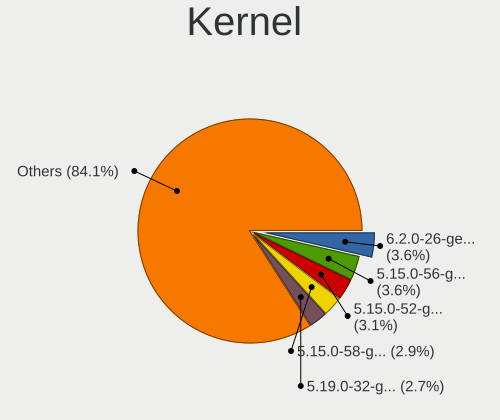

| Version           | Computers | Percent |
|-------------------|-----------|---------|
| 6.2.0-26-generic  | 791       | 3.6%    |
| 5.15.0-56-generic | 787       | 3.58%   |
| 5.15.0-52-generic | 681       | 3.1%    |
| 5.15.0-58-generic | 646       | 2.94%   |
| 5.19.0-32-generic | 595       | 2.71%   |
| 5.15.0-43-generic | 577       | 2.63%   |
| 5.19.0-35-generic | 538       | 2.45%   |
| 5.15.0-48-generic | 527       | 2.4%    |
| 5.19.0-38-generic | 501       | 2.28%   |
| 6.2.0-39-generic  | 499       | 2.27%   |
| 5.15.0-47-generic | 490       | 2.23%   |
| 5.19.0-41-generic | 457       | 2.08%   |
| 6.2.0-36-generic  | 439       | 2%      |
| 5.19.0-46-generic | 420       | 1.91%   |
| 6.2.0-37-generic  | 409       | 1.86%   |
| 5.15.0-46-generic | 407       | 1.85%   |
| 5.15.0-53-generic | 396       | 1.8%    |
| 6.5.0-26-generic  | 372       | 1.69%   |
| 5.15.0-25-generic | 370       | 1.68%   |
| 6.2.0-34-generic  | 348       | 1.58%   |
| 6.5.0-14-generic  | 336       | 1.53%   |
| 6.8.0-40-generic  | 330       | 1.5%    |
| 6.5.0-35-generic  | 319       | 1.45%   |
| 6.2.0-33-generic  | 311       | 1.42%   |
| 6.5.0-28-generic  | 307       | 1.4%    |
| 5.15.0-27-generic | 307       | 1.4%    |
| 6.2.0-32-generic  | 293       | 1.33%   |
| 5.19.0-43-generic | 289       | 1.32%   |
| 5.15.0-40-generic | 284       | 1.29%   |
| 5.15.0-41-generic | 279       | 1.27%   |
| 6.2.0-35-generic  | 252       | 1.15%   |
| 6.5.0-21-generic  | 250       | 1.14%   |
| 5.15.0-50-generic | 244       | 1.11%   |
| 6.5.0-15-generic  | 242       | 1.1%    |
| 5.15.0-60-generic | 241       | 1.1%    |
| 6.5.0-18-generic  | 231       | 1.05%   |
| 6.8.0-52-generic  | 214       | 0.97%   |
| 6.5.0-41-generic  | 213       | 0.97%   |
| 5.19.0-45-generic | 205       | 0.93%   |
| 5.15.0-57-generic | 203       | 0.92%   |

Kernel Family
-------------

Linux kernel without a distro release

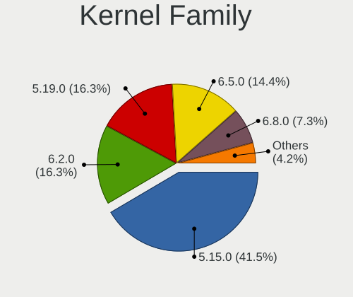

| Version  | Computers | Percent |
|----------|-----------|---------|
| 5.15.0   | 8407      | 41.54%  |
| 6.2.0    | 3300      | 16.31%  |
| 5.19.0   | 3290      | 16.26%  |
| 6.5.0    | 2912      | 14.39%  |
| 6.8.0    | 1477      | 7.3%    |
| 5.17.0   | 95        | 0.47%   |
| 6.1.0    | 71        | 0.35%   |
| 5.14.0   | 38        | 0.19%   |
| 6.0.0    | 34        | 0.17%   |
| 5.13.0   | 31        | 0.15%   |
| 5.18.0   | 18        | 0.09%   |
| 5.10.160 | 16        | 0.08%   |
| 5.4.0    | 12        | 0.06%   |
| 6.4.0    | 11        | 0.05%   |
| 6.2.11   | 11        | 0.05%   |
| 5.19.5   | 10        | 0.05%   |
| 5.15.148 | 10        | 0.05%   |
| 6.9.3    | 9         | 0.04%   |
| 6.4.6    | 9         | 0.04%   |
| 6.2.2    | 9         | 0.04%   |
| 6.0.9    | 9         | 0.04%   |
| 5.17.1   | 9         | 0.04%   |
| 5.10.110 | 9         | 0.04%   |
| 6.3.1    | 8         | 0.04%   |
| 5.17.5   | 8         | 0.04%   |
| 6.2.8    | 7         | 0.03%   |
| 6.2.10   | 7         | 0.03%   |
| 5.19.17  | 7         | 0.03%   |
| 6.8.1    | 6         | 0.03%   |
| 6.7.0    | 6         | 0.03%   |
| 6.4.3    | 6         | 0.03%   |
| 6.5.7    | 5         | 0.02%   |
| 6.4.12   | 5         | 0.02%   |
| 6.4.11   | 5         | 0.02%   |
| 6.4.10   | 5         | 0.02%   |
| 6.0.1    | 5         | 0.02%   |
| 5.18.10  | 5         | 0.02%   |
| 5.17.9   | 5         | 0.02%   |
| 5.16.0   | 5         | 0.02%   |
| 5.13.19  | 5         | 0.02%   |

Kernel Major Ver.
-----------------

Linux kernel major version

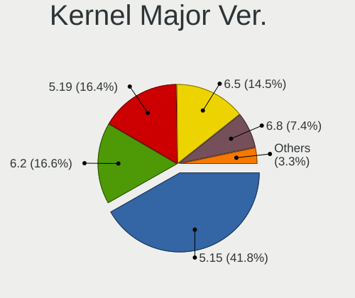

| Version | Computers | Percent |
|---------|-----------|---------|
| 5.15    | 8453      | 41.8%   |
| 6.2     | 3358      | 16.6%   |
| 5.19    | 3318      | 16.41%  |
| 6.5     | 2932      | 14.5%   |
| 6.8     | 1492      | 7.38%   |
| 5.17    | 139       | 0.69%   |
| 6.1     | 123       | 0.61%   |
| 6.0     | 69        | 0.34%   |
| 6.4     | 47        | 0.23%   |
| 5.18    | 46        | 0.23%   |
| 5.14    | 39        | 0.19%   |
| 5.13    | 36        | 0.18%   |
| 5.10    | 35        | 0.17%   |
| 6.3     | 24        | 0.12%   |
| 6.6     | 20        | 0.1%    |
| 6.7     | 17        | 0.08%   |
| 6.9     | 15        | 0.07%   |
| 5.4     | 15        | 0.07%   |
| 5.16    | 9         | 0.04%   |
| 6.12    | 6         | 0.03%   |
| 5.11    | 5         | 0.02%   |
| 6.16    | 4         | 0.02%   |
| 5.8     | 4         | 0.02%   |
| 6.10    | 3         | 0.01%   |
| 4.9     | 3         | 0.01%   |
| 6.15    | 2         | 0.01%   |
| 6.13    | 2         | 0.01%   |
| 4.19    | 2         | 0.01%   |
| 6.11    | 1         | 0.005%  |
| 6       | 1         | 0.005%  |
| 5.2     | 1         | 0.005%  |
| 5.15.05 | 1         | 0.005%  |
| 3.16    | 1         | 0.005%  |
| Unknown | 1         | 0.005%  |

Arch
----

OS architecture (x86_64, i586, etc.)

| Name    | Computers | Percent |
|---------|-----------|---------|
| x86_64  | 18713     | 98.97%  |
| aarch64 | 181       | 0.96%   |
| armv7l  | 13        | 0.07%   |
| riscv64 | 1         | 0.01%   |

DE
--

Desktop Environment

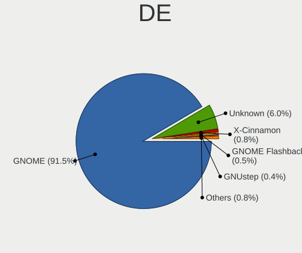

| Name              | Computers | Percent |
|-------------------|-----------|---------|
| GNOME             | 17344     | 91.53%  |
| Unknown           | 1144      | 6.04%   |
| X-Cinnamon        | 150       | 0.79%   |
| GNOME Flashback   | 89        | 0.47%   |
| GNUstep           | 74        | 0.39%   |
| Enlightenment     | 51        | 0.27%   |
| i3                | 29        | 0.15%   |
| GNOME Classic     | 24        | 0.13%   |
| Cinnamon          | 12        | 0.06%   |
| awesome           | 6         | 0.03%   |
| sway              | 5         | 0.03%   |
| openbox           | 4         | 0.02%   |
| i3-with-shmlog    | 3         | 0.02%   |
| Pantheon          | 2         | 0.01%   |
| dwm               | 2         | 0.01%   |
| Yoyo              | 1         | 0.01%   |
| Yaru:ubuntu:GNOME | 1         | 0.01%   |
| xsession          | 1         | 0.01%   |
| xmonad            | 1         | 0.01%   |
| ubuntu=GNOME      | 1         | 0.01%   |
| ubuntu            | 1         | 0.01%   |
| ratflow           | 1         | 0.01%   |
| qtile             | 1         | 0.01%   |
| Lubuntu           | 1         | 0.01%   |
| INPT              | 1         | 0.01%   |
| fluxbox           | 1         | 0.01%   |

Display Server
--------------

X11 or Wayland

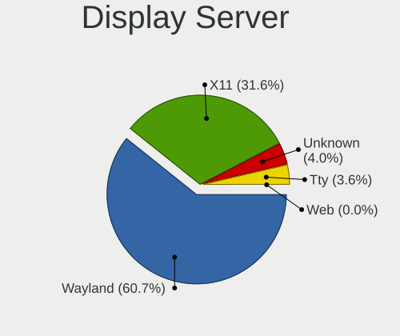

| Name    | Computers | Percent |
|---------|-----------|---------|
| Wayland | 11733     | 60.74%  |
| X11     | 6110      | 31.63%  |
| Unknown | 769       | 3.98%   |
| Tty     | 702       | 3.63%   |
| Web     | 3         | 0.02%   |

Display Manager
---------------

SDDM, LightDM, etc.

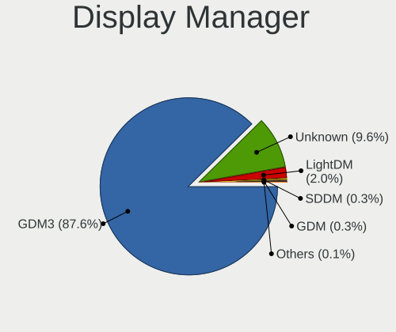

| Name            | Computers | Percent |
|-----------------|-----------|---------|
| GDM3            | 16660     | 87.62%  |
| Unknown         | 1820      | 9.57%   |
| LightDM         | 383       | 2.01%   |
| SDDM            | 64        | 0.34%   |
| GDM             | 61        | 0.32%   |
| SLiM            | 19        | 0.1%    |
| XDM             | 4         | 0.02%   |
| LXDM            | 3         | 0.02%   |
| KODI-STANDALONE | 1         | 0.01%   |

OS Lang
-------

Language

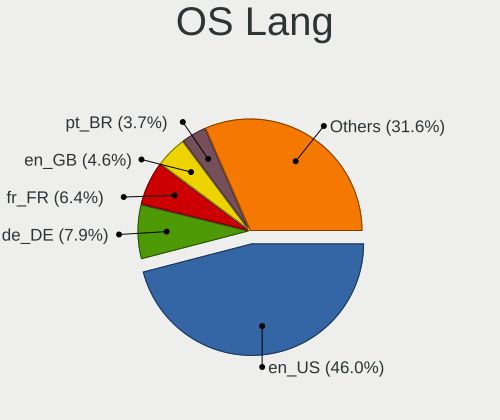

| Lang    | Computers | Percent |
|---------|-----------|---------|
| en_US   | 8728      | 45.96%  |
| de_DE   | 1493      | 7.86%   |
| fr_FR   | 1214      | 6.39%   |
| en_GB   | 870       | 4.58%   |
| pt_BR   | 695       | 3.66%   |
| it_IT   | 576       | 3.03%   |
| en_IN   | 500       | 2.63%   |
| ru_RU   | 496       | 2.61%   |
| C       | 470       | 2.47%   |
| en_CA   | 445       | 2.34%   |
| es_ES   | 434       | 2.29%   |
| en_AU   | 261       | 1.37%   |
| pl_PL   | 230       | 1.21%   |
| Unknown | 216       | 1.14%   |
| nl_NL   | 182       | 0.96%   |
| zh_CN   | 151       | 0.8%    |
| es_MX   | 130       | 0.68%   |
| cs_CZ   | 108       | 0.57%   |
| es_AR   | 105       | 0.55%   |
| hu_HU   | 96        | 0.51%   |
| en_ZA   | 91        | 0.48%   |
| de_AT   | 83        | 0.44%   |
| ja_JP   | 82        | 0.43%   |
| sv_SE   | 80        | 0.42%   |
| pt_PT   | 78        | 0.41%   |
| tr_TR   | 70        | 0.37%   |
| es_CO   | 58        | 0.31%   |
| en_PH   | 57        | 0.3%    |
| en_NZ   | 57        | 0.3%    |
| de_CH   | 57        | 0.3%    |
| fi_FI   | 53        | 0.28%   |
| fr_BE   | 41        | 0.22%   |
| en_IL   | 41        | 0.22%   |
| el_GR   | 39        | 0.21%   |
| es_CL   | 36        | 0.19%   |
| ko_KR   | 35        | 0.18%   |
| da_DK   | 34        | 0.18%   |
| fr_CA   | 33        | 0.17%   |
| nb_NO   | 31        | 0.16%   |
| en_HK   | 29        | 0.15%   |

Boot Mode
---------

EFI or BIOS

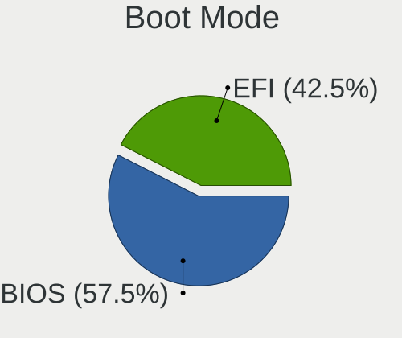

| Mode | Computers | Percent |
|------|-----------|---------|
| BIOS | 11026     | 57.51%  |
| EFI  | 8147      | 42.49%  |

Filesystem
----------

Type of filesystem

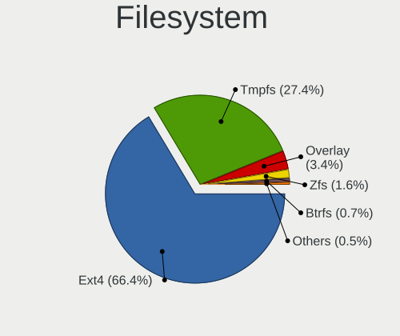

| Type          | Computers | Percent |
|---------------|-----------|---------|
| Ext4          | 12881     | 66.41%  |
| Tmpfs         | 5319      | 27.42%  |
| Overlay       | 653       | 3.37%   |
| Zfs           | 305       | 1.57%   |
| Btrfs         | 141       | 0.73%   |
| Xfs           | 50        | 0.26%   |
| Ext2          | 22        | 0.11%   |
| Ext3          | 14        | 0.07%   |
| Unknown       | 8         | 0.04%   |
| XXXX          | 1         | 0.01%   |
| XXX4          | 1         | 0.01%   |
| Jfs           | 1         | 0.01%   |
| Fuse.snapfuse | 1         | 0.01%   |

Part. scheme
------------

Scheme of partitioning

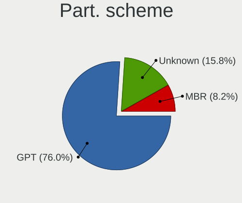

| Type    | Computers | Percent |
|---------|-----------|---------|
| GPT     | 14648     | 76.03%  |
| Unknown | 3042      | 15.79%  |
| MBR     | 1576      | 8.18%   |

Dual Boot with Linux/BSD
------------------------

Hosting more than one Linux/BSD

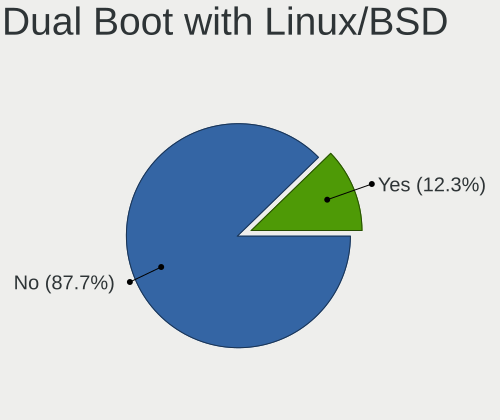

| Dual boot | Computers | Percent |
|-----------|-----------|---------|
| No        | 16859     | 87.74%  |
| Yes       | 2356      | 12.26%  |

Dual Boot (Win)
---------------

Hosting Linux and Windows

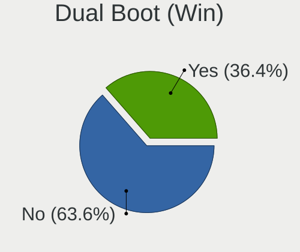

| Dual boot | Computers | Percent |
|-----------|-----------|---------|
| No        | 12141     | 63.57%  |
| Yes       | 6959      | 36.43%  |

Board
-----

Vendor
------

Motherboard manufacturer

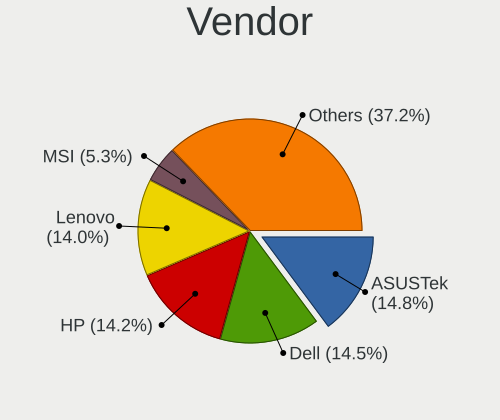

| Name                    | Computers | Percent |
|-------------------------|-----------|---------|
| ASUSTek Computer        | 2806      | 14.84%  |
| Dell                    | 2736      | 14.47%  |
| Hewlett-Packard         | 2689      | 14.22%  |
| Lenovo                  | 2646      | 13.99%  |
| MSI                     | 998       | 5.28%   |
| Gigabyte Technology     | 962       | 5.09%   |
| Acer                    | 912       | 4.82%   |
| Apple                   | 589       | 3.12%   |
| ASRock                  | 531       | 2.81%   |
| Intel                   | 362       | 1.91%   |
| HUAWEI                  | 262       | 1.39%   |
| Unknown                 | 230       | 1.22%   |
| Supermicro              | 213       | 1.13%   |
| Toshiba                 | 208       | 1.1%    |
| Fujitsu                 | 178       | 0.94%   |
| Samsung Electronics     | 176       | 0.93%   |
| Medion                  | 110       | 0.58%   |
| Sony                    | 100       | 0.53%   |
| Raspberry Pi Foundation | 93        | 0.49%   |
| Microsoft               | 90        | 0.48%   |
| Notebook                | 83        | 0.44%   |
| Google                  | 80        | 0.42%   |
| AZW                     | 75        | 0.4%    |
| Alienware               | 75        | 0.4%    |
| Foxconn                 | 58        | 0.31%   |
| Pegatron                | 57        | 0.3%    |
| Timi                    | 54        | 0.29%   |
| Positivo                | 52        | 0.28%   |
| Packard Bell            | 45        | 0.24%   |
| Biostar                 | 45        | 0.24%   |
| LG Electronics          | 43        | 0.23%   |
| AMI                     | 42        | 0.22%   |
| Chuwi                   | 40        | 0.21%   |
| Gateway                 | 32        | 0.17%   |
| TUXEDO                  | 30        | 0.16%   |
| ECS                     | 30        | 0.16%   |
| BESSTAR Tech            | 29        | 0.15%   |
| System76                | 28        | 0.15%   |
| Inspur                  | 28        | 0.15%   |
| Framework               | 28        | 0.15%   |

Model
-----

Motherboard model

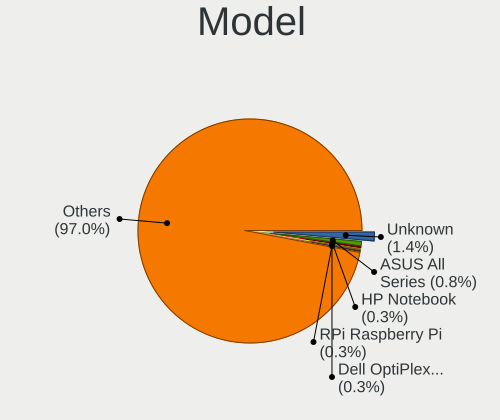

| Name                            | Computers | Percent |
|---------------------------------|-----------|---------|
| Unknown                         | 268       | 1.42%   |
| ASUS All Series                 | 145       | 0.77%   |
| HP Notebook                     | 57        | 0.3%    |
| RPi Raspberry Pi                | 50        | 0.26%   |
| Dell OptiPlex 7010              | 49        | 0.26%   |
| Dell OptiPlex 9020              | 44        | 0.23%   |
| Supermicro X8DTU                | 37        | 0.2%    |
| Supermicro Super Server         | 36        | 0.19%   |
| HP Pavilion Notebook            | 32        | 0.17%   |
| ASUS PRIME A320M-K              | 32        | 0.17%   |
| HP Pavilion dv6                 | 29        | 0.15%   |
| HP EliteBook 840 G3             | 29        | 0.15%   |
| Dell Latitude 5420              | 28        | 0.15%   |
| ASUS TUF Gaming X570-PLUS       | 27        | 0.14%   |
| MSI MS-7C37                     | 26        | 0.14%   |
| HP Pavilion 15                  | 26        | 0.14%   |
| Supermicro X9DRW                | 25        | 0.13%   |
| MSI MS-7C91                     | 25        | 0.13%   |
| HUAWEI BOM-WXX9                 | 25        | 0.13%   |
| HP Pavilion g6                  | 25        | 0.13%   |
| Dell OptiPlex 3020              | 25        | 0.13%   |
| HUAWEI BOD-WXX9                 | 24        | 0.13%   |
| HP ProLiant DL360 Gen9          | 24        | 0.13%   |
| HP EliteBook 840 G5             | 24        | 0.13%   |
| ETegro Hyperion RS125 G4        | 24        | 0.13%   |
| Dell OptiPlex 3050              | 24        | 0.13%   |
| Inspur SA5248M4                 | 23        | 0.12%   |
| HUAWEI NBLB-WAX9N               | 23        | 0.12%   |
| Dell OptiPlex 790               | 23        | 0.12%   |
| MSI MS-7721                     | 22        | 0.12%   |
| HP 15                           | 22        | 0.12%   |
| Dell OptiPlex 7050              | 22        | 0.12%   |
| Lenovo ThinkBook 15 G2 ITL 20VE | 21        | 0.11%   |
| HP Pavilion dv7                 | 21        | 0.11%   |
| Apple MacBookPro9,2             | 21        | 0.11%   |
| HUAWEI BOHB-WAX9                | 20        | 0.11%   |
| Dell XPS 15 9500                | 20        | 0.11%   |
| Dell XPS 13 9370                | 20        | 0.11%   |
| AZW SER                         | 20        | 0.11%   |
| ASUS ROG STRIX B550-F GAMING    | 20        | 0.11%   |

Model Family
------------

Motherboard model prefix

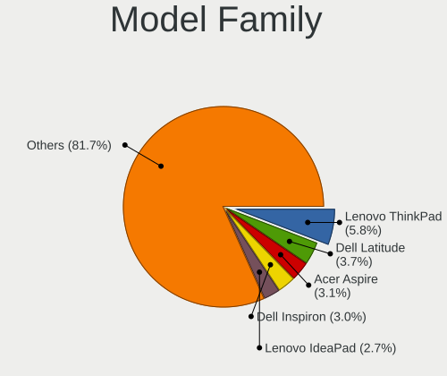

| Name               | Computers | Percent |
|--------------------|-----------|---------|
| Lenovo ThinkPad    | 1103      | 5.83%   |
| Dell Latitude      | 699       | 3.7%    |
| Acer Aspire        | 593       | 3.14%   |
| Dell Inspiron      | 562       | 2.97%   |
| Lenovo IdeaPad     | 507       | 2.68%   |
| Dell OptiPlex      | 447       | 2.36%   |
| HP Pavilion        | 425       | 2.25%   |
| HP EliteBook       | 372       | 1.97%   |
| ASUS PRIME         | 366       | 1.94%   |
| ASUS VivoBook      | 357       | 1.89%   |
| ASUS ROG           | 334       | 1.77%   |
| Dell Precision     | 324       | 1.71%   |
| Dell XPS           | 298       | 1.58%   |
| HP ProBook         | 270       | 1.43%   |
| Unknown            | 268       | 1.42%   |
| HP Laptop          | 256       | 1.35%   |
| HP Compaq          | 187       | 0.99%   |
| ASUS TUF           | 187       | 0.99%   |
| Lenovo ThinkCentre | 176       | 0.93%   |
| Toshiba Satellite  | 165       | 0.87%   |
| Dell Vostro        | 156       | 0.83%   |
| HP ENVY            | 151       | 0.8%    |
| ASUS All           | 145       | 0.77%   |
| Lenovo ThinkBook   | 135       | 0.71%   |
| Lenovo Legion      | 132       | 0.7%    |
| ASUS Zenbook       | 127       | 0.67%   |
| Lenovo Yoga        | 120       | 0.63%   |
| ASUS ASUS          | 106       | 0.56%   |
| HP EliteDesk       | 104       | 0.55%   |
| Dell PowerEdge     | 101       | 0.53%   |
| HP ZBook           | 100       | 0.53%   |
| RPi Raspberry      | 93        | 0.49%   |
| Microsoft Surface  | 90        | 0.48%   |
| HP ProDesk         | 84        | 0.44%   |
| Acer Swift         | 79        | 0.42%   |
| Acer Nitro         | 79        | 0.42%   |
| HP ProLiant        | 70        | 0.37%   |
| Fujitsu ESPRIMO    | 66        | 0.35%   |
| Fujitsu LIFEBOOK   | 60        | 0.32%   |
| HP Notebook        | 58        | 0.31%   |

MFG Year
--------

Motherboard manufacture year

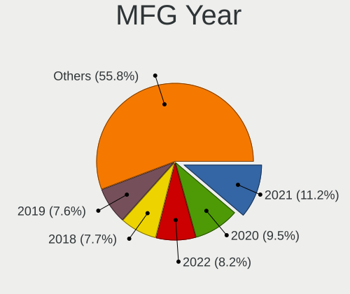

| Year    | Computers | Percent |
|---------|-----------|---------|
| 2021    | 2117      | 11.2%   |
| 2020    | 1796      | 9.5%    |
| 2022    | 1557      | 8.24%   |
| 2018    | 1459      | 7.72%   |
| 2019    | 1436      | 7.6%    |
| 2012    | 1248      | 6.6%    |
| 2013    | 1239      | 6.55%   |
| 2017    | 1139      | 6.02%   |
| 2014    | 999       | 5.28%   |
| 2011    | 997       | 5.27%   |
| 2015    | 949       | 5.02%   |
| 2023    | 859       | 4.54%   |
| 2016    | 821       | 4.34%   |
| 2010    | 721       | 3.81%   |
| 2009    | 528       | 2.79%   |
| 2008    | 405       | 2.14%   |
| 2007    | 196       | 1.04%   |
| Unknown | 166       | 0.88%   |
| 2024    | 150       | 0.79%   |
| 2006    | 81        | 0.43%   |
| 2025    | 35        | 0.19%   |
| 2005    | 8         | 0.04%   |
| 2004    | 1         | 0.01%   |

Form Factor
-----------

Physical design of the computer

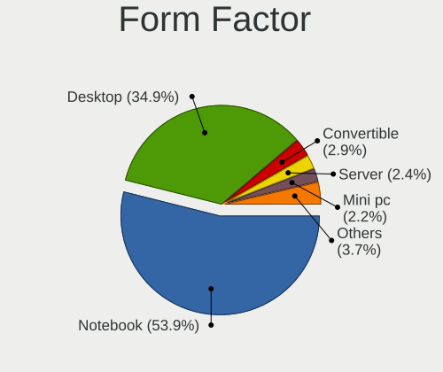

| Name           | Computers | Percent |
|----------------|-----------|---------|
| Notebook       | 10193     | 53.91%  |
| Desktop        | 6594      | 34.88%  |
| Convertible    | 556       | 2.94%   |
| Server         | 447       | 2.36%   |
| Mini pc        | 416       | 2.2%    |
| All in one     | 328       | 1.73%   |
| Tablet         | 186       | 0.98%   |
| System on chip | 184       | 0.97%   |
| Other          | 2         | 0.01%   |
| Stick pc       | 1         | 0.01%   |

Secure Boot
-----------

Enabled or disabled

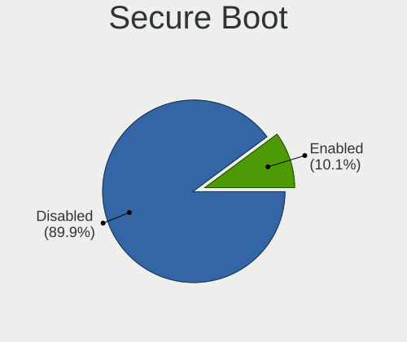

| State    | Computers | Percent |
|----------|-----------|---------|
| Disabled | 17070     | 89.87%  |
| Enabled  | 1925      | 10.13%  |

Coreboot
--------

Have coreboot on board

| Used | Computers | Percent |
|------|-----------|---------|
| No   | 18804     | 99.46%  |
| Yes  | 103       | 0.54%   |

RAM Size
--------

Total RAM memory

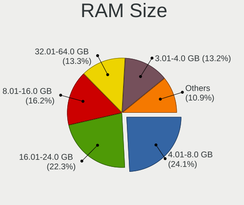

| Size in GB      | Computers | Percent |
|-----------------|-----------|---------|
| 4.01-8.0        | 4631      | 24.13%  |
| 16.01-24.0      | 4276      | 22.28%  |
| 8.01-16.0       | 3113      | 16.22%  |
| 32.01-64.0      | 2548      | 13.28%  |
| 3.01-4.0        | 2539      | 13.23%  |
| 64.01-256.0     | 1015      | 5.29%   |
| 24.01-32.0      | 480       | 2.5%    |
| 1.01-2.0        | 292       | 1.52%   |
| More than 256.0 | 150       | 0.78%   |
| 2.01-3.0        | 126       | 0.66%   |
| 0.51-1.0        | 16        | 0.08%   |
| 0.01-0.5        | 5         | 0.03%   |

RAM Used
--------

Used RAM memory

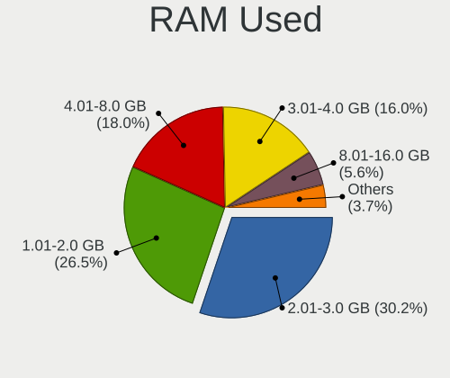

| Used GB         | Computers | Percent |
|-----------------|-----------|---------|
| 2.01-3.0        | 6168      | 30.17%  |
| 1.01-2.0        | 5418      | 26.5%   |
| 4.01-8.0        | 3683      | 18.02%  |
| 3.01-4.0        | 3275      | 16.02%  |
| 8.01-16.0       | 1146      | 5.61%   |
| 0.51-1.0        | 316       | 1.55%   |
| 16.01-24.0      | 187       | 0.91%   |
| 0.01-0.5        | 90        | 0.44%   |
| 24.01-32.0      | 80        | 0.39%   |
| 32.01-64.0      | 41        | 0.2%    |
| 64.01-256.0     | 37        | 0.18%   |
| More than 256.0 | 2         | 0.01%   |
| 0               | 1         | 0.005%  |

Total Drives
------------

Number of drives on board

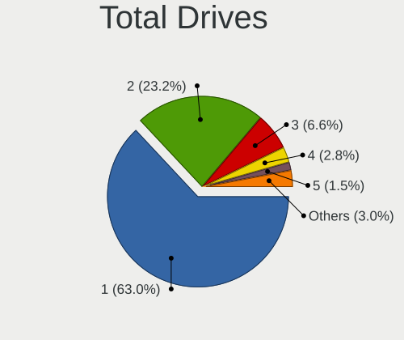

| Drives  | Computers | Percent |
|---------|-----------|---------|
| 1       | 12223     | 63.02%  |
| 2       | 4494      | 23.17%  |
| 3       | 1280      | 6.6%    |
| 4       | 539       | 2.78%   |
| 5       | 282       | 1.45%   |
| 0       | 192       | 0.99%   |
| 6       | 129       | 0.67%   |
| 7       | 72        | 0.37%   |
| 8       | 42        | 0.22%   |
| 9       | 32        | 0.16%   |
| 11      | 31        | 0.16%   |
| 14      | 16        | 0.08%   |
| 10      | 12        | 0.06%   |
| 13      | 11        | 0.06%   |
| 12      | 7         | 0.04%   |
| 25      | 4         | 0.02%   |
| 18      | 4         | 0.02%   |
| 17      | 4         | 0.02%   |
| 15      | 3         | 0.02%   |
| 26      | 2         | 0.01%   |
| 22      | 2         | 0.01%   |
| 91      | 1         | 0.01%   |
| 70      | 1         | 0.01%   |
| 42      | 1         | 0.01%   |
| 40      | 1         | 0.01%   |
| 38      | 1         | 0.01%   |
| 35      | 1         | 0.01%   |
| 30      | 1         | 0.01%   |
| 27      | 1         | 0.01%   |
| 23      | 1         | 0.01%   |
| 21      | 1         | 0.01%   |
| 20      | 1         | 0.01%   |
| 19      | 1         | 0.01%   |
| Unknown | 1         | 0.01%   |

Has CD-ROM
----------

Has CD-ROM on board

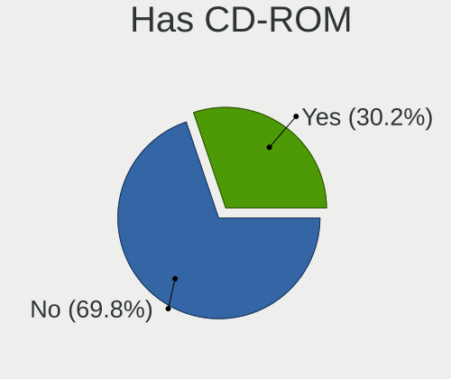

| Presented | Computers | Percent |
|-----------|-----------|---------|
| No        | 13258     | 69.82%  |
| Yes       | 5731      | 30.18%  |

Has Ethernet
------------

Has Ethernet on board

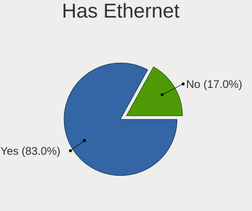

| Presented | Computers | Percent |
|-----------|-----------|---------|
| Yes       | 15744     | 83.03%  |
| No        | 3218      | 16.97%  |

Has WiFi
--------

Has WiFi module

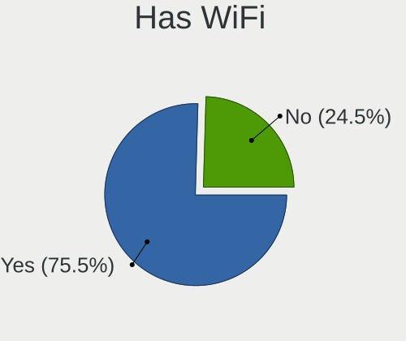

| Presented | Computers | Percent |
|-----------|-----------|---------|
| Yes       | 14323     | 75.46%  |
| No        | 4659      | 24.54%  |

Has Bluetooth
-------------

Has Bluetooth module

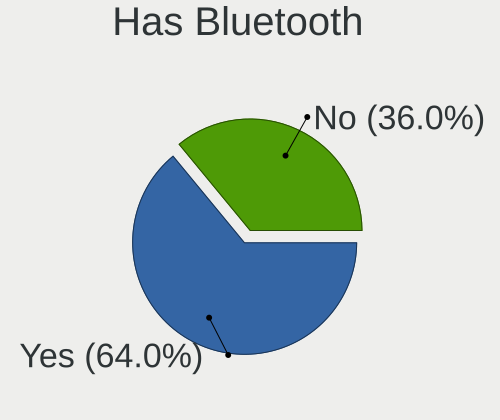

| Presented | Computers | Percent |
|-----------|-----------|---------|
| Yes       | 12202     | 64.03%  |
| No        | 6856      | 35.97%  |

Location
--------

Country
-------

Geographic location (country)

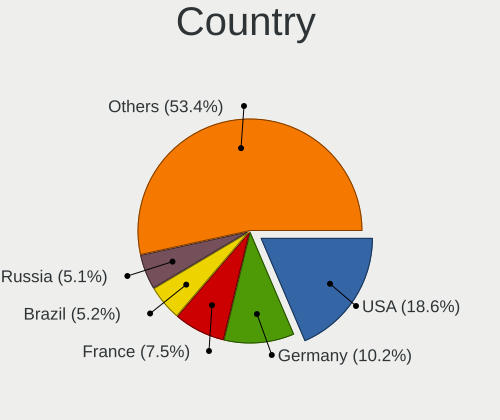

| Country      | Computers | Percent |
|--------------|-----------|---------|
| USA          | 3525      | 18.57%  |
| Germany      | 1940      | 10.22%  |
| France       | 1423      | 7.49%   |
| Brazil       | 984       | 5.18%   |
| Russia       | 970       | 5.11%   |
| Italy        | 803       | 4.23%   |
| UK           | 762       | 4.01%   |
| Canada       | 578       | 3.04%   |
| India        | 577       | 3.04%   |
| Spain        | 569       | 3%      |
| Netherlands  | 413       | 2.18%   |
| Poland       | 408       | 2.15%   |
| Switzerland  | 314       | 1.65%   |
| Australia    | 280       | 1.47%   |
| Mexico       | 249       | 1.31%   |
| Sweden       | 232       | 1.22%   |
| Turkey       | 211       | 1.11%   |
| China        | 209       | 1.1%    |
| Argentina    | 189       | 1%      |
| Czechia      | 187       | 0.98%   |
| Austria      | 185       | 0.97%   |
| Belgium      | 181       | 0.95%   |
| Hungary      | 174       | 0.92%   |
| Portugal     | 151       | 0.8%    |
| Romania      | 149       | 0.78%   |
| Finland      | 135       | 0.71%   |
| Japan        | 130       | 0.68%   |
| Greece       | 127       | 0.67%   |
| Colombia     | 112       | 0.59%   |
| Indonesia    | 111       | 0.58%   |
| South Africa | 109       | 0.57%   |
| Norway       | 109       | 0.57%   |
| Bulgaria     | 107       | 0.56%   |
| Denmark      | 90        | 0.47%   |
| Iran         | 77        | 0.41%   |
| New Zealand  | 75        | 0.4%    |
| South Korea  | 74        | 0.39%   |
| Chile        | 73        | 0.38%   |
| Hong Kong    | 72        | 0.38%   |
| Taiwan       | 71        | 0.37%   |

City
----

Geographic location (city)

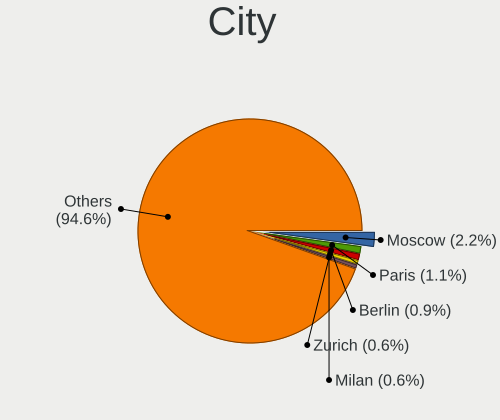

| City              | Computers | Percent |
|-------------------|-----------|---------|
| Moscow            | 429       | 2.16%   |
| Paris             | 216       | 1.09%   |
| Berlin            | 188       | 0.95%   |
| Zurich            | 125       | 0.63%   |
| Milan             | 122       | 0.61%   |
| St Petersburg     | 119       | 0.6%    |
| Sao Paulo         | 108       | 0.54%   |
| Madrid            | 105       | 0.53%   |
| Vienna            | 102       | 0.51%   |
| Rome              | 102       | 0.51%   |
| Warsaw            | 99        | 0.5%    |
| Sydney            | 91        | 0.46%   |
| Budapest          | 90        | 0.45%   |
| Munich            | 88        | 0.44%   |
| Istanbul          | 82        | 0.41%   |
| Bengaluru         | 78        | 0.39%   |
| Barcelona         | 76        | 0.38%   |
| Amsterdam         | 76        | 0.38%   |
| Toronto           | 75        | 0.38%   |
| Hamburg           | 75        | 0.38%   |
| Rio de Janeiro    | 74        | 0.37%   |
| Prague            | 69        | 0.35%   |
| Los Angeles       | 68        | 0.34%   |
| Athens            | 66        | 0.33%   |
| New York          | 65        | 0.33%   |
| Melbourne         | 65        | 0.33%   |
| Helsinki          | 64        | 0.32%   |
| London            | 60        | 0.3%    |
| Sofia             | 58        | 0.29%   |
| Singapore         | 56        | 0.28%   |
| Bogotá           | 54        | 0.27%   |
| Stockholm         | 53        | 0.27%   |
| Frankfurt am Main | 53        | 0.27%   |
| Chennai           | 52        | 0.26%   |
| Tehran            | 51        | 0.26%   |
| Seattle           | 51        | 0.26%   |
| Mexico City       | 51        | 0.26%   |
| Montreal          | 48        | 0.24%   |
| Chicago           | 47        | 0.24%   |
| San Jose          | 44        | 0.22%   |

Drives
------

Drive Vendor
------------

Hard drive vendors

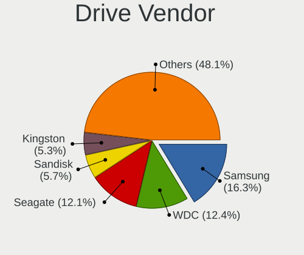

| Vendor                      | Computers | Drives | Percent |
|-----------------------------|-----------|--------|---------|
| Samsung Electronics         | 4316      | 6056   | 16.31%  |
| WDC                         | 3292      | 5079   | 12.44%  |
| Seagate                     | 3190      | 5321   | 12.05%  |
| Sandisk                     | 1516      | 1979   | 5.73%   |
| Kingston                    | 1415      | 1723   | 5.35%   |
| Toshiba                     | 1401      | 1910   | 5.29%   |
| Unknown                     | 1003      | 1336   | 3.79%   |
| Crucial                     | 940       | 1347   | 3.55%   |
| SK hynix                    | 894       | 1053   | 3.38%   |
| Intel                       | 875       | 1486   | 3.31%   |
| Micron Technology           | 714       | 836    | 2.7%    |
| Hitachi                     | 612       | 1022   | 2.31%   |
| HGST                        | 413       | 668    | 1.56%   |
| KIOXIA                      | 389       | 460    | 1.47%   |
| A-DATA Technology           | 343       | 408    | 1.3%    |
| Apple                       | 309       | 386    | 1.17%   |
| China                       | 260       | 307    | 0.98%   |
| Unknown                     | 207       | 226    | 0.78%   |
| Kingston Technology Company | 206       | 245    | 0.78%   |
| Phison Electronics          | 199       | 253    | 0.75%   |
| Silicon Motion              | 184       | 234    | 0.7%    |
| Micron/Crucial Technology   | 168       | 208    | 0.63%   |
| Phison                      | 167       | 239    | 0.63%   |
| Fujitsu                     | 156       | 623    | 0.59%   |
| PNY                         | 155       | 185    | 0.59%   |
| Intenso                     | 148       | 196    | 0.56%   |
| SPCC                        | 128       | 196    | 0.48%   |
| Hewlett-Packard             | 108       | 407    | 0.41%   |
| LITEON                      | 105       | 124    | 0.4%    |
| Lexar                       | 92        | 116    | 0.35%   |
| ADATA Technology            | 87        | 107    | 0.33%   |
| Patriot                     | 82        | 95     | 0.31%   |
| Netac                       | 79        | 95     | 0.3%    |
| MAXIO Technology (Hangzhou) | 77        | 92     | 0.29%   |
| Transcend                   | 76        | 87     | 0.29%   |
| Team                        | 71        | 93     | 0.27%   |
| Gigabyte Technology         | 68        | 82     | 0.26%   |
| JMicron Technology          | 66        | 72     | 0.25%   |
| OCZ                         | 62        | 85     | 0.23%   |
| GOODRAM                     | 59        | 75     | 0.22%   |

Drive Model
-----------

Hard drive models

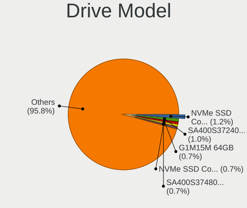

| Model                                                 | Computers | Percent |
|-------------------------------------------------------|-----------|---------|
| Samsung NVMe SSD Controller SM981/PM981/PM983 1TB     | 348       | 1.2%    |
| Kingston SA400S37240G 240GB SSD                       | 277       | 0.96%   |
| Unknown                                               | 207       | 0.71%   |
| Samsung NVMe SSD Controller PM9A1/PM9A3/980PRO 1TB    | 200       | 0.69%   |
| Kingston SA400S37480G 480GB SSD                       | 196       | 0.68%   |
| Seagate ST1000LM035-1RK172 1TB                        | 180       | 0.62%   |
| Seagate ST500DM002-1BD142 500GB                       | 167       | 0.58%   |
| Samsung SSD 860 EVO 500GB                             | 165       | 0.57%   |
| Unknown MMC Card  64GB                                | 157       | 0.54%   |
| Seagate ST1000DM010-2EP102 1TB                        | 153       | 0.53%   |
| Unknown MMC Card  32GB                                | 145       | 0.5%    |
| Seagate ST2000DM008-2FR102 2TB                        | 143       | 0.49%   |
| Samsung SSD 850 EVO 250GB                             | 143       | 0.49%   |
| Crucial CT500MX500SSD1 500GB                          | 141       | 0.49%   |
| SanDisk NVMe SSD Drive 1TB                            | 140       | 0.48%   |
| Samsung SSD 850 EVO 500GB                             | 133       | 0.46%   |
| Seagate ST1000LM024 HN-M101MBB 1TB                    | 125       | 0.43%   |
| Toshiba MQ01ABD100 1TB                                | 119       | 0.41%   |
| Crucial CT1000MX500SSD1 1TB                           | 115       | 0.4%    |
| Unknown SD/MMC/MS PRO 2GB                             | 113       | 0.39%   |
| Samsung SSD 980 PRO 1TB                               | 107       | 0.37%   |
| Micron/Crucial P2 NVMe PCIe SSD 2TB                   | 107       | 0.37%   |
| Kingston SA400S37120G 120GB SSD                       | 107       | 0.37%   |
| Crucial CT240BX500SSD1 240GB                          | 107       | 0.37%   |
| Toshiba MQ04ABF100 1TB                                | 105       | 0.36%   |
| Samsung SSD 980 1TB                                   | 102       | 0.35%   |
| Toshiba DT01ACA100 1TB                                | 101       | 0.35%   |
| Unknown MMC Card  128GB                               | 100       | 0.35%   |
| Samsung NVMe SSD Controller SM961/PM961/SM963 1024GB  | 96        | 0.33%   |
| Intel SSDPEKNU512GZ 512GB                             | 96        | 0.33%   |
| Sandisk WD Black SN750 / PC SN730 NVMe SSD 500GB      | 94        | 0.32%   |
| Sandisk WD Blue SN550 NVMe SSD 1024GB                 | 90        | 0.31%   |
| Toshiba MQ01ABF050 500GB                              | 88        | 0.3%    |
| WDC WD10EZEX-08WN4A0 1TB                              | 86        | 0.3%    |
| SanDisk NVMe SSD Drive 512GB                          | 85        | 0.29%   |
| Samsung SSD 860 EVO 1TB                               | 84        | 0.29%   |
| Seagate ST1000DM003-1CH162 1TB                        | 83        | 0.29%   |
| Samsung SSD 870 EVO 500GB                             | 83        | 0.29%   |
| HGST HTS721010A9E630 1TB                              | 83        | 0.29%   |
| Silicon Motion SM2263EN/SM2263XT SSD Controller 512GB | 81        | 0.28%   |

HDD Vendor
----------

Hard disk drive vendors

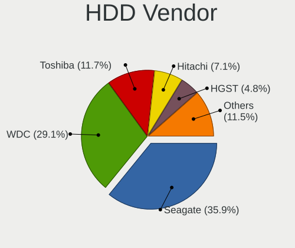

| Vendor              | Computers | Drives | Percent |
|---------------------|-----------|--------|---------|
| Seagate             | 3099      | 5167   | 35.88%  |
| WDC                 | 2513      | 4017   | 29.1%   |
| Toshiba             | 1011      | 1424   | 11.71%  |
| Hitachi             | 609       | 1019   | 7.05%   |
| HGST                | 412       | 662    | 4.77%   |
| Samsung Electronics | 302       | 439    | 3.5%    |
| Fujitsu             | 156       | 623    | 1.81%   |
| Unknown             | 124       | 155    | 1.44%   |
| Apple               | 90        | 101    | 1.04%   |
| JMicron Technology  | 46        | 48     | 0.53%   |
| Maxtor              | 41        | 50     | 0.47%   |
| Hewlett-Packard     | 41        | 217    | 0.47%   |
| Intenso             | 30        | 33     | 0.35%   |
| ASMT                | 21        | 38     | 0.24%   |
| External            | 15        | 26     | 0.17%   |
| USB3.0              | 13        | 14     | 0.15%   |
| SSK                 | 11        | 12     | 0.13%   |
| SABRENT             | 9         | 11     | 0.1%    |
| ASMedia             | 9         | 11     | 0.1%    |
| TO Exter            | 7         | 8      | 0.08%   |
| Unknown             | 6         | 6      | 0.07%   |
| WD MediaMax         | 5         | 6      | 0.06%   |
| USB                 | 5         | 5      | 0.06%   |
| T-FORCE             | 5         | 6      | 0.06%   |
| HPE                 | 5         | 8      | 0.06%   |
| ExcelStor           | 5         | 5      | 0.06%   |
| LaCie               | 4         | 5      | 0.05%   |
| Inateck             | 4         | 4      | 0.05%   |
| StoreJet            | 3         | 3      | 0.03%   |
| SATAFIRM            | 3         | 3      | 0.03%   |
| IBM-ESXS            | 3         | 8      | 0.03%   |
| TDAS                | 2         | 11     | 0.02%   |
| Shenzhen            | 2         | 3      | 0.02%   |
| SAGE                | 2         | 2      | 0.02%   |
| QUANTUM             | 2         | 2      | 0.02%   |
| MaxDigital          | 2         | 2      | 0.02%   |
| MARVELL             | 2         | 2      | 0.02%   |
| Lenovo              | 2         | 4      | 0.02%   |
| HGST HTS            | 2         | 3      | 0.02%   |
| DELLBOSS            | 2         | 2      | 0.02%   |

SSD Vendor
----------

Solid state drive vendors

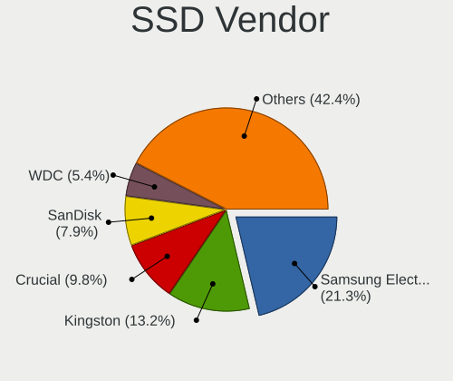

| Vendor              | Computers | Drives | Percent |
|---------------------|-----------|--------|---------|
| Samsung Electronics | 1717      | 2332   | 21.32%  |
| Kingston            | 1062      | 1311   | 13.18%  |
| Crucial             | 786       | 1112   | 9.76%   |
| SanDisk             | 634       | 850    | 7.87%   |
| WDC                 | 437       | 557    | 5.43%   |
| Intel               | 335       | 751    | 4.16%   |
| China               | 256       | 301    | 3.18%   |
| A-DATA Technology   | 233       | 278    | 2.89%   |
| Micron Technology   | 175       | 220    | 2.17%   |
| SK hynix            | 157       | 194    | 1.95%   |
| Toshiba             | 140       | 160    | 1.74%   |
| PNY                 | 130       | 159    | 1.61%   |
| Apple               | 125       | 141    | 1.55%   |
| SPCC                | 114       | 181    | 1.42%   |
| LITEON              | 100       | 119    | 1.24%   |
| Intenso             | 88        | 122    | 1.09%   |
| Patriot             | 74        | 87     | 0.92%   |
| Netac               | 71        | 85     | 0.88%   |
| Transcend           | 67        | 77     | 0.83%   |
| Unknown             | 67        | 78     | 0.83%   |
| OCZ                 | 60        | 71     | 0.74%   |
| Team                | 57        | 76     | 0.71%   |
| Lexar               | 56        | 74     | 0.7%    |
| GOODRAM             | 55        | 71     | 0.68%   |
| Hewlett-Packard     | 47        | 131    | 0.58%   |
| KingSpec            | 46        | 49     | 0.57%   |
| Gigabyte Technology | 46        | 56     | 0.57%   |
| LITEONIT            | 39        | 52     | 0.48%   |
| Apacer              | 34        | 35     | 0.42%   |
| Corsair             | 33        | 37     | 0.41%   |
| SABRENT             | 31        | 34     | 0.38%   |
| Seagate             | 26        | 31     | 0.32%   |
| Verbatim            | 24        | 25     | 0.3%    |
| Emtec               | 23        | 26     | 0.29%   |
| FORESEE             | 22        | 24     | 0.27%   |
| Teclast             | 19        | 21     | 0.24%   |
| KIOXIA-EXCERIA      | 19        | 31     | 0.24%   |
| Fanxiang            | 19        | 23     | 0.24%   |
| ASMT                | 18        | 28     | 0.22%   |
| Dogfish             | 17        | 21     | 0.21%   |

Drive Kind
----------

HDD or SSD

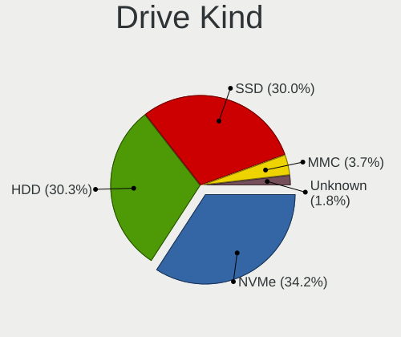

| Kind    | Computers | Drives | Percent |
|---------|-----------|--------|---------|
| NVMe    | 8216      | 11017  | 34.17%  |
| HDD     | 7279      | 14192  | 30.27%  |
| SSD     | 7220      | 10756  | 30.03%  |
| MMC     | 891       | 1135   | 3.71%   |
| Unknown | 440       | 664    | 1.83%   |

Drive Connector
---------------

SATA, SAS, NVMe, etc.

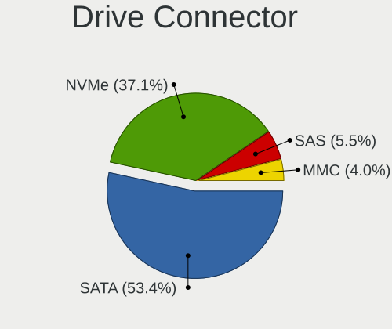

| Type | Computers | Drives | Percent |
|------|-----------|--------|---------|
| SATA | 11792     | 23205  | 53.38%  |
| NVMe | 8196      | 10951  | 37.1%   |
| SAS  | 1211      | 2473   | 5.48%   |
| MMC  | 891       | 1135   | 4.03%   |

Drive Size
----------

Size of hard drive

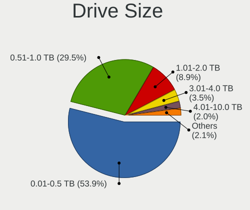

| Size in TB | Computers | Drives | Percent |
|------------|-----------|--------|---------|
| 0.01-0.5   | 8233      | 13192  | 53.94%  |
| 0.51-1.0   | 4509      | 7099   | 29.54%  |
| 1.01-2.0   | 1353      | 2153   | 8.86%   |
| 3.01-4.0   | 539       | 1013   | 3.53%   |
| 4.01-10.0  | 305       | 748    | 2%      |
| 2.01-3.0   | 218       | 373    | 1.43%   |
| 10.01-20.0 | 101       | 358    | 0.66%   |
| 20.01-50.0 | 4         | 9      | 0.03%   |
| 0          | 2         | 3      | 0.01%   |

Space Total
-----------

Amount of disk space available on the file system

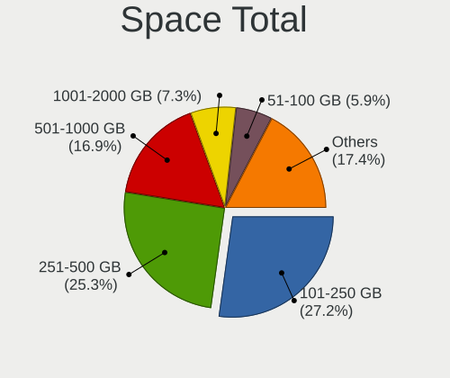

| Size in GB     | Computers | Percent |
|----------------|-----------|---------|
| 101-250        | 5307      | 27.19%  |
| 251-500        | 4947      | 25.34%  |
| 501-1000       | 3302      | 16.92%  |
| 1001-2000      | 1429      | 7.32%   |
| 51-100         | 1147      | 5.88%   |
| More than 3000 | 917       | 4.7%    |
| 1-20           | 876       | 4.49%   |
| 21-50          | 578       | 2.96%   |
| Unknown        | 521       | 2.67%   |
| 2001-3000      | 497       | 2.55%   |

Space Used
----------

Amount of used disk space

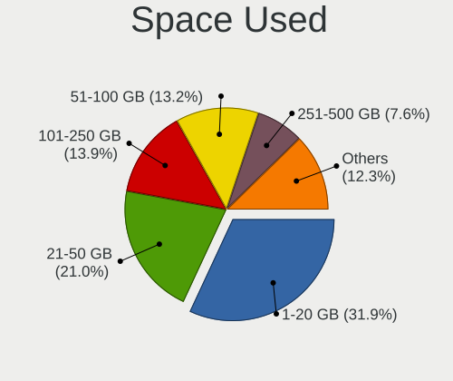

| Used GB        | Computers | Percent |
|----------------|-----------|---------|
| 1-20           | 6456      | 31.93%  |
| 21-50          | 4245      | 21%     |
| 101-250        | 2819      | 13.94%  |
| 51-100         | 2678      | 13.25%  |
| 251-500        | 1531      | 7.57%   |
| 501-1000       | 950       | 4.7%    |
| Unknown        | 521       | 2.58%   |
| 1001-2000      | 491       | 2.43%   |
| More than 3000 | 357       | 1.77%   |
| 2001-3000      | 167       | 0.83%   |
| 0              | 2         | 0.01%   |

Malfunc. Drives
---------------

Drive models with a malfunction

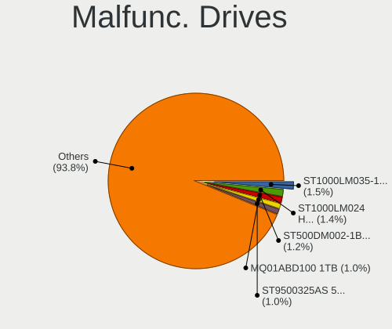

| Model                                 | Computers | Drives | Percent |
|---------------------------------------|-----------|--------|---------|
| Seagate ST1000LM035-1RK172 1TB        | 17        | 17     | 1.48%   |
| Seagate ST1000LM024 HN-M101MBB 1TB    | 16        | 19     | 1.4%    |
| Seagate ST500DM002-1BD142 500GB       | 14        | 14     | 1.22%   |
| Toshiba MQ01ABD100 1TB                | 12        | 12     | 1.05%   |
| Seagate ST9500325AS 500GB             | 12        | 12     | 1.05%   |
| Intel SSDSC2BB800G7 800GB             | 11        | 29     | 0.96%   |
| SK hynix BC711 HFM512GD3JX013N 512GB  | 9         | 9      | 0.79%   |
| HGST HTS541010A9E680 1TB              | 9         | 10     | 0.79%   |
| WDC WD40EFRX-68WT0N0 4TB              | 8         | 10     | 0.7%    |
| Seagate ST500LT012-1DG142 500GB       | 8         | 8      | 0.7%    |
| Seagate ST3500418AS 500GB             | 8         | 14     | 0.7%    |
| HGST HTS725050A7E630 500GB            | 8         | 10     | 0.7%    |
| Toshiba MQ04ABF100 1TB                | 7         | 7      | 0.61%   |
| Seagate ST1000DM010-2EP102 1TB        | 7         | 11     | 0.61%   |
| HGST HTS721010A9E630 1TB              | 7         | 8      | 0.61%   |
| WDC WDS240G2G0A-00JH30 240GB SSD      | 6         | 6      | 0.52%   |
| Seagate ST500LT012-9WS142 500GB       | 6         | 6      | 0.52%   |
| Seagate ST500LM021-1KJ152 500GB       | 6         | 8      | 0.52%   |
| Seagate ST1000LX015-1U7172 1TB        | 6         | 6      | 0.52%   |
| Seagate ST1000LM014-1EJ164 1TB        | 6         | 7      | 0.52%   |
| Seagate ST1000DM003-1CH162 1TB        | 6         | 8      | 0.52%   |
| Samsung Electronics SSD 870 EVO 1TB   | 6         | 6      | 0.52%   |
| Kingston SV300S37A120G 120GB SSD      | 6         | 7      | 0.52%   |
| Kingston SA400S37240G 240GB SSD       | 6         | 6      | 0.52%   |
| WDC WD5002ABYS-02B1B0 500GB           | 5         | 17     | 0.44%   |
| SK hynix HFS256G39TND-N210A 256GB SSD | 5         | 5      | 0.44%   |
| Seagate ST9320325AS 320GB             | 5         | 5      | 0.44%   |
| Seagate ST31000528AS 1TB              | 5         | 5      | 0.44%   |
| Seagate ST2000DM001-1CH164 2TB        | 5         | 5      | 0.44%   |
| Seagate ST1000LM014-SSHD-8GB          | 5         | 5      | 0.44%   |
| SanDisk SSD PLUS 480GB                | 5         | 5      | 0.44%   |
| SanDisk SSD PLUS 240GB                | 5         | 7      | 0.44%   |
| SanDisk SSD PLUS 1000GB               | 5         | 6      | 0.44%   |
| SanDisk SD9SN8W-128G-1006 128GB SSD   | 5         | 5      | 0.44%   |
| Samsung Electronics SSD 870 EVO 500GB | 5         | 5      | 0.44%   |
| Samsung Electronics HD501LJ 500GB     | 5         | 6      | 0.44%   |
| Intel SSDSC2BB480G7 480GB             | 5         | 14     | 0.44%   |
| Intel SSDSC2BB150G7 150GB             | 5         | 18     | 0.44%   |
| HGST HTS545050A7E680 500GB            | 5         | 5      | 0.44%   |
| HGST HTS541075A9E680 752GB            | 5         | 5      | 0.44%   |

Malfunc. Drive Vendor
---------------------

Vendors of faulty drives

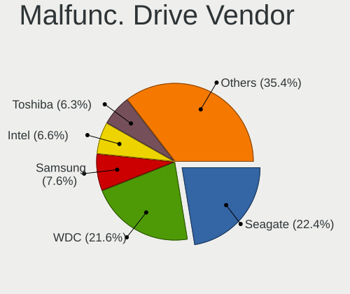

| Vendor              | Computers | Drives | Percent |
|---------------------|-----------|--------|---------|
| Seagate             | 251       | 329    | 22.41%  |
| WDC                 | 242       | 305    | 21.61%  |
| Samsung Electronics | 85        | 94     | 7.59%   |
| Intel               | 74        | 165    | 6.61%   |
| Toshiba             | 71        | 85     | 6.34%   |
| Hitachi             | 64        | 73     | 5.71%   |
| HGST                | 48        | 56     | 4.29%   |
| SK hynix            | 47        | 49     | 4.2%    |
| Kingston            | 34        | 37     | 3.04%   |
| SanDisk             | 32        | 37     | 2.86%   |
| Micron Technology   | 23        | 29     | 2.05%   |
| Crucial             | 22        | 26     | 1.96%   |
| A-DATA Technology   | 15        | 17     | 1.34%   |
| Apple               | 12        | 14     | 1.07%   |
| China               | 9         | 9      | 0.8%    |
| LITEON              | 8         | 9      | 0.71%   |
| Maxtor              | 7         | 8      | 0.63%   |
| Patriot             | 5         | 5      | 0.45%   |
| LITEONIT            | 4         | 4      | 0.36%   |
| Unknown             | 4         | 5      | 0.36%   |
| OCZ                 | 3         | 3      | 0.27%   |
| Netac               | 3         | 4      | 0.27%   |
| LDLC                | 3         | 4      | 0.27%   |
| Intenso             | 3         | 3      | 0.27%   |
| Fujitsu             | 3         | 3      | 0.27%   |
| XPG                 | 2         | 2      | 0.18%   |
| WALRAM              | 2         | 2      | 0.18%   |
| tecmiyo             | 2         | 2      | 0.18%   |
| SPCC                | 2         | 2      | 0.18%   |
| Lenovo              | 2         | 2      | 0.18%   |
| KingSpec            | 2         | 2      | 0.18%   |
| JMicron Technology  | 2         | 2      | 0.18%   |
| Gigabyte Technology | 2         | 3      | 0.18%   |
| Corsair             | 2         | 2      | 0.18%   |
| YS                  | 1         | 1      | 0.09%   |
| XrayDisk            | 1         | 1      | 0.09%   |
| WD MediaMax         | 1         | 1      | 0.09%   |
| VISIPRO             | 1         | 1      | 0.09%   |
| USB3.0              | 1         | 1      | 0.09%   |
| Unknown             | 1         | 1      | 0.09%   |

Malfunc. HDD Vendor
-------------------

Vendors of faulty HDD drives

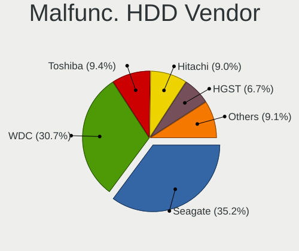

| Vendor              | Computers | Drives | Percent |
|---------------------|-----------|--------|---------|
| Seagate             | 251       | 329    | 35.15%  |
| WDC                 | 219       | 280    | 30.67%  |
| Toshiba             | 67        | 81     | 9.38%   |
| Hitachi             | 64        | 73     | 8.96%   |
| HGST                | 48        | 56     | 6.72%   |
| Samsung Electronics | 38        | 43     | 5.32%   |
| Apple               | 9         | 11     | 1.26%   |
| Maxtor              | 7         | 8      | 0.98%   |
| Fujitsu             | 3         | 3      | 0.42%   |
| JMicron Technology  | 2         | 2      | 0.28%   |
| WD MediaMax         | 1         | 1      | 0.14%   |
| USB3.0              | 1         | 1      | 0.14%   |
| Unknown             | 1         | 1      | 0.14%   |
| SABRENT             | 1         | 1      | 0.14%   |
| MaxDigital          | 1         | 1      | 0.14%   |
| ExcelStor           | 1         | 1      | 0.14%   |

Malfunc. Drive Kind
-------------------

Kinds of faulty drives

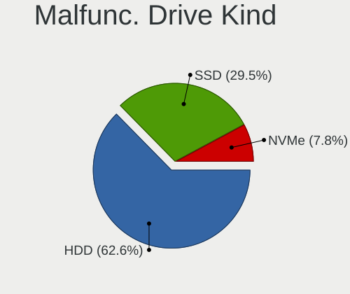

| Kind | Computers | Drives | Percent |
|------|-----------|--------|---------|
| HDD  | 679       | 892    | 62.64%  |
| SSD  | 320       | 438    | 29.52%  |
| NVMe | 85        | 94     | 7.84%   |

Failed Drives
-------------

Failed drive models

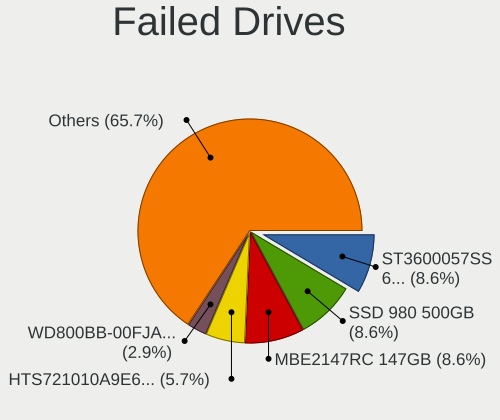

| Model                                                            | Computers | Drives | Percent |
|------------------------------------------------------------------|-----------|--------|---------|
| Seagate ST3600057SS 600GB                                        | 3         | 25     | 8.57%   |
| Samsung Electronics SSD 980 500GB                                | 3         | 3      | 8.57%   |
| Fujitsu MBE2147RC 147GB                                          | 3         | 8      | 8.57%   |
| HGST HTS721010A9E630 1TB                                         | 2         | 2      | 5.71%   |
| WDC WD800BB-00FJA0 80GB                                          | 1         | 1      | 2.86%   |
| WDC WD7500BPVT-22HXZT1 752GB                                     | 1         | 1      | 2.86%   |
| WDC WD5000BEVT-22A0RT0 500GB                                     | 1         | 1      | 2.86%   |
| WDC WD3200AAJS-22VWA0 320GB                                      | 1         | 1      | 2.86%   |
| WDC WD1500HLFS-01G6U0 150GB                                      | 1         | 1      | 2.86%   |
| WDC WD1001FALS-40K1B0 1TB                                        | 1         | 1      | 2.86%   |
| Toshiba THNSN5256GPUK NVMe 256GB                                 | 1         | 1      | 2.86%   |
| Seagate ST3500630AS 500GB                                        | 1         | 1      | 2.86%   |
| Seagate ST332062 0AS 320GB                                       | 1         | 1      | 2.86%   |
| Seagate ST3300657SS 304GB                                        | 1         | 2      | 2.86%   |
| Seagate ST14000NM0018-2H4101 14TB                                | 1         | 1      | 2.86%   |
| Samsung Electronics SSD 980 500GB S64DNF0R648337E                | 1         | 1      | 2.86%   |
| Samsung Electronics SSD 960 EVO 250GB                            | 1         | 1      | 2.86%   |
| Samsung Electronics NVMe SSD Controller SM961/PM961/SM963 1024GB | 1         | 1      | 2.86%   |
| Samsung Electronics MZVLB1T0HALR-00000 1TB                       | 1         | 2      | 2.86%   |
| PNY CS1030 500GB SSD                                             | 1         | 1      | 2.86%   |
| Intel SSDSC2BB480G7 480GB                                        | 1         | 4      | 2.86%   |
| Intel SSDPEKKW256G7 256GB                                        | 1         | 1      | 2.86%   |
| Hitachi HTS727575A9E364 752GB                                    | 1         | 1      | 2.86%   |
| Hewlett-Packard EF0600FARNA 600GB                                | 1         | 1      | 2.86%   |
| Hewlett-Packard EF0450FARMV 450GB                                | 1         | 4      | 2.86%   |
| Crucial M4-CT256M4SSD3 256GB                                     | 1         | 1      | 2.86%   |
| Apple SSD TS256C 256GB                                           | 1         | 2      | 2.86%   |
| A-DATA Technology SX8200PNP 256GB                                | 1         | 1      | 2.86%   |

Failed Drive Vendor
-------------------

Failed drive vendors

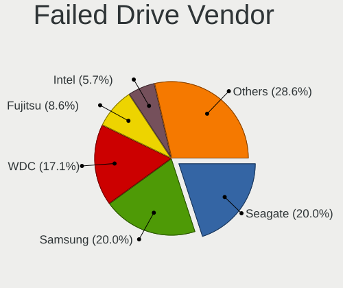

| Vendor              | Computers | Drives | Percent |
|---------------------|-----------|--------|---------|
| Seagate             | 7         | 30     | 20%     |
| Samsung Electronics | 7         | 8      | 20%     |
| WDC                 | 6         | 6      | 17.14%  |
| Fujitsu             | 3         | 8      | 8.57%   |
| Intel               | 2         | 5      | 5.71%   |
| HGST                | 2         | 2      | 5.71%   |
| Hewlett-Packard     | 2         | 5      | 5.71%   |
| Toshiba             | 1         | 1      | 2.86%   |
| PNY                 | 1         | 1      | 2.86%   |
| Hitachi             | 1         | 1      | 2.86%   |
| Crucial             | 1         | 1      | 2.86%   |
| Apple               | 1         | 2      | 2.86%   |
| A-DATA Technology   | 1         | 1      | 2.86%   |

Drive Status
------------

Number of failed and malfunc. drives

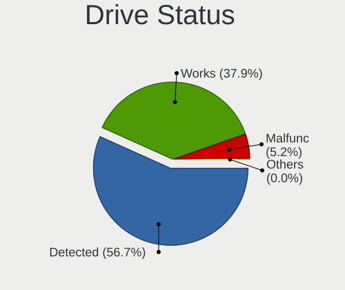

| Status   | Computers | Drives | Percent |
|----------|-----------|--------|---------|
| Detected | 11426     | 22814  | 56.71%  |
| Works    | 7644      | 13453  | 37.94%  |
| Malfunc  | 1041      | 1424   | 5.17%   |
| Failed   | 34        | 71     | 0.17%   |
| Fixed    | 1         | 1      | 0.005%  |
| Limited  | 1         | 1      | 0.005%  |

Storage controller
------------------

Storage Vendor
--------------

Storage controller vendors

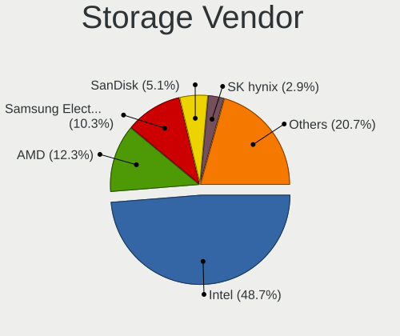

| Vendor                                  | Computers | Percent |
|-----------------------------------------|-----------|---------|
| Intel                                   | 12208     | 48.73%  |
| AMD                                     | 3073      | 12.27%  |
| Samsung Electronics                     | 2581      | 10.3%   |
| SanDisk                                 | 1286      | 5.13%   |
| SK hynix                                | 727       | 2.9%    |
| Kingston Technology Company             | 567       | 2.26%   |
| Micron Technology                       | 545       | 2.18%   |
| Phison Electronics                      | 423       | 1.69%   |
| ASMedia Technology                      | 386       | 1.54%   |
| KIOXIA                                  | 369       | 1.47%   |
| Micron/Crucial Technology               | 326       | 1.3%    |
| Toshiba America Info Systems            | 307       | 1.23%   |
| Silicon Motion                          | 247       | 0.99%   |
| Marvell Technology Group                | 240       | 0.96%   |
| Nvidia                                  | 226       | 0.9%    |
| ADATA Technology                        | 188       | 0.75%   |
| LSI Logic / Symbios Logic               | 179       | 0.71%   |
| JMicron Technology                      | 167       | 0.67%   |
| MAXIO Technology (Hangzhou)             | 129       | 0.51%   |
| Broadcom / LSI                          | 115       | 0.46%   |
| Apple                                   | 98        | 0.39%   |
| Realtek Semiconductor                   | 76        | 0.3%    |
| Solid State Storage Technology          | 72        | 0.29%   |
| Shenzhen Longsys Electronics            | 68        | 0.27%   |
| Union Memory (Shenzhen)                 | 60        | 0.24%   |
| Hewlett-Packard                         | 50        | 0.2%    |
| Adaptec                                 | 41        | 0.16%   |
| Yangtze Memory Technologies             | 40        | 0.16%   |
| VIA Technologies                        | 29        | 0.12%   |
| Seagate Technology                      | 28        | 0.11%   |
| Solidigm                                | 26        | 0.1%    |
| Silicon Image                           | 26        | 0.1%    |
| Lite-On Technology                      | 19        | 0.08%   |
| Lenovo                                  | 17        | 0.07%   |
| Biwin Storage Technology                | 14        | 0.06%   |
| INNOGRIT                                | 12        | 0.05%   |
| Hosin Global Electronics                | 10        | 0.04%   |
| Transcend                               | 8         | 0.03%   |
| Unknown                                 | 8         | 0.03%   |
| Shenzhen Unionmemory Information System | 7         | 0.03%   |

Storage Model
-------------

Storage controller models

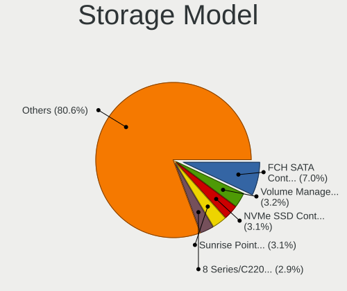

| Model                                                                          | Computers | Percent |
|--------------------------------------------------------------------------------|-----------|---------|
| AMD FCH SATA Controller [AHCI mode]                                            | 1977      | 7.03%   |
| Intel Volume Management Device NVMe RAID Controller                            | 899       | 3.19%   |
| Samsung NVMe SSD Controller SM981/PM981/PM983                                  | 882       | 3.13%   |
| Intel Sunrise Point-LP SATA Controller [AHCI mode]                             | 875       | 3.11%   |
| Intel 8 Series/C220 Series Chipset Family 6-port SATA Controller 1 [AHCI mode] | 814       | 2.89%   |
| Samsung NVMe SSD Controller PM9A1/PM9A3/980PRO                                 | 623       | 2.21%   |
| Intel 82801 Mobile SATA Controller [RAID mode]                                 | 612       | 2.17%   |
| Intel 7 Series Chipset Family 6-port SATA Controller [AHCI mode]               | 608       | 2.16%   |
| Samsung NVMe SSD Controller 980 (DRAM-less)                                    | 594       | 2.11%   |
| Intel Q170/Q150/B150/H170/H110/Z170/CM236 Chipset SATA Controller [AHCI Mode]  | 446       | 1.58%   |
| Intel SATA Controller [RAID mode]                                              | 431       | 1.53%   |
| Intel 6 Series/C200 Series Chipset Family 6 port Mobile SATA AHCI Controller   | 430       | 1.53%   |
| Intel 8 Series SATA Controller 1 [AHCI mode]                                   | 374       | 1.33%   |
| Intel 6 Series/C200 Series Chipset Family 6 port Desktop SATA AHCI Controller  | 369       | 1.31%   |
| ASMedia ASM1061/ASM1062 Serial ATA Controller                                  | 337       | 1.2%    |
| Intel Celeron/Pentium Silver Processor SATA Controller                         | 329       | 1.17%   |
| AMD 500 Series Chipset SATA Controller                                         | 322       | 1.14%   |
| AMD 400 Series Chipset SATA Controller                                         | 320       | 1.14%   |
| Intel 200 Series PCH SATA controller [AHCI mode]                               | 319       | 1.13%   |
| Intel Comet Lake SATA AHCI Controller                                          | 313       | 1.11%   |
| SK hynix Gold P31/BC711/PC711 NVMe Solid State Drive                           | 307       | 1.09%   |
| Intel Tiger Lake-LP SATA Controller                                            | 302       | 1.07%   |
| Intel 7 Series/C210 Series Chipset Family 6-port SATA Controller [AHCI mode]   | 284       | 1.01%   |
| Intel Wildcat Point-LP SATA Controller [AHCI Mode]                             | 278       | 0.99%   |
| AMD SB7x0/SB8x0/SB9x0 SATA Controller [AHCI mode]                              | 274       | 0.97%   |
| Intel Cannon Lake PCH SATA AHCI Controller                                     | 258       | 0.92%   |
| AMD SB7x0/SB8x0/SB9x0 IDE Controller                                           | 256       | 0.91%   |
| Intel Cannon Lake Mobile PCH SATA AHCI Controller                              | 240       | 0.85%   |
| SanDisk Extreme Pro / WD Black SN750 / PC SN730 / Red SN700 NVMe SSD           | 231       | 0.82%   |
| Samsung NVMe SSD Controller SM961/PM961/SM963                                  | 226       | 0.8%    |
| KIOXIA NVMe SSD Controller BG4 (DRAM-less)                                     | 226       | 0.8%    |
| SanDisk Ultra 3D / WD PC SN530, IX SN530, Blue SN550 NVMe SSD (DRAM-less)      | 221       | 0.79%   |
| Micron/Crucial P2 [Nick P2] / P3 / P3 Plus NVMe PCIe SSD (DRAM-less)           | 218       | 0.77%   |
| Intel Alder Lake-S PCH SATA Controller [AHCI Mode]                             | 216       | 0.77%   |
| Intel SSD 670p Series [Keystone Harbor]                                        | 206       | 0.73%   |
| Intel 5 Series/3400 Series Chipset 6 port SATA AHCI Controller                 | 201       | 0.71%   |
| Intel C610/X99 series chipset 6-Port SATA Controller [AHCI mode]               | 194       | 0.69%   |
| Intel C610/X99 series chipset sSATA Controller [AHCI mode]                     | 179       | 0.64%   |
| Intel 500 Series Chipset Family SATA AHCI Controller                           | 177       | 0.63%   |
| Intel Alder Lake-P SATA AHCI Controller                                        | 176       | 0.63%   |

Storage Kind
------------

Kind of storage controller (IDE, SATA, NVMe, SAS, ...)

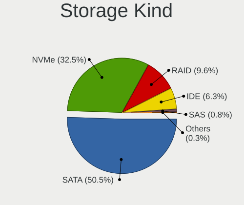

| Kind | Computers | Percent |
|------|-----------|---------|
| SATA | 12739     | 50.53%  |
| NVMe | 8190      | 32.48%  |
| RAID | 2415      | 9.58%   |
| IDE  | 1590      | 6.31%   |
| SAS  | 214       | 0.85%   |
| SCSI | 65        | 0.26%   |

Processor
---------

CPU Vendor
----------

Processor vendors

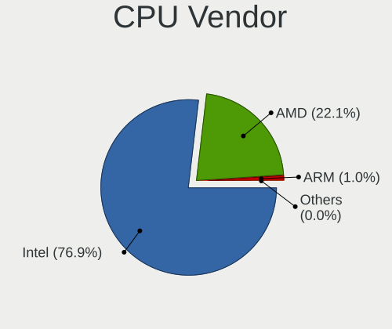

| Vendor       | Computers | Percent |
|--------------|-----------|---------|
| Intel        | 14533     | 76.86%  |
| AMD          | 4176      | 22.09%  |
| ARM          | 189       | 1%      |
| CentaurHauls | 4         | 0.02%   |
| Phytium      | 3         | 0.02%   |
| thead,c906   | 1         | 0.01%   |
| Hisilicon    | 1         | 0.01%   |
| Unknown      | 1         | 0.01%   |

CPU Model
---------

Processor models

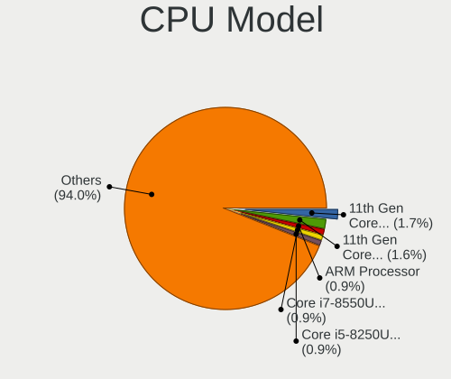

| Model                                         | Computers | Percent |
|-----------------------------------------------|-----------|---------|
| Intel 11th Gen Core i7-1165G7 @ 2.80GHz       | 314       | 1.65%   |
| Intel 11th Gen Core i5-1135G7 @ 2.40GHz       | 308       | 1.62%   |
| ARM Processor                                 | 176       | 0.93%   |
| Intel Core i7-8550U CPU @ 1.80GHz             | 173       | 0.91%   |
| Intel Core i5-8250U CPU @ 1.60GHz             | 166       | 0.87%   |
| AMD Ryzen 5 5500U with Radeon Graphics        | 157       | 0.83%   |
| Intel Core i5-10210U CPU @ 1.60GHz            | 152       | 0.8%    |
| Intel Core i7-10510U CPU @ 1.80GHz            | 137       | 0.72%   |
| Intel Core i5-7200U CPU @ 2.50GHz             | 134       | 0.71%   |
| Intel 12th Gen Core i7-12700H                 | 127       | 0.67%   |
| AMD Ryzen 7 5700U with Radeon Graphics        | 126       | 0.66%   |
| Intel Celeron N4020 CPU @ 1.10GHz             | 123       | 0.65%   |
| Intel Core i5-8265U CPU @ 1.60GHz             | 122       | 0.64%   |
| Intel Core i5-6300U CPU @ 2.40GHz             | 114       | 0.6%    |
| Intel Core i5-6200U CPU @ 2.30GHz             | 113       | 0.59%   |
| Intel Core i7-8565U CPU @ 1.80GHz             | 110       | 0.58%   |
| AMD Ryzen 7 5800H with Radeon Graphics        | 109       | 0.57%   |
| Intel 11th Gen Core i7-11800H @ 2.30GHz       | 104       | 0.55%   |
| Intel Core i7-10750H CPU @ 2.60GHz            | 101       | 0.53%   |
| Intel Core i5-1035G1 CPU @ 1.00GHz            | 98        | 0.52%   |
| Intel Xeon CPU E5-2680 v4 @ 2.40GHz           | 93        | 0.49%   |
| Intel Core i5-3470 CPU @ 3.20GHz              | 93        | 0.49%   |
| AMD Ryzen 5 3500U with Radeon Vega Mobile Gfx | 91        | 0.48%   |
| Intel 12th Gen Core i7-1260P                  | 90        | 0.47%   |
| Intel 12th Gen Core i7-1255U                  | 89        | 0.47%   |
| AMD Ryzen 5 3600 6-Core Processor             | 89        | 0.47%   |
| Intel 12th Gen Core i5-1235U                  | 88        | 0.46%   |
| Intel Core i7-8750H CPU @ 2.20GHz             | 87        | 0.46%   |
| Intel Core i5-3210M CPU @ 2.50GHz             | 87        | 0.46%   |
| Intel Core i7-9750H CPU @ 2.60GHz             | 85        | 0.45%   |
| AMD Ryzen 5 5600G with Radeon Graphics        | 82        | 0.43%   |
| Intel Core i7-7700HQ CPU @ 2.80GHz            | 80        | 0.42%   |
| Intel Core i5-5200U CPU @ 2.20GHz             | 80        | 0.42%   |
| Intel Celeron CPU N3350 @ 1.10GHz             | 80        | 0.42%   |
| Intel Core i7-8650U CPU @ 1.90GHz             | 78        | 0.41%   |
| Intel Core i7-3770 CPU @ 3.40GHz              | 78        | 0.41%   |
| Intel 11th Gen Core i7-1185G7 @ 3.00GHz       | 77        | 0.41%   |
| Intel Core i7-1065G7 CPU @ 1.30GHz            | 75        | 0.39%   |
| Intel Core i7-7500U CPU @ 2.70GHz             | 74        | 0.39%   |
| Intel Core i7-2600 CPU @ 3.40GHz              | 74        | 0.39%   |

CPU Model Family
----------------

Processor model prefix

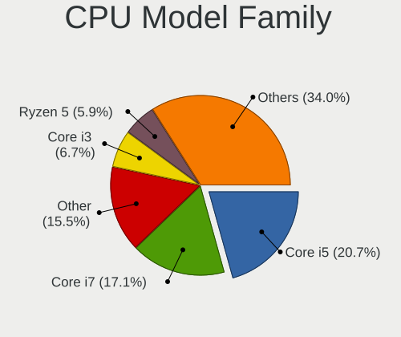

| Model                   | Computers | Percent |
|-------------------------|-----------|---------|
| Intel Core i5           | 3915      | 20.69%  |
| Intel Core i7           | 3240      | 17.12%  |
| Other                   | 2937      | 15.52%  |
| Intel Core i3           | 1275      | 6.74%   |
| AMD Ryzen 5             | 1123      | 5.93%   |
| AMD Ryzen 7             | 961       | 5.08%   |
| Intel Celeron           | 869       | 4.59%   |
| Intel Xeon              | 858       | 4.53%   |
| Intel Core 2 Duo        | 451       | 2.38%   |
| Intel Pentium           | 356       | 1.88%   |
| AMD Ryzen 9             | 353       | 1.87%   |
| AMD FX                  | 196       | 1.04%   |
| AMD Ryzen 3             | 187       | 0.99%   |
| Intel Atom              | 171       | 0.9%    |
| Intel Core i9           | 137       | 0.72%   |
| Intel Core 2 Quad       | 129       | 0.68%   |
| AMD A8                  | 126       | 0.67%   |
| AMD A10                 | 121       | 0.64%   |
| AMD A6                  | 118       | 0.62%   |
| Intel Pentium Dual-Core | 109       | 0.58%   |
| AMD A4                  | 89        | 0.47%   |
| AMD Ryzen 7 PRO         | 86        | 0.45%   |
| Intel Core              | 65        | 0.34%   |
| AMD Ryzen Threadripper  | 64        | 0.34%   |
| AMD Phenom II X4        | 59        | 0.31%   |
| Intel Pentium Silver    | 56        | 0.3%    |
| AMD Athlon II X2        | 52        | 0.27%   |
| AMD Athlon              | 51        | 0.27%   |
| AMD Ryzen 5 PRO         | 50        | 0.26%   |
| Intel Core 2            | 47        | 0.25%   |
| Intel Pentium Dual      | 39        | 0.21%   |
| AMD E2                  | 39        | 0.21%   |
| AMD EPYC                | 35        | 0.18%   |
| AMD E1                  | 34        | 0.18%   |
| AMD Athlon 64 X2        | 34        | 0.18%   |
| AMD Athlon II X4        | 32        | 0.17%   |
| AMD E                   | 30        | 0.16%   |
| Intel Xeon Gold         | 25        | 0.13%   |
| Intel Pentium Gold      | 23        | 0.12%   |
| AMD Phenom II X6        | 21        | 0.11%   |

CPU Cores
---------

Number of processor cores

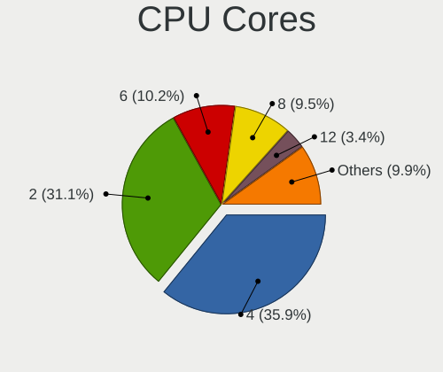

| Number  | Computers | Percent |
|---------|-----------|---------|
| 4       | 6814      | 35.87%  |
| 2       | 5907      | 31.09%  |
| 6       | 1946      | 10.24%  |
| 8       | 1796      | 9.45%   |
| 12      | 652       | 3.43%   |
| 10      | 429       | 2.26%   |
| 14      | 361       | 1.9%    |
| 16      | 323       | 1.7%    |
| 24      | 157       | 0.83%   |
| 1       | 145       | 0.76%   |
| 28      | 99        | 0.52%   |
| 20      | 95        | 0.5%    |
| 3       | 86        | 0.45%   |
| Unknown | 54        | 0.28%   |
| 64      | 27        | 0.14%   |
| 32      | 26        | 0.14%   |
| 18      | 16        | 0.08%   |
| 40      | 12        | 0.06%   |
| 5       | 10        | 0.05%   |
| 48      | 9         | 0.05%   |
| 44      | 8         | 0.04%   |
| 36      | 8         | 0.04%   |
| 128     | 4         | 0.02%   |
| 192     | 3         | 0.02%   |
| 104     | 2         | 0.01%   |
| 80      | 2         | 0.01%   |
| 52      | 2         | 0.01%   |
| 96      | 1         | 0.01%   |
| 56      | 1         | 0.01%   |
| 22      | 1         | 0.01%   |
| 11      | 1         | 0.01%   |

CPU Sockets
-----------

Number of sockets

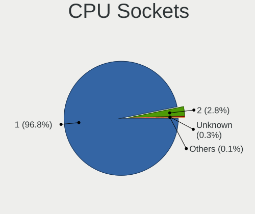

| Number  | Computers | Percent |
|---------|-----------|---------|
| 1       | 18304     | 96.8%   |
| 2       | 530       | 2.8%    |
| Unknown | 54        | 0.29%   |
| 4       | 7         | 0.04%   |
| 16      | 4         | 0.02%   |
| 14      | 3         | 0.02%   |
| 20      | 2         | 0.01%   |
| 3       | 2         | 0.01%   |
| 24      | 1         | 0.01%   |
| 11      | 1         | 0.01%   |
| 8       | 1         | 0.01%   |

CPU Threads
-----------

Threads per core (Hyper-Threading)

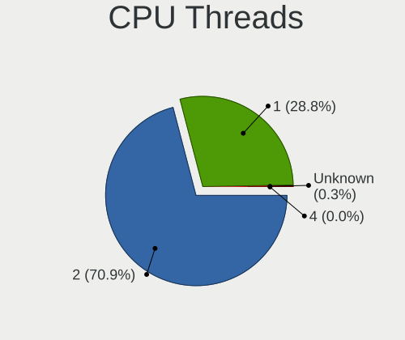

| Number  | Computers | Percent |
|---------|-----------|---------|
| 2       | 13433     | 70.94%  |
| 1       | 5447      | 28.77%  |
| Unknown | 54        | 0.29%   |
| 6       | 1         | 0.01%   |
| 4       | 1         | 0.01%   |

CPU Op-Modes
------------

CPU Operation Modes (32-bit, 64-bit)

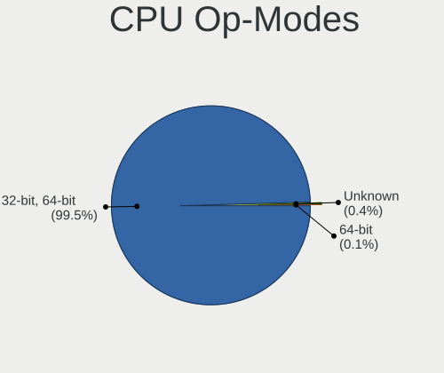

| Op mode        | Computers | Percent |
|----------------|-----------|---------|
| 32-bit, 64-bit | 18822     | 99.53%  |
| Unknown        | 73        | 0.39%   |
| 64-bit         | 15        | 0.08%   |

CPU Microcode
-------------

Microcode number

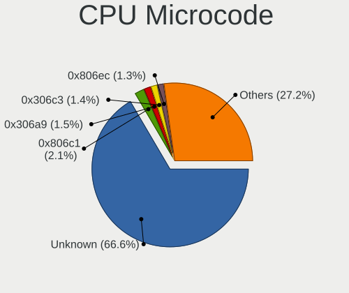

| Number     | Computers | Percent |
|------------|-----------|---------|
| Unknown    | 12875     | 66.56%  |
| 0x806c1    | 399       | 2.06%   |
| 0x306a9    | 284       | 1.47%   |
| 0x306c3    | 264       | 1.36%   |
| 0x806ec    | 257       | 1.33%   |
| 0x206a7    | 229       | 1.18%   |
| 0x0a50000c | 206       | 1.06%   |
| 0x806ea    | 205       | 1.06%   |
| 0x906ea    | 182       | 0.94%   |
| 0x906a3    | 178       | 0.92%   |
| 0x08608103 | 155       | 0.8%    |
| 0x506e3    | 153       | 0.79%   |
| 0x406f1    | 129       | 0.67%   |
| 0x0a50000d | 129       | 0.67%   |
| 0x906e9    | 121       | 0.63%   |
| 0x08108109 | 112       | 0.58%   |
| 0x40651    | 110       | 0.57%   |
| 0x806e9    | 109       | 0.56%   |
| 0x406e3    | 107       | 0.55%   |
| 0x08600106 | 104       | 0.54%   |
| 0x706e5    | 101       | 0.52%   |
| 0x306d4    | 97        | 0.5%    |
| 0x706a8    | 94        | 0.49%   |
| 0xa0652    | 91        | 0.47%   |
| 0x806d1    | 89        | 0.46%   |
| 0x08701021 | 83        | 0.43%   |
| 0x1067a    | 78        | 0.4%    |
| 0x206c2    | 75        | 0.39%   |
| 0x906a4    | 74        | 0.38%   |
| 0x306e4    | 70        | 0.36%   |
| 0x306f2    | 65        | 0.34%   |
| 0x20655    | 60        | 0.31%   |
| 0x906ed    | 59        | 0.31%   |
| 0x0a601203 | 56        | 0.29%   |
| 0x0a20120a | 54        | 0.28%   |
| 0x0a404102 | 53        | 0.27%   |
| 0x90672    | 52        | 0.27%   |
| 0x0800820d | 52        | 0.27%   |
| 0x06000852 | 49        | 0.25%   |
| 0x0a201016 | 45        | 0.23%   |

CPU Microarch
-------------

Microarchitecture

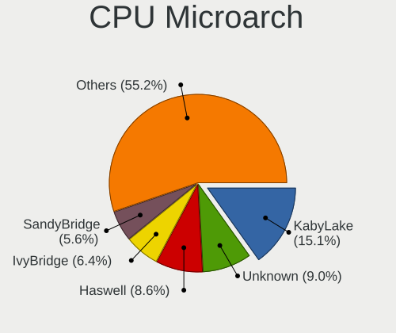

| Name               | Computers | Percent |
|--------------------|-----------|---------|
| KabyLake           | 2869      | 15.12%  |
| Unknown            | 1710      | 9.01%   |
| Haswell            | 1632      | 8.6%    |
| IvyBridge          | 1217      | 6.42%   |
| SandyBridge        | 1068      | 5.63%   |
| Skylake            | 1058      | 5.58%   |
| TigerLake          | 967       | 5.1%    |
| Zen 3              | 920       | 4.85%   |
| Alderlake Hybrid   | 880       | 4.64%   |
| Zen 2              | 609       | 3.21%   |
| Penryn             | 590       | 3.11%   |
| Westmere           | 556       | 2.93%   |
| Broadwell          | 539       | 2.84%   |
| CometLake          | 463       | 2.44%   |
| Zen+               | 462       | 2.44%   |
| IceLake            | 459       | 2.42%   |
| Silvermont         | 389       | 2.05%   |
| Goldmont plus      | 359       | 1.89%   |
| Piledriver         | 299       | 1.58%   |
| Core               | 275       | 1.45%   |
| K10                | 262       | 1.38%   |
| Zen                | 220       | 1.16%   |
| Excavator          | 215       | 1.13%   |
| Nehalem            | 170       | 0.9%    |
| Goldmont           | 157       | 0.83%   |
| Puma               | 100       | 0.53%   |
| Steamroller        | 74        | 0.39%   |
| K8 Hammer          | 70        | 0.37%   |
| Bobcat             | 67        | 0.35%   |
| Jaguar             | 61        | 0.32%   |
| Tremont            | 48        | 0.25%   |
| K10 Llano          | 43        | 0.23%   |
| Bulldozer          | 43        | 0.23%   |
| Meteorlake Hybrid  | 32        | 0.17%   |
| Bonnell            | 24        | 0.13%   |
| NetBurst           | 22        | 0.12%   |
| Gracemont          | 19        | 0.1%    |
| K8 & K10 hybrid    | 17        | 0.09%   |
| Sapphire Rapids    | 5         | 0.03%   |
| ArrowLake-H Hybrid | 1         | 0.01%   |

Graphics
--------

GPU Vendor
----------

Vendors of graphics cards

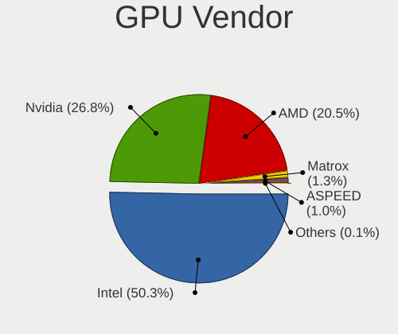

| Vendor                                       | Computers | Percent |
|----------------------------------------------|-----------|---------|
| Intel                                        | 11305     | 50.32%  |
| Nvidia                                       | 6030      | 26.84%  |
| AMD                                          | 4598      | 20.47%  |
| Matrox Electronics Systems                   | 281       | 1.25%   |
| ASPEED Technology                            | 219       | 0.97%   |
| Huawei Technologies                          | 16        | 0.07%   |
| ATI Technologies                             | 8         | 0.04%   |
| Zhaoxin                                      | 4         | 0.02%   |
| XGI Technology (eXtreme Graphics Innovation) | 1         | 0.004%  |
| VIA Technologies                             | 1         | 0.004%  |
| Silicon Integrated Systems [SiS]             | 1         | 0.004%  |

GPU Model
---------

Graphics card models

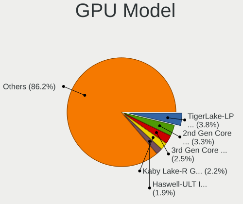

| Model                                                                                    | Computers | Percent |
|------------------------------------------------------------------------------------------|-----------|---------|
| Intel TigerLake-LP GT2 [Iris Xe Graphics]                                                | 869       | 3.8%    |
| Intel 2nd Generation Core Processor Family Integrated Graphics Controller                | 762       | 3.33%   |
| Intel 3rd Gen Core processor Graphics Controller                                         | 582       | 2.54%   |
| Intel Kaby Lake-R GT2 [UHD Graphics 620]                                                 | 500       | 2.19%   |
| Intel Haswell-ULT Integrated Graphics Controller                                         | 434       | 1.9%    |
| AMD Cezanne [Radeon Vega Series / Radeon Vega Mobile Series]                             | 418       | 1.83%   |
| Intel Xeon E3-1200 v3/4th Gen Core Processor Integrated Graphics Controller              | 409       | 1.79%   |
| Intel CometLake-U GT2 [UHD Graphics]                                                     | 387       | 1.69%   |
| Intel Skylake-U GT2 [HD Graphics 520]                                                    | 379       | 1.66%   |
| Intel Alder Lake-P GT2 [Iris Xe Graphics]                                                | 358       | 1.57%   |
| Intel Kaby Lake-U GT2 [HD Graphics 620]                                                  | 347       | 1.52%   |
| Intel WhiskeyLake-U GT2 [UHD Graphics 620]                                               | 323       | 1.41%   |
| AMD Picasso/Raven 2 [Radeon Vega Series / Radeon Vega Mobile Series]                     | 321       | 1.4%    |
| Intel GeminiLake [UHD Graphics 600]                                                      | 313       | 1.37%   |
| AMD Lucienne                                                                             | 304       | 1.33%   |
| Intel CoffeeLake-H GT2 [UHD Graphics 630]                                                | 287       | 1.25%   |
| AMD Renoir [Radeon Vega Series / Radeon Vega Mobile Series]                              | 284       | 1.24%   |
| Intel Broadwell-U GT2 [HD Graphics 5500]                                                 | 268       | 1.17%   |
| Intel 4th Gen Core Processor Integrated Graphics Controller                              | 251       | 1.1%    |
| Intel Skylake-S GT2 [HD Graphics 530]                                                    | 238       | 1.04%   |
| Intel Core Processor Integrated Graphics Controller                                      | 237       | 1.04%   |
| Intel CoffeeLake-S GT2 [UHD Graphics 630]                                                | 232       | 1.01%   |
| ASPEED Technology ASPEED Graphics Family                                                 | 219       | 0.96%   |
| Intel Raptor Lake-P [Iris Xe Graphics]                                                   | 216       | 0.94%   |
| Intel Atom/Celeron/Pentium Processor x5-E8000/J3xxx/N3xxx Integrated Graphics Controller | 214       | 0.94%   |
| Intel CometLake-H GT2 [UHD Graphics]                                                     | 204       | 0.89%   |
| Intel TigerLake-H GT1 [UHD Graphics]                                                     | 202       | 0.88%   |
| AMD Ellesmere [Radeon RX 470/480/570/570X/580/580X/590]                                  | 199       | 0.87%   |
| Intel Xeon E3-1200 v2/3rd Gen Core processor Graphics Controller                         | 192       | 0.84%   |
| Nvidia TU117M [GeForce GTX 1650 Mobile / Max-Q]                                          | 189       | 0.83%   |
| Nvidia GA106M [GeForce RTX 3060 Mobile / Max-Q]                                          | 179       | 0.78%   |
| Intel Atom Processor Z36xxx/Z37xxx Series Graphics & Display                             | 175       | 0.77%   |
| Intel Alder Lake-UP3 GT2 [Iris Xe Graphics]                                              | 162       | 0.71%   |
| AMD Barcelo                                                                              | 152       | 0.66%   |
| Intel Iris Plus Graphics G1 (Ice Lake)                                                   | 149       | 0.65%   |
| Nvidia GK208B [GeForce GT 710]                                                           | 141       | 0.62%   |
| Nvidia GA107M [GeForce RTX 3050 Mobile]                                                  | 140       | 0.61%   |
| Intel Apollo Lake GT1 [HD Graphics 500]                                                  | 135       | 0.59%   |
| AMD Rembrandt [Radeon 680M]                                                              | 128       | 0.56%   |
| AMD Stoney [Radeon R2/R3/R4/R5 Graphics]                                                 | 127       | 0.56%   |

GPU Combo
---------

Combinations of graphics cards

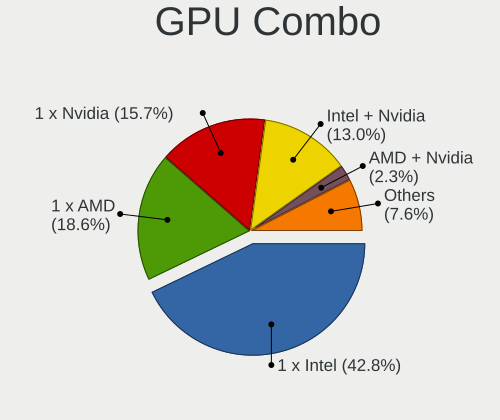

| Name                         | Computers | Percent |
|------------------------------|-----------|---------|
| 1 x Intel                    | 8142      | 42.85%  |
| 1 x AMD                      | 3529      | 18.57%  |
| 1 x Nvidia                   | 2992      | 15.75%  |
| Intel + Nvidia               | 2472      | 13.01%  |
| AMD + Nvidia                 | 429       | 2.26%   |
| Intel + AMD                  | 423       | 2.23%   |
| 1 x Matrox                   | 243       | 1.28%   |
| Other                        | 220       | 1.16%   |
| 2 x AMD                      | 200       | 1.05%   |
| 1 x ASPEED                   | 167       | 0.88%   |
| 2 x Nvidia                   | 48        | 0.25%   |
| Nvidia + ASPEED              | 41        | 0.22%   |
| Nvidia + Matrox              | 28        | 0.15%   |
| 1 x Huawei Technologies      | 15        | 0.08%   |
| AMD + ASPEED                 | 8         | 0.04%   |
| AMD + Matrox                 | 7         | 0.04%   |
| 2 x Nvidia + 1 x ASPEED      | 6         | 0.03%   |
| 2 x Intel                    | 4         | 0.02%   |
| 1 x Zhaoxin                  | 4         | 0.02%   |
| Intel + AMD + 1 x Nvidia     | 4         | 0.02%   |
| 3 x AMD                      | 2         | 0.01%   |
| 2 x Nvidia + 1 x Matrox      | 2         | 0.01%   |
| 1 x Intel + 3 x Nvidia       | 2         | 0.01%   |
| Intel + ASPEED               | 2         | 0.01%   |
| AMD + 2 x Nvidia             | 2         | 0.01%   |
| 3 x Nvidia + 1 x ASPEED      | 1         | 0.01%   |
| 2 x AMD + 1 x Nvidia         | 1         | 0.01%   |
| 1 x XGI                      | 1         | 0.01%   |
| 1 x VIA                      | 1         | 0.01%   |
| 1 x SiS                      | 1         | 0.01%   |
| Nvidia + Huawei Technologies | 1         | 0.01%   |
| Intel + 2 x Nvidia           | 1         | 0.01%   |
| Intel + 2 x AMD              | 1         | 0.01%   |
| Intel + AMD + 3 x Nvidia     | 1         | 0.01%   |
| AMD + Nvidia + 1 x Matrox    | 1         | 0.01%   |

GPU Driver
----------

Free vs proprietary

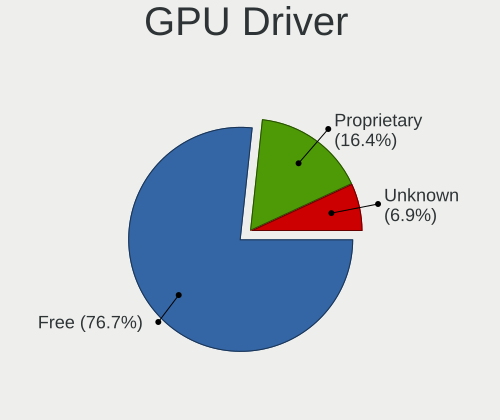

| Driver      | Computers | Percent |
|-------------|-----------|---------|
| Free        | 14679     | 76.7%   |
| Proprietary | 3140      | 16.41%  |
| Unknown     | 1319      | 6.89%   |

GPU Memory
----------

Total video memory

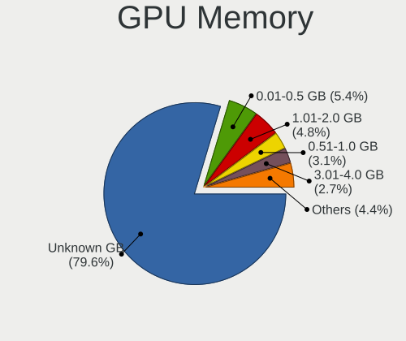

| Size in GB     | Computers | Percent |
|----------------|-----------|---------|
| Unknown        | 15236     | 79.62%  |
| 0.01-0.5       | 1026      | 5.36%   |
| 1.01-2.0       | 917       | 4.79%   |
| 0.51-1.0       | 595       | 3.11%   |
| 3.01-4.0       | 525       | 2.74%   |
| 7.01-8.0       | 358       | 1.87%   |
| 5.01-6.0       | 180       | 0.94%   |
| 8.01-16.0      | 175       | 0.91%   |
| 2.01-3.0       | 60        | 0.31%   |
| 16.01-24.0     | 48        | 0.25%   |
| 4.01-5.0       | 10        | 0.05%   |
| 32.01-64.0     | 4         | 0.02%   |
| 24.01-32.0     | 2         | 0.01%   |
| More than 64.0 | 1         | 0.01%   |

Monitor
-------

Monitor Vendor
--------------

Monitor vendors

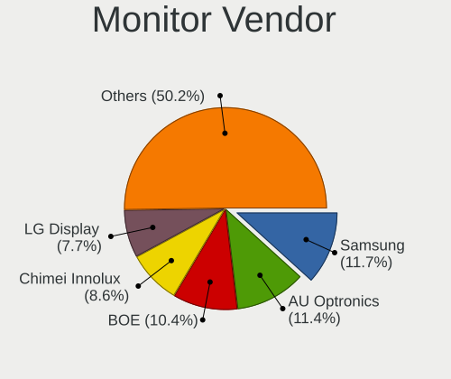

| Vendor                  | Computers | Percent |
|-------------------------|-----------|---------|
| Samsung Electronics     | 2410      | 11.73%  |
| AU Optronics            | 2338      | 11.38%  |
| BOE                     | 2132      | 10.38%  |
| Chimei Innolux          | 1773      | 8.63%   |
| LG Display              | 1573      | 7.66%   |
| Dell                    | 1335      | 6.5%    |
| Goldstar                | 994       | 4.84%   |
| Hewlett-Packard         | 733       | 3.57%   |
| Acer                    | 616       | 3%      |
| Apple                   | 492       | 2.39%   |
| Philips                 | 451       | 2.19%   |
| AOC                     | 446       | 2.17%   |
| Sharp                   | 393       | 1.91%   |
| Lenovo                  | 392       | 1.91%   |
| BenQ                    | 390       | 1.9%    |
| Ancor Communications    | 338       | 1.64%   |
| Iiyama                  | 266       | 1.29%   |
| PANDA                   | 217       | 1.06%   |
| ASUSTek Computer        | 208       | 1.01%   |
| ViewSonic               | 189       | 0.92%   |
| Chi Mei Optoelectronics | 189       | 0.92%   |
| InfoVision              | 164       | 0.8%    |
| Sony                    | 159       | 0.77%   |
| CSO                     | 122       | 0.59%   |
| Panasonic               | 88        | 0.43%   |
| MSI                     | 85        | 0.41%   |
| Fujitsu Siemens         | 79        | 0.38%   |
| Vizio                   | 72        | 0.35%   |
| Sceptre Tech            | 72        | 0.35%   |
| Eizo                    | 66        | 0.32%   |
| Unknown                 | 58        | 0.28%   |
| NEC Computers           | 58        | 0.28%   |
| Toshiba                 | 53        | 0.26%   |
| LG Philips              | 50        | 0.24%   |
| HKC                     | 47        | 0.23%   |
| HannStar                | 47        | 0.23%   |
| Mi                      | 44        | 0.21%   |
| LG Electronics          | 44        | 0.21%   |
| RTK                     | 41        | 0.2%    |
| TMX                     | 40        | 0.19%   |

Monitor Model
-------------

Monitor models

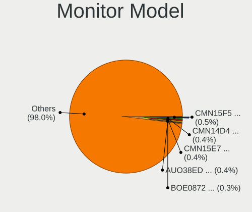

| Model                                                                    | Computers | Percent |
|--------------------------------------------------------------------------|-----------|---------|
| Chimei Innolux LCD Monitor CMN15F5 1920x1080 344x193mm 15.5-inch         | 98        | 0.46%   |
| Chimei Innolux LCD Monitor CMN14D4 1920x1080 309x173mm 13.9-inch         | 91        | 0.43%   |
| Chimei Innolux LCD Monitor CMN15E7 1920x1080 344x193mm 15.5-inch         | 80        | 0.38%   |
| AU Optronics LCD Monitor AUO38ED 1920x1080 344x193mm 15.5-inch           | 76        | 0.36%   |
| BOE LCD Monitor BOE0872 1920x1080 344x194mm 15.5-inch                    | 74        | 0.35%   |
| AU Optronics LCD Monitor AUO21ED 1920x1080 344x193mm 15.5-inch           | 62        | 0.29%   |
| Goldstar FULL HD GSM5B55 1920x1080 480x270mm 21.7-inch                   | 61        | 0.29%   |
| Samsung Electronics LCD Monitor SEC5441 1280x800 331x207mm 15.4-inch     | 52        | 0.25%   |
| Chimei Innolux LCD Monitor CMN1521 1920x1080 344x193mm 15.5-inch         | 50        | 0.24%   |
| PANDA LCD Monitor NCP004D 1920x1080 344x194mm 15.5-inch                  | 49        | 0.23%   |
| Chimei Innolux LCD Monitor CMN15DB 1366x768 344x193mm 15.5-inch          | 49        | 0.23%   |
| LG Display LCD Monitor LGD02DC 1366x768 344x194mm 15.5-inch              | 48        | 0.23%   |
| AU Optronics LCD Monitor AUO403D 1920x1080 309x174mm 14.0-inch           | 47        | 0.22%   |
| Samsung Electronics S24F350 SAM0D20 1920x1080 521x293mm 23.5-inch        | 45        | 0.21%   |
| Chimei Innolux LCD Monitor CMN15E6 1366x768 344x193mm 15.5-inch          | 43        | 0.2%    |
| BOE LCD Monitor BOE0877 1920x1080 309x173mm 13.9-inch                    | 43        | 0.2%    |
| Samsung Electronics C27F390 SAM0D32 1920x1080 598x336mm 27.0-inch        | 42        | 0.2%    |
| Samsung Electronics C24F390 SAM0D2C 1920x1080 521x293mm 23.5-inch        | 42        | 0.2%    |
| AU Optronics LCD Monitor AUO61ED 1920x1080 344x194mm 15.5-inch           | 41        | 0.19%   |
| Samsung Electronics LCD Monitor SDC4161 1920x1080 344x194mm 15.5-inch    | 40        | 0.19%   |
| AU Optronics LCD Monitor AUO26EC 1366x768 344x193mm 15.5-inch            | 40        | 0.19%   |
| AOC 27G2G4 AOC2702 1920x1080 598x336mm 27.0-inch                         | 40        | 0.19%   |
| Samsung Electronics LCD Monitor SDC4171 2880x1800 302x189mm 14.0-inch    | 39        | 0.18%   |
| Dell U2412M DELA07A 1920x1200 518x324mm 24.1-inch                        | 39        | 0.18%   |
| Goldstar LG ULTRAWIDE GSM59F1 2560x1080 670x280mm 28.6-inch              | 37        | 0.17%   |
| AU Optronics LCD Monitor AUOAF90 1920x1080 344x193mm 15.5-inch           | 37        | 0.17%   |
| BOE LCD Monitor BOE0812 1920x1080 344x194mm 15.5-inch                    | 36        | 0.17%   |
| AOC 24G2W1G3 AOC2402 1920x1080 527x296mm 23.8-inch                       | 36        | 0.17%   |
| LG Display LCD Monitor LGD033A 1366x768 344x194mm 15.5-inch              | 35        | 0.17%   |
| Goldstar LG IPS FULLHD GSM5AB8 1920x1080 480x270mm 21.7-inch             | 35        | 0.17%   |
| Chimei Innolux LCD Monitor CMN15E8 1920x1080 344x193mm 15.5-inch         | 35        | 0.17%   |
| AU Optronics LCD Monitor AUO71EC 1366x768 344x193mm 15.5-inch            | 35        | 0.17%   |
| AU Optronics LCD Monitor AUO22EC 1366x768 344x193mm 15.5-inch            | 35        | 0.17%   |
| BenQ GL2460 BNQ78CE 1920x1080 531x299mm 24.0-inch                        | 34        | 0.16%   |
| Vestel Elektronik 40UHD_LCD_TV VES3700 3840x2160 880x500mm 39.8-inch     | 33        | 0.16%   |
| Goldstar HDR 4K GSM7706 3840x2160 600x340mm 27.2-inch                    | 33        | 0.16%   |
| Chimei Innolux LCD Monitor CMN1406 1920x1080 309x173mm 13.9-inch         | 33        | 0.16%   |
| Unknown                                                                  | 33        | 0.16%   |
| Lenovo LCD Monitor LEN40BA 1920x1080 344x194mm 15.5-inch                 | 31        | 0.15%   |
| Chi Mei Optoelectronics LCD Monitor CMO15A7 1366x768 344x193mm 15.5-inch | 31        | 0.15%   |

Monitor Resolution
------------------

Monitor screen resolution

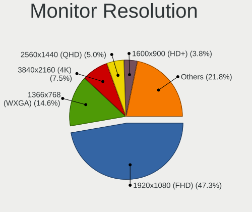

| Resolution         | Computers | Percent |
|--------------------|-----------|---------|
| 1920x1080 (FHD)    | 9201      | 47.27%  |
| 1366x768 (WXGA)    | 2851      | 14.65%  |
| 3840x2160 (4K)     | 1466      | 7.53%   |
| 2560x1440 (QHD)    | 968       | 4.97%   |
| 1600x900 (HD+)     | 744       | 3.82%   |
| 1920x1200 (WUXGA)  | 727       | 3.74%   |
| 1680x1050 (WSXGA+) | 449       | 2.31%   |
| 1280x1024 (SXGA)   | 431       | 2.21%   |
| 1440x900 (WXGA+)   | 357       | 1.83%   |
| 2560x1600          | 304       | 1.56%   |
| 1280x800 (WXGA)    | 236       | 1.21%   |
| 3440x1440          | 210       | 1.08%   |
| 2560x1080          | 174       | 0.89%   |
| 2880x1800          | 171       | 0.88%   |
| 1360x768           | 119       | 0.61%   |
| 3840x2400          | 104       | 0.53%   |
| 1920x540           | 88        | 0.45%   |
| Unknown            | 81        | 0.42%   |
| 2160x1440          | 77        | 0.4%    |
| 1024x768 (XGA)     | 69        | 0.35%   |
| 3840x1080          | 62        | 0.32%   |
| 1600x1200          | 36        | 0.18%   |
| 2288x1287          | 34        | 0.17%   |
| 2256x1504          | 33        | 0.17%   |
| 1280x720 (HD)      | 33        | 0.17%   |
| 3200x1800 (QHD+)   | 28        | 0.14%   |
| 3200x2000          | 27        | 0.14%   |
| 3840x1600          | 26        | 0.13%   |
| 2880x1920          | 25        | 0.13%   |
| 1920x1280          | 25        | 0.13%   |
| 2880x1620          | 20        | 0.1%    |
| 2240x1400          | 19        | 0.1%    |
| 3072x1920          | 18        | 0.09%   |
| 2520x1680          | 18        | 0.09%   |
| 3000x2000          | 17        | 0.09%   |
| 1400x1050          | 15        | 0.08%   |
| 1280x960           | 15        | 0.08%   |
| 2736x1824          | 14        | 0.07%   |
| 3456x2160          | 12        | 0.06%   |
| 1024x600           | 11        | 0.06%   |

Monitor Diagonal
----------------

Diagonal size in inches

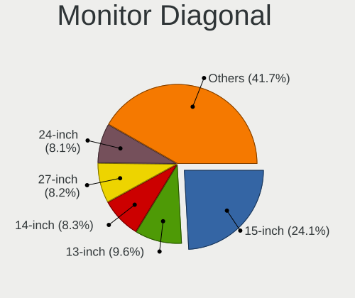

| Inches  | Computers | Percent |
|---------|-----------|---------|
| 15      | 4960      | 24.12%  |
| 13      | 1978      | 9.62%   |
| 14      | 1702      | 8.28%   |
| 27      | 1681      | 8.17%   |
| 24      | 1662      | 8.08%   |
| 23      | 1244      | 6.05%   |
| 21      | 1096      | 5.33%   |
| 17      | 988       | 4.8%    |
| 31      | 616       | 3%      |
| 19      | 519       | 2.52%   |
| Unknown | 499       | 2.43%   |
| 16      | 445       | 2.16%   |
| 18      | 325       | 1.58%   |
| 34      | 305       | 1.48%   |
| 22      | 299       | 1.45%   |
| 20      | 299       | 1.45%   |
| 12      | 255       | 1.24%   |
| 11      | 206       | 1%      |
| 84      | 176       | 0.86%   |
| 32      | 144       | 0.7%    |
| 40      | 125       | 0.61%   |
| 72      | 112       | 0.54%   |
| 54      | 108       | 0.53%   |
| 25      | 73        | 0.35%   |
| 26      | 65        | 0.32%   |
| 28      | 56        | 0.27%   |
| 10      | 50        | 0.24%   |
| 63      | 49        | 0.24%   |
| 43      | 37        | 0.18%   |
| 37      | 37        | 0.18%   |
| 48      | 36        | 0.18%   |
| 49      | 35        | 0.17%   |
| 46      | 35        | 0.17%   |
| 65      | 34        | 0.17%   |
| 52      | 34        | 0.17%   |
| 42      | 29        | 0.14%   |
| 29      | 27        | 0.13%   |
| 142     | 25        | 0.12%   |
| 74      | 22        | 0.11%   |
| 36      | 22        | 0.11%   |

Monitor Width
-------------

Physical width

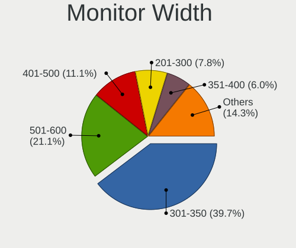

| Width in mm    | Computers | Percent |
|----------------|-----------|---------|
| 301-350        | 8018      | 39.65%  |
| 501-600        | 4267      | 21.1%   |
| 401-500        | 2251      | 11.13%  |
| 201-300        | 1579      | 7.81%   |
| 351-400        | 1213      | 6%      |
| 601-700        | 880       | 4.35%   |
| Unknown        | 499       | 2.47%   |
| 701-800        | 479       | 2.37%   |
| 1001-1500      | 397       | 1.96%   |
| 1501-2000      | 331       | 1.64%   |
| 801-900        | 200       | 0.99%   |
| 901-1000       | 71        | 0.35%   |
| More than 2000 | 27        | 0.13%   |
| 101-200        | 6         | 0.03%   |
| 1-100          | 2         | 0.01%   |

Aspect Ratio
------------

Proportional relationship between the width and the height

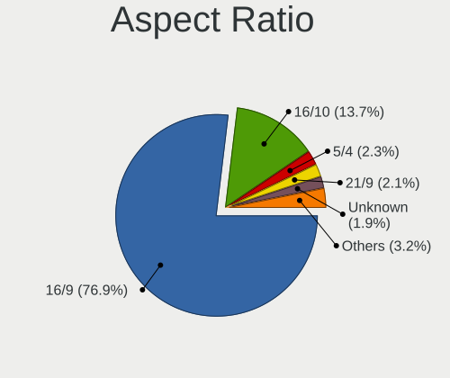

| Ratio   | Computers | Percent |
|---------|-----------|---------|
| 16/9    | 14076     | 76.9%   |
| 16/10   | 2500      | 13.66%  |
| 5/4     | 426       | 2.33%   |
| 21/9    | 378       | 2.07%   |
| Unknown | 345       | 1.88%   |
| 3/2     | 264       | 1.44%   |
| 4/3     | 142       | 0.78%   |
| 32/9    | 76        | 0.42%   |
| 1.00    | 28        | 0.15%   |
| 6/5     | 25        | 0.14%   |
| 0.56    | 14        | 0.08%   |
| 0.62    | 5         | 0.03%   |
| 2.00    | 4         | 0.02%   |
| 1.96    | 4         | 0.02%   |
| 3.73    | 3         | 0.02%   |
| 3.40    | 3         | 0.02%   |
| 2.12    | 3         | 0.02%   |
| 0.89    | 3         | 0.02%   |
| 3.20    | 2         | 0.01%   |
| 3.33    | 1         | 0.01%   |
| 2.69    | 1         | 0.01%   |
| 0.75    | 1         | 0.01%   |
| 0.67    | 1         | 0.01%   |

Monitor Area
------------

Area in inch²

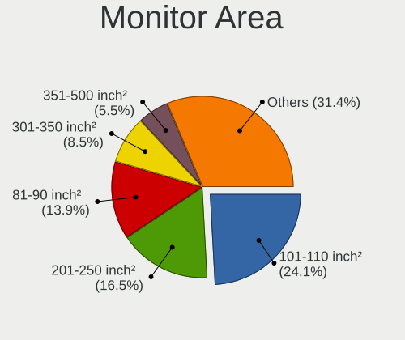

| Area in inch² | Computers | Percent |
|----------------|-----------|---------|
| 101-110        | 4919      | 24.14%  |
| 201-250        | 3361      | 16.5%   |
| 81-90          | 2835      | 13.92%  |
| 301-350        | 1734      | 8.51%   |
| 351-500        | 1129      | 5.54%   |
| 151-200        | 1126      | 5.53%   |
| 71-80          | 826       | 4.05%   |
| 121-130        | 713       | 3.5%    |
| More than 1000 | 651       | 3.2%    |
| 251-300        | 626       | 3.07%   |
| Unknown        | 499       | 2.45%   |
| 141-150        | 463       | 2.27%   |
| 111-120        | 443       | 2.17%   |
| 501-1000       | 382       | 1.88%   |
| 61-70          | 224       | 1.1%    |
| 51-60          | 215       | 1.06%   |
| 131-140        | 101       | 0.5%    |
| 91-100         | 73        | 0.36%   |
| 41-50          | 46        | 0.23%   |
| 1-40           | 7         | 0.03%   |

Pixel Density
-------------

Pixels per inch

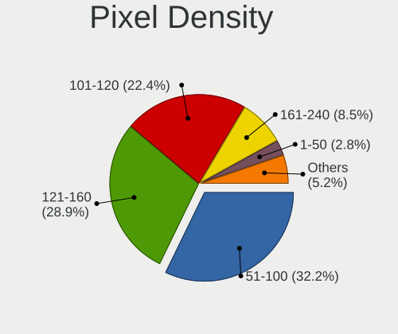

| Density       | Computers | Percent |
|---------------|-----------|---------|
| 51-100        | 6374      | 32.2%   |
| 121-160       | 5728      | 28.94%  |
| 101-120       | 4431      | 22.38%  |
| 161-240       | 1675      | 8.46%   |
| 1-50          | 551       | 2.78%   |
| More than 240 | 536       | 2.71%   |
| Unknown       | 500       | 2.53%   |

Multiple Monitors
-----------------

Total monitors connected

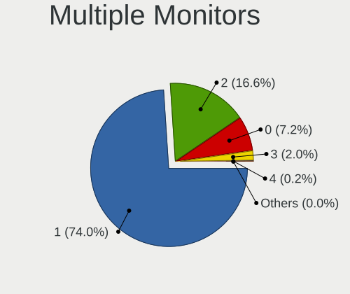

| Total | Computers | Percent |
|-------|-----------|---------|
| 1     | 14258     | 73.96%  |
| 2     | 3192      | 16.56%  |
| 0     | 1384      | 7.18%   |
| 3     | 394       | 2.04%   |
| 4     | 42        | 0.22%   |
| 5     | 4         | 0.02%   |
| 6     | 3         | 0.02%   |

Network
-------

Net Controller Vendor
---------------------

Controller vendors

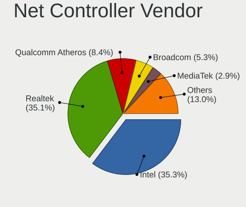

| Vendor                            | Computers | Percent |
|-----------------------------------|-----------|---------|
| Intel                             | 9911      | 35.35%  |
| Realtek Semiconductor             | 9839      | 35.09%  |
| Qualcomm Atheros                  | 2354      | 8.4%    |
| Broadcom                          | 1492      | 5.32%   |
| MediaTek                          | 806       | 2.87%   |
| TP-Link                           | 347       | 1.24%   |
| Broadcom Limited                  | 308       | 1.1%    |
| Ralink Technology                 | 234       | 0.83%   |
| ASIX Electronics                  | 228       | 0.81%   |
| Marvell Technology Group          | 221       | 0.79%   |
| Ralink                            | 199       | 0.71%   |
| Nvidia                            | 179       | 0.64%   |
| Samsung Electronics               | 122       | 0.44%   |
| DisplayLink                       | 105       | 0.37%   |
| Shenzhen Goodix Technology        | 98        | 0.35%   |
| NetGear                           | 85        | 0.3%    |
| Aquantia                          | 83        | 0.3%    |
| Xiaomi                            | 82        | 0.29%   |
| Dell                              | 77        | 0.27%   |
| Qualcomm                          | 74        | 0.26%   |
| Sierra Wireless                   | 68        | 0.24%   |
| Qualcomm Atheros Communications   | 57        | 0.2%    |
| Microsoft                         | 54        | 0.19%   |
| Lenovo                            | 51        | 0.18%   |
| D-Link                            | 47        | 0.17%   |
| D-Link System                     | 43        | 0.15%   |
| Ericsson Business Mobile Networks | 40        | 0.14%   |
| Hewlett-Packard                   | 39        | 0.14%   |
| ASUSTek Computer                  | 38        | 0.14%   |
| Edimax Technology                 | 37        | 0.13%   |
| Apple                             | 37        | 0.13%   |
| Huawei Technologies               | 36        | 0.13%   |
| OPPO Electronics                  | 35        | 0.12%   |
| Google                            | 32        | 0.11%   |
| JMicron Technology                | 31        | 0.11%   |
| Linksys                           | 30        | 0.11%   |
| Mellanox Technologies             | 29        | 0.1%    |
| ICS Advent                        | 26        | 0.09%   |
| American Megatrends               | 22        | 0.08%   |
| Motorola PCS                      | 18        | 0.06%   |

Net Controller Model
--------------------

Controller models

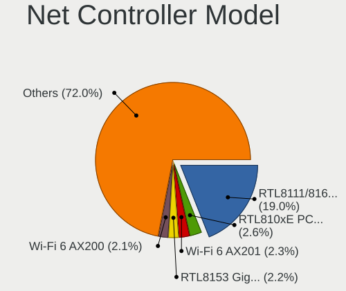

| Model                                                                  | Computers | Percent |
|------------------------------------------------------------------------|-----------|---------|
| Realtek RTL8111/8168/8211/8411 PCI Express Gigabit Ethernet Controller | 6293      | 18.96%  |
| Realtek RTL810xE PCI Express Fast Ethernet controller                  | 852       | 2.57%   |
| Intel Wi-Fi 6 AX201                                                    | 750       | 2.26%   |
| Realtek RTL8153 Gigabit Ethernet Adapter                               | 730       | 2.2%    |
| Intel Wi-Fi 6 AX200                                                    | 681       | 2.05%   |
| Realtek RTL8125 2.5GbE Controller                                      | 631       | 1.9%    |
| Intel Wireless 8265 / 8275                                             | 580       | 1.75%   |
| Intel 82579LM Gigabit Network Connection (Lewisville)                  | 566       | 1.71%   |
| Intel Alder Lake-P PCH CNVi WiFi                                       | 556       | 1.68%   |
| Realtek RTL8821CE 802.11ac PCIe Wireless Network Adapter               | 450       | 1.36%   |
| Realtek RTL8822CE 802.11ac PCIe Wireless Network Adapter               | 394       | 1.19%   |
| Intel Wireless 7265                                                    | 382       | 1.15%   |
| Qualcomm Atheros QCA9377 802.11ac Wireless Network Adapter             | 377       | 1.14%   |
| Qualcomm Atheros QCA9565 / AR9565 Wireless Network Adapter             | 346       | 1.04%   |
| MediaTek MT7921 802.11ax PCIe Wireless Network Adapter [Filogic 330]   | 340       | 1.02%   |
| Intel Comet Lake PCH-LP CNVi WiFi                                      | 326       | 0.98%   |
| Intel Ethernet Connection I217-LM                                      | 317       | 0.96%   |
| Intel Wireless 8260                                                    | 316       | 0.95%   |
| Intel Wi-Fi 6E(802.11ax) AX210/AX1675* 2x2 [Typhoon Peak]              | 301       | 0.91%   |
| Intel Ethernet Controller I225-V                                       | 299       | 0.9%    |
| Intel Wireless 7260                                                    | 298       | 0.9%    |
| Qualcomm Atheros QCA6174 802.11ac Wireless Network Adapter             | 297       | 0.89%   |
| Intel I211 Gigabit Network Connection                                  | 297       | 0.89%   |
| Qualcomm Atheros AR9485 Wireless Network Adapter                       | 287       | 0.86%   |
| Intel Ethernet Connection (2) I219-V                                   | 236       | 0.71%   |
| Intel Comet Lake PCH CNVi WiFi                                         | 231       | 0.7%    |
| Intel Cannon Lake PCH CNVi WiFi                                        | 229       | 0.69%   |
| Qualcomm Atheros AR9285 Wireless Network Adapter (PCI-Express)         | 225       | 0.68%   |
| Intel Wireless 3165                                                    | 225       | 0.68%   |
| Intel Cannon Point-LP CNVi [Wireless-AC]                               | 218       | 0.66%   |
| Intel Ethernet Connection (4) I219-LM                                  | 213       | 0.64%   |
| MediaTek MT7922 802.11ax PCI Express Wireless Network Adapter          | 207       | 0.62%   |
| Realtek RTL8852BE PCIe 802.11ax Wireless Network Controller            | 203       | 0.61%   |
| ASIX AX88179 Gigabit Ethernet                                          | 202       | 0.61%   |
| Intel Raptor Lake PCH CNVi WiFi                                        | 192       | 0.58%   |
| Intel Dual Band Wireless-AC 3168NGW [Stone Peak]                       | 191       | 0.58%   |
| Realtek 802.11ac NIC                                                   | 190       | 0.57%   |
| Intel Centrino Advanced-N 6205 [Taylor Peak]                           | 188       | 0.57%   |
| Intel Ethernet Connection (2) I219-LM                                  | 180       | 0.54%   |
| Intel Tiger Lake PCH CNVi WiFi                                         | 168       | 0.51%   |

Wireless Vendor
---------------

Wireless vendors

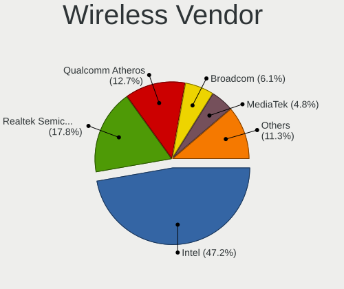

| Vendor                                | Computers | Percent |
|---------------------------------------|-----------|---------|
| Intel                                 | 7108      | 47.25%  |
| Realtek Semiconductor                 | 2678      | 17.8%   |
| Qualcomm Atheros                      | 1912      | 12.71%  |
| Broadcom                              | 924       | 6.14%   |
| MediaTek                              | 728       | 4.84%   |
| TP-Link                               | 315       | 2.09%   |
| Ralink Technology                     | 234       | 1.56%   |
| Broadcom Limited                      | 219       | 1.46%   |
| Ralink                                | 199       | 1.32%   |
| NetGear                               | 84        | 0.56%   |
| Sierra Wireless                       | 68        | 0.45%   |
| Qualcomm Atheros Communications       | 57        | 0.38%   |
| Marvell Technology Group              | 51        | 0.34%   |
| Qualcomm                              | 49        | 0.33%   |
| Dell                                  | 47        | 0.31%   |
| D-Link                                | 45        | 0.3%    |
| Microsoft                             | 42        | 0.28%   |
| Edimax Technology                     | 37        | 0.25%   |
| ASUSTek Computer                      | 35        | 0.23%   |
| D-Link System                         | 32        | 0.21%   |
| Linksys                               | 26        | 0.17%   |
| IMC Networks                          | 18        | 0.12%   |
| Hewlett-Packard                       | 15        | 0.1%    |
| Fibocom                               | 15        | 0.1%    |
| Belkin Components                     | 11        | 0.07%   |
| AVM                                   | 11        | 0.07%   |
| Mercucys                              | 10        | 0.07%   |
| Sitecom Europe                        | 8         | 0.05%   |
| ZyDAS                                 | 7         | 0.05%   |
| BUFFALO                               | 7         | 0.05%   |
| 802.11g Adapter [Linksys WUSB54GC v3] | 5         | 0.03%   |
| ZyXEL Communications                  | 4         | 0.03%   |
| Wilocity                              | 4         | 0.03%   |
| Gemtek                                | 4         | 0.03%   |
| TRENDnet                              | 3         | 0.02%   |
| Qualcomm Technologies                 | 3         | 0.02%   |
| Micro Star International              | 3         | 0.02%   |
| Sagem                                 | 2         | 0.01%   |
| Realtek                               | 2         | 0.01%   |
| Guillemot                             | 2         | 0.01%   |

Wireless Model
--------------

Wireless models

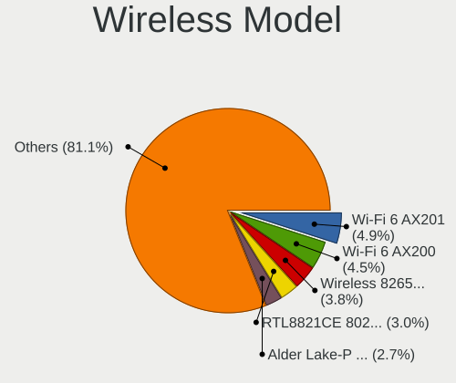

| Model                                                                | Computers | Percent |
|----------------------------------------------------------------------|-----------|---------|
| Intel Wi-Fi 6 AX201                                                  | 750       | 4.95%   |
| Intel Wi-Fi 6 AX200                                                  | 681       | 4.49%   |
| Intel Wireless 8265 / 8275                                           | 580       | 3.83%   |
| Realtek RTL8821CE 802.11ac PCIe Wireless Network Adapter             | 450       | 2.97%   |
| Intel Alder Lake-P PCH CNVi WiFi                                     | 405       | 2.67%   |
| Realtek RTL8822CE 802.11ac PCIe Wireless Network Adapter             | 394       | 2.6%    |
| Intel Wireless 7265                                                  | 382       | 2.52%   |
| Qualcomm Atheros QCA9377 802.11ac Wireless Network Adapter           | 377       | 2.49%   |
| Qualcomm Atheros QCA9565 / AR9565 Wireless Network Adapter           | 346       | 2.28%   |
| MediaTek MT7921 802.11ax PCIe Wireless Network Adapter [Filogic 330] | 340       | 2.24%   |
| Intel Comet Lake PCH-LP CNVi WiFi                                    | 326       | 2.15%   |
| Intel Wireless 8260                                                  | 316       | 2.08%   |
| Intel Wi-Fi 6E(802.11ax) AX210/AX1675* 2x2 [Typhoon Peak]            | 301       | 1.99%   |
| Intel Wireless 7260                                                  | 298       | 1.97%   |
| Qualcomm Atheros QCA6174 802.11ac Wireless Network Adapter           | 297       | 1.96%   |
| Qualcomm Atheros AR9485 Wireless Network Adapter                     | 287       | 1.89%   |
| Intel Comet Lake PCH CNVi WiFi                                       | 231       | 1.52%   |
| Intel Cannon Lake PCH CNVi WiFi                                      | 229       | 1.51%   |
| Qualcomm Atheros AR9285 Wireless Network Adapter (PCI-Express)       | 225       | 1.48%   |
| Intel Wireless 3165                                                  | 225       | 1.48%   |
| Intel Cannon Point-LP CNVi [Wireless-AC]                             | 218       | 1.44%   |
| Intel Dual Band Wireless-AC 3168NGW [Stone Peak]                     | 191       | 1.26%   |
| Realtek 802.11ac NIC                                                 | 190       | 1.25%   |
| Intel Raptor Lake PCH CNVi WiFi                                      | 188       | 1.24%   |
| Intel Centrino Advanced-N 6205 [Taylor Peak]                         | 188       | 1.24%   |
| Realtek RTL8852BE PCIe 802.11ax Wireless Network Controller          | 170       | 1.12%   |
| Intel Tiger Lake PCH CNVi WiFi                                       | 168       | 1.11%   |
| MediaTek MT7922 802.11ax PCI Express Wireless Network Adapter        | 162       | 1.07%   |
| Intel Ice Lake-LP PCH CNVi WiFi                                      | 157       | 1.04%   |
| Realtek RTL8723BE PCIe Wireless Network Adapter                      | 154       | 1.02%   |
| Realtek RTL8188EUS 802.11n Wireless Network Adapter                  | 148       | 0.98%   |
| Broadcom BCM4313 802.11bgn Wireless Network Adapter                  | 139       | 0.92%   |
| Intel Wi-Fi 5(802.11ac) Wireless-AC 9x6x [Thunder Peak]              | 135       | 0.89%   |
| Realtek RTL88x2bu [AC1200 Techkey]                                   | 134       | 0.88%   |
| Broadcom BCM43142 802.11b/g/n                                        | 131       | 0.86%   |
| Intel 700 Series Chipset CNVi WiFi                                   | 130       | 0.86%   |
| Realtek RTL8852AE 802.11ax PCIe Wireless Network Adapter             | 122       | 0.8%    |
| Intel Dual Band Wireless-AC 3165 Plus Bluetooth                      | 101       | 0.67%   |
| Realtek RTL8188CE 802.11b/g/n WiFi Adapter                           | 100       | 0.66%   |
| Ralink MT7601U Wireless Adapter                                      | 100       | 0.66%   |

Ethernet Vendor
---------------

Ethernet vendors

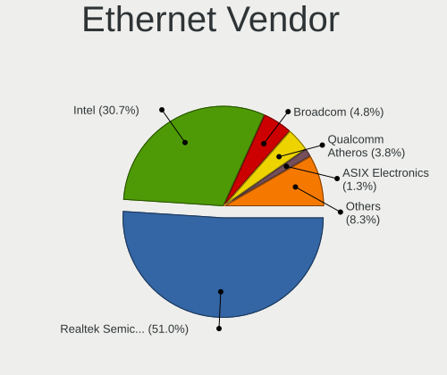

| Vendor                                 | Computers | Percent |
|----------------------------------------|-----------|---------|
| Realtek Semiconductor                  | 8658      | 51.03%  |
| Intel                                  | 5208      | 30.69%  |
| Broadcom                               | 808       | 4.76%   |
| Qualcomm Atheros                       | 651       | 3.84%   |
| ASIX Electronics                       | 228       | 1.34%   |
| Nvidia                                 | 179       | 1.05%   |
| Marvell Technology Group               | 170       | 1%      |
| Samsung Electronics                    | 121       | 0.71%   |
| DisplayLink                            | 105       | 0.62%   |
| Broadcom Limited                       | 92        | 0.54%   |
| Aquantia                               | 83        | 0.49%   |
| Xiaomi                                 | 82        | 0.48%   |
| MediaTek                               | 75        | 0.44%   |
| Lenovo                                 | 50        | 0.29%   |
| OPPO Electronics                       | 35        | 0.21%   |
| Apple                                  | 35        | 0.21%   |
| TP-Link                                | 33        | 0.19%   |
| JMicron Technology                     | 31        | 0.18%   |
| Google                                 | 31        | 0.18%   |
| ICS Advent                             | 26        | 0.15%   |
| Huawei Technologies                    | 24        | 0.14%   |
| Qualcomm                               | 23        | 0.14%   |
| American Megatrends                    | 22        | 0.13%   |
| Motorola PCS                           | 18        | 0.11%   |
| Mellanox Technologies                  | 18        | 0.11%   |
| Hewlett-Packard                        | 12        | 0.07%   |
| D-Link System                          | 11        | 0.06%   |
| Qualcomm Technologies                  | 10        | 0.06%   |
| Dell                                   | 10        | 0.06%   |
| Insyde Software                        | 9         | 0.05%   |
| VIA Technologies                       | 8         | 0.05%   |
| Microsoft                              | 8         | 0.05%   |
| IBM                                    | 8         | 0.05%   |
| Microchip Technology                   | 7         | 0.04%   |
| Sony Ericsson Mobile Communications AB | 5         | 0.03%   |
| QLogic                                 | 5         | 0.03%   |
| Chelsio Communications                 | 5         | 0.03%   |
| Spreadtrum Communications              | 4         | 0.02%   |
| Linksys                                | 4         | 0.02%   |
| 3Com                                   | 4         | 0.02%   |

Ethernet Model
--------------

Ethernet models

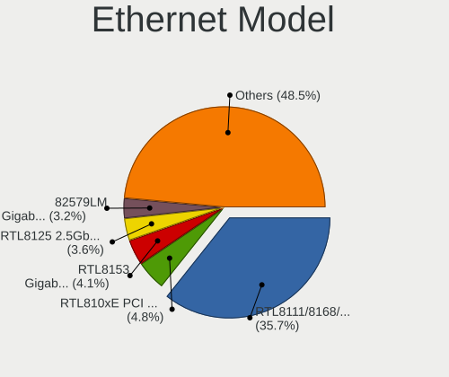

| Model                                                                  | Computers | Percent |
|------------------------------------------------------------------------|-----------|---------|
| Realtek RTL8111/8168/8211/8411 PCI Express Gigabit Ethernet Controller | 6293      | 35.7%   |
| Realtek RTL810xE PCI Express Fast Ethernet controller                  | 852       | 4.83%   |
| Realtek RTL8153 Gigabit Ethernet Adapter                               | 730       | 4.14%   |
| Realtek RTL8125 2.5GbE Controller                                      | 631       | 3.58%   |
| Intel 82579LM Gigabit Network Connection (Lewisville)                  | 566       | 3.21%   |
| Intel Ethernet Connection I217-LM                                      | 317       | 1.8%    |
| Intel Ethernet Controller I225-V                                       | 299       | 1.7%    |
| Intel I211 Gigabit Network Connection                                  | 297       | 1.68%   |
| Intel Ethernet Connection (2) I219-V                                   | 236       | 1.34%   |
| Intel Ethernet Connection (4) I219-LM                                  | 213       | 1.21%   |
| ASIX AX88179 Gigabit Ethernet                                          | 202       | 1.15%   |
| Intel Ethernet Connection (2) I219-LM                                  | 180       | 1.02%   |
| Intel 82579V Gigabit Network Connection                                | 153       | 0.87%   |
| Intel Alder Lake-P PCH CNVi WiFi                                       | 151       | 0.86%   |
| Intel Ethernet Connection I219-LM                                      | 145       | 0.82%   |
| Intel I350 Gigabit Network Connection                                  | 142       | 0.81%   |
| Intel I210 Gigabit Network Connection                                  | 141       | 0.8%    |
| Intel Ethernet Connection (7) I219-V                                   | 131       | 0.74%   |
| Intel Ethernet Connection (7) I219-LM                                  | 123       | 0.7%    |
| Intel Ethernet Connection I217-V                                       | 115       | 0.65%   |
| Broadcom NetXtreme BCM57766 Gigabit Ethernet PCIe                      | 113       | 0.64%   |
| Qualcomm Atheros AR8151 v2.0 Gigabit Ethernet                          | 108       | 0.61%   |
| Broadcom NetXtreme BCM57765 Gigabit Ethernet PCIe                      | 101       | 0.57%   |
| Intel Ethernet Connection I218-LM                                      | 99        | 0.56%   |
| Intel 82577LM Gigabit Network Connection                               | 91        | 0.52%   |
| Realtek Killer E2600 GbE Controller                                    | 89        | 0.5%    |
| Intel Ethernet Connection (3) I218-LM                                  | 88        | 0.5%    |
| Intel 82574L Gigabit Network Connection                                | 88        | 0.5%    |
| Samsung Galaxy series, misc. (tethering mode)                          | 87        | 0.49%   |
| Intel Ethernet Connection (4) I219-V                                   | 86        | 0.49%   |
| Intel Ethernet Connection (6) I219-V                                   | 82        | 0.47%   |
| Qualcomm Atheros Killer E220x Gigabit Ethernet Controller              | 79        | 0.45%   |
| Intel Ethernet Connection (2) I218-V                                   | 79        | 0.45%   |
| Intel Ethernet Connection (5) I219-LM                                  | 78        | 0.44%   |
| Qualcomm Atheros AR8161 Gigabit Ethernet                               | 77        | 0.44%   |
| Intel Ethernet Controller I226-V                                       | 75        | 0.43%   |
| Realtek RTL8152 Fast Ethernet Adapter                                  | 72        | 0.41%   |
| Intel Ethernet Connection (16) I219-V                                  | 71        | 0.4%    |
| Broadcom NetXtreme BCM5764M Gigabit Ethernet PCIe                      | 70        | 0.4%    |
| Intel Ethernet Connection (13) I219-V                                  | 66        | 0.37%   |

Net Controller Kind
-------------------

Ethernet, WiFi or modem

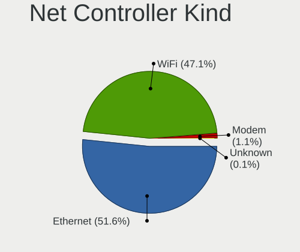

| Kind     | Computers | Percent |
|----------|-----------|---------|
| Ethernet | 15695     | 51.62%  |
| WiFi     | 14319     | 47.1%   |
| Modem    | 345       | 1.13%   |
| Unknown  | 45        | 0.15%   |

Used Controller
---------------

Currently used network controller

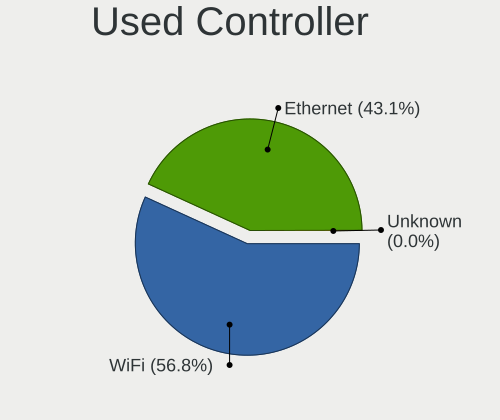

| Kind     | Computers | Percent |
|----------|-----------|---------|
| WiFi     | 11174     | 56.83%  |
| Ethernet | 8481      | 43.13%  |
| Modem    | 4         | 0.02%   |
| Unknown  | 3         | 0.02%   |

NICs
----

Total network controllers on board

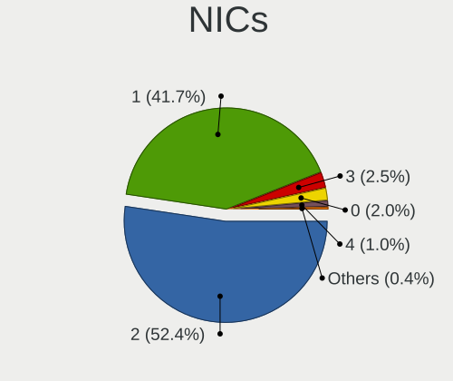

| Total | Computers | Percent |
|-------|-----------|---------|
| 2     | 9926      | 52.35%  |
| 1     | 7900      | 41.67%  |
| 3     | 478       | 2.52%   |
| 0     | 382       | 2.01%   |
| 4     | 190       | 1%      |
| 5     | 30        | 0.16%   |
| 6     | 22        | 0.12%   |
| 8     | 14        | 0.07%   |
| 7     | 6         | 0.03%   |
| 10    | 5         | 0.03%   |
| 12    | 3         | 0.02%   |
| 9     | 2         | 0.01%   |
| 17    | 1         | 0.01%   |
| 11    | 1         | 0.01%   |

IPv6
----

IPv6 vs IPv4

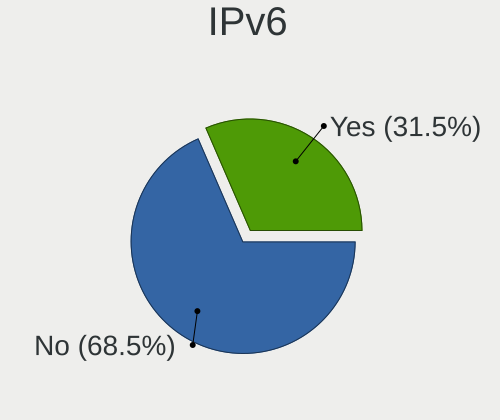

| Used | Computers | Percent |
|------|-----------|---------|
| No   | 13140     | 68.49%  |
| Yes  | 6045      | 31.51%  |

Bluetooth
---------

Bluetooth Vendor
----------------

Controller vendors

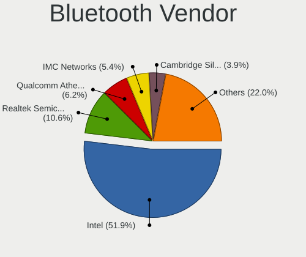

| Vendor                          | Computers | Percent |
|---------------------------------|-----------|---------|
| Intel                           | 6407      | 51.89%  |
| Realtek Semiconductor           | 1309      | 10.6%   |
| Qualcomm Atheros Communications | 764       | 6.19%   |
| IMC Networks                    | 665       | 5.39%   |
| Cambridge Silicon Radio         | 483       | 3.91%   |
| Apple                           | 481       | 3.9%    |
| Foxconn / Hon Hai               | 461       | 3.73%   |
| Broadcom                        | 386       | 3.13%   |
| Lite-On Technology              | 353       | 2.86%   |
| ASUSTek Computer                | 167       | 1.35%   |
| MediaTek                        | 140       | 1.13%   |
| Dell                            | 113       | 0.92%   |
| Realtek                         | 112       | 0.91%   |
| Hewlett-Packard                 | 81        | 0.66%   |
| Ralink                          | 64        | 0.52%   |
| TP-Link                         | 62        | 0.5%    |
| Toshiba                         | 53        | 0.43%   |
| Marvell Semiconductor           | 53        | 0.43%   |
| USI                             | 22        | 0.18%   |
| Alps Electric                   | 21        | 0.17%   |
| Integrated System Solution      | 16        | 0.13%   |
| Foxconn International           | 16        | 0.13%   |
| Ralink Technology               | 14        | 0.11%   |
| Unknown                         | 11        | 0.09%   |
| Edimax Technology               | 10        | 0.08%   |
| Micro Star International        | 9         | 0.07%   |
| Belkin Components               | 9         | 0.07%   |
| Opticis                         | 8         | 0.06%   |
| Askey Computer                  | 8         | 0.06%   |
| Actions                         | 8         | 0.06%   |
| Logitech                        | 5         | 0.04%   |
| Dynex                           | 5         | 0.04%   |
| Taiyo Yuden                     | 3         | 0.02%   |
| Smart Modular Technologies      | 3         | 0.02%   |
| AICSemi                         | 3         | 0.02%   |
| Primax Electronics              | 2         | 0.02%   |
| Mobile Action Technology        | 2         | 0.02%   |
| HTC (High Tech Computer)        | 2         | 0.02%   |
| D-Link System                   | 2         | 0.02%   |
| Conwise Technology              | 2         | 0.02%   |

Bluetooth Model
---------------

Controller models

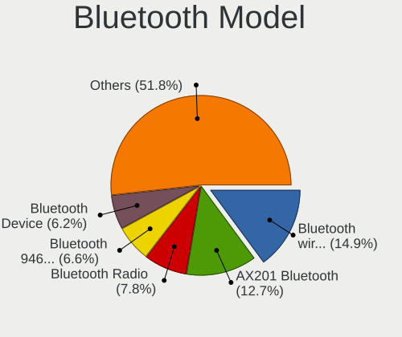

| Model                                               | Computers | Percent |
|-----------------------------------------------------|-----------|---------|
| Intel Bluetooth wireless interface                  | 1843      | 14.92%  |
| Intel AX201 Bluetooth                               | 1569      | 12.7%   |
| Realtek Bluetooth Radio                             | 966       | 7.82%   |
| Intel Bluetooth 9460/9560 Jefferson Peak (JfP)      | 817       | 6.61%   |
| Intel Bluetooth Device                              | 766       | 6.2%    |
| Intel AX200 Bluetooth                               | 638       | 5.16%   |
| Cambridge Silicon Radio Bluetooth Dongle (HCI mode) | 483       | 3.91%   |
| Qualcomm Atheros  Bluetooth Device                  | 368       | 2.98%   |
| IMC Networks Wireless_Device                        | 302       | 2.44%   |
| Intel AX210 Bluetooth                               | 284       | 2.3%    |
| Realtek  Bluetooth 4.2 Adapter                      | 222       | 1.8%    |
| Apple Bluetooth Host Controller                     | 216       | 1.75%   |
| IMC Networks Bluetooth Radio                        | 197       | 1.59%   |
| Intel Wireless-AC 3168 Bluetooth                    | 187       | 1.51%   |
| Intel Centrino Bluetooth Wireless Transceiver       | 146       | 1.18%   |
| MediaTek Wireless_Device                            | 140       | 1.13%   |
| Apple Bluetooth USB Host Controller                 | 131       | 1.06%   |
| Foxconn / Hon Hai Bluetooth Device                  | 127       | 1.03%   |
| Intel Wireless-AC 9260 Bluetooth Adapter            | 125       | 1.01%   |
| Foxconn / Hon Hai Wireless_Device                   | 113       | 0.91%   |
| Realtek Bluetooth Radio                             | 112       | 0.91%   |
| Qualcomm Atheros QCA61x4 Bluetooth 4.0              | 105       | 0.85%   |
| Lite-On Qualcomm Atheros QCA9377 Bluetooth          | 102       | 0.83%   |
| IMC Networks Bluetooth Device                       | 99        | 0.8%    |
| Foxconn / Hon Hai MediaTek Bluetooth Adapter        | 99        | 0.8%    |
| Qualcomm Atheros AR3012 Bluetooth 4.0               | 96        | 0.78%   |
| Qualcomm Atheros AR3011 Bluetooth                   | 93        | 0.75%   |
| Apple Built-in Bluetooth 2.0+EDR HCI                | 91        | 0.74%   |
| Lite-On Bluetooth Device                            | 79        | 0.64%   |
| Lite-On Wireless_Device                             | 66        | 0.53%   |
| Ralink RT3290 Bluetooth                             | 64        | 0.52%   |
| TP-Link TP-T@- UB500 Adapter                        | 62        | 0.5%    |
| Broadcom BCM20702A0 Bluetooth 4.0                   | 59        | 0.48%   |
| Qualcomm Atheros AR9462 Bluetooth                   | 57        | 0.46%   |
| Lite-On Atheros AR3012 Bluetooth                    | 55        | 0.45%   |
| ASUS ASUS USB-BT500                                 | 53        | 0.43%   |
| HP Broadcom 2070 Bluetooth Combo                    | 51        | 0.41%   |
| Broadcom BCM2045B (BDC-2.1)                         | 48        | 0.39%   |
| Apple Bluetooth HCI                                 | 42        | 0.34%   |
| Dell DW375 Bluetooth Module                         | 41        | 0.33%   |

Sound
-----

Sound Vendor
------------

Sound card vendors

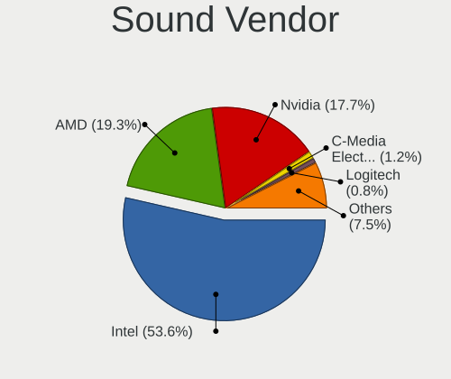

| Vendor                                       | Computers | Percent |
|----------------------------------------------|-----------|---------|
| Intel                                        | 13688     | 53.56%  |
| AMD                                          | 4933      | 19.3%   |
| Nvidia                                       | 4512      | 17.65%  |
| C-Media Electronics                          | 313       | 1.22%   |
| Logitech                                     | 203       | 0.79%   |
| GN Netcom                                    | 126       | 0.49%   |
| ASUSTek Computer                             | 101       | 0.4%    |
| Realtek Semiconductor                        | 97        | 0.38%   |
| Creative Labs                                | 92        | 0.36%   |
| Hewlett-Packard                              | 88        | 0.34%   |
| Apple                                        | 77        | 0.3%    |
| JMTek                                        | 72        | 0.28%   |
| Generalplus Technology                       | 71        | 0.28%   |
| Micro Star International                     | 70        | 0.27%   |
| Plantronics                                  | 69        | 0.27%   |
| Lenovo                                       | 65        | 0.25%   |
| Texas Instruments                            | 61        | 0.24%   |
| Kingston Technology                          | 56        | 0.22%   |
| Razer USA                                    | 51        | 0.2%    |
| Corsair                                      | 50        | 0.2%    |
| Creative Technology                          | 47        | 0.18%   |
| Focusrite-Novation                           | 42        | 0.16%   |
| SteelSeries ApS                              | 40        | 0.16%   |
| DSEA A/S                                     | 35        | 0.14%   |
| Jieli Technology                             | 28        | 0.11%   |
| Zoran Co. Personal Media Division (Nogatech) | 26        | 0.1%    |
| KTMicro                                      | 25        | 0.1%    |
| Dell                                         | 22        | 0.09%   |
| Microsoft                                    | 21        | 0.08%   |
| Sony                                         | 19        | 0.07%   |
| Giga-Byte Technology                         | 19        | 0.07%   |
| Tenx Technology                              | 16        | 0.06%   |
| Blue Microphones                             | 14        | 0.05%   |
| ASRock                                       | 13        | 0.05%   |
| M-Audio                                      | 12        | 0.05%   |
| BEHRINGER International                      | 12        | 0.05%   |
| JBL                                          | 9         | 0.04%   |
| Astro Gaming                                 | 9         | 0.04%   |
| VIA Technologies                             | 8         | 0.03%   |
| Samson Technologies                          | 8         | 0.03%   |

Sound Model
-----------

Sound card models

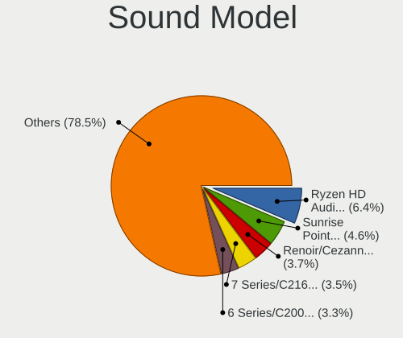

| Model                                                                      | Computers | Percent |
|----------------------------------------------------------------------------|-----------|---------|
| AMD Ryzen HD Audio Controller                                              | 1946      | 6.44%   |
| Intel Sunrise Point-LP HD Audio                                            | 1389      | 4.6%    |
| AMD Renoir/Cezanne HDMI/DP Audio Controller                                | 1113      | 3.68%   |
| Intel 7 Series/C216 Chipset Family High Definition Audio Controller        | 1065      | 3.53%   |
| Intel 6 Series/C200 Series Chipset Family High Definition Audio Controller | 984       | 3.26%   |
| Intel Tiger Lake-LP Smart Sound Technology Audio Controller                | 964       | 3.19%   |
| Intel 8 Series/C220 Series Chipset High Definition Audio Controller        | 937       | 3.1%    |
| Intel Xeon E3-1200 v3/4th Gen Core Processor HD Audio Controller           | 693       | 2.29%   |
| Intel Alder Lake PCH-P High Definition Audio Controller                    | 684       | 2.26%   |
| Intel Cannon Lake PCH cAVS                                                 | 617       | 2.04%   |
| AMD Starship/Matisse HD Audio Controller                                   | 592       | 1.96%   |
| Intel 100 Series/C230 Series Chipset Family HD Audio Controller            | 518       | 1.72%   |
| Intel 5 Series/3400 Series Chipset High Definition Audio                   | 489       | 1.62%   |
| AMD SBx00 Azalia (Intel HDA)                                               | 455       | 1.51%   |
| AMD FCH Azalia Controller                                                  | 451       | 1.49%   |
| Intel 8 Series HD Audio Controller                                         | 440       | 1.46%   |
| Intel Haswell-ULT HD Audio Controller                                      | 439       | 1.45%   |
| Intel Comet Lake PCH-LP cAVS                                               | 412       | 1.36%   |
| AMD Raven/Raven2/Fenghuang HDMI/DP Audio Controller                        | 402       | 1.33%   |
| Intel Cannon Point-LP High Definition Audio Controller                     | 387       | 1.28%   |
| Intel 200 Series PCH HD Audio                                              | 381       | 1.26%   |
| Intel Celeron/Pentium Silver Processor High Definition Audio               | 360       | 1.19%   |
| Intel Broadwell-U Audio Controller                                         | 357       | 1.18%   |
| Intel Wildcat Point-LP High Definition Audio Controller                    | 339       | 1.12%   |
| AMD Radeon High Definition Audio Controller                                | 333       | 1.1%    |
| Intel Tiger Lake-H HD Audio Controller                                     | 315       | 1.04%   |
| Intel Comet Lake PCH cAVS                                                  | 302       | 1%      |
| Nvidia GA106 High Definition Audio Controller                              | 285       | 0.94%   |
| Nvidia GA104 High Definition Audio Controller                              | 281       | 0.93%   |
| Nvidia GP107GL High Definition Audio Controller                            | 278       | 0.92%   |
| Intel 82801I (ICH9 Family) HD Audio Controller                             | 277       | 0.92%   |
| Intel Raptor Lake-P/U/H cAVS                                               | 266       | 0.88%   |
| Nvidia TU107 GeForce GTX 1650 High Definition Audio Controller             | 259       | 0.86%   |
| Intel Ice Lake-LP Smart Sound Technology Audio Controller                  | 254       | 0.84%   |
| Nvidia GK208 HDMI/DP Audio Controller                                      | 245       | 0.81%   |
| AMD Kabini HDMI/DP Audio                                                   | 230       | 0.76%   |
| AMD Family 17h (Models 00h-0fh) HD Audio Controller                        | 230       | 0.76%   |
| Intel Alder Lake-S HD Audio Controller                                     | 228       | 0.75%   |
| AMD Ellesmere HDMI Audio [Radeon RX 470/480 / 570/580/590]                 | 225       | 0.74%   |
| AMD Family 15h (Models 60h-6fh) Audio Controller                           | 205       | 0.68%   |

Memory
------

Memory Vendor
-------------

Memory module vendors

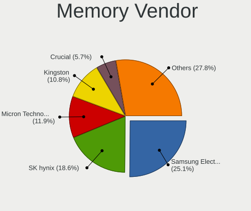

| Vendor                       | Computers | Percent |
|------------------------------|-----------|---------|
| Samsung Electronics          | 3030      | 25.14%  |
| SK hynix                     | 2248      | 18.65%  |
| Micron Technology            | 1432      | 11.88%  |
| Kingston                     | 1304      | 10.82%  |
| Crucial                      | 692       | 5.74%   |
| Corsair                      | 592       | 4.91%   |
| Unknown                      | 554       | 4.6%    |
| G.Skill                      | 349       | 2.9%    |
| A-DATA Technology            | 275       | 2.28%   |
| Unknown                      | 203       | 1.68%   |
| Unknown (ABCD)               | 176       | 1.46%   |
| Ramaxel Technology           | 176       | 1.46%   |
| Nanya Technology             | 101       | 0.84%   |
| Team                         | 96        | 0.8%    |
| Elpida                       | 92        | 0.76%   |
| Smart                        | 63        | 0.52%   |
| Patriot                      | 58        | 0.48%   |
| Transcend                    | 52        | 0.43%   |
| Hewlett-Packard              | 41        | 0.34%   |
| GOODRAM                      | 27        | 0.22%   |
| Apacer                       | 20        | 0.17%   |
| AMD                          | 19        | 0.16%   |
| PNY                          | 18        | 0.15%   |
| ChangXin Memory              | 17        | 0.14%   |
| Timetec                      | 16        | 0.13%   |
| Smart Brazil                 | 14        | 0.12%   |
| Avant                        | 13        | 0.11%   |
| ASint Technology             | 12        | 0.1%    |
| Neo Forza                    | 11        | 0.09%   |
| Silicon Power                | 10        | 0.08%   |
| Hikvision                    | 10        | 0.08%   |
| Teikon                       | 9         | 0.07%   |
| KLEVV                        | 9         | 0.07%   |
| Goldkey                      | 9         | 0.07%   |
| Patriot Memory (PDP Systems) | 8         | 0.07%   |
| Lexar                        | 8         | 0.07%   |
| Innodisk                     | 8         | 0.07%   |
| Atermiter                    | 8         | 0.07%   |
| 8CFD000080AD                 | 8         | 0.07%   |
| Wilk                         | 6         | 0.05%   |

Memory Model
------------

Memory module models

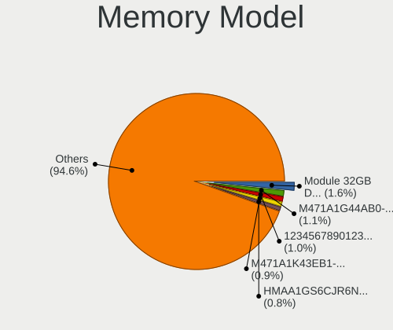

| Model                                                            | Computers | Percent |
|------------------------------------------------------------------|-----------|---------|
| Unknown                                                          | 203       | 1.58%   |
| Samsung RAM M471A1G44AB0-CWE 8GiB SODIMM DDR4 3200MT/s           | 147       | 1.15%   |
| Unknown (ABCD) RAM 123456789012345678 2GB SODIMM LPDDR4 2400MT/s | 125       | 0.97%   |
| Samsung RAM M471A1K43EB1-CWE 8GB SODIMM DDR4 3200MT/s            | 120       | 0.94%   |
| SK hynix RAM HMAA1GS6CJR6N-XN 8GB SODIMM DDR4 3200MT/s           | 101       | 0.79%   |
| Samsung RAM M471A1G44BB0-CWE 8GB SODIMM DDR4 3200MT/s            | 97        | 0.76%   |
| SK hynix RAM HMA81GS6AFR8N-UH 8GB SODIMM DDR4 2667MT/s           | 79        | 0.62%   |
| Samsung RAM M471A1K43DB1-CWE 8GB SODIMM DDR4 3200MT/s            | 78        | 0.61%   |
| Samsung RAM M471A5244CB0-CWE 4GB SODIMM DDR4 3200MT/s            | 76        | 0.59%   |
| Samsung RAM M471A5244CB0-CTD 4GB SODIMM DDR4 3266MT/s            | 72        | 0.56%   |
| Samsung RAM M471A1G44AB0-CWE 8GB Row Of Chips DDR4 3200MT/s      | 72        | 0.56%   |
| Samsung RAM M471A1K43CB1-CRC 8GB SODIMM DDR4 8400MT/s            | 67        | 0.52%   |
| SK hynix RAM HMA81GS6DJR8N-XN 8GB SODIMM DDR4 3200MT/s           | 65        | 0.51%   |
| Micron RAM 8ATF1G64HZ-3G2R1 8GB SODIMM DDR4 3200MT/s             | 64        | 0.5%    |
| Micron RAM 4ATF1G64HZ-3G2F1 8GB SODIMM DDR4 3200MT/s             | 64        | 0.5%    |
| Micron RAM 4ATF1G64HZ-3G2E1 8GB Row Of Chips DDR4 3200MT/s       | 62        | 0.48%   |
| Samsung RAM M471B5173DB0-YK0 4GB SODIMM DDR3 1600MT/s            | 61        | 0.48%   |
| SK hynix RAM HMAA1GS6CJR6N-XN 8GB Row Of Chips DDR4 3200MT/s     | 55        | 0.43%   |
| Samsung RAM M471B5173QH0-YK0 4GB SODIMM DDR3 1600MT/s            | 53        | 0.41%   |
| Samsung RAM M471A1K43CB1-CTD 8GB SODIMM DDR4 3200MT/s            | 52        | 0.41%   |
| Unknown (ABCD) RAM 123456789012345678 2GB DIMM LPDDR4 2133MT/s   | 51        | 0.4%    |
| SK hynix RAM HMT451S6BFR8A-PB 4GB SODIMM DDR3 1600MT/s           | 51        | 0.4%    |
| Samsung RAM M471A1K43DB1-CTD 8GB SODIMM DDR4 2667MT/s            | 51        | 0.4%    |
| Samsung RAM M471A1K43BB1-CRC 8GB SODIMM DDR4 2667MT/s            | 48        | 0.37%   |
| Samsung RAM M471B1G73QH0-YK0 8GB SODIMM DDR3 1600MT/s            | 47        | 0.37%   |
| Micron RAM 4ATF1G64HZ-3G2E1 8GB SODIMM DDR4 3200MT/s             | 46        | 0.36%   |
| Samsung RAM M471B5273DH0-CH9 4GB SODIMM DDR3 1600MT/s            | 43        | 0.34%   |
| SK hynix RAM HMT351S6CFR8C-PB 4GB SODIMM DDR3 1600MT/s           | 42        | 0.33%   |
| Samsung RAM M471A5244CB0-CRC 4GB SODIMM DDR4 2667MT/s            | 42        | 0.33%   |
| SK hynix RAM HMAA2GS6CJR8N-XN 16GB SODIMM DDR4 3200MT/s          | 40        | 0.31%   |
| SK hynix RAM HMT41GS6BFR8A-PB 8GB SODIMM DDR3 2667MT/s           | 39        | 0.3%    |
| SK hynix RAM HMA81GS6JJR8N-VK 8GB SODIMM DDR4 2667MT/s           | 38        | 0.3%    |
| SK hynix RAM HMA81GS6CJR8N-VK 8GB SODIMM DDR4 2667MT/s           | 38        | 0.3%    |
| Samsung RAM M471B5173EB0-YK0 4GB SODIMM DDR3 1600MT/s            | 38        | 0.3%    |
| Samsung RAM M471B1G73DB0-YK0 8GB SODIMM DDR3 1600MT/s            | 37        | 0.29%   |
| SK hynix RAM HMT451S6AFR8A-PB 4GB SODIMM DDR3 1600MT/s           | 36        | 0.28%   |
| SK hynix RAM HMA851S6CJR6N-VK 4GB SODIMM DDR4 2667MT/s           | 35        | 0.27%   |
| SK hynix RAM HMA851S6AFR6N-UH 4GB SODIMM DDR4 2667MT/s           | 35        | 0.27%   |
| SK hynix RAM HMA851S6DJR6N-XN 4GB SODIMM DDR4 3200MT/s           | 34        | 0.26%   |
| Samsung RAM M425R2GA3BB0-CQKOL 16GB SODIMM DDR5 4800MT/s         | 34        | 0.26%   |

Memory Kind
-----------

Memory module kinds

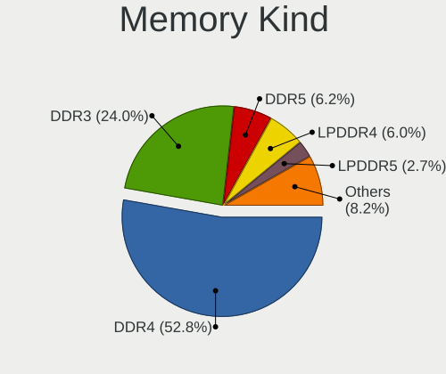

| Kind         | Computers | Percent |
|--------------|-----------|---------|
| DDR4         | 5500      | 52.78%  |
| DDR3         | 2501      | 24%     |
| DDR5         | 647       | 6.21%   |
| LPDDR4       | 629       | 6.04%   |
| LPDDR5       | 285       | 2.74%   |
| LPDDR3       | 271       | 2.6%    |
| DDR2         | 168       | 1.61%   |
| Unknown      | 160       | 1.54%   |
| SDRAM        | 138       | 1.32%   |
| DRAM         | 96        | 0.92%   |
| DDR          | 24        | 0.23%   |
| DDR2 FB-DIMM | 1         | 0.01%   |

Memory Form Factor
------------------

Physical design of the memory module

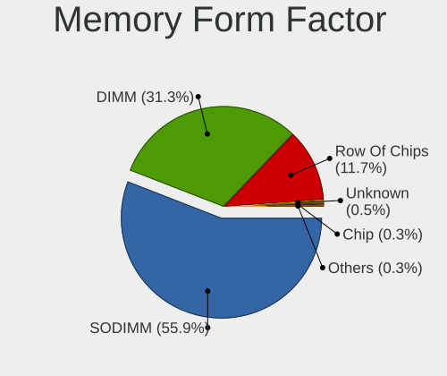

| Name            | Computers | Percent |
|-----------------|-----------|---------|
| SODIMM          | 5815      | 55.89%  |
| DIMM            | 3254      | 31.28%  |
| Row Of Chips    | 1218      | 11.71%  |
| Unknown         | 49        | 0.47%   |
| Chip            | 35        | 0.34%   |
| RIMM            | 17        | 0.16%   |
| Proprietary Car | 8         | 0.08%   |
| FB-DIMM         | 8         | 0.08%   |

Memory Size
-----------

Memory module size

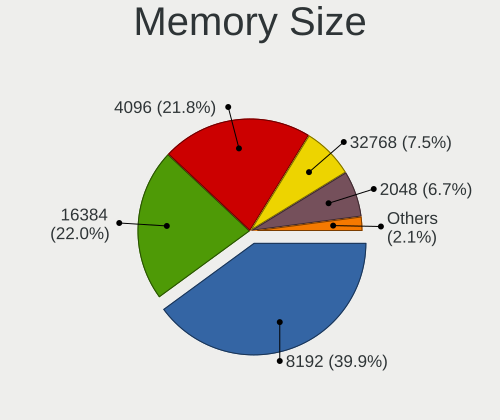

| Size   | Computers | Percent |
|--------|-----------|---------|
| 8192   | 4510      | 39.95%  |
| 16384  | 2488      | 22.04%  |
| 4096   | 2461      | 21.8%   |
| 32768  | 844       | 7.48%   |
| 2048   | 754       | 6.68%   |
| 1024   | 164       | 1.45%   |
| 65536  | 36        | 0.32%   |
| 49152  | 9         | 0.08%   |
| 12288  | 6         | 0.05%   |
| 131072 | 4         | 0.04%   |
| 6144   | 4         | 0.04%   |
| 512    | 4         | 0.04%   |
| 3072   | 3         | 0.03%   |
| 98304  | 1         | 0.01%   |
| 24576  | 1         | 0.01%   |
| 1536   | 1         | 0.01%   |

Memory Speed
------------

Memory module speed

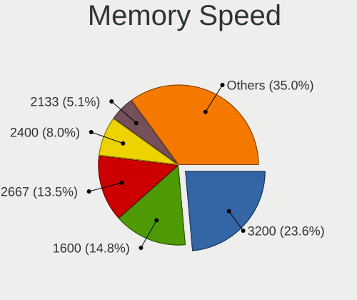

| Speed   | Computers | Percent |
|---------|-----------|---------|
| 3200    | 2636      | 23.59%  |
| 1600    | 1659      | 14.85%  |
| 2667    | 1505      | 13.47%  |
| 2400    | 895       | 8.01%   |
| 2133    | 565       | 5.06%   |
| 1333    | 537       | 4.81%   |
| 4800    | 345       | 3.09%   |
| 3600    | 299       | 2.68%   |
| 4267    | 267       | 2.39%   |
| 6400    | 242       | 2.17%   |
| 5600    | 183       | 1.64%   |
| 1867    | 180       | 1.61%   |
| 1334    | 142       | 1.27%   |
| 3733    | 102       | 0.91%   |
| 1067    | 93        | 0.83%   |
| 667     | 93        | 0.83%   |
| 8400    | 90        | 0.81%   |
| 800     | 88        | 0.79%   |
| 3266    | 87        | 0.78%   |
| Unknown | 75        | 0.67%   |
| 2666    | 72        | 0.64%   |
| 1866    | 70        | 0.63%   |
| 3000    | 66        | 0.59%   |
| 2933    | 63        | 0.56%   |
| 1066    | 59        | 0.53%   |
| 3800    | 56        | 0.5%    |
| 4266    | 55        | 0.49%   |
| 6000    | 48        | 0.43%   |
| 1800    | 44        | 0.39%   |
| 3400    | 40        | 0.36%   |
| 4199    | 36        | 0.32%   |
| 4000    | 36        | 0.32%   |
| 3466    | 32        | 0.29%   |
| 7500    | 26        | 0.23%   |
| 5200    | 26        | 0.23%   |
| 3933    | 19        | 0.17%   |
| 7467    | 18        | 0.16%   |
| 3066    | 18        | 0.16%   |
| 2800    | 17        | 0.15%   |
| 3866    | 16        | 0.14%   |

Printers & scanners
-------------------

Printer Vendor
--------------

Printer device vendors

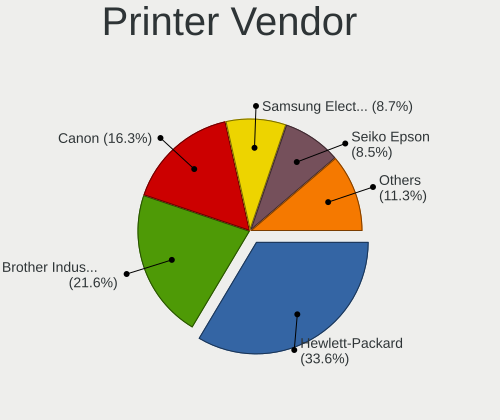

| Vendor                 | Computers | Percent |
|------------------------|-----------|---------|
| Hewlett-Packard        | 146       | 33.56%  |
| Brother Industries     | 94        | 21.61%  |
| Canon                  | 71        | 16.32%  |
| Samsung Electronics    | 38        | 8.74%   |
| Seiko Epson            | 37        | 8.51%   |
| Dymo-CoStar            | 8         | 1.84%   |
| STMicroelectronics     | 6         | 1.38%   |
| QinHeng Electronics    | 5         | 1.15%   |
| Prolific Technology    | 4         | 0.92%   |
| Lexmark International  | 4         | 0.92%   |
| Kyocera                | 4         | 0.92%   |
| Xerox                  | 3         | 0.69%   |
| Xiaomi                 | 2         | 0.46%   |
| Oki Data               | 2         | 0.46%   |
| Fuji Xerox             | 2         | 0.46%   |
| Custom Engineering SPA | 2         | 0.46%   |
| Zebra                  | 1         | 0.23%   |
| Pantum                 | 1         | 0.23%   |
| iDPRT                  | 1         | 0.23%   |
| Dell                   | 1         | 0.23%   |
| BIXOLON                | 1         | 0.23%   |
| Apple                  | 1         | 0.23%   |
| Unknown                | 1         | 0.23%   |

Printer Model
-------------

Printer device models

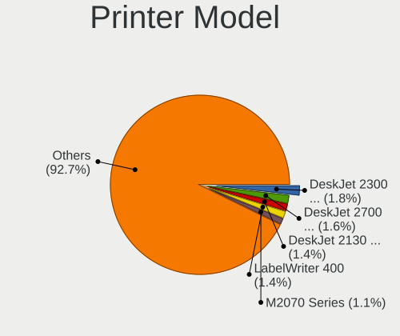

| Model                                                     | Computers | Percent |
|-----------------------------------------------------------|-----------|---------|
| HP DeskJet 2300 series                                    | 8         | 1.81%   |
| HP DeskJet 2700 series                                    | 7         | 1.59%   |
| HP DeskJet 2130 series                                    | 6         | 1.36%   |
| Dymo-CoStar LabelWriter 400                               | 6         | 1.36%   |
| STMicroelectronics LED badge -- mini LED display -- 11x44 | 5         | 1.13%   |
| Samsung M2070 Series                                      | 5         | 1.13%   |
| QinHeng CH340S                                            | 5         | 1.13%   |
| HP OfficeJet 3830 series                                  | 5         | 1.13%   |
| HP LaserJet P1005                                         | 5         | 1.13%   |
| Canon PIXMA MG2500 Series                                 | 5         | 1.13%   |
| Canon LiDE 300                                            | 5         | 1.13%   |
| Seiko Epson EPSON L220 Series                             | 4         | 0.91%   |
| Samsung M2020 Series                                      | 4         | 0.91%   |
| Prolific PL2305 Parallel Port                             | 4         | 0.91%   |
| HP LaserJet M14-M17                                       | 4         | 0.91%   |
| HP DeskJet 4100 series                                    | 4         | 0.91%   |
| HP DeskJet 3700 series                                    | 4         | 0.91%   |
| HP Deskjet 3050A                                          | 4         | 0.91%   |
| Canon TS3100 series                                       | 4         | 0.91%   |
| Canon LBP2900                                             | 4         | 0.91%   |
| Brother MFC-L2700DW                                       | 4         | 0.91%   |
| Brother HL-L2350DW series                                 | 4         | 0.91%   |
| Seiko Epson ET-2810 Series                                | 3         | 0.68%   |
| Seiko Epson ET-2720 Series                                | 3         | 0.68%   |
| Seiko Epson ET-2710 Series                                | 3         | 0.68%   |
| Samsung ML-216x Series Laser Printer                      | 3         | 0.68%   |
| Samsung Composite Device                                  | 3         | 0.68%   |
| HP OfficeJet 5600 (USBHUB)                                | 3         | 0.68%   |
| HP Officejet 4500 G510n-z                                 | 3         | 0.68%   |
| HP LaserJet 4250                                          | 3         | 0.68%   |
| HP LaserJet 1018                                          | 3         | 0.68%   |
| HP LaserJet 1010                                          | 3         | 0.68%   |
| HP HP OfficeJet Pro 8020 series                           | 3         | 0.68%   |
| HP DeskJet 2600 series                                    | 3         | 0.68%   |
| HP Deskjet 2540 series                                    | 3         | 0.68%   |
| HP Color LaserJet CP1215                                  | 3         | 0.68%   |
| Canon MF240 Series UFRII LT                               | 3         | 0.68%   |
| Canon LBP6030/6030B/6018L                                 | 3         | 0.68%   |
| Brother HL-1440 Laser Printer                             | 3         | 0.68%   |
| Brother DCP-7065DN                                        | 3         | 0.68%   |

Scanner Vendor
--------------

Scanner device vendors

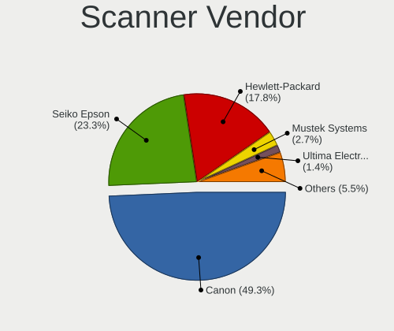

| Vendor                      | Computers | Percent |
|-----------------------------|-----------|---------|
| Canon                       | 36        | 49.32%  |
| Seiko Epson                 | 17        | 23.29%  |
| Hewlett-Packard             | 13        | 17.81%  |
| Mustek Systems              | 2         | 2.74%   |
| UMAX                        | 1         | 1.37%   |
| Ultima Electronics          | 1         | 1.37%   |
| KYE Systems (Mouse Systems) | 1         | 1.37%   |
| AGFA-Gevaert NV             | 1         | 1.37%   |
| Acer Peripherals (now BenQ) | 1         | 1.37%   |

Scanner Model
-------------

Scanner device models

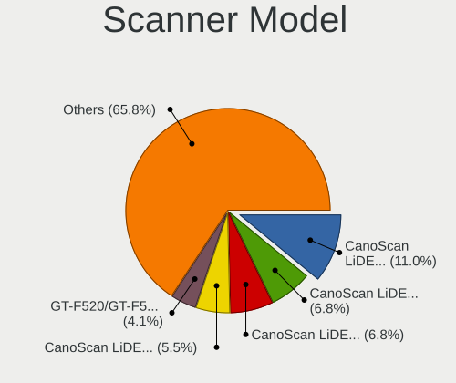

| Model                                                                                 | Computers | Percent |
|---------------------------------------------------------------------------------------|-----------|---------|
| Canon CanoScan LiDE 120                                                               | 8         | 10.96%  |
| Canon CanoScan LiDE 110                                                               | 5         | 6.85%   |
| Canon CanoScan LiDE 100                                                               | 5         | 6.85%   |
| Canon CanoScan LiDE 220                                                               | 4         | 5.48%   |
| Seiko Epson GT-F520/GT-F570 [Perfection 3590 PHOTO]                                   | 3         | 4.11%   |
| HP ScanJet 3400cse                                                                    | 3         | 4.11%   |
| Seiko Epson GT-F700 [Perfection V350]                                                 | 2         | 2.74%   |
| Canon CanoScan LIDE 25                                                                | 2         | 2.74%   |
| Canon CanoScan 4200F                                                                  | 2         | 2.74%   |
| UMAX Astra 2200/2200SU                                                                | 1         | 1.37%   |
| Ultima Artec Ultima 2000 (GT6801 based)/Lifetec LT9385/ScanMagic 1200 UB Plus Scanner | 1         | 1.37%   |
| Seiko Epson Perfection V37/V370                                                       | 1         | 1.37%   |
| Seiko Epson GT-X820 [Perfection V600 Photo]                                           | 1         | 1.37%   |
| Seiko Epson GT-X800 [Perfection 4990 PHOTO]                                           | 1         | 1.37%   |
| Seiko Epson GT-X770 [Perfection V500]                                                 | 1         | 1.37%   |
| Seiko Epson GT-F730 [GT-S630/Perfection V33/V330 Photo]                               | 1         | 1.37%   |
| Seiko Epson GT-F500/GT-F550 [Perfection 2480/2580 PHOTO]                              | 1         | 1.37%   |
| Seiko Epson GT-9300UF [Perfection 2400 PHOTO]                                         | 1         | 1.37%   |
| Seiko Epson GT-8400UF [Perfection 1670/1670 PHOTO]                                    | 1         | 1.37%   |
| Seiko Epson GT-8300UF [Perfection 1660 PHOTO]                                         | 1         | 1.37%   |
| Seiko Epson GT-7700U [Perfection 1240U]                                               | 1         | 1.37%   |
| Seiko Epson GT-7300U [Perfection 1260/1260 PHOTO]                                     | 1         | 1.37%   |
| Seiko Epson ES-D200 [GT-S50]                                                          | 1         | 1.37%   |
| Mustek Systems BearPaw 2448 CU Pro                                                    | 1         | 1.37%   |
| Mustek Systems BearPaw 1200 CU Plus                                                   | 1         | 1.37%   |
| KYE Systems (Mouse Systems) ColorPage-SF600                                           | 1         | 1.37%   |
| HP Scanjet Professional 1000 Mobile Scanner                                           | 1         | 1.37%   |
| HP Scanjet N6010                                                                      | 1         | 1.37%   |
| HP ScanJet G4010                                                                      | 1         | 1.37%   |
| HP Scanjet G2710                                                                      | 1         | 1.37%   |
| HP ScanJet 7400c                                                                      | 1         | 1.37%   |
| HP ScanJet 5530C PhotoSmart                                                           | 1         | 1.37%   |
| HP ScanJet 4850C/4890C                                                                | 1         | 1.37%   |
| HP ScanJet 3970c                                                                      | 1         | 1.37%   |
| HP OfficeJet 6110                                                                     | 1         | 1.37%   |
| HP HP Scanjet 300                                                                     | 1         | 1.37%   |
| Canon CanoScan N670U/N676U/LiDE 20                                                    | 1         | 1.37%   |
| Canon CanoScan N650U/N656U                                                            | 1         | 1.37%   |
| Canon CanoScan N1240U/LiDE 30                                                         | 1         | 1.37%   |
| Canon CanoScan LiDE 70                                                                | 1         | 1.37%   |

Camera
------

Camera Vendor
-------------

Camera device vendors

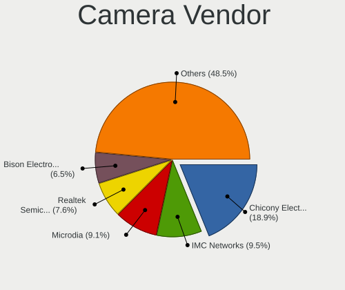

| Vendor                                 | Computers | Percent |
|----------------------------------------|-----------|---------|
| Chicony Electronics                    | 2174      | 18.85%  |
| IMC Networks                           | 1094      | 9.49%   |
| Microdia                               | 1054      | 9.14%   |
| Realtek Semiconductor                  | 871       | 7.55%   |
| Bison Electronics                      | 746       | 6.47%   |
| Quanta                                 | 676       | 5.86%   |
| Sunplus Innovation Technology          | 670       | 5.81%   |
| Logitech                               | 590       | 5.12%   |
| Apple                                  | 454       | 3.94%   |
| Cheng Uei Precision Industry (Foxlink) | 408       | 3.54%   |
| Luxvisions Innotech Limited            | 355       | 3.08%   |
| Syntek                                 | 299       | 2.59%   |
| Suyin                                  | 244       | 2.12%   |
| Lite-On Technology                     | 220       | 1.91%   |
| Sonix Technology                       | 147       | 1.27%   |
| Microsoft                              | 123       | 1.07%   |
| Samsung Electronics                    | 114       | 0.99%   |
| Alcor Micro                            | 110       | 0.95%   |
| Silicon Motion                         | 107       | 0.93%   |
| SunplusIT                              | 76        | 0.66%   |
| Ricoh                                  | 70        | 0.61%   |
| Z-Star Microelectronics                | 57        | 0.49%   |
| ShineTech                              | 47        | 0.41%   |
| Generalplus Technology                 | 45        | 0.39%   |
| icSpring                               | 39        | 0.34%   |
| Lenovo                                 | 37        | 0.32%   |
| Acer                                   | 36        | 0.31%   |
| ARC International                      | 34        | 0.29%   |
| Importek                               | 32        | 0.28%   |
| Primax Electronics                     | 31        | 0.27%   |
| ALi                                    | 28        | 0.24%   |
| webcam                                 | 23        | 0.2%    |
| Y Media                                | 19        | 0.16%   |
| Trust                                  | 17        | 0.15%   |
| Sunplus Technology                     | 17        | 0.15%   |
| Jieli Technology                       | 17        | 0.15%   |
| Intel                                  | 17        | 0.15%   |
| Creative Technology                    | 16        | 0.14%   |
| OmniVision Technologies                | 14        | 0.12%   |
| KYE Systems (Mouse Systems)            | 14        | 0.12%   |

Camera Model
------------

Camera device models

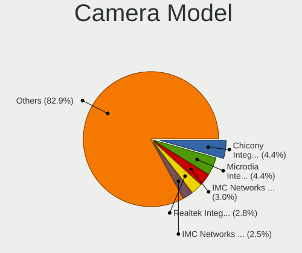

| Model                                               | Computers | Percent |
|-----------------------------------------------------|-----------|---------|
| Chicony Integrated Camera                           | 515       | 4.43%   |
| Microdia Integrated_Webcam_HD                       | 508       | 4.37%   |
| IMC Networks USB2.0 HD UVC WebCam                   | 346       | 2.97%   |
| Realtek Integrated_Webcam_HD                        | 329       | 2.83%   |
| IMC Networks Integrated Camera                      | 289       | 2.48%   |
| Bison Integrated Camera                             | 244       | 2.1%    |
| Syntek Integrated Camera                            | 213       | 1.83%   |
| Sunplus Integrated_Webcam_HD                        | 175       | 1.5%    |
| Chicony HD WebCam                                   | 169       | 1.45%   |
| Logitech Webcam C270                                | 140       | 1.2%    |
| Apple FaceTime HD Camera (Built-in)                 | 135       | 1.16%   |
| Chicony HP HD Camera                                | 134       | 1.15%   |
| Apple iPhone 5/5C/5S/6/SE/7/8/X                     | 131       | 1.13%   |
| Apple Built-in iSight                               | 118       | 1.01%   |
| Samsung Galaxy series, misc. (MTP mode)             | 112       | 0.96%   |
| IMC Networks USB2.0 VGA UVC WebCam                  | 101       | 0.87%   |
| Quanta HP HD Camera                                 | 98        | 0.84%   |
| Quanta HD User Facing                               | 95        | 0.82%   |
| Luxvisions Innotech Limited Integrated Camera       | 95        | 0.82%   |
| Bison HD Webcam                                     | 86        | 0.74%   |
| IMC Networks HD Camera                              | 85        | 0.73%   |
| Logitech HD Pro Webcam C920                         | 84        | 0.72%   |
| Quanta HD Webcam                                    | 77        | 0.66%   |
| Sonix USB2.0 HD UVC WebCam                          | 75        | 0.64%   |
| Chicony HP TrueVision HD Camera                     | 72        | 0.62%   |
| Luxvisions Innotech Limited HP TrueVision HD Camera | 71        | 0.61%   |
| Microdia Integrated_Webcam_FHD                      | 70        | 0.6%    |
| Lite-On Integrated Camera                           | 70        | 0.6%    |
| Chicony HP Wide Vision HD Camera                    | 70        | 0.6%    |
| Quanta HP TrueVision HD Camera                      | 69        | 0.59%   |
| Chicony TOSHIBA Web Camera - HD                     | 67        | 0.58%   |
| Sunplus HD WebCam                                   | 66        | 0.57%   |
| Microdia USB 2.0 Camera                             | 65        | 0.56%   |
| Luxvisions Innotech Limited HP HD Camera            | 64        | 0.55%   |
| Microdia Webcam Vitade AF                           | 63        | 0.54%   |
| Chicony USB2.0 HD UVC WebCam                        | 63        | 0.54%   |
| Chicony HD User Facing                              | 63        | 0.54%   |
| Sunplus Integrated Camera                           | 62        | 0.53%   |
| Chicony HP Truevision HD                            | 61        | 0.52%   |
| Realtek USB Camera                                  | 60        | 0.52%   |

Security
--------

Fingerprint Vendor
------------------

Fingerprint sensor vendors

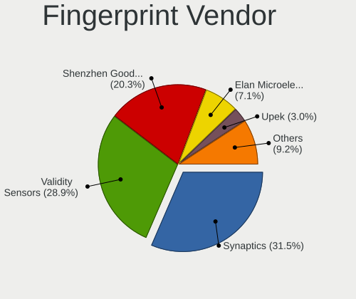

| Vendor                             | Computers | Percent |
|------------------------------------|-----------|---------|
| Synaptics                          | 703       | 31.5%   |
| Validity Sensors                   | 645       | 28.9%   |
| Shenzhen Goodix Technology         | 454       | 20.34%  |
| Elan Microelectronics              | 158       | 7.08%   |
| Upek                               | 66        | 2.96%   |
| AuthenTec                          | 60        | 2.69%   |
| LighTuning Technology              | 53        | 2.37%   |
| Realtek USB2.0 Finger Print Bridge | 37        | 1.66%   |
| STMicroelectronics                 | 13        | 0.58%   |
| Samsung Electronics                | 11        | 0.49%   |
| Focal-systems.Corp                 | 11        | 0.49%   |
| HOLTEK                             | 10        | 0.45%   |
| GDMicroelectronics                 | 3         | 0.13%   |
| DigitalPersona                     | 3         | 0.13%   |
| Microsoft                          | 2         | 0.09%   |
| Dell                               | 2         | 0.09%   |
| Next Biometrics                    | 1         | 0.04%   |

Fingerprint Model
-----------------

Fingerprint sensor models

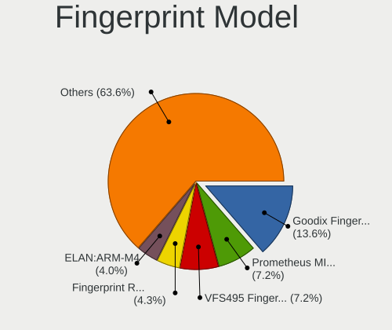

| Model                                                                      | Computers | Percent |
|----------------------------------------------------------------------------|-----------|---------|
| Shenzhen Goodix  Fingerprint Device                                        | 304       | 13.61%  |
| Synaptics Prometheus MIS Touch Fingerprint Reader                          | 161       | 7.21%   |
| Validity Sensors VFS495 Fingerprint Reader                                 | 160       | 7.17%   |
| Shenzhen Goodix Fingerprint Reader                                         | 97        | 4.34%   |
| Elan ELAN:ARM-M4                                                           | 90        | 4.03%   |
| Synaptics FS7604 Touch Fingerprint Sensor with PurePrint                   | 76        | 3.4%    |
| Synaptics Metallica MIS Touch Fingerprint Reader                           | 75        | 3.36%   |
| Elan ELAN:Fingerprint                                                      | 67        | 3%      |
| Validity Sensors Synaptics WBDI                                            | 64        | 2.87%   |
| Upek Biometric Touchchip/Touchstrip Fingerprint Sensor                     | 60        | 2.69%   |
| Validity Sensors Synaptics VFS7552 Touch Fingerprint Sensor with PurePrint | 53        | 2.37%   |
| Shenzhen Goodix FingerPrint                                                | 53        | 2.37%   |
| Validity Sensors VFS 5011 fingerprint sensor                               | 52        | 2.33%   |
| Synaptics WBDI                                                             | 51        | 2.28%   |
| Validity Sensors VFS471 Fingerprint Reader                                 | 50        | 2.24%   |
| Validity Sensors VFS5011 Fingerprint Reader                                | 48        | 2.15%   |
| Synaptics UWP WBDI                                                         | 45        | 2.02%   |
| Synaptics  FS7604 Touch Fingerprint Sensor with PurePrint                  | 44        | 1.97%   |
| Synaptics Prometheus Fingerprint Reader                                    | 43        | 1.93%   |
| Synaptics UWP WBDI Device                                                  | 42        | 1.88%   |
| Validity Sensors Fingerprint scanner                                       | 37        | 1.66%   |
| Realtek USB2.0 Finger Print Bridge FocalTech Fingerprint Device            | 37        | 1.66%   |
| Validity Sensors VFS491                                                    | 35        | 1.57%   |
| Synaptics Metallica MOH Touch Fingerprint Reader                           | 34        | 1.52%   |
| Synaptics Fingerprint reader [HP G6]                                       | 34        | 1.52%   |
| Validity Sensors VFS7500 Touch Fingerprint Sensor                          | 32        | 1.43%   |
| Synaptics WBDI Fingerprint Reader USB 086                                  | 32        | 1.43%   |
| Validity Sensors Swipe Fingerprint Sensor                                  | 29        | 1.3%    |
| Synaptics  WBDI                                                            | 28        | 1.25%   |
| LighTuning EgisTec Touch Fingerprint Sensor                                | 25        | 1.12%   |
| Validity Sensors VFS451 Fingerprint Reader                                 | 24        | 1.07%   |
| AuthenTec Fingerprint Sensor                                               | 22        | 0.99%   |
| Validity Sensors Synaptics VFS7552 Touch Fingerprint Sensor                | 19        | 0.85%   |
| Validity Sensors VFS301 Fingerprint Reader                                 | 16        | 0.72%   |
| LighTuning ES603 Swipe Fingerprint Sensor                                  | 16        | 0.72%   |
| STMicroelectronics Fingerprint Reader                                      | 13        | 0.58%   |
| AuthenTec AES2501 Fingerprint Sensor                                       | 13        | 0.58%   |
| Unknown                                                                    | 12        | 0.54%   |
| Focal-systems.Corp FT9201Fingerprint.                                      | 11        | 0.49%   |
| HOLTEK FocalTech Fingerprint Device                                        | 10        | 0.45%   |

Chipcard Vendor
---------------

Chipcard module vendors

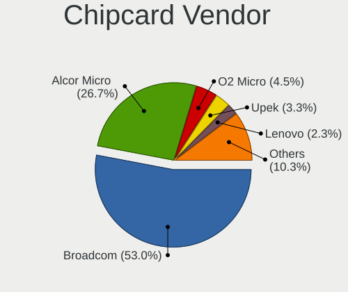

| Vendor                    | Computers | Percent |
|---------------------------|-----------|---------|
| Broadcom                  | 488       | 52.99%  |
| Alcor Micro               | 246       | 26.71%  |
| O2 Micro                  | 41        | 4.45%   |
| Upek                      | 30        | 3.26%   |
| Lenovo                    | 21        | 2.28%   |
| Gemalto (was Gemplus)     | 18        | 1.95%   |
| SCM Microsystems          | 13        | 1.41%   |
| Advanced Card Systems     | 10        | 1.09%   |
| Realtek Semiconductor     | 8         | 0.87%   |
| Chicony Electronics       | 8         | 0.87%   |
| Aladdin Knowledge Systems | 6         | 0.65%   |
| Giesecke & Devrient       | 5         | 0.54%   |
| Cherry                    | 5         | 0.54%   |
| Yubico.com                | 4         | 0.43%   |
| Reiner SCT Kartensysteme  | 4         | 0.43%   |
| OmniKey                   | 4         | 0.43%   |
| Watchdata                 | 2         | 0.22%   |
| Fujitsu Siemens Computers | 2         | 0.22%   |
| Bit4id                    | 2         | 0.22%   |
| NXP Semiconductors        | 1         | 0.11%   |
| Feitian Technologies      | 1         | 0.11%   |
| C3PO                      | 1         | 0.11%   |
| Aktiv                     | 1         | 0.11%   |

Chipcard Model
--------------

Chipcard module models

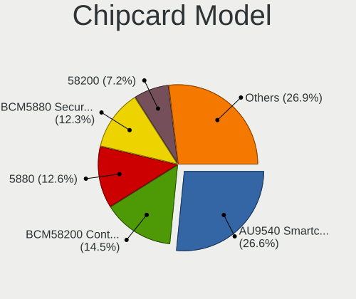

| Model                                                                        | Computers | Percent |
|------------------------------------------------------------------------------|-----------|---------|
| Alcor Micro AU9540 Smartcard Reader                                          | 245       | 26.57%  |
| Broadcom BCM58200 ControlVault 3 (FingerPrint sensor + Contacted SmartCard)  | 134       | 14.53%  |
| Broadcom 5880                                                                | 116       | 12.58%  |
| Broadcom BCM5880 Secure Applications Processor                               | 113       | 12.26%  |
| Broadcom 58200                                                               | 66        | 7.16%   |
| Broadcom BCM5880 Secure Applications Processor with fingerprint swipe sensor | 59        | 6.4%    |
| O2 Micro OZ776 CCID Smartcard Reader                                         | 36        | 3.9%    |
| Upek TouchChip Fingerprint Coprocessor (WBF advanced mode)                   | 30        | 3.25%   |
| Lenovo Integrated Smart Card Reader                                          | 20        | 2.17%   |
| Gemalto (was Gemplus) GemPC Twin SmartCard Reader                            | 14        | 1.52%   |
| SCM Microsystems SCR331-LC1 / SCR3310 SmartCard Reader                       | 10        | 1.08%   |
| Realtek Semiconductor Smart Card Reader Interface                            | 8         | 0.87%   |
| Chicony Electronics HP Skylab USB Smartcard Keyboard                         | 8         | 0.87%   |
| Aladdin Knowledge Systems Token JC                                           | 6         | 0.65%   |
| O2 Micro Oz776 SmartCard Reader                                              | 5         | 0.54%   |
| Advanced Card Systems ACR38 SmartCard Reader                                 | 5         | 0.54%   |
| Yubico.com Yubikey 4/5 U2F+CCID                                              | 4         | 0.43%   |
| Reiner SCT Kartensysteme cyberJack RFID basis contactless smartcard reader   | 4         | 0.43%   |
| Giesecke & Devrient StarSign CUT S                                           | 3         | 0.33%   |
| Cherry SmartCard Reader Keyboard KC 1000 SC                                  | 3         | 0.33%   |
| Advanced Card Systems ACR122U                                                | 3         | 0.33%   |
| Watchdata USB Key                                                            | 2         | 0.22%   |
| OmniKey CardMan 3121 (HID Technologies)                                      | 2         | 0.22%   |
| Giesecke & Devrient Chipcard Reader                                          | 2         | 0.22%   |
| Gemalto (was Gemplus) GemPC Key SmartCard Reader                             | 2         | 0.22%   |
| Gemalto (was Gemplus) Compact Smart Card Reader Writer                       | 2         | 0.22%   |
| SCM Microsystems uTrust FIDO2 Security Key                                   | 1         | 0.11%   |
| SCM Microsystems SCR35xx USB Smart Card Reader                               | 1         | 0.11%   |
| SCM Microsystems SCR3340 - ExpressCard54 Smart Card Reader                   | 1         | 0.11%   |
| OmniKey CardMan 5022                                                         | 1         | 0.11%   |
| OmniKey CardMan 4321                                                         | 1         | 0.11%   |
| NXP Semiconductors PR533                                                     | 1         | 0.11%   |
| Lenovo Smartcard Keyboard                                                    | 1         | 0.11%   |
| Fujitsu Siemens Computers SmartCard Reader 2A                                | 1         | 0.11%   |
| Fujitsu Siemens Computers Keyboard KB SCR                                    | 1         | 0.11%   |
| Feitian Technologies FIDO CCID KB                                            | 1         | 0.11%   |
| Cherry SmartTerminal XX1X                                                    | 1         | 0.11%   |
| Cherry KC 1000 SC Z                                                          | 1         | 0.11%   |
| C3PO LTC31v2                                                                 | 1         | 0.11%   |
| Broadcom BCM5880 Secure Applications Processor with fingerprint touch sensor | 1         | 0.11%   |

Unsupported
-----------

Unsupported Devices
-------------------

Total unsupported devices on board

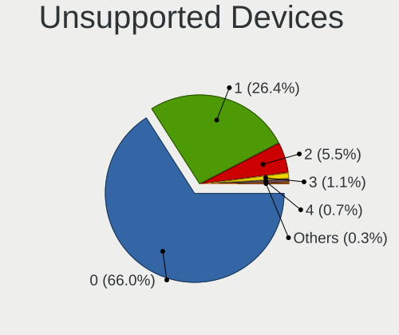

| Total | Computers | Percent |
|-------|-----------|---------|
| 0     | 12693     | 65.96%  |
| 1     | 5087      | 26.43%  |
| 2     | 1063      | 5.52%   |
| 3     | 211       | 1.1%    |
| 4     | 126       | 0.65%   |
| 6     | 26        | 0.14%   |
| 5     | 20        | 0.1%    |
| 7     | 7         | 0.04%   |
| 9     | 5         | 0.03%   |
| 8     | 4         | 0.02%   |
| 10    | 2         | 0.01%   |

Unsupported Device Types
------------------------

Types of unsupported devices

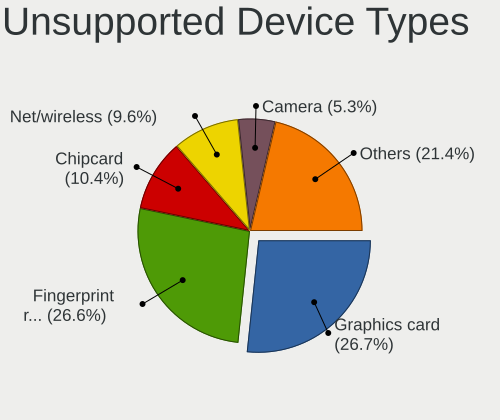

| Type                     | Computers | Percent |
|--------------------------|-----------|---------|
| Graphics card            | 2187      | 26.65%  |
| Fingerprint reader       | 2185      | 26.63%  |
| Chipcard                 | 852       | 10.38%  |
| Net/wireless             | 791       | 9.64%   |
| Camera                   | 439       | 5.35%   |
| Communication controller | 392       | 4.78%   |
| Unassigned class         | 338       | 4.12%   |
| Multimedia controller    | 324       | 3.95%   |
| Sound                    | 194       | 2.36%   |
| Bluetooth                | 173       | 2.11%   |
| Storage                  | 76        | 0.93%   |
| Net/ethernet             | 69        | 0.84%   |
| Card reader              | 61        | 0.74%   |
| Network                  | 46        | 0.56%   |
| Storage/raid             | 34        | 0.41%   |
| Dvb card                 | 13        | 0.16%   |
| Modem                    | 7         | 0.09%   |
| Storage/nvme             | 5         | 0.06%   |
| Wireless                 | 4         | 0.05%   |
| Storage/ata              | 4         | 0.05%   |
| Flash memory             | 4         | 0.05%   |
| Storage/ide              | 3         | 0.04%   |
| Tv card                  | 2         | 0.02%   |
| Firewire controller      | 2         | 0.02%   |
| Unclassified device      | 1         | 0.01%   |

