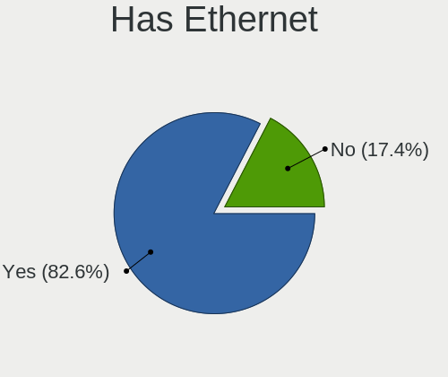
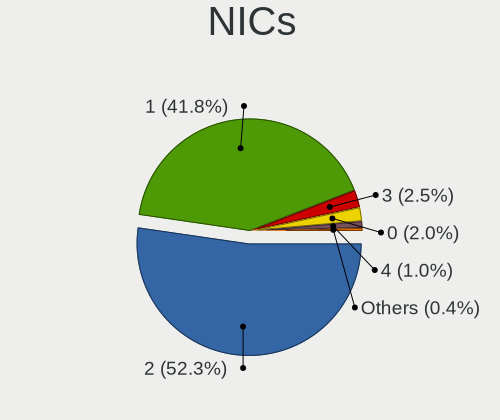

Ubuntu 22.04 - Tested Hardware & Statistics
-------------------------------------------

A project to collect tested hardware configurations for Ubuntu 22.04.

Anyone can contribute to this report by the [hw-probe](https://github.com/linuxhw/hw-probe) tool:

    sudo -E hw-probe -all -upload

Please contribute! Especially if your hardware is rare.

This is a report for all computer types. See also reports for [desktops](/Dist/Ubuntu_22.04/Desktop/README.md) and [notebooks](/Dist/Ubuntu_22.04/Notebook/README.md).

Full-feature report is available here: https://linux-hardware.org/?view=trends

Contents
--------

* [ Test Cases ](#test-cases)

* [ System ](#system)
  - [ Kernel                   ](#kernel)
  - [ Kernel Family            ](#kernel-family)
  - [ Kernel Major Ver.        ](#kernel-major-ver)
  - [ Arch                     ](#arch)
  - [ DE                       ](#de)
  - [ Display Server           ](#display-server)
  - [ Display Manager          ](#display-manager)
  - [ OS Lang                  ](#os-lang)
  - [ Boot Mode                ](#boot-mode)
  - [ Filesystem               ](#filesystem)
  - [ Part. scheme             ](#part-scheme)
  - [ Dual Boot with Linux/BSD ](#dual-boot-with-linuxbsd)
  - [ Dual Boot (Win)          ](#dual-boot-win)

* [ Board ](#board)
  - [ Vendor                   ](#vendor)
  - [ Model                    ](#model)
  - [ Model Family             ](#model-family)
  - [ MFG Year                 ](#mfg-year)
  - [ Form Factor              ](#form-factor)
  - [ Secure Boot              ](#secure-boot)
  - [ Coreboot                 ](#coreboot)
  - [ RAM Size                 ](#ram-size)
  - [ RAM Used                 ](#ram-used)
  - [ Total Drives             ](#total-drives)
  - [ Has CD-ROM               ](#has-cd-rom)
  - [ Has Ethernet             ](#has-ethernet)
  - [ Has WiFi                 ](#has-wifi)
  - [ Has Bluetooth            ](#has-bluetooth)

* [ Location ](#location)
  - [ Country                  ](#country)
  - [ City                     ](#city)

* [ Drives ](#drives)
  - [ Drive Vendor             ](#drive-vendor)
  - [ Drive Model              ](#drive-model)
  - [ HDD Vendor               ](#hdd-vendor)
  - [ SSD Vendor               ](#ssd-vendor)
  - [ Drive Kind               ](#drive-kind)
  - [ Drive Connector          ](#drive-connector)
  - [ Drive Size               ](#drive-size)
  - [ Space Total              ](#space-total)
  - [ Space Used               ](#space-used)
  - [ Malfunc. Drives          ](#malfunc-drives)
  - [ Malfunc. Drive Vendor    ](#malfunc-drive-vendor)
  - [ Malfunc. HDD Vendor      ](#malfunc-hdd-vendor)
  - [ Malfunc. Drive Kind      ](#malfunc-drive-kind)
  - [ Failed Drives            ](#failed-drives)
  - [ Failed Drive Vendor      ](#failed-drive-vendor)
  - [ Drive Status             ](#drive-status)

* [ Storage controller ](#storage-controller)
  - [ Storage Vendor           ](#storage-vendor)
  - [ Storage Model            ](#storage-model)
  - [ Storage Kind             ](#storage-kind)

* [ Processor ](#processor)
  - [ CPU Vendor               ](#cpu-vendor)
  - [ CPU Model                ](#cpu-model)
  - [ CPU Model Family         ](#cpu-model-family)
  - [ CPU Cores                ](#cpu-cores)
  - [ CPU Sockets              ](#cpu-sockets)
  - [ CPU Threads              ](#cpu-threads)
  - [ CPU Op-Modes             ](#cpu-op-modes)
  - [ CPU Microcode            ](#cpu-microcode)
  - [ CPU Microarch            ](#cpu-microarch)

* [ Graphics ](#graphics)
  - [ GPU Vendor               ](#gpu-vendor)
  - [ GPU Model                ](#gpu-model)
  - [ GPU Combo                ](#gpu-combo)
  - [ GPU Driver               ](#gpu-driver)
  - [ GPU Memory               ](#gpu-memory)

* [ Monitor ](#monitor)
  - [ Monitor Vendor           ](#monitor-vendor)
  - [ Monitor Model            ](#monitor-model)
  - [ Monitor Resolution       ](#monitor-resolution)
  - [ Monitor Diagonal         ](#monitor-diagonal)
  - [ Monitor Width            ](#monitor-width)
  - [ Aspect Ratio             ](#aspect-ratio)
  - [ Monitor Area             ](#monitor-area)
  - [ Pixel Density            ](#pixel-density)
  - [ Multiple Monitors        ](#multiple-monitors)

* [ Network ](#network)
  - [ Net Controller Vendor    ](#net-controller-vendor)
  - [ Net Controller Model     ](#net-controller-model)
  - [ Wireless Vendor          ](#wireless-vendor)
  - [ Wireless Model           ](#wireless-model)
  - [ Ethernet Vendor          ](#ethernet-vendor)
  - [ Ethernet Model           ](#ethernet-model)
  - [ Net Controller Kind      ](#net-controller-kind)
  - [ Used Controller          ](#used-controller)
  - [ NICs                     ](#nics)
  - [ IPv6                     ](#ipv6)

* [ Bluetooth ](#bluetooth)
  - [ Bluetooth Vendor         ](#bluetooth-vendor)
  - [ Bluetooth Model          ](#bluetooth-model)

* [ Sound ](#sound)
  - [ Sound Vendor             ](#sound-vendor)
  - [ Sound Model              ](#sound-model)

* [ Memory ](#memory)
  - [ Memory Vendor            ](#memory-vendor)
  - [ Memory Model             ](#memory-model)
  - [ Memory Kind              ](#memory-kind)
  - [ Memory Form Factor       ](#memory-form-factor)
  - [ Memory Size              ](#memory-size)
  - [ Memory Speed             ](#memory-speed)

* [ Printers & scanners ](#printers--scanners)
  - [ Printer Vendor           ](#printer-vendor)
  - [ Printer Model            ](#printer-model)
  - [ Scanner Vendor           ](#scanner-vendor)
  - [ Scanner Model            ](#scanner-model)

* [ Camera ](#camera)
  - [ Camera Vendor            ](#camera-vendor)
  - [ Camera Model             ](#camera-model)

* [ Security ](#security)
  - [ Fingerprint Vendor       ](#fingerprint-vendor)
  - [ Fingerprint Model        ](#fingerprint-model)
  - [ Chipcard Vendor          ](#chipcard-vendor)
  - [ Chipcard Model           ](#chipcard-model)

* [ Unsupported ](#unsupported)
  - [ Unsupported Devices      ](#unsupported-devices)
  - [ Unsupported Device Types ](#unsupported-device-types)

Test Cases
----------

Total: 192

| Vendor        | Model                       | Form-Factor | Probe                                                      | Date         |
|---------------|-----------------------------|-------------|------------------------------------------------------------|--------------|
| Lenovo        | ThinkBook 14p Gen 2 20YN    | Notebook    | [800aefa57e](https://linux-hardware.org/?probe=800aefa57e) | Apr 16, 2022 |
| MSI           | 970 GAMING                  | Desktop     | [1ed579d3d1](https://linux-hardware.org/?probe=1ed579d3d1) | Apr 16, 2022 |
| MSI           | 970 GAMING                  | Desktop     | [dae8a4db62](https://linux-hardware.org/?probe=dae8a4db62) | Apr 16, 2022 |
| MSI           | GF63 8RD                    | Notebook    | [287e344d0e](https://linux-hardware.org/?probe=287e344d0e) | Apr 16, 2022 |
| ASUSTek       | VivoBook_ASUSLaptop X421... | Notebook    | [a0ad75fa4b](https://linux-hardware.org/?probe=a0ad75fa4b) | Apr 16, 2022 |
| Google        | Phaser360                   | Notebook    | [ab97623a21](https://linux-hardware.org/?probe=ab97623a21) | Apr 16, 2022 |
| Acer          | Swift SF315-52              | Notebook    | [90c143abed](https://linux-hardware.org/?probe=90c143abed) | Apr 16, 2022 |
| Timi          | A34                         | Notebook    | [ff24fc7e19](https://linux-hardware.org/?probe=ff24fc7e19) | Apr 15, 2022 |
| Lenovo        | Yoga 910-13IKB 80VF         | Convertible | [b95a9bcbf0](https://linux-hardware.org/?probe=b95a9bcbf0) | Apr 15, 2022 |
| Unknown       | Unknown                     | Desktop     | [3e2989ae49](https://linux-hardware.org/?probe=3e2989ae49) | Apr 15, 2022 |
| MSI           | MAG X570S TOMAHAWK MAX W... | Desktop     | [cf9feaf8ec](https://linux-hardware.org/?probe=cf9feaf8ec) | Apr 15, 2022 |
| Sony          | VGN-NS38E_S                 | Notebook    | [1b8177c97a](https://linux-hardware.org/?probe=1b8177c97a) | Apr 14, 2022 |
| Lenovo        | Legion R7000 2020 82B6      | Notebook    | [260c012f44](https://linux-hardware.org/?probe=260c012f44) | Apr 14, 2022 |
| System76      | Serval WS                   | Notebook    | [f02bcd64a2](https://linux-hardware.org/?probe=f02bcd64a2) | Apr 14, 2022 |
| Gigabyte      | B75M-D3P                    | Desktop     | [cfb6502298](https://linux-hardware.org/?probe=cfb6502298) | Apr 14, 2022 |
| MSI           | MEG X570 UNIFY              | Desktop     | [bacc580e7a](https://linux-hardware.org/?probe=bacc580e7a) | Apr 13, 2022 |
| PC Special... | PCx0Dx                      | Notebook    | [6b0f05bf07](https://linux-hardware.org/?probe=6b0f05bf07) | Apr 13, 2022 |
| Lenovo        | Legion 5P 15ARH05H 82GU     | Notebook    | [a31cc5eb3b](https://linux-hardware.org/?probe=a31cc5eb3b) | Apr 13, 2022 |
| Multilaser    | M11W                        | Notebook    | [4be432c77a](https://linux-hardware.org/?probe=4be432c77a) | Apr 13, 2022 |
| Lenovo        | IdeaPad 330S-15IKB 81F5     | Notebook    | [fecdd237a4](https://linux-hardware.org/?probe=fecdd237a4) | Apr 11, 2022 |
| Apple         | MacBookPro14,1              | Notebook    | [1d1ff81694](https://linux-hardware.org/?probe=1d1ff81694) | Apr 11, 2022 |
| MSI           | X370 GAMING PRO CARBON A... | Desktop     | [e4ea2782f9](https://linux-hardware.org/?probe=e4ea2782f9) | Apr 10, 2022 |
| Gigabyte      | H55M-S2HP                   | Desktop     | [f394924315](https://linux-hardware.org/?probe=f394924315) | Apr 10, 2022 |
| Gigabyte      | H55M-S2HP                   | Desktop     | [9edb3bbc43](https://linux-hardware.org/?probe=9edb3bbc43) | Apr 10, 2022 |
| Lenovo        | IdeaPad 5 Pro 14ACN6 82L... | Notebook    | [ce0316a106](https://linux-hardware.org/?probe=ce0316a106) | Apr 10, 2022 |
| ASUSTek       | ROG STRIX B350-F GAMING     | Desktop     | [1009093226](https://linux-hardware.org/?probe=1009093226) | Apr 10, 2022 |
| ASUSTek       | ROG Zephyrus G15 GA502IV... | Notebook    | [0def0def83](https://linux-hardware.org/?probe=0def0def83) | Apr 09, 2022 |
| HP            | 840 G6                      | Notebook    | [7f8b25d480](https://linux-hardware.org/?probe=7f8b25d480) | Apr 09, 2022 |
| Toshiba       | Satellite L50-A             | Notebook    | [9a4f7c7381](https://linux-hardware.org/?probe=9a4f7c7381) | Apr 09, 2022 |
| Toshiba       | Satellite L50-A             | Notebook    | [ce1ec01972](https://linux-hardware.org/?probe=ce1ec01972) | Apr 09, 2022 |
| Lenovo        | 3098 SDK0E50510 WIN 2625... | Desktop     | [62c84ef4b4](https://linux-hardware.org/?probe=62c84ef4b4) | Apr 09, 2022 |
| Lenovo        | 3098 SDK0E50510 WIN 2625... | Desktop     | [07bde861ad](https://linux-hardware.org/?probe=07bde861ad) | Apr 09, 2022 |
| Supermicro    | H12SSL-i                    | Server      | [7bdae699e5](https://linux-hardware.org/?probe=7bdae699e5) | Apr 09, 2022 |
| Lenovo        | ThinkPad S1 Yoga 12 20DK... | Notebook    | [2240b6c593](https://linux-hardware.org/?probe=2240b6c593) | Apr 09, 2022 |
| Lenovo        | ThinkPad L14 Gen 2 20X10... | Notebook    | [1f799cdbef](https://linux-hardware.org/?probe=1f799cdbef) | Apr 09, 2022 |
| ASUSTek       | P8H61-M LX3 R2.0            | Desktop     | [8a07adc0f8](https://linux-hardware.org/?probe=8a07adc0f8) | Apr 09, 2022 |
| Apple         | MacBookPro14,1              | Notebook    | [470a09fc31](https://linux-hardware.org/?probe=470a09fc31) | Apr 09, 2022 |
| Lenovo        | IdeaPadFlex 5 14IIL05 81... | Convertible | [f242f094a9](https://linux-hardware.org/?probe=f242f094a9) | Apr 09, 2022 |
| Unknown       | HX90                        | Desktop     | [913b92a244](https://linux-hardware.org/?probe=913b92a244) | Apr 08, 2022 |
| HP            | 1495                        | Desktop     | [36ea4763de](https://linux-hardware.org/?probe=36ea4763de) | Apr 08, 2022 |
| Unknown       | Unknown                     | Soc         | [99029e9661](https://linux-hardware.org/?probe=99029e9661) | Apr 08, 2022 |
| Maxtang       | FP30 V1.0                   | Desktop     | [2062d8578e](https://linux-hardware.org/?probe=2062d8578e) | Apr 08, 2022 |
| Supermicro    | H12SSL-i                    | Server      | [4f88fe663e](https://linux-hardware.org/?probe=4f88fe663e) | Apr 08, 2022 |
| Lenovo        | Yoga Slim 7-14ARE05 82A2    | Notebook    | [ae77218dcf](https://linux-hardware.org/?probe=ae77218dcf) | Apr 07, 2022 |
| HP            | EliteBook 840 G8 Noteboo... | Notebook    | [8ab4c1618d](https://linux-hardware.org/?probe=8ab4c1618d) | Apr 07, 2022 |
| Gigabyte      | X570 AORUS ELITE            | Desktop     | [fa9314716d](https://linux-hardware.org/?probe=fa9314716d) | Apr 07, 2022 |
| Acer          | Nitro AN515-42              | Notebook    | [322440c462](https://linux-hardware.org/?probe=322440c462) | Apr 06, 2022 |
| HUAWEI        | CREM-WXX9                   | Notebook    | [6d57ed5e10](https://linux-hardware.org/?probe=6d57ed5e10) | Apr 06, 2022 |
| HP            | 840 G6                      | Notebook    | [76665316f7](https://linux-hardware.org/?probe=76665316f7) | Apr 06, 2022 |
| Dell          | G5 5590                     | Notebook    | [86d53d1c79](https://linux-hardware.org/?probe=86d53d1c79) | Apr 06, 2022 |
| Framework     | Laptop                      | Notebook    | [59a51973bb](https://linux-hardware.org/?probe=59a51973bb) | Apr 05, 2022 |
| Medion        | E15303                      | Notebook    | [21bdec99bb](https://linux-hardware.org/?probe=21bdec99bb) | Apr 05, 2022 |
| ASUSTek       | ROG STRIX B550-I GAMING     | Desktop     | [d2f9498bd2](https://linux-hardware.org/?probe=d2f9498bd2) | Apr 05, 2022 |
| Acer          | Aspire XC-603               | Desktop     | [ef344607ad](https://linux-hardware.org/?probe=ef344607ad) | Apr 04, 2022 |
| Packard Be... | IMEDIA S2110A               | Desktop     | [b8bf871708](https://linux-hardware.org/?probe=b8bf871708) | Apr 04, 2022 |
| BESSTAR Te... | ATB15                       | Server      | [b7c7776f50](https://linux-hardware.org/?probe=b7c7776f50) | Apr 04, 2022 |
| Lenovo        | ThinkPad E495 20NEA00QUS    | Notebook    | [d9cbb34331](https://linux-hardware.org/?probe=d9cbb34331) | Apr 04, 2022 |
| Lenovo        | ThinkPad E495 20NEA00QUS    | Notebook    | [062e604ef0](https://linux-hardware.org/?probe=062e604ef0) | Apr 04, 2022 |
| Gigabyte      | B365 M AORUS ELITE-CF       | Desktop     | [7da8a936ea](https://linux-hardware.org/?probe=7da8a936ea) | Apr 04, 2022 |
| Apple         | Mac-031AEE4D24BFF0B1 Mac... | Mini pc     | [99a152f9c7](https://linux-hardware.org/?probe=99a152f9c7) | Apr 04, 2022 |
| Lenovo        | ThinkPad P1 Gen 4i 20Y30... | Notebook    | [43ff476479](https://linux-hardware.org/?probe=43ff476479) | Apr 03, 2022 |
| Samsung       | R580/R590                   | Notebook    | [0b95325a5e](https://linux-hardware.org/?probe=0b95325a5e) | Apr 03, 2022 |
| Gigabyte      | Z690 UD AX                  | Desktop     | [a052a5e936](https://linux-hardware.org/?probe=a052a5e936) | Apr 03, 2022 |
| Lenovo        | IdeaPad 5 Pro 14ACN6 82L... | Notebook    | [bdb683ff40](https://linux-hardware.org/?probe=bdb683ff40) | Apr 03, 2022 |
| Unknown       | Unknown                     | Desktop     | [ec51dcaf0a](https://linux-hardware.org/?probe=ec51dcaf0a) | Apr 03, 2022 |
| ASUSTek       | ROG Zephyrus G14 GA401IH... | Notebook    | [ad5d38e378](https://linux-hardware.org/?probe=ad5d38e378) | Apr 02, 2022 |
| Lenovo        | IdeaPad 5 Pro 14ACN6 82L... | Notebook    | [e380073189](https://linux-hardware.org/?probe=e380073189) | Apr 02, 2022 |
| HP            | Pavilion Laptop 14-ce2xx... | Notebook    | [d103b2cb25](https://linux-hardware.org/?probe=d103b2cb25) | Apr 02, 2022 |
| MSI           | MAG B660M MORTAR DDR4       | Desktop     | [a9f2820894](https://linux-hardware.org/?probe=a9f2820894) | Apr 02, 2022 |
| Dell          | 07PR60 A00                  | Desktop     | [40f34fbc8f](https://linux-hardware.org/?probe=40f34fbc8f) | Apr 01, 2022 |
| Intel         | S2600CP G50768-505          | Server      | [cdfba65630](https://linux-hardware.org/?probe=cdfba65630) | Apr 01, 2022 |
| Dell          | Inspiron N5110              | Notebook    | [eba4514371](https://linux-hardware.org/?probe=eba4514371) | Apr 01, 2022 |
| HUAWEI        | MACH-WX9                    | Notebook    | [a799c6c916](https://linux-hardware.org/?probe=a799c6c916) | Apr 01, 2022 |
| TrekStor      | Primetab S11B               | Tablet      | [c98cdfd7c7](https://linux-hardware.org/?probe=c98cdfd7c7) | Apr 01, 2022 |
| Fujitsu       | D3223-C1 S26361-D3223-C1    | Desktop     | [f0fdc95810](https://linux-hardware.org/?probe=f0fdc95810) | Apr 01, 2022 |
| Dell          | Inspiron N5110              | Notebook    | [606eb17f56](https://linux-hardware.org/?probe=606eb17f56) | Apr 01, 2022 |
| HP            | ProLiant ML110 G7           | Desktop     | [9e1e2b2ae7](https://linux-hardware.org/?probe=9e1e2b2ae7) | Apr 01, 2022 |
| Dell          | Inspiron N5110              | Notebook    | [6b0cd44dbb](https://linux-hardware.org/?probe=6b0cd44dbb) | Apr 01, 2022 |
| Alienware     | M11x                        | Notebook    | [f83c01bb34](https://linux-hardware.org/?probe=f83c01bb34) | Apr 01, 2022 |
| Avell High... | A70 MOB                     | Notebook    | [9e095642f0](https://linux-hardware.org/?probe=9e095642f0) | Apr 01, 2022 |
| Dell          | Inspiron 3501               | Notebook    | [a14dde61dc](https://linux-hardware.org/?probe=a14dde61dc) | Apr 01, 2022 |
| HUAWEI        | CREM-WXX9                   | Notebook    | [858142c2ab](https://linux-hardware.org/?probe=858142c2ab) | Apr 01, 2022 |
| MSI           | X370 GAMING PRO CARBON A... | Desktop     | [ce2e9f743d](https://linux-hardware.org/?probe=ce2e9f743d) | Mar 31, 2022 |
| Lenovo        | IdeaPad 5 14ITL05 82FE      | Notebook    | [ceee79344c](https://linux-hardware.org/?probe=ceee79344c) | Mar 31, 2022 |
| Dell          | 0YNVJG A01                  | Desktop     | [4ccce61117](https://linux-hardware.org/?probe=4ccce61117) | Mar 30, 2022 |
| HUAWEI        | CREM-WXX9                   | Notebook    | [83b60423e1](https://linux-hardware.org/?probe=83b60423e1) | Mar 30, 2022 |
| HP            | 250 G4                      | Notebook    | [69a3535c1a](https://linux-hardware.org/?probe=69a3535c1a) | Mar 30, 2022 |
| Medion        | S4401 MD61533               | Convertible | [0017875c99](https://linux-hardware.org/?probe=0017875c99) | Mar 30, 2022 |
| MSI           | B450M PRO-M2 MAX            | Desktop     | [f21ef43d0f](https://linux-hardware.org/?probe=f21ef43d0f) | Mar 30, 2022 |
| HUAWEI        | CREM-WXX9                   | Notebook    | [4626f2aeab](https://linux-hardware.org/?probe=4626f2aeab) | Mar 29, 2022 |
| MSI           | GP76 Leopard 11UG           | Notebook    | [93a6b587c2](https://linux-hardware.org/?probe=93a6b587c2) | Mar 29, 2022 |
| Lenovo        | ThinkBook 15 G3 ACL 21A4    | Notebook    | [30c09eec3b](https://linux-hardware.org/?probe=30c09eec3b) | Mar 28, 2022 |
| HUAWEI        | CREM-WXX9                   | Notebook    | [dbdd71e8b8](https://linux-hardware.org/?probe=dbdd71e8b8) | Mar 28, 2022 |
| Dell          | XPS 17 9710                 | Notebook    | [ecf7b98552](https://linux-hardware.org/?probe=ecf7b98552) | Mar 28, 2022 |
| Lenovo        | ThinkPad T14s Gen 2a 20X... | Notebook    | [0e93a8600c](https://linux-hardware.org/?probe=0e93a8600c) | Mar 27, 2022 |
| Lenovo        | IdeaPad 5 Pro 14ACN6 82L... | Notebook    | [e5b0f5c259](https://linux-hardware.org/?probe=e5b0f5c259) | Mar 27, 2022 |
| Le Cube 1     | Unknown                     | Desktop     | [a881cc0397](https://linux-hardware.org/?probe=a881cc0397) | Mar 26, 2022 |
| HUAWEI        | MACH-WX9                    | Notebook    | [64e505d8d7](https://linux-hardware.org/?probe=64e505d8d7) | Mar 26, 2022 |
| Lenovo        | IdeaPad 5 Pro 14ACN6 82L... | Notebook    | [01e83234d9](https://linux-hardware.org/?probe=01e83234d9) | Mar 26, 2022 |
| Lenovo        | IdeaPad 5 Pro 14ACN6 82L... | Notebook    | [4fb374e78b](https://linux-hardware.org/?probe=4fb374e78b) | Mar 25, 2022 |
| HP            | EliteBook 840 G3            | Notebook    | [f06216a521](https://linux-hardware.org/?probe=f06216a521) | Mar 24, 2022 |
| HP            | 1589                        | Desktop     | [8c1f30bb6f](https://linux-hardware.org/?probe=8c1f30bb6f) | Mar 23, 2022 |
| HP            | Pavilion x2 Detachable      | Notebook    | [a82a2739a8](https://linux-hardware.org/?probe=a82a2739a8) | Mar 22, 2022 |
| Lenovo        | Z50-70 20354                | Notebook    | [b03762a80b](https://linux-hardware.org/?probe=b03762a80b) | Mar 22, 2022 |
| Framework     | Laptop                      | Notebook    | [b8fcafa943](https://linux-hardware.org/?probe=b8fcafa943) | Mar 20, 2022 |
| GPU Compan... | GWTC116-2                   | Notebook    | [3c0450f79e](https://linux-hardware.org/?probe=3c0450f79e) | Mar 12, 2022 |
| ASUSTek       | ROG Zephyrus G14 GA401IH... | Notebook    | [1c22760a82](https://linux-hardware.org/?probe=1c22760a82) | Mar 12, 2022 |
| Shenzhen W... | AERO 2 Pro                  | Mini pc     | [264fcd47ff](https://linux-hardware.org/?probe=264fcd47ff) | Mar 12, 2022 |
| Shenzhen W... | AERO 2 Pro                  | Mini pc     | [91a4d09517](https://linux-hardware.org/?probe=91a4d09517) | Mar 12, 2022 |
| ASRock        | 970 Extreme3 R2.0           | Desktop     | [f417e6a6ef](https://linux-hardware.org/?probe=f417e6a6ef) | Mar 11, 2022 |
| MSI           | Creator Z16 A11UET          | Notebook    | [1804e5eb77](https://linux-hardware.org/?probe=1804e5eb77) | Mar 09, 2022 |
| Unknown       | T3 MRD                      | Desktop     | [256dc440ec](https://linux-hardware.org/?probe=256dc440ec) | Mar 09, 2022 |
| HP            | ENVY x360 Convertible 13... | Convertible | [8a87e0ca46](https://linux-hardware.org/?probe=8a87e0ca46) | Mar 07, 2022 |
| ASUSTek       | ROG Zephyrus M16 GU603ZW... | Notebook    | [9fd12bdd29](https://linux-hardware.org/?probe=9fd12bdd29) | Mar 06, 2022 |
| HUAWEI        | BOHB-WAX9                   | Notebook    | [915ca09de4](https://linux-hardware.org/?probe=915ca09de4) | Mar 05, 2022 |
| MSI           | X370 GAMING PRO CARBON A... | Desktop     | [1fb25ad2c3](https://linux-hardware.org/?probe=1fb25ad2c3) | Mar 05, 2022 |
| Toshiba       | Satellite C70D-A            | Notebook    | [c7dfd52f76](https://linux-hardware.org/?probe=c7dfd52f76) | Mar 05, 2022 |
| HP            | ZBook 15 G5                 | Notebook    | [f86a14c16d](https://linux-hardware.org/?probe=f86a14c16d) | Mar 05, 2022 |
| ASUSTek       | M4A87TD/USB3                | Desktop     | [aa80ded615](https://linux-hardware.org/?probe=aa80ded615) | Mar 04, 2022 |
| ASUSTek       | M4A87TD/USB3                | Desktop     | [3e997c5618](https://linux-hardware.org/?probe=3e997c5618) | Mar 03, 2022 |
| ASUSTek       | ROG Zephyrus M16 GU603ZW... | Notebook    | [206f3a7c01](https://linux-hardware.org/?probe=206f3a7c01) | Mar 02, 2022 |
| Unknown       | T3 MRD                      | Desktop     | [35ab38818d](https://linux-hardware.org/?probe=35ab38818d) | Feb 28, 2022 |
| Unknown       | T3 MRD                      | Desktop     | [01dd9cefa7](https://linux-hardware.org/?probe=01dd9cefa7) | Feb 28, 2022 |
| HP            | Presario CQ42               | Notebook    | [de34294599](https://linux-hardware.org/?probe=de34294599) | Feb 27, 2022 |
| Gigabyte      | X570 I AORUS PRO WIFI       | Desktop     | [18d37562a8](https://linux-hardware.org/?probe=18d37562a8) | Feb 26, 2022 |
| Gigabyte      | X570 I AORUS PRO WIFI       | Desktop     | [d8af57f59a](https://linux-hardware.org/?probe=d8af57f59a) | Feb 26, 2022 |
| Shanghai Z... | ZXE CRB                     | Notebook    | [7fe4a3390b](https://linux-hardware.org/?probe=7fe4a3390b) | Feb 25, 2022 |
| Timi          | TM1709                      | Notebook    | [16e699bea8](https://linux-hardware.org/?probe=16e699bea8) | Feb 25, 2022 |
| ASUSTek       | ROG Zephyrus M16 GU603HE... | Notebook    | [076c8f6e01](https://linux-hardware.org/?probe=076c8f6e01) | Feb 23, 2022 |
| ASUSTek       | ROG Zephyrus M16 GU603HE... | Notebook    | [85c09f63f0](https://linux-hardware.org/?probe=85c09f63f0) | Feb 23, 2022 |
| Gigabyte      | H61M-DS2 DVI                | Desktop     | [90c43679f7](https://linux-hardware.org/?probe=90c43679f7) | Feb 23, 2022 |
| Acer          | Aspire A517-52              | Notebook    | [52976ad94b](https://linux-hardware.org/?probe=52976ad94b) | Feb 23, 2022 |
| Lenovo        | ThinkPad X1 Yoga Gen 6 2... | Convertible | [973f8ebf5e](https://linux-hardware.org/?probe=973f8ebf5e) | Feb 17, 2022 |
| MSI           | Stealth GS66 12UHS          | Notebook    | [bb8ef51c23](https://linux-hardware.org/?probe=bb8ef51c23) | Feb 17, 2022 |
| Lenovo        | ThinkPad E15 Gen 2 20TES... | Notebook    | [da103e44c5](https://linux-hardware.org/?probe=da103e44c5) | Feb 17, 2022 |
| ASUSTek       | VivoBook_ASUSLaptop TP40... | Convertible | [1055dc7082](https://linux-hardware.org/?probe=1055dc7082) | Feb 14, 2022 |
| HP            | 620                         | Notebook    | [bd89b469e4](https://linux-hardware.org/?probe=bd89b469e4) | Feb 14, 2022 |
| ASUSTek       | ASUS EXPERTBOOK B3302FEA... | Convertible | [20d30ebe0b](https://linux-hardware.org/?probe=20d30ebe0b) | Feb 13, 2022 |
| MSI           | X370 GAMING PRO CARBON A... | Desktop     | [fa5ed1f68b](https://linux-hardware.org/?probe=fa5ed1f68b) | Feb 13, 2022 |
| Gigabyte      | X570S AORUS PRO AX          | Desktop     | [e329340668](https://linux-hardware.org/?probe=e329340668) | Feb 11, 2022 |
| Dell          | 0YXT71 A03                  | Desktop     | [19227aa57d](https://linux-hardware.org/?probe=19227aa57d) | Feb 11, 2022 |
| HP            | 212B                        | Desktop     | [fab24340a5](https://linux-hardware.org/?probe=fab24340a5) | Feb 10, 2022 |
| HP            | Pavilion 15                 | Notebook    | [9246e37578](https://linux-hardware.org/?probe=9246e37578) | Feb 09, 2022 |
| ASUSTek       | K52Je                       | Notebook    | [e1010983cf](https://linux-hardware.org/?probe=e1010983cf) | Feb 09, 2022 |
| Lenovo        | ThinkPad Yoga 370 20JJS0... | Convertible | [878c4247cb](https://linux-hardware.org/?probe=878c4247cb) | Feb 09, 2022 |
| ASRockRack    | X470D4U2/1N1                | Desktop     | [735bc0f806](https://linux-hardware.org/?probe=735bc0f806) | Feb 04, 2022 |
| Dell          | Latitude 3330               | Notebook    | [c3b39f74b4](https://linux-hardware.org/?probe=c3b39f74b4) | Jan 31, 2022 |
| ASUSTek       | ROG Zephyrus G15 GA502IU... | Notebook    | [0a04b2d1b1](https://linux-hardware.org/?probe=0a04b2d1b1) | Jan 31, 2022 |
| HP            | 15                          | Notebook    | [81961b52a9](https://linux-hardware.org/?probe=81961b52a9) | Jan 29, 2022 |
| ASUSTek       | P5P41T/USB3                 | Desktop     | [f45dc3454a](https://linux-hardware.org/?probe=f45dc3454a) | Jan 25, 2022 |
| ASUSTek       | P5P41T/USB3                 | Desktop     | [b69dafbb2b](https://linux-hardware.org/?probe=b69dafbb2b) | Jan 25, 2022 |
| Unknown       | Unknown                     | Soc         | [f60622cca7](https://linux-hardware.org/?probe=f60622cca7) | Jan 23, 2022 |
| Unknown       | Unknown                     | Soc         | [fb25f8463c](https://linux-hardware.org/?probe=fb25f8463c) | Jan 23, 2022 |
| HP            | ProBook 445 G7              | Notebook    | [bceca55120](https://linux-hardware.org/?probe=bceca55120) | Jan 23, 2022 |
| ASUSTek       | P5P41T/USB3                 | Desktop     | [105593cece](https://linux-hardware.org/?probe=105593cece) | Jan 23, 2022 |
| ASUSTek       | ASUS TUF Gaming F17 FX70... | Notebook    | [2de98fb4d8](https://linux-hardware.org/?probe=2de98fb4d8) | Jan 22, 2022 |
| HP            | ProBook 650 G5              | Notebook    | [111cb6822e](https://linux-hardware.org/?probe=111cb6822e) | Jan 21, 2022 |
| HP            | Pavilion Laptop 14-dv1xx... | Notebook    | [e092fc4b26](https://linux-hardware.org/?probe=e092fc4b26) | Jan 20, 2022 |
| HP            | ZBook Power 15.6 inch G8... | Notebook    | [245123d0a8](https://linux-hardware.org/?probe=245123d0a8) | Jan 20, 2022 |
| Gigabyte      | GB-BSi7-1165G7              | Desktop     | [ab94ff1199](https://linux-hardware.org/?probe=ab94ff1199) | Jan 20, 2022 |
| Dell          | Latitude E6510              | Notebook    | [c0d3a6c31a](https://linux-hardware.org/?probe=c0d3a6c31a) | Jan 16, 2022 |
| MSI           | Z490-A PRO                  | Desktop     | [b2655bbd43](https://linux-hardware.org/?probe=b2655bbd43) | Jan 15, 2022 |
| Google        | Kefka                       | Notebook    | [e62fa3eea6](https://linux-hardware.org/?probe=e62fa3eea6) | Jan 10, 2022 |
| Timi          | RedmiBook Pro 15S           | Notebook    | [034079628f](https://linux-hardware.org/?probe=034079628f) | Jan 07, 2022 |
| Lenovo        | ThinkPad T400 2768WGB       | Notebook    | [ac0e3dfe29](https://linux-hardware.org/?probe=ac0e3dfe29) | Jan 07, 2022 |
| MSI           | C236A WORKSTATION           | Desktop     | [97795d3ebc](https://linux-hardware.org/?probe=97795d3ebc) | Jan 07, 2022 |
| HP            | ENVY Laptop 13-ad1xx        | Notebook    | [666b0b18f5](https://linux-hardware.org/?probe=666b0b18f5) | Dec 30, 2021 |
| Intel         | H61                         | Desktop     | [e2b49aa759](https://linux-hardware.org/?probe=e2b49aa759) | Dec 30, 2021 |
| MSI           | GT73VR 6RE                  | Notebook    | [0f41e5dd07](https://linux-hardware.org/?probe=0f41e5dd07) | Dec 28, 2021 |
| Lenovo        | Legion 7 16ACHg6 82N6       | Notebook    | [be79b3cd82](https://linux-hardware.org/?probe=be79b3cd82) | Dec 26, 2021 |
| Lenovo        | Flex 2-15 20405             | Notebook    | [ccc85b0783](https://linux-hardware.org/?probe=ccc85b0783) | Dec 13, 2021 |
| Lenovo        | 3141 NOK                    | Desktop     | [cc90d7c889](https://linux-hardware.org/?probe=cc90d7c889) | Dec 13, 2021 |
| ASUSTek       | ROG STRIX B350-F GAMING     | Desktop     | [0db33a5b23](https://linux-hardware.org/?probe=0db33a5b23) | Dec 10, 2021 |
| MSI           | Modern 15 A11MU             | Notebook    | [34b31c53cd](https://linux-hardware.org/?probe=34b31c53cd) | Dec 07, 2021 |
| Toshiba       | PORTEGE Z10T-A              | Notebook    | [5257d76a92](https://linux-hardware.org/?probe=5257d76a92) | Dec 05, 2021 |
| HP            | Laptop 15s-fq1xxx           | Notebook    | [f219ee63ff](https://linux-hardware.org/?probe=f219ee63ff) | Nov 30, 2021 |
| HP            | Laptop 15s-fq1xxx           | Notebook    | [3199d159a4](https://linux-hardware.org/?probe=3199d159a4) | Nov 30, 2021 |
| Huanan        | X99 F8D V2.2                | Desktop     | [dcd5217827](https://linux-hardware.org/?probe=dcd5217827) | Nov 29, 2021 |
| Gigabyte      | M52L-S3                     | Desktop     | [16854f2502](https://linux-hardware.org/?probe=16854f2502) | Nov 29, 2021 |
| Gigabyte      | M52L-S3                     | Desktop     | [e6f3417028](https://linux-hardware.org/?probe=e6f3417028) | Nov 27, 2021 |
| Lenovo        | Flex 2-15 20405             | Notebook    | [d191e3f97f](https://linux-hardware.org/?probe=d191e3f97f) | Nov 22, 2021 |
| Lenovo        | Flex 2-15 20405             | Notebook    | [6381b11078](https://linux-hardware.org/?probe=6381b11078) | Nov 22, 2021 |
| Gigabyte      | EP31-DS3L                   | Desktop     | [c0134f6231](https://linux-hardware.org/?probe=c0134f6231) | Nov 11, 2021 |
| Gigabyte      | EP31-DS3L                   | Desktop     | [4d659bf7e4](https://linux-hardware.org/?probe=4d659bf7e4) | Nov 11, 2021 |
| ASUSTek       | K30AD_M31AD_M51AD_M32AD     | Desktop     | [36e64b8256](https://linux-hardware.org/?probe=36e64b8256) | Nov 10, 2021 |
| ASUSTek       | X58L                        | Notebook    | [c3df58b13b](https://linux-hardware.org/?probe=c3df58b13b) | Nov 10, 2021 |
| ASUSTek       | X58L                        | Notebook    | [e1425f037e](https://linux-hardware.org/?probe=e1425f037e) | Nov 10, 2021 |
| ASUSTek       | X58L                        | Notebook    | [f64ba3a9e4](https://linux-hardware.org/?probe=f64ba3a9e4) | Nov 10, 2021 |
| Dell          | Inspiron 1464               | Notebook    | [26f50eb4a8](https://linux-hardware.org/?probe=26f50eb4a8) | Nov 06, 2021 |
| Dell          | Inspiron 11 - 3147          | Notebook    | [6b1a282c17](https://linux-hardware.org/?probe=6b1a282c17) | Nov 05, 2021 |
| Dell          | Inspiron 1464               | Notebook    | [4063779d5a](https://linux-hardware.org/?probe=4063779d5a) | Nov 01, 2021 |
| MSI           | MS-7235                     | Desktop     | [bbfa7fb897](https://linux-hardware.org/?probe=bbfa7fb897) | Oct 24, 2021 |

System
------

Kernel
------

Version of the Linux kernel

| Version                     | Computers | Percent |
|-----------------------------|-----------|---------|
| 5.15.0-25-generic           | 37        | 24.67%  |
| 5.15.0-23-generic           | 33        | 22%     |
| 5.15.0-18-generic           | 25        | 16.67%  |
| 5.13.0-19-generic           | 12        | 8%      |
| 5.15.0-22-generic           | 8         | 5.33%   |
| 5.15.0-17-generic           | 8         | 5.33%   |
| 5.17.2-051702-generic       | 2         | 1.33%   |
| 5.17.0-051700-generic       | 2         | 1.33%   |
| 5.16.0-051600-generic       | 2         | 1.33%   |
| 5.4.0-faked                 | 1         | 0.67%   |
| 5.17.1-051701-generic       | 1         | 0.67%   |
| 5.17.0-tkg-cacule           | 1         | 0.67%   |
| 5.17.0-051700rc6-generic    | 1         | 0.67%   |
| 5.17.0-051700rc5-lowlatency | 1         | 0.67%   |
| 5.16.11-76051611-generic    | 1         | 0.67%   |
| 5.15.6-051506-generic       | 1         | 0.67%   |
| 5.15.17-xanmod2             | 1         | 0.67%   |
| 5.15.15-76051515-generic    | 1         | 0.67%   |
| 5.15.13-051513-generic      | 1         | 0.67%   |
| 5.15.12-051512-generic      | 1         | 0.67%   |
| 5.15.11-051511-generic      | 1         | 0.67%   |
| 5.15.10-051510-generic      | 1         | 0.67%   |
| 5.15.0-14-generic           | 1         | 0.67%   |
| 5.15.0-13-generic           | 1         | 0.67%   |
| 5.15.0-12-generic           | 1         | 0.67%   |
| 5.15.0-11-generic           | 1         | 0.67%   |
| 5.15.0-051500rc7-generic    | 1         | 0.67%   |
| 5.13.19                     | 1         | 0.67%   |
| 5.13.0-20-generic           | 1         | 0.67%   |
| 3.16.85-65                  | 1         | 0.67%   |

Kernel Family
-------------

Linux kernel without a distro release

| Version | Computers | Percent |
|---------|-----------|---------|
| 5.15.0  | 112       | 76.71%  |
| 5.13.0  | 13        | 8.9%    |
| 5.17.0  | 5         | 3.42%   |
| 5.17.2  | 2         | 1.37%   |
| 5.16.0  | 2         | 1.37%   |
| 5.4.0   | 1         | 0.68%   |
| 5.17.1  | 1         | 0.68%   |
| 5.16.11 | 1         | 0.68%   |
| 5.15.6  | 1         | 0.68%   |
| 5.15.17 | 1         | 0.68%   |
| 5.15.15 | 1         | 0.68%   |
| 5.15.13 | 1         | 0.68%   |
| 5.15.12 | 1         | 0.68%   |
| 5.15.11 | 1         | 0.68%   |
| 5.15.10 | 1         | 0.68%   |
| 5.13.19 | 1         | 0.68%   |
| 3.16.85 | 1         | 0.68%   |

Kernel Major Ver.
-----------------

Linux kernel major version

| Version | Computers | Percent |
|---------|-----------|---------|
| 5.15    | 119       | 81.51%  |
| 5.13    | 14        | 9.59%   |
| 5.17    | 8         | 5.48%   |
| 5.16    | 3         | 2.05%   |
| 5.4     | 1         | 0.68%   |
| 3.16    | 1         | 0.68%   |

Arch
----

OS architecture (x86_64, i586, etc.)

| Name    | Computers | Percent |
|---------|-----------|---------|
| x86_64  | 143       | 98.62%  |
| aarch64 | 2         | 1.38%   |

DE
--

Desktop Environment

| Name              | Computers | Percent |
|-------------------|-----------|---------|
| GNOME             | 131       | 89.12%  |
| Unknown           | 10        | 6.8%    |
| Yaru:ubuntu:GNOME | 1         | 0.68%   |
| X-Cinnamon        | 1         | 0.68%   |
| Unity             | 1         | 0.68%   |
| GNUstep           | 1         | 0.68%   |
| GNOME Flashback   | 1         | 0.68%   |
| Cinnamon          | 1         | 0.68%   |

Display Server
--------------

X11 or Wayland

| Name    | Computers | Percent |
|---------|-----------|---------|
| Wayland | 80        | 54.42%  |
| X11     | 55        | 37.41%  |
| Tty     | 8         | 5.44%   |
| Unknown | 4         | 2.72%   |

Display Manager
---------------

SDDM, LightDM, etc.

| Name    | Computers | Percent |
|---------|-----------|---------|
| GDM3    | 117       | 80.14%  |
| Unknown | 22        | 15.07%  |
| LightDM | 4         | 2.74%   |
| GDM     | 3         | 2.05%   |

OS Lang
-------

Language

| Lang    | Computers | Percent |
|---------|-----------|---------|
| en_US   | 71        | 48.97%  |
| de_DE   | 11        | 7.59%   |
| pt_BR   | 8         | 5.52%   |
| en_IN   | 8         | 5.52%   |
| fr_FR   | 6         | 4.14%   |
| zh_CN   | 4         | 2.76%   |
| en_GB   | 4         | 2.76%   |
| en_CA   | 4         | 2.76%   |
| cs_CZ   | 4         | 2.76%   |
| ru_RU   | 3         | 2.07%   |
| pl_PL   | 3         | 2.07%   |
| it_IT   | 2         | 1.38%   |
| hu_HU   | 2         | 1.38%   |
| en_IL   | 2         | 1.38%   |
| C       | 2         | 1.38%   |
| Unknown | 2         | 1.38%   |
| zh_TW   | 1         | 0.69%   |
| th_TH   | 1         | 0.69%   |
| ro_RO   | 1         | 0.69%   |
| es_ES   | 1         | 0.69%   |
| es_EC   | 1         | 0.69%   |
| en_SG   | 1         | 0.69%   |
| en_AU   | 1         | 0.69%   |
| de_IT   | 1         | 0.69%   |
| de_CH   | 1         | 0.69%   |

Boot Mode
---------

EFI or BIOS

| Mode | Computers | Percent |
|------|-----------|---------|
| BIOS | 82        | 56.55%  |
| EFI  | 63        | 43.45%  |

Filesystem
----------

Type of filesystem

| Type    | Computers | Percent |
|---------|-----------|---------|
| Ext4    | 131       | 89.73%  |
| Btrfs   | 6         | 4.11%   |
| Zfs     | 3         | 2.05%   |
| Xfs     | 3         | 2.05%   |
| Overlay | 3         | 2.05%   |

Part. scheme
------------

Scheme of partitioning

| Type    | Computers | Percent |
|---------|-----------|---------|
| Unknown | 84        | 57.93%  |
| GPT     | 56        | 38.62%  |
| MBR     | 5         | 3.45%   |

Dual Boot with Linux/BSD
------------------------

Hosting more than one Linux/BSD

| Dual boot | Computers | Percent |
|-----------|-----------|---------|
| No        | 119       | 82.07%  |
| Yes       | 26        | 17.93%  |

Dual Boot (Win)
---------------

Hosting Linux and Windows

| Dual boot | Computers | Percent |
|-----------|-----------|---------|
| No        | 84        | 57.53%  |
| Yes       | 62        | 42.47%  |

Board
-----

Vendor
------

Motherboard manufacturer

| Name                           | Computers | Percent |
|--------------------------------|-----------|---------|
| Lenovo                         | 22        | 15.17%  |
| Hewlett-Packard                | 22        | 15.17%  |
| ASUSTek Computer               | 18        | 12.41%  |
| MSI                            | 15        | 10.34%  |
| Gigabyte Technology            | 11        | 7.59%   |
| Dell                           | 10        | 6.9%    |
| Unknown                        | 5         | 3.45%   |
| Acer                           | 4         | 2.76%   |
| Toshiba                        | 3         | 2.07%   |
| HUAWEI                         | 3         | 2.07%   |
| Timi                           | 2         | 1.38%   |
| Medion                         | 2         | 1.38%   |
| Intel                          | 2         | 1.38%   |
| Google                         | 2         | 1.38%   |
| Framework                      | 2         | 1.38%   |
| Apple                          | 2         | 1.38%   |
| TrekStor                       | 1         | 0.69%   |
| System76                       | 1         | 0.69%   |
| Supermicro                     | 1         | 0.69%   |
| Sony                           | 1         | 0.69%   |
| Shenzhen Wangang Technology    | 1         | 0.69%   |
| Shanghai Zhaoxin Semiconductor | 1         | 0.69%   |
| Samsung Electronics            | 1         | 0.69%   |
| PC Specialist                  | 1         | 0.69%   |
| Packard Bell                   | 1         | 0.69%   |
| Multilaser                     | 1         | 0.69%   |
| Maxtang                        | 1         | 0.69%   |
| Le Cube 1                      | 1         | 0.69%   |
| Huanan                         | 1         | 0.69%   |
| GPU Company                    | 1         | 0.69%   |
| Fujitsu                        | 1         | 0.69%   |
| BESSTAR Tech                   | 1         | 0.69%   |
| Avell High Performance         | 1         | 0.69%   |
| ASRockRack                     | 1         | 0.69%   |
| ASRock                         | 1         | 0.69%   |
| Alienware                      | 1         | 0.69%   |

Model
-----

Motherboard model

| Name                                     | Computers | Percent |
|------------------------------------------|-----------|---------|
| Unknown                                  | 6         | 4.14%   |
| Framework Laptop                         | 2         | 1.38%   |
| ASUS ROG STRIX B350-F GAMING             | 2         | 1.38%   |
| TrekStor Primetab S11B                   | 1         | 0.69%   |
| Toshiba Satellite L50-A                  | 1         | 0.69%   |
| Toshiba Satellite C70D-A                 | 1         | 0.69%   |
| Toshiba PORTEGE Z10T-A                   | 1         | 0.69%   |
| Timi TM1709                              | 1         | 0.69%   |
| Timi A34                                 | 1         | 0.69%   |
| System76 Serval WS                       | 1         | 0.69%   |
| Supermicro Super Server                  | 1         | 0.69%   |
| Sony VGN-NS38E_S                         | 1         | 0.69%   |
| Shenzhen Wangang AERO 2 Pro              | 1         | 0.69%   |
| Shanghai Zhaoxin ZXE CRB                 | 1         | 0.69%   |
| Samsung R580/R590                        | 1         | 0.69%   |
| PC Specialist PCx0Dx                     | 1         | 0.69%   |
| Packard Bell IMEDIA S2110                | 1         | 0.69%   |
| Multilaser M11W                          | 1         | 0.69%   |
| MSI Stealth GS66 12UHS                   | 1         | 0.69%   |
| MSI MS-7D54                              | 1         | 0.69%   |
| MSI MS-7D42                              | 1         | 0.69%   |
| MSI MS-7C75                              | 1         | 0.69%   |
| MSI MS-7C35                              | 1         | 0.69%   |
| MSI MS-7B84                              | 1         | 0.69%   |
| MSI MS-7A32                              | 1         | 0.69%   |
| MSI MS-7998                              | 1         | 0.69%   |
| MSI MS-7693                              | 1         | 0.69%   |
| MSI MS-7235                              | 1         | 0.69%   |
| MSI Modern 15 A11MU                      | 1         | 0.69%   |
| MSI GT73VR 6RE                           | 1         | 0.69%   |
| MSI GP76 Leopard 11UG                    | 1         | 0.69%   |
| MSI GF63 8RD                             | 1         | 0.69%   |
| MSI Creator Z16 A11UET                   | 1         | 0.69%   |
| Medion S4401 MD61533                     | 1         | 0.69%   |
| Medion E15303                            | 1         | 0.69%   |
| Maxtang FP30                             | 1         | 0.69%   |
| Lenovo Z50-70 20354                      | 1         | 0.69%   |
| Lenovo Yoga Slim 7-14ARE05 82A2          | 1         | 0.69%   |
| Lenovo Yoga 910-13IKB 80VF               | 1         | 0.69%   |
| Lenovo ThinkPad Yoga 370 20JJS01S1D      | 1         | 0.69%   |
| Lenovo ThinkPad X1 Yoga Gen 6 20XYCTO1WW | 1         | 0.69%   |
| Lenovo ThinkPad T14s Gen 2a 20XF004WUS   | 1         | 0.69%   |
| Lenovo ThinkPad S1 Yoga 12 20DKS0EU00    | 1         | 0.69%   |
| Lenovo ThinkPad P1 Gen 4i 20Y3004KUS     | 1         | 0.69%   |
| Lenovo ThinkPad E495 20NEA00QUS          | 1         | 0.69%   |
| Lenovo ThinkPad E15 Gen 2 20TES2H500     | 1         | 0.69%   |
| Lenovo ThinkCentre M73 10B6001SUS        | 1         | 0.69%   |
| Lenovo ThinkBook 15 G3 ACL 21A4          | 1         | 0.69%   |
| Lenovo ThinkBook 14p Gen 2 20YN          | 1         | 0.69%   |
| Lenovo QiTianM520-D164 90K7S03T00        | 1         | 0.69%   |
| Lenovo Legion R7000 2020 82B6            | 1         | 0.69%   |
| Lenovo Legion 7 16ACHg6 82N6             | 1         | 0.69%   |
| Lenovo Legion 5P 15ARH05H 82GU           | 1         | 0.69%   |
| Lenovo IdeaPadFlex 5 14IIL05 81X1        | 1         | 0.69%   |
| Lenovo IdeaPad 5 Pro 14ACN6 82L7         | 1         | 0.69%   |
| Lenovo IdeaPad 5 14ITL05 82FE            | 1         | 0.69%   |
| Lenovo IdeaPad 330S-15IKB 81F5           | 1         | 0.69%   |
| Lenovo Flex 2-15 20405                   | 1         | 0.69%   |
| Intel S2600CP                            | 1         | 0.69%   |
| Intel H61                                | 1         | 0.69%   |

Model Family
------------

Motherboard model prefix

| Name                   | Computers | Percent |
|------------------------|-----------|---------|
| ASUS ROG               | 8         | 5.52%   |
| Lenovo ThinkPad        | 7         | 4.83%   |
| Unknown                | 6         | 4.14%   |
| Dell Inspiron          | 5         | 3.45%   |
| HP Pavilion            | 4         | 2.76%   |
| Lenovo Legion          | 3         | 2.07%   |
| Lenovo IdeaPad         | 3         | 2.07%   |
| Toshiba Satellite      | 2         | 1.38%   |
| Lenovo Yoga            | 2         | 1.38%   |
| Lenovo ThinkBook       | 2         | 1.38%   |
| HP ZBook               | 2         | 1.38%   |
| HP ProBook             | 2         | 1.38%   |
| HP ENVY                | 2         | 1.38%   |
| HP EliteBook           | 2         | 1.38%   |
| Gigabyte X570          | 2         | 1.38%   |
| Framework Laptop       | 2         | 1.38%   |
| Dell OptiPlex          | 2         | 1.38%   |
| Dell Latitude          | 2         | 1.38%   |
| ASUS VivoBook          | 2         | 1.38%   |
| ASUS ASUS              | 2         | 1.38%   |
| Acer Aspire            | 2         | 1.38%   |
| TrekStor Primetab      | 1         | 0.69%   |
| Toshiba PORTEGE        | 1         | 0.69%   |
| Timi TM1709            | 1         | 0.69%   |
| Timi A34               | 1         | 0.69%   |
| System76 Serval        | 1         | 0.69%   |
| Supermicro Super       | 1         | 0.69%   |
| Sony VGN-NS38E         | 1         | 0.69%   |
| Shenzhen Wangang AERO  | 1         | 0.69%   |
| Shanghai Zhaoxin ZXE   | 1         | 0.69%   |
| Samsung R580           | 1         | 0.69%   |
| PC Specialist PCx0Dx   | 1         | 0.69%   |
| Packard Bell IMEDIA    | 1         | 0.69%   |
| Multilaser M11W        | 1         | 0.69%   |
| MSI Stealth            | 1         | 0.69%   |
| MSI MS-7D54            | 1         | 0.69%   |
| MSI MS-7D42            | 1         | 0.69%   |
| MSI MS-7C75            | 1         | 0.69%   |
| MSI MS-7C35            | 1         | 0.69%   |
| MSI MS-7B84            | 1         | 0.69%   |
| MSI MS-7A32            | 1         | 0.69%   |
| MSI MS-7998            | 1         | 0.69%   |
| MSI MS-7693            | 1         | 0.69%   |
| MSI MS-7235            | 1         | 0.69%   |
| MSI Modern             | 1         | 0.69%   |
| MSI GT73VR             | 1         | 0.69%   |
| MSI GP76               | 1         | 0.69%   |
| MSI GF63               | 1         | 0.69%   |
| MSI Creator            | 1         | 0.69%   |
| Medion S4401           | 1         | 0.69%   |
| Medion E15303          | 1         | 0.69%   |
| Maxtang FP30           | 1         | 0.69%   |
| Lenovo Z50-70          | 1         | 0.69%   |
| Lenovo ThinkCentre     | 1         | 0.69%   |
| Lenovo QiTianM520-D164 | 1         | 0.69%   |
| Lenovo IdeaPadFlex     | 1         | 0.69%   |
| Lenovo Flex            | 1         | 0.69%   |
| Intel S2600CP          | 1         | 0.69%   |
| Intel H61              | 1         | 0.69%   |
| HUAWEI MACH-WX9        | 1         | 0.69%   |

MFG Year
--------

Motherboard manufacture year

| Year    | Computers | Percent |
|---------|-----------|---------|
| 2021    | 39        | 26.9%   |
| 2020    | 21        | 14.48%  |
| 2019    | 17        | 11.72%  |
| 2018    | 10        | 6.9%    |
| 2010    | 10        | 6.9%    |
| 2014    | 8         | 5.52%   |
| 2013    | 8         | 5.52%   |
| 2017    | 7         | 4.83%   |
| 2012    | 7         | 4.83%   |
| 2016    | 3         | 2.07%   |
| 2015    | 3         | 2.07%   |
| 2011    | 3         | 2.07%   |
| 2008    | 3         | 2.07%   |
| 2022    | 2         | 1.38%   |
| Unknown | 2         | 1.38%   |
| 2007    | 1         | 0.69%   |
| 2006    | 1         | 0.69%   |

Form Factor
-----------

Physical design of the computer

| Name           | Computers | Percent |
|----------------|-----------|---------|
| Notebook       | 81        | 55.86%  |
| Desktop        | 48        | 33.1%   |
| Convertible    | 8         | 5.52%   |
| Server         | 3         | 2.07%   |
| System on chip | 2         | 1.38%   |
| Mini pc        | 2         | 1.38%   |
| Tablet         | 1         | 0.69%   |

Secure Boot
-----------

Enabled or disabled

| State    | Computers | Percent |
|----------|-----------|---------|
| Disabled | 131       | 90.34%  |
| Enabled  | 14        | 9.66%   |

Coreboot
--------

Have coreboot on board

| Used | Computers | Percent |
|------|-----------|---------|
| No   | 143       | 98.62%  |
| Yes  | 2         | 1.38%   |

RAM Size
--------

Total RAM memory

| Size in GB  | Computers | Percent |
|-------------|-----------|---------|
| 4.01-8.0    | 29        | 20%     |
| 16.01-24.0  | 27        | 18.62%  |
| 32.01-64.0  | 23        | 15.86%  |
| 3.01-4.0    | 21        | 14.48%  |
| 8.01-16.0   | 18        | 12.41%  |
| 64.01-256.0 | 15        | 10.34%  |
| 24.01-32.0  | 6         | 4.14%   |
| 1.01-2.0    | 4         | 2.76%   |
| 2.01-3.0    | 2         | 1.38%   |

RAM Used
--------

Used RAM memory

| Used GB    | Computers | Percent |
|------------|-----------|---------|
| 1.01-2.0   | 45        | 30.41%  |
| 4.01-8.0   | 35        | 23.65%  |
| 2.01-3.0   | 35        | 23.65%  |
| 3.01-4.0   | 20        | 13.51%  |
| 8.01-16.0  | 6         | 4.05%   |
| 0.01-0.5   | 3         | 2.03%   |
| 24.01-32.0 | 2         | 1.35%   |
| 0.51-1.0   | 2         | 1.35%   |

Total Drives
------------

Number of drives on board

| Drives | Computers | Percent |
|--------|-----------|---------|
| 1      | 86        | 58.9%   |
| 2      | 37        | 25.34%  |
| 4      | 8         | 5.48%   |
| 3      | 7         | 4.79%   |
| 8      | 2         | 1.37%   |
| 5      | 2         | 1.37%   |
| 0      | 2         | 1.37%   |
| 20     | 1         | 0.68%   |
| 6      | 1         | 0.68%   |

Has CD-ROM
----------

Has CD-ROM on board

| Presented | Computers | Percent |
|-----------|-----------|---------|
| No        | 110       | 74.83%  |
| Yes       | 37        | 25.17%  |

Has Ethernet
------------

Has Ethernet on board

| Presented | Computers | Percent |
|-----------|-----------|---------|
| Yes       | 109       | 75.17%  |
| No        | 36        | 24.83%  |

Has WiFi
--------

Has WiFi module

| Presented | Computers | Percent |
|-----------|-----------|---------|
| Yes       | 119       | 82.07%  |
| No        | 26        | 17.93%  |

Has Bluetooth
-------------

Has Bluetooth module

| Presented | Computers | Percent |
|-----------|-----------|---------|
| Yes       | 105       | 71.92%  |
| No        | 41        | 28.08%  |

Location
--------

Country
-------

Geographic location (country)

| Country      | Computers | Percent |
|--------------|-----------|---------|
| USA          | 34        | 23.45%  |
| Germany      | 15        | 10.34%  |
| India        | 9         | 6.21%   |
| France       | 9         | 6.21%   |
| Brazil       | 8         | 5.52%   |
| Italy        | 6         | 4.14%   |
| Russia       | 5         | 3.45%   |
| China        | 5         | 3.45%   |
| UK           | 4         | 2.76%   |
| Poland       | 4         | 2.76%   |
| Czechia      | 4         | 2.76%   |
| Taiwan       | 3         | 2.07%   |
| Spain        | 3         | 2.07%   |
| Canada       | 3         | 2.07%   |
| Thailand     | 2         | 1.38%   |
| Romania      | 2         | 1.38%   |
| Netherlands  | 2         | 1.38%   |
| Mexico       | 2         | 1.38%   |
| Japan        | 2         | 1.38%   |
| Israel       | 2         | 1.38%   |
| Hungary      | 2         | 1.38%   |
| Egypt        | 2         | 1.38%   |
| Vietnam      | 1         | 0.69%   |
| Switzerland  | 1         | 0.69%   |
| Sweden       | 1         | 0.69%   |
| South Korea  | 1         | 0.69%   |
| Slovenia     | 1         | 0.69%   |
| Singapore    | 1         | 0.69%   |
| Saudi Arabia | 1         | 0.69%   |
| Myanmar      | 1         | 0.69%   |
| Morocco      | 1         | 0.69%   |
| Lithuania    | 1         | 0.69%   |
| Iceland      | 1         | 0.69%   |
| Ecuador      | 1         | 0.69%   |
| Colombia     | 1         | 0.69%   |
| Cameroon     | 1         | 0.69%   |
| Belgium      | 1         | 0.69%   |
| Australia    | 1         | 0.69%   |
| Argentina    | 1         | 0.69%   |

City
----

Geographic location (city)

| City                     | Computers | Percent |
|--------------------------|-----------|---------|
| St Petersburg            | 3         | 2.05%   |
| Moses Lake               | 3         | 2.05%   |
| Warsaw                   | 2         | 1.37%   |
| Ostrava                  | 2         | 1.37%   |
| Oakland                  | 2         | 1.37%   |
| Milan                    | 2         | 1.37%   |
| Madrid                   | 2         | 1.37%   |
| Kunming                  | 2         | 1.37%   |
| Chennai                  | 2         | 1.37%   |
| Chandigarh               | 2         | 1.37%   |
| Budapest                 | 2         | 1.37%   |
| Boeschepe                | 2         | 1.37%   |
| Beijing                  | 2         | 1.37%   |
| Yaound               | 1         | 0.68%   |
| Yangon                   | 1         | 0.68%   |
| Worms                    | 1         | 0.68%   |
| Woodland Hills           | 1         | 0.68%   |
| Wolverhampton            | 1         | 0.68%   |
| Wil                      | 1         | 0.68%   |
| Wichita                  | 1         | 0.68%   |
| Walled Lake              | 1         | 0.68%   |
| Wake Forest              | 1         | 0.68%   |
| Vng Tu               | 1         | 0.68%   |
| Vilnius                  | 1         | 0.68%   |
| Tubarao                  | 1         | 0.68%   |
| The Hague                | 1         | 0.68%   |
| Tel Aviv                 | 1         | 0.68%   |
| Taoyuan District         | 1         | 0.68%   |
| Tampa                    | 1         | 0.68%   |
| Taipei                   | 1         | 0.68%   |
| Sydney                   | 1         | 0.68%   |
| Sutton Coldfield         | 1         | 0.68%   |
| Suffolk                  | 1         | 0.68%   |
| Springdale               | 1         | 0.68%   |
| Soest                    | 1         | 0.68%   |
| Singapore                | 1         | 0.68%   |
| Siegen                   | 1         | 0.68%   |
| Seward                   | 1         | 0.68%   |
| Seoul                    | 1         | 0.68%   |
| Senonches                | 1         | 0.68%   |
| Seattle                  | 1         | 0.68%   |
| San Valentino Torio      | 1         | 0.68%   |
| San Francisco            | 1         | 0.68%   |
| Saint-Dizier             | 1         | 0.68%   |
| Richland Center          | 1         | 0.68%   |
| Reykjavik                | 1         | 0.68%   |
| Renchen                  | 1         | 0.68%   |
| Recife                   | 1         | 0.68%   |
| Pune                     | 1         | 0.68%   |
| Prague                   | 1         | 0.68%   |
| Porto Alegre             | 1         | 0.68%   |
| Portland                 | 1         | 0.68%   |
| Ploieti                | 1         | 0.68%   |
| Pilsen                   | 1         | 0.68%   |
| Phuket                   | 1         | 0.68%   |
| Paris                    | 1         | 0.68%   |
| Papun                    | 1         | 0.68%   |
| Palermo                  | 1         | 0.68%   |
| Palau-solita i Plegamans | 1         | 0.68%   |
| Pacatuba                 | 1         | 0.68%   |

Drives
------

Drive Vendor
------------

Hard drive vendors

| Vendor                    | Computers | Drives | Percent |
|---------------------------|-----------|--------|---------|
| Samsung Electronics       | 41        | 55     | 19.71%  |
| Seagate                   | 30        | 37     | 14.42%  |
| WDC                       | 28        | 64     | 13.46%  |
| Unknown                   | 12        | 16     | 5.77%   |
| Kingston                  | 11        | 14     | 5.29%   |
| SanDisk                   | 10        | 10     | 4.81%   |
| Toshiba                   | 9         | 10     | 4.33%   |
| Intel                     | 9         | 10     | 4.33%   |
| SK Hynix                  | 8         | 8      | 3.85%   |
| Hitachi                   | 6         | 6      | 2.88%   |
| KIOXIA                    | 5         | 6      | 2.4%    |
| OCZ                       | 4         | 10     | 1.92%   |
| Phison                    | 3         | 3      | 1.44%   |
| Micron Technology         | 3         | 5      | 1.44%   |
| HGST                      | 3         | 4      | 1.44%   |
| China                     | 3         | 3      | 1.44%   |
| JMicron                   | 2         | 2      | 0.96%   |
| Intenso                   | 2         | 2      | 0.96%   |
| Crucial                   | 2         | 2      | 0.96%   |
| UMAX                      | 1         | 1      | 0.48%   |
| Transcend                 | 1         | 1      | 0.48%   |
| SPCC                      | 1         | 1      | 0.48%   |
| Silicon Motion            | 1         | 1      | 0.48%   |
| PNY                       | 1         | 1      | 0.48%   |
| PLEXTOR                   | 1         | 1      | 0.48%   |
| OSCOO                     | 1         | 1      | 0.48%   |
| Netac SS                  | 1         | 1      | 0.48%   |
| Micron/Crucial Technology | 1         | 1      | 0.48%   |
| LITEON                    | 1         | 1      | 0.48%   |
| KLEVV                     | 1         | 1      | 0.48%   |
| Gigabyte Technology       | 1         | 1      | 0.48%   |
| BIWIN                     | 1         | 1      | 0.48%   |
| Apple                     | 1         | 1      | 0.48%   |
| ADATA Technology          | 1         | 2      | 0.48%   |
| A-DATA Technology         | 1         | 1      | 0.48%   |
| Unknown                   | 1         | 1      | 0.48%   |

Drive Model
-----------

Hard drive models

| Model                                  | Computers | Percent |
|----------------------------------------|-----------|---------|
| Samsung NVMe SSD Drive 512GB           | 5         | 2.1%    |
| Intel NVMe SSD Drive 512GB             | 4         | 1.68%   |
| Seagate ST1000DM010-2EP102 1TB         | 3         | 1.26%   |
| Samsung SSD 980 PRO 1TB                | 3         | 1.26%   |
| Samsung SSD 850 EVO 500GB              | 3         | 1.26%   |
| Samsung PM963 2.5" NVMe PCIe SSD 256GB | 3         | 1.26%   |
| Samsung NVMe SSD Drive 1TB             | 3         | 1.26%   |
| WDC WD20SPZX-75UA7T1 2TB               | 2         | 0.84%   |
| WDC WD20EARX-00PASB0 2TB               | 2         | 0.84%   |
| WDC WD20EARS-00MVWB0 2TB               | 2         | 0.84%   |
| WDC WD10SPSX-60A6WT0 1TB               | 2         | 0.84%   |
| WDC WD10EZRX-00A8LB0 1TB               | 2         | 0.84%   |
| Toshiba DT01ACA050 500GB               | 2         | 0.84%   |
| SK Hynix NVMe SSD Drive 256GB          | 2         | 0.84%   |
| Seagate ST9500420AS 500GB              | 2         | 0.84%   |
| Seagate ST2000VX005-1TD164 2TB         | 2         | 0.84%   |
| Seagate ST2000DM008-2FR102 2TB         | 2         | 0.84%   |
| Seagate ST2000DM001-1ER164 2TB         | 2         | 0.84%   |
| Sandisk NVMe SSD Drive 1024GB          | 2         | 0.84%   |
| Samsung SSD 970 EVO Plus 2TB           | 2         | 0.84%   |
| Samsung SSD 970 EVO Plus 1TB           | 2         | 0.84%   |
| Samsung SSD 750 EVO 250GB              | 2         | 0.84%   |
| Samsung NVMe SSD Drive 500GB           | 2         | 0.84%   |
| Samsung NVMe SSD Drive 1024GB          | 2         | 0.84%   |
| Samsung MZVLB1T0HBLR-000L2 1TB         | 2         | 0.84%   |
| OCZ NVMe SSD Drive 256GB               | 2         | 0.84%   |
| KIOXIA NVMe SSD Drive 256GB            | 2         | 0.84%   |
| JMicron Generic 256GB                  | 2         | 0.84%   |
| WDC WDS500G3X0C-00SJG0 500GB           | 1         | 0.42%   |
| WDC WDS100T3X0C-00SJG0 1TB             | 1         | 0.42%   |
| WDC WDS100T2B0C-00PXH0 1TB             | 1         | 0.42%   |
| WDC WDS100T1X0E-00AFY0 1TB             | 1         | 0.42%   |
| WDC WDBNCE0010PNC 1TB SSD              | 1         | 0.42%   |
| WDC WD80EMAZ-00WJTA0 8TB               | 1         | 0.42%   |
| WDC WD80EFZX-68UW8N0 8TB               | 1         | 0.42%   |
| WDC WD80EFAX-68LHPN0 8TB               | 1         | 0.42%   |
| WDC WD80 EMAZ-00WJTA0 8TB              | 1         | 0.42%   |
| WDC WD6003FZBX-00K5WB0 6TB             | 1         | 0.42%   |
| WDC WD60 EFRX-68L0BN1 6TB              | 1         | 0.42%   |
| WDC WD40EFRX-68N32N0 4TB               | 1         | 0.42%   |
| WDC WD4000AAKS-00TMA0 400GB            | 1         | 0.42%   |
| WDC WD3200BPVT-75JJ5T0 320GB           | 1         | 0.42%   |
| WDC WD3200AAKS-00L9A0 320GB            | 1         | 0.42%   |
| WDC WD3200AAKS-00B3A0 320GB            | 1         | 0.42%   |
| WDC WD3200AAJS-00VWA0 320GB            | 1         | 0.42%   |
| WDC WD30EZRX-00D8PB0 3TB               | 1         | 0.42%   |
| WDC WD140EDFZ-11A0VA0 14TB             | 1         | 0.42%   |
| WDC WD12 0EMAZ-11BLFA 12TB             | 1         | 0.42%   |
| WDC WD10SPCX-24HWST1 1TB               | 1         | 0.42%   |
| WDC WD10JPVX-60JC3T0 1TB               | 1         | 0.42%   |
| WDC WD10JPVX-08JC3T6 1TB               | 1         | 0.42%   |
| WDC WD10EZEX-08WN4A0 1TB               | 1         | 0.42%   |
| WDC WD10EURX-63UY4Y0 1TB               | 1         | 0.42%   |
| WDC WD10EFRX-68FYTN0 1TB               | 1         | 0.42%   |
| WDC WD100EMAZ-00WJTA0 10TB             | 1         | 0.42%   |
| WDC WD1003FZEX-00MK2A0 1TB             | 1         | 0.42%   |
| WDC WD1001FALS-00J7B0 1TB              | 1         | 0.42%   |
| WDC WD10 0EMAZ-00WJTA 10TB             | 1         | 0.42%   |
| WDC PC SN810 SDCPNRZ-2T00-1032 2TB     | 1         | 0.42%   |
| WDC PC SN730 SDBPNTY-512G              | 1         | 0.42%   |

HDD Vendor
----------

Hard disk drive vendors

| Vendor              | Computers | Drives | Percent |
|---------------------|-----------|--------|---------|
| Seagate             | 30        | 37     | 44.12%  |
| WDC                 | 18        | 53     | 26.47%  |
| Toshiba             | 6         | 6      | 8.82%   |
| Hitachi             | 6         | 6      | 8.82%   |
| Samsung Electronics | 3         | 3      | 4.41%   |
| HGST                | 3         | 4      | 4.41%   |
| Unknown             | 1         | 1      | 1.47%   |
| Apple               | 1         | 1      | 1.47%   |

SSD Vendor
----------

Solid state drive vendors

| Vendor              | Computers | Drives | Percent |
|---------------------|-----------|--------|---------|
| Samsung Electronics | 12        | 15     | 25.53%  |
| Kingston            | 5         | 6      | 10.64%  |
| SanDisk             | 4         | 4      | 8.51%   |
| China               | 3         | 3      | 6.38%   |
| OCZ                 | 2         | 2      | 4.26%   |
| JMicron             | 2         | 2      | 4.26%   |
| Intenso             | 2         | 2      | 4.26%   |
| Intel               | 2         | 2      | 4.26%   |
| Crucial             | 2         | 2      | 4.26%   |
| WDC                 | 1         | 1      | 2.13%   |
| UMAX                | 1         | 1      | 2.13%   |
| Transcend           | 1         | 1      | 2.13%   |
| SPCC                | 1         | 1      | 2.13%   |
| PNY                 | 1         | 1      | 2.13%   |
| PLEXTOR             | 1         | 1      | 2.13%   |
| Micron Technology   | 1         | 1      | 2.13%   |
| LITEON              | 1         | 1      | 2.13%   |
| KLEVV               | 1         | 1      | 2.13%   |
| Gigabyte Technology | 1         | 1      | 2.13%   |
| BIWIN               | 1         | 1      | 2.13%   |
| A-DATA Technology   | 1         | 1      | 2.13%   |
| Unknown             | 1         | 1      | 2.13%   |

Drive Kind
----------

HDD or SSD

| Kind    | Computers | Drives | Percent |
|---------|-----------|--------|---------|
| NVMe    | 81        | 106    | 43.32%  |
| HDD     | 53        | 111    | 28.34%  |
| SSD     | 40        | 51     | 21.39%  |
| MMC     | 11        | 15     | 5.88%   |
| Unknown | 2         | 2      | 1.07%   |

Drive Connector
---------------

SATA, SAS, NVMe, etc.

| Type | Computers | Drives | Percent |
|------|-----------|--------|---------|
| NVMe | 81        | 105    | 45.25%  |
| SATA | 78        | 148    | 43.58%  |
| MMC  | 11        | 15     | 6.15%   |
| SAS  | 9         | 17     | 5.03%   |

Drive Size
----------

Size of hard drive

| Size in TB | Computers | Drives | Percent |
|------------|-----------|--------|---------|
| 0.01-0.5   | 52        | 64     | 51.49%  |
| 0.51-1.0   | 30        | 41     | 29.7%   |
| 1.01-2.0   | 12        | 32     | 11.88%  |
| 3.01-4.0   | 2         | 3      | 1.98%   |
| 10.01-20.0 | 2         | 6      | 1.98%   |
| 4.01-10.0  | 2         | 15     | 1.98%   |
| 2.01-3.0   | 1         | 1      | 0.99%   |

Space Total
-----------

Amount of disk space available on the file system

| Size in GB     | Computers | Percent |
|----------------|-----------|---------|
| 101-250        | 40        | 27.21%  |
| 251-500        | 30        | 20.41%  |
| 501-1000       | 27        | 18.37%  |
| 1001-2000      | 11        | 7.48%   |
| 1-20           | 10        | 6.8%    |
| 51-100         | 9         | 6.12%   |
| More than 3000 | 7         | 4.76%   |
| 21-50          | 5         | 3.4%    |
| 2001-3000      | 4         | 2.72%   |
| Unknown        | 4         | 2.72%   |

Space Used
----------

Amount of used disk space

| Used GB        | Computers | Percent |
|----------------|-----------|---------|
| 1-20           | 52        | 34.9%   |
| 21-50          | 27        | 18.12%  |
| 51-100         | 22        | 14.77%  |
| 101-250        | 18        | 12.08%  |
| 251-500        | 13        | 8.72%   |
| More than 3000 | 5         | 3.36%   |
| 501-1000       | 4         | 2.68%   |
| Unknown        | 4         | 2.68%   |
| 1001-2000      | 2         | 1.34%   |
| 2001-3000      | 1         | 0.67%   |
| 0              | 1         | 0.67%   |

Malfunc. Drives
---------------

Drive models with a malfunction

| Model                               | Computers | Drives | Percent |
|-------------------------------------|-----------|--------|---------|
| WDC WD10JPVX-60JC3T0 1TB            | 1         | 1      | 12.5%   |
| Seagate ST9500420AS 500GB           | 1         | 1      | 12.5%   |
| Seagate ST9320325AS 320GB           | 1         | 1      | 12.5%   |
| Seagate ST3750640NS 752GB           | 1         | 2      | 12.5%   |
| Seagate ST320LM001 HN-M320MBB 320GB | 1         | 1      | 12.5%   |
| Samsung Electronics HM160HI 160GB   | 1         | 1      | 12.5%   |
| LITEON CV8-8E128-HP 128GB SSD       | 1         | 1      | 12.5%   |
| Intenso SSD 120GB                   | 1         | 1      | 12.5%   |

Malfunc. Drive Vendor
---------------------

Vendors of faulty drives

| Vendor              | Computers | Drives | Percent |
|---------------------|-----------|--------|---------|
| Seagate             | 4         | 5      | 50%     |
| WDC                 | 1         | 1      | 12.5%   |
| Samsung Electronics | 1         | 1      | 12.5%   |
| LITEON              | 1         | 1      | 12.5%   |
| Intenso             | 1         | 1      | 12.5%   |

Malfunc. HDD Vendor
-------------------

Vendors of faulty HDD drives

| Vendor              | Computers | Drives | Percent |
|---------------------|-----------|--------|---------|
| Seagate             | 4         | 5      | 66.67%  |
| WDC                 | 1         | 1      | 16.67%  |
| Samsung Electronics | 1         | 1      | 16.67%  |

Malfunc. Drive Kind
-------------------

Kinds of faulty drives

| Kind | Computers | Drives | Percent |
|------|-----------|--------|---------|
| HDD  | 6         | 7      | 75%     |
| SSD  | 2         | 2      | 25%     |

Failed Drives
-------------

Failed drive models

Zero info for selected period =(

Failed Drive Vendor
-------------------

Failed drive vendors

Zero info for selected period =(

Drive Status
------------

Number of failed and malfunc. drives

| Status   | Computers | Drives | Percent |
|----------|-----------|--------|---------|
| Detected | 94        | 194    | 61.44%  |
| Works    | 51        | 82     | 33.33%  |
| Malfunc  | 8         | 9      | 5.23%   |

Storage controller
------------------

Storage Vendor
--------------

Storage controller vendors

| Vendor                       | Computers | Percent |
|------------------------------|-----------|---------|
| Intel                        | 80        | 39.41%  |
| AMD                          | 34        | 16.75%  |
| Samsung Electronics          | 31        | 15.27%  |
| Sandisk                      | 15        | 7.39%   |
| SK Hynix                     | 8         | 3.94%   |
| Kingston Technology Company  | 7         | 3.45%   |
| KIOXIA                       | 6         | 2.96%   |
| Phison Electronics           | 3         | 1.48%   |
| ASMedia Technology           | 3         | 1.48%   |
| OCZ Technology Group         | 2         | 0.99%   |
| Micron Technology            | 2         | 0.99%   |
| Marvell Technology Group     | 2         | 0.99%   |
| JMicron Technology           | 2         | 0.99%   |
| Zhaoxin                      | 1         | 0.49%   |
| Toshiba America Info Systems | 1         | 0.49%   |
| Silicon Motion               | 1         | 0.49%   |
| Shenzhen Longsys Electronics | 1         | 0.49%   |
| Nvidia                       | 1         | 0.49%   |
| Micron/Crucial Technology    | 1         | 0.49%   |
| LSI Logic / Symbios Logic    | 1         | 0.49%   |
| ADATA Technology             | 1         | 0.49%   |

Storage Model
-------------

Storage controller models

| Model                                                                                   | Computers | Percent |
|-----------------------------------------------------------------------------------------|-----------|---------|
| AMD FCH SATA Controller [AHCI mode]                                                     | 28        | 12.12%  |
| Samsung NVMe SSD Controller SM981/PM981/PM983                                           | 13        | 5.63%   |
| Samsung NVMe SSD Controller PM9A1/PM9A3/980PRO                                          | 9         | 3.9%    |
| Intel Volume Management Device NVMe RAID Controller                                     | 9         | 3.9%    |
| Intel Sunrise Point-LP SATA Controller [AHCI mode]                                      | 6         | 2.6%    |
| Sandisk WD Black SN750 / PC SN730 NVMe SSD                                              | 5         | 2.16%   |
| Samsung NVMe SSD Controller 980                                                         | 5         | 2.16%   |
| Kingston Company Company Non-Volatile memory controller                                 | 5         | 2.16%   |
| Intel 82801 Mobile SATA Controller [RAID mode]                                          | 5         | 2.16%   |
| Intel 8 Series SATA Controller 1 [AHCI mode]                                            | 5         | 2.16%   |
| SK Hynix Gold P31 SSD                                                                   | 4         | 1.73%   |
| Samsung NVMe SSD Controller SM961/PM961/SM963                                           | 4         | 1.73%   |
| KIOXIA Non-Volatile memory controller                                                   | 4         | 1.73%   |
| Intel 8 Series/C220 Series Chipset Family 6-port SATA Controller 1 [AHCI mode]          | 4         | 1.73%   |
| Intel 5 Series/3400 Series Chipset 4 port SATA AHCI Controller                          | 4         | 1.73%   |
| AMD 400 Series Chipset SATA Controller                                                  | 4         | 1.73%   |
| Sandisk WD Blue SN550 NVMe SSD                                                          | 3         | 1.3%    |
| Intel SSD 660P Series                                                                   | 3         | 1.3%    |
| Intel Non-Volatile memory controller                                                    | 3         | 1.3%    |
| Intel Celeron/Pentium Silver Processor SATA Controller                                  | 3         | 1.3%    |
| Intel Cannon Lake Mobile PCH SATA AHCI Controller                                       | 3         | 1.3%    |
| Intel 6 Series/C200 Series Chipset Family Desktop SATA Controller (IDE mode, ports 4-5) | 3         | 1.3%    |
| Intel 6 Series/C200 Series Chipset Family Desktop SATA Controller (IDE mode, ports 0-3) | 3         | 1.3%    |
| ASMedia ASM1062 Serial ATA Controller                                                   | 3         | 1.3%    |
| AMD SB7x0/SB8x0/SB9x0 IDE Controller                                                    | 3         | 1.3%    |
| SK Hynix BC501 NVMe Solid State Drive                                                   | 2         | 0.87%   |
| Sandisk WD PC SN810 / Black SN850 NVMe SSD                                              | 2         | 0.87%   |
| Sandisk Non-Volatile memory controller                                                  | 2         | 0.87%   |
| Phison E12 NVMe Controller                                                              | 2         | 0.87%   |
| OCZ Group RD400/400A SSD                                                                | 2         | 0.87%   |
| JMicron JMB368 IDE controller                                                           | 2         | 0.87%   |
| Intel Tiger Lake-LP SATA Controller [AHCI mode]                                         | 2         | 0.87%   |
| Intel Q170/Q150/B150/H170/H110/Z170/CM236 Chipset SATA Controller [AHCI Mode]           | 2         | 0.87%   |
| Intel NM10/ICH7 Family SATA Controller [IDE mode]                                       | 2         | 0.87%   |
| Intel Comet Lake SATA AHCI Controller                                                   | 2         | 0.87%   |
| Intel C602 chipset 4-Port SATA Storage Control Unit                                     | 2         | 0.87%   |
| Intel C600/X79 series chipset SATA RAID Controller                                      | 2         | 0.87%   |
| Intel Atom Processor E3800 Series SATA AHCI Controller                                  | 2         | 0.87%   |
| Intel Alder Lake-S PCH SATA Controller [AHCI Mode]                                      | 2         | 0.87%   |
| Intel 82801IBM/IEM (ICH9M/ICH9M-E) 4 port SATA Controller [AHCI mode]                   | 2         | 0.87%   |
| Intel 7 Series/C210 Series Chipset Family 6-port SATA Controller [AHCI mode]            | 2         | 0.87%   |
| Intel 7 Series Chipset Family 6-port SATA Controller [AHCI mode]                        | 2         | 0.87%   |
| Intel 6 Series/C200 Series Chipset Family 6 port Desktop SATA AHCI Controller           | 2         | 0.87%   |
| AMD X370 Series Chipset SATA Controller                                                 | 2         | 0.87%   |
| AMD SB7x0/SB8x0/SB9x0 SATA Controller [IDE mode]                                        | 2         | 0.87%   |
| AMD SB7x0/SB8x0/SB9x0 SATA Controller [AHCI mode]                                       | 2         | 0.87%   |
| AMD 300 Series Chipset SATA Controller                                                  | 2         | 0.87%   |
| Zhaoxin ZX-100/ZX-200/ZX-E StorX AHCI Controller                                        | 1         | 0.43%   |
| Toshiba America Info Systems Toshiba America Info Non-Volatile memory controller        | 1         | 0.43%   |
| SK Hynix Non-Volatile memory controller                                                 | 1         | 0.43%   |
| SK Hynix BC511                                                                          | 1         | 0.43%   |
| Silicon Motion SM2263EN/SM2263XT SSD Controller                                         | 1         | 0.43%   |
| Shenzhen Longsys Electronics Non-Volatile memory controller                             | 1         | 0.43%   |
| Sandisk WD Blue SN500 / PC SN520 NVMe SSD                                               | 1         | 0.43%   |
| Sandisk WD Black 2018/SN750 / PC SN720 NVMe SSD                                         | 1         | 0.43%   |
| Sandisk PC SN520 NVMe SSD                                                               | 1         | 0.43%   |
| Samsung NVMe SSD Controller SM951/PM951                                                 | 1         | 0.43%   |
| Phison E16 PCIe4 NVMe Controller                                                        | 1         | 0.43%   |
| Nvidia MCP61 SATA Controller                                                            | 1         | 0.43%   |
| Nvidia MCP61 IDE                                                                        | 1         | 0.43%   |

Storage Kind
------------

Kind of storage controller (IDE, SATA, NVMe, SAS, ...)

| Kind | Computers | Percent |
|------|-----------|---------|
| SATA | 89        | 44.06%  |
| NVMe | 80        | 39.6%   |
| RAID | 16        | 7.92%   |
| IDE  | 14        | 6.93%   |
| SAS  | 3         | 1.49%   |

Processor
---------

CPU Vendor
----------

Processor vendors

| Vendor       | Computers | Percent |
|--------------|-----------|---------|
| Intel        | 100       | 68.97%  |
| AMD          | 42        | 28.97%  |
| QUALCOMM     | 1         | 0.69%   |
| CentaurHauls | 1         | 0.69%   |
| ARM          | 1         | 0.69%   |

CPU Model
---------

Processor models

| Model                                         | Computers | Percent |
|-----------------------------------------------|-----------|---------|
| Intel 11th Gen Core i7-1165G7 @ 2.80GHz       | 7         | 4.83%   |
| Intel Core i5-8250U CPU @ 1.60GHz             | 5         | 3.45%   |
| Intel 11th Gen Core i7-11800H @ 2.30GHz       | 4         | 2.76%   |
| Intel 11th Gen Core i5-1135G7 @ 2.40GHz       | 3         | 2.07%   |
| AMD Ryzen 7 4800HS with Radeon Graphics       | 3         | 2.07%   |
| Intel Core i3-3217U CPU @ 1.80GHz             | 2         | 1.38%   |
| Intel Celeron N4020 CPU @ 1.10GHz             | 2         | 1.38%   |
| Intel Atom x5-Z8350 CPU @ 1.44GHz             | 2         | 1.38%   |
| Intel 12th Gen Core i5-12600K                 | 2         | 1.38%   |
| AMD Ryzen 9 5900HX with Radeon Graphics       | 2         | 1.38%   |
| AMD Ryzen 9 3900X 12-Core Processor           | 2         | 1.38%   |
| AMD Ryzen 7 5700G with Radeon Graphics        | 2         | 1.38%   |
| AMD Ryzen 7 4800H with Radeon Graphics        | 2         | 1.38%   |
| AMD Ryzen 7 1700 Eight-Core Processor         | 2         | 1.38%   |
| AMD Ryzen 5 5600X 6-Core Processor            | 2         | 1.38%   |
| AMD Ryzen 5 4500U with Radeon Graphics        | 2         | 1.38%   |
| AMD Ryzen 5 3500U with Radeon Vega Mobile Gfx | 2         | 1.38%   |
| QUALCOMM AArch64 Processor rev 0 (aarch64)    | 1         | 0.69%   |
| Intel Xeon CPU E5-2696 v2 @ 2.50GHz           | 1         | 0.69%   |
| Intel Xeon CPU E5-2690 v4 @ 2.60GHz           | 1         | 0.69%   |
| Intel Xeon CPU E5-2609 v2 @ 2.50GHz           | 1         | 0.69%   |
| Intel Xeon CPU E5-1650 v4 @ 3.60GHz           | 1         | 0.69%   |
| Intel Xeon CPU E31220 @ 3.10GHz               | 1         | 0.69%   |
| Intel Pentium Dual-Core CPU T4200 @ 2.00GHz   | 1         | 0.69%   |
| Intel Pentium Dual CPU T3200 @ 2.00GHz        | 1         | 0.69%   |
| Intel Pentium CPU J2900 @ 2.41GHz             | 1         | 0.69%   |
| Intel Pentium CPU G3260T @ 2.90GHz            | 1         | 0.69%   |
| Intel Pentium 4 CPU 3.00GHz                   | 1         | 0.69%   |
| Intel Pentium 3558U @ 1.70GHz                 | 1         | 0.69%   |
| Intel Genuine CPU U7300 @ 1.30GHz             | 1         | 0.69%   |
| Intel Core i7-9750H CPU @ 2.60GHz             | 1         | 0.69%   |
| Intel Core i7-8750H CPU @ 2.20GHz             | 1         | 0.69%   |
| Intel Core i7-8665U CPU @ 1.90GHz             | 1         | 0.69%   |
| Intel Core i7-8565U CPU @ 1.80GHz             | 1         | 0.69%   |
| Intel Core i7-8550U CPU @ 1.80GHz             | 1         | 0.69%   |
| Intel Core i7-7500U CPU @ 2.70GHz             | 1         | 0.69%   |
| Intel Core i7-6820HK CPU @ 2.70GHz            | 1         | 0.69%   |
| Intel Core i7-4700MQ CPU @ 2.40GHz            | 1         | 0.69%   |
| Intel Core i7-4510U CPU @ 2.00GHz             | 1         | 0.69%   |
| Intel Core i7-10870H CPU @ 2.20GHz            | 1         | 0.69%   |
| Intel Core i7-1065G7 CPU @ 1.30GHz            | 1         | 0.69%   |
| Intel Core i5-9500 CPU @ 3.00GHz              | 1         | 0.69%   |
| Intel Core i5-8365U CPU @ 1.60GHz             | 1         | 0.69%   |
| Intel Core i5-8300H CPU @ 2.30GHz             | 1         | 0.69%   |
| Intel Core i5-7360U CPU @ 2.30GHz             | 1         | 0.69%   |
| Intel Core i5-7300U CPU @ 2.60GHz             | 1         | 0.69%   |
| Intel Core i5-6300U CPU @ 2.40GHz             | 1         | 0.69%   |
| Intel Core i5-5300U CPU @ 2.30GHz             | 1         | 0.69%   |
| Intel Core i5-4590 CPU @ 3.30GHz              | 1         | 0.69%   |
| Intel Core i5-4460S CPU @ 2.90GHz             | 1         | 0.69%   |
| Intel Core i5-4220Y CPU @ 1.60GHz             | 1         | 0.69%   |
| Intel Core i5-4210U CPU @ 1.70GHz             | 1         | 0.69%   |
| Intel Core i5-3570 CPU @ 3.40GHz              | 1         | 0.69%   |
| Intel Core i5-3450 CPU @ 3.10GHz              | 1         | 0.69%   |
| Intel Core i5-3340 CPU @ 3.10GHz              | 1         | 0.69%   |
| Intel Core i5-3210M CPU @ 2.50GHz             | 1         | 0.69%   |
| Intel Core i5-10210U CPU @ 1.60GHz            | 1         | 0.69%   |
| Intel Core i5 CPU M 560 @ 2.67GHz             | 1         | 0.69%   |
| Intel Core i5 CPU M 520 @ 2.40GHz             | 1         | 0.69%   |
| Intel Core i3-9100F CPU @ 3.60GHz             | 1         | 0.69%   |

CPU Model Family
----------------

Processor model prefix

| Model                   | Computers | Percent |
|-------------------------|-----------|---------|
| Other                   | 29        | 20%     |
| Intel Core i5           | 23        | 15.86%  |
| AMD Ryzen 7             | 15        | 10.34%  |
| Intel Core i3           | 13        | 8.97%   |
| Intel Core i7           | 11        | 7.59%   |
| AMD Ryzen 5             | 10        | 6.9%    |
| Intel Celeron           | 9         | 6.21%   |
| Intel Xeon              | 5         | 3.45%   |
| AMD Ryzen 9             | 5         | 3.45%   |
| Intel Pentium           | 3         | 2.07%   |
| Intel Core 2 Duo        | 3         | 2.07%   |
| Intel Atom              | 3         | 2.07%   |
| AMD Ryzen 7 PRO         | 2         | 1.38%   |
| QUALCOMM AArch64        | 1         | 0.69%   |
| Intel Pentium Dual-Core | 1         | 0.69%   |
| Intel Pentium Dual      | 1         | 0.69%   |
| Intel Pentium 4         | 1         | 0.69%   |
| Intel Genuine           | 1         | 0.69%   |
| AMD Ryzen Embedded      | 1         | 0.69%   |
| AMD Phenom II X6        | 1         | 0.69%   |
| AMD Phenom II X4        | 1         | 0.69%   |
| AMD FX                  | 1         | 0.69%   |
| AMD EPYC                | 1         | 0.69%   |
| AMD E1                  | 1         | 0.69%   |
| AMD Athlon 64 X2        | 1         | 0.69%   |
| AMD A4                  | 1         | 0.69%   |
| AMD A10                 | 1         | 0.69%   |

CPU Cores
---------

Number of processor cores

| Number  | Computers | Percent |
|---------|-----------|---------|
| 4       | 49        | 33.79%  |
| 2       | 42        | 28.97%  |
| 8       | 28        | 19.31%  |
| 6       | 13        | 8.97%   |
| 12      | 4         | 2.76%   |
| 14      | 2         | 1.38%   |
| 10      | 2         | 1.38%   |
| 1       | 2         | 1.38%   |
| 28      | 1         | 0.69%   |
| 16      | 1         | 0.69%   |
| Unknown | 1         | 0.69%   |

CPU Sockets
-----------

Number of sockets

| Number  | Computers | Percent |
|---------|-----------|---------|
| 1       | 141       | 97.24%  |
| 2       | 3         | 2.07%   |
| Unknown | 1         | 0.69%   |

CPU Threads
-----------

Threads per core (Hyper-Threading)

| Number  | Computers | Percent |
|---------|-----------|---------|
| 2       | 101       | 69.66%  |
| 1       | 43        | 29.66%  |
| Unknown | 1         | 0.69%   |

CPU Op-Modes
------------

CPU Operation Modes (32-bit, 64-bit)

| Op mode        | Computers | Percent |
|----------------|-----------|---------|
| 32-bit, 64-bit | 145       | 100%    |

CPU Microcode
-------------

Microcode number

| Number     | Computers | Percent |
|------------|-----------|---------|
| Unknown    | 75        | 51.37%  |
| 0x806c1    | 10        | 6.85%   |
| 0x806ea    | 5         | 3.42%   |
| 0x306a9    | 4         | 2.74%   |
| 0x806ec    | 3         | 2.05%   |
| 0x806d1    | 3         | 2.05%   |
| 0x0a50000c | 3         | 2.05%   |
| 0x08600104 | 3         | 2.05%   |
| 0x906ea    | 2         | 1.37%   |
| 0x906a3    | 2         | 1.37%   |
| 0x706a8    | 2         | 1.37%   |
| 0x40651    | 2         | 1.37%   |
| 0x306e4    | 2         | 1.37%   |
| 0x20655    | 2         | 1.37%   |
| 0x0a201016 | 2         | 1.37%   |
| 0x0810100b | 2         | 1.37%   |
| 0xa0671    | 1         | 0.68%   |
| 0x806e9    | 1         | 0.68%   |
| 0x806c2    | 1         | 0.68%   |
| 0x706e5    | 1         | 0.68%   |
| 0x706a1    | 1         | 0.68%   |
| 0x6fd      | 1         | 0.68%   |
| 0x506e3    | 1         | 0.68%   |
| 0x506c9    | 1         | 0.68%   |
| 0x306c3    | 1         | 0.68%   |
| 0x1067a    | 1         | 0.68%   |
| 0x10677    | 1         | 0.68%   |
| 0x0a50000b | 1         | 0.68%   |
| 0x0a201009 | 1         | 0.68%   |
| 0x0a001143 | 1         | 0.68%   |
| 0x08701021 | 1         | 0.68%   |
| 0x08701013 | 1         | 0.68%   |
| 0x08608103 | 1         | 0.68%   |
| 0x08600106 | 1         | 0.68%   |
| 0x08001137 | 1         | 0.68%   |
| 0x0600611a | 1         | 0.68%   |
| 0x06001119 | 1         | 0.68%   |
| 0x06000852 | 1         | 0.68%   |
| 0x05000119 | 1         | 0.68%   |
| 0x010000c8 | 1         | 0.68%   |

CPU Microarch
-------------

Microarchitecture

| Name             | Computers | Percent |
|------------------|-----------|---------|
| KabyLake         | 18        | 12.41%  |
| TigerLake        | 14        | 9.66%   |
| Zen 2            | 13        | 8.97%   |
| Zen 3            | 12        | 8.28%   |
| Unknown          | 12        | 8.28%   |
| IvyBridge        | 10        | 6.9%    |
| Haswell          | 9         | 6.21%   |
| Westmere         | 6         | 4.14%   |
| Silvermont       | 6         | 4.14%   |
| Icelake          | 6         | 4.14%   |
| Zen              | 5         | 3.45%   |
| Penryn           | 4         | 2.76%   |
| Goldmont plus    | 4         | 2.76%   |
| Skylake          | 3         | 2.07%   |
| SandyBridge      | 3         | 2.07%   |
| Broadwell        | 3         | 2.07%   |
| Zen+             | 2         | 1.38%   |
| Piledriver       | 2         | 1.38%   |
| K10              | 2         | 1.38%   |
| Core             | 2         | 1.38%   |
| Alderlake Hybrid | 2         | 1.38%   |
| NetBurst         | 1         | 0.69%   |
| K8 Hammer        | 1         | 0.69%   |
| Jaguar           | 1         | 0.69%   |
| Goldmont         | 1         | 0.69%   |
| Excavator        | 1         | 0.69%   |
| CometLake        | 1         | 0.69%   |
| Bobcat           | 1         | 0.69%   |

Graphics
--------

GPU Vendor
----------

Vendors of graphics cards

| Vendor                     | Computers | Percent |
|----------------------------|-----------|---------|
| Intel                      | 79        | 45.93%  |
| Nvidia                     | 53        | 30.81%  |
| AMD                        | 36        | 20.93%  |
| ASPEED Technology          | 2         | 1.16%   |
| Zhaoxin                    | 1         | 0.58%   |
| Matrox Electronics Systems | 1         | 0.58%   |

GPU Model
---------

Graphics card models

| Model                                                                                    | Computers | Percent |
|------------------------------------------------------------------------------------------|-----------|---------|
| Intel TigerLake-LP GT2 [Iris Xe Graphics]                                                | 14        | 8%      |
| AMD Cezanne                                                                              | 8         | 4.57%   |
| Intel TigerLake-H GT1 [UHD Graphics]                                                     | 7         | 4%      |
| Intel UHD Graphics 620                                                                   | 6         | 3.43%   |
| AMD Renoir                                                                               | 6         | 3.43%   |
| Intel Haswell-ULT Integrated Graphics Controller                                         | 4         | 2.29%   |
| Intel GeminiLake [UHD Graphics 600]                                                      | 4         | 2.29%   |
| Intel Atom/Celeron/Pentium Processor x5-E8000/J3xxx/N3xxx Integrated Graphics Controller | 4         | 2.29%   |
| Nvidia GA104M [GeForce RTX 3080 Mobile / Max-Q 8GB/16GB]                                 | 3         | 1.71%   |
| Intel Xeon E3-1200 v2/3rd Gen Core processor Graphics Controller                         | 3         | 1.71%   |
| Intel WhiskeyLake-U GT2 [UHD Graphics 620]                                               | 3         | 1.71%   |
| Intel 3rd Gen Core processor Graphics Controller                                         | 3         | 1.71%   |
| Nvidia TU117M                                                                            | 2         | 1.14%   |
| Nvidia TU106M [GeForce RTX 2060 Mobile]                                                  | 2         | 1.14%   |
| Nvidia GF117M [GeForce 610M/710M/810M/820M / GT 620M/625M/630M/720M]                     | 2         | 1.14%   |
| Nvidia GA107M [GeForce RTX 3050 Ti Mobile]                                               | 2         | 1.14%   |
| Nvidia GA106M [GeForce RTX 3060 Mobile / Max-Q]                                          | 2         | 1.14%   |
| Nvidia GA106 [GeForce RTX 3060 Lite Hash Rate]                                           | 2         | 1.14%   |
| Intel Mobile 4 Series Chipset Integrated Graphics Controller                             | 2         | 1.14%   |
| Intel HD Graphics 620                                                                    | 2         | 1.14%   |
| Intel Core Processor Integrated Graphics Controller                                      | 2         | 1.14%   |
| Intel CoffeeLake-H GT2 [UHD Graphics 630]                                                | 2         | 1.14%   |
| Intel Atom Processor Z36xxx/Z37xxx Series Graphics & Display                             | 2         | 1.14%   |
| Intel AlderLake-S GT1                                                                    | 2         | 1.14%   |
| Intel Alder Lake-P Integrated Graphics Controller                                        | 2         | 1.14%   |
| Intel 2nd Generation Core Processor Family Integrated Graphics Controller                | 2         | 1.14%   |
| ASPEED Technology ASPEED Graphics Family                                                 | 2         | 1.14%   |
| AMD Raven Ridge [Radeon Vega Series / Radeon Vega Mobile Series]                         | 2         | 1.14%   |
| AMD Picasso/Raven 2 [Radeon Vega Series / Radeon Vega Mobile Series]                     | 2         | 1.14%   |
| AMD Baffin [Radeon RX 460/560D / Pro 450/455/460/555/555X/560/560X]                      | 2         | 1.14%   |
| Zhaoxin ZX-E C-960 GPU                                                                   | 1         | 0.57%   |
| Nvidia TU117M [GeForce MX450]                                                            | 1         | 0.57%   |
| Nvidia TU117GLM [T600 Mobile]                                                            | 1         | 0.57%   |
| Nvidia TU116M [GeForce GTX 1660 Ti Mobile]                                               | 1         | 0.57%   |
| Nvidia TU106M [GeForce RTX 2070 Mobile / Max-Q Refresh]                                  | 1         | 0.57%   |
| Nvidia TU106M [GeForce RTX 2060 Max-Q]                                                   | 1         | 0.57%   |
| Nvidia TU106 [GeForce RTX 2070]                                                          | 1         | 0.57%   |
| Nvidia GT218 [GeForce 8400 GS Rev. 3]                                                    | 1         | 0.57%   |
| Nvidia GT216M [GeForce GT 330M]                                                          | 1         | 0.57%   |
| Nvidia GT215M [GeForce GT 335M]                                                          | 1         | 0.57%   |
| Nvidia GP108M [GeForce MX330]                                                            | 1         | 0.57%   |
| Nvidia GP108M [GeForce MX250]                                                            | 1         | 0.57%   |
| Nvidia GP108M [GeForce MX150]                                                            | 1         | 0.57%   |
| Nvidia GP107M [GeForce GTX 1050 Ti Max-Q]                                                | 1         | 0.57%   |
| Nvidia GP107GLM [Quadro P1000 Mobile]                                                    | 1         | 0.57%   |
| Nvidia GP107 [GeForce GTX 1050 Ti]                                                       | 1         | 0.57%   |
| Nvidia GP106 [GeForce GTX 1060 6GB]                                                      | 1         | 0.57%   |
| Nvidia GP104BM [GeForce GTX 1070 Mobile]                                                 | 1         | 0.57%   |
| Nvidia GM206 [GeForce GTX 960]                                                           | 1         | 0.57%   |
| Nvidia GM204GL [Quadro M4000]                                                            | 1         | 0.57%   |
| Nvidia GM204 [GeForce GTX 970]                                                           | 1         | 0.57%   |
| Nvidia GM108M [GeForce MX110]                                                            | 1         | 0.57%   |
| Nvidia GM107 [GeForce GTX 750 Ti]                                                        | 1         | 0.57%   |
| Nvidia GM107 [GeForce GTX 745]                                                           | 1         | 0.57%   |
| Nvidia GK208M [GeForce GT 740M]                                                          | 1         | 0.57%   |
| Nvidia GK208B [GeForce GT 730]                                                           | 1         | 0.57%   |
| Nvidia GK208B [GeForce GT 710]                                                           | 1         | 0.57%   |
| Nvidia GK110 [GeForce GTX 780]                                                           | 1         | 0.57%   |
| Nvidia GK104 [GeForce GTX 680]                                                           | 1         | 0.57%   |
| Nvidia GF116 [GeForce GTX 550 Ti]                                                        | 1         | 0.57%   |

GPU Combo
---------

Combinations of graphics cards

| Name            | Computers | Percent |
|-----------------|-----------|---------|
| 1 x Intel       | 54        | 37.24%  |
| 1 x AMD         | 29        | 20%     |
| 1 x Nvidia      | 27        | 18.62%  |
| Intel + Nvidia  | 20        | 13.79%  |
| AMD + Nvidia    | 4         | 2.76%   |
| Other           | 3         | 2.07%   |
| Intel + AMD     | 2         | 1.38%   |
| 1 x ASPEED      | 2         | 1.38%   |
| 2 x Nvidia      | 1         | 0.69%   |
| 2 x AMD         | 1         | 0.69%   |
| 1 x Zhaoxin     | 1         | 0.69%   |
| Nvidia + Matrox | 1         | 0.69%   |

GPU Driver
----------

Free vs proprietary

| Driver      | Computers | Percent |
|-------------|-----------|---------|
| Free        | 105       | 72.41%  |
| Proprietary | 33        | 22.76%  |
| Unknown     | 7         | 4.83%   |

GPU Memory
----------

Total video memory

| Size in GB | Computers | Percent |
|------------|-----------|---------|
| Unknown    | 110       | 75.34%  |
| 1.01-2.0   | 9         | 6.16%   |
| 3.01-4.0   | 7         | 4.79%   |
| 7.01-8.0   | 6         | 4.11%   |
| 0.51-1.0   | 5         | 3.42%   |
| 0.01-0.5   | 5         | 3.42%   |
| 8.01-16.0  | 2         | 1.37%   |
| 5.01-6.0   | 1         | 0.68%   |
| 2.01-3.0   | 1         | 0.68%   |

Monitor
-------

Monitor Vendor
--------------

Monitor vendors

| Vendor               | Computers | Percent |
|----------------------|-----------|---------|
| Samsung Electronics  | 27        | 17.09%  |
| BOE                  | 21        | 13.29%  |
| AU Optronics         | 19        | 12.03%  |
| LG Display           | 12        | 7.59%   |
| Dell                 | 10        | 6.33%   |
| Chimei Innolux       | 8         | 5.06%   |
| Philips              | 5         | 3.16%   |
| Goldstar             | 5         | 3.16%   |
| AOC                  | 5         | 3.16%   |
| Hewlett-Packard      | 4         | 2.53%   |
| CSO                  | 4         | 2.53%   |
| BenQ                 | 4         | 2.53%   |
| LG Electronics       | 3         | 1.9%    |
| ViewSonic            | 2         | 1.27%   |
| Sharp                | 2         | 1.27%   |
| PANDA                | 2         | 1.27%   |
| Onkyo                | 2         | 1.27%   |
| Lenovo               | 2         | 1.27%   |
| HUAWEI               | 2         | 1.27%   |
| Ancor Communications | 2         | 1.27%   |
| Acer                 | 2         | 1.27%   |
| Vizio                | 1         | 0.63%   |
| Vestel Elektronik    | 1         | 0.63%   |
| Skyworth             | 1         | 0.63%   |
| Sceptre Tech         | 1         | 0.63%   |
| Panasonic            | 1         | 0.63%   |
| OEM                  | 1         | 0.63%   |
| Microstep            | 1         | 0.63%   |
| KTC                  | 1         | 0.63%   |
| JDI                  | 1         | 0.63%   |
| InfoVision           | 1         | 0.63%   |
| Gigabyte Technology  | 1         | 0.63%   |
| Eizo                 | 1         | 0.63%   |
| Compal               | 1         | 0.63%   |
| ASUSTek Computer     | 1         | 0.63%   |
| Apple                | 1         | 0.63%   |

Monitor Model
-------------

Monitor models

| Model                                                                   | Computers | Percent |
|-------------------------------------------------------------------------|-----------|---------|
| Samsung Electronics LCD Monitor SEC5441 1366x768 293x165mm 13.2-inch    | 2         | 1.24%   |
| Onkyo TX-NR747 ONK0F71 1920x1200 550x309mm 24.8-inch                    | 2         | 1.24%   |
| HUAWEI ZQE-CAA HWV6A25 3440x1440 797x334mm 34.0-inch                    | 2         | 1.24%   |
| BOE LCD Monitor BOE095F 2256x1504 285x190mm 13.5-inch                   | 2         | 1.24%   |
| AOC U2790B AOC2790 3840x2160 597x336mm 27.0-inch                        | 2         | 1.24%   |
| Vizio E40-D0 VIZ2001 1920x1080 885x498mm 40.0-inch                      | 1         | 0.62%   |
| ViewSonic VX2457 VSCB931 1920x1080 521x293mm 23.5-inch                  | 1         | 0.62%   |
| ViewSonic VG2719-2K VSC1935 2560x1440 597x336mm 27.0-inch               | 1         | 0.62%   |
| Vestel Elektronik 32W_LCD_TV VES3700 1920x1080 710x400mm 32.1-inch      | 1         | 0.62%   |
| Skyworth SII REPEATER SII214F 1920x1080 476x268mm 21.5-inch             | 1         | 0.62%   |
| Sharp LQ173M1JW05 SHP14EC 1920x1080 382x215mm 17.3-inch                 | 1         | 0.62%   |
| Sharp LQ156M1JW16 SHP14F4 1920x1080 344x194mm 15.5-inch                 | 1         | 0.62%   |
| Sceptre Tech F27 SPT0ABF 1920x1080 409x230mm 18.5-inch                  | 1         | 0.62%   |
| Samsung Electronics U28E590 SAM0C4E 3840x2160 608x345mm 27.5-inch       | 1         | 0.62%   |
| Samsung Electronics T24D391 SAM0B73 1920x1080 521x293mm 23.5-inch       | 1         | 0.62%   |
| Samsung Electronics SyncMaster SAM03E5 1680x1050 474x296mm 22.0-inch    | 1         | 0.62%   |
| Samsung Electronics SyncMaster SAM036F 1440x900 428x255mm 19.6-inch     | 1         | 0.62%   |
| Samsung Electronics SMEX2220 SAM0686 1920x1080 477x268mm 21.5-inch      | 1         | 0.62%   |
| Samsung Electronics S24F350 SAM0D20 1920x1080 521x293mm 23.5-inch       | 1         | 0.62%   |
| Samsung Electronics S22D390 SAM0B63 1920x1080 477x268mm 21.5-inch       | 1         | 0.62%   |
| Samsung Electronics LCD Monitor SEC504B 1600x900 382x215mm 17.3-inch    | 1         | 0.62%   |
| Samsung Electronics LCD Monitor SEC3842 1366x768 309x174mm 14.0-inch    | 1         | 0.62%   |
| Samsung Electronics LCD Monitor SEC3245 1280x800 331x207mm 15.4-inch    | 1         | 0.62%   |
| Samsung Electronics LCD Monitor SDC4C51 1366x768 344x194mm 15.5-inch    | 1         | 0.62%   |
| Samsung Electronics LCD Monitor SDC4951 1366x768 344x194mm 15.5-inch    | 1         | 0.62%   |
| Samsung Electronics LCD Monitor SDC4158 1920x1080 294x165mm 13.3-inch   | 1         | 0.62%   |
| Samsung Electronics LCD Monitor SDC4153 1920x1080 294x165mm 13.3-inch   | 1         | 0.62%   |
| Samsung Electronics LCD Monitor SDC4147 1366x768 344x194mm 15.5-inch    | 1         | 0.62%   |
| Samsung Electronics LCD Monitor SDC3147 1920x1080 276x155mm 12.5-inch   | 1         | 0.62%   |
| Samsung Electronics LCD Monitor SAM7103 3840x2160 700x390mm 31.5-inch   | 1         | 0.62%   |
| Samsung Electronics LCD Monitor SAM7016 3840x2160 1872x1053mm 84.6-inch | 1         | 0.62%   |
| Samsung Electronics LCD Monitor SAM0FEE 3840x2160 1872x1053mm 84.6-inch | 1         | 0.62%   |
| Samsung Electronics LCD Monitor SAM0C3C 1366x768 609x347mm 27.6-inch    | 1         | 0.62%   |
| Samsung Electronics LCD Monitor SAM0B60 1920x1080 887x500mm 40.1-inch   | 1         | 0.62%   |
| Samsung Electronics LCD Monitor SAM0B32 1366x768 607x345mm 27.5-inch    | 1         | 0.62%   |
| Samsung Electronics LCD Monitor SAM08FC 1366x768                        | 1         | 0.62%   |
| Samsung Electronics LCD Monitor SAM07C0 1920x1080 890x500mm 40.2-inch   | 1         | 0.62%   |
| Samsung Electronics LCD Monitor SAM0669 1920x1080                       | 1         | 0.62%   |
| Samsung Electronics LCD Monitor LS32A70 3840x2160                       | 1         | 0.62%   |
| Philips PHL 278E1 PHLC217 3840x2160 597x336mm 27.0-inch                 | 1         | 0.62%   |
| Philips PHL 273V7 PHLC156 1920x1080 598x336mm 27.0-inch                 | 1         | 0.62%   |
| Philips PHL 245E1 PHLC20B 2560x1440 527x296mm 23.8-inch                 | 1         | 0.62%   |
| Philips FTV PHL04C3 1920x1080 1440x810mm 65.0-inch                      | 1         | 0.62%   |
| Philips 224CL PHLC075 1920x1080 492x278mm 22.2-inch                     | 1         | 0.62%   |
| PANDA LCD Monitor NCP005C 2560x1600 302x189mm 14.0-inch                 | 1         | 0.62%   |
| PANDA LCD Monitor NCP0050 1920x1080 309x174mm 14.0-inch                 | 1         | 0.62%   |
| Panasonic 10SP_AMP MEI4012 1920x540                                     | 1         | 0.62%   |
| OEM 32W_LCD_TV OEM3700 1920x540                                         | 1         | 0.62%   |
| Microstep LCD Monitor Optix AG32CQ                                      | 1         | 0.62%   |
| LG Electronics LCD Monitor LG ULTRAWIDE                                 | 1         | 0.62%   |
| LG Electronics LCD Monitor LG ULTRAGEAR 2560x1440                       | 1         | 0.62%   |
| LG Electronics LCD Monitor LG HDR WFHD 2560x1080                        | 1         | 0.62%   |
| LG Display LCD Monitor LGD40A9 1920x1080 309x174mm 14.0-inch            | 1         | 0.62%   |
| LG Display LCD Monitor LGD06AA 3840x2400 344x215mm 16.0-inch            | 1         | 0.62%   |
| LG Display LCD Monitor LGD0671 1920x1080 382x215mm 17.3-inch            | 1         | 0.62%   |
| LG Display LCD Monitor LGD0657 1920x1080 344x194mm 15.5-inch            | 1         | 0.62%   |
| LG Display LCD Monitor LGD0625 1920x1080 344x194mm 15.5-inch            | 1         | 0.62%   |
| LG Display LCD Monitor LGD05D8 1920x1080 344x194mm 15.5-inch            | 1         | 0.62%   |
| LG Display LCD Monitor LGD0563 1920x1080 344x194mm 15.5-inch            | 1         | 0.62%   |
| LG Display LCD Monitor LGD0561 1920x1080 294x165mm 13.3-inch            | 1         | 0.62%   |

Monitor Resolution
------------------

Monitor screen resolution

| Resolution         | Computers | Percent |
|--------------------|-----------|---------|
| 1920x1080 (FHD)    | 65        | 41.4%   |
| 1366x768 (WXGA)    | 20        | 12.74%  |
| 3840x2160 (4K)     | 18        | 11.46%  |
| 2560x1440 (QHD)    | 12        | 7.64%   |
| 1280x1024 (SXGA)   | 5         | 3.18%   |
| 2560x1600          | 4         | 2.55%   |
| 1600x900 (HD+)     | 4         | 2.55%   |
| 3440x1440          | 3         | 1.91%   |
| 2560x1080          | 3         | 1.91%   |
| 1920x1200 (WUXGA)  | 3         | 1.91%   |
| 3840x2400          | 2         | 1.27%   |
| 2880x1800          | 2         | 1.27%   |
| 2256x1504          | 2         | 1.27%   |
| 1920x540           | 2         | 1.27%   |
| 1680x1050 (WSXGA+) | 2         | 1.27%   |
| 1440x900 (WXGA+)   | 2         | 1.27%   |
| Unknown            | 2         | 1.27%   |
| 6400x2160          | 1         | 0.64%   |
| 4480x1080          | 1         | 0.64%   |
| 3000x2000          | 1         | 0.64%   |
| 2520x1680          | 1         | 0.64%   |
| 2240x1400          | 1         | 0.64%   |
| 1280x800 (WXGA)    | 1         | 0.64%   |

Monitor Diagonal
----------------

Diagonal size in inches

| Inches  | Computers | Percent |
|---------|-----------|---------|
| 15      | 33        | 21.02%  |
| 27      | 16        | 10.19%  |
| 13      | 16        | 10.19%  |
| 14      | 15        | 9.55%   |
| 17      | 9         | 5.73%   |
| 24      | 8         | 5.1%    |
| Unknown | 8         | 5.1%    |
| 23      | 7         | 4.46%   |
| 34      | 5         | 3.18%   |
| 16      | 5         | 3.18%   |
| 11      | 5         | 3.18%   |
| 21      | 4         | 2.55%   |
| 19      | 4         | 2.55%   |
| 84      | 3         | 1.91%   |
| 40      | 3         | 1.91%   |
| 31      | 3         | 1.91%   |
| 43      | 2         | 1.27%   |
| 25      | 2         | 1.27%   |
| 22      | 2         | 1.27%   |
| 65      | 1         | 0.64%   |
| 54      | 1         | 0.64%   |
| 33      | 1         | 0.64%   |
| 32      | 1         | 0.64%   |
| 20      | 1         | 0.64%   |
| 12      | 1         | 0.64%   |
| 10      | 1         | 0.64%   |

Monitor Width
-------------

Physical width

| Width in mm | Computers | Percent |
|-------------|-----------|---------|
| 301-350     | 59        | 38.06%  |
| 501-600     | 29        | 18.71%  |
| 201-300     | 18        | 11.61%  |
| 401-500     | 11        | 7.1%    |
| 351-400     | 8         | 5.16%   |
| Unknown     | 8         | 5.16%   |
| 701-800     | 7         | 4.52%   |
| 601-700     | 5         | 3.23%   |
| 801-900     | 3         | 1.94%   |
| 1501-2000   | 3         | 1.94%   |
| 1001-1500   | 2         | 1.29%   |
| 901-1000    | 2         | 1.29%   |

Aspect Ratio
------------

Proportional relationship between the width and the height

| Ratio   | Computers | Percent |
|---------|-----------|---------|
| 16/9    | 106       | 74.13%  |
| 16/10   | 16        | 11.19%  |
| 5/4     | 5         | 3.5%    |
| 3/2     | 5         | 3.5%    |
| 21/9    | 5         | 3.5%    |
| Unknown | 5         | 3.5%    |
| 32/9    | 1         | 0.7%    |

Monitor Area
------------

Area in inch

| Area in inch | Computers | Percent |
|----------------|-----------|---------|
| 101-110        | 33        | 21.15%  |
| 81-90          | 25        | 16.03%  |
| 201-250        | 17        | 10.9%   |
| 301-350        | 16        | 10.26%  |
| 351-500        | 9         | 5.77%   |
| Unknown        | 8         | 5.13%   |
| 151-200        | 7         | 4.49%   |
| 71-80          | 6         | 3.85%   |
| More than 1000 | 5         | 3.21%   |
| 51-60          | 5         | 3.21%   |
| 121-130        | 5         | 3.21%   |
| 111-120        | 5         | 3.21%   |
| 501-1000       | 5         | 3.21%   |
| 251-300        | 4         | 2.56%   |
| 141-150        | 4         | 2.56%   |
| 61-70          | 1         | 0.64%   |
| 41-50          | 1         | 0.64%   |

Pixel Density
-------------

Pixels per inch

| Density       | Computers | Percent |
|---------------|-----------|---------|
| 121-160       | 47        | 30.92%  |
| 51-100        | 43        | 28.29%  |
| 101-120       | 24        | 15.79%  |
| 161-240       | 18        | 11.84%  |
| More than 240 | 8         | 5.26%   |
| Unknown       | 8         | 5.26%   |
| 1-50          | 4         | 2.63%   |

Multiple Monitors
-----------------

Total monitors connected

| Total | Computers | Percent |
|-------|-----------|---------|
| 1     | 110       | 75.34%  |
| 2     | 26        | 17.81%  |
| 0     | 9         | 6.16%   |
| 4     | 1         | 0.68%   |

Network
-------

Net Controller Vendor
---------------------

Controller vendors

| Vendor                   | Computers | Percent |
|--------------------------|-----------|---------|
| Intel                    | 84        | 39.44%  |
| Realtek Semiconductor    | 79        | 37.09%  |
| Qualcomm Atheros         | 21        | 9.86%   |
| Broadcom                 | 7         | 3.29%   |
| MEDIATEK                 | 5         | 2.35%   |
| Ralink                   | 2         | 0.94%   |
| Xiaomi                   | 1         | 0.47%   |
| TP-Link                  | 1         | 0.47%   |
| Sierra Wireless          | 1         | 0.47%   |
| Qualcomm                 | 1         | 0.47%   |
| Pulse-Eight              | 1         | 0.47%   |
| Nvidia                   | 1         | 0.47%   |
| Mellanox Technologies    | 1         | 0.47%   |
| Marvell Technology Group | 1         | 0.47%   |
| Linksys                  | 1         | 0.47%   |
| JMicron Technology       | 1         | 0.47%   |
| Insyde Software          | 1         | 0.47%   |
| DisplayLink              | 1         | 0.47%   |
| Broadcom Limited         | 1         | 0.47%   |
| ASIX Electronics         | 1         | 0.47%   |
| American Megatrends      | 1         | 0.47%   |

Net Controller Model
--------------------

Controller models

| Model                                                             | Computers | Percent |
|-------------------------------------------------------------------|-----------|---------|
| Realtek RTL8111/8168/8411 PCI Express Gigabit Ethernet Controller | 40        | 16.46%  |
| Intel Wi-Fi 6 AX200                                               | 17        | 7%      |
| Intel Wi-Fi 6 AX201                                               | 10        | 4.12%   |
| Realtek RTL8125 2.5GbE Controller                                 | 8         | 3.29%   |
| Realtek RTL810xE PCI Express Fast Ethernet controller             | 8         | 3.29%   |
| Intel Wi-Fi 6 AX210/AX211/AX411 160MHz                            | 8         | 3.29%   |
| Realtek RTL8153 Gigabit Ethernet Adapter                          | 6         | 2.47%   |
| Qualcomm Atheros QCA6174 802.11ac Wireless Network Adapter        | 6         | 2.47%   |
| Intel Wireless 7265                                               | 6         | 2.47%   |
| Intel Wireless 3165                                               | 6         | 2.47%   |
| Intel I211 Gigabit Network Connection                             | 5         | 2.06%   |
| Realtek RTL8821CE 802.11ac PCIe Wireless Network Adapter          | 4         | 1.65%   |
| Qualcomm Atheros AR9285 Wireless Network Adapter (PCI-Express)    | 4         | 1.65%   |
| Intel Ethernet Controller I225-V                                  | 4         | 1.65%   |
| Intel 82579LM Gigabit Network Connection (Lewisville)             | 4         | 1.65%   |
| Realtek RTL88x2bu [AC1200 Techkey]                                | 3         | 1.23%   |
| Realtek RTL8188EE Wireless Network Adapter                        | 3         | 1.23%   |
| Qualcomm Atheros QCA9565 / AR9565 Wireless Network Adapter        | 3         | 1.23%   |
| Intel Wireless 8265 / 8275                                        | 3         | 1.23%   |
| Intel Cannon Lake PCH CNVi WiFi                                   | 3         | 1.23%   |
| Realtek RTL8822CE 802.11ac PCIe Wireless Network Adapter          | 2         | 0.82%   |
| Realtek RTL8188EUS 802.11n Wireless Network Adapter               | 2         | 0.82%   |
| Realtek Realtek Ethernet controller                               | 2         | 0.82%   |
| Realtek 802.11ac NIC                                              | 2         | 0.82%   |
| Qualcomm Atheros AR928X Wireless Network Adapter (PCI-Express)    | 2         | 0.82%   |
| MEDIATEK RZ608 Wi-Fi 6E 80MHz                                     | 2         | 0.82%   |
| MEDIATEK MT7921 802.11ax PCI Express Wireless Network Adapter     | 2         | 0.82%   |
| Intel Wireless 7260                                               | 2         | 0.82%   |
| Intel Tiger Lake PCH CNVi WiFi                                    | 2         | 0.82%   |
| Intel Ethernet Connection I217-V                                  | 2         | 0.82%   |
| Intel Ethernet Connection (7) I219-LM                             | 2         | 0.82%   |
| Intel Ethernet Connection (6) I219-LM                             | 2         | 0.82%   |
| Intel Ethernet Connection (2) I219-V                              | 2         | 0.82%   |
| Intel Ethernet Connection (13) I219-V                             | 2         | 0.82%   |
| Intel Alder Lake-P PCH CNVi WiFi                                  | 2         | 0.82%   |
| Broadcom BCM4313 802.11bgn Wireless Network Adapter               | 2         | 0.82%   |
| Xiaomi Mi/Redmi series (RNDIS)                                    | 1         | 0.41%   |
| TP-Link AC600 wireless Realtek RTL8811AU [Archer T2U Nano]        | 1         | 0.41%   |
| Sierra Wireless EM7305                                            | 1         | 0.41%   |
| Realtek RTL8821AE 802.11ac PCIe Wireless Network Adapter          | 1         | 0.41%   |
| Realtek RTL8723BE PCIe Wireless Network Adapter                   | 1         | 0.41%   |
| Realtek RTL8191SEvA Wireless LAN Controller                       | 1         | 0.41%   |
| Realtek RTL8169 PCI Gigabit Ethernet Controller                   | 1         | 0.41%   |
| Realtek RTL-8110SC/8169SC Gigabit Ethernet                        | 1         | 0.41%   |
| Realtek RTL-8100/8101L/8139 PCI Fast Ethernet Adapter             | 1         | 0.41%   |
| Realtek Killer E3000 2.5GbE Controller                            | 1         | 0.41%   |
| Realtek Killer E2500 Gigabit Ethernet Controller                  | 1         | 0.41%   |
| Realtek 802.11n WLAN Adapter                                      | 1         | 0.41%   |
| Ralink RT3290 Wireless 802.11n 1T/1R PCIe                         | 1         | 0.41%   |
| Ralink RT3090 Wireless 802.11n 1T/1R PCIe                         | 1         | 0.41%   |
| Qualcomm QCNFA765 Wireless Network Adapter                        | 1         | 0.41%   |
| Qualcomm Atheros QCA9377 802.11ac Wireless Network Adapter        | 1         | 0.41%   |
| Qualcomm Atheros QCA8171 Gigabit Ethernet                         | 1         | 0.41%   |
| Qualcomm Atheros Killer E2400 Gigabit Ethernet Controller         | 1         | 0.41%   |
| Qualcomm Atheros Killer E220x Gigabit Ethernet Controller         | 1         | 0.41%   |
| Qualcomm Atheros AR9462 Wireless Network Adapter                  | 1         | 0.41%   |
| Qualcomm Atheros AR8162 Fast Ethernet                             | 1         | 0.41%   |
| Qualcomm Atheros AR8161 Gigabit Ethernet                          | 1         | 0.41%   |
| Qualcomm Atheros AR8132 Fast Ethernet                             | 1         | 0.41%   |
| Pulse-Eight CEC Adapter                                           | 1         | 0.41%   |

Wireless Vendor
---------------

Wireless vendors

| Vendor                | Computers | Percent |
|-----------------------|-----------|---------|
| Intel                 | 67        | 55.37%  |
| Realtek Semiconductor | 19        | 15.7%   |
| Qualcomm Atheros      | 17        | 14.05%  |
| Broadcom              | 6         | 4.96%   |
| MediaTek              | 5         | 4.13%   |
| Ralink                | 2         | 1.65%   |
| TP-Link               | 1         | 0.83%   |
| Sierra Wireless       | 1         | 0.83%   |
| Qualcomm              | 1         | 0.83%   |
| Linksys               | 1         | 0.83%   |
| Broadcom Limited      | 1         | 0.83%   |

Wireless Model
--------------

Wireless models

| Model                                                            | Computers | Percent |
|------------------------------------------------------------------|-----------|---------|
| Intel Wi-Fi 6 AX200                                              | 17        | 13.93%  |
| Intel Wi-Fi 6 AX201                                              | 10        | 8.2%    |
| Intel Wi-Fi 6 AX210/AX211/AX411 160MHz                           | 8         | 6.56%   |
| Qualcomm Atheros QCA6174 802.11ac Wireless Network Adapter       | 6         | 4.92%   |
| Intel Wireless 7265                                              | 6         | 4.92%   |
| Intel Wireless 3165                                              | 6         | 4.92%   |
| Realtek RTL8821CE 802.11ac PCIe Wireless Network Adapter         | 4         | 3.28%   |
| Qualcomm Atheros AR9285 Wireless Network Adapter (PCI-Express)   | 4         | 3.28%   |
| Realtek RTL88x2bu [AC1200 Techkey]                               | 3         | 2.46%   |
| Realtek RTL8188EE Wireless Network Adapter                       | 3         | 2.46%   |
| Qualcomm Atheros QCA9565 / AR9565 Wireless Network Adapter       | 3         | 2.46%   |
| Intel Wireless 8265 / 8275                                       | 3         | 2.46%   |
| Intel Cannon Lake PCH CNVi WiFi                                  | 3         | 2.46%   |
| Realtek RTL8822CE 802.11ac PCIe Wireless Network Adapter         | 2         | 1.64%   |
| Realtek RTL8188EUS 802.11n Wireless Network Adapter              | 2         | 1.64%   |
| Realtek 802.11ac NIC                                             | 2         | 1.64%   |
| Qualcomm Atheros AR928X Wireless Network Adapter (PCI-Express)   | 2         | 1.64%   |
| MEDIATEK RZ608 Wi-Fi 6E 80MHz                                    | 2         | 1.64%   |
| MEDIATEK MT7921 802.11ax PCI Express Wireless Network Adapter    | 2         | 1.64%   |
| Intel Wireless 7260                                              | 2         | 1.64%   |
| Intel Tiger Lake PCH CNVi WiFi                                   | 2         | 1.64%   |
| Intel Alder Lake-P PCH CNVi WiFi                                 | 2         | 1.64%   |
| Broadcom BCM4313 802.11bgn Wireless Network Adapter              | 2         | 1.64%   |
| TP-Link AC600 wireless Realtek RTL8811AU [Archer T2U Nano]       | 1         | 0.82%   |
| Sierra Wireless EM7305                                           | 1         | 0.82%   |
| Realtek RTL8821AE 802.11ac PCIe Wireless Network Adapter         | 1         | 0.82%   |
| Realtek RTL8723BE PCIe Wireless Network Adapter                  | 1         | 0.82%   |
| Realtek RTL8191SEvA Wireless LAN Controller                      | 1         | 0.82%   |
| Realtek 802.11n WLAN Adapter                                     | 1         | 0.82%   |
| Ralink RT3290 Wireless 802.11n 1T/1R PCIe                        | 1         | 0.82%   |
| Ralink RT3090 Wireless 802.11n 1T/1R PCIe                        | 1         | 0.82%   |
| Qualcomm QCNFA765 Wireless Network Adapter                       | 1         | 0.82%   |
| Qualcomm Atheros QCA9377 802.11ac Wireless Network Adapter       | 1         | 0.82%   |
| Qualcomm Atheros AR9462 Wireless Network Adapter                 | 1         | 0.82%   |
| MediaTek 802.11ac WLAN                                           | 1         | 0.82%   |
| Linksys AE3000 802.11abgn (3x3) Wireless Adapter [Ralink RT3573] | 1         | 0.82%   |
| Intel Wireless-AC 9260                                           | 1         | 0.82%   |
| Intel Wireless 8260                                              | 1         | 0.82%   |
| Intel Ice Lake-LP PCH CNVi WiFi                                  | 1         | 0.82%   |
| Intel Gemini Lake PCH CNVi WiFi                                  | 1         | 0.82%   |
| Intel Dual Band Wireless-AC 3168NGW [Stone Peak]                 | 1         | 0.82%   |
| Intel Comet Lake PCH-LP CNVi WiFi                                | 1         | 0.82%   |
| Intel Cannon Point-LP CNVi [Wireless-AC]                         | 1         | 0.82%   |
| Intel Alder Lake-S PCH CNVi WiFi                                 | 1         | 0.82%   |
| Broadcom Limited BCM4312 802.11b/g LP-PHY                        | 1         | 0.82%   |
| Broadcom BCM4350 802.11ac Wireless Network Adapter               | 1         | 0.82%   |
| Broadcom BCM4331 802.11a/b/g/n                                   | 1         | 0.82%   |
| Broadcom BCM43224 802.11a/b/g/n                                  | 1         | 0.82%   |
| Broadcom BCM43142 802.11b/g/n                                    | 1         | 0.82%   |

Ethernet Vendor
---------------

Ethernet vendors

| Vendor                   | Computers | Percent |
|--------------------------|-----------|---------|
| Realtek Semiconductor    | 67        | 57.76%  |
| Intel                    | 32        | 27.59%  |
| Qualcomm Atheros         | 6         | 5.17%   |
| Broadcom                 | 2         | 1.72%   |
| Xiaomi                   | 1         | 0.86%   |
| Nvidia                   | 1         | 0.86%   |
| Mellanox Technologies    | 1         | 0.86%   |
| Marvell Technology Group | 1         | 0.86%   |
| JMicron Technology       | 1         | 0.86%   |
| Insyde Software          | 1         | 0.86%   |
| DisplayLink              | 1         | 0.86%   |
| ASIX Electronics         | 1         | 0.86%   |
| American Megatrends      | 1         | 0.86%   |

Ethernet Model
--------------

Ethernet models

| Model                                                                          | Computers | Percent |
|--------------------------------------------------------------------------------|-----------|---------|
| Realtek RTL8111/8168/8411 PCI Express Gigabit Ethernet Controller              | 40        | 33.33%  |
| Realtek RTL8125 2.5GbE Controller                                              | 8         | 6.67%   |
| Realtek RTL810xE PCI Express Fast Ethernet controller                          | 8         | 6.67%   |
| Realtek RTL8153 Gigabit Ethernet Adapter                                       | 6         | 5%      |
| Intel I211 Gigabit Network Connection                                          | 5         | 4.17%   |
| Intel Ethernet Controller I225-V                                               | 4         | 3.33%   |
| Intel 82579LM Gigabit Network Connection (Lewisville)                          | 4         | 3.33%   |
| Realtek Realtek Ethernet controller                                            | 2         | 1.67%   |
| Intel Ethernet Connection I217-V                                               | 2         | 1.67%   |
| Intel Ethernet Connection (7) I219-LM                                          | 2         | 1.67%   |
| Intel Ethernet Connection (6) I219-LM                                          | 2         | 1.67%   |
| Intel Ethernet Connection (2) I219-V                                           | 2         | 1.67%   |
| Intel Ethernet Connection (13) I219-V                                          | 2         | 1.67%   |
| Xiaomi Mi/Redmi series (RNDIS)                                                 | 1         | 0.83%   |
| Realtek RTL8169 PCI Gigabit Ethernet Controller                                | 1         | 0.83%   |
| Realtek RTL-8110SC/8169SC Gigabit Ethernet                                     | 1         | 0.83%   |
| Realtek RTL-8100/8101L/8139 PCI Fast Ethernet Adapter                          | 1         | 0.83%   |
| Realtek Killer E3000 2.5GbE Controller                                         | 1         | 0.83%   |
| Realtek Killer E2500 Gigabit Ethernet Controller                               | 1         | 0.83%   |
| Qualcomm Atheros QCA8171 Gigabit Ethernet                                      | 1         | 0.83%   |
| Qualcomm Atheros Killer E2400 Gigabit Ethernet Controller                      | 1         | 0.83%   |
| Qualcomm Atheros Killer E220x Gigabit Ethernet Controller                      | 1         | 0.83%   |
| Qualcomm Atheros AR8162 Fast Ethernet                                          | 1         | 0.83%   |
| Qualcomm Atheros AR8161 Gigabit Ethernet                                       | 1         | 0.83%   |
| Qualcomm Atheros AR8132 Fast Ethernet                                          | 1         | 0.83%   |
| Nvidia MCP61 Ethernet                                                          | 1         | 0.83%   |
| Mellanox MT27500 Family [ConnectX-3]                                           | 1         | 0.83%   |
| Marvell Group Yukon Optima 88E8059 [PCIe Gigabit Ethernet Controller with AVB] | 1         | 0.83%   |
| JMicron JMC250 PCI Express Gigabit Ethernet Controller                         | 1         | 0.83%   |
| Intel I350 Gigabit Network Connection                                          | 1         | 0.83%   |
| Intel I210 Gigabit Network Connection                                          | 1         | 0.83%   |
| Intel Ethernet Controller 10-Gigabit X540-AT2                                  | 1         | 0.83%   |
| Intel Ethernet Connection I219-LM                                              | 1         | 0.83%   |
| Intel Ethernet Connection I218-V                                               | 1         | 0.83%   |
| Intel Ethernet Connection (4) I219-LM                                          | 1         | 0.83%   |
| Intel Ethernet Connection (2) I218-LM                                          | 1         | 0.83%   |
| Intel Ethernet Connection (14) I219-V                                          | 1         | 0.83%   |
| Intel 82579V Gigabit Network Connection                                        | 1         | 0.83%   |
| Intel 82577LM Gigabit Network Connection                                       | 1         | 0.83%   |
| Intel 82574L Gigabit Network Connection                                        | 1         | 0.83%   |
| Insyde Software RNDIS/Ethernet Gadget                                          | 1         | 0.83%   |
| DisplayLink Dell Universal Dock D6000                                          | 1         | 0.83%   |
| Broadcom NetXtreme BCM57766 Gigabit Ethernet PCIe                              | 1         | 0.83%   |
| Broadcom NetXtreme BCM5720 Gigabit Ethernet PCIe                               | 1         | 0.83%   |
| ASIX AX88179 Gigabit Ethernet                                                  | 1         | 0.83%   |
| American Megatrends Virtual Ethernet                                           | 1         | 0.83%   |

Net Controller Kind
-------------------

Ethernet, WiFi or modem

| Kind     | Computers | Percent |
|----------|-----------|---------|
| WiFi     | 119       | 51.74%  |
| Ethernet | 110       | 47.83%  |
| Modem    | 1         | 0.43%   |

Used Controller
---------------

Currently used network controller

| Kind     | Computers | Percent |
|----------|-----------|---------|
| WiFi     | 101       | 58.05%  |
| Ethernet | 73        | 41.95%  |

NICs
----

Total network controllers on board

| Total | Computers | Percent |
|-------|-----------|---------|
| 2     | 72        | 49.66%  |
| 1     | 63        | 43.45%  |
| 3     | 6         | 4.14%   |
| 0     | 4         | 2.76%   |

IPv6
----

IPv6 vs IPv4

| Used | Computers | Percent |
|------|-----------|---------|
| No   | 102       | 69.86%  |
| Yes  | 44        | 30.14%  |

Bluetooth
---------

Bluetooth Vendor
----------------

Controller vendors

| Vendor                          | Computers | Percent |
|---------------------------------|-----------|---------|
| Intel                           | 65        | 61.32%  |
| Qualcomm Atheros Communications | 9         | 8.49%   |
| Realtek Semiconductor           | 7         | 6.6%    |
| IMC Networks                    | 5         | 4.72%   |
| Cambridge Silicon Radio         | 5         | 4.72%   |
| MediaTek                        | 2         | 1.89%   |
| Lite-On Technology              | 2         | 1.89%   |
| Dell                            | 2         | 1.89%   |
| Broadcom                        | 2         | 1.89%   |
| Toshiba                         | 1         | 0.94%   |
| Realtek                         | 1         | 0.94%   |
| Ralink Technology               | 1         | 0.94%   |
| Ralink                          | 1         | 0.94%   |
| Logitech                        | 1         | 0.94%   |
| Foxconn / Hon Hai               | 1         | 0.94%   |
| Apple                           | 1         | 0.94%   |

Bluetooth Model
---------------

Controller models

| Model                                               | Computers | Percent |
|-----------------------------------------------------|-----------|---------|
| Intel Bluetooth wireless interface                  | 17        | 16.04%  |
| Intel AX200 Bluetooth                               | 16        | 15.09%  |
| Intel Bluetooth Device                              | 14        | 13.21%  |
| Intel Bluetooth 9460/9560 Jefferson Peak (JfP)      | 8         | 7.55%   |
| Intel AX210 Bluetooth                               | 8         | 7.55%   |
| Realtek Bluetooth Radio                             | 5         | 4.72%   |
| Cambridge Silicon Radio Bluetooth Dongle (HCI mode) | 5         | 4.72%   |
| Qualcomm Atheros QCA61x4 Bluetooth 4.0              | 4         | 3.77%   |
| Qualcomm Atheros  Bluetooth Device                  | 3         | 2.83%   |
| IMC Networks Bluetooth Radio                        | 3         | 2.83%   |
| MediaTek Wireless_Device                            | 2         | 1.89%   |
| Lite-On Bluetooth Device                            | 2         | 1.89%   |
| IMC Networks Wireless_Device                        | 2         | 1.89%   |
| Toshiba Bluetooth Device                            | 1         | 0.94%   |
| Realtek RTL8723B Bluetooth                          | 1         | 0.94%   |
| Realtek  Bluetooth 4.2 Adapter                      | 1         | 0.94%   |
| Realtek 802.11ac WLAN Adapter                       | 1         | 0.94%   |
| Ralink Motorola BC4 Bluetooth 3.0+HS Adapter        | 1         | 0.94%   |
| Ralink RT3290 Bluetooth                             | 1         | 0.94%   |
| Qualcomm Atheros AR3012 Bluetooth 4.0               | 1         | 0.94%   |
| Qualcomm Atheros AR3011 Bluetooth                   | 1         | 0.94%   |
| Logitech BT Mini-Receiver (HCI mode)                | 1         | 0.94%   |
| Intel Wireless-AC 9260 Bluetooth Adapter            | 1         | 0.94%   |
| Intel Wireless-AC 3168 Bluetooth                    | 1         | 0.94%   |
| Foxconn / Hon Hai Bluetooth Device                  | 1         | 0.94%   |
| Dell Wireless 365 Bluetooth                         | 1         | 0.94%   |
| Dell BCM20702A0 Bluetooth Module                    | 1         | 0.94%   |
| Broadcom BCM43142A0 Bluetooth 4.0                   | 1         | 0.94%   |
| Broadcom BCM20702A0 Bluetooth 4.0                   | 1         | 0.94%   |
| Apple Bluetooth USB Host Controller                 | 1         | 0.94%   |

Sound
-----

Sound Vendor
------------

Sound card vendors

| Vendor                   | Computers | Percent |
|--------------------------|-----------|---------|
| Intel                    | 96        | 49.23%  |
| AMD                      | 46        | 23.59%  |
| Nvidia                   | 42        | 21.54%  |
| C-Media Electronics      | 4         | 2.05%   |
| Corsair                  | 2         | 1.03%   |
| Zhaoxin                  | 1         | 0.51%   |
| Micro Star International | 1         | 0.51%   |
| DigiTech                 | 1         | 0.51%   |
| Creative Technology      | 1         | 0.51%   |
| Creative Labs            | 1         | 0.51%   |

Sound Model
-----------

Sound card models

| Model                                                                      | Computers | Percent |
|----------------------------------------------------------------------------|-----------|---------|
| AMD Family 17h/19h HD Audio Controller                                     | 21        | 9.05%   |
| Intel Tiger Lake-LP Smart Sound Technology Audio Controller                | 14        | 6.03%   |
| AMD Renoir Radeon High Definition Audio Controller                         | 14        | 6.03%   |
| Intel Sunrise Point-LP HD Audio                                            | 10        | 4.31%   |
| AMD Starship/Matisse HD Audio Controller                                   | 9         | 3.88%   |
| Nvidia Audio device                                                        | 8         | 3.45%   |
| Nvidia GA104 High Definition Audio Controller                              | 7         | 3.02%   |
| Intel Tiger Lake-H HD Audio Controller                                     | 7         | 3.02%   |
| Intel 5 Series/3400 Series Chipset High Definition Audio                   | 6         | 2.59%   |
| Nvidia TU106 High Definition Audio Controller                              | 5         | 2.16%   |
| Intel Haswell-ULT HD Audio Controller                                      | 5         | 2.16%   |
| Intel 8 Series HD Audio Controller                                         | 5         | 2.16%   |
| Intel 7 Series/C216 Chipset Family High Definition Audio Controller        | 5         | 2.16%   |
| Intel 6 Series/C200 Series Chipset Family High Definition Audio Controller | 5         | 2.16%   |
| Intel Celeron/Pentium Silver Processor High Definition Audio               | 4         | 1.72%   |
| Intel Cannon Lake PCH cAVS                                                 | 4         | 1.72%   |
| Intel 8 Series/C220 Series Chipset High Definition Audio Controller        | 4         | 1.72%   |
| AMD SBx00 Azalia (Intel HDA)                                               | 4         | 1.72%   |
| AMD Raven/Raven2/Fenghuang HDMI/DP Audio Controller                        | 4         | 1.72%   |
| Intel Cannon Point-LP High Definition Audio Controller                     | 3         | 1.29%   |
| Intel 82801I (ICH9 Family) HD Audio Controller                             | 3         | 1.29%   |
| AMD Family 17h (Models 00h-0fh) HD Audio Controller                        | 3         | 1.29%   |
| AMD Cedar HDMI Audio [Radeon HD 5400/6300/7300 Series]                     | 3         | 1.29%   |
| AMD Baffin HDMI/DP Audio [Radeon RX 550 640SP / RX 560/560X]               | 3         | 1.29%   |
| Nvidia TU107 GeForce GTX 1650 High Definition Audio Controller             | 2         | 0.86%   |
| Nvidia High Definition Audio Controller                                    | 2         | 0.86%   |
| Nvidia GP107GL High Definition Audio Controller                            | 2         | 0.86%   |
| Nvidia GM204 High Definition Audio Controller                              | 2         | 0.86%   |
| Nvidia GM107 High Definition Audio Controller [GeForce 940MX]              | 2         | 0.86%   |
| Nvidia GK208 HDMI/DP Audio Controller                                      | 2         | 0.86%   |
| Intel Xeon E3-1200 v3/4th Gen Core Processor HD Audio Controller           | 2         | 0.86%   |
| Intel NM10/ICH7 Family High Definition Audio Controller                    | 2         | 0.86%   |
| Intel Ice Lake-LP Smart Sound Technology Audio Controller                  | 2         | 0.86%   |
| Intel C610/X99 series chipset HD Audio Controller                          | 2         | 0.86%   |
| Intel Atom Processor Z36xxx/Z37xxx Series High Definition Audio Controller | 2         | 0.86%   |
| Intel Alder Lake-S HD Audio Controller                                     | 2         | 0.86%   |
| Intel Alder Lake PCH-P High Definition Audio Controller                    | 2         | 0.86%   |
| Intel 82801H (ICH8 Family) HD Audio Controller                             | 2         | 0.86%   |
| Intel 100 Series/C230 Series Chipset Family HD Audio Controller            | 2         | 0.86%   |
| C-Media Electronics Audio Adapter (Unitek Y-247A)                          | 2         | 0.86%   |
| AMD Navi 10 HDMI Audio                                                     | 2         | 0.86%   |
| AMD FCH Azalia Controller                                                  | 2         | 0.86%   |
| Zhaoxin ZX-E High Definition Audio Controller                              | 1         | 0.43%   |
| Zhaoxin ZX-100/ZX-D/ZX-E High Definition Audio Controller                  | 1         | 0.43%   |
| Nvidia TU116 High Definition Audio Controller                              | 1         | 0.43%   |
| Nvidia MCP61 High Definition Audio                                         | 1         | 0.43%   |
| Nvidia GT216 HDMI Audio Controller                                         | 1         | 0.43%   |
| Nvidia GP106 High Definition Audio Controller                              | 1         | 0.43%   |
| Nvidia GP104 High Definition Audio Controller                              | 1         | 0.43%   |
| Nvidia GM206 High Definition Audio Controller                              | 1         | 0.43%   |
| Nvidia GK110 High Definition Audio Controller                              | 1         | 0.43%   |
| Nvidia GK104 HDMI Audio Controller                                         | 1         | 0.43%   |
| Nvidia GF116 High Definition Audio Controller                              | 1         | 0.43%   |
| Nvidia GF108 High Definition Audio Controller                              | 1         | 0.43%   |
| Nvidia GA102 High Definition Audio Controller                              | 1         | 0.43%   |
| Micro Star International USB Audio                                         | 1         | 0.43%   |
| Intel Wildcat Point-LP High Definition Audio Controller                    | 1         | 0.43%   |
| Intel Jasper Lake HD Audio                                                 | 1         | 0.43%   |
| Intel Comet Lake PCH-LP cAVS                                               | 1         | 0.43%   |
| Intel Comet Lake PCH cAVS                                                  | 1         | 0.43%   |

Memory
------

Memory Vendor
-------------

Memory module vendors

| Vendor              | Computers | Percent |
|---------------------|-----------|---------|
| Samsung Electronics | 25        | 26.6%   |
| SK Hynix            | 15        | 15.96%  |
| Micron Technology   | 13        | 13.83%  |
| Kingston            | 13        | 13.83%  |
| Crucial             | 5         | 5.32%   |
| Corsair             | 5         | 5.32%   |
| Unknown (ABCD)      | 3         | 3.19%   |
| G.Skill             | 3         | 3.19%   |
| Unknown             | 2         | 2.13%   |
| Ramaxel Technology  | 2         | 2.13%   |
| A-DATA Technology   | 2         | 2.13%   |
| Team                | 1         | 1.06%   |
| Shenzhen WODPOSIT   | 1         | 1.06%   |
| Patriot             | 1         | 1.06%   |
| Kllisre             | 1         | 1.06%   |
| GOODRAM             | 1         | 1.06%   |
| ASint Technology    | 1         | 1.06%   |

Memory Model
------------

Memory module models

| Model                                                               | Computers | Percent |
|---------------------------------------------------------------------|-----------|---------|
| Samsung RAM M471A1G44AB0-CWE 8GB Row Of Chips DDR4 3200MT/s         | 3         | 2.97%   |
| Unknown (ABCD) RAM 123456789012345678 2048MB SODIMM LPDDR4 2400MT/s | 2         | 1.98%   |
| Samsung RAM M471B5773CHS-CH9 2GB SODIMM DDR3 4199MT/s               | 2         | 1.98%   |
| Samsung RAM M471B5173DB0-YK0 4GB SODIMM DDR3 1600MT/s               | 2         | 1.98%   |
| Samsung RAM M425R2GA3BB0-CQKOD 16GB SODIMM 4800MT/s                 | 2         | 1.98%   |
| Unknown RAM Module 2GB SODIMM DDR2 667MT/s                          | 1         | 0.99%   |
| Unknown RAM Module 2GB DIMM 1066MT/s                                | 1         | 0.99%   |
| Unknown RAM Module 1GB SODIMM DDR2 667MT/s                          | 1         | 0.99%   |
| Unknown (ABCD) RAM 123456789012345678 2GB DIMM LPDDR4 2400MT/s      | 1         | 0.99%   |
| Team RAM TEAMGROUP-SD4-2666 8GB SODIMM DDR4 2667MT/s                | 1         | 0.99%   |
| SK Hynix RAM Module 8GB SODIMM DDR4 2667MT/s                        | 1         | 0.99%   |
| SK Hynix RAM Module 4GB DIMM DDR3 1066MT/s                          | 1         | 0.99%   |
| SK Hynix RAM Module 2GB DDR3 1600MT/s                               | 1         | 0.99%   |
| SK Hynix RAM Module 16GB SODIMM DDR4 3200MT/s                       | 1         | 0.99%   |
| SK Hynix RAM HMT451S6AFR8A-PB 4GB SODIMM DDR3 1600MT/s              | 1         | 0.99%   |
| SK Hynix RAM HMT42GR7BFR4A-PB 16GB DIMM DDR3 1600MT/s               | 1         | 0.99%   |
| SK Hynix RAM HMT325S6BFR8C-H9 2GB SODIMM DDR3 1600MT/s              | 1         | 0.99%   |
| SK Hynix RAM HMAB2GS6AMR6N-XN 16GB SODIMM DDR4 3200MT/s             | 1         | 0.99%   |
| SK Hynix RAM HMAA2GS6CJR8N-XN 16384MB SODIMM DDR4 3200MT/s          | 1         | 0.99%   |
| SK Hynix RAM HMA851S6CJR6N-VK 4GB SODIMM DDR4 2667MT/s              | 1         | 0.99%   |
| SK Hynix RAM HMA851S6CJR6N-UH 4GB SODIMM DDR4 2400MT/s              | 1         | 0.99%   |
| SK Hynix RAM HMA81GU6JJR8N-VK 8GB DIMM DDR4 2666MT/s                | 1         | 0.99%   |
| SK Hynix RAM HMA81GU6CJR8N-VK 8GB DIMM DDR4 2666MT/s                | 1         | 0.99%   |
| SK Hynix RAM HMA81GS6JJR8N-VK 8GB SODIMM DDR4 2667MT/s              | 1         | 0.99%   |
| SK Hynix RAM HCNNNFAMMLXR-NEE 4GB Row Of Chips LPDDR4 4267MT/s      | 1         | 0.99%   |
| Shenzhen WODPOSIT RAM Module 8GB SODIMM DDR4 2666MT/s               | 1         | 0.99%   |
| Samsung RAM Module 16GB SODIMM DDR4 2667MT/s                        | 1         | 0.99%   |
| Samsung RAM M471B5173EB0-YK0 4GB SODIMM DDR3 1600MT/s               | 1         | 0.99%   |
| Samsung RAM M471B1G73QH0-YK0 8GB SODIMM DDR3 1600MT/s               | 1         | 0.99%   |
| Samsung RAM M471B1G73DB0-YK0 8GB SODIMM DDR3 1600MT/s               | 1         | 0.99%   |
| Samsung RAM M471A4G43AB1-CWE 32GB SODIMM DDR4 3200MT/s              | 1         | 0.99%   |
| Samsung RAM M471A2G44AM0-CWE 16GB SODIMM DDR4 3200MT/s              | 1         | 0.99%   |
| Samsung RAM M471A2G43AB2-CWE 16GB SODIMM DDR4 3200MT/s              | 1         | 0.99%   |
| Samsung RAM M471A1K43EB1-CWE 8192MB SODIMM DDR4 3200MT/s            | 1         | 0.99%   |
| Samsung RAM M471A1K43DB1-CWE 8GB SODIMM DDR4 3200MT/s               | 1         | 0.99%   |
| Samsung RAM M471A1K43DB1-CTD 8GB SODIMM DDR4 2667MT/s               | 1         | 0.99%   |
| Samsung RAM M471A1K43CB1-CWE 8192MB SODIMM DDR4 3200MT/s            | 1         | 0.99%   |
| Samsung RAM M391A2K43BB1-CTD 16GB DIMM DDR4 2667MT/s                | 1         | 0.99%   |
| Samsung RAM K4F8E304HB-MGCJ 1024MB SODIMM LPDDR4 2400MT/s           | 1         | 0.99%   |
| Samsung RAM K4E6E304EB-EGCF 4GB Row Of Chips LPDDR3 1867MT/s        | 1         | 0.99%   |
| Samsung RAM K4A8G165WC-BCWE 4GB SODIMM DDR4 3200MT/s                | 1         | 0.99%   |
| Samsung RAM K4A8G165WC-BCTD 4GB SODIMM DDR4 2667MT/s                | 1         | 0.99%   |
| Samsung RAM K4A8G165WB-BCRC 4GB SODIMM DDR4 2400MT/s                | 1         | 0.99%   |
| Ramaxel RAM RMT3020EF48E8W1333 2GB SODIMM DDR3 1334MT/s             | 1         | 0.99%   |
| Ramaxel RAM RMSA3260NA78HAF-2666 8192MB SODIMM DDR4 2667MT/s        | 1         | 0.99%   |
| Patriot RAM PSD38G16002 8GB DIMM DDR3 1600MT/s                      | 1         | 0.99%   |
| Micron RAM MTC8C1084S1SC48BA1 16GB SODIMM 4800MT/s                  | 1         | 0.99%   |
| Micron RAM MT53E1G32D4NQ-046WTE 8GB Row Of Chips LPDDR4 4266MT/s    | 1         | 0.99%   |
| Micron RAM MT52L1G32D4PG-093 8GB Row Of Chips LPDDR3 2133MT/s       | 1         | 0.99%   |
| Micron RAM MT40A1G16RC-062E:B 8GB Row Of Chips DDR4 3200MT/s        | 1         | 0.99%   |
| Micron RAM Module 4GB SODIMM LPDDR3 2133MT/s                        | 1         | 0.99%   |
| Micron RAM 8ATF2G64AZ-3G2E1 16GB DIMM DDR4 3200MT/s                 | 1         | 0.99%   |
| Micron RAM 8ATF1G64HZ-3G2J1 8GB SODIMM DDR4 3200MT/s                | 1         | 0.99%   |
| Micron RAM 4ATF51264HZ-3G2J1 4GB SODIMM DDR4 3200MT/s               | 1         | 0.99%   |
| Micron RAM 4ATF1G64HZ-3G2E1 8GB SODIMM DDR4 3200MT/s                | 1         | 0.99%   |
| Micron RAM 4ATF1G64HZ-3G2E1 8GB Row Of Chips DDR4 3200MT/s          | 1         | 0.99%   |
| Micron RAM 38ADF2G72AZ-2G6E1 16GB DIMM DDR4 2133MT/s                | 1         | 0.99%   |
| Micron RAM 36JSF2G72PZ-1G9E1 16GB DIMM DDR3 1866MT/s                | 1         | 0.99%   |
| Micron RAM 36ASF4G72PZ-3G2R1 32GB DIMM DDR4 3200MT/s                | 1         | 0.99%   |
| Micron RAM 18ASF2G72AZ-2G1A1 16GB DIMM DDR4 2133MT/s                | 1         | 0.99%   |

Memory Kind
-----------

Memory module kinds

| Kind    | Computers | Percent |
|---------|-----------|---------|
| DDR4    | 48        | 60%     |
| DDR3    | 17        | 21.25%  |
| LPDDR4  | 6         | 7.5%    |
| LPDDR3  | 3         | 3.75%   |
| Unknown | 3         | 3.75%   |
| SDRAM   | 2         | 2.5%    |
| DDR2    | 1         | 1.25%   |

Memory Form Factor
------------------

Physical design of the memory module

| Name         | Computers | Percent |
|--------------|-----------|---------|
| SODIMM       | 50        | 63.29%  |
| DIMM         | 19        | 24.05%  |
| Row Of Chips | 9         | 11.39%  |
| Unknown      | 1         | 1.27%   |

Memory Size
-----------

Memory module size

| Size  | Computers | Percent |
|-------|-----------|---------|
| 8192  | 30        | 33.71%  |
| 16384 | 22        | 24.72%  |
| 4096  | 20        | 22.47%  |
| 32768 | 9         | 10.11%  |
| 2048  | 7         | 7.87%   |
| 1024  | 1         | 1.12%   |

Memory Speed
------------

Memory module speed

| Speed | Computers | Percent |
|-------|-----------|---------|
| 3200  | 29        | 33.72%  |
| 2667  | 12        | 13.95%  |
| 1600  | 12        | 13.95%  |
| 2400  | 6         | 6.98%   |
| 2666  | 3         | 3.49%   |
| 2133  | 3         | 3.49%   |
| 1333  | 3         | 3.49%   |
| 4800  | 2         | 2.33%   |
| 4199  | 2         | 2.33%   |
| 1867  | 2         | 2.33%   |
| 1066  | 2         | 2.33%   |
| 4267  | 1         | 1.16%   |
| 4266  | 1         | 1.16%   |
| 3666  | 1         | 1.16%   |
| 3600  | 1         | 1.16%   |
| 3466  | 1         | 1.16%   |
| 2933  | 1         | 1.16%   |
| 1866  | 1         | 1.16%   |
| 1334  | 1         | 1.16%   |
| 1067  | 1         | 1.16%   |
| 667   | 1         | 1.16%   |

Printers & scanners
-------------------

Printer Vendor
--------------

Printer device vendors

| Vendor             | Computers | Percent |
|--------------------|-----------|---------|
| Hewlett-Packard    | 1         | 50%     |
| Brother Industries | 1         | 50%     |

Printer Model
-------------

Printer device models

| Model                  | Computers | Percent |
|------------------------|-----------|---------|
| HP OfficeJet 8700      | 1         | 50%     |
| Brother HL-1200 series | 1         | 50%     |

Scanner Vendor
--------------

Scanner device vendors

Zero info for selected period =(

Scanner Model
-------------

Scanner device models

Zero info for selected period =(

Camera
------

Camera Vendor
-------------

Camera device vendors

| Vendor                                 | Computers | Percent |
|----------------------------------------|-----------|---------|
| Chicony Electronics                    | 17        | 20.99%  |
| IMC Networks                           | 10        | 12.35%  |
| Microdia                               | 6         | 7.41%   |
| Syntek                                 | 5         | 6.17%   |
| Realtek Semiconductor                  | 5         | 6.17%   |
| Acer                                   | 5         | 6.17%   |
| Quanta                                 | 4         | 4.94%   |
| Cheng Uei Precision Industry (Foxlink) | 4         | 4.94%   |
| Sunplus Innovation Technology          | 3         | 3.7%    |
| Luxvisions Innotech Limited            | 3         | 3.7%    |
| Z-Star Microelectronics                | 1         | 1.23%   |
| Y Media                                | 1         | 1.23%   |
| webcam                                 | 1         | 1.23%   |
| USB Camera                             | 1         | 1.23%   |
| Suyin                                  | 1         | 1.23%   |
| Sony                                   | 1         | 1.23%   |
| Sonix Technology                       | 1         | 1.23%   |
| ShineTech                              | 1         | 1.23%   |
| Samsung Electronics                    | 1         | 1.23%   |
| Ricoh                                  | 1         | 1.23%   |
| Razer USA                              | 1         | 1.23%   |
| Logitech                               | 1         | 1.23%   |
| Lite-On Technology                     | 1         | 1.23%   |
| Importek                               | 1         | 1.23%   |
| Hewlett-Packard                        | 1         | 1.23%   |
| Generalplus Technology                 | 1         | 1.23%   |
| DJKANA1BIELN56                         | 1         | 1.23%   |
| Creative Technology                    | 1         | 1.23%   |
| Alcor Micro                            | 1         | 1.23%   |

Camera Model
------------

Camera device models

| Model                                                        | Computers | Percent |
|--------------------------------------------------------------|-----------|---------|
| Chicony Integrated Camera                                    | 5         | 6.1%    |
| IMC Networks USB2.0 HD UVC WebCam                            | 4         | 4.88%   |
| Chicony HP HD Camera                                         | 4         | 4.88%   |
| Syntek Integrated Camera                                     | 3         | 3.66%   |
| Microdia Integrated_Webcam_HD                                | 3         | 3.66%   |
| IMC Networks Integrated Camera                               | 3         | 3.66%   |
| Syntek Lenovo EasyCamera                                     | 2         | 2.44%   |
| Quanta HP HD Camera                                          | 2         | 2.44%   |
| Chicony TOSHIBA Web Camera - HD                              | 2         | 2.44%   |
| Chicony HD WebCam                                            | 2         | 2.44%   |
| Cheng Uei Precision Industry (Foxlink) XiaoMi USB 2.0 Webcam | 2         | 2.44%   |
| Acer HD Camera                                               | 2         | 2.44%   |
| Z-Star WebCam SCB-1900N                                      | 1         | 1.22%   |
| Y Media USB Camera                                           | 1         | 1.22%   |
| webcam webcam                                                | 1         | 1.22%   |
| USB Camera USB Camera                                        | 1         | 1.22%   |
| Suyin HP Webcam-101                                          | 1         | 1.22%   |
| Sunplus USB camera                                           | 1         | 1.22%   |
| Sunplus Full HD webcam                                       | 1         | 1.22%   |
| Sunplus Dell HD Webcam                                       | 1         | 1.22%   |
| Sony CEVCECM                                                 | 1         | 1.22%   |
| Sonix USB2.0 HD UVC WebCam                                   | 1         | 1.22%   |
| ShineTech HD Camera                                          | 1         | 1.22%   |
| Samsung Galaxy A5 (MTP)                                      | 1         | 1.22%   |
| Ricoh HD Webcam                                              | 1         | 1.22%   |
| Realtek Laptop Camera                                        | 1         | 1.22%   |
| Realtek Integrated Webcam                                    | 1         | 1.22%   |
| Realtek HP Wide Vision HD Camera                             | 1         | 1.22%   |
| Realtek HP "Truevision HD" laptop camera                     | 1         | 1.22%   |
| Realtek FULL HD 1080P Webcam                                 | 1         | 1.22%   |
| Razer USA Gaming Webcam [Kiyo]                               | 1         | 1.22%   |
| Quanta HD Webcam                                             | 1         | 1.22%   |
| Quanta HD User Facing                                        | 1         | 1.22%   |
| Microdia Webcam Vitade AF                                    | 1         | 1.22%   |
| Microdia Laptop_Integrated_Webcam_1.3M                       | 1         | 1.22%   |
| Microdia 1.3 MPixel Integrated Webcam                        | 1         | 1.22%   |
| Luxvisions Innotech Limited Integrated RGB Camera            | 1         | 1.22%   |
| Luxvisions Innotech Limited HP TrueVision HD Camera          | 1         | 1.22%   |
| Luxvisions Innotech Limited EasyCamera 1M                    | 1         | 1.22%   |
| Logitech HD Webcam C910                                      | 1         | 1.22%   |
| Lite-On HP HD Camera                                         | 1         | 1.22%   |
| Importek TOSHIBA Web Camera - HD                             | 1         | 1.22%   |
| IMC Networks USB2.0 VGA UVC WebCam                           | 1         | 1.22%   |
| IMC Networks Integrated Webcam                               | 1         | 1.22%   |
| IMC Networks HD Camera                                       | 1         | 1.22%   |
| HP Webcam                                                    | 1         | 1.22%   |
| Generalplus GENERAL WEBCAM                                   | 1         | 1.22%   |
| DJKANA1BIELN56 HP Wide Vision HD Camera                      | 1         | 1.22%   |
| Creative Live! Cam Sync 1080p V2                             | 1         | 1.22%   |
| Chicony USB2.0 Camera                                        | 1         | 1.22%   |
| Chicony TOSHIBA Web Camera - 3M                              | 1         | 1.22%   |
| Chicony HP Wide Vision HD Camera                             | 1         | 1.22%   |
| Chicony HP Webcam                                            | 1         | 1.22%   |
| Chicony HP Truevision HD camera                              | 1         | 1.22%   |
| Cheng Uei Precision Industry (Foxlink) Webcam                | 1         | 1.22%   |
| Cheng Uei Precision Industry (Foxlink) HD Camera             | 1         | 1.22%   |
| Alcor Micro USB 2.0 Camera                                   | 1         | 1.22%   |
| Acer Integrated Camera                                       | 1         | 1.22%   |
| Acer HD Webcam                                               | 1         | 1.22%   |
| Acer BisonCam,NB Pro                                         | 1         | 1.22%   |

Security
--------

Fingerprint Vendor
------------------

Fingerprint sensor vendors

| Vendor                     | Computers | Percent |
|----------------------------|-----------|---------|
| Synaptics                  | 7         | 35%     |
| Shenzhen Goodix Technology | 6         | 30%     |
| Validity Sensors           | 4         | 20%     |
| Elan Microelectronics      | 2         | 10%     |
| LighTuning Technology      | 1         | 5%      |

Fingerprint Model
-----------------

Fingerprint sensor models

| Model                                                                      | Computers | Percent |
|----------------------------------------------------------------------------|-----------|---------|
| Shenzhen Goodix  FingerPrint Device                                        | 5         | 25%     |
| Unknown                                                                    | 5         | 25%     |
| Validity Sensors Synaptics WBDI                                            | 2         | 10%     |
| Synaptics  VFS7552 Touch Fingerprint Sensor with PurePrint                 | 2         | 10%     |
| Validity Sensors VFS495 Fingerprint Reader                                 | 1         | 5%      |
| Validity Sensors Synaptics VFS7552 Touch Fingerprint Sensor with PurePrint | 1         | 5%      |
| Shenzhen Goodix Fingerprint Reader                                         | 1         | 5%      |
| LighTuning EgisTec Touch Fingerprint Sensor                                | 1         | 5%      |
| Elan ELAN:Fingerprint                                                      | 1         | 5%      |
| Elan ELAN:ARM-M4                                                           | 1         | 5%      |

Chipcard Vendor
---------------

Chipcard module vendors

| Vendor      | Computers | Percent |
|-------------|-----------|---------|
| Broadcom    | 1         | 50%     |
| Alcor Micro | 1         | 50%     |

Chipcard Model
--------------

Chipcard module models

| Model                                          | Computers | Percent |
|------------------------------------------------|-----------|---------|
| Broadcom BCM5880 Secure Applications Processor | 1         | 50%     |
| Alcor Micro AU9540 Smartcard Reader            | 1         | 50%     |

Unsupported
-----------

Unsupported Devices
-------------------

Total unsupported devices on board

| Total | Computers | Percent |
|-------|-----------|---------|
| 0     | 97        | 66.44%  |
| 1     | 38        | 26.03%  |
| 2     | 11        | 7.53%   |

Unsupported Device Types
------------------------

Types of unsupported devices

| Type                     | Computers | Percent |
|--------------------------|-----------|---------|
| Fingerprint reader       | 20        | 35.09%  |
| Graphics card            | 16        | 28.07%  |
| Multimedia controller    | 5         | 8.77%   |
| Sound                    | 3         | 5.26%   |
| Net/wireless             | 3         | 5.26%   |
| Chipcard                 | 3         | 5.26%   |
| Unassigned class         | 2         | 3.51%   |
| Communication controller | 2         | 3.51%   |
| Camera                   | 2         | 3.51%   |
| Bluetooth                | 1         | 1.75%   |

