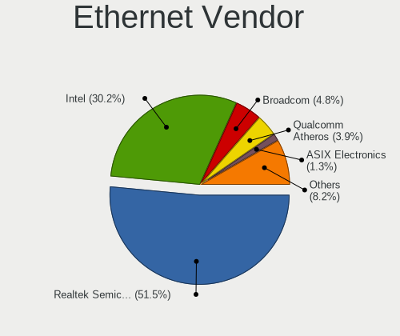

Ubuntu 22.04 - Tested Hardware & Statistics
-------------------------------------------

A project to collect tested hardware configurations for Ubuntu 22.04.

Anyone can contribute to this report by the [hw-probe](https://github.com/linuxhw/hw-probe) tool:

    sudo -E hw-probe -all -upload

Please contribute! Especially if your hardware is rare.

This is a report for all computer types. See also reports for [desktops](/Dist/Ubuntu_22.04/Desktop/README.md) and [notebooks](/Dist/Ubuntu_22.04/Notebook/README.md).

Contents
--------

* [ Test Cases ](#test-cases)

* [ System ](#system)
  - [ Kernel                   ](#kernel)
  - [ Kernel Family            ](#kernel-family)
  - [ Kernel Major Ver.        ](#kernel-major-ver)
  - [ Arch                     ](#arch)
  - [ DE                       ](#de)
  - [ Display Server           ](#display-server)
  - [ Display Manager          ](#display-manager)
  - [ OS Lang                  ](#os-lang)
  - [ Boot Mode                ](#boot-mode)
  - [ Filesystem               ](#filesystem)
  - [ Part. scheme             ](#part-scheme)
  - [ Dual Boot with Linux/BSD ](#dual-boot-with-linuxbsd)
  - [ Dual Boot (Win)          ](#dual-boot-win)

* [ Board ](#board)
  - [ Vendor                   ](#vendor)
  - [ Model                    ](#model)
  - [ Model Family             ](#model-family)
  - [ MFG Year                 ](#mfg-year)
  - [ Form Factor              ](#form-factor)
  - [ Secure Boot              ](#secure-boot)
  - [ Coreboot                 ](#coreboot)
  - [ RAM Size                 ](#ram-size)
  - [ RAM Used                 ](#ram-used)
  - [ Total Drives             ](#total-drives)
  - [ Has CD-ROM               ](#has-cd-rom)
  - [ Has Ethernet             ](#has-ethernet)
  - [ Has WiFi                 ](#has-wifi)
  - [ Has Bluetooth            ](#has-bluetooth)

* [ Location ](#location)
  - [ Country                  ](#country)
  - [ City                     ](#city)

* [ Drives ](#drives)
  - [ Drive Vendor             ](#drive-vendor)
  - [ Drive Model              ](#drive-model)
  - [ HDD Vendor               ](#hdd-vendor)
  - [ SSD Vendor               ](#ssd-vendor)
  - [ Drive Kind               ](#drive-kind)
  - [ Drive Connector          ](#drive-connector)
  - [ Drive Size               ](#drive-size)
  - [ Space Total              ](#space-total)
  - [ Space Used               ](#space-used)
  - [ Malfunc. Drives          ](#malfunc-drives)
  - [ Malfunc. Drive Vendor    ](#malfunc-drive-vendor)
  - [ Malfunc. HDD Vendor      ](#malfunc-hdd-vendor)
  - [ Malfunc. Drive Kind      ](#malfunc-drive-kind)
  - [ Failed Drives            ](#failed-drives)
  - [ Failed Drive Vendor      ](#failed-drive-vendor)
  - [ Drive Status             ](#drive-status)

* [ Storage controller ](#storage-controller)
  - [ Storage Vendor           ](#storage-vendor)
  - [ Storage Model            ](#storage-model)
  - [ Storage Kind             ](#storage-kind)

* [ Processor ](#processor)
  - [ CPU Vendor               ](#cpu-vendor)
  - [ CPU Model                ](#cpu-model)
  - [ CPU Model Family         ](#cpu-model-family)
  - [ CPU Cores                ](#cpu-cores)
  - [ CPU Sockets              ](#cpu-sockets)
  - [ CPU Threads              ](#cpu-threads)
  - [ CPU Op-Modes             ](#cpu-op-modes)
  - [ CPU Microcode            ](#cpu-microcode)
  - [ CPU Microarch            ](#cpu-microarch)

* [ Graphics ](#graphics)
  - [ GPU Vendor               ](#gpu-vendor)
  - [ GPU Model                ](#gpu-model)
  - [ GPU Combo                ](#gpu-combo)
  - [ GPU Driver               ](#gpu-driver)
  - [ GPU Memory               ](#gpu-memory)

* [ Monitor ](#monitor)
  - [ Monitor Vendor           ](#monitor-vendor)
  - [ Monitor Model            ](#monitor-model)
  - [ Monitor Resolution       ](#monitor-resolution)
  - [ Monitor Diagonal         ](#monitor-diagonal)
  - [ Monitor Width            ](#monitor-width)
  - [ Aspect Ratio             ](#aspect-ratio)
  - [ Monitor Area             ](#monitor-area)
  - [ Pixel Density            ](#pixel-density)
  - [ Multiple Monitors        ](#multiple-monitors)

* [ Network ](#network)
  - [ Net Controller Vendor    ](#net-controller-vendor)
  - [ Net Controller Model     ](#net-controller-model)
  - [ Wireless Vendor          ](#wireless-vendor)
  - [ Wireless Model           ](#wireless-model)
  - [ Ethernet Vendor          ](#ethernet-vendor)
  - [ Ethernet Model           ](#ethernet-model)
  - [ Net Controller Kind      ](#net-controller-kind)
  - [ Used Controller          ](#used-controller)
  - [ NICs                     ](#nics)
  - [ IPv6                     ](#ipv6)

* [ Bluetooth ](#bluetooth)
  - [ Bluetooth Vendor         ](#bluetooth-vendor)
  - [ Bluetooth Model          ](#bluetooth-model)

* [ Sound ](#sound)
  - [ Sound Vendor             ](#sound-vendor)
  - [ Sound Model              ](#sound-model)

* [ Memory ](#memory)
  - [ Memory Vendor            ](#memory-vendor)
  - [ Memory Model             ](#memory-model)
  - [ Memory Kind              ](#memory-kind)
  - [ Memory Form Factor       ](#memory-form-factor)
  - [ Memory Size              ](#memory-size)
  - [ Memory Speed             ](#memory-speed)

* [ Printers & scanners ](#printers--scanners)
  - [ Printer Vendor           ](#printer-vendor)
  - [ Printer Model            ](#printer-model)
  - [ Scanner Vendor           ](#scanner-vendor)
  - [ Scanner Model            ](#scanner-model)

* [ Camera ](#camera)
  - [ Camera Vendor            ](#camera-vendor)
  - [ Camera Model             ](#camera-model)

* [ Security ](#security)
  - [ Fingerprint Vendor       ](#fingerprint-vendor)
  - [ Fingerprint Model        ](#fingerprint-model)
  - [ Chipcard Vendor          ](#chipcard-vendor)
  - [ Chipcard Model           ](#chipcard-model)

* [ Unsupported ](#unsupported)
  - [ Unsupported Devices      ](#unsupported-devices)
  - [ Unsupported Device Types ](#unsupported-device-types)

Test Cases
----------

Total: 8981

| Vendor        | Model                       | Form-Factor | Probe                                                      | Date         |
|---------------|-----------------------------|-------------|------------------------------------------------------------|--------------|
| Dell          | Inspiron 5566               | Notebook    | [b2dd8d93c7](https://linux-hardware.org/?probe=b2dd8d93c7) | Feb 01, 2023 |
| Dell          | Latitude 5430               | Notebook    | [2afa57d0fa](https://linux-hardware.org/?probe=2afa57d0fa) | Feb 01, 2023 |
| Lenovo        | ThinkPad X220 4286CTO       | Notebook    | [465114aa14](https://linux-hardware.org/?probe=465114aa14) | Feb 01, 2023 |
| Gigabyte      | B365M DS3H                  | Desktop     | [d515d5d9f7](https://linux-hardware.org/?probe=d515d5d9f7) | Feb 01, 2023 |
| Dell          | Vostro 3500                 | Notebook    | [fa4104f438](https://linux-hardware.org/?probe=fa4104f438) | Feb 01, 2023 |
| Dell          | Vostro 3500                 | Notebook    | [ec80fcb8a5](https://linux-hardware.org/?probe=ec80fcb8a5) | Feb 01, 2023 |
| Lenovo        | SHARKBAY 0B98401 WIN        | Desktop     | [1668f1f69f](https://linux-hardware.org/?probe=1668f1f69f) | Feb 01, 2023 |
| HUAWEI        | BOHK-WAX9X                  | Notebook    | [07b498f669](https://linux-hardware.org/?probe=07b498f669) | Feb 01, 2023 |
| ASUSTek       | PRIME B550M-A               | Desktop     | [2e458676e4](https://linux-hardware.org/?probe=2e458676e4) | Feb 01, 2023 |
| Dell          | Inspiron 15-3567            | Notebook    | [2f6f4bc8c7](https://linux-hardware.org/?probe=2f6f4bc8c7) | Feb 01, 2023 |
| Lenovo        | ThinkPad X270 20HMS0T000    | Notebook    | [e9854b7cf8](https://linux-hardware.org/?probe=e9854b7cf8) | Feb 01, 2023 |
| Intel         | NUC11PABi5 K90634-305       | Mini pc     | [63143e2bf5](https://linux-hardware.org/?probe=63143e2bf5) | Feb 01, 2023 |
| Apple         | MacBookPro11,1              | Notebook    | [44f90bc9ab](https://linux-hardware.org/?probe=44f90bc9ab) | Feb 01, 2023 |
| HP            | 1790                        | Desktop     | [d0d3ca5e7c](https://linux-hardware.org/?probe=d0d3ca5e7c) | Feb 01, 2023 |
| HP            | Presario CQ57               | Notebook    | [0e34caefa3](https://linux-hardware.org/?probe=0e34caefa3) | Feb 01, 2023 |
| Dell          | 02P9X9 A04                  | Server      | [bda0eb6835](https://linux-hardware.org/?probe=bda0eb6835) | Feb 01, 2023 |
| Huanan        | X99-F8D PLUS V1.1           | Desktop     | [e68a009e8f](https://linux-hardware.org/?probe=e68a009e8f) | Feb 01, 2023 |
| Gigabyte      | GA-MA69VM-S2                | Desktop     | [72dae43046](https://linux-hardware.org/?probe=72dae43046) | Feb 01, 2023 |
| Dell          | Inspiron 15-7579            | Notebook    | [b5bd231bf3](https://linux-hardware.org/?probe=b5bd231bf3) | Jan 31, 2023 |
| ASUSTek       | VivoBook_ASUSLaptop X150... | Notebook    | [e2ad5b033f](https://linux-hardware.org/?probe=e2ad5b033f) | Jan 31, 2023 |
| Dell          | G3 3500                     | Notebook    | [4b519ab8a8](https://linux-hardware.org/?probe=4b519ab8a8) | Jan 31, 2023 |
| BESSTAR Te... | GB7                         | Mini pc     | [abe22da26e](https://linux-hardware.org/?probe=abe22da26e) | Jan 31, 2023 |
| NCR           | Pocono                      | Desktop     | [1a1c878e10](https://linux-hardware.org/?probe=1a1c878e10) | Jan 31, 2023 |
| Timi          | TM1701                      | Notebook    | [a474c92380](https://linux-hardware.org/?probe=a474c92380) | Jan 31, 2023 |
| Dell          | XPS 13 7390                 | Notebook    | [5479d8c85b](https://linux-hardware.org/?probe=5479d8c85b) | Jan 31, 2023 |
| HP            | Laptop 15-bw0xx             | Notebook    | [b7fce61d74](https://linux-hardware.org/?probe=b7fce61d74) | Jan 31, 2023 |
| Dell          | XPS 13 9370                 | Notebook    | [cd12cbdc16](https://linux-hardware.org/?probe=cd12cbdc16) | Jan 31, 2023 |
| Lenovo        | ThinkPad E15 Gen 2 20T9S... | Notebook    | [51d249d102](https://linux-hardware.org/?probe=51d249d102) | Jan 31, 2023 |
| ASUSTek       | VivoBook_ASUSLaptop M340... | Notebook    | [cd9b7d5796](https://linux-hardware.org/?probe=cd9b7d5796) | Jan 31, 2023 |
| ASUSTek       | ROG STRIX B450-I GAMING     | Desktop     | [d59770af38](https://linux-hardware.org/?probe=d59770af38) | Jan 31, 2023 |
| ASUSTek       | ROG STRIX B450-I GAMING     | Desktop     | [3a5ae3d1e8](https://linux-hardware.org/?probe=3a5ae3d1e8) | Jan 31, 2023 |
| Intel         | DH77DF AAG40293-301         | Desktop     | [1a0f7653e3](https://linux-hardware.org/?probe=1a0f7653e3) | Jan 31, 2023 |
| Dell          | XPS 15 9570                 | Notebook    | [896d7f2fbd](https://linux-hardware.org/?probe=896d7f2fbd) | Jan 31, 2023 |
| Timi          | A34R                        | Notebook    | [18ab422614](https://linux-hardware.org/?probe=18ab422614) | Jan 31, 2023 |
| HP            | EliteBook 840 G2            | Notebook    | [bf4741c8ad](https://linux-hardware.org/?probe=bf4741c8ad) | Jan 31, 2023 |
| Dell          | 06HR05 A00                  | Desktop     | [b80c55d90d](https://linux-hardware.org/?probe=b80c55d90d) | Jan 31, 2023 |
| Dell          | Latitude 7410               | Notebook    | [fd07971a70](https://linux-hardware.org/?probe=fd07971a70) | Jan 31, 2023 |
| Lenovo        | ThinkPad P15 Gen 2i 20YQ... | Notebook    | [ea48b6870c](https://linux-hardware.org/?probe=ea48b6870c) | Jan 31, 2023 |
| Google        | Casta                       | Notebook    | [db372f6a5f](https://linux-hardware.org/?probe=db372f6a5f) | Jan 31, 2023 |
| Lenovo        | 36C8 SDK0J40700 WIN 3258... | Desktop     | [01c7dbecde](https://linux-hardware.org/?probe=01c7dbecde) | Jan 31, 2023 |
| Raspberry ... | Raspberry Pi 4 Model B R... | Soc         | [656bb989e7](https://linux-hardware.org/?probe=656bb989e7) | Jan 31, 2023 |
| Gigabyte      | Z97M-DS3H                   | Desktop     | [360dc83e04](https://linux-hardware.org/?probe=360dc83e04) | Jan 31, 2023 |
| Medion        | MS-7728                     | Desktop     | [60cf9e4948](https://linux-hardware.org/?probe=60cf9e4948) | Jan 31, 2023 |
| Maxtang       | EHL30 V1.0                  | Desktop     | [d104ad1307](https://linux-hardware.org/?probe=d104ad1307) | Jan 31, 2023 |
| System76      | Lemur                       | Notebook    | [6dac0a5b94](https://linux-hardware.org/?probe=6dac0a5b94) | Jan 31, 2023 |
| Dell          | 040DDP A01                  | Desktop     | [6094b799d7](https://linux-hardware.org/?probe=6094b799d7) | Jan 31, 2023 |
| Gigabyte      | H270-Gaming 3               | Desktop     | [e64a1e0a5a](https://linux-hardware.org/?probe=e64a1e0a5a) | Jan 31, 2023 |
| Gigabyte      | F2A88XM-D3H                 | Desktop     | [846f831269](https://linux-hardware.org/?probe=846f831269) | Jan 31, 2023 |
| Gigabyte      | Z170-HD3P-CF                | Desktop     | [9e9deedf0d](https://linux-hardware.org/?probe=9e9deedf0d) | Jan 31, 2023 |
| Acer          | Aspire E5-571               | Notebook    | [615ee3d3fd](https://linux-hardware.org/?probe=615ee3d3fd) | Jan 31, 2023 |
| Lenovo        | ThinkPad P51 20HJS0BR00     | Notebook    | [6c05048c9d](https://linux-hardware.org/?probe=6c05048c9d) | Jan 31, 2023 |
| Acer          | Aspire E5-571               | Notebook    | [6498b44bcc](https://linux-hardware.org/?probe=6498b44bcc) | Jan 31, 2023 |
| Lenovo        | ThinkPad T430 2349A44       | Notebook    | [9f8528c5da](https://linux-hardware.org/?probe=9f8528c5da) | Jan 31, 2023 |
| Dell          | 0CNCJW A08                  | Server      | [1abe023ed7](https://linux-hardware.org/?probe=1abe023ed7) | Jan 31, 2023 |
| Lenovo        | ThinkPad L540 20AVCTO1WW    | Notebook    | [d08beb0c26](https://linux-hardware.org/?probe=d08beb0c26) | Jan 31, 2023 |
| Lenovo        | 30D0 SDK0J40697 WIN 3305... | Desktop     | [f018b74ad8](https://linux-hardware.org/?probe=f018b74ad8) | Jan 31, 2023 |
| Apple         | MacBookPro14,2              | Notebook    | [ff0dfe765e](https://linux-hardware.org/?probe=ff0dfe765e) | Jan 31, 2023 |
| Acer          | Unknown                     | Desktop     | [05de2b4244](https://linux-hardware.org/?probe=05de2b4244) | Jan 30, 2023 |
| Toshiba       | Satellite U845W             | Notebook    | [6735a45763](https://linux-hardware.org/?probe=6735a45763) | Jan 30, 2023 |
| Lenovo        | ThinkPad P50 20EN0013US     | Notebook    | [d3bf9fe9e3](https://linux-hardware.org/?probe=d3bf9fe9e3) | Jan 30, 2023 |
| MSI           | MPG X570 GAMING EDGE WIF... | Desktop     | [353272e0d2](https://linux-hardware.org/?probe=353272e0d2) | Jan 30, 2023 |
| Acer          | Predator PH315-52           | Notebook    | [457b7cf5f0](https://linux-hardware.org/?probe=457b7cf5f0) | Jan 30, 2023 |
| HP            | Notebook                    | Notebook    | [fc93f8e357](https://linux-hardware.org/?probe=fc93f8e357) | Jan 30, 2023 |
| Dell          | 0GDG8Y A00                  | Desktop     | [8ba7e25b58](https://linux-hardware.org/?probe=8ba7e25b58) | Jan 30, 2023 |
| Acer          | Aspire V3-772G              | Notebook    | [fce1ba6f6b](https://linux-hardware.org/?probe=fce1ba6f6b) | Jan 30, 2023 |
| Dell          | 0GDG8Y A00                  | Desktop     | [759e9a48d1](https://linux-hardware.org/?probe=759e9a48d1) | Jan 30, 2023 |
| Sony          | VPCCB16FG                   | Notebook    | [837588c9eb](https://linux-hardware.org/?probe=837588c9eb) | Jan 30, 2023 |
| Intel         | DH77DF AAG40293-301         | Desktop     | [1c91d911d7](https://linux-hardware.org/?probe=1c91d911d7) | Jan 30, 2023 |
| HP            | ProBook 4720s               | Notebook    | [b6edbaeae1](https://linux-hardware.org/?probe=b6edbaeae1) | Jan 30, 2023 |
| Apple         | Mac-27ADBB7B4CEE8E61 iMa... | All in one  | [17a5588d06](https://linux-hardware.org/?probe=17a5588d06) | Jan 30, 2023 |
| Acer          | Aspire M5-581TG             | Notebook    | [970a402846](https://linux-hardware.org/?probe=970a402846) | Jan 30, 2023 |
| Acer          | Aspire M5-581TG             | Notebook    | [c2d425d254](https://linux-hardware.org/?probe=c2d425d254) | Jan 30, 2023 |
| Lenovo        | 36C8 SDK0J40700 WIN 3258... | Desktop     | [529b411b46](https://linux-hardware.org/?probe=529b411b46) | Jan 30, 2023 |
| ASUSTek       | ROG STRIX Z390-E GAMING     | Desktop     | [7983249b4c](https://linux-hardware.org/?probe=7983249b4c) | Jan 30, 2023 |
| HP            | Pavilion x360 Convertibl... | Convertible | [14b0a73713](https://linux-hardware.org/?probe=14b0a73713) | Jan 30, 2023 |
| HUAWEI        | BOHB-WAX9                   | Notebook    | [f4916a0bd5](https://linux-hardware.org/?probe=f4916a0bd5) | Jan 30, 2023 |
| HP            | Pavilion x360 Convertibl... | Convertible | [8fd86a447c](https://linux-hardware.org/?probe=8fd86a447c) | Jan 30, 2023 |
| Intel         | NUC7i5BNB J31144-311        | Mini pc     | [e95329eafd](https://linux-hardware.org/?probe=e95329eafd) | Jan 30, 2023 |
| Dell          | Latitude 5480               | Notebook    | [ee87ac218f](https://linux-hardware.org/?probe=ee87ac218f) | Jan 30, 2023 |
| Dell          | Latitude 5480               | Notebook    | [3cbac640e1](https://linux-hardware.org/?probe=3cbac640e1) | Jan 30, 2023 |
| HP            | Compaq CQ58                 | Notebook    | [63dfd6ca48](https://linux-hardware.org/?probe=63dfd6ca48) | Jan 30, 2023 |
| Intel         | NUC11PABi7 K90104-302       | Mini pc     | [6d867d07e1](https://linux-hardware.org/?probe=6d867d07e1) | Jan 30, 2023 |
| Toshiba       | PORTEGE X30-E               | Notebook    | [01f74415b0](https://linux-hardware.org/?probe=01f74415b0) | Jan 30, 2023 |
| HP            | 15                          | Notebook    | [409a15bdf3](https://linux-hardware.org/?probe=409a15bdf3) | Jan 30, 2023 |
| HP            | ENVY Laptop 13-ah1xxx       | Notebook    | [360756b46a](https://linux-hardware.org/?probe=360756b46a) | Jan 30, 2023 |
| Dell          | Precision 5560              | Notebook    | [c994bfa3a7](https://linux-hardware.org/?probe=c994bfa3a7) | Jan 30, 2023 |
| HP            | 8054                        | Desktop     | [f2367fdcda](https://linux-hardware.org/?probe=f2367fdcda) | Jan 30, 2023 |
| Dell          | 060K5C A02                  | Server      | [10f46b2d20](https://linux-hardware.org/?probe=10f46b2d20) | Jan 30, 2023 |
| Dell          | 060K5C A02                  | Server      | [cef0697950](https://linux-hardware.org/?probe=cef0697950) | Jan 30, 2023 |
| Dell          | Latitude E6520              | Notebook    | [81717ed3df](https://linux-hardware.org/?probe=81717ed3df) | Jan 30, 2023 |
| Lenovo        | ThinkPad T480 20L5001KAU    | Notebook    | [4b7046e26c](https://linux-hardware.org/?probe=4b7046e26c) | Jan 30, 2023 |
| MSI           | X370 SLI PLUS               | Desktop     | [bb20465703](https://linux-hardware.org/?probe=bb20465703) | Jan 30, 2023 |
| Dell          | XPS 13 9380                 | Notebook    | [ec00530842](https://linux-hardware.org/?probe=ec00530842) | Jan 30, 2023 |
| HP            | 18E7                        | Desktop     | [db4ef3e5f4](https://linux-hardware.org/?probe=db4ef3e5f4) | Jan 30, 2023 |
| Lenovo        | ThinkPad T480 20L5000UUS    | Notebook    | [d356c9846a](https://linux-hardware.org/?probe=d356c9846a) | Jan 30, 2023 |
| Gigabyte      | H270-Gaming 3               | Desktop     | [4427845ac1](https://linux-hardware.org/?probe=4427845ac1) | Jan 30, 2023 |
| Lenovo        | 3704 SDK0J40700 WIN 3258... | Desktop     | [aff06e830e](https://linux-hardware.org/?probe=aff06e830e) | Jan 30, 2023 |
| Dell          | Inspiron 14 5410 2-in-1     | Convertible | [36caf406ce](https://linux-hardware.org/?probe=36caf406ce) | Jan 29, 2023 |
| Lenovo        | IdeaPad S145-15IWL 81S9     | Notebook    | [1c62beb905](https://linux-hardware.org/?probe=1c62beb905) | Jan 29, 2023 |
| Lenovo        | IdeaPad 320-15ISK 80XH      | Notebook    | [7bc88d72f0](https://linux-hardware.org/?probe=7bc88d72f0) | Jan 29, 2023 |
| HP            | Laptop 15-dy2xxx            | Notebook    | [97e6b9cb60](https://linux-hardware.org/?probe=97e6b9cb60) | Jan 29, 2023 |
| HP            | Laptop 15-dy2xxx            | Notebook    | [e5e795e7a2](https://linux-hardware.org/?probe=e5e795e7a2) | Jan 29, 2023 |
| Sony          | VPCCB16FG                   | Notebook    | [7307480466](https://linux-hardware.org/?probe=7307480466) | Jan 29, 2023 |
| ASUSTek       | ROG STRIX B550-F GAMING     | Desktop     | [4fb612b680](https://linux-hardware.org/?probe=4fb612b680) | Jan 29, 2023 |
| Google        | Lillipup                    | Notebook    | [194cec66f5](https://linux-hardware.org/?probe=194cec66f5) | Jan 29, 2023 |
| MSI           | MPG B550I GAMING EDGE MA... | Desktop     | [ff186606cd](https://linux-hardware.org/?probe=ff186606cd) | Jan 29, 2023 |
| Intel         | NUC6CAYB J23203-410         | Mini pc     | [d4f05f2d34](https://linux-hardware.org/?probe=d4f05f2d34) | Jan 29, 2023 |
| Lenovo        | ThinkPad T420 4236PN3       | Notebook    | [3b5c51e8b8](https://linux-hardware.org/?probe=3b5c51e8b8) | Jan 29, 2023 |
| ASRock        | B460M Pro4                  | Desktop     | [7af163f694](https://linux-hardware.org/?probe=7af163f694) | Jan 29, 2023 |
| HUAWEI        | BOHB-WAX9                   | Notebook    | [ee6b0e54f7](https://linux-hardware.org/?probe=ee6b0e54f7) | Jan 29, 2023 |
| Gigabyte      | B250M-HD3-CF                | Desktop     | [f8630776ca](https://linux-hardware.org/?probe=f8630776ca) | Jan 29, 2023 |
| MSI           | Z77A-G43                    | Desktop     | [873725bb74](https://linux-hardware.org/?probe=873725bb74) | Jan 29, 2023 |
| MSI           | Z77A-G43                    | Desktop     | [f489fe4f5d](https://linux-hardware.org/?probe=f489fe4f5d) | Jan 29, 2023 |
| HP            | ENVY x360 2-in-1 Laptop ... | Convertible | [dab1328d8d](https://linux-hardware.org/?probe=dab1328d8d) | Jan 29, 2023 |
| HP            | ZBook 14 G2                 | Notebook    | [4b1e1bc7e1](https://linux-hardware.org/?probe=4b1e1bc7e1) | Jan 29, 2023 |
| HP            | ENVY x360 2-in-1 Laptop ... | Convertible | [3a7f252d19](https://linux-hardware.org/?probe=3a7f252d19) | Jan 29, 2023 |
| Apple         | MacBookPro5,5               | Notebook    | [678b6fa5f6](https://linux-hardware.org/?probe=678b6fa5f6) | Jan 29, 2023 |
| ASUSTek       | PRIME B450M-K II            | Desktop     | [d4a5012f93](https://linux-hardware.org/?probe=d4a5012f93) | Jan 29, 2023 |
| Lenovo        | IdeaPad 510-15ISK 80SR      | Notebook    | [debdb8208f](https://linux-hardware.org/?probe=debdb8208f) | Jan 29, 2023 |
| Lenovo        | IdeaPad 100-15IBD 80QQ      | Notebook    | [84c2710911](https://linux-hardware.org/?probe=84c2710911) | Jan 29, 2023 |
| HP            | ProBook 4520s               | Notebook    | [6a16110b08](https://linux-hardware.org/?probe=6a16110b08) | Jan 29, 2023 |
| HP            | ProBook 4520s               | Notebook    | [e973aeb114](https://linux-hardware.org/?probe=e973aeb114) | Jan 29, 2023 |
| Dell          | 0VRWRC A01                  | Desktop     | [0e6a170715](https://linux-hardware.org/?probe=0e6a170715) | Jan 29, 2023 |
| HP            | Pavilion Sleekbook 15       | Notebook    | [d17dc00a8a](https://linux-hardware.org/?probe=d17dc00a8a) | Jan 29, 2023 |
| HP            | 81B4                        | Desktop     | [01229ad5ec](https://linux-hardware.org/?probe=01229ad5ec) | Jan 29, 2023 |
| ASUSTek       | ASUS TUF Gaming F15 FX50... | Notebook    | [90644628b4](https://linux-hardware.org/?probe=90644628b4) | Jan 29, 2023 |
| HP            | Laptop 14-fq0xxx            | Notebook    | [0b7bcda17a](https://linux-hardware.org/?probe=0b7bcda17a) | Jan 29, 2023 |
| Timi          | RedmiBook Pro 15S           | Notebook    | [21cf912e1c](https://linux-hardware.org/?probe=21cf912e1c) | Jan 29, 2023 |
| Dell          | Inspiron 5520               | Notebook    | [c869e74605](https://linux-hardware.org/?probe=c869e74605) | Jan 29, 2023 |
| HP            | EliteBook 8460p             | Notebook    | [caedc4c130](https://linux-hardware.org/?probe=caedc4c130) | Jan 29, 2023 |
| HP            | Pavilion dv6                | Notebook    | [1e739ddc0d](https://linux-hardware.org/?probe=1e739ddc0d) | Jan 29, 2023 |
| ASRock        | 970M Pro3                   | Desktop     | [e0a5d6512f](https://linux-hardware.org/?probe=e0a5d6512f) | Jan 29, 2023 |
| Apple         | Mac-F226BEC8 PVT            | All in one  | [45e2952704](https://linux-hardware.org/?probe=45e2952704) | Jan 29, 2023 |
| HP            | Laptop 15-da0xxx            | Notebook    | [959a9a17dd](https://linux-hardware.org/?probe=959a9a17dd) | Jan 29, 2023 |
| System76      | Lemur                       | Notebook    | [a6fc9167f7](https://linux-hardware.org/?probe=a6fc9167f7) | Jan 29, 2023 |
| Alienware     | x15 R2                      | Notebook    | [51bb7a8c39](https://linux-hardware.org/?probe=51bb7a8c39) | Jan 29, 2023 |
| Dell          | Precision 7510              | Notebook    | [4f56174991](https://linux-hardware.org/?probe=4f56174991) | Jan 29, 2023 |
| Supermicro    | X10DRL-CT                   | Server      | [3dcf1286ab](https://linux-hardware.org/?probe=3dcf1286ab) | Jan 29, 2023 |
| Foxconn       | A74MX-S/A74MX-K             | Desktop     | [9daeb7adc3](https://linux-hardware.org/?probe=9daeb7adc3) | Jan 29, 2023 |
| Lenovo        | SHARKBAY SDK0J40700 WIN     | Desktop     | [75027cfa77](https://linux-hardware.org/?probe=75027cfa77) | Jan 29, 2023 |
| ASRock        | B460M Pro4                  | Desktop     | [37c0fb77f5](https://linux-hardware.org/?probe=37c0fb77f5) | Jan 29, 2023 |
| Timi          | TM1703                      | Notebook    | [6bb85263a7](https://linux-hardware.org/?probe=6bb85263a7) | Jan 29, 2023 |
| Apple         | Mac-F221BEC8                | Desktop     | [d8de82d8c4](https://linux-hardware.org/?probe=d8de82d8c4) | Jan 29, 2023 |
| ASUSTek       | X550LB                      | Notebook    | [9590dd2f30](https://linux-hardware.org/?probe=9590dd2f30) | Jan 28, 2023 |
| HP            | 18E7                        | Desktop     | [01cbafc241](https://linux-hardware.org/?probe=01cbafc241) | Jan 28, 2023 |
| ASUSTek       | F2A55-M LK2                 | Desktop     | [8bf2fa8d9b](https://linux-hardware.org/?probe=8bf2fa8d9b) | Jan 28, 2023 |
| Lenovo        | G550 2958                   | Notebook    | [8bee986aca](https://linux-hardware.org/?probe=8bee986aca) | Jan 28, 2023 |
| Dell          | XPS 13 9380                 | Notebook    | [ed99ed692d](https://linux-hardware.org/?probe=ed99ed692d) | Jan 28, 2023 |
| ASUSTek       | M5A97 R2.0                  | Desktop     | [845b3c6990](https://linux-hardware.org/?probe=845b3c6990) | Jan 28, 2023 |
| Dell          | Latitude 7280               | Notebook    | [358f4c431f](https://linux-hardware.org/?probe=358f4c431f) | Jan 28, 2023 |
| Dell          | Latitude 7280               | Notebook    | [903e0489c4](https://linux-hardware.org/?probe=903e0489c4) | Jan 28, 2023 |
| ASUSTek       | M5A97 R2.0                  | Desktop     | [d7469767f6](https://linux-hardware.org/?probe=d7469767f6) | Jan 28, 2023 |
| Dell          | XPS 13 9315 2-in-1          | Tablet      | [c62fe4b879](https://linux-hardware.org/?probe=c62fe4b879) | Jan 28, 2023 |
| ASUSTek       | F2A85-V                     | Desktop     | [d528677cfd](https://linux-hardware.org/?probe=d528677cfd) | Jan 28, 2023 |
| Gigabyte      | B660M GAMING DDR4           | Desktop     | [c7fc79b5f1](https://linux-hardware.org/?probe=c7fc79b5f1) | Jan 28, 2023 |
| BESSTAR Te... | UM350                       | Desktop     | [1ec2f78884](https://linux-hardware.org/?probe=1ec2f78884) | Jan 28, 2023 |
| HP            | 17E2                        | Mini pc     | [41fdb27963](https://linux-hardware.org/?probe=41fdb27963) | Jan 28, 2023 |
| HP            | Pavilion dv6                | Notebook    | [ce950f0a28](https://linux-hardware.org/?probe=ce950f0a28) | Jan 28, 2023 |
| Dell          | Inspiron 5570               | Notebook    | [17a8246044](https://linux-hardware.org/?probe=17a8246044) | Jan 28, 2023 |
| Lenovo        | ThinkPad T480 20L6SF8C00    | Notebook    | [4ab453f835](https://linux-hardware.org/?probe=4ab453f835) | Jan 28, 2023 |
| ASUSTek       | PRIME A320M-K               | Desktop     | [11586188ad](https://linux-hardware.org/?probe=11586188ad) | Jan 28, 2023 |
| ASUSTek       | X555QA                      | Notebook    | [8eec8468fb](https://linux-hardware.org/?probe=8eec8468fb) | Jan 28, 2023 |
| Dell          | 0599V5 A12                  | Server      | [14f503ae4a](https://linux-hardware.org/?probe=14f503ae4a) | Jan 28, 2023 |
| Dell          | Inspiron 1521               | Notebook    | [8fcde91462](https://linux-hardware.org/?probe=8fcde91462) | Jan 28, 2023 |
| ASUSTek       | A58M-A/BR                   | Desktop     | [2e6e55e6ea](https://linux-hardware.org/?probe=2e6e55e6ea) | Jan 28, 2023 |
| ASUSTek       | X751LB                      | Notebook    | [54094ae0a7](https://linux-hardware.org/?probe=54094ae0a7) | Jan 28, 2023 |
| Lenovo        | 312D NOK                    | Mini pc     | [854a69817d](https://linux-hardware.org/?probe=854a69817d) | Jan 28, 2023 |
| ASRock        | 970M Pro3                   | Desktop     | [58366ca3d1](https://linux-hardware.org/?probe=58366ca3d1) | Jan 28, 2023 |
| Dell          | 0HY9JP A00                  | Desktop     | [f4aefcd670](https://linux-hardware.org/?probe=f4aefcd670) | Jan 28, 2023 |
| Lenovo        | G550 2958                   | Notebook    | [a50b0e3645](https://linux-hardware.org/?probe=a50b0e3645) | Jan 28, 2023 |
| ASUSTek       | H61M-K                      | Desktop     | [312e07a824](https://linux-hardware.org/?probe=312e07a824) | Jan 28, 2023 |
| HP            | EliteBook 840 G3            | Notebook    | [f9446c0c08](https://linux-hardware.org/?probe=f9446c0c08) | Jan 28, 2023 |
| Lenovo        | IdeaPad Flex-14API 81SS     | Notebook    | [d99ff3dbe8](https://linux-hardware.org/?probe=d99ff3dbe8) | Jan 28, 2023 |
| Lenovo        | ThinkBook 14 G2 ITL 20VD    | Notebook    | [b33f2d5606](https://linux-hardware.org/?probe=b33f2d5606) | Jan 28, 2023 |
| ASUSTek       | P8H67-M PRO                 | Desktop     | [97d1ab1b7d](https://linux-hardware.org/?probe=97d1ab1b7d) | Jan 28, 2023 |
| Gigabyte      | B75M-D3H                    | Desktop     | [3ee2e6ab56](https://linux-hardware.org/?probe=3ee2e6ab56) | Jan 27, 2023 |
| MSI           | TRX40 PRO WIFI              | Desktop     | [d9508d5b22](https://linux-hardware.org/?probe=d9508d5b22) | Jan 27, 2023 |
| Unknown       | Unknown                     | Notebook    | [b4270378b4](https://linux-hardware.org/?probe=b4270378b4) | Jan 27, 2023 |
| Lenovo        | ThinkPad X380 Yoga 20LJS... | Convertible | [df80bde8ad](https://linux-hardware.org/?probe=df80bde8ad) | Jan 27, 2023 |
| Dell          | 057FFP A01                  | Desktop     | [ec0e3da69d](https://linux-hardware.org/?probe=ec0e3da69d) | Jan 27, 2023 |
| Acer          | Predator G3620              | Desktop     | [0fdd7e30ce](https://linux-hardware.org/?probe=0fdd7e30ce) | Jan 27, 2023 |
| ASUSTek       | P8H61-M LX R2.0             | Desktop     | [6d2e490a23](https://linux-hardware.org/?probe=6d2e490a23) | Jan 27, 2023 |
| HP            | EliteBook 8530w             | Notebook    | [f395c475c9](https://linux-hardware.org/?probe=f395c475c9) | Jan 27, 2023 |
| ASUSTek       | Z170-K                      | Desktop     | [a1f535bfca](https://linux-hardware.org/?probe=a1f535bfca) | Jan 27, 2023 |
| Sony          | SVE1512H1EB                 | Notebook    | [9f9b853849](https://linux-hardware.org/?probe=9f9b853849) | Jan 27, 2023 |
| Sony          | SVE1512H1EB                 | Notebook    | [a1f75687bc](https://linux-hardware.org/?probe=a1f75687bc) | Jan 27, 2023 |
| MSI           | Prestige 14Evo A12M         | Notebook    | [17f4098b36](https://linux-hardware.org/?probe=17f4098b36) | Jan 27, 2023 |
| ASUSTek       | P5K                         | Desktop     | [6d496e6965](https://linux-hardware.org/?probe=6d496e6965) | Jan 27, 2023 |
| ASUSTek       | K73E                        | Notebook    | [66e0036452](https://linux-hardware.org/?probe=66e0036452) | Jan 27, 2023 |
| Dell          | 0GM819                      | Desktop     | [f5810a0a61](https://linux-hardware.org/?probe=f5810a0a61) | Jan 27, 2023 |
| ASUSTek       | K73E                        | Notebook    | [91f049a01d](https://linux-hardware.org/?probe=91f049a01d) | Jan 27, 2023 |
| Gigabyte      | GA-890GPA-UD3H              | Desktop     | [e660f922a4](https://linux-hardware.org/?probe=e660f922a4) | Jan 27, 2023 |
| HP            | ProBook 445 G7              | Notebook    | [d0b5bf560a](https://linux-hardware.org/?probe=d0b5bf560a) | Jan 27, 2023 |
| ASUSTek       | ROG Strix G733CX_G733CX     | Notebook    | [a0c1ab03da](https://linux-hardware.org/?probe=a0c1ab03da) | Jan 27, 2023 |
| Dell          | Latitude E6430              | Notebook    | [ac467a864d](https://linux-hardware.org/?probe=ac467a864d) | Jan 27, 2023 |
| ASUSTek       | VivoBook_ASUSLaptop K340... | Notebook    | [37059de5b7](https://linux-hardware.org/?probe=37059de5b7) | Jan 27, 2023 |
| Acer          | Aspire ES1-571              | Notebook    | [c35f2771dc](https://linux-hardware.org/?probe=c35f2771dc) | Jan 27, 2023 |
| Lenovo        | ThinkBook 14 G3 ACL 21A2    | Notebook    | [77a6b88d58](https://linux-hardware.org/?probe=77a6b88d58) | Jan 27, 2023 |
| Dell          | Latitude E7470              | Notebook    | [42ace80c0b](https://linux-hardware.org/?probe=42ace80c0b) | Jan 27, 2023 |
| HP            | Pavilion x360 Convertibl... | Convertible | [1b1079b0bf](https://linux-hardware.org/?probe=1b1079b0bf) | Jan 27, 2023 |
| Lenovo        | 0B98401 PRO                 | Desktop     | [06086e6112](https://linux-hardware.org/?probe=06086e6112) | Jan 27, 2023 |
| Acer          | Aspire A515-57G             | Notebook    | [f5492fbdaa](https://linux-hardware.org/?probe=f5492fbdaa) | Jan 27, 2023 |
| Dell          | 0RY206                      | Desktop     | [822d0f1c17](https://linux-hardware.org/?probe=822d0f1c17) | Jan 27, 2023 |
| HP            | ProBook 450 G7              | Notebook    | [4582f041bc](https://linux-hardware.org/?probe=4582f041bc) | Jan 27, 2023 |
| Acer          | Aspire E5-571               | Notebook    | [cef03beca8](https://linux-hardware.org/?probe=cef03beca8) | Jan 27, 2023 |
| ASUSTek       | H61M-E                      | Desktop     | [0ebd68a086](https://linux-hardware.org/?probe=0ebd68a086) | Jan 27, 2023 |
| HP            | Laptop 17-cp0xxx            | Notebook    | [55477da159](https://linux-hardware.org/?probe=55477da159) | Jan 27, 2023 |
| HP            | ENVY Laptop 13-ba0xxx       | Notebook    | [e4544fb59a](https://linux-hardware.org/?probe=e4544fb59a) | Jan 27, 2023 |
| Gateway       | T-1620                      | Notebook    | [595ce5493d](https://linux-hardware.org/?probe=595ce5493d) | Jan 27, 2023 |
| Compaq        | 430                         | Notebook    | [069fa715b9](https://linux-hardware.org/?probe=069fa715b9) | Jan 27, 2023 |
| Dell          | XPS 13 9305                 | Notebook    | [c0468fe8fd](https://linux-hardware.org/?probe=c0468fe8fd) | Jan 27, 2023 |
| MSI           | Prestige 14Evo A12M         | Notebook    | [3638a1774c](https://linux-hardware.org/?probe=3638a1774c) | Jan 27, 2023 |
| Dell          | 01CTXG A10                  | Server      | [dfb6580f2a](https://linux-hardware.org/?probe=dfb6580f2a) | Jan 27, 2023 |
| Medion        | MS-7675                     | Desktop     | [1d9d209dbf](https://linux-hardware.org/?probe=1d9d209dbf) | Jan 27, 2023 |
| Gigabyte      | 970A-D3P                    | Desktop     | [f01366b131](https://linux-hardware.org/?probe=f01366b131) | Jan 27, 2023 |
| HP            | Compaq 8200 Elite SFF PC    | Desktop     | [73f629ca61](https://linux-hardware.org/?probe=73f629ca61) | Jan 27, 2023 |
| Gigabyte      | X570 UD                     | Desktop     | [75e92725f5](https://linux-hardware.org/?probe=75e92725f5) | Jan 26, 2023 |
| Gigabyte      | H81M-S2PV                   | Desktop     | [4910cfdfcd](https://linux-hardware.org/?probe=4910cfdfcd) | Jan 26, 2023 |
| Positivo      | POS-PIB150DT                | Desktop     | [5a333d4e71](https://linux-hardware.org/?probe=5a333d4e71) | Jan 26, 2023 |
| ASUSTek       | ZenBook UX425UA_UM425UA     | Notebook    | [af3748a4f0](https://linux-hardware.org/?probe=af3748a4f0) | Jan 26, 2023 |
| Dell          | XPS 17 9700                 | Notebook    | [72161736bf](https://linux-hardware.org/?probe=72161736bf) | Jan 26, 2023 |
| Dell          | Latitude E6420              | Notebook    | [9837928212](https://linux-hardware.org/?probe=9837928212) | Jan 26, 2023 |
| HP            | 255 G8 Notebook PC          | Notebook    | [fdcee64754](https://linux-hardware.org/?probe=fdcee64754) | Jan 26, 2023 |
| Gigabyte      | B450 AORUS M                | Desktop     | [3e65f42529](https://linux-hardware.org/?probe=3e65f42529) | Jan 26, 2023 |
| HP            | 255 G8 Notebook PC          | Notebook    | [814fe54dc5](https://linux-hardware.org/?probe=814fe54dc5) | Jan 26, 2023 |
| Dell          | 0CRH6C A01                  | Desktop     | [d06248a310](https://linux-hardware.org/?probe=d06248a310) | Jan 26, 2023 |
| ASUSTek       | Zenbook UX5401ZAS_UX5401... | Notebook    | [de8222900d](https://linux-hardware.org/?probe=de8222900d) | Jan 26, 2023 |
| Gigabyte      | Sabre 15                    | Notebook    | [3ad57e9198](https://linux-hardware.org/?probe=3ad57e9198) | Jan 26, 2023 |
| Unknown       | 1.0                         | Desktop     | [85d36881c1](https://linux-hardware.org/?probe=85d36881c1) | Jan 26, 2023 |
| Unknown       | 1.0                         | Desktop     | [a25e1d1008](https://linux-hardware.org/?probe=a25e1d1008) | Jan 26, 2023 |
| Fujitsu       | LIFEBOOK E752               | Notebook    | [2fc97553ae](https://linux-hardware.org/?probe=2fc97553ae) | Jan 26, 2023 |
| HP            | 843B                        | Desktop     | [98d0f20b21](https://linux-hardware.org/?probe=98d0f20b21) | Jan 26, 2023 |
| HP            | 8299                        | Desktop     | [d73eaeeb81](https://linux-hardware.org/?probe=d73eaeeb81) | Jan 26, 2023 |
| HP            | 18E4                        | Desktop     | [1f51508eeb](https://linux-hardware.org/?probe=1f51508eeb) | Jan 26, 2023 |
| HP            | 8299                        | Desktop     | [47b5f3fdef](https://linux-hardware.org/?probe=47b5f3fdef) | Jan 26, 2023 |
| Lenovo        | ThinkPad L490 20Q5002GPG    | Notebook    | [a9567dc72b](https://linux-hardware.org/?probe=a9567dc72b) | Jan 26, 2023 |
| Packard Be... | EasyNote TS44HR             | Notebook    | [2902a743da](https://linux-hardware.org/?probe=2902a743da) | Jan 26, 2023 |
| HP            | ProBook 440 G5              | Notebook    | [af59cf3cd3](https://linux-hardware.org/?probe=af59cf3cd3) | Jan 26, 2023 |
| Intel         | Q3XXG4-P V1.0               | Desktop     | [72a508a4ad](https://linux-hardware.org/?probe=72a508a4ad) | Jan 26, 2023 |
| ASRock        | Z690 Taichi                 | Desktop     | [adba499f59](https://linux-hardware.org/?probe=adba499f59) | Jan 26, 2023 |
| Apple         | Mac-7BA5B2DFE22DDD8C Mac... | Mini pc     | [6423fc6135](https://linux-hardware.org/?probe=6423fc6135) | Jan 26, 2023 |
| ASUSTek       | VivoBook_ASUSLaptop E210... | Notebook    | [c89c0bb61f](https://linux-hardware.org/?probe=c89c0bb61f) | Jan 26, 2023 |
| Dell          | Inspiron 15 5510            | Notebook    | [babedb5bbc](https://linux-hardware.org/?probe=babedb5bbc) | Jan 26, 2023 |
| Apple         | MacBook5,1                  | Notebook    | [b7759508d9](https://linux-hardware.org/?probe=b7759508d9) | Jan 26, 2023 |
| Apple         | MacBook5,1                  | Notebook    | [72f2c3fddc](https://linux-hardware.org/?probe=72f2c3fddc) | Jan 26, 2023 |
| HP            | Laptop 17-by2xxx            | Notebook    | [556e92dc41](https://linux-hardware.org/?probe=556e92dc41) | Jan 26, 2023 |
| Lenovo        | ThinkPad T16 Gen 1 21BVC... | Notebook    | [912583a548](https://linux-hardware.org/?probe=912583a548) | Jan 26, 2023 |
| Dell          | Precision 7510              | Notebook    | [6323693228](https://linux-hardware.org/?probe=6323693228) | Jan 26, 2023 |
| ASUSTek       | ROG Maximus Z690 FORMULA    | Desktop     | [a9775027ed](https://linux-hardware.org/?probe=a9775027ed) | Jan 26, 2023 |
| ASUSTek       | X550CL                      | Notebook    | [e98a955b1a](https://linux-hardware.org/?probe=e98a955b1a) | Jan 26, 2023 |
| ASUSTek       | Basswood3G                  | Desktop     | [0728a59863](https://linux-hardware.org/?probe=0728a59863) | Jan 25, 2023 |
| Dell          | Inspiron 7577               | Notebook    | [4dded574d3](https://linux-hardware.org/?probe=4dded574d3) | Jan 25, 2023 |
| Fujitsu       | D3233-A1 S26361-D3233-A1    | Desktop     | [d30b7c1657](https://linux-hardware.org/?probe=d30b7c1657) | Jan 25, 2023 |
| HP            | 250 15.6 inch G9 Noteboo... | Notebook    | [e030231e2c](https://linux-hardware.org/?probe=e030231e2c) | Jan 25, 2023 |
| HP            | 1495                        | Desktop     | [d600418bf6](https://linux-hardware.org/?probe=d600418bf6) | Jan 25, 2023 |
| Acer          | Switch SW512-52             | Tablet      | [7d44e4c760](https://linux-hardware.org/?probe=7d44e4c760) | Jan 25, 2023 |
| Apple         | Mac-F221BEC8                | Desktop     | [73b7cfc152](https://linux-hardware.org/?probe=73b7cfc152) | Jan 25, 2023 |
| HP            | Laptop 14-dq2xxx            | Notebook    | [f308688189](https://linux-hardware.org/?probe=f308688189) | Jan 25, 2023 |
| Timi          | Redmi Book Pro 15 2022      | Notebook    | [b89ee82de7](https://linux-hardware.org/?probe=b89ee82de7) | Jan 25, 2023 |
| MSI           | 2A9C                        | Desktop     | [cea7204c4b](https://linux-hardware.org/?probe=cea7204c4b) | Jan 25, 2023 |
| ASUSTek       | G20AJ                       | Desktop     | [ff9bda6922](https://linux-hardware.org/?probe=ff9bda6922) | Jan 25, 2023 |
| HP            | ProBook 6460b               | Notebook    | [81a1748477](https://linux-hardware.org/?probe=81a1748477) | Jan 25, 2023 |
| ASUSTek       | B85M-G                      | Desktop     | [73bef1464f](https://linux-hardware.org/?probe=73bef1464f) | Jan 25, 2023 |
| Dell          | 0KRC95 A01                  | Desktop     | [9580da1eb5](https://linux-hardware.org/?probe=9580da1eb5) | Jan 25, 2023 |
| Gigabyte      | H310M H x.x                 | Desktop     | [64ccdd32f5](https://linux-hardware.org/?probe=64ccdd32f5) | Jan 25, 2023 |
| HP            | Pavilion Laptop 15-eh1xx... | Notebook    | [f4e06ff0b2](https://linux-hardware.org/?probe=f4e06ff0b2) | Jan 25, 2023 |
| Lenovo        | IdeaPad Z500 20202          | Notebook    | [e589b4bd78](https://linux-hardware.org/?probe=e589b4bd78) | Jan 25, 2023 |
| ASUSTek       | M5A78L-M/USB3               | Desktop     | [596316a81c](https://linux-hardware.org/?probe=596316a81c) | Jan 25, 2023 |
| ASUSTek       | TUF Gaming FX505DY_FX505... | Notebook    | [148b797f1a](https://linux-hardware.org/?probe=148b797f1a) | Jan 25, 2023 |
| Lenovo        | IdeaPadFlex 5 15IIL05 81... | Convertible | [36cd8da23f](https://linux-hardware.org/?probe=36cd8da23f) | Jan 25, 2023 |
| ASUSTek       | TUF Gaming FX505DT_FX505... | Notebook    | [bd58d910f7](https://linux-hardware.org/?probe=bd58d910f7) | Jan 25, 2023 |
| HP            | Pavilion g7                 | Notebook    | [e96f30194b](https://linux-hardware.org/?probe=e96f30194b) | Jan 25, 2023 |
| HP            | Pavilion Gaming Laptop 1... | Notebook    | [30b373aafe](https://linux-hardware.org/?probe=30b373aafe) | Jan 25, 2023 |
| TUXEDO        | Unknown                     | Notebook    | [ebdbb886bc](https://linux-hardware.org/?probe=ebdbb886bc) | Jan 25, 2023 |
| Lenovo        | IdeaPad 3 15ITL6 82H8       | Notebook    | [07d5199d1c](https://linux-hardware.org/?probe=07d5199d1c) | Jan 25, 2023 |
| Acer          | Aspire A515-57G             | Notebook    | [2b83e8779f](https://linux-hardware.org/?probe=2b83e8779f) | Jan 25, 2023 |
| Dell          | Latitude E6520              | Notebook    | [baf618d1a1](https://linux-hardware.org/?probe=baf618d1a1) | Jan 25, 2023 |
| Acer          | Aspire A515-57G             | Notebook    | [cc3599afd2](https://linux-hardware.org/?probe=cc3599afd2) | Jan 24, 2023 |
| Gigabyte      | B550I AORUS PRO AX          | Desktop     | [b6afa43240](https://linux-hardware.org/?probe=b6afa43240) | Jan 24, 2023 |
| Dell          | Latitude E6520              | Notebook    | [615879d5e9](https://linux-hardware.org/?probe=615879d5e9) | Jan 24, 2023 |
| MSI           | CX700ND/CX70 0NF/CX70 0N... | Notebook    | [dad68fd07f](https://linux-hardware.org/?probe=dad68fd07f) | Jan 24, 2023 |
| Apple         | MacBookPro5,4               | Notebook    | [4bdccd0680](https://linux-hardware.org/?probe=4bdccd0680) | Jan 24, 2023 |
| MSI           | CX700ND/CX70 0NF/CX70 0N... | Notebook    | [b61b0f981e](https://linux-hardware.org/?probe=b61b0f981e) | Jan 24, 2023 |
| Gigabyte      | B550I AORUS PRO AX          | Desktop     | [141c9ffa73](https://linux-hardware.org/?probe=141c9ffa73) | Jan 24, 2023 |
| ASRock        | X99 Professional Gaming ... | Desktop     | [74054f4cb8](https://linux-hardware.org/?probe=74054f4cb8) | Jan 24, 2023 |
| ASRock        | X99 Professional Gaming ... | Desktop     | [2a89d751e1](https://linux-hardware.org/?probe=2a89d751e1) | Jan 24, 2023 |
| MSI           | Boston                      | Desktop     | [456d7782ad](https://linux-hardware.org/?probe=456d7782ad) | Jan 24, 2023 |
| MSI           | GP66 Leopard 11UG           | Notebook    | [4e628cc332](https://linux-hardware.org/?probe=4e628cc332) | Jan 24, 2023 |
| Dell          | Precision 5570              | Notebook    | [2bde8abafe](https://linux-hardware.org/?probe=2bde8abafe) | Jan 24, 2023 |
| Gigabyte      | Z390 AORUS ULTRA-CF         | Desktop     | [0300fb4b9a](https://linux-hardware.org/?probe=0300fb4b9a) | Jan 24, 2023 |
| HP            | EliteBook x360 1030 G2      | Convertible | [e2a0d609d4](https://linux-hardware.org/?probe=e2a0d609d4) | Jan 24, 2023 |
| Lenovo        | IdeaPad S340-15IWL 81N8     | Notebook    | [5df97c3eb1](https://linux-hardware.org/?probe=5df97c3eb1) | Jan 24, 2023 |
| MSI           | B560M PRO-VDH               | Desktop     | [8cb2b45267](https://linux-hardware.org/?probe=8cb2b45267) | Jan 24, 2023 |
| ASRock        | H110 Pro BTC+               | Desktop     | [f4a90a48ec](https://linux-hardware.org/?probe=f4a90a48ec) | Jan 24, 2023 |
| ASUSTek       | X555QA                      | Notebook    | [f981af502a](https://linux-hardware.org/?probe=f981af502a) | Jan 24, 2023 |
| Lenovo        | Legion 5 Pro 16ACH6H 82J... | Notebook    | [055d033d99](https://linux-hardware.org/?probe=055d033d99) | Jan 24, 2023 |
| Dell          | Latitude 5580               | Notebook    | [34ebeee5d4](https://linux-hardware.org/?probe=34ebeee5d4) | Jan 24, 2023 |
| HP            | Laptop 14-dq2xxx            | Notebook    | [9a930173a0](https://linux-hardware.org/?probe=9a930173a0) | Jan 24, 2023 |
| HP            | ProLiant DL380p Gen8        | Server      | [69bc6621ee](https://linux-hardware.org/?probe=69bc6621ee) | Jan 24, 2023 |
| Unknown       | 1.0                         | Desktop     | [99201dd05a](https://linux-hardware.org/?probe=99201dd05a) | Jan 24, 2023 |
| MSI           | B350M MORTAR                | Desktop     | [1c843535db](https://linux-hardware.org/?probe=1c843535db) | Jan 24, 2023 |
| ASUSTek       | TUF Gaming FX505DT_FX505... | Notebook    | [65b6391803](https://linux-hardware.org/?probe=65b6391803) | Jan 24, 2023 |
| Acer          | Aspire V5-431               | Notebook    | [abf4a51513](https://linux-hardware.org/?probe=abf4a51513) | Jan 24, 2023 |
| Dell          | Precision 7510              | Notebook    | [bf8b996b99](https://linux-hardware.org/?probe=bf8b996b99) | Jan 24, 2023 |
| ASUSTek       | PRIME X570-P                | Desktop     | [c8c9f53754](https://linux-hardware.org/?probe=c8c9f53754) | Jan 24, 2023 |
| ASUSTek       | T101HA                      | Tablet      | [60962892bc](https://linux-hardware.org/?probe=60962892bc) | Jan 24, 2023 |
| ASUSTek       | Z87-WS                      | Desktop     | [da3028df45](https://linux-hardware.org/?probe=da3028df45) | Jan 23, 2023 |
| Acer          | Aspire V5-431               | Notebook    | [3da8ac521c](https://linux-hardware.org/?probe=3da8ac521c) | Jan 23, 2023 |
| Lenovo        | ThinkPad T540p 20BE00AKZ... | Notebook    | [c4a4bd6895](https://linux-hardware.org/?probe=c4a4bd6895) | Jan 23, 2023 |
| Lenovo        | IdeaPad Y510P 20217         | Notebook    | [97ca64cad1](https://linux-hardware.org/?probe=97ca64cad1) | Jan 23, 2023 |
| HP            | ENVY 15                     | Notebook    | [c1b400b6e6](https://linux-hardware.org/?probe=c1b400b6e6) | Jan 23, 2023 |
| Gateway       | IPIMB-ARA                   | Desktop     | [53527537f3](https://linux-hardware.org/?probe=53527537f3) | Jan 23, 2023 |
| Dell          | 0YC03K A04                  | Desktop     | [aaccd62190](https://linux-hardware.org/?probe=aaccd62190) | Jan 23, 2023 |
| Dell          | Inspiron 3542               | Notebook    | [0eb0b40b2b](https://linux-hardware.org/?probe=0eb0b40b2b) | Jan 23, 2023 |
| ASRock        | 960GM-GS3 FX                | Desktop     | [f2894f6970](https://linux-hardware.org/?probe=f2894f6970) | Jan 23, 2023 |
| ASUSTek       | ProArt Z690-CREATOR WIFI    | Desktop     | [123c1db6ac](https://linux-hardware.org/?probe=123c1db6ac) | Jan 23, 2023 |
| ASUSTek       | ProArt Z690-CREATOR WIFI    | Desktop     | [48ee4a3eef](https://linux-hardware.org/?probe=48ee4a3eef) | Jan 23, 2023 |
| MSI           | Stealth GS66 12UH           | Notebook    | [9e79dca70b](https://linux-hardware.org/?probe=9e79dca70b) | Jan 23, 2023 |
| Unknown       | 1.0                         | Desktop     | [678e6d3875](https://linux-hardware.org/?probe=678e6d3875) | Jan 23, 2023 |
| Dell          | Inspiron 7537               | Notebook    | [9181895f24](https://linux-hardware.org/?probe=9181895f24) | Jan 23, 2023 |
| Gigabyte      | M68MT-S2P                   | Desktop     | [09735072af](https://linux-hardware.org/?probe=09735072af) | Jan 23, 2023 |
| HP            | OMEN by Laptop 16-b0xxx     | Notebook    | [e1eeca8eab](https://linux-hardware.org/?probe=e1eeca8eab) | Jan 23, 2023 |
| ASUSTek       | PRIME H310T R2.0            | Desktop     | [4a6f5a78f9](https://linux-hardware.org/?probe=4a6f5a78f9) | Jan 23, 2023 |
| MSI           | Z390-A PRO                  | Desktop     | [68a1d06f54](https://linux-hardware.org/?probe=68a1d06f54) | Jan 23, 2023 |
| Dell          | 0NNNCT A01                  | Desktop     | [b80dda96de](https://linux-hardware.org/?probe=b80dda96de) | Jan 23, 2023 |
| HP            | Pavilion Laptop 14-dv1xx... | Notebook    | [2194886c52](https://linux-hardware.org/?probe=2194886c52) | Jan 23, 2023 |
| HP            | EliteBook 840 G4            | Notebook    | [459ab8ae3d](https://linux-hardware.org/?probe=459ab8ae3d) | Jan 23, 2023 |
| Dell          | Latitude 7420               | Notebook    | [dc99eb6c92](https://linux-hardware.org/?probe=dc99eb6c92) | Jan 23, 2023 |
| Alienware     | 15 R4                       | Notebook    | [8833335118](https://linux-hardware.org/?probe=8833335118) | Jan 23, 2023 |
| Gigabyte      | H310M H x.x                 | Desktop     | [ac375e0fa7](https://linux-hardware.org/?probe=ac375e0fa7) | Jan 23, 2023 |
| Intel         | NUC6i7KYB H90766-405        | Mini pc     | [064806786c](https://linux-hardware.org/?probe=064806786c) | Jan 23, 2023 |
| Acer          | AO722                       | Notebook    | [85f48171a2](https://linux-hardware.org/?probe=85f48171a2) | Jan 23, 2023 |
| MSI           | A320M-A PRO                 | Desktop     | [4b4420e22f](https://linux-hardware.org/?probe=4b4420e22f) | Jan 23, 2023 |
| Acer          | Aspire E5-576               | Notebook    | [df3e660090](https://linux-hardware.org/?probe=df3e660090) | Jan 23, 2023 |
| Gateway       | IPIMB-ARA                   | Desktop     | [86fcc07fe3](https://linux-hardware.org/?probe=86fcc07fe3) | Jan 23, 2023 |
| ASRock        | N68-VGS3 FX                 | Desktop     | [d25d4580a9](https://linux-hardware.org/?probe=d25d4580a9) | Jan 23, 2023 |
| Lenovo        | MAHOBAY NOK                 | Desktop     | [8e5bf9673b](https://linux-hardware.org/?probe=8e5bf9673b) | Jan 23, 2023 |
| HP            | Pavilion Laptop 15-eg2xx... | Notebook    | [adcd91409c](https://linux-hardware.org/?probe=adcd91409c) | Jan 23, 2023 |
| Alienware     | m15 R7                      | Notebook    | [e57302bf60](https://linux-hardware.org/?probe=e57302bf60) | Jan 23, 2023 |
| HP            | Pavilion Laptop 15-eg2xx... | Notebook    | [e2fd85407d](https://linux-hardware.org/?probe=e2fd85407d) | Jan 23, 2023 |
| Apple         | Mac-63001698E7A34814 iMa... | All in one  | [0a3f1269f7](https://linux-hardware.org/?probe=0a3f1269f7) | Jan 23, 2023 |
| HP            | Laptop 15-dw0xxx            | Notebook    | [8460e3552a](https://linux-hardware.org/?probe=8460e3552a) | Jan 22, 2023 |
| Dell          | 0NV0M7 A02                  | Desktop     | [7c562ab921](https://linux-hardware.org/?probe=7c562ab921) | Jan 22, 2023 |
| HP            | EliteBook 840 G5            | Notebook    | [5ad0221a16](https://linux-hardware.org/?probe=5ad0221a16) | Jan 22, 2023 |
| ASRock        | G31M-S                      | Desktop     | [dbf8922f3a](https://linux-hardware.org/?probe=dbf8922f3a) | Jan 22, 2023 |
| MSI           | Boston                      | Desktop     | [34413408ce](https://linux-hardware.org/?probe=34413408ce) | Jan 22, 2023 |
| Acer          | Aspire A515-51              | Notebook    | [5195423178](https://linux-hardware.org/?probe=5195423178) | Jan 22, 2023 |
| Lenovo        | IdeaPad 700-15ISK 80RU      | Notebook    | [b37f2fcaba](https://linux-hardware.org/?probe=b37f2fcaba) | Jan 22, 2023 |
| Lenovo        | IdeaPad 700-15ISK 80RU      | Notebook    | [0e29c1dd04](https://linux-hardware.org/?probe=0e29c1dd04) | Jan 22, 2023 |
| Gigabyte      | B560M AORUS PRO AX          | Desktop     | [7407dcc533](https://linux-hardware.org/?probe=7407dcc533) | Jan 22, 2023 |
| Medion        | H110H4-EM                   | Desktop     | [02ac31d42d](https://linux-hardware.org/?probe=02ac31d42d) | Jan 22, 2023 |
| Dell          | 0NV0M7 A02                  | Desktop     | [b5bd3e5d33](https://linux-hardware.org/?probe=b5bd3e5d33) | Jan 22, 2023 |
| Biostar       | A320MH                      | Desktop     | [4c75d6c079](https://linux-hardware.org/?probe=4c75d6c079) | Jan 22, 2023 |
| HP            | ProBook 430 G2              | Notebook    | [24a0f33638](https://linux-hardware.org/?probe=24a0f33638) | Jan 22, 2023 |
| ASRock        | B365 Pro4                   | Desktop     | [44fa1b3713](https://linux-hardware.org/?probe=44fa1b3713) | Jan 22, 2023 |
| Dell          | Latitude 5520               | Notebook    | [a3541758f7](https://linux-hardware.org/?probe=a3541758f7) | Jan 22, 2023 |
| ASUSTek       | P5K                         | Desktop     | [dc5b823cb5](https://linux-hardware.org/?probe=dc5b823cb5) | Jan 22, 2023 |
| Lenovo        | ThinkPad E580 20KTS0TF00    | Notebook    | [395d565464](https://linux-hardware.org/?probe=395d565464) | Jan 22, 2023 |
| HP            | Spectre x360 2-in-1 Lapt... | Convertible | [d0fe42d2fd](https://linux-hardware.org/?probe=d0fe42d2fd) | Jan 22, 2023 |
| Dell          | Inspiron 3521               | Notebook    | [2189958490](https://linux-hardware.org/?probe=2189958490) | Jan 22, 2023 |
| Dell          | XPS 15 9520                 | Notebook    | [893ebdd842](https://linux-hardware.org/?probe=893ebdd842) | Jan 22, 2023 |
| Lenovo        | ThinkPad X220 4291CZ6       | Notebook    | [44370bfe99](https://linux-hardware.org/?probe=44370bfe99) | Jan 22, 2023 |
| ASRock        | N68-GE3 UCC                 | Desktop     | [cd23d81f65](https://linux-hardware.org/?probe=cd23d81f65) | Jan 22, 2023 |
| Lenovo        | NOK                         | Desktop     | [78e5b6feb3](https://linux-hardware.org/?probe=78e5b6feb3) | Jan 22, 2023 |
| Acer          | Aspire A515-55G             | Notebook    | [7a4e781669](https://linux-hardware.org/?probe=7a4e781669) | Jan 22, 2023 |
| Gigabyte      | GA-890FXA-UD5               | Desktop     | [27ec85040f](https://linux-hardware.org/?probe=27ec85040f) | Jan 22, 2023 |
| ASUSTek       | X540UA                      | Notebook    | [39f992a141](https://linux-hardware.org/?probe=39f992a141) | Jan 22, 2023 |
| Gigabyte      | Z97M-DS3H                   | Desktop     | [d251029940](https://linux-hardware.org/?probe=d251029940) | Jan 22, 2023 |
| Apple         | MacBookPro9,2               | Notebook    | [ffa1f65eeb](https://linux-hardware.org/?probe=ffa1f65eeb) | Jan 22, 2023 |
| HP            | EliteBook 8470p             | Notebook    | [601dd342aa](https://linux-hardware.org/?probe=601dd342aa) | Jan 22, 2023 |
| HP            | Laptop 17-cp0xxx            | Notebook    | [7e1fa9aaf3](https://linux-hardware.org/?probe=7e1fa9aaf3) | Jan 22, 2023 |
| ASUSTek       | G750JM                      | Notebook    | [8cb76e0d6d](https://linux-hardware.org/?probe=8cb76e0d6d) | Jan 22, 2023 |
| Dell          | Latitude 5400               | Notebook    | [97ee7b50ee](https://linux-hardware.org/?probe=97ee7b50ee) | Jan 22, 2023 |
| Dell          | G15 5510                    | Notebook    | [7cee6347e3](https://linux-hardware.org/?probe=7cee6347e3) | Jan 22, 2023 |
| Lenovo        | IdeaPad 3 15ALC6 82MF       | Notebook    | [697fbcd8d1](https://linux-hardware.org/?probe=697fbcd8d1) | Jan 22, 2023 |
| HP            | 339A                        | Desktop     | [031e19c496](https://linux-hardware.org/?probe=031e19c496) | Jan 21, 2023 |
| Gigabyte      | B550M DS3H AC               | Desktop     | [47a418d177](https://linux-hardware.org/?probe=47a418d177) | Jan 21, 2023 |
| ASUSTek       | UX303LN                     | Notebook    | [60f8946cdf](https://linux-hardware.org/?probe=60f8946cdf) | Jan 21, 2023 |
| Lenovo        | Yoga 700-14ISK 80QD         | Notebook    | [4e07ace043](https://linux-hardware.org/?probe=4e07ace043) | Jan 21, 2023 |
| ASUSTek       | UX303LN                     | Notebook    | [846e3df466](https://linux-hardware.org/?probe=846e3df466) | Jan 21, 2023 |
| Gigabyte      | X470 AORUS ULTRA GAMING-... | Desktop     | [4584e904f8](https://linux-hardware.org/?probe=4584e904f8) | Jan 21, 2023 |
| Acer          | TravelMate Spin B118-RN     | Convertible | [de7f588126](https://linux-hardware.org/?probe=de7f588126) | Jan 21, 2023 |
| ASUSTek       | PRIME A320M-K               | Desktop     | [6419184e6e](https://linux-hardware.org/?probe=6419184e6e) | Jan 21, 2023 |
| Dell          | Latitude E5570              | Notebook    | [565e8c64f1](https://linux-hardware.org/?probe=565e8c64f1) | Jan 21, 2023 |
| Chuwi         | LarkBox Pro                 | Mini pc     | [1539b63393](https://linux-hardware.org/?probe=1539b63393) | Jan 21, 2023 |
| Lenovo        | 30C0 SDK0J40697 WIN 3305... | Desktop     | [f6f1f5e32b](https://linux-hardware.org/?probe=f6f1f5e32b) | Jan 21, 2023 |
| ASUSTek       | M4N78-AM                    | Desktop     | [cf65d9f981](https://linux-hardware.org/?probe=cf65d9f981) | Jan 21, 2023 |
| Lenovo        | IdeaPad 1 14ADA05 82GW      | Notebook    | [d971cd0912](https://linux-hardware.org/?probe=d971cd0912) | Jan 21, 2023 |
| Toshiba       | Satellite Pro C850-10L      | Notebook    | [c1de4d0e2b](https://linux-hardware.org/?probe=c1de4d0e2b) | Jan 21, 2023 |
| Dell          | 0F6X5P A00                  | Desktop     | [6228476153](https://linux-hardware.org/?probe=6228476153) | Jan 21, 2023 |
| Acer          | Swift SF314-57G             | Notebook    | [ae9de10584](https://linux-hardware.org/?probe=ae9de10584) | Jan 21, 2023 |
| ASUSTek       | TUF Gaming B560M-E          | Desktop     | [0bbafaf9fe](https://linux-hardware.org/?probe=0bbafaf9fe) | Jan 21, 2023 |
| Fujitsu       | D3430-A1 S26361-D3430-A1    | Desktop     | [9229e3b2ae](https://linux-hardware.org/?probe=9229e3b2ae) | Jan 21, 2023 |
| Apple         | MacBookPro8,1               | Notebook    | [fa1f3d8e3b](https://linux-hardware.org/?probe=fa1f3d8e3b) | Jan 21, 2023 |
| Intel         | NUC11ATBPE M49844-202       | Mini pc     | [74d7964357](https://linux-hardware.org/?probe=74d7964357) | Jan 21, 2023 |
| Acer          | Aspire E5-575G              | Notebook    | [d020dd93e4](https://linux-hardware.org/?probe=d020dd93e4) | Jan 21, 2023 |
| HP            | Laptop 17-cp0xxx            | Notebook    | [1ada8c14a9](https://linux-hardware.org/?probe=1ada8c14a9) | Jan 21, 2023 |
| Wortmann      | 1220583_1470086             | Notebook    | [10016e75a1](https://linux-hardware.org/?probe=10016e75a1) | Jan 21, 2023 |
| Medion        | MS-7728                     | Desktop     | [93d0aaac10](https://linux-hardware.org/?probe=93d0aaac10) | Jan 21, 2023 |
| Lenovo        | IdeaPad 5 15ARE05 81YQ      | Notebook    | [fe4b24bf26](https://linux-hardware.org/?probe=fe4b24bf26) | Jan 21, 2023 |
| Medion        | MS-7728                     | Desktop     | [eb9cef403c](https://linux-hardware.org/?probe=eb9cef403c) | Jan 21, 2023 |
| Intel         | DH61BF AAG81311-101         | Desktop     | [d6ea5bde87](https://linux-hardware.org/?probe=d6ea5bde87) | Jan 21, 2023 |
| HP            | Laptop 15s-eq3xxx           | Notebook    | [d2d30c8d6f](https://linux-hardware.org/?probe=d2d30c8d6f) | Jan 21, 2023 |
| MSI           | B450-A PRO MAX              | Desktop     | [9d025602e0](https://linux-hardware.org/?probe=9d025602e0) | Jan 21, 2023 |
| Dell          | XPS 15 9520                 | Notebook    | [330a3844cb](https://linux-hardware.org/?probe=330a3844cb) | Jan 21, 2023 |
| Lenovo        | IdeaPad Z400 20201          | Notebook    | [9e49dc44eb](https://linux-hardware.org/?probe=9e49dc44eb) | Jan 21, 2023 |
| ASUSTek       | Maximus VII HERO            | Desktop     | [3fe12efbb8](https://linux-hardware.org/?probe=3fe12efbb8) | Jan 21, 2023 |
| Dell          | Inspiron 3442               | Notebook    | [bb63f70764](https://linux-hardware.org/?probe=bb63f70764) | Jan 21, 2023 |
| Dell          | Inspiron 3442               | Notebook    | [5973a7db86](https://linux-hardware.org/?probe=5973a7db86) | Jan 21, 2023 |
| Dell          | Latitude 5501               | Notebook    | [72581be7e7](https://linux-hardware.org/?probe=72581be7e7) | Jan 21, 2023 |
| Lenovo        | ThinkPad P52s 20LBCTO1WW    | Notebook    | [e0b197c0c4](https://linux-hardware.org/?probe=e0b197c0c4) | Jan 21, 2023 |
| ASUSTek       | GL553VD                     | Notebook    | [eeea0542b8](https://linux-hardware.org/?probe=eeea0542b8) | Jan 21, 2023 |
| Dell          | XPS 13 9310                 | Notebook    | [5d606f2c60](https://linux-hardware.org/?probe=5d606f2c60) | Jan 21, 2023 |
| Lenovo        | IdeaPad 3 14ITL6 82H7       | Notebook    | [940d192ea9](https://linux-hardware.org/?probe=940d192ea9) | Jan 20, 2023 |
| Dell          | XPS 13 7390                 | Notebook    | [97b14c6835](https://linux-hardware.org/?probe=97b14c6835) | Jan 20, 2023 |
| ASUSTek       | P8H61-M LE/CSM R2.0         | Desktop     | [33dfa6188e](https://linux-hardware.org/?probe=33dfa6188e) | Jan 20, 2023 |
| ASUSTek       | Z87-PRO                     | Desktop     | [334bde8bc6](https://linux-hardware.org/?probe=334bde8bc6) | Jan 20, 2023 |
| Pegatron      | NARRA5                      | Desktop     | [0772fdc2db](https://linux-hardware.org/?probe=0772fdc2db) | Jan 20, 2023 |
| Lenovo        | 312D NOK                    | Mini pc     | [cbbda6f4f5](https://linux-hardware.org/?probe=cbbda6f4f5) | Jan 20, 2023 |
| Dell          | Inspiron 13-5368            | Notebook    | [4e74651840](https://linux-hardware.org/?probe=4e74651840) | Jan 20, 2023 |
| Acer          | Aspire A114-31              | Notebook    | [b341182acd](https://linux-hardware.org/?probe=b341182acd) | Jan 20, 2023 |
| ASUSTek       | ROG Zephyrus G14 GA401IV... | Notebook    | [1332c6c11a](https://linux-hardware.org/?probe=1332c6c11a) | Jan 20, 2023 |
| MSI           | MS-7369                     | Desktop     | [7e96534421](https://linux-hardware.org/?probe=7e96534421) | Jan 20, 2023 |
| MSI           | CR650                       | Notebook    | [3d3a46f5c6](https://linux-hardware.org/?probe=3d3a46f5c6) | Jan 20, 2023 |
| MSI           | CR650                       | Notebook    | [7d3b1f25c4](https://linux-hardware.org/?probe=7d3b1f25c4) | Jan 20, 2023 |
| Acer          | Swift SF314-71              | Notebook    | [9cee6edc8e](https://linux-hardware.org/?probe=9cee6edc8e) | Jan 20, 2023 |
| Dell          | Latitude 7410               | Notebook    | [488f794ad5](https://linux-hardware.org/?probe=488f794ad5) | Jan 20, 2023 |
| MSI           | B450 TOMAHAWK MAX II        | Desktop     | [1b41330a7e](https://linux-hardware.org/?probe=1b41330a7e) | Jan 20, 2023 |
| Dell          | Vostro 3400                 | Notebook    | [c158cd6095](https://linux-hardware.org/?probe=c158cd6095) | Jan 20, 2023 |
| MSI           | MAG B650 TOMAHAWK WIFI      | Desktop     | [ce99cb312d](https://linux-hardware.org/?probe=ce99cb312d) | Jan 20, 2023 |
| Dell          | Inspiron 14 5410            | Notebook    | [beaa2fdddb](https://linux-hardware.org/?probe=beaa2fdddb) | Jan 20, 2023 |
| Samsung       | 350V5C/351V5C/3540VC/344... | Notebook    | [9cb7b18b35](https://linux-hardware.org/?probe=9cb7b18b35) | Jan 20, 2023 |
| Samsung       | 350V5C/351V5C/3540VC/344... | Notebook    | [95e7b7d833](https://linux-hardware.org/?probe=95e7b7d833) | Jan 20, 2023 |
| HP            | Laptop 15s-eq3xxx           | Notebook    | [07cf342b4f](https://linux-hardware.org/?probe=07cf342b4f) | Jan 20, 2023 |
| Timi          | TM1613                      | Notebook    | [dc9bf9e792](https://linux-hardware.org/?probe=dc9bf9e792) | Jan 20, 2023 |
| Lenovo        | ThinkBook 15 G2 ITL 20VE    | Notebook    | [ccf1934924](https://linux-hardware.org/?probe=ccf1934924) | Jan 20, 2023 |
| ASUSTek       | X555QA                      | Notebook    | [cd42f89819](https://linux-hardware.org/?probe=cd42f89819) | Jan 20, 2023 |
| HP            | Laptop 15s-eq3xxx           | Notebook    | [78791e5b9e](https://linux-hardware.org/?probe=78791e5b9e) | Jan 20, 2023 |
| Acer          | Predator PH315-55           | Notebook    | [b628a46957](https://linux-hardware.org/?probe=b628a46957) | Jan 20, 2023 |
| ASUSTek       | ROG Strix G533QS_G533QS     | Notebook    | [105b2daa8e](https://linux-hardware.org/?probe=105b2daa8e) | Jan 20, 2023 |
| ASUSTek       | ROG Maximus XI HERO         | Desktop     | [55d330d3ea](https://linux-hardware.org/?probe=55d330d3ea) | Jan 20, 2023 |
| HP            | Spectre x360 Convertible... | Convertible | [21454452cc](https://linux-hardware.org/?probe=21454452cc) | Jan 20, 2023 |
| Gigabyte      | Z97M-DS3H                   | Desktop     | [6c55213012](https://linux-hardware.org/?probe=6c55213012) | Jan 20, 2023 |
| HP            | Pavilion x360 Convertibl... | Convertible | [863666d76f](https://linux-hardware.org/?probe=863666d76f) | Jan 20, 2023 |
| HP            | Pavilion x360 Convertibl... | Convertible | [019527cd61](https://linux-hardware.org/?probe=019527cd61) | Jan 20, 2023 |
| Lenovo        | ThinkPad T480 20L5000UUS    | Notebook    | [d3e44e2970](https://linux-hardware.org/?probe=d3e44e2970) | Jan 20, 2023 |
| Dell          | Latitude E5570              | Notebook    | [6e05683356](https://linux-hardware.org/?probe=6e05683356) | Jan 20, 2023 |
| Dell          | Latitude E7450              | Notebook    | [c5ae2acc97](https://linux-hardware.org/?probe=c5ae2acc97) | Jan 20, 2023 |
| Apple         | Mac-81E3E92DD6088272 iMa... | All in one  | [e8d037a152](https://linux-hardware.org/?probe=e8d037a152) | Jan 20, 2023 |
| Lenovo        | ThinkPad T420s 41732BU      | Notebook    | [fb42067a32](https://linux-hardware.org/?probe=fb42067a32) | Jan 20, 2023 |
| Acer          | Aspire A515-54              | Notebook    | [db5bd0e34e](https://linux-hardware.org/?probe=db5bd0e34e) | Jan 19, 2023 |
| HP            | Laptop 15-bs1xx             | Notebook    | [76689345ef](https://linux-hardware.org/?probe=76689345ef) | Jan 19, 2023 |
| Fujitsu       | LIFEBOOK A3511              | Notebook    | [873a521bf5](https://linux-hardware.org/?probe=873a521bf5) | Jan 19, 2023 |
| Gigabyte      | B75M-D3H                    | Desktop     | [a3def8bf43](https://linux-hardware.org/?probe=a3def8bf43) | Jan 19, 2023 |
| Dell          | Inspiron 3505               | Notebook    | [86defcfb4f](https://linux-hardware.org/?probe=86defcfb4f) | Jan 19, 2023 |
| Schenker      | XMG PRO (Early 2021)        | Notebook    | [5b7b3243b0](https://linux-hardware.org/?probe=5b7b3243b0) | Jan 19, 2023 |
| ASUSTek       | PRIME B365M-A               | Desktop     | [c08f2e5961](https://linux-hardware.org/?probe=c08f2e5961) | Jan 19, 2023 |
| ASUSTek       | PRIME B350M-A               | Desktop     | [6f50700657](https://linux-hardware.org/?probe=6f50700657) | Jan 19, 2023 |
| ASUSTek       | PRIME A320M-K               | Desktop     | [9301fd6936](https://linux-hardware.org/?probe=9301fd6936) | Jan 19, 2023 |
| MSI           | Creator Z17 A12UHST         | Notebook    | [1fd7f0acb7](https://linux-hardware.org/?probe=1fd7f0acb7) | Jan 19, 2023 |
| MSI           | H110M PRO-VD                | Desktop     | [e000402b1c](https://linux-hardware.org/?probe=e000402b1c) | Jan 19, 2023 |
| Acer          | Aspire VN7-591G             | Notebook    | [9476823c0b](https://linux-hardware.org/?probe=9476823c0b) | Jan 19, 2023 |
| Apple         | MacBook5,2                  | Notebook    | [433209f43d](https://linux-hardware.org/?probe=433209f43d) | Jan 19, 2023 |
| ASRock        | H110 Pro BTC+               | Desktop     | [f888822c0d](https://linux-hardware.org/?probe=f888822c0d) | Jan 19, 2023 |
| Medion        | X781X                       | Notebook    | [d574c9c53c](https://linux-hardware.org/?probe=d574c9c53c) | Jan 19, 2023 |
| ASUSTek       | PRIME X399-A                | Desktop     | [1a61029965](https://linux-hardware.org/?probe=1a61029965) | Jan 19, 2023 |
| MSI           | H110M PRO-VD                | Desktop     | [79e6461b99](https://linux-hardware.org/?probe=79e6461b99) | Jan 19, 2023 |
| Acidanther... | Mac-CFF7D910A743CAAF iMa... | All in one  | [d16f5ca08a](https://linux-hardware.org/?probe=d16f5ca08a) | Jan 19, 2023 |
| Dell          | Latitude E6510              | Notebook    | [4b10c4532e](https://linux-hardware.org/?probe=4b10c4532e) | Jan 19, 2023 |
| Dell          | Latitude E6510              | Notebook    | [6b8112e4c1](https://linux-hardware.org/?probe=6b8112e4c1) | Jan 19, 2023 |
| Sony          | VPCCA15FX                   | Notebook    | [41138327da](https://linux-hardware.org/?probe=41138327da) | Jan 19, 2023 |
| Lenovo        | IdeaPad 3 15ITL6 82H8       | Notebook    | [f91b43d7d7](https://linux-hardware.org/?probe=f91b43d7d7) | Jan 19, 2023 |
| Lenovo        | Yoga 920-13IKB 80Y7         | Convertible | [102cc98ed8](https://linux-hardware.org/?probe=102cc98ed8) | Jan 19, 2023 |
| Lenovo        | Yoga 920-13IKB 80Y7         | Convertible | [8eb5f9e85b](https://linux-hardware.org/?probe=8eb5f9e85b) | Jan 19, 2023 |
| Apple         | MacBookPro5,2               | Notebook    | [8e71a8746d](https://linux-hardware.org/?probe=8e71a8746d) | Jan 19, 2023 |
| Apple         | MacBook8,1                  | Notebook    | [17e254a9ec](https://linux-hardware.org/?probe=17e254a9ec) | Jan 19, 2023 |
| HP            | Stream Laptop 14-ax0XX      | Notebook    | [8825aa1329](https://linux-hardware.org/?probe=8825aa1329) | Jan 19, 2023 |
| Apple         | MacBookPro8,1               | Notebook    | [997cce8284](https://linux-hardware.org/?probe=997cce8284) | Jan 19, 2023 |
| MSI           | X570-A PRO                  | Desktop     | [9c0b3ef63b](https://linux-hardware.org/?probe=9c0b3ef63b) | Jan 19, 2023 |
| Pegatron      | EVANS                       | Desktop     | [798a545fa8](https://linux-hardware.org/?probe=798a545fa8) | Jan 19, 2023 |
| Pegatron      | EVANS                       | Desktop     | [411db3ea66](https://linux-hardware.org/?probe=411db3ea66) | Jan 19, 2023 |
| Acer          | Aspire A114-31              | Notebook    | [30698dacda](https://linux-hardware.org/?probe=30698dacda) | Jan 19, 2023 |
| Dell          | 0WR7PY A01                  | Desktop     | [4197c5f3d3](https://linux-hardware.org/?probe=4197c5f3d3) | Jan 19, 2023 |
| Microsoft     | Surface Book 3              | Tablet      | [958e372993](https://linux-hardware.org/?probe=958e372993) | Jan 19, 2023 |
| Intel         | NUC8BEB J72693-308          | Mini pc     | [26e47819f8](https://linux-hardware.org/?probe=26e47819f8) | Jan 18, 2023 |
| MSI           | H81M-E33                    | Desktop     | [ddb1be1cc6](https://linux-hardware.org/?probe=ddb1be1cc6) | Jan 18, 2023 |
| ASUSTek       | UX32VD                      | Notebook    | [7851952137](https://linux-hardware.org/?probe=7851952137) | Jan 18, 2023 |
| Dell          | Inspiron 3442               | Notebook    | [04fe55a1a1](https://linux-hardware.org/?probe=04fe55a1a1) | Jan 18, 2023 |
| Gigabyte      | P15FV5                      | Notebook    | [5a03ba32c0](https://linux-hardware.org/?probe=5a03ba32c0) | Jan 18, 2023 |
| Notebook      | W65_67SJ                    | Notebook    | [8628d6f752](https://linux-hardware.org/?probe=8628d6f752) | Jan 18, 2023 |
| ASRock        | G31M-S                      | Desktop     | [d3aa4e7eea](https://linux-hardware.org/?probe=d3aa4e7eea) | Jan 18, 2023 |
| Dell          | Latitude 5510               | Notebook    | [c9738f8691](https://linux-hardware.org/?probe=c9738f8691) | Jan 18, 2023 |
| ASUSTek       | PRIME Z270-A                | Desktop     | [8e511beda6](https://linux-hardware.org/?probe=8e511beda6) | Jan 18, 2023 |
| Dell          | Inspiron 7537               | Notebook    | [95cc108754](https://linux-hardware.org/?probe=95cc108754) | Jan 18, 2023 |
| Lenovo        | ThinkPad T470s 20HGS36U0... | Notebook    | [37fd07b937](https://linux-hardware.org/?probe=37fd07b937) | Jan 18, 2023 |
| HUAWEI        | BOD-WXX9                    | Notebook    | [0d3da58e45](https://linux-hardware.org/?probe=0d3da58e45) | Jan 18, 2023 |
| Dell          | Precision M6800             | Notebook    | [62d01a5b26](https://linux-hardware.org/?probe=62d01a5b26) | Jan 18, 2023 |
| ASUSTek       | PRIME H510M-A               | Desktop     | [0ccab4b1e3](https://linux-hardware.org/?probe=0ccab4b1e3) | Jan 18, 2023 |
| ASUSTek       | K53TA                       | Notebook    | [a56a3691e9](https://linux-hardware.org/?probe=a56a3691e9) | Jan 18, 2023 |
| Lenovo        | 312D NOK                    | Mini pc     | [f65a5c3c9f](https://linux-hardware.org/?probe=f65a5c3c9f) | Jan 18, 2023 |
| Lenovo        | IdeaPad 3 15ALC6 82MF       | Notebook    | [3f0d644eaf](https://linux-hardware.org/?probe=3f0d644eaf) | Jan 18, 2023 |
| Medion        | MS-7728                     | Desktop     | [b5e3ddf859](https://linux-hardware.org/?probe=b5e3ddf859) | Jan 18, 2023 |
| Dell          | Precision M6800             | Notebook    | [09e31ee1c8](https://linux-hardware.org/?probe=09e31ee1c8) | Jan 18, 2023 |
| ASRock        | B550M-ITX/ac                | Desktop     | [a7ac9067b0](https://linux-hardware.org/?probe=a7ac9067b0) | Jan 18, 2023 |
| Lenovo        | 0B98401 WIN                 | Desktop     | [8d4e5b4499](https://linux-hardware.org/?probe=8d4e5b4499) | Jan 18, 2023 |
| Lenovo        | 314F SDK0J40697 WIN 3305... | Desktop     | [f7efc3545d](https://linux-hardware.org/?probe=f7efc3545d) | Jan 18, 2023 |
| HP            | Pavilion Laptop 15-cc5xx    | Notebook    | [c52e64925e](https://linux-hardware.org/?probe=c52e64925e) | Jan 18, 2023 |
| Dell          | 0Y3R3K A00                  | Desktop     | [f2164a9c60](https://linux-hardware.org/?probe=f2164a9c60) | Jan 18, 2023 |
| ASUSTek       | TUF Gaming B550-PLUS        | Desktop     | [fd99b07929](https://linux-hardware.org/?probe=fd99b07929) | Jan 18, 2023 |
| HP            | 2B35                        | Desktop     | [559109871c](https://linux-hardware.org/?probe=559109871c) | Jan 18, 2023 |
| Intel         | DG41RQ AAE54511-205         | Desktop     | [1125db7cfd](https://linux-hardware.org/?probe=1125db7cfd) | Jan 18, 2023 |
| Dell          | 0T7D40 A01                  | Desktop     | [75b71dfa6d](https://linux-hardware.org/?probe=75b71dfa6d) | Jan 18, 2023 |
| ASUSTek       | ROG CROSSHAIR VIII DARK ... | Desktop     | [9a99559833](https://linux-hardware.org/?probe=9a99559833) | Jan 18, 2023 |
| Microsoft     | Surface Book 3              | Tablet      | [be9f4d6758](https://linux-hardware.org/?probe=be9f4d6758) | Jan 18, 2023 |
| ASRock        | G31M-S                      | Desktop     | [50bc0b52b3](https://linux-hardware.org/?probe=50bc0b52b3) | Jan 18, 2023 |
| Dell          | Latitude 5530               | Notebook    | [f9325236bb](https://linux-hardware.org/?probe=f9325236bb) | Jan 17, 2023 |
| Dell          | Latitude 5530               | Notebook    | [fafa35ef88](https://linux-hardware.org/?probe=fafa35ef88) | Jan 17, 2023 |
| Lenovo        | Yoga 920-13IKB 80Y7         | Convertible | [dafb34058f](https://linux-hardware.org/?probe=dafb34058f) | Jan 17, 2023 |
| HP            | 255 G8 Notebook PC          | Notebook    | [e96d7dfab6](https://linux-hardware.org/?probe=e96d7dfab6) | Jan 17, 2023 |
| Samsung       | RV415/RV515/E3415           | Notebook    | [8612e64617](https://linux-hardware.org/?probe=8612e64617) | Jan 17, 2023 |
| Dell          | Latitude E6540              | Notebook    | [eaaf255ed2](https://linux-hardware.org/?probe=eaaf255ed2) | Jan 17, 2023 |
| Gigabyte      | A320M-S2H-CF                | Desktop     | [cfaac8c50b](https://linux-hardware.org/?probe=cfaac8c50b) | Jan 17, 2023 |
| Dell          | 07PXPY A02                  | Server      | [d56ca4a374](https://linux-hardware.org/?probe=d56ca4a374) | Jan 17, 2023 |
| ASUSTek       | P8Q77-M                     | Desktop     | [f883cb7c7b](https://linux-hardware.org/?probe=f883cb7c7b) | Jan 17, 2023 |
| ASUSTek       | PRIME Z270-A                | Desktop     | [ad9172f4a9](https://linux-hardware.org/?probe=ad9172f4a9) | Jan 17, 2023 |
| ASRock        | H110 Pro BTC+               | Desktop     | [0b515319d8](https://linux-hardware.org/?probe=0b515319d8) | Jan 17, 2023 |
| Apple         | MacBookPro8,1               | Notebook    | [da481ceeb8](https://linux-hardware.org/?probe=da481ceeb8) | Jan 17, 2023 |
| ASUSTek       | M4A87TD/USB3                | Desktop     | [2cc8923eb1](https://linux-hardware.org/?probe=2cc8923eb1) | Jan 17, 2023 |
| ASRock        | B550M Pro4                  | Desktop     | [e2486858b9](https://linux-hardware.org/?probe=e2486858b9) | Jan 17, 2023 |
| MSI           | X470 GAMING PLUS MAX        | Desktop     | [4589a3ea25](https://linux-hardware.org/?probe=4589a3ea25) | Jan 17, 2023 |
| Lenovo        | V330-14IKB 81B0             | Notebook    | [140f1537e2](https://linux-hardware.org/?probe=140f1537e2) | Jan 17, 2023 |
| HP            | Laptop 15s-eq1xxx           | Notebook    | [62fc20fe3e](https://linux-hardware.org/?probe=62fc20fe3e) | Jan 17, 2023 |
| HP            | Unknown                     | Notebook    | [fedf225852](https://linux-hardware.org/?probe=fedf225852) | Jan 17, 2023 |
| Dell          | Latitude 5521               | Notebook    | [cfe9e36a5e](https://linux-hardware.org/?probe=cfe9e36a5e) | Jan 17, 2023 |
| Digibras      | NH4CU03                     | Notebook    | [cd9cdce064](https://linux-hardware.org/?probe=cd9cdce064) | Jan 17, 2023 |
| Samsung       | 350V5C/351V5C/3540VC/344... | Notebook    | [8026c0d5b2](https://linux-hardware.org/?probe=8026c0d5b2) | Jan 17, 2023 |
| Lenovo        | 364F SDK0J40700 WIN 3258... | Desktop     | [eb30638f2c](https://linux-hardware.org/?probe=eb30638f2c) | Jan 17, 2023 |
| Acer          | Aspire V3-571G              | Notebook    | [84bce1ebbb](https://linux-hardware.org/?probe=84bce1ebbb) | Jan 17, 2023 |
| ASRock        | Z590M-ITX/ax                | Desktop     | [15548bbea4](https://linux-hardware.org/?probe=15548bbea4) | Jan 17, 2023 |
| ASRock        | Z590M-ITX/ax                | Desktop     | [5663d8c22e](https://linux-hardware.org/?probe=5663d8c22e) | Jan 17, 2023 |
| Dell          | XPS 9320                    | Notebook    | [bd7346b7c2](https://linux-hardware.org/?probe=bd7346b7c2) | Jan 17, 2023 |
| Supermicro    | H12SSL-i                    | Server      | [fe2faf205e](https://linux-hardware.org/?probe=fe2faf205e) | Jan 17, 2023 |
| HP            | ZBook 14 G2                 | Notebook    | [d501532972](https://linux-hardware.org/?probe=d501532972) | Jan 17, 2023 |
| Gigabyte      | H97N-WIFI                   | Desktop     | [a18f404d39](https://linux-hardware.org/?probe=a18f404d39) | Jan 17, 2023 |
| Dell          | Latitude E6420              | Notebook    | [8aba0b46b8](https://linux-hardware.org/?probe=8aba0b46b8) | Jan 17, 2023 |
| HP            | Pavilion Laptop 15-cc5xx    | Notebook    | [1ae3485568](https://linux-hardware.org/?probe=1ae3485568) | Jan 17, 2023 |
| HP            | Unknown                     | Notebook    | [8b89da1da5](https://linux-hardware.org/?probe=8b89da1da5) | Jan 17, 2023 |
| Gigabyte      | B560M DS3H V2               | Desktop     | [e29ceaa96c](https://linux-hardware.org/?probe=e29ceaa96c) | Jan 17, 2023 |
| Lenovo        | 30D0 SDK0J40697 WIN 3305... | Desktop     | [e14bf959d0](https://linux-hardware.org/?probe=e14bf959d0) | Jan 17, 2023 |
| ASRock        | H81M-ITX                    | Desktop     | [036832c7d1](https://linux-hardware.org/?probe=036832c7d1) | Jan 17, 2023 |
| Dell          | Inspiron 3521               | Notebook    | [2d46e86664](https://linux-hardware.org/?probe=2d46e86664) | Jan 17, 2023 |
| Lenovo        | ThinkPad E14 Gen 2 20T60... | Notebook    | [5169fb5013](https://linux-hardware.org/?probe=5169fb5013) | Jan 17, 2023 |
| MSI           | 2AE0                        | Desktop     | [25f46f6bf3](https://linux-hardware.org/?probe=25f46f6bf3) | Jan 17, 2023 |
| Gigabyte      | F2A88XM-D3H                 | Desktop     | [2f40be547f](https://linux-hardware.org/?probe=2f40be547f) | Jan 17, 2023 |
| Fujitsu       | D3233-A1 S26361-D3233-A1    | Desktop     | [8c0e31f290](https://linux-hardware.org/?probe=8c0e31f290) | Jan 17, 2023 |
| ASUSTek       | VivoBook_ASUSLaptop X510... | Notebook    | [a602bcd50a](https://linux-hardware.org/?probe=a602bcd50a) | Jan 17, 2023 |
| Gigabyte      | GA-MA785GMT-UD2H            | Desktop     | [83b98e5580](https://linux-hardware.org/?probe=83b98e5580) | Jan 17, 2023 |
| Dell          | Inspiron 3583               | Notebook    | [69e87b6d65](https://linux-hardware.org/?probe=69e87b6d65) | Jan 17, 2023 |
| HP            | Laptop 15s-eq1xxx           | Notebook    | [9e3506397c](https://linux-hardware.org/?probe=9e3506397c) | Jan 17, 2023 |
| MSI           | MAG B550 TOMAHAWK           | Desktop     | [f3b27e21a7](https://linux-hardware.org/?probe=f3b27e21a7) | Jan 16, 2023 |
| Acer          | Aspire A515-52              | Notebook    | [fdc8429b4f](https://linux-hardware.org/?probe=fdc8429b4f) | Jan 16, 2023 |
| Dell          | Inspiron 3521               | Notebook    | [da7f445f06](https://linux-hardware.org/?probe=da7f445f06) | Jan 16, 2023 |
| HP            | 8643 SMVB                   | Desktop     | [c99128e783](https://linux-hardware.org/?probe=c99128e783) | Jan 16, 2023 |
| Dell          | XPS 17 9720                 | Notebook    | [edb39e6e0f](https://linux-hardware.org/?probe=edb39e6e0f) | Jan 16, 2023 |
| HP            | EliteBook 840 G6            | Notebook    | [5a622c4769](https://linux-hardware.org/?probe=5a622c4769) | Jan 16, 2023 |
| HP            | Pavilion Notebook           | Notebook    | [b31a0e1b3e](https://linux-hardware.org/?probe=b31a0e1b3e) | Jan 16, 2023 |
| ASUSTek       | P43E                        | Notebook    | [2685c35f77](https://linux-hardware.org/?probe=2685c35f77) | Jan 16, 2023 |
| Microsoft     | Surface Go                  | Tablet      | [f46773092f](https://linux-hardware.org/?probe=f46773092f) | Jan 16, 2023 |
| Lenovo        | IdeaPadFlex 5 14ARE05 81... | Convertible | [2f8c0fd7e2](https://linux-hardware.org/?probe=2f8c0fd7e2) | Jan 16, 2023 |
| HP            | ProBook 430 G3              | Notebook    | [a320b048f1](https://linux-hardware.org/?probe=a320b048f1) | Jan 16, 2023 |
| HUAWEI        | BOD-WXX9                    | Notebook    | [c854a01151](https://linux-hardware.org/?probe=c854a01151) | Jan 16, 2023 |
| HP            | ProBook 430 G3              | Notebook    | [68edfcd96a](https://linux-hardware.org/?probe=68edfcd96a) | Jan 16, 2023 |
| Framework     | Laptop                      | Notebook    | [cb22e14309](https://linux-hardware.org/?probe=cb22e14309) | Jan 16, 2023 |
| Gigabyte      | H310M H x.x                 | Desktop     | [64b395004f](https://linux-hardware.org/?probe=64b395004f) | Jan 16, 2023 |
| Foxconn       | 2ABF                        | Desktop     | [e39cb5cf6f](https://linux-hardware.org/?probe=e39cb5cf6f) | Jan 16, 2023 |
| ASUSTek       | ROG STRIX B660-F GAMING ... | Desktop     | [cc16045ed3](https://linux-hardware.org/?probe=cc16045ed3) | Jan 16, 2023 |
| FFF SMART ... | MAL-FWTVPCM1                | Convertible | [b9d52c9d0a](https://linux-hardware.org/?probe=b9d52c9d0a) | Jan 16, 2023 |
| ASUSTek       | PRIME Z270-A                | Desktop     | [8bdec78777](https://linux-hardware.org/?probe=8bdec78777) | Jan 16, 2023 |
| Google        | Banon                       | Notebook    | [6bb3ed04f9](https://linux-hardware.org/?probe=6bb3ed04f9) | Jan 16, 2023 |
| Dell          | 0T4VP9 A00                  | All in one  | [6f705f4121](https://linux-hardware.org/?probe=6f705f4121) | Jan 16, 2023 |
| HP            | Victus by Laptop 16-d0xx... | Notebook    | [a8ab10ee00](https://linux-hardware.org/?probe=a8ab10ee00) | Jan 16, 2023 |
| Lenovo        | ThinkPad T14 Gen 2i 20W0... | Notebook    | [3891575263](https://linux-hardware.org/?probe=3891575263) | Jan 16, 2023 |
| Samsung       | R530/R730/P530              | Notebook    | [e6752958eb](https://linux-hardware.org/?probe=e6752958eb) | Jan 16, 2023 |
| HPE           | ProLiant DL380 Gen10        | Server      | [2ddc21d71f](https://linux-hardware.org/?probe=2ddc21d71f) | Jan 16, 2023 |
| Medion        | MS-7728                     | Desktop     | [5168c2f916](https://linux-hardware.org/?probe=5168c2f916) | Jan 16, 2023 |
| HP            | Pavilion Laptop 15-ck0xx    | Notebook    | [360173820c](https://linux-hardware.org/?probe=360173820c) | Jan 16, 2023 |
| Apple         | MacBookPro15,1              | Notebook    | [8382d0f8eb](https://linux-hardware.org/?probe=8382d0f8eb) | Jan 16, 2023 |
| Apple         | MacBookPro15,1              | Notebook    | [314c5ba951](https://linux-hardware.org/?probe=314c5ba951) | Jan 16, 2023 |
| MSI           | A320M-A PRO                 | Desktop     | [01c0e96288](https://linux-hardware.org/?probe=01c0e96288) | Jan 16, 2023 |
| MSI           | MS-7369                     | Desktop     | [ab65628cf9](https://linux-hardware.org/?probe=ab65628cf9) | Jan 16, 2023 |
| Gigabyte      | EP45-DS4                    | Desktop     | [ef63262326](https://linux-hardware.org/?probe=ef63262326) | Jan 16, 2023 |
| HP            | ProBook 650 G4              | Notebook    | [340bddf38d](https://linux-hardware.org/?probe=340bddf38d) | Jan 16, 2023 |
| Apple         | Mac-35C5E08120C7EEAF Mac... | Mini pc     | [b2a7b875e2](https://linux-hardware.org/?probe=b2a7b875e2) | Jan 16, 2023 |
| Foxconn       | ALOE X3                     | Desktop     | [660a1aef16](https://linux-hardware.org/?probe=660a1aef16) | Jan 16, 2023 |
| Lenovo        | ThinkPad SL500 2746A18      | Notebook    | [5535380e6c](https://linux-hardware.org/?probe=5535380e6c) | Jan 16, 2023 |
| ASRock        | Z77 Professional-M          | Desktop     | [9fa700364f](https://linux-hardware.org/?probe=9fa700364f) | Jan 16, 2023 |
| Gigabyte      | Z97X-Gaming G1              | Desktop     | [58c875e5d5](https://linux-hardware.org/?probe=58c875e5d5) | Jan 15, 2023 |
| HP            | Laptop 17-ak0xx             | Notebook    | [f68cfc34ab](https://linux-hardware.org/?probe=f68cfc34ab) | Jan 15, 2023 |
| Acer          | TravelMate P253             | Notebook    | [8f2246679e](https://linux-hardware.org/?probe=8f2246679e) | Jan 15, 2023 |
| Lenovo        | IdeaPad 5 15ITL05 82FG      | Notebook    | [fb0b3500da](https://linux-hardware.org/?probe=fb0b3500da) | Jan 15, 2023 |
| Gigabyte      | EP45-DS4                    | Desktop     | [9feae23438](https://linux-hardware.org/?probe=9feae23438) | Jan 15, 2023 |
| HP            | EliteBook 8460p             | Notebook    | [3bc61d7363](https://linux-hardware.org/?probe=3bc61d7363) | Jan 15, 2023 |
| Dell          | Latitude E5550              | Notebook    | [ccbb0c484f](https://linux-hardware.org/?probe=ccbb0c484f) | Jan 15, 2023 |
| Dell          | Latitude E5550              | Notebook    | [28471496b4](https://linux-hardware.org/?probe=28471496b4) | Jan 15, 2023 |
| HP            | Pavilion x2 Detachable      | Notebook    | [aa28cfacc3](https://linux-hardware.org/?probe=aa28cfacc3) | Jan 15, 2023 |
| Lenovo        | ThinkBook 15-IIL 20SM       | Notebook    | [63449ba8a3](https://linux-hardware.org/?probe=63449ba8a3) | Jan 15, 2023 |
| MSI           | 2A9C                        | Desktop     | [7a4c26c267](https://linux-hardware.org/?probe=7a4c26c267) | Jan 15, 2023 |
| HP            | Pavilion x2 Detachable      | Notebook    | [5f9aaa4add](https://linux-hardware.org/?probe=5f9aaa4add) | Jan 15, 2023 |
| ASRock        | A520M-ITX/ac                | Desktop     | [ec3d18e6d6](https://linux-hardware.org/?probe=ec3d18e6d6) | Jan 15, 2023 |
| HP            | ZBook 14 G2                 | Notebook    | [239512c0c1](https://linux-hardware.org/?probe=239512c0c1) | Jan 15, 2023 |
| HP            | ProBook 6560b               | Notebook    | [ac20c40cf5](https://linux-hardware.org/?probe=ac20c40cf5) | Jan 15, 2023 |
| MSI           | MS-7369                     | Desktop     | [470e3a3eca](https://linux-hardware.org/?probe=470e3a3eca) | Jan 15, 2023 |
| HP            | ProBook 6560b               | Notebook    | [076db0a934](https://linux-hardware.org/?probe=076db0a934) | Jan 15, 2023 |
| HP            | Laptop 17-bs0xx             | Notebook    | [9836c3d7c3](https://linux-hardware.org/?probe=9836c3d7c3) | Jan 15, 2023 |
| MSI           | MAG B560M MORTAR            | Desktop     | [45da89106d](https://linux-hardware.org/?probe=45da89106d) | Jan 15, 2023 |
| ASUSTek       | VivoBook_ASUSLaptop M340... | Notebook    | [bb339afa44](https://linux-hardware.org/?probe=bb339afa44) | Jan 15, 2023 |
| HP            | Pavilion dv7                | Notebook    | [b3cbaccd13](https://linux-hardware.org/?probe=b3cbaccd13) | Jan 15, 2023 |
| Dell          | Latitude 14 Rugged (5404... | Notebook    | [74bf687e30](https://linux-hardware.org/?probe=74bf687e30) | Jan 15, 2023 |
| HP            | Pavilion dv7                | Notebook    | [08bbff061e](https://linux-hardware.org/?probe=08bbff061e) | Jan 15, 2023 |
| Framework     | Laptop                      | Notebook    | [d7dd081a85](https://linux-hardware.org/?probe=d7dd081a85) | Jan 15, 2023 |
| Gigabyte      | H310M H x.x                 | Desktop     | [0b80c9ddfb](https://linux-hardware.org/?probe=0b80c9ddfb) | Jan 15, 2023 |
| Toshiba       | Satellite L70-B             | Notebook    | [8ca911b4fc](https://linux-hardware.org/?probe=8ca911b4fc) | Jan 15, 2023 |
| Dell          | XPS 13 9370                 | Notebook    | [5b26575c52](https://linux-hardware.org/?probe=5b26575c52) | Jan 15, 2023 |
| HP            | Laptop 17-cp0xxx            | Notebook    | [bdd76f68c8](https://linux-hardware.org/?probe=bdd76f68c8) | Jan 15, 2023 |
| HP            | 1589                        | Desktop     | [483338b531](https://linux-hardware.org/?probe=483338b531) | Jan 15, 2023 |
| HP            | 250 G3                      | Notebook    | [717fbc7972](https://linux-hardware.org/?probe=717fbc7972) | Jan 15, 2023 |
| HP            | Laptop 17-cp0xxx            | Notebook    | [e7ecd8c99e](https://linux-hardware.org/?probe=e7ecd8c99e) | Jan 15, 2023 |
| Gigabyte      | H310M H                     | Desktop     | [30917eef19](https://linux-hardware.org/?probe=30917eef19) | Jan 15, 2023 |
| Gigabyte      | H81M-S2PV                   | Desktop     | [bddd00febc](https://linux-hardware.org/?probe=bddd00febc) | Jan 15, 2023 |
| AZW           | SER V1.0                    | Mini pc     | [66d8f82366](https://linux-hardware.org/?probe=66d8f82366) | Jan 15, 2023 |
| Samsung       | 305E4A/305E5A/305E7A        | Notebook    | [9527eef253](https://linux-hardware.org/?probe=9527eef253) | Jan 15, 2023 |
| Apple         | MacBookPro9,2               | Notebook    | [003c03a597](https://linux-hardware.org/?probe=003c03a597) | Jan 15, 2023 |
| Lenovo        | ThinkPad P50 20EQS1DC00     | Notebook    | [90d74fe43b](https://linux-hardware.org/?probe=90d74fe43b) | Jan 15, 2023 |
| Gigabyte      | AB350-Gaming-CF             | Desktop     | [85048ce95d](https://linux-hardware.org/?probe=85048ce95d) | Jan 15, 2023 |
| MSI           | B75MA-E33                   | Desktop     | [d8d5ce1a20](https://linux-hardware.org/?probe=d8d5ce1a20) | Jan 15, 2023 |
| ASRock        | J3455-ITX                   | Desktop     | [3ffcbce83c](https://linux-hardware.org/?probe=3ffcbce83c) | Jan 15, 2023 |
| HP            | Pavilion Laptop 15-cc5xx    | Notebook    | [3956da48cf](https://linux-hardware.org/?probe=3956da48cf) | Jan 15, 2023 |
| ASUSTek       | VivoBook_ASUSLaptop M340... | Notebook    | [295ef21c8b](https://linux-hardware.org/?probe=295ef21c8b) | Jan 15, 2023 |
| ASUSTek       | P8Z77-V PRO                 | Desktop     | [d947dd4574](https://linux-hardware.org/?probe=d947dd4574) | Jan 14, 2023 |
| Lenovo        | SHARKBAY NOK                | Desktop     | [6334c715d0](https://linux-hardware.org/?probe=6334c715d0) | Jan 14, 2023 |
| MSI           | AM1I                        | Desktop     | [8f35d58735](https://linux-hardware.org/?probe=8f35d58735) | Jan 14, 2023 |
| ASUSTek       | X510UQR                     | Notebook    | [2fb1d0a04c](https://linux-hardware.org/?probe=2fb1d0a04c) | Jan 14, 2023 |
| MSI           | AM1I                        | Desktop     | [7dd360654f](https://linux-hardware.org/?probe=7dd360654f) | Jan 14, 2023 |
| Acer          | Swift SFX16-52G             | Notebook    | [c8b31b22f8](https://linux-hardware.org/?probe=c8b31b22f8) | Jan 14, 2023 |
| Apple         | Mac-27ADBB7B4CEE8E61 iMa... | All in one  | [903841df4f](https://linux-hardware.org/?probe=903841df4f) | Jan 14, 2023 |
| ASUSTek       | P8H61-M LE/CSM              | Desktop     | [06aff9f10a](https://linux-hardware.org/?probe=06aff9f10a) | Jan 14, 2023 |
| ASUSTek       | A8N32-SLI-Deluxe            | Desktop     | [5534c879b6](https://linux-hardware.org/?probe=5534c879b6) | Jan 14, 2023 |
| Dell          | Inspiron 15 7510            | Notebook    | [67f4d14824](https://linux-hardware.org/?probe=67f4d14824) | Jan 14, 2023 |
| MSI           | MAG X570S TOMAHAWK MAX W... | Desktop     | [b10c786457](https://linux-hardware.org/?probe=b10c786457) | Jan 14, 2023 |
| Apple         | MacBookPro5,5               | Notebook    | [77d37c245a](https://linux-hardware.org/?probe=77d37c245a) | Jan 14, 2023 |
| Gigabyte      | H310M H                     | Desktop     | [0ac9fa6100](https://linux-hardware.org/?probe=0ac9fa6100) | Jan 14, 2023 |
| HP            | ZBook 15 G2                 | Notebook    | [cac34c1652](https://linux-hardware.org/?probe=cac34c1652) | Jan 14, 2023 |
| ASUSTek       | STRIX Z270F GAMING          | Desktop     | [538493c537](https://linux-hardware.org/?probe=538493c537) | Jan 14, 2023 |
| ASUSTek       | STRIX Z270F GAMING          | Desktop     | [f4be2da4dc](https://linux-hardware.org/?probe=f4be2da4dc) | Jan 14, 2023 |
| MSI           | 970 GAMING                  | Desktop     | [bd4516127b](https://linux-hardware.org/?probe=bd4516127b) | Jan 14, 2023 |
| HP            | Pavilion g7                 | Notebook    | [38bfacf170](https://linux-hardware.org/?probe=38bfacf170) | Jan 14, 2023 |
| Lenovo        | ThinkPad E15 Gen 3 20YG0... | Notebook    | [88a24616cc](https://linux-hardware.org/?probe=88a24616cc) | Jan 14, 2023 |
| MSI           | 970 GAMING                  | Desktop     | [3c475bc193](https://linux-hardware.org/?probe=3c475bc193) | Jan 14, 2023 |
| MSI           | Z170A PC MATE               | Desktop     | [5cec973cb5](https://linux-hardware.org/?probe=5cec973cb5) | Jan 14, 2023 |
| MSI           | H510M-A PRO                 | Desktop     | [406649acdf](https://linux-hardware.org/?probe=406649acdf) | Jan 14, 2023 |
| HP            | EliteBook 840 14 inch G9... | Notebook    | [1f30a57359](https://linux-hardware.org/?probe=1f30a57359) | Jan 14, 2023 |
| Acer          | Aspire 4750                 | Notebook    | [c05f45c326](https://linux-hardware.org/?probe=c05f45c326) | Jan 14, 2023 |
| Dell          | XPS 15 7590                 | Notebook    | [f860fd0273](https://linux-hardware.org/?probe=f860fd0273) | Jan 14, 2023 |
| Dell          | Latitude E6420              | Notebook    | [e7c4823aee](https://linux-hardware.org/?probe=e7c4823aee) | Jan 14, 2023 |
| HP            | Notebook                    | Notebook    | [e242059a08](https://linux-hardware.org/?probe=e242059a08) | Jan 14, 2023 |
| Lenovo        | ThinkPad X1 Carbon Gen 9... | Notebook    | [791416d4a6](https://linux-hardware.org/?probe=791416d4a6) | Jan 14, 2023 |
| HP            | 8643 SMVB                   | Desktop     | [81d232a246](https://linux-hardware.org/?probe=81d232a246) | Jan 14, 2023 |
| ASUSTek       | X580VD                      | Notebook    | [4a8060c1cc](https://linux-hardware.org/?probe=4a8060c1cc) | Jan 13, 2023 |
| ASUSTek       | VivoBook_ASUSLaptop X150... | Notebook    | [6f39a15710](https://linux-hardware.org/?probe=6f39a15710) | Jan 13, 2023 |
| Dell          | XPS 9320                    | Notebook    | [b8de11c93d](https://linux-hardware.org/?probe=b8de11c93d) | Jan 13, 2023 |
| ASUSTek       | Z170-P D3                   | Desktop     | [990c8c732a](https://linux-hardware.org/?probe=990c8c732a) | Jan 13, 2023 |
| Packard Be... | EasyNote TK87               | Notebook    | [f1c4c8b89e](https://linux-hardware.org/?probe=f1c4c8b89e) | Jan 13, 2023 |
| Samsung       | 530XBB                      | Notebook    | [99a0fe43da](https://linux-hardware.org/?probe=99a0fe43da) | Jan 13, 2023 |
| Dell          | 033FF6 A00                  | Desktop     | [7ec0ca850c](https://linux-hardware.org/?probe=7ec0ca850c) | Jan 13, 2023 |
| Dell          | 033FF6 A00                  | Desktop     | [b18da1bc5b](https://linux-hardware.org/?probe=b18da1bc5b) | Jan 13, 2023 |
| Dell          | Vostro 3550                 | Notebook    | [3f68ef3681](https://linux-hardware.org/?probe=3f68ef3681) | Jan 13, 2023 |
| Dell          | Latitude 3490               | Notebook    | [facb8b4852](https://linux-hardware.org/?probe=facb8b4852) | Jan 13, 2023 |
| Gigabyte      | Z390 AORUS ELITE-CF         | Desktop     | [a399f30ea9](https://linux-hardware.org/?probe=a399f30ea9) | Jan 13, 2023 |
| Acer          | Aspire 8735                 | Notebook    | [67d31c7012](https://linux-hardware.org/?probe=67d31c7012) | Jan 13, 2023 |
| ASUSTek       | ASUS TUF Gaming F15 FX50... | Notebook    | [73ca27df51](https://linux-hardware.org/?probe=73ca27df51) | Jan 13, 2023 |
| HP            | ZBook Studio G4             | Notebook    | [67168cc8a9](https://linux-hardware.org/?probe=67168cc8a9) | Jan 13, 2023 |
| Lenovo        | ThinkPad T480s 20L7001VG... | Notebook    | [b9ba7cc580](https://linux-hardware.org/?probe=b9ba7cc580) | Jan 13, 2023 |
| Dell          | Latitude 7390               | Notebook    | [cc5d8632f5](https://linux-hardware.org/?probe=cc5d8632f5) | Jan 13, 2023 |
| Lenovo        | ThinkPad T16 Gen 1 21CHC... | Notebook    | [b3fed0d61d](https://linux-hardware.org/?probe=b3fed0d61d) | Jan 13, 2023 |
| Apple         | MacBookAir4,1               | Notebook    | [7b8d494edb](https://linux-hardware.org/?probe=7b8d494edb) | Jan 13, 2023 |
| Lenovo        | IdeaPad Gaming 3 16IAH7 ... | Notebook    | [7c116ff037](https://linux-hardware.org/?probe=7c116ff037) | Jan 13, 2023 |
| Dell          | Precision 3551              | Notebook    | [66d483ea58](https://linux-hardware.org/?probe=66d483ea58) | Jan 13, 2023 |
| Hardkernel    | ODROID-H3                   | Desktop     | [85d6a0b721](https://linux-hardware.org/?probe=85d6a0b721) | Jan 13, 2023 |
| Acer          | Aspire 5810T                | Notebook    | [a39184ad9b](https://linux-hardware.org/?probe=a39184ad9b) | Jan 13, 2023 |
| Dell          | XPS 13 9380                 | Notebook    | [ece6bd7a3c](https://linux-hardware.org/?probe=ece6bd7a3c) | Jan 13, 2023 |
| Acer          | Aspire 5810T                | Notebook    | [ccc420a65a](https://linux-hardware.org/?probe=ccc420a65a) | Jan 13, 2023 |
| Rockchip      | Orange Pi 5                 | Soc         | [8dd5fe636d](https://linux-hardware.org/?probe=8dd5fe636d) | Jan 13, 2023 |
| Dell          | Latitude 7390               | Notebook    | [a8ee39edc5](https://linux-hardware.org/?probe=a8ee39edc5) | Jan 13, 2023 |
| Acer          | Aspire X1800                | Desktop     | [16f6ad749f](https://linux-hardware.org/?probe=16f6ad749f) | Jan 13, 2023 |
| ASUSTek       | M5A78L-M/USB3               | Desktop     | [87740a6180](https://linux-hardware.org/?probe=87740a6180) | Jan 13, 2023 |
| Gigabyte      | B450M H                     | Desktop     | [14d0dddfc9](https://linux-hardware.org/?probe=14d0dddfc9) | Jan 13, 2023 |
| Gigabyte      | B450M H                     | Desktop     | [eb61471644](https://linux-hardware.org/?probe=eb61471644) | Jan 13, 2023 |
| Lenovo        | 317E SDK0J40700 WIN 3258... | Desktop     | [160f56a976](https://linux-hardware.org/?probe=160f56a976) | Jan 13, 2023 |
| Sony          | VPCEH3N6E                   | Notebook    | [15129f4c39](https://linux-hardware.org/?probe=15129f4c39) | Jan 12, 2023 |
| Gigabyte      | H61M-S2V-B3                 | Desktop     | [8243f25120](https://linux-hardware.org/?probe=8243f25120) | Jan 12, 2023 |
| Gigabyte      | H81M-S                      | Desktop     | [77fc83eb85](https://linux-hardware.org/?probe=77fc83eb85) | Jan 12, 2023 |
| MSI           | B450-A PRO MAX              | Desktop     | [4e4ba08946](https://linux-hardware.org/?probe=4e4ba08946) | Jan 12, 2023 |
| Intel         | DN2800MT AAG81515-900       | Desktop     | [546f31d89f](https://linux-hardware.org/?probe=546f31d89f) | Jan 12, 2023 |
| Gigabyte      | Z97M-DS3H                   | Desktop     | [3dcb242fd6](https://linux-hardware.org/?probe=3dcb242fd6) | Jan 12, 2023 |
| AZW           | SER V1.0                    | Mini pc     | [fed065b264](https://linux-hardware.org/?probe=fed065b264) | Jan 12, 2023 |
| System76      | Bonobo Extreme              | Notebook    | [38c8cf8148](https://linux-hardware.org/?probe=38c8cf8148) | Jan 12, 2023 |
| System76      | Bonobo Extreme              | Notebook    | [d2eaa6b727](https://linux-hardware.org/?probe=d2eaa6b727) | Jan 12, 2023 |
| ASUSTek       | VivoBook_ASUSLaptop TP47... | Convertible | [2ae07eba06](https://linux-hardware.org/?probe=2ae07eba06) | Jan 12, 2023 |
| ASUSTek       | M3N78-VM                    | Desktop     | [dad2489f95](https://linux-hardware.org/?probe=dad2489f95) | Jan 12, 2023 |
| Dell          | 0FM586                      | Desktop     | [529bc38dd7](https://linux-hardware.org/?probe=529bc38dd7) | Jan 12, 2023 |
| MSI           | GE70 2QD                    | Notebook    | [8dce1e9fdd](https://linux-hardware.org/?probe=8dce1e9fdd) | Jan 12, 2023 |
| ASUSTek       | P5K                         | Desktop     | [ec9ba21c49](https://linux-hardware.org/?probe=ec9ba21c49) | Jan 12, 2023 |
| Dell          | 01W9FG A01                  | Server      | [1a2ee8a8d5](https://linux-hardware.org/?probe=1a2ee8a8d5) | Jan 12, 2023 |
| Google        | Sasuke                      | Notebook    | [7241244512](https://linux-hardware.org/?probe=7241244512) | Jan 12, 2023 |
| MSI           | Raider GE66 12UHS           | Notebook    | [dc6fc59dfa](https://linux-hardware.org/?probe=dc6fc59dfa) | Jan 12, 2023 |
| Lenovo        | Y520-15IKBN 80WK            | Notebook    | [219ffa8cfd](https://linux-hardware.org/?probe=219ffa8cfd) | Jan 12, 2023 |
| Lenovo        | Y520-15IKBN 80WK            | Notebook    | [552d9fd542](https://linux-hardware.org/?probe=552d9fd542) | Jan 12, 2023 |
| ASUSTek       | P8H77-M PRO                 | Desktop     | [24461e4b9f](https://linux-hardware.org/?probe=24461e4b9f) | Jan 12, 2023 |
| ASUSTek       | P5G41T-M LE                 | Desktop     | [de94c3e313](https://linux-hardware.org/?probe=de94c3e313) | Jan 12, 2023 |
| Lenovo        | G770 1037                   | Notebook    | [da21020be1](https://linux-hardware.org/?probe=da21020be1) | Jan 12, 2023 |
| Lenovo        | ThinkBook 14 G2 ITL 20VD    | Notebook    | [606cb1231b](https://linux-hardware.org/?probe=606cb1231b) | Jan 12, 2023 |
| Sony          | VPCEH3N6E                   | Notebook    | [c10a0ccff5](https://linux-hardware.org/?probe=c10a0ccff5) | Jan 12, 2023 |
| Lenovo        | ThinkPad T440p 20AW005BG... | Notebook    | [4e5eb618a2](https://linux-hardware.org/?probe=4e5eb618a2) | Jan 12, 2023 |
| ASUSTek       | M5A97 LE R2.0               | Desktop     | [374777ae60](https://linux-hardware.org/?probe=374777ae60) | Jan 12, 2023 |
| ATOPNUC       | MA90                        | Mini pc     | [7fe682682f](https://linux-hardware.org/?probe=7fe682682f) | Jan 12, 2023 |
| Gigabyte      | 970A-DS3P                   | Desktop     | [da4d50adca](https://linux-hardware.org/?probe=da4d50adca) | Jan 12, 2023 |
| Dell          | XPS 17 9700                 | Notebook    | [09f6a754d6](https://linux-hardware.org/?probe=09f6a754d6) | Jan 12, 2023 |
| Lenovo        | ThinkPad T470s W10DG 20J... | Notebook    | [566725e667](https://linux-hardware.org/?probe=566725e667) | Jan 12, 2023 |
| HP            | EliteBook 830 G5            | Notebook    | [6a11a77a53](https://linux-hardware.org/?probe=6a11a77a53) | Jan 12, 2023 |
| HP            | EliteBook 830 G5            | Notebook    | [09f51f5cd3](https://linux-hardware.org/?probe=09f51f5cd3) | Jan 12, 2023 |
| Lenovo        | Legion 7 16ACHg6 82N6       | Notebook    | [82ca2971d9](https://linux-hardware.org/?probe=82ca2971d9) | Jan 12, 2023 |
| HP            | EliteBook 8460p             | Notebook    | [00780c7a70](https://linux-hardware.org/?probe=00780c7a70) | Jan 11, 2023 |
| Dell          | Inspiron 3583               | Notebook    | [6081f3b43a](https://linux-hardware.org/?probe=6081f3b43a) | Jan 11, 2023 |
| Dell          | Inspiron 3583               | Notebook    | [e2c3a94f39](https://linux-hardware.org/?probe=e2c3a94f39) | Jan 11, 2023 |
| Lenovo        | IdeaPad Gaming 3 16IAH7 ... | Notebook    | [4606ff1dab](https://linux-hardware.org/?probe=4606ff1dab) | Jan 11, 2023 |
| ASUSTek       | M5A78L LE                   | Desktop     | [ea76077171](https://linux-hardware.org/?probe=ea76077171) | Jan 11, 2023 |
| HP            | ZBook Fury 15.6 inch G8 ... | Notebook    | [3965f2f9f4](https://linux-hardware.org/?probe=3965f2f9f4) | Jan 11, 2023 |
| ASUSTek       | N552VX                      | Notebook    | [7697ff8cb4](https://linux-hardware.org/?probe=7697ff8cb4) | Jan 11, 2023 |
| ASUSTek       | P8Z77-V PREMIUM             | Desktop     | [49863a504f](https://linux-hardware.org/?probe=49863a504f) | Jan 11, 2023 |
| ASUSTek       | F2A85-V                     | Desktop     | [0ddddc438d](https://linux-hardware.org/?probe=0ddddc438d) | Jan 11, 2023 |
| HP            | Laptop 17-cp0xxx            | Notebook    | [85090e6ae7](https://linux-hardware.org/?probe=85090e6ae7) | Jan 11, 2023 |
| Dell          | Latitude 7420               | Notebook    | [4ce659b05d](https://linux-hardware.org/?probe=4ce659b05d) | Jan 11, 2023 |
| Unknown       | Unknown                     | Desktop     | [3696db52a7](https://linux-hardware.org/?probe=3696db52a7) | Jan 11, 2023 |
| HPE           | ProLiant DL380 Gen10        | Server      | [2f6c800e41](https://linux-hardware.org/?probe=2f6c800e41) | Jan 11, 2023 |
| MSI           | B350M GAMING PRO            | Desktop     | [df317ef3c8](https://linux-hardware.org/?probe=df317ef3c8) | Jan 11, 2023 |
| Dell          | 0PM2CW A05                  | Server      | [d76d38ba9b](https://linux-hardware.org/?probe=d76d38ba9b) | Jan 11, 2023 |
| Lenovo        | IdeaPad 110-15ACL 80TJ      | Notebook    | [e5773ce5f8](https://linux-hardware.org/?probe=e5773ce5f8) | Jan 11, 2023 |
| ASUSTek       | PRIME B660M-K D4            | Desktop     | [f3fe7611d3](https://linux-hardware.org/?probe=f3fe7611d3) | Jan 11, 2023 |
| ASUSTek       | X550VX                      | Notebook    | [b325ae9a48](https://linux-hardware.org/?probe=b325ae9a48) | Jan 11, 2023 |
| ASUSTek       | ASUS TUF Gaming F15 FX50... | Notebook    | [b828defe64](https://linux-hardware.org/?probe=b828defe64) | Jan 11, 2023 |
| Google        | Sasuke                      | Notebook    | [99ba2827e0](https://linux-hardware.org/?probe=99ba2827e0) | Jan 10, 2023 |
| Gigabyte      | GA-970A-UD3                 | Desktop     | [eff09c2988](https://linux-hardware.org/?probe=eff09c2988) | Jan 10, 2023 |
| ASUSTek       | P5K                         | Desktop     | [64c746ef0b](https://linux-hardware.org/?probe=64c746ef0b) | Jan 10, 2023 |
| ASUSTek       | TUF B450-PLUS GAMING        | Desktop     | [247bb9fe04](https://linux-hardware.org/?probe=247bb9fe04) | Jan 10, 2023 |
| HP            | EliteBook 840 G8 Noteboo... | Notebook    | [28df55cca2](https://linux-hardware.org/?probe=28df55cca2) | Jan 10, 2023 |
| HP            | EliteBook 8460p             | Notebook    | [54eaec4178](https://linux-hardware.org/?probe=54eaec4178) | Jan 10, 2023 |
| Dell          | XPS 15 9500                 | Notebook    | [69b3403f94](https://linux-hardware.org/?probe=69b3403f94) | Jan 10, 2023 |
| ASUSTek       | N552VX                      | Notebook    | [59155b3092](https://linux-hardware.org/?probe=59155b3092) | Jan 10, 2023 |
| Medion        | MS-7728                     | Desktop     | [8310cf0974](https://linux-hardware.org/?probe=8310cf0974) | Jan 10, 2023 |
| MSI           | GE70 2PL                    | Notebook    | [57907f4005](https://linux-hardware.org/?probe=57907f4005) | Jan 10, 2023 |
| MSI           | PRO A320M-B                 | Desktop     | [3ffa3cf6f0](https://linux-hardware.org/?probe=3ffa3cf6f0) | Jan 10, 2023 |
| ASUSTek       | M2A-VM HDMI                 | Desktop     | [02524a1989](https://linux-hardware.org/?probe=02524a1989) | Jan 10, 2023 |
| Lenovo        | ThinkPad L14 Gen 1 20U2S... | Notebook    | [63adbe137a](https://linux-hardware.org/?probe=63adbe137a) | Jan 10, 2023 |
| Gigabyte      | H510M H                     | Desktop     | [74cafb7a17](https://linux-hardware.org/?probe=74cafb7a17) | Jan 10, 2023 |
| Gigabyte      | Z690M DS3H DDR4             | Desktop     | [3b99403f0f](https://linux-hardware.org/?probe=3b99403f0f) | Jan 10, 2023 |
| Lenovo        | ThinkPad E14 20RA0011RT     | Notebook    | [2f2e1a45df](https://linux-hardware.org/?probe=2f2e1a45df) | Jan 10, 2023 |
| HUAWEI        | KLVD-WXX9                   | Notebook    | [c457f69728](https://linux-hardware.org/?probe=c457f69728) | Jan 10, 2023 |
| ASRock        | H110 Pro BTC+               | Desktop     | [685765625e](https://linux-hardware.org/?probe=685765625e) | Jan 10, 2023 |
| AZW           | EQ59                        | Desktop     | [3eb85d9ee5](https://linux-hardware.org/?probe=3eb85d9ee5) | Jan 10, 2023 |
| MSI           | A320M-A PRO                 | Desktop     | [16a4dc82f5](https://linux-hardware.org/?probe=16a4dc82f5) | Jan 10, 2023 |
| ASUSTek       | ROG STRIX Z370-F GAMING     | Desktop     | [aabe4a2438](https://linux-hardware.org/?probe=aabe4a2438) | Jan 10, 2023 |
| Inspur        | NF5280M6 YZMB-01642-103     | Server      | [e0bac49055](https://linux-hardware.org/?probe=e0bac49055) | Jan 10, 2023 |
| Inspur        | NF5280M6 YZMB-01642-103     | Server      | [29878d0cf9](https://linux-hardware.org/?probe=29878d0cf9) | Jan 10, 2023 |
| Acer          | Aspire E5-571               | Notebook    | [d222f0455b](https://linux-hardware.org/?probe=d222f0455b) | Jan 10, 2023 |
| Google        | Blooglet                    | Notebook    | [bf644ec6f4](https://linux-hardware.org/?probe=bf644ec6f4) | Jan 10, 2023 |
| Samsung       | 760XDA                      | Notebook    | [06a850e558](https://linux-hardware.org/?probe=06a850e558) | Jan 10, 2023 |
| Samsung       | 760XDA                      | Notebook    | [180727ef64](https://linux-hardware.org/?probe=180727ef64) | Jan 10, 2023 |
| HP            | ZBook Firefly 14 G7 Mobi... | Notebook    | [20bfe72df5](https://linux-hardware.org/?probe=20bfe72df5) | Jan 10, 2023 |
| HP            | ProBook 655 G1              | Notebook    | [1e3f42b7d1](https://linux-hardware.org/?probe=1e3f42b7d1) | Jan 10, 2023 |
| HP            | ProBook 640 G1              | Notebook    | [948821ee7e](https://linux-hardware.org/?probe=948821ee7e) | Jan 10, 2023 |
| Unknown       | Unknown                     | Notebook    | [cd585b620d](https://linux-hardware.org/?probe=cd585b620d) | Jan 10, 2023 |
| MSI           | B350 KRAIT GAMING           | Desktop     | [d27b435baf](https://linux-hardware.org/?probe=d27b435baf) | Jan 10, 2023 |
| Unknown       | Unknown                     | Notebook    | [f28b2b0803](https://linux-hardware.org/?probe=f28b2b0803) | Jan 10, 2023 |
| ASUSTek       | B85M-E                      | Desktop     | [66ffdd11c5](https://linux-hardware.org/?probe=66ffdd11c5) | Jan 10, 2023 |
| Dell          | 0GXM1W A01                  | Desktop     | [30b959cb78](https://linux-hardware.org/?probe=30b959cb78) | Jan 10, 2023 |
| ASUSTek       | B85M-E                      | Desktop     | [0a2fd6c8e7](https://linux-hardware.org/?probe=0a2fd6c8e7) | Jan 10, 2023 |
| Gigabyte      | B450 AORUS M                | Desktop     | [93377fdd79](https://linux-hardware.org/?probe=93377fdd79) | Jan 09, 2023 |
| ASUSTek       | M5A78L LE                   | Desktop     | [0b9c1c2841](https://linux-hardware.org/?probe=0b9c1c2841) | Jan 09, 2023 |
| Dell          | Precision 5510              | Notebook    | [22a344ddad](https://linux-hardware.org/?probe=22a344ddad) | Jan 09, 2023 |
| ASUSTek       | H97I-PLUS                   | Desktop     | [9f7ce3b1a8](https://linux-hardware.org/?probe=9f7ce3b1a8) | Jan 09, 2023 |
| Dell          | XPS 13 9343                 | Notebook    | [ac85316fc2](https://linux-hardware.org/?probe=ac85316fc2) | Jan 09, 2023 |
| MSI           | B450-A PRO MAX              | Desktop     | [ce69e29b39](https://linux-hardware.org/?probe=ce69e29b39) | Jan 09, 2023 |
| ASUSTek       | TUF Gaming B550M-E WIFI     | Desktop     | [6c7320f939](https://linux-hardware.org/?probe=6c7320f939) | Jan 09, 2023 |
| Sony          | SVE1512H1EB                 | Notebook    | [723e8bfbe6](https://linux-hardware.org/?probe=723e8bfbe6) | Jan 09, 2023 |
| Acer          | Aspire E5-551G              | Notebook    | [dc659db065](https://linux-hardware.org/?probe=dc659db065) | Jan 09, 2023 |
| Dell          | XPS 15 9550                 | Notebook    | [abe344877a](https://linux-hardware.org/?probe=abe344877a) | Jan 09, 2023 |
| Apple         | MacBookPro8,2               | Notebook    | [b4948165a0](https://linux-hardware.org/?probe=b4948165a0) | Jan 09, 2023 |
| Dell          | 0PC5F7 A03                  | Desktop     | [e91fdfdeec](https://linux-hardware.org/?probe=e91fdfdeec) | Jan 09, 2023 |
| A-DATA Tec... | XENIAXe15TI7G11GXELX        | Notebook    | [6d3966411f](https://linux-hardware.org/?probe=6d3966411f) | Jan 09, 2023 |
| Lenovo        | ThinkStation C20 4263BA7    | Desktop     | [c434b0e62f](https://linux-hardware.org/?probe=c434b0e62f) | Jan 09, 2023 |
| Acer          | Aspire 5732Z                | Notebook    | [f1edf0ce01](https://linux-hardware.org/?probe=f1edf0ce01) | Jan 09, 2023 |
| Acer          | Aspire XC600 v1.0           | Desktop     | [1784713820](https://linux-hardware.org/?probe=1784713820) | Jan 09, 2023 |
| ASRock        | J3455-ITX                   | Desktop     | [7d3fc9bc9c](https://linux-hardware.org/?probe=7d3fc9bc9c) | Jan 09, 2023 |
| MSI           | B360M PRO-VDH               | Desktop     | [d89d83be55](https://linux-hardware.org/?probe=d89d83be55) | Jan 09, 2023 |
| ASRock        | J3455-ITX                   | Desktop     | [d818a8b895](https://linux-hardware.org/?probe=d818a8b895) | Jan 09, 2023 |
| Lenovo        | MAHOBAY NO DPK              | Desktop     | [6e1a5dc6c1](https://linux-hardware.org/?probe=6e1a5dc6c1) | Jan 09, 2023 |
| MSI           | B450M MORTAR MAX            | Desktop     | [3698ce3c60](https://linux-hardware.org/?probe=3698ce3c60) | Jan 09, 2023 |
| Gigabyte      | B550M AORUS PRO-P           | Desktop     | [6666a9b8ca](https://linux-hardware.org/?probe=6666a9b8ca) | Jan 09, 2023 |
| A-DATA Tec... | XENIAXe15TI7G11GXELX        | Notebook    | [1405e2a7c8](https://linux-hardware.org/?probe=1405e2a7c8) | Jan 09, 2023 |
| ASRock        | Z390 Extreme4               | Desktop     | [a6f511ee0c](https://linux-hardware.org/?probe=a6f511ee0c) | Jan 09, 2023 |
| Lenovo        | ThinkPad P14s Gen 2a 21A... | Notebook    | [4dcb7f82f6](https://linux-hardware.org/?probe=4dcb7f82f6) | Jan 09, 2023 |
| Lenovo        | ThinkPad X1 Yoga 3rd 20L... | Convertible | [7e93af1ffd](https://linux-hardware.org/?probe=7e93af1ffd) | Jan 09, 2023 |
| Dell          | 0VRWRC A01                  | Desktop     | [45e73c7052](https://linux-hardware.org/?probe=45e73c7052) | Jan 09, 2023 |
| HP            | Pavilion dv7                | Notebook    | [d3177dc8b3](https://linux-hardware.org/?probe=d3177dc8b3) | Jan 09, 2023 |
| HP            | Pavilion dv7                | Notebook    | [77590fdff4](https://linux-hardware.org/?probe=77590fdff4) | Jan 09, 2023 |
| Gigabyte      | F2A68HM-HD2                 | Desktop     | [22df883df4](https://linux-hardware.org/?probe=22df883df4) | Jan 09, 2023 |
| Gigabyte      | F2A68HM-HD2                 | Desktop     | [0e705ced6f](https://linux-hardware.org/?probe=0e705ced6f) | Jan 09, 2023 |
| Dell          | XPS 9320                    | Notebook    | [a58b8a72b7](https://linux-hardware.org/?probe=a58b8a72b7) | Jan 09, 2023 |
| Dell          | Latitude 7420               | Notebook    | [cd159088a3](https://linux-hardware.org/?probe=cd159088a3) | Jan 09, 2023 |
| Lenovo        | IdeaPad 510S-14ISK 80TK     | Notebook    | [ff6c949737](https://linux-hardware.org/?probe=ff6c949737) | Jan 09, 2023 |
| Apple         | Mac-F4238CC8 PVT            | All in one  | [9cc37ff271](https://linux-hardware.org/?probe=9cc37ff271) | Jan 09, 2023 |
| Lenovo        | MIIX 3-1030 80HV            | Tablet      | [85cdf8560d](https://linux-hardware.org/?probe=85cdf8560d) | Jan 09, 2023 |
| Dell          | Precision 5560              | Notebook    | [cb05d14e97](https://linux-hardware.org/?probe=cb05d14e97) | Jan 09, 2023 |
| Unknown       | SKYBAY                      | Desktop     | [e4674e61c5](https://linux-hardware.org/?probe=e4674e61c5) | Jan 09, 2023 |
| ASUSTek       | VivoBook_ASUSLaptop E410... | Notebook    | [bf429f2514](https://linux-hardware.org/?probe=bf429f2514) | Jan 09, 2023 |
| Dell          | 02YYK5 A01                  | Desktop     | [94f72348e6](https://linux-hardware.org/?probe=94f72348e6) | Jan 09, 2023 |
| HP            | Pavilion Laptop 15-eh1xx... | Notebook    | [0f1543c21d](https://linux-hardware.org/?probe=0f1543c21d) | Jan 09, 2023 |
| Lenovo        | 30D0 SDK0J40697 WIN 3305... | Desktop     | [d5ab8c32a8](https://linux-hardware.org/?probe=d5ab8c32a8) | Jan 09, 2023 |
| Lenovo        | Yoga 920-13IKB 80Y7         | Convertible | [6e48508446](https://linux-hardware.org/?probe=6e48508446) | Jan 09, 2023 |
| Lenovo        | Yoga 920-13IKB 80Y7         | Convertible | [290eba25cd](https://linux-hardware.org/?probe=290eba25cd) | Jan 09, 2023 |
| Dell          | Inspiron N5010              | Notebook    | [25a001e082](https://linux-hardware.org/?probe=25a001e082) | Jan 09, 2023 |
| MSI           | H97 GAMING 3                | Desktop     | [39ec0d3441](https://linux-hardware.org/?probe=39ec0d3441) | Jan 09, 2023 |
| Google        | Snappy                      | Notebook    | [a1cae33e5a](https://linux-hardware.org/?probe=a1cae33e5a) | Jan 09, 2023 |
| Acer          | A515-44G                    | Notebook    | [0589eb53fa](https://linux-hardware.org/?probe=0589eb53fa) | Jan 08, 2023 |
| ASUSTek       | PRIME Z690-A                | Desktop     | [d6e6c13962](https://linux-hardware.org/?probe=d6e6c13962) | Jan 08, 2023 |
| HP            | ProBook 640 G1              | Notebook    | [de1cf00225](https://linux-hardware.org/?probe=de1cf00225) | Jan 08, 2023 |
| Dell          | XPS 15 9550                 | Notebook    | [6a5da8e502](https://linux-hardware.org/?probe=6a5da8e502) | Jan 08, 2023 |
| ASUSTek       | Z170-K                      | Desktop     | [896e860da1](https://linux-hardware.org/?probe=896e860da1) | Jan 08, 2023 |
| Tyco          | 0YWR7D A09                  | Server      | [df7aef1da5](https://linux-hardware.org/?probe=df7aef1da5) | Jan 08, 2023 |
| Gigabyte      | B450M DS3H-CF               | Desktop     | [ffeb1d00b5](https://linux-hardware.org/?probe=ffeb1d00b5) | Jan 08, 2023 |
| HP            | EliteBook 840 G3            | Notebook    | [5de089f4c0](https://linux-hardware.org/?probe=5de089f4c0) | Jan 08, 2023 |
| Unknown       | Unknown                     | Notebook    | [ce97b4a08f](https://linux-hardware.org/?probe=ce97b4a08f) | Jan 08, 2023 |
| Dell          | Latitude 7350               | Notebook    | [1a4035d232](https://linux-hardware.org/?probe=1a4035d232) | Jan 08, 2023 |
| HP            | EliteBook 840 G3            | Notebook    | [d47b3555d6](https://linux-hardware.org/?probe=d47b3555d6) | Jan 08, 2023 |
| Dell          | Latitude E6440              | Notebook    | [faeb2d5372](https://linux-hardware.org/?probe=faeb2d5372) | Jan 08, 2023 |
| Gigabyte      | Z170N-WIFI-CF               | Desktop     | [60fab630ff](https://linux-hardware.org/?probe=60fab630ff) | Jan 08, 2023 |
| Jumper        | EZpad                       | Notebook    | [b42f4266ff](https://linux-hardware.org/?probe=b42f4266ff) | Jan 08, 2023 |
| Lenovo        | ThinkPad X1 Carbon Gen 9... | Notebook    | [aed0e384ae](https://linux-hardware.org/?probe=aed0e384ae) | Jan 08, 2023 |
| Lenovo        | MAHOBAY NO DPK              | Desktop     | [df436102d6](https://linux-hardware.org/?probe=df436102d6) | Jan 08, 2023 |
| Lenovo        | N22 80S6                    | Notebook    | [cfcc0a49c6](https://linux-hardware.org/?probe=cfcc0a49c6) | Jan 08, 2023 |
| ASUSTek       | H110M-A                     | Desktop     | [d67718b4e8](https://linux-hardware.org/?probe=d67718b4e8) | Jan 08, 2023 |
| Lenovo        | ThinkPad W530 2463B87       | Notebook    | [5ac9828d4c](https://linux-hardware.org/?probe=5ac9828d4c) | Jan 08, 2023 |
| ASUSTek       | ROG STRIX X670E-A GAMING... | Desktop     | [f0aa7955bf](https://linux-hardware.org/?probe=f0aa7955bf) | Jan 08, 2023 |
| Lenovo        | N22 80S6                    | Notebook    | [a5638d3bf2](https://linux-hardware.org/?probe=a5638d3bf2) | Jan 08, 2023 |
| Lenovo        | N22 80S6                    | Notebook    | [ad72a0fad1](https://linux-hardware.org/?probe=ad72a0fad1) | Jan 08, 2023 |
| Notebook      | P7xxDM3(-G)                 | Notebook    | [7cafa98138](https://linux-hardware.org/?probe=7cafa98138) | Jan 08, 2023 |
| ASUSTek       | N73SV                       | Notebook    | [4cf1c4b702](https://linux-hardware.org/?probe=4cf1c4b702) | Jan 08, 2023 |
| HP            | ProBook 640 G1              | Notebook    | [d483e94c8b](https://linux-hardware.org/?probe=d483e94c8b) | Jan 08, 2023 |
| Lenovo        | ThinkBook 15 G2 ITL 20VE    | Notebook    | [69cda32447](https://linux-hardware.org/?probe=69cda32447) | Jan 08, 2023 |
| A-DATA Tec... | XENIAXe15TI7G11GXELX        | Notebook    | [6206409322](https://linux-hardware.org/?probe=6206409322) | Jan 08, 2023 |
| GPU Compan... | GWTN116-3                   | Notebook    | [57d5c29978](https://linux-hardware.org/?probe=57d5c29978) | Jan 08, 2023 |
| ASUSTek       | G750JX                      | Notebook    | [128fe1567d](https://linux-hardware.org/?probe=128fe1567d) | Jan 08, 2023 |
| Dell          | Inspiron N5010              | Notebook    | [916b46b2ee](https://linux-hardware.org/?probe=916b46b2ee) | Jan 08, 2023 |
| Alienware     | 17 R3                       | Notebook    | [f94b2fc95f](https://linux-hardware.org/?probe=f94b2fc95f) | Jan 08, 2023 |
| Notebook      | NL40_50CU                   | Notebook    | [953d771250](https://linux-hardware.org/?probe=953d771250) | Jan 08, 2023 |
| ASRock        | Z390 Taichi Ultimate        | Desktop     | [347a359bbc](https://linux-hardware.org/?probe=347a359bbc) | Jan 07, 2023 |
| Foxconn       | ALOE X3                     | Desktop     | [45eefc8f36](https://linux-hardware.org/?probe=45eefc8f36) | Jan 07, 2023 |
| Acer          | Swift SF314-51              | Notebook    | [c5c6adea56](https://linux-hardware.org/?probe=c5c6adea56) | Jan 07, 2023 |
| HP            | Pavilion Laptop 15-eh1xx... | Notebook    | [ac63fca6cb](https://linux-hardware.org/?probe=ac63fca6cb) | Jan 07, 2023 |
| ASUSTek       | TUF Gaming FX505DT_FX505... | Notebook    | [f4a07abde3](https://linux-hardware.org/?probe=f4a07abde3) | Jan 07, 2023 |
| HP            | ENVY m6                     | Notebook    | [b5089c7b29](https://linux-hardware.org/?probe=b5089c7b29) | Jan 07, 2023 |
| Dell          | 06D7TR A00                  | Desktop     | [788cefd1ac](https://linux-hardware.org/?probe=788cefd1ac) | Jan 07, 2023 |
| Timi          | TM1701                      | Notebook    | [c011ef538e](https://linux-hardware.org/?probe=c011ef538e) | Jan 07, 2023 |
| Dell          | Latitude E6410              | Notebook    | [f664cab1c4](https://linux-hardware.org/?probe=f664cab1c4) | Jan 07, 2023 |
| ASUSTek       | X45C                        | Notebook    | [6366228fb2](https://linux-hardware.org/?probe=6366228fb2) | Jan 07, 2023 |
| ASUSTek       | P5G41T-M LX2/GB             | Desktop     | [f811d71835](https://linux-hardware.org/?probe=f811d71835) | Jan 07, 2023 |
| Acer          | Aspire V3-551G              | Notebook    | [adfe7169cc](https://linux-hardware.org/?probe=adfe7169cc) | Jan 07, 2023 |
| MSI           | H77MA-G43                   | Desktop     | [cbd020e86f](https://linux-hardware.org/?probe=cbd020e86f) | Jan 07, 2023 |
| ASUSTek       | M5A78L-M/USB3               | Desktop     | [f9fe18f923](https://linux-hardware.org/?probe=f9fe18f923) | Jan 07, 2023 |
| Lenovo        | ThinkPad X270 20HMS1TJ3A    | Notebook    | [b8293b6fb2](https://linux-hardware.org/?probe=b8293b6fb2) | Jan 07, 2023 |
| ASUSTek       | UX31A                       | Notebook    | [70c0faff38](https://linux-hardware.org/?probe=70c0faff38) | Jan 07, 2023 |
| Lenovo        | ThinkPad X270 20HMS1TJ3A    | Notebook    | [1a2c09c2c2](https://linux-hardware.org/?probe=1a2c09c2c2) | Jan 07, 2023 |
| HP            | EliteBook 840 G3            | Notebook    | [dc4a4424a4](https://linux-hardware.org/?probe=dc4a4424a4) | Jan 07, 2023 |
| HP            | EliteBook 840 G3            | Notebook    | [25481638d5](https://linux-hardware.org/?probe=25481638d5) | Jan 07, 2023 |
| Gigabyte      | F2A68HM-HD2                 | Desktop     | [ae3de33f00](https://linux-hardware.org/?probe=ae3de33f00) | Jan 07, 2023 |
| Microsoft     | Surface Go                  | Tablet      | [02916352d1](https://linux-hardware.org/?probe=02916352d1) | Jan 07, 2023 |
| MSI           | MPG X570 GAMING EDGE WIF... | Desktop     | [aff5a2ce85](https://linux-hardware.org/?probe=aff5a2ce85) | Jan 07, 2023 |
| Microsoft     | Surface Go                  | Tablet      | [81e0df42d4](https://linux-hardware.org/?probe=81e0df42d4) | Jan 07, 2023 |
| ASUSTek       | TUF Gaming B550-PLUS        | Desktop     | [7142941d7c](https://linux-hardware.org/?probe=7142941d7c) | Jan 07, 2023 |
| Google        | Coral                       | Notebook    | [63d87bed50](https://linux-hardware.org/?probe=63d87bed50) | Jan 07, 2023 |
| Dell          | Inspiron 7791 2n1           | Convertible | [29f37699ed](https://linux-hardware.org/?probe=29f37699ed) | Jan 07, 2023 |
| Gigabyte      | H610M H DDR4                | Desktop     | [f139bfc805](https://linux-hardware.org/?probe=f139bfc805) | Jan 07, 2023 |
| MSI           | GF63 8RD                    | Notebook    | [d9fc4d53c9](https://linux-hardware.org/?probe=d9fc4d53c9) | Jan 07, 2023 |
| Acer          | Aspire U5-620               | All in one  | [ee843c5b89](https://linux-hardware.org/?probe=ee843c5b89) | Jan 07, 2023 |
| Gigabyte      | Z97M-DS3H                   | Desktop     | [fd20c9e982](https://linux-hardware.org/?probe=fd20c9e982) | Jan 07, 2023 |
| Dell          | G15 5510                    | Notebook    | [210d9c1c73](https://linux-hardware.org/?probe=210d9c1c73) | Jan 07, 2023 |
| Gigabyte      | B550M DS3H                  | Desktop     | [e2304eaaf2](https://linux-hardware.org/?probe=e2304eaaf2) | Jan 07, 2023 |
| Dell          | G15 5510                    | Notebook    | [7009360ecf](https://linux-hardware.org/?probe=7009360ecf) | Jan 07, 2023 |
| HP            | Stream Notebook PC 13       | Notebook    | [d39ec5e414](https://linux-hardware.org/?probe=d39ec5e414) | Jan 07, 2023 |
| ASUSTek       | P8H61-M LE/CSM R2.0         | Desktop     | [926acf6b8b](https://linux-hardware.org/?probe=926acf6b8b) | Jan 07, 2023 |
| MSI           | 970A-G43                    | Desktop     | [550c10d749](https://linux-hardware.org/?probe=550c10d749) | Jan 07, 2023 |
| LG Electro... | U460-G.BG31P1               | Notebook    | [dea7419ce8](https://linux-hardware.org/?probe=dea7419ce8) | Jan 07, 2023 |
| Lenovo        | ThinkPad E590 20NB001BGE    | Notebook    | [44d45b8178](https://linux-hardware.org/?probe=44d45b8178) | Jan 06, 2023 |
| Apple         | MacBookPro10,1              | Notebook    | [874b25fc88](https://linux-hardware.org/?probe=874b25fc88) | Jan 06, 2023 |
| Intel         | DH61WW AAG23116-302         | Desktop     | [702bf83225](https://linux-hardware.org/?probe=702bf83225) | Jan 06, 2023 |
| HP            | Laptop 17-cp0xxx            | Notebook    | [2726ef18ab](https://linux-hardware.org/?probe=2726ef18ab) | Jan 06, 2023 |
| LG Electro... | A530-U.BE54P1               | Notebook    | [39c702d864](https://linux-hardware.org/?probe=39c702d864) | Jan 06, 2023 |
| HP            | Pavilion Laptop 15-eg0xx... | Notebook    | [41e6bde836](https://linux-hardware.org/?probe=41e6bde836) | Jan 06, 2023 |
| ASUSTek       | P9X79                       | Desktop     | [24f9083bf8](https://linux-hardware.org/?probe=24f9083bf8) | Jan 06, 2023 |
| MSI           | IONA                        | Desktop     | [8e49c8c0b1](https://linux-hardware.org/?probe=8e49c8c0b1) | Jan 06, 2023 |
| Acer          | Aspire E5-574               | Notebook    | [511e5df827](https://linux-hardware.org/?probe=511e5df827) | Jan 06, 2023 |
| Dell          | 0WR7PY A03                  | Desktop     | [54bba4d4a0](https://linux-hardware.org/?probe=54bba4d4a0) | Jan 06, 2023 |
| MSI           | IONA                        | Desktop     | [ca8adec17c](https://linux-hardware.org/?probe=ca8adec17c) | Jan 06, 2023 |
| Medion        | MS-7728                     | Desktop     | [4b3e96394b](https://linux-hardware.org/?probe=4b3e96394b) | Jan 06, 2023 |
| Dell          | Vostro 15 3510              | Notebook    | [aaf276dad9](https://linux-hardware.org/?probe=aaf276dad9) | Jan 06, 2023 |
| Intel         | DH55TC AAE70932-303         | Desktop     | [7831fb0431](https://linux-hardware.org/?probe=7831fb0431) | Jan 06, 2023 |
| Apple         | Mac-BE088AF8C5EB4FA2 iMa... | All in one  | [0ee14d767d](https://linux-hardware.org/?probe=0ee14d767d) | Jan 06, 2023 |
| Lenovo        | ThinkPad X200s 7469A98      | Notebook    | [475d16af35](https://linux-hardware.org/?probe=475d16af35) | Jan 06, 2023 |
| ASRock        | B550 Phantom Gaming 4       | Desktop     | [1720ed7ed6](https://linux-hardware.org/?probe=1720ed7ed6) | Jan 06, 2023 |
| Medion        | E3216 MD60900               | Convertible | [7ac17f1e6b](https://linux-hardware.org/?probe=7ac17f1e6b) | Jan 06, 2023 |
| MSI           | MAG B550 TOMAHAWK           | Desktop     | [2e6f75ca07](https://linux-hardware.org/?probe=2e6f75ca07) | Jan 06, 2023 |
| Gigabyte      | B360 AORUS GAMING 3-CF      | Desktop     | [3566221932](https://linux-hardware.org/?probe=3566221932) | Jan 06, 2023 |
| Apple         | MacBookPro9,2               | Notebook    | [e0e6ab58b6](https://linux-hardware.org/?probe=e0e6ab58b6) | Jan 06, 2023 |
| ASUSTek       | M5A97                       | Desktop     | [06ff3bed63](https://linux-hardware.org/?probe=06ff3bed63) | Jan 06, 2023 |
| Gigabyte      | H81M-S1                     | Desktop     | [db0e909d27](https://linux-hardware.org/?probe=db0e909d27) | Jan 06, 2023 |
| Lenovo        | ThinkPad P14s Gen 3 21AK... | Notebook    | [fb190bab3a](https://linux-hardware.org/?probe=fb190bab3a) | Jan 06, 2023 |
| MSI           | Creator Z17 A12UHST         | Notebook    | [d0299b2518](https://linux-hardware.org/?probe=d0299b2518) | Jan 06, 2023 |
| Lenovo        | ThinkPad T14 Gen 1 20S1S... | Notebook    | [da78ec1731](https://linux-hardware.org/?probe=da78ec1731) | Jan 06, 2023 |
| HP            | Stream Laptop 11-y0XX       | Notebook    | [b40a3e32e9](https://linux-hardware.org/?probe=b40a3e32e9) | Jan 06, 2023 |
| Hardkernel    | Odroid XU4                  | Soc         | [89bbbf6541](https://linux-hardware.org/?probe=89bbbf6541) | Jan 06, 2023 |
| HP            | Stream Laptop 11-y0XX       | Notebook    | [73db1ffcf6](https://linux-hardware.org/?probe=73db1ffcf6) | Jan 06, 2023 |
| Lenovo        | SDK0E50510 WIN              | Desktop     | [e64152748d](https://linux-hardware.org/?probe=e64152748d) | Jan 06, 2023 |
| Foxconn       | ALOE X3                     | Desktop     | [6d7ee00b09](https://linux-hardware.org/?probe=6d7ee00b09) | Jan 06, 2023 |
| HP            | 1905                        | Desktop     | [01fb70526d](https://linux-hardware.org/?probe=01fb70526d) | Jan 06, 2023 |
| Intel         | NUC8BEB J72693-305          | Mini pc     | [ad64106497](https://linux-hardware.org/?probe=ad64106497) | Jan 06, 2023 |
| ASUSTek       | G751JT                      | Notebook    | [6bd47c28bd](https://linux-hardware.org/?probe=6bd47c28bd) | Jan 05, 2023 |
| ASUSTek       | VivoBook_ASUSLaptop X415... | Notebook    | [cf94b53a8b](https://linux-hardware.org/?probe=cf94b53a8b) | Jan 05, 2023 |
| HP            | Notebook                    | Notebook    | [e63dc1a81a](https://linux-hardware.org/?probe=e63dc1a81a) | Jan 05, 2023 |
| Acer          | NG-A715-72G-70F7            | Notebook    | [bbedda14e5](https://linux-hardware.org/?probe=bbedda14e5) | Jan 05, 2023 |
| Acer          | NG-A715-72G-70F7            | Notebook    | [d2c2a681a2](https://linux-hardware.org/?probe=d2c2a681a2) | Jan 05, 2023 |
| ASRock        | FM2A78 Pro4+                | Desktop     | [a2038e788c](https://linux-hardware.org/?probe=a2038e788c) | Jan 05, 2023 |
| MSI           | MS-B120                     | Mini pc     | [d886d84d3f](https://linux-hardware.org/?probe=d886d84d3f) | Jan 05, 2023 |
| HP            | ZBook 15 G3                 | Notebook    | [ab2bf3206e](https://linux-hardware.org/?probe=ab2bf3206e) | Jan 05, 2023 |
| ASUSTek       | X555LAB                     | Notebook    | [3af1bc02b8](https://linux-hardware.org/?probe=3af1bc02b8) | Jan 05, 2023 |
| HP            | ProBook 450 G0              | Notebook    | [e7af660f1a](https://linux-hardware.org/?probe=e7af660f1a) | Jan 05, 2023 |
| ASUSTek       | X555LAB                     | Notebook    | [0a1360a7dc](https://linux-hardware.org/?probe=0a1360a7dc) | Jan 05, 2023 |
| Lenovo        | IdeaPadFlex 15D 20334       | Notebook    | [2c092397ea](https://linux-hardware.org/?probe=2c092397ea) | Jan 05, 2023 |
| HP            | TouchSmart tm2              | Notebook    | [225a456244](https://linux-hardware.org/?probe=225a456244) | Jan 05, 2023 |
| HP            | Laptop 17-cp0xxx            | Notebook    | [c34caa3f7f](https://linux-hardware.org/?probe=c34caa3f7f) | Jan 05, 2023 |
| Fujitsu       | D3233-A1 S26361-D3233-A1    | Desktop     | [567e08a2d6](https://linux-hardware.org/?probe=567e08a2d6) | Jan 05, 2023 |
| Lenovo        | ThinkPad L13 Yoga Gen 2 ... | Convertible | [0b9972387e](https://linux-hardware.org/?probe=0b9972387e) | Jan 05, 2023 |
| Medion        | MS-7728                     | Desktop     | [0ffef4911e](https://linux-hardware.org/?probe=0ffef4911e) | Jan 05, 2023 |
| Dell          | 0Y3R3K A00                  | Desktop     | [8337b0691c](https://linux-hardware.org/?probe=8337b0691c) | Jan 05, 2023 |
| ASUSTek       | N73SV                       | Notebook    | [4ed6689d7c](https://linux-hardware.org/?probe=4ed6689d7c) | Jan 05, 2023 |
| CncTion       | J4125-4L-I225               | Desktop     | [2d5bc452a4](https://linux-hardware.org/?probe=2d5bc452a4) | Jan 05, 2023 |
| Dell          | G15 5510                    | Notebook    | [e0282d77f8](https://linux-hardware.org/?probe=e0282d77f8) | Jan 05, 2023 |
| Lenovo        | ThinkBook 13s G2 ITL 20V... | Notebook    | [482205e492](https://linux-hardware.org/?probe=482205e492) | Jan 05, 2023 |
| ASUSTek       | M51AC                       | Desktop     | [8113ba1636](https://linux-hardware.org/?probe=8113ba1636) | Jan 05, 2023 |
| MSI           | MPG Z390 GAMING EDGE AC     | Desktop     | [03f117a662](https://linux-hardware.org/?probe=03f117a662) | Jan 05, 2023 |
| MSI           | MPG Z390 GAMING EDGE AC     | Desktop     | [4ff5066793](https://linux-hardware.org/?probe=4ff5066793) | Jan 05, 2023 |
| Acer          | Aspire 5742                 | Notebook    | [c9fac0aa07](https://linux-hardware.org/?probe=c9fac0aa07) | Jan 05, 2023 |
| Lenovo        | ThinkStation S30 0606EG6    | Desktop     | [fbf769b1f8](https://linux-hardware.org/?probe=fbf769b1f8) | Jan 05, 2023 |
| Apple         | Mac-F22C86C8                | Mini pc     | [2ffb7cc11b](https://linux-hardware.org/?probe=2ffb7cc11b) | Jan 05, 2023 |
| Lenovo        | ThinkStation S30 0606EG6    | Desktop     | [02cbda88e9](https://linux-hardware.org/?probe=02cbda88e9) | Jan 05, 2023 |
| Rockchip      | RK3288 Asus Tinker Board... | Soc         | [f9378d9804](https://linux-hardware.org/?probe=f9378d9804) | Jan 05, 2023 |
| Dell          | Inspiron 7577               | Notebook    | [3a2d386a30](https://linux-hardware.org/?probe=3a2d386a30) | Jan 05, 2023 |
| Gigabyte      | A520M DS3H                  | Desktop     | [e351ff5e1d](https://linux-hardware.org/?probe=e351ff5e1d) | Jan 05, 2023 |
| HP            | Pavilion x360 Convertibl... | Convertible | [73dd12a2e0](https://linux-hardware.org/?probe=73dd12a2e0) | Jan 04, 2023 |
| Gigabyte      | GA-MA69VM-S2                | Desktop     | [b1132f1491](https://linux-hardware.org/?probe=b1132f1491) | Jan 04, 2023 |
| Neousys Te... | POC-200 Series              | Notebook    | [7c37ff8631](https://linux-hardware.org/?probe=7c37ff8631) | Jan 04, 2023 |
| Dell          | 0TP412                      | Desktop     | [b608bcbdcf](https://linux-hardware.org/?probe=b608bcbdcf) | Jan 04, 2023 |
| Apple         | Mac-00BE6ED71E35EB86 iMa... | All in one  | [9958206000](https://linux-hardware.org/?probe=9958206000) | Jan 04, 2023 |
| Acer          | Swift SFX16-52G             | Notebook    | [7ff6038cf3](https://linux-hardware.org/?probe=7ff6038cf3) | Jan 04, 2023 |
| ASUSTek       | Zenbook UM3402YA_UM3402Y... | Notebook    | [2da57c3386](https://linux-hardware.org/?probe=2da57c3386) | Jan 04, 2023 |
| HP            | 1998                        | Desktop     | [7c067688db](https://linux-hardware.org/?probe=7c067688db) | Jan 04, 2023 |
| Dell          | Latitude E5420              | Notebook    | [1e9b1cd8b7](https://linux-hardware.org/?probe=1e9b1cd8b7) | Jan 04, 2023 |
| Dell          | Latitude 5420               | Notebook    | [b7315d38e1](https://linux-hardware.org/?probe=b7315d38e1) | Jan 04, 2023 |
| HP            | 1998                        | Desktop     | [1eb07196f7](https://linux-hardware.org/?probe=1eb07196f7) | Jan 04, 2023 |
| HP            | OMEN by Laptop              | Notebook    | [e703dd0215](https://linux-hardware.org/?probe=e703dd0215) | Jan 04, 2023 |
| Microsoft     | Surface Laptop 3            | Tablet      | [88ea27e220](https://linux-hardware.org/?probe=88ea27e220) | Jan 04, 2023 |
| UNOWHY        | Y13G011S4EI                 | Notebook    | [1e25e7059a](https://linux-hardware.org/?probe=1e25e7059a) | Jan 04, 2023 |
| ASUSTek       | N73SV                       | Notebook    | [2cba5c99c4](https://linux-hardware.org/?probe=2cba5c99c4) | Jan 04, 2023 |
| Dell          | Latitude 9330               | Convertible | [66c7c42eea](https://linux-hardware.org/?probe=66c7c42eea) | Jan 04, 2023 |
| Medion        | MS-7728                     | Desktop     | [9c2439adf6](https://linux-hardware.org/?probe=9c2439adf6) | Jan 04, 2023 |
| Dell          | Latitude 9330               | Convertible | [fad0f6ab61](https://linux-hardware.org/?probe=fad0f6ab61) | Jan 04, 2023 |
| ASUSTek       | P7H55-M PRO                 | Desktop     | [518b2272d4](https://linux-hardware.org/?probe=518b2272d4) | Jan 04, 2023 |
| HP            | Pavilion Laptop 15-cc5xx    | Notebook    | [2073a145eb](https://linux-hardware.org/?probe=2073a145eb) | Jan 04, 2023 |
| Dell          | 0M9KCM A02                  | Desktop     | [dc9d77448b](https://linux-hardware.org/?probe=dc9d77448b) | Jan 04, 2023 |
| Dell          | Precision 3560              | Notebook    | [8cb8a3f5cf](https://linux-hardware.org/?probe=8cb8a3f5cf) | Jan 04, 2023 |
| Unknown       | Unknown                     | Desktop     | [1e69c79d74](https://linux-hardware.org/?probe=1e69c79d74) | Jan 04, 2023 |
| HP            | ProBook 650 G1              | Notebook    | [9aadf12194](https://linux-hardware.org/?probe=9aadf12194) | Jan 04, 2023 |
| Dell          | 06D7TR A00                  | Desktop     | [c633e2eeff](https://linux-hardware.org/?probe=c633e2eeff) | Jan 04, 2023 |
| Lenovo        | ThinkStation S30 05691K5    | Desktop     | [9e877a3e37](https://linux-hardware.org/?probe=9e877a3e37) | Jan 04, 2023 |
| Dell          | 0NW6H5 A00                  | Desktop     | [5d3c5f4546](https://linux-hardware.org/?probe=5d3c5f4546) | Jan 04, 2023 |
| Dell          | Latitude E6330              | Notebook    | [0341a89f2f](https://linux-hardware.org/?probe=0341a89f2f) | Jan 04, 2023 |
| Unknown       | Unknown                     | Notebook    | [130b8a9582](https://linux-hardware.org/?probe=130b8a9582) | Jan 04, 2023 |
| Sony          | VPCEH3N6E                   | Notebook    | [5253826cac](https://linux-hardware.org/?probe=5253826cac) | Jan 04, 2023 |
| Acer          | Aspire 8943G                | Notebook    | [adb6f678b7](https://linux-hardware.org/?probe=adb6f678b7) | Jan 04, 2023 |
| Dell          | Latitude 5530               | Notebook    | [2413119d35](https://linux-hardware.org/?probe=2413119d35) | Jan 04, 2023 |
| Dell          | 0FM586                      | Desktop     | [7e181126bc](https://linux-hardware.org/?probe=7e181126bc) | Jan 03, 2023 |
| ASUSTek       | A68HM-K                     | Desktop     | [e73ee99f9d](https://linux-hardware.org/?probe=e73ee99f9d) | Jan 03, 2023 |

...

See full list of test cases in the file [Test_Cases.md](</Dist/Ubuntu_22.04/All/Test_Cases.md>).

System
------

Kernel
------

Version of the Linux kernel

| Version               | Computers | Percent |
|-----------------------|-----------|---------|
| 5.15.0-56-generic     | 769       | 10.99%  |
| 5.15.0-52-generic     | 670       | 9.58%   |
| 5.15.0-48-generic     | 525       | 7.5%    |
| 5.15.0-47-generic     | 488       | 6.98%   |
| 5.15.0-43-generic     | 461       | 6.59%   |
| 5.15.0-58-generic     | 395       | 5.65%   |
| 5.15.0-46-generic     | 395       | 5.65%   |
| 5.15.0-53-generic     | 390       | 5.57%   |
| 5.15.0-25-generic     | 313       | 4.47%   |
| 5.15.0-27-generic     | 308       | 4.4%    |
| 5.15.0-40-generic     | 282       | 4.03%   |
| 5.15.0-41-generic     | 276       | 3.95%   |
| 5.15.0-50-generic     | 239       | 3.42%   |
| 5.15.0-57-generic     | 196       | 2.8%    |
| 5.15.0-33-generic     | 176       | 2.52%   |
| 5.15.0-30-generic     | 157       | 2.24%   |
| 5.15.0-39-generic     | 134       | 1.92%   |
| 5.15.0-37-generic     | 107       | 1.53%   |
| 5.15.0-35-generic     | 101       | 1.44%   |
| 5.15.0-23-generic     | 37        | 0.53%   |
| 5.15.0-18-generic     | 26        | 0.37%   |
| 5.15.0-1006-raspi     | 16        | 0.23%   |
| 5.15.0-32-generic     | 13        | 0.19%   |
| 5.15.0-1012-raspi     | 13        | 0.19%   |
| 5.13.0-19-generic     | 13        | 0.19%   |
| 5.15.0-59-generic     | 12        | 0.17%   |
| 5.15.0-54-generic     | 12        | 0.17%   |
| 5.15.0-28-generic     | 12        | 0.17%   |
| 5.15.0-1011-raspi     | 12        | 0.17%   |
| 5.17.0-1019-oem       | 10        | 0.14%   |
| 5.15.0-1013-raspi     | 10        | 0.14%   |
| 6.0.9-060009-generic  | 9         | 0.13%   |
| 5.19.0-051900-generic | 9         | 0.13%   |
| 5.18.0-051800-generic | 9         | 0.13%   |
| 5.15.0-22-generic     | 9         | 0.13%   |
| 5.15.0-1005-raspi     | 9         | 0.13%   |
| 5.19.5-051905-generic | 8         | 0.11%   |
| 5.17.0-051700-generic | 8         | 0.11%   |
| 5.15.0-17-generic     | 8         | 0.11%   |
| 6.0.0-060000-generic  | 6         | 0.09%   |

Kernel Family
-------------

Linux kernel without a distro release

| Version | Computers | Percent |
|---------|-----------|---------|
| 5.15.0  | 6172      | 94.68%  |
| 5.17.0  | 74        | 1.14%   |
| 5.13.0  | 28        | 0.43%   |
| 5.14.0  | 19        | 0.29%   |
| 6.0.0   | 17        | 0.26%   |
| 5.18.0  | 15        | 0.23%   |
| 5.19.0  | 12        | 0.18%   |
| 6.0.9   | 9         | 0.14%   |
| 5.19.5  | 9         | 0.14%   |
| 5.17.1  | 8         | 0.12%   |
| 5.17.5  | 7         | 0.11%   |
| 6.1.0   | 5         | 0.08%   |
| 5.18.10 | 5         | 0.08%   |
| 5.17.9  | 5         | 0.08%   |
| 6.0.6   | 4         | 0.06%   |
| 5.4.0   | 4         | 0.06%   |
| 5.18.8  | 4         | 0.06%   |
| 5.17.8  | 4         | 0.06%   |
| 5.17.2  | 4         | 0.06%   |
| 5.17.15 | 4         | 0.06%   |
| 5.16.0  | 4         | 0.06%   |
| 6.0.8   | 3         | 0.05%   |
| 6.0.1   | 3         | 0.05%   |
| 5.8.0   | 3         | 0.05%   |
| 5.19.3  | 3         | 0.05%   |
| 5.19.17 | 3         | 0.05%   |
| 5.18.1  | 3         | 0.05%   |
| 5.17.4  | 3         | 0.05%   |
| 5.13.19 | 3         | 0.05%   |
| 5.11.0  | 3         | 0.05%   |
| 6.1.6   | 2         | 0.03%   |
| 6.1.4   | 2         | 0.03%   |
| 6.0.7   | 2         | 0.03%   |
| 6.0.3   | 2         | 0.03%   |
| 5.19.11 | 2         | 0.03%   |
| 5.18.6  | 2         | 0.03%   |
| 5.18.3  | 2         | 0.03%   |
| 5.18.19 | 2         | 0.03%   |
| 5.18.15 | 2         | 0.03%   |
| 5.18.12 | 2         | 0.03%   |

Kernel Major Ver.
-----------------

Linux kernel major version

| Version | Computers | Percent |
|---------|-----------|---------|
| 5.15    | 6191      | 95.09%  |
| 5.17    | 115       | 1.77%   |
| 6.0     | 44        | 0.68%   |
| 5.18    | 41        | 0.63%   |
| 5.19    | 33        | 0.51%   |
| 5.13    | 31        | 0.48%   |
| 5.14    | 19        | 0.29%   |
| 6.1     | 12        | 0.18%   |
| 5.16    | 7         | 0.11%   |
| 5.4     | 6         | 0.09%   |
| 5.8     | 3         | 0.05%   |
| 5.11    | 3         | 0.05%   |
| 5.10    | 3         | 0.05%   |
| 6       | 1         | 0.02%   |
| 4.9     | 1         | 0.02%   |
| 3.16    | 1         | 0.02%   |

Arch
----

OS architecture (x86_64, i586, etc.)

| Name    | Computers | Percent |
|---------|-----------|---------|
| x86_64  | 6395      | 98.72%  |
| aarch64 | 79        | 1.22%   |
| armv7l  | 4         | 0.06%   |

DE
--

Desktop Environment

| Name              | Computers | Percent |
|-------------------|-----------|---------|
| GNOME             | 6126      | 94.39%  |
| Unknown           | 257       | 3.96%   |
| X-Cinnamon        | 39        | 0.6%    |
| GNOME Flashback   | 32        | 0.49%   |
| i3                | 10        | 0.15%   |
| GNOME Classic     | 10        | 0.15%   |
| Cinnamon          | 4         | 0.06%   |
| awesome           | 4         | 0.06%   |
| Yaru:ubuntu:GNOME | 1         | 0.02%   |
| ubuntu=GNOME      | 1         | 0.02%   |
| ubuntu            | 1         | 0.02%   |
| sway              | 1         | 0.02%   |
| i3-with-shmlog    | 1         | 0.02%   |
| GNUstep           | 1         | 0.02%   |
| fluxbox           | 1         | 0.02%   |
| dwm               | 1         | 0.02%   |

Display Server
--------------

X11 or Wayland

| Name    | Computers | Percent |
|---------|-----------|---------|
| Wayland | 4161      | 63.35%  |
| X11     | 2112      | 32.16%  |
| Tty     | 180       | 2.74%   |
| Unknown | 114       | 1.74%   |
| Web     | 1         | 0.02%   |

Display Manager
---------------

SDDM, LightDM, etc.

| Name    | Computers | Percent |
|---------|-----------|---------|
| GDM3    | 5883      | 90.52%  |
| Unknown | 471       | 7.25%   |
| LightDM | 88        | 1.35%   |
| SDDM    | 25        | 0.38%   |
| GDM     | 25        | 0.38%   |
| SLiM    | 5         | 0.08%   |
| XDM     | 1         | 0.02%   |
| LXDM    | 1         | 0.02%   |

OS Lang
-------

Language

| Lang    | Computers | Percent |
|---------|-----------|---------|
| en_US   | 2998      | 46.17%  |
| de_DE   | 535       | 8.24%   |
| fr_FR   | 364       | 5.61%   |
| en_GB   | 326       | 5.02%   |
| pt_BR   | 252       | 3.88%   |
| it_IT   | 231       | 3.56%   |
| en_IN   | 166       | 2.56%   |
| es_ES   | 165       | 2.54%   |
| ru_RU   | 163       | 2.51%   |
| en_CA   | 148       | 2.28%   |
| pl_PL   | 93        | 1.43%   |
| en_AU   | 90        | 1.39%   |
| nl_NL   | 64        | 0.99%   |
| C       | 62        | 0.95%   |
| cs_CZ   | 55        | 0.85%   |
| zh_CN   | 47        | 0.72%   |
| en_ZA   | 41        | 0.63%   |
| es_MX   | 38        | 0.59%   |
| Unknown | 37        | 0.57%   |
| hu_HU   | 36        | 0.55%   |
| sv_SE   | 35        | 0.54%   |
| es_AR   | 34        | 0.52%   |
| de_AT   | 32        | 0.49%   |
| de_CH   | 27        | 0.42%   |
| tr_TR   | 26        | 0.4%    |
| ja_JP   | 26        | 0.4%    |
| pt_PT   | 25        | 0.39%   |
| fr_BE   | 23        | 0.35%   |
| en_PH   | 22        | 0.34%   |
| en_NZ   | 20        | 0.31%   |
| es_CO   | 19        | 0.29%   |
| fi_FI   | 17        | 0.26%   |
| ko_KR   | 16        | 0.25%   |
| da_DK   | 15        | 0.23%   |
| ro_RO   | 14        | 0.22%   |
| el_GR   | 14        | 0.22%   |
| en_IL   | 13        | 0.2%    |
| nl_BE   | 12        | 0.18%   |
| nb_NO   | 12        | 0.18%   |
| en_HK   | 12        | 0.18%   |

Boot Mode
---------

EFI or BIOS

| Mode | Computers | Percent |
|------|-----------|---------|
| BIOS | 3996      | 61.17%  |
| EFI  | 2537      | 38.83%  |

Filesystem
----------

Type of filesystem

| Type          | Computers | Percent |
|---------------|-----------|---------|
| Ext4          | 6022      | 92.75%  |
| Overlay       | 188       | 2.9%    |
| Zfs           | 159       | 2.45%   |
| Btrfs         | 74        | 1.14%   |
| Xfs           | 23        | 0.35%   |
| Ext2          | 12        | 0.18%   |
| Ext3          | 8         | 0.12%   |
| Tmpfs         | 2         | 0.03%   |
| XXXX          | 1         | 0.02%   |
| XXX4          | 1         | 0.02%   |
| Jfs           | 1         | 0.02%   |
| Fuse.snapfuse | 1         | 0.02%   |
| Unknown       | 1         | 0.02%   |

Part. scheme
------------

Scheme of partitioning

| Type    | Computers | Percent |
|---------|-----------|---------|
| GPT     | 3917      | 59.05%  |
| Unknown | 2229      | 33.6%   |
| MBR     | 487       | 7.34%   |

Dual Boot with Linux/BSD
------------------------

Hosting more than one Linux/BSD

| Dual boot | Computers | Percent |
|-----------|-----------|---------|
| No        | 5769      | 88.43%  |
| Yes       | 755       | 11.57%  |

Dual Boot (Win)
---------------

Hosting Linux and Windows

| Dual boot | Computers | Percent |
|-----------|-----------|---------|
| No        | 4021      | 61.63%  |
| Yes       | 2503      | 38.37%  |

Board
-----

Vendor
------

Motherboard manufacturer

| Name                    | Computers | Percent |
|-------------------------|-----------|---------|
| ASUSTek Computer        | 955       | 14.74%  |
| Hewlett-Packard         | 952       | 14.7%   |
| Dell                    | 944       | 14.57%  |
| Lenovo                  | 912       | 14.08%  |
| MSI                     | 387       | 5.97%   |
| Gigabyte Technology     | 355       | 5.48%   |
| Acer                    | 349       | 5.39%   |
| Apple                   | 177       | 2.73%   |
| ASRock                  | 158       | 2.44%   |
| Intel                   | 111       | 1.71%   |
| HUAWEI                  | 88        | 1.36%   |
| Toshiba                 | 80        | 1.23%   |
| Raspberry Pi Foundation | 69        | 1.07%   |
| Samsung Electronics     | 67        | 1.03%   |
| Unknown                 | 60        | 0.93%   |
| Fujitsu                 | 47        | 0.73%   |
| Medion                  | 41        | 0.63%   |
| Alienware               | 39        | 0.6%    |
| Sony                    | 38        | 0.59%   |
| Microsoft               | 34        | 0.52%   |
| Notebook                | 26        | 0.4%    |
| Google                  | 26        | 0.4%    |
| Timi                    | 25        | 0.39%   |
| Positivo                | 23        | 0.36%   |
| LG Electronics          | 23        | 0.36%   |
| Pegatron                | 21        | 0.32%   |
| Chuwi                   | 21        | 0.32%   |
| Foxconn                 | 20        | 0.31%   |
| Supermicro              | 19        | 0.29%   |
| Packard Bell            | 18        | 0.28%   |
| AZW                     | 16        | 0.25%   |
| BESSTAR Tech            | 14        | 0.22%   |
| System76                | 12        | 0.19%   |
| Shuttle                 | 12        | 0.19%   |
| Gateway                 | 12        | 0.19%   |
| Biostar                 | 12        | 0.19%   |
| Razer                   | 11        | 0.17%   |
| AMI                     | 11        | 0.17%   |
| Huanan                  | 10        | 0.15%   |
| Avell High Performance  | 9         | 0.14%   |

Model
-----

Motherboard model

| Name                            | Computers | Percent |
|---------------------------------|-----------|---------|
| Unknown                         | 78        | 1.2%    |
| ASUS All Series                 | 57        | 0.88%   |
| RPi Raspberry Pi                | 46        | 0.71%   |
| Dell OptiPlex 7010              | 25        | 0.39%   |
| MSI MS-7721                     | 17        | 0.26%   |
| ASUS PRIME A320M-K              | 16        | 0.25%   |
| HP Notebook                     | 15        | 0.23%   |
| ASUS TUF Gaming X570-PLUS       | 14        | 0.22%   |
| Dell OptiPlex 3020              | 13        | 0.2%    |
| MSI MS-7C37                     | 12        | 0.19%   |
| Dell OptiPlex 9020              | 12        | 0.19%   |
| Dell Latitude 5420              | 12        | 0.19%   |
| HP Pavilion Notebook            | 11        | 0.17%   |
| HP Pavilion g6                  | 11        | 0.17%   |
| HP EliteBook 840 G8 Notebook PC | 11        | 0.17%   |
| Dell XPS 15 9520                | 11        | 0.17%   |
| Dell OptiPlex 790               | 11        | 0.17%   |
| MSI MS-7C91                     | 10        | 0.15%   |
| HUAWEI HVY-WXX9                 | 10        | 0.15%   |
| HP Pavilion g7                  | 10        | 0.15%   |
| HP Pavilion dv6                 | 10        | 0.15%   |
| HP EliteBook 840 G3             | 10        | 0.15%   |
| HP Compaq 8200 Elite SFF PC     | 10        | 0.15%   |
| HP 15                           | 10        | 0.15%   |
| MSI MS-7C52                     | 9         | 0.14%   |
| HUAWEI BOM-WXX9                 | 9         | 0.14%   |
| Gigabyte B450M DS3H             | 9         | 0.14%   |
| Dell XPS 15 9500                | 9         | 0.14%   |
| Dell XPS 15 7590                | 9         | 0.14%   |
| Dell Latitude E6510             | 9         | 0.14%   |
| ASUS ROG STRIX B550-F GAMING    | 9         | 0.14%   |
| ASUS M5A78L-M/USB3              | 9         | 0.14%   |
| ASRock B450M Pro4               | 9         | 0.14%   |
| MSI MS-7817                     | 8         | 0.12%   |
| HUAWEI NBLK-WAX9X               | 8         | 0.12%   |
| HUAWEI BOD-WXX9                 | 8         | 0.12%   |
| HP Pavilion 15                  | 8         | 0.12%   |
| HP EliteBook 8470p              | 8         | 0.12%   |
| HP EliteBook 8460p              | 8         | 0.12%   |
| HP EliteBook 840 G5             | 8         | 0.12%   |

Model Family
------------

Motherboard model prefix

| Name               | Computers | Percent |
|--------------------|-----------|---------|
| Lenovo ThinkPad    | 367       | 5.67%   |
| Dell Latitude      | 231       | 3.57%   |
| Acer Aspire        | 230       | 3.55%   |
| Dell Inspiron      | 214       | 3.3%    |
| Lenovo IdeaPad     | 178       | 2.75%   |
| HP Pavilion        | 150       | 2.32%   |
| Dell OptiPlex      | 146       | 2.25%   |
| HP EliteBook       | 142       | 2.19%   |
| Dell XPS           | 131       | 2.02%   |
| HP ProBook         | 109       | 1.68%   |
| ASUS ROG           | 105       | 1.62%   |
| HP Laptop          | 101       | 1.56%   |
| ASUS VivoBook      | 98        | 1.51%   |
| ASUS PRIME         | 97        | 1.5%    |
| Dell Precision     | 92        | 1.42%   |
| Unknown            | 78        | 1.2%    |
| RPi Raspberry      | 69        | 1.07%   |
| HP Compaq          | 67        | 1.03%   |
| ASUS TUF           | 64        | 0.99%   |
| Dell Vostro        | 63        | 0.97%   |
| HP ENVY            | 62        | 0.96%   |
| Toshiba Satellite  | 61        | 0.94%   |
| ASUS All           | 57        | 0.88%   |
| Lenovo ThinkCentre | 53        | 0.82%   |
| Lenovo ThinkBook   | 49        | 0.76%   |
| Lenovo Yoga        | 41        | 0.63%   |
| Lenovo Legion      | 41        | 0.63%   |
| ASUS ZenBook       | 38        | 0.59%   |
| Acer Swift         | 37        | 0.57%   |
| Microsoft Surface  | 34        | 0.52%   |
| HP ZBook           | 34        | 0.52%   |
| HP EliteDesk       | 29        | 0.45%   |
| ASUS ASUS          | 27        | 0.42%   |
| HP Spectre         | 26        | 0.4%    |
| Acer Nitro         | 25        | 0.39%   |
| Lenovo IdeaPadFlex | 24        | 0.37%   |
| HP ProDesk         | 21        | 0.32%   |
| HP OMEN            | 19        | 0.29%   |
| Gigabyte X570      | 19        | 0.29%   |
| Fujitsu LIFEBOOK   | 19        | 0.29%   |

MFG Year
--------

Motherboard manufacture year

| Year    | Computers | Percent |
|---------|-----------|---------|
| 2021    | 865       | 13.35%  |
| 2020    | 699       | 10.79%  |
| 2019    | 585       | 9.03%   |
| 2018    | 514       | 7.93%   |
| 2013    | 448       | 6.92%   |
| 2012    | 433       | 6.68%   |
| 2017    | 407       | 6.28%   |
| 2022    | 403       | 6.22%   |
| 2011    | 386       | 5.96%   |
| 2014    | 370       | 5.71%   |
| 2015    | 327       | 5.05%   |
| 2016    | 274       | 4.23%   |
| 2010    | 270       | 4.17%   |
| 2009    | 165       | 2.55%   |
| 2008    | 149       | 2.3%    |
| Unknown | 85        | 1.31%   |
| 2007    | 71        | 1.1%    |
| 2006    | 21        | 0.32%   |
| 2005    | 6         | 0.09%   |

Form Factor
-----------

Physical design of the computer

| Name           | Computers | Percent |
|----------------|-----------|---------|
| Notebook       | 3622      | 55.91%  |
| Desktop        | 2198      | 33.93%  |
| Convertible    | 222       | 3.43%   |
| Mini pc        | 129       | 1.99%   |
| All in one     | 97        | 1.5%    |
| System on chip | 81        | 1.25%   |
| Tablet         | 71        | 1.1%    |
| Server         | 57        | 0.88%   |
| Other          | 1         | 0.02%   |

Secure Boot
-----------

Enabled or disabled

| State    | Computers | Percent |
|----------|-----------|---------|
| Disabled | 5827      | 89.66%  |
| Enabled  | 672       | 10.34%  |

Coreboot
--------

Have coreboot on board

| Used | Computers | Percent |
|------|-----------|---------|
| No   | 6443      | 99.46%  |
| Yes  | 35        | 0.54%   |

RAM Size
--------

Total RAM memory

| Size in GB      | Computers | Percent |
|-----------------|-----------|---------|
| 4.01-8.0        | 1633      | 25.11%  |
| 16.01-24.0      | 1543      | 23.73%  |
| 8.01-16.0       | 1067      | 16.41%  |
| 3.01-4.0        | 1015      | 15.61%  |
| 32.01-64.0      | 727       | 11.18%  |
| 64.01-256.0     | 206       | 3.17%   |
| 24.01-32.0      | 123       | 1.89%   |
| 1.01-2.0        | 122       | 1.88%   |
| 2.01-3.0        | 43        | 0.66%   |
| More than 256.0 | 17        | 0.26%   |
| 0.51-1.0        | 7         | 0.11%   |

RAM Used
--------

Used RAM memory

| Used GB    | Computers | Percent |
|------------|-----------|---------|
| 2.01-3.0   | 2118      | 31.31%  |
| 1.01-2.0   | 2025      | 29.94%  |
| 4.01-8.0   | 1109      | 16.4%   |
| 3.01-4.0   | 1019      | 15.07%  |
| 8.01-16.0  | 309       | 4.57%   |
| 0.51-1.0   | 95        | 1.4%    |
| 16.01-24.0 | 38        | 0.56%   |
| 0.01-0.5   | 30        | 0.44%   |
| 24.01-32.0 | 13        | 0.19%   |
| 32.01-64.0 | 8         | 0.12%   |

Total Drives
------------

Number of drives on board

| Drives | Computers | Percent |
|--------|-----------|---------|
| 1      | 4119      | 62.93%  |
| 2      | 1547      | 23.64%  |
| 3      | 421       | 6.43%   |
| 4      | 175       | 2.67%   |
| 5      | 95        | 1.45%   |
| 0      | 75        | 1.15%   |
| 6      | 47        | 0.72%   |
| 7      | 25        | 0.38%   |
| 8      | 14        | 0.21%   |
| 9      | 9         | 0.14%   |
| 11     | 6         | 0.09%   |
| 13     | 4         | 0.06%   |
| 10     | 4         | 0.06%   |
| 26     | 1         | 0.02%   |
| 20     | 1         | 0.02%   |
| 17     | 1         | 0.02%   |
| 12     | 1         | 0.02%   |

Has CD-ROM
----------

Has CD-ROM on board

| Presented | Computers | Percent |
|-----------|-----------|---------|
| No        | 4348      | 66.9%   |
| Yes       | 2151      | 33.1%   |

Has Ethernet
------------

Has Ethernet on board

| Presented | Computers | Percent |
|-----------|-----------|---------|
| Yes       | 5270      | 81.25%  |
| No        | 1216      | 18.75%  |

Has WiFi
--------

Has WiFi module

| Presented | Computers | Percent |
|-----------|-----------|---------|
| Yes       | 5081      | 78.25%  |
| No        | 1412      | 21.75%  |

Has Bluetooth
-------------

Has Bluetooth module

| Presented | Computers | Percent |
|-----------|-----------|---------|
| Yes       | 4173      | 64.03%  |
| No        | 2344      | 35.97%  |

Location
--------

Country
-------

Geographic location (country)

| Country      | Computers | Percent |
|--------------|-----------|---------|
| USA          | 1251      | 19.27%  |
| Germany      | 674       | 10.38%  |
| France       | 412       | 6.35%   |
| Brazil       | 336       | 5.17%   |
| Italy        | 327       | 5.04%   |
| UK           | 280       | 4.31%   |
| Russia       | 248       | 3.82%   |
| Canada       | 193       | 2.97%   |
| Spain        | 185       | 2.85%   |
| India        | 185       | 2.85%   |
| Poland       | 153       | 2.36%   |
| Netherlands  | 151       | 2.33%   |
| Australia    | 93        | 1.43%   |
| Sweden       | 91        | 1.4%    |
| Czechia      | 78        | 1.2%    |
| Switzerland  | 76        | 1.17%   |
| Mexico       | 76        | 1.17%   |
| Turkey       | 74        | 1.14%   |
| Austria      | 74        | 1.14%   |
| Belgium      | 70        | 1.08%   |
| Hungary      | 65        | 1%      |
| Argentina    | 65        | 1%      |
| Finland      | 54        | 0.83%   |
| China        | 54        | 0.83%   |
| Romania      | 53        | 0.82%   |
| Portugal     | 52        | 0.8%    |
| Greece       | 50        | 0.77%   |
| South Africa | 46        | 0.71%   |
| Japan        | 42        | 0.65%   |
| Indonesia    | 40        | 0.62%   |
| Colombia     | 35        | 0.54%   |
| Denmark      | 34        | 0.52%   |
| Norway       | 32        | 0.49%   |
| Bulgaria     | 32        | 0.49%   |
| South Korea  | 30        | 0.46%   |
| Serbia       | 28        | 0.43%   |
| New Zealand  | 27        | 0.42%   |
| Iran         | 26        | 0.4%    |
| Taiwan       | 25        | 0.39%   |
| Ukraine      | 24        | 0.37%   |

City
----

Geographic location (city)

| City              | Computers | Percent |
|-------------------|-----------|---------|
| Berlin            | 63        | 0.95%   |
| Moscow            | 60        | 0.9%    |
| Milan             | 55        | 0.83%   |
| Paris             | 54        | 0.81%   |
| Madrid            | 43        | 0.65%   |
| Vienna            | 40        | 0.6%    |
| St Petersburg     | 36        | 0.54%   |
| Sydney            | 35        | 0.53%   |
| Budapest          | 35        | 0.53%   |
| Sao Paulo         | 33        | 0.5%    |
| Prague            | 32        | 0.48%   |
| Helsinki          | 32        | 0.48%   |
| Warsaw            | 31        | 0.47%   |
| Rome              | 30        | 0.45%   |
| Istanbul          | 30        | 0.45%   |
| London            | 26        | 0.39%   |
| Hamburg           | 25        | 0.38%   |
| New York          | 24        | 0.36%   |
| Cheboksary        | 24        | 0.36%   |
| Athens            | 24        | 0.36%   |
| Rio de Janeiro    | 23        | 0.35%   |
| Munich            | 22        | 0.33%   |
| Los Angeles       | 22        | 0.33%   |
| Barcelona         | 22        | 0.33%   |
| Toronto           | 20        | 0.3%    |
| Seattle           | 20        | 0.3%    |
| Dallas            | 20        | 0.3%    |
| Cape Town         | 20        | 0.3%    |
| Belgrade          | 19        | 0.29%   |
| Amsterdam         | 19        | 0.29%   |
| Stockholm         | 18        | 0.27%   |
| San Jos         | 18        | 0.27%   |
| Frankfurt am Main | 18        | 0.27%   |
| Bucharest         | 18        | 0.27%   |
| Bengaluru         | 18        | 0.27%   |
| Wroclaw           | 17        | 0.26%   |
| Tehran            | 17        | 0.26%   |
| Sofia             | 17        | 0.26%   |
| Singapore         | 17        | 0.26%   |
| Jakarta           | 17        | 0.26%   |

Drives
------

Drive Vendor
------------

Hard drive vendors

| Vendor                      | Computers | Drives | Percent |
|-----------------------------|-----------|--------|---------|
| Samsung Electronics         | 1471      | 1933   | 16.3%   |
| WDC                         | 1215      | 1751   | 13.46%  |
| Seagate                     | 1143      | 1635   | 12.66%  |
| Toshiba                     | 536       | 639    | 5.94%   |
| SanDisk                     | 514       | 635    | 5.7%    |
| Kingston                    | 488       | 565    | 5.41%   |
| Unknown                     | 382       | 485    | 4.23%   |
| Crucial                     | 318       | 390    | 3.52%   |
| SK hynix                    | 306       | 326    | 3.39%   |
| Intel                       | 252       | 336    | 2.79%   |
| Hitachi                     | 240       | 282    | 2.66%   |
| Micron Technology           | 215       | 237    | 2.38%   |
| HGST                        | 154       | 189    | 1.71%   |
| A-DATA Technology           | 131       | 149    | 1.45%   |
| KIOXIA                      | 129       | 145    | 1.43%   |
| Apple                       | 95        | 117    | 1.05%   |
| Phison                      | 81        | 100    | 0.9%    |
| China                       | 68        | 78     | 0.75%   |
| Unknown                     | 66        | 69     | 0.73%   |
| Silicon Motion              | 57        | 66     | 0.63%   |
| Intenso                     | 56        | 70     | 0.62%   |
| PNY                         | 51        | 61     | 0.57%   |
| SPCC                        | 48        | 59     | 0.53%   |
| Phison Electronics          | 48        | 59     | 0.53%   |
| Micron/Crucial Technology   | 38        | 48     | 0.42%   |
| LITEON                      | 38        | 41     | 0.42%   |
| Kingston Technology Company | 33        | 37     | 0.37%   |
| Transcend                   | 29        | 30     | 0.32%   |
| OCZ                         | 29        | 43     | 0.32%   |
| Netac                       | 28        | 30     | 0.31%   |
| Patriot                     | 27        | 31     | 0.3%    |
| Hewlett-Packard             | 25        | 52     | 0.28%   |
| Maxtor                      | 24        | 33     | 0.27%   |
| Gigabyte Technology         | 24        | 27     | 0.27%   |
| Team                        | 21        | 30     | 0.23%   |
| GOODRAM                     | 21        | 26     | 0.23%   |
| Corsair                     | 21        | 22     | 0.23%   |
| Lexar                       | 19        | 19     | 0.21%   |
| JMicron Technology          | 17        | 19     | 0.19%   |
| ADATA Technology            | 17        | 21     | 0.19%   |

Drive Model
-----------

Hard drive models

| Model                                                | Computers | Percent |
|------------------------------------------------------|-----------|---------|
| Samsung NVMe SSD Controller SM981/PM981/PM983 500GB  | 101       | 1.02%   |
| Kingston SA400S37240G 240GB SSD                      | 96        | 0.97%   |
| Seagate ST500DM002-1BD142 500GB                      | 66        | 0.66%   |
| Unknown                                              | 66        | 0.66%   |
| Seagate ST1000LM035-1RK172 1TB                       | 65        | 0.65%   |
| Samsung SSD 860 EVO 500GB                            | 61        | 0.61%   |
| Samsung SSD 850 EVO 500GB                            | 60        | 0.6%    |
| Seagate ST1000DM010-2EP102 1TB                       | 59        | 0.59%   |
| Kingston SA400S37480G 480GB SSD                      | 56        | 0.56%   |
| Seagate ST1000LM024 HN-M101MBB 1TB                   | 55        | 0.55%   |
| Unknown MMC Card  32GB                               | 54        | 0.54%   |
| Samsung SSD 850 EVO 250GB                            | 54        | 0.54%   |
| Unknown MMC Card  64GB                               | 52        | 0.52%   |
| Toshiba MQ01ABD100 1TB                               | 52        | 0.52%   |
| Crucial CT500MX500SSD1 500GB                         | 50        | 0.5%    |
| Samsung NVMe SSD Drive 512GB                         | 49        | 0.49%   |
| Seagate ST2000DM008-2FR102 2TB                       | 47        | 0.47%   |
| Toshiba MQ04ABF100 1TB                               | 46        | 0.46%   |
| Samsung NVMe SSD Controller PM9A1/PM9A3/980PRO 512GB | 45        | 0.45%   |
| Crucial CT240BX500SSD1 240GB                         | 43        | 0.43%   |
| Crucial CT1000MX500SSD1 1TB                          | 43        | 0.43%   |
| Kingston SA400S37120G 120GB SSD                      | 42        | 0.42%   |
| Unknown SD/MMC/MS PRO 2GB                            | 41        | 0.41%   |
| SanDisk NVMe SSD Drive 1TB                           | 38        | 0.38%   |
| Samsung SSD 980 PRO 1TB                              | 38        | 0.38%   |
| HGST HTS721010A9E630 1TB                             | 34        | 0.34%   |
| Samsung SSD 860 EVO 1TB                              | 33        | 0.33%   |
| Samsung NVMe SSD Drive 1TB                           | 33        | 0.33%   |
| Toshiba MQ01ABF050 500GB                             | 32        | 0.32%   |
| Toshiba DT01ACA100 1TB                               | 32        | 0.32%   |
| Toshiba DT01ACA050 500GB                             | 32        | 0.32%   |
| Seagate ST1000DM003-1CH162 1TB                       | 32        | 0.32%   |
| Samsung SSD 970 EVO Plus 1TB                         | 32        | 0.32%   |
| Seagate ST9500325AS 500GB                            | 31        | 0.31%   |
| Samsung SSD 980 1TB                                  | 31        | 0.31%   |
| Seagate ST500LT012-1DG142 500GB                      | 29        | 0.29%   |
| Samsung SM963 2.5" NVMe PCIe SSD 256GB               | 29        | 0.29%   |
| Unknown MMC Card  128GB                              | 28        | 0.28%   |
| Sandisk WD Black SN750 / PC SN730 NVMe SSD 1TB       | 28        | 0.28%   |
| WDC WD10EZEX-08WN4A0 1TB                             | 27        | 0.27%   |

HDD Vendor
----------

Hard disk drive vendors

| Vendor              | Computers | Drives | Percent |
|---------------------|-----------|--------|---------|
| Seagate             | 1104      | 1570   | 35.64%  |
| WDC                 | 915       | 1360   | 29.54%  |
| Toshiba             | 384       | 451    | 12.4%   |
| Hitachi             | 239       | 281    | 7.71%   |
| HGST                | 154       | 185    | 4.97%   |
| Samsung Electronics | 127       | 177    | 4.1%    |
| Unknown             | 46        | 60     | 1.48%   |
| Apple               | 33        | 36     | 1.07%   |
| Maxtor              | 20        | 27     | 0.65%   |
| Fujitsu             | 15        | 16     | 0.48%   |
| SABRENT             | 14        | 16     | 0.45%   |
| Intenso             | 9         | 10     | 0.29%   |
| ASMT                | 7         | 9      | 0.23%   |
| USB3.0              | 5         | 6      | 0.16%   |
| ASMedia             | 5         | 5      | 0.16%   |
| Hewlett-Packard     | 4         | 29     | 0.13%   |
| WD MediaMax         | 2         | 2      | 0.06%   |
| USB                 | 2         | 2      | 0.06%   |
| HPE                 | 2         | 2      | 0.06%   |
| HGST HTS            | 2         | 3      | 0.06%   |
| External            | 2         | 2      | 0.06%   |
| StoreJet            | 1         | 1      | 0.03%   |
| SAGE                | 1         | 1      | 0.03%   |
| QUANTUM             | 1         | 1      | 0.03%   |
| MARSHAL             | 1         | 1      | 0.03%   |
| IBM-ESXS            | 1         | 1      | 0.03%   |
| ExcelStor           | 1         | 1      | 0.03%   |
| DAS                 | 1         | 3      | 0.03%   |

SSD Vendor
----------

Solid state drive vendors

| Vendor              | Computers | Drives | Percent |
|---------------------|-----------|--------|---------|
| Samsung Electronics | 587       | 716    | 21.01%  |
| Kingston            | 375       | 439    | 13.42%  |
| Crucial             | 285       | 354    | 10.2%   |
| SanDisk             | 254       | 320    | 9.09%   |
| WDC                 | 170       | 201    | 6.08%   |
| A-DATA Technology   | 90        | 103    | 3.22%   |
| China               | 67        | 76     | 2.4%    |
| Micron Technology   | 66        | 76     | 2.36%   |
| Toshiba             | 60        | 67     | 2.15%   |
| Intel               | 60        | 67     | 2.15%   |
| SK hynix            | 58        | 65     | 2.08%   |
| SPCC                | 46        | 56     | 1.65%   |
| PNY                 | 46        | 55     | 1.65%   |
| Apple               | 37        | 38     | 1.32%   |
| LITEON              | 36        | 39     | 1.29%   |
| Intenso             | 32        | 39     | 1.15%   |
| Transcend           | 27        | 28     | 0.97%   |
| Patriot             | 27        | 31     | 0.97%   |
| OCZ                 | 27        | 29     | 0.97%   |
| Netac               | 26        | 28     | 0.93%   |
| Unknown             | 24        | 25     | 0.86%   |
| GOODRAM             | 21        | 26     | 0.75%   |
| Team                | 18        | 25     | 0.64%   |
| Gigabyte Technology | 17        | 19     | 0.61%   |
| Lexar               | 16        | 16     | 0.57%   |
| Hewlett-Packard     | 16        | 18     | 0.57%   |
| Corsair             | 15        | 16     | 0.54%   |
| KingSpec            | 14        | 14     | 0.5%    |
| LITEONIT            | 13        | 15     | 0.47%   |
| Apacer              | 13        | 13     | 0.47%   |
| JMicron Technology  | 12        | 12     | 0.43%   |
| Seagate             | 9         | 13     | 0.32%   |
| FORESEE             | 9         | 9      | 0.32%   |
| Teclast             | 8         | 9      | 0.29%   |
| Plextor             | 8         | 8      | 0.29%   |
| Emtec               | 8         | 8      | 0.29%   |
| Verbatim            | 7         | 8      | 0.25%   |
| BIWIN               | 7         | 7      | 0.25%   |
| Mushkin             | 5         | 5      | 0.18%   |
| KIOXIA-EXCERIA      | 5         | 7      | 0.18%   |

Drive Kind
----------

HDD or SSD

| Kind    | Computers | Drives | Percent |
|---------|-----------|--------|---------|
| HDD     | 2617      | 4258   | 31.7%   |
| NVMe    | 2609      | 3278   | 31.6%   |
| SSD     | 2498      | 3293   | 30.26%  |
| MMC     | 360       | 441    | 4.36%   |
| Unknown | 172       | 222    | 2.08%   |

Drive Connector
---------------

SATA, SAS, NVMe, etc.

| Type | Computers | Drives | Percent |
|------|-----------|--------|---------|
| SATA | 4165      | 7248   | 55.42%  |
| NVMe | 2604      | 3265   | 34.65%  |
| SAS  | 386       | 538    | 5.14%   |
| MMC  | 360       | 441    | 4.79%   |

Drive Size
----------

Size of hard drive

| Size in TB | Computers | Drives | Percent |
|------------|-----------|--------|---------|
| 0.01-0.5   | 2970      | 4079   | 55.5%   |
| 0.51-1.0   | 1605      | 2156   | 29.99%  |
| 1.01-2.0   | 403       | 615    | 7.53%   |
| 3.01-4.0   | 150       | 231    | 2.8%    |
| 4.01-10.0  | 118       | 272    | 2.21%   |
| 2.01-3.0   | 79        | 120    | 1.48%   |
| 10.01-20.0 | 26        | 78     | 0.49%   |

Space Total
-----------

Amount of disk space available on the file system

| Size in GB     | Computers | Percent |
|----------------|-----------|---------|
| 101-250        | 1895      | 28.66%  |
| 251-500        | 1653      | 25%     |
| 501-1000       | 1117      | 16.9%   |
| 1001-2000      | 461       | 6.97%   |
| 51-100         | 415       | 6.28%   |
| 1-20           | 328       | 4.96%   |
| More than 3000 | 274       | 4.14%   |
| 21-50          | 252       | 3.81%   |
| 2001-3000      | 163       | 2.47%   |
| Unknown        | 53        | 0.8%    |

Space Used
----------

Amount of used disk space

| Used GB        | Computers | Percent |
|----------------|-----------|---------|
| 1-20           | 2556      | 37.92%  |
| 21-50          | 1332      | 19.76%  |
| 51-100         | 872       | 12.94%  |
| 101-250        | 850       | 12.61%  |
| 251-500        | 473       | 7.02%   |
| 501-1000       | 301       | 4.47%   |
| 1001-2000      | 142       | 2.11%   |
| More than 3000 | 113       | 1.68%   |
| Unknown        | 53        | 0.79%   |
| 2001-3000      | 46        | 0.68%   |
| 0              | 2         | 0.03%   |

Malfunc. Drives
---------------

Drive models with a malfunction

| Model                                | Computers | Drives | Percent |
|--------------------------------------|-----------|--------|---------|
| Toshiba MQ01ABD100 1TB               | 6         | 6      | 1.65%   |
| SK hynix BC711 HFM512GD3JX013N 512GB | 6         | 6      | 1.65%   |
| Seagate ST500DM002-1BD142 500GB      | 6         | 6      | 1.65%   |
| Seagate ST1000LM024 HN-M101MBB 1TB   | 6         | 7      | 1.65%   |
| Seagate ST9500325AS 500GB            | 5         | 5      | 1.37%   |
| WDC WD40EFRX-68WT0N0 4TB             | 4         | 5      | 1.1%    |
| Seagate ST500LT012-9WS142 500GB      | 4         | 4      | 1.1%    |
| Seagate ST1000LM035-1RK172 1TB       | 4         | 4      | 1.1%    |
| SanDisk SSD PLUS 480GB               | 4         | 4      | 1.1%    |
| HGST HTS541010A9E680 1TB             | 4         | 4      | 1.1%    |
| WDC WD10JPVX-60JC3T0 1TB             | 3         | 3      | 0.82%   |
| Seagate ST1000LM014-1EJ164 1TB       | 3         | 4      | 0.82%   |
| Samsung Electronics SSD 870 EVO 1TB  | 3         | 3      | 0.82%   |
| Kingston SV300S37A120G 120GB SSD     | 3         | 4      | 0.82%   |
| Kingston SA400S37240G 240GB SSD      | 3         | 3      | 0.82%   |
| Hitachi HTS545050A7E380 500GB        | 3         | 3      | 0.82%   |
| Hitachi HTS543232A7A384 320GB        | 3         | 3      | 0.82%   |
| HGST HTS725050A7E630 500GB           | 3         | 3      | 0.82%   |
| HGST HTS721010A9E630 1TB             | 3         | 4      | 0.82%   |
| HGST HTS545050A7E680 500GB           | 3         | 3      | 0.82%   |
| WDC WDS240G2G0A-00JH30 240GB SSD     | 2         | 2      | 0.55%   |
| WDC WD5000AAKX-08ERMA0 500GB         | 2         | 2      | 0.55%   |
| WDC WD5000AAKX-00ERMA0 500GB         | 2         | 2      | 0.55%   |
| WDC WD4003FZEX-00Z4SA0 4TB           | 2         | 4      | 0.55%   |
| WDC WD10JPVX-22JC3T0 1TB             | 2         | 2      | 0.55%   |
| WDC WD10EZEX-60ZF5A0 1TB             | 2         | 2      | 0.55%   |
| WDC WD10EZEX-22MFCA0 1TB             | 2         | 2      | 0.55%   |
| WDC WD10EARS-00Y5B1 1TB              | 2         | 3      | 0.55%   |
| Toshiba MQ01ABD075 752GB             | 2         | 2      | 0.55%   |
| Toshiba MK6465GSX 640GB              | 2         | 2      | 0.55%   |
| Seagate ST9500420AS 500GB            | 2         | 2      | 0.55%   |
| Seagate ST500LT012-1DG142 500GB      | 2         | 2      | 0.55%   |
| Seagate ST3750528AS 752GB            | 2         | 2      | 0.55%   |
| Seagate ST3500418AS 500GB            | 2         | 2      | 0.55%   |
| Seagate ST3320620AS 320GB            | 2         | 2      | 0.55%   |
| Seagate ST3250310AS 250GB            | 2         | 2      | 0.55%   |
| Seagate ST31000528AS 1TB             | 2         | 2      | 0.55%   |
| Seagate ST2000DM001-1CH164 2TB       | 2         | 2      | 0.55%   |
| Seagate ST1000LM014-SSHD-8GB         | 2         | 2      | 0.55%   |
| Seagate ST1000DX001-1CM162 1TB       | 2         | 2      | 0.55%   |

Malfunc. Drive Vendor
---------------------

Vendors of faulty drives

| Vendor              | Computers | Drives | Percent |
|---------------------|-----------|--------|---------|
| Seagate             | 81        | 89     | 22.56%  |
| WDC                 | 75        | 88     | 20.89%  |
| Samsung Electronics | 29        | 32     | 8.08%   |
| Hitachi             | 29        | 29     | 8.08%   |
| Toshiba             | 24        | 30     | 6.69%   |
| HGST                | 20        | 22     | 5.57%   |
| SK hynix            | 15        | 15     | 4.18%   |
| SanDisk             | 11        | 12     | 3.06%   |
| Micron Technology   | 9         | 15     | 2.51%   |
| Kingston            | 9         | 10     | 2.51%   |
| Intel               | 9         | 9      | 2.51%   |
| Crucial             | 8         | 9      | 2.23%   |
| A-DATA Technology   | 7         | 7      | 1.95%   |
| Maxtor              | 5         | 6      | 1.39%   |
| LITEON              | 4         | 4      | 1.11%   |
| Apple               | 4         | 6      | 1.11%   |
| LITEONIT            | 3         | 3      | 0.84%   |
| Intenso             | 3         | 3      | 0.84%   |
| YS                  | 1         | 1      | 0.28%   |
| WD MediaMax         | 1         | 1      | 0.28%   |
| WALRAM              | 1         | 1      | 0.28%   |
| VISIPRO             | 1         | 1      | 0.28%   |
| tecmiyo             | 1         | 1      | 0.28%   |
| ShiJi               | 1         | 1      | 0.28%   |
| RX7                 | 1         | 1      | 0.28%   |
| PNY                 | 1         | 1      | 0.28%   |
| OCZ                 | 1         | 1      | 0.28%   |
| Netac               | 1         | 1      | 0.28%   |
| LDLC                | 1         | 1      | 0.28%   |
| Fujitsu             | 1         | 1      | 0.28%   |
| Corsair             | 1         | 1      | 0.28%   |
| Unknown             | 1         | 1      | 0.28%   |

Malfunc. HDD Vendor
-------------------

Vendors of faulty HDD drives

| Vendor              | Computers | Drives | Percent |
|---------------------|-----------|--------|---------|
| Seagate             | 81        | 89     | 33.2%   |
| WDC                 | 68        | 81     | 27.87%  |
| Hitachi             | 29        | 29     | 11.89%  |
| Toshiba             | 23        | 29     | 9.43%   |
| HGST                | 20        | 22     | 8.2%    |
| Samsung Electronics | 12        | 14     | 4.92%   |
| Maxtor              | 5         | 6      | 2.05%   |
| Apple               | 4         | 6      | 1.64%   |
| WD MediaMax         | 1         | 1      | 0.41%   |
| Fujitsu             | 1         | 1      | 0.41%   |

Malfunc. Drive Kind
-------------------

Kinds of faulty drives

| Kind | Computers | Drives | Percent |
|------|-----------|--------|---------|
| HDD  | 236       | 278    | 67.24%  |
| SSD  | 87        | 96     | 24.79%  |
| NVMe | 28        | 29     | 7.98%   |

Failed Drives
-------------

Failed drive models

| Model                                                           | Computers | Drives | Percent |
|-----------------------------------------------------------------|-----------|--------|---------|
| WDC WD7500BPVT-22HXZT1 752GB                                    | 1         | 1      | 12.5%   |
| WDC WD5000BEVT-22A0RT0 500GB                                    | 1         | 1      | 12.5%   |
| Seagate ST3300657SS 304GB                                       | 1         | 2      | 12.5%   |
| Samsung Electronics SSD 980 500GB                               | 1         | 1      | 12.5%   |
| Samsung Electronics NVMe SSD Controller SM961/PM961/SM963 256GB | 1         | 1      | 12.5%   |
| Intel SSDPEKKW256G7 256GB                                       | 1         | 1      | 12.5%   |
| HGST HTS721010A9E630 1TB                                        | 1         | 1      | 12.5%   |
| Hewlett-Packard EF0450FARMV 450GB                               | 1         | 4      | 12.5%   |

Failed Drive Vendor
-------------------

Failed drive vendors

| Vendor              | Computers | Drives | Percent |
|---------------------|-----------|--------|---------|
| WDC                 | 2         | 2      | 25%     |
| Samsung Electronics | 2         | 2      | 25%     |
| Seagate             | 1         | 2      | 12.5%   |
| Intel               | 1         | 1      | 12.5%   |
| HGST                | 1         | 1      | 12.5%   |
| Hewlett-Packard     | 1         | 4      | 12.5%   |

Drive Status
------------

Number of failed and malfunc. drives

| Status   | Computers | Drives | Percent |
|----------|-----------|--------|---------|
| Detected | 4118      | 7504   | 60.38%  |
| Works    | 2358      | 3573   | 34.57%  |
| Malfunc  | 336       | 403    | 4.93%   |
| Failed   | 8         | 12     | 0.12%   |

Storage controller
------------------

Storage Vendor
--------------

Storage controller vendors

| Vendor                         | Computers | Percent |
|--------------------------------|-----------|---------|
| Intel                          | 4181      | 50.26%  |
| AMD                            | 1100      | 13.22%  |
| Samsung Electronics            | 872       | 10.48%  |
| SanDisk                        | 414       | 4.98%   |
| SK hynix                       | 242       | 2.91%   |
| Micron Technology              | 150       | 1.8%    |
| Kingston Technology Company    | 149       | 1.79%   |
| Phison Electronics             | 138       | 1.66%   |
| ASMedia Technology             | 126       | 1.51%   |
| KIOXIA                         | 124       | 1.49%   |
| Toshiba America Info Systems   | 115       | 1.38%   |
| Nvidia                         | 90        | 1.08%   |
| Marvell Technology Group       | 86        | 1.03%   |
| Silicon Motion                 | 73        | 0.88%   |
| Micron/Crucial Technology      | 71        | 0.85%   |
| JMicron Technology             | 67        | 0.81%   |
| ADATA Technology               | 56        | 0.67%   |
| Solid State Storage Technology | 32        | 0.38%   |
| LSI Logic / Symbios Logic      | 32        | 0.38%   |
| Apple                          | 28        | 0.34%   |
| Union Memory (Shenzhen)        | 25        | 0.3%    |
| Realtek Semiconductor          | 18        | 0.22%   |
| Broadcom / LSI                 | 16        | 0.19%   |
| Seagate Technology             | 14        | 0.17%   |
| Silicon Image                  | 13        | 0.16%   |
| VIA Technologies               | 12        | 0.14%   |
| MAXIO Technology (Hangzhou)    | 9         | 0.11%   |
| Lite-On Technology             | 9         | 0.11%   |
| Shenzhen Longsys Electronics   | 8         | 0.1%    |
| Yangtze Memory Technologies    | 7         | 0.08%   |
| Adaptec                        | 7         | 0.08%   |
| Hewlett-Packard                | 6         | 0.07%   |
| Lenovo                         | 5         | 0.06%   |
| Biwin Storage Technology       | 3         | 0.04%   |
| Transcend                      | 2         | 0.02%   |
| OCZ Technology Group           | 2         | 0.02%   |
| INNOGRIT                       | 2         | 0.02%   |
| 3ware                          | 2         | 0.02%   |
| Zhaoxin                        | 1         | 0.01%   |
| Tekram Technology              | 1         | 0.01%   |

Storage Model
-------------

Storage controller models

| Model                                                                          | Computers | Percent |
|--------------------------------------------------------------------------------|-----------|---------|
| AMD FCH SATA Controller [AHCI mode]                                            | 751       | 8.04%   |
| Samsung NVMe SSD Controller SM981/PM981/PM983                                  | 351       | 3.76%   |
| Intel Volume Management Device NVMe RAID Controller                            | 342       | 3.66%   |
| Intel Sunrise Point-LP SATA Controller [AHCI mode]                             | 314       | 3.36%   |
| Intel 8 Series/C220 Series Chipset Family 6-port SATA Controller 1 [AHCI mode] | 305       | 3.27%   |
| Intel 7 Series Chipset Family 6-port SATA Controller [AHCI mode]               | 247       | 2.65%   |
| Intel 82801 Mobile SATA Controller [RAID mode]                                 | 236       | 2.53%   |
| Samsung NVMe SSD Controller 980                                                | 226       | 2.42%   |
| Samsung NVMe SSD Controller PM9A1/PM9A3/980PRO                                 | 178       | 1.91%   |
| Intel Q170/Q150/B150/H170/H110/Z170/CM236 Chipset SATA Controller [AHCI Mode]  | 154       | 1.65%   |
| Intel 6 Series/C200 Series Chipset Family 6 port Mobile SATA AHCI Controller   | 152       | 1.63%   |
| Micron Non-Volatile memory controller                                          | 149       | 1.6%    |
| Intel 8 Series SATA Controller 1 [AHCI mode]                                   | 138       | 1.48%   |
| AMD 400 Series Chipset SATA Controller                                         | 131       | 1.4%    |
| Intel 6 Series/C200 Series Chipset Family 6 port Desktop SATA AHCI Controller  | 126       | 1.35%   |
| Intel Celeron/Pentium Silver Processor SATA Controller                         | 125       | 1.34%   |
| Intel SATA Controller [RAID mode]                                              | 124       | 1.33%   |
| Intel 7 Series/C210 Series Chipset Family 6-port SATA Controller [AHCI mode]   | 122       | 1.31%   |
| ASMedia ASM1062 Serial ATA Controller                                          | 120       | 1.29%   |
| SK hynix Gold P31/PC711 NVMe Solid State Drive                                 | 119       | 1.27%   |
| AMD SB7x0/SB8x0/SB9x0 SATA Controller [AHCI mode]                              | 117       | 1.25%   |
| Intel Wildcat Point-LP SATA Controller [AHCI Mode]                             | 108       | 1.16%   |
| AMD SB7x0/SB8x0/SB9x0 IDE Controller                                           | 100       | 1.07%   |
| KIOXIA NVMe SSD Controller BG4                                                 | 99        | 1.06%   |
| Intel Tiger Lake-LP SATA Controller                                            | 98        | 1.05%   |
| Intel Comet Lake SATA AHCI Controller                                          | 96        | 1.03%   |
| Intel 500 Series Chipset Family SATA AHCI Controller                           | 94        | 1.01%   |
| Intel 200 Series PCH SATA controller [AHCI mode]                               | 92        | 0.99%   |
| SanDisk Non-Volatile memory controller                                         | 89        | 0.95%   |
| Samsung NVMe SSD Controller SM961/PM961/SM963                                  | 87        | 0.93%   |
| SanDisk WD Blue SN550 NVMe SSD                                                 | 86        | 0.92%   |
| Intel Cannon Lake Mobile PCH SATA AHCI Controller                              | 86        | 0.92%   |
| SanDisk WD Black SN750 / PC SN730 NVMe SSD                                     | 85        | 0.91%   |
| Intel Non-Volatile memory controller                                           | 84        | 0.9%    |
| AMD 500 Series Chipset SATA Controller                                         | 82        | 0.88%   |
| Intel 5 Series/3400 Series Chipset 6 port SATA AHCI Controller                 | 76        | 0.81%   |
| Intel Cannon Lake PCH SATA AHCI Controller                                     | 73        | 0.78%   |
| Intel 82801IBM/IEM (ICH9M/ICH9M-E) 4 port SATA Controller [AHCI mode]          | 70        | 0.75%   |
| AMD SB7x0/SB8x0/SB9x0 SATA Controller [IDE mode]                               | 68        | 0.73%   |
| Intel SSD 660P Series                                                          | 64        | 0.69%   |

Storage Kind
------------

Kind of storage controller (IDE, SATA, NVMe, SAS, ...)

| Kind | Computers | Percent |
|------|-----------|---------|
| SATA | 4390      | 52.26%  |
| NVMe | 2599      | 30.94%  |
| RAID | 791       | 9.42%   |
| IDE  | 574       | 6.83%   |
| SAS  | 36        | 0.43%   |
| SCSI | 11        | 0.13%   |

Processor
---------

CPU Vendor
----------

Processor vendors

| Vendor       | Computers | Percent |
|--------------|-----------|---------|
| Intel        | 4955      | 76.49%  |
| AMD          | 1439      | 22.21%  |
| ARM          | 82        | 1.27%   |
| Phytium      | 1         | 0.02%   |
| CentaurHauls | 1         | 0.02%   |

CPU Model
---------

Processor models

| Model                                         | Computers | Percent |
|-----------------------------------------------|-----------|---------|
| Intel 11th Gen Core i7-1165G7 @ 2.80GHz       | 144       | 2.22%   |
| Intel 11th Gen Core i5-1135G7 @ 2.40GHz       | 117       | 1.8%    |
| ARM Processor                                 | 78        | 1.2%    |
| Intel Core i7-8550U CPU @ 1.80GHz             | 74        | 1.14%   |
| Intel Core i5-8250U CPU @ 1.60GHz             | 69        | 1.06%   |
| AMD Ryzen 5 5500U with Radeon Graphics        | 57        | 0.88%   |
| Intel Core i5-10210U CPU @ 1.60GHz            | 54        | 0.83%   |
| Intel 11th Gen Core i7-11800H @ 2.30GHz       | 53        | 0.82%   |
| Intel Core i7-10510U CPU @ 1.80GHz            | 52        | 0.8%    |
| Intel 12th Gen Core i7-12700H                 | 50        | 0.77%   |
| AMD Ryzen 7 5700U with Radeon Graphics        | 50        | 0.77%   |
| Intel Core i5-7200U CPU @ 2.50GHz             | 49        | 0.76%   |
| Intel Celeron N4020 CPU @ 1.10GHz             | 48        | 0.74%   |
| Intel Core i5-8265U CPU @ 1.60GHz             | 47        | 0.73%   |
| Intel Core i7-8565U CPU @ 1.80GHz             | 44        | 0.68%   |
| Intel Core i5-1035G1 CPU @ 1.00GHz            | 44        | 0.68%   |
| AMD Ryzen 5 3600 6-Core Processor             | 44        | 0.68%   |
| AMD Ryzen 5 3500U with Radeon Vega Mobile Gfx | 42        | 0.65%   |
| Intel Core i5-6200U CPU @ 2.30GHz             | 41        | 0.63%   |
| Intel Core i5-3470 CPU @ 3.20GHz              | 41        | 0.63%   |
| AMD Ryzen 7 5800H with Radeon Graphics        | 37        | 0.57%   |
| Intel Core i7-10750H CPU @ 2.60GHz            | 36        | 0.56%   |
| Intel Core i5-3210M CPU @ 2.50GHz             | 36        | 0.56%   |
| Intel 11th Gen Core i7-1185G7 @ 3.00GHz       | 36        | 0.56%   |
| Intel Core i5-6300U CPU @ 2.40GHz             | 35        | 0.54%   |
| Intel Core i5-5200U CPU @ 2.20GHz             | 34        | 0.52%   |
| Intel Core i7-8750H CPU @ 2.20GHz             | 33        | 0.51%   |
| Intel Core i7-1065G7 CPU @ 1.30GHz            | 32        | 0.49%   |
| Intel Core i7-9750H CPU @ 2.60GHz             | 31        | 0.48%   |
| AMD Ryzen 5 5600X 6-Core Processor            | 31        | 0.48%   |
| Intel Core i5-7300U CPU @ 2.60GHz             | 30        | 0.46%   |
| Intel Atom x5-Z8350 CPU @ 1.44GHz             | 30        | 0.46%   |
| Intel Celeron CPU N3350 @ 1.10GHz             | 29        | 0.45%   |
| Intel Core i7-2600 CPU @ 3.40GHz              | 28        | 0.43%   |
| Intel Core i7-8650U CPU @ 1.90GHz             | 27        | 0.42%   |
| Intel Core i7-7700HQ CPU @ 2.80GHz            | 27        | 0.42%   |
| Intel Core i7-6700K CPU @ 4.00GHz             | 27        | 0.42%   |
| Intel Core i5-4570 CPU @ 3.20GHz              | 26        | 0.4%    |
| Intel Core i5-4210U CPU @ 1.70GHz             | 26        | 0.4%    |
| AMD Ryzen 7 3700X 8-Core Processor            | 26        | 0.4%    |

CPU Model Family
----------------

Processor model prefix

| Model                   | Computers | Percent |
|-------------------------|-----------|---------|
| Intel Core i5           | 1434      | 22.13%  |
| Intel Core i7           | 1158      | 17.87%  |
| Other                   | 892       | 13.77%  |
| Intel Core i3           | 472       | 7.29%   |
| AMD Ryzen 5             | 372       | 5.74%   |
| Intel Celeron           | 332       | 5.12%   |
| AMD Ryzen 7             | 297       | 4.58%   |
| Intel Xeon              | 182       | 2.81%   |
| Intel Core 2 Duo        | 162       | 2.5%    |
| Intel Pentium           | 133       | 2.05%   |
| AMD Ryzen 9             | 104       | 1.61%   |
| AMD FX                  | 92        | 1.42%   |
| AMD Ryzen 3             | 79        | 1.22%   |
| Intel Atom              | 65        | 1%      |
| AMD A8                  | 51        | 0.79%   |
| AMD A6                  | 51        | 0.79%   |
| AMD A10                 | 48        | 0.74%   |
| Intel Core 2 Quad       | 47        | 0.73%   |
| Intel Pentium Dual-Core | 45        | 0.69%   |
| Intel Core i9           | 43        | 0.66%   |
| AMD A4                  | 32        | 0.49%   |
| AMD Phenom II X4        | 28        | 0.43%   |
| AMD Ryzen 7 PRO         | 26        | 0.4%    |
| AMD Athlon II X2        | 19        | 0.29%   |
| Intel Core 2            | 18        | 0.28%   |
| AMD Athlon              | 18        | 0.28%   |
| Intel Pentium Silver    | 17        | 0.26%   |
| AMD E2                  | 17        | 0.26%   |
| AMD Athlon 64 X2        | 17        | 0.26%   |
| Intel Pentium Dual      | 16        | 0.25%   |
| AMD Ryzen Threadripper  | 15        | 0.23%   |
| AMD Ryzen 5 PRO         | 15        | 0.23%   |
| AMD Phenom II X6        | 13        | 0.2%    |
| AMD E1                  | 11        | 0.17%   |
| AMD E                   | 11        | 0.17%   |
| Intel Genuine           | 9         | 0.14%   |
| AMD Athlon II X4        | 9         | 0.14%   |
| AMD Sempron             | 7         | 0.11%   |
| Intel Pentium Gold      | 6         | 0.09%   |
| Intel Core m3           | 6         | 0.09%   |

CPU Cores
---------

Number of processor cores

| Number  | Computers | Percent |
|---------|-----------|---------|
| 4       | 2544      | 39.25%  |
| 2       | 2225      | 34.33%  |
| 6       | 632       | 9.75%   |
| 8       | 566       | 8.73%   |
| 12      | 140       | 2.16%   |
| 14      | 97        | 1.5%    |
| 16      | 69        | 1.06%   |
| 1       | 65        | 1%      |
| 10      | 61        | 0.94%   |
| 3       | 34        | 0.52%   |
| Unknown | 17        | 0.26%   |
| 32      | 7         | 0.11%   |
| 20      | 6         | 0.09%   |
| 24      | 5         | 0.08%   |
| 64      | 2         | 0.03%   |
| 48      | 2         | 0.03%   |
| 40      | 2         | 0.03%   |
| 28      | 2         | 0.03%   |
| 5       | 2         | 0.03%   |
| 104     | 1         | 0.02%   |
| 80      | 1         | 0.02%   |
| 18      | 1         | 0.02%   |

CPU Sockets
-----------

Number of sockets

| Number  | Computers | Percent |
|---------|-----------|---------|
| 1       | 6391      | 98.66%  |
| 2       | 68        | 1.05%   |
| Unknown | 17        | 0.26%   |
| 4       | 2         | 0.03%   |

CPU Threads
-----------

Threads per core (Hyper-Threading)

| Number  | Computers | Percent |
|---------|-----------|---------|
| 2       | 4546      | 70.15%  |
| 1       | 1916      | 29.57%  |
| Unknown | 17        | 0.26%   |
| 6       | 1         | 0.02%   |

CPU Op-Modes
------------

CPU Operation Modes (32-bit, 64-bit)

| Op mode        | Computers | Percent |
|----------------|-----------|---------|
| 32-bit, 64-bit | 6416      | 99.03%  |
| Unknown        | 62        | 0.96%   |
| 64-bit         | 1         | 0.02%   |

CPU Microcode
-------------

Microcode number

| Number     | Computers | Percent |
|------------|-----------|---------|
| Unknown    | 3665      | 55.55%  |
| 0x806c1    | 255       | 3.86%   |
| 0x306a9    | 169       | 2.56%   |
| 0x806ec    | 136       | 2.06%   |
| 0x306c3    | 132       | 2%      |
| 0x806ea    | 124       | 1.88%   |
| 0x206a7    | 116       | 1.76%   |
| 0x906a3    | 103       | 1.56%   |
| 0x906ea    | 99        | 1.5%    |
| 0x0a50000c | 88        | 1.33%   |
| 0x506e3    | 72        | 1.09%   |
| 0x806e9    | 70        | 1.06%   |
| 0x08608103 | 69        | 1.05%   |
| 0x906e9    | 63        | 0.95%   |
| 0x40651    | 60        | 0.91%   |
| 0x706e5    | 59        | 0.89%   |
| 0x306d4    | 59        | 0.89%   |
| 0x806d1    | 58        | 0.88%   |
| 0x706a8    | 55        | 0.83%   |
| 0x406e3    | 54        | 0.82%   |
| 0xa0652    | 53        | 0.8%    |
| 0x08108109 | 47        | 0.71%   |
| 0x1067a    | 37        | 0.56%   |
| 0x08600106 | 36        | 0.55%   |
| 0x08701021 | 35        | 0.53%   |
| 0x20655    | 33        | 0.5%    |
| 0x906ed    | 29        | 0.44%   |
| 0x906a4    | 29        | 0.44%   |
| 0x90672    | 28        | 0.42%   |
| 0x806eb    | 25        | 0.38%   |
| 0x06000852 | 23        | 0.35%   |
| 0xa0653    | 22        | 0.33%   |
| 0x506c9    | 22        | 0.33%   |
| 0x30678    | 22        | 0.33%   |
| 0x0800820d | 22        | 0.33%   |
| 0x306f2    | 21        | 0.32%   |
| 0x0a201016 | 21        | 0.32%   |
| 0x706a1    | 20        | 0.3%    |
| 0x06001119 | 20        | 0.3%    |
| 0x010000c8 | 20        | 0.3%    |

CPU Microarch
-------------

Microarchitecture

| Name             | Computers | Percent |
|------------------|-----------|---------|
| KabyLake         | 1029      | 15.87%  |
| Haswell          | 586       | 9.04%   |
| IvyBridge        | 452       | 6.97%   |
| Unknown          | 409       | 6.31%   |
| TigerLake        | 397       | 6.12%   |
| SandyBridge      | 389       | 6%      |
| Skylake          | 330       | 5.09%   |
| Zen 3            | 268       | 4.13%   |
| Zen 2            | 239       | 3.69%   |
| Penryn           | 221       | 3.41%   |
| Zen+             | 192       | 2.96%   |
| Westmere         | 191       | 2.95%   |
| Icelake          | 180       | 2.78%   |
| Alderlake Hybrid | 165       | 2.54%   |
| Silvermont       | 159       | 2.45%   |
| CometLake        | 154       | 2.38%   |
| Broadwell        | 151       | 2.33%   |
| Goldmont plus    | 135       | 2.08%   |
| Piledriver       | 128       | 1.97%   |
| K10              | 108       | 1.67%   |
| Core             | 100       | 1.54%   |
| Zen              | 86        | 1.33%   |
| Excavator        | 82        | 1.26%   |
| Goldmont         | 63        | 0.97%   |
| Nehalem          | 59        | 0.91%   |
| Steamroller      | 39        | 0.6%    |
| Puma             | 35        | 0.54%   |
| K8 Hammer        | 32        | 0.49%   |
| Bobcat           | 24        | 0.37%   |
| Bulldozer        | 18        | 0.28%   |
| K10 Llano        | 16        | 0.25%   |
| Tremont          | 13        | 0.2%    |
| Jaguar           | 13        | 0.2%    |
| NetBurst         | 9         | 0.14%   |
| K8 & K10 hybrid  | 6         | 0.09%   |
| Bonnell          | 5         | 0.08%   |
| Sapphire Rapids  | 1         | 0.02%   |

Graphics
--------

GPU Vendor
----------

Vendors of graphics cards

| Vendor                                       | Computers | Percent |
|----------------------------------------------|-----------|---------|
| Intel                                        | 3960      | 51.52%  |
| Nvidia                                       | 2097      | 27.28%  |
| AMD                                          | 1555      | 20.23%  |
| Matrox Electronics Systems                   | 37        | 0.48%   |
| ASPEED Technology                            | 29        | 0.38%   |
| ATI Technologies                             | 4         | 0.05%   |
| Zhaoxin                                      | 1         | 0.01%   |
| XGI Technology (eXtreme Graphics Innovation) | 1         | 0.01%   |
| VIA Technologies                             | 1         | 0.01%   |
| Silicon Integrated Systems [SiS]             | 1         | 0.01%   |

GPU Model
---------

Graphics card models

| Model                                                                                    | Computers | Percent |
|------------------------------------------------------------------------------------------|-----------|---------|
| Intel TigerLake-LP GT2 [Iris Xe Graphics]                                                | 362       | 4.63%   |
| Intel 2nd Generation Core Processor Family Integrated Graphics Controller                | 287       | 3.67%   |
| Intel 3rd Gen Core processor Graphics Controller                                         | 232       | 2.97%   |
| Intel UHD Graphics 620                                                                   | 200       | 2.56%   |
| Intel Xeon E3-1200 v3/4th Gen Core Processor Integrated Graphics Controller              | 157       | 2.01%   |
| Intel Haswell-ULT Integrated Graphics Controller                                         | 154       | 1.97%   |
| Intel Alder Lake-P Integrated Graphics Controller                                        | 146       | 1.87%   |
| AMD Cezanne [Radeon Vega Series / Radeon Vega Mobile Series]                             | 141       | 1.8%    |
| AMD Picasso/Raven 2 [Radeon Vega Series / Radeon Vega Mobile Series]                     | 140       | 1.79%   |
| Intel HD Graphics 620                                                                    | 136       | 1.74%   |
| Intel CometLake-U GT2 [UHD Graphics]                                                     | 136       | 1.74%   |
| Intel Skylake GT2 [HD Graphics 520]                                                      | 129       | 1.65%   |
| Intel GeminiLake [UHD Graphics 600]                                                      | 121       | 1.55%   |
| Intel WhiskeyLake-U GT2 [UHD Graphics 620]                                               | 119       | 1.52%   |
| AMD Lucienne                                                                             | 118       | 1.51%   |
| Intel CoffeeLake-H GT2 [UHD Graphics 630]                                                | 109       | 1.4%    |
| Intel 4th Gen Core Processor Integrated Graphics Controller                              | 109       | 1.4%    |
| Intel HD Graphics 5500                                                                   | 107       | 1.37%   |
| AMD Renoir                                                                               | 106       | 1.36%   |
| Intel HD Graphics 530                                                                    | 100       | 1.28%   |
| Intel Core Processor Integrated Graphics Controller                                      | 92        | 1.18%   |
| Intel TigerLake-H GT1 [UHD Graphics]                                                     | 91        | 1.16%   |
| Intel Atom/Celeron/Pentium Processor x5-E8000/J3xxx/N3xxx Integrated Graphics Controller | 89        | 1.14%   |
| AMD Ellesmere [Radeon RX 470/480/570/570X/580/580X/590]                                  | 82        | 1.05%   |
| Intel Xeon E3-1200 v2/3rd Gen Core processor Graphics Controller                         | 81        | 1.04%   |
| Intel HD Graphics 630                                                                    | 80        | 1.02%   |
| Nvidia GA106M [GeForce RTX 3060 Mobile / Max-Q]                                          | 75        | 0.96%   |
| Intel CometLake-H GT2 [UHD Graphics]                                                     | 72        | 0.92%   |
| Intel Atom Processor Z36xxx/Z37xxx Series Graphics & Display                             | 70        | 0.9%    |
| Intel Iris Plus Graphics G1 (Ice Lake)                                                   | 69        | 0.88%   |
| Intel CoffeeLake-S GT2 [UHD Graphics 630]                                                | 56        | 0.72%   |
| Intel HD Graphics 500                                                                    | 55        | 0.7%    |
| Intel Mobile 4 Series Chipset Integrated Graphics Controller                             | 54        | 0.69%   |
| AMD Stoney [Radeon R2/R3/R4/R5 Graphics]                                                 | 54        | 0.69%   |
| Nvidia GK208B [GeForce GT 710]                                                           | 53        | 0.68%   |
| Nvidia GA107M [GeForce RTX 3050 Mobile]                                                  | 50        | 0.64%   |
| Nvidia GP107 [GeForce GTX 1050 Ti]                                                       | 42        | 0.54%   |
| Nvidia GA107M [GeForce RTX 3050 Ti Mobile]                                               | 41        | 0.52%   |
| Nvidia GT218 [GeForce 210]                                                               | 40        | 0.51%   |
| Intel 4 Series Chipset Integrated Graphics Controller                                    | 40        | 0.51%   |

GPU Combo
---------

Combinations of graphics cards

| Name                     | Computers | Percent |
|--------------------------|-----------|---------|
| 1 x Intel                | 2818      | 43.37%  |
| 1 x AMD                  | 1212      | 18.65%  |
| 1 x Nvidia               | 1045      | 16.08%  |
| Intel + Nvidia           | 896       | 13.79%  |
| Intel + AMD              | 159       | 2.45%   |
| AMD + Nvidia             | 117       | 1.8%    |
| Other                    | 91        | 1.4%    |
| 2 x AMD                  | 65        | 1%      |
| 1 x Matrox               | 30        | 0.46%   |
| 2 x Nvidia               | 19        | 0.29%   |
| 1 x ASPEED               | 19        | 0.29%   |
| Nvidia + ASPEED          | 8         | 0.12%   |
| Nvidia + Matrox          | 5         | 0.08%   |
| 2 x Intel                | 2         | 0.03%   |
| AMD + Matrox             | 2         | 0.03%   |
| AMD + ASPEED             | 2         | 0.03%   |
| 3 x AMD                  | 1         | 0.02%   |
| 1 x Zhaoxin              | 1         | 0.02%   |
| 1 x XGI                  | 1         | 0.02%   |
| 1 x VIA                  | 1         | 0.02%   |
| 1 x SiS                  | 1         | 0.02%   |
| Intel + 2 x Nvidia       | 1         | 0.02%   |
| Intel + AMD + 1 x Nvidia | 1         | 0.02%   |

GPU Driver
----------

Free vs proprietary

| Driver      | Computers | Percent |
|-------------|-----------|---------|
| Free        | 5050      | 77.34%  |
| Proprietary | 1194      | 18.28%  |
| Unknown     | 286       | 4.38%   |

GPU Memory
----------

Total video memory

| Size in GB | Computers | Percent |
|------------|-----------|---------|
| Unknown    | 5226      | 79.91%  |
| 1.01-2.0   | 369       | 5.64%   |
| 0.01-0.5   | 289       | 4.42%   |
| 0.51-1.0   | 225       | 3.44%   |
| 3.01-4.0   | 180       | 2.75%   |
| 7.01-8.0   | 111       | 1.7%    |
| 5.01-6.0   | 64        | 0.98%   |
| 8.01-16.0  | 42        | 0.64%   |
| 2.01-3.0   | 23        | 0.35%   |
| 16.01-24.0 | 6         | 0.09%   |
| 4.01-5.0   | 5         | 0.08%   |

Monitor
-------

Monitor Vendor
--------------

Monitor vendors

| Vendor                  | Computers | Percent |
|-------------------------|-----------|---------|
| Samsung Electronics     | 863       | 12.04%  |
| AU Optronics            | 850       | 11.86%  |
| BOE                     | 760       | 10.6%   |
| Chimei Innolux          | 610       | 8.51%   |
| LG Display              | 591       | 8.24%   |
| Dell                    | 418       | 5.83%   |
| Goldstar                | 352       | 4.91%   |
| Hewlett-Packard         | 244       | 3.4%    |
| Acer                    | 211       | 2.94%   |
| Sharp                   | 176       | 2.46%   |
| BenQ                    | 157       | 2.19%   |
| Apple                   | 147       | 2.05%   |
| Philips                 | 146       | 2.04%   |
| Ancor Communications    | 145       | 2.02%   |
| Lenovo                  | 136       | 1.9%    |
| AOC                     | 134       | 1.87%   |
| Iiyama                  | 73        | 1.02%   |
| Chi Mei Optoelectronics | 71        | 0.99%   |
| PANDA                   | 70        | 0.98%   |
| ASUSTek Computer        | 68        | 0.95%   |
| ViewSonic               | 67        | 0.93%   |
| InfoVision              | 56        | 0.78%   |
| Sony                    | 52        | 0.73%   |
| CSO                     | 41        | 0.57%   |
| Vizio                   | 32        | 0.45%   |
| Fujitsu Siemens         | 31        | 0.43%   |
| Panasonic               | 29        | 0.4%    |
| MSI                     | 23        | 0.32%   |
| Sceptre Tech            | 21        | 0.29%   |
| Unknown                 | 20        | 0.28%   |
| LG Electronics          | 20        | 0.28%   |
| Eizo                    | 20        | 0.28%   |
| Toshiba                 | 19        | 0.27%   |
| NEC Computers           | 19        | 0.27%   |
| RTK                     | 17        | 0.24%   |
| HannStar                | 17        | 0.24%   |
| LG Philips              | 15        | 0.21%   |
| Medion                  | 14        | 0.2%    |
| Unknown                 | 13        | 0.18%   |
| Vestel Elektronik       | 11        | 0.15%   |

Monitor Model
-------------

Monitor models

| Model                                                                    | Computers | Percent |
|--------------------------------------------------------------------------|-----------|---------|
| Chimei Innolux LCD Monitor CMN14D4 1920x1080 309x173mm 13.9-inch         | 34        | 0.46%   |
| Chimei Innolux LCD Monitor CMN15F5 1920x1080 344x193mm 15.5-inch         | 33        | 0.45%   |
| Samsung Electronics LCD Monitor SEC5441 1366x768 344x194mm 15.5-inch     | 31        | 0.42%   |
| AU Optronics LCD Monitor AUO38ED 1920x1080 344x193mm 15.5-inch           | 27        | 0.37%   |
| AU Optronics LCD Monitor AUO21ED 1920x1080 344x194mm 15.5-inch           | 26        | 0.35%   |
| LG Display LCD Monitor LGD02DC 1366x768 344x194mm 15.5-inch              | 25        | 0.34%   |
| BOE LCD Monitor BOE0872 1920x1080 344x194mm 15.5-inch                    | 23        | 0.31%   |
| Goldstar FULL HD GSM5B55 1920x1080 480x270mm 21.7-inch                   | 22        | 0.3%    |
| Chimei Innolux LCD Monitor CMN1406 1920x1080 309x173mm 13.9-inch         | 20        | 0.27%   |
| AU Optronics LCD Monitor AUO26EC 1366x768 344x193mm 15.5-inch            | 19        | 0.26%   |
| Chimei Innolux LCD Monitor CMN15DB 1366x768 344x193mm 15.5-inch          | 18        | 0.24%   |
| BenQ GL2460 BNQ78CE 1920x1080 531x299mm 24.0-inch                        | 18        | 0.24%   |
| AU Optronics LCD Monitor AUO403D 1920x1080 309x173mm 13.9-inch           | 18        | 0.24%   |
| Goldstar LG ULTRAWIDE GSM59F1 2560x1080 670x280mm 28.6-inch              | 17        | 0.23%   |
| Samsung Electronics S24F350 SAM0D20 1920x1080 521x293mm 23.5-inch        | 16        | 0.22%   |
| Samsung Electronics C24F390 SAM0D2C 1920x1080 521x293mm 23.5-inch        | 16        | 0.22%   |
| PANDA LCD Monitor NCP004D 1920x1080 344x194mm 15.5-inch                  | 16        | 0.22%   |
| Lenovo LCD Monitor LEN40BA 1920x1080 344x194mm 15.5-inch                 | 16        | 0.22%   |
| Chimei Innolux LCD Monitor CMN15E6 1366x768 344x193mm 15.5-inch          | 16        | 0.22%   |
| LG Display LCD Monitor LGD033A 1366x768 344x194mm 15.5-inch              | 14        | 0.19%   |
| Goldstar IPS FULLHD GSM5AB8 1920x1080 480x270mm 21.7-inch                | 14        | 0.19%   |
| BOE LCD Monitor BOE0812 1920x1080 344x194mm 15.5-inch                    | 14        | 0.19%   |
| AU Optronics LCD Monitor AUO61ED 1920x1080 344x194mm 15.5-inch           | 14        | 0.19%   |
| Dell U2412M DELA07A 1920x1200 518x324mm 24.1-inch                        | 13        | 0.18%   |
| AU Optronics LCD Monitor AUO71EC 1366x768 344x193mm 15.5-inch            | 13        | 0.18%   |
| AU Optronics LCD Monitor AUO22EC 1366x768 344x193mm 15.5-inch            | 13        | 0.18%   |
| Unknown                                                                  | 13        | 0.18%   |
| Samsung Electronics LCD Monitor SDC4171 2880x1800 302x189mm 14.0-inch    | 12        | 0.16%   |
| Samsung Electronics C27F390 SAM0D32 1920x1080 598x336mm 27.0-inch        | 12        | 0.16%   |
| Chimei Innolux LCD Monitor CMN15E7 1920x1080 344x193mm 15.5-inch         | 12        | 0.16%   |
| Chimei Innolux LCD Monitor CMN15C4 1920x1080 344x193mm 15.5-inch         | 12        | 0.16%   |
| Chimei Innolux LCD Monitor CMN14D5 1920x1080 309x173mm 13.9-inch         | 12        | 0.16%   |
| Chi Mei Optoelectronics LCD Monitor CMO15A7 1366x768 344x193mm 15.5-inch | 12        | 0.16%   |
| BOE LCD Monitor BOE0893 2160x1440 296x197mm 14.0-inch                    | 12        | 0.16%   |
| BOE LCD Monitor BOE0878 1920x1080 355x200mm 16.0-inch                    | 12        | 0.16%   |
| Vestel Elektronik 50FHD_LCD_TV VES3700 1920x1080 1280x720mm 57.8-inch    | 11        | 0.15%   |
| LG Display LCD Monitor LGD05E5 1920x1080 344x194mm 15.5-inch             | 11        | 0.15%   |
| Goldstar HDR WFHD GSM7714 2560x1080 798x334mm 34.1-inch                  | 11        | 0.15%   |
| AU Optronics LCD Monitor AUO5B2D 1920x1080 293x162mm 13.2-inch           | 11        | 0.15%   |
| AU Optronics LCD Monitor AUO20EC 1366x768 344x193mm 15.5-inch            | 11        | 0.15%   |

Monitor Resolution
------------------

Monitor screen resolution

| Resolution         | Computers | Percent |
|--------------------|-----------|---------|
| 1920x1080 (FHD)    | 3211      | 47.32%  |
| 1366x768 (WXGA)    | 1099      | 16.2%   |
| 3840x2160 (4K)     | 496       | 7.31%   |
| 2560x1440 (QHD)    | 326       | 4.8%    |
| 1600x900 (HD+)     | 272       | 4.01%   |
| 1920x1200 (WUXGA)  | 178       | 2.62%   |
| 1680x1050 (WSXGA+) | 158       | 2.33%   |
| 1280x1024 (SXGA)   | 158       | 2.33%   |
| 1440x900 (WXGA+)   | 125       | 1.84%   |
| 2560x1600          | 93        | 1.37%   |
| 1280x800 (WXGA)    | 93        | 1.37%   |
| 2560x1080          | 69        | 1.02%   |
| 3440x1440          | 65        | 0.96%   |
| 2880x1800          | 49        | 0.72%   |
| 1360x768           | 49        | 0.72%   |
| 3840x2400          | 40        | 0.59%   |
| 1920x540           | 39        | 0.57%   |
| 2160x1440          | 29        | 0.43%   |
| Unknown            | 23        | 0.34%   |
| 3840x1080          | 20        | 0.29%   |
| 1280x720 (HD)      | 20        | 0.29%   |
| 1024x768 (XGA)     | 18        | 0.27%   |
| 2736x1824          | 11        | 0.16%   |
| 2288x1287          | 11        | 0.16%   |
| 2256x1504          | 10        | 0.15%   |
| 1600x1200          | 9         | 0.13%   |
| 3200x1800 (QHD+)   | 8         | 0.12%   |
| 3000x2000          | 8         | 0.12%   |
| 3072x1920          | 7         | 0.1%    |
| 2520x1680          | 7         | 0.1%    |
| 2048x1152          | 6         | 0.09%   |
| 3456x2160          | 5         | 0.07%   |
| 3200x2000          | 5         | 0.07%   |
| 2160x1350          | 5         | 0.07%   |
| 1920x1280          | 5         | 0.07%   |
| 3840x1600          | 4         | 0.06%   |
| 1400x1050          | 4         | 0.06%   |
| 1280x960           | 4         | 0.06%   |
| 2240x1400          | 3         | 0.04%   |
| 1800x1200          | 3         | 0.04%   |

Monitor Diagonal
----------------

Diagonal size in inches

| Inches  | Computers | Percent |
|---------|-----------|---------|
| 15      | 1825      | 25.47%  |
| 13      | 735       | 10.26%  |
| 14      | 601       | 8.39%   |
| 27      | 553       | 7.72%   |
| 24      | 514       | 7.17%   |
| 23      | 449       | 6.27%   |
| 17      | 394       | 5.5%    |
| 21      | 376       | 5.25%   |
| 19      | 182       | 2.54%   |
| 31      | 181       | 2.53%   |
| Unknown | 174       | 2.43%   |
| 34      | 113       | 1.58%   |
| 22      | 103       | 1.44%   |
| 18      | 103       | 1.44%   |
| 16      | 100       | 1.4%    |
| 20      | 96        | 1.34%   |
| 12      | 88        | 1.23%   |
| 11      | 80        | 1.12%   |
| 84      | 61        | 0.85%   |
| 32      | 48        | 0.67%   |
| 72      | 41        | 0.57%   |
| 40      | 39        | 0.54%   |
| 25      | 32        | 0.45%   |
| 54      | 31        | 0.43%   |
| 26      | 26        | 0.36%   |
| 28      | 19        | 0.27%   |
| 10      | 18        | 0.25%   |
| 29      | 16        | 0.22%   |
| 43      | 14        | 0.2%    |
| 52      | 12        | 0.17%   |
| 65      | 11        | 0.15%   |
| 48      | 11        | 0.15%   |
| 37      | 11        | 0.15%   |
| 49      | 10        | 0.14%   |
| 46      | 10        | 0.14%   |
| 42      | 9         | 0.13%   |
| 47      | 7         | 0.1%    |
| 36      | 7         | 0.1%    |
| 142     | 6         | 0.08%   |
| 64      | 5         | 0.07%   |

Monitor Width
-------------

Physical width

| Width in mm    | Computers | Percent |
|----------------|-----------|---------|
| 301-350        | 2861      | 40.52%  |
| 501-600        | 1429      | 20.24%  |
| 401-500        | 759       | 10.75%  |
| 201-300        | 574       | 8.13%   |
| 351-400        | 487       | 6.9%    |
| 601-700        | 278       | 3.94%   |
| Unknown        | 174       | 2.46%   |
| 701-800        | 171       | 2.42%   |
| 1001-1500      | 115       | 1.63%   |
| 1501-2000      | 113       | 1.6%    |
| 801-900        | 61        | 0.86%   |
| 901-1000       | 26        | 0.37%   |
| More than 2000 | 7         | 0.1%    |
| 101-200        | 5         | 0.07%   |

Aspect Ratio
------------

Proportional relationship between the width and the height

| Ratio   | Computers | Percent |
|---------|-----------|---------|
| 16/9    | 5036      | 78.53%  |
| 16/10   | 787       | 12.27%  |
| 5/4     | 150       | 2.34%   |
| 21/9    | 136       | 2.12%   |
| Unknown | 116       | 1.81%   |
| 3/2     | 95        | 1.48%   |
| 4/3     | 47        | 0.73%   |
| 32/9    | 23        | 0.36%   |
| 6/5     | 10        | 0.16%   |
| 1.00    | 6         | 0.09%   |
| 3.73    | 1         | 0.02%   |
| 3.20    | 1         | 0.02%   |
| 2.12    | 1         | 0.02%   |
| 2.00    | 1         | 0.02%   |
| 1.96    | 1         | 0.02%   |
| 0.62    | 1         | 0.02%   |
| 0.56    | 1         | 0.02%   |

Monitor Area
------------

Area in inch

| Area in inch | Computers | Percent |
|----------------|-----------|---------|
| 101-110        | 1824      | 25.65%  |
| 201-250        | 1122      | 15.78%  |
| 81-90          | 1022      | 14.37%  |
| 301-350        | 579       | 8.14%   |
| 151-200        | 400       | 5.63%   |
| 351-500        | 364       | 5.12%   |
| 71-80          | 321       | 4.51%   |
| 121-130        | 295       | 4.15%   |
| 251-300        | 212       | 2.98%   |
| More than 1000 | 203       | 2.86%   |
| Unknown        | 174       | 2.45%   |
| 141-150        | 153       | 2.15%   |
| 501-1000       | 124       | 1.74%   |
| 111-120        | 86        | 1.21%   |
| 51-60          | 81        | 1.14%   |
| 61-70          | 71        | 1%      |
| 131-140        | 37        | 0.52%   |
| 91-100         | 20        | 0.28%   |
| 41-50          | 18        | 0.25%   |
| 1-40           | 4         | 0.06%   |

Pixel Density
-------------

Pixels per inch

| Density       | Computers | Percent |
|---------------|-----------|---------|
| 51-100        | 2169      | 31.31%  |
| 121-160       | 2011      | 29.03%  |
| 101-120       | 1605      | 23.17%  |
| 161-240       | 568       | 8.2%    |
| More than 240 | 220       | 3.18%   |
| 1-50          | 181       | 2.61%   |
| Unknown       | 174       | 2.51%   |

Multiple Monitors
-----------------

Total monitors connected

| Total | Computers | Percent |
|-------|-----------|---------|
| 1     | 5021      | 76.55%  |
| 2     | 1061      | 16.18%  |
| 0     | 339       | 5.17%   |
| 3     | 121       | 1.84%   |
| 4     | 14        | 0.21%   |
| 6     | 2         | 0.03%   |
| 5     | 1         | 0.02%   |

Network
-------

Net Controller Vendor
---------------------

Controller vendors

| Vendor                            | Computers | Percent |
|-----------------------------------|-----------|---------|
| Realtek Semiconductor             | 3473      | 36.37%  |
| Intel                             | 3334      | 34.91%  |
| Qualcomm Atheros                  | 896       | 9.38%   |
| Broadcom                          | 489       | 5.12%   |
| MediaTek                          | 169       | 1.77%   |
| Broadcom Limited                  | 113       | 1.18%   |
| TP-Link                           | 109       | 1.14%   |
| Ralink                            | 92        | 0.96%   |
| Ralink Technology                 | 91        | 0.95%   |
| Nvidia                            | 74        | 0.77%   |
| Marvell Technology Group          | 68        | 0.71%   |
| ASIX Electronics                  | 62        | 0.65%   |
| Samsung Electronics               | 41        | 0.43%   |
| NetGear                           | 41        | 0.43%   |
| DisplayLink                       | 39        | 0.41%   |
| Dell                              | 26        | 0.27%   |
| Xiaomi                            | 22        | 0.23%   |
| Qualcomm Atheros Communications   | 22        | 0.23%   |
| Lenovo                            | 22        | 0.23%   |
| Aquantia                          | 22        | 0.23%   |
| Qualcomm                          | 21        | 0.22%   |
| Microsoft                         | 21        | 0.22%   |
| D-Link System                     | 17        | 0.18%   |
| Sierra Wireless                   | 15        | 0.16%   |
| Hewlett-Packard                   | 15        | 0.16%   |
| Edimax Technology                 | 15        | 0.16%   |
| D-Link                            | 14        | 0.15%   |
| ICS Advent                        | 13        | 0.14%   |
| Apple                             | 13        | 0.14%   |
| OPPO Electronics                  | 12        | 0.13%   |
| ASUSTek Computer                  | 12        | 0.13%   |
| JMicron Technology                | 11        | 0.12%   |
| Huawei Technologies               | 11        | 0.12%   |
| Google                            | 10        | 0.1%    |
| IMC Networks                      | 9         | 0.09%   |
| Linksys                           | 8         | 0.08%   |
| Ericsson Business Mobile Networks | 8         | 0.08%   |
| Motorola PCS                      | 7         | 0.07%   |
| U-Blox                            | 5         | 0.05%   |
| Sitecom Europe                    | 5         | 0.05%   |

Net Controller Model
--------------------

Controller models

| Model                                                             | Computers | Percent |
|-------------------------------------------------------------------|-----------|---------|
| Realtek RTL8111/8168/8411 PCI Express Gigabit Ethernet Controller | 2241      | 20.02%  |
| Realtek RTL810xE PCI Express Fast Ethernet controller             | 322       | 2.88%   |
| Intel Wi-Fi 6 AX201                                               | 307       | 2.74%   |
| Intel Wi-Fi 6 AX200                                               | 297       | 2.65%   |
| Realtek RTL8153 Gigabit Ethernet Adapter                          | 241       | 2.15%   |
| Intel 82579LM Gigabit Network Connection (Lewisville)             | 226       | 2.02%   |
| Intel Wireless 8265 / 8275                                        | 214       | 1.91%   |
| Realtek RTL8125 2.5GbE Controller                                 | 174       | 1.55%   |
| Intel Alder Lake-P PCH CNVi WiFi                                  | 168       | 1.5%    |
| Qualcomm Atheros QCA9377 802.11ac Wireless Network Adapter        | 158       | 1.41%   |
| Realtek RTL8821CE 802.11ac PCIe Wireless Network Adapter          | 157       | 1.4%    |
| Qualcomm Atheros QCA9565 / AR9565 Wireless Network Adapter        | 148       | 1.32%   |
| Realtek RTL8822CE 802.11ac PCIe Wireless Network Adapter          | 141       | 1.26%   |
| Intel Wireless 7265                                               | 130       | 1.16%   |
| Qualcomm Atheros QCA6174 802.11ac Wireless Network Adapter        | 117       | 1.05%   |
| Intel Wireless 7260                                               | 117       | 1.05%   |
| Intel Comet Lake PCH-LP CNVi WiFi                                 | 114       | 1.02%   |
| Intel Wireless 8260                                               | 110       | 0.98%   |
| Intel I211 Gigabit Network Connection                             | 110       | 0.98%   |
| Qualcomm Atheros AR9485 Wireless Network Adapter                  | 104       | 0.93%   |
| Intel Wi-Fi 6 AX210/AX211/AX411 160MHz                            | 101       | 0.9%    |
| MediaTek MT7921 802.11ax PCI Express Wireless Network Adapter     | 99        | 0.88%   |
| Intel Ethernet Connection I217-LM                                 | 98        | 0.88%   |
| Intel Comet Lake PCH CNVi WiFi                                    | 84        | 0.75%   |
| Intel Ethernet Controller I225-V                                  | 82        | 0.73%   |
| Intel Cannon Lake PCH CNVi WiFi                                   | 80        | 0.71%   |
| Intel Ethernet Connection (4) I219-LM                             | 79        | 0.71%   |
| Intel Ethernet Connection (2) I219-V                              | 79        | 0.71%   |
| Intel Wireless 3165                                               | 78        | 0.7%    |
| Intel Cannon Point-LP CNVi [Wireless-AC]                          | 78        | 0.7%    |
| Qualcomm Atheros AR9285 Wireless Network Adapter (PCI-Express)    | 74        | 0.66%   |
| Intel Ice Lake-LP PCH CNVi WiFi                                   | 70        | 0.63%   |
| Intel Tiger Lake PCH CNVi WiFi                                    | 68        | 0.61%   |
| Intel Dual Band Wireless-AC 3168NGW [Stone Peak]                  | 57        | 0.51%   |
| Realtek RTL8188EUS 802.11n Wireless Network Adapter               | 56        | 0.5%    |
| Intel Wireless-AC 9260                                            | 56        | 0.5%    |
| Intel Centrino Advanced-N 6205 [Taylor Peak]                      | 55        | 0.49%   |
| Realtek RTL8723BE PCIe Wireless Network Adapter                   | 54        | 0.48%   |
| Intel 82579V Gigabit Network Connection                           | 54        | 0.48%   |
| Broadcom BCM4313 802.11bgn Wireless Network Adapter               | 53        | 0.47%   |

Wireless Vendor
---------------

Wireless vendors

| Vendor                            | Computers | Percent |
|-----------------------------------|-----------|---------|
| Intel                             | 2567      | 48.31%  |
| Realtek Semiconductor             | 917       | 17.26%  |
| Qualcomm Atheros                  | 733       | 13.79%  |
| Broadcom                          | 335       | 6.3%    |
| MediaTek                          | 158       | 2.97%   |
| TP-Link                           | 95        | 1.79%   |
| Ralink                            | 92        | 1.73%   |
| Ralink Technology                 | 91        | 1.71%   |
| Broadcom Limited                  | 75        | 1.41%   |
| NetGear                           | 40        | 0.75%   |
| Qualcomm Atheros Communications   | 22        | 0.41%   |
| Microsoft                         | 16        | 0.3%    |
| Marvell Technology Group          | 16        | 0.3%    |
| Dell                              | 16        | 0.3%    |
| Sierra Wireless                   | 15        | 0.28%   |
| Edimax Technology                 | 15        | 0.28%   |
| D-Link                            | 14        | 0.26%   |
| D-Link System                     | 13        | 0.24%   |
| Qualcomm                          | 12        | 0.23%   |
| ASUSTek Computer                  | 12        | 0.23%   |
| IMC Networks                      | 9         | 0.17%   |
| Linksys                           | 8         | 0.15%   |
| Hewlett-Packard                   | 6         | 0.11%   |
| Sitecom Europe                    | 5         | 0.09%   |
| Fibocom                           | 5         | 0.09%   |
| Ericsson Business Mobile Networks | 4         | 0.08%   |
| Wilocity                          | 3         | 0.06%   |
| Belkin Components                 | 3         | 0.06%   |
| ZyDAS                             | 2         | 0.04%   |
| Encore Electronics                | 2         | 0.04%   |
| AVM                               | 2         | 0.04%   |
| U.S. Robotics                     | 1         | 0.02%   |
| TRENDnet                          | 1         | 0.02%   |
| Sagem                             | 1         | 0.02%   |
| Quectel Wireless Solutions        | 1         | 0.02%   |
| Philips (or NXP)                  | 1         | 0.02%   |
| Micro Star International          | 1         | 0.02%   |
| Mercucys                          | 1         | 0.02%   |
| LSI                               | 1         | 0.02%   |
| I-O Data Device                   | 1         | 0.02%   |

Wireless Model
--------------

Wireless models

| Model                                                          | Computers | Percent |
|----------------------------------------------------------------|-----------|---------|
| Intel Wi-Fi 6 AX201                                            | 307       | 5.73%   |
| Intel Wi-Fi 6 AX200                                            | 297       | 5.55%   |
| Intel Wireless 8265 / 8275                                     | 214       | 4%      |
| Intel Alder Lake-P PCH CNVi WiFi                               | 168       | 3.14%   |
| Qualcomm Atheros QCA9377 802.11ac Wireless Network Adapter     | 158       | 2.95%   |
| Realtek RTL8821CE 802.11ac PCIe Wireless Network Adapter       | 157       | 2.93%   |
| Qualcomm Atheros QCA9565 / AR9565 Wireless Network Adapter     | 148       | 2.76%   |
| Realtek RTL8822CE 802.11ac PCIe Wireless Network Adapter       | 141       | 2.63%   |
| Intel Wireless 7265                                            | 130       | 2.43%   |
| Qualcomm Atheros QCA6174 802.11ac Wireless Network Adapter     | 117       | 2.18%   |
| Intel Wireless 7260                                            | 117       | 2.18%   |
| Intel Comet Lake PCH-LP CNVi WiFi                              | 114       | 2.13%   |
| Intel Wireless 8260                                            | 110       | 2.05%   |
| Qualcomm Atheros AR9485 Wireless Network Adapter               | 104       | 1.94%   |
| Intel Wi-Fi 6 AX210/AX211/AX411 160MHz                         | 101       | 1.89%   |
| MediaTek MT7921 802.11ax PCI Express Wireless Network Adapter  | 99        | 1.85%   |
| Intel Comet Lake PCH CNVi WiFi                                 | 84        | 1.57%   |
| Intel Cannon Lake PCH CNVi WiFi                                | 80        | 1.49%   |
| Intel Wireless 3165                                            | 78        | 1.46%   |
| Intel Cannon Point-LP CNVi [Wireless-AC]                       | 78        | 1.46%   |
| Qualcomm Atheros AR9285 Wireless Network Adapter (PCI-Express) | 74        | 1.38%   |
| Intel Ice Lake-LP PCH CNVi WiFi                                | 70        | 1.31%   |
| Intel Tiger Lake PCH CNVi WiFi                                 | 68        | 1.27%   |
| Intel Dual Band Wireless-AC 3168NGW [Stone Peak]               | 57        | 1.06%   |
| Realtek RTL8188EUS 802.11n Wireless Network Adapter            | 56        | 1.05%   |
| Intel Wireless-AC 9260                                         | 56        | 1.05%   |
| Intel Centrino Advanced-N 6205 [Taylor Peak]                   | 55        | 1.03%   |
| Realtek RTL8723BE PCIe Wireless Network Adapter                | 54        | 1.01%   |
| Broadcom BCM4313 802.11bgn Wireless Network Adapter            | 53        | 0.99%   |
| Realtek RTL8852AE 802.11ax PCIe Wireless Network Adapter       | 50        | 0.93%   |
| Realtek RTL88x2bu [AC1200 Techkey]                             | 49        | 0.92%   |
| Realtek 802.11ac NIC                                           | 47        | 0.88%   |
| Intel Centrino Wireless-N 2230                                 | 44        | 0.82%   |
| Broadcom BCM43142 802.11b/g/n                                  | 43        | 0.8%    |
| Intel Dual Band Wireless-AC 3165 Plus Bluetooth                | 42        | 0.78%   |
| Realtek RTL8822BE 802.11a/b/g/n/ac WiFi adapter                | 41        | 0.77%   |
| Qualcomm Atheros AR9462 Wireless Network Adapter               | 39        | 0.73%   |
| Intel Wireless 3160                                            | 39        | 0.73%   |
| Ralink MT7601U Wireless Adapter                                | 37        | 0.69%   |
| Realtek RTL8188EE Wireless Network Adapter                     | 35        | 0.65%   |

Ethernet Vendor
---------------

Ethernet vendors

| Vendor                                 | Computers | Percent |
|----------------------------------------|-----------|---------|
| Realtek Semiconductor                  | 3046      | 54.31%  |
| Intel                                  | 1565      | 27.9%   |
| Broadcom                               | 240       | 4.28%   |
| Qualcomm Atheros                       | 239       | 4.26%   |
| Nvidia                                 | 74        | 1.32%   |
| ASIX Electronics                       | 62        | 1.11%   |
| Marvell Technology Group               | 52        | 0.93%   |
| Samsung Electronics                    | 41        | 0.73%   |
| DisplayLink                            | 39        | 0.7%    |
| Broadcom Limited                       | 39        | 0.7%    |
| Xiaomi                                 | 22        | 0.39%   |
| Lenovo                                 | 22        | 0.39%   |
| Aquantia                               | 22        | 0.39%   |
| TP-Link                                | 14        | 0.25%   |
| ICS Advent                             | 13        | 0.23%   |
| Apple                                  | 13        | 0.23%   |
| OPPO Electronics                       | 12        | 0.21%   |
| JMicron Technology                     | 11        | 0.2%    |
| MediaTek                               | 9         | 0.16%   |
| Google                                 | 9         | 0.16%   |
| Qualcomm                               | 8         | 0.14%   |
| Huawei Technologies                    | 6         | 0.11%   |
| Hewlett-Packard                        | 5         | 0.09%   |
| VIA Technologies                       | 4         | 0.07%   |
| Motorola PCS                           | 4         | 0.07%   |
| Microsoft                              | 4         | 0.07%   |
| D-Link System                          | 4         | 0.07%   |
| Sony Ericsson Mobile Communications AB | 3         | 0.05%   |
| Mellanox Technologies                  | 3         | 0.05%   |
| IBM                                    | 3         | 0.05%   |
| Chelsio Communications                 | 3         | 0.05%   |
| Sundance Technology Inc / IC Plus      | 2         | 0.04%   |
| LG Electronics                         | 2         | 0.04%   |
| Insyde Software                        | 2         | 0.04%   |
| ZTE WCDMA Technologies MSM             | 1         | 0.02%   |
| Tehuti Networks                        | 1         | 0.02%   |
| Spreadtrum Communications              | 1         | 0.02%   |
| Silicon Integrated Systems [SiS]       | 1         | 0.02%   |
| QLogic                                 | 1         | 0.02%   |
| OnePlus Technology (Shenzhen)          | 1         | 0.02%   |

Ethernet Model
--------------

Ethernet models

| Model                                                             | Computers | Percent |
|-------------------------------------------------------------------|-----------|---------|
| Realtek RTL8111/8168/8411 PCI Express Gigabit Ethernet Controller | 2241      | 38.9%   |
| Realtek RTL810xE PCI Express Fast Ethernet controller             | 322       | 5.59%   |
| Realtek RTL8153 Gigabit Ethernet Adapter                          | 241       | 4.18%   |
| Intel 82579LM Gigabit Network Connection (Lewisville)             | 226       | 3.92%   |
| Realtek RTL8125 2.5GbE Controller                                 | 174       | 3.02%   |
| Intel I211 Gigabit Network Connection                             | 110       | 1.91%   |
| Intel Ethernet Connection I217-LM                                 | 98        | 1.7%    |
| Intel Ethernet Controller I225-V                                  | 82        | 1.42%   |
| Intel Ethernet Connection (4) I219-LM                             | 79        | 1.37%   |
| Intel Ethernet Connection (2) I219-V                              | 79        | 1.37%   |
| Intel 82579V Gigabit Network Connection                           | 54        | 0.94%   |
| ASIX AX88179 Gigabit Ethernet                                     | 53        | 0.92%   |
| Intel Ethernet Connection I219-LM                                 | 48        | 0.83%   |
| Intel Ethernet Connection (2) I219-LM                             | 47        | 0.82%   |
| Intel Ethernet Connection I217-V                                  | 46        | 0.8%    |
| Intel Ethernet Connection (7) I219-V                              | 46        | 0.8%    |
| Broadcom NetXtreme BCM57766 Gigabit Ethernet PCIe                 | 43        | 0.75%   |
| Qualcomm Atheros AR8151 v2.0 Gigabit Ethernet                     | 41        | 0.71%   |
| Intel Ethernet Connection (7) I219-LM                             | 39        | 0.68%   |
| Intel 82577LM Gigabit Network Connection                          | 39        | 0.68%   |
| Realtek Killer E3000 2.5GbE Controller                            | 36        | 0.62%   |
| Intel 82574L Gigabit Network Connection                           | 36        | 0.62%   |
| Intel Ethernet Connection I218-LM                                 | 35        | 0.61%   |
| Intel Ethernet Connection (4) I219-V                              | 34        | 0.59%   |
| Realtek Killer E2600 Gigabit Ethernet Controller                  | 33        | 0.57%   |
| Intel I210 Gigabit Network Connection                             | 30        | 0.52%   |
| Intel Ethernet Connection (6) I219-V                              | 30        | 0.52%   |
| Realtek RTL8152 Fast Ethernet Adapter                             | 29        | 0.5%    |
| Qualcomm Atheros Killer E220x Gigabit Ethernet Controller         | 29        | 0.5%    |
| Intel Ethernet Connection (3) I218-LM                             | 29        | 0.5%    |
| Samsung Galaxy series, misc. (tethering mode)                     | 28        | 0.49%   |
| Intel Ethernet Connection (2) I218-V                              | 27        | 0.47%   |
| Broadcom NetLink BCM57785 Gigabit Ethernet PCIe                   | 27        | 0.47%   |
| Qualcomm Atheros QCA8171 Gigabit Ethernet                         | 25        | 0.43%   |
| Nvidia MCP61 Ethernet                                             | 25        | 0.43%   |
| Broadcom NetXtreme BCM57765 Gigabit Ethernet PCIe                 | 25        | 0.43%   |
| Qualcomm Atheros AR8161 Gigabit Ethernet                          | 24        | 0.42%   |
| Intel 82567LM-3 Gigabit Network Connection                        | 24        | 0.42%   |
| Broadcom NetXtreme BCM5764M Gigabit Ethernet PCIe                 | 22        | 0.38%   |
| Nvidia MCP79 Ethernet                                             | 21        | 0.36%   |

Net Controller Kind
-------------------

Ethernet, WiFi or modem

| Kind     | Computers | Percent |
|----------|-----------|---------|
| Ethernet | 5255      | 50.46%  |
| WiFi     | 5085      | 48.82%  |
| Modem    | 61        | 0.59%   |
| Unknown  | 14        | 0.13%   |

Used Controller
---------------

Currently used network controller

| Kind     | Computers | Percent |
|----------|-----------|---------|
| WiFi     | 3948      | 58.78%  |
| Ethernet | 2767      | 41.2%   |
| Unknown  | 1         | 0.01%   |

NICs
----

Total network controllers on board

| Total | Computers | Percent |
|-------|-----------|---------|
| 2     | 3331      | 51.35%  |
| 1     | 2792      | 43.04%  |
| 0     | 170       | 2.62%   |
| 3     | 145       | 2.24%   |
| 4     | 36        | 0.55%   |
| 5     | 7         | 0.11%   |
| 10    | 2         | 0.03%   |
| 12    | 1         | 0.02%   |
| 8     | 1         | 0.02%   |
| 7     | 1         | 0.02%   |
| 6     | 1         | 0.02%   |

IPv6
----

IPv6 vs IPv4

| Used | Computers | Percent |
|------|-----------|---------|
| No   | 4581      | 70.2%   |
| Yes  | 1945      | 29.8%   |

Bluetooth
---------

Bluetooth Vendor
----------------

Controller vendors

| Vendor                          | Computers | Percent |
|---------------------------------|-----------|---------|
| Intel                           | 2227      | 52.82%  |
| Realtek Semiconductor           | 437       | 10.37%  |
| Qualcomm Atheros Communications | 290       | 6.88%   |
| IMC Networks                    | 193       | 4.58%   |
| Cambridge Silicon Radio         | 189       | 4.48%   |
| Apple                           | 142       | 3.37%   |
| Lite-On Technology              | 140       | 3.32%   |
| Broadcom                        | 135       | 3.2%    |
| Foxconn / Hon Hai               | 126       | 2.99%   |
| ASUSTek Computer                | 57        | 1.35%   |
| Dell                            | 47        | 1.11%   |
| Realtek                         | 42        | 1%      |
| Hewlett-Packard                 | 28        | 0.66%   |
| Ralink                          | 27        | 0.64%   |
| Toshiba                         | 23        | 0.55%   |
| MediaTek                        | 19        | 0.45%   |
| Marvell Semiconductor           | 19        | 0.45%   |
| TP-Link                         | 12        | 0.28%   |
| Ralink Technology               | 8         | 0.19%   |
| Foxconn International           | 8         | 0.19%   |
| Alps Electric                   | 8         | 0.19%   |
| Logitech                        | 5         | 0.12%   |
| Edimax Technology               | 5         | 0.12%   |
| Micro Star International        | 4         | 0.09%   |
| Integrated System Solution      | 4         | 0.09%   |
| Opticis                         | 3         | 0.07%   |
| Belkin Components               | 3         | 0.07%   |
| Askey Computer                  | 3         | 0.07%   |
| USI                             | 2         | 0.05%   |
| Mobile Action Technology        | 2         | 0.05%   |
| D-Link System                   | 2         | 0.05%   |
| TRENDnet                        | 1         | 0.02%   |
| HTC (High Tech Computer)        | 1         | 0.02%   |
| Fujitsu Siemens Computers       | 1         | 0.02%   |
| Dynex                           | 1         | 0.02%   |
| Conwise Technology              | 1         | 0.02%   |
| Unknown                         | 1         | 0.02%   |

Bluetooth Model
---------------

Controller models

| Model                                               | Computers | Percent |
|-----------------------------------------------------|-----------|---------|
| Intel Bluetooth Device                              | 720       | 17.06%  |
| Intel Bluetooth wireless interface                  | 678       | 16.07%  |
| Realtek Bluetooth Radio                             | 307       | 7.27%   |
| Intel AX200 Bluetooth                               | 276       | 6.54%   |
| Intel Bluetooth 9460/9560 Jefferson Peak (JfP)      | 275       | 6.52%   |
| Cambridge Silicon Radio Bluetooth Dongle (HCI mode) | 189       | 4.48%   |
| Qualcomm Atheros  Bluetooth Device                  | 139       | 3.29%   |
| Intel AX210 Bluetooth                               | 98        | 2.32%   |
| Realtek  Bluetooth 4.2 Adapter                      | 93        | 2.2%    |
| Lite-On Bluetooth Device                            | 85        | 2.01%   |
| Intel Centrino Bluetooth Wireless Transceiver       | 68        | 1.61%   |
| IMC Networks Wireless_Device                        | 63        | 1.49%   |
| IMC Networks Bluetooth Radio                        | 60        | 1.42%   |
| Apple Bluetooth USB Host Controller                 | 58        | 1.37%   |
| Intel Wireless-AC 3168 Bluetooth                    | 54        | 1.28%   |
| Apple Bluetooth Host Controller                     | 53        | 1.26%   |
| Intel Wireless-AC 9260 Bluetooth Adapter            | 50        | 1.18%   |
| Foxconn / Hon Hai Wireless_Device                   | 45        | 1.07%   |
| Qualcomm Atheros AR3012 Bluetooth 4.0               | 44        | 1.04%   |
| Foxconn / Hon Hai Bluetooth Device                  | 43        | 1.02%   |
| Realtek Bluetooth Radio                             | 42        | 1%      |
| Qualcomm Atheros QCA61x4 Bluetooth 4.0              | 42        | 1%      |
| IMC Networks Bluetooth Device                       | 42        | 1%      |
| Ralink RT3290 Bluetooth                             | 27        | 0.64%   |
| Qualcomm Atheros AR3011 Bluetooth                   | 27        | 0.64%   |
| Broadcom BCM20702A0 Bluetooth 4.0                   | 24        | 0.57%   |
| Lite-On Atheros AR3012 Bluetooth                    | 22        | 0.52%   |
| Qualcomm Atheros AR9462 Bluetooth                   | 20        | 0.47%   |
| Apple Built-in Bluetooth 2.0+EDR HCI                | 20        | 0.47%   |
| MediaTek Wireless_Device                            | 19        | 0.45%   |
| ASUS ASUS USB-BT500                                 | 19        | 0.45%   |
| Realtek RTL8723B Bluetooth                          | 18        | 0.43%   |
| HP Broadcom 2070 Bluetooth Combo                    | 18        | 0.43%   |
| ASUS Broadcom BCM20702A0 Bluetooth                  | 17        | 0.4%    |
| Lite-On Wireless_Device                             | 15        | 0.36%   |
| Dell DW375 Bluetooth Module                         | 15        | 0.36%   |
| Dell BCM20702A0 Bluetooth Module                    | 14        | 0.33%   |
| Broadcom HP Portable SoftSailing                    | 14        | 0.33%   |
| TP-Link TPuLink UB500 Adapter                       | 12        | 0.28%   |
| Marvell Bluetooth and Wireless LAN Composite        | 12        | 0.28%   |

Sound
-----

Sound Vendor
------------

Sound card vendors

| Vendor                                       | Computers | Percent |
|----------------------------------------------|-----------|---------|
| Intel                                        | 4749      | 54.29%  |
| AMD                                          | 1700      | 19.43%  |
| Nvidia                                       | 1527      | 17.46%  |
| C-Media Electronics                          | 110       | 1.26%   |
| Logitech                                     | 66        | 0.75%   |
| GN Netcom                                    | 43        | 0.49%   |
| Creative Labs                                | 39        | 0.45%   |
| Realtek Semiconductor                        | 37        | 0.42%   |
| Plantronics                                  | 28        | 0.32%   |
| Texas Instruments                            | 24        | 0.27%   |
| Lenovo                                       | 24        | 0.27%   |
| Kingston Technology                          | 24        | 0.27%   |
| JMTek                                        | 24        | 0.27%   |
| Apple                                        | 21        | 0.24%   |
| Hewlett-Packard                              | 19        | 0.22%   |
| Razer USA                                    | 18        | 0.21%   |
| Corsair                                      | 18        | 0.21%   |
| ASUSTek Computer                             | 18        | 0.21%   |
| Creative Technology                          | 17        | 0.19%   |
| SteelSeries ApS                              | 15        | 0.17%   |
| Micro Star International                     | 15        | 0.17%   |
| Generalplus Technology                       | 14        | 0.16%   |
| Focusrite-Novation                           | 10        | 0.11%   |
| Sennheiser Communications                    | 9         | 0.1%    |
| DSEA A/S                                     | 7         | 0.08%   |
| Zoran Co. Personal Media Division (Nogatech) | 6         | 0.07%   |
| VIA Technologies                             | 6         | 0.07%   |
| RODE Microphones                             | 6         | 0.07%   |
| KTMicro                                      | 6         | 0.07%   |
| Sony                                         | 5         | 0.06%   |
| Giga-Byte Technology                         | 5         | 0.06%   |
| Dell                                         | 5         | 0.06%   |
| BEHRINGER International                      | 5         | 0.06%   |
| Tenx Technology                              | 4         | 0.05%   |
| Microsoft                                    | 4         | 0.05%   |
| M-Audio                                      | 4         | 0.05%   |
| JBL                                          | 4         | 0.05%   |
| Huawei Technologies                          | 4         | 0.05%   |
| Blue Microphones                             | 4         | 0.05%   |
| XMOS                                         | 3         | 0.03%   |

Sound Model
-----------

Sound card models

| Model                                                                      | Computers | Percent |
|----------------------------------------------------------------------------|-----------|---------|
| AMD Family 17h/19h HD Audio Controller                                     | 584       | 5.66%   |
| Intel Sunrise Point-LP HD Audio                                            | 515       | 4.99%   |
| Intel 7 Series/C216 Chipset Family High Definition Audio Controller        | 434       | 4.2%    |
| Intel Tiger Lake-LP Smart Sound Technology Audio Controller                | 395       | 3.83%   |
| AMD Renoir Radeon High Definition Audio Controller                         | 361       | 3.5%    |
| Intel 8 Series/C220 Series Chipset High Definition Audio Controller        | 350       | 3.39%   |
| Intel 6 Series/C200 Series Chipset Family High Definition Audio Controller | 350       | 3.39%   |
| Intel Xeon E3-1200 v3/4th Gen Core Processor HD Audio Controller           | 274       | 2.65%   |
| AMD Starship/Matisse HD Audio Controller                                   | 223       | 2.16%   |
| Intel Cannon Lake PCH cAVS                                                 | 209       | 2.02%   |
| AMD SBx00 Azalia (Intel HDA)                                               | 193       | 1.87%   |
| Intel 5 Series/3400 Series Chipset High Definition Audio                   | 190       | 1.84%   |
| Intel Alder Lake PCH-P High Definition Audio Controller                    | 188       | 1.82%   |
| Intel 100 Series/C230 Series Chipset Family HD Audio Controller            | 175       | 1.7%    |
| AMD Raven/Raven2/Fenghuang HDMI/DP Audio Controller                        | 169       | 1.64%   |
| AMD FCH Azalia Controller                                                  | 167       | 1.62%   |
| Intel Haswell-ULT HD Audio Controller                                      | 157       | 1.52%   |
| Intel 8 Series HD Audio Controller                                         | 156       | 1.51%   |
| Intel Comet Lake PCH-LP cAVS                                               | 146       | 1.41%   |
| Intel Cannon Point-LP High Definition Audio Controller                     | 144       | 1.39%   |
| Intel Broadwell-U Audio Controller                                         | 136       | 1.32%   |
| Intel Celeron/Pentium Silver Processor High Definition Audio               | 135       | 1.31%   |
| Intel Tiger Lake-H HD Audio Controller                                     | 131       | 1.27%   |
| Intel Wildcat Point-LP High Definition Audio Controller                    | 126       | 1.22%   |
| Intel 82801I (ICH9 Family) HD Audio Controller                             | 111       | 1.08%   |
| Intel 200 Series PCH HD Audio                                              | 107       | 1.04%   |
| Nvidia GA106 High Definition Audio Controller                              | 106       | 1.03%   |
| Intel Ice Lake-LP Smart Sound Technology Audio Controller                  | 105       | 1.02%   |
| Intel Comet Lake PCH cAVS                                                  | 101       | 0.98%   |
| Nvidia GA104 High Definition Audio Controller                              | 100       | 0.97%   |
| Nvidia GP107GL High Definition Audio Controller                            | 99        | 0.96%   |
| Nvidia GK208 HDMI/DP Audio Controller                                      | 96        | 0.93%   |
| Nvidia GF108 High Definition Audio Controller                              | 88        | 0.85%   |
| AMD Family 17h (Models 00h-0fh) HD Audio Controller                        | 88        | 0.85%   |
| Nvidia High Definition Audio Controller                                    | 84        | 0.81%   |
| AMD Ellesmere HDMI Audio [Radeon RX 470/480 / 570/580/590]                 | 83        | 0.8%    |
| Nvidia TU106 High Definition Audio Controller                              | 79        | 0.77%   |
| AMD Family 15h (Models 60h-6fh) Audio Controller                           | 79        | 0.77%   |
| Nvidia TU107 GeForce GTX 1650 High Definition Audio Controller             | 78        | 0.76%   |
| Nvidia Audio device                                                        | 71        | 0.69%   |

Memory
------

Memory Vendor
-------------

Memory module vendors

| Vendor              | Computers | Percent |
|---------------------|-----------|---------|
| Samsung Electronics | 969       | 25.56%  |
| SK hynix            | 780       | 20.58%  |
| Micron Technology   | 403       | 10.63%  |
| Kingston            | 376       | 9.92%   |
| Crucial             | 206       | 5.43%   |
| Unknown             | 195       | 5.14%   |
| Corsair             | 186       | 4.91%   |
| G.Skill             | 101       | 2.66%   |
| A-DATA Technology   | 73        | 1.93%   |
| Unknown (ABCD)      | 65        | 1.71%   |
| Ramaxel Technology  | 54        | 1.42%   |
| Unknown             | 51        | 1.35%   |
| Nanya Technology    | 47        | 1.24%   |
| Team                | 34        | 0.9%    |
| Smart               | 27        | 0.71%   |
| Elpida              | 25        | 0.66%   |
| Patriot             | 23        | 0.61%   |
| Transcend           | 12        | 0.32%   |
| GOODRAM             | 10        | 0.26%   |
| PNY                 | 8         | 0.21%   |
| Hewlett-Packard     | 7         | 0.18%   |
| Smart Brazil        | 6         | 0.16%   |
| Goldkey             | 5         | 0.13%   |
| GeIL                | 5         | 0.13%   |
| Avant               | 5         | 0.13%   |
| ASint Technology    | 5         | 0.13%   |
| Apacer              | 5         | 0.13%   |
| Wilk                | 4         | 0.11%   |
| Timetec             | 4         | 0.11%   |
| Silicon Power       | 4         | 0.11%   |
| Neo Forza           | 4         | 0.11%   |
| KETECH              | 4         | 0.11%   |
| ChangXin Memory     | 4         | 0.11%   |
| AMD                 | 4         | 0.11%   |
| Super Talent        | 3         | 0.08%   |
| Qimonda             | 3         | 0.08%   |
| Kllisre             | 3         | 0.08%   |
| KLEVV               | 3         | 0.08%   |
| Hikvision           | 3         | 0.08%   |
| fef5                | 3         | 0.08%   |

Memory Model
------------

Memory module models

| Model                                                            | Computers | Percent |
|------------------------------------------------------------------|-----------|---------|
| Samsung RAM M471A1G44AB0-CWE 8GB SODIMM DDR4 3200MT/s            | 63        | 1.58%   |
| Unknown                                                          | 51        | 1.28%   |
| Unknown (ABCD) RAM 123456789012345678 2GB SODIMM LPDDR4 2400MT/s | 50        | 1.26%   |
| SK hynix RAM HMAA1GS6CJR6N-XN 8GB SODIMM DDR4 3200MT/s           | 36        | 0.9%    |
| SK hynix RAM HMA81GS6AFR8N-UH 8192MB SODIMM DDR4 2667MT/s        | 32        | 0.8%    |
| Samsung RAM M471A5244CB0-CTD 4GB SODIMM DDR4 3266MT/s            | 32        | 0.8%    |
| Samsung RAM M471A1G44AB0-CWE 8GB Row Of Chips DDR4 3200MT/s      | 29        | 0.73%   |
| Samsung RAM M471A5244CB0-CWE 4GB SODIMM DDR4 3200MT/s            | 28        | 0.7%    |
| Samsung RAM M471A1K43EB1-CWE 8GB SODIMM DDR4 3200MT/s            | 28        | 0.7%    |
| Samsung RAM M471A1K43DB1-CWE 8GB SODIMM DDR4 3200MT/s            | 27        | 0.68%   |
| Samsung RAM M471B5173QH0-YK0 4GB SODIMM DDR3 1600MT/s            | 25        | 0.63%   |
| Samsung RAM M471B5173DB0-YK0 4GB SODIMM DDR3 1600MT/s            | 25        | 0.63%   |
| Micron RAM 4ATF1G64HZ-3G2E1 8GB Row Of Chips DDR4 3200MT/s       | 25        | 0.63%   |
| Samsung RAM M471A1K43CB1-CTD 8GB SODIMM DDR4 2667MT/s            | 22        | 0.55%   |
| SK hynix RAM HMA81GS6DJR8N-XN 8GB SODIMM DDR4 3200MT/s           | 20        | 0.5%    |
| Samsung RAM M471A1K43BB1-CRC 8GB SODIMM DDR4 2667MT/s            | 20        | 0.5%    |
| Samsung RAM M471A1G44BB0-CWE 8GB SODIMM DDR4 3200MT/s            | 20        | 0.5%    |
| SK hynix RAM HMA851S6AFR6N-UH 4GB SODIMM DDR4 2667MT/s           | 19        | 0.48%   |
| SK hynix RAM HMAA1GS6CJR6N-XN 8GB Row Of Chips DDR4 3200MT/s     | 18        | 0.45%   |
| Samsung RAM M471B5173EB0-YK0 4GB SODIMM DDR3 1600MT/s            | 18        | 0.45%   |
| Samsung RAM M471A1K43CB1-CRC 8GB SODIMM DDR4 2667MT/s            | 18        | 0.45%   |
| Micron RAM 4ATF1G64HZ-3G2E1 8GB SODIMM DDR4 3200MT/s             | 18        | 0.45%   |
| SK hynix RAM HMT351S6CFR8C-PB 4GB SODIMM DDR3 1600MT/s           | 17        | 0.43%   |
| Samsung RAM M471B1G73DB0-YK0 8GB SODIMM DDR3 1600MT/s            | 17        | 0.43%   |
| Samsung RAM M471A2K43DB1-CWE 16GB SODIMM DDR4 3200MT/s           | 17        | 0.43%   |
| SK hynix RAM HMCG78MEBSA095N 16GB SODIMM DDR5 4800MT/s           | 16        | 0.4%    |
| SK hynix RAM HMAA2GS6CJR8N-XN 16GB SODIMM DDR4 3200MT/s          | 16        | 0.4%    |
| Samsung RAM Module 16GB SODIMM DDR4 2667MT/s                     | 16        | 0.4%    |
| Unknown (ABCD) RAM 123456789012345678 4GB DIMM DDR4 2400MT/s     | 15        | 0.38%   |
| SK hynix RAM Module 4GB SODIMM DDR3 1600MT/s                     | 15        | 0.38%   |
| SK hynix RAM HMA81GS6CJR8N-VK 8GB SODIMM DDR4 2667MT/s           | 15        | 0.38%   |
| SK hynix RAM H9CCNNNCLGALAR-NVD 8GB Row Of Chips LPDDR3 2133MT/s | 15        | 0.38%   |
| Samsung RAM M471B5273DH0-CH9 4GB SODIMM DDR3 1334MT/s            | 15        | 0.38%   |
| Micron RAM 4ATF51264HZ-2G6E1 4GB SODIMM DDR4 2667MT/s            | 15        | 0.38%   |
| Corsair RAM CMK16GX4M2B3000C15 8GB DIMM DDR4 3200MT/s            | 15        | 0.38%   |
| Samsung RAM M471A5244CB0-CRC 4GB SODIMM DDR4 2667MT/s            | 14        | 0.35%   |
| Samsung RAM M471A1K43DB1-CTD 8GB SODIMM DDR4 2667MT/s            | 14        | 0.35%   |
| SK hynix RAM HMT41GS6BFR8A-PB 8GB SODIMM DDR3 1600MT/s           | 13        | 0.33%   |
| SK hynix RAM HMA81GS6JJR8N-VK 8GB SODIMM DDR4 2667MT/s           | 13        | 0.33%   |
| SK hynix RAM HCNNNCPMMLXR-NEE 2GB Row Of Chips LPDDR4 4267MT/s   | 13        | 0.33%   |

Memory Kind
-----------

Memory module kinds

| Kind    | Computers | Percent |
|---------|-----------|---------|
| DDR4    | 1759      | 53.66%  |
| DDR3    | 867       | 26.45%  |
| LPDDR4  | 244       | 7.44%   |
| LPDDR3  | 111       | 3.39%   |
| DDR5    | 87        | 2.65%   |
| Unknown | 60        | 1.83%   |
| DDR2    | 57        | 1.74%   |
| SDRAM   | 48        | 1.46%   |
| LPDDR5  | 31        | 0.95%   |
| DDR     | 11        | 0.34%   |
| DRAM    | 3         | 0.09%   |

Memory Form Factor
------------------

Physical design of the memory module

| Name         | Computers | Percent |
|--------------|-----------|---------|
| SODIMM       | 1927      | 58.68%  |
| DIMM         | 911       | 27.74%  |
| Row Of Chips | 415       | 12.64%  |
| Unknown      | 14        | 0.43%   |
| Chip         | 11        | 0.33%   |
| RIMM         | 4         | 0.12%   |
| FB-DIMM      | 2         | 0.06%   |

Memory Size
-----------

Memory module size

| Size   | Computers | Percent |
|--------|-----------|---------|
| 8192   | 1451      | 41.32%  |
| 4096   | 929       | 26.45%  |
| 16384  | 637       | 18.14%  |
| 2048   | 288       | 8.2%    |
| 32768  | 151       | 4.3%    |
| 1024   | 49        | 1.4%    |
| 65536  | 3         | 0.09%   |
| 6144   | 2         | 0.06%   |
| 131072 | 1         | 0.03%   |
| 512    | 1         | 0.03%   |

Memory Speed
------------

Memory module speed

| Speed   | Computers | Percent |
|---------|-----------|---------|
| 3200    | 789       | 22.46%  |
| 1600    | 613       | 17.45%  |
| 2667    | 535       | 15.23%  |
| 2400    | 293       | 8.34%   |
| 2133    | 180       | 5.12%   |
| 1333    | 160       | 4.55%   |
| 4267    | 108       | 3.07%   |
| 4800    | 93        | 2.65%   |
| 3600    | 83        | 2.36%   |
| 1867    | 72        | 2.05%   |
| 1334    | 69        | 1.96%   |
| 667     | 38        | 1.08%   |
| 3266    | 36        | 1.02%   |
| 6400    | 33        | 0.94%   |
| 800     | 32        | 0.91%   |
| 1067    | 28        | 0.8%    |
| 3000    | 25        | 0.71%   |
| 2933    | 25        | 0.71%   |
| Unknown | 25        | 0.71%   |
| 2666    | 24        | 0.68%   |
| 4266    | 23        | 0.65%   |
| 3466    | 23        | 0.65%   |
| 1066    | 22        | 0.63%   |
| 3400    | 19        | 0.54%   |
| 1866    | 17        | 0.48%   |
| 3733    | 16        | 0.46%   |
| 1800    | 15        | 0.43%   |
| 4199    | 12        | 0.34%   |
| 8400    | 9         | 0.26%   |
| 3800    | 7         | 0.2%    |
| 2048    | 6         | 0.17%   |
| 400     | 6         | 0.17%   |
| 2000    | 5         | 0.14%   |
| 533     | 5         | 0.14%   |
| 333     | 4         | 0.11%   |
| 5600    | 3         | 0.09%   |
| 4000    | 3         | 0.09%   |
| 3866    | 3         | 0.09%   |
| 3666    | 3         | 0.09%   |
| 3500    | 3         | 0.09%   |

Printers & scanners
-------------------

Printer Vendor
--------------

Printer device vendors

| Vendor                | Computers | Percent |
|-----------------------|-----------|---------|
| Hewlett-Packard       | 52        | 32.7%   |
| Brother Industries    | 34        | 21.38%  |
| Canon                 | 26        | 16.35%  |
| Samsung Electronics   | 19        | 11.95%  |
| Seiko Epson           | 14        | 8.81%   |
| Prolific Technology   | 2         | 1.26%   |
| Lexmark International | 2         | 1.26%   |
| Zebra                 | 1         | 0.63%   |
| Xerox                 | 1         | 0.63%   |
| STMicroelectronics    | 1         | 0.63%   |
| QinHeng Electronics   | 1         | 0.63%   |
| Pantum                | 1         | 0.63%   |
| Oki Data              | 1         | 0.63%   |
| Kyocera               | 1         | 0.63%   |
| Dymo-CoStar           | 1         | 0.63%   |
| Apple                 | 1         | 0.63%   |
| Unknown               | 1         | 0.63%   |

Printer Model
-------------

Printer device models

| Model                                   | Computers | Percent |
|-----------------------------------------|-----------|---------|
| HP DeskJet 2300 series                  | 5         | 3.09%   |
| Samsung Composite Device                | 3         | 1.85%   |
| HP OfficeJet 3830 series                | 3         | 1.85%   |
| HP LaserJet M14-M17                     | 3         | 1.85%   |
| HP DeskJet 2700 series                  | 3         | 1.85%   |
| HP DeskJet 2130 series                  | 3         | 1.85%   |
| Canon LBP2900                           | 3         | 1.85%   |
| Seiko Epson L3250 Series                | 2         | 1.23%   |
| Seiko Epson L3160 Series                | 2         | 1.23%   |
| Seiko Epson L3110 Series                | 2         | 1.23%   |
| Seiko Epson L220 Series                 | 2         | 1.23%   |
| Samsung SCX-472x Series                 | 2         | 1.23%   |
| Samsung ML-216x Series Laser Printer    | 2         | 1.23%   |
| Samsung M2070 Series                    | 2         | 1.23%   |
| Samsung C43x Series                     | 2         | 1.23%   |
| Prolific PL2305 Parallel Port           | 2         | 1.23%   |
| HP LaserJet P1005                       | 2         | 1.23%   |
| HP LaserJet 4250                        | 2         | 1.23%   |
| HP DeskJet 4100 series                  | 2         | 1.23%   |
| HP DeskJet 1110 series                  | 2         | 1.23%   |
| Canon TS3100 series                     | 2         | 1.23%   |
| Canon PIXMA MG2500 Series               | 2         | 1.23%   |
| Brother MFC-L2700DW                     | 2         | 1.23%   |
| Brother HL-L2350DW series               | 2         | 1.23%   |
| Brother HL-1440 Laser Printer           | 2         | 1.23%   |
| Brother DCP-J105                        | 2         | 1.23%   |
| Brother DCP-1510                        | 2         | 1.23%   |
| Zebra ZP 450 Printer                    | 1         | 0.62%   |
| Xerox Phaser 3260                       | 1         | 0.62%   |
| STMicroelectronics USB Printer P        | 1         | 0.62%   |
| Seiko Epson XP-4100 Series              | 1         | 0.62%   |
| Seiko Epson WF-3520 Series              | 1         | 0.62%   |
| Seiko Epson WF-2840 Series              | 1         | 0.62%   |
| Seiko Epson WF-2510 Series              | 1         | 0.62%   |
| Seiko Epson L396 Series                 | 1         | 0.62%   |
| Seiko Epson L310 Series                 | 1         | 0.62%   |
| Seiko Epson ET-2710 Series              | 1         | 0.62%   |
| Samsung Xerox Phaser 3117 Laser Printer | 1         | 0.62%   |
| Samsung SCX-4600 Series                 | 1         | 0.62%   |
| Samsung ML-1740 Printer                 | 1         | 0.62%   |

Scanner Vendor
--------------

Scanner device vendors

| Vendor                      | Computers | Percent |
|-----------------------------|-----------|---------|
| Canon                       | 14        | 53.85%  |
| Seiko Epson                 | 6         | 23.08%  |
| Hewlett-Packard             | 5         | 19.23%  |
| Acer Peripherals (now BenQ) | 1         | 3.85%   |

Scanner Model
-------------

Scanner device models

| Model                                               | Computers | Percent |
|-----------------------------------------------------|-----------|---------|
| Canon CanoScan LiDE 120                             | 3         | 11.54%  |
| Canon CanoScan LIDE 25                              | 2         | 7.69%   |
| Canon CanoScan LiDE 110                             | 2         | 7.69%   |
| Canon CanoScan LiDE 100                             | 2         | 7.69%   |
| Seiko Epson GT-X770 [Perfection V500]               | 1         | 3.85%   |
| Seiko Epson GT-F520/GT-F570 [Perfection 3590 PHOTO] | 1         | 3.85%   |
| Seiko Epson GT-8400UF [Perfection 1670/1670 PHOTO]  | 1         | 3.85%   |
| Seiko Epson GT-7700U [Perfection 1240U]             | 1         | 3.85%   |
| Seiko Epson GT-7300U [Perfection 1260/1260 PHOTO]   | 1         | 3.85%   |
| Seiko Epson ES-D200 [GT-S50]                        | 1         | 3.85%   |
| HP Scanjet N6010                                    | 1         | 3.85%   |
| HP ScanJet G4010                                    | 1         | 3.85%   |
| HP ScanJet 4850C/4890C                              | 1         | 3.85%   |
| HP ScanJet 3400cse                                  | 1         | 3.85%   |
| HP OfficeJet 6110                                   | 1         | 3.85%   |
| Canon CanoScan N1240U/LiDE 30                       | 1         | 3.85%   |
| Canon CanoScan LiDE 220                             | 1         | 3.85%   |
| Canon CanoScan LiDE 200                             | 1         | 3.85%   |
| Canon CanoScan 9000F Mark II                        | 1         | 3.85%   |
| Canon CanoScan 4200F                                | 1         | 3.85%   |
| Acer Peripherals (now BenQ) Benq 5000               | 1         | 3.85%   |

Camera
------

Camera Vendor
-------------

Camera device vendors

| Vendor                                 | Computers | Percent |
|----------------------------------------|-----------|---------|
| Chicony Electronics                    | 762       | 18.73%  |
| Microdia                               | 409       | 10.05%  |
| IMC Networks                           | 394       | 9.68%   |
| Realtek Semiconductor                  | 313       | 7.69%   |
| Acer                                   | 276       | 6.78%   |
| Sunplus Innovation Technology          | 246       | 6.05%   |
| Quanta                                 | 245       | 6.02%   |
| Logitech                               | 206       | 5.06%   |
| Cheng Uei Precision Industry (Foxlink) | 151       | 3.71%   |
| Apple                                  | 135       | 3.32%   |
| Syntek                                 | 120       | 2.95%   |
| Luxvisions Innotech Limited            | 103       | 2.53%   |
| Suyin                                  | 88        | 2.16%   |
| Lite-On Technology                     | 80        | 1.97%   |
| Microsoft                              | 50        | 1.23%   |
| Alcor Micro                            | 46        | 1.13%   |
| Silicon Motion                         | 42        | 1.03%   |
| Samsung Electronics                    | 42        | 1.03%   |
| Ricoh                                  | 28        | 0.69%   |
| Sonix Technology                       | 25        | 0.61%   |
| Z-Star Microelectronics                | 21        | 0.52%   |
| SunplusIT                              | 17        | 0.42%   |
| Lenovo                                 | 16        | 0.39%   |
| Primax Electronics                     | 15        | 0.37%   |
| icSpring                               | 15        | 0.37%   |
| Generalplus Technology                 | 15        | 0.37%   |
| Importek                               | 13        | 0.32%   |
| ALi                                    | 13        | 0.32%   |
| Unknown                                | 9         | 0.22%   |
| Trust                                  | 8         | 0.2%    |
| Creative Technology                    | 8         | 0.2%    |
| ARC International                      | 8         | 0.2%    |
| Y Media                                | 7         | 0.17%   |
| GEMBIRD                                | 7         | 0.17%   |
| Sunplus Technology                     | 6         | 0.15%   |
| Razer USA                              | 6         | 0.15%   |
| 2M UVC CAMERA                          | 6         | 0.15%   |
| Unknown                                | 6         | 0.15%   |
| Cubeternet                             | 5         | 0.12%   |
| WaveRider Communications               | 4         | 0.1%    |

Camera Model
------------

Camera device models

| Model                                               | Computers | Percent |
|-----------------------------------------------------|-----------|---------|
| Microdia Integrated_Webcam_HD                       | 209       | 5.08%   |
| Chicony Integrated Camera                           | 173       | 4.21%   |
| Realtek Integrated_Webcam_HD                        | 114       | 2.77%   |
| IMC Networks USB2.0 HD UVC WebCam                   | 107       | 2.6%    |
| IMC Networks Integrated Camera                      | 100       | 2.43%   |
| Acer Integrated Camera                              | 92        | 2.24%   |
| Chicony HD WebCam                                   | 85        | 2.07%   |
| Syntek Integrated Camera                            | 78        | 1.9%    |
| Sunplus Integrated_Webcam_HD                        | 70        | 1.7%    |
| Chicony HP HD Camera                                | 46        | 1.12%   |
| IMC Networks USB2.0 VGA UVC WebCam                  | 45        | 1.09%   |
| Samsung Galaxy A5 (MTP)                             | 42        | 1.02%   |
| Apple iPhone 5/5C/5S/6/SE                           | 42        | 1.02%   |
| Apple FaceTime HD Camera (Built-in)                 | 42        | 1.02%   |
| Logitech HD Pro Webcam C920                         | 39        | 0.95%   |
| Logitech Webcam C270                                | 38        | 0.92%   |
| Quanta HP HD Camera                                 | 34        | 0.83%   |
| Quanta HD User Facing                               | 34        | 0.83%   |
| Acer Lenovo EasyCamera                              | 32        | 0.78%   |
| Apple Built-in iSight                               | 31        | 0.75%   |
| Chicony HD User Facing                              | 29        | 0.71%   |
| Sunplus HD WebCam                                   | 28        | 0.68%   |
| Microdia USB 2.0 Camera                             | 28        | 0.68%   |
| IMC Networks HD Camera                              | 28        | 0.68%   |
| Realtek USB Camera                                  | 27        | 0.66%   |
| Quanta HP Wide Vision HD Camera                     | 27        | 0.66%   |
| Quanta HP TrueVision HD Camera                      | 27        | 0.66%   |
| Microdia Webcam Vitade AF                           | 27        | 0.66%   |
| Realtek Integrated Webcam                           | 25        | 0.61%   |
| Luxvisions Innotech Limited HP HD Camera            | 25        | 0.61%   |
| Chicony HP Wide Vision HD Camera                    | 25        | 0.61%   |
| Luxvisions Innotech Limited HP TrueVision HD Camera | 24        | 0.58%   |
| Logitech C922 Pro Stream Webcam                     | 23        | 0.56%   |
| Luxvisions Innotech Limited Integrated Camera       | 22        | 0.53%   |
| Lite-On Integrated Camera                           | 22        | 0.53%   |
| Chicony Integrated Camera (1280x720@30)             | 22        | 0.53%   |
| Chicony HP Truevision HD camera                     | 22        | 0.53%   |
| Cheng Uei Precision Industry (Foxlink) HP HD Camera | 22        | 0.53%   |
| Acer SunplusIT Integrated Camera                    | 22        | 0.53%   |
| Acer HD Webcam                                      | 22        | 0.53%   |

Security
--------

Fingerprint Vendor
------------------

Fingerprint sensor vendors

| Vendor                             | Computers | Percent |
|------------------------------------|-----------|---------|
| Synaptics                          | 263       | 30.44%  |
| Validity Sensors                   | 248       | 28.7%   |
| Shenzhen Goodix Technology         | 188       | 21.76%  |
| Elan Microelectronics              | 74        | 8.56%   |
| AuthenTec                          | 25        | 2.89%   |
| Upek                               | 24        | 2.78%   |
| LighTuning Technology              | 23        | 2.66%   |
| Realtek USB2.0 Finger Print Bridge | 5         | 0.58%   |
| STMicroelectronics                 | 4         | 0.46%   |
| Samsung Electronics                | 3         | 0.35%   |
| Focal-systems.Corp                 | 3         | 0.35%   |
| Dell                               | 2         | 0.23%   |
| HOLTEK                             | 1         | 0.12%   |
| DigitalPersona                     | 1         | 0.12%   |

Fingerprint Model
-----------------

Fingerprint sensor models

| Model                                                                      | Computers | Percent |
|----------------------------------------------------------------------------|-----------|---------|
| Shenzhen Goodix  Fingerprint Device                                        | 125       | 14.47%  |
| Unknown                                                                    | 115       | 13.31%  |
| Validity Sensors VFS495 Fingerprint Reader                                 | 68        | 7.87%   |
| Synaptics Prometheus MIS Touch Fingerprint Reader                          | 51        | 5.9%    |
| Elan ELAN:ARM-M4                                                           | 46        | 5.32%   |
| Shenzhen Goodix Fingerprint Reader                                         | 37        | 4.28%   |
| Synaptics Metallica MIS Touch Fingerprint Reader                           | 36        | 4.17%   |
| Elan ELAN:Fingerprint                                                      | 27        | 3.13%   |
| Validity Sensors Synaptics WBDI                                            | 26        | 3.01%   |
| Shenzhen Goodix FingerPrint                                                | 26        | 3.01%   |
| Validity Sensors VFS471 Fingerprint Reader                                 | 22        | 2.55%   |
| Validity Sensors Synaptics VFS7552 Touch Fingerprint Sensor with PurePrint | 22        | 2.55%   |
| Upek Biometric Touchchip/Touchstrip Fingerprint Sensor                     | 22        | 2.55%   |
| Synaptics  FS7604 Touch Fingerprint Sensor with PurePrint                  | 20        | 2.31%   |
| Validity Sensors VFS5011 Fingerprint Reader                                | 19        | 2.2%    |
| Synaptics  VFS7552 Touch Fingerprint Sensor with PurePrint                 | 16        | 1.85%   |
| Validity Sensors VFS491                                                    | 15        | 1.74%   |
| Validity Sensors Fingerprint scanner                                       | 14        | 1.62%   |
| Validity Sensors VFS 5011 fingerprint sensor                               | 13        | 1.5%    |
| Synaptics Metallica MOH Touch Fingerprint Reader                           | 12        | 1.39%   |
| LighTuning EgisTec Touch Fingerprint Sensor                                | 12        | 1.39%   |
| Validity Sensors VFS7500 Touch Fingerprint Sensor                          | 11        | 1.27%   |
| AuthenTec Fingerprint Sensor                                               | 11        | 1.27%   |
| Synaptics  WBDI                                                            | 10        | 1.16%   |
| Validity Sensors Swipe Fingerprint Sensor                                  | 9         | 1.04%   |
| Validity Sensors VFS451 Fingerprint Reader                                 | 8         | 0.93%   |
| Validity Sensors Synaptics VFS7552 Touch Fingerprint Sensor                | 8         | 0.93%   |
| AuthenTec AES2810                                                          | 7         | 0.81%   |
| Validity Sensors VFS7552 Touch Fingerprint Sensor                          | 5         | 0.58%   |
| Realtek USB2.0 Finger Print Bridge FocalTech Fingerprint Device            | 5         | 0.58%   |
| LighTuning ES603 Swipe Fingerprint Sensor                                  | 5         | 0.58%   |
| STMicroelectronics Fingerprint Reader                                      | 4         | 0.46%   |
| AuthenTec AES1600                                                          | 4         | 0.46%   |
| Validity Sensors VFS301 Fingerprint Reader                                 | 3         | 0.35%   |
| Validity Sensors VFS Fingerprint sensor                                    | 3         | 0.35%   |
| LighTuning Fingerprint Sensor                                              | 3         | 0.35%   |
| LighTuning Fingerprint Reader                                              | 3         | 0.35%   |
| Focal-systems.Corp FT9201Fingerprint.                                      | 3         | 0.35%   |
| AuthenTec AES2501 Fingerprint Sensor                                       | 3         | 0.35%   |
| Validity Sensors VFS300 Fingerprint Reader                                 | 2         | 0.23%   |

Chipcard Vendor
---------------

Chipcard module vendors

| Vendor                    | Computers | Percent |
|---------------------------|-----------|---------|
| Broadcom                  | 166       | 55.33%  |
| Alcor Micro               | 80        | 26.67%  |
| Gemalto (was Gemplus)     | 10        | 3.33%   |
| O2 Micro                  | 9         | 3%      |
| Upek                      | 7         | 2.33%   |
| SCM Microsystems          | 4         | 1.33%   |
| Lenovo                    | 4         | 1.33%   |
| Advanced Card Systems     | 4         | 1.33%   |
| Realtek Semiconductor     | 3         | 1%      |
| Reiner SCT Kartensysteme  | 2         | 0.67%   |
| Fujitsu Siemens Computers | 2         | 0.67%   |
| Chicony Electronics       | 2         | 0.67%   |
| Aladdin Knowledge Systems | 2         | 0.67%   |
| Watchdata                 | 1         | 0.33%   |
| OmniKey                   | 1         | 0.33%   |
| NXP Semiconductors        | 1         | 0.33%   |
| C3PO                      | 1         | 0.33%   |
| Aktiv                     | 1         | 0.33%   |

Chipcard Model
--------------

Chipcard module models

| Model                                                                        | Computers | Percent |
|------------------------------------------------------------------------------|-----------|---------|
| Alcor Micro AU9540 Smartcard Reader                                          | 79        | 26.33%  |
| Broadcom 58200                                                               | 64        | 21.33%  |
| Broadcom BCM5880 Secure Applications Processor                               | 45        | 15%     |
| Broadcom 5880                                                                | 34        | 11.33%  |
| Broadcom BCM5880 Secure Applications Processor with fingerprint swipe sensor | 23        | 7.67%   |
| O2 Micro OZ776 CCID Smartcard Reader                                         | 9         | 3%      |
| Gemalto (was Gemplus) GemPC Twin SmartCard Reader                            | 8         | 2.67%   |
| Upek TouchChip Fingerprint Coprocessor (WBF advanced mode)                   | 7         | 2.33%   |
| SCM Microsystems SCR331-LC1 / SCR3310 SmartCard Reader                       | 4         | 1.33%   |
| Realtek Semiconductor Smart Card Reader Interface                            | 3         | 1%      |
| Lenovo Integrated Smart Card Reader                                          | 3         | 1%      |
| Reiner SCT Kartensysteme cyberJack RFID basis contactless smartcard reader   | 2         | 0.67%   |
| Chicony Electronics HP Skylab USB Smartcard Keyboard                         | 2         | 0.67%   |
| Aladdin Knowledge Systems Token JC                                           | 2         | 0.67%   |
| Watchdata USB Key                                                            | 1         | 0.33%   |
| OmniKey CardMan 4321                                                         | 1         | 0.33%   |
| NXP Semiconductors PR533                                                     | 1         | 0.33%   |
| Lenovo Smartcard Keyboard                                                    | 1         | 0.33%   |
| Gemalto (was Gemplus) GemPC Key SmartCard Reader                             | 1         | 0.33%   |
| Gemalto (was Gemplus) Compact Smart Card Reader Writer                       | 1         | 0.33%   |
| Fujitsu Siemens Computers SmartCard Reader 2A                                | 1         | 0.33%   |
| Fujitsu Siemens Computers Keyboard KB SCR                                    | 1         | 0.33%   |
| C3PO LTC31v2                                                                 | 1         | 0.33%   |
| Alcor Micro Watchdata W 1981                                                 | 1         | 0.33%   |
| Aktiv Rutoken lite                                                           | 1         | 0.33%   |
| Advanced Card Systems ACR39U                                                 | 1         | 0.33%   |
| Advanced Card Systems ACR38 SmartCard Reader                                 | 1         | 0.33%   |
| Advanced Card Systems ACR1281 1S Dual Reader                                 | 1         | 0.33%   |
| Advanced Card Systems ACR122U                                                | 1         | 0.33%   |

Unsupported
-----------

Unsupported Devices
-------------------

Total unsupported devices on board

| Total | Computers | Percent |
|-------|-----------|---------|
| 0     | 4415      | 67.52%  |
| 1     | 1699      | 25.98%  |
| 2     | 360       | 5.51%   |
| 3     | 46        | 0.7%    |
| 5     | 8         | 0.12%   |
| 4     | 5         | 0.08%   |
| 7     | 2         | 0.03%   |
| 6     | 2         | 0.03%   |
| 9     | 1         | 0.02%   |
| 8     | 1         | 0.02%   |

Unsupported Device Types
------------------------

Types of unsupported devices

| Type                     | Computers | Percent |
|--------------------------|-----------|---------|
| Fingerprint reader       | 844       | 32.68%  |
| Graphics card            | 649       | 25.13%  |
| Chipcard                 | 278       | 10.76%  |
| Net/wireless             | 273       | 10.57%  |
| Camera                   | 116       | 4.49%   |
| Multimedia controller    | 90        | 3.48%   |
| Bluetooth                | 63        | 2.44%   |
| Communication controller | 58        | 2.25%   |
| Unassigned class         | 55        | 2.13%   |
| Sound                    | 54        | 2.09%   |
| Storage                  | 25        | 0.97%   |
| Card reader              | 23        | 0.89%   |
| Net/ethernet             | 22        | 0.85%   |
| Network                  | 12        | 0.46%   |
| Storage/raid             | 8         | 0.31%   |
| Dvb card                 | 4         | 0.15%   |
| Tv card                  | 2         | 0.08%   |
| Storage/ata              | 2         | 0.08%   |
| Modem                    | 2         | 0.08%   |
| Wireless                 | 1         | 0.04%   |
| Storage/nvme             | 1         | 0.04%   |
| Flash memory             | 1         | 0.04%   |

