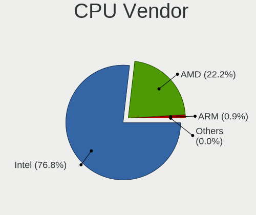
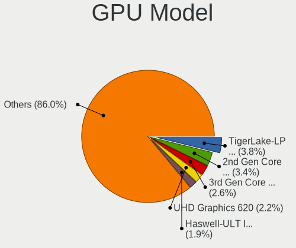

Ubuntu 22.04 - Tested Hardware & Statistics
-------------------------------------------

A project to collect tested hardware configurations for Ubuntu 22.04.

Anyone can contribute to this report by the [hw-probe](https://github.com/linuxhw/hw-probe) tool:

    sudo -E hw-probe -all -upload

Please contribute! Especially if your hardware is rare.

This is a report for all computer types. See also reports for [desktops](/Dist/Ubuntu_22.04/Desktop/README.md) and [notebooks](/Dist/Ubuntu_22.04/Notebook/README.md).

Contents
--------

* [ Test Cases ](#test-cases)

* [ System ](#system)
  - [ Kernel                   ](#kernel)
  - [ Kernel Family            ](#kernel-family)
  - [ Kernel Major Ver.        ](#kernel-major-ver)
  - [ Arch                     ](#arch)
  - [ DE                       ](#de)
  - [ Display Server           ](#display-server)
  - [ Display Manager          ](#display-manager)
  - [ OS Lang                  ](#os-lang)
  - [ Boot Mode                ](#boot-mode)
  - [ Filesystem               ](#filesystem)
  - [ Part. scheme             ](#part-scheme)
  - [ Dual Boot with Linux/BSD ](#dual-boot-with-linuxbsd)
  - [ Dual Boot (Win)          ](#dual-boot-win)

* [ Board ](#board)
  - [ Vendor                   ](#vendor)
  - [ Model                    ](#model)
  - [ Model Family             ](#model-family)
  - [ MFG Year                 ](#mfg-year)
  - [ Form Factor              ](#form-factor)
  - [ Secure Boot              ](#secure-boot)
  - [ Coreboot                 ](#coreboot)
  - [ RAM Size                 ](#ram-size)
  - [ RAM Used                 ](#ram-used)
  - [ Total Drives             ](#total-drives)
  - [ Has CD-ROM               ](#has-cd-rom)
  - [ Has Ethernet             ](#has-ethernet)
  - [ Has WiFi                 ](#has-wifi)
  - [ Has Bluetooth            ](#has-bluetooth)

* [ Location ](#location)
  - [ Country                  ](#country)
  - [ City                     ](#city)

* [ Drives ](#drives)
  - [ Drive Vendor             ](#drive-vendor)
  - [ Drive Model              ](#drive-model)
  - [ HDD Vendor               ](#hdd-vendor)
  - [ SSD Vendor               ](#ssd-vendor)
  - [ Drive Kind               ](#drive-kind)
  - [ Drive Connector          ](#drive-connector)
  - [ Drive Size               ](#drive-size)
  - [ Space Total              ](#space-total)
  - [ Space Used               ](#space-used)
  - [ Malfunc. Drives          ](#malfunc-drives)
  - [ Malfunc. Drive Vendor    ](#malfunc-drive-vendor)
  - [ Malfunc. HDD Vendor      ](#malfunc-hdd-vendor)
  - [ Malfunc. Drive Kind      ](#malfunc-drive-kind)
  - [ Failed Drives            ](#failed-drives)
  - [ Failed Drive Vendor      ](#failed-drive-vendor)
  - [ Drive Status             ](#drive-status)

* [ Storage controller ](#storage-controller)
  - [ Storage Vendor           ](#storage-vendor)
  - [ Storage Model            ](#storage-model)
  - [ Storage Kind             ](#storage-kind)

* [ Processor ](#processor)
  - [ CPU Vendor               ](#cpu-vendor)
  - [ CPU Model                ](#cpu-model)
  - [ CPU Model Family         ](#cpu-model-family)
  - [ CPU Cores                ](#cpu-cores)
  - [ CPU Sockets              ](#cpu-sockets)
  - [ CPU Threads              ](#cpu-threads)
  - [ CPU Op-Modes             ](#cpu-op-modes)
  - [ CPU Microcode            ](#cpu-microcode)
  - [ CPU Microarch            ](#cpu-microarch)

* [ Graphics ](#graphics)
  - [ GPU Vendor               ](#gpu-vendor)
  - [ GPU Model                ](#gpu-model)
  - [ GPU Combo                ](#gpu-combo)
  - [ GPU Driver               ](#gpu-driver)
  - [ GPU Memory               ](#gpu-memory)

* [ Monitor ](#monitor)
  - [ Monitor Vendor           ](#monitor-vendor)
  - [ Monitor Model            ](#monitor-model)
  - [ Monitor Resolution       ](#monitor-resolution)
  - [ Monitor Diagonal         ](#monitor-diagonal)
  - [ Monitor Width            ](#monitor-width)
  - [ Aspect Ratio             ](#aspect-ratio)
  - [ Monitor Area             ](#monitor-area)
  - [ Pixel Density            ](#pixel-density)
  - [ Multiple Monitors        ](#multiple-monitors)

* [ Network ](#network)
  - [ Net Controller Vendor    ](#net-controller-vendor)
  - [ Net Controller Model     ](#net-controller-model)
  - [ Wireless Vendor          ](#wireless-vendor)
  - [ Wireless Model           ](#wireless-model)
  - [ Ethernet Vendor          ](#ethernet-vendor)
  - [ Ethernet Model           ](#ethernet-model)
  - [ Net Controller Kind      ](#net-controller-kind)
  - [ Used Controller          ](#used-controller)
  - [ NICs                     ](#nics)
  - [ IPv6                     ](#ipv6)

* [ Bluetooth ](#bluetooth)
  - [ Bluetooth Vendor         ](#bluetooth-vendor)
  - [ Bluetooth Model          ](#bluetooth-model)

* [ Sound ](#sound)
  - [ Sound Vendor             ](#sound-vendor)
  - [ Sound Model              ](#sound-model)

* [ Memory ](#memory)
  - [ Memory Vendor            ](#memory-vendor)
  - [ Memory Model             ](#memory-model)
  - [ Memory Kind              ](#memory-kind)
  - [ Memory Form Factor       ](#memory-form-factor)
  - [ Memory Size              ](#memory-size)
  - [ Memory Speed             ](#memory-speed)

* [ Printers & scanners ](#printers--scanners)
  - [ Printer Vendor           ](#printer-vendor)
  - [ Printer Model            ](#printer-model)
  - [ Scanner Vendor           ](#scanner-vendor)
  - [ Scanner Model            ](#scanner-model)

* [ Camera ](#camera)
  - [ Camera Vendor            ](#camera-vendor)
  - [ Camera Model             ](#camera-model)

* [ Security ](#security)
  - [ Fingerprint Vendor       ](#fingerprint-vendor)
  - [ Fingerprint Model        ](#fingerprint-model)
  - [ Chipcard Vendor          ](#chipcard-vendor)
  - [ Chipcard Model           ](#chipcard-model)

* [ Unsupported ](#unsupported)
  - [ Unsupported Devices      ](#unsupported-devices)
  - [ Unsupported Device Types ](#unsupported-device-types)

Test Cases
----------

Total: 12166

| Vendor        | Model                       | Form-Factor | Probe                                                      | Date         |
|---------------|-----------------------------|-------------|------------------------------------------------------------|--------------|
| VENTURER      | WT9L10C44GD1E               | Tablet      | [16d09653ec](https://linux-hardware.org/?probe=16d09653ec) | May 01, 2023 |
| ASUSTek       | X550CC                      | Notebook    | [cc784397f9](https://linux-hardware.org/?probe=cc784397f9) | May 01, 2023 |
| ASUSTek       | PRIME H610M-E D4            | Desktop     | [56db7fc27f](https://linux-hardware.org/?probe=56db7fc27f) | May 01, 2023 |
| ASRock        | 970 Pro3 R2.0               | Desktop     | [577b5e8f51](https://linux-hardware.org/?probe=577b5e8f51) | May 01, 2023 |
| ASUSTek       | PRIME Z690M-PLUS D4         | Desktop     | [27fdafaf01](https://linux-hardware.org/?probe=27fdafaf01) | May 01, 2023 |
| Gigabyte      | Z77MX-D3H                   | Desktop     | [fa4e32fe2c](https://linux-hardware.org/?probe=fa4e32fe2c) | May 01, 2023 |
| Dell          | Latitude 3420               | Notebook    | [327be624ce](https://linux-hardware.org/?probe=327be624ce) | May 01, 2023 |
| Dell          | 09KPNV A01                  | Desktop     | [45dad4b8e9](https://linux-hardware.org/?probe=45dad4b8e9) | May 01, 2023 |
| Acer          | Aspire A715-51G             | Notebook    | [842333a8da](https://linux-hardware.org/?probe=842333a8da) | May 01, 2023 |
| Dell          | Latitude 3420               | Notebook    | [1ce0c58a17](https://linux-hardware.org/?probe=1ce0c58a17) | May 01, 2023 |
| ASRock        | B660M-HDV                   | Desktop     | [a137e6ab62](https://linux-hardware.org/?probe=a137e6ab62) | May 01, 2023 |
| Lenovo        | ThinkPad T480 20L6A0LJCL    | Notebook    | [f67154866c](https://linux-hardware.org/?probe=f67154866c) | May 01, 2023 |
| Acer          | Nitro AN517-54              | Notebook    | [593a6b247f](https://linux-hardware.org/?probe=593a6b247f) | May 01, 2023 |
| Acer          | Aspire A715-51G             | Notebook    | [4f72daaab8](https://linux-hardware.org/?probe=4f72daaab8) | May 01, 2023 |
| HP            | EliteBook 8470p             | Notebook    | [f75b4a9457](https://linux-hardware.org/?probe=f75b4a9457) | May 01, 2023 |
| Unknown       | Unknown                     | Notebook    | [8978b9aa5f](https://linux-hardware.org/?probe=8978b9aa5f) | May 01, 2023 |
| ASUSTek       | PRIME Z690-P WIFI           | Desktop     | [4f0b170b70](https://linux-hardware.org/?probe=4f0b170b70) | May 01, 2023 |
| ASUSTek       | PRIME B550M-A AC            | Desktop     | [f10c443a56](https://linux-hardware.org/?probe=f10c443a56) | May 01, 2023 |
| Fanless Mi... | Rev GMLR1                   | Mini pc     | [1f1cb63edc](https://linux-hardware.org/?probe=1f1cb63edc) | May 01, 2023 |
| HP            | Unknown                     | Notebook    | [475eb33956](https://linux-hardware.org/?probe=475eb33956) | May 01, 2023 |
| Dell          | 07PR60 A00                  | Desktop     | [e6f49bbe8a](https://linux-hardware.org/?probe=e6f49bbe8a) | Apr 30, 2023 |
| ASUSTek       | H81-PLUS                    | Desktop     | [3b45144d62](https://linux-hardware.org/?probe=3b45144d62) | Apr 30, 2023 |
| Gigabyte      | EP45-UD3P                   | Desktop     | [8d99ef5cc7](https://linux-hardware.org/?probe=8d99ef5cc7) | Apr 30, 2023 |
| ASUSTek       | H81I-PLUS                   | Desktop     | [01578538eb](https://linux-hardware.org/?probe=01578538eb) | Apr 30, 2023 |
| Unknown       | Unknown                     | Notebook    | [070854df6b](https://linux-hardware.org/?probe=070854df6b) | Apr 30, 2023 |
| MSI           | PRO Z690-A WIFI             | Desktop     | [bfa4eb5eda](https://linux-hardware.org/?probe=bfa4eb5eda) | Apr 30, 2023 |
| ASRock        | B550M Steel Legend          | Desktop     | [68d85dd28f](https://linux-hardware.org/?probe=68d85dd28f) | Apr 30, 2023 |
| ASRock        | B550M Steel Legend          | Desktop     | [5166f820a6](https://linux-hardware.org/?probe=5166f820a6) | Apr 30, 2023 |
| ASRock        | 960GM-GS3 FX                | Desktop     | [392492c032](https://linux-hardware.org/?probe=392492c032) | Apr 30, 2023 |
| Lenovo        | Z50-75 80EC                 | Notebook    | [af5d37f4f7](https://linux-hardware.org/?probe=af5d37f4f7) | Apr 30, 2023 |
| ATOPNUC       | MA90                        | Mini pc     | [cd65d9e917](https://linux-hardware.org/?probe=cd65d9e917) | Apr 30, 2023 |
| ASUSTek       | VivoBook_ASUSLaptop X580... | Notebook    | [05251702aa](https://linux-hardware.org/?probe=05251702aa) | Apr 30, 2023 |
| Medion        | H81H3-EM2                   | Desktop     | [c85a3da4ab](https://linux-hardware.org/?probe=c85a3da4ab) | Apr 30, 2023 |
| Gigabyte      | TRX40 AORUS XTREME          | Desktop     | [a88277b7f9](https://linux-hardware.org/?probe=a88277b7f9) | Apr 30, 2023 |
| Lenovo        | IdeaPad L340-17API 81LY     | Notebook    | [44c60dcec2](https://linux-hardware.org/?probe=44c60dcec2) | Apr 30, 2023 |
| ASRock        | H110M-DGS R3.0              | Desktop     | [88e7444fa5](https://linux-hardware.org/?probe=88e7444fa5) | Apr 30, 2023 |
| Dell          | Vostro 3558                 | Notebook    | [5d77d7d922](https://linux-hardware.org/?probe=5d77d7d922) | Apr 30, 2023 |
| ASRock        | H110M-DGS R3.0              | Desktop     | [763e7fa1b6](https://linux-hardware.org/?probe=763e7fa1b6) | Apr 30, 2023 |
| ASUSTek       | VivoBook_ASUSLaptop X580... | Notebook    | [94118ab632](https://linux-hardware.org/?probe=94118ab632) | Apr 30, 2023 |
| HP            | Pavilion Laptop 14-ec0xx... | Notebook    | [d4cfc1e964](https://linux-hardware.org/?probe=d4cfc1e964) | Apr 30, 2023 |
| Dell          | XPS 13 9350                 | Notebook    | [95b5e79487](https://linux-hardware.org/?probe=95b5e79487) | Apr 30, 2023 |
| Acer          | Aspire E5-551G              | Notebook    | [bba2f8d1ad](https://linux-hardware.org/?probe=bba2f8d1ad) | Apr 30, 2023 |
| ASRock        | B450M Steel Legend          | Desktop     | [fed083feba](https://linux-hardware.org/?probe=fed083feba) | Apr 30, 2023 |
| Dell          | Vostro 5468                 | Notebook    | [93eb16d30d](https://linux-hardware.org/?probe=93eb16d30d) | Apr 30, 2023 |
| HP            | Pavilion Laptop 15-cc5xx    | Notebook    | [28b11100ac](https://linux-hardware.org/?probe=28b11100ac) | Apr 30, 2023 |
| ATOPNUC       | MA90                        | Mini pc     | [005ec25893](https://linux-hardware.org/?probe=005ec25893) | Apr 30, 2023 |
| Gateway       | P-7805u                     | Notebook    | [0958f250f2](https://linux-hardware.org/?probe=0958f250f2) | Apr 30, 2023 |
| Maibenben     | MaiBook X series            | Notebook    | [5f97e34b20](https://linux-hardware.org/?probe=5f97e34b20) | Apr 30, 2023 |
| Dell          | G15 5511                    | Notebook    | [7d5f166e7a](https://linux-hardware.org/?probe=7d5f166e7a) | Apr 30, 2023 |
| Dell          | XPS 13 7390                 | Notebook    | [c5000ec967](https://linux-hardware.org/?probe=c5000ec967) | Apr 30, 2023 |
| Apple         | Mac-F226BEC8 PVT            | All in one  | [7521d3d742](https://linux-hardware.org/?probe=7521d3d742) | Apr 30, 2023 |
| Apple         | Mac-F226BEC8 PVT            | All in one  | [e3371ae2dc](https://linux-hardware.org/?probe=e3371ae2dc) | Apr 30, 2023 |
| Lenovo        | V130-15IGM 81HL             | Notebook    | [ff24454021](https://linux-hardware.org/?probe=ff24454021) | Apr 29, 2023 |
| Dell          | 00V62H A00                  | Desktop     | [86cb104ceb](https://linux-hardware.org/?probe=86cb104ceb) | Apr 29, 2023 |
| ASUSTek       | VivoBook_ASUSLaptop X712... | Notebook    | [272103e5a7](https://linux-hardware.org/?probe=272103e5a7) | Apr 29, 2023 |
| ASUSTek       | G56JR                       | Notebook    | [b7eb868ec4](https://linux-hardware.org/?probe=b7eb868ec4) | Apr 29, 2023 |
| ASUSTek       | PRIME X470-PRO              | Desktop     | [244cfe88a4](https://linux-hardware.org/?probe=244cfe88a4) | Apr 29, 2023 |
| Acer          | TravelMate 5730             | Notebook    | [e74d115d0d](https://linux-hardware.org/?probe=e74d115d0d) | Apr 29, 2023 |
| ASRock        | N68C-S UCC                  | Desktop     | [13628f3559](https://linux-hardware.org/?probe=13628f3559) | Apr 29, 2023 |
| Lenovo        | V130-15IGM 81HL             | Notebook    | [9081fc703d](https://linux-hardware.org/?probe=9081fc703d) | Apr 29, 2023 |
| Apple         | Mac-8ED6AF5B48C039E1 Mac... | Mini pc     | [bf82bebb69](https://linux-hardware.org/?probe=bf82bebb69) | Apr 29, 2023 |
| Dell          | Inspiron 7773               | Notebook    | [19741ac2ea](https://linux-hardware.org/?probe=19741ac2ea) | Apr 29, 2023 |
| Acer          | Aspire A515-51G             | Notebook    | [bd4c84da60](https://linux-hardware.org/?probe=bd4c84da60) | Apr 29, 2023 |
| ASUSTek       | H110M-D                     | Desktop     | [81cff8a578](https://linux-hardware.org/?probe=81cff8a578) | Apr 29, 2023 |
| Gigabyte      | Z790 UD                     | Desktop     | [536a24a0e3](https://linux-hardware.org/?probe=536a24a0e3) | Apr 29, 2023 |
| ASRock        | N68C-S UCC                  | Desktop     | [f7f4643b8f](https://linux-hardware.org/?probe=f7f4643b8f) | Apr 29, 2023 |
| Gigabyte      | H310M H x.x                 | Desktop     | [6b44ad5061](https://linux-hardware.org/?probe=6b44ad5061) | Apr 29, 2023 |
| Gigabyte      | H310M H x.x                 | Desktop     | [ce73a703b6](https://linux-hardware.org/?probe=ce73a703b6) | Apr 29, 2023 |
| YANYU         | EPIC-N56_I522E Ver          | Desktop     | [4798ab5c06](https://linux-hardware.org/?probe=4798ab5c06) | Apr 29, 2023 |
| Lenovo        | ThinkPad E14 Gen 2 20TBS... | Notebook    | [21d008c7d8](https://linux-hardware.org/?probe=21d008c7d8) | Apr 29, 2023 |
| Lenovo        | ThinkPad E14 Gen 2 20TBS... | Notebook    | [49557b8214](https://linux-hardware.org/?probe=49557b8214) | Apr 29, 2023 |
| ASUSTek       | PRIME B450M-K               | Desktop     | [3592ce514a](https://linux-hardware.org/?probe=3592ce514a) | Apr 29, 2023 |
| Lenovo        | ThinkPad T16 Gen 1 21CH0... | Notebook    | [7598c18042](https://linux-hardware.org/?probe=7598c18042) | Apr 29, 2023 |
| Gigabyte      | G41MT-S2                    | Desktop     | [ba5c65f4e3](https://linux-hardware.org/?probe=ba5c65f4e3) | Apr 29, 2023 |
| Lenovo        | XXXX 3000 H210              | Desktop     | [96644846f5](https://linux-hardware.org/?probe=96644846f5) | Apr 29, 2023 |
| Dell          | Latitude E5470              | Notebook    | [c6c943679f](https://linux-hardware.org/?probe=c6c943679f) | Apr 29, 2023 |
| Dell          | 0T0MHW A02                  | Desktop     | [4f08178f96](https://linux-hardware.org/?probe=4f08178f96) | Apr 29, 2023 |
| ASUSTek       | X756UVK                     | Notebook    | [72ba8fbf57](https://linux-hardware.org/?probe=72ba8fbf57) | Apr 29, 2023 |
| ECS           | H81H3-M4                    | Desktop     | [67da6cebd3](https://linux-hardware.org/?probe=67da6cebd3) | Apr 29, 2023 |
| Dell          | Latitude 3301               | Notebook    | [3a0aad0e75](https://linux-hardware.org/?probe=3a0aad0e75) | Apr 29, 2023 |
| Dell          | Precision M6600             | Notebook    | [39d9af4736](https://linux-hardware.org/?probe=39d9af4736) | Apr 28, 2023 |
| Lenovo        | IdeaPadFlex 5 15IIL05 81... | Convertible | [e1f824b7e1](https://linux-hardware.org/?probe=e1f824b7e1) | Apr 28, 2023 |
| Dell          | Inspiron 3180               | Notebook    | [bc3400a372](https://linux-hardware.org/?probe=bc3400a372) | Apr 28, 2023 |
| Dell          | Inspiron 15-3567            | Notebook    | [5dcd15cacf](https://linux-hardware.org/?probe=5dcd15cacf) | Apr 28, 2023 |
| Gigabyte      | GA-78LMT-S2                 | Desktop     | [16b28befee](https://linux-hardware.org/?probe=16b28befee) | Apr 28, 2023 |
| Dell          | 0773VG A02                  | Desktop     | [bd3dba564e](https://linux-hardware.org/?probe=bd3dba564e) | Apr 28, 2023 |
| Dell          | 0773VG A02                  | Desktop     | [cab1aa59e0](https://linux-hardware.org/?probe=cab1aa59e0) | Apr 28, 2023 |
| MSI           | B550M PRO-VDH WIFI          | Desktop     | [e0367e684f](https://linux-hardware.org/?probe=e0367e684f) | Apr 28, 2023 |
| MSI           | B550M PRO-VDH WIFI          | Desktop     | [fed0a1a719](https://linux-hardware.org/?probe=fed0a1a719) | Apr 28, 2023 |
| Dell          | Latitude E5450              | Notebook    | [85fb3ec2fd](https://linux-hardware.org/?probe=85fb3ec2fd) | Apr 28, 2023 |
| Acer          | Aspire ES1-731              | Notebook    | [140e5eb8fc](https://linux-hardware.org/?probe=140e5eb8fc) | Apr 28, 2023 |
| ASUSTek       | Z87-PLUS                    | Desktop     | [7477be45f8](https://linux-hardware.org/?probe=7477be45f8) | Apr 28, 2023 |
| ASUSTek       | PRIME X370-PRO              | Desktop     | [ddb48a2def](https://linux-hardware.org/?probe=ddb48a2def) | Apr 28, 2023 |
| Lenovo        | 1048 SDK0Q40104 WIN 3915... | Desktop     | [43942fab0f](https://linux-hardware.org/?probe=43942fab0f) | Apr 28, 2023 |
| Acer          | Swift SF314-57G             | Notebook    | [6fd79b811f](https://linux-hardware.org/?probe=6fd79b811f) | Apr 28, 2023 |
| HP            | Laptop 15-ef2xxx            | Notebook    | [f922f80a69](https://linux-hardware.org/?probe=f922f80a69) | Apr 28, 2023 |
| ASUSTek       | PRIME X670-P WIFI           | Desktop     | [a6eba14ab4](https://linux-hardware.org/?probe=a6eba14ab4) | Apr 28, 2023 |
| Pegatron      | A15                         | Notebook    | [e9de945dce](https://linux-hardware.org/?probe=e9de945dce) | Apr 28, 2023 |
| Dell          | 0WMJ54 A01                  | Desktop     | [01c8d89ab9](https://linux-hardware.org/?probe=01c8d89ab9) | Apr 28, 2023 |
| Lenovo        | ThinkPad L480 20LTS1NK27    | Notebook    | [6569669912](https://linux-hardware.org/?probe=6569669912) | Apr 28, 2023 |
| Lenovo        | V15 G2 ITL Ua 82KB          | Notebook    | [65f390b956](https://linux-hardware.org/?probe=65f390b956) | Apr 28, 2023 |
| Lenovo        | Dory CRB                    | Desktop     | [f8aee85cd4](https://linux-hardware.org/?probe=f8aee85cd4) | Apr 28, 2023 |
| Apple         | Mac-27ADBB7B4CEE8E61 iMa... | All in one  | [00d8186404](https://linux-hardware.org/?probe=00d8186404) | Apr 28, 2023 |
| Apple         | Mac-27ADBB7B4CEE8E61 iMa... | All in one  | [50e1b8e197](https://linux-hardware.org/?probe=50e1b8e197) | Apr 28, 2023 |
| MSI           | H310M PRO-M2 PLUS           | Desktop     | [815dd8e866](https://linux-hardware.org/?probe=815dd8e866) | Apr 28, 2023 |
| ASUSTek       | P8H67-M PRO                 | Desktop     | [589810ee4b](https://linux-hardware.org/?probe=589810ee4b) | Apr 28, 2023 |
| Gigabyte      | Z490 AORUS ULTRA            | Desktop     | [96371860f5](https://linux-hardware.org/?probe=96371860f5) | Apr 28, 2023 |
| Toshiba       | TECRA Z40-C                 | Notebook    | [a72fdebd89](https://linux-hardware.org/?probe=a72fdebd89) | Apr 28, 2023 |
| Toshiba       | TECRA Z40-C                 | Notebook    | [31bdde77c9](https://linux-hardware.org/?probe=31bdde77c9) | Apr 28, 2023 |
| Toshiba       | TECRA Z40-C                 | Notebook    | [eb550390c1](https://linux-hardware.org/?probe=eb550390c1) | Apr 28, 2023 |
| Dell          | Latitude 3301               | Notebook    | [855564b077](https://linux-hardware.org/?probe=855564b077) | Apr 28, 2023 |
| ASUSTek       | T100TA                      | Notebook    | [7c34e35183](https://linux-hardware.org/?probe=7c34e35183) | Apr 28, 2023 |
| HP            | 21D0                        | Desktop     | [a26451e82c](https://linux-hardware.org/?probe=a26451e82c) | Apr 28, 2023 |
| ASUSTek       | T100TA                      | Notebook    | [266477f792](https://linux-hardware.org/?probe=266477f792) | Apr 28, 2023 |
| ASUSTek       | TUF Gaming Z690-PLUS WIF... | Desktop     | [d138bfdf52](https://linux-hardware.org/?probe=d138bfdf52) | Apr 28, 2023 |
| ASRock        | A75M-HVS                    | Desktop     | [528362dfca](https://linux-hardware.org/?probe=528362dfca) | Apr 28, 2023 |
| Lenovo        | Dory CRB                    | Desktop     | [f4d7a6ed92](https://linux-hardware.org/?probe=f4d7a6ed92) | Apr 28, 2023 |
| Unknown       | RS780-SB700                 | Desktop     | [94f2408a63](https://linux-hardware.org/?probe=94f2408a63) | Apr 28, 2023 |
| Unknown       | RS780-SB700                 | Desktop     | [76c36882d9](https://linux-hardware.org/?probe=76c36882d9) | Apr 28, 2023 |
| Apple         | MacBookPro6,2               | Notebook    | [ceaa38e624](https://linux-hardware.org/?probe=ceaa38e624) | Apr 28, 2023 |
| Lenovo        | Yoga 710-14IKB 80V4         | Convertible | [dbcb0ed35f](https://linux-hardware.org/?probe=dbcb0ed35f) | Apr 27, 2023 |
| Dell          | 0WMJ54 A01                  | Desktop     | [3d73e4cd7e](https://linux-hardware.org/?probe=3d73e4cd7e) | Apr 27, 2023 |
| Intel         | DH87RL AAG74240-403         | Desktop     | [54b1c509f2](https://linux-hardware.org/?probe=54b1c509f2) | Apr 27, 2023 |
| Apple         | Mac-F60DEB81FF30ACF6 Mac... | Desktop     | [49033dd76c](https://linux-hardware.org/?probe=49033dd76c) | Apr 27, 2023 |
| MSI           | X99A GAMING 9 ACK           | Desktop     | [3d79f67248](https://linux-hardware.org/?probe=3d79f67248) | Apr 27, 2023 |
| Gigabyte      | G5 GD                       | Notebook    | [d09d6fb712](https://linux-hardware.org/?probe=d09d6fb712) | Apr 27, 2023 |
| HP            | Compaq 6910p                | Notebook    | [049253c0c8](https://linux-hardware.org/?probe=049253c0c8) | Apr 27, 2023 |
| TUXEDO        | Unknown                     | Notebook    | [5108a05d49](https://linux-hardware.org/?probe=5108a05d49) | Apr 27, 2023 |
| Dell          | 0HHV7N A00                  | Desktop     | [33517b7bfe](https://linux-hardware.org/?probe=33517b7bfe) | Apr 27, 2023 |
| ASUSTek       | CROSSBLADE RANGER           | Desktop     | [641d7d0398](https://linux-hardware.org/?probe=641d7d0398) | Apr 27, 2023 |
| Dell          | XPS 13 7390                 | Notebook    | [318ea8ad1e](https://linux-hardware.org/?probe=318ea8ad1e) | Apr 27, 2023 |
| Lenovo        | ThinkCentre M71e 3129B8G    | Desktop     | [2b6c3d498a](https://linux-hardware.org/?probe=2b6c3d498a) | Apr 27, 2023 |
| Gigabyte      | Z97P-D3                     | Desktop     | [40b51d3cae](https://linux-hardware.org/?probe=40b51d3cae) | Apr 27, 2023 |
| HP            | 18E7                        | Desktop     | [c6a760cb50](https://linux-hardware.org/?probe=c6a760cb50) | Apr 27, 2023 |
| Dell          | XPS 15 9520                 | Notebook    | [07572e6599](https://linux-hardware.org/?probe=07572e6599) | Apr 27, 2023 |
| ASUSTek       | H110M-A                     | Desktop     | [1fa553ab02](https://linux-hardware.org/?probe=1fa553ab02) | Apr 27, 2023 |
| Lenovo        | IdeaPad 5 14ALC05 82LM      | Notebook    | [f428173506](https://linux-hardware.org/?probe=f428173506) | Apr 27, 2023 |
| ASUSTek       | TUF Gaming X570-PLUS        | Desktop     | [3e8fe7fed4](https://linux-hardware.org/?probe=3e8fe7fed4) | Apr 27, 2023 |
| Lenovo        | V14 G2 ITL 82NM             | Notebook    | [6a56164bfd](https://linux-hardware.org/?probe=6a56164bfd) | Apr 27, 2023 |
| HP            | Pavilion Laptop 15-cc5xx    | Notebook    | [9344f38032](https://linux-hardware.org/?probe=9344f38032) | Apr 27, 2023 |
| ASUSTek       | TUF Gaming B450M-PLUS II    | Desktop     | [9211d42ee3](https://linux-hardware.org/?probe=9211d42ee3) | Apr 27, 2023 |
| Lenovo        | 318D                        | All in one  | [8cf49b59a5](https://linux-hardware.org/?probe=8cf49b59a5) | Apr 27, 2023 |
| Lenovo        | IdeaPad 3 15ALC6 82MF       | Notebook    | [393c7b06d5](https://linux-hardware.org/?probe=393c7b06d5) | Apr 26, 2023 |
| Lenovo        | IdeaPad Y510P 20217         | Notebook    | [e35780d356](https://linux-hardware.org/?probe=e35780d356) | Apr 26, 2023 |
| HP            | 3047h                       | Desktop     | [3e6dada8a9](https://linux-hardware.org/?probe=3e6dada8a9) | Apr 26, 2023 |
| ECS           | G41T-R3                     | Desktop     | [fcbdd2737a](https://linux-hardware.org/?probe=fcbdd2737a) | Apr 26, 2023 |
| ASRock        | H61M-VG4                    | Desktop     | [a8e7de2e0b](https://linux-hardware.org/?probe=a8e7de2e0b) | Apr 26, 2023 |
| Toshiba       | Satellite Pro S500          | Notebook    | [7a2503959a](https://linux-hardware.org/?probe=7a2503959a) | Apr 26, 2023 |
| Lenovo        | ThinkPad X250 20CLA003TA    | Notebook    | [ea8109c2a7](https://linux-hardware.org/?probe=ea8109c2a7) | Apr 26, 2023 |
| MSI           | MAG B550M MORTAR            | Desktop     | [f91ac46cfd](https://linux-hardware.org/?probe=f91ac46cfd) | Apr 26, 2023 |
| Sony          | SVD1322X2EW                 | Notebook    | [2574ef07fb](https://linux-hardware.org/?probe=2574ef07fb) | Apr 26, 2023 |
| HP            | 1825                        | Desktop     | [5a26051aec](https://linux-hardware.org/?probe=5a26051aec) | Apr 26, 2023 |
| Gigabyte      | Z370M D3H-CF                | Desktop     | [ada8ff75dd](https://linux-hardware.org/?probe=ada8ff75dd) | Apr 26, 2023 |
| Acer          | Aspire A515-45              | Notebook    | [d910b01835](https://linux-hardware.org/?probe=d910b01835) | Apr 26, 2023 |
| MSI           | B450-A PRO MAX              | Desktop     | [2d7c2dd8f9](https://linux-hardware.org/?probe=2d7c2dd8f9) | Apr 26, 2023 |
| Lenovo        | 36C5 SDK0K17763 WIN 1801... | Desktop     | [45c453eb4e](https://linux-hardware.org/?probe=45c453eb4e) | Apr 26, 2023 |
| Lenovo        | 36C5 SDK0K17763 WIN 1801... | Desktop     | [b79a40ebdc](https://linux-hardware.org/?probe=b79a40ebdc) | Apr 26, 2023 |
| ASUSTek       | X99-A                       | Desktop     | [6788eea8d2](https://linux-hardware.org/?probe=6788eea8d2) | Apr 26, 2023 |
| HP            | OMEN by Laptop 15-dh1xxx    | Notebook    | [3c104a89ef](https://linux-hardware.org/?probe=3c104a89ef) | Apr 26, 2023 |
| MSI           | PRO Z690-A WIFI             | Desktop     | [23c9be7614](https://linux-hardware.org/?probe=23c9be7614) | Apr 26, 2023 |
| Dell          | Vostro 15 3510              | Notebook    | [81cae0ba77](https://linux-hardware.org/?probe=81cae0ba77) | Apr 26, 2023 |
| Dell          | XPS 15 9500                 | Notebook    | [e37d368767](https://linux-hardware.org/?probe=e37d368767) | Apr 26, 2023 |
| Pegatron      | IPXSB-H61                   | Desktop     | [2b0ee4d542](https://linux-hardware.org/?probe=2b0ee4d542) | Apr 26, 2023 |
| HP            | EliteBook Folio 9470m       | Notebook    | [e0d69966e9](https://linux-hardware.org/?probe=e0d69966e9) | Apr 26, 2023 |
| ASUSTek       | ROG Strix G731GT_GL731GT    | Notebook    | [940cbb6ef0](https://linux-hardware.org/?probe=940cbb6ef0) | Apr 26, 2023 |
| Lenovo        | IdeaPad 3 15IML05 81WR      | Notebook    | [5daf26faca](https://linux-hardware.org/?probe=5daf26faca) | Apr 26, 2023 |
| System76      | Gazelle                     | Notebook    | [dbf4d8b33d](https://linux-hardware.org/?probe=dbf4d8b33d) | Apr 26, 2023 |
| Dell          | Precision M6600             | Notebook    | [4f5cd6d28e](https://linux-hardware.org/?probe=4f5cd6d28e) | Apr 26, 2023 |
| HP            | Tablet 11m-be0xxx           | Tablet      | [169454762c](https://linux-hardware.org/?probe=169454762c) | Apr 26, 2023 |
| Apple         | Mac-35C5E08120C7EEAF Mac... | Mini pc     | [e97953e840](https://linux-hardware.org/?probe=e97953e840) | Apr 26, 2023 |
| Lenovo        | Y720-15IKB 80VR             | Notebook    | [c9ef115a29](https://linux-hardware.org/?probe=c9ef115a29) | Apr 26, 2023 |
| Lenovo        | ThinkPad T430 2349UKM       | Notebook    | [6adb010c7a](https://linux-hardware.org/?probe=6adb010c7a) | Apr 25, 2023 |
| Acer          | Aspire E1-571               | Notebook    | [c6a1179816](https://linux-hardware.org/?probe=c6a1179816) | Apr 25, 2023 |
| Timi          | Mi NoteBook Ultra           | Notebook    | [b6b7cdfe22](https://linux-hardware.org/?probe=b6b7cdfe22) | Apr 25, 2023 |
| Acer          | Nitro AN517-42              | Notebook    | [5e54d08f91](https://linux-hardware.org/?probe=5e54d08f91) | Apr 25, 2023 |
| Intel         | NUC8v7PNB K59971-402        | Mini pc     | [2d07bfb282](https://linux-hardware.org/?probe=2d07bfb282) | Apr 25, 2023 |
| ASUSTek       | PRIME B450M-A               | Desktop     | [d8c1be05af](https://linux-hardware.org/?probe=d8c1be05af) | Apr 25, 2023 |
| Avell High... | A70 HYB BS                  | Notebook    | [c7b5f9ef04](https://linux-hardware.org/?probe=c7b5f9ef04) | Apr 25, 2023 |
| Dell          | XPS 13 9310                 | Notebook    | [b9bc4703a8](https://linux-hardware.org/?probe=b9bc4703a8) | Apr 25, 2023 |
| ASUSTek       | PRIME X570-P                | Desktop     | [290f3ebad7](https://linux-hardware.org/?probe=290f3ebad7) | Apr 25, 2023 |
| Acer          | Aspire X3995                | Desktop     | [877c9deb7a](https://linux-hardware.org/?probe=877c9deb7a) | Apr 25, 2023 |
| Biostar       | A68N-5600E                  | Desktop     | [ccaeaae27b](https://linux-hardware.org/?probe=ccaeaae27b) | Apr 25, 2023 |
| Gigabyte      | GA-78LMT-S2P                | Desktop     | [4668a2409b](https://linux-hardware.org/?probe=4668a2409b) | Apr 25, 2023 |
| Acer          | Predator G3-605             | Desktop     | [37cd92a7f0](https://linux-hardware.org/?probe=37cd92a7f0) | Apr 25, 2023 |
| Acer          | Predator G3-605             | Desktop     | [0b966e7b88](https://linux-hardware.org/?probe=0b966e7b88) | Apr 25, 2023 |
| Gigabyte      | GA-78LMT-S2P                | Desktop     | [7b091628e5](https://linux-hardware.org/?probe=7b091628e5) | Apr 25, 2023 |
| Radxa         | ROCK 5B                     | Soc         | [592fea8754](https://linux-hardware.org/?probe=592fea8754) | Apr 25, 2023 |
| Acer          | Aspire 5920G                | Notebook    | [c6387003fc](https://linux-hardware.org/?probe=c6387003fc) | Apr 25, 2023 |
| Gigabyte      | Z270X-UD3-CF                | Desktop     | [06fbe4d0b6](https://linux-hardware.org/?probe=06fbe4d0b6) | Apr 25, 2023 |
| Dell          | Latitude 5490               | Notebook    | [32ddaf898c](https://linux-hardware.org/?probe=32ddaf898c) | Apr 25, 2023 |
| HP            | 255 G5 Notebook PC          | Notebook    | [c542c2df7e](https://linux-hardware.org/?probe=c542c2df7e) | Apr 25, 2023 |
| Lenovo        | ThinkPad E14 Gen 2 20T60... | Notebook    | [3a7c24a13f](https://linux-hardware.org/?probe=3a7c24a13f) | Apr 25, 2023 |
| ASUSTek       | VivoBook 15_ASUS Laptop ... | Notebook    | [7d5bd7e8fa](https://linux-hardware.org/?probe=7d5bd7e8fa) | Apr 25, 2023 |
| ASUSTek       | PRIME Z790-P                | Desktop     | [c7fdbbb95b](https://linux-hardware.org/?probe=c7fdbbb95b) | Apr 25, 2023 |
| ASUSTek       | VivoBook 15_ASUS Laptop ... | Notebook    | [24bf298df5](https://linux-hardware.org/?probe=24bf298df5) | Apr 25, 2023 |
| Lenovo        | ThinkPad Edge E545 20B20... | Notebook    | [fd66f3852a](https://linux-hardware.org/?probe=fd66f3852a) | Apr 25, 2023 |
| ASUSTek       | PRIME Z790-P                | Desktop     | [363bb28966](https://linux-hardware.org/?probe=363bb28966) | Apr 25, 2023 |
| Notebook      | W650EH                      | Notebook    | [8e848e589e](https://linux-hardware.org/?probe=8e848e589e) | Apr 25, 2023 |
| OEM           | HN B85 Ver:1.4              | Desktop     | [1da5934b27](https://linux-hardware.org/?probe=1da5934b27) | Apr 25, 2023 |
| Gigabyte      | B450M DS3H WIFI-CF          | Desktop     | [1a58c88206](https://linux-hardware.org/?probe=1a58c88206) | Apr 25, 2023 |
| Lenovo        | Y720-15IKB 80VR             | Notebook    | [1602540ab8](https://linux-hardware.org/?probe=1602540ab8) | Apr 25, 2023 |
| ASUSTek       | ASUS TUF Gaming F17 FX70... | Notebook    | [5fd25f9235](https://linux-hardware.org/?probe=5fd25f9235) | Apr 25, 2023 |
| ASUSTek       | M4A78LT-M                   | Desktop     | [11f1e291a7](https://linux-hardware.org/?probe=11f1e291a7) | Apr 25, 2023 |
| HP            | 2B21 A01                    | All in one  | [2eec2836c7](https://linux-hardware.org/?probe=2eec2836c7) | Apr 25, 2023 |
| Intel         | NUC12WSBi5 M46425-302       | Mini pc     | [6d981e0d7c](https://linux-hardware.org/?probe=6d981e0d7c) | Apr 25, 2023 |
| Intel         | NUC12WSBi5 M46425-302       | Mini pc     | [2e4cd9799b](https://linux-hardware.org/?probe=2e4cd9799b) | Apr 25, 2023 |
| ASUSTek       | PRIME X670-P                | Notebook    | [37f98c9450](https://linux-hardware.org/?probe=37f98c9450) | Apr 25, 2023 |
| ASUSTek       | M3A                         | Desktop     | [c16000b1e4](https://linux-hardware.org/?probe=c16000b1e4) | Apr 25, 2023 |
| Dell          | Inspiron 3543               | Notebook    | [2a3020f392](https://linux-hardware.org/?probe=2a3020f392) | Apr 24, 2023 |
| Lenovo        | SHARKBAY 0B98401 PRO        | Desktop     | [342918aa38](https://linux-hardware.org/?probe=342918aa38) | Apr 24, 2023 |
| ASUSTek       | X510UQR                     | Notebook    | [4a2e357ace](https://linux-hardware.org/?probe=4a2e357ace) | Apr 24, 2023 |
| ASUSTek       | VivoBook_ASUSLaptop X515... | Notebook    | [9e926f5c65](https://linux-hardware.org/?probe=9e926f5c65) | Apr 24, 2023 |
| Dell          | Vostro 15 3515              | Notebook    | [13c75fa32e](https://linux-hardware.org/?probe=13c75fa32e) | Apr 24, 2023 |
| INSYS         | PT1-140C                    | Notebook    | [902536abce](https://linux-hardware.org/?probe=902536abce) | Apr 24, 2023 |
| Lenovo        | G700                        | Notebook    | [75ee4cf99d](https://linux-hardware.org/?probe=75ee4cf99d) | Apr 24, 2023 |
| Lenovo        | 313A NOK                    | Desktop     | [34a521ebad](https://linux-hardware.org/?probe=34a521ebad) | Apr 24, 2023 |
| MSI           | H110M ECO                   | Desktop     | [bfa2b17374](https://linux-hardware.org/?probe=bfa2b17374) | Apr 24, 2023 |
| Dell          | System XPS L502X            | Notebook    | [4fd4992d0f](https://linux-hardware.org/?probe=4fd4992d0f) | Apr 24, 2023 |
| ASUSTek       | ROG Strix G531GT_G531GT     | Notebook    | [253f35c2c3](https://linux-hardware.org/?probe=253f35c2c3) | Apr 24, 2023 |
| Dell          | Inspiron 15 5510            | Notebook    | [c8f22361f6](https://linux-hardware.org/?probe=c8f22361f6) | Apr 24, 2023 |
| Lenovo        | IdeaPad Gaming 3 15IMH05... | Notebook    | [2787d97e6e](https://linux-hardware.org/?probe=2787d97e6e) | Apr 24, 2023 |
| Fujitsu       | LIFEBOOK S751               | Notebook    | [e01b26f35f](https://linux-hardware.org/?probe=e01b26f35f) | Apr 24, 2023 |
| Dell          | 0VTJVC A00                  | Desktop     | [da7d66917d](https://linux-hardware.org/?probe=da7d66917d) | Apr 24, 2023 |
| HP            | Laptop 15-db0xxx            | Notebook    | [2ab42d58bf](https://linux-hardware.org/?probe=2ab42d58bf) | Apr 24, 2023 |
| HP            | Laptop 15-db0xxx            | Notebook    | [8c5aea6211](https://linux-hardware.org/?probe=8c5aea6211) | Apr 24, 2023 |
| ASUSTek       | STRIX B250I GAMING          | Desktop     | [beabf00341](https://linux-hardware.org/?probe=beabf00341) | Apr 24, 2023 |
| Fujitsu       | D3221-A1 S26361-D3221-A1    | Desktop     | [e18fd8d449](https://linux-hardware.org/?probe=e18fd8d449) | Apr 24, 2023 |
| Gigabyte      | Z590 AORUS ELITE AX         | Desktop     | [ed8414c493](https://linux-hardware.org/?probe=ed8414c493) | Apr 24, 2023 |
| ASUSTek       | CROSSHAIR V FORMULA-Z       | Desktop     | [267c5b8075](https://linux-hardware.org/?probe=267c5b8075) | Apr 24, 2023 |
| Dell          | Inspiron 3542               | Notebook    | [9f4ce3c5a4](https://linux-hardware.org/?probe=9f4ce3c5a4) | Apr 24, 2023 |
| Gigabyte      | Z590 AORUS ELITE AX         | Desktop     | [695220be38](https://linux-hardware.org/?probe=695220be38) | Apr 24, 2023 |
| LG Electro... | 16Z90Q-G.AD78F              | Notebook    | [99bbc09adb](https://linux-hardware.org/?probe=99bbc09adb) | Apr 24, 2023 |
| Lenovo        | 32E9 SDK0T76463 WIN 3422... | Desktop     | [9f49daf25a](https://linux-hardware.org/?probe=9f49daf25a) | Apr 24, 2023 |
| Lenovo        | 32E9 SDK0T76463 WIN 3422... | Desktop     | [cc7a31d3d6](https://linux-hardware.org/?probe=cc7a31d3d6) | Apr 24, 2023 |
| ASUSTek       | PRIME X370-PRO              | Desktop     | [eb716c53fa](https://linux-hardware.org/?probe=eb716c53fa) | Apr 24, 2023 |
| Intel         | NUC7i5DNB J57626-503        | Mini pc     | [861b0673a0](https://linux-hardware.org/?probe=861b0673a0) | Apr 24, 2023 |
| Gigabyte      | G41MT-S2                    | Desktop     | [de1981f9e6](https://linux-hardware.org/?probe=de1981f9e6) | Apr 24, 2023 |
| ATOPNUC       | MA90                        | Mini pc     | [0e78b7aad8](https://linux-hardware.org/?probe=0e78b7aad8) | Apr 24, 2023 |
| Lenovo        | ThinkPad T440s 20ARS16G0... | Notebook    | [b019f5af89](https://linux-hardware.org/?probe=b019f5af89) | Apr 24, 2023 |
| HP            | ProBook 450 G7              | Notebook    | [57f0ae7486](https://linux-hardware.org/?probe=57f0ae7486) | Apr 24, 2023 |
| Gigabyte      | B550M AORUS ELITE           | Desktop     | [39fd6ad31f](https://linux-hardware.org/?probe=39fd6ad31f) | Apr 24, 2023 |
| ASUSTek       | PRIME X670-P                | Notebook    | [ebe7f36c99](https://linux-hardware.org/?probe=ebe7f36c99) | Apr 23, 2023 |
| Lenovo        | IdeaPad 330-15IKB 81FE      | Notebook    | [e562ba35c6](https://linux-hardware.org/?probe=e562ba35c6) | Apr 23, 2023 |
| ASUSTek       | P5G41T-M LX                 | Desktop     | [68d1859c93](https://linux-hardware.org/?probe=68d1859c93) | Apr 23, 2023 |
| HP            | 350 G2                      | Notebook    | [ffa4ab3dc0](https://linux-hardware.org/?probe=ffa4ab3dc0) | Apr 23, 2023 |
| Samsung       | R510/P510                   | Notebook    | [4b58936ad7](https://linux-hardware.org/?probe=4b58936ad7) | Apr 23, 2023 |
| HP            | G42                         | Notebook    | [1d5b2eefc3](https://linux-hardware.org/?probe=1d5b2eefc3) | Apr 23, 2023 |
| Lenovo        | ThinkPad X220 4290EC5       | Notebook    | [f6fe80f275](https://linux-hardware.org/?probe=f6fe80f275) | Apr 23, 2023 |
| MSI           | Bravo 15 B5DD               | Notebook    | [180f1dd402](https://linux-hardware.org/?probe=180f1dd402) | Apr 23, 2023 |
| Dell          | Latitude 5591               | Notebook    | [b4dfa57eea](https://linux-hardware.org/?probe=b4dfa57eea) | Apr 23, 2023 |
| Gigabyte      | Z97P-D3                     | Desktop     | [5da4c37f75](https://linux-hardware.org/?probe=5da4c37f75) | Apr 23, 2023 |
| Sony          | SVD1322X2EW                 | Notebook    | [1652ce4c8f](https://linux-hardware.org/?probe=1652ce4c8f) | Apr 23, 2023 |
| HP            | EliteBook 840 G8 Noteboo... | Notebook    | [18fc5f09ed](https://linux-hardware.org/?probe=18fc5f09ed) | Apr 23, 2023 |
| Dell          | Latitude 5591               | Notebook    | [1a45f96f80](https://linux-hardware.org/?probe=1a45f96f80) | Apr 23, 2023 |
| Acer          | Aspire A515-57              | Notebook    | [23f076b6d3](https://linux-hardware.org/?probe=23f076b6d3) | Apr 23, 2023 |
| Lenovo        | 36C5 SDK0K17763 WIN 1801... | Desktop     | [e653a5dd45](https://linux-hardware.org/?probe=e653a5dd45) | Apr 23, 2023 |
| HP            | Pavilion dv7                | Notebook    | [0ca422761e](https://linux-hardware.org/?probe=0ca422761e) | Apr 23, 2023 |
| Lenovo        | 36C5 SDK0K17763 WIN 1801... | Desktop     | [95e77b87f5](https://linux-hardware.org/?probe=95e77b87f5) | Apr 23, 2023 |
| ASUSTek       | STRIX B250I GAMING          | Desktop     | [0e96ee4471](https://linux-hardware.org/?probe=0e96ee4471) | Apr 23, 2023 |
| Gigabyte      | GA-78LMT-S2P                | Desktop     | [793e094165](https://linux-hardware.org/?probe=793e094165) | Apr 23, 2023 |
| Dell          | Latitude E7240              | Notebook    | [1b5828d441](https://linux-hardware.org/?probe=1b5828d441) | Apr 23, 2023 |
| Gigabyte      | TRX40 AORUS XTREME          | Desktop     | [eac9934073](https://linux-hardware.org/?probe=eac9934073) | Apr 23, 2023 |
| ASUSTek       | UX310UA                     | Notebook    | [a7b628ab1c](https://linux-hardware.org/?probe=a7b628ab1c) | Apr 23, 2023 |
| ASUSTek       | Maximus VII FORMULA         | Desktop     | [0d45b24479](https://linux-hardware.org/?probe=0d45b24479) | Apr 23, 2023 |
| Gigabyte      | Z97M-DS3H                   | Desktop     | [652e029529](https://linux-hardware.org/?probe=652e029529) | Apr 23, 2023 |
| Gigabyte      | GA-78LMT-S2P                | Desktop     | [b342cd8fe0](https://linux-hardware.org/?probe=b342cd8fe0) | Apr 23, 2023 |
| Intel         | DH61BE AAG14062-206         | Desktop     | [c1817da6ab](https://linux-hardware.org/?probe=c1817da6ab) | Apr 23, 2023 |
| Lenovo        | ThinkBook 14 G4 IAP 21DH    | Notebook    | [aa23589794](https://linux-hardware.org/?probe=aa23589794) | Apr 23, 2023 |
| Gigabyte      | 970A-DS3P                   | Desktop     | [4a55a10fd0](https://linux-hardware.org/?probe=4a55a10fd0) | Apr 23, 2023 |
| ASUSTek       | ROG Strix G513IM_G513IM     | Notebook    | [99e0054492](https://linux-hardware.org/?probe=99e0054492) | Apr 23, 2023 |
| ASUSTek       | PRIME Z390-A                | Desktop     | [3fc4048a96](https://linux-hardware.org/?probe=3fc4048a96) | Apr 23, 2023 |
| ASUSTek       | ROG Strix G513IM_G513IM     | Notebook    | [86b56d3e69](https://linux-hardware.org/?probe=86b56d3e69) | Apr 23, 2023 |
| Toshiba       | Satellite Pro S500          | Notebook    | [fcf8a7bdb4](https://linux-hardware.org/?probe=fcf8a7bdb4) | Apr 23, 2023 |
| Sony          | VPCF13M1E                   | Notebook    | [023cbeeac3](https://linux-hardware.org/?probe=023cbeeac3) | Apr 23, 2023 |
| HP            | ENVY x360 2-in-1 Laptop ... | Convertible | [bdfb512e83](https://linux-hardware.org/?probe=bdfb512e83) | Apr 23, 2023 |
| ASUSTek       | Z87-PRO                     | Desktop     | [08ebdd71ab](https://linux-hardware.org/?probe=08ebdd71ab) | Apr 23, 2023 |
| Lenovo        | IdeaPadFlex 5 16IAU7 82R... | Convertible | [975df3ff0a](https://linux-hardware.org/?probe=975df3ff0a) | Apr 22, 2023 |
| MSI           | MPG X570S CARBON MAX WIF... | Desktop     | [1c85c89b5d](https://linux-hardware.org/?probe=1c85c89b5d) | Apr 22, 2023 |
| Lenovo        | ThinkPad T420 4236EJ3       | Notebook    | [77a309dcf1](https://linux-hardware.org/?probe=77a309dcf1) | Apr 22, 2023 |
| HUAWEI        | NBLK-WAX9X                  | Notebook    | [25e942e55c](https://linux-hardware.org/?probe=25e942e55c) | Apr 22, 2023 |
| Lenovo        | ThinkPad T420 4236EJ3       | Notebook    | [4c60675864](https://linux-hardware.org/?probe=4c60675864) | Apr 22, 2023 |
| System76      | Thelio thelio-r1            | Desktop     | [d48efc62c4](https://linux-hardware.org/?probe=d48efc62c4) | Apr 22, 2023 |
| Medion        | E2291                       | Convertible | [bd8f1509fd](https://linux-hardware.org/?probe=bd8f1509fd) | Apr 22, 2023 |
| HUAWEI        | KLVL-WXXW                   | Notebook    | [13b6b127e6](https://linux-hardware.org/?probe=13b6b127e6) | Apr 22, 2023 |
| ASUSTek       | Zenbook UX3402ZA_UX3402Z... | Notebook    | [adab9d9f6b](https://linux-hardware.org/?probe=adab9d9f6b) | Apr 22, 2023 |
| Apple         | MacBookPro11,5              | Notebook    | [7a873a7baa](https://linux-hardware.org/?probe=7a873a7baa) | Apr 22, 2023 |
| MSI           | MPG X570S CARBON MAX WIF... | Desktop     | [1404fc66cf](https://linux-hardware.org/?probe=1404fc66cf) | Apr 22, 2023 |
| Dell          | Latitude E6500              | Notebook    | [5de8825606](https://linux-hardware.org/?probe=5de8825606) | Apr 22, 2023 |
| HP            | Pavilion g7                 | Notebook    | [785e97ad3d](https://linux-hardware.org/?probe=785e97ad3d) | Apr 22, 2023 |
| HP            | Pavilion g7                 | Notebook    | [0e6f1d6bf7](https://linux-hardware.org/?probe=0e6f1d6bf7) | Apr 22, 2023 |
| Gigabyte      | Z390 UD                     | Desktop     | [c9e17ad011](https://linux-hardware.org/?probe=c9e17ad011) | Apr 22, 2023 |
| Medion        | Akoya E7416T                | Notebook    | [da5ea2c44b](https://linux-hardware.org/?probe=da5ea2c44b) | Apr 22, 2023 |
| Unknown       | M-140BI5                    | Notebook    | [32ba023e2a](https://linux-hardware.org/?probe=32ba023e2a) | Apr 22, 2023 |
| Intel         | H81                         | Desktop     | [fbc2766f35](https://linux-hardware.org/?probe=fbc2766f35) | Apr 22, 2023 |
| Acer          | Aspire E5-772               | Notebook    | [edfa9fcbef](https://linux-hardware.org/?probe=edfa9fcbef) | Apr 22, 2023 |
| Lenovo        | Z50-70 20354                | Notebook    | [76f54ae42f](https://linux-hardware.org/?probe=76f54ae42f) | Apr 22, 2023 |
| Gigabyte      | Z790 UD                     | Desktop     | [8536a23081](https://linux-hardware.org/?probe=8536a23081) | Apr 22, 2023 |
| HP            | EliteBook 2570p             | Notebook    | [a26039eb50](https://linux-hardware.org/?probe=a26039eb50) | Apr 22, 2023 |
| Gigabyte      | 990FXA-UD3                  | Desktop     | [bab80153bf](https://linux-hardware.org/?probe=bab80153bf) | Apr 22, 2023 |
| HP            | EliteBook 2570p             | Notebook    | [7e7a982c3c](https://linux-hardware.org/?probe=7e7a982c3c) | Apr 22, 2023 |
| Lenovo        | N22 80S6                    | Notebook    | [e915245bfd](https://linux-hardware.org/?probe=e915245bfd) | Apr 22, 2023 |
| HP            | ProBook 4540s               | Notebook    | [12ee30d786](https://linux-hardware.org/?probe=12ee30d786) | Apr 22, 2023 |
| MSI           | Z77A-G41                    | Desktop     | [9cd2294229](https://linux-hardware.org/?probe=9cd2294229) | Apr 22, 2023 |
| ASUSTek       | PRIME X570-P                | Desktop     | [f23eeda727](https://linux-hardware.org/?probe=f23eeda727) | Apr 22, 2023 |
| AMI           | Cherry Trail CR             | Notebook    | [325dfde573](https://linux-hardware.org/?probe=325dfde573) | Apr 22, 2023 |
| HP            | ENVY x360 2-in-1 Laptop ... | Convertible | [ff635615f8](https://linux-hardware.org/?probe=ff635615f8) | Apr 22, 2023 |
| Lenovo        | IdeaPadFlex 5 16IAU7 82R... | Convertible | [74252f133b](https://linux-hardware.org/?probe=74252f133b) | Apr 22, 2023 |
| Lenovo        | ThinkPad E15 Gen 4 21E60... | Notebook    | [3056a65306](https://linux-hardware.org/?probe=3056a65306) | Apr 22, 2023 |
| MSI           | B550-A PRO                  | Desktop     | [06bc639254](https://linux-hardware.org/?probe=06bc639254) | Apr 22, 2023 |
| Samsung       | 730QED                      | Convertible | [169e09b4b0](https://linux-hardware.org/?probe=169e09b4b0) | Apr 22, 2023 |
| HP            | Pavilion 15                 | Notebook    | [ac3f0ac1d5](https://linux-hardware.org/?probe=ac3f0ac1d5) | Apr 21, 2023 |
| HP            | Pavilion 15                 | Notebook    | [877b05303e](https://linux-hardware.org/?probe=877b05303e) | Apr 21, 2023 |
| Gigabyte      | TRX40 AORUS XTREME          | Desktop     | [d4d3e7f8d6](https://linux-hardware.org/?probe=d4d3e7f8d6) | Apr 21, 2023 |
| HP            | Pavilion Gaming Laptop 1... | Notebook    | [2a507e00bf](https://linux-hardware.org/?probe=2a507e00bf) | Apr 21, 2023 |
| Gigabyte      | AERO 16 KE5                 | Notebook    | [9e4fe316b8](https://linux-hardware.org/?probe=9e4fe316b8) | Apr 21, 2023 |
| HP            | Compaq 6735s                | Notebook    | [9a23d08368](https://linux-hardware.org/?probe=9a23d08368) | Apr 21, 2023 |
| Lenovo        | IdeaPad 110-15ISK 80UD      | Notebook    | [52cfdbde2d](https://linux-hardware.org/?probe=52cfdbde2d) | Apr 21, 2023 |
| MSI           | IONA                        | Desktop     | [3820fb6576](https://linux-hardware.org/?probe=3820fb6576) | Apr 21, 2023 |
| HP            | Compaq 6735s                | Notebook    | [6b255d5f07](https://linux-hardware.org/?probe=6b255d5f07) | Apr 21, 2023 |
| Apple         | Mac-35C5E08120C7EEAF Mac... | Mini pc     | [18391e6b6e](https://linux-hardware.org/?probe=18391e6b6e) | Apr 21, 2023 |
| Shuttle       | FG45 V10                    | Desktop     | [b5a9d7b1e4](https://linux-hardware.org/?probe=b5a9d7b1e4) | Apr 21, 2023 |
| Dell          | Precision M6600             | Notebook    | [6f80333ca9](https://linux-hardware.org/?probe=6f80333ca9) | Apr 21, 2023 |
| HP            | EliteBook 2540p             | Notebook    | [b2a6b1a66d](https://linux-hardware.org/?probe=b2a6b1a66d) | Apr 21, 2023 |
| ASUSTek       | ROG Strix G513IH_G513IH     | Notebook    | [af72838c03](https://linux-hardware.org/?probe=af72838c03) | Apr 21, 2023 |
| ASUSTek       | ZenBook UX333FN_RX333FN     | Notebook    | [8027ff2b04](https://linux-hardware.org/?probe=8027ff2b04) | Apr 21, 2023 |
| ASRock        | H81M-HDS R2.0               | Desktop     | [eaf8476afd](https://linux-hardware.org/?probe=eaf8476afd) | Apr 21, 2023 |
| Dell          | Latitude 7280               | Notebook    | [1359a75ba3](https://linux-hardware.org/?probe=1359a75ba3) | Apr 21, 2023 |
| Medion        | S15449                      | Notebook    | [c63e98624a](https://linux-hardware.org/?probe=c63e98624a) | Apr 21, 2023 |
| HP            | Pavilion Sleekbook 15       | Notebook    | [644ea805a9](https://linux-hardware.org/?probe=644ea805a9) | Apr 21, 2023 |
| Medion        | S15449                      | Notebook    | [914511ca07](https://linux-hardware.org/?probe=914511ca07) | Apr 21, 2023 |
| Dell          | Latitude E6500              | Notebook    | [363b443628](https://linux-hardware.org/?probe=363b443628) | Apr 21, 2023 |
| Unknown       | Unknown                     | Desktop     | [be207ea29f](https://linux-hardware.org/?probe=be207ea29f) | Apr 21, 2023 |
| Apple         | Mac-B809C3757DA9BB8D iMa... | All in one  | [f1227ea669](https://linux-hardware.org/?probe=f1227ea669) | Apr 21, 2023 |
| Apple         | Mac-B809C3757DA9BB8D iMa... | All in one  | [6b0104f339](https://linux-hardware.org/?probe=6b0104f339) | Apr 21, 2023 |
| Intel         | NUC11TNBi7 M11895-402       | Mini pc     | [62990532fe](https://linux-hardware.org/?probe=62990532fe) | Apr 21, 2023 |
| Lenovo        | ThinkPad E15 Gen 3 20YG0... | Notebook    | [6dcb6d41ef](https://linux-hardware.org/?probe=6dcb6d41ef) | Apr 21, 2023 |
| HP            | 1825                        | Desktop     | [e586a2657b](https://linux-hardware.org/?probe=e586a2657b) | Apr 21, 2023 |
| Lenovo        | IdeaPad 5 Pro 14ACN6 82L... | Notebook    | [6e2da1e766](https://linux-hardware.org/?probe=6e2da1e766) | Apr 21, 2023 |
| Google        | Swanky                      | Notebook    | [92156daf53](https://linux-hardware.org/?probe=92156daf53) | Apr 21, 2023 |
| HP            | 1494                        | Desktop     | [625373a1de](https://linux-hardware.org/?probe=625373a1de) | Apr 21, 2023 |
| Lenovo        | ThinkPad T490 20N2CTO1WW    | Notebook    | [acbe851404](https://linux-hardware.org/?probe=acbe851404) | Apr 21, 2023 |
| ASUSTek       | PRIME B360M-A               | Desktop     | [61d7104ec4](https://linux-hardware.org/?probe=61d7104ec4) | Apr 21, 2023 |
| Dell          | 0RY206                      | Desktop     | [8290af518f](https://linux-hardware.org/?probe=8290af518f) | Apr 21, 2023 |
| Lenovo        | ThinkPad W530 2436CTO       | Notebook    | [74d9f6c0d6](https://linux-hardware.org/?probe=74d9f6c0d6) | Apr 21, 2023 |
| HP            | EliteBook 2540p             | Notebook    | [be19bcd7de](https://linux-hardware.org/?probe=be19bcd7de) | Apr 21, 2023 |
| PC Special... | TN1-156M                    | Notebook    | [ef6b57e807](https://linux-hardware.org/?probe=ef6b57e807) | Apr 21, 2023 |
| Lenovo        | IdeaPad S530-13IWL 81J7     | Notebook    | [167000be9b](https://linux-hardware.org/?probe=167000be9b) | Apr 21, 2023 |
| Dell          | Vostro 3550                 | Notebook    | [21111146cd](https://linux-hardware.org/?probe=21111146cd) | Apr 21, 2023 |
| Dell          | G15 5510                    | Notebook    | [43d4ce3c37](https://linux-hardware.org/?probe=43d4ce3c37) | Apr 21, 2023 |
| HP            | Notebook                    | Notebook    | [150b1d6ae7](https://linux-hardware.org/?probe=150b1d6ae7) | Apr 21, 2023 |
| ASUSTek       | PRIME TRX40-PRO S           | Desktop     | [b2ac72f8d9](https://linux-hardware.org/?probe=b2ac72f8d9) | Apr 20, 2023 |
| HP            | ProLiant MicroServer        | Desktop     | [ea76b8632f](https://linux-hardware.org/?probe=ea76b8632f) | Apr 20, 2023 |
| ASUSTek       | PRIME TRX40-PRO S           | Desktop     | [4748a2ce89](https://linux-hardware.org/?probe=4748a2ce89) | Apr 20, 2023 |
| ASRock        | G31M-S                      | Desktop     | [7c2bfcaeca](https://linux-hardware.org/?probe=7c2bfcaeca) | Apr 20, 2023 |
| Acer          | Aspire M3970                | Desktop     | [d43372f3fd](https://linux-hardware.org/?probe=d43372f3fd) | Apr 20, 2023 |
| UMAX          | VisionBook 14Wa Pro         | Notebook    | [525241657b](https://linux-hardware.org/?probe=525241657b) | Apr 20, 2023 |
| UMAX          | VisionBook 14Wa Pro         | Notebook    | [07e2728dfe](https://linux-hardware.org/?probe=07e2728dfe) | Apr 20, 2023 |
| Infinix       | INBOOK X2 GEN11             | Notebook    | [cac51ecb89](https://linux-hardware.org/?probe=cac51ecb89) | Apr 20, 2023 |
| Infinix       | INBOOK X2 GEN11             | Notebook    | [7fea1a73bc](https://linux-hardware.org/?probe=7fea1a73bc) | Apr 20, 2023 |
| Gigabyte      | Z97M-DS3H                   | Desktop     | [904089ce14](https://linux-hardware.org/?probe=904089ce14) | Apr 20, 2023 |
| ASUSTek       | TUF Gaming B560M-PLUS       | Desktop     | [42ca23ca64](https://linux-hardware.org/?probe=42ca23ca64) | Apr 20, 2023 |
| Acer          | Aspire Z5770                | All in one  | [2e34d8a2cc](https://linux-hardware.org/?probe=2e34d8a2cc) | Apr 20, 2023 |
| ASUSTek       | TUF Gaming B560M-PLUS       | Desktop     | [e315ba7088](https://linux-hardware.org/?probe=e315ba7088) | Apr 20, 2023 |
| MSI           | GF63 Thin 9SC               | Notebook    | [fbed7350fc](https://linux-hardware.org/?probe=fbed7350fc) | Apr 20, 2023 |
| Timi          | A34R                        | Notebook    | [310e4d7b63](https://linux-hardware.org/?probe=310e4d7b63) | Apr 20, 2023 |
| ASUSTek       | TUF Gaming B550M-PLUS       | Desktop     | [f5da23bee0](https://linux-hardware.org/?probe=f5da23bee0) | Apr 20, 2023 |
| Intel         | NUC10i3FNB M38070-307       | Mini pc     | [bca816c594](https://linux-hardware.org/?probe=bca816c594) | Apr 20, 2023 |
| Dell          | Latitude E6410              | Notebook    | [52ada88fb1](https://linux-hardware.org/?probe=52ada88fb1) | Apr 20, 2023 |
| ASUSTek       | ROG STRIX X670E-E GAMING... | Desktop     | [e367a9a4ab](https://linux-hardware.org/?probe=e367a9a4ab) | Apr 20, 2023 |
| Intel         | S2600WTTR G92187-366        | Server      | [9bb50174ef](https://linux-hardware.org/?probe=9bb50174ef) | Apr 20, 2023 |
| Dell          | 0DPRKF A01                  | Server      | [51412400ba](https://linux-hardware.org/?probe=51412400ba) | Apr 20, 2023 |
| Fujitsu       | D3498-A1 S26361-D3498-A1    | Desktop     | [f20338e169](https://linux-hardware.org/?probe=f20338e169) | Apr 20, 2023 |
| ASUSTek       | PRIME B550M-A               | Desktop     | [2c6da4e91f](https://linux-hardware.org/?probe=2c6da4e91f) | Apr 20, 2023 |
| ASUSTek       | H87M-PLUS                   | Desktop     | [472922fafd](https://linux-hardware.org/?probe=472922fafd) | Apr 20, 2023 |
| Intel         | DP67BA AAG10219-303         | Desktop     | [a1b9ea4fd9](https://linux-hardware.org/?probe=a1b9ea4fd9) | Apr 20, 2023 |
| Intel         | DX58SO2 AAG10925-207        | Desktop     | [4e31c5af6b](https://linux-hardware.org/?probe=4e31c5af6b) | Apr 20, 2023 |
| Intel         | DP67BA AAG10219-303         | Desktop     | [27a629fd15](https://linux-hardware.org/?probe=27a629fd15) | Apr 20, 2023 |
| ASUSTek       | PRIME B550M-A               | Desktop     | [f3a680d9bc](https://linux-hardware.org/?probe=f3a680d9bc) | Apr 20, 2023 |
| Fujitsu       | D3348-A1 S26361-D3348-A1    | Desktop     | [96d5a26185](https://linux-hardware.org/?probe=96d5a26185) | Apr 20, 2023 |
| Fujitsu       | D3417-A2 S26361-D3417-A2    | Desktop     | [b6306c2e97](https://linux-hardware.org/?probe=b6306c2e97) | Apr 20, 2023 |
| Fujitsu       | D3517-A1 S26361-D3517-A1    | Desktop     | [fbedbcb213](https://linux-hardware.org/?probe=fbedbcb213) | Apr 20, 2023 |
| ASUSTek       | X99-S                       | Desktop     | [6e77ac0ec9](https://linux-hardware.org/?probe=6e77ac0ec9) | Apr 20, 2023 |
| Fujitsu       | D3417-A2 S26361-D3417-A2    | Desktop     | [c1b2a75484](https://linux-hardware.org/?probe=c1b2a75484) | Apr 20, 2023 |
| Fujitsu       | D3617-A1 S26361-D3617-A1    | Desktop     | [756eccb961](https://linux-hardware.org/?probe=756eccb961) | Apr 20, 2023 |
| Gigabyte      | H97-HD3                     | Desktop     | [ef04208d0f](https://linux-hardware.org/?probe=ef04208d0f) | Apr 20, 2023 |
| Fujitsu       | D3417-A2 S26361-D3417-A2    | Desktop     | [c419c9200f](https://linux-hardware.org/?probe=c419c9200f) | Apr 20, 2023 |
| ASUSTek       | X99-S                       | Desktop     | [1be8dc273c](https://linux-hardware.org/?probe=1be8dc273c) | Apr 20, 2023 |
| Intel         | S2600WTTR G92187-366        | Server      | [d765a92052](https://linux-hardware.org/?probe=d765a92052) | Apr 20, 2023 |
| ASUSTek       | PRIME Z490M-PLUS            | Desktop     | [244222ae5c](https://linux-hardware.org/?probe=244222ae5c) | Apr 20, 2023 |
| ASUSTek       | PRIME H270M-PLUS            | Desktop     | [f77fe53c69](https://linux-hardware.org/?probe=f77fe53c69) | Apr 20, 2023 |
| Dell          | 08NPPY A00                  | Desktop     | [7d49aa5207](https://linux-hardware.org/?probe=7d49aa5207) | Apr 20, 2023 |
| ASUSTek       | STRIX Z270F GAMING          | Desktop     | [d53ce13aa3](https://linux-hardware.org/?probe=d53ce13aa3) | Apr 20, 2023 |
| ASRock        | B550M Pro4                  | Desktop     | [ec13e17577](https://linux-hardware.org/?probe=ec13e17577) | Apr 20, 2023 |
| ASUSTek       | PRIME Z390-P                | Desktop     | [9fde2b21fc](https://linux-hardware.org/?probe=9fde2b21fc) | Apr 20, 2023 |
| ASUSTek       | G35CG                       | Desktop     | [ddc7ba8ccb](https://linux-hardware.org/?probe=ddc7ba8ccb) | Apr 20, 2023 |
| Fujitsu       | D3348-A2 S26361-D3348-A2    | Desktop     | [3dbd4f731c](https://linux-hardware.org/?probe=3dbd4f731c) | Apr 20, 2023 |
| ASUSTek       | PRIME X570-PRO              | Desktop     | [d46e9b11d5](https://linux-hardware.org/?probe=d46e9b11d5) | Apr 20, 2023 |
| ASUSTek       | PRIME X570-PRO              | Desktop     | [afbf28c15a](https://linux-hardware.org/?probe=afbf28c15a) | Apr 20, 2023 |
| ASUSTek       | PRIME Z370-A II             | Desktop     | [f185782be2](https://linux-hardware.org/?probe=f185782be2) | Apr 20, 2023 |
| ASUSTek       | PRIME X570-PRO              | Desktop     | [731671f1b8](https://linux-hardware.org/?probe=731671f1b8) | Apr 20, 2023 |
| ASUSTek       | PRIME X570-PRO              | Desktop     | [463c62da83](https://linux-hardware.org/?probe=463c62da83) | Apr 20, 2023 |
| Fujitsu       | D3517-A1 S26361-D3517-A1    | Desktop     | [0356125777](https://linux-hardware.org/?probe=0356125777) | Apr 20, 2023 |
| ASUSTek       | PRIME Z490M-PLUS            | Desktop     | [0a45e9e9af](https://linux-hardware.org/?probe=0a45e9e9af) | Apr 20, 2023 |
| ASUSTek       | PRIME X570-PRO              | Desktop     | [ccf2e2bbc3](https://linux-hardware.org/?probe=ccf2e2bbc3) | Apr 20, 2023 |
| ASUSTek       | PRIME B550M-A               | Desktop     | [3171099090](https://linux-hardware.org/?probe=3171099090) | Apr 20, 2023 |
| ASUSTek       | PRIME X570-PRO              | Desktop     | [032f3a72c6](https://linux-hardware.org/?probe=032f3a72c6) | Apr 20, 2023 |
| Intel         | DH87MC AAG74242-401         | Desktop     | [df7041b726](https://linux-hardware.org/?probe=df7041b726) | Apr 20, 2023 |
| ASUSTek       | P9X79 WS                    | Desktop     | [04e9cd2455](https://linux-hardware.org/?probe=04e9cd2455) | Apr 20, 2023 |
| Intel         | DP55WB AAE64798-207         | Desktop     | [0dd9e12f5a](https://linux-hardware.org/?probe=0dd9e12f5a) | Apr 20, 2023 |
| HP            | 870B                        | Desktop     | [ad6a3cc4d0](https://linux-hardware.org/?probe=ad6a3cc4d0) | Apr 20, 2023 |
| ASRock        | B760M Steel Legend WiFi     | Desktop     | [9e668ff813](https://linux-hardware.org/?probe=9e668ff813) | Apr 20, 2023 |
| Fujitsu       | D3417-A2 S26361-D3417-A2    | Desktop     | [5dc0cb1f28](https://linux-hardware.org/?probe=5dc0cb1f28) | Apr 20, 2023 |
| Medion        | GA-Z170X-Gaming 7           | Desktop     | [706cfb4c50](https://linux-hardware.org/?probe=706cfb4c50) | Apr 20, 2023 |
| Gigabyte      | H97-HD3                     | Desktop     | [b3b27e0fcf](https://linux-hardware.org/?probe=b3b27e0fcf) | Apr 20, 2023 |
| ASUSTek       | PRIME Z370-A II             | Desktop     | [bdbd8d06e2](https://linux-hardware.org/?probe=bdbd8d06e2) | Apr 20, 2023 |
| Fujitsu       | D3227-A1 S26361-D3227-A1    | Desktop     | [ff10999142](https://linux-hardware.org/?probe=ff10999142) | Apr 20, 2023 |
| ASUSTek       | PRIME B550M-A               | Desktop     | [11da8c5d96](https://linux-hardware.org/?probe=11da8c5d96) | Apr 20, 2023 |
| ASUSTek       | PRIME X570-PRO              | Desktop     | [128d16cf7f](https://linux-hardware.org/?probe=128d16cf7f) | Apr 20, 2023 |
| ASUSTek       | PRIME B550M-A               | Desktop     | [c2de2809a0](https://linux-hardware.org/?probe=c2de2809a0) | Apr 20, 2023 |
| Intel         | S2600WFT H48104-860         | Server      | [f5848d1ba2](https://linux-hardware.org/?probe=f5848d1ba2) | Apr 20, 2023 |
| ASUSTek       | PRIME B550M-A               | Desktop     | [c3a3c03c3f](https://linux-hardware.org/?probe=c3a3c03c3f) | Apr 20, 2023 |
| Fujitsu       | D3227-A1 S26361-D3227-A1    | Desktop     | [1ae9258a0d](https://linux-hardware.org/?probe=1ae9258a0d) | Apr 20, 2023 |
| Intel         | SVRBD-ROW_T G30981-503      | Server      | [5fba63c085](https://linux-hardware.org/?probe=5fba63c085) | Apr 20, 2023 |
| ASUSTek       | STRIX Z270F GAMING          | Desktop     | [ab89260502](https://linux-hardware.org/?probe=ab89260502) | Apr 20, 2023 |
| ASUSTek       | PRIME X570-PRO              | Desktop     | [3f99aeec69](https://linux-hardware.org/?probe=3f99aeec69) | Apr 20, 2023 |
| HP            | 870B                        | Desktop     | [50f654b2a0](https://linux-hardware.org/?probe=50f654b2a0) | Apr 20, 2023 |
| Fujitsu       | D3348-A1 S26361-D3348-A1    | Desktop     | [9949a0748f](https://linux-hardware.org/?probe=9949a0748f) | Apr 20, 2023 |
| ASUSTek       | PRIME Z370-A II             | Desktop     | [e3cfbf7435](https://linux-hardware.org/?probe=e3cfbf7435) | Apr 20, 2023 |
| ASUSTek       | PRIME X570-PRO              | Desktop     | [9817f90648](https://linux-hardware.org/?probe=9817f90648) | Apr 20, 2023 |
| ASUSTek       | G35CG                       | Desktop     | [cf4854d704](https://linux-hardware.org/?probe=cf4854d704) | Apr 20, 2023 |
| ASUSTek       | PRIME B550M-A               | Desktop     | [296676f929](https://linux-hardware.org/?probe=296676f929) | Apr 20, 2023 |
| ASUSTek       | PRIME Z370-A II             | Desktop     | [2eeebec1ec](https://linux-hardware.org/?probe=2eeebec1ec) | Apr 20, 2023 |
| Fujitsu       | D3417-A2 S26361-D3417-A2    | Desktop     | [68ac671aab](https://linux-hardware.org/?probe=68ac671aab) | Apr 20, 2023 |
| ASUSTek       | PRIME X370-PRO              | Desktop     | [a069d32b86](https://linux-hardware.org/?probe=a069d32b86) | Apr 20, 2023 |
| ASUSTek       | ROG STRIX Z370-F GAMING     | Desktop     | [1b1a3da7b2](https://linux-hardware.org/?probe=1b1a3da7b2) | Apr 20, 2023 |
| Gigabyte      | MZ12-HD3-00 01010101        | Server      | [def4067c8e](https://linux-hardware.org/?probe=def4067c8e) | Apr 20, 2023 |
| ASUSTek       | X99-S                       | Desktop     | [2a1fcefe29](https://linux-hardware.org/?probe=2a1fcefe29) | Apr 20, 2023 |
| ASUSTek       | PRIME B550M-A               | Desktop     | [5c54edc96d](https://linux-hardware.org/?probe=5c54edc96d) | Apr 20, 2023 |
| ASRock        | B760M Steel Legend WiFi     | Desktop     | [563e45a22a](https://linux-hardware.org/?probe=563e45a22a) | Apr 20, 2023 |
| ASUSTek       | PRIME B550M-A               | Desktop     | [0000720fb6](https://linux-hardware.org/?probe=0000720fb6) | Apr 20, 2023 |
| ASUSTek       | PRIME X570-PRO              | Desktop     | [fdda3d6276](https://linux-hardware.org/?probe=fdda3d6276) | Apr 20, 2023 |
| ASUSTek       | PRIME X570-PRO              | Desktop     | [ee95d83f31](https://linux-hardware.org/?probe=ee95d83f31) | Apr 20, 2023 |
| ASUSTek       | PRIME B550M-A               | Desktop     | [1e49dc0f67](https://linux-hardware.org/?probe=1e49dc0f67) | Apr 20, 2023 |
| Gigabyte      | MZ92-FS0-00 01010101        | Server      | [3e6b182473](https://linux-hardware.org/?probe=3e6b182473) | Apr 20, 2023 |
| MSI           | Creator Z17 A12UHST         | Notebook    | [1396746fba](https://linux-hardware.org/?probe=1396746fba) | Apr 20, 2023 |
| HP            | ZBook Studio x360 G5        | Convertible | [6d24ab2a04](https://linux-hardware.org/?probe=6d24ab2a04) | Apr 20, 2023 |
| HP            | Notebook                    | Notebook    | [36788985ec](https://linux-hardware.org/?probe=36788985ec) | Apr 20, 2023 |
| Apple         | Mac-F221BEC8                | Desktop     | [798a408c25](https://linux-hardware.org/?probe=798a408c25) | Apr 20, 2023 |
| Xunlong       | Orange Pi One               | Soc         | [5542de4f04](https://linux-hardware.org/?probe=5542de4f04) | Apr 19, 2023 |
| ASRock        | A320M-HDV                   | Desktop     | [114bd5a129](https://linux-hardware.org/?probe=114bd5a129) | Apr 19, 2023 |
| Acer          | Veriton X2632G V:1.0        | Desktop     | [0fa4554c3c](https://linux-hardware.org/?probe=0fa4554c3c) | Apr 19, 2023 |
| ASUSTek       | K501LX                      | Notebook    | [00676747c4](https://linux-hardware.org/?probe=00676747c4) | Apr 19, 2023 |
| ASUSTek       | P5G41T-M LX                 | Desktop     | [b830d8001e](https://linux-hardware.org/?probe=b830d8001e) | Apr 19, 2023 |
| Dell          | Latitude E7440              | Notebook    | [c701c43108](https://linux-hardware.org/?probe=c701c43108) | Apr 19, 2023 |
| TUXEDO        | Book XUX7 Gen11             | Notebook    | [c92f90cd3b](https://linux-hardware.org/?probe=c92f90cd3b) | Apr 19, 2023 |
| Toshiba       | Satellite C55-C             | Notebook    | [594ceb6023](https://linux-hardware.org/?probe=594ceb6023) | Apr 19, 2023 |
| Gigabyte      | Z97-HD3                     | Desktop     | [8b560b455e](https://linux-hardware.org/?probe=8b560b455e) | Apr 19, 2023 |
| Lenovo        | Yoga 510-14ISK 80UK         | Convertible | [649afe5f77](https://linux-hardware.org/?probe=649afe5f77) | Apr 19, 2023 |
| HP            | Notebook                    | Notebook    | [072fc2bf12](https://linux-hardware.org/?probe=072fc2bf12) | Apr 19, 2023 |
| HP            | ProBook x360 435 G7         | Convertible | [4c0ef2aa88](https://linux-hardware.org/?probe=4c0ef2aa88) | Apr 19, 2023 |
| HP            | 250 15.6 inch G9 Noteboo... | Notebook    | [9df9b0d25d](https://linux-hardware.org/?probe=9df9b0d25d) | Apr 19, 2023 |
| ASUSTek       | Pro WS WRX80E-SAGE SE WI... | Desktop     | [882d6f625d](https://linux-hardware.org/?probe=882d6f625d) | Apr 19, 2023 |
| HP            | Laptop 15-dw3xxx            | Notebook    | [a0cf4fd00d](https://linux-hardware.org/?probe=a0cf4fd00d) | Apr 19, 2023 |
| HP            | Laptop 15-dw3xxx            | Notebook    | [7ce26d7fd9](https://linux-hardware.org/?probe=7ce26d7fd9) | Apr 19, 2023 |
| Lenovo        | ThinkBook 15-IML 20RW       | Notebook    | [b4c6c1198f](https://linux-hardware.org/?probe=b4c6c1198f) | Apr 19, 2023 |
| Dell          | 040DDP A01                  | Desktop     | [bb212aa105](https://linux-hardware.org/?probe=bb212aa105) | Apr 19, 2023 |
| HP            | Pavilion dv7                | Notebook    | [f5c84d7a1b](https://linux-hardware.org/?probe=f5c84d7a1b) | Apr 19, 2023 |
| MSI           | PRO Z690-A WIFI             | Desktop     | [26c96a2c4b](https://linux-hardware.org/?probe=26c96a2c4b) | Apr 19, 2023 |
| MSI           | MPG B550 GAMING EDGE WIF... | Desktop     | [2822b1a8c3](https://linux-hardware.org/?probe=2822b1a8c3) | Apr 19, 2023 |
| ASUSTek       | Z87-PRO                     | Desktop     | [7981ad8440](https://linux-hardware.org/?probe=7981ad8440) | Apr 19, 2023 |
| ASUSTek       | PRIME A320M-K               | Desktop     | [8f16bcad94](https://linux-hardware.org/?probe=8f16bcad94) | Apr 19, 2023 |
| ASUSTek       | PRIME A320M-K               | Desktop     | [848607e7f1](https://linux-hardware.org/?probe=848607e7f1) | Apr 19, 2023 |
| Dell          | 040DDP A01                  | Desktop     | [2b839be032](https://linux-hardware.org/?probe=2b839be032) | Apr 19, 2023 |
| ASUSTek       | PRIME B250M-PLUS/BR         | Desktop     | [c0a82bb35a](https://linux-hardware.org/?probe=c0a82bb35a) | Apr 19, 2023 |
| ASUSTek       | UX430UNR                    | Notebook    | [d8ed935b86](https://linux-hardware.org/?probe=d8ed935b86) | Apr 19, 2023 |
| Intel         | DH61AG AAG23736-504         | Desktop     | [9a853b9c86](https://linux-hardware.org/?probe=9a853b9c86) | Apr 19, 2023 |
| Samsung       | 730QED                      | Convertible | [5897b751da](https://linux-hardware.org/?probe=5897b751da) | Apr 18, 2023 |
| TECNO         | MEGABOOK T1                 | Notebook    | [733d7d5584](https://linux-hardware.org/?probe=733d7d5584) | Apr 18, 2023 |
| ASUSTek       | ROG STRIX B450-F GAMING ... | Desktop     | [a775ede9a0](https://linux-hardware.org/?probe=a775ede9a0) | Apr 18, 2023 |
| ASUSTek       | M5A97 EVO R2.0              | Desktop     | [da85d2406d](https://linux-hardware.org/?probe=da85d2406d) | Apr 18, 2023 |
| Otazak        | iPC45                       | Convertible | [1775e826d8](https://linux-hardware.org/?probe=1775e826d8) | Apr 18, 2023 |
| Samsung       | 730QED                      | Convertible | [84ce1adcfe](https://linux-hardware.org/?probe=84ce1adcfe) | Apr 18, 2023 |
| HP            | Compaq Presario CQ70        | Notebook    | [030eff02bb](https://linux-hardware.org/?probe=030eff02bb) | Apr 18, 2023 |
| LG Electro... | White Tip Mountain FAB3     | All in one  | [5f73a9e985](https://linux-hardware.org/?probe=5f73a9e985) | Apr 18, 2023 |
| MSI           | GP65 Leopard 10SEK          | Notebook    | [3b852bad57](https://linux-hardware.org/?probe=3b852bad57) | Apr 18, 2023 |
| ASUSTek       | PRIME B250M-PLUS/BR         | Desktop     | [8bb9dc2419](https://linux-hardware.org/?probe=8bb9dc2419) | Apr 18, 2023 |
| HP            | 1825                        | Desktop     | [5c637a9ef6](https://linux-hardware.org/?probe=5c637a9ef6) | Apr 18, 2023 |
| HP            | Pavilion Laptop 15-cw0xx... | Notebook    | [e69d8250d4](https://linux-hardware.org/?probe=e69d8250d4) | Apr 18, 2023 |
| HP            | Laptop 17-cn2xxx            | Notebook    | [5b77cc21f4](https://linux-hardware.org/?probe=5b77cc21f4) | Apr 18, 2023 |
| Toshiba       | Satellite L500              | Notebook    | [0896195ea4](https://linux-hardware.org/?probe=0896195ea4) | Apr 18, 2023 |
| Toshiba       | Satellite L500              | Notebook    | [7105145a87](https://linux-hardware.org/?probe=7105145a87) | Apr 18, 2023 |
| Lenovo        | 3714 SDK0J40709 WIN 3259... | Desktop     | [ae7ea68877](https://linux-hardware.org/?probe=ae7ea68877) | Apr 18, 2023 |
| Dell          | XPS 15 9500                 | Notebook    | [7e8eea0944](https://linux-hardware.org/?probe=7e8eea0944) | Apr 18, 2023 |
| Apple         | Mac-35C5E08120C7EEAF Mac... | Mini pc     | [3d5c848955](https://linux-hardware.org/?probe=3d5c848955) | Apr 18, 2023 |
| HP            | ProBook 450 15.6 inch G9... | Notebook    | [ec0532e3e3](https://linux-hardware.org/?probe=ec0532e3e3) | Apr 18, 2023 |
| Medion        | BTDD-LT                     | Desktop     | [b26cb60a3f](https://linux-hardware.org/?probe=b26cb60a3f) | Apr 18, 2023 |
| Lenovo        | Yoga Slim 7 Pro 14IHU5 8... | Notebook    | [0dde7d44fb](https://linux-hardware.org/?probe=0dde7d44fb) | Apr 18, 2023 |
| Dell          | XPS 15 9500                 | Notebook    | [470d6fd3a4](https://linux-hardware.org/?probe=470d6fd3a4) | Apr 18, 2023 |
| HP            | ProBook 440 G5              | Notebook    | [329811ff90](https://linux-hardware.org/?probe=329811ff90) | Apr 18, 2023 |
| ASRock        | B450M Pro4                  | Desktop     | [eb66896af3](https://linux-hardware.org/?probe=eb66896af3) | Apr 18, 2023 |
| Apple         | MacBookPro12,1              | Notebook    | [28f6e6e6c6](https://linux-hardware.org/?probe=28f6e6e6c6) | Apr 18, 2023 |
| Sony          | VPCCW1S1E                   | Notebook    | [49dc80d94c](https://linux-hardware.org/?probe=49dc80d94c) | Apr 18, 2023 |
| Lenovo        | ThinkPad T480s 20L8S6SV0... | Notebook    | [8f05b53b93](https://linux-hardware.org/?probe=8f05b53b93) | Apr 17, 2023 |
| Acer          | Aspire E1-571               | Notebook    | [4278a9f497](https://linux-hardware.org/?probe=4278a9f497) | Apr 17, 2023 |
| MSI           | PRO B660-A DDR4             | Desktop     | [b274726abd](https://linux-hardware.org/?probe=b274726abd) | Apr 17, 2023 |
| ASUSTek       | K55A                        | Notebook    | [99fe712761](https://linux-hardware.org/?probe=99fe712761) | Apr 17, 2023 |
| HP            | 240 G4 Notebook PC          | Notebook    | [6410232c86](https://linux-hardware.org/?probe=6410232c86) | Apr 17, 2023 |
| HP            | ProBook 4730s               | Notebook    | [1e951f37df](https://linux-hardware.org/?probe=1e951f37df) | Apr 17, 2023 |
| MSI           | Z97 GAMING 5                | Desktop     | [152e32b151](https://linux-hardware.org/?probe=152e32b151) | Apr 17, 2023 |
| ASUSTek       | ASUS TUF Gaming F17 FX70... | Notebook    | [ad381ae6d8](https://linux-hardware.org/?probe=ad381ae6d8) | Apr 17, 2023 |
| ASUSTek       | PRIME Z590-P                | Desktop     | [79225bdfaf](https://linux-hardware.org/?probe=79225bdfaf) | Apr 17, 2023 |
| ASUSTek       | PRIME Z590-P                | Desktop     | [4d802fb610](https://linux-hardware.org/?probe=4d802fb610) | Apr 17, 2023 |
| ASUSTek       | PRIME Z590-P                | Desktop     | [2b749e898e](https://linux-hardware.org/?probe=2b749e898e) | Apr 17, 2023 |
| ASUSTek       | PRIME Z590-P                | Desktop     | [702377976d](https://linux-hardware.org/?probe=702377976d) | Apr 17, 2023 |
| ASUSTek       | PRIME Z590-P                | Desktop     | [32f7392dce](https://linux-hardware.org/?probe=32f7392dce) | Apr 17, 2023 |
| ASUSTek       | PRIME Z590-P                | Desktop     | [b7f40b0d8e](https://linux-hardware.org/?probe=b7f40b0d8e) | Apr 17, 2023 |
| ASUSTek       | PRIME Z590-P                | Desktop     | [9602690aa2](https://linux-hardware.org/?probe=9602690aa2) | Apr 17, 2023 |
| ASUSTek       | PRIME Z590-P                | Desktop     | [bbf0a5108a](https://linux-hardware.org/?probe=bbf0a5108a) | Apr 17, 2023 |
| ASUSTek       | PRIME Z590-P                | Desktop     | [000ec3362e](https://linux-hardware.org/?probe=000ec3362e) | Apr 17, 2023 |
| ASUSTek       | PRIME Z590-P                | Desktop     | [7d67899067](https://linux-hardware.org/?probe=7d67899067) | Apr 17, 2023 |
| ASUSTek       | PRIME Z590-P                | Desktop     | [256a2110b0](https://linux-hardware.org/?probe=256a2110b0) | Apr 17, 2023 |
| ASUSTek       | PRIME Z590-P                | Desktop     | [9f69cc7127](https://linux-hardware.org/?probe=9f69cc7127) | Apr 17, 2023 |
| ASUSTek       | PRIME Z590-P                | Desktop     | [997c25143e](https://linux-hardware.org/?probe=997c25143e) | Apr 17, 2023 |
| ASUSTek       | PRIME Z590-P                | Desktop     | [71822fdac9](https://linux-hardware.org/?probe=71822fdac9) | Apr 17, 2023 |
| ASUSTek       | PRIME Z590-P                | Desktop     | [b3f9111b79](https://linux-hardware.org/?probe=b3f9111b79) | Apr 17, 2023 |
| ASUSTek       | PRIME Z590-P                | Desktop     | [df314b2a9c](https://linux-hardware.org/?probe=df314b2a9c) | Apr 17, 2023 |
| HP            | ProBook 445 14 inch G9 N... | Notebook    | [877464f534](https://linux-hardware.org/?probe=877464f534) | Apr 17, 2023 |
| Dell          | 0K83V0 A00                  | Desktop     | [9e0514e439](https://linux-hardware.org/?probe=9e0514e439) | Apr 17, 2023 |
| Dell          | 0J4NFV A01                  | Desktop     | [a6b3ac3ff2](https://linux-hardware.org/?probe=a6b3ac3ff2) | Apr 17, 2023 |
| HP            | ProBook 445 14 inch G9 N... | Notebook    | [650deb855e](https://linux-hardware.org/?probe=650deb855e) | Apr 17, 2023 |
| MSI           | MAG B650 TOMAHAWK WIFI      | Desktop     | [5109f5c8d9](https://linux-hardware.org/?probe=5109f5c8d9) | Apr 17, 2023 |
| Dell          | Inspiron 5559               | Notebook    | [945c1a2fe3](https://linux-hardware.org/?probe=945c1a2fe3) | Apr 17, 2023 |
| Fujitsu       | FujitsuTP7000 -1            | Desktop     | [3154b04b37](https://linux-hardware.org/?probe=3154b04b37) | Apr 17, 2023 |
| LTD Delovo... | EVE 14 C414 ES4060EW        | Notebook    | [a83fb2552a](https://linux-hardware.org/?probe=a83fb2552a) | Apr 17, 2023 |
| Dell          | Inspiron 5559               | Notebook    | [a25bcc21e8](https://linux-hardware.org/?probe=a25bcc21e8) | Apr 17, 2023 |
| LTD Delovo... | EVE 14 C414 ES4060EW        | Notebook    | [a2060000b4](https://linux-hardware.org/?probe=a2060000b4) | Apr 17, 2023 |
| ASUSTek       | ROG STRIX B550-F GAMING ... | Desktop     | [dbd2cfbd81](https://linux-hardware.org/?probe=dbd2cfbd81) | Apr 17, 2023 |
| Lenovo        | ThinkPad P14s Gen 2a 21A... | Notebook    | [f3a91915df](https://linux-hardware.org/?probe=f3a91915df) | Apr 17, 2023 |
| Dell          | Latitude 7420               | Notebook    | [1b2360944e](https://linux-hardware.org/?probe=1b2360944e) | Apr 17, 2023 |
| Dell          | Inspiron 13-5378            | Notebook    | [bcb18ae818](https://linux-hardware.org/?probe=bcb18ae818) | Apr 17, 2023 |
| Gigabyte      | GA-IMB410TN                 | Desktop     | [44293ba6b9](https://linux-hardware.org/?probe=44293ba6b9) | Apr 17, 2023 |
| ASUSTek       | EX-B560M-V5                 | Desktop     | [243b7b3722](https://linux-hardware.org/?probe=243b7b3722) | Apr 17, 2023 |
| ASUSTek       | ASUS TUF Gaming F17 FX70... | Notebook    | [4644eb92ef](https://linux-hardware.org/?probe=4644eb92ef) | Apr 17, 2023 |
| ASUSTek       | ROG CROSSHAIR X670E EXTR... | Desktop     | [45722c96bb](https://linux-hardware.org/?probe=45722c96bb) | Apr 17, 2023 |
| Dell          | 0F896N A03                  | Desktop     | [4ec01d373e](https://linux-hardware.org/?probe=4ec01d373e) | Apr 17, 2023 |
| HP            | 84EE 1100                   | All in one  | [8e1245836b](https://linux-hardware.org/?probe=8e1245836b) | Apr 17, 2023 |
| HP            | 84EE 1100                   | All in one  | [dbe0b09f66](https://linux-hardware.org/?probe=dbe0b09f66) | Apr 17, 2023 |
| ASRock        | B450M Pro4                  | Desktop     | [ddbe51a022](https://linux-hardware.org/?probe=ddbe51a022) | Apr 17, 2023 |
| Microsoft     | Surface Go 2                | Tablet      | [8010776c66](https://linux-hardware.org/?probe=8010776c66) | Apr 17, 2023 |
| Dell          | Latitude E7440              | Notebook    | [6264046b14](https://linux-hardware.org/?probe=6264046b14) | Apr 17, 2023 |
| HP            | 8055                        | Desktop     | [f9b8b05db5](https://linux-hardware.org/?probe=f9b8b05db5) | Apr 17, 2023 |
| HP            | 8055                        | Desktop     | [462446d664](https://linux-hardware.org/?probe=462446d664) | Apr 17, 2023 |
| HP            | ProBook x360 11 G3 EE       | Convertible | [34df2ec3f1](https://linux-hardware.org/?probe=34df2ec3f1) | Apr 16, 2023 |
| HP            | ENVY Laptop 17-cg1xxx       | Notebook    | [e4fda598c3](https://linux-hardware.org/?probe=e4fda598c3) | Apr 16, 2023 |
| Apple         | Mac-65CE76090165799A iMa... | All in one  | [8dd4721bd1](https://linux-hardware.org/?probe=8dd4721bd1) | Apr 16, 2023 |
| Lenovo        | ThinkPad X13 Yoga Gen 1 ... | Convertible | [81030d59bb](https://linux-hardware.org/?probe=81030d59bb) | Apr 16, 2023 |
| Lenovo        | ThinkPad X13 Yoga Gen 1 ... | Convertible | [bd037bcca4](https://linux-hardware.org/?probe=bd037bcca4) | Apr 16, 2023 |
| Dell          | 0N36HY A09                  | Server      | [0e5cee5637](https://linux-hardware.org/?probe=0e5cee5637) | Apr 16, 2023 |
| HP            | Laptop 14-dq2xxx            | Notebook    | [ebfde7de62](https://linux-hardware.org/?probe=ebfde7de62) | Apr 16, 2023 |
| Rockchip      | Orange Pi 5                 | Soc         | [17ac97dc37](https://linux-hardware.org/?probe=17ac97dc37) | Apr 16, 2023 |
| Lenovo        | Yoga Duet 7 13IML05 82AS    | Tablet      | [2c581034eb](https://linux-hardware.org/?probe=2c581034eb) | Apr 16, 2023 |
| ASUSTek       | ROG STRIX Z690-E GAMING ... | Desktop     | [a7f312ea0a](https://linux-hardware.org/?probe=a7f312ea0a) | Apr 16, 2023 |
| Acer          | Aspire V3-772               | Notebook    | [a44b73c5e5](https://linux-hardware.org/?probe=a44b73c5e5) | Apr 16, 2023 |
| ASUSTek       | ROG STRIX Z690-E GAMING ... | Desktop     | [f1afe43806](https://linux-hardware.org/?probe=f1afe43806) | Apr 16, 2023 |
| Acer          | Aspire V3-772               | Notebook    | [5dec93d2ba](https://linux-hardware.org/?probe=5dec93d2ba) | Apr 16, 2023 |
| MSI           | B560M PRO-VDH WIFI          | Desktop     | [fd0b3fe549](https://linux-hardware.org/?probe=fd0b3fe549) | Apr 16, 2023 |
| iQual         | NQ4X                        | Notebook    | [425ccf4057](https://linux-hardware.org/?probe=425ccf4057) | Apr 16, 2023 |
| Dell          | 0TP412                      | Desktop     | [7491d6d66d](https://linux-hardware.org/?probe=7491d6d66d) | Apr 16, 2023 |
| ASUSTek       | K53BE                       | Notebook    | [f21e7219ce](https://linux-hardware.org/?probe=f21e7219ce) | Apr 16, 2023 |
| HP            | ProBook 450 G1              | Notebook    | [000e6c6702](https://linux-hardware.org/?probe=000e6c6702) | Apr 16, 2023 |
| Foxconn       | A7DA 3 series               | Desktop     | [a8f557c1c3](https://linux-hardware.org/?probe=a8f557c1c3) | Apr 16, 2023 |
| ASUSTek       | VivoBook_ASUSLaptop X712... | Notebook    | [5f4a346d92](https://linux-hardware.org/?probe=5f4a346d92) | Apr 16, 2023 |
| Lenovo        | 317E SDK0J40700 WIN 3258... | Desktop     | [e8b30a69f9](https://linux-hardware.org/?probe=e8b30a69f9) | Apr 16, 2023 |
| Foxconn       | A7DA 3 series               | Desktop     | [4f7648a3d0](https://linux-hardware.org/?probe=4f7648a3d0) | Apr 16, 2023 |
| Dell          | 0TP412                      | Desktop     | [c5f0ba736e](https://linux-hardware.org/?probe=c5f0ba736e) | Apr 16, 2023 |
| ASUSTek       | ASUS TUF Gaming A15 FA50... | Notebook    | [411186569d](https://linux-hardware.org/?probe=411186569d) | Apr 16, 2023 |
| ASUSTek       | ASUS TUF Gaming A15 FA50... | Notebook    | [d86218a8d1](https://linux-hardware.org/?probe=d86218a8d1) | Apr 16, 2023 |
| HP            | 18E4                        | Desktop     | [bc45bcdf89](https://linux-hardware.org/?probe=bc45bcdf89) | Apr 16, 2023 |
| Dell          | 0MR5MV A00                  | Desktop     | [ed13b58a51](https://linux-hardware.org/?probe=ed13b58a51) | Apr 16, 2023 |
| HP            | ProBook 4730s               | Notebook    | [be8f644cc3](https://linux-hardware.org/?probe=be8f644cc3) | Apr 16, 2023 |
| HP            | 1850                        | Desktop     | [9ba17e1d9c](https://linux-hardware.org/?probe=9ba17e1d9c) | Apr 16, 2023 |
| Dell          | 0VV4V0 A00                  | All in one  | [f1fd38b5c2](https://linux-hardware.org/?probe=f1fd38b5c2) | Apr 16, 2023 |
| Lenovo        | Yoga 6 13ALC7 82UD          | Convertible | [35098c2748](https://linux-hardware.org/?probe=35098c2748) | Apr 16, 2023 |
| Lenovo        | IdeaPad 330-15IKB 81FE      | Notebook    | [f7cf140a28](https://linux-hardware.org/?probe=f7cf140a28) | Apr 16, 2023 |
| HP            | Laptop 15s-eq2xxx           | Notebook    | [b1b447dbbf](https://linux-hardware.org/?probe=b1b447dbbf) | Apr 16, 2023 |
| Gigabyte      | B550 AORUS ELITE            | Desktop     | [6d206f88cb](https://linux-hardware.org/?probe=6d206f88cb) | Apr 16, 2023 |
| Dell          | Latitude E6520              | Notebook    | [4cce894e16](https://linux-hardware.org/?probe=4cce894e16) | Apr 16, 2023 |
| ASRock        | H87 Pro4                    | Desktop     | [e85b3e34b0](https://linux-hardware.org/?probe=e85b3e34b0) | Apr 16, 2023 |
| Lenovo        | ThinkCentre M71z 1782W14    | Desktop     | [c4434a61df](https://linux-hardware.org/?probe=c4434a61df) | Apr 15, 2023 |
| HP            | ProBook 440 G5              | Notebook    | [ff2ad3337b](https://linux-hardware.org/?probe=ff2ad3337b) | Apr 15, 2023 |
| HP            | Laptop 15s-eq2xxx           | Notebook    | [861920db51](https://linux-hardware.org/?probe=861920db51) | Apr 15, 2023 |
| Acer          | Aspire ES1-731              | Notebook    | [774333b753](https://linux-hardware.org/?probe=774333b753) | Apr 15, 2023 |
| Raspberry ... | Raspberry Pi                | Soc         | [34514d69bd](https://linux-hardware.org/?probe=34514d69bd) | Apr 15, 2023 |
| HP            | 83E2                        | Desktop     | [af01123687](https://linux-hardware.org/?probe=af01123687) | Apr 15, 2023 |
| MSI           | Modern 14 B11MOU            | Notebook    | [fb2586255c](https://linux-hardware.org/?probe=fb2586255c) | Apr 15, 2023 |
| HP            | 83E2                        | Desktop     | [f5052291a4](https://linux-hardware.org/?probe=f5052291a4) | Apr 15, 2023 |
| Lenovo        | ThinkPad X201 33233QM       | Notebook    | [f84da542f6](https://linux-hardware.org/?probe=f84da542f6) | Apr 15, 2023 |
| ASUSTek       | ASUS TUF Gaming A17 FA70... | Notebook    | [0e89a3c19b](https://linux-hardware.org/?probe=0e89a3c19b) | Apr 15, 2023 |
| ASUSTek       | ROG Rampage VI EXTREME      | Desktop     | [fb75806ceb](https://linux-hardware.org/?probe=fb75806ceb) | Apr 15, 2023 |
| ASUSTek       | M5A97 LE R2.0               | Desktop     | [6d930e2f8a](https://linux-hardware.org/?probe=6d930e2f8a) | Apr 15, 2023 |
| MSI           | Modern 14 B11MOU            | Notebook    | [5be6d6af31](https://linux-hardware.org/?probe=5be6d6af31) | Apr 15, 2023 |
| ASRock        | A320M-HDV R4.0              | Desktop     | [2c7e1238eb](https://linux-hardware.org/?probe=2c7e1238eb) | Apr 15, 2023 |
| Fujitsu       | D3233-A1 S26361-D3233-A1    | Desktop     | [9deba6cdac](https://linux-hardware.org/?probe=9deba6cdac) | Apr 15, 2023 |
| MSI           | MPG B550 GAMING EDGE WIF... | Desktop     | [7c8e58956e](https://linux-hardware.org/?probe=7c8e58956e) | Apr 15, 2023 |
| HP            | 1850                        | Desktop     | [d30cea781b](https://linux-hardware.org/?probe=d30cea781b) | Apr 15, 2023 |
| Dell          | 0D24M8 A01                  | Desktop     | [5244c86993](https://linux-hardware.org/?probe=5244c86993) | Apr 15, 2023 |
| ASUSTek       | UX303LN                     | Notebook    | [48f04b1b6e](https://linux-hardware.org/?probe=48f04b1b6e) | Apr 15, 2023 |
| Acer          | Aspire A515-55              | Notebook    | [18414177a2](https://linux-hardware.org/?probe=18414177a2) | Apr 15, 2023 |
| Gigabyte      | AX370-Gaming K7 se3         | Desktop     | [5439790362](https://linux-hardware.org/?probe=5439790362) | Apr 15, 2023 |
| Toshiba       | Satellite L655              | Notebook    | [c3c64a7016](https://linux-hardware.org/?probe=c3c64a7016) | Apr 14, 2023 |
| Apple         | MacBookAir7,2               | Notebook    | [ed87c59a92](https://linux-hardware.org/?probe=ed87c59a92) | Apr 14, 2023 |
| BESSTAR Te... | GB7                         | Mini pc     | [91696fe0f2](https://linux-hardware.org/?probe=91696fe0f2) | Apr 14, 2023 |
| ASUSTek       | ET1612I                     | Desktop     | [f67ace875b](https://linux-hardware.org/?probe=f67ace875b) | Apr 14, 2023 |
| Digma         | EVE 11 C422 ES1068EW        | Notebook    | [a5cce02e71](https://linux-hardware.org/?probe=a5cce02e71) | Apr 14, 2023 |
| HP            | 2B4B                        | Desktop     | [9103ce1fce](https://linux-hardware.org/?probe=9103ce1fce) | Apr 14, 2023 |
| Dell          | XPS 15 7590                 | Notebook    | [f3248c9bca](https://linux-hardware.org/?probe=f3248c9bca) | Apr 14, 2023 |
| Acer          | Aspire M3970                | Desktop     | [0792e082e7](https://linux-hardware.org/?probe=0792e082e7) | Apr 14, 2023 |
| Lenovo        | ThinkPad Edge E135 33596... | Notebook    | [b87471108a](https://linux-hardware.org/?probe=b87471108a) | Apr 14, 2023 |
| Samsung       | 750XDA                      | Notebook    | [e447451a7a](https://linux-hardware.org/?probe=e447451a7a) | Apr 14, 2023 |
| Acer          | Aspire A515-57              | Notebook    | [ea0055d848](https://linux-hardware.org/?probe=ea0055d848) | Apr 14, 2023 |
| Notebook      | W65_67SH                    | Notebook    | [d84563301e](https://linux-hardware.org/?probe=d84563301e) | Apr 14, 2023 |
| Microsoft     | Surface 3                   | Tablet      | [540a259700](https://linux-hardware.org/?probe=540a259700) | Apr 14, 2023 |
| Dell          | Inspiron 15 3511            | Notebook    | [6cfca82c2f](https://linux-hardware.org/?probe=6cfca82c2f) | Apr 14, 2023 |
| HP            | EliteBook 8440p             | Notebook    | [6522f4e2dc](https://linux-hardware.org/?probe=6522f4e2dc) | Apr 14, 2023 |
| Clevo         | W760T/M740T/M760T           | Notebook    | [0dfaa8f0e8](https://linux-hardware.org/?probe=0dfaa8f0e8) | Apr 14, 2023 |
| Gigabyte      | H97M-D3H                    | Desktop     | [e48eeac368](https://linux-hardware.org/?probe=e48eeac368) | Apr 14, 2023 |
| ASUSTek       | ROG STRIX B550-F GAMING     | Desktop     | [87acc1eb9d](https://linux-hardware.org/?probe=87acc1eb9d) | Apr 14, 2023 |
| ASUSTek       | VivoBook_ASUSLaptop X432... | Notebook    | [5a17f65715](https://linux-hardware.org/?probe=5a17f65715) | Apr 14, 2023 |
| HUAWEI        | MRG-WXX                     | Notebook    | [56c255e5f0](https://linux-hardware.org/?probe=56c255e5f0) | Apr 14, 2023 |
| Lenovo        | IdeaPad 3 15IGL05 81WQ      | Notebook    | [d4de10f812](https://linux-hardware.org/?probe=d4de10f812) | Apr 14, 2023 |
| Gigabyte      | B560M DS3H V2               | Desktop     | [fe75c98b15](https://linux-hardware.org/?probe=fe75c98b15) | Apr 14, 2023 |
| Lenovo        | 3098 SDK0J40705 WIN         | Desktop     | [9ab9baf194](https://linux-hardware.org/?probe=9ab9baf194) | Apr 14, 2023 |
| Lenovo        | ThinkPad X1 Carbon 7th 2... | Notebook    | [7c862e338c](https://linux-hardware.org/?probe=7c862e338c) | Apr 14, 2023 |
| ATOPNUC       | MA90                        | Mini pc     | [2921f5141e](https://linux-hardware.org/?probe=2921f5141e) | Apr 14, 2023 |
| Lenovo        | ThinkPad X270 20HMS0T000    | Notebook    | [9e33b0dcc4](https://linux-hardware.org/?probe=9e33b0dcc4) | Apr 14, 2023 |
| ASUSTek       | K30AD_M31AD_M51AD_M32AD     | Desktop     | [a1c457ea48](https://linux-hardware.org/?probe=a1c457ea48) | Apr 14, 2023 |
| GPU Compan... | GWTC116-2                   | Notebook    | [05c4b7477b](https://linux-hardware.org/?probe=05c4b7477b) | Apr 14, 2023 |
| ASUSTek       | K30AD_M31AD_M51AD_M32AD     | Desktop     | [6cf54a6bf4](https://linux-hardware.org/?probe=6cf54a6bf4) | Apr 14, 2023 |
| Lenovo        | IdeaPad 1 15ALC7 82R4       | Notebook    | [98121ef614](https://linux-hardware.org/?probe=98121ef614) | Apr 14, 2023 |
| Dell          | Latitude E6400              | Notebook    | [7497f0d27e](https://linux-hardware.org/?probe=7497f0d27e) | Apr 14, 2023 |
| MSI           | H310M PRO-M2 PLUS           | Desktop     | [30d6d32fc1](https://linux-hardware.org/?probe=30d6d32fc1) | Apr 13, 2023 |
| Acer          | Nitro AN515-54              | Notebook    | [07a2ba2393](https://linux-hardware.org/?probe=07a2ba2393) | Apr 13, 2023 |
| ASUSTek       | ROG STRIX B550-F GAMING     | Desktop     | [c3eb775c80](https://linux-hardware.org/?probe=c3eb775c80) | Apr 13, 2023 |
| Lenovo        | ThinkPad T430 2349UKM       | Notebook    | [c67f1476bc](https://linux-hardware.org/?probe=c67f1476bc) | Apr 13, 2023 |
| ASUSTek       | ROG STRIX B550-F GAMING     | Desktop     | [654728e9fe](https://linux-hardware.org/?probe=654728e9fe) | Apr 13, 2023 |
| ASUSTek       | VivoBook_ASUSLaptop X160... | Notebook    | [b223f5fbf1](https://linux-hardware.org/?probe=b223f5fbf1) | Apr 13, 2023 |
| Lenovo        | ThinkPad X220 4291AY8       | Notebook    | [b2bc70473d](https://linux-hardware.org/?probe=b2bc70473d) | Apr 13, 2023 |
| Dell          | 00V62H A00                  | Desktop     | [0632bfe4d0](https://linux-hardware.org/?probe=0632bfe4d0) | Apr 13, 2023 |
| Gigabyte      | B550 AORUS ELITE            | Desktop     | [c47d5d79fd](https://linux-hardware.org/?probe=c47d5d79fd) | Apr 13, 2023 |
| Microsoft     | Surface Book                | Tablet      | [6663b66f3b](https://linux-hardware.org/?probe=6663b66f3b) | Apr 13, 2023 |
| Dell          | Inspiron 15-3567            | Notebook    | [c200475e1f](https://linux-hardware.org/?probe=c200475e1f) | Apr 13, 2023 |
| Acer          | Aspire A515-54G             | Notebook    | [eedb55e1ba](https://linux-hardware.org/?probe=eedb55e1ba) | Apr 13, 2023 |
| ASUSTek       | Zenbook UM5401QAB_UM5401... | Notebook    | [fa8b03b686](https://linux-hardware.org/?probe=fa8b03b686) | Apr 13, 2023 |
| Dell          | Inspiron 15-3567            | Notebook    | [ae928fe177](https://linux-hardware.org/?probe=ae928fe177) | Apr 13, 2023 |
| HP            | Notebook                    | Notebook    | [5fc60b1d5f](https://linux-hardware.org/?probe=5fc60b1d5f) | Apr 13, 2023 |
| Chuwi         | UBook X                     | Tablet      | [2e70372d4b](https://linux-hardware.org/?probe=2e70372d4b) | Apr 13, 2023 |
| ASUSTek       | PRIME B450M-GAMING/BR       | Desktop     | [89a7f8f7e7](https://linux-hardware.org/?probe=89a7f8f7e7) | Apr 13, 2023 |
| Gigabyte      | B460M DS3H V2               | Desktop     | [4e09a1cd3e](https://linux-hardware.org/?probe=4e09a1cd3e) | Apr 13, 2023 |
| Acer          | Aspire A515-57G             | Notebook    | [42e4889a44](https://linux-hardware.org/?probe=42e4889a44) | Apr 13, 2023 |
| Fujitsu       | D2939-A1 S26361-D2939-A1... | Server      | [00e39935aa](https://linux-hardware.org/?probe=00e39935aa) | Apr 13, 2023 |
| MSI           | A520M-A PRO                 | Desktop     | [b5f4a1670f](https://linux-hardware.org/?probe=b5f4a1670f) | Apr 13, 2023 |
| Acer          | Nitro AN517-55              | Notebook    | [82931a3c45](https://linux-hardware.org/?probe=82931a3c45) | Apr 13, 2023 |
| ASUSTek       | ROG Zephyrus M16 GU603ZM... | Notebook    | [a8184cfc25](https://linux-hardware.org/?probe=a8184cfc25) | Apr 13, 2023 |
| ECS           | G41T-R3                     | Desktop     | [2c589a38f7](https://linux-hardware.org/?probe=2c589a38f7) | Apr 13, 2023 |
| Dell          | XPS L322X                   | Notebook    | [cbf247e5a6](https://linux-hardware.org/?probe=cbf247e5a6) | Apr 13, 2023 |
| HP            | OMEN Laptop 15-en1xxx       | Notebook    | [0a09da06be](https://linux-hardware.org/?probe=0a09da06be) | Apr 13, 2023 |
| MSI           | X370 GAMING PLUS            | Desktop     | [f63c87bf19](https://linux-hardware.org/?probe=f63c87bf19) | Apr 13, 2023 |
| Lenovo        | ThinkPad E14 Gen 2 20T60... | Notebook    | [da97aa7885](https://linux-hardware.org/?probe=da97aa7885) | Apr 13, 2023 |
| Dell          | Vostro 3550                 | Notebook    | [eaade18ae0](https://linux-hardware.org/?probe=eaade18ae0) | Apr 13, 2023 |
| ASUSTek       | ROG Strix G731GT_GL731GT    | Notebook    | [da0c8e23ed](https://linux-hardware.org/?probe=da0c8e23ed) | Apr 13, 2023 |
| Lenovo        | NO DPK                      | Desktop     | [4d84f3549a](https://linux-hardware.org/?probe=4d84f3549a) | Apr 13, 2023 |
| HP            | Laptop 15-db0xxx            | Notebook    | [296ce6a791](https://linux-hardware.org/?probe=296ce6a791) | Apr 13, 2023 |
| Intel         | DH67BL AAG10189-209         | Desktop     | [b8e206486d](https://linux-hardware.org/?probe=b8e206486d) | Apr 13, 2023 |
| HP            | 0B4Ch D                     | Desktop     | [a0247e45a6](https://linux-hardware.org/?probe=a0247e45a6) | Apr 13, 2023 |
| HP            | 0B4Ch D                     | Desktop     | [f205e700dc](https://linux-hardware.org/?probe=f205e700dc) | Apr 13, 2023 |
| Toshiba       | Satellite Pro S500          | Notebook    | [44dca3cd92](https://linux-hardware.org/?probe=44dca3cd92) | Apr 13, 2023 |
| Lenovo        | ThinkPad X250 20CLS29J05    | Notebook    | [60c50f0a10](https://linux-hardware.org/?probe=60c50f0a10) | Apr 13, 2023 |
| HP            | 1495                        | Desktop     | [569a6f28f4](https://linux-hardware.org/?probe=569a6f28f4) | Apr 12, 2023 |
| Acer          | Aspire A515-57G             | Notebook    | [73893f31b6](https://linux-hardware.org/?probe=73893f31b6) | Apr 12, 2023 |
| ECS           | H61H2-MV                    | Desktop     | [5a3fbafb75](https://linux-hardware.org/?probe=5a3fbafb75) | Apr 12, 2023 |
| Intel         | NUC8BEB J72688-308          | Mini pc     | [09966cdd9a](https://linux-hardware.org/?probe=09966cdd9a) | Apr 12, 2023 |
| HP            | Pavilion TS 15              | Notebook    | [43b322dcf3](https://linux-hardware.org/?probe=43b322dcf3) | Apr 12, 2023 |
| HP            | Pavilion Laptop 15-eg0xx... | Notebook    | [d809f15d99](https://linux-hardware.org/?probe=d809f15d99) | Apr 12, 2023 |
| Dell          | 0XHGV1 A00                  | Desktop     | [6cbdeb350e](https://linux-hardware.org/?probe=6cbdeb350e) | Apr 12, 2023 |
| Acer          | Aspire ES1-731              | Notebook    | [3ea34efd72](https://linux-hardware.org/?probe=3ea34efd72) | Apr 12, 2023 |
| ASUSTek       | ROG Zephyrus M16 GU603ZM... | Notebook    | [e75be02a84](https://linux-hardware.org/?probe=e75be02a84) | Apr 12, 2023 |
| MSI           | Prestige 14Evo B13M         | Notebook    | [8ded60277f](https://linux-hardware.org/?probe=8ded60277f) | Apr 12, 2023 |
| Gigabyte      | X570 AORUS ELITE WIFI       | Desktop     | [4d3cf8103e](https://linux-hardware.org/?probe=4d3cf8103e) | Apr 12, 2023 |
| Intel         | D33217GKE G76540-203        | Desktop     | [c07a4d67ca](https://linux-hardware.org/?probe=c07a4d67ca) | Apr 12, 2023 |
| Gigabyte      | G5 GD                       | Notebook    | [d914c2a179](https://linux-hardware.org/?probe=d914c2a179) | Apr 12, 2023 |
| Gigabyte      | G5 GD                       | Notebook    | [5b861c968e](https://linux-hardware.org/?probe=5b861c968e) | Apr 12, 2023 |
| Gigabyte      | X570 AORUS ELITE WIFI       | Desktop     | [378f217cd4](https://linux-hardware.org/?probe=378f217cd4) | Apr 12, 2023 |
| Gigabyte      | X79-UP4                     | Desktop     | [8f9b60caf3](https://linux-hardware.org/?probe=8f9b60caf3) | Apr 12, 2023 |
| Apple         | MacBookPro14,1              | Notebook    | [11757b2c03](https://linux-hardware.org/?probe=11757b2c03) | Apr 12, 2023 |
| ASRock        | H410D4-P1                   | Desktop     | [3f7d6e5bfb](https://linux-hardware.org/?probe=3f7d6e5bfb) | Apr 12, 2023 |
| Acer          | TravelMate P253             | Notebook    | [e07f3af414](https://linux-hardware.org/?probe=e07f3af414) | Apr 12, 2023 |
| Dell          | 042P49 A02                  | Desktop     | [b6d105b2b9](https://linux-hardware.org/?probe=b6d105b2b9) | Apr 12, 2023 |
| MiTAC         | PD10EHI                     | Desktop     | [13f79a1843](https://linux-hardware.org/?probe=13f79a1843) | Apr 12, 2023 |
| Gateway       | NE56R                       | Notebook    | [39a33d998b](https://linux-hardware.org/?probe=39a33d998b) | Apr 12, 2023 |
| Win elemen... | M600                        | Desktop     | [4268d36ca4](https://linux-hardware.org/?probe=4268d36ca4) | Apr 12, 2023 |
| Lenovo        | ThinkPad W541 20EF000JUS    | Notebook    | [4fd97924f2](https://linux-hardware.org/?probe=4fd97924f2) | Apr 12, 2023 |
| Gigabyte      | AX370-Gaming K7 se3         | Desktop     | [ef5cbba147](https://linux-hardware.org/?probe=ef5cbba147) | Apr 12, 2023 |
| Dell          | 0K83V0 A00                  | Desktop     | [3bc76fa8ab](https://linux-hardware.org/?probe=3bc76fa8ab) | Apr 12, 2023 |
| Lenovo        | YB1-X91F                    | Convertible | [e4c0490b89](https://linux-hardware.org/?probe=e4c0490b89) | Apr 12, 2023 |
| Gigabyte      | 990FXA-UD3                  | Desktop     | [30fdc58d69](https://linux-hardware.org/?probe=30fdc58d69) | Apr 12, 2023 |
| ASRock        | H61M-HVS                    | Desktop     | [1649a1f9b5](https://linux-hardware.org/?probe=1649a1f9b5) | Apr 12, 2023 |
| Rockchip      | Orange Pi 5                 | Soc         | [9b39bc4979](https://linux-hardware.org/?probe=9b39bc4979) | Apr 12, 2023 |
| ASRock        | H61M-HVS                    | Desktop     | [497756c5ab](https://linux-hardware.org/?probe=497756c5ab) | Apr 12, 2023 |
| Google        | Gnawty                      | Notebook    | [ddb0fea339](https://linux-hardware.org/?probe=ddb0fea339) | Apr 12, 2023 |
| Dell          | Latitude 3510               | Notebook    | [582f6705cb](https://linux-hardware.org/?probe=582f6705cb) | Apr 12, 2023 |
| MSI           | X470 GAMING PLUS MAX        | Desktop     | [46eba03bed](https://linux-hardware.org/?probe=46eba03bed) | Apr 12, 2023 |
| ASUSTek       | PRIME A320M-K               | Desktop     | [dc55b7997e](https://linux-hardware.org/?probe=dc55b7997e) | Apr 12, 2023 |
| ASUSTek       | PRIME A320M-K               | Desktop     | [b35d9a7487](https://linux-hardware.org/?probe=b35d9a7487) | Apr 12, 2023 |
| Lenovo        | ThinkPad T14s Gen 2a 20X... | Notebook    | [9a592d3392](https://linux-hardware.org/?probe=9a592d3392) | Apr 11, 2023 |
| ASUSTek       | H110M-A                     | Desktop     | [2f7cf166f0](https://linux-hardware.org/?probe=2f7cf166f0) | Apr 11, 2023 |
| HP            | Compaq CQ58                 | Notebook    | [77ae8df47c](https://linux-hardware.org/?probe=77ae8df47c) | Apr 11, 2023 |
| MSI           | GP72MVR 7RFX                | Notebook    | [17f60a29f5](https://linux-hardware.org/?probe=17f60a29f5) | Apr 11, 2023 |
| HP            | Laptop 17-by4xxx            | Notebook    | [0f08555585](https://linux-hardware.org/?probe=0f08555585) | Apr 11, 2023 |
| HP            | Compaq CQ58                 | Notebook    | [31975ede32](https://linux-hardware.org/?probe=31975ede32) | Apr 11, 2023 |
| Apple         | Mac-031AEE4D24BFF0B1 Mac... | Mini pc     | [090fcf9f10](https://linux-hardware.org/?probe=090fcf9f10) | Apr 11, 2023 |
| HP            | Laptop 17-by4xxx            | Notebook    | [abb34e803c](https://linux-hardware.org/?probe=abb34e803c) | Apr 11, 2023 |
| Lenovo        | ThinkPad X1 Carbon 3460C... | Notebook    | [f1999ee14e](https://linux-hardware.org/?probe=f1999ee14e) | Apr 11, 2023 |
| Acer          | H57M01                      | Desktop     | [c62231ca98](https://linux-hardware.org/?probe=c62231ca98) | Apr 11, 2023 |
| Dell          | XPS 15 9520                 | Notebook    | [5b01d0eda1](https://linux-hardware.org/?probe=5b01d0eda1) | Apr 11, 2023 |
| Gigabyte      | Z97M-DS3H                   | Desktop     | [b85f3476ed](https://linux-hardware.org/?probe=b85f3476ed) | Apr 11, 2023 |
| HP            | Pavilion (EH737UA#ABA)      | Notebook    | [cc8ff92529](https://linux-hardware.org/?probe=cc8ff92529) | Apr 11, 2023 |
| MSI           | GF63 Thin 9SCXR             | Notebook    | [3225aa17d2](https://linux-hardware.org/?probe=3225aa17d2) | Apr 11, 2023 |
| Lenovo        | IdeaPad Yoga 11S 20246      | Notebook    | [5234925c5c](https://linux-hardware.org/?probe=5234925c5c) | Apr 11, 2023 |
| MSI           | A320M-A PRO MAX             | Desktop     | [d5e033eb2e](https://linux-hardware.org/?probe=d5e033eb2e) | Apr 11, 2023 |
| ASUSTek       | ZenBook UX363EA_UX371EA     | Convertible | [d65df3295e](https://linux-hardware.org/?probe=d65df3295e) | Apr 11, 2023 |
| HP            | 250 G8 Notebook PC          | Notebook    | [a60609df80](https://linux-hardware.org/?probe=a60609df80) | Apr 11, 2023 |
| Lenovo        | ThinkPad W541 20EGS03800    | Notebook    | [4be9d98954](https://linux-hardware.org/?probe=4be9d98954) | Apr 11, 2023 |
| Acer          | Aspire A515-57              | Notebook    | [f577606375](https://linux-hardware.org/?probe=f577606375) | Apr 11, 2023 |
| Gigabyte      | Z68P-DS3                    | Desktop     | [6026c92eaa](https://linux-hardware.org/?probe=6026c92eaa) | Apr 11, 2023 |
| ASUSTek       | H97I-PLUS                   | Desktop     | [8fdee327be](https://linux-hardware.org/?probe=8fdee327be) | Apr 11, 2023 |
| ASRock        | B85M-HDS R2.0               | Desktop     | [24bdbac13a](https://linux-hardware.org/?probe=24bdbac13a) | Apr 11, 2023 |
| Dell          | G5 5590                     | Notebook    | [9c1f2f432b](https://linux-hardware.org/?probe=9c1f2f432b) | Apr 11, 2023 |
| BESSTAR Te... | X400                        | Notebook    | [6b1587e21d](https://linux-hardware.org/?probe=6b1587e21d) | Apr 11, 2023 |
| Dell          | Inspiron 5567               | Notebook    | [f12e2a4eb4](https://linux-hardware.org/?probe=f12e2a4eb4) | Apr 11, 2023 |
| MSI           | Prestige 14Evo B13M         | Notebook    | [a3967e84ad](https://linux-hardware.org/?probe=a3967e84ad) | Apr 11, 2023 |
| Acer          | Aspire E5-471               | Notebook    | [dbcbf972e5](https://linux-hardware.org/?probe=dbcbf972e5) | Apr 11, 2023 |
| MSI           | Creator 15 A11UE            | Notebook    | [ca70d48c0e](https://linux-hardware.org/?probe=ca70d48c0e) | Apr 11, 2023 |
| ASUSTek       | VivoBook 14_ASUS Laptop ... | Notebook    | [7852e88a19](https://linux-hardware.org/?probe=7852e88a19) | Apr 11, 2023 |
| ASUSTek       | PRIME Z690-A                | Desktop     | [b434d4a0b5](https://linux-hardware.org/?probe=b434d4a0b5) | Apr 11, 2023 |
| Lenovo        | IdeaPad 5 14ARE05 81YM      | Notebook    | [40c7ac46e2](https://linux-hardware.org/?probe=40c7ac46e2) | Apr 10, 2023 |
| Dell          | 0GXM1W A01                  | Desktop     | [eafb6edf1e](https://linux-hardware.org/?probe=eafb6edf1e) | Apr 10, 2023 |
| Dell          | 0GXM1W A01                  | Desktop     | [cbd05b393a](https://linux-hardware.org/?probe=cbd05b393a) | Apr 10, 2023 |
| Cisco Syst... | UCSC-C220-M4S 74-12419-0... | Server      | [baf3069cd7](https://linux-hardware.org/?probe=baf3069cd7) | Apr 10, 2023 |
| Dell          | 0F6X5P A00                  | Desktop     | [ab53417291](https://linux-hardware.org/?probe=ab53417291) | Apr 10, 2023 |
| ASUSTek       | K55VD                       | Notebook    | [110fdee9b2](https://linux-hardware.org/?probe=110fdee9b2) | Apr 10, 2023 |
| ASRock        | 960GC-GS FX                 | Desktop     | [e3eee10ad1](https://linux-hardware.org/?probe=e3eee10ad1) | Apr 10, 2023 |
| TUXEDO        | Book XP1511                 | Notebook    | [5f5ee54a58](https://linux-hardware.org/?probe=5f5ee54a58) | Apr 10, 2023 |
| ASUSTek       | ZenBook S UX391UA           | Notebook    | [704f5bcf78](https://linux-hardware.org/?probe=704f5bcf78) | Apr 10, 2023 |
| HP            | Pavilion dv7                | Notebook    | [09416f091f](https://linux-hardware.org/?probe=09416f091f) | Apr 10, 2023 |
| Lenovo        | IdeaPad 320-15IKB 80XL      | Notebook    | [93f3fa59af](https://linux-hardware.org/?probe=93f3fa59af) | Apr 09, 2023 |
| Apple         | Mac-F2268CC8                | All in one  | [a3c66b7a33](https://linux-hardware.org/?probe=a3c66b7a33) | Apr 09, 2023 |
| Apple         | Mac-F2268CC8                | All in one  | [abbd31bf0e](https://linux-hardware.org/?probe=abbd31bf0e) | Apr 09, 2023 |
| HP            | Pavilion dv7                | Notebook    | [1e1b8b9ee8](https://linux-hardware.org/?probe=1e1b8b9ee8) | Apr 09, 2023 |
| HP            | Pavilion dv7                | Notebook    | [de8b7df38c](https://linux-hardware.org/?probe=de8b7df38c) | Apr 09, 2023 |
| ASUSTek       | ZenBook S UX391UA           | Notebook    | [fe939f268b](https://linux-hardware.org/?probe=fe939f268b) | Apr 09, 2023 |
| ASUSTek       | ZenBook S UX391UA           | Notebook    | [955a648772](https://linux-hardware.org/?probe=955a648772) | Apr 09, 2023 |
| ASUSTek       | Zenbook UX8402ZA_UX8402Z... | Notebook    | [02bbb66fe9](https://linux-hardware.org/?probe=02bbb66fe9) | Apr 09, 2023 |
| ASUSTek       | PN41                        | Mini pc     | [ec97ffea01](https://linux-hardware.org/?probe=ec97ffea01) | Apr 09, 2023 |
| Lenovo        | IdeaPadFlex 5 14ALC05 82... | Convertible | [fc811580c9](https://linux-hardware.org/?probe=fc811580c9) | Apr 09, 2023 |
| Lenovo        | IdeaPadFlex 5 14ALC05 82... | Convertible | [ca58518a03](https://linux-hardware.org/?probe=ca58518a03) | Apr 09, 2023 |
| Intel         | NUC10i5FNB K61361-302       | Mini pc     | [03c7dc63da](https://linux-hardware.org/?probe=03c7dc63da) | Apr 09, 2023 |
| Gigabyte      | B450M H                     | Desktop     | [7806838777](https://linux-hardware.org/?probe=7806838777) | Apr 09, 2023 |
| Lenovo        | IdeaPad 5 Pro 16ACH6 82L... | Notebook    | [c82c56c81e](https://linux-hardware.org/?probe=c82c56c81e) | Apr 09, 2023 |
| Dell          | Latitude 7275               | Notebook    | [d1a55f8f55](https://linux-hardware.org/?probe=d1a55f8f55) | Apr 09, 2023 |
| Intel         | NUC13SBBi7 M89885-303       | Mini pc     | [79cfd14f5e](https://linux-hardware.org/?probe=79cfd14f5e) | Apr 09, 2023 |
| Acer          | Aspire A515-57              | Notebook    | [e04fc7e8e8](https://linux-hardware.org/?probe=e04fc7e8e8) | Apr 09, 2023 |
| Acer          | Aspire A317-53              | Notebook    | [b1c4404d58](https://linux-hardware.org/?probe=b1c4404d58) | Apr 09, 2023 |
| HONOR         | NMH-WCX9                    | Notebook    | [51c8f59aeb](https://linux-hardware.org/?probe=51c8f59aeb) | Apr 08, 2023 |
| MSI           | MS-B0A21                    | Desktop     | [93db7f66f1](https://linux-hardware.org/?probe=93db7f66f1) | Apr 08, 2023 |
| Lenovo        | ThinkPad X230 2325BA3       | Notebook    | [37849126d4](https://linux-hardware.org/?probe=37849126d4) | Apr 08, 2023 |
| Dell          | 0WR7PY A00                  | Desktop     | [2719755017](https://linux-hardware.org/?probe=2719755017) | Apr 08, 2023 |
| ICL           | RAYbook Si1512              | Notebook    | [1dd919f7ff](https://linux-hardware.org/?probe=1dd919f7ff) | Apr 08, 2023 |
| Gigabyte      | Z690 UD DDR4                | Desktop     | [6f2fcf320a](https://linux-hardware.org/?probe=6f2fcf320a) | Apr 08, 2023 |
| ASUSTek       | Pro WS WRX80E-SAGE SE WI... | Desktop     | [097df073bd](https://linux-hardware.org/?probe=097df073bd) | Apr 08, 2023 |
| HP            | Spectre x360 2-in-1 Lapt... | Convertible | [7023d077ce](https://linux-hardware.org/?probe=7023d077ce) | Apr 08, 2023 |
| ASRock        | X99 Taichi                  | Desktop     | [7ae23e9c38](https://linux-hardware.org/?probe=7ae23e9c38) | Apr 07, 2023 |
| HP            | EliteBook 8560p             | Notebook    | [2ecc0fe5bc](https://linux-hardware.org/?probe=2ecc0fe5bc) | Apr 07, 2023 |
| ASUSTek       | VivoBook_ASUSLaptop X530... | Notebook    | [0477a89130](https://linux-hardware.org/?probe=0477a89130) | Apr 07, 2023 |
| HP            | 255 15.6 inch G9 Noteboo... | Notebook    | [52a7fed8d7](https://linux-hardware.org/?probe=52a7fed8d7) | Apr 07, 2023 |
| HP            | ProLiant MicroServer Gen... | Desktop     | [0258b5925f](https://linux-hardware.org/?probe=0258b5925f) | Apr 07, 2023 |
| Notebook      | N141CU                      | Notebook    | [8648ddb323](https://linux-hardware.org/?probe=8648ddb323) | Apr 07, 2023 |
| HUAWEI        | NBLB-WAX9N                  | Notebook    | [b0f67ad60e](https://linux-hardware.org/?probe=b0f67ad60e) | Apr 07, 2023 |
| Dell          | G3 3500                     | Notebook    | [cae0e09f03](https://linux-hardware.org/?probe=cae0e09f03) | Apr 07, 2023 |
| HUAWEI        | NBLB-WAX9N                  | Notebook    | [868d29e288](https://linux-hardware.org/?probe=868d29e288) | Apr 07, 2023 |
| Dell          | G3 3500                     | Notebook    | [9f77f9158a](https://linux-hardware.org/?probe=9f77f9158a) | Apr 07, 2023 |
| Notebook      | NL5xNU                      | Notebook    | [3d65b6c046](https://linux-hardware.org/?probe=3d65b6c046) | Apr 07, 2023 |
| Gigabyte      | F2A68HM-H                   | Desktop     | [98bc626360](https://linux-hardware.org/?probe=98bc626360) | Apr 07, 2023 |
| Dell          | Latitude E5550              | Notebook    | [b0e2c2e0d5](https://linux-hardware.org/?probe=b0e2c2e0d5) | Apr 07, 2023 |
| ASUSTek       | TUF B450M-PRO GAMING        | Desktop     | [a6e4c91ee0](https://linux-hardware.org/?probe=a6e4c91ee0) | Apr 07, 2023 |
| Dell          | Vostro 5391                 | Notebook    | [aaa8e31af8](https://linux-hardware.org/?probe=aaa8e31af8) | Apr 07, 2023 |
| HP            | ProBook 6360b               | Notebook    | [bfa6c44b14](https://linux-hardware.org/?probe=bfa6c44b14) | Apr 07, 2023 |
| Fujitsu       | D3128-A1 S26361-D3128-A1    | Desktop     | [64b9978ed0](https://linux-hardware.org/?probe=64b9978ed0) | Apr 06, 2023 |
| HP            | Laptop 14-dk0xxx            | Notebook    | [fb1a3cbdb9](https://linux-hardware.org/?probe=fb1a3cbdb9) | Apr 06, 2023 |
| ASUSTek       | VivoBook_ASUSLaptop X509... | Notebook    | [9e7e969310](https://linux-hardware.org/?probe=9e7e969310) | Apr 06, 2023 |
| HUAWEI        | RLEF-XX                     | Notebook    | [874157891b](https://linux-hardware.org/?probe=874157891b) | Apr 06, 2023 |
| HP            | Laptop 15-da1xxx            | Notebook    | [84c8a107d4](https://linux-hardware.org/?probe=84c8a107d4) | Apr 06, 2023 |
| ASUSTek       | VivoBook_ASUSLaptop X515... | Notebook    | [b220308aa1](https://linux-hardware.org/?probe=b220308aa1) | Apr 06, 2023 |
| HP            | 250 G6 Notebook PC          | Notebook    | [2537675a96](https://linux-hardware.org/?probe=2537675a96) | Apr 06, 2023 |
| HP            | 8055                        | Desktop     | [8ef78a4649](https://linux-hardware.org/?probe=8ef78a4649) | Apr 06, 2023 |
| Lenovo        | ThinkPad T480s 20L70029U... | Notebook    | [dac43b8971](https://linux-hardware.org/?probe=dac43b8971) | Apr 06, 2023 |
| HP            | 8055                        | Desktop     | [8afe68fd20](https://linux-hardware.org/?probe=8afe68fd20) | Apr 06, 2023 |
| ASUSTek       | ZenBook UX325EA_UX325EA     | Notebook    | [ff65115a04](https://linux-hardware.org/?probe=ff65115a04) | Apr 06, 2023 |
| eMachines     | EMCP73VT-PM                 | Desktop     | [936f8c6692](https://linux-hardware.org/?probe=936f8c6692) | Apr 06, 2023 |
| Lenovo        | ThinkBook 14 G4+ ARA 21D... | Notebook    | [3d59062866](https://linux-hardware.org/?probe=3d59062866) | Apr 06, 2023 |
| Dell          | XPS 15 9570                 | Notebook    | [3c1e15ab5c](https://linux-hardware.org/?probe=3c1e15ab5c) | Apr 06, 2023 |
| ASUSTek       | ROG STRIX Z490-E GAMING     | Desktop     | [b81dc294df](https://linux-hardware.org/?probe=b81dc294df) | Apr 06, 2023 |
| ASUSTek       | Z87M-PLUS                   | Desktop     | [a17064a0db](https://linux-hardware.org/?probe=a17064a0db) | Apr 06, 2023 |
| Notebook      | P15SM                       | Notebook    | [0e5e8189a3](https://linux-hardware.org/?probe=0e5e8189a3) | Apr 06, 2023 |
| Acer          | Swift SF314-59              | Notebook    | [d12cbc4044](https://linux-hardware.org/?probe=d12cbc4044) | Apr 06, 2023 |
| ASUSTek       | Z87M-PLUS                   | Desktop     | [f1e8cec7f8](https://linux-hardware.org/?probe=f1e8cec7f8) | Apr 06, 2023 |
| Lenovo        | ThinkPad E15 Gen 4 21E60... | Notebook    | [e4f64facb0](https://linux-hardware.org/?probe=e4f64facb0) | Apr 05, 2023 |
| Lenovo        | ThinkPad Edge E135 33596... | Notebook    | [d9d2e73619](https://linux-hardware.org/?probe=d9d2e73619) | Apr 05, 2023 |
| HP            | EliteBook 840 G5            | Notebook    | [0d68e199a9](https://linux-hardware.org/?probe=0d68e199a9) | Apr 05, 2023 |
| ASUSTek       | H97M-E                      | Desktop     | [4d639304bf](https://linux-hardware.org/?probe=4d639304bf) | Apr 05, 2023 |
| Fujitsu       | LIFEBOOK E751               | Notebook    | [0bdc444de8](https://linux-hardware.org/?probe=0bdc444de8) | Apr 05, 2023 |
| MSI           | Katana GF66 12UE            | Notebook    | [5114a5bd7a](https://linux-hardware.org/?probe=5114a5bd7a) | Apr 05, 2023 |
| Biostar       | N68S3B                      | Desktop     | [3b25aad650](https://linux-hardware.org/?probe=3b25aad650) | Apr 05, 2023 |
| Acer          | E1-510                      | Notebook    | [44b40ae5ac](https://linux-hardware.org/?probe=44b40ae5ac) | Apr 05, 2023 |
| ASUSTek       | TUF Gaming X570-PLUS        | Desktop     | [4f0083481e](https://linux-hardware.org/?probe=4f0083481e) | Apr 05, 2023 |
| Lenovo        | 313A NOK                    | Desktop     | [824eadb157](https://linux-hardware.org/?probe=824eadb157) | Apr 05, 2023 |
| Dell          | 0HHV7N A00                  | Desktop     | [b715735168](https://linux-hardware.org/?probe=b715735168) | Apr 05, 2023 |
| ASUSTek       | ROG STRIX B450-I GAMING     | Desktop     | [7dc5bea17c](https://linux-hardware.org/?probe=7dc5bea17c) | Apr 05, 2023 |
| Lenovo        | ThinkPad E14 Gen 2 20TBC... | Notebook    | [f4dd5b1a73](https://linux-hardware.org/?probe=f4dd5b1a73) | Apr 05, 2023 |
| Dell          | Inspiron 5567               | Notebook    | [59e664cdc6](https://linux-hardware.org/?probe=59e664cdc6) | Apr 05, 2023 |
| ASUSTek       | Benicia                     | Desktop     | [8dc3b9ede2](https://linux-hardware.org/?probe=8dc3b9ede2) | Apr 05, 2023 |
| Dell          | 0HHV7N A00                  | Desktop     | [4f1c6c0b48](https://linux-hardware.org/?probe=4f1c6c0b48) | Apr 05, 2023 |
| HP            | 250 G6 Notebook PC          | Notebook    | [f3d81b9880](https://linux-hardware.org/?probe=f3d81b9880) | Apr 05, 2023 |
| Fujitsu       | D3401-A1 S26361-D3401-A1    | Desktop     | [5304b3bb66](https://linux-hardware.org/?probe=5304b3bb66) | Apr 05, 2023 |
| Lenovo        | ThinkPad X220 429136G       | Notebook    | [0f4a907d19](https://linux-hardware.org/?probe=0f4a907d19) | Apr 05, 2023 |
| ASRock        | A320M-HDV R4.0              | Desktop     | [c26cae6392](https://linux-hardware.org/?probe=c26cae6392) | Apr 05, 2023 |
| Lenovo        | ThinkPad X220 429136G       | Notebook    | [d337edfd9a](https://linux-hardware.org/?probe=d337edfd9a) | Apr 05, 2023 |
| Lenovo        | Legion 5 Pro 16ACH6H 82J... | Notebook    | [405f73f1fd](https://linux-hardware.org/?probe=405f73f1fd) | Apr 05, 2023 |
| AMI           | Aptio CRB                   | Mini pc     | [6ea31cc2ed](https://linux-hardware.org/?probe=6ea31cc2ed) | Apr 05, 2023 |
| ASUSTek       | ROG STRIX B550-F GAMING     | Desktop     | [3569575b7c](https://linux-hardware.org/?probe=3569575b7c) | Apr 05, 2023 |
| Dell          | Inspiron 5567               | Notebook    | [2e9904d939](https://linux-hardware.org/?probe=2e9904d939) | Apr 05, 2023 |
| Dell          | Latitude 5591               | Notebook    | [aa2f4e4208](https://linux-hardware.org/?probe=aa2f4e4208) | Apr 05, 2023 |
| Dell          | Precision 7670              | Notebook    | [b5e95f0d21](https://linux-hardware.org/?probe=b5e95f0d21) | Apr 05, 2023 |
| MSI           | 2A9C                        | Desktop     | [7a007c46d0](https://linux-hardware.org/?probe=7a007c46d0) | Apr 05, 2023 |
| Lenovo        | IdeaPad 3 14IIL05 81WD      | Notebook    | [a7cb3cf668](https://linux-hardware.org/?probe=a7cb3cf668) | Apr 05, 2023 |
| Lenovo        | IdeaPad 3 14IIL05 81WD      | Notebook    | [16f81f8254](https://linux-hardware.org/?probe=16f81f8254) | Apr 05, 2023 |
| MSI           | Creator Z16 A12UET          | Notebook    | [240fb67b93](https://linux-hardware.org/?probe=240fb67b93) | Apr 05, 2023 |
| HP            | Spectre x360 Convertible... | Convertible | [6ddafae4d0](https://linux-hardware.org/?probe=6ddafae4d0) | Apr 05, 2023 |
| Dynabook      | TECRA A50-J                 | Notebook    | [a73b280bf3](https://linux-hardware.org/?probe=a73b280bf3) | Apr 04, 2023 |
| HP            | Notebook                    | Notebook    | [2566e7b2a0](https://linux-hardware.org/?probe=2566e7b2a0) | Apr 04, 2023 |
| Lenovo        | ThinkPad P15 Gen 1 20ST0... | Notebook    | [fa9fe4337a](https://linux-hardware.org/?probe=fa9fe4337a) | Apr 04, 2023 |
| Microsoft     | Surface Pro 3               | Tablet      | [15e001691c](https://linux-hardware.org/?probe=15e001691c) | Apr 04, 2023 |
| ASUSTek       | TUF Gaming Z490-PLUS        | Desktop     | [b7068fce05](https://linux-hardware.org/?probe=b7068fce05) | Apr 04, 2023 |
| HP            | 2B52                        | Desktop     | [4def1937bc](https://linux-hardware.org/?probe=4def1937bc) | Apr 04, 2023 |
| MSI           | GF63 Thin 10SCXR            | Notebook    | [33e5d369a7](https://linux-hardware.org/?probe=33e5d369a7) | Apr 04, 2023 |
| MSI           | H110M ECO                   | Desktop     | [983153c81e](https://linux-hardware.org/?probe=983153c81e) | Apr 04, 2023 |
| Lenovo        | ThinkPad E14 Gen 3 20Y70... | Notebook    | [9f33f20fc4](https://linux-hardware.org/?probe=9f33f20fc4) | Apr 04, 2023 |
| Apple         | Mac-F4238CC8 PVT            | All in one  | [0a39d6faec](https://linux-hardware.org/?probe=0a39d6faec) | Apr 04, 2023 |
| ASUSTek       | TUF Gaming X570-PLUS        | Desktop     | [b0126bbd6a](https://linux-hardware.org/?probe=b0126bbd6a) | Apr 04, 2023 |
| HUAWEI        | HVY-WXX9                    | Notebook    | [ec6a09a6ba](https://linux-hardware.org/?probe=ec6a09a6ba) | Apr 04, 2023 |
| Apple         | Mac-7BA5B2D9E42DDD94 iMa... | Desktop     | [015c7769f4](https://linux-hardware.org/?probe=015c7769f4) | Apr 04, 2023 |
| Lenovo        | IdeaPad 5 14ABA7 82SE       | Notebook    | [81400b8912](https://linux-hardware.org/?probe=81400b8912) | Apr 04, 2023 |
| ASUSTek       | P5N-EM HDMI                 | Desktop     | [2db7dfe129](https://linux-hardware.org/?probe=2db7dfe129) | Apr 04, 2023 |
| ASUSTek       | P8Z77-V LX2                 | Desktop     | [250b63078d](https://linux-hardware.org/?probe=250b63078d) | Apr 04, 2023 |
| Lenovo        | IdeaPad 5 Pro 16ACH6 82L... | Notebook    | [550f1d522d](https://linux-hardware.org/?probe=550f1d522d) | Apr 04, 2023 |
| Apple         | Mac-63001698E7A34814 iMa... | All in one  | [f17cf21fbe](https://linux-hardware.org/?probe=f17cf21fbe) | Apr 04, 2023 |
| Lenovo        | G500 20236                  | Notebook    | [4bbe18183a](https://linux-hardware.org/?probe=4bbe18183a) | Apr 04, 2023 |
| Dell          | 0PVVD2 A01                  | Server      | [465c40dd0f](https://linux-hardware.org/?probe=465c40dd0f) | Apr 04, 2023 |
| Apple         | MacBookPro8,1               | Notebook    | [4ef5210167](https://linux-hardware.org/?probe=4ef5210167) | Apr 04, 2023 |
| ASRock        | B450M Pro4                  | Desktop     | [6bf9bb58c5](https://linux-hardware.org/?probe=6bf9bb58c5) | Apr 04, 2023 |
| Gigabyte      | Z97M-DS3H                   | Desktop     | [6e8ca2befa](https://linux-hardware.org/?probe=6e8ca2befa) | Apr 04, 2023 |
| MSI           | MAG B560M MORTAR            | Desktop     | [bbb597effc](https://linux-hardware.org/?probe=bbb597effc) | Apr 04, 2023 |
| ASUSTek       | TUF Gaming X570-PLUS        | Desktop     | [32958eb969](https://linux-hardware.org/?probe=32958eb969) | Apr 04, 2023 |
| MSI           | MPG Z690 FORCE WIFI         | Desktop     | [613715ddc7](https://linux-hardware.org/?probe=613715ddc7) | Apr 04, 2023 |
| ASUSTek       | TUF Gaming X570-PLUS        | Desktop     | [e22fcce997](https://linux-hardware.org/?probe=e22fcce997) | Apr 04, 2023 |
| Dell          | 07PR60 A02                  | Desktop     | [c41c1c9ead](https://linux-hardware.org/?probe=c41c1c9ead) | Apr 04, 2023 |
| Wistron       | ProLiant ML110 G6           | Desktop     | [c898729067](https://linux-hardware.org/?probe=c898729067) | Apr 04, 2023 |
| Gigabyte      | Z77-D3H                     | Desktop     | [6f4b1ef628](https://linux-hardware.org/?probe=6f4b1ef628) | Apr 04, 2023 |
| HUAWEI        | HVY-WXX9                    | Notebook    | [9da88b2a33](https://linux-hardware.org/?probe=9da88b2a33) | Apr 04, 2023 |
| ASUSTek       | TUF Gaming B650M-PLUS WI... | Desktop     | [fd09aac13e](https://linux-hardware.org/?probe=fd09aac13e) | Apr 04, 2023 |
| ASUSTek       | GL553VD                     | Notebook    | [1978d77ba2](https://linux-hardware.org/?probe=1978d77ba2) | Apr 03, 2023 |
| ATOPNUC       | MA90                        | Mini pc     | [bf7c60508c](https://linux-hardware.org/?probe=bf7c60508c) | Apr 03, 2023 |
| Apple         | MacBookPro12,1              | Notebook    | [a55f69e324](https://linux-hardware.org/?probe=a55f69e324) | Apr 03, 2023 |
| Dell          | Latitude 5530               | Notebook    | [802248e232](https://linux-hardware.org/?probe=802248e232) | Apr 03, 2023 |
| Acidanther... | Mac-7BA5B2D9E42DDD94 iMa... | All in one  | [13a42307a4](https://linux-hardware.org/?probe=13a42307a4) | Apr 03, 2023 |
| Gigabyte      | B560M AORUS ELITE           | Desktop     | [e6b864d24e](https://linux-hardware.org/?probe=e6b864d24e) | Apr 03, 2023 |
| ASUSTek       | ROG STRIX Z690-E GAMING ... | Desktop     | [8eb8bb5119](https://linux-hardware.org/?probe=8eb8bb5119) | Apr 03, 2023 |
| ASUSTek       | PRIME X370-PRO              | Desktop     | [c05957b7c0](https://linux-hardware.org/?probe=c05957b7c0) | Apr 03, 2023 |
| Gigabyte      | H110M-S2H DDR3-CF           | Desktop     | [22cc49b906](https://linux-hardware.org/?probe=22cc49b906) | Apr 03, 2023 |
| Lenovo        | ThinkPad L490 20Q6S90C00    | Notebook    | [93fa18f474](https://linux-hardware.org/?probe=93fa18f474) | Apr 03, 2023 |
| Lenovo        | ThinkPad L490 20Q6S90C00    | Notebook    | [915c34d052](https://linux-hardware.org/?probe=915c34d052) | Apr 03, 2023 |
| Lenovo        | IdeaPad 110-15ISK 80UD      | Notebook    | [953b450863](https://linux-hardware.org/?probe=953b450863) | Apr 03, 2023 |
| Lenovo        | ThinkPad E14 Gen 2 20T60... | Notebook    | [71a388a292](https://linux-hardware.org/?probe=71a388a292) | Apr 03, 2023 |
| HP            | Laptop 15s-eq2xxx           | Notebook    | [28652ebe9b](https://linux-hardware.org/?probe=28652ebe9b) | Apr 03, 2023 |
| Fujitsu       | LIFEBOOK E752               | Notebook    | [4c5c75cfcb](https://linux-hardware.org/?probe=4c5c75cfcb) | Apr 03, 2023 |
| ASRock        | B550 Phantom Gaming-ITX/... | Desktop     | [db0170e4f7](https://linux-hardware.org/?probe=db0170e4f7) | Apr 03, 2023 |
| Apple         | MacBookPro11,5              | Notebook    | [80b6ae92c9](https://linux-hardware.org/?probe=80b6ae92c9) | Apr 03, 2023 |
| Dell          | Latitude 5521               | Notebook    | [35be2ed98c](https://linux-hardware.org/?probe=35be2ed98c) | Apr 03, 2023 |
| Acer          | Aspire 4820TG               | Notebook    | [ef04e5d464](https://linux-hardware.org/?probe=ef04e5d464) | Apr 03, 2023 |
| Acer          | Aspire 4820TG               | Notebook    | [f9eb684250](https://linux-hardware.org/?probe=f9eb684250) | Apr 03, 2023 |
| Apple         | MacBookPro5,5               | Notebook    | [c674243118](https://linux-hardware.org/?probe=c674243118) | Apr 03, 2023 |
| ASRock        | B550 Phantom Gaming-ITX/... | Desktop     | [11d3f42d9c](https://linux-hardware.org/?probe=11d3f42d9c) | Apr 03, 2023 |
| Apple         | MacBookPro5,5               | Notebook    | [dca6973952](https://linux-hardware.org/?probe=dca6973952) | Apr 03, 2023 |
| Gigabyte      | Z77X-UD3H                   | Desktop     | [5499373552](https://linux-hardware.org/?probe=5499373552) | Apr 03, 2023 |
| Gigabyte      | H110M-S2H DDR3-CF           | Desktop     | [f0de4366f7](https://linux-hardware.org/?probe=f0de4366f7) | Apr 03, 2023 |
| HP            | Stream Notebook             | Notebook    | [27610e0a39](https://linux-hardware.org/?probe=27610e0a39) | Apr 03, 2023 |
| Gateway       | NE56R                       | Notebook    | [ffa6b1d3f3](https://linux-hardware.org/?probe=ffa6b1d3f3) | Apr 03, 2023 |
| ASUSTek       | ROG STRIX B550-F GAMING     | Desktop     | [0662f665d7](https://linux-hardware.org/?probe=0662f665d7) | Apr 03, 2023 |
| HP            | 1850                        | Desktop     | [04243d9db8](https://linux-hardware.org/?probe=04243d9db8) | Apr 03, 2023 |
| HP            | 1850                        | Desktop     | [62b8f8056b](https://linux-hardware.org/?probe=62b8f8056b) | Apr 03, 2023 |
| ASUSTek       | VivoBook_ASUSLaptop X412... | Notebook    | [1c15668c5d](https://linux-hardware.org/?probe=1c15668c5d) | Apr 03, 2023 |
| Lenovo        | IdeaPad 5 Pro 16ACH6 82L... | Notebook    | [d57f6cb4c6](https://linux-hardware.org/?probe=d57f6cb4c6) | Apr 03, 2023 |
| ASRock        | X570 Phantom Gaming 4       | Desktop     | [c9cd8b0217](https://linux-hardware.org/?probe=c9cd8b0217) | Apr 03, 2023 |
| Acer          | Aspire A515-47              | Notebook    | [d6b7e9a498](https://linux-hardware.org/?probe=d6b7e9a498) | Apr 03, 2023 |
| Acer          | Aspire A515-47              | Notebook    | [e9d49346e1](https://linux-hardware.org/?probe=e9d49346e1) | Apr 03, 2023 |
| Lenovo        | IdeaPadFlex 5-1570 80XB     | Convertible | [1e1b34725b](https://linux-hardware.org/?probe=1e1b34725b) | Apr 03, 2023 |
| ASUSTek       | P8H61-I R2.0                | Desktop     | [ad5bbe6fdb](https://linux-hardware.org/?probe=ad5bbe6fdb) | Apr 03, 2023 |
| Lenovo        | ThinkPad Edge 0578A21       | Notebook    | [52a6bcc2f4](https://linux-hardware.org/?probe=52a6bcc2f4) | Apr 03, 2023 |
| ASUSTek       | P8H61-I R2.0                | Desktop     | [1df5ebb958](https://linux-hardware.org/?probe=1df5ebb958) | Apr 03, 2023 |
| Lenovo        | ThinkPad Edge 0578A21       | Notebook    | [26803a939c](https://linux-hardware.org/?probe=26803a939c) | Apr 03, 2023 |
| Toshiba       | Satellite L850              | Notebook    | [2635da1e14](https://linux-hardware.org/?probe=2635da1e14) | Apr 03, 2023 |
| Lenovo        | SHARKBAY NOK                | Desktop     | [4f7dd215fe](https://linux-hardware.org/?probe=4f7dd215fe) | Apr 03, 2023 |
| ASUSTek       | TP300LJ                     | Notebook    | [7da5aab332](https://linux-hardware.org/?probe=7da5aab332) | Apr 02, 2023 |
| HUAWEI        | HVY-WXX9                    | Notebook    | [63d38ddebf](https://linux-hardware.org/?probe=63d38ddebf) | Apr 02, 2023 |
| Gigabyte      | Z97M-DS3H                   | Desktop     | [c98048fb64](https://linux-hardware.org/?probe=c98048fb64) | Apr 02, 2023 |
| Intel         | DZ68BC AAG30742-401         | Desktop     | [83c97bc045](https://linux-hardware.org/?probe=83c97bc045) | Apr 02, 2023 |
| ASUSTek       | P8H61-M LX3 R2.0            | Desktop     | [e3845b9610](https://linux-hardware.org/?probe=e3845b9610) | Apr 02, 2023 |
| MSI           | MAG B550M MORTAR MAX WIF... | Desktop     | [36947e0f6f](https://linux-hardware.org/?probe=36947e0f6f) | Apr 02, 2023 |
| MSI           | Boston                      | Desktop     | [5a875def3f](https://linux-hardware.org/?probe=5a875def3f) | Apr 02, 2023 |
| Sony          | SVE1713Q1EB                 | Notebook    | [0ffe86aecd](https://linux-hardware.org/?probe=0ffe86aecd) | Apr 02, 2023 |
| Dell          | Inspiron 3593               | Notebook    | [498aad682e](https://linux-hardware.org/?probe=498aad682e) | Apr 02, 2023 |
| MSI           | MAG H670 TOMAHAWK WIFI D... | Desktop     | [453a5fd36e](https://linux-hardware.org/?probe=453a5fd36e) | Apr 02, 2023 |
| ASUSTek       | VivoBook_ASUSLaptop X412... | Notebook    | [892ffd1727](https://linux-hardware.org/?probe=892ffd1727) | Apr 02, 2023 |
| Lenovo        | ThinkPad Edge E545 20B20... | Notebook    | [fddacb7078](https://linux-hardware.org/?probe=fddacb7078) | Apr 02, 2023 |
| ASUSTek       | ASUS TUF Dash F15 FX516P... | Notebook    | [e3078a63c3](https://linux-hardware.org/?probe=e3078a63c3) | Apr 02, 2023 |
| ASUSTek       | ASUS TUF Dash F15 FX516P... | Notebook    | [1c8c26f5c0](https://linux-hardware.org/?probe=1c8c26f5c0) | Apr 02, 2023 |
| Lenovo        | Yoga C640-13IML 81UE        | Convertible | [1561095eff](https://linux-hardware.org/?probe=1561095eff) | Apr 02, 2023 |
| ASUSTek       | VivoBook_ASUSLaptop X509... | Notebook    | [ac5393930b](https://linux-hardware.org/?probe=ac5393930b) | Apr 02, 2023 |
| Dell          | 0HHV7N A00                  | Desktop     | [d986429836](https://linux-hardware.org/?probe=d986429836) | Apr 02, 2023 |
| HP            | 255 G7 Notebook PC          | Notebook    | [f7f0d77f00](https://linux-hardware.org/?probe=f7f0d77f00) | Apr 02, 2023 |
| Lenovo        | IdeaPad N580                | Notebook    | [d41c216646](https://linux-hardware.org/?probe=d41c216646) | Apr 02, 2023 |
| Lenovo        | SHARKBAY NOK                | Desktop     | [e67cca2c98](https://linux-hardware.org/?probe=e67cca2c98) | Apr 02, 2023 |
| ASUSTek       | TUF Gaming Z490-PLUS        | Desktop     | [16e982e5cb](https://linux-hardware.org/?probe=16e982e5cb) | Apr 02, 2023 |
| ASUSTek       | ROG Strix G731GT_GL731GT    | Notebook    | [3c3a2da37a](https://linux-hardware.org/?probe=3c3a2da37a) | Apr 02, 2023 |
| HP            | ProBook 650 G2              | Notebook    | [89622c73d1](https://linux-hardware.org/?probe=89622c73d1) | Apr 02, 2023 |
| ASRock        | B450 Pro4                   | Desktop     | [ac4522914d](https://linux-hardware.org/?probe=ac4522914d) | Apr 02, 2023 |
| Lenovo        | B50-30 80ES                 | Notebook    | [a971008720](https://linux-hardware.org/?probe=a971008720) | Apr 02, 2023 |
| Lenovo        | ThinkPad P14s Gen 2a 21A... | Notebook    | [676156b5df](https://linux-hardware.org/?probe=676156b5df) | Apr 02, 2023 |
| HP            | 339A                        | Desktop     | [fc8d521237](https://linux-hardware.org/?probe=fc8d521237) | Apr 02, 2023 |
| Acer          | Predator G3-605             | Desktop     | [f7ca1573d0](https://linux-hardware.org/?probe=f7ca1573d0) | Apr 02, 2023 |
| HP            | 250 G3                      | Notebook    | [2030ba57b9](https://linux-hardware.org/?probe=2030ba57b9) | Apr 02, 2023 |
| Acer          | Aspire 5517                 | Notebook    | [a61aee0407](https://linux-hardware.org/?probe=a61aee0407) | Apr 02, 2023 |
| Apple         | Mac-63001698E7A34814 iMa... | All in one  | [5b3fcb351b](https://linux-hardware.org/?probe=5b3fcb351b) | Apr 02, 2023 |
| Timi          | TM1604                      | Notebook    | [48e0f0529d](https://linux-hardware.org/?probe=48e0f0529d) | Apr 02, 2023 |
| Lenovo        | ThinkPad X390 Yoga 20NQS... | Convertible | [12319c9ee3](https://linux-hardware.org/?probe=12319c9ee3) | Apr 02, 2023 |
| Timi          | TM1604                      | Notebook    | [d621eb4471](https://linux-hardware.org/?probe=d621eb4471) | Apr 02, 2023 |
| ASUSTek       | TUF Gaming X570-PLUS        | Desktop     | [99f18572a2](https://linux-hardware.org/?probe=99f18572a2) | Apr 01, 2023 |
| Apple         | MacBook4,1                  | Notebook    | [dda3791c20](https://linux-hardware.org/?probe=dda3791c20) | Apr 01, 2023 |
| Lenovo        | V15-ADA 82C7                | Notebook    | [eeffd94725](https://linux-hardware.org/?probe=eeffd94725) | Apr 01, 2023 |
| ASUSTek       | VivoBook_ASUSLaptop X712... | Notebook    | [0941828bd0](https://linux-hardware.org/?probe=0941828bd0) | Apr 01, 2023 |
| ASUSTek       | TUF Gaming X570-PLUS        | Desktop     | [43ab458990](https://linux-hardware.org/?probe=43ab458990) | Apr 01, 2023 |
| ASUSTek       | ROG STRIX Z690-E GAMING ... | Desktop     | [98cd4ea3a6](https://linux-hardware.org/?probe=98cd4ea3a6) | Apr 01, 2023 |
| Dell          | Latitude 7410               | Notebook    | [c0ff135386](https://linux-hardware.org/?probe=c0ff135386) | Apr 01, 2023 |
| Acer          | Aspire X3400                | Desktop     | [093b0a0239](https://linux-hardware.org/?probe=093b0a0239) | Apr 01, 2023 |
| HUAWEI        | HKD-WXX                     | Notebook    | [c0827316e3](https://linux-hardware.org/?probe=c0827316e3) | Apr 01, 2023 |
| Lenovo        | ThinkPad L560 20F2S1AJ00    | Notebook    | [8987605dde](https://linux-hardware.org/?probe=8987605dde) | Apr 01, 2023 |
| MSI           | PRO H610M-B DDR4            | Desktop     | [5fc258772a](https://linux-hardware.org/?probe=5fc258772a) | Apr 01, 2023 |
| Haier         | A1410EM                     | Notebook    | [f772f1b9eb](https://linux-hardware.org/?probe=f772f1b9eb) | Apr 01, 2023 |
| MSI           | PRO H610M-B DDR4            | Desktop     | [2addcb84c6](https://linux-hardware.org/?probe=2addcb84c6) | Apr 01, 2023 |
| Haier         | A1410EM                     | Notebook    | [709a07dd3c](https://linux-hardware.org/?probe=709a07dd3c) | Apr 01, 2023 |
| HUAWEI        | MACHC-WAX9                  | Notebook    | [3494157f4b](https://linux-hardware.org/?probe=3494157f4b) | Apr 01, 2023 |
| Acer          | H57M01                      | Desktop     | [215701a84d](https://linux-hardware.org/?probe=215701a84d) | Apr 01, 2023 |
| Dell          | Latitude 5530               | Notebook    | [e4688e2ef8](https://linux-hardware.org/?probe=e4688e2ef8) | Apr 01, 2023 |
| HP            | Pavilion Laptop 14-ec0xx... | Notebook    | [1da5570114](https://linux-hardware.org/?probe=1da5570114) | Apr 01, 2023 |
| Lenovo        | V310-14ISK 80SX             | Notebook    | [cd6dee4651](https://linux-hardware.org/?probe=cd6dee4651) | Apr 01, 2023 |
| ASUSTek       | ZenBook UX325EA_UX325EA     | Notebook    | [4191279e7e](https://linux-hardware.org/?probe=4191279e7e) | Apr 01, 2023 |
| Lenovo        | V110-15ISK 80TL             | Notebook    | [db058df07b](https://linux-hardware.org/?probe=db058df07b) | Apr 01, 2023 |
| Lenovo        | V110-15ISK 80TL             | Notebook    | [3691be13e8](https://linux-hardware.org/?probe=3691be13e8) | Apr 01, 2023 |
| Lenovo        | ThinkPad E14 20RA004YUS     | Notebook    | [36b592e607](https://linux-hardware.org/?probe=36b592e607) | Apr 01, 2023 |
| Samsung       | R530/R730/R540              | Notebook    | [714ed0f007](https://linux-hardware.org/?probe=714ed0f007) | Apr 01, 2023 |
| Dell          | 09M8Y8 A01                  | Desktop     | [17d5390549](https://linux-hardware.org/?probe=17d5390549) | Apr 01, 2023 |
| Dell          | 09KPNV A01                  | Desktop     | [2b25e4872f](https://linux-hardware.org/?probe=2b25e4872f) | Apr 01, 2023 |
| Apple         | Mac-F4208DC8 PVT            | Desktop     | [f05009caac](https://linux-hardware.org/?probe=f05009caac) | Apr 01, 2023 |
| Itautec       | Infoway w7535               | Notebook    | [48a539f108](https://linux-hardware.org/?probe=48a539f108) | Apr 01, 2023 |
| Gigabyte      | Z77X-UD5H                   | Desktop     | [2be0fa6524](https://linux-hardware.org/?probe=2be0fa6524) | Apr 01, 2023 |
| Gigabyte      | H61M-S2V-B3                 | Desktop     | [45a242d18f](https://linux-hardware.org/?probe=45a242d18f) | Mar 31, 2023 |
| HP            | 0A64h                       | Desktop     | [f4fd3904f0](https://linux-hardware.org/?probe=f4fd3904f0) | Mar 31, 2023 |
| Samsung       | 950XED                      | Notebook    | [c3b37a213a](https://linux-hardware.org/?probe=c3b37a213a) | Mar 31, 2023 |
| ASUSTek       | TUF Gaming B550-PLUS        | Desktop     | [6694c9279d](https://linux-hardware.org/?probe=6694c9279d) | Mar 31, 2023 |
| Acer          | Extensa 215-31              | Notebook    | [b1601e6747](https://linux-hardware.org/?probe=b1601e6747) | Mar 31, 2023 |
| Dell          | Vostro V131                 | Notebook    | [53538c2ae9](https://linux-hardware.org/?probe=53538c2ae9) | Mar 31, 2023 |
| ASUSTek       | K53SD                       | Notebook    | [81d03c3707](https://linux-hardware.org/?probe=81d03c3707) | Mar 31, 2023 |
| Apple         | Mac-F227BEC8 PVT            | All in one  | [c3065ba2b6](https://linux-hardware.org/?probe=c3065ba2b6) | Mar 31, 2023 |
| Lenovo        | ThinkPad E14 20RA0016IX     | Notebook    | [685f18f5b3](https://linux-hardware.org/?probe=685f18f5b3) | Mar 31, 2023 |
| MSI           | Modern 15 A5M               | Notebook    | [2a00bed043](https://linux-hardware.org/?probe=2a00bed043) | Mar 31, 2023 |
| Lenovo        | ThinkPad Edge E545 20B20... | Notebook    | [c2061eeeb8](https://linux-hardware.org/?probe=c2061eeeb8) | Mar 31, 2023 |
| Lenovo        | ThinkPad Edge E545 20B20... | Notebook    | [9a866f03fd](https://linux-hardware.org/?probe=9a866f03fd) | Mar 31, 2023 |
| ASUSTek       | Z97-K                       | Desktop     | [da56f6c38c](https://linux-hardware.org/?probe=da56f6c38c) | Mar 31, 2023 |
| Gigabyte      | TRX40 AORUS XTREME          | Desktop     | [0945961c85](https://linux-hardware.org/?probe=0945961c85) | Mar 31, 2023 |
| Gigabyte      | TRX40 AORUS XTREME          | Desktop     | [72c08c8ca9](https://linux-hardware.org/?probe=72c08c8ca9) | Mar 31, 2023 |
| Dell          | 0FG47G A02                  | Desktop     | [d1cf6fa11e](https://linux-hardware.org/?probe=d1cf6fa11e) | Mar 31, 2023 |
| Gigabyte      | H310M H x.x                 | Desktop     | [68fce9ae2d](https://linux-hardware.org/?probe=68fce9ae2d) | Mar 31, 2023 |

...

See full list of test cases in the file [Test_Cases.md](</Dist/Ubuntu_22.04/All/Test_Cases.md>).

System
------

Kernel
------

Version of the Linux kernel

| Version               | Computers | Percent |
|-----------------------|-----------|---------|
| 5.15.0-56-generic     | 782       | 8.26%   |
| 5.15.0-52-generic     | 676       | 7.14%   |
| 5.15.0-58-generic     | 637       | 6.73%   |
| 5.15.0-43-generic     | 533       | 5.63%   |
| 5.15.0-48-generic     | 527       | 5.57%   |
| 5.19.0-35-generic     | 521       | 5.5%    |
| 5.15.0-47-generic     | 489       | 5.17%   |
| 5.19.0-32-generic     | 411       | 4.34%   |
| 5.15.0-46-generic     | 405       | 4.28%   |
| 5.15.0-53-generic     | 392       | 4.14%   |
| 5.19.0-38-generic     | 364       | 3.85%   |
| 5.15.0-25-generic     | 325       | 3.43%   |
| 5.15.0-27-generic     | 308       | 3.25%   |
| 5.15.0-40-generic     | 282       | 2.98%   |
| 5.15.0-41-generic     | 278       | 2.94%   |
| 5.15.0-50-generic     | 241       | 2.55%   |
| 5.15.0-60-generic     | 235       | 2.48%   |
| 5.15.0-57-generic     | 201       | 2.12%   |
| 5.15.0-33-generic     | 177       | 1.87%   |
| 5.15.0-30-generic     | 157       | 1.66%   |
| 5.19.0-40-generic     | 153       | 1.62%   |
| 5.15.0-39-generic     | 134       | 1.42%   |
| 5.15.0-37-generic     | 107       | 1.13%   |
| 5.15.0-35-generic     | 101       | 1.07%   |
| 5.15.0-67-generic     | 95        | 1%      |
| 5.15.0-69-generic     | 67        | 0.71%   |
| 5.19.0-41-generic     | 66        | 0.7%    |
| 5.15.0-23-generic     | 37        | 0.39%   |
| 5.15.0-18-generic     | 26        | 0.27%   |
| 5.15.0-70-generic     | 16        | 0.17%   |
| 5.15.0-1006-raspi     | 16        | 0.17%   |
| 5.15.0-71-generic     | 14        | 0.15%   |
| 5.15.0-59-generic     | 13        | 0.14%   |
| 5.15.0-54-generic     | 13        | 0.14%   |
| 5.15.0-32-generic     | 13        | 0.14%   |
| 5.15.0-1012-raspi     | 13        | 0.14%   |
| 5.13.0-19-generic     | 13        | 0.14%   |
| 5.15.0-28-generic     | 12        | 0.13%   |
| 5.15.0-1011-raspi     | 12        | 0.13%   |
| 5.18.0-051800-generic | 11        | 0.12%   |

Kernel Family
-------------

Linux kernel without a distro release

| Version  | Computers | Percent |
|----------|-----------|---------|
| 5.15.0   | 6899      | 78%     |
| 5.19.0   | 1495      | 16.9%   |
| 5.17.0   | 82        | 0.93%   |
| 5.14.0   | 30        | 0.34%   |
| 5.13.0   | 28        | 0.32%   |
| 6.0.0    | 26        | 0.29%   |
| 5.18.0   | 17        | 0.19%   |
| 6.1.0    | 14        | 0.16%   |
| 5.19.5   | 10        | 0.11%   |
| 6.0.9    | 9         | 0.1%    |
| 6.2.11   | 8         | 0.09%   |
| 5.17.5   | 8         | 0.09%   |
| 5.17.1   | 8         | 0.09%   |
| 6.2.2    | 7         | 0.08%   |
| 6.2.8    | 6         | 0.07%   |
| 6.2.0    | 5         | 0.06%   |
| 5.18.10  | 5         | 0.06%   |
| 5.17.9   | 5         | 0.06%   |
| 6.2.9    | 4         | 0.05%   |
| 6.2.10   | 4         | 0.05%   |
| 6.1.12   | 4         | 0.05%   |
| 6.1.11   | 4         | 0.05%   |
| 6.0.6    | 4         | 0.05%   |
| 6.0.1    | 4         | 0.05%   |
| 5.4.0    | 4         | 0.05%   |
| 5.19.17  | 4         | 0.05%   |
| 5.18.8   | 4         | 0.05%   |
| 5.17.8   | 4         | 0.05%   |
| 5.17.2   | 4         | 0.05%   |
| 5.17.15  | 4         | 0.05%   |
| 5.16.0   | 4         | 0.05%   |
| 5.13.19  | 4         | 0.05%   |
| 5.10.110 | 4         | 0.05%   |
| 6.2.1    | 3         | 0.03%   |
| 6.1.9    | 3         | 0.03%   |
| 6.1.6    | 3         | 0.03%   |
| 6.0.8    | 3         | 0.03%   |
| 6.0.12   | 3         | 0.03%   |
| 5.8.0    | 3         | 0.03%   |
| 5.19.3   | 3         | 0.03%   |

Kernel Major Ver.
-----------------

Linux kernel major version

| Version | Computers | Percent |
|---------|-----------|---------|
| 5.15    | 6919      | 78.31%  |
| 5.19    | 1519      | 17.19%  |
| 5.17    | 124       | 1.4%    |
| 6.0     | 57        | 0.65%   |
| 5.18    | 44        | 0.5%    |
| 6.2     | 42        | 0.48%   |
| 6.1     | 38        | 0.43%   |
| 5.13    | 32        | 0.36%   |
| 5.14    | 30        | 0.34%   |
| 5.16    | 7         | 0.08%   |
| 5.4     | 6         | 0.07%   |
| 5.10    | 6         | 0.07%   |
| 5.8     | 3         | 0.03%   |
| 5.11    | 3         | 0.03%   |
| 6.3     | 1         | 0.01%   |
| 6       | 1         | 0.01%   |
| 4.9     | 1         | 0.01%   |
| 3.16    | 1         | 0.01%   |
| Unknown | 1         | 0.01%   |

Arch
----

OS architecture (x86_64, i586, etc.)

| Name    | Computers | Percent |
|---------|-----------|---------|
| x86_64  | 8549      | 98.92%  |
| aarch64 | 86        | 1%      |
| armv7l  | 6         | 0.07%   |
| Unknown | 1         | 0.01%   |

DE
--

Desktop Environment

| Name              | Computers | Percent |
|-------------------|-----------|---------|
| GNOME             | 8095      | 93.49%  |
| Unknown           | 336       | 3.88%   |
| GNUstep           | 73        | 0.84%   |
| X-Cinnamon        | 66        | 0.76%   |
| GNOME Flashback   | 42        | 0.49%   |
| i3                | 14        | 0.16%   |
| GNOME Classic     | 12        | 0.14%   |
| Cinnamon          | 4         | 0.05%   |
| awesome           | 4         | 0.05%   |
| sway              | 3         | 0.03%   |
| dwm               | 2         | 0.02%   |
| Yaru:ubuntu:GNOME | 1         | 0.01%   |
| xsession          | 1         | 0.01%   |
| ubuntu=GNOME      | 1         | 0.01%   |
| ubuntu            | 1         | 0.01%   |
| ratflow           | 1         | 0.01%   |
| Pantheon          | 1         | 0.01%   |
| i3-with-shmlog    | 1         | 0.01%   |
| fluxbox           | 1         | 0.01%   |

Display Server
--------------

X11 or Wayland

| Name    | Computers | Percent |
|---------|-----------|---------|
| Wayland | 5507      | 62.71%  |
| X11     | 2797      | 31.85%  |
| Tty     | 300       | 3.42%   |
| Unknown | 176       | 2%      |
| Web     | 1         | 0.01%   |

Display Manager
---------------

SDDM, LightDM, etc.

| Name    | Computers | Percent |
|---------|-----------|---------|
| GDM3    | 7776      | 89.66%  |
| Unknown | 637       | 7.34%   |
| LightDM | 186       | 2.14%   |
| GDM     | 34        | 0.39%   |
| SDDM    | 31        | 0.36%   |
| SLiM    | 7         | 0.08%   |
| XDM     | 1         | 0.01%   |
| LXDM    | 1         | 0.01%   |

OS Lang
-------

Language

| Lang    | Computers | Percent |
|---------|-----------|---------|
| en_US   | 4042      | 46.65%  |
| de_DE   | 759       | 8.76%   |
| fr_FR   | 480       | 5.54%   |
| en_GB   | 434       | 5.01%   |
| pt_BR   | 327       | 3.77%   |
| it_IT   | 291       | 3.36%   |
| ru_RU   | 222       | 2.56%   |
| en_IN   | 216       | 2.49%   |
| en_CA   | 203       | 2.34%   |
| es_ES   | 202       | 2.33%   |
| en_AU   | 118       | 1.36%   |
| pl_PL   | 117       | 1.35%   |
| nl_NL   | 86        | 0.99%   |
| C       | 85        | 0.98%   |
| cs_CZ   | 68        | 0.78%   |
| Unknown | 66        | 0.76%   |
| zh_CN   | 55        | 0.63%   |
| es_MX   | 54        | 0.62%   |
| hu_HU   | 48        | 0.55%   |
| en_ZA   | 48        | 0.55%   |
| es_AR   | 46        | 0.53%   |
| sv_SE   | 45        | 0.52%   |
| de_AT   | 44        | 0.51%   |
| ja_JP   | 35        | 0.4%    |
| pt_PT   | 34        | 0.39%   |
| de_CH   | 34        | 0.39%   |
| tr_TR   | 31        | 0.36%   |
| en_PH   | 28        | 0.32%   |
| en_NZ   | 28        | 0.32%   |
| fi_FI   | 27        | 0.31%   |
| es_CO   | 25        | 0.29%   |
| fr_BE   | 24        | 0.28%   |
| ko_KR   | 18        | 0.21%   |
| el_GR   | 18        | 0.21%   |
| nb_NO   | 16        | 0.18%   |
| da_DK   | 16        | 0.18%   |
| ro_RO   | 15        | 0.17%   |
| es_CL   | 15        | 0.17%   |
| nl_BE   | 14        | 0.16%   |
| en_IL   | 13        | 0.15%   |

Boot Mode
---------

EFI or BIOS

| Mode | Computers | Percent |
|------|-----------|---------|
| BIOS | 5206      | 59.65%  |
| EFI  | 3522      | 40.35%  |

Filesystem
----------

Type of filesystem

| Type          | Computers | Percent |
|---------------|-----------|---------|
| Ext4          | 7936      | 91.39%  |
| Overlay       | 243       | 2.8%    |
| Zfs           | 214       | 2.46%   |
| Tmpfs         | 131       | 1.51%   |
| Btrfs         | 94        | 1.08%   |
| Xfs           | 35        | 0.4%    |
| Ext2          | 14        | 0.16%   |
| Ext3          | 9         | 0.1%    |
| Unknown       | 4         | 0.05%   |
| XXXX          | 1         | 0.01%   |
| XXX4          | 1         | 0.01%   |
| Jfs           | 1         | 0.01%   |
| Fuse.snapfuse | 1         | 0.01%   |

Part. scheme
------------

Scheme of partitioning

| Type    | Computers | Percent |
|---------|-----------|---------|
| GPT     | 5812      | 65.71%  |
| Unknown | 2325      | 26.29%  |
| MBR     | 708       | 8%      |

Dual Boot with Linux/BSD
------------------------

Hosting more than one Linux/BSD

| Dual boot | Computers | Percent |
|-----------|-----------|---------|
| No        | 7702      | 88.44%  |
| Yes       | 1007      | 11.56%  |

Dual Boot (Win)
---------------

Hosting Linux and Windows

| Dual boot | Computers | Percent |
|-----------|-----------|---------|
| No        | 5391      | 61.94%  |
| Yes       | 3313      | 38.06%  |

Board
-----

Vendor
------

Motherboard manufacturer

| Name                    | Computers | Percent |
|-------------------------|-----------|---------|
| ASUSTek Computer        | 1323      | 15.31%  |
| Hewlett-Packard         | 1253      | 14.5%   |
| Lenovo                  | 1221      | 14.13%  |
| Dell                    | 1215      | 14.06%  |
| MSI                     | 517       | 5.98%   |
| Gigabyte Technology     | 467       | 5.4%    |
| Acer                    | 450       | 5.21%   |
| Apple                   | 244       | 2.82%   |
| ASRock                  | 233       | 2.7%    |
| Intel                   | 158       | 1.83%   |
| HUAWEI                  | 114       | 1.32%   |
| Toshiba                 | 101       | 1.17%   |
| Fujitsu                 | 88        | 1.02%   |
| Samsung Electronics     | 85        | 0.98%   |
| Raspberry Pi Foundation | 73        | 0.84%   |
| Unknown                 | 73        | 0.84%   |
| Medion                  | 54        | 0.62%   |
| Sony                    | 49        | 0.57%   |
| Alienware               | 44        | 0.51%   |
| Microsoft               | 42        | 0.49%   |
| Notebook                | 40        | 0.46%   |
| Timi                    | 35        | 0.4%    |
| Google                  | 33        | 0.38%   |
| Pegatron                | 29        | 0.34%   |
| Supermicro              | 27        | 0.31%   |
| Positivo                | 27        | 0.31%   |
| LG Electronics          | 26        | 0.3%    |
| Foxconn                 | 26        | 0.3%    |
| Packard Bell            | 25        | 0.29%   |
| Chuwi                   | 25        | 0.29%   |
| AZW                     | 21        | 0.24%   |
| Biostar                 | 18        | 0.21%   |
| Gateway                 | 17        | 0.2%    |
| ECS                     | 17        | 0.2%    |
| BESSTAR Tech            | 17        | 0.2%    |
| Shuttle                 | 16        | 0.19%   |
| AMI                     | 15        | 0.17%   |
| TUXEDO                  | 14        | 0.16%   |
| System76                | 14        | 0.16%   |
| Avell High Performance  | 13        | 0.15%   |

Model
-----

Motherboard model

| Name                            | Computers | Percent |
|---------------------------------|-----------|---------|
| Unknown                         | 93        | 1.08%   |
| ASUS All Series                 | 82        | 0.95%   |
| RPi Raspberry Pi                | 48        | 0.56%   |
| Dell OptiPlex 7010              | 27        | 0.31%   |
| HP Notebook                     | 23        | 0.27%   |
| ASUS PRIME A320M-K              | 22        | 0.25%   |
| ASUS TUF Gaming X570-PLUS       | 21        | 0.24%   |
| MSI MS-7721                     | 18        | 0.21%   |
| Dell OptiPlex 9020              | 18        | 0.21%   |
| ASUS PRIME Z590-P               | 18        | 0.21%   |
| MSI MS-7C37                     | 17        | 0.2%    |
| Dell XPS 15 9520                | 16        | 0.19%   |
| Dell OptiPlex 3020              | 16        | 0.19%   |
| Dell Latitude 5420              | 15        | 0.17%   |
| HP Pavilion dv7                 | 14        | 0.16%   |
| HP EliteBook 840 G8 Notebook PC | 14        | 0.16%   |
| ASUS PRIME X570-PRO             | 14        | 0.16%   |
| HUAWEI HVY-WXX9                 | 13        | 0.15%   |
| HP Pavilion Notebook            | 13        | 0.15%   |
| HP EliteBook 840 G5             | 13        | 0.15%   |
| HP 15                           | 13        | 0.15%   |
| Dell OptiPlex 790               | 13        | 0.15%   |
| ASUS ROG STRIX B550-F GAMING    | 13        | 0.15%   |
| ASUS PRIME B550M-A              | 13        | 0.15%   |
| MSI MS-7C91                     | 12        | 0.14%   |
| HP Pavilion g6                  | 12        | 0.14%   |
| HP Compaq 8200 Elite SFF PC     | 12        | 0.14%   |
| MSI MS-7C52                     | 11        | 0.13%   |
| HUAWEI NBLK-WAX9X               | 11        | 0.13%   |
| HUAWEI BOD-WXX9                 | 11        | 0.13%   |
| HP Pavilion g7                  | 11        | 0.13%   |
| HP Pavilion dv6                 | 11        | 0.13%   |
| HP EliteBook 8470p              | 11        | 0.13%   |
| HP EliteBook 840 G3             | 11        | 0.13%   |
| Dell XPS 15 9500                | 11        | 0.13%   |
| Dell XPS 13 9380                | 11        | 0.13%   |
| ASRock B450M Pro4               | 11        | 0.13%   |
| Timi TM1701                     | 10        | 0.12%   |
| Supermicro Super Server         | 10        | 0.12%   |
| MSI MS-7C02                     | 10        | 0.12%   |

Model Family
------------

Motherboard model prefix

| Name               | Computers | Percent |
|--------------------|-----------|---------|
| Lenovo ThinkPad    | 508       | 5.88%   |
| Dell Latitude      | 298       | 3.45%   |
| Acer Aspire        | 296       | 3.43%   |
| Dell Inspiron      | 261       | 3.02%   |
| Lenovo IdeaPad     | 235       | 2.72%   |
| Dell OptiPlex      | 195       | 2.26%   |
| HP Pavilion        | 194       | 2.24%   |
| ASUS PRIME         | 183       | 2.12%   |
| HP EliteBook       | 182       | 2.11%   |
| Dell XPS           | 163       | 1.89%   |
| ASUS ROG           | 143       | 1.65%   |
| HP ProBook         | 139       | 1.61%   |
| ASUS VivoBook      | 133       | 1.54%   |
| HP Laptop          | 127       | 1.47%   |
| Dell Precision     | 122       | 1.41%   |
| ASUS TUF           | 94        | 1.09%   |
| Unknown            | 93        | 1.08%   |
| HP Compaq          | 92        | 1.06%   |
| Dell Vostro        | 83        | 0.96%   |
| ASUS All           | 82        | 0.95%   |
| Toshiba Satellite  | 78        | 0.9%    |
| HP ENVY            | 78        | 0.9%    |
| RPi Raspberry      | 73        | 0.84%   |
| Lenovo ThinkCentre | 69        | 0.8%    |
| Lenovo ThinkBook   | 61        | 0.71%   |
| Lenovo Yoga        | 58        | 0.67%   |
| ASUS ZenBook       | 54        | 0.62%   |
| Lenovo Legion      | 49        | 0.57%   |
| HP ZBook           | 43        | 0.5%    |
| Acer Swift         | 43        | 0.5%    |
| Microsoft Surface  | 42        | 0.49%   |
| HP EliteDesk       | 40        | 0.46%   |
| ASUS ASUS          | 40        | 0.46%   |
| HP Spectre         | 34        | 0.39%   |
| Acer Nitro         | 32        | 0.37%   |
| Lenovo IdeaPadFlex | 31        | 0.36%   |
| HP ProDesk         | 30        | 0.35%   |
| HP OMEN            | 28        | 0.32%   |
| Fujitsu LIFEBOOK   | 28        | 0.32%   |
| Fujitsu ESPRIMO    | 28        | 0.32%   |

MFG Year
--------

Motherboard manufacture year

| Year    | Computers | Percent |
|---------|-----------|---------|
| 2021    | 1134      | 13.12%  |
| 2020    | 950       | 10.99%  |
| 2019    | 776       | 8.98%   |
| 2018    | 691       | 8%      |
| 2022    | 592       | 6.85%   |
| 2013    | 572       | 6.62%   |
| 2012    | 569       | 6.58%   |
| 2017    | 533       | 6.17%   |
| 2011    | 507       | 5.87%   |
| 2014    | 470       | 5.44%   |
| 2015    | 448       | 5.18%   |
| 2016    | 383       | 4.43%   |
| 2010    | 357       | 4.13%   |
| 2009    | 220       | 2.55%   |
| 2008    | 196       | 2.27%   |
| 2007    | 96        | 1.11%   |
| Unknown | 95        | 1.1%    |
| 2006    | 28        | 0.32%   |
| 2023    | 19        | 0.22%   |
| 2005    | 6         | 0.07%   |

Form Factor
-----------

Physical design of the computer

| Name           | Computers | Percent |
|----------------|-----------|---------|
| Notebook       | 4745      | 54.91%  |
| Desktop        | 3037      | 35.14%  |
| Convertible    | 298       | 3.45%   |
| Mini pc        | 171       | 1.98%   |
| All in one     | 129       | 1.49%   |
| System on chip | 90        | 1.04%   |
| Server         | 87        | 1.01%   |
| Tablet         | 85        | 0.98%   |

Secure Boot
-----------

Enabled or disabled

| State    | Computers | Percent |
|----------|-----------|---------|
| Disabled | 7793      | 89.8%   |
| Enabled  | 885       | 10.2%   |

Coreboot
--------

Have coreboot on board

| Used | Computers | Percent |
|------|-----------|---------|
| No   | 8598      | 99.49%  |
| Yes  | 44        | 0.51%   |

RAM Size
--------

Total RAM memory

| Size in GB      | Computers | Percent |
|-----------------|-----------|---------|
| 4.01-8.0        | 2153      | 24.81%  |
| 16.01-24.0      | 2036      | 23.46%  |
| 8.01-16.0       | 1433      | 16.51%  |
| 3.01-4.0        | 1287      | 14.83%  |
| 32.01-64.0      | 1012      | 11.66%  |
| 64.01-256.0     | 330       | 3.8%    |
| 24.01-32.0      | 170       | 1.96%   |
| 1.01-2.0        | 155       | 1.79%   |
| 2.01-3.0        | 65        | 0.75%   |
| More than 256.0 | 28        | 0.32%   |
| 0.51-1.0        | 8         | 0.09%   |
| 0.01-0.5        | 1         | 0.01%   |
| Unknown         | 1         | 0.01%   |

RAM Used
--------

Used RAM memory

| Used GB     | Computers | Percent |
|-------------|-----------|---------|
| 2.01-3.0    | 2810      | 30.91%  |
| 1.01-2.0    | 2636      | 29%     |
| 4.01-8.0    | 1539      | 16.93%  |
| 3.01-4.0    | 1389      | 15.28%  |
| 8.01-16.0   | 450       | 4.95%   |
| 0.51-1.0    | 131       | 1.44%   |
| 16.01-24.0  | 61        | 0.67%   |
| 0.01-0.5    | 37        | 0.41%   |
| 24.01-32.0  | 20        | 0.22%   |
| 32.01-64.0  | 13        | 0.14%   |
| 64.01-256.0 | 3         | 0.03%   |
| Unknown     | 1         | 0.01%   |

Total Drives
------------

Number of drives on board

| Drives | Computers | Percent |
|--------|-----------|---------|
| 1      | 5476      | 62.58%  |
| 2      | 2099      | 23.99%  |
| 3      | 584       | 6.67%   |
| 4      | 238       | 2.72%   |
| 5      | 119       | 1.36%   |
| 0      | 92        | 1.05%   |
| 6      | 55        | 0.63%   |
| 7      | 37        | 0.42%   |
| 8      | 16        | 0.18%   |
| 9      | 13        | 0.15%   |
| 11     | 7         | 0.08%   |
| 13     | 4         | 0.05%   |
| 10     | 4         | 0.05%   |
| 38     | 1         | 0.01%   |
| 26     | 1         | 0.01%   |
| 25     | 1         | 0.01%   |
| 20     | 1         | 0.01%   |
| 17     | 1         | 0.01%   |
| 14     | 1         | 0.01%   |
| 12     | 1         | 0.01%   |

Has CD-ROM
----------

Has CD-ROM on board

| Presented | Computers | Percent |
|-----------|-----------|---------|
| No        | 5871      | 67.65%  |
| Yes       | 2807      | 32.35%  |

Has Ethernet
------------

Has Ethernet on board

| Presented | Computers | Percent |
|-----------|-----------|---------|
| Yes       | 7083      | 81.82%  |
| No        | 1574      | 18.18%  |

Has WiFi
--------

Has WiFi module

| Presented | Computers | Percent |
|-----------|-----------|---------|
| Yes       | 6700      | 77.35%  |
| No        | 1962      | 22.65%  |

Has Bluetooth
-------------

Has Bluetooth module

| Presented | Computers | Percent |
|-----------|-----------|---------|
| Yes       | 5500      | 63.24%  |
| No        | 3197      | 36.76%  |

Location
--------

Country
-------

Geographic location (country)

| Country      | Computers | Percent |
|--------------|-----------|---------|
| USA          | 1639      | 18.92%  |
| Germany      | 956       | 11.03%  |
| France       | 561       | 6.48%   |
| Brazil       | 453       | 5.23%   |
| Italy        | 401       | 4.63%   |
| UK           | 370       | 4.27%   |
| Russia       | 327       | 3.77%   |
| Canada       | 253       | 2.92%   |
| India        | 242       | 2.79%   |
| Spain        | 239       | 2.76%   |
| Poland       | 213       | 2.46%   |
| Netherlands  | 198       | 2.29%   |
| Switzerland  | 193       | 2.23%   |
| Australia    | 121       | 1.4%    |
| Sweden       | 117       | 1.35%   |
| Mexico       | 106       | 1.22%   |
| Czechia      | 97        | 1.12%   |
| Turkey       | 95        | 1.1%    |
| Austria      | 93        | 1.07%   |
| Belgium      | 89        | 1.03%   |
| Argentina    | 85        | 0.98%   |
| Hungary      | 84        | 0.97%   |
| Finland      | 68        | 0.78%   |
| Greece       | 67        | 0.77%   |
| Romania      | 65        | 0.75%   |
| Portugal     | 64        | 0.74%   |
| China        | 63        | 0.73%   |
| Japan        | 58        | 0.67%   |
| South Africa | 53        | 0.61%   |
| Indonesia    | 53        | 0.61%   |
| Colombia     | 48        | 0.55%   |
| Denmark      | 47        | 0.54%   |
| Bulgaria     | 43        | 0.5%    |
| Norway       | 40        | 0.46%   |
| South Korea  | 36        | 0.42%   |
| New Zealand  | 35        | 0.4%    |
| Chile        | 35        | 0.4%    |
| Serbia       | 34        | 0.39%   |
| Iran         | 33        | 0.38%   |
| Egypt        | 33        | 0.38%   |

City
----

Geographic location (city)

| City              | Computers | Percent |
|-------------------|-----------|---------|
| Zurich            | 114       | 1.28%   |
| Berlin            | 91        | 1.02%   |
| Paris             | 78        | 0.87%   |
| Moscow            | 77        | 0.86%   |
| Milan             | 69        | 0.77%   |
| St Petersburg     | 54        | 0.61%   |
| Madrid            | 54        | 0.61%   |
| Vienna            | 53        | 0.59%   |
| Warsaw            | 52        | 0.58%   |
| Sao Paulo         | 48        | 0.54%   |
| Sydney            | 47        | 0.53%   |
| Budapest          | 43        | 0.48%   |
| London            | 40        | 0.45%   |
| Istanbul          | 39        | 0.44%   |
| Rio de Janeiro    | 38        | 0.43%   |
| Prague            | 38        | 0.43%   |
| Rome              | 37        | 0.41%   |
| Munich            | 37        | 0.41%   |
| Helsinki          | 37        | 0.41%   |
| Hamburg           | 33        | 0.37%   |
| Athens            | 32        | 0.36%   |
| Bengaluru         | 31        | 0.35%   |
| Frankfurt am Main | 30        | 0.34%   |
| Amsterdam         | 30        | 0.34%   |
| New York          | 29        | 0.33%   |
| Los Angeles       | 29        | 0.33%   |
| Barcelona         | 28        | 0.31%   |
| Toronto           | 26        | 0.29%   |
| Dallas            | 26        | 0.29%   |
| Bogot           | 25        | 0.28%   |
| Stockholm         | 24        | 0.27%   |
| San Jose          | 24        | 0.27%   |
| Cheboksary        | 24        | 0.27%   |
| Singapore         | 23        | 0.26%   |
| Seattle           | 23        | 0.26%   |
| Wroclaw           | 22        | 0.25%   |
| Nairobi           | 22        | 0.25%   |
| Denver            | 22        | 0.25%   |
| Cape Town         | 22        | 0.25%   |
| Belgrade          | 22        | 0.25%   |

Drives
------

Drive Vendor
------------

Hard drive vendors

| Vendor                      | Computers | Drives | Percent |
|-----------------------------|-----------|--------|---------|
| Samsung Electronics         | 2012      | 2668   | 16.67%  |
| WDC                         | 1631      | 2368   | 13.51%  |
| Seagate                     | 1566      | 2268   | 12.97%  |
| Toshiba                     | 697       | 832    | 5.77%   |
| Sandisk                     | 673       | 853    | 5.58%   |
| Kingston                    | 646       | 756    | 5.35%   |
| Unknown                     | 484       | 616    | 4.01%   |
| Crucial                     | 425       | 542    | 3.52%   |
| SK hynix                    | 394       | 427    | 3.26%   |
| Intel                       | 337       | 436    | 2.79%   |
| Hitachi                     | 316       | 376    | 2.62%   |
| Micron Technology           | 278       | 309    | 2.3%    |
| HGST                        | 199       | 241    | 1.65%   |
| KIOXIA                      | 170       | 194    | 1.41%   |
| A-DATA Technology           | 168       | 194    | 1.39%   |
| Apple                       | 129       | 152    | 1.07%   |
| China                       | 101       | 118    | 0.84%   |
| Phison                      | 95        | 115    | 0.79%   |
| Unknown                     | 83        | 86     | 0.69%   |
| Intenso                     | 79        | 95     | 0.65%   |
| Silicon Motion              | 75        | 87     | 0.62%   |
| Phison Electronics          | 71        | 89     | 0.59%   |
| SPCC                        | 64        | 87     | 0.53%   |
| PNY                         | 60        | 71     | 0.5%    |
| Micron/Crucial Technology   | 60        | 75     | 0.5%    |
| Kingston Technology Company | 54        | 61     | 0.45%   |
| LITEON                      | 48        | 51     | 0.4%    |
| Transcend                   | 35        | 37     | 0.29%   |
| Netac                       | 35        | 39     | 0.29%   |
| Patriot                     | 34        | 39     | 0.28%   |
| OCZ                         | 34        | 50     | 0.28%   |
| Gigabyte Technology         | 34        | 39     | 0.28%   |
| Hewlett-Packard             | 33        | 88     | 0.27%   |
| Lexar                       | 29        | 29     | 0.24%   |
| Corsair                     | 29        | 32     | 0.24%   |
| ADATA Technology            | 29        | 37     | 0.24%   |
| Team                        | 28        | 39     | 0.23%   |
| Maxtor                      | 27        | 36     | 0.22%   |
| GOODRAM                     | 26        | 32     | 0.22%   |
| Fujitsu                     | 24        | 26     | 0.2%    |

Drive Model
-----------

Hard drive models

| Model                                               | Computers | Percent |
|-----------------------------------------------------|-----------|---------|
| Samsung NVMe SSD Controller SM981/PM981/PM983 1TB   | 149       | 1.12%   |
| Kingston SA400S37240G 240GB SSD                     | 124       | 0.94%   |
| Seagate ST500DM002-1BD142 500GB                     | 88        | 0.66%   |
| Seagate ST1000LM035-1RK172 970GB                    | 87        | 0.66%   |
| Samsung SSD 860 EVO 500GB                           | 86        | 0.65%   |
| Samsung SSD 850 EVO 500GB                           | 84        | 0.63%   |
| Unknown                                             | 83        | 0.63%   |
| Seagate ST1000DM010-2EP102 1TB                      | 80        | 0.6%    |
| Samsung SSD 850 EVO 250GB                           | 78        | 0.59%   |
| Unknown MMC Card  64GB                              | 74        | 0.56%   |
| Seagate ST2000DM008-2FR102 2TB                      | 72        | 0.54%   |
| Kingston SA400S37480G 480GB SSD                     | 72        | 0.54%   |
| Unknown MMC Card  32GB                              | 71        | 0.54%   |
| Seagate ST1000LM024 HN-M101MBB 1TB                  | 69        | 0.52%   |
| Samsung SSD 980 PRO 1TB                             | 69        | 0.52%   |
| Toshiba MQ01ABD100 1TB                              | 66        | 0.5%    |
| Crucial CT500MX500SSD1 500GB                        | 66        | 0.5%    |
| Samsung NVMe SSD Controller PM9A1/PM9A3/980PRO 2TB  | 63        | 0.48%   |
| Crucial CT1000MX500SSD1 1TB                         | 58        | 0.44%   |
| Toshiba MQ04ABF100 1TB                              | 57        | 0.43%   |
| Crucial CT240BX500SSD1 240GB                        | 57        | 0.43%   |
| Unknown SD/MMC/MS PRO 249GB                         | 53        | 0.4%    |
| SanDisk NVMe SSD Drive 1TB                          | 53        | 0.4%    |
| Kingston SA400S37120G 120GB SSD                     | 53        | 0.4%    |
| Samsung SSD 980 1TB                                 | 50        | 0.38%   |
| Samsung NVMe SSD Drive 512GB                        | 50        | 0.38%   |
| Toshiba MQ01ABF050 500GB                            | 45        | 0.34%   |
| Samsung NVMe SSD Drive 1TB                          | 45        | 0.34%   |
| Seagate ST500LT012-1DG142 500GB                     | 44        | 0.33%   |
| HGST HTS721010A9E630 1TB                            | 44        | 0.33%   |
| Toshiba DT01ACA100 1TB                              | 41        | 0.31%   |
| Unknown MMC Card  128GB                             | 40        | 0.3%    |
| Toshiba DT01ACA050 500GB                            | 40        | 0.3%    |
| Seagate ST9500325AS 500GB                           | 40        | 0.3%    |
| Seagate ST1000DM003-1CH162 1TB                      | 40        | 0.3%    |
| Samsung SSD 970 EVO Plus 1TB                        | 40        | 0.3%    |
| Samsung SSD 860 EVO 1TB                             | 40        | 0.3%    |
| Seagate ST4000DM004-2CV104 4TB                      | 38        | 0.29%   |
| Sandisk WD Black SN750 / PC SN730 NVMe SSD 512GB    | 38        | 0.29%   |
| Samsung NVMe SSD Controller SM961/PM961/SM963 500GB | 36        | 0.27%   |

HDD Vendor
----------

Hard disk drive vendors

| Vendor              | Computers | Drives | Percent |
|---------------------|-----------|--------|---------|
| Seagate             | 1518      | 2189   | 36.5%   |
| WDC                 | 1236      | 1846   | 29.72%  |
| Toshiba             | 497       | 588    | 11.95%  |
| Hitachi             | 315       | 375    | 7.57%   |
| HGST                | 199       | 237    | 4.78%   |
| Samsung Electronics | 163       | 225    | 3.92%   |
| Unknown             | 58        | 73     | 1.39%   |
| Apple               | 41        | 44     | 0.99%   |
| Fujitsu             | 24        | 26     | 0.58%   |
| Maxtor              | 21        | 28     | 0.5%    |
| JMicron Technology  | 17        | 17     | 0.41%   |
| Intenso             | 16        | 17     | 0.38%   |
| ASMT                | 8         | 12     | 0.19%   |
| USB3.0              | 6         | 7      | 0.14%   |
| Hewlett-Packard     | 6         | 34     | 0.14%   |
| ASMedia             | 6         | 6      | 0.14%   |
| WD MediaMax         | 4         | 4      | 0.1%    |
| Inateck             | 3         | 3      | 0.07%   |
| HPE                 | 3         | 4      | 0.07%   |
| HGST HTS            | 2         | 3      | 0.05%   |
| External            | 2         | 2      | 0.05%   |
| USB                 | 1         | 1      | 0.02%   |
| StoreJet            | 1         | 1      | 0.02%   |
| SAGE                | 1         | 1      | 0.02%   |
| SABRENT             | 1         | 2      | 0.02%   |
| QUANTUM             | 1         | 1      | 0.02%   |
| PHD 3.0             | 1         | 1      | 0.02%   |
| MARVELL             | 1         | 1      | 0.02%   |
| MARSHAL             | 1         | 1      | 0.02%   |
| LaCie               | 1         | 1      | 0.02%   |
| IBM-ESXS            | 1         | 1      | 0.02%   |
| ExcelStor           | 1         | 1      | 0.02%   |
| DELLBOSS            | 1         | 1      | 0.02%   |
| DAS                 | 1         | 3      | 0.02%   |
| Adaptec             | 1         | 1      | 0.02%   |

SSD Vendor
----------

Solid state drive vendors

| Vendor              | Computers | Drives | Percent |
|---------------------|-----------|--------|---------|
| Samsung Electronics | 799       | 985    | 21.69%  |
| Kingston            | 486       | 575    | 13.19%  |
| Crucial             | 382       | 487    | 10.37%  |
| SanDisk             | 327       | 419    | 8.88%   |
| WDC                 | 222       | 267    | 6.03%   |
| A-DATA Technology   | 113       | 129    | 3.07%   |
| China               | 98        | 112    | 2.66%   |
| Intel               | 97        | 107    | 2.63%   |
| Micron Technology   | 81        | 94     | 2.2%    |
| Toshiba             | 75        | 83     | 2.04%   |
| SK hynix            | 69        | 83     | 1.87%   |
| SPCC                | 59        | 81     | 1.6%    |
| PNY                 | 54        | 64     | 1.47%   |
| Apple               | 48        | 49     | 1.3%    |
| LITEON              | 45        | 48     | 1.22%   |
| Intenso             | 44        | 53     | 1.19%   |
| Transcend           | 33        | 35     | 0.9%    |
| Patriot             | 33        | 38     | 0.9%    |
| Netac               | 33        | 36     | 0.9%    |
| OCZ                 | 32        | 36     | 0.87%   |
| Unknown             | 29        | 30     | 0.79%   |
| Team                | 25        | 34     | 0.68%   |
| GOODRAM             | 25        | 31     | 0.68%   |
| Gigabyte Technology | 25        | 29     | 0.68%   |
| KingSpec            | 22        | 22     | 0.6%    |
| Lexar               | 21        | 21     | 0.57%   |
| Hewlett-Packard     | 21        | 25     | 0.57%   |
| LITEONIT            | 20        | 25     | 0.54%   |
| Corsair             | 20        | 22     | 0.54%   |
| Apacer              | 19        | 19     | 0.52%   |
| Emtec               | 12        | 12     | 0.33%   |
| Teclast             | 11        | 12     | 0.3%    |
| Seagate             | 11        | 15     | 0.3%    |
| ASMT                | 11        | 15     | 0.3%    |
| Plextor             | 9         | 9      | 0.24%   |
| FORESEE             | 9         | 9      | 0.24%   |
| Fanxiang            | 8         | 9      | 0.22%   |
| BIWIN               | 8         | 8      | 0.22%   |
| Verbatim            | 7         | 8      | 0.19%   |
| LDLC                | 7         | 7      | 0.19%   |

Drive Kind
----------

HDD or SSD

| Kind    | Computers | Drives | Percent |
|---------|-----------|--------|---------|
| NVMe    | 3533      | 4504   | 32.01%  |
| HDD     | 3524      | 5757   | 31.93%  |
| SSD     | 3309      | 4415   | 29.98%  |
| MMC     | 449       | 556    | 4.07%   |
| Unknown | 221       | 312    | 2%      |

Drive Connector
---------------

SATA, SAS, NVMe, etc.

| Type | Computers | Drives | Percent |
|------|-----------|--------|---------|
| SATA | 5577      | 9797   | 55.5%   |
| NVMe | 3519      | 4474   | 35.02%  |
| SAS  | 503       | 717    | 5.01%   |
| MMC  | 449       | 556    | 4.47%   |

Drive Size
----------

Size of hard drive

| Size in TB | Computers | Drives | Percent |
|------------|-----------|--------|---------|
| 0.01-0.5   | 3907      | 5422   | 54.67%  |
| 0.51-1.0   | 2139      | 2886   | 29.93%  |
| 1.01-2.0   | 565       | 868    | 7.91%   |
| 3.01-4.0   | 231       | 343    | 3.23%   |
| 4.01-10.0  | 138       | 354    | 1.93%   |
| 2.01-3.0   | 111       | 164    | 1.55%   |
| 10.01-20.0 | 55        | 135    | 0.77%   |

Space Total
-----------

Amount of disk space available on the file system

| Size in GB     | Computers | Percent |
|----------------|-----------|---------|
| 101-250        | 2508      | 28.4%   |
| 251-500        | 2214      | 25.07%  |
| 501-1000       | 1486      | 16.83%  |
| 1001-2000      | 610       | 6.91%   |
| 51-100         | 538       | 6.09%   |
| 1-20           | 425       | 4.81%   |
| More than 3000 | 399       | 4.52%   |
| 21-50          | 314       | 3.56%   |
| 2001-3000      | 226       | 2.56%   |
| Unknown        | 112       | 1.27%   |

Space Used
----------

Amount of used disk space

| Used GB        | Computers | Percent |
|----------------|-----------|---------|
| 1-20           | 3253      | 35.99%  |
| 21-50          | 1832      | 20.27%  |
| 51-100         | 1200      | 13.28%  |
| 101-250        | 1147      | 12.69%  |
| 251-500        | 644       | 7.13%   |
| 501-1000       | 411       | 4.55%   |
| 1001-2000      | 200       | 2.21%   |
| More than 3000 | 167       | 1.85%   |
| Unknown        | 112       | 1.24%   |
| 2001-3000      | 70        | 0.77%   |
| 0              | 2         | 0.02%   |

Malfunc. Drives
---------------

Drive models with a malfunction

| Model                                 | Computers | Drives | Percent |
|---------------------------------------|-----------|--------|---------|
| Seagate ST500DM002-1BD142 500GB       | 8         | 8      | 1.54%   |
| Seagate ST1000LM024 HN-M101MBB 1TB    | 8         | 11     | 1.54%   |
| Seagate ST1000LM035-1RK172 970GB      | 7         | 7      | 1.35%   |
| WDC WD40EFRX-68WT0N0 4TB              | 6         | 7      | 1.15%   |
| Toshiba MQ01ABD100 1TB                | 6         | 6      | 1.15%   |
| SK hynix BC711 HFM512GD3JX013N 512GB  | 6         | 6      | 1.15%   |
| Seagate ST9500325AS 500GB             | 6         | 6      | 1.15%   |
| Seagate ST1000LM014-1EJ164 1TB        | 5         | 6      | 0.96%   |
| WDC WD10EARS-00Y5B1 1TB               | 4         | 5      | 0.77%   |
| Seagate ST500LT012-9WS142 500GB       | 4         | 4      | 0.77%   |
| Seagate ST500LT012-1DG142 500GB       | 4         | 4      | 0.77%   |
| SanDisk SSD PLUS 480GB                | 4         | 4      | 0.77%   |
| Hitachi HTS545050A7E380 500GB         | 4         | 4      | 0.77%   |
| Hitachi HTS543232A7A384 320GB         | 4         | 4      | 0.77%   |
| HGST HTS721010A9E630 1TB              | 4         | 5      | 0.77%   |
| HGST HTS541010A9E680 1TB              | 4         | 4      | 0.77%   |
| WDC WDS240G2G0A-00JH30 240GB SSD      | 3         | 3      | 0.58%   |
| WDC WD10JPVX-60JC3T0 1TB              | 3         | 3      | 0.58%   |
| Toshiba MQ04ABF100 1TB                | 3         | 3      | 0.58%   |
| Seagate ST9320325AS 320GB             | 3         | 3      | 0.58%   |
| Seagate ST3500418AS 500GB             | 3         | 3      | 0.58%   |
| Seagate ST3250310AS 250GB             | 3         | 3      | 0.58%   |
| Seagate ST1000LX015-1U7172 1TB        | 3         | 3      | 0.58%   |
| Seagate ST1000LM014-SSHD-8GB          | 3         | 3      | 0.58%   |
| Samsung Electronics SSD 870 EVO 1TB   | 3         | 3      | 0.58%   |
| Micron Technology 1100 SATA 256GB SSD | 3         | 3      | 0.58%   |
| Kingston SV300S37A120G 120GB SSD      | 3         | 4      | 0.58%   |
| Kingston SA400S37240G 240GB SSD       | 3         | 3      | 0.58%   |
| HGST HTS725050A7E630 500GB            | 3         | 3      | 0.58%   |
| HGST HTS545050A7E680 500GB            | 3         | 3      | 0.58%   |
| WDC WD5000LPCX-60VHAT0 500GB          | 2         | 2      | 0.38%   |
| WDC WD5000AAKX-08ERMA0 500GB          | 2         | 2      | 0.38%   |
| WDC WD5000AAKX-00ERMA0 500GB          | 2         | 2      | 0.38%   |
| WDC WD4003FZEX-00Z4SA0 4TB            | 2         | 4      | 0.38%   |
| WDC WD30EZRX-00MMMB0 3TB              | 2         | 6      | 0.38%   |
| WDC WD2003FYYS-02W0B1 2TB             | 2         | 2      | 0.38%   |
| WDC WD10JPVX-22JC3T0 1TB              | 2         | 2      | 0.38%   |
| WDC WD10JPCX-24UE4T0 1TB              | 2         | 2      | 0.38%   |
| WDC WD10EZEX-60ZF5A0 1TB              | 2         | 2      | 0.38%   |
| WDC WD10EZEX-22MFCA0 1TB              | 2         | 2      | 0.38%   |

Malfunc. Drive Vendor
---------------------

Vendors of faulty drives

| Vendor              | Computers | Drives | Percent |
|---------------------|-----------|--------|---------|
| Seagate             | 124       | 142    | 24.17%  |
| WDC                 | 115       | 135    | 22.42%  |
| Samsung Electronics | 44        | 49     | 8.58%   |
| Toshiba             | 35        | 41     | 6.82%   |
| Hitachi             | 33        | 34     | 6.43%   |
| SK hynix            | 23        | 23     | 4.48%   |
| HGST                | 21        | 23     | 4.09%   |
| Intel               | 16        | 16     | 3.12%   |
| SanDisk             | 13        | 14     | 2.53%   |
| Micron Technology   | 11        | 17     | 2.14%   |
| Kingston            | 11        | 12     | 2.14%   |
| Crucial             | 10        | 11     | 1.95%   |
| A-DATA Technology   | 8         | 8      | 1.56%   |
| Maxtor              | 5         | 6      | 0.97%   |
| China               | 5         | 5      | 0.97%   |
| LITEON              | 4         | 4      | 0.78%   |
| Apple               | 4         | 6      | 0.78%   |
| LITEONIT            | 3         | 3      | 0.58%   |
| Intenso             | 3         | 3      | 0.58%   |
| LDLC                | 2         | 2      | 0.39%   |
| KingSpec            | 2         | 2      | 0.39%   |
| YS                  | 1         | 1      | 0.19%   |
| XPG                 | 1         | 1      | 0.19%   |
| WD MediaMax         | 1         | 1      | 0.19%   |
| WALRAM              | 1         | 1      | 0.19%   |
| VISIPRO             | 1         | 1      | 0.19%   |
| tecmiyo             | 1         | 1      | 0.19%   |
| SSSTC               | 1         | 1      | 0.19%   |
| Silicon Motion      | 1         | 1      | 0.19%   |
| ShiJi               | 1         | 1      | 0.19%   |
| RX7                 | 1         | 1      | 0.19%   |
| PNY                 | 1         | 1      | 0.19%   |
| OCZ                 | 1         | 1      | 0.19%   |
| Netac               | 1         | 1      | 0.19%   |
| Mushkin             | 1         | 1      | 0.19%   |
| HS-SSD-E100         | 1         | 1      | 0.19%   |
| Gigabyte Technology | 1         | 1      | 0.19%   |
| Fujitsu             | 1         | 1      | 0.19%   |
| Corsair             | 1         | 1      | 0.19%   |
| ASMT                | 1         | 1      | 0.19%   |

Malfunc. HDD Vendor
-------------------

Vendors of faulty HDD drives

| Vendor              | Computers | Drives | Percent |
|---------------------|-----------|--------|---------|
| Seagate             | 124       | 142    | 35.33%  |
| WDC                 | 108       | 128    | 30.77%  |
| Toshiba             | 33        | 39     | 9.4%    |
| Hitachi             | 33        | 34     | 9.4%    |
| HGST                | 21        | 23     | 5.98%   |
| Samsung Electronics | 20        | 22     | 5.7%    |
| Maxtor              | 5         | 6      | 1.42%   |
| Apple               | 4         | 6      | 1.14%   |
| WD MediaMax         | 1         | 1      | 0.28%   |
| Fujitsu             | 1         | 1      | 0.28%   |
| ASMedia             | 1         | 1      | 0.28%   |

Malfunc. Drive Kind
-------------------

Kinds of faulty drives

| Kind | Computers | Drives | Percent |
|------|-----------|--------|---------|
| HDD  | 338       | 403    | 67.6%   |
| SSD  | 121       | 131    | 24.2%   |
| NVMe | 41        | 43     | 8.2%    |

Failed Drives
-------------

Failed drive models

| Model                                                           | Computers | Drives | Percent |
|-----------------------------------------------------------------|-----------|--------|---------|
| WDC WD7500BPVT-22HXZT1 752GB                                    | 1         | 1      | 9.09%   |
| WDC WD5000BEVT-22A0RT0 500GB                                    | 1         | 1      | 9.09%   |
| WDC WD3200AAJS-22VWA0 320GB                                     | 1         | 1      | 9.09%   |
| Seagate ST3300657SS 304GB                                       | 1         | 2      | 9.09%   |
| Samsung Electronics SSD 980 500GB                               | 1         | 1      | 9.09%   |
| Samsung Electronics SSD 960 EVO 250GB                           | 1         | 1      | 9.09%   |
| Samsung Electronics NVMe SSD Controller SM961/PM961/SM963 500GB | 1         | 1      | 9.09%   |
| Intel SSDPEKKW256G7 256GB                                       | 1         | 1      | 9.09%   |
| HGST HTS721010A9E630 1TB                                        | 1         | 1      | 9.09%   |
| Hewlett-Packard EF0450FARMV 450GB                               | 1         | 4      | 9.09%   |
| Crucial M4-CT256M4SSD3 256GB                                    | 1         | 1      | 9.09%   |

Failed Drive Vendor
-------------------

Failed drive vendors

| Vendor              | Computers | Drives | Percent |
|---------------------|-----------|--------|---------|
| WDC                 | 3         | 3      | 27.27%  |
| Samsung Electronics | 3         | 3      | 27.27%  |
| Seagate             | 1         | 2      | 9.09%   |
| Intel               | 1         | 1      | 9.09%   |
| HGST                | 1         | 1      | 9.09%   |
| Hewlett-Packard     | 1         | 4      | 9.09%   |
| Crucial             | 1         | 1      | 9.09%   |

Drive Status
------------

Number of failed and malfunc. drives

| Status   | Computers | Drives | Percent |
|----------|-----------|--------|---------|
| Detected | 5393      | 9968   | 59.08%  |
| Works    | 3247      | 4984   | 35.57%  |
| Malfunc  | 477       | 577    | 5.23%   |
| Failed   | 11        | 15     | 0.12%   |

Storage controller
------------------

Storage Vendor
--------------

Storage controller vendors

| Vendor                         | Computers | Percent |
|--------------------------------|-----------|---------|
| Intel                          | 5601      | 49.86%  |
| AMD                            | 1503      | 13.38%  |
| Samsung Electronics            | 1199      | 10.67%  |
| SanDisk                        | 550       | 4.9%    |
| SK hynix                       | 317       | 2.82%   |
| Kingston Technology Company    | 216       | 1.92%   |
| Micron Technology              | 199       | 1.77%   |
| Phison Electronics             | 182       | 1.62%   |
| ASMedia Technology             | 179       | 1.59%   |
| KIOXIA                         | 164       | 1.46%   |
| Toshiba America Info Systems   | 150       | 1.34%   |
| Nvidia                         | 113       | 1.01%   |
| Marvell Technology Group       | 112       | 1%      |
| Micron/Crucial Technology      | 106       | 0.94%   |
| Silicon Motion                 | 99        | 0.88%   |
| JMicron Technology             | 88        | 0.78%   |
| ADATA Technology               | 84        | 0.75%   |
| Solid State Storage Technology | 45        | 0.4%    |
| LSI Logic / Symbios Logic      | 41        | 0.36%   |
| Apple                          | 41        | 0.36%   |
| Union Memory (Shenzhen)        | 32        | 0.28%   |
| Broadcom / LSI                 | 26        | 0.23%   |
| Realtek Semiconductor          | 25        | 0.22%   |
| Seagate Technology             | 18        | 0.16%   |
| Silicon Image                  | 15        | 0.13%   |
| Shenzhen Longsys Electronics   | 15        | 0.13%   |
| MAXIO Technology (Hangzhou)    | 15        | 0.13%   |
| Yangtze Memory Technologies    | 14        | 0.12%   |
| VIA Technologies               | 13        | 0.12%   |
| Lite-On Technology             | 11        | 0.1%    |
| Hewlett-Packard                | 11        | 0.1%    |
| Adaptec                        | 10        | 0.09%   |
| Lenovo                         | 5         | 0.04%   |
| INNOGRIT                       | 5         | 0.04%   |
| Biwin Storage Technology       | 4         | 0.04%   |
| Unknown                        | 3         | 0.03%   |
| Transcend                      | 2         | 0.02%   |
| Solidigm                       | 2         | 0.02%   |
| OCZ Technology Group           | 2         | 0.02%   |
| Integrated Technology Express  | 2         | 0.02%   |

Storage Model
-------------

Storage controller models

| Model                                                                          | Computers | Percent |
|--------------------------------------------------------------------------------|-----------|---------|
| AMD FCH SATA Controller [AHCI mode]                                            | 1015      | 8.06%   |
| Samsung NVMe SSD Controller SM981/PM981/PM983                                  | 458       | 3.64%   |
| Intel Volume Management Device NVMe RAID Controller                            | 438       | 3.48%   |
| Intel Sunrise Point-LP SATA Controller [AHCI mode]                             | 413       | 3.28%   |
| Intel 8 Series/C220 Series Chipset Family 6-port SATA Controller 1 [AHCI mode] | 397       | 3.15%   |
| Intel 7 Series Chipset Family 6-port SATA Controller [AHCI mode]               | 317       | 2.52%   |
| Samsung NVMe SSD Controller 980                                                | 315       | 2.5%    |
| Intel 82801 Mobile SATA Controller [RAID mode]                                 | 310       | 2.46%   |
| Samsung NVMe SSD Controller PM9A1/PM9A3/980PRO                                 | 267       | 2.12%   |
| Intel Q170/Q150/B150/H170/H110/Z170/CM236 Chipset SATA Controller [AHCI Mode]  | 221       | 1.76%   |
| Intel 6 Series/C200 Series Chipset Family 6 port Mobile SATA AHCI Controller   | 202       | 1.6%    |
| Micron NVMe Storage Controller                                                 | 197       | 1.56%   |
| Intel 6 Series/C200 Series Chipset Family 6 port Desktop SATA AHCI Controller  | 174       | 1.38%   |
| AMD 400 Series Chipset SATA Controller                                         | 174       | 1.38%   |
| Intel 8 Series SATA Controller 1 [AHCI mode]                                   | 173       | 1.37%   |
| Intel SATA Controller [RAID mode]                                              | 170       | 1.35%   |
| ASMedia ASM1062 Serial ATA Controller                                          | 166       | 1.32%   |
| Intel Celeron/Pentium Silver Processor SATA Controller                         | 164       | 1.3%    |
| SK hynix Gold P31/PC711 NVMe Solid State Drive                                 | 158       | 1.25%   |
| AMD SB7x0/SB8x0/SB9x0 SATA Controller [AHCI mode]                              | 150       | 1.19%   |
| Intel 7 Series/C210 Series Chipset Family 6-port SATA Controller [AHCI mode]   | 146       | 1.16%   |
| Intel Comet Lake SATA AHCI Controller                                          | 144       | 1.14%   |
| AMD 500 Series Chipset SATA Controller                                         | 142       | 1.13%   |
| Intel 500 Series Chipset Family SATA AHCI Controller                           | 140       | 1.11%   |
| Intel Tiger Lake-LP SATA Controller                                            | 137       | 1.09%   |
| Intel 200 Series PCH SATA controller [AHCI mode]                               | 137       | 1.09%   |
| Intel Wildcat Point-LP SATA Controller [AHCI Mode]                             | 136       | 1.08%   |
| KIOXIA NVMe SSD Controller BG4                                                 | 132       | 1.05%   |
| AMD SB7x0/SB8x0/SB9x0 IDE Controller                                           | 126       | 1%      |
| Samsung NVMe SSD Controller SM961/PM961/SM963                                  | 120       | 0.95%   |
| Intel Cannon Lake Mobile PCH SATA AHCI Controller                              | 119       | 0.95%   |
| SanDisk WD Blue SN550 NVMe SSD                                                 | 111       | 0.88%   |
| SanDisk WD Black SN750 / PC SN730 NVMe SSD                                     | 111       | 0.88%   |
| Intel Cannon Lake PCH SATA AHCI Controller                                     | 106       | 0.84%   |
| Intel 5 Series/3400 Series Chipset 6 port SATA AHCI Controller                 | 102       | 0.81%   |
| Intel 82801IBM/IEM (ICH9M/ICH9M-E) 4 port SATA Controller [AHCI mode]          | 89        | 0.71%   |
| AMD SB7x0/SB8x0/SB9x0 SATA Controller [IDE mode]                               | 89        | 0.71%   |
| Intel SSD 660P Series                                                          | 83        | 0.66%   |
| Intel Alder Lake-S PCH SATA Controller [AHCI Mode]                             | 83        | 0.66%   |
| Intel 5 Series/3400 Series Chipset 4 port SATA AHCI Controller                 | 80        | 0.64%   |

Storage Kind
------------

Kind of storage controller (IDE, SATA, NVMe, SAS, ...)

| Kind | Computers | Percent |
|------|-----------|---------|
| SATA | 5931      | 52.42%  |
| NVMe | 3513      | 31.05%  |
| RAID | 1046      | 9.25%   |
| IDE  | 760       | 6.72%   |
| SAS  | 50        | 0.44%   |
| SCSI | 14        | 0.12%   |

Processor
---------

CPU Vendor
----------

Processor vendors

| Vendor       | Computers | Percent |
|--------------|-----------|---------|
| Intel        | 6601      | 76.38%  |
| AMD          | 1948      | 22.54%  |
| ARM          | 91        | 1.05%   |
| Phytium      | 1         | 0.01%   |
| CentaurHauls | 1         | 0.01%   |

CPU Model
---------

Processor models

| Model                                         | Computers | Percent |
|-----------------------------------------------|-----------|---------|
| Intel 11th Gen Core i7-1165G7 @ 2.80GHz       | 183       | 2.12%   |
| Intel 11th Gen Core i5-1135G7 @ 2.40GHz       | 165       | 1.91%   |
| Intel Core i7-8550U CPU @ 1.80GHz             | 92        | 1.06%   |
| ARM Processor                                 | 85        | 0.98%   |
| Intel Core i5-8250U CPU @ 1.60GHz             | 81        | 0.94%   |
| AMD Ryzen 5 5500U with Radeon Graphics        | 75        | 0.87%   |
| Intel Core i5-10210U CPU @ 1.60GHz            | 72        | 0.83%   |
| Intel Core i7-10510U CPU @ 1.80GHz            | 71        | 0.82%   |
| Intel Core i5-7200U CPU @ 2.50GHz             | 67        | 0.77%   |
| Intel 12th Gen Core i7-12700H                 | 67        | 0.77%   |
| Intel Celeron N4020 CPU @ 1.10GHz             | 65        | 0.75%   |
| Intel Core i7-8565U CPU @ 1.80GHz             | 64        | 0.74%   |
| Intel 11th Gen Core i7-11800H @ 2.30GHz       | 62        | 0.72%   |
| AMD Ryzen 7 5700U with Radeon Graphics        | 61        | 0.71%   |
| Intel Core i5-8265U CPU @ 1.60GHz             | 60        | 0.69%   |
| Intel Core i5-1035G1 CPU @ 1.00GHz            | 57        | 0.66%   |
| AMD Ryzen 5 3600 6-Core Processor             | 55        | 0.64%   |
| AMD Ryzen 5 3500U with Radeon Vega Mobile Gfx | 54        | 0.62%   |
| Intel Core i7-10750H CPU @ 2.60GHz            | 52        | 0.6%    |
| Intel Core i5-6300U CPU @ 2.40GHz             | 51        | 0.59%   |
| Intel Core i5-6200U CPU @ 2.30GHz             | 51        | 0.59%   |
| Intel 11th Gen Core i7-1185G7 @ 3.00GHz       | 51        | 0.59%   |
| AMD Ryzen 7 5800H with Radeon Graphics        | 51        | 0.59%   |
| Intel Core i5-3210M CPU @ 2.50GHz             | 48        | 0.55%   |
| Intel Core i7-8750H CPU @ 2.20GHz             | 47        | 0.54%   |
| Intel Core i5-3470 CPU @ 3.20GHz              | 47        | 0.54%   |
| Intel Core i5-5200U CPU @ 2.20GHz             | 46        | 0.53%   |
| Intel Core i7-9750H CPU @ 2.60GHz             | 44        | 0.51%   |
| Intel Celeron CPU N3350 @ 1.10GHz             | 42        | 0.49%   |
| Intel Core i7-1065G7 CPU @ 1.30GHz            | 40        | 0.46%   |
| AMD Ryzen 5 5600X 6-Core Processor            | 40        | 0.46%   |
| AMD Ryzen 7 5800X 8-Core Processor            | 38        | 0.44%   |
| AMD Ryzen 7 3700X 8-Core Processor            | 38        | 0.44%   |
| Intel Atom x5-Z8350 CPU @ 1.44GHz             | 37        | 0.43%   |
| Intel 12th Gen Core i7-1255U                  | 36        | 0.42%   |
| Intel Core i5-7300U CPU @ 2.60GHz             | 35        | 0.4%    |
| Intel 12th Gen Core i7-1260P                  | 35        | 0.4%    |
| Intel Core i7-3770 CPU @ 3.40GHz              | 34        | 0.39%   |
| Intel Core i5-2520M CPU @ 2.50GHz             | 34        | 0.39%   |
| Intel Core i5-2400 CPU @ 3.10GHz              | 34        | 0.39%   |

CPU Model Family
----------------

Processor model prefix

| Model                   | Computers | Percent |
|-------------------------|-----------|---------|
| Intel Core i5           | 1887      | 21.83%  |
| Intel Core i7           | 1559      | 18.03%  |
| Other                   | 1199      | 13.87%  |
| Intel Core i3           | 607       | 7.02%   |
| AMD Ryzen 5             | 506       | 5.85%   |
| Intel Celeron           | 435       | 5.03%   |
| AMD Ryzen 7             | 422       | 4.88%   |
| Intel Xeon              | 263       | 3.04%   |
| Intel Core 2 Duo        | 210       | 2.43%   |
| Intel Pentium           | 182       | 2.11%   |
| AMD Ryzen 9             | 156       | 1.8%    |
| AMD FX                  | 110       | 1.27%   |
| AMD Ryzen 3             | 100       | 1.16%   |
| Intel Atom              | 83        | 0.96%   |
| Intel Core 2 Quad       | 69        | 0.8%    |
| AMD A8                  | 66        | 0.76%   |
| AMD A6                  | 61        | 0.71%   |
| AMD A10                 | 61        | 0.71%   |
| Intel Pentium Dual-Core | 56        | 0.65%   |
| Intel Core i9           | 50        | 0.58%   |
| AMD A4                  | 43        | 0.5%    |
| AMD Ryzen 7 PRO         | 38        | 0.44%   |
| AMD Phenom II X4        | 31        | 0.36%   |
| AMD Athlon II X2        | 28        | 0.32%   |
| AMD Ryzen Threadripper  | 26        | 0.3%    |
| Intel Pentium Dual      | 25        | 0.29%   |
| AMD E2                  | 25        | 0.29%   |
| Intel Core 2            | 23        | 0.27%   |
| AMD Athlon              | 23        | 0.27%   |
| Intel Pentium Silver    | 21        | 0.24%   |
| AMD Ryzen 5 PRO         | 21        | 0.24%   |
| AMD Athlon 64 X2        | 20        | 0.23%   |
| AMD Phenom II X6        | 15        | 0.17%   |
| AMD E1                  | 15        | 0.17%   |
| AMD E                   | 15        | 0.17%   |
| AMD Athlon II X4        | 13        | 0.15%   |
| AMD Sempron             | 11        | 0.13%   |
| Intel Genuine           | 9         | 0.1%    |
| AMD Phenom II X2        | 8         | 0.09%   |
| AMD EPYC                | 8         | 0.09%   |

CPU Cores
---------

Number of processor cores

| Number  | Computers | Percent |
|---------|-----------|---------|
| 4       | 3370      | 38.96%  |
| 2       | 2874      | 33.23%  |
| 6       | 874       | 10.11%  |
| 8       | 792       | 9.16%   |
| 12      | 207       | 2.39%   |
| 14      | 128       | 1.48%   |
| 16      | 104       | 1.2%    |
| 10      | 95        | 1.1%    |
| 1       | 82        | 0.95%   |
| 3       | 45        | 0.52%   |
| Unknown | 21        | 0.24%   |
| 24      | 15        | 0.17%   |
| 32      | 12        | 0.14%   |
| 20      | 8         | 0.09%   |
| 64      | 4         | 0.05%   |
| 48      | 4         | 0.05%   |
| 40      | 3         | 0.03%   |
| 28      | 3         | 0.03%   |
| 18      | 3         | 0.03%   |
| 5       | 2         | 0.02%   |
| 128     | 1         | 0.01%   |
| 104     | 1         | 0.01%   |
| 80      | 1         | 0.01%   |

CPU Sockets
-----------

Number of sockets

| Number  | Computers | Percent |
|---------|-----------|---------|
| 1       | 8520      | 98.59%  |
| 2       | 98        | 1.13%   |
| Unknown | 21        | 0.24%   |
| 4       | 3         | 0.03%   |

CPU Threads
-----------

Threads per core (Hyper-Threading)

| Number  | Computers | Percent |
|---------|-----------|---------|
| 2       | 6089      | 70.41%  |
| 1       | 2536      | 29.32%  |
| Unknown | 21        | 0.24%   |
| 6       | 1         | 0.01%   |
| 4       | 1         | 0.01%   |

CPU Op-Modes
------------

CPU Operation Modes (32-bit, 64-bit)

| Op mode        | Computers | Percent |
|----------------|-----------|---------|
| 32-bit, 64-bit | 8574      | 99.2%   |
| Unknown        | 66        | 0.76%   |
| 64-bit         | 3         | 0.03%   |

CPU Microcode
-------------

Microcode number

| Number     | Computers | Percent |
|------------|-----------|---------|
| Unknown    | 4815      | 54.57%  |
| 0x806c1    | 336       | 3.81%   |
| 0x306a9    | 214       | 2.43%   |
| 0x806ec    | 194       | 2.2%    |
| 0x306c3    | 185       | 2.1%    |
| 0x806ea    | 155       | 1.76%   |
| 0x206a7    | 154       | 1.75%   |
| 0x906ea    | 135       | 1.53%   |
| 0x906a3    | 133       | 1.51%   |
| 0x0a50000c | 127       | 1.44%   |
| 0x506e3    | 114       | 1.29%   |
| 0x906e9    | 89        | 1.01%   |
| 0x08608103 | 84        | 0.95%   |
| 0x806e9    | 80        | 0.91%   |
| 0x40651    | 79        | 0.9%    |
| 0x706e5    | 78        | 0.88%   |
| 0x306d4    | 77        | 0.87%   |
| 0xa0652    | 76        | 0.86%   |
| 0x406e3    | 74        | 0.84%   |
| 0x706a8    | 73        | 0.83%   |
| 0x806d1    | 67        | 0.76%   |
| 0x08108109 | 62        | 0.7%    |
| 0x08600106 | 55        | 0.62%   |
| 0x08701021 | 52        | 0.59%   |
| 0x1067a    | 51        | 0.58%   |
| 0x906a4    | 45        | 0.51%   |
| 0x20655    | 44        | 0.5%    |
| 0x906ed    | 43        | 0.49%   |
| 0x90672    | 39        | 0.44%   |
| 0x806eb    | 35        | 0.4%    |
| 0x0a201016 | 35        | 0.4%    |
| 0x306f2    | 32        | 0.36%   |
| 0xa0653    | 30        | 0.34%   |
| 0x506c9    | 30        | 0.34%   |
| 0x06000852 | 30        | 0.34%   |
| 0xa0671    | 29        | 0.33%   |
| 0x30678    | 28        | 0.32%   |
| 0x0800820d | 27        | 0.31%   |
| 0x010000c8 | 27        | 0.31%   |
| 0x0a20120a | 25        | 0.28%   |

CPU Microarch
-------------

Microarchitecture

| Name             | Computers | Percent |
|------------------|-----------|---------|
| KabyLake         | 1371      | 15.84%  |
| Haswell          | 770       | 8.9%    |
| IvyBridge        | 583       | 6.74%   |
| Unknown          | 557       | 6.44%   |
| TigerLake        | 526       | 6.08%   |
| SandyBridge      | 507       | 5.86%   |
| Skylake          | 465       | 5.37%   |
| Zen 3            | 407       | 4.7%    |
| Zen 2            | 327       | 3.78%   |
| Penryn           | 288       | 3.33%   |
| Westmere         | 256       | 2.96%   |
| Zen+             | 244       | 2.82%   |
| IceLake          | 238       | 2.75%   |
| Alderlake Hybrid | 235       | 2.72%   |
| CometLake        | 218       | 2.52%   |
| Silvermont       | 204       | 2.36%   |
| Broadwell        | 196       | 2.27%   |
| Goldmont plus    | 177       | 2.05%   |
| Piledriver       | 163       | 1.88%   |
| K10              | 141       | 1.63%   |
| Core             | 137       | 1.58%   |
| Zen              | 113       | 1.31%   |
| Excavator        | 100       | 1.16%   |
| Goldmont         | 81        | 0.94%   |
| Nehalem          | 73        | 0.84%   |
| Puma             | 47        | 0.54%   |
| Steamroller      | 46        | 0.53%   |
| K8 Hammer        | 41        | 0.47%   |
| Bobcat           | 36        | 0.42%   |
| Bulldozer        | 22        | 0.25%   |
| K10 Llano        | 20        | 0.23%   |
| Jaguar           | 19        | 0.22%   |
| Tremont          | 18        | 0.21%   |
| NetBurst         | 10        | 0.12%   |
| K8 & K10 hybrid  | 8         | 0.09%   |
| Bonnell          | 8         | 0.09%   |
| Sapphire Rapids  | 1         | 0.01%   |

Graphics
--------

GPU Vendor
----------

Vendors of graphics cards

| Vendor                                       | Computers | Percent |
|----------------------------------------------|-----------|---------|
| Intel                                        | 5199      | 50.72%  |
| Nvidia                                       | 2857      | 27.87%  |
| AMD                                          | 2091      | 20.4%   |
| Matrox Electronics Systems                   | 54        | 0.53%   |
| ASPEED Technology                            | 41        | 0.4%    |
| ATI Technologies                             | 5         | 0.05%   |
| Zhaoxin                                      | 1         | 0.01%   |
| XGI Technology (eXtreme Graphics Innovation) | 1         | 0.01%   |
| VIA Technologies                             | 1         | 0.01%   |
| Silicon Integrated Systems [SiS]             | 1         | 0.01%   |

GPU Model
---------

Graphics card models

| Model                                                                                    | Computers | Percent |
|------------------------------------------------------------------------------------------|-----------|---------|
| Intel TigerLake-LP GT2 [Iris Xe Graphics]                                                | 484       | 4.65%   |
| Intel 2nd Generation Core Processor Family Integrated Graphics Controller                | 372       | 3.57%   |
| Intel 3rd Gen Core processor Graphics Controller                                         | 299       | 2.87%   |
| Intel UHD Graphics 620                                                                   | 241       | 2.31%   |
| AMD Cezanne [Radeon Vega Series / Radeon Vega Mobile Series]                             | 199       | 1.91%   |
| Intel Xeon E3-1200 v3/4th Gen Core Processor Integrated Graphics Controller              | 194       | 1.86%   |
| Intel Alder Lake-P Integrated Graphics Controller                                        | 194       | 1.86%   |
| Intel Haswell-ULT Integrated Graphics Controller                                         | 193       | 1.85%   |
| Intel CometLake-U GT2 [UHD Graphics]                                                     | 188       | 1.8%    |
| AMD Picasso/Raven 2 [Radeon Vega Series / Radeon Vega Mobile Series]                     | 176       | 1.69%   |
| Intel Skylake GT2 [HD Graphics 520]                                                      | 174       | 1.67%   |
| Intel HD Graphics 620                                                                    | 174       | 1.67%   |
| Intel WhiskeyLake-U GT2 [UHD Graphics 620]                                               | 163       | 1.56%   |
| Intel GeminiLake [UHD Graphics 600]                                                      | 159       | 1.53%   |
| Intel CoffeeLake-H GT2 [UHD Graphics 630]                                                | 150       | 1.44%   |
| AMD Lucienne                                                                             | 149       | 1.43%   |
| Intel HD Graphics 530                                                                    | 144       | 1.38%   |
| AMD Renoir                                                                               | 141       | 1.35%   |
| Intel 4th Gen Core Processor Integrated Graphics Controller                              | 134       | 1.29%   |
| Intel HD Graphics 5500                                                                   | 133       | 1.28%   |
| Intel Core Processor Integrated Graphics Controller                                      | 127       | 1.22%   |
| Intel Atom/Celeron/Pentium Processor x5-E8000/J3xxx/N3xxx Integrated Graphics Controller | 114       | 1.09%   |
| AMD Ellesmere [Radeon RX 470/480/570/570X/580/580X/590]                                  | 110       | 1.06%   |
| Intel TigerLake-H GT1 [UHD Graphics]                                                     | 109       | 1.05%   |
| Intel HD Graphics 630                                                                    | 107       | 1.03%   |
| Intel CometLake-H GT2 [UHD Graphics]                                                     | 104       | 1%      |
| Intel Xeon E3-1200 v2/3rd Gen Core processor Graphics Controller                         | 100       | 0.96%   |
| Nvidia GA106M [GeForce RTX 3060 Mobile / Max-Q]                                          | 96        | 0.92%   |
| Intel Atom Processor Z36xxx/Z37xxx Series Graphics & Display                             | 90        | 0.86%   |
| Intel Iris Plus Graphics G1 (Ice Lake)                                                   | 86        | 0.83%   |
| Intel CoffeeLake-S GT2 [UHD Graphics 630]                                                | 83        | 0.8%    |
| Nvidia GK208B [GeForce GT 710]                                                           | 71        | 0.68%   |
| Intel HD Graphics 500                                                                    | 71        | 0.68%   |
| Nvidia GA107M [GeForce RTX 3050 Mobile]                                                  | 66        | 0.63%   |
| Intel Mobile 4 Series Chipset Integrated Graphics Controller                             | 65        | 0.62%   |
| AMD Stoney [Radeon R2/R3/R4/R5 Graphics]                                                 | 64        | 0.61%   |
| Nvidia GA107M [GeForce RTX 3050 Ti Mobile]                                               | 57        | 0.55%   |
| Nvidia TU117M [GeForce GTX 1650 Mobile / Max-Q]                                          | 56        | 0.54%   |
| Nvidia GP107 [GeForce GTX 1050 Ti]                                                       | 53        | 0.51%   |
| Intel 4 Series Chipset Integrated Graphics Controller                                    | 53        | 0.51%   |

GPU Combo
---------

Combinations of graphics cards

| Name                     | Computers | Percent |
|--------------------------|-----------|---------|
| 1 x Intel                | 3714      | 42.84%  |
| 1 x AMD                  | 1631      | 18.81%  |
| 1 x Nvidia               | 1466      | 16.91%  |
| Intel + Nvidia           | 1173      | 13.53%  |
| Intel + AMD              | 200       | 2.31%   |
| AMD + Nvidia             | 170       | 1.96%   |
| Other                    | 101       | 1.17%   |
| 2 x AMD                  | 86        | 0.99%   |
| 1 x Matrox               | 42        | 0.48%   |
| 1 x ASPEED               | 28        | 0.32%   |
| 2 x Nvidia               | 24        | 0.28%   |
| Nvidia + ASPEED          | 10        | 0.12%   |
| Nvidia + Matrox          | 8         | 0.09%   |
| AMD + Matrox             | 4         | 0.05%   |
| AMD + ASPEED             | 3         | 0.03%   |
| 2 x Intel                | 2         | 0.02%   |
| 3 x AMD                  | 1         | 0.01%   |
| 1 x Zhaoxin              | 1         | 0.01%   |
| 1 x XGI                  | 1         | 0.01%   |
| 1 x VIA                  | 1         | 0.01%   |
| 1 x SiS                  | 1         | 0.01%   |
| Intel + 2 x Nvidia       | 1         | 0.01%   |
| Intel + AMD + 1 x Nvidia | 1         | 0.01%   |

GPU Driver
----------

Free vs proprietary

| Driver      | Computers | Percent |
|-------------|-----------|---------|
| Free        | 6714      | 77.03%  |
| Proprietary | 1643      | 18.85%  |
| Unknown     | 359       | 4.12%   |

GPU Memory
----------

Total video memory

| Size in GB | Computers | Percent |
|------------|-----------|---------|
| Unknown    | 6882      | 78.88%  |
| 1.01-2.0   | 498       | 5.71%   |
| 0.01-0.5   | 403       | 4.62%   |
| 0.51-1.0   | 292       | 3.35%   |
| 3.01-4.0   | 264       | 3.03%   |
| 7.01-8.0   | 168       | 1.93%   |
| 5.01-6.0   | 86        | 0.99%   |
| 8.01-16.0  | 77        | 0.88%   |
| 2.01-3.0   | 29        | 0.33%   |
| 16.01-24.0 | 21        | 0.24%   |
| 4.01-5.0   | 5         | 0.06%   |

Monitor
-------

Monitor Vendor
--------------

Monitor vendors

| Vendor                  | Computers | Percent |
|-------------------------|-----------|---------|
| Samsung Electronics     | 1176      | 12.52%  |
| AU Optronics            | 1080      | 11.5%   |
| BOE                     | 996       | 10.6%   |
| Chimei Innolux          | 784       | 8.34%   |
| LG Display              | 761       | 8.1%    |
| Dell                    | 579       | 6.16%   |
| Goldstar                | 431       | 4.59%   |
| Hewlett-Packard         | 327       | 3.48%   |
| Acer                    | 285       | 3.03%   |
| Sharp                   | 207       | 2.2%    |
| BenQ                    | 199       | 2.12%   |
| Philips                 | 198       | 2.11%   |
| Apple                   | 197       | 2.1%    |
| AOC                     | 189       | 2.01%   |
| Lenovo                  | 173       | 1.84%   |
| Ancor Communications    | 173       | 1.84%   |
| PANDA                   | 104       | 1.11%   |
| Iiyama                  | 104       | 1.11%   |
| Chi Mei Optoelectronics | 97        | 1.03%   |
| ViewSonic               | 91        | 0.97%   |
| ASUSTek Computer        | 80        | 0.85%   |
| Sony                    | 73        | 0.78%   |
| InfoVision              | 72        | 0.77%   |
| CSO                     | 57        | 0.61%   |
| Vizio                   | 45        | 0.48%   |
| Panasonic               | 38        | 0.4%    |
| Fujitsu Siemens         | 35        | 0.37%   |
| NEC Computers           | 30        | 0.32%   |
| Eizo                    | 30        | 0.32%   |
| MSI                     | 29        | 0.31%   |
| LG Electronics          | 27        | 0.29%   |
| Unknown                 | 26        | 0.28%   |
| Sceptre Tech            | 25        | 0.27%   |
| Toshiba                 | 23        | 0.24%   |
| HannStar                | 21        | 0.22%   |
| Medion                  | 20        | 0.21%   |
| LG Philips              | 20        | 0.21%   |
| Unknown                 | 19        | 0.2%    |
| TMX                     | 18        | 0.19%   |
| RTK                     | 18        | 0.19%   |

Monitor Model
-------------

Monitor models

| Model                                                                    | Computers | Percent |
|--------------------------------------------------------------------------|-----------|---------|
| Chimei Innolux LCD Monitor CMN15F5 1920x1080 344x193mm 15.5-inch         | 43        | 0.45%   |
| Chimei Innolux LCD Monitor CMN14D4 1920x1080 309x173mm 13.9-inch         | 41        | 0.42%   |
| AU Optronics LCD Monitor AUO21ED 1920x1080 344x193mm 15.5-inch           | 36        | 0.37%   |
| Samsung Electronics LCD Monitor SEC5441 1366x768 344x194mm 15.5-inch     | 35        | 0.36%   |
| AU Optronics LCD Monitor AUO38ED 1920x1080 344x193mm 15.5-inch           | 35        | 0.36%   |
| LG Display LCD Monitor LGD02DC 1366x768 344x194mm 15.5-inch              | 30        | 0.31%   |
| BOE LCD Monitor BOE0872 1920x1080 344x194mm 15.5-inch                    | 28        | 0.29%   |
| Goldstar FULL HD GSM5B55 1920x1080 480x270mm 21.7-inch                   | 25        | 0.26%   |
| AU Optronics LCD Monitor AUO403D 1920x1080 309x174mm 14.0-inch           | 25        | 0.26%   |
| AU Optronics LCD Monitor AUO26EC 1366x768 344x193mm 15.5-inch            | 25        | 0.26%   |
| PANDA LCD Monitor NCP004D 1920x1080 344x194mm 15.5-inch                  | 24        | 0.25%   |
| Chimei Innolux LCD Monitor CMN15DB 1366x768 344x193mm 15.5-inch          | 23        | 0.24%   |
| BenQ GL2460 BNQ78CE 1920x1080 531x299mm 24.0-inch                        | 23        | 0.24%   |
| Chimei Innolux LCD Monitor CMN15E6 1366x768 344x193mm 15.5-inch          | 22        | 0.23%   |
| Chimei Innolux LCD Monitor CMN1406 1920x1080 309x173mm 13.9-inch         | 22        | 0.23%   |
| Samsung Electronics S24F350 SAM0D20 1920x1080 521x293mm 23.5-inch        | 21        | 0.22%   |
| Samsung Electronics C24F390 SAM0D2C 1920x1080 521x293mm 23.5-inch        | 20        | 0.21%   |
| LG Display LCD Monitor LGD033A 1366x768 344x194mm 15.5-inch              | 20        | 0.21%   |
| Goldstar ULTRAWIDE GSM59F1 2560x1080 673x284mm 28.8-inch                 | 20        | 0.21%   |
| Lenovo LCD Monitor LEN40BA 1920x1080 344x194mm 15.5-inch                 | 19        | 0.2%    |
| Chimei Innolux LCD Monitor CMN15E7 1920x1080 344x193mm 15.5-inch         | 19        | 0.2%    |
| Unknown                                                                  | 19        | 0.2%    |
| Samsung Electronics C27F390 SAM0D32 1920x1080 598x336mm 27.0-inch        | 18        | 0.19%   |
| BOE LCD Monitor BOE0812 1920x1080 344x194mm 15.5-inch                    | 18        | 0.19%   |
| Goldstar IPS FULLHD GSM5AB8 1920x1080 480x270mm 21.7-inch                | 17        | 0.18%   |
| AU Optronics LCD Monitor AUO71EC 1366x768 344x193mm 15.5-inch            | 17        | 0.18%   |
| Dell U2412M DELA07A 1920x1200 518x324mm 24.1-inch                        | 16        | 0.17%   |
| Chi Mei Optoelectronics LCD Monitor CMO15A7 1366x768 344x193mm 15.5-inch | 16        | 0.17%   |
| BOE LCD Monitor BOE091D 1920x1080 309x174mm 14.0-inch                    | 16        | 0.17%   |
| BOE LCD Monitor BOE0893 2160x1440 296x197mm 14.0-inch                    | 16        | 0.17%   |
| BOE LCD Monitor BOE0878 1920x1080 355x200mm 16.0-inch                    | 16        | 0.17%   |
| BOE LCD Monitor BOE0700 1920x1080 344x194mm 15.5-inch                    | 16        | 0.17%   |
| Vestel Elektronik 55UHD_LCD_TV VES3700 3840x2160 1872x1053mm 84.6-inch   | 15        | 0.16%   |
| Samsung Electronics LCD Monitor SDC4171 2880x1800 302x189mm 14.0-inch    | 15        | 0.16%   |
| Samsung Electronics LCD Monitor LF24T450F 1920x1080                      | 15        | 0.16%   |
| Goldstar Ultra HD GSM5B09 3840x2160 600x340mm 27.2-inch                  | 15        | 0.16%   |
| Chimei Innolux LCD Monitor CMN1521 1920x1080 344x193mm 15.5-inch         | 15        | 0.16%   |
| Chimei Innolux LCD Monitor CMN14D5 1920x1080 309x173mm 13.9-inch         | 15        | 0.16%   |
| BOE LCD Monitor BOE0877 1920x1080 309x173mm 13.9-inch                    | 15        | 0.16%   |
| BOE LCD Monitor BOE0747 1920x1080 344x194mm 15.5-inch                    | 15        | 0.16%   |

Monitor Resolution
------------------

Monitor screen resolution

| Resolution         | Computers | Percent |
|--------------------|-----------|---------|
| 1920x1080 (FHD)    | 4218      | 47.18%  |
| 1366x768 (WXGA)    | 1421      | 15.89%  |
| 3840x2160 (4K)     | 658       | 7.36%   |
| 2560x1440 (QHD)    | 431       | 4.82%   |
| 1600x900 (HD+)     | 357       | 3.99%   |
| 1920x1200 (WUXGA)  | 254       | 2.84%   |
| 1680x1050 (WSXGA+) | 205       | 2.29%   |
| 1280x1024 (SXGA)   | 198       | 2.21%   |
| 1440x900 (WXGA+)   | 159       | 1.78%   |
| 1280x800 (WXGA)    | 125       | 1.4%    |
| 2560x1600          | 124       | 1.39%   |
| 3440x1440          | 93        | 1.04%   |
| 2560x1080          | 87        | 0.97%   |
| 2880x1800          | 67        | 0.75%   |
| 1360x768           | 60        | 0.67%   |
| 3840x2400          | 52        | 0.58%   |
| Unknown            | 51        | 0.57%   |
| 1920x540           | 44        | 0.49%   |
| 2160x1440          | 38        | 0.43%   |
| 3840x1080          | 37        | 0.41%   |
| 1024x768 (XGA)     | 26        | 0.29%   |
| 1280x720 (HD)      | 22        | 0.25%   |
| 1600x1200          | 15        | 0.17%   |
| 2736x1824          | 12        | 0.13%   |
| 2256x1504          | 12        | 0.13%   |
| 2288x1287          | 11        | 0.12%   |
| 3200x1800 (QHD+)   | 10        | 0.11%   |
| 3000x2000          | 9         | 0.1%    |
| 3840x1600          | 8         | 0.09%   |
| 3072x1920          | 8         | 0.09%   |
| 2520x1680          | 8         | 0.09%   |
| 3456x2160          | 7         | 0.08%   |
| 3200x2000          | 7         | 0.08%   |
| 1920x1280          | 7         | 0.08%   |
| 2160x1350          | 6         | 0.07%   |
| 2048x1152          | 6         | 0.07%   |
| 1400x1050          | 6         | 0.07%   |
| 1280x960           | 6         | 0.07%   |
| 3840x1200          | 5         | 0.06%   |
| 4480x1440          | 4         | 0.04%   |

Monitor Diagonal
----------------

Diagonal size in inches

| Inches  | Computers | Percent |
|---------|-----------|---------|
| 15      | 2352      | 25.03%  |
| 13      | 962       | 10.24%  |
| 14      | 782       | 8.32%   |
| 27      | 733       | 7.8%    |
| 24      | 670       | 7.13%   |
| 23      | 586       | 6.24%   |
| 17      | 506       | 5.38%   |
| 21      | 497       | 5.29%   |
| Unknown | 287       | 3.05%   |
| 31      | 234       | 2.49%   |
| 19      | 222       | 2.36%   |
| 34      | 149       | 1.59%   |
| 18      | 141       | 1.5%    |
| 16      | 139       | 1.48%   |
| 20      | 135       | 1.44%   |
| 22      | 131       | 1.39%   |
| 12      | 119       | 1.27%   |
| 11      | 100       | 1.06%   |
| 84      | 82        | 0.87%   |
| 32      | 62        | 0.66%   |
| 72      | 58        | 0.62%   |
| 40      | 54        | 0.57%   |
| 54      | 45        | 0.48%   |
| 25      | 41        | 0.44%   |
| 26      | 28        | 0.3%    |
| 28      | 27        | 0.29%   |
| 10      | 19        | 0.2%    |
| 65      | 18        | 0.19%   |
| 48      | 17        | 0.18%   |
| 52      | 16        | 0.17%   |
| 43      | 15        | 0.16%   |
| 37      | 15        | 0.16%   |
| 29      | 15        | 0.16%   |
| 46      | 13        | 0.14%   |
| 42      | 13        | 0.14%   |
| 36      | 13        | 0.14%   |
| 49      | 12        | 0.13%   |
| 47      | 8         | 0.09%   |
| 35      | 8         | 0.09%   |
| 142     | 6         | 0.06%   |

Monitor Width
-------------

Physical width

| Width in mm    | Computers | Percent |
|----------------|-----------|---------|
| 301-350        | 3704      | 39.95%  |
| 501-600        | 1873      | 20.2%   |
| 401-500        | 1005      | 10.84%  |
| 201-300        | 762       | 8.22%   |
| 351-400        | 616       | 6.64%   |
| 601-700        | 358       | 3.86%   |
| Unknown        | 287       | 3.1%    |
| 701-800        | 228       | 2.46%   |
| 1001-1500      | 156       | 1.68%   |
| 1501-2000      | 154       | 1.66%   |
| 801-900        | 87        | 0.94%   |
| 901-1000       | 31        | 0.33%   |
| More than 2000 | 7         | 0.08%   |
| 101-200        | 4         | 0.04%   |

Aspect Ratio
------------

Proportional relationship between the width and the height

| Ratio   | Computers | Percent |
|---------|-----------|---------|
| 16/9    | 6550      | 77.67%  |
| 16/10   | 1052      | 12.47%  |
| Unknown | 215       | 2.55%   |
| 5/4     | 189       | 2.24%   |
| 21/9    | 185       | 2.19%   |
| 3/2     | 119       | 1.41%   |
| 4/3     | 64        | 0.76%   |
| 32/9    | 30        | 0.36%   |
| 6/5     | 11        | 0.13%   |
| 1.00    | 8         | 0.09%   |
| 1.96    | 2         | 0.02%   |
| 3.73    | 1         | 0.01%   |
| 3.33    | 1         | 0.01%   |
| 3.20    | 1         | 0.01%   |
| 2.12    | 1         | 0.01%   |
| 2.00    | 1         | 0.01%   |
| 0.89    | 1         | 0.01%   |
| 0.62    | 1         | 0.01%   |
| 0.56    | 1         | 0.01%   |

Monitor Area
------------

Area in inch

| Area in inch | Computers | Percent |
|----------------|-----------|---------|
| 101-110        | 2356      | 25.25%  |
| 201-250        | 1479      | 15.85%  |
| 81-90          | 1318      | 14.12%  |
| 301-350        | 761       | 8.16%   |
| 151-200        | 517       | 5.54%   |
| 351-500        | 477       | 5.11%   |
| 71-80          | 428       | 4.59%   |
| 121-130        | 377       | 4.04%   |
| Unknown        | 287       | 3.08%   |
| More than 1000 | 274       | 2.94%   |
| 251-300        | 270       | 2.89%   |
| 141-150        | 204       | 2.19%   |
| 501-1000       | 166       | 1.78%   |
| 111-120        | 120       | 1.29%   |
| 51-60          | 102       | 1.09%   |
| 61-70          | 101       | 1.08%   |
| 131-140        | 47        | 0.5%    |
| 91-100         | 26        | 0.28%   |
| 41-50          | 18        | 0.19%   |
| 1-40           | 3         | 0.03%   |

Pixel Density
-------------

Pixels per inch

| Density       | Computers | Percent |
|---------------|-----------|---------|
| 51-100        | 2839      | 31.26%  |
| 121-160       | 2625      | 28.9%   |
| 101-120       | 2085      | 22.96%  |
| 161-240       | 737       | 8.11%   |
| Unknown       | 287       | 3.16%   |
| More than 240 | 274       | 3.02%   |
| 1-50          | 235       | 2.59%   |

Multiple Monitors
-----------------

Total monitors connected

| Total | Computers | Percent |
|-------|-----------|---------|
| 1     | 6692      | 76.45%  |
| 2     | 1407      | 16.07%  |
| 0     | 481       | 5.49%   |
| 3     | 157       | 1.79%   |
| 4     | 14        | 0.16%   |
| 6     | 2         | 0.02%   |
| 5     | 1         | 0.01%   |

Network
-------

Net Controller Vendor
---------------------

Controller vendors

| Vendor                            | Computers | Percent |
|-----------------------------------|-----------|---------|
| Realtek Semiconductor             | 4592      | 36.14%  |
| Intel                             | 4493      | 35.36%  |
| Qualcomm Atheros                  | 1145      | 9.01%   |
| Broadcom                          | 659       | 5.19%   |
| MediaTek                          | 238       | 1.87%   |
| Broadcom Limited                  | 147       | 1.16%   |
| TP-Link                           | 139       | 1.09%   |
| Ralink Technology                 | 119       | 0.94%   |
| Ralink                            | 115       | 0.91%   |
| Marvell Technology Group          | 99        | 0.78%   |
| Nvidia                            | 91        | 0.72%   |
| ASIX Electronics                  | 85        | 0.67%   |
| Samsung Electronics               | 56        | 0.44%   |
| NetGear                           | 50        | 0.39%   |
| DisplayLink                       | 47        | 0.37%   |
| Dell                              | 35        | 0.28%   |
| Qualcomm Atheros Communications   | 34        | 0.27%   |
| Xiaomi                            | 32        | 0.25%   |
| Qualcomm                          | 32        | 0.25%   |
| Aquantia                          | 29        | 0.23%   |
| Lenovo                            | 27        | 0.21%   |
| Microsoft                         | 26        | 0.2%    |
| Sierra Wireless                   | 25        | 0.2%    |
| D-Link                            | 25        | 0.2%    |
| D-Link System                     | 21        | 0.17%   |
| JMicron Technology                | 18        | 0.14%   |
| Hewlett-Packard                   | 18        | 0.14%   |
| Edimax Technology                 | 18        | 0.14%   |
| Ericsson Business Mobile Networks | 16        | 0.13%   |
| Apple                             | 16        | 0.13%   |
| ICS Advent                        | 15        | 0.12%   |
| OPPO Electronics                  | 14        | 0.11%   |
| Linksys                           | 14        | 0.11%   |
| Huawei Technologies               | 13        | 0.1%    |
| Google                            | 13        | 0.1%    |
| ASUSTek Computer                  | 12        | 0.09%   |
| IMC Networks                      | 11        | 0.09%   |
| Motorola PCS                      | 9         | 0.07%   |
| Fibocom                           | 7         | 0.06%   |
| Arduino SA                        | 7         | 0.06%   |

Net Controller Model
--------------------

Controller models

| Model                                                             | Computers | Percent |
|-------------------------------------------------------------------|-----------|---------|
| Realtek RTL8111/8168/8411 PCI Express Gigabit Ethernet Controller | 2963      | 19.86%  |
| Realtek RTL810xE PCI Express Fast Ethernet controller             | 415       | 2.78%   |
| Intel Wi-Fi 6 AX201                                               | 415       | 2.78%   |
| Intel Wi-Fi 6 AX200                                               | 384       | 2.57%   |
| Realtek RTL8153 Gigabit Ethernet Adapter                          | 313       | 2.1%    |
| Intel 82579LM Gigabit Network Connection (Lewisville)             | 291       | 1.95%   |
| Intel Wireless 8265 / 8275                                        | 273       | 1.83%   |
| Realtek RTL8125 2.5GbE Controller                                 | 260       | 1.74%   |
| Intel Alder Lake-P PCH CNVi WiFi                                  | 232       | 1.55%   |
| Realtek RTL8821CE 802.11ac PCIe Wireless Network Adapter          | 208       | 1.39%   |
| Qualcomm Atheros QCA9377 802.11ac Wireless Network Adapter        | 190       | 1.27%   |
| Realtek RTL8822CE 802.11ac PCIe Wireless Network Adapter          | 188       | 1.26%   |
| Qualcomm Atheros QCA9565 / AR9565 Wireless Network Adapter        | 184       | 1.23%   |
| Intel Wireless 7265                                               | 166       | 1.11%   |
| Intel I211 Gigabit Network Connection                             | 158       | 1.06%   |
| Intel Comet Lake PCH-LP CNVi WiFi                                 | 152       | 1.02%   |
| Qualcomm Atheros QCA6174 802.11ac Wireless Network Adapter        | 149       | 1%      |
| Intel Wireless 7260                                               | 147       | 0.99%   |
| Intel Wireless 8260                                               | 145       | 0.97%   |
| Qualcomm Atheros AR9485 Wireless Network Adapter                  | 143       | 0.96%   |
| Intel Ethernet Connection I217-LM                                 | 142       | 0.95%   |
| MediaTek MT7921 802.11ax PCI Express Wireless Network Adapter     | 139       | 0.93%   |
| Intel Wi-Fi 6 AX210/AX211/AX411 160MHz                            | 127       | 0.85%   |
| Intel Ethernet Controller I225-V                                  | 120       | 0.8%    |
| Intel Comet Lake PCH CNVi WiFi                                    | 118       | 0.79%   |
| Intel Ethernet Connection (2) I219-V                              | 117       | 0.78%   |
| Intel Cannon Lake PCH CNVi WiFi                                   | 115       | 0.77%   |
| Intel Cannon Point-LP CNVi [Wireless-AC]                          | 109       | 0.73%   |
| Intel Wireless 3165                                               | 106       | 0.71%   |
| Intel Ethernet Connection (4) I219-LM                             | 97        | 0.65%   |
| Qualcomm Atheros AR9285 Wireless Network Adapter (PCI-Express)    | 96        | 0.64%   |
| Intel Centrino Advanced-N 6205 [Taylor Peak]                      | 87        | 0.58%   |
| Intel Tiger Lake PCH CNVi WiFi                                    | 85        | 0.57%   |
| Intel Ice Lake-LP PCH CNVi WiFi                                   | 84        | 0.56%   |
| Intel Dual Band Wireless-AC 3168NGW [Stone Peak]                  | 82        | 0.55%   |
| Intel 82579V Gigabit Network Connection                           | 81        | 0.54%   |
| Intel Ethernet Connection (2) I219-LM                             | 77        | 0.52%   |
| Intel Wireless-AC 9260                                            | 75        | 0.5%    |
| ASIX AX88179 Gigabit Ethernet                                     | 75        | 0.5%    |
| Realtek RTL8188EUS 802.11n Wireless Network Adapter               | 73        | 0.49%   |

Wireless Vendor
---------------

Wireless vendors

| Vendor                          | Computers | Percent |
|---------------------------------|-----------|---------|
| Intel                           | 3404      | 48.5%   |
| Realtek Semiconductor           | 1223      | 17.42%  |
| Qualcomm Atheros                | 928       | 13.22%  |
| Broadcom                        | 444       | 6.33%   |
| MediaTek                        | 224       | 3.19%   |
| TP-Link                         | 125       | 1.78%   |
| Ralink Technology               | 119       | 1.7%    |
| Ralink                          | 115       | 1.64%   |
| Broadcom Limited                | 96        | 1.37%   |
| NetGear                         | 49        | 0.7%    |
| Qualcomm Atheros Communications | 34        | 0.48%   |
| D-Link                          | 24        | 0.34%   |
| Marvell Technology Group        | 23        | 0.33%   |
| Dell                            | 23        | 0.33%   |
| Sierra Wireless                 | 22        | 0.31%   |
| Microsoft                       | 21        | 0.3%    |
| Qualcomm                        | 20        | 0.28%   |
| Edimax Technology               | 18        | 0.26%   |
| D-Link System                   | 17        | 0.24%   |
| Linksys                         | 12        | 0.17%   |
| ASUSTek Computer                | 12        | 0.17%   |
| IMC Networks                    | 11        | 0.16%   |
| Fibocom                         | 7         | 0.1%    |
| Sitecom Europe                  | 6         | 0.09%   |
| Hewlett-Packard                 | 6         | 0.09%   |
| Belkin Components               | 6         | 0.09%   |
| Wilocity                        | 4         | 0.06%   |
| AVM                             | 4         | 0.06%   |
| ZyDAS                           | 3         | 0.04%   |
| Micro Star International        | 2         | 0.03%   |
| Mercucys                        | 2         | 0.03%   |
| Encore Electronics              | 2         | 0.03%   |
| BUFFALO                         | 2         | 0.03%   |
| Wacom                           | 1         | 0.01%   |
| U.S. Robotics                   | 1         | 0.01%   |
| TRENDnet                        | 1         | 0.01%   |
| Sagem                           | 1         | 0.01%   |
| Quectel Wireless Solutions      | 1         | 0.01%   |
| Philips (or NXP)                | 1         | 0.01%   |
| LSI                             | 1         | 0.01%   |

Wireless Model
--------------

Wireless models

| Model                                                          | Computers | Percent |
|----------------------------------------------------------------|-----------|---------|
| Intel Wi-Fi 6 AX201                                            | 415       | 5.87%   |
| Intel Wi-Fi 6 AX200                                            | 384       | 5.43%   |
| Intel Wireless 8265 / 8275                                     | 273       | 3.86%   |
| Intel Alder Lake-P PCH CNVi WiFi                               | 232       | 3.28%   |
| Realtek RTL8821CE 802.11ac PCIe Wireless Network Adapter       | 208       | 2.94%   |
| Qualcomm Atheros QCA9377 802.11ac Wireless Network Adapter     | 190       | 2.69%   |
| Realtek RTL8822CE 802.11ac PCIe Wireless Network Adapter       | 188       | 2.66%   |
| Qualcomm Atheros QCA9565 / AR9565 Wireless Network Adapter     | 184       | 2.6%    |
| Intel Wireless 7265                                            | 166       | 2.35%   |
| Intel Comet Lake PCH-LP CNVi WiFi                              | 152       | 2.15%   |
| Qualcomm Atheros QCA6174 802.11ac Wireless Network Adapter     | 149       | 2.11%   |
| Intel Wireless 7260                                            | 147       | 2.08%   |
| Intel Wireless 8260                                            | 145       | 2.05%   |
| Qualcomm Atheros AR9485 Wireless Network Adapter               | 143       | 2.02%   |
| MediaTek MT7921 802.11ax PCI Express Wireless Network Adapter  | 139       | 1.96%   |
| Intel Wi-Fi 6 AX210/AX211/AX411 160MHz                         | 127       | 1.8%    |
| Intel Comet Lake PCH CNVi WiFi                                 | 118       | 1.67%   |
| Intel Cannon Lake PCH CNVi WiFi                                | 115       | 1.63%   |
| Intel Cannon Point-LP CNVi [Wireless-AC]                       | 109       | 1.54%   |
| Intel Wireless 3165                                            | 106       | 1.5%    |
| Qualcomm Atheros AR9285 Wireless Network Adapter (PCI-Express) | 96        | 1.36%   |
| Intel Centrino Advanced-N 6205 [Taylor Peak]                   | 87        | 1.23%   |
| Intel Tiger Lake PCH CNVi WiFi                                 | 85        | 1.2%    |
| Intel Ice Lake-LP PCH CNVi WiFi                                | 84        | 1.19%   |
| Intel Dual Band Wireless-AC 3168NGW [Stone Peak]               | 82        | 1.16%   |
| Intel Wireless-AC 9260                                         | 75        | 1.06%   |
| Realtek RTL8188EUS 802.11n Wireless Network Adapter            | 73        | 1.03%   |
| Realtek 802.11ac NIC                                           | 71        | 1%      |
| Realtek RTL88x2bu [AC1200 Techkey]                             | 70        | 0.99%   |
| Broadcom BCM4313 802.11bgn Wireless Network Adapter            | 69        | 0.98%   |
| Realtek RTL8723BE PCIe Wireless Network Adapter                | 68        | 0.96%   |
| Realtek RTL8852AE 802.11ax PCIe Wireless Network Adapter       | 63        | 0.89%   |
| Broadcom BCM43142 802.11b/g/n                                  | 58        | 0.82%   |
| Intel Dual Band Wireless-AC 3165 Plus Bluetooth                | 54        | 0.76%   |
| Realtek RTL8822BE 802.11a/b/g/n/ac WiFi adapter                | 49        | 0.69%   |
| Realtek RTL8188CE 802.11b/g/n WiFi Adapter                     | 49        | 0.69%   |
| Qualcomm Atheros AR9462 Wireless Network Adapter               | 49        | 0.69%   |
| Intel Wireless 3160                                            | 49        | 0.69%   |
| Intel Centrino Wireless-N 2230                                 | 49        | 0.69%   |
| Ralink MT7601U Wireless Adapter                                | 43        | 0.61%   |

Ethernet Vendor
---------------

Ethernet vendors

| Vendor                                 | Computers | Percent |
|----------------------------------------|-----------|---------|
| Realtek Semiconductor                  | 4039      | 53.7%   |
| Intel                                  | 2169      | 28.84%  |
| Broadcom                               | 333       | 4.43%   |
| Qualcomm Atheros                       | 313       | 4.16%   |
| Nvidia                                 | 91        | 1.21%   |
| ASIX Electronics                       | 85        | 1.13%   |
| Marvell Technology Group               | 76        | 1.01%   |
| Broadcom Limited                       | 53        | 0.7%    |
| DisplayLink                            | 47        | 0.62%   |
| Samsung Electronics                    | 38        | 0.51%   |
| Xiaomi                                 | 32        | 0.43%   |
| Aquantia                               | 29        | 0.39%   |
| Lenovo                                 | 27        | 0.36%   |
| JMicron Technology                     | 18        | 0.24%   |
| Apple                                  | 16        | 0.21%   |
| ICS Advent                             | 15        | 0.2%    |
| TP-Link                                | 14        | 0.19%   |
| OPPO Electronics                       | 14        | 0.19%   |
| MediaTek                               | 12        | 0.16%   |
| Google                                 | 12        | 0.16%   |
| Qualcomm                               | 11        | 0.15%   |
| Huawei Technologies                    | 7         | 0.09%   |
| Motorola PCS                           | 6         | 0.08%   |
| Hewlett-Packard                        | 6         | 0.08%   |
| VIA Technologies                       | 4         | 0.05%   |
| Microsoft                              | 4         | 0.05%   |
| D-Link System                          | 4         | 0.05%   |
| Sony Ericsson Mobile Communications AB | 3         | 0.04%   |
| Sierra Wireless                        | 3         | 0.04%   |
| Mellanox Technologies                  | 3         | 0.04%   |
| IBM                                    | 3         | 0.04%   |
| Chelsio Communications                 | 3         | 0.04%   |
| ZTE WCDMA Technologies MSM             | 2         | 0.03%   |
| Tehuti Networks                        | 2         | 0.03%   |
| Sundance Technology Inc / IC Plus      | 2         | 0.03%   |
| OnePlus Technology (Shenzhen)          | 2         | 0.03%   |
| Linksys                                | 2         | 0.03%   |
| LG Electronics                         | 2         | 0.03%   |
| Insyde Software                        | 2         | 0.03%   |
| HMD Global                             | 2         | 0.03%   |

Ethernet Model
--------------

Ethernet models

| Model                                                             | Computers | Percent |
|-------------------------------------------------------------------|-----------|---------|
| Realtek RTL8111/8168/8411 PCI Express Gigabit Ethernet Controller | 2963      | 38.4%   |
| Realtek RTL810xE PCI Express Fast Ethernet controller             | 415       | 5.38%   |
| Realtek RTL8153 Gigabit Ethernet Adapter                          | 313       | 4.06%   |
| Intel 82579LM Gigabit Network Connection (Lewisville)             | 291       | 3.77%   |
| Realtek RTL8125 2.5GbE Controller                                 | 260       | 3.37%   |
| Intel I211 Gigabit Network Connection                             | 158       | 2.05%   |
| Intel Ethernet Connection I217-LM                                 | 142       | 1.84%   |
| Intel Ethernet Controller I225-V                                  | 120       | 1.56%   |
| Intel Ethernet Connection (2) I219-V                              | 117       | 1.52%   |
| Intel Ethernet Connection (4) I219-LM                             | 97        | 1.26%   |
| Intel 82579V Gigabit Network Connection                           | 81        | 1.05%   |
| Intel Ethernet Connection (2) I219-LM                             | 77        | 1%      |
| ASIX AX88179 Gigabit Ethernet                                     | 75        | 0.97%   |
| Intel Ethernet Connection I219-LM                                 | 68        | 0.88%   |
| Intel Ethernet Connection (7) I219-V                              | 63        | 0.82%   |
| Intel Ethernet Connection I217-V                                  | 59        | 0.76%   |
| Broadcom NetXtreme BCM57766 Gigabit Ethernet PCIe                 | 56        | 0.73%   |
| Qualcomm Atheros AR8151 v2.0 Gigabit Ethernet                     | 52        | 0.67%   |
| Intel Ethernet Connection (7) I219-LM                             | 52        | 0.67%   |
| Intel 82577LM Gigabit Network Connection                          | 52        | 0.67%   |
| Intel 82574L Gigabit Network Connection                           | 47        | 0.61%   |
| Intel Ethernet Connection I218-LM                                 | 45        | 0.58%   |
| Realtek Killer E2600 Gigabit Ethernet Controller                  | 43        | 0.56%   |
| Intel Ethernet Connection (4) I219-V                              | 42        | 0.54%   |
| Intel Ethernet Connection (2) I218-V                              | 42        | 0.54%   |
| Realtek Killer E3000 2.5GbE Controller                            | 41        | 0.53%   |
| Intel Ethernet Connection (6) I219-V                              | 41        | 0.53%   |
| Intel I210 Gigabit Network Connection                             | 39        | 0.51%   |
| Samsung Galaxy series, misc. (tethering mode)                     | 38        | 0.49%   |
| Qualcomm Atheros Killer E220x Gigabit Ethernet Controller         | 38        | 0.49%   |
| Broadcom NetLink BCM57785 Gigabit Ethernet PCIe                   | 38        | 0.49%   |
| Intel Ethernet Connection (3) I218-LM                             | 37        | 0.48%   |
| Broadcom NetXtreme BCM57765 Gigabit Ethernet PCIe                 | 37        | 0.48%   |
| Realtek RTL8152 Fast Ethernet Adapter                             | 36        | 0.47%   |
| Qualcomm Atheros AR8161 Gigabit Ethernet                          | 33        | 0.43%   |
| Nvidia MCP61 Ethernet                                             | 31        | 0.4%    |
| Broadcom NetXtreme BCM5764M Gigabit Ethernet PCIe                 | 31        | 0.4%    |
| Intel Ethernet Connection (5) I219-LM                             | 30        | 0.39%   |
| Qualcomm Atheros QCA8171 Gigabit Ethernet                         | 29        | 0.38%   |
| Intel 82567LM-3 Gigabit Network Connection                        | 29        | 0.38%   |

Net Controller Kind
-------------------

Ethernet, WiFi or modem

| Kind     | Computers | Percent |
|----------|-----------|---------|
| Ethernet | 7066      | 50.84%  |
| WiFi     | 6704      | 48.23%  |
| Modem    | 113       | 0.81%   |
| Unknown  | 16        | 0.12%   |

Used Controller
---------------

Currently used network controller

| Kind     | Computers | Percent |
|----------|-----------|---------|
| WiFi     | 5230      | 58.21%  |
| Ethernet | 3753      | 41.77%  |
| Modem    | 2         | 0.02%   |

NICs
----

Total network controllers on board

| Total | Computers | Percent |
|-------|-----------|---------|
| 2     | 4427      | 51.16%  |
| 1     | 3763      | 43.48%  |
| 0     | 207       | 2.39%   |
| 3     | 192       | 2.22%   |
| 4     | 48        | 0.55%   |
| 5     | 9         | 0.1%    |
| 10    | 2         | 0.02%   |
| 7     | 2         | 0.02%   |
| 6     | 2         | 0.02%   |
| 12    | 1         | 0.01%   |
| 8     | 1         | 0.01%   |

IPv6
----

IPv6 vs IPv4

| Used | Computers | Percent |
|------|-----------|---------|
| No   | 6057      | 69.54%  |
| Yes  | 2653      | 30.46%  |

Bluetooth
---------

Bluetooth Vendor
----------------

Controller vendors

| Vendor                          | Computers | Percent |
|---------------------------------|-----------|---------|
| Intel                           | 2956      | 53.17%  |
| Realtek Semiconductor           | 574       | 10.32%  |
| Qualcomm Atheros Communications | 361       | 6.49%   |
| IMC Networks                    | 255       | 4.59%   |
| Cambridge Silicon Radio         | 248       | 4.46%   |
| Apple                           | 195       | 3.51%   |
| Broadcom                        | 184       | 3.31%   |
| Lite-On Technology              | 176       | 3.17%   |
| Foxconn / Hon Hai               | 173       | 3.11%   |
| ASUSTek Computer                | 77        | 1.38%   |
| Dell                            | 61        | 1.1%    |
| Realtek                         | 51        | 0.92%   |
| Hewlett-Packard                 | 39        | 0.7%    |
| MediaTek                        | 33        | 0.59%   |
| Ralink                          | 32        | 0.58%   |
| Toshiba                         | 25        | 0.45%   |
| Marvell Semiconductor           | 25        | 0.45%   |
| TP-Link                         | 16        | 0.29%   |
| Alps Electric                   | 11        | 0.2%    |
| Foxconn International           | 10        | 0.18%   |
| Ralink Technology               | 8         | 0.14%   |
| USI                             | 7         | 0.13%   |
| Micro Star International        | 5         | 0.09%   |
| Logitech                        | 5         | 0.09%   |
| Edimax Technology               | 5         | 0.09%   |
| Integrated System Solution      | 4         | 0.07%   |
| Belkin Components               | 4         | 0.07%   |
| Askey Computer                  | 4         | 0.07%   |
| Opticis                         | 3         | 0.05%   |
| Mobile Action Technology        | 2         | 0.04%   |
| D-Link System                   | 2         | 0.04%   |
| Conwise Technology              | 2         | 0.04%   |
| TRENDnet                        | 1         | 0.02%   |
| Roper                           | 1         | 0.02%   |
| Qcom                            | 1         | 0.02%   |
| HTC (High Tech Computer)        | 1         | 0.02%   |
| Fujitsu Siemens Computers       | 1         | 0.02%   |
| Dynex                           | 1         | 0.02%   |
| Unknown                         | 1         | 0.02%   |

Bluetooth Model
---------------

Controller models

| Model                                               | Computers | Percent |
|-----------------------------------------------------|-----------|---------|
| Intel Bluetooth wireless interface                  | 875       | 15.73%  |
| Intel AX201 Bluetooth                               | 766       | 13.77%  |
| Realtek Bluetooth Radio                             | 413       | 7.42%   |
| Intel Bluetooth 9460/9560 Jefferson Peak (JfP)      | 381       | 6.85%   |
| Intel AX200 Bluetooth                               | 359       | 6.45%   |
| Cambridge Silicon Radio Bluetooth Dongle (HCI mode) | 248       | 4.46%   |
| Qualcomm Atheros  Bluetooth Device                  | 229       | 4.12%   |
| Intel Bluetooth Device                              | 213       | 3.83%   |
| Intel AX210 Bluetooth                               | 122       | 2.19%   |
| Realtek  Bluetooth 4.2 Adapter                      | 113       | 2.03%   |
| Apple Bluetooth Host Controller                     | 94        | 1.69%   |
| IMC Networks Wireless_Device                        | 91        | 1.64%   |
| Intel Wireless-AC 3168 Bluetooth                    | 79        | 1.42%   |
| Intel Centrino Bluetooth Wireless Transceiver       | 78        | 1.4%    |
| IMC Networks Bluetooth Radio                        | 77        | 1.38%   |
| Intel Wireless-AC 9260 Bluetooth Adapter            | 69        | 1.24%   |
| Lite-On Qualcomm Atheros QCA9377 Bluetooth          | 59        | 1.06%   |
| Foxconn / Hon Hai Wireless_Device                   | 58        | 1.04%   |
| Foxconn / Hon Hai Bluetooth Device                  | 57        | 1.02%   |
| Apple Bluetooth USB Host Controller                 | 57        | 1.02%   |
| Qualcomm Atheros AR3012 Bluetooth 4.0               | 52        | 0.93%   |
| IMC Networks Bluetooth Device                       | 50        | 0.9%    |
| Realtek 802.11ac WLAN Adapter                       | 43        | 0.77%   |
| Lite-On Bluetooth Device                            | 41        | 0.74%   |
| Qualcomm Atheros AR3011 Bluetooth                   | 34        | 0.61%   |
| MediaTek Wireless_Device                            | 33        | 0.59%   |
| Ralink RT3290 Bluetooth                             | 32        | 0.58%   |
| Lite-On Atheros AR3012 Bluetooth                    | 32        | 0.58%   |
| Broadcom BCM20702A0 Bluetooth 4.0                   | 31        | 0.56%   |
| Apple Built-in Bluetooth 2.0+EDR HCI                | 27        | 0.49%   |
| ASUS ASUS USB-BT500                                 | 26        | 0.47%   |
| HP Broadcom 2070 Bluetooth Combo                    | 25        | 0.45%   |
| Qualcomm Atheros AR9462 Bluetooth                   | 24        | 0.43%   |
| Dell DW375 Bluetooth Module                         | 24        | 0.43%   |
| Lite-On Wireless_Device                             | 21        | 0.38%   |
| Realtek RTL8723B Bluetooth                          | 20        | 0.36%   |
| Broadcom BCM20702 Bluetooth 4.0 [ThinkPad]          | 20        | 0.36%   |
| Broadcom BCM2045B (BDC-2.1)                         | 20        | 0.36%   |
| ASUS Broadcom BCM20702A0 Bluetooth                  | 20        | 0.36%   |
| Broadcom HP Portable SoftSailing                    | 19        | 0.34%   |

Sound
-----

Sound Vendor
------------

Sound card vendors

| Vendor                                       | Computers | Percent |
|----------------------------------------------|-----------|---------|
| Intel                                        | 6327      | 53.49%  |
| AMD                                          | 2310      | 19.53%  |
| Nvidia                                       | 2101      | 17.76%  |
| C-Media Electronics                          | 147       | 1.24%   |
| Logitech                                     | 89        | 0.75%   |
| GN Netcom                                    | 61        | 0.52%   |
| Creative Labs                                | 54        | 0.46%   |
| Realtek Semiconductor                        | 49        | 0.41%   |
| Plantronics                                  | 38        | 0.32%   |
| Apple                                        | 36        | 0.3%    |
| Texas Instruments                            | 35        | 0.3%    |
| ASUSTek Computer                             | 35        | 0.3%    |
| Lenovo                                       | 33        | 0.28%   |
| JMTek                                        | 33        | 0.28%   |
| Hewlett-Packard                              | 33        | 0.28%   |
| Kingston Technology                          | 30        | 0.25%   |
| Razer USA                                    | 25        | 0.21%   |
| Generalplus Technology                       | 24        | 0.2%    |
| Corsair                                      | 24        | 0.2%    |
| Micro Star International                     | 23        | 0.19%   |
| Creative Technology                          | 23        | 0.19%   |
| SteelSeries ApS                              | 18        | 0.15%   |
| Focusrite-Novation                           | 17        | 0.14%   |
| Sennheiser Communications                    | 12        | 0.1%    |
| Tenx Technology                              | 10        | 0.08%   |
| Sony                                         | 8         | 0.07%   |
| DSEA A/S                                     | 8         | 0.07%   |
| Dell                                         | 8         | 0.07%   |
| Zoran Co. Personal Media Division (Nogatech) | 7         | 0.06%   |
| RODE Microphones                             | 7         | 0.06%   |
| DCMT Technology                              | 7         | 0.06%   |
| BR25                                         | 7         | 0.06%   |
| Blue Microphones                             | 7         | 0.06%   |
| VIA Technologies                             | 6         | 0.05%   |
| Giga-Byte Technology                         | 6         | 0.05%   |
| BEHRINGER International                      | 6         | 0.05%   |
| M-Audio                                      | 5         | 0.04%   |
| Huawei Technologies                          | 5         | 0.04%   |
| Astro Gaming                                 | 5         | 0.04%   |
| XMOS                                         | 4         | 0.03%   |

Sound Model
-----------

Sound card models

| Model                                                                      | Computers | Percent |
|----------------------------------------------------------------------------|-----------|---------|
| AMD Family 17h/19h HD Audio Controller                                     | 800       | 5.76%   |
| Intel Sunrise Point-LP HD Audio                                            | 653       | 4.7%    |
| Intel 7 Series/C216 Chipset Family High Definition Audio Controller        | 550       | 3.96%   |
| Intel Tiger Lake-LP Smart Sound Technology Audio Controller                | 524       | 3.77%   |
| AMD Renoir Radeon High Definition Audio Controller                         | 496       | 3.57%   |
| Intel 6 Series/C200 Series Chipset Family High Definition Audio Controller | 463       | 3.33%   |
| Intel 8 Series/C220 Series Chipset High Definition Audio Controller        | 456       | 3.28%   |
| Intel Xeon E3-1200 v3/4th Gen Core Processor HD Audio Controller           | 339       | 2.44%   |
| AMD Starship/Matisse HD Audio Controller                                   | 333       | 2.4%    |
| Intel Cannon Lake PCH cAVS                                                 | 290       | 2.09%   |
| Intel Alder Lake PCH-P High Definition Audio Controller                    | 264       | 1.9%    |
| Intel 100 Series/C230 Series Chipset Family HD Audio Controller            | 251       | 1.81%   |
| AMD SBx00 Azalia (Intel HDA)                                               | 247       | 1.78%   |
| Intel 5 Series/3400 Series Chipset High Definition Audio                   | 246       | 1.77%   |
| AMD FCH Azalia Controller                                                  | 221       | 1.59%   |
| AMD Raven/Raven2/Fenghuang HDMI/DP Audio Controller                        | 213       | 1.53%   |
| Intel Haswell-ULT HD Audio Controller                                      | 197       | 1.42%   |
| Intel Comet Lake PCH-LP cAVS                                               | 197       | 1.42%   |
| Intel Cannon Point-LP High Definition Audio Controller                     | 196       | 1.41%   |
| Intel 8 Series HD Audio Controller                                         | 196       | 1.41%   |
| Intel Celeron/Pentium Silver Processor High Definition Audio               | 177       | 1.27%   |
| Intel Tiger Lake-H HD Audio Controller                                     | 174       | 1.25%   |
| Intel Broadwell-U Audio Controller                                         | 170       | 1.22%   |
| Intel 200 Series PCH HD Audio                                              | 161       | 1.16%   |
| Intel Wildcat Point-LP High Definition Audio Controller                    | 160       | 1.15%   |
| Nvidia GA104 High Definition Audio Controller                              | 149       | 1.07%   |
| Intel Comet Lake PCH cAVS                                                  | 147       | 1.06%   |
| Nvidia GP107GL High Definition Audio Controller                            | 146       | 1.05%   |
| Intel 82801I (ICH9 Family) HD Audio Controller                             | 142       | 1.02%   |
| Nvidia GA106 High Definition Audio Controller                              | 134       | 0.96%   |
| Intel Ice Lake-LP Smart Sound Technology Audio Controller                  | 131       | 0.94%   |
| Nvidia GK208 HDMI/DP Audio Controller                                      | 127       | 0.91%   |
| Nvidia TU107 GeForce GTX 1650 High Definition Audio Controller             | 121       | 0.87%   |
| AMD Ellesmere HDMI Audio [Radeon RX 470/480 / 570/580/590]                 | 116       | 0.83%   |
| AMD Family 17h (Models 00h-0fh) HD Audio Controller                        | 115       | 0.83%   |
| Nvidia TU106 High Definition Audio Controller                              | 104       | 0.75%   |
| Nvidia High Definition Audio Controller                                    | 102       | 0.73%   |
| Nvidia GF108 High Definition Audio Controller                              | 101       | 0.73%   |
| Nvidia Audio device                                                        | 97        | 0.7%    |
| AMD Family 15h (Models 60h-6fh) Audio Controller                           | 95        | 0.68%   |

Memory
------

Memory Vendor
-------------

Memory module vendors

| Vendor              | Computers | Percent |
|---------------------|-----------|---------|
| Samsung Electronics | 1299      | 24.95%  |
| SK hynix            | 1016      | 19.52%  |
| Micron Technology   | 575       | 11.04%  |
| Kingston            | 559       | 10.74%  |
| Crucial             | 299       | 5.74%   |
| Corsair             | 277       | 5.32%   |
| Unknown             | 254       | 4.88%   |
| G.Skill             | 152       | 2.92%   |
| A-DATA Technology   | 119       | 2.29%   |
| Unknown (ABCD)      | 87        | 1.67%   |
| Ramaxel Technology  | 82        | 1.58%   |
| Nanya Technology    | 53        | 1.02%   |
| Unknown             | 53        | 1.02%   |
| Team                | 45        | 0.86%   |
| Elpida              | 35        | 0.67%   |
| Smart               | 33        | 0.63%   |
| Patriot             | 30        | 0.58%   |
| Transcend           | 14        | 0.27%   |
| GOODRAM             | 12        | 0.23%   |
| PNY                 | 10        | 0.19%   |
| Apacer              | 9         | 0.17%   |
| AMD                 | 9         | 0.17%   |
| Smart Brazil        | 8         | 0.15%   |
| Silicon Power       | 8         | 0.15%   |
| Hewlett-Packard     | 8         | 0.15%   |
| Goldkey             | 6         | 0.12%   |
| ChangXin Memory     | 6         | 0.12%   |
| Avant               | 6         | 0.12%   |
| ASint Technology    | 6         | 0.12%   |
| Timetec             | 5         | 0.1%    |
| Neo Forza           | 5         | 0.1%    |
| GeIL                | 5         | 0.1%    |
| Wilk                | 4         | 0.08%   |
| Teikon              | 4         | 0.08%   |
| KLEVV               | 4         | 0.08%   |
| KETECH              | 4         | 0.08%   |
| Atermiter           | 4         | 0.08%   |
| Asgard              | 4         | 0.08%   |
| Toshiba             | 3         | 0.06%   |
| Super Talent        | 3         | 0.06%   |

Memory Model
------------

Memory module models

| Model                                                            | Computers | Percent |
|------------------------------------------------------------------|-----------|---------|
| Samsung RAM M471A1G44AB0-CWE 8GB SODIMM DDR4 3200MT/s            | 81        | 1.47%   |
| Unknown (ABCD) RAM 123456789012345678 3GB SODIMM LPDDR4 2400MT/s | 67        | 1.22%   |
| Unknown                                                          | 53        | 0.96%   |
| SK hynix RAM HMAA1GS6CJR6N-XN 8GB SODIMM DDR4 3200MT/s           | 48        | 0.87%   |
| Samsung RAM M471A5244CB0-CTD 4GB SODIMM DDR4 3266MT/s            | 42        | 0.76%   |
| SK hynix RAM HMA81GS6AFR8N-UH 8GB SODIMM DDR4 2667MT/s           | 41        | 0.75%   |
| Samsung RAM M471A1K43EB1-CWE 8GB SODIMM DDR4 3200MT/s            | 40        | 0.73%   |
| Samsung RAM M471A1K43DB1-CWE 8GB SODIMM DDR4 3200MT/s            | 39        | 0.71%   |
| Samsung RAM M471A5244CB0-CWE 4GB SODIMM DDR4 3200MT/s            | 37        | 0.67%   |
| Samsung RAM M471A1G44AB0-CWE 8GB Row Of Chips DDR4 3200MT/s      | 37        | 0.67%   |
| SK hynix RAM HMA81GS6DJR8N-XN 8GB SODIMM DDR4 3200MT/s           | 35        | 0.64%   |
| Samsung RAM M471B5173DB0-YK0 4GB SODIMM DDR3 1600MT/s            | 32        | 0.58%   |
| Micron RAM 4ATF1G64HZ-3G2E1 8GB Row Of Chips DDR4 3200MT/s       | 31        | 0.56%   |
| Samsung RAM M471A1G44BB0-CWE 8GB SODIMM DDR4 3200MT/s            | 30        | 0.55%   |
| Samsung RAM M471A1K43CB1-CTD 8GB SODIMM DDR4 2667MT/s            | 28        | 0.51%   |
| SK hynix RAM HMAA1GS6CJR6N-XN 8GB Row Of Chips DDR4 3200MT/s     | 27        | 0.49%   |
| Samsung RAM M471A1K43CB1-CRC 8GB SODIMM DDR4 2667MT/s            | 27        | 0.49%   |
| SK hynix RAM HMT351S6CFR8C-PB 4GB SODIMM DDR3 1600MT/s           | 26        | 0.47%   |
| Samsung RAM M471A1K43DB1-CTD 8GB SODIMM DDR4 2667MT/s            | 26        | 0.47%   |
| Samsung RAM M471A1K43BB1-CRC 8GB SODIMM DDR4 2667MT/s            | 26        | 0.47%   |
| Samsung RAM M471B5173QH0-YK0 4GB SODIMM DDR3 1600MT/s            | 25        | 0.45%   |
| SK hynix RAM HMA81GS6CJR8N-VK 8GB SODIMM DDR4 2667MT/s           | 22        | 0.4%    |
| Micron RAM 4ATF1G64HZ-3G2E1 8GB SODIMM DDR4 3200MT/s             | 22        | 0.4%    |
| SK hynix RAM HMA851S6AFR6N-UH 4GB SODIMM DDR4 2667MT/s           | 21        | 0.38%   |
| SK hynix RAM HMA81GS6JJR8N-VK 8GB SODIMM DDR4 2667MT/s           | 21        | 0.38%   |
| SK hynix RAM H9CCNNNCLGALAR-NVD 8GB Row Of Chips LPDDR3 2133MT/s | 21        | 0.38%   |
| Samsung RAM M471A2K43DB1-CWE 16GB SODIMM DDR4 3200MT/s           | 21        | 0.38%   |
| Unknown (ABCD) RAM 123456789012345678 2GB DIMM LPDDR4 2400MT/s   | 20        | 0.36%   |
| SK hynix RAM HMT451S6AFR8A-PB 4GB SODIMM DDR3 1600MT/s           | 20        | 0.36%   |
| Samsung RAM M471B5173EB0-YK0 4GB SODIMM DDR3 1600MT/s            | 20        | 0.36%   |
| Micron RAM 4ATF1G64HZ-3G2E2 8GB SODIMM DDR4 3200MT/s             | 20        | 0.36%   |
| Samsung RAM Module 16GB SODIMM DDR4 2667MT/s                     | 19        | 0.35%   |
| Samsung RAM M471B5273DH0-CH9 4GB SODIMM DDR3 1334MT/s            | 19        | 0.35%   |
| SK hynix RAM HMT451S6BFR8A-PB 4GB SODIMM DDR3 1600MT/s           | 18        | 0.33%   |
| Samsung RAM M471B1G73DB0-YK0 8GB SODIMM DDR3 1600MT/s            | 18        | 0.33%   |
| Samsung RAM M471A5244CB0-CRC 4GB SODIMM DDR4 2667MT/s            | 18        | 0.33%   |
| Micron RAM 8ATF1G64HZ-3G2R1 8GB SODIMM DDR4 3200MT/s             | 18        | 0.33%   |
| Corsair RAM CMK16GX4M2B3000C15 8192MB DIMM DDR4 3200MT/s         | 18        | 0.33%   |
| SK hynix RAM HMT41GS6BFR8A-PB 8GB SODIMM DDR3 1600MT/s           | 17        | 0.31%   |
| SK hynix RAM HMAA2GS6CJR8N-XN 16GB SODIMM DDR4 3200MT/s          | 17        | 0.31%   |

Memory Kind
-----------

Memory module kinds

| Kind    | Computers | Percent |
|---------|-----------|---------|
| DDR4    | 2494      | 55.08%  |
| DDR3    | 1161      | 25.64%  |
| LPDDR4  | 325       | 7.18%   |
| LPDDR3  | 140       | 3.09%   |
| DDR5    | 140       | 3.09%   |
| DDR2    | 79        | 1.74%   |
| Unknown | 66        | 1.46%   |
| SDRAM   | 57        | 1.26%   |
| LPDDR5  | 49        | 1.08%   |
| DDR     | 12        | 0.27%   |
| DRAM    | 5         | 0.11%   |

Memory Form Factor
------------------

Physical design of the memory module

| Name            | Computers | Percent |
|-----------------|-----------|---------|
| SODIMM          | 2580      | 56.8%   |
| DIMM            | 1360      | 29.94%  |
| Row Of Chips    | 555       | 12.22%  |
| Unknown         | 18        | 0.4%    |
| Chip            | 16        | 0.35%   |
| RIMM            | 9         | 0.2%    |
| Proprietary Car | 2         | 0.04%   |
| FB-DIMM         | 2         | 0.04%   |

Memory Size
-----------

Memory module size

| Size   | Computers | Percent |
|--------|-----------|---------|
| 8192   | 2023      | 41.8%   |
| 4096   | 1217      | 25.14%  |
| 16384  | 919       | 18.99%  |
| 2048   | 367       | 7.58%   |
| 32768  | 233       | 4.81%   |
| 1024   | 67        | 1.38%   |
| 65536  | 8         | 0.17%   |
| 131072 | 2         | 0.04%   |
| 6144   | 2         | 0.04%   |
| 1536   | 1         | 0.02%   |
| 512    | 1         | 0.02%   |

Memory Speed
------------

Memory module speed

| Speed   | Computers | Percent |
|---------|-----------|---------|
| 3200    | 1125      | 23.17%  |
| 1600    | 802       | 16.52%  |
| 2667    | 728       | 14.99%  |
| 2400    | 408       | 8.4%    |
| 2133    | 244       | 5.02%   |
| 1333    | 219       | 4.51%   |
| 4267    | 146       | 3.01%   |
| 4800    | 126       | 2.59%   |
| 3600    | 118       | 2.43%   |
| 1867    | 94        | 1.94%   |
| 1334    | 91        | 1.87%   |
| 6400    | 56        | 1.15%   |
| 3266    | 51        | 1.05%   |
| 667     | 48        | 0.99%   |
| 800     | 45        | 0.93%   |
| 3000    | 42        | 0.86%   |
| 1067    | 37        | 0.76%   |
| 2666    | 34        | 0.7%    |
| 1066    | 32        | 0.66%   |
| 3733    | 31        | 0.64%   |
| Unknown | 31        | 0.64%   |
| 2933    | 28        | 0.58%   |
| 3466    | 27        | 0.56%   |
| 4266    | 25        | 0.51%   |
| 3400    | 22        | 0.45%   |
| 1866    | 22        | 0.45%   |
| 3800    | 20        | 0.41%   |
| 1800    | 20        | 0.41%   |
| 4199    | 15        | 0.31%   |
| 8400    | 11        | 0.23%   |
| 3534    | 9         | 0.19%   |
| 3666    | 8         | 0.16%   |
| 2800    | 7         | 0.14%   |
| 2048    | 7         | 0.14%   |
| 2000    | 7         | 0.14%   |
| 400     | 7         | 0.14%   |
| 5600    | 6         | 0.12%   |
| 3866    | 6         | 0.12%   |
| 3500    | 6         | 0.12%   |
| 533     | 6         | 0.12%   |

Printers & scanners
-------------------

Printer Vendor
--------------

Printer device vendors

| Vendor                | Computers | Percent |
|-----------------------|-----------|---------|
| Hewlett-Packard       | 70        | 32.26%  |
| Brother Industries    | 45        | 20.74%  |
| Canon                 | 32        | 14.75%  |
| Samsung Electronics   | 24        | 11.06%  |
| Seiko Epson           | 22        | 10.14%  |
| STMicroelectronics    | 3         | 1.38%   |
| Prolific Technology   | 3         | 1.38%   |
| Lexmark International | 3         | 1.38%   |
| Dymo-CoStar           | 3         | 1.38%   |
| QinHeng Electronics   | 2         | 0.92%   |
| Kyocera               | 2         | 0.92%   |
| Zebra                 | 1         | 0.46%   |
| Xiaomi                | 1         | 0.46%   |
| Xerox                 | 1         | 0.46%   |
| Pantum                | 1         | 0.46%   |
| Oki Data              | 1         | 0.46%   |
| BESTEASY              | 1         | 0.46%   |
| Apple                 | 1         | 0.46%   |
| Unknown               | 1         | 0.46%   |

Printer Model
-------------

Printer device models

| Model                                                     | Computers | Percent |
|-----------------------------------------------------------|-----------|---------|
| HP DeskJet 2300 series                                    | 6         | 2.7%    |
| Seiko Epson ET-2720 Series                                | 3         | 1.35%   |
| Samsung Composite Device                                  | 3         | 1.35%   |
| Prolific PL2305 Parallel Port                             | 3         | 1.35%   |
| HP OfficeJet 3830 series                                  | 3         | 1.35%   |
| HP LaserJet M14-M17                                       | 3         | 1.35%   |
| HP LaserJet 4250                                          | 3         | 1.35%   |
| HP DeskJet 2700 series                                    | 3         | 1.35%   |
| HP DeskJet 2130 series                                    | 3         | 1.35%   |
| Canon LBP2900                                             | 3         | 1.35%   |
| Brother Printer                                           | 3         | 1.35%   |
| Brother HL-1440 Laser Printer                             | 3         | 1.35%   |
| STMicroelectronics LED badge -- mini LED display -- 11x44 | 2         | 0.9%    |
| Seiko Epson XP-2100 Series                                | 2         | 0.9%    |
| Seiko Epson L3110 Series                                  | 2         | 0.9%    |
| Seiko Epson L222 Series                                   | 2         | 0.9%    |
| Seiko Epson ET-2810 Series                                | 2         | 0.9%    |
| Samsung SCX-472x Series                                   | 2         | 0.9%    |
| Samsung ML-216x Series Laser Printer                      | 2         | 0.9%    |
| Samsung M2070 Series                                      | 2         | 0.9%    |
| Samsung C460 Series                                       | 2         | 0.9%    |
| Samsung C43x Series                                       | 2         | 0.9%    |
| QinHeng CH340S                                            | 2         | 0.9%    |
| HP OfficeJet Pro 8020 series                              | 2         | 0.9%    |
| HP Officejet 4500 G510n-z                                 | 2         | 0.9%    |
| HP LaserJet P1005                                         | 2         | 0.9%    |
| HP DeskJet 4100 series                                    | 2         | 0.9%    |
| HP DeskJet 2620 All-in-One Printer                        | 2         | 0.9%    |
| HP DeskJet 1110 series                                    | 2         | 0.9%    |
| HP Color LaserJet CP1215                                  | 2         | 0.9%    |
| Dymo-CoStar LabelWriter 400                               | 2         | 0.9%    |
| Canon TS3100 series                                       | 2         | 0.9%    |
| Canon PIXMA MG2500 Series                                 | 2         | 0.9%    |
| Brother MFC-L2700DW                                       | 2         | 0.9%    |
| Brother HL-L2375DW series                                 | 2         | 0.9%    |
| Brother HL-L2350DW series                                 | 2         | 0.9%    |
| Brother HL-2270DW Laser Printer                           | 2         | 0.9%    |
| Brother DCP-J105                                          | 2         | 0.9%    |
| Brother DCP-7055 scanner/printer                          | 2         | 0.9%    |
| Brother DCP-1510                                          | 2         | 0.9%    |

Scanner Vendor
--------------

Scanner device vendors

| Vendor                      | Computers | Percent |
|-----------------------------|-----------|---------|
| Canon                       | 21        | 61.76%  |
| Seiko Epson                 | 6         | 17.65%  |
| Hewlett-Packard             | 6         | 17.65%  |
| Acer Peripherals (now BenQ) | 1         | 2.94%   |

Scanner Model
-------------

Scanner device models

| Model                                               | Computers | Percent |
|-----------------------------------------------------|-----------|---------|
| Canon CanoScan LiDE 120                             | 4         | 11.76%  |
| Canon CanoScan LiDE 100                             | 4         | 11.76%  |
| Canon CanoScan LiDE 110                             | 3         | 8.82%   |
| Canon CanoScan LIDE 25                              | 2         | 5.88%   |
| Canon CanoScan 4200F                                | 2         | 5.88%   |
| Seiko Epson GT-X770 [Perfection V500]               | 1         | 2.94%   |
| Seiko Epson GT-F520/GT-F570 [Perfection 3590 PHOTO] | 1         | 2.94%   |
| Seiko Epson GT-8400UF [Perfection 1670/1670 PHOTO]  | 1         | 2.94%   |
| Seiko Epson GT-7700U [Perfection 1240U]             | 1         | 2.94%   |
| Seiko Epson GT-7300U [Perfection 1260/1260 PHOTO]   | 1         | 2.94%   |
| Seiko Epson ES-D200 [GT-S50]                        | 1         | 2.94%   |
| HP Scanjet N6010                                    | 1         | 2.94%   |
| HP ScanJet G4010                                    | 1         | 2.94%   |
| HP ScanJet 4850C/4890C                              | 1         | 2.94%   |
| HP ScanJet 3970c                                    | 1         | 2.94%   |
| HP ScanJet 3400cse                                  | 1         | 2.94%   |
| HP OfficeJet 6110                                   | 1         | 2.94%   |
| Canon CanoScan N670U/N676U/LiDE 20                  | 1         | 2.94%   |
| Canon CanoScan N1240U/LiDE 30                       | 1         | 2.94%   |
| Canon CanoScan LiDE 220                             | 1         | 2.94%   |
| Canon CanoScan LiDE 200                             | 1         | 2.94%   |
| Canon CanoScan 9000F Mark II                        | 1         | 2.94%   |
| Canon CanoScan 1220U                                | 1         | 2.94%   |
| Acer Peripherals (now BenQ) Benq 5000               | 1         | 2.94%   |

Camera
------

Camera Vendor
-------------

Camera device vendors

| Vendor                                 | Computers | Percent |
|----------------------------------------|-----------|---------|
| Chicony Electronics                    | 1010      | 18.79%  |
| IMC Networks                           | 534       | 9.93%   |
| Microdia                               | 512       | 9.53%   |
| Realtek Semiconductor                  | 407       | 7.57%   |
| Sunplus Innovation Technology          | 326       | 6.07%   |
| Quanta                                 | 324       | 6.03%   |
| Logitech                               | 289       | 5.38%   |
| Cheng Uei Precision Industry (Foxlink) | 198       | 3.68%   |
| Apple                                  | 188       | 3.5%    |
| Bison Electronics                      | 185       | 3.44%   |
| Acer                                   | 169       | 3.14%   |
| Syntek                                 | 150       | 2.79%   |
| Luxvisions Innotech Limited            | 137       | 2.55%   |
| Suyin                                  | 120       | 2.23%   |
| Lite-On Technology                     | 106       | 1.97%   |
| Microsoft                              | 67        | 1.25%   |
| Alcor Micro                            | 58        | 1.08%   |
| Samsung Electronics                    | 57        | 1.06%   |
| Silicon Motion                         | 49        | 0.91%   |
| Sonix Technology                       | 39        | 0.73%   |
| Ricoh                                  | 35        | 0.65%   |
| Z-Star Microelectronics                | 27        | 0.5%    |
| SunplusIT                              | 27        | 0.5%    |
| Lenovo                                 | 22        | 0.41%   |
| icSpring                               | 22        | 0.41%   |
| Primax Electronics                     | 19        | 0.35%   |
| Generalplus Technology                 | 18        | 0.33%   |
| Importek                               | 16        | 0.3%    |
| ARC International                      | 14        | 0.26%   |
| ALi                                    | 14        | 0.26%   |
| Y Media                                | 11        | 0.2%    |
| Creative Technology                    | 10        | 0.19%   |
| Trust                                  | 8         | 0.15%   |
| Razer USA                              | 8         | 0.15%   |
| Sunplus Technology                     | 7         | 0.13%   |
| GEMBIRD                                | 7         | 0.13%   |
| 2M UVC CAMERA                          | 7         | 0.13%   |
| WaveRider Communications               | 6         | 0.11%   |
| Sunplus IT                             | 6         | 0.11%   |
| OmniVision Technologies                | 6         | 0.11%   |

Camera Model
------------

Camera device models

| Model                                               | Computers | Percent |
|-----------------------------------------------------|-----------|---------|
| Microdia Integrated_Webcam_HD                       | 259       | 4.77%   |
| Chicony Integrated Camera                           | 228       | 4.2%    |
| Realtek Integrated_Webcam_HD                        | 150       | 2.76%   |
| IMC Networks USB2.0 HD UVC WebCam                   | 149       | 2.74%   |
| IMC Networks Integrated Camera                      | 143       | 2.63%   |
| Chicony HD WebCam                                   | 106       | 1.95%   |
| Syntek Integrated Camera                            | 103       | 1.9%    |
| Sunplus Integrated_Webcam_HD                        | 88        | 1.62%   |
| Acer Integrated Camera                              | 74        | 1.36%   |
| Logitech Webcam C270                                | 63        | 1.16%   |
| Chicony HP HD Camera                                | 62        | 1.14%   |
| Apple FaceTime HD Camera (Built-in)                 | 58        | 1.07%   |
| Samsung Galaxy series, misc. (MTP mode)             | 57        | 1.05%   |
| Apple iPhone 5/5C/5S/6/SE/7/8/X                     | 57        | 1.05%   |
| IMC Networks USB2.0 VGA UVC WebCam                  | 53        | 0.98%   |
| Quanta HP HD Camera                                 | 49        | 0.9%    |
| Logitech HD Pro Webcam C920                         | 46        | 0.85%   |
| Sunplus HD Webcam                                   | 45        | 0.83%   |
| Quanta HD User Facing                               | 45        | 0.83%   |
| Apple Built-in iSight                               | 43        | 0.79%   |
| Bison Integrated Camera                             | 42        | 0.77%   |
| IMC Networks HD Camera                              | 39        | 0.72%   |
| Quanta HP TrueVision HD Camera                      | 38        | 0.7%    |
| Microdia Webcam Vitade AF                           | 38        | 0.7%    |
| Quanta HP Wide Vision HD Camera                     | 37        | 0.68%   |
| Chicony HP Wide Vision HD Camera                    | 34        | 0.63%   |
| Chicony HD User Facing                              | 34        | 0.63%   |
| Luxvisions Innotech Limited HP TrueVision HD Camera | 33        | 0.61%   |
| Chicony TOSHIBA Web Camera - HD                     | 33        | 0.61%   |
| Realtek USB Camera                                  | 31        | 0.57%   |
| Chicony USB2.0 Camera                               | 31        | 0.57%   |
| Luxvisions Innotech Limited Integrated Camera       | 30        | 0.55%   |
| Microdia USB 2.0 Camera                             | 29        | 0.53%   |
| Luxvisions Innotech Limited HP HD Camera            | 29        | 0.53%   |
| Logitech C922 Pro Stream Webcam                     | 29        | 0.53%   |
| Lite-On Integrated Camera                           | 29        | 0.53%   |
| Chicony HP TrueVision HD Camera                     | 29        | 0.53%   |
| Bison HD Webcam                                     | 28        | 0.52%   |
| Sonix USB2.0 HD UVC WebCam                          | 27        | 0.5%    |
| Realtek Integrated Webcam                           | 27        | 0.5%    |

Security
--------

Fingerprint Vendor
------------------

Fingerprint sensor vendors

| Vendor                             | Computers | Percent |
|------------------------------------|-----------|---------|
| Synaptics                          | 343       | 30.57%  |
| Validity Sensors                   | 322       | 28.7%   |
| Shenzhen Goodix Technology         | 242       | 21.57%  |
| Elan Microelectronics              | 91        | 8.11%   |
| Upek                               | 34        | 3.03%   |
| AuthenTec                          | 31        | 2.76%   |
| LighTuning Technology              | 30        | 2.67%   |
| Realtek USB2.0 Finger Print Bridge | 10        | 0.89%   |
| STMicroelectronics                 | 5         | 0.45%   |
| Samsung Electronics                | 4         | 0.36%   |
| HOLTEK                             | 3         | 0.27%   |
| Focal-systems.Corp                 | 3         | 0.27%   |
| Dell                               | 2         | 0.18%   |
| Microsoft                          | 1         | 0.09%   |
| DigitalPersona                     | 1         | 0.09%   |

Fingerprint Model
-----------------

Fingerprint sensor models

| Model                                                                      | Computers | Percent |
|----------------------------------------------------------------------------|-----------|---------|
| Shenzhen Goodix  FingerPrint Device                                        | 164       | 14.62%  |
| Validity Sensors VFS495 Fingerprint Reader                                 | 82        | 7.31%   |
| Synaptics Prometheus MIS Touch Fingerprint Reader                          | 77        | 6.86%   |
| Elan ELAN:ARM-M4                                                           | 54        | 4.81%   |
| Shenzhen Goodix Fingerprint Reader                                         | 48        | 4.28%   |
| Synaptics Metallica MIS Touch Fingerprint Reader                           | 44        | 3.92%   |
| Elan ELAN:Fingerprint                                                      | 36        | 3.21%   |
| Synaptics UWP WBDI                                                         | 35        | 3.12%   |
| Synaptics WBDI                                                             | 34        | 3.03%   |
| Upek Biometric Touchchip/Touchstrip Fingerprint Sensor                     | 32        | 2.85%   |
| Shenzhen Goodix FingerPrint                                                | 30        | 2.67%   |
| Validity Sensors Synaptics VFS7552 Touch Fingerprint Sensor with PurePrint | 29        | 2.58%   |
| Validity Sensors Synaptics WBDI                                            | 28        | 2.5%    |
| Synaptics FS7604 Touch Fingerprint Sensor with PurePrint                   | 28        | 2.5%    |
| Validity Sensors VFS5011 Fingerprint Reader                                | 27        | 2.41%   |
| Validity Sensors VFS471 Fingerprint Reader                                 | 27        | 2.41%   |
| Synaptics  FS7604 Touch Fingerprint Sensor with PurePrint                  | 26        | 2.32%   |
| Synaptics WBDI Fingerprint Reader USB 086                                  | 22        | 1.96%   |
| Validity Sensors VFS491                                                    | 21        | 1.87%   |
| Validity Sensors VFS 5011 fingerprint sensor                               | 19        | 1.69%   |
| Validity Sensors Fingerprint scanner                                       | 17        | 1.52%   |
| Synaptics  VFS7552 Touch Fingerprint Sensor with PurePrint                 | 17        | 1.52%   |
| Validity Sensors VFS7500 Touch Fingerprint Sensor                          | 16        | 1.43%   |
| Synaptics  WBDI                                                            | 15        | 1.34%   |
| LighTuning EgisTec Touch Fingerprint Sensor                                | 15        | 1.34%   |
| Synaptics Metallica MOH Touch Fingerprint Reader                           | 14        | 1.25%   |
| Validity Sensors VFS451 Fingerprint Reader                                 | 13        | 1.16%   |
| Synaptics UWP WBDI Device                                                  | 13        | 1.16%   |
| AuthenTec Fingerprint Sensor                                               | 13        | 1.16%   |
| Validity Sensors Swipe Fingerprint Sensor                                  | 12        | 1.07%   |
| Realtek USB2.0 Finger Print Bridge FocalTech Fingerprint Device            | 10        | 0.89%   |
| Validity Sensors Synaptics VFS7552 Touch Fingerprint Sensor                | 9         | 0.8%    |
| Unknown                                                                    | 9         | 0.8%    |
| Validity Sensors VFS301 Fingerprint Reader                                 | 7         | 0.62%   |
| LighTuning ES603 Swipe Fingerprint Sensor                                  | 7         | 0.62%   |
| AuthenTec AES2810                                                          | 7         | 0.62%   |
| Validity Sensors VFS Fingerprint sensor                                    | 6         | 0.53%   |
| Synaptics WBDI Fingerprint Reader USB 102                                  | 6         | 0.53%   |
| AuthenTec AES2501 Fingerprint Sensor                                       | 6         | 0.53%   |
| Validity Sensors VFS7552 Touch Fingerprint Sensor                          | 5         | 0.45%   |

Chipcard Vendor
---------------

Chipcard module vendors

| Vendor                    | Computers | Percent |
|---------------------------|-----------|---------|
| Broadcom                  | 221       | 51.76%  |
| Alcor Micro               | 115       | 26.93%  |
| O2 Micro                  | 19        | 4.45%   |
| Upek                      | 14        | 3.28%   |
| Gemalto (was Gemplus)     | 11        | 2.58%   |
| Lenovo                    | 7         | 1.64%   |
| Advanced Card Systems     | 7         | 1.64%   |
| SCM Microsystems          | 6         | 1.41%   |
| Chicony Electronics       | 5         | 1.17%   |
| Realtek Semiconductor     | 4         | 0.94%   |
| Aladdin Knowledge Systems | 3         | 0.7%    |
| Watchdata                 | 2         | 0.47%   |
| Reiner SCT Kartensysteme  | 2         | 0.47%   |
| OmniKey                   | 2         | 0.47%   |
| Fujitsu Siemens Computers | 2         | 0.47%   |
| Cherry                    | 2         | 0.47%   |
| NXP Semiconductors        | 1         | 0.23%   |
| Giesecke & Devrient       | 1         | 0.23%   |
| C3PO                      | 1         | 0.23%   |
| Bit4id                    | 1         | 0.23%   |
| Aktiv                     | 1         | 0.23%   |

Chipcard Model
--------------

Chipcard module models

| Model                                                                        | Computers | Percent |
|------------------------------------------------------------------------------|-----------|---------|
| Alcor Micro AU9540 Smartcard Reader                                          | 114       | 26.7%   |
| Broadcom 58200                                                               | 83        | 19.44%  |
| Broadcom BCM5880 Secure Applications Processor                               | 64        | 14.99%  |
| Broadcom 5880                                                                | 47        | 11.01%  |
| Broadcom BCM5880 Secure Applications Processor with fingerprint swipe sensor | 27        | 6.32%   |
| O2 Micro OZ776 CCID Smartcard Reader                                         | 19        | 4.45%   |
| Upek TouchChip Fingerprint Coprocessor (WBF advanced mode)                   | 14        | 3.28%   |
| Gemalto (was Gemplus) GemPC Twin SmartCard Reader                            | 9         | 2.11%   |
| SCM Microsystems SCR331-LC1 / SCR3310 SmartCard Reader                       | 6         | 1.41%   |
| Lenovo Integrated Smart Card Reader                                          | 6         | 1.41%   |
| Chicony Electronics HP Skylab USB Smartcard Keyboard                         | 5         | 1.17%   |
| Realtek Semiconductor Smart Card Reader Interface                            | 4         | 0.94%   |
| Aladdin Knowledge Systems Token JC                                           | 3         | 0.7%    |
| Advanced Card Systems ACR38 SmartCard Reader                                 | 3         | 0.7%    |
| Watchdata USB Key                                                            | 2         | 0.47%   |
| Reiner SCT Kartensysteme cyberJack RFID basis contactless smartcard reader   | 2         | 0.47%   |
| Cherry SmartCard Reader Keyboard KC 1000 SC                                  | 2         | 0.47%   |
| Advanced Card Systems ACR122U                                                | 2         | 0.47%   |
| OmniKey CardMan 4321                                                         | 1         | 0.23%   |
| OmniKey CardMan 3121 (HID Technologies)                                      | 1         | 0.23%   |
| NXP Semiconductors PR533                                                     | 1         | 0.23%   |
| Lenovo Smartcard Keyboard                                                    | 1         | 0.23%   |
| Giesecke & Devrient StarSign CUT                                             | 1         | 0.23%   |
| Gemalto (was Gemplus) GemPC Key SmartCard Reader                             | 1         | 0.23%   |
| Gemalto (was Gemplus) Compact Smart Card Reader Writer                       | 1         | 0.23%   |
| Fujitsu Siemens Computers SmartCard Reader 2A                                | 1         | 0.23%   |
| Fujitsu Siemens Computers Keyboard KB SCR                                    | 1         | 0.23%   |
| C3PO LTC31v2                                                                 | 1         | 0.23%   |
| Bit4id miniLector EVO                                                        | 1         | 0.23%   |
| Alcor Micro Watchdata W 1981                                                 | 1         | 0.23%   |
| Aktiv Rutoken lite                                                           | 1         | 0.23%   |
| Advanced Card Systems ACR39U                                                 | 1         | 0.23%   |
| Advanced Card Systems ACR1281 1S Dual Reader                                 | 1         | 0.23%   |

Unsupported
-----------

Unsupported Devices
-------------------

Total unsupported devices on board

| Total | Computers | Percent |
|-------|-----------|---------|
| 0     | 5853      | 66.94%  |
| 1     | 2313      | 26.46%  |
| 2     | 480       | 5.49%   |
| 3     | 70        | 0.8%    |
| 5     | 11        | 0.13%   |
| 4     | 9         | 0.1%    |
| 8     | 2         | 0.02%   |
| 7     | 2         | 0.02%   |
| 6     | 2         | 0.02%   |
| 9     | 1         | 0.01%   |

Unsupported Device Types
------------------------

Types of unsupported devices

| Type                     | Computers | Percent |
|--------------------------|-----------|---------|
| Fingerprint reader       | 1096      | 31.23%  |
| Graphics card            | 886       | 25.24%  |
| Chipcard                 | 391       | 11.14%  |
| Net/wireless             | 372       | 10.6%   |
| Camera                   | 165       | 4.7%    |
| Multimedia controller    | 119       | 3.39%   |
| Communication controller | 89        | 2.54%   |
| Unassigned class         | 88        | 2.51%   |
| Sound                    | 77        | 2.19%   |
| Bluetooth                | 76        | 2.17%   |
| Storage                  | 35        | 1%      |
| Net/ethernet             | 30        | 0.85%   |
| Card reader              | 28        | 0.8%    |
| Network                  | 20        | 0.57%   |
| Storage/raid             | 11        | 0.31%   |
| Modem                    | 6         | 0.17%   |
| Dvb card                 | 6         | 0.17%   |
| Storage/ata              | 4         | 0.11%   |
| Storage/nvme             | 3         | 0.09%   |
| Wireless                 | 2         | 0.06%   |
| Tv card                  | 2         | 0.06%   |
| Flash memory             | 2         | 0.06%   |
| Unclassified device      | 1         | 0.03%   |
| Firewire controller      | 1         | 0.03%   |

