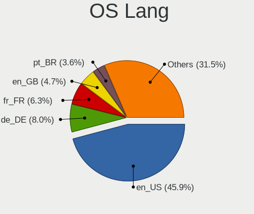
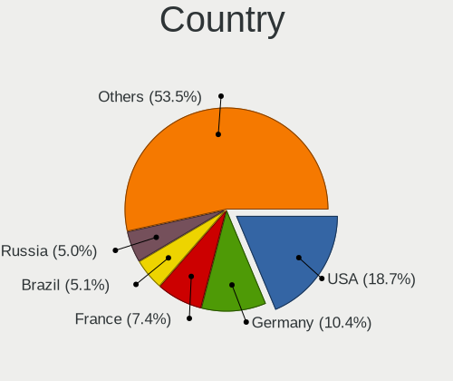
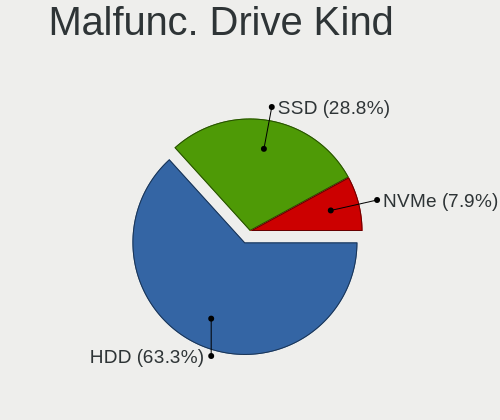
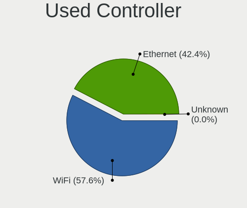

Ubuntu 22.04 - Tested Hardware & Statistics
-------------------------------------------

A project to collect tested hardware configurations for Ubuntu 22.04.

Anyone can contribute to this report by the [hw-probe](https://github.com/linuxhw/hw-probe) tool:

    sudo -E hw-probe -all -upload

Please contribute! Especially if your hardware is rare.

This is a report for all computer types. See also reports for [desktops](/Dist/Ubuntu_22.04/Desktop/README.md) and [notebooks](/Dist/Ubuntu_22.04/Notebook/README.md).

Contents
--------

* [ Test Cases ](#test-cases)

* [ System ](#system)
  - [ Kernel                   ](#kernel)
  - [ Kernel Family            ](#kernel-family)
  - [ Kernel Major Ver.        ](#kernel-major-ver)
  - [ Arch                     ](#arch)
  - [ DE                       ](#de)
  - [ Display Server           ](#display-server)
  - [ Display Manager          ](#display-manager)
  - [ OS Lang                  ](#os-lang)
  - [ Boot Mode                ](#boot-mode)
  - [ Filesystem               ](#filesystem)
  - [ Part. scheme             ](#part-scheme)
  - [ Dual Boot with Linux/BSD ](#dual-boot-with-linuxbsd)
  - [ Dual Boot (Win)          ](#dual-boot-win)

* [ Board ](#board)
  - [ Vendor                   ](#vendor)
  - [ Model                    ](#model)
  - [ Model Family             ](#model-family)
  - [ MFG Year                 ](#mfg-year)
  - [ Form Factor              ](#form-factor)
  - [ Secure Boot              ](#secure-boot)
  - [ Coreboot                 ](#coreboot)
  - [ RAM Size                 ](#ram-size)
  - [ RAM Used                 ](#ram-used)
  - [ Total Drives             ](#total-drives)
  - [ Has CD-ROM               ](#has-cd-rom)
  - [ Has Ethernet             ](#has-ethernet)
  - [ Has WiFi                 ](#has-wifi)
  - [ Has Bluetooth            ](#has-bluetooth)

* [ Location ](#location)
  - [ Country                  ](#country)
  - [ City                     ](#city)

* [ Drives ](#drives)
  - [ Drive Vendor             ](#drive-vendor)
  - [ Drive Model              ](#drive-model)
  - [ HDD Vendor               ](#hdd-vendor)
  - [ SSD Vendor               ](#ssd-vendor)
  - [ Drive Kind               ](#drive-kind)
  - [ Drive Connector          ](#drive-connector)
  - [ Drive Size               ](#drive-size)
  - [ Space Total              ](#space-total)
  - [ Space Used               ](#space-used)
  - [ Malfunc. Drives          ](#malfunc-drives)
  - [ Malfunc. Drive Vendor    ](#malfunc-drive-vendor)
  - [ Malfunc. HDD Vendor      ](#malfunc-hdd-vendor)
  - [ Malfunc. Drive Kind      ](#malfunc-drive-kind)
  - [ Failed Drives            ](#failed-drives)
  - [ Failed Drive Vendor      ](#failed-drive-vendor)
  - [ Drive Status             ](#drive-status)

* [ Storage controller ](#storage-controller)
  - [ Storage Vendor           ](#storage-vendor)
  - [ Storage Model            ](#storage-model)
  - [ Storage Kind             ](#storage-kind)

* [ Processor ](#processor)
  - [ CPU Vendor               ](#cpu-vendor)
  - [ CPU Model                ](#cpu-model)
  - [ CPU Model Family         ](#cpu-model-family)
  - [ CPU Cores                ](#cpu-cores)
  - [ CPU Sockets              ](#cpu-sockets)
  - [ CPU Threads              ](#cpu-threads)
  - [ CPU Op-Modes             ](#cpu-op-modes)
  - [ CPU Microcode            ](#cpu-microcode)
  - [ CPU Microarch            ](#cpu-microarch)

* [ Graphics ](#graphics)
  - [ GPU Vendor               ](#gpu-vendor)
  - [ GPU Model                ](#gpu-model)
  - [ GPU Combo                ](#gpu-combo)
  - [ GPU Driver               ](#gpu-driver)
  - [ GPU Memory               ](#gpu-memory)

* [ Monitor ](#monitor)
  - [ Monitor Vendor           ](#monitor-vendor)
  - [ Monitor Model            ](#monitor-model)
  - [ Monitor Resolution       ](#monitor-resolution)
  - [ Monitor Diagonal         ](#monitor-diagonal)
  - [ Monitor Width            ](#monitor-width)
  - [ Aspect Ratio             ](#aspect-ratio)
  - [ Monitor Area             ](#monitor-area)
  - [ Pixel Density            ](#pixel-density)
  - [ Multiple Monitors        ](#multiple-monitors)

* [ Network ](#network)
  - [ Net Controller Vendor    ](#net-controller-vendor)
  - [ Net Controller Model     ](#net-controller-model)
  - [ Wireless Vendor          ](#wireless-vendor)
  - [ Wireless Model           ](#wireless-model)
  - [ Ethernet Vendor          ](#ethernet-vendor)
  - [ Ethernet Model           ](#ethernet-model)
  - [ Net Controller Kind      ](#net-controller-kind)
  - [ Used Controller          ](#used-controller)
  - [ NICs                     ](#nics)
  - [ IPv6                     ](#ipv6)

* [ Bluetooth ](#bluetooth)
  - [ Bluetooth Vendor         ](#bluetooth-vendor)
  - [ Bluetooth Model          ](#bluetooth-model)

* [ Sound ](#sound)
  - [ Sound Vendor             ](#sound-vendor)
  - [ Sound Model              ](#sound-model)

* [ Memory ](#memory)
  - [ Memory Vendor            ](#memory-vendor)
  - [ Memory Model             ](#memory-model)
  - [ Memory Kind              ](#memory-kind)
  - [ Memory Form Factor       ](#memory-form-factor)
  - [ Memory Size              ](#memory-size)
  - [ Memory Speed             ](#memory-speed)

* [ Printers & scanners ](#printers--scanners)
  - [ Printer Vendor           ](#printer-vendor)
  - [ Printer Model            ](#printer-model)
  - [ Scanner Vendor           ](#scanner-vendor)
  - [ Scanner Model            ](#scanner-model)

* [ Camera ](#camera)
  - [ Camera Vendor            ](#camera-vendor)
  - [ Camera Model             ](#camera-model)

* [ Security ](#security)
  - [ Fingerprint Vendor       ](#fingerprint-vendor)
  - [ Fingerprint Model        ](#fingerprint-model)
  - [ Chipcard Vendor          ](#chipcard-vendor)
  - [ Chipcard Model           ](#chipcard-model)

* [ Unsupported ](#unsupported)
  - [ Unsupported Devices      ](#unsupported-devices)
  - [ Unsupported Device Types ](#unsupported-device-types)

Test Cases
----------

Total: 7888

| Vendor        | Model                       | Form-Factor | Probe                                                      | Date         |
|---------------|-----------------------------|-------------|------------------------------------------------------------|--------------|
| MSI           | MS-B0A41                    | Desktop     | [c69ab6fbe8](https://linux-hardware.org/?probe=c69ab6fbe8) | Jan 01, 2023 |
| HP            | 802F                        | Desktop     | [22444b4b2c](https://linux-hardware.org/?probe=22444b4b2c) | Dec 31, 2022 |
| Lenovo        | ThinkPad T410 2537DH6       | Notebook    | [23c0cbbe94](https://linux-hardware.org/?probe=23c0cbbe94) | Dec 31, 2022 |
| HP            | Pavilion dv6                | Notebook    | [30ec83dbd4](https://linux-hardware.org/?probe=30ec83dbd4) | Dec 31, 2022 |
| Dell          | 0GWHMW A01                  | Desktop     | [59287847c9](https://linux-hardware.org/?probe=59287847c9) | Dec 31, 2022 |
| ASUSTek       | M5A78L-M/USB3               | Desktop     | [e18f6635d3](https://linux-hardware.org/?probe=e18f6635d3) | Dec 31, 2022 |
| Notebook      | PB50_70RF,RD,RC             | Notebook    | [d1f655b9b1](https://linux-hardware.org/?probe=d1f655b9b1) | Dec 31, 2022 |
| Acer          | Aspire V3-571G              | Notebook    | [273f6722e0](https://linux-hardware.org/?probe=273f6722e0) | Dec 31, 2022 |
| Lenovo        | ThinkPad T14 Gen 2i 20W0... | Notebook    | [632515014d](https://linux-hardware.org/?probe=632515014d) | Dec 31, 2022 |
| Lenovo        | Yoga 7 14ITL5 82BH          | Convertible | [3592017c4a](https://linux-hardware.org/?probe=3592017c4a) | Dec 31, 2022 |
| MSI           | Z170A GAMING PRO CARBON     | Desktop     | [7c96c6776e](https://linux-hardware.org/?probe=7c96c6776e) | Dec 31, 2022 |
| Lenovo        | ThinkPad E470 20H2A02NBR    | Notebook    | [18827f3f77](https://linux-hardware.org/?probe=18827f3f77) | Dec 31, 2022 |
| Medion        | MS-7728                     | Desktop     | [3d6078552c](https://linux-hardware.org/?probe=3d6078552c) | Dec 31, 2022 |
| HP            | Laptop 15-db0xxx            | Notebook    | [375dccca30](https://linux-hardware.org/?probe=375dccca30) | Dec 31, 2022 |
| Fujitsu       | LIFEBOOK U772               | Notebook    | [3ecdad230a](https://linux-hardware.org/?probe=3ecdad230a) | Dec 31, 2022 |
| Lenovo        | Yoga 6 13ALC6 82ND          | Convertible | [de75bb19fa](https://linux-hardware.org/?probe=de75bb19fa) | Dec 31, 2022 |
| Acer          | Aspire E5-575G              | Notebook    | [db40dc530a](https://linux-hardware.org/?probe=db40dc530a) | Dec 31, 2022 |
| Chuwi         | UBook X                     | Convertible | [93f1861a61](https://linux-hardware.org/?probe=93f1861a61) | Dec 31, 2022 |
| Lenovo        | ThinkPad L470 20J5S0Y700    | Notebook    | [9e54ccbafa](https://linux-hardware.org/?probe=9e54ccbafa) | Dec 31, 2022 |
| AZW           | U59                         | Desktop     | [39f0dfe71f](https://linux-hardware.org/?probe=39f0dfe71f) | Dec 31, 2022 |
| Lenovo        | ThinkPad Edge E545 20B2S... | Notebook    | [c83f51d7d9](https://linux-hardware.org/?probe=c83f51d7d9) | Dec 31, 2022 |
| Acer          | Aspire E5-521               | Notebook    | [d9b5e3cfc3](https://linux-hardware.org/?probe=d9b5e3cfc3) | Dec 31, 2022 |
| Intel         | DB75EN AAG39650-400         | Desktop     | [086831bbca](https://linux-hardware.org/?probe=086831bbca) | Dec 31, 2022 |
| MSI           | MPG Z490 GAMING PLUS        | Desktop     | [b4aecf5fa1](https://linux-hardware.org/?probe=b4aecf5fa1) | Dec 31, 2022 |
| Lenovo        | ThinkPad T480 20L6S29E0A    | Notebook    | [82168627b7](https://linux-hardware.org/?probe=82168627b7) | Dec 31, 2022 |
| ASRock        | B450 Gaming-ITX/ac          | Desktop     | [afdda0ad31](https://linux-hardware.org/?probe=afdda0ad31) | Dec 31, 2022 |
| ASRock        | B450 Gaming-ITX/ac          | Desktop     | [3659d7377d](https://linux-hardware.org/?probe=3659d7377d) | Dec 31, 2022 |
| ASUSTek       | P5Q-PRO                     | Desktop     | [cec0830928](https://linux-hardware.org/?probe=cec0830928) | Dec 31, 2022 |
| Gigabyte      | GA-MA785GMT-UD2H            | Desktop     | [c4059f2954](https://linux-hardware.org/?probe=c4059f2954) | Dec 31, 2022 |
| Dell          | 0GDG8Y A00                  | Desktop     | [8c8e9d66e7](https://linux-hardware.org/?probe=8c8e9d66e7) | Dec 30, 2022 |
| Acer          | Aspire 8943G                | Notebook    | [dd6e590470](https://linux-hardware.org/?probe=dd6e590470) | Dec 30, 2022 |
| HP            | Laptop 17-cn1xxx            | Notebook    | [dde4bcd574](https://linux-hardware.org/?probe=dde4bcd574) | Dec 30, 2022 |
| Dell          | 0XPDFK A01                  | Desktop     | [37d47ff0dc](https://linux-hardware.org/?probe=37d47ff0dc) | Dec 30, 2022 |
| Acer          | Aspire R7-371T              | Notebook    | [057e717cb7](https://linux-hardware.org/?probe=057e717cb7) | Dec 30, 2022 |
| Alienware     | x17 R2                      | Notebook    | [f213236189](https://linux-hardware.org/?probe=f213236189) | Dec 30, 2022 |
| Samsung       | 3570R/370R/470R/450R/510... | Notebook    | [465d2da36b](https://linux-hardware.org/?probe=465d2da36b) | Dec 30, 2022 |
| ASUSTek       | ZenBook UX425EA_UX425EA     | Notebook    | [4c8f1bd9d4](https://linux-hardware.org/?probe=4c8f1bd9d4) | Dec 30, 2022 |
| Gigabyte      | A320M-H-CF                  | Desktop     | [b4511daea8](https://linux-hardware.org/?probe=b4511daea8) | Dec 30, 2022 |
| MSI           | Z87-G45 GAMING              | Desktop     | [c2d592a9e5](https://linux-hardware.org/?probe=c2d592a9e5) | Dec 30, 2022 |
| Acer          | Aspire XC-1660 V:1.1        | Desktop     | [9c4b578c67](https://linux-hardware.org/?probe=9c4b578c67) | Dec 30, 2022 |
| Unknown       | Unknown                     | Notebook    | [86dcc5a2ff](https://linux-hardware.org/?probe=86dcc5a2ff) | Dec 30, 2022 |
| Lenovo        | ThinkPad X1 Carbon Gen 8... | Notebook    | [80abf89bc6](https://linux-hardware.org/?probe=80abf89bc6) | Dec 30, 2022 |
| ASUSTek       | ASUS EXPERTBOOK B9400CEA... | Notebook    | [8b0b7eb91a](https://linux-hardware.org/?probe=8b0b7eb91a) | Dec 30, 2022 |
| Toshiba       | Satellite C850-1GL          | Notebook    | [f6f61f1841](https://linux-hardware.org/?probe=f6f61f1841) | Dec 30, 2022 |
| Toshiba       | Satellite C850-1GL          | Notebook    | [796edd73f6](https://linux-hardware.org/?probe=796edd73f6) | Dec 30, 2022 |
| Lenovo        | IdeaPad 110-15IBR 80T7      | Notebook    | [ceb89aefed](https://linux-hardware.org/?probe=ceb89aefed) | Dec 30, 2022 |
| ASUSTek       | P8B-M Series                | Server      | [b559ad98cf](https://linux-hardware.org/?probe=b559ad98cf) | Dec 30, 2022 |
| MSI           | H61M-P22                    | Desktop     | [23b5356c0a](https://linux-hardware.org/?probe=23b5356c0a) | Dec 30, 2022 |
| ASRock        | 960GM-GS3 FX                | Desktop     | [1d8b5f0509](https://linux-hardware.org/?probe=1d8b5f0509) | Dec 30, 2022 |
| Acer          | Aspire XC-1660 V:1.1        | Desktop     | [c352c59c64](https://linux-hardware.org/?probe=c352c59c64) | Dec 30, 2022 |
| ASUSTek       | G10DK                       | Desktop     | [5a5172ad44](https://linux-hardware.org/?probe=5a5172ad44) | Dec 30, 2022 |
| System76      | Oryx Pro                    | Notebook    | [dcc09f8dc5](https://linux-hardware.org/?probe=dcc09f8dc5) | Dec 30, 2022 |
| Gigabyte      | B450M DS3H-CF               | Desktop     | [47f838ca34](https://linux-hardware.org/?probe=47f838ca34) | Dec 30, 2022 |
| ASUSTek       | ROG STRIX X570-I GAMING     | Desktop     | [a634defd54](https://linux-hardware.org/?probe=a634defd54) | Dec 30, 2022 |
| ASUSTek       | PRIME Z690M-PLUS D4         | Desktop     | [b1bfc3d1ff](https://linux-hardware.org/?probe=b1bfc3d1ff) | Dec 30, 2022 |
| Raspberry ... | Raspberry Pi Compute Mod... | Soc         | [34cd286c5f](https://linux-hardware.org/?probe=34cd286c5f) | Dec 30, 2022 |
| HP            | 431 Notebook                | Notebook    | [6a8d323e0c](https://linux-hardware.org/?probe=6a8d323e0c) | Dec 30, 2022 |
| Intel         | X99                         | Desktop     | [ad6b288b38](https://linux-hardware.org/?probe=ad6b288b38) | Dec 30, 2022 |
| ASUSTek       | PRIME X399-A                | Desktop     | [d8ae46ad2b](https://linux-hardware.org/?probe=d8ae46ad2b) | Dec 30, 2022 |
| Lenovo        | ThinkPad X240 20AMS1J60B    | Notebook    | [1d8fcd4a75](https://linux-hardware.org/?probe=1d8fcd4a75) | Dec 30, 2022 |
| Lenovo        | 31900003 STD                | All in one  | [4cc2e8cadd](https://linux-hardware.org/?probe=4cc2e8cadd) | Dec 30, 2022 |
| HP            | Laptop 17-by0xxx            | Notebook    | [0da7f8e1d5](https://linux-hardware.org/?probe=0da7f8e1d5) | Dec 30, 2022 |
| HP            | EliteBook 745 G5            | Notebook    | [d819dbd901](https://linux-hardware.org/?probe=d819dbd901) | Dec 30, 2022 |
| Apple         | MacBookPro11,3              | Notebook    | [87d0f67d84](https://linux-hardware.org/?probe=87d0f67d84) | Dec 30, 2022 |
| BESSTAR Te... | C-J34 Pro                   | Desktop     | [1b54a52c3c](https://linux-hardware.org/?probe=1b54a52c3c) | Dec 30, 2022 |
| Dell          | Latitude 9420               | Notebook    | [3c43afbd50](https://linux-hardware.org/?probe=3c43afbd50) | Dec 29, 2022 |
| ASUSTek       | G10DK                       | Desktop     | [26e2460b8d](https://linux-hardware.org/?probe=26e2460b8d) | Dec 29, 2022 |
| HP            | 255 G8 Notebook PC          | Notebook    | [05209e0503](https://linux-hardware.org/?probe=05209e0503) | Dec 29, 2022 |
| Acer          | Swift SF314-57G             | Notebook    | [9d71d087d8](https://linux-hardware.org/?probe=9d71d087d8) | Dec 29, 2022 |
| Acer          | Aspire A517-51              | Notebook    | [d6e1d87869](https://linux-hardware.org/?probe=d6e1d87869) | Dec 29, 2022 |
| Dell          | Inspiron 3583               | Notebook    | [35f6da18cc](https://linux-hardware.org/?probe=35f6da18cc) | Dec 29, 2022 |
| ASUSTek       | H81M-A                      | Desktop     | [10f0b28589](https://linux-hardware.org/?probe=10f0b28589) | Dec 29, 2022 |
| HP            | 250 G8 Notebook PC          | Notebook    | [754ba4696d](https://linux-hardware.org/?probe=754ba4696d) | Dec 29, 2022 |
| Toshiba       | Satellite A305              | Notebook    | [b27112a271](https://linux-hardware.org/?probe=b27112a271) | Dec 29, 2022 |
| Toshiba       | Satellite A305              | Notebook    | [a955e57ba0](https://linux-hardware.org/?probe=a955e57ba0) | Dec 29, 2022 |
| Toshiba       | Satellite C870-13V          | Notebook    | [5ad370d470](https://linux-hardware.org/?probe=5ad370d470) | Dec 29, 2022 |
| HP            | ProBook 450 G7              | Notebook    | [ca7468f975](https://linux-hardware.org/?probe=ca7468f975) | Dec 29, 2022 |
| HP            | Pavilion Gaming Laptop 1... | Notebook    | [23d1e04f4c](https://linux-hardware.org/?probe=23d1e04f4c) | Dec 29, 2022 |
| Gigabyte      | Z97M-DS3H                   | Desktop     | [9b264f00f0](https://linux-hardware.org/?probe=9b264f00f0) | Dec 29, 2022 |
| AMI           | Intel                       | Notebook    | [b4f7a84546](https://linux-hardware.org/?probe=b4f7a84546) | Dec 29, 2022 |
| HP            | ProLiant ML110 Gen9         | Desktop     | [ea9aef1e8d](https://linux-hardware.org/?probe=ea9aef1e8d) | Dec 29, 2022 |
| HP            | Laptop 17-cp0xxx            | Notebook    | [7f54c2425b](https://linux-hardware.org/?probe=7f54c2425b) | Dec 29, 2022 |
| Lenovo        | IdeaPad S130-11IGM 81J1     | Notebook    | [2b646304f0](https://linux-hardware.org/?probe=2b646304f0) | Dec 29, 2022 |
| Dell          | Latitude 3420               | Notebook    | [eb6d4c6921](https://linux-hardware.org/?probe=eb6d4c6921) | Dec 29, 2022 |
| Lenovo        | Z50-70 20354                | Notebook    | [7b8f5e4379](https://linux-hardware.org/?probe=7b8f5e4379) | Dec 29, 2022 |
| Lenovo        | G50-70 20351                | Notebook    | [6ece20ec58](https://linux-hardware.org/?probe=6ece20ec58) | Dec 29, 2022 |
| HP            | ProBook 430 G1              | Notebook    | [217bb0ea0f](https://linux-hardware.org/?probe=217bb0ea0f) | Dec 29, 2022 |
| Dell          | Latitude E6420              | Notebook    | [9733c425b6](https://linux-hardware.org/?probe=9733c425b6) | Dec 29, 2022 |
| HP            | 158A                        | Desktop     | [bfd338cf36](https://linux-hardware.org/?probe=bfd338cf36) | Dec 29, 2022 |
| HP            | Laptop 15-dw0xxx            | Notebook    | [b851f7bcfc](https://linux-hardware.org/?probe=b851f7bcfc) | Dec 29, 2022 |
| HP            | EliteBook 2560p             | Notebook    | [e0c82de440](https://linux-hardware.org/?probe=e0c82de440) | Dec 29, 2022 |
| Fujitsu       | LIFEBOOK E736               | Notebook    | [8d54484965](https://linux-hardware.org/?probe=8d54484965) | Dec 29, 2022 |
| Lenovo        | V14-IIL 82C4                | Notebook    | [9b77a1e3f3](https://linux-hardware.org/?probe=9b77a1e3f3) | Dec 29, 2022 |
| Lenovo        | ThinkPad X1 Carbon 6th 2... | Notebook    | [499c91958a](https://linux-hardware.org/?probe=499c91958a) | Dec 29, 2022 |
| HP            | ProLiant ML110 Gen9         | Desktop     | [728793a92a](https://linux-hardware.org/?probe=728793a92a) | Dec 29, 2022 |
| Notebook      | W65_67SZ                    | Notebook    | [cbebefb520](https://linux-hardware.org/?probe=cbebefb520) | Dec 29, 2022 |
| Pegatron      | 2AC2                        | Desktop     | [adc3978bcc](https://linux-hardware.org/?probe=adc3978bcc) | Dec 29, 2022 |
| Apple         | Mac-77F17D7DA9285301 iMa... | All in one  | [a101aebc11](https://linux-hardware.org/?probe=a101aebc11) | Dec 29, 2022 |
| Acer          | Aspire A315-41              | Notebook    | [09c901fe98](https://linux-hardware.org/?probe=09c901fe98) | Dec 29, 2022 |
| Apple         | MacBookPro15,2              | Notebook    | [e5a7b5b5be](https://linux-hardware.org/?probe=e5a7b5b5be) | Dec 28, 2022 |
| Acer          | Aspire M3920                | Desktop     | [49cb4f51a8](https://linux-hardware.org/?probe=49cb4f51a8) | Dec 28, 2022 |
| Dell          | 0JP3NX A01                  | Desktop     | [3b094471e0](https://linux-hardware.org/?probe=3b094471e0) | Dec 28, 2022 |
| Dell          | XPS 13 9365                 | Convertible | [a0e606d89d](https://linux-hardware.org/?probe=a0e606d89d) | Dec 28, 2022 |
| Dell          | XPS 13 9365                 | Convertible | [fd98910e6d](https://linux-hardware.org/?probe=fd98910e6d) | Dec 28, 2022 |
| Intel         | X99                         | Desktop     | [eb6babb799](https://linux-hardware.org/?probe=eb6babb799) | Dec 28, 2022 |
| HP            | Pavilion Laptop 15-eg0xx... | Notebook    | [b915fc0d47](https://linux-hardware.org/?probe=b915fc0d47) | Dec 28, 2022 |
| ASUSTek       | G10DK                       | Desktop     | [1ffb248d93](https://linux-hardware.org/?probe=1ffb248d93) | Dec 28, 2022 |
| Lenovo        | ThinkPad E480 20KQS13M00    | Notebook    | [fb7e2874d3](https://linux-hardware.org/?probe=fb7e2874d3) | Dec 28, 2022 |
| Fujitsu       | D3161-A1 S26361-D3161-A1    | Desktop     | [efa2d6986f](https://linux-hardware.org/?probe=efa2d6986f) | Dec 28, 2022 |
| HP            | OMEN Laptop 15-en1xxx       | Notebook    | [9e95d6a4ac](https://linux-hardware.org/?probe=9e95d6a4ac) | Dec 28, 2022 |
| Lanix         | P55M-UD2 LNXACT             | Desktop     | [5575ce838c](https://linux-hardware.org/?probe=5575ce838c) | Dec 28, 2022 |
| System76      | Bonobo Extreme              | Notebook    | [cedfb426df](https://linux-hardware.org/?probe=cedfb426df) | Dec 28, 2022 |
| HP            | Pavilion Laptop 15-cs3xx... | Notebook    | [7f33845279](https://linux-hardware.org/?probe=7f33845279) | Dec 28, 2022 |
| System76      | Bonobo Extreme              | Notebook    | [1b6caec010](https://linux-hardware.org/?probe=1b6caec010) | Dec 28, 2022 |
| GPU Compan... | GWTN116-3                   | Notebook    | [73323d3bad](https://linux-hardware.org/?probe=73323d3bad) | Dec 28, 2022 |
| GPU Compan... | GWTN116-3                   | Notebook    | [bcad5903ae](https://linux-hardware.org/?probe=bcad5903ae) | Dec 28, 2022 |
| ASUSTek       | Zenbook UM5302TA_UM5302T... | Notebook    | [74c1f3a4c2](https://linux-hardware.org/?probe=74c1f3a4c2) | Dec 28, 2022 |
| Alienware     | x17 R2                      | Notebook    | [5a7ea2683a](https://linux-hardware.org/?probe=5a7ea2683a) | Dec 28, 2022 |
| Lenovo        | V14-IIL 82C4                | Notebook    | [58825656f9](https://linux-hardware.org/?probe=58825656f9) | Dec 28, 2022 |
| HP            | 0A54h                       | Desktop     | [7f1e1152d9](https://linux-hardware.org/?probe=7f1e1152d9) | Dec 28, 2022 |
| HP            | 17E2                        | Mini pc     | [8460664f2a](https://linux-hardware.org/?probe=8460664f2a) | Dec 28, 2022 |
| MSI           | Z270 PC MATE                | Desktop     | [08186ccafe](https://linux-hardware.org/?probe=08186ccafe) | Dec 28, 2022 |
| ASRock        | B75 Pro3-M                  | Desktop     | [108f0c24de](https://linux-hardware.org/?probe=108f0c24de) | Dec 28, 2022 |
| ASUSTek       | ROG STRIX B550-F GAMING     | Desktop     | [6297565fda](https://linux-hardware.org/?probe=6297565fda) | Dec 28, 2022 |
| MSI           | Z370 PC PRO                 | Desktop     | [367bcf2d16](https://linux-hardware.org/?probe=367bcf2d16) | Dec 28, 2022 |
| HP            | 240 G6 Notebook PC          | Notebook    | [b593030fef](https://linux-hardware.org/?probe=b593030fef) | Dec 28, 2022 |
| HP            | 240 G6 Notebook PC          | Notebook    | [27e4ff648f](https://linux-hardware.org/?probe=27e4ff648f) | Dec 28, 2022 |
| Dell          | 0HY9JP A01                  | Desktop     | [97a3e6ce9d](https://linux-hardware.org/?probe=97a3e6ce9d) | Dec 28, 2022 |
| Lenovo        | G580 20157                  | Notebook    | [bfefa4ee83](https://linux-hardware.org/?probe=bfefa4ee83) | Dec 28, 2022 |
| ASUSTek       | PRIME A320M-K               | Desktop     | [20c0841830](https://linux-hardware.org/?probe=20c0841830) | Dec 28, 2022 |
| Toshiba       | Satellite C55-C             | Notebook    | [2966924363](https://linux-hardware.org/?probe=2966924363) | Dec 28, 2022 |
| Toshiba       | Satellite C55-C             | Notebook    | [f3e27d230f](https://linux-hardware.org/?probe=f3e27d230f) | Dec 28, 2022 |
| ASUSTek       | G73Jh                       | Notebook    | [e406daa47c](https://linux-hardware.org/?probe=e406daa47c) | Dec 28, 2022 |
| HP            | EliteBook 8570p             | Notebook    | [268f34635a](https://linux-hardware.org/?probe=268f34635a) | Dec 28, 2022 |
| Lenovo        | G580 20157                  | Notebook    | [39f72fea9c](https://linux-hardware.org/?probe=39f72fea9c) | Dec 28, 2022 |
| HP            | 1905                        | Desktop     | [5c576316f8](https://linux-hardware.org/?probe=5c576316f8) | Dec 28, 2022 |
| HP            | Compaq Presario CQ60        | Notebook    | [f3f1a02bce](https://linux-hardware.org/?probe=f3f1a02bce) | Dec 28, 2022 |
| HP            | Compaq Presario CQ60        | Notebook    | [b1f32ea75c](https://linux-hardware.org/?probe=b1f32ea75c) | Dec 28, 2022 |
| HP            | ENVY Laptop 13-ba1xxx       | Notebook    | [c25b644aca](https://linux-hardware.org/?probe=c25b644aca) | Dec 28, 2022 |
| Lenovo        | IdeaPad L340-17API 81LY     | Notebook    | [f4df1b165b](https://linux-hardware.org/?probe=f4df1b165b) | Dec 28, 2022 |
| HP            | Laptop 14-fq0xxx            | Notebook    | [e020678b51](https://linux-hardware.org/?probe=e020678b51) | Dec 28, 2022 |
| Lenovo        | 100-14IBY 80R7              | Notebook    | [92b2614ac2](https://linux-hardware.org/?probe=92b2614ac2) | Dec 28, 2022 |
| Lenovo        | Y50-70 20378                | Notebook    | [e232c2de6d](https://linux-hardware.org/?probe=e232c2de6d) | Dec 28, 2022 |
| Samsung       | 550XDA                      | Notebook    | [6d744c7602](https://linux-hardware.org/?probe=6d744c7602) | Dec 28, 2022 |
| Samsung       | 550XDA                      | Notebook    | [b463fa7a54](https://linux-hardware.org/?probe=b463fa7a54) | Dec 28, 2022 |
| Dell          | Latitude E7450              | Notebook    | [b641b13d8a](https://linux-hardware.org/?probe=b641b13d8a) | Dec 28, 2022 |
| Gigabyte      | A320M-H-CF                  | Desktop     | [aff2b93aa5](https://linux-hardware.org/?probe=aff2b93aa5) | Dec 28, 2022 |
| Gigabyte      | Z590 AORUS PRO AX           | Desktop     | [d680b8dd2a](https://linux-hardware.org/?probe=d680b8dd2a) | Dec 28, 2022 |
| ASRock        | B450M Pro4                  | Desktop     | [fcaf938a12](https://linux-hardware.org/?probe=fcaf938a12) | Dec 28, 2022 |
| libre-comp... | aml-s905x-cc                | Soc         | [6378a6afbf](https://linux-hardware.org/?probe=6378a6afbf) | Dec 28, 2022 |
| Lenovo        | G555 0873                   | Notebook    | [f705d0146a](https://linux-hardware.org/?probe=f705d0146a) | Dec 27, 2022 |
| ASUSTek       | K52Je                       | Notebook    | [28cac9b262](https://linux-hardware.org/?probe=28cac9b262) | Dec 27, 2022 |
| Acer          | Swift SFX14-51G             | Notebook    | [16c5f2a610](https://linux-hardware.org/?probe=16c5f2a610) | Dec 27, 2022 |
| HUAWEI        | BOD-WXX9                    | Notebook    | [d196b92cff](https://linux-hardware.org/?probe=d196b92cff) | Dec 27, 2022 |
| Acer          | Aspire E5-574               | Notebook    | [15e48d4c24](https://linux-hardware.org/?probe=15e48d4c24) | Dec 27, 2022 |
| Teclast       | F15Plus 2                   | Notebook    | [71564a5900](https://linux-hardware.org/?probe=71564a5900) | Dec 27, 2022 |
| Teclast       | F15Plus 2                   | Notebook    | [4d10c4922e](https://linux-hardware.org/?probe=4d10c4922e) | Dec 27, 2022 |
| Acer          | Aspire 5741                 | Notebook    | [22540f4247](https://linux-hardware.org/?probe=22540f4247) | Dec 27, 2022 |
| Acer          | Aspire 5741                 | Notebook    | [b47449f70f](https://linux-hardware.org/?probe=b47449f70f) | Dec 27, 2022 |
| Toshiba       | Satellite A305              | Notebook    | [a9d9fd5efa](https://linux-hardware.org/?probe=a9d9fd5efa) | Dec 27, 2022 |
| Acer          | Aspire M3970                | Desktop     | [c2232f44d6](https://linux-hardware.org/?probe=c2232f44d6) | Dec 27, 2022 |
| Acer          | Predator PH317-56           | Notebook    | [b74460d91c](https://linux-hardware.org/?probe=b74460d91c) | Dec 27, 2022 |
| ASUSTek       | K43E                        | Notebook    | [530e44f9c6](https://linux-hardware.org/?probe=530e44f9c6) | Dec 27, 2022 |
| Schenker      | VISION 15 (SVS15E21)        | Notebook    | [9409e9bfce](https://linux-hardware.org/?probe=9409e9bfce) | Dec 27, 2022 |
| ASUSTek       | X550VXK                     | Notebook    | [039600625a](https://linux-hardware.org/?probe=039600625a) | Dec 27, 2022 |
| Dell          | Vostro 5490                 | Notebook    | [d32b30987a](https://linux-hardware.org/?probe=d32b30987a) | Dec 27, 2022 |
| MACHENIKE     | Machcreator-16              | Notebook    | [682c068af0](https://linux-hardware.org/?probe=682c068af0) | Dec 27, 2022 |
| ASUSTek       | H97I-PLUS                   | Desktop     | [8f039f1be9](https://linux-hardware.org/?probe=8f039f1be9) | Dec 27, 2022 |
| ZOTAC         | ZBOX-AD02                   | Mini pc     | [b4447459df](https://linux-hardware.org/?probe=b4447459df) | Dec 27, 2022 |
| HUAWEI        | NBLK-WAX9X                  | Notebook    | [292ef79b8a](https://linux-hardware.org/?probe=292ef79b8a) | Dec 27, 2022 |
| Samsung       | SP55S                       | Notebook    | [ce8b6d3fdb](https://linux-hardware.org/?probe=ce8b6d3fdb) | Dec 27, 2022 |
| Samsung       | SP55S                       | Notebook    | [f0d13bbd0d](https://linux-hardware.org/?probe=f0d13bbd0d) | Dec 27, 2022 |
| Lenovo        | ThinkPad X1 Carbon Gen 1... | Notebook    | [e5cd9613f9](https://linux-hardware.org/?probe=e5cd9613f9) | Dec 27, 2022 |
| ASUSTek       | ROG STRIX B550-F GAMING     | Desktop     | [41b062ea94](https://linux-hardware.org/?probe=41b062ea94) | Dec 27, 2022 |
| Gigabyte      | H270-HD3-CF                 | Desktop     | [031a62faa8](https://linux-hardware.org/?probe=031a62faa8) | Dec 27, 2022 |
| Samsung       | 300E5M/300E5L               | Notebook    | [669e014ee6](https://linux-hardware.org/?probe=669e014ee6) | Dec 27, 2022 |
| MSI           | MS-7A34                     | Notebook    | [4668f06370](https://linux-hardware.org/?probe=4668f06370) | Dec 26, 2022 |
| Dell          | 0PTTT9 A01                  | Desktop     | [78512365ca](https://linux-hardware.org/?probe=78512365ca) | Dec 26, 2022 |
| Medion        | P6640                       | Notebook    | [0787385a0f](https://linux-hardware.org/?probe=0787385a0f) | Dec 26, 2022 |
| ASUSTek       | VivoBook_ASUSLaptop K340... | Notebook    | [ee7b1d707c](https://linux-hardware.org/?probe=ee7b1d707c) | Dec 26, 2022 |
| HP            | OMEN by Laptop 16-c0xxx     | Notebook    | [3111141139](https://linux-hardware.org/?probe=3111141139) | Dec 26, 2022 |
| Timi          | A18R                        | Notebook    | [83f858038d](https://linux-hardware.org/?probe=83f858038d) | Dec 26, 2022 |
| ASUSTek       | X75A1                       | Notebook    | [5a5ee8db71](https://linux-hardware.org/?probe=5a5ee8db71) | Dec 26, 2022 |
| NCR           | Pocono                      | Desktop     | [d50ad710fb](https://linux-hardware.org/?probe=d50ad710fb) | Dec 26, 2022 |
| Dynabook      | Satellite Pro C50-J         | Notebook    | [9b26454313](https://linux-hardware.org/?probe=9b26454313) | Dec 26, 2022 |
| Dynabook      | Satellite Pro C50-J         | Notebook    | [ee842c64a3](https://linux-hardware.org/?probe=ee842c64a3) | Dec 26, 2022 |
| Dell          | XPS 15 9510                 | Notebook    | [394fe96894](https://linux-hardware.org/?probe=394fe96894) | Dec 26, 2022 |
| Acer          | Swift SF314-43              | Notebook    | [f7c9b3538e](https://linux-hardware.org/?probe=f7c9b3538e) | Dec 26, 2022 |
| Lenovo        | IdeaPad 1 14IGL7 82V6       | Notebook    | [27d5cfbc7b](https://linux-hardware.org/?probe=27d5cfbc7b) | Dec 26, 2022 |
| Notebook      | N7x0WU                      | Notebook    | [9eee40dd50](https://linux-hardware.org/?probe=9eee40dd50) | Dec 26, 2022 |
| Gigabyte      | M61SME-S2                   | Desktop     | [5d0485ba40](https://linux-hardware.org/?probe=5d0485ba40) | Dec 26, 2022 |
| ASUSTek       | G10DK                       | Desktop     | [30007c6ff0](https://linux-hardware.org/?probe=30007c6ff0) | Dec 26, 2022 |
| Gigabyte      | M61SME-S2                   | Desktop     | [d68451099d](https://linux-hardware.org/?probe=d68451099d) | Dec 26, 2022 |
| ASUSTek       | K52Je                       | Notebook    | [dc13c122ed](https://linux-hardware.org/?probe=dc13c122ed) | Dec 26, 2022 |
| ASUSTek       | M5A78L-M LX3                | Desktop     | [aef3959b18](https://linux-hardware.org/?probe=aef3959b18) | Dec 26, 2022 |
| ASUSTek       | X751MA                      | Notebook    | [f63581c721](https://linux-hardware.org/?probe=f63581c721) | Dec 26, 2022 |
| Gigabyte      | GB-BRR7H-4700               | Desktop     | [43c2d92e5f](https://linux-hardware.org/?probe=43c2d92e5f) | Dec 26, 2022 |
| ASUSTek       | TUF Gaming X570-PLUS        | Desktop     | [eda96539d7](https://linux-hardware.org/?probe=eda96539d7) | Dec 26, 2022 |
| Lenovo        | Legion 5 15IAH7H 82RB       | Notebook    | [e47f890444](https://linux-hardware.org/?probe=e47f890444) | Dec 26, 2022 |
| Lenovo        | Legion 5 15IAH7H 82RB       | Notebook    | [c288ade12d](https://linux-hardware.org/?probe=c288ade12d) | Dec 26, 2022 |
| Toshiba       | Satellite A305              | Notebook    | [75a4a25c93](https://linux-hardware.org/?probe=75a4a25c93) | Dec 26, 2022 |
| HP            | 1495                        | Desktop     | [b8e1dc67eb](https://linux-hardware.org/?probe=b8e1dc67eb) | Dec 26, 2022 |
| BESSTAR Te... | GB7                         | Mini pc     | [06d28eb7f8](https://linux-hardware.org/?probe=06d28eb7f8) | Dec 26, 2022 |
| ASUSTek       | ZenBook S UX391UA           | Notebook    | [5004189ba4](https://linux-hardware.org/?probe=5004189ba4) | Dec 26, 2022 |
| ASUSTek       | TUF Gaming B550M-PLUS WI... | Desktop     | [b181e9e5a3](https://linux-hardware.org/?probe=b181e9e5a3) | Dec 26, 2022 |
| Unknown       | HX90                        | Desktop     | [d4265ad971](https://linux-hardware.org/?probe=d4265ad971) | Dec 26, 2022 |
| Apple         | Mac-F2238AC8                | All in one  | [803944471c](https://linux-hardware.org/?probe=803944471c) | Dec 26, 2022 |
| Gigabyte      | Z97M-DS3H                   | Desktop     | [02f55ff55b](https://linux-hardware.org/?probe=02f55ff55b) | Dec 26, 2022 |
| HP            | 304Ah                       | Desktop     | [6106d55390](https://linux-hardware.org/?probe=6106d55390) | Dec 26, 2022 |
| Apple         | Mac-27ADBB7B4CEE8E61 iMa... | All in one  | [82a5aa7ead](https://linux-hardware.org/?probe=82a5aa7ead) | Dec 26, 2022 |
| MSI           | B350 KRAIT GAMING           | Desktop     | [896aebf101](https://linux-hardware.org/?probe=896aebf101) | Dec 25, 2022 |
| Acer          | Swift SF314-51              | Notebook    | [bfdd69d192](https://linux-hardware.org/?probe=bfdd69d192) | Dec 25, 2022 |
| Gigabyte      | H61M-S1                     | Desktop     | [384000d018](https://linux-hardware.org/?probe=384000d018) | Dec 25, 2022 |
| Intel         | NUC6CAYB J23203-405         | Mini pc     | [964f42356a](https://linux-hardware.org/?probe=964f42356a) | Dec 25, 2022 |
| ASRock        | H110 Pro BTC+               | Desktop     | [29311fe64c](https://linux-hardware.org/?probe=29311fe64c) | Dec 25, 2022 |
| Dell          | XPS 13 7390                 | Notebook    | [9131496b00](https://linux-hardware.org/?probe=9131496b00) | Dec 25, 2022 |
| Gateway       | G33M05G1 MP                 | Desktop     | [8a495d2b75](https://linux-hardware.org/?probe=8a495d2b75) | Dec 25, 2022 |
| ASUSTek       | VivoBook_ASUSLaptop K340... | Notebook    | [7c8560a87e](https://linux-hardware.org/?probe=7c8560a87e) | Dec 25, 2022 |
| Toshiba       | Satellite C850-1C8          | Notebook    | [eab4ef74de](https://linux-hardware.org/?probe=eab4ef74de) | Dec 25, 2022 |
| Lenovo        | 102F SBB0J05441 WIN 3305... | Desktop     | [fee0a76158](https://linux-hardware.org/?probe=fee0a76158) | Dec 25, 2022 |
| HP            | ProBook 450 G1              | Notebook    | [26c346f0ab](https://linux-hardware.org/?probe=26c346f0ab) | Dec 25, 2022 |
| Lenovo        | ThinkPad T470 W10DG 20JN... | Notebook    | [08af6df0dd](https://linux-hardware.org/?probe=08af6df0dd) | Dec 25, 2022 |
| Toshiba       | Satellite C850-1C8          | Notebook    | [1e47b54431](https://linux-hardware.org/?probe=1e47b54431) | Dec 25, 2022 |
| HP            | ENVY 17                     | Notebook    | [f3458ee7d5](https://linux-hardware.org/?probe=f3458ee7d5) | Dec 25, 2022 |
| MSI           | Boston                      | Desktop     | [5ffbd4e9a5](https://linux-hardware.org/?probe=5ffbd4e9a5) | Dec 25, 2022 |
| LG Electro... | 22V270 2                    | All in one  | [04d33628a1](https://linux-hardware.org/?probe=04d33628a1) | Dec 25, 2022 |
| Dell          | 0MN1TX A02                  | Desktop     | [513af674c0](https://linux-hardware.org/?probe=513af674c0) | Dec 25, 2022 |
| LG Electro... | 22V270 2                    | All in one  | [8408ee3692](https://linux-hardware.org/?probe=8408ee3692) | Dec 25, 2022 |
| Lenovo        | ThinkPad X1 Carbon 5th 2... | Notebook    | [faba7b00c6](https://linux-hardware.org/?probe=faba7b00c6) | Dec 25, 2022 |
| HP            | ProLiant ML110 Gen9         | Desktop     | [90bb379f4e](https://linux-hardware.org/?probe=90bb379f4e) | Dec 25, 2022 |
| ASRock        | Z390 Phantom Gaming 6       | Desktop     | [61be8271df](https://linux-hardware.org/?probe=61be8271df) | Dec 25, 2022 |
| Foxconn       | 2ADA                        | Desktop     | [7a7d8227ee](https://linux-hardware.org/?probe=7a7d8227ee) | Dec 25, 2022 |
| HP            | ENVY Notebook               | Notebook    | [16af8b4da3](https://linux-hardware.org/?probe=16af8b4da3) | Dec 25, 2022 |
| Acer          | Aspire 5739G                | Notebook    | [0d3bd3f3ec](https://linux-hardware.org/?probe=0d3bd3f3ec) | Dec 25, 2022 |
| ASUSTek       | ROG Strix G713IC_G713IC     | Notebook    | [72fa60782d](https://linux-hardware.org/?probe=72fa60782d) | Dec 25, 2022 |
| Dell          | Latitude 5521               | Notebook    | [32d3e87886](https://linux-hardware.org/?probe=32d3e87886) | Dec 25, 2022 |
| ASUSTek       | PRIME A320M-K               | Desktop     | [1762f53462](https://linux-hardware.org/?probe=1762f53462) | Dec 25, 2022 |
| ASRock        | H110 Pro BTC+               | Desktop     | [90f3fd2f80](https://linux-hardware.org/?probe=90f3fd2f80) | Dec 25, 2022 |
| Lenovo        | ThinkPad E585 20KVS06F00    | Notebook    | [8c3bdcc48c](https://linux-hardware.org/?probe=8c3bdcc48c) | Dec 25, 2022 |
| ASUSTek       | G10DK                       | Desktop     | [13379a69a6](https://linux-hardware.org/?probe=13379a69a6) | Dec 25, 2022 |
| ASUSTek       | P7H55-M PRO                 | Desktop     | [b445490856](https://linux-hardware.org/?probe=b445490856) | Dec 25, 2022 |
| ASUSTek       | PRIME B450M-GAMING/BR       | Desktop     | [e12a45a65f](https://linux-hardware.org/?probe=e12a45a65f) | Dec 25, 2022 |
| ASUSTek       | PRIME B450M-GAMING/BR       | Desktop     | [4f28247dcb](https://linux-hardware.org/?probe=4f28247dcb) | Dec 25, 2022 |
| Framework     | Laptop (12th Gen Intel C... | Notebook    | [daebafedd8](https://linux-hardware.org/?probe=daebafedd8) | Dec 25, 2022 |
| Lenovo        | SHARKBAY 0B98401 WIN        | Desktop     | [0900400806](https://linux-hardware.org/?probe=0900400806) | Dec 25, 2022 |
| Acer          | Nitro AN515-31              | Notebook    | [249f50d430](https://linux-hardware.org/?probe=249f50d430) | Dec 25, 2022 |
| Dell          | 040DDP A01                  | Desktop     | [2fc87b6525](https://linux-hardware.org/?probe=2fc87b6525) | Dec 25, 2022 |
| Toshiba       | PORTEGE Z930                | Notebook    | [4a77067c41](https://linux-hardware.org/?probe=4a77067c41) | Dec 25, 2022 |
| Supermicro    | C2SBX                       | Desktop     | [1b275899d5](https://linux-hardware.org/?probe=1b275899d5) | Dec 25, 2022 |
| Lenovo        | ThinkPad T450 20BUS3GN01    | Notebook    | [e88a11d2bb](https://linux-hardware.org/?probe=e88a11d2bb) | Dec 25, 2022 |
| Dell          | Inspiron 5567               | Notebook    | [46d23963c9](https://linux-hardware.org/?probe=46d23963c9) | Dec 25, 2022 |
| ASUSTek       | TUF Gaming X570-PLUS        | Desktop     | [571019b4b2](https://linux-hardware.org/?probe=571019b4b2) | Dec 25, 2022 |
| Dell          | 0D6H9T A00                  | Desktop     | [778c642778](https://linux-hardware.org/?probe=778c642778) | Dec 25, 2022 |
| HP            | Pavilion g4                 | Notebook    | [a5d26c4498](https://linux-hardware.org/?probe=a5d26c4498) | Dec 24, 2022 |
| Dell          | 0D6H9T A00                  | Desktop     | [ef62b12cdb](https://linux-hardware.org/?probe=ef62b12cdb) | Dec 24, 2022 |
| UMAX          | VisionBook 14Wa Pro         | Notebook    | [7eb49ce0ab](https://linux-hardware.org/?probe=7eb49ce0ab) | Dec 24, 2022 |
| Dell          | Vostro 3500                 | Notebook    | [0d59e2b098](https://linux-hardware.org/?probe=0d59e2b098) | Dec 24, 2022 |
| ASUSTek       | PRIME B450M-A               | Desktop     | [1fc8c5a4d4](https://linux-hardware.org/?probe=1fc8c5a4d4) | Dec 24, 2022 |
| Dell          | Vostro 3501                 | Notebook    | [2bd2de39fb](https://linux-hardware.org/?probe=2bd2de39fb) | Dec 24, 2022 |
| Acer          | Swift SF314-43              | Notebook    | [b1c3a71567](https://linux-hardware.org/?probe=b1c3a71567) | Dec 24, 2022 |
| HP            | Pavilion Laptop 15-cc5xx    | Notebook    | [337ee988ae](https://linux-hardware.org/?probe=337ee988ae) | Dec 24, 2022 |
| Dell          | Latitude 3380               | Notebook    | [e4847d5b1f](https://linux-hardware.org/?probe=e4847d5b1f) | Dec 24, 2022 |
| UMAX          | VisionBook 14Wa Pro         | Notebook    | [4123115ef0](https://linux-hardware.org/?probe=4123115ef0) | Dec 24, 2022 |
| ASUSTek       | P8H67-M LE                  | Desktop     | [892d40f349](https://linux-hardware.org/?probe=892d40f349) | Dec 24, 2022 |
| ASUSTek       | ROG STRIX X570-E GAMING     | Desktop     | [2e23d15c25](https://linux-hardware.org/?probe=2e23d15c25) | Dec 24, 2022 |
| Gigabyte      | Z390 M GAMING-CF            | Desktop     | [7edfc4df26](https://linux-hardware.org/?probe=7edfc4df26) | Dec 24, 2022 |
| Gigabyte      | Z390 M GAMING-CF            | Desktop     | [7f19b0ef63](https://linux-hardware.org/?probe=7f19b0ef63) | Dec 24, 2022 |
| Lenovo        | IdeaPad C340-14API 81N6     | Notebook    | [5e589fb2d1](https://linux-hardware.org/?probe=5e589fb2d1) | Dec 24, 2022 |
| ASUSTek       | P8H67-M LE                  | Desktop     | [7517437358](https://linux-hardware.org/?probe=7517437358) | Dec 24, 2022 |
| Lenovo        | 318D                        | All in one  | [1bc8e7088b](https://linux-hardware.org/?probe=1bc8e7088b) | Dec 24, 2022 |
| Lenovo        | ThinkPad X61s 7667WHE       | Notebook    | [d689ae23a7](https://linux-hardware.org/?probe=d689ae23a7) | Dec 24, 2022 |
| GMKtec        | NucBox8                     | Server      | [66b0fbce86](https://linux-hardware.org/?probe=66b0fbce86) | Dec 24, 2022 |
| Toshiba       | dynabook T351/34CBJ         | Notebook    | [281bf4e6a7](https://linux-hardware.org/?probe=281bf4e6a7) | Dec 24, 2022 |
| Lenovo        | ThinkPad L470 20J5S0Y700    | Notebook    | [9ce4138a3b](https://linux-hardware.org/?probe=9ce4138a3b) | Dec 24, 2022 |
| Gigabyte      | B550 AORUS ELITE AX V2      | Desktop     | [5047d29893](https://linux-hardware.org/?probe=5047d29893) | Dec 24, 2022 |
| Lenovo        | 3190 SDK0J40697 WIN 3305... | Mini pc     | [c1a415a9c3](https://linux-hardware.org/?probe=c1a415a9c3) | Dec 24, 2022 |
| ATOPNUC       | GB3B                        | Mini pc     | [1eeec23b50](https://linux-hardware.org/?probe=1eeec23b50) | Dec 24, 2022 |
| MSI           | TRX40 PRO 10G               | Desktop     | [f83cf989ef](https://linux-hardware.org/?probe=f83cf989ef) | Dec 24, 2022 |
| Alienware     | m15 R7                      | Notebook    | [4e33480c8a](https://linux-hardware.org/?probe=4e33480c8a) | Dec 24, 2022 |
| ASUSTek       | M5A78L-M/USB3               | Desktop     | [3dce1a76e7](https://linux-hardware.org/?probe=3dce1a76e7) | Dec 24, 2022 |
| System76      | Pangolin                    | Notebook    | [1c936bfe04](https://linux-hardware.org/?probe=1c936bfe04) | Dec 24, 2022 |
| Lenovo        | YB1-X91F                    | Tablet      | [cd3bd35d93](https://linux-hardware.org/?probe=cd3bd35d93) | Dec 24, 2022 |
| Lenovo        | YB1-X91F                    | Tablet      | [1b6f8bec10](https://linux-hardware.org/?probe=1b6f8bec10) | Dec 24, 2022 |
| Dell          | Latitude E6540              | Notebook    | [5df6345cd7](https://linux-hardware.org/?probe=5df6345cd7) | Dec 24, 2022 |
| ASUSTek       | ROG Zephyrus G14 GA401QE... | Notebook    | [dab48b870c](https://linux-hardware.org/?probe=dab48b870c) | Dec 23, 2022 |
| Lenovo        | G505s 20255                 | Notebook    | [2a0fc9ecc3](https://linux-hardware.org/?probe=2a0fc9ecc3) | Dec 23, 2022 |
| Dell          | 0NW6H5 A00                  | Desktop     | [6c7eeae2e3](https://linux-hardware.org/?probe=6c7eeae2e3) | Dec 23, 2022 |
| Dell          | Inspiron 15 5510            | Notebook    | [d53469cd41](https://linux-hardware.org/?probe=d53469cd41) | Dec 23, 2022 |
| Dell          | Inspiron 15 5510            | Notebook    | [9ddf91aa1b](https://linux-hardware.org/?probe=9ddf91aa1b) | Dec 23, 2022 |
| AMI           | Cherry Trail CR             | Mini pc     | [26ed239f3c](https://linux-hardware.org/?probe=26ed239f3c) | Dec 23, 2022 |
| ASUSTek       | G73Sw                       | Notebook    | [3f4336472e](https://linux-hardware.org/?probe=3f4336472e) | Dec 23, 2022 |
| Dell          | 0PTTT9 A01                  | Desktop     | [4618f09759](https://linux-hardware.org/?probe=4618f09759) | Dec 23, 2022 |
| MSI           | Z270 TOMAHAWK               | Desktop     | [b721ac26e2](https://linux-hardware.org/?probe=b721ac26e2) | Dec 23, 2022 |
| ZOTAC         | ZBOX-ID41                   | Mini pc     | [c963886ab5](https://linux-hardware.org/?probe=c963886ab5) | Dec 23, 2022 |
| HP            | EliteBook 840 G5            | Notebook    | [05ab61864f](https://linux-hardware.org/?probe=05ab61864f) | Dec 23, 2022 |
| ASUSTek       | ROG STRIX Z690-A GAMING ... | Desktop     | [7fe5933133](https://linux-hardware.org/?probe=7fe5933133) | Dec 23, 2022 |
| MSI           | Pulse GL76 12UEK            | Notebook    | [9ca4075241](https://linux-hardware.org/?probe=9ca4075241) | Dec 23, 2022 |
| MSI           | Pulse GL76 12UEK            | Notebook    | [099b612c13](https://linux-hardware.org/?probe=099b612c13) | Dec 23, 2022 |
| Acer          | Predator PH315-54           | Notebook    | [84bdb8f2eb](https://linux-hardware.org/?probe=84bdb8f2eb) | Dec 23, 2022 |
| Notebook      | P64_HJ,HK1                  | Notebook    | [26a548a6f3](https://linux-hardware.org/?probe=26a548a6f3) | Dec 23, 2022 |
| Lenovo        | Legion Y540-15IRH-PG0 81... | Notebook    | [c47eaa75b3](https://linux-hardware.org/?probe=c47eaa75b3) | Dec 23, 2022 |
| HONOR         | BBR-WAX9                    | Notebook    | [19909aa86b](https://linux-hardware.org/?probe=19909aa86b) | Dec 23, 2022 |
| Dell          | 0WMJ54 A01                  | Desktop     | [b0b07249ae](https://linux-hardware.org/?probe=b0b07249ae) | Dec 23, 2022 |
| Acer          | Aspire 5050                 | Notebook    | [5d1026f74d](https://linux-hardware.org/?probe=5d1026f74d) | Dec 23, 2022 |
| ASRock        | N68-GE3 UCC                 | Desktop     | [2892951c9c](https://linux-hardware.org/?probe=2892951c9c) | Dec 23, 2022 |
| MSI           | H510M BOMBER                | Desktop     | [bb7a4c8457](https://linux-hardware.org/?probe=bb7a4c8457) | Dec 23, 2022 |
| MSI           | A78M-E35                    | Desktop     | [8eeb54e414](https://linux-hardware.org/?probe=8eeb54e414) | Dec 23, 2022 |
| HP            | ProBook 440 G7              | Notebook    | [33a03f23cc](https://linux-hardware.org/?probe=33a03f23cc) | Dec 23, 2022 |
| Dell          | Vostro 3460                 | Notebook    | [92a850ae45](https://linux-hardware.org/?probe=92a850ae45) | Dec 23, 2022 |
| Timi          | TM1701                      | Notebook    | [2f28d7e2dc](https://linux-hardware.org/?probe=2f28d7e2dc) | Dec 23, 2022 |
| Dell          | Vostro 3460                 | Notebook    | [b7a0d95962](https://linux-hardware.org/?probe=b7a0d95962) | Dec 23, 2022 |
| ASRock        | Z97 Anniversary             | Desktop     | [c4e60094f3](https://linux-hardware.org/?probe=c4e60094f3) | Dec 23, 2022 |
| Timi          | TM1701                      | Notebook    | [dfb4f8774f](https://linux-hardware.org/?probe=dfb4f8774f) | Dec 23, 2022 |
| Dell          | 05GD68 A00                  | Desktop     | [a868fc6557](https://linux-hardware.org/?probe=a868fc6557) | Dec 23, 2022 |
| Dell          | Inspiron 1546               | Notebook    | [7812af7998](https://linux-hardware.org/?probe=7812af7998) | Dec 23, 2022 |
| Hometech      | Alfa 420C                   | Notebook    | [9dcf2c28b3](https://linux-hardware.org/?probe=9dcf2c28b3) | Dec 23, 2022 |
| Lenovo        | ThinkPad T480 20L6S3F41E    | Notebook    | [ce682eacb7](https://linux-hardware.org/?probe=ce682eacb7) | Dec 23, 2022 |
| HP            | Pavilion Laptop 15-cc5xx    | Notebook    | [9ce6c07b4b](https://linux-hardware.org/?probe=9ce6c07b4b) | Dec 23, 2022 |
| ASUSTek       | ROG CROSSHAIR VIII HERO     | Desktop     | [23f2e15649](https://linux-hardware.org/?probe=23f2e15649) | Dec 22, 2022 |
| Hometech      | Alfa 420C                   | Notebook    | [5a4f33dd7b](https://linux-hardware.org/?probe=5a4f33dd7b) | Dec 22, 2022 |
| ASUSTek       | PRIME A320M-K               | Desktop     | [61b7eaac72](https://linux-hardware.org/?probe=61b7eaac72) | Dec 22, 2022 |
| Lenovo        | G50-80 80E5                 | Notebook    | [194eee0657](https://linux-hardware.org/?probe=194eee0657) | Dec 22, 2022 |
| Toshiba       | TECRA R940                  | Notebook    | [939e438746](https://linux-hardware.org/?probe=939e438746) | Dec 22, 2022 |
| Acer          | Swift SF314-57G             | Notebook    | [53678dec76](https://linux-hardware.org/?probe=53678dec76) | Dec 22, 2022 |
| Sony          | VPCEB36GM                   | Notebook    | [5aba4d1d5f](https://linux-hardware.org/?probe=5aba4d1d5f) | Dec 22, 2022 |
| LG Electro... | White Tip Mountain FAB3     | All in one  | [a847e86a17](https://linux-hardware.org/?probe=a847e86a17) | Dec 22, 2022 |
| HP            | ENVY 15                     | Notebook    | [3c07c09a25](https://linux-hardware.org/?probe=3c07c09a25) | Dec 22, 2022 |
| Dell          | 0WNP26 A00                  | All in one  | [40c3cee77a](https://linux-hardware.org/?probe=40c3cee77a) | Dec 22, 2022 |
| ASUSTek       | VivoBook_ASUSLaptop K340... | Notebook    | [9462031346](https://linux-hardware.org/?probe=9462031346) | Dec 22, 2022 |
| HP            | Pavilion Gaming Laptop 1... | Notebook    | [b221e3103a](https://linux-hardware.org/?probe=b221e3103a) | Dec 22, 2022 |
| Lenovo        | Yoga 9 14IAP7 82LU          | Convertible | [01aae2d5df](https://linux-hardware.org/?probe=01aae2d5df) | Dec 22, 2022 |
| Lenovo        | SHARKBAY 0B98401 PRO        | Desktop     | [08d715eaea](https://linux-hardware.org/?probe=08d715eaea) | Dec 22, 2022 |
| ASRock        | A320M-HD                    | Desktop     | [5307c53c91](https://linux-hardware.org/?probe=5307c53c91) | Dec 22, 2022 |
| HP            | EliteBook 850 G8 Noteboo... | Notebook    | [5b645cbd36](https://linux-hardware.org/?probe=5b645cbd36) | Dec 22, 2022 |
| ASUSTek       | ROG Maximus Z790 HERO       | Desktop     | [e486047e83](https://linux-hardware.org/?probe=e486047e83) | Dec 22, 2022 |
| Dell          | Vostro 5490                 | Notebook    | [2d85a576e1](https://linux-hardware.org/?probe=2d85a576e1) | Dec 22, 2022 |
| Dell          | 00V62H A01                  | Desktop     | [296edfbde5](https://linux-hardware.org/?probe=296edfbde5) | Dec 22, 2022 |
| HP            | ProBook 440 G8 Notebook ... | Notebook    | [2d50f93c7f](https://linux-hardware.org/?probe=2d50f93c7f) | Dec 22, 2022 |
| LTD Delovo... | EVE 14 C414 ES4060EW        | Notebook    | [9f1751d2e5](https://linux-hardware.org/?probe=9f1751d2e5) | Dec 22, 2022 |
| HP            | ProBook 440 G8 Notebook ... | Notebook    | [dac438be55](https://linux-hardware.org/?probe=dac438be55) | Dec 22, 2022 |
| Razer         | Blade 17 (2022) - RZ09-0... | Notebook    | [f244715ee3](https://linux-hardware.org/?probe=f244715ee3) | Dec 22, 2022 |
| Lenovo        | 310B SDK0J40705 WIN 3425... | Desktop     | [abb4201228](https://linux-hardware.org/?probe=abb4201228) | Dec 22, 2022 |
| ASRock        | N68-GE3 UCC                 | Desktop     | [ddc35a5b0d](https://linux-hardware.org/?probe=ddc35a5b0d) | Dec 22, 2022 |
| Microsoft     | Surface Pro                 | Tablet      | [9afa0deb79](https://linux-hardware.org/?probe=9afa0deb79) | Dec 22, 2022 |
| HP            | Pavilion dv6                | Notebook    | [ef639be49a](https://linux-hardware.org/?probe=ef639be49a) | Dec 22, 2022 |
| Razer         | Blade 17 (2022) - RZ09-0... | Notebook    | [2ebd48d256](https://linux-hardware.org/?probe=2ebd48d256) | Dec 22, 2022 |
| Gateway       | NV78                        | Notebook    | [6733e081fc](https://linux-hardware.org/?probe=6733e081fc) | Dec 22, 2022 |
| Dell          | Latitude E7450              | Notebook    | [16cc0bdbc4](https://linux-hardware.org/?probe=16cc0bdbc4) | Dec 22, 2022 |
| Dell          | Latitude E7450              | Notebook    | [df0790836c](https://linux-hardware.org/?probe=df0790836c) | Dec 22, 2022 |
| Dell          | Vostro 3500                 | Notebook    | [a50ec1e677](https://linux-hardware.org/?probe=a50ec1e677) | Dec 22, 2022 |
| Razer         | Blade 17 (2022) - RZ09-0... | Notebook    | [d6f3d14b20](https://linux-hardware.org/?probe=d6f3d14b20) | Dec 22, 2022 |
| LG Electro... | White Tip Mountain FAB3     | All in one  | [a582c04486](https://linux-hardware.org/?probe=a582c04486) | Dec 22, 2022 |
| Dell          | Inspiron 5590               | Notebook    | [4e4cf63a0a](https://linux-hardware.org/?probe=4e4cf63a0a) | Dec 22, 2022 |
| ASRock        | FM2A75 Pro4                 | Desktop     | [88062c13c8](https://linux-hardware.org/?probe=88062c13c8) | Dec 22, 2022 |
| Raspberry ... | Raspberry Pi 4 Model B R... | Soc         | [6e8496dfea](https://linux-hardware.org/?probe=6e8496dfea) | Dec 22, 2022 |
| Intel         | NUC11PABi5 K90634-305       | Mini pc     | [7c8e3bbb6a](https://linux-hardware.org/?probe=7c8e3bbb6a) | Dec 21, 2022 |
| Monster       | ABRA A5 V18.1               | Notebook    | [d151d1eb82](https://linux-hardware.org/?probe=d151d1eb82) | Dec 21, 2022 |
| LG Electro... | 22V270 2                    | All in one  | [f743a68647](https://linux-hardware.org/?probe=f743a68647) | Dec 21, 2022 |
| Apple         | Mac-27ADBB7B4CEE8E61 iMa... | All in one  | [51b3c3725e](https://linux-hardware.org/?probe=51b3c3725e) | Dec 21, 2022 |
| Dell          | 05GD68 A00                  | Desktop     | [4589f84dfd](https://linux-hardware.org/?probe=4589f84dfd) | Dec 21, 2022 |
| MSI           | H97M-G43                    | Desktop     | [a34bd69442](https://linux-hardware.org/?probe=a34bd69442) | Dec 21, 2022 |
| Dell          | XPS 13 9370                 | Notebook    | [982f470134](https://linux-hardware.org/?probe=982f470134) | Dec 21, 2022 |
| Apple         | MacBook5,1                  | Notebook    | [d565332e52](https://linux-hardware.org/?probe=d565332e52) | Dec 21, 2022 |
| eMachines     | ET1331                      | Desktop     | [0f9b49ac6e](https://linux-hardware.org/?probe=0f9b49ac6e) | Dec 21, 2022 |
| Dell          | Latitude E5410              | Notebook    | [969f85bfc3](https://linux-hardware.org/?probe=969f85bfc3) | Dec 21, 2022 |
| MSI           | A320M-A PRO                 | Desktop     | [88eb56085f](https://linux-hardware.org/?probe=88eb56085f) | Dec 21, 2022 |
| HP            | Stream 11 Pro               | Notebook    | [39775c36e3](https://linux-hardware.org/?probe=39775c36e3) | Dec 21, 2022 |
| HP            | Stream Laptop 14-ax0XX      | Notebook    | [7ddd963f2f](https://linux-hardware.org/?probe=7ddd963f2f) | Dec 21, 2022 |
| Gigabyte      | H170M-DS3H-CF               | Desktop     | [714dafad38](https://linux-hardware.org/?probe=714dafad38) | Dec 21, 2022 |
| MSI           | MAG B560M MORTAR            | Desktop     | [9b1e668d0a](https://linux-hardware.org/?probe=9b1e668d0a) | Dec 21, 2022 |
| HP            | Laptop 15s-eq1xxx           | Notebook    | [fd0cb86f82](https://linux-hardware.org/?probe=fd0cb86f82) | Dec 21, 2022 |
| Dell          | G15 5515                    | Notebook    | [e222bc4dfc](https://linux-hardware.org/?probe=e222bc4dfc) | Dec 21, 2022 |
| ASUSTek       | PRIME B250-PLUS             | Desktop     | [4d24d45918](https://linux-hardware.org/?probe=4d24d45918) | Dec 21, 2022 |
| ASUSTek       | Zenbook UX3402ZA_Q409ZA     | Notebook    | [39b80964ba](https://linux-hardware.org/?probe=39b80964ba) | Dec 21, 2022 |
| CompuLab      | Intense-PC                  | Mini pc     | [907ca44afe](https://linux-hardware.org/?probe=907ca44afe) | Dec 21, 2022 |
| Gigabyte      | B550 AORUS PRO AC           | Desktop     | [cfeb9545a3](https://linux-hardware.org/?probe=cfeb9545a3) | Dec 21, 2022 |
| ASUSTek       | VivoBook_ASUSLaptop K340... | Notebook    | [7eb6658e3a](https://linux-hardware.org/?probe=7eb6658e3a) | Dec 21, 2022 |
| Lenovo        | ThinkPad T460s 20F9A02PC... | Notebook    | [da548ee1cb](https://linux-hardware.org/?probe=da548ee1cb) | Dec 21, 2022 |
| MSI           | B250M GAMING PRO            | Desktop     | [76fd6916b6](https://linux-hardware.org/?probe=76fd6916b6) | Dec 21, 2022 |
| Haier         | Y11C                        | Notebook    | [cc9a03834f](https://linux-hardware.org/?probe=cc9a03834f) | Dec 21, 2022 |
| Lenovo        | ThinkCentre A62 9486E4S     | Desktop     | [cb7cb7b7d7](https://linux-hardware.org/?probe=cb7cb7b7d7) | Dec 21, 2022 |
| HP            | ZBook 15v G5                | Notebook    | [e2056b0bdd](https://linux-hardware.org/?probe=e2056b0bdd) | Dec 21, 2022 |
| MSI           | B250M GAMING PRO            | Desktop     | [9ae81949ed](https://linux-hardware.org/?probe=9ae81949ed) | Dec 21, 2022 |
| MSI           | B250M GAMING PRO            | Desktop     | [15f51cd9d9](https://linux-hardware.org/?probe=15f51cd9d9) | Dec 21, 2022 |
| Dell          | Latitude 3380               | Notebook    | [808c693271](https://linux-hardware.org/?probe=808c693271) | Dec 20, 2022 |
| ASUSTek       | S551LB                      | Notebook    | [5e48f71064](https://linux-hardware.org/?probe=5e48f71064) | Dec 20, 2022 |
| Gigabyte      | B75M-D3H                    | Desktop     | [77bf96f401](https://linux-hardware.org/?probe=77bf96f401) | Dec 20, 2022 |
| HP            | Spectre x360 Convertible... | Convertible | [ae3d222f4a](https://linux-hardware.org/?probe=ae3d222f4a) | Dec 20, 2022 |
| Dell          | XPS 17 9700                 | Notebook    | [069abc91a3](https://linux-hardware.org/?probe=069abc91a3) | Dec 20, 2022 |
| ASUSTek       | ROG CROSSHAIR VIII HERO     | Desktop     | [17630a4351](https://linux-hardware.org/?probe=17630a4351) | Dec 20, 2022 |
| ASUSTek       | VivoBook_ASUSLaptop K340... | Notebook    | [7a14c8194f](https://linux-hardware.org/?probe=7a14c8194f) | Dec 20, 2022 |
| Lenovo        | ThinkPad P14s Gen 1 20Y1... | Notebook    | [c0f4dfeb74](https://linux-hardware.org/?probe=c0f4dfeb74) | Dec 20, 2022 |
| HP            | Tablet 11m-be0xxx           | Tablet      | [aa28643a32](https://linux-hardware.org/?probe=aa28643a32) | Dec 20, 2022 |
| Positivo      | Master N8340                | Notebook    | [643f2e00e0](https://linux-hardware.org/?probe=643f2e00e0) | Dec 20, 2022 |
| ASUSTek       | TUF Gaming FX505GE          | Notebook    | [094e72dc22](https://linux-hardware.org/?probe=094e72dc22) | Dec 20, 2022 |
| ASUSTek       | Maximus VIII RANGER         | Desktop     | [8a09a51987](https://linux-hardware.org/?probe=8a09a51987) | Dec 20, 2022 |
| Acer          | Predator PH315-54           | Notebook    | [c291063360](https://linux-hardware.org/?probe=c291063360) | Dec 20, 2022 |
| Lenovo        | ThinkBook 15 G3 ACL 21A4    | Notebook    | [422faa5041](https://linux-hardware.org/?probe=422faa5041) | Dec 20, 2022 |
| Lenovo        | Legion 7 16IAX7 82TD        | Notebook    | [46e5d4fe56](https://linux-hardware.org/?probe=46e5d4fe56) | Dec 20, 2022 |
| Alienware     | 07JNH0 A02                  | Desktop     | [558828391f](https://linux-hardware.org/?probe=558828391f) | Dec 20, 2022 |
| Lenovo        | ThinkPad L14 Gen 1 20U50... | Notebook    | [37513092d6](https://linux-hardware.org/?probe=37513092d6) | Dec 20, 2022 |
| Dell          | Inspiron 15 5510            | Notebook    | [e1d9b06871](https://linux-hardware.org/?probe=e1d9b06871) | Dec 20, 2022 |
| HP            | Unknown                     | Notebook    | [84f5cfd0cf](https://linux-hardware.org/?probe=84f5cfd0cf) | Dec 20, 2022 |
| ASUSTek       | H81M-C                      | Desktop     | [9ae92c3b1e](https://linux-hardware.org/?probe=9ae92c3b1e) | Dec 20, 2022 |
| ASUSTek       | VivoBook_ASUSLaptop X421... | Notebook    | [4fbc0ddbd5](https://linux-hardware.org/?probe=4fbc0ddbd5) | Dec 20, 2022 |
| Dell          | 0Y2K8N A00                  | Desktop     | [840fbab6e4](https://linux-hardware.org/?probe=840fbab6e4) | Dec 20, 2022 |
| Gigabyte      | H61M-S2V-B3                 | Desktop     | [1f8d567742](https://linux-hardware.org/?probe=1f8d567742) | Dec 20, 2022 |
| Dell          | XPS 15 9510                 | Notebook    | [870c784f85](https://linux-hardware.org/?probe=870c784f85) | Dec 20, 2022 |
| Acer          | Aspire A515-51              | Notebook    | [29af4c3712](https://linux-hardware.org/?probe=29af4c3712) | Dec 20, 2022 |
| Acer          | Extensa 5230                | Notebook    | [0cfe897a2b](https://linux-hardware.org/?probe=0cfe897a2b) | Dec 20, 2022 |
| HP            | EliteBook 745 G5            | Notebook    | [71137f0f0a](https://linux-hardware.org/?probe=71137f0f0a) | Dec 20, 2022 |
| Dell          | Inspiron 5720               | Notebook    | [a5dc05fb3d](https://linux-hardware.org/?probe=a5dc05fb3d) | Dec 20, 2022 |
| Gigabyte      | Z690 AORUS PRO              | Desktop     | [dd024e0315](https://linux-hardware.org/?probe=dd024e0315) | Dec 20, 2022 |
| HUAWEI        | NBD-WXX9                    | Notebook    | [1fec8c22dc](https://linux-hardware.org/?probe=1fec8c22dc) | Dec 20, 2022 |
| Dell          | G5 5505                     | Notebook    | [dbb7472e3e](https://linux-hardware.org/?probe=dbb7472e3e) | Dec 20, 2022 |
| ASUSTek       | PRIME X570-PRO              | Desktop     | [6a731c5c9b](https://linux-hardware.org/?probe=6a731c5c9b) | Dec 20, 2022 |
| Dell          | 0D6H9T A03                  | Desktop     | [835cdeea5e](https://linux-hardware.org/?probe=835cdeea5e) | Dec 19, 2022 |
| HP            | 0AA8h                       | Desktop     | [f04f3c4d42](https://linux-hardware.org/?probe=f04f3c4d42) | Dec 19, 2022 |
| Unknown       | Unknown                     | Notebook    | [56781f9824](https://linux-hardware.org/?probe=56781f9824) | Dec 19, 2022 |
| ASUSTek       | VivoBook_ASUSLaptop M340... | Notebook    | [90d4affad3](https://linux-hardware.org/?probe=90d4affad3) | Dec 19, 2022 |
| HP            | Pavilion Laptop 15-cc5xx    | Notebook    | [9c7ebefdc6](https://linux-hardware.org/?probe=9c7ebefdc6) | Dec 19, 2022 |
| Gigabyte      | Z170X-Gaming 7              | Desktop     | [d7a2fa6abf](https://linux-hardware.org/?probe=d7a2fa6abf) | Dec 19, 2022 |
| Gigabyte      | B85-HD3                     | Desktop     | [a8d78baa67](https://linux-hardware.org/?probe=a8d78baa67) | Dec 19, 2022 |
| MSI           | CreatorPro Z17 A12UKST      | Notebook    | [6b97aacdf0](https://linux-hardware.org/?probe=6b97aacdf0) | Dec 19, 2022 |
| ASRock        | Z170 Extreme6+              | Desktop     | [74b4357180](https://linux-hardware.org/?probe=74b4357180) | Dec 19, 2022 |
| MSI           | B350 PC MATE                | Desktop     | [9bdee62034](https://linux-hardware.org/?probe=9bdee62034) | Dec 19, 2022 |
| ASUSTek       | PRIME X570-PRO              | Desktop     | [cc8dd14279](https://linux-hardware.org/?probe=cc8dd14279) | Dec 19, 2022 |
| Lenovo        | ThinkCentre A62 9486E4S     | Desktop     | [fcd0306cd3](https://linux-hardware.org/?probe=fcd0306cd3) | Dec 19, 2022 |
| MSI           | X399 SLI PLUS               | Desktop     | [fdf00892eb](https://linux-hardware.org/?probe=fdf00892eb) | Dec 19, 2022 |
| Acer          | Aspire A715-72G             | Notebook    | [8e15fef839](https://linux-hardware.org/?probe=8e15fef839) | Dec 19, 2022 |
| Gigabyte      | 970A-UD3P                   | Desktop     | [7d5ca26325](https://linux-hardware.org/?probe=7d5ca26325) | Dec 19, 2022 |
| HP            | 829E                        | Mini pc     | [effdd89e26](https://linux-hardware.org/?probe=effdd89e26) | Dec 19, 2022 |
| Dell          | Inspiron 11-3168            | Notebook    | [d71732c038](https://linux-hardware.org/?probe=d71732c038) | Dec 19, 2022 |
| Gigabyte      | 970A-UD3P                   | Desktop     | [0690e94fd6](https://linux-hardware.org/?probe=0690e94fd6) | Dec 19, 2022 |
| ASUSTek       | Z170 PRO GAMING             | Desktop     | [e964534175](https://linux-hardware.org/?probe=e964534175) | Dec 19, 2022 |
| ASUSTek       | VivoBook_ASUSLaptop M340... | Notebook    | [3e4b608419](https://linux-hardware.org/?probe=3e4b608419) | Dec 19, 2022 |
| ASUSTek       | Z170 PRO GAMING             | Desktop     | [d367461182](https://linux-hardware.org/?probe=d367461182) | Dec 19, 2022 |
| Dell          | Latitude 5521               | Notebook    | [3d3be9c8e9](https://linux-hardware.org/?probe=3d3be9c8e9) | Dec 19, 2022 |
| ASUSTek       | PN64                        | Mini pc     | [a5fdbdb0c8](https://linux-hardware.org/?probe=a5fdbdb0c8) | Dec 19, 2022 |
| ASUSTek       | H170-PRO                    | Desktop     | [3d866a7ec8](https://linux-hardware.org/?probe=3d866a7ec8) | Dec 19, 2022 |
| ASRock        | H110 Pro BTC+               | Desktop     | [b44ba7da8e](https://linux-hardware.org/?probe=b44ba7da8e) | Dec 19, 2022 |
| HP            | 8597                        | Desktop     | [5a7ae7c6d7](https://linux-hardware.org/?probe=5a7ae7c6d7) | Dec 19, 2022 |
| Gigabyte      | B650M GAMING X AX           | Desktop     | [01b7250cea](https://linux-hardware.org/?probe=01b7250cea) | Dec 19, 2022 |
| Gigabyte      | B650M GAMING X AX           | Desktop     | [999cbfe9f7](https://linux-hardware.org/?probe=999cbfe9f7) | Dec 19, 2022 |
| ASUSTek       | X75VC                       | Notebook    | [a16ed79c3d](https://linux-hardware.org/?probe=a16ed79c3d) | Dec 19, 2022 |
| HP            | 18E7                        | Desktop     | [9f601a9f1a](https://linux-hardware.org/?probe=9f601a9f1a) | Dec 19, 2022 |
| ASUSTek       | X550MD                      | Notebook    | [16f09c5918](https://linux-hardware.org/?probe=16f09c5918) | Dec 19, 2022 |
| ASUSTek       | Z87-A                       | Desktop     | [17c2f5c3b2](https://linux-hardware.org/?probe=17c2f5c3b2) | Dec 19, 2022 |
| Sony          | VPCF23S1E                   | Notebook    | [4ab362e83b](https://linux-hardware.org/?probe=4ab362e83b) | Dec 19, 2022 |
| Sony          | VPCF23S1E                   | Notebook    | [b62decbb3f](https://linux-hardware.org/?probe=b62decbb3f) | Dec 19, 2022 |
| ASUSTek       | Q400A                       | Notebook    | [8f8b00d1d6](https://linux-hardware.org/?probe=8f8b00d1d6) | Dec 19, 2022 |
| Gigabyte      | Z490 AORUS XTREME WF        | Desktop     | [7020686bc7](https://linux-hardware.org/?probe=7020686bc7) | Dec 19, 2022 |
| Acer          | Extensa 5230                | Notebook    | [dfe70c9fdc](https://linux-hardware.org/?probe=dfe70c9fdc) | Dec 19, 2022 |
| Apple         | Mac-F2268CC8                | All in one  | [837689cc7c](https://linux-hardware.org/?probe=837689cc7c) | Dec 19, 2022 |
| Intel         | DH61BE AAG14062-206         | Desktop     | [88125550fb](https://linux-hardware.org/?probe=88125550fb) | Dec 19, 2022 |
| HP            | Pavilion Laptop 15-cc5xx    | Notebook    | [b7b07d0c82](https://linux-hardware.org/?probe=b7b07d0c82) | Dec 19, 2022 |
| HP            | 0AA8h                       | Desktop     | [0c11d6bb2a](https://linux-hardware.org/?probe=0c11d6bb2a) | Dec 18, 2022 |
| Lenovo        | Y720-15IKB 80VR             | Notebook    | [96dcb47ba1](https://linux-hardware.org/?probe=96dcb47ba1) | Dec 18, 2022 |
| Lenovo        | ThinkPad T450 20BUS0QT02    | Notebook    | [439cd38614](https://linux-hardware.org/?probe=439cd38614) | Dec 18, 2022 |
| Gigabyte      | 970A-DS3P                   | Desktop     | [6870f7c47f](https://linux-hardware.org/?probe=6870f7c47f) | Dec 18, 2022 |
| ASUSTek       | N750JK                      | Notebook    | [8d876c21b0](https://linux-hardware.org/?probe=8d876c21b0) | Dec 18, 2022 |
| HP            | 255 15.6 inch G9 Noteboo... | Notebook    | [145cf4199f](https://linux-hardware.org/?probe=145cf4199f) | Dec 18, 2022 |
| Dell          | 0M858N A00                  | Desktop     | [2eb73cbb7a](https://linux-hardware.org/?probe=2eb73cbb7a) | Dec 18, 2022 |
| ASUSTek       | N750JK                      | Notebook    | [71575f3d8c](https://linux-hardware.org/?probe=71575f3d8c) | Dec 18, 2022 |
| HP            | 255 15.6 inch G9 Noteboo... | Notebook    | [ecdb6b63ee](https://linux-hardware.org/?probe=ecdb6b63ee) | Dec 18, 2022 |
| HP            | OMEN by Laptop 16-c0xxx     | Notebook    | [19908d4085](https://linux-hardware.org/?probe=19908d4085) | Dec 18, 2022 |
| Intel         | HM570                       | Desktop     | [627a39bc3f](https://linux-hardware.org/?probe=627a39bc3f) | Dec 18, 2022 |
| Alienware     | 02XRCM A02                  | Desktop     | [ece4e302f1](https://linux-hardware.org/?probe=ece4e302f1) | Dec 18, 2022 |
| Intel         | HM570                       | Desktop     | [303e68f585](https://linux-hardware.org/?probe=303e68f585) | Dec 18, 2022 |
| ASUSTek       | ProArt Z690-CREATOR WIFI    | Desktop     | [bdea23d60e](https://linux-hardware.org/?probe=bdea23d60e) | Dec 18, 2022 |
| MSI           | X470 GAMING PLUS MAX        | Desktop     | [41da62e6ca](https://linux-hardware.org/?probe=41da62e6ca) | Dec 18, 2022 |
| ASRock        | AM1H-ITX                    | Desktop     | [88fc771e47](https://linux-hardware.org/?probe=88fc771e47) | Dec 18, 2022 |
| MSI           | B250M PRO-VDH               | Desktop     | [14ea50f3b2](https://linux-hardware.org/?probe=14ea50f3b2) | Dec 18, 2022 |
| ASUSTek       | ROG Maximus XI HERO         | Desktop     | [0d4ba683ce](https://linux-hardware.org/?probe=0d4ba683ce) | Dec 18, 2022 |
| Acer          | Aspire V3-772G              | Notebook    | [706c85a543](https://linux-hardware.org/?probe=706c85a543) | Dec 18, 2022 |
| Acer          | Aspire V3-772G              | Notebook    | [038b09e27b](https://linux-hardware.org/?probe=038b09e27b) | Dec 18, 2022 |
| HP            | ProLiant ML350 G6           | Desktop     | [58113862ee](https://linux-hardware.org/?probe=58113862ee) | Dec 18, 2022 |
| HP            | ProBook 4720s               | Notebook    | [cd684d5dbe](https://linux-hardware.org/?probe=cd684d5dbe) | Dec 18, 2022 |
| ASUSTek       | TUF Gaming B550M-PLUS       | Desktop     | [caaddcd344](https://linux-hardware.org/?probe=caaddcd344) | Dec 18, 2022 |
| Intel         | DH55TC AAE70932-303         | Desktop     | [631f80f725](https://linux-hardware.org/?probe=631f80f725) | Dec 18, 2022 |
| Lenovo        | ThinkPad Edge E531 68852... | Notebook    | [24affad285](https://linux-hardware.org/?probe=24affad285) | Dec 18, 2022 |
| HP            | EliteBook 850 G3            | Notebook    | [72eccc0663](https://linux-hardware.org/?probe=72eccc0663) | Dec 18, 2022 |
| Intel         | DG31PR AAD97573-206         | Desktop     | [3684f593d4](https://linux-hardware.org/?probe=3684f593d4) | Dec 18, 2022 |
| Lenovo        | 3716 SDK0T76461 WIN 3422... | Desktop     | [15f724ada5](https://linux-hardware.org/?probe=15f724ada5) | Dec 18, 2022 |
| ASUSTek       | VivoBook_ASUSLaptop X570... | Notebook    | [83887c3224](https://linux-hardware.org/?probe=83887c3224) | Dec 18, 2022 |
| HP            | 8054                        | Desktop     | [a43a5ed0ec](https://linux-hardware.org/?probe=a43a5ed0ec) | Dec 18, 2022 |
| ASUSTek       | ROG Zephyrus S17 GX701LW... | Notebook    | [31609e8e56](https://linux-hardware.org/?probe=31609e8e56) | Dec 18, 2022 |
| MSI           | H310M PRO-VDH PLUS          | Desktop     | [694e433518](https://linux-hardware.org/?probe=694e433518) | Dec 18, 2022 |
| HUAWEI        | NBD-WXX9                    | Notebook    | [b0a4a9919c](https://linux-hardware.org/?probe=b0a4a9919c) | Dec 18, 2022 |
| HP            | 245 G6 Notebook PC          | Notebook    | [b679a6163d](https://linux-hardware.org/?probe=b679a6163d) | Dec 18, 2022 |
| HP            | Pavilion Laptop 14-ec0xx... | Notebook    | [08e38b2be9](https://linux-hardware.org/?probe=08e38b2be9) | Dec 18, 2022 |
| MSI           | H310M PRO-VDH PLUS          | Desktop     | [801a4e21c6](https://linux-hardware.org/?probe=801a4e21c6) | Dec 18, 2022 |
| Lenovo        | Yoga 520-14IKB 80X8         | Convertible | [97aa100931](https://linux-hardware.org/?probe=97aa100931) | Dec 18, 2022 |
| Lenovo        | Yoga 520-14IKB 80X8         | Convertible | [33bbc3a179](https://linux-hardware.org/?probe=33bbc3a179) | Dec 18, 2022 |
| Dell          | XPS 15 9520                 | Notebook    | [b9b1f8140b](https://linux-hardware.org/?probe=b9b1f8140b) | Dec 18, 2022 |
| MSI           | MS-7360                     | Desktop     | [2f5a9baf11](https://linux-hardware.org/?probe=2f5a9baf11) | Dec 18, 2022 |
| MSI           | A78M-E35                    | Desktop     | [e67bafe6b9](https://linux-hardware.org/?probe=e67bafe6b9) | Dec 18, 2022 |
| HP            | 15                          | Notebook    | [95f40991cc](https://linux-hardware.org/?probe=95f40991cc) | Dec 18, 2022 |
| ASUSTek       | P8Z77-V LK                  | Desktop     | [c106327357](https://linux-hardware.org/?probe=c106327357) | Dec 18, 2022 |
| HP            | Spectre x360 2-in-1 Lapt... | Convertible | [41998fcbb7](https://linux-hardware.org/?probe=41998fcbb7) | Dec 18, 2022 |
| ASUSTek       | PRIME H370M-PLUS            | Desktop     | [784f59e142](https://linux-hardware.org/?probe=784f59e142) | Dec 18, 2022 |
| Dell          | 0Y2MRG A00                  | Desktop     | [e5525b45b5](https://linux-hardware.org/?probe=e5525b45b5) | Dec 18, 2022 |
| Acer          | Aspire 5739G                | Notebook    | [0cf9fc6ba8](https://linux-hardware.org/?probe=0cf9fc6ba8) | Dec 17, 2022 |
| ASUSTek       | ProArt Z690-CREATOR WIFI    | Desktop     | [a69cb4caca](https://linux-hardware.org/?probe=a69cb4caca) | Dec 17, 2022 |
| Lenovo        | Yoga 9 14IAP7 82LU          | Convertible | [dc92ebcc7c](https://linux-hardware.org/?probe=dc92ebcc7c) | Dec 17, 2022 |
| ASUSTek       | K50IE                       | Notebook    | [5681babfa5](https://linux-hardware.org/?probe=5681babfa5) | Dec 17, 2022 |
| ASUSTek       | ZenBook UX425UAZ_UM425UA... | Notebook    | [b2b93008c3](https://linux-hardware.org/?probe=b2b93008c3) | Dec 17, 2022 |
| HP            | EliteBook 840 G3            | Notebook    | [3e518355b6](https://linux-hardware.org/?probe=3e518355b6) | Dec 17, 2022 |
| HP            | EliteBook 840 G3            | Notebook    | [eccd29cfac](https://linux-hardware.org/?probe=eccd29cfac) | Dec 17, 2022 |
| ASUSTek       | VivoBook_ASUSLaptop M350... | Notebook    | [39de5a5168](https://linux-hardware.org/?probe=39de5a5168) | Dec 17, 2022 |
| Notebook      | PC5x_7xHP_HR_HS             | Notebook    | [7a528ca531](https://linux-hardware.org/?probe=7a528ca531) | Dec 17, 2022 |
| Unknown       | Shenzhen CYX Industrial ... | Soc         | [59a76aa42b](https://linux-hardware.org/?probe=59a76aa42b) | Dec 17, 2022 |
| Dell          | 0CRH6C A02                  | Desktop     | [4072754835](https://linux-hardware.org/?probe=4072754835) | Dec 17, 2022 |
| ASUSTek       | ROG CROSSHAIR VIII FORMU... | Desktop     | [fa03fe621a](https://linux-hardware.org/?probe=fa03fe621a) | Dec 17, 2022 |
| HP            | Spectre x360 Convertible    | Convertible | [fcb9b3ba60](https://linux-hardware.org/?probe=fcb9b3ba60) | Dec 17, 2022 |
| ASUSTek       | ROG CROSSHAIR VIII FORMU... | Desktop     | [8480834751](https://linux-hardware.org/?probe=8480834751) | Dec 17, 2022 |
| Google        | Cyan                        | Notebook    | [df6e213ea7](https://linux-hardware.org/?probe=df6e213ea7) | Dec 17, 2022 |
| ASUSTek       | VivoBook_ASUSLaptop X712... | Notebook    | [f878370f3d](https://linux-hardware.org/?probe=f878370f3d) | Dec 17, 2022 |
| Google        | Cyan                        | Notebook    | [b0872d0327](https://linux-hardware.org/?probe=b0872d0327) | Dec 17, 2022 |
| Apple         | Mac-FFE5EF870D7BA81A iMa... | All in one  | [15582a281d](https://linux-hardware.org/?probe=15582a281d) | Dec 17, 2022 |
| ASUSTek       | VivoBook_ASUSLaptop X571... | Notebook    | [f6e6cfc7b3](https://linux-hardware.org/?probe=f6e6cfc7b3) | Dec 17, 2022 |
| ASUSTek       | ROG STRIX X470-F GAMING     | Desktop     | [67d1ddeefb](https://linux-hardware.org/?probe=67d1ddeefb) | Dec 17, 2022 |
| Acer          | Aspire A315-41G             | Notebook    | [8641a184ad](https://linux-hardware.org/?probe=8641a184ad) | Dec 17, 2022 |
| ASRock        | Z77 Pro4                    | Desktop     | [42cd781d07](https://linux-hardware.org/?probe=42cd781d07) | Dec 17, 2022 |
| Toshiba       | Satellite C50D-A-12M        | Notebook    | [fa522940dd](https://linux-hardware.org/?probe=fa522940dd) | Dec 17, 2022 |
| Apple         | Mac-FFE5EF870D7BA81A iMa... | All in one  | [57fa4478d0](https://linux-hardware.org/?probe=57fa4478d0) | Dec 17, 2022 |
| Gigabyte      | F2A55M-DS2                  | Desktop     | [a38c2f49be](https://linux-hardware.org/?probe=a38c2f49be) | Dec 17, 2022 |
| ASUSTek       | PRIME Q270M-C               | Desktop     | [7dca31fdef](https://linux-hardware.org/?probe=7dca31fdef) | Dec 17, 2022 |
| GPD           | G1619-04                    | Notebook    | [0859fa80c8](https://linux-hardware.org/?probe=0859fa80c8) | Dec 17, 2022 |
| HP            | Pavilion Laptop 15-cc5xx    | Notebook    | [88afc15b1a](https://linux-hardware.org/?probe=88afc15b1a) | Dec 17, 2022 |
| Foxconn       | Kangaroo Mobile Desktop     | Notebook    | [4e847b4a36](https://linux-hardware.org/?probe=4e847b4a36) | Dec 17, 2022 |
| Acer          | Aspire V3-771               | Notebook    | [f8468e696e](https://linux-hardware.org/?probe=f8468e696e) | Dec 17, 2022 |
| Acer          | Aspire V3-771               | Notebook    | [4b9551aa0e](https://linux-hardware.org/?probe=4b9551aa0e) | Dec 17, 2022 |
| MSI           | PRO B660M-E DDR4            | Desktop     | [3f4e01746b](https://linux-hardware.org/?probe=3f4e01746b) | Dec 17, 2022 |
| Apple         | MacBookPro8,1               | Notebook    | [a30cdfc558](https://linux-hardware.org/?probe=a30cdfc558) | Dec 16, 2022 |
| ASUSTek       | X550CC                      | Notebook    | [045064bd18](https://linux-hardware.org/?probe=045064bd18) | Dec 16, 2022 |
| Digibras      | US41II1                     | Notebook    | [6b1d584ff8](https://linux-hardware.org/?probe=6b1d584ff8) | Dec 16, 2022 |
| Apple         | Mac-F2268CC8                | All in one  | [c25305d111](https://linux-hardware.org/?probe=c25305d111) | Dec 16, 2022 |
| Lenovo        | 318D                        | All in one  | [da52280286](https://linux-hardware.org/?probe=da52280286) | Dec 16, 2022 |
| HP            | EliteBook 8460p             | Notebook    | [f11100a29e](https://linux-hardware.org/?probe=f11100a29e) | Dec 16, 2022 |
| Acer          | Predator PH315-55           | Notebook    | [01ba4c7b4a](https://linux-hardware.org/?probe=01ba4c7b4a) | Dec 16, 2022 |
| Dell          | Latitude 7420               | Notebook    | [60f07d5a45](https://linux-hardware.org/?probe=60f07d5a45) | Dec 16, 2022 |
| Acer          | Predator PH315-55           | Notebook    | [e2297c201d](https://linux-hardware.org/?probe=e2297c201d) | Dec 16, 2022 |
| ASUSTek       | PRIME A320M-K               | Desktop     | [de0a127527](https://linux-hardware.org/?probe=de0a127527) | Dec 16, 2022 |
| Fujitsu       | D3221-A1 S26361-D3221-A1    | Desktop     | [25ba267a65](https://linux-hardware.org/?probe=25ba267a65) | Dec 16, 2022 |
| Dell          | Inspiron 3442               | Notebook    | [3b5142322b](https://linux-hardware.org/?probe=3b5142322b) | Dec 16, 2022 |
| Lenovo        | Flex 2-15                   | Notebook    | [38670ac27c](https://linux-hardware.org/?probe=38670ac27c) | Dec 16, 2022 |
| Acer          | AO756                       | Notebook    | [ebc4d7cfcb](https://linux-hardware.org/?probe=ebc4d7cfcb) | Dec 16, 2022 |
| HP            | Laptop 15q-bu0xx            | Notebook    | [d291ab8cf8](https://linux-hardware.org/?probe=d291ab8cf8) | Dec 16, 2022 |
| ASUSTek       | PRIME A320M-K               | Desktop     | [515785c9c4](https://linux-hardware.org/?probe=515785c9c4) | Dec 16, 2022 |
| HP            | 18E5                        | Desktop     | [528d66c15d](https://linux-hardware.org/?probe=528d66c15d) | Dec 16, 2022 |
| Dell          | Inspiron 5502               | Notebook    | [66635e6315](https://linux-hardware.org/?probe=66635e6315) | Dec 16, 2022 |
| Acer          | Veriton X2631G V:1.0        | Desktop     | [14d39a67c2](https://linux-hardware.org/?probe=14d39a67c2) | Dec 16, 2022 |
| HP            | Spectre x360 Convertible... | Convertible | [655350654a](https://linux-hardware.org/?probe=655350654a) | Dec 16, 2022 |
| Acer          | Veriton X2631G V:1.0        | Desktop     | [fc99e84afd](https://linux-hardware.org/?probe=fc99e84afd) | Dec 16, 2022 |
| Acer          | Nitro AN517-54              | Notebook    | [cb963df304](https://linux-hardware.org/?probe=cb963df304) | Dec 16, 2022 |
| MSI           | B450I GAMING PLUS AC        | Desktop     | [59a22369a1](https://linux-hardware.org/?probe=59a22369a1) | Dec 16, 2022 |
| MSI           | Modern 14 B4MW              | Notebook    | [19e6ba206d](https://linux-hardware.org/?probe=19e6ba206d) | Dec 16, 2022 |
| Lenovo        | Legion S7 15ACH6 82K8       | Notebook    | [a12207ff89](https://linux-hardware.org/?probe=a12207ff89) | Dec 16, 2022 |
| Lenovo        | ThinkBook 13x G2 IAP 21A... | Notebook    | [45e62da63d](https://linux-hardware.org/?probe=45e62da63d) | Dec 16, 2022 |
| Microsoft     | Surface Pro 4               | Tablet      | [e80c6cf1e1](https://linux-hardware.org/?probe=e80c6cf1e1) | Dec 16, 2022 |
| Google        | Careena                     | Notebook    | [7309bde937](https://linux-hardware.org/?probe=7309bde937) | Dec 16, 2022 |
| LG Electro... | 14ZB90Q-G.AAC6U1            | Notebook    | [3e99087eee](https://linux-hardware.org/?probe=3e99087eee) | Dec 16, 2022 |
| Razer         | Blade 17 (2022) - RZ09-0... | Notebook    | [7fe46a2bae](https://linux-hardware.org/?probe=7fe46a2bae) | Dec 16, 2022 |
| Dell          | 0JP3NX A00                  | Desktop     | [42e507bf45](https://linux-hardware.org/?probe=42e507bf45) | Dec 16, 2022 |
| Lenovo        | G40-30 80FY                 | Notebook    | [b9184a9ade](https://linux-hardware.org/?probe=b9184a9ade) | Dec 16, 2022 |
| Dell          | Latitude 7400 2-in-1        | Convertible | [0778bdee4e](https://linux-hardware.org/?probe=0778bdee4e) | Dec 16, 2022 |
| Dell          | Inspiron N5110              | Notebook    | [b333e1030f](https://linux-hardware.org/?probe=b333e1030f) | Dec 16, 2022 |
| HP            | EliteBook 840 G5            | Notebook    | [2c57417bdf](https://linux-hardware.org/?probe=2c57417bdf) | Dec 16, 2022 |
| Apple         | MacBookAir7,1               | Notebook    | [facc218586](https://linux-hardware.org/?probe=facc218586) | Dec 15, 2022 |
| Lenovo        | ThinkBook 15 G2 ARE 20VG    | Notebook    | [e8b0c03cb9](https://linux-hardware.org/?probe=e8b0c03cb9) | Dec 15, 2022 |
| Fujitsu       | LIFEBOOK E734               | Notebook    | [ff5206e8e0](https://linux-hardware.org/?probe=ff5206e8e0) | Dec 15, 2022 |
| Toshiba       | IS 1442                     | Notebook    | [c028a09103](https://linux-hardware.org/?probe=c028a09103) | Dec 15, 2022 |
| Dell          | Latitude E6430              | Notebook    | [1da4bd3e02](https://linux-hardware.org/?probe=1da4bd3e02) | Dec 15, 2022 |
| Pegatron      | IPXSB-H61                   | Desktop     | [84c0b45a3b](https://linux-hardware.org/?probe=84c0b45a3b) | Dec 15, 2022 |
| Lenovo        | ThinkPad P14s Gen 3 21J6... | Notebook    | [7aab463e8e](https://linux-hardware.org/?probe=7aab463e8e) | Dec 15, 2022 |
| Samsung       | 530U3C/530U4C/532U3C        | Notebook    | [87f99a0bb2](https://linux-hardware.org/?probe=87f99a0bb2) | Dec 15, 2022 |
| Apple         | Mac-4BC72D62AD45599E Mac... | Mini pc     | [30078817fb](https://linux-hardware.org/?probe=30078817fb) | Dec 15, 2022 |
| Lenovo        | IdeaPad 330-17IKB 81DK      | Notebook    | [5d47df0d10](https://linux-hardware.org/?probe=5d47df0d10) | Dec 15, 2022 |
| Medion        | E3215 MD60929               | Convertible | [84f59d03aa](https://linux-hardware.org/?probe=84f59d03aa) | Dec 15, 2022 |
| Dell          | 0MWYPT A00                  | Desktop     | [c98325eaf6](https://linux-hardware.org/?probe=c98325eaf6) | Dec 15, 2022 |
| ASRock        | H110 Pro BTC+               | Desktop     | [9821ed300c](https://linux-hardware.org/?probe=9821ed300c) | Dec 15, 2022 |
| Dell          | G15 5511                    | Notebook    | [8454bbb59e](https://linux-hardware.org/?probe=8454bbb59e) | Dec 15, 2022 |
| ASRock        | FM2A78 Pro4+                | Desktop     | [51ea57e65f](https://linux-hardware.org/?probe=51ea57e65f) | Dec 15, 2022 |
| Dell          | Latitude 3420               | Notebook    | [a6c668f4a2](https://linux-hardware.org/?probe=a6c668f4a2) | Dec 15, 2022 |
| Dell          | 0T10XW A02                  | Desktop     | [fc500e5a8a](https://linux-hardware.org/?probe=fc500e5a8a) | Dec 15, 2022 |
| Lenovo        | ThinkPad X1 Carbon Gen 9... | Notebook    | [888e6092a6](https://linux-hardware.org/?probe=888e6092a6) | Dec 15, 2022 |
| HP            | EliteBook 830 G6            | Notebook    | [5248ee7dbe](https://linux-hardware.org/?probe=5248ee7dbe) | Dec 15, 2022 |
| HP            | EliteBook 830 G7 Noteboo... | Notebook    | [3403282c8c](https://linux-hardware.org/?probe=3403282c8c) | Dec 15, 2022 |
| Fujitsu       | D3161-A1 S26361-D3161-A1    | Desktop     | [70436ae3c3](https://linux-hardware.org/?probe=70436ae3c3) | Dec 15, 2022 |
| Fujitsu       | D3161-A1 S26361-D3161-A1    | Desktop     | [4c5bac90eb](https://linux-hardware.org/?probe=4c5bac90eb) | Dec 15, 2022 |
| HP            | 829E                        | Mini pc     | [10b9e184e1](https://linux-hardware.org/?probe=10b9e184e1) | Dec 15, 2022 |
| HP            | 18E7                        | Desktop     | [73089d9a48](https://linux-hardware.org/?probe=73089d9a48) | Dec 15, 2022 |
| Lenovo        | 36D5 SDK0J40700 WIN 3258... | Desktop     | [989f3b31ed](https://linux-hardware.org/?probe=989f3b31ed) | Dec 15, 2022 |
| ASUSTek       | TUF Gaming X570-PLUS        | Desktop     | [d872d58e4c](https://linux-hardware.org/?probe=d872d58e4c) | Dec 15, 2022 |
| Gigabyte      | 970A-D3P                    | Desktop     | [d09b578699](https://linux-hardware.org/?probe=d09b578699) | Dec 15, 2022 |
| Dell          | 04YP6J A02                  | Desktop     | [8753f49245](https://linux-hardware.org/?probe=8753f49245) | Dec 15, 2022 |
| Dell          | 0P01GV A03                  | Desktop     | [c93a41cd19](https://linux-hardware.org/?probe=c93a41cd19) | Dec 15, 2022 |
| Dell          | 0P01GV A03                  | Desktop     | [36fe86fce6](https://linux-hardware.org/?probe=36fe86fce6) | Dec 15, 2022 |
| MiTAC         | PD10EHI                     | Desktop     | [d62826c4b8](https://linux-hardware.org/?probe=d62826c4b8) | Dec 15, 2022 |
| Lenovo        | ThinkPad T15p Gen 3 21DA... | Notebook    | [36afd57275](https://linux-hardware.org/?probe=36afd57275) | Dec 14, 2022 |
| Acer          | Aspire ES1-512              | Notebook    | [302ea6f1dd](https://linux-hardware.org/?probe=302ea6f1dd) | Dec 14, 2022 |
| ASRock        | A320M-HDV R4.0              | Desktop     | [b90d5cfed0](https://linux-hardware.org/?probe=b90d5cfed0) | Dec 14, 2022 |
| Dell          | XPS 9320                    | Notebook    | [8f7e2157bf](https://linux-hardware.org/?probe=8f7e2157bf) | Dec 14, 2022 |
| MSI           | B450 GAMING PLUS MAX        | Desktop     | [a303a5f509](https://linux-hardware.org/?probe=a303a5f509) | Dec 14, 2022 |
| ASRock        | H310CM-HDV                  | Desktop     | [8f21b4e9c9](https://linux-hardware.org/?probe=8f21b4e9c9) | Dec 14, 2022 |
| Dell          | Latitude E7240              | Notebook    | [c47fc4fadf](https://linux-hardware.org/?probe=c47fc4fadf) | Dec 14, 2022 |
| ASRock        | H310CM-HDV                  | Desktop     | [b3c5f73f5a](https://linux-hardware.org/?probe=b3c5f73f5a) | Dec 14, 2022 |
| Fujitsu       | D3544-A1 S26361-D3544-A1... | Desktop     | [75180b50a8](https://linux-hardware.org/?probe=75180b50a8) | Dec 14, 2022 |
| ASUSTek       | VivoBook_ASUSLaptop X509... | Notebook    | [c84a4ee6f2](https://linux-hardware.org/?probe=c84a4ee6f2) | Dec 14, 2022 |
| Dell          | 0HY9JP A00                  | Desktop     | [121d71b379](https://linux-hardware.org/?probe=121d71b379) | Dec 14, 2022 |
| HP            | ProLiant ML110 Gen9         | Desktop     | [3326c90617](https://linux-hardware.org/?probe=3326c90617) | Dec 14, 2022 |
| Dell          | 0GX297                      | Desktop     | [dbc7c02e0c](https://linux-hardware.org/?probe=dbc7c02e0c) | Dec 14, 2022 |
| ASRock        | Z490M Pro4                  | Desktop     | [2ace77f72c](https://linux-hardware.org/?probe=2ace77f72c) | Dec 14, 2022 |
| Gigabyte      | B560M AORUS PRO AX          | Desktop     | [32a9ae4611](https://linux-hardware.org/?probe=32a9ae4611) | Dec 14, 2022 |
| ASRock        | Z490M Pro4                  | Desktop     | [0b91c8c70f](https://linux-hardware.org/?probe=0b91c8c70f) | Dec 14, 2022 |
| Samsung       | 300E5E/300E4E/300E5V/300... | Notebook    | [37c6f8c548](https://linux-hardware.org/?probe=37c6f8c548) | Dec 14, 2022 |
| Lenovo        | ThinkPad Edge 0301GBG       | Notebook    | [a48e9c810c](https://linux-hardware.org/?probe=a48e9c810c) | Dec 14, 2022 |
| Microsoft     | Surface Pro 4               | Tablet      | [dd65da9c9b](https://linux-hardware.org/?probe=dd65da9c9b) | Dec 14, 2022 |
| Foxconn       | 17A0                        | Desktop     | [4518247b07](https://linux-hardware.org/?probe=4518247b07) | Dec 14, 2022 |
| Dell          | 0R6PCT A01                  | Desktop     | [c0c28e38d0](https://linux-hardware.org/?probe=c0c28e38d0) | Dec 14, 2022 |
| ASRock        | FM2A78 Pro4+                | Desktop     | [cb63c9ad7f](https://linux-hardware.org/?probe=cb63c9ad7f) | Dec 14, 2022 |
| HP            | 2AF7                        | Desktop     | [089612dee6](https://linux-hardware.org/?probe=089612dee6) | Dec 14, 2022 |
| Dell          | 0KJCC5 A00                  | Desktop     | [7d1ece638c](https://linux-hardware.org/?probe=7d1ece638c) | Dec 14, 2022 |
| Gigabyte      | B460M DS3H                  | Desktop     | [8a381fe525](https://linux-hardware.org/?probe=8a381fe525) | Dec 14, 2022 |
| Lenovo        | IdeaPadFlex 10 20324        | Notebook    | [2499d7057e](https://linux-hardware.org/?probe=2499d7057e) | Dec 14, 2022 |
| Gigabyte      | B460M DS3H                  | Desktop     | [90b4e5f1b2](https://linux-hardware.org/?probe=90b4e5f1b2) | Dec 14, 2022 |
| HP            | ENVY x360 Convertible 15... | Convertible | [11b83fa996](https://linux-hardware.org/?probe=11b83fa996) | Dec 14, 2022 |
| Insyde        | G0975                       | Notebook    | [1f4823542d](https://linux-hardware.org/?probe=1f4823542d) | Dec 14, 2022 |
| HP            | 2AF7                        | Desktop     | [2c6c08c8b8](https://linux-hardware.org/?probe=2c6c08c8b8) | Dec 14, 2022 |
| ASUSTek       | P8B75-M                     | Desktop     | [936608196d](https://linux-hardware.org/?probe=936608196d) | Dec 14, 2022 |
| MSI           | GF63 Thin 9SC               | Notebook    | [e8dcf65234](https://linux-hardware.org/?probe=e8dcf65234) | Dec 14, 2022 |
| HP            | ENVY x360 Convertible 13... | Convertible | [a6986b14a2](https://linux-hardware.org/?probe=a6986b14a2) | Dec 14, 2022 |
| Microsoft     | Surface with Windows 8 P... | Tablet      | [0e56c5b9f7](https://linux-hardware.org/?probe=0e56c5b9f7) | Dec 14, 2022 |
| HP            | EliteBook 745 G5            | Notebook    | [7c6e344c2a](https://linux-hardware.org/?probe=7c6e344c2a) | Dec 14, 2022 |
| Toshiba       | PORTEGE R830                | Notebook    | [0d5af64ca4](https://linux-hardware.org/?probe=0d5af64ca4) | Dec 14, 2022 |
| Xunlong       | Orange Pi PC Plus           | Soc         | [cb2148ee5d](https://linux-hardware.org/?probe=cb2148ee5d) | Dec 14, 2022 |
| HP            | EliteBook 6930p             | Notebook    | [327f863380](https://linux-hardware.org/?probe=327f863380) | Dec 14, 2022 |
| Dell          | Vostro 14 5410              | Notebook    | [d858d468cc](https://linux-hardware.org/?probe=d858d468cc) | Dec 14, 2022 |
| HP            | 18E7                        | Desktop     | [72653a6543](https://linux-hardware.org/?probe=72653a6543) | Dec 14, 2022 |
| MSI           | H310M PRO-VDH PLUS          | Desktop     | [b689ad7485](https://linux-hardware.org/?probe=b689ad7485) | Dec 14, 2022 |
| Acer          | Aspire A517-52              | Notebook    | [35df49c1d1](https://linux-hardware.org/?probe=35df49c1d1) | Dec 14, 2022 |
| Alienware     | 15 R4                       | Notebook    | [f365266667](https://linux-hardware.org/?probe=f365266667) | Dec 14, 2022 |
| MSI           | H310M PRO-VDH PLUS          | Desktop     | [77122db3dc](https://linux-hardware.org/?probe=77122db3dc) | Dec 14, 2022 |
| MSI           | B450 GAMING PLUS MAX        | Desktop     | [d2390a9db1](https://linux-hardware.org/?probe=d2390a9db1) | Dec 14, 2022 |
| Lenovo        | B50-30 20382                | Notebook    | [e2ecbddf15](https://linux-hardware.org/?probe=e2ecbddf15) | Dec 14, 2022 |
| MSI           | B450 GAMING PLUS MAX        | Desktop     | [0a5e642184](https://linux-hardware.org/?probe=0a5e642184) | Dec 13, 2022 |
| Unknown       | Unknown                     | Notebook    | [7c8c0bd933](https://linux-hardware.org/?probe=7c8c0bd933) | Dec 13, 2022 |
| Gigabyte      | B75M-D3H                    | Desktop     | [f522fb6cbd](https://linux-hardware.org/?probe=f522fb6cbd) | Dec 13, 2022 |
| Gigabyte      | B75M-D3H                    | Desktop     | [4de5804244](https://linux-hardware.org/?probe=4de5804244) | Dec 13, 2022 |
| Dell          | Latitude 7350               | Notebook    | [31c0d1eddf](https://linux-hardware.org/?probe=31c0d1eddf) | Dec 13, 2022 |
| Dell          | Latitude 7350               | Notebook    | [f47ad85de3](https://linux-hardware.org/?probe=f47ad85de3) | Dec 13, 2022 |
| ASUSTek       | T101HA                      | Tablet      | [8061225355](https://linux-hardware.org/?probe=8061225355) | Dec 13, 2022 |
| ASUSTek       | P8H77-M                     | Desktop     | [32901a2ae5](https://linux-hardware.org/?probe=32901a2ae5) | Dec 13, 2022 |
| ASUSTek       | F1A75-M                     | Desktop     | [8fe89ad793](https://linux-hardware.org/?probe=8fe89ad793) | Dec 13, 2022 |
| Dell          | Inspiron 3421               | Notebook    | [dc2518bc90](https://linux-hardware.org/?probe=dc2518bc90) | Dec 13, 2022 |
| Toshiba       | ENCORE 2 WT10-A             | Notebook    | [46ee1e42cf](https://linux-hardware.org/?probe=46ee1e42cf) | Dec 13, 2022 |
| ASUSTek       | X705UAP                     | Notebook    | [8080afc7d4](https://linux-hardware.org/?probe=8080afc7d4) | Dec 13, 2022 |
| Acer          | Nitro AN515-58              | Notebook    | [9c13949220](https://linux-hardware.org/?probe=9c13949220) | Dec 13, 2022 |
| ASUSTek       | Z170 PRO GAMING             | Desktop     | [9b056bc9ff](https://linux-hardware.org/?probe=9b056bc9ff) | Dec 13, 2022 |
| Notebook      | NL40_50ZU                   | Notebook    | [8e0e4867f8](https://linux-hardware.org/?probe=8e0e4867f8) | Dec 13, 2022 |
| Gigabyte      | Z370M DS3H-CF               | Desktop     | [238bda76a3](https://linux-hardware.org/?probe=238bda76a3) | Dec 13, 2022 |
| MSI           | B450 GAMING PLUS MAX        | Desktop     | [6dec5de4a9](https://linux-hardware.org/?probe=6dec5de4a9) | Dec 13, 2022 |
| ASRock        | 990FX Extreme9              | Desktop     | [b7dfe9210e](https://linux-hardware.org/?probe=b7dfe9210e) | Dec 13, 2022 |
| Intel         | AB2L .A004                  | Mini pc     | [b0a81337c4](https://linux-hardware.org/?probe=b0a81337c4) | Dec 13, 2022 |
| MSI           | Stealth GS77 12UGS          | Notebook    | [255ab7b26d](https://linux-hardware.org/?probe=255ab7b26d) | Dec 13, 2022 |
| Acer          | Aspire A514-54              | Notebook    | [6aa836cfc6](https://linux-hardware.org/?probe=6aa836cfc6) | Dec 13, 2022 |
| MSI           | Stealth GS77 12UGS          | Notebook    | [dbb9f0d299](https://linux-hardware.org/?probe=dbb9f0d299) | Dec 13, 2022 |
| Dell          | 0PP150 A00                  | Desktop     | [8e2cef1dbb](https://linux-hardware.org/?probe=8e2cef1dbb) | Dec 13, 2022 |
| Dell          | Studio 1747                 | Notebook    | [f2feefe033](https://linux-hardware.org/?probe=f2feefe033) | Dec 13, 2022 |
| HP            | Pavilion g6                 | Notebook    | [1120db45a3](https://linux-hardware.org/?probe=1120db45a3) | Dec 13, 2022 |
| Pegatron      | Maureen                     | Desktop     | [5d16ea82b7](https://linux-hardware.org/?probe=5d16ea82b7) | Dec 13, 2022 |
| GPD           | G1619-04                    | Notebook    | [d263576c0f](https://linux-hardware.org/?probe=d263576c0f) | Dec 12, 2022 |
| ASRock        | Z390 Phantom Gaming 6       | Desktop     | [51ddf66bff](https://linux-hardware.org/?probe=51ddf66bff) | Dec 12, 2022 |
| Medion        | H61H2-LM3                   | Desktop     | [af98dc76b3](https://linux-hardware.org/?probe=af98dc76b3) | Dec 12, 2022 |
| HP            | ProLiant ML110 Gen9         | Desktop     | [7924d2f347](https://linux-hardware.org/?probe=7924d2f347) | Dec 12, 2022 |
| Gigabyte      | P35-DS4                     | Desktop     | [3f787740f8](https://linux-hardware.org/?probe=3f787740f8) | Dec 12, 2022 |
| Apple         | Mac-031B6874CF7F642A iMa... | All in one  | [f384f924ee](https://linux-hardware.org/?probe=f384f924ee) | Dec 12, 2022 |
| Dell          | Inspiron 3442               | Notebook    | [4b44d6e506](https://linux-hardware.org/?probe=4b44d6e506) | Dec 12, 2022 |
| Acer          | Aspire 5742G                | Notebook    | [ee22896cd2](https://linux-hardware.org/?probe=ee22896cd2) | Dec 12, 2022 |
| HUAWEI        | MDZ-WXX9X                   | Notebook    | [ec151dcc1e](https://linux-hardware.org/?probe=ec151dcc1e) | Dec 12, 2022 |
| ASUSTek       | PRIME B350M-A               | Desktop     | [349781adbb](https://linux-hardware.org/?probe=349781adbb) | Dec 12, 2022 |
| Acer          | Aspire 7750                 | Notebook    | [9f0f4a8510](https://linux-hardware.org/?probe=9f0f4a8510) | Dec 12, 2022 |
| MSI           | Creator Z17 A12UHST         | Notebook    | [61685b4f1a](https://linux-hardware.org/?probe=61685b4f1a) | Dec 12, 2022 |
| Acer          | Aspire 7750                 | Notebook    | [f7577f248a](https://linux-hardware.org/?probe=f7577f248a) | Dec 12, 2022 |
| Dell          | Latitude 5501               | Notebook    | [1a06a1c5e3](https://linux-hardware.org/?probe=1a06a1c5e3) | Dec 12, 2022 |
| HP            | Laptop 17-cn2xxx            | Notebook    | [ae215a07f7](https://linux-hardware.org/?probe=ae215a07f7) | Dec 12, 2022 |
| Dell          | Inspiron 3793               | Notebook    | [0aecc9e3c9](https://linux-hardware.org/?probe=0aecc9e3c9) | Dec 12, 2022 |
| Dell          | Latitude 5430               | Notebook    | [b439d1e1a4](https://linux-hardware.org/?probe=b439d1e1a4) | Dec 12, 2022 |
| MSI           | H310M PRO-M2                | Desktop     | [b470ff0f63](https://linux-hardware.org/?probe=b470ff0f63) | Dec 12, 2022 |
| Dell          | Latitude 5501               | Notebook    | [bfb65fea9d](https://linux-hardware.org/?probe=bfb65fea9d) | Dec 12, 2022 |
| Lenovo        | ThinkBook 14s Yoga ITL 2... | Convertible | [37267c6b3f](https://linux-hardware.org/?probe=37267c6b3f) | Dec 12, 2022 |
| Lenovo        | ThinkPad T14 Gen 1 20UDS... | Notebook    | [b518609312](https://linux-hardware.org/?probe=b518609312) | Dec 12, 2022 |
| Lenovo        | ThinkPad T14 Gen 1 20UDS... | Notebook    | [f815a2e4a3](https://linux-hardware.org/?probe=f815a2e4a3) | Dec 12, 2022 |
| ASUSTek       | X75VC                       | Notebook    | [45efd7615d](https://linux-hardware.org/?probe=45efd7615d) | Dec 12, 2022 |
| HP            | 255 G5 Notebook PC          | Notebook    | [3504b137ee](https://linux-hardware.org/?probe=3504b137ee) | Dec 12, 2022 |
| HP            | 2B35                        | Desktop     | [49700c5653](https://linux-hardware.org/?probe=49700c5653) | Dec 12, 2022 |
| Dell          | 0MGK50 A01                  | Desktop     | [439311be3e](https://linux-hardware.org/?probe=439311be3e) | Dec 12, 2022 |
| Dell          | Inspiron 5459               | Notebook    | [d9cc4844ac](https://linux-hardware.org/?probe=d9cc4844ac) | Dec 12, 2022 |
| HP            | ProBook 6560b               | Notebook    | [78dfb8c378](https://linux-hardware.org/?probe=78dfb8c378) | Dec 12, 2022 |
| ASUSTek       | B85M-E                      | Desktop     | [6c3fcfbb13](https://linux-hardware.org/?probe=6c3fcfbb13) | Dec 12, 2022 |
| Lenovo        | ThinkPad P15s Gen 1 20T4... | Notebook    | [dba940474a](https://linux-hardware.org/?probe=dba940474a) | Dec 12, 2022 |
| Positivo B... | VJFE44F11X-B2111H           | Notebook    | [903b25c77f](https://linux-hardware.org/?probe=903b25c77f) | Dec 12, 2022 |
| Dell          | 0NK5PH A00                  | Desktop     | [08b0ff8839](https://linux-hardware.org/?probe=08b0ff8839) | Dec 12, 2022 |
| Dell          | 06D7TR A00                  | Desktop     | [b3a9b6f765](https://linux-hardware.org/?probe=b3a9b6f765) | Dec 12, 2022 |
| Dell          | 06D7TR A00                  | Desktop     | [c100a1f11e](https://linux-hardware.org/?probe=c100a1f11e) | Dec 12, 2022 |
| Tactus        | GeoFlex 110                 | Convertible | [afbcd364f2](https://linux-hardware.org/?probe=afbcd364f2) | Dec 12, 2022 |
| Gigabyte      | Z97-HD3                     | Desktop     | [7870cee549](https://linux-hardware.org/?probe=7870cee549) | Dec 12, 2022 |
| ASUSTek       | GL752VW                     | Notebook    | [05c7382806](https://linux-hardware.org/?probe=05c7382806) | Dec 11, 2022 |
| Dell          | 0WPMFG A00                  | Desktop     | [a730e5e3b9](https://linux-hardware.org/?probe=a730e5e3b9) | Dec 11, 2022 |
| ASUSTek       | VivoBook_ASUSLaptop X421... | Notebook    | [be36edb132](https://linux-hardware.org/?probe=be36edb132) | Dec 11, 2022 |
| ASUSTek       | VivoBook_ASUSLaptop X421... | Notebook    | [491b8d0b8f](https://linux-hardware.org/?probe=491b8d0b8f) | Dec 11, 2022 |
| ASUSTek       | PRIME B350M-A               | Desktop     | [25e5e8d887](https://linux-hardware.org/?probe=25e5e8d887) | Dec 11, 2022 |
| IBM           | M97IP SIT                   | Desktop     | [c4041b26f3](https://linux-hardware.org/?probe=c4041b26f3) | Dec 11, 2022 |
| Acer          | Aspire A515-55              | Notebook    | [9451601259](https://linux-hardware.org/?probe=9451601259) | Dec 11, 2022 |
| MSI           | Boston                      | Desktop     | [4cc25e826f](https://linux-hardware.org/?probe=4cc25e826f) | Dec 11, 2022 |
| Dell          | 0Y5DDC A00                  | Desktop     | [22f4cdc5d7](https://linux-hardware.org/?probe=22f4cdc5d7) | Dec 11, 2022 |
| MSI           | Z97-G43 GAMING              | Desktop     | [982bf94727](https://linux-hardware.org/?probe=982bf94727) | Dec 11, 2022 |
| HP            | ProLiant ML110 Gen9         | Desktop     | [37b8d2824f](https://linux-hardware.org/?probe=37b8d2824f) | Dec 11, 2022 |
| HP            | ProBook x360 435 G8 Note... | Convertible | [2a1fca8f8c](https://linux-hardware.org/?probe=2a1fca8f8c) | Dec 11, 2022 |
| Dell          | 0WR7PY A01                  | Desktop     | [54aa620599](https://linux-hardware.org/?probe=54aa620599) | Dec 11, 2022 |
| Lenovo        | ThinkPad P17 Gen 2i 20YU... | Notebook    | [c68d83cbe9](https://linux-hardware.org/?probe=c68d83cbe9) | Dec 11, 2022 |
| Unknown       | Unknown                     | Notebook    | [bde36454f9](https://linux-hardware.org/?probe=bde36454f9) | Dec 11, 2022 |
| Acer          | Aspire A315-56              | Notebook    | [aa4c9c448c](https://linux-hardware.org/?probe=aa4c9c448c) | Dec 11, 2022 |
| Lenovo        | ThinkPad P17 Gen 2i 20YU... | Notebook    | [eaba83d221](https://linux-hardware.org/?probe=eaba83d221) | Dec 11, 2022 |
| HP            | 620                         | Notebook    | [65ef44647a](https://linux-hardware.org/?probe=65ef44647a) | Dec 11, 2022 |
| HP            | Laptop 15-bw0xx             | Notebook    | [5f885c41a0](https://linux-hardware.org/?probe=5f885c41a0) | Dec 11, 2022 |
| HP            | EliteBook 8470p             | Notebook    | [4cd5a9cce3](https://linux-hardware.org/?probe=4cd5a9cce3) | Dec 11, 2022 |
| Lenovo        | IdeaPad 3 15IIL05 81WE      | Notebook    | [b463c25c4d](https://linux-hardware.org/?probe=b463c25c4d) | Dec 11, 2022 |
| Lenovo        | IdeaPad 3 15IIL05 81WE      | Notebook    | [1c80b48ea0](https://linux-hardware.org/?probe=1c80b48ea0) | Dec 11, 2022 |
| ASUSTek       | M5A97 R2.0                  | Desktop     | [dc7f794753](https://linux-hardware.org/?probe=dc7f794753) | Dec 11, 2022 |
| Dell          | Inspiron 7537               | Notebook    | [890f5f6529](https://linux-hardware.org/?probe=890f5f6529) | Dec 11, 2022 |
| ASUSTek       | P5K                         | Desktop     | [7cef6adb1e](https://linux-hardware.org/?probe=7cef6adb1e) | Dec 11, 2022 |
| ASUSTek       | N75SF                       | Notebook    | [4d1916b6ca](https://linux-hardware.org/?probe=4d1916b6ca) | Dec 11, 2022 |
| ASUSTek       | T101HA                      | Tablet      | [6fb942bf9d](https://linux-hardware.org/?probe=6fb942bf9d) | Dec 11, 2022 |
| MSI           | MAG Z490 TOMAHAWK           | Desktop     | [cad0c3e4ce](https://linux-hardware.org/?probe=cad0c3e4ce) | Dec 11, 2022 |
| Alienware     | m17 R2                      | Notebook    | [76a2c6b1ca](https://linux-hardware.org/?probe=76a2c6b1ca) | Dec 11, 2022 |
| Dell          | 0VC7DK A03                  | Server      | [5e9bc6749d](https://linux-hardware.org/?probe=5e9bc6749d) | Dec 10, 2022 |
| Dell          | 0VC7DK A03                  | Server      | [f7958003c5](https://linux-hardware.org/?probe=f7958003c5) | Dec 10, 2022 |
| ASUSTek       | ZenBook UX325EA_UX325EA     | Notebook    | [6e2cf6514a](https://linux-hardware.org/?probe=6e2cf6514a) | Dec 10, 2022 |
| Lenovo        | ThinkPad T14 Gen 1 20S1S... | Notebook    | [b56d83f25b](https://linux-hardware.org/?probe=b56d83f25b) | Dec 10, 2022 |
| Lenovo        | G710                        | Notebook    | [e1c54d8bc8](https://linux-hardware.org/?probe=e1c54d8bc8) | Dec 10, 2022 |
| Dell          | XPS 13 9365                 | Convertible | [56347e9ad2](https://linux-hardware.org/?probe=56347e9ad2) | Dec 10, 2022 |
| Lenovo        | G710                        | Notebook    | [b2231f4343](https://linux-hardware.org/?probe=b2231f4343) | Dec 10, 2022 |
| Lenovo        | 318D                        | All in one  | [e088d4027d](https://linux-hardware.org/?probe=e088d4027d) | Dec 10, 2022 |
| Lenovo        | 318D                        | All in one  | [c72c2382b3](https://linux-hardware.org/?probe=c72c2382b3) | Dec 10, 2022 |
| ASUSTek       | ProArt B550-CREATOR         | Desktop     | [2934d1f7a3](https://linux-hardware.org/?probe=2934d1f7a3) | Dec 10, 2022 |
| Gigabyte      | Q87M-D2H                    | Desktop     | [0b6bf86b5e](https://linux-hardware.org/?probe=0b6bf86b5e) | Dec 10, 2022 |
| HUAWEI        | CREM-WXX9                   | Notebook    | [8b8b7600f2](https://linux-hardware.org/?probe=8b8b7600f2) | Dec 10, 2022 |
| ASUSTek       | P8Z77-V LX                  | Desktop     | [5625437112](https://linux-hardware.org/?probe=5625437112) | Dec 10, 2022 |
| Huanan        | X58-RX3.0 V110              | Desktop     | [32e6a4d219](https://linux-hardware.org/?probe=32e6a4d219) | Dec 10, 2022 |
| ASUSTek       | PRIME X570-P                | Desktop     | [6466139b57](https://linux-hardware.org/?probe=6466139b57) | Dec 10, 2022 |
| Lenovo        | 3100 SDK0J40700 WIN 3258... | Desktop     | [ffb030fbbf](https://linux-hardware.org/?probe=ffb030fbbf) | Dec 10, 2022 |
| Lenovo        | SHARKBAY NOK                | Desktop     | [746c717d34](https://linux-hardware.org/?probe=746c717d34) | Dec 10, 2022 |
| Lenovo        | ThinkBook 15-IIL 20SM       | Notebook    | [83b02f1ffb](https://linux-hardware.org/?probe=83b02f1ffb) | Dec 10, 2022 |
| ASUSTek       | ProArt B550-CREATOR         | Desktop     | [a29c375445](https://linux-hardware.org/?probe=a29c375445) | Dec 10, 2022 |
| HUAWEI        | BOHB-WAX9                   | Notebook    | [573736f441](https://linux-hardware.org/?probe=573736f441) | Dec 10, 2022 |
| Lenovo        | ThinkPad E14 Gen 4 21EBC... | Notebook    | [bec3d9e1e0](https://linux-hardware.org/?probe=bec3d9e1e0) | Dec 10, 2022 |
| MSI           | X370 SLI PLUS               | Desktop     | [14d45dc72c](https://linux-hardware.org/?probe=14d45dc72c) | Dec 10, 2022 |
| HP            | EliteBook 745 G5            | Notebook    | [d89f0b2141](https://linux-hardware.org/?probe=d89f0b2141) | Dec 10, 2022 |
| Intel         | Los Lunas 2 FAB             | Desktop     | [a6b8e30388](https://linux-hardware.org/?probe=a6b8e30388) | Dec 10, 2022 |
| ASRock        | Z390 Phantom Gaming 6       | Desktop     | [fc58d30c61](https://linux-hardware.org/?probe=fc58d30c61) | Dec 10, 2022 |
| ASUSTek       | P5K                         | Desktop     | [9db010e6f2](https://linux-hardware.org/?probe=9db010e6f2) | Dec 10, 2022 |
| HUAWEI        | CREM-WXX9                   | Notebook    | [f02aa7b2d8](https://linux-hardware.org/?probe=f02aa7b2d8) | Dec 10, 2022 |
| ASUSTek       | P5KPL-AM/PS                 | Desktop     | [1fb1bc61c1](https://linux-hardware.org/?probe=1fb1bc61c1) | Dec 10, 2022 |
| ASUSTek       | P5KPL-AM/PS                 | Desktop     | [4cfe094684](https://linux-hardware.org/?probe=4cfe094684) | Dec 10, 2022 |
| HP            | Pavilion Laptop 14-ec0xx... | Notebook    | [8008043900](https://linux-hardware.org/?probe=8008043900) | Dec 10, 2022 |
| ASUSTek       | ASUS TUF Gaming A15 FA50... | Notebook    | [26e2759694](https://linux-hardware.org/?probe=26e2759694) | Dec 10, 2022 |
| Lenovo        | V15-IGL 82C3                | Notebook    | [ec71643183](https://linux-hardware.org/?probe=ec71643183) | Dec 09, 2022 |
| Lenovo        | V15-IGL 82C3                | Notebook    | [aa2fd0b3bc](https://linux-hardware.org/?probe=aa2fd0b3bc) | Dec 09, 2022 |
| Huanan        | X99-T8D V1.0                | Desktop     | [e4bd42a26b](https://linux-hardware.org/?probe=e4bd42a26b) | Dec 09, 2022 |
| Toshiba       | Satellite C70-C-11L         | Notebook    | [8de407e526](https://linux-hardware.org/?probe=8de407e526) | Dec 09, 2022 |
| Fujitsu       | D2628-C1 S26361-D2628-C1    | Desktop     | [fe9424a1f0](https://linux-hardware.org/?probe=fe9424a1f0) | Dec 09, 2022 |
| Samsung       | 270E5K                      | Notebook    | [9164b7d324](https://linux-hardware.org/?probe=9164b7d324) | Dec 09, 2022 |
| Toshiba       | Satellite C855-1W4          | Notebook    | [19149f22c5](https://linux-hardware.org/?probe=19149f22c5) | Dec 09, 2022 |
| Dell          | Vostro 3400                 | Notebook    | [ae397c1347](https://linux-hardware.org/?probe=ae397c1347) | Dec 09, 2022 |
| ASUSTek       | ROG STRIX X570-E GAMING     | Desktop     | [499627a7b9](https://linux-hardware.org/?probe=499627a7b9) | Dec 09, 2022 |
| Fujitsu       | LIFEBOOK E752               | Notebook    | [f325091065](https://linux-hardware.org/?probe=f325091065) | Dec 09, 2022 |
| Medion        | Cattle24 1M                 | Desktop     | [d1b6c31805](https://linux-hardware.org/?probe=d1b6c31805) | Dec 09, 2022 |
| Acer          | Aspire 5742G                | Notebook    | [869e2a9671](https://linux-hardware.org/?probe=869e2a9671) | Dec 09, 2022 |
| Dell          | Latitude E6420              | Notebook    | [acd81c73d0](https://linux-hardware.org/?probe=acd81c73d0) | Dec 09, 2022 |
| Gigabyte      | Z87X-UD4H-CF                | Desktop     | [590f44f43b](https://linux-hardware.org/?probe=590f44f43b) | Dec 09, 2022 |
| HP            | OMEN by Laptop 16-c0xxx     | Notebook    | [d7b8344d86](https://linux-hardware.org/?probe=d7b8344d86) | Dec 09, 2022 |
| ASUSTek       | H170 PRO GAMING             | Desktop     | [130d5ec0ea](https://linux-hardware.org/?probe=130d5ec0ea) | Dec 09, 2022 |
| Unknown       | Unknown                     | Notebook    | [d737aa3978](https://linux-hardware.org/?probe=d737aa3978) | Dec 09, 2022 |
| MSI           | PRO B660M-E DDR4            | Desktop     | [4cd728ccfe](https://linux-hardware.org/?probe=4cd728ccfe) | Dec 09, 2022 |
| Lenovo        | ThinkPad L590 20Q700AWBM    | Notebook    | [ff0997b72a](https://linux-hardware.org/?probe=ff0997b72a) | Dec 09, 2022 |
| Acer          | Unknown                     | Notebook    | [b4eea49cf7](https://linux-hardware.org/?probe=b4eea49cf7) | Dec 09, 2022 |
| Fujitsu       | D3430-U1 S26361-D3430-U1    | Desktop     | [5db82eb3e7](https://linux-hardware.org/?probe=5db82eb3e7) | Dec 09, 2022 |
| ASUSTek       | B85M-G                      | Desktop     | [6f5a8e2f58](https://linux-hardware.org/?probe=6f5a8e2f58) | Dec 09, 2022 |
| Lenovo        | SHARKBAY NOK                | Desktop     | [1fa604271c](https://linux-hardware.org/?probe=1fa604271c) | Dec 09, 2022 |
| Lenovo        | SHARKBAY NOK                | Desktop     | [7caa4582fb](https://linux-hardware.org/?probe=7caa4582fb) | Dec 09, 2022 |
| ASRock        | H110M-DGS                   | Desktop     | [2311fd9c2f](https://linux-hardware.org/?probe=2311fd9c2f) | Dec 09, 2022 |
| Gigabyte      | Z97X-UD3H-CF                | Desktop     | [6fa7a23e9a](https://linux-hardware.org/?probe=6fa7a23e9a) | Dec 09, 2022 |
| Dell          | 0YJPT1 A00                  | Desktop     | [7dcfa4a696](https://linux-hardware.org/?probe=7dcfa4a696) | Dec 09, 2022 |
| Gateway       | IPISB-VR                    | Desktop     | [16c9980413](https://linux-hardware.org/?probe=16c9980413) | Dec 09, 2022 |
| Dell          | 0WR7PY A03                  | Desktop     | [1dd7524638](https://linux-hardware.org/?probe=1dd7524638) | Dec 09, 2022 |
| ASUSTek       | M2N-X                       | Desktop     | [63a0188273](https://linux-hardware.org/?probe=63a0188273) | Dec 09, 2022 |
| ASUSTek       | TUF B450M-PLUS GAMING       | Desktop     | [3832c3e444](https://linux-hardware.org/?probe=3832c3e444) | Dec 09, 2022 |
| Dell          | Precision M4800             | Notebook    | [7a8e8ece92](https://linux-hardware.org/?probe=7a8e8ece92) | Dec 09, 2022 |
| Pegatron      | Maureen                     | Desktop     | [caa285f61e](https://linux-hardware.org/?probe=caa285f61e) | Dec 09, 2022 |
| Dell          | 0PM2CW A02                  | Server      | [460791d797](https://linux-hardware.org/?probe=460791d797) | Dec 08, 2022 |
| Samsung       | 270E5G/270E5U               | Notebook    | [93075de512](https://linux-hardware.org/?probe=93075de512) | Dec 08, 2022 |
| HP            | Pavilion Laptop 15-eg1xx... | Notebook    | [970f8e990b](https://linux-hardware.org/?probe=970f8e990b) | Dec 08, 2022 |
| Dell          | XPS 15 9520                 | Notebook    | [097bee2404](https://linux-hardware.org/?probe=097bee2404) | Dec 08, 2022 |
| HP            | Pavilion Laptop 15-eg1xx... | Notebook    | [0e7da55713](https://linux-hardware.org/?probe=0e7da55713) | Dec 08, 2022 |
| ASUSTek       | P7H55-M PRO                 | Desktop     | [4eafe5618a](https://linux-hardware.org/?probe=4eafe5618a) | Dec 08, 2022 |
| Lenovo        | ThinkPad X1 Carbon Gen 9... | Notebook    | [aebce6bc5f](https://linux-hardware.org/?probe=aebce6bc5f) | Dec 08, 2022 |
| HP            | ENVY x360 2-in-1 Laptop ... | Convertible | [62986b3426](https://linux-hardware.org/?probe=62986b3426) | Dec 08, 2022 |
| Dell          | 0WPG9H A00                  | All in one  | [3a67010b28](https://linux-hardware.org/?probe=3a67010b28) | Dec 08, 2022 |
| HP            | 339A                        | Desktop     | [64e1121397](https://linux-hardware.org/?probe=64e1121397) | Dec 08, 2022 |
| ASUSTek       | M5A99FX PRO R2.0            | Desktop     | [c47fbb323b](https://linux-hardware.org/?probe=c47fbb323b) | Dec 08, 2022 |
| Digibras      | US41II1                     | Notebook    | [b4651a173e](https://linux-hardware.org/?probe=b4651a173e) | Dec 08, 2022 |
| HP            | EliteBook 840 G8 Noteboo... | Notebook    | [7a6ba7238f](https://linux-hardware.org/?probe=7a6ba7238f) | Dec 08, 2022 |
| Dell          | Vostro 3500                 | Notebook    | [9d46a5fb80](https://linux-hardware.org/?probe=9d46a5fb80) | Dec 08, 2022 |
| Lenovo        | ThinkPad E490 20N8000UMZ    | Notebook    | [15ca126de2](https://linux-hardware.org/?probe=15ca126de2) | Dec 08, 2022 |
| Lenovo        | ThinkPad E490 20N8000UMZ    | Notebook    | [eef6c9c624](https://linux-hardware.org/?probe=eef6c9c624) | Dec 08, 2022 |
| Microsoft     | Surface Laptop              | Tablet      | [f3774cb1c4](https://linux-hardware.org/?probe=f3774cb1c4) | Dec 08, 2022 |
| ASUSTek       | X55A                        | Notebook    | [283ef64c76](https://linux-hardware.org/?probe=283ef64c76) | Dec 08, 2022 |
| Dell          | Precision 3560              | Notebook    | [a8fb3d38db](https://linux-hardware.org/?probe=a8fb3d38db) | Dec 08, 2022 |
| Unknown       | Unknown                     | Notebook    | [2a7d6d1541](https://linux-hardware.org/?probe=2a7d6d1541) | Dec 08, 2022 |
| Fujitsu       | FARQ06001                   | Notebook    | [232f343630](https://linux-hardware.org/?probe=232f343630) | Dec 08, 2022 |
| HUAWEI        | HKD-WXX                     | Notebook    | [a7b446df37](https://linux-hardware.org/?probe=a7b446df37) | Dec 08, 2022 |
| HP            | Pavilion Gaming Laptop 1... | Notebook    | [4c7a6feb83](https://linux-hardware.org/?probe=4c7a6feb83) | Dec 08, 2022 |
| ASUSTek       | P5K                         | Desktop     | [832ef547a1](https://linux-hardware.org/?probe=832ef547a1) | Dec 08, 2022 |
| HP            | x360 310 G1 PC              | Notebook    | [297806eac9](https://linux-hardware.org/?probe=297806eac9) | Dec 08, 2022 |
| Google        | Glimmer                     | Notebook    | [ad4b3f5575](https://linux-hardware.org/?probe=ad4b3f5575) | Dec 08, 2022 |
| Dell          | XPS 13 7390                 | Notebook    | [d01478d161](https://linux-hardware.org/?probe=d01478d161) | Dec 07, 2022 |
| Positivo      | DC8BT11                     | All in one  | [8184754bde](https://linux-hardware.org/?probe=8184754bde) | Dec 07, 2022 |
| HP            | ProLiant MicroServer Gen... | Desktop     | [c5c0e6d78a](https://linux-hardware.org/?probe=c5c0e6d78a) | Dec 07, 2022 |
| MSI           | B450M PRO-VDH MAX           | Desktop     | [4158e5b80f](https://linux-hardware.org/?probe=4158e5b80f) | Dec 07, 2022 |
| HP            | Pavilion Gaming Laptop 1... | Notebook    | [57373e16ba](https://linux-hardware.org/?probe=57373e16ba) | Dec 07, 2022 |
| Digibras      | US41II1                     | Notebook    | [eafbffa1b4](https://linux-hardware.org/?probe=eafbffa1b4) | Dec 07, 2022 |
| Google        | Sasuke                      | Notebook    | [527f49b0ae](https://linux-hardware.org/?probe=527f49b0ae) | Dec 07, 2022 |
| HP            | Pavilion 17                 | Notebook    | [fa9fae08f8](https://linux-hardware.org/?probe=fa9fae08f8) | Dec 07, 2022 |
| HP            | Laptop 15-dy5xxx            | Notebook    | [12676c4b5b](https://linux-hardware.org/?probe=12676c4b5b) | Dec 07, 2022 |
| Lenovo        | ThinkPad L14 Gen 2a 20X6... | Notebook    | [b7171256c0](https://linux-hardware.org/?probe=b7171256c0) | Dec 07, 2022 |
| Google        | Sasuke                      | Notebook    | [5bd0b833cb](https://linux-hardware.org/?probe=5bd0b833cb) | Dec 07, 2022 |
| CompuLab      | Intense-PC                  | Mini pc     | [439e89b31f](https://linux-hardware.org/?probe=439e89b31f) | Dec 07, 2022 |
| HP            | EliteBook 8530p             | Notebook    | [bffa0ab8f4](https://linux-hardware.org/?probe=bffa0ab8f4) | Dec 07, 2022 |
| HP            | OMEN by Laptop 16-c0xxx     | Notebook    | [cd83a085ba](https://linux-hardware.org/?probe=cd83a085ba) | Dec 07, 2022 |
| HP            | ProBook 450 G0              | Notebook    | [01e7f95a23](https://linux-hardware.org/?probe=01e7f95a23) | Dec 07, 2022 |
| HP            | ProBook 450 G0              | Notebook    | [c3b6c86431](https://linux-hardware.org/?probe=c3b6c86431) | Dec 07, 2022 |
| HP            | EliteBook 8540p             | Notebook    | [1c0ff5bf47](https://linux-hardware.org/?probe=1c0ff5bf47) | Dec 07, 2022 |
| HP            | EliteBook 8540p             | Notebook    | [9cf475f84e](https://linux-hardware.org/?probe=9cf475f84e) | Dec 07, 2022 |
| ASRock        | X299 Taichi XE              | Desktop     | [c90ed7cbcc](https://linux-hardware.org/?probe=c90ed7cbcc) | Dec 07, 2022 |
| ASRock        | N68-GE3 UCC                 | Desktop     | [fd65cfedda](https://linux-hardware.org/?probe=fd65cfedda) | Dec 07, 2022 |
| Dell          | Latitude 5490               | Notebook    | [5ee7cf0137](https://linux-hardware.org/?probe=5ee7cf0137) | Dec 07, 2022 |
| Unknown       | PCWARE APMCP68              | Desktop     | [bf85f27d83](https://linux-hardware.org/?probe=bf85f27d83) | Dec 07, 2022 |
| ASRock        | B660M-ITX/ac                | Desktop     | [5c2c801ad1](https://linux-hardware.org/?probe=5c2c801ad1) | Dec 07, 2022 |
| Lenovo        | ThinkPad T510 4349AF5       | Notebook    | [a7d8d66fb7](https://linux-hardware.org/?probe=a7d8d66fb7) | Dec 07, 2022 |
| HP            | 82DD                        | All in one  | [9a741ff95b](https://linux-hardware.org/?probe=9a741ff95b) | Dec 07, 2022 |
| MSI           | MPG B550 GAMING PLUS        | Desktop     | [1c0068995b](https://linux-hardware.org/?probe=1c0068995b) | Dec 06, 2022 |
| ASRock        | H110 Pro BTC+               | Desktop     | [c4f63ee5a1](https://linux-hardware.org/?probe=c4f63ee5a1) | Dec 06, 2022 |
| ASUSTek       | P7H55D-M PRO                | Desktop     | [dfe2221b21](https://linux-hardware.org/?probe=dfe2221b21) | Dec 06, 2022 |
| HP            | 255 G8 Notebook PC          | Notebook    | [020ef58a08](https://linux-hardware.org/?probe=020ef58a08) | Dec 06, 2022 |
| Dell          | Latitude E7440              | Notebook    | [9a859c9a5d](https://linux-hardware.org/?probe=9a859c9a5d) | Dec 06, 2022 |
| Gigabyte      | B75M-D3H                    | Desktop     | [33472ea902](https://linux-hardware.org/?probe=33472ea902) | Dec 06, 2022 |
| Gigabyte      | B75M-D3H                    | Desktop     | [f4f7580aff](https://linux-hardware.org/?probe=f4f7580aff) | Dec 06, 2022 |
| Dell          | Latitude 5421               | Notebook    | [f310b80613](https://linux-hardware.org/?probe=f310b80613) | Dec 06, 2022 |
| Dell          | Latitude E7440              | Notebook    | [63b84a9439](https://linux-hardware.org/?probe=63b84a9439) | Dec 06, 2022 |
| Gigabyte      | Z390 M GAMING-CF            | Desktop     | [0327ae6d81](https://linux-hardware.org/?probe=0327ae6d81) | Dec 06, 2022 |
| ASRock        | Z370 Pro4                   | Desktop     | [769fed352d](https://linux-hardware.org/?probe=769fed352d) | Dec 06, 2022 |
| MSI           | Prestige 14 A12UC           | Notebook    | [91ff66867b](https://linux-hardware.org/?probe=91ff66867b) | Dec 06, 2022 |
| ASUSTek       | Z170 PRO GAMING             | Desktop     | [54fffddad1](https://linux-hardware.org/?probe=54fffddad1) | Dec 06, 2022 |
| Matsushita... | CF-52GUNBX2B                | Notebook    | [b0fcd5c69a](https://linux-hardware.org/?probe=b0fcd5c69a) | Dec 06, 2022 |
| HP            | EliteBook 8570p             | Notebook    | [056abaad2b](https://linux-hardware.org/?probe=056abaad2b) | Dec 06, 2022 |
| ASUSTek       | CROSSHAIR V FORMULA-Z       | Desktop     | [3a458bc7c5](https://linux-hardware.org/?probe=3a458bc7c5) | Dec 06, 2022 |
| MSI           | Prestige 14 A11SCX          | Notebook    | [2b5a2c145c](https://linux-hardware.org/?probe=2b5a2c145c) | Dec 06, 2022 |
| Dell          | Inspiron 5720               | Notebook    | [dd85298414](https://linux-hardware.org/?probe=dd85298414) | Dec 06, 2022 |
| Notebook      | NV4XMB,ME,MZ                | Notebook    | [5dbb484356](https://linux-hardware.org/?probe=5dbb484356) | Dec 06, 2022 |
| Dell          | Latitude 5414               | Notebook    | [0633a76b17](https://linux-hardware.org/?probe=0633a76b17) | Dec 06, 2022 |
| Dell          | Latitude 14 Rugged (5404... | Notebook    | [7850a16a1b](https://linux-hardware.org/?probe=7850a16a1b) | Dec 06, 2022 |
| Dell          | Latitude 5414               | Notebook    | [aaa1536fcb](https://linux-hardware.org/?probe=aaa1536fcb) | Dec 06, 2022 |
| ASUSTek       | ROG Zephyrus G15 GA503RW... | Notebook    | [92f4bd5ee1](https://linux-hardware.org/?probe=92f4bd5ee1) | Dec 06, 2022 |
| Teclast       | F7 Plus                     | Notebook    | [5e155a318e](https://linux-hardware.org/?probe=5e155a318e) | Dec 06, 2022 |
| HP            | 18E5                        | Desktop     | [9158a7ab6b](https://linux-hardware.org/?probe=9158a7ab6b) | Dec 06, 2022 |
| Packard Be... | EasyNote TS11HR             | Notebook    | [cd166beede](https://linux-hardware.org/?probe=cd166beede) | Dec 06, 2022 |
| HP            | EliteBook 840 G8 Noteboo... | Notebook    | [02130c9bbb](https://linux-hardware.org/?probe=02130c9bbb) | Dec 06, 2022 |
| HP            | 81B3                        | Desktop     | [7aa4bda274](https://linux-hardware.org/?probe=7aa4bda274) | Dec 06, 2022 |
| HP            | EliteBook 840 G8 Noteboo... | Notebook    | [eaf904a47a](https://linux-hardware.org/?probe=eaf904a47a) | Dec 06, 2022 |
| HP            | ProBook 440 G8 Notebook ... | Notebook    | [a35bac4078](https://linux-hardware.org/?probe=a35bac4078) | Dec 06, 2022 |
| HP            | 81B3                        | Desktop     | [9a2e408cc4](https://linux-hardware.org/?probe=9a2e408cc4) | Dec 06, 2022 |
| ASUSTek       | VivoBook_ASUSLaptop TP47... | Convertible | [269fc93641](https://linux-hardware.org/?probe=269fc93641) | Dec 06, 2022 |
| Dell          | 02YRK5 A02                  | Desktop     | [53689d832d](https://linux-hardware.org/?probe=53689d832d) | Dec 06, 2022 |
| HP            | ProBook 450 G5              | Notebook    | [ca7c94fec3](https://linux-hardware.org/?probe=ca7c94fec3) | Dec 06, 2022 |
| Acer          | Aspire A315-42              | Notebook    | [68f683d29e](https://linux-hardware.org/?probe=68f683d29e) | Dec 06, 2022 |
| ASUSTek       | X555UA                      | Notebook    | [75c6db07ac](https://linux-hardware.org/?probe=75c6db07ac) | Dec 06, 2022 |
| ASUSTek       | VivoBook S13 X330UA         | Notebook    | [d01d1e9652](https://linux-hardware.org/?probe=d01d1e9652) | Dec 06, 2022 |
| Dell          | Inspiron 3421               | Notebook    | [9af2847ac7](https://linux-hardware.org/?probe=9af2847ac7) | Dec 06, 2022 |
| ASRock        | Z390 Phantom Gaming 6       | Desktop     | [cda3502c1e](https://linux-hardware.org/?probe=cda3502c1e) | Dec 06, 2022 |
| Microsoft     | Surface Pro                 | Tablet      | [345597cd78](https://linux-hardware.org/?probe=345597cd78) | Dec 06, 2022 |
| HP            | 0A64h                       | Desktop     | [58658d8b61](https://linux-hardware.org/?probe=58658d8b61) | Dec 06, 2022 |
| Shuttle       | FX79R                       | Desktop     | [c76f83b011](https://linux-hardware.org/?probe=c76f83b011) | Dec 06, 2022 |
| ASUSTek       | P5G41T-M LX V2              | Desktop     | [da0d74a201](https://linux-hardware.org/?probe=da0d74a201) | Dec 05, 2022 |
| ASUSTek       | PRIME B450M-GAMING/BR       | Desktop     | [97595fe5a1](https://linux-hardware.org/?probe=97595fe5a1) | Dec 05, 2022 |
| ASUSTek       | PRIME B360-PLUS             | Desktop     | [091b8a3a8a](https://linux-hardware.org/?probe=091b8a3a8a) | Dec 05, 2022 |
| Acer          | H57M01                      | Desktop     | [581e6bfb75](https://linux-hardware.org/?probe=581e6bfb75) | Dec 05, 2022 |
| ASUSTek       | PRIME B360-PLUS             | Desktop     | [aadffecf5b](https://linux-hardware.org/?probe=aadffecf5b) | Dec 05, 2022 |
| HP            | 15 Notebook PC              | Notebook    | [4c7a592f71](https://linux-hardware.org/?probe=4c7a592f71) | Dec 05, 2022 |
| Intel         | DH77DF AAG40293-301         | Desktop     | [5d439662b0](https://linux-hardware.org/?probe=5d439662b0) | Dec 05, 2022 |
| Lenovo        | ThinkPad T440s 20ARS2A50... | Notebook    | [082e17aab7](https://linux-hardware.org/?probe=082e17aab7) | Dec 05, 2022 |
| Alienware     | 0VDT73 A00                  | Desktop     | [89da950dd6](https://linux-hardware.org/?probe=89da950dd6) | Dec 05, 2022 |
| Dell          | G15 5511                    | Notebook    | [999ed53283](https://linux-hardware.org/?probe=999ed53283) | Dec 05, 2022 |
| Lenovo        | ThinkPad E15 Gen 2 20TD0... | Notebook    | [302b36a67e](https://linux-hardware.org/?probe=302b36a67e) | Dec 05, 2022 |
| Gigabyte      | U24                         | Notebook    | [dbe62c503d](https://linux-hardware.org/?probe=dbe62c503d) | Dec 05, 2022 |
| MSI           | Boston                      | Desktop     | [fd25ac3a2e](https://linux-hardware.org/?probe=fd25ac3a2e) | Dec 05, 2022 |
| Acer          | Aspire 5742G                | Notebook    | [da82fb083d](https://linux-hardware.org/?probe=da82fb083d) | Dec 05, 2022 |
| Apple         | MacBookPro6,1               | Notebook    | [137dd6d1ba](https://linux-hardware.org/?probe=137dd6d1ba) | Dec 05, 2022 |
| Toshiba       | Satellite L50-B             | Notebook    | [5bbe558b2f](https://linux-hardware.org/?probe=5bbe558b2f) | Dec 05, 2022 |
| Supermicro    | H8QG6                       | Server      | [e673bab21f](https://linux-hardware.org/?probe=e673bab21f) | Dec 05, 2022 |
| Lenovo        | Yoga Slim 9 14ITL5 82D1     | Notebook    | [f90956a720](https://linux-hardware.org/?probe=f90956a720) | Dec 05, 2022 |
| MSI           | Prestige 14 A11SCX          | Notebook    | [ca5bc5dfe6](https://linux-hardware.org/?probe=ca5bc5dfe6) | Dec 05, 2022 |
| Dell          | Vostro 5502                 | Notebook    | [862097a47c](https://linux-hardware.org/?probe=862097a47c) | Dec 05, 2022 |
| Acer          | Aspire A515-56              | Notebook    | [9cb1b48840](https://linux-hardware.org/?probe=9cb1b48840) | Dec 05, 2022 |
| Acer          | Aspire A515-56              | Notebook    | [5108572656](https://linux-hardware.org/?probe=5108572656) | Dec 05, 2022 |
| Medion        | P6640                       | Notebook    | [69564ba63a](https://linux-hardware.org/?probe=69564ba63a) | Dec 05, 2022 |
| MSI           | GF63 Thin 9SC               | Notebook    | [5ae5166847](https://linux-hardware.org/?probe=5ae5166847) | Dec 05, 2022 |
| MSI           | GF63 Thin 9SC               | Notebook    | [1a52a1c699](https://linux-hardware.org/?probe=1a52a1c699) | Dec 05, 2022 |
| Medion        | P6640                       | Notebook    | [b80a41d8e0](https://linux-hardware.org/?probe=b80a41d8e0) | Dec 05, 2022 |
| Dell          | 00D7V6 A00                  | Desktop     | [6047fbcb06](https://linux-hardware.org/?probe=6047fbcb06) | Dec 05, 2022 |
| Dell          | 00D7V6 A00                  | Desktop     | [9aebb424cc](https://linux-hardware.org/?probe=9aebb424cc) | Dec 05, 2022 |
| HP            | Stream Laptop 14-cb1xxx     | Notebook    | [bac2abc9d8](https://linux-hardware.org/?probe=bac2abc9d8) | Dec 05, 2022 |
| Dell          | 0PP150 A00                  | Desktop     | [008b003dc5](https://linux-hardware.org/?probe=008b003dc5) | Dec 05, 2022 |
| ASUSTek       | Z8NA-D6                     | Desktop     | [1cd6da46f3](https://linux-hardware.org/?probe=1cd6da46f3) | Dec 05, 2022 |
| ASRock        | A320M-HDV R4.0              | Desktop     | [eeb0795100](https://linux-hardware.org/?probe=eeb0795100) | Dec 05, 2022 |
| Razer         | Blade 15 (2022) - RZ09-0... | Notebook    | [93f5a61855](https://linux-hardware.org/?probe=93f5a61855) | Dec 05, 2022 |
| HP            | 82DD                        | All in one  | [ee493780b9](https://linux-hardware.org/?probe=ee493780b9) | Dec 05, 2022 |
| HP            | EliteBook 8470p             | Notebook    | [ad0f79e874](https://linux-hardware.org/?probe=ad0f79e874) | Dec 05, 2022 |
| Gigabyte      | GA-880GA-UD3H               | Desktop     | [0a028304a1](https://linux-hardware.org/?probe=0a028304a1) | Dec 05, 2022 |
| Positivo      | DC8BT11                     | All in one  | [6acc2c8663](https://linux-hardware.org/?probe=6acc2c8663) | Dec 05, 2022 |
| HP            | 8158 A01                    | Mini pc     | [f64d5afb00](https://linux-hardware.org/?probe=f64d5afb00) | Dec 05, 2022 |
| Apple         | MacBookPro10,1              | Notebook    | [d321abafcd](https://linux-hardware.org/?probe=d321abafcd) | Dec 05, 2022 |
| Acer          | Veriton X2631G V:1.0        | Desktop     | [363d58e88d](https://linux-hardware.org/?probe=363d58e88d) | Dec 05, 2022 |
| Acer          | Veriton X2631G V:1.0        | Desktop     | [f8607ccc53](https://linux-hardware.org/?probe=f8607ccc53) | Dec 05, 2022 |
| Packard Be... | FIH57                       | Desktop     | [a98f4adbab](https://linux-hardware.org/?probe=a98f4adbab) | Dec 05, 2022 |
| Intel         | NUC5i7RYB H73774-102        | Mini pc     | [308cad62c6](https://linux-hardware.org/?probe=308cad62c6) | Dec 04, 2022 |
| Intel         | NUC5i7RYB H73774-102        | Mini pc     | [181bd4cba9](https://linux-hardware.org/?probe=181bd4cba9) | Dec 04, 2022 |
| HP            | ENVY x360 Convertible 15... | Convertible | [2e39eb3e3b](https://linux-hardware.org/?probe=2e39eb3e3b) | Dec 04, 2022 |
| Intel         | NUC8BEB J72692-307          | Mini pc     | [c3ca139874](https://linux-hardware.org/?probe=c3ca139874) | Dec 04, 2022 |
| Acer          | Aspire E5-573               | Notebook    | [30f8bd2ae9](https://linux-hardware.org/?probe=30f8bd2ae9) | Dec 04, 2022 |
| MSI           | MPG Z690 CARBON WIFI        | Desktop     | [7a88ea16d8](https://linux-hardware.org/?probe=7a88ea16d8) | Dec 04, 2022 |
| HP            | x360 310 G1 PC              | Notebook    | [b15b39727b](https://linux-hardware.org/?probe=b15b39727b) | Dec 04, 2022 |
| Razer         | Blade 15 (2022) - RZ09-0... | Notebook    | [978594fe2f](https://linux-hardware.org/?probe=978594fe2f) | Dec 04, 2022 |
| Apple         | Mac-F2268CC8                | All in one  | [a78a7692e7](https://linux-hardware.org/?probe=a78a7692e7) | Dec 04, 2022 |
| MSI           | MAG B460 TOMAHAWK           | Desktop     | [9289635a09](https://linux-hardware.org/?probe=9289635a09) | Dec 04, 2022 |
| Dell          | 0TDG4V A01                  | Desktop     | [1129691459](https://linux-hardware.org/?probe=1129691459) | Dec 04, 2022 |
| MSI           | Creator Z17 A12UHST         | Notebook    | [afbbf473b9](https://linux-hardware.org/?probe=afbbf473b9) | Dec 04, 2022 |
| ASUSTek       | P43E                        | Notebook    | [c21502af00](https://linux-hardware.org/?probe=c21502af00) | Dec 04, 2022 |
| Microsoft     | Surface Laptop 4            | Tablet      | [343b4488cc](https://linux-hardware.org/?probe=343b4488cc) | Dec 04, 2022 |
| MSI           | Modern 14 B4MW              | Notebook    | [897f477f2d](https://linux-hardware.org/?probe=897f477f2d) | Dec 04, 2022 |
| ASUSTek       | ROG STRIX Z690-G GAMING ... | Desktop     | [6b2389329d](https://linux-hardware.org/?probe=6b2389329d) | Dec 04, 2022 |
| ASUSTek       | TUF X470-PLUS GAMING        | Desktop     | [185bfcb7fa](https://linux-hardware.org/?probe=185bfcb7fa) | Dec 04, 2022 |
| MSI           | X58 PLATINUM SLI            | Desktop     | [010d1d2a87](https://linux-hardware.org/?probe=010d1d2a87) | Dec 04, 2022 |
| MSI           | X58 PLATINUM SLI            | Desktop     | [c24998b299](https://linux-hardware.org/?probe=c24998b299) | Dec 04, 2022 |
| ASUSTek       | ROG CROSSHAIR VIII FORMU... | Desktop     | [2b34016cad](https://linux-hardware.org/?probe=2b34016cad) | Dec 04, 2022 |
| MSI           | Modern 14 B4MW              | Notebook    | [9f512598e2](https://linux-hardware.org/?probe=9f512598e2) | Dec 04, 2022 |
| HP            | ENVY dv7                    | Notebook    | [8e8b9ecfb6](https://linux-hardware.org/?probe=8e8b9ecfb6) | Dec 04, 2022 |
| Acer          | TravelMate 5742             | Notebook    | [f4487c6ad5](https://linux-hardware.org/?probe=f4487c6ad5) | Dec 04, 2022 |
| Lenovo        | Kabini CRB 31900058 STD     | Desktop     | [4e1e3965a1](https://linux-hardware.org/?probe=4e1e3965a1) | Dec 04, 2022 |
| Acer          | Aspire V5-471G              | Notebook    | [10a6f30aeb](https://linux-hardware.org/?probe=10a6f30aeb) | Dec 04, 2022 |
| ASUSTek       | A55BM-PLUS                  | Desktop     | [ae8127fd3b](https://linux-hardware.org/?probe=ae8127fd3b) | Dec 04, 2022 |
| Acer          | Aspire V5-471G              | Notebook    | [725404aadb](https://linux-hardware.org/?probe=725404aadb) | Dec 04, 2022 |
| ASUSTek       | P8H67-M PRO                 | Desktop     | [a57440ec11](https://linux-hardware.org/?probe=a57440ec11) | Dec 04, 2022 |
| HP            | Pavilion Laptop 15-cc5xx    | Notebook    | [1b05c93a34](https://linux-hardware.org/?probe=1b05c93a34) | Dec 04, 2022 |
| HP            | 247 G8                      | Notebook    | [f7cc5f6544](https://linux-hardware.org/?probe=f7cc5f6544) | Dec 04, 2022 |
| Gigabyte      | F2A88XM-D3H                 | Desktop     | [297f93b000](https://linux-hardware.org/?probe=297f93b000) | Dec 04, 2022 |
| ASUSTek       | PRIME A320M-K               | Desktop     | [a15aba2f94](https://linux-hardware.org/?probe=a15aba2f94) | Dec 04, 2022 |
| Gigabyte      | F2A88XM-D3H                 | Desktop     | [b1747da62b](https://linux-hardware.org/?probe=b1747da62b) | Dec 04, 2022 |
| HP            | Stream Laptop 11-ak0xxx     | Notebook    | [92e8cef068](https://linux-hardware.org/?probe=92e8cef068) | Dec 04, 2022 |
| MSI           | Z170A GAMING M5             | Desktop     | [e39fc8485a](https://linux-hardware.org/?probe=e39fc8485a) | Dec 04, 2022 |
| Acer          | Aspire A514-53              | Notebook    | [f0c20f1a0a](https://linux-hardware.org/?probe=f0c20f1a0a) | Dec 04, 2022 |
| ASUSTek       | A8N32-SLI-Deluxe            | Desktop     | [831d9e3a99](https://linux-hardware.org/?probe=831d9e3a99) | Dec 04, 2022 |
| ASUSTek       | A8N32-SLI-Deluxe            | Desktop     | [6ac526e02a](https://linux-hardware.org/?probe=6ac526e02a) | Dec 04, 2022 |
| HP            | 15                          | Notebook    | [132fad5c38](https://linux-hardware.org/?probe=132fad5c38) | Dec 04, 2022 |
| ASUSTek       | Maximus VII RANGER          | Desktop     | [9a0718a60f](https://linux-hardware.org/?probe=9a0718a60f) | Dec 04, 2022 |
| Fujitsu       | LIFEBOOK E544               | Notebook    | [bd465999ee](https://linux-hardware.org/?probe=bd465999ee) | Dec 04, 2022 |
| MSI           | MAG B560M MORTAR            | Desktop     | [1725274555](https://linux-hardware.org/?probe=1725274555) | Dec 03, 2022 |
| MSI           | MPG Z390 GAMING PLUS        | Desktop     | [6c694b8c98](https://linux-hardware.org/?probe=6c694b8c98) | Dec 03, 2022 |
| ASUSTek       | PRIME Z590-P                | Desktop     | [1ac2f6908a](https://linux-hardware.org/?probe=1ac2f6908a) | Dec 03, 2022 |
| Lenovo        | ThinkBook 15 G3 ACL 21A4    | Notebook    | [7a5f820cf4](https://linux-hardware.org/?probe=7a5f820cf4) | Dec 03, 2022 |
| MSI           | 2A9C                        | Desktop     | [d7b2898f42](https://linux-hardware.org/?probe=d7b2898f42) | Dec 03, 2022 |
| Acer          | Aspire 5820TG               | Notebook    | [f1ba906a03](https://linux-hardware.org/?probe=f1ba906a03) | Dec 03, 2022 |
| MSI           | MAG B550 TOMAHAWK           | Desktop     | [eb95cbbbe0](https://linux-hardware.org/?probe=eb95cbbbe0) | Dec 03, 2022 |
| MSI           | 2A9C                        | Desktop     | [52ab7bcdde](https://linux-hardware.org/?probe=52ab7bcdde) | Dec 03, 2022 |
| Acer          | Aspire 5820TG               | Notebook    | [ff1d00ce49](https://linux-hardware.org/?probe=ff1d00ce49) | Dec 03, 2022 |
| ASRock        | H77M-ITX                    | Desktop     | [b2b1b1649a](https://linux-hardware.org/?probe=b2b1b1649a) | Dec 03, 2022 |
| ASUSTek       | K501UW                      | Notebook    | [1571941805](https://linux-hardware.org/?probe=1571941805) | Dec 03, 2022 |
| ASUSTek       | PRIME B450M-A II            | Desktop     | [f8dacfeca3](https://linux-hardware.org/?probe=f8dacfeca3) | Dec 03, 2022 |
| ASRock        | Z390 Phantom Gaming 6       | Desktop     | [bee1776fbf](https://linux-hardware.org/?probe=bee1776fbf) | Dec 03, 2022 |
| Dell          | Latitude 3420               | Notebook    | [23e8b890d2](https://linux-hardware.org/?probe=23e8b890d2) | Dec 03, 2022 |
| Intel         | DH55PJ AAE93812-302         | Desktop     | [de105b99e4](https://linux-hardware.org/?probe=de105b99e4) | Dec 03, 2022 |
| Unknown       | DH61BR G32662-203           | Desktop     | [c22d1caae4](https://linux-hardware.org/?probe=c22d1caae4) | Dec 03, 2022 |
| HP            | Pavilion g7                 | Notebook    | [115e11c6da](https://linux-hardware.org/?probe=115e11c6da) | Dec 03, 2022 |
| ASRock        | H110 Pro BTC+               | Desktop     | [d485a9f321](https://linux-hardware.org/?probe=d485a9f321) | Dec 03, 2022 |
| ASUSTek       | H61M-K                      | Desktop     | [a36bc95406](https://linux-hardware.org/?probe=a36bc95406) | Dec 03, 2022 |
| ASUSTek       | X541NA                      | Notebook    | [9da9a87b5b](https://linux-hardware.org/?probe=9da9a87b5b) | Dec 03, 2022 |
| ASUSTek       | TUF Z390-PLUS GAMING        | Desktop     | [d5ada57985](https://linux-hardware.org/?probe=d5ada57985) | Dec 03, 2022 |
| HP            | EliteBook 820 G4            | Notebook    | [b0437249b0](https://linux-hardware.org/?probe=b0437249b0) | Dec 03, 2022 |
| Gigabyte      | B550 AORUS ELITE V2         | Desktop     | [6578471259](https://linux-hardware.org/?probe=6578471259) | Dec 03, 2022 |
| Dell          | Inspiron 5565               | Notebook    | [b5b4441f98](https://linux-hardware.org/?probe=b5b4441f98) | Dec 03, 2022 |

...

See full list of test cases in the file [Test_Cases.md](</Dist/Ubuntu_22.04/All/Test_Cases.md>).

System
------

Kernel
------

Version of the Linux kernel

| Version               | Computers | Percent |
|-----------------------|-----------|---------|
| 5.15.0-52-generic     | 664       | 10.75%  |
| 5.15.0-56-generic     | 623       | 10.09%  |
| 5.15.0-48-generic     | 525       | 8.5%    |
| 5.15.0-47-generic     | 487       | 7.88%   |
| 5.15.0-43-generic     | 414       | 6.7%    |
| 5.15.0-46-generic     | 395       | 6.39%   |
| 5.15.0-53-generic     | 383       | 6.2%    |
| 5.15.0-25-generic     | 309       | 5%      |
| 5.15.0-27-generic     | 308       | 4.99%   |
| 5.15.0-40-generic     | 281       | 4.55%   |
| 5.15.0-41-generic     | 274       | 4.44%   |
| 5.15.0-50-generic     | 239       | 3.87%   |
| 5.15.0-33-generic     | 175       | 2.83%   |
| 5.15.0-30-generic     | 157       | 2.54%   |
| 5.15.0-39-generic     | 134       | 2.17%   |
| 5.15.0-37-generic     | 107       | 1.73%   |
| 5.15.0-35-generic     | 101       | 1.64%   |
| 5.15.0-57-generic     | 49        | 0.79%   |
| 5.15.0-23-generic     | 37        | 0.6%    |
| 5.15.0-18-generic     | 26        | 0.42%   |
| 5.15.0-1006-raspi     | 16        | 0.26%   |
| 5.15.0-32-generic     | 13        | 0.21%   |
| 5.15.0-1012-raspi     | 13        | 0.21%   |
| 5.13.0-19-generic     | 13        | 0.21%   |
| 5.15.0-54-generic     | 12        | 0.19%   |
| 5.15.0-28-generic     | 12        | 0.19%   |
| 5.15.0-1011-raspi     | 12        | 0.19%   |
| 5.15.0-1013-raspi     | 10        | 0.16%   |
| 5.19.0-051900-generic | 9         | 0.15%   |
| 5.18.0-051800-generic | 9         | 0.15%   |
| 5.15.0-22-generic     | 9         | 0.15%   |
| 5.15.0-1005-raspi     | 9         | 0.15%   |
| 5.17.0-1019-oem       | 8         | 0.13%   |
| 5.17.0-051700-generic | 8         | 0.13%   |
| 5.15.0-17-generic     | 8         | 0.13%   |
| 5.19.5-051905-generic | 7         | 0.11%   |
| 6.0.9-060009-generic  | 6         | 0.1%    |
| 6.0.0-060000-generic  | 6         | 0.1%    |
| 5.17.0-1020-oem       | 6         | 0.1%    |
| 5.15.0-1014-raspi     | 6         | 0.1%    |

Kernel Family
-------------

Linux kernel without a distro release

| Version | Computers | Percent |
|---------|-----------|---------|
| 5.15.0  | 5458      | 94.63%  |
| 5.17.0  | 68        | 1.18%   |
| 5.13.0  | 27        | 0.47%   |
| 5.14.0  | 18        | 0.31%   |
| 5.18.0  | 15        | 0.26%   |
| 6.0.0   | 14        | 0.24%   |
| 5.19.0  | 12        | 0.21%   |
| 5.19.5  | 7         | 0.12%   |
| 5.17.1  | 7         | 0.12%   |
| 6.0.9   | 6         | 0.1%    |
| 5.17.5  | 6         | 0.1%    |
| 5.18.10 | 5         | 0.09%   |
| 5.17.9  | 5         | 0.09%   |
| 5.18.8  | 4         | 0.07%   |
| 5.17.8  | 4         | 0.07%   |
| 5.17.2  | 4         | 0.07%   |
| 5.17.15 | 4         | 0.07%   |
| 5.16.0  | 4         | 0.07%   |
| 6.0.8   | 3         | 0.05%   |
| 6.0.6   | 3         | 0.05%   |
| 6.0.1   | 3         | 0.05%   |
| 5.8.0   | 3         | 0.05%   |
| 5.19.3  | 3         | 0.05%   |
| 5.18.1  | 3         | 0.05%   |
| 5.17.4  | 3         | 0.05%   |
| 5.13.19 | 3         | 0.05%   |
| 5.11.0  | 3         | 0.05%   |
| 6.1.0   | 2         | 0.03%   |
| 6.0.3   | 2         | 0.03%   |
| 5.4.0   | 2         | 0.03%   |
| 5.19.11 | 2         | 0.03%   |
| 5.18.6  | 2         | 0.03%   |
| 5.18.3  | 2         | 0.03%   |
| 5.18.19 | 2         | 0.03%   |
| 5.18.15 | 2         | 0.03%   |
| 5.18.12 | 2         | 0.03%   |
| 5.17.7  | 2         | 0.03%   |
| 5.17.6  | 2         | 0.03%   |
| 5.17.11 | 2         | 0.03%   |
| 5.15.60 | 2         | 0.03%   |

Kernel Major Ver.
-----------------

Linux kernel major version

| Version | Computers | Percent |
|---------|-----------|---------|
| 5.15    | 5476      | 95.05%  |
| 5.17    | 107       | 1.86%   |
| 5.18    | 41        | 0.71%   |
| 6.0     | 36        | 0.62%   |
| 5.19    | 30        | 0.52%   |
| 5.13    | 30        | 0.52%   |
| 5.14    | 18        | 0.31%   |
| 5.16    | 7         | 0.12%   |
| 5.8     | 3         | 0.05%   |
| 5.4     | 3         | 0.05%   |
| 5.11    | 3         | 0.05%   |
| 6.1     | 2         | 0.03%   |
| 5.10    | 2         | 0.03%   |
| 6       | 1         | 0.02%   |
| 4.9     | 1         | 0.02%   |
| 3.16    | 1         | 0.02%   |

Arch
----

OS architecture (x86_64, i586, etc.)

| Name    | Computers | Percent |
|---------|-----------|---------|
| x86_64  | 5657      | 98.62%  |
| aarch64 | 77        | 1.34%   |
| armv7l  | 2         | 0.03%   |

DE
--

Desktop Environment

| Name              | Computers | Percent |
|-------------------|-----------|---------|
| GNOME             | 5424      | 94.36%  |
| Unknown           | 228       | 3.97%   |
| X-Cinnamon        | 34        | 0.59%   |
| GNOME Flashback   | 29        | 0.5%    |
| i3                | 9         | 0.16%   |
| GNOME Classic     | 9         | 0.16%   |
| Cinnamon          | 4         | 0.07%   |
| awesome           | 4         | 0.07%   |
| Yaru:ubuntu:GNOME | 1         | 0.02%   |
| ubuntu=GNOME      | 1         | 0.02%   |
| ubuntu            | 1         | 0.02%   |
| sway              | 1         | 0.02%   |
| i3-with-shmlog    | 1         | 0.02%   |
| GNUstep           | 1         | 0.02%   |
| dwm               | 1         | 0.02%   |

Display Server
--------------

X11 or Wayland

| Name    | Computers | Percent |
|---------|-----------|---------|
| Wayland | 3681      | 63.32%  |
| X11     | 1884      | 32.41%  |
| Tty     | 152       | 2.61%   |
| Unknown | 95        | 1.63%   |
| Web     | 1         | 0.02%   |

Display Manager
---------------

SDDM, LightDM, etc.

| Name    | Computers | Percent |
|---------|-----------|---------|
| GDM3    | 5197      | 90.29%  |
| Unknown | 425       | 7.38%   |
| LightDM | 82        | 1.42%   |
| GDM     | 23        | 0.4%    |
| SDDM    | 22        | 0.38%   |
| SLiM    | 5         | 0.09%   |
| XDM     | 1         | 0.02%   |
| LXDM    | 1         | 0.02%   |

OS Lang
-------

Language

| Lang    | Computers | Percent |
|---------|-----------|---------|
| en_US   | 2641      | 45.94%  |
| de_DE   | 476       | 8.28%   |
| fr_FR   | 314       | 5.46%   |
| en_GB   | 285       | 4.96%   |
| pt_BR   | 228       | 3.97%   |
| it_IT   | 212       | 3.69%   |
| en_IN   | 153       | 2.66%   |
| es_ES   | 151       | 2.63%   |
| ru_RU   | 147       | 2.56%   |
| en_CA   | 128       | 2.23%   |
| pl_PL   | 82        | 1.43%   |
| en_AU   | 81        | 1.41%   |
| C       | 53        | 0.92%   |
| cs_CZ   | 51        | 0.89%   |
| nl_NL   | 50        | 0.87%   |
| zh_CN   | 42        | 0.73%   |
| en_ZA   | 36        | 0.63%   |
| es_AR   | 33        | 0.57%   |
| sv_SE   | 32        | 0.56%   |
| es_MX   | 32        | 0.56%   |
| hu_HU   | 29        | 0.5%    |
| de_AT   | 29        | 0.5%    |
| Unknown | 28        | 0.49%   |
| ja_JP   | 26        | 0.45%   |
| pt_PT   | 24        | 0.42%   |
| tr_TR   | 23        | 0.4%    |
| de_CH   | 23        | 0.4%    |
| en_PH   | 20        | 0.35%   |
| fr_BE   | 19        | 0.33%   |
| en_NZ   | 17        | 0.3%    |
| ko_KR   | 15        | 0.26%   |
| fi_FI   | 15        | 0.26%   |
| es_CO   | 15        | 0.26%   |
| da_DK   | 14        | 0.24%   |
| el_GR   | 13        | 0.23%   |
| ro_RO   | 12        | 0.21%   |
| nl_BE   | 11        | 0.19%   |
| nb_NO   | 11        | 0.19%   |
| es_CL   | 11        | 0.19%   |
| en_IL   | 11        | 0.19%   |

Boot Mode
---------

EFI or BIOS

| Mode | Computers | Percent |
|------|-----------|---------|
| BIOS | 3543      | 61.3%   |
| EFI  | 2237      | 38.7%   |

Filesystem
----------

Type of filesystem

| Type          | Computers | Percent |
|---------------|-----------|---------|
| Ext4          | 5322      | 92.57%  |
| Overlay       | 170       | 2.96%   |
| Zfs           | 149       | 2.59%   |
| Btrfs         | 66        | 1.15%   |
| Xfs           | 21        | 0.37%   |
| Ext2          | 9         | 0.16%   |
| Ext3          | 7         | 0.12%   |
| XXXX          | 1         | 0.02%   |
| XXX4          | 1         | 0.02%   |
| Jfs           | 1         | 0.02%   |
| Fuse.snapfuse | 1         | 0.02%   |
| Unknown       | 1         | 0.02%   |

Part. scheme
------------

Scheme of partitioning

| Type    | Computers | Percent |
|---------|-----------|---------|
| GPT     | 3265      | 55.57%  |
| Unknown | 2210      | 37.61%  |
| MBR     | 401       | 6.82%   |

Dual Boot with Linux/BSD
------------------------

Hosting more than one Linux/BSD

| Dual boot | Computers | Percent |
|-----------|-----------|---------|
| No        | 5112      | 88.57%  |
| Yes       | 660       | 11.43%  |

Dual Boot (Win)
---------------

Hosting Linux and Windows

| Dual boot | Computers | Percent |
|-----------|-----------|---------|
| No        | 3565      | 61.73%  |
| Yes       | 2210      | 38.27%  |

Board
-----

Vendor
------

Motherboard manufacturer

| Name                    | Computers | Percent |
|-------------------------|-----------|---------|
| ASUSTek Computer        | 851       | 14.84%  |
| Hewlett-Packard         | 843       | 14.7%   |
| Dell                    | 818       | 14.26%  |
| Lenovo                  | 806       | 14.05%  |
| MSI                     | 336       | 5.86%   |
| Gigabyte Technology     | 310       | 5.4%    |
| Acer                    | 308       | 5.37%   |
| Apple                   | 149       | 2.6%    |
| ASRock                  | 141       | 2.46%   |
| Intel                   | 97        | 1.69%   |
| HUAWEI                  | 84        | 1.46%   |
| Toshiba                 | 75        | 1.31%   |
| Raspberry Pi Foundation | 68        | 1.19%   |
| Samsung Electronics     | 63        | 1.1%    |
| Unknown                 | 52        | 0.91%   |
| Fujitsu                 | 43        | 0.75%   |
| Medion                  | 36        | 0.63%   |
| Sony                    | 35        | 0.61%   |
| Alienware               | 35        | 0.61%   |
| Microsoft               | 30        | 0.52%   |
| Notebook                | 23        | 0.4%    |
| Positivo                | 22        | 0.38%   |
| LG Electronics          | 21        | 0.37%   |
| Google                  | 21        | 0.37%   |
| Chuwi                   | 21        | 0.37%   |
| Timi                    | 19        | 0.33%   |
| Pegatron                | 19        | 0.33%   |
| Foxconn                 | 18        | 0.31%   |
| Supermicro              | 17        | 0.3%    |
| Packard Bell            | 16        | 0.28%   |
| AZW                     | 13        | 0.23%   |
| Shuttle                 | 12        | 0.21%   |
| BESSTAR Tech            | 12        | 0.21%   |
| System76                | 11        | 0.19%   |
| Razer                   | 11        | 0.19%   |
| Biostar                 | 11        | 0.19%   |
| AMI                     | 11        | 0.19%   |
| Gateway                 | 10        | 0.17%   |
| Huanan                  | 9         | 0.16%   |
| Avell High Performance  | 9         | 0.16%   |

Model
-----

Motherboard model

| Name                               | Computers | Percent |
|------------------------------------|-----------|---------|
| Unknown                            | 67        | 1.17%   |
| ASUS All Series                    | 52        | 0.91%   |
| RPi Raspberry Pi                   | 46        | 0.8%    |
| Dell OptiPlex 7010                 | 21        | 0.37%   |
| MSI MS-7721                        | 17        | 0.3%    |
| ASUS TUF Gaming X570-PLUS          | 14        | 0.24%   |
| ASUS PRIME A320M-K                 | 14        | 0.24%   |
| HP Notebook                        | 12        | 0.21%   |
| HP Pavilion g6                     | 11        | 0.19%   |
| Dell OptiPlex 9020                 | 11        | 0.19%   |
| Dell OptiPlex 790                  | 11        | 0.19%   |
| Dell OptiPlex 3020                 | 11        | 0.19%   |
| Dell Latitude 5420                 | 11        | 0.19%   |
| MSI MS-7C37                        | 10        | 0.17%   |
| HUAWEI HVY-WXX9                    | 10        | 0.17%   |
| HP Pavilion Notebook               | 10        | 0.17%   |
| HP EliteBook 840 G8 Notebook PC    | 10        | 0.17%   |
| MSI MS-7C52                        | 9         | 0.16%   |
| HUAWEI BOM-WXX9                    | 9         | 0.16%   |
| HP Pavilion g7                     | 9         | 0.16%   |
| HP 15                              | 9         | 0.16%   |
| Dell XPS 15 9520                   | 9         | 0.16%   |
| ASRock B450M Pro4                  | 9         | 0.16%   |
| MSI MS-7C91                        | 8         | 0.14%   |
| HUAWEI NBLK-WAX9X                  | 8         | 0.14%   |
| HP Pavilion dv6                    | 8         | 0.14%   |
| HP Pavilion 15                     | 8         | 0.14%   |
| HP Compaq 8200 Elite SFF PC        | 8         | 0.14%   |
| Dell XPS 15 9500                   | 8         | 0.14%   |
| Dell XPS 15 7590                   | 8         | 0.14%   |
| Dell Latitude E6510                | 8         | 0.14%   |
| ASUS ROG STRIX B550-F GAMING       | 8         | 0.14%   |
| Alienware x17 R2                   | 8         | 0.14%   |
| RPi Raspberry Pi 4 Model B Rev 1.4 | 7         | 0.12%   |
| MSI MS-7817                        | 7         | 0.12%   |
| Lenovo ThinkBook 15 G3 ACL 21A4    | 7         | 0.12%   |
| Intel H61                          | 7         | 0.12%   |
| HUAWEI BOD-WXX9                    | 7         | 0.12%   |
| HP ProDesk 600 G1 SFF              | 7         | 0.12%   |
| HP ProBook 440 G8 Notebook PC      | 7         | 0.12%   |

Model Family
------------

Motherboard model prefix

| Name               | Computers | Percent |
|--------------------|-----------|---------|
| Lenovo ThinkPad    | 326       | 5.68%   |
| Acer Aspire        | 202       | 3.52%   |
| Dell Latitude      | 197       | 3.43%   |
| Dell Inspiron      | 190       | 3.31%   |
| Lenovo IdeaPad     | 157       | 2.74%   |
| HP Pavilion        | 130       | 2.27%   |
| Dell OptiPlex      | 128       | 2.23%   |
| HP EliteBook       | 125       | 2.18%   |
| Dell XPS           | 108       | 1.88%   |
| HP ProBook         | 95        | 1.66%   |
| ASUS ROG           | 94        | 1.64%   |
| ASUS VivoBook      | 90        | 1.57%   |
| HP Laptop          | 86        | 1.5%    |
| ASUS PRIME         | 86        | 1.5%    |
| Dell Precision     | 81        | 1.41%   |
| RPi Raspberry      | 68        | 1.19%   |
| Unknown            | 67        | 1.17%   |
| HP Compaq          | 63        | 1.1%    |
| HP ENVY            | 58        | 1.01%   |
| Dell Vostro        | 58        | 1.01%   |
| Toshiba Satellite  | 57        | 0.99%   |
| ASUS TUF           | 55        | 0.96%   |
| ASUS All           | 52        | 0.91%   |
| Lenovo ThinkCentre | 46        | 0.8%    |
| Lenovo ThinkBook   | 41        | 0.71%   |
| Lenovo Legion      | 39        | 0.68%   |
| Lenovo Yoga        | 37        | 0.65%   |
| ASUS Zenbook       | 35        | 0.61%   |
| Acer Swift         | 35        | 0.61%   |
| Microsoft Surface  | 30        | 0.52%   |
| HP ZBook           | 28        | 0.49%   |
| HP EliteDesk       | 25        | 0.44%   |
| HP Spectre         | 24        | 0.42%   |
| ASUS ASUS          | 24        | 0.42%   |
| Acer Nitro         | 24        | 0.42%   |
| Lenovo IdeaPadFlex | 22        | 0.38%   |
| HP ProDesk         | 19        | 0.33%   |
| Gigabyte X570      | 18        | 0.31%   |
| MSI MS-7721        | 17        | 0.3%    |
| HP OMEN            | 17        | 0.3%    |

MFG Year
--------

Motherboard manufacture year

| Year    | Computers | Percent |
|---------|-----------|---------|
| 2021    | 780       | 13.6%   |
| 2020    | 634       | 11.05%  |
| 2019    | 519       | 9.05%   |
| 2018    | 456       | 7.95%   |
| 2013    | 401       | 6.99%   |
| 2012    | 374       | 6.52%   |
| 2017    | 351       | 6.12%   |
| 2011    | 336       | 5.86%   |
| 2022    | 329       | 5.74%   |
| 2014    | 329       | 5.74%   |
| 2015    | 291       | 5.07%   |
| 2010    | 247       | 4.31%   |
| 2016    | 239       | 4.17%   |
| 2009    | 144       | 2.51%   |
| 2008    | 137       | 2.39%   |
| Unknown | 81        | 1.41%   |
| 2007    | 61        | 1.06%   |
| 2006    | 21        | 0.37%   |
| 2005    | 6         | 0.1%    |

Form Factor
-----------

Physical design of the computer

| Name           | Computers | Percent |
|----------------|-----------|---------|
| Notebook       | 3217      | 56.08%  |
| Desktop        | 1940      | 33.82%  |
| Convertible    | 198       | 3.45%   |
| Mini pc        | 111       | 1.94%   |
| All in one     | 86        | 1.5%    |
| System on chip | 77        | 1.34%   |
| Tablet         | 64        | 1.12%   |
| Server         | 42        | 0.73%   |
| Other          | 1         | 0.02%   |

Secure Boot
-----------

Enabled or disabled

| State    | Computers | Percent |
|----------|-----------|---------|
| Disabled | 5155      | 89.61%  |
| Enabled  | 598       | 10.39%  |

Coreboot
--------

Have coreboot on board

| Used | Computers | Percent |
|------|-----------|---------|
| No   | 5707      | 99.49%  |
| Yes  | 29        | 0.51%   |

RAM Size
--------

Total RAM memory

| Size in GB      | Computers | Percent |
|-----------------|-----------|---------|
| 4.01-8.0        | 1450      | 25.19%  |
| 16.01-24.0      | 1361      | 23.64%  |
| 8.01-16.0       | 955       | 16.59%  |
| 3.01-4.0        | 911       | 15.83%  |
| 32.01-64.0      | 616       | 10.7%   |
| 64.01-256.0     | 181       | 3.14%   |
| 1.01-2.0        | 113       | 1.96%   |
| 24.01-32.0      | 111       | 1.93%   |
| 2.01-3.0        | 38        | 0.66%   |
| More than 256.0 | 13        | 0.23%   |
| 0.51-1.0        | 7         | 0.12%   |

RAM Used
--------

Used RAM memory

| Used GB    | Computers | Percent |
|------------|-----------|---------|
| 2.01-3.0   | 1870      | 31.32%  |
| 1.01-2.0   | 1796      | 30.08%  |
| 4.01-8.0   | 968       | 16.21%  |
| 3.01-4.0   | 913       | 15.29%  |
| 8.01-16.0  | 261       | 4.37%   |
| 0.51-1.0   | 85        | 1.42%   |
| 16.01-24.0 | 33        | 0.55%   |
| 0.01-0.5   | 26        | 0.44%   |
| 24.01-32.0 | 12        | 0.2%    |
| 32.01-64.0 | 7         | 0.12%   |

Total Drives
------------

Number of drives on board

| Drives | Computers | Percent |
|--------|-----------|---------|
| 1      | 3626      | 62.59%  |
| 2      | 1382      | 23.86%  |
| 3      | 374       | 6.46%   |
| 4      | 162       | 2.8%    |
| 5      | 86        | 1.48%   |
| 0      | 65        | 1.12%   |
| 6      | 40        | 0.69%   |
| 7      | 22        | 0.38%   |
| 8      | 13        | 0.22%   |
| 9      | 8         | 0.14%   |
| 11     | 6         | 0.1%    |
| 13     | 4         | 0.07%   |
| 10     | 2         | 0.03%   |
| 20     | 1         | 0.02%   |
| 17     | 1         | 0.02%   |
| 12     | 1         | 0.02%   |

Has CD-ROM
----------

Has CD-ROM on board

| Presented | Computers | Percent |
|-----------|-----------|---------|
| No        | 3862      | 67.17%  |
| Yes       | 1888      | 32.83%  |

Has Ethernet
------------

Has Ethernet on board

| Presented | Computers | Percent |
|-----------|-----------|---------|
| Yes       | 4647      | 80.92%  |
| No        | 1096      | 19.08%  |

Has WiFi
--------

Has WiFi module

| Presented | Computers | Percent |
|-----------|-----------|---------|
| Yes       | 4483      | 77.99%  |
| No        | 1265      | 22.01%  |

Has Bluetooth
-------------

Has Bluetooth module

| Presented | Computers | Percent |
|-----------|-----------|---------|
| Yes       | 3698      | 64.08%  |
| No        | 2073      | 35.92%  |

Location
--------

Country
-------

Geographic location (country)

| Country      | Computers | Percent |
|--------------|-----------|---------|
| USA          | 1091      | 18.98%  |
| Germany      | 592       | 10.3%   |
| France       | 354       | 6.16%   |
| Brazil       | 305       | 5.31%   |
| Italy        | 302       | 5.25%   |
| UK           | 246       | 4.28%   |
| Russia       | 225       | 3.91%   |
| India        | 173       | 3.01%   |
| Spain        | 164       | 2.85%   |
| Canada       | 164       | 2.85%   |
| Poland       | 137       | 2.38%   |
| Netherlands  | 122       | 2.12%   |
| Sweden       | 85        | 1.48%   |
| Australia    | 82        | 1.43%   |
| Czechia      | 71        | 1.23%   |
| Switzerland  | 67        | 1.17%   |
| Austria      | 67        | 1.17%   |
| Mexico       | 66        | 1.15%   |
| Turkey       | 65        | 1.13%   |
| Belgium      | 62        | 1.08%   |
| Argentina    | 62        | 1.08%   |
| Hungary      | 58        | 1.01%   |
| China        | 50        | 0.87%   |
| Finland      | 48        | 0.83%   |
| Portugal     | 47        | 0.82%   |
| Romania      | 45        | 0.78%   |
| Greece       | 44        | 0.77%   |
| South Africa | 41        | 0.71%   |
| Japan        | 40        | 0.7%    |
| Indonesia    | 37        | 0.64%   |
| Denmark      | 31        | 0.54%   |
| Bulgaria     | 30        | 0.52%   |
| Norway       | 29        | 0.5%    |
| Colombia     | 29        | 0.5%    |
| South Korea  | 27        | 0.47%   |
| Serbia       | 26        | 0.45%   |
| Iran         | 24        | 0.42%   |
| New Zealand  | 23        | 0.4%    |
| Egypt        | 23        | 0.4%    |
| Taiwan       | 22        | 0.38%   |

City
----

Geographic location (city)

| City              | Computers | Percent |
|-------------------|-----------|---------|
| Berlin            | 57        | 0.97%   |
| Moscow            | 55        | 0.94%   |
| Milan             | 51        | 0.87%   |
| Paris             | 46        | 0.78%   |
| Madrid            | 39        | 0.66%   |
| Vienna            | 35        | 0.6%    |
| Sydney            | 32        | 0.54%   |
| Sao Paulo         | 32        | 0.54%   |
| Budapest          | 32        | 0.54%   |
| St Petersburg     | 31        | 0.53%   |
| Prague            | 30        | 0.51%   |
| Helsinki          | 29        | 0.49%   |
| Rome              | 28        | 0.48%   |
| Warsaw            | 27        | 0.46%   |
| Istanbul          | 27        | 0.46%   |
| Cheboksary        | 24        | 0.41%   |
| Rio de Janeiro    | 22        | 0.37%   |
| London            | 22        | 0.37%   |
| Hamburg           | 22        | 0.37%   |
| Athens            | 22        | 0.37%   |
| Munich            | 21        | 0.36%   |
| Los Angeles       | 19        | 0.32%   |
| Dallas            | 19        | 0.32%   |
| Cape Town         | 19        | 0.32%   |
| Seattle           | 18        | 0.31%   |
| Bengaluru         | 18        | 0.31%   |
| Barcelona         | 18        | 0.31%   |
| San Jos         | 17        | 0.29%   |
| New York          | 17        | 0.29%   |
| Belgrade          | 17        | 0.29%   |
| Amsterdam         | 17        | 0.29%   |
| Stockholm         | 16        | 0.27%   |
| Buenos Aires      | 16        | 0.27%   |
| Toronto           | 15        | 0.26%   |
| Tehran            | 15        | 0.26%   |
| Sofia             | 15        | 0.26%   |
| Singapore         | 15        | 0.26%   |
| Melbourne         | 15        | 0.26%   |
| Jakarta           | 15        | 0.26%   |
| Frankfurt am Main | 15        | 0.26%   |

Drives
------

Drive Vendor
------------

Hard drive vendors

| Vendor                      | Computers | Drives | Percent |
|-----------------------------|-----------|--------|---------|
| Samsung Electronics         | 1310      | 1708   | 16.35%  |
| WDC                         | 1079      | 1557   | 13.47%  |
| Seagate                     | 1022      | 1450   | 12.76%  |
| Toshiba                     | 485       | 576    | 6.05%   |
| SanDisk                     | 452       | 553    | 5.64%   |
| Kingston                    | 432       | 499    | 5.39%   |
| Unknown                     | 335       | 419    | 4.18%   |
| Crucial                     | 284       | 341    | 3.55%   |
| SK hynix                    | 273       | 290    | 3.41%   |
| Intel                       | 218       | 296    | 2.72%   |
| Hitachi                     | 208       | 243    | 2.6%    |
| Micron Technology           | 185       | 200    | 2.31%   |
| HGST                        | 139       | 168    | 1.74%   |
| A-DATA Technology           | 116       | 133    | 1.45%   |
| KIOXIA                      | 109       | 119    | 1.36%   |
| Apple                       | 84        | 102    | 1.05%   |
| Phison                      | 76        | 95     | 0.95%   |
| Unknown                     | 65        | 68     | 0.81%   |
| China                       | 60        | 69     | 0.75%   |
| Silicon Motion              | 53        | 60     | 0.66%   |
| Intenso                     | 50        | 61     | 0.62%   |
| PNY                         | 46        | 55     | 0.57%   |
| Phison Electronics          | 38        | 47     | 0.47%   |
| SPCC                        | 37        | 43     | 0.46%   |
| Micron/Crucial Technology   | 34        | 42     | 0.42%   |
| LITEON                      | 32        | 35     | 0.4%    |
| OCZ                         | 26        | 39     | 0.32%   |
| Netac                       | 25        | 27     | 0.31%   |
| Kingston Technology Company | 25        | 28     | 0.31%   |
| Patriot                     | 24        | 27     | 0.3%    |
| Transcend                   | 23        | 24     | 0.29%   |
| Hewlett-Packard             | 23        | 50     | 0.29%   |
| Gigabyte Technology         | 23        | 25     | 0.29%   |
| Corsair                     | 21        | 22     | 0.26%   |
| GOODRAM                     | 20        | 22     | 0.25%   |
| Maxtor                      | 19        | 23     | 0.24%   |
| Team                        | 18        | 26     | 0.22%   |
| Lexar                       | 17        | 17     | 0.21%   |
| JMicron Technology          | 16        | 18     | 0.2%    |
| UMIS                        | 14        | 15     | 0.17%   |

Drive Model
-----------

Hard drive models

| Model                                               | Computers | Percent |
|-----------------------------------------------------|-----------|---------|
| Samsung NVMe SSD Controller SM981/PM981/PM983 500GB | 82        | 0.93%   |
| Kingston SA400S37240G 240GB SSD                     | 82        | 0.93%   |
| Unknown                                             | 65        | 0.74%   |
| Seagate ST500DM002-1BD142 500GB                     | 61        | 0.69%   |
| Seagate ST1000LM035-1RK172 1TB                      | 57        | 0.64%   |
| Samsung SSD 850 EVO 500GB                           | 56        | 0.63%   |
| Samsung SSD 860 EVO 500GB                           | 55        | 0.62%   |
| Toshiba MQ01ABD100 1TB                              | 51        | 0.58%   |
| Seagate ST1000LM024 HN-M101MBB 1TB                  | 51        | 0.58%   |
| Samsung NVMe SSD Drive 512GB                        | 49        | 0.55%   |
| Unknown MMC Card  32GB                              | 47        | 0.53%   |
| Seagate ST1000DM010-2EP102 1TB                      | 46        | 0.52%   |
| Samsung SSD 850 EVO 250GB                           | 45        | 0.51%   |
| Kingston SA400S37480G 480GB SSD                     | 45        | 0.51%   |
| Crucial CT500MX500SSD1 500GB                        | 45        | 0.51%   |
| Crucial CT1000MX500SSD1 1TB                         | 42        | 0.48%   |
| Kingston SA400S37120G 120GB SSD                     | 40        | 0.45%   |
| Unknown MMC Card  64GB                              | 39        | 0.44%   |
| Toshiba MQ04ABF100 1TB                              | 39        | 0.44%   |
| Seagate ST2000DM008-2FR102 2TB                      | 38        | 0.43%   |
| Samsung NVMe SSD Controller PM9A1/PM9A3/980PRO 2TB  | 37        | 0.42%   |
| Unknown SD/MMC/MS PRO 64GB                          | 36        | 0.41%   |
| SanDisk NVMe SSD Drive 1TB                          | 36        | 0.41%   |
| Crucial CT240BX500SSD1 240GB                        | 36        | 0.41%   |
| Samsung SSD 980 PRO 1TB                             | 35        | 0.4%    |
| Samsung NVMe SSD Drive 1TB                          | 33        | 0.37%   |
| Toshiba DT01ACA100 1TB                              | 32        | 0.36%   |
| Samsung SSD 860 EVO 1TB                             | 31        | 0.35%   |
| HGST HTS721010A9E630 1TB                            | 31        | 0.35%   |
| Toshiba MQ01ABF050 500GB                            | 30        | 0.34%   |
| Toshiba DT01ACA050 500GB                            | 30        | 0.34%   |
| Samsung SSD 980 1TB                                 | 29        | 0.33%   |
| Samsung SM963 2.5" NVMe PCIe SSD 256GB              | 29        | 0.33%   |
| Seagate ST9500325AS 500GB                           | 28        | 0.32%   |
| Seagate ST500LT012-1DG142 500GB                     | 28        | 0.32%   |
| Samsung SSD 970 EVO Plus 1TB                        | 28        | 0.32%   |
| Seagate ST1000DM003-1CH162 1TB                      | 26        | 0.29%   |
| SanDisk NVMe SSD Drive 256GB                        | 26        | 0.29%   |
| Crucial CT480BX500SSD1 480GB                        | 26        | 0.29%   |
| Unknown MMC Card  128GB                             | 25        | 0.28%   |

HDD Vendor
----------

Hard disk drive vendors

| Vendor              | Computers | Drives | Percent |
|---------------------|-----------|--------|---------|
| Seagate             | 984       | 1391   | 35.65%  |
| WDC                 | 818       | 1214   | 29.64%  |
| Toshiba             | 350       | 406    | 12.68%  |
| Hitachi             | 207       | 242    | 7.5%    |
| HGST                | 139       | 164    | 5.04%   |
| Samsung Electronics | 118       | 158    | 4.28%   |
| Unknown             | 41        | 52     | 1.49%   |
| Apple               | 28        | 31     | 1.01%   |
| Maxtor              | 17        | 20     | 0.62%   |
| Fujitsu             | 14        | 15     | 0.51%   |
| Intenso             | 7         | 8      | 0.25%   |
| ASMT                | 7         | 9      | 0.25%   |
| USB3.0              | 5         | 6      | 0.18%   |
| Hewlett-Packard     | 4         | 29     | 0.14%   |
| ASMedia             | 4         | 4      | 0.14%   |
| WD MediaMax         | 2         | 2      | 0.07%   |
| HGST HTS            | 2         | 2      | 0.07%   |
| External            | 2         | 2      | 0.07%   |
| USB                 | 1         | 1      | 0.04%   |
| StoreJet            | 1         | 1      | 0.04%   |
| SAGE                | 1         | 1      | 0.04%   |
| SABRENT             | 1         | 2      | 0.04%   |
| QUANTUM             | 1         | 1      | 0.04%   |
| MARSHAL             | 1         | 1      | 0.04%   |
| Inateck             | 1         | 1      | 0.04%   |
| IBM-ESXS            | 1         | 1      | 0.04%   |
| HPE                 | 1         | 1      | 0.04%   |
| ExcelStor           | 1         | 1      | 0.04%   |
| DAS                 | 1         | 3      | 0.04%   |

SSD Vendor
----------

Solid state drive vendors

| Vendor              | Computers | Drives | Percent |
|---------------------|-----------|--------|---------|
| Samsung Electronics | 513       | 619    | 20.85%  |
| Kingston            | 328       | 385    | 13.33%  |
| Crucial             | 255       | 310    | 10.36%  |
| SanDisk             | 220       | 276    | 8.94%   |
| WDC                 | 148       | 176    | 6.01%   |
| A-DATA Technology   | 80        | 92     | 3.25%   |
| Micron Technology   | 59        | 62     | 2.4%    |
| China               | 59        | 67     | 2.4%    |
| Toshiba             | 54        | 61     | 2.19%   |
| SK hynix            | 52        | 58     | 2.11%   |
| Intel               | 51        | 57     | 2.07%   |
| PNY                 | 41        | 49     | 1.67%   |
| SPCC                | 35        | 40     | 1.42%   |
| Apple               | 33        | 34     | 1.34%   |
| LITEON              | 30        | 33     | 1.22%   |
| Intenso             | 30        | 34     | 1.22%   |
| Patriot             | 24        | 27     | 0.98%   |
| OCZ                 | 24        | 25     | 0.98%   |
| Netac               | 23        | 25     | 0.93%   |
| Unknown             | 23        | 24     | 0.93%   |
| Transcend           | 21        | 22     | 0.85%   |
| GOODRAM             | 20        | 22     | 0.81%   |
| Gigabyte Technology | 17        | 18     | 0.69%   |
| Team                | 15        | 22     | 0.61%   |
| Lexar               | 15        | 15     | 0.61%   |
| Corsair             | 15        | 16     | 0.61%   |
| KingSpec            | 14        | 14     | 0.57%   |
| Hewlett-Packard     | 14        | 16     | 0.57%   |
| LITEONIT            | 12        | 14     | 0.49%   |
| JMicron Technology  | 11        | 11     | 0.45%   |
| Apacer              | 10        | 10     | 0.41%   |
| FORESEE             | 9         | 9      | 0.37%   |
| Teclast             | 8         | 9      | 0.33%   |
| Seagate             | 8         | 10     | 0.33%   |
| Verbatim            | 7         | 8      | 0.28%   |
| Emtec               | 7         | 7      | 0.28%   |
| BIWIN               | 7         | 7      | 0.28%   |
| Plextor             | 6         | 6      | 0.24%   |
| Mushkin             | 5         | 5      | 0.2%    |
| Vaseky              | 4         | 4      | 0.16%   |

Drive Kind
----------

HDD or SSD

| Kind    | Computers | Drives | Percent |
|---------|-----------|--------|---------|
| HDD     | 2327      | 3769   | 31.77%  |
| NVMe    | 2318      | 2909   | 31.65%  |
| SSD     | 2202      | 2873   | 30.06%  |
| MMC     | 325       | 397    | 4.44%   |
| Unknown | 153       | 191    | 2.09%   |

Drive Connector
---------------

SATA, SAS, NVMe, etc.

| Type | Computers | Drives | Percent |
|------|-----------|--------|---------|
| SATA | 3691      | 6380   | 55.39%  |
| NVMe | 2303      | 2884   | 34.56%  |
| SAS  | 345       | 478    | 5.18%   |
| MMC  | 325       | 397    | 4.88%   |

Drive Size
----------

Size of hard drive

| Size in TB | Computers | Drives | Percent |
|------------|-----------|--------|---------|
| 0.01-0.5   | 2647      | 3608   | 55.68%  |
| 0.51-1.0   | 1416      | 1867   | 29.79%  |
| 1.01-2.0   | 349       | 548    | 7.34%   |
| 3.01-4.0   | 148       | 219    | 3.11%   |
| 4.01-10.0  | 95        | 215    | 2%      |
| 2.01-3.0   | 72        | 109    | 1.51%   |
| 10.01-20.0 | 27        | 76     | 0.57%   |

Space Total
-----------

Amount of disk space available on the file system

| Size in GB     | Computers | Percent |
|----------------|-----------|---------|
| 101-250        | 1671      | 28.56%  |
| 251-500        | 1476      | 25.23%  |
| 501-1000       | 983       | 16.8%   |
| 1001-2000      | 390       | 6.67%   |
| 51-100         | 366       | 6.26%   |
| 1-20           | 299       | 5.11%   |
| More than 3000 | 250       | 4.27%   |
| 21-50          | 229       | 3.91%   |
| 2001-3000      | 145       | 2.48%   |
| Unknown        | 41        | 0.7%    |

Space Used
----------

Amount of used disk space

| Used GB        | Computers | Percent |
|----------------|-----------|---------|
| 1-20           | 2282      | 38.29%  |
| 21-50          | 1165      | 19.55%  |
| 51-100         | 779       | 13.07%  |
| 101-250        | 743       | 12.47%  |
| 251-500        | 421       | 7.06%   |
| 501-1000       | 253       | 4.24%   |
| 1001-2000      | 130       | 2.18%   |
| More than 3000 | 104       | 1.74%   |
| Unknown        | 41        | 0.69%   |
| 2001-3000      | 40        | 0.67%   |
| 0              | 2         | 0.03%   |

Malfunc. Drives
---------------

Drive models with a malfunction

| Model                                          | Computers | Drives | Percent |
|------------------------------------------------|-----------|--------|---------|
| Toshiba MQ01ABD100 1TB                         | 6         | 6      | 1.8%    |
| Seagate ST500DM002-1BD142 500GB                | 6         | 6      | 1.8%    |
| Seagate ST1000LM024 HN-M101MBB 1TB             | 6         | 7      | 1.8%    |
| SK hynix BC711 HFM512GD3JX013N 512GB           | 5         | 5      | 1.5%    |
| Seagate ST9500325AS 500GB                      | 5         | 5      | 1.5%    |
| WDC WD40EFRX-68WT0N0 4TB                       | 4         | 5      | 1.2%    |
| Seagate ST500LT012-9WS142 500GB                | 4         | 4      | 1.2%    |
| Seagate ST1000LM035-1RK172 1TB                 | 4         | 4      | 1.2%    |
| HGST HTS541010A9E680 1TB                       | 4         | 4      | 1.2%    |
| Seagate ST1000LM014-1EJ164 1TB                 | 3         | 4      | 0.9%    |
| SanDisk SSD PLUS 480GB                         | 3         | 3      | 0.9%    |
| Samsung Electronics SSD 870 EVO 1TB            | 3         | 3      | 0.9%    |
| Kingston SA400S37240G 240GB SSD                | 3         | 3      | 0.9%    |
| HGST HTS725050A7E630 500GB                     | 3         | 3      | 0.9%    |
| HGST HTS721010A9E630 1TB                       | 3         | 4      | 0.9%    |
| HGST HTS545050A7E680 500GB                     | 3         | 3      | 0.9%    |
| WDC WDS240G2G0A-00JH30 240GB SSD               | 2         | 2      | 0.6%    |
| WDC WD5000AAKX-08ERMA0 500GB                   | 2         | 2      | 0.6%    |
| WDC WD5000AAKX-00ERMA0 500GB                   | 2         | 2      | 0.6%    |
| WDC WD4003FZEX-00Z4SA0 4TB                     | 2         | 4      | 0.6%    |
| WDC WD10JPVX-60JC3T0 1TB                       | 2         | 2      | 0.6%    |
| WDC WD10JPVX-22JC3T0 1TB                       | 2         | 2      | 0.6%    |
| WDC WD10EZEX-22MFCA0 1TB                       | 2         | 2      | 0.6%    |
| WDC WD10EARS-00Y5B1 1TB                        | 2         | 3      | 0.6%    |
| Toshiba MQ01ABD075 752GB                       | 2         | 2      | 0.6%    |
| Toshiba MK6465GSX 640GB                        | 2         | 2      | 0.6%    |
| Seagate ST9500420AS 500GB                      | 2         | 2      | 0.6%    |
| Seagate ST500LT012-1DG142 500GB                | 2         | 2      | 0.6%    |
| Seagate ST3500418AS 500GB                      | 2         | 2      | 0.6%    |
| Seagate ST3320620AS 320GB                      | 2         | 2      | 0.6%    |
| Seagate ST3250310AS 250GB                      | 2         | 2      | 0.6%    |
| Seagate ST31000528AS 1TB                       | 2         | 2      | 0.6%    |
| Seagate ST2000DM001-1CH164 2TB                 | 2         | 2      | 0.6%    |
| Seagate ST1000LM014-SSHD-8GB                   | 2         | 2      | 0.6%    |
| Seagate ST1000DX001-1CM162 1TB                 | 2         | 2      | 0.6%    |
| Seagate ST1000DM003-1CH162 1TB                 | 2         | 2      | 0.6%    |
| SanDisk SSD PLUS 1000GB                        | 2         | 2      | 0.6%    |
| Samsung Electronics HD322GJ 320GB              | 2         | 2      | 0.6%    |
| Micron Technology 1100_MTFDDAV512TBN 512GB SSD | 2         | 2      | 0.6%    |
| Micron Technology 1100_MTFDDAK512TBN 512GB SSD | 2         | 2      | 0.6%    |

Malfunc. Drive Vendor
---------------------

Vendors of faulty drives

| Vendor              | Computers | Drives | Percent |
|---------------------|-----------|--------|---------|
| Seagate             | 75        | 82     | 22.66%  |
| WDC                 | 69        | 81     | 20.85%  |
| Samsung Electronics | 26        | 29     | 7.85%   |
| Hitachi             | 25        | 25     | 7.55%   |
| Toshiba             | 23        | 28     | 6.95%   |
| HGST                | 20        | 22     | 6.04%   |
| SK hynix            | 14        | 14     | 4.23%   |
| SanDisk             | 10        | 10     | 3.02%   |
| Micron Technology   | 8         | 8      | 2.42%   |
| Kingston            | 8         | 9      | 2.42%   |
| Intel               | 8         | 8      | 2.42%   |
| Crucial             | 7         | 8      | 2.11%   |
| A-DATA Technology   | 7         | 7      | 2.11%   |
| Maxtor              | 4         | 5      | 1.21%   |
| LITEON              | 4         | 4      | 1.21%   |
| Apple               | 4         | 6      | 1.21%   |
| LITEONIT            | 3         | 3      | 0.91%   |
| Intenso             | 3         | 3      | 0.91%   |
| YS                  | 1         | 1      | 0.3%    |
| WD MediaMax         | 1         | 1      | 0.3%    |
| WALRAM              | 1         | 1      | 0.3%    |
| VISIPRO             | 1         | 1      | 0.3%    |
| tecmiyo             | 1         | 1      | 0.3%    |
| ShiJi               | 1         | 1      | 0.3%    |
| RX7                 | 1         | 1      | 0.3%    |
| PNY                 | 1         | 1      | 0.3%    |
| OCZ                 | 1         | 1      | 0.3%    |
| Netac               | 1         | 1      | 0.3%    |
| Fujitsu             | 1         | 1      | 0.3%    |
| Corsair             | 1         | 1      | 0.3%    |
| Unknown             | 1         | 1      | 0.3%    |

Malfunc. HDD Vendor
-------------------

Vendors of faulty HDD drives

| Vendor              | Computers | Drives | Percent |
|---------------------|-----------|--------|---------|
| Seagate             | 75        | 82     | 33.19%  |
| WDC                 | 63        | 75     | 27.88%  |
| Hitachi             | 25        | 25     | 11.06%  |
| Toshiba             | 22        | 27     | 9.73%   |
| HGST                | 20        | 22     | 8.85%   |
| Samsung Electronics | 11        | 13     | 4.87%   |
| Maxtor              | 4         | 5      | 1.77%   |
| Apple               | 4         | 6      | 1.77%   |
| WD MediaMax         | 1         | 1      | 0.44%   |
| Fujitsu             | 1         | 1      | 0.44%   |

Malfunc. Drive Kind
-------------------

Kinds of faulty drives

| Kind | Computers | Drives | Percent |
|------|-----------|--------|---------|
| HDD  | 218       | 257    | 67.49%  |
| SSD  | 80        | 82     | 24.77%  |
| NVMe | 25        | 26     | 7.74%   |

Failed Drives
-------------

Failed drive models

| Model                                                           | Computers | Drives | Percent |
|-----------------------------------------------------------------|-----------|--------|---------|
| WDC WD7500BPVT-22HXZT1 752GB                                    | 1         | 1      | 16.67%  |
| WDC WD5000BEVT-22A0RT0 500GB                                    | 1         | 1      | 16.67%  |
| Samsung Electronics SSD 980 500GB                               | 1         | 1      | 16.67%  |
| Samsung Electronics NVMe SSD Controller SM961/PM961/SM963 256GB | 1         | 1      | 16.67%  |
| HGST HTS721010A9E630 1TB                                        | 1         | 1      | 16.67%  |
| Hewlett-Packard EF0450FARMV 450GB                               | 1         | 4      | 16.67%  |

Failed Drive Vendor
-------------------

Failed drive vendors

| Vendor              | Computers | Drives | Percent |
|---------------------|-----------|--------|---------|
| WDC                 | 2         | 2      | 33.33%  |
| Samsung Electronics | 2         | 2      | 33.33%  |
| HGST                | 1         | 1      | 16.67%  |
| Hewlett-Packard     | 1         | 4      | 16.67%  |

Drive Status
------------

Number of failed and malfunc. drives

| Status   | Computers | Drives | Percent |
|----------|-----------|--------|---------|
| Detected | 3664      | 6657   | 60.65%  |
| Works    | 2062      | 3108   | 34.13%  |
| Malfunc  | 309       | 365    | 5.12%   |
| Failed   | 6         | 9      | 0.1%    |

Storage controller
------------------

Storage Vendor
--------------

Storage controller vendors

| Vendor                           | Computers | Percent |
|----------------------------------|-----------|---------|
| Intel                            | 3689      | 50.17%  |
| AMD                              | 980       | 13.33%  |
| Samsung Electronics              | 786       | 10.69%  |
| SanDisk                          | 363       | 4.94%   |
| SK hynix                         | 215       | 2.92%   |
| Kingston Technology Company      | 131       | 1.78%   |
| Micron Technology                | 127       | 1.73%   |
| Phison Electronics               | 125       | 1.7%    |
| ASMedia Technology               | 108       | 1.47%   |
| Toshiba America Info Systems     | 106       | 1.44%   |
| KIOXIA                           | 101       | 1.37%   |
| Nvidia                           | 77        | 1.05%   |
| Marvell Technology Group         | 77        | 1.05%   |
| Silicon Motion                   | 68        | 0.92%   |
| Micron/Crucial Technology        | 63        | 0.86%   |
| JMicron Technology               | 62        | 0.84%   |
| ADATA Technology                 | 46        | 0.63%   |
| Solid State Storage Technology   | 28        | 0.38%   |
| LSI Logic / Symbios Logic        | 25        | 0.34%   |
| Apple                            | 24        | 0.33%   |
| Union Memory (Shenzhen)          | 23        | 0.31%   |
| Realtek Semiconductor            | 17        | 0.23%   |
| Seagate Technology               | 14        | 0.19%   |
| Broadcom / LSI                   | 13        | 0.18%   |
| Silicon Image                    | 11        | 0.15%   |
| VIA Technologies                 | 10        | 0.14%   |
| Lite-On Technology               | 8         | 0.11%   |
| Yangtze Memory Technologies      | 7         | 0.1%    |
| Shenzhen Longsys Electronics     | 6         | 0.08%   |
| MAXIO Technology (Hangzhou)      | 6         | 0.08%   |
| Adaptec                          | 6         | 0.08%   |
| Lenovo                           | 5         | 0.07%   |
| Hewlett-Packard                  | 5         | 0.07%   |
| Biwin Storage Technology         | 3         | 0.04%   |
| Transcend                        | 2         | 0.03%   |
| OCZ Technology Group             | 2         | 0.03%   |
| INNOGRIT                         | 2         | 0.03%   |
| Zhaoxin                          | 1         | 0.01%   |
| Tekram Technology                | 1         | 0.01%   |
| Silicon Integrated Systems [SiS] | 1         | 0.01%   |

Storage Model
-------------

Storage controller models

| Model                                                                          | Computers | Percent |
|--------------------------------------------------------------------------------|-----------|---------|
| AMD FCH SATA Controller [AHCI mode]                                            | 680       | 8.25%   |
| Samsung NVMe SSD Controller SM981/PM981/PM983                                  | 314       | 3.81%   |
| Intel Volume Management Device NVMe RAID Controller                            | 299       | 3.63%   |
| Intel Sunrise Point-LP SATA Controller [AHCI mode]                             | 280       | 3.4%    |
| Intel 8 Series/C220 Series Chipset Family 6-port SATA Controller 1 [AHCI mode] | 263       | 3.19%   |
| Intel 7 Series Chipset Family 6-port SATA Controller [AHCI mode]               | 224       | 2.72%   |
| Samsung NVMe SSD Controller 980                                                | 207       | 2.51%   |
| Intel 82801 Mobile SATA Controller [RAID mode]                                 | 200       | 2.43%   |
| Samsung NVMe SSD Controller PM9A1/PM9A3/980PRO                                 | 163       | 1.98%   |
| Intel Q170/Q150/B150/H170/H110/Z170/CM236 Chipset SATA Controller [AHCI Mode]  | 131       | 1.59%   |
| Micron Non-Volatile memory controller                                          | 126       | 1.53%   |
| Intel 8 Series SATA Controller 1 [AHCI mode]                                   | 126       | 1.53%   |
| Intel 6 Series/C200 Series Chipset Family 6 port Mobile SATA AHCI Controller   | 125       | 1.52%   |
| Intel Celeron/Pentium Silver Processor SATA Controller                         | 117       | 1.42%   |
| Intel 6 Series/C200 Series Chipset Family 6 port Desktop SATA AHCI Controller  | 117       | 1.42%   |
| AMD 400 Series Chipset SATA Controller                                         | 117       | 1.42%   |
| Intel SATA Controller [RAID mode]                                              | 108       | 1.31%   |
| SK hynix Gold P31/PC711 NVMe Solid State Drive                                 | 107       | 1.3%    |
| Intel 7 Series/C210 Series Chipset Family 6-port SATA Controller [AHCI mode]   | 105       | 1.27%   |
| AMD SB7x0/SB8x0/SB9x0 SATA Controller [AHCI mode]                              | 103       | 1.25%   |
| ASMedia ASM1062 Serial ATA Controller                                          | 102       | 1.24%   |
| Intel Wildcat Point-LP SATA Controller [AHCI Mode]                             | 99        | 1.2%    |
| Intel Tiger Lake-LP SATA Controller                                            | 89        | 1.08%   |
| Intel Comet Lake SATA AHCI Controller                                          | 89        | 1.08%   |
| AMD SB7x0/SB8x0/SB9x0 IDE Controller                                           | 88        | 1.07%   |
| Intel 500 Series Chipset Family SATA AHCI Controller                           | 86        | 1.04%   |
| KIOXIA NVMe SSD Controller BG4                                                 | 84        | 1.02%   |
| SanDisk WD Blue SN550 NVMe SSD                                                 | 83        | 1.01%   |
| Intel 200 Series PCH SATA controller [AHCI mode]                               | 81        | 0.98%   |
| Intel Cannon Lake Mobile PCH SATA AHCI Controller                              | 79        | 0.96%   |
| Intel Non-Volatile memory controller                                           | 78        | 0.95%   |
| SanDisk Non-Volatile memory controller                                         | 76        | 0.92%   |
| Samsung NVMe SSD Controller SM961/PM961/SM963                                  | 75        | 0.91%   |
| SanDisk WD Black SN750 / PC SN730 NVMe SSD                                     | 70        | 0.85%   |
| Intel 5 Series/3400 Series Chipset 6 port SATA AHCI Controller                 | 70        | 0.85%   |
| AMD 500 Series Chipset SATA Controller                                         | 68        | 0.82%   |
| Intel 82801IBM/IEM (ICH9M/ICH9M-E) 4 port SATA Controller [AHCI mode]          | 63        | 0.76%   |
| AMD SB7x0/SB8x0/SB9x0 SATA Controller [IDE mode]                               | 59        | 0.72%   |
| Intel Cannon Lake PCH SATA AHCI Controller                                     | 58        | 0.7%    |
| Intel 5 Series/3400 Series Chipset 4 port SATA AHCI Controller                 | 58        | 0.7%    |

Storage Kind
------------

Kind of storage controller (IDE, SATA, NVMe, SAS, ...)

| Kind | Computers | Percent |
|------|-----------|---------|
| SATA | 3881      | 52.38%  |
| NVMe | 2298      | 31.01%  |
| RAID | 681       | 9.19%   |
| IDE  | 512       | 6.91%   |
| SAS  | 27        | 0.36%   |
| SCSI | 11        | 0.15%   |

Processor
---------

CPU Vendor
----------

Processor vendors

| Vendor       | Computers | Percent |
|--------------|-----------|---------|
| Intel        | 4366      | 76.12%  |
| AMD          | 1290      | 22.49%  |
| ARM          | 78        | 1.36%   |
| Phytium      | 1         | 0.02%   |
| CentaurHauls | 1         | 0.02%   |

CPU Model
---------

Processor models

| Model                                         | Computers | Percent |
|-----------------------------------------------|-----------|---------|
| Intel 11th Gen Core i7-1165G7 @ 2.80GHz       | 132       | 2.3%    |
| Intel 11th Gen Core i5-1135G7 @ 2.40GHz       | 107       | 1.86%   |
| ARM Processor                                 | 76        | 1.32%   |
| Intel Core i7-8550U CPU @ 1.80GHz             | 64        | 1.12%   |
| Intel Core i5-8250U CPU @ 1.60GHz             | 57        | 0.99%   |
| AMD Ryzen 5 5500U with Radeon Graphics        | 52        | 0.91%   |
| Intel Core i7-10510U CPU @ 1.80GHz            | 49        | 0.85%   |
| Intel Core i5-10210U CPU @ 1.60GHz            | 48        | 0.84%   |
| Intel 11th Gen Core i7-11800H @ 2.30GHz       | 48        | 0.84%   |
| Intel Core i5-7200U CPU @ 2.50GHz             | 46        | 0.8%    |
| Intel Celeron N4020 CPU @ 1.10GHz             | 46        | 0.8%    |
| AMD Ryzen 7 5700U with Radeon Graphics        | 46        | 0.8%    |
| Intel 12th Gen Core i7-12700H                 | 42        | 0.73%   |
| Intel Core i5-1035G1 CPU @ 1.00GHz            | 41        | 0.71%   |
| AMD Ryzen 5 3500U with Radeon Vega Mobile Gfx | 41        | 0.71%   |
| Intel Core i5-8265U CPU @ 1.60GHz             | 40        | 0.7%    |
| Intel Core i7-8565U CPU @ 1.80GHz             | 38        | 0.66%   |
| Intel Core i5-3470 CPU @ 3.20GHz              | 35        | 0.61%   |
| AMD Ryzen 7 5800H with Radeon Graphics        | 35        | 0.61%   |
| Intel Core i5-6200U CPU @ 2.30GHz             | 34        | 0.59%   |
| Intel Core i5-3210M CPU @ 2.50GHz             | 34        | 0.59%   |
| AMD Ryzen 5 3600 6-Core Processor             | 34        | 0.59%   |
| Intel Core i7-10750H CPU @ 2.60GHz            | 32        | 0.56%   |
| Intel Core i5-5200U CPU @ 2.20GHz             | 32        | 0.56%   |
| Intel 11th Gen Core i7-1185G7 @ 3.00GHz       | 31        | 0.54%   |
| Intel Core i5-6300U CPU @ 2.40GHz             | 30        | 0.52%   |
| Intel Core i7-9750H CPU @ 2.60GHz             | 29        | 0.51%   |
| Intel Core i7-8750H CPU @ 2.20GHz             | 29        | 0.51%   |
| Intel Atom x5-Z8350 CPU @ 1.44GHz             | 29        | 0.51%   |
| Intel Core i7-2600 CPU @ 3.40GHz              | 28        | 0.49%   |
| Intel Core i7-1065G7 CPU @ 1.30GHz            | 28        | 0.49%   |
| AMD Ryzen 5 5600X 6-Core Processor            | 27        | 0.47%   |
| Intel Core i7-8650U CPU @ 1.90GHz             | 25        | 0.44%   |
| Intel Core i5-7300U CPU @ 2.60GHz             | 25        | 0.44%   |
| Intel Celeron CPU N3350 @ 1.10GHz             | 25        | 0.44%   |
| Intel Core i3-1005G1 CPU @ 1.20GHz            | 24        | 0.42%   |
| AMD Ryzen 7 3700X 8-Core Processor            | 24        | 0.42%   |
| Intel Core i5-4570 CPU @ 3.20GHz              | 23        | 0.4%    |
| Intel Core i5-4210U CPU @ 1.70GHz             | 23        | 0.4%    |
| Intel 11th Gen Core i3-1115G4 @ 3.00GHz       | 23        | 0.4%    |

CPU Model Family
----------------

Processor model prefix

| Model                   | Computers | Percent |
|-------------------------|-----------|---------|
| Intel Core i5           | 1256      | 21.9%   |
| Intel Core i7           | 1012      | 17.64%  |
| Other                   | 787       | 13.72%  |
| Intel Core i3           | 422       | 7.36%   |
| AMD Ryzen 5             | 326       | 5.68%   |
| Intel Celeron           | 299       | 5.21%   |
| AMD Ryzen 7             | 273       | 4.76%   |
| Intel Xeon              | 157       | 2.74%   |
| Intel Core 2 Duo        | 145       | 2.53%   |
| Intel Pentium           | 123       | 2.14%   |
| AMD Ryzen 9             | 93        | 1.62%   |
| AMD FX                  | 80        | 1.39%   |
| AMD Ryzen 3             | 75        | 1.31%   |
| Intel Atom              | 60        | 1.05%   |
| AMD A6                  | 47        | 0.82%   |
| AMD A8                  | 46        | 0.8%    |
| AMD A10                 | 46        | 0.8%    |
| Intel Core 2 Quad       | 41        | 0.71%   |
| Intel Pentium Dual-Core | 40        | 0.7%    |
| Intel Core i9           | 40        | 0.7%    |
| AMD A4                  | 32        | 0.56%   |
| AMD Phenom II X4        | 26        | 0.45%   |
| AMD Ryzen 7 PRO         | 24        | 0.42%   |
| Intel Core 2            | 18        | 0.31%   |
| AMD Athlon II X2        | 17        | 0.3%    |
| Intel Pentium Dual      | 16        | 0.28%   |
| AMD Athlon              | 16        | 0.28%   |
| AMD E2                  | 15        | 0.26%   |
| AMD Ryzen 5 PRO         | 14        | 0.24%   |
| Intel Pentium Silver    | 13        | 0.23%   |
| AMD Ryzen Threadripper  | 13        | 0.23%   |
| AMD Athlon 64 X2        | 11        | 0.19%   |
| AMD Phenom II X6        | 10        | 0.17%   |
| AMD E1                  | 9         | 0.16%   |
| AMD E                   | 9         | 0.16%   |
| Intel Genuine           | 8         | 0.14%   |
| AMD Athlon II X4        | 8         | 0.14%   |
| Intel Core m3           | 6         | 0.1%    |
| AMD Sempron             | 6         | 0.1%    |
| AMD Athlon II X3        | 6         | 0.1%    |

CPU Cores
---------

Number of processor cores

| Number  | Computers | Percent |
|---------|-----------|---------|
| 4       | 2255      | 39.29%  |
| 2       | 1985      | 34.59%  |
| 6       | 544       | 9.48%   |
| 8       | 514       | 8.96%   |
| 12      | 117       | 2.04%   |
| 14      | 86        | 1.5%    |
| 1       | 63        | 1.1%    |
| 16      | 59        | 1.03%   |
| 10      | 48        | 0.84%   |
| 3       | 29        | 0.51%   |
| Unknown | 16        | 0.28%   |
| 32      | 5         | 0.09%   |
| 24      | 4         | 0.07%   |
| 20      | 4         | 0.07%   |
| 64      | 2         | 0.03%   |
| 40      | 2         | 0.03%   |
| 28      | 2         | 0.03%   |
| 5       | 2         | 0.03%   |
| 104     | 1         | 0.02%   |
| 80      | 1         | 0.02%   |

CPU Sockets
-----------

Number of sockets

| Number  | Computers | Percent |
|---------|-----------|---------|
| 1       | 5663      | 98.73%  |
| 2       | 55        | 0.96%   |
| Unknown | 16        | 0.28%   |
| 4       | 2         | 0.03%   |

CPU Threads
-----------

Threads per core (Hyper-Threading)

| Number  | Computers | Percent |
|---------|-----------|---------|
| 2       | 4015      | 69.97%  |
| 1       | 1706      | 29.73%  |
| Unknown | 16        | 0.28%   |
| 6       | 1         | 0.02%   |

CPU Op-Modes
------------

CPU Operation Modes (32-bit, 64-bit)

| Op mode        | Computers | Percent |
|----------------|-----------|---------|
| 32-bit, 64-bit | 5676      | 98.94%  |
| Unknown        | 60        | 1.05%   |
| 64-bit         | 1         | 0.02%   |

CPU Microcode
-------------

Microcode number

| Number     | Computers | Percent |
|------------|-----------|---------|
| Unknown    | 3244      | 55.57%  |
| 0x806c1    | 231       | 3.96%   |
| 0x306a9    | 149       | 2.55%   |
| 0x806ec    | 124       | 2.12%   |
| 0x306c3    | 115       | 1.97%   |
| 0x806ea    | 109       | 1.87%   |
| 0x206a7    | 101       | 1.73%   |
| 0x906a3    | 91        | 1.56%   |
| 0x906ea    | 84        | 1.44%   |
| 0x0a50000c | 83        | 1.42%   |
| 0x08608103 | 62        | 1.06%   |
| 0x806e9    | 61        | 1.04%   |
| 0x506e3    | 60        | 1.03%   |
| 0x40651    | 54        | 0.92%   |
| 0x306d4    | 54        | 0.92%   |
| 0x706e5    | 53        | 0.91%   |
| 0x906e9    | 52        | 0.89%   |
| 0x706a8    | 52        | 0.89%   |
| 0x806d1    | 51        | 0.87%   |
| 0x406e3    | 48        | 0.82%   |
| 0xa0652    | 44        | 0.75%   |
| 0x08108109 | 43        | 0.74%   |
| 0x1067a    | 36        | 0.62%   |
| 0x08600106 | 34        | 0.58%   |
| 0x20655    | 30        | 0.51%   |
| 0x08701021 | 29        | 0.5%    |
| 0x906ed    | 26        | 0.45%   |
| 0x906a4    | 22        | 0.38%   |
| 0xa0653    | 21        | 0.36%   |
| 0x90672    | 21        | 0.36%   |
| 0x30678    | 20        | 0.34%   |
| 0x0a201016 | 20        | 0.34%   |
| 0x806eb    | 19        | 0.33%   |
| 0x706a1    | 19        | 0.33%   |
| 0x0800820d | 19        | 0.33%   |
| 0x06001119 | 19        | 0.33%   |
| 0x306f2    | 18        | 0.31%   |
| 0x08600104 | 18        | 0.31%   |
| 0x06000852 | 18        | 0.31%   |
| 0x010000c8 | 18        | 0.31%   |

CPU Microarch
-------------

Microarchitecture

| Name             | Computers | Percent |
|------------------|-----------|---------|
| KabyLake         | 896       | 15.61%  |
| Haswell          | 514       | 8.95%   |
| IvyBridge        | 392       | 6.83%   |
| TigerLake        | 361       | 6.29%   |
| Unknown          | 361       | 6.29%   |
| SandyBridge      | 342       | 5.96%   |
| Skylake          | 280       | 4.88%   |
| Zen 3            | 243       | 4.23%   |
| Zen 2            | 212       | 3.69%   |
| Penryn           | 198       | 3.45%   |
| Westmere         | 175       | 3.05%   |
| Zen+             | 172       | 3%      |
| Icelake          | 162       | 2.82%   |
| Silvermont       | 145       | 2.53%   |
| Broadwell        | 139       | 2.42%   |
| Alderlake Hybrid | 138       | 2.4%    |
| CometLake        | 137       | 2.39%   |
| Goldmont plus    | 125       | 2.18%   |
| Piledriver       | 113       | 1.97%   |
| K10              | 98        | 1.71%   |
| Core             | 93        | 1.62%   |
| Zen              | 79        | 1.38%   |
| Excavator        | 76        | 1.32%   |
| Nehalem          | 55        | 0.96%   |
| Goldmont         | 52        | 0.91%   |
| Steamroller      | 36        | 0.63%   |
| Puma             | 34        | 0.59%   |
| K8 Hammer        | 25        | 0.44%   |
| Bobcat           | 18        | 0.31%   |
| Bulldozer        | 15        | 0.26%   |
| K10 Llano        | 14        | 0.24%   |
| Jaguar           | 11        | 0.19%   |
| Tremont          | 10        | 0.17%   |
| NetBurst         | 8         | 0.14%   |
| K8 & K10 hybrid  | 6         | 0.1%    |
| Bonnell          | 4         | 0.07%   |
| Sapphire Rapids  | 1         | 0.02%   |

Graphics
--------

GPU Vendor
----------

Vendors of graphics cards

| Vendor                                       | Computers | Percent |
|----------------------------------------------|-----------|---------|
| Intel                                        | 3482      | 51.34%  |
| Nvidia                                       | 1843      | 27.17%  |
| AMD                                          | 1397      | 20.6%   |
| Matrox Electronics Systems                   | 27        | 0.4%    |
| ASPEED Technology                            | 25        | 0.37%   |
| ATI Technologies                             | 4         | 0.06%   |
| Zhaoxin                                      | 1         | 0.01%   |
| XGI Technology (eXtreme Graphics Innovation) | 1         | 0.01%   |
| VIA Technologies                             | 1         | 0.01%   |
| Silicon Integrated Systems [SiS]             | 1         | 0.01%   |

GPU Model
---------

Graphics card models

| Model                                                                                    | Computers | Percent |
|------------------------------------------------------------------------------------------|-----------|---------|
| Intel TigerLake-LP GT2 [Iris Xe Graphics]                                                | 329       | 4.77%   |
| Intel 2nd Generation Core Processor Family Integrated Graphics Controller                | 251       | 3.64%   |
| Intel 3rd Gen Core processor Graphics Controller                                         | 205       | 2.97%   |
| Intel UHD Graphics 620                                                                   | 171       | 2.48%   |
| Intel Haswell-ULT Integrated Graphics Controller                                         | 139       | 2.02%   |
| Intel Xeon E3-1200 v3/4th Gen Core Processor Integrated Graphics Controller              | 134       | 1.94%   |
| AMD Cezanne [Radeon Vega Series / Radeon Vega Mobile Series]                             | 128       | 1.86%   |
| Intel Alder Lake-P Integrated Graphics Controller                                        | 127       | 1.84%   |
| AMD Picasso/Raven 2 [Radeon Vega Series / Radeon Vega Mobile Series]                     | 125       | 1.81%   |
| Intel CometLake-U GT2 [UHD Graphics]                                                     | 121       | 1.76%   |
| Intel HD Graphics 620                                                                    | 120       | 1.74%   |
| Intel Skylake GT2 [HD Graphics 520]                                                      | 113       | 1.64%   |
| Intel GeminiLake [UHD Graphics 600]                                                      | 113       | 1.64%   |
| AMD Lucienne                                                                             | 109       | 1.58%   |
| Intel WhiskeyLake-U GT2 [UHD Graphics 620]                                               | 105       | 1.52%   |
| Intel CoffeeLake-H GT2 [UHD Graphics 630]                                                | 101       | 1.47%   |
| AMD Renoir                                                                               | 98        | 1.42%   |
| Intel HD Graphics 5500                                                                   | 97        | 1.41%   |
| Intel 4th Gen Core Processor Integrated Graphics Controller                              | 90        | 1.31%   |
| Intel Core Processor Integrated Graphics Controller                                      | 84        | 1.22%   |
| Intel TigerLake-H GT1 [UHD Graphics]                                                     | 79        | 1.15%   |
| Intel Atom/Celeron/Pentium Processor x5-E8000/J3xxx/N3xxx Integrated Graphics Controller | 79        | 1.15%   |
| Intel HD Graphics 530                                                                    | 78        | 1.13%   |
| Nvidia GA106M [GeForce RTX 3060 Mobile / Max-Q]                                          | 69        | 1%      |
| Intel HD Graphics 630                                                                    | 69        | 1%      |
| AMD Ellesmere [Radeon RX 470/480/570/570X/580/580X/590]                                  | 68        | 0.99%   |
| Intel Xeon E3-1200 v2/3rd Gen Core processor Graphics Controller                         | 67        | 0.97%   |
| Intel Atom Processor Z36xxx/Z37xxx Series Graphics & Display                             | 66        | 0.96%   |
| Intel Iris Plus Graphics G1 (Ice Lake)                                                   | 65        | 0.94%   |
| Intel CometLake-H GT2 [UHD Graphics]                                                     | 60        | 0.87%   |
| AMD Stoney [Radeon R2/R3/R4/R5 Graphics]                                                 | 50        | 0.73%   |
| Intel Mobile 4 Series Chipset Integrated Graphics Controller                             | 49        | 0.71%   |
| Nvidia GK208B [GeForce GT 710]                                                           | 47        | 0.68%   |
| Nvidia GA107M [GeForce RTX 3050 Mobile]                                                  | 47        | 0.68%   |
| Intel HD Graphics 500                                                                    | 46        | 0.67%   |
| Intel CoffeeLake-S GT2 [UHD Graphics 630]                                                | 41        | 0.59%   |
| Intel 4 Series Chipset Integrated Graphics Controller                                    | 39        | 0.57%   |
| Nvidia GA107M [GeForce RTX 3050 Ti Mobile]                                               | 38        | 0.55%   |
| Nvidia GP107 [GeForce GTX 1050 Ti]                                                       | 37        | 0.54%   |
| Nvidia GT218 [GeForce 210]                                                               | 36        | 0.52%   |

GPU Combo
---------

Combinations of graphics cards

| Name                     | Computers | Percent |
|--------------------------|-----------|---------|
| 1 x Intel                | 2488      | 43.25%  |
| 1 x AMD                  | 1091      | 18.96%  |
| 1 x Nvidia               | 927       | 16.11%  |
| Intel + Nvidia           | 779       | 13.54%  |
| Intel + AMD              | 143       | 2.49%   |
| AMD + Nvidia             | 106       | 1.84%   |
| Other                    | 85        | 1.48%   |
| 2 x AMD                  | 57        | 0.99%   |
| 1 x Matrox               | 22        | 0.38%   |
| 1 x ASPEED               | 17        | 0.3%    |
| 2 x Nvidia               | 16        | 0.28%   |
| Nvidia + ASPEED          | 7         | 0.12%   |
| Nvidia + Matrox          | 3         | 0.05%   |
| 2 x Intel                | 2         | 0.03%   |
| AMD + Matrox             | 2         | 0.03%   |
| 3 x AMD                  | 1         | 0.02%   |
| 1 x Zhaoxin              | 1         | 0.02%   |
| 1 x XGI                  | 1         | 0.02%   |
| 1 x VIA                  | 1         | 0.02%   |
| 1 x SiS                  | 1         | 0.02%   |
| Intel + 2 x Nvidia       | 1         | 0.02%   |
| Intel + AMD + 1 x Nvidia | 1         | 0.02%   |
| AMD + ASPEED             | 1         | 0.02%   |

GPU Driver
----------

Free vs proprietary

| Driver      | Computers | Percent |
|-------------|-----------|---------|
| Free        | 4457      | 77.14%  |
| Proprietary | 1061      | 18.36%  |
| Unknown     | 260       | 4.5%    |

GPU Memory
----------

Total video memory

| Size in GB | Computers | Percent |
|------------|-----------|---------|
| Unknown    | 4613      | 79.7%   |
| 1.01-2.0   | 330       | 5.7%    |
| 0.01-0.5   | 265       | 4.58%   |
| 0.51-1.0   | 201       | 3.47%   |
| 3.01-4.0   | 161       | 2.78%   |
| 7.01-8.0   | 98        | 1.69%   |
| 5.01-6.0   | 56        | 0.97%   |
| 8.01-16.0  | 36        | 0.62%   |
| 2.01-3.0   | 20        | 0.35%   |
| 4.01-5.0   | 4         | 0.07%   |
| 16.01-24.0 | 4         | 0.07%   |

Monitor
-------

Monitor Vendor
--------------

Monitor vendors

| Vendor                  | Computers | Percent |
|-------------------------|-----------|---------|
| AU Optronics            | 765       | 12.06%  |
| Samsung Electronics     | 761       | 12%     |
| BOE                     | 675       | 10.64%  |
| Chimei Innolux          | 546       | 8.61%   |
| LG Display              | 515       | 8.12%   |
| Dell                    | 363       | 5.72%   |
| Goldstar                | 310       | 4.89%   |
| Hewlett-Packard         | 218       | 3.44%   |
| Acer                    | 186       | 2.93%   |
| Sharp                   | 147       | 2.32%   |
| BenQ                    | 146       | 2.3%    |
| Philips                 | 132       | 2.08%   |
| Ancor Communications    | 128       | 2.02%   |
| Apple                   | 127       | 2%      |
| Lenovo                  | 120       | 1.89%   |
| AOC                     | 120       | 1.89%   |
| Iiyama                  | 64        | 1.01%   |
| Chi Mei Optoelectronics | 63        | 0.99%   |
| PANDA                   | 61        | 0.96%   |
| ViewSonic               | 57        | 0.9%    |
| ASUSTek Computer        | 57        | 0.9%    |
| InfoVision              | 49        | 0.77%   |
| Sony                    | 45        | 0.71%   |
| CSO                     | 39        | 0.61%   |
| Fujitsu Siemens         | 28        | 0.44%   |
| Vizio                   | 27        | 0.43%   |
| Panasonic               | 26        | 0.41%   |
| MSI                     | 21        | 0.33%   |
| Sceptre Tech            | 20        | 0.32%   |
| LG Electronics          | 19        | 0.3%    |
| Unknown                 | 18        | 0.28%   |
| Eizo                    | 17        | 0.27%   |
| Toshiba                 | 15        | 0.24%   |
| RTK                     | 15        | 0.24%   |
| NEC Computers           | 15        | 0.24%   |
| LG Philips              | 15        | 0.24%   |
| HannStar                | 15        | 0.24%   |
| Medion                  | 14        | 0.22%   |
| Unknown                 | 12        | 0.19%   |
| Vestel Elektronik       | 10        | 0.16%   |

Monitor Model
-------------

Monitor models

| Model                                                                    | Computers | Percent |
|--------------------------------------------------------------------------|-----------|---------|
| Chimei Innolux LCD Monitor CMN15F5 1920x1080 344x193mm 15.5-inch         | 32        | 0.49%   |
| Chimei Innolux LCD Monitor CMN14D4 1920x1080 309x173mm 13.9-inch         | 29        | 0.45%   |
| Samsung Electronics LCD Monitor SEC5441 1366x768 344x194mm 15.5-inch     | 27        | 0.41%   |
| AU Optronics LCD Monitor AUO21ED 1920x1080 344x193mm 15.5-inch           | 24        | 0.37%   |
| BOE LCD Monitor BOE0872 1920x1080 344x194mm 15.5-inch                    | 22        | 0.34%   |
| AU Optronics LCD Monitor AUO38ED 1920x1080 344x193mm 15.5-inch           | 22        | 0.34%   |
| LG Display LCD Monitor LGD02DC 1366x768 344x194mm 15.5-inch              | 21        | 0.32%   |
| Goldstar FULL HD GSM5B55 1920x1080 480x270mm 21.7-inch                   | 21        | 0.32%   |
| Chimei Innolux LCD Monitor CMN15DB 1366x768 344x193mm 15.5-inch          | 18        | 0.28%   |
| Chimei Innolux LCD Monitor CMN1406 1920x1080 309x173mm 13.9-inch         | 18        | 0.28%   |
| BenQ GL2460 BNQ78CE 1920x1080 531x299mm 24.0-inch                        | 18        | 0.28%   |
| AU Optronics LCD Monitor AUO403D 1920x1080 309x173mm 13.9-inch           | 18        | 0.28%   |
| AU Optronics LCD Monitor AUO26EC 1366x768 344x193mm 15.5-inch            | 18        | 0.28%   |
| Goldstar ULTRAWIDE GSM59F1 2560x1080 798x334mm 34.1-inch                 | 17        | 0.26%   |
| Chimei Innolux LCD Monitor CMN15E6 1366x768 344x193mm 15.5-inch          | 16        | 0.25%   |
| Samsung Electronics S24F350 SAM0D20 1920x1080 520x290mm 23.4-inch        | 15        | 0.23%   |
| Samsung Electronics C24F390 SAM0D2C 1920x1080 521x293mm 23.5-inch        | 15        | 0.23%   |
| AU Optronics LCD Monitor AUO61ED 1920x1080 344x194mm 15.5-inch           | 14        | 0.22%   |
| PANDA LCD Monitor NCP004D 1920x1080 344x194mm 15.5-inch                  | 13        | 0.2%    |
| LG Display LCD Monitor LGD033A 1366x768 344x194mm 15.5-inch              | 13        | 0.2%    |
| Lenovo LCD Monitor LEN40BA 1920x1080 344x194mm 15.5-inch                 | 13        | 0.2%    |
| Goldstar IPS FULLHD GSM5AB8 1920x1080 480x270mm 21.7-inch                | 12        | 0.18%   |
| Dell U2412M DELA07A 1920x1200 518x324mm 24.1-inch                        | 12        | 0.18%   |
| BOE LCD Monitor BOE0878 1920x1080 355x200mm 16.0-inch                    | 12        | 0.18%   |
| BOE LCD Monitor BOE0812 1920x1080 344x194mm 15.5-inch                    | 12        | 0.18%   |
| AU Optronics LCD Monitor AUO71EC 1366x768 344x193mm 15.5-inch            | 12        | 0.18%   |
| Unknown                                                                  | 12        | 0.18%   |
| Samsung Electronics LCD Monitor SDC4171 2880x1800 302x189mm 14.0-inch    | 11        | 0.17%   |
| Samsung Electronics C27F390 SAM0D32 1920x1080 598x336mm 27.0-inch        | 11        | 0.17%   |
| BOE LCD Monitor BOE0893 2160x1440 296x197mm 14.0-inch                    | 11        | 0.17%   |
| AU Optronics LCD Monitor AUO22EC 1366x768 344x193mm 15.5-inch            | 11        | 0.17%   |
| Vestel Elektronik 40UHD_LCD_TV VES3700 3840x2160 890x500mm 40.2-inch     | 10        | 0.15%   |
| Panasonic LCD Monitor MEI96A2 2880x1620 344x193mm 15.5-inch              | 10        | 0.15%   |
| Goldstar Ultra HD GSM5B09 3840x2160 600x340mm 27.2-inch                  | 10        | 0.15%   |
| Chimei Innolux LCD Monitor CMN15C4 1920x1080 344x193mm 15.5-inch         | 10        | 0.15%   |
| Chimei Innolux LCD Monitor CMN14D5 1920x1080 309x173mm 13.9-inch         | 10        | 0.15%   |
| Chi Mei Optoelectronics LCD Monitor CMO15A7 1366x768 344x193mm 15.5-inch | 10        | 0.15%   |
| BOE LCD Monitor BOE0877 1920x1080 309x173mm 13.9-inch                    | 10        | 0.15%   |
| BOE LCD Monitor BOE06A4 1366x768 344x194mm 15.5-inch                     | 10        | 0.15%   |
| Sharp LCD Monitor SHP14D0 3840x2400 336x210mm 15.6-inch                  | 9         | 0.14%   |

Monitor Resolution
------------------

Monitor screen resolution

| Resolution         | Computers | Percent |
|--------------------|-----------|---------|
| 1920x1080 (FHD)    | 2841      | 47.38%  |
| 1366x768 (WXGA)    | 985       | 16.43%  |
| 3840x2160 (4K)     | 443       | 7.39%   |
| 2560x1440 (QHD)    | 279       | 4.65%   |
| 1600x900 (HD+)     | 237       | 3.95%   |
| 1920x1200 (WUXGA)  | 160       | 2.67%   |
| 1280x1024 (SXGA)   | 140       | 2.33%   |
| 1680x1050 (WSXGA+) | 135       | 2.25%   |
| 1440x900 (WXGA+)   | 108       | 1.8%    |
| 1280x800 (WXGA)    | 81        | 1.35%   |
| 2560x1600          | 80        | 1.33%   |
| 2560x1080          | 60        | 1%      |
| 3440x1440          | 57        | 0.95%   |
| 2880x1800          | 45        | 0.75%   |
| 1360x768           | 41        | 0.68%   |
| 1920x540           | 35        | 0.58%   |
| 3840x2400          | 34        | 0.57%   |
| 2160x1440          | 27        | 0.45%   |
| Unknown            | 22        | 0.37%   |
| 3840x1080          | 18        | 0.3%    |
| 1280x720 (HD)      | 17        | 0.28%   |
| 1024x768 (XGA)     | 16        | 0.27%   |
| 2736x1824          | 11        | 0.18%   |
| 2288x1287          | 10        | 0.17%   |
| 3000x2000          | 8         | 0.13%   |
| 2256x1504          | 8         | 0.13%   |
| 3200x1800 (QHD+)   | 7         | 0.12%   |
| 3072x1920          | 7         | 0.12%   |
| 2520x1680          | 7         | 0.12%   |
| 1600x1200          | 7         | 0.12%   |
| 2048x1152          | 6         | 0.1%    |
| 2160x1350          | 5         | 0.08%   |
| 3456x2160          | 4         | 0.07%   |
| 1920x1280          | 4         | 0.07%   |
| 1400x1050          | 4         | 0.07%   |
| 1280x960           | 4         | 0.07%   |
| 3840x1600          | 3         | 0.05%   |
| 3200x2000          | 3         | 0.05%   |
| 2240x1400          | 3         | 0.05%   |
| 5760x1080          | 2         | 0.03%   |

Monitor Diagonal
----------------

Diagonal size in inches

| Inches  | Computers | Percent |
|---------|-----------|---------|
| 15      | 1621      | 25.56%  |
| 13      | 644       | 10.15%  |
| 14      | 543       | 8.56%   |
| 27      | 487       | 7.68%   |
| 24      | 460       | 7.25%   |
| 23      | 407       | 6.42%   |
| 17      | 350       | 5.52%   |
| 21      | 339       | 5.34%   |
| 31      | 161       | 2.54%   |
| Unknown | 159       | 2.51%   |
| 19      | 158       | 2.49%   |
| 34      | 99        | 1.56%   |
| 18      | 90        | 1.42%   |
| 16      | 89        | 1.4%    |
| 22      | 88        | 1.39%   |
| 20      | 86        | 1.36%   |
| 12      | 78        | 1.23%   |
| 11      | 74        | 1.17%   |
| 84      | 52        | 0.82%   |
| 32      | 41        | 0.65%   |
| 72      | 31        | 0.49%   |
| 54      | 27        | 0.43%   |
| 25      | 26        | 0.41%   |
| 26      | 24        | 0.38%   |
| 40      | 23        | 0.36%   |
| 28      | 18        | 0.28%   |
| 10      | 15        | 0.24%   |
| 43      | 13        | 0.2%    |
| 65      | 11        | 0.17%   |
| 52      | 11        | 0.17%   |
| 29      | 11        | 0.17%   |
| 48      | 10        | 0.16%   |
| 42      | 9         | 0.14%   |
| 37      | 8         | 0.13%   |
| 49      | 7         | 0.11%   |
| 46      | 7         | 0.11%   |
| 142     | 5         | 0.08%   |
| 47      | 5         | 0.08%   |
| 36      | 5         | 0.08%   |
| 69      | 4         | 0.06%   |

Monitor Width
-------------

Physical width

| Width in mm    | Computers | Percent |
|----------------|-----------|---------|
| 301-350        | 2547      | 40.77%  |
| 501-600        | 1272      | 20.36%  |
| 401-500        | 670       | 10.73%  |
| 201-300        | 507       | 8.12%   |
| 351-400        | 435       | 6.96%   |
| 601-700        | 245       | 3.92%   |
| Unknown        | 159       | 2.55%   |
| 701-800        | 148       | 2.37%   |
| 1001-1500      | 97        | 1.55%   |
| 1501-2000      | 94        | 1.5%    |
| 801-900        | 38        | 0.61%   |
| 901-1000       | 24        | 0.38%   |
| More than 2000 | 6         | 0.1%    |
| 101-200        | 5         | 0.08%   |

Aspect Ratio
------------

Proportional relationship between the width and the height

| Ratio   | Computers | Percent |
|---------|-----------|---------|
| 16/9    | 4452      | 78.59%  |
| 16/10   | 685       | 12.09%  |
| 5/4     | 134       | 2.37%   |
| 21/9    | 116       | 2.05%   |
| Unknown | 108       | 1.91%   |
| 3/2     | 85        | 1.5%    |
| 4/3     | 43        | 0.76%   |
| 32/9    | 20        | 0.35%   |
| 6/5     | 10        | 0.18%   |
| 1.00    | 5         | 0.09%   |
| 3.73    | 1         | 0.02%   |
| 3.20    | 1         | 0.02%   |
| 2.12    | 1         | 0.02%   |
| 2.00    | 1         | 0.02%   |
| 1.96    | 1         | 0.02%   |
| 0.62    | 1         | 0.02%   |
| 0.56    | 1         | 0.02%   |

Monitor Area
------------

Area in inch

| Area in inch | Computers | Percent |
|----------------|-----------|---------|
| 101-110        | 1621      | 25.77%  |
| 201-250        | 1007      | 16.01%  |
| 81-90          | 913       | 14.51%  |
| 301-350        | 511       | 8.12%   |
| 151-200        | 356       | 5.66%   |
| 351-500        | 319       | 5.07%   |
| 71-80          | 280       | 4.45%   |
| 121-130        | 261       | 4.15%   |
| 251-300        | 184       | 2.92%   |
| More than 1000 | 172       | 2.73%   |
| Unknown        | 159       | 2.53%   |
| 141-150        | 132       | 2.1%    |
| 501-1000       | 91        | 1.45%   |
| 51-60          | 75        | 1.19%   |
| 111-120        | 75        | 1.19%   |
| 61-70          | 63        | 1%      |
| 131-140        | 34        | 0.54%   |
| 91-100         | 19        | 0.3%    |
| 41-50          | 15        | 0.24%   |
| 1-40           | 4         | 0.06%   |

Pixel Density
-------------

Pixels per inch

| Density       | Computers | Percent |
|---------------|-----------|---------|
| 51-100        | 1914      | 31.23%  |
| 121-160       | 1794      | 29.28%  |
| 101-120       | 1417      | 23.12%  |
| 161-240       | 500       | 8.16%   |
| More than 240 | 192       | 3.13%   |
| Unknown       | 159       | 2.59%   |
| 1-50          | 152       | 2.48%   |

Multiple Monitors
-----------------

Total monitors connected

| Total | Computers | Percent |
|-------|-----------|---------|
| 1     | 4446      | 76.62%  |
| 2     | 933       | 16.08%  |
| 0     | 297       | 5.12%   |
| 3     | 111       | 1.91%   |
| 4     | 14        | 0.24%   |
| 6     | 2         | 0.03%   |

Network
-------

Net Controller Vendor
---------------------

Controller vendors

| Vendor                            | Computers | Percent |
|-----------------------------------|-----------|---------|
| Realtek Semiconductor             | 3079      | 36.47%  |
| Intel                             | 2941      | 34.83%  |
| Qualcomm Atheros                  | 802       | 9.5%    |
| Broadcom                          | 416       | 4.93%   |
| MediaTek                          | 151       | 1.79%   |
| Broadcom Limited                  | 102       | 1.21%   |
| TP-Link                           | 95        | 1.13%   |
| Ralink Technology                 | 82        | 0.97%   |
| Ralink                            | 75        | 0.89%   |
| Marvell Technology Group          | 65        | 0.77%   |
| Nvidia                            | 62        | 0.73%   |
| ASIX Electronics                  | 56        | 0.66%   |
| Samsung Electronics               | 38        | 0.45%   |
| NetGear                           | 36        | 0.43%   |
| DisplayLink                       | 36        | 0.43%   |
| Xiaomi                            | 21        | 0.25%   |
| Microsoft                         | 21        | 0.25%   |
| Lenovo                            | 20        | 0.24%   |
| Dell                              | 20        | 0.24%   |
| Aquantia                          | 20        | 0.24%   |
| Qualcomm                          | 19        | 0.23%   |
| Qualcomm Atheros Communications   | 18        | 0.21%   |
| D-Link System                     | 17        | 0.2%    |
| Sierra Wireless                   | 14        | 0.17%   |
| Hewlett-Packard                   | 13        | 0.15%   |
| D-Link                            | 13        | 0.15%   |
| OPPO Electronics                  | 12        | 0.14%   |
| Edimax Technology                 | 12        | 0.14%   |
| ICS Advent                        | 11        | 0.13%   |
| Huawei Technologies               | 11        | 0.13%   |
| ASUSTek Computer                  | 11        | 0.13%   |
| Apple                             | 11        | 0.13%   |
| JMicron Technology                | 10        | 0.12%   |
| IMC Networks                      | 8         | 0.09%   |
| Motorola PCS                      | 7         | 0.08%   |
| Google                            | 7         | 0.08%   |
| Ericsson Business Mobile Networks | 7         | 0.08%   |
| U-Blox                            | 5         | 0.06%   |
| Linksys                           | 5         | 0.06%   |
| Fibocom                           | 5         | 0.06%   |

Net Controller Model
--------------------

Controller models

| Model                                                             | Computers | Percent |
|-------------------------------------------------------------------|-----------|---------|
| Realtek RTL8111/8168/8411 PCI Express Gigabit Ethernet Controller | 1980      | 20.06%  |
| Realtek RTL810xE PCI Express Fast Ethernet controller             | 290       | 2.94%   |
| Intel Wi-Fi 6 AX201                                               | 281       | 2.85%   |
| Intel Wi-Fi 6 AX200                                               | 273       | 2.77%   |
| Realtek RTL8153 Gigabit Ethernet Adapter                          | 211       | 2.14%   |
| Intel 82579LM Gigabit Network Connection (Lewisville)             | 192       | 1.95%   |
| Intel Wireless 8265 / 8275                                        | 178       | 1.8%    |
| Realtek RTL8125 2.5GbE Controller                                 | 154       | 1.56%   |
| Realtek RTL8821CE 802.11ac PCIe Wireless Network Adapter          | 147       | 1.49%   |
| Qualcomm Atheros QCA9377 802.11ac Wireless Network Adapter        | 147       | 1.49%   |
| Intel Alder Lake-P PCH CNVi WiFi                                  | 143       | 1.45%   |
| Qualcomm Atheros QCA9565 / AR9565 Wireless Network Adapter        | 134       | 1.36%   |
| Realtek RTL8822CE 802.11ac PCIe Wireless Network Adapter          | 126       | 1.28%   |
| Intel Wireless 7265                                               | 114       | 1.16%   |
| Intel Comet Lake PCH-LP CNVi WiFi                                 | 103       | 1.04%   |
| Intel I211 Gigabit Network Connection                             | 102       | 1.03%   |
| Intel Wireless 7260                                               | 101       | 1.02%   |
| Qualcomm Atheros QCA6174 802.11ac Wireless Network Adapter        | 97        | 0.98%   |
| Qualcomm Atheros AR9485 Wireless Network Adapter                  | 95        | 0.96%   |
| Intel Wireless 8260                                               | 93        | 0.94%   |
| Intel Wi-Fi 6 AX210/AX211/AX411 160MHz                            | 91        | 0.92%   |
| MediaTek MT7921 802.11ax PCI Express Wireless Network Adapter     | 90        | 0.91%   |
| Intel Ethernet Connection I217-LM                                 | 83        | 0.84%   |
| Intel Ethernet Connection (2) I219-V                              | 73        | 0.74%   |
| Intel Comet Lake PCH CNVi WiFi                                    | 73        | 0.74%   |
| Intel Cannon Lake PCH CNVi WiFi                                   | 71        | 0.72%   |
| Intel Wireless 3165                                               | 69        | 0.7%    |
| Intel Ethernet Controller I225-V                                  | 69        | 0.7%    |
| Intel Ethernet Connection (4) I219-LM                             | 67        | 0.68%   |
| Qualcomm Atheros AR9285 Wireless Network Adapter (PCI-Express)    | 66        | 0.67%   |
| Intel Cannon Point-LP CNVi [Wireless-AC]                          | 66        | 0.67%   |
| Intel Ice Lake-LP PCH CNVi WiFi                                   | 62        | 0.63%   |
| Intel Tiger Lake PCH CNVi WiFi                                    | 61        | 0.62%   |
| Intel Wireless-AC 9260                                            | 51        | 0.52%   |
| Realtek RTL8723BE PCIe Wireless Network Adapter                   | 48        | 0.49%   |
| Realtek RTL8188EUS 802.11n Wireless Network Adapter               | 47        | 0.48%   |
| Intel 82579V Gigabit Network Connection                           | 47        | 0.48%   |
| ASIX AX88179 Gigabit Ethernet                                     | 47        | 0.48%   |
| Intel Dual Band Wireless-AC 3168NGW [Stone Peak]                  | 45        | 0.46%   |
| Realtek RTL88x2bu [AC1200 Techkey]                                | 44        | 0.45%   |

Wireless Vendor
---------------

Wireless vendors

| Vendor                          | Computers | Percent |
|---------------------------------|-----------|---------|
| Intel                           | 2261      | 48.29%  |
| Realtek Semiconductor           | 812       | 17.34%  |
| Qualcomm Atheros                | 658       | 14.05%  |
| Broadcom                        | 285       | 6.09%   |
| MediaTek                        | 140       | 2.99%   |
| TP-Link                         | 82        | 1.75%   |
| Ralink Technology               | 82        | 1.75%   |
| Ralink                          | 75        | 1.6%    |
| Broadcom Limited                | 69        | 1.47%   |
| NetGear                         | 35        | 0.75%   |
| Qualcomm Atheros Communications | 18        | 0.38%   |
| Microsoft                       | 16        | 0.34%   |
| Marvell Technology Group        | 16        | 0.34%   |
| Sierra Wireless                 | 14        | 0.3%    |
| Dell                            | 14        | 0.3%    |
| D-Link System                   | 13        | 0.28%   |
| D-Link                          | 13        | 0.28%   |
| Edimax Technology               | 12        | 0.26%   |
| ASUSTek Computer                | 11        | 0.23%   |
| Qualcomm                        | 10        | 0.21%   |
| IMC Networks                    | 8         | 0.17%   |
| Hewlett-Packard                 | 6         | 0.13%   |
| Linksys                         | 5         | 0.11%   |
| Fibocom                         | 5         | 0.11%   |
| Sitecom Europe                  | 4         | 0.09%   |
| Wilocity                        | 3         | 0.06%   |
| Encore Electronics              | 2         | 0.04%   |
| Belkin Components               | 2         | 0.04%   |
| ZyDAS                           | 1         | 0.02%   |
| U.S. Robotics                   | 1         | 0.02%   |
| TRENDnet                        | 1         | 0.02%   |
| Sagem                           | 1         | 0.02%   |
| Quectel Wireless Solutions      | 1         | 0.02%   |
| Philips (or NXP)                | 1         | 0.02%   |
| Micro Star International        | 1         | 0.02%   |
| Mercucys                        | 1         | 0.02%   |
| I-O Data Device                 | 1         | 0.02%   |
| BUFFALO                         | 1         | 0.02%   |
| AVM                             | 1         | 0.02%   |

Wireless Model
--------------

Wireless models

| Model                                                          | Computers | Percent |
|----------------------------------------------------------------|-----------|---------|
| Intel Wi-Fi 6 AX201                                            | 281       | 5.96%   |
| Intel Wi-Fi 6 AX200                                            | 273       | 5.79%   |
| Intel Wireless 8265 / 8275                                     | 178       | 3.77%   |
| Realtek RTL8821CE 802.11ac PCIe Wireless Network Adapter       | 147       | 3.12%   |
| Qualcomm Atheros QCA9377 802.11ac Wireless Network Adapter     | 147       | 3.12%   |
| Intel Alder Lake-P PCH CNVi WiFi                               | 143       | 3.03%   |
| Qualcomm Atheros QCA9565 / AR9565 Wireless Network Adapter     | 134       | 2.84%   |
| Realtek RTL8822CE 802.11ac PCIe Wireless Network Adapter       | 126       | 2.67%   |
| Intel Wireless 7265                                            | 114       | 2.42%   |
| Intel Comet Lake PCH-LP CNVi WiFi                              | 103       | 2.18%   |
| Intel Wireless 7260                                            | 101       | 2.14%   |
| Qualcomm Atheros QCA6174 802.11ac Wireless Network Adapter     | 97        | 2.06%   |
| Qualcomm Atheros AR9485 Wireless Network Adapter               | 95        | 2.01%   |
| Intel Wireless 8260                                            | 93        | 1.97%   |
| Intel Wi-Fi 6 AX210/AX211/AX411 160MHz                         | 91        | 1.93%   |
| MediaTek MT7921 802.11ax PCI Express Wireless Network Adapter  | 90        | 1.91%   |
| Intel Comet Lake PCH CNVi WiFi                                 | 73        | 1.55%   |
| Intel Cannon Lake PCH CNVi WiFi                                | 71        | 1.51%   |
| Intel Wireless 3165                                            | 69        | 1.46%   |
| Qualcomm Atheros AR9285 Wireless Network Adapter (PCI-Express) | 66        | 1.4%    |
| Intel Cannon Point-LP CNVi [Wireless-AC]                       | 66        | 1.4%    |
| Intel Ice Lake-LP PCH CNVi WiFi                                | 62        | 1.31%   |
| Intel Tiger Lake PCH CNVi WiFi                                 | 61        | 1.29%   |
| Intel Wireless-AC 9260                                         | 51        | 1.08%   |
| Realtek RTL8723BE PCIe Wireless Network Adapter                | 48        | 1.02%   |
| Realtek RTL8188EUS 802.11n Wireless Network Adapter            | 47        | 1%      |
| Intel Dual Band Wireless-AC 3168NGW [Stone Peak]               | 45        | 0.95%   |
| Realtek RTL88x2bu [AC1200 Techkey]                             | 44        | 0.93%   |
| Realtek RTL8852AE 802.11ax PCIe Wireless Network Adapter       | 44        | 0.93%   |
| Intel Centrino Advanced-N 6205 [Taylor Peak]                   | 44        | 0.93%   |
| Broadcom BCM4313 802.11bgn Wireless Network Adapter            | 44        | 0.93%   |
| Broadcom BCM43142 802.11b/g/n                                  | 40        | 0.85%   |
| Realtek 802.11n WLAN Adapter                                   | 38        | 0.81%   |
| Intel Centrino Wireless-N 2230                                 | 38        | 0.81%   |
| Realtek RTL8822BE 802.11a/b/g/n/ac WiFi adapter                | 37        | 0.78%   |
| Intel Wireless 3160                                            | 37        | 0.78%   |
| Intel Dual Band Wireless-AC 3165 Plus Bluetooth                | 36        | 0.76%   |
| Realtek 802.11ac NIC                                           | 35        | 0.74%   |
| Qualcomm Atheros AR9462 Wireless Network Adapter               | 34        | 0.72%   |
| Ralink MT7601U Wireless Adapter                                | 33        | 0.7%    |

Ethernet Vendor
---------------

Ethernet vendors

| Vendor                                 | Computers | Percent |
|----------------------------------------|-----------|---------|
| Realtek Semiconductor                  | 2696      | 54.46%  |
| Intel                                  | 1372      | 27.72%  |
| Qualcomm Atheros                       | 210       | 4.24%   |
| Broadcom                               | 205       | 4.14%   |
| Nvidia                                 | 62        | 1.25%   |
| ASIX Electronics                       | 56        | 1.13%   |
| Marvell Technology Group               | 49        | 0.99%   |
| Samsung Electronics                    | 38        | 0.77%   |
| DisplayLink                            | 36        | 0.73%   |
| Broadcom Limited                       | 34        | 0.69%   |
| Xiaomi                                 | 21        | 0.42%   |
| Lenovo                                 | 20        | 0.4%    |
| Aquantia                               | 20        | 0.4%    |
| TP-Link                                | 13        | 0.26%   |
| OPPO Electronics                       | 12        | 0.24%   |
| ICS Advent                             | 11        | 0.22%   |
| Apple                                  | 11        | 0.22%   |
| JMicron Technology                     | 10        | 0.2%    |
| MediaTek                               | 9         | 0.18%   |
| Qualcomm                               | 8         | 0.16%   |
| Huawei Technologies                    | 6         | 0.12%   |
| Google                                 | 6         | 0.12%   |
| VIA Technologies                       | 4         | 0.08%   |
| Motorola PCS                           | 4         | 0.08%   |
| Microsoft                              | 4         | 0.08%   |
| D-Link System                          | 4         | 0.08%   |
| Sony Ericsson Mobile Communications AB | 3         | 0.06%   |
| Mellanox Technologies                  | 3         | 0.06%   |
| IBM                                    | 3         | 0.06%   |
| Hewlett-Packard                        | 3         | 0.06%   |
| Sundance Technology Inc / IC Plus      | 2         | 0.04%   |
| Chelsio Communications                 | 2         | 0.04%   |
| ZTE WCDMA Technologies MSM             | 1         | 0.02%   |
| Tehuti Networks                        | 1         | 0.02%   |
| Spreadtrum Communications              | 1         | 0.02%   |
| Silicon Integrated Systems [SiS]       | 1         | 0.02%   |
| QLogic                                 | 1         | 0.02%   |
| OnePlus Technology (Shenzhen)          | 1         | 0.02%   |
| NetGear                                | 1         | 0.02%   |
| MosChip Semiconductor                  | 1         | 0.02%   |

Ethernet Model
--------------

Ethernet models

| Model                                                             | Computers | Percent |
|-------------------------------------------------------------------|-----------|---------|
| Realtek RTL8111/8168/8411 PCI Express Gigabit Ethernet Controller | 1980      | 38.97%  |
| Realtek RTL810xE PCI Express Fast Ethernet controller             | 290       | 5.71%   |
| Realtek RTL8153 Gigabit Ethernet Adapter                          | 211       | 4.15%   |
| Intel 82579LM Gigabit Network Connection (Lewisville)             | 192       | 3.78%   |
| Realtek RTL8125 2.5GbE Controller                                 | 154       | 3.03%   |
| Intel I211 Gigabit Network Connection                             | 102       | 2.01%   |
| Intel Ethernet Connection I217-LM                                 | 83        | 1.63%   |
| Intel Ethernet Connection (2) I219-V                              | 73        | 1.44%   |
| Intel Ethernet Controller I225-V                                  | 69        | 1.36%   |
| Intel Ethernet Connection (4) I219-LM                             | 67        | 1.32%   |
| Intel 82579V Gigabit Network Connection                           | 47        | 0.93%   |
| ASIX AX88179 Gigabit Ethernet                                     | 47        | 0.93%   |
| Intel Ethernet Connection I219-LM                                 | 41        | 0.81%   |
| Intel Ethernet Connection I217-V                                  | 40        | 0.79%   |
| Intel Ethernet Connection (2) I219-LM                             | 39        | 0.77%   |
| Qualcomm Atheros AR8151 v2.0 Gigabit Ethernet                     | 37        | 0.73%   |
| Intel 82577LM Gigabit Network Connection                          | 37        | 0.73%   |
| Broadcom NetXtreme BCM57766 Gigabit Ethernet PCIe                 | 36        | 0.71%   |
| Intel Ethernet Connection (7) I219-V                              | 35        | 0.69%   |
| Intel Ethernet Connection (7) I219-LM                             | 34        | 0.67%   |
| Intel Ethernet Connection I218-LM                                 | 33        | 0.65%   |
| Realtek Killer E3000 2.5GbE Controller                            | 32        | 0.63%   |
| Realtek Killer E2600 Gigabit Ethernet Controller                  | 30        | 0.59%   |
| Intel 82574L Gigabit Network Connection                           | 30        | 0.59%   |
| Intel Ethernet Connection (4) I219-V                              | 28        | 0.55%   |
| Intel Ethernet Connection (3) I218-LM                             | 27        | 0.53%   |
| Realtek RTL8152 Fast Ethernet Adapter                             | 26        | 0.51%   |
| Intel Ethernet Connection (6) I219-V                              | 26        | 0.51%   |
| Samsung Galaxy series, misc. (tethering mode)                     | 25        | 0.49%   |
| Qualcomm Atheros Killer E220x Gigabit Ethernet Controller         | 25        | 0.49%   |
| Intel I210 Gigabit Network Connection                             | 25        | 0.49%   |
| Intel Ethernet Connection (2) I218-V                              | 24        | 0.47%   |
| Intel 82567LM-3 Gigabit Network Connection                        | 24        | 0.47%   |
| Broadcom NetLink BCM57785 Gigabit Ethernet PCIe                   | 23        | 0.45%   |
| Nvidia MCP61 Ethernet                                             | 22        | 0.43%   |
| Broadcom NetXtreme BCM57765 Gigabit Ethernet PCIe                 | 21        | 0.41%   |
| Broadcom NetXtreme BCM5764M Gigabit Ethernet PCIe                 | 21        | 0.41%   |
| Qualcomm Atheros QCA8171 Gigabit Ethernet                         | 20        | 0.39%   |
| Qualcomm Atheros AR8161 Gigabit Ethernet                          | 20        | 0.39%   |
| Broadcom NetLink BCM57780 Gigabit Ethernet PCIe                   | 19        | 0.37%   |

Net Controller Kind
-------------------

Ethernet, WiFi or modem

| Kind     | Computers | Percent |
|----------|-----------|---------|
| Ethernet | 4631      | 50.41%  |
| WiFi     | 4485      | 48.82%  |
| Modem    | 59        | 0.64%   |
| Unknown  | 11        | 0.12%   |

Used Controller
---------------

Currently used network controller

| Kind     | Computers | Percent |
|----------|-----------|---------|
| WiFi     | 3490      | 58.91%  |
| Ethernet | 2433      | 41.07%  |
| Unknown  | 1         | 0.02%   |

NICs
----

Total network controllers on board

| Total | Computers | Percent |
|-------|-----------|---------|
| 2     | 2936      | 51.11%  |
| 1     | 2489      | 43.33%  |
| 0     | 161       | 2.8%    |
| 3     | 125       | 2.18%   |
| 4     | 22        | 0.38%   |
| 5     | 6         | 0.1%    |
| 10    | 2         | 0.03%   |
| 12    | 1         | 0.02%   |
| 8     | 1         | 0.02%   |
| 6     | 1         | 0.02%   |

IPv6
----

IPv6 vs IPv4

| Used | Computers | Percent |
|------|-----------|---------|
| No   | 4070      | 70.46%  |
| Yes  | 1706      | 29.54%  |

Bluetooth
---------

Bluetooth Vendor
----------------

Controller vendors

| Vendor                          | Computers | Percent |
|---------------------------------|-----------|---------|
| Intel                           | 1962      | 52.52%  |
| Realtek Semiconductor           | 397       | 10.63%  |
| Qualcomm Atheros Communications | 260       | 6.96%   |
| Cambridge Silicon Radio         | 171       | 4.58%   |
| IMC Networks                    | 168       | 4.5%    |
| Lite-On Technology              | 126       | 3.37%   |
| Broadcom                        | 122       | 3.27%   |
| Apple                           | 118       | 3.16%   |
| Foxconn / Hon Hai               | 109       | 2.92%   |
| ASUSTek Computer                | 51        | 1.37%   |
| Realtek                         | 40        | 1.07%   |
| Dell                            | 40        | 1.07%   |
| Hewlett-Packard                 | 24        | 0.64%   |
| Ralink                          | 23        | 0.62%   |
| Toshiba                         | 21        | 0.56%   |
| Marvell Semiconductor           | 19        | 0.51%   |
| MediaTek                        | 17        | 0.46%   |
| TP-Link                         | 10        | 0.27%   |
| Alps Electric                   | 8         | 0.21%   |
| Ralink Technology               | 7         | 0.19%   |
| Foxconn International           | 7         | 0.19%   |
| Logitech                        | 5         | 0.13%   |
| Edimax Technology               | 5         | 0.13%   |
| Micro Star International        | 4         | 0.11%   |
| Integrated System Solution      | 4         | 0.11%   |
| Belkin Components               | 3         | 0.08%   |
| Askey Computer                  | 3         | 0.08%   |
| USI                             | 2         | 0.05%   |
| Mobile Action Technology        | 2         | 0.05%   |
| D-Link System                   | 2         | 0.05%   |
| TRENDnet                        | 1         | 0.03%   |
| Opticis                         | 1         | 0.03%   |
| HTC (High Tech Computer)        | 1         | 0.03%   |
| Fujitsu Siemens Computers       | 1         | 0.03%   |
| Conwise Technology              | 1         | 0.03%   |
| Unknown                         | 1         | 0.03%   |

Bluetooth Model
---------------

Controller models

| Model                                               | Computers | Percent |
|-----------------------------------------------------|-----------|---------|
| Intel Bluetooth wireless interface                  | 584       | 15.62%  |
| Intel AX201 Bluetooth                               | 503       | 13.46%  |
| Realtek Bluetooth Radio                             | 284       | 7.6%    |
| Intel AX200 Bluetooth                               | 253       | 6.77%   |
| Intel Bluetooth 9460/9560 Jefferson Peak (JfP)      | 249       | 6.66%   |
| Cambridge Silicon Radio Bluetooth Dongle (HCI mode) | 171       | 4.57%   |
| Intel Bluetooth Device                              | 129       | 3.45%   |
| Qualcomm Atheros  Bluetooth Device                  | 124       | 3.32%   |
| Intel AX210 Bluetooth                               | 89        | 2.38%   |
| Realtek  Bluetooth 4.2 Adapter                      | 85        | 2.27%   |
| Intel Centrino Bluetooth Wireless Transceiver       | 59        | 1.58%   |
| IMC Networks Wireless_Device                        | 56        | 1.5%    |
| Apple Bluetooth USB Host Controller                 | 51        | 1.36%   |
| IMC Networks Bluetooth Radio                        | 50        | 1.34%   |
| Lite-On Qualcomm Atheros QCA9377 Bluetooth          | 47        | 1.26%   |
| Intel Wireless-AC 9260 Bluetooth Adapter            | 45        | 1.2%    |
| Qualcomm Atheros AR3012 Bluetooth 4.0               | 44        | 1.18%   |
| Intel Wireless-AC 3168 Bluetooth                    | 42        | 1.12%   |
| Apple Bluetooth Host Controller                     | 42        | 1.12%   |
| Foxconn / Hon Hai Wireless_Device                   | 41        | 1.1%    |
| Realtek Bluetooth Radio                             | 40        | 1.07%   |
| IMC Networks Bluetooth Device                       | 39        | 1.04%   |
| Foxconn / Hon Hai Bluetooth Device                  | 36        | 0.96%   |
| Qualcomm Atheros QCA61x4 Bluetooth 4.0              | 33        | 0.88%   |
| Lite-On Bluetooth Device                            | 30        | 0.8%    |
| Qualcomm Atheros AR3011 Bluetooth                   | 25        | 0.67%   |
| Ralink RT3290 Bluetooth                             | 23        | 0.62%   |
| Broadcom BCM20702A0 Bluetooth 4.0                   | 21        | 0.56%   |
| ASUS Bluetooth Device                               | 20        | 0.54%   |
| Lite-On Atheros AR3012 Bluetooth                    | 19        | 0.51%   |
| Qualcomm Atheros AR9462 Bluetooth                   | 18        | 0.48%   |
| Realtek RTL8723B Bluetooth                          | 17        | 0.45%   |
| MediaTek Wireless_Device                            | 17        | 0.45%   |
| Apple Built-in Bluetooth 2.0+EDR HCI                | 16        | 0.43%   |
| HP Broadcom 2070 Bluetooth Combo                    | 15        | 0.4%    |
| ASUS Broadcom BCM20702A0 Bluetooth                  | 15        | 0.4%    |
| Broadcom HP Portable SoftSailing                    | 14        | 0.37%   |
| Lite-On Wireless_Device                             | 13        | 0.35%   |
| Marvell Bluetooth and Wireless LAN Composite        | 12        | 0.32%   |
| Dell BCM20702A0 Bluetooth Module                    | 12        | 0.32%   |

Sound
-----

Sound Vendor
------------

Sound card vendors

| Vendor                                       | Computers | Percent |
|----------------------------------------------|-----------|---------|
| Intel                                        | 4187      | 54.15%  |
| AMD                                          | 1521      | 19.67%  |
| Nvidia                                       | 1346      | 17.41%  |
| C-Media Electronics                          | 97        | 1.25%   |
| Logitech                                     | 53        | 0.69%   |
| GN Netcom                                    | 37        | 0.48%   |
| Creative Labs                                | 37        | 0.48%   |
| Realtek Semiconductor                        | 33        | 0.43%   |
| Texas Instruments                            | 23        | 0.3%    |
| Plantronics                                  | 21        | 0.27%   |
| Lenovo                                       | 21        | 0.27%   |
| JMTek                                        | 21        | 0.27%   |
| Kingston Technology                          | 20        | 0.26%   |
| Apple                                        | 19        | 0.25%   |
| Corsair                                      | 18        | 0.23%   |
| Razer USA                                    | 16        | 0.21%   |
| Hewlett-Packard                              | 16        | 0.21%   |
| SteelSeries ApS                              | 15        | 0.19%   |
| ASUSTek Computer                             | 15        | 0.19%   |
| Creative Technology                          | 14        | 0.18%   |
| Micro Star International                     | 11        | 0.14%   |
| Focusrite-Novation                           | 9         | 0.12%   |
| Sennheiser Communications                    | 8         | 0.1%    |
| Generalplus Technology                       | 8         | 0.1%    |
| VIA Technologies                             | 6         | 0.08%   |
| Zoran Co. Personal Media Division (Nogatech) | 5         | 0.06%   |
| Sony                                         | 5         | 0.06%   |
| RODE Microphones                             | 5         | 0.06%   |
| KTMicro                                      | 5         | 0.06%   |
| Giga-Byte Technology                         | 5         | 0.06%   |
| DSEA A/S                                     | 5         | 0.06%   |
| Microsoft                                    | 4         | 0.05%   |
| JBL                                          | 4         | 0.05%   |
| Huawei Technologies                          | 4         | 0.05%   |
| Dell                                         | 4         | 0.05%   |
| Blue Microphones                             | 4         | 0.05%   |
| BEHRINGER International                      | 4         | 0.05%   |
| XMOS                                         | 3         | 0.04%   |
| Tenx Technology                              | 3         | 0.04%   |
| Syntek                                       | 3         | 0.04%   |

Sound Model
-----------

Sound card models

| Model                                                                      | Computers | Percent |
|----------------------------------------------------------------------------|-----------|---------|
| AMD Family 17h/19h HD Audio Controller                                     | 532       | 5.82%   |
| Intel Sunrise Point-LP HD Audio                                            | 447       | 4.89%   |
| Intel 7 Series/C216 Chipset Family High Definition Audio Controller        | 384       | 4.2%    |
| Intel Tiger Lake-LP Smart Sound Technology Audio Controller                | 360       | 3.94%   |
| AMD Renoir Radeon High Definition Audio Controller                         | 331       | 3.62%   |
| Intel 6 Series/C200 Series Chipset Family High Definition Audio Controller | 304       | 3.33%   |
| Intel 8 Series/C220 Series Chipset High Definition Audio Controller        | 302       | 3.3%    |
| Intel Xeon E3-1200 v3/4th Gen Core Processor HD Audio Controller           | 232       | 2.54%   |
| AMD Starship/Matisse HD Audio Controller                                   | 195       | 2.13%   |
| Intel Cannon Lake PCH cAVS                                                 | 182       | 1.99%   |
| Intel 5 Series/3400 Series Chipset High Definition Audio                   | 176       | 1.93%   |
| AMD SBx00 Azalia (Intel HDA)                                               | 165       | 1.81%   |
| Intel Alder Lake PCH-P High Definition Audio Controller                    | 158       | 1.73%   |
| AMD Raven/Raven2/Fenghuang HDMI/DP Audio Controller                        | 155       | 1.7%    |
| AMD FCH Azalia Controller                                                  | 152       | 1.66%   |
| Intel 100 Series/C230 Series Chipset Family HD Audio Controller            | 145       | 1.59%   |
| Intel Haswell-ULT HD Audio Controller                                      | 142       | 1.55%   |
| Intel 8 Series HD Audio Controller                                         | 141       | 1.54%   |
| Intel Comet Lake PCH-LP cAVS                                               | 130       | 1.42%   |
| Intel Cannon Point-LP High Definition Audio Controller                     | 127       | 1.39%   |
| Intel Celeron/Pentium Silver Processor High Definition Audio               | 125       | 1.37%   |
| Intel Broadwell-U Audio Controller                                         | 125       | 1.37%   |
| Intel Wildcat Point-LP High Definition Audio Controller                    | 115       | 1.26%   |
| Intel Tiger Lake-H HD Audio Controller                                     | 115       | 1.26%   |
| Intel 82801I (ICH9 Family) HD Audio Controller                             | 98        | 1.07%   |
| Intel Ice Lake-LP Smart Sound Technology Audio Controller                  | 97        | 1.06%   |
| Nvidia GA106 High Definition Audio Controller                              | 94        | 1.03%   |
| Intel 200 Series PCH HD Audio                                              | 94        | 1.03%   |
| Nvidia GP107GL High Definition Audio Controller                            | 92        | 1.01%   |
| Intel Comet Lake PCH cAVS                                                  | 89        | 0.97%   |
| Nvidia GA104 High Definition Audio Controller                              | 87        | 0.95%   |
| Nvidia GK208 HDMI/DP Audio Controller                                      | 86        | 0.94%   |
| Nvidia GF108 High Definition Audio Controller                              | 81        | 0.89%   |
| AMD Family 17h (Models 00h-0fh) HD Audio Controller                        | 78        | 0.85%   |
| Nvidia High Definition Audio Controller                                    | 75        | 0.82%   |
| AMD Family 15h (Models 60h-6fh) Audio Controller                           | 73        | 0.8%    |
| Nvidia TU106 High Definition Audio Controller                              | 70        | 0.77%   |
| AMD Ellesmere HDMI Audio [Radeon RX 470/480 / 570/580/590]                 | 69        | 0.75%   |
| Nvidia Audio device                                                        | 66        | 0.72%   |
| AMD Kabini HDMI/DP Audio                                                   | 66        | 0.72%   |

Memory
------

Memory Vendor
-------------

Memory module vendors

| Vendor              | Computers | Percent |
|---------------------|-----------|---------|
| Samsung Electronics | 863       | 25.72%  |
| SK hynix            | 693       | 20.65%  |
| Micron Technology   | 353       | 10.52%  |
| Kingston            | 334       | 9.95%   |
| Crucial             | 183       | 5.45%   |
| Unknown             | 179       | 5.33%   |
| Corsair             | 158       | 4.71%   |
| G.Skill             | 84        | 2.5%    |
| Unknown (ABCD)      | 62        | 1.85%   |
| A-DATA Technology   | 62        | 1.85%   |
| Ramaxel Technology  | 53        | 1.58%   |
| Unknown             | 45        | 1.34%   |
| Nanya Technology    | 37        | 1.1%    |
| Team                | 32        | 0.95%   |
| Smart               | 24        | 0.72%   |
| Patriot             | 21        | 0.63%   |
| Elpida              | 21        | 0.63%   |
| Transcend           | 10        | 0.3%    |
| GOODRAM             | 10        | 0.3%    |
| PNY                 | 8         | 0.24%   |
| Hewlett-Packard     | 7         | 0.21%   |
| GeIL                | 5         | 0.15%   |
| Avant               | 5         | 0.15%   |
| ASint Technology    | 5         | 0.15%   |
| Smart Brazil        | 4         | 0.12%   |
| Neo Forza           | 4         | 0.12%   |
| KETECH              | 4         | 0.12%   |
| Goldkey             | 4         | 0.12%   |
| ChangXin Memory     | 4         | 0.12%   |
| Apacer              | 4         | 0.12%   |
| AMD                 | 4         | 0.12%   |
| Timetec             | 3         | 0.09%   |
| Super Talent        | 3         | 0.09%   |
| Qimonda             | 3         | 0.09%   |
| Kllisre             | 3         | 0.09%   |
| Hikvision           | 3         | 0.09%   |
| Wilk                | 2         | 0.06%   |
| Unknown (768A)      | 2         | 0.06%   |
| Undefi              | 2         | 0.06%   |
| Teikon              | 2         | 0.06%   |

Memory Model
------------

Memory module models

| Model                                                            | Computers | Percent |
|------------------------------------------------------------------|-----------|---------|
| Samsung RAM M471A1G44AB0-CWE 8GB SODIMM DDR4 3200MT/s            | 60        | 1.7%    |
| Unknown (ABCD) RAM 123456789012345678 2GB SODIMM LPDDR4 2400MT/s | 49        | 1.39%   |
| Unknown                                                          | 45        | 1.28%   |
| SK hynix RAM HMAA1GS6CJR6N-XN 8GB SODIMM DDR4 3200MT/s           | 33        | 0.94%   |
| SK hynix RAM HMA81GS6AFR8N-UH 8GB SODIMM DDR4 2667MT/s           | 29        | 0.82%   |
| Samsung RAM M471A5244CB0-CTD 4GB SODIMM DDR4 3266MT/s            | 27        | 0.77%   |
| Samsung RAM M471A1K43DB1-CWE 8GB SODIMM DDR4 3200MT/s            | 25        | 0.71%   |
| Samsung RAM M471A1G44AB0-CWE 8GB Row Of Chips DDR4 3200MT/s      | 25        | 0.71%   |
| Micron RAM 4ATF1G64HZ-3G2E1 8GB Row Of Chips DDR4 3200MT/s       | 25        | 0.71%   |
| Samsung RAM M471A5244CB0-CWE 4GB SODIMM DDR4 3200MT/s            | 24        | 0.68%   |
| Samsung RAM M471A1K43EB1-CWE 8GB SODIMM DDR4 3200MT/s            | 24        | 0.68%   |
| Samsung RAM M471B5173DB0-YK0 4GB SODIMM DDR3 1600MT/s            | 23        | 0.65%   |
| Samsung RAM M471B5173QH0-YK0 4GB SODIMM DDR3 1600MT/s            | 21        | 0.6%    |
| Samsung RAM M471A1K43CB1-CTD 8GB SODIMM DDR4 2667MT/s            | 21        | 0.6%    |
| SK hynix RAM HMA81GS6DJR8N-XN 8GB SODIMM DDR4 3200MT/s           | 19        | 0.54%   |
| SK hynix RAM HMT351S6CFR8C-PB 4GB SODIMM DDR3 1600MT/s           | 18        | 0.51%   |
| SK hynix RAM HMA851S6AFR6N-UH 2GB SODIMM LPDDR4 2667MT/s         | 18        | 0.51%   |
| Samsung RAM M471A1G44BB0-CWE 8GB SODIMM DDR4 3200MT/s            | 18        | 0.51%   |
| Micron RAM 4ATF1G64HZ-3G2E1 8GB SODIMM DDR4 3200MT/s             | 18        | 0.51%   |
| SK hynix RAM HMAA1GS6CJR6N-XN 8GB Row Of Chips DDR4 3200MT/s     | 16        | 0.45%   |
| SK hynix RAM HMA851S6CJR6N-VK 4GB SODIMM DDR4 2667MT/s           | 16        | 0.45%   |
| Samsung RAM M471A1K43CB1-CRC 8GB SODIMM DDR4 2667MT/s            | 16        | 0.45%   |
| Samsung RAM M471A1K43BB1-CRC 8192MB SODIMM DDR4 2667MT/s         | 16        | 0.45%   |
| SK hynix RAM HMCG78MEBSA095N 16GB SODIMM DDR5 4800MT/s           | 15        | 0.43%   |
| SK hynix RAM HMAA2GS6CJR8N-XN 16GB SODIMM DDR4 3200MT/s          | 15        | 0.43%   |
| Samsung RAM Module 16GB SODIMM DDR4 2667MT/s                     | 15        | 0.43%   |
| SK hynix RAM HMT451S6AFR8A-PB 4GB SODIMM DDR3 1600MT/s           | 14        | 0.4%    |
| SK hynix RAM HMA81GS6CJR8N-VK 8GB SODIMM DDR4 2667MT/s           | 14        | 0.4%    |
| Samsung RAM M471B5173EB0-YK0 4GB SODIMM DDR3 1600MT/s            | 14        | 0.4%    |
| Samsung RAM M471B1G73DB0-YK0 8GB SODIMM DDR3 1600MT/s            | 14        | 0.4%    |
| Samsung RAM M471A2K43DB1-CWE 16GB SODIMM DDR4 3200MT/s           | 14        | 0.4%    |
| Unknown (ABCD) RAM 123456789012345678 4GB DIMM DDR4 2400MT/s     | 13        | 0.37%   |
| SK hynix RAM HMT451S6BFR8A-PB 4GB SODIMM DDR3 1600MT/s           | 13        | 0.37%   |
| SK hynix RAM HMT41GS6BFR8A-PB 8GB SODIMM DDR3 1600MT/s           | 13        | 0.37%   |
| SK hynix RAM HMA81GS6JJR8N-VK 8GB SODIMM DDR4 2667MT/s           | 13        | 0.37%   |
| SK hynix RAM HCNNNCPMMLXR-NEE 2GB Row Of Chips LPDDR4 4267MT/s   | 13        | 0.37%   |
| Samsung RAM M471A1K43DB1-CTD 8GB SODIMM DDR4 2667MT/s            | 13        | 0.37%   |
| Micron RAM 4ATF51264HZ-2G6E1 4GB SODIMM DDR4 2667MT/s            | 13        | 0.37%   |
| Corsair RAM CMK16GX4M2B3200C16 8GB DIMM DDR4 3600MT/s            | 13        | 0.37%   |
| SK hynix RAM Module 4GB SODIMM DDR3 1600MT/s                     | 12        | 0.34%   |

Memory Kind
-----------

Memory module kinds

| Kind    | Computers | Percent |
|---------|-----------|---------|
| DDR4    | 1546      | 53.29%  |
| DDR3    | 764       | 26.34%  |
| LPDDR4  | 220       | 7.58%   |
| LPDDR3  | 99        | 3.41%   |
| DDR5    | 78        | 2.69%   |
| DDR2    | 56        | 1.93%   |
| Unknown | 56        | 1.93%   |
| SDRAM   | 44        | 1.52%   |
| LPDDR5  | 24        | 0.83%   |
| DDR     | 11        | 0.38%   |
| DRAM    | 3         | 0.1%    |

Memory Form Factor
------------------

Physical design of the memory module

| Name         | Computers | Percent |
|--------------|-----------|---------|
| SODIMM       | 1713      | 59.03%  |
| DIMM         | 796       | 27.43%  |
| Row Of Chips | 366       | 12.61%  |
| Unknown      | 11        | 0.38%   |
| Chip         | 10        | 0.34%   |
| RIMM         | 4         | 0.14%   |
| FB-DIMM      | 2         | 0.07%   |

Memory Size
-----------

Memory module size

| Size   | Computers | Percent |
|--------|-----------|---------|
| 8192   | 1285      | 41.33%  |
| 4096   | 829       | 26.66%  |
| 16384  | 551       | 17.72%  |
| 2048   | 257       | 8.27%   |
| 32768  | 134       | 4.31%   |
| 1024   | 46        | 1.48%   |
| 65536  | 3         | 0.1%    |
| 6144   | 2         | 0.06%   |
| 131072 | 1         | 0.03%   |
| 512    | 1         | 0.03%   |

Memory Speed
------------

Memory module speed

| Speed   | Computers | Percent |
|---------|-----------|---------|
| 3200    | 698       | 22.44%  |
| 1600    | 541       | 17.39%  |
| 2667    | 474       | 15.24%  |
| 2400    | 259       | 8.33%   |
| 2133    | 155       | 4.98%   |
| 1333    | 140       | 4.5%    |
| 4267    | 96        | 3.09%   |
| 4800    | 84        | 2.7%    |
| 3600    | 69        | 2.22%   |
| 1867    | 66        | 2.12%   |
| 1334    | 60        | 1.93%   |
| 667     | 37        | 1.19%   |
| 800     | 29        | 0.93%   |
| 3266    | 28        | 0.9%    |
| 1067    | 28        | 0.9%    |
| 6400    | 27        | 0.87%   |
| 2666    | 24        | 0.77%   |
| Unknown | 24        | 0.77%   |
| 3000    | 23        | 0.74%   |
| 2933    | 22        | 0.71%   |
| 4266    | 20        | 0.64%   |
| 1066    | 20        | 0.64%   |
| 3466    | 18        | 0.58%   |
| 3733    | 16        | 0.51%   |
| 3400    | 15        | 0.48%   |
| 1866    | 14        | 0.45%   |
| 1800    | 13        | 0.42%   |
| 4199    | 11        | 0.35%   |
| 8400    | 9         | 0.29%   |
| 400     | 6         | 0.19%   |
| 3800    | 5         | 0.16%   |
| 2048    | 5         | 0.16%   |
| 2000    | 5         | 0.16%   |
| 533     | 5         | 0.16%   |
| 5600    | 4         | 0.13%   |
| 333     | 4         | 0.13%   |
| 4000    | 3         | 0.1%    |
| 3666    | 3         | 0.1%    |
| 3500    | 3         | 0.1%    |
| 3334    | 3         | 0.1%    |

Printers & scanners
-------------------

Printer Vendor
--------------

Printer device vendors

| Vendor                | Computers | Percent |
|-----------------------|-----------|---------|
| Hewlett-Packard       | 48        | 33.57%  |
| Brother Industries    | 31        | 21.68%  |
| Canon                 | 22        | 15.38%  |
| Samsung Electronics   | 18        | 12.59%  |
| Seiko Epson           | 12        | 8.39%   |
| Prolific Technology   | 2         | 1.4%    |
| Lexmark International | 2         | 1.4%    |
| Xerox                 | 1         | 0.7%    |
| STMicroelectronics    | 1         | 0.7%    |
| QinHeng Electronics   | 1         | 0.7%    |
| Pantum                | 1         | 0.7%    |
| Kyocera               | 1         | 0.7%    |
| Dymo-CoStar           | 1         | 0.7%    |
| Apple                 | 1         | 0.7%    |
| Unknown               | 1         | 0.7%    |

Printer Model
-------------

Printer device models

| Model                                   | Computers | Percent |
|-----------------------------------------|-----------|---------|
| HP DeskJet 2300 series                  | 4         | 2.74%   |
| Samsung Composite Device                | 3         | 2.05%   |
| HP OfficeJet 3830 series                | 3         | 2.05%   |
| HP LaserJet M14-M17                     | 3         | 2.05%   |
| HP DeskJet 2700 series                  | 3         | 2.05%   |
| HP DeskJet 2130 series                  | 3         | 2.05%   |
| Canon LBP2900                           | 3         | 2.05%   |
| Seiko Epson L3250 Series                | 2         | 1.37%   |
| Seiko Epson L3160 Series                | 2         | 1.37%   |
| Seiko Epson L3110 Series                | 2         | 1.37%   |
| Seiko Epson L220 Series                 | 2         | 1.37%   |
| Samsung ML-216x Series Laser Printer    | 2         | 1.37%   |
| Samsung M2070 Series                    | 2         | 1.37%   |
| Samsung C43x Series                     | 2         | 1.37%   |
| Prolific PL2305 Parallel Port           | 2         | 1.37%   |
| HP LaserJet 4250                        | 2         | 1.37%   |
| HP DeskJet 4100 series                  | 2         | 1.37%   |
| HP DeskJet 1110 series                  | 2         | 1.37%   |
| Canon TS3100 series                     | 2         | 1.37%   |
| Brother MFC-L2700DW                     | 2         | 1.37%   |
| Brother HL-L2350DW series               | 2         | 1.37%   |
| Brother HL-1440 Laser Printer           | 2         | 1.37%   |
| Brother DCP-1510                        | 2         | 1.37%   |
| Xerox Phaser 3260                       | 1         | 0.68%   |
| STMicroelectronics USB Printer P        | 1         | 0.68%   |
| Seiko Epson XP-4100 Series              | 1         | 0.68%   |
| Seiko Epson WF-2840 Series              | 1         | 0.68%   |
| Seiko Epson WF-2510 Series              | 1         | 0.68%   |
| Seiko Epson L3150 Series                | 1         | 0.68%   |
| Seiko Epson ET-2600 Series              | 1         | 0.68%   |
| Samsung Xerox Phaser 3117 Laser Printer | 1         | 0.68%   |
| Samsung SCX-472x Series                 | 1         | 0.68%   |
| Samsung SCX-4600 Series                 | 1         | 0.68%   |
| Samsung ML-1740 Printer                 | 1         | 0.68%   |
| Samsung ML-1610 Mono Laser Printer      | 1         | 0.68%   |
| Samsung M267x 287x Series               | 1         | 0.68%   |
| Samsung C48x Series                     | 1         | 0.68%   |
| Samsung C460 Series                     | 1         | 0.68%   |
| Samsung C1860 Series                    | 1         | 0.68%   |
| QinHeng CH340S                          | 1         | 0.68%   |

Scanner Vendor
--------------

Scanner device vendors

| Vendor                      | Computers | Percent |
|-----------------------------|-----------|---------|
| Canon                       | 14        | 63.64%  |
| Seiko Epson                 | 5         | 22.73%  |
| Hewlett-Packard             | 2         | 9.09%   |
| Acer Peripherals (now BenQ) | 1         | 4.55%   |

Scanner Model
-------------

Scanner device models

| Model                                               | Computers | Percent |
|-----------------------------------------------------|-----------|---------|
| Canon CanoScan LiDE 120                             | 3         | 13.64%  |
| Canon CanoScan LIDE 25                              | 2         | 9.09%   |
| Canon CanoScan LiDE 110                             | 2         | 9.09%   |
| Canon CanoScan LiDE 100                             | 2         | 9.09%   |
| Seiko Epson GT-X770 [Perfection V500]               | 1         | 4.55%   |
| Seiko Epson GT-F520/GT-F570 [Perfection 3590 PHOTO] | 1         | 4.55%   |
| Seiko Epson GT-8400UF [Perfection 1670/1670 PHOTO]  | 1         | 4.55%   |
| Seiko Epson GT-7700U [Perfection 1240U]             | 1         | 4.55%   |
| Seiko Epson ES-D200 [GT-S50]                        | 1         | 4.55%   |
| HP ScanJet 4850C/4890C                              | 1         | 4.55%   |
| HP OfficeJet 6110                                   | 1         | 4.55%   |
| Canon CanoScan N1240U/LiDE 30                       | 1         | 4.55%   |
| Canon CanoScan LiDE 220                             | 1         | 4.55%   |
| Canon CanoScan LiDE 200                             | 1         | 4.55%   |
| Canon CanoScan 9000F Mark II                        | 1         | 4.55%   |
| Canon CanoScan 4200F                                | 1         | 4.55%   |
| Acer Peripherals (now BenQ) Benq 5000               | 1         | 4.55%   |

Camera
------

Camera Vendor
-------------

Camera device vendors

| Vendor                                 | Computers | Percent |
|----------------------------------------|-----------|---------|
| Chicony Electronics                    | 667       | 18.5%   |
| IMC Networks                           | 361       | 10.01%  |
| Microdia                               | 360       | 9.98%   |
| Realtek Semiconductor                  | 277       | 7.68%   |
| Acer                                   | 252       | 6.99%   |
| Quanta                                 | 219       | 6.07%   |
| Sunplus Innovation Technology          | 218       | 6.05%   |
| Logitech                               | 183       | 5.07%   |
| Cheng Uei Precision Industry (Foxlink) | 132       | 3.66%   |
| Apple                                  | 113       | 3.13%   |
| Syntek                                 | 106       | 2.94%   |
| Suyin                                  | 82        | 2.27%   |
| Luxvisions Innotech Limited            | 77        | 2.14%   |
| Lite-On Technology                     | 70        | 1.94%   |
| Microsoft                              | 45        | 1.25%   |
| Alcor Micro                            | 40        | 1.11%   |
| Silicon Motion                         | 39        | 1.08%   |
| Samsung Electronics                    | 37        | 1.03%   |
| Ricoh                                  | 23        | 0.64%   |
| Z-Star Microelectronics                | 20        | 0.55%   |
| Sonix Technology                       | 20        | 0.55%   |
| Lenovo                                 | 15        | 0.42%   |
| USB Camera                             | 14        | 0.39%   |
| SunplusIT                              | 14        | 0.39%   |
| Primax Electronics                     | 13        | 0.36%   |
| Generalplus Technology                 | 13        | 0.36%   |
| DJJHFA1BIF5595                         | 13        | 0.36%   |
| ALi                                    | 13        | 0.36%   |
| Importek                               | 11        | 0.31%   |
| Unknown                                | 9         | 0.25%   |
| Creative Technology                    | 8         | 0.22%   |
| GEMBIRD                                | 7         | 0.19%   |
| ARC International                      | 7         | 0.19%   |
| Y Media                                | 6         | 0.17%   |
| Trust                                  | 6         | 0.17%   |
| HD 2MP WEBCAM                          | 6         | 0.17%   |
| Unknown                                | 6         | 0.17%   |
| Sunplus Technology                     | 5         | 0.14%   |
| Razer USA                              | 5         | 0.14%   |
| MacroSilicon                           | 4         | 0.11%   |

Camera Model
------------

Camera device models

| Model                                               | Computers | Percent |
|-----------------------------------------------------|-----------|---------|
| Microdia Integrated_Webcam_HD                       | 179       | 4.91%   |
| Chicony Integrated Camera                           | 154       | 4.22%   |
| Realtek Integrated_Webcam_HD                        | 104       | 2.85%   |
| IMC Networks USB2.0 HD UVC WebCam                   | 97        | 2.66%   |
| IMC Networks Integrated Camera                      | 93        | 2.55%   |
| Acer Integrated Camera                              | 91        | 2.5%    |
| Chicony HD WebCam                                   | 71        | 1.95%   |
| Syntek Integrated Camera                            | 67        | 1.84%   |
| Sunplus Integrated_Webcam_HD                        | 62        | 1.7%    |
| Chicony HP HD Camera                                | 42        | 1.15%   |
| IMC Networks USB2.0 VGA UVC WebCam                  | 41        | 1.12%   |
| Apple iPhone5/5C/5S/6                               | 39        | 1.07%   |
| Samsung Galaxy A5 (MTP)                             | 37        | 1.01%   |
| Apple FaceTime HD Camera (Built-in)                 | 36        | 0.99%   |
| Logitech HD Pro Webcam C920                         | 35        | 0.96%   |
| Quanta HD User Facing                               | 32        | 0.88%   |
| Logitech Webcam C270                                | 32        | 0.88%   |
| Quanta HP HD Camera                                 | 31        | 0.85%   |
| Microdia USB 2.0 Camera                             | 29        | 0.8%    |
| IMC Networks HD Camera                              | 28        | 0.77%   |
| Chicony HD User Facing                              | 26        | 0.71%   |
| Realtek USB Camera                                  | 25        | 0.69%   |
| Quanta HP TrueVision HD Camera                      | 25        | 0.69%   |
| Microdia Webcam Vitade AF                           | 25        | 0.69%   |
| Chicony TOSHIBA Web Camera - HD                     | 25        | 0.69%   |
| Sunplus HD WebCam                                   | 24        | 0.66%   |
| Apple Built-in iSight                               | 23        | 0.63%   |
| Acer Lenovo EasyCamera                              | 23        | 0.63%   |
| Quanta HP Wide Vision HD Camera                     | 22        | 0.6%    |
| Logitech C922 Pro Stream Webcam                     | 22        | 0.6%    |
| Chicony HP Wide Vision HD Camera                    | 22        | 0.6%    |
| Acer HD Webcam                                      | 22        | 0.6%    |
| Realtek Integrated Webcam                           | 21        | 0.58%   |
| Luxvisions Innotech Limited Integrated Camera       | 21        | 0.58%   |
| Chicony HP TrueVision HD Camera                     | 21        | 0.58%   |
| Microdia Integrated Webcam                          | 20        | 0.55%   |
| Lite-On Integrated Camera                           | 20        | 0.55%   |
| Alcor Micro USB 2.0 Camera                          | 20        | 0.55%   |
| Luxvisions Innotech Limited HP TrueVision HD Camera | 19        | 0.52%   |
| Chicony USB2.0 HD UVC WebCam                        | 19        | 0.52%   |

Security
--------

Fingerprint Vendor
------------------

Fingerprint sensor vendors

| Vendor                             | Computers | Percent |
|------------------------------------|-----------|---------|
| Synaptics                          | 227       | 29.83%  |
| Validity Sensors                   | 217       | 28.52%  |
| Shenzhen Goodix Technology         | 175       | 23%     |
| Elan Microelectronics              | 58        | 7.62%   |
| AuthenTec                          | 24        | 3.15%   |
| LighTuning Technology              | 22        | 2.89%   |
| Upek                               | 21        | 2.76%   |
| STMicroelectronics                 | 4         | 0.53%   |
| Realtek USB2.0 Finger Print Bridge | 4         | 0.53%   |
| Focal-systems.Corp                 | 3         | 0.39%   |
| Samsung Electronics                | 2         | 0.26%   |
| Dell                               | 2         | 0.26%   |
| HOLTEK                             | 1         | 0.13%   |
| DigitalPersona                     | 1         | 0.13%   |

Fingerprint Model
-----------------

Fingerprint sensor models

| Model                                                                      | Computers | Percent |
|----------------------------------------------------------------------------|-----------|---------|
| Shenzhen Goodix  Fingerprint Device                                        | 118       | 15.51%  |
| Unknown                                                                    | 97        | 12.75%  |
| Validity Sensors VFS495 Fingerprint Reader                                 | 59        | 7.75%   |
| Synaptics Prometheus MIS Touch Fingerprint Reader                          | 48        | 6.31%   |
| Shenzhen Goodix Fingerprint Reader                                         | 35        | 4.6%    |
| Elan ELAN:ARM-M4                                                           | 35        | 4.6%    |
| Synaptics Metallica MIS Touch Fingerprint Reader                           | 31        | 4.07%   |
| Validity Sensors Synaptics WBDI                                            | 22        | 2.89%   |
| Shenzhen Goodix FingerPrint                                                | 22        | 2.89%   |
| Elan ELAN:Fingerprint                                                      | 22        | 2.89%   |
| Validity Sensors Synaptics VFS7552 Touch Fingerprint Sensor with PurePrint | 19        | 2.5%    |
| Upek Biometric Touchchip/Touchstrip Fingerprint Sensor                     | 19        | 2.5%    |
| Validity Sensors VFS5011 Fingerprint Reader                                | 18        | 2.37%   |
| Synaptics  FS7604 Touch Fingerprint Sensor with PurePrint                  | 18        | 2.37%   |
| Validity Sensors VFS471 Fingerprint Reader                                 | 16        | 2.1%    |
| Validity Sensors VFS491                                                    | 15        | 1.97%   |
| Synaptics  VFS7552 Touch Fingerprint Sensor with PurePrint                 | 15        | 1.97%   |
| Validity Sensors VFS 5011 fingerprint sensor                               | 12        | 1.58%   |
| Validity Sensors Fingerprint scanner                                       | 11        | 1.45%   |
| LighTuning EgisTec Touch Fingerprint Sensor                                | 11        | 1.45%   |
| Synaptics Metallica MOH Touch Fingerprint Reader                           | 10        | 1.31%   |
| AuthenTec Fingerprint Sensor                                               | 10        | 1.31%   |
| Validity Sensors VFS7500 Touch Fingerprint Sensor                          | 9         | 1.18%   |
| Validity Sensors Swipe Fingerprint Sensor                                  | 9         | 1.18%   |
| Validity Sensors VFS451 Fingerprint Reader                                 | 8         | 1.05%   |
| Validity Sensors Synaptics VFS7552 Touch Fingerprint Sensor                | 7         | 0.92%   |
| Synaptics  WBDI                                                            | 7         | 0.92%   |
| AuthenTec AES2810                                                          | 7         | 0.92%   |
| Validity Sensors VFS7552 Touch Fingerprint Sensor                          | 5         | 0.66%   |
| LighTuning ES603 Swipe Fingerprint Sensor                                  | 5         | 0.66%   |
| STMicroelectronics Fingerprint Reader                                      | 4         | 0.53%   |
| Realtek USB2.0 Finger Print Bridge FocalTech Fingerprint Device            | 4         | 0.53%   |
| AuthenTec AES1600                                                          | 4         | 0.53%   |
| Validity Sensors VFS Fingerprint sensor                                    | 3         | 0.39%   |
| LighTuning Fingerprint Sensor                                              | 3         | 0.39%   |
| LighTuning Fingerprint Reader                                              | 3         | 0.39%   |
| Focal-systems.Corp FT9201Fingerprint.                                      | 3         | 0.39%   |
| AuthenTec AES2501 Fingerprint Sensor                                       | 3         | 0.39%   |
| Validity Sensors VFS301 Fingerprint Reader                                 | 2         | 0.26%   |
| Validity Sensors VFS300 Fingerprint Reader                                 | 2         | 0.26%   |

Chipcard Vendor
---------------

Chipcard module vendors

| Vendor                    | Computers | Percent |
|---------------------------|-----------|---------|
| Broadcom                  | 143       | 54.79%  |
| Alcor Micro               | 69        | 26.44%  |
| Gemalto (was Gemplus)     | 10        | 3.83%   |
| Upek                      | 7         | 2.68%   |
| O2 Micro                  | 7         | 2.68%   |
| SCM Microsystems          | 4         | 1.53%   |
| Lenovo                    | 4         | 1.53%   |
| Advanced Card Systems     | 4         | 1.53%   |
| Realtek Semiconductor     | 3         | 1.15%   |
| Chicony Electronics       | 2         | 0.77%   |
| Watchdata                 | 1         | 0.38%   |
| Reiner SCT Kartensysteme  | 1         | 0.38%   |
| OmniKey                   | 1         | 0.38%   |
| NXP Semiconductors        | 1         | 0.38%   |
| Fujitsu Siemens Computers | 1         | 0.38%   |
| C3PO                      | 1         | 0.38%   |
| Aladdin Knowledge Systems | 1         | 0.38%   |
| Aktiv                     | 1         | 0.38%   |

Chipcard Model
--------------

Chipcard module models

| Model                                                                        | Computers | Percent |
|------------------------------------------------------------------------------|-----------|---------|
| Alcor Micro AU9540 Smartcard Reader                                          | 68        | 26.05%  |
| Broadcom 58200                                                               | 56        | 21.46%  |
| Broadcom BCM5880 Secure Applications Processor                               | 39        | 14.94%  |
| Broadcom 5880                                                                | 29        | 11.11%  |
| Broadcom BCM5880 Secure Applications Processor with fingerprint swipe sensor | 19        | 7.28%   |
| Gemalto (was Gemplus) GemPC Twin SmartCard Reader                            | 8         | 3.07%   |
| Upek TouchChip Fingerprint Coprocessor (WBF advanced mode)                   | 7         | 2.68%   |
| O2 Micro OZ776 CCID Smartcard Reader                                         | 7         | 2.68%   |
| SCM Microsystems SCR331-LC1 / SCR3310 SmartCard Reader                       | 4         | 1.53%   |
| Realtek Semiconductor Smart Card Reader Interface                            | 3         | 1.15%   |
| Lenovo Integrated Smart Card Reader                                          | 3         | 1.15%   |
| Chicony Electronics HP Skylab USB Smartcard Keyboard                         | 2         | 0.77%   |
| Watchdata USB Key                                                            | 1         | 0.38%   |
| Reiner SCT Kartensysteme cyberJack RFID basis contactless smartcard reader   | 1         | 0.38%   |
| OmniKey CardMan 4321                                                         | 1         | 0.38%   |
| NXP Semiconductors PR533                                                     | 1         | 0.38%   |
| Lenovo Smartcard Keyboard                                                    | 1         | 0.38%   |
| Gemalto (was Gemplus) GemPC Key SmartCard Reader                             | 1         | 0.38%   |
| Gemalto (was Gemplus) Compact Smart Card Reader Writer                       | 1         | 0.38%   |
| Fujitsu Siemens Computers SmartCard Reader 2A                                | 1         | 0.38%   |
| C3PO LTC31v2                                                                 | 1         | 0.38%   |
| Alcor Micro Watchdata W 1981                                                 | 1         | 0.38%   |
| Aladdin Knowledge Systems Token JC                                           | 1         | 0.38%   |
| Aktiv Rutoken lite                                                           | 1         | 0.38%   |
| Advanced Card Systems ACR39U                                                 | 1         | 0.38%   |
| Advanced Card Systems ACR38 SmartCard Reader                                 | 1         | 0.38%   |
| Advanced Card Systems ACR1281 1S Dual Reader                                 | 1         | 0.38%   |
| Advanced Card Systems ACR122U                                                | 1         | 0.38%   |

Unsupported
-----------

Unsupported Devices
-------------------

Total unsupported devices on board

| Total | Computers | Percent |
|-------|-----------|---------|
| 0     | 3936      | 68.01%  |
| 1     | 1491      | 25.76%  |
| 2     | 308       | 5.32%   |
| 3     | 37        | 0.64%   |
| 5     | 7         | 0.12%   |
| 4     | 3         | 0.05%   |
| 7     | 2         | 0.03%   |
| 6     | 2         | 0.03%   |
| 8     | 1         | 0.02%   |

Unsupported Device Types
------------------------

Types of unsupported devices

| Type                     | Computers | Percent |
|--------------------------|-----------|---------|
| Fingerprint reader       | 743       | 33.29%  |
| Graphics card            | 549       | 24.6%   |
| Chipcard                 | 241       | 10.8%   |
| Net/wireless             | 238       | 10.66%  |
| Camera                   | 101       | 4.53%   |
| Multimedia controller    | 79        | 3.54%   |
| Bluetooth                | 54        | 2.42%   |
| Sound                    | 49        | 2.2%    |
| Communication controller | 46        | 2.06%   |
| Unassigned class         | 45        | 2.02%   |
| Storage                  | 20        | 0.9%    |
| Card reader              | 20        | 0.9%    |
| Net/ethernet             | 19        | 0.85%   |
| Network                  | 10        | 0.45%   |
| Storage/raid             | 7         | 0.31%   |
| Dvb card                 | 3         | 0.13%   |
| Storage/ata              | 2         | 0.09%   |
| Modem                    | 2         | 0.09%   |
| Wireless                 | 1         | 0.04%   |
| Tv card                  | 1         | 0.04%   |
| Storage/nvme             | 1         | 0.04%   |
| Flash memory             | 1         | 0.04%   |

