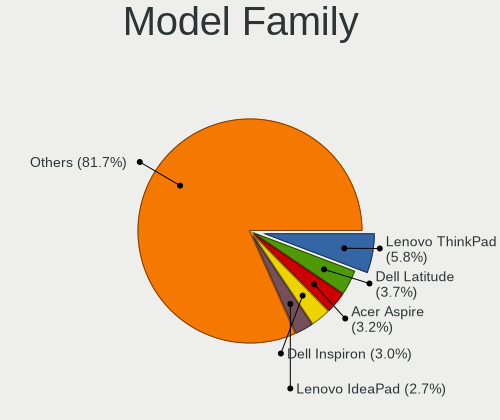
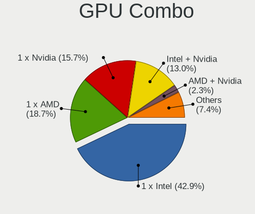
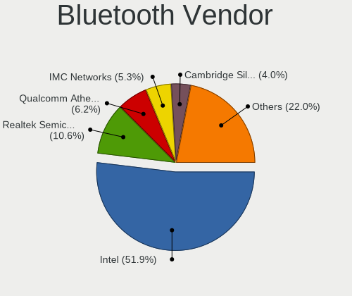

Ubuntu 22.04 - Tested Hardware & Statistics
-------------------------------------------

A project to collect tested hardware configurations for Ubuntu 22.04.

Anyone can contribute to this report by the [hw-probe](https://github.com/linuxhw/hw-probe) tool:

    sudo -E hw-probe -all -upload

Please contribute! Especially if your hardware is rare.

This is a report for all computer types. See also reports for [desktops](/Dist/Ubuntu_22.04/Desktop/README.md) and [notebooks](/Dist/Ubuntu_22.04/Notebook/README.md).

Contents
--------

* [ Test Cases ](#test-cases)

* [ System ](#system)
  - [ Kernel                   ](#kernel)
  - [ Kernel Family            ](#kernel-family)
  - [ Kernel Major Ver.        ](#kernel-major-ver)
  - [ Arch                     ](#arch)
  - [ DE                       ](#de)
  - [ Display Server           ](#display-server)
  - [ Display Manager          ](#display-manager)
  - [ OS Lang                  ](#os-lang)
  - [ Boot Mode                ](#boot-mode)
  - [ Filesystem               ](#filesystem)
  - [ Part. scheme             ](#part-scheme)
  - [ Dual Boot with Linux/BSD ](#dual-boot-with-linuxbsd)
  - [ Dual Boot (Win)          ](#dual-boot-win)

* [ Board ](#board)
  - [ Vendor                   ](#vendor)
  - [ Model                    ](#model)
  - [ Model Family             ](#model-family)
  - [ MFG Year                 ](#mfg-year)
  - [ Form Factor              ](#form-factor)
  - [ Secure Boot              ](#secure-boot)
  - [ Coreboot                 ](#coreboot)
  - [ RAM Size                 ](#ram-size)
  - [ RAM Used                 ](#ram-used)
  - [ Total Drives             ](#total-drives)
  - [ Has CD-ROM               ](#has-cd-rom)
  - [ Has Ethernet             ](#has-ethernet)
  - [ Has WiFi                 ](#has-wifi)
  - [ Has Bluetooth            ](#has-bluetooth)

* [ Location ](#location)
  - [ Country                  ](#country)
  - [ City                     ](#city)

* [ Drives ](#drives)
  - [ Drive Vendor             ](#drive-vendor)
  - [ Drive Model              ](#drive-model)
  - [ HDD Vendor               ](#hdd-vendor)
  - [ SSD Vendor               ](#ssd-vendor)
  - [ Drive Kind               ](#drive-kind)
  - [ Drive Connector          ](#drive-connector)
  - [ Drive Size               ](#drive-size)
  - [ Space Total              ](#space-total)
  - [ Space Used               ](#space-used)
  - [ Malfunc. Drives          ](#malfunc-drives)
  - [ Malfunc. Drive Vendor    ](#malfunc-drive-vendor)
  - [ Malfunc. HDD Vendor      ](#malfunc-hdd-vendor)
  - [ Malfunc. Drive Kind      ](#malfunc-drive-kind)
  - [ Failed Drives            ](#failed-drives)
  - [ Failed Drive Vendor      ](#failed-drive-vendor)
  - [ Drive Status             ](#drive-status)

* [ Storage controller ](#storage-controller)
  - [ Storage Vendor           ](#storage-vendor)
  - [ Storage Model            ](#storage-model)
  - [ Storage Kind             ](#storage-kind)

* [ Processor ](#processor)
  - [ CPU Vendor               ](#cpu-vendor)
  - [ CPU Model                ](#cpu-model)
  - [ CPU Model Family         ](#cpu-model-family)
  - [ CPU Cores                ](#cpu-cores)
  - [ CPU Sockets              ](#cpu-sockets)
  - [ CPU Threads              ](#cpu-threads)
  - [ CPU Op-Modes             ](#cpu-op-modes)
  - [ CPU Microcode            ](#cpu-microcode)
  - [ CPU Microarch            ](#cpu-microarch)

* [ Graphics ](#graphics)
  - [ GPU Vendor               ](#gpu-vendor)
  - [ GPU Model                ](#gpu-model)
  - [ GPU Combo                ](#gpu-combo)
  - [ GPU Driver               ](#gpu-driver)
  - [ GPU Memory               ](#gpu-memory)

* [ Monitor ](#monitor)
  - [ Monitor Vendor           ](#monitor-vendor)
  - [ Monitor Model            ](#monitor-model)
  - [ Monitor Resolution       ](#monitor-resolution)
  - [ Monitor Diagonal         ](#monitor-diagonal)
  - [ Monitor Width            ](#monitor-width)
  - [ Aspect Ratio             ](#aspect-ratio)
  - [ Monitor Area             ](#monitor-area)
  - [ Pixel Density            ](#pixel-density)
  - [ Multiple Monitors        ](#multiple-monitors)

* [ Network ](#network)
  - [ Net Controller Vendor    ](#net-controller-vendor)
  - [ Net Controller Model     ](#net-controller-model)
  - [ Wireless Vendor          ](#wireless-vendor)
  - [ Wireless Model           ](#wireless-model)
  - [ Ethernet Vendor          ](#ethernet-vendor)
  - [ Ethernet Model           ](#ethernet-model)
  - [ Net Controller Kind      ](#net-controller-kind)
  - [ Used Controller          ](#used-controller)
  - [ NICs                     ](#nics)
  - [ IPv6                     ](#ipv6)

* [ Bluetooth ](#bluetooth)
  - [ Bluetooth Vendor         ](#bluetooth-vendor)
  - [ Bluetooth Model          ](#bluetooth-model)

* [ Sound ](#sound)
  - [ Sound Vendor             ](#sound-vendor)
  - [ Sound Model              ](#sound-model)

* [ Memory ](#memory)
  - [ Memory Vendor            ](#memory-vendor)
  - [ Memory Model             ](#memory-model)
  - [ Memory Kind              ](#memory-kind)
  - [ Memory Form Factor       ](#memory-form-factor)
  - [ Memory Size              ](#memory-size)
  - [ Memory Speed             ](#memory-speed)

* [ Printers & scanners ](#printers--scanners)
  - [ Printer Vendor           ](#printer-vendor)
  - [ Printer Model            ](#printer-model)
  - [ Scanner Vendor           ](#scanner-vendor)
  - [ Scanner Model            ](#scanner-model)

* [ Camera ](#camera)
  - [ Camera Vendor            ](#camera-vendor)
  - [ Camera Model             ](#camera-model)

* [ Security ](#security)
  - [ Fingerprint Vendor       ](#fingerprint-vendor)
  - [ Fingerprint Model        ](#fingerprint-model)
  - [ Chipcard Vendor          ](#chipcard-vendor)
  - [ Chipcard Model           ](#chipcard-model)

* [ Unsupported ](#unsupported)
  - [ Unsupported Devices      ](#unsupported-devices)
  - [ Unsupported Device Types ](#unsupported-device-types)

Test Cases
----------

Total: 443

| Vendor        | Model                       | Form-Factor | Probe                                                      | Date         |
|---------------|-----------------------------|-------------|------------------------------------------------------------|--------------|
| ASUSTek       | PU551LA                     | Notebook    | [19e1b6041b](https://linux-hardware.org/?probe=19e1b6041b) | May 01, 2022 |
| Gigabyte      | B365M DS3H                  | Desktop     | [247ab2d4f1](https://linux-hardware.org/?probe=247ab2d4f1) | Apr 30, 2022 |
| Positivo      | POS-ECIG41BSA               | Desktop     | [b622f7f43f](https://linux-hardware.org/?probe=b622f7f43f) | Apr 30, 2022 |
| Sony          | SVE1513R1EB                 | Notebook    | [59a46c5857](https://linux-hardware.org/?probe=59a46c5857) | Apr 30, 2022 |
| Medion        | MS-7616                     | Desktop     | [f3572ea9a5](https://linux-hardware.org/?probe=f3572ea9a5) | Apr 30, 2022 |
| Lenovo        | G700 20251                  | Notebook    | [94272db5ec](https://linux-hardware.org/?probe=94272db5ec) | Apr 30, 2022 |
| Alienware     | x17 R2                      | Notebook    | [d78db966bc](https://linux-hardware.org/?probe=d78db966bc) | Apr 30, 2022 |
| Dell          | Vostro 1720                 | Notebook    | [bc8f50b9fb](https://linux-hardware.org/?probe=bc8f50b9fb) | Apr 30, 2022 |
| Dell          | Vostro 1720                 | Notebook    | [56cc7a9a54](https://linux-hardware.org/?probe=56cc7a9a54) | Apr 30, 2022 |
| Gigabyte      | H61M-DS2 x.x                | Desktop     | [463e99eb8c](https://linux-hardware.org/?probe=463e99eb8c) | Apr 30, 2022 |
| Lenovo        | 81VS                        | Notebook    | [1ff46f7cdc](https://linux-hardware.org/?probe=1ff46f7cdc) | Apr 30, 2022 |
| Lenovo        | 81VS                        | Notebook    | [ea23b0e852](https://linux-hardware.org/?probe=ea23b0e852) | Apr 30, 2022 |
| MSI           | X570-A PRO                  | Desktop     | [ff568c874c](https://linux-hardware.org/?probe=ff568c874c) | Apr 30, 2022 |
| Gigabyte      | B365M DS3H                  | Desktop     | [0a00cf3e33](https://linux-hardware.org/?probe=0a00cf3e33) | Apr 30, 2022 |
| Gigabyte      | B365M DS3H                  | Desktop     | [f140b54261](https://linux-hardware.org/?probe=f140b54261) | Apr 30, 2022 |
| Dell          | System XPS L502X            | Notebook    | [77e1846d8d](https://linux-hardware.org/?probe=77e1846d8d) | Apr 30, 2022 |
| Lenovo        | IdeaPad Flex-14API 81SS     | Notebook    | [f5d70fb9d3](https://linux-hardware.org/?probe=f5d70fb9d3) | Apr 30, 2022 |
| Itautec       | Infoway w7535               | Notebook    | [ac87d9e508](https://linux-hardware.org/?probe=ac87d9e508) | Apr 30, 2022 |
| HUAWEI        | HVY-WXX9                    | Notebook    | [d7913302d5](https://linux-hardware.org/?probe=d7913302d5) | Apr 30, 2022 |
| Dell          | G7 7700                     | Notebook    | [462862ed56](https://linux-hardware.org/?probe=462862ed56) | Apr 30, 2022 |
| Toshiba       | Dakar10FW8                  | Notebook    | [fbe2aaac31](https://linux-hardware.org/?probe=fbe2aaac31) | Apr 30, 2022 |
| Lenovo        | ThinkBook 14 G2 ARE 20VF    | Notebook    | [b6cbc6e523](https://linux-hardware.org/?probe=b6cbc6e523) | Apr 30, 2022 |
| NSX           | SB1402                      | Notebook    | [c9d79a4fe5](https://linux-hardware.org/?probe=c9d79a4fe5) | Apr 30, 2022 |
| ASUSTek       | X550VC                      | Notebook    | [16223d208e](https://linux-hardware.org/?probe=16223d208e) | Apr 30, 2022 |
| HP            | ProBook 440 G8 Notebook ... | Notebook    | [a7fe3cb0f6](https://linux-hardware.org/?probe=a7fe3cb0f6) | Apr 30, 2022 |
| Gigabyte      | B550M DS3H                  | Desktop     | [f62d8963d7](https://linux-hardware.org/?probe=f62d8963d7) | Apr 30, 2022 |
| Lenovo        | G40-70 80GA                 | Notebook    | [fcd20cb250](https://linux-hardware.org/?probe=fcd20cb250) | Apr 30, 2022 |
| HP            | ProBook 4520s               | Notebook    | [60eab2c6c5](https://linux-hardware.org/?probe=60eab2c6c5) | Apr 30, 2022 |
| ASRock        | B75M-ITX                    | Desktop     | [dbc851e0d3](https://linux-hardware.org/?probe=dbc851e0d3) | Apr 30, 2022 |
| Dell          | Latitude 9420               | Notebook    | [4ba28afe84](https://linux-hardware.org/?probe=4ba28afe84) | Apr 30, 2022 |
| Lenovo        | ThinkBook 15 G2 ITL 20VE    | Notebook    | [1abef3591b](https://linux-hardware.org/?probe=1abef3591b) | Apr 30, 2022 |
| HP            | 3396                        | Desktop     | [468c2975ee](https://linux-hardware.org/?probe=468c2975ee) | Apr 30, 2022 |
| Lenovo        | IdeaPad 5 14ITL05 82FE      | Notebook    | [51625474b7](https://linux-hardware.org/?probe=51625474b7) | Apr 30, 2022 |
| Huanan        | X99-BD4 V/OPCZAO            | Desktop     | [2f215a330a](https://linux-hardware.org/?probe=2f215a330a) | Apr 30, 2022 |
| MSI           | B550-A PRO                  | Desktop     | [0b23621ed1](https://linux-hardware.org/?probe=0b23621ed1) | Apr 30, 2022 |
| Acer          | Aspire A315-23              | Notebook    | [865091bbc1](https://linux-hardware.org/?probe=865091bbc1) | Apr 30, 2022 |
| Acer          | Aspire A315-23              | Notebook    | [5ee29c3982](https://linux-hardware.org/?probe=5ee29c3982) | Apr 30, 2022 |
| HP            | Laptop 17-by3xxx            | Notebook    | [087399e252](https://linux-hardware.org/?probe=087399e252) | Apr 30, 2022 |
| MSI           | A88XM-E45 V2                | Desktop     | [a50ad068b1](https://linux-hardware.org/?probe=a50ad068b1) | Apr 30, 2022 |
| Gigabyte      | B550M DS3H                  | Desktop     | [7797c23169](https://linux-hardware.org/?probe=7797c23169) | Apr 30, 2022 |
| Lenovo        | ThinkPad L15 Gen 1 20U4S... | Notebook    | [55e76f131d](https://linux-hardware.org/?probe=55e76f131d) | Apr 30, 2022 |
| HP            | 255 G6 Notebook PC          | Notebook    | [f639c7c8f5](https://linux-hardware.org/?probe=f639c7c8f5) | Apr 29, 2022 |
| HP            | Spectre x360 Convertible... | Convertible | [58dfeebbb5](https://linux-hardware.org/?probe=58dfeebbb5) | Apr 29, 2022 |
| HP            | ZBook 15 G5                 | Notebook    | [aac5097e2a](https://linux-hardware.org/?probe=aac5097e2a) | Apr 29, 2022 |
| HP            | ENVY Laptop 15-ep0xxx       | Notebook    | [96dbfb494e](https://linux-hardware.org/?probe=96dbfb494e) | Apr 29, 2022 |
| Sony          | SVE1513R1EB                 | Notebook    | [d1e0096b2d](https://linux-hardware.org/?probe=d1e0096b2d) | Apr 29, 2022 |
| MSI           | A320M PRO-E                 | Desktop     | [655905bb3b](https://linux-hardware.org/?probe=655905bb3b) | Apr 29, 2022 |
| HP            | EliteBook 8570w             | Notebook    | [e6f47edf47](https://linux-hardware.org/?probe=e6f47edf47) | Apr 29, 2022 |
| Fujitsu       | D3222-A1 S26361-D3222-A1    | Desktop     | [fe522bdf2e](https://linux-hardware.org/?probe=fe522bdf2e) | Apr 29, 2022 |
| HP            | ENVY x360 Convertible 15... | Convertible | [62b044e6e7](https://linux-hardware.org/?probe=62b044e6e7) | Apr 29, 2022 |
| Toshiba       | Satellite P50-B-103         | Notebook    | [6df44e9098](https://linux-hardware.org/?probe=6df44e9098) | Apr 29, 2022 |
| Lenovo        | ThinkPad T450 20BV001YMS    | Notebook    | [f38b762c83](https://linux-hardware.org/?probe=f38b762c83) | Apr 29, 2022 |
| ASUSTek       | M5A97 LE R2.0               | Desktop     | [686f4acac4](https://linux-hardware.org/?probe=686f4acac4) | Apr 29, 2022 |
| Lenovo        | Yoga S740-14IIL 81RS        | Notebook    | [6affdcee0f](https://linux-hardware.org/?probe=6affdcee0f) | Apr 29, 2022 |
| ASUSTek       | Rampage IV EXTREME          | Desktop     | [111d072676](https://linux-hardware.org/?probe=111d072676) | Apr 29, 2022 |
| Dell          | 07WP95 A02                  | Desktop     | [8dd4d42608](https://linux-hardware.org/?probe=8dd4d42608) | Apr 29, 2022 |
| Huanan        | X99-BD4 V/OPCZAO            | Desktop     | [a5743a1922](https://linux-hardware.org/?probe=a5743a1922) | Apr 29, 2022 |
| HP            | ENVY dv7                    | Notebook    | [dbd8feaee0](https://linux-hardware.org/?probe=dbd8feaee0) | Apr 29, 2022 |
| Lenovo        | ThinkPad T470 W10DG 20JN... | Notebook    | [e7ca44864b](https://linux-hardware.org/?probe=e7ca44864b) | Apr 29, 2022 |
| Dell          | Inspiron 7400               | Notebook    | [0c0af6919d](https://linux-hardware.org/?probe=0c0af6919d) | Apr 29, 2022 |
| Pepper Job... | GLK-UC2X                    | Desktop     | [28495f32bd](https://linux-hardware.org/?probe=28495f32bd) | Apr 29, 2022 |
| Alienware     | 07W25T A00                  | Desktop     | [b989838f70](https://linux-hardware.org/?probe=b989838f70) | Apr 29, 2022 |
| Teclast       | F7 Plus                     | Notebook    | [8096cf3295](https://linux-hardware.org/?probe=8096cf3295) | Apr 29, 2022 |
| MSI           | MAG Z490 TOMAHAWK           | Desktop     | [27df4d83ea](https://linux-hardware.org/?probe=27df4d83ea) | Apr 29, 2022 |
| ASUSTek       | PRIME B360M-A               | Desktop     | [519ed87066](https://linux-hardware.org/?probe=519ed87066) | Apr 29, 2022 |
| ASUSTek       | PRIME B360M-A               | Desktop     | [c46a1d595b](https://linux-hardware.org/?probe=c46a1d595b) | Apr 29, 2022 |
| MSI           | A78M-E35                    | Desktop     | [8f9bf75a08](https://linux-hardware.org/?probe=8f9bf75a08) | Apr 29, 2022 |
| HP            | EliteBook 840 G1            | Notebook    | [411c79850c](https://linux-hardware.org/?probe=411c79850c) | Apr 29, 2022 |
| ASUSTek       | Z87-WS                      | Desktop     | [1c67952875](https://linux-hardware.org/?probe=1c67952875) | Apr 29, 2022 |
| MSI           | X470 GAMING PLUS MAX        | Desktop     | [d291472a69](https://linux-hardware.org/?probe=d291472a69) | Apr 28, 2022 |
| Acer          | Aspire A515-54              | Notebook    | [4ff968ef61](https://linux-hardware.org/?probe=4ff968ef61) | Apr 28, 2022 |
| Dell          | Precision 7510              | Notebook    | [afaea67857](https://linux-hardware.org/?probe=afaea67857) | Apr 28, 2022 |
| Dell          | Inspiron 7400               | Notebook    | [8e5289a5e7](https://linux-hardware.org/?probe=8e5289a5e7) | Apr 28, 2022 |
| Dell          | Inspiron 3505               | Notebook    | [1f6bbce46b](https://linux-hardware.org/?probe=1f6bbce46b) | Apr 28, 2022 |
| ASRock        | H61M-VG4                    | Desktop     | [92f92ef4ee](https://linux-hardware.org/?probe=92f92ef4ee) | Apr 28, 2022 |
| Apple         | MacBook3,1                  | Notebook    | [5c90931c74](https://linux-hardware.org/?probe=5c90931c74) | Apr 28, 2022 |
| LG Electro... | 16T90P-G.AA78G              | Convertible | [42a891a892](https://linux-hardware.org/?probe=42a891a892) | Apr 28, 2022 |
| ASRock        | B450M Pro4                  | Desktop     | [773f69d63b](https://linux-hardware.org/?probe=773f69d63b) | Apr 28, 2022 |
| Lenovo        | IdeaPad 320S-14IKB 80X4     | Notebook    | [06ef070e40](https://linux-hardware.org/?probe=06ef070e40) | Apr 28, 2022 |
| Lenovo        | IdeaPad 320S-14IKB 80X4     | Notebook    | [8ef803f8c9](https://linux-hardware.org/?probe=8ef803f8c9) | Apr 28, 2022 |
| Dell          | Latitude 5420               | Notebook    | [26abde11eb](https://linux-hardware.org/?probe=26abde11eb) | Apr 28, 2022 |
| ASUSTek       | M5A78L LE                   | Desktop     | [96739891ab](https://linux-hardware.org/?probe=96739891ab) | Apr 28, 2022 |
| HP            | 22F8                        | Desktop     | [34b2b0f23f](https://linux-hardware.org/?probe=34b2b0f23f) | Apr 28, 2022 |
| ASUSTek       | TUF Z390-PLUS GAMING        | Desktop     | [919872f97b](https://linux-hardware.org/?probe=919872f97b) | Apr 28, 2022 |
| Toshiba       | Satellite C855              | Notebook    | [703a704f72](https://linux-hardware.org/?probe=703a704f72) | Apr 28, 2022 |
| Lenovo        | Z50-75 80EC                 | Notebook    | [3e88e21f3c](https://linux-hardware.org/?probe=3e88e21f3c) | Apr 28, 2022 |
| ASRock        | B450M Pro4                  | Desktop     | [2943b21899](https://linux-hardware.org/?probe=2943b21899) | Apr 28, 2022 |
| MSI           | B450M PRO-VDH PLUS          | Desktop     | [c4f91167bb](https://linux-hardware.org/?probe=c4f91167bb) | Apr 27, 2022 |
| Toshiba       | Satellite Pro S500          | Notebook    | [eb4ae51e74](https://linux-hardware.org/?probe=eb4ae51e74) | Apr 27, 2022 |
| Acer          | Aspire E1-570               | Notebook    | [efcd6be006](https://linux-hardware.org/?probe=efcd6be006) | Apr 27, 2022 |
| Dell          | Inspiron N4010              | Notebook    | [820098c075](https://linux-hardware.org/?probe=820098c075) | Apr 27, 2022 |
| Apple         | MacBook3,1                  | Notebook    | [c7da3d4c4f](https://linux-hardware.org/?probe=c7da3d4c4f) | Apr 27, 2022 |
| MSI           | B550M PRO-VDH WIFI          | Desktop     | [b923126955](https://linux-hardware.org/?probe=b923126955) | Apr 27, 2022 |
| Dell          | Inspiron N4010              | Notebook    | [4d84b677ae](https://linux-hardware.org/?probe=4d84b677ae) | Apr 27, 2022 |
| ASUSTek       | H110M-A/M.2                 | Desktop     | [4c6852d631](https://linux-hardware.org/?probe=4c6852d631) | Apr 27, 2022 |
| ASUSTek       | TUF Gaming B450-PLUS II     | Desktop     | [f06ce3d416](https://linux-hardware.org/?probe=f06ce3d416) | Apr 27, 2022 |
| HP            | ENVY x360 Convertible 15... | Convertible | [f369da2680](https://linux-hardware.org/?probe=f369da2680) | Apr 27, 2022 |
| ASRock        | H61M-VG4                    | Desktop     | [204b1328f2](https://linux-hardware.org/?probe=204b1328f2) | Apr 27, 2022 |
| Dell          | Latitude E6510              | Notebook    | [10d60e00c2](https://linux-hardware.org/?probe=10d60e00c2) | Apr 27, 2022 |
| Samsung       | 350V5C/351V5C/3540VC/344... | Notebook    | [6e793edd01](https://linux-hardware.org/?probe=6e793edd01) | Apr 27, 2022 |
| Dell          | Inspiron 5415               | Notebook    | [5edac5d5a6](https://linux-hardware.org/?probe=5edac5d5a6) | Apr 27, 2022 |
| ASUSTek       | Pro WS WRX80E-SAGE SE WI... | Desktop     | [a3f49d1a04](https://linux-hardware.org/?probe=a3f49d1a04) | Apr 27, 2022 |
| ASUSTek       | Pro WS WRX80E-SAGE SE WI... | Desktop     | [b47f678ce9](https://linux-hardware.org/?probe=b47f678ce9) | Apr 27, 2022 |
| ASRock        | H61M-VG4                    | Desktop     | [fff58f97e8](https://linux-hardware.org/?probe=fff58f97e8) | Apr 27, 2022 |
| Dell          | Latitude E6520              | Notebook    | [1ca407a69f](https://linux-hardware.org/?probe=1ca407a69f) | Apr 27, 2022 |
| Gigabyte      | GA-880GM-UD2H               | Desktop     | [3c53a0e59d](https://linux-hardware.org/?probe=3c53a0e59d) | Apr 27, 2022 |
| Gigabyte      | H61M-S2PV                   | Desktop     | [f09766a481](https://linux-hardware.org/?probe=f09766a481) | Apr 27, 2022 |
| Noblex        | N14WD21                     | Notebook    | [a8a7a4e1d5](https://linux-hardware.org/?probe=a8a7a4e1d5) | Apr 27, 2022 |
| Lenovo        | ThinkPad X250 20CLS52P0F    | Notebook    | [a4d291ccda](https://linux-hardware.org/?probe=a4d291ccda) | Apr 27, 2022 |
| HP            | 22F8                        | Desktop     | [eb4d49a17b](https://linux-hardware.org/?probe=eb4d49a17b) | Apr 27, 2022 |
| Apple         | Mac-F42C88C8 Proto1         | Desktop     | [56da721176](https://linux-hardware.org/?probe=56da721176) | Apr 27, 2022 |
| Apple         | Mac-F42C88C8 Proto1         | Desktop     | [1619af58d4](https://linux-hardware.org/?probe=1619af58d4) | Apr 27, 2022 |
| Lenovo        | IdeaPad Gaming 3 15IMH05... | Notebook    | [a696a35961](https://linux-hardware.org/?probe=a696a35961) | Apr 27, 2022 |
| Dell          | Inspiron 3583               | Notebook    | [8f10e59515](https://linux-hardware.org/?probe=8f10e59515) | Apr 27, 2022 |
| Lenovo        | ThinkPad T470 W10DG 20JN... | Notebook    | [87cc990d93](https://linux-hardware.org/?probe=87cc990d93) | Apr 27, 2022 |
| Acer          | Aspire 5750G                | Notebook    | [3a96bf8237](https://linux-hardware.org/?probe=3a96bf8237) | Apr 27, 2022 |
| Intel         | NUC8BEB J72688-307          | Mini pc     | [e408254cc8](https://linux-hardware.org/?probe=e408254cc8) | Apr 27, 2022 |
| Gigabyte      | B550I AORUS PRO AX          | Desktop     | [3c6aace75c](https://linux-hardware.org/?probe=3c6aace75c) | Apr 27, 2022 |
| MSI           | 880GMA-E35                  | Desktop     | [6ff68166f7](https://linux-hardware.org/?probe=6ff68166f7) | Apr 26, 2022 |
| Lenovo        | ThinkPad T430u 335337G      | Notebook    | [31bc958302](https://linux-hardware.org/?probe=31bc958302) | Apr 26, 2022 |
| Lenovo        | ThinkPad T430u 335337G      | Notebook    | [8446691cb3](https://linux-hardware.org/?probe=8446691cb3) | Apr 26, 2022 |
| Lenovo        | Legion 5 15ACH6 82JW        | Notebook    | [3b4a331875](https://linux-hardware.org/?probe=3b4a331875) | Apr 26, 2022 |
| HP            | ProBook x360 11 G3 EE       | Convertible | [b55ed2fbd6](https://linux-hardware.org/?probe=b55ed2fbd6) | Apr 26, 2022 |
| Dell          | Inspiron 3583               | Notebook    | [bca722d45d](https://linux-hardware.org/?probe=bca722d45d) | Apr 26, 2022 |
| Raspberry ... | Raspberry Pi                | Soc         | [50c760fc94](https://linux-hardware.org/?probe=50c760fc94) | Apr 26, 2022 |
| Dell          | 0WR7PY A03                  | Desktop     | [4ac0a4dff1](https://linux-hardware.org/?probe=4ac0a4dff1) | Apr 26, 2022 |
| HP            | 255 G8 Notebook PC          | Notebook    | [17ccf19b71](https://linux-hardware.org/?probe=17ccf19b71) | Apr 26, 2022 |
| Lenovo        | ThinkPad L490 20Q5002GPG    | Notebook    | [9e591226b7](https://linux-hardware.org/?probe=9e591226b7) | Apr 26, 2022 |
| Dell          | 0VNM11 A00                  | Desktop     | [6aae7c23ad](https://linux-hardware.org/?probe=6aae7c23ad) | Apr 26, 2022 |
| MSI           | A320M-A PRO MAX             | Desktop     | [e06fd46729](https://linux-hardware.org/?probe=e06fd46729) | Apr 26, 2022 |
| Biostar       | J3160NH                     | Desktop     | [8ffd3a1aa4](https://linux-hardware.org/?probe=8ffd3a1aa4) | Apr 26, 2022 |
| Lenovo        | ThinkPad P15v Gen 1 20TQ... | Notebook    | [bd827295e5](https://linux-hardware.org/?probe=bd827295e5) | Apr 26, 2022 |
| Dell          | G15 5510                    | Notebook    | [5126d58147](https://linux-hardware.org/?probe=5126d58147) | Apr 26, 2022 |
| Raspberry ... | Raspberry Pi                | Soc         | [ff35a6956d](https://linux-hardware.org/?probe=ff35a6956d) | Apr 25, 2022 |
| MSI           | Z68A-GD80                   | Desktop     | [fedca9082a](https://linux-hardware.org/?probe=fedca9082a) | Apr 25, 2022 |
| Dell          | G15 5510                    | Notebook    | [ef1787abc5](https://linux-hardware.org/?probe=ef1787abc5) | Apr 25, 2022 |
| Lenovo        | ThinkPad X230 2324GA7       | Notebook    | [a5138b511d](https://linux-hardware.org/?probe=a5138b511d) | Apr 25, 2022 |
| Lenovo        | ThinkPad P15v Gen 1 20TQ... | Notebook    | [9e7c80a9d0](https://linux-hardware.org/?probe=9e7c80a9d0) | Apr 25, 2022 |
| Lenovo        | ThinkPad L15 Gen 2 20X3C... | Notebook    | [3fcb247b21](https://linux-hardware.org/?probe=3fcb247b21) | Apr 25, 2022 |
| Timi          | RedmiBook Pro 15S           | Notebook    | [07ccc93cd4](https://linux-hardware.org/?probe=07ccc93cd4) | Apr 25, 2022 |
| MSI           | GF65 Thin 10UE              | Notebook    | [b099b2ab43](https://linux-hardware.org/?probe=b099b2ab43) | Apr 25, 2022 |
| MSI           | GF65 Thin 10UE              | Notebook    | [79fc46c6f0](https://linux-hardware.org/?probe=79fc46c6f0) | Apr 25, 2022 |
| HP            | ProBook 4520s               | Notebook    | [1621eddc70](https://linux-hardware.org/?probe=1621eddc70) | Apr 25, 2022 |
| HP            | OMEN by Laptop 15-ce0xx     | Notebook    | [8694f28b60](https://linux-hardware.org/?probe=8694f28b60) | Apr 25, 2022 |
| HP            | EliteBook 845 G7 Noteboo... | Notebook    | [1b1bf8dddf](https://linux-hardware.org/?probe=1b1bf8dddf) | Apr 25, 2022 |
| ASUSTek       | VivoBook_ASUSLaptop M350... | Notebook    | [4c3bf947f5](https://linux-hardware.org/?probe=4c3bf947f5) | Apr 25, 2022 |
| HP            | EliteBook 830 G5            | Notebook    | [17f9b4e988](https://linux-hardware.org/?probe=17f9b4e988) | Apr 25, 2022 |
| Apple         | MacBookAir6,2               | Notebook    | [fe067fc3d4](https://linux-hardware.org/?probe=fe067fc3d4) | Apr 25, 2022 |
| ASUSTek       | H81M-V3                     | Desktop     | [4d87f6f113](https://linux-hardware.org/?probe=4d87f6f113) | Apr 25, 2022 |
| Apple         | MacBookAir6,2               | Notebook    | [fb26f3ab65](https://linux-hardware.org/?probe=fb26f3ab65) | Apr 25, 2022 |
| AMI           | Intel                       | Notebook    | [87e32073a4](https://linux-hardware.org/?probe=87e32073a4) | Apr 24, 2022 |
| Gigabyte      | P55M-UD2                    | Desktop     | [5f9ffc8d46](https://linux-hardware.org/?probe=5f9ffc8d46) | Apr 24, 2022 |
| Sony          | VPCEH25FM                   | Notebook    | [bceedddb01](https://linux-hardware.org/?probe=bceedddb01) | Apr 24, 2022 |
| Acer          | Aspire A515-56G             | Notebook    | [492dd679be](https://linux-hardware.org/?probe=492dd679be) | Apr 24, 2022 |
| Dell          | 0GXM1W A02                  | Desktop     | [6564561a75](https://linux-hardware.org/?probe=6564561a75) | Apr 24, 2022 |
| Lenovo        | IdeaPad L340-15IRH Gamin... | Notebook    | [54aa68a653](https://linux-hardware.org/?probe=54aa68a653) | Apr 24, 2022 |
| Acer          | Aspire A515-56G             | Notebook    | [5fc4dbeaad](https://linux-hardware.org/?probe=5fc4dbeaad) | Apr 24, 2022 |
| ASRock        | Z170 Gaming K4              | Desktop     | [96b772b4e6](https://linux-hardware.org/?probe=96b772b4e6) | Apr 24, 2022 |
| Acer          | FX58M                       | Desktop     | [3074ddb372](https://linux-hardware.org/?probe=3074ddb372) | Apr 24, 2022 |
| ASUSTek       | X550CC                      | Notebook    | [4f77777c97](https://linux-hardware.org/?probe=4f77777c97) | Apr 24, 2022 |
| HP            | ProBook 430 G1              | Notebook    | [52259207bb](https://linux-hardware.org/?probe=52259207bb) | Apr 24, 2022 |
| HP            | 255 G6 Notebook PC          | Notebook    | [ad390bd7b7](https://linux-hardware.org/?probe=ad390bd7b7) | Apr 24, 2022 |
| Dell          | Latitude 7400 2-in-1        | Convertible | [3fff5f40c3](https://linux-hardware.org/?probe=3fff5f40c3) | Apr 24, 2022 |
| Dell          | Latitude 7400 2-in-1        | Convertible | [090b87ad9b](https://linux-hardware.org/?probe=090b87ad9b) | Apr 24, 2022 |
| Dell          | 0GXM1W A02                  | Desktop     | [af6b49b2a5](https://linux-hardware.org/?probe=af6b49b2a5) | Apr 24, 2022 |
| HP            | EliteBook x360 1030 G3      | Convertible | [30bac0dca3](https://linux-hardware.org/?probe=30bac0dca3) | Apr 24, 2022 |
| Gigabyte      | G1.Sniper B5-CF             | Desktop     | [4f148a3f66](https://linux-hardware.org/?probe=4f148a3f66) | Apr 24, 2022 |
| Gigabyte      | G1.Sniper B5-CF             | Desktop     | [e0e448efcb](https://linux-hardware.org/?probe=e0e448efcb) | Apr 24, 2022 |
| HP            | ENVY x360 Convertible       | Convertible | [34ac6fff67](https://linux-hardware.org/?probe=34ac6fff67) | Apr 24, 2022 |
| Avell High... | C65 MOB                     | Notebook    | [b8e185c194](https://linux-hardware.org/?probe=b8e185c194) | Apr 24, 2022 |
| ASUSTek       | F2A85-M PRO                 | Desktop     | [e0298dd8f0](https://linux-hardware.org/?probe=e0298dd8f0) | Apr 24, 2022 |
| HP            | 21EF                        | Desktop     | [9e37979ea3](https://linux-hardware.org/?probe=9e37979ea3) | Apr 23, 2022 |
| Lenovo        | Yoga 910-13IKB 80VF         | Convertible | [d0a5573598](https://linux-hardware.org/?probe=d0a5573598) | Apr 23, 2022 |
| Medion        | E7220                       | Notebook    | [c2d7457304](https://linux-hardware.org/?probe=c2d7457304) | Apr 23, 2022 |
| Gigabyte      | Z390 M GAMING-CF            | Desktop     | [929f99800a](https://linux-hardware.org/?probe=929f99800a) | Apr 23, 2022 |
| Dell          | Latitude 5290               | Notebook    | [e373cb6fa1](https://linux-hardware.org/?probe=e373cb6fa1) | Apr 23, 2022 |
| Dell          | 00V62H A00                  | Desktop     | [2da43c32a4](https://linux-hardware.org/?probe=2da43c32a4) | Apr 23, 2022 |
| Lenovo        | Yoga Duet 7 13ITL6 82MA     | Tablet      | [ab5986371d](https://linux-hardware.org/?probe=ab5986371d) | Apr 23, 2022 |
| ASUSTek       | VivoBook_ASUS Laptop X50... | Notebook    | [a551ef1ec7](https://linux-hardware.org/?probe=a551ef1ec7) | Apr 23, 2022 |
| Dell          | 0HD5W2 A00                  | Desktop     | [3b01c4a4a5](https://linux-hardware.org/?probe=3b01c4a4a5) | Apr 23, 2022 |
| Dell          | Inspiron 7506 2n1           | Convertible | [47cbc95032](https://linux-hardware.org/?probe=47cbc95032) | Apr 23, 2022 |
| Lenovo        | ThinkPad E15 Gen 2 20TDS... | Notebook    | [59a49b2d04](https://linux-hardware.org/?probe=59a49b2d04) | Apr 23, 2022 |
| MSI           | MS-1T11                     | Desktop     | [9c16a631ef](https://linux-hardware.org/?probe=9c16a631ef) | Apr 23, 2022 |
| MSI           | MS-1T11                     | Desktop     | [e263cd80f5](https://linux-hardware.org/?probe=e263cd80f5) | Apr 23, 2022 |
| ASUSTek       | K46CA                       | Notebook    | [e762eba391](https://linux-hardware.org/?probe=e762eba391) | Apr 23, 2022 |
| Raspberry ... | Raspberry Pi                | Soc         | [c46c916a16](https://linux-hardware.org/?probe=c46c916a16) | Apr 23, 2022 |
| HP            | 22F8                        | Desktop     | [67dc13d1ad](https://linux-hardware.org/?probe=67dc13d1ad) | Apr 23, 2022 |
| Microsoft     | Surface Pro 7               | Tablet      | [8ff97fd246](https://linux-hardware.org/?probe=8ff97fd246) | Apr 23, 2022 |
| Dell          | Inspiron N5110              | Notebook    | [30209dbcd1](https://linux-hardware.org/?probe=30209dbcd1) | Apr 23, 2022 |
| ASUSTek       | PRIME B560-PLUS             | Desktop     | [8e31efa5fa](https://linux-hardware.org/?probe=8e31efa5fa) | Apr 23, 2022 |
| Dell          | Latitude 5580               | Notebook    | [cbd7aaec4a](https://linux-hardware.org/?probe=cbd7aaec4a) | Apr 23, 2022 |
| Chuwi         | Unknown                     | Notebook    | [96105ecbb2](https://linux-hardware.org/?probe=96105ecbb2) | Apr 23, 2022 |
| Lenovo        | ThinkPad P50 20EQS64N1N     | Notebook    | [c3d792a237](https://linux-hardware.org/?probe=c3d792a237) | Apr 23, 2022 |
| ASUSTek       | VivoBook_ASUS Laptop X50... | Notebook    | [fd6718859d](https://linux-hardware.org/?probe=fd6718859d) | Apr 23, 2022 |
| Dell          | Inspiron 7391 2n1           | Convertible | [0c1628930f](https://linux-hardware.org/?probe=0c1628930f) | Apr 22, 2022 |
| Dell          | 088DT1 A01                  | Desktop     | [9e72ff0940](https://linux-hardware.org/?probe=9e72ff0940) | Apr 22, 2022 |
| Timi          | RedmiBook 14-APCS           | Notebook    | [32cb202a0e](https://linux-hardware.org/?probe=32cb202a0e) | Apr 22, 2022 |
| ASUSTek       | CROSSHAIR II FORMULA        | Desktop     | [d35c4838f2](https://linux-hardware.org/?probe=d35c4838f2) | Apr 22, 2022 |
| ASUSTek       | CROSSHAIR II FORMULA        | Desktop     | [61e0546ed7](https://linux-hardware.org/?probe=61e0546ed7) | Apr 22, 2022 |
| Raspberry ... | Raspberry Pi                | Soc         | [6718ac3459](https://linux-hardware.org/?probe=6718ac3459) | Apr 22, 2022 |
| Samsung       | 300E4C/300E5C/300E7C        | Notebook    | [f3e50d22aa](https://linux-hardware.org/?probe=f3e50d22aa) | Apr 22, 2022 |
| Positivo      | W942SW_SW1                  | Notebook    | [36b0510bae](https://linux-hardware.org/?probe=36b0510bae) | Apr 22, 2022 |
| HONOR         | NBD-WXX9                    | Notebook    | [135c98b96d](https://linux-hardware.org/?probe=135c98b96d) | Apr 22, 2022 |
| Samsung       | 300E4C/300E5C/300E7C        | Notebook    | [d90f38b2ad](https://linux-hardware.org/?probe=d90f38b2ad) | Apr 22, 2022 |
| Lenovo        | MIIX 310-10ICR 80SG         | Tablet      | [91fc5d74c6](https://linux-hardware.org/?probe=91fc5d74c6) | Apr 22, 2022 |
| Acer          | Aspire A515-45              | Notebook    | [377315649e](https://linux-hardware.org/?probe=377315649e) | Apr 22, 2022 |
| ASRock        | Z370 Pro4-IB                | Desktop     | [c0c51e4d53](https://linux-hardware.org/?probe=c0c51e4d53) | Apr 22, 2022 |
| MSI           | Stealth GS77 12UGS          | Notebook    | [cd1bc2095f](https://linux-hardware.org/?probe=cd1bc2095f) | Apr 22, 2022 |
| Dell          | XPS 15 7590                 | Notebook    | [f2680af572](https://linux-hardware.org/?probe=f2680af572) | Apr 22, 2022 |
| Lenovo        | IdeaPad 330-15IKB 81DE      | Notebook    | [8abbc8a322](https://linux-hardware.org/?probe=8abbc8a322) | Apr 22, 2022 |
| HUAWEI        | HVY-WXX9                    | Notebook    | [3320719d25](https://linux-hardware.org/?probe=3320719d25) | Apr 22, 2022 |
| MSI           | Stealth GS77 12UGS          | Notebook    | [33afc70a54](https://linux-hardware.org/?probe=33afc70a54) | Apr 22, 2022 |
| HP            | EliteBook 830 G5            | Notebook    | [6061f1cd1e](https://linux-hardware.org/?probe=6061f1cd1e) | Apr 22, 2022 |
| Acer          | Swift SF314-42              | Notebook    | [b0dc5471af](https://linux-hardware.org/?probe=b0dc5471af) | Apr 22, 2022 |
| Dell          | 0HD5W2 A00                  | Desktop     | [ddfd89e9dc](https://linux-hardware.org/?probe=ddfd89e9dc) | Apr 22, 2022 |
| Lenovo        | IdeaPad 5 Pro 16ACH6 82L... | Notebook    | [35e11e3e60](https://linux-hardware.org/?probe=35e11e3e60) | Apr 22, 2022 |
| Lenovo        | IdeaPadFlex 15 20309        | Notebook    | [6dac014a49](https://linux-hardware.org/?probe=6dac014a49) | Apr 22, 2022 |
| MSI           | MPG B550 GAMING EDGE WIF... | Desktop     | [a76e953825](https://linux-hardware.org/?probe=a76e953825) | Apr 22, 2022 |
| Lenovo        | IdeaPad 500S-13ISK 80Q2     | Notebook    | [4548a301f8](https://linux-hardware.org/?probe=4548a301f8) | Apr 22, 2022 |
| HUAWEI        | DRC-WXX                     | Tablet      | [d459a4ef7d](https://linux-hardware.org/?probe=d459a4ef7d) | Apr 22, 2022 |
| Lenovo        | IdeaPad 3 17ITL6 82H9       | Notebook    | [8f132efef2](https://linux-hardware.org/?probe=8f132efef2) | Apr 21, 2022 |
| Acer          | Aspire 7530G                | Notebook    | [710b429d94](https://linux-hardware.org/?probe=710b429d94) | Apr 21, 2022 |
| MSI           | MAG B460 TOMAHAWK           | Desktop     | [8ef18c7ea4](https://linux-hardware.org/?probe=8ef18c7ea4) | Apr 21, 2022 |
| HP            | EliteBook 840 G5            | Notebook    | [0f748e86d4](https://linux-hardware.org/?probe=0f748e86d4) | Apr 21, 2022 |
| HUAWEI        | CREM-WXX9                   | Notebook    | [2a7742c460](https://linux-hardware.org/?probe=2a7742c460) | Apr 21, 2022 |
| HP            | EliteBook 840 G5            | Notebook    | [58a8282067](https://linux-hardware.org/?probe=58a8282067) | Apr 21, 2022 |
| Chuwi         | CoreBox                     | Mini pc     | [18578239d6](https://linux-hardware.org/?probe=18578239d6) | Apr 21, 2022 |
| Dell          | XPS 15 7590                 | Notebook    | [5266d4c66b](https://linux-hardware.org/?probe=5266d4c66b) | Apr 21, 2022 |
| Dell          | XPS 15 7590                 | Notebook    | [70d107a754](https://linux-hardware.org/?probe=70d107a754) | Apr 21, 2022 |
| HP            | 8054                        | Desktop     | [f9ec7b0896](https://linux-hardware.org/?probe=f9ec7b0896) | Apr 21, 2022 |
| Lenovo        | ThinkCentre M58 6258D3G     | Desktop     | [b84eab559e](https://linux-hardware.org/?probe=b84eab559e) | Apr 21, 2022 |
| ASUSTek       | G550JK                      | Notebook    | [6d291b9c9c](https://linux-hardware.org/?probe=6d291b9c9c) | Apr 21, 2022 |
| Gigabyte      | B450M GAMING                | Desktop     | [bf31ebdabe](https://linux-hardware.org/?probe=bf31ebdabe) | Apr 21, 2022 |
| Lenovo        | IdeaPadFlex 5 14ITL05 82... | Convertible | [a3aa6e30b9](https://linux-hardware.org/?probe=a3aa6e30b9) | Apr 21, 2022 |
| ASUSTek       | X450LA                      | Notebook    | [997a83a67c](https://linux-hardware.org/?probe=997a83a67c) | Apr 20, 2022 |
| MSI           | Z97 GAMING 5                | Desktop     | [a6bd59cad3](https://linux-hardware.org/?probe=a6bd59cad3) | Apr 20, 2022 |
| Acer          | Swift SF314-42              | Notebook    | [a8af23856d](https://linux-hardware.org/?probe=a8af23856d) | Apr 20, 2022 |
| Intel         | W7650                       | Notebook    | [edb281c81e](https://linux-hardware.org/?probe=edb281c81e) | Apr 20, 2022 |
| ASRock        | X470 Taichi Ultimate        | Desktop     | [d10be6941f](https://linux-hardware.org/?probe=d10be6941f) | Apr 20, 2022 |
| ASRock        | X470 Taichi Ultimate        | Desktop     | [a92dda8ded](https://linux-hardware.org/?probe=a92dda8ded) | Apr 20, 2022 |
| Dell          | Latitude 3410               | Notebook    | [d932874d9c](https://linux-hardware.org/?probe=d932874d9c) | Apr 19, 2022 |
| MSI           | Z97 GAMING 5                | Desktop     | [350979cb0a](https://linux-hardware.org/?probe=350979cb0a) | Apr 19, 2022 |
| Lenovo        | B575e 36852EG               | Notebook    | [8f5e5f427a](https://linux-hardware.org/?probe=8f5e5f427a) | Apr 18, 2022 |
| ASUSTek       | G771JW                      | Notebook    | [9b04178e4d](https://linux-hardware.org/?probe=9b04178e4d) | Apr 18, 2022 |
| Raspberry ... | Raspberry Pi                | Soc         | [a5584e7ec2](https://linux-hardware.org/?probe=a5584e7ec2) | Apr 18, 2022 |
| Lenovo        | B575e 36852EG               | Notebook    | [4731516b58](https://linux-hardware.org/?probe=4731516b58) | Apr 18, 2022 |
| Lenovo        | ThinkBook 14 G3 ACL 21A2    | Notebook    | [3faf048414](https://linux-hardware.org/?probe=3faf048414) | Apr 18, 2022 |
| Lenovo        | Z50-70 20354                | Notebook    | [e693d05883](https://linux-hardware.org/?probe=e693d05883) | Apr 17, 2022 |
| Lenovo        | Yoga Duet 7 13ITL6 82MA     | Tablet      | [a2b841241d](https://linux-hardware.org/?probe=a2b841241d) | Apr 17, 2022 |
| Gigabyte      | H310M S2H x.x               | Desktop     | [a0325fabb2](https://linux-hardware.org/?probe=a0325fabb2) | Apr 17, 2022 |
| Gigabyte      | H310M S2H x.x               | Desktop     | [d775ab24fe](https://linux-hardware.org/?probe=d775ab24fe) | Apr 17, 2022 |
| Lenovo        | ThinkBook 14p Gen 2 20YN    | Notebook    | [800aefa57e](https://linux-hardware.org/?probe=800aefa57e) | Apr 16, 2022 |
| MSI           | 970 GAMING                  | Desktop     | [1ed579d3d1](https://linux-hardware.org/?probe=1ed579d3d1) | Apr 16, 2022 |
| MSI           | 970 GAMING                  | Desktop     | [dae8a4db62](https://linux-hardware.org/?probe=dae8a4db62) | Apr 16, 2022 |
| MSI           | GF63 8RD                    | Notebook    | [287e344d0e](https://linux-hardware.org/?probe=287e344d0e) | Apr 16, 2022 |
| ASUSTek       | VivoBook_ASUSLaptop X421... | Notebook    | [a0ad75fa4b](https://linux-hardware.org/?probe=a0ad75fa4b) | Apr 16, 2022 |
| Google        | Phaser360                   | Notebook    | [ab97623a21](https://linux-hardware.org/?probe=ab97623a21) | Apr 16, 2022 |
| Acer          | Swift SF315-52              | Notebook    | [90c143abed](https://linux-hardware.org/?probe=90c143abed) | Apr 16, 2022 |
| Timi          | A34                         | Notebook    | [ff24fc7e19](https://linux-hardware.org/?probe=ff24fc7e19) | Apr 15, 2022 |
| Lenovo        | Yoga 910-13IKB 80VF         | Convertible | [b95a9bcbf0](https://linux-hardware.org/?probe=b95a9bcbf0) | Apr 15, 2022 |
| Unknown       | Unknown                     | Desktop     | [3e2989ae49](https://linux-hardware.org/?probe=3e2989ae49) | Apr 15, 2022 |
| MSI           | MAG X570S TOMAHAWK MAX W... | Desktop     | [cf9feaf8ec](https://linux-hardware.org/?probe=cf9feaf8ec) | Apr 15, 2022 |
| Sony          | VGN-NS38E_S                 | Notebook    | [1b8177c97a](https://linux-hardware.org/?probe=1b8177c97a) | Apr 14, 2022 |
| Lenovo        | Legion R7000 2020 82B6      | Notebook    | [260c012f44](https://linux-hardware.org/?probe=260c012f44) | Apr 14, 2022 |
| System76      | Serval WS                   | Notebook    | [f02bcd64a2](https://linux-hardware.org/?probe=f02bcd64a2) | Apr 14, 2022 |
| Gigabyte      | B75M-D3P                    | Desktop     | [cfb6502298](https://linux-hardware.org/?probe=cfb6502298) | Apr 14, 2022 |
| MSI           | MEG X570 UNIFY              | Desktop     | [bacc580e7a](https://linux-hardware.org/?probe=bacc580e7a) | Apr 13, 2022 |
| PC Special... | PCx0Dx                      | Notebook    | [6b0f05bf07](https://linux-hardware.org/?probe=6b0f05bf07) | Apr 13, 2022 |
| Lenovo        | Legion 5P 15ARH05H 82GU     | Notebook    | [a31cc5eb3b](https://linux-hardware.org/?probe=a31cc5eb3b) | Apr 13, 2022 |
| Multilaser    | M11W                        | Notebook    | [4be432c77a](https://linux-hardware.org/?probe=4be432c77a) | Apr 13, 2022 |
| Lenovo        | IdeaPad 330S-15IKB 81F5     | Notebook    | [fecdd237a4](https://linux-hardware.org/?probe=fecdd237a4) | Apr 11, 2022 |
| Apple         | MacBookPro14,1              | Notebook    | [1d1ff81694](https://linux-hardware.org/?probe=1d1ff81694) | Apr 11, 2022 |
| MSI           | X370 GAMING PRO CARBON A... | Desktop     | [e4ea2782f9](https://linux-hardware.org/?probe=e4ea2782f9) | Apr 10, 2022 |
| Gigabyte      | H55M-S2HP                   | Desktop     | [f394924315](https://linux-hardware.org/?probe=f394924315) | Apr 10, 2022 |
| Gigabyte      | H55M-S2HP                   | Desktop     | [9edb3bbc43](https://linux-hardware.org/?probe=9edb3bbc43) | Apr 10, 2022 |
| Lenovo        | IdeaPad 5 Pro 14ACN6 82L... | Notebook    | [ce0316a106](https://linux-hardware.org/?probe=ce0316a106) | Apr 10, 2022 |
| ASUSTek       | ROG STRIX B350-F GAMING     | Desktop     | [1009093226](https://linux-hardware.org/?probe=1009093226) | Apr 10, 2022 |
| ASUSTek       | ROG Zephyrus G15 GA502IV... | Notebook    | [0def0def83](https://linux-hardware.org/?probe=0def0def83) | Apr 09, 2022 |
| HP            | 840 G6                      | Notebook    | [7f8b25d480](https://linux-hardware.org/?probe=7f8b25d480) | Apr 09, 2022 |
| Toshiba       | Satellite L50-A             | Notebook    | [9a4f7c7381](https://linux-hardware.org/?probe=9a4f7c7381) | Apr 09, 2022 |
| Toshiba       | Satellite L50-A             | Notebook    | [ce1ec01972](https://linux-hardware.org/?probe=ce1ec01972) | Apr 09, 2022 |
| Lenovo        | 3098 SDK0E50510 WIN 2625... | Desktop     | [62c84ef4b4](https://linux-hardware.org/?probe=62c84ef4b4) | Apr 09, 2022 |
| Lenovo        | 3098 SDK0E50510 WIN 2625... | Desktop     | [07bde861ad](https://linux-hardware.org/?probe=07bde861ad) | Apr 09, 2022 |
| Supermicro    | H12SSL-i                    | Server      | [7bdae699e5](https://linux-hardware.org/?probe=7bdae699e5) | Apr 09, 2022 |
| Lenovo        | ThinkPad S1 Yoga 12 20DK... | Notebook    | [2240b6c593](https://linux-hardware.org/?probe=2240b6c593) | Apr 09, 2022 |
| Lenovo        | ThinkPad L14 Gen 2 20X10... | Notebook    | [1f799cdbef](https://linux-hardware.org/?probe=1f799cdbef) | Apr 09, 2022 |
| ASUSTek       | P8H61-M LX3 R2.0            | Desktop     | [8a07adc0f8](https://linux-hardware.org/?probe=8a07adc0f8) | Apr 09, 2022 |
| Apple         | MacBookPro14,1              | Notebook    | [470a09fc31](https://linux-hardware.org/?probe=470a09fc31) | Apr 09, 2022 |
| Lenovo        | IdeaPadFlex 5 14IIL05 81... | Convertible | [f242f094a9](https://linux-hardware.org/?probe=f242f094a9) | Apr 09, 2022 |
| Unknown       | HX90                        | Desktop     | [913b92a244](https://linux-hardware.org/?probe=913b92a244) | Apr 08, 2022 |
| HP            | 1495                        | Desktop     | [36ea4763de](https://linux-hardware.org/?probe=36ea4763de) | Apr 08, 2022 |
| Unknown       | Unknown                     | Soc         | [99029e9661](https://linux-hardware.org/?probe=99029e9661) | Apr 08, 2022 |
| Maxtang       | FP30 V1.0                   | Desktop     | [2062d8578e](https://linux-hardware.org/?probe=2062d8578e) | Apr 08, 2022 |
| Supermicro    | H12SSL-i                    | Server      | [4f88fe663e](https://linux-hardware.org/?probe=4f88fe663e) | Apr 08, 2022 |
| Lenovo        | Yoga Slim 7-14ARE05 82A2    | Notebook    | [ae77218dcf](https://linux-hardware.org/?probe=ae77218dcf) | Apr 07, 2022 |
| HP            | EliteBook 840 G8 Noteboo... | Notebook    | [8ab4c1618d](https://linux-hardware.org/?probe=8ab4c1618d) | Apr 07, 2022 |
| Gigabyte      | X570 AORUS ELITE            | Desktop     | [fa9314716d](https://linux-hardware.org/?probe=fa9314716d) | Apr 07, 2022 |
| Acer          | Nitro AN515-42              | Notebook    | [322440c462](https://linux-hardware.org/?probe=322440c462) | Apr 06, 2022 |
| HUAWEI        | CREM-WXX9                   | Notebook    | [6d57ed5e10](https://linux-hardware.org/?probe=6d57ed5e10) | Apr 06, 2022 |
| HP            | 840 G6                      | Notebook    | [76665316f7](https://linux-hardware.org/?probe=76665316f7) | Apr 06, 2022 |
| Dell          | G5 5590                     | Notebook    | [86d53d1c79](https://linux-hardware.org/?probe=86d53d1c79) | Apr 06, 2022 |
| Framework     | Laptop                      | Notebook    | [59a51973bb](https://linux-hardware.org/?probe=59a51973bb) | Apr 05, 2022 |
| Medion        | E15303                      | Notebook    | [21bdec99bb](https://linux-hardware.org/?probe=21bdec99bb) | Apr 05, 2022 |
| ASUSTek       | ROG STRIX B550-I GAMING     | Desktop     | [d2f9498bd2](https://linux-hardware.org/?probe=d2f9498bd2) | Apr 05, 2022 |
| Acer          | Aspire XC-603               | Desktop     | [ef344607ad](https://linux-hardware.org/?probe=ef344607ad) | Apr 04, 2022 |
| Packard Be... | IMEDIA S2110A               | Desktop     | [b8bf871708](https://linux-hardware.org/?probe=b8bf871708) | Apr 04, 2022 |
| BESSTAR Te... | ATB15                       | Server      | [b7c7776f50](https://linux-hardware.org/?probe=b7c7776f50) | Apr 04, 2022 |
| Lenovo        | ThinkPad E495 20NEA00QUS    | Notebook    | [d9cbb34331](https://linux-hardware.org/?probe=d9cbb34331) | Apr 04, 2022 |
| Lenovo        | ThinkPad E495 20NEA00QUS    | Notebook    | [062e604ef0](https://linux-hardware.org/?probe=062e604ef0) | Apr 04, 2022 |
| Gigabyte      | B365 M AORUS ELITE-CF       | Desktop     | [7da8a936ea](https://linux-hardware.org/?probe=7da8a936ea) | Apr 04, 2022 |
| Apple         | Mac-031AEE4D24BFF0B1 Mac... | Mini pc     | [99a152f9c7](https://linux-hardware.org/?probe=99a152f9c7) | Apr 04, 2022 |
| Lenovo        | ThinkPad P1 Gen 4i 20Y30... | Notebook    | [43ff476479](https://linux-hardware.org/?probe=43ff476479) | Apr 03, 2022 |
| Samsung       | R580/R590                   | Notebook    | [0b95325a5e](https://linux-hardware.org/?probe=0b95325a5e) | Apr 03, 2022 |
| Gigabyte      | Z690 UD AX                  | Desktop     | [a052a5e936](https://linux-hardware.org/?probe=a052a5e936) | Apr 03, 2022 |
| Lenovo        | IdeaPad 5 Pro 14ACN6 82L... | Notebook    | [bdb683ff40](https://linux-hardware.org/?probe=bdb683ff40) | Apr 03, 2022 |
| Unknown       | Unknown                     | Desktop     | [ec51dcaf0a](https://linux-hardware.org/?probe=ec51dcaf0a) | Apr 03, 2022 |
| ASUSTek       | ROG Zephyrus G14 GA401IH... | Notebook    | [ad5d38e378](https://linux-hardware.org/?probe=ad5d38e378) | Apr 02, 2022 |
| Lenovo        | IdeaPad 5 Pro 14ACN6 82L... | Notebook    | [e380073189](https://linux-hardware.org/?probe=e380073189) | Apr 02, 2022 |
| HP            | Pavilion Laptop 14-ce2xx... | Notebook    | [d103b2cb25](https://linux-hardware.org/?probe=d103b2cb25) | Apr 02, 2022 |
| MSI           | MAG B660M MORTAR DDR4       | Desktop     | [a9f2820894](https://linux-hardware.org/?probe=a9f2820894) | Apr 02, 2022 |
| Dell          | 07PR60 A00                  | Desktop     | [40f34fbc8f](https://linux-hardware.org/?probe=40f34fbc8f) | Apr 01, 2022 |
| Intel         | S2600CP G50768-505          | Server      | [cdfba65630](https://linux-hardware.org/?probe=cdfba65630) | Apr 01, 2022 |
| Dell          | Inspiron N5110              | Notebook    | [eba4514371](https://linux-hardware.org/?probe=eba4514371) | Apr 01, 2022 |
| HUAWEI        | MACH-WX9                    | Notebook    | [a799c6c916](https://linux-hardware.org/?probe=a799c6c916) | Apr 01, 2022 |
| TrekStor      | Primetab S11B               | Tablet      | [c98cdfd7c7](https://linux-hardware.org/?probe=c98cdfd7c7) | Apr 01, 2022 |
| Fujitsu       | D3223-C1 S26361-D3223-C1    | Desktop     | [f0fdc95810](https://linux-hardware.org/?probe=f0fdc95810) | Apr 01, 2022 |
| Dell          | Inspiron N5110              | Notebook    | [606eb17f56](https://linux-hardware.org/?probe=606eb17f56) | Apr 01, 2022 |
| HP            | ProLiant ML110 G7           | Desktop     | [9e1e2b2ae7](https://linux-hardware.org/?probe=9e1e2b2ae7) | Apr 01, 2022 |
| Dell          | Inspiron N5110              | Notebook    | [6b0cd44dbb](https://linux-hardware.org/?probe=6b0cd44dbb) | Apr 01, 2022 |
| Alienware     | M11x                        | Notebook    | [f83c01bb34](https://linux-hardware.org/?probe=f83c01bb34) | Apr 01, 2022 |
| Avell High... | A70 MOB                     | Notebook    | [9e095642f0](https://linux-hardware.org/?probe=9e095642f0) | Apr 01, 2022 |
| Dell          | Inspiron 3501               | Notebook    | [a14dde61dc](https://linux-hardware.org/?probe=a14dde61dc) | Apr 01, 2022 |
| HUAWEI        | CREM-WXX9                   | Notebook    | [858142c2ab](https://linux-hardware.org/?probe=858142c2ab) | Apr 01, 2022 |
| MSI           | X370 GAMING PRO CARBON A... | Desktop     | [ce2e9f743d](https://linux-hardware.org/?probe=ce2e9f743d) | Mar 31, 2022 |
| Lenovo        | IdeaPad 5 14ITL05 82FE      | Notebook    | [ceee79344c](https://linux-hardware.org/?probe=ceee79344c) | Mar 31, 2022 |
| Dell          | 0YNVJG A01                  | Desktop     | [4ccce61117](https://linux-hardware.org/?probe=4ccce61117) | Mar 30, 2022 |
| HUAWEI        | CREM-WXX9                   | Notebook    | [83b60423e1](https://linux-hardware.org/?probe=83b60423e1) | Mar 30, 2022 |
| HP            | 250 G4                      | Notebook    | [69a3535c1a](https://linux-hardware.org/?probe=69a3535c1a) | Mar 30, 2022 |
| Medion        | S4401 MD61533               | Convertible | [0017875c99](https://linux-hardware.org/?probe=0017875c99) | Mar 30, 2022 |
| MSI           | B450M PRO-M2 MAX            | Desktop     | [f21ef43d0f](https://linux-hardware.org/?probe=f21ef43d0f) | Mar 30, 2022 |
| HUAWEI        | CREM-WXX9                   | Notebook    | [4626f2aeab](https://linux-hardware.org/?probe=4626f2aeab) | Mar 29, 2022 |
| MSI           | GP76 Leopard 11UG           | Notebook    | [93a6b587c2](https://linux-hardware.org/?probe=93a6b587c2) | Mar 29, 2022 |
| Lenovo        | ThinkBook 15 G3 ACL 21A4    | Notebook    | [30c09eec3b](https://linux-hardware.org/?probe=30c09eec3b) | Mar 28, 2022 |
| HUAWEI        | CREM-WXX9                   | Notebook    | [dbdd71e8b8](https://linux-hardware.org/?probe=dbdd71e8b8) | Mar 28, 2022 |
| Dell          | XPS 17 9710                 | Notebook    | [ecf7b98552](https://linux-hardware.org/?probe=ecf7b98552) | Mar 28, 2022 |
| Lenovo        | ThinkPad T14s Gen 2a 20X... | Notebook    | [0e93a8600c](https://linux-hardware.org/?probe=0e93a8600c) | Mar 27, 2022 |
| Lenovo        | IdeaPad 5 Pro 14ACN6 82L... | Notebook    | [e5b0f5c259](https://linux-hardware.org/?probe=e5b0f5c259) | Mar 27, 2022 |
| Le Cube 1     | Unknown                     | Desktop     | [a881cc0397](https://linux-hardware.org/?probe=a881cc0397) | Mar 26, 2022 |
| HUAWEI        | MACH-WX9                    | Notebook    | [64e505d8d7](https://linux-hardware.org/?probe=64e505d8d7) | Mar 26, 2022 |
| Lenovo        | IdeaPad 5 Pro 14ACN6 82L... | Notebook    | [01e83234d9](https://linux-hardware.org/?probe=01e83234d9) | Mar 26, 2022 |
| Lenovo        | IdeaPad 5 Pro 14ACN6 82L... | Notebook    | [4fb374e78b](https://linux-hardware.org/?probe=4fb374e78b) | Mar 25, 2022 |
| HP            | EliteBook 840 G3            | Notebook    | [f06216a521](https://linux-hardware.org/?probe=f06216a521) | Mar 24, 2022 |
| HP            | 1589                        | Desktop     | [8c1f30bb6f](https://linux-hardware.org/?probe=8c1f30bb6f) | Mar 23, 2022 |
| HP            | Pavilion x2 Detachable      | Notebook    | [a82a2739a8](https://linux-hardware.org/?probe=a82a2739a8) | Mar 22, 2022 |
| Lenovo        | Z50-70 20354                | Notebook    | [b03762a80b](https://linux-hardware.org/?probe=b03762a80b) | Mar 22, 2022 |
| Framework     | Laptop                      | Notebook    | [b8fcafa943](https://linux-hardware.org/?probe=b8fcafa943) | Mar 20, 2022 |
| GPU Compan... | GWTC116-2                   | Notebook    | [3c0450f79e](https://linux-hardware.org/?probe=3c0450f79e) | Mar 12, 2022 |
| ASUSTek       | ROG Zephyrus G14 GA401IH... | Notebook    | [1c22760a82](https://linux-hardware.org/?probe=1c22760a82) | Mar 12, 2022 |
| Shenzhen W... | AERO 2 Pro                  | Mini pc     | [264fcd47ff](https://linux-hardware.org/?probe=264fcd47ff) | Mar 12, 2022 |
| Shenzhen W... | AERO 2 Pro                  | Mini pc     | [91a4d09517](https://linux-hardware.org/?probe=91a4d09517) | Mar 12, 2022 |
| ASRock        | 970 Extreme3 R2.0           | Desktop     | [f417e6a6ef](https://linux-hardware.org/?probe=f417e6a6ef) | Mar 11, 2022 |
| MSI           | Creator Z16 A11UET          | Notebook    | [1804e5eb77](https://linux-hardware.org/?probe=1804e5eb77) | Mar 09, 2022 |
| Unknown       | T3 MRD                      | Desktop     | [256dc440ec](https://linux-hardware.org/?probe=256dc440ec) | Mar 09, 2022 |
| HP            | ENVY x360 Convertible 13... | Convertible | [8a87e0ca46](https://linux-hardware.org/?probe=8a87e0ca46) | Mar 07, 2022 |
| ASUSTek       | ROG Zephyrus M16 GU603ZW... | Notebook    | [9fd12bdd29](https://linux-hardware.org/?probe=9fd12bdd29) | Mar 06, 2022 |
| HUAWEI        | BOHB-WAX9                   | Notebook    | [915ca09de4](https://linux-hardware.org/?probe=915ca09de4) | Mar 05, 2022 |
| MSI           | X370 GAMING PRO CARBON A... | Desktop     | [1fb25ad2c3](https://linux-hardware.org/?probe=1fb25ad2c3) | Mar 05, 2022 |
| Toshiba       | Satellite C70D-A            | Notebook    | [c7dfd52f76](https://linux-hardware.org/?probe=c7dfd52f76) | Mar 05, 2022 |
| HP            | ZBook 15 G5                 | Notebook    | [f86a14c16d](https://linux-hardware.org/?probe=f86a14c16d) | Mar 05, 2022 |
| ASUSTek       | M4A87TD/USB3                | Desktop     | [aa80ded615](https://linux-hardware.org/?probe=aa80ded615) | Mar 04, 2022 |
| ASUSTek       | M4A87TD/USB3                | Desktop     | [3e997c5618](https://linux-hardware.org/?probe=3e997c5618) | Mar 03, 2022 |
| ASUSTek       | ROG Zephyrus M16 GU603ZW... | Notebook    | [206f3a7c01](https://linux-hardware.org/?probe=206f3a7c01) | Mar 02, 2022 |
| Unknown       | T3 MRD                      | Desktop     | [35ab38818d](https://linux-hardware.org/?probe=35ab38818d) | Feb 28, 2022 |
| Unknown       | T3 MRD                      | Desktop     | [01dd9cefa7](https://linux-hardware.org/?probe=01dd9cefa7) | Feb 28, 2022 |
| HP            | Presario CQ42               | Notebook    | [de34294599](https://linux-hardware.org/?probe=de34294599) | Feb 27, 2022 |
| Gigabyte      | X570 I AORUS PRO WIFI       | Desktop     | [18d37562a8](https://linux-hardware.org/?probe=18d37562a8) | Feb 26, 2022 |
| Gigabyte      | X570 I AORUS PRO WIFI       | Desktop     | [d8af57f59a](https://linux-hardware.org/?probe=d8af57f59a) | Feb 26, 2022 |
| Shanghai Z... | ZXE CRB                     | Notebook    | [7fe4a3390b](https://linux-hardware.org/?probe=7fe4a3390b) | Feb 25, 2022 |
| Timi          | TM1709                      | Notebook    | [16e699bea8](https://linux-hardware.org/?probe=16e699bea8) | Feb 25, 2022 |
| ASUSTek       | ROG Zephyrus M16 GU603HE... | Notebook    | [076c8f6e01](https://linux-hardware.org/?probe=076c8f6e01) | Feb 23, 2022 |
| ASUSTek       | ROG Zephyrus M16 GU603HE... | Notebook    | [85c09f63f0](https://linux-hardware.org/?probe=85c09f63f0) | Feb 23, 2022 |
| Gigabyte      | H61M-DS2 DVI                | Desktop     | [90c43679f7](https://linux-hardware.org/?probe=90c43679f7) | Feb 23, 2022 |
| Acer          | Aspire A517-52              | Notebook    | [52976ad94b](https://linux-hardware.org/?probe=52976ad94b) | Feb 23, 2022 |
| Lenovo        | ThinkPad X1 Yoga Gen 6 2... | Convertible | [973f8ebf5e](https://linux-hardware.org/?probe=973f8ebf5e) | Feb 17, 2022 |
| MSI           | Stealth GS66 12UHS          | Notebook    | [bb8ef51c23](https://linux-hardware.org/?probe=bb8ef51c23) | Feb 17, 2022 |
| Lenovo        | ThinkPad E15 Gen 2 20TES... | Notebook    | [da103e44c5](https://linux-hardware.org/?probe=da103e44c5) | Feb 17, 2022 |
| ASUSTek       | VivoBook_ASUSLaptop TP40... | Convertible | [1055dc7082](https://linux-hardware.org/?probe=1055dc7082) | Feb 14, 2022 |
| HP            | 620                         | Notebook    | [bd89b469e4](https://linux-hardware.org/?probe=bd89b469e4) | Feb 14, 2022 |
| ASUSTek       | ASUS EXPERTBOOK B3302FEA... | Convertible | [20d30ebe0b](https://linux-hardware.org/?probe=20d30ebe0b) | Feb 13, 2022 |
| MSI           | X370 GAMING PRO CARBON A... | Desktop     | [fa5ed1f68b](https://linux-hardware.org/?probe=fa5ed1f68b) | Feb 13, 2022 |
| Gigabyte      | X570S AORUS PRO AX          | Desktop     | [e329340668](https://linux-hardware.org/?probe=e329340668) | Feb 11, 2022 |
| Dell          | 0YXT71 A03                  | Desktop     | [19227aa57d](https://linux-hardware.org/?probe=19227aa57d) | Feb 11, 2022 |
| HP            | 212B                        | Desktop     | [fab24340a5](https://linux-hardware.org/?probe=fab24340a5) | Feb 10, 2022 |
| HP            | Pavilion 15                 | Notebook    | [9246e37578](https://linux-hardware.org/?probe=9246e37578) | Feb 09, 2022 |
| ASUSTek       | K52Je                       | Notebook    | [e1010983cf](https://linux-hardware.org/?probe=e1010983cf) | Feb 09, 2022 |
| Lenovo        | ThinkPad Yoga 370 20JJS0... | Convertible | [878c4247cb](https://linux-hardware.org/?probe=878c4247cb) | Feb 09, 2022 |
| ASRockRack    | X470D4U2/1N1                | Desktop     | [735bc0f806](https://linux-hardware.org/?probe=735bc0f806) | Feb 04, 2022 |
| Dell          | Latitude 3330               | Notebook    | [c3b39f74b4](https://linux-hardware.org/?probe=c3b39f74b4) | Jan 31, 2022 |
| ASUSTek       | ROG Zephyrus G15 GA502IU... | Notebook    | [0a04b2d1b1](https://linux-hardware.org/?probe=0a04b2d1b1) | Jan 31, 2022 |
| HP            | 15                          | Notebook    | [81961b52a9](https://linux-hardware.org/?probe=81961b52a9) | Jan 29, 2022 |
| ASUSTek       | P5P41T/USB3                 | Desktop     | [f45dc3454a](https://linux-hardware.org/?probe=f45dc3454a) | Jan 25, 2022 |
| ASUSTek       | P5P41T/USB3                 | Desktop     | [b69dafbb2b](https://linux-hardware.org/?probe=b69dafbb2b) | Jan 25, 2022 |
| Unknown       | Unknown                     | Soc         | [f60622cca7](https://linux-hardware.org/?probe=f60622cca7) | Jan 23, 2022 |
| Unknown       | Unknown                     | Soc         | [fb25f8463c](https://linux-hardware.org/?probe=fb25f8463c) | Jan 23, 2022 |
| HP            | ProBook 445 G7              | Notebook    | [bceca55120](https://linux-hardware.org/?probe=bceca55120) | Jan 23, 2022 |
| ASUSTek       | P5P41T/USB3                 | Desktop     | [105593cece](https://linux-hardware.org/?probe=105593cece) | Jan 23, 2022 |
| ASUSTek       | ASUS TUF Gaming F17 FX70... | Notebook    | [2de98fb4d8](https://linux-hardware.org/?probe=2de98fb4d8) | Jan 22, 2022 |
| HP            | ProBook 650 G5              | Notebook    | [111cb6822e](https://linux-hardware.org/?probe=111cb6822e) | Jan 21, 2022 |
| HP            | Pavilion Laptop 14-dv1xx... | Notebook    | [e092fc4b26](https://linux-hardware.org/?probe=e092fc4b26) | Jan 20, 2022 |
| HP            | ZBook Power 15.6 inch G8... | Notebook    | [245123d0a8](https://linux-hardware.org/?probe=245123d0a8) | Jan 20, 2022 |
| Gigabyte      | GB-BSi7-1165G7              | Desktop     | [ab94ff1199](https://linux-hardware.org/?probe=ab94ff1199) | Jan 20, 2022 |
| Dell          | Latitude E6510              | Notebook    | [c0d3a6c31a](https://linux-hardware.org/?probe=c0d3a6c31a) | Jan 16, 2022 |
| MSI           | Z490-A PRO                  | Desktop     | [b2655bbd43](https://linux-hardware.org/?probe=b2655bbd43) | Jan 15, 2022 |
| Google        | Kefka                       | Notebook    | [e62fa3eea6](https://linux-hardware.org/?probe=e62fa3eea6) | Jan 10, 2022 |
| Timi          | RedmiBook Pro 15S           | Notebook    | [034079628f](https://linux-hardware.org/?probe=034079628f) | Jan 07, 2022 |
| Lenovo        | ThinkPad T400 2768WGB       | Notebook    | [ac0e3dfe29](https://linux-hardware.org/?probe=ac0e3dfe29) | Jan 07, 2022 |
| MSI           | C236A WORKSTATION           | Desktop     | [97795d3ebc](https://linux-hardware.org/?probe=97795d3ebc) | Jan 07, 2022 |
| HP            | ENVY Laptop 13-ad1xx        | Notebook    | [666b0b18f5](https://linux-hardware.org/?probe=666b0b18f5) | Dec 30, 2021 |
| Intel         | H61                         | Desktop     | [e2b49aa759](https://linux-hardware.org/?probe=e2b49aa759) | Dec 30, 2021 |
| MSI           | GT73VR 6RE                  | Notebook    | [0f41e5dd07](https://linux-hardware.org/?probe=0f41e5dd07) | Dec 28, 2021 |
| Lenovo        | Legion 7 16ACHg6 82N6       | Notebook    | [be79b3cd82](https://linux-hardware.org/?probe=be79b3cd82) | Dec 26, 2021 |
| Lenovo        | Flex 2-15 20405             | Notebook    | [ccc85b0783](https://linux-hardware.org/?probe=ccc85b0783) | Dec 13, 2021 |
| Lenovo        | 3141 NOK                    | Desktop     | [cc90d7c889](https://linux-hardware.org/?probe=cc90d7c889) | Dec 13, 2021 |
| ASUSTek       | ROG STRIX B350-F GAMING     | Desktop     | [0db33a5b23](https://linux-hardware.org/?probe=0db33a5b23) | Dec 10, 2021 |
| MSI           | Modern 15 A11MU             | Notebook    | [34b31c53cd](https://linux-hardware.org/?probe=34b31c53cd) | Dec 07, 2021 |
| Toshiba       | PORTEGE Z10T-A              | Notebook    | [5257d76a92](https://linux-hardware.org/?probe=5257d76a92) | Dec 05, 2021 |
| HP            | Laptop 15s-fq1xxx           | Notebook    | [f219ee63ff](https://linux-hardware.org/?probe=f219ee63ff) | Nov 30, 2021 |
| HP            | Laptop 15s-fq1xxx           | Notebook    | [3199d159a4](https://linux-hardware.org/?probe=3199d159a4) | Nov 30, 2021 |
| Huanan        | X99 F8D V2.2                | Desktop     | [dcd5217827](https://linux-hardware.org/?probe=dcd5217827) | Nov 29, 2021 |
| Gigabyte      | M52L-S3                     | Desktop     | [16854f2502](https://linux-hardware.org/?probe=16854f2502) | Nov 29, 2021 |
| Gigabyte      | M52L-S3                     | Desktop     | [e6f3417028](https://linux-hardware.org/?probe=e6f3417028) | Nov 27, 2021 |
| Lenovo        | Flex 2-15 20405             | Notebook    | [d191e3f97f](https://linux-hardware.org/?probe=d191e3f97f) | Nov 22, 2021 |
| Lenovo        | Flex 2-15 20405             | Notebook    | [6381b11078](https://linux-hardware.org/?probe=6381b11078) | Nov 22, 2021 |
| Gigabyte      | EP31-DS3L                   | Desktop     | [c0134f6231](https://linux-hardware.org/?probe=c0134f6231) | Nov 11, 2021 |
| Gigabyte      | EP31-DS3L                   | Desktop     | [4d659bf7e4](https://linux-hardware.org/?probe=4d659bf7e4) | Nov 11, 2021 |
| ASUSTek       | K30AD_M31AD_M51AD_M32AD     | Desktop     | [36e64b8256](https://linux-hardware.org/?probe=36e64b8256) | Nov 10, 2021 |
| ASUSTek       | X58L                        | Notebook    | [c3df58b13b](https://linux-hardware.org/?probe=c3df58b13b) | Nov 10, 2021 |
| ASUSTek       | X58L                        | Notebook    | [e1425f037e](https://linux-hardware.org/?probe=e1425f037e) | Nov 10, 2021 |
| ASUSTek       | X58L                        | Notebook    | [f64ba3a9e4](https://linux-hardware.org/?probe=f64ba3a9e4) | Nov 10, 2021 |
| Dell          | Inspiron 1464               | Notebook    | [26f50eb4a8](https://linux-hardware.org/?probe=26f50eb4a8) | Nov 06, 2021 |
| Dell          | Inspiron 11 - 3147          | Notebook    | [6b1a282c17](https://linux-hardware.org/?probe=6b1a282c17) | Nov 05, 2021 |
| Dell          | Inspiron 1464               | Notebook    | [4063779d5a](https://linux-hardware.org/?probe=4063779d5a) | Nov 01, 2021 |
| MSI           | MS-7235                     | Desktop     | [bbfa7fb897](https://linux-hardware.org/?probe=bbfa7fb897) | Oct 24, 2021 |

System
------

Kernel
------

Version of the Linux kernel

| Version                     | Computers | Percent |
|-----------------------------|-----------|---------|
| 5.15.0-25-generic           | 131       | 37.54%  |
| 5.15.0-27-generic           | 86        | 24.64%  |
| 5.15.0-23-generic           | 34        | 9.74%   |
| 5.15.0-18-generic           | 25        | 7.16%   |
| 5.13.0-19-generic           | 12        | 3.44%   |
| 5.15.0-22-generic           | 8         | 2.29%   |
| 5.15.0-17-generic           | 8         | 2.29%   |
| 5.15.0-1005-raspi           | 4         | 1.15%   |
| 5.17.4-051704-generic       | 3         | 0.86%   |
| 5.17.2-051702-generic       | 3         | 0.86%   |
| 5.17.0-051700-generic       | 3         | 0.86%   |
| 5.17.0-1003-oem             | 2         | 0.57%   |
| 5.16.0-051600-generic       | 2         | 0.57%   |
| 5.15.0-27-lowlatency        | 2         | 0.57%   |
| 5.4.0-faked                 | 1         | 0.29%   |
| 5.18.0-051800rc1-generic    | 1         | 0.29%   |
| 5.17.5-051705-generic       | 1         | 0.29%   |
| 5.17.1-051701-generic       | 1         | 0.29%   |
| 5.17.0-tkg-cacule           | 1         | 0.29%   |
| 5.17.0-4.1-liquorix-amd64   | 1         | 0.29%   |
| 5.17.0-051700rc6-generic    | 1         | 0.29%   |
| 5.17.0-051700rc5-lowlatency | 1         | 0.29%   |
| 5.16.11-76051611-generic    | 1         | 0.29%   |
| 5.15.6-051506-generic       | 1         | 0.29%   |
| 5.15.36-051536-generic      | 1         | 0.29%   |
| 5.15.17-xanmod2             | 1         | 0.29%   |
| 5.15.15-76051515-generic    | 1         | 0.29%   |
| 5.15.13-051513-generic      | 1         | 0.29%   |
| 5.15.12-051512-generic      | 1         | 0.29%   |
| 5.15.11-051511-generic      | 1         | 0.29%   |
| 5.15.10-051510-generic      | 1         | 0.29%   |
| 5.15.0-14-generic           | 1         | 0.29%   |
| 5.15.0-13-generic           | 1         | 0.29%   |
| 5.15.0-12-generic           | 1         | 0.29%   |
| 5.15.0-11-generic           | 1         | 0.29%   |
| 5.15.0-051500rc7-generic    | 1         | 0.29%   |
| 5.13.19                     | 1         | 0.29%   |
| 5.13.0-35-generic           | 1         | 0.29%   |
| 5.13.0-20-generic           | 1         | 0.29%   |
| 3.16.85-65                  | 1         | 0.29%   |

Kernel Family
-------------

Linux kernel without a distro release

| Version | Computers | Percent |
|---------|-----------|---------|
| 5.15.0  | 299       | 86.67%  |
| 5.13.0  | 14        | 4.06%   |
| 5.17.0  | 9         | 2.61%   |
| 5.17.4  | 3         | 0.87%   |
| 5.17.2  | 3         | 0.87%   |
| 5.16.0  | 2         | 0.58%   |
| 5.4.0   | 1         | 0.29%   |
| 5.18.0  | 1         | 0.29%   |
| 5.17.5  | 1         | 0.29%   |
| 5.17.1  | 1         | 0.29%   |
| 5.16.11 | 1         | 0.29%   |
| 5.15.6  | 1         | 0.29%   |
| 5.15.36 | 1         | 0.29%   |
| 5.15.17 | 1         | 0.29%   |
| 5.15.15 | 1         | 0.29%   |
| 5.15.13 | 1         | 0.29%   |
| 5.15.12 | 1         | 0.29%   |
| 5.15.11 | 1         | 0.29%   |
| 5.15.10 | 1         | 0.29%   |
| 5.13.19 | 1         | 0.29%   |
| 3.16.85 | 1         | 0.29%   |

Kernel Major Ver.
-----------------

Linux kernel major version

| Version | Computers | Percent |
|---------|-----------|---------|
| 5.15    | 307       | 88.99%  |
| 5.17    | 17        | 4.93%   |
| 5.13    | 15        | 4.35%   |
| 5.16    | 3         | 0.87%   |
| 5.4     | 1         | 0.29%   |
| 5.18    | 1         | 0.29%   |
| 3.16    | 1         | 0.29%   |

Arch
----

OS architecture (x86_64, i586, etc.)

| Name    | Computers | Percent |
|---------|-----------|---------|
| x86_64  | 338       | 98.26%  |
| aarch64 | 6         | 1.74%   |

DE
--

Desktop Environment

| Name              | Computers | Percent |
|-------------------|-----------|---------|
| GNOME             | 319       | 92.2%   |
| Unknown           | 16        | 4.62%   |
| X-Cinnamon        | 4         | 1.16%   |
| Unity             | 3         | 0.87%   |
| Yaru:ubuntu:GNOME | 1         | 0.29%   |
| GNUstep           | 1         | 0.29%   |
| GNOME Flashback   | 1         | 0.29%   |
| Cinnamon          | 1         | 0.29%   |

Display Server
--------------

X11 or Wayland

| Name    | Computers | Percent |
|---------|-----------|---------|
| Wayland | 203       | 58.67%  |
| X11     | 126       | 36.42%  |
| Tty     | 9         | 2.6%    |
| Unknown | 8         | 2.31%   |

Display Manager
---------------

SDDM, LightDM, etc.

| Name    | Computers | Percent |
|---------|-----------|---------|
| GDM3    | 294       | 85.22%  |
| Unknown | 42        | 12.17%  |
| LightDM | 4         | 1.16%   |
| GDM     | 4         | 1.16%   |
| SDDM    | 1         | 0.29%   |

OS Lang
-------

Language

| Lang    | Computers | Percent |
|---------|-----------|---------|
| en_US   | 160       | 46.51%  |
| de_DE   | 31        | 9.01%   |
| pt_BR   | 17        | 4.94%   |
| en_GB   | 15        | 4.36%   |
| fr_FR   | 14        | 4.07%   |
| en_IN   | 12        | 3.49%   |
| en_CA   | 9         | 2.62%   |
| it_IT   | 8         | 2.33%   |
| zh_CN   | 7         | 2.03%   |
| pl_PL   | 7         | 2.03%   |
| en_AU   | 7         | 2.03%   |
| cs_CZ   | 7         | 2.03%   |
| ru_RU   | 6         | 1.74%   |
| es_ES   | 6         | 1.74%   |
| hu_HU   | 3         | 0.87%   |
| fi_FI   | 3         | 0.87%   |
| en_IL   | 3         | 0.87%   |
| C       | 3         | 0.87%   |
| ro_RO   | 2         | 0.58%   |
| pt_PT   | 2         | 0.58%   |
| es_MX   | 2         | 0.58%   |
| da_DK   | 2         | 0.58%   |
| ca_ES   | 2         | 0.58%   |
| Unknown | 2         | 0.58%   |
| zh_TW   | 1         | 0.29%   |
| tr_TR   | 1         | 0.29%   |
| th_TH   | 1         | 0.29%   |
| sk_SK   | 1         | 0.29%   |
| nl_BE   | 1         | 0.29%   |
| es_PE   | 1         | 0.29%   |
| es_EC   | 1         | 0.29%   |
| es_AR   | 1         | 0.29%   |
| en_ZA   | 1         | 0.29%   |
| en_SG   | 1         | 0.29%   |
| en_HK   | 1         | 0.29%   |
| de_IT   | 1         | 0.29%   |
| de_CH   | 1         | 0.29%   |
| de_AT   | 1         | 0.29%   |

Boot Mode
---------

EFI or BIOS

| Mode | Computers | Percent |
|------|-----------|---------|
| BIOS | 198       | 57.56%  |
| EFI  | 146       | 42.44%  |

Filesystem
----------

Type of filesystem

| Type    | Computers | Percent |
|---------|-----------|---------|
| Ext4    | 309       | 89.57%  |
| Zfs     | 12        | 3.48%   |
| Overlay | 12        | 3.48%   |
| Btrfs   | 7         | 2.03%   |
| Xfs     | 5         | 1.45%   |

Part. scheme
------------

Scheme of partitioning

| Type    | Computers | Percent |
|---------|-----------|---------|
| Unknown | 209       | 60.76%  |
| GPT     | 127       | 36.92%  |
| MBR     | 8         | 2.33%   |

Dual Boot with Linux/BSD
------------------------

Hosting more than one Linux/BSD

| Dual boot | Computers | Percent |
|-----------|-----------|---------|
| No        | 295       | 85.76%  |
| Yes       | 49        | 14.24%  |

Dual Boot (Win)
---------------

Hosting Linux and Windows

| Dual boot | Computers | Percent |
|-----------|-----------|---------|
| No        | 201       | 58.26%  |
| Yes       | 144       | 41.74%  |

Board
-----

Vendor
------

Motherboard manufacturer

| Name                           | Computers | Percent |
|--------------------------------|-----------|---------|
| Lenovo                         | 60        | 17.44%  |
| Hewlett-Packard                | 48        | 13.95%  |
| Dell                           | 39        | 11.34%  |
| ASUSTek Computer               | 38        | 11.05%  |
| MSI                            | 33        | 9.59%   |
| Gigabyte Technology            | 22        | 6.4%    |
| Acer                           | 12        | 3.49%   |
| ASRock                         | 8         | 2.33%   |
| Toshiba                        | 7         | 2.03%   |
| HUAWEI                         | 5         | 1.45%   |
| Apple                          | 5         | 1.45%   |
| Unknown                        | 5         | 1.45%   |
| Timi                           | 4         | 1.16%   |
| Raspberry Pi Foundation        | 4         | 1.16%   |
| Medion                         | 4         | 1.16%   |
| Intel                          | 4         | 1.16%   |
| Sony                           | 3         | 0.87%   |
| Samsung Electronics            | 3         | 0.87%   |
| Alienware                      | 3         | 0.87%   |
| Positivo                       | 2         | 0.58%   |
| Huanan                         | 2         | 0.58%   |
| Google                         | 2         | 0.58%   |
| Fujitsu                        | 2         | 0.58%   |
| Framework                      | 2         | 0.58%   |
| Chuwi                          | 2         | 0.58%   |
| Avell High Performance         | 2         | 0.58%   |
| TrekStor                       | 1         | 0.29%   |
| Teclast                        | 1         | 0.29%   |
| System76                       | 1         | 0.29%   |
| Supermicro                     | 1         | 0.29%   |
| Shenzhen Wangang Technology    | 1         | 0.29%   |
| Shanghai Zhaoxin Semiconductor | 1         | 0.29%   |
| Pepper Jobs                    | 1         | 0.29%   |
| PC Specialist                  | 1         | 0.29%   |
| Packard Bell                   | 1         | 0.29%   |
| NSX                            | 1         | 0.29%   |
| Noblex                         | 1         | 0.29%   |
| Multilaser                     | 1         | 0.29%   |
| Microsoft                      | 1         | 0.29%   |
| Maxtang                        | 1         | 0.29%   |
| LG Electronics                 | 1         | 0.29%   |
| Le Cube 1                      | 1         | 0.29%   |
| Itautec                        | 1         | 0.29%   |
| HONOR                          | 1         | 0.29%   |
| GPU Company                    | 1         | 0.29%   |
| Biostar                        | 1         | 0.29%   |
| BESSTAR Tech                   | 1         | 0.29%   |
| ASRockRack                     | 1         | 0.29%   |
| AMI                            | 1         | 0.29%   |

Model
-----

Motherboard model

| Name                                | Computers | Percent |
|-------------------------------------|-----------|---------|
| Unknown                             | 7         | 2.03%   |
| RPi Raspberry Pi                    | 4         | 1.16%   |
| Dell OptiPlex 7010                  | 3         | 0.87%   |
| MSI MS-7721                         | 2         | 0.58%   |
| Lenovo Z50-70 20354                 | 2         | 0.58%   |
| Lenovo Yoga Duet 7 13ITL6 82MA      | 2         | 0.58%   |
| Lenovo IdeaPad 5 14ITL05 82FE       | 2         | 0.58%   |
| HUAWEI HVY-WXX9                     | 2         | 0.58%   |
| HP ZBook 15 G5                      | 2         | 0.58%   |
| HP 255 G6 Notebook PC               | 2         | 0.58%   |
| Framework Laptop                    | 2         | 0.58%   |
| Dell XPS 15 7590                    | 2         | 0.58%   |
| Dell Latitude E6510                 | 2         | 0.58%   |
| Dell G15 5510                       | 2         | 0.58%   |
| ASUS ROG STRIX B350-F GAMING        | 2         | 0.58%   |
| ASUS All Series                     | 2         | 0.58%   |
| ASRock X470 Taichi Ultimate         | 2         | 0.58%   |
| TrekStor Primetab S11B              | 1         | 0.29%   |
| Toshiba Satellite Pro S500          | 1         | 0.29%   |
| Toshiba Satellite P50-B-103         | 1         | 0.29%   |
| Toshiba Satellite L50-A             | 1         | 0.29%   |
| Toshiba Satellite C855              | 1         | 0.29%   |
| Toshiba Satellite C70D-A            | 1         | 0.29%   |
| Toshiba PORTEGE Z10T-A              | 1         | 0.29%   |
| Toshiba Dakar10FW8                  | 1         | 0.29%   |
| Timi TM1709                         | 1         | 0.29%   |
| Timi RedmiBook Pro 15S              | 1         | 0.29%   |
| Timi RedmiBook 14-APCS              | 1         | 0.29%   |
| Timi A34                            | 1         | 0.29%   |
| Teclast F7 Plus                     | 1         | 0.29%   |
| System76 Serval WS                  | 1         | 0.29%   |
| Supermicro Super Server             | 1         | 0.29%   |
| Sony VPCEH25FM                      | 1         | 0.29%   |
| Sony VGN-NS38E_S                    | 1         | 0.29%   |
| Sony SVE1513R1EB                    | 1         | 0.29%   |
| Shenzhen Wangang AERO 2 Pro         | 1         | 0.29%   |
| Shanghai Zhaoxin ZXE CRB            | 1         | 0.29%   |
| Samsung R580/R590                   | 1         | 0.29%   |
| Samsung 350V5C/351V5C/3540VC/3440VC | 1         | 0.29%   |
| Samsung 300E4C/300E5C/300E7C        | 1         | 0.29%   |
| Positivo W942SW_SW1                 | 1         | 0.29%   |
| Positivo POS-ECIG41BS               | 1         | 0.29%   |
| Pepper Jobs GLK-UC2X                | 1         | 0.29%   |
| PC Specialist PCx0Dx                | 1         | 0.29%   |
| Packard Bell IMEDIA S2110           | 1         | 0.29%   |
| NSX SB1402                          | 1         | 0.29%   |
| Noblex N14WD21                      | 1         | 0.29%   |
| Multilaser M11W                     | 1         | 0.29%   |
| MSI Vortex G65VR 6RE SLI            | 1         | 0.29%   |
| MSI Stealth GS77 12UGS              | 1         | 0.29%   |
| MSI Stealth GS66 12UHS              | 1         | 0.29%   |
| MSI MS-7D54                         | 1         | 0.29%   |
| MSI MS-7D42                         | 1         | 0.29%   |
| MSI MS-7C95                         | 1         | 0.29%   |
| MSI MS-7C91                         | 1         | 0.29%   |
| MSI MS-7C81                         | 1         | 0.29%   |
| MSI MS-7C80                         | 1         | 0.29%   |
| MSI MS-7C75                         | 1         | 0.29%   |
| MSI MS-7C56                         | 1         | 0.29%   |
| MSI MS-7C52                         | 1         | 0.29%   |

Model Family
------------

Motherboard model prefix

| Name                  | Computers | Percent |
|-----------------------|-----------|---------|
| Lenovo ThinkPad       | 19        | 5.52%   |
| Lenovo IdeaPad        | 12        | 3.49%   |
| Dell Inspiron         | 12        | 3.49%   |
| Dell Latitude         | 10        | 2.91%   |
| Acer Aspire           | 9         | 2.62%   |
| HP EliteBook          | 8         | 2.33%   |
| Dell OptiPlex         | 8         | 2.33%   |
| ASUS ROG              | 8         | 2.33%   |
| HP ENVY               | 7         | 2.03%   |
| Unknown               | 7         | 2.03%   |
| HP ProBook            | 6         | 1.74%   |
| Toshiba Satellite     | 5         | 1.45%   |
| Lenovo Yoga           | 5         | 1.45%   |
| Lenovo ThinkBook      | 5         | 1.45%   |
| RPi Raspberry         | 4         | 1.16%   |
| Lenovo Legion         | 4         | 1.16%   |
| HP Pavilion           | 4         | 1.16%   |
| ASUS VivoBook         | 4         | 1.16%   |
| Lenovo IdeaPadFlex    | 3         | 0.87%   |
| HP ZBook              | 3         | 0.87%   |
| HP 255                | 3         | 0.87%   |
| Timi RedmiBook        | 2         | 0.58%   |
| MSI Stealth           | 2         | 0.58%   |
| MSI MS-7721           | 2         | 0.58%   |
| Lenovo Z50-70         | 2         | 0.58%   |
| Lenovo ThinkCentre    | 2         | 0.58%   |
| HUAWEI HVY-WXX9       | 2         | 0.58%   |
| HP Laptop             | 2         | 0.58%   |
| HP Compaq             | 2         | 0.58%   |
| Gigabyte X570         | 2         | 0.58%   |
| Gigabyte H61M-DS2     | 2         | 0.58%   |
| Framework Laptop      | 2         | 0.58%   |
| Dell XPS              | 2         | 0.58%   |
| Dell G15              | 2         | 0.58%   |
| ASUS TUF              | 2         | 0.58%   |
| ASUS PRIME            | 2         | 0.58%   |
| ASUS ASUS             | 2         | 0.58%   |
| ASUS All              | 2         | 0.58%   |
| ASRock X470           | 2         | 0.58%   |
| Acer Swift            | 2         | 0.58%   |
| TrekStor Primetab     | 1         | 0.29%   |
| Toshiba PORTEGE       | 1         | 0.29%   |
| Toshiba Dakar10FW8    | 1         | 0.29%   |
| Timi TM1709           | 1         | 0.29%   |
| Timi A34              | 1         | 0.29%   |
| Teclast F7            | 1         | 0.29%   |
| System76 Serval       | 1         | 0.29%   |
| Supermicro Super      | 1         | 0.29%   |
| Sony VPCEH25FM        | 1         | 0.29%   |
| Sony VGN-NS38E        | 1         | 0.29%   |
| Sony SVE1513R1EB      | 1         | 0.29%   |
| Shenzhen Wangang AERO | 1         | 0.29%   |
| Shanghai Zhaoxin ZXE  | 1         | 0.29%   |
| Samsung R580          | 1         | 0.29%   |
| Samsung 350V5C        | 1         | 0.29%   |
| Samsung 300E4C        | 1         | 0.29%   |
| Positivo W942SW       | 1         | 0.29%   |
| Positivo POS-ECIG41BS | 1         | 0.29%   |
| Pepper Jobs GLK-UC2X  | 1         | 0.29%   |
| PC Specialist PCx0Dx  | 1         | 0.29%   |

MFG Year
--------

Motherboard manufacture year

| Year    | Computers | Percent |
|---------|-----------|---------|
| 2021    | 68        | 19.77%  |
| 2020    | 56        | 16.28%  |
| 2019    | 36        | 10.47%  |
| 2018    | 26        | 7.56%   |
| 2013    | 25        | 7.27%   |
| 2014    | 22        | 6.4%    |
| 2012    | 21        | 6.1%    |
| 2010    | 16        | 4.65%   |
| 2017    | 14        | 4.07%   |
| 2015    | 12        | 3.49%   |
| 2016    | 10        | 2.91%   |
| 2011    | 10        | 2.91%   |
| 2008    | 7         | 2.03%   |
| Unknown | 7         | 2.03%   |
| 2022    | 6         | 1.74%   |
| 2009    | 6         | 1.74%   |
| 2007    | 1         | 0.29%   |
| 2006    | 1         | 0.29%   |

Form Factor
-----------

Physical design of the computer

| Name           | Computers | Percent |
|----------------|-----------|---------|
| Notebook       | 194       | 56.4%   |
| Desktop        | 114       | 33.14%  |
| Convertible    | 18        | 5.23%   |
| System on chip | 6         | 1.74%   |
| Tablet         | 5         | 1.45%   |
| Mini pc        | 4         | 1.16%   |
| Server         | 3         | 0.87%   |

Secure Boot
-----------

Enabled or disabled

| State    | Computers | Percent |
|----------|-----------|---------|
| Disabled | 311       | 90.41%  |
| Enabled  | 33        | 9.59%   |

Coreboot
--------

Have coreboot on board

| Used | Computers | Percent |
|------|-----------|---------|
| No   | 342       | 99.42%  |
| Yes  | 2         | 0.58%   |

RAM Size
--------

Total RAM memory

| Size in GB      | Computers | Percent |
|-----------------|-----------|---------|
| 4.01-8.0        | 85        | 24.71%  |
| 16.01-24.0      | 70        | 20.35%  |
| 8.01-16.0       | 59        | 17.15%  |
| 3.01-4.0        | 49        | 14.24%  |
| 32.01-64.0      | 45        | 13.08%  |
| 64.01-256.0     | 21        | 6.1%    |
| 24.01-32.0      | 7         | 2.03%   |
| 1.01-2.0        | 4         | 1.16%   |
| 2.01-3.0        | 3         | 0.87%   |
| More than 256.0 | 1         | 0.29%   |

RAM Used
--------

Used RAM memory

| Used GB    | Computers | Percent |
|------------|-----------|---------|
| 1.01-2.0   | 106       | 30.55%  |
| 2.01-3.0   | 101       | 29.11%  |
| 4.01-8.0   | 65        | 18.73%  |
| 3.01-4.0   | 53        | 15.27%  |
| 8.01-16.0  | 11        | 3.17%   |
| 0.51-1.0   | 3         | 0.86%   |
| 0.01-0.5   | 3         | 0.86%   |
| 24.01-32.0 | 2         | 0.58%   |
| 16.01-24.0 | 2         | 0.58%   |
| 32.01-64.0 | 1         | 0.29%   |

Total Drives
------------

Number of drives on board

| Drives | Computers | Percent |
|--------|-----------|---------|
| 1      | 211       | 61.16%  |
| 2      | 82        | 23.77%  |
| 4      | 17        | 4.93%   |
| 3      | 17        | 4.93%   |
| 5      | 5         | 1.45%   |
| 8      | 4         | 1.16%   |
| 6      | 4         | 1.16%   |
| 0      | 3         | 0.87%   |
| 20     | 1         | 0.29%   |
| 7      | 1         | 0.29%   |

Has CD-ROM
----------

Has CD-ROM on board

| Presented | Computers | Percent |
|-----------|-----------|---------|
| No        | 245       | 71.22%  |
| Yes       | 99        | 28.78%  |

Has Ethernet
------------

Has Ethernet on board

| Presented | Computers | Percent |
|-----------|-----------|---------|
| Yes       | 270       | 78.49%  |
| No        | 74        | 21.51%  |

Has WiFi
--------

Has WiFi module

| Presented | Computers | Percent |
|-----------|-----------|---------|
| Yes       | 275       | 79.94%  |
| No        | 69        | 20.06%  |

Has Bluetooth
-------------

Has Bluetooth module

| Presented | Computers | Percent |
|-----------|-----------|---------|
| Yes       | 240       | 69.57%  |
| No        | 105       | 30.43%  |

Location
--------

Country
-------

Geographic location (country)

| Country                | Computers | Percent |
|------------------------|-----------|---------|
| USA                    | 65        | 18.9%   |
| Germany                | 37        | 10.76%  |
| Brazil                 | 22        | 6.4%    |
| France                 | 19        | 5.52%   |
| UK                     | 15        | 4.36%   |
| Italy                  | 14        | 4.07%   |
| India                  | 13        | 3.78%   |
| Russia                 | 12        | 3.49%   |
| Spain                  | 10        | 2.91%   |
| Poland                 | 10        | 2.91%   |
| China                  | 10        | 2.91%   |
| Canada                 | 9         | 2.62%   |
| Czechia                | 8         | 2.33%   |
| Romania                | 7         | 2.03%   |
| Australia              | 7         | 2.03%   |
| Turkey                 | 5         | 1.45%   |
| Mexico                 | 5         | 1.45%   |
| Finland                | 5         | 1.45%   |
| Netherlands            | 4         | 1.16%   |
| Argentina              | 4         | 1.16%   |
| Thailand               | 3         | 0.87%   |
| Taiwan                 | 3         | 0.87%   |
| Sweden                 | 3         | 0.87%   |
| Portugal               | 3         | 0.87%   |
| Peru                   | 3         | 0.87%   |
| Israel                 | 3         | 0.87%   |
| Hungary                | 3         | 0.87%   |
| Egypt                  | 3         | 0.87%   |
| Denmark                | 3         | 0.87%   |
| Vietnam                | 2         | 0.58%   |
| South Korea            | 2         | 0.58%   |
| Pakistan               | 2         | 0.58%   |
| Japan                  | 2         | 0.58%   |
| Belgium                | 2         | 0.58%   |
| Austria                | 2         | 0.58%   |
| Uzbekistan             | 1         | 0.29%   |
| Ukraine                | 1         | 0.29%   |
| Switzerland            | 1         | 0.29%   |
| South Africa           | 1         | 0.29%   |
| Slovenia               | 1         | 0.29%   |
| Slovakia               | 1         | 0.29%   |
| Singapore              | 1         | 0.29%   |
| Serbia                 | 1         | 0.29%   |
| Saudi Arabia           | 1         | 0.29%   |
| Runion               | 1         | 0.29%   |
| Nepal                  | 1         | 0.29%   |
| Myanmar                | 1         | 0.29%   |
| Morocco                | 1         | 0.29%   |
| Lithuania              | 1         | 0.29%   |
| Kazakhstan             | 1         | 0.29%   |
| Indonesia              | 1         | 0.29%   |
| Iceland                | 1         | 0.29%   |
| Hong Kong              | 1         | 0.29%   |
| Ecuador                | 1         | 0.29%   |
| Colombia               | 1         | 0.29%   |
| Chile                  | 1         | 0.29%   |
| Cameroon               | 1         | 0.29%   |
| Bosnia and Herzegovina | 1         | 0.29%   |
| Benin                  | 1         | 0.29%   |

City
----

Geographic location (city)

| City             | Computers | Percent |
|------------------|-----------|---------|
| St Petersburg    | 5         | 1.45%   |
| Warsaw           | 4         | 1.16%   |
| Prague           | 3         | 0.87%   |
| Moses Lake       | 3         | 0.87%   |
| Moscow           | 3         | 0.87%   |
| Madrid           | 3         | 0.87%   |
| Helsinki         | 3         | 0.87%   |
| Curitiba         | 3         | 0.87%   |
| Bucharest        | 3         | 0.87%   |
| Brisbane         | 3         | 0.87%   |
| Tel Aviv         | 2         | 0.58%   |
| Sydney           | 2         | 0.58%   |
| Rio de Janeiro   | 2         | 0.58%   |
| Perth            | 2         | 0.58%   |
| Ottawa           | 2         | 0.58%   |
| Ostrava          | 2         | 0.58%   |
| Oakland          | 2         | 0.58%   |
| Milan            | 2         | 0.58%   |
| Madison          | 2         | 0.58%   |
| Lisbon           | 2         | 0.58%   |
| Lima             | 2         | 0.58%   |
| Kunming          | 2         | 0.58%   |
| Istanbul         | 2         | 0.58%   |
| Delmenhorst      | 2         | 0.58%   |
| Chennai          | 2         | 0.58%   |
| Chandigarh       | 2         | 0.58%   |
| Cairo            | 2         | 0.58%   |
| Budapest         | 2         | 0.58%   |
| Bolzano          | 2         | 0.58%   |
| Boeschepe        | 2         | 0.58%   |
| Beijing          | 2         | 0.58%   |
| Barcelona        | 2         | 0.58%   |
| Zdanice          | 1         | 0.29%   |
| Yekaterinburg    | 1         | 0.29%   |
| Yaound       | 1         | 0.29%   |
| Yangon           | 1         | 0.29%   |
| Wuhan            | 1         | 0.29%   |
| Worms            | 1         | 0.29%   |
| Woodland Hills   | 1         | 0.29%   |
| Wolverhampton    | 1         | 0.29%   |
| Wolfsburg        | 1         | 0.29%   |
| Windsor          | 1         | 0.29%   |
| Wil              | 1         | 0.29%   |
| Wiesbaden        | 1         | 0.29%   |
| Wichita          | 1         | 0.29%   |
| Wettringen       | 1         | 0.29%   |
| West Monroe      | 1         | 0.29%   |
| Walled Lake      | 1         | 0.29%   |
| Wake Forest      | 1         | 0.29%   |
| Vng Tu       | 1         | 0.29%   |
| Vilnius          | 1         | 0.29%   |
| Vienna           | 1         | 0.29%   |
| Venado Tuerto    | 1         | 0.29%   |
| Vedano al Lambro | 1         | 0.29%   |
| Vechelde         | 1         | 0.29%   |
| rmqi         | 1         | 0.29%   |
| Turku            | 1         | 0.29%   |
| Tubarao          | 1         | 0.29%   |
| Tres Cantos      | 1         | 0.29%   |
| Toluca           | 1         | 0.29%   |

Drives
------

Drive Vendor
------------

Hard drive vendors

| Vendor                      | Computers | Drives | Percent |
|-----------------------------|-----------|--------|---------|
| Samsung Electronics         | 92        | 112    | 18.4%   |
| Seagate                     | 63        | 84     | 12.6%   |
| WDC                         | 62        | 104    | 12.4%   |
| Kingston                    | 28        | 31     | 5.6%    |
| Toshiba                     | 25        | 29     | 5%      |
| SanDisk                     | 25        | 27     | 5%      |
| SK Hynix                    | 24        | 26     | 4.8%    |
| Unknown                     | 23        | 27     | 4.6%    |
| Intel                       | 16        | 19     | 3.2%    |
| Crucial                     | 16        | 17     | 3.2%    |
| Micron Technology           | 13        | 15     | 2.6%    |
| Hitachi                     | 13        | 13     | 2.6%    |
| HGST                        | 10        | 12     | 2%      |
| A-DATA Technology           | 8         | 8      | 1.6%    |
| KIOXIA                      | 7         | 8      | 1.4%    |
| PNY                         | 6         | 7      | 1.2%    |
| Phison                      | 6         | 7      | 1.2%    |
| China                       | 5         | 5      | 1%      |
| OCZ                         | 4         | 10     | 0.8%    |
| SPCC                        | 3         | 3      | 0.6%    |
| Netac                       | 3         | 3      | 0.6%    |
| Micron/Crucial Technology   | 3         | 6      | 0.6%    |
| Intenso                     | 3         | 3      | 0.6%    |
| Apple                       | 3         | 3      | 0.6%    |
| Unknown                     | 3         | 3      | 0.6%    |
| YMTC                        | 2         | 2      | 0.4%    |
| XPG                         | 2         | 3      | 0.4%    |
| Transcend                   | 2         | 2      | 0.4%    |
| MAXIO Technology (Hangzhou) | 2         | 2      | 0.4%    |
| JMicron                     | 2         | 2      | 0.4%    |
| ADATA Technology            | 2         | 3      | 0.4%    |
| USB3.0                      | 1         | 1      | 0.2%    |
| UMAX                        | 1         | 1      | 0.2%    |
| TCSUNBOW                    | 1         | 1      | 0.2%    |
| Silicon Motion              | 1         | 1      | 0.2%    |
| PLEXTOR                     | 1         | 1      | 0.2%    |
| Patriot                     | 1         | 1      | 0.2%    |
| OSCOO                       | 1         | 1      | 0.2%    |
| OEM                         | 1         | 1      | 0.2%    |
| Netac SS                    | 1         | 1      | 0.2%    |
| LONDISK                     | 1         | 2      | 0.2%    |
| LITEON                      | 1         | 1      | 0.2%    |
| KLEVV                       | 1         | 1      | 0.2%    |
| KIOXIA-EXCERIA              | 1         | 1      | 0.2%    |
| Inateck                     | 1         | 1      | 0.2%    |
| HS-SSD-E100N                | 1         | 1      | 0.2%    |
| Hewlett-Packard             | 1         | 1      | 0.2%    |
| Gigabyte Technology         | 1         | 1      | 0.2%    |
| GEO                         | 1         | 1      | 0.2%    |
| Dogfish                     | 1         | 1      | 0.2%    |
| COOLFISH                    | 1         | 1      | 0.2%    |
| BIWIN                       | 1         | 1      | 0.2%    |
| ASMT                        | 1         | 1      | 0.2%    |
| Apacer                      | 1         | 1      | 0.2%    |
| AMD                         | 1         | 1      | 0.2%    |

Drive Model
-----------

Hard drive models

| Model                               | Computers | Percent |
|-------------------------------------|-----------|---------|
| Samsung NVMe SSD Drive 512GB        | 9         | 1.61%   |
| Seagate ST2000DM008-2FR102 2TB      | 6         | 1.07%   |
| Samsung NVMe SSD Drive 1TB          | 6         | 1.07%   |
| Samsung SSD 980 1TB                 | 5         | 0.89%   |
| Samsung SSD 860 EVO 500GB           | 5         | 0.89%   |
| Intel NVMe SSD Drive 512GB          | 5         | 0.89%   |
| Crucial CT1000MX500SSD1 1TB         | 5         | 0.89%   |
| WDC WD10EZEX-08WN4A0 1TB            | 4         | 0.71%   |
| SK Hynix NVMe SSD Drive 512GB       | 4         | 0.71%   |
| SK Hynix NVMe SSD Drive 256GB       | 4         | 0.71%   |
| Samsung SSD 980 PRO 1TB             | 4         | 0.71%   |
| Samsung SSD 970 EVO Plus 1TB        | 4         | 0.71%   |
| Samsung SSD 850 EVO 500GB           | 4         | 0.71%   |
| Samsung NVMe SSD Drive 500GB        | 4         | 0.71%   |
| Samsung NVMe SSD Drive 256GB        | 4         | 0.71%   |
| Samsung NVMe SSD Drive 1024GB       | 4         | 0.71%   |
| Samsung MZALQ512HALU-000L2 512GB    | 4         | 0.71%   |
| Unknown MMC Card  64GB              | 3         | 0.54%   |
| Toshiba MQ01ABD100 1TB              | 3         | 0.54%   |
| Toshiba HDWD110 1TB                 | 3         | 0.54%   |
| Toshiba DT01ACA050 500GB            | 3         | 0.54%   |
| Seagate ST2000DM001-1ER164 2TB      | 3         | 0.54%   |
| Seagate ST1000LM024 HN-M101MBB 1TB  | 3         | 0.54%   |
| Seagate ST1000DM010-2EP102 1TB      | 3         | 0.54%   |
| Sandisk NVMe SSD Drive 512GB        | 3         | 0.54%   |
| Kingston SA400S37480G 480GB SSD     | 3         | 0.54%   |
| Kingston SA400S37240G 240GB SSD     | 3         | 0.54%   |
| Kingston NVMe SSD Drive 500GB       | 3         | 0.54%   |
| Kingston NVMe SSD Drive 1TB         | 3         | 0.54%   |
| HGST HTS721010A9E630 1TB            | 3         | 0.54%   |
| Unknown                             | 3         | 0.54%   |
| YMTC PC005 512GB                    | 2         | 0.36%   |
| WDC WDS240G2G0A-00JH30 240GB SSD    | 2         | 0.36%   |
| WDC WD80EFAX-68LHPN0 8TB            | 2         | 0.36%   |
| WDC WD80EFAX-68KNBN0 8TB            | 2         | 0.36%   |
| WDC WD20SPZX-75UA7T1 2TB            | 2         | 0.36%   |
| WDC WD20EARX-00PASB0 2TB            | 2         | 0.36%   |
| WDC WD20EARS-00MVWB0 2TB            | 2         | 0.36%   |
| WDC WD10SPSX-60A6WT0 1TB            | 2         | 0.36%   |
| WDC WD10EZRX-00A8LB0 1TB            | 2         | 0.36%   |
| Unknown SD/MMC/MS PRO 16GB          | 2         | 0.36%   |
| Unknown MMC Card  16GB              | 2         | 0.36%   |
| Toshiba NVMe SSD Drive 512GB        | 2         | 0.36%   |
| Toshiba DT01ACA200 2TB              | 2         | 0.36%   |
| SPCC Solid State Disk 256GB         | 2         | 0.36%   |
| Seagate ST9500420AS 500GB           | 2         | 0.36%   |
| Seagate ST500LT012-1DG142 500GB     | 2         | 0.36%   |
| Seagate ST500LM030-2E717D 500GB     | 2         | 0.36%   |
| Seagate ST500LM012 HN-M500MBB 500GB | 2         | 0.36%   |
| Seagate ST500DM002-1BD142 500GB     | 2         | 0.36%   |
| Seagate ST31000528AS 1TB            | 2         | 0.36%   |
| Seagate ST2000VX005-1TD164 2TB      | 2         | 0.36%   |
| Seagate ST2000LM007-1R8174 2TB      | 2         | 0.36%   |
| Seagate ST2000DM006-2DM164 2TB      | 2         | 0.36%   |
| Seagate ST2000DL003-9VT166 2TB      | 2         | 0.36%   |
| Seagate ST1000LM035-1RK172 1TB      | 2         | 0.36%   |
| Seagate Expansion+ 2TB              | 2         | 0.36%   |
| SanDisk SSD PLUS 2000GB             | 2         | 0.36%   |
| SanDisk SDSSDP128G 128GB            | 2         | 0.36%   |
| Sandisk NVMe SSD Drive 500GB        | 2         | 0.36%   |

HDD Vendor
----------

Hard disk drive vendors

| Vendor              | Computers | Drives | Percent |
|---------------------|-----------|--------|---------|
| Seagate             | 61        | 82     | 40.13%  |
| WDC                 | 40        | 77     | 26.32%  |
| Toshiba             | 19        | 21     | 12.5%   |
| Hitachi             | 13        | 13     | 8.55%   |
| HGST                | 10        | 12     | 6.58%   |
| Samsung Electronics | 5         | 5      | 3.29%   |
| Unknown             | 2         | 2      | 1.32%   |
| ASMT                | 1         | 1      | 0.66%   |
| Apple               | 1         | 1      | 0.66%   |

SSD Vendor
----------

Solid state drive vendors

| Vendor              | Computers | Drives | Percent |
|---------------------|-----------|--------|---------|
| Samsung Electronics | 26        | 29     | 17.93%  |
| Kingston            | 16        | 17     | 11.03%  |
| Crucial             | 16        | 17     | 11.03%  |
| SanDisk             | 14        | 14     | 9.66%   |
| WDC                 | 10        | 11     | 6.9%    |
| A-DATA Technology   | 7         | 7      | 4.83%   |
| PNY                 | 5         | 6      | 3.45%   |
| Intel               | 5         | 5      | 3.45%   |
| China               | 5         | 5      | 3.45%   |
| SPCC                | 3         | 3      | 2.07%   |
| SK Hynix            | 3         | 3      | 2.07%   |
| Netac               | 3         | 3      | 2.07%   |
| Micron Technology   | 3         | 3      | 2.07%   |
| Intenso             | 3         | 3      | 2.07%   |
| Transcend           | 2         | 2      | 1.38%   |
| OCZ                 | 2         | 2      | 1.38%   |
| JMicron             | 2         | 2      | 1.38%   |
| Apple               | 2         | 2      | 1.38%   |
| Unknown             | 2         | 2      | 1.38%   |
| USB3.0              | 1         | 1      | 0.69%   |
| UMAX                | 1         | 1      | 0.69%   |
| Toshiba             | 1         | 1      | 0.69%   |
| PLEXTOR             | 1         | 1      | 0.69%   |
| Phison              | 1         | 1      | 0.69%   |
| Patriot             | 1         | 1      | 0.69%   |
| LONDISK             | 1         | 2      | 0.69%   |
| LITEON              | 1         | 1      | 0.69%   |
| KLEVV               | 1         | 1      | 0.69%   |
| KIOXIA-EXCERIA      | 1         | 1      | 0.69%   |
| Hewlett-Packard     | 1         | 1      | 0.69%   |
| Gigabyte Technology | 1         | 1      | 0.69%   |
| Dogfish             | 1         | 1      | 0.69%   |
| BIWIN               | 1         | 1      | 0.69%   |
| Apacer              | 1         | 1      | 0.69%   |
| AMD                 | 1         | 1      | 0.69%   |

Drive Kind
----------

HDD or SSD

| Kind    | Computers | Drives | Percent |
|---------|-----------|--------|---------|
| NVMe    | 174       | 219    | 38.41%  |
| HDD     | 127       | 214    | 28.04%  |
| SSD     | 122       | 153    | 26.93%  |
| MMC     | 21        | 26     | 4.64%   |
| Unknown | 9         | 9      | 1.99%   |

Drive Connector
---------------

SATA, SAS, NVMe, etc.

| Type | Computers | Drives | Percent |
|------|-----------|--------|---------|
| SATA | 201       | 347    | 48.43%  |
| NVMe | 173       | 217    | 41.69%  |
| MMC  | 21        | 26     | 5.06%   |
| SAS  | 20        | 31     | 4.82%   |

Drive Size
----------

Size of hard drive

| Size in TB | Computers | Drives | Percent |
|------------|-----------|--------|---------|
| 0.01-0.5   | 147       | 175    | 55.47%  |
| 0.51-1.0   | 67        | 91     | 25.28%  |
| 1.01-2.0   | 31        | 54     | 11.7%   |
| 3.01-4.0   | 7         | 9      | 2.64%   |
| 2.01-3.0   | 5         | 6      | 1.89%   |
| 4.01-10.0  | 5         | 25     | 1.89%   |
| 10.01-20.0 | 3         | 7      | 1.13%   |

Space Total
-----------

Amount of disk space available on the file system

| Size in GB     | Computers | Percent |
|----------------|-----------|---------|
| 101-250        | 100       | 28.9%   |
| 251-500        | 76        | 21.97%  |
| 501-1000       | 55        | 15.9%   |
| 1001-2000      | 28        | 8.09%   |
| 1-20           | 25        | 7.23%   |
| 51-100         | 21        | 6.07%   |
| More than 3000 | 17        | 4.91%   |
| 2001-3000      | 12        | 3.47%   |
| 21-50          | 8         | 2.31%   |
| Unknown        | 4         | 1.16%   |

Space Used
----------

Amount of used disk space

| Used GB        | Computers | Percent |
|----------------|-----------|---------|
| 1-20           | 138       | 39.66%  |
| 21-50          | 60        | 17.24%  |
| 101-250        | 43        | 12.36%  |
| 51-100         | 41        | 11.78%  |
| 251-500        | 25        | 7.18%   |
| 501-1000       | 12        | 3.45%   |
| 1001-2000      | 11        | 3.16%   |
| More than 3000 | 10        | 2.87%   |
| Unknown        | 4         | 1.15%   |
| 2001-3000      | 3         | 0.86%   |
| 0              | 1         | 0.29%   |

Malfunc. Drives
---------------

Drive models with a malfunction

| Model                                               | Computers | Drives | Percent |
|-----------------------------------------------------|-----------|--------|---------|
| Seagate ST1000LM024 HN-M101MBB 1TB                  | 2         | 3      | 9.52%   |
| WDC WD3200BEKT-60V5T1 320GB                         | 1         | 1      | 4.76%   |
| WDC WD10JPVX-60JC3T0 1TB                            | 1         | 1      | 4.76%   |
| Toshiba MQ01ABF032 320GB                            | 1         | 1      | 4.76%   |
| Toshiba MQ01ABD100 1TB                              | 1         | 1      | 4.76%   |
| Seagate ST9500420AS 500GB                           | 1         | 1      | 4.76%   |
| Seagate ST9500325AS 500GB                           | 1         | 1      | 4.76%   |
| Seagate ST9320325AS 320GB                           | 1         | 1      | 4.76%   |
| Seagate ST500DM002-1BD142 500GB                     | 1         | 1      | 4.76%   |
| Seagate ST3750640NS 752GB                           | 1         | 2      | 4.76%   |
| Seagate ST320LM001 HN-M320MBB 320GB                 | 1         | 1      | 4.76%   |
| Samsung Electronics HM160HI 160GB                   | 1         | 1      | 4.76%   |
| Samsung Electronics HM121HI 120GB                   | 1         | 1      | 4.76%   |
| Micron Technology MTFDDAK256TBN-1AR1ZABHA 256GB SSD | 1         | 1      | 4.76%   |
| LITEON CV8-8E128-HP 128GB SSD                       | 1         | 1      | 4.76%   |
| Intenso SSD 120GB                                   | 1         | 1      | 4.76%   |
| Hitachi HTS543232L9A300 320GB                       | 1         | 1      | 4.76%   |
| HGST HTS721010A9E630 1TB                            | 1         | 2      | 4.76%   |
| HGST HTS545050A7E680 500GB                          | 1         | 1      | 4.76%   |
| HGST HTS541010A7E630 1TB                            | 1         | 1      | 4.76%   |

Malfunc. Drive Vendor
---------------------

Vendors of faulty drives

| Vendor              | Computers | Drives | Percent |
|---------------------|-----------|--------|---------|
| Seagate             | 8         | 10     | 38.1%   |
| HGST                | 3         | 4      | 14.29%  |
| WDC                 | 2         | 2      | 9.52%   |
| Toshiba             | 2         | 2      | 9.52%   |
| Samsung Electronics | 2         | 2      | 9.52%   |
| Micron Technology   | 1         | 1      | 4.76%   |
| LITEON              | 1         | 1      | 4.76%   |
| Intenso             | 1         | 1      | 4.76%   |
| Hitachi             | 1         | 1      | 4.76%   |

Malfunc. HDD Vendor
-------------------

Vendors of faulty HDD drives

| Vendor              | Computers | Drives | Percent |
|---------------------|-----------|--------|---------|
| Seagate             | 8         | 10     | 44.44%  |
| HGST                | 3         | 4      | 16.67%  |
| WDC                 | 2         | 2      | 11.11%  |
| Toshiba             | 2         | 2      | 11.11%  |
| Samsung Electronics | 2         | 2      | 11.11%  |
| Hitachi             | 1         | 1      | 5.56%   |

Malfunc. Drive Kind
-------------------

Kinds of faulty drives

| Kind | Computers | Drives | Percent |
|------|-----------|--------|---------|
| HDD  | 18        | 21     | 85.71%  |
| SSD  | 3         | 3      | 14.29%  |

Failed Drives
-------------

Failed drive models

Zero info for selected period =(

Failed Drive Vendor
-------------------

Failed drive vendors

Zero info for selected period =(

Drive Status
------------

Number of failed and malfunc. drives

| Status   | Computers | Drives | Percent |
|----------|-----------|--------|---------|
| Detected | 222       | 420    | 61.67%  |
| Works    | 117       | 177    | 32.5%   |
| Malfunc  | 21        | 24     | 5.83%   |

Storage controller
------------------

Storage Vendor
--------------

Storage controller vendors

| Vendor                       | Computers | Percent |
|------------------------------|-----------|---------|
| Intel                        | 200       | 42.37%  |
| AMD                          | 75        | 15.89%  |
| Samsung Electronics          | 67        | 14.19%  |
| Sandisk                      | 28        | 5.93%   |
| SK Hynix                     | 21        | 4.45%   |
| Kingston Technology Company  | 13        | 2.75%   |
| Micron Technology            | 10        | 2.12%   |
| ASMedia Technology           | 9         | 1.91%   |
| KIOXIA                       | 8         | 1.69%   |
| Phison Electronics           | 6         | 1.27%   |
| Marvell Technology Group     | 5         | 1.06%   |
| ADATA Technology             | 5         | 1.06%   |
| Toshiba America Info Systems | 4         | 0.85%   |
| Nvidia                       | 3         | 0.64%   |
| Micron/Crucial Technology    | 3         | 0.64%   |
| JMicron Technology           | 3         | 0.64%   |
| Yangtze Memory Technologies  | 2         | 0.42%   |
| Shenzhen Longsys Electronics | 2         | 0.42%   |
| OCZ Technology Group         | 2         | 0.42%   |
| MAXIO Technology (Hangzhou)  | 2         | 0.42%   |
| Zhaoxin                      | 1         | 0.21%   |
| Silicon Motion               | 1         | 0.21%   |
| Silicon Image                | 1         | 0.21%   |
| LSI Logic / Symbios Logic    | 1         | 0.21%   |

Storage Model
-------------

Storage controller models

| Model                                                                                   | Computers | Percent |
|-----------------------------------------------------------------------------------------|-----------|---------|
| AMD FCH SATA Controller [AHCI mode]                                                     | 58        | 11.03%  |
| Samsung NVMe SSD Controller SM981/PM981/PM983                                           | 24        | 4.56%   |
| Samsung NVMe SSD Controller 980                                                         | 20        | 3.8%    |
| Intel Volume Management Device NVMe RAID Controller                                     | 14        | 2.66%   |
| Intel 82801 Mobile SATA Controller [RAID mode]                                          | 13        | 2.47%   |
| Intel 8 Series/C220 Series Chipset Family 6-port SATA Controller 1 [AHCI mode]          | 13        | 2.47%   |
| Intel 7 Series Chipset Family 6-port SATA Controller [AHCI mode]                        | 13        | 2.47%   |
| Samsung NVMe SSD Controller PM9A1/PM9A3/980PRO                                          | 12        | 2.28%   |
| Intel Sunrise Point-LP SATA Controller [AHCI mode]                                      | 12        | 2.28%   |
| Intel 8 Series SATA Controller 1 [AHCI mode]                                            | 12        | 2.28%   |
| AMD 400 Series Chipset SATA Controller                                                  | 11        | 2.09%   |
| Sandisk WD Black SN750 / PC SN730 NVMe SSD                                              | 9         | 1.71%   |
| Samsung NVMe SSD Controller SM961/PM961/SM963                                           | 9         | 1.71%   |
| Micron Non-Volatile memory controller                                                   | 9         | 1.71%   |
| SK Hynix Gold P31 SSD                                                                   | 8         | 1.52%   |
| Intel Q170/Q150/B150/H170/H110/Z170/CM236 Chipset SATA Controller [AHCI Mode]           | 8         | 1.52%   |
| ASMedia ASM1062 Serial ATA Controller                                                   | 8         | 1.52%   |
| Intel Celeron/Pentium Silver Processor SATA Controller                                  | 7         | 1.33%   |
| Intel Cannon Lake Mobile PCH SATA AHCI Controller                                       | 7         | 1.33%   |
| SK Hynix BC511                                                                          | 6         | 1.14%   |
| Sandisk Non-Volatile memory controller                                                  | 6         | 1.14%   |
| KIOXIA Non-Volatile memory controller                                                   | 6         | 1.14%   |
| Kingston Company Company Non-Volatile memory controller                                 | 6         | 1.14%   |
| Intel Non-Volatile memory controller                                                    | 6         | 1.14%   |
| Intel Comet Lake SATA AHCI Controller                                                   | 6         | 1.14%   |
| Intel 7 Series/C210 Series Chipset Family 6-port SATA Controller [AHCI mode]            | 6         | 1.14%   |
| Intel 6 Series/C200 Series Chipset Family Desktop SATA Controller (IDE mode, ports 4-5) | 6         | 1.14%   |
| Intel 6 Series/C200 Series Chipset Family Desktop SATA Controller (IDE mode, ports 0-3) | 6         | 1.14%   |
| Intel 6 Series/C200 Series Chipset Family 6 port Mobile SATA AHCI Controller            | 6         | 1.14%   |
| Sandisk WD Blue SN550 NVMe SSD                                                          | 5         | 0.95%   |
| Kingston Company A2000 NVMe SSD                                                         | 5         | 0.95%   |
| Intel Tiger Lake-LP SATA Controller [AHCI mode]                                         | 5         | 0.95%   |
| Intel Cannon Lake PCH SATA AHCI Controller                                              | 5         | 0.95%   |
| Intel 5 Series/3400 Series Chipset 4 port SATA AHCI Controller                          | 5         | 0.95%   |
| AMD SB7x0/SB8x0/SB9x0 IDE Controller                                                    | 5         | 0.95%   |
| AMD 500 Series Chipset SATA Controller                                                  | 5         | 0.95%   |
| SK Hynix BC501 NVMe Solid State Drive                                                   | 4         | 0.76%   |
| Sandisk WD PC SN810 / Black SN850 NVMe SSD                                              | 4         | 0.76%   |
| Phison E12 NVMe Controller                                                              | 4         | 0.76%   |
| Intel SSD 660P Series                                                                   | 4         | 0.76%   |
| Intel Cannon Point-LP SATA Controller [AHCI Mode]                                       | 4         | 0.76%   |
| Intel 6 Series/C200 Series Chipset Family 6 port Desktop SATA AHCI Controller           | 4         | 0.76%   |
| Intel 5 Series/3400 Series Chipset 6 port SATA AHCI Controller                          | 4         | 0.76%   |
| Intel 200 Series PCH SATA controller [AHCI mode]                                        | 4         | 0.76%   |
| AMD SB7x0/SB8x0/SB9x0 SATA Controller [AHCI mode]                                       | 4         | 0.76%   |
| SK Hynix Non-Volatile memory controller                                                 | 3         | 0.57%   |
| Samsung NVMe SSD Controller SM951/PM951                                                 | 3         | 0.57%   |
| Intel Wildcat Point-LP SATA Controller [AHCI Mode]                                      | 3         | 0.57%   |
| Intel NM10/ICH7 Family SATA Controller [IDE mode]                                       | 3         | 0.57%   |
| Intel Celeron N3350/Pentium N4200/Atom E3900 Series SATA AHCI Controller                | 3         | 0.57%   |
| Intel Alder Lake-S PCH SATA Controller [AHCI Mode]                                      | 3         | 0.57%   |
| Intel 82801IBM/IEM (ICH9M/ICH9M-E) 4 port SATA Controller [AHCI mode]                   | 3         | 0.57%   |
| Intel 82801HM/HEM (ICH8M/ICH8M-E) SATA Controller [AHCI mode]                           | 3         | 0.57%   |
| Intel 82801HM/HEM (ICH8M/ICH8M-E) IDE Controller                                        | 3         | 0.57%   |
| Intel 500 Series Chipset Family SATA AHCI Controller                                    | 3         | 0.57%   |
| Intel 400 Series Chipset Family SATA AHCI Controller                                    | 3         | 0.57%   |
| AMD SB7x0/SB8x0/SB9x0 SATA Controller [IDE mode]                                        | 3         | 0.57%   |
| Yangtze Memory Non-Volatile memory controller                                           | 2         | 0.38%   |
| Toshiba America Info Systems BG3 NVMe SSD Controller                                    | 2         | 0.38%   |
| Phison E16 PCIe4 NVMe Controller                                                        | 2         | 0.38%   |

Storage Kind
------------

Kind of storage controller (IDE, SATA, NVMe, SAS, ...)

| Kind | Computers | Percent |
|------|-----------|---------|
| SATA | 232       | 49.47%  |
| NVMe | 172       | 36.67%  |
| RAID | 33        | 7.04%   |
| IDE  | 28        | 5.97%   |
| SAS  | 3         | 0.64%   |
| SCSI | 1         | 0.21%   |

Processor
---------

CPU Vendor
----------

Processor vendors

| Vendor       | Computers | Percent |
|--------------|-----------|---------|
| Intel        | 246       | 71.51%  |
| AMD          | 91        | 26.45%  |
| ARM          | 5         | 1.45%   |
| QUALCOMM     | 1         | 0.29%   |
| CentaurHauls | 1         | 0.29%   |

CPU Model
---------

Processor models

| Model                                         | Computers | Percent |
|-----------------------------------------------|-----------|---------|
| Intel 11th Gen Core i7-1165G7 @ 2.80GHz       | 13        | 3.78%   |
| Intel 11th Gen Core i5-1135G7 @ 2.40GHz       | 10        | 2.91%   |
| Intel Core i5-8250U CPU @ 1.60GHz             | 6         | 1.74%   |
| Intel 11th Gen Core i7-11800H @ 2.30GHz       | 5         | 1.45%   |
| ARM Processor                                 | 5         | 1.45%   |
| AMD Ryzen 5 3500U with Radeon Vega Mobile Gfx | 5         | 1.45%   |
| AMD Ryzen 5 5500U with Radeon Graphics        | 4         | 1.16%   |
| AMD Ryzen 5 3600 6-Core Processor             | 4         | 1.16%   |
| Intel Core i7-9750H CPU @ 2.60GHz             | 3         | 0.87%   |
| Intel Core i7-10870H CPU @ 2.20GHz            | 3         | 0.87%   |
| Intel Core i5-6300U CPU @ 2.40GHz             | 3         | 0.87%   |
| Intel Core i5-5300U CPU @ 2.30GHz             | 3         | 0.87%   |
| Intel Core i5-4590 CPU @ 3.30GHz              | 3         | 0.87%   |
| Intel Core i5-10210U CPU @ 1.60GHz            | 3         | 0.87%   |
| Intel Core i3-3217U CPU @ 1.80GHz             | 3         | 0.87%   |
| Intel Core i3-2330M CPU @ 2.20GHz             | 3         | 0.87%   |
| Intel Celeron N4020 CPU @ 1.10GHz             | 3         | 0.87%   |
| Intel Atom x5-Z8350 CPU @ 1.44GHz             | 3         | 0.87%   |
| Intel 12th Gen Core i7-12700H                 | 3         | 0.87%   |
| Intel 11th Gen Core i7-1185G7 @ 3.00GHz       | 3         | 0.87%   |
| AMD Ryzen 7 5800H with Radeon Graphics        | 3         | 0.87%   |
| AMD Ryzen 7 5700G with Radeon Graphics        | 3         | 0.87%   |
| AMD Ryzen 7 4800HS with Radeon Graphics       | 3         | 0.87%   |
| AMD Ryzen 5 5600X 6-Core Processor            | 3         | 0.87%   |
| AMD Ryzen 5 5600H with Radeon Graphics        | 3         | 0.87%   |
| AMD Ryzen 5 4500U with Radeon Graphics        | 3         | 0.87%   |
| Intel Pentium CPU B970 @ 2.30GHz              | 2         | 0.58%   |
| Intel Core i7-8565U CPU @ 1.80GHz             | 2         | 0.58%   |
| Intel Core i7-8550U CPU @ 1.80GHz             | 2         | 0.58%   |
| Intel Core i7-4510U CPU @ 2.00GHz             | 2         | 0.58%   |
| Intel Core i7-3630QM CPU @ 2.40GHz            | 2         | 0.58%   |
| Intel Core i7-10750H CPU @ 2.60GHz            | 2         | 0.58%   |
| Intel Core i7-1065G7 CPU @ 1.30GHz            | 2         | 0.58%   |
| Intel Core i7-10510U CPU @ 1.80GHz            | 2         | 0.58%   |
| Intel Core i5-9500 CPU @ 3.00GHz              | 2         | 0.58%   |
| Intel Core i5-8365U CPU @ 1.60GHz             | 2         | 0.58%   |
| Intel Core i5-6200U CPU @ 2.30GHz             | 2         | 0.58%   |
| Intel Core i5-4200U CPU @ 1.60GHz             | 2         | 0.58%   |
| Intel Core i5-3570 CPU @ 3.40GHz              | 2         | 0.58%   |
| Intel Core i5-3317U CPU @ 1.70GHz             | 2         | 0.58%   |
| Intel Core i5-3230M CPU @ 2.60GHz             | 2         | 0.58%   |
| Intel Core i5-3210M CPU @ 2.50GHz             | 2         | 0.58%   |
| Intel Core i3-8130U CPU @ 2.20GHz             | 2         | 0.58%   |
| Intel Core i3-4005U CPU @ 1.70GHz             | 2         | 0.58%   |
| Intel Core i3-2120 CPU @ 3.30GHz              | 2         | 0.58%   |
| Intel Core i3-1005G1 CPU @ 1.20GHz            | 2         | 0.58%   |
| Intel Core i3 CPU M 380 @ 2.53GHz             | 2         | 0.58%   |
| Intel Core i3 CPU M 370 @ 2.40GHz             | 2         | 0.58%   |
| Intel Core 2 Duo CPU T7500 @ 2.20GHz          | 2         | 0.58%   |
| Intel Celeron N4100 CPU @ 1.10GHz             | 2         | 0.58%   |
| Intel Celeron CPU N3350 @ 1.10GHz             | 2         | 0.58%   |
| Intel 12th Gen Core i5-12600K                 | 2         | 0.58%   |
| AMD Ryzen 9 5900HX with Radeon Graphics       | 2         | 0.58%   |
| AMD Ryzen 9 3900X 12-Core Processor           | 2         | 0.58%   |
| AMD Ryzen 7 4800H with Radeon Graphics        | 2         | 0.58%   |
| AMD Ryzen 7 4700U with Radeon Graphics        | 2         | 0.58%   |
| AMD Ryzen 7 3700X 8-Core Processor            | 2         | 0.58%   |
| AMD Ryzen 7 1800X Eight-Core Processor        | 2         | 0.58%   |
| AMD Ryzen 7 1700 Eight-Core Processor         | 2         | 0.58%   |
| AMD Ryzen 5 4600H with Radeon Graphics        | 2         | 0.58%   |

CPU Model Family
----------------

Processor model prefix

| Model                          | Computers | Percent |
|--------------------------------|-----------|---------|
| Intel Core i5                  | 67        | 19.48%  |
| Other                          | 55        | 15.99%  |
| Intel Core i7                  | 47        | 13.66%  |
| Intel Core i3                  | 35        | 10.17%  |
| AMD Ryzen 5                    | 32        | 9.3%    |
| AMD Ryzen 7                    | 25        | 7.27%   |
| Intel Celeron                  | 15        | 4.36%   |
| Intel Xeon                     | 8         | 2.33%   |
| Intel Pentium                  | 8         | 2.33%   |
| Intel Core 2 Duo               | 7         | 2.03%   |
| Intel Atom                     | 5         | 1.45%   |
| AMD Ryzen 9                    | 5         | 1.45%   |
| AMD Ryzen 7 PRO                | 3         | 0.87%   |
| AMD Phenom II X4               | 3         | 0.87%   |
| AMD FX                         | 3         | 0.87%   |
| Intel Pentium Dual-Core        | 2         | 0.58%   |
| AMD A6                         | 2         | 0.58%   |
| AMD A4                         | 2         | 0.58%   |
| AMD A10                        | 2         | 0.58%   |
| QUALCOMM AArch64               | 1         | 0.29%   |
| Intel Pentium Silver           | 1         | 0.29%   |
| Intel Pentium Dual             | 1         | 0.29%   |
| Intel Pentium 4                | 1         | 0.29%   |
| Intel Genuine                  | 1         | 0.29%   |
| Intel Core i9                  | 1         | 0.29%   |
| AMD Turion X2 Dual-Core Mobile | 1         | 0.29%   |
| AMD Ryzen Threadripper         | 1         | 0.29%   |
| AMD Ryzen Embedded             | 1         | 0.29%   |
| AMD Ryzen 5 PRO                | 1         | 0.29%   |
| AMD Phenom II X6               | 1         | 0.29%   |
| AMD GX                         | 1         | 0.29%   |
| AMD EPYC                       | 1         | 0.29%   |
| AMD E2                         | 1         | 0.29%   |
| AMD E1                         | 1         | 0.29%   |
| AMD Athlon II X4               | 1         | 0.29%   |
| AMD Athlon 64 X2               | 1         | 0.29%   |
| AMD A8                         | 1         | 0.29%   |

CPU Cores
---------

Number of processor cores

| Number  | Computers | Percent |
|---------|-----------|---------|
| 4       | 126       | 36.63%  |
| 2       | 108       | 31.4%   |
| 8       | 46        | 13.37%  |
| 6       | 42        | 12.21%  |
| 12      | 5         | 1.45%   |
| 14      | 4         | 1.16%   |
| 10      | 3         | 0.87%   |
| 1       | 3         | 0.87%   |
| 16      | 2         | 0.58%   |
| 3       | 2         | 0.58%   |
| 64      | 1         | 0.29%   |
| 28      | 1         | 0.29%   |
| Unknown | 1         | 0.29%   |

CPU Sockets
-----------

Number of sockets

| Number  | Computers | Percent |
|---------|-----------|---------|
| 1       | 339       | 98.55%  |
| 2       | 4         | 1.16%   |
| Unknown | 1         | 0.29%   |

CPU Threads
-----------

Threads per core (Hyper-Threading)

| Number  | Computers | Percent |
|---------|-----------|---------|
| 2       | 249       | 72.38%  |
| 1       | 94        | 27.33%  |
| Unknown | 1         | 0.29%   |

CPU Op-Modes
------------

CPU Operation Modes (32-bit, 64-bit)

| Op mode        | Computers | Percent |
|----------------|-----------|---------|
| 32-bit, 64-bit | 340       | 98.84%  |
| Unknown        | 4         | 1.16%   |

CPU Microcode
-------------

Microcode number

| Number     | Computers | Percent |
|------------|-----------|---------|
| Unknown    | 183       | 53.04%  |
| 0x806c1    | 24        | 6.96%   |
| 0x306a9    | 13        | 3.77%   |
| 0x806ec    | 7         | 2.03%   |
| 0x806ea    | 7         | 2.03%   |
| 0x0a50000c | 7         | 2.03%   |
| 0x906ea    | 5         | 1.45%   |
| 0x306c3    | 5         | 1.45%   |
| 0x08600106 | 5         | 1.45%   |
| 0x906a3    | 4         | 1.16%   |
| 0x40651    | 4         | 1.16%   |
| 0x08108109 | 4         | 1.16%   |
| 0xa0652    | 3         | 0.87%   |
| 0x806d1    | 3         | 0.87%   |
| 0x20655    | 3         | 0.87%   |
| 0x1067a    | 3         | 0.87%   |
| 0x08701013 | 3         | 0.87%   |
| 0x08600104 | 3         | 0.87%   |
| 0x906ed    | 2         | 0.58%   |
| 0x906eb    | 2         | 0.58%   |
| 0x706e5    | 2         | 0.58%   |
| 0x706a8    | 2         | 0.58%   |
| 0x706a1    | 2         | 0.58%   |
| 0x506e3    | 2         | 0.58%   |
| 0x506c9    | 2         | 0.58%   |
| 0x406e3    | 2         | 0.58%   |
| 0x306e4    | 2         | 0.58%   |
| 0x0a201016 | 2         | 0.58%   |
| 0x0a201009 | 2         | 0.58%   |
| 0x08701021 | 2         | 0.58%   |
| 0x08608103 | 2         | 0.58%   |
| 0x0810100b | 2         | 0.58%   |
| 0x06003106 | 2         | 0.58%   |
| 0x06001119 | 2         | 0.58%   |
| 0xa0671    | 1         | 0.29%   |
| 0xa0655    | 1         | 0.29%   |
| 0xa0653    | 1         | 0.29%   |
| 0x906e9    | 1         | 0.29%   |
| 0x90672    | 1         | 0.29%   |
| 0x806e9    | 1         | 0.29%   |
| 0x806c2    | 1         | 0.29%   |
| 0x6fd      | 1         | 0.29%   |
| 0x6fa      | 1         | 0.29%   |
| 0x306d4    | 1         | 0.29%   |
| 0x206a7    | 1         | 0.29%   |
| 0x10677    | 1         | 0.29%   |
| 0x10676    | 1         | 0.29%   |
| 0x0a50000b | 1         | 0.29%   |
| 0x0a001143 | 1         | 0.29%   |
| 0x08608102 | 1         | 0.29%   |
| 0x0830104d | 1         | 0.29%   |
| 0x08101007 | 1         | 0.29%   |
| 0x0800820d | 1         | 0.29%   |
| 0x08001138 | 1         | 0.29%   |
| 0x08001137 | 1         | 0.29%   |
| 0x06006705 | 1         | 0.29%   |
| 0x0600611a | 1         | 0.29%   |
| 0x06000852 | 1         | 0.29%   |
| 0x05000119 | 1         | 0.29%   |
| 0x02000032 | 1         | 0.29%   |

CPU Microarch
-------------

Microarchitecture

| Name             | Computers | Percent |
|------------------|-----------|---------|
| KabyLake         | 47        | 13.66%  |
| TigerLake        | 30        | 8.72%   |
| IvyBridge        | 29        | 8.43%   |
| Haswell          | 27        | 7.85%   |
| Zen 2            | 25        | 7.27%   |
| Unknown          | 22        | 6.4%    |
| Zen 3            | 20        | 5.81%   |
| Skylake          | 14        | 4.07%   |
| SandyBridge      | 14        | 4.07%   |
| Zen+             | 11        | 3.2%    |
| Westmere         | 11        | 3.2%    |
| CometLake        | 11        | 3.2%    |
| IceLake          | 10        | 2.91%   |
| Silvermont       | 8         | 2.33%   |
| Penryn           | 8         | 2.33%   |
| Goldmont plus    | 8         | 2.33%   |
| Zen              | 7         | 2.03%   |
| Broadwell        | 6         | 1.74%   |
| Piledriver       | 5         | 1.45%   |
| K10              | 5         | 1.45%   |
| Alderlake Hybrid | 5         | 1.45%   |
| Excavator        | 4         | 1.16%   |
| Core             | 4         | 1.16%   |
| Goldmont         | 3         | 0.87%   |
| Steamroller      | 2         | 0.58%   |
| Bobcat           | 2         | 0.58%   |
| Puma             | 1         | 0.29%   |
| NetBurst         | 1         | 0.29%   |
| Nehalem          | 1         | 0.29%   |
| K8 Hammer        | 1         | 0.29%   |
| K8 & K10 hybrid  | 1         | 0.29%   |
| Jaguar           | 1         | 0.29%   |

Graphics
--------

GPU Vendor
----------

Vendors of graphics cards

| Vendor                     | Computers | Percent |
|----------------------------|-----------|---------|
| Intel                      | 201       | 50.12%  |
| Nvidia                     | 111       | 27.68%  |
| AMD                        | 84        | 20.95%  |
| ASPEED Technology          | 3         | 0.75%   |
| Zhaoxin                    | 1         | 0.25%   |
| Matrox Electronics Systems | 1         | 0.25%   |

GPU Model
---------

Graphics card models

| Model                                                                                    | Computers | Percent |
|------------------------------------------------------------------------------------------|-----------|---------|
| Intel TigerLake-LP GT2 [Iris Xe Graphics]                                                | 29        | 7.09%   |
| AMD Cezanne                                                                              | 14        | 3.42%   |
| Intel 3rd Gen Core processor Graphics Controller                                         | 13        | 3.18%   |
| Intel Haswell-ULT Integrated Graphics Controller                                         | 12        | 2.93%   |
| AMD Renoir                                                                               | 12        | 2.93%   |
| Intel UHD Graphics 620                                                                   | 11        | 2.69%   |
| Intel 2nd Generation Core Processor Family Integrated Graphics Controller                | 11        | 2.69%   |
| Intel TigerLake-H GT1 [UHD Graphics]                                                     | 8         | 1.96%   |
| Intel CometLake-H GT2 [UHD Graphics]                                                     | 8         | 1.96%   |
| Intel GeminiLake [UHD Graphics 600]                                                      | 7         | 1.71%   |
| AMD Picasso/Raven 2 [Radeon Vega Series / Radeon Vega Mobile Series]                     | 7         | 1.71%   |
| Intel Xeon E3-1200 v2/3rd Gen Core processor Graphics Controller                         | 6         | 1.47%   |
| Intel WhiskeyLake-U GT2 [UHD Graphics 620]                                               | 6         | 1.47%   |
| Intel Skylake GT2 [HD Graphics 520]                                                      | 6         | 1.47%   |
| Intel Core Processor Integrated Graphics Controller                                      | 6         | 1.47%   |
| Intel CometLake-U GT2 [UHD Graphics]                                                     | 6         | 1.47%   |
| Intel Atom/Celeron/Pentium Processor x5-E8000/J3xxx/N3xxx Integrated Graphics Controller | 6         | 1.47%   |
| Nvidia GF117M [GeForce 610M/710M/810M/820M / GT 620M/625M/630M/720M]                     | 5         | 1.22%   |
| Nvidia GA106M [GeForce RTX 3060 Mobile / Max-Q]                                          | 5         | 1.22%   |
| Intel Xeon E3-1200 v3/4th Gen Core Processor Integrated Graphics Controller              | 5         | 1.22%   |
| AMD Lucienne                                                                             | 5         | 1.22%   |
| Nvidia GT218 [GeForce 210]                                                               | 4         | 0.98%   |
| Intel HD Graphics 530                                                                    | 4         | 0.98%   |
| Intel CoffeeLake-H GT2 [UHD Graphics 630]                                                | 4         | 0.98%   |
| Intel Alder Lake-P Integrated Graphics Controller                                        | 4         | 0.98%   |
| Intel 4th Gen Core Processor Integrated Graphics Controller                              | 4         | 0.98%   |
| Nvidia TU117M                                                                            | 3         | 0.73%   |
| Nvidia GP108M [GeForce MX250]                                                            | 3         | 0.73%   |
| Nvidia GP107 [GeForce GTX 1050 Ti]                                                       | 3         | 0.73%   |
| Nvidia GP106 [GeForce GTX 1060 6GB]                                                      | 3         | 0.73%   |
| Nvidia GP104 [GeForce GTX 1080]                                                          | 3         | 0.73%   |
| Nvidia GA104M [GeForce RTX 3080 Mobile / Max-Q 8GB/16GB]                                 | 3         | 0.73%   |
| Intel Mobile GM965/GL960 Integrated Graphics Controller (secondary)                      | 3         | 0.73%   |
| Intel Mobile GM965/GL960 Integrated Graphics Controller (primary)                        | 3         | 0.73%   |
| Intel Mobile 4 Series Chipset Integrated Graphics Controller                             | 3         | 0.73%   |
| Intel Iris Plus Graphics G1 (Ice Lake)                                                   | 3         | 0.73%   |
| Intel HD Graphics 620                                                                    | 3         | 0.73%   |
| Intel HD Graphics 5500                                                                   | 3         | 0.73%   |
| Intel CometLake-S GT2 [UHD Graphics 630]                                                 | 3         | 0.73%   |
| Intel AlderLake-S GT1                                                                    | 3         | 0.73%   |
| ASPEED Technology ASPEED Graphics Family                                                 | 3         | 0.73%   |
| AMD Stoney [Radeon R2/R3/R4/R5 Graphics]                                                 | 3         | 0.73%   |
| AMD Raven Ridge [Radeon Vega Series / Radeon Vega Mobile Series]                         | 3         | 0.73%   |
| AMD Navi 10 [Radeon RX 5600 OEM/5600 XT / 5700/5700 XT]                                  | 3         | 0.73%   |
| AMD Ellesmere [Radeon RX 470/480/570/570X/580/580X/590]                                  | 3         | 0.73%   |
| Nvidia TU117M [GeForce GTX 1650 Mobile / Max-Q]                                          | 2         | 0.49%   |
| Nvidia TU106M [GeForce RTX 2070 Mobile / Max-Q Refresh]                                  | 2         | 0.49%   |
| Nvidia TU106M [GeForce RTX 2060 Mobile]                                                  | 2         | 0.49%   |
| Nvidia TU106 [GeForce RTX 2070]                                                          | 2         | 0.49%   |
| Nvidia GP107M [GeForce MX350]                                                            | 2         | 0.49%   |
| Nvidia GP107GLM [Quadro P1000 Mobile]                                                    | 2         | 0.49%   |
| Nvidia GK208B [GeForce GT 710]                                                           | 2         | 0.49%   |
| Nvidia GA107M [GeForce RTX 3050 Ti Mobile]                                               | 2         | 0.49%   |
| Nvidia GA106 [GeForce RTX 3060 Lite Hash Rate]                                           | 2         | 0.49%   |
| Nvidia GA104M [GeForce RTX 3070 Mobile / Max-Q]                                          | 2         | 0.49%   |
| Nvidia GA104GL [RTX A4000]                                                               | 2         | 0.49%   |
| Nvidia GA104 [Geforce RTX 3070 Ti Laptop GPU]                                            | 2         | 0.49%   |
| Nvidia G96C [GeForce 9500 GT]                                                            | 2         | 0.49%   |
| Intel Iris Plus Graphics G7                                                              | 2         | 0.49%   |
| Intel HD Graphics 500                                                                    | 2         | 0.49%   |

GPU Combo
---------

Combinations of graphics cards

| Name            | Computers | Percent |
|-----------------|-----------|---------|
| 1 x Intel       | 146       | 42.44%  |
| 1 x AMD         | 72        | 20.93%  |
| 1 x Nvidia      | 53        | 15.41%  |
| Intel + Nvidia  | 45        | 13.08%  |
| Other           | 7         | 2.03%   |
| AMD + Nvidia    | 7         | 2.03%   |
| 2 x Nvidia      | 4         | 1.16%   |
| Intel + AMD     | 4         | 1.16%   |
| 1 x ASPEED      | 2         | 0.58%   |
| 2 x AMD         | 1         | 0.29%   |
| 1 x Zhaoxin     | 1         | 0.29%   |
| Nvidia + Matrox | 1         | 0.29%   |
| Nvidia + ASPEED | 1         | 0.29%   |

GPU Driver
----------

Free vs proprietary

| Driver      | Computers | Percent |
|-------------|-----------|---------|
| Free        | 262       | 76.16%  |
| Proprietary | 70        | 20.35%  |
| Unknown     | 12        | 3.49%   |

GPU Memory
----------

Total video memory

| Size in GB | Computers | Percent |
|------------|-----------|---------|
| Unknown    | 266       | 77.1%   |
| 1.01-2.0   | 23        | 6.67%   |
| 0.01-0.5   | 16        | 4.64%   |
| 7.01-8.0   | 13        | 3.77%   |
| 0.51-1.0   | 12        | 3.48%   |
| 3.01-4.0   | 8         | 2.32%   |
| 8.01-16.0  | 4         | 1.16%   |
| 5.01-6.0   | 2         | 0.58%   |
| 2.01-3.0   | 1         | 0.29%   |

Monitor
-------

Monitor Vendor
--------------

Monitor vendors

| Vendor                  | Computers | Percent |
|-------------------------|-----------|---------|
| BOE                     | 51        | 13.42%  |
| Samsung Electronics     | 47        | 12.37%  |
| AU Optronics            | 45        | 11.84%  |
| LG Display              | 29        | 7.63%   |
| Chimei Innolux          | 29        | 7.63%   |
| Dell                    | 24        | 6.32%   |
| Goldstar                | 19        | 5%      |
| BenQ                    | 12        | 3.16%   |
| Acer                    | 11        | 2.89%   |
| Hewlett-Packard         | 9         | 2.37%   |
| Ancor Communications    | 9         | 2.37%   |
| AOC                     | 8         | 2.11%   |
| Philips                 | 7         | 1.84%   |
| CSO                     | 7         | 1.84%   |
| Sharp                   | 6         | 1.58%   |
| ViewSonic               | 5         | 1.32%   |
| PANDA                   | 5         | 1.32%   |
| Lenovo                  | 4         | 1.05%   |
| Apple                   | 4         | 1.05%   |
| LG Electronics          | 3         | 0.79%   |
| InfoVision              | 3         | 0.79%   |
| ASUSTek Computer        | 3         | 0.79%   |
| Sony                    | 2         | 0.53%   |
| Panasonic               | 2         | 0.53%   |
| Onkyo                   | 2         | 0.53%   |
| InnoLux Display         | 2         | 0.53%   |
| HUAWEI                  | 2         | 0.53%   |
| Chi Mei Optoelectronics | 2         | 0.53%   |
| CHD                     | 2         | 0.53%   |
| Vizio                   | 1         | 0.26%   |
| Vestel Elektronik       | 1         | 0.26%   |
| Unknown                 | 1         | 0.26%   |
| TMX                     | 1         | 0.26%   |
| STA                     | 1         | 0.26%   |
| Skyworth                | 1         | 0.26%   |
| Sceptre Tech            | 1         | 0.26%   |
| RS                      | 1         | 0.26%   |
| RCA                     | 1         | 0.26%   |
| OEM                     | 1         | 0.26%   |
| NEC Computers           | 1         | 0.26%   |
| MStar                   | 1         | 0.26%   |
| Microstep               | 1         | 0.26%   |
| LG Philips              | 1         | 0.26%   |
| KTC                     | 1         | 0.26%   |
| JDI                     | 1         | 0.26%   |
| Iiyama                  | 1         | 0.26%   |
| HKC                     | 1         | 0.26%   |
| HD@                     | 1         | 0.26%   |
| Gigabyte Technology     | 1         | 0.26%   |
| EVE                     | 1         | 0.26%   |
| Eizo                    | 1         | 0.26%   |
| Daewoo                  | 1         | 0.26%   |
| CTV                     | 1         | 0.26%   |
| CPT                     | 1         | 0.26%   |
| Compal                  | 1         | 0.26%   |

Monitor Model
-------------

Monitor models

| Model                                                                 | Computers | Percent |
|-----------------------------------------------------------------------|-----------|---------|
| Dell U2414H DELA0B2 1920x1080 527x296mm 23.8-inch                     | 3         | 0.78%   |
| Chimei Innolux LCD Monitor CMN15F5 1920x1080 344x193mm 15.5-inch      | 3         | 0.78%   |
| Ancor Communications ASUS VS247 ACI249A 1920x1080 521x293mm 23.5-inch | 3         | 0.78%   |
| Samsung Electronics U28E590 SAM0C4E 3840x2160 608x345mm 27.5-inch     | 2         | 0.52%   |
| Samsung Electronics LS28AG700N SAM7177 3840x2160 632x360mm 28.6-inch  | 2         | 0.52%   |
| Samsung Electronics LCD Monitor SEC5441 1366x768 309x174mm 14.0-inch  | 2         | 0.52%   |
| Samsung Electronics LCD Monitor SDCA029 3840x2160 344x194mm 15.5-inch | 2         | 0.52%   |
| Samsung Electronics C24F390 SAM0D2C 1920x1080 521x293mm 23.5-inch     | 2         | 0.52%   |
| Onkyo TX-NR747 ONK0F71 1920x1200 550x309mm 24.8-inch                  | 2         | 0.52%   |
| HUAWEI ZQE-CAA HWV6A25 3440x1440 797x334mm 34.0-inch                  | 2         | 0.52%   |
| Goldstar W2252 GSM567E 1680x1050 474x296mm 22.0-inch                  | 2         | 0.52%   |
| Goldstar ULTRAWIDE GSM59F1 2560x1080 677x290mm 29.0-inch              | 2         | 0.52%   |
| CSO LCD Monitor CSO1301 2160x1350 280x175mm 13.0-inch                 | 2         | 0.52%   |
| Chimei Innolux LCD Monitor CMN15E3 1920x1080 344x193mm 15.5-inch      | 2         | 0.52%   |
| Chimei Innolux LCD Monitor CMN15AB 1366x768 344x194mm 15.5-inch       | 2         | 0.52%   |
| BOE LCD Monitor BOE095F 2256x1504 285x190mm 13.5-inch                 | 2         | 0.52%   |
| BOE LCD Monitor BOE08C6 1920x1080 344x194mm 15.5-inch                 | 2         | 0.52%   |
| BOE LCD Monitor BOE0878 1920x1080 355x200mm 16.0-inch                 | 2         | 0.52%   |
| BOE LCD Monitor BOE07CB 1920x1080 344x193mm 15.5-inch                 | 2         | 0.52%   |
| BOE LCD Monitor BOE0700 1920x1080 344x194mm 15.5-inch                 | 2         | 0.52%   |
| BenQ GL2780 BNQ78EC 1920x1080 600x340mm 27.2-inch                     | 2         | 0.52%   |
| AU Optronics LCD Monitor AUO683D 1920x1080 309x174mm 14.0-inch        | 2         | 0.52%   |
| AU Optronics LCD Monitor AUO2E8D 1920x1080 344x194mm 15.5-inch        | 2         | 0.52%   |
| AU Optronics LCD Monitor AUO21ED 1920x1080 344x194mm 15.5-inch        | 2         | 0.52%   |
| AOC U2790B AOC2790 3840x2160 597x336mm 27.0-inch                      | 2         | 0.52%   |
| AOC Q3279WG5B AOC3279 2560x1440 725x428mm 33.1-inch                   | 2         | 0.52%   |
| Vizio E40-D0 VIZ2001 1920x1080 885x498mm 40.0-inch                    | 1         | 0.26%   |
| ViewSonic VX2457 VSCB931 1920x1080 521x293mm 23.5-inch                | 1         | 0.26%   |
| ViewSonic VG2719-2K VSC1935 2560x1440 597x336mm 27.0-inch             | 1         | 0.26%   |
| ViewSonic VA2246 SERIES VSC6F2E 1920x1080 477x268mm 21.5-inch         | 1         | 0.26%   |
| ViewSonic VA1948 SERIES VSCE827 1440x900 408x255mm 18.9-inch          | 1         | 0.26%   |
| ViewSonic LCD Monitor VSCC132 1920x1080 600x340mm 27.2-inch           | 1         | 0.26%   |
| Vestel Elektronik 40UHD_LCD_TV VES3700 3840x2160 890x500mm 40.2-inch  | 1         | 0.26%   |
| Unknown HDMI 1560 1920x1080 300x260mm 15.6-inch                       | 1         | 0.26%   |
| TMX TL156MDMP01-0 TMX1560 3200x2000 336x210mm 15.6-inch               | 1         | 0.26%   |
| STA XR140EA1T STA0450 1366x768 310x174mm 14.0-inch                    | 1         | 0.26%   |
| Sony TV SNY5703 1920x1080                                             | 1         | 0.26%   |
| Sony TV SNY2903 1360x768                                              | 1         | 0.26%   |
| Skyworth SII REPEATER SII214F 1920x1080 476x268mm 21.5-inch           | 1         | 0.26%   |
| Sharp LQ173M1JW05 SHP14EC 1920x1080 382x215mm 17.3-inch               | 1         | 0.26%   |
| Sharp LQ156M1JW16 SHP14F4 1920x1080 344x194mm 15.5-inch               | 1         | 0.26%   |
| Sharp LCD SHP1099 1920x540 890x500mm 40.2-inch                        | 1         | 0.26%   |
| Sharp LCD Monitor SHP1542 1920x1080 309x174mm 14.0-inch               | 1         | 0.26%   |
| Sharp LCD Monitor SHP14BA 1920x1080 344x194mm 15.5-inch               | 1         | 0.26%   |
| Sharp LCD Monitor SHP14A2 1920x1080 309x174mm 14.0-inch               | 1         | 0.26%   |
| Sceptre Tech F27 SPT0ABF 1920x1080 409x230mm 18.5-inch                | 1         | 0.26%   |
| Samsung Electronics T24D391 SAM0B73 1920x1080 521x293mm 23.5-inch     | 1         | 0.26%   |
| Samsung Electronics SyncMaster SAM0423 1920x1200                      | 1         | 0.26%   |
| Samsung Electronics SyncMaster SAM03E5 1680x1050 474x296mm 22.0-inch  | 1         | 0.26%   |
| Samsung Electronics SyncMaster SAM0372 1680x1050 459x296mm 21.5-inch  | 1         | 0.26%   |
| Samsung Electronics SyncMaster SAM036F 1440x900 428x255mm 19.6-inch   | 1         | 0.26%   |
| Samsung Electronics SyncMaster SAM01E7 1920x1200 518x324mm 24.1-inch  | 1         | 0.26%   |
| Samsung Electronics SyncMaster SAM0017 1024x768 304x228mm 15.0-inch   | 1         | 0.26%   |
| Samsung Electronics SMS24A450 SAM083A 1920x1200 518x324mm 24.1-inch   | 1         | 0.26%   |
| Samsung Electronics SMEX2220 SAM0686 1920x1080 477x268mm 21.5-inch    | 1         | 0.26%   |
| Samsung Electronics SMB1930N SAM0632 1360x768 410x230mm 18.5-inch     | 1         | 0.26%   |
| Samsung Electronics S24F350 SAM0D20 1920x1080 520x290mm 23.4-inch     | 1         | 0.26%   |
| Samsung Electronics S22E450 SAM0C91 1920x1080 477x268mm 21.5-inch     | 1         | 0.26%   |
| Samsung Electronics S22D390 SAM0B63 1920x1080 477x268mm 21.5-inch     | 1         | 0.26%   |
| Samsung Electronics S22D300 SAM0B3F 1920x1080 477x268mm 21.5-inch     | 1         | 0.26%   |

Monitor Resolution
------------------

Monitor screen resolution

| Resolution         | Computers | Percent |
|--------------------|-----------|---------|
| 1920x1080 (FHD)    | 173       | 47.53%  |
| 1366x768 (WXGA)    | 50        | 13.74%  |
| 3840x2160 (4K)     | 32        | 8.79%   |
| 2560x1440 (QHD)    | 23        | 6.32%   |
| 1600x900 (HD+)     | 12        | 3.3%    |
| 1680x1050 (WSXGA+) | 10        | 2.75%   |
| 1280x1024 (SXGA)   | 9         | 2.47%   |
| 2560x1600          | 7         | 1.92%   |
| 1920x1200 (WUXGA)  | 7         | 1.92%   |
| 1440x900 (WXGA+)   | 7         | 1.92%   |
| 2560x1080          | 5         | 1.37%   |
| 3440x1440          | 4         | 1.1%    |
| 1920x540           | 3         | 0.82%   |
| 1280x800 (WXGA)    | 3         | 0.82%   |
| 3840x2400          | 2         | 0.55%   |
| 2880x1800          | 2         | 0.55%   |
| 2256x1504          | 2         | 0.55%   |
| 2160x1350          | 2         | 0.55%   |
| Unknown            | 2         | 0.55%   |
| 6400x2160          | 1         | 0.27%   |
| 4480x1080          | 1         | 0.27%   |
| 3200x2000          | 1         | 0.27%   |
| 3000x2000          | 1         | 0.27%   |
| 2736x1824          | 1         | 0.27%   |
| 2520x1680          | 1         | 0.27%   |
| 2240x1400          | 1         | 0.27%   |
| 1360x768           | 1         | 0.27%   |
| 1024x768 (XGA)     | 1         | 0.27%   |

Monitor Diagonal
----------------

Diagonal size in inches

| Inches  | Computers | Percent |
|---------|-----------|---------|
| 15      | 86        | 22.75%  |
| 14      | 41        | 10.85%  |
| 13      | 37        | 9.79%   |
| 27      | 33        | 8.73%   |
| 17      | 24        | 6.35%   |
| 21      | 23        | 6.08%   |
| 24      | 22        | 5.82%   |
| 23      | 19        | 5.03%   |
| Unknown | 10        | 2.65%   |
| 16      | 9         | 2.38%   |
| 34      | 8         | 2.12%   |
| 19      | 8         | 2.12%   |
| 22      | 7         | 1.85%   |
| 31      | 6         | 1.59%   |
| 12      | 6         | 1.59%   |
| 11      | 6         | 1.59%   |
| 40      | 4         | 1.06%   |
| 84      | 3         | 0.79%   |
| 43      | 3         | 0.79%   |
| 20      | 3         | 0.79%   |
| 18      | 3         | 0.79%   |
| 72      | 2         | 0.53%   |
| 33      | 2         | 0.53%   |
| 32      | 2         | 0.53%   |
| 28      | 2         | 0.53%   |
| 25      | 2         | 0.53%   |
| 65      | 1         | 0.26%   |
| 63      | 1         | 0.26%   |
| 54      | 1         | 0.26%   |
| 46      | 1         | 0.26%   |
| 36      | 1         | 0.26%   |
| 26      | 1         | 0.26%   |
| 10      | 1         | 0.26%   |

Monitor Width
-------------

Physical width

| Width in mm | Computers | Percent |
|-------------|-----------|---------|
| 301-350     | 153       | 41.13%  |
| 501-600     | 67        | 18.01%  |
| 401-500     | 44        | 11.83%  |
| 201-300     | 34        | 9.14%   |
| 351-400     | 23        | 6.18%   |
| 701-800     | 13        | 3.49%   |
| 601-700     | 12        | 3.23%   |
| Unknown     | 10        | 2.69%   |
| 1501-2000   | 5         | 1.34%   |
| 801-900     | 4         | 1.08%   |
| 1001-1500   | 4         | 1.08%   |
| 901-1000    | 3         | 0.81%   |

Aspect Ratio
------------

Proportional relationship between the width and the height

| Ratio   | Computers | Percent |
|---------|-----------|---------|
| 16/9    | 267       | 78.07%  |
| 16/10   | 42        | 12.28%  |
| 5/4     | 9         | 2.63%   |
| 21/9    | 8         | 2.34%   |
| 3/2     | 7         | 2.05%   |
| Unknown | 6         | 1.75%   |
| 6/5     | 1         | 0.29%   |
| 4/3     | 1         | 0.29%   |
| 32/9    | 1         | 0.29%   |

Monitor Area
------------

Area in inch

| Area in inch | Computers | Percent |
|----------------|-----------|---------|
| 101-110        | 87        | 23.26%  |
| 81-90          | 64        | 17.11%  |
| 201-250        | 54        | 14.44%  |
| 301-350        | 34        | 9.09%   |
| 151-200        | 20        | 5.35%   |
| 351-500        | 19        | 5.08%   |
| 121-130        | 17        | 4.55%   |
| 71-80          | 14        | 3.74%   |
| Unknown        | 10        | 2.67%   |
| 141-150        | 9         | 2.41%   |
| 501-1000       | 9         | 2.41%   |
| More than 1000 | 8         | 2.14%   |
| 251-300        | 8         | 2.14%   |
| 111-120        | 7         | 1.87%   |
| 51-60          | 6         | 1.6%    |
| 61-70          | 5         | 1.34%   |
| 41-50          | 1         | 0.27%   |
| 131-140        | 1         | 0.27%   |
| 91-100         | 1         | 0.27%   |

Pixel Density
-------------

Pixels per inch

| Density       | Computers | Percent |
|---------------|-----------|---------|
| 121-160       | 123       | 33.51%  |
| 51-100        | 106       | 28.88%  |
| 101-120       | 74        | 20.16%  |
| 161-240       | 34        | 9.26%   |
| More than 240 | 12        | 3.27%   |
| Unknown       | 10        | 2.72%   |
| 1-50          | 8         | 2.18%   |

Multiple Monitors
-----------------

Total monitors connected

| Total | Computers | Percent |
|-------|-----------|---------|
| 1     | 271       | 78.55%  |
| 2     | 56        | 16.23%  |
| 0     | 14        | 4.06%   |
| 3     | 3         | 0.87%   |
| 4     | 1         | 0.29%   |

Network
-------

Net Controller Vendor
---------------------

Controller vendors

| Vendor                   | Computers | Percent |
|--------------------------|-----------|---------|
| Intel                    | 196       | 38.58%  |
| Realtek Semiconductor    | 193       | 37.99%  |
| Qualcomm Atheros         | 52        | 10.24%  |
| Broadcom                 | 16        | 3.15%   |
| MEDIATEK                 | 9         | 1.77%   |
| Broadcom Limited         | 5         | 0.98%   |
| Marvell Technology Group | 4         | 0.79%   |
| Samsung Electronics      | 3         | 0.59%   |
| Ralink                   | 3         | 0.59%   |
| JMicron Technology       | 3         | 0.59%   |
| TP-Link                  | 2         | 0.39%   |
| Nvidia                   | 2         | 0.39%   |
| Mellanox Technologies    | 2         | 0.39%   |
| ASIX Electronics         | 2         | 0.39%   |
| Xiaomi                   | 1         | 0.2%    |
| Sierra Wireless          | 1         | 0.2%    |
| Qualcomm                 | 1         | 0.2%    |
| Pulse-Eight              | 1         | 0.2%    |
| Microsoft                | 1         | 0.2%    |
| Linksys                  | 1         | 0.2%    |
| Lego Group               | 1         | 0.2%    |
| Insyde Software          | 1         | 0.2%    |
| IMC Networks             | 1         | 0.2%    |
| Hewlett-Packard          | 1         | 0.2%    |
| Fibocom                  | 1         | 0.2%    |
| DisplayLink              | 1         | 0.2%    |
| D-Link System            | 1         | 0.2%    |
| ASUSTek Computer         | 1         | 0.2%    |
| Aquantia                 | 1         | 0.2%    |
| American Megatrends      | 1         | 0.2%    |

Net Controller Model
--------------------

Controller models

| Model                                                             | Computers | Percent |
|-------------------------------------------------------------------|-----------|---------|
| Realtek RTL8111/8168/8411 PCI Express Gigabit Ethernet Controller | 117       | 20.28%  |
| Intel Wi-Fi 6 AX200                                               | 28        | 4.85%   |
| Intel Wi-Fi 6 AX201                                               | 23        | 3.99%   |
| Realtek RTL8153 Gigabit Ethernet Adapter                          | 14        | 2.43%   |
| Realtek RTL8125 2.5GbE Controller                                 | 13        | 2.25%   |
| Realtek RTL810xE PCI Express Fast Ethernet controller             | 11        | 1.91%   |
| Intel Wi-Fi 6 AX210/AX211/AX411 160MHz                            | 10        | 1.73%   |
| Intel 82579LM Gigabit Network Connection (Lewisville)             | 10        | 1.73%   |
| Qualcomm Atheros QCA9565 / AR9565 Wireless Network Adapter        | 9         | 1.56%   |
| Qualcomm Atheros QCA6174 802.11ac Wireless Network Adapter        | 9         | 1.56%   |
| Intel Wireless 8265 / 8275                                        | 9         | 1.56%   |
| Intel Wireless 7265                                               | 9         | 1.56%   |
| Intel Wireless 3165                                               | 9         | 1.56%   |
| Realtek RTL8821CE 802.11ac PCIe Wireless Network Adapter          | 8         | 1.39%   |
| Intel Comet Lake PCH CNVi WiFi                                    | 7         | 1.21%   |
| Realtek RTL88x2bu [AC1200 Techkey]                                | 6         | 1.04%   |
| Qualcomm Atheros AR9485 Wireless Network Adapter                  | 6         | 1.04%   |
| Qualcomm Atheros AR9285 Wireless Network Adapter (PCI-Express)    | 6         | 1.04%   |
| Intel Wireless 8260                                               | 6         | 1.04%   |
| Intel Wireless 7260                                               | 6         | 1.04%   |
| Intel I211 Gigabit Network Connection                             | 6         | 1.04%   |
| Realtek RTL8852AE 802.11ax PCIe Wireless Network Adapter          | 5         | 0.87%   |
| Qualcomm Atheros QCA9377 802.11ac Wireless Network Adapter        | 5         | 0.87%   |
| MEDIATEK MT7921 802.11ax PCI Express Wireless Network Adapter     | 5         | 0.87%   |
| Intel Dual Band Wireless-AC 3168NGW [Stone Peak]                  | 5         | 0.87%   |
| Intel Cannon Lake PCH CNVi WiFi                                   | 5         | 0.87%   |
| Realtek RTL8822CE 802.11ac PCIe Wireless Network Adapter          | 4         | 0.69%   |
| Realtek RTL8188EUS 802.11n Wireless Network Adapter               | 4         | 0.69%   |
| Realtek Killer E3000 2.5GbE Controller                            | 4         | 0.69%   |
| Intel Ethernet Controller I225-V                                  | 4         | 0.69%   |
| Intel Ethernet Connection I217-V                                  | 4         | 0.69%   |
| Intel Ethernet Connection (4) I219-LM                             | 4         | 0.69%   |
| Intel Ethernet Connection (2) I219-V                              | 4         | 0.69%   |
| Intel Ethernet Connection (2) I219-LM                             | 4         | 0.69%   |
| Intel Ethernet Connection (13) I219-V                             | 4         | 0.69%   |
| Intel Comet Lake PCH-LP CNVi WiFi                                 | 4         | 0.69%   |
| Intel Cannon Point-LP CNVi [Wireless-AC]                          | 4         | 0.69%   |
| Intel Alder Lake-P PCH CNVi WiFi                                  | 4         | 0.69%   |
| Broadcom BCM4313 802.11bgn Wireless Network Adapter               | 4         | 0.69%   |
| Realtek RTL8188EE Wireless Network Adapter                        | 3         | 0.52%   |
| Realtek RTL8188CE 802.11b/g/n WiFi Adapter                        | 3         | 0.52%   |
| Realtek 802.11ac NIC                                              | 3         | 0.52%   |
| Qualcomm Atheros QCA8171 Gigabit Ethernet                         | 3         | 0.52%   |
| Qualcomm Atheros Killer E2400 Gigabit Ethernet Controller         | 3         | 0.52%   |
| Qualcomm Atheros AR8162 Fast Ethernet                             | 3         | 0.52%   |
| MEDIATEK RZ608 Wi-Fi 6E 80MHz                                     | 3         | 0.52%   |
| Intel Wireless-AC 9260                                            | 3         | 0.52%   |
| Intel Tiger Lake PCH CNVi WiFi                                    | 3         | 0.52%   |
| Intel Ice Lake-LP PCH CNVi WiFi                                   | 3         | 0.52%   |
| Intel Ethernet Connection (7) I219-V                              | 3         | 0.52%   |
| Intel Ethernet Connection (7) I219-LM                             | 3         | 0.52%   |
| Intel Ethernet Connection (6) I219-V                              | 3         | 0.52%   |
| Samsung Galaxy series, misc. (tethering mode)                     | 2         | 0.35%   |
| Realtek RTL8821AE 802.11ac PCIe Wireless Network Adapter          | 2         | 0.35%   |
| Realtek RTL8723BE PCIe Wireless Network Adapter                   | 2         | 0.35%   |
| Realtek Realtek Ethernet controller                               | 2         | 0.35%   |
| Realtek Killer E2600 Gigabit Ethernet Controller                  | 2         | 0.35%   |
| Realtek Killer E2500 Gigabit Ethernet Controller                  | 2         | 0.35%   |
| Realtek 802.11n WLAN Adapter                                      | 2         | 0.35%   |
| Ralink RT3290 Wireless 802.11n 1T/1R PCIe                         | 2         | 0.35%   |

Wireless Vendor
---------------

Wireless vendors

| Vendor                | Computers | Percent |
|-----------------------|-----------|---------|
| Intel                 | 153       | 54.64%  |
| Realtek Semiconductor | 47        | 16.79%  |
| Qualcomm Atheros      | 39        | 13.93%  |
| Broadcom              | 13        | 4.64%   |
| MEDIATEK              | 9         | 3.21%   |
| Broadcom Limited      | 5         | 1.79%   |
| Ralink                | 3         | 1.07%   |
| TP-Link               | 2         | 0.71%   |
| Sierra Wireless       | 1         | 0.36%   |
| Qualcomm              | 1         | 0.36%   |
| Microsoft             | 1         | 0.36%   |
| Linksys               | 1         | 0.36%   |
| IMC Networks          | 1         | 0.36%   |
| Hewlett-Packard       | 1         | 0.36%   |
| Fibocom               | 1         | 0.36%   |
| D-Link System         | 1         | 0.36%   |
| ASUSTek Computer      | 1         | 0.36%   |

Wireless Model
--------------

Wireless models

| Model                                                          | Computers | Percent |
|----------------------------------------------------------------|-----------|---------|
| Intel Wi-Fi 6 AX200                                            | 28        | 9.96%   |
| Intel Wi-Fi 6 AX201                                            | 23        | 8.19%   |
| Intel Wi-Fi 6 AX210/AX211/AX411 160MHz                         | 10        | 3.56%   |
| Qualcomm Atheros QCA9565 / AR9565 Wireless Network Adapter     | 9         | 3.2%    |
| Qualcomm Atheros QCA6174 802.11ac Wireless Network Adapter     | 9         | 3.2%    |
| Intel Wireless 8265 / 8275                                     | 9         | 3.2%    |
| Intel Wireless 7265                                            | 9         | 3.2%    |
| Intel Wireless 3165                                            | 9         | 3.2%    |
| Realtek RTL8821CE 802.11ac PCIe Wireless Network Adapter       | 8         | 2.85%   |
| Intel Comet Lake PCH CNVi WiFi                                 | 7         | 2.49%   |
| Realtek RTL88x2bu [AC1200 Techkey]                             | 6         | 2.14%   |
| Qualcomm Atheros AR9485 Wireless Network Adapter               | 6         | 2.14%   |
| Qualcomm Atheros AR9285 Wireless Network Adapter (PCI-Express) | 6         | 2.14%   |
| Intel Wireless 8260                                            | 6         | 2.14%   |
| Intel Wireless 7260                                            | 6         | 2.14%   |
| Realtek RTL8852AE 802.11ax PCIe Wireless Network Adapter       | 5         | 1.78%   |
| Qualcomm Atheros QCA9377 802.11ac Wireless Network Adapter     | 5         | 1.78%   |
| MEDIATEK MT7921 802.11ax PCI Express Wireless Network Adapter  | 5         | 1.78%   |
| Intel Dual Band Wireless-AC 3168NGW [Stone Peak]               | 5         | 1.78%   |
| Intel Cannon Lake PCH CNVi WiFi                                | 5         | 1.78%   |
| Realtek RTL8822CE 802.11ac PCIe Wireless Network Adapter       | 4         | 1.42%   |
| Realtek RTL8188EUS 802.11n Wireless Network Adapter            | 4         | 1.42%   |
| Intel Comet Lake PCH-LP CNVi WiFi                              | 4         | 1.42%   |
| Intel Cannon Point-LP CNVi [Wireless-AC]                       | 4         | 1.42%   |
| Intel Alder Lake-P PCH CNVi WiFi                               | 4         | 1.42%   |
| Broadcom BCM4313 802.11bgn Wireless Network Adapter            | 4         | 1.42%   |
| Realtek RTL8188EE Wireless Network Adapter                     | 3         | 1.07%   |
| Realtek RTL8188CE 802.11b/g/n WiFi Adapter                     | 3         | 1.07%   |
| Realtek 802.11ac NIC                                           | 3         | 1.07%   |
| MEDIATEK RZ608 Wi-Fi 6E 80MHz                                  | 3         | 1.07%   |
| Intel Wireless-AC 9260                                         | 3         | 1.07%   |
| Intel Tiger Lake PCH CNVi WiFi                                 | 3         | 1.07%   |
| Intel Ice Lake-LP PCH CNVi WiFi                                | 3         | 1.07%   |
| Realtek RTL8821AE 802.11ac PCIe Wireless Network Adapter       | 2         | 0.71%   |
| Realtek RTL8723BE PCIe Wireless Network Adapter                | 2         | 0.71%   |
| Realtek 802.11n WLAN Adapter                                   | 2         | 0.71%   |
| Ralink RT3290 Wireless 802.11n 1T/1R PCIe                      | 2         | 0.71%   |
| Qualcomm Atheros AR928X Wireless Network Adapter (PCI-Express) | 2         | 0.71%   |
| Intel Dual Band Wireless-AC 3165 Plus Bluetooth                | 2         | 0.71%   |
| Intel Centrino Wireless-N 2230                                 | 2         | 0.71%   |
| Intel Centrino Wireless-N 1030 [Rainbow Peak]                  | 2         | 0.71%   |
| Intel Centrino Advanced-N 6205 [Taylor Peak]                   | 2         | 0.71%   |
| Intel Alder Lake-S PCH CNVi WiFi                               | 2         | 0.71%   |
| Broadcom Limited BCM4360 802.11ac Wireless Network Adapter     | 2         | 0.71%   |
| Broadcom Limited BCM4312 802.11b/g LP-PHY                      | 2         | 0.71%   |
| Broadcom BCM43224 802.11a/b/g/n                                | 2         | 0.71%   |
| Broadcom BCM43142 802.11b/g/n                                  | 2         | 0.71%   |
| TP-Link TL-WN823N v2/v3 [Realtek RTL8192EU]                    | 1         | 0.36%   |
| TP-Link AC600 wireless Realtek RTL8811AU [Archer T2U Nano]     | 1         | 0.36%   |
| Sierra Wireless EM7305                                         | 1         | 0.36%   |
| Realtek RTL8822BE 802.11a/b/g/n/ac WiFi adapter                | 1         | 0.36%   |
| Realtek RTL8812AE 802.11ac PCIe Wireless Network Adapter       | 1         | 0.36%   |
| Realtek RTL8811AU 802.11a/b/g/n/ac WLAN Adapter                | 1         | 0.36%   |
| Realtek RTL8192EE PCIe Wireless Network Adapter                | 1         | 0.36%   |
| Realtek RTL8191SEvA Wireless LAN Controller                    | 1         | 0.36%   |
| Realtek RTL8187B Wireless 802.11g 54Mbps Network Adapter       | 1         | 0.36%   |
| Ralink RT3090 Wireless 802.11n 1T/1R PCIe                      | 1         | 0.36%   |
| Qualcomm QCNFA765 Wireless Network Adapter                     | 1         | 0.36%   |
| Qualcomm Atheros AR9462 Wireless Network Adapter               | 1         | 0.36%   |
| Qualcomm Atheros AR5212/5213/2414 Wireless Network Adapter     | 1         | 0.36%   |

Ethernet Vendor
---------------

Ethernet vendors

| Vendor                   | Computers | Percent |
|--------------------------|-----------|---------|
| Realtek Semiconductor    | 164       | 57.14%  |
| Intel                    | 82        | 28.57%  |
| Qualcomm Atheros         | 16        | 5.57%   |
| Broadcom                 | 5         | 1.74%   |
| Marvell Technology Group | 4         | 1.39%   |
| Samsung Electronics      | 3         | 1.05%   |
| JMicron Technology       | 3         | 1.05%   |
| Nvidia                   | 2         | 0.7%    |
| ASIX Electronics         | 2         | 0.7%    |
| Xiaomi                   | 1         | 0.35%   |
| Mellanox Technologies    | 1         | 0.35%   |
| Insyde Software          | 1         | 0.35%   |
| DisplayLink              | 1         | 0.35%   |
| Aquantia                 | 1         | 0.35%   |
| American Megatrends      | 1         | 0.35%   |

Ethernet Model
--------------

Ethernet models

| Model                                                                          | Computers | Percent |
|--------------------------------------------------------------------------------|-----------|---------|
| Realtek RTL8111/8168/8411 PCI Express Gigabit Ethernet Controller              | 117       | 39.93%  |
| Realtek RTL8153 Gigabit Ethernet Adapter                                       | 14        | 4.78%   |
| Realtek RTL8125 2.5GbE Controller                                              | 13        | 4.44%   |
| Realtek RTL810xE PCI Express Fast Ethernet controller                          | 11        | 3.75%   |
| Intel 82579LM Gigabit Network Connection (Lewisville)                          | 10        | 3.41%   |
| Intel I211 Gigabit Network Connection                                          | 6         | 2.05%   |
| Realtek Killer E3000 2.5GbE Controller                                         | 4         | 1.37%   |
| Intel Ethernet Controller I225-V                                               | 4         | 1.37%   |
| Intel Ethernet Connection I217-V                                               | 4         | 1.37%   |
| Intel Ethernet Connection (4) I219-LM                                          | 4         | 1.37%   |
| Intel Ethernet Connection (2) I219-V                                           | 4         | 1.37%   |
| Intel Ethernet Connection (2) I219-LM                                          | 4         | 1.37%   |
| Intel Ethernet Connection (13) I219-V                                          | 4         | 1.37%   |
| Qualcomm Atheros QCA8171 Gigabit Ethernet                                      | 3         | 1.02%   |
| Qualcomm Atheros Killer E2400 Gigabit Ethernet Controller                      | 3         | 1.02%   |
| Qualcomm Atheros AR8162 Fast Ethernet                                          | 3         | 1.02%   |
| Intel Ethernet Connection (7) I219-V                                           | 3         | 1.02%   |
| Intel Ethernet Connection (7) I219-LM                                          | 3         | 1.02%   |
| Intel Ethernet Connection (6) I219-V                                           | 3         | 1.02%   |
| Samsung Galaxy series, misc. (tethering mode)                                  | 2         | 0.68%   |
| Realtek Realtek Ethernet controller                                            | 2         | 0.68%   |
| Realtek Killer E2600 Gigabit Ethernet Controller                               | 2         | 0.68%   |
| Realtek Killer E2500 Gigabit Ethernet Controller                               | 2         | 0.68%   |
| Qualcomm Atheros Killer E220x Gigabit Ethernet Controller                      | 2         | 0.68%   |
| JMicron JMC250 PCI Express Gigabit Ethernet Controller                         | 2         | 0.68%   |
| Intel I210 Gigabit Network Connection                                          | 2         | 0.68%   |
| Intel Ethernet Connection I219-LM                                              | 2         | 0.68%   |
| Intel Ethernet Connection I217-LM                                              | 2         | 0.68%   |
| Intel Ethernet Connection (6) I219-LM                                          | 2         | 0.68%   |
| Intel Ethernet Connection (3) I218-LM                                          | 2         | 0.68%   |
| Intel Ethernet Connection (14) I219-V                                          | 2         | 0.68%   |
| Intel 82579V Gigabit Network Connection                                        | 2         | 0.68%   |
| Intel 82577LM Gigabit Network Connection                                       | 2         | 0.68%   |
| ASIX AX88179 Gigabit Ethernet                                                  | 2         | 0.68%   |
| Xiaomi Mi/Redmi series (RNDIS)                                                 | 1         | 0.34%   |
| Samsung GT-I9070 (network tethering, USB debugging enabled)                    | 1         | 0.34%   |
| Realtek RTL8169 PCI Gigabit Ethernet Controller                                | 1         | 0.34%   |
| Realtek RTL-8110SC/8169SC Gigabit Ethernet                                     | 1         | 0.34%   |
| Realtek RTL-8100/8101L/8139 PCI Fast Ethernet Adapter                          | 1         | 0.34%   |
| Qualcomm Atheros QCA8172 Fast Ethernet                                         | 1         | 0.34%   |
| Qualcomm Atheros AR8161 Gigabit Ethernet                                       | 1         | 0.34%   |
| Qualcomm Atheros AR8152 v1.1 Fast Ethernet                                     | 1         | 0.34%   |
| Qualcomm Atheros AR8151 v2.0 Gigabit Ethernet                                  | 1         | 0.34%   |
| Qualcomm Atheros AR8132 Fast Ethernet                                          | 1         | 0.34%   |
| Nvidia MCP77 Ethernet                                                          | 1         | 0.34%   |
| Nvidia MCP61 Ethernet                                                          | 1         | 0.34%   |
| Mellanox MT27500 Family [ConnectX-3]                                           | 1         | 0.34%   |
| Marvell Group Yukon Optima 88E8059 [PCIe Gigabit Ethernet Controller with AVB] | 1         | 0.34%   |
| Marvell Group 88E8058 PCI-E Gigabit Ethernet Controller                        | 1         | 0.34%   |
| Marvell Group 88E8056 PCI-E Gigabit Ethernet Controller                        | 1         | 0.34%   |
| Marvell Group 88E8055 PCI-E Gigabit Ethernet Controller                        | 1         | 0.34%   |
| JMicron JMC260 PCI Express Fast Ethernet Controller                            | 1         | 0.34%   |
| Intel WiMAX Connection 2400m                                                   | 1         | 0.34%   |
| Intel I350 Gigabit Network Connection                                          | 1         | 0.34%   |
| Intel Ethernet Controller 10G X550T                                            | 1         | 0.34%   |
| Intel Ethernet Controller 10-Gigabit X540-AT2                                  | 1         | 0.34%   |
| Intel Ethernet Connection I219-V                                               | 1         | 0.34%   |
| Intel Ethernet Connection I218-V                                               | 1         | 0.34%   |
| Intel Ethernet Connection I218-LM                                              | 1         | 0.34%   |
| Intel Ethernet Connection (4) I219-V                                           | 1         | 0.34%   |

Net Controller Kind
-------------------

Ethernet, WiFi or modem

| Kind     | Computers | Percent |
|----------|-----------|---------|
| WiFi     | 275       | 50.18%  |
| Ethernet | 270       | 49.27%  |
| Modem    | 2         | 0.36%   |
| Unknown  | 1         | 0.18%   |

Used Controller
---------------

Currently used network controller

| Kind     | Computers | Percent |
|----------|-----------|---------|
| WiFi     | 224       | 59.57%  |
| Ethernet | 152       | 40.43%  |

NICs
----

Total network controllers on board

| Total | Computers | Percent |
|-------|-----------|---------|
| 2     | 176       | 51.16%  |
| 1     | 144       | 41.86%  |
| 3     | 13        | 3.78%   |
| 0     | 11        | 3.2%    |

IPv6
----

IPv6 vs IPv4

| Used | Computers | Percent |
|------|-----------|---------|
| No   | 245       | 71.01%  |
| Yes  | 100       | 28.99%  |

Bluetooth
---------

Bluetooth Vendor
----------------

Controller vendors

| Vendor                          | Computers | Percent |
|---------------------------------|-----------|---------|
| Intel                           | 142       | 58.92%  |
| Qualcomm Atheros Communications | 22        | 9.13%   |
| Realtek Semiconductor           | 20        | 8.3%    |
| Cambridge Silicon Radio         | 10        | 4.15%   |
| IMC Networks                    | 9         | 3.73%   |
| Lite-On Technology              | 6         | 2.49%   |
| Broadcom                        | 6         | 2.49%   |
| Foxconn / Hon Hai               | 5         | 2.07%   |
| Apple                           | 4         | 1.66%   |
| MediaTek                        | 3         | 1.24%   |
| Dell                            | 3         | 1.24%   |
| Toshiba                         | 2         | 0.83%   |
| Ralink                          | 2         | 0.83%   |
| Realtek                         | 1         | 0.41%   |
| Ralink Technology               | 1         | 0.41%   |
| Opticis                         | 1         | 0.41%   |
| Logitech                        | 1         | 0.41%   |
| Foxconn International           | 1         | 0.41%   |
| Belkin Components               | 1         | 0.41%   |
| ASUSTek Computer                | 1         | 0.41%   |

Bluetooth Model
---------------

Controller models

| Model                                                 | Computers | Percent |
|-------------------------------------------------------|-----------|---------|
| Intel Bluetooth Device                                | 42        | 17.43%  |
| Intel Bluetooth wireless interface                    | 40        | 16.6%   |
| Intel AX200 Bluetooth                                 | 26        | 10.79%  |
| Realtek Bluetooth Radio                               | 15        | 6.22%   |
| Intel Bluetooth 9460/9560 Jefferson Peak (JfP)        | 12        | 4.98%   |
| Intel AX210 Bluetooth                                 | 10        | 4.15%   |
| Cambridge Silicon Radio Bluetooth Dongle (HCI mode)   | 10        | 4.15%   |
| Qualcomm Atheros  Bluetooth Device                    | 7         | 2.9%    |
| Qualcomm Atheros AR3012 Bluetooth 4.0                 | 6         | 2.49%   |
| Qualcomm Atheros QCA61x4 Bluetooth 4.0                | 5         | 2.07%   |
| Intel Wireless-AC 3168 Bluetooth                      | 5         | 2.07%   |
| IMC Networks Bluetooth Radio                          | 5         | 2.07%   |
| Lite-On Bluetooth Device                              | 4         | 1.66%   |
| MediaTek Wireless_Device                              | 3         | 1.24%   |
| Intel Wireless-AC 9260 Bluetooth Adapter              | 3         | 1.24%   |
| Apple Bluetooth USB Host Controller                   | 3         | 1.24%   |
| Realtek  Bluetooth 4.2 Adapter                        | 2         | 0.83%   |
| Ralink RT3290 Bluetooth                               | 2         | 0.83%   |
| Qualcomm Atheros AR3011 Bluetooth                     | 2         | 0.83%   |
| Intel Centrino Bluetooth Wireless Transceiver         | 2         | 0.83%   |
| Intel Centrino Advanced-N 6230 Bluetooth adapter      | 2         | 0.83%   |
| IMC Networks Wireless_Device                          | 2         | 0.83%   |
| IMC Networks Atheros AR3012 Bluetooth 4.0 Adapter     | 2         | 0.83%   |
| Foxconn / Hon Hai Wireless_Device                     | 2         | 0.83%   |
| Dell Wireless 365 Bluetooth                           | 2         | 0.83%   |
| Toshiba Integrated Bluetooth HCI                      | 1         | 0.41%   |
| Toshiba Bluetooth Device                              | 1         | 0.41%   |
| Realtek RTL8822BE Bluetooth 4.2 Adapter               | 1         | 0.41%   |
| Realtek RTL8723B Bluetooth                            | 1         | 0.41%   |
| Realtek Bluetooth 5.1 Radio                           | 1         | 0.41%   |
| Realtek Bluetooth Radio                               | 1         | 0.41%   |
| Ralink Motorola BC4 Bluetooth 3.0+HS Adapter          | 1         | 0.41%   |
| Qualcomm Atheros AR9462 Bluetooth                     | 1         | 0.41%   |
| Qualcomm Atheros AR3012 Bluetooth                     | 1         | 0.41%   |
| Opticis Bluetooth Radio                               | 1         | 0.41%   |
| Logitech BT Mini-Receiver (HCI mode)                  | 1         | 0.41%   |
| Lite-On Wireless_Device                               | 1         | 0.41%   |
| Lite-On Atheros AR3012 Bluetooth                      | 1         | 0.41%   |
| Foxconn International BCM43142A0 Bluetooth module     | 1         | 0.41%   |
| Foxconn / Hon Hai Bluetooth USB Host Controller       | 1         | 0.41%   |
| Foxconn / Hon Hai Bluetooth Device                    | 1         | 0.41%   |
| Foxconn / Hon Hai Acer Module                         | 1         | 0.41%   |
| Dell BCM20702A0 Bluetooth Module                      | 1         | 0.41%   |
| Broadcom HP Portable SoftSailing                      | 1         | 0.41%   |
| Broadcom BCM43142A0 Bluetooth 4.0                     | 1         | 0.41%   |
| Broadcom BCM20702A0 Bluetooth 4.0                     | 1         | 0.41%   |
| Broadcom BCM20702 Bluetooth 4.0 [ThinkPad]            | 1         | 0.41%   |
| Broadcom BCM2070 Bluetooth 2.1 + EDR                  | 1         | 0.41%   |
| Broadcom BCM2035 Bluetooth dongle                     | 1         | 0.41%   |
| Belkin Components F8T065BF Mini Bluetooth 4.0 Adapter | 1         | 0.41%   |
| ASUS Broadcom BCM20702A0 Bluetooth                    | 1         | 0.41%   |
| Apple Bluetooth HCI                                   | 1         | 0.41%   |

Sound
-----

Sound Vendor
------------

Sound card vendors

| Vendor                   | Computers | Percent |
|--------------------------|-----------|---------|
| Intel                    | 239       | 52.88%  |
| AMD                      | 100       | 22.12%  |
| Nvidia                   | 85        | 18.81%  |
| C-Media Electronics      | 6         | 1.33%   |
| XMOS                     | 2         | 0.44%   |
| Logitech                 | 2         | 0.44%   |
| Creative Technology      | 2         | 0.44%   |
| Creative Labs            | 2         | 0.44%   |
| Corsair                  | 2         | 0.44%   |
| Zhaoxin                  | 1         | 0.22%   |
| SteelSeries ApS          | 1         | 0.22%   |
| Samsung Electronics      | 1         | 0.22%   |
| Razer USA                | 1         | 0.22%   |
| Micro Star International | 1         | 0.22%   |
| GN Netcom                | 1         | 0.22%   |
| FIFINE Microphones       | 1         | 0.22%   |
| DigiTech                 | 1         | 0.22%   |
| Audio-Technica           | 1         | 0.22%   |
| Audient                  | 1         | 0.22%   |
| Arturia                  | 1         | 0.22%   |
| Apple                    | 1         | 0.22%   |

Sound Model
-----------

Sound card models

| Model                                                                      | Computers | Percent |
|----------------------------------------------------------------------------|-----------|---------|
| AMD Family 17h/19h HD Audio Controller                                     | 42        | 7.71%   |
| Intel Tiger Lake-LP Smart Sound Technology Audio Controller                | 30        | 5.5%    |
| AMD Renoir Radeon High Definition Audio Controller                         | 30        | 5.5%    |
| Intel 7 Series/C216 Chipset Family High Definition Audio Controller        | 23        | 4.22%   |
| Intel Sunrise Point-LP HD Audio                                            | 21        | 3.85%   |
| Intel 6 Series/C200 Series Chipset Family High Definition Audio Controller | 16        | 2.94%   |
| AMD Starship/Matisse HD Audio Controller                                   | 16        | 2.94%   |
| Intel 8 Series/C220 Series Chipset High Definition Audio Controller        | 14        | 2.57%   |
| Intel Haswell-ULT HD Audio Controller                                      | 13        | 2.39%   |
| Intel 8 Series HD Audio Controller                                         | 13        | 2.39%   |
| Nvidia Audio device                                                        | 12        | 2.2%    |
| Intel Cannon Lake PCH cAVS                                                 | 12        | 2.2%    |
| Intel 5 Series/3400 Series Chipset High Definition Audio                   | 12        | 2.2%    |
| Nvidia GA104 High Definition Audio Controller                              | 11        | 2.02%   |
| Intel Xeon E3-1200 v3/4th Gen Core Processor HD Audio Controller           | 10        | 1.83%   |
| AMD Raven/Raven2/Fenghuang HDMI/DP Audio Controller                        | 10        | 1.83%   |
| Intel Comet Lake PCH cAVS                                                  | 9         | 1.65%   |
| Nvidia TU106 High Definition Audio Controller                              | 8         | 1.47%   |
| Intel Tiger Lake-H HD Audio Controller                                     | 8         | 1.47%   |
| Intel Celeron/Pentium Silver Processor High Definition Audio               | 8         | 1.47%   |
| Intel Cannon Point-LP High Definition Audio Controller                     | 8         | 1.47%   |
| Intel 100 Series/C230 Series Chipset Family HD Audio Controller            | 8         | 1.47%   |
| AMD FCH Azalia Controller                                                  | 8         | 1.47%   |
| AMD Family 17h (Models 00h-0fh) HD Audio Controller                        | 8         | 1.47%   |
| AMD SBx00 Azalia (Intel HDA)                                               | 7         | 1.28%   |
| Nvidia High Definition Audio Controller                                    | 6         | 1.1%    |
| Nvidia GP107GL High Definition Audio Controller                            | 6         | 1.1%    |
| Intel Ice Lake-LP Smart Sound Technology Audio Controller                  | 6         | 1.1%    |
| Intel Comet Lake PCH-LP cAVS                                               | 6         | 1.1%    |
| Nvidia GP104 High Definition Audio Controller                              | 5         | 0.92%   |
| AMD Navi 10 HDMI Audio                                                     | 5         | 0.92%   |
| AMD Cedar HDMI Audio [Radeon HD 5400/6300/7300 Series]                     | 5         | 0.92%   |
| Nvidia TU107 GeForce GTX 1650 High Definition Audio Controller             | 4         | 0.73%   |
| Nvidia GP106 High Definition Audio Controller                              | 4         | 0.73%   |
| Nvidia GM107 High Definition Audio Controller [GeForce 940MX]              | 4         | 0.73%   |
| Nvidia GK208 HDMI/DP Audio Controller                                      | 4         | 0.73%   |
| Intel Alder Lake PCH-P High Definition Audio Controller                    | 4         | 0.73%   |
| Intel 82801I (ICH9 Family) HD Audio Controller                             | 4         | 0.73%   |
| Intel 82801H (ICH8 Family) HD Audio Controller                             | 4         | 0.73%   |
| Intel 200 Series PCH HD Audio                                              | 4         | 0.73%   |
| AMD Navi 21/23 HDMI/DP Audio Controller                                    | 4         | 0.73%   |
| AMD Family 15h (Models 60h-6fh) Audio Controller                           | 4         | 0.73%   |
| Nvidia GK107 HDMI Audio Controller                                         | 3         | 0.55%   |
| Nvidia GF108 High Definition Audio Controller                              | 3         | 0.55%   |
| Intel Wildcat Point-LP High Definition Audio Controller                    | 3         | 0.55%   |
| Intel NM10/ICH7 Family High Definition Audio Controller                    | 3         | 0.55%   |
| Intel Broadwell-U Audio Controller                                         | 3         | 0.55%   |
| Intel Audio device                                                         | 3         | 0.55%   |
| Intel Alder Lake-S HD Audio Controller                                     | 3         | 0.55%   |
| C-Media Electronics Audio Adapter (Unitek Y-247A)                          | 3         | 0.55%   |
| AMD Trinity HDMI Audio Controller                                          | 3         | 0.55%   |
| AMD Oland/Hainan/Cape Verde/Pitcairn HDMI Audio [Radeon HD 7000 Series]    | 3         | 0.55%   |
| AMD High Definition Audio Controller                                       | 3         | 0.55%   |
| AMD Ellesmere HDMI Audio [Radeon RX 470/480 / 570/580/590]                 | 3         | 0.55%   |
| AMD Baffin HDMI/DP Audio [Radeon RX 550 640SP / RX 560/560X]               | 3         | 0.55%   |
| XMOS iFi (by AMR) HD USB Audio                                             | 2         | 0.37%   |
| Nvidia TU116 High Definition Audio Controller                              | 2         | 0.37%   |
| Nvidia MCP72XE/MCP72P/MCP78U/MCP78S High Definition Audio                  | 2         | 0.37%   |
| Nvidia GT216 HDMI Audio Controller                                         | 2         | 0.37%   |
| Nvidia GM204 High Definition Audio Controller                              | 2         | 0.37%   |

Memory
------

Memory Vendor
-------------

Memory module vendors

| Vendor              | Computers | Percent |
|---------------------|-----------|---------|
| Samsung Electronics | 56        | 26.92%  |
| SK Hynix            | 37        | 17.79%  |
| Micron Technology   | 29        | 13.94%  |
| Kingston            | 23        | 11.06%  |
| Corsair             | 12        | 5.77%   |
| Crucial             | 8         | 3.85%   |
| Ramaxel Technology  | 7         | 3.37%   |
| Unknown             | 5         | 2.4%    |
| G.Skill             | 5         | 2.4%    |
| Unknown (ABCD)      | 4         | 1.92%   |
| Team                | 3         | 1.44%   |
| A-DATA Technology   | 3         | 1.44%   |
| Smart               | 2         | 0.96%   |
| Patriot             | 2         | 0.96%   |
| Nanya Technology    | 2         | 0.96%   |
| TIMETEC             | 1         | 0.48%   |
| Shenzhen WODPOSIT   | 1         | 0.48%   |
| PNY                 | 1         | 0.48%   |
| Multilaser          | 1         | 0.48%   |
| Kllisre             | 1         | 0.48%   |
| GOODRAM             | 1         | 0.48%   |
| GeIL                | 1         | 0.48%   |
| Elpida              | 1         | 0.48%   |
| ASint Technology    | 1         | 0.48%   |
| Unknown             | 1         | 0.48%   |

Memory Model
------------

Memory module models

| Model                                                            | Computers | Percent |
|------------------------------------------------------------------|-----------|---------|
| Samsung RAM M471A1G44AB0-CWE 8GB Row Of Chips DDR4 3200MT/s      | 6         | 2.71%   |
| Micron RAM 4ATF1G64HZ-3G2E1 8GB Row Of Chips DDR4 3200MT/s       | 4         | 1.81%   |
| Unknown (ABCD) RAM 123456789012345678 3GB SODIMM LPDDR4 2400MT/s | 3         | 1.36%   |
| SK Hynix RAM HMA851S6CJR6N-VK 4GB SODIMM DDR4 2667MT/s           | 3         | 1.36%   |
| Samsung RAM M471B5173DB0-YK0 4096MB SODIMM DDR3 1600MT/s         | 3         | 1.36%   |
| Samsung RAM M471A1K43DB1-CTD 8GB SODIMM DDR4 2667MT/s            | 3         | 1.36%   |
| Unknown RAM Module 2GB SODIMM DDR2 667MT/s                       | 2         | 0.9%    |
| Unknown RAM Module 1GB SODIMM DDR2 667MT/s                       | 2         | 0.9%    |
| SK Hynix RAM HMT451S6AFR8A-PB 4GB SODIMM DDR3 1600MT/s           | 2         | 0.9%    |
| SK Hynix RAM HMT351S6CFR8C-PB 4GB SODIMM DDR3 1600MT/s           | 2         | 0.9%    |
| SK Hynix RAM HMAA1GS6CJR6N-XN 8GB SODIMM DDR4 3200MT/s           | 2         | 0.9%    |
| Samsung RAM Module 16GB SODIMM DDR4 2667MT/s                     | 2         | 0.9%    |
| Samsung RAM M471B5773CHS-CH9 2GB SODIMM DDR3 4199MT/s            | 2         | 0.9%    |
| Samsung RAM M471B1G73QH0-YK0 8GB SODIMM DDR3 1600MT/s            | 2         | 0.9%    |
| Samsung RAM M471B1G73DB0-YK0 8GB SODIMM DDR3 1600MT/s            | 2         | 0.9%    |
| Samsung RAM M471A5244CB0-CTD 4096MB SODIMM DDR4 3266MT/s         | 2         | 0.9%    |
| Samsung RAM M471A1K43EB1-CWE 8GB SODIMM DDR4 3200MT/s            | 2         | 0.9%    |
| Samsung RAM M471A1K43DB1-CWE 8192MB SODIMM DDR4 3200MT/s         | 2         | 0.9%    |
| Samsung RAM M471A1G44AB0-CWE 8192MB SODIMM DDR4 3200MT/s         | 2         | 0.9%    |
| Samsung RAM M425R2GA3BB0-CQKOD 16GB SODIMM 4800MT/s              | 2         | 0.9%    |
| Samsung RAM M391A2K43BB1-CTD 16GB DIMM DDR4 3600MT/s             | 2         | 0.9%    |
| Ramaxel RAM RMSA3260NA78HAF-2666 8GB SODIMM DDR4 2667MT/s        | 2         | 0.9%    |
| Micron RAM 4ATF51264HZ-3G2J1 4GB SODIMM DDR4 3200MT/s            | 2         | 0.9%    |
| Micron RAM 4ATF1G64HZ-3G2E1 8GB SODIMM DDR4 3200MT/s             | 2         | 0.9%    |
| Micron RAM 16KTF51264HZ-1G6M1 4096MB SODIMM DDR3 1600MT/s        | 2         | 0.9%    |
| Corsair RAM CMK32GX4M2D3600C18 16GB DIMM DDR4 3600MT/s           | 2         | 0.9%    |
| Unknown RAM Module 2GB SODIMM DDR2                               | 1         | 0.45%   |
| Unknown RAM Module 2GB DIMM DDR2                                 | 1         | 0.45%   |
| Unknown RAM Module 2GB DIMM 1066MT/s                             | 1         | 0.45%   |
| Unknown (ABCD) RAM 123456789012345678 2GB DIMM LPDDR3 2400MT/s   | 1         | 0.45%   |
| TIMETEC RAM SD4-2400 8GB SODIMM DDR4 2400MT/s                    | 1         | 0.45%   |
| Team RAM TEAMGROUP-UD4-3600 16GB DIMM DDR4 3600MT/s              | 1         | 0.45%   |
| Team RAM TEAMGROUP-SD4-3200 16GB SODIMM DDR4 3200MT/s            | 1         | 0.45%   |
| Team RAM TEAMGROUP-SD4-2666 8GB SODIMM DDR4 2667MT/s             | 1         | 0.45%   |
| Smart RAM SH564128FH8NZQNSCG 4GB SODIMM DDR3 1600MT/s            | 1         | 0.45%   |
| Smart RAM SH564128FH8NZPHSCR 4GB SODIMM DDR3 1333MT/s            | 1         | 0.45%   |
| SK Hynix RAM Module 8GB SODIMM DDR4 2667MT/s                     | 1         | 0.45%   |
| SK Hynix RAM Module 4GB Row Of Chips LPDDR3 2133MT/s             | 1         | 0.45%   |
| SK Hynix RAM Module 4GB FB-DIMM DDR2 667MT/s                     | 1         | 0.45%   |
| SK Hynix RAM Module 4GB DIMM DDR3 1066MT/s                       | 1         | 0.45%   |
| SK Hynix RAM Module 2GB DDR3 1600MT/s                            | 1         | 0.45%   |
| SK Hynix RAM Module 16GB SODIMM DDR4 3200MT/s                    | 1         | 0.45%   |
| SK Hynix RAM HMT451U6AFR8C-PB 4096MB DIMM DDR3 1600MT/s          | 1         | 0.45%   |
| SK Hynix RAM HMT42GR7BFR4A-PB 16GB DIMM DDR3 1600MT/s            | 1         | 0.45%   |
| SK Hynix RAM HMT425S6AFR6A-PB 2GB SODIMM DDR3 1600MT/s           | 1         | 0.45%   |
| SK Hynix RAM HMT325S6BFR8C-H9 2GB SODIMM DDR3 1600MT/s           | 1         | 0.45%   |
| SK Hynix RAM HMCG88MEBSA092N 32GB SODIMM 4800MT/s                | 1         | 0.45%   |
| SK Hynix RAM HMAB2GS6AMR6N-XN 16GB SODIMM DDR4 3200MT/s          | 1         | 0.45%   |
| SK Hynix RAM HMAA4GS6AJR8N-XN 32GB SODIMM DDR4 3200MT/s          | 1         | 0.45%   |
| SK Hynix RAM HMAA2GS6CJR8N-XN 16384MB SODIMM DDR4 3200MT/s       | 1         | 0.45%   |
| SK Hynix RAM HMAA1GS6CMR6N-VK 8GB SODIMM DDR4 2667MT/s           | 1         | 0.45%   |
| SK Hynix RAM HMAA1GS6CJR6N-XN 8GB Row Of Chips DDR4 3200MT/s     | 1         | 0.45%   |
| SK Hynix RAM HMA851S6CJR6N-XN 4GB Row Of Chips DDR4 3200MT/s     | 1         | 0.45%   |
| SK Hynix RAM HMA851S6CJR6N-VK 4GB Row Of Chips DDR4 1866MT/s     | 1         | 0.45%   |
| SK Hynix RAM HMA851S6CJR6N-UH 4GB SODIMM DDR4 2400MT/s           | 1         | 0.45%   |
| SK Hynix RAM HMA81GU6JJR8N-VK 8GB DIMM DDR4 2666MT/s             | 1         | 0.45%   |
| SK Hynix RAM HMA81GU6CJR8N-VK 8GB DIMM DDR4 2667MT/s             | 1         | 0.45%   |
| SK Hynix RAM HMA81GU6CJR8N-VK 8GB DIMM DDR4 2666MT/s             | 1         | 0.45%   |
| SK Hynix RAM HMA81GS6JJR8N-VK 8GB SODIMM DDR4 2667MT/s           | 1         | 0.45%   |
| SK Hynix RAM HMA81GS6DJR8N-XN 8GB SODIMM DDR4 3200MT/s           | 1         | 0.45%   |

Memory Kind
-----------

Memory module kinds

| Kind    | Computers | Percent |
|---------|-----------|---------|
| DDR4    | 110       | 61.11%  |
| DDR3    | 41        | 22.78%  |
| LPDDR4  | 10        | 5.56%   |
| DDR2    | 6         | 3.33%   |
| LPDDR3  | 5         | 2.78%   |
| Unknown | 5         | 2.78%   |
| SDRAM   | 3         | 1.67%   |

Memory Form Factor
------------------

Physical design of the memory module

| Name         | Computers | Percent |
|--------------|-----------|---------|
| SODIMM       | 108       | 60%     |
| DIMM         | 45        | 25%     |
| Row Of Chips | 25        | 13.89%  |
| FB-DIMM      | 1         | 0.56%   |
| Unknown      | 1         | 0.56%   |

Memory Size
-----------

Memory module size

| Size   | Computers | Percent |
|--------|-----------|---------|
| 8192   | 79        | 39.3%   |
| 4096   | 54        | 26.87%  |
| 16384  | 35        | 17.41%  |
| 2048   | 15        | 7.46%   |
| 32768  | 14        | 6.97%   |
| 1024   | 2         | 1%      |
| 131072 | 1         | 0.5%    |
| 6144   | 1         | 0.5%    |

Memory Speed
------------

Memory module speed

| Speed   | Computers | Percent |
|---------|-----------|---------|
| 3200    | 60        | 31.09%  |
| 1600    | 31        | 16.06%  |
| 2667    | 29        | 15.03%  |
| 2400    | 11        | 5.7%    |
| 3600    | 7         | 3.63%   |
| 2133    | 7         | 3.63%   |
| 1334    | 5         | 2.59%   |
| 1333    | 5         | 2.59%   |
| 4800    | 4         | 2.07%   |
| 4267    | 4         | 2.07%   |
| 2666    | 4         | 2.07%   |
| 1867    | 4         | 2.07%   |
| 1066    | 3         | 1.55%   |
| 667     | 3         | 1.55%   |
| 4199    | 2         | 1.04%   |
| 3466    | 2         | 1.04%   |
| 3266    | 2         | 1.04%   |
| 1866    | 2         | 1.04%   |
| Unknown | 2         | 1.04%   |
| 4266    | 1         | 0.52%   |
| 3666    | 1         | 0.52%   |
| 3467    | 1         | 0.52%   |
| 2933    | 1         | 0.52%   |
| 1067    | 1         | 0.52%   |
| 800     | 1         | 0.52%   |

Printers & scanners
-------------------

Printer Vendor
--------------

Printer device vendors

| Vendor             | Computers | Percent |
|--------------------|-----------|---------|
| Hewlett-Packard    | 2         | 33.33%  |
| Canon              | 2         | 33.33%  |
| Brother Industries | 2         | 33.33%  |

Printer Model
-------------

Printer device models

| Model                    | Computers | Percent |
|--------------------------|-----------|---------|
| HP OfficeJet 8700        | 1         | 14.29%  |
| HP OfficeJet 3830 series | 1         | 14.29%  |
| Canon MF632C/634C        | 1         | 14.29%  |
| Canon MF4320-4350        | 1         | 14.29%  |
| Canon MF3110             | 1         | 14.29%  |
| Brother MFC-J485DW       | 1         | 14.29%  |
| Brother HL-1200 series   | 1         | 14.29%  |

Scanner Vendor
--------------

Scanner device vendors

Zero info for selected period =(

Scanner Model
-------------

Scanner device models

Zero info for selected period =(

Camera
------

Camera Vendor
-------------

Camera device vendors

| Vendor                                 | Computers | Percent |
|----------------------------------------|-----------|---------|
| Chicony Electronics                    | 41        | 19.71%  |
| Acer                                   | 21        | 10.1%   |
| IMC Networks                           | 19        | 9.13%   |
| Microdia                               | 17        | 8.17%   |
| Quanta                                 | 16        | 7.69%   |
| Realtek Semiconductor                  | 13        | 6.25%   |
| Sunplus Innovation Technology          | 10        | 4.81%   |
| Cheng Uei Precision Industry (Foxlink) | 10        | 4.81%   |
| Logitech                               | 9         | 4.33%   |
| Syntek                                 | 8         | 3.85%   |
| Luxvisions Innotech Limited            | 6         | 2.88%   |
| Lite-On Technology                     | 5         | 2.4%    |
| Alcor Micro                            | 4         | 1.92%   |
| Importek                               | 3         | 1.44%   |
| Apple                                  | 3         | 1.44%   |
| Suyin                                  | 2         | 0.96%   |
| Silicon Motion                         | 2         | 0.96%   |
| Samsung Electronics                    | 2         | 0.96%   |
| Razer USA                              | 2         | 0.96%   |
| Z-Star Microelectronics                | 1         | 0.48%   |
| Y Media                                | 1         | 0.48%   |
| webcam                                 | 1         | 0.48%   |
| USB Camera                             | 1         | 0.48%   |
| Sony                                   | 1         | 0.48%   |
| Sonix Technology                       | 1         | 0.48%   |
| ShineTech                              | 1         | 0.48%   |
| Ricoh                                  | 1         | 0.48%   |
| Primax Electronics                     | 1         | 0.48%   |
| Microsoft                              | 1         | 0.48%   |
| Intel                                  | 1         | 0.48%   |
| Hewlett-Packard                        | 1         | 0.48%   |
| HD USB Camera                          | 1         | 0.48%   |
| Generalplus Technology                 | 1         | 0.48%   |
| Creative Technology                    | 1         | 0.48%   |

Camera Model
------------

Camera device models

| Model                                                        | Computers | Percent |
|--------------------------------------------------------------|-----------|---------|
| Chicony Integrated Camera                                    | 14        | 6.67%   |
| Microdia Integrated_Webcam_HD                                | 11        | 5.24%   |
| Acer Integrated Camera                                       | 8         | 3.81%   |
| Realtek Integrated_Webcam_HD                                 | 6         | 2.86%   |
| IMC Networks Integrated Camera                               | 6         | 2.86%   |
| Syntek Lenovo EasyCamera                                     | 5         | 2.38%   |
| Quanta HD User Facing                                        | 5         | 2.38%   |
| IMC Networks USB2.0 HD UVC WebCam                            | 5         | 2.38%   |
| Chicony HP HD Camera                                         | 5         | 2.38%   |
| Chicony HD WebCam                                            | 4         | 1.9%    |
| Cheng Uei Precision Industry (Foxlink) Webcam                | 4         | 1.9%    |
| Syntek Integrated Camera                                     | 3         | 1.43%   |
| Quanta HP HD Camera                                          | 3         | 1.43%   |
| IMC Networks HD Camera                                       | 3         | 1.43%   |
| Chicony USB2.0 HD UVC WebCam                                 | 3         | 1.43%   |
| Chicony TOSHIBA Web Camera - HD                              | 3         | 1.43%   |
| Alcor Micro USB 2.0 Web Camera                               | 3         | 1.43%   |
| Silicon Motion WebCam SC-13HDL11939N                         | 2         | 0.95%   |
| Samsung Galaxy A5 (MTP)                                      | 2         | 0.95%   |
| Quanta HP Wide Vision HD Camera                              | 2         | 0.95%   |
| Microdia 1.3 MPixel Integrated Webcam                        | 2         | 0.95%   |
| Luxvisions Innotech Limited HP TrueVision HD Camera          | 2         | 0.95%   |
| Logitech Webcam C270                                         | 2         | 0.95%   |
| Logitech C920 PRO HD Webcam                                  | 2         | 0.95%   |
| Importek TOSHIBA Web Camera - HD                             | 2         | 0.95%   |
| IMC Networks USB2.0 VGA UVC WebCam                           | 2         | 0.95%   |
| Chicony HP Wide Vision FHD Camera                            | 2         | 0.95%   |
| Cheng Uei Precision Industry (Foxlink) XiaoMi USB 2.0 Webcam | 2         | 0.95%   |
| Apple iPhone 5/5C/5S/6/SE                                    | 2         | 0.95%   |
| Acer Lenovo Integrated Webcam                                | 2         | 0.95%   |
| Acer Lenovo EasyCamera                                       | 2         | 0.95%   |
| Acer HD Camera                                               | 2         | 0.95%   |
| Acer BisonCam, NB Pro                                        | 2         | 0.95%   |
| Z-Star WebCam SCB-1900N                                      | 1         | 0.48%   |
| Y Media USB Camera                                           | 1         | 0.48%   |
| webcam webcam                                                | 1         | 0.48%   |
| USB Camera USB Camera                                        | 1         | 0.48%   |
| Suyin HP Webcam-101                                          | 1         | 0.48%   |
| Suyin Acer/HP Integrated Webcam [CN0314]                     | 1         | 0.48%   |
| Sunplus XiaoMi USB 2.0 Webcam                                | 1         | 0.48%   |
| Sunplus USB camera                                           | 1         | 0.48%   |
| Sunplus SPCA2087 PC Camera                                   | 1         | 0.48%   |
| Sunplus Live Camera                                          | 1         | 0.48%   |
| Sunplus Laptop_Integrated_Webcam_HD                          | 1         | 0.48%   |
| Sunplus Laptop_Integrated_Webcam_FHD                         | 1         | 0.48%   |
| Sunplus Integrated_Webcam_HD                                 | 1         | 0.48%   |
| Sunplus Dell HD Webcam                                       | 1         | 0.48%   |
| Sunplus Canyon CNS CWC5 Webcam                               | 1         | 0.48%   |
| Sunplus 1.3M HD WebCam                                       | 1         | 0.48%   |
| Sony CEVCECM                                                 | 1         | 0.48%   |
| Sonix USB2.0 HD UVC WebCam                                   | 1         | 0.48%   |
| ShineTech HD Camera                                          | 1         | 0.48%   |
| Ricoh HD Webcam                                              | 1         | 0.48%   |
| Realtek USB2.0 HD UVC WebCam                                 | 1         | 0.48%   |
| Realtek Laptop Camera                                        | 1         | 0.48%   |
| Realtek Integrated Webcam                                    | 1         | 0.48%   |
| Realtek HP Wide Vision HD Camera                             | 1         | 0.48%   |
| Realtek HP Webcam                                            | 1         | 0.48%   |
| Realtek HP "Truevision HD" laptop camera                     | 1         | 0.48%   |
| Realtek FULL HD 1080P Webcam                                 | 1         | 0.48%   |

Security
--------

Fingerprint Vendor
------------------

Fingerprint sensor vendors

| Vendor                     | Computers | Percent |
|----------------------------|-----------|---------|
| Validity Sensors           | 14        | 32.56%  |
| Shenzhen Goodix Technology | 12        | 27.91%  |
| Synaptics                  | 11        | 25.58%  |
| LighTuning Technology      | 2         | 4.65%   |
| Elan Microelectronics      | 2         | 4.65%   |
| Upek                       | 1         | 2.33%   |
| AuthenTec                  | 1         | 2.33%   |

Fingerprint Model
-----------------

Fingerprint sensor models

| Model                                                                      | Computers | Percent |
|----------------------------------------------------------------------------|-----------|---------|
| Shenzhen Goodix  Fingerprint Device                                        | 10        | 23.26%  |
| Unknown                                                                    | 7         | 16.28%  |
| Validity Sensors Synaptics VFS7552 Touch Fingerprint Sensor with PurePrint | 5         | 11.63%  |
| Validity Sensors Synaptics WBDI                                            | 3         | 6.98%   |
| Validity Sensors VFS495 Fingerprint Reader                                 | 2         | 4.65%   |
| Synaptics  VFS7552 Touch Fingerprint Sensor with PurePrint                 | 2         | 4.65%   |
| Shenzhen Goodix Fingerprint Reader                                         | 2         | 4.65%   |
| Validity Sensors VFS7500 Touch Fingerprint Sensor                          | 1         | 2.33%   |
| Validity Sensors VFS491                                                    | 1         | 2.33%   |
| Validity Sensors VFS 5011 fingerprint sensor                               | 1         | 2.33%   |
| Validity Sensors Fingerprint scanner                                       | 1         | 2.33%   |
| Upek Biometric Touchchip/Touchstrip Fingerprint Sensor                     | 1         | 2.33%   |
| Synaptics  FS7604 Touch Fingerprint Sensor with PurePrint                  | 1         | 2.33%   |
| Synaptics Prometheus MIS Touch Fingerprint Reader                          | 1         | 2.33%   |
| LighTuning ES603 Swipe Fingerprint Sensor                                  | 1         | 2.33%   |
| LighTuning EgisTec Touch Fingerprint Sensor                                | 1         | 2.33%   |
| Elan ELAN:Fingerprint                                                      | 1         | 2.33%   |
| Elan ELAN:ARM-M4                                                           | 1         | 2.33%   |
| AuthenTec Fingerprint Sensor                                               | 1         | 2.33%   |

Chipcard Vendor
---------------

Chipcard module vendors

| Vendor      | Computers | Percent |
|-------------|-----------|---------|
| Broadcom    | 8         | 61.54%  |
| Alcor Micro | 5         | 38.46%  |

Chipcard Model
--------------

Chipcard module models

| Model                                                                        | Computers | Percent |
|------------------------------------------------------------------------------|-----------|---------|
| Alcor Micro AU9540 Smartcard Reader                                          | 5         | 38.46%  |
| Broadcom BCM5880 Secure Applications Processor                               | 3         | 23.08%  |
| Broadcom 58200                                                               | 3         | 23.08%  |
| Broadcom BCM5880 Secure Applications Processor with fingerprint swipe sensor | 1         | 7.69%   |
| Broadcom 5880                                                                | 1         | 7.69%   |

Unsupported
-----------

Unsupported Devices
-------------------

Total unsupported devices on board

| Total | Computers | Percent |
|-------|-----------|---------|
| 0     | 241       | 69.86%  |
| 1     | 83        | 24.06%  |
| 2     | 21        | 6.09%   |

Unsupported Device Types
------------------------

Types of unsupported devices

| Type                     | Computers | Percent |
|--------------------------|-----------|---------|
| Fingerprint reader       | 43        | 35.83%  |
| Graphics card            | 23        | 19.17%  |
| Chipcard                 | 12        | 10%     |
| Multimedia controller    | 11        | 9.17%   |
| Net/wireless             | 10        | 8.33%   |
| Camera                   | 6         | 5%      |
| Sound                    | 3         | 2.5%    |
| Communication controller | 3         | 2.5%    |
| Bluetooth                | 3         | 2.5%    |
| Unassigned class         | 2         | 1.67%   |
| Storage                  | 2         | 1.67%   |
| Storage/raid             | 1         | 0.83%   |
| Network                  | 1         | 0.83%   |

