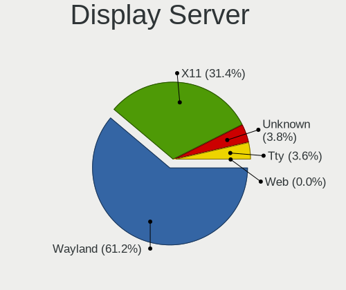
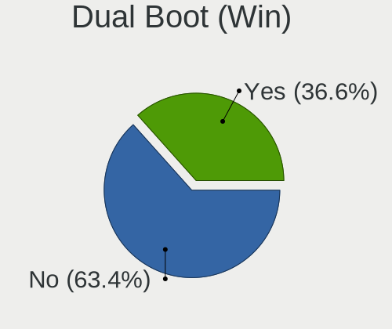
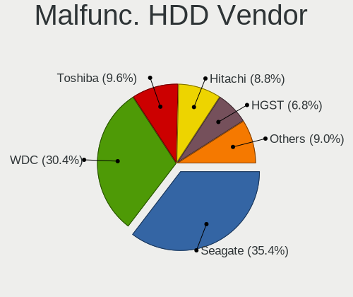
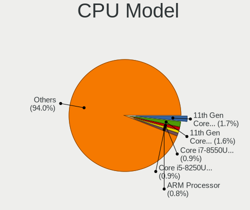
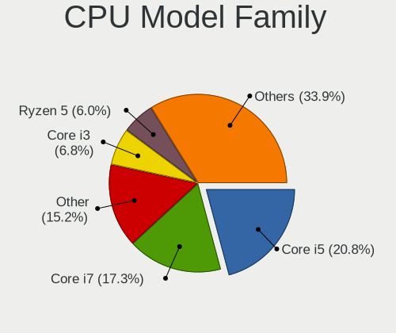

Ubuntu 22.04 - Tested Hardware & Statistics
-------------------------------------------

A project to collect tested hardware configurations for Ubuntu 22.04.

Anyone can contribute to this report by the [hw-probe](https://github.com/linuxhw/hw-probe) tool:

    sudo -E hw-probe -all -upload

Please contribute! Especially if your hardware is rare.

This is a report for all computer types. See also reports for [desktops](/Dist/Ubuntu_22.04/Desktop/README.md) and [notebooks](/Dist/Ubuntu_22.04/Notebook/README.md).

Contents
--------

* [ Test Cases ](#test-cases)

* [ System ](#system)
  - [ Kernel                   ](#kernel)
  - [ Kernel Family            ](#kernel-family)
  - [ Kernel Major Ver.        ](#kernel-major-ver)
  - [ Arch                     ](#arch)
  - [ DE                       ](#de)
  - [ Display Server           ](#display-server)
  - [ Display Manager          ](#display-manager)
  - [ OS Lang                  ](#os-lang)
  - [ Boot Mode                ](#boot-mode)
  - [ Filesystem               ](#filesystem)
  - [ Part. scheme             ](#part-scheme)
  - [ Dual Boot with Linux/BSD ](#dual-boot-with-linuxbsd)
  - [ Dual Boot (Win)          ](#dual-boot-win)

* [ Board ](#board)
  - [ Vendor                   ](#vendor)
  - [ Model                    ](#model)
  - [ Model Family             ](#model-family)
  - [ MFG Year                 ](#mfg-year)
  - [ Form Factor              ](#form-factor)
  - [ Secure Boot              ](#secure-boot)
  - [ Coreboot                 ](#coreboot)
  - [ RAM Size                 ](#ram-size)
  - [ RAM Used                 ](#ram-used)
  - [ Total Drives             ](#total-drives)
  - [ Has CD-ROM               ](#has-cd-rom)
  - [ Has Ethernet             ](#has-ethernet)
  - [ Has WiFi                 ](#has-wifi)
  - [ Has Bluetooth            ](#has-bluetooth)

* [ Location ](#location)
  - [ Country                  ](#country)
  - [ City                     ](#city)

* [ Drives ](#drives)
  - [ Drive Vendor             ](#drive-vendor)
  - [ Drive Model              ](#drive-model)
  - [ HDD Vendor               ](#hdd-vendor)
  - [ SSD Vendor               ](#ssd-vendor)
  - [ Drive Kind               ](#drive-kind)
  - [ Drive Connector          ](#drive-connector)
  - [ Drive Size               ](#drive-size)
  - [ Space Total              ](#space-total)
  - [ Space Used               ](#space-used)
  - [ Malfunc. Drives          ](#malfunc-drives)
  - [ Malfunc. Drive Vendor    ](#malfunc-drive-vendor)
  - [ Malfunc. HDD Vendor      ](#malfunc-hdd-vendor)
  - [ Malfunc. Drive Kind      ](#malfunc-drive-kind)
  - [ Failed Drives            ](#failed-drives)
  - [ Failed Drive Vendor      ](#failed-drive-vendor)
  - [ Drive Status             ](#drive-status)

* [ Storage controller ](#storage-controller)
  - [ Storage Vendor           ](#storage-vendor)
  - [ Storage Model            ](#storage-model)
  - [ Storage Kind             ](#storage-kind)

* [ Processor ](#processor)
  - [ CPU Vendor               ](#cpu-vendor)
  - [ CPU Model                ](#cpu-model)
  - [ CPU Model Family         ](#cpu-model-family)
  - [ CPU Cores                ](#cpu-cores)
  - [ CPU Sockets              ](#cpu-sockets)
  - [ CPU Threads              ](#cpu-threads)
  - [ CPU Op-Modes             ](#cpu-op-modes)
  - [ CPU Microcode            ](#cpu-microcode)
  - [ CPU Microarch            ](#cpu-microarch)

* [ Graphics ](#graphics)
  - [ GPU Vendor               ](#gpu-vendor)
  - [ GPU Model                ](#gpu-model)
  - [ GPU Combo                ](#gpu-combo)
  - [ GPU Driver               ](#gpu-driver)
  - [ GPU Memory               ](#gpu-memory)

* [ Monitor ](#monitor)
  - [ Monitor Vendor           ](#monitor-vendor)
  - [ Monitor Model            ](#monitor-model)
  - [ Monitor Resolution       ](#monitor-resolution)
  - [ Monitor Diagonal         ](#monitor-diagonal)
  - [ Monitor Width            ](#monitor-width)
  - [ Aspect Ratio             ](#aspect-ratio)
  - [ Monitor Area             ](#monitor-area)
  - [ Pixel Density            ](#pixel-density)
  - [ Multiple Monitors        ](#multiple-monitors)

* [ Network ](#network)
  - [ Net Controller Vendor    ](#net-controller-vendor)
  - [ Net Controller Model     ](#net-controller-model)
  - [ Wireless Vendor          ](#wireless-vendor)
  - [ Wireless Model           ](#wireless-model)
  - [ Ethernet Vendor          ](#ethernet-vendor)
  - [ Ethernet Model           ](#ethernet-model)
  - [ Net Controller Kind      ](#net-controller-kind)
  - [ Used Controller          ](#used-controller)
  - [ NICs                     ](#nics)
  - [ IPv6                     ](#ipv6)

* [ Bluetooth ](#bluetooth)
  - [ Bluetooth Vendor         ](#bluetooth-vendor)
  - [ Bluetooth Model          ](#bluetooth-model)

* [ Sound ](#sound)
  - [ Sound Vendor             ](#sound-vendor)
  - [ Sound Model              ](#sound-model)

* [ Memory ](#memory)
  - [ Memory Vendor            ](#memory-vendor)
  - [ Memory Model             ](#memory-model)
  - [ Memory Kind              ](#memory-kind)
  - [ Memory Form Factor       ](#memory-form-factor)
  - [ Memory Size              ](#memory-size)
  - [ Memory Speed             ](#memory-speed)

* [ Printers & scanners ](#printers--scanners)
  - [ Printer Vendor           ](#printer-vendor)
  - [ Printer Model            ](#printer-model)
  - [ Scanner Vendor           ](#scanner-vendor)
  - [ Scanner Model            ](#scanner-model)

* [ Camera ](#camera)
  - [ Camera Vendor            ](#camera-vendor)
  - [ Camera Model             ](#camera-model)

* [ Security ](#security)
  - [ Fingerprint Vendor       ](#fingerprint-vendor)
  - [ Fingerprint Model        ](#fingerprint-model)
  - [ Chipcard Vendor          ](#chipcard-vendor)
  - [ Chipcard Model           ](#chipcard-model)

* [ Unsupported ](#unsupported)
  - [ Unsupported Devices      ](#unsupported-devices)
  - [ Unsupported Device Types ](#unsupported-device-types)

Test Cases
----------

Total: 20078

| Vendor        | Model                       | Form-Factor | Probe                                                      | Date         |
|---------------|-----------------------------|-------------|------------------------------------------------------------|--------------|
| ASRock        | J5005-ITX                   | Desktop     | [5373e7f16c](https://linux-hardware.org/?probe=5373e7f16c) | Jan 02, 2024 |
| Gigabyte      | Z390 AORUS PRO WIFI-CF      | Desktop     | [3a67df5dcf](https://linux-hardware.org/?probe=3a67df5dcf) | Jan 02, 2024 |
| Gigabyte      | Z390 AORUS PRO WIFI-CF      | Desktop     | [b163926938](https://linux-hardware.org/?probe=b163926938) | Jan 02, 2024 |
| ASUSTek       | H81M-C                      | Desktop     | [221ebe85fb](https://linux-hardware.org/?probe=221ebe85fb) | Jan 02, 2024 |
| Notebook      | N13xWU                      | Notebook    | [b88a27e565](https://linux-hardware.org/?probe=b88a27e565) | Jan 02, 2024 |
| Lenovo        | ThinkPad L380 Yoga 20M7C... | Convertible | [fa3f52294e](https://linux-hardware.org/?probe=fa3f52294e) | Jan 02, 2024 |
| Google        | Caroline                    | Notebook    | [8b3ec77c48](https://linux-hardware.org/?probe=8b3ec77c48) | Jan 02, 2024 |
| Dell          | 0XJ8C4 A00                  | Desktop     | [e902f5396d](https://linux-hardware.org/?probe=e902f5396d) | Jan 02, 2024 |
| HP            | ProBook 430 G2              | Notebook    | [c56ad1ad48](https://linux-hardware.org/?probe=c56ad1ad48) | Jan 02, 2024 |
| MSI           | Z77A-G43                    | Desktop     | [b33c14ee42](https://linux-hardware.org/?probe=b33c14ee42) | Jan 02, 2024 |
| Dell          | G3 3590                     | Notebook    | [ae7267dd5f](https://linux-hardware.org/?probe=ae7267dd5f) | Jan 02, 2024 |
| ASUSTek       | M3702WFA                    | All in one  | [878dc1f9b0](https://linux-hardware.org/?probe=878dc1f9b0) | Jan 02, 2024 |
| HP            | Pavilion dv3                | Notebook    | [351a45926e](https://linux-hardware.org/?probe=351a45926e) | Jan 02, 2024 |
| Acer          | Nitro AN515-58              | Notebook    | [b822b77797](https://linux-hardware.org/?probe=b822b77797) | Jan 02, 2024 |
| Sony          | VGN-AR51SU                  | Notebook    | [ad09db7b69](https://linux-hardware.org/?probe=ad09db7b69) | Jan 01, 2024 |
| Sony          | VGN-AR51SU                  | Notebook    | [01e1a67d40](https://linux-hardware.org/?probe=01e1a67d40) | Jan 01, 2024 |
| MSI           | X79A-GD65                   | Desktop     | [ecb9a57738](https://linux-hardware.org/?probe=ecb9a57738) | Jan 01, 2024 |
| ASUSTek       | ROG Flow X16 GV601RW_GV6... | Convertible | [4389374c55](https://linux-hardware.org/?probe=4389374c55) | Jan 01, 2024 |
| ASRock        | B450M Gaming                | Desktop     | [81242d3eca](https://linux-hardware.org/?probe=81242d3eca) | Jan 01, 2024 |
| Lenovo        | ThinkPad T15 Gen 1 20S60... | Notebook    | [a679e6f722](https://linux-hardware.org/?probe=a679e6f722) | Jan 01, 2024 |
| Apple         | Mac-27ADBB7B4CEE8E61 iMa... | All in one  | [c3356daec6](https://linux-hardware.org/?probe=c3356daec6) | Jan 01, 2024 |
| ASUSTek       | P8H67-M LE                  | Desktop     | [82877fbf5e](https://linux-hardware.org/?probe=82877fbf5e) | Jan 01, 2024 |
| HP            | 82A2                        | Desktop     | [7cc3d17916](https://linux-hardware.org/?probe=7cc3d17916) | Jan 01, 2024 |
| ASUSTek       | V241IC-R                    | All in one  | [555f0208db](https://linux-hardware.org/?probe=555f0208db) | Jan 01, 2024 |
| Gigabyte      | H270N-WIFI-CF               | Desktop     | [d47bc3897f](https://linux-hardware.org/?probe=d47bc3897f) | Jan 01, 2024 |
| Medion        | H110H4-EM                   | Desktop     | [da3367c80e](https://linux-hardware.org/?probe=da3367c80e) | Jan 01, 2024 |
| Acer          | Aspire ES1-523              | Notebook    | [65fb7df562](https://linux-hardware.org/?probe=65fb7df562) | Jan 01, 2024 |
| Dell          | 0D24M8 A01                  | Desktop     | [f363c3e115](https://linux-hardware.org/?probe=f363c3e115) | Jan 01, 2024 |
| Google        | Caroline                    | Notebook    | [95fb0e423e](https://linux-hardware.org/?probe=95fb0e423e) | Jan 01, 2024 |
| Lenovo        | SHARKBAY SDK0E50519 WIN     | Desktop     | [fc9ced99d5](https://linux-hardware.org/?probe=fc9ced99d5) | Jan 01, 2024 |
| Lenovo        | Legion Y7000P2020H 82AX     | Notebook    | [59d5eb147b](https://linux-hardware.org/?probe=59d5eb147b) | Jan 01, 2024 |
| Dell          | 09KPNV A01                  | Desktop     | [d6c27424e2](https://linux-hardware.org/?probe=d6c27424e2) | Jan 01, 2024 |
| Packard Be... | EasyNote LJ65               | Notebook    | [52bbda495f](https://linux-hardware.org/?probe=52bbda495f) | Jan 01, 2024 |
| Notebook      | N13xWU                      | Notebook    | [d877ecb7be](https://linux-hardware.org/?probe=d877ecb7be) | Jan 01, 2024 |
| Lenovo        | ThinkPad L380 Yoga 20M7C... | Convertible | [7e61024957](https://linux-hardware.org/?probe=7e61024957) | Jan 01, 2024 |
| Centerm       | C92                         | Desktop     | [5ede09f987](https://linux-hardware.org/?probe=5ede09f987) | Jan 01, 2024 |
| Centerm       | C92                         | Desktop     | [0201370bf4](https://linux-hardware.org/?probe=0201370bf4) | Jan 01, 2024 |
| Toshiba       | Satellite A660              | Notebook    | [34dd6e3ec3](https://linux-hardware.org/?probe=34dd6e3ec3) | Jan 01, 2024 |
| Toshiba       | Satellite A660              | Notebook    | [4b00ffd071](https://linux-hardware.org/?probe=4b00ffd071) | Jan 01, 2024 |
| ASUSTek       | TUF Gaming Z590-PLUS        | Desktop     | [6dbc709464](https://linux-hardware.org/?probe=6dbc709464) | Jan 01, 2024 |
| Dell          | Inspiron 3593               | Notebook    | [a2424d3523](https://linux-hardware.org/?probe=a2424d3523) | Jan 01, 2024 |
| Acer          | Aspire ES1-523              | Notebook    | [e270ce7266](https://linux-hardware.org/?probe=e270ce7266) | Jan 01, 2024 |
| HP            | ProBook 640 G1              | Notebook    | [a6ba47a6e6](https://linux-hardware.org/?probe=a6ba47a6e6) | Jan 01, 2024 |
| ASRock        | X399 Professional Gaming    | Desktop     | [2d812c76d3](https://linux-hardware.org/?probe=2d812c76d3) | Jan 01, 2024 |
| ASRock        | B450M Pro4                  | Desktop     | [126f6b0c9c](https://linux-hardware.org/?probe=126f6b0c9c) | Dec 31, 2023 |
| ASRock        | B450M Pro4                  | Desktop     | [8625e5d1fa](https://linux-hardware.org/?probe=8625e5d1fa) | Dec 31, 2023 |
| MSI           | B550-A PRO                  | Desktop     | [3b6183bbb5](https://linux-hardware.org/?probe=3b6183bbb5) | Dec 31, 2023 |
| Foxconn       | 2ADA                        | Desktop     | [ae6e6ab09f](https://linux-hardware.org/?probe=ae6e6ab09f) | Dec 31, 2023 |
| ASUSTek       | UX550VE                     | Notebook    | [90014cac84](https://linux-hardware.org/?probe=90014cac84) | Dec 31, 2023 |
| Supermicro    | X10SL7-F                    | Server      | [5aef85f1c3](https://linux-hardware.org/?probe=5aef85f1c3) | Dec 31, 2023 |
| Google        | Caroline                    | Notebook    | [94a1dd78ec](https://linux-hardware.org/?probe=94a1dd78ec) | Dec 31, 2023 |
| HP            | Laptop 17-ca1xxx            | Notebook    | [b569c39f5a](https://linux-hardware.org/?probe=b569c39f5a) | Dec 31, 2023 |
| Google        | Caroline                    | Notebook    | [0d1ce09fbd](https://linux-hardware.org/?probe=0d1ce09fbd) | Dec 31, 2023 |
| Apple         | MacBookAir9,1               | Notebook    | [5dde4deb12](https://linux-hardware.org/?probe=5dde4deb12) | Dec 31, 2023 |
| HP            | Pavilion 17                 | Notebook    | [77a7431f73](https://linux-hardware.org/?probe=77a7431f73) | Dec 31, 2023 |
| Google        | Peppy                       | Notebook    | [9b8131eea3](https://linux-hardware.org/?probe=9b8131eea3) | Dec 31, 2023 |
| Unknown       | Unknown                     | Notebook    | [764c59c56e](https://linux-hardware.org/?probe=764c59c56e) | Dec 31, 2023 |
| XIAOMI        | Redmi Book Pro 15 2023      | Notebook    | [9f9b454f97](https://linux-hardware.org/?probe=9f9b454f97) | Dec 31, 2023 |
| HP            | 18E9                        | Desktop     | [298cd92eb1](https://linux-hardware.org/?probe=298cd92eb1) | Dec 31, 2023 |
| Intel         | NUC7JYB M37329-600          | Mini pc     | [7237a0a423](https://linux-hardware.org/?probe=7237a0a423) | Dec 31, 2023 |
| ZOTAC         | NM10                        | Desktop     | [c0f4135bd0](https://linux-hardware.org/?probe=c0f4135bd0) | Dec 31, 2023 |
| AZW           | U57                         | Mini pc     | [857aa7dbae](https://linux-hardware.org/?probe=857aa7dbae) | Dec 31, 2023 |
| MACHINIST     | X99-D8-MAX V1.0             | Desktop     | [ef584ae5a8](https://linux-hardware.org/?probe=ef584ae5a8) | Dec 31, 2023 |
| HP            | ENVY x360 2-in-1 Laptop ... | Convertible | [53913ce746](https://linux-hardware.org/?probe=53913ce746) | Dec 31, 2023 |
| ASUSTek       | M5A78L-M PLUS/USB3          | Desktop     | [fda4d32a86](https://linux-hardware.org/?probe=fda4d32a86) | Dec 31, 2023 |
| Dell          | 03X6X0 A06                  | Server      | [37cb3cf7de](https://linux-hardware.org/?probe=37cb3cf7de) | Dec 31, 2023 |
| Lenovo        | ThinkPad P43s 20RHCTO1WW    | Notebook    | [7b1fe348e4](https://linux-hardware.org/?probe=7b1fe348e4) | Dec 31, 2023 |
| HP            | ENVY x360 2-in-1 Laptop ... | Convertible | [70057bbd62](https://linux-hardware.org/?probe=70057bbd62) | Dec 31, 2023 |
| Dell          | 0C2XKD A01                  | Desktop     | [5e36d4fb43](https://linux-hardware.org/?probe=5e36d4fb43) | Dec 31, 2023 |
| Lenovo        | IdeaPad S340-15IWL 81N8     | Notebook    | [934f756965](https://linux-hardware.org/?probe=934f756965) | Dec 31, 2023 |
| AZW           | SER V1.0                    | Mini pc     | [59909058f1](https://linux-hardware.org/?probe=59909058f1) | Dec 31, 2023 |
| Lenovo        | IdeaPad S340-15IWL 81N8     | Notebook    | [76869cc8d4](https://linux-hardware.org/?probe=76869cc8d4) | Dec 31, 2023 |
| ASUSTek       | P8H67-M PRO                 | Desktop     | [63d62dd94e](https://linux-hardware.org/?probe=63d62dd94e) | Dec 31, 2023 |
| HP            | ProLiant ML110 Gen9         | Desktop     | [0181b68b4a](https://linux-hardware.org/?probe=0181b68b4a) | Dec 31, 2023 |
| ASUSTek       | P8H67-M PRO                 | Desktop     | [6a45d6cf9e](https://linux-hardware.org/?probe=6a45d6cf9e) | Dec 30, 2023 |
| Gigabyte      | A620I AX                    | Desktop     | [7f73790fbf](https://linux-hardware.org/?probe=7f73790fbf) | Dec 30, 2023 |
| HP            | Laptop 14s-ef1xxx           | Notebook    | [961d2db618](https://linux-hardware.org/?probe=961d2db618) | Dec 30, 2023 |
| QIYIDA        | X99-H9 V2.0                 | Desktop     | [af479728a3](https://linux-hardware.org/?probe=af479728a3) | Dec 30, 2023 |
| ASUSTek       | PRIME X470-PRO              | Desktop     | [495efd257e](https://linux-hardware.org/?probe=495efd257e) | Dec 30, 2023 |
| Pine Micro... | Pine64 RockPro64 v2.1       | Soc         | [38ff4c1e6c](https://linux-hardware.org/?probe=38ff4c1e6c) | Dec 30, 2023 |
| Lenovo        | Yoga 720-13IKB 81C3         | Convertible | [3607077350](https://linux-hardware.org/?probe=3607077350) | Dec 30, 2023 |
| Unknown       | Unknown                     | Desktop     | [e6e8bd6545](https://linux-hardware.org/?probe=e6e8bd6545) | Dec 30, 2023 |
| MSI           | B350 KRAIT GAMING           | Desktop     | [a4582db0da](https://linux-hardware.org/?probe=a4582db0da) | Dec 30, 2023 |
| DFI           | LP DK 790FXB-M2RS           | Desktop     | [8d0c82bedc](https://linux-hardware.org/?probe=8d0c82bedc) | Dec 30, 2023 |
| Apple         | MacBookPro11,5              | Notebook    | [4987fb1cb9](https://linux-hardware.org/?probe=4987fb1cb9) | Dec 30, 2023 |
| HP            | ProBook 440 G6              | Notebook    | [14623af544](https://linux-hardware.org/?probe=14623af544) | Dec 30, 2023 |
| HP            | ProLiant ML110 Gen9         | Desktop     | [4cb0683071](https://linux-hardware.org/?probe=4cb0683071) | Dec 30, 2023 |
| Medion        | DEFENDER E10                | Notebook    | [811e5b34cd](https://linux-hardware.org/?probe=811e5b34cd) | Dec 30, 2023 |
| Lenovo        | IdeaPad Gaming 3 15IAH7 ... | Notebook    | [3185001cb4](https://linux-hardware.org/?probe=3185001cb4) | Dec 30, 2023 |
| Dell          | Latitude E5420              | Notebook    | [0bc1fb2eaf](https://linux-hardware.org/?probe=0bc1fb2eaf) | Dec 30, 2023 |
| Lenovo        | 30BD NOK                    | Desktop     | [033b3c8abd](https://linux-hardware.org/?probe=033b3c8abd) | Dec 30, 2023 |
| Lenovo        | ThinkPad E15 20RD002RUS     | Notebook    | [221c773946](https://linux-hardware.org/?probe=221c773946) | Dec 30, 2023 |
| Medion        | DEFENDER E10                | Notebook    | [2e99d46be8](https://linux-hardware.org/?probe=2e99d46be8) | Dec 30, 2023 |
| Alurin        | ALU-BAR-I511-000-140        | Notebook    | [04ce6d9f2e](https://linux-hardware.org/?probe=04ce6d9f2e) | Dec 30, 2023 |
| Lenovo        | ThinkPad E16 Gen 1 21JNC... | Notebook    | [6410cef098](https://linux-hardware.org/?probe=6410cef098) | Dec 30, 2023 |
| ASUSTek       | M5A97 R2.0                  | Desktop     | [e14a6e4044](https://linux-hardware.org/?probe=e14a6e4044) | Dec 30, 2023 |
| Acer          | Aspire F5-573G              | Notebook    | [4744ad0a98](https://linux-hardware.org/?probe=4744ad0a98) | Dec 30, 2023 |
| Dell          | 0V8WGR A00                  | Desktop     | [88a9972a33](https://linux-hardware.org/?probe=88a9972a33) | Dec 30, 2023 |
| Dell          | 0V8WGR A00                  | Desktop     | [91be04698f](https://linux-hardware.org/?probe=91be04698f) | Dec 30, 2023 |
| Lenovo        | IdeaPad 100-15IBD 80QQ      | Notebook    | [01c6121d4c](https://linux-hardware.org/?probe=01c6121d4c) | Dec 29, 2023 |
| Dell          | 09KPNV A01                  | Desktop     | [115ec4e7a9](https://linux-hardware.org/?probe=115ec4e7a9) | Dec 29, 2023 |
| HP            | 304Ah                       | Desktop     | [0a84d8bd4a](https://linux-hardware.org/?probe=0a84d8bd4a) | Dec 29, 2023 |
| Dell          | Inspiron 3593               | Notebook    | [dc67ac3e38](https://linux-hardware.org/?probe=dc67ac3e38) | Dec 29, 2023 |
| Apple         | MacBookPro14,3              | Notebook    | [83399f5e60](https://linux-hardware.org/?probe=83399f5e60) | Dec 29, 2023 |
| Gigabyte      | 990FXA-UD3                  | Desktop     | [9104adc237](https://linux-hardware.org/?probe=9104adc237) | Dec 29, 2023 |
| Shenzhen M... | AHBNB OEM                   | Desktop     | [9883edd543](https://linux-hardware.org/?probe=9883edd543) | Dec 29, 2023 |
| Supermicro    | X10DDW-i                    | Desktop     | [36b4cb3de7](https://linux-hardware.org/?probe=36b4cb3de7) | Dec 29, 2023 |
| Supermicro    | X10DDW-i                    | Desktop     | [7accaaedbb](https://linux-hardware.org/?probe=7accaaedbb) | Dec 29, 2023 |
| Supermicro    | X10DDW-i                    | Desktop     | [5d7ab2ff4b](https://linux-hardware.org/?probe=5d7ab2ff4b) | Dec 29, 2023 |
| Supermicro    | X10DDW-i                    | Desktop     | [be9b9577fd](https://linux-hardware.org/?probe=be9b9577fd) | Dec 29, 2023 |
| Supermicro    | X10DDW-i                    | Desktop     | [4f7ea59b94](https://linux-hardware.org/?probe=4f7ea59b94) | Dec 29, 2023 |
| Supermicro    | X8DTU                       | Server      | [f1f8eb7460](https://linux-hardware.org/?probe=f1f8eb7460) | Dec 29, 2023 |
| Supermicro    | X8DTU                       | Server      | [85a63e7856](https://linux-hardware.org/?probe=85a63e7856) | Dec 29, 2023 |
| Supermicro    | X8DTU                       | Server      | [17a55bc4e2](https://linux-hardware.org/?probe=17a55bc4e2) | Dec 29, 2023 |
| Supermicro    | X8DTT                       | Server      | [88a46dccc4](https://linux-hardware.org/?probe=88a46dccc4) | Dec 29, 2023 |
| Supermicro    | X8DTL                       | Server      | [bcd6e1b410](https://linux-hardware.org/?probe=bcd6e1b410) | Dec 29, 2023 |
| Supermicro    | X8DTT                       | Server      | [bbb803049b](https://linux-hardware.org/?probe=bbb803049b) | Dec 29, 2023 |
| ASUSTek       | X99-DELUXE                  | Desktop     | [2433b4bc75](https://linux-hardware.org/?probe=2433b4bc75) | Dec 29, 2023 |
| Acer          | Aspire A715-76G             | Notebook    | [e25984fb5e](https://linux-hardware.org/?probe=e25984fb5e) | Dec 29, 2023 |
| Dell          | XPS 13 9380                 | Notebook    | [1148fbe6b6](https://linux-hardware.org/?probe=1148fbe6b6) | Dec 29, 2023 |
| Lenovo        | ThinkPad T530 24297XG       | Notebook    | [f3af16ad5d](https://linux-hardware.org/?probe=f3af16ad5d) | Dec 29, 2023 |
| ASUSTek       | VivoBook 14_ASUS Laptop ... | Notebook    | [4ba914628d](https://linux-hardware.org/?probe=4ba914628d) | Dec 29, 2023 |
| Dell          | 00V62H A01                  | Desktop     | [0032f131d1](https://linux-hardware.org/?probe=0032f131d1) | Dec 29, 2023 |
| MSI           | H110M PRO-VD                | Desktop     | [318343d58b](https://linux-hardware.org/?probe=318343d58b) | Dec 29, 2023 |
| ASUSTek       | PRIME A520M-E               | Desktop     | [3133f699e1](https://linux-hardware.org/?probe=3133f699e1) | Dec 29, 2023 |
| Dell          | 096JG8 A01                  | Desktop     | [915a028a6a](https://linux-hardware.org/?probe=915a028a6a) | Dec 29, 2023 |
| Lenovo        | IdeaPad Y700-15ISK 80NV     | Notebook    | [a353b43ac0](https://linux-hardware.org/?probe=a353b43ac0) | Dec 29, 2023 |
| ASUSTek       | ROG STRIX Z390-E GAMING     | Desktop     | [51ab2c0529](https://linux-hardware.org/?probe=51ab2c0529) | Dec 29, 2023 |
| Inventec      | VXC Class A02               | Desktop     | [0575404de8](https://linux-hardware.org/?probe=0575404de8) | Dec 29, 2023 |
| Timi          | A34R                        | Notebook    | [d72018ec19](https://linux-hardware.org/?probe=d72018ec19) | Dec 29, 2023 |
| Apple         | Mac-8ED6AF5B48C039E1 Mac... | Mini pc     | [78e92a08a9](https://linux-hardware.org/?probe=78e92a08a9) | Dec 29, 2023 |
| Dell          | Latitude 5424 Rugged        | Notebook    | [1339f0b553](https://linux-hardware.org/?probe=1339f0b553) | Dec 29, 2023 |
| ASUSTek       | PRIME B365M-A               | Desktop     | [2109440c5e](https://linux-hardware.org/?probe=2109440c5e) | Dec 29, 2023 |
| ASUSTek       | VivoBook_ASUSLaptop M150... | Notebook    | [6a99e4eda2](https://linux-hardware.org/?probe=6a99e4eda2) | Dec 29, 2023 |
| MSI           | MS-168B                     | Notebook    | [cd9dc4eadd](https://linux-hardware.org/?probe=cd9dc4eadd) | Dec 29, 2023 |
| Dell          | Latitude 7300               | Notebook    | [926a273123](https://linux-hardware.org/?probe=926a273123) | Dec 29, 2023 |
| Acer          | Aspire 4736Z                | Notebook    | [ea8dffb40f](https://linux-hardware.org/?probe=ea8dffb40f) | Dec 29, 2023 |
| ASUSTek       | PRIME B365M-A               | Desktop     | [69ed200761](https://linux-hardware.org/?probe=69ed200761) | Dec 29, 2023 |
| Dell          | Latitude 7300               | Notebook    | [ac9c0099fd](https://linux-hardware.org/?probe=ac9c0099fd) | Dec 29, 2023 |
| FriendlyEl... | NanoPi R6S                  | Soc         | [9a762ca6b1](https://linux-hardware.org/?probe=9a762ca6b1) | Dec 29, 2023 |
| MSI           | H110M PRO-VD                | Desktop     | [1c6ef1eeb0](https://linux-hardware.org/?probe=1c6ef1eeb0) | Dec 29, 2023 |
| HP            | ZBook 14 G2                 | Notebook    | [0d092c7ece](https://linux-hardware.org/?probe=0d092c7ece) | Dec 29, 2023 |
| ASUSTek       | Zenbook UM3402YAR_UM3402... | Notebook    | [13ba865757](https://linux-hardware.org/?probe=13ba865757) | Dec 29, 2023 |
| Lenovo        | Unknown                     | Notebook    | [71b939033d](https://linux-hardware.org/?probe=71b939033d) | Dec 28, 2023 |
| Lenovo        | ThinkPad E15 20RD002RUS     | Notebook    | [be86cafd2e](https://linux-hardware.org/?probe=be86cafd2e) | Dec 28, 2023 |
| ASUSTek       | ROG Strix G712LV_G712LV     | Notebook    | [c2d6079fe7](https://linux-hardware.org/?probe=c2d6079fe7) | Dec 28, 2023 |
| ASUSTek       | ROG STRIX Z790-F GAMING ... | Desktop     | [4f4c0766c2](https://linux-hardware.org/?probe=4f4c0766c2) | Dec 28, 2023 |
| ASRock        | B250M-HDV                   | Desktop     | [c6c27e51ca](https://linux-hardware.org/?probe=c6c27e51ca) | Dec 28, 2023 |
| Lenovo        | ThinkPad T440 20B7A0B7MN    | Notebook    | [e456132635](https://linux-hardware.org/?probe=e456132635) | Dec 28, 2023 |
| HUAWEI        | CREFG-XX                    | Notebook    | [91cc2daf14](https://linux-hardware.org/?probe=91cc2daf14) | Dec 28, 2023 |
| Framework     | Laptop 13 (AMD Ryzen 704... | Notebook    | [4e1a45dee6](https://linux-hardware.org/?probe=4e1a45dee6) | Dec 28, 2023 |
| Lenovo        | G500 20236                  | Notebook    | [62aa46f354](https://linux-hardware.org/?probe=62aa46f354) | Dec 28, 2023 |
| HP            | EliteBook 840 G4            | Notebook    | [412a23e374](https://linux-hardware.org/?probe=412a23e374) | Dec 28, 2023 |
| Lenovo        | ThinkPad T420 4180ED3       | Notebook    | [0c9cecfac4](https://linux-hardware.org/?probe=0c9cecfac4) | Dec 28, 2023 |
| Gigabyte      | A320M-S2H-CF                | Desktop     | [2d53ff60cb](https://linux-hardware.org/?probe=2d53ff60cb) | Dec 28, 2023 |
| Dell          | 04Y8V0 A02                  | Desktop     | [ba96083a55](https://linux-hardware.org/?probe=ba96083a55) | Dec 28, 2023 |
| HP            | 830C                        | Desktop     | [2f602f34b2](https://linux-hardware.org/?probe=2f602f34b2) | Dec 28, 2023 |
| Gigabyte      | Z690 AORUS ELITE AX         | Desktop     | [0d4c53d42f](https://linux-hardware.org/?probe=0d4c53d42f) | Dec 28, 2023 |
| ASUSTek       | PRIME H510M-A               | Desktop     | [e65000c3c2](https://linux-hardware.org/?probe=e65000c3c2) | Dec 28, 2023 |
| ASUSTek       | VivoBook_ASUSLaptop M150... | Notebook    | [d6477c7999](https://linux-hardware.org/?probe=d6477c7999) | Dec 28, 2023 |
| HP            | 830C                        | Desktop     | [2256355ca5](https://linux-hardware.org/?probe=2256355ca5) | Dec 28, 2023 |
| ASRock        | AMCP7A-ION                  | Desktop     | [8358bb2fb8](https://linux-hardware.org/?probe=8358bb2fb8) | Dec 28, 2023 |
| Acer          | Aspire E5-553G              | Notebook    | [a21fc70e01](https://linux-hardware.org/?probe=a21fc70e01) | Dec 28, 2023 |
| Intel         | NUC6CAYB J23203-407         | Mini pc     | [11883e6f6c](https://linux-hardware.org/?probe=11883e6f6c) | Dec 28, 2023 |
| Lenovo        | ThinkPad 20FRS22T00         | Convertible | [cc869f9f92](https://linux-hardware.org/?probe=cc869f9f92) | Dec 28, 2023 |
| HP            | ZBook 15                    | Notebook    | [92d7e45b22](https://linux-hardware.org/?probe=92d7e45b22) | Dec 28, 2023 |
| HP            | EliteBook 840 G3            | Notebook    | [ce26af0483](https://linux-hardware.org/?probe=ce26af0483) | Dec 28, 2023 |
| Dell          | 0YXT71 A03                  | Desktop     | [7a857447b4](https://linux-hardware.org/?probe=7a857447b4) | Dec 28, 2023 |
| HP            | Pavilion Laptop 15-eg2xx... | Notebook    | [6abb72e809](https://linux-hardware.org/?probe=6abb72e809) | Dec 28, 2023 |
| ASUSTek       | VivoBook 14_ASUS Laptop ... | Notebook    | [8250429628](https://linux-hardware.org/?probe=8250429628) | Dec 28, 2023 |
| JHZD          | BQM6                        | Desktop     | [fa041569a6](https://linux-hardware.org/?probe=fa041569a6) | Dec 28, 2023 |
| Dell          | Inspiron 3593               | Notebook    | [27f6eb03d0](https://linux-hardware.org/?probe=27f6eb03d0) | Dec 28, 2023 |
| MSI           | MPG B550 GAMING PLUS        | Desktop     | [8df141917e](https://linux-hardware.org/?probe=8df141917e) | Dec 28, 2023 |
| Acer          | H410H6-M17 P21-A1           | Desktop     | [6c4e2313d7](https://linux-hardware.org/?probe=6c4e2313d7) | Dec 28, 2023 |
| ASUSTek       | M5A97 R2.0                  | Desktop     | [020ea108b0](https://linux-hardware.org/?probe=020ea108b0) | Dec 28, 2023 |
| Lenovo        | Yoga 710-15IKB 80V5         | Convertible | [7b388d0a8f](https://linux-hardware.org/?probe=7b388d0a8f) | Dec 28, 2023 |
| win elemen... | MoreFine S500+              | Notebook    | [6880205d9e](https://linux-hardware.org/?probe=6880205d9e) | Dec 28, 2023 |
| Acer          | Nitro AN515-51              | Notebook    | [f61d16f126](https://linux-hardware.org/?probe=f61d16f126) | Dec 28, 2023 |
| Valve         | Galileo                     | Notebook    | [ae65838bd7](https://linux-hardware.org/?probe=ae65838bd7) | Dec 28, 2023 |
| HP            | Spectre x360 Convertible    | Convertible | [8cd96ef9b2](https://linux-hardware.org/?probe=8cd96ef9b2) | Dec 28, 2023 |
| Lenovo        | Legion 5 15ARH05H 82B1      | Notebook    | [52a99e896e](https://linux-hardware.org/?probe=52a99e896e) | Dec 28, 2023 |
| Acer          | Aspire E5-573G              | Notebook    | [323f661113](https://linux-hardware.org/?probe=323f661113) | Dec 27, 2023 |
| Microsoft     | Surface 3                   | Tablet      | [06147cc721](https://linux-hardware.org/?probe=06147cc721) | Dec 27, 2023 |
| HP            | Laptop 14-ck0xxx            | Notebook    | [6be155ee0d](https://linux-hardware.org/?probe=6be155ee0d) | Dec 27, 2023 |
| MSI           | Pulse GL66 12UEK            | Notebook    | [4600a758fa](https://linux-hardware.org/?probe=4600a758fa) | Dec 27, 2023 |
| Gigabyte      | B660 DS3H DDR4              | Desktop     | [3b68c7809f](https://linux-hardware.org/?probe=3b68c7809f) | Dec 27, 2023 |
| HP            | 1589                        | Desktop     | [c52940817e](https://linux-hardware.org/?probe=c52940817e) | Dec 27, 2023 |
| Dell          | G3 3500                     | Notebook    | [87c0216250](https://linux-hardware.org/?probe=87c0216250) | Dec 27, 2023 |
| Lenovo        | IdeaPad Slim 3 15IRU8 82... | Notebook    | [c16f162169](https://linux-hardware.org/?probe=c16f162169) | Dec 27, 2023 |
| Gigabyte      | Z97M-DS3H                   | Desktop     | [e0b1c57cc6](https://linux-hardware.org/?probe=e0b1c57cc6) | Dec 27, 2023 |
| Dell          | Latitude 3520               | Notebook    | [b5802159c7](https://linux-hardware.org/?probe=b5802159c7) | Dec 27, 2023 |
| Dell          | Inspiron 5570               | Notebook    | [84242f4904](https://linux-hardware.org/?probe=84242f4904) | Dec 27, 2023 |
| Acer          | Nitro AN517-41              | Notebook    | [ab7e890030](https://linux-hardware.org/?probe=ab7e890030) | Dec 27, 2023 |
| MSI           | X79A-GD65                   | Desktop     | [298e0aeef7](https://linux-hardware.org/?probe=298e0aeef7) | Dec 27, 2023 |
| MSI           | X79A-GD65                   | Desktop     | [0272fb469a](https://linux-hardware.org/?probe=0272fb469a) | Dec 27, 2023 |
| Unknown       | Unknown                     | Notebook    | [0f40cd177e](https://linux-hardware.org/?probe=0f40cd177e) | Dec 27, 2023 |
| Unknown       | Unknown                     | Notebook    | [5965d25e5a](https://linux-hardware.org/?probe=5965d25e5a) | Dec 27, 2023 |
| Dell          | 02VCFF A00                  | Desktop     | [902c7a4466](https://linux-hardware.org/?probe=902c7a4466) | Dec 27, 2023 |
| Lenovo        | IdeaPad Gaming 3 15IAH7 ... | Notebook    | [d23b5553ca](https://linux-hardware.org/?probe=d23b5553ca) | Dec 27, 2023 |
| ASRock        | B650M PG Riptide            | Desktop     | [9a27ea61df](https://linux-hardware.org/?probe=9a27ea61df) | Dec 27, 2023 |
| Dell          | Inspiron 3583               | Notebook    | [de1dd08f64](https://linux-hardware.org/?probe=de1dd08f64) | Dec 27, 2023 |
| Supermicro    | X11DAi-N                    | Server      | [6e0a7e9f92](https://linux-hardware.org/?probe=6e0a7e9f92) | Dec 27, 2023 |
| HP            | 86E9 A                      | Desktop     | [e373d2be5d](https://linux-hardware.org/?probe=e373d2be5d) | Dec 27, 2023 |
| MSI           | B150M MORTAR                | Desktop     | [c179cdb6dc](https://linux-hardware.org/?probe=c179cdb6dc) | Dec 27, 2023 |
| Zinox Tech... | x64-Based PC                | Tablet      | [6512568b77](https://linux-hardware.org/?probe=6512568b77) | Dec 27, 2023 |
| ASUSTek       | VivoBook_ASUSLaptop X170... | Notebook    | [8af95757fe](https://linux-hardware.org/?probe=8af95757fe) | Dec 27, 2023 |
| Lenovo        | ThinkPad E480 20KN0065MX    | Notebook    | [14018f1aec](https://linux-hardware.org/?probe=14018f1aec) | Dec 27, 2023 |
| Acer          | H410H6-M17 P21-A1           | Desktop     | [106af034ae](https://linux-hardware.org/?probe=106af034ae) | Dec 27, 2023 |
| Lenovo        | ThinkPad T480 20L6S24N3J    | Notebook    | [b6b0c2c889](https://linux-hardware.org/?probe=b6b0c2c889) | Dec 27, 2023 |
| HUAWEI        | NbDE-WXX9                   | Notebook    | [5f124e4838](https://linux-hardware.org/?probe=5f124e4838) | Dec 27, 2023 |
| ASUSTek       | ZenBook UX325EA_UX325EA     | Notebook    | [a8871fb21b](https://linux-hardware.org/?probe=a8871fb21b) | Dec 27, 2023 |
| Apple         | Mac-4B682C642B45593E iMa... | All in one  | [51f2048be8](https://linux-hardware.org/?probe=51f2048be8) | Dec 26, 2023 |
| MSI           | GS40 6QE Phantom            | Notebook    | [2946f9add8](https://linux-hardware.org/?probe=2946f9add8) | Dec 26, 2023 |
| Medion        | P6613                       | Notebook    | [1f30069d6d](https://linux-hardware.org/?probe=1f30069d6d) | Dec 26, 2023 |
| Dell          | 0KWVT8 A03                  | Desktop     | [fae868ef79](https://linux-hardware.org/?probe=fae868ef79) | Dec 26, 2023 |
| TUXEDO        | N24_25JU                    | Notebook    | [3c7a5feb48](https://linux-hardware.org/?probe=3c7a5feb48) | Dec 26, 2023 |
| ASUSTek       | PRIME X570-PRO              | Desktop     | [4e5179b4d1](https://linux-hardware.org/?probe=4e5179b4d1) | Dec 26, 2023 |
| Apple         | MacBookAir6,2               | Notebook    | [67979f3133](https://linux-hardware.org/?probe=67979f3133) | Dec 26, 2023 |
| Lenovo        | IdeaPad Slim 5 14IAH8 83... | Notebook    | [e514863c67](https://linux-hardware.org/?probe=e514863c67) | Dec 26, 2023 |
| Supermicro    | X8SIL                       | Desktop     | [16a2d27e0a](https://linux-hardware.org/?probe=16a2d27e0a) | Dec 26, 2023 |
| Dell          | XPS 13 9370                 | Notebook    | [17304074a6](https://linux-hardware.org/?probe=17304074a6) | Dec 26, 2023 |
| HP            | Pavilion Gaming Laptop 1... | Notebook    | [8fae3225fd](https://linux-hardware.org/?probe=8fae3225fd) | Dec 26, 2023 |
| MSI           | MAG B560M BAZOOKA           | Desktop     | [64d1814f82](https://linux-hardware.org/?probe=64d1814f82) | Dec 26, 2023 |
| Lenovo        | ThinkPad 20FRS22T00         | Convertible | [97644755b2](https://linux-hardware.org/?probe=97644755b2) | Dec 26, 2023 |
| Dell          | Latitude 5440               | Notebook    | [44e45480d1](https://linux-hardware.org/?probe=44e45480d1) | Dec 26, 2023 |
| MSI           | B150M MORTAR                | Desktop     | [23577ab5f1](https://linux-hardware.org/?probe=23577ab5f1) | Dec 26, 2023 |
| Dell          | 042P49 A02                  | Desktop     | [67c9288ec5](https://linux-hardware.org/?probe=67c9288ec5) | Dec 26, 2023 |
| HP            | 86E9 A                      | Desktop     | [c13adc0c5e](https://linux-hardware.org/?probe=c13adc0c5e) | Dec 26, 2023 |
| HP            | Pavilion x360 Convertibl... | Convertible | [aee55a670d](https://linux-hardware.org/?probe=aee55a670d) | Dec 26, 2023 |
| Medion        | E6228                       | Notebook    | [827fcc5d4b](https://linux-hardware.org/?probe=827fcc5d4b) | Dec 26, 2023 |
| Dell          | 0D6H9T A00                  | Desktop     | [280147184f](https://linux-hardware.org/?probe=280147184f) | Dec 26, 2023 |
| Unknown       | Unknown                     | Notebook    | [d382bd5980](https://linux-hardware.org/?probe=d382bd5980) | Dec 26, 2023 |
| Acer          | Nitro AN515-54              | Notebook    | [67492721ec](https://linux-hardware.org/?probe=67492721ec) | Dec 26, 2023 |
| Unknown       | Unknown                     | Notebook    | [c701a5ce22](https://linux-hardware.org/?probe=c701a5ce22) | Dec 26, 2023 |
| Unknown       | Unknown                     | Notebook    | [ef974b90c4](https://linux-hardware.org/?probe=ef974b90c4) | Dec 25, 2023 |
| HP            | 81C5 MVB                    | Desktop     | [15a3980b4a](https://linux-hardware.org/?probe=15a3980b4a) | Dec 25, 2023 |
| MSI           | B85-G43                     | Desktop     | [fd632d7a1f](https://linux-hardware.org/?probe=fd632d7a1f) | Dec 25, 2023 |
| Dell          | Latitude 7490               | Notebook    | [3c17f0bdce](https://linux-hardware.org/?probe=3c17f0bdce) | Dec 25, 2023 |
| HP            | Pavilion Laptop 15-cs3xx... | Notebook    | [59e540836e](https://linux-hardware.org/?probe=59e540836e) | Dec 25, 2023 |
| ASUSTek       | PN53                        | Mini pc     | [475a32b16d](https://linux-hardware.org/?probe=475a32b16d) | Dec 25, 2023 |
| ASUSTek       | ROG STRIX X470-F GAMING     | Desktop     | [39eb82bb24](https://linux-hardware.org/?probe=39eb82bb24) | Dec 25, 2023 |
| Lenovo        | ThinkPad T440 20B7A0B7MN    | Notebook    | [fb78f052e1](https://linux-hardware.org/?probe=fb78f052e1) | Dec 25, 2023 |
| ASUSTek       | Zenbook UM3402YAR_UM3402... | Notebook    | [771d35e2bc](https://linux-hardware.org/?probe=771d35e2bc) | Dec 25, 2023 |
| Microsoft     | Surface Pro 8               | Tablet      | [751e8a9cc9](https://linux-hardware.org/?probe=751e8a9cc9) | Dec 25, 2023 |
| MSI           | A68HM-P33 V2                | Desktop     | [4f11205fd5](https://linux-hardware.org/?probe=4f11205fd5) | Dec 25, 2023 |
| Google        | Aleena                      | Notebook    | [a5a888a877](https://linux-hardware.org/?probe=a5a888a877) | Dec 25, 2023 |
| Lenovo        | G50-45 80E3                 | Notebook    | [884a852341](https://linux-hardware.org/?probe=884a852341) | Dec 25, 2023 |
| MSI           | PS63 Modern 8M              | Notebook    | [3097ac02eb](https://linux-hardware.org/?probe=3097ac02eb) | Dec 25, 2023 |
| HP            | Laptop 17-bs1xx             | Notebook    | [736cd905c8](https://linux-hardware.org/?probe=736cd905c8) | Dec 25, 2023 |
| TUXEDO        | N24_25JU                    | Notebook    | [26beeaeefa](https://linux-hardware.org/?probe=26beeaeefa) | Dec 25, 2023 |
| HUAWEI        | BoDE-WXX9                   | Notebook    | [a8acfd11f6](https://linux-hardware.org/?probe=a8acfd11f6) | Dec 25, 2023 |
| MSI           | EX610                       | Notebook    | [95fe9d0294](https://linux-hardware.org/?probe=95fe9d0294) | Dec 25, 2023 |
| HP            | EliteBook Folio 9470m       | Notebook    | [e1f5de21d1](https://linux-hardware.org/?probe=e1f5de21d1) | Dec 25, 2023 |
| ASRock        | H61M-VG3                    | Desktop     | [1ef527f93a](https://linux-hardware.org/?probe=1ef527f93a) | Dec 24, 2023 |
| Acer          | Aspire 5749                 | Notebook    | [e70e0eae25](https://linux-hardware.org/?probe=e70e0eae25) | Dec 24, 2023 |
| ASRock        | H61DEL                      | Desktop     | [932b2c50eb](https://linux-hardware.org/?probe=932b2c50eb) | Dec 24, 2023 |
| Lenovo        | Yoga 2 Pro 20266            | Notebook    | [e6d150acea](https://linux-hardware.org/?probe=e6d150acea) | Dec 24, 2023 |
| Lenovo        | ThinkPad W530 2436CT0       | Notebook    | [7f8be52856](https://linux-hardware.org/?probe=7f8be52856) | Dec 24, 2023 |
| Gigabyte      | GA-990X-Gaming SLI-CF       | Desktop     | [915a47dab1](https://linux-hardware.org/?probe=915a47dab1) | Dec 24, 2023 |
| Acer          | Aspire A315-35              | Notebook    | [a3c4869087](https://linux-hardware.org/?probe=a3c4869087) | Dec 24, 2023 |
| ASUSTek       | Z97-K                       | Desktop     | [d330d1d9f9](https://linux-hardware.org/?probe=d330d1d9f9) | Dec 24, 2023 |
| ASUSTek       | Z97-K                       | Desktop     | [d8ae24af2b](https://linux-hardware.org/?probe=d8ae24af2b) | Dec 24, 2023 |
| Panasonic     | FZG1-4                      | Notebook    | [f6c98a5b67](https://linux-hardware.org/?probe=f6c98a5b67) | Dec 24, 2023 |
| Dell          | 03X6X0 A06                  | Server      | [ca9bb6b7ff](https://linux-hardware.org/?probe=ca9bb6b7ff) | Dec 24, 2023 |
| Apple         | MacBookAir7,1               | Notebook    | [f666ec3927](https://linux-hardware.org/?probe=f666ec3927) | Dec 24, 2023 |
| Dell          | Inspiron 5485 2n1           | Convertible | [334b43f409](https://linux-hardware.org/?probe=334b43f409) | Dec 24, 2023 |
| Dell          | Latitude 7490               | Notebook    | [69205c648f](https://linux-hardware.org/?probe=69205c648f) | Dec 24, 2023 |
| Acer          | Nitro AN515-44              | Notebook    | [cc87c11e7b](https://linux-hardware.org/?probe=cc87c11e7b) | Dec 24, 2023 |
| Notebook      | NL5xNU                      | Notebook    | [1cb09f63f9](https://linux-hardware.org/?probe=1cb09f63f9) | Dec 24, 2023 |
| Lenovo        | IdeaPad 100-15IBD 80QQ      | Notebook    | [f8abeb2607](https://linux-hardware.org/?probe=f8abeb2607) | Dec 24, 2023 |
| Dell          | 0P658H A05                  | Server      | [14a0701959](https://linux-hardware.org/?probe=14a0701959) | Dec 24, 2023 |
| Google        | Magolor                     | Notebook    | [f5d079bc79](https://linux-hardware.org/?probe=f5d079bc79) | Dec 24, 2023 |
| Dell          | Latitude 12 Rugged Table... | Notebook    | [7690d56522](https://linux-hardware.org/?probe=7690d56522) | Dec 24, 2023 |
| Acer          | Veriton X2631G V:1.0        | Desktop     | [c9555a34f2](https://linux-hardware.org/?probe=c9555a34f2) | Dec 23, 2023 |
| Unknown       | Unknown                     | Notebook    | [ef80f96d40](https://linux-hardware.org/?probe=ef80f96d40) | Dec 23, 2023 |
| Sony          | VPCEA1S1E                   | Notebook    | [af850dd5f3](https://linux-hardware.org/?probe=af850dd5f3) | Dec 23, 2023 |
| ASUSTek       | TUF B360-PLUS GAMING        | Desktop     | [b1c3408d24](https://linux-hardware.org/?probe=b1c3408d24) | Dec 23, 2023 |
| ASRock        | H310CM-HDV/M.2              | Desktop     | [76d95ab75c](https://linux-hardware.org/?probe=76d95ab75c) | Dec 23, 2023 |
| TUXEDO        | N24_25JU                    | Notebook    | [8a1a153723](https://linux-hardware.org/?probe=8a1a153723) | Dec 23, 2023 |
| Gigabyte      | GA-78LMT-S2P                | Desktop     | [6f36390142](https://linux-hardware.org/?probe=6f36390142) | Dec 23, 2023 |
| ASRock        | AMCP7A-ION                  | Desktop     | [fb0acc2d50](https://linux-hardware.org/?probe=fb0acc2d50) | Dec 23, 2023 |
| Lenovo        | ThinkPad T410 2537E82       | Notebook    | [d153c701cc](https://linux-hardware.org/?probe=d153c701cc) | Dec 23, 2023 |
| Unknown       | FastRhino R66S              | Soc         | [a9cd767c91](https://linux-hardware.org/?probe=a9cd767c91) | Dec 23, 2023 |
| HP            | 1497                        | Desktop     | [9d5244b557](https://linux-hardware.org/?probe=9d5244b557) | Dec 23, 2023 |
| Lenovo        | ThinkPad T410 2537E82       | Notebook    | [398233e395](https://linux-hardware.org/?probe=398233e395) | Dec 23, 2023 |
| Lenovo        | ThinkCentre M58 7373AJ5     | Desktop     | [201981bc3f](https://linux-hardware.org/?probe=201981bc3f) | Dec 23, 2023 |
| Foxconn       | 2ADA                        | Desktop     | [f30aec24c2](https://linux-hardware.org/?probe=f30aec24c2) | Dec 23, 2023 |
| ASRock        | AMCP7A-ION                  | Desktop     | [7d19dec574](https://linux-hardware.org/?probe=7d19dec574) | Dec 23, 2023 |
| Acer          | TravelMate 5730             | Notebook    | [69571c0b91](https://linux-hardware.org/?probe=69571c0b91) | Dec 23, 2023 |
| Dell          | 0P4T42 A01                  | All in one  | [db76245a52](https://linux-hardware.org/?probe=db76245a52) | Dec 23, 2023 |
| HP            | EliteBook 845 G8 Noteboo... | Notebook    | [d3dabca767](https://linux-hardware.org/?probe=d3dabca767) | Dec 23, 2023 |
| Dell          | Latitude E6330              | Notebook    | [afca8c73b2](https://linux-hardware.org/?probe=afca8c73b2) | Dec 23, 2023 |
| HP            | EliteBook 845 G8 Noteboo... | Notebook    | [26673c372e](https://linux-hardware.org/?probe=26673c372e) | Dec 23, 2023 |
| Dell          | Inspiron 3501               | Notebook    | [2fcf77279a](https://linux-hardware.org/?probe=2fcf77279a) | Dec 23, 2023 |
| Toshiba       | Satellite L750              | Notebook    | [8f2f7cd8c9](https://linux-hardware.org/?probe=8f2f7cd8c9) | Dec 23, 2023 |
| HP            | Laptop 17-bs1xx             | Notebook    | [984a979a7b](https://linux-hardware.org/?probe=984a979a7b) | Dec 23, 2023 |
| Lenovo        | ThinkPad T14 Gen 2a 20XL... | Notebook    | [19e33f2ead](https://linux-hardware.org/?probe=19e33f2ead) | Dec 23, 2023 |
| MSI           | PRO Z790-A WIFI             | Desktop     | [9b8ad6a3f1](https://linux-hardware.org/?probe=9b8ad6a3f1) | Dec 23, 2023 |
| eMachines     | EL1360                      | Desktop     | [af31609559](https://linux-hardware.org/?probe=af31609559) | Dec 23, 2023 |
| ASUSTek       | P6T                         | Desktop     | [d90adb3a12](https://linux-hardware.org/?probe=d90adb3a12) | Dec 23, 2023 |
| Dell          | Latitude E6400              | Notebook    | [1a10fd9a2e](https://linux-hardware.org/?probe=1a10fd9a2e) | Dec 23, 2023 |
| Gigabyte      | Z97M-DS3H                   | Desktop     | [da051b693c](https://linux-hardware.org/?probe=da051b693c) | Dec 23, 2023 |
| Lenovo        | ThinkPad E15 20RD002RUS     | Notebook    | [6ba8bb7550](https://linux-hardware.org/?probe=6ba8bb7550) | Dec 23, 2023 |
| Lenovo        | ThinkPad T14 Gen 2i 20W1... | Notebook    | [0f2cad4391](https://linux-hardware.org/?probe=0f2cad4391) | Dec 22, 2023 |
| Lenovo        | 3136 SDK0J40697 WIN 3305... | Mini pc     | [e778e7923a](https://linux-hardware.org/?probe=e778e7923a) | Dec 22, 2023 |
| Lenovo        | 3136 SDK0J40697 WIN 3305... | Mini pc     | [b601b75917](https://linux-hardware.org/?probe=b601b75917) | Dec 22, 2023 |
| Dell          | 0FDY5C A00                  | Desktop     | [a3fc39604c](https://linux-hardware.org/?probe=a3fc39604c) | Dec 22, 2023 |
| HP            | 8643 SMVB                   | Desktop     | [bbdb2204d8](https://linux-hardware.org/?probe=bbdb2204d8) | Dec 22, 2023 |
| Acer          | Aspire VX5-591G             | Notebook    | [2268342e9f](https://linux-hardware.org/?probe=2268342e9f) | Dec 22, 2023 |
| Apple         | MacBookPro13,1              | Notebook    | [89ef1fa23c](https://linux-hardware.org/?probe=89ef1fa23c) | Dec 22, 2023 |
| Dell          | 0D6H9T A00                  | Desktop     | [84275b737e](https://linux-hardware.org/?probe=84275b737e) | Dec 22, 2023 |
| ASUSTek       | X555LD                      | Notebook    | [c81a75e686](https://linux-hardware.org/?probe=c81a75e686) | Dec 22, 2023 |
| ASUSTek       | PRIME B450-PLUS             | Desktop     | [c9bee45423](https://linux-hardware.org/?probe=c9bee45423) | Dec 22, 2023 |
| Intel         | H61                         | Desktop     | [72c7724ef0](https://linux-hardware.org/?probe=72c7724ef0) | Dec 22, 2023 |
| ASUSTek       | ASUSLaptop_Q540VJ           | Notebook    | [937842fe5d](https://linux-hardware.org/?probe=937842fe5d) | Dec 22, 2023 |
| HP            | EliteBook 8460p             | Notebook    | [6ff6445717](https://linux-hardware.org/?probe=6ff6445717) | Dec 22, 2023 |
| MSI           | X570-A PRO                  | Desktop     | [27a132c185](https://linux-hardware.org/?probe=27a132c185) | Dec 22, 2023 |
| HP            | 8643 SMVB                   | Desktop     | [03ddd69e34](https://linux-hardware.org/?probe=03ddd69e34) | Dec 22, 2023 |
| MSI           | PRO Z790-A WIFI             | Desktop     | [8e38fb94ba](https://linux-hardware.org/?probe=8e38fb94ba) | Dec 22, 2023 |
| ASUSTek       | X555LD                      | Notebook    | [30e988edc9](https://linux-hardware.org/?probe=30e988edc9) | Dec 22, 2023 |
| Dell          | 0WR7PY A03                  | Desktop     | [9ff527cfd0](https://linux-hardware.org/?probe=9ff527cfd0) | Dec 22, 2023 |
| Apple         | Mac-F2268DAE                | All in one  | [3e49a75ff4](https://linux-hardware.org/?probe=3e49a75ff4) | Dec 22, 2023 |
| HP            | 8626                        | Desktop     | [b04d9fcad9](https://linux-hardware.org/?probe=b04d9fcad9) | Dec 22, 2023 |
| ASUSTek       | M3702WFA                    | All in one  | [9091136a65](https://linux-hardware.org/?probe=9091136a65) | Dec 22, 2023 |
| Dell          | 0HY9JP A02                  | Desktop     | [6f47019169](https://linux-hardware.org/?probe=6f47019169) | Dec 22, 2023 |
| Gigabyte      | Z390 AORUS PRO WIFI-CF      | Desktop     | [8a2d46dced](https://linux-hardware.org/?probe=8a2d46dced) | Dec 22, 2023 |
| Allview       | Allbook I/1                 | Notebook    | [960dfde4cd](https://linux-hardware.org/?probe=960dfde4cd) | Dec 22, 2023 |
| Dell          | Latitude 5414               | Notebook    | [9b02eedb05](https://linux-hardware.org/?probe=9b02eedb05) | Dec 22, 2023 |
| Dell          | Vostro 15 3510              | Notebook    | [d2c7d30632](https://linux-hardware.org/?probe=d2c7d30632) | Dec 22, 2023 |
| Lenovo        | IdeaPad 310-15ABR 80ST      | Notebook    | [60690b9d12](https://linux-hardware.org/?probe=60690b9d12) | Dec 22, 2023 |
| LattePanda    | Sigma                       | Desktop     | [09cb864933](https://linux-hardware.org/?probe=09cb864933) | Dec 22, 2023 |
| Toshiba       | Satellite C55D-B            | Notebook    | [d705d8ee57](https://linux-hardware.org/?probe=d705d8ee57) | Dec 22, 2023 |
| Acer          | Nitro AN515-44              | Notebook    | [5f1c04a086](https://linux-hardware.org/?probe=5f1c04a086) | Dec 22, 2023 |
| ASUSTek       | STRIX X99 GAMING            | Desktop     | [2af66f541d](https://linux-hardware.org/?probe=2af66f541d) | Dec 22, 2023 |
| Entroware     | Hybris                      | Notebook    | [870d0c5323](https://linux-hardware.org/?probe=870d0c5323) | Dec 22, 2023 |
| Dell          | Latitude 5501               | Notebook    | [0b6206153c](https://linux-hardware.org/?probe=0b6206153c) | Dec 22, 2023 |
| Acer          | Aspire 5742G                | Notebook    | [1f9d486306](https://linux-hardware.org/?probe=1f9d486306) | Dec 22, 2023 |
| Supermicro    | X8DTH                       | Server      | [e00e89ffec](https://linux-hardware.org/?probe=e00e89ffec) | Dec 22, 2023 |
| ASUSTek       | M5A97 R2.0                  | Desktop     | [3ff2f289b9](https://linux-hardware.org/?probe=3ff2f289b9) | Dec 22, 2023 |
| Gigabyte      | GA-78LMT-S2P                | Desktop     | [dbc2e93666](https://linux-hardware.org/?probe=dbc2e93666) | Dec 21, 2023 |
| Dell          | Latitude E6440              | Notebook    | [904540fc01](https://linux-hardware.org/?probe=904540fc01) | Dec 21, 2023 |
| Dell          | Inspiron 3541               | Notebook    | [67f350fefc](https://linux-hardware.org/?probe=67f350fefc) | Dec 21, 2023 |
| Apple         | Mac-00BE6ED71E35EB86 iMa... | All in one  | [b3c6d4826f](https://linux-hardware.org/?probe=b3c6d4826f) | Dec 21, 2023 |
| Apple         | Mac-00BE6ED71E35EB86 iMa... | All in one  | [3441fd68be](https://linux-hardware.org/?probe=3441fd68be) | Dec 21, 2023 |
| MSI           | MPG X570 GAMING EDGE WIF... | Desktop     | [628ca02992](https://linux-hardware.org/?probe=628ca02992) | Dec 21, 2023 |
| ASUSTek       | M3702WFA                    | All in one  | [a6d6ecda48](https://linux-hardware.org/?probe=a6d6ecda48) | Dec 21, 2023 |
| ASUSTek       | Zenbook 15 UM3504DA_UM35... | Notebook    | [907851c66b](https://linux-hardware.org/?probe=907851c66b) | Dec 21, 2023 |
| Lenovo        | ThinkPad T470 W10DG 20JM... | Notebook    | [c5c9d669ae](https://linux-hardware.org/?probe=c5c9d669ae) | Dec 21, 2023 |
| Dell          | Precision 3581              | Notebook    | [aa0186ade6](https://linux-hardware.org/?probe=aa0186ade6) | Dec 21, 2023 |
| HP            | ProBook 445 14 inch G10 ... | Notebook    | [0e95b32d0b](https://linux-hardware.org/?probe=0e95b32d0b) | Dec 21, 2023 |
| Dell          | Inspiron 15 3535            | Notebook    | [466204d787](https://linux-hardware.org/?probe=466204d787) | Dec 21, 2023 |
| Fujitsu       | LIFEBOOK U749               | Notebook    | [75a3ef28b0](https://linux-hardware.org/?probe=75a3ef28b0) | Dec 21, 2023 |
| HUAWEI        | BOD-WXX9                    | Notebook    | [f95bb7d27c](https://linux-hardware.org/?probe=f95bb7d27c) | Dec 21, 2023 |
| Gigabyte      | Z87-HD3                     | Desktop     | [49e514e9c4](https://linux-hardware.org/?probe=49e514e9c4) | Dec 21, 2023 |
| Intel         | NUC7i5BNB J31144-309        | Mini pc     | [75c700e92a](https://linux-hardware.org/?probe=75c700e92a) | Dec 21, 2023 |
| Acer          | Aspire XC-1760              | Desktop     | [ac3910a453](https://linux-hardware.org/?probe=ac3910a453) | Dec 21, 2023 |
| Fujitsu       | LIFEBOOK T5010              | Notebook    | [27e7d6f705](https://linux-hardware.org/?probe=27e7d6f705) | Dec 21, 2023 |
| Dell          | Latitude 7490               | Notebook    | [d0ea360540](https://linux-hardware.org/?probe=d0ea360540) | Dec 21, 2023 |
| realme        | RMNBXXXX                    | Notebook    | [d8e473e1e4](https://linux-hardware.org/?probe=d8e473e1e4) | Dec 21, 2023 |
| HP            | Pavilion dv7                | Notebook    | [ef719917ef](https://linux-hardware.org/?probe=ef719917ef) | Dec 21, 2023 |
| Supermicro    | H13DSG-O-CPU                | Desktop     | [1ba9d3bc0c](https://linux-hardware.org/?probe=1ba9d3bc0c) | Dec 21, 2023 |
| ASUSTek       | X550LD                      | Notebook    | [ebaf3f3e71](https://linux-hardware.org/?probe=ebaf3f3e71) | Dec 21, 2023 |
| Supermicro    | H13DSG-O-CPU                | Desktop     | [066ebdde5b](https://linux-hardware.org/?probe=066ebdde5b) | Dec 21, 2023 |
| Neousys Te... | NVS-10000 Rev. A2           | Server      | [cde616cde3](https://linux-hardware.org/?probe=cde616cde3) | Dec 21, 2023 |
| HP            | Notebook                    | Notebook    | [9010ced489](https://linux-hardware.org/?probe=9010ced489) | Dec 21, 2023 |
| Dell          | Inspiron 5448               | Notebook    | [edf818740d](https://linux-hardware.org/?probe=edf818740d) | Dec 21, 2023 |
| Lenovo        | ThinkPad 20FRS22T00         | Convertible | [d52b91f681](https://linux-hardware.org/?probe=d52b91f681) | Dec 21, 2023 |
| Apple         | Mac-031B6874CF7F642A iMa... | All in one  | [e3a45d6095](https://linux-hardware.org/?probe=e3a45d6095) | Dec 21, 2023 |
| Lenovo        | 318E SDK0J40697 WIN 3305... | Desktop     | [191d4913cd](https://linux-hardware.org/?probe=191d4913cd) | Dec 21, 2023 |
| Lenovo        | ThinkPad 20FRS22T00         | Convertible | [1d07dbc740](https://linux-hardware.org/?probe=1d07dbc740) | Dec 21, 2023 |
| Foxconn       | 2ADA                        | Desktop     | [735572694e](https://linux-hardware.org/?probe=735572694e) | Dec 21, 2023 |
| HP            | Pavilion dv7                | Notebook    | [cd7f768fe8](https://linux-hardware.org/?probe=cd7f768fe8) | Dec 21, 2023 |
| HP            | 18E7                        | Desktop     | [ad6cf02d18](https://linux-hardware.org/?probe=ad6cf02d18) | Dec 21, 2023 |
| Lenovo        | ThinkPad L14 Gen 1 20U10... | Notebook    | [e36c36774e](https://linux-hardware.org/?probe=e36c36774e) | Dec 21, 2023 |
| HP            | 18E7                        | Desktop     | [fdb8b2d229](https://linux-hardware.org/?probe=fdb8b2d229) | Dec 21, 2023 |
| Gigabyte      | Z390 AORUS PRO WIFI-CF      | Desktop     | [8eca3c15e7](https://linux-hardware.org/?probe=8eca3c15e7) | Dec 21, 2023 |
| ASUSTek       | Z10PG-D16 Series            | Desktop     | [6b3c6c4099](https://linux-hardware.org/?probe=6b3c6c4099) | Dec 21, 2023 |
| Dell          | Latitude E6520              | Notebook    | [9e16e8b2a6](https://linux-hardware.org/?probe=9e16e8b2a6) | Dec 21, 2023 |
| MSI           | NF725M-P43                  | Desktop     | [43756d6fad](https://linux-hardware.org/?probe=43756d6fad) | Dec 21, 2023 |
| ASUSTek       | M5A97 R2.0                  | Desktop     | [93a7029d22](https://linux-hardware.org/?probe=93a7029d22) | Dec 21, 2023 |
| Dell          | Inspiron 7572               | Notebook    | [cd9385a64b](https://linux-hardware.org/?probe=cd9385a64b) | Dec 21, 2023 |
| Lenovo        | ThinkPad L580 20LW0010GE    | Notebook    | [4bd3fc58a8](https://linux-hardware.org/?probe=4bd3fc58a8) | Dec 21, 2023 |
| Acer          | Veriton X2631G V:1.0        | Desktop     | [7597019eca](https://linux-hardware.org/?probe=7597019eca) | Dec 21, 2023 |
| Panasonic     | CF-19RDRCHH7                | Notebook    | [0e67081368](https://linux-hardware.org/?probe=0e67081368) | Dec 21, 2023 |
| HP            | Spectre x360 Convertible    | Convertible | [3aec09e469](https://linux-hardware.org/?probe=3aec09e469) | Dec 21, 2023 |
| ASUSTek       | VM40B                       | Desktop     | [8deb79e86e](https://linux-hardware.org/?probe=8deb79e86e) | Dec 20, 2023 |
| Gigabyte      | B560M H                     | Desktop     | [6e7f8b2300](https://linux-hardware.org/?probe=6e7f8b2300) | Dec 20, 2023 |
| Dell          | Latitude 5590               | Notebook    | [4f307c792f](https://linux-hardware.org/?probe=4f307c792f) | Dec 20, 2023 |
| Apple         | MacBookPro9,2               | Notebook    | [da159da872](https://linux-hardware.org/?probe=da159da872) | Dec 20, 2023 |
| Gigabyte      | H81M-DS2                    | Desktop     | [1da522781e](https://linux-hardware.org/?probe=1da522781e) | Dec 20, 2023 |
| Dell          | Latitude 7480               | Notebook    | [f080cc67aa](https://linux-hardware.org/?probe=f080cc67aa) | Dec 20, 2023 |
| Gigabyte      | B550M DS3H                  | Desktop     | [35547b20b3](https://linux-hardware.org/?probe=35547b20b3) | Dec 20, 2023 |
| Lenovo        | IdeaPad 320-17IKB 80XM      | Notebook    | [393c13e870](https://linux-hardware.org/?probe=393c13e870) | Dec 20, 2023 |
| Lenovo        | IdeaPad 320-17IKB 80XM      | Notebook    | [09af8afa56](https://linux-hardware.org/?probe=09af8afa56) | Dec 20, 2023 |
| Toshiba       | Satellite C55D-B            | Notebook    | [dfd0e27118](https://linux-hardware.org/?probe=dfd0e27118) | Dec 20, 2023 |
| MSI           | B450-A PRO MAX              | Desktop     | [f46e034f2c](https://linux-hardware.org/?probe=f46e034f2c) | Dec 20, 2023 |
| Dell          | 09KPNV A00                  | Desktop     | [e696fd9ae0](https://linux-hardware.org/?probe=e696fd9ae0) | Dec 20, 2023 |
| Lenovo        | ThinkPad T410 2537HN2       | Notebook    | [c268085f95](https://linux-hardware.org/?probe=c268085f95) | Dec 20, 2023 |
| Lenovo        | ThinkBook 15p Gen 2 21B1    | Notebook    | [06984b497c](https://linux-hardware.org/?probe=06984b497c) | Dec 20, 2023 |
| Dell          | 0C522T A03                  | Desktop     | [7cd9f2379e](https://linux-hardware.org/?probe=7cd9f2379e) | Dec 20, 2023 |
| Dell          | Precision 5510              | Notebook    | [033bf69fdf](https://linux-hardware.org/?probe=033bf69fdf) | Dec 20, 2023 |
| Dell          | Precision 5510              | Notebook    | [a40fa883d2](https://linux-hardware.org/?probe=a40fa883d2) | Dec 20, 2023 |
| STONE COMP... | NOTCHA-286                  | Notebook    | [c931f0f65a](https://linux-hardware.org/?probe=c931f0f65a) | Dec 20, 2023 |
| Lenovo        | V15 G2 ALC Ua 82KD          | Notebook    | [71bc732b86](https://linux-hardware.org/?probe=71bc732b86) | Dec 20, 2023 |
| ASUSTek       | P8Z77-M PRO                 | Desktop     | [58517da295](https://linux-hardware.org/?probe=58517da295) | Dec 20, 2023 |
| Dell          | G7 7700                     | Notebook    | [506de63cb5](https://linux-hardware.org/?probe=506de63cb5) | Dec 20, 2023 |
| Lenovo        | V15 G2 ALC Ua 82KD          | Notebook    | [5d14b45611](https://linux-hardware.org/?probe=5d14b45611) | Dec 20, 2023 |
| Lenovo        | ThinkPad T520 42404AU       | Notebook    | [2b29070879](https://linux-hardware.org/?probe=2b29070879) | Dec 20, 2023 |
| Lenovo        | V15 G2 ALC Ua 82KD          | Notebook    | [71d03541a9](https://linux-hardware.org/?probe=71d03541a9) | Dec 20, 2023 |
| ASUSTek       | VivoBook_ASUS Laptop X50... | Notebook    | [6f7295809b](https://linux-hardware.org/?probe=6f7295809b) | Dec 20, 2023 |
| Apple         | Mac-81E3E92DD6088272 iMa... | All in one  | [2b2e293dc4](https://linux-hardware.org/?probe=2b2e293dc4) | Dec 20, 2023 |
| Unknown       | Orange Pi 5B                | Soc         | [f809840436](https://linux-hardware.org/?probe=f809840436) | Dec 20, 2023 |
| Inventec      | Dell Wyse Thin Client De... | Mini pc     | [7aa12c94c1](https://linux-hardware.org/?probe=7aa12c94c1) | Dec 20, 2023 |
| Daten Tecn... | DT02-M4                     | Notebook    | [8f754589f6](https://linux-hardware.org/?probe=8f754589f6) | Dec 19, 2023 |
| ASRock        | FM2A58M-HD+                 | Desktop     | [09ab03cdcd](https://linux-hardware.org/?probe=09ab03cdcd) | Dec 19, 2023 |
| ANGXUN        | X79-VG2 V1.3                | Desktop     | [532c5b5ddc](https://linux-hardware.org/?probe=532c5b5ddc) | Dec 19, 2023 |
| HP            | Pavilion Gaming Laptop 1... | Notebook    | [dbbab5f96b](https://linux-hardware.org/?probe=dbbab5f96b) | Dec 19, 2023 |
| Lenovo        | ThinkBook 15 G2 ITL 20VE    | Notebook    | [775e2dfe26](https://linux-hardware.org/?probe=775e2dfe26) | Dec 19, 2023 |
| Google        | Swanky                      | Notebook    | [46b7f27873](https://linux-hardware.org/?probe=46b7f27873) | Dec 19, 2023 |
| MSI           | B85-G43                     | Desktop     | [2c855d2376](https://linux-hardware.org/?probe=2c855d2376) | Dec 19, 2023 |
| Mediacom      | GTZS                        | Notebook    | [f326507469](https://linux-hardware.org/?probe=f326507469) | Dec 19, 2023 |
| Lenovo        | Yoga 900-13ISK 80MK         | Notebook    | [3cc3621576](https://linux-hardware.org/?probe=3cc3621576) | Dec 19, 2023 |
| HUAWEI        | CREFG-XX                    | Notebook    | [b97589a2bc](https://linux-hardware.org/?probe=b97589a2bc) | Dec 19, 2023 |
| HUAWEI        | CREFG-XX                    | Notebook    | [5dd323e917](https://linux-hardware.org/?probe=5dd323e917) | Dec 19, 2023 |
| HP            | EliteBook 840 14 inch G1... | Notebook    | [2222f1a1fb](https://linux-hardware.org/?probe=2222f1a1fb) | Dec 19, 2023 |
| ASUSTek       | VivoBook_ASUSLaptop K340... | Notebook    | [1b5268d64f](https://linux-hardware.org/?probe=1b5268d64f) | Dec 19, 2023 |
| ASUSTek       | VivoBook_ASUSLaptop K340... | Notebook    | [1290fe8e5a](https://linux-hardware.org/?probe=1290fe8e5a) | Dec 19, 2023 |
| Dell          | Latitude E6510              | Notebook    | [e9aceddae8](https://linux-hardware.org/?probe=e9aceddae8) | Dec 19, 2023 |
| ASUSTek       | ASUS TUF Gaming F15 FX50... | Notebook    | [a4efec2a2c](https://linux-hardware.org/?probe=a4efec2a2c) | Dec 19, 2023 |
| Wortmann      | TERRA_MOBILE_1542           | Notebook    | [f09218ee8f](https://linux-hardware.org/?probe=f09218ee8f) | Dec 19, 2023 |
| Dell          | 042P49 A02                  | Desktop     | [11f6da5848](https://linux-hardware.org/?probe=11f6da5848) | Dec 19, 2023 |
| Unknown       | Unknown                     | Notebook    | [6f1ca9e563](https://linux-hardware.org/?probe=6f1ca9e563) | Dec 19, 2023 |
| Dell          | Precision M2800             | Notebook    | [8800042fb5](https://linux-hardware.org/?probe=8800042fb5) | Dec 19, 2023 |
| Unknown       | Unknown                     | Notebook    | [13072c9ecc](https://linux-hardware.org/?probe=13072c9ecc) | Dec 19, 2023 |
| Fujitsu       | D3221-A1 S26361-D3221-A1    | Desktop     | [843515c201](https://linux-hardware.org/?probe=843515c201) | Dec 19, 2023 |
| Acer          | Aspire E5-573               | Notebook    | [91c6527140](https://linux-hardware.org/?probe=91c6527140) | Dec 19, 2023 |
| Dell          | XPS 13 9380                 | Notebook    | [1038e25caf](https://linux-hardware.org/?probe=1038e25caf) | Dec 19, 2023 |
| Dell          | 0C522T A03                  | Desktop     | [35b8611349](https://linux-hardware.org/?probe=35b8611349) | Dec 19, 2023 |
| ASUSTek       | H81-PLUS                    | Desktop     | [359af07cb2](https://linux-hardware.org/?probe=359af07cb2) | Dec 19, 2023 |
| ASUSTek       | H81-PLUS                    | Desktop     | [b4b91802b5](https://linux-hardware.org/?probe=b4b91802b5) | Dec 19, 2023 |
| MSI           | X570-A PRO                  | Desktop     | [3cf8d970f8](https://linux-hardware.org/?probe=3cf8d970f8) | Dec 19, 2023 |
| HP            | EliteBook x360 1030 G2      | Convertible | [d41e584b48](https://linux-hardware.org/?probe=d41e584b48) | Dec 19, 2023 |
| Dell          | XPS 13 9310                 | Notebook    | [3a4a73b5f1](https://linux-hardware.org/?probe=3a4a73b5f1) | Dec 19, 2023 |
| MSI           | A520M-A PRO                 | Desktop     | [5781ca34c8](https://linux-hardware.org/?probe=5781ca34c8) | Dec 19, 2023 |
| ATOPNUC       | MA90                        | Mini pc     | [a2bb7b1e00](https://linux-hardware.org/?probe=a2bb7b1e00) | Dec 19, 2023 |
| ATOPNUC       | MA90                        | Mini pc     | [a2a69a3d09](https://linux-hardware.org/?probe=a2a69a3d09) | Dec 19, 2023 |
| Lenovo        | 3111 SDK0J40697 WIN 3305... | Mini pc     | [2feb704b34](https://linux-hardware.org/?probe=2feb704b34) | Dec 19, 2023 |
| Dell          | 0Y7WYT A00                  | Desktop     | [705321d0b6](https://linux-hardware.org/?probe=705321d0b6) | Dec 19, 2023 |
| Apple         | Mac-7BA5B2DFE22DDD8C Mac... | Mini pc     | [4220452f9d](https://linux-hardware.org/?probe=4220452f9d) | Dec 18, 2023 |
| HP            | 3647h                       | Desktop     | [0e741d6d7c](https://linux-hardware.org/?probe=0e741d6d7c) | Dec 18, 2023 |
| Acer          | Aspire E5-571               | Notebook    | [55a802f43c](https://linux-hardware.org/?probe=55a802f43c) | Dec 18, 2023 |
| Supermicro    | X7DWA                       | Desktop     | [2ea00dfda4](https://linux-hardware.org/?probe=2ea00dfda4) | Dec 18, 2023 |
| Supermicro    | X7DWA                       | Desktop     | [6357637f80](https://linux-hardware.org/?probe=6357637f80) | Dec 18, 2023 |
| Dell          | Latitude 3420               | Notebook    | [5fdda723cd](https://linux-hardware.org/?probe=5fdda723cd) | Dec 18, 2023 |
| Lenovo        | 3111 SDK0J40697 WIN 3305... | Mini pc     | [31b0444771](https://linux-hardware.org/?probe=31b0444771) | Dec 18, 2023 |
| Framework     | Laptop 13 (AMD Ryzen 704... | Notebook    | [923f390d62](https://linux-hardware.org/?probe=923f390d62) | Dec 18, 2023 |
| Fujitsu       | D3233-A1 S26361-D3233-A1    | Desktop     | [f93e198dd4](https://linux-hardware.org/?probe=f93e198dd4) | Dec 18, 2023 |
| Acer          | Aspire A715-51G             | Notebook    | [1232ff1050](https://linux-hardware.org/?probe=1232ff1050) | Dec 18, 2023 |
| Gigabyte      | H410M S2H V3                | Desktop     | [498141a78c](https://linux-hardware.org/?probe=498141a78c) | Dec 18, 2023 |
| Framework     | Laptop 13 (AMD Ryzen 704... | Notebook    | [8a224cfad3](https://linux-hardware.org/?probe=8a224cfad3) | Dec 18, 2023 |
| HC Technol... | HCAR5000-MI                 | Desktop     | [0cf5577833](https://linux-hardware.org/?probe=0cf5577833) | Dec 18, 2023 |
| HP            | Pavilion Notebook           | Notebook    | [0376612ef7](https://linux-hardware.org/?probe=0376612ef7) | Dec 18, 2023 |
| Lenovo        | ThinkPad T14s Gen 3 21BR... | Notebook    | [45a0b94112](https://linux-hardware.org/?probe=45a0b94112) | Dec 18, 2023 |
| Dell          | Latitude 7440               | Notebook    | [644c46aba6](https://linux-hardware.org/?probe=644c46aba6) | Dec 18, 2023 |
| realme        | RMNBXXXX                    | Notebook    | [100bef421f](https://linux-hardware.org/?probe=100bef421f) | Dec 18, 2023 |
| Dell          | 06FW8P A02                  | Desktop     | [7b66e504eb](https://linux-hardware.org/?probe=7b66e504eb) | Dec 18, 2023 |
| HC Technol... | HCAR5000-MI                 | Desktop     | [2bee7533b2](https://linux-hardware.org/?probe=2bee7533b2) | Dec 18, 2023 |
| Dell          | XPS 15 9500                 | Notebook    | [941f6d849a](https://linux-hardware.org/?probe=941f6d849a) | Dec 18, 2023 |
| Lenovo        | ThinkPad T14 Gen 3 21AH0... | Notebook    | [fcc1139818](https://linux-hardware.org/?probe=fcc1139818) | Dec 18, 2023 |
| HP            | Pavilion x360 Convertibl... | Convertible | [312fe4e212](https://linux-hardware.org/?probe=312fe4e212) | Dec 18, 2023 |
| Acer          | Aspire 5349                 | Notebook    | [f81cd33147](https://linux-hardware.org/?probe=f81cd33147) | Dec 18, 2023 |
| Wortmann      | TERRA_MOBILE_1542           | Notebook    | [054ed4fad9](https://linux-hardware.org/?probe=054ed4fad9) | Dec 18, 2023 |
| Fujitsu       | LIFEBOOK A512               | Notebook    | [0c3974dad9](https://linux-hardware.org/?probe=0c3974dad9) | Dec 18, 2023 |
| HP            | 255 G6 Notebook PC          | Notebook    | [f4412027d4](https://linux-hardware.org/?probe=f4412027d4) | Dec 18, 2023 |
| Gigabyte      | B550 GAMING X               | Desktop     | [6ecd3ce2c3](https://linux-hardware.org/?probe=6ecd3ce2c3) | Dec 18, 2023 |
| DTV           | G5A-BTJ1900                 | Other       | [f6c12e7381](https://linux-hardware.org/?probe=f6c12e7381) | Dec 18, 2023 |
| ASUSTek       | X550LD                      | Notebook    | [d1dcdfda30](https://linux-hardware.org/?probe=d1dcdfda30) | Dec 17, 2023 |
| Lenovo        | Yoga 2 Pro 20266            | Notebook    | [4802066fc1](https://linux-hardware.org/?probe=4802066fc1) | Dec 17, 2023 |
| ASRock        | Z370M-ITX/ac                | Desktop     | [0f7c6a7383](https://linux-hardware.org/?probe=0f7c6a7383) | Dec 17, 2023 |
| ASUSTek       | PRIME B450M-K II            | Desktop     | [8425b10899](https://linux-hardware.org/?probe=8425b10899) | Dec 17, 2023 |
| Acer          | Aspire S7-391               | Notebook    | [ab734913e8](https://linux-hardware.org/?probe=ab734913e8) | Dec 17, 2023 |
| Acer          | Aspire S7-391               | Notebook    | [1d66b3f887](https://linux-hardware.org/?probe=1d66b3f887) | Dec 17, 2023 |
| Acer          | Swift SF315-41              | Notebook    | [300b426183](https://linux-hardware.org/?probe=300b426183) | Dec 17, 2023 |
| Lenovo        | ThinkPad W550s 20E2CTO1W... | Notebook    | [17b157ef44](https://linux-hardware.org/?probe=17b157ef44) | Dec 17, 2023 |
| Dell          | 07N90W A02                  | Desktop     | [0c471e8b44](https://linux-hardware.org/?probe=0c471e8b44) | Dec 17, 2023 |
| ASRock        | Z77 Extreme4                | Desktop     | [ead1dfb3ae](https://linux-hardware.org/?probe=ead1dfb3ae) | Dec 17, 2023 |
| ASRock        | H61M-VG4                    | Desktop     | [a845742a42](https://linux-hardware.org/?probe=a845742a42) | Dec 17, 2023 |
| Sony          | SVD1321L2EW                 | Notebook    | [b753425d70](https://linux-hardware.org/?probe=b753425d70) | Dec 17, 2023 |
| MSI           | 2A9C                        | Desktop     | [342d099a7f](https://linux-hardware.org/?probe=342d099a7f) | Dec 17, 2023 |
| ASUSTek       | VivoBook_ASUSLaptop K660... | Notebook    | [78a88bfe8c](https://linux-hardware.org/?probe=78a88bfe8c) | Dec 17, 2023 |
| ASUSTek       | VivoBook_ASUSLaptop K660... | Notebook    | [8833b0a058](https://linux-hardware.org/?probe=8833b0a058) | Dec 17, 2023 |
| HP            | Laptop 17-cp0xxx            | Notebook    | [341ecee745](https://linux-hardware.org/?probe=341ecee745) | Dec 17, 2023 |
| Lenovo        | ThinkPad T440 20B7A0B7MN    | Notebook    | [987ab63f96](https://linux-hardware.org/?probe=987ab63f96) | Dec 17, 2023 |
| Acer          | Aspire V3-772               | Notebook    | [d3e1291358](https://linux-hardware.org/?probe=d3e1291358) | Dec 17, 2023 |
| Lenovo        | ThinkPad A475 20KMS08300    | Notebook    | [b652245cca](https://linux-hardware.org/?probe=b652245cca) | Dec 17, 2023 |
| ASUSTek       | PRIME A320M-K               | Desktop     | [1f0e0f04f8](https://linux-hardware.org/?probe=1f0e0f04f8) | Dec 17, 2023 |
| HP            | 1790                        | Desktop     | [2d8c859110](https://linux-hardware.org/?probe=2d8c859110) | Dec 17, 2023 |
| Dell          | 03X6X0 A06                  | Server      | [65557703dc](https://linux-hardware.org/?probe=65557703dc) | Dec 17, 2023 |
| HP            | Laptop 15-bw0xx             | Notebook    | [91a9e2e8c4](https://linux-hardware.org/?probe=91a9e2e8c4) | Dec 17, 2023 |
| MSI           | PE70 6QE                    | Notebook    | [efc671c7c2](https://linux-hardware.org/?probe=efc671c7c2) | Dec 17, 2023 |
| MSI           | PE70 6QE                    | Notebook    | [c99e0d38ea](https://linux-hardware.org/?probe=c99e0d38ea) | Dec 17, 2023 |
| HP            | 2000                        | Notebook    | [3570eb7cd0](https://linux-hardware.org/?probe=3570eb7cd0) | Dec 17, 2023 |
| HP            | EliteBook 8460p             | Notebook    | [e85c54f3fd](https://linux-hardware.org/?probe=e85c54f3fd) | Dec 17, 2023 |
| ATOPNUC       | MA90                        | Mini pc     | [f84bfa5707](https://linux-hardware.org/?probe=f84bfa5707) | Dec 17, 2023 |
| Dell          | Inspiron N4030              | Notebook    | [a77869199a](https://linux-hardware.org/?probe=a77869199a) | Dec 17, 2023 |
| ASUSTek       | M4A89GTD-PRO/USB3           | Desktop     | [8adfc82dc5](https://linux-hardware.org/?probe=8adfc82dc5) | Dec 17, 2023 |
| Dell          | 0KWVT8 A03                  | Desktop     | [d5632292b6](https://linux-hardware.org/?probe=d5632292b6) | Dec 17, 2023 |
| Dell          | 0KWVT8 A03                  | Desktop     | [6745d8d399](https://linux-hardware.org/?probe=6745d8d399) | Dec 17, 2023 |
| Lenovo        | ThinkPad W530 24491D1       | Notebook    | [bab70d44b1](https://linux-hardware.org/?probe=bab70d44b1) | Dec 17, 2023 |
| ASUSTek       | K53SD                       | Notebook    | [1c0bbe412c](https://linux-hardware.org/?probe=1c0bbe412c) | Dec 17, 2023 |
| Gigabyte      | H77M-D3H                    | Desktop     | [de9dcb40ba](https://linux-hardware.org/?probe=de9dcb40ba) | Dec 17, 2023 |
| Dell          | 0PC5F7 A03                  | Desktop     | [b280c267db](https://linux-hardware.org/?probe=b280c267db) | Dec 17, 2023 |
| ASUSTek       | X550LD                      | Notebook    | [492e654dfb](https://linux-hardware.org/?probe=492e654dfb) | Dec 17, 2023 |
| Shenzhen M... | TH80                        | Desktop     | [1ad9ee524d](https://linux-hardware.org/?probe=1ad9ee524d) | Dec 16, 2023 |
| LG Electro... | 16Z90R-A.ADC8U1             | Notebook    | [5ae89dd818](https://linux-hardware.org/?probe=5ae89dd818) | Dec 16, 2023 |
| Inventec      | DQ Class A02                | Desktop     | [73df6dfb3b](https://linux-hardware.org/?probe=73df6dfb3b) | Dec 16, 2023 |
| Gigabyte      | B85-HD3-A                   | Desktop     | [e3d139cdb3](https://linux-hardware.org/?probe=e3d139cdb3) | Dec 16, 2023 |
| ASUSTek       | Zenbook UM3402YAR_UM3402... | Notebook    | [646c403e2f](https://linux-hardware.org/?probe=646c403e2f) | Dec 16, 2023 |
| ASUSTek       | Zenbook UM3402YAR_UM3402... | Notebook    | [7fc71d8954](https://linux-hardware.org/?probe=7fc71d8954) | Dec 16, 2023 |
| ASUSTek       | PRIME B760-PLUS             | Desktop     | [a7dd86011c](https://linux-hardware.org/?probe=a7dd86011c) | Dec 16, 2023 |
| Intel         | SHARKBAY                    | Desktop     | [efe58ba5df](https://linux-hardware.org/?probe=efe58ba5df) | Dec 16, 2023 |
| HP            | 250 G8 Notebook PC          | Notebook    | [6e6dfdc457](https://linux-hardware.org/?probe=6e6dfdc457) | Dec 16, 2023 |
| Gigabyte      | 970A-DS3P                   | Desktop     | [e6019b847e](https://linux-hardware.org/?probe=e6019b847e) | Dec 16, 2023 |
| Lenovo        | ThinkPad T440 20B7A0B7MN    | Notebook    | [2167a2f148](https://linux-hardware.org/?probe=2167a2f148) | Dec 16, 2023 |
| HP            | 2B05                        | Desktop     | [81e68a1fb8](https://linux-hardware.org/?probe=81e68a1fb8) | Dec 16, 2023 |
| HP            | 2B05                        | Desktop     | [2063743d90](https://linux-hardware.org/?probe=2063743d90) | Dec 16, 2023 |
| Acer          | EG43M                       | Desktop     | [62c8e8acf8](https://linux-hardware.org/?probe=62c8e8acf8) | Dec 16, 2023 |
| HP            | 1790                        | Desktop     | [9bb2d6fcb4](https://linux-hardware.org/?probe=9bb2d6fcb4) | Dec 16, 2023 |
| Acer          | Aspire 6930G                | Notebook    | [3e93a62792](https://linux-hardware.org/?probe=3e93a62792) | Dec 16, 2023 |
| ASUSTek       | PRIME A320M-A               | Desktop     | [862ce85408](https://linux-hardware.org/?probe=862ce85408) | Dec 16, 2023 |
| Lenovo        | ThinkPad T420 4238AW2       | Notebook    | [01fae631cf](https://linux-hardware.org/?probe=01fae631cf) | Dec 16, 2023 |
| Intel         | NUC12WSBi5 M46425-303       | Mini pc     | [8297f20357](https://linux-hardware.org/?probe=8297f20357) | Dec 16, 2023 |
| Allview       | Allbook H                   | Notebook    | [2da4fcb35c](https://linux-hardware.org/?probe=2da4fcb35c) | Dec 16, 2023 |
| HUAWEI        | BoDE-WXX9                   | Notebook    | [e9f2e211bd](https://linux-hardware.org/?probe=e9f2e211bd) | Dec 16, 2023 |
| ASUSTek       | X555LD                      | Notebook    | [109311067f](https://linux-hardware.org/?probe=109311067f) | Dec 16, 2023 |
| Dell          | 0RT6HT A01                  | Desktop     | [3509be8560](https://linux-hardware.org/?probe=3509be8560) | Dec 16, 2023 |
| Lenovo        | V17 G3 IAP 82U1             | Notebook    | [2598a81fd9](https://linux-hardware.org/?probe=2598a81fd9) | Dec 16, 2023 |
| ASRock        | X570 Taichi                 | Desktop     | [6458d64d28](https://linux-hardware.org/?probe=6458d64d28) | Dec 16, 2023 |
| Lenovo        | IdeaPad S400 20195          | Notebook    | [f4c6ceeca3](https://linux-hardware.org/?probe=f4c6ceeca3) | Dec 16, 2023 |
| Framework     | Laptop 13 (AMD Ryzen 704... | Notebook    | [7b3d7fcb72](https://linux-hardware.org/?probe=7b3d7fcb72) | Dec 16, 2023 |
| ASUSTek       | VivoBook_ASUSLaptop TP40... | Convertible | [026638d09e](https://linux-hardware.org/?probe=026638d09e) | Dec 16, 2023 |
| Framework     | Laptop 13 (AMD Ryzen 704... | Notebook    | [251ac554a9](https://linux-hardware.org/?probe=251ac554a9) | Dec 16, 2023 |
| Dell          | Precision 5540              | Notebook    | [ff22e47089](https://linux-hardware.org/?probe=ff22e47089) | Dec 16, 2023 |
| HP            | Notebook                    | Notebook    | [5bbbe8e356](https://linux-hardware.org/?probe=5bbbe8e356) | Dec 16, 2023 |
| ROMBICA       | myBook Discovery            | Notebook    | [c7b69fb478](https://linux-hardware.org/?probe=c7b69fb478) | Dec 16, 2023 |
| Dell          | Inspiron 1545               | Notebook    | [3f47a63c82](https://linux-hardware.org/?probe=3f47a63c82) | Dec 16, 2023 |
| ASUSTek       | ROG Strix G814JI_G814JI     | Notebook    | [933e5b48f2](https://linux-hardware.org/?probe=933e5b48f2) | Dec 16, 2023 |
| ASUSTek       | ROG Strix G814JI_G814JI     | Notebook    | [9df7fd000e](https://linux-hardware.org/?probe=9df7fd000e) | Dec 16, 2023 |
| ASUSTek       | Zenbook 15 UM3504DA_UM35... | Notebook    | [12c5d1d331](https://linux-hardware.org/?probe=12c5d1d331) | Dec 16, 2023 |
| Medion        | E6417 MD99252               | Notebook    | [26e9c2ba0c](https://linux-hardware.org/?probe=26e9c2ba0c) | Dec 15, 2023 |
| MSI           | Katana GF66 11SC            | Notebook    | [1eb5b02078](https://linux-hardware.org/?probe=1eb5b02078) | Dec 15, 2023 |
| Lenovo        | IdeaPad 320-17IKB 81BJ      | Notebook    | [2d3b97c04a](https://linux-hardware.org/?probe=2d3b97c04a) | Dec 15, 2023 |
| ASUSTek       | X555LAB                     | Notebook    | [199ffa8815](https://linux-hardware.org/?probe=199ffa8815) | Dec 15, 2023 |
| Dell          | Latitude 7490               | Notebook    | [a5431ec5e0](https://linux-hardware.org/?probe=a5431ec5e0) | Dec 15, 2023 |
| HP            | Pavilion Gaming Laptop 1... | Notebook    | [5223e586fd](https://linux-hardware.org/?probe=5223e586fd) | Dec 15, 2023 |
| Lenovo        | B590 62742QG                | Notebook    | [edb1cd89f6](https://linux-hardware.org/?probe=edb1cd89f6) | Dec 15, 2023 |
| Gigabyte      | B85-HD3-A                   | Desktop     | [b60d191f59](https://linux-hardware.org/?probe=b60d191f59) | Dec 15, 2023 |
| VIT           | M2400-01                    | Mini pc     | [8c80d8ce0c](https://linux-hardware.org/?probe=8c80d8ce0c) | Dec 15, 2023 |
| Lenovo        | IdeaPad Gaming 3 15IAH7 ... | Notebook    | [9e63ff66cb](https://linux-hardware.org/?probe=9e63ff66cb) | Dec 15, 2023 |
| Shenzhen M... | AHBNB OEM                   | Desktop     | [1fae1d3423](https://linux-hardware.org/?probe=1fae1d3423) | Dec 15, 2023 |
| HP            | Pavilion g6                 | Notebook    | [7863fae702](https://linux-hardware.org/?probe=7863fae702) | Dec 15, 2023 |
| Shenzhen M... | AHBNB OEM                   | Desktop     | [1a70a13ff4](https://linux-hardware.org/?probe=1a70a13ff4) | Dec 15, 2023 |
| Shenzhen M... | AHBNB OEM                   | Desktop     | [8be30808ec](https://linux-hardware.org/?probe=8be30808ec) | Dec 15, 2023 |
| Shenzhen M... | AHBNB OEM                   | Desktop     | [1e0ba866f7](https://linux-hardware.org/?probe=1e0ba866f7) | Dec 15, 2023 |
| Acer          | Aspire A515-57G             | Notebook    | [638a0b8c0c](https://linux-hardware.org/?probe=638a0b8c0c) | Dec 15, 2023 |
| Intel         | NUC7i5BNB J31144-310        | Mini pc     | [035b37d481](https://linux-hardware.org/?probe=035b37d481) | Dec 15, 2023 |
| Lenovo        | Legion Y530-15ICH 81FV      | Notebook    | [618978da16](https://linux-hardware.org/?probe=618978da16) | Dec 15, 2023 |
| ASUSTek       | VivoBook 15_ASUS Laptop ... | Notebook    | [b7194dbbb8](https://linux-hardware.org/?probe=b7194dbbb8) | Dec 15, 2023 |
| HP            | Laptop 17-bs1xx             | Notebook    | [ef29718fd5](https://linux-hardware.org/?probe=ef29718fd5) | Dec 15, 2023 |
| Google        | Guado                       | Desktop     | [e981ac3399](https://linux-hardware.org/?probe=e981ac3399) | Dec 15, 2023 |
| XDO.AI        | Pantera Pico PC             | Desktop     | [6358b586ac](https://linux-hardware.org/?probe=6358b586ac) | Dec 15, 2023 |
| Dell          | Vostro 15 3510              | Notebook    | [051090b9e0](https://linux-hardware.org/?probe=051090b9e0) | Dec 15, 2023 |
| Gigabyte      | Z790 AORUS MASTER           | Desktop     | [6af7c135e1](https://linux-hardware.org/?probe=6af7c135e1) | Dec 15, 2023 |
| ASUSTek       | VivoBook_ASUSLaptop X150... | Notebook    | [d8db62d461](https://linux-hardware.org/?probe=d8db62d461) | Dec 15, 2023 |
| Lenovo        | IdeaPad 1 15IJL7 82LX       | Notebook    | [a0eaa74105](https://linux-hardware.org/?probe=a0eaa74105) | Dec 15, 2023 |
| Lenovo        | IdeaPad 1 15IJL7 82LX       | Notebook    | [db4a7dea97](https://linux-hardware.org/?probe=db4a7dea97) | Dec 15, 2023 |
| HP            | Pavilion 15                 | Notebook    | [166f55ae0b](https://linux-hardware.org/?probe=166f55ae0b) | Dec 15, 2023 |
| Acer          | Nitro AN515-57              | Notebook    | [7e43febcae](https://linux-hardware.org/?probe=7e43febcae) | Dec 15, 2023 |
| Lenovo        | IdeaPad Slim 3 14AMN8 82... | Notebook    | [e4542af709](https://linux-hardware.org/?probe=e4542af709) | Dec 15, 2023 |
| Lenovo        | ThinkPad E16 Gen 1 21JNC... | Notebook    | [46fbc450b5](https://linux-hardware.org/?probe=46fbc450b5) | Dec 14, 2023 |
| ASUSTek       | V230IC-DDR4                 | All in one  | [5dca430907](https://linux-hardware.org/?probe=5dca430907) | Dec 14, 2023 |
| Dell          | 0NW6H5 A00                  | Desktop     | [eb487bbab2](https://linux-hardware.org/?probe=eb487bbab2) | Dec 14, 2023 |
| Dell          | Latitude E5450              | Notebook    | [b616faa68f](https://linux-hardware.org/?probe=b616faa68f) | Dec 14, 2023 |
| Unknown       | Unknown                     | Desktop     | [9fb745d9fe](https://linux-hardware.org/?probe=9fb745d9fe) | Dec 14, 2023 |
| Lenovo        | SDK0J40700 WIN              | Desktop     | [48c963a11d](https://linux-hardware.org/?probe=48c963a11d) | Dec 14, 2023 |
| Google        | Guado                       | Desktop     | [50ceaa2515](https://linux-hardware.org/?probe=50ceaa2515) | Dec 14, 2023 |
| ASUSTek       | X555LD                      | Notebook    | [9609ed5138](https://linux-hardware.org/?probe=9609ed5138) | Dec 14, 2023 |
| Fujitsu       | LIFEBOOK A357               | Notebook    | [b537ee14db](https://linux-hardware.org/?probe=b537ee14db) | Dec 14, 2023 |
| Fujitsu       | D3432-A1 S26361-D3432-A1    | Desktop     | [742681b576](https://linux-hardware.org/?probe=742681b576) | Dec 14, 2023 |
| Fujitsu       | D3432-A1 S26361-D3432-A1    | Desktop     | [72cd581273](https://linux-hardware.org/?probe=72cd581273) | Dec 14, 2023 |
| Fujitsu       | LIFEBOOK E736               | Notebook    | [7f788f5265](https://linux-hardware.org/?probe=7f788f5265) | Dec 14, 2023 |
| XDO.AI        | Pantera Pico PC             | Desktop     | [fabfe15230](https://linux-hardware.org/?probe=fabfe15230) | Dec 14, 2023 |
| HC Technol... | HCAR5000-MI                 | Desktop     | [d4d42016ea](https://linux-hardware.org/?probe=d4d42016ea) | Dec 14, 2023 |
| Dell          | XPS 15 9520                 | Notebook    | [ac8fb0b18d](https://linux-hardware.org/?probe=ac8fb0b18d) | Dec 14, 2023 |
| Gigabyte      | H410M S2H V3                | Desktop     | [101f8237e0](https://linux-hardware.org/?probe=101f8237e0) | Dec 14, 2023 |
| Dell          | 0TDG4V A01                  | Desktop     | [6da01d5871](https://linux-hardware.org/?probe=6da01d5871) | Dec 14, 2023 |
| Apple         | Mac-942B5BF58194151B        | All in one  | [bfca25b6c1](https://linux-hardware.org/?probe=bfca25b6c1) | Dec 14, 2023 |
| Lenovo        | ThinkPad L15 Gen 2a 20X7... | Notebook    | [adbfbb8174](https://linux-hardware.org/?probe=adbfbb8174) | Dec 13, 2023 |
| ASUSTek       | T102HA                      | Tablet      | [0a2b707101](https://linux-hardware.org/?probe=0a2b707101) | Dec 13, 2023 |
| ASRock        | B550M Pro4                  | Desktop     | [9d0aff4b01](https://linux-hardware.org/?probe=9d0aff4b01) | Dec 13, 2023 |
| Acer          | Nitro AN515-51              | Notebook    | [1522c84fb7](https://linux-hardware.org/?probe=1522c84fb7) | Dec 13, 2023 |
| Apple         | MacBookAir6,2               | Notebook    | [9c3e8b880d](https://linux-hardware.org/?probe=9c3e8b880d) | Dec 13, 2023 |
| HP            | 83EF                        | Desktop     | [e2a7a03e4c](https://linux-hardware.org/?probe=e2a7a03e4c) | Dec 13, 2023 |
| HP            | 83EF                        | Desktop     | [d5d568c47c](https://linux-hardware.org/?probe=d5d568c47c) | Dec 13, 2023 |
| HP            | 829A                        | Mini pc     | [4a18e66bdc](https://linux-hardware.org/?probe=4a18e66bdc) | Dec 13, 2023 |
| ASUSTek       | TUF Gaming Z690-PLUS WIF... | Desktop     | [ab0ac93be6](https://linux-hardware.org/?probe=ab0ac93be6) | Dec 13, 2023 |
| Lenovo        | ThinkBook 16p Gen 2 20YM    | Notebook    | [e70de29c90](https://linux-hardware.org/?probe=e70de29c90) | Dec 13, 2023 |
| Lenovo        | ThinkPad X1 Yoga 1st 20F... | Convertible | [f845d7a88e](https://linux-hardware.org/?probe=f845d7a88e) | Dec 13, 2023 |
| Lenovo        | V110-15IAP 80TG             | Notebook    | [de6e3bf0eb](https://linux-hardware.org/?probe=de6e3bf0eb) | Dec 13, 2023 |
| Lenovo        | ThinkPad X201 3626W1P       | Notebook    | [bf54dfd215](https://linux-hardware.org/?probe=bf54dfd215) | Dec 13, 2023 |
| Fujitsu       | LIFEBOOK S762               | Notebook    | [9d192a95d8](https://linux-hardware.org/?probe=9d192a95d8) | Dec 13, 2023 |
| Fujitsu       | LIFEBOOK S762               | Notebook    | [19e6b5a871](https://linux-hardware.org/?probe=19e6b5a871) | Dec 13, 2023 |
| HP            | 18E9                        | Desktop     | [ab47a5d40b](https://linux-hardware.org/?probe=ab47a5d40b) | Dec 13, 2023 |
| ASRock        | B550M Pro4                  | Desktop     | [e196db2480](https://linux-hardware.org/?probe=e196db2480) | Dec 13, 2023 |
| Unknown       | Unknown                     | Soc         | [abf8ea1275](https://linux-hardware.org/?probe=abf8ea1275) | Dec 13, 2023 |
| Lenovo        | ThinkPad X1 Carbon Gen 8... | Notebook    | [4a5e5bbe29](https://linux-hardware.org/?probe=4a5e5bbe29) | Dec 13, 2023 |
| Unknown       | Unknown                     | Soc         | [4d27eccf69](https://linux-hardware.org/?probe=4d27eccf69) | Dec 13, 2023 |
| Acer          | Swift SF314-43              | Notebook    | [6e8b956266](https://linux-hardware.org/?probe=6e8b956266) | Dec 13, 2023 |
| Gigabyte      | H410M S2H V3                | Desktop     | [e198c73fa2](https://linux-hardware.org/?probe=e198c73fa2) | Dec 13, 2023 |
| ASUSTek       | VivoBook_ASUSLaptop M160... | Notebook    | [f18bd26311](https://linux-hardware.org/?probe=f18bd26311) | Dec 13, 2023 |
| HP            | Laptop 15-fd0xxx            | Notebook    | [cdcd6ddfc6](https://linux-hardware.org/?probe=cdcd6ddfc6) | Dec 13, 2023 |
| Apple         | MacBookAir6,2               | Notebook    | [963ff854d9](https://linux-hardware.org/?probe=963ff854d9) | Dec 13, 2023 |
| Dell          | Vostro 3400                 | Notebook    | [01915c7894](https://linux-hardware.org/?probe=01915c7894) | Dec 13, 2023 |
| Dell          | Vostro 3400                 | Notebook    | [a8d24008e2](https://linux-hardware.org/?probe=a8d24008e2) | Dec 13, 2023 |
| ASUSTek       | VivoBook_ASUSLaptop TP40... | Convertible | [ed5de838eb](https://linux-hardware.org/?probe=ed5de838eb) | Dec 13, 2023 |
| Lenovo        | ThinkPad T14 Gen 3 21AH0... | Notebook    | [05ff735f51](https://linux-hardware.org/?probe=05ff735f51) | Dec 13, 2023 |
| Unknown       | Unknown                     | Notebook    | [4517e8a60b](https://linux-hardware.org/?probe=4517e8a60b) | Dec 13, 2023 |
| Dell          | 0K240Y A01                  | Desktop     | [227af40d05](https://linux-hardware.org/?probe=227af40d05) | Dec 13, 2023 |
| ASUSTek       | Basswood3G                  | Desktop     | [f686ec5ba9](https://linux-hardware.org/?probe=f686ec5ba9) | Dec 13, 2023 |
| Unknown       | Unknown                     | Desktop     | [fd405f79f2](https://linux-hardware.org/?probe=fd405f79f2) | Dec 13, 2023 |
| HP            | Pavilion Laptop 15-eg2xx... | Notebook    | [9c38707d13](https://linux-hardware.org/?probe=9c38707d13) | Dec 13, 2023 |
| HP            | Pavilion Laptop 15-eg2xx... | Notebook    | [f837c928be](https://linux-hardware.org/?probe=f837c928be) | Dec 13, 2023 |
| ASRock        | 970 Extreme4                | Desktop     | [ce858f7f7c](https://linux-hardware.org/?probe=ce858f7f7c) | Dec 13, 2023 |
| Dell          | G3 3590                     | Notebook    | [e764bfc760](https://linux-hardware.org/?probe=e764bfc760) | Dec 13, 2023 |
| Gigabyte      | GA-990X-Gaming SLI-CF       | Desktop     | [01f7be08ae](https://linux-hardware.org/?probe=01f7be08ae) | Dec 13, 2023 |
| HP            | Laptop 15-fd0xxx            | Notebook    | [e6f39159ad](https://linux-hardware.org/?probe=e6f39159ad) | Dec 13, 2023 |
| ASUSTek       | TUF Gaming Z690-PLUS WIF... | Desktop     | [4f1419b521](https://linux-hardware.org/?probe=4f1419b521) | Dec 12, 2023 |
| HP            | 3048h                       | Desktop     | [bb95017425](https://linux-hardware.org/?probe=bb95017425) | Dec 12, 2023 |
| Lenovo        | IdeaPad Slim 3 14AMN8 82... | Notebook    | [2b589c71b3](https://linux-hardware.org/?probe=2b589c71b3) | Dec 12, 2023 |
| ASUSTek       | PRIME Z790M-PLUS D4         | Desktop     | [eadc049e56](https://linux-hardware.org/?probe=eadc049e56) | Dec 12, 2023 |
| Gigabyte      | H310M H x.x                 | Desktop     | [bcf9fba46f](https://linux-hardware.org/?probe=bcf9fba46f) | Dec 12, 2023 |
| Fujitsu       | LIFEBOOK T902               | Notebook    | [da78a4dd31](https://linux-hardware.org/?probe=da78a4dd31) | Dec 12, 2023 |
| ASRock        | X470 Master SLI             | Desktop     | [2f96568c78](https://linux-hardware.org/?probe=2f96568c78) | Dec 12, 2023 |
| ASRock        | X470 Master SLI             | Desktop     | [68fe94d3be](https://linux-hardware.org/?probe=68fe94d3be) | Dec 12, 2023 |
| Dell          | 0M5DCD A00                  | Desktop     | [98f2d76ef0](https://linux-hardware.org/?probe=98f2d76ef0) | Dec 12, 2023 |
| Gigabyte      | B85M-DS3H-A                 | Desktop     | [c4de324273](https://linux-hardware.org/?probe=c4de324273) | Dec 12, 2023 |
| HP            | Pavilion Gaming Laptop 1... | Notebook    | [af7be431fb](https://linux-hardware.org/?probe=af7be431fb) | Dec 12, 2023 |
| HUAWEI        | NBLK-WAX9X                  | Notebook    | [a128efcd01](https://linux-hardware.org/?probe=a128efcd01) | Dec 12, 2023 |
| ASUSTek       | ASUS TUF Gaming A17 FA70... | Notebook    | [4293932b86](https://linux-hardware.org/?probe=4293932b86) | Dec 12, 2023 |
| Lenovo        | ThinkPad X201 3626W1P       | Notebook    | [695a85cd79](https://linux-hardware.org/?probe=695a85cd79) | Dec 12, 2023 |
| Fujitsu       | LIFEBOOK T902               | Notebook    | [dff662b36c](https://linux-hardware.org/?probe=dff662b36c) | Dec 12, 2023 |
| Lenovo        | ThinkPad E490 20N9S13000    | Notebook    | [d93593921b](https://linux-hardware.org/?probe=d93593921b) | Dec 12, 2023 |
| HP            | Laptop 15-fc0xxx            | Notebook    | [0ad101e0f2](https://linux-hardware.org/?probe=0ad101e0f2) | Dec 12, 2023 |
| MSI           | A320M PRO-VD/S              | Desktop     | [c2a6947086](https://linux-hardware.org/?probe=c2a6947086) | Dec 12, 2023 |
| Acer          | Aspire E1-522               | Notebook    | [e438bd7bc2](https://linux-hardware.org/?probe=e438bd7bc2) | Dec 12, 2023 |
| Acer          | Aspire E1-571               | Notebook    | [4576cb723a](https://linux-hardware.org/?probe=4576cb723a) | Dec 12, 2023 |
| Acer          | Aspire E1-522               | Notebook    | [0ba0422412](https://linux-hardware.org/?probe=0ba0422412) | Dec 12, 2023 |
| HC Technol... | HCAR5000-MI                 | Desktop     | [d5cb60727d](https://linux-hardware.org/?probe=d5cb60727d) | Dec 12, 2023 |
| Lenovo        | Legion Pro 7 16IRX8H 82W... | Notebook    | [41ff1cd0ca](https://linux-hardware.org/?probe=41ff1cd0ca) | Dec 12, 2023 |
| MSI           | B450 TOMAHAWK               | Desktop     | [8e66dfbc28](https://linux-hardware.org/?probe=8e66dfbc28) | Dec 12, 2023 |
| ASUSTek       | X550LD                      | Notebook    | [1e1b5e9985](https://linux-hardware.org/?probe=1e1b5e9985) | Dec 12, 2023 |
| HP            | 0AECh D                     | Desktop     | [b1856b493c](https://linux-hardware.org/?probe=b1856b493c) | Dec 12, 2023 |
| ASUSTek       | PRIME H570M-PLUS            | Desktop     | [06f64404ec](https://linux-hardware.org/?probe=06f64404ec) | Dec 12, 2023 |
| Sony          | VPCEH25EN                   | Notebook    | [284401858f](https://linux-hardware.org/?probe=284401858f) | Dec 12, 2023 |
| Lenovo        | IdeaPad 3 17IIL05 81WF      | Notebook    | [84fd94c616](https://linux-hardware.org/?probe=84fd94c616) | Dec 12, 2023 |
| Sony          | VPCCW1S1E                   | Notebook    | [361d9573dd](https://linux-hardware.org/?probe=361d9573dd) | Dec 12, 2023 |
| HP            | Pavilion 15                 | Notebook    | [235d10da72](https://linux-hardware.org/?probe=235d10da72) | Dec 12, 2023 |
| HP            | Pavilion 15                 | Notebook    | [fd466b16c8](https://linux-hardware.org/?probe=fd466b16c8) | Dec 12, 2023 |
| Gigabyte      | A520M H                     | Desktop     | [e72a787933](https://linux-hardware.org/?probe=e72a787933) | Dec 12, 2023 |
| HP            | Pavilion Gaming Laptop 1... | Notebook    | [d27df22c9a](https://linux-hardware.org/?probe=d27df22c9a) | Dec 11, 2023 |
| ETegro Tec... | ETRS125G4 31S2MMB0040       | Server      | [f2e813a565](https://linux-hardware.org/?probe=f2e813a565) | Dec 11, 2023 |
| ASRock        | B450M-HDV R4.0              | Desktop     | [ee39e0724c](https://linux-hardware.org/?probe=ee39e0724c) | Dec 11, 2023 |
| Gigabyte      | 990FXA-UD3                  | Desktop     | [0d3866e04a](https://linux-hardware.org/?probe=0d3866e04a) | Dec 11, 2023 |
| Dell          | 0Y2YM6 A01                  | Desktop     | [c3fee04c74](https://linux-hardware.org/?probe=c3fee04c74) | Dec 11, 2023 |
| MSI           | GX60 1AC/GX60 3AE/GX60 3... | Notebook    | [262637b1e2](https://linux-hardware.org/?probe=262637b1e2) | Dec 11, 2023 |
| ASUSTek       | Zenbook UX3402ZA_UX3402Z... | Notebook    | [ccd16e5c8d](https://linux-hardware.org/?probe=ccd16e5c8d) | Dec 11, 2023 |
| Lenovo        | ThinkPad L470 20J5S1FW00    | Notebook    | [9ea0dccce0](https://linux-hardware.org/?probe=9ea0dccce0) | Dec 11, 2023 |
| Dell          | 07VWPG A01                  | Desktop     | [a9ad39cd38](https://linux-hardware.org/?probe=a9ad39cd38) | Dec 11, 2023 |
| Lenovo        | 3102 SDK0J40705 WIN 3425... | Desktop     | [e3afd2e002](https://linux-hardware.org/?probe=e3afd2e002) | Dec 11, 2023 |
| Lenovo        | 3102 SDK0J40705 WIN 3425... | Desktop     | [656bfe20f4](https://linux-hardware.org/?probe=656bfe20f4) | Dec 11, 2023 |
| Lenovo        | 3102 SDK0J40705 WIN 3425... | Desktop     | [b1c994920c](https://linux-hardware.org/?probe=b1c994920c) | Dec 11, 2023 |
| Lenovo        | 312A SDK0J40697 WIN 3305... | Desktop     | [cc7c14dd72](https://linux-hardware.org/?probe=cc7c14dd72) | Dec 11, 2023 |
| MSI           | Z490-A PRO                  | Desktop     | [bd1772e0a0](https://linux-hardware.org/?probe=bd1772e0a0) | Dec 11, 2023 |
| Lenovo        | 312A SDK0J40697 WIN 3305... | Desktop     | [b7c06bf365](https://linux-hardware.org/?probe=b7c06bf365) | Dec 11, 2023 |
| Lenovo        | 3102 SDK0J40705 WIN 3425... | Desktop     | [8badd81a74](https://linux-hardware.org/?probe=8badd81a74) | Dec 11, 2023 |
| ASRock        | B85M Pro4                   | Desktop     | [8a11fe8107](https://linux-hardware.org/?probe=8a11fe8107) | Dec 11, 2023 |
| Lenovo        | 312A SDK0J40697 WIN 3305... | Desktop     | [448dc8ed72](https://linux-hardware.org/?probe=448dc8ed72) | Dec 11, 2023 |
| Lenovo        | 312A SDK0J40697 WIN 3305... | Desktop     | [472c013f53](https://linux-hardware.org/?probe=472c013f53) | Dec 11, 2023 |
| Lenovo        | 3102 SDK0J40705 WIN 3425... | Desktop     | [8cb24408c9](https://linux-hardware.org/?probe=8cb24408c9) | Dec 11, 2023 |
| Lenovo        | 3102 SDK0J40705 WIN 3425... | Desktop     | [df2e9cf858](https://linux-hardware.org/?probe=df2e9cf858) | Dec 11, 2023 |
| Lenovo        | 3102 SDK0J40705 WIN 3425... | Desktop     | [c8d223020d](https://linux-hardware.org/?probe=c8d223020d) | Dec 11, 2023 |
| Lenovo        | 3102 SDK0J40705 WIN 3425... | Desktop     | [70364f28ab](https://linux-hardware.org/?probe=70364f28ab) | Dec 11, 2023 |
| Dell          | Inspiron 3442               | Notebook    | [deced1a058](https://linux-hardware.org/?probe=deced1a058) | Dec 11, 2023 |
| Gigabyte      | D-700                       | Desktop     | [18e3ee84cc](https://linux-hardware.org/?probe=18e3ee84cc) | Dec 11, 2023 |
| Dell          | Inspiron 3521               | Notebook    | [e96af5da4d](https://linux-hardware.org/?probe=e96af5da4d) | Dec 11, 2023 |
| ASUSTek       | X202E                       | Notebook    | [3d45a17e7f](https://linux-hardware.org/?probe=3d45a17e7f) | Dec 11, 2023 |
| Intel         | H61                         | Desktop     | [611b51b6c1](https://linux-hardware.org/?probe=611b51b6c1) | Dec 11, 2023 |
| Gigabyte      | Z390 AORUS ULTRA-CF         | Desktop     | [32d436e221](https://linux-hardware.org/?probe=32d436e221) | Dec 11, 2023 |
| Lenovo        | IdeaPad 320-15IKB 80XL      | Notebook    | [f8b53d98cc](https://linux-hardware.org/?probe=f8b53d98cc) | Dec 10, 2023 |
| Framework     | Laptop 13 (AMD Ryzen 704... | Notebook    | [c2dd869dcf](https://linux-hardware.org/?probe=c2dd869dcf) | Dec 10, 2023 |
| Acer          | Aspire 7520                 | Notebook    | [70405c9fa1](https://linux-hardware.org/?probe=70405c9fa1) | Dec 10, 2023 |
| Unknown       | Unknown                     | Notebook    | [e70fd6bdb5](https://linux-hardware.org/?probe=e70fd6bdb5) | Dec 10, 2023 |
| Samsung       | RF511/RF411/RF711           | Notebook    | [59846b1d85](https://linux-hardware.org/?probe=59846b1d85) | Dec 10, 2023 |
| ASUSTek       | VivoBook_ASUSLaptop X160... | Notebook    | [96b05f5be6](https://linux-hardware.org/?probe=96b05f5be6) | Dec 10, 2023 |
| Gigabyte      | EP41-UD3L                   | Desktop     | [9b40e5889d](https://linux-hardware.org/?probe=9b40e5889d) | Dec 10, 2023 |
| Dell          | 0C522T A03                  | Desktop     | [11f857231b](https://linux-hardware.org/?probe=11f857231b) | Dec 10, 2023 |
| Acer          | Aspire E5-575G              | Notebook    | [48fffc72b6](https://linux-hardware.org/?probe=48fffc72b6) | Dec 10, 2023 |
| Sony          | VGN-AR51M                   | Notebook    | [d1c67ac651](https://linux-hardware.org/?probe=d1c67ac651) | Dec 10, 2023 |
| Gigabyte      | F2A68HM-HD2                 | Desktop     | [237db70b40](https://linux-hardware.org/?probe=237db70b40) | Dec 10, 2023 |
| ASRock        | A520M-HVS                   | Desktop     | [5d07d03602](https://linux-hardware.org/?probe=5d07d03602) | Dec 10, 2023 |
| VIT           | M2400-01                    | Mini pc     | [a7c0e03aa5](https://linux-hardware.org/?probe=a7c0e03aa5) | Dec 10, 2023 |
| Acer          | Aspire 6930G                | Notebook    | [eea9d9e525](https://linux-hardware.org/?probe=eea9d9e525) | Dec 10, 2023 |
| Pegatron      | IPMH61P1                    | Desktop     | [0d0474a798](https://linux-hardware.org/?probe=0d0474a798) | Dec 10, 2023 |
| ASUSTek       | PRIME B250M-A               | Desktop     | [1eaf3dd454](https://linux-hardware.org/?probe=1eaf3dd454) | Dec 10, 2023 |
| HP            | EliteBook 8460p             | Notebook    | [1e96233f59](https://linux-hardware.org/?probe=1e96233f59) | Dec 10, 2023 |
| Lenovo        | IdeaPad 3 15ITL6 82H8       | Notebook    | [b9c86c02e7](https://linux-hardware.org/?probe=b9c86c02e7) | Dec 10, 2023 |
| Dell          | 0TP406                      | Desktop     | [1b81a10a36](https://linux-hardware.org/?probe=1b81a10a36) | Dec 10, 2023 |
| Panasonic     | CF-33-1                     | Tablet      | [f4a9e22711](https://linux-hardware.org/?probe=f4a9e22711) | Dec 10, 2023 |
| Panasonic     | CF-33-1                     | Tablet      | [8651294cc1](https://linux-hardware.org/?probe=8651294cc1) | Dec 10, 2023 |
| Lenovo        | ThinkPad T470s W10DG 20J... | Notebook    | [37214745c0](https://linux-hardware.org/?probe=37214745c0) | Dec 10, 2023 |
| Gigabyte      | Z390 AORUS PRO WIFI-CF      | Desktop     | [aa1aa7d695](https://linux-hardware.org/?probe=aa1aa7d695) | Dec 10, 2023 |
| Intel         | NUC7i5BNB J31144-309        | Mini pc     | [0b97746a2b](https://linux-hardware.org/?probe=0b97746a2b) | Dec 10, 2023 |
| Intel         | NUC7i5BNB J31144-309        | Mini pc     | [d68da09499](https://linux-hardware.org/?probe=d68da09499) | Dec 10, 2023 |
| Valve         | Jupiter                     | Notebook    | [4c72e88035](https://linux-hardware.org/?probe=4c72e88035) | Dec 10, 2023 |
| Valve         | Jupiter                     | Notebook    | [9f822d68bb](https://linux-hardware.org/?probe=9f822d68bb) | Dec 10, 2023 |
| Pegatron      | 2AC3                        | Desktop     | [3831586b47](https://linux-hardware.org/?probe=3831586b47) | Dec 10, 2023 |
| Lenovo        | ThinkPad E560 20EWS0M900    | Notebook    | [c753b49018](https://linux-hardware.org/?probe=c753b49018) | Dec 10, 2023 |
| Lenovo        | SKYBAY SDK0J40705 WIN 34... | Desktop     | [e87dcf9ee2](https://linux-hardware.org/?probe=e87dcf9ee2) | Dec 10, 2023 |
| HP            | 240 G8 Notebook PC          | Notebook    | [e5f4045026](https://linux-hardware.org/?probe=e5f4045026) | Dec 10, 2023 |
| Irbis         | NB290                       | Notebook    | [dcea177b24](https://linux-hardware.org/?probe=dcea177b24) | Dec 10, 2023 |
| ASUSTek       | VivoBook_ASUSLaptop X515... | Notebook    | [63b05d421b](https://linux-hardware.org/?probe=63b05d421b) | Dec 10, 2023 |
| ASRock        | H61M-DGS                    | Desktop     | [d49b26fe0c](https://linux-hardware.org/?probe=d49b26fe0c) | Dec 10, 2023 |
| ASUSTek       | VivoBook_ASUSLaptop X515... | Notebook    | [1ecb7258d5](https://linux-hardware.org/?probe=1ecb7258d5) | Dec 10, 2023 |
| Inventec      | DQ Class A02                | Desktop     | [8e1c466924](https://linux-hardware.org/?probe=8e1c466924) | Dec 09, 2023 |
| Samsung       | 950XCJ/951XCJ/950XCR        | Notebook    | [2bc305a065](https://linux-hardware.org/?probe=2bc305a065) | Dec 09, 2023 |
| ASRock        | H61M-DGS                    | Desktop     | [f8bd255155](https://linux-hardware.org/?probe=f8bd255155) | Dec 09, 2023 |
| Acer          | Veriton X2631G V:1.0        | Desktop     | [1465cf0eac](https://linux-hardware.org/?probe=1465cf0eac) | Dec 09, 2023 |
| Lenovo        | 36C7 SDK0J40697 WIN 3305... | Desktop     | [af3f6d16ac](https://linux-hardware.org/?probe=af3f6d16ac) | Dec 09, 2023 |
| HP            | EliteBook 8560w             | Notebook    | [0de5475eb8](https://linux-hardware.org/?probe=0de5475eb8) | Dec 09, 2023 |
| ASUSTek       | VivoBook_ASUSLaptop X515... | Notebook    | [f0bcb0009e](https://linux-hardware.org/?probe=f0bcb0009e) | Dec 09, 2023 |
| HP            | ProBook 640 G2              | Notebook    | [0989548d19](https://linux-hardware.org/?probe=0989548d19) | Dec 09, 2023 |
| ASUSTek       | ROG STRIX B560-A GAMING ... | Desktop     | [5121b6a20c](https://linux-hardware.org/?probe=5121b6a20c) | Dec 09, 2023 |
| Lenovo        | ThinkPad X1 Carbon 2nd 2... | Notebook    | [04ed98dd4a](https://linux-hardware.org/?probe=04ed98dd4a) | Dec 09, 2023 |
| HUAWEI        | HN-WX9X                     | Notebook    | [d9d22e25cb](https://linux-hardware.org/?probe=d9d22e25cb) | Dec 09, 2023 |
| MSI           | B150M PRO-VDH               | Desktop     | [e35af0e70a](https://linux-hardware.org/?probe=e35af0e70a) | Dec 09, 2023 |
| ASUSTek       | PRIME A320M-K               | Desktop     | [237110c8c0](https://linux-hardware.org/?probe=237110c8c0) | Dec 09, 2023 |
| Medion        | P8614                       | Notebook    | [a7689ec115](https://linux-hardware.org/?probe=a7689ec115) | Dec 09, 2023 |
| Biostar       | A10N-8800E                  | Desktop     | [283ae39c42](https://linux-hardware.org/?probe=283ae39c42) | Dec 09, 2023 |
| HP            | EliteBook 840 G3            | Notebook    | [ae0afe3e73](https://linux-hardware.org/?probe=ae0afe3e73) | Dec 09, 2023 |
| ASUSTek       | K55DR                       | Notebook    | [a869089d9a](https://linux-hardware.org/?probe=a869089d9a) | Dec 09, 2023 |
| HP            | Pavilion Gaming Laptop 1... | Notebook    | [e800d95054](https://linux-hardware.org/?probe=e800d95054) | Dec 09, 2023 |
| Gigabyte      | B550M K                     | Desktop     | [bbf66f105d](https://linux-hardware.org/?probe=bbf66f105d) | Dec 09, 2023 |
| Gigabyte      | B550M K                     | Desktop     | [e44ea6cf67](https://linux-hardware.org/?probe=e44ea6cf67) | Dec 09, 2023 |
| Toshiba       | QOSMIO X770                 | Notebook    | [945c57d421](https://linux-hardware.org/?probe=945c57d421) | Dec 09, 2023 |
| Gigabyte      | Z87-HD3                     | Desktop     | [9f3fb37b64](https://linux-hardware.org/?probe=9f3fb37b64) | Dec 09, 2023 |
| Unknown       | Unknown                     | Notebook    | [130b4fa28a](https://linux-hardware.org/?probe=130b4fa28a) | Dec 09, 2023 |
| HP            | EliteBook 845 G8 Noteboo... | Notebook    | [acb9e267c5](https://linux-hardware.org/?probe=acb9e267c5) | Dec 09, 2023 |
| Lenovo        | ThinkCentre M58p 6234AE5    | Desktop     | [4cf3efef96](https://linux-hardware.org/?probe=4cf3efef96) | Dec 09, 2023 |
| Framework     | Laptop (13th Gen Intel C... | Notebook    | [490ad0881a](https://linux-hardware.org/?probe=490ad0881a) | Dec 09, 2023 |
| Gigabyte      | Z87-HD3                     | Desktop     | [26c99ed573](https://linux-hardware.org/?probe=26c99ed573) | Dec 09, 2023 |
| ASUSTek       | CROSSHAIR VI HERO           | Desktop     | [22d34b64f2](https://linux-hardware.org/?probe=22d34b64f2) | Dec 09, 2023 |
| MSI           | B150M PRO-VDH               | Desktop     | [634d1d56b8](https://linux-hardware.org/?probe=634d1d56b8) | Dec 09, 2023 |
| Dell          | 0C522T A03                  | Desktop     | [3c06d9b7a8](https://linux-hardware.org/?probe=3c06d9b7a8) | Dec 09, 2023 |
| Notebook      | N24_25JU                    | Notebook    | [48dc91498c](https://linux-hardware.org/?probe=48dc91498c) | Dec 09, 2023 |
| Lenovo        | G500 20236                  | Notebook    | [3c17f8cde4](https://linux-hardware.org/?probe=3c17f8cde4) | Dec 08, 2023 |
| Dell          | Latitude 7400               | Notebook    | [71ba2c1398](https://linux-hardware.org/?probe=71ba2c1398) | Dec 08, 2023 |
| Lenovo        | ThinkPad L15 Gen 4 21H3C... | Notebook    | [2c3c1f7ad2](https://linux-hardware.org/?probe=2c3c1f7ad2) | Dec 08, 2023 |
| HP            | Laptop 15-bw0xx             | Notebook    | [b00663cde8](https://linux-hardware.org/?probe=b00663cde8) | Dec 08, 2023 |
| Intel         | DH67CL AAG10212-206         | Desktop     | [957289310d](https://linux-hardware.org/?probe=957289310d) | Dec 08, 2023 |
| HP            | Pavilion dv6                | Notebook    | [3ffa0f12b7](https://linux-hardware.org/?probe=3ffa0f12b7) | Dec 08, 2023 |
| Lenovo        | ThinkPad T550 20CJS1VD01    | Notebook    | [a7dccd5888](https://linux-hardware.org/?probe=a7dccd5888) | Dec 08, 2023 |
| ASRock        | H510M-ITX/ac                | Desktop     | [4850c05764](https://linux-hardware.org/?probe=4850c05764) | Dec 08, 2023 |
| Acer          | Aspire E1-531               | Notebook    | [7082f03269](https://linux-hardware.org/?probe=7082f03269) | Dec 08, 2023 |
| Sony          | SVE1713Q1EB                 | Notebook    | [482c83143b](https://linux-hardware.org/?probe=482c83143b) | Dec 08, 2023 |
| ASUSTek       | VivoBook_ASUS Laptop E51... | Notebook    | [6cd48c055d](https://linux-hardware.org/?probe=6cd48c055d) | Dec 08, 2023 |
| Dell          | Inspiron 15 3520            | Notebook    | [6452783d8a](https://linux-hardware.org/?probe=6452783d8a) | Dec 08, 2023 |
| Intel         | NUC7JYB J67969-405          | Mini pc     | [4f2070eb15](https://linux-hardware.org/?probe=4f2070eb15) | Dec 08, 2023 |
| ASUSTek       | Pro WS WRX80E-SAGE SE WI... | Desktop     | [69df0251d9](https://linux-hardware.org/?probe=69df0251d9) | Dec 08, 2023 |
| HP            | EliteBook 840 G6            | Notebook    | [2d85c45e57](https://linux-hardware.org/?probe=2d85c45e57) | Dec 08, 2023 |
| HP            | EliteBook 840 G6            | Notebook    | [01177d538f](https://linux-hardware.org/?probe=01177d538f) | Dec 08, 2023 |
| Acer          | Aspire E5-573               | Notebook    | [c23042b293](https://linux-hardware.org/?probe=c23042b293) | Dec 08, 2023 |
| Timi          | RedmiBook 13 R              | Notebook    | [6b3b67cc8b](https://linux-hardware.org/?probe=6b3b67cc8b) | Dec 08, 2023 |
| HP            | Compaq 6720s                | Notebook    | [63200c945b](https://linux-hardware.org/?probe=63200c945b) | Dec 08, 2023 |
| Microsoft     | Surface 3                   | Tablet      | [9af0655380](https://linux-hardware.org/?probe=9af0655380) | Dec 08, 2023 |
| Lenovo        | SHARKBAY 0B98401 WIN        | Desktop     | [56eae53402](https://linux-hardware.org/?probe=56eae53402) | Dec 08, 2023 |
| HUAWEI        | BoDE-WXX9                   | Notebook    | [44e608daff](https://linux-hardware.org/?probe=44e608daff) | Dec 08, 2023 |
| MSI           | B450 TOMAHAWK               | Desktop     | [254b936002](https://linux-hardware.org/?probe=254b936002) | Dec 08, 2023 |
| ASUSTek       | VivoBook_ASUSLaptop M350... | Notebook    | [afc78e9ba2](https://linux-hardware.org/?probe=afc78e9ba2) | Dec 08, 2023 |
| ASUSTek       | VivoBook_ASUSLaptop M350... | Notebook    | [a6b0055398](https://linux-hardware.org/?probe=a6b0055398) | Dec 08, 2023 |
| ASUSTek       | ROG STRIX B560-A GAMING ... | Desktop     | [8198e47786](https://linux-hardware.org/?probe=8198e47786) | Dec 08, 2023 |
| ASUSTek       | ASUS TUF Gaming A15 FA50... | Notebook    | [529932bcd4](https://linux-hardware.org/?probe=529932bcd4) | Dec 08, 2023 |
| HP            | 15 Notebook PC              | Notebook    | [37a360ec8a](https://linux-hardware.org/?probe=37a360ec8a) | Dec 08, 2023 |
| HP            | EliteBook 840 G6            | Notebook    | [6e7af6d32b](https://linux-hardware.org/?probe=6e7af6d32b) | Dec 07, 2023 |
| Gigabyte      | B85M-HD3                    | Desktop     | [b4da4c1d8a](https://linux-hardware.org/?probe=b4da4c1d8a) | Dec 07, 2023 |
| ASUSTek       | X555BP                      | Notebook    | [b7680df948](https://linux-hardware.org/?probe=b7680df948) | Dec 07, 2023 |
| Biostar       | A10N-8800E                  | Desktop     | [b56d3e163b](https://linux-hardware.org/?probe=b56d3e163b) | Dec 07, 2023 |
| HP            | 8184 X4                     | Desktop     | [bad08bc9a0](https://linux-hardware.org/?probe=bad08bc9a0) | Dec 07, 2023 |
| Lenovo        | SHARKBAY 0B98401 WIN        | Desktop     | [16b14ad0a7](https://linux-hardware.org/?probe=16b14ad0a7) | Dec 07, 2023 |
| Lenovo        | ThinkBook 14 G6 IRL 21KG    | Notebook    | [f7511ff0d0](https://linux-hardware.org/?probe=f7511ff0d0) | Dec 07, 2023 |
| HP            | 18E9                        | Desktop     | [80f4acdcfd](https://linux-hardware.org/?probe=80f4acdcfd) | Dec 07, 2023 |
| Dell          | Latitude E5540              | Notebook    | [208d70d734](https://linux-hardware.org/?probe=208d70d734) | Dec 07, 2023 |
| Apple         | Mac-FC02E91DDD3FA6A4 iMa... | All in one  | [572afff34b](https://linux-hardware.org/?probe=572afff34b) | Dec 07, 2023 |
| Apple         | Mac-FC02E91DDD3FA6A4 iMa... | All in one  | [2fc70886c6](https://linux-hardware.org/?probe=2fc70886c6) | Dec 07, 2023 |
| ASUSTek       | TUF Gaming B650-PLUS WIF... | Desktop     | [04dd7cde77](https://linux-hardware.org/?probe=04dd7cde77) | Dec 07, 2023 |
| Dell          | 0NK5PH A00                  | Desktop     | [d96cb11edc](https://linux-hardware.org/?probe=d96cb11edc) | Dec 07, 2023 |
| HP            | 255 15.6 inch G9 Noteboo... | Notebook    | [f85ac7ef66](https://linux-hardware.org/?probe=f85ac7ef66) | Dec 07, 2023 |
| Pegatron      | IPMH61P1                    | Desktop     | [264229998e](https://linux-hardware.org/?probe=264229998e) | Dec 07, 2023 |
| Lenovo        | ThinkPad T540p 20BFS2600... | Notebook    | [b6ec0a5c30](https://linux-hardware.org/?probe=b6ec0a5c30) | Dec 07, 2023 |
| Gigabyte      | GA-MA770-DS3                | Desktop     | [66917779ad](https://linux-hardware.org/?probe=66917779ad) | Dec 07, 2023 |
| Supermicro    | X9DRW                       | Server      | [d94874353c](https://linux-hardware.org/?probe=d94874353c) | Dec 07, 2023 |
| HP            | 09F8h                       | Desktop     | [c988ff1e96](https://linux-hardware.org/?probe=c988ff1e96) | Dec 07, 2023 |
| ASUSTek       | CROSSHAIR V FORMULA-Z       | Desktop     | [5f96473345](https://linux-hardware.org/?probe=5f96473345) | Dec 07, 2023 |
| Medion        | Unknown                     | Notebook    | [58a27e1f8f](https://linux-hardware.org/?probe=58a27e1f8f) | Dec 07, 2023 |
| Dell          | 0P4T42 A01                  | All in one  | [237e573bfe](https://linux-hardware.org/?probe=237e573bfe) | Dec 07, 2023 |
| Dell          | Inspiron 13 5310            | Notebook    | [8a4776f925](https://linux-hardware.org/?probe=8a4776f925) | Dec 07, 2023 |
| HP            | ProBook 450 G2              | Notebook    | [0e087e0b94](https://linux-hardware.org/?probe=0e087e0b94) | Dec 07, 2023 |
| Dell          | 0GWHMW A00                  | Desktop     | [7843d89bd3](https://linux-hardware.org/?probe=7843d89bd3) | Dec 07, 2023 |
| ASUSTek       | PRIME B650M-A AX II         | Desktop     | [68ae754b57](https://linux-hardware.org/?probe=68ae754b57) | Dec 07, 2023 |
| ASUSTek       | VivoBook_ASUSLaptop X415... | Notebook    | [cf8f25ba97](https://linux-hardware.org/?probe=cf8f25ba97) | Dec 07, 2023 |
| Lenovo        | Legion R9000P2021H 82JQ     | Notebook    | [e9ddadffad](https://linux-hardware.org/?probe=e9ddadffad) | Dec 07, 2023 |
| ASUSTek       | VivoBook_ASUSLaptop X415... | Notebook    | [673016ba0f](https://linux-hardware.org/?probe=673016ba0f) | Dec 07, 2023 |
| MSI           | CX62 7QL                    | Notebook    | [33cd9ad75d](https://linux-hardware.org/?probe=33cd9ad75d) | Dec 07, 2023 |
| Positivo      | Q4128C-S                    | Notebook    | [018aab637c](https://linux-hardware.org/?probe=018aab637c) | Dec 07, 2023 |
| ASUSTek       | ROG Zephyrus G15 GA503QR... | Notebook    | [90ffb00870](https://linux-hardware.org/?probe=90ffb00870) | Dec 07, 2023 |
| Gigabyte      | G1.Sniper M3                | Desktop     | [d81e8e0452](https://linux-hardware.org/?probe=d81e8e0452) | Dec 07, 2023 |
| Gigabyte      | G1.Sniper M3                | Desktop     | [ac25bf99a5](https://linux-hardware.org/?probe=ac25bf99a5) | Dec 07, 2023 |
| HP            | Laptop 17-by3xxx            | Notebook    | [d124640ef5](https://linux-hardware.org/?probe=d124640ef5) | Dec 06, 2023 |
| Lenovo        | Yoga 9 14ITL5 82BG          | Convertible | [77a21a8df4](https://linux-hardware.org/?probe=77a21a8df4) | Dec 06, 2023 |
| Dell          | 0DFRFW A01                  | Desktop     | [766521b0e1](https://linux-hardware.org/?probe=766521b0e1) | Dec 06, 2023 |
| HP            | 0AECh D                     | Desktop     | [d58cc2f609](https://linux-hardware.org/?probe=d58cc2f609) | Dec 06, 2023 |
| ASUSTek       | VivoBook_ASUS Laptop E51... | Notebook    | [2c7c5b2119](https://linux-hardware.org/?probe=2c7c5b2119) | Dec 06, 2023 |
| HP            | Pavilion 17                 | Notebook    | [93ecaf88d6](https://linux-hardware.org/?probe=93ecaf88d6) | Dec 06, 2023 |
| Dell          | Latitude E5440              | Notebook    | [56987fc258](https://linux-hardware.org/?probe=56987fc258) | Dec 06, 2023 |
| ASUSTek       | ROG STRIX B650-A GAMING ... | Desktop     | [2d3f4ca82c](https://linux-hardware.org/?probe=2d3f4ca82c) | Dec 06, 2023 |
| Gigabyte      | B450M DS3H V2               | Desktop     | [d1337f45be](https://linux-hardware.org/?probe=d1337f45be) | Dec 06, 2023 |
| Gigabyte      | B450M DS3H V2               | Desktop     | [f2a72d7b29](https://linux-hardware.org/?probe=f2a72d7b29) | Dec 06, 2023 |
| ALDO          | C2016-BSWI-D2               | Desktop     | [4dec414c2e](https://linux-hardware.org/?probe=4dec414c2e) | Dec 06, 2023 |
| Dell          | Latitude E5440              | Notebook    | [6cdafbd9d1](https://linux-hardware.org/?probe=6cdafbd9d1) | Dec 06, 2023 |
| Dell          | 0RY007                      | Desktop     | [2c93573995](https://linux-hardware.org/?probe=2c93573995) | Dec 06, 2023 |
| ASUSTek       | GL702VSK                    | Notebook    | [d8547acd71](https://linux-hardware.org/?probe=d8547acd71) | Dec 06, 2023 |
| Apple         | MacBookPro6,2               | Notebook    | [ee4cab6d84](https://linux-hardware.org/?probe=ee4cab6d84) | Dec 06, 2023 |
| Supermicro    | X10DDW-i                    | Desktop     | [30c6080de4](https://linux-hardware.org/?probe=30c6080de4) | Dec 06, 2023 |
| Supermicro    | X10DDW-i                    | Desktop     | [0226f5545c](https://linux-hardware.org/?probe=0226f5545c) | Dec 06, 2023 |
| Supermicro    | X10DDW-i                    | Desktop     | [cf63284103](https://linux-hardware.org/?probe=cf63284103) | Dec 06, 2023 |
| Supermicro    | X10DDW-i                    | Desktop     | [6d0a010766](https://linux-hardware.org/?probe=6d0a010766) | Dec 06, 2023 |
| Supermicro    | X9DRW                       | Desktop     | [485f869e9b](https://linux-hardware.org/?probe=485f869e9b) | Dec 06, 2023 |
| ASUSTek       | UX510UWK                    | Notebook    | [30a7e501ad](https://linux-hardware.org/?probe=30a7e501ad) | Dec 06, 2023 |
| HP            | 82F1                        | Desktop     | [3a292e8aaa](https://linux-hardware.org/?probe=3a292e8aaa) | Dec 06, 2023 |
| Supermicro    | X9DRW                       | Server      | [4cdf66bc48](https://linux-hardware.org/?probe=4cdf66bc48) | Dec 06, 2023 |
| Dell          | 0P42M6 A01                  | Desktop     | [2deb37f773](https://linux-hardware.org/?probe=2deb37f773) | Dec 06, 2023 |
| Supermicro    | X10DRL-i                    | Desktop     | [f30d1a0a40](https://linux-hardware.org/?probe=f30d1a0a40) | Dec 06, 2023 |
| Supermicro    | X10DRL-i                    | Desktop     | [7f6c70bab0](https://linux-hardware.org/?probe=7f6c70bab0) | Dec 06, 2023 |
| HP            | EliteBook 8460p             | Notebook    | [747cf33a22](https://linux-hardware.org/?probe=747cf33a22) | Dec 06, 2023 |
| Dell          | Vostro 3580                 | Notebook    | [896cdac0e2](https://linux-hardware.org/?probe=896cdac0e2) | Dec 06, 2023 |
| Supermicro    | X9SCL/X9SCMA                | Desktop     | [c7a3277bfa](https://linux-hardware.org/?probe=c7a3277bfa) | Dec 06, 2023 |
| Lenovo        | IdeaPad 5 Pro 16ACH6 82L... | Notebook    | [52ee43b1e5](https://linux-hardware.org/?probe=52ee43b1e5) | Dec 06, 2023 |
| Gigabyte      | Z370 HD3-CF                 | Desktop     | [1b3a42caac](https://linux-hardware.org/?probe=1b3a42caac) | Dec 06, 2023 |
| ASUSTek       | M5A97 R2.0                  | Desktop     | [9b6cdd96f4](https://linux-hardware.org/?probe=9b6cdd96f4) | Dec 06, 2023 |
| Supermicro    | X9SCL/X9SCMA                | Desktop     | [3176cf1b45](https://linux-hardware.org/?probe=3176cf1b45) | Dec 06, 2023 |
| Acer          | Aspire A315-23              | Notebook    | [7d11b1aed9](https://linux-hardware.org/?probe=7d11b1aed9) | Dec 06, 2023 |
| Acer          | Aspire A517-51G             | Notebook    | [68f538dbc9](https://linux-hardware.org/?probe=68f538dbc9) | Dec 06, 2023 |
| Apple         | Mac-F2238AC8                | All in one  | [e31bacf81a](https://linux-hardware.org/?probe=e31bacf81a) | Dec 06, 2023 |
| HP            | Notebook                    | Notebook    | [8431ed2498](https://linux-hardware.org/?probe=8431ed2498) | Dec 06, 2023 |
| YiFang        | NXM1106CWP                  | Tablet      | [2a43b298f8](https://linux-hardware.org/?probe=2a43b298f8) | Dec 06, 2023 |
| HP            | 2AF7                        | Desktop     | [4d98ac755f](https://linux-hardware.org/?probe=4d98ac755f) | Dec 06, 2023 |
| ASUSTek       | UX305CA                     | Notebook    | [6bac81f943](https://linux-hardware.org/?probe=6bac81f943) | Dec 06, 2023 |
| Unknown       | G-GLK01                     | Desktop     | [5c5efbafff](https://linux-hardware.org/?probe=5c5efbafff) | Dec 06, 2023 |
| Lenovo        | ThinkPad E460 20ET0014US    | Notebook    | [b1cf294932](https://linux-hardware.org/?probe=b1cf294932) | Dec 06, 2023 |
| Lenovo        | IdeaPad 100-15IBD 80QQ      | Notebook    | [c1a6e3eb9e](https://linux-hardware.org/?probe=c1a6e3eb9e) | Dec 06, 2023 |
| Dell          | Inspiron 7472               | Notebook    | [ef77efb220](https://linux-hardware.org/?probe=ef77efb220) | Dec 06, 2023 |
| Dell          | 0Y7WYT A00                  | Desktop     | [a59c9d08c1](https://linux-hardware.org/?probe=a59c9d08c1) | Dec 06, 2023 |
| HP            | ProBook 450 G7              | Notebook    | [b70e2e4765](https://linux-hardware.org/?probe=b70e2e4765) | Dec 05, 2023 |
| NEC Infron... | MS-9888 10h                 | Desktop     | [8a1a2b9976](https://linux-hardware.org/?probe=8a1a2b9976) | Dec 05, 2023 |
| HC Technol... | HCAR5000-MI                 | Desktop     | [3f2a30851e](https://linux-hardware.org/?probe=3f2a30851e) | Dec 05, 2023 |
| Supermicro    | X9DRW-7/iTPF                | Server      | [9ec583de91](https://linux-hardware.org/?probe=9ec583de91) | Dec 05, 2023 |
| Apple         | Mac-F2238BAE iMac11,3       | All in one  | [1297909900](https://linux-hardware.org/?probe=1297909900) | Dec 05, 2023 |
| Apple         | Mac-F2238BAE iMac11,3       | All in one  | [0e8746ee4e](https://linux-hardware.org/?probe=0e8746ee4e) | Dec 05, 2023 |
| Toshiba       | Satellite S75-B             | Notebook    | [dbec4c564e](https://linux-hardware.org/?probe=dbec4c564e) | Dec 05, 2023 |
| Apple         | MacBookPro11,2              | Notebook    | [196d6bc9e8](https://linux-hardware.org/?probe=196d6bc9e8) | Dec 05, 2023 |
| Apple         | MacBookPro6,2               | Notebook    | [a47e6e3616](https://linux-hardware.org/?probe=a47e6e3616) | Dec 05, 2023 |
| HP            | ENVY x360 2-in-1 Laptop ... | Convertible | [1a357b73a8](https://linux-hardware.org/?probe=1a357b73a8) | Dec 05, 2023 |
| Google        | Robo                        | Notebook    | [52fb2b7262](https://linux-hardware.org/?probe=52fb2b7262) | Dec 05, 2023 |
| ASUSTek       | ROG STRIX X370-F GAMING     | Desktop     | [5e59f15fed](https://linux-hardware.org/?probe=5e59f15fed) | Dec 05, 2023 |
| Lenovo        | IdeaPad Yoga 13 20175       | Notebook    | [8d46bb6a3c](https://linux-hardware.org/?probe=8d46bb6a3c) | Dec 05, 2023 |
| Google        | Robo                        | Notebook    | [f18235e8ca](https://linux-hardware.org/?probe=f18235e8ca) | Dec 05, 2023 |
| Lenovo        | ThinkPad T440p 20AWS0JC0... | Notebook    | [11fdf05513](https://linux-hardware.org/?probe=11fdf05513) | Dec 05, 2023 |
| Google        | Relm                        | Notebook    | [577c8dbfe0](https://linux-hardware.org/?probe=577c8dbfe0) | Dec 05, 2023 |
| Apple         | MacBookPro9,2               | Notebook    | [f665409b48](https://linux-hardware.org/?probe=f665409b48) | Dec 05, 2023 |
| HP            | 3646h                       | Desktop     | [df62144cda](https://linux-hardware.org/?probe=df62144cda) | Dec 05, 2023 |
| HP            | ZBook Firefly 14 inch G8... | Notebook    | [8fbe891429](https://linux-hardware.org/?probe=8fbe891429) | Dec 05, 2023 |
| SDZ           | X133                        | Notebook    | [6e7c008a6a](https://linux-hardware.org/?probe=6e7c008a6a) | Dec 05, 2023 |
| HP            | 339A                        | Desktop     | [53b6aa6808](https://linux-hardware.org/?probe=53b6aa6808) | Dec 05, 2023 |
| Hardkernel    | Odroid XU4                  | Soc         | [8ce2d62401](https://linux-hardware.org/?probe=8ce2d62401) | Dec 05, 2023 |
| Gigabyte      | Z97M-DS3H                   | Desktop     | [6d790b9d8c](https://linux-hardware.org/?probe=6d790b9d8c) | Dec 05, 2023 |
| Acer          | Aspire A315-510P            | Notebook    | [3937003fd0](https://linux-hardware.org/?probe=3937003fd0) | Dec 05, 2023 |
| ASUSTek       | VivoBook_ASUSLaptop X430... | Notebook    | [3306bdcb6c](https://linux-hardware.org/?probe=3306bdcb6c) | Dec 05, 2023 |
| Lenovo        | IdeaPad 5 Pro 16ACH6 82L... | Notebook    | [c64bc46e3a](https://linux-hardware.org/?probe=c64bc46e3a) | Dec 05, 2023 |
| HP            | 550                         | Notebook    | [a3dc2d4062](https://linux-hardware.org/?probe=a3dc2d4062) | Dec 05, 2023 |
| ASUSTek       | ROG STRIX B550-A GAMING     | Desktop     | [fa61806ea8](https://linux-hardware.org/?probe=fa61806ea8) | Dec 05, 2023 |
| ASUSTek       | VivoBook 15_ASUS Laptop ... | Notebook    | [becdc5222d](https://linux-hardware.org/?probe=becdc5222d) | Dec 05, 2023 |
| Dell          | Latitude E6440              | Notebook    | [74db313788](https://linux-hardware.org/?probe=74db313788) | Dec 05, 2023 |
| ASUSTek       | GL702VSK                    | Notebook    | [20e6076fd3](https://linux-hardware.org/?probe=20e6076fd3) | Dec 05, 2023 |
| ASUSTek       | K55DR                       | Notebook    | [a13beb506c](https://linux-hardware.org/?probe=a13beb506c) | Dec 05, 2023 |
| Apple         | Mac-F4208DC8 PVT            | Desktop     | [ee36539c94](https://linux-hardware.org/?probe=ee36539c94) | Dec 05, 2023 |
| Fujitsu       | LIFEBOOK A357               | Notebook    | [8725242a43](https://linux-hardware.org/?probe=8725242a43) | Dec 04, 2023 |
| Lenovo        | 312A SDK0J40697 WIN 3305... | Desktop     | [599d20e4ef](https://linux-hardware.org/?probe=599d20e4ef) | Dec 04, 2023 |
| MSI           | MPG X670E CARBON WIFI       | Desktop     | [bab7262ca5](https://linux-hardware.org/?probe=bab7262ca5) | Dec 04, 2023 |
| Acer          | Aspire A515-55              | Notebook    | [0c467a2af3](https://linux-hardware.org/?probe=0c467a2af3) | Dec 04, 2023 |
| HP            | ZBook Firefly 15 inch G8... | Notebook    | [dfc33bff7a](https://linux-hardware.org/?probe=dfc33bff7a) | Dec 04, 2023 |
| Lenovo        | G50-45 80E3                 | Notebook    | [9cbacbf139](https://linux-hardware.org/?probe=9cbacbf139) | Dec 04, 2023 |
| Supermicro    | X10DRG-Q                    | Desktop     | [5844ee0f43](https://linux-hardware.org/?probe=5844ee0f43) | Dec 04, 2023 |
| ASUSTek       | M4A78LT-M                   | Desktop     | [9edd2d878e](https://linux-hardware.org/?probe=9edd2d878e) | Dec 04, 2023 |
| HP            | Laptop 17t-cn200            | Notebook    | [26c356c486](https://linux-hardware.org/?probe=26c356c486) | Dec 04, 2023 |
| Acer          | Nitro AN517-41              | Notebook    | [a1b25ec823](https://linux-hardware.org/?probe=a1b25ec823) | Dec 04, 2023 |
| ASUSTek       | VivoBook_ASUSLaptop X403... | Notebook    | [fd95385327](https://linux-hardware.org/?probe=fd95385327) | Dec 04, 2023 |
| Supermicro    | X10DRG-Q                    | Desktop     | [175bbb55cb](https://linux-hardware.org/?probe=175bbb55cb) | Dec 04, 2023 |
| Foxconn       | 2AB1                        | Desktop     | [93bbf17266](https://linux-hardware.org/?probe=93bbf17266) | Dec 04, 2023 |
| ASUSTek       | ASUS TUF Gaming F15 FX50... | Notebook    | [c2d2b59a76](https://linux-hardware.org/?probe=c2d2b59a76) | Dec 04, 2023 |
| MSI           | Z97 GAMING 7                | Desktop     | [887cbb52f3](https://linux-hardware.org/?probe=887cbb52f3) | Dec 04, 2023 |
| ASUSTek       | PRIME X370-PRO              | Desktop     | [cea029e467](https://linux-hardware.org/?probe=cea029e467) | Dec 04, 2023 |
| Dell          | Inspiron 3558               | Notebook    | [29d253c1cd](https://linux-hardware.org/?probe=29d253c1cd) | Dec 04, 2023 |
| ZOTAC         | NM10                        | Desktop     | [a567bbf0a7](https://linux-hardware.org/?probe=a567bbf0a7) | Dec 04, 2023 |
| Lenovo        | E41-25 81FS                 | Notebook    | [d088539ba0](https://linux-hardware.org/?probe=d088539ba0) | Dec 04, 2023 |
| Apple         | Mac-FFE5EF870D7BA81A iMa... | All in one  | [6658671550](https://linux-hardware.org/?probe=6658671550) | Dec 04, 2023 |
| ASRock        | H97 Performance             | Desktop     | [dc36b5ee77](https://linux-hardware.org/?probe=dc36b5ee77) | Dec 04, 2023 |
| Lenovo        | ThinkPad X1 Yoga 4th 20Q... | Convertible | [b5726693c1](https://linux-hardware.org/?probe=b5726693c1) | Dec 04, 2023 |
| Dell          | 05R2TK A01                  | All in one  | [441bd970bb](https://linux-hardware.org/?probe=441bd970bb) | Dec 04, 2023 |
| Unknown       | Unknown                     | Desktop     | [18e4bdaa86](https://linux-hardware.org/?probe=18e4bdaa86) | Dec 04, 2023 |
| HP            | EliteBook 840 G6            | Notebook    | [dc816e1423](https://linux-hardware.org/?probe=dc816e1423) | Dec 04, 2023 |
| ASUSTek       | VivoBook_ASUSLaptop X321... | Notebook    | [80d59e5b16](https://linux-hardware.org/?probe=80d59e5b16) | Dec 03, 2023 |
| ASUSTek       | ROG STRIX B550-F GAMING     | Desktop     | [6c24e26ef9](https://linux-hardware.org/?probe=6c24e26ef9) | Dec 03, 2023 |
| Acer          | Aspire 5750G                | Notebook    | [8bca63eb54](https://linux-hardware.org/?probe=8bca63eb54) | Dec 03, 2023 |
| ASUSTek       | K50IJ                       | Notebook    | [c093780dc5](https://linux-hardware.org/?probe=c093780dc5) | Dec 03, 2023 |
| BESSTAR Te... | GB7                         | Mini pc     | [25fe8ecf87](https://linux-hardware.org/?probe=25fe8ecf87) | Dec 03, 2023 |
| Dell          | Vostro 3550                 | Notebook    | [0926acf98a](https://linux-hardware.org/?probe=0926acf98a) | Dec 03, 2023 |
| Huanan        | X99-F8 GAMING V5.0          | Desktop     | [6e9e9a487a](https://linux-hardware.org/?probe=6e9e9a487a) | Dec 03, 2023 |
| Acer          | Aspire E5-573               | Notebook    | [c265401f64](https://linux-hardware.org/?probe=c265401f64) | Dec 03, 2023 |
| Dell          | Precision 5680              | Notebook    | [6982d86e8c](https://linux-hardware.org/?probe=6982d86e8c) | Dec 03, 2023 |
| ASUSTek       | GL703VM                     | Notebook    | [616bfbe220](https://linux-hardware.org/?probe=616bfbe220) | Dec 03, 2023 |
| MSI           | A75MA-G55                   | Desktop     | [02a8179117](https://linux-hardware.org/?probe=02a8179117) | Dec 03, 2023 |
| HP            | 2B46                        | Desktop     | [5bfce44b96](https://linux-hardware.org/?probe=5bfce44b96) | Dec 03, 2023 |
| Acer          | Nitro AN515-57              | Notebook    | [1f8c488e82](https://linux-hardware.org/?probe=1f8c488e82) | Dec 03, 2023 |
| HP            | Pavilion 13 x360 PC         | Notebook    | [d481339f2f](https://linux-hardware.org/?probe=d481339f2f) | Dec 03, 2023 |
| HP            | EliteBook 840 G2            | Notebook    | [0ae6e0f882](https://linux-hardware.org/?probe=0ae6e0f882) | Dec 03, 2023 |
| Acer          | Aspire 5750G                | Notebook    | [f04a8e4722](https://linux-hardware.org/?probe=f04a8e4722) | Dec 03, 2023 |
| Lenovo        | IdeaPad 5 14ALC05 82LM      | Notebook    | [8d214d7977](https://linux-hardware.org/?probe=8d214d7977) | Dec 03, 2023 |
| Lenovo        | IdeaPad 320S-15IKB 81BQ     | Notebook    | [9cedc35586](https://linux-hardware.org/?probe=9cedc35586) | Dec 03, 2023 |
| Acer          | Swift SF515-51T             | Notebook    | [3cd6a2e9dc](https://linux-hardware.org/?probe=3cd6a2e9dc) | Dec 03, 2023 |
| Acer          | Swift SF515-51T             | Notebook    | [a0306c58e5](https://linux-hardware.org/?probe=a0306c58e5) | Dec 03, 2023 |
| HP            | Pavilion 13 x360 PC         | Notebook    | [359c30e001](https://linux-hardware.org/?probe=359c30e001) | Dec 03, 2023 |
| MSI           | PS63 Modern 8RC             | Notebook    | [76f07c96fd](https://linux-hardware.org/?probe=76f07c96fd) | Dec 03, 2023 |
| HUAWEI        | NBD-WXX9                    | Notebook    | [2d7c4215b0](https://linux-hardware.org/?probe=2d7c4215b0) | Dec 03, 2023 |
| Lenovo        | ThinkPad T440p 20AWA02M0... | Notebook    | [c977bbe2c4](https://linux-hardware.org/?probe=c977bbe2c4) | Dec 03, 2023 |
| Lenovo        | ThinkPad T480 20L6S9UY00    | Notebook    | [318a41e343](https://linux-hardware.org/?probe=318a41e343) | Dec 03, 2023 |
| HP            | Pavilion 15                 | Notebook    | [fecd529c90](https://linux-hardware.org/?probe=fecd529c90) | Dec 03, 2023 |
| Google        | Wukong                      | Desktop     | [e665343907](https://linux-hardware.org/?probe=e665343907) | Dec 03, 2023 |
| Dell          | XPS 13 9360                 | Notebook    | [f5b7c2899a](https://linux-hardware.org/?probe=f5b7c2899a) | Dec 03, 2023 |
| Gigabyte      | Z77X-UD5H                   | Desktop     | [4cb46d807d](https://linux-hardware.org/?probe=4cb46d807d) | Dec 03, 2023 |
| UNOWHY        | Y13G002S4EI                 | Notebook    | [4587cd55f9](https://linux-hardware.org/?probe=4587cd55f9) | Dec 03, 2023 |
| Gigabyte      | Z77X-UD5H                   | Desktop     | [0c74d4b343](https://linux-hardware.org/?probe=0c74d4b343) | Dec 03, 2023 |
| HP            | ProLiant ML110 Gen9         | Desktop     | [c5f6a282c6](https://linux-hardware.org/?probe=c5f6a282c6) | Dec 03, 2023 |
| Lenovo        | HASWELLREFRESHDT 3190005... | All in one  | [ee04da9a30](https://linux-hardware.org/?probe=ee04da9a30) | Dec 03, 2023 |
| Acer          | Nitro AN515-58              | Notebook    | [e2d48a6b41](https://linux-hardware.org/?probe=e2d48a6b41) | Dec 03, 2023 |
| MSI           | MPG X570 GAMING EDGE WIF... | Desktop     | [1d3323974f](https://linux-hardware.org/?probe=1d3323974f) | Dec 03, 2023 |
| Lenovo        | ThinkPad T420 4180PBG       | Notebook    | [7922226a1c](https://linux-hardware.org/?probe=7922226a1c) | Dec 02, 2023 |
| Shuttle       | DS10U                       | Desktop     | [4e3fa0f845](https://linux-hardware.org/?probe=4e3fa0f845) | Dec 02, 2023 |
| Lenovo        | ThinkPad T420 4180PBG       | Notebook    | [cb2b5c10a7](https://linux-hardware.org/?probe=cb2b5c10a7) | Dec 02, 2023 |
| Microsoft     | Surface Pro 4               | Tablet      | [ff08e31f5b](https://linux-hardware.org/?probe=ff08e31f5b) | Dec 02, 2023 |
| Apple         | MacBookPro13,1              | Notebook    | [165571d0a3](https://linux-hardware.org/?probe=165571d0a3) | Dec 02, 2023 |
| Dell          | Latitude E6430              | Notebook    | [fedc3b8a8d](https://linux-hardware.org/?probe=fedc3b8a8d) | Dec 02, 2023 |
| ASUSTek       | P9X79                       | Desktop     | [9cdf3ecc77](https://linux-hardware.org/?probe=9cdf3ecc77) | Dec 02, 2023 |
| Medion        | E3223                       | Convertible | [1c5d81c584](https://linux-hardware.org/?probe=1c5d81c584) | Dec 02, 2023 |
| Lenovo        | ThinkPad T14 Gen 3 21AHS... | Notebook    | [b7acc6efe8](https://linux-hardware.org/?probe=b7acc6efe8) | Dec 02, 2023 |
| ASUSTek       | K53E                        | Notebook    | [4b184d1d81](https://linux-hardware.org/?probe=4b184d1d81) | Dec 02, 2023 |
| MSI           | GE72 6QD                    | Notebook    | [2e250b81a4](https://linux-hardware.org/?probe=2e250b81a4) | Dec 02, 2023 |
| MSI           | GE72 6QF                    | Notebook    | [2cce4d92fe](https://linux-hardware.org/?probe=2cce4d92fe) | Dec 02, 2023 |
| ASUSTek       | ZenBook UX433FN_UX433FN     | Notebook    | [3b3d0cb740](https://linux-hardware.org/?probe=3b3d0cb740) | Dec 02, 2023 |
| ASUSTek       | P8H67-M PRO                 | Desktop     | [5923988290](https://linux-hardware.org/?probe=5923988290) | Dec 02, 2023 |
| HUAWEI        | HLYL-WXX9                   | Notebook    | [514428be56](https://linux-hardware.org/?probe=514428be56) | Dec 02, 2023 |
| Dell          | Latitude E6430              | Notebook    | [980a0b89b5](https://linux-hardware.org/?probe=980a0b89b5) | Dec 02, 2023 |
| ASRock        | AB350 Pro4                  | Desktop     | [61e9871a33](https://linux-hardware.org/?probe=61e9871a33) | Dec 02, 2023 |
| Lenovo        | IdeaPad 3 14IGL05 81WH      | Notebook    | [a1a93224e4](https://linux-hardware.org/?probe=a1a93224e4) | Dec 02, 2023 |
| SK hynix      | HyBook                      | Notebook    | [4c0f06eb94](https://linux-hardware.org/?probe=4c0f06eb94) | Dec 02, 2023 |
| Sony          | VPCEB1S1E                   | Notebook    | [d240ac5f41](https://linux-hardware.org/?probe=d240ac5f41) | Dec 02, 2023 |
| Dell          | G15 5510                    | Notebook    | [bdfca2648a](https://linux-hardware.org/?probe=bdfca2648a) | Dec 02, 2023 |
| HP            | Pavilion 15                 | Notebook    | [e62aa2185a](https://linux-hardware.org/?probe=e62aa2185a) | Dec 02, 2023 |
| HP            | EliteBook 8560p             | Notebook    | [186eb0ce63](https://linux-hardware.org/?probe=186eb0ce63) | Dec 02, 2023 |
| HP            | EliteBook 8560p             | Notebook    | [6f6f496558](https://linux-hardware.org/?probe=6f6f496558) | Dec 01, 2023 |
| HP            | ENVY x360 2-in-1 Laptop ... | Convertible | [2f6585635f](https://linux-hardware.org/?probe=2f6585635f) | Dec 01, 2023 |
| Acer          | Predator PH317-52           | Notebook    | [013bd43bc7](https://linux-hardware.org/?probe=013bd43bc7) | Dec 01, 2023 |
| Supermicro    | X8DTU                       | Server      | [93c745dd29](https://linux-hardware.org/?probe=93c745dd29) | Dec 01, 2023 |
| Supermicro    | X8DTU                       | Server      | [65d0d8ca5c](https://linux-hardware.org/?probe=65d0d8ca5c) | Dec 01, 2023 |
| Dell          | Studio 1737                 | Notebook    | [4e400ded4b](https://linux-hardware.org/?probe=4e400ded4b) | Dec 01, 2023 |
| HP            | 3398                        | Desktop     | [26c9b1fa25](https://linux-hardware.org/?probe=26c9b1fa25) | Dec 01, 2023 |
| Supermicro    | X8DAH                       | Server      | [54aa001997](https://linux-hardware.org/?probe=54aa001997) | Dec 01, 2023 |
| Lenovo        | ThinkPad W550s 20E2CTO1W... | Notebook    | [1645df2234](https://linux-hardware.org/?probe=1645df2234) | Dec 01, 2023 |
| Lenovo        | ThinkPad W550s 20E2CTO1W... | Notebook    | [570da1b5b2](https://linux-hardware.org/?probe=570da1b5b2) | Dec 01, 2023 |
| ASRock        | 970 Extreme4                | Desktop     | [4cbc340e7c](https://linux-hardware.org/?probe=4cbc340e7c) | Dec 01, 2023 |
| Supermicro    | X10SLM-F                    | Server      | [7e32def223](https://linux-hardware.org/?probe=7e32def223) | Dec 01, 2023 |
| Gigabyte      | B150M-DS3H-CF               | Desktop     | [50332d509a](https://linux-hardware.org/?probe=50332d509a) | Dec 01, 2023 |
| Toshiba       | Satellite C870-1F3          | Notebook    | [adb628ff38](https://linux-hardware.org/?probe=adb628ff38) | Dec 01, 2023 |

...

See full list of test cases in the file [Test_Cases.md](</Dist/Ubuntu_22.04/All/Test_Cases.md>).

System
------

Kernel
------

Version of the Linux kernel

| Version           | Computers | Percent |
|-------------------|-----------|---------|
| 5.15.0-56-generic | 789       | 5.1%    |
| 5.15.0-52-generic | 680       | 4.39%   |
| 6.2.0-26-generic  | 647       | 4.18%   |
| 5.15.0-58-generic | 644       | 4.16%   |
| 5.19.0-32-generic | 563       | 3.64%   |
| 5.15.0-43-generic | 562       | 3.63%   |
| 5.19.0-35-generic | 533       | 3.44%   |
| 5.15.0-48-generic | 528       | 3.41%   |
| 5.15.0-47-generic | 490       | 3.16%   |
| 5.19.0-38-generic | 479       | 3.09%   |
| 5.19.0-41-generic | 452       | 2.92%   |
| 6.2.0-36-generic  | 427       | 2.76%   |
| 5.19.0-46-generic | 416       | 2.69%   |
| 5.15.0-46-generic | 407       | 2.63%   |
| 6.2.0-37-generic  | 394       | 2.54%   |
| 5.15.0-53-generic | 394       | 2.54%   |
| 5.15.0-25-generic | 349       | 2.25%   |
| 6.2.0-34-generic  | 343       | 2.22%   |
| 5.15.0-27-generic | 308       | 1.99%   |
| 6.2.0-39-generic  | 306       | 1.98%   |
| 6.2.0-33-generic  | 304       | 1.96%   |
| 5.19.0-43-generic | 288       | 1.86%   |
| 6.2.0-32-generic  | 287       | 1.85%   |
| 5.15.0-40-generic | 284       | 1.83%   |
| 5.15.0-41-generic | 279       | 1.8%    |
| 6.2.0-35-generic  | 246       | 1.59%   |
| 5.15.0-60-generic | 244       | 1.58%   |
| 5.15.0-50-generic | 242       | 1.56%   |
| 5.19.0-45-generic | 204       | 1.32%   |
| 5.15.0-57-generic | 202       | 1.3%    |
| 5.15.0-33-generic | 178       | 1.15%   |
| 5.19.0-40-generic | 172       | 1.11%   |
| 5.19.0-50-generic | 163       | 1.05%   |
| 5.15.0-30-generic | 157       | 1.01%   |
| 5.15.0-69-generic | 148       | 0.96%   |
| 5.15.0-39-generic | 135       | 0.87%   |
| 5.19.0-42-generic | 133       | 0.86%   |
| 6.2.0-31-generic  | 121       | 0.78%   |
| 5.15.0-37-generic | 107       | 0.69%   |
| 5.15.0-35-generic | 101       | 0.65%   |

Kernel Family
-------------

Linux kernel without a distro release

| Version  | Computers | Percent |
|----------|-----------|---------|
| 5.15.0   | 7563      | 52.51%  |
| 5.19.0   | 3210      | 22.29%  |
| 6.2.0    | 2936      | 20.38%  |
| 5.17.0   | 93        | 0.65%   |
| 6.1.0    | 47        | 0.33%   |
| 5.14.0   | 38        | 0.26%   |
| 6.5.0    | 35        | 0.24%   |
| 6.0.0    | 33        | 0.23%   |
| 5.13.0   | 31        | 0.22%   |
| 5.18.0   | 17        | 0.12%   |
| 5.19.5   | 11        | 0.08%   |
| 6.4.0    | 10        | 0.07%   |
| 6.2.11   | 10        | 0.07%   |
| 5.10.110 | 10        | 0.07%   |
| 6.0.9    | 9         | 0.06%   |
| 6.2.2    | 8         | 0.06%   |
| 5.17.5   | 8         | 0.06%   |
| 5.17.1   | 8         | 0.06%   |
| 5.10.160 | 8         | 0.06%   |
| 6.3.1    | 7         | 0.05%   |
| 6.2.8    | 7         | 0.05%   |
| 6.2.10   | 7         | 0.05%   |
| 5.4.0    | 6         | 0.04%   |
| 6.4.3    | 5         | 0.03%   |
| 6.4.12   | 5         | 0.03%   |
| 6.4.11   | 5         | 0.03%   |
| 6.0.1    | 5         | 0.03%   |
| 5.18.10  | 5         | 0.03%   |
| 5.17.9   | 5         | 0.03%   |
| 6.6.0    | 4         | 0.03%   |
| 6.5.1    | 4         | 0.03%   |
| 6.4.6    | 4         | 0.03%   |
| 6.4.10   | 4         | 0.03%   |
| 6.3.3    | 4         | 0.03%   |
| 6.2.9    | 4         | 0.03%   |
| 6.2.6    | 4         | 0.03%   |
| 6.2.1    | 4         | 0.03%   |
| 6.1.12   | 4         | 0.03%   |
| 6.1.11   | 4         | 0.03%   |
| 6.0.6    | 4         | 0.03%   |

Kernel Major Ver.
-----------------

Linux kernel major version

| Version | Computers | Percent |
|---------|-----------|---------|
| 5.15    | 7588      | 52.73%  |
| 5.19    | 3235      | 22.48%  |
| 6.2     | 2988      | 20.76%  |
| 5.17    | 137       | 0.95%   |
| 6.1     | 86        | 0.6%    |
| 6.0     | 66        | 0.46%   |
| 6.5     | 52        | 0.36%   |
| 5.18    | 44        | 0.31%   |
| 6.4     | 39        | 0.27%   |
| 5.14    | 38        | 0.26%   |
| 5.13    | 35        | 0.24%   |
| 5.10    | 23        | 0.16%   |
| 6.3     | 21        | 0.15%   |
| 6.6     | 10        | 0.07%   |
| 5.4     | 9         | 0.06%   |
| 5.16    | 7         | 0.05%   |
| 5.11    | 4         | 0.03%   |
| 5.8     | 3         | 0.02%   |
| 6.7     | 1         | 0.01%   |
| 6       | 1         | 0.01%   |
| 4.9     | 1         | 0.01%   |
| 4.19    | 1         | 0.01%   |
| 3.16    | 1         | 0.01%   |
| Unknown | 1         | 0.01%   |

Arch
----

OS architecture (x86_64, i586, etc.)

| Name    | Computers | Percent |
|---------|-----------|---------|
| x86_64  | 13583     | 99.05%  |
| aarch64 | 121       | 0.88%   |
| armv7l  | 8         | 0.06%   |
| Unknown | 1         | 0.01%   |

DE
--

Desktop Environment

| Name              | Computers | Percent |
|-------------------|-----------|---------|
| GNOME             | 12735     | 92.66%  |
| Unknown           | 682       | 4.96%   |
| X-Cinnamon        | 112       | 0.81%   |
| GNUstep           | 73        | 0.53%   |
| GNOME Flashback   | 63        | 0.46%   |
| i3                | 21        | 0.15%   |
| GNOME Classic     | 18        | 0.13%   |
| Enlightenment     | 10        | 0.07%   |
| Cinnamon          | 7         | 0.05%   |
| sway              | 5         | 0.04%   |
| awesome           | 5         | 0.04%   |
| dwm               | 2         | 0.01%   |
| Yaru:ubuntu:GNOME | 1         | 0.01%   |
| xsession          | 1         | 0.01%   |
| ubuntu=GNOME      | 1         | 0.01%   |
| ubuntu            | 1         | 0.01%   |
| ratflow           | 1         | 0.01%   |
| Pantheon          | 1         | 0.01%   |
| openbox           | 1         | 0.01%   |
| Lubuntu           | 1         | 0.01%   |
| INPT              | 1         | 0.01%   |
| i3-with-shmlog    | 1         | 0.01%   |
| fluxbox           | 1         | 0.01%   |

Display Server
--------------

X11 or Wayland

| Name    | Computers | Percent |
|---------|-----------|---------|
| Wayland | 8677      | 62.15%  |
| X11     | 4390      | 31.44%  |
| Unknown | 451       | 3.23%   |
| Tty     | 442       | 3.17%   |
| Web     | 2         | 0.01%   |

Display Manager
---------------

SDDM, LightDM, etc.

| Name    | Computers | Percent |
|---------|-----------|---------|
| GDM3    | 12235     | 88.81%  |
| Unknown | 1153      | 8.37%   |
| LightDM | 280       | 2.03%   |
| GDM     | 48        | 0.35%   |
| SDDM    | 46        | 0.33%   |
| SLiM    | 12        | 0.09%   |
| XDM     | 2         | 0.01%   |
| LXDM    | 1         | 0.01%   |

OS Lang
-------

Language

| Lang    | Computers | Percent |
|---------|-----------|---------|
| en_US   | 6297      | 45.75%  |
| de_DE   | 1140      | 8.28%   |
| fr_FR   | 846       | 6.15%   |
| en_GB   | 671       | 4.88%   |
| pt_BR   | 499       | 3.63%   |
| it_IT   | 442       | 3.21%   |
| en_IN   | 357       | 2.59%   |
| ru_RU   | 355       | 2.58%   |
| es_ES   | 321       | 2.33%   |
| en_CA   | 321       | 2.33%   |
| C       | 271       | 1.97%   |
| en_AU   | 197       | 1.43%   |
| pl_PL   | 180       | 1.31%   |
| nl_NL   | 140       | 1.02%   |
| Unknown | 138       | 1%      |
| zh_CN   | 102       | 0.74%   |
| es_MX   | 98        | 0.71%   |
| cs_CZ   | 87        | 0.63%   |
| hu_HU   | 77        | 0.56%   |
| es_AR   | 73        | 0.53%   |
| sv_SE   | 66        | 0.48%   |
| en_ZA   | 66        | 0.48%   |
| de_AT   | 64        | 0.46%   |
| ja_JP   | 60        | 0.44%   |
| pt_PT   | 56        | 0.41%   |
| tr_TR   | 51        | 0.37%   |
| de_CH   | 43        | 0.31%   |
| en_NZ   | 41        | 0.3%    |
| fi_FI   | 40        | 0.29%   |
| en_PH   | 40        | 0.29%   |
| es_CO   | 39        | 0.28%   |
| fr_BE   | 33        | 0.24%   |
| ko_KR   | 30        | 0.22%   |
| el_GR   | 27        | 0.2%    |
| en_IL   | 25        | 0.18%   |
| da_DK   | 25        | 0.18%   |
| es_CL   | 24        | 0.17%   |
| en_HK   | 24        | 0.17%   |
| nb_NO   | 23        | 0.17%   |
| fr_CA   | 23        | 0.17%   |

Boot Mode
---------

EFI or BIOS

| Mode | Computers | Percent |
|------|-----------|---------|
| BIOS | 8216      | 59.17%  |
| EFI  | 5669      | 40.83%  |

Filesystem
----------

Type of filesystem

| Type          | Computers | Percent |
|---------------|-----------|---------|
| Ext4          | 10288     | 73.11%  |
| Tmpfs         | 2841      | 20.19%  |
| Overlay       | 485       | 3.45%   |
| Zfs           | 261       | 1.85%   |
| Btrfs         | 120       | 0.85%   |
| Xfs           | 40        | 0.28%   |
| Ext2          | 18        | 0.13%   |
| Ext3          | 10        | 0.07%   |
| Unknown       | 4         | 0.03%   |
| XXXX          | 1         | 0.01%   |
| XXX4          | 1         | 0.01%   |
| Jfs           | 1         | 0.01%   |
| Fuse.snapfuse | 1         | 0.01%   |

Part. scheme
------------

Scheme of partitioning

| Type    | Computers | Percent |
|---------|-----------|---------|
| GPT     | 10172     | 72.67%  |
| Unknown | 2676      | 19.12%  |
| MBR     | 1149      | 8.21%   |

Dual Boot with Linux/BSD
------------------------

Hosting more than one Linux/BSD

| Dual boot | Computers | Percent |
|-----------|-----------|---------|
| No        | 12189     | 87.95%  |
| Yes       | 1670      | 12.05%  |

Dual Boot (Win)
---------------

Hosting Linux and Windows

| Dual boot | Computers | Percent |
|-----------|-----------|---------|
| No        | 8709      | 62.95%  |
| Yes       | 5125      | 37.05%  |

Board
-----

Vendor
------

Motherboard manufacturer

| Name                    | Computers | Percent |
|-------------------------|-----------|---------|
| ASUSTek Computer        | 2047      | 14.93%  |
| Hewlett-Packard         | 1980      | 14.44%  |
| Lenovo                  | 1926      | 14.05%  |
| Dell                    | 1920      | 14%     |
| MSI                     | 739       | 5.39%   |
| Acer                    | 704       | 5.13%   |
| Gigabyte Technology     | 703       | 5.13%   |
| Apple                   | 417       | 3.04%   |
| ASRock                  | 373       | 2.72%   |
| Intel                   | 260       | 1.9%    |
| HUAWEI                  | 193       | 1.41%   |
| Toshiba                 | 160       | 1.17%   |
| Unknown                 | 142       | 1.04%   |
| Supermicro              | 141       | 1.03%   |
| Samsung Electronics     | 138       | 1.01%   |
| Fujitsu                 | 135       | 0.98%   |
| Raspberry Pi Foundation | 83        | 0.61%   |
| Medion                  | 82        | 0.6%    |
| Sony                    | 78        | 0.57%   |
| Microsoft               | 65        | 0.47%   |
| Google                  | 65        | 0.47%   |
| Notebook                | 64        | 0.47%   |
| Alienware               | 56        | 0.41%   |
| AZW                     | 51        | 0.37%   |
| Timi                    | 48        | 0.35%   |
| Pegatron                | 46        | 0.34%   |
| Foxconn                 | 40        | 0.29%   |
| Positivo                | 39        | 0.28%   |
| Chuwi                   | 38        | 0.28%   |
| Packard Bell            | 35        | 0.26%   |
| Biostar                 | 32        | 0.23%   |
| LG Electronics          | 31        | 0.23%   |
| Gateway                 | 29        | 0.21%   |
| ECS                     | 24        | 0.18%   |
| BESSTAR Tech            | 23        | 0.17%   |
| AMI                     | 23        | 0.17%   |
| TUXEDO                  | 22        | 0.16%   |
| ETegro Technologies     | 22        | 0.16%   |
| Shuttle                 | 20        | 0.15%   |
| System76                | 19        | 0.14%   |

Model
-----

Motherboard model

| Name                            | Computers | Percent |
|---------------------------------|-----------|---------|
| Unknown                         | 170       | 1.24%   |
| ASUS All Series                 | 113       | 0.82%   |
| RPi Raspberry Pi                | 49        | 0.36%   |
| HP Notebook                     | 44        | 0.32%   |
| Dell OptiPlex 7010              | 37        | 0.27%   |
| Dell OptiPlex 9020              | 33        | 0.24%   |
| ASUS PRIME A320M-K              | 28        | 0.2%    |
| Supermicro Super Server         | 24        | 0.18%   |
| HP Pavilion Notebook            | 23        | 0.17%   |
| ASUS TUF Gaming X570-PLUS       | 23        | 0.17%   |
| HP Pavilion 15                  | 22        | 0.16%   |
| ETegro Hyperion RS125 G4        | 22        | 0.16%   |
| Supermicro X9DRW                | 21        | 0.15%   |
| MSI MS-7C37                     | 21        | 0.15%   |
| Dell OptiPlex 3020              | 21        | 0.15%   |
| Dell Latitude 5420              | 21        | 0.15%   |
| HUAWEI BOM-WXX9                 | 20        | 0.15%   |
| HP Pavilion dv6                 | 20        | 0.15%   |
| Dell OptiPlex 790               | 20        | 0.15%   |
| Supermicro X8DTU                | 19        | 0.14%   |
| MSI MS-7C91                     | 19        | 0.14%   |
| MSI MS-7721                     | 19        | 0.14%   |
| HP Pavilion g6                  | 19        | 0.14%   |
| HP 15                           | 19        | 0.14%   |
| Dell XPS 15 9520                | 19        | 0.14%   |
| HUAWEI NBLB-WAX9N               | 18        | 0.13%   |
| HUAWEI BOD-WXX9                 | 18        | 0.13%   |
| HP EliteBook 840 G3             | 18        | 0.13%   |
| ASUS PRIME Z590-P               | 18        | 0.13%   |
| HUAWEI HVY-WXX9                 | 17        | 0.12%   |
| HP Pavilion dv7                 | 17        | 0.12%   |
| HP EliteBook 840 G8 Notebook PC | 17        | 0.12%   |
| HP EliteBook 840 G5             | 17        | 0.12%   |
| Dell XPS 15 9500                | 17        | 0.12%   |
| Dell OptiPlex 3050              | 17        | 0.12%   |
| ASUS ROG STRIX B550-F GAMING    | 17        | 0.12%   |
| Lenovo ThinkBook 15 G2 ITL 20VE | 16        | 0.12%   |
| Intel H61                       | 16        | 0.12%   |
| Dell XPS 15 7590                | 16        | 0.12%   |
| Dell OptiPlex 7050              | 16        | 0.12%   |

Model Family
------------

Motherboard model prefix

| Name               | Computers | Percent |
|--------------------|-----------|---------|
| Lenovo ThinkPad    | 800       | 5.83%   |
| Dell Latitude      | 479       | 3.49%   |
| Acer Aspire        | 462       | 3.37%   |
| Dell Inspiron      | 402       | 2.93%   |
| Lenovo IdeaPad     | 378       | 2.76%   |
| Dell OptiPlex      | 326       | 2.38%   |
| HP Pavilion        | 321       | 2.34%   |
| HP EliteBook       | 282       | 2.06%   |
| ASUS PRIME         | 258       | 1.88%   |
| ASUS VivoBook      | 250       | 1.82%   |
| ASUS ROG           | 244       | 1.78%   |
| Dell XPS           | 237       | 1.73%   |
| HP ProBook         | 208       | 1.52%   |
| Dell Precision     | 205       | 1.5%    |
| HP Laptop          | 190       | 1.39%   |
| Unknown            | 170       | 1.24%   |
| HP Compaq          | 142       | 1.04%   |
| ASUS TUF           | 133       | 0.97%   |
| Lenovo ThinkCentre | 130       | 0.95%   |
| Toshiba Satellite  | 126       | 0.92%   |
| HP ENVY            | 121       | 0.88%   |
| Dell Vostro        | 116       | 0.85%   |
| ASUS All           | 113       | 0.82%   |
| Lenovo Yoga        | 93        | 0.68%   |
| ASUS Zenbook       | 93        | 0.68%   |
| Lenovo ThinkBook   | 89        | 0.65%   |
| Lenovo Legion      | 88        | 0.64%   |
| RPi Raspberry      | 83        | 0.61%   |
| HP ZBook           | 75        | 0.55%   |
| HP EliteDesk       | 69        | 0.5%    |
| ASUS ASUS          | 68        | 0.5%    |
| Microsoft Surface  | 65        | 0.47%   |
| Acer Nitro         | 63        | 0.46%   |
| Acer Swift         | 61        | 0.44%   |
| Dell PowerEdge     | 54        | 0.39%   |
| HP ProDesk         | 51        | 0.37%   |
| Fujitsu ESPRIMO    | 48        | 0.35%   |
| Fujitsu LIFEBOOK   | 47        | 0.34%   |
| HP Notebook        | 45        | 0.33%   |
| HP Spectre         | 43        | 0.31%   |

MFG Year
--------

Motherboard manufacture year

| Year    | Computers | Percent |
|---------|-----------|---------|
| 2021    | 1644      | 11.99%  |
| 2020    | 1388      | 10.12%  |
| 2022    | 1114      | 8.12%   |
| 2019    | 1101      | 8.03%   |
| 2018    | 1077      | 7.85%   |
| 2013    | 940       | 6.86%   |
| 2012    | 911       | 6.64%   |
| 2017    | 840       | 6.13%   |
| 2011    | 784       | 5.72%   |
| 2014    | 731       | 5.33%   |
| 2015    | 686       | 5%      |
| 2016    | 597       | 4.35%   |
| 2010    | 551       | 4.02%   |
| 2009    | 360       | 2.63%   |
| 2023    | 354       | 2.58%   |
| 2008    | 298       | 2.17%   |
| 2007    | 155       | 1.13%   |
| Unknown | 131       | 0.96%   |
| 2006    | 42        | 0.31%   |
| 2005    | 7         | 0.05%   |
| 2004    | 1         | 0.01%   |

Form Factor
-----------

Physical design of the computer

| Name           | Computers | Percent |
|----------------|-----------|---------|
| Notebook       | 7508      | 54.75%  |
| Desktop        | 4724      | 34.45%  |
| Convertible    | 444       | 3.24%   |
| Mini pc        | 283       | 2.06%   |
| Server         | 255       | 1.86%   |
| All in one     | 236       | 1.72%   |
| Tablet         | 135       | 0.98%   |
| System on chip | 126       | 0.92%   |
| Other          | 1         | 0.01%   |

Secure Boot
-----------

Enabled or disabled

| State    | Computers | Percent |
|----------|-----------|---------|
| Disabled | 12371     | 89.78%  |
| Enabled  | 1408      | 10.22%  |

Coreboot
--------

Have coreboot on board

| Used | Computers | Percent |
|------|-----------|---------|
| No   | 13630     | 99.4%   |
| Yes  | 82        | 0.6%    |

RAM Size
--------

Total RAM memory

| Size in GB      | Computers | Percent |
|-----------------|-----------|---------|
| 4.01-8.0        | 3434      | 24.84%  |
| 16.01-24.0      | 3201      | 23.16%  |
| 8.01-16.0       | 2295      | 16.6%   |
| 3.01-4.0        | 1955      | 14.14%  |
| 32.01-64.0      | 1656      | 11.98%  |
| 64.01-256.0     | 578       | 4.18%   |
| 24.01-32.0      | 306       | 2.21%   |
| 1.01-2.0        | 217       | 1.57%   |
| 2.01-3.0        | 103       | 0.75%   |
| More than 256.0 | 64        | 0.46%   |
| 0.51-1.0        | 12        | 0.09%   |
| 0.01-0.5        | 2         | 0.01%   |
| Unknown         | 1         | 0.01%   |

RAM Used
--------

Used RAM memory

| Used GB         | Computers | Percent |
|-----------------|-----------|---------|
| 2.01-3.0        | 4503      | 30.82%  |
| 1.01-2.0        | 4077      | 27.9%   |
| 4.01-8.0        | 2520      | 17.25%  |
| 3.01-4.0        | 2323      | 15.9%   |
| 8.01-16.0       | 746       | 5.11%   |
| 0.51-1.0        | 209       | 1.43%   |
| 16.01-24.0      | 101       | 0.69%   |
| 0.01-0.5        | 62        | 0.42%   |
| 24.01-32.0      | 40        | 0.27%   |
| 32.01-64.0      | 21        | 0.14%   |
| 64.01-256.0     | 8         | 0.05%   |
| More than 256.0 | 1         | 0.01%   |
| Unknown         | 1         | 0.01%   |

Total Drives
------------

Number of drives on board

| Drives | Computers | Percent |
|--------|-----------|---------|
| 1      | 8848      | 63.3%   |
| 2      | 3258      | 23.31%  |
| 3      | 917       | 6.56%   |
| 4      | 395       | 2.83%   |
| 5      | 182       | 1.3%    |
| 0      | 143       | 1.02%   |
| 6      | 88        | 0.63%   |
| 7      | 56        | 0.4%    |
| 8      | 22        | 0.16%   |
| 9      | 21        | 0.15%   |
| 11     | 19        | 0.14%   |
| 10     | 10        | 0.07%   |
| 13     | 5         | 0.04%   |
| 12     | 3         | 0.02%   |
| 25     | 2         | 0.01%   |
| 40     | 1         | 0.01%   |
| 38     | 1         | 0.01%   |
| 27     | 1         | 0.01%   |
| 26     | 1         | 0.01%   |
| 22     | 1         | 0.01%   |
| 20     | 1         | 0.01%   |
| 17     | 1         | 0.01%   |
| 14     | 1         | 0.01%   |

Has CD-ROM
----------

Has CD-ROM on board

| Presented | Computers | Percent |
|-----------|-----------|---------|
| No        | 9433      | 68.5%   |
| Yes       | 4337      | 31.5%   |

Has Ethernet
------------

Has Ethernet on board

| Presented | Computers | Percent |
|-----------|-----------|---------|
| Yes       | 11272     | 82.03%  |
| No        | 2469      | 17.97%  |

Has WiFi
--------

Has WiFi module

| Presented | Computers | Percent |
|-----------|-----------|---------|
| Yes       | 10636     | 77.33%  |
| No        | 3118      | 22.67%  |

Has Bluetooth
-------------

Has Bluetooth module

| Presented | Computers | Percent |
|-----------|-----------|---------|
| Yes       | 8823      | 63.89%  |
| No        | 4986      | 36.11%  |

Location
--------

Country
-------

Geographic location (country)

| Country      | Computers | Percent |
|--------------|-----------|---------|
| USA          | 2595      | 18.85%  |
| Germany      | 1456      | 10.58%  |
| France       | 978       | 7.1%    |
| Brazil       | 704       | 5.11%   |
| Russia       | 649       | 4.71%   |
| Italy        | 610       | 4.43%   |
| UK           | 577       | 4.19%   |
| Spain        | 411       | 2.99%   |
| Canada       | 410       | 2.98%   |
| India        | 399       | 2.9%    |
| Netherlands  | 313       | 2.27%   |
| Poland       | 308       | 2.24%   |
| Switzerland  | 258       | 1.87%   |
| Australia    | 209       | 1.52%   |
| Mexico       | 185       | 1.34%   |
| Sweden       | 167       | 1.21%   |
| Turkey       | 151       | 1.1%    |
| Czechia      | 142       | 1.03%   |
| Austria      | 138       | 1%      |
| Argentina    | 134       | 0.97%   |
| Belgium      | 132       | 0.96%   |
| Hungary      | 129       | 0.94%   |
| China        | 124       | 0.9%    |
| Romania      | 108       | 0.78%   |
| Portugal     | 104       | 0.76%   |
| Finland      | 97        | 0.7%    |
| Japan        | 95        | 0.69%   |
| Greece       | 92        | 0.67%   |
| Indonesia    | 79        | 0.57%   |
| South Africa | 73        | 0.53%   |
| Colombia     | 71        | 0.52%   |
| Norway       | 69        | 0.5%    |
| Bulgaria     | 69        | 0.5%    |
| Denmark      | 65        | 0.47%   |
| South Korea  | 59        | 0.43%   |
| Iran         | 54        | 0.39%   |
| New Zealand  | 53        | 0.39%   |
| Serbia       | 52        | 0.38%   |
| Egypt        | 52        | 0.38%   |
| Chile        | 50        | 0.36%   |

City
----

Geographic location (city)

| City              | Computers | Percent |
|-------------------|-----------|---------|
| Moscow            | 262       | 1.83%   |
| Berlin            | 144       | 1.01%   |
| Paris             | 142       | 0.99%   |
| Zurich            | 110       | 0.77%   |
| Milan             | 99        | 0.69%   |
| Madrid            | 85        | 0.59%   |
| St Petersburg     | 83        | 0.58%   |
| Sao Paulo         | 80        | 0.56%   |
| Warsaw            | 76        | 0.53%   |
| Rome              | 76        | 0.53%   |
| Vienna            | 75        | 0.52%   |
| Sydney            | 67        | 0.47%   |
| Budapest          | 62        | 0.43%   |
| Munich            | 61        | 0.43%   |
| Istanbul          | 60        | 0.42%   |
| Barcelona         | 60        | 0.42%   |
| Prague            | 58        | 0.41%   |
| Hamburg           | 57        | 0.4%    |
| Rio de Janeiro    | 55        | 0.38%   |
| New York          | 55        | 0.38%   |
| Bengaluru         | 52        | 0.36%   |
| Toronto           | 51        | 0.36%   |
| Amsterdam         | 51        | 0.36%   |
| Melbourne         | 50        | 0.35%   |
| Helsinki          | 50        | 0.35%   |
| Los Angeles       | 49        | 0.34%   |
| London            | 48        | 0.34%   |
| Athens            | 48        | 0.34%   |
| Frankfurt am Main | 41        | 0.29%   |
| Singapore         | 40        | 0.28%   |
| Sofia             | 39        | 0.27%   |
| Stockholm         | 38        | 0.27%   |
| Tehran            | 37        | 0.26%   |
| Seattle           | 37        | 0.26%   |
| Mexico City       | 34        | 0.24%   |
| Belgrade          | 34        | 0.24%   |
| Montreal          | 33        | 0.23%   |
| Dallas            | 33        | 0.23%   |
| Chicago           | 32        | 0.22%   |
| Chennai           | 32        | 0.22%   |

Drives
------

Drive Vendor
------------

Hard drive vendors

| Vendor                      | Computers | Drives | Percent |
|-----------------------------|-----------|--------|---------|
| Samsung Electronics         | 3078      | 4216   | 16.16%  |
| WDC                         | 2449      | 3667   | 12.86%  |
| Seagate                     | 2359      | 3509   | 12.38%  |
| SanDisk                     | 1086      | 1387   | 5.7%    |
| Toshiba                     | 1051      | 1270   | 5.52%   |
| Kingston                    | 1020      | 1213   | 5.35%   |
| Unknown                     | 733       | 942    | 3.85%   |
| Crucial                     | 677       | 919    | 3.55%   |
| SK hynix                    | 660       | 745    | 3.46%   |
| Intel                       | 583       | 825    | 3.06%   |
| Micron Technology           | 479       | 549    | 2.51%   |
| Hitachi                     | 453       | 581    | 2.38%   |
| HGST                        | 300       | 402    | 1.57%   |
| A-DATA Technology           | 266       | 314    | 1.4%    |
| KIOXIA                      | 264       | 309    | 1.39%   |
| Apple                       | 223       | 274    | 1.17%   |
| China                       | 180       | 211    | 0.94%   |
| Phison Electronics          | 139       | 172    | 0.73%   |
| Unknown                     | 137       | 145    | 0.72%   |
| Silicon Motion              | 131       | 160    | 0.69%   |
| Phison                      | 131       | 159    | 0.69%   |
| Micron/Crucial Technology   | 123       | 151    | 0.65%   |
| Kingston Technology Company | 122       | 147    | 0.64%   |
| Intenso                     | 108       | 141    | 0.57%   |
| Fujitsu                     | 106       | 276    | 0.56%   |
| PNY                         | 105       | 123    | 0.55%   |
| SPCC                        | 102       | 147    | 0.54%   |
| LITEON                      | 84        | 93     | 0.44%   |
| Netac                       | 62        | 75     | 0.33%   |
| Transcend                   | 59        | 64     | 0.31%   |
| Hewlett-Packard             | 58        | 183    | 0.3%    |
| Patriot                     | 56        | 68     | 0.29%   |
| ADATA Technology            | 56        | 69     | 0.29%   |
| Gigabyte Technology         | 53        | 63     | 0.28%   |
| Team                        | 51        | 66     | 0.27%   |
| Lexar                       | 51        | 56     | 0.27%   |
| OCZ                         | 48        | 66     | 0.25%   |
| JMicron Technology          | 47        | 51     | 0.25%   |
| Corsair                     | 42        | 50     | 0.22%   |
| GOODRAM                     | 41        | 52     | 0.22%   |

Drive Model
-----------

Hard drive models

| Model                                                 | Computers | Percent |
|-------------------------------------------------------|-----------|---------|
| Samsung NVMe SSD Controller SM981/PM981/PM983 512GB   | 248       | 1.19%   |
| Kingston SA400S37240G 240GB SSD                       | 198       | 0.95%   |
| Unknown                                               | 137       | 0.66%   |
| Seagate ST1000LM035-1RK172 1TB                        | 136       | 0.65%   |
| Samsung NVMe SSD Controller PM9A1/PM9A3/980PRO 2TB    | 133       | 0.64%   |
| Kingston SA400S37480G 480GB SSD                       | 132       | 0.64%   |
| Samsung SSD 860 EVO 500GB                             | 122       | 0.59%   |
| Seagate ST500DM002-1BD142 500GB                       | 120       | 0.58%   |
| Unknown MMC Card  64GB                                | 116       | 0.56%   |
| Seagate ST1000DM010-2EP102 1TB                        | 115       | 0.55%   |
| Samsung SSD 850 EVO 500GB                             | 109       | 0.52%   |
| Samsung SSD 850 EVO 250GB                             | 108       | 0.52%   |
| Seagate ST2000DM008-2FR102 2TB                        | 107       | 0.52%   |
| Unknown MMC Card  32GB                                | 106       | 0.51%   |
| Seagate ST1000LM024 HN-M101MBB 1TB                    | 101       | 0.49%   |
| Crucial CT500MX500SSD1 500GB                          | 99        | 0.48%   |
| Toshiba MQ01ABD100 1TB                                | 94        | 0.45%   |
| Toshiba MQ04ABF100 1TB                                | 91        | 0.44%   |
| Crucial CT1000MX500SSD1 1TB                           | 89        | 0.43%   |
| SanDisk NVMe SSD Drive 1TB                            | 85        | 0.41%   |
| Samsung SSD 980 PRO 1TB                               | 85        | 0.41%   |
| Kingston SA400S37120G 120GB SSD                       | 85        | 0.41%   |
| Crucial CT240BX500SSD1 240GB                          | 84        | 0.4%    |
| Unknown SD/MMC/MS PRO 512GB                           | 80        | 0.39%   |
| Samsung SSD 980 1TB                                   | 77        | 0.37%   |
| Micron/Crucial P2 NVMe PCIe SSD 4TB                   | 76        | 0.37%   |
| Sandisk WD Blue SN550 NVMe SSD 1TB                    | 74        | 0.36%   |
| Unknown MMC Card  128GB                               | 73        | 0.35%   |
| Toshiba DT01ACA100 1TB                                | 72        | 0.35%   |
| Sandisk WD Black SN750 / PC SN730 NVMe SSD 2TB        | 71        | 0.34%   |
| Toshiba MQ01ABF050 500GB                              | 65        | 0.31%   |
| Seagate ST500LT012-1DG142 500GB                       | 64        | 0.31%   |
| Intel SSDPEKNU512GZ 512GB                             | 64        | 0.31%   |
| WDC WD10EZEX-08WN4A0 1TB                              | 63        | 0.3%    |
| Seagate ST1000DM003-1CH162 1TB                        | 63        | 0.3%    |
| Samsung NVMe SSD Controller SM961/PM961/SM963 250GB   | 62        | 0.3%    |
| HGST HTS721010A9E630 1TB                              | 62        | 0.3%    |
| Seagate ST4000DM004-2CV104 4TB                        | 60        | 0.29%   |
| Samsung SSD 970 EVO Plus 1TB                          | 60        | 0.29%   |
| Silicon Motion SM2263EN/SM2263XT SSD Controller 500GB | 56        | 0.27%   |

HDD Vendor
----------

Hard disk drive vendors

| Vendor              | Computers | Drives | Percent |
|---------------------|-----------|--------|---------|
| Seagate             | 2292      | 3403   | 36.13%  |
| WDC                 | 1864      | 2874   | 29.39%  |
| Toshiba             | 750       | 910    | 11.82%  |
| Hitachi             | 450       | 578    | 7.09%   |
| HGST                | 300       | 398    | 4.73%   |
| Samsung Electronics | 232       | 326    | 3.66%   |
| Fujitsu             | 106       | 276    | 1.67%   |
| Unknown             | 90        | 114    | 1.42%   |
| Apple               | 68        | 76     | 1.07%   |
| Maxtor              | 30        | 39     | 0.47%   |
| SABRENT             | 28        | 33     | 0.44%   |
| Intenso             | 21        | 23     | 0.33%   |
| ASMT                | 15        | 25     | 0.24%   |
| Hewlett-Packard     | 12        | 67     | 0.19%   |
| USB3.0              | 11        | 12     | 0.17%   |
| External            | 11        | 19     | 0.17%   |
| SSK                 | 6         | 7      | 0.09%   |
| WD MediaMax         | 5         | 6      | 0.08%   |
| USB                 | 5         | 5      | 0.08%   |
| StoreJet            | 5         | 5      | 0.08%   |
| TO Exter            | 4         | 4      | 0.06%   |
| LaCie               | 4         | 5      | 0.06%   |
| ExcelStor           | 4         | 4      | 0.06%   |
| Inateck             | 3         | 3      | 0.05%   |
| IBM-ESXS            | 3         | 8      | 0.05%   |
| HPE                 | 3         | 5      | 0.05%   |
| TDAS                | 2         | 11     | 0.03%   |
| SAGE                | 2         | 2      | 0.03%   |
| HGST HTS            | 2         | 3      | 0.03%   |
| ASMedia             | 2         | 2      | 0.03%   |
| Unknown             | 2         | 2      | 0.03%   |
| RSH-339             | 1         | 1      | 0.02%   |
| QUANTUM             | 1         | 1      | 0.02%   |
| Min Yi U            | 1         | 2      | 0.02%   |
| MARVELL             | 1         | 1      | 0.02%   |
| MARSHAL             | 1         | 1      | 0.02%   |
| Lenovo              | 1         | 2      | 0.02%   |
| JMicron Technology  | 1         | 1      | 0.02%   |
| Initio              | 1         | 1      | 0.02%   |
| DellEMC             | 1         | 8      | 0.02%   |

SSD Vendor
----------

Solid state drive vendors

| Vendor              | Computers | Drives | Percent |
|---------------------|-----------|--------|---------|
| Samsung Electronics | 1250      | 1613   | 21.26%  |
| Kingston            | 773       | 933    | 13.15%  |
| Crucial             | 591       | 809    | 10.05%  |
| SanDisk             | 489       | 643    | 8.32%   |
| WDC                 | 326       | 408    | 5.54%   |
| A-DATA Technology   | 185       | 220    | 3.15%   |
| Intel               | 180       | 286    | 3.06%   |
| China               | 176       | 202    | 2.99%   |
| Micron Technology   | 124       | 151    | 2.11%   |
| SK hynix            | 120       | 146    | 2.04%   |
| Toshiba             | 110       | 123    | 1.87%   |
| PNY                 | 96        | 113    | 1.63%   |
| SPCC                | 92        | 136    | 1.56%   |
| Apple               | 82        | 88     | 1.39%   |
| LITEON              | 80        | 89     | 1.36%   |
| Intenso             | 61        | 85     | 1.04%   |
| Patriot             | 55        | 67     | 0.94%   |
| Netac               | 54        | 65     | 0.92%   |
| Transcend           | 53        | 58     | 0.9%    |
| OCZ                 | 46        | 52     | 0.78%   |
| Team                | 45        | 58     | 0.77%   |
| Unknown             | 44        | 45     | 0.75%   |
| GOODRAM             | 38        | 49     | 0.65%   |
| Lexar               | 37        | 41     | 0.63%   |
| KingSpec            | 37        | 39     | 0.63%   |
| Gigabyte Technology | 37        | 46     | 0.63%   |
| Hewlett-Packard     | 35        | 75     | 0.6%    |
| JMicron Technology  | 34        | 36     | 0.58%   |
| LITEONIT            | 30        | 39     | 0.51%   |
| Apacer              | 28        | 28     | 0.48%   |
| Corsair             | 27        | 30     | 0.46%   |
| Emtec               | 18        | 20     | 0.31%   |
| Seagate             | 17        | 21     | 0.29%   |
| FORESEE             | 17        | 17     | 0.29%   |
| ASMT                | 17        | 27     | 0.29%   |
| Teclast             | 16        | 17     | 0.27%   |
| Fanxiang            | 16        | 20     | 0.27%   |
| Dogfish             | 14        | 18     | 0.24%   |
| Verbatim            | 11        | 12     | 0.19%   |
| Plextor             | 11        | 11     | 0.19%   |

Drive Kind
----------

HDD or SSD

| Kind    | Computers | Drives | Percent |
|---------|-----------|--------|---------|
| NVMe    | 5712      | 7425   | 32.88%  |
| HDD     | 5393      | 9267   | 31.04%  |
| SSD     | 5258      | 7418   | 30.26%  |
| MMC     | 665       | 829    | 3.83%   |
| Unknown | 346       | 495    | 1.99%   |

Drive Connector
---------------

SATA, SAS, NVMe, etc.

| Type | Computers | Drives | Percent |
|------|-----------|--------|---------|
| SATA | 8705      | 15846  | 54.72%  |
| NVMe | 5705      | 7404   | 35.86%  |
| SAS  | 834       | 1355   | 5.24%   |
| MMC  | 665       | 829    | 4.18%   |

Drive Size
----------

Size of hard drive

| Size in TB | Computers | Drives | Percent |
|------------|-----------|--------|---------|
| 0.01-0.5   | 6038      | 8865   | 54.07%  |
| 0.51-1.0   | 3368      | 4795   | 30.16%  |
| 1.01-2.0   | 998       | 1524   | 8.94%   |
| 3.01-4.0   | 316       | 523    | 2.83%   |
| 4.01-10.0  | 225       | 528    | 2.01%   |
| 2.01-3.0   | 156       | 243    | 1.4%    |
| 10.01-20.0 | 66        | 206    | 0.59%   |
| 0          | 1         | 1      | 0.01%   |

Space Total
-----------

Amount of disk space available on the file system

| Size in GB     | Computers | Percent |
|----------------|-----------|---------|
| 101-250        | 3960      | 28.04%  |
| 251-500        | 3573      | 25.3%   |
| 501-1000       | 2354      | 16.67%  |
| 1001-2000      | 987       | 6.99%   |
| 51-100         | 837       | 5.93%   |
| 1-20           | 657       | 4.65%   |
| More than 3000 | 615       | 4.35%   |
| 21-50          | 454       | 3.21%   |
| 2001-3000      | 364       | 2.58%   |
| Unknown        | 324       | 2.29%   |

Space Used
----------

Amount of used disk space

| Used GB        | Computers | Percent |
|----------------|-----------|---------|
| 1-20           | 4983      | 34.29%  |
| 21-50          | 3015      | 20.75%  |
| 51-100         | 1921      | 13.22%  |
| 101-250        | 1913      | 13.16%  |
| 251-500        | 1044      | 7.18%   |
| 501-1000       | 642       | 4.42%   |
| 1001-2000      | 332       | 2.28%   |
| Unknown        | 324       | 2.23%   |
| More than 3000 | 243       | 1.67%   |
| 2001-3000      | 113       | 0.78%   |
| 0              | 2         | 0.01%   |

Malfunc. Drives
---------------

Drive models with a malfunction

| Model                                 | Computers | Drives | Percent |
|---------------------------------------|-----------|--------|---------|
| Seagate ST500DM002-1BD142 500GB       | 11        | 11     | 1.36%   |
| Seagate ST1000LM035-1RK172 1TB        | 11        | 11     | 1.36%   |
| Seagate ST1000LM024 HN-M101MBB 1TB    | 9         | 12     | 1.11%   |
| WDC WD40EFRX-68WT0N0 4TB              | 8         | 10     | 0.99%   |
| Toshiba MQ01ABD100 1TB                | 8         | 8      | 0.99%   |
| SK hynix BC711 HFM512GD3JX013N 512GB  | 8         | 8      | 0.99%   |
| Seagate ST9500325AS 500GB             | 7         | 7      | 0.86%   |
| Seagate ST500LT012-9WS142 500GB       | 7         | 7      | 0.86%   |
| Toshiba MQ04ABF100 1TB                | 6         | 6      | 0.74%   |
| HGST HTS541010A9E680 1TB              | 6         | 6      | 0.74%   |
| WDC WDS240G2G0A-00JH30 240GB SSD      | 5         | 5      | 0.62%   |
| Seagate ST500LT012-1DG142 500GB       | 5         | 5      | 0.62%   |
| Seagate ST500LM021-1KJ152 500GB       | 5         | 7      | 0.62%   |
| Seagate ST3500418AS 500GB             | 5         | 7      | 0.62%   |
| Seagate ST2000DM001-1CH164 2TB        | 5         | 5      | 0.62%   |
| Seagate ST1000LX015-1U7172 1TB        | 5         | 5      | 0.62%   |
| Seagate ST1000LM014-1EJ164 1TB        | 5         | 6      | 0.62%   |
| Seagate ST1000DM010-2EP102 1TB        | 5         | 5      | 0.62%   |
| SanDisk SSD PLUS 480GB                | 5         | 5      | 0.62%   |
| Samsung Electronics SSD 870 EVO 500GB | 5         | 5      | 0.62%   |
| Kingston SV300S37A120G 120GB SSD      | 5         | 6      | 0.62%   |
| HGST HTS725050A7E630 500GB            | 5         | 5      | 0.62%   |
| HGST HTS545050A7E680 500GB            | 5         | 5      | 0.62%   |
| WDC WD10JPVX-60JC3T0 1TB              | 4         | 4      | 0.49%   |
| WDC WD10EARS-00Y5B1 1TB               | 4         | 5      | 0.49%   |
| SK hynix HFS256G39TND-N210A 256GB SSD | 4         | 4      | 0.49%   |
| Seagate ST31000528AS 1TB              | 4         | 4      | 0.49%   |
| Seagate ST2000DM008-2FR102 2TB        | 4         | 5      | 0.49%   |
| Seagate ST1000LM014-SSHD-8GB          | 4         | 4      | 0.49%   |
| Seagate ST1000DM003-1CH162 1TB        | 4         | 5      | 0.49%   |
| Samsung Electronics SSD 970 EVO 500GB | 4         | 4      | 0.49%   |
| Samsung Electronics SSD 870 EVO 1TB   | 4         | 4      | 0.49%   |
| Kingston SA400S37240G 240GB SSD       | 4         | 4      | 0.49%   |
| Hitachi HTS545050A7E380 500GB         | 4         | 4      | 0.49%   |
| Hitachi HTS543232A7A384 320GB         | 4         | 4      | 0.49%   |
| HGST HTS721010A9E630 1TB              | 4         | 5      | 0.49%   |
| HGST HTS541075A9E680 752GB            | 4         | 4      | 0.49%   |
| WDC WDS240G2G0B-00EPW0 240GB SSD      | 3         | 3      | 0.37%   |
| WDC WD5002ABYS-02B1B0 500GB           | 3         | 6      | 0.37%   |
| WDC WD5000AAKX-08ERMA0 500GB          | 3         | 3      | 0.37%   |

Malfunc. Drive Vendor
---------------------

Vendors of faulty drives

| Vendor              | Computers | Drives | Percent |
|---------------------|-----------|--------|---------|
| Seagate             | 187       | 235    | 23.43%  |
| WDC                 | 178       | 215    | 22.31%  |
| Samsung Electronics | 66        | 73     | 8.27%   |
| Toshiba             | 55        | 62     | 6.89%   |
| Hitachi             | 47        | 52     | 5.89%   |
| SK hynix            | 40        | 40     | 5.01%   |
| Intel               | 35        | 52     | 4.39%   |
| HGST                | 31        | 33     | 3.88%   |
| SanDisk             | 21        | 26     | 2.63%   |
| Kingston            | 21        | 23     | 2.63%   |
| Micron Technology   | 18        | 24     | 2.26%   |
| Crucial             | 16        | 19     | 2.01%   |
| A-DATA Technology   | 12        | 13     | 1.5%    |
| Apple               | 9         | 11     | 1.13%   |
| LITEON              | 6         | 6      | 0.75%   |
| China               | 6         | 6      | 0.75%   |
| Maxtor              | 5         | 6      | 0.63%   |
| LITEONIT            | 4         | 4      | 0.5%    |
| LDLC                | 3         | 4      | 0.38%   |
| Intenso             | 3         | 3      | 0.38%   |
| Patriot             | 2         | 2      | 0.25%   |
| Netac               | 2         | 3      | 0.25%   |
| KingSpec            | 2         | 2      | 0.25%   |
| Fujitsu             | 2         | 2      | 0.25%   |
| Corsair             | 2         | 2      | 0.25%   |
| Unknown             | 2         | 2      | 0.25%   |
| YS                  | 1         | 1      | 0.13%   |
| XPG                 | 1         | 1      | 0.13%   |
| WD MediaMax         | 1         | 1      | 0.13%   |
| WALRAM              | 1         | 1      | 0.13%   |
| VISIPRO             | 1         | 1      | 0.13%   |
| Unknown             | 1         | 1      | 0.13%   |
| Transcend           | 1         | 1      | 0.13%   |
| tecmiyo             | 1         | 1      | 0.13%   |
| SSSTC               | 1         | 1      | 0.13%   |
| Silicon Motion      | 1         | 1      | 0.13%   |
| ShiJi               | 1         | 1      | 0.13%   |
| RX7                 | 1         | 1      | 0.13%   |
| PNY                 | 1         | 1      | 0.13%   |
| Phison              | 1         | 1      | 0.13%   |

Malfunc. HDD Vendor
-------------------

Vendors of faulty HDD drives

| Vendor              | Computers | Drives | Percent |
|---------------------|-----------|--------|---------|
| Seagate             | 187       | 235    | 36.1%   |
| WDC                 | 159       | 194    | 30.69%  |
| Toshiba             | 51        | 58     | 9.85%   |
| Hitachi             | 47        | 52     | 9.07%   |
| HGST                | 31        | 33     | 5.98%   |
| Samsung Electronics | 27        | 30     | 5.21%   |
| Apple               | 7         | 9      | 1.35%   |
| Maxtor              | 5         | 6      | 0.97%   |
| Fujitsu             | 2         | 2      | 0.39%   |
| WD MediaMax         | 1         | 1      | 0.19%   |
| Unknown             | 1         | 1      | 0.19%   |

Malfunc. Drive Kind
-------------------

Kinds of faulty drives

| Kind | Computers | Drives | Percent |
|------|-----------|--------|---------|
| HDD  | 495       | 621    | 63.95%  |
| SSD  | 214       | 253    | 27.65%  |
| NVMe | 65        | 69     | 8.4%    |

Failed Drives
-------------

Failed drive models

| Model                                                           | Computers | Drives | Percent |
|-----------------------------------------------------------------|-----------|--------|---------|
| Samsung Electronics SSD 980 500GB                               | 3         | 3      | 16.67%  |
| WDC WD800BB-00FJA0 80GB                                         | 1         | 1      | 5.56%   |
| WDC WD7500BPVT-22HXZT1 752GB                                    | 1         | 1      | 5.56%   |
| WDC WD5000BEVT-22A0RT0 500GB                                    | 1         | 1      | 5.56%   |
| WDC WD3200AAJS-22VWA0 320GB                                     | 1         | 1      | 5.56%   |
| Seagate ST3500630AS 500GB                                       | 1         | 1      | 5.56%   |
| Seagate ST3300657SS 304GB                                       | 1         | 2      | 5.56%   |
| Samsung Electronics SSD 960 EVO 250GB                           | 1         | 1      | 5.56%   |
| Samsung Electronics NVMe SSD Controller SM961/PM961/SM963 250GB | 1         | 1      | 5.56%   |
| Intel SSDSC2BB480G7 480GB                                       | 1         | 4      | 5.56%   |
| Intel SSDPEKKW256G7 256GB                                       | 1         | 1      | 5.56%   |
| HGST HTS721010A9E630 1TB                                        | 1         | 1      | 5.56%   |
| Hewlett-Packard EF0450FARMV 450GB                               | 1         | 4      | 5.56%   |
| Crucial M4-CT256M4SSD3 256GB                                    | 1         | 1      | 5.56%   |
| Apple SSD TS256C 256GB                                          | 1         | 1      | 5.56%   |
| A-DATA Technology SX8200PNP 256GB                               | 1         | 1      | 5.56%   |

Failed Drive Vendor
-------------------

Failed drive vendors

| Vendor              | Computers | Drives | Percent |
|---------------------|-----------|--------|---------|
| Samsung Electronics | 5         | 5      | 27.78%  |
| WDC                 | 4         | 4      | 22.22%  |
| Seagate             | 2         | 3      | 11.11%  |
| Intel               | 2         | 5      | 11.11%  |
| HGST                | 1         | 1      | 5.56%   |
| Hewlett-Packard     | 1         | 4      | 5.56%   |
| Crucial             | 1         | 1      | 5.56%   |
| Apple               | 1         | 1      | 5.56%   |
| A-DATA Technology   | 1         | 1      | 5.56%   |

Drive Status
------------

Number of failed and malfunc. drives

| Status   | Computers | Drives | Percent |
|----------|-----------|--------|---------|
| Detected | 8448      | 16079  | 58.21%  |
| Works    | 5303      | 8386   | 36.54%  |
| Malfunc  | 743       | 943    | 5.12%   |
| Failed   | 18        | 25     | 0.12%   |
| Fixed    | 1         | 1      | 0.01%   |

Storage controller
------------------

Storage Vendor
--------------

Storage controller vendors

| Vendor                                  | Computers | Percent |
|-----------------------------------------|-----------|---------|
| Intel                                   | 8919      | 49.69%  |
| AMD                                     | 2289      | 12.75%  |
| Samsung Electronics                     | 1817      | 10.12%  |
| SanDisk                                 | 907       | 5.05%   |
| SK hynix                                | 530       | 2.95%   |
| Kingston Technology Company             | 373       | 2.08%   |
| Micron Technology                       | 357       | 1.99%   |
| Phison Electronics                      | 299       | 1.67%   |
| ASMedia Technology                      | 269       | 1.5%    |
| KIOXIA                                  | 254       | 1.42%   |
| Toshiba America Info Systems            | 228       | 1.27%   |
| Micron/Crucial Technology               | 213       | 1.19%   |
| Silicon Motion                          | 173       | 0.96%   |
| Marvell Technology Group                | 171       | 0.95%   |
| Nvidia                                  | 166       | 0.92%   |
| ADATA Technology                        | 132       | 0.74%   |
| JMicron Technology                      | 124       | 0.69%   |
| LSI Logic / Symbios Logic               | 119       | 0.66%   |
| Apple                                   | 74        | 0.41%   |
| Broadcom / LSI                          | 65        | 0.36%   |
| Solid State Storage Technology          | 60        | 0.33%   |
| Union Memory (Shenzhen)                 | 51        | 0.28%   |
| MAXIO Technology (Hangzhou)             | 49        | 0.27%   |
| Realtek Semiconductor                   | 45        | 0.25%   |
| Shenzhen Longsys Electronics            | 37        | 0.21%   |
| Adaptec                                 | 28        | 0.16%   |
| Hewlett-Packard                         | 26        | 0.14%   |
| Seagate Technology                      | 23        | 0.13%   |
| VIA Technologies                        | 22        | 0.12%   |
| Silicon Image                           | 20        | 0.11%   |
| Yangtze Memory Technologies             | 17        | 0.09%   |
| Lite-On Technology                      | 13        | 0.07%   |
| Solidigm                                | 10        | 0.06%   |
| Lenovo                                  | 9         | 0.05%   |
| INNOGRIT                                | 9         | 0.05%   |
| Transcend                               | 6         | 0.03%   |
| Biwin Storage Technology                | 6         | 0.03%   |
| Netac Technology                        | 5         | 0.03%   |
| Shenzhen Unionmemory Information System | 4         | 0.02%   |
| Unknown                                 | 4         | 0.02%   |

Storage Model
-------------

Storage controller models

| Model                                                                          | Computers | Percent |
|--------------------------------------------------------------------------------|-----------|---------|
| AMD FCH SATA Controller [AHCI mode]                                            | 1564      | 7.78%   |
| Intel Sunrise Point-LP SATA Controller [AHCI mode]                             | 663       | 3.3%    |
| Samsung NVMe SSD Controller SM981/PM981/PM983                                  | 662       | 3.29%   |
| Intel Volume Management Device NVMe RAID Controller                            | 651       | 3.24%   |
| Intel 8 Series/C220 Series Chipset Family 6-port SATA Controller 1 [AHCI mode] | 616       | 3.06%   |
| Intel 7 Series Chipset Family 6-port SATA Controller [AHCI mode]               | 477       | 2.37%   |
| Intel 82801 Mobile SATA Controller [RAID mode]                                 | 464       | 2.31%   |
| Samsung NVMe SSD Controller 980 (DRAM-less)                                    | 457       | 2.27%   |
| Samsung NVMe SSD Controller PM9A1/PM9A3/980PRO                                 | 421       | 2.09%   |
| Intel 6 Series/C200 Series Chipset Family 6 port Mobile SATA AHCI Controller   | 329       | 1.64%   |
| Intel Q170/Q150/B150/H170/H110/Z170/CM236 Chipset SATA Controller [AHCI Mode]  | 324       | 1.61%   |
| Intel 8 Series SATA Controller 1 [AHCI mode]                                   | 286       | 1.42%   |
| Intel 6 Series/C200 Series Chipset Family 6 port Desktop SATA AHCI Controller  | 286       | 1.42%   |
| Intel SATA Controller [RAID mode]                                              | 263       | 1.31%   |
| Intel Celeron/Pentium Silver Processor SATA Controller                         | 261       | 1.3%    |
| SK hynix Gold P31/BC711/PC711 NVMe Solid State Drive                           | 249       | 1.24%   |
| ASMedia ASM1062 Serial ATA Controller                                          | 240       | 1.19%   |
| AMD 400 Series Chipset SATA Controller                                         | 240       | 1.19%   |
| Intel Comet Lake SATA AHCI Controller                                          | 231       | 1.15%   |
| Intel Tiger Lake-LP SATA Controller                                            | 228       | 1.13%   |
| AMD 500 Series Chipset SATA Controller                                         | 227       | 1.13%   |
| Intel 200 Series PCH SATA controller [AHCI mode]                               | 225       | 1.12%   |
| AMD SB7x0/SB8x0/SB9x0 SATA Controller [AHCI mode]                              | 222       | 1.1%    |
| Intel 7 Series/C210 Series Chipset Family 6-port SATA Controller [AHCI mode]   | 220       | 1.09%   |
| Intel Wildcat Point-LP SATA Controller [AHCI Mode]                             | 212       | 1.05%   |
| AMD SB7x0/SB8x0/SB9x0 IDE Controller                                           | 193       | 0.96%   |
| KIOXIA NVMe SSD Controller BG4 (DRAM-less)                                     | 188       | 0.93%   |
| SanDisk Ultra 3D / WD Blue SN550 NVMe SSD                                      | 180       | 0.89%   |
| Intel Cannon Lake Mobile PCH SATA AHCI Controller                              | 179       | 0.89%   |
| SanDisk Extreme Pro / WD Black SN750 / PC SN730 / Red SN700 NVMe SSD           | 176       | 0.87%   |
| Intel Cannon Lake PCH SATA AHCI Controller                                     | 173       | 0.86%   |
| Samsung NVMe SSD Controller SM961/PM961/SM963                                  | 168       | 0.84%   |
| Intel 5 Series/3400 Series Chipset 6 port SATA AHCI Controller                 | 156       | 0.78%   |
| Intel SSD 670p Series [Keystone Harbor]                                        | 143       | 0.71%   |
| Micron/Crucial P2 [Nick P2] / P3 / P3 Plus NVMe PCIe SSD (DRAM-less)           | 141       | 0.7%    |
| Intel 5 Series/3400 Series Chipset 4 port SATA AHCI Controller                 | 134       | 0.67%   |
| Intel Alder Lake-S PCH SATA Controller [AHCI Mode]                             | 131       | 0.65%   |
| Intel 500 Series Chipset Family SATA AHCI Controller                           | 131       | 0.65%   |
| Intel SSD 660P Series                                                          | 129       | 0.64%   |
| Intel 82801IBM/IEM (ICH9M/ICH9M-E) 4 port SATA Controller [AHCI mode]          | 129       | 0.64%   |

Storage Kind
------------

Kind of storage controller (IDE, SATA, NVMe, SAS, ...)

| Kind | Computers | Percent |
|------|-----------|---------|
| SATA | 9356      | 51.78%  |
| NVMe | 5704      | 31.57%  |
| RAID | 1670      | 9.24%   |
| IDE  | 1172      | 6.49%   |
| SAS  | 122       | 0.68%   |
| SCSI | 45        | 0.25%   |

Processor
---------

CPU Vendor
----------

Processor vendors

| Vendor       | Computers | Percent |
|--------------|-----------|---------|
| Intel        | 10529     | 76.78%  |
| AMD          | 3053      | 22.26%  |
| ARM          | 128       | 0.93%   |
| CentaurHauls | 2         | 0.01%   |
| Phytium      | 1         | 0.01%   |

CPU Model
---------

Processor models

| Model                                         | Computers | Percent |
|-----------------------------------------------|-----------|---------|
| Intel 11th Gen Core i7-1165G7 @ 2.80GHz       | 247       | 1.8%    |
| Intel 11th Gen Core i5-1135G7 @ 2.40GHz       | 237       | 1.73%   |
| Intel Core i7-8550U CPU @ 1.80GHz             | 136       | 0.99%   |
| Intel Core i5-8250U CPU @ 1.60GHz             | 127       | 0.92%   |
| AMD Ryzen 5 5500U with Radeon Graphics        | 122       | 0.89%   |
| ARM Processor                                 | 120       | 0.87%   |
| Intel Core i7-10510U CPU @ 1.80GHz            | 111       | 0.81%   |
| Intel Core i5-10210U CPU @ 1.60GHz            | 111       | 0.81%   |
| Intel 12th Gen Core i7-12700H                 | 105       | 0.76%   |
| Intel Core i5-7200U CPU @ 2.50GHz             | 98        | 0.71%   |
| Intel Celeron N4020 CPU @ 1.10GHz             | 96        | 0.7%    |
| AMD Ryzen 7 5700U with Radeon Graphics        | 96        | 0.7%    |
| Intel Core i5-8265U CPU @ 1.60GHz             | 94        | 0.68%   |
| Intel Core i7-8565U CPU @ 1.80GHz             | 90        | 0.66%   |
| AMD Ryzen 7 5800H with Radeon Graphics        | 90        | 0.66%   |
| Intel Core i5-6300U CPU @ 2.40GHz             | 88        | 0.64%   |
| Intel 11th Gen Core i7-11800H @ 2.30GHz       | 86        | 0.63%   |
| Intel Core i5-6200U CPU @ 2.30GHz             | 85        | 0.62%   |
| Intel Core i5-1035G1 CPU @ 1.00GHz            | 83        | 0.6%    |
| Intel Core i7-10750H CPU @ 2.60GHz            | 77        | 0.56%   |
| AMD Ryzen 5 3500U with Radeon Vega Mobile Gfx | 74        | 0.54%   |
| AMD Ryzen 5 3600 6-Core Processor             | 73        | 0.53%   |
| Intel 12th Gen Core i7-1260P                  | 70        | 0.51%   |
| Intel Core i5-3470 CPU @ 3.20GHz              | 69        | 0.5%    |
| Intel Core i5-3210M CPU @ 2.50GHz             | 68        | 0.5%    |
| Intel 11th Gen Core i7-1185G7 @ 3.00GHz       | 68        | 0.5%    |
| Intel Core i7-8750H CPU @ 2.20GHz             | 67        | 0.49%   |
| Intel Core i7-9750H CPU @ 2.60GHz             | 64        | 0.47%   |
| Intel Core i5-5200U CPU @ 2.20GHz             | 63        | 0.46%   |
| Intel 11th Gen Core i3-1115G4 @ 3.00GHz       | 62        | 0.45%   |
| Intel 12th Gen Core i7-1255U                  | 61        | 0.44%   |
| Intel Celeron CPU N3350 @ 1.10GHz             | 59        | 0.43%   |
| Intel Core i7-8650U CPU @ 1.90GHz             | 58        | 0.42%   |
| Intel Core i7-3770 CPU @ 3.40GHz              | 58        | 0.42%   |
| AMD Ryzen 5 5600X 6-Core Processor            | 58        | 0.42%   |
| Intel Core i7-1065G7 CPU @ 1.30GHz            | 56        | 0.41%   |
| Intel Atom x5-Z8350 CPU @ 1.44GHz             | 56        | 0.41%   |
| AMD Ryzen 5 5600G with Radeon Graphics        | 56        | 0.41%   |
| Intel Core i7-4790 CPU @ 3.60GHz              | 55        | 0.4%    |
| Intel Core i5-7300U CPU @ 2.60GHz             | 55        | 0.4%    |

CPU Model Family
----------------

Processor model prefix

| Model                   | Computers | Percent |
|-------------------------|-----------|---------|
| Intel Core i5           | 2925      | 21.32%  |
| Intel Core i7           | 2435      | 17.75%  |
| Other                   | 1993      | 14.53%  |
| Intel Core i3           | 957       | 6.97%   |
| AMD Ryzen 5             | 829       | 6.04%   |
| AMD Ryzen 7             | 677       | 4.93%   |
| Intel Celeron           | 673       | 4.9%    |
| Intel Xeon              | 554       | 4.04%   |
| Intel Core 2 Duo        | 326       | 2.38%   |
| Intel Pentium           | 261       | 1.9%    |
| AMD Ryzen 9             | 255       | 1.86%   |
| AMD FX                  | 158       | 1.15%   |
| AMD Ryzen 3             | 140       | 1.02%   |
| Intel Atom              | 127       | 0.93%   |
| AMD A6                  | 99        | 0.72%   |
| Intel Core 2 Quad       | 98        | 0.71%   |
| AMD A10                 | 95        | 0.69%   |
| AMD A8                  | 87        | 0.63%   |
| Intel Pentium Dual-Core | 80        | 0.58%   |
| Intel Core i9           | 76        | 0.55%   |
| AMD A4                  | 67        | 0.49%   |
| AMD Ryzen 7 PRO         | 57        | 0.42%   |
| AMD Phenom II X4        | 44        | 0.32%   |
| Intel Pentium Silver    | 39        | 0.28%   |
| AMD Ryzen Threadripper  | 38        | 0.28%   |
| AMD Ryzen 5 PRO         | 38        | 0.28%   |
| AMD Athlon II X2        | 37        | 0.27%   |
| AMD Athlon              | 37        | 0.27%   |
| Intel Core 2            | 33        | 0.24%   |
| AMD E2                  | 32        | 0.23%   |
| Intel Pentium Dual      | 31        | 0.23%   |
| AMD E1                  | 26        | 0.19%   |
| AMD Athlon 64 X2        | 25        | 0.18%   |
| AMD E                   | 24        | 0.17%   |
| AMD Athlon II X4        | 20        | 0.15%   |
| AMD Phenom II X6        | 19        | 0.14%   |
| Intel Pentium Gold      | 17        | 0.12%   |
| Intel Genuine           | 15        | 0.11%   |
| Intel Core m3           | 15        | 0.11%   |
| AMD Phenom II X2        | 14        | 0.1%    |

CPU Cores
---------

Number of processor cores

| Number  | Computers | Percent |
|---------|-----------|---------|
| 4       | 5114      | 37.26%  |
| 2       | 4481      | 32.65%  |
| 6       | 1406      | 10.24%  |
| 8       | 1255      | 9.14%   |
| 12      | 434       | 3.16%   |
| 10      | 231       | 1.68%   |
| 14      | 222       | 1.62%   |
| 16      | 197       | 1.44%   |
| 1       | 113       | 0.82%   |
| 3       | 66        | 0.48%   |
| 24      | 62        | 0.45%   |
| Unknown | 36        | 0.26%   |
| 28      | 31        | 0.23%   |
| 32      | 17        | 0.12%   |
| 20      | 16        | 0.12%   |
| 40      | 7         | 0.05%   |
| 64      | 6         | 0.04%   |
| 18      | 6         | 0.04%   |
| 48      | 5         | 0.04%   |
| 44      | 5         | 0.04%   |
| 5       | 5         | 0.04%   |
| 36      | 4         | 0.03%   |
| 128     | 2         | 0.01%   |
| 104     | 2         | 0.01%   |
| 80      | 1         | 0.01%   |
| 52      | 1         | 0.01%   |
| 22      | 1         | 0.01%   |

CPU Sockets
-----------

Number of sockets

| Number  | Computers | Percent |
|---------|-----------|---------|
| 1       | 13356     | 97.4%   |
| 2       | 314       | 2.29%   |
| Unknown | 36        | 0.26%   |
| 4       | 5         | 0.04%   |
| 3       | 2         | 0.01%   |

CPU Threads
-----------

Threads per core (Hyper-Threading)

| Number  | Computers | Percent |
|---------|-----------|---------|
| 2       | 9723      | 70.85%  |
| 1       | 3963      | 28.88%  |
| Unknown | 36        | 0.26%   |
| 6       | 1         | 0.01%   |
| 4       | 1         | 0.01%   |

CPU Op-Modes
------------

CPU Operation Modes (32-bit, 64-bit)

| Op mode        | Computers | Percent |
|----------------|-----------|---------|
| 32-bit, 64-bit | 13640     | 99.46%  |
| Unknown        | 68        | 0.5%    |
| 64-bit         | 6         | 0.04%   |

CPU Microcode
-------------

Microcode number

| Number     | Computers | Percent |
|------------|-----------|---------|
| Unknown    | 8489      | 60.5%   |
| 0x806c1    | 394       | 2.81%   |
| 0x306a9    | 260       | 1.85%   |
| 0x806ec    | 244       | 1.74%   |
| 0x306c3    | 243       | 1.73%   |
| 0x206a7    | 211       | 1.5%    |
| 0x806ea    | 188       | 1.34%   |
| 0x0a50000c | 181       | 1.29%   |
| 0x906a3    | 171       | 1.22%   |
| 0x906ea    | 169       | 1.2%    |
| 0x506e3    | 138       | 0.98%   |
| 0x08608103 | 132       | 0.94%   |
| 0x906e9    | 109       | 0.78%   |
| 0x806e9    | 103       | 0.73%   |
| 0x406e3    | 103       | 0.73%   |
| 0x40651    | 101       | 0.72%   |
| 0x08108109 | 101       | 0.72%   |
| 0x706e5    | 96        | 0.68%   |
| 0x306d4    | 91        | 0.65%   |
| 0x706a8    | 87        | 0.62%   |
| 0x0a50000d | 87        | 0.62%   |
| 0x08600106 | 87        | 0.62%   |
| 0xa0652    | 86        | 0.61%   |
| 0x806d1    | 86        | 0.61%   |
| 0x08701021 | 72        | 0.51%   |
| 0x1067a    | 70        | 0.5%    |
| 0x906a4    | 68        | 0.48%   |
| 0x906ed    | 56        | 0.4%    |
| 0x306f2    | 54        | 0.38%   |
| 0x20655    | 54        | 0.38%   |
| 0x406f1    | 51        | 0.36%   |
| 0x90672    | 48        | 0.34%   |
| 0x306e4    | 48        | 0.34%   |
| 0x0a20120a | 46        | 0.33%   |
| 0x06000852 | 43        | 0.31%   |
| 0x0800820d | 42        | 0.3%    |
| 0x806eb    | 41        | 0.29%   |
| 0x0a601203 | 41        | 0.29%   |
| 0x0a201016 | 39        | 0.28%   |
| 0x506c9    | 38        | 0.27%   |

CPU Microarch
-------------

Microarchitecture

| Name             | Computers | Percent |
|------------------|-----------|---------|
| KabyLake         | 2126      | 15.47%  |
| Haswell          | 1222      | 8.89%   |
| Unknown          | 1014      | 7.38%   |
| IvyBridge        | 909       | 6.62%   |
| SandyBridge      | 838       | 6.1%    |
| Skylake          | 766       | 5.58%   |
| TigerLake        | 759       | 5.52%   |
| Zen 3            | 667       | 4.85%   |
| Alderlake Hybrid | 506       | 3.68%   |
| Zen 2            | 466       | 3.39%   |
| Penryn           | 437       | 3.18%   |
| Westmere         | 404       | 2.94%   |
| Zen+             | 363       | 2.64%   |
| Icelake          | 362       | 2.63%   |
| Broadwell        | 346       | 2.52%   |
| CometLake        | 331       | 2.41%   |
| Silvermont       | 289       | 2.1%    |
| Goldmont plus    | 283       | 2.06%   |
| Piledriver       | 232       | 1.69%   |
| Core             | 203       | 1.48%   |
| K10              | 200       | 1.46%   |
| Zen              | 168       | 1.22%   |
| Excavator        | 161       | 1.17%   |
| Nehalem          | 133       | 0.97%   |
| Goldmont         | 120       | 0.87%   |
| Puma             | 75        | 0.55%   |
| Steamroller      | 60        | 0.44%   |
| K8 Hammer        | 55        | 0.4%    |
| Bobcat           | 54        | 0.39%   |
| Jaguar           | 45        | 0.33%   |
| Tremont          | 31        | 0.23%   |
| K10 Llano        | 31        | 0.23%   |
| Bulldozer        | 31        | 0.23%   |
| K8 & K10 hybrid  | 16        | 0.12%   |
| Bonnell          | 16        | 0.12%   |
| NetBurst         | 14        | 0.1%    |
| Gracemont        | 5         | 0.04%   |
| Sapphire Rapids  | 1         | 0.01%   |

Graphics
--------

GPU Vendor
----------

Vendors of graphics cards

| Vendor                                       | Computers | Percent |
|----------------------------------------------|-----------|---------|
| Intel                                        | 8246      | 50.65%  |
| Nvidia                                       | 4357      | 26.76%  |
| AMD                                          | 3379      | 20.75%  |
| Matrox Electronics Systems                   | 160       | 0.98%   |
| ASPEED Technology                            | 125       | 0.77%   |
| ATI Technologies                             | 7         | 0.04%   |
| Zhaoxin                                      | 2         | 0.01%   |
| Huawei Technologies                          | 2         | 0.01%   |
| XGI Technology (eXtreme Graphics Innovation) | 1         | 0.01%   |
| VIA Technologies                             | 1         | 0.01%   |
| Silicon Integrated Systems [SiS]             | 1         | 0.01%   |

GPU Model
---------

Graphics card models

| Model                                                                                    | Computers | Percent |
|------------------------------------------------------------------------------------------|-----------|---------|
| Intel TigerLake-LP GT2 [Iris Xe Graphics]                                                | 678       | 4.1%    |
| Intel 2nd Generation Core Processor Family Integrated Graphics Controller                | 597       | 3.61%   |
| Intel 3rd Gen Core processor Graphics Controller                                         | 450       | 2.72%   |
| Intel UHD Graphics 620                                                                   | 380       | 2.3%    |
| Intel Haswell-ULT Integrated Graphics Controller                                         | 325       | 1.96%   |
| AMD Cezanne [Radeon Vega Series / Radeon Vega Mobile Series]                             | 314       | 1.9%    |
| Intel Xeon E3-1200 v3/4th Gen Core Processor Integrated Graphics Controller              | 303       | 1.83%   |
| Intel CometLake-U GT2 [UHD Graphics]                                                     | 293       | 1.77%   |
| Intel Skylake GT2 [HD Graphics 520]                                                      | 291       | 1.76%   |
| Intel Alder Lake-P GT2 [Iris Xe Graphics]                                                | 289       | 1.75%   |
| Intel HD Graphics 620                                                                    | 266       | 1.61%   |
| AMD Picasso/Raven 2 [Radeon Vega Series / Radeon Vega Mobile Series]                     | 260       | 1.57%   |
| Intel GeminiLake [UHD Graphics 600]                                                      | 250       | 1.51%   |
| Intel WhiskeyLake-U GT2 [UHD Graphics 620]                                               | 248       | 1.5%    |
| Intel HD Graphics 530                                                                    | 247       | 1.49%   |
| AMD Lucienne                                                                             | 233       | 1.41%   |
| AMD Renoir [Radeon RX Vega 6 (Ryzen 4000/5000 Mobile Series)]                            | 220       | 1.33%   |
| Intel CoffeeLake-H GT2 [UHD Graphics 630]                                                | 217       | 1.31%   |
| Intel HD Graphics 5500                                                                   | 200       | 1.21%   |
| Intel 4th Gen Core Processor Integrated Graphics Controller                              | 192       | 1.16%   |
| Intel Core Processor Integrated Graphics Controller                                      | 183       | 1.11%   |
| Intel HD Graphics 630                                                                    | 164       | 0.99%   |
| Intel TigerLake-H GT1 [UHD Graphics]                                                     | 159       | 0.96%   |
| Intel Atom/Celeron/Pentium Processor x5-E8000/J3xxx/N3xxx Integrated Graphics Controller | 155       | 0.94%   |
| AMD Ellesmere [Radeon RX 470/480/570/570X/580/580X/590]                                  | 152       | 0.92%   |
| Intel CometLake-H GT2 [UHD Graphics]                                                     | 151       | 0.91%   |
| Intel CoffeeLake-S GT2 [UHD Graphics 630]                                                | 151       | 0.91%   |
| Intel Xeon E3-1200 v2/3rd Gen Core processor Graphics Controller                         | 149       | 0.9%    |
| Nvidia TU117M [GeForce GTX 1650 Mobile / Max-Q]                                          | 143       | 0.86%   |
| Nvidia GA106M [GeForce RTX 3060 Mobile / Max-Q]                                          | 142       | 0.86%   |
| Intel Atom Processor Z36xxx/Z37xxx Series Graphics & Display                             | 134       | 0.81%   |
| Intel Iris Plus Graphics G1 (Ice Lake)                                                   | 125       | 0.76%   |
| ASPEED Technology ASPEED Graphics Family                                                 | 125       | 0.76%   |
| Nvidia GA107M [GeForce RTX 3050 Mobile]                                                  | 111       | 0.67%   |
| Intel HD Graphics 500                                                                    | 106       | 0.64%   |
| Nvidia GK208B [GeForce GT 710]                                                           | 104       | 0.63%   |
| AMD Stoney [Radeon R2/R3/R4/R5 Graphics]                                                 | 99        | 0.6%    |
| Intel Alder Lake-UP3 GT2 [Iris Xe Graphics]                                              | 98        | 0.59%   |
| AMD Barcelo                                                                              | 97        | 0.59%   |
| Intel Mobile 4 Series Chipset Integrated Graphics Controller                             | 96        | 0.58%   |

GPU Combo
---------

Combinations of graphics cards

| Name                     | Computers | Percent |
|--------------------------|-----------|---------|
| 1 x Intel                | 5932      | 43.09%  |
| 1 x AMD                  | 2616      | 19%     |
| 1 x Nvidia               | 2177      | 15.81%  |
| Intel + Nvidia           | 1804      | 13.1%   |
| Intel + AMD              | 314       | 2.28%   |
| AMD + Nvidia             | 302       | 2.19%   |
| Other                    | 147       | 1.07%   |
| 1 x Matrox               | 140       | 1.02%   |
| 2 x AMD                  | 139       | 1.01%   |
| 1 x ASPEED               | 99        | 0.72%   |
| 2 x Nvidia               | 32        | 0.23%   |
| Nvidia + ASPEED          | 18        | 0.13%   |
| Nvidia + Matrox          | 12        | 0.09%   |
| AMD + Matrox             | 7         | 0.05%   |
| AMD + ASPEED             | 4         | 0.03%   |
| 2 x Nvidia + 1 x ASPEED  | 2         | 0.01%   |
| 2 x Intel                | 2         | 0.01%   |
| 1 x Zhaoxin              | 2         | 0.01%   |
| 1 x Intel + 3 x Nvidia   | 2         | 0.01%   |
| Intel + AMD + 1 x Nvidia | 2         | 0.01%   |
| 1 x Huawei Technologies  | 2         | 0.01%   |
| 3 x Nvidia + 1 x ASPEED  | 1         | 0.01%   |
| 3 x AMD                  | 1         | 0.01%   |
| 2 x Nvidia + 1 x Matrox  | 1         | 0.01%   |
| 1 x XGI                  | 1         | 0.01%   |
| 1 x VIA                  | 1         | 0.01%   |
| 1 x SiS                  | 1         | 0.01%   |
| Intel + 2 x Nvidia       | 1         | 0.01%   |
| Intel + 2 x AMD          | 1         | 0.01%   |
| Intel + ASPEED           | 1         | 0.01%   |
| Intel + AMD + 3 x Nvidia | 1         | 0.01%   |
| AMD + 2 x Nvidia         | 1         | 0.01%   |

GPU Driver
----------

Free vs proprietary

| Driver      | Computers | Percent |
|-------------|-----------|---------|
| Free        | 10649     | 76.9%   |
| Proprietary | 2522      | 18.21%  |
| Unknown     | 676       | 4.88%   |

GPU Memory
----------

Total video memory

| Size in GB | Computers | Percent |
|------------|-----------|---------|
| Unknown    | 11004     | 79.42%  |
| 0.01-0.5   | 724       | 5.23%   |
| 1.01-2.0   | 703       | 5.07%   |
| 0.51-1.0   | 434       | 3.13%   |
| 3.01-4.0   | 400       | 2.89%   |
| 7.01-8.0   | 246       | 1.78%   |
| 5.01-6.0   | 132       | 0.95%   |
| 8.01-16.0  | 121       | 0.87%   |
| 2.01-3.0   | 48        | 0.35%   |
| 16.01-24.0 | 36        | 0.26%   |
| 4.01-5.0   | 7         | 0.05%   |
| 32.01-64.0 | 1         | 0.01%   |

Monitor
-------

Monitor Vendor
--------------

Monitor vendors

| Vendor                  | Computers | Percent |
|-------------------------|-----------|---------|
| Samsung Electronics     | 1816      | 12.19%  |
| AU Optronics            | 1728      | 11.59%  |
| BOE                     | 1549      | 10.39%  |
| Chimei Innolux          | 1308      | 8.78%   |
| LG Display              | 1173      | 7.87%   |
| Dell                    | 948       | 6.36%   |
| Goldstar                | 716       | 4.8%    |
| Hewlett-Packard         | 517       | 3.47%   |
| Acer                    | 439       | 2.95%   |
| Apple                   | 350       | 2.35%   |
| AOC                     | 321       | 2.15%   |
| Philips                 | 310       | 2.08%   |
| Sharp                   | 305       | 2.05%   |
| BenQ                    | 283       | 1.9%    |
| Lenovo                  | 271       | 1.82%   |
| Ancor Communications    | 265       | 1.78%   |
| Iiyama                  | 182       | 1.22%   |
| PANDA                   | 169       | 1.13%   |
| Chi Mei Optoelectronics | 145       | 0.97%   |
| ViewSonic               | 138       | 0.93%   |
| ASUSTek Computer        | 135       | 0.91%   |
| Sony                    | 119       | 0.8%    |
| InfoVision              | 115       | 0.77%   |
| CSO                     | 85        | 0.57%   |
| Panasonic               | 65        | 0.44%   |
| Vizio                   | 57        | 0.38%   |
| MSI                     | 55        | 0.37%   |
| Fujitsu Siemens         | 53        | 0.36%   |
| Sceptre Tech            | 49        | 0.33%   |
| Eizo                    | 49        | 0.33%   |
| NEC Computers           | 41        | 0.28%   |
| LG Electronics          | 40        | 0.27%   |
| Unknown                 | 37        | 0.25%   |
| Toshiba                 | 37        | 0.25%   |
| HannStar                | 34        | 0.23%   |
| RTK                     | 31        | 0.21%   |
| LG Philips              | 31        | 0.21%   |
| Mi                      | 29        | 0.19%   |
| TMX                     | 28        | 0.19%   |
| Medion                  | 25        | 0.17%   |

Monitor Model
-------------

Monitor models

| Model                                                                    | Computers | Percent |
|--------------------------------------------------------------------------|-----------|---------|
| Chimei Innolux LCD Monitor CMN14D4 1920x1080 309x173mm 13.9-inch         | 72        | 0.47%   |
| Chimei Innolux LCD Monitor CMN15F5 1920x1080 344x193mm 15.5-inch         | 71        | 0.46%   |
| BOE LCD Monitor BOE0872 1920x1080 344x194mm 15.5-inch                    | 57        | 0.37%   |
| AU Optronics LCD Monitor AUO38ED 1920x1080 344x193mm 15.5-inch           | 56        | 0.37%   |
| Chimei Innolux LCD Monitor CMN15E7 1920x1080 344x193mm 15.5-inch         | 55        | 0.36%   |
| Goldstar FULL HD GSM5B55 1920x1080 480x270mm 21.7-inch                   | 47        | 0.31%   |
| AU Optronics LCD Monitor AUO21ED 1920x1080 344x193mm 15.5-inch           | 47        | 0.31%   |
| Samsung Electronics LCD Monitor SEC5441 1366x768 344x194mm 15.5-inch     | 44        | 0.29%   |
| LG Display LCD Monitor LGD02DC 1366x768 344x194mm 15.5-inch              | 42        | 0.27%   |
| AU Optronics LCD Monitor AUO403D 1920x1080 309x173mm 13.9-inch           | 40        | 0.26%   |
| Chimei Innolux LCD Monitor CMN15DB 1366x768 344x193mm 15.5-inch          | 39        | 0.25%   |
| Samsung Electronics S24F350 SAM0D20 1920x1080 521x293mm 23.5-inch        | 35        | 0.23%   |
| AU Optronics LCD Monitor AUO26EC 1366x768 344x193mm 15.5-inch            | 35        | 0.23%   |
| PANDA LCD Monitor NCP004D 1920x1080 344x194mm 15.5-inch                  | 34        | 0.22%   |
| Chimei Innolux LCD Monitor CMN15E6 1366x768 344x193mm 15.5-inch          | 34        | 0.22%   |
| Chimei Innolux LCD Monitor CMN1521 1920x1080 344x193mm 15.5-inch         | 33        | 0.22%   |
| Samsung Electronics LCD Monitor SDC4171 2880x1800 302x189mm 14.0-inch    | 32        | 0.21%   |
| Samsung Electronics C27F390 SAM0D32 1920x1080 598x336mm 27.0-inch        | 31        | 0.2%    |
| Samsung Electronics C24F390 SAM0D2C 1920x1080 521x293mm 23.5-inch        | 31        | 0.2%    |
| BOE LCD Monitor BOE0877 1920x1080 309x173mm 13.9-inch                    | 31        | 0.2%    |
| AU Optronics LCD Monitor AUOAF90 1920x1080 344x193mm 15.5-inch           | 31        | 0.2%    |
| Goldstar ULTRAWIDE GSM59F1 2560x1080 673x284mm 28.8-inch                 | 30        | 0.2%    |
| Samsung Electronics LCD Monitor SDC4161 1920x1080 344x194mm 15.5-inch    | 29        | 0.19%   |
| Chimei Innolux LCD Monitor CMN1406 1920x1080 309x173mm 13.9-inch         | 29        | 0.19%   |
| BOE LCD Monitor BOE0812 1920x1080 344x194mm 15.5-inch                    | 28        | 0.18%   |
| AU Optronics LCD Monitor AUO71EC 1366x768 344x193mm 15.5-inch            | 28        | 0.18%   |
| Goldstar LG IPS FULLHD GSM5AB8 1920x1080 480x270mm 21.7-inch             | 27        | 0.18%   |
| BenQ GL2460 BNQ78CE 1920x1080 531x299mm 24.0-inch                        | 27        | 0.18%   |
| AOC 24B2W1G5 AOC2402 1920x1080 527x296mm 23.8-inch                       | 27        | 0.18%   |
| LG Display LCD Monitor LGD033A 1366x768 344x194mm 15.5-inch              | 26        | 0.17%   |
| Lenovo LCD Monitor LEN40BA 1920x1080 344x194mm 15.5-inch                 | 26        | 0.17%   |
| Dell U2412M DELA07A 1920x1200 520x320mm 24.0-inch                        | 26        | 0.17%   |
| Chi Mei Optoelectronics LCD Monitor CMO15A7 1366x768 344x193mm 15.5-inch | 25        | 0.16%   |
| BOE LCD Monitor BOE0893 2160x1440 296x197mm 14.0-inch                    | 25        | 0.16%   |
| AU Optronics LCD Monitor AUO22EC 1366x768 344x193mm 15.5-inch            | 24        | 0.16%   |
| Unknown                                                                  | 24        | 0.16%   |
| Goldstar HDR WFHD GSM7714 2560x1080 798x334mm 34.1-inch                  | 23        | 0.15%   |
| Dell P2419H DELD0DA 1920x1080 527x296mm 23.8-inch                        | 23        | 0.15%   |
| Chimei Innolux LCD Monitor CMN15E8 1920x1080 344x193mm 15.5-inch         | 23        | 0.15%   |
| Chimei Innolux LCD Monitor CMN14D5 1920x1080 309x173mm 13.9-inch         | 23        | 0.15%   |

Monitor Resolution
------------------

Monitor screen resolution

| Resolution         | Computers | Percent |
|--------------------|-----------|---------|
| 1920x1080 (FHD)    | 6713      | 47.41%  |
| 1366x768 (WXGA)    | 2196      | 15.51%  |
| 3840x2160 (4K)     | 1040      | 7.35%   |
| 2560x1440 (QHD)    | 685       | 4.84%   |
| 1600x900 (HD+)     | 565       | 3.99%   |
| 1920x1200 (WUXGA)  | 447       | 3.16%   |
| 1680x1050 (WSXGA+) | 326       | 2.3%    |
| 1280x1024 (SXGA)   | 308       | 2.18%   |
| 1440x900 (WXGA+)   | 247       | 1.74%   |
| 2560x1600          | 200       | 1.41%   |
| 1280x800 (WXGA)    | 184       | 1.3%    |
| 3440x1440          | 147       | 1.04%   |
| 2560x1080          | 138       | 0.97%   |
| 2880x1800          | 123       | 0.87%   |
| 1360x768           | 86        | 0.61%   |
| 3840x2400          | 74        | 0.52%   |
| Unknown            | 70        | 0.49%   |
| 1920x540           | 63        | 0.44%   |
| 2160x1440          | 62        | 0.44%   |
| 3840x1080          | 48        | 0.34%   |
| 1024x768 (XGA)     | 43        | 0.3%    |
| 1280x720 (HD)      | 30        | 0.21%   |
| 2256x1504          | 23        | 0.16%   |
| 1600x1200          | 23        | 0.16%   |
| 3200x1800 (QHD+)   | 22        | 0.16%   |
| 2736x1824          | 22        | 0.16%   |
| 3840x1600          | 20        | 0.14%   |
| 1920x1280          | 18        | 0.13%   |
| 3200x2000          | 14        | 0.1%    |
| 3000x2000          | 14        | 0.1%    |
| 2288x1287          | 14        | 0.1%    |
| 3072x1920          | 13        | 0.09%   |
| 2880x1620          | 13        | 0.09%   |
| 2520x1680          | 13        | 0.09%   |
| 3456x2160          | 10        | 0.07%   |
| 2048x1152          | 8         | 0.06%   |
| 1400x1050          | 8         | 0.06%   |
| 2160x1350          | 7         | 0.05%   |
| 1680x945           | 7         | 0.05%   |
| 1280x960           | 7         | 0.05%   |

Monitor Diagonal
----------------

Diagonal size in inches

| Inches  | Computers | Percent |
|---------|-----------|---------|
| 15      | 3729      | 25.02%  |
| 13      | 1480      | 9.93%   |
| 14      | 1241      | 8.33%   |
| 27      | 1166      | 7.82%   |
| 24      | 1120      | 7.51%   |
| 23      | 929       | 6.23%   |
| 21      | 816       | 5.47%   |
| 17      | 784       | 5.26%   |
| Unknown | 407       | 2.73%   |
| 31      | 364       | 2.44%   |
| 19      | 352       | 2.36%   |
| 16      | 247       | 1.66%   |
| 34      | 238       | 1.6%    |
| 18      | 230       | 1.54%   |
| 22      | 210       | 1.41%   |
| 20      | 209       | 1.4%    |
| 12      | 193       | 1.29%   |
| 11      | 161       | 1.08%   |
| 84      | 122       | 0.82%   |
| 32      | 96        | 0.64%   |
| 40      | 92        | 0.62%   |
| 72      | 85        | 0.57%   |
| 54      | 83        | 0.56%   |
| 25      | 54        | 0.36%   |
| 28      | 46        | 0.31%   |
| 26      | 45        | 0.3%    |
| 10      | 36        | 0.24%   |
| 37      | 29        | 0.19%   |
| 46      | 27        | 0.18%   |
| 52      | 25        | 0.17%   |
| 43      | 25        | 0.17%   |
| 42      | 24        | 0.16%   |
| 48      | 23        | 0.15%   |
| 65      | 22        | 0.15%   |
| 29      | 22        | 0.15%   |
| 49      | 21        | 0.14%   |
| 36      | 15        | 0.1%    |
| 74      | 10        | 0.07%   |
| 35      | 10        | 0.07%   |
| 86      | 9         | 0.06%   |

Monitor Width
-------------

Physical width

| Width in mm    | Computers | Percent |
|----------------|-----------|---------|
| 301-350        | 5902      | 40.19%  |
| 501-600        | 2996      | 20.4%   |
| 401-500        | 1629      | 11.09%  |
| 201-300        | 1182      | 8.05%   |
| 351-400        | 940       | 6.4%    |
| 601-700        | 569       | 3.87%   |
| Unknown        | 407       | 2.77%   |
| 701-800        | 357       | 2.43%   |
| 1001-1500      | 251       | 1.71%   |
| 1501-2000      | 234       | 1.59%   |
| 801-900        | 146       | 0.99%   |
| 901-1000       | 55        | 0.37%   |
| More than 2000 | 8         | 0.05%   |
| 101-200        | 7         | 0.05%   |
| 1-100          | 2         | 0.01%   |

Aspect Ratio
------------

Proportional relationship between the width and the height

| Ratio   | Computers | Percent |
|---------|-----------|---------|
| 16/9    | 10333     | 77.49%  |
| 16/10   | 1708      | 12.81%  |
| 5/4     | 298       | 2.23%   |
| 21/9    | 297       | 2.23%   |
| Unknown | 296       | 2.22%   |
| 3/2     | 203       | 1.52%   |
| 4/3     | 89        | 0.67%   |
| 32/9    | 50        | 0.37%   |
| 6/5     | 17        | 0.13%   |
| 1.00    | 10        | 0.07%   |
| 0.56    | 10        | 0.07%   |
| 0.62    | 4         | 0.03%   |
| 3.40    | 3         | 0.02%   |
| 2.12    | 3         | 0.02%   |
| 2.00    | 3         | 0.02%   |
| 3.20    | 2         | 0.01%   |
| 1.96    | 2         | 0.01%   |
| 3.73    | 1         | 0.01%   |
| 3.33    | 1         | 0.01%   |
| 2.69    | 1         | 0.01%   |
| 0.89    | 1         | 0.01%   |
| 0.75    | 1         | 0.01%   |
| 0.67    | 1         | 0.01%   |

Monitor Area
------------

Area in inch

| Area in inch | Computers | Percent |
|----------------|-----------|---------|
| 101-110        | 3717      | 25.15%  |
| 201-250        | 2407      | 16.29%  |
| 81-90          | 2092      | 14.16%  |
| 301-350        | 1205      | 8.15%   |
| 151-200        | 810       | 5.48%   |
| 351-500        | 750       | 5.08%   |
| 71-80          | 626       | 4.24%   |
| 121-130        | 580       | 3.92%   |
| More than 1000 | 425       | 2.88%   |
| 251-300        | 423       | 2.86%   |
| Unknown        | 407       | 2.75%   |
| 141-150        | 335       | 2.27%   |
| 501-1000       | 275       | 1.86%   |
| 111-120        | 230       | 1.56%   |
| 51-60          | 169       | 1.14%   |
| 61-70          | 164       | 1.11%   |
| 131-140        | 73        | 0.49%   |
| 91-100         | 49        | 0.33%   |
| 41-50          | 33        | 0.22%   |
| 1-40           | 8         | 0.05%   |

Pixel Density
-------------

Pixels per inch

| Density       | Computers | Percent |
|---------------|-----------|---------|
| 51-100        | 4498      | 31.27%  |
| 121-160       | 4219      | 29.33%  |
| 101-120       | 3287      | 22.85%  |
| 161-240       | 1198      | 8.33%   |
| More than 240 | 416       | 2.89%   |
| Unknown       | 407       | 2.83%   |
| 1-50          | 358       | 2.49%   |

Multiple Monitors
-----------------

Total monitors connected

| Total | Computers | Percent |
|-------|-----------|---------|
| 1     | 10463     | 75.06%  |
| 2     | 2276      | 16.33%  |
| 0     | 888       | 6.37%   |
| 3     | 280       | 2.01%   |
| 4     | 28        | 0.2%    |
| 5     | 3         | 0.02%   |
| 6     | 2         | 0.01%   |

Network
-------

Net Controller Vendor
---------------------

Controller vendors

| Vendor                            | Computers | Percent |
|-----------------------------------|-----------|---------|
| Intel                             | 7178      | 35.54%  |
| Realtek Semiconductor             | 7141      | 35.35%  |
| Qualcomm Atheros                  | 1798      | 8.9%    |
| Broadcom                          | 1081      | 5.35%   |
| MediaTek                          | 495       | 2.45%   |
| Broadcom Limited                  | 226       | 1.12%   |
| TP-Link                           | 223       | 1.1%    |
| Ralink Technology                 | 164       | 0.81%   |
| Marvell Technology Group          | 161       | 0.8%    |
| ASIX Electronics                  | 161       | 0.8%    |
| Ralink                            | 155       | 0.77%   |
| Nvidia                            | 132       | 0.65%   |
| Samsung Electronics               | 88        | 0.44%   |
| DisplayLink                       | 87        | 0.43%   |
| NetGear                           | 67        | 0.33%   |
| Xiaomi                            | 60        | 0.3%    |
| Aquantia                          | 54        | 0.27%   |
| Sierra Wireless                   | 53        | 0.26%   |
| Dell                              | 52        | 0.26%   |
| Qualcomm                          | 51        | 0.25%   |
| Qualcomm Atheros Communications   | 46        | 0.23%   |
| Microsoft                         | 41        | 0.2%    |
| Lenovo                            | 38        | 0.19%   |
| D-Link System                     | 35        | 0.17%   |
| D-Link                            | 34        | 0.17%   |
| Ericsson Business Mobile Networks | 30        | 0.15%   |
| Hewlett-Packard                   | 28        | 0.14%   |
| Huawei Technologies               | 27        | 0.13%   |
| Edimax Technology                 | 26        | 0.13%   |
| ASUSTek Computer                  | 25        | 0.12%   |
| Apple                             | 25        | 0.12%   |
| JMicron Technology                | 24        | 0.12%   |
| Google                            | 24        | 0.12%   |
| OPPO Electronics                  | 23        | 0.11%   |
| ICS Advent                        | 20        | 0.1%    |
| Linksys                           | 19        | 0.09%   |
| IMC Networks                      | 14        | 0.07%   |
| Mellanox Technologies             | 13        | 0.06%   |
| Motorola PCS                      | 12        | 0.06%   |
| Fibocom                           | 11        | 0.05%   |

Net Controller Model
--------------------

Controller models

| Model                                                             | Computers | Percent |
|-------------------------------------------------------------------|-----------|---------|
| Realtek RTL8111/8168/8411 PCI Express Gigabit Ethernet Controller | 4615      | 19.37%  |
| Realtek RTL810xE PCI Express Fast Ethernet controller             | 636       | 2.67%   |
| Intel Wi-Fi 6 AX201                                               | 586       | 2.46%   |
| Intel Wi-Fi 6 AX200                                               | 528       | 2.22%   |
| Realtek RTL8153 Gigabit Ethernet Adapter                          | 510       | 2.14%   |
| Intel 82579LM Gigabit Network Connection (Lewisville)             | 446       | 1.87%   |
| Intel Wireless 8265 / 8275                                        | 434       | 1.82%   |
| Realtek RTL8125 2.5GbE Controller                                 | 405       | 1.7%    |
| Intel Alder Lake-P PCH CNVi WiFi                                  | 403       | 1.69%   |
| Realtek RTL8821CE 802.11ac PCIe Wireless Network Adapter          | 324       | 1.36%   |
| Realtek RTL8822CE 802.11ac PCIe Wireless Network Adapter          | 300       | 1.26%   |
| Qualcomm Atheros QCA9377 802.11ac Wireless Network Adapter        | 286       | 1.2%    |
| Intel Wireless 7265                                               | 280       | 1.18%   |
| Qualcomm Atheros QCA9565 / AR9565 Wireless Network Adapter        | 270       | 1.13%   |
| Intel Comet Lake PCH-LP CNVi WiFi                                 | 241       | 1.01%   |
| MediaTek MT7921 802.11ax PCI Express Wireless Network Adapter     | 238       | 1%      |
| Qualcomm Atheros QCA6174 802.11ac Wireless Network Adapter        | 236       | 0.99%   |
| Intel I211 Gigabit Network Connection                             | 234       | 0.98%   |
| Intel Ethernet Connection I217-LM                                 | 234       | 0.98%   |
| Intel Wireless 7260                                               | 230       | 0.97%   |
| Qualcomm Atheros AR9485 Wireless Network Adapter                  | 228       | 0.96%   |
| Intel Wireless 8260                                               | 225       | 0.94%   |
| Intel Ethernet Controller I225-V                                  | 210       | 0.88%   |
| Intel Wi-Fi 6 AX210/AX211/AX411 160MHz                            | 207       | 0.87%   |
| Intel Wireless 3165                                               | 174       | 0.73%   |
| Intel Comet Lake PCH CNVi WiFi                                    | 174       | 0.73%   |
| Intel Cannon Lake PCH CNVi WiFi                                   | 173       | 0.73%   |
| Intel Cannon Point-LP CNVi [Wireless-AC]                          | 169       | 0.71%   |
| Qualcomm Atheros AR9285 Wireless Network Adapter (PCI-Express)    | 168       | 0.71%   |
| Intel Ethernet Connection (2) I219-V                              | 167       | 0.7%    |
| Intel Ethernet Connection (4) I219-LM                             | 157       | 0.66%   |
| Intel Centrino Advanced-N 6205 [Taylor Peak]                      | 152       | 0.64%   |
| ASIX AX88179 Gigabit Ethernet                                     | 141       | 0.59%   |
| Intel Dual Band Wireless-AC 3168NGW [Stone Peak]                  | 138       | 0.58%   |
| Intel Tiger Lake PCH CNVi WiFi                                    | 132       | 0.55%   |
| Realtek 802.11ac NIC                                              | 127       | 0.53%   |
| Intel Ice Lake-LP PCH CNVi WiFi                                   | 126       | 0.53%   |
| Intel 82579V Gigabit Network Connection                           | 124       | 0.52%   |
| Intel Ethernet Connection (2) I219-LM                             | 121       | 0.51%   |
| MediaTek MT7922 802.11ax PCI Express Wireless Network Adapter     | 117       | 0.49%   |

Wireless Vendor
---------------

Wireless vendors

| Vendor                                | Computers | Percent |
|---------------------------------------|-----------|---------|
| Intel                                 | 5356      | 47.93%  |
| Realtek Semiconductor                 | 1956      | 17.5%   |
| Qualcomm Atheros                      | 1465      | 13.11%  |
| Broadcom                              | 692       | 6.19%   |
| MediaTek                              | 476       | 4.26%   |
| TP-Link                               | 204       | 1.83%   |
| Ralink Technology                     | 164       | 1.47%   |
| Ralink                                | 155       | 1.39%   |
| Broadcom Limited                      | 154       | 1.38%   |
| NetGear                               | 66        | 0.59%   |
| Sierra Wireless                       | 53        | 0.47%   |
| Qualcomm Atheros Communications       | 46        | 0.41%   |
| Dell                                  | 40        | 0.36%   |
| Marvell Technology Group              | 37        | 0.33%   |
| Microsoft                             | 35        | 0.31%   |
| Qualcomm                              | 33        | 0.3%    |
| D-Link                                | 33        | 0.3%    |
| D-Link System                         | 27        | 0.24%   |
| ASUSTek Computer                      | 24        | 0.21%   |
| Edimax Technology                     | 20        | 0.18%   |
| Linksys                               | 17        | 0.15%   |
| IMC Networks                          | 14        | 0.13%   |
| Fibocom                               | 11        | 0.1%    |
| Ericsson Business Mobile Networks     | 10        | 0.09%   |
| Mercucys                              | 9         | 0.08%   |
| Hewlett-Packard                       | 9         | 0.08%   |
| Belkin Components                     | 9         | 0.08%   |
| AVM                                   | 9         | 0.08%   |
| Sitecom Europe                        | 7         | 0.06%   |
| BUFFALO                               | 6         | 0.05%   |
| ZyDAS                                 | 5         | 0.04%   |
| Wilocity                              | 4         | 0.04%   |
| TRENDnet                              | 3         | 0.03%   |
| Micro Star International              | 3         | 0.03%   |
| 802.11g Adapter [Linksys WUSB54GC v3] | 3         | 0.03%   |
| Qualcomm Technologies                 | 2         | 0.02%   |
| Guillemot                             | 2         | 0.02%   |
| Gemtek                                | 2         | 0.02%   |
| Encore Electronics                    | 2         | 0.02%   |
| ZyXEL Communications                  | 1         | 0.01%   |

Wireless Model
--------------

Wireless models

| Model                                                          | Computers | Percent |
|----------------------------------------------------------------|-----------|---------|
| Intel Wi-Fi 6 AX201                                            | 586       | 5.2%    |
| Intel Wi-Fi 6 AX200                                            | 528       | 4.69%   |
| Intel Wireless 8265 / 8275                                     | 434       | 3.85%   |
| Intel Alder Lake-P PCH CNVi WiFi                               | 403       | 3.58%   |
| Realtek RTL8821CE 802.11ac PCIe Wireless Network Adapter       | 324       | 2.88%   |
| Realtek RTL8822CE 802.11ac PCIe Wireless Network Adapter       | 300       | 2.66%   |
| Qualcomm Atheros QCA9377 802.11ac Wireless Network Adapter     | 286       | 2.54%   |
| Intel Wireless 7265                                            | 280       | 2.49%   |
| Qualcomm Atheros QCA9565 / AR9565 Wireless Network Adapter     | 270       | 2.4%    |
| Intel Comet Lake PCH-LP CNVi WiFi                              | 241       | 2.14%   |
| MediaTek MT7921 802.11ax PCI Express Wireless Network Adapter  | 238       | 2.11%   |
| Qualcomm Atheros QCA6174 802.11ac Wireless Network Adapter     | 236       | 2.09%   |
| Intel Wireless 7260                                            | 230       | 2.04%   |
| Qualcomm Atheros AR9485 Wireless Network Adapter               | 228       | 2.02%   |
| Intel Wireless 8260                                            | 225       | 2%      |
| Intel Wi-Fi 6 AX210/AX211/AX411 160MHz                         | 207       | 1.84%   |
| Intel Wireless 3165                                            | 174       | 1.54%   |
| Intel Comet Lake PCH CNVi WiFi                                 | 174       | 1.54%   |
| Intel Cannon Lake PCH CNVi WiFi                                | 173       | 1.54%   |
| Intel Cannon Point-LP CNVi [Wireless-AC]                       | 169       | 1.5%    |
| Qualcomm Atheros AR9285 Wireless Network Adapter (PCI-Express) | 168       | 1.49%   |
| Intel Centrino Advanced-N 6205 [Taylor Peak]                   | 152       | 1.35%   |
| Intel Dual Band Wireless-AC 3168NGW [Stone Peak]               | 138       | 1.22%   |
| Intel Tiger Lake PCH CNVi WiFi                                 | 132       | 1.17%   |
| Realtek 802.11ac NIC                                           | 127       | 1.13%   |
| Intel Ice Lake-LP PCH CNVi WiFi                                | 126       | 1.12%   |
| MediaTek MT7922 802.11ax PCI Express Wireless Network Adapter  | 117       | 1.04%   |
| Intel Wireless-AC 9260                                         | 110       | 0.98%   |
| Broadcom BCM4313 802.11bgn Wireless Network Adapter            | 110       | 0.98%   |
| Realtek RTL8188EUS 802.11n Wireless Network Adapter            | 109       | 0.97%   |
| Realtek RTL8852BE PCIe 802.11ax Wireless Network Controller    | 108       | 0.96%   |
| Realtek RTL8723BE PCIe Wireless Network Adapter                | 108       | 0.96%   |
| Realtek RTL88x2bu [AC1200 Techkey]                             | 100       | 0.89%   |
| Broadcom BCM43142 802.11b/g/n                                  | 95        | 0.84%   |
| Realtek RTL8852AE 802.11ax PCIe Wireless Network Adapter       | 94        | 0.83%   |
| Intel Dual Band Wireless-AC 3165 Plus Bluetooth                | 84        | 0.75%   |
| Intel Wireless 3160                                            | 73        | 0.65%   |
| Realtek RTL8822BE 802.11a/b/g/n/ac WiFi adapter                | 72        | 0.64%   |
| Realtek RTL8188CE 802.11b/g/n WiFi Adapter                     | 72        | 0.64%   |
| Intel Raptor Lake PCH CNVi WiFi                                | 72        | 0.64%   |

Ethernet Vendor
---------------

Ethernet vendors

| Vendor                                 | Computers | Percent |
|----------------------------------------|-----------|---------|
| Realtek Semiconductor                  | 6261      | 52.09%  |
| Intel                                  | 3600      | 29.95%  |
| Broadcom                               | 562       | 4.68%   |
| Qualcomm Atheros                       | 491       | 4.09%   |
| ASIX Electronics                       | 161       | 1.34%   |
| Nvidia                                 | 132       | 1.1%    |
| Marvell Technology Group               | 124       | 1.03%   |
| DisplayLink                            | 87        | 0.72%   |
| Broadcom Limited                       | 75        | 0.62%   |
| Samsung Electronics                    | 65        | 0.54%   |
| Xiaomi                                 | 60        | 0.5%    |
| Aquantia                               | 54        | 0.45%   |
| Lenovo                                 | 38        | 0.32%   |
| JMicron Technology                     | 24        | 0.2%    |
| Apple                                  | 24        | 0.2%    |
| OPPO Electronics                       | 23        | 0.19%   |
| Google                                 | 23        | 0.19%   |
| ICS Advent                             | 20        | 0.17%   |
| TP-Link                                | 19        | 0.16%   |
| MediaTek                               | 19        | 0.16%   |
| Huawei Technologies                    | 17        | 0.14%   |
| Qualcomm                               | 16        | 0.13%   |
| Motorola PCS                           | 8         | 0.07%   |
| D-Link System                          | 8         | 0.07%   |
| Hewlett-Packard                        | 7         | 0.06%   |
| ZTE WCDMA Technologies MSM             | 6         | 0.05%   |
| Mellanox Technologies                  | 6         | 0.05%   |
| IBM                                    | 6         | 0.05%   |
| Edimax Technology                      | 6         | 0.05%   |
| VIA Technologies                       | 5         | 0.04%   |
| Microsoft                              | 5         | 0.04%   |
| Microchip Technology                   | 5         | 0.04%   |
| Insyde Software                        | 5         | 0.04%   |
| Dell                                   | 5         | 0.04%   |
| Chelsio Communications                 | 4         | 0.03%   |
| American Megatrends                    | 4         | 0.03%   |
| Spreadtrum Communications              | 3         | 0.02%   |
| Sony Ericsson Mobile Communications AB | 3         | 0.02%   |
| OnePlus Technology (Shenzhen)          | 3         | 0.02%   |
| Tehuti Networks                        | 2         | 0.02%   |

Ethernet Model
--------------

Ethernet models

| Model                                                             | Computers | Percent |
|-------------------------------------------------------------------|-----------|---------|
| Realtek RTL8111/8168/8411 PCI Express Gigabit Ethernet Controller | 4615      | 37.37%  |
| Realtek RTL810xE PCI Express Fast Ethernet controller             | 636       | 5.15%   |
| Realtek RTL8153 Gigabit Ethernet Adapter                          | 510       | 4.13%   |
| Intel 82579LM Gigabit Network Connection (Lewisville)             | 446       | 3.61%   |
| Realtek RTL8125 2.5GbE Controller                                 | 405       | 3.28%   |
| Intel I211 Gigabit Network Connection                             | 234       | 1.89%   |
| Intel Ethernet Connection I217-LM                                 | 234       | 1.89%   |
| Intel Ethernet Controller I225-V                                  | 210       | 1.7%    |
| Intel Ethernet Connection (2) I219-V                              | 167       | 1.35%   |
| Intel Ethernet Connection (4) I219-LM                             | 157       | 1.27%   |
| ASIX AX88179 Gigabit Ethernet                                     | 141       | 1.14%   |
| Intel 82579V Gigabit Network Connection                           | 124       | 1%      |
| Intel Ethernet Connection (2) I219-LM                             | 121       | 0.98%   |
| Intel Ethernet Connection I219-LM                                 | 115       | 0.93%   |
| Intel I350 Gigabit Network Connection                             | 102       | 0.83%   |
| Intel Ethernet Connection (7) I219-V                              | 100       | 0.81%   |
| Broadcom NetXtreme BCM57766 Gigabit Ethernet PCIe                 | 87        | 0.7%    |
| Intel Ethernet Connection I217-V                                  | 86        | 0.7%    |
| Intel Ethernet Connection (7) I219-LM                             | 86        | 0.7%    |
| Qualcomm Atheros AR8151 v2.0 Gigabit Ethernet                     | 81        | 0.66%   |
| Intel I210 Gigabit Network Connection                             | 78        | 0.63%   |
| Intel Ethernet Connection I218-LM                                 | 73        | 0.59%   |
| Intel 82577LM Gigabit Network Connection                          | 72        | 0.58%   |
| Broadcom NetXtreme BCM57765 Gigabit Ethernet PCIe                 | 72        | 0.58%   |
| Realtek Killer E2600 Gigabit Ethernet Controller                  | 69        | 0.56%   |
| Intel 82574L Gigabit Network Connection                           | 65        | 0.53%   |
| Samsung Galaxy series, misc. (tethering mode)                     | 64        | 0.52%   |
| Intel Ethernet Connection (4) I219-V                              | 64        | 0.52%   |
| Intel Ethernet Connection (6) I219-V                              | 62        | 0.5%    |
| Intel Ethernet Connection (3) I218-LM                             | 62        | 0.5%    |
| Qualcomm Atheros Killer E220x Gigabit Ethernet Controller         | 59        | 0.48%   |
| Intel Ethernet Connection (2) I218-V                              | 59        | 0.48%   |
| Broadcom NetXtreme BCM5764M Gigabit Ethernet PCIe                 | 56        | 0.45%   |
| Qualcomm Atheros AR8161 Gigabit Ethernet                          | 55        | 0.45%   |
| Broadcom NetLink BCM57785 Gigabit Ethernet PCIe                   | 55        | 0.45%   |
| Realtek Killer E3000 2.5GbE Controller                            | 51        | 0.41%   |
| Intel Ethernet Connection (5) I219-LM                             | 50        | 0.4%    |
| Xiaomi Mi/Redmi series (RNDIS)                                    | 49        | 0.4%    |
| Intel Ethernet Connection (16) I219-V                             | 49        | 0.4%    |
| Qualcomm Atheros QCA8171 Gigabit Ethernet                         | 48        | 0.39%   |

Net Controller Kind
-------------------

Ethernet, WiFi or modem

| Kind     | Computers | Percent |
|----------|-----------|---------|
| Ethernet | 11241     | 50.9%   |
| WiFi     | 10639     | 48.18%  |
| Modem    | 162       | 0.73%   |
| Unknown  | 41        | 0.19%   |

Used Controller
---------------

Currently used network controller

| Kind     | Computers | Percent |
|----------|-----------|---------|
| WiFi     | 8305      | 58.25%  |
| Ethernet | 5950      | 41.73%  |
| Modem    | 2         | 0.01%   |
| Unknown  | 1         | 0.01%   |

NICs
----

Total network controllers on board

| Total | Computers | Percent |
|-------|-----------|---------|
| 2     | 7139      | 51.95%  |
| 1     | 5838      | 42.48%  |
| 3     | 316       | 2.3%    |
| 0     | 292       | 2.12%   |
| 4     | 112       | 0.81%   |
| 5     | 21        | 0.15%   |
| 6     | 8         | 0.06%   |
| 8     | 7         | 0.05%   |
| 7     | 4         | 0.03%   |
| 10    | 3         | 0.02%   |
| 12    | 1         | 0.01%   |
| 11    | 1         | 0.01%   |
| 9     | 1         | 0.01%   |

IPv6
----

IPv6 vs IPv4

| Used | Computers | Percent |
|------|-----------|---------|
| No   | 9491      | 68.41%  |
| Yes  | 4382      | 31.59%  |

Bluetooth
---------

Bluetooth Vendor
----------------

Controller vendors

| Vendor                          | Computers | Percent |
|---------------------------------|-----------|---------|
| Intel                           | 4664      | 52.29%  |
| Realtek Semiconductor           | 914       | 10.25%  |
| Qualcomm Atheros Communications | 578       | 6.48%   |
| IMC Networks                    | 433       | 4.85%   |
| Cambridge Silicon Radio         | 369       | 4.14%   |
| Apple                           | 336       | 3.77%   |
| Broadcom                        | 307       | 3.44%   |
| Foxconn / Hon Hai               | 306       | 3.43%   |
| Lite-On Technology              | 282       | 3.16%   |
| ASUSTek Computer                | 115       | 1.29%   |
| Dell                            | 88        | 0.99%   |
| Realtek                         | 86        | 0.96%   |
| MediaTek                        | 82        | 0.92%   |
| Hewlett-Packard                 | 64        | 0.72%   |
| Ralink                          | 48        | 0.54%   |
| Toshiba                         | 41        | 0.46%   |
| Marvell Semiconductor           | 40        | 0.45%   |
| TP-Link                         | 35        | 0.39%   |
| Alps Electric                   | 19        | 0.21%   |
| USI                             | 12        | 0.13%   |
| Foxconn International           | 12        | 0.13%   |
| Ralink Technology               | 11        | 0.12%   |
| Integrated System Solution      | 8         | 0.09%   |
| Belkin Components               | 8         | 0.09%   |
| Opticis                         | 7         | 0.08%   |
| Micro Star International        | 7         | 0.08%   |
| Edimax Technology               | 7         | 0.08%   |
| Askey Computer                  | 6         | 0.07%   |
| Logitech                        | 5         | 0.06%   |
| Dynex                           | 4         | 0.04%   |
| Unknown                         | 4         | 0.04%   |
| Actions                         | 3         | 0.03%   |
| Taiyo Yuden                     | 2         | 0.02%   |
| Mobile Action Technology        | 2         | 0.02%   |
| HTC (High Tech Computer)        | 2         | 0.02%   |
| D-Link System                   | 2         | 0.02%   |
| Conwise Technology              | 2         | 0.02%   |
| TRENDnet                        | 1         | 0.01%   |
| Smart Modular Technologies      | 1         | 0.01%   |
| Roper                           | 1         | 0.01%   |

Bluetooth Model
---------------

Controller models

| Model                                               | Computers | Percent |
|-----------------------------------------------------|-----------|---------|
| Intel Bluetooth Device                              | 1592      | 17.83%  |
| Intel Bluetooth wireless interface                  | 1384      | 15.5%   |
| Realtek Bluetooth Radio                             | 668       | 7.48%   |
| Intel Bluetooth 9460/9560 Jefferson Peak (JfP)      | 621       | 6.96%   |
| Intel AX200 Bluetooth                               | 495       | 5.54%   |
| Cambridge Silicon Radio Bluetooth Dongle (HCI mode) | 369       | 4.13%   |
| Qualcomm Atheros  Bluetooth Device                  | 282       | 3.16%   |
| Intel AX210 Bluetooth                               | 197       | 2.21%   |
| IMC Networks Wireless_Device                        | 172       | 1.93%   |
| Realtek  Bluetooth 4.2 Adapter                      | 161       | 1.8%    |
| Intel Wireless-AC 3168 Bluetooth                    | 135       | 1.51%   |
| IMC Networks Bluetooth Radio                        | 133       | 1.49%   |
| Apple Bluetooth USB Host Controller                 | 125       | 1.4%    |
| Apple Bluetooth Host Controller                     | 120       | 1.34%   |
| Intel Centrino Bluetooth Wireless Transceiver       | 114       | 1.28%   |
| Intel Wireless-AC 9260 Bluetooth Adapter            | 103       | 1.15%   |
| Foxconn / Hon Hai Bluetooth Device                  | 88        | 0.99%   |
| Realtek Bluetooth Radio                             | 86        | 0.96%   |
| MediaTek Wireless_Device                            | 82        | 0.92%   |
| Lite-On Qualcomm Atheros QCA9377 Bluetooth          | 81        | 0.91%   |
| Qualcomm Atheros QCA61x4 Bluetooth 4.0              | 80        | 0.9%    |
| Qualcomm Atheros AR3012 Bluetooth 4.0               | 76        | 0.85%   |
| IMC Networks Bluetooth Device                       | 73        | 0.82%   |
| Qualcomm Atheros AR3011 Bluetooth                   | 66        | 0.74%   |
| Lite-On Bluetooth Device                            | 65        | 0.73%   |
| Foxconn / Hon Hai MediaTek Bluetooth Adapter        | 64        | 0.72%   |
| Apple Built-in Bluetooth 2.0+EDR HCI                | 64        | 0.72%   |
| Foxconn / Hon Hai Wireless_Device                   | 55        | 0.62%   |
| Lite-On Wireless_Device                             | 50        | 0.56%   |
| Broadcom BCM20702A0 Bluetooth 4.0                   | 50        | 0.56%   |
| Ralink RT3290 Bluetooth                             | 48        | 0.54%   |
| Lite-On Atheros AR3012 Bluetooth                    | 46        | 0.52%   |
| HP Broadcom 2070 Bluetooth Combo                    | 42        | 0.47%   |
| ASUS Bluetooth Device                               | 41        | 0.46%   |
| Qualcomm Atheros AR9462 Bluetooth                   | 40        | 0.45%   |
| TP-Link UB500 Adapter                               | 35        | 0.39%   |
| Broadcom BCM2045B (BDC-2.1)                         | 34        | 0.38%   |
| Dell DW375 Bluetooth Module                         | 32        | 0.36%   |
| Realtek RTL8723B Bluetooth                          | 30        | 0.34%   |
| Broadcom BCM20702 Bluetooth 4.0 [ThinkPad]          | 29        | 0.32%   |

Sound
-----

Sound Vendor
------------

Sound card vendors

| Vendor                                       | Computers | Percent |
|----------------------------------------------|-----------|---------|
| Intel                                        | 9980      | 53.85%  |
| AMD                                          | 3640      | 19.64%  |
| Nvidia                                       | 3190      | 17.21%  |
| C-Media Electronics                          | 219       | 1.18%   |
| Logitech                                     | 141       | 0.76%   |
| GN Netcom                                    | 94        | 0.51%   |
| Creative Labs                                | 76        | 0.41%   |
| Realtek Semiconductor                        | 75        | 0.4%    |
| ASUSTek Computer                             | 69        | 0.37%   |
| Apple                                        | 59        | 0.32%   |
| Hewlett-Packard                              | 57        | 0.31%   |
| Plantronics                                  | 51        | 0.28%   |
| JMTek                                        | 51        | 0.28%   |
| Generalplus Technology                       | 50        | 0.27%   |
| Texas Instruments                            | 49        | 0.26%   |
| Lenovo                                       | 49        | 0.26%   |
| Kingston Technology                          | 44        | 0.24%   |
| Razer USA                                    | 40        | 0.22%   |
| Corsair                                      | 38        | 0.21%   |
| Micro Star International                     | 37        | 0.2%    |
| Creative Technology                          | 33        | 0.18%   |
| SteelSeries ApS                              | 30        | 0.16%   |
| Focusrite-Novation                           | 29        | 0.16%   |
| DSEA A/S                                     | 24        | 0.13%   |
| Zoran Co. Personal Media Division (Nogatech) | 15        | 0.08%   |
| Dell                                         | 14        | 0.08%   |
| Tenx Technology                              | 12        | 0.06%   |
| Sony                                         | 12        | 0.06%   |
| BR23                                         | 12        | 0.06%   |
| Sennheiser Communications                    | 10        | 0.05%   |
| Microsoft                                    | 10        | 0.05%   |
| DCMT Technology                              | 9         | 0.05%   |
| Blue Microphones                             | 9         | 0.05%   |
| VIA Technologies                             | 8         | 0.04%   |
| M-Audio                                      | 8         | 0.04%   |
| KTMicro                                      | 8         | 0.04%   |
| Giga-Byte Technology                         | 8         | 0.04%   |
| BEHRINGER International                      | 8         | 0.04%   |
| RODE Microphones                             | 7         | 0.04%   |
| Conexant Systems                             | 7         | 0.04%   |

Sound Model
-----------

Sound card models

| Model                                                                      | Computers | Percent |
|----------------------------------------------------------------------------|-----------|---------|
| AMD Family 17h/19h HD Audio Controller                                     | 1363      | 6.23%   |
| Intel Sunrise Point-LP HD Audio                                            | 1053      | 4.81%   |
| Intel 7 Series/C216 Chipset Family High Definition Audio Controller        | 825       | 3.77%   |
| AMD Renoir Radeon High Definition Audio Controller                         | 821       | 3.75%   |
| Intel 6 Series/C200 Series Chipset Family High Definition Audio Controller | 759       | 3.47%   |
| Intel Tiger Lake-LP Smart Sound Technology Audio Controller                | 757       | 3.46%   |
| Intel 8 Series/C220 Series Chipset High Definition Audio Controller        | 711       | 3.25%   |
| Intel Xeon E3-1200 v3/4th Gen Core Processor HD Audio Controller           | 515       | 2.35%   |
| Intel Alder Lake PCH-P High Definition Audio Controller                    | 485       | 2.22%   |
| AMD Starship/Matisse HD Audio Controller                                   | 454       | 2.07%   |
| Intel Cannon Lake PCH cAVS                                                 | 445       | 2.03%   |
| Intel 100 Series/C230 Series Chipset Family HD Audio Controller            | 382       | 1.75%   |
| Intel 5 Series/3400 Series Chipset High Definition Audio                   | 374       | 1.71%   |
| AMD SBx00 Azalia (Intel HDA)                                               | 360       | 1.64%   |
| AMD FCH Azalia Controller                                                  | 337       | 1.54%   |
| Intel Haswell-ULT HD Audio Controller                                      | 330       | 1.51%   |
| Intel 8 Series HD Audio Controller                                         | 330       | 1.51%   |
| AMD Raven/Raven2/Fenghuang HDMI/DP Audio Controller                        | 319       | 1.46%   |
| Intel Comet Lake PCH-LP cAVS                                               | 307       | 1.4%    |
| Intel Cannon Point-LP High Definition Audio Controller                     | 293       | 1.34%   |
| Intel Celeron/Pentium Silver Processor High Definition Audio               | 283       | 1.29%   |
| Intel Broadwell-U Audio Controller                                         | 263       | 1.2%    |
| Intel 200 Series PCH HD Audio                                              | 260       | 1.19%   |
| Intel Wildcat Point-LP High Definition Audio Controller                    | 245       | 1.12%   |
| Intel Tiger Lake-H HD Audio Controller                                     | 241       | 1.1%    |
| Intel Comet Lake PCH cAVS                                                  | 220       | 1.01%   |
| Nvidia GP107GL High Definition Audio Controller                            | 215       | 0.98%   |
| Nvidia GA106 High Definition Audio Controller                              | 213       | 0.97%   |
| Intel 82801I (ICH9 Family) HD Audio Controller                             | 213       | 0.97%   |
| Nvidia GA104 High Definition Audio Controller                              | 210       | 0.96%   |
| Nvidia Audio device                                                        | 209       | 0.95%   |
| Nvidia GK208 HDMI/DP Audio Controller                                      | 191       | 0.87%   |
| Intel Ice Lake-LP Smart Sound Technology Audio Controller                  | 191       | 0.87%   |
| Nvidia TU107 GeForce GTX 1650 High Definition Audio Controller             | 176       | 0.8%    |
| AMD Family 17h (Models 00h-0fh) HD Audio Controller                        | 175       | 0.8%    |
| AMD Kabini HDMI/DP Audio                                                   | 169       | 0.77%   |
| AMD Ellesmere HDMI Audio [Radeon RX 470/480 / 570/580/590]                 | 167       | 0.76%   |
| AMD Rembrandt Radeon High Definition Audio Controller                      | 157       | 0.72%   |
| AMD Family 15h (Models 60h-6fh) Audio Controller                           | 153       | 0.7%    |
| Nvidia GF108 High Definition Audio Controller                              | 150       | 0.69%   |

Memory
------

Memory Vendor
-------------

Memory module vendors

| Vendor                                  | Computers | Percent |
|-----------------------------------------|-----------|---------|
| Samsung Electronics                     | 2105      | 24.94%  |
| SK hynix                                | 1615      | 19.14%  |
| Micron Technology                       | 997       | 11.81%  |
| Kingston                                | 916       | 10.85%  |
| Crucial                                 | 496       | 5.88%   |
| Corsair                                 | 418       | 4.95%   |
| Unknown                                 | 390       | 4.62%   |
| G.Skill                                 | 236       | 2.8%    |
| A-DATA Technology                       | 193       | 2.29%   |
| Unknown (ABCD)                          | 137       | 1.62%   |
| Ramaxel Technology                      | 121       | 1.43%   |
| Unknown                                 | 111       | 1.32%   |
| Nanya Technology                        | 77        | 0.91%   |
| Team                                    | 70        | 0.83%   |
| Elpida                                  | 64        | 0.76%   |
| Smart                                   | 45        | 0.53%   |
| Patriot                                 | 42        | 0.5%    |
| Transcend                               | 33        | 0.39%   |
| Hewlett-Packard                         | 21        | 0.25%   |
| GOODRAM                                 | 19        | 0.23%   |
| ChangXin Memory                         | 15        | 0.18%   |
| Apacer                                  | 15        | 0.18%   |
| PNY                                     | 13        | 0.15%   |
| Avant                                   | 11        | 0.13%   |
| AMD                                     | 11        | 0.13%   |
| Smart Brazil                            | 10        | 0.12%   |
| ASint Technology                        | 10        | 0.12%   |
| Timetec                                 | 9         | 0.11%   |
| Silicon Power                           | 9         | 0.11%   |
| Teikon                                  | 8         | 0.09%   |
| Neo Forza                               | 8         | 0.09%   |
| Goldkey                                 | 8         | 0.09%   |
| Hikvision                               | 7         | 0.08%   |
| Innodisk                                | 6         | 0.07%   |
| Silicon Power Computer & Communications | 5         | 0.06%   |
| Patriot Memory (PDP Systems)            | 5         | 0.06%   |
| KLEVV                                   | 5         | 0.06%   |
| GeIL                                    | 5         | 0.06%   |
| Atermiter                               | 5         | 0.06%   |
| Wilk                                    | 4         | 0.05%   |

Memory Model
------------

Memory module models

| Model                                                            | Computers | Percent |
|------------------------------------------------------------------|-----------|---------|
| Samsung RAM M471A1G44AB0-CWE 8GB SODIMM DDR4 3200MT/s            | 113       | 1.26%   |
| Unknown                                                          | 111       | 1.24%   |
| Unknown (ABCD) RAM 123456789012345678 2GB SODIMM LPDDR4 2400MT/s | 101       | 1.13%   |
| Samsung RAM M471A1K43EB1-CWE 8GB SODIMM DDR4 3200MT/s            | 83        | 0.93%   |
| SK hynix RAM HMAA1GS6CJR6N-XN 8GB SODIMM DDR4 3200MT/s           | 78        | 0.87%   |
| Samsung RAM M471A5244CB0-CWE 4GB SODIMM DDR4 3200MT/s            | 60        | 0.67%   |
| SK hynix RAM HMA81GS6AFR8N-UH 8GB SODIMM DDR4 2667MT/s           | 59        | 0.66%   |
| Samsung RAM M471A5244CB0-CTD 4GB SODIMM DDR4 3266MT/s            | 59        | 0.66%   |
| Samsung RAM M471A1G44BB0-CWE 8GB SODIMM DDR4 3200MT/s            | 59        | 0.66%   |
| Samsung RAM M471A1G44AB0-CWE 8GB Row Of Chips DDR4 3200MT/s      | 55        | 0.61%   |
| Samsung RAM M471A1K43DB1-CWE 8GB SODIMM DDR4 3200MT/s            | 53        | 0.59%   |
| SK hynix RAM HMA81GS6DJR8N-XN 8GB SODIMM DDR4 3200MT/s           | 52        | 0.58%   |
| Samsung RAM M471B5173DB0-YK0 4GB SODIMM DDR3 1600MT/s            | 50        | 0.56%   |
| Micron RAM 8ATF1G64HZ-3G2R1 8GB SODIMM DDR4 3200MT/s             | 50        | 0.56%   |
| Micron RAM 4ATF1G64HZ-3G2E1 8GB Row Of Chips DDR4 3200MT/s       | 46        | 0.51%   |
| SK hynix RAM HMT351S6CFR8C-PB 4GB SODIMM DDR3 1600MT/s           | 41        | 0.46%   |
| Samsung RAM M471A1K43DB1-CTD 8GB SODIMM DDR4 2667MT/s            | 41        | 0.46%   |
| Samsung RAM M471A1K43CB1-CRC 8GB SODIMM DDR4 2667MT/s            | 40        | 0.45%   |
| SK hynix RAM HMT451S6BFR8A-PB 4GB SODIMM DDR3 1600MT/s           | 39        | 0.43%   |
| Samsung RAM M471A1K43CB1-CTD 8192MB SODIMM DDR4 2667MT/s         | 39        | 0.43%   |
| Samsung RAM M471A1K43BB1-CRC 8GB SODIMM DDR4 2667MT/s            | 38        | 0.42%   |
| SK hynix RAM HMAA1GS6CJR6N-XN 8GB Row Of Chips DDR4 3200MT/s     | 37        | 0.41%   |
| Unknown (ABCD) RAM 123456789012345678 2GB DIMM LPDDR4 2400MT/s   | 36        | 0.4%    |
| Micron RAM 4ATF1G64HZ-3G2E1 8GB SODIMM DDR4 3200MT/s             | 36        | 0.4%    |
| Samsung RAM M471B1G73QH0-YK0 8GB SODIMM DDR3 1867MT/s            | 35        | 0.39%   |
| Micron RAM 4ATF1G64HZ-3G2F1 8GB SODIMM DDR4 3200MT/s             | 35        | 0.39%   |
| Samsung RAM M471B5273DH0-CH9 4096MB SODIMM DDR3 1334MT/s         | 34        | 0.38%   |
| Samsung RAM M471B5173QH0-YK0 4GB SODIMM DDR3 1600MT/s            | 34        | 0.38%   |
| SK hynix RAM HMA851S6CJR6N-VK 4GB SODIMM DDR4 2667MT/s           | 31        | 0.35%   |
| SK hynix RAM HMA851S6AFR6N-UH 4096MB SODIMM DDR4 2667MT/s        | 31        | 0.35%   |
| Samsung RAM M471A5244CB0-CRC 4096MB SODIMM DDR4 2667MT/s         | 31        | 0.35%   |
| SK hynix RAM HMA81GS6CJR8N-VK 8GB SODIMM DDR4 2667MT/s           | 30        | 0.33%   |
| SK hynix RAM HMT41GS6BFR8A-PB 8GB SODIMM DDR3 1600MT/s           | 29        | 0.32%   |
| Samsung RAM M471B5173EB0-YK0 4GB SODIMM DDR3 1600MT/s            | 29        | 0.32%   |
| SK hynix RAM HMA81GS6JJR8N-VK 8GB SODIMM DDR4 2667MT/s           | 27        | 0.3%    |
| Samsung RAM Module 16GB SODIMM DDR4 3200MT/s                     | 27        | 0.3%    |
| Samsung RAM M471B1G73DB0-YK0 8GB SODIMM DDR3 1600MT/s            | 27        | 0.3%    |
| Samsung RAM M471A2K43DB1-CWE 16GB SODIMM DDR4 3200MT/s           | 26        | 0.29%   |
| Micron RAM 8ATF1G64HZ-3G2J1 8GB SODIMM DDR4 3200MT/s             | 26        | 0.29%   |
| SK hynix RAM Module 4GB SODIMM DDR3 1600MT/s                     | 25        | 0.28%   |

Memory Kind
-----------

Memory module kinds

| Kind         | Computers | Percent |
|--------------|-----------|---------|
| DDR4         | 3946      | 53.91%  |
| DDR3         | 1857      | 25.37%  |
| LPDDR4       | 493       | 6.73%   |
| DDR5         | 305       | 4.17%   |
| LPDDR3       | 209       | 2.86%   |
| LPDDR5       | 138       | 1.89%   |
| DDR2         | 125       | 1.71%   |
| Unknown      | 123       | 1.68%   |
| SDRAM        | 90        | 1.23%   |
| DDR          | 18        | 0.25%   |
| DRAM         | 15        | 0.2%    |
| DDR2 FB-DIMM | 1         | 0.01%   |

Memory Form Factor
------------------

Physical design of the memory module

| Name            | Computers | Percent |
|-----------------|-----------|---------|
| SODIMM          | 4179      | 57%     |
| DIMM            | 2199      | 29.99%  |
| Row Of Chips    | 868       | 11.84%  |
| Unknown         | 37        | 0.5%    |
| Chip            | 30        | 0.41%   |
| RIMM            | 10        | 0.14%   |
| FB-DIMM         | 6         | 0.08%   |
| Proprietary Car | 3         | 0.04%   |

Memory Size
-----------

Memory module size

| Size   | Computers | Percent |
|--------|-----------|---------|
| 8192   | 3251      | 41.17%  |
| 4096   | 1874      | 23.73%  |
| 16384  | 1610      | 20.39%  |
| 2048   | 573       | 7.26%   |
| 32768  | 439       | 5.56%   |
| 1024   | 120       | 1.52%   |
| 65536  | 15        | 0.19%   |
| 6144   | 4         | 0.05%   |
| 49152  | 3         | 0.04%   |
| 131072 | 2         | 0.03%   |
| 12288  | 2         | 0.03%   |
| 512    | 2         | 0.03%   |
| 1536   | 1         | 0.01%   |

Memory Speed
------------

Memory module speed

| Speed   | Computers | Percent |
|---------|-----------|---------|
| 3200    | 1854      | 23.68%  |
| 1600    | 1218      | 15.56%  |
| 2667    | 1126      | 14.38%  |
| 2400    | 627       | 8.01%   |
| 1333    | 411       | 5.25%   |
| 2133    | 389       | 4.97%   |
| 4800    | 225       | 2.87%   |
| 4267    | 206       | 2.63%   |
| 3600    | 158       | 2.02%   |
| 1334    | 153       | 1.95%   |
| 1867    | 144       | 1.84%   |
| 6400    | 140       | 1.79%   |
| 800     | 72        | 0.92%   |
| 3733    | 70        | 0.89%   |
| 3266    | 70        | 0.89%   |
| 667     | 70        | 0.89%   |
| 1067    | 61        | 0.78%   |
| Unknown | 53        | 0.68%   |
| 2666    | 52        | 0.66%   |
| 3000    | 51        | 0.65%   |
| 2933    | 49        | 0.63%   |
| 1066    | 46        | 0.59%   |
| 4266    | 45        | 0.57%   |
| 5600    | 40        | 0.51%   |
| 1800    | 35        | 0.45%   |
| 1866    | 34        | 0.43%   |
| 3400    | 33        | 0.42%   |
| 3800    | 32        | 0.41%   |
| 3533    | 26        | 0.33%   |
| 4199    | 23        | 0.29%   |
| 8400    | 17        | 0.22%   |
| 3534    | 16        | 0.2%    |
| 3466    | 14        | 0.18%   |
| 3066    | 13        | 0.17%   |
| 6000    | 12        | 0.15%   |
| 5200    | 12        | 0.15%   |
| 3666    | 12        | 0.15%   |
| 2800    | 11        | 0.14%   |
| 2048    | 11        | 0.14%   |
| 3500    | 10        | 0.13%   |

Printers & scanners
-------------------

Printer Vendor
--------------

Printer device vendors

| Vendor                 | Computers | Percent |
|------------------------|-----------|---------|
| Hewlett-Packard        | 107       | 33.54%  |
| Brother Industries     | 72        | 22.57%  |
| Canon                  | 46        | 14.42%  |
| Seiko Epson            | 31        | 9.72%   |
| Samsung Electronics    | 27        | 8.46%   |
| Dymo-CoStar            | 6         | 1.88%   |
| STMicroelectronics     | 4         | 1.25%   |
| Lexmark International  | 4         | 1.25%   |
| Kyocera                | 4         | 1.25%   |
| QinHeng Electronics    | 3         | 0.94%   |
| Prolific Technology    | 3         | 0.94%   |
| Xerox                  | 2         | 0.63%   |
| Zebra                  | 1         | 0.31%   |
| Xiaomi                 | 1         | 0.31%   |
| Pantum                 | 1         | 0.31%   |
| Oki Data               | 1         | 0.31%   |
| Fuji Xerox             | 1         | 0.31%   |
| Dell                   | 1         | 0.31%   |
| Custom Engineering SPA | 1         | 0.31%   |
| BESTEASY               | 1         | 0.31%   |
| Apple                  | 1         | 0.31%   |
| Unknown                | 1         | 0.31%   |

Printer Model
-------------

Printer device models

| Model                                                     | Computers | Percent |
|-----------------------------------------------------------|-----------|---------|
| HP DeskJet 2300 series                                    | 6         | 1.85%   |
| HP DeskJet 2700 series                                    | 5         | 1.54%   |
| HP DeskJet 2130 series                                    | 5         | 1.54%   |
| Seiko Epson L360 Series                                   | 4         | 1.23%   |
| HP DeskJet 3700 series                                    | 4         | 1.23%   |
| Dymo-CoStar LabelWriter 400                               | 4         | 1.23%   |
| Canon PIXMA MG2500 Series                                 | 4         | 1.23%   |
| Brother MFC-L2700DW                                       | 4         | 1.23%   |
| STMicroelectronics LED badge -- mini LED display -- 11x44 | 3         | 0.93%   |
| Seiko Epson L3150 Series                                  | 3         | 0.93%   |
| Seiko Epson ET-2720 Series                                | 3         | 0.93%   |
| Samsung ML-216x Series Laser Printer                      | 3         | 0.93%   |
| Samsung Composite Device                                  | 3         | 0.93%   |
| QinHeng CH340S                                            | 3         | 0.93%   |
| Prolific PL2305 Parallel Port                             | 3         | 0.93%   |
| HP OfficeJet 5600 (USBHUB)                                | 3         | 0.93%   |
| HP Officejet 4500 G510n-z                                 | 3         | 0.93%   |
| HP OfficeJet 3830 series                                  | 3         | 0.93%   |
| HP LaserJet M14-M17                                       | 3         | 0.93%   |
| HP LaserJet 4250                                          | 3         | 0.93%   |
| HP DeskJet 2600 series                                    | 3         | 0.93%   |
| Canon TS3100 series                                       | 3         | 0.93%   |
| Canon LBP2900                                             | 3         | 0.93%   |
| Brother Printer                                           | 3         | 0.93%   |
| Brother HL-L2350DW series                                 | 3         | 0.93%   |
| Brother HL-1440 Laser Printer                             | 3         | 0.93%   |
| Brother DCP-1510                                          | 3         | 0.93%   |
| Seiko Epson XP-2100 Series                                | 2         | 0.62%   |
| Seiko Epson L3110 Series                                  | 2         | 0.62%   |
| Seiko Epson ET-4800 Series                                | 2         | 0.62%   |
| Seiko Epson ET-2810 Series                                | 2         | 0.62%   |
| Seiko Epson ET-2600 Series                                | 2         | 0.62%   |
| Samsung SCX-472x Series                                   | 2         | 0.62%   |
| Samsung M2070 Series                                      | 2         | 0.62%   |
| Samsung C460 Series                                       | 2         | 0.62%   |
| Samsung C43x Series                                       | 2         | 0.62%   |
| HP LaserJet P1005                                         | 2         | 0.62%   |
| HP LaserJet M203-M206                                     | 2         | 0.62%   |
| HP LaserJet 3015                                          | 2         | 0.62%   |
| HP LaserJet 1020                                          | 2         | 0.62%   |

Scanner Vendor
--------------

Scanner device vendors

| Vendor                      | Computers | Percent |
|-----------------------------|-----------|---------|
| Canon                       | 30        | 54.55%  |
| Seiko Epson                 | 12        | 21.82%  |
| Hewlett-Packard             | 8         | 14.55%  |
| UMAX                        | 1         | 1.82%   |
| Mustek Systems              | 1         | 1.82%   |
| KYE Systems (Mouse Systems) | 1         | 1.82%   |
| AGFA-Gevaert NV             | 1         | 1.82%   |
| Acer Peripherals (now BenQ) | 1         | 1.82%   |

Scanner Model
-------------

Scanner device models

| Model                                                    | Computers | Percent |
|----------------------------------------------------------|-----------|---------|
| Canon CanoScan LiDE 120                                  | 6         | 10.91%  |
| Canon CanoScan LiDE 220                                  | 4         | 7.27%   |
| Canon CanoScan LiDE 110                                  | 4         | 7.27%   |
| Canon CanoScan LiDE 100                                  | 4         | 7.27%   |
| Seiko Epson GT-F700 [Perfection V350]                    | 2         | 3.64%   |
| Seiko Epson GT-F520/GT-F570 [Perfection 3590 PHOTO]      | 2         | 3.64%   |
| Canon CanoScan LIDE 25                                   | 2         | 3.64%   |
| Canon CanoScan 4200F                                     | 2         | 3.64%   |
| UMAX Astra 2200/2200SU                                   | 1         | 1.82%   |
| Seiko Epson GT-X770 [Perfection V500]                    | 1         | 1.82%   |
| Seiko Epson GT-F500/GT-F550 [Perfection 2480/2580 PHOTO] | 1         | 1.82%   |
| Seiko Epson GT-9300UF [Perfection 2400 PHOTO]            | 1         | 1.82%   |
| Seiko Epson GT-8400UF [Perfection 1670/1670 PHOTO]       | 1         | 1.82%   |
| Seiko Epson GT-8300UF [Perfection 1660 PHOTO]            | 1         | 1.82%   |
| Seiko Epson GT-7700U [Perfection 1240U]                  | 1         | 1.82%   |
| Seiko Epson GT-7300U [Perfection 1260/1260 PHOTO]        | 1         | 1.82%   |
| Seiko Epson ES-D200 [GT-S50]                             | 1         | 1.82%   |
| Mustek Systems BearPaw 2448 CU Pro                       | 1         | 1.82%   |
| KYE Systems (Mouse Systems) ColorPage-SF600              | 1         | 1.82%   |
| HP Scanjet N6010                                         | 1         | 1.82%   |
| HP ScanJet G4010                                         | 1         | 1.82%   |
| HP Scanjet G2710                                         | 1         | 1.82%   |
| HP ScanJet 7400c                                         | 1         | 1.82%   |
| HP ScanJet 4850C/4890C                                   | 1         | 1.82%   |
| HP ScanJet 3970c                                         | 1         | 1.82%   |
| HP ScanJet 3400cse                                       | 1         | 1.82%   |
| HP OfficeJet 6110                                        | 1         | 1.82%   |
| Canon CanoScan N670U/N676U/LiDE 20                       | 1         | 1.82%   |
| Canon CanoScan N1240U/LiDE 30                            | 1         | 1.82%   |
| Canon CanoScan LiDE 70                                   | 1         | 1.82%   |
| Canon CanoScan LiDE 50/LiDE 35/LiDE 40                   | 1         | 1.82%   |
| Canon CanoScan LiDE 210                                  | 1         | 1.82%   |
| Canon CanoScan LiDE 200                                  | 1         | 1.82%   |
| Canon CanoScan 9000F Mark II                             | 1         | 1.82%   |
| Canon CanoScan 1220U                                     | 1         | 1.82%   |
| AGFA-Gevaert NV SnapScan 1212U (?)                       | 1         | 1.82%   |
| Acer Peripherals (now BenQ) Benq 5000                    | 1         | 1.82%   |

Camera
------

Camera Vendor
-------------

Camera device vendors

| Vendor                                 | Computers | Percent |
|----------------------------------------|-----------|---------|
| Chicony Electronics                    | 1598      | 18.76%  |
| IMC Networks                           | 846       | 9.93%   |
| Microdia                               | 788       | 9.25%   |
| Realtek Semiconductor                  | 626       | 7.35%   |
| Quanta                                 | 514       | 6.04%   |
| Sunplus Innovation Technology          | 498       | 5.85%   |
| Bison Electronics                      | 463       | 5.44%   |
| Logitech                               | 445       | 5.23%   |
| Apple                                  | 324       | 3.8%    |
| Cheng Uei Precision Industry (Foxlink) | 312       | 3.66%   |
| Syntek                                 | 225       | 2.64%   |
| Luxvisions Innotech Limited            | 218       | 2.56%   |
| Suyin                                  | 191       | 2.24%   |
| Lite-On Technology                     | 172       | 2.02%   |
| Acer                                   | 108       | 1.27%   |
| Samsung Electronics                    | 91        | 1.07%   |
| Microsoft                              | 87        | 1.02%   |
| Sonix Technology                       | 86        | 1.01%   |
| Silicon Motion                         | 83        | 0.97%   |
| Alcor Micro                            | 83        | 0.97%   |
| SunplusIT                              | 55        | 0.65%   |
| Ricoh                                  | 55        | 0.65%   |
| Z-Star Microelectronics                | 41        | 0.48%   |
| Generalplus Technology                 | 32        | 0.38%   |
| icSpring                               | 31        | 0.36%   |
| Importek                               | 29        | 0.34%   |
| ARC International                      | 28        | 0.33%   |
| Lenovo                                 | 26        | 0.31%   |
| Primax Electronics                     | 23        | 0.27%   |
| ALi                                    | 22        | 0.26%   |
| Y Media                                | 17        | 0.2%    |
| Trust                                  | 14        | 0.16%   |
| Sunplus Technology                     | 14        | 0.16%   |
| Creality 3D Technology                 | 13        | 0.15%   |
| ShineTech                              | 12        | 0.14%   |
| KYE Systems (Mouse Systems)            | 12        | 0.14%   |
| Jieli Technology                       | 12        | 0.14%   |
| Creative Technology                    | 12        | 0.14%   |
| Cubeternet                             | 10        | 0.12%   |
| WaveRider Communications               | 9         | 0.11%   |

Camera Model
------------

Camera device models

| Model                                               | Computers | Percent |
|-----------------------------------------------------|-----------|---------|
| Microdia Integrated_Webcam_HD                       | 388       | 4.51%   |
| Chicony Integrated Camera                           | 359       | 4.18%   |
| IMC Networks USB2.0 HD UVC WebCam                   | 265       | 3.08%   |
| Realtek Integrated_Webcam_HD                        | 234       | 2.72%   |
| IMC Networks Integrated Camera                      | 229       | 2.66%   |
| Sunplus Integrated_Webcam_HD                        | 168       | 1.95%   |
| Bison Integrated Camera                             | 165       | 1.92%   |
| Syntek Integrated Camera                            | 157       | 1.83%   |
| Chicony HD WebCam                                   | 132       | 1.54%   |
| Apple FaceTime HD Camera (Built-in)                 | 106       | 1.23%   |
| Logitech Webcam C270                                | 102       | 1.19%   |
| Chicony HP HD Camera                                | 100       | 1.16%   |
| Apple iPhone 5/5C/5S/6/SE                           | 91        | 1.06%   |
| Samsung Galaxy series, misc. (MTP mode)             | 89        | 1.04%   |
| IMC Networks USB2.0 VGA UVC WebCam                  | 83        | 0.97%   |
| Realtek USB camera                                  | 80        | 0.93%   |
| Apple Built-in iSight                               | 78        | 0.91%   |
| Quanta HP HD Camera                                 | 75        | 0.87%   |
| Quanta HD User Facing                               | 75        | 0.87%   |
| Logitech HD Pro Webcam C920                         | 67        | 0.78%   |
| Bison HD Webcam                                     | 66        | 0.77%   |
| IMC Networks HD Camera                              | 63        | 0.73%   |
| Quanta HP TrueVision HD Camera                      | 58        | 0.67%   |
| Lite-On Integrated Camera                           | 58        | 0.67%   |
| Chicony HP Wide Vision HD Camera                    | 57        | 0.66%   |
| Sunplus HD WebCam                                   | 56        | 0.65%   |
| Chicony HP TrueVision HD Camera                     | 56        | 0.65%   |
| Microdia Webcam Vitade AF                           | 53        | 0.62%   |
| Luxvisions Innotech Limited HP TrueVision HD Camera | 52        | 0.6%    |
| Chicony USB2.0 Camera                               | 51        | 0.59%   |
| Chicony TOSHIBA Web Camera - HD                     | 51        | 0.59%   |
| Chicony HD User Facing                              | 50        | 0.58%   |
| Quanta HP Wide Vision HD Camera                     | 49        | 0.57%   |
| Quanta ACER HD User Facing                          | 49        | 0.57%   |
| Chicony USB2.0 HD UVC WebCam                        | 49        | 0.57%   |
| Sonix USB2.0 HD UVC WebCam                          | 48        | 0.56%   |
| Luxvisions Innotech Limited HP HD Camera            | 48        | 0.56%   |
| Luxvisions Innotech Limited Integrated Camera       | 47        | 0.55%   |
| Alcor Micro USB 2.0 Camera                          | 46        | 0.54%   |
| Microdia Integrated Webcam                          | 44        | 0.51%   |

Security
--------

Fingerprint Vendor
------------------

Fingerprint sensor vendors

| Vendor                             | Computers | Percent |
|------------------------------------|-----------|---------|
| Synaptics                          | 511       | 30.13%  |
| Validity Sensors                   | 494       | 29.13%  |
| Shenzhen Goodix Technology         | 355       | 20.93%  |
| Elan Microelectronics              | 131       | 7.72%   |
| Upek                               | 50        | 2.95%   |
| AuthenTec                          | 46        | 2.71%   |
| LighTuning Technology              | 40        | 2.36%   |
| Realtek USB2.0 Finger Print Bridge | 29        | 1.71%   |
| STMicroelectronics                 | 11        | 0.65%   |
| Samsung Electronics                | 9         | 0.53%   |
| Focal-systems.Corp                 | 7         | 0.41%   |
| HOLTEK                             | 5         | 0.29%   |
| GDMicroelectronics                 | 3         | 0.18%   |
| DigitalPersona                     | 2         | 0.12%   |
| Dell                               | 2         | 0.12%   |
| Microsoft                          | 1         | 0.06%   |

Fingerprint Model
-----------------

Fingerprint sensor models

| Model                                                                      | Computers | Percent |
|----------------------------------------------------------------------------|-----------|---------|
| Shenzhen Goodix  FingerPrint Device                                        | 243       | 14.32%  |
| Validity Sensors VFS495 Fingerprint Reader                                 | 121       | 7.13%   |
| Synaptics Prometheus MIS Touch Fingerprint Reader                          | 116       | 6.84%   |
| Elan ELAN:ARM-M4                                                           | 77        | 4.54%   |
| Shenzhen Goodix Fingerprint Reader                                         | 70        | 4.12%   |
| Synaptics Metallica MIS Touch Fingerprint Reader                           | 58        | 3.42%   |
| Synaptics FS7604 Touch Fingerprint Sensor with PurePrint                   | 54        | 3.18%   |
| Elan ELAN:Fingerprint                                                      | 53        | 3.12%   |
| Validity Sensors Synaptics WBDI                                            | 48        | 2.83%   |
| Synaptics WBDI                                                             | 46        | 2.71%   |
| Upek Biometric Touchchip/Touchstrip Fingerprint Sensor                     | 45        | 2.65%   |
| Validity Sensors VFS471 Fingerprint Reader                                 | 42        | 2.47%   |
| Shenzhen Goodix FingerPrint                                                | 42        | 2.47%   |
| Synaptics UWP WBDI                                                         | 40        | 2.36%   |
| Validity Sensors VFS5011 Fingerprint Reader                                | 39        | 2.3%    |
| Validity Sensors VFS 5011 fingerprint sensor                               | 37        | 2.18%   |
| Validity Sensors Synaptics VFS7552 Touch Fingerprint Sensor with PurePrint | 37        | 2.18%   |
| Synaptics  FS7604 Touch Fingerprint Sensor with PurePrint                  | 37        | 2.18%   |
| Synaptics WBDI Fingerprint Reader USB 086                                  | 30        | 1.77%   |
| Realtek USB2.0 Finger Print Bridge FocalTech Fingerprint Device            | 29        | 1.71%   |
| Validity Sensors VFS491                                                    | 28        | 1.65%   |
| Synaptics Metallica MOH Touch Fingerprint Reader                           | 27        | 1.59%   |
| Validity Sensors VFS7500 Touch Fingerprint Sensor                          | 25        | 1.47%   |
| Validity Sensors Fingerprint scanner                                       | 25        | 1.47%   |
| Synaptics UWP WBDI Device                                                  | 24        | 1.41%   |
| Synaptics Fingerprint reader [HP G6]                                       | 24        | 1.41%   |
| Validity Sensors Swipe Fingerprint Sensor                                  | 23        | 1.36%   |
| Synaptics  WBDI                                                            | 23        | 1.36%   |
| Validity Sensors VFS451 Fingerprint Reader                                 | 21        | 1.24%   |
| LighTuning EgisTec Touch Fingerprint Sensor                                | 21        | 1.24%   |
| AuthenTec Fingerprint Sensor                                               | 18        | 1.06%   |
| Validity Sensors Synaptics VFS7552 Touch Fingerprint Sensor                | 17        | 1%      |
| Validity Sensors VFS301 Fingerprint Reader                                 | 12        | 0.71%   |
| STMicroelectronics Fingerprint Reader                                      | 11        | 0.65%   |
| Unknown                                                                    | 11        | 0.65%   |
| LighTuning ES603 Swipe Fingerprint Sensor                                  | 9         | 0.53%   |
| AuthenTec AES2501 Fingerprint Sensor                                       | 9         | 0.53%   |
| AuthenTec AES2810                                                          | 8         | 0.47%   |
| Validity Sensors VFS7552 Touch Fingerprint Sensor                          | 7         | 0.41%   |
| Synaptics WBDI Fingerprint Reader USB 102                                  | 7         | 0.41%   |

Chipcard Vendor
---------------

Chipcard module vendors

| Vendor                    | Computers | Percent |
|---------------------------|-----------|---------|
| Broadcom                  | 351       | 53.1%   |
| Alcor Micro               | 176       | 26.63%  |
| O2 Micro                  | 27        | 4.08%   |
| Upek                      | 22        | 3.33%   |
| Lenovo                    | 14        | 2.12%   |
| Gemalto (was Gemplus)     | 14        | 2.12%   |
| SCM Microsystems          | 11        | 1.66%   |
| Advanced Card Systems     | 10        | 1.51%   |
| Realtek Semiconductor     | 6         | 0.91%   |
| Chicony Electronics       | 5         | 0.76%   |
| Giesecke & Devrient       | 4         | 0.61%   |
| Aladdin Knowledge Systems | 4         | 0.61%   |
| Cherry                    | 3         | 0.45%   |
| Watchdata                 | 2         | 0.3%    |
| Reiner SCT Kartensysteme  | 2         | 0.3%    |
| OmniKey                   | 2         | 0.3%    |
| Fujitsu Siemens Computers | 2         | 0.3%    |
| Bit4id                    | 2         | 0.3%    |
| NXP Semiconductors        | 1         | 0.15%   |
| Feitian Technologies      | 1         | 0.15%   |
| C3PO                      | 1         | 0.15%   |
| Aktiv                     | 1         | 0.15%   |

Chipcard Model
--------------

Chipcard module models

| Model                                                                        | Computers | Percent |
|------------------------------------------------------------------------------|-----------|---------|
| Alcor Micro AU9540 Smartcard Reader                                          | 175       | 26.48%  |
| Broadcom 58200                                                               | 122       | 18.46%  |
| Broadcom BCM5880 Secure Applications Processor                               | 97        | 14.67%  |
| Broadcom 5880                                                                | 88        | 13.31%  |
| Broadcom BCM5880 Secure Applications Processor with fingerprint swipe sensor | 44        | 6.66%   |
| O2 Micro OZ776 CCID Smartcard Reader                                         | 25        | 3.78%   |
| Upek TouchChip Fingerprint Coprocessor (WBF advanced mode)                   | 22        | 3.33%   |
| Lenovo Integrated Smart Card Reader                                          | 13        | 1.97%   |
| Gemalto (was Gemplus) GemPC Twin SmartCard Reader                            | 11        | 1.66%   |
| SCM Microsystems SCR331-LC1 / SCR3310 SmartCard Reader                       | 9         | 1.36%   |
| Realtek Semiconductor Smart Card Reader Interface                            | 6         | 0.91%   |
| Chicony Electronics HP Skylab USB Smartcard Keyboard                         | 5         | 0.76%   |
| Advanced Card Systems ACR38 SmartCard Reader                                 | 5         | 0.76%   |
| Aladdin Knowledge Systems Token JC                                           | 4         | 0.61%   |
| Cherry SmartCard Reader Keyboard KC 1000 SC                                  | 3         | 0.45%   |
| Advanced Card Systems ACR122U                                                | 3         | 0.45%   |
| Watchdata USB Key                                                            | 2         | 0.3%    |
| Reiner SCT Kartensysteme cyberJack RFID basis contactless smartcard reader   | 2         | 0.3%    |
| O2 Micro Oz776 SmartCard Reader                                              | 2         | 0.3%    |
| Giesecke & Devrient StarSign CUT S                                           | 2         | 0.3%    |
| Giesecke & Devrient StarSign CUT                                             | 2         | 0.3%    |
| Gemalto (was Gemplus) Compact Smart Card Reader Writer                       | 2         | 0.3%    |
| SCM Microsystems SCR35xx USB Smart Card Reader                               | 1         | 0.15%   |
| SCM Microsystems SCR3340 - ExpressCard54 Smart Card Reader                   | 1         | 0.15%   |
| OmniKey CardMan 4321                                                         | 1         | 0.15%   |
| OmniKey CardMan 3121 (HID Technologies)                                      | 1         | 0.15%   |
| NXP Semiconductors PR533                                                     | 1         | 0.15%   |
| Lenovo Smartcard Keyboard                                                    | 1         | 0.15%   |
| Gemalto (was Gemplus) GemPC Key SmartCard Reader                             | 1         | 0.15%   |
| Fujitsu Siemens Computers SmartCard Reader 2A                                | 1         | 0.15%   |
| Fujitsu Siemens Computers Keyboard KB SCR                                    | 1         | 0.15%   |
| Feitian Technologies FIDO CCID KB                                            | 1         | 0.15%   |
| C3PO LTC31v2                                                                 | 1         | 0.15%   |
| Bit4id miniLector-s                                                          | 1         | 0.15%   |
| Bit4id miniLector EVO                                                        | 1         | 0.15%   |
| Alcor Micro Watchdata W 1981                                                 | 1         | 0.15%   |
| Aktiv Rutoken lite                                                           | 1         | 0.15%   |
| Advanced Card Systems ACR39U                                                 | 1         | 0.15%   |
| Advanced Card Systems ACR1281 1S Dual Reader                                 | 1         | 0.15%   |

Unsupported
-----------

Unsupported Devices
-------------------

Total unsupported devices on board

| Total | Computers | Percent |
|-------|-----------|---------|
| 0     | 9266      | 66.6%   |
| 1     | 3656      | 26.28%  |
| 2     | 734       | 5.28%   |
| 3     | 149       | 1.07%   |
| 4     | 65        | 0.47%   |
| 5     | 16        | 0.12%   |
| 6     | 13        | 0.09%   |
| 8     | 4         | 0.03%   |
| 7     | 4         | 0.03%   |
| 9     | 3         | 0.02%   |
| 10    | 2         | 0.01%   |

Unsupported Device Types
------------------------

Types of unsupported devices

| Type                     | Computers | Percent |
|--------------------------|-----------|---------|
| Fingerprint reader       | 1659      | 28.83%  |
| Graphics card            | 1459      | 25.35%  |
| Chipcard                 | 612       | 10.63%  |
| Net/wireless             | 571       | 9.92%   |
| Camera                   | 293       | 5.09%   |
| Communication controller | 246       | 4.27%   |
| Multimedia controller    | 213       | 3.7%    |
| Unassigned class         | 199       | 3.46%   |
| Sound                    | 140       | 2.43%   |
| Bluetooth                | 120       | 2.09%   |
| Storage                  | 63        | 1.09%   |
| Card reader              | 47        | 0.82%   |
| Net/ethernet             | 44        | 0.76%   |
| Network                  | 33        | 0.57%   |
| Storage/raid             | 22        | 0.38%   |
| Dvb card                 | 8         | 0.14%   |
| Modem                    | 6         | 0.1%    |
| Storage/nvme             | 4         | 0.07%   |
| Storage/ata              | 4         | 0.07%   |
| Flash memory             | 3         | 0.05%   |
| Wireless                 | 2         | 0.03%   |
| Tv card                  | 2         | 0.03%   |
| Storage/ide              | 2         | 0.03%   |
| Firewire controller      | 2         | 0.03%   |
| Unclassified device      | 1         | 0.02%   |

