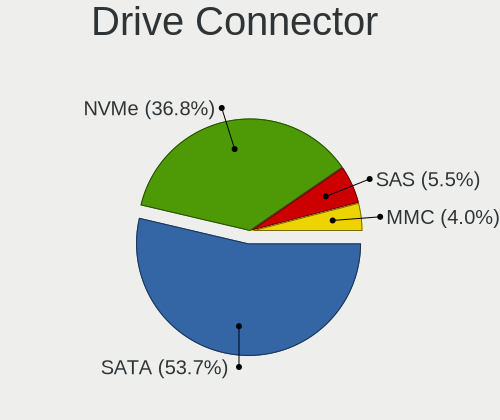
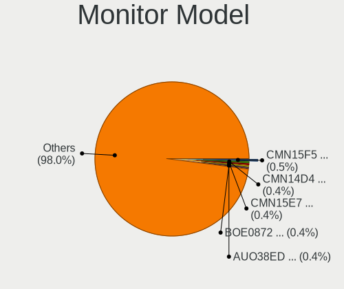
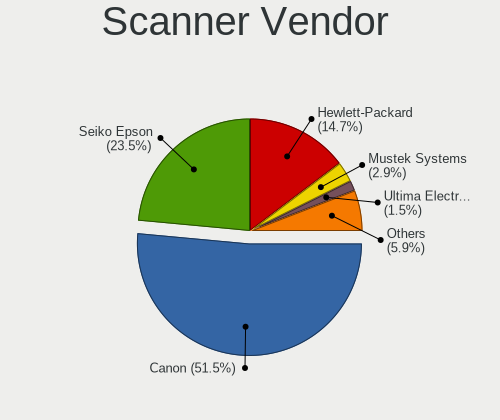

Ubuntu 22.04 - Tested Hardware & Statistics
-------------------------------------------

A project to collect tested hardware configurations for Ubuntu 22.04.

Anyone can contribute to this report by the [hw-probe](https://github.com/linuxhw/hw-probe) tool:

    sudo -E hw-probe -all -upload

Please contribute! Especially if your hardware is rare.

This is a report for all computer types. See also reports for [desktops](/Dist/Ubuntu_22.04/Desktop/README.md) and [notebooks](/Dist/Ubuntu_22.04/Notebook/README.md).

Contents
--------

* [ Test Cases ](#test-cases)

* [ System ](#system)
  - [ Kernel                   ](#kernel)
  - [ Kernel Family            ](#kernel-family)
  - [ Kernel Major Ver.        ](#kernel-major-ver)
  - [ Arch                     ](#arch)
  - [ DE                       ](#de)
  - [ Display Server           ](#display-server)
  - [ Display Manager          ](#display-manager)
  - [ OS Lang                  ](#os-lang)
  - [ Boot Mode                ](#boot-mode)
  - [ Filesystem               ](#filesystem)
  - [ Part. scheme             ](#part-scheme)
  - [ Dual Boot with Linux/BSD ](#dual-boot-with-linuxbsd)
  - [ Dual Boot (Win)          ](#dual-boot-win)

* [ Board ](#board)
  - [ Vendor                   ](#vendor)
  - [ Model                    ](#model)
  - [ Model Family             ](#model-family)
  - [ MFG Year                 ](#mfg-year)
  - [ Form Factor              ](#form-factor)
  - [ Secure Boot              ](#secure-boot)
  - [ Coreboot                 ](#coreboot)
  - [ RAM Size                 ](#ram-size)
  - [ RAM Used                 ](#ram-used)
  - [ Total Drives             ](#total-drives)
  - [ Has CD-ROM               ](#has-cd-rom)
  - [ Has Ethernet             ](#has-ethernet)
  - [ Has WiFi                 ](#has-wifi)
  - [ Has Bluetooth            ](#has-bluetooth)

* [ Location ](#location)
  - [ Country                  ](#country)
  - [ City                     ](#city)

* [ Drives ](#drives)
  - [ Drive Vendor             ](#drive-vendor)
  - [ Drive Model              ](#drive-model)
  - [ HDD Vendor               ](#hdd-vendor)
  - [ SSD Vendor               ](#ssd-vendor)
  - [ Drive Kind               ](#drive-kind)
  - [ Drive Connector          ](#drive-connector)
  - [ Drive Size               ](#drive-size)
  - [ Space Total              ](#space-total)
  - [ Space Used               ](#space-used)
  - [ Malfunc. Drives          ](#malfunc-drives)
  - [ Malfunc. Drive Vendor    ](#malfunc-drive-vendor)
  - [ Malfunc. HDD Vendor      ](#malfunc-hdd-vendor)
  - [ Malfunc. Drive Kind      ](#malfunc-drive-kind)
  - [ Failed Drives            ](#failed-drives)
  - [ Failed Drive Vendor      ](#failed-drive-vendor)
  - [ Drive Status             ](#drive-status)

* [ Storage controller ](#storage-controller)
  - [ Storage Vendor           ](#storage-vendor)
  - [ Storage Model            ](#storage-model)
  - [ Storage Kind             ](#storage-kind)

* [ Processor ](#processor)
  - [ CPU Vendor               ](#cpu-vendor)
  - [ CPU Model                ](#cpu-model)
  - [ CPU Model Family         ](#cpu-model-family)
  - [ CPU Cores                ](#cpu-cores)
  - [ CPU Sockets              ](#cpu-sockets)
  - [ CPU Threads              ](#cpu-threads)
  - [ CPU Op-Modes             ](#cpu-op-modes)
  - [ CPU Microcode            ](#cpu-microcode)
  - [ CPU Microarch            ](#cpu-microarch)

* [ Graphics ](#graphics)
  - [ GPU Vendor               ](#gpu-vendor)
  - [ GPU Model                ](#gpu-model)
  - [ GPU Combo                ](#gpu-combo)
  - [ GPU Driver               ](#gpu-driver)
  - [ GPU Memory               ](#gpu-memory)

* [ Monitor ](#monitor)
  - [ Monitor Vendor           ](#monitor-vendor)
  - [ Monitor Model            ](#monitor-model)
  - [ Monitor Resolution       ](#monitor-resolution)
  - [ Monitor Diagonal         ](#monitor-diagonal)
  - [ Monitor Width            ](#monitor-width)
  - [ Aspect Ratio             ](#aspect-ratio)
  - [ Monitor Area             ](#monitor-area)
  - [ Pixel Density            ](#pixel-density)
  - [ Multiple Monitors        ](#multiple-monitors)

* [ Network ](#network)
  - [ Net Controller Vendor    ](#net-controller-vendor)
  - [ Net Controller Model     ](#net-controller-model)
  - [ Wireless Vendor          ](#wireless-vendor)
  - [ Wireless Model           ](#wireless-model)
  - [ Ethernet Vendor          ](#ethernet-vendor)
  - [ Ethernet Model           ](#ethernet-model)
  - [ Net Controller Kind      ](#net-controller-kind)
  - [ Used Controller          ](#used-controller)
  - [ NICs                     ](#nics)
  - [ IPv6                     ](#ipv6)

* [ Bluetooth ](#bluetooth)
  - [ Bluetooth Vendor         ](#bluetooth-vendor)
  - [ Bluetooth Model          ](#bluetooth-model)

* [ Sound ](#sound)
  - [ Sound Vendor             ](#sound-vendor)
  - [ Sound Model              ](#sound-model)

* [ Memory ](#memory)
  - [ Memory Vendor            ](#memory-vendor)
  - [ Memory Model             ](#memory-model)
  - [ Memory Kind              ](#memory-kind)
  - [ Memory Form Factor       ](#memory-form-factor)
  - [ Memory Size              ](#memory-size)
  - [ Memory Speed             ](#memory-speed)

* [ Printers & scanners ](#printers--scanners)
  - [ Printer Vendor           ](#printer-vendor)
  - [ Printer Model            ](#printer-model)
  - [ Scanner Vendor           ](#scanner-vendor)
  - [ Scanner Model            ](#scanner-model)

* [ Camera ](#camera)
  - [ Camera Vendor            ](#camera-vendor)
  - [ Camera Model             ](#camera-model)

* [ Security ](#security)
  - [ Fingerprint Vendor       ](#fingerprint-vendor)
  - [ Fingerprint Model        ](#fingerprint-model)
  - [ Chipcard Vendor          ](#chipcard-vendor)
  - [ Chipcard Model           ](#chipcard-model)

* [ Unsupported ](#unsupported)
  - [ Unsupported Devices      ](#unsupported-devices)
  - [ Unsupported Device Types ](#unsupported-device-types)

Test Cases
----------

Total: 21132

| Vendor        | Model                       | Form-Factor | Probe                                                      | Date         |
|---------------|-----------------------------|-------------|------------------------------------------------------------|--------------|
| Unknown       | DH61BR G32662-203           | Desktop     | [06cb46d18c](https://linux-hardware.org/?probe=06cb46d18c) | Feb 02, 2024 |
| Apple         | MacBookPro4,1               | Notebook    | [5d31a31783](https://linux-hardware.org/?probe=5d31a31783) | Feb 02, 2024 |
| Unknown       | DH61BR G32662-203           | Desktop     | [7496b90e09](https://linux-hardware.org/?probe=7496b90e09) | Feb 02, 2024 |
| ASUSTek       | TUF B450-PLUS GAMING        | Desktop     | [4bcae97baa](https://linux-hardware.org/?probe=4bcae97baa) | Feb 02, 2024 |
| Apple         | Mac-942B5BF58194151B        | All in one  | [1546d8c6bf](https://linux-hardware.org/?probe=1546d8c6bf) | Feb 02, 2024 |
| Dell          | Inspiron 13-7359            | Notebook    | [82a1195ef5](https://linux-hardware.org/?probe=82a1195ef5) | Feb 02, 2024 |
| Apple         | Mac-F221BEC8                | Desktop     | [7e71a3a029](https://linux-hardware.org/?probe=7e71a3a029) | Feb 02, 2024 |
| Dell          | Inspiron 3583               | Notebook    | [3c532c85ec](https://linux-hardware.org/?probe=3c532c85ec) | Feb 02, 2024 |
| Lenovo        | IdeaPad 3 17ALC6 82KV       | Notebook    | [3aa20161d9](https://linux-hardware.org/?probe=3aa20161d9) | Feb 02, 2024 |
| Acer          | Aspire 5741G                | Notebook    | [935470b35c](https://linux-hardware.org/?probe=935470b35c) | Feb 02, 2024 |
| ASUSTek       | ROG STRIX B650E-E GAMING... | Desktop     | [97d6952c52](https://linux-hardware.org/?probe=97d6952c52) | Feb 02, 2024 |
| Acer          | Aspire V3-772               | Notebook    | [4a32c0297c](https://linux-hardware.org/?probe=4a32c0297c) | Feb 02, 2024 |
| ASUSTek       | VivoBook_ASUSLaptop M350... | Notebook    | [cb15afccd0](https://linux-hardware.org/?probe=cb15afccd0) | Feb 02, 2024 |
| HP            | 859C                        | Desktop     | [bc1cc805c6](https://linux-hardware.org/?probe=bc1cc805c6) | Feb 02, 2024 |
| Dell          | Precision 7550              | Notebook    | [c210fa0d97](https://linux-hardware.org/?probe=c210fa0d97) | Feb 02, 2024 |
| Acer          | Aspire 5741G                | Notebook    | [d598afdbe9](https://linux-hardware.org/?probe=d598afdbe9) | Feb 02, 2024 |
| DEXP          | Atlas M14-I5W303            | Notebook    | [fd14684ed2](https://linux-hardware.org/?probe=fd14684ed2) | Feb 02, 2024 |
| Lenovo        | ThinkPad E590 20NB002BRT    | Notebook    | [283a2fd324](https://linux-hardware.org/?probe=283a2fd324) | Feb 02, 2024 |
| HP            | ProBook 450 G8 Notebook ... | Notebook    | [0bbbc51a52](https://linux-hardware.org/?probe=0bbbc51a52) | Feb 02, 2024 |
| Lenovo        | ThinkBook 16p Gen 4 21J8    | Notebook    | [7cbebba117](https://linux-hardware.org/?probe=7cbebba117) | Feb 02, 2024 |
| ASRock        | X300-ITX                    | Desktop     | [3390b15018](https://linux-hardware.org/?probe=3390b15018) | Feb 02, 2024 |
| Dell          | 05XGC8 A01                  | Desktop     | [29ae38936a](https://linux-hardware.org/?probe=29ae38936a) | Feb 02, 2024 |
| SLIMBOOK      | HERO-S-TGL-RTX              | Notebook    | [1260457422](https://linux-hardware.org/?probe=1260457422) | Feb 02, 2024 |
| Fujitsu       | D3523-Ax S26361-D3523-Ax    | Desktop     | [fefabce2b4](https://linux-hardware.org/?probe=fefabce2b4) | Feb 02, 2024 |
| Lenovo        | MIIX 520-12IKB 20M3         | Tablet      | [0fb22a9b60](https://linux-hardware.org/?probe=0fb22a9b60) | Feb 02, 2024 |
| HP            | 158A                        | Desktop     | [1ec6b139ac](https://linux-hardware.org/?probe=1ec6b139ac) | Feb 02, 2024 |
| Apple         | MacBookPro11,3              | Notebook    | [5bc93c37fa](https://linux-hardware.org/?probe=5bc93c37fa) | Feb 02, 2024 |
| Dell          | Inspiron 3542               | Notebook    | [176eee6b84](https://linux-hardware.org/?probe=176eee6b84) | Feb 02, 2024 |
| Dell          | Inspiron 3542               | Notebook    | [7f677482ef](https://linux-hardware.org/?probe=7f677482ef) | Feb 02, 2024 |
| HP            | ENVY x360 Convertible 13... | Convertible | [a64e17ff88](https://linux-hardware.org/?probe=a64e17ff88) | Feb 02, 2024 |
| Pegatron      | Spring Peak                 | Notebook    | [b14f110621](https://linux-hardware.org/?probe=b14f110621) | Feb 02, 2024 |
| ASUSTek       | N53SV                       | Notebook    | [ee79ea1cbb](https://linux-hardware.org/?probe=ee79ea1cbb) | Feb 01, 2024 |
| Lenovo        | ThinkPad T440 20B7A0B7MN    | Notebook    | [74173e2c0a](https://linux-hardware.org/?probe=74173e2c0a) | Feb 01, 2024 |
| HP            | ENVY x360 Convertible 15... | Convertible | [34e8a186d6](https://linux-hardware.org/?probe=34e8a186d6) | Feb 01, 2024 |
| Pegatron      | Spring Peak                 | Notebook    | [4404cfb5c8](https://linux-hardware.org/?probe=4404cfb5c8) | Feb 01, 2024 |
| Lenovo        | IdeaPad S340-15API 81NC     | Notebook    | [7340c4abd7](https://linux-hardware.org/?probe=7340c4abd7) | Feb 01, 2024 |
| Dell          | Latitude 5420               | Notebook    | [9ca4bb32d7](https://linux-hardware.org/?probe=9ca4bb32d7) | Feb 01, 2024 |
| Dell          | Inspiron N5010              | Notebook    | [151239b938](https://linux-hardware.org/?probe=151239b938) | Feb 01, 2024 |
| Dell          | Vostro 3525                 | Notebook    | [495877fada](https://linux-hardware.org/?probe=495877fada) | Feb 01, 2024 |
| ASUSTek       | Zenbook UM3402YAR_UM3402... | Notebook    | [04c6362187](https://linux-hardware.org/?probe=04c6362187) | Feb 01, 2024 |
| Dell          | 0T568R A00                  | Desktop     | [4ce5e16aa2](https://linux-hardware.org/?probe=4ce5e16aa2) | Feb 01, 2024 |
| Apple         | Mac-942B5BF58194151B        | All in one  | [88448ddf49](https://linux-hardware.org/?probe=88448ddf49) | Feb 01, 2024 |
| ASUSTek       | N53SV                       | Notebook    | [29807f0dfa](https://linux-hardware.org/?probe=29807f0dfa) | Feb 01, 2024 |
| AMI           | Intel                       | Notebook    | [6d3ac84f15](https://linux-hardware.org/?probe=6d3ac84f15) | Feb 01, 2024 |
| Lenovo        | ThinkPad X1 Carbon 6th 2... | Notebook    | [6acefbaadc](https://linux-hardware.org/?probe=6acefbaadc) | Feb 01, 2024 |
| Supermicro    | X8DTU                       | Server      | [246a9d76c6](https://linux-hardware.org/?probe=246a9d76c6) | Feb 01, 2024 |
| Acer          | Swift SF314-512             | Notebook    | [28bd75703e](https://linux-hardware.org/?probe=28bd75703e) | Feb 01, 2024 |
| Lenovo        | Yoga Slim 7 ProX 14ARH7 ... | Notebook    | [5f2635ae3a](https://linux-hardware.org/?probe=5f2635ae3a) | Feb 01, 2024 |
| Dell          | 0TDG4V A01                  | Desktop     | [d921cc13e3](https://linux-hardware.org/?probe=d921cc13e3) | Feb 01, 2024 |
| Lenovo        | ThinkPad Yoga 260 20FES1... | Convertible | [f6d99b6096](https://linux-hardware.org/?probe=f6d99b6096) | Feb 01, 2024 |
| Dell          | Inspiron 7501               | Notebook    | [5c071c25ab](https://linux-hardware.org/?probe=5c071c25ab) | Feb 01, 2024 |
| Fujitsu       | LIFEBOOK E752               | Notebook    | [5bd3d39655](https://linux-hardware.org/?probe=5bd3d39655) | Feb 01, 2024 |
| TrekStor      | Primebook P14               | Notebook    | [ffd6c873de](https://linux-hardware.org/?probe=ffd6c873de) | Feb 01, 2024 |
| EBN           | MA1N                        | Desktop     | [302ea43954](https://linux-hardware.org/?probe=302ea43954) | Feb 01, 2024 |
| Dell          | 09KPNV A01                  | Desktop     | [b6ba043767](https://linux-hardware.org/?probe=b6ba043767) | Feb 01, 2024 |
| Dell          | Inspiron 15 7000 Gaming     | Notebook    | [8689e993e3](https://linux-hardware.org/?probe=8689e993e3) | Feb 01, 2024 |
| Dell          | Inspiron 15 7000 Gaming     | Notebook    | [01332b7a24](https://linux-hardware.org/?probe=01332b7a24) | Feb 01, 2024 |
| Apple         | MacBookPro4,1               | Notebook    | [863b50ad5a](https://linux-hardware.org/?probe=863b50ad5a) | Feb 01, 2024 |
| Dell          | Inspiron 3542               | Notebook    | [5a7e77b4a7](https://linux-hardware.org/?probe=5a7e77b4a7) | Feb 01, 2024 |
| Gigabyte      | B760M GAMING X DDR4         | Desktop     | [855d31073a](https://linux-hardware.org/?probe=855d31073a) | Feb 01, 2024 |
| MSI           | B550-A PRO                  | Desktop     | [c211b49a95](https://linux-hardware.org/?probe=c211b49a95) | Feb 01, 2024 |
| HP            | 8598                        | Desktop     | [cc6faa2bfa](https://linux-hardware.org/?probe=cc6faa2bfa) | Feb 01, 2024 |
| Intel         | NUC8i7HNB J68197-602        | Mini pc     | [b3b6728f99](https://linux-hardware.org/?probe=b3b6728f99) | Feb 01, 2024 |
| MSI           | Z370-A PRO                  | Desktop     | [d012afeb56](https://linux-hardware.org/?probe=d012afeb56) | Feb 01, 2024 |
| HC Technol... | HCAR5000-MI                 | Desktop     | [f6051e0b06](https://linux-hardware.org/?probe=f6051e0b06) | Feb 01, 2024 |
| ASUSTek       | PRIME B760-PLUS D4          | Desktop     | [d9355c6146](https://linux-hardware.org/?probe=d9355c6146) | Feb 01, 2024 |
| ASUSTek       | PN64                        | Mini pc     | [7123543d85](https://linux-hardware.org/?probe=7123543d85) | Jan 31, 2024 |
| Foxconn       | 9657MA                      | Desktop     | [6b2e0b2ae9](https://linux-hardware.org/?probe=6b2e0b2ae9) | Jan 31, 2024 |
| HP            | ENVY dv6                    | Notebook    | [a91621750a](https://linux-hardware.org/?probe=a91621750a) | Jan 31, 2024 |
| HP            | ENVY x360 Convertible 15... | Convertible | [539b422b80](https://linux-hardware.org/?probe=539b422b80) | Jan 31, 2024 |
| Supermicro    | X10DRU-i+A                  | Desktop     | [f2881b94b0](https://linux-hardware.org/?probe=f2881b94b0) | Jan 31, 2024 |
| ASUSTek       | X555LD                      | Notebook    | [bc95890dcd](https://linux-hardware.org/?probe=bc95890dcd) | Jan 31, 2024 |
| Lenovo        | ThinkPad X1 Carbon Gen 1... | Notebook    | [a84c65f63e](https://linux-hardware.org/?probe=a84c65f63e) | Jan 31, 2024 |
| HUAWEI        | MCLF-XX                     | Notebook    | [97bfeb35bc](https://linux-hardware.org/?probe=97bfeb35bc) | Jan 31, 2024 |
| Dell          | Latitude E7250              | Notebook    | [24ea631399](https://linux-hardware.org/?probe=24ea631399) | Jan 31, 2024 |
| Gigabyte      | B560M DS3H AC               | Desktop     | [81a39a795c](https://linux-hardware.org/?probe=81a39a795c) | Jan 31, 2024 |
| Dell          | Latitude 5501               | Notebook    | [7c92ef29c9](https://linux-hardware.org/?probe=7c92ef29c9) | Jan 31, 2024 |
| ASUSTek       | Zenbook UX5401ZAS_UX5401... | Notebook    | [36be131f18](https://linux-hardware.org/?probe=36be131f18) | Jan 31, 2024 |
| ETegro Tec... | ETRS125G4 31S2MMB0040       | Server      | [12a68ef8f3](https://linux-hardware.org/?probe=12a68ef8f3) | Jan 31, 2024 |
| ETegro Tec... | ETRS125G4 31S2MMB0040       | Server      | [34c89da9d0](https://linux-hardware.org/?probe=34c89da9d0) | Jan 31, 2024 |
| Dell          | Inspiron 5537               | Notebook    | [600bb8363d](https://linux-hardware.org/?probe=600bb8363d) | Jan 31, 2024 |
| ASUSTek       | X555LD                      | Notebook    | [e65c871d95](https://linux-hardware.org/?probe=e65c871d95) | Jan 31, 2024 |
| ETegro Tec... | ETRS125G4 31S2MMB0040       | Server      | [535ed186d9](https://linux-hardware.org/?probe=535ed186d9) | Jan 31, 2024 |
| ETegro Tec... | ETRS125G4 31S2MMB0040       | Server      | [6a4b856510](https://linux-hardware.org/?probe=6a4b856510) | Jan 31, 2024 |
| ASUSTek       | X555LD                      | Notebook    | [1433f11bba](https://linux-hardware.org/?probe=1433f11bba) | Jan 31, 2024 |
| Fujitsu       | D3401-A1 S26361-D3401-A1    | Desktop     | [2360c2cf38](https://linux-hardware.org/?probe=2360c2cf38) | Jan 31, 2024 |
| Intel         | DG41AN AAE92991-401         | Desktop     | [5e520c92ca](https://linux-hardware.org/?probe=5e520c92ca) | Jan 31, 2024 |
| MSI           | Modern 14 B5M               | Notebook    | [e41b88a884](https://linux-hardware.org/?probe=e41b88a884) | Jan 31, 2024 |
| HP            | ENVY x360 Convertible 13... | Convertible | [98de51c101](https://linux-hardware.org/?probe=98de51c101) | Jan 31, 2024 |
| HP            | ENVY x360 Convertible 13... | Convertible | [348c7c4e82](https://linux-hardware.org/?probe=348c7c4e82) | Jan 31, 2024 |
| MSI           | B550-A PRO                  | Desktop     | [85c2cd9371](https://linux-hardware.org/?probe=85c2cd9371) | Jan 31, 2024 |
| Lenovo        | IdeaPad 300-17ISK 80QH      | Notebook    | [4f9b6c7262](https://linux-hardware.org/?probe=4f9b6c7262) | Jan 31, 2024 |
| Lenovo        | Yoga 6 13ABR8 83B2          | Convertible | [77c6d89192](https://linux-hardware.org/?probe=77c6d89192) | Jan 31, 2024 |
| Lenovo        | IdeaPad 300-17ISK 80QH      | Notebook    | [0e068176e4](https://linux-hardware.org/?probe=0e068176e4) | Jan 31, 2024 |
| ASUSTek       | PRO H410M-C                 | Desktop     | [ab001c7490](https://linux-hardware.org/?probe=ab001c7490) | Jan 31, 2024 |
| Apple         | MacBook8,1                  | Notebook    | [6ef40b726e](https://linux-hardware.org/?probe=6ef40b726e) | Jan 31, 2024 |
| Dell          | XPS 13 9380                 | Notebook    | [479853dd4c](https://linux-hardware.org/?probe=479853dd4c) | Jan 31, 2024 |
| Dell          | 02K9CR A01                  | Desktop     | [72df486f35](https://linux-hardware.org/?probe=72df486f35) | Jan 31, 2024 |
| Acer          | Swift SF514-56T             | Notebook    | [14b287861f](https://linux-hardware.org/?probe=14b287861f) | Jan 31, 2024 |
| Dell          | 0T568R A00                  | Desktop     | [56936b64ba](https://linux-hardware.org/?probe=56936b64ba) | Jan 30, 2024 |
| HP            | Pavilion dv6                | Notebook    | [e1e2c04f8c](https://linux-hardware.org/?probe=e1e2c04f8c) | Jan 30, 2024 |
| Alienware     | 15 R3                       | Notebook    | [297db64e3b](https://linux-hardware.org/?probe=297db64e3b) | Jan 30, 2024 |
| ASUSTek       | ROG Strix G814JI_G814JI     | Notebook    | [b51ecf60ef](https://linux-hardware.org/?probe=b51ecf60ef) | Jan 30, 2024 |
| Intel         | NUC7i5BNB J31144-302        | Mini pc     | [b7e8bed4cd](https://linux-hardware.org/?probe=b7e8bed4cd) | Jan 30, 2024 |
| ASUSTek       | TUF B450M-PLUS GAMING       | Desktop     | [c737ef78e9](https://linux-hardware.org/?probe=c737ef78e9) | Jan 30, 2024 |
| Apple         | MacBook8,1                  | Notebook    | [9580d3149f](https://linux-hardware.org/?probe=9580d3149f) | Jan 30, 2024 |
| Unknown       | Unknown                     | Desktop     | [6928c8eb05](https://linux-hardware.org/?probe=6928c8eb05) | Jan 30, 2024 |
| Dell          | XPS 13 9305                 | Notebook    | [1b2e728298](https://linux-hardware.org/?probe=1b2e728298) | Jan 30, 2024 |
| MSI           | X99A SLI PLUS               | Desktop     | [216026fc45](https://linux-hardware.org/?probe=216026fc45) | Jan 30, 2024 |
| Lenovo        | ThinkPad X1 Carbon Gen 8... | Notebook    | [1669d54762](https://linux-hardware.org/?probe=1669d54762) | Jan 30, 2024 |
| Gigabyte      | H55M-S2HP                   | Desktop     | [a1a4140c7e](https://linux-hardware.org/?probe=a1a4140c7e) | Jan 30, 2024 |
| Unknown       | Unknown                     | Desktop     | [a4eb1c6dda](https://linux-hardware.org/?probe=a4eb1c6dda) | Jan 30, 2024 |
| Unknown       | Unknown                     | Desktop     | [f8b5f64c1e](https://linux-hardware.org/?probe=f8b5f64c1e) | Jan 30, 2024 |
| Lenovo        | ThinkPad T510 43149TG       | Notebook    | [463b653f7a](https://linux-hardware.org/?probe=463b653f7a) | Jan 30, 2024 |
| Medion        | X781X                       | Notebook    | [3665eaa65c](https://linux-hardware.org/?probe=3665eaa65c) | Jan 30, 2024 |
| HP            | 894D                        | Desktop     | [851e68057d](https://linux-hardware.org/?probe=851e68057d) | Jan 30, 2024 |
| MSI           | MAG B650 TOMAHAWK WIFI      | Desktop     | [c2ff3b6e2f](https://linux-hardware.org/?probe=c2ff3b6e2f) | Jan 30, 2024 |
| Dell          | 0TDG4V A01                  | Desktop     | [240d51778b](https://linux-hardware.org/?probe=240d51778b) | Jan 30, 2024 |
| ASUSTek       | Vivobook Go E1504FA_E150... | Notebook    | [646a977cdd](https://linux-hardware.org/?probe=646a977cdd) | Jan 30, 2024 |
| Intel         | X99 V1.0                    | Desktop     | [202a9720c4](https://linux-hardware.org/?probe=202a9720c4) | Jan 30, 2024 |
| ASUSTek       | VivoBook_ASUSLaptop K370... | Notebook    | [e935a209d7](https://linux-hardware.org/?probe=e935a209d7) | Jan 30, 2024 |
| ASUSTek       | VivoBook_ASUSLaptop K370... | Notebook    | [4a1a726464](https://linux-hardware.org/?probe=4a1a726464) | Jan 30, 2024 |
| Lenovo        | ThinkPad T410 2537AT1       | Notebook    | [54b5a51811](https://linux-hardware.org/?probe=54b5a51811) | Jan 30, 2024 |
| HP            | Pavilion dv7                | Notebook    | [8aab31766b](https://linux-hardware.org/?probe=8aab31766b) | Jan 30, 2024 |
| ASUSTek       | X540LA                      | Notebook    | [503b80e997](https://linux-hardware.org/?probe=503b80e997) | Jan 30, 2024 |
| Medion        | B250H4-EM                   | Desktop     | [418b44d0a2](https://linux-hardware.org/?probe=418b44d0a2) | Jan 29, 2024 |
| Pegatron      | Benicia                     | Desktop     | [b127dc2bc0](https://linux-hardware.org/?probe=b127dc2bc0) | Jan 29, 2024 |
| ASUSTek       | UX550VD                     | Notebook    | [3b742650db](https://linux-hardware.org/?probe=3b742650db) | Jan 29, 2024 |
| Apple         | MacBookPro4,1               | Notebook    | [2e5f443b99](https://linux-hardware.org/?probe=2e5f443b99) | Jan 29, 2024 |
| Lenovo        | ThinkPad T14 Gen 3 21AH0... | Notebook    | [913338a499](https://linux-hardware.org/?probe=913338a499) | Jan 29, 2024 |
| Acer          | Aspire E1-522               | Notebook    | [1dab2e243c](https://linux-hardware.org/?probe=1dab2e243c) | Jan 29, 2024 |
| HP            | ProBook 640 G1              | Notebook    | [7bbe891072](https://linux-hardware.org/?probe=7bbe891072) | Jan 29, 2024 |
| Lenovo        | IdeaPad 3 15ADA05 81W1      | Notebook    | [dafe3d53e0](https://linux-hardware.org/?probe=dafe3d53e0) | Jan 29, 2024 |
| ASUSTek       | Vivobook Go E1404FA_E140... | Notebook    | [a1d3b30464](https://linux-hardware.org/?probe=a1d3b30464) | Jan 29, 2024 |
| ASUSTek       | Vivobook Go E1404FA_E140... | Notebook    | [ae5e53e103](https://linux-hardware.org/?probe=ae5e53e103) | Jan 29, 2024 |
| Itautec       | ST 4253 ST-4253 Padrao 0... | Desktop     | [21628b2a5b](https://linux-hardware.org/?probe=21628b2a5b) | Jan 29, 2024 |
| Dell          | Latitude 5430 Rugged        | Notebook    | [8708a1170b](https://linux-hardware.org/?probe=8708a1170b) | Jan 29, 2024 |
| Itautec       | ST 4253 ST-4253 Padrao 0... | Desktop     | [26ae99cfe2](https://linux-hardware.org/?probe=26ae99cfe2) | Jan 29, 2024 |
| Lenovo        | 318E SDK0J40697 WIN 3305... | Desktop     | [856669283d](https://linux-hardware.org/?probe=856669283d) | Jan 29, 2024 |
| ASUSTek       | Pro WS WRX80E-SAGE SE WI... | Desktop     | [009120e99a](https://linux-hardware.org/?probe=009120e99a) | Jan 29, 2024 |
| Dell          | Inspiron 1525               | Notebook    | [aeacd97c42](https://linux-hardware.org/?probe=aeacd97c42) | Jan 29, 2024 |
| Gigabyte      | Z77X-D3H                    | Desktop     | [aa69326408](https://linux-hardware.org/?probe=aa69326408) | Jan 29, 2024 |
| ASUSTek       | G10DK                       | Desktop     | [f5632504cc](https://linux-hardware.org/?probe=f5632504cc) | Jan 29, 2024 |
| ASUSTek       | G10DK                       | Desktop     | [5ef0067e13](https://linux-hardware.org/?probe=5ef0067e13) | Jan 29, 2024 |
| Unknown       | HX90                        | Desktop     | [2d0982fbb6](https://linux-hardware.org/?probe=2d0982fbb6) | Jan 29, 2024 |
| Lenovo        | Legion 5 15ACH6H 82JU       | Notebook    | [0c4fb535dc](https://linux-hardware.org/?probe=0c4fb535dc) | Jan 29, 2024 |
| Dell          | 0C2KJT A00                  | Desktop     | [bc76ac497b](https://linux-hardware.org/?probe=bc76ac497b) | Jan 29, 2024 |
| Dell          | 0C2KJT A00                  | Desktop     | [b56c82b709](https://linux-hardware.org/?probe=b56c82b709) | Jan 29, 2024 |
| HUAWEI        | NBLB-WAX9N                  | Notebook    | [dc9267becb](https://linux-hardware.org/?probe=dc9267becb) | Jan 29, 2024 |
| Medion        | P15648                      | Notebook    | [d906da0d95](https://linux-hardware.org/?probe=d906da0d95) | Jan 29, 2024 |
| ASUSTek       | SABERTOOTH Z170 MARK 1      | Desktop     | [29fcd258c7](https://linux-hardware.org/?probe=29fcd258c7) | Jan 28, 2024 |
| HP            | Dragonfly Pro Laptop PC     | Notebook    | [f7605bd832](https://linux-hardware.org/?probe=f7605bd832) | Jan 28, 2024 |
| Biostar       | B550MH                      | Desktop     | [18a98ffa2c](https://linux-hardware.org/?probe=18a98ffa2c) | Jan 28, 2024 |
| Biostar       | B550MH                      | Desktop     | [7e52e1855c](https://linux-hardware.org/?probe=7e52e1855c) | Jan 28, 2024 |
| Unknown       | Unknown                     | Desktop     | [e80d32ade5](https://linux-hardware.org/?probe=e80d32ade5) | Jan 28, 2024 |
| Acer          | Nitro AN515-58              | Notebook    | [20b00f9064](https://linux-hardware.org/?probe=20b00f9064) | Jan 28, 2024 |
| Apple         | MacBookAir6,1               | Notebook    | [d508f78053](https://linux-hardware.org/?probe=d508f78053) | Jan 28, 2024 |
| HP            | ProBook 4530s               | Notebook    | [6135fed286](https://linux-hardware.org/?probe=6135fed286) | Jan 28, 2024 |
| Lenovo        | 36C5 SDK0K17763 WIN 1801... | Desktop     | [0aa2140ac2](https://linux-hardware.org/?probe=0aa2140ac2) | Jan 28, 2024 |
| Lenovo        | 36C5 SDK0K17763 WIN 1801... | Desktop     | [752e2156f6](https://linux-hardware.org/?probe=752e2156f6) | Jan 28, 2024 |
| Lenovo        | IdeaPad S510p 20298         | Notebook    | [7c9fb93a37](https://linux-hardware.org/?probe=7c9fb93a37) | Jan 28, 2024 |
| Lenovo        | IdeaPad 130-15AST 81H5      | Notebook    | [81e9c9a499](https://linux-hardware.org/?probe=81e9c9a499) | Jan 28, 2024 |
| Toshiba       | Satellite P50-B-10Z         | Notebook    | [574103da6a](https://linux-hardware.org/?probe=574103da6a) | Jan 28, 2024 |
| Lenovo        | IdeaPad 3 15ADA05 81W1      | Notebook    | [cab252fea3](https://linux-hardware.org/?probe=cab252fea3) | Jan 28, 2024 |
| HP            | 82F2 A01                    | Desktop     | [017f111720](https://linux-hardware.org/?probe=017f111720) | Jan 28, 2024 |
| ASUSTek       | PRIME H510M-E               | Desktop     | [f8f08ce899](https://linux-hardware.org/?probe=f8f08ce899) | Jan 28, 2024 |
| Acer          | Aspire VN7-571G             | Notebook    | [b5f8437f3c](https://linux-hardware.org/?probe=b5f8437f3c) | Jan 28, 2024 |
| ASRock        | FM2A75M Pro4+               | Desktop     | [d3d40bf0b4](https://linux-hardware.org/?probe=d3d40bf0b4) | Jan 28, 2024 |
| ASUSTek       | P5Q SE2                     | Desktop     | [5aa0059c3f](https://linux-hardware.org/?probe=5aa0059c3f) | Jan 28, 2024 |
| Apple         | MacBookPro14,3              | Notebook    | [1b5bfa9bcb](https://linux-hardware.org/?probe=1b5bfa9bcb) | Jan 28, 2024 |
| HP            | Victus by Gaming Laptop ... | Notebook    | [49e891b67d](https://linux-hardware.org/?probe=49e891b67d) | Jan 28, 2024 |
| HP            | ENVY Laptop 15-ep0xxx       | Notebook    | [c2d0dabb5e](https://linux-hardware.org/?probe=c2d0dabb5e) | Jan 28, 2024 |
| Dell          | 0D24M8 A01                  | Desktop     | [db11402dbf](https://linux-hardware.org/?probe=db11402dbf) | Jan 28, 2024 |
| Dell          | G15 5511                    | Notebook    | [53225a4d52](https://linux-hardware.org/?probe=53225a4d52) | Jan 28, 2024 |
| Dell          | 03X6X0 A06                  | Server      | [685323f0f3](https://linux-hardware.org/?probe=685323f0f3) | Jan 28, 2024 |
| Dell          | Inspiron 3537               | Notebook    | [e91c3bfd73](https://linux-hardware.org/?probe=e91c3bfd73) | Jan 28, 2024 |
| Dell          | Inspiron 3537               | Notebook    | [0ee7687e3f](https://linux-hardware.org/?probe=0ee7687e3f) | Jan 28, 2024 |
| Google        | Elemi                       | Notebook    | [f767c4fdbb](https://linux-hardware.org/?probe=f767c4fdbb) | Jan 28, 2024 |
| Medion        | D3F3-EM                     | Desktop     | [b49f3c529a](https://linux-hardware.org/?probe=b49f3c529a) | Jan 28, 2024 |
| ASUSTek       | PRIME A320M-K               | Desktop     | [3d0d9dce8a](https://linux-hardware.org/?probe=3d0d9dce8a) | Jan 28, 2024 |
| Lenovo        | IdeaPad 130-15AST 81H5      | Notebook    | [465b69ceca](https://linux-hardware.org/?probe=465b69ceca) | Jan 28, 2024 |
| ASUSTek       | P8B75-M                     | Desktop     | [ad1a5f6757](https://linux-hardware.org/?probe=ad1a5f6757) | Jan 28, 2024 |
| Acer          | Aspire A515-46              | Notebook    | [935246f473](https://linux-hardware.org/?probe=935246f473) | Jan 28, 2024 |
| Acer          | Aspire A515-46              | Notebook    | [f023bc003e](https://linux-hardware.org/?probe=f023bc003e) | Jan 27, 2024 |
| Dell          | Latitude 7490               | Notebook    | [8687d67e07](https://linux-hardware.org/?probe=8687d67e07) | Jan 27, 2024 |
| Dell          | 0VHWTR A02                  | Desktop     | [a40f7ff2de](https://linux-hardware.org/?probe=a40f7ff2de) | Jan 27, 2024 |
| HP            | Notebook                    | Notebook    | [78ffba1358](https://linux-hardware.org/?probe=78ffba1358) | Jan 27, 2024 |
| Apple         | MacBookPro9,2               | Notebook    | [8bca4f366d](https://linux-hardware.org/?probe=8bca4f366d) | Jan 27, 2024 |
| ASUSTek       | Zenbook UM3402YAR_UM3402... | Notebook    | [ee59cf62cb](https://linux-hardware.org/?probe=ee59cf62cb) | Jan 27, 2024 |
| Dell          | Inspiron 5570               | Notebook    | [0fce3dbe59](https://linux-hardware.org/?probe=0fce3dbe59) | Jan 27, 2024 |
| ABIT          | AB9/AB9RPO                  | Desktop     | [01c28bcaa5](https://linux-hardware.org/?probe=01c28bcaa5) | Jan 27, 2024 |
| Dell          | Latitude 7390 2-in-1        | Notebook    | [d57566edb3](https://linux-hardware.org/?probe=d57566edb3) | Jan 27, 2024 |
| Dell          | Latitude 7390 2-in-1        | Notebook    | [26a44b8cab](https://linux-hardware.org/?probe=26a44b8cab) | Jan 27, 2024 |
| Apple         | Mac-F221BEC8                | Desktop     | [9fb7827c5f](https://linux-hardware.org/?probe=9fb7827c5f) | Jan 27, 2024 |
| Gigabyte      | B450 AORUS M                | Desktop     | [03351f8523](https://linux-hardware.org/?probe=03351f8523) | Jan 27, 2024 |
| MSI           | A320M GRENADE               | Desktop     | [0a605bfdee](https://linux-hardware.org/?probe=0a605bfdee) | Jan 27, 2024 |
| Gigabyte      | B450M DS3H-CF               | Desktop     | [a6b046b2b7](https://linux-hardware.org/?probe=a6b046b2b7) | Jan 27, 2024 |
| ASUSTek       | PRIME B450M-K II            | Desktop     | [46b23b4469](https://linux-hardware.org/?probe=46b23b4469) | Jan 27, 2024 |
| Dell          | Latitude E7450              | Notebook    | [d427866522](https://linux-hardware.org/?probe=d427866522) | Jan 27, 2024 |
| Dell          | XPS 9320                    | Notebook    | [0214714fb9](https://linux-hardware.org/?probe=0214714fb9) | Jan 27, 2024 |
| ASUSTek       | Zenbook UM3402YAR_UM3402... | Notebook    | [dfb6b2a1c8](https://linux-hardware.org/?probe=dfb6b2a1c8) | Jan 27, 2024 |
| ASUSTek       | NODUSM3                     | Desktop     | [b7a885758d](https://linux-hardware.org/?probe=b7a885758d) | Jan 27, 2024 |
| Fujitsu       | FARQ10003                   | Notebook    | [6084280fc9](https://linux-hardware.org/?probe=6084280fc9) | Jan 27, 2024 |
| System76      | Oryx Pro                    | Notebook    | [faac85b51d](https://linux-hardware.org/?probe=faac85b51d) | Jan 27, 2024 |
| Dell          | Latitude E7440              | Notebook    | [8d31059748](https://linux-hardware.org/?probe=8d31059748) | Jan 27, 2024 |
| Dell          | Inspiron 3542               | Notebook    | [2a81d5f313](https://linux-hardware.org/?probe=2a81d5f313) | Jan 27, 2024 |
| ASUSTek       | K52JT                       | Notebook    | [dd44051584](https://linux-hardware.org/?probe=dd44051584) | Jan 27, 2024 |
| JGINYUE       | H97M-VH V2.1                | Desktop     | [f4baebb6b0](https://linux-hardware.org/?probe=f4baebb6b0) | Jan 27, 2024 |
| JGINYUE       | H97M-VH V2.1                | Desktop     | [7983ca3c2d](https://linux-hardware.org/?probe=7983ca3c2d) | Jan 27, 2024 |
| MSI           | MAG B550 TOMAHAWK           | Desktop     | [9eeddc4566](https://linux-hardware.org/?probe=9eeddc4566) | Jan 27, 2024 |
| ASUSTek       | PRIME B450-PLUS             | Desktop     | [fe40514847](https://linux-hardware.org/?probe=fe40514847) | Jan 27, 2024 |
| HP            | Pavilion x360 2-in-1 Lap... | Convertible | [931f000daf](https://linux-hardware.org/?probe=931f000daf) | Jan 27, 2024 |
| Lenovo        | IdeaPad 3 15ITL6 82H8       | Notebook    | [5fac7fde98](https://linux-hardware.org/?probe=5fac7fde98) | Jan 27, 2024 |
| Dell          | 081N4V A07                  | Server      | [fac7b88ba4](https://linux-hardware.org/?probe=fac7b88ba4) | Jan 27, 2024 |
| Apple         | MacBookPro9,2               | Notebook    | [9518bd6b03](https://linux-hardware.org/?probe=9518bd6b03) | Jan 27, 2024 |
| Dell          | 081N4V A07                  | Server      | [dcc52ce1cc](https://linux-hardware.org/?probe=dcc52ce1cc) | Jan 27, 2024 |
| Gigabyte      | B450M DS3H-CF               | Desktop     | [95541e0847](https://linux-hardware.org/?probe=95541e0847) | Jan 27, 2024 |
| Dell          | Latitude E5250              | Notebook    | [29a9f5d01c](https://linux-hardware.org/?probe=29a9f5d01c) | Jan 26, 2024 |
| Apple         | Mac-942B59F58194171B iMa... | All in one  | [6431000318](https://linux-hardware.org/?probe=6431000318) | Jan 26, 2024 |
| Apple         | MacBookPro9,2               | Notebook    | [5591f82595](https://linux-hardware.org/?probe=5591f82595) | Jan 26, 2024 |
| Apple         | MacBookPro8,1               | Notebook    | [fa96de4635](https://linux-hardware.org/?probe=fa96de4635) | Jan 26, 2024 |
| Apple         | MacBookPro8,1               | Notebook    | [90c57cfb01](https://linux-hardware.org/?probe=90c57cfb01) | Jan 26, 2024 |
| ECS           | APLD-MINI                   | Desktop     | [51b4a0993d](https://linux-hardware.org/?probe=51b4a0993d) | Jan 26, 2024 |
| HP            | 15 Notebook PC              | Notebook    | [9f12f6bda7](https://linux-hardware.org/?probe=9f12f6bda7) | Jan 26, 2024 |
| ASUSTek       | ZenBook UX435EG_UX435EG     | Notebook    | [a354ee36fe](https://linux-hardware.org/?probe=a354ee36fe) | Jan 26, 2024 |
| Apple         | MacBookPro11,3              | Notebook    | [5859ff1ab1](https://linux-hardware.org/?probe=5859ff1ab1) | Jan 26, 2024 |
| TUXEDO        | Aura 15 Gen1                | Notebook    | [27fa584690](https://linux-hardware.org/?probe=27fa584690) | Jan 26, 2024 |
| HUAWEI        | KLVL-WXX9                   | Notebook    | [4b630c4e1e](https://linux-hardware.org/?probe=4b630c4e1e) | Jan 26, 2024 |
| HUAWEI        | KLVL-WXX9                   | Notebook    | [c639997108](https://linux-hardware.org/?probe=c639997108) | Jan 26, 2024 |
| Gigabyte      | B450M S2H                   | Desktop     | [b010be0d2f](https://linux-hardware.org/?probe=b010be0d2f) | Jan 26, 2024 |
| MSI           | B250M BAZOOKA               | Desktop     | [0bd7085870](https://linux-hardware.org/?probe=0bd7085870) | Jan 26, 2024 |
| Lenovo        | IdeaPad 3 15ADA05 81W1      | Notebook    | [87d6398f5b](https://linux-hardware.org/?probe=87d6398f5b) | Jan 26, 2024 |
| HP            | 1998                        | Desktop     | [b1431c9048](https://linux-hardware.org/?probe=b1431c9048) | Jan 26, 2024 |
| HP            | 8719                        | Desktop     | [42bc597317](https://linux-hardware.org/?probe=42bc597317) | Jan 26, 2024 |
| ASUSTek       | B400VC                      | Notebook    | [af39cde6d9](https://linux-hardware.org/?probe=af39cde6d9) | Jan 26, 2024 |
| HP            | 650                         | Notebook    | [d440902ea2](https://linux-hardware.org/?probe=d440902ea2) | Jan 26, 2024 |
| Toshiba       | Satellite C670D-12Q         | Notebook    | [a9a2651adc](https://linux-hardware.org/?probe=a9a2651adc) | Jan 26, 2024 |
| Supermicro    | X10DDW-i                    | Desktop     | [6a9650896a](https://linux-hardware.org/?probe=6a9650896a) | Jan 26, 2024 |
| Dell          | Latitude 5490               | Notebook    | [f1fe39af02](https://linux-hardware.org/?probe=f1fe39af02) | Jan 26, 2024 |
| HP            | Pavilion dv6                | Notebook    | [9a15d7d823](https://linux-hardware.org/?probe=9a15d7d823) | Jan 26, 2024 |
| Dell          | Latitude 3190 2-in-1        | Convertible | [915a8fc837](https://linux-hardware.org/?probe=915a8fc837) | Jan 26, 2024 |
| HP            | Laptop 15-bw0xx             | Notebook    | [6faf9b7c3a](https://linux-hardware.org/?probe=6faf9b7c3a) | Jan 26, 2024 |
| Lenovo        | Annapurna CRB NOK           | Desktop     | [5b803efc86](https://linux-hardware.org/?probe=5b803efc86) | Jan 26, 2024 |
| Fujitsu       | D3041-A1 S26361-D3041-A1    | Desktop     | [903d800136](https://linux-hardware.org/?probe=903d800136) | Jan 26, 2024 |
| Google        | Markarth                    | Notebook    | [39dface7d9](https://linux-hardware.org/?probe=39dface7d9) | Jan 26, 2024 |
| Dell          | 0C2XKD A01                  | Desktop     | [f32c18bab1](https://linux-hardware.org/?probe=f32c18bab1) | Jan 25, 2024 |
| Foxconn       | Cinema Series FAB           | Desktop     | [de1e89f80f](https://linux-hardware.org/?probe=de1e89f80f) | Jan 25, 2024 |
| ASRock        | Z77 Extreme4                | Desktop     | [4685f2b1e9](https://linux-hardware.org/?probe=4685f2b1e9) | Jan 25, 2024 |
| Lenovo        | ThinkPad X1 Carbon 6th 2... | Notebook    | [565926342b](https://linux-hardware.org/?probe=565926342b) | Jan 25, 2024 |
| Dell          | Inspiron 3558               | Notebook    | [7972792612](https://linux-hardware.org/?probe=7972792612) | Jan 25, 2024 |
| Fujitsu       | D3041-A1 S26361-D3041-A1    | Desktop     | [7b16c2c1bc](https://linux-hardware.org/?probe=7b16c2c1bc) | Jan 25, 2024 |
| Dell          | 0HHV7N A00                  | Desktop     | [fda3733e63](https://linux-hardware.org/?probe=fda3733e63) | Jan 25, 2024 |
| Apple         | MacBookPro14,1              | Notebook    | [41817d480d](https://linux-hardware.org/?probe=41817d480d) | Jan 25, 2024 |
| Dell          | Inspiron 3558               | Notebook    | [4d1b20eaa7](https://linux-hardware.org/?probe=4d1b20eaa7) | Jan 25, 2024 |
| ASUSTek       | VivoBook_ASUSLaptop X415... | Notebook    | [e6681b71bc](https://linux-hardware.org/?probe=e6681b71bc) | Jan 25, 2024 |
| ASUSTek       | VivoBook_ASUSLaptop X415... | Notebook    | [65a3715aa3](https://linux-hardware.org/?probe=65a3715aa3) | Jan 25, 2024 |
| Lenovo        | ThinkPad X1 Carbon 6th 2... | Notebook    | [aac76b979a](https://linux-hardware.org/?probe=aac76b979a) | Jan 25, 2024 |
| Dell          | 0PTTT9 A01                  | Desktop     | [310d107f7d](https://linux-hardware.org/?probe=310d107f7d) | Jan 25, 2024 |
| HP            | ProBook 450 G1              | Notebook    | [97c68df9c0](https://linux-hardware.org/?probe=97c68df9c0) | Jan 25, 2024 |
| HP            | 2129                        | Desktop     | [9617c50324](https://linux-hardware.org/?probe=9617c50324) | Jan 25, 2024 |
| HUAWEI        | BC11HGSA0 V100R003          | Server      | [585e78ced6](https://linux-hardware.org/?probe=585e78ced6) | Jan 25, 2024 |
| Lenovo        | 3106 SDK0J40709 WIN 3259... | Desktop     | [bbc8707e00](https://linux-hardware.org/?probe=bbc8707e00) | Jan 25, 2024 |
| ASRock        | A520M-HDV                   | Desktop     | [db1260e2b7](https://linux-hardware.org/?probe=db1260e2b7) | Jan 25, 2024 |
| Dell          | Inspiron 1525               | Notebook    | [cfa1bbba1a](https://linux-hardware.org/?probe=cfa1bbba1a) | Jan 25, 2024 |
| HUAWEI        | BC11HGSA0 V100R003          | Server      | [234bc0cc22](https://linux-hardware.org/?probe=234bc0cc22) | Jan 25, 2024 |
| ASRock        | B450M Pro4                  | Desktop     | [e44bf066a4](https://linux-hardware.org/?probe=e44bf066a4) | Jan 25, 2024 |
| ATOPNUC       | MA90                        | Mini pc     | [93bc47fa05](https://linux-hardware.org/?probe=93bc47fa05) | Jan 25, 2024 |
| ASUSTek       | ASUS EXPERTBOOK B1500CBA... | Notebook    | [a0b0aa335e](https://linux-hardware.org/?probe=a0b0aa335e) | Jan 25, 2024 |
| MSI           | B450M MORTAR MAX            | Desktop     | [969d0f1bef](https://linux-hardware.org/?probe=969d0f1bef) | Jan 25, 2024 |
| ASUSTek       | ASUS EXPERTBOOK B1500CBA... | Notebook    | [2add8788ab](https://linux-hardware.org/?probe=2add8788ab) | Jan 25, 2024 |
| HP            | 2000                        | Notebook    | [f1e38c4df2](https://linux-hardware.org/?probe=f1e38c4df2) | Jan 25, 2024 |
| GEEKOM        | Mini IT13                   | Desktop     | [db1f38bd8c](https://linux-hardware.org/?probe=db1f38bd8c) | Jan 25, 2024 |
| Dell          | Inspiron 3581               | Notebook    | [7a5cfbd8d3](https://linux-hardware.org/?probe=7a5cfbd8d3) | Jan 25, 2024 |
| HP            | EliteBook 8470p             | Notebook    | [b892b5b8a4](https://linux-hardware.org/?probe=b892b5b8a4) | Jan 25, 2024 |
| Dell          | Inspiron 3581               | Notebook    | [dbf2745f1f](https://linux-hardware.org/?probe=dbf2745f1f) | Jan 25, 2024 |
| Gigabyte      | B550M AORUS PRO-P           | Desktop     | [2851a608c0](https://linux-hardware.org/?probe=2851a608c0) | Jan 25, 2024 |
| MSI           | B450 TOMAHAWK MAX II        | Desktop     | [6c409399d4](https://linux-hardware.org/?probe=6c409399d4) | Jan 25, 2024 |
| Acer          | Nitro AN515-57              | Notebook    | [052f6bc120](https://linux-hardware.org/?probe=052f6bc120) | Jan 25, 2024 |
| ASRock        | H370M-HDV                   | Desktop     | [86e43e96f0](https://linux-hardware.org/?probe=86e43e96f0) | Jan 25, 2024 |
| Acer          | Aspire A315-24P             | Notebook    | [24a5e0a03c](https://linux-hardware.org/?probe=24a5e0a03c) | Jan 25, 2024 |
| Dell          | 0N4YC8 A00                  | Desktop     | [03750ea62c](https://linux-hardware.org/?probe=03750ea62c) | Jan 25, 2024 |
| MSI           | MEG X399 CREATION           | Desktop     | [b598a0fd29](https://linux-hardware.org/?probe=b598a0fd29) | Jan 25, 2024 |
| Lenovo        | ThinkPad T470 20HES18S02    | Notebook    | [9f18c011e4](https://linux-hardware.org/?probe=9f18c011e4) | Jan 25, 2024 |
| Samsung       | 905S3G/906S3G/915S3G/930... | Notebook    | [8c1fb214b8](https://linux-hardware.org/?probe=8c1fb214b8) | Jan 25, 2024 |
| HP            | ZBook 15v G5                | Notebook    | [8e114d2ba9](https://linux-hardware.org/?probe=8e114d2ba9) | Jan 25, 2024 |
| Lenovo        | ThinkPad L13 Yoga 20R6S0... | Convertible | [b992ee7c54](https://linux-hardware.org/?probe=b992ee7c54) | Jan 25, 2024 |
| Dell          | Latitude E5470              | Notebook    | [25f5da470b](https://linux-hardware.org/?probe=25f5da470b) | Jan 24, 2024 |
| ASUSTek       | N551VW                      | Notebook    | [2a8f1d7cc1](https://linux-hardware.org/?probe=2a8f1d7cc1) | Jan 24, 2024 |
| Lenovo        | IdeaPad 3-15ALC6 82KU       | Notebook    | [c91921bbe1](https://linux-hardware.org/?probe=c91921bbe1) | Jan 24, 2024 |
| Samsung       | 905S3G/906S3G/915S3G/930... | Notebook    | [f3512d75e9](https://linux-hardware.org/?probe=f3512d75e9) | Jan 24, 2024 |
| HP            | 15                          | Notebook    | [6cd885c267](https://linux-hardware.org/?probe=6cd885c267) | Jan 24, 2024 |
| Gigabyte      | B650M AORUS ELITE AX        | Desktop     | [f904e3ce10](https://linux-hardware.org/?probe=f904e3ce10) | Jan 24, 2024 |
| Lenovo        | ThinkPad T540p 20BFS2100... | Notebook    | [1bf8988f36](https://linux-hardware.org/?probe=1bf8988f36) | Jan 24, 2024 |
| Lenovo        | ThinkPad T540p 20BFS2100... | Notebook    | [08b929fe37](https://linux-hardware.org/?probe=08b929fe37) | Jan 24, 2024 |
| Lenovo        | ThinkPad X1 Carbon 2nd 2... | Notebook    | [86ff649a4d](https://linux-hardware.org/?probe=86ff649a4d) | Jan 24, 2024 |
| Acer          | Aspire V3-331               | Notebook    | [002e761d1d](https://linux-hardware.org/?probe=002e761d1d) | Jan 24, 2024 |
| Acer          | Aspire V3-331               | Notebook    | [944c9b110c](https://linux-hardware.org/?probe=944c9b110c) | Jan 24, 2024 |
| Apple         | Mac-FC02E91DDD3FA6A4 iMa... | All in one  | [f917755de4](https://linux-hardware.org/?probe=f917755de4) | Jan 24, 2024 |
| Supermicro    | X8DTU                       | Server      | [c6e21da64a](https://linux-hardware.org/?probe=c6e21da64a) | Jan 24, 2024 |
| ASUSTek       | P5G41T-M LX2/GB             | Desktop     | [642c49982c](https://linux-hardware.org/?probe=642c49982c) | Jan 24, 2024 |
| Dell          | Latitude 7490               | Notebook    | [d2085f3674](https://linux-hardware.org/?probe=d2085f3674) | Jan 24, 2024 |
| ASUSTek       | X541UV                      | Notebook    | [7df0d2b4af](https://linux-hardware.org/?probe=7df0d2b4af) | Jan 24, 2024 |
| Dell          | Latitude E6500              | Notebook    | [7c35926249](https://linux-hardware.org/?probe=7c35926249) | Jan 24, 2024 |
| HP            | 821D                        | Desktop     | [c56ee90d6b](https://linux-hardware.org/?probe=c56ee90d6b) | Jan 24, 2024 |
| Lenovo        | ThinkPad T530 24297XG       | Notebook    | [9b6f11b3a9](https://linux-hardware.org/?probe=9b6f11b3a9) | Jan 24, 2024 |
| Acer          | Aspire A315-57G             | Notebook    | [ed1eb72a6d](https://linux-hardware.org/?probe=ed1eb72a6d) | Jan 24, 2024 |
| ASUSTek       | M4A77T                      | Desktop     | [082bd06cdc](https://linux-hardware.org/?probe=082bd06cdc) | Jan 24, 2024 |
| HP            | 8053                        | Desktop     | [ecca7b4395](https://linux-hardware.org/?probe=ecca7b4395) | Jan 24, 2024 |
| Fujitsu       | D3531-A1 S26361-D3531-A1    | Desktop     | [db6de09144](https://linux-hardware.org/?probe=db6de09144) | Jan 24, 2024 |
| AMI           | Aptio CRB                   | Mini pc     | [873da1ef71](https://linux-hardware.org/?probe=873da1ef71) | Jan 24, 2024 |
| Dell          | Latitude 7410               | Notebook    | [cbb6638a4d](https://linux-hardware.org/?probe=cbb6638a4d) | Jan 24, 2024 |
| BESSTAR Te... | VB9                         | All in one  | [864cbd6a4c](https://linux-hardware.org/?probe=864cbd6a4c) | Jan 24, 2024 |
| Fujitsu       | LIFEBOOK E736               | Notebook    | [7f0a2dd840](https://linux-hardware.org/?probe=7f0a2dd840) | Jan 24, 2024 |
| Lenovo        | ThinkPad L13 Yoga 20R6S0... | Convertible | [612b433dc0](https://linux-hardware.org/?probe=612b433dc0) | Jan 24, 2024 |
| Dell          | 0XKH0D A02                  | Desktop     | [7ed5013174](https://linux-hardware.org/?probe=7ed5013174) | Jan 24, 2024 |
| Lenovo        | Yoga 330-11IGM 81A6         | Convertible | [551769e726](https://linux-hardware.org/?probe=551769e726) | Jan 24, 2024 |
| Dell          | Inspiron 7375               | Notebook    | [cd6587d15b](https://linux-hardware.org/?probe=cd6587d15b) | Jan 24, 2024 |
| MSI           | H110M PRO-VD                | Desktop     | [208d27435c](https://linux-hardware.org/?probe=208d27435c) | Jan 24, 2024 |
| Apple         | MacBookAir6,1               | Notebook    | [b687521689](https://linux-hardware.org/?probe=b687521689) | Jan 24, 2024 |
| ASUSTek       | Z97-A-USB31                 | Desktop     | [1fe92d4fbe](https://linux-hardware.org/?probe=1fe92d4fbe) | Jan 24, 2024 |
| Dell          | Inspiron 5570               | Notebook    | [7c453fba6f](https://linux-hardware.org/?probe=7c453fba6f) | Jan 23, 2024 |
| ASRock        | X570 Phantom Gaming 4       | Desktop     | [0d4e165d3f](https://linux-hardware.org/?probe=0d4e165d3f) | Jan 23, 2024 |
| ASUSTek       | D500SA                      | Desktop     | [91815478a7](https://linux-hardware.org/?probe=91815478a7) | Jan 23, 2024 |
| Dell          | 02YYK5 A01                  | Desktop     | [092dabd325](https://linux-hardware.org/?probe=092dabd325) | Jan 23, 2024 |
| ASUSTek       | ASUS TUF Gaming F15 FX50... | Notebook    | [122f69f8c5](https://linux-hardware.org/?probe=122f69f8c5) | Jan 23, 2024 |
| Lenovo        | IdeaPad S145-15IWL 81MV     | Notebook    | [cf3c2deee4](https://linux-hardware.org/?probe=cf3c2deee4) | Jan 23, 2024 |
| Lenovo        | ThinkPad T420s 4174HR1      | Notebook    | [ab4b7bc31f](https://linux-hardware.org/?probe=ab4b7bc31f) | Jan 23, 2024 |
| Lenovo        | ThinkPad W541 20EGS3630P    | Notebook    | [1cca38d87f](https://linux-hardware.org/?probe=1cca38d87f) | Jan 23, 2024 |
| Dell          | 06X1TJ A00                  | Desktop     | [5eb76b0285](https://linux-hardware.org/?probe=5eb76b0285) | Jan 23, 2024 |
| ASUSTek       | ROG Zephyrus M16 GU603ZW... | Notebook    | [7ea2706c0f](https://linux-hardware.org/?probe=7ea2706c0f) | Jan 23, 2024 |
| HP            | Pavilion Laptop 14-ec0xx... | Notebook    | [7c041036d7](https://linux-hardware.org/?probe=7c041036d7) | Jan 23, 2024 |
| ASRock        | B450 Pro4 R2.0              | Desktop     | [a606bceea5](https://linux-hardware.org/?probe=a606bceea5) | Jan 23, 2024 |
| ASUSTek       | PRIME A320M-K               | Desktop     | [920e34bee4](https://linux-hardware.org/?probe=920e34bee4) | Jan 23, 2024 |
| Acer          | Aspire A315-58              | Notebook    | [286a2dcf7a](https://linux-hardware.org/?probe=286a2dcf7a) | Jan 23, 2024 |
| Lenovo        | Legion 5 17ACH6 82K0        | Notebook    | [5bd83d3f0c](https://linux-hardware.org/?probe=5bd83d3f0c) | Jan 23, 2024 |
| ASUSTek       | Berkeley                    | Desktop     | [c7d349a7f0](https://linux-hardware.org/?probe=c7d349a7f0) | Jan 23, 2024 |
| Dell          | Vostro 5490                 | Notebook    | [ef2aff4ed1](https://linux-hardware.org/?probe=ef2aff4ed1) | Jan 23, 2024 |
| AZW           | Z83 V                       | Notebook    | [eed16e1e68](https://linux-hardware.org/?probe=eed16e1e68) | Jan 23, 2024 |
| AZW           | Z83 V                       | Notebook    | [b9b8c82621](https://linux-hardware.org/?probe=b9b8c82621) | Jan 23, 2024 |
| Dell          | Precision 5540              | Notebook    | [604697c5db](https://linux-hardware.org/?probe=604697c5db) | Jan 23, 2024 |
| Dell          | Latitude 5480               | Notebook    | [45ac237d79](https://linux-hardware.org/?probe=45ac237d79) | Jan 23, 2024 |
| ASUSTek       | ROG CROSSHAIR VIII DARK ... | Desktop     | [c8dc8a63fb](https://linux-hardware.org/?probe=c8dc8a63fb) | Jan 23, 2024 |
| Lenovo        | ThinkPad L15 Gen 3 21C4S... | Notebook    | [4f812aeb52](https://linux-hardware.org/?probe=4f812aeb52) | Jan 23, 2024 |
| ASUSTek       | ROG CROSSHAIR VIII DARK ... | Desktop     | [b126f7be3d](https://linux-hardware.org/?probe=b126f7be3d) | Jan 23, 2024 |
| ASUSTek       | ROG STRIX Z590-F GAMING ... | Desktop     | [988f12d3d7](https://linux-hardware.org/?probe=988f12d3d7) | Jan 23, 2024 |
| Gigabyte      | X670E AORUS MASTER          | Desktop     | [a15d748e41](https://linux-hardware.org/?probe=a15d748e41) | Jan 23, 2024 |
| AMI           | Intel                       | Desktop     | [5085eba8b2](https://linux-hardware.org/?probe=5085eba8b2) | Jan 23, 2024 |
| Lenovo        | Legion R9000P2021H 82JQ     | Notebook    | [3d55ffe30d](https://linux-hardware.org/?probe=3d55ffe30d) | Jan 23, 2024 |
| HP            | Pavilion dv5                | Notebook    | [6fdec1f88a](https://linux-hardware.org/?probe=6fdec1f88a) | Jan 23, 2024 |
| Gigabyte      | Z790 UD AX                  | Desktop     | [a84ee0f485](https://linux-hardware.org/?probe=a84ee0f485) | Jan 23, 2024 |
| ASUSTek       | T100HAN                     | Notebook    | [66829eb63f](https://linux-hardware.org/?probe=66829eb63f) | Jan 23, 2024 |
| Acer          | Aspire A315-58              | Notebook    | [d5c1dc774a](https://linux-hardware.org/?probe=d5c1dc774a) | Jan 22, 2024 |
| Dell          | Inspiron 5520               | Notebook    | [6d64beac72](https://linux-hardware.org/?probe=6d64beac72) | Jan 22, 2024 |
| Dell          | Latitude 7430               | Notebook    | [668299aad7](https://linux-hardware.org/?probe=668299aad7) | Jan 22, 2024 |
| Gigabyte      | GA-78LMT-S2P                | Desktop     | [615b7dc324](https://linux-hardware.org/?probe=615b7dc324) | Jan 22, 2024 |
| Lenovo        | ThinkPad T460 20FMS0HB00    | Notebook    | [67c8620ffa](https://linux-hardware.org/?probe=67c8620ffa) | Jan 22, 2024 |
| Dell          | Inspiron 5570               | Notebook    | [9fd4f31b80](https://linux-hardware.org/?probe=9fd4f31b80) | Jan 22, 2024 |
| Foxconn       | 2AAF                        | Desktop     | [aa481d37c8](https://linux-hardware.org/?probe=aa481d37c8) | Jan 22, 2024 |
| ASUSTek       | PRIME B550M-A               | Desktop     | [ed85e4518e](https://linux-hardware.org/?probe=ed85e4518e) | Jan 22, 2024 |
| Gigabyte      | B360M DS3H                  | Desktop     | [d809dd5290](https://linux-hardware.org/?probe=d809dd5290) | Jan 22, 2024 |
| HP            | Elite x2 1012 G1            | Notebook    | [0528733539](https://linux-hardware.org/?probe=0528733539) | Jan 22, 2024 |
| Apple         | MacBookPro11,1              | Notebook    | [e9bc4f9199](https://linux-hardware.org/?probe=e9bc4f9199) | Jan 22, 2024 |
| Acer          | Swift SFX14-51G             | Notebook    | [ac8dbddf38](https://linux-hardware.org/?probe=ac8dbddf38) | Jan 22, 2024 |
| Fujitsu       | LIFEBOOK U7412              | Notebook    | [e5a97a5300](https://linux-hardware.org/?probe=e5a97a5300) | Jan 22, 2024 |
| Acer          | Aspire E1-570               | Notebook    | [bbe5568412](https://linux-hardware.org/?probe=bbe5568412) | Jan 22, 2024 |
| Dell          | Latitude 5440               | Notebook    | [4ac53b51b3](https://linux-hardware.org/?probe=4ac53b51b3) | Jan 22, 2024 |
| ASRock        | A520M-HDV                   | Desktop     | [34e4549f27](https://linux-hardware.org/?probe=34e4549f27) | Jan 22, 2024 |
| ASUSTek       | X751SA                      | Notebook    | [2da0669a42](https://linux-hardware.org/?probe=2da0669a42) | Jan 22, 2024 |
| Fujitsu       | D3401-A1 S26361-D3401-A1    | Desktop     | [bb111f75bd](https://linux-hardware.org/?probe=bb111f75bd) | Jan 22, 2024 |
| HP            | Compaq CQ58                 | Notebook    | [e15554b4ae](https://linux-hardware.org/?probe=e15554b4ae) | Jan 22, 2024 |
| Dell          | Latitude 7280               | Notebook    | [21e6e4a581](https://linux-hardware.org/?probe=21e6e4a581) | Jan 22, 2024 |
| Fujitsu       | LIFEBOOK U748               | Notebook    | [59122c1f76](https://linux-hardware.org/?probe=59122c1f76) | Jan 22, 2024 |
| Lenovo        | Legion 5 15ACH6 82JW        | Notebook    | [5a444c3b35](https://linux-hardware.org/?probe=5a444c3b35) | Jan 22, 2024 |
| Gigabyte      | H310M H x.x                 | Desktop     | [7164188034](https://linux-hardware.org/?probe=7164188034) | Jan 22, 2024 |
| ASRock        | B450M Pro4                  | Desktop     | [3566eaf43c](https://linux-hardware.org/?probe=3566eaf43c) | Jan 22, 2024 |
| Apple         | MacBookPro14,1              | Notebook    | [99f10901cf](https://linux-hardware.org/?probe=99f10901cf) | Jan 22, 2024 |
| Dell          | Latitude E7470              | Notebook    | [1f052ca954](https://linux-hardware.org/?probe=1f052ca954) | Jan 22, 2024 |
| MSI           | GE63 Raider RGB 8RE         | Notebook    | [103ecfd1f4](https://linux-hardware.org/?probe=103ecfd1f4) | Jan 22, 2024 |
| Gigabyte      | B550 GAMING X V2            | Desktop     | [0b0db0e2ef](https://linux-hardware.org/?probe=0b0db0e2ef) | Jan 22, 2024 |
| Intel         | S1200RP G62251-408          | Server      | [edef37bd3e](https://linux-hardware.org/?probe=edef37bd3e) | Jan 22, 2024 |
| ASUSTek       | ASUS TUF Gaming F17 FX70... | Notebook    | [318e16ffb6](https://linux-hardware.org/?probe=318e16ffb6) | Jan 22, 2024 |
| Toshiba       | Satellite P50t-A-11D        | Notebook    | [15428d1f5e](https://linux-hardware.org/?probe=15428d1f5e) | Jan 22, 2024 |
| ASUSTek       | PRIME B450M-A II            | Desktop     | [50bd62bd8e](https://linux-hardware.org/?probe=50bd62bd8e) | Jan 21, 2024 |
| Lenovo        | ThinkPad E15 Gen 4 21E60... | Notebook    | [d10912daa4](https://linux-hardware.org/?probe=d10912daa4) | Jan 21, 2024 |
| Samsung       | R530/R730/R540              | Notebook    | [d781965459](https://linux-hardware.org/?probe=d781965459) | Jan 21, 2024 |
| ASRock        | H570 Steel Legend           | Desktop     | [7c0fb43f23](https://linux-hardware.org/?probe=7c0fb43f23) | Jan 21, 2024 |
| ASRock        | X470 Taichi Ultimate        | Desktop     | [161b90d80c](https://linux-hardware.org/?probe=161b90d80c) | Jan 21, 2024 |
| Gigabyte      | H81M-D2W                    | Desktop     | [03ec02fab4](https://linux-hardware.org/?probe=03ec02fab4) | Jan 21, 2024 |
| MSI           | Z170A GAMING M5             | Desktop     | [742588d66a](https://linux-hardware.org/?probe=742588d66a) | Jan 21, 2024 |
| ASUSTek       | ROG STRIX B550-F GAMING ... | Desktop     | [97588f48fc](https://linux-hardware.org/?probe=97588f48fc) | Jan 21, 2024 |
| MSI           | MPG Z790 CARBON WIFI        | Desktop     | [3224331d5e](https://linux-hardware.org/?probe=3224331d5e) | Jan 21, 2024 |
| ASRock        | FM2A88X Pro+                | Desktop     | [cf5b1adab5](https://linux-hardware.org/?probe=cf5b1adab5) | Jan 21, 2024 |
| Notebook      | W65_W67RZ1                  | Notebook    | [3ad0a034e4](https://linux-hardware.org/?probe=3ad0a034e4) | Jan 21, 2024 |
| AZW           | GTR V21                     | Desktop     | [dbc8e08754](https://linux-hardware.org/?probe=dbc8e08754) | Jan 21, 2024 |
| HP            | Pavilion dv6                | Notebook    | [8e6edcce2d](https://linux-hardware.org/?probe=8e6edcce2d) | Jan 21, 2024 |
| Dell          | Latitude E6420              | Notebook    | [dff8e97b14](https://linux-hardware.org/?probe=dff8e97b14) | Jan 21, 2024 |
| Foxconn       | 2A8C                        | Desktop     | [591fafe62b](https://linux-hardware.org/?probe=591fafe62b) | Jan 21, 2024 |
| Dell          | 051FJ8 A00                  | Desktop     | [186f951a85](https://linux-hardware.org/?probe=186f951a85) | Jan 21, 2024 |
| Lenovo        | ThinkCentre A62 9486E4S     | Desktop     | [426fe50b95](https://linux-hardware.org/?probe=426fe50b95) | Jan 21, 2024 |
| MSI           | PRO Z790-P WIFI             | Desktop     | [55b2a770eb](https://linux-hardware.org/?probe=55b2a770eb) | Jan 21, 2024 |
| ASUSTek       | STRIX H270F GAMING          | Desktop     | [9c9338dcfd](https://linux-hardware.org/?probe=9c9338dcfd) | Jan 21, 2024 |
| HP            | EliteBook 8570w             | Notebook    | [bdec3958cd](https://linux-hardware.org/?probe=bdec3958cd) | Jan 21, 2024 |
| ASUSTek       | PRIME X470-PRO              | Desktop     | [09c4a32231](https://linux-hardware.org/?probe=09c4a32231) | Jan 21, 2024 |
| Acer          | Aspire A715-51G             | Notebook    | [1053d8db44](https://linux-hardware.org/?probe=1053d8db44) | Jan 21, 2024 |
| Medion        | P15648                      | Notebook    | [1c94d72e42](https://linux-hardware.org/?probe=1c94d72e42) | Jan 21, 2024 |
| AZW           | SER V2.0                    | Mini pc     | [d1c108dc2f](https://linux-hardware.org/?probe=d1c108dc2f) | Jan 21, 2024 |
| Panasonic     | FZG1-4                      | Notebook    | [78a30df588](https://linux-hardware.org/?probe=78a30df588) | Jan 21, 2024 |
| Medion        | P15648                      | Notebook    | [17cd0e622d](https://linux-hardware.org/?probe=17cd0e622d) | Jan 21, 2024 |
| HP            | Laptop 17-by0xxx            | Notebook    | [2e29855bb5](https://linux-hardware.org/?probe=2e29855bb5) | Jan 21, 2024 |
| Lenovo        | ThinkCentre A62 9486E4S     | Desktop     | [9712c9e135](https://linux-hardware.org/?probe=9712c9e135) | Jan 21, 2024 |
| MSI           | Z370-A PRO                  | Desktop     | [0a97ecaa3f](https://linux-hardware.org/?probe=0a97ecaa3f) | Jan 21, 2024 |
| ASUSTek       | ROG Zephyrus G14 GA401QM... | Notebook    | [5728acca29](https://linux-hardware.org/?probe=5728acca29) | Jan 20, 2024 |
| Sony          | SVF1421E2EW                 | Notebook    | [b28682a58b](https://linux-hardware.org/?probe=b28682a58b) | Jan 20, 2024 |
| Dell          | 0PWNMR A00                  | All in one  | [8a97ac1dff](https://linux-hardware.org/?probe=8a97ac1dff) | Jan 20, 2024 |
| HONOR         | BMH-WDX9                    | Notebook    | [cc5193ad6b](https://linux-hardware.org/?probe=cc5193ad6b) | Jan 20, 2024 |
| Dell          | 06X1TJ A00                  | Desktop     | [bcd509c9d9](https://linux-hardware.org/?probe=bcd509c9d9) | Jan 20, 2024 |
| ASUSTek       | M5A97 R2.0                  | Desktop     | [5a96118b34](https://linux-hardware.org/?probe=5a96118b34) | Jan 20, 2024 |
| ASUSTek       | VivoBook_ASUSLaptop X512... | Notebook    | [6723cbd4cd](https://linux-hardware.org/?probe=6723cbd4cd) | Jan 20, 2024 |
| Lenovo        | ThinkPad L15 Gen 1 20U3C... | Notebook    | [354671b848](https://linux-hardware.org/?probe=354671b848) | Jan 20, 2024 |
| Foxconn       | H61MXE                      | Desktop     | [0a7a342b95](https://linux-hardware.org/?probe=0a7a342b95) | Jan 20, 2024 |
| Lenovo        | IdeaPad Slim 5 14IRL8 82... | Notebook    | [cf906b4574](https://linux-hardware.org/?probe=cf906b4574) | Jan 20, 2024 |
| Lenovo        | IdeaPad Slim 5 14IRL8 82... | Notebook    | [49a8bb87e1](https://linux-hardware.org/?probe=49a8bb87e1) | Jan 20, 2024 |
| Lenovo        | ThinkPad W550s 20E2CTO1W... | Notebook    | [b3466550df](https://linux-hardware.org/?probe=b3466550df) | Jan 20, 2024 |
| Toshiba       | Satellite L670D             | Notebook    | [4b7547d3d1](https://linux-hardware.org/?probe=4b7547d3d1) | Jan 20, 2024 |
| Lenovo        | ThinkPad L15 Gen 1 20U3C... | Notebook    | [3e339aec48](https://linux-hardware.org/?probe=3e339aec48) | Jan 20, 2024 |
| Gigabyte      | P55-USB3                    | Desktop     | [2ae180284e](https://linux-hardware.org/?probe=2ae180284e) | Jan 20, 2024 |
| Unknown       | HX90                        | Desktop     | [ced9f53d73](https://linux-hardware.org/?probe=ced9f53d73) | Jan 20, 2024 |
| Toshiba       | PORTEGE R700                | Notebook    | [9783d3e6f7](https://linux-hardware.org/?probe=9783d3e6f7) | Jan 20, 2024 |
| HP            | Laptop 14s-fq1xxx           | Notebook    | [5df2f7a287](https://linux-hardware.org/?probe=5df2f7a287) | Jan 20, 2024 |
| MSI           | Prestige 16Studio A13VF     | Notebook    | [c345bf4b85](https://linux-hardware.org/?probe=c345bf4b85) | Jan 20, 2024 |
| HONOR         | BMH-WDX9                    | Notebook    | [a244cafad7](https://linux-hardware.org/?probe=a244cafad7) | Jan 20, 2024 |
| HP            | ProBook 455 G3              | Notebook    | [d566a44f9d](https://linux-hardware.org/?probe=d566a44f9d) | Jan 20, 2024 |
| HP            | Laptop 17-by0xxx            | Notebook    | [bad5091b84](https://linux-hardware.org/?probe=bad5091b84) | Jan 20, 2024 |
| Dell          | 0K068D A00                  | Desktop     | [b268579e9b](https://linux-hardware.org/?probe=b268579e9b) | Jan 20, 2024 |
| ASUSTek       | TUF Z390-PLUS GAMING        | Desktop     | [341a928c78](https://linux-hardware.org/?probe=341a928c78) | Jan 20, 2024 |
| Acer          | Nitro AN515-57              | Notebook    | [3aa29620a4](https://linux-hardware.org/?probe=3aa29620a4) | Jan 20, 2024 |
| HP            | ProLiant ML110 Gen9         | Desktop     | [f5eb92f644](https://linux-hardware.org/?probe=f5eb92f644) | Jan 20, 2024 |
| Sony          | SVF1521G6EW                 | Notebook    | [e795184dd6](https://linux-hardware.org/?probe=e795184dd6) | Jan 20, 2024 |
| ASRock        | FM2A68M-HD+                 | Desktop     | [63e6c0358d](https://linux-hardware.org/?probe=63e6c0358d) | Jan 20, 2024 |
| Alienware     | 14                          | Notebook    | [00828e630d](https://linux-hardware.org/?probe=00828e630d) | Jan 20, 2024 |
| Unknown       | Unknown                     | Desktop     | [bcded7aa47](https://linux-hardware.org/?probe=bcded7aa47) | Jan 20, 2024 |
| Dell          | Latitude 7440               | Notebook    | [2871324f95](https://linux-hardware.org/?probe=2871324f95) | Jan 19, 2024 |
| Lenovo        | IdeaPad 5 14ALC05 82LM      | Notebook    | [a13a3a85d9](https://linux-hardware.org/?probe=a13a3a85d9) | Jan 19, 2024 |
| Lenovo        | ThinkBook 14-IIL 20SL       | Notebook    | [aa40e37f96](https://linux-hardware.org/?probe=aa40e37f96) | Jan 19, 2024 |
| Dell          | Latitude 7440               | Notebook    | [5ff30573ae](https://linux-hardware.org/?probe=5ff30573ae) | Jan 19, 2024 |
| Dell          | 08K0X7 A00                  | Desktop     | [454c4af5bc](https://linux-hardware.org/?probe=454c4af5bc) | Jan 19, 2024 |
| Dell          | XPS 17 9700                 | Notebook    | [61c6fd00e2](https://linux-hardware.org/?probe=61c6fd00e2) | Jan 19, 2024 |
| Dell          | 073MMW A02                  | Desktop     | [2e19e7434e](https://linux-hardware.org/?probe=2e19e7434e) | Jan 19, 2024 |
| HP            | OMEN by Laptop 15-dc1xxx    | Notebook    | [74b90ddfac](https://linux-hardware.org/?probe=74b90ddfac) | Jan 19, 2024 |
| ASUSTek       | PRIME H510M-A               | Desktop     | [6aa12bd4c7](https://linux-hardware.org/?probe=6aa12bd4c7) | Jan 19, 2024 |
| Dell          | 0M9KCM A01                  | Desktop     | [dd9dc75a4d](https://linux-hardware.org/?probe=dd9dc75a4d) | Jan 19, 2024 |
| HP            | EliteBook 840 G3            | Notebook    | [ea1922427f](https://linux-hardware.org/?probe=ea1922427f) | Jan 19, 2024 |
| Dell          | 0YGWFV A01                  | Desktop     | [b8474b7f54](https://linux-hardware.org/?probe=b8474b7f54) | Jan 19, 2024 |
| Dell          | 0YGWFV A01                  | Desktop     | [8e54683492](https://linux-hardware.org/?probe=8e54683492) | Jan 19, 2024 |
| Dell          | 02YYK5 A00                  | Desktop     | [0ee138a094](https://linux-hardware.org/?probe=0ee138a094) | Jan 19, 2024 |
| ASRock        | B450M Pro4                  | Desktop     | [440bc94322](https://linux-hardware.org/?probe=440bc94322) | Jan 19, 2024 |
| Biostar       | B450MHP                     | Desktop     | [16584e3717](https://linux-hardware.org/?probe=16584e3717) | Jan 19, 2024 |
| Biostar       | B450MHP                     | Desktop     | [24682bdb1f](https://linux-hardware.org/?probe=24682bdb1f) | Jan 19, 2024 |
| Dell          | 060K5C A06                  | Server      | [1a4d18aac4](https://linux-hardware.org/?probe=1a4d18aac4) | Jan 19, 2024 |
| ASUSTek       | P6T DELUXE V2               | Desktop     | [4c2aa275e2](https://linux-hardware.org/?probe=4c2aa275e2) | Jan 19, 2024 |
| HP            | EliteBook 840 G8 Noteboo... | Notebook    | [7bd81f3e89](https://linux-hardware.org/?probe=7bd81f3e89) | Jan 19, 2024 |
| Biostar       | A320MH                      | Desktop     | [9213e79212](https://linux-hardware.org/?probe=9213e79212) | Jan 19, 2024 |
| HP            | Pavilion Notebook           | Notebook    | [91f1ca34ad](https://linux-hardware.org/?probe=91f1ca34ad) | Jan 19, 2024 |
| MSI           | MAG B550 TOMAHAWK           | Desktop     | [986bc58cd9](https://linux-hardware.org/?probe=986bc58cd9) | Jan 19, 2024 |
| Dell          | 05CNYF A01                  | Desktop     | [913528cc80](https://linux-hardware.org/?probe=913528cc80) | Jan 19, 2024 |
| ASUSTek       | ROG Maximus Z690 HERO EV... | Desktop     | [7d86aa45c2](https://linux-hardware.org/?probe=7d86aa45c2) | Jan 19, 2024 |
| Lenovo        | ThinkPad P16 Gen 1 21D60... | Notebook    | [a65c4a4db4](https://linux-hardware.org/?probe=a65c4a4db4) | Jan 19, 2024 |
| HP            | Victus by Gaming Laptop ... | Notebook    | [3dfc03f457](https://linux-hardware.org/?probe=3dfc03f457) | Jan 19, 2024 |
| HP            | Victus by Gaming Laptop ... | Notebook    | [f3ce87bc3c](https://linux-hardware.org/?probe=f3ce87bc3c) | Jan 19, 2024 |
| Acer          | Aspire F5-573               | Notebook    | [9a2df369e8](https://linux-hardware.org/?probe=9a2df369e8) | Jan 19, 2024 |
| Apple         | MacBookPro5,5               | Notebook    | [07332f19ce](https://linux-hardware.org/?probe=07332f19ce) | Jan 19, 2024 |
| Apple         | MacBookPro5,5               | Notebook    | [4f33e18c23](https://linux-hardware.org/?probe=4f33e18c23) | Jan 19, 2024 |
| Apple         | MacBookPro15,2              | Notebook    | [b36cb3cc5a](https://linux-hardware.org/?probe=b36cb3cc5a) | Jan 19, 2024 |
| ASUSTek       | PRIME B360M-A               | Desktop     | [cf9f573e23](https://linux-hardware.org/?probe=cf9f573e23) | Jan 19, 2024 |
| ASUSTek       | X541NA                      | Notebook    | [21a49936f0](https://linux-hardware.org/?probe=21a49936f0) | Jan 19, 2024 |
| BESSTAR Te... | HM90                        | Desktop     | [69c4bfff2b](https://linux-hardware.org/?probe=69c4bfff2b) | Jan 19, 2024 |
| Acer          | Nitro AN515-58              | Notebook    | [e0368be539](https://linux-hardware.org/?probe=e0368be539) | Jan 19, 2024 |
| Apple         | Mac-4B682C642B45593E iMa... | All in one  | [e4a1c904a1](https://linux-hardware.org/?probe=e4a1c904a1) | Jan 18, 2024 |
| Giga Compu... | MC13-LE1-000 01010101       | Server      | [1f2c7821a0](https://linux-hardware.org/?probe=1f2c7821a0) | Jan 18, 2024 |
| Lenovo        | IdeaPad 3 15ALC6 82MF       | Notebook    | [c7ab1232bb](https://linux-hardware.org/?probe=c7ab1232bb) | Jan 18, 2024 |
| HP            | 1998                        | Desktop     | [b54abe0bef](https://linux-hardware.org/?probe=b54abe0bef) | Jan 18, 2024 |
| Unknown       | Orange Pi 5 Plus            | Soc         | [c6ba3badcb](https://linux-hardware.org/?probe=c6ba3badcb) | Jan 18, 2024 |
| Unknown       | Orange Pi 5 Plus            | Soc         | [342f21a2ff](https://linux-hardware.org/?probe=342f21a2ff) | Jan 18, 2024 |
| Toshiba       | Satellite C70D-A            | Notebook    | [f71a7005de](https://linux-hardware.org/?probe=f71a7005de) | Jan 18, 2024 |
| HP            | Laptop 15-bs0xx             | Notebook    | [8cd9ebc60f](https://linux-hardware.org/?probe=8cd9ebc60f) | Jan 18, 2024 |
| Intel         | HM570                       | Desktop     | [3f05344c2c](https://linux-hardware.org/?probe=3f05344c2c) | Jan 18, 2024 |
| Dell          | Inspiron 1525               | Notebook    | [8c923deb75](https://linux-hardware.org/?probe=8c923deb75) | Jan 18, 2024 |
| ASUSTek       | G16CH                       | Desktop     | [a482e4cc60](https://linux-hardware.org/?probe=a482e4cc60) | Jan 18, 2024 |
| HP            | Spectre x360 Convertible... | Convertible | [6a7b43a5f5](https://linux-hardware.org/?probe=6a7b43a5f5) | Jan 18, 2024 |
| Fujitsu       | D3230-A1 S26361-D3230-A1    | Desktop     | [977382abab](https://linux-hardware.org/?probe=977382abab) | Jan 18, 2024 |
| HP            | Pavilion 17                 | Notebook    | [eaa179919d](https://linux-hardware.org/?probe=eaa179919d) | Jan 18, 2024 |
| ASUSTek       | VivoBook_ASUSLaptop K360... | Notebook    | [fb993819da](https://linux-hardware.org/?probe=fb993819da) | Jan 18, 2024 |
| ASUSTek       | M5A97 EVO R2.0              | Desktop     | [f0b1918981](https://linux-hardware.org/?probe=f0b1918981) | Jan 18, 2024 |
| Lenovo        | 3106 SDK0J40709 WIN 3259... | Desktop     | [370e1682cf](https://linux-hardware.org/?probe=370e1682cf) | Jan 18, 2024 |
| Apple         | MacBookPro12,1              | Notebook    | [624cf621cc](https://linux-hardware.org/?probe=624cf621cc) | Jan 18, 2024 |
| Lenovo        | ThinkPad X1 Carbon Gen 1... | Notebook    | [50d318d640](https://linux-hardware.org/?probe=50d318d640) | Jan 18, 2024 |
| Lenovo        | ThinkPad X260 20F5S0NV00    | Notebook    | [cda7600532](https://linux-hardware.org/?probe=cda7600532) | Jan 18, 2024 |
| HP            | Pavilion Laptop 15-cs2xx... | Notebook    | [5455618460](https://linux-hardware.org/?probe=5455618460) | Jan 18, 2024 |
| ASUSTek       | P6T SE                      | Desktop     | [6b60732b39](https://linux-hardware.org/?probe=6b60732b39) | Jan 18, 2024 |
| HUAWEI        | MACHD-WXX9                  | Notebook    | [0f17e4ee65](https://linux-hardware.org/?probe=0f17e4ee65) | Jan 18, 2024 |
| Dell          | Inspiron MM061              | Notebook    | [6415c1e543](https://linux-hardware.org/?probe=6415c1e543) | Jan 18, 2024 |
| HP            | ProBook 650 G2              | Notebook    | [4374ba78cb](https://linux-hardware.org/?probe=4374ba78cb) | Jan 18, 2024 |
| AZW           | SEi                         | Notebook    | [b144837b91](https://linux-hardware.org/?probe=b144837b91) | Jan 18, 2024 |
| Samsung       | 940XGK                      | Notebook    | [90cea105a0](https://linux-hardware.org/?probe=90cea105a0) | Jan 18, 2024 |
| Lenovo        | 3136 SDK0J40697 WIN 3305... | Mini pc     | [7f0443badf](https://linux-hardware.org/?probe=7f0443badf) | Jan 18, 2024 |
| UMAX          | VisionBook 14Wr Plus        | Notebook    | [7ce24a39ab](https://linux-hardware.org/?probe=7ce24a39ab) | Jan 18, 2024 |
| Lenovo        | ThinkPad E580 20KS001JGE    | Notebook    | [079ef185ed](https://linux-hardware.org/?probe=079ef185ed) | Jan 18, 2024 |
| Dell          | 0DR845                      | Desktop     | [f591ac32d9](https://linux-hardware.org/?probe=f591ac32d9) | Jan 18, 2024 |
| MSI           | Prestige 13Evo A13M         | Notebook    | [3b3a0ddd43](https://linux-hardware.org/?probe=3b3a0ddd43) | Jan 18, 2024 |
| Dell          | XPS 9320                    | Notebook    | [eb5df7ed6d](https://linux-hardware.org/?probe=eb5df7ed6d) | Jan 18, 2024 |
| Gigabyte      | B460 HD3                    | Desktop     | [4e6f6c248f](https://linux-hardware.org/?probe=4e6f6c248f) | Jan 18, 2024 |
| ASUSTek       | SABERTOOTH 990FX R3.0       | Desktop     | [207dc59ee3](https://linux-hardware.org/?probe=207dc59ee3) | Jan 18, 2024 |
| Acer          | Aspire A315-42G             | Notebook    | [5f7172f388](https://linux-hardware.org/?probe=5f7172f388) | Jan 18, 2024 |
| HP            | ZBook 14 G2                 | Notebook    | [e2c1850473](https://linux-hardware.org/?probe=e2c1850473) | Jan 18, 2024 |
| Toshiba       | Satellite C55-C             | Notebook    | [4e861cd5e4](https://linux-hardware.org/?probe=4e861cd5e4) | Jan 18, 2024 |
| Acer          | Swift SFX14-41G             | Notebook    | [e3c95c6c18](https://linux-hardware.org/?probe=e3c95c6c18) | Jan 17, 2024 |
| Dell          | Latitude 7212 Rugged Ext... | Notebook    | [d5cf900cbf](https://linux-hardware.org/?probe=d5cf900cbf) | Jan 17, 2024 |
| Apple         | Mac-F42C88C8 Proto1         | Desktop     | [8f87c80e99](https://linux-hardware.org/?probe=8f87c80e99) | Jan 17, 2024 |
| Apple         | Mac-942B59F58194171B iMa... | All in one  | [040715bf2d](https://linux-hardware.org/?probe=040715bf2d) | Jan 17, 2024 |
| Lenovo        | ThinkPad X240 20AMS31700    | Notebook    | [d5d3c69c94](https://linux-hardware.org/?probe=d5d3c69c94) | Jan 17, 2024 |
| Fujitsu       | D3221-A1 S26361-D3221-A1    | Desktop     | [9353e2bbef](https://linux-hardware.org/?probe=9353e2bbef) | Jan 17, 2024 |
| Unknown       | HP ProLiant m400 Server ... | Desktop     | [adf4650d81](https://linux-hardware.org/?probe=adf4650d81) | Jan 17, 2024 |
| ASUSTek       | P6X58D-E                    | Desktop     | [09a124fcf0](https://linux-hardware.org/?probe=09a124fcf0) | Jan 17, 2024 |
| SZMZ          | X99 DUAL Z8                 | Desktop     | [623c2e3113](https://linux-hardware.org/?probe=623c2e3113) | Jan 17, 2024 |
| ASUSTek       | M5A78L-M/USB3               | Desktop     | [dfa4d23039](https://linux-hardware.org/?probe=dfa4d23039) | Jan 17, 2024 |
| MSI           | Z490-A PRO                  | Desktop     | [57eaf7e4ff](https://linux-hardware.org/?probe=57eaf7e4ff) | Jan 17, 2024 |
| HP            | ZBook 15u G5                | Notebook    | [334b143154](https://linux-hardware.org/?probe=334b143154) | Jan 17, 2024 |
| Apple         | Mac-F2218EA9                | All in one  | [bc4379cee4](https://linux-hardware.org/?probe=bc4379cee4) | Jan 17, 2024 |
| ASUSTek       | ROG Zephyrus G14 GA402NU... | Notebook    | [9c805e9195](https://linux-hardware.org/?probe=9c805e9195) | Jan 17, 2024 |
| AZW           | GT-R                        | Notebook    | [5c0ce30435](https://linux-hardware.org/?probe=5c0ce30435) | Jan 17, 2024 |
| HP            | 822A                        | Desktop     | [9fa299bc2a](https://linux-hardware.org/?probe=9fa299bc2a) | Jan 17, 2024 |
| HP            | 822A                        | Desktop     | [400eeb3bba](https://linux-hardware.org/?probe=400eeb3bba) | Jan 17, 2024 |
| Sony          | VPCEB46FG                   | Notebook    | [0e2c2caced](https://linux-hardware.org/?probe=0e2c2caced) | Jan 17, 2024 |
| ASUSTek       | ASUS TUF Dash F15 FX517Z... | Notebook    | [1bb64ecbb9](https://linux-hardware.org/?probe=1bb64ecbb9) | Jan 17, 2024 |
| Dell          | XPS 9315                    | Notebook    | [2271aed5c7](https://linux-hardware.org/?probe=2271aed5c7) | Jan 17, 2024 |
| ASUSTek       | ASUS TUF Dash F15 FX517Z... | Notebook    | [42c4cf9cea](https://linux-hardware.org/?probe=42c4cf9cea) | Jan 17, 2024 |
| Lenovo        | ThinkPad X13 Gen 1 20T3S... | Notebook    | [11e51bc70c](https://linux-hardware.org/?probe=11e51bc70c) | Jan 17, 2024 |
| Dell          | G3 3500                     | Notebook    | [0fd2b03a7c](https://linux-hardware.org/?probe=0fd2b03a7c) | Jan 17, 2024 |
| ASUSTek       | VivoBook_ASUSLaptop K340... | Notebook    | [2ddefbdd81](https://linux-hardware.org/?probe=2ddefbdd81) | Jan 17, 2024 |
| Gigabyte      | X670 AORUS ELITE AX         | Desktop     | [a15715468f](https://linux-hardware.org/?probe=a15715468f) | Jan 17, 2024 |
| Lenovo        | Yoga 2 Pro 20266            | Notebook    | [77ada6bc6d](https://linux-hardware.org/?probe=77ada6bc6d) | Jan 17, 2024 |
| Gigabyte      | MH61-HD3-ZB 01000100        | Server      | [43f1cf9244](https://linux-hardware.org/?probe=43f1cf9244) | Jan 17, 2024 |
| Unknown       | Unknown                     | Soc         | [0bac9adb31](https://linux-hardware.org/?probe=0bac9adb31) | Jan 17, 2024 |
| Lenovo        | ThinkPad X1 Carbon 6th 2... | Notebook    | [de44aa3d15](https://linux-hardware.org/?probe=de44aa3d15) | Jan 17, 2024 |
| Lenovo        | ThinkPad P53 20QNS01900     | Notebook    | [205e74d1fe](https://linux-hardware.org/?probe=205e74d1fe) | Jan 17, 2024 |
| Dell          | Inspiron 7348               | Notebook    | [a3c452af85](https://linux-hardware.org/?probe=a3c452af85) | Jan 17, 2024 |
| HP            | Victus by Gaming Laptop ... | Notebook    | [e6e63ec982](https://linux-hardware.org/?probe=e6e63ec982) | Jan 17, 2024 |
| HP            | Pavilion 15                 | Notebook    | [8e7f087158](https://linux-hardware.org/?probe=8e7f087158) | Jan 17, 2024 |
| MSI           | PRO B650M-P                 | Desktop     | [13bd535c3f](https://linux-hardware.org/?probe=13bd535c3f) | Jan 17, 2024 |
| Lenovo        | IdeaPad 5 Pro 14ACN6 82L... | Notebook    | [3c194e897a](https://linux-hardware.org/?probe=3c194e897a) | Jan 17, 2024 |
| UNOWHY        | Y13G012S4EI                 | Notebook    | [4fdd521da4](https://linux-hardware.org/?probe=4fdd521da4) | Jan 17, 2024 |
| HP            | Pavilion 15                 | Notebook    | [0d78ac3518](https://linux-hardware.org/?probe=0d78ac3518) | Jan 16, 2024 |
| Acer          | Aspire A515-46              | Notebook    | [124e8224a6](https://linux-hardware.org/?probe=124e8224a6) | Jan 16, 2024 |
| HP            | Laptop 15-dy2xxx            | Notebook    | [130befb564](https://linux-hardware.org/?probe=130befb564) | Jan 16, 2024 |
| HONOR         | BMH-WDX9                    | Notebook    | [e793aff68b](https://linux-hardware.org/?probe=e793aff68b) | Jan 16, 2024 |
| Dell          | Vostro 16 5635              | Notebook    | [41feffb377](https://linux-hardware.org/?probe=41feffb377) | Jan 16, 2024 |
| Dell          | Vostro 16 5635              | Notebook    | [087ee82354](https://linux-hardware.org/?probe=087ee82354) | Jan 16, 2024 |
| Lenovo        | ThinkBook 15 G4 IAP 21DJ    | Notebook    | [d2b4053179](https://linux-hardware.org/?probe=d2b4053179) | Jan 16, 2024 |
| ASUSTek       | G11CD-K                     | Desktop     | [004aa1092f](https://linux-hardware.org/?probe=004aa1092f) | Jan 16, 2024 |
| LG Electro... | A530-U.BE54P1               | Notebook    | [b396bdcd52](https://linux-hardware.org/?probe=b396bdcd52) | Jan 16, 2024 |
| ASUSTek       | ROG CROSSHAIR X670E HERO    | Desktop     | [fe24385194](https://linux-hardware.org/?probe=fe24385194) | Jan 16, 2024 |
| Lenovo        | ThinkBook 14 G3 ACL 21A2    | Notebook    | [29d7b6841b](https://linux-hardware.org/?probe=29d7b6841b) | Jan 16, 2024 |
| Acer          | TravelMate P214-53          | Notebook    | [dbe5ed82b8](https://linux-hardware.org/?probe=dbe5ed82b8) | Jan 16, 2024 |
| ETegro Tec... | ETRS125G4 31S2MMB0040       | Server      | [9fa2ea5f9e](https://linux-hardware.org/?probe=9fa2ea5f9e) | Jan 16, 2024 |
| ETegro Tec... | ETRS125G4 31S2MMB0040       | Server      | [1fdaf6d8ba](https://linux-hardware.org/?probe=1fdaf6d8ba) | Jan 16, 2024 |
| ASUSTek       | Zenbook UM3402YAR_UM3402... | Notebook    | [dc21da33ed](https://linux-hardware.org/?probe=dc21da33ed) | Jan 16, 2024 |
| Notebook      | P15SM-A/SM1-A               | Notebook    | [bc817396a6](https://linux-hardware.org/?probe=bc817396a6) | Jan 16, 2024 |
| ETegro Tec... | ETRS125G4 31S2MMB0040       | Server      | [5827410c25](https://linux-hardware.org/?probe=5827410c25) | Jan 16, 2024 |
| HP            | EliteBook 840 G3            | Notebook    | [d88b2acd84](https://linux-hardware.org/?probe=d88b2acd84) | Jan 16, 2024 |
| Acer          | Aspire F5-573G              | Notebook    | [6ba3da1f95](https://linux-hardware.org/?probe=6ba3da1f95) | Jan 16, 2024 |
| Supermicro    | X9DRW                       | Server      | [1b1bb1d866](https://linux-hardware.org/?probe=1b1bb1d866) | Jan 16, 2024 |
| ASUSTek       | PRIME X470-PRO              | Desktop     | [cb1fa259a7](https://linux-hardware.org/?probe=cb1fa259a7) | Jan 16, 2024 |
| ETegro Tec... | ETRS125G4 31S2MMB0040       | Server      | [f118eb0043](https://linux-hardware.org/?probe=f118eb0043) | Jan 16, 2024 |
| Dell          | Inspiron 3583               | Notebook    | [385ad48703](https://linux-hardware.org/?probe=385ad48703) | Jan 16, 2024 |
| ASUSTek       | VivoBook_ASUSLaptop X150... | Notebook    | [1284a92c36](https://linux-hardware.org/?probe=1284a92c36) | Jan 16, 2024 |
| Infinix       | INBook X1 Pro               | Notebook    | [8fd49f9543](https://linux-hardware.org/?probe=8fd49f9543) | Jan 16, 2024 |
| ASUSTek       | M5A99X EVO                  | Desktop     | [fd42a66717](https://linux-hardware.org/?probe=fd42a66717) | Jan 16, 2024 |
| Lenovo        | ThinkPad Edge 030253G       | Notebook    | [f5b2d04869](https://linux-hardware.org/?probe=f5b2d04869) | Jan 16, 2024 |
| Lenovo        | ThinkPad E560 20EWS0M900    | Notebook    | [d327440fd5](https://linux-hardware.org/?probe=d327440fd5) | Jan 16, 2024 |
| ASUSTek       | H110M-R                     | Desktop     | [3daca725a3](https://linux-hardware.org/?probe=3daca725a3) | Jan 16, 2024 |
| ASUSTek       | H110M-R                     | Desktop     | [cb598cde50](https://linux-hardware.org/?probe=cb598cde50) | Jan 16, 2024 |
| Razer         | Blade 15 Base Model (Ear... | Notebook    | [42dd6472c7](https://linux-hardware.org/?probe=42dd6472c7) | Jan 16, 2024 |
| MSI           | MPG Z490 GAMING EDGE WIF... | Desktop     | [3a49e03d57](https://linux-hardware.org/?probe=3a49e03d57) | Jan 16, 2024 |
| MSI           | MPG Z490 GAMING EDGE WIF... | Desktop     | [fae72561ad](https://linux-hardware.org/?probe=fae72561ad) | Jan 16, 2024 |
| Acer          | Aspire A515-43              | Notebook    | [f91e4c897b](https://linux-hardware.org/?probe=f91e4c897b) | Jan 16, 2024 |
| ASUSTek       | M5A97 R2.0                  | Desktop     | [ccbf148cb3](https://linux-hardware.org/?probe=ccbf148cb3) | Jan 16, 2024 |
| Lenovo        | ThinkPad T14s Gen 4 21F6... | Notebook    | [694f38f139](https://linux-hardware.org/?probe=694f38f139) | Jan 16, 2024 |
| Intel         | WHITLEY E63448-400          | Server      | [dee94dd20e](https://linux-hardware.org/?probe=dee94dd20e) | Jan 16, 2024 |
| HP            | ProBook 445 G7              | Notebook    | [a9499322c3](https://linux-hardware.org/?probe=a9499322c3) | Jan 15, 2024 |
| Medion        | E6417 MD99252               | Notebook    | [02157451d7](https://linux-hardware.org/?probe=02157451d7) | Jan 15, 2024 |
| Unknown       | Orange Pi 5 Plus            | Soc         | [5e5bbb11a4](https://linux-hardware.org/?probe=5e5bbb11a4) | Jan 15, 2024 |
| Unknown       | Orange Pi 5 Plus            | Soc         | [694c6f5c35](https://linux-hardware.org/?probe=694c6f5c35) | Jan 15, 2024 |
| MSI           | MPG Z490 GAMING EDGE WIF... | Desktop     | [4d53425b9f](https://linux-hardware.org/?probe=4d53425b9f) | Jan 15, 2024 |
| ASRock        | B650 PG Lightning           | Desktop     | [ff371f0408](https://linux-hardware.org/?probe=ff371f0408) | Jan 15, 2024 |
| Lenovo        | Yoga 710-14IKB 80V4         | Convertible | [2af69fd069](https://linux-hardware.org/?probe=2af69fd069) | Jan 15, 2024 |
| Lenovo        | G770 1037                   | Notebook    | [8cd3704440](https://linux-hardware.org/?probe=8cd3704440) | Jan 15, 2024 |
| Unknown       | Unknown                     | Notebook    | [7cb9c4ae9a](https://linux-hardware.org/?probe=7cb9c4ae9a) | Jan 15, 2024 |
| PCWare        | IPMH510E                    | Desktop     | [a52f228033](https://linux-hardware.org/?probe=a52f228033) | Jan 15, 2024 |
| Lenovo        | IdeaPad 5 14ALC05 82LM      | Notebook    | [2c9fe1dad7](https://linux-hardware.org/?probe=2c9fe1dad7) | Jan 15, 2024 |
| Lenovo        | Yoga 710-14IKB 80V4         | Convertible | [b1c47d4455](https://linux-hardware.org/?probe=b1c47d4455) | Jan 15, 2024 |
| Lenovo        | ThinkPad X270 20HMS12K00    | Notebook    | [246848e065](https://linux-hardware.org/?probe=246848e065) | Jan 15, 2024 |
| Dell          | Inspiron 3558               | Notebook    | [fc67829f54](https://linux-hardware.org/?probe=fc67829f54) | Jan 15, 2024 |
| Acer          | Nitro AN515-58              | Notebook    | [ed413e1907](https://linux-hardware.org/?probe=ed413e1907) | Jan 15, 2024 |
| Apple         | Mac-35C5E08120C7EEAF Mac... | Mini pc     | [0f9eb7d53e](https://linux-hardware.org/?probe=0f9eb7d53e) | Jan 15, 2024 |
| Dell          | 0X8DXD A01                  | Desktop     | [d374bcb1f1](https://linux-hardware.org/?probe=d374bcb1f1) | Jan 15, 2024 |
| HP            | 81B4 01                     | Desktop     | [2a8624aed6](https://linux-hardware.org/?probe=2a8624aed6) | Jan 15, 2024 |
| HP            | EliteBook 820 G2            | Notebook    | [913733655d](https://linux-hardware.org/?probe=913733655d) | Jan 15, 2024 |
| ASUSTek       | ROG STRIX Z390-F GAMING     | Desktop     | [4532c646e7](https://linux-hardware.org/?probe=4532c646e7) | Jan 15, 2024 |
| Gigabyte      | P55-USB3                    | Desktop     | [34cc055d6b](https://linux-hardware.org/?probe=34cc055d6b) | Jan 15, 2024 |
| HP            | Pavilion x360 Convertibl... | Convertible | [109e11ec26](https://linux-hardware.org/?probe=109e11ec26) | Jan 15, 2024 |
| HP            | Pavilion x360 Convertibl... | Convertible | [e7ff1f64dc](https://linux-hardware.org/?probe=e7ff1f64dc) | Jan 15, 2024 |
| ASUSTek       | VivoBook_ASUSLaptop M150... | Notebook    | [ff290c247d](https://linux-hardware.org/?probe=ff290c247d) | Jan 15, 2024 |
| Dell          | Inspiron 3543               | Notebook    | [402af8548c](https://linux-hardware.org/?probe=402af8548c) | Jan 15, 2024 |
| Supermicro    | H12DST-BA                   | Desktop     | [d64a1ee900](https://linux-hardware.org/?probe=d64a1ee900) | Jan 15, 2024 |
| Supermicro    | H12DST-BA                   | Desktop     | [3f83ec793d](https://linux-hardware.org/?probe=3f83ec793d) | Jan 15, 2024 |
| Supermicro    | H12DST-BA                   | Desktop     | [623de08cce](https://linux-hardware.org/?probe=623de08cce) | Jan 15, 2024 |
| Supermicro    | H12DST-BA                   | Desktop     | [e925fa2676](https://linux-hardware.org/?probe=e925fa2676) | Jan 15, 2024 |
| Dell          | 00NH4P A05                  | Server      | [bac383d8ec](https://linux-hardware.org/?probe=bac383d8ec) | Jan 15, 2024 |
| Dell          | 0XJ5V0 A01                  | Desktop     | [09e55a9304](https://linux-hardware.org/?probe=09e55a9304) | Jan 15, 2024 |
| Lenovo        | IdeaPadFlex 5 14ALC7 82R... | Convertible | [465e84985e](https://linux-hardware.org/?probe=465e84985e) | Jan 15, 2024 |
| HP            | 18E5                        | Desktop     | [4fb3a76631](https://linux-hardware.org/?probe=4fb3a76631) | Jan 15, 2024 |
| ASUSTek       | STRIX X99 GAMING            | Desktop     | [a77f0d6a70](https://linux-hardware.org/?probe=a77f0d6a70) | Jan 15, 2024 |
| HP            | ProBook 645 G4              | Notebook    | [b461dec271](https://linux-hardware.org/?probe=b461dec271) | Jan 15, 2024 |
| Acer          | Aspire A115-32              | Notebook    | [d00c5b13f0](https://linux-hardware.org/?probe=d00c5b13f0) | Jan 15, 2024 |
| Medion        | MS-7800                     | Desktop     | [f0e70a4db4](https://linux-hardware.org/?probe=f0e70a4db4) | Jan 15, 2024 |
| ASUSTek       | ROG Strix G513QC_PX513QC    | Notebook    | [bfecaac2ee](https://linux-hardware.org/?probe=bfecaac2ee) | Jan 14, 2024 |
| Dell          | Inspiron 3521               | Notebook    | [f2164243cd](https://linux-hardware.org/?probe=f2164243cd) | Jan 14, 2024 |
| Dell          | Inspiron 3521               | Notebook    | [8e97a40404](https://linux-hardware.org/?probe=8e97a40404) | Jan 14, 2024 |
| Lenovo        | ThinkCentre M81 5048E2G     | Desktop     | [d4de0eb368](https://linux-hardware.org/?probe=d4de0eb368) | Jan 14, 2024 |
| ASUSTek       | ASUS TUF Gaming F17 FX70... | Notebook    | [41c79968ee](https://linux-hardware.org/?probe=41c79968ee) | Jan 14, 2024 |
| Lenovo        | ThinkCentre M81 5048E2G     | Desktop     | [b4aecb91bf](https://linux-hardware.org/?probe=b4aecb91bf) | Jan 14, 2024 |
| Dell          | Inspiron 1501               | Notebook    | [b96b5df9e5](https://linux-hardware.org/?probe=b96b5df9e5) | Jan 14, 2024 |
| Dell          | OptiPlex 7050               | Desktop     | [c0f181142d](https://linux-hardware.org/?probe=c0f181142d) | Jan 14, 2024 |
| MSI           | B150M BAZOOKA               | Desktop     | [44444075fd](https://linux-hardware.org/?probe=44444075fd) | Jan 14, 2024 |
| HP            | G60                         | Notebook    | [f9fc81d45a](https://linux-hardware.org/?probe=f9fc81d45a) | Jan 14, 2024 |
| Gigabyte      | 990FXA-UD3                  | Desktop     | [cd7b830381](https://linux-hardware.org/?probe=cd7b830381) | Jan 14, 2024 |
| HP            | EliteBook x360 1040 G6      | Convertible | [52e03411d9](https://linux-hardware.org/?probe=52e03411d9) | Jan 14, 2024 |
| Dell          | Inspiron 1501               | Notebook    | [7498db6367](https://linux-hardware.org/?probe=7498db6367) | Jan 14, 2024 |
| Gigabyte      | 990FXA-UD3                  | Desktop     | [84ecce6ca6](https://linux-hardware.org/?probe=84ecce6ca6) | Jan 14, 2024 |
| Dell          | 0XCR8D A01                  | Desktop     | [761cd45b4a](https://linux-hardware.org/?probe=761cd45b4a) | Jan 14, 2024 |
| HP            | EliteBook 840 G3            | Notebook    | [7a41b077e3](https://linux-hardware.org/?probe=7a41b077e3) | Jan 14, 2024 |
| Notebook      | NH50_70_55_58_ED,EDQ        | Notebook    | [12af552024](https://linux-hardware.org/?probe=12af552024) | Jan 14, 2024 |
| ASUSTek       | VivoBook_ASUSLaptop X515... | Notebook    | [3382d92b24](https://linux-hardware.org/?probe=3382d92b24) | Jan 14, 2024 |
| ASUSTek       | VivoBook_ASUSLaptop X515... | Notebook    | [1d59e1c691](https://linux-hardware.org/?probe=1d59e1c691) | Jan 14, 2024 |
| Lenovo        | ThinkPad X1 Carbon 6th 2... | Notebook    | [1291da44c0](https://linux-hardware.org/?probe=1291da44c0) | Jan 14, 2024 |
| Apple         | MacBookPro12,1              | Notebook    | [1a33b5b4c6](https://linux-hardware.org/?probe=1a33b5b4c6) | Jan 14, 2024 |
| Apple         | MacBookPro12,1              | Notebook    | [6e1b95e72e](https://linux-hardware.org/?probe=6e1b95e72e) | Jan 14, 2024 |
| Lenovo        | IdeaPad Slim 1-14AST-05 ... | Notebook    | [a4234528de](https://linux-hardware.org/?probe=a4234528de) | Jan 14, 2024 |
| Samsung       | 700Z5A                      | Notebook    | [847f1c355d](https://linux-hardware.org/?probe=847f1c355d) | Jan 14, 2024 |
| Dell          | Latitude E7250              | Notebook    | [bd9ddc2751](https://linux-hardware.org/?probe=bd9ddc2751) | Jan 14, 2024 |
| Dell          | 0TDG4V A01                  | Desktop     | [41ac0edbe0](https://linux-hardware.org/?probe=41ac0edbe0) | Jan 14, 2024 |
| Dell          | XPS 13 9370                 | Notebook    | [ce5a25d2a6](https://linux-hardware.org/?probe=ce5a25d2a6) | Jan 14, 2024 |
| Lenovo        | ThinkPad T470p 20J6001FU... | Notebook    | [e63baf47a1](https://linux-hardware.org/?probe=e63baf47a1) | Jan 14, 2024 |
| Dell          | 0K068D A00                  | Desktop     | [ef25812c9b](https://linux-hardware.org/?probe=ef25812c9b) | Jan 14, 2024 |
| HP            | 15                          | Notebook    | [7ff82fb4d5](https://linux-hardware.org/?probe=7ff82fb4d5) | Jan 14, 2024 |
| Gigabyte      | B450M DS3H-CF               | Desktop     | [546e67bcf4](https://linux-hardware.org/?probe=546e67bcf4) | Jan 14, 2024 |
| Medion        | AXIR                        | All in one  | [b1f6b771c8](https://linux-hardware.org/?probe=b1f6b771c8) | Jan 14, 2024 |
| Dell          | 0GWHMW A00                  | Desktop     | [42cd6629f0](https://linux-hardware.org/?probe=42cd6629f0) | Jan 14, 2024 |
| Medion        | AXIR                        | All in one  | [49624b7b7c](https://linux-hardware.org/?probe=49624b7b7c) | Jan 14, 2024 |
| Apple         | MacBookAir7,2               | Notebook    | [c5d8eebdd5](https://linux-hardware.org/?probe=c5d8eebdd5) | Jan 14, 2024 |
| ASUSTek       | PRIME B450M-GAMING/BR       | Desktop     | [74cdfb120c](https://linux-hardware.org/?probe=74cdfb120c) | Jan 14, 2024 |
| ASUSTek       | VivoBook_ASUSLaptop X150... | Notebook    | [82f1c7e4f3](https://linux-hardware.org/?probe=82f1c7e4f3) | Jan 14, 2024 |
| HP            | G60                         | Notebook    | [85a5846338](https://linux-hardware.org/?probe=85a5846338) | Jan 14, 2024 |
| Biostar       | B350GT3                     | Desktop     | [d210ea56f8](https://linux-hardware.org/?probe=d210ea56f8) | Jan 14, 2024 |
| Gigabyte      | B550M DS3H                  | Desktop     | [0ab04d0727](https://linux-hardware.org/?probe=0ab04d0727) | Jan 14, 2024 |
| AXDIA Inte... | MYBOOK 14 PRO               | Notebook    | [9fcc01c1e0](https://linux-hardware.org/?probe=9fcc01c1e0) | Jan 14, 2024 |
| Sony          | SVF1521H2EW                 | Notebook    | [ef7a3ce205](https://linux-hardware.org/?probe=ef7a3ce205) | Jan 13, 2024 |
| MSI           | H110M PRO-VD                | Desktop     | [c8b3437429](https://linux-hardware.org/?probe=c8b3437429) | Jan 13, 2024 |
| Supermicro    | X11SSH-F                    | Server      | [4ec98ce9b3](https://linux-hardware.org/?probe=4ec98ce9b3) | Jan 13, 2024 |
| HP            | 3048h                       | Desktop     | [352c2d797c](https://linux-hardware.org/?probe=352c2d797c) | Jan 13, 2024 |
| Gigabyte      | GA-MA78GM-US2H              | Desktop     | [2dbb9562af](https://linux-hardware.org/?probe=2dbb9562af) | Jan 13, 2024 |
| ASRock        | B660 Pro RS                 | Desktop     | [e7dc825ebd](https://linux-hardware.org/?probe=e7dc825ebd) | Jan 13, 2024 |
| HP            | 3048h                       | Desktop     | [f4972d54fd](https://linux-hardware.org/?probe=f4972d54fd) | Jan 13, 2024 |
| ASUSTek       | VivoBook_ASUSLaptop K660... | Notebook    | [53a45b597e](https://linux-hardware.org/?probe=53a45b597e) | Jan 13, 2024 |
| ASRock        | 970 Extreme4                | Desktop     | [7c02fff797](https://linux-hardware.org/?probe=7c02fff797) | Jan 13, 2024 |
| ASRock        | 970 Extreme4                | Desktop     | [9956a82d50](https://linux-hardware.org/?probe=9956a82d50) | Jan 13, 2024 |
| Gigabyte      | B550M AORUS ELITE           | Desktop     | [e2a832747d](https://linux-hardware.org/?probe=e2a832747d) | Jan 13, 2024 |
| ASUSTek       | A88XM-E/USB                 | Desktop     | [3ae14ee6a8](https://linux-hardware.org/?probe=3ae14ee6a8) | Jan 13, 2024 |
| BESSTAR Te... | UM700                       | Desktop     | [07e4f86238](https://linux-hardware.org/?probe=07e4f86238) | Jan 13, 2024 |
| Microsoft     | Surface Go 3                | Tablet      | [4940f95cf9](https://linux-hardware.org/?probe=4940f95cf9) | Jan 13, 2024 |
| Lenovo        | Yoga 2 Pro 20266            | Notebook    | [177eb57417](https://linux-hardware.org/?probe=177eb57417) | Jan 13, 2024 |
| ASUSTek       | A58M-K                      | Desktop     | [574d526af4](https://linux-hardware.org/?probe=574d526af4) | Jan 13, 2024 |
| Dell          | Inspiron N5010              | Notebook    | [ab07a9741b](https://linux-hardware.org/?probe=ab07a9741b) | Jan 13, 2024 |
| Intel         | X79-SERVER V1.1             | Desktop     | [ec275f8de3](https://linux-hardware.org/?probe=ec275f8de3) | Jan 13, 2024 |
| Intel         | DH55TC AAG26116-302         | Desktop     | [593bf4f394](https://linux-hardware.org/?probe=593bf4f394) | Jan 13, 2024 |
| Dell          | Vostro 3500                 | Notebook    | [a6d51704d8](https://linux-hardware.org/?probe=a6d51704d8) | Jan 13, 2024 |
| Intel         | DH55TC AAG26116-302         | Desktop     | [8d503de9a9](https://linux-hardware.org/?probe=8d503de9a9) | Jan 13, 2024 |
| HP            | ProBook 445 14 inch G10 ... | Notebook    | [cc219f9e8e](https://linux-hardware.org/?probe=cc219f9e8e) | Jan 13, 2024 |
| Intel         | X79-SERVER V1.1             | Desktop     | [a15d2182be](https://linux-hardware.org/?probe=a15d2182be) | Jan 13, 2024 |
| HP            | ProBook 445 14 inch G10 ... | Notebook    | [5d10765449](https://linux-hardware.org/?probe=5d10765449) | Jan 13, 2024 |
| MSI           | Katana 17 B13VGK            | Notebook    | [b886bf650f](https://linux-hardware.org/?probe=b886bf650f) | Jan 13, 2024 |
| Samsung       | RV408/RV508                 | Notebook    | [05836028b1](https://linux-hardware.org/?probe=05836028b1) | Jan 13, 2024 |
| Intel         | X99                         | Desktop     | [6fff9c3661](https://linux-hardware.org/?probe=6fff9c3661) | Jan 13, 2024 |
| Dell          | 00NH4P A07                  | Server      | [14cd986aca](https://linux-hardware.org/?probe=14cd986aca) | Jan 13, 2024 |
| Gigabyte      | B550 AORUS PRO AC           | Desktop     | [b2862b579f](https://linux-hardware.org/?probe=b2862b579f) | Jan 13, 2024 |
| ASRock        | N68-GS                      | Desktop     | [d8f071018b](https://linux-hardware.org/?probe=d8f071018b) | Jan 13, 2024 |
| Dell          | 0YXT71 A03                  | Desktop     | [3aa9c455f5](https://linux-hardware.org/?probe=3aa9c455f5) | Jan 13, 2024 |
| Lenovo        | ThinkPad X1 Carbon 6th 2... | Notebook    | [a7a7b48aa9](https://linux-hardware.org/?probe=a7a7b48aa9) | Jan 13, 2024 |
| Acer          | Aspire A515-57              | Notebook    | [84b8c04f42](https://linux-hardware.org/?probe=84b8c04f42) | Jan 13, 2024 |
| Lenovo        | ThinkPad T15p Gen 3 21DA... | Notebook    | [c0806f99f9](https://linux-hardware.org/?probe=c0806f99f9) | Jan 13, 2024 |
| HP            | Laptop 15-bs2xx             | Notebook    | [1589ad0d1b](https://linux-hardware.org/?probe=1589ad0d1b) | Jan 13, 2024 |
| HP            | Laptop 15-bw0xx             | Notebook    | [eeab0dcae1](https://linux-hardware.org/?probe=eeab0dcae1) | Jan 13, 2024 |
| Acer          | Veriton X2631G V:1.0        | Desktop     | [56b1b4f807](https://linux-hardware.org/?probe=56b1b4f807) | Jan 13, 2024 |
| MSI           | Pulse GL66 11UDK            | Notebook    | [fdb748bed5](https://linux-hardware.org/?probe=fdb748bed5) | Jan 13, 2024 |
| ASUSTek       | SABERTOOTH X58              | Desktop     | [097d095e0b](https://linux-hardware.org/?probe=097d095e0b) | Jan 13, 2024 |
| ASUSTek       | PRIME X670-P WIFI           | Desktop     | [1e616f7505](https://linux-hardware.org/?probe=1e616f7505) | Jan 13, 2024 |
| MSI           | H81M-P33 V2                 | Desktop     | [5cb55d28df](https://linux-hardware.org/?probe=5cb55d28df) | Jan 12, 2024 |
| ASRock        | B360M Pro4                  | Desktop     | [054186ab28](https://linux-hardware.org/?probe=054186ab28) | Jan 12, 2024 |
| Alienware     | 0FPV4P A00                  | Desktop     | [ae50bc7ef0](https://linux-hardware.org/?probe=ae50bc7ef0) | Jan 12, 2024 |
| ASUSTek       | M5A78L-M/USB3               | Desktop     | [c496e279e2](https://linux-hardware.org/?probe=c496e279e2) | Jan 12, 2024 |
| Apple         | Mac-81E3E92DD6088272 iMa... | All in one  | [3c870dba10](https://linux-hardware.org/?probe=3c870dba10) | Jan 12, 2024 |
| HP            | Pavilion Laptop 14-dv0xx... | Notebook    | [fb216e5ee6](https://linux-hardware.org/?probe=fb216e5ee6) | Jan 12, 2024 |
| Gigabyte      | X570 AORUS XTREME           | Desktop     | [bc31bf9978](https://linux-hardware.org/?probe=bc31bf9978) | Jan 12, 2024 |
| MSI           | H97 PC Mate                 | Desktop     | [b9df3e4a61](https://linux-hardware.org/?probe=b9df3e4a61) | Jan 12, 2024 |
| Intel         | NUC8BEB J72692-309          | Mini pc     | [4602c5c446](https://linux-hardware.org/?probe=4602c5c446) | Jan 12, 2024 |
| Inventec      | VXC Class A02               | Desktop     | [6d6e888c50](https://linux-hardware.org/?probe=6d6e888c50) | Jan 12, 2024 |
| ASUSTek       | PRIME Z690-P                | Desktop     | [b37b59525e](https://linux-hardware.org/?probe=b37b59525e) | Jan 12, 2024 |
| Lenovo        | IdeaPad 3 17ADA05 81W2      | Notebook    | [7b99f5e393](https://linux-hardware.org/?probe=7b99f5e393) | Jan 12, 2024 |
| HP            | Pavilion Gaming Laptop 1... | Notebook    | [9bed62afaf](https://linux-hardware.org/?probe=9bed62afaf) | Jan 12, 2024 |
| Acer          | Aspire V5-551G              | Notebook    | [699c652ddd](https://linux-hardware.org/?probe=699c652ddd) | Jan 12, 2024 |
| Lenovo        | ThinkPad T14 Gen 1 20UES... | Notebook    | [7dac43c256](https://linux-hardware.org/?probe=7dac43c256) | Jan 12, 2024 |
| Google        | Kench                       | Desktop     | [09cb7c7c8c](https://linux-hardware.org/?probe=09cb7c7c8c) | Jan 12, 2024 |
| ASUSTek       | PRIME B560M-A               | Desktop     | [ee518e7cc7](https://linux-hardware.org/?probe=ee518e7cc7) | Jan 12, 2024 |
| Lenovo        | ThinkPad T530 24297XG       | Notebook    | [3ca4357d99](https://linux-hardware.org/?probe=3ca4357d99) | Jan 12, 2024 |
| Lenovo        | ThinkPad T14 Gen 3 21AH0... | Notebook    | [a7a2eedaec](https://linux-hardware.org/?probe=a7a2eedaec) | Jan 12, 2024 |
| ASUSTek       | K72F                        | Notebook    | [77d47cffd2](https://linux-hardware.org/?probe=77d47cffd2) | Jan 12, 2024 |
| Apple         | Mac-F2268DC8                | All in one  | [ae4be6dfcd](https://linux-hardware.org/?probe=ae4be6dfcd) | Jan 12, 2024 |
| Dell          | 0DR845                      | Desktop     | [5185c062d7](https://linux-hardware.org/?probe=5185c062d7) | Jan 12, 2024 |
| Lenovo        | ThinkPad T440 20B7S1M20F    | Notebook    | [41dcda72fa](https://linux-hardware.org/?probe=41dcda72fa) | Jan 12, 2024 |
| ASRock        | A320M/ac                    | Desktop     | [fc6b575161](https://linux-hardware.org/?probe=fc6b575161) | Jan 12, 2024 |
| Acer          | Aspire V5-551G              | Notebook    | [8c23e0fefc](https://linux-hardware.org/?probe=8c23e0fefc) | Jan 12, 2024 |
| ASUSTek       | Zenbook UX6404VI_UX6404V... | Notebook    | [61e9830d84](https://linux-hardware.org/?probe=61e9830d84) | Jan 12, 2024 |
| ASUSTek       | Zenbook UX6404VI_UX6404V... | Notebook    | [c74c1758a4](https://linux-hardware.org/?probe=c74c1758a4) | Jan 12, 2024 |
| HP            | Pavilion Notebook           | Notebook    | [a4afc8bb1f](https://linux-hardware.org/?probe=a4afc8bb1f) | Jan 12, 2024 |
| Apple         | Mac-F2268DC8                | All in one  | [1f8ab4c3df](https://linux-hardware.org/?probe=1f8ab4c3df) | Jan 12, 2024 |
| Supermicro    | X8DTT                       | Server      | [72c805d488](https://linux-hardware.org/?probe=72c805d488) | Jan 12, 2024 |
| Supermicro    | X8DTU                       | Server      | [5502f9b871](https://linux-hardware.org/?probe=5502f9b871) | Jan 12, 2024 |
| HP            | Spectre x360 2-in-1 Lapt... | Convertible | [d8557878fc](https://linux-hardware.org/?probe=d8557878fc) | Jan 12, 2024 |
| Lenovo        | 3730 SDK0T76465 WIN 3422... | Desktop     | [7049dd3f9a](https://linux-hardware.org/?probe=7049dd3f9a) | Jan 12, 2024 |
| HP            | 650                         | Notebook    | [9c5b3c57f6](https://linux-hardware.org/?probe=9c5b3c57f6) | Jan 11, 2024 |
| Medion        | MS-7713                     | Desktop     | [6264963f7f](https://linux-hardware.org/?probe=6264963f7f) | Jan 11, 2024 |
| Apple         | Mac-F2268CC8                | All in one  | [146d805b4e](https://linux-hardware.org/?probe=146d805b4e) | Jan 11, 2024 |
| Gigabyte      | Z590 VISION G               | Desktop     | [e7b280f139](https://linux-hardware.org/?probe=e7b280f139) | Jan 11, 2024 |
| Supermicro    | X8DAH                       | Server      | [56fa269f60](https://linux-hardware.org/?probe=56fa269f60) | Jan 11, 2024 |
| Supermicro    | X8DTU                       | Server      | [39dd7210ba](https://linux-hardware.org/?probe=39dd7210ba) | Jan 11, 2024 |
| Supermicro    | X8DAH                       | Server      | [114247da0f](https://linux-hardware.org/?probe=114247da0f) | Jan 11, 2024 |
| Dell          | XPS 15 9570                 | Notebook    | [3f6db7dde8](https://linux-hardware.org/?probe=3f6db7dde8) | Jan 11, 2024 |
| Acer          | Aspire F5-573G              | Notebook    | [e37a928b80](https://linux-hardware.org/?probe=e37a928b80) | Jan 11, 2024 |
| ETegro Tec... | ETRS125G4 31S2MMB0040       | Server      | [098e2545b5](https://linux-hardware.org/?probe=098e2545b5) | Jan 11, 2024 |
| Dell          | XPS 13 9370                 | Notebook    | [74e153aeed](https://linux-hardware.org/?probe=74e153aeed) | Jan 11, 2024 |
| ASUSTek       | ZenBook S UX391UA           | Notebook    | [bc0571ca78](https://linux-hardware.org/?probe=bc0571ca78) | Jan 11, 2024 |
| Medion        | Crawler E30e                | Notebook    | [2d2cd7c215](https://linux-hardware.org/?probe=2d2cd7c215) | Jan 11, 2024 |
| Gigabyte      | GA-990FXA-UD3               | Desktop     | [8a634f1a99](https://linux-hardware.org/?probe=8a634f1a99) | Jan 11, 2024 |
| ASUSTek       | ZenBook S UX391UA           | Notebook    | [21d336676f](https://linux-hardware.org/?probe=21d336676f) | Jan 11, 2024 |
| Lenovo        | Legion Pro 7 16IRX8H 82W... | Notebook    | [9b78bbc950](https://linux-hardware.org/?probe=9b78bbc950) | Jan 11, 2024 |
| Medion        | S17403                      | Notebook    | [a1baabce52](https://linux-hardware.org/?probe=a1baabce52) | Jan 11, 2024 |
| HP            | 1494                        | Desktop     | [2d0efc2df1](https://linux-hardware.org/?probe=2d0efc2df1) | Jan 11, 2024 |
| Lenovo        | G580 20150                  | Notebook    | [bdddc03230](https://linux-hardware.org/?probe=bdddc03230) | Jan 11, 2024 |
| HP            | Pavilion Laptop 15-cs3xx... | Notebook    | [3de6626132](https://linux-hardware.org/?probe=3de6626132) | Jan 11, 2024 |
| Dell          | 0D24M8 A00                  | Desktop     | [a482ed79df](https://linux-hardware.org/?probe=a482ed79df) | Jan 11, 2024 |
| Dell          | 0773VG A02                  | Desktop     | [f06d515c8d](https://linux-hardware.org/?probe=f06d515c8d) | Jan 11, 2024 |
| Gigabyte      | B150M-D3H-CF                | Desktop     | [0f1bb4710b](https://linux-hardware.org/?probe=0f1bb4710b) | Jan 11, 2024 |
| Dell          | Inspiron 5547               | Notebook    | [0b1f6ac0e4](https://linux-hardware.org/?probe=0b1f6ac0e4) | Jan 11, 2024 |
| Dell          | Inspiron 5547               | Notebook    | [453ed6cb99](https://linux-hardware.org/?probe=453ed6cb99) | Jan 11, 2024 |
| Supermicro    | X10DDW-i                    | Desktop     | [ce09e674db](https://linux-hardware.org/?probe=ce09e674db) | Jan 11, 2024 |
| Dell          | 07T4MC A00                  | Desktop     | [11b0c38685](https://linux-hardware.org/?probe=11b0c38685) | Jan 11, 2024 |
| Dell          | Latitude 5511               | Notebook    | [a445a8c583](https://linux-hardware.org/?probe=a445a8c583) | Jan 11, 2024 |
| ASUSTek       | ROG STRIX B550-F GAMING     | Desktop     | [3a45f1d548](https://linux-hardware.org/?probe=3a45f1d548) | Jan 11, 2024 |
| Dell          | XPS 15 9530                 | Notebook    | [3237849878](https://linux-hardware.org/?probe=3237849878) | Jan 11, 2024 |
| SPESTECH      | IB.IELK.CW01                | Desktop     | [3a97c43bcc](https://linux-hardware.org/?probe=3a97c43bcc) | Jan 11, 2024 |
| ASUSTek       | ROG STRIX B550-F GAMING     | Desktop     | [36143515d5](https://linux-hardware.org/?probe=36143515d5) | Jan 11, 2024 |
| Unknown       | Unknown                     | Desktop     | [6baa4ca11a](https://linux-hardware.org/?probe=6baa4ca11a) | Jan 11, 2024 |
| Dell          | XPS 15 9530                 | Notebook    | [dfed5c7991](https://linux-hardware.org/?probe=dfed5c7991) | Jan 11, 2024 |
| HP            | Pavilion x360 Convertibl... | Convertible | [2076944cf8](https://linux-hardware.org/?probe=2076944cf8) | Jan 11, 2024 |
| HP            | Laptop 15s-fq5xxx           | Notebook    | [a25a75e986](https://linux-hardware.org/?probe=a25a75e986) | Jan 11, 2024 |
| Packard Be... | EasyNote LV44HC             | Notebook    | [54a820a7f0](https://linux-hardware.org/?probe=54a820a7f0) | Jan 11, 2024 |
| MSI           | Prestige 13Evo A13M         | Notebook    | [65eda94bdb](https://linux-hardware.org/?probe=65eda94bdb) | Jan 11, 2024 |
| Packard Be... | EasyNote LV44HC             | Notebook    | [35faa306c7](https://linux-hardware.org/?probe=35faa306c7) | Jan 11, 2024 |
| ASUSTek       | X756UVK                     | Notebook    | [c39aa3f8d9](https://linux-hardware.org/?probe=c39aa3f8d9) | Jan 11, 2024 |
| HP            | ENVY x360 2-in-1 Laptop ... | Convertible | [5380337791](https://linux-hardware.org/?probe=5380337791) | Jan 11, 2024 |
| ASUSTek       | X756UVK                     | Notebook    | [366b092c47](https://linux-hardware.org/?probe=366b092c47) | Jan 11, 2024 |
| Acer          | Aspire R3-131T              | Notebook    | [98521cc1f9](https://linux-hardware.org/?probe=98521cc1f9) | Jan 10, 2024 |
| HP            | Pavilion x360 Convertibl... | Convertible | [4b10cf0b95](https://linux-hardware.org/?probe=4b10cf0b95) | Jan 10, 2024 |
| Acer          | Aspire R3-131T              | Notebook    | [23b6c85a7f](https://linux-hardware.org/?probe=23b6c85a7f) | Jan 10, 2024 |
| HP            | 1589                        | Desktop     | [57f5f20e09](https://linux-hardware.org/?probe=57f5f20e09) | Jan 10, 2024 |
| Dell          | 0K240Y A01                  | Desktop     | [bcd5fdf52a](https://linux-hardware.org/?probe=bcd5fdf52a) | Jan 10, 2024 |
| HP            | 8054                        | Desktop     | [a9ef74e12b](https://linux-hardware.org/?probe=a9ef74e12b) | Jan 10, 2024 |
| ASRock        | B550 Pro4                   | Desktop     | [96741b129f](https://linux-hardware.org/?probe=96741b129f) | Jan 10, 2024 |
| Lenovo        | ThinkPad T480s 20L7001HM... | Notebook    | [9663b055e8](https://linux-hardware.org/?probe=9663b055e8) | Jan 10, 2024 |
| Gigabyte      | P35-DS3R                    | Desktop     | [8012464652](https://linux-hardware.org/?probe=8012464652) | Jan 10, 2024 |
| Toshiba       | PORTEGE R700                | Notebook    | [3322fd81c6](https://linux-hardware.org/?probe=3322fd81c6) | Jan 10, 2024 |
| Toshiba       | PORTEGE R700                | Notebook    | [dd25b116ff](https://linux-hardware.org/?probe=dd25b116ff) | Jan 10, 2024 |
| HP            | Pavilion Laptop 15-cd0xx    | Notebook    | [261ba819ea](https://linux-hardware.org/?probe=261ba819ea) | Jan 10, 2024 |
| Lenovo        | NO DPK                      | Desktop     | [739397b2fd](https://linux-hardware.org/?probe=739397b2fd) | Jan 10, 2024 |
| Dell          | Precision 7520              | Notebook    | [a36b0e554a](https://linux-hardware.org/?probe=a36b0e554a) | Jan 10, 2024 |
| Dell          | Latitude 5440               | Notebook    | [61e99860d0](https://linux-hardware.org/?probe=61e99860d0) | Jan 10, 2024 |
| Fujitsu       | D3431-A1 S26361-D3431-A1    | Desktop     | [5f33f48cbe](https://linux-hardware.org/?probe=5f33f48cbe) | Jan 10, 2024 |
| Dell          | Latitude E5570              | Notebook    | [8fcbbeb0f4](https://linux-hardware.org/?probe=8fcbbeb0f4) | Jan 10, 2024 |
| Fujitsu       | LIFEBOOK U748               | Notebook    | [2f0cf866d6](https://linux-hardware.org/?probe=2f0cf866d6) | Jan 10, 2024 |
| HP            | ProLiant ML150 G6           | Desktop     | [15df93ab9c](https://linux-hardware.org/?probe=15df93ab9c) | Jan 10, 2024 |
| HP            | Pavilion Plus Laptop 14-... | Notebook    | [401be0ff10](https://linux-hardware.org/?probe=401be0ff10) | Jan 10, 2024 |
| Dell          | 0J9VVP A00                  | Desktop     | [855cc5cb5c](https://linux-hardware.org/?probe=855cc5cb5c) | Jan 10, 2024 |
| Dell          | 0RW199                      | Desktop     | [a80b1a7541](https://linux-hardware.org/?probe=a80b1a7541) | Jan 10, 2024 |
| Lenovo        | ThinkPad X1 Carbon 5th 2... | Notebook    | [15d102aa05](https://linux-hardware.org/?probe=15d102aa05) | Jan 10, 2024 |
| TUXEDO        | InfinityBook Pro 14 Gen6    | Notebook    | [0e2b01b85c](https://linux-hardware.org/?probe=0e2b01b85c) | Jan 10, 2024 |
| ASUSTek       | ROG Strix G513IM_G513IM     | Notebook    | [d9894176d4](https://linux-hardware.org/?probe=d9894176d4) | Jan 10, 2024 |
| MSI           | B450 TOMAHAWK MAX II        | Desktop     | [9e8a81f355](https://linux-hardware.org/?probe=9e8a81f355) | Jan 10, 2024 |
| HP            | Spectre x360 Convertible    | Convertible | [9b3c3e8174](https://linux-hardware.org/?probe=9b3c3e8174) | Jan 09, 2024 |
| ASUSTek       | ROG Strix G513IM_G513IM     | Notebook    | [87f2d98083](https://linux-hardware.org/?probe=87f2d98083) | Jan 09, 2024 |
| Acer          | Aspire V5-552G              | Notebook    | [b27d99d614](https://linux-hardware.org/?probe=b27d99d614) | Jan 09, 2024 |
| ASUSTek       | VivoBook_ASUSLaptop X515... | Notebook    | [48f6f6e2c9](https://linux-hardware.org/?probe=48f6f6e2c9) | Jan 09, 2024 |
| AMI           | Aptio CRB                   | Mini pc     | [b06f0958e4](https://linux-hardware.org/?probe=b06f0958e4) | Jan 09, 2024 |
| HP            | Compaq nx6325 (EY361EA#A... | Notebook    | [7ee2a27fab](https://linux-hardware.org/?probe=7ee2a27fab) | Jan 09, 2024 |
| HP            | 802E                        | Desktop     | [e07fedf95d](https://linux-hardware.org/?probe=e07fedf95d) | Jan 09, 2024 |
| HP            | Compaq nx6325 (EY361EA#A... | Notebook    | [93476ee2ae](https://linux-hardware.org/?probe=93476ee2ae) | Jan 09, 2024 |
| Supermicro    | X8DTL                       | Server      | [22e620501f](https://linux-hardware.org/?probe=22e620501f) | Jan 09, 2024 |
| Supermicro    | X9DRW                       | Server      | [68a4aaa2d4](https://linux-hardware.org/?probe=68a4aaa2d4) | Jan 09, 2024 |
| HUAWEI        | BC11HGSC0 V100R003          | Server      | [03205885bb](https://linux-hardware.org/?probe=03205885bb) | Jan 09, 2024 |
| Supermicro    | X8DTU                       | Server      | [7f33fb49c4](https://linux-hardware.org/?probe=7f33fb49c4) | Jan 09, 2024 |
| Supermicro    | X8DTU                       | Server      | [f125979011](https://linux-hardware.org/?probe=f125979011) | Jan 09, 2024 |
| Supermicro    | X10DRU-i+A                  | Desktop     | [99d2afabde](https://linux-hardware.org/?probe=99d2afabde) | Jan 09, 2024 |
| ETegro Tec... | ETRS125G4 31S2MMB0040       | Server      | [0005cd19d9](https://linux-hardware.org/?probe=0005cd19d9) | Jan 09, 2024 |
| ETegro Tec... | ETRS125G4 31S2MMB0040       | Server      | [92966f2755](https://linux-hardware.org/?probe=92966f2755) | Jan 09, 2024 |
| ETegro Tec... | ETRS125G4 31S2MMB0040       | Server      | [ee487abf72](https://linux-hardware.org/?probe=ee487abf72) | Jan 09, 2024 |
| ETegro Tec... | ETRS125G4 31S2MMB0040       | Server      | [88bbad1480](https://linux-hardware.org/?probe=88bbad1480) | Jan 09, 2024 |
| Supermicro    | X8DTT                       | Server      | [9777da110a](https://linux-hardware.org/?probe=9777da110a) | Jan 09, 2024 |
| Supermicro    | X10DDW-i                    | Desktop     | [04153850d2](https://linux-hardware.org/?probe=04153850d2) | Jan 09, 2024 |
| Supermicro    | X10DDW-i                    | Desktop     | [13fdb351eb](https://linux-hardware.org/?probe=13fdb351eb) | Jan 09, 2024 |
| Supermicro    | X9DRW                       | Server      | [ef1a6dfa79](https://linux-hardware.org/?probe=ef1a6dfa79) | Jan 09, 2024 |
| ETegro Tec... | ETRS125G4 31S2MMB0040       | Server      | [95e26f870f](https://linux-hardware.org/?probe=95e26f870f) | Jan 09, 2024 |
| Supermicro    | X10DDW-i                    | Desktop     | [3e1d916552](https://linux-hardware.org/?probe=3e1d916552) | Jan 09, 2024 |
| Supermicro    | X10DRL-i                    | Desktop     | [59f7acf7d1](https://linux-hardware.org/?probe=59f7acf7d1) | Jan 09, 2024 |
| ETegro Tec... | ETRS125G4 31S2MMB0040       | Server      | [3c75b14eb1](https://linux-hardware.org/?probe=3c75b14eb1) | Jan 09, 2024 |
| Supermicro    | X10DDW-i                    | Desktop     | [f97c7d0615](https://linux-hardware.org/?probe=f97c7d0615) | Jan 09, 2024 |
| Supermicro    | X10DRL-i                    | Desktop     | [97ae6ae9d6](https://linux-hardware.org/?probe=97ae6ae9d6) | Jan 09, 2024 |
| Shenzhen M... | F7BSC                       | Desktop     | [80d405caee](https://linux-hardware.org/?probe=80d405caee) | Jan 09, 2024 |
| LG Electro... | 14U360-L.AJ12B6             | Tablet      | [15040c5ef1](https://linux-hardware.org/?probe=15040c5ef1) | Jan 09, 2024 |
| HP            | 802E                        | Desktop     | [98da041426](https://linux-hardware.org/?probe=98da041426) | Jan 09, 2024 |
| HP            | ZBook Fury 17.3 inch G8 ... | Notebook    | [7013d64a90](https://linux-hardware.org/?probe=7013d64a90) | Jan 09, 2024 |
| Toshiba       | Satellite Pro C660          | Notebook    | [3e32f98160](https://linux-hardware.org/?probe=3e32f98160) | Jan 09, 2024 |
| Google        | Bobba                       | Notebook    | [bce87285f0](https://linux-hardware.org/?probe=bce87285f0) | Jan 09, 2024 |
| Dell          | Precision M6700             | Notebook    | [d84fdd1c74](https://linux-hardware.org/?probe=d84fdd1c74) | Jan 09, 2024 |
| Dell          | Precision M6700             | Notebook    | [da01e8717e](https://linux-hardware.org/?probe=da01e8717e) | Jan 09, 2024 |
| Lenovo        | ThinkPad L380 Yoga 20M7C... | Convertible | [bedd5d29e3](https://linux-hardware.org/?probe=bedd5d29e3) | Jan 09, 2024 |
| Intel         | NUC6CAYB J23203-403         | Mini pc     | [29755be48f](https://linux-hardware.org/?probe=29755be48f) | Jan 09, 2024 |
| Lenovo        | ThinkPad P14s Gen 4 21K5... | Notebook    | [56da846df7](https://linux-hardware.org/?probe=56da846df7) | Jan 09, 2024 |
| Lenovo        | ThinkPad T440 20B7A0B7MN    | Notebook    | [70681bd4a7](https://linux-hardware.org/?probe=70681bd4a7) | Jan 09, 2024 |
| Lenovo        | ThinkPad T14 Gen 1 20UES... | Notebook    | [999111d4e5](https://linux-hardware.org/?probe=999111d4e5) | Jan 09, 2024 |
| Microsoft     | Surface Go 3                | Tablet      | [5aaadf7609](https://linux-hardware.org/?probe=5aaadf7609) | Jan 09, 2024 |
| HP            | ENVY x360 2-in-1 Laptop ... | Convertible | [9a65555dee](https://linux-hardware.org/?probe=9a65555dee) | Jan 09, 2024 |
| Dell          | 0FDY5C A00                  | Desktop     | [75d43bcfb1](https://linux-hardware.org/?probe=75d43bcfb1) | Jan 08, 2024 |
| ASUSTek       | G11CD-K                     | Desktop     | [52f6b591f0](https://linux-hardware.org/?probe=52f6b591f0) | Jan 08, 2024 |
| Lenovo        | ThinkPad P14s Gen 4 21K5... | Notebook    | [04d8d36311](https://linux-hardware.org/?probe=04d8d36311) | Jan 08, 2024 |
| Dell          | 0FDY5C A00                  | Desktop     | [ad79e14384](https://linux-hardware.org/?probe=ad79e14384) | Jan 08, 2024 |
| Apple         | Mac-4BC72D62AD45599E Mac... | Mini pc     | [171ef2a683](https://linux-hardware.org/?probe=171ef2a683) | Jan 08, 2024 |
| Gigabyte      | B550M AORUS ELITE           | Desktop     | [c5b2a8a90a](https://linux-hardware.org/?probe=c5b2a8a90a) | Jan 08, 2024 |
| Apple         | Mac-4BC72D62AD45599E Mac... | Mini pc     | [0ee0ceab31](https://linux-hardware.org/?probe=0ee0ceab31) | Jan 08, 2024 |
| Sony          | SVF1521G6EW                 | Notebook    | [bdf6b3c370](https://linux-hardware.org/?probe=bdf6b3c370) | Jan 08, 2024 |
| ASRock        | A320M/ac                    | Desktop     | [61c1bebfec](https://linux-hardware.org/?probe=61c1bebfec) | Jan 08, 2024 |
| ASUSTek       | VivoBook_ASUSLaptop M650... | Notebook    | [a16f0bdbca](https://linux-hardware.org/?probe=a16f0bdbca) | Jan 08, 2024 |
| Lenovo        | IdeaPad 5 15ALC05 82LN      | Notebook    | [fff38da117](https://linux-hardware.org/?probe=fff38da117) | Jan 08, 2024 |
| Pegatron      | IPMH61P1                    | Desktop     | [4a65448cb8](https://linux-hardware.org/?probe=4a65448cb8) | Jan 08, 2024 |
| Lenovo        | IdeaPad L340-15API 81LW     | Notebook    | [908776c42b](https://linux-hardware.org/?probe=908776c42b) | Jan 08, 2024 |
| Dell          | Precision 3571              | Notebook    | [9a96981f77](https://linux-hardware.org/?probe=9a96981f77) | Jan 08, 2024 |
| OEM           | B7D                         | Desktop     | [be419ae1dd](https://linux-hardware.org/?probe=be419ae1dd) | Jan 08, 2024 |
| Lenovo        | ThinkPad L540 20AUA1E600    | Notebook    | [9d0e13031a](https://linux-hardware.org/?probe=9d0e13031a) | Jan 08, 2024 |
| Dell          | Latitude 5421               | Notebook    | [11ff1eb9a9](https://linux-hardware.org/?probe=11ff1eb9a9) | Jan 08, 2024 |
| Lenovo        | IdeaPad 5 15ALC05 82LN      | Notebook    | [132e89ac42](https://linux-hardware.org/?probe=132e89ac42) | Jan 08, 2024 |
| Gigabyte      | H510M S2H V2                | Desktop     | [48ba042e53](https://linux-hardware.org/?probe=48ba042e53) | Jan 08, 2024 |
| ASUSTek       | P5KPL-CM                    | Desktop     | [999db6bbcb](https://linux-hardware.org/?probe=999db6bbcb) | Jan 08, 2024 |
| Microsoft     | Surface Book 2              | Tablet      | [d9208968c5](https://linux-hardware.org/?probe=d9208968c5) | Jan 08, 2024 |
| Toshiba       | Satellite C55-C             | Notebook    | [5585c43e2d](https://linux-hardware.org/?probe=5585c43e2d) | Jan 08, 2024 |
| MSI           | B550-A PRO                  | Desktop     | [363ad22f1d](https://linux-hardware.org/?probe=363ad22f1d) | Jan 08, 2024 |
| Shenzhen M... | F7BRC                       | Desktop     | [720a2d2f2e](https://linux-hardware.org/?probe=720a2d2f2e) | Jan 08, 2024 |
| Dell          | Latitude 5540               | Notebook    | [49fa9dedaa](https://linux-hardware.org/?probe=49fa9dedaa) | Jan 08, 2024 |
| MSI           | Z370-A PRO                  | Desktop     | [8cee53e85f](https://linux-hardware.org/?probe=8cee53e85f) | Jan 08, 2024 |
| Gigabyte      | B760 GAMING X AX DDR4       | Desktop     | [807f4aa507](https://linux-hardware.org/?probe=807f4aa507) | Jan 07, 2024 |
| Gigabyte      | B85M-HD3                    | Desktop     | [5229c0698f](https://linux-hardware.org/?probe=5229c0698f) | Jan 07, 2024 |
| Dell          | Latitude D820               | Notebook    | [8018f1fd80](https://linux-hardware.org/?probe=8018f1fd80) | Jan 07, 2024 |
| Lenovo        | IdeaPad 5 Pro 14ACN6 82L... | Notebook    | [f101013f61](https://linux-hardware.org/?probe=f101013f61) | Jan 07, 2024 |
| Lenovo        | ThinkPad T440 20B7A0B7MN    | Notebook    | [bbe152d4f5](https://linux-hardware.org/?probe=bbe152d4f5) | Jan 07, 2024 |
| ASUSTek       | VivoBook_ASUSLaptop X571... | Notebook    | [1b0a755b6e](https://linux-hardware.org/?probe=1b0a755b6e) | Jan 07, 2024 |
| HP            | Laptop 14                   | Notebook    | [78522b0358](https://linux-hardware.org/?probe=78522b0358) | Jan 07, 2024 |
| Lenovo        | G500 20236                  | Notebook    | [6498b0c34f](https://linux-hardware.org/?probe=6498b0c34f) | Jan 07, 2024 |
| ASUSTek       | VivoBook_ASUSLaptop M340... | Notebook    | [13523b8324](https://linux-hardware.org/?probe=13523b8324) | Jan 07, 2024 |
| HP            | EliteBook x360 1030 G3      | Convertible | [a9d26f117d](https://linux-hardware.org/?probe=a9d26f117d) | Jan 07, 2024 |
| Acer          | TravelMate 5742Z            | Notebook    | [2fa4b837b1](https://linux-hardware.org/?probe=2fa4b837b1) | Jan 07, 2024 |
| HP            | EliteBook 840 G5            | Notebook    | [391ab997b5](https://linux-hardware.org/?probe=391ab997b5) | Jan 07, 2024 |
| Lenovo        | ThinkPad X220 Tablet 429... | Notebook    | [db24e06c04](https://linux-hardware.org/?probe=db24e06c04) | Jan 07, 2024 |
| HP            | 1850                        | Desktop     | [0a05038be5](https://linux-hardware.org/?probe=0a05038be5) | Jan 07, 2024 |
| ASUSTek       | H81M-C                      | Desktop     | [9c1bde7d6d](https://linux-hardware.org/?probe=9c1bde7d6d) | Jan 07, 2024 |
| ASUSTek       | M32CD_A_F_K20CD_K31CD       | Desktop     | [ec227e187d](https://linux-hardware.org/?probe=ec227e187d) | Jan 07, 2024 |
| ASUSTek       | ROG STRIX Z390-H GAMING     | Desktop     | [015e318a3b](https://linux-hardware.org/?probe=015e318a3b) | Jan 07, 2024 |
| Lenovo        | ThinkPad E14 Gen 2 20T7S... | Notebook    | [e26a035827](https://linux-hardware.org/?probe=e26a035827) | Jan 07, 2024 |
| Samsung       | 940XFG                      | Notebook    | [9f39debbee](https://linux-hardware.org/?probe=9f39debbee) | Jan 07, 2024 |
| Dell          | 03X6X0 A06                  | Server      | [def5fed211](https://linux-hardware.org/?probe=def5fed211) | Jan 07, 2024 |
| Dell          | 018D1Y A00                  | Desktop     | [4564a7ced9](https://linux-hardware.org/?probe=4564a7ced9) | Jan 07, 2024 |
| HP            | 1850                        | Desktop     | [48072766c5](https://linux-hardware.org/?probe=48072766c5) | Jan 07, 2024 |
| HP            | EliteBook 840 G3            | Notebook    | [d640505d97](https://linux-hardware.org/?probe=d640505d97) | Jan 07, 2024 |
| Cisco Syst... | UCSC-C220-M3S 74-10442-0... | Desktop     | [2bc5f49245](https://linux-hardware.org/?probe=2bc5f49245) | Jan 07, 2024 |
| Dell          | Latitude 5540               | Notebook    | [5931c99176](https://linux-hardware.org/?probe=5931c99176) | Jan 07, 2024 |
| ASUSTek       | P9X79                       | Desktop     | [a2b3231c7a](https://linux-hardware.org/?probe=a2b3231c7a) | Jan 07, 2024 |
| MSI           | 2AE0                        | Desktop     | [71a31212bb](https://linux-hardware.org/?probe=71a31212bb) | Jan 07, 2024 |
| Dell          | 00NH4P A07                  | Server      | [041005dae4](https://linux-hardware.org/?probe=041005dae4) | Jan 06, 2024 |
| AMD           | A88                         | Desktop     | [f614fcb81f](https://linux-hardware.org/?probe=f614fcb81f) | Jan 06, 2024 |
| Apple         | MacBookAir7,2               | Notebook    | [810f81c66e](https://linux-hardware.org/?probe=810f81c66e) | Jan 06, 2024 |
| AZW           | Speed S                     | Notebook    | [a16b812e0d](https://linux-hardware.org/?probe=a16b812e0d) | Jan 06, 2024 |
| Dell          | 00NH4P A07                  | Server      | [1571b54734](https://linux-hardware.org/?probe=1571b54734) | Jan 06, 2024 |
| HP            | Pavilion 13 x360 PC         | Notebook    | [52fea1e890](https://linux-hardware.org/?probe=52fea1e890) | Jan 06, 2024 |
| eMachines     | EL1350                      | Desktop     | [1f46a9e4b2](https://linux-hardware.org/?probe=1f46a9e4b2) | Jan 06, 2024 |
| Lenovo        | SHARKBAY SDK0E50519 WIN     | Desktop     | [3b1d3575ed](https://linux-hardware.org/?probe=3b1d3575ed) | Jan 06, 2024 |
| Gigabyte      | B150M-DS3H-CF               | Desktop     | [428c97e8d0](https://linux-hardware.org/?probe=428c97e8d0) | Jan 06, 2024 |
| AMD           | A88                         | Desktop     | [04e378da84](https://linux-hardware.org/?probe=04e378da84) | Jan 06, 2024 |
| Gigabyte      | B150M-DS3H-CF               | Desktop     | [05bbb14c15](https://linux-hardware.org/?probe=05bbb14c15) | Jan 06, 2024 |
| Apple         | MacBookAir6,2               | Notebook    | [ef63e5e5dd](https://linux-hardware.org/?probe=ef63e5e5dd) | Jan 06, 2024 |
| ASUSTek       | UX330UAK                    | Notebook    | [8d793240be](https://linux-hardware.org/?probe=8d793240be) | Jan 06, 2024 |
| MSI           | B450M MORTAR MAX            | Desktop     | [34f9702909](https://linux-hardware.org/?probe=34f9702909) | Jan 06, 2024 |
| HP            | ENVY x360 Convertible 15... | Convertible | [f11034834c](https://linux-hardware.org/?probe=f11034834c) | Jan 06, 2024 |
| ASUSTek       | ASUS Zenbook 14 UX3405MA... | Notebook    | [d922e42e7e](https://linux-hardware.org/?probe=d922e42e7e) | Jan 06, 2024 |
| ASUSTek       | VivoBook_ASUSLaptop M340... | Notebook    | [2b10c57f32](https://linux-hardware.org/?probe=2b10c57f32) | Jan 06, 2024 |
| Lenovo        | IdeaPad Gaming 3 15IHU6 ... | Notebook    | [62a2d8032e](https://linux-hardware.org/?probe=62a2d8032e) | Jan 06, 2024 |
| Lenovo        | IdeaPad Gaming 3 15IHU6 ... | Notebook    | [710f99bd78](https://linux-hardware.org/?probe=710f99bd78) | Jan 06, 2024 |
| ASUSTek       | Zenbook 15 UM3504DA_UM35... | Notebook    | [946a002602](https://linux-hardware.org/?probe=946a002602) | Jan 06, 2024 |
| Intel         | S2600CP G50768-511          | Server      | [48f56b1871](https://linux-hardware.org/?probe=48f56b1871) | Jan 06, 2024 |
| Gigabyte      | GB-BEI5-1240                | Desktop     | [c79e4d2996](https://linux-hardware.org/?probe=c79e4d2996) | Jan 06, 2024 |
| Dell          | Latitude E7440              | Notebook    | [3e3121718d](https://linux-hardware.org/?probe=3e3121718d) | Jan 06, 2024 |
| Gigabyte      | GB-BEI5-1240                | Desktop     | [818200d0a2](https://linux-hardware.org/?probe=818200d0a2) | Jan 06, 2024 |
| ASRock        | X570 Phantom Gaming 4       | Desktop     | [0a9a88c59f](https://linux-hardware.org/?probe=0a9a88c59f) | Jan 06, 2024 |
| Apple         | Mac-FFE5EF870D7BA81A iMa... | All in one  | [fc6839b76a](https://linux-hardware.org/?probe=fc6839b76a) | Jan 06, 2024 |
| HP            | EliteBook Folio 9480m       | Notebook    | [6788428246](https://linux-hardware.org/?probe=6788428246) | Jan 06, 2024 |
| HP            | ZBook 14 G2                 | Notebook    | [a5d8d9ecc9](https://linux-hardware.org/?probe=a5d8d9ecc9) | Jan 06, 2024 |
| Dell          | Latitude E5530 non-vPro     | Notebook    | [3477d2502f](https://linux-hardware.org/?probe=3477d2502f) | Jan 06, 2024 |
| EVGA          | 132-YW-E179-FTW 1           | Desktop     | [8da03704e8](https://linux-hardware.org/?probe=8da03704e8) | Jan 06, 2024 |
| Supermicro    | X9SCI/X9SCA                 | Desktop     | [f26fd37750](https://linux-hardware.org/?probe=f26fd37750) | Jan 06, 2024 |
| Toshiba       | Satellite C850-1MF          | Notebook    | [d8a8886c9e](https://linux-hardware.org/?probe=d8a8886c9e) | Jan 06, 2024 |
| Gigabyte      | Z97X-UD5H-BK                | Desktop     | [ad5cae0bab](https://linux-hardware.org/?probe=ad5cae0bab) | Jan 06, 2024 |
| HP            | 2B35                        | Desktop     | [440fa90f6f](https://linux-hardware.org/?probe=440fa90f6f) | Jan 05, 2024 |
| MSI           | B460M-A PRO                 | Desktop     | [4e7806e597](https://linux-hardware.org/?probe=4e7806e597) | Jan 05, 2024 |
| HP            | Pavilion Notebook           | Notebook    | [cb3075eea0](https://linux-hardware.org/?probe=cb3075eea0) | Jan 05, 2024 |
| Acer          | Aspire 5750G                | Notebook    | [f013b4abc7](https://linux-hardware.org/?probe=f013b4abc7) | Jan 05, 2024 |
| ASUSTek       | UX330UAK                    | Notebook    | [947a71aaeb](https://linux-hardware.org/?probe=947a71aaeb) | Jan 05, 2024 |
| Acer          | Aspire 5749                 | Notebook    | [6d2d40e6d7](https://linux-hardware.org/?probe=6d2d40e6d7) | Jan 05, 2024 |
| HP            | 2B35                        | Desktop     | [e6337403f7](https://linux-hardware.org/?probe=e6337403f7) | Jan 05, 2024 |
| Intel         | H61/B75                     | Desktop     | [e44ccc1a76](https://linux-hardware.org/?probe=e44ccc1a76) | Jan 05, 2024 |
| HP            | Laptop 14s-cf3xxx           | Notebook    | [416bb92e6e](https://linux-hardware.org/?probe=416bb92e6e) | Jan 05, 2024 |
| ASUSTek       | B760M-AYW WIFI              | Desktop     | [6a471fb5e8](https://linux-hardware.org/?probe=6a471fb5e8) | Jan 05, 2024 |
| Pegatron      | 2A84h                       | Desktop     | [d9de7d8df1](https://linux-hardware.org/?probe=d9de7d8df1) | Jan 05, 2024 |
| HP            | ENVY x360 2-in-1 Laptop ... | Convertible | [3382d9ead2](https://linux-hardware.org/?probe=3382d9ead2) | Jan 05, 2024 |
| HP            | EliteBook 845 G8 Noteboo... | Notebook    | [687eb2054f](https://linux-hardware.org/?probe=687eb2054f) | Jan 05, 2024 |
| Alienware     | M14xR2                      | Notebook    | [191eeae180](https://linux-hardware.org/?probe=191eeae180) | Jan 05, 2024 |
| Gigabyte      | B560M H                     | Desktop     | [d7952bcc19](https://linux-hardware.org/?probe=d7952bcc19) | Jan 05, 2024 |
| Lenovo        | Yoga 7 16IRL8 82YN          | Convertible | [1cbf684a12](https://linux-hardware.org/?probe=1cbf684a12) | Jan 05, 2024 |
| Medion        | Akoya E7222                 | Notebook    | [5b09c75ce1](https://linux-hardware.org/?probe=5b09c75ce1) | Jan 05, 2024 |
| Lenovo        | ThinkBook 13s G2 ITL 20V... | Notebook    | [329f1f3fa2](https://linux-hardware.org/?probe=329f1f3fa2) | Jan 05, 2024 |
| MECHREVO      | JiguangE Series GM5AR0E     | Notebook    | [dcaf044fe4](https://linux-hardware.org/?probe=dcaf044fe4) | Jan 05, 2024 |
| ASUSTek       | ProArt X570-CREATOR WIFI    | Desktop     | [f1b2c46af1](https://linux-hardware.org/?probe=f1b2c46af1) | Jan 05, 2024 |
| Intel         | JSL MRD                     | Desktop     | [806de7a9fc](https://linux-hardware.org/?probe=806de7a9fc) | Jan 05, 2024 |
| ASUSTek       | K30BF_M32BF_A_F_K31BF_6     | Desktop     | [98cc0a2e6d](https://linux-hardware.org/?probe=98cc0a2e6d) | Jan 05, 2024 |
| Intel         | JSL MRD                     | Desktop     | [5650f4ed95](https://linux-hardware.org/?probe=5650f4ed95) | Jan 05, 2024 |
| Lenovo        | ThinkPad Yoga 260 20FES1... | Convertible | [b774acffbd](https://linux-hardware.org/?probe=b774acffbd) | Jan 05, 2024 |
| Lenovo        | ThinkPad Yoga 260 20FES1... | Convertible | [5cfa075cca](https://linux-hardware.org/?probe=5cfa075cca) | Jan 05, 2024 |
| Unknown       | Unknown                     | Desktop     | [dd6b7a2d69](https://linux-hardware.org/?probe=dd6b7a2d69) | Jan 05, 2024 |
| Dell          | Inspiron 5748               | Notebook    | [55730f5cf3](https://linux-hardware.org/?probe=55730f5cf3) | Jan 05, 2024 |
| ASUSTek       | ProArt X570-CREATOR WIFI    | Desktop     | [f5b3cddf2f](https://linux-hardware.org/?probe=f5b3cddf2f) | Jan 05, 2024 |
| Dell          | Latitude 7280               | Notebook    | [9557a37753](https://linux-hardware.org/?probe=9557a37753) | Jan 05, 2024 |
| Lenovo        | V15 G2 ALC 82KD             | Notebook    | [e5a4807041](https://linux-hardware.org/?probe=e5a4807041) | Jan 05, 2024 |
| Maibenben     | MaiBook X series            | Notebook    | [eb4921954d](https://linux-hardware.org/?probe=eb4921954d) | Jan 05, 2024 |
| Maibenben     | MaiBook X series            | Notebook    | [8a3ed185f1](https://linux-hardware.org/?probe=8a3ed185f1) | Jan 05, 2024 |
| Lenovo        | ThinkPad T420s 4174HR1      | Notebook    | [11fc92a512](https://linux-hardware.org/?probe=11fc92a512) | Jan 04, 2024 |
| HP            | Laptop 15-ef1xxx            | Notebook    | [3f8d3f0aec](https://linux-hardware.org/?probe=3f8d3f0aec) | Jan 04, 2024 |
| ASUSTek       | Rampage V EDITION 10        | Desktop     | [e666d40d0e](https://linux-hardware.org/?probe=e666d40d0e) | Jan 04, 2024 |
| Gigabyte      | B560 AORUS PRO AX           | Desktop     | [9fdb7c6d17](https://linux-hardware.org/?probe=9fdb7c6d17) | Jan 04, 2024 |
| Dell          | 0773VG A00                  | Desktop     | [5337319e57](https://linux-hardware.org/?probe=5337319e57) | Jan 04, 2024 |
| ASRock        | X570 Phantom Gaming 4       | Desktop     | [26dd967e32](https://linux-hardware.org/?probe=26dd967e32) | Jan 04, 2024 |
| Dell          | Latitude E5570              | Notebook    | [0ea53252ce](https://linux-hardware.org/?probe=0ea53252ce) | Jan 04, 2024 |
| ASUSTek       | ROG STRIX B365-F GAMING     | Desktop     | [fb96d69697](https://linux-hardware.org/?probe=fb96d69697) | Jan 04, 2024 |
| HP            | ProLiant ML110 Gen9         | Desktop     | [2cefb2c1d5](https://linux-hardware.org/?probe=2cefb2c1d5) | Jan 04, 2024 |
| HP            | EliteBook 830 G6            | Notebook    | [1198f24836](https://linux-hardware.org/?probe=1198f24836) | Jan 04, 2024 |
| ASUSTek       | VivoBook_ASUSLaptop M160... | Notebook    | [26ec173956](https://linux-hardware.org/?probe=26ec173956) | Jan 04, 2024 |
| Lenovo        | Legion Pro 5 16IRX8 82WK    | Notebook    | [8213f6a90c](https://linux-hardware.org/?probe=8213f6a90c) | Jan 04, 2024 |
| Dell          | Inspiron N5010              | Notebook    | [8991ffeadc](https://linux-hardware.org/?probe=8991ffeadc) | Jan 04, 2024 |
| HP            | 8158 A01                    | Mini pc     | [c9978d8ea8](https://linux-hardware.org/?probe=c9978d8ea8) | Jan 04, 2024 |
| Dell          | Latitude E6500              | Notebook    | [8e718bd125](https://linux-hardware.org/?probe=8e718bd125) | Jan 04, 2024 |
| ASUSTek       | TUF B360M-E GAMING          | Desktop     | [453e5e7b1a](https://linux-hardware.org/?probe=453e5e7b1a) | Jan 04, 2024 |
| HP            | Pavilion Laptop 15-eh1xx... | Notebook    | [8ade7f9a3b](https://linux-hardware.org/?probe=8ade7f9a3b) | Jan 04, 2024 |
| Dell          | XPS 17 9730                 | Notebook    | [b8400fab0f](https://linux-hardware.org/?probe=b8400fab0f) | Jan 04, 2024 |
| Dell          | 06FW8P A01                  | Desktop     | [64eb36d553](https://linux-hardware.org/?probe=64eb36d553) | Jan 04, 2024 |
| Dell          | 06FW8P A01                  | Desktop     | [4a93269eb2](https://linux-hardware.org/?probe=4a93269eb2) | Jan 04, 2024 |
| ASRock        | X570 Phantom Gaming 4       | Desktop     | [436f8ebcc9](https://linux-hardware.org/?probe=436f8ebcc9) | Jan 04, 2024 |
| Lenovo        | ThinkPad X250 20CL001LUS    | Notebook    | [f0f3c9a66c](https://linux-hardware.org/?probe=f0f3c9a66c) | Jan 04, 2024 |
| Dell          | 0VNM11 A00                  | Desktop     | [060cdd6c04](https://linux-hardware.org/?probe=060cdd6c04) | Jan 04, 2024 |
| MSI           | Z97 GAMING 3                | Desktop     | [7dbbaf8f8a](https://linux-hardware.org/?probe=7dbbaf8f8a) | Jan 04, 2024 |
| Lenovo        | ThinkPad T470 W10DG 20JN... | Notebook    | [db656f3905](https://linux-hardware.org/?probe=db656f3905) | Jan 04, 2024 |
| HP            | EliteBook 840 G3            | Notebook    | [840b965b43](https://linux-hardware.org/?probe=840b965b43) | Jan 04, 2024 |
| Gigabyte      | H510M S2H                   | Desktop     | [dde30793cf](https://linux-hardware.org/?probe=dde30793cf) | Jan 04, 2024 |
| Lenovo        | ThinkPad T440p 20AWS4EG0... | Notebook    | [aec8bcf4d9](https://linux-hardware.org/?probe=aec8bcf4d9) | Jan 04, 2024 |
| ASUSTek       | ROG STRIX X370-F GAMING     | Desktop     | [790e68a3c7](https://linux-hardware.org/?probe=790e68a3c7) | Jan 04, 2024 |
| Lenovo        | ThinkPad T440p 20AWS4EG0... | Notebook    | [bd11b8119e](https://linux-hardware.org/?probe=bd11b8119e) | Jan 04, 2024 |
| ASUSTek       | VivoBook_ASUSLaptop M150... | Notebook    | [c085db23b6](https://linux-hardware.org/?probe=c085db23b6) | Jan 04, 2024 |
| Gigabyte      | A320M-S2H-CF                | Desktop     | [31b1e0e2ed](https://linux-hardware.org/?probe=31b1e0e2ed) | Jan 04, 2024 |
| GPU Compan... | GWTN141-10                  | Notebook    | [443e0e2a67](https://linux-hardware.org/?probe=443e0e2a67) | Jan 04, 2024 |

...

See full list of test cases in the file [Test_Cases.md](</Dist/Ubuntu_22.04/All/Test_Cases.md>).

System
------

Kernel
------

Version of the Linux kernel

| Version           | Computers | Percent |
|-------------------|-----------|---------|
| 5.15.0-56-generic | 789       | 4.85%   |
| 6.2.0-26-generic  | 693       | 4.26%   |
| 5.15.0-52-generic | 680       | 4.18%   |
| 5.15.0-58-generic | 644       | 3.96%   |
| 5.19.0-32-generic | 566       | 3.48%   |
| 5.15.0-43-generic | 564       | 3.46%   |
| 5.19.0-35-generic | 534       | 3.28%   |
| 5.15.0-48-generic | 528       | 3.24%   |
| 5.15.0-47-generic | 490       | 3.01%   |
| 5.19.0-38-generic | 486       | 2.99%   |
| 6.2.0-39-generic  | 474       | 2.91%   |
| 5.19.0-41-generic | 453       | 2.78%   |
| 6.2.0-36-generic  | 430       | 2.64%   |
| 5.19.0-46-generic | 416       | 2.56%   |
| 5.15.0-46-generic | 407       | 2.5%    |
| 6.2.0-37-generic  | 403       | 2.48%   |
| 5.15.0-53-generic | 394       | 2.42%   |
| 5.15.0-25-generic | 352       | 2.16%   |
| 6.2.0-34-generic  | 343       | 2.11%   |
| 6.5.0-14-generic  | 316       | 1.94%   |
| 5.15.0-27-generic | 309       | 1.9%    |
| 6.2.0-33-generic  | 305       | 1.87%   |
| 5.19.0-43-generic | 289       | 1.78%   |
| 6.2.0-32-generic  | 288       | 1.77%   |
| 5.15.0-40-generic | 284       | 1.74%   |
| 5.15.0-41-generic | 280       | 1.72%   |
| 6.2.0-35-generic  | 246       | 1.51%   |
| 5.15.0-60-generic | 244       | 1.5%    |
| 5.15.0-50-generic | 242       | 1.49%   |
| 5.19.0-45-generic | 204       | 1.25%   |
| 5.15.0-57-generic | 202       | 1.24%   |
| 5.15.0-33-generic | 178       | 1.09%   |
| 5.19.0-40-generic | 172       | 1.06%   |
| 5.19.0-50-generic | 163       | 1%      |
| 5.15.0-30-generic | 157       | 0.96%   |
| 5.15.0-69-generic | 148       | 0.91%   |
| 5.15.0-39-generic | 135       | 0.83%   |
| 5.19.0-42-generic | 133       | 0.82%   |
| 6.5.0-15-generic  | 124       | 0.76%   |
| 5.15.0-91-generic | 123       | 0.76%   |

Kernel Family
-------------

Linux kernel without a distro release

| Version  | Computers | Percent |
|----------|-----------|---------|
| 5.15.0   | 7662      | 50.48%  |
| 5.19.0   | 3223      | 21.23%  |
| 6.2.0    | 3147      | 20.73%  |
| 6.5.0    | 466       | 3.07%   |
| 5.17.0   | 93        | 0.61%   |
| 6.1.0    | 54        | 0.36%   |
| 5.14.0   | 38        | 0.25%   |
| 6.0.0    | 33        | 0.22%   |
| 5.13.0   | 31        | 0.2%    |
| 5.18.0   | 17        | 0.11%   |
| 5.19.5   | 11        | 0.07%   |
| 6.4.0    | 10        | 0.07%   |
| 6.2.11   | 10        | 0.07%   |
| 5.10.160 | 10        | 0.07%   |
| 5.10.110 | 10        | 0.07%   |
| 6.0.9    | 9         | 0.06%   |
| 6.2.2    | 8         | 0.05%   |
| 5.17.5   | 8         | 0.05%   |
| 5.17.1   | 8         | 0.05%   |
| 6.3.1    | 7         | 0.05%   |
| 6.2.8    | 7         | 0.05%   |
| 6.2.10   | 7         | 0.05%   |
| 5.4.0    | 6         | 0.04%   |
| 6.4.6    | 5         | 0.03%   |
| 6.4.3    | 5         | 0.03%   |
| 6.4.12   | 5         | 0.03%   |
| 6.4.11   | 5         | 0.03%   |
| 6.0.1    | 5         | 0.03%   |
| 5.19.17  | 5         | 0.03%   |
| 5.18.10  | 5         | 0.03%   |
| 5.17.9   | 5         | 0.03%   |
| 6.6.0    | 4         | 0.03%   |
| 6.5.7    | 4         | 0.03%   |
| 6.5.1    | 4         | 0.03%   |
| 6.4.10   | 4         | 0.03%   |
| 6.3.3    | 4         | 0.03%   |
| 6.2.9    | 4         | 0.03%   |
| 6.2.6    | 4         | 0.03%   |
| 6.2.1    | 4         | 0.03%   |
| 6.1.12   | 4         | 0.03%   |

Kernel Major Ver.
-----------------

Linux kernel major version

| Version | Computers | Percent |
|---------|-----------|---------|
| 5.15    | 7688      | 50.69%  |
| 5.19    | 3249      | 21.42%  |
| 6.2     | 3199      | 21.09%  |
| 6.5     | 484       | 3.19%   |
| 5.17    | 137       | 0.9%    |
| 6.1     | 94        | 0.62%   |
| 6.0     | 66        | 0.44%   |
| 5.18    | 44        | 0.29%   |
| 6.4     | 40        | 0.26%   |
| 5.14    | 38        | 0.25%   |
| 5.13    | 35        | 0.23%   |
| 5.10    | 25        | 0.16%   |
| 6.3     | 21        | 0.14%   |
| 6.6     | 13        | 0.09%   |
| 5.4     | 9         | 0.06%   |
| 5.16    | 7         | 0.05%   |
| 6.7     | 4         | 0.03%   |
| 5.11    | 4         | 0.03%   |
| 5.8     | 3         | 0.02%   |
| 4.9     | 2         | 0.01%   |
| 6       | 1         | 0.01%   |
| 4.19    | 1         | 0.01%   |
| 3.16    | 1         | 0.01%   |
| Unknown | 1         | 0.01%   |

Arch
----

OS architecture (x86_64, i586, etc.)

| Name    | Computers | Percent |
|---------|-----------|---------|
| x86_64  | 14262     | 99.07%  |
| aarch64 | 125       | 0.87%   |
| armv7l  | 8         | 0.06%   |
| Unknown | 1         | 0.01%   |

DE
--

Desktop Environment

| Name              | Computers | Percent |
|-------------------|-----------|---------|
| GNOME             | 13362     | 92.62%  |
| Unknown           | 726       | 5.03%   |
| X-Cinnamon        | 114       | 0.79%   |
| GNUstep           | 74        | 0.51%   |
| GNOME Flashback   | 66        | 0.46%   |
| i3                | 21        | 0.15%   |
| GNOME Classic     | 19        | 0.13%   |
| Enlightenment     | 14        | 0.1%    |
| Cinnamon          | 7         | 0.05%   |
| sway              | 5         | 0.03%   |
| awesome           | 5         | 0.03%   |
| Pantheon          | 2         | 0.01%   |
| dwm               | 2         | 0.01%   |
| Yaru:ubuntu:GNOME | 1         | 0.01%   |
| xsession          | 1         | 0.01%   |
| ubuntu=GNOME      | 1         | 0.01%   |
| ubuntu            | 1         | 0.01%   |
| ratflow           | 1         | 0.01%   |
| openbox           | 1         | 0.01%   |
| Lubuntu           | 1         | 0.01%   |
| INPT              | 1         | 0.01%   |
| i3-with-shmlog    | 1         | 0.01%   |
| fluxbox           | 1         | 0.01%   |

Display Server
--------------

X11 or Wayland

| Name    | Computers | Percent |
|---------|-----------|---------|
| Wayland | 9104      | 62.06%  |
| X11     | 4604      | 31.38%  |
| Unknown | 481       | 3.28%   |
| Tty     | 479       | 3.27%   |
| Web     | 2         | 0.01%   |

Display Manager
---------------

SDDM, LightDM, etc.

| Name    | Computers | Percent |
|---------|-----------|---------|
| GDM3    | 12829     | 88.7%   |
| Unknown | 1231      | 8.51%   |
| LightDM | 289       | 2%      |
| SDDM    | 48        | 0.33%   |
| GDM     | 48        | 0.33%   |
| SLiM    | 14        | 0.1%    |
| XDM     | 3         | 0.02%   |
| LXDM    | 1         | 0.01%   |

OS Lang
-------

Language

| Lang    | Computers | Percent |
|---------|-----------|---------|
| en_US   | 6637      | 45.93%  |
| de_DE   | 1210      | 8.37%   |
| fr_FR   | 891       | 6.17%   |
| en_GB   | 696       | 4.82%   |
| pt_BR   | 516       | 3.57%   |
| it_IT   | 454       | 3.14%   |
| en_IN   | 373       | 2.58%   |
| ru_RU   | 370       | 2.56%   |
| en_CA   | 341       | 2.36%   |
| es_ES   | 337       | 2.33%   |
| C       | 285       | 1.97%   |
| en_AU   | 211       | 1.46%   |
| pl_PL   | 185       | 1.28%   |
| Unknown | 150       | 1.04%   |
| nl_NL   | 143       | 0.99%   |
| zh_CN   | 105       | 0.73%   |
| es_MX   | 102       | 0.71%   |
| cs_CZ   | 90        | 0.62%   |
| hu_HU   | 79        | 0.55%   |
| es_AR   | 76        | 0.53%   |
| en_ZA   | 68        | 0.47%   |
| sv_SE   | 66        | 0.46%   |
| de_AT   | 66        | 0.46%   |
| ja_JP   | 63        | 0.44%   |
| pt_PT   | 57        | 0.39%   |
| tr_TR   | 52        | 0.36%   |
| de_CH   | 47        | 0.33%   |
| en_NZ   | 44        | 0.3%    |
| fi_FI   | 41        | 0.28%   |
| es_CO   | 40        | 0.28%   |
| en_PH   | 40        | 0.28%   |
| fr_BE   | 35        | 0.24%   |
| ko_KR   | 30        | 0.21%   |
| el_GR   | 28        | 0.19%   |
| fr_CA   | 26        | 0.18%   |
| es_CL   | 26        | 0.18%   |
| da_DK   | 26        | 0.18%   |
| en_IL   | 25        | 0.17%   |
| en_HK   | 25        | 0.17%   |
| nb_NO   | 24        | 0.17%   |

Boot Mode
---------

EFI or BIOS

| Mode | Computers | Percent |
|------|-----------|---------|
| BIOS | 8604      | 59.02%  |
| EFI  | 5973      | 40.98%  |

Filesystem
----------

Type of filesystem

| Type          | Computers | Percent |
|---------------|-----------|---------|
| Ext4          | 10615     | 71.84%  |
| Tmpfs         | 3189      | 21.58%  |
| Overlay       | 496       | 3.36%   |
| Zfs           | 274       | 1.85%   |
| Btrfs         | 123       | 0.83%   |
| Xfs           | 41        | 0.28%   |
| Ext2          | 18        | 0.12%   |
| Ext3          | 11        | 0.07%   |
| Unknown       | 5         | 0.03%   |
| XXXX          | 1         | 0.01%   |
| XXX4          | 1         | 0.01%   |
| Jfs           | 1         | 0.01%   |
| Fuse.snapfuse | 1         | 0.01%   |

Part. scheme
------------

Scheme of partitioning

| Type    | Computers | Percent |
|---------|-----------|---------|
| GPT     | 10755     | 73.21%  |
| Unknown | 2719      | 18.51%  |
| MBR     | 1216      | 8.28%   |

Dual Boot with Linux/BSD
------------------------

Hosting more than one Linux/BSD

| Dual boot | Computers | Percent |
|-----------|-----------|---------|
| No        | 12804     | 87.96%  |
| Yes       | 1752      | 12.04%  |

Dual Boot (Win)
---------------

Hosting Linux and Windows

| Dual boot | Computers | Percent |
|-----------|-----------|---------|
| No        | 9171      | 63.14%  |
| Yes       | 5355      | 36.86%  |

Board
-----

Vendor
------

Motherboard manufacturer

| Name                    | Computers | Percent |
|-------------------------|-----------|---------|
| ASUSTek Computer        | 2151      | 14.94%  |
| Hewlett-Packard         | 2077      | 14.43%  |
| Dell                    | 2031      | 14.11%  |
| Lenovo                  | 2008      | 13.95%  |
| MSI                     | 771       | 5.36%   |
| Gigabyte Technology     | 738       | 5.13%   |
| Acer                    | 724       | 5.03%   |
| Apple                   | 444       | 3.08%   |
| ASRock                  | 393       | 2.73%   |
| Intel                   | 275       | 1.91%   |
| HUAWEI                  | 197       | 1.37%   |
| Toshiba                 | 169       | 1.17%   |
| Unknown                 | 154       | 1.07%   |
| Supermicro              | 150       | 1.04%   |
| Fujitsu                 | 148       | 1.03%   |
| Samsung Electronics     | 143       | 0.99%   |
| Medion                  | 91        | 0.63%   |
| Sony                    | 84        | 0.58%   |
| Raspberry Pi Foundation | 83        | 0.58%   |
| Google                  | 68        | 0.47%   |
| Notebook                | 67        | 0.47%   |
| Microsoft               | 67        | 0.47%   |
| Alienware               | 60        | 0.42%   |
| AZW                     | 56        | 0.39%   |
| Pegatron                | 49        | 0.34%   |
| Timi                    | 48        | 0.33%   |
| Foxconn                 | 45        | 0.31%   |
| Positivo                | 40        | 0.28%   |
| Chuwi                   | 38        | 0.26%   |
| Packard Bell            | 36        | 0.25%   |
| Biostar                 | 36        | 0.25%   |
| LG Electronics          | 33        | 0.23%   |
| Gateway                 | 29        | 0.2%    |
| BESSTAR Tech            | 26        | 0.18%   |
| AMI                     | 26        | 0.18%   |
| ECS                     | 25        | 0.17%   |
| TUXEDO                  | 24        | 0.17%   |
| ETegro Technologies     | 23        | 0.16%   |
| System76                | 20        | 0.14%   |
| Shuttle                 | 20        | 0.14%   |

Model
-----

Motherboard model

| Name                            | Computers | Percent |
|---------------------------------|-----------|---------|
| Unknown                         | 182       | 1.26%   |
| ASUS All Series                 | 115       | 0.8%    |
| RPi Raspberry Pi                | 49        | 0.34%   |
| HP Notebook                     | 44        | 0.31%   |
| Dell OptiPlex 7010              | 39        | 0.27%   |
| Dell OptiPlex 9020              | 36        | 0.25%   |
| ASUS PRIME A320M-K              | 29        | 0.2%    |
| HP Pavilion Notebook            | 26        | 0.18%   |
| Supermicro Super Server         | 25        | 0.17%   |
| HP Pavilion 15                  | 23        | 0.16%   |
| ETegro Hyperion RS125 G4        | 23        | 0.16%   |
| ASUS TUF Gaming X570-PLUS       | 23        | 0.16%   |
| Supermicro X9DRW                | 22        | 0.15%   |
| HP Pavilion dv6                 | 22        | 0.15%   |
| Dell OptiPlex 3020              | 22        | 0.15%   |
| Dell Latitude 5420              | 22        | 0.15%   |
| MSI MS-7C91                     | 21        | 0.15%   |
| MSI MS-7C37                     | 21        | 0.15%   |
| HP EliteBook 840 G3             | 21        | 0.15%   |
| Supermicro X8DTU                | 20        | 0.14%   |
| HUAWEI BOM-WXX9                 | 20        | 0.14%   |
| HP 15                           | 20        | 0.14%   |
| Dell OptiPlex 790               | 20        | 0.14%   |
| MSI MS-7721                     | 19        | 0.13%   |
| HUAWEI NBLB-WAX9N               | 19        | 0.13%   |
| HP Pavilion g6                  | 19        | 0.13%   |
| Dell XPS 15 9520                | 19        | 0.13%   |
| HUAWEI BOD-WXX9                 | 18        | 0.13%   |
| HP Pavilion dv7                 | 18        | 0.13%   |
| HP EliteBook 840 G5             | 18        | 0.13%   |
| Dell OptiPlex 7050              | 18        | 0.13%   |
| ASUS ROG STRIX B550-F GAMING    | 18        | 0.13%   |
| ASUS PRIME Z590-P               | 18        | 0.13%   |
| HUAWEI HVY-WXX9                 | 17        | 0.12%   |
| HP EliteBook 840 G8 Notebook PC | 17        | 0.12%   |
| Dell XPS 15 9500                | 17        | 0.12%   |
| Dell XPS 13 9370                | 17        | 0.12%   |
| Dell OptiPlex 3050              | 17        | 0.12%   |
| Lenovo ThinkBook 15 G2 ITL 20VE | 16        | 0.11%   |
| Intel H61                       | 16        | 0.11%   |

Model Family
------------

Motherboard model prefix

| Name               | Computers | Percent |
|--------------------|-----------|---------|
| Lenovo ThinkPad    | 839       | 5.83%   |
| Dell Latitude      | 508       | 3.53%   |
| Acer Aspire        | 475       | 3.3%    |
| Dell Inspiron      | 433       | 3.01%   |
| Lenovo IdeaPad     | 396       | 2.75%   |
| Dell OptiPlex      | 342       | 2.38%   |
| HP Pavilion        | 341       | 2.37%   |
| HP EliteBook       | 294       | 2.04%   |
| ASUS PRIME         | 268       | 1.86%   |
| ASUS VivoBook      | 267       | 1.85%   |
| ASUS ROG           | 263       | 1.83%   |
| Dell XPS           | 246       | 1.71%   |
| Dell Precision     | 220       | 1.53%   |
| HP ProBook         | 217       | 1.51%   |
| HP Laptop          | 201       | 1.4%    |
| Unknown            | 182       | 1.26%   |
| HP Compaq          | 147       | 1.02%   |
| ASUS TUF           | 136       | 0.94%   |
| Toshiba Satellite  | 134       | 0.93%   |
| Lenovo ThinkCentre | 134       | 0.93%   |
| HP ENVY            | 130       | 0.9%    |
| Dell Vostro        | 120       | 0.83%   |
| ASUS All           | 115       | 0.8%    |
| ASUS ZenBook       | 100       | 0.69%   |
| Lenovo Yoga        | 99        | 0.69%   |
| Lenovo ThinkBook   | 94        | 0.65%   |
| Lenovo Legion      | 92        | 0.64%   |
| RPi Raspberry      | 83        | 0.58%   |
| HP ZBook           | 76        | 0.53%   |
| ASUS ASUS          | 75        | 0.52%   |
| HP EliteDesk       | 73        | 0.51%   |
| Microsoft Surface  | 67        | 0.47%   |
| Acer Nitro         | 65        | 0.45%   |
| Acer Swift         | 64        | 0.44%   |
| Dell PowerEdge     | 59        | 0.41%   |
| Fujitsu ESPRIMO    | 55        | 0.38%   |
| HP ProDesk         | 54        | 0.38%   |
| Fujitsu LIFEBOOK   | 51        | 0.35%   |
| HP Spectre         | 46        | 0.32%   |
| HP Notebook        | 45        | 0.31%   |

MFG Year
--------

Motherboard manufacture year

| Year    | Computers | Percent |
|---------|-----------|---------|
| 2021    | 1720      | 11.95%  |
| 2020    | 1442      | 10.02%  |
| 2022    | 1181      | 8.2%    |
| 2019    | 1137      | 7.9%    |
| 2018    | 1121      | 7.79%   |
| 2013    | 987       | 6.86%   |
| 2012    | 942       | 6.54%   |
| 2017    | 885       | 6.15%   |
| 2011    | 806       | 5.6%    |
| 2014    | 771       | 5.36%   |
| 2015    | 710       | 4.93%   |
| 2016    | 637       | 4.43%   |
| 2010    | 584       | 4.06%   |
| 2023    | 418       | 2.9%    |
| 2009    | 374       | 2.6%    |
| 2008    | 330       | 2.29%   |
| 2007    | 161       | 1.12%   |
| Unknown | 135       | 0.94%   |
| 2006    | 46        | 0.32%   |
| 2005    | 7         | 0.05%   |
| 2004    | 1         | 0.01%   |

Form Factor
-----------

Physical design of the computer

| Name           | Computers | Percent |
|----------------|-----------|---------|
| Notebook       | 7864      | 54.63%  |
| Desktop        | 4985      | 34.63%  |
| Convertible    | 468       | 3.25%   |
| Mini pc        | 294       | 2.04%   |
| Server         | 271       | 1.88%   |
| All in one     | 244       | 1.7%    |
| Tablet         | 139       | 0.97%   |
| System on chip | 129       | 0.9%    |
| Other          | 1         | 0.01%   |

Secure Boot
-----------

Enabled or disabled

| State    | Computers | Percent |
|----------|-----------|---------|
| Disabled | 12990     | 89.79%  |
| Enabled  | 1477      | 10.21%  |

Coreboot
--------

Have coreboot on board

| Used | Computers | Percent |
|------|-----------|---------|
| No   | 14310     | 99.41%  |
| Yes  | 85        | 0.59%   |

RAM Size
--------

Total RAM memory

| Size in GB      | Computers | Percent |
|-----------------|-----------|---------|
| 4.01-8.0        | 3591      | 24.73%  |
| 16.01-24.0      | 3360      | 23.14%  |
| 8.01-16.0       | 2406      | 16.57%  |
| 3.01-4.0        | 2035      | 14.01%  |
| 32.01-64.0      | 1762      | 12.13%  |
| 64.01-256.0     | 620       | 4.27%   |
| 24.01-32.0      | 327       | 2.25%   |
| 1.01-2.0        | 223       | 1.54%   |
| 2.01-3.0        | 111       | 0.76%   |
| More than 256.0 | 73        | 0.5%    |
| 0.51-1.0        | 12        | 0.08%   |
| 0.01-0.5        | 2         | 0.01%   |
| Unknown         | 1         | 0.01%   |

RAM Used
--------

Used RAM memory

| Used GB         | Computers | Percent |
|-----------------|-----------|---------|
| 2.01-3.0        | 4709      | 30.63%  |
| 1.01-2.0        | 4279      | 27.83%  |
| 4.01-8.0        | 2658      | 17.29%  |
| 3.01-4.0        | 2459      | 16%     |
| 8.01-16.0       | 789       | 5.13%   |
| 0.51-1.0        | 221       | 1.44%   |
| 16.01-24.0      | 110       | 0.72%   |
| 0.01-0.5        | 66        | 0.43%   |
| 24.01-32.0      | 44        | 0.29%   |
| 32.01-64.0      | 22        | 0.14%   |
| 64.01-256.0     | 14        | 0.09%   |
| More than 256.0 | 1         | 0.01%   |
| Unknown         | 1         | 0.01%   |

Total Drives
------------

Number of drives on board

| Drives | Computers | Percent |
|--------|-----------|---------|
| 1      | 9318      | 63.45%  |
| 2      | 3393      | 23.11%  |
| 3      | 972       | 6.62%   |
| 4      | 411       | 2.8%    |
| 5      | 193       | 1.31%   |
| 0      | 152       | 1.04%   |
| 6      | 90        | 0.61%   |
| 7      | 58        | 0.39%   |
| 8      | 26        | 0.18%   |
| 9      | 22        | 0.15%   |
| 11     | 19        | 0.13%   |
| 10     | 10        | 0.07%   |
| 13     | 5         | 0.03%   |
| 12     | 3         | 0.02%   |
| 26     | 2         | 0.01%   |
| 25     | 2         | 0.01%   |
| 14     | 2         | 0.01%   |
| 70     | 1         | 0.01%   |
| 40     | 1         | 0.01%   |
| 38     | 1         | 0.01%   |
| 27     | 1         | 0.01%   |
| 22     | 1         | 0.01%   |
| 20     | 1         | 0.01%   |
| 17     | 1         | 0.01%   |

Has CD-ROM
----------

Has CD-ROM on board

| Presented | Computers | Percent |
|-----------|-----------|---------|
| No        | 9909      | 68.54%  |
| Yes       | 4549      | 31.46%  |

Has Ethernet
------------

Has Ethernet on board

| Presented | Computers | Percent |
|-----------|-----------|---------|
| Yes       | 11848     | 82.12%  |
| No        | 2579      | 17.88%  |

Has WiFi
--------

Has WiFi module

| Presented | Computers | Percent |
|-----------|-----------|---------|
| Yes       | 11167     | 77.33%  |
| No        | 3273      | 22.67%  |

Has Bluetooth
-------------

Has Bluetooth module

| Presented | Computers | Percent |
|-----------|-----------|---------|
| Yes       | 9281      | 64%     |
| No        | 5220      | 36%     |

Location
--------

Country
-------

Geographic location (country)

| Country      | Computers | Percent |
|--------------|-----------|---------|
| USA          | 2749      | 19.02%  |
| Germany      | 1553      | 10.75%  |
| France       | 1033      | 7.15%   |
| Brazil       | 730       | 5.05%   |
| Russia       | 674       | 4.66%   |
| Italy        | 627       | 4.34%   |
| UK           | 600       | 4.15%   |
| Canada       | 437       | 3.02%   |
| Spain        | 432       | 2.99%   |
| India        | 418       | 2.89%   |
| Poland       | 323       | 2.24%   |
| Netherlands  | 322       | 2.23%   |
| Switzerland  | 266       | 1.84%   |
| Australia    | 223       | 1.54%   |
| Mexico       | 196       | 1.36%   |
| Sweden       | 174       | 1.2%    |
| Turkey       | 158       | 1.09%   |
| Czechia      | 147       | 1.02%   |
| Austria      | 144       | 1%      |
| Argentina    | 139       | 0.96%   |
| Belgium      | 137       | 0.95%   |
| Hungary      | 133       | 0.92%   |
| China        | 128       | 0.89%   |
| Romania      | 111       | 0.77%   |
| Portugal     | 110       | 0.76%   |
| Finland      | 104       | 0.72%   |
| Japan        | 101       | 0.7%    |
| Greece       | 96        | 0.66%   |
| Indonesia    | 86        | 0.6%    |
| South Africa | 77        | 0.53%   |
| Colombia     | 77        | 0.53%   |
| Bulgaria     | 75        | 0.52%   |
| Norway       | 72        | 0.5%    |
| Denmark      | 69        | 0.48%   |
| South Korea  | 59        | 0.41%   |
| New Zealand  | 57        | 0.39%   |
| Iran         | 55        | 0.38%   |
| Hong Kong    | 53        | 0.37%   |
| Egypt        | 53        | 0.37%   |
| Serbia       | 52        | 0.36%   |

City
----

Geographic location (city)

| City              | Computers | Percent |
|-------------------|-----------|---------|
| Moscow            | 269       | 1.79%   |
| Paris             | 153       | 1.02%   |
| Berlin            | 150       | 1%      |
| Zurich            | 112       | 0.75%   |
| Milan             | 102       | 0.68%   |
| Madrid            | 89        | 0.59%   |
| St Petersburg     | 86        | 0.57%   |
| Sao Paulo         | 83        | 0.55%   |
| Vienna            | 79        | 0.53%   |
| Rome              | 79        | 0.53%   |
| Warsaw            | 78        | 0.52%   |
| Sydney            | 71        | 0.47%   |
| Munich            | 67        | 0.45%   |
| Hamburg           | 64        | 0.43%   |
| Budapest          | 64        | 0.43%   |
| Istanbul          | 63        | 0.42%   |
| Barcelona         | 63        | 0.42%   |
| Prague            | 60        | 0.4%    |
| Bengaluru         | 57        | 0.38%   |
| New York          | 56        | 0.37%   |
| Toronto           | 55        | 0.37%   |
| Rio de Janeiro    | 55        | 0.37%   |
| Amsterdam         | 54        | 0.36%   |
| Helsinki          | 53        | 0.35%   |
| Melbourne         | 52        | 0.35%   |
| Los Angeles       | 51        | 0.34%   |
| Athens            | 50        | 0.33%   |
| London            | 49        | 0.33%   |
| Frankfurt am Main | 43        | 0.29%   |
| Singapore         | 42        | 0.28%   |
| Sofia             | 41        | 0.27%   |
| Stockholm         | 39        | 0.26%   |
| Seattle           | 39        | 0.26%   |
| Mexico City       | 38        | 0.25%   |
| Tehran            | 37        | 0.25%   |
| Montreal          | 36        | 0.24%   |
| Bogot           | 36        | 0.24%   |
| Dallas            | 35        | 0.23%   |
| Chicago           | 35        | 0.23%   |
| Central           | 34        | 0.23%   |

Drives
------

Drive Vendor
------------

Hard drive vendors

| Vendor                      | Computers | Drives | Percent |
|-----------------------------|-----------|--------|---------|
| Samsung Electronics         | 3228      | 4430   | 16.16%  |
| WDC                         | 2546      | 3826   | 12.74%  |
| Seagate                     | 2464      | 3695   | 12.33%  |
| SanDisk                     | 1145      | 1462   | 5.73%   |
| Toshiba                     | 1100      | 1378   | 5.51%   |
| Kingston                    | 1061      | 1264   | 5.31%   |
| Unknown                     | 765       | 1013   | 3.83%   |
| Crucial                     | 724       | 974    | 3.62%   |
| SK hynix                    | 683       | 775    | 3.42%   |
| Intel                       | 618       | 867    | 3.09%   |
| Micron Technology           | 512       | 589    | 2.56%   |
| Hitachi                     | 473       | 641    | 2.37%   |
| HGST                        | 311       | 421    | 1.56%   |
| KIOXIA                      | 282       | 331    | 1.41%   |
| A-DATA Technology           | 278       | 329    | 1.39%   |
| Apple                       | 239       | 294    | 1.2%    |
| China                       | 200       | 234    | 1%      |
| Phison Electronics          | 148       | 183    | 0.74%   |
| Unknown                     | 142       | 151    | 0.71%   |
| Phison                      | 135       | 164    | 0.68%   |
| Silicon Motion              | 134       | 165    | 0.67%   |
| Kingston Technology Company | 133       | 158    | 0.67%   |
| Micron/Crucial Technology   | 131       | 160    | 0.66%   |
| Intenso                     | 117       | 152    | 0.59%   |
| Fujitsu                     | 112       | 295    | 0.56%   |
| PNY                         | 110       | 130    | 0.55%   |
| SPCC                        | 106       | 152    | 0.53%   |
| LITEON                      | 84        | 96     | 0.42%   |
| Netac                       | 63        | 76     | 0.32%   |
| Hewlett-Packard             | 62        | 199    | 0.31%   |
| Transcend                   | 60        | 66     | 0.3%    |
| ADATA Technology            | 59        | 74     | 0.3%    |
| Patriot                     | 58        | 70     | 0.29%   |
| Lexar                       | 55        | 61     | 0.28%   |
| Gigabyte Technology         | 55        | 65     | 0.28%   |
| Team                        | 52        | 69     | 0.26%   |
| OCZ                         | 51        | 69     | 0.26%   |
| JMicron Technology          | 49        | 53     | 0.25%   |
| GOODRAM                     | 46        | 57     | 0.23%   |
| Corsair                     | 42        | 51     | 0.21%   |

Drive Model
-----------

Hard drive models

| Model                                               | Computers | Percent |
|-----------------------------------------------------|-----------|---------|
| Samsung NVMe SSD Controller SM981/PM981/PM983 1TB   | 259       | 1.19%   |
| Kingston SA400S37240G 240GB SSD                     | 204       | 0.94%   |
| Kingston SA400S37480G 480GB SSD                     | 143       | 0.66%   |
| Unknown                                             | 142       | 0.65%   |
| Seagate ST1000LM035-1RK172 1TB                      | 141       | 0.65%   |
| Samsung NVMe SSD Controller PM9A1/PM9A3/980PRO 2TB  | 138       | 0.63%   |
| Seagate ST500DM002-1BD142 500GB                     | 126       | 0.58%   |
| Samsung SSD 860 EVO 500GB                           | 123       | 0.56%   |
| Unknown MMC Card  64GB                              | 122       | 0.56%   |
| Seagate ST1000DM010-2EP102 1TB                      | 120       | 0.55%   |
| Samsung SSD 850 EVO 500GB                           | 112       | 0.51%   |
| Seagate ST2000DM008-2FR102 2TB                      | 111       | 0.51%   |
| Unknown MMC Card  32GB                              | 110       | 0.5%    |
| Samsung SSD 850 EVO 250GB                           | 110       | 0.5%    |
| Seagate ST1000LM024 HN-M101MBB 1TB                  | 105       | 0.48%   |
| Crucial CT500MX500SSD1 500GB                        | 102       | 0.47%   |
| Toshiba MQ01ABD100 1TB                              | 98        | 0.45%   |
| Toshiba MQ04ABF100 1TB                              | 93        | 0.43%   |
| Crucial CT1000MX500SSD1 1TB                         | 93        | 0.43%   |
| Samsung SSD 980 PRO 1TB                             | 92        | 0.42%   |
| SanDisk NVMe SSD Drive 1TB                          | 89        | 0.41%   |
| Crucial CT240BX500SSD1 240GB                        | 89        | 0.41%   |
| Kingston SA400S37120G 120GB SSD                     | 87        | 0.4%    |
| Unknown SD/MMC/MS PRO 256GB                         | 85        | 0.39%   |
| Micron/Crucial P2 NVMe PCIe SSD 1TB                 | 81        | 0.37%   |
| Samsung SSD 980 1TB                                 | 80        | 0.37%   |
| Unknown MMC Card  128GB                             | 79        | 0.36%   |
| Toshiba DT01ACA100 1TB                              | 77        | 0.35%   |
| Sandisk WD Blue SN550 NVMe SSD 512GB                | 74        | 0.34%   |
| Sandisk WD Black SN750 / PC SN730 NVMe SSD 512GB    | 73        | 0.33%   |
| Intel SSDPEKNU512GZ 512GB                           | 71        | 0.33%   |
| Samsung NVMe SSD Controller SM961/PM961/SM963 256GB | 69        | 0.32%   |
| WDC WD10EZEX-08WN4A0 1TB                            | 66        | 0.3%    |
| Seagate ST500LT012-1DG142 500GB                     | 66        | 0.3%    |
| Toshiba MQ01ABF050 500GB                            | 65        | 0.3%    |
| HGST HTS721010A9E630 1TB                            | 65        | 0.3%    |
| Seagate ST1000DM003-1CH162 1TB                      | 64        | 0.29%   |
| Seagate ST4000DM004-2CV104 4TB                      | 63        | 0.29%   |
| Samsung SSD 970 EVO Plus 1TB                        | 62        | 0.28%   |
| Samsung SSD 860 EVO 1TB                             | 61        | 0.28%   |

HDD Vendor
----------

Hard disk drive vendors

| Vendor              | Computers | Drives | Percent |
|---------------------|-----------|--------|---------|
| Seagate             | 2394      | 3583   | 36.2%   |
| WDC                 | 1943      | 3002   | 29.38%  |
| Toshiba             | 785       | 999    | 11.87%  |
| Hitachi             | 470       | 638    | 7.11%   |
| HGST                | 311       | 417    | 4.7%    |
| Samsung Electronics | 239       | 339    | 3.61%   |
| Fujitsu             | 112       | 295    | 1.69%   |
| Unknown             | 95        | 120    | 1.44%   |
| Apple               | 70        | 78     | 1.06%   |
| JMicron Technology  | 36        | 38     | 0.54%   |
| Maxtor              | 33        | 42     | 0.5%    |
| Intenso             | 21        | 23     | 0.32%   |
| Hewlett-Packard     | 13        | 79     | 0.2%    |
| ASMT                | 13        | 23     | 0.2%    |
| External            | 12        | 20     | 0.18%   |
| StoreJet            | 6         | 6      | 0.09%   |
| SSK                 | 6         | 7      | 0.09%   |
| SABRENT             | 6         | 8      | 0.09%   |
| WD MediaMax         | 5         | 6      | 0.08%   |
| TO Exter            | 4         | 4      | 0.06%   |
| LaCie               | 4         | 5      | 0.06%   |
| ExcelStor           | 4         | 4      | 0.06%   |
| Inateck             | 3         | 3      | 0.05%   |
| IBM-ESXS            | 3         | 8      | 0.05%   |
| HPE                 | 3         | 5      | 0.05%   |
| USB3.0              | 2         | 3      | 0.03%   |
| TDAS                | 2         | 11     | 0.03%   |
| SAGE                | 2         | 2      | 0.03%   |
| HGST HTS            | 2         | 3      | 0.03%   |
| ASMedia             | 2         | 2      | 0.03%   |
| Unknown             | 2         | 2      | 0.03%   |
| USB                 | 1         | 1      | 0.02%   |
| RSH-339             | 1         | 1      | 0.02%   |
| QUANTUM             | 1         | 1      | 0.02%   |
| Min Yi U            | 1         | 2      | 0.02%   |
| MARVELL             | 1         | 1      | 0.02%   |
| MARSHAL             | 1         | 1      | 0.02%   |
| Lenovo              | 1         | 2      | 0.02%   |
| Initio              | 1         | 1      | 0.02%   |
| DellEMC             | 1         | 8      | 0.02%   |

SSD Vendor
----------

Solid state drive vendors

| Vendor              | Computers | Drives | Percent |
|---------------------|-----------|--------|---------|
| Samsung Electronics | 1307      | 1689   | 21.14%  |
| Kingston            | 800       | 969    | 12.94%  |
| Crucial             | 626       | 851    | 10.12%  |
| SanDisk             | 517       | 675    | 8.36%   |
| WDC                 | 342       | 431    | 5.53%   |
| China               | 196       | 225    | 3.17%   |
| A-DATA Technology   | 192       | 230    | 3.1%    |
| Intel               | 187       | 295    | 3.02%   |
| Micron Technology   | 134       | 163    | 2.17%   |
| SK hynix            | 126       | 152    | 2.04%   |
| Toshiba             | 115       | 129    | 1.86%   |
| PNY                 | 100       | 119    | 1.62%   |
| SPCC                | 96        | 141    | 1.55%   |
| Apple               | 91        | 99     | 1.47%   |
| LITEON              | 80        | 92     | 1.29%   |
| Intenso             | 67        | 92     | 1.08%   |
| Patriot             | 56        | 68     | 0.91%   |
| Netac               | 55        | 66     | 0.89%   |
| Transcend           | 54        | 60     | 0.87%   |
| OCZ                 | 49        | 55     | 0.79%   |
| Unknown             | 48        | 49     | 0.78%   |
| Team                | 45        | 59     | 0.73%   |
| GOODRAM             | 43        | 54     | 0.7%    |
| Lexar               | 40        | 45     | 0.65%   |
| Gigabyte Technology | 39        | 48     | 0.63%   |
| Hewlett-Packard     | 38        | 78     | 0.61%   |
| KingSpec            | 37        | 39     | 0.6%    |
| LITEONIT            | 33        | 43     | 0.53%   |
| Apacer              | 29        | 29     | 0.47%   |
| Corsair             | 27        | 31     | 0.44%   |
| SABRENT             | 23        | 26     | 0.37%   |
| ASMT                | 19        | 29     | 0.31%   |
| Seagate             | 18        | 22     | 0.29%   |
| Emtec               | 18        | 20     | 0.29%   |
| Teclast             | 17        | 19     | 0.27%   |
| FORESEE             | 17        | 17     | 0.27%   |
| Fanxiang            | 16        | 20     | 0.26%   |
| Dogfish             | 14        | 18     | 0.23%   |
| Verbatim            | 13        | 14     | 0.21%   |
| KIOXIA-EXCERIA      | 13        | 23     | 0.21%   |

Drive Kind
----------

HDD or SSD

| Kind    | Computers | Drives | Percent |
|---------|-----------|--------|---------|
| NVMe    | 6015      | 7847   | 33.03%  |
| HDD     | 5618      | 9797   | 30.85%  |
| SSD     | 5526      | 7805   | 30.35%  |
| MMC     | 687       | 857    | 3.77%   |
| Unknown | 362       | 546    | 1.99%   |

Drive Connector
---------------

SATA, SAS, NVMe, etc.

| Type | Computers | Drives | Percent |
|------|-----------|--------|---------|
| SATA | 9123      | 16685  | 54.64%  |
| NVMe | 6008      | 7820   | 35.98%  |
| SAS  | 878       | 1490   | 5.26%   |
| MMC  | 687       | 857    | 4.11%   |

Drive Size
----------

Size of hard drive

| Size in TB | Computers | Drives | Percent |
|------------|-----------|--------|---------|
| 0.01-0.5   | 6407      | 9570   | 55.01%  |
| 0.51-1.0   | 3518      | 5038   | 30.2%   |
| 1.01-2.0   | 938       | 1458   | 8.05%   |
| 3.01-4.0   | 324       | 530    | 2.78%   |
| 4.01-10.0  | 225       | 533    | 1.93%   |
| 2.01-3.0   | 170       | 267    | 1.46%   |
| 10.01-20.0 | 64        | 203    | 0.55%   |
| 20.01-50.0 | 1         | 2      | 0.01%   |
| 0          | 1         | 1      | 0.01%   |

Space Total
-----------

Amount of disk space available on the file system

| Size in GB     | Computers | Percent |
|----------------|-----------|---------|
| 101-250        | 4145      | 27.94%  |
| 251-500        | 3749      | 25.27%  |
| 501-1000       | 2487      | 16.76%  |
| 1001-2000      | 1031      | 6.95%   |
| 51-100         | 874       | 5.89%   |
| 1-20           | 698       | 4.71%   |
| More than 3000 | 657       | 4.43%   |
| 21-50          | 467       | 3.15%   |
| 2001-3000      | 382       | 2.57%   |
| Unknown        | 345       | 2.33%   |

Space Used
----------

Amount of used disk space

| Used GB        | Computers | Percent |
|----------------|-----------|---------|
| 1-20           | 5214      | 34.12%  |
| 21-50          | 3200      | 20.94%  |
| 101-250        | 2016      | 13.19%  |
| 51-100         | 2011      | 13.16%  |
| 251-500        | 1095      | 7.17%   |
| 501-1000       | 675       | 4.42%   |
| 1001-2000      | 350       | 2.29%   |
| Unknown        | 345       | 2.26%   |
| More than 3000 | 254       | 1.66%   |
| 2001-3000      | 118       | 0.77%   |
| 0              | 2         | 0.01%   |

Malfunc. Drives
---------------

Drive models with a malfunction

| Model                                 | Computers | Drives | Percent |
|---------------------------------------|-----------|--------|---------|
| Seagate ST500DM002-1BD142 500GB       | 12        | 12     | 1.43%   |
| Seagate ST1000LM035-1RK172 1TB        | 11        | 11     | 1.31%   |
| Seagate ST1000LM024 HN-M101MBB 1TB    | 10        | 13     | 1.19%   |
| WDC WD40EFRX-68WT0N0 4TB              | 8         | 10     | 0.95%   |
| Toshiba MQ01ABD100 1TB                | 8         | 8      | 0.95%   |
| SK hynix BC711 HFM512GD3JX013N 512GB  | 8         | 8      | 0.95%   |
| Seagate ST9500325AS 500GB             | 8         | 8      | 0.95%   |
| Seagate ST500LT012-9WS142 500GB       | 7         | 7      | 0.83%   |
| Toshiba MQ04ABF100 1TB                | 6         | 6      | 0.71%   |
| Seagate ST3500418AS 500GB             | 6         | 8      | 0.71%   |
| HGST HTS541010A9E680 1TB              | 6         | 6      | 0.71%   |
| WDC WDS240G2G0A-00JH30 240GB SSD      | 5         | 5      | 0.59%   |
| Seagate ST500LT012-1DG142 500GB       | 5         | 5      | 0.59%   |
| Seagate ST500LM021-1KJ152 500GB       | 5         | 7      | 0.59%   |
| Seagate ST2000DM001-1CH164 2TB        | 5         | 5      | 0.59%   |
| Seagate ST1000LX015-1U7172 1TB        | 5         | 5      | 0.59%   |
| Seagate ST1000LM014-1EJ164 1TB        | 5         | 6      | 0.59%   |
| Seagate ST1000DM010-2EP102 1TB        | 5         | 5      | 0.59%   |
| SanDisk SSD PLUS 480GB                | 5         | 5      | 0.59%   |
| Samsung Electronics SSD 870 EVO 500GB | 5         | 5      | 0.59%   |
| Kingston SV300S37A120G 120GB SSD      | 5         | 6      | 0.59%   |
| HGST HTS725050A7E630 500GB            | 5         | 5      | 0.59%   |
| HGST HTS545050A7E680 500GB            | 5         | 5      | 0.59%   |
| WDC WD10JPVX-60JC3T0 1TB              | 4         | 4      | 0.48%   |
| WDC WD10EARS-00Y5B1 1TB               | 4         | 5      | 0.48%   |
| SK hynix HFS256G39TND-N210A 256GB SSD | 4         | 4      | 0.48%   |
| Seagate ST9320325AS 320GB             | 4         | 4      | 0.48%   |
| Seagate ST31000528AS 1TB              | 4         | 4      | 0.48%   |
| Seagate ST2000DM008-2FR102 2TB        | 4         | 5      | 0.48%   |
| Seagate ST1000LM014-SSHD-8GB          | 4         | 4      | 0.48%   |
| Seagate ST1000DM003-1CH162 1TB        | 4         | 5      | 0.48%   |
| Samsung Electronics SSD 970 EVO 500GB | 4         | 4      | 0.48%   |
| Samsung Electronics SSD 870 EVO 1TB   | 4         | 4      | 0.48%   |
| Kingston SA400S37240G 240GB SSD       | 4         | 4      | 0.48%   |
| Hitachi HTS545050A7E380 500GB         | 4         | 4      | 0.48%   |
| Hitachi HTS543232A7A384 320GB         | 4         | 4      | 0.48%   |
| HGST HTS721010A9E630 1TB              | 4         | 5      | 0.48%   |
| HGST HTS545050A7E380 500GB            | 4         | 4      | 0.48%   |
| HGST HTS541075A9E680 752GB            | 4         | 4      | 0.48%   |
| WDC WDS240G2G0B-00EPW0 240GB SSD      | 3         | 3      | 0.36%   |

Malfunc. Drive Vendor
---------------------

Vendors of faulty drives

| Vendor              | Computers | Drives | Percent |
|---------------------|-----------|--------|---------|
| Seagate             | 194       | 245    | 23.43%  |
| WDC                 | 184       | 221    | 22.22%  |
| Samsung Electronics | 67        | 74     | 8.09%   |
| Toshiba             | 57        | 65     | 6.88%   |
| Hitachi             | 49        | 56     | 5.92%   |
| SK hynix            | 41        | 42     | 4.95%   |
| Intel               | 36        | 53     | 4.35%   |
| HGST                | 33        | 35     | 3.99%   |
| SanDisk             | 21        | 26     | 2.54%   |
| Kingston            | 21        | 23     | 2.54%   |
| Micron Technology   | 18        | 24     | 2.17%   |
| Crucial             | 16        | 19     | 1.93%   |
| A-DATA Technology   | 12        | 13     | 1.45%   |
| Apple               | 10        | 12     | 1.21%   |
| China               | 7         | 7      | 0.85%   |
| Maxtor              | 6         | 7      | 0.72%   |
| LITEON              | 6         | 7      | 0.72%   |
| LITEONIT            | 4         | 4      | 0.48%   |
| OCZ                 | 3         | 3      | 0.36%   |
| LDLC                | 3         | 4      | 0.36%   |
| Intenso             | 3         | 3      | 0.36%   |
| WALRAM              | 2         | 2      | 0.24%   |
| Patriot             | 2         | 2      | 0.24%   |
| Netac               | 2         | 3      | 0.24%   |
| Lenovo              | 2         | 2      | 0.24%   |
| KingSpec            | 2         | 2      | 0.24%   |
| Fujitsu             | 2         | 2      | 0.24%   |
| Corsair             | 2         | 2      | 0.24%   |
| Unknown             | 2         | 2      | 0.24%   |
| YS                  | 1         | 1      | 0.12%   |
| XPG                 | 1         | 1      | 0.12%   |
| WD MediaMax         | 1         | 1      | 0.12%   |
| VISIPRO             | 1         | 1      | 0.12%   |
| USB3.0              | 1         | 1      | 0.12%   |
| Unknown             | 1         | 1      | 0.12%   |
| Transcend           | 1         | 1      | 0.12%   |
| tecmiyo             | 1         | 1      | 0.12%   |
| SSSTC               | 1         | 1      | 0.12%   |
| Silicon Motion      | 1         | 2      | 0.12%   |
| ShiJi               | 1         | 1      | 0.12%   |

Malfunc. HDD Vendor
-------------------

Vendors of faulty HDD drives

| Vendor              | Computers | Drives | Percent |
|---------------------|-----------|--------|---------|
| Seagate             | 194       | 245    | 36.06%  |
| WDC                 | 165       | 200    | 30.67%  |
| Toshiba             | 53        | 61     | 9.85%   |
| Hitachi             | 49        | 56     | 9.11%   |
| HGST                | 33        | 35     | 6.13%   |
| Samsung Electronics | 27        | 30     | 5.02%   |
| Apple               | 7         | 9      | 1.3%    |
| Maxtor              | 6         | 7      | 1.12%   |
| Fujitsu             | 2         | 2      | 0.37%   |
| WD MediaMax         | 1         | 1      | 0.19%   |
| Unknown             | 1         | 1      | 0.19%   |

Malfunc. Drive Kind
-------------------

Kinds of faulty drives

| Kind | Computers | Drives | Percent |
|------|-----------|--------|---------|
| HDD  | 514       | 647    | 64.01%  |
| SSD  | 223       | 263    | 27.77%  |
| NVMe | 66        | 72     | 8.22%   |

Failed Drives
-------------

Failed drive models

| Model                                                           | Computers | Drives | Percent |
|-----------------------------------------------------------------|-----------|--------|---------|
| Samsung Electronics SSD 980 500GB                               | 3         | 3      | 14.29%  |
| HGST HTS721010A9E630 1TB                                        | 2         | 2      | 9.52%   |
| WDC WD800BB-00FJA0 80GB                                         | 1         | 1      | 4.76%   |
| WDC WD7500BPVT-22HXZT1 752GB                                    | 1         | 1      | 4.76%   |
| WDC WD5000BEVT-22A0RT0 500GB                                    | 1         | 1      | 4.76%   |
| WDC WD3200AAJS-22VWA0 320GB                                     | 1         | 1      | 4.76%   |
| WDC WD1500HLFS-01G6U0 150GB                                     | 1         | 1      | 4.76%   |
| Toshiba THNSN5256GPUK NVMe 256GB                                | 1         | 1      | 4.76%   |
| Seagate ST3500630AS 500GB                                       | 1         | 1      | 4.76%   |
| Seagate ST3300657SS 304GB                                       | 1         | 2      | 4.76%   |
| Samsung Electronics SSD 960 EVO 250GB                           | 1         | 1      | 4.76%   |
| Samsung Electronics NVMe SSD Controller SM961/PM961/SM963 256GB | 1         | 1      | 4.76%   |
| Intel SSDSC2BB480G7 480GB                                       | 1         | 4      | 4.76%   |
| Intel SSDPEKKW256G7 256GB                                       | 1         | 1      | 4.76%   |
| Hewlett-Packard EF0450FARMV 450GB                               | 1         | 4      | 4.76%   |
| Crucial M4-CT256M4SSD3 256GB                                    | 1         | 1      | 4.76%   |
| Apple SSD TS256C 256GB                                          | 1         | 2      | 4.76%   |
| A-DATA Technology SX8200PNP 256GB                               | 1         | 1      | 4.76%   |

Failed Drive Vendor
-------------------

Failed drive vendors

| Vendor              | Computers | Drives | Percent |
|---------------------|-----------|--------|---------|
| WDC                 | 5         | 5      | 23.81%  |
| Samsung Electronics | 5         | 5      | 23.81%  |
| Seagate             | 2         | 3      | 9.52%   |
| Intel               | 2         | 5      | 9.52%   |
| HGST                | 2         | 2      | 9.52%   |
| Toshiba             | 1         | 1      | 4.76%   |
| Hewlett-Packard     | 1         | 4      | 4.76%   |
| Crucial             | 1         | 1      | 4.76%   |
| Apple               | 1         | 2      | 4.76%   |
| A-DATA Technology   | 1         | 1      | 4.76%   |

Drive Status
------------

Number of failed and malfunc. drives

| Status   | Computers | Drives | Percent |
|----------|-----------|--------|---------|
| Detected | 8836      | 16912  | 58.05%  |
| Works    | 5593      | 8928   | 36.74%  |
| Malfunc  | 771       | 982    | 5.07%   |
| Failed   | 21        | 29     | 0.14%   |
| Fixed    | 1         | 1      | 0.01%   |

Storage controller
------------------

Storage Vendor
--------------

Storage controller vendors

| Vendor                                  | Computers | Percent |
|-----------------------------------------|-----------|---------|
| Intel                                   | 9360      | 49.59%  |
| AMD                                     | 2419      | 12.82%  |
| Samsung Electronics                     | 1915      | 10.15%  |
| SanDisk                                 | 943       | 5%      |
| SK hynix                                | 546       | 2.89%   |
| Kingston Technology Company             | 395       | 2.09%   |
| Micron Technology                       | 380       | 2.01%   |
| Phison Electronics                      | 312       | 1.65%   |
| ASMedia Technology                      | 282       | 1.49%   |
| KIOXIA                                  | 270       | 1.43%   |
| Toshiba America Info Systems            | 241       | 1.28%   |
| Micron/Crucial Technology               | 234       | 1.24%   |
| Marvell Technology Group                | 180       | 0.95%   |
| Silicon Motion                          | 179       | 0.95%   |
| Nvidia                                  | 173       | 0.92%   |
| ADATA Technology                        | 138       | 0.73%   |
| JMicron Technology                      | 134       | 0.71%   |
| LSI Logic / Symbios Logic               | 122       | 0.65%   |
| Apple                                   | 79        | 0.42%   |
| Broadcom / LSI                          | 71        | 0.38%   |
| Solid State Storage Technology          | 62        | 0.33%   |
| MAXIO Technology (Hangzhou)             | 59        | 0.31%   |
| Union Memory (Shenzhen)                 | 53        | 0.28%   |
| Realtek Semiconductor                   | 48        | 0.25%   |
| Shenzhen Longsys Electronics            | 37        | 0.2%    |
| Adaptec                                 | 28        | 0.15%   |
| Hewlett-Packard                         | 27        | 0.14%   |
| Seagate Technology                      | 24        | 0.13%   |
| VIA Technologies                        | 22        | 0.12%   |
| Silicon Image                           | 21        | 0.11%   |
| Yangtze Memory Technologies             | 20        | 0.11%   |
| Lite-On Technology                      | 15        | 0.08%   |
| Solidigm                                | 12        | 0.06%   |
| Lenovo                                  | 11        | 0.06%   |
| INNOGRIT                                | 9         | 0.05%   |
| Transcend                               | 6         | 0.03%   |
| Biwin Storage Technology                | 6         | 0.03%   |
| Netac Technology                        | 5         | 0.03%   |
| Shenzhen Unionmemory Information System | 4         | 0.02%   |
| Unknown                                 | 4         | 0.02%   |

Storage Model
-------------

Storage controller models

| Model                                                                          | Computers | Percent |
|--------------------------------------------------------------------------------|-----------|---------|
| AMD FCH SATA Controller [AHCI mode]                                            | 1580      | 7.47%   |
| Intel Sunrise Point-LP SATA Controller [AHCI mode]                             | 694       | 3.28%   |
| Samsung NVMe SSD Controller SM981/PM981/PM983                                  | 688       | 3.25%   |
| Intel Volume Management Device NVMe RAID Controller                            | 683       | 3.23%   |
| Intel 8 Series/C220 Series Chipset Family 6-port SATA Controller 1 [AHCI mode] | 640       | 3.03%   |
| Intel 7 Series Chipset Family 6-port SATA Controller [AHCI mode]               | 496       | 2.35%   |
| Intel 82801 Mobile SATA Controller [RAID mode]                                 | 489       | 2.31%   |
| Samsung NVMe SSD Controller 980 (DRAM-less)                                    | 476       | 2.25%   |
| Samsung NVMe SSD Controller PM9A1/PM9A3/980PRO                                 | 450       | 2.13%   |
| Intel Q170/Q150/B150/H170/H110/Z170/CM236 Chipset SATA Controller [AHCI Mode]  | 347       | 1.64%   |
| Intel 6 Series/C200 Series Chipset Family 6 port Mobile SATA AHCI Controller   | 339       | 1.6%    |
| Intel SATA Controller [RAID Mode]                                              | 317       | 1.5%    |
| Intel 8 Series SATA Controller 1 [AHCI mode]                                   | 304       | 1.44%   |
| Intel 6 Series/C200 Series Chipset Family 6 port Desktop SATA AHCI Controller  | 293       | 1.39%   |
| Intel Celeron/Pentium Silver Processor SATA Controller                         | 266       | 1.26%   |
| AMD 400 Series Chipset SATA Controller                                         | 254       | 1.2%    |
| SK hynix Gold P31/BC711/PC711 NVMe Solid State Drive                           | 252       | 1.19%   |
| ASMedia ASM1061/ASM1062 Serial ATA Controller                                  | 252       | 1.19%   |
| AMD 500 Series Chipset SATA Controller                                         | 241       | 1.14%   |
| Intel Comet Lake SATA AHCI Controller                                          | 239       | 1.13%   |
| Intel 200 Series PCH SATA controller [AHCI mode]                               | 236       | 1.12%   |
| Intel Tiger Lake-LP SATA Controller                                            | 235       | 1.11%   |
| AMD SB7x0/SB8x0/SB9x0 SATA Controller [AHCI mode]                              | 231       | 1.09%   |
| Intel 7 Series/C210 Series Chipset Family 6-port SATA Controller [AHCI mode]   | 227       | 1.07%   |
| Intel Wildcat Point-LP SATA Controller [AHCI Mode]                             | 224       | 1.06%   |
| AMD SB7x0/SB8x0/SB9x0 IDE Controller                                           | 203       | 0.96%   |
| KIOXIA NVMe SSD Controller BG4 (DRAM-less)                                     | 194       | 0.92%   |
| SanDisk Ultra 3D / WD Blue SN550 NVMe SSD                                      | 183       | 0.87%   |
| Intel Cannon Lake PCH SATA AHCI Controller                                     | 183       | 0.87%   |
| Intel Cannon Lake Mobile PCH SATA AHCI Controller                              | 183       | 0.87%   |
| SanDisk Extreme Pro / WD Black SN750 / PC SN730 / Red SN700 NVMe SSD           | 179       | 0.85%   |
| Samsung NVMe SSD Controller SM961/PM961/SM963                                  | 177       | 0.84%   |
| Intel 5 Series/3400 Series Chipset 6 port SATA AHCI Controller                 | 163       | 0.77%   |
| Intel SSD 670p Series [Keystone Harbor]                                        | 158       | 0.75%   |
| Micron/Crucial P2 [Nick P2] / P3 / P3 Plus NVMe PCIe SSD (DRAM-less)           | 156       | 0.74%   |
| Intel 500 Series Chipset Family SATA AHCI Controller                           | 142       | 0.67%   |
| Intel 5 Series/3400 Series Chipset 4 port SATA AHCI Controller                 | 140       | 0.66%   |
| Intel Alder Lake-S PCH SATA Controller [AHCI Mode]                             | 139       | 0.66%   |
| AMD SB7x0/SB8x0/SB9x0 SATA Controller [IDE mode]                               | 136       | 0.64%   |
| Intel SSD 660P Series                                                          | 135       | 0.64%   |

Storage Kind
------------

Kind of storage controller (IDE, SATA, NVMe, SAS, ...)

| Kind | Computers | Percent |
|------|-----------|---------|
| SATA | 9831      | 51.73%  |
| NVMe | 6007      | 31.61%  |
| RAID | 1751      | 9.21%   |
| IDE  | 1230      | 6.47%   |
| SAS  | 140       | 0.74%   |
| SCSI | 47        | 0.25%   |

Processor
---------

CPU Vendor
----------

Processor vendors

| Vendor       | Computers | Percent |
|--------------|-----------|---------|
| Intel        | 11033     | 76.64%  |
| AMD          | 3228      | 22.42%  |
| ARM          | 131       | 0.91%   |
| CentaurHauls | 2         | 0.01%   |
| Phytium      | 1         | 0.01%   |
| Unknown      | 1         | 0.01%   |

CPU Model
---------

Processor models

| Model                                         | Computers | Percent |
|-----------------------------------------------|-----------|---------|
| Intel 11th Gen Core i7-1165G7 @ 2.80GHz       | 256       | 1.78%   |
| Intel 11th Gen Core i5-1135G7 @ 2.40GHz       | 243       | 1.69%   |
| Intel Core i7-8550U CPU @ 1.80GHz             | 141       | 0.98%   |
| Intel Core i5-8250U CPU @ 1.60GHz             | 132       | 0.92%   |
| AMD Ryzen 5 5500U with Radeon Graphics        | 127       | 0.88%   |
| ARM Processor                                 | 123       | 0.85%   |
| Intel Core i5-10210U CPU @ 1.60GHz            | 116       | 0.8%    |
| Intel Core i7-10510U CPU @ 1.80GHz            | 114       | 0.79%   |
| Intel 12th Gen Core i7-12700H                 | 105       | 0.73%   |
| Intel Core i5-7200U CPU @ 2.50GHz             | 102       | 0.71%   |
| Intel Celeron N4020 CPU @ 1.10GHz             | 97        | 0.67%   |
| AMD Ryzen 7 5700U with Radeon Graphics        | 97        | 0.67%   |
| Intel Core i5-8265U CPU @ 1.60GHz             | 96        | 0.67%   |
| Intel Core i7-8565U CPU @ 1.80GHz             | 95        | 0.66%   |
| Intel Core i5-6300U CPU @ 2.40GHz             | 94        | 0.65%   |
| AMD Ryzen 7 5800H with Radeon Graphics        | 92        | 0.64%   |
| Intel 11th Gen Core i7-11800H @ 2.30GHz       | 89        | 0.62%   |
| Intel Core i5-6200U CPU @ 2.30GHz             | 88        | 0.61%   |
| Intel Core i5-1035G1 CPU @ 1.00GHz            | 86        | 0.6%    |
| Intel Core i7-10750H CPU @ 2.60GHz            | 80        | 0.55%   |
| AMD Ryzen 5 3500U with Radeon Vega Mobile Gfx | 76        | 0.53%   |
| AMD Ryzen 5 3600 6-Core Processor             | 75        | 0.52%   |
| Intel 12th Gen Core i7-1260P                  | 72        | 0.5%    |
| Intel Core i5-3470 CPU @ 3.20GHz              | 71        | 0.49%   |
| Intel Core i5-3210M CPU @ 2.50GHz             | 71        | 0.49%   |
| Intel 11th Gen Core i7-1185G7 @ 3.00GHz       | 69        | 0.48%   |
| Intel Core i7-8750H CPU @ 2.20GHz             | 68        | 0.47%   |
| Intel Core i5-5200U CPU @ 2.20GHz             | 65        | 0.45%   |
| Intel 12th Gen Core i7-1255U                  | 65        | 0.45%   |
| Intel Core i7-9750H CPU @ 2.60GHz             | 64        | 0.44%   |
| Intel Core i7-8650U CPU @ 1.90GHz             | 63        | 0.44%   |
| Intel Core i7-3770 CPU @ 3.40GHz              | 62        | 0.43%   |
| Intel 11th Gen Core i3-1115G4 @ 3.00GHz       | 62        | 0.43%   |
| Intel Celeron CPU N3350 @ 1.10GHz             | 61        | 0.42%   |
| Intel Core i7-4790 CPU @ 3.60GHz              | 60        | 0.42%   |
| Intel Core i5-7300U CPU @ 2.60GHz             | 60        | 0.42%   |
| AMD Ryzen 5 5600X 6-Core Processor            | 60        | 0.42%   |
| AMD Ryzen 5 5600G with Radeon Graphics        | 60        | 0.42%   |
| Intel Core i7-1065G7 CPU @ 1.30GHz            | 58        | 0.4%    |
| Intel Atom x5-Z8350 CPU @ 1.44GHz             | 58        | 0.4%    |

CPU Model Family
----------------

Processor model prefix

| Model                   | Computers | Percent |
|-------------------------|-----------|---------|
| Intel Core i5           | 3062      | 21.26%  |
| Intel Core i7           | 2547      | 17.68%  |
| Other                   | 2100      | 14.58%  |
| Intel Core i3           | 997       | 6.92%   |
| AMD Ryzen 5             | 871       | 6.05%   |
| AMD Ryzen 7             | 721       | 5%      |
| Intel Celeron           | 690       | 4.79%   |
| Intel Xeon              | 586       | 4.07%   |
| Intel Core 2 Duo        | 342       | 2.37%   |
| Intel Pentium           | 279       | 1.94%   |
| AMD Ryzen 9             | 266       | 1.85%   |
| AMD FX                  | 162       | 1.12%   |
| AMD Ryzen 3             | 155       | 1.08%   |
| Intel Atom              | 131       | 0.91%   |
| Intel Core 2 Quad       | 104       | 0.72%   |
| AMD A6                  | 101       | 0.7%    |
| AMD A10                 | 99        | 0.69%   |
| AMD A8                  | 95        | 0.66%   |
| Intel Pentium Dual-Core | 86        | 0.6%    |
| Intel Core i9           | 80        | 0.56%   |
| AMD A4                  | 71        | 0.49%   |
| AMD Ryzen 7 PRO         | 60        | 0.42%   |
| AMD Phenom II X4        | 48        | 0.33%   |
| Intel Pentium Silver    | 42        | 0.29%   |
| AMD Ryzen Threadripper  | 40        | 0.28%   |
| AMD Athlon II X2        | 40        | 0.28%   |
| AMD Ryzen 5 PRO         | 39        | 0.27%   |
| AMD Athlon              | 39        | 0.27%   |
| Intel Core 2            | 35        | 0.24%   |
| AMD E2                  | 32        | 0.22%   |
| Intel Pentium Dual      | 31        | 0.22%   |
| AMD E1                  | 29        | 0.2%    |
| AMD Athlon 64 X2        | 26        | 0.18%   |
| AMD E                   | 25        | 0.17%   |
| AMD Athlon II X4        | 21        | 0.15%   |
| Intel Pentium Gold      | 19        | 0.13%   |
| AMD Phenom II X6        | 19        | 0.13%   |
| Intel Xeon Gold         | 16        | 0.11%   |
| Intel Genuine           | 16        | 0.11%   |
| AMD EPYC                | 16        | 0.11%   |

CPU Cores
---------

Number of processor cores

| Number  | Computers | Percent |
|---------|-----------|---------|
| 4       | 5339      | 37.05%  |
| 2       | 4699      | 32.6%   |
| 6       | 1473      | 10.22%  |
| 8       | 1329      | 9.22%   |
| 12      | 454       | 3.15%   |
| 10      | 254       | 1.76%   |
| 14      | 240       | 1.67%   |
| 16      | 210       | 1.46%   |
| 1       | 120       | 0.83%   |
| 24      | 67        | 0.46%   |
| 3       | 67        | 0.46%   |
| Unknown | 38        | 0.26%   |
| 28      | 32        | 0.22%   |
| 32      | 19        | 0.13%   |
| 20      | 19        | 0.13%   |
| 64      | 10        | 0.07%   |
| 40      | 8         | 0.06%   |
| 18      | 6         | 0.04%   |
| 48      | 5         | 0.03%   |
| 44      | 5         | 0.03%   |
| 36      | 5         | 0.03%   |
| 5       | 5         | 0.03%   |
| 128     | 2         | 0.01%   |
| 104     | 2         | 0.01%   |
| 80      | 1         | 0.01%   |
| 56      | 1         | 0.01%   |
| 52      | 1         | 0.01%   |
| 22      | 1         | 0.01%   |

CPU Sockets
-----------

Number of sockets

| Number  | Computers | Percent |
|---------|-----------|---------|
| 1       | 14012     | 97.33%  |
| 2       | 339       | 2.35%   |
| Unknown | 38        | 0.26%   |
| 4       | 5         | 0.03%   |
| 3       | 2         | 0.01%   |

CPU Threads
-----------

Threads per core (Hyper-Threading)

| Number  | Computers | Percent |
|---------|-----------|---------|
| 2       | 10223     | 70.94%  |
| 1       | 4148      | 28.78%  |
| Unknown | 38        | 0.26%   |
| 6       | 1         | 0.01%   |
| 4       | 1         | 0.01%   |

CPU Op-Modes
------------

CPU Operation Modes (32-bit, 64-bit)

| Op mode        | Computers | Percent |
|----------------|-----------|---------|
| 32-bit, 64-bit | 14321     | 99.47%  |
| Unknown        | 68        | 0.47%   |
| 64-bit         | 8         | 0.06%   |

CPU Microcode
-------------

Microcode number

| Number     | Computers | Percent |
|------------|-----------|---------|
| Unknown    | 9048      | 61.45%  |
| 0x806c1    | 394       | 2.68%   |
| 0x306a9    | 262       | 1.78%   |
| 0x306c3    | 247       | 1.68%   |
| 0x806ec    | 244       | 1.66%   |
| 0x206a7    | 212       | 1.44%   |
| 0x806ea    | 191       | 1.3%    |
| 0x0a50000c | 187       | 1.27%   |
| 0x906a3    | 173       | 1.18%   |
| 0x906ea    | 170       | 1.15%   |
| 0x506e3    | 139       | 0.94%   |
| 0x08608103 | 135       | 0.92%   |
| 0x906e9    | 109       | 0.74%   |
| 0x08108109 | 106       | 0.72%   |
| 0x806e9    | 104       | 0.71%   |
| 0x406e3    | 103       | 0.7%    |
| 0x40651    | 103       | 0.7%    |
| 0x0a50000d | 99        | 0.67%   |
| 0x706e5    | 96        | 0.65%   |
| 0x306d4    | 92        | 0.62%   |
| 0x08600106 | 90        | 0.61%   |
| 0x706a8    | 88        | 0.6%    |
| 0xa0652    | 87        | 0.59%   |
| 0x806d1    | 87        | 0.59%   |
| 0x08701021 | 74        | 0.5%    |
| 0x1067a    | 71        | 0.48%   |
| 0x906a4    | 69        | 0.47%   |
| 0x906ed    | 58        | 0.39%   |
| 0x20655    | 55        | 0.37%   |
| 0x306f2    | 54        | 0.37%   |
| 0x406f1    | 53        | 0.36%   |
| 0x90672    | 50        | 0.34%   |
| 0x306e4    | 50        | 0.34%   |
| 0x0a601203 | 47        | 0.32%   |
| 0x0a20120a | 47        | 0.32%   |
| 0x0800820d | 44        | 0.3%    |
| 0x06000852 | 44        | 0.3%    |
| 0x0a201016 | 42        | 0.29%   |
| 0x806eb    | 41        | 0.28%   |
| 0x506c9    | 39        | 0.26%   |

CPU Microarch
-------------

Microarchitecture

| Name             | Computers | Percent |
|------------------|-----------|---------|
| KabyLake         | 2221      | 15.4%   |
| Haswell          | 1280      | 8.87%   |
| Unknown          | 1089      | 7.55%   |
| IvyBridge        | 942       | 6.53%   |
| SandyBridge      | 862       | 5.98%   |
| Skylake          | 815       | 5.65%   |
| TigerLake        | 779       | 5.4%    |
| Zen 3            | 710       | 4.92%   |
| Alderlake Hybrid | 551       | 3.82%   |
| Zen 2            | 483       | 3.35%   |
| Penryn           | 457       | 3.17%   |
| Westmere         | 426       | 2.95%   |
| Zen+             | 384       | 2.66%   |
| IceLake          | 374       | 2.59%   |
| Broadwell        | 371       | 2.57%   |
| CometLake        | 354       | 2.45%   |
| Silvermont       | 298       | 2.07%   |
| Goldmont plus    | 289       | 2%      |
| Piledriver       | 248       | 1.72%   |
| Core             | 216       | 1.5%    |
| K10              | 211       | 1.46%   |
| Zen              | 175       | 1.21%   |
| Excavator        | 169       | 1.17%   |
| Nehalem          | 141       | 0.98%   |
| Goldmont         | 127       | 0.88%   |
| Puma             | 77        | 0.53%   |
| Steamroller      | 63        | 0.44%   |
| K8 Hammer        | 58        | 0.4%    |
| Bobcat           | 58        | 0.4%    |
| Jaguar           | 47        | 0.33%   |
| Tremont          | 33        | 0.23%   |
| K10 Llano        | 32        | 0.22%   |
| Bulldozer        | 31        | 0.21%   |
| K8 & K10 hybrid  | 16        | 0.11%   |
| Bonnell          | 16        | 0.11%   |
| NetBurst         | 14        | 0.1%    |
| Gracemont        | 6         | 0.04%   |
| Sapphire Rapids  | 1         | 0.01%   |

Graphics
--------

GPU Vendor
----------

Vendors of graphics cards

| Vendor                                       | Computers | Percent |
|----------------------------------------------|-----------|---------|
| Intel                                        | 8636      | 50.52%  |
| Nvidia                                       | 4577      | 26.77%  |
| AMD                                          | 3562      | 20.84%  |
| Matrox Electronics Systems                   | 171       | 1%      |
| ASPEED Technology                            | 134       | 0.78%   |
| ATI Technologies                             | 7         | 0.04%   |
| Huawei Technologies                          | 3         | 0.02%   |
| Zhaoxin                                      | 2         | 0.01%   |
| XGI Technology (eXtreme Graphics Innovation) | 1         | 0.01%   |
| VIA Technologies                             | 1         | 0.01%   |
| Silicon Integrated Systems [SiS]             | 1         | 0.01%   |

GPU Model
---------

Graphics card models

| Model                                                                                    | Computers | Percent |
|------------------------------------------------------------------------------------------|-----------|---------|
| Intel TigerLake-LP GT2 [Iris Xe Graphics]                                                | 697       | 4.01%   |
| Intel 2nd Generation Core Processor Family Integrated Graphics Controller                | 613       | 3.53%   |
| Intel 3rd Gen Core processor Graphics Controller                                         | 465       | 2.68%   |
| Intel UHD Graphics 620                                                                   | 397       | 2.28%   |
| Intel Haswell-ULT Integrated Graphics Controller                                         | 344       | 1.98%   |
| AMD Cezanne [Radeon Vega Series / Radeon Vega Mobile Series]                             | 333       | 1.92%   |
| Intel Xeon E3-1200 v3/4th Gen Core Processor Integrated Graphics Controller              | 316       | 1.82%   |
| Intel Skylake GT2 [HD Graphics 520]                                                      | 307       | 1.77%   |
| Intel CometLake-U GT2 [UHD Graphics]                                                     | 301       | 1.73%   |
| Intel Alder Lake-P GT2 [Iris Xe Graphics]                                                | 297       | 1.71%   |
| Intel HD Graphics 620                                                                    | 280       | 1.61%   |
| AMD Picasso/Raven 2 [Radeon Vega Series / Radeon Vega Mobile Series]                     | 275       | 1.58%   |
| Intel HD Graphics 530                                                                    | 266       | 1.53%   |
| Intel WhiskeyLake-U GT2 [UHD Graphics 620]                                               | 256       | 1.47%   |
| Intel GeminiLake [UHD Graphics 600]                                                      | 254       | 1.46%   |
| AMD Lucienne                                                                             | 242       | 1.39%   |
| AMD Renoir [Radeon RX Vega 6 (Ryzen 4000/5000 Mobile Series)]                            | 227       | 1.31%   |
| Intel CoffeeLake-H GT2 [UHD Graphics 630]                                                | 223       | 1.28%   |
| Intel HD Graphics 5500                                                                   | 211       | 1.21%   |
| Intel 4th Gen Core Processor Integrated Graphics Controller                              | 203       | 1.17%   |
| Intel Core Processor Integrated Graphics Controller                                      | 192       | 1.1%    |
| Intel HD Graphics 630                                                                    | 174       | 1%      |
| Intel TigerLake-H GT1 [UHD Graphics]                                                     | 165       | 0.95%   |
| Intel Atom/Celeron/Pentium Processor x5-E8000/J3xxx/N3xxx Integrated Graphics Controller | 163       | 0.94%   |
| Intel CoffeeLake-S GT2 [UHD Graphics 630]                                                | 161       | 0.93%   |
| Intel CometLake-H GT2 [UHD Graphics]                                                     | 159       | 0.91%   |
| AMD Ellesmere [Radeon RX 470/480/570/570X/580/580X/590]                                  | 159       | 0.91%   |
| Intel Xeon E3-1200 v2/3rd Gen Core processor Graphics Controller                         | 152       | 0.87%   |
| Nvidia GA106M [GeForce RTX 3060 Mobile / Max-Q]                                          | 148       | 0.85%   |
| Nvidia TU117M [GeForce GTX 1650 Mobile / Max-Q]                                          | 146       | 0.84%   |
| Intel Atom Processor Z36xxx/Z37xxx Series Graphics & Display                             | 135       | 0.78%   |
| ASPEED Technology ASPEED Graphics Family                                                 | 134       | 0.77%   |
| Intel Iris Plus Graphics G1 (Ice Lake)                                                   | 129       | 0.74%   |
| Nvidia GA107M [GeForce RTX 3050 Mobile]                                                  | 118       | 0.68%   |
| Intel HD Graphics 500                                                                    | 111       | 0.64%   |
| Nvidia GK208B [GeForce GT 710]                                                           | 109       | 0.63%   |
| Intel Alder Lake-UP3 GT2 [Iris Xe Graphics]                                              | 108       | 0.62%   |
| AMD Barcelo                                                                              | 106       | 0.61%   |
| AMD Stoney [Radeon R2/R3/R4/R5 Graphics]                                                 | 103       | 0.59%   |
| Intel Raptor Lake-P [Iris Xe Graphics]                                                   | 101       | 0.58%   |

GPU Combo
---------

Combinations of graphics cards

| Name                     | Computers | Percent |
|--------------------------|-----------|---------|
| 1 x Intel                | 6220      | 43.03%  |
| 1 x AMD                  | 2758      | 19.08%  |
| 1 x Nvidia               | 2290      | 15.84%  |
| Intel + Nvidia           | 1882      | 13.02%  |
| AMD + Nvidia             | 326       | 2.26%   |
| Intel + AMD              | 325       | 2.25%   |
| Other                    | 151       | 1.04%   |
| 1 x Matrox               | 149       | 1.03%   |
| 2 x AMD                  | 143       | 0.99%   |
| 1 x ASPEED               | 107       | 0.74%   |
| 2 x Nvidia               | 33        | 0.23%   |
| Nvidia + ASPEED          | 19        | 0.13%   |
| Nvidia + Matrox          | 14        | 0.1%    |
| AMD + Matrox             | 7         | 0.05%   |
| AMD + ASPEED             | 4         | 0.03%   |
| 2 x Intel                | 3         | 0.02%   |
| 1 x Huawei Technologies  | 3         | 0.02%   |
| 2 x Nvidia + 1 x ASPEED  | 2         | 0.01%   |
| 1 x Zhaoxin              | 2         | 0.01%   |
| 1 x Intel + 3 x Nvidia   | 2         | 0.01%   |
| Intel + AMD + 1 x Nvidia | 2         | 0.01%   |
| AMD + 2 x Nvidia         | 2         | 0.01%   |
| 3 x Nvidia + 1 x ASPEED  | 1         | 0.01%   |
| 3 x AMD                  | 1         | 0.01%   |
| 2 x Nvidia + 1 x Matrox  | 1         | 0.01%   |
| 1 x XGI                  | 1         | 0.01%   |
| 1 x VIA                  | 1         | 0.01%   |
| 1 x SiS                  | 1         | 0.01%   |
| Intel + 2 x Nvidia       | 1         | 0.01%   |
| Intel + 2 x AMD          | 1         | 0.01%   |
| Intel + ASPEED           | 1         | 0.01%   |
| Intel + AMD + 3 x Nvidia | 1         | 0.01%   |

GPU Driver
----------

Free vs proprietary

| Driver      | Computers | Percent |
|-------------|-----------|---------|
| Free        | 11182     | 76.9%   |
| Proprietary | 2643      | 18.18%  |
| Unknown     | 716       | 4.92%   |

GPU Memory
----------

Total video memory

| Size in GB | Computers | Percent |
|------------|-----------|---------|
| Unknown    | 11558     | 79.41%  |
| 0.01-0.5   | 764       | 5.25%   |
| 1.01-2.0   | 735       | 5.05%   |
| 0.51-1.0   | 453       | 3.11%   |
| 3.01-4.0   | 425       | 2.92%   |
| 7.01-8.0   | 261       | 1.79%   |
| 5.01-6.0   | 138       | 0.95%   |
| 8.01-16.0  | 124       | 0.85%   |
| 2.01-3.0   | 51        | 0.35%   |
| 16.01-24.0 | 36        | 0.25%   |
| 4.01-5.0   | 8         | 0.05%   |
| 32.01-64.0 | 1         | 0.01%   |

Monitor
-------

Monitor Vendor
--------------

Monitor vendors

| Vendor                  | Computers | Percent |
|-------------------------|-----------|---------|
| Samsung Electronics     | 1901      | 12.14%  |
| AU Optronics            | 1818      | 11.61%  |
| BOE                     | 1612      | 10.29%  |
| Chimei Innolux          | 1371      | 8.75%   |
| LG Display              | 1225      | 7.82%   |
| Dell                    | 1008      | 6.44%   |
| Goldstar                | 754       | 4.81%   |
| Hewlett-Packard         | 548       | 3.5%    |
| Acer                    | 463       | 2.96%   |
| Apple                   | 374       | 2.39%   |
| AOC                     | 341       | 2.18%   |
| Philips                 | 331       | 2.11%   |
| Sharp                   | 315       | 2.01%   |
| BenQ                    | 304       | 1.94%   |
| Lenovo                  | 284       | 1.81%   |
| Ancor Communications    | 275       | 1.76%   |
| Iiyama                  | 190       | 1.21%   |
| PANDA                   | 173       | 1.1%    |
| Chi Mei Optoelectronics | 153       | 0.98%   |
| ViewSonic               | 145       | 0.93%   |
| ASUSTek Computer        | 144       | 0.92%   |
| Sony                    | 123       | 0.79%   |
| InfoVision              | 120       | 0.77%   |
| CSO                     | 89        | 0.57%   |
| Panasonic               | 70        | 0.45%   |
| Vizio                   | 61        | 0.39%   |
| MSI                     | 60        | 0.38%   |
| Fujitsu Siemens         | 54        | 0.34%   |
| Sceptre Tech            | 51        | 0.33%   |
| Eizo                    | 50        | 0.32%   |
| NEC Computers           | 42        | 0.27%   |
| Toshiba                 | 41        | 0.26%   |
| LG Electronics          | 41        | 0.26%   |
| Unknown                 | 37        | 0.24%   |
| HannStar                | 34        | 0.22%   |
| RTK                     | 33        | 0.21%   |
| LG Philips              | 32        | 0.2%    |
| TMX                     | 31        | 0.2%    |
| Mi                      | 30        | 0.19%   |
| HKC                     | 28        | 0.18%   |

Monitor Model
-------------

Monitor models

| Model                                                                    | Computers | Percent |
|--------------------------------------------------------------------------|-----------|---------|
| Chimei Innolux LCD Monitor CMN15F5 1920x1080 344x193mm 15.5-inch         | 75        | 0.47%   |
| Chimei Innolux LCD Monitor CMN14D4 1920x1080 309x173mm 13.9-inch         | 73        | 0.45%   |
| Chimei Innolux LCD Monitor CMN15E7 1920x1080 344x193mm 15.5-inch         | 58        | 0.36%   |
| BOE LCD Monitor BOE0872 1920x1080 344x194mm 15.5-inch                    | 58        | 0.36%   |
| AU Optronics LCD Monitor AUO38ED 1920x1080 344x193mm 15.5-inch           | 57        | 0.35%   |
| Samsung Electronics LCD Monitor SEC5441 1366x768 344x194mm 15.5-inch     | 48        | 0.3%    |
| Goldstar FULL HD GSM5B55 1920x1080 480x270mm 21.7-inch                   | 48        | 0.3%    |
| AU Optronics LCD Monitor AUO21ED 1920x1080 344x193mm 15.5-inch           | 47        | 0.29%   |
| LG Display LCD Monitor LGD02DC 1366x768 344x194mm 15.5-inch              | 42        | 0.26%   |
| Chimei Innolux LCD Monitor CMN15DB 1366x768 344x193mm 15.5-inch          | 41        | 0.25%   |
| AU Optronics LCD Monitor AUO403D 1920x1080 309x174mm 14.0-inch           | 41        | 0.25%   |
| PANDA LCD Monitor NCP004D 1920x1080 344x194mm 15.5-inch                  | 37        | 0.23%   |
| Chimei Innolux LCD Monitor CMN1521 1920x1080 344x193mm 15.5-inch         | 37        | 0.23%   |
| Samsung Electronics S24F350 SAM0D20 1920x1080 521x293mm 23.5-inch        | 36        | 0.22%   |
| Chimei Innolux LCD Monitor CMN15E6 1366x768 344x193mm 15.5-inch          | 35        | 0.22%   |
| AU Optronics LCD Monitor AUO26EC 1366x768 344x193mm 15.5-inch            | 35        | 0.22%   |
| Samsung Electronics LCD Monitor SDC4171 2880x1800 302x189mm 14.0-inch    | 34        | 0.21%   |
| Samsung Electronics C27F390 SAM0D32 1920x1080 598x336mm 27.0-inch        | 33        | 0.2%    |
| Samsung Electronics C24F390 SAM0D2C 1920x1080 521x293mm 23.5-inch        | 33        | 0.2%    |
| Samsung Electronics LCD Monitor SDC4161 1920x1080 344x194mm 15.5-inch    | 32        | 0.2%    |
| BOE LCD Monitor BOE0877 1920x1080 309x173mm 13.9-inch                    | 32        | 0.2%    |
| Goldstar ULTRAWIDE GSM59F1 2560x1080 673x284mm 28.8-inch                 | 31        | 0.19%   |
| AU Optronics LCD Monitor AUOAF90 1920x1080 344x193mm 15.5-inch           | 30        | 0.19%   |
| Goldstar IPS FULLHD GSM5AB8 1920x1080 480x270mm 21.7-inch                | 29        | 0.18%   |
| Chimei Innolux LCD Monitor CMN1406 1920x1080 309x173mm 13.9-inch         | 29        | 0.18%   |
| BOE LCD Monitor BOE0812 1920x1080 344x194mm 15.5-inch                    | 29        | 0.18%   |
| AOC 24G2W1G4 AOC2402 1920x1080 527x296mm 23.8-inch                       | 29        | 0.18%   |
| AU Optronics LCD Monitor AUO71EC 1366x768 344x193mm 15.5-inch            | 28        | 0.17%   |
| LG Display LCD Monitor LGD033A 1366x768 344x194mm 15.5-inch              | 27        | 0.17%   |
| Lenovo LCD Monitor LEN40BA 1920x1080 344x194mm 15.5-inch                 | 27        | 0.17%   |
| BenQ GL2460 BNQ78CE 1920x1080 531x299mm 24.0-inch                        | 27        | 0.17%   |
| Dell U2412M DELA07A 1920x1200 518x324mm 24.1-inch                        | 26        | 0.16%   |
| Chimei Innolux LCD Monitor CMN15E8 1920x1080 344x193mm 15.5-inch         | 26        | 0.16%   |
| Dell P2419H DELD0DA 1920x1080 527x296mm 23.8-inch                        | 25        | 0.16%   |
| Chi Mei Optoelectronics LCD Monitor CMO15A7 1366x768 344x193mm 15.5-inch | 25        | 0.16%   |
| BOE LCD Monitor BOE0893 2160x1440 296x197mm 14.0-inch                    | 25        | 0.16%   |
| AOC 27G2G8 AOC2702 1920x1080 598x336mm 27.0-inch                         | 25        | 0.16%   |
| Goldstar HDR 4K GSM7706 3840x2160 600x340mm 27.2-inch                    | 24        | 0.15%   |
| AU Optronics LCD Monitor AUO22EC 1366x768 344x193mm 15.5-inch            | 24        | 0.15%   |
| AU Optronics LCD Monitor AUO10EC 1366x768 344x193mm 15.5-inch            | 24        | 0.15%   |

Monitor Resolution
------------------

Monitor screen resolution

| Resolution         | Computers | Percent |
|--------------------|-----------|---------|
| 1920x1080 (FHD)    | 7048      | 47.39%  |
| 1366x768 (WXGA)    | 2291      | 15.4%   |
| 3840x2160 (4K)     | 1092      | 7.34%   |
| 2560x1440 (QHD)    | 720       | 4.84%   |
| 1600x900 (HD+)     | 594       | 3.99%   |
| 1920x1200 (WUXGA)  | 476       | 3.2%    |
| 1680x1050 (WSXGA+) | 341       | 2.29%   |
| 1280x1024 (SXGA)   | 328       | 2.21%   |
| 1440x900 (WXGA+)   | 258       | 1.73%   |
| 2560x1600          | 211       | 1.42%   |
| 1280x800 (WXGA)    | 191       | 1.28%   |
| 3440x1440          | 159       | 1.07%   |
| 2560x1080          | 143       | 0.96%   |
| 2880x1800          | 134       | 0.9%    |
| 1360x768           | 90        | 0.61%   |
| 3840x2400          | 78        | 0.52%   |
| Unknown            | 71        | 0.48%   |
| 1920x540           | 68        | 0.46%   |
| 2160x1440          | 62        | 0.42%   |
| 3840x1080          | 50        | 0.34%   |
| 1024x768 (XGA)     | 48        | 0.32%   |
| 1280x720 (HD)      | 30        | 0.2%    |
| 1600x1200          | 26        | 0.17%   |
| 3200x1800 (QHD+)   | 23        | 0.15%   |
| 2256x1504          | 23        | 0.15%   |
| 2736x1824          | 22        | 0.15%   |
| 3840x1600          | 20        | 0.13%   |
| 1920x1280          | 20        | 0.13%   |
| 3200x2000          | 17        | 0.11%   |
| 3000x2000          | 15        | 0.1%    |
| 2880x1620          | 15        | 0.1%    |
| 3072x1920          | 14        | 0.09%   |
| 2288x1287          | 14        | 0.09%   |
| 2520x1680          | 13        | 0.09%   |
| 1400x1050          | 12        | 0.08%   |
| 3456x2160          | 10        | 0.07%   |
| 2240x1400          | 9         | 0.06%   |
| 1280x960           | 9         | 0.06%   |
| 2048x1152          | 8         | 0.05%   |
| 1680x945           | 8         | 0.05%   |

Monitor Diagonal
----------------

Diagonal size in inches

| Inches  | Computers | Percent |
|---------|-----------|---------|
| 15      | 3896      | 24.86%  |
| 13      | 1556      | 9.93%   |
| 14      | 1299      | 8.29%   |
| 27      | 1233      | 7.87%   |
| 24      | 1182      | 7.54%   |
| 23      | 994       | 6.34%   |
| 21      | 853       | 5.44%   |
| 17      | 826       | 5.27%   |
| Unknown | 421       | 2.69%   |
| 31      | 398       | 2.54%   |
| 19      | 371       | 2.37%   |
| 16      | 260       | 1.66%   |
| 34      | 254       | 1.62%   |
| 18      | 241       | 1.54%   |
| 20      | 221       | 1.41%   |
| 22      | 220       | 1.4%    |
| 12      | 210       | 1.34%   |
| 11      | 164       | 1.05%   |
| 84      | 127       | 0.81%   |
| 32      | 102       | 0.65%   |
| 40      | 94        | 0.6%    |
| 72      | 87        | 0.56%   |
| 54      | 87        | 0.56%   |
| 25      | 55        | 0.35%   |
| 26      | 47        | 0.3%    |
| 28      | 46        | 0.29%   |
| 10      | 37        | 0.24%   |
| 37      | 29        | 0.19%   |
| 46      | 28        | 0.18%   |
| 43      | 28        | 0.18%   |
| 48      | 26        | 0.17%   |
| 52      | 25        | 0.16%   |
| 42      | 25        | 0.16%   |
| 49      | 23        | 0.15%   |
| 29      | 22        | 0.14%   |
| 65      | 21        | 0.13%   |
| 36      | 17        | 0.11%   |
| 35      | 11        | 0.07%   |
| 86      | 10        | 0.06%   |
| 74      | 10        | 0.06%   |

Monitor Width
-------------

Physical width

| Width in mm    | Computers | Percent |
|----------------|-----------|---------|
| 301-350        | 6181      | 40.06%  |
| 501-600        | 3175      | 20.58%  |
| 401-500        | 1707      | 11.06%  |
| 201-300        | 1241      | 8.04%   |
| 351-400        | 986       | 6.39%   |
| 601-700        | 608       | 3.94%   |
| Unknown        | 421       | 2.73%   |
| 701-800        | 380       | 2.46%   |
| 1001-1500      | 263       | 1.7%    |
| 1501-2000      | 243       | 1.57%   |
| 801-900        | 150       | 0.97%   |
| 901-1000       | 59        | 0.38%   |
| More than 2000 | 8         | 0.05%   |
| 101-200        | 7         | 0.05%   |
| 1-100          | 2         | 0.01%   |

Aspect Ratio
------------

Proportional relationship between the width and the height

| Ratio   | Computers | Percent |
|---------|-----------|---------|
| 16/9    | 10839     | 77.38%  |
| 16/10   | 1807      | 12.9%   |
| 5/4     | 317       | 2.26%   |
| 21/9    | 314       | 2.24%   |
| Unknown | 303       | 2.16%   |
| 3/2     | 208       | 1.48%   |
| 4/3     | 101       | 0.72%   |
| 32/9    | 53        | 0.38%   |
| 6/5     | 19        | 0.14%   |
| 0.56    | 11        | 0.08%   |
| 1.00    | 10        | 0.07%   |
| 2.00    | 4         | 0.03%   |
| 0.62    | 4         | 0.03%   |
| 3.40    | 3         | 0.02%   |
| 2.12    | 3         | 0.02%   |
| 1.96    | 3         | 0.02%   |
| 3.20    | 2         | 0.01%   |
| 3.73    | 1         | 0.01%   |
| 3.33    | 1         | 0.01%   |
| 2.69    | 1         | 0.01%   |
| 0.89    | 1         | 0.01%   |
| 0.75    | 1         | 0.01%   |
| 0.67    | 1         | 0.01%   |

Monitor Area
------------

Area in inch

| Area in inch | Computers | Percent |
|----------------|-----------|---------|
| 101-110        | 3882      | 24.99%  |
| 201-250        | 2546      | 16.39%  |
| 81-90          | 2195      | 14.13%  |
| 301-350        | 1273      | 8.2%    |
| 151-200        | 849       | 5.47%   |
| 351-500        | 806       | 5.19%   |
| 71-80          | 658       | 4.24%   |
| 121-130        | 607       | 3.91%   |
| 251-300        | 443       | 2.85%   |
| More than 1000 | 441       | 2.84%   |
| Unknown        | 421       | 2.71%   |
| 141-150        | 358       | 2.3%    |
| 501-1000       | 289       | 1.86%   |
| 111-120        | 243       | 1.56%   |
| 61-70          | 178       | 1.15%   |
| 51-60          | 173       | 1.11%   |
| 131-140        | 76        | 0.49%   |
| 91-100         | 54        | 0.35%   |
| 41-50          | 33        | 0.21%   |
| 1-40           | 8         | 0.05%   |

Pixel Density
-------------

Pixels per inch

| Density       | Computers | Percent |
|---------------|-----------|---------|
| 51-100        | 4761      | 31.49%  |
| 121-160       | 4414      | 29.2%   |
| 101-120       | 3455      | 22.85%  |
| 161-240       | 1255      | 8.3%    |
| More than 240 | 441       | 2.92%   |
| Unknown       | 421       | 2.78%   |
| 1-50          | 371       | 2.45%   |

Multiple Monitors
-----------------

Total monitors connected

| Total | Computers | Percent |
|-------|-----------|---------|
| 1     | 10963     | 74.9%   |
| 2     | 2399      | 16.39%  |
| 0     | 942       | 6.44%   |
| 3     | 299       | 2.04%   |
| 4     | 29        | 0.2%    |
| 5     | 3         | 0.02%   |
| 6     | 2         | 0.01%   |

Network
-------

Net Controller Vendor
---------------------

Controller vendors

| Vendor                            | Computers | Percent |
|-----------------------------------|-----------|---------|
| Intel                             | 7527      | 35.44%  |
| Realtek Semiconductor             | 7495      | 35.29%  |
| Qualcomm Atheros                  | 1871      | 8.81%   |
| Broadcom                          | 1136      | 5.35%   |
| MediaTek                          | 545       | 2.57%   |
| TP-Link                           | 243       | 1.14%   |
| Broadcom Limited                  | 242       | 1.14%   |
| Marvell Technology Group          | 173       | 0.81%   |
| Ralink Technology                 | 171       | 0.81%   |
| ASIX Electronics                  | 169       | 0.8%    |
| Ralink                            | 160       | 0.75%   |
| Nvidia                            | 139       | 0.65%   |
| Samsung Electronics               | 95        | 0.45%   |
| DisplayLink                       | 89        | 0.42%   |
| NetGear                           | 74        | 0.35%   |
| Xiaomi                            | 61        | 0.29%   |
| Sierra Wireless                   | 57        | 0.27%   |
| Qualcomm                          | 55        | 0.26%   |
| Aquantia                          | 55        | 0.26%   |
| Dell                              | 54        | 0.25%   |
| Qualcomm Atheros Communications   | 49        | 0.23%   |
| Microsoft                         | 43        | 0.2%    |
| Lenovo                            | 39        | 0.18%   |
| D-Link                            | 36        | 0.17%   |
| D-Link System                     | 35        | 0.16%   |
| Ericsson Business Mobile Networks | 32        | 0.15%   |
| Hewlett-Packard                   | 30        | 0.14%   |
| Edimax Technology                 | 30        | 0.14%   |
| ASUSTek Computer                  | 28        | 0.13%   |
| Huawei Technologies               | 27        | 0.13%   |
| Apple                             | 27        | 0.13%   |
| JMicron Technology                | 25        | 0.12%   |
| Google                            | 25        | 0.12%   |
| OPPO Electronics                  | 24        | 0.11%   |
| Linksys                           | 22        | 0.1%    |
| ICS Advent                        | 22        | 0.1%    |
| Mellanox Technologies             | 19        | 0.09%   |
| IMC Networks                      | 16        | 0.08%   |
| Fibocom                           | 13        | 0.06%   |
| Motorola PCS                      | 12        | 0.06%   |

Net Controller Model
--------------------

Controller models

| Model                                                                  | Computers | Percent |
|------------------------------------------------------------------------|-----------|---------|
| Realtek RTL8111/8168/8211/8411 PCI Express Gigabit Ethernet Controller | 4809      | 19.19%  |
| Realtek RTL810xE PCI Express Fast Ethernet controller                  | 675       | 2.69%   |
| Intel Wi-Fi 6 AX201                                                    | 598       | 2.39%   |
| Intel Wi-Fi 6 AX200                                                    | 548       | 2.19%   |
| Realtek RTL8153 Gigabit Ethernet Adapter                               | 547       | 2.18%   |
| Intel Wireless 8265 / 8275                                             | 463       | 1.85%   |
| Intel 82579LM Gigabit Network Connection (Lewisville)                  | 459       | 1.83%   |
| Realtek RTL8125 2.5GbE Controller                                      | 434       | 1.73%   |
| Intel Alder Lake-P PCH CNVi WiFi                                       | 421       | 1.68%   |
| Realtek RTL8821CE 802.11ac PCIe Wireless Network Adapter               | 342       | 1.36%   |
| Realtek RTL8822CE 802.11ac PCIe Wireless Network Adapter               | 311       | 1.24%   |
| Intel Wireless 7265                                                    | 301       | 1.2%    |
| Qualcomm Atheros QCA9377 802.11ac Wireless Network Adapter             | 297       | 1.19%   |
| Qualcomm Atheros QCA9565 / AR9565 Wireless Network Adapter             | 285       | 1.14%   |
| MediaTek MT7921 802.11ax PCI Express Wireless Network Adapter          | 258       | 1.03%   |
| Intel Comet Lake PCH-LP CNVi WiFi                                      | 248       | 0.99%   |
| Intel Ethernet Connection I217-LM                                      | 246       | 0.98%   |
| Intel Wireless 8260                                                    | 243       | 0.97%   |
| Intel Wireless 7260                                                    | 243       | 0.97%   |
| Qualcomm Atheros QCA6174 802.11ac Wireless Network Adapter             | 242       | 0.97%   |
| Intel I211 Gigabit Network Connection                                  | 241       | 0.96%   |
| Qualcomm Atheros AR9485 Wireless Network Adapter                       | 230       | 0.92%   |
| Intel Ethernet Controller I225-V                                       | 227       | 0.91%   |
| Intel Wi-Fi 6E(802.11ax) AX210/AX1675* 2x2 [Typhoon Peak]              | 224       | 0.89%   |
| Intel Comet Lake PCH CNVi WiFi                                         | 182       | 0.73%   |
| Intel Wireless 3165                                                    | 180       | 0.72%   |
| Intel Cannon Lake PCH CNVi WiFi                                        | 178       | 0.71%   |
| Qualcomm Atheros AR9285 Wireless Network Adapter (PCI-Express)         | 176       | 0.7%    |
| Intel Ethernet Connection (2) I219-V                                   | 174       | 0.69%   |
| Intel Cannon Point-LP CNVi [Wireless-AC]                               | 173       | 0.69%   |
| Intel Ethernet Connection (4) I219-LM                                  | 168       | 0.67%   |
| Intel Centrino Advanced-N 6205 [Taylor Peak]                           | 155       | 0.62%   |
| ASIX AX88179 Gigabit Ethernet                                          | 146       | 0.58%   |
| Intel Dual Band Wireless-AC 3168NGW [Stone Peak]                       | 144       | 0.57%   |
| Intel Tiger Lake PCH CNVi WiFi                                         | 136       | 0.54%   |
| Realtek 802.11ac NIC                                                   | 135       | 0.54%   |
| MediaTek MT7922 802.11ax PCI Express Wireless Network Adapter          | 129       | 0.51%   |
| Intel Ice Lake-LP PCH CNVi WiFi                                        | 129       | 0.51%   |
| Intel Ethernet Connection (2) I219-LM                                  | 128       | 0.51%   |
| Intel 82579V Gigabit Network Connection                                | 127       | 0.51%   |

Wireless Vendor
---------------

Wireless vendors

| Vendor                                | Computers | Percent |
|---------------------------------------|-----------|---------|
| Intel                                 | 5608      | 47.76%  |
| Realtek Semiconductor                 | 2045      | 17.42%  |
| Qualcomm Atheros                      | 1523      | 12.97%  |
| Broadcom                              | 731       | 6.23%   |
| MediaTek                              | 524       | 4.46%   |
| TP-Link                               | 222       | 1.89%   |
| Ralink Technology                     | 171       | 1.46%   |
| Broadcom Limited                      | 165       | 1.41%   |
| Ralink                                | 160       | 1.36%   |
| NetGear                               | 73        | 0.62%   |
| Sierra Wireless                       | 57        | 0.49%   |
| Qualcomm Atheros Communications       | 49        | 0.42%   |
| Marvell Technology Group              | 38        | 0.32%   |
| Microsoft                             | 37        | 0.32%   |
| Qualcomm                              | 36        | 0.31%   |
| Dell                                  | 35        | 0.3%    |
| D-Link                                | 34        | 0.29%   |
| Edimax Technology                     | 30        | 0.26%   |
| D-Link System                         | 27        | 0.23%   |
| ASUSTek Computer                      | 26        | 0.22%   |
| Linksys                               | 19        | 0.16%   |
| IMC Networks                          | 16        | 0.14%   |
| Fibocom                               | 13        | 0.11%   |
| Ericsson Business Mobile Networks     | 11        | 0.09%   |
| Mercucys                              | 9         | 0.08%   |
| Hewlett-Packard                       | 9         | 0.08%   |
| Belkin Components                     | 9         | 0.08%   |
| AVM                                   | 9         | 0.08%   |
| Sitecom Europe                        | 7         | 0.06%   |
| BUFFALO                               | 6         | 0.05%   |
| ZyDAS                                 | 5         | 0.04%   |
| Wilocity                              | 4         | 0.03%   |
| TRENDnet                              | 3         | 0.03%   |
| Qualcomm Technologies                 | 3         | 0.03%   |
| Micro Star International              | 3         | 0.03%   |
| 802.11g Adapter [Linksys WUSB54GC v3] | 3         | 0.03%   |
| ZyXEL Communications                  | 2         | 0.02%   |
| Guillemot                             | 2         | 0.02%   |
| Gemtek                                | 2         | 0.02%   |
| Encore Electronics                    | 2         | 0.02%   |

Wireless Model
--------------

Wireless models

| Model                                                          | Computers | Percent |
|----------------------------------------------------------------|-----------|---------|
| Intel Wi-Fi 6 AX201                                            | 598       | 5.05%   |
| Intel Wi-Fi 6 AX200                                            | 548       | 4.63%   |
| Intel Wireless 8265 / 8275                                     | 463       | 3.91%   |
| Intel Alder Lake-P PCH CNVi WiFi                               | 421       | 3.56%   |
| Realtek RTL8821CE 802.11ac PCIe Wireless Network Adapter       | 342       | 2.89%   |
| Realtek RTL8822CE 802.11ac PCIe Wireless Network Adapter       | 311       | 2.63%   |
| Intel Wireless 7265                                            | 301       | 2.54%   |
| Qualcomm Atheros QCA9377 802.11ac Wireless Network Adapter     | 297       | 2.51%   |
| Qualcomm Atheros QCA9565 / AR9565 Wireless Network Adapter     | 285       | 2.41%   |
| MediaTek MT7921 802.11ax PCI Express Wireless Network Adapter  | 258       | 2.18%   |
| Intel Comet Lake PCH-LP CNVi WiFi                              | 248       | 2.09%   |
| Intel Wireless 8260                                            | 243       | 2.05%   |
| Intel Wireless 7260                                            | 243       | 2.05%   |
| Qualcomm Atheros QCA6174 802.11ac Wireless Network Adapter     | 242       | 2.04%   |
| Qualcomm Atheros AR9485 Wireless Network Adapter               | 230       | 1.94%   |
| Intel Wi-Fi 6E(802.11ax) AX210/AX1675* 2x2 [Typhoon Peak]      | 224       | 1.89%   |
| Intel Comet Lake PCH CNVi WiFi                                 | 182       | 1.54%   |
| Intel Wireless 3165                                            | 180       | 1.52%   |
| Intel Cannon Lake PCH CNVi WiFi                                | 178       | 1.5%    |
| Qualcomm Atheros AR9285 Wireless Network Adapter (PCI-Express) | 176       | 1.49%   |
| Intel Cannon Point-LP CNVi [Wireless-AC]                       | 173       | 1.46%   |
| Intel Centrino Advanced-N 6205 [Taylor Peak]                   | 155       | 1.31%   |
| Intel Dual Band Wireless-AC 3168NGW [Stone Peak]               | 144       | 1.22%   |
| Intel Tiger Lake PCH CNVi WiFi                                 | 136       | 1.15%   |
| Realtek 802.11ac NIC                                           | 135       | 1.14%   |
| MediaTek MT7922 802.11ax PCI Express Wireless Network Adapter  | 129       | 1.09%   |
| Intel Ice Lake-LP PCH CNVi WiFi                                | 129       | 1.09%   |
| Realtek RTL8188EUS 802.11n Wireless Network Adapter            | 117       | 0.99%   |
| Intel Wi-Fi 5(802.11ac) Wireless-AC 9x6x [Thunder Peak]        | 114       | 0.96%   |
| Realtek RTL8852BE PCIe 802.11ax Wireless Network Controller    | 113       | 0.95%   |
| Broadcom BCM4313 802.11bgn Wireless Network Adapter            | 113       | 0.95%   |
| Realtek RTL8723BE PCIe Wireless Network Adapter                | 112       | 0.95%   |
| Realtek RTL88x2bu [AC1200 Techkey]                             | 108       | 0.91%   |
| Broadcom BCM43142 802.11b/g/n                                  | 106       | 0.9%    |
| Realtek RTL8852AE 802.11ax PCIe Wireless Network Adapter       | 96        | 0.81%   |
| Intel Raptor Lake PCH CNVi WiFi                                | 91        | 0.77%   |
| Intel Dual Band Wireless-AC 3165 Plus Bluetooth                | 86        | 0.73%   |
| Realtek RTL8822BE 802.11a/b/g/n/ac WiFi adapter                | 76        | 0.64%   |
| Intel Wireless 3160                                            | 76        | 0.64%   |
| Realtek RTL8188CE 802.11b/g/n WiFi Adapter                     | 75        | 0.63%   |

Ethernet Vendor
---------------

Ethernet vendors

| Vendor                                 | Computers | Percent |
|----------------------------------------|-----------|---------|
| Realtek Semiconductor                  | 6577      | 51.96%  |
| Intel                                  | 3791      | 29.95%  |
| Broadcom                               | 585       | 4.62%   |
| Qualcomm Atheros                       | 513       | 4.05%   |
| ASIX Electronics                       | 169       | 1.34%   |
| Nvidia                                 | 139       | 1.1%    |
| Marvell Technology Group               | 135       | 1.07%   |
| Samsung Electronics                    | 95        | 0.75%   |
| DisplayLink                            | 89        | 0.7%    |
| Broadcom Limited                       | 80        | 0.63%   |
| Xiaomi                                 | 61        | 0.48%   |
| Aquantia                               | 55        | 0.43%   |
| Lenovo                                 | 39        | 0.31%   |
| Apple                                  | 26        | 0.21%   |
| JMicron Technology                     | 25        | 0.2%    |
| OPPO Electronics                       | 24        | 0.19%   |
| Google                                 | 24        | 0.19%   |
| TP-Link                                | 22        | 0.17%   |
| ICS Advent                             | 22        | 0.17%   |
| MediaTek                               | 21        | 0.17%   |
| Qualcomm                               | 17        | 0.13%   |
| Huawei Technologies                    | 17        | 0.13%   |
| Hewlett-Packard                        | 9         | 0.07%   |
| Motorola PCS                           | 8         | 0.06%   |
| Mellanox Technologies                  | 8         | 0.06%   |
| D-Link System                          | 8         | 0.06%   |
| ZTE WCDMA Technologies MSM             | 7         | 0.06%   |
| IBM                                    | 6         | 0.05%   |
| VIA Technologies                       | 5         | 0.04%   |
| Microsoft                              | 5         | 0.04%   |
| Microchip Technology                   | 5         | 0.04%   |
| Insyde Software                        | 5         | 0.04%   |
| Dell                                   | 5         | 0.04%   |
| Chelsio Communications                 | 5         | 0.04%   |
| American Megatrends                    | 5         | 0.04%   |
| Spreadtrum Communications              | 3         | 0.02%   |
| Sony Ericsson Mobile Communications AB | 3         | 0.02%   |
| OnePlus Technology (Shenzhen)          | 3         | 0.02%   |
| Linksys                                | 3         | 0.02%   |
| 3Com                                   | 3         | 0.02%   |

Ethernet Model
--------------

Ethernet models

| Model                                                                  | Computers | Percent |
|------------------------------------------------------------------------|-----------|---------|
| Realtek RTL8111/8168/8211/8411 PCI Express Gigabit Ethernet Controller | 4809      | 36.94%  |
| Realtek RTL810xE PCI Express Fast Ethernet controller                  | 675       | 5.18%   |
| Realtek RTL8153 Gigabit Ethernet Adapter                               | 547       | 4.2%    |
| Intel 82579LM Gigabit Network Connection (Lewisville)                  | 459       | 3.53%   |
| Realtek RTL8125 2.5GbE Controller                                      | 434       | 3.33%   |
| Intel Ethernet Connection I217-LM                                      | 246       | 1.89%   |
| Intel I211 Gigabit Network Connection                                  | 241       | 1.85%   |
| Intel Ethernet Controller I225-V                                       | 227       | 1.74%   |
| Intel Ethernet Connection (2) I219-V                                   | 174       | 1.34%   |
| Intel Ethernet Connection (4) I219-LM                                  | 168       | 1.29%   |
| ASIX AX88179 Gigabit Ethernet                                          | 146       | 1.12%   |
| Intel Ethernet Connection (2) I219-LM                                  | 128       | 0.98%   |
| Intel 82579V Gigabit Network Connection                                | 127       | 0.98%   |
| Intel Ethernet Connection I219-LM                                      | 119       | 0.91%   |
| Intel I350 Gigabit Network Connection                                  | 110       | 0.84%   |
| Intel Ethernet Connection (7) I219-V                                   | 106       | 0.81%   |
| Intel Ethernet Connection I217-V                                       | 91        | 0.7%    |
| Broadcom NetXtreme BCM57766 Gigabit Ethernet PCIe                      | 90        | 0.69%   |
| Intel Ethernet Connection (7) I219-LM                                  | 89        | 0.68%   |
| Qualcomm Atheros AR8151 v2.0 Gigabit Ethernet                          | 86        | 0.66%   |
| Intel I210 Gigabit Network Connection                                  | 84        | 0.65%   |
| Intel Ethernet Connection I218-LM                                      | 78        | 0.6%    |
| Broadcom NetXtreme BCM57765 Gigabit Ethernet PCIe                      | 77        | 0.59%   |
| Intel 82577LM Gigabit Network Connection                               | 75        | 0.58%   |
| Realtek Killer E2600 GbE Controller                                    | 71        | 0.55%   |
| Intel 82574L Gigabit Network Connection                                | 68        | 0.52%   |
| Samsung Galaxy series, misc. (tethering mode)                          | 67        | 0.51%   |
| Intel Ethernet Connection (4) I219-V                                   | 67        | 0.51%   |
| Intel Ethernet Connection (3) I218-LM                                  | 67        | 0.51%   |
| Intel Ethernet Connection (6) I219-V                                   | 64        | 0.49%   |
| Qualcomm Atheros Killer E220x Gigabit Ethernet Controller              | 62        | 0.48%   |
| Intel Ethernet Connection (2) I218-V                                   | 62        | 0.48%   |
| Qualcomm Atheros AR8161 Gigabit Ethernet                               | 58        | 0.45%   |
| Intel Ethernet Connection (5) I219-LM                                  | 56        | 0.43%   |
| Broadcom NetXtreme BCM5764M Gigabit Ethernet PCIe                      | 56        | 0.43%   |
| Broadcom NetLink BCM57785 Gigabit Ethernet PCIe                        | 55        | 0.42%   |
| Intel Ethernet Connection (16) I219-V                                  | 52        | 0.4%    |
| Realtek Killer E3000 2.5GbE Controller                                 | 51        | 0.39%   |
| Qualcomm Atheros QCA8171 Gigabit Ethernet                              | 51        | 0.39%   |
| Xiaomi Mi/Redmi series (RNDIS)                                         | 49        | 0.38%   |

Net Controller Kind
-------------------

Ethernet, WiFi or modem

| Kind     | Computers | Percent |
|----------|-----------|---------|
| Ethernet | 11815     | 50.95%  |
| WiFi     | 11175     | 48.19%  |
| Modem    | 153       | 0.66%   |
| Unknown  | 46        | 0.2%    |

Used Controller
---------------

Currently used network controller

| Kind     | Computers | Percent |
|----------|-----------|---------|
| WiFi     | 8723      | 58.23%  |
| Ethernet | 6255      | 41.76%  |
| Unknown  | 1         | 0.01%   |

NICs
----

Total network controllers on board

| Total | Computers | Percent |
|-------|-----------|---------|
| 2     | 7494      | 51.94%  |
| 1     | 6127      | 42.47%  |
| 3     | 338       | 2.34%   |
| 0     | 300       | 2.08%   |
| 4     | 119       | 0.82%   |
| 5     | 24        | 0.17%   |
| 6     | 8         | 0.06%   |
| 8     | 7         | 0.05%   |
| 7     | 4         | 0.03%   |
| 10    | 3         | 0.02%   |
| 17    | 1         | 0.01%   |
| 12    | 1         | 0.01%   |
| 11    | 1         | 0.01%   |
| 9     | 1         | 0.01%   |

IPv6
----

IPv6 vs IPv4

| Used | Computers | Percent |
|------|-----------|---------|
| No   | 9932      | 68.2%   |
| Yes  | 4632      | 31.8%   |

Bluetooth
---------

Bluetooth Vendor
----------------

Controller vendors

| Vendor                          | Computers | Percent |
|---------------------------------|-----------|---------|
| Intel                           | 4889      | 52.09%  |
| Realtek Semiconductor           | 959       | 10.22%  |
| Qualcomm Atheros Communications | 603       | 6.42%   |
| IMC Networks                    | 469       | 5%      |
| Cambridge Silicon Radio         | 389       | 4.14%   |
| Apple                           | 359       | 3.82%   |
| Foxconn / Hon Hai               | 329       | 3.51%   |
| Broadcom                        | 322       | 3.43%   |
| Lite-On Technology              | 293       | 3.12%   |
| ASUSTek Computer                | 124       | 1.32%   |
| MediaTek                        | 92        | 0.98%   |
| Dell                            | 91        | 0.97%   |
| Realtek                         | 87        | 0.93%   |
| Hewlett-Packard                 | 67        | 0.71%   |
| Ralink                          | 49        | 0.52%   |
| Toshiba                         | 44        | 0.47%   |
| Marvell Semiconductor           | 41        | 0.44%   |
| TP-Link                         | 38        | 0.4%    |
| Alps Electric                   | 20        | 0.21%   |
| USI                             | 14        | 0.15%   |
| Ralink Technology               | 12        | 0.13%   |
| Foxconn International           | 12        | 0.13%   |
| Integrated System Solution      | 10        | 0.11%   |
| Edimax Technology               | 8         | 0.09%   |
| Belkin Components               | 8         | 0.09%   |
| Opticis                         | 7         | 0.07%   |
| Micro Star International        | 7         | 0.07%   |
| Askey Computer                  | 7         | 0.07%   |
| Logitech                        | 5         | 0.05%   |
| Dynex                           | 5         | 0.05%   |
| Unknown                         | 4         | 0.04%   |
| Actions                         | 3         | 0.03%   |
| Taiyo Yuden                     | 2         | 0.02%   |
| Mobile Action Technology        | 2         | 0.02%   |
| HTC (High Tech Computer)        | 2         | 0.02%   |
| D-Link System                   | 2         | 0.02%   |
| Conwise Technology              | 2         | 0.02%   |
| TRENDnet                        | 1         | 0.01%   |
| Smart Modular Technologies      | 1         | 0.01%   |
| Roper                           | 1         | 0.01%   |

Bluetooth Model
---------------

Controller models

| Model                                               | Computers | Percent |
|-----------------------------------------------------|-----------|---------|
| Intel Bluetooth wireless interface                  | 1468      | 15.63%  |
| Intel AX201 Bluetooth                               | 1196      | 12.73%  |
| Realtek Bluetooth Radio                             | 725       | 7.72%   |
| Intel Bluetooth 9460/9560 Jefferson Peak (JfP)      | 640       | 6.81%   |
| Intel AX200 Bluetooth                               | 511       | 5.44%   |
| Intel Bluetooth Device                              | 495       | 5.27%   |
| Cambridge Silicon Radio Bluetooth Dongle (HCI mode) | 389       | 4.14%   |
| Qualcomm Atheros  Bluetooth Device                  | 294       | 3.13%   |
| Intel AX210 Bluetooth                               | 215       | 2.29%   |
| IMC Networks Wireless_Device                        | 196       | 2.09%   |
| Realtek  Bluetooth 4.2 Adapter                      | 172       | 1.83%   |
| Apple Bluetooth Host Controller                     | 164       | 1.75%   |
| IMC Networks Bluetooth Radio                        | 143       | 1.52%   |
| Intel Wireless-AC 3168 Bluetooth                    | 141       | 1.5%    |
| Foxconn / Hon Hai Wireless_Device                   | 137       | 1.46%   |
| Intel Centrino Bluetooth Wireless Transceiver       | 121       | 1.29%   |
| Intel Wireless-AC 9260 Bluetooth Adapter            | 107       | 1.14%   |
| Apple Bluetooth USB Host Controller                 | 99        | 1.05%   |
| Foxconn / Hon Hai Bluetooth Device                  | 95        | 1.01%   |
| MediaTek Wireless_Device                            | 92        | 0.98%   |
| Realtek Bluetooth Radio                             | 87        | 0.93%   |
| Qualcomm Atheros QCA61x4 Bluetooth 4.0              | 84        | 0.89%   |
| Lite-On Qualcomm Atheros QCA9377 Bluetooth          | 84        | 0.89%   |
| Qualcomm Atheros AR3012 Bluetooth 4.0               | 78        | 0.83%   |
| IMC Networks Bluetooth Device                       | 77        | 0.82%   |
| Qualcomm Atheros AR3011 Bluetooth                   | 69        | 0.73%   |
| Lite-On Bluetooth Device                            | 67        | 0.71%   |
| Apple Built-in Bluetooth 2.0+EDR HCI                | 67        | 0.71%   |
| Lite-On Wireless_Device                             | 53        | 0.56%   |
| Broadcom BCM20702A0 Bluetooth 4.0                   | 50        | 0.53%   |
| Ralink RT3290 Bluetooth                             | 49        | 0.52%   |
| Lite-On Atheros AR3012 Bluetooth                    | 47        | 0.5%    |
| HP Broadcom 2070 Bluetooth Combo                    | 43        | 0.46%   |
| Qualcomm Atheros AR9462 Bluetooth                   | 42        | 0.45%   |
| TP-Link UB500 Adapter                               | 38        | 0.4%    |
| Broadcom BCM2045B (BDC-2.1)                         | 38        | 0.4%    |
| ASUS ASUS USB-BT500                                 | 37        | 0.39%   |
| Dell DW375 Bluetooth Module                         | 32        | 0.34%   |
| ASUS Broadcom BCM20702A0 Bluetooth                  | 31        | 0.33%   |
| Realtek RTL8723B Bluetooth                          | 30        | 0.32%   |

Sound
-----

Sound Vendor
------------

Sound card vendors

| Vendor                                       | Computers | Percent |
|----------------------------------------------|-----------|---------|
| Intel                                        | 10459     | 53.71%  |
| AMD                                          | 3836      | 19.7%   |
| Nvidia                                       | 3362      | 17.27%  |
| C-Media Electronics                          | 234       | 1.2%    |
| Logitech                                     | 151       | 0.78%   |
| GN Netcom                                    | 98        | 0.5%    |
| Realtek Semiconductor                        | 81        | 0.42%   |
| Creative Labs                                | 77        | 0.4%    |
| ASUSTek Computer                             | 76        | 0.39%   |
| Apple                                        | 60        | 0.31%   |
| Hewlett-Packard                              | 59        | 0.3%    |
| JMTek                                        | 55        | 0.28%   |
| Generalplus Technology                       | 55        | 0.28%   |
| Lenovo                                       | 53        | 0.27%   |
| Texas Instruments                            | 52        | 0.27%   |
| Plantronics                                  | 52        | 0.27%   |
| Kingston Technology                          | 46        | 0.24%   |
| Razer USA                                    | 41        | 0.21%   |
| Micro Star International                     | 39        | 0.2%    |
| Corsair                                      | 39        | 0.2%    |
| Creative Technology                          | 34        | 0.17%   |
| Focusrite-Novation                           | 32        | 0.16%   |
| SteelSeries ApS                              | 30        | 0.15%   |
| Sennheiser Communications                    | 19        | 0.1%    |
| KTMicro                                      | 18        | 0.09%   |
| Zoran Co. Personal Media Division (Nogatech) | 17        | 0.09%   |
| DSEA A/S                                     | 15        | 0.08%   |
| Dell                                         | 15        | 0.08%   |
| Tenx Technology                              | 13        | 0.07%   |
| Sony                                         | 12        | 0.06%   |
| BR23                                         | 12        | 0.06%   |
| Microsoft                                    | 11        | 0.06%   |
| Giga-Byte Technology                         | 10        | 0.05%   |
| Blue Microphones                             | 9         | 0.05%   |
| VIA Technologies                             | 8         | 0.04%   |
| M-Audio                                      | 8         | 0.04%   |
| BEHRINGER International                      | 8         | 0.04%   |
| Astro Gaming                                 | 8         | 0.04%   |
| RODE Microphones                             | 7         | 0.04%   |
| Conexant Systems                             | 7         | 0.04%   |

Sound Model
-----------

Sound card models

| Model                                                                      | Computers | Percent |
|----------------------------------------------------------------------------|-----------|---------|
| AMD Family 17h/19h HD Audio Controller                                     | 1455      | 6.32%   |
| Intel Sunrise Point-LP HD Audio                                            | 1105      | 4.8%    |
| AMD Renoir Radeon High Definition Audio Controller                         | 863       | 3.75%   |
| Intel 7 Series/C216 Chipset Family High Definition Audio Controller        | 856       | 3.72%   |
| Intel Tiger Lake-LP Smart Sound Technology Audio Controller                | 777       | 3.37%   |
| Intel 6 Series/C200 Series Chipset Family High Definition Audio Controller | 777       | 3.37%   |
| Intel 8 Series/C220 Series Chipset High Definition Audio Controller        | 739       | 3.21%   |
| Intel Xeon E3-1200 v3/4th Gen Core Processor HD Audio Controller           | 539       | 2.34%   |
| Intel Alder Lake PCH-P High Definition Audio Controller                    | 509       | 2.21%   |
| AMD Starship/Matisse HD Audio Controller                                   | 472       | 2.05%   |
| Intel Cannon Lake PCH cAVS                                                 | 462       | 2.01%   |
| Intel 100 Series/C230 Series Chipset Family HD Audio Controller            | 408       | 1.77%   |
| Intel 5 Series/3400 Series Chipset High Definition Audio                   | 393       | 1.71%   |
| AMD SBx00 Azalia (Intel HDA)                                               | 376       | 1.63%   |
| AMD FCH Azalia Controller                                                  | 360       | 1.56%   |
| Intel Haswell-ULT HD Audio Controller                                      | 349       | 1.52%   |
| Intel 8 Series HD Audio Controller                                         | 349       | 1.52%   |
| AMD Raven/Raven2/Fenghuang HDMI/DP Audio Controller                        | 340       | 1.48%   |
| Intel Comet Lake PCH-LP cAVS                                               | 317       | 1.38%   |
| Intel Cannon Point-LP High Definition Audio Controller                     | 307       | 1.33%   |
| Intel Celeron/Pentium Silver Processor High Definition Audio               | 290       | 1.26%   |
| Intel Broadwell-U Audio Controller                                         | 283       | 1.23%   |
| Intel 200 Series PCH HD Audio                                              | 273       | 1.19%   |
| Intel Wildcat Point-LP High Definition Audio Controller                    | 265       | 1.15%   |
| Intel Tiger Lake-H HD Audio Controller                                     | 252       | 1.09%   |
| Nvidia Audio device                                                        | 237       | 1.03%   |
| Intel Comet Lake PCH cAVS                                                  | 232       | 1.01%   |
| Nvidia GA106 High Definition Audio Controller                              | 226       | 0.98%   |
| Intel 82801I (ICH9 Family) HD Audio Controller                             | 222       | 0.96%   |
| Nvidia GP107GL High Definition Audio Controller                            | 218       | 0.95%   |
| Nvidia GA104 High Definition Audio Controller                              | 218       | 0.95%   |
| Intel Ice Lake-LP Smart Sound Technology Audio Controller                  | 197       | 0.86%   |
| Nvidia GK208 HDMI/DP Audio Controller                                      | 196       | 0.85%   |
| Nvidia TU107 GeForce GTX 1650 High Definition Audio Controller             | 186       | 0.81%   |
| AMD Rembrandt Radeon High Definition Audio Controller                      | 182       | 0.79%   |
| AMD Family 17h (Models 00h-0fh) HD Audio Controller                        | 180       | 0.78%   |
| AMD Kabini HDMI/DP Audio                                                   | 177       | 0.77%   |
| AMD Ellesmere HDMI Audio [Radeon RX 470/480 / 570/580/590]                 | 177       | 0.77%   |
| AMD Family 15h (Models 60h-6fh) Audio Controller                           | 161       | 0.7%    |
| Nvidia GF108 High Definition Audio Controller                              | 158       | 0.69%   |

Memory
------

Memory Vendor
-------------

Memory module vendors

| Vendor                                  | Computers | Percent |
|-----------------------------------------|-----------|---------|
| Samsung Electronics                     | 2227      | 25.08%  |
| SK hynix                                | 1705      | 19.2%   |
| Micron Technology                       | 1050      | 11.82%  |
| Kingston                                | 955       | 10.75%  |
| Crucial                                 | 513       | 5.78%   |
| Corsair                                 | 448       | 5.05%   |
| Unknown                                 | 415       | 4.67%   |
| G.Skill                                 | 248       | 2.79%   |
| A-DATA Technology                       | 200       | 2.25%   |
| Unknown (ABCD)                          | 139       | 1.57%   |
| Ramaxel Technology                      | 126       | 1.42%   |
| Unknown                                 | 119       | 1.34%   |
| Nanya Technology                        | 77        | 0.87%   |
| Team                                    | 73        | 0.82%   |
| Elpida                                  | 65        | 0.73%   |
| Smart                                   | 48        | 0.54%   |
| Patriot                                 | 43        | 0.48%   |
| Transcend                               | 35        | 0.39%   |
| Hewlett-Packard                         | 21        | 0.24%   |
| GOODRAM                                 | 20        | 0.23%   |
| ChangXin Memory                         | 16        | 0.18%   |
| Apacer                                  | 15        | 0.17%   |
| PNY                                     | 14        | 0.16%   |
| Smart Brazil                            | 11        | 0.12%   |
| Avant                                   | 11        | 0.12%   |
| AMD                                     | 11        | 0.12%   |
| Timetec                                 | 10        | 0.11%   |
| ASint Technology                        | 10        | 0.11%   |
| Silicon Power                           | 9         | 0.1%    |
| Teikon                                  | 8         | 0.09%   |
| Neo Forza                               | 8         | 0.09%   |
| Hikvision                               | 8         | 0.09%   |
| Goldkey                                 | 8         | 0.09%   |
| Patriot Memory (PDP Systems)            | 6         | 0.07%   |
| Innodisk                                | 6         | 0.07%   |
| Unknown (0x1636)                        | 5         | 0.06%   |
| Silicon Power Computer & Communications | 5         | 0.06%   |
| Lexar                                   | 5         | 0.06%   |
| KLEVV                                   | 5         | 0.06%   |
| GeIL                                    | 5         | 0.06%   |

Memory Model
------------

Memory module models

| Model                                                               | Computers | Percent |
|---------------------------------------------------------------------|-----------|---------|
| Samsung RAM M471A1G44AB0-CWE 8GB SODIMM DDR4 3200MT/s               | 119       | 1.26%   |
| Unknown                                                             | 119       | 1.26%   |
| Unknown (ABCD) RAM 123456789012345678 2048MB SODIMM LPDDR4 2400MT/s | 102       | 1.08%   |
| Samsung RAM M471A1K43EB1-CWE 8GB SODIMM DDR4 3200MT/s               | 86        | 0.91%   |
| SK hynix RAM HMAA1GS6CJR6N-XN 8GB SODIMM DDR4 3200MT/s              | 82        | 0.87%   |
| SK hynix RAM HMA81GS6AFR8N-UH 8GB SODIMM DDR4 2667MT/s              | 62        | 0.66%   |
| Samsung RAM M471A1G44BB0-CWE 8GB SODIMM DDR4 3200MT/s               | 62        | 0.66%   |
| Samsung RAM M471A5244CB0-CWE 4GB SODIMM DDR4 3200MT/s               | 61        | 0.65%   |
| Samsung RAM M471A5244CB0-CTD 4096MB SODIMM DDR4 3266MT/s            | 60        | 0.64%   |
| Samsung RAM M471A1K43DB1-CWE 8GB SODIMM DDR4 3200MT/s               | 57        | 0.6%    |
| Samsung RAM M471A1G44AB0-CWE 8GB Row Of Chips DDR4 3200MT/s         | 55        | 0.58%   |
| SK hynix RAM HMA81GS6DJR8N-XN 8GB SODIMM DDR4 3200MT/s              | 53        | 0.56%   |
| Micron RAM 8ATF1G64HZ-3G2R1 8GB SODIMM DDR4 3200MT/s                | 52        | 0.55%   |
| Samsung RAM M471B5173DB0-YK0 4GB SODIMM DDR3 1600MT/s               | 51        | 0.54%   |
| Micron RAM 4ATF1G64HZ-3G2E1 8GB Row Of Chips DDR4 3200MT/s          | 46        | 0.49%   |
| Samsung RAM M471A1K43CB1-CRC 8GB SODIMM DDR4 2667MT/s               | 43        | 0.46%   |
| Samsung RAM M471A1K43DB1-CTD 8GB SODIMM DDR4 2667MT/s               | 42        | 0.45%   |
| Samsung RAM M471A1K43BB1-CRC 8GB SODIMM DDR4 2667MT/s               | 42        | 0.45%   |
| SK hynix RAM HMT451S6BFR8A-PB 4GB SODIMM DDR3 1600MT/s              | 41        | 0.44%   |
| SK hynix RAM HMT351S6CFR8C-PB 4GB SODIMM DDR3 1600MT/s              | 41        | 0.44%   |
| Samsung RAM M471A1K43CB1-CTD 8GB SODIMM DDR4 2667MT/s               | 40        | 0.42%   |
| SK hynix RAM HMAA1GS6CJR6N-XN 8GB Row Of Chips DDR4 3200MT/s        | 39        | 0.41%   |
| Micron RAM 4ATF1G64HZ-3G2F1 8GB SODIMM DDR4 3200MT/s                | 39        | 0.41%   |
| Unknown (ABCD) RAM 123456789012345678 2GB DIMM LPDDR4 2400MT/s      | 37        | 0.39%   |
| Samsung RAM M471B1G73QH0-YK0 8GB SODIMM DDR3 1600MT/s               | 37        | 0.39%   |
| Samsung RAM M471B5173QH0-YK0 4096MB SODIMM DDR3 1600MT/s            | 36        | 0.38%   |
| Micron RAM 4ATF1G64HZ-3G2E1 8GB SODIMM DDR4 3200MT/s                | 36        | 0.38%   |
| Samsung RAM M471B5273DH0-CH9 4GB SODIMM DDR3 1334MT/s               | 35        | 0.37%   |
| Samsung RAM M471A5244CB0-CRC 4GB SODIMM DDR4 2667MT/s               | 32        | 0.34%   |
| SK hynix RAM HMA851S6CJR6N-VK 4GB SODIMM DDR4 2667MT/s              | 31        | 0.33%   |
| SK hynix RAM HMA851S6AFR6N-UH 4GB SODIMM DDR4 2667MT/s              | 31        | 0.33%   |
| SK hynix RAM HMT41GS6BFR8A-PB 8GB SODIMM DDR3 1600MT/s              | 30        | 0.32%   |
| SK hynix RAM HMA81GS6CJR8N-VK 8GB SODIMM DDR4 2667MT/s              | 30        | 0.32%   |
| Samsung RAM M471B5173EB0-YK0 4GB SODIMM DDR3 1600MT/s               | 30        | 0.32%   |
| Samsung RAM Module 16GB SODIMM DDR4 3200MT/s                        | 29        | 0.31%   |
| Micron RAM 8ATF1G64HZ-3G2J1 8GB SODIMM DDR4 3200MT/s                | 29        | 0.31%   |
| SK hynix RAM HMT451S6AFR8A-PB 4GB SODIMM DDR3 1600MT/s              | 28        | 0.3%    |
| Samsung RAM M471B1G73DB0-YK0 8GB SODIMM DDR3 1600MT/s               | 28        | 0.3%    |
| SK hynix RAM Module 4GB SODIMM DDR3 1600MT/s                        | 27        | 0.29%   |
| SK hynix RAM HMAA2GS6CJR8N-XN 16GB SODIMM DDR4 3200MT/s             | 27        | 0.29%   |

Memory Kind
-----------

Memory module kinds

| Kind         | Computers | Percent |
|--------------|-----------|---------|
| DDR4         | 4149      | 53.81%  |
| DDR3         | 1941      | 25.18%  |
| LPDDR4       | 505       | 6.55%   |
| DDR5         | 339       | 4.4%    |
| LPDDR3       | 219       | 2.84%   |
| LPDDR5       | 163       | 2.11%   |
| DDR2         | 131       | 1.7%    |
| Unknown      | 130       | 1.69%   |
| SDRAM        | 92        | 1.19%   |
| DRAM         | 21        | 0.27%   |
| DDR          | 19        | 0.25%   |
| DDR2 FB-DIMM | 1         | 0.01%   |

Memory Form Factor
------------------

Physical design of the memory module

| Name            | Computers | Percent |
|-----------------|-----------|---------|
| SODIMM          | 4384      | 56.77%  |
| DIMM            | 2332      | 30.2%   |
| Row Of Chips    | 914       | 11.83%  |
| Unknown         | 39        | 0.5%    |
| Chip            | 32        | 0.41%   |
| RIMM            | 11        | 0.14%   |
| FB-DIMM         | 8         | 0.1%    |
| Proprietary Car | 3         | 0.04%   |

Memory Size
-----------

Memory module size

| Size   | Computers | Percent |
|--------|-----------|---------|
| 8192   | 3410      | 41.05%  |
| 4096   | 1952      | 23.5%   |
| 16384  | 1728      | 20.8%   |
| 2048   | 596       | 7.18%   |
| 32768  | 466       | 5.61%   |
| 1024   | 123       | 1.48%   |
| 65536  | 16        | 0.19%   |
| 6144   | 4         | 0.05%   |
| 49152  | 3         | 0.04%   |
| 512    | 3         | 0.04%   |
| 131072 | 2         | 0.02%   |
| 12288  | 2         | 0.02%   |
| 1536   | 1         | 0.01%   |

Memory Speed
------------

Memory module speed

| Speed   | Computers | Percent |
|---------|-----------|---------|
| 3200    | 1953      | 23.7%   |
| 1600    | 1271      | 15.42%  |
| 2667    | 1180      | 14.32%  |
| 2400    | 655       | 7.95%   |
| 1333    | 428       | 5.19%   |
| 2133    | 409       | 4.96%   |
| 4800    | 245       | 2.97%   |
| 4267    | 210       | 2.55%   |
| 3600    | 169       | 2.05%   |
| 6400    | 162       | 1.97%   |
| 1334    | 160       | 1.94%   |
| 1867    | 153       | 1.86%   |
| 800     | 76        | 0.92%   |
| 3733    | 72        | 0.87%   |
| 3266    | 72        | 0.87%   |
| 667     | 71        | 0.86%   |
| 1067    | 63        | 0.76%   |
| Unknown | 58        | 0.7%    |
| 2666    | 56        | 0.68%   |
| 3000    | 51        | 0.62%   |
| 1066    | 50        | 0.61%   |
| 4266    | 48        | 0.58%   |
| 2933    | 47        | 0.57%   |
| 5600    | 45        | 0.55%   |
| 3800    | 40        | 0.49%   |
| 1866    | 36        | 0.44%   |
| 1800    | 36        | 0.44%   |
| 3533    | 28        | 0.34%   |
| 3400    | 27        | 0.33%   |
| 4199    | 23        | 0.28%   |
| 8400    | 19        | 0.23%   |
| 6000    | 17        | 0.21%   |
| 3534    | 17        | 0.21%   |
| 3066    | 17        | 0.21%   |
| 3466    | 16        | 0.19%   |
| 5200    | 14        | 0.17%   |
| 3666    | 12        | 0.15%   |
| 3866    | 11        | 0.13%   |
| 3500    | 11        | 0.13%   |
| 2048    | 11        | 0.13%   |

Printers & scanners
-------------------

Printer Vendor
--------------

Printer device vendors

| Vendor                 | Computers | Percent |
|------------------------|-----------|---------|
| Hewlett-Packard        | 113       | 34.04%  |
| Brother Industries     | 72        | 21.69%  |
| Canon                  | 49        | 14.76%  |
| Seiko Epson            | 32        | 9.64%   |
| Samsung Electronics    | 29        | 8.73%   |
| Dymo-CoStar            | 7         | 2.11%   |
| STMicroelectronics     | 4         | 1.2%    |
| Lexmark International  | 4         | 1.2%    |
| Kyocera                | 4         | 1.2%    |
| QinHeng Electronics    | 3         | 0.9%    |
| Prolific Technology    | 3         | 0.9%    |
| Xerox                  | 2         | 0.6%    |
| Zebra                  | 1         | 0.3%    |
| Xiaomi                 | 1         | 0.3%    |
| SAT                    | 1         | 0.3%    |
| Pantum                 | 1         | 0.3%    |
| Oki Data               | 1         | 0.3%    |
| Fuji Xerox             | 1         | 0.3%    |
| Dell                   | 1         | 0.3%    |
| Custom Engineering SPA | 1         | 0.3%    |
| Apple                  | 1         | 0.3%    |
| Unknown                | 1         | 0.3%    |

Printer Model
-------------

Printer device models

| Model                                                     | Computers | Percent |
|-----------------------------------------------------------|-----------|---------|
| HP DeskJet 2300 series                                    | 6         | 1.78%   |
| HP DeskJet 2700 series                                    | 5         | 1.48%   |
| HP DeskJet 2130 series                                    | 5         | 1.48%   |
| Dymo-CoStar LabelWriter 400                               | 5         | 1.48%   |
| Seiko Epson L360 Series                                   | 4         | 1.18%   |
| HP DeskJet 3700 series                                    | 4         | 1.18%   |
| Canon PIXMA MG2500 Series                                 | 4         | 1.18%   |
| Brother MFC-L2700DW                                       | 4         | 1.18%   |
| STMicroelectronics LED badge -- mini LED display -- 11x44 | 3         | 0.89%   |
| Seiko Epson L3150 Series                                  | 3         | 0.89%   |
| Seiko Epson ET-2720 Series                                | 3         | 0.89%   |
| Samsung ML-216x Series Laser Printer                      | 3         | 0.89%   |
| Samsung Composite Device                                  | 3         | 0.89%   |
| QinHeng CH340S                                            | 3         | 0.89%   |
| Prolific PL2305 Parallel Port                             | 3         | 0.89%   |
| HP OfficeJet Pro 8020 series                              | 3         | 0.89%   |
| HP OfficeJet 5600 (USBHUB)                                | 3         | 0.89%   |
| HP Officejet 4500 G510n-z                                 | 3         | 0.89%   |
| HP OfficeJet 3830 series                                  | 3         | 0.89%   |
| HP LaserJet P1005                                         | 3         | 0.89%   |
| HP LaserJet 4250                                          | 3         | 0.89%   |
| HP HP LaserJet M14-M17                                    | 3         | 0.89%   |
| HP DeskJet 2600 series                                    | 3         | 0.89%   |
| HP Color LaserJet CP1215                                  | 3         | 0.89%   |
| Canon TS3100 series                                       | 3         | 0.89%   |
| Canon LBP6030w/6018w                                      | 3         | 0.89%   |
| Canon LBP2900                                             | 3         | 0.89%   |
| Brother Printer                                           | 3         | 0.89%   |
| Brother HL-L2350DW series                                 | 3         | 0.89%   |
| Brother HL-1440 Laser Printer                             | 3         | 0.89%   |
| Brother DCP-1510                                          | 3         | 0.89%   |
| Seiko Epson XP-2100 Series                                | 2         | 0.59%   |
| Seiko Epson L3250 Series                                  | 2         | 0.59%   |
| Seiko Epson L3110 Series                                  | 2         | 0.59%   |
| Seiko Epson ET-4800 Series                                | 2         | 0.59%   |
| Seiko Epson ET-2600 Series                                | 2         | 0.59%   |
| Samsung SCX-472x Series                                   | 2         | 0.59%   |
| Samsung M2070 Series                                      | 2         | 0.59%   |
| Samsung M2020 Series                                      | 2         | 0.59%   |
| Samsung C460 Series                                       | 2         | 0.59%   |

Scanner Vendor
--------------

Scanner device vendors

| Vendor                      | Computers | Percent |
|-----------------------------|-----------|---------|
| Canon                       | 30        | 53.57%  |
| Seiko Epson                 | 12        | 21.43%  |
| Hewlett-Packard             | 8         | 14.29%  |
| UMAX                        | 1         | 1.79%   |
| Ultima Electronics          | 1         | 1.79%   |
| Mustek Systems              | 1         | 1.79%   |
| KYE Systems (Mouse Systems) | 1         | 1.79%   |
| AGFA-Gevaert NV             | 1         | 1.79%   |
| Acer Peripherals (now BenQ) | 1         | 1.79%   |

Scanner Model
-------------

Scanner device models

| Model                                                                                 | Computers | Percent |
|---------------------------------------------------------------------------------------|-----------|---------|
| Canon CanoScan LiDE 120                                                               | 6         | 10.71%  |
| Canon CanoScan LiDE 220                                                               | 4         | 7.14%   |
| Canon CanoScan LiDE 110                                                               | 4         | 7.14%   |
| Canon CanoScan LiDE 100                                                               | 4         | 7.14%   |
| Seiko Epson GT-F700 [Perfection V350]                                                 | 2         | 3.57%   |
| Seiko Epson GT-F520/GT-F570 [Perfection 3590 PHOTO]                                   | 2         | 3.57%   |
| Canon CanoScan LIDE 25                                                                | 2         | 3.57%   |
| Canon CanoScan 4200F                                                                  | 2         | 3.57%   |
| UMAX Astra 2200/2200SU                                                                | 1         | 1.79%   |
| Ultima Artec Ultima 2000 (GT6801 based)/Lifetec LT9385/ScanMagic 1200 UB Plus Scanner | 1         | 1.79%   |
| Seiko Epson GT-X770 [Perfection V500]                                                 | 1         | 1.79%   |
| Seiko Epson GT-F500/GT-F550 [Perfection 2480/2580 PHOTO]                              | 1         | 1.79%   |
| Seiko Epson GT-9300UF [Perfection 2400 PHOTO]                                         | 1         | 1.79%   |
| Seiko Epson GT-8400UF [Perfection 1670/1670 PHOTO]                                    | 1         | 1.79%   |
| Seiko Epson GT-8300UF [Perfection 1660 PHOTO]                                         | 1         | 1.79%   |
| Seiko Epson GT-7700U [Perfection 1240U]                                               | 1         | 1.79%   |
| Seiko Epson GT-7300U [Perfection 1260/1260 PHOTO]                                     | 1         | 1.79%   |
| Seiko Epson ES-D200 [GT-S50]                                                          | 1         | 1.79%   |
| Mustek Systems BearPaw 2448 CU Pro                                                    | 1         | 1.79%   |
| KYE Systems (Mouse Systems) ColorPage-SF600                                           | 1         | 1.79%   |
| HP Scanjet N6010                                                                      | 1         | 1.79%   |
| HP ScanJet G4010                                                                      | 1         | 1.79%   |
| HP Scanjet G2710                                                                      | 1         | 1.79%   |
| HP ScanJet 7400c                                                                      | 1         | 1.79%   |
| HP ScanJet 4850C/4890C                                                                | 1         | 1.79%   |
| HP ScanJet 3970c                                                                      | 1         | 1.79%   |
| HP ScanJet 3400cse                                                                    | 1         | 1.79%   |
| HP OfficeJet 6110                                                                     | 1         | 1.79%   |
| Canon CanoScan N670U/N676U/LiDE 20                                                    | 1         | 1.79%   |
| Canon CanoScan N1240U/LiDE 30                                                         | 1         | 1.79%   |
| Canon CanoScan LiDE 70                                                                | 1         | 1.79%   |
| Canon CanoScan LiDE 50/LiDE 35/LiDE 40                                                | 1         | 1.79%   |
| Canon CanoScan LiDE 210                                                               | 1         | 1.79%   |
| Canon CanoScan LiDE 200                                                               | 1         | 1.79%   |
| Canon CanoScan 9000F Mark II                                                          | 1         | 1.79%   |
| Canon CanoScan 1220U                                                                  | 1         | 1.79%   |
| AGFA-Gevaert NV SnapScan 1212U (?)                                                    | 1         | 1.79%   |
| Acer Peripherals (now BenQ) Benq 5000                                                 | 1         | 1.79%   |

Camera
------

Camera Vendor
-------------

Camera device vendors

| Vendor                                 | Computers | Percent |
|----------------------------------------|-----------|---------|
| Chicony Electronics                    | 1675      | 18.84%  |
| IMC Networks                           | 874       | 9.83%   |
| Microdia                               | 828       | 9.31%   |
| Realtek Semiconductor                  | 653       | 7.34%   |
| Quanta                                 | 536       | 6.03%   |
| Sunplus Innovation Technology          | 521       | 5.86%   |
| Logitech                               | 455       | 5.12%   |
| Bison Electronics                      | 421       | 4.74%   |
| Apple                                  | 336       | 3.78%   |
| Cheng Uei Precision Industry (Foxlink) | 327       | 3.68%   |
| Syntek                                 | 236       | 2.65%   |
| Luxvisions Innotech Limited            | 225       | 2.53%   |
| Suyin                                  | 196       | 2.2%    |
| Lite-On Technology                     | 178       | 2%      |
| Acer                                   | 178       | 2%      |
| Sonix Technology                       | 100       | 1.12%   |
| Samsung Electronics                    | 93        | 1.05%   |
| Microsoft                              | 91        | 1.02%   |
| Silicon Motion                         | 87        | 0.98%   |
| Alcor Micro                            | 85        | 0.96%   |
| Ricoh                                  | 57        | 0.64%   |
| SunplusIT                              | 52        | 0.58%   |
| Z-Star Microelectronics                | 43        | 0.48%   |
| Generalplus Technology                 | 33        | 0.37%   |
| USB Camera                             | 30        | 0.34%   |
| Lenovo                                 | 29        | 0.33%   |
| Importek                               | 29        | 0.33%   |
| ARC International                      | 28        | 0.31%   |
| Primax Electronics                     | 25        | 0.28%   |
| ALi                                    | 22        | 0.25%   |
| ShineTech                              | 20        | 0.22%   |
| Y Media                                | 18        | 0.2%    |
| webcamvendor                           | 17        | 0.19%   |
| Trust                                  | 14        | 0.16%   |
| Sunplus Technology                     | 14        | 0.16%   |
| Jieli Technology                       | 14        | 0.16%   |
| KYE Systems (Mouse Systems)            | 12        | 0.13%   |
| Creative Technology                    | 12        | 0.13%   |
| OmniVision Technologies                | 10        | 0.11%   |
| GEMBIRD                                | 10        | 0.11%   |

Camera Model
------------

Camera device models

| Model                                               | Computers | Percent |
|-----------------------------------------------------|-----------|---------|
| Microdia Integrated_Webcam_HD                       | 408       | 4.54%   |
| Chicony Integrated Camera                           | 378       | 4.21%   |
| IMC Networks USB2.0 HD UVC WebCam                   | 276       | 3.07%   |
| Realtek Integrated_Webcam_HD                        | 259       | 2.88%   |
| IMC Networks Integrated Camera                      | 230       | 2.56%   |
| Syntek Integrated Camera                            | 167       | 1.86%   |
| Chicony HD WebCam                                   | 151       | 1.68%   |
| Bison Integrated Camera                             | 144       | 1.6%    |
| Sunplus Integrated_Webcam_HD                        | 134       | 1.49%   |
| Apple FaceTime HD Camera (Built-in)                 | 109       | 1.21%   |
| Chicony HP HD Camera                                | 106       | 1.18%   |
| Logitech Webcam C270                                | 102       | 1.14%   |
| Apple iPhone 5/5C/5S/6/SE/7/8/X/XR                  | 93        | 1.04%   |
| Samsung Galaxy series, misc. (MTP mode)             | 91        | 1.01%   |
| IMC Networks USB2.0 VGA UVC WebCam                  | 86        | 0.96%   |
| Realtek USB Camera                                  | 84        | 0.94%   |
| Apple Built-in iSight                               | 82        | 0.91%   |
| Quanta HD User Facing                               | 80        | 0.89%   |
| Quanta HP HD Camera                                 | 76        | 0.85%   |
| Logitech HD Pro Webcam C920                         | 69        | 0.77%   |
| Microdia USB 2.0 Camera                             | 60        | 0.67%   |
| IMC Networks HD Camera                              | 60        | 0.67%   |
| Chicony HP TrueVision HD Camera                     | 60        | 0.67%   |
| Quanta HP TrueVision HD Camera                      | 59        | 0.66%   |
| Lite-On Integrated Camera                           | 59        | 0.66%   |
| Chicony HP Wide Vision HD Camera                    | 59        | 0.66%   |
| Sunplus HD WebCam                                   | 57        | 0.63%   |
| Sonix USB2.0 HD UVC WebCam                          | 54        | 0.6%    |
| Luxvisions Innotech Limited HP TrueVision HD Camera | 54        | 0.6%    |
| Chicony TOSHIBA Web Camera - HD                     | 54        | 0.6%    |
| Microdia Webcam Vitade AF                           | 53        | 0.59%   |
| Chicony USB2.0 HD UVC WebCam                        | 53        | 0.59%   |
| Chicony HD User Facing                              | 53        | 0.59%   |
| Acer Integrated Camera                              | 52        | 0.58%   |
| Chicony USB2.0 Camera                               | 51        | 0.57%   |
| Quanta HP Wide Vision HD Camera                     | 50        | 0.56%   |
| Quanta ACER HD User Facing                          | 50        | 0.56%   |
| Bison HD Webcam                                     | 49        | 0.55%   |
| Luxvisions Innotech Limited HP HD Camera            | 48        | 0.53%   |
| Microdia Integrated Webcam                          | 47        | 0.52%   |

Security
--------

Fingerprint Vendor
------------------

Fingerprint sensor vendors

| Vendor                             | Computers | Percent |
|------------------------------------|-----------|---------|
| Synaptics                          | 526       | 29.8%   |
| Validity Sensors                   | 522       | 29.58%  |
| Shenzhen Goodix Technology         | 366       | 20.74%  |
| Elan Microelectronics              | 137       | 7.76%   |
| Upek                               | 51        | 2.89%   |
| AuthenTec                          | 49        | 2.78%   |
| LighTuning Technology              | 43        | 2.44%   |
| Realtek USB2.0 Finger Print Bridge | 31        | 1.76%   |
| STMicroelectronics                 | 11        | 0.62%   |
| Samsung Electronics                | 9         | 0.51%   |
| Focal-systems.Corp                 | 7         | 0.4%    |
| HOLTEK                             | 4         | 0.23%   |
| GDMicroelectronics                 | 3         | 0.17%   |
| DigitalPersona                     | 2         | 0.11%   |
| Dell                               | 2         | 0.11%   |
| Microsoft                          | 1         | 0.06%   |
| FocalTech                          | 1         | 0.06%   |

Fingerprint Model
-----------------

Fingerprint sensor models

| Model                                                                      | Computers | Percent |
|----------------------------------------------------------------------------|-----------|---------|
| Shenzhen Goodix  Fingerprint Device                                        | 247       | 13.99%  |
| Validity Sensors VFS495 Fingerprint Reader                                 | 128       | 7.25%   |
| Synaptics Prometheus MIS Touch Fingerprint Reader                          | 118       | 6.68%   |
| Elan ELAN:ARM-M4                                                           | 79        | 4.47%   |
| Shenzhen Goodix Fingerprint Reader                                         | 76        | 4.3%    |
| Synaptics Metallica MIS Touch Fingerprint Reader                           | 62        | 3.51%   |
| Elan ELAN:Fingerprint                                                      | 57        | 3.23%   |
| Synaptics FS7604 Touch Fingerprint Sensor with PurePrint                   | 55        | 3.11%   |
| Validity Sensors Synaptics WBDI                                            | 53        | 3%      |
| Upek Biometric Touchchip/Touchstrip Fingerprint Sensor                     | 46        | 2.6%    |
| Synaptics WBDI                                                             | 46        | 2.6%    |
| Validity Sensors VFS471 Fingerprint Reader                                 | 44        | 2.49%   |
| Synaptics UWP WBDI                                                         | 43        | 2.43%   |
| Shenzhen Goodix FingerPrint                                                | 43        | 2.43%   |
| Validity Sensors VFS5011 Fingerprint Reader                                | 40        | 2.27%   |
| Validity Sensors VFS 5011 fingerprint sensor                               | 39        | 2.21%   |
| Validity Sensors Synaptics VFS7552 Touch Fingerprint Sensor with PurePrint | 39        | 2.21%   |
| Synaptics  FS7604 Touch Fingerprint Sensor with PurePrint                  | 37        | 2.1%    |
| Realtek USB2.0 Finger Print Bridge FocalTech Fingerprint Device            | 31        | 1.76%   |
| Synaptics WBDI Fingerprint Reader USB 086                                  | 30        | 1.7%    |
| Validity Sensors VFS491                                                    | 29        | 1.64%   |
| Synaptics Metallica MOH Touch Fingerprint Reader                           | 29        | 1.64%   |
| Validity Sensors VFS7500 Touch Fingerprint Sensor                          | 27        | 1.53%   |
| Validity Sensors Fingerprint scanner                                       | 27        | 1.53%   |
| Synaptics Fingerprint reader [HP G6]                                       | 26        | 1.47%   |
| Synaptics UWP WBDI Device                                                  | 24        | 1.36%   |
| Validity Sensors Swipe Fingerprint Sensor                                  | 23        | 1.3%    |
| Synaptics  WBDI                                                            | 23        | 1.3%    |
| Validity Sensors VFS451 Fingerprint Reader                                 | 21        | 1.19%   |
| LighTuning EgisTec Touch Fingerprint Sensor                                | 21        | 1.19%   |
| AuthenTec Fingerprint Sensor                                               | 20        | 1.13%   |
| Validity Sensors Synaptics VFS7552 Touch Fingerprint Sensor                | 17        | 0.96%   |
| Validity Sensors VFS301 Fingerprint Reader                                 | 14        | 0.79%   |
| STMicroelectronics Fingerprint Reader                                      | 11        | 0.62%   |
| LighTuning ES603 Swipe Fingerprint Sensor                                  | 11        | 0.62%   |
| Unknown                                                                    | 11        | 0.62%   |
| AuthenTec AES2501 Fingerprint Sensor                                       | 10        | 0.57%   |
| AuthenTec AES2810                                                          | 8         | 0.45%   |
| Validity Sensors VFS7552 Touch Fingerprint Sensor                          | 7         | 0.4%    |
| Validity Sensors VFS Fingerprint sensor                                    | 7         | 0.4%    |

Chipcard Vendor
---------------

Chipcard module vendors

| Vendor                    | Computers | Percent |
|---------------------------|-----------|---------|
| Broadcom                  | 366       | 53.04%  |
| Alcor Micro               | 185       | 26.81%  |
| O2 Micro                  | 29        | 4.2%    |
| Upek                      | 22        | 3.19%   |
| Gemalto (was Gemplus)     | 15        | 2.17%   |
| Lenovo                    | 14        | 2.03%   |
| SCM Microsystems          | 11        | 1.59%   |
| Advanced Card Systems     | 10        | 1.45%   |
| Realtek Semiconductor     | 6         | 0.87%   |
| Chicony Electronics       | 5         | 0.72%   |
| Giesecke & Devrient       | 4         | 0.58%   |
| Cherry                    | 4         | 0.58%   |
| Aladdin Knowledge Systems | 4         | 0.58%   |
| Watchdata                 | 2         | 0.29%   |
| Reiner SCT Kartensysteme  | 2         | 0.29%   |
| OmniKey                   | 2         | 0.29%   |
| Fujitsu Siemens Computers | 2         | 0.29%   |
| Bit4id                    | 2         | 0.29%   |
| Yubico.com                | 1         | 0.14%   |
| NXP Semiconductors        | 1         | 0.14%   |
| Feitian Technologies      | 1         | 0.14%   |
| C3PO                      | 1         | 0.14%   |
| Aktiv                     | 1         | 0.14%   |

Chipcard Model
--------------

Chipcard module models

| Model                                                                        | Computers | Percent |
|------------------------------------------------------------------------------|-----------|---------|
| Alcor Micro AU9540 Smartcard Reader                                          | 184       | 26.67%  |
| Broadcom 58200                                                               | 127       | 18.41%  |
| Broadcom BCM5880 Secure Applications Processor                               | 99        | 14.35%  |
| Broadcom 5880                                                                | 94        | 13.62%  |
| Broadcom BCM5880 Secure Applications Processor with fingerprint swipe sensor | 45        | 6.52%   |
| O2 Micro OZ776 CCID Smartcard Reader                                         | 26        | 3.77%   |
| Upek TouchChip Fingerprint Coprocessor (WBF advanced mode)                   | 22        | 3.19%   |
| Lenovo Integrated Smart Card Reader                                          | 13        | 1.88%   |
| Gemalto (was Gemplus) GemPC Twin SmartCard Reader                            | 12        | 1.74%   |
| SCM Microsystems SCR331-LC1 / SCR3310 SmartCard Reader                       | 9         | 1.3%    |
| Realtek Semiconductor Smart Card Reader Interface                            | 6         | 0.87%   |
| Chicony Electronics HP Skylab USB Smartcard Keyboard                         | 5         | 0.72%   |
| Advanced Card Systems ACR38 SmartCard Reader                                 | 5         | 0.72%   |
| Aladdin Knowledge Systems Token JC                                           | 4         | 0.58%   |
| O2 Micro Oz776 SmartCard Reader                                              | 3         | 0.43%   |
| Cherry SmartCard Reader Keyboard KC 1000 SC                                  | 3         | 0.43%   |
| Advanced Card Systems ACR122U                                                | 3         | 0.43%   |
| Watchdata USB Key                                                            | 2         | 0.29%   |
| Reiner SCT Kartensysteme cyberJack RFID basis contactless smartcard reader   | 2         | 0.29%   |
| Giesecke & Devrient StarSign CUT S                                           | 2         | 0.29%   |
| Giesecke & Devrient StarSign CUT                                             | 2         | 0.29%   |
| Gemalto (was Gemplus) Compact Smart Card Reader Writer                       | 2         | 0.29%   |
| Yubico.com Yubikey 4/5 U2F+CCID                                              | 1         | 0.14%   |
| SCM Microsystems SCR35xx USB Smart Card Reader                               | 1         | 0.14%   |
| SCM Microsystems SCR3340 - ExpressCard54 Smart Card Reader                   | 1         | 0.14%   |
| OmniKey CardMan 4321                                                         | 1         | 0.14%   |
| OmniKey CardMan 3121 (HID Technologies)                                      | 1         | 0.14%   |
| NXP Semiconductors PR533                                                     | 1         | 0.14%   |
| Lenovo Smartcard Keyboard                                                    | 1         | 0.14%   |
| Gemalto (was Gemplus) GemPC Key SmartCard Reader                             | 1         | 0.14%   |
| Fujitsu Siemens Computers SmartCard Reader 2A                                | 1         | 0.14%   |
| Fujitsu Siemens Computers Keyboard KB SCR                                    | 1         | 0.14%   |
| Feitian Technologies FIDO CCID KB                                            | 1         | 0.14%   |
| Cherry KC 1000 SC Z                                                          | 1         | 0.14%   |
| C3PO LTC31v2                                                                 | 1         | 0.14%   |
| Broadcom BCM5880 Secure Applications Processor with fingerprint touch sensor | 1         | 0.14%   |
| Bit4id miniLector-s                                                          | 1         | 0.14%   |
| Bit4id miniLector EVO                                                        | 1         | 0.14%   |
| Alcor Micro Watchdata W 1981                                                 | 1         | 0.14%   |
| Aktiv Rutoken lite                                                           | 1         | 0.14%   |

Unsupported
-----------

Unsupported Devices
-------------------

Total unsupported devices on board

| Total | Computers | Percent |
|-------|-----------|---------|
| 0     | 9752      | 66.72%  |
| 1     | 3847      | 26.32%  |
| 2     | 756       | 5.17%   |
| 3     | 153       | 1.05%   |
| 4     | 67        | 0.46%   |
| 5     | 16        | 0.11%   |
| 6     | 13        | 0.09%   |
| 8     | 4         | 0.03%   |
| 7     | 4         | 0.03%   |
| 9     | 3         | 0.02%   |
| 10    | 2         | 0.01%   |

Unsupported Device Types
------------------------

Types of unsupported devices

| Type                     | Computers | Percent |
|--------------------------|-----------|---------|
| Fingerprint reader       | 1726      | 28.81%  |
| Graphics card            | 1510      | 25.2%   |
| Chipcard                 | 639       | 10.66%  |
| Net/wireless             | 596       | 9.95%   |
| Camera                   | 303       | 5.06%   |
| Communication controller | 255       | 4.26%   |
| Multimedia controller    | 233       | 3.89%   |
| Unassigned class         | 211       | 3.52%   |
| Sound                    | 142       | 2.37%   |
| Bluetooth                | 126       | 2.1%    |
| Storage                  | 64        | 1.07%   |
| Net/ethernet             | 48        | 0.8%    |
| Card reader              | 48        | 0.8%    |
| Network                  | 35        | 0.58%   |
| Storage/raid             | 22        | 0.37%   |
| Dvb card                 | 8         | 0.13%   |
| Modem                    | 6         | 0.1%    |
| Storage/nvme             | 4         | 0.07%   |
| Storage/ata              | 4         | 0.07%   |
| Flash memory             | 3         | 0.05%   |
| Wireless                 | 2         | 0.03%   |
| Tv card                  | 2         | 0.03%   |
| Storage/ide              | 2         | 0.03%   |
| Firewire controller      | 2         | 0.03%   |
| Unclassified device      | 1         | 0.02%   |

