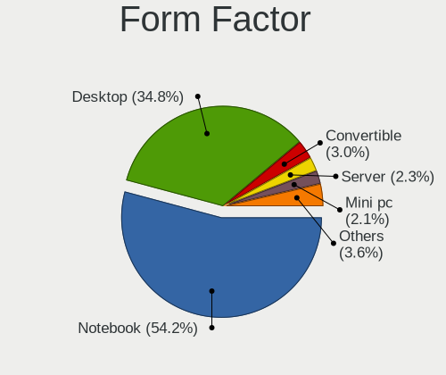
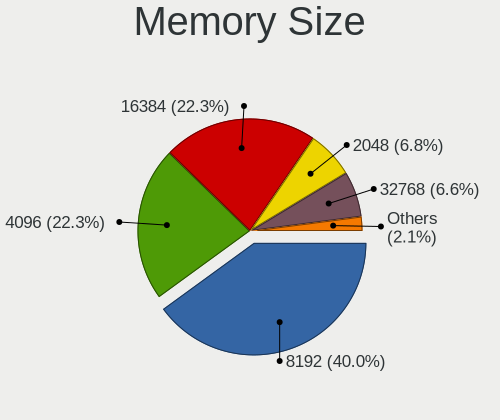
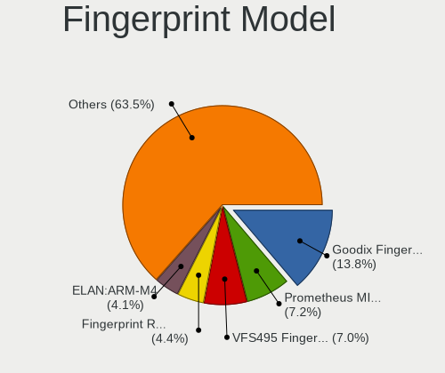

Ubuntu 22.04 - Tested Hardware & Statistics
-------------------------------------------

A project to collect tested hardware configurations for Ubuntu 22.04.

Anyone can contribute to this report by the [hw-probe](https://github.com/linuxhw/hw-probe) tool:

    sudo -E hw-probe -all -upload

Please submit a probe of your configuration if it's not presented on the page or is rare.

This is a report for all computer types. See also reports for [desktops](/Dist/Ubuntu_22.04/Desktop/README.md) and [notebooks](/Dist/Ubuntu_22.04/Notebook/README.md).

Full-feature report is available here: https://linux-hardware.org/?view=trends

Contents
--------

* [ Test Cases ](#test-cases)

* [ System ](#system)
  - [ Kernel                   ](#kernel)
  - [ Kernel Family            ](#kernel-family)
  - [ Kernel Major Ver.        ](#kernel-major-ver)
  - [ Arch                     ](#arch)
  - [ DE                       ](#de)
  - [ Display Server           ](#display-server)
  - [ Display Manager          ](#display-manager)
  - [ OS Lang                  ](#os-lang)
  - [ Boot Mode                ](#boot-mode)
  - [ Filesystem               ](#filesystem)
  - [ Part. scheme             ](#part-scheme)
  - [ Dual Boot with Linux/BSD ](#dual-boot-with-linuxbsd)
  - [ Dual Boot (Win)          ](#dual-boot-win)

* [ Board ](#board)
  - [ Vendor                   ](#vendor)
  - [ Model                    ](#model)
  - [ Model Family             ](#model-family)
  - [ MFG Year                 ](#mfg-year)
  - [ Form Factor              ](#form-factor)
  - [ Secure Boot              ](#secure-boot)
  - [ Coreboot                 ](#coreboot)
  - [ RAM Size                 ](#ram-size)
  - [ RAM Used                 ](#ram-used)
  - [ Total Drives             ](#total-drives)
  - [ Has CD-ROM               ](#has-cd-rom)
  - [ Has Ethernet             ](#has-ethernet)
  - [ Has WiFi                 ](#has-wifi)
  - [ Has Bluetooth            ](#has-bluetooth)

* [ Location ](#location)
  - [ Country                  ](#country)
  - [ City                     ](#city)

* [ Drives ](#drives)
  - [ Drive Vendor             ](#drive-vendor)
  - [ Drive Model              ](#drive-model)
  - [ HDD Vendor               ](#hdd-vendor)
  - [ SSD Vendor               ](#ssd-vendor)
  - [ Drive Kind               ](#drive-kind)
  - [ Drive Connector          ](#drive-connector)
  - [ Drive Size               ](#drive-size)
  - [ Space Total              ](#space-total)
  - [ Space Used               ](#space-used)
  - [ Malfunc. Drives          ](#malfunc-drives)
  - [ Malfunc. Drive Vendor    ](#malfunc-drive-vendor)
  - [ Malfunc. HDD Vendor      ](#malfunc-hdd-vendor)
  - [ Malfunc. Drive Kind      ](#malfunc-drive-kind)
  - [ Failed Drives            ](#failed-drives)
  - [ Failed Drive Vendor      ](#failed-drive-vendor)
  - [ Drive Status             ](#drive-status)

* [ Storage controller ](#storage-controller)
  - [ Storage Vendor           ](#storage-vendor)
  - [ Storage Model            ](#storage-model)
  - [ Storage Kind             ](#storage-kind)

* [ Processor ](#processor)
  - [ CPU Vendor               ](#cpu-vendor)
  - [ CPU Model                ](#cpu-model)
  - [ CPU Model Family         ](#cpu-model-family)
  - [ CPU Cores                ](#cpu-cores)
  - [ CPU Sockets              ](#cpu-sockets)
  - [ CPU Threads              ](#cpu-threads)
  - [ CPU Op-Modes             ](#cpu-op-modes)
  - [ CPU Microcode            ](#cpu-microcode)
  - [ CPU Microarch            ](#cpu-microarch)

* [ Graphics ](#graphics)
  - [ GPU Vendor               ](#gpu-vendor)
  - [ GPU Model                ](#gpu-model)
  - [ GPU Combo                ](#gpu-combo)
  - [ GPU Driver               ](#gpu-driver)
  - [ GPU Memory               ](#gpu-memory)

* [ Monitor ](#monitor)
  - [ Monitor Vendor           ](#monitor-vendor)
  - [ Monitor Model            ](#monitor-model)
  - [ Monitor Resolution       ](#monitor-resolution)
  - [ Monitor Diagonal         ](#monitor-diagonal)
  - [ Monitor Width            ](#monitor-width)
  - [ Aspect Ratio             ](#aspect-ratio)
  - [ Monitor Area             ](#monitor-area)
  - [ Pixel Density            ](#pixel-density)
  - [ Multiple Monitors        ](#multiple-monitors)

* [ Network ](#network)
  - [ Net Controller Vendor    ](#net-controller-vendor)
  - [ Net Controller Model     ](#net-controller-model)
  - [ Wireless Vendor          ](#wireless-vendor)
  - [ Wireless Model           ](#wireless-model)
  - [ Ethernet Vendor          ](#ethernet-vendor)
  - [ Ethernet Model           ](#ethernet-model)
  - [ Net Controller Kind      ](#net-controller-kind)
  - [ Used Controller          ](#used-controller)
  - [ NICs                     ](#nics)
  - [ IPv6                     ](#ipv6)

* [ Bluetooth ](#bluetooth)
  - [ Bluetooth Vendor         ](#bluetooth-vendor)
  - [ Bluetooth Model          ](#bluetooth-model)

* [ Sound ](#sound)
  - [ Sound Vendor             ](#sound-vendor)
  - [ Sound Model              ](#sound-model)

* [ Memory ](#memory)
  - [ Memory Vendor            ](#memory-vendor)
  - [ Memory Model             ](#memory-model)
  - [ Memory Kind              ](#memory-kind)
  - [ Memory Form Factor       ](#memory-form-factor)
  - [ Memory Size              ](#memory-size)
  - [ Memory Speed             ](#memory-speed)

* [ Printers & scanners ](#printers--scanners)
  - [ Printer Vendor           ](#printer-vendor)
  - [ Printer Model            ](#printer-model)
  - [ Scanner Vendor           ](#scanner-vendor)
  - [ Scanner Model            ](#scanner-model)

* [ Camera ](#camera)
  - [ Camera Vendor            ](#camera-vendor)
  - [ Camera Model             ](#camera-model)

* [ Security ](#security)
  - [ Fingerprint Vendor       ](#fingerprint-vendor)
  - [ Fingerprint Model        ](#fingerprint-model)
  - [ Chipcard Vendor          ](#chipcard-vendor)
  - [ Chipcard Model           ](#chipcard-model)

* [ Unsupported ](#unsupported)
  - [ Unsupported Devices      ](#unsupported-devices)
  - [ Unsupported Device Types ](#unsupported-device-types)

Test Cases
----------

Total: 118

| Vendor        | Model                       | Form-Factor | Probe                                                      | Date         |
|---------------|-----------------------------|-------------|------------------------------------------------------------|--------------|
| Fujitsu       | D3223-C1 S26361-D3223-C1    | Desktop     | [f0fdc95810](https://linux-hardware.org/?probe=f0fdc95810) | Apr 01, 2022 |
| Dell          | Inspiron N5110              | Notebook    | [606eb17f56](https://linux-hardware.org/?probe=606eb17f56) | Apr 01, 2022 |
| HP            | ProLiant ML110 G7           | Desktop     | [9e1e2b2ae7](https://linux-hardware.org/?probe=9e1e2b2ae7) | Apr 01, 2022 |
| Dell          | Inspiron N5110              | Notebook    | [6b0cd44dbb](https://linux-hardware.org/?probe=6b0cd44dbb) | Apr 01, 2022 |
| Alienware     | M11x                        | Notebook    | [f83c01bb34](https://linux-hardware.org/?probe=f83c01bb34) | Apr 01, 2022 |
| Avell High... | A70 MOB                     | Notebook    | [9e095642f0](https://linux-hardware.org/?probe=9e095642f0) | Apr 01, 2022 |
| Dell          | Inspiron 3501               | Notebook    | [a14dde61dc](https://linux-hardware.org/?probe=a14dde61dc) | Apr 01, 2022 |
| HUAWEI        | CREM-WXX9                   | Notebook    | [858142c2ab](https://linux-hardware.org/?probe=858142c2ab) | Apr 01, 2022 |
| MSI           | X370 GAMING PRO CARBON A... | Desktop     | [ce2e9f743d](https://linux-hardware.org/?probe=ce2e9f743d) | Mar 31, 2022 |
| Lenovo        | IdeaPad 5 14ITL05 82FE      | Notebook    | [ceee79344c](https://linux-hardware.org/?probe=ceee79344c) | Mar 31, 2022 |
| Dell          | 0YNVJG A01                  | Desktop     | [4ccce61117](https://linux-hardware.org/?probe=4ccce61117) | Mar 30, 2022 |
| HUAWEI        | CREM-WXX9                   | Notebook    | [83b60423e1](https://linux-hardware.org/?probe=83b60423e1) | Mar 30, 2022 |
| HP            | 250 G4                      | Notebook    | [69a3535c1a](https://linux-hardware.org/?probe=69a3535c1a) | Mar 30, 2022 |
| Medion        | S4401 MD61533               | Convertible | [0017875c99](https://linux-hardware.org/?probe=0017875c99) | Mar 30, 2022 |
| MSI           | B450M PRO-M2 MAX            | Desktop     | [f21ef43d0f](https://linux-hardware.org/?probe=f21ef43d0f) | Mar 30, 2022 |
| HUAWEI        | CREM-WXX9                   | Notebook    | [4626f2aeab](https://linux-hardware.org/?probe=4626f2aeab) | Mar 29, 2022 |
| MSI           | GP76 Leopard 11UG           | Notebook    | [93a6b587c2](https://linux-hardware.org/?probe=93a6b587c2) | Mar 29, 2022 |
| Lenovo        | ThinkBook 15 G3 ACL 21A4    | Notebook    | [30c09eec3b](https://linux-hardware.org/?probe=30c09eec3b) | Mar 28, 2022 |
| HUAWEI        | CREM-WXX9                   | Notebook    | [dbdd71e8b8](https://linux-hardware.org/?probe=dbdd71e8b8) | Mar 28, 2022 |
| Dell          | XPS 17 9710                 | Notebook    | [ecf7b98552](https://linux-hardware.org/?probe=ecf7b98552) | Mar 28, 2022 |
| Lenovo        | ThinkPad T14s Gen 2a 20X... | Notebook    | [0e93a8600c](https://linux-hardware.org/?probe=0e93a8600c) | Mar 27, 2022 |
| Lenovo        | IdeaPad 5 Pro 14ACN6 82L... | Notebook    | [e5b0f5c259](https://linux-hardware.org/?probe=e5b0f5c259) | Mar 27, 2022 |
| Le Cube 1     | Unknown                     | Desktop     | [a881cc0397](https://linux-hardware.org/?probe=a881cc0397) | Mar 26, 2022 |
| HUAWEI        | MACH-WX9                    | Notebook    | [64e505d8d7](https://linux-hardware.org/?probe=64e505d8d7) | Mar 26, 2022 |
| Lenovo        | IdeaPad 5 Pro 14ACN6 82L... | Notebook    | [01e83234d9](https://linux-hardware.org/?probe=01e83234d9) | Mar 26, 2022 |
| Lenovo        | IdeaPad 5 Pro 14ACN6 82L... | Notebook    | [4fb374e78b](https://linux-hardware.org/?probe=4fb374e78b) | Mar 25, 2022 |
| HP            | EliteBook 840 G3            | Notebook    | [f06216a521](https://linux-hardware.org/?probe=f06216a521) | Mar 24, 2022 |
| HP            | 1589                        | Desktop     | [8c1f30bb6f](https://linux-hardware.org/?probe=8c1f30bb6f) | Mar 23, 2022 |
| HP            | Pavilion x2 Detachable      | Notebook    | [a82a2739a8](https://linux-hardware.org/?probe=a82a2739a8) | Mar 22, 2022 |
| Lenovo        | Z50-70 20354                | Notebook    | [b03762a80b](https://linux-hardware.org/?probe=b03762a80b) | Mar 22, 2022 |
| Framework     | Laptop                      | Notebook    | [b8fcafa943](https://linux-hardware.org/?probe=b8fcafa943) | Mar 20, 2022 |
| GPU Compan... | GWTC116-2                   | Notebook    | [3c0450f79e](https://linux-hardware.org/?probe=3c0450f79e) | Mar 12, 2022 |
| ASUSTek       | ROG Zephyrus G14 GA401IH... | Notebook    | [1c22760a82](https://linux-hardware.org/?probe=1c22760a82) | Mar 12, 2022 |
| Shenzhen W... | AERO 2 Pro                  | Mini pc     | [264fcd47ff](https://linux-hardware.org/?probe=264fcd47ff) | Mar 12, 2022 |
| Shenzhen W... | AERO 2 Pro                  | Mini pc     | [91a4d09517](https://linux-hardware.org/?probe=91a4d09517) | Mar 12, 2022 |
| ASRock        | 970 Extreme3 R2.0           | Desktop     | [f417e6a6ef](https://linux-hardware.org/?probe=f417e6a6ef) | Mar 11, 2022 |
| MSI           | Creator Z16 A11UET          | Notebook    | [1804e5eb77](https://linux-hardware.org/?probe=1804e5eb77) | Mar 09, 2022 |
| Unknown       | T3 MRD                      | Desktop     | [256dc440ec](https://linux-hardware.org/?probe=256dc440ec) | Mar 09, 2022 |
| HP            | ENVY x360 Convertible 13... | Convertible | [8a87e0ca46](https://linux-hardware.org/?probe=8a87e0ca46) | Mar 07, 2022 |
| ASUSTek       | ROG Zephyrus M16 GU603ZW... | Notebook    | [9fd12bdd29](https://linux-hardware.org/?probe=9fd12bdd29) | Mar 06, 2022 |
| HUAWEI        | BOHB-WAX9                   | Notebook    | [915ca09de4](https://linux-hardware.org/?probe=915ca09de4) | Mar 05, 2022 |
| MSI           | X370 GAMING PRO CARBON A... | Desktop     | [1fb25ad2c3](https://linux-hardware.org/?probe=1fb25ad2c3) | Mar 05, 2022 |
| Toshiba       | Satellite C70D-A            | Notebook    | [c7dfd52f76](https://linux-hardware.org/?probe=c7dfd52f76) | Mar 05, 2022 |
| HP            | ZBook 15 G5                 | Notebook    | [f86a14c16d](https://linux-hardware.org/?probe=f86a14c16d) | Mar 05, 2022 |
| ASUSTek       | M4A87TD/USB3                | Desktop     | [aa80ded615](https://linux-hardware.org/?probe=aa80ded615) | Mar 04, 2022 |
| ASUSTek       | M4A87TD/USB3                | Desktop     | [3e997c5618](https://linux-hardware.org/?probe=3e997c5618) | Mar 03, 2022 |
| ASUSTek       | ROG Zephyrus M16 GU603ZW... | Notebook    | [206f3a7c01](https://linux-hardware.org/?probe=206f3a7c01) | Mar 02, 2022 |
| Unknown       | T3 MRD                      | Desktop     | [35ab38818d](https://linux-hardware.org/?probe=35ab38818d) | Feb 28, 2022 |
| Unknown       | T3 MRD                      | Desktop     | [01dd9cefa7](https://linux-hardware.org/?probe=01dd9cefa7) | Feb 28, 2022 |
| HP            | Presario CQ42               | Notebook    | [de34294599](https://linux-hardware.org/?probe=de34294599) | Feb 27, 2022 |
| Gigabyte      | X570 I AORUS PRO WIFI       | Desktop     | [18d37562a8](https://linux-hardware.org/?probe=18d37562a8) | Feb 26, 2022 |
| Gigabyte      | X570 I AORUS PRO WIFI       | Desktop     | [d8af57f59a](https://linux-hardware.org/?probe=d8af57f59a) | Feb 26, 2022 |
| Shanghai Z... | ZXE CRB                     | Notebook    | [7fe4a3390b](https://linux-hardware.org/?probe=7fe4a3390b) | Feb 25, 2022 |
| Timi          | TM1709                      | Notebook    | [16e699bea8](https://linux-hardware.org/?probe=16e699bea8) | Feb 25, 2022 |
| ASUSTek       | ROG Zephyrus M16 GU603HE... | Notebook    | [076c8f6e01](https://linux-hardware.org/?probe=076c8f6e01) | Feb 23, 2022 |
| ASUSTek       | ROG Zephyrus M16 GU603HE... | Notebook    | [85c09f63f0](https://linux-hardware.org/?probe=85c09f63f0) | Feb 23, 2022 |
| Gigabyte      | H61M-DS2 DVI                | Desktop     | [90c43679f7](https://linux-hardware.org/?probe=90c43679f7) | Feb 23, 2022 |
| Acer          | Aspire A517-52              | Notebook    | [52976ad94b](https://linux-hardware.org/?probe=52976ad94b) | Feb 23, 2022 |
| Lenovo        | ThinkPad X1 Yoga Gen 6 2... | Convertible | [973f8ebf5e](https://linux-hardware.org/?probe=973f8ebf5e) | Feb 17, 2022 |
| MSI           | Stealth GS66 12UHS          | Notebook    | [bb8ef51c23](https://linux-hardware.org/?probe=bb8ef51c23) | Feb 17, 2022 |
| Lenovo        | ThinkPad E15 Gen 2 20TES... | Notebook    | [da103e44c5](https://linux-hardware.org/?probe=da103e44c5) | Feb 17, 2022 |
| ASUSTek       | VivoBook_ASUSLaptop TP40... | Convertible | [1055dc7082](https://linux-hardware.org/?probe=1055dc7082) | Feb 14, 2022 |
| HP            | 620                         | Notebook    | [bd89b469e4](https://linux-hardware.org/?probe=bd89b469e4) | Feb 14, 2022 |
| ASUSTek       | ASUS EXPERTBOOK B3302FEA... | Convertible | [20d30ebe0b](https://linux-hardware.org/?probe=20d30ebe0b) | Feb 13, 2022 |
| MSI           | X370 GAMING PRO CARBON A... | Desktop     | [fa5ed1f68b](https://linux-hardware.org/?probe=fa5ed1f68b) | Feb 13, 2022 |
| Gigabyte      | X570S AORUS PRO AX          | Desktop     | [e329340668](https://linux-hardware.org/?probe=e329340668) | Feb 11, 2022 |
| Dell          | 0YXT71 A03                  | Desktop     | [19227aa57d](https://linux-hardware.org/?probe=19227aa57d) | Feb 11, 2022 |
| HP            | 212B                        | Desktop     | [fab24340a5](https://linux-hardware.org/?probe=fab24340a5) | Feb 10, 2022 |
| HP            | Pavilion 15                 | Notebook    | [9246e37578](https://linux-hardware.org/?probe=9246e37578) | Feb 09, 2022 |
| ASUSTek       | K52Je                       | Notebook    | [e1010983cf](https://linux-hardware.org/?probe=e1010983cf) | Feb 09, 2022 |
| Lenovo        | ThinkPad Yoga 370 20JJS0... | Convertible | [878c4247cb](https://linux-hardware.org/?probe=878c4247cb) | Feb 09, 2022 |
| ASRockRack    | X470D4U2/1N1                | Desktop     | [735bc0f806](https://linux-hardware.org/?probe=735bc0f806) | Feb 04, 2022 |
| Dell          | Latitude 3330               | Notebook    | [c3b39f74b4](https://linux-hardware.org/?probe=c3b39f74b4) | Jan 31, 2022 |
| ASUSTek       | ROG Zephyrus G15 GA502IU... | Notebook    | [0a04b2d1b1](https://linux-hardware.org/?probe=0a04b2d1b1) | Jan 31, 2022 |
| HP            | 15                          | Notebook    | [81961b52a9](https://linux-hardware.org/?probe=81961b52a9) | Jan 29, 2022 |
| ASUSTek       | P5P41T/USB3                 | Desktop     | [f45dc3454a](https://linux-hardware.org/?probe=f45dc3454a) | Jan 25, 2022 |
| ASUSTek       | P5P41T/USB3                 | Desktop     | [b69dafbb2b](https://linux-hardware.org/?probe=b69dafbb2b) | Jan 25, 2022 |
| Unknown       | Unknown                     | Soc         | [f60622cca7](https://linux-hardware.org/?probe=f60622cca7) | Jan 23, 2022 |
| Unknown       | Unknown                     | Soc         | [fb25f8463c](https://linux-hardware.org/?probe=fb25f8463c) | Jan 23, 2022 |
| HP            | ProBook 445 G7              | Notebook    | [bceca55120](https://linux-hardware.org/?probe=bceca55120) | Jan 23, 2022 |
| ASUSTek       | P5P41T/USB3                 | Desktop     | [105593cece](https://linux-hardware.org/?probe=105593cece) | Jan 23, 2022 |
| ASUSTek       | ASUS TUF Gaming F17 FX70... | Notebook    | [2de98fb4d8](https://linux-hardware.org/?probe=2de98fb4d8) | Jan 22, 2022 |
| HP            | ProBook 650 G5              | Notebook    | [111cb6822e](https://linux-hardware.org/?probe=111cb6822e) | Jan 21, 2022 |
| HP            | Pavilion Laptop 14-dv1xx... | Notebook    | [e092fc4b26](https://linux-hardware.org/?probe=e092fc4b26) | Jan 20, 2022 |
| HP            | ZBook Power 15.6 inch G8... | Notebook    | [245123d0a8](https://linux-hardware.org/?probe=245123d0a8) | Jan 20, 2022 |
| Gigabyte      | GB-BSi7-1165G7              | Desktop     | [ab94ff1199](https://linux-hardware.org/?probe=ab94ff1199) | Jan 20, 2022 |
| Dell          | Latitude E6510              | Notebook    | [c0d3a6c31a](https://linux-hardware.org/?probe=c0d3a6c31a) | Jan 16, 2022 |
| MSI           | Z490-A PRO                  | Desktop     | [b2655bbd43](https://linux-hardware.org/?probe=b2655bbd43) | Jan 15, 2022 |
| Google        | Kefka                       | Notebook    | [e62fa3eea6](https://linux-hardware.org/?probe=e62fa3eea6) | Jan 10, 2022 |
| Timi          | RedmiBook Pro 15S           | Notebook    | [034079628f](https://linux-hardware.org/?probe=034079628f) | Jan 07, 2022 |
| Lenovo        | ThinkPad T400 2768WGB       | Notebook    | [ac0e3dfe29](https://linux-hardware.org/?probe=ac0e3dfe29) | Jan 07, 2022 |
| MSI           | C236A WORKSTATION           | Desktop     | [97795d3ebc](https://linux-hardware.org/?probe=97795d3ebc) | Jan 07, 2022 |
| HP            | ENVY Laptop 13-ad1xx        | Notebook    | [666b0b18f5](https://linux-hardware.org/?probe=666b0b18f5) | Dec 30, 2021 |
| Intel         | H61                         | Desktop     | [e2b49aa759](https://linux-hardware.org/?probe=e2b49aa759) | Dec 30, 2021 |
| MSI           | GT73VR 6RE                  | Notebook    | [0f41e5dd07](https://linux-hardware.org/?probe=0f41e5dd07) | Dec 28, 2021 |
| Lenovo        | Legion 7 16ACHg6 82N6       | Notebook    | [be79b3cd82](https://linux-hardware.org/?probe=be79b3cd82) | Dec 26, 2021 |
| Lenovo        | Flex 2-15 20405             | Notebook    | [ccc85b0783](https://linux-hardware.org/?probe=ccc85b0783) | Dec 13, 2021 |
| Lenovo        | 3141 NOK                    | Desktop     | [cc90d7c889](https://linux-hardware.org/?probe=cc90d7c889) | Dec 13, 2021 |
| ASUSTek       | ROG STRIX B350-F GAMING     | Desktop     | [0db33a5b23](https://linux-hardware.org/?probe=0db33a5b23) | Dec 10, 2021 |
| MSI           | Modern 15 A11MU             | Notebook    | [34b31c53cd](https://linux-hardware.org/?probe=34b31c53cd) | Dec 07, 2021 |
| Toshiba       | PORTEGE Z10T-A              | Notebook    | [5257d76a92](https://linux-hardware.org/?probe=5257d76a92) | Dec 05, 2021 |
| HP            | Laptop 15s-fq1xxx           | Notebook    | [f219ee63ff](https://linux-hardware.org/?probe=f219ee63ff) | Nov 30, 2021 |
| HP            | Laptop 15s-fq1xxx           | Notebook    | [3199d159a4](https://linux-hardware.org/?probe=3199d159a4) | Nov 30, 2021 |
| Huanan        | X99 F8D V2.2                | Desktop     | [dcd5217827](https://linux-hardware.org/?probe=dcd5217827) | Nov 29, 2021 |
| Gigabyte      | M52L-S3                     | Desktop     | [16854f2502](https://linux-hardware.org/?probe=16854f2502) | Nov 29, 2021 |
| Gigabyte      | M52L-S3                     | Desktop     | [e6f3417028](https://linux-hardware.org/?probe=e6f3417028) | Nov 27, 2021 |
| Lenovo        | Flex 2-15 20405             | Notebook    | [d191e3f97f](https://linux-hardware.org/?probe=d191e3f97f) | Nov 22, 2021 |
| Lenovo        | Flex 2-15 20405             | Notebook    | [6381b11078](https://linux-hardware.org/?probe=6381b11078) | Nov 22, 2021 |
| Gigabyte      | EP31-DS3L                   | Desktop     | [c0134f6231](https://linux-hardware.org/?probe=c0134f6231) | Nov 11, 2021 |
| Gigabyte      | EP31-DS3L                   | Desktop     | [4d659bf7e4](https://linux-hardware.org/?probe=4d659bf7e4) | Nov 11, 2021 |
| ASUSTek       | K30AD_M31AD_M51AD_M32AD     | Desktop     | [36e64b8256](https://linux-hardware.org/?probe=36e64b8256) | Nov 10, 2021 |
| ASUSTek       | X58L                        | Notebook    | [c3df58b13b](https://linux-hardware.org/?probe=c3df58b13b) | Nov 10, 2021 |
| ASUSTek       | X58L                        | Notebook    | [e1425f037e](https://linux-hardware.org/?probe=e1425f037e) | Nov 10, 2021 |
| ASUSTek       | X58L                        | Notebook    | [f64ba3a9e4](https://linux-hardware.org/?probe=f64ba3a9e4) | Nov 10, 2021 |
| Dell          | Inspiron 1464               | Notebook    | [26f50eb4a8](https://linux-hardware.org/?probe=26f50eb4a8) | Nov 06, 2021 |
| Dell          | Inspiron 11 - 3147          | Notebook    | [6b1a282c17](https://linux-hardware.org/?probe=6b1a282c17) | Nov 05, 2021 |
| Dell          | Inspiron 1464               | Notebook    | [4063779d5a](https://linux-hardware.org/?probe=4063779d5a) | Nov 01, 2021 |
| MSI           | MS-7235                     | Desktop     | [bbfa7fb897](https://linux-hardware.org/?probe=bbfa7fb897) | Oct 24, 2021 |

System
------

Kernel
------

Version of the Linux kernel

| Version                     | Computers | Percent |
|-----------------------------|-----------|---------|
| 5.15.0-18-generic           | 25        | 27.47%  |
| 5.15.0-23-generic           | 17        | 18.68%  |
| 5.13.0-19-generic           | 12        | 13.19%  |
| 5.15.0-22-generic           | 8         | 8.79%   |
| 5.15.0-17-generic           | 8         | 8.79%   |
| 5.17.0-051700-generic       | 2         | 2.2%    |
| 5.16.0-051600-generic       | 2         | 2.2%    |
| 5.17.1-051701-generic       | 1         | 1.1%    |
| 5.17.0-051700rc6-generic    | 1         | 1.1%    |
| 5.17.0-051700rc5-lowlatency | 1         | 1.1%    |
| 5.15.6-051506-generic       | 1         | 1.1%    |
| 5.15.17-xanmod2             | 1         | 1.1%    |
| 5.15.15-76051515-generic    | 1         | 1.1%    |
| 5.15.13-051513-generic      | 1         | 1.1%    |
| 5.15.12-051512-generic      | 1         | 1.1%    |
| 5.15.11-051511-generic      | 1         | 1.1%    |
| 5.15.10-051510-generic      | 1         | 1.1%    |
| 5.15.0-14-generic           | 1         | 1.1%    |
| 5.15.0-13-generic           | 1         | 1.1%    |
| 5.15.0-12-generic           | 1         | 1.1%    |
| 5.15.0-11-generic           | 1         | 1.1%    |
| 5.15.0-051500rc7-generic    | 1         | 1.1%    |
| 5.13.0-20-generic           | 1         | 1.1%    |
| 3.16.85-65                  | 1         | 1.1%    |

Kernel Family
-------------

Linux kernel without a distro release

| Version | Computers | Percent |
|---------|-----------|---------|
| 5.15.0  | 61        | 68.54%  |
| 5.13.0  | 13        | 14.61%  |
| 5.17.0  | 4         | 4.49%   |
| 5.16.0  | 2         | 2.25%   |
| 5.17.1  | 1         | 1.12%   |
| 5.15.6  | 1         | 1.12%   |
| 5.15.17 | 1         | 1.12%   |
| 5.15.15 | 1         | 1.12%   |
| 5.15.13 | 1         | 1.12%   |
| 5.15.12 | 1         | 1.12%   |
| 5.15.11 | 1         | 1.12%   |
| 5.15.10 | 1         | 1.12%   |
| 3.16.85 | 1         | 1.12%   |

Kernel Major Ver.
-----------------

Linux kernel major version

| Version | Computers | Percent |
|---------|-----------|---------|
| 5.15    | 68        | 76.4%   |
| 5.13    | 13        | 14.61%  |
| 5.17    | 5         | 5.62%   |
| 5.16    | 2         | 2.25%   |
| 3.16    | 1         | 1.12%   |

Arch
----

OS architecture (x86_64, i586, etc.)

| Name    | Computers | Percent |
|---------|-----------|---------|
| x86_64  | 88        | 98.88%  |
| aarch64 | 1         | 1.12%   |

DE
--

Desktop Environment

| Name              | Computers | Percent |
|-------------------|-----------|---------|
| GNOME             | 77        | 85.56%  |
| Unknown           | 8         | 8.89%   |
| Yaru:ubuntu:GNOME | 1         | 1.11%   |
| X-Cinnamon        | 1         | 1.11%   |
| GNUstep           | 1         | 1.11%   |
| GNOME Flashback   | 1         | 1.11%   |
| Cinnamon          | 1         | 1.11%   |

Display Server
--------------

X11 or Wayland

| Name    | Computers | Percent |
|---------|-----------|---------|
| Wayland | 45        | 50%     |
| X11     | 37        | 41.11%  |
| Tty     | 6         | 6.67%   |
| Unknown | 2         | 2.22%   |

Display Manager
---------------

SDDM, LightDM, etc.

| Name    | Computers | Percent |
|---------|-----------|---------|
| GDM3    | 74        | 83.15%  |
| Unknown | 9         | 10.11%  |
| LightDM | 3         | 3.37%   |
| GDM     | 3         | 3.37%   |

OS Lang
-------

Language

| Lang    | Computers | Percent |
|---------|-----------|---------|
| en_US   | 43        | 48.31%  |
| de_DE   | 9         | 10.11%  |
| en_IN   | 7         | 7.87%   |
| pt_BR   | 4         | 4.49%   |
| ru_RU   | 3         | 3.37%   |
| fr_FR   | 3         | 3.37%   |
| zh_CN   | 2         | 2.25%   |
| pl_PL   | 2         | 2.25%   |
| en_GB   | 2         | 2.25%   |
| cs_CZ   | 2         | 2.25%   |
| zh_TW   | 1         | 1.12%   |
| th_TH   | 1         | 1.12%   |
| it_IT   | 1         | 1.12%   |
| hu_HU   | 1         | 1.12%   |
| es_ES   | 1         | 1.12%   |
| en_SG   | 1         | 1.12%   |
| en_IL   | 1         | 1.12%   |
| en_CA   | 1         | 1.12%   |
| de_IT   | 1         | 1.12%   |
| de_CH   | 1         | 1.12%   |
| C       | 1         | 1.12%   |
| Unknown | 1         | 1.12%   |

Boot Mode
---------

EFI or BIOS

| Mode | Computers | Percent |
|------|-----------|---------|
| BIOS | 47        | 52.81%  |
| EFI  | 42        | 47.19%  |

Filesystem
----------

Type of filesystem

| Type    | Computers | Percent |
|---------|-----------|---------|
| Ext4    | 82        | 90.11%  |
| Zfs     | 3         | 3.3%    |
| Btrfs   | 3         | 3.3%    |
| Xfs     | 2         | 2.2%    |
| Overlay | 1         | 1.1%    |

Part. scheme
------------

Scheme of partitioning

| Type    | Computers | Percent |
|---------|-----------|---------|
| Unknown | 48        | 53.93%  |
| GPT     | 37        | 41.57%  |
| MBR     | 4         | 4.49%   |

Dual Boot with Linux/BSD
------------------------

Hosting more than one Linux/BSD

| Dual boot | Computers | Percent |
|-----------|-----------|---------|
| No        | 70        | 78.65%  |
| Yes       | 19        | 21.35%  |

Dual Boot (Win)
---------------

Hosting Linux and Windows

| Dual boot | Computers | Percent |
|-----------|-----------|---------|
| Yes       | 45        | 50.56%  |
| No        | 44        | 49.44%  |

Board
-----

Vendor
------

Motherboard manufacturer

| Name                           | Computers | Percent |
|--------------------------------|-----------|---------|
| Hewlett-Packard                | 18        | 20.22%  |
| ASUSTek Computer               | 13        | 14.61%  |
| Lenovo                         | 11        | 12.36%  |
| MSI                            | 10        | 11.24%  |
| Dell                           | 8         | 8.99%   |
| Gigabyte Technology            | 6         | 6.74%   |
| HUAWEI                         | 3         | 3.37%   |
| Toshiba                        | 2         | 2.25%   |
| Unknown                        | 2         | 2.25%   |
| Timi                           | 1         | 1.12%   |
| Shenzhen Wangang Technology    | 1         | 1.12%   |
| Shanghai Zhaoxin Semiconductor | 1         | 1.12%   |
| Medion                         | 1         | 1.12%   |
| Le Cube 1                      | 1         | 1.12%   |
| Intel                          | 1         | 1.12%   |
| Huanan                         | 1         | 1.12%   |
| GPU Company                    | 1         | 1.12%   |
| Google                         | 1         | 1.12%   |
| Fujitsu                        | 1         | 1.12%   |
| Framework                      | 1         | 1.12%   |
| Avell High Performance         | 1         | 1.12%   |
| ASRockRack                     | 1         | 1.12%   |
| ASRock                         | 1         | 1.12%   |
| Alienware                      | 1         | 1.12%   |
| Acer                           | 1         | 1.12%   |

Model
-----

Motherboard model

| Name                                              | Computers | Percent |
|---------------------------------------------------|-----------|---------|
| Unknown                                           | 3         | 3.37%   |
| Toshiba Satellite C70D-A                          | 1         | 1.12%   |
| Toshiba PORTEGE Z10T-A                            | 1         | 1.12%   |
| Timi TM1709                                       | 1         | 1.12%   |
| Shenzhen Wangang AERO 2 Pro                       | 1         | 1.12%   |
| Shanghai Zhaoxin ZXE CRB                          | 1         | 1.12%   |
| MSI Stealth GS66 12UHS                            | 1         | 1.12%   |
| MSI MS-7C75                                       | 1         | 1.12%   |
| MSI MS-7B84                                       | 1         | 1.12%   |
| MSI MS-7A32                                       | 1         | 1.12%   |
| MSI MS-7998                                       | 1         | 1.12%   |
| MSI MS-7235                                       | 1         | 1.12%   |
| MSI Modern 15 A11MU                               | 1         | 1.12%   |
| MSI GT73VR 6RE                                    | 1         | 1.12%   |
| MSI GP76 Leopard 11UG                             | 1         | 1.12%   |
| MSI Creator Z16 A11UET                            | 1         | 1.12%   |
| Medion S4401 MD61533                              | 1         | 1.12%   |
| Lenovo Z50-70 20354                               | 1         | 1.12%   |
| Lenovo ThinkPad Yoga 370 20JJS01S1D               | 1         | 1.12%   |
| Lenovo ThinkPad X1 Yoga Gen 6 20XYCTO1WW          | 1         | 1.12%   |
| Lenovo ThinkPad T14s Gen 2a 20XF004WUS            | 1         | 1.12%   |
| Lenovo ThinkPad E15 Gen 2 20TES2H500              | 1         | 1.12%   |
| Lenovo ThinkBook 15 G3 ACL 21A4                   | 1         | 1.12%   |
| Lenovo QiTianM520-D164 90K7S03T00                 | 1         | 1.12%   |
| Lenovo Legion 7 16ACHg6 82N6                      | 1         | 1.12%   |
| Lenovo IdeaPad 5 Pro 14ACN6 82L7                  | 1         | 1.12%   |
| Lenovo IdeaPad 5 14ITL05 82FE                     | 1         | 1.12%   |
| Lenovo Flex 2-15 20405                            | 1         | 1.12%   |
| Intel H61                                         | 1         | 1.12%   |
| HUAWEI MACH-WX9                                   | 1         | 1.12%   |
| HUAWEI CREM-WXX9                                  | 1         | 1.12%   |
| HUAWEI BOHB-WAX9                                  | 1         | 1.12%   |
| Huanan X99 F8D V2.2                               | 1         | 1.12%   |
| HP ZBook Power 15.6 inch G8 Mobile Workstation PC | 1         | 1.12%   |
| HP ZBook 15 G5                                    | 1         | 1.12%   |
| HP Z440 Workstation                               | 1         | 1.12%   |
| HP Z420 Workstation                               | 1         | 1.12%   |
| HP ProLiant ML110 G7                              | 1         | 1.12%   |
| HP ProBook 650 G5                                 | 1         | 1.12%   |
| HP ProBook 445 G7                                 | 1         | 1.12%   |
| HP Presario CQ42                                  | 1         | 1.12%   |
| HP Pavilion x2 Detachable                         | 1         | 1.12%   |
| HP Pavilion Laptop 14-dv1xxx                      | 1         | 1.12%   |
| HP Pavilion 15                                    | 1         | 1.12%   |
| HP Laptop 15s-fq1xxx                              | 1         | 1.12%   |
| HP ENVY x360 Convertible 13m-bd0xxx               | 1         | 1.12%   |
| HP ENVY Laptop 13-ad1xx                           | 1         | 1.12%   |
| HP EliteBook 840 G3                               | 1         | 1.12%   |
| HP 620                                            | 1         | 1.12%   |
| HP 250 G4                                         | 1         | 1.12%   |
| HP 15                                             | 1         | 1.12%   |
| GPU Company GWTC116-2                             | 1         | 1.12%   |
| Google Kefka                                      | 1         | 1.12%   |
| Gigabyte X570S AORUS PRO AX                       | 1         | 1.12%   |
| Gigabyte X570 I AORUS PRO WIFI                    | 1         | 1.12%   |
| Gigabyte M52L-S3                                  | 1         | 1.12%   |
| Gigabyte H61M-DS2 DVI                             | 1         | 1.12%   |
| Gigabyte GB-BSi7-1165G7                           | 1         | 1.12%   |
| Gigabyte EP31-DS3L                                | 1         | 1.12%   |
| Fujitsu ESPRIMO Q520                              | 1         | 1.12%   |

Model Family
------------

Motherboard model prefix

| Name                       | Computers | Percent |
|----------------------------|-----------|---------|
| ASUS ROG                   | 5         | 5.62%   |
| Lenovo ThinkPad            | 4         | 4.49%   |
| Dell Inspiron              | 4         | 4.49%   |
| HP Pavilion                | 3         | 3.37%   |
| Unknown                    | 3         | 3.37%   |
| Lenovo IdeaPad             | 2         | 2.25%   |
| HP ZBook                   | 2         | 2.25%   |
| HP ProBook                 | 2         | 2.25%   |
| HP ENVY                    | 2         | 2.25%   |
| Dell OptiPlex              | 2         | 2.25%   |
| Dell Latitude              | 2         | 2.25%   |
| ASUS ASUS                  | 2         | 2.25%   |
| Toshiba Satellite          | 1         | 1.12%   |
| Toshiba PORTEGE            | 1         | 1.12%   |
| Timi TM1709                | 1         | 1.12%   |
| Shenzhen Wangang AERO      | 1         | 1.12%   |
| Shanghai Zhaoxin ZXE       | 1         | 1.12%   |
| MSI Stealth                | 1         | 1.12%   |
| MSI MS-7C75                | 1         | 1.12%   |
| MSI MS-7B84                | 1         | 1.12%   |
| MSI MS-7A32                | 1         | 1.12%   |
| MSI MS-7998                | 1         | 1.12%   |
| MSI MS-7235                | 1         | 1.12%   |
| MSI Modern                 | 1         | 1.12%   |
| MSI GT73VR                 | 1         | 1.12%   |
| MSI GP76                   | 1         | 1.12%   |
| MSI Creator                | 1         | 1.12%   |
| Medion S4401               | 1         | 1.12%   |
| Lenovo Z50-70              | 1         | 1.12%   |
| Lenovo ThinkBook           | 1         | 1.12%   |
| Lenovo QiTianM520-D164     | 1         | 1.12%   |
| Lenovo Legion              | 1         | 1.12%   |
| Lenovo Flex                | 1         | 1.12%   |
| Intel H61                  | 1         | 1.12%   |
| HUAWEI MACH-WX9            | 1         | 1.12%   |
| HUAWEI CREM-WXX9           | 1         | 1.12%   |
| HUAWEI BOHB-WAX9           | 1         | 1.12%   |
| Huanan X99                 | 1         | 1.12%   |
| HP Z440                    | 1         | 1.12%   |
| HP Z420                    | 1         | 1.12%   |
| HP ProLiant                | 1         | 1.12%   |
| HP Presario                | 1         | 1.12%   |
| HP Laptop                  | 1         | 1.12%   |
| HP EliteBook               | 1         | 1.12%   |
| HP 620                     | 1         | 1.12%   |
| HP 250                     | 1         | 1.12%   |
| HP 15                      | 1         | 1.12%   |
| GPU Company GWTC116-2      | 1         | 1.12%   |
| Google Kefka               | 1         | 1.12%   |
| Gigabyte X570S             | 1         | 1.12%   |
| Gigabyte X570              | 1         | 1.12%   |
| Gigabyte M52L-S3           | 1         | 1.12%   |
| Gigabyte H61M-DS2          | 1         | 1.12%   |
| Gigabyte GB-BSi7-1165G7    | 1         | 1.12%   |
| Gigabyte EP31-DS3L         | 1         | 1.12%   |
| Fujitsu ESPRIMO            | 1         | 1.12%   |
| Framework Laptop           | 1         | 1.12%   |
| Avell High Performance A70 | 1         | 1.12%   |
| ASUS X58L                  | 1         | 1.12%   |
| ASUS VivoBook              | 1         | 1.12%   |

MFG Year
--------

Motherboard manufacture year

| Year    | Computers | Percent |
|---------|-----------|---------|
| 2021    | 25        | 28.09%  |
| 2020    | 12        | 13.48%  |
| 2019    | 10        | 11.24%  |
| 2010    | 8         | 8.99%   |
| 2013    | 6         | 6.74%   |
| 2018    | 4         | 4.49%   |
| 2017    | 4         | 4.49%   |
| 2014    | 4         | 4.49%   |
| 2012    | 4         | 4.49%   |
| 2015    | 3         | 3.37%   |
| 2016    | 2         | 2.25%   |
| 2008    | 2         | 2.25%   |
| 2022    | 1         | 1.12%   |
| 2011    | 1         | 1.12%   |
| 2007    | 1         | 1.12%   |
| 2006    | 1         | 1.12%   |
| Unknown | 1         | 1.12%   |

Form Factor
-----------

Physical design of the computer

| Name           | Computers | Percent |
|----------------|-----------|---------|
| Notebook       | 53        | 59.55%  |
| Desktop        | 28        | 31.46%  |
| Convertible    | 6         | 6.74%   |
| System on chip | 1         | 1.12%   |
| Mini pc        | 1         | 1.12%   |

Secure Boot
-----------

Enabled or disabled

| State    | Computers | Percent |
|----------|-----------|---------|
| Disabled | 79        | 88.76%  |
| Enabled  | 10        | 11.24%  |

Coreboot
--------

Have coreboot on board

| Used | Computers | Percent |
|------|-----------|---------|
| No   | 88        | 98.88%  |
| Yes  | 1         | 1.12%   |

RAM Size
--------

Total RAM memory

| Size in GB  | Computers | Percent |
|-------------|-----------|---------|
| 4.01-8.0    | 17        | 19.1%   |
| 16.01-24.0  | 16        | 17.98%  |
| 32.01-64.0  | 14        | 15.73%  |
| 3.01-4.0    | 13        | 14.61%  |
| 8.01-16.0   | 13        | 14.61%  |
| 64.01-256.0 | 8         | 8.99%   |
| 24.01-32.0  | 3         | 3.37%   |
| 1.01-2.0    | 3         | 3.37%   |
| 2.01-3.0    | 2         | 2.25%   |

RAM Used
--------

Used RAM memory

| Used GB    | Computers | Percent |
|------------|-----------|---------|
| 2.01-3.0   | 24        | 26.97%  |
| 1.01-2.0   | 23        | 25.84%  |
| 4.01-8.0   | 21        | 23.6%   |
| 3.01-4.0   | 10        | 11.24%  |
| 8.01-16.0  | 5         | 5.62%   |
| 0.01-0.5   | 3         | 3.37%   |
| 0.51-1.0   | 2         | 2.25%   |
| 24.01-32.0 | 1         | 1.12%   |

Total Drives
------------

Number of drives on board

| Drives | Computers | Percent |
|--------|-----------|---------|
| 1      | 54        | 60%     |
| 2      | 24        | 26.67%  |
| 3      | 6         | 6.67%   |
| 4      | 3         | 3.33%   |
| 20     | 1         | 1.11%   |
| 8      | 1         | 1.11%   |
| 5      | 1         | 1.11%   |

Has CD-ROM
----------

Has CD-ROM on board

| Presented | Computers | Percent |
|-----------|-----------|---------|
| No        | 63        | 70.79%  |
| Yes       | 26        | 29.21%  |

Has Ethernet
------------

Has Ethernet on board

| Presented | Computers | Percent |
|-----------|-----------|---------|
| Yes       | 70        | 78.65%  |
| No        | 19        | 21.35%  |

Has WiFi
--------

Has WiFi module

| Presented | Computers | Percent |
|-----------|-----------|---------|
| Yes       | 75        | 84.27%  |
| No        | 14        | 15.73%  |

Has Bluetooth
-------------

Has Bluetooth module

| Presented | Computers | Percent |
|-----------|-----------|---------|
| Yes       | 63        | 70%     |
| No        | 27        | 30%     |

Location
--------

Country
-------

Geographic location (country)

| Country     | Computers | Percent |
|-------------|-----------|---------|
| USA         | 17        | 19.1%   |
| Germany     | 11        | 12.36%  |
| India       | 8         | 8.99%   |
| France      | 5         | 5.62%   |
| Russia      | 4         | 4.49%   |
| Poland      | 4         | 4.49%   |
| China       | 4         | 4.49%   |
| Brazil      | 4         | 4.49%   |
| Taiwan      | 3         | 3.37%   |
| Spain       | 3         | 3.37%   |
| Italy       | 3         | 3.37%   |
| Thailand    | 2         | 2.25%   |
| Czechia     | 2         | 2.25%   |
| UK          | 1         | 1.12%   |
| Switzerland | 1         | 1.12%   |
| Slovenia    | 1         | 1.12%   |
| Singapore   | 1         | 1.12%   |
| Romania     | 1         | 1.12%   |
| Netherlands | 1         | 1.12%   |
| Myanmar     | 1         | 1.12%   |
| Morocco     | 1         | 1.12%   |
| Mexico      | 1         | 1.12%   |
| Japan       | 1         | 1.12%   |
| Israel      | 1         | 1.12%   |
| Iceland     | 1         | 1.12%   |
| Hungary     | 1         | 1.12%   |
| Egypt       | 1         | 1.12%   |
| Colombia    | 1         | 1.12%   |
| Canada      | 1         | 1.12%   |
| Cameroon    | 1         | 1.12%   |
| Belgium     | 1         | 1.12%   |
| Argentina   | 1         | 1.12%   |

City
----

Geographic location (city)

| City                     | Computers | Percent |
|--------------------------|-----------|---------|
| Moses Lake               | 3         | 3.37%   |
| Warsaw                   | 2         | 2.25%   |
| St Petersburg            | 2         | 2.25%   |
| Oakland                  | 2         | 2.25%   |
| Madrid                   | 2         | 2.25%   |
| Kunming                  | 2         | 2.25%   |
| Chennai                  | 2         | 2.25%   |
| Chandigarh               | 2         | 2.25%   |
| Boeschepe                | 2         | 2.25%   |
| Beijing                  | 2         | 2.25%   |
| Yaoundé               | 1         | 1.12%   |
| Worms                    | 1         | 1.12%   |
| Wil                      | 1         | 1.12%   |
| Wake Forest              | 1         | 1.12%   |
| Tubarao                  | 1         | 1.12%   |
| The Hague                | 1         | 1.12%   |
| Tel Aviv                 | 1         | 1.12%   |
| Taoyuan District         | 1         | 1.12%   |
| Taipei                   | 1         | 1.12%   |
| Suffolk                  | 1         | 1.12%   |
| Springdale               | 1         | 1.12%   |
| Soest                    | 1         | 1.12%   |
| Singapore                | 1         | 1.12%   |
| Siegen                   | 1         | 1.12%   |
| Seward                   | 1         | 1.12%   |
| Senonches                | 1         | 1.12%   |
| San Francisco            | 1         | 1.12%   |
| Richland Center          | 1         | 1.12%   |
| Reykjavik                | 1         | 1.12%   |
| Recife                   | 1         | 1.12%   |
| Pune                     | 1         | 1.12%   |
| Prague                   | 1         | 1.12%   |
| Porto Alegre             | 1         | 1.12%   |
| Ploieşti                | 1         | 1.12%   |
| Phuket                   | 1         | 1.12%   |
| Paris                    | 1         | 1.12%   |
| Papun                    | 1         | 1.12%   |
| Palermo                  | 1         | 1.12%   |
| Palau-solita i Plegamans | 1         | 1.12%   |
| Ostrava                  | 1         | 1.12%   |
| Osasco                   | 1         | 1.12%   |
| Orehova Vas              | 1         | 1.12%   |
| Novosibirsk              | 1         | 1.12%   |
| Newark                   | 1         | 1.12%   |
| New Taipei               | 1         | 1.12%   |
| Mountain Grove           | 1         | 1.12%   |
| Moscow                   | 1         | 1.12%   |
| Millville                | 1         | 1.12%   |
| Mönchengladbach       | 1         | 1.12%   |
| Marnaz                   | 1         | 1.12%   |
| Mariposa                 | 1         | 1.12%   |
| Madison                  | 1         | 1.12%   |
| Ludhiana                 | 1         | 1.12%   |
| Legionowo                | 1         | 1.12%   |
| Krefeld                  | 1         | 1.12%   |
| Khlong Luang             | 1         | 1.12%   |
| Jemeppe-sur-Meuse        | 1         | 1.12%   |
| Hyderabad                | 1         | 1.12%   |
| Hyattsville              | 1         | 1.12%   |
| Henderson                | 1         | 1.12%   |

Drives
------

Drive Vendor
------------

Hard drive vendors

| Vendor              | Computers | Drives | Percent |
|---------------------|-----------|--------|---------|
| Samsung Electronics | 27        | 37     | 21.77%  |
| Seagate             | 19        | 23     | 15.32%  |
| WDC                 | 18        | 42     | 14.52%  |
| Unknown             | 9         | 13     | 7.26%   |
| Toshiba             | 6         | 6      | 4.84%   |
| Kingston            | 5         | 6      | 4.03%   |
| Intel               | 5         | 5      | 4.03%   |
| SanDisk             | 4         | 4      | 3.23%   |
| KIOXIA              | 4         | 5      | 3.23%   |
| SK Hynix            | 3         | 3      | 2.42%   |
| Hitachi             | 3         | 3      | 2.42%   |
| Phison              | 2         | 2      | 1.61%   |
| Micron Technology   | 2         | 3      | 1.61%   |
| Intenso             | 2         | 2      | 1.61%   |
| UMAX                | 1         | 1      | 0.81%   |
| SPCC                | 1         | 1      | 0.81%   |
| Silicon Motion      | 1         | 1      | 0.81%   |
| PNY                 | 1         | 1      | 0.81%   |
| PLEXTOR             | 1         | 1      | 0.81%   |
| OCZ                 | 1         | 4      | 0.81%   |
| Netac SS            | 1         | 1      | 0.81%   |
| LITEON              | 1         | 1      | 0.81%   |
| KLEVV               | 1         | 1      | 0.81%   |
| JMicron             | 1         | 1      | 0.81%   |
| HGST                | 1         | 2      | 0.81%   |
| Crucial             | 1         | 1      | 0.81%   |
| China               | 1         | 1      | 0.81%   |
| ADATA Technology    | 1         | 2      | 0.81%   |
| Unknown             | 1         | 1      | 0.81%   |

Drive Model
-----------

Hard drive models

| Model                                  | Computers | Percent |
|----------------------------------------|-----------|---------|
| Samsung NVMe SSD Drive 512GB           | 4         | 2.78%   |
| Samsung SSD 850 EVO 500GB              | 3         | 2.08%   |
| Intel NVMe SSD Drive 512GB             | 3         | 2.08%   |
| Seagate ST9500420AS 500GB              | 2         | 1.39%   |
| Seagate ST2000DM008-2FR102 2TB         | 2         | 1.39%   |
| Seagate ST1000DM010-2EP102 1TB         | 2         | 1.39%   |
| Samsung SSD 750 EVO 250GB              | 2         | 1.39%   |
| Samsung NVMe SSD Drive 256GB           | 2         | 1.39%   |
| WDC WDS500G3X0C-00SJG0 500GB           | 1         | 0.69%   |
| WDC WDS100T3X0C-00SJG0 1TB             | 1         | 0.69%   |
| WDC WDS100T1X0E-00AFY0 1TB             | 1         | 0.69%   |
| WDC WDBNCE0010PNC 1TB SSD              | 1         | 0.69%   |
| WDC WD80EMAZ-00WJTA0 8TB               | 1         | 0.69%   |
| WDC WD80EFZX-68UW8N0 8TB               | 1         | 0.69%   |
| WDC WD80EFAX-68LHPN0 8TB               | 1         | 0.69%   |
| WDC WD80 EMAZ-00WJTA0 8TB              | 1         | 0.69%   |
| WDC WD60 EFRX-68L0BN1 6TB              | 1         | 0.69%   |
| WDC WD40EFRX-68N32N0 4TB               | 1         | 0.69%   |
| WDC WD3200BPVT-75JJ5T0 320GB           | 1         | 0.69%   |
| WDC WD3200AAKS-00L9A0 320GB            | 1         | 0.69%   |
| WDC WD3200AAKS-00B3A0 320GB            | 1         | 0.69%   |
| WDC WD3200AAJS-00VWA0 320GB            | 1         | 0.69%   |
| WDC WD20SPZX-75UA7T1 2TB               | 1         | 0.69%   |
| WDC WD20EARX-00PASB0 2TB               | 1         | 0.69%   |
| WDC WD20EARS-00MVWB0 2TB               | 1         | 0.69%   |
| WDC WD140EDFZ-11A0VA0 14TB             | 1         | 0.69%   |
| WDC WD12 0EMAZ-11BLFA 12TB             | 1         | 0.69%   |
| WDC WD10SPSX-60A6WT0 1TB               | 1         | 0.69%   |
| WDC WD10SPCX-24HWST1 1TB               | 1         | 0.69%   |
| WDC WD10JPVX-60JC3T0 1TB               | 1         | 0.69%   |
| WDC WD10EZRX-00A8LB0 1TB               | 1         | 0.69%   |
| WDC WD100EMAZ-00WJTA0 10TB             | 1         | 0.69%   |
| WDC WD10 0EMAZ-00WJTA 10TB             | 1         | 0.69%   |
| WDC PC SN810 SDCPNRZ-2T00-1032 2TB     | 1         | 0.69%   |
| WDC PC SN730 SDBPNTY-512G              | 1         | 0.69%   |
| WDC PC SN530 SDBPNPZ-512G-1027 512GB   | 1         | 0.69%   |
| WDC PC SN530 SDBPNPZ-512G-1002 512GB   | 1         | 0.69%   |
| WDC PC SN520 SDAPMUW-128G-1001 128GB   | 1         | 0.69%   |
| Unknown SD/MMC/MS PRO 32GB             | 1         | 0.69%   |
| Unknown SC128  128GB                   | 1         | 0.69%   |
| Unknown SB16G  16GB                    | 1         | 0.69%   |
| Unknown NVMe SSD Drive 512GB           | 1         | 0.69%   |
| Unknown MMC Card  64GB                 | 1         | 0.69%   |
| Unknown MMC Card  32GB                 | 1         | 0.69%   |
| Unknown MMC Card  16GB                 | 1         | 0.69%   |
| Unknown DA4128  128GB                  | 1         | 0.69%   |
| Unknown Biwin  64GB                    | 1         | 0.69%   |
| UMAX 2280 64G SSD                      | 1         | 0.69%   |
| Toshiba MQ01ABD100M 1TB                | 1         | 0.69%   |
| Toshiba KXG50ZNV512G 512GB             | 1         | 0.69%   |
| Toshiba HDWL120 2TB                    | 1         | 0.69%   |
| Toshiba HDWE140 4TB                    | 1         | 0.69%   |
| Toshiba DT01ACA100 1TB                 | 1         | 0.69%   |
| Toshiba DT01ACA050 500GB               | 1         | 0.69%   |
| SPCC Solid State Disk 256GB            | 1         | 0.69%   |
| SK Hynix SKHynix_HFS001TDE9X084N 1TB   | 1         | 0.69%   |
| SK Hynix SKHynix_HFM256GD3HX015N 256GB | 1         | 0.69%   |
| SK Hynix BC511 NVMe 256GB              | 1         | 0.69%   |
| Silicon Motion NVMe SSD Drive 256GB    | 1         | 0.69%   |
| Seagate ST9320423AS 320GB              | 1         | 0.69%   |

HDD Vendor
----------

Hard disk drive vendors

| Vendor              | Computers | Drives | Percent |
|---------------------|-----------|--------|---------|
| Seagate             | 19        | 23     | 46.34%  |
| WDC                 | 10        | 32     | 24.39%  |
| Toshiba             | 5         | 5      | 12.2%   |
| Hitachi             | 3         | 3      | 7.32%   |
| Samsung Electronics | 2         | 2      | 4.88%   |
| Unknown             | 1         | 1      | 2.44%   |
| HGST                | 1         | 2      | 2.44%   |

SSD Vendor
----------

Solid state drive vendors

| Vendor              | Computers | Drives | Percent |
|---------------------|-----------|--------|---------|
| Samsung Electronics | 10        | 12     | 33.33%  |
| SanDisk             | 3         | 3      | 10%     |
| Kingston            | 2         | 3      | 6.67%   |
| Intenso             | 2         | 2      | 6.67%   |
| WDC                 | 1         | 1      | 3.33%   |
| UMAX                | 1         | 1      | 3.33%   |
| SPCC                | 1         | 1      | 3.33%   |
| PNY                 | 1         | 1      | 3.33%   |
| PLEXTOR             | 1         | 1      | 3.33%   |
| Micron Technology   | 1         | 1      | 3.33%   |
| LITEON              | 1         | 1      | 3.33%   |
| KLEVV               | 1         | 1      | 3.33%   |
| JMicron             | 1         | 1      | 3.33%   |
| Intel               | 1         | 1      | 3.33%   |
| Crucial             | 1         | 1      | 3.33%   |
| China               | 1         | 1      | 3.33%   |
| Unknown             | 1         | 1      | 3.33%   |

Drive Kind
----------

HDD or SSD

| Kind    | Computers | Drives | Percent |
|---------|-----------|--------|---------|
| NVMe    | 47        | 61     | 41.59%  |
| HDD     | 32        | 68     | 28.32%  |
| SSD     | 26        | 33     | 23.01%  |
| MMC     | 7         | 11     | 6.19%   |
| Unknown | 1         | 1      | 0.88%   |

Drive Connector
---------------

SATA, SAS, NVMe, etc.

| Type | Computers | Drives | Percent |
|------|-----------|--------|---------|
| SATA | 49        | 89     | 44.95%  |
| NVMe | 47        | 60     | 43.12%  |
| MMC  | 7         | 11     | 6.42%   |
| SAS  | 6         | 14     | 5.5%    |

Drive Size
----------

Size of hard drive

| Size in TB | Computers | Drives | Percent |
|------------|-----------|--------|---------|
| 0.01-0.5   | 35        | 41     | 54.69%  |
| 0.51-1.0   | 17        | 23     | 26.56%  |
| 1.01-2.0   | 8         | 17     | 12.5%   |
| 10.01-20.0 | 2         | 6      | 3.13%   |
| 3.01-4.0   | 1         | 2      | 1.56%   |
| 4.01-10.0  | 1         | 12     | 1.56%   |

Space Total
-----------

Amount of disk space available on the file system

| Size in GB     | Computers | Percent |
|----------------|-----------|---------|
| 101-250        | 28        | 30.77%  |
| 251-500        | 22        | 24.18%  |
| 501-1000       | 13        | 14.29%  |
| 1-20           | 8         | 8.79%   |
| 1001-2000      | 6         | 6.59%   |
| 51-100         | 6         | 6.59%   |
| More than 3000 | 3         | 3.3%    |
| 2001-3000      | 2         | 2.2%    |
| Unknown        | 2         | 2.2%    |
| 21-50          | 1         | 1.1%    |

Space Used
----------

Amount of used disk space

| Used GB        | Computers | Percent |
|----------------|-----------|---------|
| 1-20           | 25        | 27.47%  |
| 21-50          | 19        | 20.88%  |
| 101-250        | 16        | 17.58%  |
| 51-100         | 16        | 17.58%  |
| 251-500        | 7         | 7.69%   |
| 501-1000       | 3         | 3.3%    |
| More than 3000 | 2         | 2.2%    |
| Unknown        | 2         | 2.2%    |
| 0              | 1         | 1.1%    |

Malfunc. Drives
---------------

Drive models with a malfunction

| Model                               | Computers | Drives | Percent |
|-------------------------------------|-----------|--------|---------|
| WDC WD10JPVX-60JC3T0 1TB            | 1         | 1      | 12.5%   |
| Seagate ST9500420AS 500GB           | 1         | 1      | 12.5%   |
| Seagate ST9320325AS 320GB           | 1         | 1      | 12.5%   |
| Seagate ST3750640NS 752GB           | 1         | 2      | 12.5%   |
| Seagate ST320LM001 HN-M320MBB 320GB | 1         | 1      | 12.5%   |
| Samsung Electronics HM160HI 160GB   | 1         | 1      | 12.5%   |
| LITEON CV8-8E128-HP 128GB SSD       | 1         | 1      | 12.5%   |
| Intenso SSD 120GB                   | 1         | 1      | 12.5%   |

Malfunc. Drive Vendor
---------------------

Vendors of faulty drives

| Vendor              | Computers | Drives | Percent |
|---------------------|-----------|--------|---------|
| Seagate             | 4         | 5      | 50%     |
| WDC                 | 1         | 1      | 12.5%   |
| Samsung Electronics | 1         | 1      | 12.5%   |
| LITEON              | 1         | 1      | 12.5%   |
| Intenso             | 1         | 1      | 12.5%   |

Malfunc. HDD Vendor
-------------------

Vendors of faulty HDD drives

| Vendor              | Computers | Drives | Percent |
|---------------------|-----------|--------|---------|
| Seagate             | 4         | 5      | 66.67%  |
| WDC                 | 1         | 1      | 16.67%  |
| Samsung Electronics | 1         | 1      | 16.67%  |

Malfunc. Drive Kind
-------------------

Kinds of faulty drives

| Kind | Computers | Drives | Percent |
|------|-----------|--------|---------|
| HDD  | 6         | 7      | 75%     |
| SSD  | 2         | 2      | 25%     |

Failed Drives
-------------

Failed drive models

Zero info for selected period =(

Failed Drive Vendor
-------------------

Failed drive vendors

Zero info for selected period =(

Drive Status
------------

Number of failed and malfunc. drives

| Status   | Computers | Drives | Percent |
|----------|-----------|--------|---------|
| Detected | 55        | 111    | 57.29%  |
| Works    | 33        | 54     | 34.38%  |
| Malfunc  | 8         | 9      | 8.33%   |

Storage controller
------------------

Storage Vendor
--------------

Storage controller vendors

| Vendor                       | Computers | Percent |
|------------------------------|-----------|---------|
| Intel                        | 55        | 44.35%  |
| Samsung Electronics          | 19        | 15.32%  |
| AMD                          | 17        | 13.71%  |
| Sandisk                      | 9         | 7.26%   |
| KIOXIA                       | 4         | 3.23%   |
| SK Hynix                     | 3         | 2.42%   |
| Kingston Technology Company  | 3         | 2.42%   |
| Phison Electronics           | 2         | 1.61%   |
| Zhaoxin                      | 1         | 0.81%   |
| Toshiba America Info Systems | 1         | 0.81%   |
| Silicon Motion               | 1         | 0.81%   |
| Shenzhen Longsys Electronics | 1         | 0.81%   |
| OCZ Technology Group         | 1         | 0.81%   |
| Nvidia                       | 1         | 0.81%   |
| Micron Technology            | 1         | 0.81%   |
| Marvell Technology Group     | 1         | 0.81%   |
| LSI Logic / Symbios Logic    | 1         | 0.81%   |
| JMicron Technology           | 1         | 0.81%   |
| ASMedia Technology           | 1         | 0.81%   |
| ADATA Technology             | 1         | 0.81%   |

Storage Model
-------------

Storage controller models

| Model                                                                                   | Computers | Percent |
|-----------------------------------------------------------------------------------------|-----------|---------|
| AMD FCH SATA Controller [AHCI mode]                                                     | 14        | 9.86%   |
| Intel Volume Management Device NVMe RAID Controller                                     | 8         | 5.63%   |
| Samsung NVMe SSD Controller SM981/PM981/PM983                                           | 7         | 4.93%   |
| Samsung NVMe SSD Controller PM9A1/PM9A3/980PRO                                          | 5         | 3.52%   |
| Intel 8 Series SATA Controller 1 [AHCI mode]                                            | 5         | 3.52%   |
| Sandisk WD Black SN750 / PC SN730 NVMe SSD                                              | 4         | 2.82%   |
| Samsung NVMe SSD Controller 980                                                         | 4         | 2.82%   |
| Intel Sunrise Point-LP SATA Controller [AHCI mode]                                      | 4         | 2.82%   |
| KIOXIA Non-Volatile memory controller                                                   | 3         | 2.11%   |
| Intel Celeron/Pentium Silver Processor SATA Controller                                  | 3         | 2.11%   |
| Intel 82801 Mobile SATA Controller [RAID mode]                                          | 3         | 2.11%   |
| Intel 5 Series/3400 Series Chipset 4 port SATA AHCI Controller                          | 3         | 2.11%   |
| AMD 400 Series Chipset SATA Controller                                                  | 3         | 2.11%   |
| SK Hynix Gold P31 SSD                                                                   | 2         | 1.41%   |
| Sandisk WD PC SN810 / Black SN850 NVMe SSD                                              | 2         | 1.41%   |
| Sandisk WD Blue SN550 NVMe SSD                                                          | 2         | 1.41%   |
| Samsung NVMe SSD Controller SM961/PM961/SM963                                           | 2         | 1.41%   |
| Kingston Company Company Non-Volatile memory controller                                 | 2         | 1.41%   |
| Intel Tiger Lake-LP SATA Controller [AHCI mode]                                         | 2         | 1.41%   |
| Intel Q170/Q150/B150/H170/H110/Z170/CM236 Chipset SATA Controller [AHCI Mode]           | 2         | 1.41%   |
| Intel Non-Volatile memory controller                                                    | 2         | 1.41%   |
| Intel NM10/ICH7 Family SATA Controller [IDE mode]                                       | 2         | 1.41%   |
| Intel Comet Lake SATA AHCI Controller                                                   | 2         | 1.41%   |
| Intel C600/X79 series chipset SATA RAID Controller                                      | 2         | 1.41%   |
| Intel 8 Series/C220 Series Chipset Family 6-port SATA Controller 1 [AHCI mode]          | 2         | 1.41%   |
| Intel 6 Series/C200 Series Chipset Family Desktop SATA Controller (IDE mode, ports 4-5) | 2         | 1.41%   |
| Intel 6 Series/C200 Series Chipset Family Desktop SATA Controller (IDE mode, ports 0-3) | 2         | 1.41%   |
| AMD SB7x0/SB8x0/SB9x0 SATA Controller [IDE mode]                                        | 2         | 1.41%   |
| AMD SB7x0/SB8x0/SB9x0 IDE Controller                                                    | 2         | 1.41%   |
| Zhaoxin ZX-100/ZX-200/ZX-E StorX AHCI Controller                                        | 1         | 0.7%    |
| Toshiba America Info Systems Toshiba America Info Non-Volatile memory controller        | 1         | 0.7%    |
| SK Hynix BC511                                                                          | 1         | 0.7%    |
| Silicon Motion SM2263EN/SM2263XT SSD Controller                                         | 1         | 0.7%    |
| Shenzhen Longsys Electronics Non-Volatile memory controller                             | 1         | 0.7%    |
| Sandisk PC SN520 NVMe SSD                                                               | 1         | 0.7%    |
| Samsung NVMe SSD Controller SM951/PM951                                                 | 1         | 0.7%    |
| Phison E16 PCIe4 NVMe Controller                                                        | 1         | 0.7%    |
| Phison E12 NVMe Controller                                                              | 1         | 0.7%    |
| OCZ Group RD400/400A SSD                                                                | 1         | 0.7%    |
| Nvidia MCP61 SATA Controller                                                            | 1         | 0.7%    |
| Nvidia MCP61 IDE                                                                        | 1         | 0.7%    |
| Micron Non-Volatile memory controller                                                   | 1         | 0.7%    |
| Marvell Group 88SE6111/6121 SATA II / PATA Controller                                   | 1         | 0.7%    |
| LSI Logic / Symbios Logic SAS2008 PCI-Express Fusion-MPT SAS-2 [Falcon]                 | 1         | 0.7%    |
| KIOXIA NVMe SSD Controller Cx6                                                          | 1         | 0.7%    |
| Kingston Company A2000 NVMe SSD                                                         | 1         | 0.7%    |
| JMicron JMB368 IDE controller                                                           | 1         | 0.7%    |
| Intel SSD 660P Series                                                                   | 1         | 0.7%    |
| Intel SSD 600P Series                                                                   | 1         | 0.7%    |
| Intel Jasper Lake SATA AHCI Controller                                                  | 1         | 0.7%    |
| Intel Cannon Point-LP SATA Controller [AHCI Mode]                                       | 1         | 0.7%    |
| Intel Cannon Lake PCH SATA AHCI Controller                                              | 1         | 0.7%    |
| Intel Cannon Lake Mobile PCH SATA AHCI Controller                                       | 1         | 0.7%    |
| Intel C610/X99 series chipset sSATA Controller [RAID mode]                              | 1         | 0.7%    |
| Intel C610/X99 series chipset 6-Port SATA Controller [AHCI mode]                        | 1         | 0.7%    |
| Intel C602 chipset 4-Port SATA Storage Control Unit                                     | 1         | 0.7%    |
| Intel Atom Processor E3800 Series SATA AHCI Controller                                  | 1         | 0.7%    |
| Intel 82801IBM/IEM (ICH9M/ICH9M-E) 4 port SATA Controller [AHCI mode]                   | 1         | 0.7%    |
| Intel 82801IBM/IEM (ICH9M/ICH9M-E) 2 port SATA Controller [IDE mode]                    | 1         | 0.7%    |
| Intel 82801HR/HO/HH (ICH8R/DO/DH) 2 port SATA Controller [IDE mode]                     | 1         | 0.7%    |

Storage Kind
------------

Kind of storage controller (IDE, SATA, NVMe, SAS, ...)

| Kind | Computers | Percent |
|------|-----------|---------|
| SATA | 53        | 42.06%  |
| NVMe | 47        | 37.3%   |
| RAID | 13        | 10.32%  |
| IDE  | 11        | 8.73%   |
| SAS  | 2         | 1.59%   |

Processor
---------

CPU Vendor
----------

Processor vendors

| Vendor       | Computers | Percent |
|--------------|-----------|---------|
| Intel        | 67        | 75.28%  |
| AMD          | 20        | 22.47%  |
| CentaurHauls | 1         | 1.12%   |
| ARM          | 1         | 1.12%   |

CPU Model
---------

Processor models

| Model                                          | Computers | Percent |
|------------------------------------------------|-----------|---------|
| Intel 11th Gen Core i7-1165G7 @ 2.80GHz        | 5         | 5.62%   |
| Intel 11th Gen Core i7-11800H @ 2.30GHz        | 4         | 4.49%   |
| Intel Core i5-8250U CPU @ 1.60GHz              | 3         | 3.37%   |
| Intel 11th Gen Core i5-1135G7 @ 2.40GHz        | 3         | 3.37%   |
| Intel Celeron N4020 CPU @ 1.10GHz              | 2         | 2.25%   |
| AMD Ryzen 7 4800HS with Radeon Graphics        | 2         | 2.25%   |
| AMD Ryzen 5 5600X 6-Core Processor             | 2         | 2.25%   |
| Intel Xeon CPU E5-2696 v2 @ 2.50GHz            | 1         | 1.12%   |
| Intel Xeon CPU E5-2690 v4 @ 2.60GHz            | 1         | 1.12%   |
| Intel Xeon CPU E5-1650 v4 @ 3.60GHz            | 1         | 1.12%   |
| Intel Xeon CPU E31220 @ 3.10GHz                | 1         | 1.12%   |
| Intel Pentium Dual CPU T3200 @ 2.00GHz         | 1         | 1.12%   |
| Intel Pentium CPU G3260T @ 2.90GHz             | 1         | 1.12%   |
| Intel Pentium 4 CPU 3.00GHz                    | 1         | 1.12%   |
| Intel Pentium 3558U @ 1.70GHz                  | 1         | 1.12%   |
| Intel Genuine CPU U7300 @ 1.30GHz              | 1         | 1.12%   |
| Intel Core i7-8750H CPU @ 2.20GHz              | 1         | 1.12%   |
| Intel Core i7-8665U CPU @ 1.90GHz              | 1         | 1.12%   |
| Intel Core i7-8550U CPU @ 1.80GHz              | 1         | 1.12%   |
| Intel Core i7-6820HK CPU @ 2.70GHz             | 1         | 1.12%   |
| Intel Core i7-4510U CPU @ 2.00GHz              | 1         | 1.12%   |
| Intel Core i5-9500 CPU @ 3.00GHz               | 1         | 1.12%   |
| Intel Core i5-7300U CPU @ 2.60GHz              | 1         | 1.12%   |
| Intel Core i5-6300U CPU @ 2.40GHz              | 1         | 1.12%   |
| Intel Core i5-4460S CPU @ 2.90GHz              | 1         | 1.12%   |
| Intel Core i5-4220Y CPU @ 1.60GHz              | 1         | 1.12%   |
| Intel Core i5-4210U CPU @ 1.70GHz              | 1         | 1.12%   |
| Intel Core i5-3570 CPU @ 3.40GHz               | 1         | 1.12%   |
| Intel Core i5-3450 CPU @ 3.10GHz               | 1         | 1.12%   |
| Intel Core i5-10210U CPU @ 1.60GHz             | 1         | 1.12%   |
| Intel Core i5 CPU M 560 @ 2.67GHz              | 1         | 1.12%   |
| Intel Core i5 CPU M 520 @ 2.40GHz              | 1         | 1.12%   |
| Intel Core i3-6300T CPU @ 3.30GHz              | 1         | 1.12%   |
| Intel Core i3-4005U CPU @ 1.70GHz              | 1         | 1.12%   |
| Intel Core i3-3217U CPU @ 1.80GHz              | 1         | 1.12%   |
| Intel Core i3-2330M CPU @ 2.20GHz              | 1         | 1.12%   |
| Intel Core i3-1005G1 CPU @ 1.20GHz             | 1         | 1.12%   |
| Intel Core i3 CPU M 370 @ 2.40GHz              | 1         | 1.12%   |
| Intel Core i3 CPU M 350 @ 2.27GHz              | 1         | 1.12%   |
| Intel Core 2 Duo CPU T6670 @ 2.20GHz           | 1         | 1.12%   |
| Intel Core 2 Duo CPU E8400 @ 3.00GHz           | 1         | 1.12%   |
| Intel Core 2 Duo CPU E4500 @ 2.20GHz           | 1         | 1.12%   |
| Intel Celeron N5105 @ 2.00GHz                  | 1         | 1.12%   |
| Intel Celeron J4105 CPU @ 1.50GHz              | 1         | 1.12%   |
| Intel Celeron CPU N3060 @ 1.60GHz              | 1         | 1.12%   |
| Intel Celeron CPU N2840 @ 2.16GHz              | 1         | 1.12%   |
| Intel Celeron CPU G1620 @ 2.70GHz              | 1         | 1.12%   |
| Intel Atom x5-Z8350 CPU @ 1.44GHz              | 1         | 1.12%   |
| Intel Atom x5-Z8300 CPU @ 1.44GHz              | 1         | 1.12%   |
| Intel 12th Gen Core i9-12900H                  | 1         | 1.12%   |
| Intel 12th Gen Core i7-12700H                  | 1         | 1.12%   |
| Intel 11th Gen Core i9-11900H @ 2.50GHz        | 1         | 1.12%   |
| Intel 11th Gen Core i7-1195G7 @ 2.90GHz        | 1         | 1.12%   |
| Intel 11th Gen Core i7-1185G7 @ 3.00GHz        | 1         | 1.12%   |
| Intel 11th Gen Core i7-11700K @ 3.60GHz        | 1         | 1.12%   |
| Intel 11th Gen Core i5-1155G7 @ 2.50GHz        | 1         | 1.12%   |
| Intel 11th Gen Core i5-11400H @ 2.70GHz        | 1         | 1.12%   |
| CentaurHauls ZHAOXIN KaiXian KX-6640MA@2.2+GHz | 1         | 1.12%   |
| ARM Processor                                  | 1         | 1.12%   |
| AMD Ryzen 9 5900HX with Radeon Graphics        | 1         | 1.12%   |

CPU Model Family
----------------

Processor model prefix

| Model              | Computers | Percent |
|--------------------|-----------|---------|
| Other              | 23        | 25.84%  |
| Intel Core i5      | 14        | 15.73%  |
| Intel Core i3      | 7         | 7.87%   |
| Intel Celeron      | 7         | 7.87%   |
| Intel Core i7      | 5         | 5.62%   |
| AMD Ryzen 7        | 5         | 5.62%   |
| AMD Ryzen 5        | 5         | 5.62%   |
| Intel Xeon         | 4         | 4.49%   |
| Intel Core 2 Duo   | 3         | 3.37%   |
| Intel Pentium      | 2         | 2.25%   |
| Intel Atom         | 2         | 2.25%   |
| AMD Ryzen 9        | 2         | 2.25%   |
| AMD Ryzen 7 PRO    | 2         | 2.25%   |
| Intel Pentium Dual | 1         | 1.12%   |
| Intel Pentium 4    | 1         | 1.12%   |
| Intel Genuine      | 1         | 1.12%   |
| AMD Phenom II X6   | 1         | 1.12%   |
| AMD Phenom II X4   | 1         | 1.12%   |
| AMD Athlon 64 X2   | 1         | 1.12%   |
| AMD A4             | 1         | 1.12%   |
| AMD A10            | 1         | 1.12%   |

CPU Cores
---------

Number of processor cores

| Number  | Computers | Percent |
|---------|-----------|---------|
| 4       | 29        | 32.58%  |
| 2       | 28        | 31.46%  |
| 8       | 14        | 15.73%  |
| 6       | 10        | 11.24%  |
| 14      | 2         | 2.25%   |
| 12      | 2         | 2.25%   |
| 1       | 2         | 2.25%   |
| 28      | 1         | 1.12%   |
| Unknown | 1         | 1.12%   |

CPU Sockets
-----------

Number of sockets

| Number  | Computers | Percent |
|---------|-----------|---------|
| 1       | 87        | 97.75%  |
| 2       | 1         | 1.12%   |
| Unknown | 1         | 1.12%   |

CPU Threads
-----------

Threads per core (Hyper-Threading)

| Number  | Computers | Percent |
|---------|-----------|---------|
| 2       | 60        | 67.42%  |
| 1       | 28        | 31.46%  |
| Unknown | 1         | 1.12%   |

CPU Op-Modes
------------

CPU Operation Modes (32-bit, 64-bit)

| Op mode        | Computers | Percent |
|----------------|-----------|---------|
| 32-bit, 64-bit | 89        | 100%    |

CPU Microcode
-------------

Microcode number

| Number     | Computers | Percent |
|------------|-----------|---------|
| Unknown    | 42        | 46.67%  |
| 0x806c1    | 7         | 7.78%   |
| 0x806ea    | 4         | 4.44%   |
| 0x0a50000c | 3         | 3.33%   |
| 0x906ea    | 2         | 2.22%   |
| 0x906a3    | 2         | 2.22%   |
| 0x806d1    | 2         | 2.22%   |
| 0x706a8    | 2         | 2.22%   |
| 0x40651    | 2         | 2.22%   |
| 0x306a9    | 2         | 2.22%   |
| 0x20655    | 2         | 2.22%   |
| 0xa0671    | 1         | 1.11%   |
| 0x806ec    | 1         | 1.11%   |
| 0x806c2    | 1         | 1.11%   |
| 0x706e5    | 1         | 1.11%   |
| 0x706a1    | 1         | 1.11%   |
| 0x6fd      | 1         | 1.11%   |
| 0x506e3    | 1         | 1.11%   |
| 0x306e4    | 1         | 1.11%   |
| 0x306c3    | 1         | 1.11%   |
| 0x1067a    | 1         | 1.11%   |
| 0x10677    | 1         | 1.11%   |
| 0x0a201016 | 1         | 1.11%   |
| 0x0a201009 | 1         | 1.11%   |
| 0x08701021 | 1         | 1.11%   |
| 0x08608103 | 1         | 1.11%   |
| 0x08600104 | 1         | 1.11%   |
| 0x08001137 | 1         | 1.11%   |
| 0x0600611a | 1         | 1.11%   |
| 0x06001119 | 1         | 1.11%   |
| 0x010000c8 | 1         | 1.11%   |

CPU Microarch
-------------

Microarchitecture

| Name             | Computers | Percent |
|------------------|-----------|---------|
| TigerLake        | 11        | 12.36%  |
| KabyLake         | 9         | 10.11%  |
| Unknown          | 8         | 8.99%   |
| Haswell          | 7         | 7.87%   |
| Zen 3            | 6         | 6.74%   |
| Zen 2            | 6         | 6.74%   |
| IvyBridge        | 5         | 5.62%   |
| Westmere         | 4         | 4.49%   |
| Silvermont       | 4         | 4.49%   |
| IceLake          | 4         | 4.49%   |
| Skylake          | 3         | 3.37%   |
| Penryn           | 3         | 3.37%   |
| Goldmont plus    | 3         | 3.37%   |
| SandyBridge      | 2         | 2.25%   |
| K10              | 2         | 2.25%   |
| Core             | 2         | 2.25%   |
| Broadwell        | 2         | 2.25%   |
| Alderlake Hybrid | 2         | 2.25%   |
| Zen              | 1         | 1.12%   |
| Piledriver       | 1         | 1.12%   |
| NetBurst         | 1         | 1.12%   |
| K8 Hammer        | 1         | 1.12%   |
| Jaguar           | 1         | 1.12%   |
| Excavator        | 1         | 1.12%   |

Graphics
--------

GPU Vendor
----------

Vendors of graphics cards

| Vendor                     | Computers | Percent |
|----------------------------|-----------|---------|
| Intel                      | 51        | 48.57%  |
| Nvidia                     | 32        | 30.48%  |
| AMD                        | 19        | 18.1%   |
| Zhaoxin                    | 1         | 0.95%   |
| Matrox Electronics Systems | 1         | 0.95%   |
| ASPEED Technology          | 1         | 0.95%   |

GPU Model
---------

Graphics card models

| Model                                                                                    | Computers | Percent |
|------------------------------------------------------------------------------------------|-----------|---------|
| Intel TigerLake-LP GT2 [Iris Xe Graphics]                                                | 11        | 10.38%  |
| Intel TigerLake-H GT1 [UHD Graphics]                                                     | 6         | 5.66%   |
| Intel UHD Graphics 620                                                                   | 4         | 3.77%   |
| Intel Haswell-ULT Integrated Graphics Controller                                         | 4         | 3.77%   |
| AMD Cezanne                                                                              | 4         | 3.77%   |
| Intel GeminiLake [UHD Graphics 600]                                                      | 3         | 2.83%   |
| Intel Atom/Celeron/Pentium Processor x5-E8000/J3xxx/N3xxx Integrated Graphics Controller | 3         | 2.83%   |
| AMD Renoir                                                                               | 3         | 2.83%   |
| Nvidia GF117M [GeForce 610M/710M/810M/820M / GT 620M/625M/630M/720M]                     | 2         | 1.89%   |
| Nvidia GA107M [GeForce RTX 3050 Ti Mobile]                                               | 2         | 1.89%   |
| Nvidia GA106M [GeForce RTX 3060 Mobile / Max-Q]                                          | 2         | 1.89%   |
| Intel Xeon E3-1200 v2/3rd Gen Core processor Graphics Controller                         | 2         | 1.89%   |
| Intel Core Processor Integrated Graphics Controller                                      | 2         | 1.89%   |
| Intel Alder Lake-P Integrated Graphics Controller                                        | 2         | 1.89%   |
| Zhaoxin ZX-E C-960 GPU                                                                   | 1         | 0.94%   |
| Nvidia TU117M                                                                            | 1         | 0.94%   |
| Nvidia TU117GLM [T600 Mobile]                                                            | 1         | 0.94%   |
| Nvidia TU116M [GeForce GTX 1660 Ti Mobile]                                               | 1         | 0.94%   |
| Nvidia GT215M [GeForce GT 335M]                                                          | 1         | 0.94%   |
| Nvidia GP108M [GeForce MX150]                                                            | 1         | 0.94%   |
| Nvidia GP107GLM [Quadro P1000 Mobile]                                                    | 1         | 0.94%   |
| Nvidia GP107 [GeForce GTX 1050 Ti]                                                       | 1         | 0.94%   |
| Nvidia GP104BM [GeForce GTX 1070 Mobile]                                                 | 1         | 0.94%   |
| Nvidia GM206 [GeForce GTX 960]                                                           | 1         | 0.94%   |
| Nvidia GM204GL [Quadro M4000]                                                            | 1         | 0.94%   |
| Nvidia GM108M [GeForce MX110]                                                            | 1         | 0.94%   |
| Nvidia GM107 [GeForce GTX 750 Ti]                                                        | 1         | 0.94%   |
| Nvidia GM107 [GeForce GTX 745]                                                           | 1         | 0.94%   |
| Nvidia GK208B [GeForce GT 730]                                                           | 1         | 0.94%   |
| Nvidia GK208B [GeForce GT 710]                                                           | 1         | 0.94%   |
| Nvidia GK104 [GeForce GTX 680]                                                           | 1         | 0.94%   |
| Nvidia GF116 [GeForce GTX 550 Ti]                                                        | 1         | 0.94%   |
| Nvidia GA106 [GeForce RTX 3060 Lite Hash Rate]                                           | 1         | 0.94%   |
| Nvidia GA104M [GeForce RTX 3080 Mobile / Max-Q 8GB/16GB]                                 | 1         | 0.94%   |
| Nvidia GA104M [GeForce RTX 3070 Mobile / Max-Q]                                          | 1         | 0.94%   |
| Nvidia GA104GL [RTX A4000]                                                               | 1         | 0.94%   |
| Nvidia GA104 [Geforce RTX 3070 Ti Laptop GPU]                                            | 1         | 0.94%   |
| Nvidia GA104 [GeForce RTX 3060 Ti Lite Hash Rate]                                        | 1         | 0.94%   |
| Nvidia GA103M [GeForce RTX 3080 Ti Mobile]                                               | 1         | 0.94%   |
| Nvidia G96C [GeForce 9500 GT]                                                            | 1         | 0.94%   |
| Nvidia G92 [GeForce 9800 GT]                                                             | 1         | 0.94%   |
| Matrox Electronics Systems MGA G200EH                                                    | 1         | 0.94%   |
| Intel Xeon E3-1200 v3/4th Gen Core Processor Integrated Graphics Controller              | 1         | 0.94%   |
| Intel WhiskeyLake-U GT2 [UHD Graphics 620]                                               | 1         | 0.94%   |
| Intel Skylake GT2 [HD Graphics 520]                                                      | 1         | 0.94%   |
| Intel Mobile GM965/GL960 Integrated Graphics Controller (secondary)                      | 1         | 0.94%   |
| Intel Mobile GM965/GL960 Integrated Graphics Controller (primary)                        | 1         | 0.94%   |
| Intel Mobile 4 Series Chipset Integrated Graphics Controller                             | 1         | 0.94%   |
| Intel JasperLake [UHD Graphics]                                                          | 1         | 0.94%   |
| Intel Iris Plus Graphics G1 (Ice Lake)                                                   | 1         | 0.94%   |
| Intel HD Graphics 620                                                                    | 1         | 0.94%   |
| Intel Haswell-ULT High Definition Audio Controller [HD Graphics]                         | 1         | 0.94%   |
| Intel CometLake-U GT2 [UHD Graphics]                                                     | 1         | 0.94%   |
| Intel CoffeeLake-S GT2 [UHD Graphics 630]                                                | 1         | 0.94%   |
| Intel Atom Processor Z36xxx/Z37xxx Series Graphics & Display                             | 1         | 0.94%   |
| Intel 3rd Gen Core processor Graphics Controller                                         | 1         | 0.94%   |
| Intel 2nd Generation Core Processor Family Integrated Graphics Controller                | 1         | 0.94%   |
| ASPEED Technology ASPEED Graphics Family                                                 | 1         | 0.94%   |
| AMD Tahiti PRO [Radeon HD 7950/8950 OEM / R9 280]                                        | 1         | 0.94%   |
| AMD Sun XT [Radeon HD 8670A/8670M/8690M / R5 M330 / M430 / Radeon 520 Mobile]            | 1         | 0.94%   |

GPU Combo
---------

Combinations of graphics cards

| Name            | Computers | Percent |
|-----------------|-----------|---------|
| 1 x Intel       | 38        | 42.7%   |
| 1 x Nvidia      | 16        | 17.98%  |
| 1 x AMD         | 15        | 16.85%  |
| Intel + Nvidia  | 12        | 13.48%  |
| AMD + Nvidia    | 3         | 3.37%   |
| Other           | 1         | 1.12%   |
| 1 x Zhaoxin     | 1         | 1.12%   |
| Nvidia + Matrox | 1         | 1.12%   |
| Intel + AMD     | 1         | 1.12%   |
| 1 x ASPEED      | 1         | 1.12%   |

GPU Driver
----------

Free vs proprietary

| Driver      | Computers | Percent |
|-------------|-----------|---------|
| Free        | 66        | 74.16%  |
| Proprietary | 19        | 21.35%  |
| Unknown     | 4         | 4.49%   |

GPU Memory
----------

Total video memory

| Size in GB | Computers | Percent |
|------------|-----------|---------|
| Unknown    | 64        | 71.91%  |
| 1.01-2.0   | 8         | 8.99%   |
| 3.01-4.0   | 5         | 5.62%   |
| 7.01-8.0   | 4         | 4.49%   |
| 0.51-1.0   | 3         | 3.37%   |
| 0.01-0.5   | 3         | 3.37%   |
| 2.01-3.0   | 1         | 1.12%   |
| 8.01-16.0  | 1         | 1.12%   |

Monitor
-------

Monitor Vendor
--------------

Monitor vendors

| Vendor               | Computers | Percent |
|----------------------|-----------|---------|
| Samsung Electronics  | 15        | 15.96%  |
| AU Optronics         | 14        | 14.89%  |
| BOE                  | 13        | 13.83%  |
| Dell                 | 8         | 8.51%   |
| LG Display           | 5         | 5.32%   |
| Chimei Innolux       | 5         | 5.32%   |
| LG Electronics       | 3         | 3.19%   |
| Hewlett-Packard      | 3         | 3.19%   |
| CSO                  | 3         | 3.19%   |
| Philips              | 2         | 2.13%   |
| BenQ                 | 2         | 2.13%   |
| AOC                  | 2         | 2.13%   |
| ViewSonic            | 1         | 1.06%   |
| Skyworth             | 1         | 1.06%   |
| Sharp                | 1         | 1.06%   |
| Sceptre Tech         | 1         | 1.06%   |
| PANDA                | 1         | 1.06%   |
| Panasonic            | 1         | 1.06%   |
| Onkyo                | 1         | 1.06%   |
| OEM                  | 1         | 1.06%   |
| Microstep            | 1         | 1.06%   |
| Lenovo               | 1         | 1.06%   |
| KTC                  | 1         | 1.06%   |
| JDI                  | 1         | 1.06%   |
| InfoVision           | 1         | 1.06%   |
| HUAWEI               | 1         | 1.06%   |
| Goldstar             | 1         | 1.06%   |
| Gigabyte Technology  | 1         | 1.06%   |
| Compal               | 1         | 1.06%   |
| Ancor Communications | 1         | 1.06%   |
| Acer                 | 1         | 1.06%   |

Monitor Model
-------------

Monitor models

| Model                                                                  | Computers | Percent |
|------------------------------------------------------------------------|-----------|---------|
| Samsung Electronics LCD Monitor SEC5441 1366x768 256x144mm 11.6-inch   | 2         | 2.13%   |
| ViewSonic VX2457 VSCB931 1920x1080 521x293mm 23.5-inch                 | 1         | 1.06%   |
| Skyworth SII REPEATER SII214F 1920x1080 476x268mm 21.5-inch            | 1         | 1.06%   |
| Sharp LQ173M1JW05 SHP14EC 1920x1080 382x215mm 17.3-inch                | 1         | 1.06%   |
| Sceptre Tech F27 SPT0ABF 1920x1080 409x230mm 18.5-inch                 | 1         | 1.06%   |
| Samsung Electronics T24D391 SAM0B73 1920x1080 521x293mm 23.5-inch      | 1         | 1.06%   |
| Samsung Electronics SyncMaster SAM036F 1440x900 428x255mm 19.6-inch    | 1         | 1.06%   |
| Samsung Electronics S24F350 SAM0D20 1920x1080 521x293mm 23.5-inch      | 1         | 1.06%   |
| Samsung Electronics LCD Monitor SEC504B 1600x900 382x215mm 17.3-inch   | 1         | 1.06%   |
| Samsung Electronics LCD Monitor SEC3842 1366x768 309x174mm 14.0-inch   | 1         | 1.06%   |
| Samsung Electronics LCD Monitor SDC4C51 1366x768 344x194mm 15.5-inch   | 1         | 1.06%   |
| Samsung Electronics LCD Monitor SDC4951 1366x768 344x194mm 15.5-inch   | 1         | 1.06%   |
| Samsung Electronics LCD Monitor SDC4158 1920x1080 294x165mm 13.3-inch  | 1         | 1.06%   |
| Samsung Electronics LCD Monitor SDC4153 1920x1080 294x165mm 13.3-inch  | 1         | 1.06%   |
| Samsung Electronics LCD Monitor SAM7016 3840x2160 950x540mm 43.0-inch  | 1         | 1.06%   |
| Samsung Electronics LCD Monitor SAM0C3C 1366x768 609x347mm 27.6-inch   | 1         | 1.06%   |
| Samsung Electronics LCD Monitor SAM0B60 1920x1080 887x500mm 40.1-inch  | 1         | 1.06%   |
| Samsung Electronics LCD Monitor SAM08FC 1366x768                       | 1         | 1.06%   |
| Philips PHL 273V7 PHLC156 1920x1080 598x336mm 27.0-inch                | 1         | 1.06%   |
| Philips 224CL PHLC075 1920x1080 492x278mm 22.2-inch                    | 1         | 1.06%   |
| PANDA LCD Monitor NCP0050 1920x1080 309x174mm 14.0-inch                | 1         | 1.06%   |
| Panasonic 10SP_AMP MEI4012 1920x540                                    | 1         | 1.06%   |
| Onkyo TX-NR747 ONK0F71 1920x1200 550x309mm 24.8-inch                   | 1         | 1.06%   |
| OEM 22_LCD_TV OEM3700 1920x540                                         | 1         | 1.06%   |
| Microstep LCD Monitor Optix AG32CQ                                     | 1         | 1.06%   |
| LG Electronics LCD Monitor LG ULTRAWIDE                                | 1         | 1.06%   |
| LG Electronics LCD Monitor LG ULTRAGEAR 2560x1440                      | 1         | 1.06%   |
| LG Electronics LCD Monitor LG HDR WFHD 2560x1080                       | 1         | 1.06%   |
| LG Display LCD Monitor LGD0671 1920x1080 382x215mm 17.3-inch           | 1         | 1.06%   |
| LG Display LCD Monitor LGD0561 1920x1080 294x165mm 13.3-inch           | 1         | 1.06%   |
| LG Display LCD Monitor LGD02DC 1366x768 344x194mm 15.5-inch            | 1         | 1.06%   |
| LG Display LCD Monitor LGD02AD 1366x768 344x194mm 15.5-inch            | 1         | 1.06%   |
| LG Display LCD Monitor LGD018B 1366x768 310x174mm 14.0-inch            | 1         | 1.06%   |
| Lenovo X24q-10 LEN61A4 2560x1440 527x296mm 23.8-inch                   | 1         | 1.06%   |
| KTC 43 TV KTC4300 1920x1080 953x543mm 43.2-inch                        | 1         | 1.06%   |
| JDI LCD Monitor JDI422A 3000x2000 293x196mm 13.9-inch                  | 1         | 1.06%   |
| InfoVision LCD Monitor IVO8C5F 1920x1080 309x174mm 14.0-inch           | 1         | 1.06%   |
| HUAWEI ZQE-CBA HWV6A25 3440x1440 797x334mm 34.0-inch                   | 1         | 1.06%   |
| Hewlett-Packard W2071d HWP299C 1600x900 443x249mm 20.0-inch            | 1         | 1.06%   |
| Hewlett-Packard L1710 HWP26EB 1280x1024 340x270mm 17.1-inch            | 1         | 1.06%   |
| Hewlett-Packard 2710 HWP2893 1920x1080 600x340mm 27.2-inch             | 1         | 1.06%   |
| Goldstar W2252 GSM567E 1680x1050 474x296mm 22.0-inch                   | 1         | 1.06%   |
| Gigabyte Technology AORUS AD27QD GBT2701 2560x1440 609x355mm 27.8-inch | 1         | 1.06%   |
| Dell U2713H DELA091 2560x1440 597x336mm 27.0-inch                      | 1         | 1.06%   |
| Dell S2721QS DELA196 3840x2160 597x336mm 27.0-inch                     | 1         | 1.06%   |
| Dell S2421HS DEL41F4 1920x1080 530x300mm 24.0-inch                     | 1         | 1.06%   |
| Dell S2240L DELD053 1920x1080 476x267mm 21.5-inch                      | 1         | 1.06%   |
| Dell LCD Monitor P2419H 4480x1080                                      | 1         | 1.06%   |
| Dell E178FP DELA027 1280x1024 338x270mm 17.0-inch                      | 1         | 1.06%   |
| Dell 1909W DELA03D 1440x900 408x255mm 18.9-inch                        | 1         | 1.06%   |
| Dell 1704FPV DEL3016 1280x1024 338x270mm 17.0-inch                     | 1         | 1.06%   |
| CSO LCD Monitor CSO1609 2560x1600 345x215mm 16.0-inch                  | 1         | 1.06%   |
| CSO LCD Monitor CSO1407 3840x2160 309x174mm 14.0-inch                  | 1         | 1.06%   |
| CSO LCD Monitor CSO1403 3840x2400 302x189mm 14.0-inch                  | 1         | 1.06%   |
| Compal TERRA 1940HA WOR1940 1280x1024 376x301mm 19.0-inch              | 1         | 1.06%   |
| Chimei Innolux LCD Monitor CMN15F5 1920x1080 344x193mm 15.5-inch       | 1         | 1.06%   |
| Chimei Innolux LCD Monitor CMN15E7 1920x1080 344x193mm 15.5-inch       | 1         | 1.06%   |
| Chimei Innolux LCD Monitor CMN15CB 1920x1080 344x193mm 15.5-inch       | 1         | 1.06%   |
| Chimei Innolux LCD Monitor CMN15AB 1366x768 344x193mm 15.5-inch        | 1         | 1.06%   |
| Chimei Innolux LCD Monitor CMN1521 1920x1080 344x193mm 15.5-inch       | 1         | 1.06%   |

Monitor Resolution
------------------

Monitor screen resolution

| Resolution         | Computers | Percent |
|--------------------|-----------|---------|
| 1920x1080 (FHD)    | 40        | 43.01%  |
| 1366x768 (WXGA)    | 16        | 17.2%   |
| 2560x1440 (QHD)    | 6         | 6.45%   |
| 3840x2160 (4K)     | 5         | 5.38%   |
| 1280x1024 (SXGA)   | 4         | 4.3%    |
| 2560x1600          | 3         | 3.23%   |
| 1920x540           | 2         | 2.15%   |
| 1600x900 (HD+)     | 2         | 2.15%   |
| 1440x900 (WXGA+)   | 2         | 2.15%   |
| Unknown            | 2         | 2.15%   |
| 6400x2160          | 1         | 1.08%   |
| 4480x1080          | 1         | 1.08%   |
| 3840x2400          | 1         | 1.08%   |
| 3440x1440          | 1         | 1.08%   |
| 3000x2000          | 1         | 1.08%   |
| 2560x1080          | 1         | 1.08%   |
| 2520x1680          | 1         | 1.08%   |
| 2256x1504          | 1         | 1.08%   |
| 1920x1200 (WUXGA)  | 1         | 1.08%   |
| 1680x1050 (WSXGA+) | 1         | 1.08%   |
| 1280x800 (WXGA)    | 1         | 1.08%   |

Monitor Diagonal
----------------

Diagonal size in inches

| Inches  | Computers | Percent |
|---------|-----------|---------|
| 15      | 21        | 22.83%  |
| 14      | 9         | 9.78%   |
| 13      | 9         | 9.78%   |
| 27      | 8         | 8.7%    |
| 17      | 7         | 7.61%   |
| 23      | 6         | 6.52%   |
| Unknown | 6         | 6.52%   |
| 16      | 4         | 4.35%   |
| 24      | 3         | 3.26%   |
| 19      | 3         | 3.26%   |
| 11      | 3         | 3.26%   |
| 21      | 2         | 2.17%   |
| 84      | 1         | 1.09%   |
| 54      | 1         | 1.09%   |
| 43      | 1         | 1.09%   |
| 34      | 1         | 1.09%   |
| 33      | 1         | 1.09%   |
| 32      | 1         | 1.09%   |
| 31      | 1         | 1.09%   |
| 25      | 1         | 1.09%   |
| 22      | 1         | 1.09%   |
| 20      | 1         | 1.09%   |
| 10      | 1         | 1.09%   |

Monitor Width
-------------

Physical width

| Width in mm | Computers | Percent |
|-------------|-----------|---------|
| 301-350     | 36        | 40%     |
| 501-600     | 15        | 16.67%  |
| 201-300     | 11        | 12.22%  |
| 401-500     | 7         | 7.78%   |
| 351-400     | 7         | 7.78%   |
| Unknown     | 6         | 6.67%   |
| 701-800     | 3         | 3.33%   |
| 601-700     | 2         | 2.22%   |
| 1501-2000   | 1         | 1.11%   |
| 1001-1500   | 1         | 1.11%   |
| 901-1000    | 1         | 1.11%   |

Aspect Ratio
------------

Proportional relationship between the width and the height

| Ratio   | Computers | Percent |
|---------|-----------|---------|
| 16/9    | 65        | 75.58%  |
| 16/10   | 7         | 8.14%   |
| 5/4     | 4         | 4.65%   |
| 3/2     | 4         | 4.65%   |
| Unknown | 4         | 4.65%   |
| 32/9    | 1         | 1.16%   |
| 21/9    | 1         | 1.16%   |

Monitor Area
------------

Area in inch²

| Area in inch² | Computers | Percent |
|----------------|-----------|---------|
| 101-110        | 21        | 22.83%  |
| 81-90          | 13        | 14.13%  |
| 201-250        | 10        | 10.87%  |
| 301-350        | 8         | 8.7%    |
| 151-200        | 6         | 6.52%   |
| Unknown        | 6         | 6.52%   |
| 71-80          | 5         | 5.43%   |
| 351-500        | 4         | 4.35%   |
| 121-130        | 4         | 4.35%   |
| 111-120        | 4         | 4.35%   |
| 51-60          | 3         | 3.26%   |
| 141-150        | 3         | 3.26%   |
| More than 1000 | 2         | 2.17%   |
| 41-50          | 1         | 1.09%   |
| 251-300        | 1         | 1.09%   |
| 501-1000       | 1         | 1.09%   |

Pixel Density
-------------

Pixels per inch

| Density       | Computers | Percent |
|---------------|-----------|---------|
| 121-160       | 26        | 29.21%  |
| 51-100        | 26        | 29.21%  |
| 101-120       | 14        | 15.73%  |
| 161-240       | 12        | 13.48%  |
| Unknown       | 6         | 6.74%   |
| More than 240 | 3         | 3.37%   |
| 1-50          | 2         | 2.25%   |

Multiple Monitors
-----------------

Total monitors connected

| Total | Computers | Percent |
|-------|-----------|---------|
| 1     | 68        | 75.56%  |
| 2     | 15        | 16.67%  |
| 0     | 7         | 7.78%   |

Network
-------

Net Controller Vendor
---------------------

Controller vendors

| Vendor                | Computers | Percent |
|-----------------------|-----------|---------|
| Realtek Semiconductor | 52        | 39.39%  |
| Intel                 | 49        | 37.12%  |
| Qualcomm Atheros      | 11        | 8.33%   |
| Broadcom              | 4         | 3.03%   |
| MediaTek              | 3         | 2.27%   |
| Ralink                | 2         | 1.52%   |
| Xiaomi                | 1         | 0.76%   |
| Sierra Wireless       | 1         | 0.76%   |
| Qualcomm              | 1         | 0.76%   |
| Pulse-Eight           | 1         | 0.76%   |
| Nvidia                | 1         | 0.76%   |
| Mellanox Technologies | 1         | 0.76%   |
| Linksys               | 1         | 0.76%   |
| JMicron Technology    | 1         | 0.76%   |
| Broadcom Limited      | 1         | 0.76%   |
| ASIX Electronics      | 1         | 0.76%   |
| American Megatrends   | 1         | 0.76%   |

Net Controller Model
--------------------

Controller models

| Model                                                             | Computers | Percent |
|-------------------------------------------------------------------|-----------|---------|
| Realtek RTL8111/8168/8411 PCI Express Gigabit Ethernet Controller | 22        | 14.1%   |
| Realtek RTL810xE PCI Express Fast Ethernet controller             | 8         | 5.13%   |
| Intel Wi-Fi 6 AX201                                               | 8         | 5.13%   |
| Intel Wi-Fi 6 AX200                                               | 7         | 4.49%   |
| Realtek RTL8153 Gigabit Ethernet Adapter                          | 4         | 2.56%   |
| Realtek RTL8125 2.5GbE Controller                                 | 4         | 2.56%   |
| Intel Wireless 7265                                               | 4         | 2.56%   |
| Intel Wi-Fi 6 AX210/AX211/AX411 160MHz                            | 4         | 2.56%   |
| Realtek RTL88x2bu [AC1200 Techkey]                                | 3         | 1.92%   |
| Realtek RTL8821CE 802.11ac PCIe Wireless Network Adapter          | 3         | 1.92%   |
| Qualcomm Atheros QCA6174 802.11ac Wireless Network Adapter        | 3         | 1.92%   |
| Qualcomm Atheros AR9285 Wireless Network Adapter (PCI-Express)    | 3         | 1.92%   |
| Intel Wireless 8265 / 8275                                        | 3         | 1.92%   |
| Intel Wireless 3165                                               | 3         | 1.92%   |
| Intel I211 Gigabit Network Connection                             | 3         | 1.92%   |
| Intel 82579LM Gigabit Network Connection (Lewisville)             | 3         | 1.92%   |
| Realtek RTL8822CE 802.11ac PCIe Wireless Network Adapter          | 2         | 1.28%   |
| Realtek RTL8188EUS 802.11n Wireless Network Adapter               | 2         | 1.28%   |
| Realtek RTL8188EE Wireless Network Adapter                        | 2         | 1.28%   |
| Realtek Realtek Ethernet controller                               | 2         | 1.28%   |
| Realtek 802.11ac NIC                                              | 2         | 1.28%   |
| Qualcomm Atheros QCA9565 / AR9565 Wireless Network Adapter        | 2         | 1.28%   |
| MEDIATEK MT7921 802.11ax PCI Express Wireless Network Adapter     | 2         | 1.28%   |
| Intel Tiger Lake PCH CNVi WiFi                                    | 2         | 1.28%   |
| Intel Ethernet Controller I225-V                                  | 2         | 1.28%   |
| Intel Ethernet Connection I217-V                                  | 2         | 1.28%   |
| Intel Ethernet Connection (7) I219-LM                             | 2         | 1.28%   |
| Intel Ethernet Connection (13) I219-V                             | 2         | 1.28%   |
| Intel Alder Lake-P PCH CNVi WiFi                                  | 2         | 1.28%   |
| Broadcom BCM4313 802.11bgn Wireless Network Adapter               | 2         | 1.28%   |
| Xiaomi Mi/Redmi series (RNDIS)                                    | 1         | 0.64%   |
| Sierra Wireless EM7305                                            | 1         | 0.64%   |
| Realtek RTL8821AE 802.11ac PCIe Wireless Network Adapter          | 1         | 0.64%   |
| Realtek RTL8723BE PCIe Wireless Network Adapter                   | 1         | 0.64%   |
| Realtek RTL8191SEvA Wireless LAN Controller                       | 1         | 0.64%   |
| Realtek RTL-8110SC/8169SC Gigabit Ethernet                        | 1         | 0.64%   |
| Realtek RTL-8100/8101L/8139 PCI Fast Ethernet Adapter             | 1         | 0.64%   |
| Realtek Killer E3000 2.5GbE Controller                            | 1         | 0.64%   |
| Realtek 802.11n WLAN Adapter                                      | 1         | 0.64%   |
| Ralink RT3290 Wireless 802.11n 1T/1R PCIe                         | 1         | 0.64%   |
| Ralink RT3090 Wireless 802.11n 1T/1R PCIe                         | 1         | 0.64%   |
| Qualcomm Atheros QCNFA765                                         | 1         | 0.64%   |
| Qualcomm Atheros Killer E2400 Gigabit Ethernet Controller         | 1         | 0.64%   |
| Qualcomm Atheros AR928X Wireless Network Adapter (PCI-Express)    | 1         | 0.64%   |
| Qualcomm Atheros AR8162 Fast Ethernet                             | 1         | 0.64%   |
| Qualcomm Atheros AR8132 Fast Ethernet                             | 1         | 0.64%   |
| Pulse-Eight CEC Adapter                                           | 1         | 0.64%   |
| Nvidia MCP61 Ethernet                                             | 1         | 0.64%   |
| Mellanox MT27500 Family [ConnectX-3]                              | 1         | 0.64%   |
| MediaTek 802.11ac WLAN                                            | 1         | 0.64%   |
| Linksys AE3000 802.11abgn (3x3) Wireless Adapter [Ralink RT3573]  | 1         | 0.64%   |
| JMicron JMC250 PCI Express Gigabit Ethernet Controller            | 1         | 0.64%   |
| Intel Wireless 8260                                               | 1         | 0.64%   |
| Intel Wireless 7260                                               | 1         | 0.64%   |
| Intel I210 Gigabit Network Connection                             | 1         | 0.64%   |
| Intel Ethernet Controller 10-Gigabit X540-AT2                     | 1         | 0.64%   |
| Intel Ethernet Connection I219-LM                                 | 1         | 0.64%   |
| Intel Ethernet Connection I218-V                                  | 1         | 0.64%   |
| Intel Ethernet Connection (6) I219-LM                             | 1         | 0.64%   |
| Intel Ethernet Connection (4) I219-LM                             | 1         | 0.64%   |

Wireless Vendor
---------------

Wireless vendors

| Vendor                | Computers | Percent |
|-----------------------|-----------|---------|
| Intel                 | 38        | 49.35%  |
| Realtek Semiconductor | 17        | 22.08%  |
| Qualcomm Atheros      | 9         | 11.69%  |
| Broadcom              | 4         | 5.19%   |
| MEDIATEK              | 3         | 3.9%    |
| Ralink                | 2         | 2.6%    |
| Sierra Wireless       | 1         | 1.3%    |
| Qualcomm              | 1         | 1.3%    |
| Linksys               | 1         | 1.3%    |
| Broadcom Limited      | 1         | 1.3%    |

Wireless Model
--------------

Wireless models

| Model                                                            | Computers | Percent |
|------------------------------------------------------------------|-----------|---------|
| Intel Wi-Fi 6 AX201                                              | 8         | 10.26%  |
| Intel Wi-Fi 6 AX200                                              | 7         | 8.97%   |
| Intel Wireless 7265                                              | 4         | 5.13%   |
| Intel Wi-Fi 6 AX210/AX211/AX411 160MHz                           | 4         | 5.13%   |
| Realtek RTL88x2bu [AC1200 Techkey]                               | 3         | 3.85%   |
| Realtek RTL8821CE 802.11ac PCIe Wireless Network Adapter         | 3         | 3.85%   |
| Qualcomm Atheros QCA6174 802.11ac Wireless Network Adapter       | 3         | 3.85%   |
| Qualcomm Atheros AR9285 Wireless Network Adapter (PCI-Express)   | 3         | 3.85%   |
| Intel Wireless 8265 / 8275                                       | 3         | 3.85%   |
| Intel Wireless 3165                                              | 3         | 3.85%   |
| Realtek RTL8822CE 802.11ac PCIe Wireless Network Adapter         | 2         | 2.56%   |
| Realtek RTL8188EUS 802.11n Wireless Network Adapter              | 2         | 2.56%   |
| Realtek RTL8188EE Wireless Network Adapter                       | 2         | 2.56%   |
| Realtek 802.11ac NIC                                             | 2         | 2.56%   |
| Qualcomm Atheros QCA9565 / AR9565 Wireless Network Adapter       | 2         | 2.56%   |
| MEDIATEK MT7921 802.11ax PCI Express Wireless Network Adapter    | 2         | 2.56%   |
| Intel Tiger Lake PCH CNVi WiFi                                   | 2         | 2.56%   |
| Intel Alder Lake-P PCH CNVi WiFi                                 | 2         | 2.56%   |
| Broadcom BCM4313 802.11bgn Wireless Network Adapter              | 2         | 2.56%   |
| Sierra Wireless EM7305                                           | 1         | 1.28%   |
| Realtek RTL8821AE 802.11ac PCIe Wireless Network Adapter         | 1         | 1.28%   |
| Realtek RTL8723BE PCIe Wireless Network Adapter                  | 1         | 1.28%   |
| Realtek RTL8191SEvA Wireless LAN Controller                      | 1         | 1.28%   |
| Realtek 802.11n WLAN Adapter                                     | 1         | 1.28%   |
| Ralink RT3290 Wireless 802.11n 1T/1R PCIe                        | 1         | 1.28%   |
| Ralink RT3090 Wireless 802.11n 1T/1R PCIe                        | 1         | 1.28%   |
| Qualcomm Atheros QCNFA765                                        | 1         | 1.28%   |
| Qualcomm Atheros AR928X Wireless Network Adapter (PCI-Express)   | 1         | 1.28%   |
| MediaTek 802.11ac WLAN                                           | 1         | 1.28%   |
| Linksys AE3000 802.11abgn (3x3) Wireless Adapter [Ralink RT3573] | 1         | 1.28%   |
| Intel Wireless 8260                                              | 1         | 1.28%   |
| Intel Wireless 7260                                              | 1         | 1.28%   |
| Intel Dual Band Wireless-AC 3168NGW [Stone Peak]                 | 1         | 1.28%   |
| Intel Comet Lake PCH-LP CNVi WiFi                                | 1         | 1.28%   |
| Intel Cannon Lake PCH CNVi WiFi                                  | 1         | 1.28%   |
| Broadcom Limited BCM4312 802.11b/g LP-PHY                        | 1         | 1.28%   |
| Broadcom BCM43224 802.11a/b/g/n                                  | 1         | 1.28%   |
| Broadcom BCM43142 802.11b/g/n                                    | 1         | 1.28%   |

Ethernet Vendor
---------------

Ethernet vendors

| Vendor                | Computers | Percent |
|-----------------------|-----------|---------|
| Realtek Semiconductor | 42        | 56.76%  |
| Intel                 | 23        | 31.08%  |
| Qualcomm Atheros      | 3         | 4.05%   |
| Xiaomi                | 1         | 1.35%   |
| Nvidia                | 1         | 1.35%   |
| Mellanox Technologies | 1         | 1.35%   |
| JMicron Technology    | 1         | 1.35%   |
| ASIX Electronics      | 1         | 1.35%   |
| American Megatrends   | 1         | 1.35%   |

Ethernet Model
--------------

Ethernet models

| Model                                                             | Computers | Percent |
|-------------------------------------------------------------------|-----------|---------|
| Realtek RTL8111/8168/8411 PCI Express Gigabit Ethernet Controller | 22        | 28.57%  |
| Realtek RTL810xE PCI Express Fast Ethernet controller             | 8         | 10.39%  |
| Realtek RTL8153 Gigabit Ethernet Adapter                          | 4         | 5.19%   |
| Realtek RTL8125 2.5GbE Controller                                 | 4         | 5.19%   |
| Intel I211 Gigabit Network Connection                             | 3         | 3.9%    |
| Intel 82579LM Gigabit Network Connection (Lewisville)             | 3         | 3.9%    |
| Realtek Realtek Ethernet controller                               | 2         | 2.6%    |
| Intel Ethernet Controller I225-V                                  | 2         | 2.6%    |
| Intel Ethernet Connection I217-V                                  | 2         | 2.6%    |
| Intel Ethernet Connection (7) I219-LM                             | 2         | 2.6%    |
| Intel Ethernet Connection (13) I219-V                             | 2         | 2.6%    |
| Xiaomi Mi/Redmi series (RNDIS)                                    | 1         | 1.3%    |
| Realtek RTL-8110SC/8169SC Gigabit Ethernet                        | 1         | 1.3%    |
| Realtek RTL-8100/8101L/8139 PCI Fast Ethernet Adapter             | 1         | 1.3%    |
| Realtek Killer E3000 2.5GbE Controller                            | 1         | 1.3%    |
| Qualcomm Atheros Killer E2400 Gigabit Ethernet Controller         | 1         | 1.3%    |
| Qualcomm Atheros AR8162 Fast Ethernet                             | 1         | 1.3%    |
| Qualcomm Atheros AR8132 Fast Ethernet                             | 1         | 1.3%    |
| Nvidia MCP61 Ethernet                                             | 1         | 1.3%    |
| Mellanox MT27500 Family [ConnectX-3]                              | 1         | 1.3%    |
| JMicron JMC250 PCI Express Gigabit Ethernet Controller            | 1         | 1.3%    |
| Intel I210 Gigabit Network Connection                             | 1         | 1.3%    |
| Intel Ethernet Controller 10-Gigabit X540-AT2                     | 1         | 1.3%    |
| Intel Ethernet Connection I219-LM                                 | 1         | 1.3%    |
| Intel Ethernet Connection I218-V                                  | 1         | 1.3%    |
| Intel Ethernet Connection (6) I219-LM                             | 1         | 1.3%    |
| Intel Ethernet Connection (4) I219-LM                             | 1         | 1.3%    |
| Intel Ethernet Connection (2) I219-V                              | 1         | 1.3%    |
| Intel Ethernet Connection (2) I218-LM                             | 1         | 1.3%    |
| Intel Ethernet Connection (14) I219-V                             | 1         | 1.3%    |
| Intel 82577LM Gigabit Network Connection                          | 1         | 1.3%    |
| Intel 82574L Gigabit Network Connection                           | 1         | 1.3%    |
| ASIX AX88179 Gigabit Ethernet                                     | 1         | 1.3%    |
| American Megatrends Virtual Ethernet                              | 1         | 1.3%    |

Net Controller Kind
-------------------

Ethernet, WiFi or modem

| Kind     | Computers | Percent |
|----------|-----------|---------|
| WiFi     | 75        | 51.02%  |
| Ethernet | 71        | 48.3%   |
| Modem    | 1         | 0.68%   |

Used Controller
---------------

Currently used network controller

| Kind     | Computers | Percent |
|----------|-----------|---------|
| WiFi     | 65        | 57.02%  |
| Ethernet | 49        | 42.98%  |

NICs
----

Total network controllers on board

| Total | Computers | Percent |
|-------|-----------|---------|
| 2     | 48        | 53.93%  |
| 1     | 37        | 41.57%  |
| 3     | 2         | 2.25%   |
| 0     | 2         | 2.25%   |

IPv6
----

IPv6 vs IPv4

| Used | Computers | Percent |
|------|-----------|---------|
| No   | 64        | 71.91%  |
| Yes  | 25        | 28.09%  |

Bluetooth
---------

Bluetooth Vendor
----------------

Controller vendors

| Vendor                          | Computers | Percent |
|---------------------------------|-----------|---------|
| Intel                           | 37        | 58.73%  |
| Realtek Semiconductor           | 6         | 9.52%   |
| Qualcomm Atheros Communications | 6         | 9.52%   |
| IMC Networks                    | 4         | 6.35%   |
| Cambridge Silicon Radio         | 3         | 4.76%   |
| Broadcom                        | 2         | 3.17%   |
| Realtek                         | 1         | 1.59%   |
| Ralink Technology               | 1         | 1.59%   |
| Ralink                          | 1         | 1.59%   |
| Foxconn / Hon Hai               | 1         | 1.59%   |
| Dell                            | 1         | 1.59%   |

Bluetooth Model
---------------

Controller models

| Model                                               | Computers | Percent |
|-----------------------------------------------------|-----------|---------|
| Intel Bluetooth wireless interface                  | 11        | 17.46%  |
| Intel AX201 Bluetooth                               | 8         | 12.7%   |
| Intel AX200 Bluetooth                               | 7         | 11.11%  |
| Realtek Bluetooth Radio                             | 4         | 6.35%   |
| Intel Bluetooth 9460/9560 Jefferson Peak (JfP)      | 4         | 6.35%   |
| Intel AX210 Bluetooth                               | 4         | 6.35%   |
| Qualcomm Atheros QCA61x4 Bluetooth 4.0              | 3         | 4.76%   |
| Cambridge Silicon Radio Bluetooth Dongle (HCI mode) | 3         | 4.76%   |
| Intel Bluetooth Device                              | 2         | 3.17%   |
| IMC Networks Wireless_Device                        | 2         | 3.17%   |
| IMC Networks Bluetooth Radio                        | 2         | 3.17%   |
| Realtek RTL8723B Bluetooth                          | 1         | 1.59%   |
| Realtek  Bluetooth 4.2 Adapter                      | 1         | 1.59%   |
| Realtek Bluetooth Radio                             | 1         | 1.59%   |
| Ralink Motorola BC4 Bluetooth 3.0+HS Adapter        | 1         | 1.59%   |
| Ralink RT3290 Bluetooth                             | 1         | 1.59%   |
| Qualcomm Atheros  Bluetooth Device                  | 1         | 1.59%   |
| Qualcomm Atheros AR3012 Bluetooth 4.0               | 1         | 1.59%   |
| Qualcomm Atheros AR3011 Bluetooth                   | 1         | 1.59%   |
| Intel Wireless-AC 3168 Bluetooth                    | 1         | 1.59%   |
| Foxconn / Hon Hai Bluetooth Device                  | 1         | 1.59%   |
| Dell Wireless 365 Bluetooth                         | 1         | 1.59%   |
| Broadcom BCM43142A0 Bluetooth 4.0                   | 1         | 1.59%   |
| Broadcom BCM20702A0 Bluetooth 4.0                   | 1         | 1.59%   |

Sound
-----

Sound Vendor
------------

Sound card vendors

| Vendor              | Computers | Percent |
|---------------------|-----------|---------|
| Intel               | 64        | 52.89%  |
| Nvidia              | 26        | 21.49%  |
| AMD                 | 23        | 19.01%  |
| C-Media Electronics | 3         | 2.48%   |
| Corsair             | 2         | 1.65%   |
| Zhaoxin             | 1         | 0.83%   |
| DigiTech            | 1         | 0.83%   |
| Creative Technology | 1         | 0.83%   |

Sound Model
-----------

Sound card models

| Model                                                                                             | Computers | Percent |
|---------------------------------------------------------------------------------------------------|-----------|---------|
| Intel Tiger Lake-LP Smart Sound Technology Audio Controller                                       | 11        | 7.8%    |
| AMD Family 17h/19h HD Audio Controller                                                            | 8         | 5.67%   |
| AMD Renoir Radeon High Definition Audio Controller                                                | 7         | 4.96%   |
| Nvidia Audio device                                                                               | 6         | 4.26%   |
| Intel Tiger Lake-H HD Audio Controller                                                            | 6         | 4.26%   |
| Intel Sunrise Point-LP HD Audio                                                                   | 6         | 4.26%   |
| Nvidia GA104 High Definition Audio Controller                                                     | 5         | 3.55%   |
| Intel Haswell-ULT HD Audio Controller                                                             | 5         | 3.55%   |
| Intel 8 Series HD Audio Controller                                                                | 5         | 3.55%   |
| AMD Starship/Matisse HD Audio Controller                                                          | 5         | 3.55%   |
| Intel 5 Series/3400 Series Chipset High Definition Audio                                          | 4         | 2.84%   |
| Intel Celeron/Pentium Silver Processor High Definition Audio                                      | 3         | 2.13%   |
| Intel 6 Series/C200 Series Chipset Family High Definition Audio Controller                        | 3         | 2.13%   |
| Nvidia GP107GL High Definition Audio Controller                                                   | 2         | 1.42%   |
| Nvidia GM107 High Definition Audio Controller [GeForce 940MX]                                     | 2         | 1.42%   |
| Nvidia GK208 HDMI/DP Audio Controller                                                             | 2         | 1.42%   |
| Intel NM10/ICH7 Family High Definition Audio Controller                                           | 2         | 1.42%   |
| Intel Cannon Lake PCH cAVS                                                                        | 2         | 1.42%   |
| Intel C610/X99 series chipset HD Audio Controller                                                 | 2         | 1.42%   |
| Intel Alder Lake PCH-P High Definition Audio Controller                                           | 2         | 1.42%   |
| Intel 82801I (ICH9 Family) HD Audio Controller                                                    | 2         | 1.42%   |
| Intel 82801H (ICH8 Family) HD Audio Controller                                                    | 2         | 1.42%   |
| Intel 8 Series/C220 Series Chipset High Definition Audio Controller                               | 2         | 1.42%   |
| Intel 7 Series/C216 Chipset Family High Definition Audio Controller                               | 2         | 1.42%   |
| Intel 100 Series/C230 Series Chipset Family HD Audio Controller                                   | 2         | 1.42%   |
| AMD SBx00 Azalia (Intel HDA)                                                                      | 2         | 1.42%   |
| AMD Navi 10 HDMI Audio                                                                            | 2         | 1.42%   |
| AMD FCH Azalia Controller                                                                         | 2         | 1.42%   |
| AMD Cedar HDMI Audio [Radeon HD 5400/6300/7300 Series]                                            | 2         | 1.42%   |
| Zhaoxin ZX-E High Definition Audio Controller                                                     | 1         | 0.71%   |
| Zhaoxin ZX-100/ZX-D/ZX-E High Definition Audio Controller                                         | 1         | 0.71%   |
| Nvidia TU116 High Definition Audio Controller                                                     | 1         | 0.71%   |
| Nvidia TU107 GeForce GTX 1650 High Definition Audio Controller                                    | 1         | 0.71%   |
| Nvidia MCP61 High Definition Audio                                                                | 1         | 0.71%   |
| Nvidia High Definition Audio Controller                                                           | 1         | 0.71%   |
| Nvidia GP104 High Definition Audio Controller                                                     | 1         | 0.71%   |
| Nvidia GM206 High Definition Audio Controller                                                     | 1         | 0.71%   |
| Nvidia GM204 High Definition Audio Controller                                                     | 1         | 0.71%   |
| Nvidia GK104 HDMI Audio Controller                                                                | 1         | 0.71%   |
| Nvidia GF116 High Definition Audio Controller                                                     | 1         | 0.71%   |
| Intel Xeon E3-1200 v3/4th Gen Core Processor HD Audio Controller                                  | 1         | 0.71%   |
| Intel Jasper Lake HD Audio                                                                        | 1         | 0.71%   |
| Intel Ice Lake-LP Smart Sound Technology Audio Controller                                         | 1         | 0.71%   |
| Intel Comet Lake PCH-LP cAVS                                                                      | 1         | 0.71%   |
| Intel Cannon Point-LP High Definition Audio Controller                                            | 1         | 0.71%   |
| Intel C600/X79 series chipset High Definition Audio Controller                                    | 1         | 0.71%   |
| Intel Audio device                                                                                | 1         | 0.71%   |
| Intel Atom/Celeron/Pentium Processor x5-E8000/J3xxx/N3xxx Series High Definition Audio Controller | 1         | 0.71%   |
| Intel Atom Processor Z36xxx/Z37xxx Series High Definition Audio Controller                        | 1         | 0.71%   |
| DigiTech Lexicon Alpha                                                                            | 1         | 0.71%   |
| Creative Technology Sound Blaster Premium HD [SBX]                                                | 1         | 0.71%   |
| Corsair Slipstream Multi-Device Receiver                                                          | 1         | 0.71%   |
| Corsair HS80 RGB Wireless Gaming Receiver                                                         | 1         | 0.71%   |
| C-Media Electronics USB Advanced Audio Device                                                     | 1         | 0.71%   |
| C-Media Electronics CMI8788 [Oxygen HD Audio]                                                     | 1         | 0.71%   |
| C-Media Electronics Audio Adapter (Unitek Y-247A)                                                 | 1         | 0.71%   |
| AMD Trinity HDMI Audio Controller                                                                 | 1         | 0.71%   |
| AMD Tahiti HDMI Audio [Radeon HD 7870 XT / 7950/7970]                                             | 1         | 0.71%   |
| AMD RV710/730 HDMI Audio [Radeon HD 4000 series]                                                  | 1         | 0.71%   |
| AMD Oland/Hainan/Cape Verde/Pitcairn HDMI Audio [Radeon HD 7000 Series]                           | 1         | 0.71%   |

Memory
------

Memory Vendor
-------------

Memory module vendors

| Vendor              | Computers | Percent |
|---------------------|-----------|---------|
| Samsung Electronics | 21        | 32.31%  |
| SK Hynix            | 10        | 15.38%  |
| Micron Technology   | 9         | 13.85%  |
| Kingston            | 8         | 12.31%  |
| Unknown (ABCD)      | 2         | 3.08%   |
| Unknown             | 2         | 3.08%   |
| Ramaxel Technology  | 2         | 3.08%   |
| G.Skill             | 2         | 3.08%   |
| Crucial             | 2         | 3.08%   |
| Shenzhen WODPOSIT   | 1         | 1.54%   |
| Patriot             | 1         | 1.54%   |
| Kllisre             | 1         | 1.54%   |
| GOODRAM             | 1         | 1.54%   |
| Corsair             | 1         | 1.54%   |
| ASint Technology    | 1         | 1.54%   |
| A-DATA Technology   | 1         | 1.54%   |

Memory Model
------------

Memory module models

| Model                                                               | Computers | Percent |
|---------------------------------------------------------------------|-----------|---------|
| Samsung RAM M471B5773CHS-CH9 2GB SODIMM DDR3 4199MT/s               | 2         | 2.86%   |
| Samsung RAM M471B5173DB0-YK0 4GB SODIMM DDR3 1600MT/s               | 2         | 2.86%   |
| Samsung RAM M425R2GA3BB0-CQKOD 16GB SODIMM 4800MT/s                 | 2         | 2.86%   |
| Unknown RAM Module 2GB SODIMM DDR2 667MT/s                          | 1         | 1.43%   |
| Unknown RAM Module 2GB DIMM 1066MT/s                                | 1         | 1.43%   |
| Unknown RAM Module 1GB SODIMM DDR2 667MT/s                          | 1         | 1.43%   |
| Unknown (ABCD) RAM 123456789012345678 2GB DIMM LPDDR4 2400MT/s      | 1         | 1.43%   |
| Unknown (ABCD) RAM 123456789012345678 2048MB SODIMM LPDDR4 2400MT/s | 1         | 1.43%   |
| SK Hynix RAM Module 2GB DDR3 1600MT/s                               | 1         | 1.43%   |
| SK Hynix RAM HMT451S6AFR8A-PB 4GB SODIMM DDR3 1600MT/s              | 1         | 1.43%   |
| SK Hynix RAM HMT325S6BFR8C-H9 2GB SODIMM 1600MT/s                   | 1         | 1.43%   |
| SK Hynix RAM HMAB2GS6AMR6N-XN 16GB SODIMM DDR4 3200MT/s             | 1         | 1.43%   |
| SK Hynix RAM HMAA2GS6CJR8N-XN 16384MB SODIMM DDR4 3200MT/s          | 1         | 1.43%   |
| SK Hynix RAM HMA851S6CJR6N-VK 4GB SODIMM DDR4 2667MT/s              | 1         | 1.43%   |
| SK Hynix RAM HMA851S6CJR6N-UH 4GB SODIMM DDR4 2400MT/s              | 1         | 1.43%   |
| SK Hynix RAM HMA81GU6JJR8N-VK 8GB DIMM DDR4 2666MT/s                | 1         | 1.43%   |
| SK Hynix RAM HMA81GU6CJR8N-VK 8GB DIMM DDR4 2666MT/s                | 1         | 1.43%   |
| SK Hynix RAM HCNNNFAMMLXR-NEE 4GB Row Of Chips LPDDR4 4267MT/s      | 1         | 1.43%   |
| Shenzhen WODPOSIT RAM Module 8GB SODIMM DDR4 2666MT/s               | 1         | 1.43%   |
| Samsung RAM Module 16GB SODIMM DDR4 2667MT/s                        | 1         | 1.43%   |
| Samsung RAM M471B5173EB0-YK0 4GB SODIMM DDR3 1600MT/s               | 1         | 1.43%   |
| Samsung RAM M471B1G73QH0-YK0 8GB SODIMM DDR3 1600MT/s               | 1         | 1.43%   |
| Samsung RAM M471B1G73DB0-YK0 8GB SODIMM DDR3 1600MT/s               | 1         | 1.43%   |
| Samsung RAM M471A4G43AB1-CWE 32GB SODIMM DDR4 3200MT/s              | 1         | 1.43%   |
| Samsung RAM M471A2G44AM0-CWE 16GB SODIMM DDR4 3200MT/s              | 1         | 1.43%   |
| Samsung RAM M471A1K43EB1-CWE 8GB SODIMM DDR4 3200MT/s               | 1         | 1.43%   |
| Samsung RAM M471A1K43DB1-CWE 8192MB SODIMM DDR4 3200MT/s            | 1         | 1.43%   |
| Samsung RAM M471A1K43CB1-CWE 8GB SODIMM DDR4 3200MT/s               | 1         | 1.43%   |
| Samsung RAM M471A1G44AB0-CWE 8GB Row Of Chips DDR4 3200MT/s         | 1         | 1.43%   |
| Samsung RAM M391A2K43BB1-CTD 16GB DIMM DDR4 2667MT/s                | 1         | 1.43%   |
| Samsung RAM K4F8E304HB-MGCJ 1024MB SODIMM LPDDR4 2400MT/s           | 1         | 1.43%   |
| Samsung RAM K4E6E304EB-EGCF 4GB Row Of Chips LPDDR3 1867MT/s        | 1         | 1.43%   |
| Samsung RAM K4A8G165WC-BCWE 4GB SODIMM DDR4 3200MT/s                | 1         | 1.43%   |
| Samsung RAM K4A8G165WC-BCTD 4GB SODIMM DDR4 2667MT/s                | 1         | 1.43%   |
| Samsung RAM K4A8G165WB-BCRC 4GB SODIMM DDR4 2400MT/s                | 1         | 1.43%   |
| Ramaxel RAM RMT3020EF48E8W1333 2GB SODIMM DDR3 1334MT/s             | 1         | 1.43%   |
| Ramaxel RAM RMSA3260NA78HAF-2666 8GB SODIMM DDR4 2667MT/s           | 1         | 1.43%   |
| Patriot RAM PSD38G16002 8GB DIMM DDR3 1600MT/s                      | 1         | 1.43%   |
| Micron RAM MTC8C1084S1SC48BA1 16GB SODIMM 4800MT/s                  | 1         | 1.43%   |
| Micron RAM MT52L1G32D4PG-093 8GB Row Of Chips LPDDR3 2133MT/s       | 1         | 1.43%   |
| Micron RAM MT40A1G16RC-062E:B 8GB Row Of Chips DDR4 3200MT/s        | 1         | 1.43%   |
| Micron RAM 8ATF2G64AZ-3G2E1 16GB DIMM DDR4 3200MT/s                 | 1         | 1.43%   |
| Micron RAM 4ATF51264HZ-3G2J1 4096MB SODIMM DDR4 3200MT/s            | 1         | 1.43%   |
| Micron RAM 4ATF1G64HZ-3G2E1 8GB SODIMM DDR4 3200MT/s                | 1         | 1.43%   |
| Micron RAM 4ATF1G64HZ-3G2E1 8GB Row Of Chips DDR4 3200MT/s          | 1         | 1.43%   |
| Micron RAM 38ADF2G72AZ-2G6E1 16GB DIMM DDR4 2133MT/s                | 1         | 1.43%   |
| Micron RAM 36JSF2G72PZ-1G9E1 16GB DIMM DDR3 1866MT/s                | 1         | 1.43%   |
| Micron RAM 18ASF2G72AZ-2G1A1 16GB DIMM DDR4 2133MT/s                | 1         | 1.43%   |
| Micron RAM 18ADF2G72AZ-2G6E1 16GB DIMM DDR4 2667MT/s                | 1         | 1.43%   |
| Kllisre RAM KRE-D3U1600M/8G 8GB DIMM DDR3 1600MT/s                  | 1         | 1.43%   |
| Kingston RAM KHX3200C16D4/32GX 32GB DIMM DDR4 3200MT/s              | 1         | 1.43%   |
| Kingston RAM KF3200C20S4/8G 8GB SODIMM DDR4 3200MT/s                | 1         | 1.43%   |
| Kingston RAM KF3200C20S4/16GX 16GB SODIMM DDR4 3200MT/s             | 1         | 1.43%   |
| Kingston RAM CL7-7-7 DDR3-1333 2GB DIMM DDR3 1333MT/s               | 1         | 1.43%   |
| Kingston RAM 99U5474-015.A00LF 2048MB DIMM 1600MT/s                 | 1         | 1.43%   |
| Kingston RAM 9905700-095.A00G 16GB SODIMM DDR4 3200MT/s             | 1         | 1.43%   |
| Kingston RAM 9905700-046.A00G 16GB SODIMM DDR4 3200MT/s             | 1         | 1.43%   |
| Kingston RAM 9905624-044.A00G 8GB SODIMM DDR4 2400MT/s              | 1         | 1.43%   |
| Kingston RAM 9905428-123.A00LF 8GB SODIMM DDR3 1600MT/s             | 1         | 1.43%   |
| GOODRAM RAM GR1333S364L9/4G 4GB SODIMM DDR3 1333MT/s                | 1         | 1.43%   |

Memory Kind
-----------

Memory module kinds

| Kind    | Computers | Percent |
|---------|-----------|---------|
| DDR4    | 31        | 56.36%  |
| DDR3    | 12        | 21.82%  |
| LPDDR4  | 4         | 7.27%   |
| Unknown | 3         | 5.45%   |
| SDRAM   | 2         | 3.64%   |
| LPDDR3  | 2         | 3.64%   |
| DDR2    | 1         | 1.82%   |

Memory Form Factor
------------------

Physical design of the memory module

| Name         | Computers | Percent |
|--------------|-----------|---------|
| SODIMM       | 34        | 62.96%  |
| DIMM         | 13        | 24.07%  |
| Row Of Chips | 6         | 11.11%  |
| Unknown      | 1         | 1.85%   |

Memory Size
-----------

Memory module size

| Size  | Computers | Percent |
|-------|-----------|---------|
| 8192  | 18        | 30.51%  |
| 16384 | 15        | 25.42%  |
| 4096  | 14        | 23.73%  |
| 2048  | 7         | 11.86%  |
| 32768 | 4         | 6.78%   |
| 1024  | 1         | 1.69%   |

Memory Speed
------------

Memory module speed

| Speed | Computers | Percent |
|-------|-----------|---------|
| 3200  | 19        | 31.67%  |
| 1600  | 9         | 15%     |
| 2667  | 7         | 11.67%  |
| 2400  | 5         | 8.33%   |
| 2666  | 3         | 5%      |
| 4800  | 2         | 3.33%   |
| 4199  | 2         | 3.33%   |
| 2133  | 2         | 3.33%   |
| 1333  | 2         | 3.33%   |
| 4267  | 1         | 1.67%   |
| 3666  | 1         | 1.67%   |
| 3466  | 1         | 1.67%   |
| 1867  | 1         | 1.67%   |
| 1866  | 1         | 1.67%   |
| 1334  | 1         | 1.67%   |
| 1067  | 1         | 1.67%   |
| 1066  | 1         | 1.67%   |
| 667   | 1         | 1.67%   |

Printers & scanners
-------------------

Printer Vendor
--------------

Printer device vendors

Zero info for selected period =(

Printer Model
-------------

Printer device models

Zero info for selected period =(

Scanner Vendor
--------------

Scanner device vendors

Zero info for selected period =(

Scanner Model
-------------

Scanner device models

Zero info for selected period =(

Camera
------

Camera Vendor
-------------

Camera device vendors

| Vendor                                 | Computers | Percent |
|----------------------------------------|-----------|---------|
| Chicony Electronics                    | 11        | 19.3%   |
| IMC Networks                           | 7         | 12.28%  |
| Microdia                               | 5         | 8.77%   |
| Syntek                                 | 4         | 7.02%   |
| Realtek Semiconductor                  | 4         | 7.02%   |
| Acer                                   | 4         | 7.02%   |
| Sunplus Innovation Technology          | 3         | 5.26%   |
| Cheng Uei Precision Industry (Foxlink) | 3         | 5.26%   |
| USB Camera                             | 1         | 1.75%   |
| Suyin                                  | 1         | 1.75%   |
| Sony                                   | 1         | 1.75%   |
| Sonix Technology                       | 1         | 1.75%   |
| ShineTech                              | 1         | 1.75%   |
| Samsung Electronics                    | 1         | 1.75%   |
| Ricoh                                  | 1         | 1.75%   |
| Razer USA                              | 1         | 1.75%   |
| Quanta                                 | 1         | 1.75%   |
| Luxvisions Innotech Limited            | 1         | 1.75%   |
| Lite-On Technology                     | 1         | 1.75%   |
| Hewlett-Packard                        | 1         | 1.75%   |
| HD 2MP WEBCAM                          | 1         | 1.75%   |
| DJKANA1BIFZTDM                         | 1         | 1.75%   |
| Creative Technology                    | 1         | 1.75%   |
| Alcor Micro                            | 1         | 1.75%   |

Camera Model
------------

Camera device models

| Model                                                        | Computers | Percent |
|--------------------------------------------------------------|-----------|---------|
| Chicony HP HD Camera                                         | 4         | 6.9%    |
| IMC Networks USB2.0 HD UVC WebCam                            | 3         | 5.17%   |
| Syntek Lenovo EasyCamera                                     | 2         | 3.45%   |
| Syntek Integrated Camera                                     | 2         | 3.45%   |
| Microdia Integrated_Webcam_HD                                | 2         | 3.45%   |
| Chicony TOSHIBA Web Camera - HD                              | 2         | 3.45%   |
| Chicony Integrated Camera                                    | 2         | 3.45%   |
| Acer HD Camera                                               | 2         | 3.45%   |
| USB Camera USB Camera                                        | 1         | 1.72%   |
| Suyin HP Webcam-101                                          | 1         | 1.72%   |
| Sunplus USB camera                                           | 1         | 1.72%   |
| Sunplus Full HD webcam                                       | 1         | 1.72%   |
| Sunplus Dell HD Webcam                                       | 1         | 1.72%   |
| Sony CEVCECM                                                 | 1         | 1.72%   |
| Sonix USB2.0 HD UVC WebCam                                   | 1         | 1.72%   |
| ShineTech HD Camera                                          | 1         | 1.72%   |
| Samsung Galaxy series, misc. (MTP mode)                      | 1         | 1.72%   |
| Ricoh HD Webcam                                              | 1         | 1.72%   |
| Realtek Laptop Camera                                        | 1         | 1.72%   |
| Realtek Integrated Webcam                                    | 1         | 1.72%   |
| Realtek HP Wide Vision HD Camera                             | 1         | 1.72%   |
| Realtek HP "Truevision HD" laptop camera                     | 1         | 1.72%   |
| Razer USA Gaming Webcam [Kiyo]                               | 1         | 1.72%   |
| Quanta HD User Facing                                        | 1         | 1.72%   |
| Microdia Webcam Vitade AF                                    | 1         | 1.72%   |
| Microdia Laptop_Integrated_Webcam_1.3M                       | 1         | 1.72%   |
| Microdia 1.3 MPixel Integrated Webcam                        | 1         | 1.72%   |
| Luxvisions Innotech Limited HP TrueVision HD Camera          | 1         | 1.72%   |
| Lite-On HP HD Camera                                         | 1         | 1.72%   |
| IMC Networks USB2.0 VGA UVC WebCam                           | 1         | 1.72%   |
| IMC Networks Integrated Webcam                               | 1         | 1.72%   |
| IMC Networks Integrated Camera                               | 1         | 1.72%   |
| IMC Networks HD Camera                                       | 1         | 1.72%   |
| HP Webcam                                                    | 1         | 1.72%   |
| HD 2MP WEBCAM HD 2MP WEBCAM                                  | 1         | 1.72%   |
| DJKANA1BIFZTDM HP Wide Vision HD Camera                      | 1         | 1.72%   |
| Creative Live! Cam Sync 1080p V2                             | 1         | 1.72%   |
| Chicony TOSHIBA Web Camera - 3M                              | 1         | 1.72%   |
| Chicony HP Webcam                                            | 1         | 1.72%   |
| Chicony HP Truevision HD camera                              | 1         | 1.72%   |
| Chicony HD Webcam                                            | 1         | 1.72%   |
| Cheng Uei Precision Industry (Foxlink) XiaoMi USB 2.0 Webcam | 1         | 1.72%   |
| Cheng Uei Precision Industry (Foxlink) Webcam                | 1         | 1.72%   |
| Cheng Uei Precision Industry (Foxlink) HD Camera             | 1         | 1.72%   |
| Alcor Micro USB 2.0 Camera                                   | 1         | 1.72%   |
| Acer Integrated Camera                                       | 1         | 1.72%   |
| Acer HD Webcam                                               | 1         | 1.72%   |

Security
--------

Fingerprint Vendor
------------------

Fingerprint sensor vendors

| Vendor                     | Computers | Percent |
|----------------------------|-----------|---------|
| Synaptics                  | 4         | 33.33%  |
| Shenzhen Goodix Technology | 4         | 33.33%  |
| Validity Sensors           | 3         | 25%     |
| Elan Microelectronics      | 1         | 8.33%   |

Fingerprint Model
-----------------

Fingerprint sensor models

| Model                                                                      | Computers | Percent |
|----------------------------------------------------------------------------|-----------|---------|
| Shenzhen Goodix  Fingerprint Device                                        | 4         | 33.33%  |
| Unknown                                                                    | 3         | 25%     |
| Validity Sensors VFS495 Fingerprint Reader                                 | 1         | 8.33%   |
| Validity Sensors Synaptics WBDI                                            | 1         | 8.33%   |
| Validity Sensors Synaptics VFS7552 Touch Fingerprint Sensor with PurePrint | 1         | 8.33%   |
| Synaptics  VFS7552 Touch Fingerprint Sensor with PurePrint                 | 1         | 8.33%   |
| Elan ELAN:ARM-M4                                                           | 1         | 8.33%   |

Chipcard Vendor
---------------

Chipcard module vendors

| Vendor   | Computers | Percent |
|----------|-----------|---------|
| Broadcom | 1         | 100%    |

Chipcard Model
--------------

Chipcard module models

| Model                                          | Computers | Percent |
|------------------------------------------------|-----------|---------|
| Broadcom BCM5880 Secure Applications Processor | 1         | 100%    |

Unsupported
-----------

Unsupported Devices
-------------------

Total unsupported devices on board

| Total | Computers | Percent |
|-------|-----------|---------|
| 0     | 58        | 65.17%  |
| 1     | 24        | 26.97%  |
| 2     | 7         | 7.87%   |

Unsupported Device Types
------------------------

Types of unsupported devices

| Type                     | Computers | Percent |
|--------------------------|-----------|---------|
| Graphics card            | 12        | 32.43%  |
| Fingerprint reader       | 12        | 32.43%  |
| Net/wireless             | 3         | 8.11%   |
| Unassigned class         | 2         | 5.41%   |
| Sound                    | 2         | 5.41%   |
| Camera                   | 2         | 5.41%   |
| Multimedia controller    | 1         | 2.7%    |
| Communication controller | 1         | 2.7%    |
| Chipcard                 | 1         | 2.7%    |
| Bluetooth                | 1         | 2.7%    |

