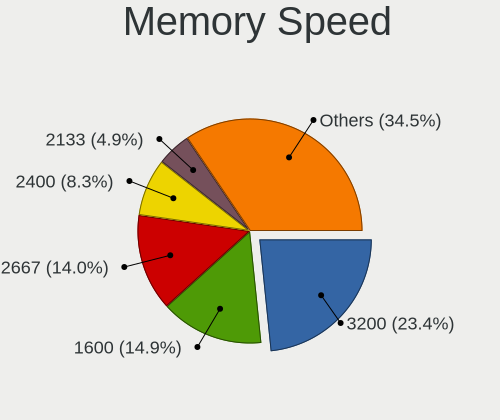

Ubuntu 22.04 - Tested Hardware & Statistics
-------------------------------------------

A project to collect tested hardware configurations for Ubuntu 22.04.

Anyone can contribute to this report by the [hw-probe](https://github.com/linuxhw/hw-probe) tool:

    sudo -E hw-probe -all -upload

Please contribute! Especially if your hardware is rare.

This is a report for all computer types. See also reports for [desktops](/Dist/Ubuntu_22.04/Desktop/README.md) and [notebooks](/Dist/Ubuntu_22.04/Notebook/README.md).

Contents
--------

* [ Test Cases ](#test-cases)

* [ System ](#system)
  - [ Kernel                   ](#kernel)
  - [ Kernel Family            ](#kernel-family)
  - [ Kernel Major Ver.        ](#kernel-major-ver)
  - [ Arch                     ](#arch)
  - [ DE                       ](#de)
  - [ Display Server           ](#display-server)
  - [ Display Manager          ](#display-manager)
  - [ OS Lang                  ](#os-lang)
  - [ Boot Mode                ](#boot-mode)
  - [ Filesystem               ](#filesystem)
  - [ Part. scheme             ](#part-scheme)
  - [ Dual Boot with Linux/BSD ](#dual-boot-with-linuxbsd)
  - [ Dual Boot (Win)          ](#dual-boot-win)

* [ Board ](#board)
  - [ Vendor                   ](#vendor)
  - [ Model                    ](#model)
  - [ Model Family             ](#model-family)
  - [ MFG Year                 ](#mfg-year)
  - [ Form Factor              ](#form-factor)
  - [ Secure Boot              ](#secure-boot)
  - [ Coreboot                 ](#coreboot)
  - [ RAM Size                 ](#ram-size)
  - [ RAM Used                 ](#ram-used)
  - [ Total Drives             ](#total-drives)
  - [ Has CD-ROM               ](#has-cd-rom)
  - [ Has Ethernet             ](#has-ethernet)
  - [ Has WiFi                 ](#has-wifi)
  - [ Has Bluetooth            ](#has-bluetooth)

* [ Location ](#location)
  - [ Country                  ](#country)
  - [ City                     ](#city)

* [ Drives ](#drives)
  - [ Drive Vendor             ](#drive-vendor)
  - [ Drive Model              ](#drive-model)
  - [ HDD Vendor               ](#hdd-vendor)
  - [ SSD Vendor               ](#ssd-vendor)
  - [ Drive Kind               ](#drive-kind)
  - [ Drive Connector          ](#drive-connector)
  - [ Drive Size               ](#drive-size)
  - [ Space Total              ](#space-total)
  - [ Space Used               ](#space-used)
  - [ Malfunc. Drives          ](#malfunc-drives)
  - [ Malfunc. Drive Vendor    ](#malfunc-drive-vendor)
  - [ Malfunc. HDD Vendor      ](#malfunc-hdd-vendor)
  - [ Malfunc. Drive Kind      ](#malfunc-drive-kind)
  - [ Failed Drives            ](#failed-drives)
  - [ Failed Drive Vendor      ](#failed-drive-vendor)
  - [ Drive Status             ](#drive-status)

* [ Storage controller ](#storage-controller)
  - [ Storage Vendor           ](#storage-vendor)
  - [ Storage Model            ](#storage-model)
  - [ Storage Kind             ](#storage-kind)

* [ Processor ](#processor)
  - [ CPU Vendor               ](#cpu-vendor)
  - [ CPU Model                ](#cpu-model)
  - [ CPU Model Family         ](#cpu-model-family)
  - [ CPU Cores                ](#cpu-cores)
  - [ CPU Sockets              ](#cpu-sockets)
  - [ CPU Threads              ](#cpu-threads)
  - [ CPU Op-Modes             ](#cpu-op-modes)
  - [ CPU Microcode            ](#cpu-microcode)
  - [ CPU Microarch            ](#cpu-microarch)

* [ Graphics ](#graphics)
  - [ GPU Vendor               ](#gpu-vendor)
  - [ GPU Model                ](#gpu-model)
  - [ GPU Combo                ](#gpu-combo)
  - [ GPU Driver               ](#gpu-driver)
  - [ GPU Memory               ](#gpu-memory)

* [ Monitor ](#monitor)
  - [ Monitor Vendor           ](#monitor-vendor)
  - [ Monitor Model            ](#monitor-model)
  - [ Monitor Resolution       ](#monitor-resolution)
  - [ Monitor Diagonal         ](#monitor-diagonal)
  - [ Monitor Width            ](#monitor-width)
  - [ Aspect Ratio             ](#aspect-ratio)
  - [ Monitor Area             ](#monitor-area)
  - [ Pixel Density            ](#pixel-density)
  - [ Multiple Monitors        ](#multiple-monitors)

* [ Network ](#network)
  - [ Net Controller Vendor    ](#net-controller-vendor)
  - [ Net Controller Model     ](#net-controller-model)
  - [ Wireless Vendor          ](#wireless-vendor)
  - [ Wireless Model           ](#wireless-model)
  - [ Ethernet Vendor          ](#ethernet-vendor)
  - [ Ethernet Model           ](#ethernet-model)
  - [ Net Controller Kind      ](#net-controller-kind)
  - [ Used Controller          ](#used-controller)
  - [ NICs                     ](#nics)
  - [ IPv6                     ](#ipv6)

* [ Bluetooth ](#bluetooth)
  - [ Bluetooth Vendor         ](#bluetooth-vendor)
  - [ Bluetooth Model          ](#bluetooth-model)

* [ Sound ](#sound)
  - [ Sound Vendor             ](#sound-vendor)
  - [ Sound Model              ](#sound-model)

* [ Memory ](#memory)
  - [ Memory Vendor            ](#memory-vendor)
  - [ Memory Model             ](#memory-model)
  - [ Memory Kind              ](#memory-kind)
  - [ Memory Form Factor       ](#memory-form-factor)
  - [ Memory Size              ](#memory-size)
  - [ Memory Speed             ](#memory-speed)

* [ Printers & scanners ](#printers--scanners)
  - [ Printer Vendor           ](#printer-vendor)
  - [ Printer Model            ](#printer-model)
  - [ Scanner Vendor           ](#scanner-vendor)
  - [ Scanner Model            ](#scanner-model)

* [ Camera ](#camera)
  - [ Camera Vendor            ](#camera-vendor)
  - [ Camera Model             ](#camera-model)

* [ Security ](#security)
  - [ Fingerprint Vendor       ](#fingerprint-vendor)
  - [ Fingerprint Model        ](#fingerprint-model)
  - [ Chipcard Vendor          ](#chipcard-vendor)
  - [ Chipcard Model           ](#chipcard-model)

* [ Unsupported ](#unsupported)
  - [ Unsupported Devices      ](#unsupported-devices)
  - [ Unsupported Device Types ](#unsupported-device-types)

Test Cases
----------

Total: 1993

| Vendor        | Model                       | Form-Factor | Probe                                                      | Date         |
|---------------|-----------------------------|-------------|------------------------------------------------------------|--------------|
| Fujitsu       | D3162-A1 S26361-D3162-A1    | Desktop     | [060a34b3a1](https://linux-hardware.org/?probe=060a34b3a1) | Jul 01, 2022 |
| Fujitsu       | D3162-A1 S26361-D3162-A1    | Desktop     | [630bb92cd8](https://linux-hardware.org/?probe=630bb92cd8) | Jul 01, 2022 |
| Apple         | Mac-27ADBB7B4CEE8E61 iMa... | All in one  | [b78c848494](https://linux-hardware.org/?probe=b78c848494) | Jul 01, 2022 |
| MSI           | Z390 GAM PRO CARB AC        | Desktop     | [a55ab11db7](https://linux-hardware.org/?probe=a55ab11db7) | Jul 01, 2022 |
| Dell          | 042P49 A02                  | Desktop     | [110e5da723](https://linux-hardware.org/?probe=110e5da723) | Jul 01, 2022 |
| Apple         | Mac-27ADBB7B4CEE8E61 iMa... | All in one  | [f0c4468694](https://linux-hardware.org/?probe=f0c4468694) | Jul 01, 2022 |
| Dell          | Inspiron 1501               | Notebook    | [f6efa72c1f](https://linux-hardware.org/?probe=f6efa72c1f) | Jul 01, 2022 |
| Intel         | DX58SO AAE29331-703         | Desktop     | [3b22974574](https://linux-hardware.org/?probe=3b22974574) | Jul 01, 2022 |
| Medion        | MS-7797                     | Desktop     | [01ff2f8272](https://linux-hardware.org/?probe=01ff2f8272) | Jul 01, 2022 |
| ASUSTek       | M5A78L LE                   | Desktop     | [19dbe00e60](https://linux-hardware.org/?probe=19dbe00e60) | Jul 01, 2022 |
| HP            | 805D                        | Desktop     | [3610332b9c](https://linux-hardware.org/?probe=3610332b9c) | Jul 01, 2022 |
| Dell          | 042P49 A02                  | Desktop     | [169b7b8c30](https://linux-hardware.org/?probe=169b7b8c30) | Jul 01, 2022 |
| Toshiba       | Satellite L350              | Notebook    | [06df7a6c59](https://linux-hardware.org/?probe=06df7a6c59) | Jul 01, 2022 |
| Gigabyte      | H81M-S2PH                   | Desktop     | [cc62a478ac](https://linux-hardware.org/?probe=cc62a478ac) | Jul 01, 2022 |
| HP            | Laptop 15s-fq1xxx           | Notebook    | [bd9caa15d5](https://linux-hardware.org/?probe=bd9caa15d5) | Jul 01, 2022 |
| Lenovo        | ThinkPad T480 20L5000UUS    | Notebook    | [60c86ea9e1](https://linux-hardware.org/?probe=60c86ea9e1) | Jul 01, 2022 |
| Toshiba       | Satellite L350              | Notebook    | [49c8c1b96a](https://linux-hardware.org/?probe=49c8c1b96a) | Jul 01, 2022 |
| Lenovo        | Z70-80 80FG                 | Notebook    | [eaf34443c7](https://linux-hardware.org/?probe=eaf34443c7) | Jul 01, 2022 |
| Lenovo        | IdeaPad 510-15IKB 80SV      | Notebook    | [0532069637](https://linux-hardware.org/?probe=0532069637) | Jul 01, 2022 |
| Lenovo        | V110-15IAP 80TG             | Notebook    | [05d0271371](https://linux-hardware.org/?probe=05d0271371) | Jul 01, 2022 |
| Gigabyte      | Z97X-Gaming 3               | Desktop     | [9b8bb163d3](https://linux-hardware.org/?probe=9b8bb163d3) | Jul 01, 2022 |
| Dell          | XPS 15 9520                 | Notebook    | [ca7efa311a](https://linux-hardware.org/?probe=ca7efa311a) | Jul 01, 2022 |
| Lenovo        | V110-15IAP 80TG             | Notebook    | [23519c6427](https://linux-hardware.org/?probe=23519c6427) | Jul 01, 2022 |
| Timi          | Mi NoteBook Ultra           | Notebook    | [0364230bc7](https://linux-hardware.org/?probe=0364230bc7) | Jul 01, 2022 |
| ASUSTek       | N43JQ                       | Notebook    | [d73f714472](https://linux-hardware.org/?probe=d73f714472) | Jul 01, 2022 |
| ECS           | A780GM-A                    | Desktop     | [2cea4325e9](https://linux-hardware.org/?probe=2cea4325e9) | Jul 01, 2022 |
| Lenovo        | Z70-80 80FG                 | Notebook    | [de5734cbe0](https://linux-hardware.org/?probe=de5734cbe0) | Jul 01, 2022 |
| Lenovo        | Z70-80 80FG                 | Notebook    | [dd8c266ad2](https://linux-hardware.org/?probe=dd8c266ad2) | Jul 01, 2022 |
| Raspberry ... | Raspberry Pi 4 Model B R... | Soc         | [d83a0aa24f](https://linux-hardware.org/?probe=d83a0aa24f) | Jul 01, 2022 |
| Raspberry ... | Raspberry Pi 4 Model B R... | Soc         | [7ffd41ce5c](https://linux-hardware.org/?probe=7ffd41ce5c) | Jul 01, 2022 |
| Timi          | RedmiBook 14 II             | Notebook    | [bf58ea7c43](https://linux-hardware.org/?probe=bf58ea7c43) | Jul 01, 2022 |
| Timi          | RedmiBook 14 II             | Notebook    | [4c7e17e7ba](https://linux-hardware.org/?probe=4c7e17e7ba) | Jul 01, 2022 |
| HUAWEI        | NBM-WXX9                    | Notebook    | [6ed674f77e](https://linux-hardware.org/?probe=6ed674f77e) | Jul 01, 2022 |
| Dell          | Latitude E5430 non-vPro     | Notebook    | [ae786e567a](https://linux-hardware.org/?probe=ae786e567a) | Jun 30, 2022 |
| Dell          | Latitude E5430 non-vPro     | Notebook    | [c4942af0bc](https://linux-hardware.org/?probe=c4942af0bc) | Jun 30, 2022 |
| Lenovo        | IdeaPad 5 Pro 14ACN6 82L... | Notebook    | [54f7fcc588](https://linux-hardware.org/?probe=54f7fcc588) | Jun 30, 2022 |
| Unknown       | Unknown                     | Desktop     | [1de34d9bf9](https://linux-hardware.org/?probe=1de34d9bf9) | Jun 30, 2022 |
| HP            | Laptop 15s-du2xxx           | Notebook    | [13e85826c2](https://linux-hardware.org/?probe=13e85826c2) | Jun 30, 2022 |
| HP            | Laptop 15s-du2xxx           | Notebook    | [bb4df4398e](https://linux-hardware.org/?probe=bb4df4398e) | Jun 30, 2022 |
| Dell          | XPS 15 9520                 | Notebook    | [0cb6549f23](https://linux-hardware.org/?probe=0cb6549f23) | Jun 30, 2022 |
| Apple         | MacBookAir3,2               | Notebook    | [ee189c9ba2](https://linux-hardware.org/?probe=ee189c9ba2) | Jun 30, 2022 |
| HP            | Laptop 14s-dk0xxx           | Notebook    | [97d88d7e00](https://linux-hardware.org/?probe=97d88d7e00) | Jun 30, 2022 |
| Dell          | Inspiron 7572               | Notebook    | [a6c34895e2](https://linux-hardware.org/?probe=a6c34895e2) | Jun 30, 2022 |
| Apple         | MacBookPro12,1              | Notebook    | [3cec3cffbb](https://linux-hardware.org/?probe=3cec3cffbb) | Jun 30, 2022 |
| Dell          | Inspiron 5521               | Notebook    | [e9948fff52](https://linux-hardware.org/?probe=e9948fff52) | Jun 30, 2022 |
| Apple         | MacBookPro12,1              | Notebook    | [bac4b49e55](https://linux-hardware.org/?probe=bac4b49e55) | Jun 30, 2022 |
| Dell          | Latitude E5430 non-vPro     | Notebook    | [c4ef403aed](https://linux-hardware.org/?probe=c4ef403aed) | Jun 30, 2022 |
| Acer          | Swift SF314-43              | Notebook    | [14f9c7d4c5](https://linux-hardware.org/?probe=14f9c7d4c5) | Jun 29, 2022 |
| Lenovo        | ThinkPad E14 Gen 3 20Y70... | Notebook    | [03854f8307](https://linux-hardware.org/?probe=03854f8307) | Jun 29, 2022 |
| Lenovo        | Z70-80 80FG                 | Notebook    | [bef849e3d1](https://linux-hardware.org/?probe=bef849e3d1) | Jun 29, 2022 |
| Lenovo        | ThinkPad T470 20HES2141Z    | Notebook    | [53010a4be8](https://linux-hardware.org/?probe=53010a4be8) | Jun 29, 2022 |
| Lenovo        | ThinkPad T470 20HES2141Z    | Notebook    | [8e9c8e62b1](https://linux-hardware.org/?probe=8e9c8e62b1) | Jun 29, 2022 |
| ASUSTek       | ROG STRIX Z370-E GAMING     | Desktop     | [349dc94a13](https://linux-hardware.org/?probe=349dc94a13) | Jun 29, 2022 |
| MSI           | MEG Z490 UNIFY              | Desktop     | [2c7a50869d](https://linux-hardware.org/?probe=2c7a50869d) | Jun 29, 2022 |
| HP            | Pavilion dm1                | Notebook    | [927f5b38e0](https://linux-hardware.org/?probe=927f5b38e0) | Jun 29, 2022 |
| Dell          | 0M5DCD A00                  | Desktop     | [7ff0a3f172](https://linux-hardware.org/?probe=7ff0a3f172) | Jun 29, 2022 |
| Dell          | 0M5DCD A00                  | Desktop     | [483d6a9299](https://linux-hardware.org/?probe=483d6a9299) | Jun 29, 2022 |
| Intel         | NUC11PABi5 K90634-305       | Mini pc     | [d409d12ee2](https://linux-hardware.org/?probe=d409d12ee2) | Jun 29, 2022 |
| Lenovo        | MAHOBAY NOK                 | Desktop     | [20a14662e8](https://linux-hardware.org/?probe=20a14662e8) | Jun 29, 2022 |
| Toshiba       | Satellite C850-1NU          | Notebook    | [2b83cb161e](https://linux-hardware.org/?probe=2b83cb161e) | Jun 29, 2022 |
| Dell          | Inspiron 5405               | Notebook    | [73ec2d1277](https://linux-hardware.org/?probe=73ec2d1277) | Jun 29, 2022 |
| MSI           | MPG Z390I GAMING EDGE AC    | Desktop     | [389293962a](https://linux-hardware.org/?probe=389293962a) | Jun 29, 2022 |
| ASUSTek       | B85M-E                      | Desktop     | [2423d184c0](https://linux-hardware.org/?probe=2423d184c0) | Jun 29, 2022 |
| Lenovo        | IdeaPad Flex-14API 81SS     | Notebook    | [828f0b9ef1](https://linux-hardware.org/?probe=828f0b9ef1) | Jun 29, 2022 |
| HP            | ENVY dv7                    | Notebook    | [9f64d5f095](https://linux-hardware.org/?probe=9f64d5f095) | Jun 29, 2022 |
| Apple         | Mac-27ADBB7B4CEE8E61 iMa... | All in one  | [cdc234e3d9](https://linux-hardware.org/?probe=cdc234e3d9) | Jun 29, 2022 |
| HP            | Laptop 17-ca1xxx            | Notebook    | [10620fe30b](https://linux-hardware.org/?probe=10620fe30b) | Jun 29, 2022 |
| Apple         | Mac-27ADBB7B4CEE8E61 iMa... | All in one  | [a6420a89b6](https://linux-hardware.org/?probe=a6420a89b6) | Jun 29, 2022 |
| ASUSTek       | P5LD2                       | Desktop     | [4fdebc2b9c](https://linux-hardware.org/?probe=4fdebc2b9c) | Jun 29, 2022 |
| ASRock        | B550M-ITX/ac                | Desktop     | [01614433d5](https://linux-hardware.org/?probe=01614433d5) | Jun 29, 2022 |
| Toshiba       | Satellite L755D             | Notebook    | [87bdccce5e](https://linux-hardware.org/?probe=87bdccce5e) | Jun 29, 2022 |
| ASUSTek       | P5LD2                       | Desktop     | [c7f67d9347](https://linux-hardware.org/?probe=c7f67d9347) | Jun 29, 2022 |
| ASUSTek       | PRO H410M-C                 | Desktop     | [9f705aea75](https://linux-hardware.org/?probe=9f705aea75) | Jun 29, 2022 |
| Acer          | Aspire 5740                 | Notebook    | [1db26fc575](https://linux-hardware.org/?probe=1db26fc575) | Jun 29, 2022 |
| Dell          | 0D24M8 A00                  | Desktop     | [1588270a58](https://linux-hardware.org/?probe=1588270a58) | Jun 29, 2022 |
| Toshiba       | Satellite M305              | Notebook    | [0f42d5a8ef](https://linux-hardware.org/?probe=0f42d5a8ef) | Jun 29, 2022 |
| Acer          | Aspire 5740                 | Notebook    | [44a72b9a94](https://linux-hardware.org/?probe=44a72b9a94) | Jun 29, 2022 |
| Lenovo        | IdeaPad 100S-14IBR 80R9     | Notebook    | [e8d42a5f3b](https://linux-hardware.org/?probe=e8d42a5f3b) | Jun 29, 2022 |
| ASUSTek       | CROSSHAIR V FORMULA-Z       | Desktop     | [d59692d648](https://linux-hardware.org/?probe=d59692d648) | Jun 29, 2022 |
| Dell          | Inspiron 11 - 3147          | Notebook    | [82e2b1519c](https://linux-hardware.org/?probe=82e2b1519c) | Jun 29, 2022 |
| Dell          | Inspiron 11 - 3147          | Notebook    | [c661afa5d3](https://linux-hardware.org/?probe=c661afa5d3) | Jun 29, 2022 |
| MSI           | Stealth GS66 12UGS          | Notebook    | [8c8ad7136d](https://linux-hardware.org/?probe=8c8ad7136d) | Jun 29, 2022 |
| ASUSTek       | ROG STRIX X570-E GAMING     | Desktop     | [5873a7a8dd](https://linux-hardware.org/?probe=5873a7a8dd) | Jun 29, 2022 |
| Apple         | Mac-AA95B1DDAB278B95 iMa... | All in one  | [37e3958fbc](https://linux-hardware.org/?probe=37e3958fbc) | Jun 29, 2022 |
| MSI           | H110M GAMING                | Desktop     | [e33051cbd0](https://linux-hardware.org/?probe=e33051cbd0) | Jun 28, 2022 |
| System76      | Bonobo Extreme              | Notebook    | [8872466072](https://linux-hardware.org/?probe=8872466072) | Jun 28, 2022 |
| Dell          | Inspiron 5570               | Notebook    | [bb61360dae](https://linux-hardware.org/?probe=bb61360dae) | Jun 28, 2022 |
| Dell          | Inspiron 5570               | Notebook    | [4119b5740c](https://linux-hardware.org/?probe=4119b5740c) | Jun 28, 2022 |
| HP            | Laptop 15-da2xxx            | Notebook    | [cb262785dc](https://linux-hardware.org/?probe=cb262785dc) | Jun 28, 2022 |
| HP            | Laptop 15-da2xxx            | Notebook    | [5efb0cb1c5](https://linux-hardware.org/?probe=5efb0cb1c5) | Jun 28, 2022 |
| Dell          | 0TP406                      | Desktop     | [4f0f2b2e05](https://linux-hardware.org/?probe=4f0f2b2e05) | Jun 28, 2022 |
| Acer          | Aspire A515-51G             | Notebook    | [4178b8c79f](https://linux-hardware.org/?probe=4178b8c79f) | Jun 28, 2022 |
| Acer          | Aspire A515-51G             | Notebook    | [1571a4ab8e](https://linux-hardware.org/?probe=1571a4ab8e) | Jun 28, 2022 |
| Dell          | XPS 13 9300                 | Notebook    | [8ecea7fce7](https://linux-hardware.org/?probe=8ecea7fce7) | Jun 28, 2022 |
| HP            | ENVY dv7                    | Notebook    | [00ce30e950](https://linux-hardware.org/?probe=00ce30e950) | Jun 28, 2022 |
| HP            | ENVY x360 Convertible 15... | Convertible | [7877597b47](https://linux-hardware.org/?probe=7877597b47) | Jun 28, 2022 |
| HP            | 340S G7                     | Notebook    | [6695a6a5ed](https://linux-hardware.org/?probe=6695a6a5ed) | Jun 28, 2022 |
| Acer          | H81-M1                      | Desktop     | [9ddfb2ec8d](https://linux-hardware.org/?probe=9ddfb2ec8d) | Jun 28, 2022 |
| Dell          | XPS 13 9310 2-in-1          | Convertible | [d2034a53b8](https://linux-hardware.org/?probe=d2034a53b8) | Jun 28, 2022 |
| ASUSTek       | VivoBook_ASUSLaptop E410... | Notebook    | [464a37068f](https://linux-hardware.org/?probe=464a37068f) | Jun 28, 2022 |
| Apple         | MacBookPro12,1              | Notebook    | [ed7338a47a](https://linux-hardware.org/?probe=ed7338a47a) | Jun 28, 2022 |
| Raspberry ... | Raspberry Pi 4 Model B R... | Soc         | [e841ca8572](https://linux-hardware.org/?probe=e841ca8572) | Jun 28, 2022 |
| Login Info... | LOG-MB47II7                 | Notebook    | [332f799fe9](https://linux-hardware.org/?probe=332f799fe9) | Jun 28, 2022 |
| HP            | Pavilion TS 14              | Notebook    | [f851b6a57b](https://linux-hardware.org/?probe=f851b6a57b) | Jun 28, 2022 |
| Dell          | 0TT740 A00                  | Server      | [14defa3569](https://linux-hardware.org/?probe=14defa3569) | Jun 27, 2022 |
| HP            | Pavilion 15                 | Notebook    | [468a953a80](https://linux-hardware.org/?probe=468a953a80) | Jun 27, 2022 |
| HP            | 0B4Ch D                     | Desktop     | [6e28eeb447](https://linux-hardware.org/?probe=6e28eeb447) | Jun 27, 2022 |
| Lenovo        | IdeaPad 330-17IKB 81DK      | Notebook    | [2304f26a21](https://linux-hardware.org/?probe=2304f26a21) | Jun 27, 2022 |
| Intel         | NUC6i7KYB H90766-402        | Mini pc     | [8e03a02104](https://linux-hardware.org/?probe=8e03a02104) | Jun 27, 2022 |
| HP            | 805E                        | All in one  | [efbad579d1](https://linux-hardware.org/?probe=efbad579d1) | Jun 27, 2022 |
| Dell          | Latitude 7480               | Notebook    | [87a2e9762f](https://linux-hardware.org/?probe=87a2e9762f) | Jun 27, 2022 |
| Dell          | Latitude E5570              | Notebook    | [ea7aa4f4ab](https://linux-hardware.org/?probe=ea7aa4f4ab) | Jun 27, 2022 |
| Dell          | 0RF703                      | Desktop     | [7b1a5ddcb6](https://linux-hardware.org/?probe=7b1a5ddcb6) | Jun 27, 2022 |
| HP            | Pavilion 15                 | Notebook    | [9e7a0c1889](https://linux-hardware.org/?probe=9e7a0c1889) | Jun 27, 2022 |
| Lenovo        | G550 20023                  | Notebook    | [0a2aa10fd1](https://linux-hardware.org/?probe=0a2aa10fd1) | Jun 27, 2022 |
| Intel         | NUC11PABi5 K90634-305       | Mini pc     | [30672ab543](https://linux-hardware.org/?probe=30672ab543) | Jun 27, 2022 |
| Dell          | G3 3500                     | Notebook    | [0df1b9607c](https://linux-hardware.org/?probe=0df1b9607c) | Jun 27, 2022 |
| Gigabyte      | RC14UD                      | Notebook    | [1f3a4dad7a](https://linux-hardware.org/?probe=1f3a4dad7a) | Jun 27, 2022 |
| Dell          | Latitude 5510               | Notebook    | [06199cdfe6](https://linux-hardware.org/?probe=06199cdfe6) | Jun 27, 2022 |
| ASRock        | 970 Pro3 R2.0               | Desktop     | [ba2f829e73](https://linux-hardware.org/?probe=ba2f829e73) | Jun 27, 2022 |
| Dell          | 051FJ8 A02                  | Desktop     | [5b997790f1](https://linux-hardware.org/?probe=5b997790f1) | Jun 27, 2022 |
| Lenovo        | ThinkPad E14 Gen 2 20TA0... | Notebook    | [6491230956](https://linux-hardware.org/?probe=6491230956) | Jun 27, 2022 |
| Lenovo        | IdeaPad 330-17IKB 81DK      | Notebook    | [850cc358f4](https://linux-hardware.org/?probe=850cc358f4) | Jun 27, 2022 |
| Fujitsu       | LIFEBOOK U938               | Notebook    | [c959653e4f](https://linux-hardware.org/?probe=c959653e4f) | Jun 27, 2022 |
| Lenovo        | ThinkPad X1 Carbon 4th 2... | Notebook    | [aa51c70192](https://linux-hardware.org/?probe=aa51c70192) | Jun 27, 2022 |
| Fujitsu       | LIFEBOOK U938               | Notebook    | [be4fb4ad71](https://linux-hardware.org/?probe=be4fb4ad71) | Jun 27, 2022 |
| Raspberry ... | Raspberry Pi 4 Model B R... | Soc         | [cd22036876](https://linux-hardware.org/?probe=cd22036876) | Jun 27, 2022 |
| MSI           | MPG Z390 GAMING PLUS        | Desktop     | [3d575e19b6](https://linux-hardware.org/?probe=3d575e19b6) | Jun 27, 2022 |
| MSI           | B450M-A PRO MAX             | Desktop     | [666f9678a5](https://linux-hardware.org/?probe=666f9678a5) | Jun 27, 2022 |
| Lenovo        | ThinkPad X230 2325U5P       | Notebook    | [5b8770aaf7](https://linux-hardware.org/?probe=5b8770aaf7) | Jun 27, 2022 |
| Lenovo        | ThinkPad X230 2325U5P       | Notebook    | [d80f5059d2](https://linux-hardware.org/?probe=d80f5059d2) | Jun 27, 2022 |
| Lenovo        | ThinkPad X230 2325U5P       | Notebook    | [89b9650228](https://linux-hardware.org/?probe=89b9650228) | Jun 27, 2022 |
| Lenovo        | YB1-X91F                    | Convertible | [0a0f43a4af](https://linux-hardware.org/?probe=0a0f43a4af) | Jun 27, 2022 |
| ASUSTek       | P8B75-M LE                  | Desktop     | [48cbc869da](https://linux-hardware.org/?probe=48cbc869da) | Jun 27, 2022 |
| ASUSTek       | P8B75-M LE                  | Desktop     | [ea31080862](https://linux-hardware.org/?probe=ea31080862) | Jun 27, 2022 |
| Dell          | Precision M3800             | Notebook    | [95a0805f35](https://linux-hardware.org/?probe=95a0805f35) | Jun 27, 2022 |
| MSI           | Z590-A PRO                  | Desktop     | [1adcde94c5](https://linux-hardware.org/?probe=1adcde94c5) | Jun 26, 2022 |
| MSI           | Z590-A PRO                  | Desktop     | [18d6fda695](https://linux-hardware.org/?probe=18d6fda695) | Jun 26, 2022 |
| Apple         | Mac-F65AE981FFA204ED Mac... | Mini pc     | [3c116356e3](https://linux-hardware.org/?probe=3c116356e3) | Jun 26, 2022 |
| MSI           | H55M-E33                    | Desktop     | [035cfe1a5b](https://linux-hardware.org/?probe=035cfe1a5b) | Jun 26, 2022 |
| LG Electro... | 14T90N-VR56K                | Convertible | [22f978c26c](https://linux-hardware.org/?probe=22f978c26c) | Jun 26, 2022 |
| Fujitsu       | LIFEBOOK E752               | Notebook    | [8ddfe8d07b](https://linux-hardware.org/?probe=8ddfe8d07b) | Jun 26, 2022 |
| IBM           | 00AM527                     | Server      | [8af3a08c43](https://linux-hardware.org/?probe=8af3a08c43) | Jun 26, 2022 |
| MSI           | B450M PRO-M2                | Desktop     | [516abfbea1](https://linux-hardware.org/?probe=516abfbea1) | Jun 26, 2022 |
| MSI           | B450M-A PRO MAX             | Desktop     | [aa9757e958](https://linux-hardware.org/?probe=aa9757e958) | Jun 26, 2022 |
| Medion        | S6445 MD61351               | Notebook    | [c99e2d656f](https://linux-hardware.org/?probe=c99e2d656f) | Jun 26, 2022 |
| Medion        | S6445 MD61351               | Notebook    | [d0e2e3232c](https://linux-hardware.org/?probe=d0e2e3232c) | Jun 26, 2022 |
| ASUSTek       | P8Z68-V LX                  | Desktop     | [5935ab812a](https://linux-hardware.org/?probe=5935ab812a) | Jun 26, 2022 |
| ASUSTek       | X510UNR                     | Notebook    | [d5f3803a24](https://linux-hardware.org/?probe=d5f3803a24) | Jun 26, 2022 |
| Dell          | Inspiron 3580               | Notebook    | [dfab1b501e](https://linux-hardware.org/?probe=dfab1b501e) | Jun 26, 2022 |
| MSI           | PRO Z690-A                  | Desktop     | [34a2f4f726](https://linux-hardware.org/?probe=34a2f4f726) | Jun 26, 2022 |
| Dell          | Inspiron 7506 2n1           | Convertible | [b65aaee9eb](https://linux-hardware.org/?probe=b65aaee9eb) | Jun 26, 2022 |
| Raspberry ... | Raspberry Pi                | Soc         | [af50fdf3b9](https://linux-hardware.org/?probe=af50fdf3b9) | Jun 26, 2022 |
| Microsoft     | Surface Pro 3               | Tablet      | [800f6f5802](https://linux-hardware.org/?probe=800f6f5802) | Jun 26, 2022 |
| ASUSTek       | P8H61-I                     | Desktop     | [15b8beca14](https://linux-hardware.org/?probe=15b8beca14) | Jun 26, 2022 |
| Lenovo        | Yoga 6 13ALC6 82ND          | Convertible | [7436c506a2](https://linux-hardware.org/?probe=7436c506a2) | Jun 26, 2022 |
| Acer          | Swift SF314-512             | Notebook    | [510f23fce0](https://linux-hardware.org/?probe=510f23fce0) | Jun 26, 2022 |
| Lenovo        | SKYBAY SDK0J40697 WIN 33... | All in one  | [f2d64b50fc](https://linux-hardware.org/?probe=f2d64b50fc) | Jun 26, 2022 |
| Dell          | 0HD5W2 A01                  | Desktop     | [9f87421952](https://linux-hardware.org/?probe=9f87421952) | Jun 26, 2022 |
| ASUSTek       | ASUS EXPERTBOOK B9450FA_... | Notebook    | [88681cbb38](https://linux-hardware.org/?probe=88681cbb38) | Jun 26, 2022 |
| Dell          | 0VD92X A00                  | Desktop     | [5082bf92e9](https://linux-hardware.org/?probe=5082bf92e9) | Jun 26, 2022 |
| MSI           | A78M-E45 V2                 | Desktop     | [e4cd6586b4](https://linux-hardware.org/?probe=e4cd6586b4) | Jun 26, 2022 |
| HP            | Pavilion Laptop 15-eh1xx... | Notebook    | [e006119954](https://linux-hardware.org/?probe=e006119954) | Jun 26, 2022 |
| Gigabyte      | X570 GAMING X               | Desktop     | [b66ac35391](https://linux-hardware.org/?probe=b66ac35391) | Jun 26, 2022 |
| Samsung       | 300E5K/300E5Q               | Notebook    | [6fdcfe2be7](https://linux-hardware.org/?probe=6fdcfe2be7) | Jun 26, 2022 |
| Acer          | TravelMate P214-53          | Notebook    | [d93da606dc](https://linux-hardware.org/?probe=d93da606dc) | Jun 26, 2022 |
| Samsung       | 300E5K/300E5Q               | Notebook    | [1b7010c05b](https://linux-hardware.org/?probe=1b7010c05b) | Jun 26, 2022 |
| Acer          | Aspire E5-571G              | Notebook    | [f8c41984c9](https://linux-hardware.org/?probe=f8c41984c9) | Jun 25, 2022 |
| ASUSTek       | Pro WS WRX80E-SAGE SE WI... | Desktop     | [f440505698](https://linux-hardware.org/?probe=f440505698) | Jun 25, 2022 |
| MSI           | Stealth GS66 12UHS          | Notebook    | [4cee5507af](https://linux-hardware.org/?probe=4cee5507af) | Jun 25, 2022 |
| Chuwi         | GemiBook Pro                | Notebook    | [160062e69a](https://linux-hardware.org/?probe=160062e69a) | Jun 25, 2022 |
| Dell          | Inspiron 7506 2n1           | Convertible | [9421b03b9e](https://linux-hardware.org/?probe=9421b03b9e) | Jun 25, 2022 |
| MSI           | H81M-P33                    | Desktop     | [9ba6c64800](https://linux-hardware.org/?probe=9ba6c64800) | Jun 25, 2022 |
| Lenovo        | ThinkPad X1 Carbon 5th 2... | Notebook    | [044be44d33](https://linux-hardware.org/?probe=044be44d33) | Jun 25, 2022 |
| Lenovo        | IdeaPad S540-14API 81NH     | Notebook    | [8f9e6e12b1](https://linux-hardware.org/?probe=8f9e6e12b1) | Jun 25, 2022 |
| HP            | EliteBook 8740w             | Notebook    | [3d88d48a84](https://linux-hardware.org/?probe=3d88d48a84) | Jun 25, 2022 |
| Lenovo        | G570 20079                  | Notebook    | [5ec853b08c](https://linux-hardware.org/?probe=5ec853b08c) | Jun 25, 2022 |
| GPU Compan... | GWTC116-2                   | Notebook    | [c90d6bd560](https://linux-hardware.org/?probe=c90d6bd560) | Jun 25, 2022 |
| GPU Compan... | GWTC116-2                   | Notebook    | [52404c379f](https://linux-hardware.org/?probe=52404c379f) | Jun 25, 2022 |
| ASUSTek       | TUF Gaming X570-PLUS_BR     | Desktop     | [8f2b511688](https://linux-hardware.org/?probe=8f2b511688) | Jun 25, 2022 |
| ASUSTek       | TUF Gaming X570-PLUS_BR     | Desktop     | [ace55b44d7](https://linux-hardware.org/?probe=ace55b44d7) | Jun 25, 2022 |
| HP            | Pavilion dv7                | Notebook    | [a0c6c78c33](https://linux-hardware.org/?probe=a0c6c78c33) | Jun 25, 2022 |
| Lenovo        | ThinkPad E14 Gen 2 20TBS... | Notebook    | [0adc011c8b](https://linux-hardware.org/?probe=0adc011c8b) | Jun 24, 2022 |
| Lenovo        | 3714 SDK0J40700 WIN 3258... | Desktop     | [1be22bc8af](https://linux-hardware.org/?probe=1be22bc8af) | Jun 24, 2022 |
| HP            | ZBook 15 G5 QEB19A          | Notebook    | [87a3d94edb](https://linux-hardware.org/?probe=87a3d94edb) | Jun 24, 2022 |
| HP            | ZBook 15 G5 QEB19A          | Notebook    | [09b12eda27](https://linux-hardware.org/?probe=09b12eda27) | Jun 24, 2022 |
| HUAWEI        | BOD-WXX9                    | Notebook    | [d306afd176](https://linux-hardware.org/?probe=d306afd176) | Jun 24, 2022 |
| MSI           | Z370 GAMING PRO CARBON      | Desktop     | [57660d8f0f](https://linux-hardware.org/?probe=57660d8f0f) | Jun 24, 2022 |
| HUAWEI        | BOD-WXX9                    | Notebook    | [f3742fcee5](https://linux-hardware.org/?probe=f3742fcee5) | Jun 24, 2022 |
| ASUSTek       | PRIME X570-P                | Desktop     | [fc1716de1f](https://linux-hardware.org/?probe=fc1716de1f) | Jun 24, 2022 |
| ASUSTek       | PRIME X570-P                | Desktop     | [785ec99ee8](https://linux-hardware.org/?probe=785ec99ee8) | Jun 24, 2022 |
| Gigabyte      | A520M S2H                   | Desktop     | [094c3f1e98](https://linux-hardware.org/?probe=094c3f1e98) | Jun 24, 2022 |
| Dell          | Vostro 15 3515              | Notebook    | [93427bd0bf](https://linux-hardware.org/?probe=93427bd0bf) | Jun 24, 2022 |
| Samsung       | 300E5EV/300E4EV/270E5EV/... | Notebook    | [ce17a478c3](https://linux-hardware.org/?probe=ce17a478c3) | Jun 24, 2022 |
| Dell          | 0KW626                      | Desktop     | [ceb37aeba1](https://linux-hardware.org/?probe=ceb37aeba1) | Jun 24, 2022 |
| Dell          | XPS 13 9370                 | Notebook    | [b1447080a3](https://linux-hardware.org/?probe=b1447080a3) | Jun 24, 2022 |
| Intel         | X79G V2.x                   | Desktop     | [67b2e27895](https://linux-hardware.org/?probe=67b2e27895) | Jun 24, 2022 |
| HP            | Pavilion dv7                | Notebook    | [334a6079e5](https://linux-hardware.org/?probe=334a6079e5) | Jun 24, 2022 |
| Acer          | Aspire A315-23              | Notebook    | [45c9b081c5](https://linux-hardware.org/?probe=45c9b081c5) | Jun 24, 2022 |
| ASUSTek       | X99-DELUXE                  | Desktop     | [34e3aad338](https://linux-hardware.org/?probe=34e3aad338) | Jun 24, 2022 |
| HP            | 2AF7                        | Desktop     | [86ecfeb9e2](https://linux-hardware.org/?probe=86ecfeb9e2) | Jun 24, 2022 |
| Dell          | 018D1Y A00                  | Desktop     | [8344a8b783](https://linux-hardware.org/?probe=8344a8b783) | Jun 24, 2022 |
| ASUSTek       | X411UN                      | Notebook    | [d4543f64dc](https://linux-hardware.org/?probe=d4543f64dc) | Jun 24, 2022 |
| Foxconn       | 2AB1                        | Desktop     | [389a1d6185](https://linux-hardware.org/?probe=389a1d6185) | Jun 23, 2022 |
| Dell          | 0MGK50 A02                  | Desktop     | [eca7a31c46](https://linux-hardware.org/?probe=eca7a31c46) | Jun 23, 2022 |
| Sony          | VPCEH2J1E                   | Notebook    | [7dde3ae196](https://linux-hardware.org/?probe=7dde3ae196) | Jun 23, 2022 |
| Dell          | 0MGK50 A02                  | Desktop     | [134bf128f7](https://linux-hardware.org/?probe=134bf128f7) | Jun 23, 2022 |
| Medion        | Erazer P6661 MD60303        | Notebook    | [a678044765](https://linux-hardware.org/?probe=a678044765) | Jun 23, 2022 |
| Medion        | Erazer P6661 MD60303        | Notebook    | [babd561a16](https://linux-hardware.org/?probe=babd561a16) | Jun 23, 2022 |
| Dell          | Inspiron 3580               | Notebook    | [22c8672cea](https://linux-hardware.org/?probe=22c8672cea) | Jun 23, 2022 |
| congatec      | conga-MA5 B.2               | Mini pc     | [a49c763e59](https://linux-hardware.org/?probe=a49c763e59) | Jun 23, 2022 |
| HP            | EliteBook 8540w             | Notebook    | [b2d1469a45](https://linux-hardware.org/?probe=b2d1469a45) | Jun 23, 2022 |
| ASRock        | Z590M-ITX/ax                | Desktop     | [263e8a50af](https://linux-hardware.org/?probe=263e8a50af) | Jun 23, 2022 |
| Gigabyte      | X570S AORUS MASTER          | Desktop     | [95d5b870bb](https://linux-hardware.org/?probe=95d5b870bb) | Jun 23, 2022 |
| Lenovo        | ThinkPad E15 Gen 2 20TD0... | Notebook    | [b7d2767b67](https://linux-hardware.org/?probe=b7d2767b67) | Jun 23, 2022 |
| HP            | EliteBook 8470p             | Notebook    | [f9895656b6](https://linux-hardware.org/?probe=f9895656b6) | Jun 23, 2022 |
| MSI           | GE76 Raider 10UH            | Notebook    | [77ef5acb4c](https://linux-hardware.org/?probe=77ef5acb4c) | Jun 23, 2022 |
| HP            | EliteBook 8470p             | Notebook    | [2e2bcb63d7](https://linux-hardware.org/?probe=2e2bcb63d7) | Jun 23, 2022 |
| Sony          | SVS1312J3EW                 | Notebook    | [95e0cb21c4](https://linux-hardware.org/?probe=95e0cb21c4) | Jun 23, 2022 |
| ASUSTek       | ROG STRIX Z590-E GAMING ... | Desktop     | [3cfb6f7ee5](https://linux-hardware.org/?probe=3cfb6f7ee5) | Jun 23, 2022 |
| Dell          | XPS 15 7590                 | Notebook    | [28b27f6df4](https://linux-hardware.org/?probe=28b27f6df4) | Jun 23, 2022 |
| ASUSTek       | ROG Zephyrus G15 GA503RW... | Notebook    | [43a27bb2dd](https://linux-hardware.org/?probe=43a27bb2dd) | Jun 23, 2022 |
| Apple         | MacBookPro11,1              | Notebook    | [58bec264ab](https://linux-hardware.org/?probe=58bec264ab) | Jun 23, 2022 |
| Dell          | 0C1GJ7 A00                  | All in one  | [c812a957cf](https://linux-hardware.org/?probe=c812a957cf) | Jun 23, 2022 |
| HP            | Laptop 15-dy1xxx            | Notebook    | [00b3a0e19d](https://linux-hardware.org/?probe=00b3a0e19d) | Jun 23, 2022 |
| ASUSTek       | VivoBook_ASUSLaptop X510... | Notebook    | [5188bfb9d3](https://linux-hardware.org/?probe=5188bfb9d3) | Jun 23, 2022 |
| Lenovo        | ThinkPad T460s 20F90076U... | Notebook    | [f6a965ff8c](https://linux-hardware.org/?probe=f6a965ff8c) | Jun 22, 2022 |
| Lenovo        | IdeaPad S510p 20298         | Notebook    | [3ddae75872](https://linux-hardware.org/?probe=3ddae75872) | Jun 22, 2022 |
| Dell          | Precision M4500             | Notebook    | [e41b9f3386](https://linux-hardware.org/?probe=e41b9f3386) | Jun 22, 2022 |
| Lenovo        | MAHOBAY                     | Desktop     | [8f7a233327](https://linux-hardware.org/?probe=8f7a233327) | Jun 22, 2022 |
| ASUSTek       | ROG Zephyrus G15 GA503RW... | Notebook    | [f993d31672](https://linux-hardware.org/?probe=f993d31672) | Jun 22, 2022 |
| Teclast       | F7S                         | Notebook    | [dba66e9d34](https://linux-hardware.org/?probe=dba66e9d34) | Jun 22, 2022 |
| Dell          | 0W2F8G A01                  | Desktop     | [447653d4f2](https://linux-hardware.org/?probe=447653d4f2) | Jun 22, 2022 |
| Dell          | 0W2F8G A01                  | Desktop     | [4610c38358](https://linux-hardware.org/?probe=4610c38358) | Jun 22, 2022 |
| Lenovo        | V15-ADA 82C7                | Notebook    | [98350f1274](https://linux-hardware.org/?probe=98350f1274) | Jun 22, 2022 |
| Dell          | Inspiron 14 5425            | Notebook    | [16e98704b5](https://linux-hardware.org/?probe=16e98704b5) | Jun 22, 2022 |
| Toshiba       | Satellite Pro L500          | Notebook    | [e745bcf24b](https://linux-hardware.org/?probe=e745bcf24b) | Jun 22, 2022 |
| ASUSTek       | P6T WS PRO                  | Desktop     | [9899337065](https://linux-hardware.org/?probe=9899337065) | Jun 22, 2022 |
| Lenovo        | ThinkPad T495 20NKS01W06    | Notebook    | [d1a1093555](https://linux-hardware.org/?probe=d1a1093555) | Jun 22, 2022 |
| HP            | Pavilion 15                 | Notebook    | [18a1195bbc](https://linux-hardware.org/?probe=18a1195bbc) | Jun 22, 2022 |
| Gigabyte      | GA-MA790FXT-UD5P            | Desktop     | [e4116b95a2](https://linux-hardware.org/?probe=e4116b95a2) | Jun 22, 2022 |
| Microsoft     | Surface Laptop 3            | Tablet      | [d5098cc011](https://linux-hardware.org/?probe=d5098cc011) | Jun 22, 2022 |
| Dell          | 042P49 A01                  | Desktop     | [836efa773c](https://linux-hardware.org/?probe=836efa773c) | Jun 22, 2022 |
| Dell          | 042P49 A01                  | Desktop     | [380b66353e](https://linux-hardware.org/?probe=380b66353e) | Jun 21, 2022 |
| HP            | ProBook 645 G1              | Notebook    | [1157ee7e3a](https://linux-hardware.org/?probe=1157ee7e3a) | Jun 21, 2022 |
| MSI           | A320M-A PRO                 | Desktop     | [1f3b17165b](https://linux-hardware.org/?probe=1f3b17165b) | Jun 21, 2022 |
| Toshiba       | PORTEGE X20W-E              | Convertible | [20cf9d2706](https://linux-hardware.org/?probe=20cf9d2706) | Jun 21, 2022 |
| HP            | 3395                        | All in one  | [ae7ed1946d](https://linux-hardware.org/?probe=ae7ed1946d) | Jun 21, 2022 |
| ASRock        | H81M-VG4                    | Desktop     | [f9f9db00a7](https://linux-hardware.org/?probe=f9f9db00a7) | Jun 21, 2022 |
| Acer          | Aspire X1700                | Desktop     | [6a67f8cba0](https://linux-hardware.org/?probe=6a67f8cba0) | Jun 21, 2022 |
| HP            | 0AA0h                       | Desktop     | [ccc94e1725](https://linux-hardware.org/?probe=ccc94e1725) | Jun 21, 2022 |
| Gigabyte      | M68MT-S2                    | Desktop     | [c52b07844d](https://linux-hardware.org/?probe=c52b07844d) | Jun 21, 2022 |
| Gigabyte      | M68MT-S2                    | Desktop     | [31f786c1ff](https://linux-hardware.org/?probe=31f786c1ff) | Jun 21, 2022 |
| eMachines     | eMG420                      | Notebook    | [bcbb4fab5b](https://linux-hardware.org/?probe=bcbb4fab5b) | Jun 21, 2022 |
| Samsung       | Galaxy Book 12              | Tablet      | [01839134d7](https://linux-hardware.org/?probe=01839134d7) | Jun 21, 2022 |
| Lenovo        | IdeaPad 500-15ISK 80NT      | Notebook    | [d4896fb036](https://linux-hardware.org/?probe=d4896fb036) | Jun 21, 2022 |
| ASUSTek       | ROG G703GXR_G703GXR         | Notebook    | [34dd35ae85](https://linux-hardware.org/?probe=34dd35ae85) | Jun 21, 2022 |
| MSI           | B250I GAMING PRO AC         | Desktop     | [280d4af2d2](https://linux-hardware.org/?probe=280d4af2d2) | Jun 21, 2022 |
| MSI           | B250I GAMING PRO AC         | Desktop     | [c90adf6d43](https://linux-hardware.org/?probe=c90adf6d43) | Jun 21, 2022 |
| Acer          | Aspire A315-41              | Notebook    | [00a254b4ff](https://linux-hardware.org/?probe=00a254b4ff) | Jun 21, 2022 |
| Gigabyte      | B660M GAMING DDR4           | Desktop     | [80ecbe8684](https://linux-hardware.org/?probe=80ecbe8684) | Jun 21, 2022 |
| Gigabyte      | B450M DS3H WIFI V2-CF       | Desktop     | [37f7936cd9](https://linux-hardware.org/?probe=37f7936cd9) | Jun 21, 2022 |
| Dell          | 0VD92X A00                  | Desktop     | [d0edbadf25](https://linux-hardware.org/?probe=d0edbadf25) | Jun 21, 2022 |
| ASUSTek       | Q87M-E                      | Desktop     | [9f37139898](https://linux-hardware.org/?probe=9f37139898) | Jun 21, 2022 |
| Lenovo        | IdeaPad 5 15ITL05 82FG      | Notebook    | [6eb841aab1](https://linux-hardware.org/?probe=6eb841aab1) | Jun 21, 2022 |
| HP            | ZBook Firefly 15 G7 Mobi... | Notebook    | [36fdd87ff3](https://linux-hardware.org/?probe=36fdd87ff3) | Jun 21, 2022 |
| Dell          | 0TP406                      | Desktop     | [3798b45f67](https://linux-hardware.org/?probe=3798b45f67) | Jun 20, 2022 |
| HUAWEI        | BOD-WXX9                    | Notebook    | [b0d232a3c9](https://linux-hardware.org/?probe=b0d232a3c9) | Jun 20, 2022 |
| MSI           | A78M-E45 V2                 | Desktop     | [97b9d51036](https://linux-hardware.org/?probe=97b9d51036) | Jun 20, 2022 |
| Lenovo        | ThinkPad X1 Extreme Gen ... | Notebook    | [6d9cd593ce](https://linux-hardware.org/?probe=6d9cd593ce) | Jun 20, 2022 |
| Dell          | Vostro 3490                 | Notebook    | [c203985c20](https://linux-hardware.org/?probe=c203985c20) | Jun 20, 2022 |
| GPU Compan... | GWTC116-2                   | Notebook    | [bafe5e1b83](https://linux-hardware.org/?probe=bafe5e1b83) | Jun 20, 2022 |
| Dell          | Vostro 3490                 | Notebook    | [e0968d0d2b](https://linux-hardware.org/?probe=e0968d0d2b) | Jun 20, 2022 |
| Samsung       | 300E5EV/300E4EV/270E5EV/... | Notebook    | [926b001aa9](https://linux-hardware.org/?probe=926b001aa9) | Jun 20, 2022 |
| MSI           | Creator X299                | Desktop     | [279caedd2f](https://linux-hardware.org/?probe=279caedd2f) | Jun 20, 2022 |
| Acer          | Aspire A315-41              | Notebook    | [4ca3721cbb](https://linux-hardware.org/?probe=4ca3721cbb) | Jun 20, 2022 |
| Lenovo        | G50-80 80E5                 | Notebook    | [d4aa7ef4a3](https://linux-hardware.org/?probe=d4aa7ef4a3) | Jun 20, 2022 |
| Dell          | Vostro 1720                 | Notebook    | [8ef7de0a23](https://linux-hardware.org/?probe=8ef7de0a23) | Jun 20, 2022 |
| ASUSTek       | X555LJ                      | Notebook    | [ee2a9b3c87](https://linux-hardware.org/?probe=ee2a9b3c87) | Jun 20, 2022 |
| Raspberry ... | Raspberry Pi 4 Model B R... | Soc         | [eeadb7465a](https://linux-hardware.org/?probe=eeadb7465a) | Jun 20, 2022 |
| Dell          | Vostro 1720                 | Notebook    | [d8e7c4c263](https://linux-hardware.org/?probe=d8e7c4c263) | Jun 20, 2022 |
| ASUSTek       | X450CC                      | Notebook    | [4d5fb8a789](https://linux-hardware.org/?probe=4d5fb8a789) | Jun 20, 2022 |
| ASUSTek       | X450CC                      | Notebook    | [9f7b97f22f](https://linux-hardware.org/?probe=9f7b97f22f) | Jun 20, 2022 |
| Lenovo        | Legion 7 16ACHg6 82N6       | Notebook    | [c434fdda77](https://linux-hardware.org/?probe=c434fdda77) | Jun 20, 2022 |
| Dell          | Vostro 14-3468              | Notebook    | [1f0ee8f5fd](https://linux-hardware.org/?probe=1f0ee8f5fd) | Jun 20, 2022 |
| Acer          | Predator G3-572             | Notebook    | [10466efc20](https://linux-hardware.org/?probe=10466efc20) | Jun 20, 2022 |
| MSI           | A320M-A PRO                 | Desktop     | [8cecec73c6](https://linux-hardware.org/?probe=8cecec73c6) | Jun 19, 2022 |
| Lenovo        | IdeaPad 330-15AST 81D6      | Notebook    | [90f4bec7db](https://linux-hardware.org/?probe=90f4bec7db) | Jun 19, 2022 |
| ASUSTek       | CROSSHAIR VI HERO           | Desktop     | [2a4d1c8a0b](https://linux-hardware.org/?probe=2a4d1c8a0b) | Jun 19, 2022 |
| Lenovo        | ThinkPad S1 Yoga 12 20DK... | Notebook    | [f23b75e3ca](https://linux-hardware.org/?probe=f23b75e3ca) | Jun 19, 2022 |
| HP            | EliteBook 820 G3            | Notebook    | [4eadb7ee17](https://linux-hardware.org/?probe=4eadb7ee17) | Jun 19, 2022 |
| Lenovo        | IdeaPadFlex 5 14ALC05 82... | Convertible | [ca99d59ddb](https://linux-hardware.org/?probe=ca99d59ddb) | Jun 19, 2022 |
| Intel         | NUC7i5BNB J31144-309        | Mini pc     | [c63264dd83](https://linux-hardware.org/?probe=c63264dd83) | Jun 19, 2022 |
| Apple         | Mac-42FD25EABCABB274 iMa... | All in one  | [d04b14aef0](https://linux-hardware.org/?probe=d04b14aef0) | Jun 19, 2022 |
| Gigabyte      | 965P-S3                     | Desktop     | [0beb9ce480](https://linux-hardware.org/?probe=0beb9ce480) | Jun 19, 2022 |
| HP            | Spectre x360 Convertible... | Convertible | [e53eec31f7](https://linux-hardware.org/?probe=e53eec31f7) | Jun 19, 2022 |
| Gigabyte      | Z87X-UD3H-CF                | Desktop     | [4c91d4b394](https://linux-hardware.org/?probe=4c91d4b394) | Jun 19, 2022 |
| Gigabyte      | Z87X-UD3H-CF                | Desktop     | [571829be67](https://linux-hardware.org/?probe=571829be67) | Jun 19, 2022 |
| ASUSTek       | X99-A/USB                   | Desktop     | [d9808cc5aa](https://linux-hardware.org/?probe=d9808cc5aa) | Jun 19, 2022 |
| HP            | ProBook 4440s               | Notebook    | [14d2048e71](https://linux-hardware.org/?probe=14d2048e71) | Jun 19, 2022 |
| ASUSTek       | TUF Gaming FX504GD_FX80G... | Notebook    | [4b10fd12ae](https://linux-hardware.org/?probe=4b10fd12ae) | Jun 19, 2022 |
| ASUSTek       | T100HAN                     | Notebook    | [9e58d9ae77](https://linux-hardware.org/?probe=9e58d9ae77) | Jun 19, 2022 |
| HP            | Laptop 14-ck0xxx            | Notebook    | [234a9c1523](https://linux-hardware.org/?probe=234a9c1523) | Jun 18, 2022 |
| HUAWEI        | WRTD-WXX9                   | Notebook    | [15d402e40c](https://linux-hardware.org/?probe=15d402e40c) | Jun 18, 2022 |
| Dell          | G5 5587                     | Notebook    | [9f2ca6b48b](https://linux-hardware.org/?probe=9f2ca6b48b) | Jun 18, 2022 |
| HUAWEI        | CREM-WXX9                   | Notebook    | [da5eba7c85](https://linux-hardware.org/?probe=da5eba7c85) | Jun 18, 2022 |
| Dell          | 09M8Y8 A02                  | Desktop     | [a029173d31](https://linux-hardware.org/?probe=a029173d31) | Jun 18, 2022 |
| Acer          | Aspire X3950                | Desktop     | [7a70838628](https://linux-hardware.org/?probe=7a70838628) | Jun 18, 2022 |
| Dell          | 0XHGV1 A00                  | Desktop     | [aeb1a92366](https://linux-hardware.org/?probe=aeb1a92366) | Jun 18, 2022 |
| MSI           | A320M-A PRO MAX             | Desktop     | [50149d3df0](https://linux-hardware.org/?probe=50149d3df0) | Jun 18, 2022 |
| ASUSTek       | ROG Zephyrus G14 GA401QM... | Notebook    | [65359ef780](https://linux-hardware.org/?probe=65359ef780) | Jun 18, 2022 |
| MSI           | Creator Z16 A11UET          | Notebook    | [0a6d214b2e](https://linux-hardware.org/?probe=0a6d214b2e) | Jun 18, 2022 |
| ASUSTek       | CROSSHAIR VI HERO           | Desktop     | [3e7ce078c6](https://linux-hardware.org/?probe=3e7ce078c6) | Jun 18, 2022 |
| HP            | EliteBook 840 G4            | Notebook    | [d42c64a985](https://linux-hardware.org/?probe=d42c64a985) | Jun 18, 2022 |
| Lenovo        | ThinkPad S1 Yoga 12 20DK... | Notebook    | [8f2740e70e](https://linux-hardware.org/?probe=8f2740e70e) | Jun 18, 2022 |
| ASUSTek       | N53SV                       | Notebook    | [444af845ca](https://linux-hardware.org/?probe=444af845ca) | Jun 18, 2022 |
| Dell          | Latitude E5470              | Notebook    | [e18ba2b5d7](https://linux-hardware.org/?probe=e18ba2b5d7) | Jun 18, 2022 |
| Gigabyte      | H61M-DS2                    | Desktop     | [866ee7a33b](https://linux-hardware.org/?probe=866ee7a33b) | Jun 18, 2022 |
| Intel         | NUC8BEB J72692-306          | Mini pc     | [5448ad3e33](https://linux-hardware.org/?probe=5448ad3e33) | Jun 18, 2022 |
| Lenovo        | ThinkPad E15 Gen 3 20YHS... | Notebook    | [a56ff0b014](https://linux-hardware.org/?probe=a56ff0b014) | Jun 18, 2022 |
| Acer          | ConceptD CN315-71P          | Notebook    | [66d09f029f](https://linux-hardware.org/?probe=66d09f029f) | Jun 18, 2022 |
| Lenovo        | ThinkPad E490 20N8S01H00    | Notebook    | [7f96502192](https://linux-hardware.org/?probe=7f96502192) | Jun 18, 2022 |
| Gigabyte      | F2A68HM-H                   | Desktop     | [3adcbf0255](https://linux-hardware.org/?probe=3adcbf0255) | Jun 18, 2022 |
| ASRock        | G41M-GS                     | Desktop     | [9167934132](https://linux-hardware.org/?probe=9167934132) | Jun 18, 2022 |
| ASUSTek       | VivoBook_ASUSLaptop X510... | Notebook    | [f76be8391b](https://linux-hardware.org/?probe=f76be8391b) | Jun 18, 2022 |
| ASUSTek       | H110M-CS/BR                 | Desktop     | [35cfc3daf7](https://linux-hardware.org/?probe=35cfc3daf7) | Jun 18, 2022 |
| HP            | Pavilion dv7                | Notebook    | [7b7e3113e0](https://linux-hardware.org/?probe=7b7e3113e0) | Jun 17, 2022 |
| MSI           | Z270 GAMING PRO CARBON      | Desktop     | [63e3deaaf4](https://linux-hardware.org/?probe=63e3deaaf4) | Jun 17, 2022 |
| Gigabyte      | M68MT-S2                    | Desktop     | [570c3b2345](https://linux-hardware.org/?probe=570c3b2345) | Jun 17, 2022 |
| HP            | ProBook 430 G8 Notebook ... | Notebook    | [e9494c5d21](https://linux-hardware.org/?probe=e9494c5d21) | Jun 17, 2022 |
| ASUSTek       | H110M-CS/BR                 | Desktop     | [47e88dae48](https://linux-hardware.org/?probe=47e88dae48) | Jun 17, 2022 |
| Dell          | Latitude 5310               | Notebook    | [d34d939bae](https://linux-hardware.org/?probe=d34d939bae) | Jun 17, 2022 |
| Dell          | Inspiron 7590               | Notebook    | [2e4fc22b64](https://linux-hardware.org/?probe=2e4fc22b64) | Jun 17, 2022 |
| Lenovo        | ThinkPad E15 Gen 3 20YHS... | Notebook    | [9481bad179](https://linux-hardware.org/?probe=9481bad179) | Jun 17, 2022 |
| MSI           | MPG X570S EDGE MAX WIFI     | Desktop     | [f5d7a0bba4](https://linux-hardware.org/?probe=f5d7a0bba4) | Jun 17, 2022 |
| Dell          | Latitude E7440              | Notebook    | [4faafe71fa](https://linux-hardware.org/?probe=4faafe71fa) | Jun 17, 2022 |
| HP            | 1998                        | Desktop     | [86d621451f](https://linux-hardware.org/?probe=86d621451f) | Jun 17, 2022 |
| ASUSTek       | P8H67-M LE                  | Desktop     | [d52a1b8eea](https://linux-hardware.org/?probe=d52a1b8eea) | Jun 17, 2022 |
| HUAWEI        | CREM-WXX9                   | Notebook    | [e1bada171a](https://linux-hardware.org/?probe=e1bada171a) | Jun 17, 2022 |
| HP            | 8184 X4                     | Desktop     | [e2f24b580b](https://linux-hardware.org/?probe=e2f24b580b) | Jun 17, 2022 |
| Dell          | 0KRC95 A00                  | Desktop     | [c47403b875](https://linux-hardware.org/?probe=c47403b875) | Jun 17, 2022 |
| HUAWEI        | BOM-WXX9                    | Notebook    | [afc1d78a8f](https://linux-hardware.org/?probe=afc1d78a8f) | Jun 17, 2022 |
| Microsoft     | Surface Book 2              | Tablet      | [bda6d42323](https://linux-hardware.org/?probe=bda6d42323) | Jun 17, 2022 |
| Raspberry ... | Raspberry Pi                | Soc         | [14ddb3f22e](https://linux-hardware.org/?probe=14ddb3f22e) | Jun 17, 2022 |
| HP            | 8184 X4                     | Desktop     | [668438d39e](https://linux-hardware.org/?probe=668438d39e) | Jun 17, 2022 |
| HUAWEI        | CREM-WXX9                   | Notebook    | [14e28bc7f9](https://linux-hardware.org/?probe=14e28bc7f9) | Jun 17, 2022 |
| HP            | Laptop 17-cp0xxx            | Notebook    | [124d4a2353](https://linux-hardware.org/?probe=124d4a2353) | Jun 17, 2022 |
| HP            | Laptop 15-da0xxx            | Notebook    | [9182c204be](https://linux-hardware.org/?probe=9182c204be) | Jun 17, 2022 |
| Dell          | Precision 7760              | Notebook    | [f80762d743](https://linux-hardware.org/?probe=f80762d743) | Jun 17, 2022 |
| ASUSTek       | ZenBook Q406DA              | Convertible | [1674f72bb9](https://linux-hardware.org/?probe=1674f72bb9) | Jun 17, 2022 |
| Acer          | Predator PT315-52           | Notebook    | [32cac99918](https://linux-hardware.org/?probe=32cac99918) | Jun 16, 2022 |
| MSI           | B450-A PRO MAX              | Desktop     | [24ecffb555](https://linux-hardware.org/?probe=24ecffb555) | Jun 16, 2022 |
| ASUSTek       | VivoBook_ASUS Laptop X50... | Notebook    | [70d6947d54](https://linux-hardware.org/?probe=70d6947d54) | Jun 16, 2022 |
| Lenovo        | 3148 SDK0J40709 WIN 3259... | Desktop     | [475e980cb3](https://linux-hardware.org/?probe=475e980cb3) | Jun 16, 2022 |
| Apple         | MacBookPro8,2               | Notebook    | [15eb6c4eb1](https://linux-hardware.org/?probe=15eb6c4eb1) | Jun 16, 2022 |
| Lenovo        | ThinkBook 15 G3 ACL 21A4    | Notebook    | [7331d28044](https://linux-hardware.org/?probe=7331d28044) | Jun 16, 2022 |
| Acer          | ConceptD CN315-71P          | Notebook    | [9b162f339b](https://linux-hardware.org/?probe=9b162f339b) | Jun 16, 2022 |
| Lenovo        | Yoga C740-15IML 81TD        | Convertible | [8916654d1b](https://linux-hardware.org/?probe=8916654d1b) | Jun 16, 2022 |
| Lenovo        | 30D9 SDK0J40705 WIN 3425... | Desktop     | [63ba339f77](https://linux-hardware.org/?probe=63ba339f77) | Jun 16, 2022 |
| HP            | Pavilion Notebook           | Notebook    | [8f1d8fcd39](https://linux-hardware.org/?probe=8f1d8fcd39) | Jun 16, 2022 |
| MSI           | B450M PRO-M2 MAX            | Desktop     | [f005c585bd](https://linux-hardware.org/?probe=f005c585bd) | Jun 16, 2022 |
| ASUSTek       | VivoBook_ASUSLaptop X350... | Notebook    | [6ebb8676bf](https://linux-hardware.org/?probe=6ebb8676bf) | Jun 16, 2022 |
| Lenovo        | IdeaPad 5 14ALC05 82LM      | Notebook    | [e21faf995b](https://linux-hardware.org/?probe=e21faf995b) | Jun 16, 2022 |
| Gigabyte      | B560M DS3H AC               | Desktop     | [f0b95571fd](https://linux-hardware.org/?probe=f0b95571fd) | Jun 16, 2022 |
| HP            | Stream Laptop 14-cb1xxx     | Notebook    | [ae0f4dd18b](https://linux-hardware.org/?probe=ae0f4dd18b) | Jun 16, 2022 |
| HP            | Stream Laptop 14-cb1xxx     | Notebook    | [71b772c834](https://linux-hardware.org/?probe=71b772c834) | Jun 16, 2022 |
| Dell          | Precision 5540              | Notebook    | [860282ced4](https://linux-hardware.org/?probe=860282ced4) | Jun 16, 2022 |
| Fujitsu       | D2759 S26361-D2759-A13 W... | Server      | [2fc93b52d1](https://linux-hardware.org/?probe=2fc93b52d1) | Jun 16, 2022 |
| ITI LIMITE... | SMAASH XU3i                 | Desktop     | [549a55efdf](https://linux-hardware.org/?probe=549a55efdf) | Jun 16, 2022 |
| BESSTAR Te... | VB9                         | All in one  | [86eb6842e1](https://linux-hardware.org/?probe=86eb6842e1) | Jun 16, 2022 |
| ITI LIMITE... | SMAASH XU3i                 | Desktop     | [693d81e1a3](https://linux-hardware.org/?probe=693d81e1a3) | Jun 16, 2022 |
| Chuwi         | GemiBook Pro                | Notebook    | [ba5ab976e2](https://linux-hardware.org/?probe=ba5ab976e2) | Jun 16, 2022 |
| Chuwi         | GemiBook Pro                | Notebook    | [d2b608c230](https://linux-hardware.org/?probe=d2b608c230) | Jun 16, 2022 |
| Dell          | Inspiron 7506 2n1           | Convertible | [5fcd2432a0](https://linux-hardware.org/?probe=5fcd2432a0) | Jun 16, 2022 |
| HP            | 3031h                       | Desktop     | [00080c0264](https://linux-hardware.org/?probe=00080c0264) | Jun 16, 2022 |
| ASUSTek       | PRIME X570-P                | Desktop     | [4dc736e2b5](https://linux-hardware.org/?probe=4dc736e2b5) | Jun 16, 2022 |
| Google        | Lick                        | Notebook    | [4afa3f3535](https://linux-hardware.org/?probe=4afa3f3535) | Jun 16, 2022 |
| Lenovo        | 102F SDK0E50510 WIN 2625... | Desktop     | [35c05116d1](https://linux-hardware.org/?probe=35c05116d1) | Jun 16, 2022 |
| Unknown       | Unknown                     | Notebook    | [2c6bf60a83](https://linux-hardware.org/?probe=2c6bf60a83) | Jun 16, 2022 |
| ASUSTek       | ROG CROSSHAIR VIII DARK ... | Desktop     | [e8f85ab771](https://linux-hardware.org/?probe=e8f85ab771) | Jun 16, 2022 |
| MSI           | A78M-E45 V2                 | Desktop     | [86394fa5df](https://linux-hardware.org/?probe=86394fa5df) | Jun 16, 2022 |
| HP            | Pavilion Notebook           | Notebook    | [5e7d518df1](https://linux-hardware.org/?probe=5e7d518df1) | Jun 16, 2022 |
| MSI           | MPG B550I GAMING EDGE MA... | Desktop     | [69b95cc638](https://linux-hardware.org/?probe=69b95cc638) | Jun 16, 2022 |
| HP            | Stream Laptop 11-y0XX       | Notebook    | [1ab0513045](https://linux-hardware.org/?probe=1ab0513045) | Jun 15, 2022 |
| Nvidia        | MCP73                       | Desktop     | [4af86ef214](https://linux-hardware.org/?probe=4af86ef214) | Jun 15, 2022 |
| Nvidia        | MCP73                       | Desktop     | [bc4b2de5bc](https://linux-hardware.org/?probe=bc4b2de5bc) | Jun 15, 2022 |
| Gigabyte      | M68MT-S2                    | Desktop     | [ded75509fb](https://linux-hardware.org/?probe=ded75509fb) | Jun 15, 2022 |
| ASUSTek       | VivoBook_ASUSLaptop X740... | Notebook    | [1e88796016](https://linux-hardware.org/?probe=1e88796016) | Jun 15, 2022 |
| Dell          | Latitude E6410              | Notebook    | [6194911b41](https://linux-hardware.org/?probe=6194911b41) | Jun 15, 2022 |
| Dell          | Vostro 3525                 | Notebook    | [97e8f44feb](https://linux-hardware.org/?probe=97e8f44feb) | Jun 15, 2022 |
| Lenovo        | 3148 SDK0J40709 WIN 3259... | Desktop     | [8d5ba3c58c](https://linux-hardware.org/?probe=8d5ba3c58c) | Jun 15, 2022 |
| Chuwi         | Hi10 pro tablet             | Tablet      | [c9fee22a4e](https://linux-hardware.org/?probe=c9fee22a4e) | Jun 15, 2022 |
| ASUSTek       | CROSSHAIR VI HERO           | Desktop     | [8bf8ec8bd0](https://linux-hardware.org/?probe=8bf8ec8bd0) | Jun 15, 2022 |
| Acer          | Aspire X1400                | Desktop     | [a90701fd86](https://linux-hardware.org/?probe=a90701fd86) | Jun 15, 2022 |
| MSI           | B550M PRO-VDH               | Desktop     | [9916ed24a9](https://linux-hardware.org/?probe=9916ed24a9) | Jun 15, 2022 |
| Notebook      | PB50_70DFx,DDx              | Notebook    | [21206dd6bf](https://linux-hardware.org/?probe=21206dd6bf) | Jun 14, 2022 |
| ASUSTek       | PRIME A320M-K               | Desktop     | [c8dfb12509](https://linux-hardware.org/?probe=c8dfb12509) | Jun 14, 2022 |
| Medion        | B460H6-EM                   | Desktop     | [b2d8ad91a9](https://linux-hardware.org/?probe=b2d8ad91a9) | Jun 14, 2022 |
| Dell          | Latitude E6430s             | Notebook    | [a1043bd5bf](https://linux-hardware.org/?probe=a1043bd5bf) | Jun 14, 2022 |
| Dell          | 0VD92X A00                  | Desktop     | [4f3e4e102f](https://linux-hardware.org/?probe=4f3e4e102f) | Jun 14, 2022 |
| HUAWEI        | BOHB-WAX9                   | Notebook    | [850d5001c5](https://linux-hardware.org/?probe=850d5001c5) | Jun 14, 2022 |
| Dell          | 0VD92X A00                  | Desktop     | [550ed4b1c0](https://linux-hardware.org/?probe=550ed4b1c0) | Jun 14, 2022 |
| ASUSTek       | K50AB                       | Notebook    | [7cb494bd03](https://linux-hardware.org/?probe=7cb494bd03) | Jun 14, 2022 |
| Dell          | 0VD92X A00                  | Desktop     | [e6e0165682](https://linux-hardware.org/?probe=e6e0165682) | Jun 14, 2022 |
| HP            | ProBook 430 G6              | Notebook    | [c7b3318ac4](https://linux-hardware.org/?probe=c7b3318ac4) | Jun 14, 2022 |
| Lenovo        | V15-IIL 82C5                | Notebook    | [bf09de57ad](https://linux-hardware.org/?probe=bf09de57ad) | Jun 14, 2022 |
| ASUSTek       | F2A55-M                     | Desktop     | [845c94e939](https://linux-hardware.org/?probe=845c94e939) | Jun 14, 2022 |
| MSI           | A78M-E45 V2                 | Desktop     | [a2d26ab800](https://linux-hardware.org/?probe=a2d26ab800) | Jun 14, 2022 |
| ASUSTek       | P9X79 PRO                   | Desktop     | [6643e636b5](https://linux-hardware.org/?probe=6643e636b5) | Jun 14, 2022 |
| HP            | Spectre x360 Convertible... | Convertible | [b1b05bb0eb](https://linux-hardware.org/?probe=b1b05bb0eb) | Jun 14, 2022 |
| Lenovo        | IdeaPad Z460 0913           | Notebook    | [8e6757afda](https://linux-hardware.org/?probe=8e6757afda) | Jun 14, 2022 |
| ASUSTek       | ASUS TUF Dash F15 FX516P... | Notebook    | [5b6f3d52c5](https://linux-hardware.org/?probe=5b6f3d52c5) | Jun 14, 2022 |
| Lenovo        | IdeaPad Z460 0913           | Notebook    | [40b40205cd](https://linux-hardware.org/?probe=40b40205cd) | Jun 14, 2022 |
| Avell High... | B.ON                        | Notebook    | [dc7a4710c5](https://linux-hardware.org/?probe=dc7a4710c5) | Jun 14, 2022 |
| MSI           | H81M-E33                    | Desktop     | [d6180859a8](https://linux-hardware.org/?probe=d6180859a8) | Jun 14, 2022 |
| Lenovo        | IdeaPad 700-17ISK 80RV      | Notebook    | [ba10f6ee4f](https://linux-hardware.org/?probe=ba10f6ee4f) | Jun 14, 2022 |
| Google        | sentry                      | Notebook    | [15c61aaa04](https://linux-hardware.org/?probe=15c61aaa04) | Jun 14, 2022 |
| Gigabyte      | Z87X-UD3H-CF                | Desktop     | [aeb975478b](https://linux-hardware.org/?probe=aeb975478b) | Jun 14, 2022 |
| ASUSTek       | F2A55-M                     | Desktop     | [3cf5e25cca](https://linux-hardware.org/?probe=3cf5e25cca) | Jun 14, 2022 |
| Lenovo        | 312D SDK0J40697 WIN 3305... | Mini pc     | [848f1d55c8](https://linux-hardware.org/?probe=848f1d55c8) | Jun 14, 2022 |
| ASUSTek       | VivoBook_ASUSLaptop E410... | Notebook    | [31cc15c58b](https://linux-hardware.org/?probe=31cc15c58b) | Jun 14, 2022 |
| Apple         | MacBookPro11,1              | Notebook    | [57b90afcda](https://linux-hardware.org/?probe=57b90afcda) | Jun 14, 2022 |
| Samsung       | 935QDB                      | Convertible | [a140a593c5](https://linux-hardware.org/?probe=a140a593c5) | Jun 14, 2022 |
| HP            | EliteBook 850 G8 Noteboo... | Notebook    | [6b697edde2](https://linux-hardware.org/?probe=6b697edde2) | Jun 14, 2022 |
| Acer          | Aspire 7738                 | Notebook    | [39646d89f1](https://linux-hardware.org/?probe=39646d89f1) | Jun 14, 2022 |
| Intel         | DH67BL AAG10189-211         | Desktop     | [15cb74d079](https://linux-hardware.org/?probe=15cb74d079) | Jun 13, 2022 |
| ASUSTek       | PRIME H310M-E               | Desktop     | [f0e0fc8360](https://linux-hardware.org/?probe=f0e0fc8360) | Jun 13, 2022 |
| ASUSTek       | TUF Gaming X570-PLUS        | Desktop     | [36bf4dc378](https://linux-hardware.org/?probe=36bf4dc378) | Jun 13, 2022 |
| Apple         | MacBookPro11,1              | Notebook    | [d40967b111](https://linux-hardware.org/?probe=d40967b111) | Jun 13, 2022 |
| ASRock        | B75M-DGS R2.0               | Desktop     | [457047ad06](https://linux-hardware.org/?probe=457047ad06) | Jun 13, 2022 |
| Lenovo        | ThinkPad X201 4492BT6       | Notebook    | [d9b6635c28](https://linux-hardware.org/?probe=d9b6635c28) | Jun 13, 2022 |
| Acer          | Veriton X2631G V:1.0        | Desktop     | [8f7cca461c](https://linux-hardware.org/?probe=8f7cca461c) | Jun 13, 2022 |
| Lenovo        | ThinkPad X201 4492BT6       | Notebook    | [f2a221c48b](https://linux-hardware.org/?probe=f2a221c48b) | Jun 13, 2022 |
| Lenovo        | ThinkPad T470s W10DG 20J... | Notebook    | [0ac0a212e0](https://linux-hardware.org/?probe=0ac0a212e0) | Jun 13, 2022 |
| Toshiba       | Satellite C655              | Notebook    | [e0d79b002e](https://linux-hardware.org/?probe=e0d79b002e) | Jun 13, 2022 |
| HP            | ENVY m6                     | Notebook    | [f8a6325caa](https://linux-hardware.org/?probe=f8a6325caa) | Jun 13, 2022 |
| Samsung       | 930QDB                      | Convertible | [1028196372](https://linux-hardware.org/?probe=1028196372) | Jun 13, 2022 |
| congatec      | conga-PA7 A.0               | Mini pc     | [e0c6234f77](https://linux-hardware.org/?probe=e0c6234f77) | Jun 13, 2022 |
| HP            | Pavilion Laptop 14-dv1xx... | Notebook    | [7aaeea9280](https://linux-hardware.org/?probe=7aaeea9280) | Jun 13, 2022 |
| ASUSTek       | F2A55-M                     | Desktop     | [e6a15fe5a4](https://linux-hardware.org/?probe=e6a15fe5a4) | Jun 13, 2022 |
| ASUSTek       | PRO H410M-C                 | Desktop     | [055ed7de1b](https://linux-hardware.org/?probe=055ed7de1b) | Jun 13, 2022 |
| MSI           | Bravo 17 A4DDR              | Notebook    | [916ce4be3b](https://linux-hardware.org/?probe=916ce4be3b) | Jun 13, 2022 |
| Dell          | Vostro 3500                 | Notebook    | [cd4a50586f](https://linux-hardware.org/?probe=cd4a50586f) | Jun 13, 2022 |
| Dell          | Vostro 3500                 | Notebook    | [ab6653d9a1](https://linux-hardware.org/?probe=ab6653d9a1) | Jun 13, 2022 |
| Lenovo        | IdeaPad 330-15AST 81D6      | Notebook    | [e9bb69a4bd](https://linux-hardware.org/?probe=e9bb69a4bd) | Jun 13, 2022 |
| Lenovo        | IdeaPad 330-15AST 81D6      | Notebook    | [a577ed815b](https://linux-hardware.org/?probe=a577ed815b) | Jun 13, 2022 |
| ASUSTek       | P5KPL/1600                  | Desktop     | [0c6a9f5dff](https://linux-hardware.org/?probe=0c6a9f5dff) | Jun 13, 2022 |
| ASUSTek       | P5KPL/1600                  | Desktop     | [aeec9e715d](https://linux-hardware.org/?probe=aeec9e715d) | Jun 13, 2022 |
| Microsoft     | Surface Book 3              | Tablet      | [45cdadbdb0](https://linux-hardware.org/?probe=45cdadbdb0) | Jun 13, 2022 |
| ASUSTek       | Q550LF                      | Notebook    | [d484b61500](https://linux-hardware.org/?probe=d484b61500) | Jun 13, 2022 |
| Dell          | Inspiron 14 5410            | Notebook    | [51223823bd](https://linux-hardware.org/?probe=51223823bd) | Jun 13, 2022 |
| ASUSTek       | Q550LF                      | Notebook    | [8849df72cf](https://linux-hardware.org/?probe=8849df72cf) | Jun 13, 2022 |
| Monster       | HUMA H5 V2.2                | Notebook    | [062a54a327](https://linux-hardware.org/?probe=062a54a327) | Jun 13, 2022 |
| Apple         | MacBookPro8,2               | Notebook    | [9773f14f9b](https://linux-hardware.org/?probe=9773f14f9b) | Jun 12, 2022 |
| Apple         | MacBookPro8,2               | Notebook    | [99d8f8ebb4](https://linux-hardware.org/?probe=99d8f8ebb4) | Jun 12, 2022 |
| Lenovo        | IdeaPad Slim 1-14AST-05 ... | Notebook    | [fa3f4da9a8](https://linux-hardware.org/?probe=fa3f4da9a8) | Jun 12, 2022 |
| Apple         | MacBookPro14,1              | Notebook    | [4b6c230717](https://linux-hardware.org/?probe=4b6c230717) | Jun 12, 2022 |
| HP            | Notebook                    | Notebook    | [3862d56f64](https://linux-hardware.org/?probe=3862d56f64) | Jun 12, 2022 |
| Lenovo        | ThinkPad T440s 20AQ007SM... | Notebook    | [d4bfcc2d6d](https://linux-hardware.org/?probe=d4bfcc2d6d) | Jun 12, 2022 |
| Lenovo        | ThinkPad E14 Gen 4 21ECS... | Notebook    | [b35f8d011f](https://linux-hardware.org/?probe=b35f8d011f) | Jun 12, 2022 |
| Daten Tecn... | DT02-M4                     | Notebook    | [3b6da08af2](https://linux-hardware.org/?probe=3b6da08af2) | Jun 12, 2022 |
| ASRock        | B460M Pro4                  | Desktop     | [603eff18a0](https://linux-hardware.org/?probe=603eff18a0) | Jun 12, 2022 |
| Intel         | DH61CR AAG14064-207         | Desktop     | [a840bbb5a3](https://linux-hardware.org/?probe=a840bbb5a3) | Jun 12, 2022 |
| Dell          | 0XHGV1 A00                  | Desktop     | [6eec9d17a5](https://linux-hardware.org/?probe=6eec9d17a5) | Jun 12, 2022 |
| Gigabyte      | 970A-DS3P                   | Desktop     | [d22ca1b39a](https://linux-hardware.org/?probe=d22ca1b39a) | Jun 12, 2022 |
| Inter Sale... | NID-11125DE                 | Notebook    | [6dee31bf20](https://linux-hardware.org/?probe=6dee31bf20) | Jun 12, 2022 |
| ASUSTek       | ROG STRIX X570-E GAMING ... | Desktop     | [38bf9d2a7b](https://linux-hardware.org/?probe=38bf9d2a7b) | Jun 12, 2022 |
| ASUSTek       | F2A55-M                     | Desktop     | [8f99758eb8](https://linux-hardware.org/?probe=8f99758eb8) | Jun 12, 2022 |
| Dell          | Vostro 1500                 | Notebook    | [748a8a831b](https://linux-hardware.org/?probe=748a8a831b) | Jun 12, 2022 |
| Intel         | DB75EN AAG39650-400         | Desktop     | [5fa7614020](https://linux-hardware.org/?probe=5fa7614020) | Jun 12, 2022 |
| HP            | 3396                        | Desktop     | [4c0f1563a7](https://linux-hardware.org/?probe=4c0f1563a7) | Jun 12, 2022 |
| MSI           | A68HM-E33 V2                | Desktop     | [b473ea12dc](https://linux-hardware.org/?probe=b473ea12dc) | Jun 12, 2022 |
| Gigabyte      | 970A-DS3P                   | Desktop     | [a3ca1ea153](https://linux-hardware.org/?probe=a3ca1ea153) | Jun 12, 2022 |
| HP            | ProBook 450 G0              | Notebook    | [34d266accd](https://linux-hardware.org/?probe=34d266accd) | Jun 12, 2022 |
| Raspberry ... | Raspberry Pi 400 Rev 1.0    | Soc         | [29f82fbdc3](https://linux-hardware.org/?probe=29f82fbdc3) | Jun 12, 2022 |
| Raspberry ... | Raspberry Pi 400 Rev 1.0    | Soc         | [54b1c230d3](https://linux-hardware.org/?probe=54b1c230d3) | Jun 12, 2022 |
| Unknown       | X99-GT                      | Desktop     | [6a36412f6d](https://linux-hardware.org/?probe=6a36412f6d) | Jun 12, 2022 |
| Lenovo        | IdeaPad 3 14IIL05 81WD      | Notebook    | [bd97975917](https://linux-hardware.org/?probe=bd97975917) | Jun 12, 2022 |
| HP            | EliteBook 8540w             | Notebook    | [e608a37bdf](https://linux-hardware.org/?probe=e608a37bdf) | Jun 12, 2022 |
| HP            | EliteBook 8540w             | Notebook    | [9a6d5b6597](https://linux-hardware.org/?probe=9a6d5b6597) | Jun 12, 2022 |
| Dell          | XPS 13 9380                 | Notebook    | [af2362a1e4](https://linux-hardware.org/?probe=af2362a1e4) | Jun 12, 2022 |
| HP            | ElitePad 1000 G2            | Notebook    | [9ff02a8c0c](https://linux-hardware.org/?probe=9ff02a8c0c) | Jun 12, 2022 |
| HP            | ElitePad 1000 G2            | Notebook    | [9273aa4844](https://linux-hardware.org/?probe=9273aa4844) | Jun 12, 2022 |
| Lenovo        | ThinkPad X1 Carbon 7th 2... | Notebook    | [6db07f5434](https://linux-hardware.org/?probe=6db07f5434) | Jun 11, 2022 |
| ASUSTek       | H170M-PLUS                  | Desktop     | [416fd6d121](https://linux-hardware.org/?probe=416fd6d121) | Jun 11, 2022 |
| Biostar       | B450MX-S                    | Desktop     | [be9e9c5a99](https://linux-hardware.org/?probe=be9e9c5a99) | Jun 11, 2022 |
| MSI           | P65 Creator 9SE             | Notebook    | [da30629803](https://linux-hardware.org/?probe=da30629803) | Jun 11, 2022 |
| ASUSTek       | Zenbook UM3402YA_UM3402Y... | Notebook    | [4a8b021e76](https://linux-hardware.org/?probe=4a8b021e76) | Jun 11, 2022 |
| Dell          | Inspiron 15-3567            | Notebook    | [ad093b7b31](https://linux-hardware.org/?probe=ad093b7b31) | Jun 11, 2022 |
| Gigabyte      | B450M DS3H-CF               | Desktop     | [d07617dd7a](https://linux-hardware.org/?probe=d07617dd7a) | Jun 11, 2022 |
| Microsoft     | Surface Go                  | Tablet      | [fb6db84371](https://linux-hardware.org/?probe=fb6db84371) | Jun 11, 2022 |
| Dell          | Inspiron 16 7610            | Notebook    | [9967260c3c](https://linux-hardware.org/?probe=9967260c3c) | Jun 11, 2022 |
| HP            | OMEN Laptop 15-en1xxx       | Notebook    | [cae8181e7d](https://linux-hardware.org/?probe=cae8181e7d) | Jun 11, 2022 |
| HP            | 255 G8 Notebook PC          | Notebook    | [b31c452186](https://linux-hardware.org/?probe=b31c452186) | Jun 11, 2022 |
| Pegatron      | 2AC3                        | Desktop     | [a93743e1a0](https://linux-hardware.org/?probe=a93743e1a0) | Jun 11, 2022 |
| congatec      | conga-MA5 B.2               | Mini pc     | [0415226162](https://linux-hardware.org/?probe=0415226162) | Jun 11, 2022 |
| Dell          | Vostro 1720                 | Notebook    | [c2d78fc426](https://linux-hardware.org/?probe=c2d78fc426) | Jun 11, 2022 |
| Sony          | SVE1711C5E                  | Notebook    | [2123c26290](https://linux-hardware.org/?probe=2123c26290) | Jun 11, 2022 |
| Lenovo        | IdeaPad S340-14IIL 81VV     | Notebook    | [5e7659e141](https://linux-hardware.org/?probe=5e7659e141) | Jun 11, 2022 |
| ASUSTek       | CROSSHAIR VI HERO           | Desktop     | [a3dcf1b0d6](https://linux-hardware.org/?probe=a3dcf1b0d6) | Jun 11, 2022 |
| ASUSTek       | ROG Strix G533QS_G533QS     | Notebook    | [0f2467dc08](https://linux-hardware.org/?probe=0f2467dc08) | Jun 11, 2022 |
| Dell          | Inspiron 14 5410            | Notebook    | [4f422725bc](https://linux-hardware.org/?probe=4f422725bc) | Jun 11, 2022 |
| Acer          | Veriton X2631G V:1.0        | Desktop     | [943f097be0](https://linux-hardware.org/?probe=943f097be0) | Jun 11, 2022 |
| HP            | ENVY x360 Convertible 15... | Convertible | [12471a5b0e](https://linux-hardware.org/?probe=12471a5b0e) | Jun 10, 2022 |
| ASUSTek       | X556UAK                     | Notebook    | [a6a1a232ac](https://linux-hardware.org/?probe=a6a1a232ac) | Jun 10, 2022 |
| AVITA         | NE14A2                      | Notebook    | [3ac292714a](https://linux-hardware.org/?probe=3ac292714a) | Jun 10, 2022 |
| Razer         | Blade                       | Notebook    | [df8f6881a7](https://linux-hardware.org/?probe=df8f6881a7) | Jun 10, 2022 |
| Acer          | Swift SF314-43              | Notebook    | [56258106c4](https://linux-hardware.org/?probe=56258106c4) | Jun 10, 2022 |
| Unknown       | G41                         | Desktop     | [04e03cb3d5](https://linux-hardware.org/?probe=04e03cb3d5) | Jun 10, 2022 |
| Lenovo        | ThinkServer TS140           | Desktop     | [23515284b5](https://linux-hardware.org/?probe=23515284b5) | Jun 10, 2022 |
| ASUSTek       | P5B-Deluxe                  | Desktop     | [eb7ee3a693](https://linux-hardware.org/?probe=eb7ee3a693) | Jun 10, 2022 |
| ASUSTek       | M5A99X EVO                  | Desktop     | [e54c226fed](https://linux-hardware.org/?probe=e54c226fed) | Jun 10, 2022 |
| Lenovo        | ThinkBook 14 G2 ITL 20VD    | Notebook    | [ffd6243fea](https://linux-hardware.org/?probe=ffd6243fea) | Jun 10, 2022 |
| ASUSTek       | CROSSHAIR VI HERO           | Desktop     | [f00af11f1c](https://linux-hardware.org/?probe=f00af11f1c) | Jun 10, 2022 |
| ASUSTek       | PRIME X570-P                | Desktop     | [1e73a95e9e](https://linux-hardware.org/?probe=1e73a95e9e) | Jun 10, 2022 |
| HP            | Stream 11 Pro               | Notebook    | [c41b9d6ea0](https://linux-hardware.org/?probe=c41b9d6ea0) | Jun 10, 2022 |
| ASUSTek       | P5Q                         | Desktop     | [df07364c28](https://linux-hardware.org/?probe=df07364c28) | Jun 10, 2022 |
| Dell          | 0XHGV1 A00                  | Desktop     | [0de2a3f1a0](https://linux-hardware.org/?probe=0de2a3f1a0) | Jun 10, 2022 |
| ASUSTek       | SABERTOOTH 990FX R2.0       | Desktop     | [238e30f096](https://linux-hardware.org/?probe=238e30f096) | Jun 10, 2022 |
| Foxconn       | 2AB7                        | Desktop     | [339721d187](https://linux-hardware.org/?probe=339721d187) | Jun 10, 2022 |
| ASUSTek       | CROSSHAIR V FORMULA-Z       | Desktop     | [9deff6136b](https://linux-hardware.org/?probe=9deff6136b) | Jun 10, 2022 |
| Acer          | Swift SF314-43              | Notebook    | [2a3a49ac86](https://linux-hardware.org/?probe=2a3a49ac86) | Jun 10, 2022 |
| Raspberry ... | Raspberry Pi                | Soc         | [8b02f3e420](https://linux-hardware.org/?probe=8b02f3e420) | Jun 10, 2022 |
| Gigabyte      | H61M-DS2                    | Desktop     | [e202a8662f](https://linux-hardware.org/?probe=e202a8662f) | Jun 10, 2022 |
| MSI           | Katana GF66 11UD            | Notebook    | [61c5f26bf8](https://linux-hardware.org/?probe=61c5f26bf8) | Jun 10, 2022 |
| Apple         | Mac-F2268DAE                | All in one  | [8cef4990b1](https://linux-hardware.org/?probe=8cef4990b1) | Jun 10, 2022 |
| ASUSTek       | ZenBook UX325EA_UX325EA     | Notebook    | [eb4a496e95](https://linux-hardware.org/?probe=eb4a496e95) | Jun 09, 2022 |
| ASUSTek       | ZenBook UX325EA_UX325EA     | Notebook    | [24b293410c](https://linux-hardware.org/?probe=24b293410c) | Jun 09, 2022 |
| HP            | OMEN by Laptop 16-c0xxx     | Notebook    | [d29d3120fb](https://linux-hardware.org/?probe=d29d3120fb) | Jun 09, 2022 |
| Gigabyte      | GA-990FXA-UD5               | Desktop     | [b33d07af6c](https://linux-hardware.org/?probe=b33d07af6c) | Jun 09, 2022 |
| ASUSTek       | E502NA                      | Notebook    | [d65dd8fc52](https://linux-hardware.org/?probe=d65dd8fc52) | Jun 09, 2022 |
| Dell          | 0XCR8D A03                  | Desktop     | [7b5fb1809b](https://linux-hardware.org/?probe=7b5fb1809b) | Jun 09, 2022 |
| ASUSTek       | E502NA                      | Notebook    | [d3d64dcb5b](https://linux-hardware.org/?probe=d3d64dcb5b) | Jun 09, 2022 |
| Dell          | 06JWJY A01                  | Desktop     | [d4675eb5c0](https://linux-hardware.org/?probe=d4675eb5c0) | Jun 09, 2022 |
| Dell          | 0XCR8D A03                  | Desktop     | [08cc695028](https://linux-hardware.org/?probe=08cc695028) | Jun 09, 2022 |
| HUAWEI        | BOM-WXX9                    | Notebook    | [ed3f107ae1](https://linux-hardware.org/?probe=ed3f107ae1) | Jun 09, 2022 |
| Gigabyte      | AB350-Gaming-CF             | Desktop     | [bda08758b5](https://linux-hardware.org/?probe=bda08758b5) | Jun 09, 2022 |
| MSI           | A55M-E33                    | Desktop     | [388ba5e3dd](https://linux-hardware.org/?probe=388ba5e3dd) | Jun 09, 2022 |
| HP            | ProBook 450 G6              | Notebook    | [898eff4fae](https://linux-hardware.org/?probe=898eff4fae) | Jun 09, 2022 |
| HP            | EliteBook 845 G7 Noteboo... | Notebook    | [c450ce865f](https://linux-hardware.org/?probe=c450ce865f) | Jun 09, 2022 |
| Dell          | XPS 13 9305                 | Notebook    | [e373d39f20](https://linux-hardware.org/?probe=e373d39f20) | Jun 09, 2022 |
| MSI           | Prestige 15 A12UD           | Notebook    | [b431907e86](https://linux-hardware.org/?probe=b431907e86) | Jun 09, 2022 |
| Lenovo        | G50-30 80G0                 | Notebook    | [063ed87d63](https://linux-hardware.org/?probe=063ed87d63) | Jun 09, 2022 |
| ASUSTek       | ROG CROSSHAIR VIII DARK ... | Desktop     | [6d195af721](https://linux-hardware.org/?probe=6d195af721) | Jun 09, 2022 |
| HP            | Stream 11 Pro               | Notebook    | [dad1114af5](https://linux-hardware.org/?probe=dad1114af5) | Jun 09, 2022 |
| Lenovo        | ThinkPad P50 20EN001PUS     | Notebook    | [52ef9383a4](https://linux-hardware.org/?probe=52ef9383a4) | Jun 09, 2022 |
| Gigabyte      | 970A-UD3P                   | Desktop     | [7e45eef7ba](https://linux-hardware.org/?probe=7e45eef7ba) | Jun 09, 2022 |
| Acer          | Aspire 5732Z                | Notebook    | [b9a30cba65](https://linux-hardware.org/?probe=b9a30cba65) | Jun 08, 2022 |
| Dell          | G7 7588                     | Notebook    | [fee04ee1cb](https://linux-hardware.org/?probe=fee04ee1cb) | Jun 08, 2022 |
| Acer          | Aspire 5749Z                | Notebook    | [d7020510e2](https://linux-hardware.org/?probe=d7020510e2) | Jun 08, 2022 |
| Lenovo        | ThinkPad X1 Carbon 4th 2... | Notebook    | [6d9c3da618](https://linux-hardware.org/?probe=6d9c3da618) | Jun 08, 2022 |
| Acer          | Aspire C24-865              | All in one  | [232cfe0afa](https://linux-hardware.org/?probe=232cfe0afa) | Jun 08, 2022 |
| MSI           | MAG B550M MORTAR            | Desktop     | [40c1095611](https://linux-hardware.org/?probe=40c1095611) | Jun 08, 2022 |
| Lenovo        | ThinkPad T530 2359CTO       | Notebook    | [80f593be1b](https://linux-hardware.org/?probe=80f593be1b) | Jun 08, 2022 |
| ASUSTek       | ASUS TUF Gaming F17 FX70... | Notebook    | [7e3c31382f](https://linux-hardware.org/?probe=7e3c31382f) | Jun 08, 2022 |
| ASUSTek       | PRIME B350M-A               | Desktop     | [d5f5af27dc](https://linux-hardware.org/?probe=d5f5af27dc) | Jun 08, 2022 |
| Fujitsu       | D2990-A1 S26361-D2990-A1    | Desktop     | [36d73de92c](https://linux-hardware.org/?probe=36d73de92c) | Jun 08, 2022 |
| Acer          | Swift SF314-42              | Notebook    | [5af5c89f5e](https://linux-hardware.org/?probe=5af5c89f5e) | Jun 08, 2022 |
| Acer          | Predator PH317-52           | Notebook    | [fe23e710a3](https://linux-hardware.org/?probe=fe23e710a3) | Jun 08, 2022 |
| Gigabyte      | RC14UD                      | Notebook    | [0abbc978f1](https://linux-hardware.org/?probe=0abbc978f1) | Jun 08, 2022 |
| Lenovo        | ThinkPad X240 20AMS4XT01    | Notebook    | [3be7b8370b](https://linux-hardware.org/?probe=3be7b8370b) | Jun 08, 2022 |
| Alienware     | x17 R2                      | Notebook    | [78b867a06e](https://linux-hardware.org/?probe=78b867a06e) | Jun 08, 2022 |
| Lenovo        | Yoga 530-14ARR 81H9         | Convertible | [8d1b1965e1](https://linux-hardware.org/?probe=8d1b1965e1) | Jun 08, 2022 |
| Gigabyte      | F2A55M-HD2                  | Desktop     | [19e1ff0736](https://linux-hardware.org/?probe=19e1ff0736) | Jun 08, 2022 |
| Sony          | VPCCA15FG                   | Notebook    | [d155f5ee52](https://linux-hardware.org/?probe=d155f5ee52) | Jun 08, 2022 |
| Acer          | Swift SF313-53              | Notebook    | [68dff2bc8e](https://linux-hardware.org/?probe=68dff2bc8e) | Jun 08, 2022 |
| Google        | Cyan                        | Notebook    | [8000f8c752](https://linux-hardware.org/?probe=8000f8c752) | Jun 08, 2022 |
| Standard      | Unknown                     | Notebook    | [1806e7f770](https://linux-hardware.org/?probe=1806e7f770) | Jun 08, 2022 |
| HP            | 1998                        | Desktop     | [362416dfc1](https://linux-hardware.org/?probe=362416dfc1) | Jun 08, 2022 |
| Dell          | Inspiron 5458               | Notebook    | [39ebbf309c](https://linux-hardware.org/?probe=39ebbf309c) | Jun 08, 2022 |
| Acer          | Aspire 5732Z                | Notebook    | [3c14a5bf10](https://linux-hardware.org/?probe=3c14a5bf10) | Jun 08, 2022 |
| Acer          | Aspire E5-521               | Notebook    | [62f3062226](https://linux-hardware.org/?probe=62f3062226) | Jun 08, 2022 |
| Dell          | Inspiron 3583               | Notebook    | [c9368800c7](https://linux-hardware.org/?probe=c9368800c7) | Jun 08, 2022 |
| Acer          | Veriton X2631G V:1.0        | Desktop     | [0c5963ea95](https://linux-hardware.org/?probe=0c5963ea95) | Jun 07, 2022 |
| Alienware     | m15                         | Notebook    | [0e4b4aaefa](https://linux-hardware.org/?probe=0e4b4aaefa) | Jun 07, 2022 |
| Lenovo        | ThinkPad L15 Gen 2 20X30... | Notebook    | [82222c1913](https://linux-hardware.org/?probe=82222c1913) | Jun 07, 2022 |
| ASUSTek       | UL50Vg                      | Notebook    | [04b9e14817](https://linux-hardware.org/?probe=04b9e14817) | Jun 07, 2022 |
| HP            | 8433 11                     | Desktop     | [fa4c4f5c0e](https://linux-hardware.org/?probe=fa4c4f5c0e) | Jun 07, 2022 |
| MSI           | B550-A PRO                  | Desktop     | [13c7b714dc](https://linux-hardware.org/?probe=13c7b714dc) | Jun 07, 2022 |
| Gigabyte      | F2A68HM-S1                  | Desktop     | [017e41e32c](https://linux-hardware.org/?probe=017e41e32c) | Jun 07, 2022 |
| Lenovo        | Legion 5 15IMH05H 81Y6      | Notebook    | [bdb3bbe37f](https://linux-hardware.org/?probe=bdb3bbe37f) | Jun 07, 2022 |
| Dell          | Inspiron 3505               | Notebook    | [9ae6cc8594](https://linux-hardware.org/?probe=9ae6cc8594) | Jun 07, 2022 |
| Gigabyte      | Z390 M GAMING-CF            | Desktop     | [c443fc775b](https://linux-hardware.org/?probe=c443fc775b) | Jun 07, 2022 |
| Dell          | 0C1GJ7 A00                  | All in one  | [d67bb7d7c0](https://linux-hardware.org/?probe=d67bb7d7c0) | Jun 07, 2022 |
| Gigabyte      | Z690 AORUS MASTER           | Desktop     | [9ab2042d74](https://linux-hardware.org/?probe=9ab2042d74) | Jun 07, 2022 |
| ASRock        | H55M                        | Desktop     | [058eceb951](https://linux-hardware.org/?probe=058eceb951) | Jun 07, 2022 |
| Lenovo        | ThinkPad X1 Carbon Gen 9... | Notebook    | [1c8e5b49d3](https://linux-hardware.org/?probe=1c8e5b49d3) | Jun 07, 2022 |
| Dell          | XPS 13 9380                 | Notebook    | [6a14acf011](https://linux-hardware.org/?probe=6a14acf011) | Jun 07, 2022 |
| Dell          | XPS 13 9380                 | Notebook    | [0fbc627b7e](https://linux-hardware.org/?probe=0fbc627b7e) | Jun 07, 2022 |
| Acer          | Aspire A515-51              | Notebook    | [e19276f596](https://linux-hardware.org/?probe=e19276f596) | Jun 07, 2022 |
| Panasonic     | CF-52VDA131M                | Notebook    | [aa40370193](https://linux-hardware.org/?probe=aa40370193) | Jun 07, 2022 |
| ASUSTek       | PRO H410M-C                 | Desktop     | [fa1a1d1431](https://linux-hardware.org/?probe=fa1a1d1431) | Jun 07, 2022 |
| Raspberry ... | Raspberry Pi 4 Model B R... | Soc         | [1eff494eb2](https://linux-hardware.org/?probe=1eff494eb2) | Jun 07, 2022 |
| Raspberry ... | Raspberry Pi 4 Model B R... | Soc         | [0ef635f153](https://linux-hardware.org/?probe=0ef635f153) | Jun 07, 2022 |
| Lenovo        | ThinkPad T580 20L9S14S00    | Notebook    | [a8c7fc9c3a](https://linux-hardware.org/?probe=a8c7fc9c3a) | Jun 07, 2022 |
| Gigabyte      | B85M-D2V                    | Desktop     | [fabaa25753](https://linux-hardware.org/?probe=fabaa25753) | Jun 07, 2022 |
| Lenovo        | ThinkBook 15 G3 ACL 21A4    | Notebook    | [3160d1890a](https://linux-hardware.org/?probe=3160d1890a) | Jun 07, 2022 |
| Dell          | Inspiron N4050              | Notebook    | [ee7e6966f5](https://linux-hardware.org/?probe=ee7e6966f5) | Jun 07, 2022 |
| Lenovo        | ThinkPad E14 20RA0011RT     | Notebook    | [3a26a66b9b](https://linux-hardware.org/?probe=3a26a66b9b) | Jun 07, 2022 |
| HP            | Notebook                    | Notebook    | [e0d3324088](https://linux-hardware.org/?probe=e0d3324088) | Jun 06, 2022 |
| Lenovo        | ThinkPad L380 Yoga 20M8S... | Convertible | [4f16983817](https://linux-hardware.org/?probe=4f16983817) | Jun 06, 2022 |
| HP            | Pavilion Laptop 15-eh2xx... | Notebook    | [15884c96c2](https://linux-hardware.org/?probe=15884c96c2) | Jun 06, 2022 |
| ASUSTek       | VivoBook_ASUSLaptop M760... | Notebook    | [09d190612b](https://linux-hardware.org/?probe=09d190612b) | Jun 06, 2022 |
| Toshiba       | Satellite C850D-115         | Notebook    | [35f95dcc1c](https://linux-hardware.org/?probe=35f95dcc1c) | Jun 06, 2022 |
| Notebook      | NS50MU                      | Notebook    | [d54906a6c5](https://linux-hardware.org/?probe=d54906a6c5) | Jun 06, 2022 |
| Dell          | Inspiron One 2320           | All in one  | [7e982d03dc](https://linux-hardware.org/?probe=7e982d03dc) | Jun 06, 2022 |
| MSI           | H510I PRO WIFI              | Desktop     | [7cb5b3fd8a](https://linux-hardware.org/?probe=7cb5b3fd8a) | Jun 06, 2022 |
| Lenovo        | Legion 5 15IMH05 82AU       | Notebook    | [cd7bc92bcd](https://linux-hardware.org/?probe=cd7bc92bcd) | Jun 06, 2022 |
| Shuttle       | FS61                        | Desktop     | [4f4bd19a2d](https://linux-hardware.org/?probe=4f4bd19a2d) | Jun 06, 2022 |
| ASUSTek       | PRIME B365M-K               | Desktop     | [0cf459f0db](https://linux-hardware.org/?probe=0cf459f0db) | Jun 06, 2022 |
| Dell          | Inspiron 15 3515            | Notebook    | [c1aa502d9d](https://linux-hardware.org/?probe=c1aa502d9d) | Jun 06, 2022 |
| Dell          | Inspiron 15 3515            | Notebook    | [14f8f1c91b](https://linux-hardware.org/?probe=14f8f1c91b) | Jun 06, 2022 |
| Notebook      | NS50MU                      | Notebook    | [bf6d177bf1](https://linux-hardware.org/?probe=bf6d177bf1) | Jun 06, 2022 |
| Intel         | H61                         | Desktop     | [8178c4da07](https://linux-hardware.org/?probe=8178c4da07) | Jun 06, 2022 |
| Lenovo        | ThinkPad E15 Gen 2 20TD0... | Notebook    | [91abfe378e](https://linux-hardware.org/?probe=91abfe378e) | Jun 06, 2022 |
| MSI           | A68HM-E33                   | Desktop     | [0c4686ca42](https://linux-hardware.org/?probe=0c4686ca42) | Jun 06, 2022 |
| Dell          | 0C2XKD A01                  | Desktop     | [e82c37f339](https://linux-hardware.org/?probe=e82c37f339) | Jun 06, 2022 |
| Dell          | Inspiron 3583               | Notebook    | [40a0e3f1a6](https://linux-hardware.org/?probe=40a0e3f1a6) | Jun 06, 2022 |
| ASUSTek       | Q87M-E                      | Desktop     | [3c8c0d1998](https://linux-hardware.org/?probe=3c8c0d1998) | Jun 06, 2022 |
| Dell          | Inspiron 3583               | Notebook    | [3d3fc96968](https://linux-hardware.org/?probe=3d3fc96968) | Jun 06, 2022 |
| GPU Compan... | GWTN156-11                  | Notebook    | [3923104fee](https://linux-hardware.org/?probe=3923104fee) | Jun 06, 2022 |
| Raspberry ... | Raspberry Pi                | Soc         | [a061dd483a](https://linux-hardware.org/?probe=a061dd483a) | Jun 05, 2022 |
| HP            | Laptop 15-db0xxx            | Notebook    | [e5998cb70e](https://linux-hardware.org/?probe=e5998cb70e) | Jun 05, 2022 |
| HP            | ProBook 6570b               | Notebook    | [4b8265532d](https://linux-hardware.org/?probe=4b8265532d) | Jun 05, 2022 |
| Intel         | NUC11PABi5 K90634-305       | Mini pc     | [475335a422](https://linux-hardware.org/?probe=475335a422) | Jun 05, 2022 |
| MSI           | A320M-A PRO                 | Desktop     | [488a6e3259](https://linux-hardware.org/?probe=488a6e3259) | Jun 05, 2022 |
| Gigabyte      | GA-E7AUM-DS2H               | Desktop     | [0dd5791ff8](https://linux-hardware.org/?probe=0dd5791ff8) | Jun 05, 2022 |
| Dell          | 0200DY A01                  | Desktop     | [00f49d760b](https://linux-hardware.org/?probe=00f49d760b) | Jun 05, 2022 |
| Gigabyte      | GA-E7AUM-DS2H               | Desktop     | [1b7a237b9b](https://linux-hardware.org/?probe=1b7a237b9b) | Jun 05, 2022 |
| Acer          | Aspire A315-21              | Notebook    | [43ba232aa8](https://linux-hardware.org/?probe=43ba232aa8) | Jun 05, 2022 |
| Dell          | G7 7588                     | Notebook    | [b3081f079f](https://linux-hardware.org/?probe=b3081f079f) | Jun 05, 2022 |
| INET          | Z12B                        | Mini pc     | [c6362e368b](https://linux-hardware.org/?probe=c6362e368b) | Jun 05, 2022 |
| Dell          | 0HHV7N A00                  | Desktop     | [45bdcd9b5c](https://linux-hardware.org/?probe=45bdcd9b5c) | Jun 05, 2022 |
| Inventec      | Dell Wyse Thin Client De... | Mini pc     | [8a23fb3b25](https://linux-hardware.org/?probe=8a23fb3b25) | Jun 05, 2022 |
| Samsung       | RF510/RF410/RF710           | Notebook    | [0747526a1c](https://linux-hardware.org/?probe=0747526a1c) | Jun 05, 2022 |
| Raspberry ... | Raspberry Pi                | Soc         | [e36025a8c6](https://linux-hardware.org/?probe=e36025a8c6) | Jun 05, 2022 |
| HP            | 805E                        | All in one  | [68c1d719ea](https://linux-hardware.org/?probe=68c1d719ea) | Jun 05, 2022 |
| Dell          | 0C3YXR A00                  | Desktop     | [5c72365ea3](https://linux-hardware.org/?probe=5c72365ea3) | Jun 05, 2022 |
| Intel         | NUC11TNBi7 M11895-402       | Mini pc     | [4b972d5b22](https://linux-hardware.org/?probe=4b972d5b22) | Jun 05, 2022 |
| Gigabyte      | Z690 AORUS ELITE AX         | Desktop     | [4760e98a1c](https://linux-hardware.org/?probe=4760e98a1c) | Jun 05, 2022 |
| ASUSTek       | X550JX                      | Notebook    | [05094a5491](https://linux-hardware.org/?probe=05094a5491) | Jun 05, 2022 |
| Dell          | 0K3CM7 A00                  | Desktop     | [d90f0bb618](https://linux-hardware.org/?probe=d90f0bb618) | Jun 05, 2022 |
| ASUSTek       | K53TK                       | Notebook    | [3d9406cb79](https://linux-hardware.org/?probe=3d9406cb79) | Jun 05, 2022 |
| MSI           | B460M-A PRO                 | Desktop     | [c858bede94](https://linux-hardware.org/?probe=c858bede94) | Jun 05, 2022 |
| HP            | EliteBook 8540w             | Notebook    | [241652096d](https://linux-hardware.org/?probe=241652096d) | Jun 05, 2022 |
| Gigabyte      | GA-990FXA-UD3               | Desktop     | [e636b14f58](https://linux-hardware.org/?probe=e636b14f58) | Jun 05, 2022 |
| ASUSTek       | M5A97 R2.0                  | Desktop     | [07468743a9](https://linux-hardware.org/?probe=07468743a9) | Jun 04, 2022 |
| IP3 Tech      | KN1-NB133                   | Notebook    | [88a8285f6d](https://linux-hardware.org/?probe=88a8285f6d) | Jun 04, 2022 |
| GPU Compan... | GWTN156-11                  | Notebook    | [3593ab268c](https://linux-hardware.org/?probe=3593ab268c) | Jun 04, 2022 |
| MSI           | B85M-E45                    | Desktop     | [4446978a6f](https://linux-hardware.org/?probe=4446978a6f) | Jun 04, 2022 |
| HP            | Laptop 15-bs1xx             | Notebook    | [e579d912d0](https://linux-hardware.org/?probe=e579d912d0) | Jun 04, 2022 |
| MSI           | H510I PRO WIFI              | Desktop     | [39d9bd396f](https://linux-hardware.org/?probe=39d9bd396f) | Jun 04, 2022 |
| Razer         | Blade 15 (2022) - RZ09-0... | Notebook    | [1c0171143f](https://linux-hardware.org/?probe=1c0171143f) | Jun 04, 2022 |
| Shuttle       | DS10U                       | Desktop     | [f2d2634abd](https://linux-hardware.org/?probe=f2d2634abd) | Jun 04, 2022 |
| ASRock        | 870 Extreme3                | Desktop     | [e93db26e8c](https://linux-hardware.org/?probe=e93db26e8c) | Jun 04, 2022 |
| Positivo      | C4120F-AX                   | Notebook    | [3d98e9959e](https://linux-hardware.org/?probe=3d98e9959e) | Jun 04, 2022 |
| Gigabyte      | Z590 VISION G               | Desktop     | [c91b17ed23](https://linux-hardware.org/?probe=c91b17ed23) | Jun 04, 2022 |
| Lenovo        | 318D                        | All in one  | [266c9dd651](https://linux-hardware.org/?probe=266c9dd651) | Jun 04, 2022 |
| Medion        | E6222                       | Notebook    | [a3d392b7ee](https://linux-hardware.org/?probe=a3d392b7ee) | Jun 04, 2022 |
| Dell          | Inspiron 3584               | Notebook    | [843797dc80](https://linux-hardware.org/?probe=843797dc80) | Jun 04, 2022 |
| Acer          | Aspire C24-865              | All in one  | [62cdbbbf11](https://linux-hardware.org/?probe=62cdbbbf11) | Jun 04, 2022 |
| Medion        | E6222                       | Notebook    | [97812075bf](https://linux-hardware.org/?probe=97812075bf) | Jun 04, 2022 |
| HUAWEI        | NBLB-WAX9N                  | Notebook    | [3dd8394bb5](https://linux-hardware.org/?probe=3dd8394bb5) | Jun 04, 2022 |
| Lenovo        | IdeaPadFlex 5 14ALC05 82... | Convertible | [81e667b442](https://linux-hardware.org/?probe=81e667b442) | Jun 04, 2022 |
| Lenovo        | ThinkPad P15 Gen 2i 20YQ... | Notebook    | [57e7433cc5](https://linux-hardware.org/?probe=57e7433cc5) | Jun 04, 2022 |
| Biostar       | G41U3G                      | Desktop     | [40d72e8d4a](https://linux-hardware.org/?probe=40d72e8d4a) | Jun 04, 2022 |
| ASUSTek       | PRIME A320M-K               | Desktop     | [5d311a66dc](https://linux-hardware.org/?probe=5d311a66dc) | Jun 04, 2022 |
| HP            | 15                          | Notebook    | [b256b9e839](https://linux-hardware.org/?probe=b256b9e839) | Jun 04, 2022 |
| Lenovo        | ThinkPad P14s Gen 2a 21A... | Notebook    | [41f2ca65e1](https://linux-hardware.org/?probe=41f2ca65e1) | Jun 04, 2022 |
| Dell          | Precision 7740              | Notebook    | [641a9a19f4](https://linux-hardware.org/?probe=641a9a19f4) | Jun 04, 2022 |
| Biostar       | G41U3G                      | Desktop     | [d3eb0d0a63](https://linux-hardware.org/?probe=d3eb0d0a63) | Jun 03, 2022 |
| Acer          | Swift SF314-42              | Notebook    | [8816abcee8](https://linux-hardware.org/?probe=8816abcee8) | Jun 03, 2022 |
| HP            | Notebook                    | Notebook    | [7fdb15a4cc](https://linux-hardware.org/?probe=7fdb15a4cc) | Jun 03, 2022 |
| Supermicro    | X10SBA-LA                   | Desktop     | [4b46c69e08](https://linux-hardware.org/?probe=4b46c69e08) | Jun 03, 2022 |
| Acer          | Swift SF314-42              | Notebook    | [fbfcffd093](https://linux-hardware.org/?probe=fbfcffd093) | Jun 03, 2022 |
| HP            | ProBook 450 G0              | Notebook    | [b3399223ef](https://linux-hardware.org/?probe=b3399223ef) | Jun 03, 2022 |
| ASUSTek       | ROG Zephyrus G15 GA502IV... | Notebook    | [cae8761200](https://linux-hardware.org/?probe=cae8761200) | Jun 03, 2022 |
| Lenovo        | ThinkPad T430 2349LTU       | Notebook    | [2c80cec3c3](https://linux-hardware.org/?probe=2c80cec3c3) | Jun 03, 2022 |
| MSI           | MPG Z390I GAMING EDGE AC    | Desktop     | [a31e1dac27](https://linux-hardware.org/?probe=a31e1dac27) | Jun 03, 2022 |
| ASUSTek       | P8B75-M LE                  | Desktop     | [72008ba457](https://linux-hardware.org/?probe=72008ba457) | Jun 03, 2022 |
| MSI           | A68HM-P33                   | Desktop     | [9dbbf2c6ec](https://linux-hardware.org/?probe=9dbbf2c6ec) | Jun 03, 2022 |
| Jumper        | EZpad                       | Notebook    | [60f1126e6b](https://linux-hardware.org/?probe=60f1126e6b) | Jun 03, 2022 |
| Acer          | Aspire A515-51              | Notebook    | [fe3077da22](https://linux-hardware.org/?probe=fe3077da22) | Jun 03, 2022 |
| Acer          | Aspire A515-51              | Notebook    | [da6a60caab](https://linux-hardware.org/?probe=da6a60caab) | Jun 03, 2022 |
| MSI           | B75MA-E33                   | Desktop     | [cba34d6021](https://linux-hardware.org/?probe=cba34d6021) | Jun 03, 2022 |
| ASUSTek       | Zenbook UM3402YA_UM3402Y... | Notebook    | [ac88b5f927](https://linux-hardware.org/?probe=ac88b5f927) | Jun 03, 2022 |
| MSI           | A68HM-P33                   | Desktop     | [0590463974](https://linux-hardware.org/?probe=0590463974) | Jun 03, 2022 |
| MSI           | A68HM-P33 V2                | Desktop     | [ff55b171ff](https://linux-hardware.org/?probe=ff55b171ff) | Jun 03, 2022 |
| Dell          | Inspiron 7506 2n1           | Convertible | [7785918028](https://linux-hardware.org/?probe=7785918028) | Jun 03, 2022 |
| ASUSTek       | B85M-G                      | Desktop     | [68e585cb49](https://linux-hardware.org/?probe=68e585cb49) | Jun 03, 2022 |
| HP            | ProBook 470 G1              | Notebook    | [ea56369709](https://linux-hardware.org/?probe=ea56369709) | Jun 03, 2022 |
| ASUSTek       | TUF Gaming Z590-PLUS WIF... | Desktop     | [eccf357f9f](https://linux-hardware.org/?probe=eccf357f9f) | Jun 03, 2022 |
| Gigabyte      | Z590 VISION G               | Desktop     | [a2a510d9dd](https://linux-hardware.org/?probe=a2a510d9dd) | Jun 03, 2022 |
| ASUSTek       | ROG STRIX X570-E GAMING     | Desktop     | [051dd28c75](https://linux-hardware.org/?probe=051dd28c75) | Jun 03, 2022 |
| Lenovo        | S21e-20 80M4                | Notebook    | [f58679fbe0](https://linux-hardware.org/?probe=f58679fbe0) | Jun 03, 2022 |
| Lenovo        | S21e-20 80M4                | Notebook    | [e33c821418](https://linux-hardware.org/?probe=e33c821418) | Jun 03, 2022 |
| Gigabyte      | H81M-S1                     | Desktop     | [3210714de1](https://linux-hardware.org/?probe=3210714de1) | Jun 03, 2022 |
| Gigabyte      | H81M-S1                     | Desktop     | [9b01043ab8](https://linux-hardware.org/?probe=9b01043ab8) | Jun 03, 2022 |
| HP            | Pavilion g7                 | Notebook    | [4b91aeb69b](https://linux-hardware.org/?probe=4b91aeb69b) | Jun 03, 2022 |
| ASUSTek       | X411UN                      | Notebook    | [70d24e4237](https://linux-hardware.org/?probe=70d24e4237) | Jun 02, 2022 |
| ASRock        | 760GM-HDV                   | Desktop     | [b72f6362e5](https://linux-hardware.org/?probe=b72f6362e5) | Jun 02, 2022 |
| LG Electro... | Z360-GH6SK                  | Notebook    | [cb91c2c2bd](https://linux-hardware.org/?probe=cb91c2c2bd) | Jun 02, 2022 |
| Lenovo        | IdeaPad L340-15API 81LW     | Notebook    | [b47b9118af](https://linux-hardware.org/?probe=b47b9118af) | Jun 02, 2022 |
| MSI           | B450M-A PRO MAX             | Desktop     | [86be2de304](https://linux-hardware.org/?probe=86be2de304) | Jun 02, 2022 |
| ASUSTek       | B85M-G                      | Desktop     | [c0273d93b6](https://linux-hardware.org/?probe=c0273d93b6) | Jun 02, 2022 |
| MSI           | B450M-A PRO MAX             | Desktop     | [979e6b0d13](https://linux-hardware.org/?probe=979e6b0d13) | Jun 02, 2022 |
| ASUSTek       | H110M-K                     | Desktop     | [e85b6e752d](https://linux-hardware.org/?probe=e85b6e752d) | Jun 02, 2022 |
| ASUSTek       | H81M-K                      | Desktop     | [3fc80d0ef1](https://linux-hardware.org/?probe=3fc80d0ef1) | Jun 02, 2022 |
| MSI           | A68HM-P33                   | Desktop     | [a47c89c432](https://linux-hardware.org/?probe=a47c89c432) | Jun 02, 2022 |
| HP            | ProBook 4720s               | Notebook    | [686dfdc2c0](https://linux-hardware.org/?probe=686dfdc2c0) | Jun 02, 2022 |
| MSI           | A68HM-P33                   | Desktop     | [6cb525598b](https://linux-hardware.org/?probe=6cb525598b) | Jun 02, 2022 |
| Lenovo        | V330-14ARR 81B1             | Notebook    | [dad2acbf49](https://linux-hardware.org/?probe=dad2acbf49) | Jun 02, 2022 |
| Lenovo        | CRESCENTBAY 31900058 WIN... | All in one  | [e6d1adfce1](https://linux-hardware.org/?probe=e6d1adfce1) | Jun 02, 2022 |
| Gigabyte      | Z87X-UD3H-CF                | Desktop     | [238f6ecead](https://linux-hardware.org/?probe=238f6ecead) | Jun 02, 2022 |
| Dell          | G15 5515                    | Notebook    | [24ddbd70dc](https://linux-hardware.org/?probe=24ddbd70dc) | Jun 02, 2022 |
| ASUSTek       | TUF Z270 MARK 2             | Desktop     | [c8c6c6ca29](https://linux-hardware.org/?probe=c8c6c6ca29) | Jun 02, 2022 |
| ASUSTek       | PRIME A320M-K               | Desktop     | [2a7bfa492d](https://linux-hardware.org/?probe=2a7bfa492d) | Jun 02, 2022 |
| HP            | ProBook 450 G0              | Notebook    | [ac99467383](https://linux-hardware.org/?probe=ac99467383) | Jun 02, 2022 |
| Gigabyte      | Z690 UD DDR4                | Desktop     | [17a0805ec2](https://linux-hardware.org/?probe=17a0805ec2) | Jun 02, 2022 |
| Lenovo        | IdeaPadFlex 5 14IIL05 81... | Convertible | [34a1b11f96](https://linux-hardware.org/?probe=34a1b11f96) | Jun 02, 2022 |
| Raspberry ... | Raspberry Pi                | Soc         | [8cb57b5006](https://linux-hardware.org/?probe=8cb57b5006) | Jun 02, 2022 |
| HP            | ProBook 4720s               | Notebook    | [6bb3cec68c](https://linux-hardware.org/?probe=6bb3cec68c) | Jun 02, 2022 |
| EVOO          | EV-C-116-7                  | Notebook    | [1955955afc](https://linux-hardware.org/?probe=1955955afc) | Jun 02, 2022 |
| Acer          | Aspire A315-58              | Notebook    | [b63e54900e](https://linux-hardware.org/?probe=b63e54900e) | Jun 02, 2022 |
| ASUSTek       | PRIME Z690-P WIFI           | Desktop     | [bfd781966f](https://linux-hardware.org/?probe=bfd781966f) | Jun 02, 2022 |
| ASUSTek       | S550CA                      | Notebook    | [e683ab1965](https://linux-hardware.org/?probe=e683ab1965) | Jun 02, 2022 |
| Avell High... | 1513                        | Notebook    | [d2088a55fb](https://linux-hardware.org/?probe=d2088a55fb) | Jun 02, 2022 |
| ASRock        | 760GM-HDV                   | Desktop     | [e116b2ed29](https://linux-hardware.org/?probe=e116b2ed29) | Jun 01, 2022 |
| Avell High... | B.ON                        | Notebook    | [25890a0c50](https://linux-hardware.org/?probe=25890a0c50) | Jun 01, 2022 |
| ASUSTek       | UL50Vg                      | Notebook    | [0a520c949f](https://linux-hardware.org/?probe=0a520c949f) | Jun 01, 2022 |
| Lenovo        | Yoga Duet 7 13ITL6 82MA     | Tablet      | [1fb17fc133](https://linux-hardware.org/?probe=1fb17fc133) | Jun 01, 2022 |
| Lenovo        | Yoga Duet 7 13ITL6 82MA     | Tablet      | [c4e901c3a6](https://linux-hardware.org/?probe=c4e901c3a6) | Jun 01, 2022 |
| Dell          | Precision 3560              | Notebook    | [61a40987bb](https://linux-hardware.org/?probe=61a40987bb) | Jun 01, 2022 |
| Lenovo        | ThinkPad L412 0553A13       | Notebook    | [5eaab81b28](https://linux-hardware.org/?probe=5eaab81b28) | Jun 01, 2022 |
| Lenovo        | ThinkPad L412 0553A13       | Notebook    | [3468475871](https://linux-hardware.org/?probe=3468475871) | Jun 01, 2022 |
| Lenovo        | ThinkPad E420 1141E9G       | Notebook    | [48b5588cbd](https://linux-hardware.org/?probe=48b5588cbd) | Jun 01, 2022 |
| MSI           | MPG Z390I GAMING EDGE AC    | Desktop     | [db32f9ad3e](https://linux-hardware.org/?probe=db32f9ad3e) | Jun 01, 2022 |
| Dynabook      | Satellite Pro C50-G-10G     | Notebook    | [a4d02be05d](https://linux-hardware.org/?probe=a4d02be05d) | Jun 01, 2022 |
| HP            | Spectre x360 Convertible... | Convertible | [7afe9ceac7](https://linux-hardware.org/?probe=7afe9ceac7) | Jun 01, 2022 |
| MSI           | Z77A-G41                    | Desktop     | [8a43bd2e75](https://linux-hardware.org/?probe=8a43bd2e75) | Jun 01, 2022 |
| Gigabyte      | F2A55M-HD2                  | Desktop     | [cb731e1ef2](https://linux-hardware.org/?probe=cb731e1ef2) | Jun 01, 2022 |
| MSI           | A68HM-E33                   | Desktop     | [c784c88156](https://linux-hardware.org/?probe=c784c88156) | Jun 01, 2022 |
| MSI           | A68HM-P33                   | Desktop     | [cf1188fed4](https://linux-hardware.org/?probe=cf1188fed4) | Jun 01, 2022 |
| Gigabyte      | B150M-D2V DDR3-CF           | Desktop     | [915fbaa0ea](https://linux-hardware.org/?probe=915fbaa0ea) | Jun 01, 2022 |
| ASUSTek       | Z170-P                      | Desktop     | [4684599a3a](https://linux-hardware.org/?probe=4684599a3a) | Jun 01, 2022 |
| ASRock        | H81M-DG4                    | Desktop     | [45dbfa155f](https://linux-hardware.org/?probe=45dbfa155f) | Jun 01, 2022 |
| ASUSTek       | STRIX B250H GAMING          | Desktop     | [9f28088790](https://linux-hardware.org/?probe=9f28088790) | Jun 01, 2022 |
| Prestigio     | PSB141C04CGP                | Notebook    | [4fa2ee47c0](https://linux-hardware.org/?probe=4fa2ee47c0) | Jun 01, 2022 |
| Razer         | Blade 17 (Mid 2021) - RZ... | Notebook    | [929a363cba](https://linux-hardware.org/?probe=929a363cba) | Jun 01, 2022 |
| Lenovo        | ThinkPad E14 Gen 3 20YFC... | Notebook    | [ac0d3882ca](https://linux-hardware.org/?probe=ac0d3882ca) | Jun 01, 2022 |
| Alienware     | 0XJKKD A00                  | Desktop     | [ae3a750f2e](https://linux-hardware.org/?probe=ae3a750f2e) | Jun 01, 2022 |
| Intel         | DP67BG AAG10491-305         | Desktop     | [714722d24b](https://linux-hardware.org/?probe=714722d24b) | Jun 01, 2022 |
| Lenovo        | IdeaPad Y700-15ISK 80NV     | Notebook    | [d12c2f9f7c](https://linux-hardware.org/?probe=d12c2f9f7c) | Jun 01, 2022 |
| Lenovo        | ThinkPad T440s 20ARS29U0... | Notebook    | [50de8ad2e9](https://linux-hardware.org/?probe=50de8ad2e9) | Jun 01, 2022 |
| Acer          | Swift SF314-42              | Notebook    | [f4906f3799](https://linux-hardware.org/?probe=f4906f3799) | Jun 01, 2022 |
| MSI           | B250M BAZOOKA               | Desktop     | [45d3300158](https://linux-hardware.org/?probe=45d3300158) | Jun 01, 2022 |
| Dell          | 0NK5PH A00                  | Desktop     | [960e8817bf](https://linux-hardware.org/?probe=960e8817bf) | Jun 01, 2022 |
| Unknown       | SKYBAY                      | Desktop     | [88ef811c4d](https://linux-hardware.org/?probe=88ef811c4d) | May 31, 2022 |
| HP            | Laptop 15s-fq1xxx           | Notebook    | [08fe1f2d0f](https://linux-hardware.org/?probe=08fe1f2d0f) | May 31, 2022 |
| ASUSTek       | ROG Strix G533QS_G533QS     | Notebook    | [7099867859](https://linux-hardware.org/?probe=7099867859) | May 31, 2022 |
| Maibenben     | XiaoMai5                    | Notebook    | [db343bc7eb](https://linux-hardware.org/?probe=db343bc7eb) | May 31, 2022 |
| HP            | ProBook 470 G1              | Notebook    | [ef73457d51](https://linux-hardware.org/?probe=ef73457d51) | May 31, 2022 |
| Dell          | Inspiron 14 7420 2-in-1     | Notebook    | [131a117ca2](https://linux-hardware.org/?probe=131a117ca2) | May 31, 2022 |
| Pegatron      | 2AED                        | Desktop     | [67df0b1c08](https://linux-hardware.org/?probe=67df0b1c08) | May 31, 2022 |
| Dell          | XPS 13 9310                 | Notebook    | [726e3b4cd7](https://linux-hardware.org/?probe=726e3b4cd7) | May 31, 2022 |
| Dell          | Inspiron 5520               | Notebook    | [199523cb84](https://linux-hardware.org/?probe=199523cb84) | May 31, 2022 |
| Samsung       | RF511/RF411/RF711           | Notebook    | [ddafd23ad4](https://linux-hardware.org/?probe=ddafd23ad4) | May 31, 2022 |
| Raspberry ... | Raspberry Pi                | Soc         | [989b41f386](https://linux-hardware.org/?probe=989b41f386) | May 31, 2022 |
| Dell          | 07WP95 A02                  | Desktop     | [65ae31976a](https://linux-hardware.org/?probe=65ae31976a) | May 31, 2022 |
| Dell          | 0200DY A01                  | Desktop     | [0d7be8de90](https://linux-hardware.org/?probe=0d7be8de90) | May 31, 2022 |
| MSI           | B450-A PRO MAX              | Desktop     | [72484e859d](https://linux-hardware.org/?probe=72484e859d) | May 31, 2022 |
| Dell          | 0200DY A01                  | Desktop     | [c3c585ba02](https://linux-hardware.org/?probe=c3c585ba02) | May 31, 2022 |
| ASUSTek       | N550JV                      | Notebook    | [37af34e2e7](https://linux-hardware.org/?probe=37af34e2e7) | May 31, 2022 |
| Unknown       | Unknown                     | Desktop     | [c2d6d647d8](https://linux-hardware.org/?probe=c2d6d647d8) | May 31, 2022 |
| HUAWEI        | BOM-WXX9                    | Notebook    | [0d21170323](https://linux-hardware.org/?probe=0d21170323) | May 31, 2022 |
| ASUSTek       | G73Jh                       | Notebook    | [b7db998ac4](https://linux-hardware.org/?probe=b7db998ac4) | May 31, 2022 |
| MSI           | B450-A PRO MAX              | Desktop     | [9f7d224ed7](https://linux-hardware.org/?probe=9f7d224ed7) | May 31, 2022 |
| ASUSTek       | N550JV                      | Notebook    | [2652284f1a](https://linux-hardware.org/?probe=2652284f1a) | May 31, 2022 |
| HP            | EliteBook 2560p             | Notebook    | [4ad762abcb](https://linux-hardware.org/?probe=4ad762abcb) | May 31, 2022 |
| ASUSTek       | ROG Strix G533QS_G533QS     | Notebook    | [aeb3a20df7](https://linux-hardware.org/?probe=aeb3a20df7) | May 31, 2022 |
| ASUSTek       | Rampage V EDITION 10        | Desktop     | [ab6fb60b96](https://linux-hardware.org/?probe=ab6fb60b96) | May 31, 2022 |
| ASUSTek       | H81M-A                      | Desktop     | [d24672a3cd](https://linux-hardware.org/?probe=d24672a3cd) | May 31, 2022 |
| Intel         | DP67BG AAG10491-305         | Desktop     | [966ab11802](https://linux-hardware.org/?probe=966ab11802) | May 31, 2022 |
| Toshiba       | Satellite C850D-115         | Notebook    | [fca373e327](https://linux-hardware.org/?probe=fca373e327) | May 31, 2022 |
| Gigabyte      | Q35M-S2                     | Desktop     | [7ef3498226](https://linux-hardware.org/?probe=7ef3498226) | May 30, 2022 |
| Dell          | Inspiron 5491 2n1           | Convertible | [652f774655](https://linux-hardware.org/?probe=652f774655) | May 30, 2022 |
| HP            | Spectre 13 x2 PC            | Notebook    | [9b67243691](https://linux-hardware.org/?probe=9b67243691) | May 30, 2022 |
| Dell          | Latitude 7400               | Notebook    | [685a5a8006](https://linux-hardware.org/?probe=685a5a8006) | May 30, 2022 |
| HP            | Pavilion Laptop 15-cw1xx... | Notebook    | [be0f84abb3](https://linux-hardware.org/?probe=be0f84abb3) | May 30, 2022 |
| Toshiba       | Satellite C50D-B            | Notebook    | [ce4eb9abc2](https://linux-hardware.org/?probe=ce4eb9abc2) | May 30, 2022 |
| ASRock        | 870 Extreme3                | Desktop     | [7e2000d3a1](https://linux-hardware.org/?probe=7e2000d3a1) | May 30, 2022 |
| Dell          | Inspiron MM061              | Notebook    | [904ddbbbb1](https://linux-hardware.org/?probe=904ddbbbb1) | May 30, 2022 |
| Lenovo        | ThinkPad E14 Gen 3 20YFC... | Notebook    | [784e1ca4cc](https://linux-hardware.org/?probe=784e1ca4cc) | May 30, 2022 |
| HP            | ENVY Laptop 15-ep1xxx       | Notebook    | [e6145c7453](https://linux-hardware.org/?probe=e6145c7453) | May 30, 2022 |
| Gigabyte      | Z87X-UD3H-CF                | Desktop     | [b0e96de917](https://linux-hardware.org/?probe=b0e96de917) | May 30, 2022 |
| ASUSTek       | PRO H410M-C                 | Desktop     | [c40635b66e](https://linux-hardware.org/?probe=c40635b66e) | May 30, 2022 |
| HP            | Spectre x360 Convertible... | Convertible | [6b394ac051](https://linux-hardware.org/?probe=6b394ac051) | May 30, 2022 |
| Unknown       | Unknown                     | Desktop     | [59d0634230](https://linux-hardware.org/?probe=59d0634230) | May 30, 2022 |
| Gigabyte      | Z87X-UD3H-CF                | Desktop     | [b4f73129a2](https://linux-hardware.org/?probe=b4f73129a2) | May 30, 2022 |
| HP            | Spectre x360 Convertible... | Convertible | [5766b308a7](https://linux-hardware.org/?probe=5766b308a7) | May 30, 2022 |
| HP            | 8711                        | Mini pc     | [e6822ab801](https://linux-hardware.org/?probe=e6822ab801) | May 30, 2022 |
| Lenovo        | IdeaPad Z480                | Notebook    | [b1cf8ca505](https://linux-hardware.org/?probe=b1cf8ca505) | May 30, 2022 |
| ASUSTek       | M5A78L LE                   | Desktop     | [44e2ec7714](https://linux-hardware.org/?probe=44e2ec7714) | May 30, 2022 |
| ASUSTek       | X99-E-10G WS                | Desktop     | [83e525ca4e](https://linux-hardware.org/?probe=83e525ca4e) | May 30, 2022 |
| ECS           | MCP61M-M3                   | Desktop     | [b785b68657](https://linux-hardware.org/?probe=b785b68657) | May 29, 2022 |
| Acer          | Aspire A515-51              | Notebook    | [4c1c5915bc](https://linux-hardware.org/?probe=4c1c5915bc) | May 29, 2022 |
| Lenovo        | IdeaPad 330-17IKB 81DK      | Notebook    | [84f8bf29fd](https://linux-hardware.org/?probe=84f8bf29fd) | May 29, 2022 |
| Acer          | Aspire A515-51              | Notebook    | [443f0579bb](https://linux-hardware.org/?probe=443f0579bb) | May 29, 2022 |
| ASUSTek       | ROG CROSSHAIR VIII HERO     | Desktop     | [0b83e8fa79](https://linux-hardware.org/?probe=0b83e8fa79) | May 29, 2022 |
| Chuwi         | GemiBook                    | Notebook    | [432c1135b8](https://linux-hardware.org/?probe=432c1135b8) | May 29, 2022 |
| Dell          | Inspiron 3420               | Notebook    | [2e79e10052](https://linux-hardware.org/?probe=2e79e10052) | May 29, 2022 |
| Lenovo        | ThinkPad T480s 20L8S34C0... | Notebook    | [c272fc283f](https://linux-hardware.org/?probe=c272fc283f) | May 29, 2022 |
| Intel         | DQ35JO AAD82085-803         | Desktop     | [40429e6d9a](https://linux-hardware.org/?probe=40429e6d9a) | May 29, 2022 |
| HUAWEI        | HLYL-WXX9                   | Notebook    | [b1670ac481](https://linux-hardware.org/?probe=b1670ac481) | May 29, 2022 |
| HUAWEI        | HLYL-WXX9                   | Notebook    | [4fec6454b4](https://linux-hardware.org/?probe=4fec6454b4) | May 29, 2022 |
| Biostar       | G41U3G                      | Desktop     | [1c6caef665](https://linux-hardware.org/?probe=1c6caef665) | May 29, 2022 |
| MSI           | H510I PRO WIFI              | Desktop     | [b4b8c3db64](https://linux-hardware.org/?probe=b4b8c3db64) | May 29, 2022 |
| HP            | Pavilion g6                 | Notebook    | [a82494e1f3](https://linux-hardware.org/?probe=a82494e1f3) | May 29, 2022 |
| Samsung       | RV410/RV510/S3510/E3510     | Notebook    | [d7800ffe07](https://linux-hardware.org/?probe=d7800ffe07) | May 29, 2022 |
| Lenovo        | ThinkPad T440s 20AQ007SM... | Notebook    | [6e41ef26bf](https://linux-hardware.org/?probe=6e41ef26bf) | May 29, 2022 |
| ASUSTek       | PRO H410M-C                 | Desktop     | [bcca466c5e](https://linux-hardware.org/?probe=bcca466c5e) | May 29, 2022 |
| ASUSTek       | ROG STRIX B450-F GAMING ... | Desktop     | [c11ae8de66](https://linux-hardware.org/?probe=c11ae8de66) | May 29, 2022 |
| Gigabyte      | Z87X-UD3H-CF                | Desktop     | [c1dd2cf1be](https://linux-hardware.org/?probe=c1dd2cf1be) | May 29, 2022 |
| Gigabyte      | Z87X-UD3H-CF                | Desktop     | [0df520da7e](https://linux-hardware.org/?probe=0df520da7e) | May 29, 2022 |
| ASUSTek       | UX360CA                     | Notebook    | [63fac2dc9b](https://linux-hardware.org/?probe=63fac2dc9b) | May 29, 2022 |
| ASUSTek       | PRO H410M-C                 | Desktop     | [b83d80f5d2](https://linux-hardware.org/?probe=b83d80f5d2) | May 29, 2022 |
| Lenovo        | Legion S7 15ACH6 82K8       | Notebook    | [10ade1b182](https://linux-hardware.org/?probe=10ade1b182) | May 29, 2022 |
| HP            | Pavilion Laptop 15t-eg10... | Notebook    | [e24b789c03](https://linux-hardware.org/?probe=e24b789c03) | May 29, 2022 |
| ASUSTek       | 970 PRO GAMING/AURA         | Desktop     | [7fd1e065eb](https://linux-hardware.org/?probe=7fd1e065eb) | May 29, 2022 |
| Lenovo        | IdeaPad 320-15AST 80XV      | Notebook    | [55dfdf01c6](https://linux-hardware.org/?probe=55dfdf01c6) | May 29, 2022 |
| Acer          | Swift SF314-43              | Notebook    | [44b220163b](https://linux-hardware.org/?probe=44b220163b) | May 28, 2022 |
| Shuttle       | FS81                        | Desktop     | [756f86d9fc](https://linux-hardware.org/?probe=756f86d9fc) | May 28, 2022 |
| Acer          | Veriton X2631G V:1.0        | Desktop     | [3c144d36f0](https://linux-hardware.org/?probe=3c144d36f0) | May 28, 2022 |
| Dell          | XPS 13 9380                 | Notebook    | [7220b6a007](https://linux-hardware.org/?probe=7220b6a007) | May 28, 2022 |
| Dell          | XPS 13 9380                 | Notebook    | [962defa2c3](https://linux-hardware.org/?probe=962defa2c3) | May 28, 2022 |
| Pegatron      | 2ACF                        | Desktop     | [bd97a6b3dd](https://linux-hardware.org/?probe=bd97a6b3dd) | May 28, 2022 |
| ASUSTek       | H110M-K                     | Desktop     | [9ff7306bbd](https://linux-hardware.org/?probe=9ff7306bbd) | May 28, 2022 |
| Gigabyte      | B150M-D3H-CF                | Desktop     | [e5fdf1083f](https://linux-hardware.org/?probe=e5fdf1083f) | May 28, 2022 |
| ASUSTek       | TUF Gaming X570-PLUS        | Desktop     | [c0399b42b7](https://linux-hardware.org/?probe=c0399b42b7) | May 28, 2022 |
| Lenovo        | ThinkPad P14s Gen 2a 21A... | Notebook    | [61cbe48681](https://linux-hardware.org/?probe=61cbe48681) | May 28, 2022 |
| HP            | ProBook 650 G1              | Notebook    | [b32a949b01](https://linux-hardware.org/?probe=b32a949b01) | May 28, 2022 |
| ASUSTek       | ROG Strix G513QY_G513QY     | Notebook    | [ee508ca972](https://linux-hardware.org/?probe=ee508ca972) | May 28, 2022 |
| HP            | Pavilion dv8                | Notebook    | [e2e28a055e](https://linux-hardware.org/?probe=e2e28a055e) | May 28, 2022 |
| HP            | ProBook 450 G0              | Notebook    | [0086280448](https://linux-hardware.org/?probe=0086280448) | May 28, 2022 |
| Raspberry ... | Raspberry Pi                | Soc         | [87b4d5df31](https://linux-hardware.org/?probe=87b4d5df31) | May 28, 2022 |
| HP            | 15                          | Notebook    | [d44aca33f7](https://linux-hardware.org/?probe=d44aca33f7) | May 28, 2022 |
| ASUSTek       | Zenbook UM3402YA_UM3402Y... | Notebook    | [1a31d93797](https://linux-hardware.org/?probe=1a31d93797) | May 28, 2022 |
| Google        | Phaser360                   | Notebook    | [1795c158e4](https://linux-hardware.org/?probe=1795c158e4) | May 28, 2022 |
| Lenovo        | SHARKBAY SDK0E50510 PRO     | Desktop     | [1094233e96](https://linux-hardware.org/?probe=1094233e96) | May 28, 2022 |
| Dell          | 0C2XKD A01                  | Desktop     | [2aaa53dd85](https://linux-hardware.org/?probe=2aaa53dd85) | May 28, 2022 |
| Gigabyte      | AB350-Gaming-CF             | Desktop     | [5458522367](https://linux-hardware.org/?probe=5458522367) | May 28, 2022 |
| MSI           | MPG X570 GAMING EDGE WIF... | Desktop     | [ce112fb9d2](https://linux-hardware.org/?probe=ce112fb9d2) | May 28, 2022 |
| Gigabyte      | X570 AORUS MASTER           | Desktop     | [bd7aea9bfd](https://linux-hardware.org/?probe=bd7aea9bfd) | May 28, 2022 |
| Intel         | Greencity                   | Server      | [841df68a54](https://linux-hardware.org/?probe=841df68a54) | May 28, 2022 |
| Acer          | Veriton X2631G V:1.0        | Desktop     | [26e26a3995](https://linux-hardware.org/?probe=26e26a3995) | May 28, 2022 |
| HP            | Pavilion dv6000 (GP639EA... | Notebook    | [3a472b96d3](https://linux-hardware.org/?probe=3a472b96d3) | May 27, 2022 |
| MSI           | B450 TOMAHAWK               | Desktop     | [2651c1881a](https://linux-hardware.org/?probe=2651c1881a) | May 27, 2022 |
| HP            | Pavilion dv6000 (GP639EA... | Notebook    | [7f3e3aada0](https://linux-hardware.org/?probe=7f3e3aada0) | May 27, 2022 |
| Dell          | 0GXM1W A02                  | Desktop     | [8e0891e3c7](https://linux-hardware.org/?probe=8e0891e3c7) | May 27, 2022 |
| Dell          | Inspiron 5521               | Notebook    | [84cc31cb32](https://linux-hardware.org/?probe=84cc31cb32) | May 27, 2022 |
| HP            | Pavilion Laptop 15-eh0xx... | Notebook    | [0000ab45a7](https://linux-hardware.org/?probe=0000ab45a7) | May 27, 2022 |
| Dell          | 09KPNV A01                  | Desktop     | [b98a471ead](https://linux-hardware.org/?probe=b98a471ead) | May 27, 2022 |
| Dell          | 09KPNV A01                  | Desktop     | [44162ea497](https://linux-hardware.org/?probe=44162ea497) | May 27, 2022 |
| ASUSTek       | P5G41T-M LX                 | Desktop     | [5dbf3199e0](https://linux-hardware.org/?probe=5dbf3199e0) | May 27, 2022 |
| Dell          | XPS 13 9305                 | Notebook    | [5dc9e065e3](https://linux-hardware.org/?probe=5dc9e065e3) | May 27, 2022 |
| Lenovo        | ThinkPad T580 20L9CTO1WW    | Notebook    | [397d64e10c](https://linux-hardware.org/?probe=397d64e10c) | May 27, 2022 |
| ASUSTek       | CROSSHAIR VI HERO           | Desktop     | [f5beaba229](https://linux-hardware.org/?probe=f5beaba229) | May 27, 2022 |
| ASUSTek       | CROSSHAIR VI HERO           | Desktop     | [2624ebd3a1](https://linux-hardware.org/?probe=2624ebd3a1) | May 27, 2022 |
| ASUSTek       | VivoBook_ASUSLaptop TP40... | Convertible | [41529bd0e1](https://linux-hardware.org/?probe=41529bd0e1) | May 27, 2022 |
| Medion        | S6421 MD60703               | Notebook    | [9fffed019c](https://linux-hardware.org/?probe=9fffed019c) | May 27, 2022 |
| Lenovo        | ThinkPad T580 20L9CTO1WW    | Notebook    | [a74cc1410a](https://linux-hardware.org/?probe=a74cc1410a) | May 27, 2022 |
| ASUSTek       | VivoBook_ASUSLaptop TP40... | Convertible | [da6bd78cdb](https://linux-hardware.org/?probe=da6bd78cdb) | May 27, 2022 |
| ASUSTek       | B150-PLUS                   | Desktop     | [bdcda1dabc](https://linux-hardware.org/?probe=bdcda1dabc) | May 27, 2022 |
| Gigabyte      | Z590 VISION G               | Desktop     | [586d86827b](https://linux-hardware.org/?probe=586d86827b) | May 27, 2022 |
| Dell          | 0YJPT1 A00                  | Desktop     | [b122151e55](https://linux-hardware.org/?probe=b122151e55) | May 27, 2022 |
| Apple         | Mac-AA95B1DDAB278B95 iMa... | All in one  | [3fdbd67fa3](https://linux-hardware.org/?probe=3fdbd67fa3) | May 27, 2022 |
| Lenovo        | ThinkPad T580 20L9S14S00    | Notebook    | [63bc3a2ce5](https://linux-hardware.org/?probe=63bc3a2ce5) | May 27, 2022 |
| Dell          | Inspiron 15 3510            | Notebook    | [860cd7b1f5](https://linux-hardware.org/?probe=860cd7b1f5) | May 27, 2022 |
| Dell          | Inspiron 15 3510            | Notebook    | [3d9ff1d25f](https://linux-hardware.org/?probe=3d9ff1d25f) | May 27, 2022 |
| Gigabyte      | Z77X-UD3H                   | Desktop     | [0cf6ee749e](https://linux-hardware.org/?probe=0cf6ee749e) | May 27, 2022 |
| ASUSTek       | STRIKER II FORMULA          | Desktop     | [f10aecd449](https://linux-hardware.org/?probe=f10aecd449) | May 27, 2022 |
| ASUSTek       | STRIKER II FORMULA          | Desktop     | [df37e5c694](https://linux-hardware.org/?probe=df37e5c694) | May 27, 2022 |
| Dell          | Inspiron One 2320           | All in one  | [82b5a900c4](https://linux-hardware.org/?probe=82b5a900c4) | May 27, 2022 |
| HUAWEI        | NBM-WXX9                    | Notebook    | [d7adff5a41](https://linux-hardware.org/?probe=d7adff5a41) | May 27, 2022 |
| Lenovo        | IdeaPad 5 14ALC05 82LM      | Notebook    | [8a4d6e798d](https://linux-hardware.org/?probe=8a4d6e798d) | May 26, 2022 |
| Dell          | 02P9X9 A05                  | Server      | [495ed7a7a4](https://linux-hardware.org/?probe=495ed7a7a4) | May 26, 2022 |
| Fujitsu       | D2759 S26361-D2759-A13 W... | Server      | [b4cf75e580](https://linux-hardware.org/?probe=b4cf75e580) | May 26, 2022 |
| Alienware     | 15 R3                       | Notebook    | [84df370117](https://linux-hardware.org/?probe=84df370117) | May 26, 2022 |
| Dell          | 0MY171 A01                  | Desktop     | [9500786a21](https://linux-hardware.org/?probe=9500786a21) | May 26, 2022 |
| Gateway       | NV57H                       | Notebook    | [75c484ec74](https://linux-hardware.org/?probe=75c484ec74) | May 26, 2022 |
| Lenovo        | ThinkPad L490 20Q5002GPG    | Notebook    | [9e1d2f7e8a](https://linux-hardware.org/?probe=9e1d2f7e8a) | May 26, 2022 |
| ASUSTek       | PRIME X570-P                | Desktop     | [3774c9e6e6](https://linux-hardware.org/?probe=3774c9e6e6) | May 26, 2022 |
| Lenovo        | Yoga 530-14ARR 81H9         | Convertible | [d4b6f36ee5](https://linux-hardware.org/?probe=d4b6f36ee5) | May 26, 2022 |
| Lenovo        | Yoga 530-14ARR 81H9         | Convertible | [22ce653e17](https://linux-hardware.org/?probe=22ce653e17) | May 26, 2022 |
| Dell          | Inspiron 3420               | Notebook    | [a3509450fc](https://linux-hardware.org/?probe=a3509450fc) | May 26, 2022 |
| Dell          | Inspiron 3420               | Notebook    | [63592b1c26](https://linux-hardware.org/?probe=63592b1c26) | May 26, 2022 |
| MSI           | A320M-A PRO MAX             | Desktop     | [f1ccdbbba4](https://linux-hardware.org/?probe=f1ccdbbba4) | May 26, 2022 |
| ASUSTek       | PN50                        | Mini pc     | [60a16a0a17](https://linux-hardware.org/?probe=60a16a0a17) | May 26, 2022 |
| HP            | ProBook 650 G1              | Notebook    | [1e3cb9027d](https://linux-hardware.org/?probe=1e3cb9027d) | May 26, 2022 |
| ASUSTek       | PRIME X570-P                | Desktop     | [f52de609a0](https://linux-hardware.org/?probe=f52de609a0) | May 26, 2022 |
| Panasonic     | CF53-4                      | Notebook    | [5ca3312ac9](https://linux-hardware.org/?probe=5ca3312ac9) | May 26, 2022 |
| ASUSTek       | PRO H410M-C                 | Desktop     | [e38c676047](https://linux-hardware.org/?probe=e38c676047) | May 26, 2022 |
| Acer          | TravelMate 5742Z            | Notebook    | [fd6407ece1](https://linux-hardware.org/?probe=fd6407ece1) | May 26, 2022 |
| Gigabyte      | GA-E7AUM-DS2H               | Desktop     | [9f18dbe621](https://linux-hardware.org/?probe=9f18dbe621) | May 26, 2022 |
| HP            | Pavilion tx2500             | Notebook    | [4f5faea87f](https://linux-hardware.org/?probe=4f5faea87f) | May 26, 2022 |
| ASRock        | Z270 Gaming K6              | Desktop     | [fbf8e08024](https://linux-hardware.org/?probe=fbf8e08024) | May 25, 2022 |
| HP            | ZBook 15 G5                 | Notebook    | [4f083f0d35](https://linux-hardware.org/?probe=4f083f0d35) | May 25, 2022 |
| Dell          | Inspiron 5521               | Notebook    | [69cec459af](https://linux-hardware.org/?probe=69cec459af) | May 25, 2022 |
| Acer          | Nitro AN515-54              | Notebook    | [4c0609eff4](https://linux-hardware.org/?probe=4c0609eff4) | May 25, 2022 |
| Lenovo        | IdeaPad S540-15IWL GTX 8... | Notebook    | [cff9e3245c](https://linux-hardware.org/?probe=cff9e3245c) | May 25, 2022 |
| Lenovo        | ThinkPad S1 Yoga 12 20DK... | Notebook    | [fc05deca82](https://linux-hardware.org/?probe=fc05deca82) | May 25, 2022 |
| Dell          | Vostro 15 3515              | Notebook    | [6a41815a3a](https://linux-hardware.org/?probe=6a41815a3a) | May 25, 2022 |
| Acer          | Aspire C24-865              | All in one  | [c0215bd100](https://linux-hardware.org/?probe=c0215bd100) | May 25, 2022 |
| Lenovo        | 30D9 SDK0J40705 WIN 3425... | Desktop     | [9d9a7dc189](https://linux-hardware.org/?probe=9d9a7dc189) | May 25, 2022 |
| Positivo      | AT510                       | Notebook    | [2845c5ebd6](https://linux-hardware.org/?probe=2845c5ebd6) | May 25, 2022 |
| ASRock        | AB350M Pro4                 | Desktop     | [dd39f18241](https://linux-hardware.org/?probe=dd39f18241) | May 25, 2022 |
| HP            | Pavilion Gaming Laptop 1... | Notebook    | [74796bddc6](https://linux-hardware.org/?probe=74796bddc6) | May 25, 2022 |
| Alienware     | m15 R7                      | Notebook    | [d8155181ec](https://linux-hardware.org/?probe=d8155181ec) | May 25, 2022 |
| Fujitsu       | D2628-C1 S26361-D2628-C1    | Desktop     | [200070a992](https://linux-hardware.org/?probe=200070a992) | May 25, 2022 |
| HP            | Pavilion Laptop 15-eh2xx... | Notebook    | [364356854c](https://linux-hardware.org/?probe=364356854c) | May 25, 2022 |
| HP            | EliteBook 850 G6            | Notebook    | [25e4d08ac2](https://linux-hardware.org/?probe=25e4d08ac2) | May 25, 2022 |
| Gigabyte      | G31M-S2C                    | Desktop     | [5251ce0950](https://linux-hardware.org/?probe=5251ce0950) | May 25, 2022 |
| HP            | Notebook                    | Notebook    | [87460a83e8](https://linux-hardware.org/?probe=87460a83e8) | May 25, 2022 |
| Gigabyte      | Z77X-UD3H                   | Desktop     | [0d439f9812](https://linux-hardware.org/?probe=0d439f9812) | May 25, 2022 |
| Lenovo        | V15 G2 ITL 82KB             | Notebook    | [afa36e649d](https://linux-hardware.org/?probe=afa36e649d) | May 25, 2022 |
| Dell          | 0DT029 A00                  | Desktop     | [17b19530f5](https://linux-hardware.org/?probe=17b19530f5) | May 25, 2022 |
| ASUSTek       | ROG Strix G512LU_G512LU     | Notebook    | [24b9b9fc85](https://linux-hardware.org/?probe=24b9b9fc85) | May 25, 2022 |
| ASUSTek       | ROG Strix G512LU_G512LU     | Notebook    | [7d581f520f](https://linux-hardware.org/?probe=7d581f520f) | May 25, 2022 |
| HP            | 250 G8 Notebook PC          | Notebook    | [cee3591bcd](https://linux-hardware.org/?probe=cee3591bcd) | May 25, 2022 |
| ASUSTek       | TUF Gaming X570-PLUS        | Desktop     | [a649429f59](https://linux-hardware.org/?probe=a649429f59) | May 25, 2022 |
| AMI           | Intel                       | Notebook    | [6f43f8000f](https://linux-hardware.org/?probe=6f43f8000f) | May 25, 2022 |
| Acer          | TravelMate 8372             | Notebook    | [fda4340056](https://linux-hardware.org/?probe=fda4340056) | May 25, 2022 |
| Dell          | Vostro 3590                 | Notebook    | [911d4f5b0c](https://linux-hardware.org/?probe=911d4f5b0c) | May 25, 2022 |
| Dell          | Vostro 3590                 | Notebook    | [84edfb2984](https://linux-hardware.org/?probe=84edfb2984) | May 24, 2022 |
| Dell          | 096JG8 A01                  | Desktop     | [51aaf4adcd](https://linux-hardware.org/?probe=51aaf4adcd) | May 24, 2022 |
| HUAWEI        | NBLK-WAX9X                  | Notebook    | [0517751353](https://linux-hardware.org/?probe=0517751353) | May 24, 2022 |
| HP            | Laptop 14-fq0xxx            | Notebook    | [cce2c3d087](https://linux-hardware.org/?probe=cce2c3d087) | May 24, 2022 |
| Raspberry ... | Raspberry Pi                | Soc         | [62974af203](https://linux-hardware.org/?probe=62974af203) | May 24, 2022 |
| Intel         | NUC6i5SYB H81131-503        | Mini pc     | [c00f6e1b2a](https://linux-hardware.org/?probe=c00f6e1b2a) | May 24, 2022 |
| HP            | Laptop 14-fq0xxx            | Notebook    | [a26b5f2e62](https://linux-hardware.org/?probe=a26b5f2e62) | May 24, 2022 |
| Dell          | 0WG864                      | Desktop     | [5bda6fbb3a](https://linux-hardware.org/?probe=5bda6fbb3a) | May 24, 2022 |
| HP            | ZBook 15 G5                 | Notebook    | [fea70c6484](https://linux-hardware.org/?probe=fea70c6484) | May 24, 2022 |
| LG Electro... | 17Z90N-V.AA77G              | Notebook    | [701a55dbe1](https://linux-hardware.org/?probe=701a55dbe1) | May 24, 2022 |
| Gigabyte      | P55-UD3L                    | Desktop     | [256b5355c3](https://linux-hardware.org/?probe=256b5355c3) | May 24, 2022 |
| Dell          | 0HY9JP A01                  | Desktop     | [4107e267d7](https://linux-hardware.org/?probe=4107e267d7) | May 24, 2022 |
| Dell          | Latitude 5420               | Notebook    | [28c0f1ba96](https://linux-hardware.org/?probe=28c0f1ba96) | May 24, 2022 |
| Lenovo        | IdeaPad 330S-14IKB 81F4     | Notebook    | [7e4dbd239c](https://linux-hardware.org/?probe=7e4dbd239c) | May 24, 2022 |
| LG Electro... | 15Z95P-P.AAE8U1             | Notebook    | [b6f94c26a6](https://linux-hardware.org/?probe=b6f94c26a6) | May 24, 2022 |
| MSI           | Prestige 15 A11SCS          | Notebook    | [2433529434](https://linux-hardware.org/?probe=2433529434) | May 24, 2022 |
| Toshiba       | Satellite Pro U400          | Notebook    | [4aeeca648d](https://linux-hardware.org/?probe=4aeeca648d) | May 24, 2022 |
| Medion        | P7649 MD60817               | Notebook    | [afcecb3b4e](https://linux-hardware.org/?probe=afcecb3b4e) | May 24, 2022 |
| Allview       | Allbook H                   | Notebook    | [9ea4897c6b](https://linux-hardware.org/?probe=9ea4897c6b) | May 24, 2022 |
| ASUSTek       | Zenbook UM3402YA_UM3402Y... | Notebook    | [9f202f07cd](https://linux-hardware.org/?probe=9f202f07cd) | May 24, 2022 |
| HP            | EliteBook 845 G8 Noteboo... | Notebook    | [ddd705ecaf](https://linux-hardware.org/?probe=ddd705ecaf) | May 24, 2022 |
| Gigabyte      | Z590 VISION G               | Desktop     | [1158b31567](https://linux-hardware.org/?probe=1158b31567) | May 24, 2022 |
| Dell          | Latitude E7470              | Notebook    | [b01633e1ae](https://linux-hardware.org/?probe=b01633e1ae) | May 24, 2022 |
| Apple         | MacBookPro8,2               | Notebook    | [764a660c33](https://linux-hardware.org/?probe=764a660c33) | May 24, 2022 |
| Dell          | Inspiron 5557               | Notebook    | [1b07902e70](https://linux-hardware.org/?probe=1b07902e70) | May 24, 2022 |
| Raspberry ... | Raspberry Pi                | Soc         | [0656adeb11](https://linux-hardware.org/?probe=0656adeb11) | May 24, 2022 |
| ASUSTek       | Zephyrus G GU502DU_GA502... | Notebook    | [bd95cdf1cd](https://linux-hardware.org/?probe=bd95cdf1cd) | May 24, 2022 |
| Unknown       | Aspire E                    | Notebook    | [d437b15b97](https://linux-hardware.org/?probe=d437b15b97) | May 24, 2022 |
| Lenovo        | IdeaPad 5 Pro 16IHU6 82L... | Notebook    | [322f05198a](https://linux-hardware.org/?probe=322f05198a) | May 24, 2022 |
| Unknown       | Aspire E                    | Notebook    | [f46b38824f](https://linux-hardware.org/?probe=f46b38824f) | May 24, 2022 |
| Dell          | Vostro 3550                 | Notebook    | [eb16993291](https://linux-hardware.org/?probe=eb16993291) | May 24, 2022 |
| Dell          | Vostro 3550                 | Notebook    | [b40dbcb6e4](https://linux-hardware.org/?probe=b40dbcb6e4) | May 23, 2022 |
| Dell          | XPS 15 9560                 | Notebook    | [7152b312be](https://linux-hardware.org/?probe=7152b312be) | May 23, 2022 |
| MSI           | H97M-G43                    | Desktop     | [4c1e9752b6](https://linux-hardware.org/?probe=4c1e9752b6) | May 23, 2022 |
| ASUSTek       | N550JV                      | Notebook    | [7b3acdb5ac](https://linux-hardware.org/?probe=7b3acdb5ac) | May 23, 2022 |
| Dell          | Latitude E7470              | Notebook    | [815dbb114b](https://linux-hardware.org/?probe=815dbb114b) | May 23, 2022 |
| Lenovo        | IdeaPad 330-15IKB 81FD      | Notebook    | [77ff0216c6](https://linux-hardware.org/?probe=77ff0216c6) | May 23, 2022 |
| ASUSTek       | PRIME B660M-A AC D4         | Desktop     | [286688e46b](https://linux-hardware.org/?probe=286688e46b) | May 23, 2022 |
| Intel         | NUC8BEB J72692-310          | Mini pc     | [8dccf1be64](https://linux-hardware.org/?probe=8dccf1be64) | May 23, 2022 |
| Dell          | 02P9X9 A05                  | Server      | [9c274b7318](https://linux-hardware.org/?probe=9c274b7318) | May 23, 2022 |
| ASRock        | 970 Pro3 R2.0               | Desktop     | [afeae78ecd](https://linux-hardware.org/?probe=afeae78ecd) | May 23, 2022 |
| Apple         | Mac-F65AE981FFA204ED Mac... | Mini pc     | [70b5e91823](https://linux-hardware.org/?probe=70b5e91823) | May 23, 2022 |
| Shuttle       | FS110                       | Desktop     | [d1147263be](https://linux-hardware.org/?probe=d1147263be) | May 23, 2022 |
| Fujitsu       | D2759 S26361-D2759-A13 W... | Server      | [f5aefeb81c](https://linux-hardware.org/?probe=f5aefeb81c) | May 23, 2022 |
| Raspberry ... | Raspberry Pi                | Soc         | [86440c2017](https://linux-hardware.org/?probe=86440c2017) | May 23, 2022 |
| ASUSTek       | ROG Zephyrus G14 GA401QM... | Notebook    | [43a374c1d4](https://linux-hardware.org/?probe=43a374c1d4) | May 23, 2022 |
| Raspberry ... | Raspberry Pi 4 Model B R... | Soc         | [80ccb1775d](https://linux-hardware.org/?probe=80ccb1775d) | May 23, 2022 |
| Intel         | H55                         | Desktop     | [8dd80b1c9d](https://linux-hardware.org/?probe=8dd80b1c9d) | May 23, 2022 |
| ASUSTek       | PRIME A320M-K               | Desktop     | [be78ab6334](https://linux-hardware.org/?probe=be78ab6334) | May 23, 2022 |
| ASUSTek       | PRIME A320M-K               | Desktop     | [c21c66647d](https://linux-hardware.org/?probe=c21c66647d) | May 23, 2022 |
| Raspberry ... | Raspberry Pi 4 Model B R... | Soc         | [b58e8317a1](https://linux-hardware.org/?probe=b58e8317a1) | May 23, 2022 |
| ASUSTek       | PRO H410M-C                 | Desktop     | [a700df310a](https://linux-hardware.org/?probe=a700df310a) | May 23, 2022 |
| Intel         | H55                         | Desktop     | [c383403505](https://linux-hardware.org/?probe=c383403505) | May 23, 2022 |
| Gigabyte      | X99-UD4-CF                  | Desktop     | [f5ff0b74e4](https://linux-hardware.org/?probe=f5ff0b74e4) | May 23, 2022 |
| Dell          | Inspiron M5030              | Notebook    | [e59616f367](https://linux-hardware.org/?probe=e59616f367) | May 23, 2022 |
| Gigabyte      | X99-UD4-CF                  | Desktop     | [9678842f4f](https://linux-hardware.org/?probe=9678842f4f) | May 23, 2022 |
| Gigabyte      | Z390 UD                     | Desktop     | [d49bf6427c](https://linux-hardware.org/?probe=d49bf6427c) | May 23, 2022 |
| Supermicro    | C9Z390-CG-IW                | Server      | [8648fc0825](https://linux-hardware.org/?probe=8648fc0825) | May 23, 2022 |
| MSI           | 2AE0                        | Desktop     | [ea14a764bb](https://linux-hardware.org/?probe=ea14a764bb) | May 22, 2022 |
| Dell          | Inspiron 15-3552            | Notebook    | [a97b4f8a75](https://linux-hardware.org/?probe=a97b4f8a75) | May 22, 2022 |
| Lenovo        | Yoga 7 14ITL5 82BH          | Convertible | [9020ffe67d](https://linux-hardware.org/?probe=9020ffe67d) | May 22, 2022 |
| Acer          | Swift SF314-54              | Notebook    | [fc1233f258](https://linux-hardware.org/?probe=fc1233f258) | May 22, 2022 |
| Intel         | NUC6i5SYB H81131-503        | Mini pc     | [594e42160c](https://linux-hardware.org/?probe=594e42160c) | May 22, 2022 |
| Apple         | MacBookPro11,4              | Notebook    | [1f931afa11](https://linux-hardware.org/?probe=1f931afa11) | May 22, 2022 |
| Lenovo        | V14-IIL 82C4                | Notebook    | [1ca9184b98](https://linux-hardware.org/?probe=1ca9184b98) | May 22, 2022 |
| Gigabyte      | AB350M-DS3H-CF              | Desktop     | [ee04d8165a](https://linux-hardware.org/?probe=ee04d8165a) | May 22, 2022 |
| Toshiba       | Satellite L755D             | Notebook    | [3614e30a7e](https://linux-hardware.org/?probe=3614e30a7e) | May 22, 2022 |
| Lenovo        | IdeaPad 700-15ISK 80RU      | Notebook    | [8949bc2cf8](https://linux-hardware.org/?probe=8949bc2cf8) | May 22, 2022 |
| Lenovo        | ThinkPad T530 2359CTO       | Notebook    | [277734b1fe](https://linux-hardware.org/?probe=277734b1fe) | May 22, 2022 |
| Lenovo        | Yoga C740-14IML 81TC        | Convertible | [e7c21e067a](https://linux-hardware.org/?probe=e7c21e067a) | May 22, 2022 |
| Lenovo        | Yoga C740-14IML 81TC        | Convertible | [8ed772fb1d](https://linux-hardware.org/?probe=8ed772fb1d) | May 22, 2022 |
| Gigabyte      | Z690 UD DDR4                | Desktop     | [85ec601970](https://linux-hardware.org/?probe=85ec601970) | May 22, 2022 |
| Lenovo        | Yoga Slim 9 14ITL5 82D1     | Notebook    | [d728114b9b](https://linux-hardware.org/?probe=d728114b9b) | May 22, 2022 |
| ASRock        | 760GM-HDV                   | Desktop     | [a7c99d7f14](https://linux-hardware.org/?probe=a7c99d7f14) | May 22, 2022 |
| Fujitsu       | D2628-C1 S26361-D2628-C1    | Desktop     | [70c677bafe](https://linux-hardware.org/?probe=70c677bafe) | May 22, 2022 |
| ASRock        | 760GM-HDV                   | Desktop     | [a37dd040cc](https://linux-hardware.org/?probe=a37dd040cc) | May 22, 2022 |
| Gigabyte      | Z690 UD DDR4                | Desktop     | [1ceb70430f](https://linux-hardware.org/?probe=1ceb70430f) | May 22, 2022 |
| MSI           | Z97 GAMING 3                | Desktop     | [495bcbd710](https://linux-hardware.org/?probe=495bcbd710) | May 22, 2022 |
| Lenovo        | ThinkBook 14-IML 20RV       | Notebook    | [6f5d1c9f06](https://linux-hardware.org/?probe=6f5d1c9f06) | May 22, 2022 |
| Lenovo        | ThinkPad T530 2359CTO       | Notebook    | [9a7b6da037](https://linux-hardware.org/?probe=9a7b6da037) | May 22, 2022 |
| Raspberry ... | Raspberry Pi 4 Model B R... | Soc         | [5ecfcfab7b](https://linux-hardware.org/?probe=5ecfcfab7b) | May 22, 2022 |
| Lenovo        | ThinkPad X1 Carbon 6th 2... | Notebook    | [ae7670331c](https://linux-hardware.org/?probe=ae7670331c) | May 22, 2022 |
| Acer          | Aspire C24-865              | All in one  | [98c5c2fbfd](https://linux-hardware.org/?probe=98c5c2fbfd) | May 22, 2022 |
| Lenovo        | G780 2182                   | Notebook    | [4ba22e506c](https://linux-hardware.org/?probe=4ba22e506c) | May 22, 2022 |
| Lenovo        | Yoga 7 14ITL5 82BH          | Convertible | [a1d48698b0](https://linux-hardware.org/?probe=a1d48698b0) | May 22, 2022 |
| Shuttle       | FS110                       | Desktop     | [4845946b59](https://linux-hardware.org/?probe=4845946b59) | May 22, 2022 |
| Apple         | MacBookPro5,5               | Notebook    | [8d2abc6eb8](https://linux-hardware.org/?probe=8d2abc6eb8) | May 22, 2022 |
| Lenovo        | ThinkBook 14-IML 20RV       | Notebook    | [6f780776df](https://linux-hardware.org/?probe=6f780776df) | May 22, 2022 |
| Dell          | G15 5510                    | Notebook    | [0ca1f736f9](https://linux-hardware.org/?probe=0ca1f736f9) | May 22, 2022 |
| HP            | Laptop 15-bs0xx             | Notebook    | [40e9bdb15d](https://linux-hardware.org/?probe=40e9bdb15d) | May 22, 2022 |
| HP            | 18E4                        | Desktop     | [e8bc371de1](https://linux-hardware.org/?probe=e8bc371de1) | May 22, 2022 |
| Lenovo        | ThinkBook 14-IML 20RV       | Notebook    | [6e46286500](https://linux-hardware.org/?probe=6e46286500) | May 21, 2022 |
| Apple         | Mac-35C5E08120C7EEAF Mac... | Mini pc     | [722a69de0d](https://linux-hardware.org/?probe=722a69de0d) | May 21, 2022 |
| Dell          | Latitude E7470              | Notebook    | [9a6c29a243](https://linux-hardware.org/?probe=9a6c29a243) | May 21, 2022 |
| MSI           | MAG X570S TOMAHAWK MAX W... | Desktop     | [5f03a4b52d](https://linux-hardware.org/?probe=5f03a4b52d) | May 21, 2022 |
| Gigabyte      | G41MT-D3                    | Desktop     | [aac14b5554](https://linux-hardware.org/?probe=aac14b5554) | May 21, 2022 |
| HP            | Pavilion g6                 | Notebook    | [3b904a10e3](https://linux-hardware.org/?probe=3b904a10e3) | May 21, 2022 |
| Toshiba       | Satellite L655              | Notebook    | [3ea531093a](https://linux-hardware.org/?probe=3ea531093a) | May 21, 2022 |
| ASRock        | AB350M-HDV R3.0             | Desktop     | [01fcce62c6](https://linux-hardware.org/?probe=01fcce62c6) | May 21, 2022 |
| Gigabyte      | G41MT-D3                    | Desktop     | [6763ad45ce](https://linux-hardware.org/?probe=6763ad45ce) | May 21, 2022 |
| MSI           | CX61 2PC                    | Notebook    | [0efd671877](https://linux-hardware.org/?probe=0efd671877) | May 21, 2022 |
| HP            | Pavilion g6                 | Notebook    | [e165a36a31](https://linux-hardware.org/?probe=e165a36a31) | May 21, 2022 |
| Intel         | NUC8BEB J72693-309          | Mini pc     | [ecc465abb8](https://linux-hardware.org/?probe=ecc465abb8) | May 21, 2022 |
| Dell          | Inspiron 5521               | Notebook    | [59c909c05e](https://linux-hardware.org/?probe=59c909c05e) | May 21, 2022 |
| ASUSTek       | VivoBook_ASUSLaptop M350... | Notebook    | [f1f75187e1](https://linux-hardware.org/?probe=f1f75187e1) | May 21, 2022 |
| Lenovo        | ThinkPad X1 Carbon Gen 9... | Notebook    | [62486fe8d6](https://linux-hardware.org/?probe=62486fe8d6) | May 21, 2022 |
| ASUSTek       | Crosshair IV Formula        | Desktop     | [d6c9df82c6](https://linux-hardware.org/?probe=d6c9df82c6) | May 21, 2022 |
| Lenovo        | IdeaPadFlex 5 14ALC05 82... | Convertible | [da6b66b74f](https://linux-hardware.org/?probe=da6b66b74f) | May 21, 2022 |
| ASUSTek       | M5A99X EVO R2.0             | Desktop     | [cedcf3fa98](https://linux-hardware.org/?probe=cedcf3fa98) | May 21, 2022 |
| ASUSTek       | M5A99X EVO R2.0             | Desktop     | [72560a6e0c](https://linux-hardware.org/?probe=72560a6e0c) | May 21, 2022 |
| Lenovo        | ThinkPad X1 Carbon Gen 9... | Notebook    | [f0f481f187](https://linux-hardware.org/?probe=f0f481f187) | May 21, 2022 |
| Acer          | Swift SF514-54T             | Notebook    | [29b06de977](https://linux-hardware.org/?probe=29b06de977) | May 21, 2022 |
| HP            | Notebook                    | Notebook    | [a1be02b2d6](https://linux-hardware.org/?probe=a1be02b2d6) | May 21, 2022 |
| Dell          | Inspiron 3541               | Notebook    | [9869bcac0c](https://linux-hardware.org/?probe=9869bcac0c) | May 21, 2022 |
| HP            | Laptop 15-dw3xxx            | Notebook    | [dad32d6137](https://linux-hardware.org/?probe=dad32d6137) | May 21, 2022 |
| HP            | Laptop 15-dw3xxx            | Notebook    | [395e3badb3](https://linux-hardware.org/?probe=395e3badb3) | May 21, 2022 |
| HP            | 18E4                        | Desktop     | [e567895819](https://linux-hardware.org/?probe=e567895819) | May 21, 2022 |
| Lenovo        | IdeaPadFlex 5 14ITL05 82... | Convertible | [6d384d3502](https://linux-hardware.org/?probe=6d384d3502) | May 21, 2022 |
| Lenovo        | IdeaPadFlex 5 14ITL05 82... | Convertible | [aa4b76df10](https://linux-hardware.org/?probe=aa4b76df10) | May 21, 2022 |
| ASUSTek       | N550JV                      | Notebook    | [8a1f2ffc65](https://linux-hardware.org/?probe=8a1f2ffc65) | May 20, 2022 |
| ASUSTek       | N550JV                      | Notebook    | [286611f4de](https://linux-hardware.org/?probe=286611f4de) | May 20, 2022 |
| ASUSTek       | P7H55-M LX                  | Desktop     | [72a96fc8a3](https://linux-hardware.org/?probe=72a96fc8a3) | May 20, 2022 |
| Entroware     | Triton                      | Notebook    | [2bfa3e5cc8](https://linux-hardware.org/?probe=2bfa3e5cc8) | May 20, 2022 |
| Raspberry ... | Raspberry Pi                | Soc         | [3af76337a4](https://linux-hardware.org/?probe=3af76337a4) | May 20, 2022 |
| MSI           | Stealth GS66 12UE           | Notebook    | [98bccdf1f2](https://linux-hardware.org/?probe=98bccdf1f2) | May 20, 2022 |
| Raspberry ... | Raspberry Pi                | Soc         | [f644b30d69](https://linux-hardware.org/?probe=f644b30d69) | May 20, 2022 |
| HP            | Laptop 15-dw2xxx            | Notebook    | [1e441cdd81](https://linux-hardware.org/?probe=1e441cdd81) | May 20, 2022 |
| HP            | Laptop 15-dw2xxx            | Notebook    | [12b3ea9a8b](https://linux-hardware.org/?probe=12b3ea9a8b) | May 20, 2022 |
| Acer          | Aspire C24-865              | All in one  | [97f59bfda5](https://linux-hardware.org/?probe=97f59bfda5) | May 20, 2022 |
| Lenovo        | ThinkPad L13 Yoga Gen 2a... | Notebook    | [59279fc1ba](https://linux-hardware.org/?probe=59279fc1ba) | May 20, 2022 |
| Lenovo        | ThinkPad E15 Gen 3 20YG0... | Notebook    | [20309ca84a](https://linux-hardware.org/?probe=20309ca84a) | May 20, 2022 |
| Fujitsu       | D2628-C1 S26361-D2628-C1    | Desktop     | [73c9c54bb6](https://linux-hardware.org/?probe=73c9c54bb6) | May 20, 2022 |
| Medion        | H81H3-EM2                   | Desktop     | [ba616a92bf](https://linux-hardware.org/?probe=ba616a92bf) | May 20, 2022 |
| Acer          | Z2621G                      | All in one  | [139c780029](https://linux-hardware.org/?probe=139c780029) | May 20, 2022 |
| Fujitsu       | D2628-C1 S26361-D2628-C1    | Desktop     | [7dcdef576a](https://linux-hardware.org/?probe=7dcdef576a) | May 20, 2022 |
| Alienware     | x17 R2                      | Notebook    | [019dbb46a4](https://linux-hardware.org/?probe=019dbb46a4) | May 20, 2022 |
| ASUSTek       | VivoBook_ASUSLaptop M740... | Notebook    | [4d2d33c41c](https://linux-hardware.org/?probe=4d2d33c41c) | May 20, 2022 |
| ASUSTek       | ROG STRIX X299-E GAMING     | Desktop     | [162c85f06d](https://linux-hardware.org/?probe=162c85f06d) | May 20, 2022 |
| Gigabyte      | Z590 VISION G               | Desktop     | [6e7143bfd4](https://linux-hardware.org/?probe=6e7143bfd4) | May 20, 2022 |
| Raspberry ... | Raspberry Pi                | Soc         | [a69b44dedb](https://linux-hardware.org/?probe=a69b44dedb) | May 20, 2022 |
| Gigabyte      | Z77X-UP7                    | Desktop     | [8b4b27f72d](https://linux-hardware.org/?probe=8b4b27f72d) | May 20, 2022 |
| Lenovo        | ThinkPad X1 Carbon 4th 2... | Notebook    | [e876753143](https://linux-hardware.org/?probe=e876753143) | May 20, 2022 |
| Dell          | 09M8Y8 A01                  | Desktop     | [f4894739f4](https://linux-hardware.org/?probe=f4894739f4) | May 20, 2022 |
| HP            | EliteBook 850 G6            | Notebook    | [1b672f1faa](https://linux-hardware.org/?probe=1b672f1faa) | May 20, 2022 |
| HP            | Laptop 15-bs0xx             | Notebook    | [5c989cad8d](https://linux-hardware.org/?probe=5c989cad8d) | May 20, 2022 |
| HP            | EliteBook 850 G6            | Notebook    | [d2232927a7](https://linux-hardware.org/?probe=d2232927a7) | May 20, 2022 |
| ASUSTek       | VivoBook_ASUSLaptop X515... | Notebook    | [586933cfe0](https://linux-hardware.org/?probe=586933cfe0) | May 20, 2022 |
| HP            | ZBook Studio 16.0 inch G... | Notebook    | [7b11b85bc2](https://linux-hardware.org/?probe=7b11b85bc2) | May 19, 2022 |
| HP            | 8767 A                      | Desktop     | [a1b50431fa](https://linux-hardware.org/?probe=a1b50431fa) | May 19, 2022 |
| HP            | Pavilion Gaming Laptop 1... | Notebook    | [342929d56c](https://linux-hardware.org/?probe=342929d56c) | May 19, 2022 |
| HP            | Spectre x360 Convertible... | Convertible | [7a5744012f](https://linux-hardware.org/?probe=7a5744012f) | May 19, 2022 |
| MSI           | MPG B550I GAMING EDGE MA... | Desktop     | [407d3e4f43](https://linux-hardware.org/?probe=407d3e4f43) | May 19, 2022 |
| ASUSTek       | ZenBook UX333FA_UX333FA     | Notebook    | [9f4f14ebd1](https://linux-hardware.org/?probe=9f4f14ebd1) | May 19, 2022 |
| Microsoft     | Surface Pro 4               | Tablet      | [bdc2dbdba3](https://linux-hardware.org/?probe=bdc2dbdba3) | May 19, 2022 |
| Intel         | ChiefRiver                  | Desktop     | [8e4aca2b1f](https://linux-hardware.org/?probe=8e4aca2b1f) | May 19, 2022 |
| Intel         | ChiefRiver                  | Desktop     | [4d38806404](https://linux-hardware.org/?probe=4d38806404) | May 19, 2022 |
| ASUSTek       | TUF Gaming B450-PLUS II     | Desktop     | [6a9166ca20](https://linux-hardware.org/?probe=6a9166ca20) | May 19, 2022 |
| Dell          | Inspiron 7506 2n1           | Convertible | [dd7489603b](https://linux-hardware.org/?probe=dd7489603b) | May 19, 2022 |
| Lenovo        | Yoga 730-13IKB 81CT         | Convertible | [e05dd4d3f6](https://linux-hardware.org/?probe=e05dd4d3f6) | May 19, 2022 |
| Apple         | Mac-F65AE981FFA204ED Mac... | Mini pc     | [d5712e1976](https://linux-hardware.org/?probe=d5712e1976) | May 19, 2022 |
| Acer          | Swift SF314-42              | Notebook    | [6ea1e6d50a](https://linux-hardware.org/?probe=6ea1e6d50a) | May 19, 2022 |
| MSI           | Prestige 14 A12UC           | Notebook    | [189b62a372](https://linux-hardware.org/?probe=189b62a372) | May 19, 2022 |
| Apple         | MacBookPro5,5               | Notebook    | [af3a0c021a](https://linux-hardware.org/?probe=af3a0c021a) | May 19, 2022 |
| HP            | 8924 0100                   | All in one  | [67c69eba1d](https://linux-hardware.org/?probe=67c69eba1d) | May 19, 2022 |
| HP            | 8924 0100                   | All in one  | [496b64fffa](https://linux-hardware.org/?probe=496b64fffa) | May 19, 2022 |
| HP            | 250 G4 Notebook PC          | Notebook    | [1472f65ca0](https://linux-hardware.org/?probe=1472f65ca0) | May 19, 2022 |
| SLIMBOOK      | PROX14-10                   | Notebook    | [b0d5e9b290](https://linux-hardware.org/?probe=b0d5e9b290) | May 19, 2022 |
| ZoomSmart     | A8006                       | Tablet      | [2db4f5f5ff](https://linux-hardware.org/?probe=2db4f5f5ff) | May 19, 2022 |
| Dell          | Vostro 3500                 | Notebook    | [d30a648e90](https://linux-hardware.org/?probe=d30a648e90) | May 19, 2022 |
| Dell          | Inspiron 7506 2n1           | Convertible | [6d97ad191a](https://linux-hardware.org/?probe=6d97ad191a) | May 19, 2022 |
| Samsung       | 930QDB                      | Convertible | [42c8637cfa](https://linux-hardware.org/?probe=42c8637cfa) | May 19, 2022 |
| Dell          | 0HY9JP A01                  | Desktop     | [d845952849](https://linux-hardware.org/?probe=d845952849) | May 19, 2022 |
| Dell          | Inspiron 5565               | Notebook    | [d5a8629a31](https://linux-hardware.org/?probe=d5a8629a31) | May 19, 2022 |
| Gigabyte      | AX370M-DS3H-CF              | Desktop     | [39fb6cd4e3](https://linux-hardware.org/?probe=39fb6cd4e3) | May 19, 2022 |
| Acer          | Swift SF314-52              | Notebook    | [4c199417ea](https://linux-hardware.org/?probe=4c199417ea) | May 19, 2022 |
| MSI           | B450M PRO-VDH MAX           | Desktop     | [b2eceeef6d](https://linux-hardware.org/?probe=b2eceeef6d) | May 19, 2022 |
| Lenovo        | ThinkPad T490 20N2005VMX    | Notebook    | [736bd1ab68](https://linux-hardware.org/?probe=736bd1ab68) | May 18, 2022 |
| Alienware     | m15                         | Notebook    | [88f12bc13a](https://linux-hardware.org/?probe=88f12bc13a) | May 18, 2022 |
| ASUSTek       | PRIME B360M-D               | Desktop     | [6a00f5f597](https://linux-hardware.org/?probe=6a00f5f597) | May 18, 2022 |
| Lenovo        | ThinkPad T490 20N2005VMX    | Notebook    | [6c41f73e8a](https://linux-hardware.org/?probe=6c41f73e8a) | May 18, 2022 |
| Dell          | Vostro 15 3515              | Notebook    | [90d9ac6bf3](https://linux-hardware.org/?probe=90d9ac6bf3) | May 18, 2022 |
| ASUSTek       | Zenbook UX3402ZA_UX3402Z... | Convertible | [6aea229376](https://linux-hardware.org/?probe=6aea229376) | May 18, 2022 |
| ECS           | GF7050VT-M5                 | Desktop     | [485f780320](https://linux-hardware.org/?probe=485f780320) | May 18, 2022 |
| ASUSTek       | M5A88-V EVO                 | Desktop     | [ab5a307891](https://linux-hardware.org/?probe=ab5a307891) | May 18, 2022 |
| Dell          | Latitude 5400               | Notebook    | [402603a522](https://linux-hardware.org/?probe=402603a522) | May 18, 2022 |
| ASUSTek       | PRIME B450M-K               | Desktop     | [54f3323bd2](https://linux-hardware.org/?probe=54f3323bd2) | May 18, 2022 |
| Microsoft     | Surface 3                   | Tablet      | [37b1a8f178](https://linux-hardware.org/?probe=37b1a8f178) | May 18, 2022 |
| Raspberry ... | Raspberry Pi 4 Model B R... | Soc         | [57610c67ba](https://linux-hardware.org/?probe=57610c67ba) | May 18, 2022 |
| Lenovo        | ThinkBook 14 G2 ITL 20VD    | Notebook    | [1ef52e97fa](https://linux-hardware.org/?probe=1ef52e97fa) | May 18, 2022 |
| MSI           | MPG B550 GAMING EDGE WIF... | Desktop     | [eaea352b1a](https://linux-hardware.org/?probe=eaea352b1a) | May 18, 2022 |
| Foxconn       | 2ADA                        | Desktop     | [60579b7d68](https://linux-hardware.org/?probe=60579b7d68) | May 18, 2022 |
| Lenovo        | V145-15AST 81MT             | Notebook    | [badf4d0a88](https://linux-hardware.org/?probe=badf4d0a88) | May 18, 2022 |
| Gigabyte      | Z370 AORUS ULTRA GAMING-... | Desktop     | [ea23b1fec2](https://linux-hardware.org/?probe=ea23b1fec2) | May 18, 2022 |
| Lenovo        | ThinkPad T490 20N2CTO1WW    | Notebook    | [9ff24e3f8b](https://linux-hardware.org/?probe=9ff24e3f8b) | May 18, 2022 |
| MSI           | A320M-A PRO MAX             | Desktop     | [13bacdb7b6](https://linux-hardware.org/?probe=13bacdb7b6) | May 18, 2022 |
| ASRock        | FM2A68M-DG3+                | Desktop     | [a1b9d7e608](https://linux-hardware.org/?probe=a1b9d7e608) | May 18, 2022 |
| ASUSTek       | X555LD                      | Notebook    | [66a07f5e71](https://linux-hardware.org/?probe=66a07f5e71) | May 18, 2022 |
| ASUSTek       | PRIME B450M-K               | Desktop     | [1dba88e243](https://linux-hardware.org/?probe=1dba88e243) | May 18, 2022 |
| ASUSTek       | X555LD                      | Notebook    | [3856a337bb](https://linux-hardware.org/?probe=3856a337bb) | May 18, 2022 |
| ASUSTek       | F2A85-M PRO                 | Desktop     | [99e949c3e8](https://linux-hardware.org/?probe=99e949c3e8) | May 18, 2022 |
| Dell          | 0HN7XN A00                  | Desktop     | [6fba9a10da](https://linux-hardware.org/?probe=6fba9a10da) | May 18, 2022 |
| ASUSTek       | P8H61 PRO                   | Desktop     | [87a148ac90](https://linux-hardware.org/?probe=87a148ac90) | May 18, 2022 |
| ASUSTek       | PRIME A320M-K               | Desktop     | [cb6038cd9b](https://linux-hardware.org/?probe=cb6038cd9b) | May 18, 2022 |
| Acer          | Aspire 5250                 | Notebook    | [7ca9e60266](https://linux-hardware.org/?probe=7ca9e60266) | May 17, 2022 |
| HP            | Pavilion Notebook           | Notebook    | [2b8318661b](https://linux-hardware.org/?probe=2b8318661b) | May 17, 2022 |
| Lenovo        | Yoga Duet 7 13ITL6 82MA     | Tablet      | [625d790cde](https://linux-hardware.org/?probe=625d790cde) | May 17, 2022 |
| Acer          | Aspire one 1-431            | Notebook    | [216bdf2075](https://linux-hardware.org/?probe=216bdf2075) | May 17, 2022 |
| MSI           | Stealth GS66 12UGS          | Notebook    | [f92e29b330](https://linux-hardware.org/?probe=f92e29b330) | May 17, 2022 |
| HP            | ProBook 430 G1              | Notebook    | [5fee96836d](https://linux-hardware.org/?probe=5fee96836d) | May 17, 2022 |
| ASUSTek       | VivoBook 15 ASUS Laptop ... | Notebook    | [1bce5b14e3](https://linux-hardware.org/?probe=1bce5b14e3) | May 17, 2022 |
| Lenovo        | ThinkPad X1 Carbon 6th 2... | Notebook    | [a76c24b01b](https://linux-hardware.org/?probe=a76c24b01b) | May 17, 2022 |
| ASUSTek       | A8N32-SLI-Deluxe            | Desktop     | [78a9ab4d15](https://linux-hardware.org/?probe=78a9ab4d15) | May 17, 2022 |
| Acer          | Aspire A515-51G             | Notebook    | [9a945a6cf5](https://linux-hardware.org/?probe=9a945a6cf5) | May 17, 2022 |
| Apple         | MacBookPro11,4              | Notebook    | [8bf515d1d3](https://linux-hardware.org/?probe=8bf515d1d3) | May 17, 2022 |
| HP            | Pavilion x360 Convertibl... | Convertible | [ac086e77c6](https://linux-hardware.org/?probe=ac086e77c6) | May 17, 2022 |
| Dell          | XPS 15 9570                 | Notebook    | [ce6b14cd55](https://linux-hardware.org/?probe=ce6b14cd55) | May 17, 2022 |
| Dell          | XPS 13 9370                 | Notebook    | [6459eab7e8](https://linux-hardware.org/?probe=6459eab7e8) | May 17, 2022 |
| HP            | 8924 0100                   | All in one  | [ba5d4617f9](https://linux-hardware.org/?probe=ba5d4617f9) | May 17, 2022 |
| Lenovo        | SDK0F82993 WIN              | All in one  | [39c4df81a2](https://linux-hardware.org/?probe=39c4df81a2) | May 17, 2022 |
| Lenovo        | ThinkPad X1 Yoga 4th 20Q... | Convertible | [2886b99972](https://linux-hardware.org/?probe=2886b99972) | May 17, 2022 |
| Dell          | Inspiron 5735               | Notebook    | [b678e46de2](https://linux-hardware.org/?probe=b678e46de2) | May 17, 2022 |
| ASRock        | 970M Pro3                   | Desktop     | [f08826b5b4](https://linux-hardware.org/?probe=f08826b5b4) | May 17, 2022 |
| Lenovo        | Legion 5 15ACH6A 82NW       | Notebook    | [e0697c999e](https://linux-hardware.org/?probe=e0697c999e) | May 17, 2022 |
| Toshiba       | Satellite L655              | Notebook    | [7709c37037](https://linux-hardware.org/?probe=7709c37037) | May 17, 2022 |
| Microsoft     | Surface Book 3              | Tablet      | [343a0ed611](https://linux-hardware.org/?probe=343a0ed611) | May 17, 2022 |
| Acer          | Aspire one 1-431            | Notebook    | [33b2da3e70](https://linux-hardware.org/?probe=33b2da3e70) | May 17, 2022 |
| Acer          | Aspire V3-571G              | Notebook    | [e7e00fe579](https://linux-hardware.org/?probe=e7e00fe579) | May 17, 2022 |
| Dell          | Precision 5560              | Notebook    | [f7b7c1b7ac](https://linux-hardware.org/?probe=f7b7c1b7ac) | May 17, 2022 |
| Toshiba       | Satellite L655              | Notebook    | [1d12d6b59a](https://linux-hardware.org/?probe=1d12d6b59a) | May 17, 2022 |
| Lenovo        | ThinkPad T480 20L6S14Y01    | Notebook    | [d3f3fff089](https://linux-hardware.org/?probe=d3f3fff089) | May 16, 2022 |
| Raspberry ... | Raspberry Pi                | Soc         | [e3bdbed050](https://linux-hardware.org/?probe=e3bdbed050) | May 16, 2022 |
| Raspberry ... | Raspberry Pi                | Soc         | [097aa719da](https://linux-hardware.org/?probe=097aa719da) | May 16, 2022 |
| HP            | Laptop 15s-eq3xxx           | Notebook    | [2298d45b84](https://linux-hardware.org/?probe=2298d45b84) | May 16, 2022 |
| HP            | 22F8                        | Desktop     | [70f6561c5c](https://linux-hardware.org/?probe=70f6561c5c) | May 16, 2022 |
| ASUSTek       | ROG Zephyrus G14 GA401QM... | Notebook    | [031c2ec486](https://linux-hardware.org/?probe=031c2ec486) | May 16, 2022 |
| ASUSTek       | ROG Zephyrus G14 GA401QM... | Notebook    | [d4f9f894b6](https://linux-hardware.org/?probe=d4f9f894b6) | May 16, 2022 |
| Lenovo        | ThinkPad X1 Carbon 4th 2... | Notebook    | [1454db93a0](https://linux-hardware.org/?probe=1454db93a0) | May 16, 2022 |
| Teclast       | F15 Plus                    | Notebook    | [1163da6e09](https://linux-hardware.org/?probe=1163da6e09) | May 16, 2022 |
| Dell          | Inspiron 15-3567            | Notebook    | [6d5340f5fa](https://linux-hardware.org/?probe=6d5340f5fa) | May 16, 2022 |
| Lenovo        | V14-ADA 82C6                | Notebook    | [5f3fea62ab](https://linux-hardware.org/?probe=5f3fea62ab) | May 16, 2022 |
| Lenovo        | G580 2189                   | Notebook    | [e7de790c8a](https://linux-hardware.org/?probe=e7de790c8a) | May 16, 2022 |
| MSI           | Summit E13FlipEvo A11MT     | Notebook    | [2b5c24c068](https://linux-hardware.org/?probe=2b5c24c068) | May 16, 2022 |
| Dell          | Inspiron 5570               | Notebook    | [faf97fa9a0](https://linux-hardware.org/?probe=faf97fa9a0) | May 16, 2022 |
| Chuwi         | GemiBook Pro                | Notebook    | [b9b65db051](https://linux-hardware.org/?probe=b9b65db051) | May 16, 2022 |
| ASUSTek       | PRO H410M-C                 | Desktop     | [1b0cb5afca](https://linux-hardware.org/?probe=1b0cb5afca) | May 16, 2022 |
| Alienware     | x17 R2                      | Notebook    | [b755419e26](https://linux-hardware.org/?probe=b755419e26) | May 16, 2022 |
| Raspberry ... | Raspberry Pi                | Soc         | [915b4b3bf1](https://linux-hardware.org/?probe=915b4b3bf1) | May 16, 2022 |
| HP            | ZBook 15 G6                 | Notebook    | [6c433b3b60](https://linux-hardware.org/?probe=6c433b3b60) | May 16, 2022 |
| Gigabyte      | G1.Sniper B5-CF             | Desktop     | [3bf7390ce3](https://linux-hardware.org/?probe=3bf7390ce3) | May 16, 2022 |
| ASUSTek       | M3N78 PRO                   | Desktop     | [246f442b9b](https://linux-hardware.org/?probe=246f442b9b) | May 15, 2022 |
| MSI           | Alpha 15 A4DEK              | Notebook    | [71b7fc78c3](https://linux-hardware.org/?probe=71b7fc78c3) | May 15, 2022 |
| Gigabyte      | Z690 UD DDR4                | Desktop     | [e2ed8b47c2](https://linux-hardware.org/?probe=e2ed8b47c2) | May 15, 2022 |
| Dell          | 02P9X9 A05                  | Server      | [ecd211b72b](https://linux-hardware.org/?probe=ecd211b72b) | May 15, 2022 |
| Dell          | 02P9X9 A05                  | Server      | [182b2c11c5](https://linux-hardware.org/?probe=182b2c11c5) | May 15, 2022 |
| Alienware     | m15                         | Notebook    | [1cadce5105](https://linux-hardware.org/?probe=1cadce5105) | May 15, 2022 |
| MSI           | GS73VR 7RG                  | Notebook    | [3815425b08](https://linux-hardware.org/?probe=3815425b08) | May 15, 2022 |
| Dell          | XPS 15 9570                 | Notebook    | [7de7df5240](https://linux-hardware.org/?probe=7de7df5240) | May 15, 2022 |
| Dell          | Latitude E5420              | Notebook    | [12b3efbfad](https://linux-hardware.org/?probe=12b3efbfad) | May 15, 2022 |
| Dell          | Latitude E5420              | Notebook    | [f6050892da](https://linux-hardware.org/?probe=f6050892da) | May 15, 2022 |
| ASRock        | 970 Pro3 R2.0               | Desktop     | [5ad0b4a6c6](https://linux-hardware.org/?probe=5ad0b4a6c6) | May 15, 2022 |
| Acer          | Aspire E5-571               | Notebook    | [99976087b6](https://linux-hardware.org/?probe=99976087b6) | May 15, 2022 |
| Acer          | H57M01                      | Desktop     | [9116ecebcb](https://linux-hardware.org/?probe=9116ecebcb) | May 15, 2022 |
| MSI           | GX60 1AC                    | Notebook    | [5d29d3316a](https://linux-hardware.org/?probe=5d29d3316a) | May 15, 2022 |
| MSI           | MAG X570S TOMAHAWK MAX W... | Desktop     | [d4e303b92c](https://linux-hardware.org/?probe=d4e303b92c) | May 15, 2022 |
| Acer          | Aspire E5-571               | Notebook    | [8eff9fb0c8](https://linux-hardware.org/?probe=8eff9fb0c8) | May 15, 2022 |
| Gigabyte      | H110M-S2-CF                 | Desktop     | [a2fa413622](https://linux-hardware.org/?probe=a2fa413622) | May 15, 2022 |
| ASUSTek       | M3N78 PRO                   | Desktop     | [af5eec886b](https://linux-hardware.org/?probe=af5eec886b) | May 15, 2022 |
| ASUSTek       | TUF Gaming X570-PLUS        | Desktop     | [021f95ce24](https://linux-hardware.org/?probe=021f95ce24) | May 15, 2022 |
| ASUSTek       | TUF Gaming X570-PLUS        | Desktop     | [9ce2f8b28b](https://linux-hardware.org/?probe=9ce2f8b28b) | May 15, 2022 |
| TUXEDO        | P95_HR                      | Notebook    | [05d8136964](https://linux-hardware.org/?probe=05d8136964) | May 15, 2022 |
| Gigabyte      | PH67A-D3-B3                 | Desktop     | [e819cbe6f7](https://linux-hardware.org/?probe=e819cbe6f7) | May 15, 2022 |
| Toshiba       | Satellite L50-A-115         | Notebook    | [186b630cd2](https://linux-hardware.org/?probe=186b630cd2) | May 15, 2022 |
| Samsung       | 340XAA/350XAA/550XAA        | Notebook    | [3d2e586d03](https://linux-hardware.org/?probe=3d2e586d03) | May 15, 2022 |
| ASRock        | 970M Pro3                   | Desktop     | [5f67a595f4](https://linux-hardware.org/?probe=5f67a595f4) | May 15, 2022 |
| ASUSTek       | Z170I PRO GAMING            | Desktop     | [a58685906f](https://linux-hardware.org/?probe=a58685906f) | May 15, 2022 |
| HP            | Laptop 15-bs1xx             | Notebook    | [d247cf55a1](https://linux-hardware.org/?probe=d247cf55a1) | May 15, 2022 |
| ASUSTek       | K52De                       | Notebook    | [83206ce723](https://linux-hardware.org/?probe=83206ce723) | May 14, 2022 |
| MSI           | PRO Z690-A DDR4             | Desktop     | [5ce4d54b58](https://linux-hardware.org/?probe=5ce4d54b58) | May 14, 2022 |
| Intel         | NUC11DBBi7 M17027-402       | Mini pc     | [eb66ae7323](https://linux-hardware.org/?probe=eb66ae7323) | May 14, 2022 |
| ASUSTek       | ROG Strix G733QS_G733QS     | Notebook    | [b28d047360](https://linux-hardware.org/?probe=b28d047360) | May 14, 2022 |
| MSI           | MPG X570 GAMING PLUS        | Desktop     | [d7f98d5384](https://linux-hardware.org/?probe=d7f98d5384) | May 14, 2022 |
| ASUSTek       | ROG Strix G733QS_G733QS     | Notebook    | [36ccfac84d](https://linux-hardware.org/?probe=36ccfac84d) | May 14, 2022 |
| Lenovo        | ThinkPad T500 2241W2B       | Notebook    | [2bd7b2d9a4](https://linux-hardware.org/?probe=2bd7b2d9a4) | May 14, 2022 |
| LG Electro... | 15Z990-HA50K                | Notebook    | [e5cf57d2f4](https://linux-hardware.org/?probe=e5cf57d2f4) | May 14, 2022 |
| Gigabyte      | X570S AORUS MASTER          | Desktop     | [b061586ff0](https://linux-hardware.org/?probe=b061586ff0) | May 14, 2022 |
| Gigabyte      | PH67A-D3-B3                 | Desktop     | [a292b16ff7](https://linux-hardware.org/?probe=a292b16ff7) | May 14, 2022 |
| ASUSTek       | ROG Zephyrus G14 GA401QM... | Notebook    | [0f4e4f3887](https://linux-hardware.org/?probe=0f4e4f3887) | May 14, 2022 |
| Lenovo        | IdeaPad Flex-14IWL 81SQ     | Convertible | [5fec8110f3](https://linux-hardware.org/?probe=5fec8110f3) | May 14, 2022 |
| Lenovo        | ThinkPad L14 Gen 2 20X10... | Notebook    | [bf7abc840c](https://linux-hardware.org/?probe=bf7abc840c) | May 14, 2022 |
| ASUSTek       | Z97-P                       | Desktop     | [3fc95850aa](https://linux-hardware.org/?probe=3fc95850aa) | May 14, 2022 |
| Lenovo        | ThinkPad E15 Gen 2 20TD0... | Notebook    | [d4ea8d2b79](https://linux-hardware.org/?probe=d4ea8d2b79) | May 14, 2022 |
| ASUSTek       | ROG STRIX Z690-E GAMING ... | Desktop     | [975e7a6b47](https://linux-hardware.org/?probe=975e7a6b47) | May 14, 2022 |
| Acer          | H57M01                      | Desktop     | [42100344af](https://linux-hardware.org/?probe=42100344af) | May 14, 2022 |
| ASUSTek       | N73SV                       | Notebook    | [062b80185f](https://linux-hardware.org/?probe=062b80185f) | May 14, 2022 |
| Intel         | NUC8BEB J72692-306          | Mini pc     | [a9c9d7da8d](https://linux-hardware.org/?probe=a9c9d7da8d) | May 14, 2022 |
| Lenovo        | ThinkPad L14 Gen 2 20X10... | Notebook    | [107ca55bd4](https://linux-hardware.org/?probe=107ca55bd4) | May 14, 2022 |
| Intel         | X99 V1.0                    | Desktop     | [554b088978](https://linux-hardware.org/?probe=554b088978) | May 14, 2022 |
| Lenovo        | IdeaPad 5 14ITL05 82FE      | Notebook    | [1090b6739e](https://linux-hardware.org/?probe=1090b6739e) | May 14, 2022 |
| Lenovo        | IdeaPad L340-15IWL 81LG     | Notebook    | [4fe9787a82](https://linux-hardware.org/?probe=4fe9787a82) | May 14, 2022 |
| Dell          | Vostro 3500                 | Notebook    | [f784f7eb95](https://linux-hardware.org/?probe=f784f7eb95) | May 14, 2022 |
| Toshiba       | IS 1413G                    | Notebook    | [6c320568d0](https://linux-hardware.org/?probe=6c320568d0) | May 14, 2022 |
| HUAWEI        | MACH-WX9                    | Notebook    | [6af47b6a1c](https://linux-hardware.org/?probe=6af47b6a1c) | May 14, 2022 |
| Chuwi         | CoreBox                     | Mini pc     | [f367f3bb66](https://linux-hardware.org/?probe=f367f3bb66) | May 14, 2022 |
| Raspberry ... | Raspberry Pi 4 Model B R... | Soc         | [eab2c9895a](https://linux-hardware.org/?probe=eab2c9895a) | May 14, 2022 |
| Lenovo        | Legion Y7000P 2019 81Q5     | Notebook    | [2b7a0725f0](https://linux-hardware.org/?probe=2b7a0725f0) | May 14, 2022 |
| Raspberry ... | Raspberry Pi 4 Model B R... | Soc         | [eab6a0ee2a](https://linux-hardware.org/?probe=eab6a0ee2a) | May 14, 2022 |
| HP            | Pavilion g7                 | Notebook    | [d08c014458](https://linux-hardware.org/?probe=d08c014458) | May 14, 2022 |
| Samsung       | 270E5J/2570EJ               | Notebook    | [3eaceb3a18](https://linux-hardware.org/?probe=3eaceb3a18) | May 14, 2022 |
| Samsung       | 270E5J/2570EJ               | Notebook    | [1fbf8759b0](https://linux-hardware.org/?probe=1fbf8759b0) | May 14, 2022 |
| Lenovo        | IdeaPad 320-15AST 80XV      | Notebook    | [4316b121b1](https://linux-hardware.org/?probe=4316b121b1) | May 14, 2022 |
| Lenovo        | ThinkPad X1 Yoga 2nd 20J... | Convertible | [37e8088329](https://linux-hardware.org/?probe=37e8088329) | May 14, 2022 |
| Toshiba       | Satellite L45-B             | Notebook    | [7f46e36f35](https://linux-hardware.org/?probe=7f46e36f35) | May 14, 2022 |
| Toshiba       | Satellite L45-B             | Notebook    | [81b3317aa8](https://linux-hardware.org/?probe=81b3317aa8) | May 14, 2022 |
| Acer          | Aspire R5-571T              | Notebook    | [4d1362123c](https://linux-hardware.org/?probe=4d1362123c) | May 14, 2022 |
| Dell          | Inspiron 7380               | Notebook    | [ce19144efb](https://linux-hardware.org/?probe=ce19144efb) | May 14, 2022 |
| Samsung       | 940X5N                      | Convertible | [5464750288](https://linux-hardware.org/?probe=5464750288) | May 13, 2022 |
| Acer          | Veriton M670G               | Desktop     | [a583d3a342](https://linux-hardware.org/?probe=a583d3a342) | May 13, 2022 |
| ASUSTek       | VivoBook_ASUSLaptop X705... | Notebook    | [58f371c0d7](https://linux-hardware.org/?probe=58f371c0d7) | May 13, 2022 |
| Gigabyte      | X58A-UD3R                   | Desktop     | [0e9a009c11](https://linux-hardware.org/?probe=0e9a009c11) | May 13, 2022 |
| Apple         | MacBookPro13,2              | Notebook    | [5693f5ee45](https://linux-hardware.org/?probe=5693f5ee45) | May 13, 2022 |
| Dell          | XPS 15 9510                 | Notebook    | [836b9e0442](https://linux-hardware.org/?probe=836b9e0442) | May 13, 2022 |
| Intel         | NUC11PABi5 K90634-305       | Mini pc     | [8af018aabb](https://linux-hardware.org/?probe=8af018aabb) | May 13, 2022 |
| MSI           | B550M PRO-VDH               | Desktop     | [fd15b34806](https://linux-hardware.org/?probe=fd15b34806) | May 13, 2022 |
| Shuttle       | DS10U                       | Desktop     | [2f2acb55e9](https://linux-hardware.org/?probe=2f2acb55e9) | May 13, 2022 |
| HP            | 250 G4 Notebook PC          | Notebook    | [996bc01199](https://linux-hardware.org/?probe=996bc01199) | May 13, 2022 |
| Acer          | Aspire C24-865              | All in one  | [b164e17b68](https://linux-hardware.org/?probe=b164e17b68) | May 13, 2022 |
| Sony          | VPCEH1M0E                   | Notebook    | [eefe7eee06](https://linux-hardware.org/?probe=eefe7eee06) | May 13, 2022 |
| HP            | ProBook 470 G1              | Notebook    | [06030eee20](https://linux-hardware.org/?probe=06030eee20) | May 13, 2022 |
| AVITA         | NS14A8                      | Notebook    | [bc86f7a17e](https://linux-hardware.org/?probe=bc86f7a17e) | May 13, 2022 |
| ASUSTek       | X551MA                      | Notebook    | [6a39b7b0da](https://linux-hardware.org/?probe=6a39b7b0da) | May 13, 2022 |
| Chuwi         | GemiBook Pro                | Notebook    | [4bc9a160a1](https://linux-hardware.org/?probe=4bc9a160a1) | May 13, 2022 |
| Intel         | NUC11DBBi7 M17027-402       | Mini pc     | [bf859bebee](https://linux-hardware.org/?probe=bf859bebee) | May 13, 2022 |
| ASUSTek       | ROG Zephyrus G14 GA401QM... | Notebook    | [6251446c92](https://linux-hardware.org/?probe=6251446c92) | May 13, 2022 |
| Dell          | G3 3779                     | Notebook    | [c1da54a43b](https://linux-hardware.org/?probe=c1da54a43b) | May 13, 2022 |
| Intel         | DH67BL AAG10189-210         | Desktop     | [2340d530cd](https://linux-hardware.org/?probe=2340d530cd) | May 13, 2022 |
| HP            | Spectre x360 Convertible... | Convertible | [40cc6f33b5](https://linux-hardware.org/?probe=40cc6f33b5) | May 13, 2022 |
| Gigabyte      | X58A-UD3R                   | Desktop     | [ed659a9633](https://linux-hardware.org/?probe=ed659a9633) | May 13, 2022 |
| ASUSTek       | VivoBook_ASUSLaptop X415... | Notebook    | [f7d3a9220c](https://linux-hardware.org/?probe=f7d3a9220c) | May 13, 2022 |
| ASUSTek       | ROG STRIX X570-F GAMING     | Desktop     | [3fe223176c](https://linux-hardware.org/?probe=3fe223176c) | May 13, 2022 |
| Acer          | Aspire X3400                | Desktop     | [9dd76b4599](https://linux-hardware.org/?probe=9dd76b4599) | May 13, 2022 |
| Intel         | NUC11DBBi7 M17027-402       | Mini pc     | [70ec843de0](https://linux-hardware.org/?probe=70ec843de0) | May 13, 2022 |
| Acer          | Aspire X3400                | Desktop     | [b590b149fc](https://linux-hardware.org/?probe=b590b149fc) | May 13, 2022 |
| HP            | Pavilion 17                 | Notebook    | [60fbd20766](https://linux-hardware.org/?probe=60fbd20766) | May 13, 2022 |
| ASUSTek       | VivoBook_ASUSLaptop E410... | Notebook    | [24d4683d52](https://linux-hardware.org/?probe=24d4683d52) | May 13, 2022 |
| Raspberry ... | Raspberry Pi                | Soc         | [ff2faf9bb7](https://linux-hardware.org/?probe=ff2faf9bb7) | May 13, 2022 |
| Lenovo        | Yoga C640-13IML 81UE        | Convertible | [235beb3d5f](https://linux-hardware.org/?probe=235beb3d5f) | May 13, 2022 |
| Raspberry ... | Raspberry Pi                | Soc         | [7d7287d1b8](https://linux-hardware.org/?probe=7d7287d1b8) | May 13, 2022 |
| Lenovo        | ThinkPad T420s 4170CTO      | Notebook    | [4e58c3e210](https://linux-hardware.org/?probe=4e58c3e210) | May 13, 2022 |
| Dell          | Latitude 3400               | Notebook    | [caa5d59cbd](https://linux-hardware.org/?probe=caa5d59cbd) | May 13, 2022 |
| ASUSTek       | ROG Strix G533QS_G533QS     | Notebook    | [a2abab3a72](https://linux-hardware.org/?probe=a2abab3a72) | May 13, 2022 |
| ASUSTek       | ROG STRIX B550-F GAMING     | Desktop     | [a2e10758ca](https://linux-hardware.org/?probe=a2e10758ca) | May 13, 2022 |
| Dell          | Inspiron 3541               | Notebook    | [7873185850](https://linux-hardware.org/?probe=7873185850) | May 12, 2022 |
| Dell          | 0773VG A02                  | Desktop     | [0743f4573d](https://linux-hardware.org/?probe=0743f4573d) | May 12, 2022 |
| ASUSTek       | ASUS TUF Gaming F15 FX50... | Notebook    | [5ea934bd19](https://linux-hardware.org/?probe=5ea934bd19) | May 12, 2022 |
| Raspberry ... | Raspberry Pi 4 Model B R... | Soc         | [8e854926e0](https://linux-hardware.org/?probe=8e854926e0) | May 12, 2022 |
| Apple         | MacBookPro8,1               | Notebook    | [f3ad419505](https://linux-hardware.org/?probe=f3ad419505) | May 12, 2022 |
| ASUSTek       | ROG Strix G533QS_G533QS     | Notebook    | [1c358bb926](https://linux-hardware.org/?probe=1c358bb926) | May 12, 2022 |
| ASUSTek       | ZenBook UX325EA_UX325EA     | Notebook    | [2e7753a944](https://linux-hardware.org/?probe=2e7753a944) | May 12, 2022 |
| Dell          | 0HY9JP A01                  | Desktop     | [0026740e3f](https://linux-hardware.org/?probe=0026740e3f) | May 12, 2022 |
| TUXEDO        | N2x0WU                      | Notebook    | [b70a08c999](https://linux-hardware.org/?probe=b70a08c999) | May 12, 2022 |
| HP            | EliteBook 840 G3            | Notebook    | [4d2b2c6a3c](https://linux-hardware.org/?probe=4d2b2c6a3c) | May 12, 2022 |
| Dell          | Inspiron 1525               | Notebook    | [a9e9868b12](https://linux-hardware.org/?probe=a9e9868b12) | May 12, 2022 |
| Alienware     | x17 R2                      | Notebook    | [0a81fc619e](https://linux-hardware.org/?probe=0a81fc619e) | May 12, 2022 |
| MSI           | GF63 Thin 9SCSR             | Notebook    | [a80ef1636d](https://linux-hardware.org/?probe=a80ef1636d) | May 12, 2022 |
| Acer          | Nitro AN515-55              | Notebook    | [eaefbf2773](https://linux-hardware.org/?probe=eaefbf2773) | May 12, 2022 |
| HP            | ZBook 15 G6                 | Notebook    | [a4ce7187a6](https://linux-hardware.org/?probe=a4ce7187a6) | May 12, 2022 |
| Shuttle       | FH87                        | Desktop     | [42cb5c0ef7](https://linux-hardware.org/?probe=42cb5c0ef7) | May 12, 2022 |
| MSI           | MPG B550 GAMING EDGE WIF... | Desktop     | [91404c39c7](https://linux-hardware.org/?probe=91404c39c7) | May 12, 2022 |
| Dell          | Latitude 5520               | Notebook    | [927a4b0ed0](https://linux-hardware.org/?probe=927a4b0ed0) | May 12, 2022 |
| Toshiba       | IS 1413G                    | Notebook    | [d4fa91d7b4](https://linux-hardware.org/?probe=d4fa91d7b4) | May 12, 2022 |
| ASUSTek       | P8H61                       | Desktop     | [d2b843c446](https://linux-hardware.org/?probe=d2b843c446) | May 12, 2022 |
| Inventec      | Dell Wyse Thin Client De... | Mini pc     | [ac2dfe7138](https://linux-hardware.org/?probe=ac2dfe7138) | May 12, 2022 |
| Raspberry ... | Raspberry Pi                | Soc         | [debbc95647](https://linux-hardware.org/?probe=debbc95647) | May 12, 2022 |
| HP            | 0AECh D                     | Desktop     | [68adfe0740](https://linux-hardware.org/?probe=68adfe0740) | May 12, 2022 |
| Gigabyte      | B450 AORUS PRO-CF           | Desktop     | [578328d0b5](https://linux-hardware.org/?probe=578328d0b5) | May 12, 2022 |
| Acer          | Swift SF514-55T             | Notebook    | [02cae91736](https://linux-hardware.org/?probe=02cae91736) | May 12, 2022 |
| HP            | ZBook Power 15.6 inch G8... | Notebook    | [c195f80f3c](https://linux-hardware.org/?probe=c195f80f3c) | May 12, 2022 |
| Chuwi         | MiniBook X                  | Notebook    | [541609a32e](https://linux-hardware.org/?probe=541609a32e) | May 12, 2022 |
| Unknown       | Unknown                     | Desktop     | [7931f8191f](https://linux-hardware.org/?probe=7931f8191f) | May 11, 2022 |
| Unknown       | Unknown                     | Desktop     | [271a8ba23e](https://linux-hardware.org/?probe=271a8ba23e) | May 11, 2022 |
| HP            | Pavilion dv6                | Notebook    | [9e5da14b9f](https://linux-hardware.org/?probe=9e5da14b9f) | May 11, 2022 |
| Raspberry ... | Raspberry Pi                | Soc         | [a6f3293aea](https://linux-hardware.org/?probe=a6f3293aea) | May 11, 2022 |
| Lenovo        | ThinkPad L380 Yoga 20M70... | Notebook    | [dd8a564470](https://linux-hardware.org/?probe=dd8a564470) | May 11, 2022 |
| MSI           | Z97S SLI Krait Edition      | Desktop     | [861cbb7b6e](https://linux-hardware.org/?probe=861cbb7b6e) | May 11, 2022 |
| MSI           | B450 TOMAHAWK MAX II        | Desktop     | [14f5c24c81](https://linux-hardware.org/?probe=14f5c24c81) | May 11, 2022 |
| Unknown       | Unknown                     | Notebook    | [c01cff4387](https://linux-hardware.org/?probe=c01cff4387) | May 11, 2022 |
| ASUSTek       | K54LY                       | Notebook    | [9e60c12b38](https://linux-hardware.org/?probe=9e60c12b38) | May 11, 2022 |
| Dell          | 0WMJ54 A00                  | Desktop     | [393406b0e8](https://linux-hardware.org/?probe=393406b0e8) | May 11, 2022 |
| Gigabyte      | Z590 VISION G               | Desktop     | [0e12a4aa26](https://linux-hardware.org/?probe=0e12a4aa26) | May 11, 2022 |
| Intel         | B75                         | Desktop     | [d2a9132d48](https://linux-hardware.org/?probe=d2a9132d48) | May 11, 2022 |
| Dell          | 0F96C8 A00                  | All in one  | [b0e5c67fda](https://linux-hardware.org/?probe=b0e5c67fda) | May 11, 2022 |
| Sony          | SVE1513R1EB                 | Notebook    | [c378efbd3d](https://linux-hardware.org/?probe=c378efbd3d) | May 11, 2022 |
| HUAWEI        | KLVL-WXX9                   | Notebook    | [62c6121a76](https://linux-hardware.org/?probe=62c6121a76) | May 11, 2022 |
| HP            | Pavilion Aero Laptop 13-... | Notebook    | [dae406c3b6](https://linux-hardware.org/?probe=dae406c3b6) | May 11, 2022 |
| ASUSTek       | H61M-K                      | Desktop     | [64f2ed4df2](https://linux-hardware.org/?probe=64f2ed4df2) | May 11, 2022 |
| ASUSTek       | ROG Zephyrus G14 GA401QC... | Notebook    | [7286fd4e36](https://linux-hardware.org/?probe=7286fd4e36) | May 11, 2022 |
| HP            | 15                          | Notebook    | [c54400b509](https://linux-hardware.org/?probe=c54400b509) | May 11, 2022 |
| Google        | Rabbid                      | Notebook    | [2cabce6789](https://linux-hardware.org/?probe=2cabce6789) | May 10, 2022 |
| ASUSTek       | ASUS TUF Gaming A15 FA50... | Notebook    | [65e46938b9](https://linux-hardware.org/?probe=65e46938b9) | May 10, 2022 |
| Raspberry ... | Raspberry Pi                | Soc         | [26e3806b59](https://linux-hardware.org/?probe=26e3806b59) | May 10, 2022 |
| Lenovo        | ThinkBook 14s Yoga ITL 2... | Convertible | [718b76a026](https://linux-hardware.org/?probe=718b76a026) | May 10, 2022 |
| Apple         | Mac-27ADBB7B4CEE8E61 iMa... | All in one  | [5b6165bc68](https://linux-hardware.org/?probe=5b6165bc68) | May 10, 2022 |
| Dell          | Precision 5750              | Notebook    | [11e888b7d9](https://linux-hardware.org/?probe=11e888b7d9) | May 10, 2022 |
| HP            | 2000                        | Notebook    | [d0e74bfff6](https://linux-hardware.org/?probe=d0e74bfff6) | May 10, 2022 |
| ASUSTek       | ROG Zephyrus G14 GA401QM... | Notebook    | [ce3addb8a4](https://linux-hardware.org/?probe=ce3addb8a4) | May 10, 2022 |
| ASRock        | B550 Steel Legend           | Desktop     | [a940d31b37](https://linux-hardware.org/?probe=a940d31b37) | May 10, 2022 |
| ASUSTek       | PRIME Z690M-HZ              | Desktop     | [74862d462d](https://linux-hardware.org/?probe=74862d462d) | May 10, 2022 |
| HP            | EliteBook 840 G8 Noteboo... | Notebook    | [47b730f9bd](https://linux-hardware.org/?probe=47b730f9bd) | May 10, 2022 |
| Toshiba       | PORTEGE Z930                | Notebook    | [fff817aea6](https://linux-hardware.org/?probe=fff817aea6) | May 10, 2022 |
| Gigabyte      | H97N                        | Desktop     | [21f1bf0f0c](https://linux-hardware.org/?probe=21f1bf0f0c) | May 10, 2022 |
| HP            | ProLiant DL380p Gen8        | Server      | [b9afe34b9a](https://linux-hardware.org/?probe=b9afe34b9a) | May 10, 2022 |
| Lenovo        | MIIX 320-10ICR 80XF         | Tablet      | [3d0817538d](https://linux-hardware.org/?probe=3d0817538d) | May 10, 2022 |
| HP            | ProBook 450 G8 Notebook ... | Notebook    | [02925e8fac](https://linux-hardware.org/?probe=02925e8fac) | May 10, 2022 |
| Raspberry ... | Raspberry Pi                | Soc         | [0c00ea5df7](https://linux-hardware.org/?probe=0c00ea5df7) | May 10, 2022 |
| Raspberry ... | Raspberry Pi 4 Model B R... | Soc         | [ec67204e7c](https://linux-hardware.org/?probe=ec67204e7c) | May 10, 2022 |
| HP            | Pavilion Laptop 15z-cw10... | Notebook    | [67b3694f6a](https://linux-hardware.org/?probe=67b3694f6a) | May 10, 2022 |
| Lenovo        | Legion S7 15ACH6 82K8       | Notebook    | [37806600f2](https://linux-hardware.org/?probe=37806600f2) | May 10, 2022 |
| HP            | ZBook 15 G3                 | Notebook    | [82bbcd17e8](https://linux-hardware.org/?probe=82bbcd17e8) | May 10, 2022 |
| Raspberry ... | Raspberry Pi                | Soc         | [66e2cf708d](https://linux-hardware.org/?probe=66e2cf708d) | May 10, 2022 |
| Otazak        | iPC45                       | Convertible | [a4918ca165](https://linux-hardware.org/?probe=a4918ca165) | May 10, 2022 |
| ASRock        | J4105B-ITX                  | Desktop     | [6e507d9a68](https://linux-hardware.org/?probe=6e507d9a68) | May 09, 2022 |
| ECS           | A68M-C4DL                   | Desktop     | [b8c60cf7a0](https://linux-hardware.org/?probe=b8c60cf7a0) | May 09, 2022 |
| Gigabyte      | X570 AORUS MASTER           | Desktop     | [05b7c2c72c](https://linux-hardware.org/?probe=05b7c2c72c) | May 09, 2022 |
| Gigabyte      | X570 AORUS MASTER           | Desktop     | [a9e6ecf483](https://linux-hardware.org/?probe=a9e6ecf483) | May 09, 2022 |
| ASUSTek       | PRIME Z690M-HZ              | Desktop     | [7987b700d5](https://linux-hardware.org/?probe=7987b700d5) | May 09, 2022 |
| HP            | Laptop 15s-eq2xxx           | Notebook    | [ae80aa69fe](https://linux-hardware.org/?probe=ae80aa69fe) | May 09, 2022 |
| MSI           | B450M PRO-VDH PLUS          | Desktop     | [b57ce8e7e1](https://linux-hardware.org/?probe=b57ce8e7e1) | May 09, 2022 |
| MSI           | B450M PRO-VDH PLUS          | Desktop     | [b3cac7c464](https://linux-hardware.org/?probe=b3cac7c464) | May 09, 2022 |
| ASUSTek       | M4A89GTD-PRO/USB3           | Desktop     | [38e20673c2](https://linux-hardware.org/?probe=38e20673c2) | May 09, 2022 |
| ASRock        | J4105B-ITX                  | Desktop     | [c4eea9f630](https://linux-hardware.org/?probe=c4eea9f630) | May 09, 2022 |
| Intel         | H61                         | Desktop     | [3f5d8ae941](https://linux-hardware.org/?probe=3f5d8ae941) | May 09, 2022 |
| Lenovo        | ThinkPad T430s 2356JR1      | Notebook    | [2c97326b6b](https://linux-hardware.org/?probe=2c97326b6b) | May 09, 2022 |
| Chuwi         | UBook X                     | Convertible | [4c17a86234](https://linux-hardware.org/?probe=4c17a86234) | May 09, 2022 |
| Acer          | Aspire E1-571               | Notebook    | [65d7984ad4](https://linux-hardware.org/?probe=65d7984ad4) | May 09, 2022 |
| ASUSTek       | ZenBook UX325EA_UX325EA     | Notebook    | [34a4a272f5](https://linux-hardware.org/?probe=34a4a272f5) | May 09, 2022 |
| Acer          | Nitro AN515-57              | Notebook    | [b93966ec3c](https://linux-hardware.org/?probe=b93966ec3c) | May 09, 2022 |
| ASUSTek       | K95VJ                       | Notebook    | [5e07819ad6](https://linux-hardware.org/?probe=5e07819ad6) | May 09, 2022 |
| HP            | ProLiant DL380p Gen8        | Server      | [2b88c091bf](https://linux-hardware.org/?probe=2b88c091bf) | May 09, 2022 |
| ASUSTek       | VivoBook_ASUSLaptop X740... | Notebook    | [f48ef1adaf](https://linux-hardware.org/?probe=f48ef1adaf) | May 09, 2022 |
| Microsoft     | Surface Laptop 3            | Tablet      | [ceaf962cba](https://linux-hardware.org/?probe=ceaf962cba) | May 09, 2022 |
| Dell          | Precision 5540              | Notebook    | [1744609574](https://linux-hardware.org/?probe=1744609574) | May 09, 2022 |
| AMI           | Aptio CRB                   | Mini pc     | [22dd4a6344](https://linux-hardware.org/?probe=22dd4a6344) | May 09, 2022 |
| HP            | Pavilion g6                 | Notebook    | [267b134fdd](https://linux-hardware.org/?probe=267b134fdd) | May 09, 2022 |
| Acer          | Aspire E5-575G              | Notebook    | [71e7f1c760](https://linux-hardware.org/?probe=71e7f1c760) | May 09, 2022 |
| MSI           | MPG B550I GAMING EDGE WI... | Desktop     | [89f0b017b1](https://linux-hardware.org/?probe=89f0b017b1) | May 09, 2022 |
| MSI           | MPG B550I GAMING EDGE WI... | Desktop     | [bd7335e1cd](https://linux-hardware.org/?probe=bd7335e1cd) | May 09, 2022 |
| Gateway       | P-7805u                     | Notebook    | [0192b23d62](https://linux-hardware.org/?probe=0192b23d62) | May 09, 2022 |
| ASUSTek       | Pro WS C621-64L SAGE-10G... | Desktop     | [4ebf4d9cc8](https://linux-hardware.org/?probe=4ebf4d9cc8) | May 09, 2022 |
| Lenovo        | IdeaPad 3 15ADA05 81W1      | Notebook    | [d18df271fd](https://linux-hardware.org/?probe=d18df271fd) | May 09, 2022 |
| Gigabyte      | Z97X-Gaming 5               | Desktop     | [77145b587d](https://linux-hardware.org/?probe=77145b587d) | May 09, 2022 |
| Gigabyte      | Z97X-Gaming 5               | Desktop     | [e3f65dec10](https://linux-hardware.org/?probe=e3f65dec10) | May 09, 2022 |
| Dell          | Precision 7510              | Notebook    | [5f3136d1fd](https://linux-hardware.org/?probe=5f3136d1fd) | May 09, 2022 |
| ASUSTek       | 970 PRO GAMING/AURA         | Desktop     | [422c9f9cae](https://linux-hardware.org/?probe=422c9f9cae) | May 09, 2022 |
| Google        | Blooglet                    | Notebook    | [64b4f18c1c](https://linux-hardware.org/?probe=64b4f18c1c) | May 09, 2022 |
| CompuLab      | SBC-ATCFL                   | Mini pc     | [bb0c0e7b99](https://linux-hardware.org/?probe=bb0c0e7b99) | May 09, 2022 |
| Google        | Blooglet                    | Notebook    | [f3dc91bf66](https://linux-hardware.org/?probe=f3dc91bf66) | May 09, 2022 |
| ASUSTek       | P8H61-M LX2 R2.0            | Desktop     | [344bc071a2](https://linux-hardware.org/?probe=344bc071a2) | May 09, 2022 |
| HP            | Laptop 15s-eq2xxx           | Notebook    | [f269fd3294](https://linux-hardware.org/?probe=f269fd3294) | May 09, 2022 |
| HP            | ProBook 650 G2              | Notebook    | [aa7c15cb1a](https://linux-hardware.org/?probe=aa7c15cb1a) | May 09, 2022 |
| Acer          | Aspire Z3-705               | All in one  | [a25af1cf28](https://linux-hardware.org/?probe=a25af1cf28) | May 09, 2022 |
| HP            | 1998                        | Desktop     | [bb8d501109](https://linux-hardware.org/?probe=bb8d501109) | May 09, 2022 |
| Toshiba       | IS 1413G                    | Notebook    | [fbb3e61ebf](https://linux-hardware.org/?probe=fbb3e61ebf) | May 09, 2022 |
| HP            | ProBook 650 G2              | Notebook    | [a42f9094ec](https://linux-hardware.org/?probe=a42f9094ec) | May 09, 2022 |
| ASUSTek       | P5Q SE/R                    | Desktop     | [c99b0a0683](https://linux-hardware.org/?probe=c99b0a0683) | May 08, 2022 |
| HP            | Laptop 17z-ca300            | Notebook    | [c43f2b0e29](https://linux-hardware.org/?probe=c43f2b0e29) | May 08, 2022 |
| Acer          | Revo RL80                   | Desktop     | [c48857049a](https://linux-hardware.org/?probe=c48857049a) | May 08, 2022 |
| Dell          | Inspiron 7573               | Convertible | [c09d9d45e5](https://linux-hardware.org/?probe=c09d9d45e5) | May 08, 2022 |
| Pegatron      | Eureka3                     | Desktop     | [e383533179](https://linux-hardware.org/?probe=e383533179) | May 08, 2022 |
| HP            | Pavilion g6                 | Notebook    | [69406bff46](https://linux-hardware.org/?probe=69406bff46) | May 08, 2022 |
| HP            | Pavilion g6                 | Notebook    | [56ca785331](https://linux-hardware.org/?probe=56ca785331) | May 08, 2022 |
| Gigabyte      | Z170X-GamingG1              | Desktop     | [28fc5f92bc](https://linux-hardware.org/?probe=28fc5f92bc) | May 08, 2022 |
| MSI           | GE62 2QD                    | Notebook    | [cef8637026](https://linux-hardware.org/?probe=cef8637026) | May 08, 2022 |
| HP            | ProBook 4520s               | Notebook    | [06e044a425](https://linux-hardware.org/?probe=06e044a425) | May 08, 2022 |
| HP            | 870C                        | Desktop     | [adb470192a](https://linux-hardware.org/?probe=adb470192a) | May 08, 2022 |
| ASUSTek       | Z170-A                      | Desktop     | [abccbed349](https://linux-hardware.org/?probe=abccbed349) | May 08, 2022 |
| Lenovo        | Z50-75 80EC                 | Notebook    | [691a4c0ca5](https://linux-hardware.org/?probe=691a4c0ca5) | May 08, 2022 |
| Apple         | MacBookPro7,1               | Notebook    | [7ff6997105](https://linux-hardware.org/?probe=7ff6997105) | May 08, 2022 |
| ASUSTek       | P8H77-V LE                  | Desktop     | [acf562b58b](https://linux-hardware.org/?probe=acf562b58b) | May 08, 2022 |
| ASUSTek       | P8H77-V LE                  | Desktop     | [1a3e2da376](https://linux-hardware.org/?probe=1a3e2da376) | May 08, 2022 |
| Acer          | Aspire 5253G                | Notebook    | [6f6b26ee56](https://linux-hardware.org/?probe=6f6b26ee56) | May 08, 2022 |
| ASUSTek       | Z170-A                      | Desktop     | [97e2613936](https://linux-hardware.org/?probe=97e2613936) | May 08, 2022 |
| Dell          | Inspiron 3180               | Notebook    | [30cfb22760](https://linux-hardware.org/?probe=30cfb22760) | May 07, 2022 |
| ASUSTek       | ASUS TUF Gaming F17 FX70... | Notebook    | [52c2a321a4](https://linux-hardware.org/?probe=52c2a321a4) | May 07, 2022 |
| Lenovo        | IdeaPad 330-15IKB 81DE      | Notebook    | [3227adfd1a](https://linux-hardware.org/?probe=3227adfd1a) | May 07, 2022 |
| ASUSTek       | PRIME B360M-A               | Desktop     | [c589ad9143](https://linux-hardware.org/?probe=c589ad9143) | May 07, 2022 |
| ASUSTek       | P8B75-M                     | Desktop     | [6371d77b5d](https://linux-hardware.org/?probe=6371d77b5d) | May 07, 2022 |
| HP            | Elite x2 1012 G2            | Tablet      | [71e0ef1fc9](https://linux-hardware.org/?probe=71e0ef1fc9) | May 07, 2022 |
| Pegatron      | 2AC3                        | Desktop     | [d2932b8b78](https://linux-hardware.org/?probe=d2932b8b78) | May 07, 2022 |
| Dell          | 0WMJ54 A01                  | Desktop     | [58b3a1b83d](https://linux-hardware.org/?probe=58b3a1b83d) | May 07, 2022 |
| mPTech        | ARC 11.6 128GB HD           | Notebook    | [aafa7cb1cb](https://linux-hardware.org/?probe=aafa7cb1cb) | May 07, 2022 |
| HP            | Notebook                    | Notebook    | [04f5e602de](https://linux-hardware.org/?probe=04f5e602de) | May 07, 2022 |
| ASUSTek       | K53SD                       | Notebook    | [0c04c6cb24](https://linux-hardware.org/?probe=0c04c6cb24) | May 07, 2022 |
| Lenovo        | G510 20238                  | Notebook    | [7f0c87b783](https://linux-hardware.org/?probe=7f0c87b783) | May 07, 2022 |
| Lenovo        | G510 20238                  | Notebook    | [c1143872e6](https://linux-hardware.org/?probe=c1143872e6) | May 07, 2022 |
| Dell          | 00V62H A00                  | Desktop     | [5c5f2f2b5c](https://linux-hardware.org/?probe=5c5f2f2b5c) | May 07, 2022 |
| ASUSTek       | N550JV                      | Notebook    | [09480b1677](https://linux-hardware.org/?probe=09480b1677) | May 07, 2022 |
| Dell          | Inspiron 3543               | Notebook    | [3bc2a1e87e](https://linux-hardware.org/?probe=3bc2a1e87e) | May 07, 2022 |
| PC Special... | Recoil II                   | Notebook    | [4eeb154eea](https://linux-hardware.org/?probe=4eeb154eea) | May 07, 2022 |
| ASUSTek       | UX360UAK                    | Convertible | [c0bfa1dddf](https://linux-hardware.org/?probe=c0bfa1dddf) | May 06, 2022 |
| HP            | 340S G7 Notebook PC         | Notebook    | [c0d0f6435b](https://linux-hardware.org/?probe=c0d0f6435b) | May 06, 2022 |
| HP            | ProBook 430 G4              | Notebook    | [cae67b53da](https://linux-hardware.org/?probe=cae67b53da) | May 06, 2022 |
| Medion        | B460H6-EM                   | Desktop     | [e2abcd94ce](https://linux-hardware.org/?probe=e2abcd94ce) | May 06, 2022 |
| Lenovo        | 0B98401 WIN                 | Desktop     | [b080a2bae5](https://linux-hardware.org/?probe=b080a2bae5) | May 06, 2022 |
| HP            | 1495                        | Desktop     | [4b63b733be](https://linux-hardware.org/?probe=4b63b733be) | May 06, 2022 |
| Toshiba       | Satellite C70-C-11L         | Notebook    | [32fd52cba1](https://linux-hardware.org/?probe=32fd52cba1) | May 06, 2022 |
| HUAWEI        | BOHK-WAX9X                  | Notebook    | [ec38b16f17](https://linux-hardware.org/?probe=ec38b16f17) | May 06, 2022 |
| Toshiba       | Satellite C70-C-11L         | Notebook    | [bda878ed3a](https://linux-hardware.org/?probe=bda878ed3a) | May 06, 2022 |
| Toshiba       | dynabook R731/37EK          | Notebook    | [10ed6c8741](https://linux-hardware.org/?probe=10ed6c8741) | May 06, 2022 |
| Medion        | E7222                       | Notebook    | [658905b8e4](https://linux-hardware.org/?probe=658905b8e4) | May 06, 2022 |
| Gateway       | NV55C                       | Notebook    | [2cbbfa9c42](https://linux-hardware.org/?probe=2cbbfa9c42) | May 06, 2022 |
| HP            | Laptop 15-dw3xxx            | Notebook    | [7d4d1cb642](https://linux-hardware.org/?probe=7d4d1cb642) | May 06, 2022 |
| ASUSTek       | VivoBook_ASUSLaptop K340... | Notebook    | [1863683cb7](https://linux-hardware.org/?probe=1863683cb7) | May 06, 2022 |
| Acer          | Aspire A317-32              | Notebook    | [ae2c984a96](https://linux-hardware.org/?probe=ae2c984a96) | May 06, 2022 |
| Lenovo        | NO DPK                      | Desktop     | [24340ea9a8](https://linux-hardware.org/?probe=24340ea9a8) | May 06, 2022 |
| Google        | Panther                     | Desktop     | [4b7366ed94](https://linux-hardware.org/?probe=4b7366ed94) | May 06, 2022 |
| ASRock        | B85M DASH/OL R2.0           | Desktop     | [61c86467ba](https://linux-hardware.org/?probe=61c86467ba) | May 06, 2022 |
| Lenovo        | ThinkPad L13 20R3S10R00     | Notebook    | [b173909e06](https://linux-hardware.org/?probe=b173909e06) | May 06, 2022 |
| HP            | Laptop 15-ef1xxx            | Notebook    | [d2eb5ae290](https://linux-hardware.org/?probe=d2eb5ae290) | May 05, 2022 |
| AMI           | Aptio CRB                   | Mini pc     | [63540ee2db](https://linux-hardware.org/?probe=63540ee2db) | May 05, 2022 |
| Lenovo        | IdeaPad 3 17IIL05 81WF      | Notebook    | [f9bb1a20a9](https://linux-hardware.org/?probe=f9bb1a20a9) | May 05, 2022 |
| AMI           | Aptio CRB                   | Mini pc     | [e5edebd8c7](https://linux-hardware.org/?probe=e5edebd8c7) | May 05, 2022 |
| Toshiba       | Satellite C655              | Notebook    | [791bf14da8](https://linux-hardware.org/?probe=791bf14da8) | May 05, 2022 |
| MSI           | B550M PRO-VDH               | Desktop     | [40f4bf344a](https://linux-hardware.org/?probe=40f4bf344a) | May 05, 2022 |
| Raspberry ... | Raspberry Pi 4 Model B R... | Soc         | [3055b0e95f](https://linux-hardware.org/?probe=3055b0e95f) | May 05, 2022 |
| Medion        | E7222                       | Notebook    | [1e12090b57](https://linux-hardware.org/?probe=1e12090b57) | May 05, 2022 |
| HP            | Stream Laptop 14-ds0xxx     | Notebook    | [13c20da3be](https://linux-hardware.org/?probe=13c20da3be) | May 05, 2022 |
| Dell          | Latitude 7420               | Notebook    | [7fd2239abb](https://linux-hardware.org/?probe=7fd2239abb) | May 05, 2022 |
| HP            | EliteBook 840 G6            | Notebook    | [f26171e0fb](https://linux-hardware.org/?probe=f26171e0fb) | May 05, 2022 |
| Supermicro    | X8ST3                       | Desktop     | [3cab505f0a](https://linux-hardware.org/?probe=3cab505f0a) | May 05, 2022 |
| Dell          | Inspiron 7506 2n1           | Convertible | [3112ea6d6a](https://linux-hardware.org/?probe=3112ea6d6a) | May 05, 2022 |
| Gigabyte      | G1.Sniper B5-CF             | Desktop     | [7b488333bb](https://linux-hardware.org/?probe=7b488333bb) | May 05, 2022 |
| Vestel        | V Note 1341                 | Notebook    | [d5a260dc00](https://linux-hardware.org/?probe=d5a260dc00) | May 05, 2022 |
| ASUSTek       | Z97-K                       | Desktop     | [f03b0f28ef](https://linux-hardware.org/?probe=f03b0f28ef) | May 05, 2022 |
| MSI           | 770-C45                     | Desktop     | [0e9179888b](https://linux-hardware.org/?probe=0e9179888b) | May 05, 2022 |
| Lenovo        | G50-30 80G0                 | Notebook    | [3d1c0ef2f0](https://linux-hardware.org/?probe=3d1c0ef2f0) | May 05, 2022 |
| Lenovo        | NO DPK                      | Desktop     | [dc8d8b070e](https://linux-hardware.org/?probe=dc8d8b070e) | May 05, 2022 |
| MSI           | Z390-A PRO                  | Desktop     | [145317db95](https://linux-hardware.org/?probe=145317db95) | May 05, 2022 |
| Intel         | NUC8i7HNB J68197-503        | Mini pc     | [54e4287d25](https://linux-hardware.org/?probe=54e4287d25) | May 05, 2022 |
| HP            | Laptop 14-fq0xxx            | Notebook    | [5be2ebf3e2](https://linux-hardware.org/?probe=5be2ebf3e2) | May 05, 2022 |
| Acer          | TravelMate P653-M           | Notebook    | [221d943970](https://linux-hardware.org/?probe=221d943970) | May 04, 2022 |
| HP            | Laptop 15-dw0xxx            | Notebook    | [8d561055ba](https://linux-hardware.org/?probe=8d561055ba) | May 04, 2022 |
| HP            | ProBook 430 G1              | Notebook    | [280a764142](https://linux-hardware.org/?probe=280a764142) | May 04, 2022 |
| Lenovo        | HASWELLREFRESHDT 3190005... | All in one  | [2b8dd47e10](https://linux-hardware.org/?probe=2b8dd47e10) | May 04, 2022 |
| MSI           | H55M-E23                    | Desktop     | [d42084b294](https://linux-hardware.org/?probe=d42084b294) | May 04, 2022 |
| ASUSTek       | Maximus VI HERO             | Desktop     | [540a55671c](https://linux-hardware.org/?probe=540a55671c) | May 04, 2022 |
| Gigabyte      | X99-UD4-CF                  | Desktop     | [d5cd65ba5b](https://linux-hardware.org/?probe=d5cd65ba5b) | May 04, 2022 |
| Lenovo        | 0B98401 WIN                 | Desktop     | [180a5d086f](https://linux-hardware.org/?probe=180a5d086f) | May 04, 2022 |
| Lenovo        | 0B98401 WIN                 | Desktop     | [f47683cd76](https://linux-hardware.org/?probe=f47683cd76) | May 04, 2022 |
| ASUSTek       | PRIME B360-PLUS             | Desktop     | [4ce66ff579](https://linux-hardware.org/?probe=4ce66ff579) | May 04, 2022 |
| Dell          | Inspiron 7506 2n1           | Convertible | [d9ec0c5eea](https://linux-hardware.org/?probe=d9ec0c5eea) | May 04, 2022 |
| Gigabyte      | H110M-S2-CF                 | Desktop     | [156de9d4de](https://linux-hardware.org/?probe=156de9d4de) | May 04, 2022 |
| ASUSTek       | T300FA                      | Notebook    | [af1316bab5](https://linux-hardware.org/?probe=af1316bab5) | May 04, 2022 |
| Raspberry ... | Raspberry Pi                | Soc         | [6c1a4b1bc6](https://linux-hardware.org/?probe=6c1a4b1bc6) | May 04, 2022 |
| ASUSTek       | Z97M-PLUS                   | Desktop     | [c2ab1a3ec2](https://linux-hardware.org/?probe=c2ab1a3ec2) | May 04, 2022 |
| Gigabyte      | B75M-HD3                    | Desktop     | [7dc76bf420](https://linux-hardware.org/?probe=7dc76bf420) | May 04, 2022 |
| ASUSTek       | B150M PRO GAMING            | Desktop     | [a31ab08668](https://linux-hardware.org/?probe=a31ab08668) | May 04, 2022 |
| Dell          | 0Y56T3 A00                  | Desktop     | [3bdd958639](https://linux-hardware.org/?probe=3bdd958639) | May 04, 2022 |
| Lenovo        | ThinkPad L14 Gen 1 20U2S... | Notebook    | [64eb136705](https://linux-hardware.org/?probe=64eb136705) | May 03, 2022 |
| HP            | Pavilion Laptop 15z-cw10... | Notebook    | [923eb0c417](https://linux-hardware.org/?probe=923eb0c417) | May 03, 2022 |
| Apple         | Mac-27ADBB7B4CEE8E61 iMa... | All in one  | [e2dfdb6af2](https://linux-hardware.org/?probe=e2dfdb6af2) | May 03, 2022 |
| Acer          | Aspire V5-552G              | Notebook    | [caa6467c0e](https://linux-hardware.org/?probe=caa6467c0e) | May 03, 2022 |
| Acer          | Aspire V5-552G              | Notebook    | [c3255ca484](https://linux-hardware.org/?probe=c3255ca484) | May 03, 2022 |
| Dell          | 0P301D A02                  | Desktop     | [ab9edfbc39](https://linux-hardware.org/?probe=ab9edfbc39) | May 03, 2022 |
| HP            | ProBook x360 435 G7         | Convertible | [8e8d49463e](https://linux-hardware.org/?probe=8e8d49463e) | May 03, 2022 |
| HP            | ProBook x360 435 G7         | Convertible | [8e512a77d7](https://linux-hardware.org/?probe=8e512a77d7) | May 03, 2022 |
| HP            | Pavilion Laptop 15-cs0xx... | Notebook    | [0a6358dc13](https://linux-hardware.org/?probe=0a6358dc13) | May 03, 2022 |
| Dell          | XPS 17 9710                 | Notebook    | [5d62fcaf51](https://linux-hardware.org/?probe=5d62fcaf51) | May 03, 2022 |
| Lenovo        | ThinkPad T460 20FMS6LB00    | Notebook    | [3d7e88cdae](https://linux-hardware.org/?probe=3d7e88cdae) | May 03, 2022 |
| Apple         | Mac-F2268DC8                | All in one  | [e9ad2578c3](https://linux-hardware.org/?probe=e9ad2578c3) | May 03, 2022 |
| Dell          | Inspiron 3583               | Notebook    | [bd62b32976](https://linux-hardware.org/?probe=bd62b32976) | May 03, 2022 |
| Acer          | FX58M                       | Desktop     | [0a6673afb9](https://linux-hardware.org/?probe=0a6673afb9) | May 03, 2022 |
| HP            | ProBook 450 G8 Notebook ... | Notebook    | [ecc7f176ff](https://linux-hardware.org/?probe=ecc7f176ff) | May 03, 2022 |
| Lenovo        | IdeaPad Y470 20090          | Notebook    | [690c12e995](https://linux-hardware.org/?probe=690c12e995) | May 03, 2022 |
| Lenovo        | ThinkPad T430 2349AK5       | Notebook    | [78f64f92f3](https://linux-hardware.org/?probe=78f64f92f3) | May 03, 2022 |
| HP            | 255 G6 Notebook PC          | Notebook    | [af004a928f](https://linux-hardware.org/?probe=af004a928f) | May 03, 2022 |
| MSI           | Katana GF66 11UE            | Notebook    | [ca68b014a7](https://linux-hardware.org/?probe=ca68b014a7) | May 03, 2022 |
| Gigabyte      | H110-D3A-CF                 | Desktop     | [74e69f5610](https://linux-hardware.org/?probe=74e69f5610) | May 03, 2022 |
| Dell          | Inspiron 5755               | Notebook    | [5ae0d07e61](https://linux-hardware.org/?probe=5ae0d07e61) | May 03, 2022 |
| Acer          | Nitro AN515-57              | Notebook    | [b32500381a](https://linux-hardware.org/?probe=b32500381a) | May 03, 2022 |
| Acer          | Aspire one 1-131            | Notebook    | [ade813cf7f](https://linux-hardware.org/?probe=ade813cf7f) | May 03, 2022 |
| Shuttle       | FG41 V20                    | Desktop     | [fd07bdf7b5](https://linux-hardware.org/?probe=fd07bdf7b5) | May 02, 2022 |
| Dell          | Precision M4800             | Notebook    | [266c0c151d](https://linux-hardware.org/?probe=266c0c151d) | May 02, 2022 |
| Dell          | 0M017G A00                  | Desktop     | [93884340db](https://linux-hardware.org/?probe=93884340db) | May 02, 2022 |
| Alienware     | 07JNH0 A02                  | Desktop     | [d39a57aed6](https://linux-hardware.org/?probe=d39a57aed6) | May 02, 2022 |
| Toshiba       | Satellite Pro S500          | Notebook    | [09eded1793](https://linux-hardware.org/?probe=09eded1793) | May 02, 2022 |
| HUAWEI        | CREM-WXX9                   | Notebook    | [4e6ed2eaa3](https://linux-hardware.org/?probe=4e6ed2eaa3) | May 02, 2022 |
| ASUSTek       | PRIME B450M-A               | Desktop     | [bbbfaa9157](https://linux-hardware.org/?probe=bbbfaa9157) | May 02, 2022 |
| HP            | Presario CQ42               | Notebook    | [93ac0fd52a](https://linux-hardware.org/?probe=93ac0fd52a) | May 02, 2022 |
| Sony          | VPCS13V9E                   | Notebook    | [0b565d3fac](https://linux-hardware.org/?probe=0b565d3fac) | May 02, 2022 |
| Dell          | XPS 13 9380                 | Notebook    | [aa294d2650](https://linux-hardware.org/?probe=aa294d2650) | May 02, 2022 |
| Dell          | Precision 7530              | Notebook    | [ef011e846b](https://linux-hardware.org/?probe=ef011e846b) | May 02, 2022 |
| Toshiba       | Satellite P850              | Notebook    | [8e97662196](https://linux-hardware.org/?probe=8e97662196) | May 02, 2022 |
| Dell          | 09M8Y8 A01                  | Desktop     | [301694185a](https://linux-hardware.org/?probe=301694185a) | May 02, 2022 |
| Avell High... | B.ON                        | Notebook    | [5de402efe5](https://linux-hardware.org/?probe=5de402efe5) | May 02, 2022 |
| Dell          | Latitude E6510              | Notebook    | [916f405c55](https://linux-hardware.org/?probe=916f405c55) | May 02, 2022 |
| HP            | ZBook 15 G5                 | Notebook    | [334e009f9c](https://linux-hardware.org/?probe=334e009f9c) | May 02, 2022 |
| Toshiba       | Satellite C650D             | Notebook    | [6a29f83afe](https://linux-hardware.org/?probe=6a29f83afe) | May 02, 2022 |
| HP            | EliteBook 840 G3            | Notebook    | [88f6586c4b](https://linux-hardware.org/?probe=88f6586c4b) | May 02, 2022 |
| Toshiba       | Satellite C650D             | Notebook    | [dd85719ec6](https://linux-hardware.org/?probe=dd85719ec6) | May 02, 2022 |
| Lenovo        | ThinkPad T480 20L50000RT    | Notebook    | [b636694d0c](https://linux-hardware.org/?probe=b636694d0c) | May 02, 2022 |
| Lenovo        | ThinkPad T480 20L50000RT    | Notebook    | [142fb350da](https://linux-hardware.org/?probe=142fb350da) | May 02, 2022 |
| Framework     | Laptop                      | Notebook    | [4de04607db](https://linux-hardware.org/?probe=4de04607db) | May 02, 2022 |
| Dell          | 0HHV7N A00                  | Desktop     | [7636489d8e](https://linux-hardware.org/?probe=7636489d8e) | May 01, 2022 |
| Lenovo        | N22 80S6                    | Notebook    | [f08359857b](https://linux-hardware.org/?probe=f08359857b) | May 01, 2022 |
| ASUSTek       | X550LD                      | Notebook    | [5625deb6aa](https://linux-hardware.org/?probe=5625deb6aa) | May 01, 2022 |
| Lenovo        | IdeaPadFlex 5 14ARE05 81... | Convertible | [99e0958898](https://linux-hardware.org/?probe=99e0958898) | May 01, 2022 |
| Dell          | Vostro 5470                 | Notebook    | [85d403928b](https://linux-hardware.org/?probe=85d403928b) | May 01, 2022 |
| Lenovo        | HASWELLREFRESHDT 3190005... | All in one  | [fb167ea17d](https://linux-hardware.org/?probe=fb167ea17d) | May 01, 2022 |
| HP            | ProBook 455 G8 Notebook ... | Notebook    | [0b847ba92b](https://linux-hardware.org/?probe=0b847ba92b) | May 01, 2022 |
| ASUSTek       | M5A97 LE R2.0               | Desktop     | [965ebad5cb](https://linux-hardware.org/?probe=965ebad5cb) | May 01, 2022 |
| ASUSTek       | ZenBook UX325EA_UX325EA     | Notebook    | [c37aaf2585](https://linux-hardware.org/?probe=c37aaf2585) | May 01, 2022 |
| Avell High... | A70 MOB                     | Notebook    | [cb532b211e](https://linux-hardware.org/?probe=cb532b211e) | May 01, 2022 |
| Lenovo        | IdeaPad 3 15IIL05 81WE      | Notebook    | [0eb277ff80](https://linux-hardware.org/?probe=0eb277ff80) | May 01, 2022 |
| HP            | Laptop 15-bw0xx             | Notebook    | [549ca9da46](https://linux-hardware.org/?probe=549ca9da46) | May 01, 2022 |
| HP            | Laptop 15-bw0xx             | Notebook    | [ec3ccc4967](https://linux-hardware.org/?probe=ec3ccc4967) | May 01, 2022 |
| Acer          | TravelMate P253             | Notebook    | [89812a5d4a](https://linux-hardware.org/?probe=89812a5d4a) | May 01, 2022 |
| MSI           | A320M-A PRO MAX             | Desktop     | [c396021a33](https://linux-hardware.org/?probe=c396021a33) | May 01, 2022 |
| Dell          | Latitude 3490               | Notebook    | [ff6e81ce15](https://linux-hardware.org/?probe=ff6e81ce15) | May 01, 2022 |
| Acer          | F5-573                      | Notebook    | [47c8b0dd51](https://linux-hardware.org/?probe=47c8b0dd51) | May 01, 2022 |
| Dell          | Vostro 1720                 | Notebook    | [fd52613ee2](https://linux-hardware.org/?probe=fd52613ee2) | May 01, 2022 |
| Raspberry ... | Raspberry Pi                | Soc         | [2d06b54d63](https://linux-hardware.org/?probe=2d06b54d63) | May 01, 2022 |
| HP            | ProBook x360 11 G3 EE       | Convertible | [e260e2021b](https://linux-hardware.org/?probe=e260e2021b) | May 01, 2022 |
| Acer          | Aspire A715-75G             | Notebook    | [50d37d9cf7](https://linux-hardware.org/?probe=50d37d9cf7) | May 01, 2022 |
| Gigabyte      | B365M DS3H                  | Desktop     | [cc016ce0c5](https://linux-hardware.org/?probe=cc016ce0c5) | May 01, 2022 |
| Lenovo        | B50-30 20382                | Notebook    | [1eb95bb123](https://linux-hardware.org/?probe=1eb95bb123) | May 01, 2022 |
| Acer          | Aspire A515-45              | Notebook    | [a5fd51cc39](https://linux-hardware.org/?probe=a5fd51cc39) | May 01, 2022 |
| ASUSTek       | H61M-K                      | Desktop     | [fbbae98a18](https://linux-hardware.org/?probe=fbbae98a18) | May 01, 2022 |
| ASUSTek       | Zephyrus G GU502DU_GA502... | Notebook    | [36bd67db48](https://linux-hardware.org/?probe=36bd67db48) | May 01, 2022 |
| Gigabyte      | Z77X-UD3H                   | Desktop     | [f30bbca593](https://linux-hardware.org/?probe=f30bbca593) | May 01, 2022 |
| Dell          | Latitude E6420              | Notebook    | [8c12f58910](https://linux-hardware.org/?probe=8c12f58910) | May 01, 2022 |
| ASUSTek       | VivoBook_ASUSLaptop E510... | Notebook    | [f7b04a093f](https://linux-hardware.org/?probe=f7b04a093f) | May 01, 2022 |
| Raspberry ... | Raspberry Pi                | Soc         | [adc0bdd7f8](https://linux-hardware.org/?probe=adc0bdd7f8) | May 01, 2022 |
| ASUSTek       | P5B                         | Desktop     | [39c9900546](https://linux-hardware.org/?probe=39c9900546) | May 01, 2022 |
| ASUSTek       | PU551LA                     | Notebook    | [19e1b6041b](https://linux-hardware.org/?probe=19e1b6041b) | May 01, 2022 |
| Positivo      | POS-ECIG41BSA               | Desktop     | [b622f7f43f](https://linux-hardware.org/?probe=b622f7f43f) | Apr 30, 2022 |
| Medion        | MS-7616                     | Desktop     | [f3572ea9a5](https://linux-hardware.org/?probe=f3572ea9a5) | Apr 30, 2022 |
| Lenovo        | G700 20251                  | Notebook    | [94272db5ec](https://linux-hardware.org/?probe=94272db5ec) | Apr 30, 2022 |
| Alienware     | x17 R2                      | Notebook    | [d78db966bc](https://linux-hardware.org/?probe=d78db966bc) | Apr 30, 2022 |
| Dell          | Vostro 1720                 | Notebook    | [bc8f50b9fb](https://linux-hardware.org/?probe=bc8f50b9fb) | Apr 30, 2022 |
| Dell          | Vostro 1720                 | Notebook    | [56cc7a9a54](https://linux-hardware.org/?probe=56cc7a9a54) | Apr 30, 2022 |
| Gigabyte      | H61M-DS2 x.x                | Desktop     | [463e99eb8c](https://linux-hardware.org/?probe=463e99eb8c) | Apr 30, 2022 |
| Lenovo        | 81VS                        | Notebook    | [1ff46f7cdc](https://linux-hardware.org/?probe=1ff46f7cdc) | Apr 30, 2022 |
| Lenovo        | 81VS                        | Notebook    | [ea23b0e852](https://linux-hardware.org/?probe=ea23b0e852) | Apr 30, 2022 |
| MSI           | X570-A PRO                  | Desktop     | [ff568c874c](https://linux-hardware.org/?probe=ff568c874c) | Apr 30, 2022 |
| Gigabyte      | B365M DS3H                  | Desktop     | [f140b54261](https://linux-hardware.org/?probe=f140b54261) | Apr 30, 2022 |
| Dell          | System XPS L502X            | Notebook    | [77e1846d8d](https://linux-hardware.org/?probe=77e1846d8d) | Apr 30, 2022 |
| Lenovo        | IdeaPad Flex-14API 81SS     | Notebook    | [f5d70fb9d3](https://linux-hardware.org/?probe=f5d70fb9d3) | Apr 30, 2022 |
| Itautec       | Infoway w7535               | Notebook    | [ac87d9e508](https://linux-hardware.org/?probe=ac87d9e508) | Apr 30, 2022 |
| HUAWEI        | HVY-WXX9                    | Notebook    | [d7913302d5](https://linux-hardware.org/?probe=d7913302d5) | Apr 30, 2022 |
| Dell          | G7 7700                     | Notebook    | [462862ed56](https://linux-hardware.org/?probe=462862ed56) | Apr 30, 2022 |
| Toshiba       | Dakar10FW8                  | Notebook    | [fbe2aaac31](https://linux-hardware.org/?probe=fbe2aaac31) | Apr 30, 2022 |
| Lenovo        | ThinkBook 14 G2 ARE 20VF    | Notebook    | [b6cbc6e523](https://linux-hardware.org/?probe=b6cbc6e523) | Apr 30, 2022 |
| NSX           | SB1402                      | Notebook    | [c9d79a4fe5](https://linux-hardware.org/?probe=c9d79a4fe5) | Apr 30, 2022 |
| ASUSTek       | X550VC                      | Notebook    | [16223d208e](https://linux-hardware.org/?probe=16223d208e) | Apr 30, 2022 |
| HP            | ProBook 440 G8 Notebook ... | Notebook    | [a7fe3cb0f6](https://linux-hardware.org/?probe=a7fe3cb0f6) | Apr 30, 2022 |
| Gigabyte      | B550M DS3H                  | Desktop     | [f62d8963d7](https://linux-hardware.org/?probe=f62d8963d7) | Apr 30, 2022 |
| Lenovo        | G40-70 80GA                 | Notebook    | [fcd20cb250](https://linux-hardware.org/?probe=fcd20cb250) | Apr 30, 2022 |
| HP            | ProBook 4520s               | Notebook    | [60eab2c6c5](https://linux-hardware.org/?probe=60eab2c6c5) | Apr 30, 2022 |
| ASRock        | B75M-ITX                    | Desktop     | [dbc851e0d3](https://linux-hardware.org/?probe=dbc851e0d3) | Apr 30, 2022 |
| Dell          | Latitude 9420               | Notebook    | [4ba28afe84](https://linux-hardware.org/?probe=4ba28afe84) | Apr 30, 2022 |
| Lenovo        | ThinkBook 15 G2 ITL 20VE    | Notebook    | [1abef3591b](https://linux-hardware.org/?probe=1abef3591b) | Apr 30, 2022 |
| HP            | 3396                        | Desktop     | [468c2975ee](https://linux-hardware.org/?probe=468c2975ee) | Apr 30, 2022 |
| Lenovo        | IdeaPad 5 14ITL05 82FE      | Notebook    | [51625474b7](https://linux-hardware.org/?probe=51625474b7) | Apr 30, 2022 |
| Huanan        | X99-BD4 V/OPCZAO            | Desktop     | [2f215a330a](https://linux-hardware.org/?probe=2f215a330a) | Apr 30, 2022 |
| MSI           | B550-A PRO                  | Desktop     | [0b23621ed1](https://linux-hardware.org/?probe=0b23621ed1) | Apr 30, 2022 |
| Acer          | Aspire A315-23              | Notebook    | [865091bbc1](https://linux-hardware.org/?probe=865091bbc1) | Apr 30, 2022 |
| Acer          | Aspire A315-23              | Notebook    | [5ee29c3982](https://linux-hardware.org/?probe=5ee29c3982) | Apr 30, 2022 |
| HP            | Laptop 17-by3xxx            | Notebook    | [087399e252](https://linux-hardware.org/?probe=087399e252) | Apr 30, 2022 |
| MSI           | A88XM-E45 V2                | Desktop     | [a50ad068b1](https://linux-hardware.org/?probe=a50ad068b1) | Apr 30, 2022 |
| Gigabyte      | B550M DS3H                  | Desktop     | [7797c23169](https://linux-hardware.org/?probe=7797c23169) | Apr 30, 2022 |
| Lenovo        | ThinkPad L15 Gen 1 20U4S... | Notebook    | [55e76f131d](https://linux-hardware.org/?probe=55e76f131d) | Apr 30, 2022 |
| HP            | 255 G6 Notebook PC          | Notebook    | [f639c7c8f5](https://linux-hardware.org/?probe=f639c7c8f5) | Apr 29, 2022 |
| HP            | Spectre x360 Convertible... | Convertible | [58dfeebbb5](https://linux-hardware.org/?probe=58dfeebbb5) | Apr 29, 2022 |
| HP            | ZBook 15 G5                 | Notebook    | [aac5097e2a](https://linux-hardware.org/?probe=aac5097e2a) | Apr 29, 2022 |
| HP            | ENVY Laptop 15-ep0xxx       | Notebook    | [96dbfb494e](https://linux-hardware.org/?probe=96dbfb494e) | Apr 29, 2022 |
| Sony          | SVE1513R1EB                 | Notebook    | [d1e0096b2d](https://linux-hardware.org/?probe=d1e0096b2d) | Apr 29, 2022 |
| MSI           | A320M PRO-E                 | Desktop     | [655905bb3b](https://linux-hardware.org/?probe=655905bb3b) | Apr 29, 2022 |
| HP            | EliteBook 8570w             | Notebook    | [e6f47edf47](https://linux-hardware.org/?probe=e6f47edf47) | Apr 29, 2022 |
| Fujitsu       | D3222-A1 S26361-D3222-A1    | Desktop     | [fe522bdf2e](https://linux-hardware.org/?probe=fe522bdf2e) | Apr 29, 2022 |
| HP            | ENVY x360 Convertible 15... | Convertible | [62b044e6e7](https://linux-hardware.org/?probe=62b044e6e7) | Apr 29, 2022 |
| Toshiba       | Satellite P50-B-103         | Notebook    | [6df44e9098](https://linux-hardware.org/?probe=6df44e9098) | Apr 29, 2022 |
| Lenovo        | ThinkPad T450 20BV001YMS    | Notebook    | [f38b762c83](https://linux-hardware.org/?probe=f38b762c83) | Apr 29, 2022 |
| ASUSTek       | M5A97 LE R2.0               | Desktop     | [686f4acac4](https://linux-hardware.org/?probe=686f4acac4) | Apr 29, 2022 |
| Lenovo        | Yoga S740-14IIL 81RS        | Notebook    | [6affdcee0f](https://linux-hardware.org/?probe=6affdcee0f) | Apr 29, 2022 |
| ASUSTek       | Rampage IV EXTREME          | Desktop     | [111d072676](https://linux-hardware.org/?probe=111d072676) | Apr 29, 2022 |
| Dell          | 07WP95 A02                  | Desktop     | [8dd4d42608](https://linux-hardware.org/?probe=8dd4d42608) | Apr 29, 2022 |
| Huanan        | X99-BD4 V/OPCZAO            | Desktop     | [a5743a1922](https://linux-hardware.org/?probe=a5743a1922) | Apr 29, 2022 |
| HP            | ENVY dv7                    | Notebook    | [dbd8feaee0](https://linux-hardware.org/?probe=dbd8feaee0) | Apr 29, 2022 |
| Lenovo        | ThinkPad T470 W10DG 20JN... | Notebook    | [e7ca44864b](https://linux-hardware.org/?probe=e7ca44864b) | Apr 29, 2022 |
| Dell          | Inspiron 7400               | Notebook    | [0c0af6919d](https://linux-hardware.org/?probe=0c0af6919d) | Apr 29, 2022 |
| Pepper Job... | GLK-UC2X                    | Desktop     | [28495f32bd](https://linux-hardware.org/?probe=28495f32bd) | Apr 29, 2022 |
| Alienware     | 07W25T A00                  | Desktop     | [b989838f70](https://linux-hardware.org/?probe=b989838f70) | Apr 29, 2022 |
| Teclast       | F7 Plus                     | Notebook    | [8096cf3295](https://linux-hardware.org/?probe=8096cf3295) | Apr 29, 2022 |
| MSI           | MAG Z490 TOMAHAWK           | Desktop     | [27df4d83ea](https://linux-hardware.org/?probe=27df4d83ea) | Apr 29, 2022 |
| ASUSTek       | PRIME B360M-A               | Desktop     | [519ed87066](https://linux-hardware.org/?probe=519ed87066) | Apr 29, 2022 |
| ASUSTek       | PRIME B360M-A               | Desktop     | [c46a1d595b](https://linux-hardware.org/?probe=c46a1d595b) | Apr 29, 2022 |
| MSI           | A78M-E35                    | Desktop     | [8f9bf75a08](https://linux-hardware.org/?probe=8f9bf75a08) | Apr 29, 2022 |
| HP            | EliteBook 840 G1            | Notebook    | [411c79850c](https://linux-hardware.org/?probe=411c79850c) | Apr 29, 2022 |
| ASUSTek       | Z87-WS                      | Desktop     | [1c67952875](https://linux-hardware.org/?probe=1c67952875) | Apr 29, 2022 |
| MSI           | X470 GAMING PLUS MAX        | Desktop     | [d291472a69](https://linux-hardware.org/?probe=d291472a69) | Apr 28, 2022 |
| Acer          | Aspire A515-54              | Notebook    | [4ff968ef61](https://linux-hardware.org/?probe=4ff968ef61) | Apr 28, 2022 |
| Dell          | Precision 7510              | Notebook    | [afaea67857](https://linux-hardware.org/?probe=afaea67857) | Apr 28, 2022 |
| Dell          | Inspiron 7400               | Notebook    | [8e5289a5e7](https://linux-hardware.org/?probe=8e5289a5e7) | Apr 28, 2022 |
| Dell          | Inspiron 3505               | Notebook    | [1f6bbce46b](https://linux-hardware.org/?probe=1f6bbce46b) | Apr 28, 2022 |
| ASRock        | H61M-VG4                    | Desktop     | [92f92ef4ee](https://linux-hardware.org/?probe=92f92ef4ee) | Apr 28, 2022 |
| Apple         | MacBook3,1                  | Notebook    | [5c90931c74](https://linux-hardware.org/?probe=5c90931c74) | Apr 28, 2022 |
| LG Electro... | 16T90P-G.AA78G              | Convertible | [42a891a892](https://linux-hardware.org/?probe=42a891a892) | Apr 28, 2022 |
| ASRock        | B450M Pro4                  | Desktop     | [773f69d63b](https://linux-hardware.org/?probe=773f69d63b) | Apr 28, 2022 |
| Lenovo        | IdeaPad 320S-14IKB 80X4     | Notebook    | [06ef070e40](https://linux-hardware.org/?probe=06ef070e40) | Apr 28, 2022 |
| Lenovo        | IdeaPad 320S-14IKB 80X4     | Notebook    | [8ef803f8c9](https://linux-hardware.org/?probe=8ef803f8c9) | Apr 28, 2022 |
| Dell          | Latitude 5420               | Notebook    | [26abde11eb](https://linux-hardware.org/?probe=26abde11eb) | Apr 28, 2022 |
| ASUSTek       | M5A78L LE                   | Desktop     | [96739891ab](https://linux-hardware.org/?probe=96739891ab) | Apr 28, 2022 |
| ASUSTek       | TUF Z390-PLUS GAMING        | Desktop     | [919872f97b](https://linux-hardware.org/?probe=919872f97b) | Apr 28, 2022 |
| Toshiba       | Satellite C855              | Notebook    | [703a704f72](https://linux-hardware.org/?probe=703a704f72) | Apr 28, 2022 |
| Lenovo        | Z50-75 80EC                 | Notebook    | [3e88e21f3c](https://linux-hardware.org/?probe=3e88e21f3c) | Apr 28, 2022 |
| ASRock        | B450M Pro4                  | Desktop     | [2943b21899](https://linux-hardware.org/?probe=2943b21899) | Apr 28, 2022 |
| MSI           | B450M PRO-VDH PLUS          | Desktop     | [c4f91167bb](https://linux-hardware.org/?probe=c4f91167bb) | Apr 27, 2022 |
| Toshiba       | Satellite Pro S500          | Notebook    | [eb4ae51e74](https://linux-hardware.org/?probe=eb4ae51e74) | Apr 27, 2022 |
| Acer          | Aspire E1-570               | Notebook    | [efcd6be006](https://linux-hardware.org/?probe=efcd6be006) | Apr 27, 2022 |
| Dell          | Inspiron N4010              | Notebook    | [820098c075](https://linux-hardware.org/?probe=820098c075) | Apr 27, 2022 |
| Apple         | MacBook3,1                  | Notebook    | [c7da3d4c4f](https://linux-hardware.org/?probe=c7da3d4c4f) | Apr 27, 2022 |
| MSI           | B550M PRO-VDH WIFI          | Desktop     | [b923126955](https://linux-hardware.org/?probe=b923126955) | Apr 27, 2022 |
| Dell          | Inspiron N4010              | Notebook    | [4d84b677ae](https://linux-hardware.org/?probe=4d84b677ae) | Apr 27, 2022 |
| ASUSTek       | H110M-A/M.2                 | Desktop     | [4c6852d631](https://linux-hardware.org/?probe=4c6852d631) | Apr 27, 2022 |
| ASUSTek       | TUF Gaming B450-PLUS II     | Desktop     | [f06ce3d416](https://linux-hardware.org/?probe=f06ce3d416) | Apr 27, 2022 |
| HP            | ENVY x360 Convertible 15... | Convertible | [f369da2680](https://linux-hardware.org/?probe=f369da2680) | Apr 27, 2022 |
| Dell          | Latitude E6510              | Notebook    | [10d60e00c2](https://linux-hardware.org/?probe=10d60e00c2) | Apr 27, 2022 |
| Samsung       | 350V5C/351V5C/3540VC/344... | Notebook    | [6e793edd01](https://linux-hardware.org/?probe=6e793edd01) | Apr 27, 2022 |
| Dell          | Inspiron 5415               | Notebook    | [5edac5d5a6](https://linux-hardware.org/?probe=5edac5d5a6) | Apr 27, 2022 |
| ASUSTek       | Pro WS WRX80E-SAGE SE WI... | Desktop     | [a3f49d1a04](https://linux-hardware.org/?probe=a3f49d1a04) | Apr 27, 2022 |
| ASUSTek       | Pro WS WRX80E-SAGE SE WI... | Desktop     | [b47f678ce9](https://linux-hardware.org/?probe=b47f678ce9) | Apr 27, 2022 |
| ASRock        | H61M-VG4                    | Desktop     | [fff58f97e8](https://linux-hardware.org/?probe=fff58f97e8) | Apr 27, 2022 |
| Dell          | Latitude E6520              | Notebook    | [1ca407a69f](https://linux-hardware.org/?probe=1ca407a69f) | Apr 27, 2022 |
| Gigabyte      | GA-880GM-UD2H               | Desktop     | [3c53a0e59d](https://linux-hardware.org/?probe=3c53a0e59d) | Apr 27, 2022 |
| Gigabyte      | H61M-S2PV                   | Desktop     | [f09766a481](https://linux-hardware.org/?probe=f09766a481) | Apr 27, 2022 |
| NOBLEX        | N14WD21                     | Notebook    | [a8a7a4e1d5](https://linux-hardware.org/?probe=a8a7a4e1d5) | Apr 27, 2022 |
| Lenovo        | ThinkPad X250 20CLS52P0F    | Notebook    | [a4d291ccda](https://linux-hardware.org/?probe=a4d291ccda) | Apr 27, 2022 |
| HP            | 22F8                        | Desktop     | [eb4d49a17b](https://linux-hardware.org/?probe=eb4d49a17b) | Apr 27, 2022 |
| Apple         | Mac-F42C88C8 Proto1         | Desktop     | [56da721176](https://linux-hardware.org/?probe=56da721176) | Apr 27, 2022 |
| Apple         | Mac-F42C88C8 Proto1         | Desktop     | [1619af58d4](https://linux-hardware.org/?probe=1619af58d4) | Apr 27, 2022 |
| Lenovo        | IdeaPad Gaming 3 15IMH05... | Notebook    | [a696a35961](https://linux-hardware.org/?probe=a696a35961) | Apr 27, 2022 |
| Lenovo        | ThinkPad T470 W10DG 20JN... | Notebook    | [87cc990d93](https://linux-hardware.org/?probe=87cc990d93) | Apr 27, 2022 |
| Acer          | Aspire 5750G                | Notebook    | [3a96bf8237](https://linux-hardware.org/?probe=3a96bf8237) | Apr 27, 2022 |
| Intel         | NUC8BEB J72688-307          | Mini pc     | [e408254cc8](https://linux-hardware.org/?probe=e408254cc8) | Apr 27, 2022 |
| Gigabyte      | B550I AORUS PRO AX          | Desktop     | [3c6aace75c](https://linux-hardware.org/?probe=3c6aace75c) | Apr 27, 2022 |
| MSI           | 880GMA-E35                  | Desktop     | [6ff68166f7](https://linux-hardware.org/?probe=6ff68166f7) | Apr 26, 2022 |
| Lenovo        | ThinkPad T430u 335337G      | Notebook    | [31bc958302](https://linux-hardware.org/?probe=31bc958302) | Apr 26, 2022 |
| Lenovo        | ThinkPad T430u 335337G      | Notebook    | [8446691cb3](https://linux-hardware.org/?probe=8446691cb3) | Apr 26, 2022 |
| Lenovo        | Legion 5 15ACH6 82JW        | Notebook    | [3b4a331875](https://linux-hardware.org/?probe=3b4a331875) | Apr 26, 2022 |
| HP            | ProBook x360 11 G3 EE       | Convertible | [b55ed2fbd6](https://linux-hardware.org/?probe=b55ed2fbd6) | Apr 26, 2022 |
| Dell          | Inspiron 3583               | Notebook    | [bca722d45d](https://linux-hardware.org/?probe=bca722d45d) | Apr 26, 2022 |
| Raspberry ... | Raspberry Pi                | Soc         | [50c760fc94](https://linux-hardware.org/?probe=50c760fc94) | Apr 26, 2022 |
| Dell          | 0WR7PY A03                  | Desktop     | [4ac0a4dff1](https://linux-hardware.org/?probe=4ac0a4dff1) | Apr 26, 2022 |
| HP            | 255 G8 Notebook PC          | Notebook    | [17ccf19b71](https://linux-hardware.org/?probe=17ccf19b71) | Apr 26, 2022 |
| Lenovo        | ThinkPad L490 20Q5002GPG    | Notebook    | [9e591226b7](https://linux-hardware.org/?probe=9e591226b7) | Apr 26, 2022 |
| Dell          | 0VNM11 A00                  | Desktop     | [6aae7c23ad](https://linux-hardware.org/?probe=6aae7c23ad) | Apr 26, 2022 |
| MSI           | A320M-A PRO MAX             | Desktop     | [e06fd46729](https://linux-hardware.org/?probe=e06fd46729) | Apr 26, 2022 |
| Biostar       | J3160NH                     | Desktop     | [8ffd3a1aa4](https://linux-hardware.org/?probe=8ffd3a1aa4) | Apr 26, 2022 |
| Lenovo        | ThinkPad P15v Gen 1 20TQ... | Notebook    | [bd827295e5](https://linux-hardware.org/?probe=bd827295e5) | Apr 26, 2022 |
| Dell          | G15 5510                    | Notebook    | [5126d58147](https://linux-hardware.org/?probe=5126d58147) | Apr 26, 2022 |
| Raspberry ... | Raspberry Pi                | Soc         | [ff35a6956d](https://linux-hardware.org/?probe=ff35a6956d) | Apr 25, 2022 |
| MSI           | Z68A-GD80                   | Desktop     | [fedca9082a](https://linux-hardware.org/?probe=fedca9082a) | Apr 25, 2022 |
| Dell          | G15 5510                    | Notebook    | [ef1787abc5](https://linux-hardware.org/?probe=ef1787abc5) | Apr 25, 2022 |
| Lenovo        | ThinkPad X230 2324GA7       | Notebook    | [a5138b511d](https://linux-hardware.org/?probe=a5138b511d) | Apr 25, 2022 |
| Lenovo        | ThinkPad P15v Gen 1 20TQ... | Notebook    | [9e7c80a9d0](https://linux-hardware.org/?probe=9e7c80a9d0) | Apr 25, 2022 |
| Lenovo        | ThinkPad L15 Gen 2 20X3C... | Notebook    | [3fcb247b21](https://linux-hardware.org/?probe=3fcb247b21) | Apr 25, 2022 |
| Timi          | RedmiBook Pro 15S           | Notebook    | [07ccc93cd4](https://linux-hardware.org/?probe=07ccc93cd4) | Apr 25, 2022 |
| MSI           | GF65 Thin 10UE              | Notebook    | [b099b2ab43](https://linux-hardware.org/?probe=b099b2ab43) | Apr 25, 2022 |
| MSI           | GF65 Thin 10UE              | Notebook    | [79fc46c6f0](https://linux-hardware.org/?probe=79fc46c6f0) | Apr 25, 2022 |
| HP            | ProBook 4520s               | Notebook    | [1621eddc70](https://linux-hardware.org/?probe=1621eddc70) | Apr 25, 2022 |
| HP            | OMEN by Laptop 15-ce0xx     | Notebook    | [8694f28b60](https://linux-hardware.org/?probe=8694f28b60) | Apr 25, 2022 |
| HP            | EliteBook 845 G7 Noteboo... | Notebook    | [1b1bf8dddf](https://linux-hardware.org/?probe=1b1bf8dddf) | Apr 25, 2022 |
| ASUSTek       | VivoBook_ASUSLaptop M350... | Notebook    | [4c3bf947f5](https://linux-hardware.org/?probe=4c3bf947f5) | Apr 25, 2022 |
| HP            | EliteBook 830 G5            | Notebook    | [17f9b4e988](https://linux-hardware.org/?probe=17f9b4e988) | Apr 25, 2022 |
| Apple         | MacBookAir6,2               | Notebook    | [fe067fc3d4](https://linux-hardware.org/?probe=fe067fc3d4) | Apr 25, 2022 |
| ASUSTek       | H81M-V3                     | Desktop     | [4d87f6f113](https://linux-hardware.org/?probe=4d87f6f113) | Apr 25, 2022 |
| Apple         | MacBookAir6,2               | Notebook    | [fb26f3ab65](https://linux-hardware.org/?probe=fb26f3ab65) | Apr 25, 2022 |
| AMI           | Intel                       | Notebook    | [87e32073a4](https://linux-hardware.org/?probe=87e32073a4) | Apr 24, 2022 |
| Gigabyte      | P55M-UD2                    | Desktop     | [5f9ffc8d46](https://linux-hardware.org/?probe=5f9ffc8d46) | Apr 24, 2022 |
| Sony          | VPCEH25FM                   | Notebook    | [bceedddb01](https://linux-hardware.org/?probe=bceedddb01) | Apr 24, 2022 |
| Acer          | Aspire A515-56G             | Notebook    | [492dd679be](https://linux-hardware.org/?probe=492dd679be) | Apr 24, 2022 |
| Dell          | 0GXM1W A02                  | Desktop     | [6564561a75](https://linux-hardware.org/?probe=6564561a75) | Apr 24, 2022 |
| Lenovo        | IdeaPad L340-15IRH Gamin... | Notebook    | [54aa68a653](https://linux-hardware.org/?probe=54aa68a653) | Apr 24, 2022 |
| Acer          | Aspire A515-56G             | Notebook    | [5fc4dbeaad](https://linux-hardware.org/?probe=5fc4dbeaad) | Apr 24, 2022 |
| ASRock        | Z170 Gaming K4              | Desktop     | [96b772b4e6](https://linux-hardware.org/?probe=96b772b4e6) | Apr 24, 2022 |
| Acer          | FX58M                       | Desktop     | [3074ddb372](https://linux-hardware.org/?probe=3074ddb372) | Apr 24, 2022 |
| ASUSTek       | X550CC                      | Notebook    | [4f77777c97](https://linux-hardware.org/?probe=4f77777c97) | Apr 24, 2022 |
| HP            | ProBook 430 G1              | Notebook    | [52259207bb](https://linux-hardware.org/?probe=52259207bb) | Apr 24, 2022 |
| HP            | 255 G6 Notebook PC          | Notebook    | [ad390bd7b7](https://linux-hardware.org/?probe=ad390bd7b7) | Apr 24, 2022 |
| Dell          | Latitude 7400 2-in-1        | Convertible | [3fff5f40c3](https://linux-hardware.org/?probe=3fff5f40c3) | Apr 24, 2022 |
| Dell          | Latitude 7400 2-in-1        | Convertible | [090b87ad9b](https://linux-hardware.org/?probe=090b87ad9b) | Apr 24, 2022 |
| Dell          | 0GXM1W A02                  | Desktop     | [af6b49b2a5](https://linux-hardware.org/?probe=af6b49b2a5) | Apr 24, 2022 |
| HP            | EliteBook x360 1030 G3      | Convertible | [30bac0dca3](https://linux-hardware.org/?probe=30bac0dca3) | Apr 24, 2022 |
| Gigabyte      | G1.Sniper B5-CF             | Desktop     | [e0e448efcb](https://linux-hardware.org/?probe=e0e448efcb) | Apr 24, 2022 |
| HP            | ENVY x360 Convertible       | Convertible | [34ac6fff67](https://linux-hardware.org/?probe=34ac6fff67) | Apr 24, 2022 |
| Avell High... | C65 MOB                     | Notebook    | [b8e185c194](https://linux-hardware.org/?probe=b8e185c194) | Apr 24, 2022 |
| ASUSTek       | F2A85-M PRO                 | Desktop     | [e0298dd8f0](https://linux-hardware.org/?probe=e0298dd8f0) | Apr 24, 2022 |
| HP            | 21EF                        | Desktop     | [9e37979ea3](https://linux-hardware.org/?probe=9e37979ea3) | Apr 23, 2022 |
| Lenovo        | Yoga 910-13IKB 80VF         | Convertible | [d0a5573598](https://linux-hardware.org/?probe=d0a5573598) | Apr 23, 2022 |
| Medion        | E7220                       | Notebook    | [c2d7457304](https://linux-hardware.org/?probe=c2d7457304) | Apr 23, 2022 |
| Gigabyte      | Z390 M GAMING-CF            | Desktop     | [929f99800a](https://linux-hardware.org/?probe=929f99800a) | Apr 23, 2022 |
| Dell          | Latitude 5290               | Notebook    | [e373cb6fa1](https://linux-hardware.org/?probe=e373cb6fa1) | Apr 23, 2022 |
| Dell          | 00V62H A00                  | Desktop     | [2da43c32a4](https://linux-hardware.org/?probe=2da43c32a4) | Apr 23, 2022 |
| Lenovo        | Yoga Duet 7 13ITL6 82MA     | Tablet      | [ab5986371d](https://linux-hardware.org/?probe=ab5986371d) | Apr 23, 2022 |
| ASUSTek       | VivoBook_ASUS Laptop X50... | Notebook    | [a551ef1ec7](https://linux-hardware.org/?probe=a551ef1ec7) | Apr 23, 2022 |
| Dell          | 0HD5W2 A00                  | Desktop     | [3b01c4a4a5](https://linux-hardware.org/?probe=3b01c4a4a5) | Apr 23, 2022 |
| Dell          | Inspiron 7506 2n1           | Convertible | [47cbc95032](https://linux-hardware.org/?probe=47cbc95032) | Apr 23, 2022 |
| Lenovo        | ThinkPad E15 Gen 2 20TDS... | Notebook    | [59a49b2d04](https://linux-hardware.org/?probe=59a49b2d04) | Apr 23, 2022 |
| MSI           | MS-1T11                     | Desktop     | [9c16a631ef](https://linux-hardware.org/?probe=9c16a631ef) | Apr 23, 2022 |
| MSI           | MS-1T11                     | Desktop     | [e263cd80f5](https://linux-hardware.org/?probe=e263cd80f5) | Apr 23, 2022 |
| ASUSTek       | K46CA                       | Notebook    | [e762eba391](https://linux-hardware.org/?probe=e762eba391) | Apr 23, 2022 |
| Raspberry ... | Raspberry Pi                | Soc         | [c46c916a16](https://linux-hardware.org/?probe=c46c916a16) | Apr 23, 2022 |
| HP            | 22F8                        | Desktop     | [67dc13d1ad](https://linux-hardware.org/?probe=67dc13d1ad) | Apr 23, 2022 |
| Microsoft     | Surface Pro 7               | Tablet      | [8ff97fd246](https://linux-hardware.org/?probe=8ff97fd246) | Apr 23, 2022 |
| Dell          | Inspiron N5110              | Notebook    | [30209dbcd1](https://linux-hardware.org/?probe=30209dbcd1) | Apr 23, 2022 |
| ASUSTek       | PRIME B560-PLUS             | Desktop     | [8e31efa5fa](https://linux-hardware.org/?probe=8e31efa5fa) | Apr 23, 2022 |
| Dell          | Latitude 5580               | Notebook    | [cbd7aaec4a](https://linux-hardware.org/?probe=cbd7aaec4a) | Apr 23, 2022 |
| Chuwi         | Unknown                     | Notebook    | [96105ecbb2](https://linux-hardware.org/?probe=96105ecbb2) | Apr 23, 2022 |
| Lenovo        | ThinkPad P50 20EQS64N1N     | Notebook    | [c3d792a237](https://linux-hardware.org/?probe=c3d792a237) | Apr 23, 2022 |
| ASUSTek       | VivoBook_ASUS Laptop X50... | Notebook    | [fd6718859d](https://linux-hardware.org/?probe=fd6718859d) | Apr 23, 2022 |
| Dell          | Inspiron 7391 2n1           | Convertible | [0c1628930f](https://linux-hardware.org/?probe=0c1628930f) | Apr 22, 2022 |
| Dell          | 088DT1 A01                  | Desktop     | [9e72ff0940](https://linux-hardware.org/?probe=9e72ff0940) | Apr 22, 2022 |
| Timi          | RedmiBook 14-APCS           | Notebook    | [32cb202a0e](https://linux-hardware.org/?probe=32cb202a0e) | Apr 22, 2022 |
| ASUSTek       | CROSSHAIR II FORMULA        | Desktop     | [d35c4838f2](https://linux-hardware.org/?probe=d35c4838f2) | Apr 22, 2022 |
| ASUSTek       | CROSSHAIR II FORMULA        | Desktop     | [61e0546ed7](https://linux-hardware.org/?probe=61e0546ed7) | Apr 22, 2022 |
| Raspberry ... | Raspberry Pi                | Soc         | [6718ac3459](https://linux-hardware.org/?probe=6718ac3459) | Apr 22, 2022 |
| Samsung       | 300E4C/300E5C/300E7C        | Notebook    | [f3e50d22aa](https://linux-hardware.org/?probe=f3e50d22aa) | Apr 22, 2022 |
| Positivo      | W942SW_SW1                  | Notebook    | [36b0510bae](https://linux-hardware.org/?probe=36b0510bae) | Apr 22, 2022 |
| HONOR         | NBD-WXX9                    | Notebook    | [135c98b96d](https://linux-hardware.org/?probe=135c98b96d) | Apr 22, 2022 |
| Samsung       | 300E4C/300E5C/300E7C        | Notebook    | [d90f38b2ad](https://linux-hardware.org/?probe=d90f38b2ad) | Apr 22, 2022 |
| Lenovo        | MIIX 310-10ICR 80SG         | Tablet      | [91fc5d74c6](https://linux-hardware.org/?probe=91fc5d74c6) | Apr 22, 2022 |
| Acer          | Aspire A515-45              | Notebook    | [377315649e](https://linux-hardware.org/?probe=377315649e) | Apr 22, 2022 |
| ASRock        | Z370 Pro4-IB                | Desktop     | [c0c51e4d53](https://linux-hardware.org/?probe=c0c51e4d53) | Apr 22, 2022 |
| MSI           | Stealth GS77 12UGS          | Notebook    | [cd1bc2095f](https://linux-hardware.org/?probe=cd1bc2095f) | Apr 22, 2022 |
| Dell          | XPS 15 7590                 | Notebook    | [f2680af572](https://linux-hardware.org/?probe=f2680af572) | Apr 22, 2022 |
| Lenovo        | IdeaPad 330-15IKB 81DE      | Notebook    | [8abbc8a322](https://linux-hardware.org/?probe=8abbc8a322) | Apr 22, 2022 |
| HUAWEI        | HVY-WXX9                    | Notebook    | [3320719d25](https://linux-hardware.org/?probe=3320719d25) | Apr 22, 2022 |
| MSI           | Stealth GS77 12UGS          | Notebook    | [33afc70a54](https://linux-hardware.org/?probe=33afc70a54) | Apr 22, 2022 |
| HP            | EliteBook 830 G5            | Notebook    | [6061f1cd1e](https://linux-hardware.org/?probe=6061f1cd1e) | Apr 22, 2022 |
| Acer          | Swift SF314-42              | Notebook    | [b0dc5471af](https://linux-hardware.org/?probe=b0dc5471af) | Apr 22, 2022 |
| Dell          | 0HD5W2 A00                  | Desktop     | [ddfd89e9dc](https://linux-hardware.org/?probe=ddfd89e9dc) | Apr 22, 2022 |
| Lenovo        | IdeaPad 5 Pro 16ACH6 82L... | Notebook    | [35e11e3e60](https://linux-hardware.org/?probe=35e11e3e60) | Apr 22, 2022 |
| Lenovo        | IdeaPadFlex 15 20309        | Notebook    | [6dac014a49](https://linux-hardware.org/?probe=6dac014a49) | Apr 22, 2022 |
| MSI           | MPG B550 GAMING EDGE WIF... | Desktop     | [a76e953825](https://linux-hardware.org/?probe=a76e953825) | Apr 22, 2022 |
| Lenovo        | IdeaPad 500S-13ISK 80Q2     | Notebook    | [4548a301f8](https://linux-hardware.org/?probe=4548a301f8) | Apr 22, 2022 |
| HUAWEI        | DRC-WXX                     | Tablet      | [d459a4ef7d](https://linux-hardware.org/?probe=d459a4ef7d) | Apr 22, 2022 |
| Lenovo        | IdeaPad 3 17ITL6 82H9       | Notebook    | [8f132efef2](https://linux-hardware.org/?probe=8f132efef2) | Apr 21, 2022 |
| Acer          | Aspire 7530G                | Notebook    | [710b429d94](https://linux-hardware.org/?probe=710b429d94) | Apr 21, 2022 |
| MSI           | MAG B460 TOMAHAWK           | Desktop     | [8ef18c7ea4](https://linux-hardware.org/?probe=8ef18c7ea4) | Apr 21, 2022 |
| HP            | EliteBook 840 G5            | Notebook    | [0f748e86d4](https://linux-hardware.org/?probe=0f748e86d4) | Apr 21, 2022 |
| HP            | EliteBook 840 G5            | Notebook    | [58a8282067](https://linux-hardware.org/?probe=58a8282067) | Apr 21, 2022 |
| Chuwi         | CoreBox                     | Mini pc     | [18578239d6](https://linux-hardware.org/?probe=18578239d6) | Apr 21, 2022 |
| Dell          | XPS 15 7590                 | Notebook    | [5266d4c66b](https://linux-hardware.org/?probe=5266d4c66b) | Apr 21, 2022 |
| Dell          | XPS 15 7590                 | Notebook    | [70d107a754](https://linux-hardware.org/?probe=70d107a754) | Apr 21, 2022 |
| HP            | 8054                        | Desktop     | [f9ec7b0896](https://linux-hardware.org/?probe=f9ec7b0896) | Apr 21, 2022 |
| Lenovo        | ThinkCentre M58 6258D3G     | Desktop     | [b84eab559e](https://linux-hardware.org/?probe=b84eab559e) | Apr 21, 2022 |
| ASUSTek       | G550JK                      | Notebook    | [6d291b9c9c](https://linux-hardware.org/?probe=6d291b9c9c) | Apr 21, 2022 |
| Gigabyte      | B450M GAMING                | Desktop     | [bf31ebdabe](https://linux-hardware.org/?probe=bf31ebdabe) | Apr 21, 2022 |
| Lenovo        | IdeaPadFlex 5 14ITL05 82... | Convertible | [a3aa6e30b9](https://linux-hardware.org/?probe=a3aa6e30b9) | Apr 21, 2022 |
| ASUSTek       | X450LA                      | Notebook    | [997a83a67c](https://linux-hardware.org/?probe=997a83a67c) | Apr 20, 2022 |
| MSI           | Z97 GAMING 5                | Desktop     | [a6bd59cad3](https://linux-hardware.org/?probe=a6bd59cad3) | Apr 20, 2022 |
| Acer          | Swift SF314-42              | Notebook    | [a8af23856d](https://linux-hardware.org/?probe=a8af23856d) | Apr 20, 2022 |
| Intel         | W7650                       | Notebook    | [edb281c81e](https://linux-hardware.org/?probe=edb281c81e) | Apr 20, 2022 |
| ASRock        | X470 Taichi Ultimate        | Desktop     | [d10be6941f](https://linux-hardware.org/?probe=d10be6941f) | Apr 20, 2022 |
| ASRock        | X470 Taichi Ultimate        | Desktop     | [a92dda8ded](https://linux-hardware.org/?probe=a92dda8ded) | Apr 20, 2022 |
| Dell          | Latitude 3410               | Notebook    | [d932874d9c](https://linux-hardware.org/?probe=d932874d9c) | Apr 19, 2022 |
| MSI           | Z97 GAMING 5                | Desktop     | [350979cb0a](https://linux-hardware.org/?probe=350979cb0a) | Apr 19, 2022 |
| Lenovo        | B575e 36852EG               | Notebook    | [8f5e5f427a](https://linux-hardware.org/?probe=8f5e5f427a) | Apr 18, 2022 |
| ASUSTek       | G771JW                      | Notebook    | [9b04178e4d](https://linux-hardware.org/?probe=9b04178e4d) | Apr 18, 2022 |
| Raspberry ... | Raspberry Pi                | Soc         | [a5584e7ec2](https://linux-hardware.org/?probe=a5584e7ec2) | Apr 18, 2022 |
| Lenovo        | B575e 36852EG               | Notebook    | [4731516b58](https://linux-hardware.org/?probe=4731516b58) | Apr 18, 2022 |
| Lenovo        | ThinkBook 14 G3 ACL 21A2    | Notebook    | [3faf048414](https://linux-hardware.org/?probe=3faf048414) | Apr 18, 2022 |
| Lenovo        | Z50-70 20354                | Notebook    | [e693d05883](https://linux-hardware.org/?probe=e693d05883) | Apr 17, 2022 |
| Lenovo        | Yoga Duet 7 13ITL6 82MA     | Tablet      | [a2b841241d](https://linux-hardware.org/?probe=a2b841241d) | Apr 17, 2022 |
| Gigabyte      | H310M S2H x.x               | Desktop     | [a0325fabb2](https://linux-hardware.org/?probe=a0325fabb2) | Apr 17, 2022 |
| Gigabyte      | H310M S2H x.x               | Desktop     | [d775ab24fe](https://linux-hardware.org/?probe=d775ab24fe) | Apr 17, 2022 |
| Lenovo        | ThinkBook 14p Gen 2 20YN    | Notebook    | [800aefa57e](https://linux-hardware.org/?probe=800aefa57e) | Apr 16, 2022 |
| MSI           | 970 GAMING                  | Desktop     | [1ed579d3d1](https://linux-hardware.org/?probe=1ed579d3d1) | Apr 16, 2022 |
| MSI           | 970 GAMING                  | Desktop     | [dae8a4db62](https://linux-hardware.org/?probe=dae8a4db62) | Apr 16, 2022 |
| MSI           | GF63 8RD                    | Notebook    | [287e344d0e](https://linux-hardware.org/?probe=287e344d0e) | Apr 16, 2022 |
| ASUSTek       | VivoBook_ASUSLaptop X421... | Notebook    | [a0ad75fa4b](https://linux-hardware.org/?probe=a0ad75fa4b) | Apr 16, 2022 |
| Google        | Phaser360                   | Notebook    | [ab97623a21](https://linux-hardware.org/?probe=ab97623a21) | Apr 16, 2022 |
| Acer          | Swift SF315-52              | Notebook    | [90c143abed](https://linux-hardware.org/?probe=90c143abed) | Apr 16, 2022 |
| Timi          | A34                         | Notebook    | [ff24fc7e19](https://linux-hardware.org/?probe=ff24fc7e19) | Apr 15, 2022 |
| Lenovo        | Yoga 910-13IKB 80VF         | Convertible | [b95a9bcbf0](https://linux-hardware.org/?probe=b95a9bcbf0) | Apr 15, 2022 |
| Unknown       | Unknown                     | Desktop     | [3e2989ae49](https://linux-hardware.org/?probe=3e2989ae49) | Apr 15, 2022 |
| MSI           | MAG X570S TOMAHAWK MAX W... | Desktop     | [cf9feaf8ec](https://linux-hardware.org/?probe=cf9feaf8ec) | Apr 15, 2022 |
| Sony          | VGN-NS38E_S                 | Notebook    | [1b8177c97a](https://linux-hardware.org/?probe=1b8177c97a) | Apr 14, 2022 |
| Lenovo        | Legion R7000 2020 82B6      | Notebook    | [260c012f44](https://linux-hardware.org/?probe=260c012f44) | Apr 14, 2022 |
| System76      | Serval WS                   | Notebook    | [f02bcd64a2](https://linux-hardware.org/?probe=f02bcd64a2) | Apr 14, 2022 |
| Gigabyte      | B75M-D3P                    | Desktop     | [cfb6502298](https://linux-hardware.org/?probe=cfb6502298) | Apr 14, 2022 |
| MSI           | MEG X570 UNIFY              | Desktop     | [bacc580e7a](https://linux-hardware.org/?probe=bacc580e7a) | Apr 13, 2022 |
| PC Special... | PCx0Dx                      | Notebook    | [6b0f05bf07](https://linux-hardware.org/?probe=6b0f05bf07) | Apr 13, 2022 |
| Lenovo        | Legion 5P 15ARH05H 82GU     | Notebook    | [a31cc5eb3b](https://linux-hardware.org/?probe=a31cc5eb3b) | Apr 13, 2022 |
| Multilaser    | M11W                        | Notebook    | [4be432c77a](https://linux-hardware.org/?probe=4be432c77a) | Apr 13, 2022 |
| Lenovo        | IdeaPad 330S-15IKB 81F5     | Notebook    | [fecdd237a4](https://linux-hardware.org/?probe=fecdd237a4) | Apr 11, 2022 |
| Apple         | MacBookPro14,1              | Notebook    | [1d1ff81694](https://linux-hardware.org/?probe=1d1ff81694) | Apr 11, 2022 |
| MSI           | X370 GAMING PRO CARBON A... | Desktop     | [e4ea2782f9](https://linux-hardware.org/?probe=e4ea2782f9) | Apr 10, 2022 |
| Gigabyte      | H55M-S2HP                   | Desktop     | [f394924315](https://linux-hardware.org/?probe=f394924315) | Apr 10, 2022 |
| Gigabyte      | H55M-S2HP                   | Desktop     | [9edb3bbc43](https://linux-hardware.org/?probe=9edb3bbc43) | Apr 10, 2022 |
| Lenovo        | IdeaPad 5 Pro 14ACN6 82L... | Notebook    | [ce0316a106](https://linux-hardware.org/?probe=ce0316a106) | Apr 10, 2022 |
| ASUSTek       | ROG STRIX B350-F GAMING     | Desktop     | [1009093226](https://linux-hardware.org/?probe=1009093226) | Apr 10, 2022 |
| ASUSTek       | ROG Zephyrus G15 GA502IV... | Notebook    | [0def0def83](https://linux-hardware.org/?probe=0def0def83) | Apr 09, 2022 |
| HP            | 840 G6                      | Notebook    | [7f8b25d480](https://linux-hardware.org/?probe=7f8b25d480) | Apr 09, 2022 |
| Toshiba       | Satellite L50-A             | Notebook    | [9a4f7c7381](https://linux-hardware.org/?probe=9a4f7c7381) | Apr 09, 2022 |
| Toshiba       | Satellite L50-A             | Notebook    | [ce1ec01972](https://linux-hardware.org/?probe=ce1ec01972) | Apr 09, 2022 |
| Lenovo        | 3098 SDK0E50510 WIN 2625... | Desktop     | [62c84ef4b4](https://linux-hardware.org/?probe=62c84ef4b4) | Apr 09, 2022 |
| Lenovo        | 3098 SDK0E50510 WIN 2625... | Desktop     | [07bde861ad](https://linux-hardware.org/?probe=07bde861ad) | Apr 09, 2022 |
| Supermicro    | H12SSL-i                    | Server      | [7bdae699e5](https://linux-hardware.org/?probe=7bdae699e5) | Apr 09, 2022 |
| Lenovo        | ThinkPad S1 Yoga 12 20DK... | Notebook    | [2240b6c593](https://linux-hardware.org/?probe=2240b6c593) | Apr 09, 2022 |
| Lenovo        | ThinkPad L14 Gen 2 20X10... | Notebook    | [1f799cdbef](https://linux-hardware.org/?probe=1f799cdbef) | Apr 09, 2022 |
| ASUSTek       | P8H61-M LX3 R2.0            | Desktop     | [8a07adc0f8](https://linux-hardware.org/?probe=8a07adc0f8) | Apr 09, 2022 |
| Apple         | MacBookPro14,1              | Notebook    | [470a09fc31](https://linux-hardware.org/?probe=470a09fc31) | Apr 09, 2022 |
| Lenovo        | IdeaPadFlex 5 14IIL05 81... | Convertible | [f242f094a9](https://linux-hardware.org/?probe=f242f094a9) | Apr 09, 2022 |
| Unknown       | HX90                        | Desktop     | [913b92a244](https://linux-hardware.org/?probe=913b92a244) | Apr 08, 2022 |
| HP            | 1495                        | Desktop     | [36ea4763de](https://linux-hardware.org/?probe=36ea4763de) | Apr 08, 2022 |
| Unknown       | Unknown                     | Soc         | [99029e9661](https://linux-hardware.org/?probe=99029e9661) | Apr 08, 2022 |
| Maxtang       | FP30 V1.0                   | Desktop     | [2062d8578e](https://linux-hardware.org/?probe=2062d8578e) | Apr 08, 2022 |
| Supermicro    | H12SSL-i                    | Server      | [4f88fe663e](https://linux-hardware.org/?probe=4f88fe663e) | Apr 08, 2022 |
| Lenovo        | Yoga Slim 7-14ARE05 82A2    | Notebook    | [ae77218dcf](https://linux-hardware.org/?probe=ae77218dcf) | Apr 07, 2022 |
| HP            | EliteBook 840 G8 Noteboo... | Notebook    | [8ab4c1618d](https://linux-hardware.org/?probe=8ab4c1618d) | Apr 07, 2022 |
| Gigabyte      | X570 AORUS ELITE            | Desktop     | [fa9314716d](https://linux-hardware.org/?probe=fa9314716d) | Apr 07, 2022 |
| Acer          | Nitro AN515-42              | Notebook    | [322440c462](https://linux-hardware.org/?probe=322440c462) | Apr 06, 2022 |
| HP            | 840 G6                      | Notebook    | [76665316f7](https://linux-hardware.org/?probe=76665316f7) | Apr 06, 2022 |
| Dell          | G5 5590                     | Notebook    | [86d53d1c79](https://linux-hardware.org/?probe=86d53d1c79) | Apr 06, 2022 |
| Framework     | Laptop                      | Notebook    | [59a51973bb](https://linux-hardware.org/?probe=59a51973bb) | Apr 05, 2022 |
| Medion        | E15303                      | Notebook    | [21bdec99bb](https://linux-hardware.org/?probe=21bdec99bb) | Apr 05, 2022 |
| ASUSTek       | ROG STRIX B550-I GAMING     | Desktop     | [d2f9498bd2](https://linux-hardware.org/?probe=d2f9498bd2) | Apr 05, 2022 |
| Acer          | Aspire XC-603               | Desktop     | [ef344607ad](https://linux-hardware.org/?probe=ef344607ad) | Apr 04, 2022 |
| Packard Be... | IMEDIA S2110A               | Desktop     | [b8bf871708](https://linux-hardware.org/?probe=b8bf871708) | Apr 04, 2022 |
| BESSTAR Te... | ATB15                       | Server      | [b7c7776f50](https://linux-hardware.org/?probe=b7c7776f50) | Apr 04, 2022 |
| Lenovo        | ThinkPad E495 20NEA00QUS    | Notebook    | [d9cbb34331](https://linux-hardware.org/?probe=d9cbb34331) | Apr 04, 2022 |
| Lenovo        | ThinkPad E495 20NEA00QUS    | Notebook    | [062e604ef0](https://linux-hardware.org/?probe=062e604ef0) | Apr 04, 2022 |
| Gigabyte      | B365 M AORUS ELITE-CF       | Desktop     | [7da8a936ea](https://linux-hardware.org/?probe=7da8a936ea) | Apr 04, 2022 |
| Apple         | Mac-031AEE4D24BFF0B1 Mac... | Mini pc     | [99a152f9c7](https://linux-hardware.org/?probe=99a152f9c7) | Apr 04, 2022 |
| Lenovo        | ThinkPad P1 Gen 4i 20Y30... | Notebook    | [43ff476479](https://linux-hardware.org/?probe=43ff476479) | Apr 03, 2022 |
| Samsung       | R580/R590                   | Notebook    | [0b95325a5e](https://linux-hardware.org/?probe=0b95325a5e) | Apr 03, 2022 |
| Gigabyte      | Z690 UD AX                  | Desktop     | [a052a5e936](https://linux-hardware.org/?probe=a052a5e936) | Apr 03, 2022 |
| Lenovo        | IdeaPad 5 Pro 14ACN6 82L... | Notebook    | [bdb683ff40](https://linux-hardware.org/?probe=bdb683ff40) | Apr 03, 2022 |
| Unknown       | Unknown                     | Desktop     | [ec51dcaf0a](https://linux-hardware.org/?probe=ec51dcaf0a) | Apr 03, 2022 |
| ASUSTek       | ROG Zephyrus G14 GA401IH... | Notebook    | [ad5d38e378](https://linux-hardware.org/?probe=ad5d38e378) | Apr 02, 2022 |
| HP            | Pavilion Laptop 14-ce2xx... | Notebook    | [d103b2cb25](https://linux-hardware.org/?probe=d103b2cb25) | Apr 02, 2022 |
| MSI           | MAG B660M MORTAR DDR4       | Desktop     | [a9f2820894](https://linux-hardware.org/?probe=a9f2820894) | Apr 02, 2022 |
| Dell          | 07PR60 A00                  | Desktop     | [40f34fbc8f](https://linux-hardware.org/?probe=40f34fbc8f) | Apr 01, 2022 |
| Intel         | S2600CP G50768-505          | Server      | [cdfba65630](https://linux-hardware.org/?probe=cdfba65630) | Apr 01, 2022 |
| HUAWEI        | MACH-WX9                    | Notebook    | [a799c6c916](https://linux-hardware.org/?probe=a799c6c916) | Apr 01, 2022 |
| TrekStor      | Primetab S11B               | Tablet      | [c98cdfd7c7](https://linux-hardware.org/?probe=c98cdfd7c7) | Apr 01, 2022 |
| Fujitsu       | D3223-C1 S26361-D3223-C1    | Desktop     | [f0fdc95810](https://linux-hardware.org/?probe=f0fdc95810) | Apr 01, 2022 |
| HP            | ProLiant ML110 G7           | Desktop     | [9e1e2b2ae7](https://linux-hardware.org/?probe=9e1e2b2ae7) | Apr 01, 2022 |
| Dell          | Inspiron N5110              | Notebook    | [6b0cd44dbb](https://linux-hardware.org/?probe=6b0cd44dbb) | Apr 01, 2022 |
| Alienware     | M11x                        | Notebook    | [f83c01bb34](https://linux-hardware.org/?probe=f83c01bb34) | Apr 01, 2022 |
| Avell High... | A70 MOB                     | Notebook    | [9e095642f0](https://linux-hardware.org/?probe=9e095642f0) | Apr 01, 2022 |
| Dell          | Inspiron 3501               | Notebook    | [a14dde61dc](https://linux-hardware.org/?probe=a14dde61dc) | Apr 01, 2022 |
| MSI           | X370 GAMING PRO CARBON A... | Desktop     | [ce2e9f743d](https://linux-hardware.org/?probe=ce2e9f743d) | Mar 31, 2022 |
| Lenovo        | IdeaPad 5 14ITL05 82FE      | Notebook    | [ceee79344c](https://linux-hardware.org/?probe=ceee79344c) | Mar 31, 2022 |
| Dell          | 0YNVJG A01                  | Desktop     | [4ccce61117](https://linux-hardware.org/?probe=4ccce61117) | Mar 30, 2022 |
| HP            | 250 G4                      | Notebook    | [69a3535c1a](https://linux-hardware.org/?probe=69a3535c1a) | Mar 30, 2022 |
| Medion        | S4401 MD61533               | Convertible | [0017875c99](https://linux-hardware.org/?probe=0017875c99) | Mar 30, 2022 |
| MSI           | B450M PRO-M2 MAX            | Desktop     | [f21ef43d0f](https://linux-hardware.org/?probe=f21ef43d0f) | Mar 30, 2022 |
| MSI           | GP76 Leopard 11UG           | Notebook    | [93a6b587c2](https://linux-hardware.org/?probe=93a6b587c2) | Mar 29, 2022 |
| Lenovo        | ThinkBook 15 G3 ACL 21A4    | Notebook    | [30c09eec3b](https://linux-hardware.org/?probe=30c09eec3b) | Mar 28, 2022 |
| HUAWEI        | CREM-WXX9                   | Notebook    | [dbdd71e8b8](https://linux-hardware.org/?probe=dbdd71e8b8) | Mar 28, 2022 |
| Dell          | XPS 17 9710                 | Notebook    | [ecf7b98552](https://linux-hardware.org/?probe=ecf7b98552) | Mar 28, 2022 |
| Lenovo        | ThinkPad T14s Gen 2a 20X... | Notebook    | [0e93a8600c](https://linux-hardware.org/?probe=0e93a8600c) | Mar 27, 2022 |
| Lenovo        | IdeaPad 5 Pro 14ACN6 82L... | Notebook    | [e5b0f5c259](https://linux-hardware.org/?probe=e5b0f5c259) | Mar 27, 2022 |
| Le Cube 1     | Unknown                     | Desktop     | [a881cc0397](https://linux-hardware.org/?probe=a881cc0397) | Mar 26, 2022 |
| HUAWEI        | MACH-WX9                    | Notebook    | [64e505d8d7](https://linux-hardware.org/?probe=64e505d8d7) | Mar 26, 2022 |
| Lenovo        | IdeaPad 5 Pro 14ACN6 82L... | Notebook    | [4fb374e78b](https://linux-hardware.org/?probe=4fb374e78b) | Mar 25, 2022 |
| HP            | EliteBook 840 G3            | Notebook    | [f06216a521](https://linux-hardware.org/?probe=f06216a521) | Mar 24, 2022 |
| HP            | 1589                        | Desktop     | [8c1f30bb6f](https://linux-hardware.org/?probe=8c1f30bb6f) | Mar 23, 2022 |
| HP            | Pavilion x2 Detachable      | Notebook    | [a82a2739a8](https://linux-hardware.org/?probe=a82a2739a8) | Mar 22, 2022 |
| Lenovo        | Z50-70 20354                | Notebook    | [b03762a80b](https://linux-hardware.org/?probe=b03762a80b) | Mar 22, 2022 |
| Framework     | Laptop                      | Notebook    | [b8fcafa943](https://linux-hardware.org/?probe=b8fcafa943) | Mar 20, 2022 |
| Lenovo        | Edge 15 80H1                | Notebook    | [bd2b981053](https://linux-hardware.org/?probe=bd2b981053) | Mar 14, 2022 |
| GPU Compan... | GWTC116-2                   | Notebook    | [3c0450f79e](https://linux-hardware.org/?probe=3c0450f79e) | Mar 12, 2022 |
| ASUSTek       | ROG Zephyrus G14 GA401IH... | Notebook    | [1c22760a82](https://linux-hardware.org/?probe=1c22760a82) | Mar 12, 2022 |
| Shenzhen W... | AERO 2 Pro                  | Mini pc     | [264fcd47ff](https://linux-hardware.org/?probe=264fcd47ff) | Mar 12, 2022 |
| Shenzhen W... | AERO 2 Pro                  | Mini pc     | [91a4d09517](https://linux-hardware.org/?probe=91a4d09517) | Mar 12, 2022 |
| ASRock        | 970 Extreme3 R2.0           | Desktop     | [f417e6a6ef](https://linux-hardware.org/?probe=f417e6a6ef) | Mar 11, 2022 |
| MSI           | Creator Z16 A11UET          | Notebook    | [1804e5eb77](https://linux-hardware.org/?probe=1804e5eb77) | Mar 09, 2022 |
| Unknown       | T3 MRD                      | Desktop     | [256dc440ec](https://linux-hardware.org/?probe=256dc440ec) | Mar 09, 2022 |
| HP            | ENVY x360 Convertible 13... | Convertible | [8a87e0ca46](https://linux-hardware.org/?probe=8a87e0ca46) | Mar 07, 2022 |
| ASUSTek       | ROG Zephyrus M16 GU603ZW... | Notebook    | [9fd12bdd29](https://linux-hardware.org/?probe=9fd12bdd29) | Mar 06, 2022 |
| HUAWEI        | BOHB-WAX9                   | Notebook    | [915ca09de4](https://linux-hardware.org/?probe=915ca09de4) | Mar 05, 2022 |
| MSI           | X370 GAMING PRO CARBON A... | Desktop     | [1fb25ad2c3](https://linux-hardware.org/?probe=1fb25ad2c3) | Mar 05, 2022 |
| Toshiba       | Satellite C70D-A            | Notebook    | [c7dfd52f76](https://linux-hardware.org/?probe=c7dfd52f76) | Mar 05, 2022 |
| HP            | ZBook 15 G5                 | Notebook    | [f86a14c16d](https://linux-hardware.org/?probe=f86a14c16d) | Mar 05, 2022 |
| ASUSTek       | M4A87TD/USB3                | Desktop     | [aa80ded615](https://linux-hardware.org/?probe=aa80ded615) | Mar 04, 2022 |
| ASUSTek       | M4A87TD/USB3                | Desktop     | [3e997c5618](https://linux-hardware.org/?probe=3e997c5618) | Mar 03, 2022 |
| ASUSTek       | ROG Zephyrus M16 GU603ZW... | Notebook    | [206f3a7c01](https://linux-hardware.org/?probe=206f3a7c01) | Mar 02, 2022 |
| Unknown       | T3 MRD                      | Desktop     | [35ab38818d](https://linux-hardware.org/?probe=35ab38818d) | Feb 28, 2022 |
| Unknown       | T3 MRD                      | Desktop     | [01dd9cefa7](https://linux-hardware.org/?probe=01dd9cefa7) | Feb 28, 2022 |
| HP            | Presario CQ42               | Notebook    | [de34294599](https://linux-hardware.org/?probe=de34294599) | Feb 27, 2022 |
| Gigabyte      | X570 I AORUS PRO WIFI       | Desktop     | [18d37562a8](https://linux-hardware.org/?probe=18d37562a8) | Feb 26, 2022 |
| Gigabyte      | X570 I AORUS PRO WIFI       | Desktop     | [d8af57f59a](https://linux-hardware.org/?probe=d8af57f59a) | Feb 26, 2022 |
| Shanghai Z... | ZXE CRB                     | Notebook    | [7fe4a3390b](https://linux-hardware.org/?probe=7fe4a3390b) | Feb 25, 2022 |
| Timi          | TM1709                      | Notebook    | [16e699bea8](https://linux-hardware.org/?probe=16e699bea8) | Feb 25, 2022 |
| ASUSTek       | ROG Zephyrus M16 GU603HE... | Notebook    | [076c8f6e01](https://linux-hardware.org/?probe=076c8f6e01) | Feb 23, 2022 |
| ASUSTek       | ROG Zephyrus M16 GU603HE... | Notebook    | [85c09f63f0](https://linux-hardware.org/?probe=85c09f63f0) | Feb 23, 2022 |
| Gigabyte      | H61M-DS2 DVI                | Desktop     | [90c43679f7](https://linux-hardware.org/?probe=90c43679f7) | Feb 23, 2022 |
| Acer          | Aspire A517-52              | Notebook    | [52976ad94b](https://linux-hardware.org/?probe=52976ad94b) | Feb 23, 2022 |
| Lenovo        | ThinkPad X1 Yoga Gen 6 2... | Convertible | [973f8ebf5e](https://linux-hardware.org/?probe=973f8ebf5e) | Feb 17, 2022 |
| MSI           | Stealth GS66 12UHS          | Notebook    | [bb8ef51c23](https://linux-hardware.org/?probe=bb8ef51c23) | Feb 17, 2022 |
| Lenovo        | ThinkPad E15 Gen 2 20TES... | Notebook    | [da103e44c5](https://linux-hardware.org/?probe=da103e44c5) | Feb 17, 2022 |
| ASUSTek       | VivoBook_ASUSLaptop TP40... | Convertible | [1055dc7082](https://linux-hardware.org/?probe=1055dc7082) | Feb 14, 2022 |
| HP            | 620                         | Notebook    | [bd89b469e4](https://linux-hardware.org/?probe=bd89b469e4) | Feb 14, 2022 |
| ASUSTek       | ASUS EXPERTBOOK B3302FEA... | Convertible | [20d30ebe0b](https://linux-hardware.org/?probe=20d30ebe0b) | Feb 13, 2022 |
| MSI           | X370 GAMING PRO CARBON A... | Desktop     | [fa5ed1f68b](https://linux-hardware.org/?probe=fa5ed1f68b) | Feb 13, 2022 |
| Gigabyte      | X570S AORUS PRO AX          | Desktop     | [e329340668](https://linux-hardware.org/?probe=e329340668) | Feb 11, 2022 |
| Dell          | 0YXT71 A03                  | Desktop     | [19227aa57d](https://linux-hardware.org/?probe=19227aa57d) | Feb 11, 2022 |
| HP            | 212B                        | Desktop     | [fab24340a5](https://linux-hardware.org/?probe=fab24340a5) | Feb 10, 2022 |
| HP            | Pavilion 15                 | Notebook    | [9246e37578](https://linux-hardware.org/?probe=9246e37578) | Feb 09, 2022 |
| ASUSTek       | K52Je                       | Notebook    | [e1010983cf](https://linux-hardware.org/?probe=e1010983cf) | Feb 09, 2022 |
| Lenovo        | ThinkPad Yoga 370 20JJS0... | Convertible | [878c4247cb](https://linux-hardware.org/?probe=878c4247cb) | Feb 09, 2022 |
| ASRockRack    | X470D4U2/1N1                | Desktop     | [735bc0f806](https://linux-hardware.org/?probe=735bc0f806) | Feb 04, 2022 |
| Dell          | Latitude 3330               | Notebook    | [c3b39f74b4](https://linux-hardware.org/?probe=c3b39f74b4) | Jan 31, 2022 |
| ASUSTek       | ROG Zephyrus G15 GA502IU... | Notebook    | [0a04b2d1b1](https://linux-hardware.org/?probe=0a04b2d1b1) | Jan 31, 2022 |
| HP            | 15                          | Notebook    | [81961b52a9](https://linux-hardware.org/?probe=81961b52a9) | Jan 29, 2022 |
| ASUSTek       | P5P41T/USB3                 | Desktop     | [f45dc3454a](https://linux-hardware.org/?probe=f45dc3454a) | Jan 25, 2022 |
| Unknown       | Unknown                     | Soc         | [f60622cca7](https://linux-hardware.org/?probe=f60622cca7) | Jan 23, 2022 |
| Unknown       | Unknown                     | Soc         | [fb25f8463c](https://linux-hardware.org/?probe=fb25f8463c) | Jan 23, 2022 |
| HP            | ProBook 445 G7              | Notebook    | [bceca55120](https://linux-hardware.org/?probe=bceca55120) | Jan 23, 2022 |
| ASUSTek       | P5P41T/USB3                 | Desktop     | [105593cece](https://linux-hardware.org/?probe=105593cece) | Jan 23, 2022 |
| ASUSTek       | ASUS TUF Gaming F17 FX70... | Notebook    | [2de98fb4d8](https://linux-hardware.org/?probe=2de98fb4d8) | Jan 22, 2022 |
| HP            | ProBook 650 G5              | Notebook    | [111cb6822e](https://linux-hardware.org/?probe=111cb6822e) | Jan 21, 2022 |
| HP            | Pavilion Laptop 14-dv1xx... | Notebook    | [e092fc4b26](https://linux-hardware.org/?probe=e092fc4b26) | Jan 20, 2022 |
| HP            | ZBook Power 15.6 inch G8... | Notebook    | [245123d0a8](https://linux-hardware.org/?probe=245123d0a8) | Jan 20, 2022 |
| Gigabyte      | GB-BSi7-1165G7              | Desktop     | [ab94ff1199](https://linux-hardware.org/?probe=ab94ff1199) | Jan 20, 2022 |
| Dell          | Latitude E6510              | Notebook    | [c0d3a6c31a](https://linux-hardware.org/?probe=c0d3a6c31a) | Jan 16, 2022 |
| MSI           | Z490-A PRO                  | Desktop     | [b2655bbd43](https://linux-hardware.org/?probe=b2655bbd43) | Jan 15, 2022 |
| Google        | Kefka                       | Notebook    | [e62fa3eea6](https://linux-hardware.org/?probe=e62fa3eea6) | Jan 10, 2022 |
| Timi          | RedmiBook Pro 15S           | Notebook    | [034079628f](https://linux-hardware.org/?probe=034079628f) | Jan 07, 2022 |
| Lenovo        | ThinkPad T400 2768WGB       | Notebook    | [ac0e3dfe29](https://linux-hardware.org/?probe=ac0e3dfe29) | Jan 07, 2022 |
| MSI           | C236A WORKSTATION           | Desktop     | [97795d3ebc](https://linux-hardware.org/?probe=97795d3ebc) | Jan 07, 2022 |
| HP            | ENVY Laptop 13-ad1xx        | Notebook    | [666b0b18f5](https://linux-hardware.org/?probe=666b0b18f5) | Dec 30, 2021 |
| Intel         | H61                         | Desktop     | [e2b49aa759](https://linux-hardware.org/?probe=e2b49aa759) | Dec 30, 2021 |
| MSI           | GT73VR 6RE                  | Notebook    | [0f41e5dd07](https://linux-hardware.org/?probe=0f41e5dd07) | Dec 28, 2021 |
| Lenovo        | Legion 7 16ACHg6 82N6       | Notebook    | [be79b3cd82](https://linux-hardware.org/?probe=be79b3cd82) | Dec 26, 2021 |
| Lenovo        | Flex 2-15 20405             | Notebook    | [ccc85b0783](https://linux-hardware.org/?probe=ccc85b0783) | Dec 13, 2021 |
| Lenovo        | 3141 NOK                    | Desktop     | [cc90d7c889](https://linux-hardware.org/?probe=cc90d7c889) | Dec 13, 2021 |
| ASUSTek       | ROG STRIX B350-F GAMING     | Desktop     | [0db33a5b23](https://linux-hardware.org/?probe=0db33a5b23) | Dec 10, 2021 |
| MSI           | Modern 15 A11MU             | Notebook    | [34b31c53cd](https://linux-hardware.org/?probe=34b31c53cd) | Dec 07, 2021 |
| Toshiba       | PORTEGE Z10T-A              | Notebook    | [5257d76a92](https://linux-hardware.org/?probe=5257d76a92) | Dec 05, 2021 |
| HP            | Laptop 15s-fq1xxx           | Notebook    | [f219ee63ff](https://linux-hardware.org/?probe=f219ee63ff) | Nov 30, 2021 |
| HP            | Laptop 15s-fq1xxx           | Notebook    | [3199d159a4](https://linux-hardware.org/?probe=3199d159a4) | Nov 30, 2021 |
| Huanan        | X99 F8D V2.2                | Desktop     | [dcd5217827](https://linux-hardware.org/?probe=dcd5217827) | Nov 29, 2021 |
| Gigabyte      | M52L-S3                     | Desktop     | [16854f2502](https://linux-hardware.org/?probe=16854f2502) | Nov 29, 2021 |
| Gigabyte      | M52L-S3                     | Desktop     | [e6f3417028](https://linux-hardware.org/?probe=e6f3417028) | Nov 27, 2021 |
| Lenovo        | Flex 2-15 20405             | Notebook    | [d191e3f97f](https://linux-hardware.org/?probe=d191e3f97f) | Nov 22, 2021 |
| Lenovo        | Flex 2-15 20405             | Notebook    | [6381b11078](https://linux-hardware.org/?probe=6381b11078) | Nov 22, 2021 |
| Gigabyte      | EP31-DS3L                   | Desktop     | [c0134f6231](https://linux-hardware.org/?probe=c0134f6231) | Nov 11, 2021 |
| Gigabyte      | EP31-DS3L                   | Desktop     | [4d659bf7e4](https://linux-hardware.org/?probe=4d659bf7e4) | Nov 11, 2021 |
| ASUSTek       | K30AD_M31AD_M51AD_M32AD     | Desktop     | [36e64b8256](https://linux-hardware.org/?probe=36e64b8256) | Nov 10, 2021 |
| ASUSTek       | X58L                        | Notebook    | [c3df58b13b](https://linux-hardware.org/?probe=c3df58b13b) | Nov 10, 2021 |
| ASUSTek       | X58L                        | Notebook    | [e1425f037e](https://linux-hardware.org/?probe=e1425f037e) | Nov 10, 2021 |
| ASUSTek       | X58L                        | Notebook    | [f64ba3a9e4](https://linux-hardware.org/?probe=f64ba3a9e4) | Nov 10, 2021 |
| Dell          | Inspiron 1464               | Notebook    | [26f50eb4a8](https://linux-hardware.org/?probe=26f50eb4a8) | Nov 06, 2021 |
| Dell          | Inspiron 11 - 3147          | Notebook    | [6b1a282c17](https://linux-hardware.org/?probe=6b1a282c17) | Nov 05, 2021 |
| Dell          | Inspiron 1464               | Notebook    | [4063779d5a](https://linux-hardware.org/?probe=4063779d5a) | Nov 01, 2021 |
| MSI           | MS-7235                     | Desktop     | [bbfa7fb897](https://linux-hardware.org/?probe=bbfa7fb897) | Oct 24, 2021 |

...

See full list of test cases in the file [Test_Cases.md](</Dist/Ubuntu_22.04/All/Test_Cases.md>).

System
------

Kernel
------

Version of the Linux kernel

| Version                     | Computers | Percent |
|-----------------------------|-----------|---------|
| 5.15.0-27-generic           | 305       | 19.64%  |
| 5.15.0-25-generic           | 210       | 13.52%  |
| 5.15.0-33-generic           | 177       | 11.4%   |
| 5.15.0-30-generic           | 154       | 9.92%   |
| 5.15.0-40-generic           | 114       | 7.34%   |
| 5.15.0-39-generic           | 114       | 7.34%   |
| 5.15.0-37-generic           | 106       | 6.83%   |
| 5.15.0-35-generic           | 100       | 6.44%   |
| 5.15.0-23-generic           | 37        | 2.38%   |
| 5.15.0-18-generic           | 25        | 1.61%   |
| 5.15.0-1006-raspi           | 15        | 0.97%   |
| 5.15.0-32-generic           | 12        | 0.77%   |
| 5.15.0-28-generic           | 12        | 0.77%   |
| 5.13.0-19-generic           | 12        | 0.77%   |
| 5.15.0-22-generic           | 9         | 0.58%   |
| 5.15.0-17-generic           | 8         | 0.52%   |
| 5.15.0-1005-raspi           | 8         | 0.52%   |
| 5.15.0-1011-raspi           | 6         | 0.39%   |
| 5.17.0-051700-generic       | 5         | 0.32%   |
| 5.15.0-1008-raspi           | 5         | 0.32%   |
| 5.18.0-051800-generic       | 4         | 0.26%   |
| 5.17.9-051709-generic       | 4         | 0.26%   |
| 5.17.2-051702-generic       | 4         | 0.26%   |
| 5.17.0-1003-oem             | 4         | 0.26%   |
| 5.17.8-051708-generic       | 3         | 0.19%   |
| 5.17.6-051706-generic       | 3         | 0.19%   |
| 5.17.5-051705-generic       | 3         | 0.19%   |
| 5.17.4-051704-generic       | 3         | 0.19%   |
| 5.15.0-41-generic           | 3         | 0.19%   |
| 5.15.0-36-generic           | 3         | 0.19%   |
| 5.18.0-051800rc1-generic    | 2         | 0.13%   |
| 5.17.11-051711-generic      | 2         | 0.13%   |
| 5.17.1-051701-generic       | 2         | 0.13%   |
| 5.17.0-1006-oem             | 2         | 0.13%   |
| 5.17.0-1004-oem             | 2         | 0.13%   |
| 5.16.0-051600-generic       | 2         | 0.13%   |
| 5.15.13-051513-generic      | 2         | 0.13%   |
| 5.15.0-37-lowlatency        | 2         | 0.13%   |
| 5.15.0-27-lowlatency        | 2         | 0.13%   |
| 5.14.0-1036-oem             | 2         | 0.13%   |
| 5.4.0-faked                 | 1         | 0.06%   |
| 5.18.8-051808-generic       | 1         | 0.06%   |
| 5.18.6-xanmod1              | 1         | 0.06%   |
| 5.18.6-051806-generic       | 1         | 0.06%   |
| 5.18.4-xanmod1              | 1         | 0.06%   |
| 5.18.3-051803-generic       | 1         | 0.06%   |
| 5.18.2-051802-generic       | 1         | 0.06%   |
| 5.18.1-tkg-pds              | 1         | 0.06%   |
| 5.18.1-surface              | 1         | 0.06%   |
| 5.18.1                      | 1         | 0.06%   |
| 5.18.0-051800rc7-generic    | 1         | 0.06%   |
| 5.17.9-xanmod1-x64v2        | 1         | 0.06%   |
| 5.17.8-xanmod1              | 1         | 0.06%   |
| 5.17.7-surface              | 1         | 0.06%   |
| 5.17.7-051707-generic       | 1         | 0.06%   |
| 5.17.5-xanmod1              | 1         | 0.06%   |
| 5.17.5-surface              | 1         | 0.06%   |
| 5.17.14-void31-nomac-znver3 | 1         | 0.06%   |
| 5.17.0-void25-nomac-znver3  | 1         | 0.06%   |
| 5.17.0-tkg-cacule           | 1         | 0.06%   |

Kernel Family
-------------

Linux kernel without a distro release

| Version  | Computers | Percent |
|----------|-----------|---------|
| 5.15.0   | 1388      | 92.6%   |
| 5.17.0   | 21        | 1.4%    |
| 5.13.0   | 19        | 1.27%   |
| 5.18.0   | 7         | 0.47%   |
| 5.14.0   | 6         | 0.4%    |
| 5.17.9   | 5         | 0.33%   |
| 5.17.5   | 5         | 0.33%   |
| 5.17.8   | 4         | 0.27%   |
| 5.17.2   | 4         | 0.27%   |
| 5.18.1   | 3         | 0.2%    |
| 5.17.6   | 3         | 0.2%    |
| 5.17.4   | 3         | 0.2%    |
| 5.18.6   | 2         | 0.13%   |
| 5.17.7   | 2         | 0.13%   |
| 5.17.11  | 2         | 0.13%   |
| 5.17.1   | 2         | 0.13%   |
| 5.16.0   | 2         | 0.13%   |
| 5.15.13  | 2         | 0.13%   |
| 5.4.0    | 1         | 0.07%   |
| 5.18.8   | 1         | 0.07%   |
| 5.18.4   | 1         | 0.07%   |
| 5.18.3   | 1         | 0.07%   |
| 5.18.2   | 1         | 0.07%   |
| 5.17.14  | 1         | 0.07%   |
| 5.16.2   | 1         | 0.07%   |
| 5.16.11  | 1         | 0.07%   |
| 5.15.6   | 1         | 0.07%   |
| 5.15.39  | 1         | 0.07%   |
| 5.15.36  | 1         | 0.07%   |
| 5.15.17  | 1         | 0.07%   |
| 5.15.15  | 1         | 0.07%   |
| 5.15.12  | 1         | 0.07%   |
| 5.15.11  | 1         | 0.07%   |
| 5.15.10  | 1         | 0.07%   |
| 5.13.19  | 1         | 0.07%   |
| 5.10.121 | 1         | 0.07%   |
| 3.16.85  | 1         | 0.07%   |

Kernel Major Ver.
-----------------

Linux kernel major version

| Version | Computers | Percent |
|---------|-----------|---------|
| 5.15    | 1397      | 93.32%  |
| 5.17    | 51        | 3.41%   |
| 5.13    | 20        | 1.34%   |
| 5.18    | 16        | 1.07%   |
| 5.14    | 6         | 0.4%    |
| 5.16    | 4         | 0.27%   |
| 5.4     | 1         | 0.07%   |
| 5.10    | 1         | 0.07%   |
| 3.16    | 1         | 0.07%   |

Arch
----

OS architecture (x86_64, i586, etc.)

| Name    | Computers | Percent |
|---------|-----------|---------|
| x86_64  | 1454      | 97.52%  |
| aarch64 | 37        | 2.48%   |

DE
--

Desktop Environment

| Name              | Computers | Percent |
|-------------------|-----------|---------|
| GNOME             | 1400      | 93.71%  |
| Unknown           | 59        | 3.95%   |
| X-Cinnamon        | 11        | 0.74%   |
| GNOME Flashback   | 8         | 0.54%   |
| Unity             | 7         | 0.47%   |
| GNOME Classic     | 3         | 0.2%    |
| i3                | 2         | 0.13%   |
| Yaru:ubuntu:GNOME | 1         | 0.07%   |
| GNUstep           | 1         | 0.07%   |
| Cinnamon          | 1         | 0.07%   |
| awesome           | 1         | 0.07%   |

Display Server
--------------

X11 or Wayland

| Name    | Computers | Percent |
|---------|-----------|---------|
| Wayland | 946       | 62.86%  |
| X11     | 502       | 33.36%  |
| Tty     | 30        | 1.99%   |
| Unknown | 27        | 1.79%   |

Display Manager
---------------

SDDM, LightDM, etc.

| Name    | Computers | Percent |
|---------|-----------|---------|
| GDM3    | 1337      | 89.43%  |
| Unknown | 126       | 8.43%   |
| LightDM | 16        | 1.07%   |
| GDM     | 9         | 0.6%    |
| SDDM    | 5         | 0.33%   |
| XDM     | 1         | 0.07%   |
| SLiM    | 1         | 0.07%   |

OS Lang
-------

Language

| Lang    | Computers | Percent |
|---------|-----------|---------|
| en_US   | 701       | 47.02%  |
| de_DE   | 116       | 7.78%   |
| en_GB   | 73        | 4.9%    |
| fr_FR   | 69        | 4.63%   |
| pt_BR   | 63        | 4.23%   |
| es_ES   | 52        | 3.49%   |
| ru_RU   | 47        | 3.15%   |
| en_IN   | 41        | 2.75%   |
| en_CA   | 31        | 2.08%   |
| it_IT   | 29        | 1.95%   |
| en_AU   | 29        | 1.95%   |
| pl_PL   | 26        | 1.74%   |
| C       | 15        | 1.01%   |
| cs_CZ   | 14        | 0.94%   |
| zh_CN   | 13        | 0.87%   |
| pt_PT   | 9         | 0.6%    |
| tr_TR   | 8         | 0.54%   |
| ja_JP   | 8         | 0.54%   |
| de_CH   | 8         | 0.54%   |
| da_DK   | 8         | 0.54%   |
| sv_SE   | 7         | 0.47%   |
| es_AR   | 7         | 0.47%   |
| nl_NL   | 6         | 0.4%    |
| hu_HU   | 6         | 0.4%    |
| fi_FI   | 6         | 0.4%    |
| es_MX   | 6         | 0.4%    |
| en_ZA   | 6         | 0.4%    |
| Unknown | 6         | 0.4%    |
| en_IL   | 5         | 0.34%   |
| fr_BE   | 4         | 0.27%   |
| es_EC   | 4         | 0.27%   |
| en_NZ   | 4         | 0.27%   |
| en_HK   | 4         | 0.27%   |
| el_GR   | 4         | 0.27%   |
| bg_BG   | 4         | 0.27%   |
| zh_TW   | 3         | 0.2%    |
| ro_RO   | 3         | 0.2%    |
| nl_BE   | 3         | 0.2%    |
| ko_KR   | 3         | 0.2%    |
| hr_HR   | 3         | 0.2%    |
| es_PE   | 3         | 0.2%    |
| es_CL   | 3         | 0.2%    |
| en_PH   | 3         | 0.2%    |
| de_AT   | 3         | 0.2%    |
| ca_ES   | 3         | 0.2%    |
| sk_SK   | 2         | 0.13%   |
| ru_UA   | 2         | 0.13%   |
| es_CO   | 2         | 0.13%   |
| en_SG   | 2         | 0.13%   |
| uk_UA   | 1         | 0.07%   |
| th_TH   | 1         | 0.07%   |
| sl_SI   | 1         | 0.07%   |
| nb_NO   | 1         | 0.07%   |
| lt_LT   | 1         | 0.07%   |
| fr_CH   | 1         | 0.07%   |
| eu_ES   | 1         | 0.07%   |
| es_NI   | 1         | 0.07%   |
| es_CR   | 1         | 0.07%   |
| es_BO   | 1         | 0.07%   |
| en_ZW   | 1         | 0.07%   |

Boot Mode
---------

EFI or BIOS

| Mode | Computers | Percent |
|------|-----------|---------|
| BIOS | 899       | 59.93%  |
| EFI  | 601       | 40.07%  |

Filesystem
----------

Type of filesystem

| Type    | Computers | Percent |
|---------|-----------|---------|
| Ext4    | 1376      | 92.04%  |
| Overlay | 44        | 2.94%   |
| Zfs     | 42        | 2.81%   |
| Btrfs   | 21        | 1.4%    |
| Xfs     | 10        | 0.67%   |
| Ext3    | 1         | 0.07%   |
| Ext2    | 1         | 0.07%   |

Part. scheme
------------

Scheme of partitioning

| Type    | Computers | Percent |
|---------|-----------|---------|
| Unknown | 912       | 61%     |
| GPT     | 554       | 37.06%  |
| MBR     | 29        | 1.94%   |

Dual Boot with Linux/BSD
------------------------

Hosting more than one Linux/BSD

| Dual boot | Computers | Percent |
|-----------|-----------|---------|
| No        | 1326      | 88.46%  |
| Yes       | 173       | 11.54%  |

Dual Boot (Win)
---------------

Hosting Linux and Windows

| Dual boot | Computers | Percent |
|-----------|-----------|---------|
| No        | 923       | 61.53%  |
| Yes       | 577       | 38.47%  |

Board
-----

Vendor
------

Motherboard manufacturer

| Name                           | Computers | Percent |
|--------------------------------|-----------|---------|
| Lenovo                         | 222       | 14.89%  |
| ASUSTek Computer               | 216       | 14.49%  |
| Hewlett-Packard                | 200       | 13.41%  |
| Dell                           | 193       | 12.94%  |
| MSI                            | 113       | 7.58%   |
| Gigabyte Technology            | 81        | 5.43%   |
| Acer                           | 78        | 5.23%   |
| Raspberry Pi Foundation        | 35        | 2.35%   |
| Intel                          | 29        | 1.95%   |
| ASRock                         | 29        | 1.95%   |
| Apple                          | 29        | 1.95%   |
| Toshiba                        | 24        | 1.61%   |
| HUAWEI                         | 20        | 1.34%   |
| Samsung Electronics            | 14        | 0.94%   |
| Medion                         | 14        | 0.94%   |
| Unknown                        | 14        | 0.94%   |
| Alienware                      | 12        | 0.8%    |
| Microsoft                      | 10        | 0.67%   |
| Fujitsu                        | 10        | 0.67%   |
| Sony                           | 9         | 0.6%    |
| Google                         | 8         | 0.54%   |
| Chuwi                          | 8         | 0.54%   |
| Shuttle                        | 7         | 0.47%   |
| Timi                           | 6         | 0.4%    |
| LG Electronics                 | 6         | 0.4%    |
| Avell High Performance         | 6         | 0.4%    |
| Supermicro                     | 4         | 0.27%   |
| Positivo                       | 4         | 0.27%   |
| Pegatron                       | 4         | 0.27%   |
| GPU Company                    | 4         | 0.27%   |
| ECS                            | 4         | 0.27%   |
| AMI                            | 4         | 0.27%   |
| Teclast                        | 3         | 0.2%    |
| Razer                          | 3         | 0.2%    |
| Gateway                        | 3         | 0.2%    |
| Framework                      | 3         | 0.2%    |
| Foxconn                        | 3         | 0.2%    |
| congatec                       | 3         | 0.2%    |
| Biostar                        | 3         | 0.2%    |
| TUXEDO                         | 2         | 0.13%   |
| System76                       | 2         | 0.13%   |
| PC Specialist                  | 2         | 0.13%   |
| Panasonic                      | 2         | 0.13%   |
| Notebook                       | 2         | 0.13%   |
| Inventec                       | 2         | 0.13%   |
| Huanan                         | 2         | 0.13%   |
| BESSTAR Tech                   | 2         | 0.13%   |
| AVITA                          | 2         | 0.13%   |
| Vestel                         | 1         | 0.07%   |
| TrekStor                       | 1         | 0.07%   |
| SLIMBOOK                       | 1         | 0.07%   |
| Shenzhen Wangang Technology    | 1         | 0.07%   |
| Shanghai Zhaoxin Semiconductor | 1         | 0.07%   |
| Prestigio                      | 1         | 0.07%   |
| Pepper Jobs                    | 1         | 0.07%   |
| Packard Bell                   | 1         | 0.07%   |
| Otazak                         | 1         | 0.07%   |
| Nvidia                         | 1         | 0.07%   |
| NSX                            | 1         | 0.07%   |
| NOBLEX                         | 1         | 0.07%   |

Model
-----

Motherboard model

| Name                                  | Computers | Percent |
|---------------------------------------|-----------|---------|
| RPi Raspberry Pi                      | 23        | 1.54%   |
| ASUS All Series                       | 16        | 1.07%   |
| Unknown                               | 16        | 1.07%   |
| MSI MS-7721                           | 12        | 0.8%    |
| RPi Raspberry Pi 4 Model B Rev 1.4    | 6         | 0.4%    |
| MSI MS-7C52                           | 5         | 0.34%   |
| HP Notebook                           | 5         | 0.34%   |
| Dell OptiPlex 7010                    | 5         | 0.34%   |
| ASUS PRIME A320M-K                    | 5         | 0.34%   |
| Alienware x17 R2                      | 5         | 0.34%   |
| HP 15                                 | 4         | 0.27%   |
| ASUS ROG Zephyrus G14 GA401QM_GA401QM | 4         | 0.27%   |
| Acer Swift SF314-42                   | 4         | 0.27%   |
| RPi Raspberry Pi 4 Model B Rev 1.2    | 3         | 0.2%    |
| MSI MS-7C92                           | 3         | 0.2%    |
| MSI MS-7C37                           | 3         | 0.2%    |
| MSI MS-7B84                           | 3         | 0.2%    |
| MSI MS-7817                           | 3         | 0.2%    |
| Lenovo Yoga Duet 7 13ITL6 82MA        | 3         | 0.2%    |
| Lenovo ThinkBook 15 G3 ACL 21A4       | 3         | 0.2%    |
| Lenovo IdeaPadFlex 5 14ALC05 82HU     | 3         | 0.2%    |
| Lenovo IdeaPad 5 14ITL05 82FE         | 3         | 0.2%    |
| Intel H61                             | 3         | 0.2%    |
| HUAWEI BOM-WXX9                       | 3         | 0.2%    |
| HP ZBook 15 G5                        | 3         | 0.2%    |
| HP Pavilion g6                        | 3         | 0.2%    |
| HP Pavilion 15                        | 3         | 0.2%    |
| HP Laptop 15s-fq1xxx                  | 3         | 0.2%    |
| HP EliteDesk 800 G1 SFF               | 3         | 0.2%    |
| GPU Company GWTC116-2                 | 3         | 0.2%    |
| Framework Laptop                      | 3         | 0.2%    |
| Dell XPS 15 7590                      | 3         | 0.2%    |
| Dell OptiPlex 9020                    | 3         | 0.2%    |
| Dell OptiPlex 7040                    | 3         | 0.2%    |
| Dell Latitude E6510                   | 3         | 0.2%    |
| ASUS ZenBook UX325EA_UX325EA          | 3         | 0.2%    |
| ASUS TUF Gaming X570-PLUS             | 3         | 0.2%    |
| ASUS N550JV                           | 3         | 0.2%    |
| Apple MacBookPro11,1                  | 3         | 0.2%    |
| Acer Swift SF314-43                   | 3         | 0.2%    |
| Acer Aspire A515-51                   | 3         | 0.2%    |
| Shuttle DS10U                         | 2         | 0.13%   |
| RPi Raspberry Pi 4 Model B Rev 1.5    | 2         | 0.13%   |
| MSI Stealth GS66 12UGS                | 2         | 0.13%   |
| MSI MS-7D54                           | 2         | 0.13%   |
| MSI MS-7D25                           | 2         | 0.13%   |
| MSI MS-7D16                           | 2         | 0.13%   |
| MSI MS-7C95                           | 2         | 0.13%   |
| MSI MS-7C91                           | 2         | 0.13%   |
| MSI MS-7C51                           | 2         | 0.13%   |
| MSI MS-7C02                           | 2         | 0.13%   |
| MSI MS-7A38                           | 2         | 0.13%   |
| MSI MS-7636                           | 2         | 0.13%   |
| MSI Creator Z16 A11UET                | 2         | 0.13%   |
| Microsoft Surface Laptop 3            | 2         | 0.13%   |
| Microsoft Surface Book 3              | 2         | 0.13%   |
| Lenovo Z50-75 80EC                    | 2         | 0.13%   |
| Lenovo Z50-70 20354                   | 2         | 0.13%   |
| Lenovo ThinkBook 14-IML 20RV          | 2         | 0.13%   |
| Lenovo ThinkBook 14 G2 ITL 20VD       | 2         | 0.13%   |

Model Family
------------

Motherboard model prefix

| Name               | Computers | Percent |
|--------------------|-----------|---------|
| Lenovo ThinkPad    | 79        | 5.3%    |
| Dell Inspiron      | 56        | 3.76%   |
| Lenovo IdeaPad     | 47        | 3.15%   |
| Acer Aspire        | 45        | 3.02%   |
| HP Pavilion        | 37        | 2.48%   |
| RPi Raspberry      | 35        | 2.35%   |
| Dell OptiPlex      | 32        | 2.15%   |
| Dell Latitude      | 31        | 2.08%   |
| ASUS ROG           | 31        | 2.08%   |
| HP Laptop          | 27        | 1.81%   |
| HP ProBook         | 26        | 1.74%   |
| Dell Precision     | 23        | 1.54%   |
| HP EliteBook       | 22        | 1.48%   |
| Dell XPS           | 21        | 1.41%   |
| ASUS VivoBook      | 20        | 1.34%   |
| Toshiba Satellite  | 19        | 1.27%   |
| ASUS PRIME         | 19        | 1.27%   |
| ASUS All           | 16        | 1.07%   |
| Unknown            | 16        | 1.07%   |
| Dell Vostro        | 14        | 0.94%   |
| Acer Swift         | 14        | 0.94%   |
| Lenovo Yoga        | 13        | 0.87%   |
| HP ENVY            | 13        | 0.87%   |
| MSI MS-7721        | 12        | 0.8%    |
| Lenovo ThinkBook   | 12        | 0.8%    |
| HP ZBook           | 11        | 0.74%   |
| Microsoft Surface  | 10        | 0.67%   |
| Lenovo Legion      | 10        | 0.67%   |
| Lenovo IdeaPadFlex | 9         | 0.6%    |
| ASUS TUF           | 9         | 0.6%    |
| Lenovo ThinkCentre | 8         | 0.54%   |
| ASUS ASUS          | 8         | 0.54%   |
| HP Spectre         | 7         | 0.47%   |
| HP EliteDesk       | 7         | 0.47%   |
| ASUS Zenbook       | 7         | 0.47%   |
| HP Compaq          | 6         | 0.4%    |
| ASUS CROSSHAIR     | 6         | 0.4%    |
| MSI Stealth        | 5         | 0.34%   |
| MSI MS-7C52        | 5         | 0.34%   |
| HP Notebook        | 5         | 0.34%   |
| Gigabyte X570      | 5         | 0.34%   |
| Alienware x17      | 5         | 0.34%   |
| Acer TravelMate    | 5         | 0.34%   |
| HP Stream          | 4         | 0.27%   |
| HP 255             | 4         | 0.27%   |
| HP 15              | 4         | 0.27%   |
| Gigabyte Z690      | 4         | 0.27%   |
| ASUS Pro           | 4         | 0.27%   |
| Apple MacBookPro11 | 4         | 0.27%   |
| Acer Nitro         | 4         | 0.27%   |
| Toshiba PORTEGE    | 3         | 0.2%    |
| Timi RedmiBook     | 3         | 0.2%    |
| Razer Blade        | 3         | 0.2%    |
| MSI Prestige       | 3         | 0.2%    |
| MSI MS-7C92        | 3         | 0.2%    |
| MSI MS-7C37        | 3         | 0.2%    |
| MSI MS-7B84        | 3         | 0.2%    |
| MSI MS-7817        | 3         | 0.2%    |
| Intel H61          | 3         | 0.2%    |
| HUAWEI BOM-WXX9    | 3         | 0.2%    |

MFG Year
--------

Motherboard manufacture year

| Year    | Computers | Percent |
|---------|-----------|---------|
| 2021    | 238       | 15.96%  |
| 2020    | 194       | 13.01%  |
| 2019    | 150       | 10.06%  |
| 2018    | 106       | 7.11%   |
| 2013    | 99        | 6.64%   |
| 2012    | 96        | 6.44%   |
| 2014    | 88        | 5.9%    |
| 2017    | 83        | 5.57%   |
| 2011    | 74        | 4.96%   |
| 2010    | 69        | 4.63%   |
| 2016    | 67        | 4.49%   |
| 2015    | 62        | 4.16%   |
| 2022    | 47        | 3.15%   |
| Unknown | 37        | 2.48%   |
| 2008    | 34        | 2.28%   |
| 2009    | 31        | 2.08%   |
| 2007    | 7         | 0.47%   |
| 2006    | 7         | 0.47%   |
| 2005    | 2         | 0.13%   |

Form Factor
-----------

Physical design of the computer

| Name           | Computers | Percent |
|----------------|-----------|---------|
| Notebook       | 820       | 55%     |
| Desktop        | 491       | 32.93%  |
| Convertible    | 60        | 4.02%   |
| System on chip | 37        | 2.48%   |
| Mini pc        | 29        | 1.95%   |
| All in one     | 22        | 1.48%   |
| Tablet         | 19        | 1.27%   |
| Server         | 13        | 0.87%   |

Secure Boot
-----------

Enabled or disabled

| State    | Computers | Percent |
|----------|-----------|---------|
| Disabled | 1346      | 89.97%  |
| Enabled  | 150       | 10.03%  |

Coreboot
--------

Have coreboot on board

| Used | Computers | Percent |
|------|-----------|---------|
| No   | 1483      | 99.46%  |
| Yes  | 8         | 0.54%   |

RAM Size
--------

Total RAM memory

| Size in GB      | Computers | Percent |
|-----------------|-----------|---------|
| 4.01-8.0        | 395       | 26.42%  |
| 16.01-24.0      | 319       | 21.34%  |
| 8.01-16.0       | 259       | 17.32%  |
| 3.01-4.0        | 225       | 15.05%  |
| 32.01-64.0      | 170       | 11.37%  |
| 64.01-256.0     | 60        | 4.01%   |
| 24.01-32.0      | 28        | 1.87%   |
| 1.01-2.0        | 24        | 1.61%   |
| 2.01-3.0        | 12        | 0.8%    |
| More than 256.0 | 3         | 0.2%    |

RAM Used
--------

Used RAM memory

| Used GB    | Computers | Percent |
|------------|-----------|---------|
| 1.01-2.0   | 492       | 32.11%  |
| 2.01-3.0   | 450       | 29.37%  |
| 4.01-8.0   | 254       | 16.58%  |
| 3.01-4.0   | 233       | 15.21%  |
| 8.01-16.0  | 70        | 4.57%   |
| 0.51-1.0   | 15        | 0.98%   |
| 0.01-0.5   | 7         | 0.46%   |
| 32.01-64.0 | 4         | 0.26%   |
| 16.01-24.0 | 4         | 0.26%   |
| 24.01-32.0 | 3         | 0.2%    |

Total Drives
------------

Number of drives on board

| Drives | Computers | Percent |
|--------|-----------|---------|
| 1      | 899       | 59.85%  |
| 2      | 371       | 24.7%   |
| 3      | 106       | 7.06%   |
| 4      | 45        | 3%      |
| 5      | 25        | 1.66%   |
| 0      | 24        | 1.6%    |
| 6      | 11        | 0.73%   |
| 8      | 7         | 0.47%   |
| 7      | 7         | 0.47%   |
| 13     | 3         | 0.2%    |
| 9      | 2         | 0.13%   |
| 20     | 1         | 0.07%   |
| 10     | 1         | 0.07%   |

Has CD-ROM
----------

Has CD-ROM on board

| Presented | Computers | Percent |
|-----------|-----------|---------|
| No        | 1040      | 69.66%  |
| Yes       | 453       | 30.34%  |

Has Ethernet
------------

Has Ethernet on board

| Presented | Computers | Percent |
|-----------|-----------|---------|
| Yes       | 1170      | 78.37%  |
| No        | 323       | 21.63%  |

Has WiFi
--------

Has WiFi module

| Presented | Computers | Percent |
|-----------|-----------|---------|
| Yes       | 1154      | 77.35%  |
| No        | 338       | 22.65%  |

Has Bluetooth
-------------

Has Bluetooth module

| Presented | Computers | Percent |
|-----------|-----------|---------|
| Yes       | 985       | 65.84%  |
| No        | 511       | 34.16%  |

Location
--------

Country
-------

Geographic location (country)

| Country      | Computers | Percent |
|--------------|-----------|---------|
| USA          | 288       | 19.32%  |
| Germany      | 145       | 9.73%   |
| Brazil       | 82        | 5.5%    |
| France       | 80        | 5.37%   |
| Russia       | 77        | 5.16%   |
| UK           | 70        | 4.69%   |
| Spain        | 48        | 3.22%   |
| India        | 48        | 3.22%   |
| Italy        | 43        | 2.88%   |
| Poland       | 39        | 2.62%   |
| Australia    | 34        | 2.28%   |
| Canada       | 33        | 2.21%   |
| Netherlands  | 30        | 2.01%   |
| Sweden       | 24        | 1.61%   |
| Argentina    | 23        | 1.54%   |
| Czechia      | 20        | 1.34%   |
| Turkey       | 19        | 1.27%   |
| Mexico       | 18        | 1.21%   |
| Finland      | 18        | 1.21%   |
| Switzerland  | 15        | 1.01%   |
| Romania      | 15        | 1.01%   |
| Belgium      | 15        | 1.01%   |
| China        | 14        | 0.94%   |
| Japan        | 13        | 0.87%   |
| Portugal     | 12        | 0.8%    |
| Denmark      | 12        | 0.8%    |
| Indonesia    | 10        | 0.67%   |
| Bulgaria     | 10        | 0.67%   |
| Austria      | 9         | 0.6%    |
| Taiwan       | 8         | 0.54%   |
| South Korea  | 8         | 0.54%   |
| Hungary      | 8         | 0.54%   |
| Ukraine      | 7         | 0.47%   |
| South Africa | 7         | 0.47%   |
| Greece       | 7         | 0.47%   |
| Singapore    | 6         | 0.4%    |
| Peru         | 6         | 0.4%    |
| Pakistan     | 6         | 0.4%    |
| New Zealand  | 6         | 0.4%    |
| Israel       | 6         | 0.4%    |
| Iran         | 6         | 0.4%    |
| Egypt        | 6         | 0.4%    |
| Ecuador      | 6         | 0.4%    |
| Colombia     | 6         | 0.4%    |
| Chile        | 6         | 0.4%    |
| Thailand     | 5         | 0.34%   |
| Slovenia     | 5         | 0.34%   |
| Serbia       | 5         | 0.34%   |
| Norway       | 5         | 0.34%   |
| Nepal        | 5         | 0.34%   |
| Lithuania    | 5         | 0.34%   |
| Vietnam      | 4         | 0.27%   |
| Saudi Arabia | 4         | 0.27%   |
| Myanmar      | 4         | 0.27%   |
| Kazakhstan   | 4         | 0.27%   |
| Hong Kong    | 4         | 0.27%   |
| Croatia      | 4         | 0.27%   |
| Costa Rica   | 4         | 0.27%   |
| Sri Lanka    | 3         | 0.2%    |
| Slovakia     | 3         | 0.2%    |

City
----

Geographic location (city)

| City           | Computers | Percent |
|----------------|-----------|---------|
| Cheboksary     | 23        | 1.53%   |
| Sydney         | 16        | 1.07%   |
| Berlin         | 13        | 0.87%   |
| St Petersburg  | 12        | 0.8%    |
| Moscow         | 12        | 0.8%    |
| Helsinki       | 11        | 0.73%   |
| Madrid         | 10        | 0.67%   |
| Warsaw         | 9         | 0.6%    |
| Milan          | 9         | 0.6%    |
| Paris          | 8         | 0.53%   |
| Istanbul       | 8         | 0.53%   |
| Debica         | 8         | 0.53%   |
| Dallas         | 8         | 0.53%   |
| Sao Paulo      | 7         | 0.47%   |
| San Jose       | 7         | 0.47%   |
| Prague         | 7         | 0.47%   |
| Buenos Aires   | 7         | 0.47%   |
| Barcelona      | 7         | 0.47%   |
| Santiago       | 6         | 0.4%    |
| Novosibirsk    | 6         | 0.4%    |
| Jakarta        | 6         | 0.4%    |
| Houston        | 6         | 0.4%    |
| Curitiba       | 6         | 0.4%    |
| Bucharest      | 6         | 0.4%    |
| Brisbane       | 6         | 0.4%    |
| Amsterdam      | 6         | 0.4%    |
| Stuttgart      | 5         | 0.33%   |
| Singapore      | 5         | 0.33%   |
| Seattle        | 5         | 0.33%   |
| San Francisco  | 5         | 0.33%   |
| Rome           | 5         | 0.33%   |
| Melbourne      | 5         | 0.33%   |
| Athens         | 5         | 0.33%   |
| Zagreb         | 4         | 0.27%   |
| Yangon         | 4         | 0.27%   |
| Vilnius        | 4         | 0.27%   |
| Vienna         | 4         | 0.27%   |
| Tel Aviv       | 4         | 0.27%   |
| Sofia          | 4         | 0.27%   |
| Rio de Janeiro | 4         | 0.27%   |
| Perth          | 4         | 0.27%   |
| Orlando        | 4         | 0.27%   |
| New York       | 4         | 0.27%   |
| Munich         | 4         | 0.27%   |
| Mumbai         | 4         | 0.27%   |
| Manchester     | 4         | 0.27%   |
| Jacksonville   | 4         | 0.27%   |
| Gothenburg     | 4         | 0.27%   |
| Central        | 4         | 0.27%   |
| Cape Town      | 4         | 0.27%   |
| Beijing        | 4         | 0.27%   |
| Atlanta        | 4         | 0.27%   |
| Almaty         | 4         | 0.27%   |
| Zurich         | 3         | 0.2%    |
| Wiesbaden      | 3         | 0.2%    |
| Toronto        | 3         | 0.2%    |
| Tehran         | 3         | 0.2%    |
| Tampa          | 3         | 0.2%    |
| Taipei         | 3         | 0.2%    |
| Recife         | 3         | 0.2%    |

Drives
------

Drive Vendor
------------

Hard drive vendors

| Vendor                      | Computers | Drives | Percent |
|-----------------------------|-----------|--------|---------|
| Samsung Electronics         | 331       | 434    | 15.75%  |
| WDC                         | 292       | 442    | 13.9%   |
| Seagate                     | 274       | 367    | 13.04%  |
| Toshiba                     | 132       | 168    | 6.28%   |
| Kingston                    | 111       | 130    | 5.28%   |
| SanDisk                     | 104       | 117    | 4.95%   |
| Unknown                     | 96        | 114    | 4.57%   |
| SK hynix                    | 90        | 93     | 4.28%   |
| Crucial                     | 60        | 71     | 2.86%   |
| Intel                       | 59        | 79     | 2.81%   |
| Hitachi                     | 56        | 63     | 2.67%   |
| Micron Technology           | 50        | 55     | 2.38%   |
| HGST                        | 39        | 44     | 1.86%   |
| Phison                      | 36        | 41     | 1.71%   |
| KIOXIA                      | 30        | 32     | 1.43%   |
| A-DATA Technology           | 27        | 31     | 1.29%   |
| Unknown                     | 22        | 22     | 1.05%   |
| Apple                       | 17        | 21     | 0.81%   |
| PNY                         | 12        | 15     | 0.57%   |
| Netac                       | 12        | 13     | 0.57%   |
| OCZ                         | 11        | 19     | 0.52%   |
| Intenso                     | 11        | 12     | 0.52%   |
| Silicon Motion              | 10        | 12     | 0.48%   |
| SPCC                        | 9         | 9      | 0.43%   |
| Micron/Crucial Technology   | 9         | 13     | 0.43%   |
| China                       | 9         | 10     | 0.43%   |
| Lexar                       | 7         | 7      | 0.33%   |
| Hewlett-Packard             | 7         | 26     | 0.33%   |
| Gigabyte Technology         | 7         | 7      | 0.33%   |
| Transcend                   | 6         | 6      | 0.29%   |
| Corsair                     | 6         | 6      | 0.29%   |
| Team                        | 5         | 9      | 0.24%   |
| Goodram                     | 5         | 5      | 0.24%   |
| XPG                         | 4         | 5      | 0.19%   |
| Realtek Semiconductor       | 4         | 4      | 0.19%   |
| Plextor                     | 4         | 4      | 0.19%   |
| LITEON                      | 4         | 4      | 0.19%   |
| KingSpec                    | 4         | 4      | 0.19%   |
| JMicron Technology          | 4         | 4      | 0.19%   |
| FORESEE                     | 4         | 4      | 0.19%   |
| BIWIN                       | 4         | 4      | 0.19%   |
| ASMT                        | 4         | 4      | 0.19%   |
| Apacer                      | 4         | 4      | 0.19%   |
| YMTC                        | 3         | 3      | 0.14%   |
| Teclast                     | 3         | 3      | 0.14%   |
| Patriot                     | 3         | 3      | 0.14%   |
| Maxtor                      | 3         | 4      | 0.14%   |
| MAXIO Technology (Hangzhou) | 3         | 3      | 0.14%   |
| KIOXIA-EXCERIA              | 3         | 4      | 0.14%   |
| Dogfish                     | 3         | 4      | 0.14%   |
| ADATA Technology            | 3         | 4      | 0.14%   |
| WALRAM                      | 2         | 2      | 0.1%    |
| USB3.0                      | 2         | 2      | 0.1%    |
| StoreJet                    | 2         | 2      | 0.1%    |
| S3+                         | 2         | 2      | 0.1%    |
| OEM                         | 2         | 2      | 0.1%    |
| Londisk                     | 2         | 3      | 0.1%    |
| LITEONIT                    | 2         | 2      | 0.1%    |
| Lenovo                      | 2         | 2      | 0.1%    |
| KLEVV                       | 2         | 4      | 0.1%    |

Drive Model
-----------

Hard drive models

| Model                                  | Computers | Percent |
|----------------------------------------|-----------|---------|
| Samsung NVMe SSD Drive 512GB           | 25        | 1.06%   |
| Toshiba VT180 240GB SSD                | 23        | 0.98%   |
| Unknown                                | 22        | 0.93%   |
| Toshiba MQ01ABD100 1TB                 | 19        | 0.81%   |
| Seagate ST1000LM024 HN-M101MBB 1TB     | 18        | 0.76%   |
| Samsung NVMe SSD Drive 1TB             | 18        | 0.76%   |
| Toshiba DT01ACA050 500GB               | 17        | 0.72%   |
| Seagate ST500DM002-1BD142 500GB        | 17        | 0.72%   |
| Samsung SSD 860 EVO 500GB              | 17        | 0.72%   |
| Samsung SSD 850 EVO 500GB              | 17        | 0.72%   |
| Kingston SA400S37240G 240GB SSD        | 17        | 0.72%   |
| Seagate ST1000LM035-1RK172 1TB         | 15        | 0.64%   |
| Samsung SSD 850 EVO 250GB              | 14        | 0.59%   |
| Samsung NVMe SSD Drive 256GB           | 14        | 0.59%   |
| Seagate ST2000DM008-2FR102 2TB         | 13        | 0.55%   |
| SanDisk NVMe SSD Drive 1TB             | 13        | 0.55%   |
| Samsung NVMe SSD Drive 1024GB          | 13        | 0.55%   |
| Crucial CT500MX500SSD1 500GB           | 13        | 0.55%   |
| Toshiba MQ04ABF100 1TB                 | 12        | 0.51%   |
| SanDisk NVMe SSD Drive 512GB           | 12        | 0.51%   |
| Kingston SA400S37480G 480GB SSD        | 12        | 0.51%   |
| Intel NVMe SSD Drive 512GB             | 12        | 0.51%   |
| Unknown SD/MMC/MS PRO 128GB            | 11        | 0.47%   |
| Seagate ST500LT012-1DG142 500GB        | 11        | 0.47%   |
| Samsung SSD 980 PRO 1TB                | 11        | 0.47%   |
| Samsung SSD 980 1TB                    | 10        | 0.42%   |
| Crucial CT1000MX500SSD1 1TB            | 10        | 0.42%   |
| Toshiba HDWD110 1TB                    | 9         | 0.38%   |
| SK hynix NVMe SSD Drive 256GB          | 9         | 0.38%   |
| Seagate ST9500325AS 500GB              | 9         | 0.38%   |
| Seagate ST1000DM010-2EP102 1TB         | 9         | 0.38%   |
| Samsung SSD 970 EVO Plus 1TB           | 9         | 0.38%   |
| Samsung SM963 2.5" NVMe PCIe SSD 500GB | 9         | 0.38%   |
| Micron NVMe SSD Drive 512GB            | 9         | 0.38%   |
| Kingston SA400S37120G 120GB SSD        | 9         | 0.38%   |
| HGST HTS545050A7E680 500GB             | 9         | 0.38%   |
| WDC WD10EZEX-08WN4A0 1TB               | 8         | 0.34%   |
| Unknown MMC Card  32GB                 | 8         | 0.34%   |
| Seagate ST1000DM003-1ER162 1TB         | 8         | 0.34%   |
| SanDisk NVMe SSD Drive 500GB           | 8         | 0.34%   |
| SanDisk NVMe SSD Drive 256GB           | 8         | 0.34%   |
| Samsung SSD 970 EVO Plus 500GB         | 8         | 0.34%   |
| HGST HTS721010A9E630 1TB               | 8         | 0.34%   |
| Unknown MMC Card  64GB                 | 7         | 0.3%    |
| SK hynix NVMe SSD Drive 512GB          | 7         | 0.3%    |
| SK hynix HFM001TD3JX013N 1TB           | 7         | 0.3%    |
| Seagate ST2000LM007-1R8174 2TB         | 7         | 0.3%    |
| Samsung MZALQ512HALU-000L2 512GB       | 7         | 0.3%    |
| Phison 311CD0512GB                     | 7         | 0.3%    |
| WDC WDS240G2G0A-00JH30 240GB SSD       | 6         | 0.25%   |
| Toshiba NVMe SSD Drive 512GB           | 6         | 0.25%   |
| Toshiba KBG30ZMS128G 128GB NVMe SSD    | 6         | 0.25%   |
| Toshiba DT01ACA100 1TB                 | 6         | 0.25%   |
| Seagate ST4000DM004-2CV104 4TB         | 6         | 0.25%   |
| Seagate ST31000528AS 1TB               | 6         | 0.25%   |
| Seagate ST1000DM003-1CH162 1TB         | 6         | 0.25%   |
| Seagate Expansion+ Desk 4TB            | 6         | 0.25%   |
| Seagate Expansion 1TB                  | 6         | 0.25%   |
| Samsung SSD 870 QVO 1TB                | 6         | 0.25%   |
| Phison NVMe SSD Drive 2TB              | 6         | 0.25%   |

HDD Vendor
----------

Hard disk drive vendors

| Vendor              | Computers | Drives | Percent |
|---------------------|-----------|--------|---------|
| Seagate             | 262       | 352    | 36.14%  |
| WDC                 | 212       | 331    | 29.24%  |
| Toshiba             | 95        | 110    | 13.1%   |
| Hitachi             | 55        | 62     | 7.59%   |
| HGST                | 39        | 44     | 5.38%   |
| Samsung Electronics | 23        | 30     | 3.17%   |
| Unknown             | 12        | 14     | 1.66%   |
| Apple               | 9         | 11     | 1.24%   |
| JMicron Technology  | 3         | 3      | 0.41%   |
| ASMT                | 3         | 3      | 0.41%   |
| Maxtor              | 2         | 3      | 0.28%   |
| Intenso             | 2         | 2      | 0.28%   |
| Hewlett-Packard     | 2         | 20     | 0.28%   |
| Fujitsu             | 2         | 2      | 0.28%   |
| USB                 | 1         | 1      | 0.14%   |
| StoreJet            | 1         | 1      | 0.14%   |
| IBM-ESXS            | 1         | 1      | 0.14%   |
| DAS                 | 1         | 3      | 0.14%   |

SSD Vendor
----------

Solid state drive vendors

| Vendor              | Computers | Drives | Percent |
|---------------------|-----------|--------|---------|
| Samsung Electronics | 123       | 150    | 19.37%  |
| Kingston            | 82        | 96     | 12.91%  |
| Crucial             | 55        | 66     | 8.66%   |
| SanDisk             | 50        | 54     | 7.87%   |
| WDC                 | 44        | 50     | 6.93%   |
| Toshiba             | 29        | 31     | 4.57%   |
| A-DATA Technology   | 21        | 25     | 3.31%   |
| SK hynix            | 17        | 17     | 2.68%   |
| Micron Technology   | 16        | 18     | 2.52%   |
| Intel               | 13        | 13     | 2.05%   |
| Netac               | 11        | 12     | 1.73%   |
| PNY                 | 10        | 13     | 1.57%   |
| SPCC                | 9         | 9      | 1.42%   |
| OCZ                 | 9         | 9      | 1.42%   |
| China               | 8         | 9      | 1.26%   |
| Unknown             | 8         | 8      | 1.26%   |
| Lexar               | 7         | 7      | 1.1%    |
| Apple               | 7         | 7      | 1.1%    |
| Intenso             | 6         | 7      | 0.94%   |
| Transcend           | 5         | 5      | 0.79%   |
| Goodram             | 5         | 5      | 0.79%   |
| Corsair             | 5         | 5      | 0.79%   |
| Plextor             | 4         | 4      | 0.63%   |
| Phison              | 4         | 4      | 0.63%   |
| LITEON              | 4         | 4      | 0.63%   |
| KingSpec            | 4         | 4      | 0.63%   |
| Hewlett-Packard     | 4         | 5      | 0.63%   |
| Gigabyte Technology | 4         | 4      | 0.63%   |
| FORESEE             | 4         | 4      | 0.63%   |
| Teclast             | 3         | 3      | 0.47%   |
| Team                | 3         | 6      | 0.47%   |
| Patriot             | 3         | 3      | 0.47%   |
| Dogfish             | 3         | 4      | 0.47%   |
| BIWIN               | 3         | 3      | 0.47%   |
| Apacer              | 3         | 3      | 0.47%   |
| USB3.0              | 2         | 2      | 0.31%   |
| Seagate             | 2         | 2      | 0.31%   |
| S3+                 | 2         | 2      | 0.31%   |
| Londisk             | 2         | 3      | 0.31%   |
| LITEONIT            | 2         | 2      | 0.31%   |
| KLEVV               | 2         | 4      | 0.31%   |
| KIOXIA-EXCERIA      | 2         | 3      | 0.31%   |
| KingDian            | 2         | 2      | 0.31%   |
| WDC WDB             | 1         | 1      | 0.16%   |
| W800S               | 1         | 1      | 0.16%   |
| ViperTeq            | 1         | 1      | 0.16%   |
| Verbatim            | 1         | 1      | 0.16%   |
| Vaseky              | 1         | 1      | 0.16%   |
| Union Memory        | 1         | 1      | 0.16%   |
| UMAX                | 1         | 1      | 0.16%   |
| Timetec             | 1         | 1      | 0.16%   |
| TCSUNBOW-X5         | 1         | 1      | 0.16%   |
| TAMMUZ              | 1         | 1      | 0.16%   |
| StoreJet            | 1         | 1      | 0.16%   |
| Smartbuy            | 1         | 2      | 0.16%   |
| Neo                 | 1         | 1      | 0.16%   |
| Mushkin             | 1         | 1      | 0.16%   |
| minisforum          | 1         | 1      | 0.16%   |
| MidasForce          | 1         | 1      | 0.16%   |
| Maxtor              | 1         | 1      | 0.16%   |

Drive Kind
----------

HDD or SSD

| Kind    | Computers | Drives | Percent |
|---------|-----------|--------|---------|
| NVMe    | 615       | 779    | 32.01%  |
| HDD     | 614       | 993    | 31.96%  |
| SSD     | 552       | 722    | 28.74%  |
| MMC     | 101       | 116    | 5.26%   |
| Unknown | 39        | 47     | 2.03%   |

Drive Connector
---------------

SATA, SAS, NVMe, etc.

| Type | Computers | Drives | Percent |
|------|-----------|--------|---------|
| SATA | 925       | 1645   | 53.53%  |
| NVMe | 611       | 775    | 35.36%  |
| MMC  | 101       | 116    | 5.84%   |
| SAS  | 91        | 121    | 5.27%   |

Drive Size
----------

Size of hard drive

| Size in TB | Computers | Drives | Percent |
|------------|-----------|--------|---------|
| 0.01-0.5   | 664       | 894    | 54.61%  |
| 0.51-1.0   | 364       | 474    | 29.93%  |
| 1.01-2.0   | 107       | 189    | 8.8%    |
| 3.01-4.0   | 31        | 43     | 2.55%   |
| 4.01-10.0  | 30        | 84     | 2.47%   |
| 2.01-3.0   | 14        | 17     | 1.15%   |
| 10.01-20.0 | 6         | 14     | 0.49%   |

Space Total
-----------

Amount of disk space available on the file system

| Size in GB     | Computers | Percent |
|----------------|-----------|---------|
| 101-250        | 413       | 27.22%  |
| 251-500        | 380       | 25.05%  |
| 501-1000       | 246       | 16.22%  |
| 1001-2000      | 116       | 7.65%   |
| 51-100         | 93        | 6.13%   |
| 1-20           | 87        | 5.74%   |
| More than 3000 | 80        | 5.27%   |
| 21-50          | 56        | 3.69%   |
| 2001-3000      | 38        | 2.5%    |
| Unknown        | 8         | 0.53%   |

Space Used
----------

Amount of used disk space

| Used GB        | Computers | Percent |
|----------------|-----------|---------|
| 1-20           | 657       | 43.05%  |
| 21-50          | 253       | 16.58%  |
| 51-100         | 179       | 11.73%  |
| 101-250        | 178       | 11.66%  |
| 251-500        | 106       | 6.95%   |
| 501-1000       | 59        | 3.87%   |
| 1001-2000      | 39        | 2.56%   |
| More than 3000 | 28        | 1.83%   |
| 2001-3000      | 18        | 1.18%   |
| Unknown        | 8         | 0.52%   |
| 0              | 1         | 0.07%   |

Malfunc. Drives
---------------

Drive models with a malfunction

| Model                                               | Computers | Drives | Percent |
|-----------------------------------------------------|-----------|--------|---------|
| Seagate ST9500325AS 500GB                           | 4         | 4      | 4.49%   |
| Seagate ST1000LM024 HN-M101MBB 1TB                  | 4         | 5      | 4.49%   |
| Toshiba MQ01ABD100 1TB                              | 3         | 3      | 3.37%   |
| Seagate ST500DM002-1BD142 500GB                     | 3         | 3      | 3.37%   |
| HGST HTS545050A7E680 500GB                          | 3         | 3      | 3.37%   |
| Hitachi HDS721010CLA332 1TB                         | 2         | 2      | 2.25%   |
| WDC WDS480G2G0A-00JH30 480GB SSD                    | 1         | 1      | 1.12%   |
| WDC WDS120G2G0A-00JH30 120GB SSD                    | 1         | 1      | 1.12%   |
| WDC WD6002FZWX-00GBGB0 6TB                          | 1         | 1      | 1.12%   |
| WDC WD5000LPVX-22V0TT0 500GB                        | 1         | 1      | 1.12%   |
| WDC WD5000LPCX-60VHAT0 500GB                        | 1         | 1      | 1.12%   |
| WDC WD5000BEVT-00A0RT0 500GB                        | 1         | 1      | 1.12%   |
| WDC WD5000AAKX-08ERMA0 500GB                        | 1         | 1      | 1.12%   |
| WDC WD5000AAKS-65V0A0 500GB                         | 1         | 1      | 1.12%   |
| WDC WD40EFRX-68WT0N0 4TB                            | 1         | 2      | 1.12%   |
| WDC WD3200BEKT-60V5T1 320GB                         | 1         | 1      | 1.12%   |
| WDC WD20EARX-008FB0 2TB                             | 1         | 2      | 1.12%   |
| WDC WD10PURX-64D85Y0 1TB                            | 1         | 1      | 1.12%   |
| WDC WD10JPVX-60JC3T0 1TB                            | 1         | 1      | 1.12%   |
| WDC WD10JPVX-22JC3T0 1TB                            | 1         | 1      | 1.12%   |
| WDC WD10JPVX-00JC3T0 1TB                            | 1         | 1      | 1.12%   |
| WDC WD10EZEX-22MFCA0 1TB                            | 1         | 2      | 1.12%   |
| WDC WD10EFRX-68FYTN0 1TB                            | 1         | 1      | 1.12%   |
| WDC WD10EARS-00Y5B1 1TB                             | 1         | 1      | 1.12%   |
| WDC WD1003FBYX-01Y7B1 1TB                           | 1         | 1      | 1.12%   |
| Toshiba MQ01ABF032 320GB                            | 1         | 1      | 1.12%   |
| Toshiba MK6465GSX 640GB                             | 1         | 1      | 1.12%   |
| Toshiba MK5065GSX 500GB                             | 1         | 1      | 1.12%   |
| Toshiba DT01ACA100 1TB                              | 1         | 1      | 1.12%   |
| SK hynix SC210 2.5 7MM 128GB SSD                    | 1         | 1      | 1.12%   |
| SK hynix HFS128G3AMNM-1010A 128GB SSD               | 1         | 1      | 1.12%   |
| Seagate ST9500420AS 500GB                           | 1         | 1      | 1.12%   |
| Seagate ST9320325AS 320GB                           | 1         | 1      | 1.12%   |
| Seagate ST3750640NS 752GB                           | 1         | 2      | 1.12%   |
| Seagate ST3250410AS 250GB                           | 1         | 1      | 1.12%   |
| Seagate ST320LM001 HN-M320MBB 320GB                 | 1         | 1      | 1.12%   |
| Seagate ST3160815AS 160GB                           | 1         | 1      | 1.12%   |
| Seagate ST2000DX002-2DV164 2TB                      | 1         | 1      | 1.12%   |
| Seagate ST1000LM014-SSHD-8GB                        | 1         | 1      | 1.12%   |
| SanDisk SSD PLUS 240GB                              | 1         | 1      | 1.12%   |
| SanDisk SD9SB8W-128G-1006 128GB SSD                 | 1         | 1      | 1.12%   |
| SanDisk SD8SBAT256G1122 256GB SSD                   | 1         | 1      | 1.12%   |
| Samsung Electronics SSD 980 PRO 2TB                 | 1         | 2      | 1.12%   |
| Samsung Electronics SSD 870 EVO 1TB                 | 1         | 1      | 1.12%   |
| Samsung Electronics MZ7TE128HMGR-000H1 128GB SSD    | 1         | 1      | 1.12%   |
| Samsung Electronics HM160HI 160GB                   | 1         | 1      | 1.12%   |
| Samsung Electronics HM121HI 120GB                   | 1         | 1      | 1.12%   |
| Samsung Electronics HD322GJ 320GB                   | 1         | 1      | 1.12%   |
| OCZ VERTEX4 256GB SSD                               | 1         | 1      | 1.12%   |
| Neo Forza NFS121SA312-6007000 120GB SSD             | 1         | 1      | 1.12%   |
| Micron Technology MTFDDAV256TBN-1AR15ABHA 256GB SSD | 1         | 1      | 1.12%   |
| Micron Technology MTFDDAK256TBN-1AR1ZABHA 256GB SSD | 1         | 1      | 1.12%   |
| Micron Technology 1100_MTFDDAV512TBN 512GB SSD      | 1         | 1      | 1.12%   |
| Micron Technology 1100 SATA 256GB SSD               | 1         | 1      | 1.12%   |
| Maxtor STM3160211AS 160GB                           | 1         | 1      | 1.12%   |
| LITEONIT LCT-128M3S 128GB SSD                       | 1         | 1      | 1.12%   |
| LITEON CV8-8E128-HP 128GB SSD                       | 1         | 1      | 1.12%   |
| Kingston SV300S37A60G 64GB SSD                      | 1         | 1      | 1.12%   |
| Kingston SV300S37A120G 120GB SSD                    | 1         | 1      | 1.12%   |
| Kingston SH103S3240G 240GB SSD                      | 1         | 1      | 1.12%   |

Malfunc. Drive Vendor
---------------------

Vendors of faulty drives

| Vendor              | Computers | Drives | Percent |
|---------------------|-----------|--------|---------|
| WDC                 | 19        | 22     | 21.35%  |
| Seagate             | 19        | 21     | 21.35%  |
| Hitachi             | 8         | 8      | 8.99%   |
| Toshiba             | 7         | 7      | 7.87%   |
| HGST                | 7         | 8      | 7.87%   |
| Samsung Electronics | 6         | 7      | 6.74%   |
| Micron Technology   | 4         | 4      | 4.49%   |
| Kingston            | 4         | 4      | 4.49%   |
| SanDisk             | 3         | 3      | 3.37%   |
| SK hynix            | 2         | 2      | 2.25%   |
| OCZ                 | 1         | 1      | 1.12%   |
| Neo                 | 1         | 1      | 1.12%   |
| Maxtor              | 1         | 1      | 1.12%   |
| LITEONIT            | 1         | 1      | 1.12%   |
| LITEON              | 1         | 1      | 1.12%   |
| Intenso             | 1         | 1      | 1.12%   |
| Intel               | 1         | 1      | 1.12%   |
| Crucial             | 1         | 1      | 1.12%   |
| Apple               | 1         | 2      | 1.12%   |
| A-DATA Technology   | 1         | 1      | 1.12%   |

Malfunc. HDD Vendor
-------------------

Vendors of faulty HDD drives

| Vendor              | Computers | Drives | Percent |
|---------------------|-----------|--------|---------|
| Seagate             | 19        | 21     | 30.16%  |
| WDC                 | 17        | 20     | 26.98%  |
| Hitachi             | 8         | 8      | 12.7%   |
| Toshiba             | 7         | 7      | 11.11%  |
| HGST                | 7         | 8      | 11.11%  |
| Samsung Electronics | 3         | 3      | 4.76%   |
| Maxtor              | 1         | 1      | 1.59%   |
| Apple               | 1         | 2      | 1.59%   |

Malfunc. Drive Kind
-------------------

Kinds of faulty drives

| Kind | Computers | Drives | Percent |
|------|-----------|--------|---------|
| HDD  | 61        | 70     | 70.11%  |
| SSD  | 24        | 24     | 27.59%  |
| NVMe | 2         | 3      | 2.3%    |

Failed Drives
-------------

Failed drive models

Zero info for selected period =(

Failed Drive Vendor
-------------------

Failed drive vendors

Zero info for selected period =(

Drive Status
------------

Number of failed and malfunc. drives

| Status   | Computers | Drives | Percent |
|----------|-----------|--------|---------|
| Detected | 936       | 1726   | 60.23%  |
| Works    | 537       | 834    | 34.56%  |
| Malfunc  | 81        | 97     | 5.21%   |

Storage controller
------------------

Storage Vendor
--------------

Storage controller vendors

| Vendor                         | Computers | Percent |
|--------------------------------|-----------|---------|
| Intel                          | 924       | 48.15%  |
| AMD                            | 274       | 14.28%  |
| Samsung Electronics            | 213       | 11.1%   |
| SanDisk                        | 100       | 5.21%   |
| SK hynix                       | 72        | 3.75%   |
| Phison Electronics             | 36        | 1.88%   |
| Micron Technology              | 34        | 1.77%   |
| KIOXIA                         | 30        | 1.56%   |
| Kingston Technology Company    | 30        | 1.56%   |
| Marvell Technology Group       | 26        | 1.35%   |
| ASMedia Technology             | 26        | 1.35%   |
| Toshiba America Info Systems   | 23        | 1.2%    |
| Nvidia                         | 21        | 1.09%   |
| JMicron Technology             | 17        | 0.89%   |
| Micron/Crucial Technology      | 14        | 0.73%   |
| Silicon Motion                 | 13        | 0.68%   |
| ADATA Technology               | 10        | 0.52%   |
| LSI Logic / Symbios Logic      | 9         | 0.47%   |
| Realtek Semiconductor          | 7         | 0.36%   |
| Seagate Technology             | 5         | 0.26%   |
| Yangtze Memory Technologies    | 4         | 0.21%   |
| VIA Technologies               | 3         | 0.16%   |
| Shenzhen Longsys Electronics   | 3         | 0.16%   |
| MAXIO Technology (Hangzhou)    | 3         | 0.16%   |
| Broadcom / LSI                 | 3         | 0.16%   |
| Unknown                        | 2         | 0.1%    |
| Union Memory (Shenzhen)        | 2         | 0.1%    |
| Silicon Image                  | 2         | 0.1%    |
| OCZ Technology Group           | 2         | 0.1%    |
| Lenovo                         | 2         | 0.1%    |
| Hewlett-Packard                | 2         | 0.1%    |
| Zhaoxin                        | 1         | 0.05%   |
| Solid State Storage Technology | 1         | 0.05%   |
| Lite-On IT Corp. / Plextor     | 1         | 0.05%   |
| HighPoint Technologies         | 1         | 0.05%   |
| Chelsio Communications         | 1         | 0.05%   |
| Biwin Storage Technology       | 1         | 0.05%   |
| Apple                          | 1         | 0.05%   |

Storage Model
-------------

Storage controller models

| Model                                                                                   | Computers | Percent |
|-----------------------------------------------------------------------------------------|-----------|---------|
| AMD FCH SATA Controller [AHCI mode]                                                     | 206       | 9.59%   |
| Samsung NVMe SSD Controller SM981/PM981/PM983                                           | 91        | 4.24%   |
| Intel Sunrise Point-LP SATA Controller [AHCI mode]                                      | 70        | 3.26%   |
| Intel Volume Management Device NVMe RAID Controller                                     | 66        | 3.07%   |
| Intel 8 Series/C220 Series Chipset Family 6-port SATA Controller 1 [AHCI mode]          | 65        | 3.03%   |
| Samsung NVMe SSD Controller 980                                                         | 61        | 2.84%   |
| Intel 7 Series Chipset Family 6-port SATA Controller [AHCI mode]                        | 56        | 2.61%   |
| Intel 82801 Mobile SATA Controller [RAID mode]                                          | 55        | 2.56%   |
| Samsung NVMe SSD Controller PM9A1/PM9A3/980PRO                                          | 38        | 1.77%   |
| Intel Q170/Q150/B150/H170/H110/Z170/CM236 Chipset SATA Controller [AHCI Mode]           | 35        | 1.63%   |
| Intel Celeron/Pentium Silver Processor SATA Controller                                  | 34        | 1.58%   |
| Micron Non-Volatile memory controller                                                   | 33        | 1.54%   |
| SK hynix Gold P31 SSD                                                                   | 32        | 1.49%   |
| Intel 8 Series SATA Controller 1 [AHCI mode]                                            | 31        | 1.44%   |
| Intel 6 Series/C200 Series Chipset Family 6 port Mobile SATA AHCI Controller            | 31        | 1.44%   |
| AMD SB7x0/SB8x0/SB9x0 SATA Controller [AHCI mode]                                       | 31        | 1.44%   |
| Intel 6 Series/C200 Series Chipset Family 6 port Desktop SATA AHCI Controller           | 29        | 1.35%   |
| KIOXIA Non-Volatile memory controller                                                   | 27        | 1.26%   |
| Intel Cannon Lake Mobile PCH SATA AHCI Controller                                       | 26        | 1.21%   |
| AMD 400 Series Chipset SATA Controller                                                  | 26        | 1.21%   |
| ASMedia ASM1062 Serial ATA Controller                                                   | 25        | 1.16%   |
| SanDisk WD Black SN750 / PC SN730 NVMe SSD                                              | 23        | 1.07%   |
| Intel 7 Series/C210 Series Chipset Family 6-port SATA Controller [AHCI mode]            | 23        | 1.07%   |
| Intel Comet Lake SATA AHCI Controller                                                   | 22        | 1.02%   |
| Intel Cannon Point-LP SATA Controller [AHCI Mode]                                       | 22        | 1.02%   |
| SanDisk WD Blue SN550 NVMe SSD                                                          | 21        | 0.98%   |
| AMD SB7x0/SB8x0/SB9x0 IDE Controller                                                    | 20        | 0.93%   |
| SanDisk Non-Volatile memory controller                                                  | 19        | 0.88%   |
| Intel Wildcat Point-LP SATA Controller [AHCI Mode]                                      | 19        | 0.88%   |
| SanDisk WD PC SN810 / Black SN850 NVMe SSD                                              | 18        | 0.84%   |
| Samsung NVMe SSD Controller SM961/PM961/SM963                                           | 18        | 0.84%   |
| Intel Tiger Lake-LP SATA Controller [AHCI mode]                                         | 18        | 0.84%   |
| Intel SSD 660P Series                                                                   | 18        | 0.84%   |
| Intel SATA Controller [RAID mode]                                                       | 18        | 0.84%   |
| Intel Non-Volatile memory controller                                                    | 18        | 0.84%   |
| SK hynix BC511                                                                          | 16        | 0.74%   |
| Intel Cannon Lake PCH SATA AHCI Controller                                              | 16        | 0.74%   |
| Intel 200 Series PCH SATA controller [AHCI mode]                                        | 16        | 0.74%   |
| AMD 500 Series Chipset SATA Controller                                                  | 16        | 0.74%   |
| Phison PS5013 E13 NVMe Controller                                                       | 15        | 0.7%    |
| Intel 500 Series Chipset Family SATA AHCI Controller                                    | 15        | 0.7%    |
| Intel 5 Series/3400 Series Chipset 6 port SATA AHCI Controller                          | 15        | 0.7%    |
| Intel 5 Series/3400 Series Chipset 4 port SATA AHCI Controller                          | 15        | 0.7%    |
| Intel 400 Series Chipset Family SATA AHCI Controller                                    | 15        | 0.7%    |
| Intel Celeron N3350/Pentium N4200/Atom E3900 Series SATA AHCI Controller                | 14        | 0.65%   |
| Intel NM10/ICH7 Family SATA Controller [IDE mode]                                       | 13        | 0.61%   |
| Intel Alder Lake-S PCH SATA Controller [AHCI Mode]                                      | 13        | 0.61%   |
| Silicon Motion SM2263EN/SM2263XT SSD Controller                                         | 12        | 0.56%   |
| Phison E12 NVMe Controller                                                              | 12        | 0.56%   |
| Intel Atom Processor E3800 Series SATA AHCI Controller                                  | 12        | 0.56%   |
| Intel 6 Series/C200 Series Chipset Family Desktop SATA Controller (IDE mode, ports 4-5) | 12        | 0.56%   |
| Intel 6 Series/C200 Series Chipset Family Desktop SATA Controller (IDE mode, ports 0-3) | 12        | 0.56%   |
| AMD FCH SATA Controller D                                                               | 12        | 0.56%   |
| SK hynix BC501 NVMe Solid State Drive                                                   | 11        | 0.51%   |
| Kingston Company Company Non-Volatile memory controller                                 | 11        | 0.51%   |
| Intel 82801G (ICH7 Family) IDE Controller                                               | 11        | 0.51%   |
| Intel 5 Series/3400 Series Chipset 4 port SATA IDE Controller                           | 11        | 0.51%   |
| Intel 5 Series/3400 Series Chipset 2 port SATA IDE Controller                           | 11        | 0.51%   |
| JMicron JMB363 SATA/IDE Controller                                                      | 10        | 0.47%   |
| Intel SSD Pro 7600p/760p/E 6100p Series                                                 | 10        | 0.47%   |

Storage Kind
------------

Kind of storage controller (IDE, SATA, NVMe, SAS, ...)

| Kind | Computers | Percent |
|------|-----------|---------|
| SATA | 990       | 51.81%  |
| NVMe | 610       | 31.92%  |
| RAID | 157       | 8.22%   |
| IDE  | 139       | 7.27%   |
| SAS  | 9         | 0.47%   |
| SCSI | 6         | 0.31%   |

Processor
---------

CPU Vendor
----------

Processor vendors

| Vendor       | Computers | Percent |
|--------------|-----------|---------|
| Intel        | 1092      | 73.24%  |
| AMD          | 361       | 24.21%  |
| ARM          | 36        | 2.41%   |
| QUALCOMM     | 1         | 0.07%   |
| CentaurHauls | 1         | 0.07%   |

CPU Model
---------

Processor models

| Model                                         | Computers | Percent |
|-----------------------------------------------|-----------|---------|
| Intel 11th Gen Core i7-1165G7 @ 2.80GHz       | 46        | 3.09%   |
| ARM Processor                                 | 36        | 2.41%   |
| Intel 11th Gen Core i5-1135G7 @ 2.40GHz       | 26        | 1.74%   |
| Intel Core i7-8550U CPU @ 1.80GHz             | 20        | 1.34%   |
| Intel Core i5-8250U CPU @ 1.60GHz             | 20        | 1.34%   |
| AMD Ryzen 5 5500U with Radeon Graphics        | 18        | 1.21%   |
| Intel Core i5-8265U CPU @ 1.60GHz             | 15        | 1.01%   |
| Intel Celeron N4020 CPU @ 1.10GHz             | 14        | 0.94%   |
| AMD Ryzen 5 3500U with Radeon Vega Mobile Gfx | 14        | 0.94%   |
| Intel Core i5-10210U CPU @ 1.60GHz            | 13        | 0.87%   |
| Intel 11th Gen Core i7-11800H @ 2.30GHz       | 13        | 0.87%   |
| AMD Ryzen 5 3600 6-Core Processor             | 13        | 0.87%   |
| Intel Core i5-7200U CPU @ 2.50GHz             | 12        | 0.8%    |
| Intel Core i5-1035G1 CPU @ 1.00GHz            | 12        | 0.8%    |
| AMD Ryzen 7 5800H with Radeon Graphics        | 12        | 0.8%    |
| Intel Core i7-1065G7 CPU @ 1.30GHz            | 11        | 0.74%   |
| Intel Core i5-6300U CPU @ 2.40GHz             | 10        | 0.67%   |
| Intel Celeron CPU N3350 @ 1.10GHz             | 10        | 0.67%   |
| AMD Ryzen 7 5700U with Radeon Graphics        | 10        | 0.67%   |
| Intel Core i7-9750H CPU @ 2.60GHz             | 9         | 0.6%    |
| Intel Core i7-8750H CPU @ 2.20GHz             | 9         | 0.6%    |
| Intel Core i5-6200U CPU @ 2.30GHz             | 9         | 0.6%    |
| Intel Core i5-3210M CPU @ 2.50GHz             | 9         | 0.6%    |
| AMD Ryzen 5 4500U with Radeon Graphics        | 9         | 0.6%    |
| Intel Core i7-10750H CPU @ 2.60GHz            | 8         | 0.54%   |
| Intel Core i7-10510U CPU @ 1.80GHz            | 8         | 0.54%   |
| Intel Core i5-4460 CPU @ 3.20GHz              | 8         | 0.54%   |
| Intel Core i7-8565U CPU @ 1.80GHz             | 7         | 0.47%   |
| Intel Core i5-4590 CPU @ 3.30GHz              | 7         | 0.47%   |
| Intel Core i5-4200U CPU @ 1.60GHz             | 7         | 0.47%   |
| Intel Core i5-3230M CPU @ 2.60GHz             | 7         | 0.47%   |
| Intel Core i3-2120 CPU @ 3.30GHz              | 7         | 0.47%   |
| Intel 11th Gen Core i7-1185G7 @ 3.00GHz       | 7         | 0.47%   |
| Intel Core i5-5200U CPU @ 2.20GHz             | 6         | 0.4%    |
| Intel Core i5-3470 CPU @ 3.20GHz              | 6         | 0.4%    |
| Intel Core i5-10300H CPU @ 2.50GHz            | 6         | 0.4%    |
| Intel Core i3-3220 CPU @ 3.30GHz              | 6         | 0.4%    |
| Intel Core i3-1005G1 CPU @ 1.20GHz            | 6         | 0.4%    |
| Intel Celeron N4000 CPU @ 1.10GHz             | 6         | 0.4%    |
| Intel 12th Gen Core i7-12700H                 | 6         | 0.4%    |
| AMD Ryzen 9 5900HX with Radeon Graphics       | 6         | 0.4%    |
| AMD Ryzen 7 4700U with Radeon Graphics        | 6         | 0.4%    |
| AMD Ryzen 7 3700X 8-Core Processor            | 6         | 0.4%    |
| Intel Core i7-7700HQ CPU @ 2.80GHz            | 5         | 0.34%   |
| Intel Core i7-7700 CPU @ 3.60GHz              | 5         | 0.34%   |
| Intel Core i7-7500U CPU @ 2.70GHz             | 5         | 0.34%   |
| Intel Core i7-4790K CPU @ 4.00GHz             | 5         | 0.34%   |
| Intel Core i7-3770 CPU @ 3.40GHz              | 5         | 0.34%   |
| Intel Core i7-3630QM CPU @ 2.40GHz            | 5         | 0.34%   |
| Intel Core i7-2600 CPU @ 3.40GHz              | 5         | 0.34%   |
| Intel Core i5-4570 CPU @ 3.20GHz              | 5         | 0.34%   |
| Intel Core i5-4210U CPU @ 1.70GHz             | 5         | 0.34%   |
| Intel Core i5-3320M CPU @ 2.60GHz             | 5         | 0.34%   |
| Intel Core i3-8130U CPU @ 2.20GHz             | 5         | 0.34%   |
| Intel Core i3-6100 CPU @ 3.70GHz              | 5         | 0.34%   |
| Intel Core i3-3217U CPU @ 1.80GHz             | 5         | 0.34%   |
| Intel Core 2 Duo CPU E7500 @ 2.93GHz          | 5         | 0.34%   |
| Intel Celeron J4125 CPU @ 2.00GHz             | 5         | 0.34%   |
| Intel Celeron CPU N2840 @ 2.16GHz             | 5         | 0.34%   |
| Intel Atom x5-Z8350 CPU @ 1.44GHz             | 5         | 0.34%   |

CPU Model Family
----------------

Processor model prefix

| Model                          | Computers | Percent |
|--------------------------------|-----------|---------|
| Intel Core i5                  | 324       | 21.73%  |
| Intel Core i7                  | 239       | 16.03%  |
| Other                          | 211       | 14.15%  |
| Intel Core i3                  | 114       | 7.65%   |
| AMD Ryzen 5                    | 99        | 6.64%   |
| Intel Celeron                  | 87        | 5.84%   |
| AMD Ryzen 7                    | 79        | 5.3%    |
| Intel Xeon                     | 43        | 2.88%   |
| Intel Pentium                  | 30        | 2.01%   |
| Intel Core 2 Duo               | 28        | 1.88%   |
| AMD Ryzen 9                    | 24        | 1.61%   |
| AMD FX                         | 20        | 1.34%   |
| AMD A10                        | 16        | 1.07%   |
| AMD A6                         | 15        | 1.01%   |
| AMD A4                         | 14        | 0.94%   |
| Intel Core 2 Quad              | 13        | 0.87%   |
| AMD Ryzen 3                    | 12        | 0.8%    |
| AMD A8                         | 11        | 0.74%   |
| Intel Atom                     | 10        | 0.67%   |
| Intel Core i9                  | 9         | 0.6%    |
| AMD Ryzen 7 PRO                | 8         | 0.54%   |
| AMD Phenom II X4               | 8         | 0.54%   |
| Intel Pentium Dual-Core        | 7         | 0.47%   |
| Intel Core 2                   | 5         | 0.34%   |
| AMD Athlon                     | 5         | 0.34%   |
| Intel Pentium Silver           | 4         | 0.27%   |
| Intel Pentium Dual             | 4         | 0.27%   |
| AMD Ryzen 5 PRO                | 4         | 0.27%   |
| AMD Phenom II X6               | 4         | 0.27%   |
| Intel Genuine                  | 3         | 0.2%    |
| AMD GX                         | 3         | 0.2%    |
| AMD Athlon II X4               | 3         | 0.2%    |
| Intel Pentium 4                | 2         | 0.13%   |
| AMD Turion X2 Dual-Core Mobile | 2         | 0.13%   |
| AMD Ryzen Threadripper         | 2         | 0.13%   |
| AMD E2                         | 2         | 0.13%   |
| AMD E1                         | 2         | 0.13%   |
| AMD E                          | 2         | 0.13%   |
| AMD Athlon II X3               | 2         | 0.13%   |
| AMD Athlon II X2               | 2         | 0.13%   |
| AMD Athlon 64 X2               | 2         | 0.13%   |
| QUALCOMM AArch64               | 1         | 0.07%   |
| Intel Core m3                  | 1         | 0.07%   |
| Intel Core M                   | 1         | 0.07%   |
| Intel Core 2 Extreme           | 1         | 0.07%   |
| AMD Turion 64 X2 Mobile        | 1         | 0.07%   |
| AMD Sempron                    | 1         | 0.07%   |
| AMD Ryzen Embedded             | 1         | 0.07%   |
| AMD Phenom II X2               | 1         | 0.07%   |
| AMD Phenom II                  | 1         | 0.07%   |
| AMD Phenom                     | 1         | 0.07%   |
| AMD EPYC                       | 1         | 0.07%   |
| AMD C-50                       | 1         | 0.07%   |
| AMD Athlon X4                  | 1         | 0.07%   |
| AMD Athlon X2                  | 1         | 0.07%   |
| AMD Athlon II                  | 1         | 0.07%   |
| AMD Athlon 64                  | 1         | 0.07%   |
| AMD A12                        | 1         | 0.07%   |

CPU Cores
---------

Number of processor cores

| Number  | Computers | Percent |
|---------|-----------|---------|
| 4       | 599       | 40.17%  |
| 2       | 494       | 33.13%  |
| 6       | 159       | 10.66%  |
| 8       | 145       | 9.73%   |
| 12      | 23        | 1.54%   |
| 14      | 17        | 1.14%   |
| 16      | 15        | 1.01%   |
| 1       | 14        | 0.94%   |
| 10      | 9         | 0.6%    |
| 3       | 7         | 0.47%   |
| Unknown | 6         | 0.4%    |
| 28      | 2         | 0.13%   |
| 64      | 1         | 0.07%   |

CPU Sockets
-----------

Number of sockets

| Number  | Computers | Percent |
|---------|-----------|---------|
| 1       | 1470      | 98.59%  |
| 2       | 15        | 1.01%   |
| Unknown | 6         | 0.4%    |

CPU Threads
-----------

Threads per core (Hyper-Threading)

| Number  | Computers | Percent |
|---------|-----------|---------|
| 2       | 1043      | 69.95%  |
| 1       | 442       | 29.64%  |
| Unknown | 6         | 0.4%    |

CPU Op-Modes
------------

CPU Operation Modes (32-bit, 64-bit)

| Op mode        | Computers | Percent |
|----------------|-----------|---------|
| 32-bit, 64-bit | 1460      | 97.92%  |
| Unknown        | 31        | 2.08%   |

CPU Microcode
-------------

Microcode number

| Number     | Computers | Percent |
|------------|-----------|---------|
| Unknown    | 829       | 54.9%   |
| 0x806c1    | 71        | 4.7%    |
| 0x306a9    | 42        | 2.78%   |
| 0x0a50000c | 36        | 2.38%   |
| 0x806ec    | 31        | 2.05%   |
| 0x806ea    | 31        | 2.05%   |
| 0x306c3    | 31        | 2.05%   |
| 0x906ea    | 25        | 1.66%   |
| 0x206a7    | 22        | 1.46%   |
| 0x906a3    | 19        | 1.26%   |
| 0x706a8    | 16        | 1.06%   |
| 0x706e5    | 15        | 0.99%   |
| 0x506e3    | 14        | 0.93%   |
| 0x08608103 | 14        | 0.93%   |
| 0x906e9    | 13        | 0.86%   |
| 0x806e9    | 13        | 0.86%   |
| 0x806d1    | 13        | 0.86%   |
| 0x40651    | 13        | 0.86%   |
| 0x306d4    | 12        | 0.79%   |
| 0x1067a    | 12        | 0.79%   |
| 0x08108109 | 12        | 0.79%   |
| 0x06003106 | 11        | 0.73%   |
| 0xa0652    | 10        | 0.66%   |
| 0x08701021 | 10        | 0.66%   |
| 0x0a201016 | 9         | 0.6%    |
| 0x08600106 | 9         | 0.6%    |
| 0x06001119 | 9         | 0.6%    |
| 0x706a1    | 8         | 0.53%   |
| 0x406e3    | 8         | 0.53%   |
| 0x08600104 | 8         | 0.53%   |
| 0x806eb    | 6         | 0.4%    |
| 0x06000852 | 6         | 0.4%    |
| 0x906ed    | 5         | 0.33%   |
| 0x90672    | 5         | 0.33%   |
| 0x20655    | 5         | 0.33%   |
| 0x08108102 | 5         | 0.33%   |
| 0xa0653    | 4         | 0.26%   |
| 0x506ca    | 4         | 0.26%   |
| 0x506c9    | 4         | 0.26%   |
| 0x306f2    | 4         | 0.26%   |
| 0x306e4    | 4         | 0.26%   |
| 0x30678    | 4         | 0.26%   |
| 0x0a50000b | 4         | 0.26%   |
| 0x08701013 | 4         | 0.26%   |
| 0x06006705 | 4         | 0.26%   |
| 0x010000c8 | 4         | 0.26%   |
| 0xa0671    | 3         | 0.2%    |
| 0xa0655    | 3         | 0.2%    |
| 0x6fd      | 3         | 0.2%    |
| 0x406c4    | 3         | 0.2%    |
| 0x0810100b | 3         | 0.2%    |
| 0x07030105 | 3         | 0.2%    |
| 0x906eb    | 2         | 0.13%   |
| 0x906c0    | 2         | 0.13%   |
| 0x90675    | 2         | 0.13%   |
| 0x106a5    | 2         | 0.13%   |
| 0x0a201009 | 2         | 0.13%   |
| 0x08600102 | 2         | 0.13%   |
| 0x0830104d | 2         | 0.13%   |
| 0x0800820d | 2         | 0.13%   |

CPU Microarch
-------------

Microarchitecture

| Name             | Computers | Percent |
|------------------|-----------|---------|
| KabyLake         | 230       | 15.43%  |
| Haswell          | 123       | 8.25%   |
| IvyBridge        | 109       | 7.31%   |
| Unknown          | 102       | 6.84%   |
| TigerLake        | 98        | 6.57%   |
| Zen 3            | 77        | 5.16%   |
| SandyBridge      | 76        | 5.1%    |
| Skylake          | 70        | 4.69%   |
| Zen 2            | 65        | 4.36%   |
| IceLake          | 48        | 3.22%   |
| Penryn           | 45        | 3.02%   |
| Zen+             | 42        | 2.82%   |
| Westmere         | 39        | 2.62%   |
| Goldmont plus    | 38        | 2.55%   |
| CometLake        | 38        | 2.55%   |
| Silvermont       | 34        | 2.28%   |
| Piledriver       | 33        | 2.21%   |
| Broadwell        | 27        | 1.81%   |
| Alderlake Hybrid | 25        | 1.68%   |
| Excavator        | 24        | 1.61%   |
| K10              | 23        | 1.54%   |
| Core             | 23        | 1.54%   |
| Zen              | 19        | 1.27%   |
| Nehalem          | 18        | 1.21%   |
| Goldmont         | 15        | 1.01%   |
| Steamroller      | 14        | 0.94%   |
| Puma             | 10        | 0.67%   |
| Bobcat           | 6         | 0.4%    |
| K8 Hammer        | 4         | 0.27%   |
| K8 & K10 hybrid  | 4         | 0.27%   |
| K10 Llano        | 4         | 0.27%   |
| Tremont          | 3         | 0.2%    |
| NetBurst         | 2         | 0.13%   |
| Bulldozer        | 2         | 0.13%   |
| Jaguar           | 1         | 0.07%   |

Graphics
--------

GPU Vendor
----------

Vendors of graphics cards

| Vendor                     | Computers | Percent |
|----------------------------|-----------|---------|
| Intel                      | 855       | 49.42%  |
| Nvidia                     | 475       | 27.46%  |
| AMD                        | 385       | 22.25%  |
| Matrox Electronics Systems | 9         | 0.52%   |
| ASPEED Technology          | 5         | 0.29%   |
| Zhaoxin                    | 1         | 0.06%   |

GPU Model
---------

Graphics card models

| Model                                                                                    | Computers | Percent |
|------------------------------------------------------------------------------------------|-----------|---------|
| Intel TigerLake-LP GT2 [Iris Xe Graphics]                                                | 93        | 5.29%   |
| Intel 2nd Generation Core Processor Family Integrated Graphics Controller                | 57        | 3.24%   |
| Intel 3rd Gen Core processor Graphics Controller                                         | 55        | 3.13%   |
| Intel UHD Graphics 620                                                                   | 50        | 2.84%   |
| AMD Cezanne                                                                              | 46        | 2.62%   |
| Intel Haswell-ULT Integrated Graphics Controller                                         | 34        | 1.93%   |
| Intel GeminiLake [UHD Graphics 600]                                                      | 34        | 1.93%   |
| AMD Picasso/Raven 2 [Radeon Vega Series / Radeon Vega Mobile Series]                     | 33        | 1.88%   |
| Intel Xeon E3-1200 v3/4th Gen Core Processor Integrated Graphics Controller              | 31        | 1.76%   |
| Intel WhiskeyLake-U GT2 [UHD Graphics 620]                                               | 31        | 1.76%   |
| AMD Lucienne                                                                             | 31        | 1.76%   |
| AMD Renoir                                                                               | 30        | 1.71%   |
| Intel CometLake-U GT2 [UHD Graphics]                                                     | 29        | 1.65%   |
| Intel CoffeeLake-H GT2 [UHD Graphics 630]                                                | 28        | 1.59%   |
| Intel HD Graphics 620                                                                    | 26        | 1.48%   |
| Intel TigerLake-H GT1 [UHD Graphics]                                                     | 25        | 1.42%   |
| Intel Skylake GT2 [HD Graphics 520]                                                      | 25        | 1.42%   |
| Intel HD Graphics 530                                                                    | 21        | 1.19%   |
| Intel Alder Lake-P Integrated Graphics Controller                                        | 21        | 1.19%   |
| Intel CometLake-H GT2 [UHD Graphics]                                                     | 20        | 1.14%   |
| Intel Atom/Celeron/Pentium Processor x5-E8000/J3xxx/N3xxx Integrated Graphics Controller | 20        | 1.14%   |
| Intel Core Processor Integrated Graphics Controller                                      | 19        | 1.08%   |
| Nvidia GA106M [GeForce RTX 3060 Mobile / Max-Q]                                          | 18        | 1.02%   |
| Intel Iris Plus Graphics G1 (Ice Lake)                                                   | 18        | 1.02%   |
| Intel Xeon E3-1200 v2/3rd Gen Core processor Graphics Controller                         | 17        | 0.97%   |
| Intel 4th Gen Core Processor Integrated Graphics Controller                              | 17        | 0.97%   |
| AMD Stoney [Radeon R2/R3/R4/R5 Graphics]                                                 | 16        | 0.91%   |
| AMD Ellesmere [Radeon RX 470/480/570/570X/580/580X/590]                                  | 16        | 0.91%   |
| Intel HD Graphics 5500                                                                   | 15        | 0.85%   |
| Nvidia GF117M [GeForce 610M/710M/810M/820M / GT 620M/625M/630M/720M]                     | 14        | 0.8%    |
| Intel HD Graphics 500                                                                    | 14        | 0.8%    |
| Intel Atom Processor Z36xxx/Z37xxx Series Graphics & Display                             | 14        | 0.8%    |
| Intel Iris Plus Graphics G7                                                              | 13        | 0.74%   |
| Intel HD Graphics 630                                                                    | 12        | 0.68%   |
| Nvidia GA107M [GeForce RTX 3050 Mobile]                                                  | 10        | 0.57%   |
| Intel 4 Series Chipset Integrated Graphics Controller                                    | 10        | 0.57%   |
| AMD Kaveri [Radeon R7 Graphics]                                                          | 10        | 0.57%   |
| Nvidia TU117M                                                                            | 9         | 0.51%   |
| Intel Mobile 4 Series Chipset Integrated Graphics Controller                             | 9         | 0.51%   |
| Intel AlderLake-S GT1                                                                    | 9         | 0.51%   |
| AMD Topaz XT [Radeon R7 M260/M265 / M340/M360 / M440/M445 / 530/535 / 620/625 Mobile]    | 9         | 0.51%   |
| AMD Navi 10 [Radeon RX 5600 OEM/5600 XT / 5700/5700 XT]                                  | 9         | 0.51%   |
| Nvidia GP107 [GeForce GTX 1050 Ti]                                                       | 8         | 0.45%   |
| Nvidia GK208B [GeForce GT 710]                                                           | 8         | 0.45%   |
| Nvidia GA107M [GeForce RTX 3050 Ti Mobile]                                               | 8         | 0.45%   |
| Intel CometLake-S GT2 [UHD Graphics 630]                                                 | 8         | 0.45%   |
| AMD Cedar [Radeon HD 5000/6000/7350/8350 Series]                                         | 8         | 0.45%   |
| Nvidia GT218 [GeForce 210]                                                               | 7         | 0.4%    |
| Nvidia GK208B [GeForce GT 730]                                                           | 7         | 0.4%    |
| Nvidia GA104M [GeForce RTX 3080 Mobile / Max-Q 8GB/16GB]                                 | 7         | 0.4%    |
| Intel 4th Generation Core Processor Family Integrated Graphics Controller                | 7         | 0.4%    |
| AMD Sun XT [Radeon HD 8670A/8670M/8690M / R5 M330 / M430 / Radeon 520 Mobile]            | 7         | 0.4%    |
| AMD Raven Ridge [Radeon Vega Series / Radeon Vega Mobile Series]                         | 7         | 0.4%    |
| AMD Mullins [Radeon R4/R5 Graphics]                                                      | 7         | 0.4%    |
| AMD Barcelo                                                                              | 7         | 0.4%    |
| Nvidia TU117M [GeForce GTX 1650 Ti Mobile]                                               | 6         | 0.34%   |
| Nvidia TU117M [GeForce GTX 1650 Mobile / Max-Q]                                          | 6         | 0.34%   |
| Nvidia TU116M [GeForce GTX 1660 Ti Mobile]                                               | 6         | 0.34%   |
| Nvidia GP108M [GeForce MX150]                                                            | 6         | 0.34%   |
| Nvidia GP108 [GeForce GT 1030]                                                           | 6         | 0.34%   |

GPU Combo
---------

Combinations of graphics cards

| Name            | Computers | Percent |
|-----------------|-----------|---------|
| 1 x Intel       | 606       | 40.54%  |
| 1 x AMD         | 307       | 20.54%  |
| 1 x Nvidia      | 244       | 16.32%  |
| Intel + Nvidia  | 196       | 13.11%  |
| Other           | 41        | 2.74%   |
| Intel + AMD     | 35        | 2.34%   |
| AMD + Nvidia    | 28        | 1.87%   |
| 2 x AMD         | 16        | 1.07%   |
| 1 x Matrox      | 8         | 0.54%   |
| 2 x Nvidia      | 6         | 0.4%    |
| 1 x ASPEED      | 4         | 0.27%   |
| 2 x Intel       | 1         | 0.07%   |
| 1 x Zhaoxin     | 1         | 0.07%   |
| Nvidia + Matrox | 1         | 0.07%   |
| Nvidia + ASPEED | 1         | 0.07%   |

GPU Driver
----------

Free vs proprietary

| Driver      | Computers | Percent |
|-------------|-----------|---------|
| Free        | 1129      | 75.47%  |
| Proprietary | 275       | 18.38%  |
| Unknown     | 92        | 6.15%   |

GPU Memory
----------

Total video memory

| Size in GB | Computers | Percent |
|------------|-----------|---------|
| Unknown    | 1170      | 78.16%  |
| 1.01-2.0   | 85        | 5.68%   |
| 0.01-0.5   | 75        | 5.01%   |
| 0.51-1.0   | 56        | 3.74%   |
| 3.01-4.0   | 41        | 2.74%   |
| 7.01-8.0   | 33        | 2.2%    |
| 5.01-6.0   | 18        | 1.2%    |
| 8.01-16.0  | 13        | 0.87%   |
| 4.01-5.0   | 4         | 0.27%   |
| 2.01-3.0   | 2         | 0.13%   |

Monitor
-------

Monitor Vendor
--------------

Monitor vendors

| Vendor                  | Computers | Percent |
|-------------------------|-----------|---------|
| AU Optronics            | 205       | 12.62%  |
| Samsung Electronics     | 199       | 12.25%  |
| BOE                     | 183       | 11.26%  |
| Chimei Innolux          | 129       | 7.94%   |
| LG Display              | 127       | 7.82%   |
| Dell                    | 92        | 5.66%   |
| Goldstar                | 80        | 4.92%   |
| BenQ                    | 52        | 3.2%    |
| Hewlett-Packard         | 45        | 2.77%   |
| Philips                 | 40        | 2.46%   |
| Sharp                   | 39        | 2.4%    |
| Lenovo                  | 38        | 2.34%   |
| Acer                    | 38        | 2.34%   |
| Ancor Communications    | 36        | 2.22%   |
| AOC                     | 30        | 1.85%   |
| Apple                   | 23        | 1.42%   |
| PANDA                   | 20        | 1.23%   |
| ViewSonic               | 16        | 0.98%   |
| ASUSTek Computer        | 16        | 0.98%   |
| Sony                    | 13        | 0.8%    |
| Chi Mei Optoelectronics | 13        | 0.8%    |
| InfoVision              | 12        | 0.74%   |
| Iiyama                  | 11        | 0.68%   |
| CSO                     | 10        | 0.62%   |
| LG Electronics          | 9         | 0.55%   |
| Panasonic               | 7         | 0.43%   |
| Unknown                 | 6         | 0.37%   |
| Vizio                   | 5         | 0.31%   |
| Sceptre Tech            | 5         | 0.31%   |
| Gigabyte Technology     | 5         | 0.31%   |
| Eizo                    | 5         | 0.31%   |
| CPT                     | 5         | 0.31%   |
| STA                     | 4         | 0.25%   |
| Onkyo                   | 4         | 0.25%   |
| Fujitsu Siemens         | 4         | 0.25%   |
| Unknown                 | 4         | 0.25%   |
| Unknown (XXX)           | 3         | 0.18%   |
| TMX                     | 3         | 0.18%   |
| OEM                     | 3         | 0.18%   |
| NEC Computers           | 3         | 0.18%   |
| MStar                   | 3         | 0.18%   |
| Insignia                | 3         | 0.18%   |
| HannStar                | 3         | 0.18%   |
| CHD                     | 3         | 0.18%   |
| Vestel Elektronik       | 2         | 0.12%   |
| Toshiba                 | 2         | 0.12%   |
| RTK                     | 2         | 0.12%   |
| Pixio                   | 2         | 0.12%   |
| MSI                     | 2         | 0.12%   |
| Medion                  | 2         | 0.12%   |
| LG Philips              | 2         | 0.12%   |
| InnoLux Display         | 2         | 0.12%   |
| HUAWEI                  | 2         | 0.12%   |
| HKC                     | 2         | 0.12%   |
| Hitachi                 | 2         | 0.12%   |
| CTV                     | 2         | 0.12%   |
| ___                     | 1         | 0.06%   |
| Xiaomi                  | 1         | 0.06%   |
| WST                     | 1         | 0.06%   |
| Westinghouse            | 1         | 0.06%   |

Monitor Model
-------------

Monitor models

| Model                                                                 | Computers | Percent |
|-----------------------------------------------------------------------|-----------|---------|
| BenQ GL2460 BNQ78CE 1920x1080 531x299mm 24.0-inch                     | 16        | 0.96%   |
| Chimei Innolux LCD Monitor CMN15F5 1920x1080 344x193mm 15.5-inch      | 9         | 0.54%   |
| Samsung Electronics LCD Monitor SEC5441 1366x768 344x194mm 15.5-inch  | 8         | 0.48%   |
| Philips 247EL PHLC084 1920x1080 521x293mm 23.5-inch                   | 8         | 0.48%   |
| Goldstar FULL HD GSM5B55 1920x1080 480x270mm 21.7-inch                | 8         | 0.48%   |
| Chimei Innolux LCD Monitor CMN14D4 1920x1080 309x173mm 13.9-inch      | 7         | 0.42%   |
| AU Optronics LCD Monitor AUO26EC 1366x768 344x193mm 15.5-inch         | 7         | 0.42%   |
| Chimei Innolux LCD Monitor CMN15DB 1366x768 344x193mm 15.5-inch       | 6         | 0.36%   |
| BOE LCD Monitor BOE0872 1920x1080 344x194mm 15.5-inch                 | 6         | 0.36%   |
| AU Optronics LCD Monitor AUO21ED 1920x1080 344x193mm 15.5-inch        | 6         | 0.36%   |
| Samsung Electronics S24F350 SAM0D20 1920x1080 521x293mm 23.5-inch     | 5         | 0.3%    |
| LG Display LCD Monitor LGD02DC 1366x768 344x194mm 15.5-inch           | 5         | 0.3%    |
| Goldstar ULTRAWIDE GSM59F1 2560x1080 673x284mm 28.8-inch              | 5         | 0.3%    |
| Goldstar IPS FULLHD GSM5AB8 1920x1080 480x270mm 21.7-inch             | 5         | 0.3%    |
| Chimei Innolux LCD Monitor CMN15AB 1366x768 344x194mm 15.5-inch       | 5         | 0.3%    |
| AU Optronics LCD Monitor AUO683D 1920x1080 309x174mm 14.0-inch        | 5         | 0.3%    |
| Sharp LCD Monitor SHP14BA 1920x1080 344x194mm 15.5-inch               | 4         | 0.24%   |
| Sharp LCD Monitor SHP14AD 3840x2160 290x170mm 13.2-inch               | 4         | 0.24%   |
| Samsung Electronics Color LCD SDCA029 2160x1440 252x168mm 11.9-inch   | 4         | 0.24%   |
| Samsung Electronics C24F390 SAM0D2C 1920x1080 521x293mm 23.5-inch     | 4         | 0.24%   |
| PANDA LCD Monitor NCP004D 1920x1080 344x194mm 15.5-inch               | 4         | 0.24%   |
| LG Display LCD Monitor LGD0521 1920x1080 309x174mm 14.0-inch          | 4         | 0.24%   |
| Dell U2414H DELA0B2 1920x1080 527x296mm 23.8-inch                     | 4         | 0.24%   |
| Chimei Innolux LCD Monitor CMN14FF 1920x1080 309x173mm 13.9-inch      | 4         | 0.24%   |
| Chimei Innolux LCD Monitor CMN140A 1920x1080 309x173mm 13.9-inch      | 4         | 0.24%   |
| BOE LCD Monitor BOE095F 2256x1504 285x190mm 13.5-inch                 | 4         | 0.24%   |
| BOE LCD Monitor BOE08D7 1920x1080 309x174mm 14.0-inch                 | 4         | 0.24%   |
| BOE LCD Monitor BOE0877 1920x1080 309x173mm 13.9-inch                 | 4         | 0.24%   |
| BOE LCD Monitor BOE06F2 1920x1080 309x173mm 13.9-inch                 | 4         | 0.24%   |
| BenQ GL2760 BNQ78D5 1920x1080 598x336mm 27.0-inch                     | 4         | 0.24%   |
| AU Optronics LCD Monitor AUOAF90 1920x1080 344x193mm 15.5-inch        | 4         | 0.24%   |
| AU Optronics LCD Monitor AUO61ED 1920x1080 344x194mm 15.5-inch        | 4         | 0.24%   |
| AU Optronics LCD Monitor AUO45EC 1366x768 344x193mm 15.5-inch         | 4         | 0.24%   |
| AU Optronics LCD Monitor AUO405C 1366x768 256x144mm 11.6-inch         | 4         | 0.24%   |
| AU Optronics LCD Monitor AUO403D 1920x1080 309x174mm 14.0-inch        | 4         | 0.24%   |
| AU Optronics LCD Monitor AUO38ED 1920x1080 344x193mm 15.5-inch        | 4         | 0.24%   |
| AU Optronics LCD Monitor AUO299C 1920x1080 382x215mm 17.3-inch        | 4         | 0.24%   |
| AU Optronics LCD Monitor AUO20EC 1366x768 344x193mm 15.5-inch         | 4         | 0.24%   |
| Ancor Communications VE248 ACI2494 1920x1080 530x300mm 24.0-inch      | 4         | 0.24%   |
| Ancor Communications ASUS VS247 ACI249A 1920x1080 521x293mm 23.5-inch | 4         | 0.24%   |
| Unknown                                                               | 4         | 0.24%   |
| Samsung Electronics SyncMaster SAM036F 1440x900 428x255mm 19.6-inch   | 3         | 0.18%   |
| Samsung Electronics LCD Monitor SEC3358 1280x800 330x210mm 15.4-inch  | 3         | 0.18%   |
| Samsung Electronics LCD Monitor SDC4171 2880x1800 302x189mm 14.0-inch | 3         | 0.18%   |
| Samsung Electronics LCD Monitor SDC4161 1920x1080 344x194mm 15.5-inch | 3         | 0.18%   |
| Samsung Electronics LCD Monitor SDC4158 1920x1080 294x165mm 13.3-inch | 3         | 0.18%   |
| Samsung Electronics LCD Monitor SDC4154 2880x1800 302x189mm 14.0-inch | 3         | 0.18%   |
| Samsung Electronics LCD Monitor SAM7103 3840x2160 700x390mm 31.5-inch | 3         | 0.18%   |
| Philips PHL 223V5 PHLC0CF 1920x1080 477x268mm 21.5-inch               | 3         | 0.18%   |
| Panasonic LCD Monitor MEI96A2 2560x1440 309x173mm 13.9-inch           | 3         | 0.18%   |
| LG Display LCD Monitor LGD046F 1920x1080 344x194mm 15.5-inch          | 3         | 0.18%   |
| LG Display LCD Monitor LGD0465 1366x768 344x194mm 15.5-inch           | 3         | 0.18%   |
| LG Display LCD Monitor LGD033A 1366x768 344x194mm 15.5-inch           | 3         | 0.18%   |
| LG Display LCD Monitor LGD0323 1920x1080 345x194mm 15.6-inch          | 3         | 0.18%   |
| InfoVision LCD Monitor IVO8C78 1920x1080 309x174mm 14.0-inch          | 3         | 0.18%   |
| Hewlett-Packard 24fw HPN3545 1920x1080 527x296mm 23.8-inch            | 3         | 0.18%   |
| Goldstar Ultra HD GSM5B09 3840x2160 600x340mm 27.2-inch               | 3         | 0.18%   |
| Goldstar HDR WFHD GSM7714 2560x1080 798x334mm 34.1-inch               | 3         | 0.18%   |
| CSO LCD Monitor CSO1301 2160x1350 280x175mm 13.0-inch                 | 3         | 0.18%   |
| Chimei Innolux LCD Monitor CMN1738 1920x1080 381x214mm 17.2-inch      | 3         | 0.18%   |

Monitor Resolution
------------------

Monitor screen resolution

| Resolution         | Computers | Percent |
|--------------------|-----------|---------|
| 1920x1080 (FHD)    | 747       | 48.38%  |
| 1366x768 (WXGA)    | 246       | 15.93%  |
| 3840x2160 (4K)     | 126       | 8.16%   |
| 2560x1440 (QHD)    | 78        | 5.05%   |
| 1600x900 (HD+)     | 57        | 3.69%   |
| 1920x1200 (WUXGA)  | 35        | 2.27%   |
| 1680x1050 (WSXGA+) | 34        | 2.2%    |
| 1280x1024 (SXGA)   | 34        | 2.2%    |
| 1440x900 (WXGA+)   | 27        | 1.75%   |
| 2560x1600          | 18        | 1.17%   |
| 3440x1440          | 16        | 1.04%   |
| 2560x1080          | 14        | 0.91%   |
| 1280x800 (WXGA)    | 14        | 0.91%   |
| 2880x1800          | 11        | 0.71%   |
| 1920x540           | 9         | 0.58%   |
| 3840x2400          | 7         | 0.45%   |
| 3840x1080          | 7         | 0.45%   |
| 1360x768           | 7         | 0.45%   |
| Unknown            | 7         | 0.45%   |
| 2256x1504          | 6         | 0.39%   |
| 2160x1440          | 6         | 0.39%   |
| 2736x1824          | 3         | 0.19%   |
| 2160x1350          | 3         | 0.19%   |
| 1024x768 (XGA)     | 3         | 0.19%   |
| 3456x2160          | 2         | 0.13%   |
| 3200x2000          | 2         | 0.13%   |
| 2520x1680          | 2         | 0.13%   |
| 2048x1152          | 2         | 0.13%   |
| 1600x1200          | 2         | 0.13%   |
| 1280x720 (HD)      | 2         | 0.13%   |
| 720x480            | 1         | 0.06%   |
| 6400x2160          | 1         | 0.06%   |
| 5760x2160          | 1         | 0.06%   |
| 4480x1440          | 1         | 0.06%   |
| 4480x1080          | 1         | 0.06%   |
| 3840x1600          | 1         | 0.06%   |
| 3240x2160          | 1         | 0.06%   |
| 3200x1800 (QHD+)   | 1         | 0.06%   |
| 3072x1920          | 1         | 0.06%   |
| 3000x2000          | 1         | 0.06%   |
| 2464x900           | 1         | 0.06%   |
| 2288x1287          | 1         | 0.06%   |
| 2240x1400          | 1         | 0.06%   |
| 2048x1536          | 1         | 0.06%   |
| 1800x1200          | 1         | 0.06%   |
| 1280x768           | 1         | 0.06%   |
| 1080x1920          | 1         | 0.06%   |

Monitor Diagonal
----------------

Diagonal size in inches

| Inches  | Computers | Percent |
|---------|-----------|---------|
| 15      | 416       | 25.54%  |
| 13      | 163       | 10.01%  |
| 14      | 153       | 9.39%   |
| 27      | 123       | 7.55%   |
| 24      | 115       | 7.06%   |
| 23      | 103       | 6.32%   |
| 17      | 92        | 5.65%   |
| 21      | 90        | 5.52%   |
| Unknown | 44        | 2.7%    |
| 19      | 32        | 1.96%   |
| 31      | 31        | 1.9%    |
| 22      | 28        | 1.72%   |
| 34      | 25        | 1.53%   |
| 16      | 19        | 1.17%   |
| 12      | 19        | 1.17%   |
| 11      | 19        | 1.17%   |
| 32      | 18        | 1.1%    |
| 20      | 18        | 1.1%    |
| 18      | 15        | 0.92%   |
| 84      | 13        | 0.8%    |
| 54      | 10        | 0.61%   |
| 40      | 8         | 0.49%   |
| 72      | 7         | 0.43%   |
| 43      | 7         | 0.43%   |
| 26      | 7         | 0.43%   |
| 42      | 6         | 0.37%   |
| 52      | 5         | 0.31%   |
| 25      | 5         | 0.31%   |
| 48      | 4         | 0.25%   |
| 46      | 4         | 0.25%   |
| 28      | 4         | 0.25%   |
| 65      | 3         | 0.18%   |
| 37      | 3         | 0.18%   |
| 10      | 3         | 0.18%   |
| 55      | 2         | 0.12%   |
| 33      | 2         | 0.12%   |
| 29      | 2         | 0.12%   |
| 142     | 1         | 0.06%   |
| 100     | 1         | 0.06%   |
| 86      | 1         | 0.06%   |
| 64      | 1         | 0.06%   |
| 63      | 1         | 0.06%   |
| 61      | 1         | 0.06%   |
| 57      | 1         | 0.06%   |
| 49      | 1         | 0.06%   |
| 47      | 1         | 0.06%   |
| 36      | 1         | 0.06%   |
| 35      | 1         | 0.06%   |

Monitor Width
-------------

Physical width

| Width in mm    | Computers | Percent |
|----------------|-----------|---------|
| 301-350        | 665       | 41.33%  |
| 501-600        | 323       | 20.07%  |
| 401-500        | 170       | 10.57%  |
| 201-300        | 128       | 7.96%   |
| 351-400        | 100       | 6.22%   |
| 601-700        | 52        | 3.23%   |
| 701-800        | 45        | 2.8%    |
| Unknown        | 44        | 2.73%   |
| 1001-1500      | 34        | 2.11%   |
| 1501-2000      | 21        | 1.31%   |
| 901-1000       | 13        | 0.81%   |
| 801-900        | 12        | 0.75%   |
| More than 2000 | 2         | 0.12%   |

Aspect Ratio
------------

Proportional relationship between the width and the height

| Ratio   | Computers | Percent |
|---------|-----------|---------|
| 16/9    | 1166      | 80.3%   |
| 16/10   | 157       | 10.81%  |
| Unknown | 32        | 2.2%    |
| 5/4     | 30        | 2.07%   |
| 21/9    | 27        | 1.86%   |
| 3/2     | 24        | 1.65%   |
| 4/3     | 7         | 0.48%   |
| 32/9    | 6         | 0.41%   |
| 6/5     | 2         | 0.14%   |
| 1.00    | 1         | 0.07%   |

Monitor Area
------------

Area in inch

| Area in inch | Computers | Percent |
|----------------|-----------|---------|
| 101-110        | 415       | 25.71%  |
| 201-250        | 278       | 17.22%  |
| 81-90          | 249       | 15.43%  |
| 301-350        | 130       | 8.05%   |
| 351-500        | 79        | 4.89%   |
| 151-200        | 72        | 4.46%   |
| 121-130        | 67        | 4.15%   |
| 71-80          | 66        | 4.09%   |
| More than 1000 | 48        | 2.97%   |
| Unknown        | 44        | 2.73%   |
| 501-1000       | 35        | 2.17%   |
| 251-300        | 32        | 1.98%   |
| 141-150        | 31        | 1.92%   |
| 51-60          | 19        | 1.18%   |
| 61-70          | 18        | 1.12%   |
| 111-120        | 17        | 1.05%   |
| 131-140        | 8         | 0.5%    |
| 41-50          | 3         | 0.19%   |
| 91-100         | 3         | 0.19%   |

Pixel Density
-------------

Pixels per inch

| Density       | Computers | Percent |
|---------------|-----------|---------|
| 121-160       | 483       | 30.47%  |
| 51-100        | 471       | 29.72%  |
| 101-120       | 363       | 22.9%   |
| 161-240       | 126       | 7.95%   |
| More than 240 | 52        | 3.28%   |
| 1-50          | 46        | 2.9%    |
| Unknown       | 44        | 2.78%   |

Multiple Monitors
-----------------

Total monitors connected

| Total | Computers | Percent |
|-------|-----------|---------|
| 1     | 1144      | 76.27%  |
| 2     | 250       | 16.67%  |
| 0     | 82        | 5.47%   |
| 3     | 21        | 1.4%    |
| 4     | 3         | 0.2%    |

Network
-------

Net Controller Vendor
---------------------

Controller vendors

| Vendor                                 | Computers | Percent |
|----------------------------------------|-----------|---------|
| Realtek Semiconductor                  | 833       | 38.67%  |
| Intel                                  | 733       | 34.03%  |
| Qualcomm Atheros                       | 218       | 10.12%  |
| Broadcom                               | 89        | 4.13%   |
| MediaTek                               | 41        | 1.9%    |
| Ralink                                 | 27        | 1.25%   |
| Broadcom Limited                       | 20        | 0.93%   |
| Marvell Technology Group               | 19        | 0.88%   |
| Ralink Technology                      | 16        | 0.74%   |
| Nvidia                                 | 16        | 0.74%   |
| TP-Link                                | 13        | 0.6%    |
| ASIX Electronics                       | 13        | 0.6%    |
| Samsung Electronics                    | 10        | 0.46%   |
| Xiaomi                                 | 7         | 0.32%   |
| DisplayLink                            | 7         | 0.32%   |
| Microsoft                              | 6         | 0.28%   |
| Lenovo                                 | 6         | 0.28%   |
| Sierra Wireless                        | 5         | 0.23%   |
| ICS Advent                             | 5         | 0.23%   |
| JMicron Technology                     | 4         | 0.19%   |
| ASUSTek Computer                       | 4         | 0.19%   |
| Aquantia                               | 4         | 0.19%   |
| Qualcomm                               | 3         | 0.14%   |
| OPPO Electronics                       | 3         | 0.14%   |
| Mellanox Technologies                  | 3         | 0.14%   |
| Ericsson Business Mobile Networks      | 3         | 0.14%   |
| U-Blox                                 | 2         | 0.09%   |
| NetGear                                | 2         | 0.09%   |
| Motorola PCS                           | 2         | 0.09%   |
| IMC Networks                           | 2         | 0.09%   |
| Huawei Technologies                    | 2         | 0.09%   |
| Hewlett-Packard                        | 2         | 0.09%   |
| Encore Electronics                     | 2         | 0.09%   |
| Edimax Technology                      | 2         | 0.09%   |
| D-Link                                 | 2         | 0.09%   |
| VIA Technologies                       | 1         | 0.05%   |
| U.S. Robotics                          | 1         | 0.05%   |
| TRENDnet                               | 1         | 0.05%   |
| STMicroelectronics                     | 1         | 0.05%   |
| Sony Ericsson Mobile Communications AB | 1         | 0.05%   |
| Sigma Designs                          | 1         | 0.05%   |
| SEGGER                                 | 1         | 0.05%   |
| Sagem                                  | 1         | 0.05%   |
| Quectel Wireless Solutions             | 1         | 0.05%   |
| Qualcomm Atheros Communications        | 1         | 0.05%   |
| QLogic                                 | 1         | 0.05%   |
| Pulse-Eight                            | 1         | 0.05%   |
| Prolific Technology                    | 1         | 0.05%   |
| Philips (or NXP)                       | 1         | 0.05%   |
| Microchip Technology                   | 1         | 0.05%   |
| Micro Star International               | 1         | 0.05%   |
| Linksys                                | 1         | 0.05%   |
| Lego Group                             | 1         | 0.05%   |
| Insyde Software                        | 1         | 0.05%   |
| IBM                                    | 1         | 0.05%   |
| HMD Global                             | 1         | 0.05%   |
| Google                                 | 1         | 0.05%   |
| Fibocom                                | 1         | 0.05%   |
| D-Link System                          | 1         | 0.05%   |
| Chelsio Communications                 | 1         | 0.05%   |

Net Controller Model
--------------------

Controller models

| Model                                                             | Computers | Percent |
|-------------------------------------------------------------------|-----------|---------|
| Realtek RTL8111/8168/8411 PCI Express Gigabit Ethernet Controller | 522       | 20.87%  |
| Realtek RTL810xE PCI Express Fast Ethernet controller             | 79        | 3.16%   |
| Intel Wi-Fi 6 AX200                                               | 78        | 3.12%   |
| Intel Wi-Fi 6 AX201                                               | 77        | 3.08%   |
| Realtek RTL8153 Gigabit Ethernet Adapter                          | 48        | 1.92%   |
| Realtek RTL8125 2.5GbE Controller                                 | 45        | 1.8%    |
| Realtek RTL8822CE 802.11ac PCIe Wireless Network Adapter          | 41        | 1.64%   |
| Realtek RTL8821CE 802.11ac PCIe Wireless Network Adapter          | 41        | 1.64%   |
| Qualcomm Atheros QCA9565 / AR9565 Wireless Network Adapter        | 40        | 1.6%    |
| Intel 82579LM Gigabit Network Connection (Lewisville)             | 39        | 1.56%   |
| Intel Wireless 8265 / 8275                                        | 36        | 1.44%   |
| Qualcomm Atheros QCA6174 802.11ac Wireless Network Adapter        | 33        | 1.32%   |
| Qualcomm Atheros QCA9377 802.11ac Wireless Network Adapter        | 32        | 1.28%   |
| Intel Wi-Fi 6 AX210/AX211/AX411 160MHz                            | 32        | 1.28%   |
| MediaTek MT7921 802.11ax PCI Express Wireless Network Adapter     | 30        | 1.2%    |
| Intel I211 Gigabit Network Connection                             | 28        | 1.12%   |
| Intel Wireless 8260                                               | 26        | 1.04%   |
| Intel Wireless 7265                                               | 25        | 1%      |
| Qualcomm Atheros AR9485 Wireless Network Adapter                  | 24        | 0.96%   |
| Intel Wireless 7260                                               | 23        | 0.92%   |
| Intel Wireless 3165                                               | 23        | 0.92%   |
| Intel Comet Lake PCH CNVi WiFi                                    | 23        | 0.92%   |
| Intel Cannon Point-LP CNVi [Wireless-AC]                          | 22        | 0.88%   |
| Intel Alder Lake-P PCH CNVi WiFi                                  | 22        | 0.88%   |
| Intel Ethernet Connection (2) I219-V                              | 21        | 0.84%   |
| Qualcomm Atheros AR9285 Wireless Network Adapter (PCI-Express)    | 20        | 0.8%    |
| Intel Ice Lake-LP PCH CNVi WiFi                                   | 20        | 0.8%    |
| Intel Comet Lake PCH-LP CNVi WiFi                                 | 20        | 0.8%    |
| Intel Cannon Lake PCH CNVi WiFi                                   | 19        | 0.76%   |
| Realtek RTL8852AE 802.11ax PCIe Wireless Network Adapter          | 16        | 0.64%   |
| Intel Tiger Lake PCH CNVi WiFi                                    | 16        | 0.64%   |
| Intel Ethernet Controller I225-V                                  | 15        | 0.6%    |
| Intel Wireless-AC 9260                                            | 14        | 0.56%   |
| Intel Ethernet Connection (2) I219-LM                             | 14        | 0.56%   |
| Realtek RTL88x2bu [AC1200 Techkey]                                | 13        | 0.52%   |
| Realtek RTL8188EUS 802.11n Wireless Network Adapter               | 13        | 0.52%   |
| Intel Ethernet Connection I217-LM                                 | 13        | 0.52%   |
| Realtek RTL8822BE 802.11a/b/g/n/ac WiFi adapter                   | 12        | 0.48%   |
| Realtek RTL8723BE PCIe Wireless Network Adapter                   | 12        | 0.48%   |
| Realtek RTL8188CE 802.11b/g/n WiFi Adapter                        | 12        | 0.48%   |
| Realtek Killer E3000 2.5GbE Controller                            | 12        | 0.48%   |
| Intel Ethernet Connection (6) I219-V                              | 12        | 0.48%   |
| Intel Ethernet Connection (4) I219-LM                             | 12        | 0.48%   |
| Intel Dual Band Wireless-AC 3165 Plus Bluetooth                   | 12        | 0.48%   |
| Intel Centrino Advanced-N 6205 [Taylor Peak]                      | 12        | 0.48%   |
| Broadcom BCM4313 802.11bgn Wireless Network Adapter               | 12        | 0.48%   |
| Realtek 802.11n WLAN Adapter                                      | 11        | 0.44%   |
| Ralink RT3290 Wireless 802.11n 1T/1R PCIe                         | 11        | 0.44%   |
| Intel Ethernet Connection I217-V                                  | 11        | 0.44%   |
| Intel Centrino Wireless-N 2230                                    | 11        | 0.44%   |
| Intel 82579V Gigabit Network Connection                           | 11        | 0.44%   |
| Intel Ethernet Connection I219-LM                                 | 10        | 0.4%    |
| Intel Ethernet Connection (7) I219-LM                             | 10        | 0.4%    |
| Intel Ethernet Connection (4) I219-V                              | 10        | 0.4%    |
| Intel Dual Band Wireless-AC 3168NGW [Stone Peak]                  | 10        | 0.4%    |
| Broadcom BCM4360 802.11ac Wireless Network Adapter                | 10        | 0.4%    |
| ASIX AX88179 Gigabit Ethernet                                     | 10        | 0.4%    |
| Realtek RTL8188EE Wireless Network Adapter                        | 9         | 0.36%   |
| Qualcomm Atheros AR8151 v2.0 Gigabit Ethernet                     | 9         | 0.36%   |
| Broadcom NetXtreme BCM57766 Gigabit Ethernet PCIe                 | 9         | 0.36%   |

Wireless Vendor
---------------

Wireless vendors

| Vendor                          | Computers | Percent |
|---------------------------------|-----------|---------|
| Intel                           | 577       | 48.32%  |
| Realtek Semiconductor           | 234       | 19.6%   |
| Qualcomm Atheros                | 174       | 14.57%  |
| Broadcom                        | 60        | 5.03%   |
| MediaTek                        | 37        | 3.1%    |
| Ralink                          | 27        | 2.26%   |
| Ralink Technology               | 16        | 1.34%   |
| Broadcom Limited                | 15        | 1.26%   |
| TP-Link                         | 13        | 1.09%   |
| Sierra Wireless                 | 5         | 0.42%   |
| Microsoft                       | 5         | 0.42%   |
| Marvell Technology Group        | 4         | 0.34%   |
| ASUSTek Computer                | 4         | 0.34%   |
| NetGear                         | 2         | 0.17%   |
| IMC Networks                    | 2         | 0.17%   |
| Encore Electronics              | 2         | 0.17%   |
| Edimax Technology               | 2         | 0.17%   |
| D-Link                          | 2         | 0.17%   |
| U.S. Robotics                   | 1         | 0.08%   |
| TRENDnet                        | 1         | 0.08%   |
| Sagem                           | 1         | 0.08%   |
| Quectel Wireless Solutions      | 1         | 0.08%   |
| Qualcomm Atheros Communications | 1         | 0.08%   |
| Qualcomm                        | 1         | 0.08%   |
| Philips (or NXP)                | 1         | 0.08%   |
| Micro Star International        | 1         | 0.08%   |
| Linksys                         | 1         | 0.08%   |
| Hewlett-Packard                 | 1         | 0.08%   |
| Fibocom                         | 1         | 0.08%   |
| D-Link System                   | 1         | 0.08%   |
| AVM                             | 1         | 0.08%   |

Wireless Model
--------------

Wireless models

| Model                                                          | Computers | Percent |
|----------------------------------------------------------------|-----------|---------|
| Intel Wi-Fi 6 AX200                                            | 78        | 6.48%   |
| Intel Wi-Fi 6 AX201                                            | 77        | 6.4%    |
| Realtek RTL8822CE 802.11ac PCIe Wireless Network Adapter       | 41        | 3.41%   |
| Realtek RTL8821CE 802.11ac PCIe Wireless Network Adapter       | 41        | 3.41%   |
| Qualcomm Atheros QCA9565 / AR9565 Wireless Network Adapter     | 40        | 3.33%   |
| Intel Wireless 8265 / 8275                                     | 36        | 2.99%   |
| Qualcomm Atheros QCA6174 802.11ac Wireless Network Adapter     | 33        | 2.74%   |
| Qualcomm Atheros QCA9377 802.11ac Wireless Network Adapter     | 32        | 2.66%   |
| Intel Wi-Fi 6 AX210/AX211/AX411 160MHz                         | 32        | 2.66%   |
| MediaTek MT7921 802.11ax PCI Express Wireless Network Adapter  | 30        | 2.49%   |
| Intel Wireless 8260                                            | 26        | 2.16%   |
| Intel Wireless 7265                                            | 25        | 2.08%   |
| Qualcomm Atheros AR9485 Wireless Network Adapter               | 24        | 2%      |
| Intel Wireless 7260                                            | 23        | 1.91%   |
| Intel Wireless 3165                                            | 23        | 1.91%   |
| Intel Comet Lake PCH CNVi WiFi                                 | 23        | 1.91%   |
| Intel Cannon Point-LP CNVi [Wireless-AC]                       | 22        | 1.83%   |
| Intel Alder Lake-P PCH CNVi WiFi                               | 22        | 1.83%   |
| Qualcomm Atheros AR9285 Wireless Network Adapter (PCI-Express) | 20        | 1.66%   |
| Intel Ice Lake-LP PCH CNVi WiFi                                | 20        | 1.66%   |
| Intel Comet Lake PCH-LP CNVi WiFi                              | 20        | 1.66%   |
| Intel Cannon Lake PCH CNVi WiFi                                | 19        | 1.58%   |
| Realtek RTL8852AE 802.11ax PCIe Wireless Network Adapter       | 16        | 1.33%   |
| Intel Tiger Lake PCH CNVi WiFi                                 | 16        | 1.33%   |
| Intel Wireless-AC 9260                                         | 14        | 1.16%   |
| Realtek RTL88x2bu [AC1200 Techkey]                             | 13        | 1.08%   |
| Realtek RTL8188EUS 802.11n Wireless Network Adapter            | 13        | 1.08%   |
| Realtek RTL8822BE 802.11a/b/g/n/ac WiFi adapter                | 12        | 1%      |
| Realtek RTL8723BE PCIe Wireless Network Adapter                | 12        | 1%      |
| Realtek RTL8188CE 802.11b/g/n WiFi Adapter                     | 12        | 1%      |
| Intel Dual Band Wireless-AC 3165 Plus Bluetooth                | 12        | 1%      |
| Intel Centrino Advanced-N 6205 [Taylor Peak]                   | 12        | 1%      |
| Broadcom BCM4313 802.11bgn Wireless Network Adapter            | 12        | 1%      |
| Realtek 802.11n WLAN Adapter                                   | 11        | 0.91%   |
| Ralink RT3290 Wireless 802.11n 1T/1R PCIe                      | 11        | 0.91%   |
| Intel Centrino Wireless-N 2230                                 | 11        | 0.91%   |
| Intel Dual Band Wireless-AC 3168NGW [Stone Peak]               | 10        | 0.83%   |
| Broadcom BCM4360 802.11ac Wireless Network Adapter             | 10        | 0.83%   |
| Realtek RTL8188EE Wireless Network Adapter                     | 9         | 0.75%   |
| Realtek RTL8723DE Wireless Network Adapter                     | 8         | 0.67%   |
| Realtek 802.11ac NIC                                           | 8         | 0.67%   |
| Qualcomm Atheros AR9462 Wireless Network Adapter               | 8         | 0.67%   |
| Intel Wireless 3160                                            | 8         | 0.67%   |
| Ralink MT7601U Wireless Adapter                                | 7         | 0.58%   |
| Ralink RT5390 Wireless 802.11n 1T/1R PCIe                      | 6         | 0.5%    |
| Qualcomm Atheros AR928X Wireless Network Adapter (PCI-Express) | 6         | 0.5%    |
| Intel Gemini Lake PCH CNVi WiFi                                | 6         | 0.5%    |
| Intel Alder Lake-S PCH CNVi WiFi                               | 6         | 0.5%    |
| Broadcom Limited BCM4360 802.11ac Wireless Network Adapter     | 6         | 0.5%    |
| Broadcom BCM4331 802.11a/b/g/n                                 | 6         | 0.5%    |
| Broadcom BCM43142 802.11b/g/n                                  | 6         | 0.5%    |
| Realtek RTL8188FTV 802.11b/g/n 1T1R 2.4G WLAN Adapter          | 5         | 0.42%   |
| Intel Centrino Wireless-N 1030 [Rainbow Peak]                  | 5         | 0.42%   |
| Intel Centrino Wireless-N 1000 [Condor Peak]                   | 5         | 0.42%   |
| Intel Centrino Advanced-N 6235                                 | 5         | 0.42%   |
| Realtek RTL8821AE 802.11ac PCIe Wireless Network Adapter       | 4         | 0.33%   |
| Realtek RTL8723BU 802.11b/g/n WLAN Adapter                     | 4         | 0.33%   |
| Realtek RTL8192EE PCIe Wireless Network Adapter                | 4         | 0.33%   |
| Microsoft XBOX ACC                                             | 4         | 0.33%   |
| MediaTek MT7921K (RZ608) Wi-Fi 6E 80MHz                        | 4         | 0.33%   |

Ethernet Vendor
---------------

Ethernet vendors

| Vendor                                 | Computers | Percent |
|----------------------------------------|-----------|---------|
| Realtek Semiconductor                  | 713       | 57.18%  |
| Intel                                  | 313       | 25.1%   |
| Qualcomm Atheros                       | 61        | 4.89%   |
| Broadcom                               | 45        | 3.61%   |
| Nvidia                                 | 16        | 1.28%   |
| Marvell Technology Group               | 15        | 1.2%    |
| ASIX Electronics                       | 13        | 1.04%   |
| Samsung Electronics                    | 10        | 0.8%    |
| Xiaomi                                 | 7         | 0.56%   |
| DisplayLink                            | 7         | 0.56%   |
| Lenovo                                 | 6         | 0.48%   |
| ICS Advent                             | 5         | 0.4%    |
| Broadcom Limited                       | 5         | 0.4%    |
| MediaTek                               | 4         | 0.32%   |
| JMicron Technology                     | 4         | 0.32%   |
| Aquantia                               | 4         | 0.32%   |
| OPPO Electronics                       | 3         | 0.24%   |
| Qualcomm                               | 2         | 0.16%   |
| Mellanox Technologies                  | 2         | 0.16%   |
| VIA Technologies                       | 1         | 0.08%   |
| Sony Ericsson Mobile Communications AB | 1         | 0.08%   |
| QLogic                                 | 1         | 0.08%   |
| Microsoft                              | 1         | 0.08%   |
| Insyde Software                        | 1         | 0.08%   |
| IBM                                    | 1         | 0.08%   |
| Huawei Technologies                    | 1         | 0.08%   |
| HMD Global                             | 1         | 0.08%   |
| Google                                 | 1         | 0.08%   |
| Chelsio Communications                 | 1         | 0.08%   |
| Apple                                  | 1         | 0.08%   |
| American Megatrends                    | 1         | 0.08%   |

Ethernet Model
--------------

Ethernet models

| Model                                                                          | Computers | Percent |
|--------------------------------------------------------------------------------|-----------|---------|
| Realtek RTL8111/8168/8411 PCI Express Gigabit Ethernet Controller              | 522       | 40.81%  |
| Realtek RTL810xE PCI Express Fast Ethernet controller                          | 79        | 6.18%   |
| Realtek RTL8153 Gigabit Ethernet Adapter                                       | 48        | 3.75%   |
| Realtek RTL8125 2.5GbE Controller                                              | 45        | 3.52%   |
| Intel 82579LM Gigabit Network Connection (Lewisville)                          | 39        | 3.05%   |
| Intel I211 Gigabit Network Connection                                          | 28        | 2.19%   |
| Intel Ethernet Connection (2) I219-V                                           | 21        | 1.64%   |
| Intel Ethernet Controller I225-V                                               | 15        | 1.17%   |
| Intel Ethernet Connection (2) I219-LM                                          | 14        | 1.09%   |
| Intel Ethernet Connection I217-LM                                              | 13        | 1.02%   |
| Realtek Killer E3000 2.5GbE Controller                                         | 12        | 0.94%   |
| Intel Ethernet Connection (6) I219-V                                           | 12        | 0.94%   |
| Intel Ethernet Connection (4) I219-LM                                          | 12        | 0.94%   |
| Intel Ethernet Connection I217-V                                               | 11        | 0.86%   |
| Intel 82579V Gigabit Network Connection                                        | 11        | 0.86%   |
| Intel Ethernet Connection I219-LM                                              | 10        | 0.78%   |
| Intel Ethernet Connection (7) I219-LM                                          | 10        | 0.78%   |
| Intel Ethernet Connection (4) I219-V                                           | 10        | 0.78%   |
| ASIX AX88179 Gigabit Ethernet                                                  | 10        | 0.78%   |
| Qualcomm Atheros AR8151 v2.0 Gigabit Ethernet                                  | 9         | 0.7%    |
| Broadcom NetXtreme BCM57766 Gigabit Ethernet PCIe                              | 9         | 0.7%    |
| Samsung Galaxy series, misc. (tethering mode)                                  | 8         | 0.63%   |
| Qualcomm Atheros Killer E220x Gigabit Ethernet Controller                      | 8         | 0.63%   |
| Intel Ethernet Connection (7) I219-V                                           | 8         | 0.63%   |
| Intel 82577LM Gigabit Network Connection                                       | 8         | 0.63%   |
| Intel 82574L Gigabit Network Connection                                        | 8         | 0.63%   |
| Xiaomi Mi/Redmi series (RNDIS)                                                 | 6         | 0.47%   |
| Realtek Killer E2600 Gigabit Ethernet Controller                               | 6         | 0.47%   |
| Qualcomm Atheros QCA8171 Gigabit Ethernet                                      | 6         | 0.47%   |
| Qualcomm Atheros AR8162 Fast Ethernet                                          | 6         | 0.47%   |
| Qualcomm Atheros AR8152 v2.0 Fast Ethernet                                     | 6         | 0.47%   |
| Qualcomm Atheros AR8131 Gigabit Ethernet                                       | 6         | 0.47%   |
| Intel I210 Gigabit Network Connection                                          | 6         | 0.47%   |
| Intel Ethernet Connection (6) I219-LM                                          | 6         | 0.47%   |
| Intel Ethernet Connection (2) I218-V                                           | 6         | 0.47%   |
| Intel Ethernet Connection (13) I219-V                                          | 6         | 0.47%   |
| Broadcom NetXtreme BCM5764M Gigabit Ethernet PCIe                              | 6         | 0.47%   |
| Realtek RTL8152 Fast Ethernet Adapter                                          | 5         | 0.39%   |
| Qualcomm Atheros AR8161 Gigabit Ethernet                                       | 5         | 0.39%   |
| Intel Ethernet Connection I218-LM                                              | 5         | 0.39%   |
| ICS Advent DM9601 Fast Ethernet Adapter                                        | 5         | 0.39%   |
| Broadcom NetLink BCM57785 Gigabit Ethernet PCIe                                | 5         | 0.39%   |
| Qualcomm Atheros Killer E2400 Gigabit Ethernet Controller                      | 4         | 0.31%   |
| Nvidia MCP79 Ethernet                                                          | 4         | 0.31%   |
| Nvidia MCP61 Ethernet                                                          | 4         | 0.31%   |
| MediaTek TECNO SPARK 3                                                         | 4         | 0.31%   |
| Intel Ethernet Controller X550                                                 | 4         | 0.31%   |
| Intel Ethernet Connection I219-V                                               | 4         | 0.31%   |
| Intel Ethernet Connection (14) I219-V                                          | 4         | 0.31%   |
| Intel Ethernet Connection (13) I219-LM                                         | 4         | 0.31%   |
| Intel Ethernet Connection (10) I219-LM                                         | 4         | 0.31%   |
| Intel 82567LM-3 Gigabit Network Connection                                     | 4         | 0.31%   |
| DisplayLink Dell Universal Dock D6000                                          | 4         | 0.31%   |
| Realtek RTL-8100/8101L/8139 PCI Fast Ethernet Adapter                          | 3         | 0.23%   |
| Qualcomm Atheros Killer E2500 Gigabit Ethernet Controller                      | 3         | 0.23%   |
| OPPO Find X2 Lite                                                              | 3         | 0.23%   |
| Nvidia MCP77 Ethernet                                                          | 3         | 0.23%   |
| Marvell Group Yukon Optima 88E8059 [PCIe Gigabit Ethernet Controller with AVB] | 3         | 0.23%   |
| Marvell Group 88E8056 PCI-E Gigabit Ethernet Controller                        | 3         | 0.23%   |
| JMicron JMC250 PCI Express Gigabit Ethernet Controller                         | 3         | 0.23%   |

Net Controller Kind
-------------------

Ethernet, WiFi or modem

| Kind     | Computers | Percent |
|----------|-----------|---------|
| Ethernet | 1165      | 49.83%  |
| WiFi     | 1154      | 49.36%  |
| Modem    | 14        | 0.6%    |
| Unknown  | 5         | 0.21%   |

Used Controller
---------------

Currently used network controller

| Kind     | Computers | Percent |
|----------|-----------|---------|
| WiFi     | 887       | 58.09%  |
| Ethernet | 640       | 41.91%  |

NICs
----

Total network controllers on board

| Total | Computers | Percent |
|-------|-----------|---------|
| 2     | 742       | 49.77%  |
| 1     | 642       | 43.06%  |
| 0     | 58        | 3.89%   |
| 3     | 42        | 2.82%   |
| 4     | 4         | 0.27%   |
| 5     | 2         | 0.13%   |
| 8     | 1         | 0.07%   |

IPv6
----

IPv6 vs IPv4

| Used | Computers | Percent |
|------|-----------|---------|
| No   | 1063      | 71.1%   |
| Yes  | 432       | 28.9%   |

Bluetooth
---------

Bluetooth Vendor
----------------

Controller vendors

| Vendor                          | Computers | Percent |
|---------------------------------|-----------|---------|
| Intel                           | 513       | 51.66%  |
| Realtek Semiconductor           | 112       | 11.28%  |
| Qualcomm Atheros Communications | 84        | 8.46%   |
| Cambridge Silicon Radio         | 55        | 5.54%   |
| IMC Networks                    | 50        | 5.04%   |
| Lite-On Technology              | 30        | 3.02%   |
| Foxconn / Hon Hai               | 25        | 2.52%   |
| Apple                           | 25        | 2.52%   |
| Broadcom                        | 24        | 2.42%   |
| ASUSTek Computer                | 13        | 1.31%   |
| Ralink                          | 11        | 1.11%   |
| Realtek                         | 10        | 1.01%   |
| Dell                            | 7         | 0.7%    |
| Toshiba                         | 6         | 0.6%    |
| Ralink Technology               | 4         | 0.4%    |
| MediaTek                        | 4         | 0.4%    |
| Marvell Semiconductor           | 4         | 0.4%    |
| TP-Link                         | 3         | 0.3%    |
| Logitech                        | 2         | 0.2%    |
| Foxconn International           | 2         | 0.2%    |
| Edimax Technology               | 2         | 0.2%    |
| TRENDnet                        | 1         | 0.1%    |
| Opticis                         | 1         | 0.1%    |
| Mobile Action Technology        | 1         | 0.1%    |
| Micro Star International        | 1         | 0.1%    |
| Hewlett-Packard                 | 1         | 0.1%    |
| Belkin Components               | 1         | 0.1%    |
| Unknown                         | 1         | 0.1%    |

Bluetooth Model
---------------

Controller models

| Model                                                 | Computers | Percent |
|-------------------------------------------------------|-----------|---------|
| Intel Bluetooth Device                                | 159       | 16%     |
| Intel Bluetooth wireless interface                    | 143       | 14.39%  |
| Realtek Bluetooth Radio                               | 85        | 8.55%   |
| Intel AX200 Bluetooth                                 | 74        | 7.44%   |
| Intel Bluetooth 9460/9560 Jefferson Peak (JfP)        | 65        | 6.54%   |
| Cambridge Silicon Radio Bluetooth Dongle (HCI mode)   | 55        | 5.53%   |
| Qualcomm Atheros  Bluetooth Device                    | 36        | 3.62%   |
| Intel AX210 Bluetooth                                 | 31        | 3.12%   |
| Realtek  Bluetooth 4.2 Adapter                        | 20        | 2.01%   |
| IMC Networks Bluetooth Radio                          | 19        | 1.91%   |
| IMC Networks Wireless_Device                          | 17        | 1.71%   |
| Intel Centrino Bluetooth Wireless Transceiver         | 15        | 1.51%   |
| Qualcomm Atheros AR3012 Bluetooth 4.0                 | 14        | 1.41%   |
| Qualcomm Atheros QCA61x4 Bluetooth 4.0                | 13        | 1.31%   |
| Lite-On Qualcomm Atheros QCA9377 Bluetooth            | 12        | 1.21%   |
| Apple Bluetooth Host Controller                       | 12        | 1.21%   |
| Ralink RT3290 Bluetooth                               | 11        | 1.11%   |
| Intel Wireless-AC 9260 Bluetooth Adapter              | 11        | 1.11%   |
| Foxconn / Hon Hai Wireless_Device                     | 11        | 1.11%   |
| Realtek Bluetooth Radio                               | 10        | 1.01%   |
| Apple Bluetooth USB Host Controller                   | 10        | 1.01%   |
| Qualcomm Atheros AR3011 Bluetooth                     | 9         | 0.91%   |
| Intel Wireless-AC 3168 Bluetooth                      | 9         | 0.91%   |
| IMC Networks Bluetooth Device                         | 9         | 0.91%   |
| Foxconn / Hon Hai Bluetooth Device                    | 8         | 0.8%    |
| Lite-On Bluetooth Device                              | 7         | 0.7%    |
| Intel Centrino Advanced-N 6230 Bluetooth adapter      | 6         | 0.6%    |
| Broadcom BCM20702A0 Bluetooth 4.0                     | 6         | 0.6%    |
| Realtek RTL8723B Bluetooth                            | 5         | 0.5%    |
| Toshiba Bluetooth Device                              | 4         | 0.4%    |
| Qualcomm Atheros AR9462 Bluetooth                     | 4         | 0.4%    |
| MediaTek Wireless_Device                              | 4         | 0.4%    |
| Lite-On Wireless_Device                               | 4         | 0.4%    |
| Lite-On Atheros AR3012 Bluetooth                      | 4         | 0.4%    |
| ASUS Broadcom BCM20702A0 Bluetooth                    | 4         | 0.4%    |
| TP-Link UB500 Adapter                                 | 3         | 0.3%    |
| Qualcomm Atheros AR3012 Bluetooth                     | 3         | 0.3%    |
| Marvell Bluetooth and Wireless LAN Composite          | 3         | 0.3%    |
| Dell Wireless 365 Bluetooth                           | 3         | 0.3%    |
| Broadcom HP Portable SoftSailing                      | 3         | 0.3%    |
| Broadcom BCM20702 Bluetooth 4.0 [ThinkPad]            | 3         | 0.3%    |
| ASUS ASUS USB-BT500                                   | 3         | 0.3%    |
| Realtek RTL8822BE Bluetooth 4.2 Adapter               | 2         | 0.2%    |
| Ralink Motorola BC4 Bluetooth 3.0+HS Adapter          | 2         | 0.2%    |
| Ralink CSR BS8510                                     | 2         | 0.2%    |
| Qualcomm Atheros Bluetooth USB Host Controller        | 2         | 0.2%    |
| Qualcomm Atheros Bluetooth                            | 2         | 0.2%    |
| Logitech BT Mini-Receiver (HCI mode)                  | 2         | 0.2%    |
| Lite-On Qualcomm Atheros Bluetooth                    | 2         | 0.2%    |
| IMC Networks Bluetooth USB Host Controller            | 2         | 0.2%    |
| IMC Networks Atheros AR3012 Bluetooth 4.0 Adapter     | 2         | 0.2%    |
| Foxconn International BCM43142A0 Bluetooth module     | 2         | 0.2%    |
| Foxconn / Hon Hai Broadcom BCM20702 Bluetooth         | 2         | 0.2%    |
| Foxconn / Hon Hai Bluetooth USB Host Controller       | 2         | 0.2%    |
| Edimax Bluetooth Device                               | 2         | 0.2%    |
| Dell DW375 Bluetooth Module                           | 2         | 0.2%    |
| Broadcom HP Portable Bumble Bee                       | 2         | 0.2%    |
| Broadcom BCM43142A0 Bluetooth 4.0                     | 2         | 0.2%    |
| Broadcom BCM2070 Bluetooth Device                     | 2         | 0.2%    |
| ASUS Broadcom BCM20702 Single-Chip Bluetooth 4.0 + LE | 2         | 0.2%    |

Sound
-----

Sound Vendor
------------

Sound card vendors

| Vendor                                       | Computers | Percent |
|----------------------------------------------|-----------|---------|
| Intel                                        | 1052      | 53.4%   |
| AMD                                          | 414       | 21.02%  |
| Nvidia                                       | 345       | 17.51%  |
| C-Media Electronics                          | 28        | 1.42%   |
| Logitech                                     | 14        | 0.71%   |
| GN Netcom                                    | 9         | 0.46%   |
| Creative Labs                                | 9         | 0.46%   |
| Corsair                                      | 7         | 0.36%   |
| Texas Instruments                            | 6         | 0.3%    |
| Lenovo                                       | 6         | 0.3%    |
| SteelSeries ApS                              | 5         | 0.25%   |
| Plantronics                                  | 5         | 0.25%   |
| Creative Technology                          | 5         | 0.25%   |
| ASUSTek Computer                             | 5         | 0.25%   |
| Razer USA                                    | 4         | 0.2%    |
| Kingston Technology                          | 4         | 0.2%    |
| Zoran Co. Personal Media Division (Nogatech) | 3         | 0.15%   |
| Micro Star International                     | 3         | 0.15%   |
| Generalplus Technology                       | 3         | 0.15%   |
| XMOS                                         | 2         | 0.1%    |
| Realtek Semiconductor                        | 2         | 0.1%    |
| PreSonus Audio Electronics                   | 2         | 0.1%    |
| JMTek                                        | 2         | 0.1%    |
| Huawei Technologies                          | 2         | 0.1%    |
| Hewlett-Packard                              | 2         | 0.1%    |
| Focusrite-Novation                           | 2         | 0.1%    |
| Zhaoxin                                      | 1         | 0.05%   |
| Xilinx                                       | 1         | 0.05%   |
| Thesycon Systemsoftware & Consulting         | 1         | 0.05%   |
| Syntek                                       | 1         | 0.05%   |
| Sennheiser Communications                    | 1         | 0.05%   |
| Samsung Electronics                          | 1         | 0.05%   |
| ONN                                          | 1         | 0.05%   |
| Nektar                                       | 1         | 0.05%   |
| Nam Tai E&E Products                         | 1         | 0.05%   |
| Medeli Electronics                           | 1         | 0.05%   |
| KORG                                         | 1         | 0.05%   |
| JBL                                          | 1         | 0.05%   |
| Giga-Byte Technology                         | 1         | 0.05%   |
| FIFINE Microphones                           | 1         | 0.05%   |
| Ensoniq                                      | 1         | 0.05%   |
| Elgato Systems                               | 1         | 0.05%   |
| DigiTech                                     | 1         | 0.05%   |
| Dell                                         | 1         | 0.05%   |
| Cooler Master                                | 1         | 0.05%   |
| Cambridge Silicon Radio                      | 1         | 0.05%   |
| Bose                                         | 1         | 0.05%   |
| Blue Microphones                             | 1         | 0.05%   |
| BEHRINGER International                      | 1         | 0.05%   |
| AVer Information                             | 1         | 0.05%   |
| Audio-Technica                               | 1         | 0.05%   |
| Audient                                      | 1         | 0.05%   |
| Astro Gaming                                 | 1         | 0.05%   |
| Arturia                                      | 1         | 0.05%   |
| Apple                                        | 1         | 0.05%   |

Sound Model
-----------

Sound card models

| Model                                                                                             | Computers | Percent |
|---------------------------------------------------------------------------------------------------|-----------|---------|
| AMD Family 17h/19h HD Audio Controller                                                            | 153       | 6.51%   |
| Intel Sunrise Point-LP HD Audio                                                                   | 113       | 4.81%   |
| AMD Renoir Radeon High Definition Audio Controller                                                | 109       | 4.64%   |
| Intel Tiger Lake-LP Smart Sound Technology Audio Controller                                       | 98        | 4.17%   |
| Intel 7 Series/C216 Chipset Family High Definition Audio Controller                               | 96        | 4.09%   |
| Intel 6 Series/C200 Series Chipset Family High Definition Audio Controller                        | 75        | 3.19%   |
| Intel 8 Series/C220 Series Chipset High Definition Audio Controller                               | 71        | 3.02%   |
| AMD Starship/Matisse HD Audio Controller                                                          | 54        | 2.3%    |
| Intel Cannon Lake PCH cAVS                                                                        | 50        | 2.13%   |
| Intel Xeon E3-1200 v3/4th Gen Core Processor HD Audio Controller                                  | 49        | 2.09%   |
| AMD FCH Azalia Controller                                                                         | 49        | 2.09%   |
| AMD SBx00 Azalia (Intel HDA)                                                                      | 41        | 1.75%   |
| Intel 5 Series/3400 Series Chipset High Definition Audio                                          | 40        | 1.7%    |
| Intel 100 Series/C230 Series Chipset Family HD Audio Controller                                   | 40        | 1.7%    |
| AMD Raven/Raven2/Fenghuang HDMI/DP Audio Controller                                               | 40        | 1.7%    |
| Nvidia Audio device                                                                               | 38        | 1.62%   |
| Intel Celeron/Pentium Silver Processor High Definition Audio                                      | 38        | 1.62%   |
| Intel Cannon Point-LP High Definition Audio Controller                                            | 38        | 1.62%   |
| Intel Haswell-ULT HD Audio Controller                                                             | 36        | 1.53%   |
| Intel 8 Series HD Audio Controller                                                                | 36        | 1.53%   |
| Intel Tiger Lake-H HD Audio Controller                                                            | 32        | 1.36%   |
| Intel Ice Lake-LP Smart Sound Technology Audio Controller                                         | 32        | 1.36%   |
| Intel Comet Lake PCH-LP cAVS                                                                      | 30        | 1.28%   |
| Intel Comet Lake PCH cAVS                                                                         | 27        | 1.15%   |
| Nvidia GF108 High Definition Audio Controller                                                     | 24        | 1.02%   |
| Nvidia GA104 High Definition Audio Controller                                                     | 23        | 0.98%   |
| AMD Family 15h (Models 60h-6fh) Audio Controller                                                  | 23        | 0.98%   |
| Intel Broadwell-U Audio Controller                                                                | 22        | 0.94%   |
| Intel Alder Lake PCH-P High Definition Audio Controller                                           | 22        | 0.94%   |
| Nvidia TU107 GeForce GTX 1650 High Definition Audio Controller                                    | 21        | 0.89%   |
| Intel Wildcat Point-LP High Definition Audio Controller                                           | 21        | 0.89%   |
| Intel 200 Series PCH HD Audio                                                                     | 20        | 0.85%   |
| Nvidia GP104 High Definition Audio Controller                                                     | 19        | 0.81%   |
| Nvidia GK208 HDMI/DP Audio Controller                                                             | 19        | 0.81%   |
| Intel 82801I (ICH9 Family) HD Audio Controller                                                    | 18        | 0.77%   |
| AMD Family 17h (Models 00h-0fh) HD Audio Controller                                               | 18        | 0.77%   |
| Nvidia GP107GL High Definition Audio Controller                                                   | 17        | 0.72%   |
| AMD Kabini HDMI/DP Audio                                                                          | 17        | 0.72%   |
| AMD High Definition Audio Controller                                                              | 16        | 0.68%   |
| AMD Ellesmere HDMI Audio [Radeon RX 470/480 / 570/580/590]                                        | 16        | 0.68%   |
| Nvidia TU116 High Definition Audio Controller                                                     | 15        | 0.64%   |
| Nvidia TU106 High Definition Audio Controller                                                     | 15        | 0.64%   |
| Nvidia High Definition Audio Controller                                                           | 15        | 0.64%   |
| Intel 82801JI (ICH10 Family) HD Audio Controller                                                  | 15        | 0.64%   |
| AMD Oland/Hainan/Cape Verde/Pitcairn HDMI Audio [Radeon HD 7000 Series]                           | 15        | 0.64%   |
| Intel Atom Processor Z36xxx/Z37xxx Series High Definition Audio Controller                        | 14        | 0.6%    |
| AMD Navi 10 HDMI Audio                                                                            | 14        | 0.6%    |
| AMD Kaveri HDMI/DP Audio Controller                                                               | 14        | 0.6%    |
| Nvidia GP106 High Definition Audio Controller                                                     | 13        | 0.55%   |
| Nvidia GM107 High Definition Audio Controller [GeForce 940MX]                                     | 13        | 0.55%   |
| Intel NM10/ICH7 Family High Definition Audio Controller                                           | 13        | 0.55%   |
| Intel 82801H (ICH8 Family) HD Audio Controller                                                    | 13        | 0.55%   |
| AMD Trinity HDMI Audio Controller                                                                 | 13        | 0.55%   |
| AMD Cedar HDMI Audio [Radeon HD 5400/6300/7300 Series]                                            | 13        | 0.55%   |
| Intel Celeron N3350/Pentium N4200/Atom E3900 Series Audio Cluster                                 | 12        | 0.51%   |
| Intel C610/X99 series chipset HD Audio Controller                                                 | 12        | 0.51%   |
| Intel Alder Lake-S HD Audio Controller                                                            | 12        | 0.51%   |
| AMD Navi 21/23 HDMI/DP Audio Controller                                                           | 12        | 0.51%   |
| Nvidia GK107 HDMI Audio Controller                                                                | 11        | 0.47%   |
| Intel Atom/Celeron/Pentium Processor x5-E8000/J3xxx/N3xxx Series High Definition Audio Controller | 11        | 0.47%   |

Memory
------

Memory Vendor
-------------

Memory module vendors

| Vendor                                  | Computers | Percent |
|-----------------------------------------|-----------|---------|
| Samsung Electronics                     | 212       | 24.42%  |
| SK hynix                                | 166       | 19.12%  |
| Micron Technology                       | 114       | 13.13%  |
| Kingston                                | 90        | 10.37%  |
| Corsair                                 | 51        | 5.88%   |
| Unknown                                 | 42        | 4.84%   |
| Crucial                                 | 42        | 4.84%   |
| G.Skill                                 | 21        | 2.42%   |
| Unknown (ABCD)                          | 18        | 2.07%   |
| Ramaxel Technology                      | 17        | 1.96%   |
| A-DATA Technology                       | 13        | 1.5%    |
| Team                                    | 8         | 0.92%   |
| Patriot                                 | 7         | 0.81%   |
| Smart                                   | 6         | 0.69%   |
| Nanya Technology                        | 6         | 0.69%   |
| Elpida                                  | 6         | 0.69%   |
| Unknown                                 | 5         | 0.58%   |
| KETECH                                  | 4         | 0.46%   |
| Goodram                                 | 4         | 0.46%   |
| PNY                                     | 3         | 0.35%   |
| Hewlett-Packard                         | 3         | 0.35%   |
| Undefi                                  | 2         | 0.23%   |
| Transcend                               | 2         | 0.23%   |
| Kllisre                                 | 2         | 0.23%   |
| Kingmax                                 | 2         | 0.23%   |
| GeIL                                    | 2         | 0.23%   |
| AMD                                     | 2         | 0.23%   |
| Wilk                                    | 1         | 0.12%   |
| V-Color                                 | 1         | 0.12%   |
| Unknown (768A)                          | 1         | 0.12%   |
| Unknown (000080B3802C)                  | 1         | 0.12%   |
| Unifosa                                 | 1         | 0.12%   |
| Timetec                                 | 1         | 0.12%   |
| Silicon Power Computer & Communications | 1         | 0.12%   |
| Silicon Power                           | 1         | 0.12%   |
| Shenzhen WODPOSIT                       | 1         | 0.12%   |
| SanMax                                  | 1         | 0.12%   |
| Qumo                                    | 1         | 0.12%   |
| Multilaser                              | 1         | 0.12%   |
| KLEVV                                   | 1         | 0.12%   |
| fef5                                    | 1         | 0.12%   |
| Exceleram                               | 1         | 0.12%   |
| ChangXin Memory                         | 1         | 0.12%   |
| Carry                                   | 1         | 0.12%   |
| ASint Technology                        | 1         | 0.12%   |

Memory Model
------------

Memory module models

| Model                                                               | Computers | Percent |
|---------------------------------------------------------------------|-----------|---------|
| Unknown (ABCD) RAM 123456789012345678 2048MB SODIMM LPDDR4 2400MT/s | 16        | 1.75%   |
| Samsung RAM M471A1G44AB0-CWE 8192MB SODIMM DDR4 3200MT/s            | 14        | 1.53%   |
| Micron RAM 4ATF1G64HZ-3G2E1 8GB SODIMM DDR4 3200MT/s                | 11        | 1.2%    |
| Samsung RAM M471A5244CB0-CTD 4GB SODIMM DDR4 3266MT/s               | 10        | 1.09%   |
| Samsung RAM M471A1K43EB1-CWE 8GB SODIMM DDR4 3200MT/s               | 9         | 0.98%   |
| Samsung RAM M471A1G44AB0-CWE 8GB Row Of Chips DDR4 3200MT/s         | 9         | 0.98%   |
| Micron RAM 4ATF1G64HZ-3G2E1 8192MB Row Of Chips DDR4 3200MT/s       | 9         | 0.98%   |
| SK hynix RAM HMT351S6CFR8C-PB 4GB SODIMM DDR3 1600MT/s              | 8         | 0.87%   |
| SK hynix RAM HMA851S6CJR6N-VK 4GB SODIMM DDR4 2667MT/s              | 8         | 0.87%   |
| SK hynix RAM HMA81GS6AFR8N-UH 8GB SODIMM DDR4 2667MT/s              | 8         | 0.87%   |
| Samsung RAM M471B5173DB0-YK0 4GB SODIMM DDR3 1600MT/s               | 8         | 0.87%   |
| SK hynix RAM HMAA1GS6CJR6N-XN 8GB SODIMM DDR4 3200MT/s              | 6         | 0.66%   |
| SK hynix RAM HMA851S6AFR6N-UH 4GB SODIMM DDR4 2667MT/s              | 6         | 0.66%   |
| Samsung RAM M471B5173QH0-YK0 4GB SODIMM DDR3 1600MT/s               | 6         | 0.66%   |
| Samsung RAM M471A1K43DB1-CWE 8GB SODIMM DDR4 3200MT/s               | 6         | 0.66%   |
| Samsung RAM M471A1K43CB1-CTD 8GB SODIMM DDR4 2667MT/s               | 6         | 0.66%   |
| Samsung RAM M471A1G44BB0-CWE 8GB SODIMM DDR4 3200MT/s               | 6         | 0.66%   |
| Micron RAM 4ATF51264HZ-2G6E1 4GB SODIMM DDR4 2667MT/s               | 6         | 0.66%   |
| Micron RAM 4ATF51264HZ-2G3B1 4GB SODIMM DDR4 2400MT/s               | 6         | 0.66%   |
| SK hynix RAM HMAA2GS6CJR8N-XN 16384MB SODIMM DDR4 3200MT/s          | 5         | 0.55%   |
| Samsung RAM UBE3D4AA-MGCR 2GB Row Of Chips LPDDR4 4267MT/s          | 5         | 0.55%   |
| Samsung RAM Module 16GB SODIMM DDR4 2667MT/s                        | 5         | 0.55%   |
| Samsung RAM M471B1G73DB0-YK0 8GB SODIMM DDR3 1600MT/s               | 5         | 0.55%   |
| Samsung RAM M471A2G43AB2-CWE 16GB SODIMM DDR4 3200MT/s              | 5         | 0.55%   |
| Samsung RAM M471A1K43DB1-CTD 8GB SODIMM DDR4 2667MT/s               | 5         | 0.55%   |
| Samsung RAM K4A8G165WC-BCTD 4GB Row Of Chips DDR4 2667MT/s          | 5         | 0.55%   |
| Unknown                                                             | 5         | 0.55%   |
| Unknown RAM Module 4GB DIMM 1333MT/s                                | 4         | 0.44%   |
| Unknown RAM Module 2GB Row Of Chips LPDDR4 4267MT/s                 | 4         | 0.44%   |
| SK hynix RAM HMA851S6CJR6N-XN 4096MB Row Of Chips DDR4 3200MT/s     | 4         | 0.44%   |
| SK hynix RAM HMA81GS6CJR8N-VK 8GB SODIMM DDR4 2667MT/s              | 4         | 0.44%   |
| Samsung RAM Module 16GB SODIMM DDR4 3200MT/s                        | 4         | 0.44%   |
| Samsung RAM M471B5173EB0-YK0 4GB SODIMM DDR3 1600MT/s               | 4         | 0.44%   |
| Samsung RAM M471A1K43CB1-CRC 8192MB SODIMM DDR4 2667MT/s            | 4         | 0.44%   |
| Micron RAM 8ATF1G64HZ-2G6E1 8192MB SODIMM DDR4 2667MT/s             | 4         | 0.44%   |
| Corsair RAM CMK16GX4M2B3200C16 8GB DIMM DDR4 3600MT/s               | 4         | 0.44%   |
| Unknown RAM Module 4GB SODIMM DDR3                                  | 3         | 0.33%   |
| SK hynix RAM HMT451S6BFR8A-PB 4096MB SODIMM DDR3 1600MT/s           | 3         | 0.33%   |
| SK hynix RAM HMT451S6AFR8A-PB 4GB SODIMM DDR3 1600MT/s              | 3         | 0.33%   |
| SK hynix RAM HMAA4GS6AJR8N-XN 32GB SODIMM DDR4 3200MT/s             | 3         | 0.33%   |
| SK hynix RAM HMA81GS6CJR8N-XN 8GB SODIMM DDR4 3200MT/s              | 3         | 0.33%   |
| SK hynix RAM HCNNNFAMMLXR-NEE 4GB Row Of Chips LPDDR4 4267MT/s      | 3         | 0.33%   |
| Samsung RAM M471B5773CHS-CH9 2GB SODIMM DDR3 4199MT/s               | 3         | 0.33%   |
| Samsung RAM M471B1G73QH0-YK0 8GB SODIMM DDR3 1600MT/s               | 3         | 0.33%   |
| Samsung RAM M471A1K43BB1-CRC 8GB SODIMM DDR4 2667MT/s               | 3         | 0.33%   |
| Samsung RAM M471A1G44AB0-CTD 8GB SODIMM DDR4 2667MT/s               | 3         | 0.33%   |
| Samsung RAM M425R4GA3BB0-CQKOD 32GB SODIMM 4800MT/s                 | 3         | 0.33%   |
| Samsung RAM M425R2GA3BB0-CQKOD 16GB SODIMM 4800MT/s                 | 3         | 0.33%   |
| Ramaxel RAM RMT3170EB68F9W1600 4GB SODIMM DDR3 1600MT/s             | 3         | 0.33%   |
| Ramaxel RAM RMSA3260NA78HAF-2666 8192MB SODIMM DDR4 2667MT/s        | 3         | 0.33%   |
| Micron RAM Module 4GB SODIMM LPDDR3 2133MT/s                        | 3         | 0.33%   |
| Micron RAM 8ATF1G64HZ-3G2J1 8GB SODIMM DDR4 3200MT/s                | 3         | 0.33%   |
| Micron RAM 4ATF51264HZ-3G2J1 4GB SODIMM DDR4 3200MT/s               | 3         | 0.33%   |
| Micron RAM 4ATF1G64HZ-3G2E2 8GB SODIMM DDR4 3200MT/s                | 3         | 0.33%   |
| Kingston RAM KHX2666C16/8G 8GB DIMM DDR4 3466MT/s                   | 3         | 0.33%   |
| KETECH RAM Module 8GB DIMM DDR3 1600MT/s                            | 3         | 0.33%   |
| Corsair RAM CMZ8GX3M2A1600C9 4GB DIMM DDR3 1600MT/s                 | 3         | 0.33%   |
| Corsair RAM CMK32GX4M2D3600C18 16GB DIMM DDR4 3600MT/s              | 3         | 0.33%   |
| Corsair RAM CMK16GX4M2B3000C15 8192MB DIMM DDR4 3000MT/s            | 3         | 0.33%   |
| Unknown RAM Module 8GB SODIMM DDR3 1600MT/s                         | 2         | 0.22%   |

Memory Kind
-----------

Memory module kinds

| Kind    | Computers | Percent |
|---------|-----------|---------|
| DDR4    | 421       | 55.61%  |
| DDR3    | 191       | 25.23%  |
| LPDDR4  | 70        | 9.25%   |
| Unknown | 32        | 4.23%   |
| LPDDR3  | 17        | 2.25%   |
| DDR2    | 13        | 1.72%   |
| SDRAM   | 11        | 1.45%   |
| DRAM    | 1         | 0.13%   |
| DDR     | 1         | 0.13%   |

Memory Form Factor
------------------

Physical design of the memory module

| Name         | Computers | Percent |
|--------------|-----------|---------|
| SODIMM       | 443       | 58.83%  |
| DIMM         | 207       | 27.49%  |
| Row Of Chips | 94        | 12.48%  |
| Unknown      | 5         | 0.66%   |
| FB-DIMM      | 2         | 0.27%   |
| RIMM         | 1         | 0.13%   |
| Chip         | 1         | 0.13%   |

Memory Size
-----------

Memory module size

| Size   | Computers | Percent |
|--------|-----------|---------|
| 8192   | 319       | 39.05%  |
| 4096   | 244       | 29.87%  |
| 16384  | 137       | 16.77%  |
| 2048   | 62        | 7.59%   |
| 32768  | 41        | 5.02%   |
| 1024   | 11        | 1.35%   |
| 6144   | 2         | 0.24%   |
| 131072 | 1         | 0.12%   |

Memory Speed
------------

Memory module speed

| Speed   | Computers | Percent |
|---------|-----------|---------|
| 3200    | 189       | 23.33%  |
| 1600    | 143       | 17.65%  |
| 2667    | 135       | 16.67%  |
| 2400    | 66        | 8.15%   |
| 2133    | 39        | 4.81%   |
| 4267    | 31        | 3.83%   |
| 1333    | 31        | 3.83%   |
| 3600    | 22        | 2.72%   |
| 4800    | 19        | 2.35%   |
| 1867    | 17        | 2.1%    |
| 1334    | 11        | 1.36%   |
| 3266    | 10        | 1.23%   |
| 667     | 9         | 1.11%   |
| 3466    | 7         | 0.86%   |
| 2666    | 7         | 0.86%   |
| 1067    | 7         | 0.86%   |
| Unknown | 7         | 0.86%   |
| 4266    | 6         | 0.74%   |
| 3000    | 6         | 0.74%   |
| 800     | 6         | 0.74%   |
| 2933    | 5         | 0.62%   |
| 4199    | 4         | 0.49%   |
| 1866    | 4         | 0.49%   |
| 1066    | 4         | 0.49%   |
| 3733    | 3         | 0.37%   |
| 3533    | 2         | 0.25%   |
| 3400    | 2         | 0.25%   |
| 2800    | 2         | 0.25%   |
| 2000    | 2         | 0.25%   |
| 1800    | 2         | 0.25%   |
| 8400    | 1         | 0.12%   |
| 5600    | 1         | 0.12%   |
| 4600    | 1         | 0.12%   |
| 4000    | 1         | 0.12%   |
| 3666    | 1         | 0.12%   |
| 3467    | 1         | 0.12%   |
| 3100    | 1         | 0.12%   |
| 2733    | 1         | 0.12%   |
| 2048    | 1         | 0.12%   |
| 533     | 1         | 0.12%   |
| 400     | 1         | 0.12%   |
| 333     | 1         | 0.12%   |

Printers & scanners
-------------------

Printer Vendor
--------------

Printer device vendors

| Vendor                | Computers | Percent |
|-----------------------|-----------|---------|
| Hewlett-Packard       | 7         | 26.92%  |
| Brother Industries    | 7         | 26.92%  |
| Samsung Electronics   | 6         | 23.08%  |
| Canon                 | 3         | 11.54%  |
| STMicroelectronics    | 1         | 3.85%   |
| Seiko Epson           | 1         | 3.85%   |
| Lexmark International | 1         | 3.85%   |

Printer Model
-------------

Printer device models

| Model                                                 | Computers | Percent |
|-------------------------------------------------------|-----------|---------|
| Samsung Composite Device                              | 2         | 7.41%   |
| STMicroelectronics USB Printer P                      | 1         | 3.7%    |
| Seiko Epson ET-2720 Series                            | 1         | 3.7%    |
| Samsung SCX-4600 Series                               | 1         | 3.7%    |
| Samsung ML-216x Series Laser Printer                  | 1         | 3.7%    |
| Samsung C48x Series Color Laser Multifunction Printer | 1         | 3.7%    |
| Samsung C43x Series                                   | 1         | 3.7%    |
| Lexmark International B2442dw                         | 1         | 3.7%    |
| HP OfficeJet 8700                                     | 1         | 3.7%    |
| HP OfficeJet 5500 series                              | 1         | 3.7%    |
| HP OfficeJet 3830 series                              | 1         | 3.7%    |
| HP LaserJet M14-M17                                   | 1         | 3.7%    |
| HP ENVY 6000 series                                   | 1         | 3.7%    |
| HP DeskJet 2700 series                                | 1         | 3.7%    |
| HP DeskJet 1110 series                                | 1         | 3.7%    |
| Canon MF632C/634C                                     | 1         | 3.7%    |
| Canon MF4320-4350                                     | 1         | 3.7%    |
| Canon MF3110                                          | 1         | 3.7%    |
| Canon iR2004/2204 UFRII LT                            | 1         | 3.7%    |
| Brother MFC-L2700DW                                   | 1         | 3.7%    |
| Brother MFC-J5335DW                                   | 1         | 3.7%    |
| Brother MFC-J485DW                                    | 1         | 3.7%    |
| Brother HL-5340 series                                | 1         | 3.7%    |
| Brother HL-1440 Laser Printer                         | 1         | 3.7%    |
| Brother HL-1200 series                                | 1         | 3.7%    |
| Brother DCP-1510                                      | 1         | 3.7%    |

Scanner Vendor
--------------

Scanner device vendors

| Vendor | Computers | Percent |
|--------|-----------|---------|
| Canon  | 4         | 100%    |

Scanner Model
-------------

Scanner device models

| Model                   | Computers | Percent |
|-------------------------|-----------|---------|
| Canon CanoScan LiDE 220 | 1         | 25%     |
| Canon CanoScan LiDE 200 | 1         | 25%     |
| Canon CanoScan LiDE 110 | 1         | 25%     |
| Canon CanoScan LiDE 100 | 1         | 25%     |

Camera
------

Camera Vendor
-------------

Camera device vendors

| Vendor                                 | Computers | Percent |
|----------------------------------------|-----------|---------|
| Chicony Electronics                    | 170       | 17.84%  |
| IMC Networks                           | 88        | 9.23%   |
| Microdia                               | 85        | 8.92%   |
| Acer                                   | 84        | 8.81%   |
| Realtek Semiconductor                  | 69        | 7.24%   |
| Quanta                                 | 67        | 7.03%   |
| Logitech                               | 60        | 6.3%    |
| Sunplus Innovation Technology          | 51        | 5.35%   |
| Syntek                                 | 37        | 3.88%   |
| Cheng Uei Precision Industry (Foxlink) | 29        | 3.04%   |
| Suyin                                  | 26        | 2.73%   |
| Apple                                  | 24        | 2.52%   |
| Luxvisions Innotech Limited            | 21        | 2.2%    |
| Lite-On Technology                     | 17        | 1.78%   |
| Samsung Electronics                    | 13        | 1.36%   |
| Silicon Motion                         | 12        | 1.26%   |
| Alcor Micro                            | 12        | 1.26%   |
| Microsoft                              | 8         | 0.84%   |
| Ricoh                                  | 6         | 0.63%   |
| Z-Star Microelectronics                | 5         | 0.52%   |
| Importek                               | 5         | 0.52%   |
| Sonix Technology                       | 4         | 0.42%   |
| icSpring                               | 4         | 0.42%   |
| Generalplus Technology                 | 4         | 0.42%   |
| Creative Technology                    | 4         | 0.42%   |
| Unknown                                | 3         | 0.31%   |
| Guillemot                              | 3         | 0.31%   |
| Y Media                                | 2         | 0.21%   |
| SunplusIT                              | 2         | 0.21%   |
| Razer USA                              | 2         | 0.21%   |
| Pixart Imaging                         | 2         | 0.21%   |
| Jieli Technology                       | 2         | 0.21%   |
| Intel                                  | 2         | 0.21%   |
| Cubeternet                             | 2         | 0.21%   |
| ALi                                    | 2         | 0.21%   |
| WCM_USB                                | 1         | 0.1%    |
| WaveRider Communications               | 1         | 0.1%    |
| Trust                                  | 1         | 0.1%    |
| Tobii Technology AB                    | 1         | 0.1%    |
| Sony                                   | 1         | 0.1%    |
| ShineTech                              | 1         | 0.1%    |
| Primax Electronics                     | 1         | 0.1%    |
| OYT TECH                               | 1         | 0.1%    |
| OmniVision Technologies                | 1         | 0.1%    |
| MacroSilicon                           | 1         | 0.1%    |
| lihappe8                               | 1         | 0.1%    |
| Lenovo                                 | 1         | 0.1%    |
| KYE Systems (Mouse Systems)            | 1         | 0.1%    |
| IPEVO                                  | 1         | 0.1%    |
| Huawei Technologies                    | 1         | 0.1%    |
| Hewlett-Packard                        | 1         | 0.1%    |
| HD USB Camera                          | 1         | 0.1%    |
| Google                                 | 1         | 0.1%    |
| GEMBIRD                                | 1         | 0.1%    |
| eMeet                                  | 1         | 0.1%    |
| AVer Information                       | 1         | 0.1%    |
| Arkmicro Technologies                  | 1         | 0.1%    |
| ARC International                      | 1         | 0.1%    |
| 8SSC20F27145V1SR1BX02P8                | 1         | 0.1%    |
| 2M UVC CAMERA                          | 1         | 0.1%    |

Camera Model
------------

Camera device models

| Model                                                | Computers | Percent |
|------------------------------------------------------|-----------|---------|
| Microdia Integrated_Webcam_HD                        | 50        | 5.21%   |
| Chicony Integrated Camera                            | 44        | 4.58%   |
| Acer Integrated Camera                               | 28        | 2.92%   |
| Realtek Integrated_Webcam_HD                         | 25        | 2.6%    |
| IMC Networks Integrated Camera                       | 22        | 2.29%   |
| IMC Networks USB2.0 HD UVC WebCam                    | 21        | 2.19%   |
| Syntek Integrated Camera                             | 19        | 1.98%   |
| Logitech HD Pro Webcam C920                          | 17        | 1.77%   |
| Chicony HD WebCam                                    | 15        | 1.56%   |
| Sunplus Integrated_Webcam_HD                         | 14        | 1.46%   |
| Chicony HP HD Camera                                 | 14        | 1.46%   |
| Samsung Galaxy series, misc. (MTP mode)              | 13        | 1.35%   |
| Quanta HD User Facing                                | 13        | 1.35%   |
| Apple iPhone 5/5C/5S/6/SE                            | 11        | 1.15%   |
| Logitech Webcam C270                                 | 10        | 1.04%   |
| IMC Networks HD Camera                               | 10        | 1.04%   |
| Chicony TOSHIBA Web Camera - HD                      | 10        | 1.04%   |
| Quanta HP HD Camera                                  | 9         | 0.94%   |
| Syntek Lenovo EasyCamera                             | 8         | 0.83%   |
| Realtek HD WebCam                                    | 8         | 0.83%   |
| Quanta HP Wide Vision HD Camera                      | 8         | 0.83%   |
| Chicony HP TrueVision HD Camera                      | 8         | 0.83%   |
| Alcor Micro USB 2.0 Camera                           | 8         | 0.83%   |
| Acer Lenovo EasyCamera                               | 8         | 0.83%   |
| Suyin HP Truevision HD                               | 7         | 0.73%   |
| Sunplus FHD Camera Microphone                        | 7         | 0.73%   |
| Logitech C922 Pro Stream Webcam                      | 7         | 0.73%   |
| IMC Networks USB2.0 VGA UVC WebCam                   | 7         | 0.73%   |
| Chicony HD User Facing                               | 7         | 0.73%   |
| Cheng Uei Precision Industry (Foxlink) Webcam        | 7         | 0.73%   |
| Acer HD Camera                                       | 7         | 0.73%   |
| Sunplus HD WebCam                                    | 6         | 0.63%   |
| Realtek Integrated Webcam                            | 6         | 0.63%   |
| Quanta HP TrueVision HD Camera                       | 6         | 0.63%   |
| Microdia Webcam Vitade AF                            | 6         | 0.63%   |
| Luxvisions Innotech Limited HP Wide Vision HD Camera | 6         | 0.63%   |
| IMC Networks HP TrueVision HD Camera                 | 6         | 0.63%   |
| Chicony USB2.0 HD UVC WebCam                         | 6         | 0.63%   |
| Acer Lenovo Integrated Webcam                        | 6         | 0.63%   |
| Syntek EasyCamera                                    | 5         | 0.52%   |
| Realtek USB Camera                                   | 5         | 0.52%   |
| Quanta HP Webcam                                     | 5         | 0.52%   |
| Quanta HD Webcam                                     | 5         | 0.52%   |
| Quanta HD Camera                                     | 5         | 0.52%   |
| Luxvisions Innotech Limited HP HD Camera             | 5         | 0.52%   |
| Lite-On HP HD Webcam                                 | 5         | 0.52%   |
| Chicony HP Webcam                                    | 5         | 0.52%   |
| Cheng Uei Precision Industry (Foxlink) HP HD Camera  | 5         | 0.52%   |
| Apple FaceTime HD Camera (Built-in)                  | 5         | 0.52%   |
| Acer SunplusIT Integrated Camera                     | 5         | 0.52%   |
| Acer HD Webcam                                       | 5         | 0.52%   |
| Acer BisonCam, NB Pro                                | 5         | 0.52%   |
| Sonix USB2.0 HD UVC WebCam                           | 4         | 0.42%   |
| Quanta VGA WebCam                                    | 4         | 0.42%   |
| Microdia USB 2.0 Camera                              | 4         | 0.42%   |
| Luxvisions Innotech Limited Integrated Camera        | 4         | 0.42%   |
| Logitech HD Webcam C525                              | 4         | 0.42%   |
| Logitech C920 PRO HD Webcam                          | 4         | 0.42%   |
| Lite-On Integrated Camera                            | 4         | 0.42%   |
| IMC Networks VGA UVC WebCam                          | 4         | 0.42%   |

Security
--------

Fingerprint Vendor
------------------

Fingerprint sensor vendors

| Vendor                     | Computers | Percent |
|----------------------------|-----------|---------|
| Synaptics                  | 64        | 31.53%  |
| Shenzhen Goodix Technology | 54        | 26.6%   |
| Validity Sensors           | 50        | 24.63%  |
| Elan Microelectronics      | 14        | 6.9%    |
| LighTuning Technology      | 10        | 4.93%   |
| AuthenTec                  | 5         | 2.46%   |
| Upek                       | 4         | 1.97%   |
| Focal-systems.Corp         | 1         | 0.49%   |
| Dell                       | 1         | 0.49%   |

Fingerprint Model
-----------------

Fingerprint sensor models

| Model                                                                      | Computers | Percent |
|----------------------------------------------------------------------------|-----------|---------|
| Shenzhen Goodix  Fingerprint Device                                        | 38        | 18.72%  |
| Unknown                                                                    | 30        | 14.78%  |
| Shenzhen Goodix Fingerprint Reader                                         | 13        | 6.4%    |
| Synaptics Prometheus MIS Touch Fingerprint Reader                          | 11        | 5.42%   |
| Validity Sensors VFS495 Fingerprint Reader                                 | 10        | 4.93%   |
| Elan ELAN:ARM-M4                                                           | 10        | 4.93%   |
| Validity Sensors Synaptics WBDI                                            | 7         | 3.45%   |
| Validity Sensors Synaptics VFS7552 Touch Fingerprint Sensor with PurePrint | 7         | 3.45%   |
| Synaptics  VFS7552 Touch Fingerprint Sensor with PurePrint                 | 7         | 3.45%   |
| Validity Sensors Fingerprint scanner                                       | 6         | 2.96%   |
| Synaptics Metallica MIS Touch Fingerprint Reader                           | 6         | 2.96%   |
| Synaptics  FS7604 Touch Fingerprint Sensor with PurePrint                  | 5         | 2.46%   |
| LighTuning EgisTec Touch Fingerprint Sensor                                | 5         | 2.46%   |
| Validity Sensors VFS7500 Touch Fingerprint Sensor                          | 4         | 1.97%   |
| Validity Sensors VFS491                                                    | 4         | 1.97%   |
| Validity Sensors VFS 5011 fingerprint sensor                               | 4         | 1.97%   |
| Elan ELAN:Fingerprint                                                      | 4         | 1.97%   |
| Upek Biometric Touchchip/Touchstrip Fingerprint Sensor                     | 3         | 1.48%   |
| Shenzhen Goodix FingerPrint                                                | 3         | 1.48%   |
| LighTuning ES603 Swipe Fingerprint Sensor                                  | 3         | 1.48%   |
| AuthenTec Fingerprint Sensor                                               | 3         | 1.48%   |
| Validity Sensors VFS451 Fingerprint Reader                                 | 2         | 0.99%   |
| Synaptics  WBDI                                                            | 2         | 0.99%   |
| Synaptics Metallica MOH Touch Fingerprint Reader                           | 2         | 0.99%   |
| LighTuning Fingerprint Reader                                              | 2         | 0.99%   |
| Validity Sensors VFS5011 Fingerprint Reader                                | 1         | 0.49%   |
| Validity Sensors VFS471 Fingerprint Reader                                 | 1         | 0.49%   |
| Validity Sensors VFS301 Fingerprint Reader                                 | 1         | 0.49%   |
| Validity Sensors VFS300 Fingerprint Reader                                 | 1         | 0.49%   |
| Validity Sensors VFS Fingerprint sensor                                    | 1         | 0.49%   |
| Validity Sensors Synaptics VFS7552 Touch Fingerprint Sensor                | 1         | 0.49%   |
| Upek TCS5B Fingerprint sensor                                              | 1         | 0.49%   |
| Synaptics WBDI Device                                                      | 1         | 0.49%   |
| Focal-systems.Corp FT9201Fingerprint.                                      | 1         | 0.49%   |
| Dell MS819 Wired Mouse With Fingerprint Reader                             | 1         | 0.49%   |
| AuthenTec AES2810                                                          | 1         | 0.49%   |
| AuthenTec AES1600                                                          | 1         | 0.49%   |

Chipcard Vendor
---------------

Chipcard module vendors

| Vendor                | Computers | Percent |
|-----------------------|-----------|---------|
| Broadcom              | 23        | 54.76%  |
| Alcor Micro           | 11        | 26.19%  |
| Upek                  | 3         | 7.14%   |
| Gemalto (was Gemplus) | 2         | 4.76%   |
| Realtek Semiconductor | 1         | 2.38%   |
| OmniKey               | 1         | 2.38%   |
| NXP Semiconductors    | 1         | 2.38%   |

Chipcard Model
--------------

Chipcard module models

| Model                                                                        | Computers | Percent |
|------------------------------------------------------------------------------|-----------|---------|
| Alcor Micro AU9540 Smartcard Reader                                          | 11        | 26.19%  |
| Broadcom BCM5880 Secure Applications Processor                               | 9         | 21.43%  |
| Broadcom 58200                                                               | 8         | 19.05%  |
| Broadcom 5880                                                                | 5         | 11.9%   |
| Upek TouchChip Fingerprint Coprocessor (WBF advanced mode)                   | 3         | 7.14%   |
| Realtek Semiconductor Smart Card Reader Interface                            | 1         | 2.38%   |
| OmniKey CardMan 4321                                                         | 1         | 2.38%   |
| NXP Semiconductors PR533                                                     | 1         | 2.38%   |
| Gemalto (was Gemplus) GemPC Twin SmartCard Reader                            | 1         | 2.38%   |
| Gemalto (was Gemplus) GemPC Key SmartCard Reader                             | 1         | 2.38%   |
| Broadcom BCM5880 Secure Applications Processor with fingerprint swipe sensor | 1         | 2.38%   |

Unsupported
-----------

Unsupported Devices
-------------------

Total unsupported devices on board

| Total | Computers | Percent |
|-------|-----------|---------|
| 0     | 1035      | 69%     |
| 1     | 382       | 25.47%  |
| 2     | 72        | 4.8%    |
| 3     | 8         | 0.53%   |
| 5     | 2         | 0.13%   |
| 7     | 1         | 0.07%   |

Unsupported Device Types
------------------------

Types of unsupported devices

| Type                     | Computers | Percent |
|--------------------------|-----------|---------|
| Fingerprint reader       | 199       | 36.72%  |
| Graphics card            | 127       | 23.43%  |
| Net/wireless             | 46        | 8.49%   |
| Chipcard                 | 38        | 7.01%   |
| Multimedia controller    | 27        | 4.98%   |
| Camera                   | 26        | 4.8%    |
| Bluetooth                | 22        | 4.06%   |
| Sound                    | 14        | 2.58%   |
| Unassigned class         | 13        | 2.4%    |
| Communication controller | 11        | 2.03%   |
| Storage                  | 8         | 1.48%   |
| Network                  | 5         | 0.92%   |
| Card reader              | 4         | 0.74%   |
| Storage/raid             | 1         | 0.18%   |
| Net/ethernet             | 1         | 0.18%   |

