Ubuntu 22.04 - Tested Hardware & Statistics (Desktops)
------------------------------------------------------

A project to collect tested hardware configurations for Ubuntu 22.04.

Anyone can contribute to this report by the [hw-probe](https://github.com/linuxhw/hw-probe) tool:

    sudo -E hw-probe -all -upload

Please contribute! Especially if your hardware is rare.

Contents
--------

* [ Test Cases ](#test-cases)

* [ System ](#system)
  - [ Kernel                   ](#kernel)
  - [ Kernel Family            ](#kernel-family)
  - [ Kernel Major Ver.        ](#kernel-major-ver)
  - [ Arch                     ](#arch)
  - [ DE                       ](#de)
  - [ Display Server           ](#display-server)
  - [ Display Manager          ](#display-manager)
  - [ OS Lang                  ](#os-lang)
  - [ Boot Mode                ](#boot-mode)
  - [ Filesystem               ](#filesystem)
  - [ Part. scheme             ](#part-scheme)
  - [ Dual Boot with Linux/BSD ](#dual-boot-with-linuxbsd)
  - [ Dual Boot (Win)          ](#dual-boot-win)

* [ Board ](#board)
  - [ Vendor                   ](#vendor)
  - [ Model                    ](#model)
  - [ Model Family             ](#model-family)
  - [ MFG Year                 ](#mfg-year)
  - [ Form Factor              ](#form-factor)
  - [ Secure Boot              ](#secure-boot)
  - [ Coreboot                 ](#coreboot)
  - [ RAM Size                 ](#ram-size)
  - [ RAM Used                 ](#ram-used)
  - [ Total Drives             ](#total-drives)
  - [ Has CD-ROM               ](#has-cd-rom)
  - [ Has Ethernet             ](#has-ethernet)
  - [ Has WiFi                 ](#has-wifi)
  - [ Has Bluetooth            ](#has-bluetooth)

* [ Location ](#location)
  - [ Country                  ](#country)
  - [ City                     ](#city)

* [ Drives ](#drives)
  - [ Drive Vendor             ](#drive-vendor)
  - [ Drive Model              ](#drive-model)
  - [ HDD Vendor               ](#hdd-vendor)
  - [ SSD Vendor               ](#ssd-vendor)
  - [ Drive Kind               ](#drive-kind)
  - [ Drive Connector          ](#drive-connector)
  - [ Drive Size               ](#drive-size)
  - [ Space Total              ](#space-total)
  - [ Space Used               ](#space-used)
  - [ Malfunc. Drives          ](#malfunc-drives)
  - [ Malfunc. Drive Vendor    ](#malfunc-drive-vendor)
  - [ Malfunc. HDD Vendor      ](#malfunc-hdd-vendor)
  - [ Malfunc. Drive Kind      ](#malfunc-drive-kind)
  - [ Failed Drives            ](#failed-drives)
  - [ Failed Drive Vendor      ](#failed-drive-vendor)
  - [ Drive Status             ](#drive-status)

* [ Storage controller ](#storage-controller)
  - [ Storage Vendor           ](#storage-vendor)
  - [ Storage Model            ](#storage-model)
  - [ Storage Kind             ](#storage-kind)

* [ Processor ](#processor)
  - [ CPU Vendor               ](#cpu-vendor)
  - [ CPU Model                ](#cpu-model)
  - [ CPU Model Family         ](#cpu-model-family)
  - [ CPU Cores                ](#cpu-cores)
  - [ CPU Sockets              ](#cpu-sockets)
  - [ CPU Threads              ](#cpu-threads)
  - [ CPU Op-Modes             ](#cpu-op-modes)
  - [ CPU Microcode            ](#cpu-microcode)
  - [ CPU Microarch            ](#cpu-microarch)

* [ Graphics ](#graphics)
  - [ GPU Vendor               ](#gpu-vendor)
  - [ GPU Model                ](#gpu-model)
  - [ GPU Combo                ](#gpu-combo)
  - [ GPU Driver               ](#gpu-driver)
  - [ GPU Memory               ](#gpu-memory)

* [ Monitor ](#monitor)
  - [ Monitor Vendor           ](#monitor-vendor)
  - [ Monitor Model            ](#monitor-model)
  - [ Monitor Resolution       ](#monitor-resolution)
  - [ Monitor Diagonal         ](#monitor-diagonal)
  - [ Monitor Width            ](#monitor-width)
  - [ Aspect Ratio             ](#aspect-ratio)
  - [ Monitor Area             ](#monitor-area)
  - [ Pixel Density            ](#pixel-density)
  - [ Multiple Monitors        ](#multiple-monitors)

* [ Network ](#network)
  - [ Net Controller Vendor    ](#net-controller-vendor)
  - [ Net Controller Model     ](#net-controller-model)
  - [ Wireless Vendor          ](#wireless-vendor)
  - [ Wireless Model           ](#wireless-model)
  - [ Ethernet Vendor          ](#ethernet-vendor)
  - [ Ethernet Model           ](#ethernet-model)
  - [ Net Controller Kind      ](#net-controller-kind)
  - [ Used Controller          ](#used-controller)
  - [ NICs                     ](#nics)
  - [ IPv6                     ](#ipv6)

* [ Bluetooth ](#bluetooth)
  - [ Bluetooth Vendor         ](#bluetooth-vendor)
  - [ Bluetooth Model          ](#bluetooth-model)

* [ Sound ](#sound)
  - [ Sound Vendor             ](#sound-vendor)
  - [ Sound Model              ](#sound-model)

* [ Memory ](#memory)
  - [ Memory Vendor            ](#memory-vendor)
  - [ Memory Model             ](#memory-model)
  - [ Memory Kind              ](#memory-kind)
  - [ Memory Form Factor       ](#memory-form-factor)
  - [ Memory Size              ](#memory-size)
  - [ Memory Speed             ](#memory-speed)

* [ Printers & scanners ](#printers--scanners)
  - [ Printer Vendor           ](#printer-vendor)
  - [ Printer Model            ](#printer-model)
  - [ Scanner Vendor           ](#scanner-vendor)
  - [ Scanner Model            ](#scanner-model)

* [ Camera ](#camera)
  - [ Camera Vendor            ](#camera-vendor)
  - [ Camera Model             ](#camera-model)

* [ Security ](#security)
  - [ Fingerprint Vendor       ](#fingerprint-vendor)
  - [ Fingerprint Model        ](#fingerprint-model)
  - [ Chipcard Vendor          ](#chipcard-vendor)
  - [ Chipcard Model           ](#chipcard-model)

* [ Unsupported ](#unsupported)
  - [ Unsupported Devices      ](#unsupported-devices)
  - [ Unsupported Device Types ](#unsupported-device-types)

Test Cases
----------

Total: 10213

| Vendor        | Model                       | Probe                                                      | Date         |
|---------------|-----------------------------|------------------------------------------------------------|--------------|
| ASUSTek       | P7P55D-E                    | [e317cf27ff](https://linux-hardware.org/?probe=e317cf27ff) | Jan 02, 2026 |
| ASUSTek       | P8Z77-V PRO                 | [a85cfbe842](https://linux-hardware.org/?probe=a85cfbe842) | Jan 01, 2026 |
| ASUSTek       | P8Z77-V PRO                 | [5c9d91ca94](https://linux-hardware.org/?probe=5c9d91ca94) | Dec 29, 2025 |
| HP            | 876C SMVB                   | [88d2954498](https://linux-hardware.org/?probe=88d2954498) | Dec 28, 2025 |
| HP            | 876C SMVB                   | [26dc3f944c](https://linux-hardware.org/?probe=26dc3f944c) | Dec 28, 2025 |
| Fujitsu       | JIM76YK3                    | [38e37e4978](https://linux-hardware.org/?probe=38e37e4978) | Dec 24, 2025 |
| Fujitsu       | JIM76YK3                    | [65d187f09a](https://linux-hardware.org/?probe=65d187f09a) | Dec 24, 2025 |
| Gigabyte      | A320M-S2H V2-CF             | [cf2162dec3](https://linux-hardware.org/?probe=cf2162dec3) | Dec 23, 2025 |
| Dell          | 0J32FG A05                  | [c49a287cd5](https://linux-hardware.org/?probe=c49a287cd5) | Dec 22, 2025 |
| Gigabyte      | A320M-HD2-CF                | [d2c6a6bd77](https://linux-hardware.org/?probe=d2c6a6bd77) | Dec 21, 2025 |
| ASUSTek       | PRIME B450-PLUS             | [799a0e0fae](https://linux-hardware.org/?probe=799a0e0fae) | Dec 21, 2025 |
| ASUSTek       | P5KPL-AM SE                 | [c33dc4cac5](https://linux-hardware.org/?probe=c33dc4cac5) | Dec 20, 2025 |
| Gigabyte      | H610M H V3 DDR4             | [aab37fad74](https://linux-hardware.org/?probe=aab37fad74) | Dec 18, 2025 |
| Inspur        | X10DRT-PS                   | [90bd582547](https://linux-hardware.org/?probe=90bd582547) | Dec 18, 2025 |
| ASUSTek       | P5KPL-AM SE                 | [fec883c788](https://linux-hardware.org/?probe=fec883c788) | Dec 18, 2025 |
| Inspur        | X10DRT-PS                   | [484401f82f](https://linux-hardware.org/?probe=484401f82f) | Dec 17, 2025 |
| Inspur        | X10DRT-PS                   | [a3491a6394](https://linux-hardware.org/?probe=a3491a6394) | Dec 17, 2025 |
| Inspur        | X10DRT-PS                   | [09ba019174](https://linux-hardware.org/?probe=09ba019174) | Dec 17, 2025 |
| Inspur        | X10DRT-PS                   | [6bed482abc](https://linux-hardware.org/?probe=6bed482abc) | Dec 17, 2025 |
| Inspur        | X10DRT-PS                   | [8b1fbbb8ef](https://linux-hardware.org/?probe=8b1fbbb8ef) | Dec 16, 2025 |
| ASUSTek       | ROG STRIX B550-A GAMING     | [54e9ac249c](https://linux-hardware.org/?probe=54e9ac249c) | Dec 15, 2025 |
| Inspur        | X10DRT-PS                   | [c18fea0aff](https://linux-hardware.org/?probe=c18fea0aff) | Dec 15, 2025 |
| Supermicro    | X10DDW-i                    | [677ce10793](https://linux-hardware.org/?probe=677ce10793) | Dec 14, 2025 |
| ASRock        | 990FX Killer                | [d29cff17da](https://linux-hardware.org/?probe=d29cff17da) | Dec 13, 2025 |
| HP            | 2ADC                        | [94f850443f](https://linux-hardware.org/?probe=94f850443f) | Dec 13, 2025 |
| Dell          | 073MMW A02                  | [d8bf229930](https://linux-hardware.org/?probe=d8bf229930) | Dec 13, 2025 |
| Gigabyte      | Z68X-UD3H-B3                | [ed89428f51](https://linux-hardware.org/?probe=ed89428f51) | Dec 11, 2025 |
| Fujitsu       | D3400-A1 S26361-D3400-A1    | [43a088fff2](https://linux-hardware.org/?probe=43a088fff2) | Dec 11, 2025 |
| ASRock        | TRX40 Creator               | [566e30fb60](https://linux-hardware.org/?probe=566e30fb60) | Dec 10, 2025 |
| Gigabyte      | Z68X-UD3H-B3                | [fabd50e911](https://linux-hardware.org/?probe=fabd50e911) | Dec 09, 2025 |
| HP            | 1494                        | [fd3b57c069](https://linux-hardware.org/?probe=fd3b57c069) | Dec 07, 2025 |
| HP            | 1494                        | [4c4c7768b6](https://linux-hardware.org/?probe=4c4c7768b6) | Dec 07, 2025 |
| AZW           | MINI S 10                   | [6faccdb123](https://linux-hardware.org/?probe=6faccdb123) | Dec 07, 2025 |
| Gigabyte      | H61MS                       | [8065e3b9bb](https://linux-hardware.org/?probe=8065e3b9bb) | Dec 07, 2025 |
| HP            | 843B                        | [a63784057e](https://linux-hardware.org/?probe=a63784057e) | Dec 07, 2025 |
| ASRock        | Z590 Phantom Gaming 4       | [721a465b4c](https://linux-hardware.org/?probe=721a465b4c) | Dec 06, 2025 |
| Dell          | 0YC03K A02                  | [80185d1a77](https://linux-hardware.org/?probe=80185d1a77) | Dec 05, 2025 |
| Fujitsu       | D3500-A1 S26361-D3500-A1    | [074d53e7bb](https://linux-hardware.org/?probe=074d53e7bb) | Dec 05, 2025 |
| Fujitsu       | D3230-A1 S26361-D3230-A1    | [fd6ee3c004](https://linux-hardware.org/?probe=fd6ee3c004) | Dec 05, 2025 |
| HP            | 8591                        | [b8f280fa6a](https://linux-hardware.org/?probe=b8f280fa6a) | Dec 04, 2025 |
| ASUSTek       | Q170M-C                     | [6ea39d37c9](https://linux-hardware.org/?probe=6ea39d37c9) | Dec 02, 2025 |
| HP            | 339A                        | [2fd209ddfe](https://linux-hardware.org/?probe=2fd209ddfe) | Dec 01, 2025 |
| ASUSTek       | Z97-A                       | [998a4e4b37](https://linux-hardware.org/?probe=998a4e4b37) | Nov 30, 2025 |
| ASUSTek       | Z97-A                       | [28127b0575](https://linux-hardware.org/?probe=28127b0575) | Nov 30, 2025 |
| ASRock        | G41C-GS R2.0                | [5001d9c983](https://linux-hardware.org/?probe=5001d9c983) | Nov 29, 2025 |
| ASUSTek       | P8H77-V LE                  | [f9656912ba](https://linux-hardware.org/?probe=f9656912ba) | Nov 28, 2025 |
| Dell          | 0NV0M7 A02                  | [4c093c1c47](https://linux-hardware.org/?probe=4c093c1c47) | Nov 28, 2025 |
| Inspur        | X10DRT-PS                   | [6514a639a8](https://linux-hardware.org/?probe=6514a639a8) | Nov 27, 2025 |
| Dell          | 0X8DXD A01                  | [b95b3b7d67](https://linux-hardware.org/?probe=b95b3b7d67) | Nov 26, 2025 |
| ASUSTek       | A88X-GAMER                  | [f04eadb6d7](https://linux-hardware.org/?probe=f04eadb6d7) | Nov 26, 2025 |
| ASUSTek       | H81M-K                      | [1a3c2a26d4](https://linux-hardware.org/?probe=1a3c2a26d4) | Nov 21, 2025 |
| Intel         | DP67BA AAG10219-300         | [3c960dbc26](https://linux-hardware.org/?probe=3c960dbc26) | Nov 20, 2025 |
| ASUSTek       | ROG STRIX Z590-E GAMING ... | [8ad32c2e1b](https://linux-hardware.org/?probe=8ad32c2e1b) | Nov 20, 2025 |
| ASUSTek       | ROG STRIX Z590-E GAMING ... | [519b7c7afc](https://linux-hardware.org/?probe=519b7c7afc) | Nov 20, 2025 |
| Dell          | 0XHGV1 A01                  | [5c2f6706ff](https://linux-hardware.org/?probe=5c2f6706ff) | Nov 17, 2025 |
| Gigabyte      | X99-Gaming 5P               | [3121fa33f5](https://linux-hardware.org/?probe=3121fa33f5) | Nov 16, 2025 |
| Dell          | 088DT1 A01                  | [9df550f855](https://linux-hardware.org/?probe=9df550f855) | Nov 15, 2025 |
| Lenovo        | MAHOBAY 0C48431 PRO         | [5421f4526f](https://linux-hardware.org/?probe=5421f4526f) | Nov 15, 2025 |
| Dell          | 0WG855                      | [e5d63f2fb1](https://linux-hardware.org/?probe=e5d63f2fb1) | Nov 14, 2025 |
| ASUSTek       | ENLIL                       | [1363fba963](https://linux-hardware.org/?probe=1363fba963) | Nov 14, 2025 |
| Fujitsu       | D3500-A1 S26361-D3500-A1    | [6a2f53b69e](https://linux-hardware.org/?probe=6a2f53b69e) | Nov 14, 2025 |
| Unknown       | Unknown                     | [671306b183](https://linux-hardware.org/?probe=671306b183) | Nov 14, 2025 |
| Medion        | Cattle24 1M                 | [80910fc3b8](https://linux-hardware.org/?probe=80910fc3b8) | Nov 12, 2025 |
| Medion        | Cattle24 1M                 | [525f967873](https://linux-hardware.org/?probe=525f967873) | Nov 12, 2025 |
| HP            | 18E7                        | [d324d3c2ca](https://linux-hardware.org/?probe=d324d3c2ca) | Nov 11, 2025 |
| Gigabyte      | H110TN                      | [1debcaeb41](https://linux-hardware.org/?probe=1debcaeb41) | Nov 11, 2025 |
| MSI           | MAG X870 TOMAHAWK WIFI      | [95d1c38312](https://linux-hardware.org/?probe=95d1c38312) | Nov 10, 2025 |
| MSI           | PRO B660M-A WIFI DDR4       | [2a014c5671](https://linux-hardware.org/?probe=2a014c5671) | Nov 10, 2025 |
| ASRock        | H61M-VG3                    | [69c07cd14f](https://linux-hardware.org/?probe=69c07cd14f) | Nov 09, 2025 |
| HP            | 3047h                       | [02a5910f4c](https://linux-hardware.org/?probe=02a5910f4c) | Nov 09, 2025 |
| ASUSTek       | PRIME B560M-A               | [448ec8ab68](https://linux-hardware.org/?probe=448ec8ab68) | Nov 07, 2025 |
| HP            | 1825                        | [95eca0a9a4](https://linux-hardware.org/?probe=95eca0a9a4) | Nov 06, 2025 |
| Inspur        | X10DRT-PS                   | [dabb393837](https://linux-hardware.org/?probe=dabb393837) | Nov 06, 2025 |
| Inspur        | X10DRT-PS                   | [f9391b4d68](https://linux-hardware.org/?probe=f9391b4d68) | Nov 06, 2025 |
| Inspur        | X10DRT-PS                   | [1471558048](https://linux-hardware.org/?probe=1471558048) | Nov 06, 2025 |
| Inspur        | X10DRT-PS                   | [526c254235](https://linux-hardware.org/?probe=526c254235) | Nov 06, 2025 |
| Inspur        | X10DRT-PS                   | [3abc47fea6](https://linux-hardware.org/?probe=3abc47fea6) | Nov 06, 2025 |
| Inspur        | X10DRT-PS                   | [18c1420895](https://linux-hardware.org/?probe=18c1420895) | Nov 06, 2025 |
| Inspur        | X10DRT-PS                   | [5b69a199b4](https://linux-hardware.org/?probe=5b69a199b4) | Nov 06, 2025 |
| ASUSTek       | TUF Z390-PLUS GAMING        | [280bed0cd6](https://linux-hardware.org/?probe=280bed0cd6) | Nov 05, 2025 |
| MSI           | MAG X870 TOMAHAWK WIFI      | [e90a2a065f](https://linux-hardware.org/?probe=e90a2a065f) | Nov 05, 2025 |
| ASUSTek       | PRIME Z790-P WIFI           | [15939cb6c2](https://linux-hardware.org/?probe=15939cb6c2) | Nov 05, 2025 |
| ASUSTek       | PRIME Z790-P WIFI           | [8e7b6d764f](https://linux-hardware.org/?probe=8e7b6d764f) | Nov 05, 2025 |
| Inspur        | X10DRT-PS                   | [439367a198](https://linux-hardware.org/?probe=439367a198) | Nov 05, 2025 |
| Inspur        | X10DRT-PS                   | [1f84833956](https://linux-hardware.org/?probe=1f84833956) | Nov 05, 2025 |
| Inspur        | X10DRT-PS                   | [c01d6bc2af](https://linux-hardware.org/?probe=c01d6bc2af) | Nov 05, 2025 |
| Intel         | D33217GKE G76540-203        | [dc9465acb7](https://linux-hardware.org/?probe=dc9465acb7) | Nov 03, 2025 |
| Intel         | DQ35JO AAD82085-801         | [904e922f45](https://linux-hardware.org/?probe=904e922f45) | Oct 31, 2025 |
| ASRock        | B450M Gaming                | [2af06c22d1](https://linux-hardware.org/?probe=2af06c22d1) | Oct 31, 2025 |
| Dell          | 0VTKY7 A00                  | [fa4a9ad9ab](https://linux-hardware.org/?probe=fa4a9ad9ab) | Oct 31, 2025 |
| Unknown       | 1.0                         | [cd99fc0ec3](https://linux-hardware.org/?probe=cd99fc0ec3) | Oct 30, 2025 |
| Gigabyte      | H97-D3H-CF                  | [846d296dc3](https://linux-hardware.org/?probe=846d296dc3) | Oct 30, 2025 |
| Fujitsu       | D3500-A1 S26361-D3500-A1    | [a27a8726dc](https://linux-hardware.org/?probe=a27a8726dc) | Oct 29, 2025 |
| Supermicro    | X10DRL-i                    | [d339727235](https://linux-hardware.org/?probe=d339727235) | Oct 29, 2025 |
| ASUSTek       | TUF Gaming B450M-PRO S      | [919de6b9e2](https://linux-hardware.org/?probe=919de6b9e2) | Oct 27, 2025 |
| Gigabyte      | B550M AORUS PRO-P           | [eed1b102d3](https://linux-hardware.org/?probe=eed1b102d3) | Oct 26, 2025 |
| Gigabyte      | B850I AORUS PRO             | [559574682f](https://linux-hardware.org/?probe=559574682f) | Oct 26, 2025 |
| Gigabyte      | B850I AORUS PRO             | [9d79ea84ec](https://linux-hardware.org/?probe=9d79ea84ec) | Oct 26, 2025 |
| Gigabyte      | B650M AORUS ELITE AX        | [8d1552589b](https://linux-hardware.org/?probe=8d1552589b) | Oct 26, 2025 |
| Dell          | 0NV0M7 A01                  | [506eab20cf](https://linux-hardware.org/?probe=506eab20cf) | Oct 25, 2025 |
| HP            | 0AECh D                     | [2b93ec1431](https://linux-hardware.org/?probe=2b93ec1431) | Oct 25, 2025 |
| Supermicro    | X10DRL-i                    | [6ef503954a](https://linux-hardware.org/?probe=6ef503954a) | Oct 24, 2025 |
| Gigabyte      | A320M-S2H V2-CF             | [c07f9b635c](https://linux-hardware.org/?probe=c07f9b635c) | Oct 22, 2025 |
| ASUSTek       | PRIME A320M-K               | [0a32f0690c](https://linux-hardware.org/?probe=0a32f0690c) | Oct 19, 2025 |
| ASUSTek       | Z87-C                       | [be0e7b70cc](https://linux-hardware.org/?probe=be0e7b70cc) | Oct 19, 2025 |
| ASUSTek       | P5G41T-M LX2/BR             | [50ca13b66b](https://linux-hardware.org/?probe=50ca13b66b) | Oct 18, 2025 |
| Gigabyte      | Z590 VISION G               | [cdda603c25](https://linux-hardware.org/?probe=cdda603c25) | Oct 16, 2025 |
| Gigabyte      | A320M-S2H V2-CF             | [bf66fb8b0e](https://linux-hardware.org/?probe=bf66fb8b0e) | Oct 15, 2025 |
| Dell          | 088DT1 A01                  | [18a9b221ea](https://linux-hardware.org/?probe=18a9b221ea) | Oct 13, 2025 |
| Supermicro    | X10DDW-i                    | [b3db9deedd](https://linux-hardware.org/?probe=b3db9deedd) | Oct 13, 2025 |
| Supermicro    | X10DDW-i                    | [f6ab36e236](https://linux-hardware.org/?probe=f6ab36e236) | Oct 10, 2025 |
| Gigabyte      | H61M-S2PV                   | [dd07254715](https://linux-hardware.org/?probe=dd07254715) | Oct 10, 2025 |
| ASUSTek       | P8H61-M LE                  | [0e2f07ffb0](https://linux-hardware.org/?probe=0e2f07ffb0) | Oct 05, 2025 |
| ASUSTek       | P8H61-M LE                  | [dc7ab616f6](https://linux-hardware.org/?probe=dc7ab616f6) | Oct 05, 2025 |
| ASUSTek       | Maximus VII HERO            | [6d367fe521](https://linux-hardware.org/?probe=6d367fe521) | Oct 05, 2025 |
| Supermicro    | X10DDW-i                    | [5e9e1245ec](https://linux-hardware.org/?probe=5e9e1245ec) | Oct 04, 2025 |
| HP            | 0B4Ch D                     | [c182302a97](https://linux-hardware.org/?probe=c182302a97) | Oct 02, 2025 |
| Dell          | 0KXN37 A00                  | [76444e43e4](https://linux-hardware.org/?probe=76444e43e4) | Oct 02, 2025 |
| ASUSTek       | PRIME X570-PRO              | [5912b460cc](https://linux-hardware.org/?probe=5912b460cc) | Sep 30, 2025 |
| Lenovo        | 1064 NOK                    | [d5e6aff45d](https://linux-hardware.org/?probe=d5e6aff45d) | Sep 30, 2025 |
| HP            | 0B4Ch D                     | [5680232014](https://linux-hardware.org/?probe=5680232014) | Sep 26, 2025 |
| MSI           | 2A9Ch                       | [154d525436](https://linux-hardware.org/?probe=154d525436) | Sep 26, 2025 |
| ASUSTek       | PRIME Z690-P WIFI           | [ac04925304](https://linux-hardware.org/?probe=ac04925304) | Sep 26, 2025 |
| Gigabyte      | H61M-S2PH                   | [a690c4d3f5](https://linux-hardware.org/?probe=a690c4d3f5) | Sep 26, 2025 |
| Daten Tecn... | DA3PRO v5 DC                | [41a6012c4a](https://linux-hardware.org/?probe=41a6012c4a) | Sep 24, 2025 |
| Dell          | 06C1R0 A00                  | [7bdd199d64](https://linux-hardware.org/?probe=7bdd199d64) | Sep 24, 2025 |
| ASUSTek       | TUF Gaming B760-PLUS WIF... | [5e60810dff](https://linux-hardware.org/?probe=5e60810dff) | Sep 24, 2025 |
| ASUSTek       | Maximus VIII GENE           | [adc90a306c](https://linux-hardware.org/?probe=adc90a306c) | Sep 22, 2025 |
| Dell          | 0RY206                      | [d054f503b0](https://linux-hardware.org/?probe=d054f503b0) | Sep 21, 2025 |
| MSI           | Z97 XPOWER AC               | [3ad838c80e](https://linux-hardware.org/?probe=3ad838c80e) | Sep 21, 2025 |
| HP            | 3397                        | [c12d328d20](https://linux-hardware.org/?probe=c12d328d20) | Sep 21, 2025 |
| Dell          | 0HV8FN A00                  | [ea08c10938](https://linux-hardware.org/?probe=ea08c10938) | Sep 21, 2025 |
| Dell          | 0215PR A02                  | [f972482047](https://linux-hardware.org/?probe=f972482047) | Sep 17, 2025 |
| ASUSTek       | M4A89GTD-PRO/USB3           | [91281f0fcb](https://linux-hardware.org/?probe=91281f0fcb) | Sep 17, 2025 |
| Lenovo        | SDK0E50510 WIN              | [fab4928841](https://linux-hardware.org/?probe=fab4928841) | Sep 17, 2025 |
| Medion        | BTDD-LT                     | [4a4aeecaeb](https://linux-hardware.org/?probe=4a4aeecaeb) | Sep 16, 2025 |
| ASRock        | FM2A58M-HD+                 | [8b71e32428](https://linux-hardware.org/?probe=8b71e32428) | Sep 15, 2025 |
| Medion        | BTDD-LT                     | [91af9b4ecf](https://linux-hardware.org/?probe=91af9b4ecf) | Sep 13, 2025 |
| Gigabyte      | X79-UP4                     | [1cdb0abaf7](https://linux-hardware.org/?probe=1cdb0abaf7) | Sep 13, 2025 |
| ASRock        | 970M Pro3                   | [977c07efac](https://linux-hardware.org/?probe=977c07efac) | Sep 13, 2025 |
| HP            | 0B4Ch D                     | [0aae33b7ba](https://linux-hardware.org/?probe=0aae33b7ba) | Sep 12, 2025 |
| ASRock        | Asustek Computer Inc        | [61114c8e42](https://linux-hardware.org/?probe=61114c8e42) | Sep 12, 2025 |
| Gigabyte      | B650M DS3H                  | [d868136c6f](https://linux-hardware.org/?probe=d868136c6f) | Sep 12, 2025 |
| ASUSTek       | B760M-AYW WIFI              | [51872d2bd2](https://linux-hardware.org/?probe=51872d2bd2) | Sep 11, 2025 |
| Supermicro    | X10DDW-i                    | [44be0107b9](https://linux-hardware.org/?probe=44be0107b9) | Sep 10, 2025 |
| HP            | 870E SMVB                   | [1ec65fb32e](https://linux-hardware.org/?probe=1ec65fb32e) | Sep 10, 2025 |
| MSI           | X79A-GD45                   | [bd3d01ee10](https://linux-hardware.org/?probe=bd3d01ee10) | Sep 09, 2025 |
| Dell          | 0D28YY A00                  | [89a537ee1d](https://linux-hardware.org/?probe=89a537ee1d) | Sep 08, 2025 |
| ASRock        | X570 Phantom Gaming 4       | [d10ea97af6](https://linux-hardware.org/?probe=d10ea97af6) | Sep 07, 2025 |
| MSI           | MS-7309                     | [5fba69df02](https://linux-hardware.org/?probe=5fba69df02) | Sep 07, 2025 |
| ASUSTek       | ROG STRIX X299-E GAMING     | [b5e53a246b](https://linux-hardware.org/?probe=b5e53a246b) | Sep 07, 2025 |
| HP            | 3646h                       | [2462ef2aa4](https://linux-hardware.org/?probe=2462ef2aa4) | Sep 07, 2025 |
| ASUSTek       | ROG STRIX X299-E GAMING     | [a596e23b45](https://linux-hardware.org/?probe=a596e23b45) | Sep 05, 2025 |
| ASUSTek       | ROG STRIX X299-E GAMING     | [7ba94fa594](https://linux-hardware.org/?probe=7ba94fa594) | Sep 05, 2025 |
| Inspur        | X10DRT-PS                   | [d50e1461de](https://linux-hardware.org/?probe=d50e1461de) | Sep 04, 2025 |
| Inspur        | X10DRT-PS                   | [c0c625f030](https://linux-hardware.org/?probe=c0c625f030) | Sep 04, 2025 |
| Inspur        | X10DRT-PS                   | [ec8cbd87d7](https://linux-hardware.org/?probe=ec8cbd87d7) | Sep 04, 2025 |
| ASRock        | B550M Steel Legend          | [3fa8e09010](https://linux-hardware.org/?probe=3fa8e09010) | Sep 04, 2025 |
| Intel         | DH55TC AAE70932-206         | [bf330a79f8](https://linux-hardware.org/?probe=bf330a79f8) | Sep 01, 2025 |
| Lenovo        | SHARKBAY SDK0E50510 PRO ... | [4755ba40f9](https://linux-hardware.org/?probe=4755ba40f9) | Sep 01, 2025 |
| Supermicro    | X10DDW-i                    | [2723493ed4](https://linux-hardware.org/?probe=2723493ed4) | Aug 29, 2025 |
| Pegatron      | 2ACB                        | [390266f17e](https://linux-hardware.org/?probe=390266f17e) | Aug 27, 2025 |
| ASRock        | X399 Taichi                 | [5359e59de4](https://linux-hardware.org/?probe=5359e59de4) | Aug 26, 2025 |
| ASUSTek       | PRIME B660M-A D4            | [7de942da69](https://linux-hardware.org/?probe=7de942da69) | Aug 24, 2025 |
| Dell          | 0NV0M7 A01                  | [d4fbeef87f](https://linux-hardware.org/?probe=d4fbeef87f) | Aug 24, 2025 |
| Gigabyte      | B365 M AORUS ELITE-CF       | [42a29241ac](https://linux-hardware.org/?probe=42a29241ac) | Aug 24, 2025 |
| Intel         | H55                         | [e62463d0c3](https://linux-hardware.org/?probe=e62463d0c3) | Aug 24, 2025 |
| ASUSTek       | M5A97 LE R2.0               | [8f92732248](https://linux-hardware.org/?probe=8f92732248) | Aug 22, 2025 |
| HPE           | ProLiant MicroServer Gen... | [eba1b925c2](https://linux-hardware.org/?probe=eba1b925c2) | Aug 21, 2025 |
| Gigabyte      | B460 HD3                    | [5222eb1047](https://linux-hardware.org/?probe=5222eb1047) | Aug 21, 2025 |
| ASRock        | X570 Phantom Gaming 4       | [c3949e4b6f](https://linux-hardware.org/?probe=c3949e4b6f) | Aug 19, 2025 |
| Gigabyte      | Z390 GAMING X-CF            | [bdf0b8b705](https://linux-hardware.org/?probe=bdf0b8b705) | Aug 19, 2025 |
| Alienware     | 0RF96M A02                  | [1dbdfc49a9](https://linux-hardware.org/?probe=1dbdfc49a9) | Aug 19, 2025 |
| Supermicro    | X10DDW-i                    | [ac5e2a9bd4](https://linux-hardware.org/?probe=ac5e2a9bd4) | Aug 19, 2025 |
| Gigabyte      | P55-UD4                     | [32c448069a](https://linux-hardware.org/?probe=32c448069a) | Aug 19, 2025 |
| Gigabyte      | P55-UD4                     | [6a8f231b70](https://linux-hardware.org/?probe=6a8f231b70) | Aug 19, 2025 |
| MSI           | A520M-A PRO                 | [ae5c369dcd](https://linux-hardware.org/?probe=ae5c369dcd) | Aug 19, 2025 |
| ASUSTek       | Z97-A                       | [4c3cfa140a](https://linux-hardware.org/?probe=4c3cfa140a) | Aug 19, 2025 |
| MSI           | PRO B550M-P GEN3            | [7b445d8b0d](https://linux-hardware.org/?probe=7b445d8b0d) | Aug 18, 2025 |
| Dell          | 0T10XW A00                  | [75c20c788a](https://linux-hardware.org/?probe=75c20c788a) | Aug 18, 2025 |
| Gigabyte      | B460 HD3                    | [dced1822ab](https://linux-hardware.org/?probe=dced1822ab) | Aug 18, 2025 |
| MSI           | 760GM-P34                   | [5a73720b3a](https://linux-hardware.org/?probe=5a73720b3a) | Aug 18, 2025 |
| MSI           | 760GM-P34                   | [468cc1de3c](https://linux-hardware.org/?probe=468cc1de3c) | Aug 18, 2025 |
| Dell          | 0NV0M7 A01                  | [4748de7cd8](https://linux-hardware.org/?probe=4748de7cd8) | Aug 17, 2025 |
| Dell          | 0NW6H5 A00                  | [b24f6f6e0e](https://linux-hardware.org/?probe=b24f6f6e0e) | Aug 17, 2025 |
| ASUSTek       | PRIME B660M-A D4            | [cded9ff661](https://linux-hardware.org/?probe=cded9ff661) | Aug 17, 2025 |
| HC Technol... | HCAR5000-MI                 | [c3f47907e2](https://linux-hardware.org/?probe=c3f47907e2) | Aug 15, 2025 |
| Intel         | D510MO AAE76523-405         | [773c6f74fd](https://linux-hardware.org/?probe=773c6f74fd) | Aug 15, 2025 |
| Gigabyte      | G41M-Combo                  | [3119a5d50b](https://linux-hardware.org/?probe=3119a5d50b) | Aug 15, 2025 |
| CWWK          | CW-NAS-ADLN-K               | [f15138a70b](https://linux-hardware.org/?probe=f15138a70b) | Aug 15, 2025 |
| CWWK          | CW-NAS-ADLN-K               | [80f87099d1](https://linux-hardware.org/?probe=80f87099d1) | Aug 14, 2025 |
| Gigabyte      | G41M-Combo                  | [c04cfb1248](https://linux-hardware.org/?probe=c04cfb1248) | Aug 13, 2025 |
| ASRock        | X570 Phantom Gaming 4       | [997854ce9f](https://linux-hardware.org/?probe=997854ce9f) | Aug 13, 2025 |
| Acer          | H81-M1                      | [2e5b5ba668](https://linux-hardware.org/?probe=2e5b5ba668) | Aug 12, 2025 |
| Dell          | 0NNNCT A01                  | [d325e33fdb](https://linux-hardware.org/?probe=d325e33fdb) | Aug 12, 2025 |
| JINGSHA       | Unknown                     | [b2726910c8](https://linux-hardware.org/?probe=b2726910c8) | Aug 12, 2025 |
| ASUSTek       | PRIME A320M-K               | [f149b5e90d](https://linux-hardware.org/?probe=f149b5e90d) | Aug 12, 2025 |
| MSI           | PRO Z790-A MAX WIFI         | [b55f307744](https://linux-hardware.org/?probe=b55f307744) | Aug 11, 2025 |
| Gigabyte      | X470 AORUS GAMING 7 WIFI... | [5292c549d0](https://linux-hardware.org/?probe=5292c549d0) | Aug 11, 2025 |
| Gigabyte      | X470 AORUS GAMING 7 WIFI... | [5ae2f50c8f](https://linux-hardware.org/?probe=5ae2f50c8f) | Aug 11, 2025 |
| Gigabyte      | B760M C                     | [c2f222f610](https://linux-hardware.org/?probe=c2f222f610) | Aug 10, 2025 |
| ASUSTek       | H87M-E                      | [0ae1a3d073](https://linux-hardware.org/?probe=0ae1a3d073) | Aug 09, 2025 |
| ASUSTek       | M5A78L-M LX                 | [46b24f9bbd](https://linux-hardware.org/?probe=46b24f9bbd) | Aug 09, 2025 |
| ASUSTek       | PRIME H570M-PLUS            | [428287e336](https://linux-hardware.org/?probe=428287e336) | Aug 08, 2025 |
| HP            | 1998                        | [89408ccfdb](https://linux-hardware.org/?probe=89408ccfdb) | Aug 07, 2025 |
| HP            | 8055                        | [6a10808d01](https://linux-hardware.org/?probe=6a10808d01) | Aug 06, 2025 |
| ASUSTek       | PRIME H510M-R               | [0de488a2a4](https://linux-hardware.org/?probe=0de488a2a4) | Aug 06, 2025 |
| TYAN Compu... | S8030GM4NE-2T-HOV 5411T6... | [1fb937a107](https://linux-hardware.org/?probe=1fb937a107) | Aug 06, 2025 |
| Unknown       | Unknown                     | [fc11dd68d9](https://linux-hardware.org/?probe=fc11dd68d9) | Aug 05, 2025 |
| Gigabyte      | B550M DS3H                  | [c0db5b14e8](https://linux-hardware.org/?probe=c0db5b14e8) | Aug 04, 2025 |
| Lenovo        | 36C5 SDK0K17763 WIN 1801... | [38cbfdd459](https://linux-hardware.org/?probe=38cbfdd459) | Aug 03, 2025 |
| ASUSTek       | P5KPL-VM                    | [789c6ec974](https://linux-hardware.org/?probe=789c6ec974) | Aug 03, 2025 |
| Medion        | MS-7797                     | [e3cee470d8](https://linux-hardware.org/?probe=e3cee470d8) | Aug 02, 2025 |
| Dell          | 02N3WF A02                  | [a109486f79](https://linux-hardware.org/?probe=a109486f79) | Aug 02, 2025 |
| Medion        | MS-7797                     | [e0059f6129](https://linux-hardware.org/?probe=e0059f6129) | Aug 01, 2025 |
| ASUSTek       | PRO H410M-C                 | [5000eccbd0](https://linux-hardware.org/?probe=5000eccbd0) | Jul 31, 2025 |
| Dell          | 04JYW6 A01                  | [3b84d64599](https://linux-hardware.org/?probe=3b84d64599) | Jul 31, 2025 |
| MSI           | X79A-GD45                   | [ce08197c32](https://linux-hardware.org/?probe=ce08197c32) | Jul 29, 2025 |
| MSI           | 2A9Ch                       | [4cdc79b50e](https://linux-hardware.org/?probe=4cdc79b50e) | Jul 29, 2025 |
| MSI           | A520M-A PRO                 | [93cab01dc4](https://linux-hardware.org/?probe=93cab01dc4) | Jul 24, 2025 |
| Unknown       | Unknown                     | [a9446a1c8e](https://linux-hardware.org/?probe=a9446a1c8e) | Jul 22, 2025 |
| HP            | 18E5                        | [39bb223426](https://linux-hardware.org/?probe=39bb223426) | Jul 22, 2025 |
| Gigabyte      | B450M DS3H-CF               | [1a688b7a13](https://linux-hardware.org/?probe=1a688b7a13) | Jul 21, 2025 |
| Dell          | 0CRH6C A00                  | [4566bc9af8](https://linux-hardware.org/?probe=4566bc9af8) | Jul 21, 2025 |
| ASUSTek       | Maximus VI EXTREME          | [fe49bfae1e](https://linux-hardware.org/?probe=fe49bfae1e) | Jul 21, 2025 |
| Lenovo        | SHARKBAY SDK0E50510 PRO     | [6413f9429a](https://linux-hardware.org/?probe=6413f9429a) | Jul 20, 2025 |
| Lenovo        | SHARKBAY SDK0E50510 PRO     | [e16ffddb01](https://linux-hardware.org/?probe=e16ffddb01) | Jul 19, 2025 |
| HP            | ProLiant MicroServer        | [11e6ebeaeb](https://linux-hardware.org/?probe=11e6ebeaeb) | Jul 19, 2025 |
| HP            | ProLiant MicroServer        | [dda2b75eff](https://linux-hardware.org/?probe=dda2b75eff) | Jul 19, 2025 |
| ASUSTek       | M5A88-M                     | [4675053985](https://linux-hardware.org/?probe=4675053985) | Jul 18, 2025 |
| MSI           | MPG Z390 GAMING EDGE AC     | [f7a5b40282](https://linux-hardware.org/?probe=f7a5b40282) | Jul 18, 2025 |
| MSI           | MPG Z390 GAMING EDGE AC     | [7367d318cc](https://linux-hardware.org/?probe=7367d318cc) | Jul 16, 2025 |
| Dell          | 0MGK50 A02                  | [7f671484d7](https://linux-hardware.org/?probe=7f671484d7) | Jul 16, 2025 |
| Biostar       | A520MH                      | [7ec0f6b00f](https://linux-hardware.org/?probe=7ec0f6b00f) | Jul 09, 2025 |
| MSI           | Z370-A PRO                  | [f671da85fc](https://linux-hardware.org/?probe=f671da85fc) | Jul 09, 2025 |
| Alienware     | 0R3FWM A00                  | [fa1eaa3255](https://linux-hardware.org/?probe=fa1eaa3255) | Jul 09, 2025 |
| Inspur        | X10DRT-PS                   | [0bff7c31b4](https://linux-hardware.org/?probe=0bff7c31b4) | Jul 09, 2025 |
| Inspur        | X10DRT-PS                   | [8132b1b773](https://linux-hardware.org/?probe=8132b1b773) | Jul 09, 2025 |
| Inspur        | X10DRT-PS                   | [a835af8288](https://linux-hardware.org/?probe=a835af8288) | Jul 09, 2025 |
| Inspur        | X10DRT-PS                   | [ccdae0313b](https://linux-hardware.org/?probe=ccdae0313b) | Jul 09, 2025 |
| Inspur        | X10DRT-PS                   | [aefadc5405](https://linux-hardware.org/?probe=aefadc5405) | Jul 09, 2025 |
| Inspur        | X10DRT-PS                   | [94ca691130](https://linux-hardware.org/?probe=94ca691130) | Jul 09, 2025 |
| Inspur        | X10DRT-PS                   | [4dc749d2c4](https://linux-hardware.org/?probe=4dc749d2c4) | Jul 09, 2025 |
| Inspur        | X10DRT-PS                   | [a9f5ea5da8](https://linux-hardware.org/?probe=a9f5ea5da8) | Jul 09, 2025 |
| Gigabyte      | GA-78LMT-S2 sex             | [c65ef8de63](https://linux-hardware.org/?probe=c65ef8de63) | Jul 07, 2025 |
| ASRock        | B450M-HDV R4.0              | [cf996d03fd](https://linux-hardware.org/?probe=cf996d03fd) | Jul 04, 2025 |
| ASUSTek       | M5A78L-M LX                 | [b92a60cab5](https://linux-hardware.org/?probe=b92a60cab5) | Jul 02, 2025 |
| Inspur        | X10DRT-PS                   | [af72e71c83](https://linux-hardware.org/?probe=af72e71c83) | Jul 02, 2025 |
| Inspur        | X10DRT-PS                   | [98ad823c63](https://linux-hardware.org/?probe=98ad823c63) | Jul 02, 2025 |
| Inspur        | X10DRT-PS                   | [9c0fded8cd](https://linux-hardware.org/?probe=9c0fded8cd) | Jul 02, 2025 |
| Inspur        | X10DRT-PS                   | [c3c4e81c1d](https://linux-hardware.org/?probe=c3c4e81c1d) | Jul 02, 2025 |
| Inspur        | X10DRT-PS                   | [6e11ea3116](https://linux-hardware.org/?probe=6e11ea3116) | Jul 02, 2025 |
| Inspur        | X10DRT-PS                   | [5eda3de455](https://linux-hardware.org/?probe=5eda3de455) | Jul 02, 2025 |
| Inspur        | X10DRT-PS                   | [0a7058fb9a](https://linux-hardware.org/?probe=0a7058fb9a) | Jul 02, 2025 |
| Inspur        | X10DRT-PS                   | [bac645e8b9](https://linux-hardware.org/?probe=bac645e8b9) | Jul 02, 2025 |
| ASUSTek       | Z97-C                       | [9e9d6f10d6](https://linux-hardware.org/?probe=9e9d6f10d6) | Jul 02, 2025 |
| ASUSTek       | M5A78L-M LX                 | [661b8d2fdf](https://linux-hardware.org/?probe=661b8d2fdf) | Jul 01, 2025 |
| Dell          | 0ND237                      | [8e8e6df5cb](https://linux-hardware.org/?probe=8e8e6df5cb) | Jul 01, 2025 |
| Dell          | 0ND237                      | [bf70019f8e](https://linux-hardware.org/?probe=bf70019f8e) | Jul 01, 2025 |
| HP            | 8464                        | [08e5db93b5](https://linux-hardware.org/?probe=08e5db93b5) | Jun 30, 2025 |
| Dell          | 0N4YC8 A00                  | [2a4025a763](https://linux-hardware.org/?probe=2a4025a763) | Jun 29, 2025 |
| Dell          | 0N4YC8 A00                  | [251caa7aa3](https://linux-hardware.org/?probe=251caa7aa3) | Jun 29, 2025 |
| Gigabyte      | B550 AORUS ELITE AX V2      | [fe061457cb](https://linux-hardware.org/?probe=fe061457cb) | Jun 28, 2025 |
| MSI           | B450 TOMAHAWK MAX II        | [19906f36fc](https://linux-hardware.org/?probe=19906f36fc) | Jun 26, 2025 |
| Gigabyte      | Z690 AORUS ELITE DDR4       | [c6b165f2f5](https://linux-hardware.org/?probe=c6b165f2f5) | Jun 25, 2025 |
| ASUSTek       | P6TD DELUXE                 | [1d18ad5df2](https://linux-hardware.org/?probe=1d18ad5df2) | Jun 23, 2025 |
| Dell          | 0X75JG A01                  | [4bf64d8f7c](https://linux-hardware.org/?probe=4bf64d8f7c) | Jun 23, 2025 |
| Dell          | 040DDP A01                  | [da6531ebf3](https://linux-hardware.org/?probe=da6531ebf3) | Jun 23, 2025 |
| HP            | 1850                        | [bb3d388782](https://linux-hardware.org/?probe=bb3d388782) | Jun 22, 2025 |
| Gigabyte      | AB350M-DS3H V2-CF           | [6904e00cf2](https://linux-hardware.org/?probe=6904e00cf2) | Jun 22, 2025 |
| Acer          | Aspire TC-885 V:1.1         | [8564ef1d1f](https://linux-hardware.org/?probe=8564ef1d1f) | Jun 22, 2025 |
| Apple         | Mac-F42C88C8 Proto1         | [58f944e6a6](https://linux-hardware.org/?probe=58f944e6a6) | Jun 21, 2025 |
| ECS           | H61H2-M6                    | [47b6f338a3](https://linux-hardware.org/?probe=47b6f338a3) | Jun 21, 2025 |
| Pegatron      | Benicia                     | [533913a8de](https://linux-hardware.org/?probe=533913a8de) | Jun 21, 2025 |
| Gigabyte      | X570 AORUS MASTER           | [1828971afb](https://linux-hardware.org/?probe=1828971afb) | Jun 19, 2025 |
| Pegatron      | Benicia                     | [9cd254d852](https://linux-hardware.org/?probe=9cd254d852) | Jun 19, 2025 |
| Gigabyte      | Z890 GAMING X WIFI7         | [0cf4c77b82](https://linux-hardware.org/?probe=0cf4c77b82) | Jun 19, 2025 |
| ASUSTek       | TUF Gaming B550M-PLUS       | [59162c44a2](https://linux-hardware.org/?probe=59162c44a2) | Jun 19, 2025 |
| Dell          | 09M8Y8 A01                  | [2a77e7f2b1](https://linux-hardware.org/?probe=2a77e7f2b1) | Jun 17, 2025 |
| ASUSTek       | P8P67 PRO                   | [51ae371343](https://linux-hardware.org/?probe=51ae371343) | Jun 17, 2025 |
| Dell          | 018D1Y A00                  | [097f1b9f8d](https://linux-hardware.org/?probe=097f1b9f8d) | Jun 17, 2025 |
| ASUSTek       | P8P67 PRO                   | [c32a37861d](https://linux-hardware.org/?probe=c32a37861d) | Jun 17, 2025 |
| Dell          | 09M8Y8 A01                  | [c981079282](https://linux-hardware.org/?probe=c981079282) | Jun 17, 2025 |
| Gigabyte      | GA-78LMT-S2P                | [25e7e4619e](https://linux-hardware.org/?probe=25e7e4619e) | Jun 16, 2025 |
| Unknown       | Unknown                     | [cd5a296616](https://linux-hardware.org/?probe=cd5a296616) | Jun 15, 2025 |
| Intel         | B75                         | [d0cc200e05](https://linux-hardware.org/?probe=d0cc200e05) | Jun 10, 2025 |
| ASUSTek       | TUF Gaming B650-PLUS        | [4a658395ef](https://linux-hardware.org/?probe=4a658395ef) | Jun 10, 2025 |
| Biostar       | A880GZ                      | [6b7f2afc93](https://linux-hardware.org/?probe=6b7f2afc93) | Jun 10, 2025 |
| MSI           | MS-7369                     | [fd1a0ab9e7](https://linux-hardware.org/?probe=fd1a0ab9e7) | Jun 09, 2025 |
| Colorful T... | BATTLE-AX Z790M-PLUS D5 ... | [e60cc022cc](https://linux-hardware.org/?probe=e60cc022cc) | Jun 08, 2025 |
| Unknown       | AX6H                        | [977be96589](https://linux-hardware.org/?probe=977be96589) | Jun 06, 2025 |
| ASRock        | B850 Steel Legend WiFi      | [e2845eca4c](https://linux-hardware.org/?probe=e2845eca4c) | Jun 05, 2025 |
| ASRock        | B850 Steel Legend WiFi      | [9971cf0f0b](https://linux-hardware.org/?probe=9971cf0f0b) | Jun 05, 2025 |
| Inspur        | ST1020M4                    | [5efbd59fe5](https://linux-hardware.org/?probe=5efbd59fe5) | Jun 04, 2025 |
| HP            | 8594                        | [5a43a6e768](https://linux-hardware.org/?probe=5a43a6e768) | Jun 04, 2025 |
| Gigabyte      | H81M-DS2                    | [62a89f4408](https://linux-hardware.org/?probe=62a89f4408) | Jun 04, 2025 |
| Dell          | 02YYK5 A01                  | [3b15f0fe2a](https://linux-hardware.org/?probe=3b15f0fe2a) | Jun 04, 2025 |
| ASUSTek       | PRIME H310M-E R2.0/BR       | [3cf3d9f998](https://linux-hardware.org/?probe=3cf3d9f998) | Jun 03, 2025 |
| HP            | ProLiant ML30 Gen9          | [3193aa0650](https://linux-hardware.org/?probe=3193aa0650) | Jun 02, 2025 |
| HP            | ProLiant ML110 Gen9         | [f5dbb07850](https://linux-hardware.org/?probe=f5dbb07850) | Jun 02, 2025 |
| HP            | ProLiant ML110 Gen9         | [ff207d7281](https://linux-hardware.org/?probe=ff207d7281) | Jun 02, 2025 |
| Gigabyte      | X870 AORUS ELITE WIFI7      | [99c8b965f9](https://linux-hardware.org/?probe=99c8b965f9) | Jun 01, 2025 |
| ASUSTek       | TUF Gaming Z690-PLUS WIF... | [eba9b03bdd](https://linux-hardware.org/?probe=eba9b03bdd) | Jun 01, 2025 |
| Dell          | 02YYK5 A01                  | [37e598781d](https://linux-hardware.org/?probe=37e598781d) | May 31, 2025 |
| HP            | 3646h                       | [9d371cb015](https://linux-hardware.org/?probe=9d371cb015) | May 31, 2025 |
| ASUSTek       | PRIME A520M-A               | [3b81de4834](https://linux-hardware.org/?probe=3b81de4834) | May 30, 2025 |
| Acer          | Aspire M3970                | [c968f3f0c9](https://linux-hardware.org/?probe=c968f3f0c9) | May 30, 2025 |
| ASUSTek       | PRIME A520M-A               | [ceb8fd77fd](https://linux-hardware.org/?probe=ceb8fd77fd) | May 29, 2025 |
| Gigabyte      | GA-MA785GMT-UD2H            | [f0d1392d18](https://linux-hardware.org/?probe=f0d1392d18) | May 29, 2025 |
| Unknown       | Unknown                     | [c8a3e63d5b](https://linux-hardware.org/?probe=c8a3e63d5b) | May 28, 2025 |
| Dell          | 06YCRT A00                  | [9d44382dd5](https://linux-hardware.org/?probe=9d44382dd5) | May 27, 2025 |
| Gigabyte      | Z790 AORUS ELITE AX         | [7a62620775](https://linux-hardware.org/?probe=7a62620775) | May 26, 2025 |
| Dell          | 0T10XW A00                  | [8b29e28616](https://linux-hardware.org/?probe=8b29e28616) | May 24, 2025 |
| Lenovo        | SHARKBAY SDK0E50510 PRO     | [5a4b963cc6](https://linux-hardware.org/?probe=5a4b963cc6) | May 24, 2025 |
| ECS           | H61H2-M6                    | [ec7a19a332](https://linux-hardware.org/?probe=ec7a19a332) | May 23, 2025 |
| ASUSTek       | ROG STRIX B450-F GAMING     | [7224a48bf9](https://linux-hardware.org/?probe=7224a48bf9) | May 23, 2025 |
| ASUSTek       | Z97-K                       | [5645d6b9e9](https://linux-hardware.org/?probe=5645d6b9e9) | May 22, 2025 |
| Gigabyte      | H110M-S2HP-CF               | [cce53894df](https://linux-hardware.org/?probe=cce53894df) | May 22, 2025 |
| MSI           | X79A-GD45                   | [4672a31288](https://linux-hardware.org/?probe=4672a31288) | May 22, 2025 |
| Shuttle       | SH55J V10                   | [c22bd0e03d](https://linux-hardware.org/?probe=c22bd0e03d) | May 21, 2025 |
| Lenovo        | 36C5 SDK0K17763 WIN 1801... | [f63a29cc56](https://linux-hardware.org/?probe=f63a29cc56) | May 21, 2025 |
| Lenovo        | 36C5 SDK0K17763 WIN 1801... | [177c3f2670](https://linux-hardware.org/?probe=177c3f2670) | May 21, 2025 |
| HP            | 339A                        | [9e45d664c8](https://linux-hardware.org/?probe=9e45d664c8) | May 21, 2025 |
| HP            | 339A                        | [ea8975bcf7](https://linux-hardware.org/?probe=ea8975bcf7) | May 21, 2025 |
| Inspur        | X10DRT-PS                   | [a1a20fe6ec](https://linux-hardware.org/?probe=a1a20fe6ec) | May 20, 2025 |
| Inspur        | X10DRT-PS                   | [17deebcd01](https://linux-hardware.org/?probe=17deebcd01) | May 20, 2025 |
| Inspur        | X10DRT-PS                   | [280fbb8d4d](https://linux-hardware.org/?probe=280fbb8d4d) | May 20, 2025 |
| Inspur        | X10DRT-PS                   | [91f2fc899b](https://linux-hardware.org/?probe=91f2fc899b) | May 20, 2025 |
| Inspur        | X10DRT-PS                   | [ac10388e9f](https://linux-hardware.org/?probe=ac10388e9f) | May 20, 2025 |
| Inspur        | X10DRT-PS                   | [f943073f86](https://linux-hardware.org/?probe=f943073f86) | May 20, 2025 |
| Inspur        | X10DRT-PS                   | [e19aac3253](https://linux-hardware.org/?probe=e19aac3253) | May 20, 2025 |
| Inspur        | X10DRT-PS                   | [61814e1cd0](https://linux-hardware.org/?probe=61814e1cd0) | May 20, 2025 |
| Inspur        | X10DRT-PS                   | [4e22e2f028](https://linux-hardware.org/?probe=4e22e2f028) | May 20, 2025 |
| Inspur        | X10DRT-PS                   | [327cdb1aa8](https://linux-hardware.org/?probe=327cdb1aa8) | May 20, 2025 |
| Inspur        | X10DRT-PS                   | [2ffd8b0605](https://linux-hardware.org/?probe=2ffd8b0605) | May 20, 2025 |
| Inspur        | X10DRT-PS                   | [8935e39656](https://linux-hardware.org/?probe=8935e39656) | May 20, 2025 |
| Inspur        | X10DRT-PS                   | [dba03e8d4a](https://linux-hardware.org/?probe=dba03e8d4a) | May 20, 2025 |
| Inspur        | X10DRT-PS                   | [fa2cb038ef](https://linux-hardware.org/?probe=fa2cb038ef) | May 20, 2025 |
| Inspur        | X10DRT-PS                   | [7b704006ea](https://linux-hardware.org/?probe=7b704006ea) | May 20, 2025 |
| Inspur        | X10DRT-PS                   | [ab4e78172d](https://linux-hardware.org/?probe=ab4e78172d) | May 20, 2025 |
| Inspur        | X10DRT-PS                   | [48444c0fc5](https://linux-hardware.org/?probe=48444c0fc5) | May 20, 2025 |
| Inspur        | X10DRT-PS                   | [f64db826f5](https://linux-hardware.org/?probe=f64db826f5) | May 20, 2025 |
| Inspur        | X10DRT-PS                   | [78225200c3](https://linux-hardware.org/?probe=78225200c3) | May 20, 2025 |
| Pegatron      | Benicia                     | [b55c8ec18d](https://linux-hardware.org/?probe=b55c8ec18d) | May 20, 2025 |
| Dell          | 0K068D A00                  | [5c19a54c12](https://linux-hardware.org/?probe=5c19a54c12) | May 19, 2025 |
| MSI           | X99A RAIDER                 | [035d130f27](https://linux-hardware.org/?probe=035d130f27) | May 18, 2025 |
| ASRock        | X570 Pro4                   | [0857f019a4](https://linux-hardware.org/?probe=0857f019a4) | May 16, 2025 |
| Gigabyte      | H81M-S                      | [06c5a146ce](https://linux-hardware.org/?probe=06c5a146ce) | May 15, 2025 |
| Apple         | Mac-F221BEC8                | [2b52054ccf](https://linux-hardware.org/?probe=2b52054ccf) | May 15, 2025 |
| HP            | 1906                        | [128cdabd2c](https://linux-hardware.org/?probe=128cdabd2c) | May 14, 2025 |
| HP            | 876C SMVB                   | [84abc5fbc2](https://linux-hardware.org/?probe=84abc5fbc2) | May 13, 2025 |
| HP            | 0AECh D                     | [42db7ed07e](https://linux-hardware.org/?probe=42db7ed07e) | May 12, 2025 |
| ASUSTek       | PRIME H510M-R               | [305b69b715](https://linux-hardware.org/?probe=305b69b715) | May 12, 2025 |
| ASUSTek       | F2A85-V                     | [bca36780f9](https://linux-hardware.org/?probe=bca36780f9) | May 11, 2025 |
| Dell          | 0X75JG A01                  | [f635b0b683](https://linux-hardware.org/?probe=f635b0b683) | May 10, 2025 |
| Fujitsu       | D3230-A1 S26361-D3230-A1    | [866499e017](https://linux-hardware.org/?probe=866499e017) | May 08, 2025 |
| HP            | 158A                        | [6e57afb8d7](https://linux-hardware.org/?probe=6e57afb8d7) | May 07, 2025 |
| HP            | 158A                        | [c4ea195f82](https://linux-hardware.org/?probe=c4ea195f82) | May 07, 2025 |
| Fujitsu       | D3230-A1 S26361-D3230-A1    | [aa9e0512eb](https://linux-hardware.org/?probe=aa9e0512eb) | May 07, 2025 |
| Gigabyte      | Z390 UD                     | [395775a679](https://linux-hardware.org/?probe=395775a679) | May 06, 2025 |
| Lenovo        | 312A SDK0J40697 WIN 3305... | [e3481eae07](https://linux-hardware.org/?probe=e3481eae07) | May 06, 2025 |
| ASRock        | Z790 Pro RS WiFi            | [5da1b592b3](https://linux-hardware.org/?probe=5da1b592b3) | May 05, 2025 |
| Dell          | 0YC03K A04                  | [ea5400164c](https://linux-hardware.org/?probe=ea5400164c) | May 04, 2025 |
| ASRock        | J5005-ITX                   | [6950d4045a](https://linux-hardware.org/?probe=6950d4045a) | May 04, 2025 |
| ASUSTek       | TUF B360-PLUS GAMING        | [0e1e5c8511](https://linux-hardware.org/?probe=0e1e5c8511) | May 04, 2025 |
| ASUSTek       | TUF B360-PLUS GAMING        | [ef4326ae08](https://linux-hardware.org/?probe=ef4326ae08) | May 03, 2025 |
| Haier DT C... | BSW-P1                      | [21a26e8d07](https://linux-hardware.org/?probe=21a26e8d07) | Apr 30, 2025 |
| Gigabyte      | H61M-S2PH                   | [44e5b3bf76](https://linux-hardware.org/?probe=44e5b3bf76) | Apr 29, 2025 |
| ASUSTek       | TUF Gaming B450-PLUS II     | [5fc86439ae](https://linux-hardware.org/?probe=5fc86439ae) | Apr 29, 2025 |
| MSI           | PRO B660M-A DDR4            | [7f2cd21310](https://linux-hardware.org/?probe=7f2cd21310) | Apr 29, 2025 |
| MSI           | MAG B550 TOMAHAWK           | [cb427360aa](https://linux-hardware.org/?probe=cb427360aa) | Apr 28, 2025 |
| Gigabyte      | B760M DS3H AX DDR4          | [adbeabe5f7](https://linux-hardware.org/?probe=adbeabe5f7) | Apr 28, 2025 |
| Dell          | 08PFGW A00                  | [2e82438d89](https://linux-hardware.org/?probe=2e82438d89) | Apr 25, 2025 |
| MSI           | MS-B0A91                    | [296f7cea04](https://linux-hardware.org/?probe=296f7cea04) | Apr 25, 2025 |
| Dell          | 0NW6H5 A00                  | [5fd064936d](https://linux-hardware.org/?probe=5fd064936d) | Apr 24, 2025 |
| Gigabyte      | Z170MX-Gaming 5             | [20e35e2d4c](https://linux-hardware.org/?probe=20e35e2d4c) | Apr 24, 2025 |
| Acer          | Aspire M3970                | [a2934646ce](https://linux-hardware.org/?probe=a2934646ce) | Apr 23, 2025 |
| Supermicro    | X9DRi-LN4+/X9DR3-LN4+       | [4efa1b0ab0](https://linux-hardware.org/?probe=4efa1b0ab0) | Apr 22, 2025 |
| C&T Soluti... | RCO10X0 Series 100          | [032ba996c8](https://linux-hardware.org/?probe=032ba996c8) | Apr 22, 2025 |
| HP            | ProLiant ML10 v2            | [db9cb9d827](https://linux-hardware.org/?probe=db9cb9d827) | Apr 21, 2025 |
| Dell          | 0NW6H5 A00                  | [a71da75fa0](https://linux-hardware.org/?probe=a71da75fa0) | Apr 21, 2025 |
| Pegatron      | 2AB5                        | [47180626d6](https://linux-hardware.org/?probe=47180626d6) | Apr 18, 2025 |
| ASUSTek       | P8Z68-V                     | [603ee3f02f](https://linux-hardware.org/?probe=603ee3f02f) | Apr 17, 2025 |
| HP            | 845A                        | [457911b204](https://linux-hardware.org/?probe=457911b204) | Apr 16, 2025 |
| AOpen         | D1007 0BB2                  | [5dd54dfa69](https://linux-hardware.org/?probe=5dd54dfa69) | Apr 16, 2025 |
| Intel         | DQ35JO AAD82085-801         | [513da2cd75](https://linux-hardware.org/?probe=513da2cd75) | Apr 15, 2025 |
| ASUSTek       | M5A97 EVO R2.0              | [a38f3e2e1d](https://linux-hardware.org/?probe=a38f3e2e1d) | Apr 15, 2025 |
| Unknown       | HX90                        | [fe43d21309](https://linux-hardware.org/?probe=fe43d21309) | Apr 14, 2025 |
| MSI           | MS-7369                     | [cb5b114f88](https://linux-hardware.org/?probe=cb5b114f88) | Apr 14, 2025 |
| Intel         | DQ35JO AAD82085-801         | [4bad23361f](https://linux-hardware.org/?probe=4bad23361f) | Apr 14, 2025 |
| Huanan        | X79-4M V3.0                 | [8e0b9902b0](https://linux-hardware.org/?probe=8e0b9902b0) | Apr 13, 2025 |
| ASUSTek       | ROG STRIX B550-F GAMING     | [b72fd41c7d](https://linux-hardware.org/?probe=b72fd41c7d) | Apr 12, 2025 |
| ASUSTek       | P8H67-M LE                  | [0248bf60eb](https://linux-hardware.org/?probe=0248bf60eb) | Apr 12, 2025 |
| ASUSTek       | P8H61-M LX3 R2.0            | [0a93f27c85](https://linux-hardware.org/?probe=0a93f27c85) | Apr 11, 2025 |
| ASUSTek       | P8H61-M LX3 R2.0            | [c3193ebf49](https://linux-hardware.org/?probe=c3193ebf49) | Apr 11, 2025 |
| ASUSTek       | TUF Z390M-PRO GAMING        | [92f547213d](https://linux-hardware.org/?probe=92f547213d) | Apr 10, 2025 |
| Gigabyte      | H110M-S2-CF                 | [13b95f2c3a](https://linux-hardware.org/?probe=13b95f2c3a) | Apr 10, 2025 |
| Supermicro    | X9DRi-LN4+/X9DR3-LN4+       | [e26f5ad529](https://linux-hardware.org/?probe=e26f5ad529) | Apr 10, 2025 |
| Dell          | 0HN7XN A00                  | [1d485ecb23](https://linux-hardware.org/?probe=1d485ecb23) | Apr 10, 2025 |
| ASUSTek       | P8Z68-V                     | [58033ed7df](https://linux-hardware.org/?probe=58033ed7df) | Apr 10, 2025 |
| Dell          | 0WV424 A00                  | [2c49c292b4](https://linux-hardware.org/?probe=2c49c292b4) | Apr 09, 2025 |
| Acer          | Aspire M3970                | [55134265c5](https://linux-hardware.org/?probe=55134265c5) | Apr 09, 2025 |
| MSI           | B560M PRO WIFI              | [543baf663c](https://linux-hardware.org/?probe=543baf663c) | Apr 09, 2025 |
| MSI           | H310M PRO-VDH               | [1b57f39431](https://linux-hardware.org/?probe=1b57f39431) | Apr 08, 2025 |
| HP            | 2B2C                        | [35fc1b1c12](https://linux-hardware.org/?probe=35fc1b1c12) | Apr 08, 2025 |
| ASRock        | B550M/ac                    | [c97ac3ffc4](https://linux-hardware.org/?probe=c97ac3ffc4) | Apr 08, 2025 |
| MouseCompu... | H61MU-S01                   | [24071a5fb2](https://linux-hardware.org/?probe=24071a5fb2) | Apr 07, 2025 |
| ECS           | H81H3-M4                    | [3220533812](https://linux-hardware.org/?probe=3220533812) | Apr 07, 2025 |
| AOpen         | D1007 0BB2                  | [e282d9e26a](https://linux-hardware.org/?probe=e282d9e26a) | Apr 06, 2025 |
| ASRock        | N68C-S UCC                  | [e5dffe17dd](https://linux-hardware.org/?probe=e5dffe17dd) | Apr 05, 2025 |
| ECS           | H81H3-M4                    | [64d5de9c24](https://linux-hardware.org/?probe=64d5de9c24) | Apr 04, 2025 |
| Gigabyte      | B365M DS3H                  | [f7c76db23f](https://linux-hardware.org/?probe=f7c76db23f) | Apr 04, 2025 |
| ASRock        | A320M-HD                    | [f0dff4ca99](https://linux-hardware.org/?probe=f0dff4ca99) | Apr 03, 2025 |
| Unknown       | Unknown                     | [148f48ba9d](https://linux-hardware.org/?probe=148f48ba9d) | Apr 03, 2025 |
| ASUSTek       | ROG STRIX B550-F GAMING     | [d2e0bbda7d](https://linux-hardware.org/?probe=d2e0bbda7d) | Apr 01, 2025 |
| ASRock        | Z170 Extreme4               | [4f579fc5d0](https://linux-hardware.org/?probe=4f579fc5d0) | Apr 01, 2025 |
| ASUSTek       | TUF Gaming B650M-PLUS       | [9d21d83c6d](https://linux-hardware.org/?probe=9d21d83c6d) | Mar 30, 2025 |
| Dell          | 0WMJ54 A01                  | [810236d514](https://linux-hardware.org/?probe=810236d514) | Mar 30, 2025 |
| Dell          | 0WMJ54 A01                  | [2ab163fd0c](https://linux-hardware.org/?probe=2ab163fd0c) | Mar 30, 2025 |
| ASUSTek       | P8H77-V LE                  | [9ab57273b6](https://linux-hardware.org/?probe=9ab57273b6) | Mar 29, 2025 |
| Gigabyte      | GA-970A-UD3                 | [5cdb502e9e](https://linux-hardware.org/?probe=5cdb502e9e) | Mar 29, 2025 |
| Login Info... | LOG-LN200 H510 CST4         | [6cedf111ff](https://linux-hardware.org/?probe=6cedf111ff) | Mar 28, 2025 |
| ASUSTek       | A4320A6420                  | [676a55832b](https://linux-hardware.org/?probe=676a55832b) | Mar 28, 2025 |
| HP            | 8266                        | [e09897fdb0](https://linux-hardware.org/?probe=e09897fdb0) | Mar 26, 2025 |
| ASRock        | J5005-ITX                   | [c2930b7be3](https://linux-hardware.org/?probe=c2930b7be3) | Mar 26, 2025 |
| ASRock        | J5005-ITX                   | [5ef7151b2f](https://linux-hardware.org/?probe=5ef7151b2f) | Mar 26, 2025 |
| ASUSTek       | ROG STRIX X370-F GAMING     | [c9bc2e9cfe](https://linux-hardware.org/?probe=c9bc2e9cfe) | Mar 25, 2025 |
| Huanan        | X99-F8 GAMING V2.0          | [70bca02d84](https://linux-hardware.org/?probe=70bca02d84) | Mar 24, 2025 |
| HP            | 18E7                        | [8f1c7155bb](https://linux-hardware.org/?probe=8f1c7155bb) | Mar 23, 2025 |
| HP            | 18E7                        | [9229696080](https://linux-hardware.org/?probe=9229696080) | Mar 23, 2025 |
| Dell          | 088DT1 A01                  | [d1243d63cd](https://linux-hardware.org/?probe=d1243d63cd) | Mar 22, 2025 |
| MSI           | PRO Z790-A WIFI DDR4        | [0f45d8891a](https://linux-hardware.org/?probe=0f45d8891a) | Mar 22, 2025 |
| Intel         | DQ35JO AAD82085-801         | [891f56adca](https://linux-hardware.org/?probe=891f56adca) | Mar 22, 2025 |
| ASUSTek       | M5A97 LE R2.0               | [eb880c78bc](https://linux-hardware.org/?probe=eb880c78bc) | Mar 22, 2025 |
| ASUSTek       | A4320A6420                  | [6eef7464e7](https://linux-hardware.org/?probe=6eef7464e7) | Mar 21, 2025 |
| Unknown       | Unknown                     | [7f69e32f30](https://linux-hardware.org/?probe=7f69e32f30) | Mar 21, 2025 |
| ASUSTek       | M5A97 LE R2.0               | [8981cb7383](https://linux-hardware.org/?probe=8981cb7383) | Mar 20, 2025 |
| ASUSTek       | ROG Maximus XII EXTREME     | [79926f523c](https://linux-hardware.org/?probe=79926f523c) | Mar 20, 2025 |
| Positivo      | POS-EIB85CZ POSITIVO        | [150705cf8e](https://linux-hardware.org/?probe=150705cf8e) | Mar 20, 2025 |
| MSI           | IONA                        | [6a2c001f92](https://linux-hardware.org/?probe=6a2c001f92) | Mar 20, 2025 |
| MSI           | PRO Z690-A WIFI             | [b075fe832c](https://linux-hardware.org/?probe=b075fe832c) | Mar 20, 2025 |
| HP            | 82B4                        | [29f42310e9](https://linux-hardware.org/?probe=29f42310e9) | Mar 20, 2025 |
| HP            | 3397                        | [5341451d21](https://linux-hardware.org/?probe=5341451d21) | Mar 20, 2025 |
| MSI           | PRO X870-P WIFI             | [6e9442ebc4](https://linux-hardware.org/?probe=6e9442ebc4) | Mar 19, 2025 |
| ULTRATOP      | C2017-LIVA-ZE-Plus          | [4982049e47](https://linux-hardware.org/?probe=4982049e47) | Mar 19, 2025 |
| MSI           | H310M PRO-VDH PLUS          | [628c3c90d3](https://linux-hardware.org/?probe=628c3c90d3) | Mar 17, 2025 |
| ASUSTek       | PRIME B450-PLUS             | [1e21b9e56a](https://linux-hardware.org/?probe=1e21b9e56a) | Mar 17, 2025 |
| MSI           | Z370 GAMING PLUS            | [517d8b47d3](https://linux-hardware.org/?probe=517d8b47d3) | Mar 17, 2025 |
| Gigabyte      | B550 AORUS PRO AC           | [224ef5740b](https://linux-hardware.org/?probe=224ef5740b) | Mar 17, 2025 |
| MSI           | B85I                        | [29b8a3f215](https://linux-hardware.org/?probe=29b8a3f215) | Mar 17, 2025 |
| MSI           | B85I                        | [300d3a60b9](https://linux-hardware.org/?probe=300d3a60b9) | Mar 17, 2025 |
| ASRock        | B550M-ITX/ac                | [b827148a80](https://linux-hardware.org/?probe=b827148a80) | Mar 16, 2025 |
| Gigabyte      | B550 AORUS PRO AC           | [a0651fa164](https://linux-hardware.org/?probe=a0651fa164) | Mar 15, 2025 |
| Dell          | 0WR7PY A01                  | [40fc09dc43](https://linux-hardware.org/?probe=40fc09dc43) | Mar 15, 2025 |
| Dell          | 0WR7PY A01                  | [cb5692227e](https://linux-hardware.org/?probe=cb5692227e) | Mar 15, 2025 |
| MSI           | X58 Pro-E                   | [8fdf53fab3](https://linux-hardware.org/?probe=8fdf53fab3) | Mar 15, 2025 |
| Unknown       | Unknown                     | [f20477690a](https://linux-hardware.org/?probe=f20477690a) | Mar 15, 2025 |
| HP            | ProLiant ML350 Gen9         | [b152225f6e](https://linux-hardware.org/?probe=b152225f6e) | Mar 14, 2025 |
| Unknown       | Unknown                     | [03cdbcb01e](https://linux-hardware.org/?probe=03cdbcb01e) | Mar 13, 2025 |
| Intel         | D33217GKE G76540-203        | [2d0cf37e5d](https://linux-hardware.org/?probe=2d0cf37e5d) | Mar 13, 2025 |
| Fujitsu       | D3400-A1 S26361-D3400-A1    | [385d170fb0](https://linux-hardware.org/?probe=385d170fb0) | Mar 13, 2025 |
| OEM           | BTC B250                    | [564a1dd80c](https://linux-hardware.org/?probe=564a1dd80c) | Mar 11, 2025 |
| Gigabyte      | H87M-D3H                    | [1cfb9c7a28](https://linux-hardware.org/?probe=1cfb9c7a28) | Mar 11, 2025 |
| Gigabyte      | B250M-D3H-CF                | [c2f8b20b79](https://linux-hardware.org/?probe=c2f8b20b79) | Mar 11, 2025 |
| Gigabyte      | B550M AORUS ELITE           | [3cd182e24b](https://linux-hardware.org/?probe=3cd182e24b) | Mar 11, 2025 |
| Gigabyte      | GA-MA770T-UD3               | [7962692ff7](https://linux-hardware.org/?probe=7962692ff7) | Mar 10, 2025 |
| MSI           | IONA                        | [1ac1753202](https://linux-hardware.org/?probe=1ac1753202) | Mar 10, 2025 |
| Dell          | 0X9M3X A04                  | [e1bff4a7ca](https://linux-hardware.org/?probe=e1bff4a7ca) | Mar 08, 2025 |
| Dell          | 0NV0M7 A01                  | [05b67733d4](https://linux-hardware.org/?probe=05b67733d4) | Mar 08, 2025 |
| Dell          | 0HX555                      | [edf8c830e0](https://linux-hardware.org/?probe=edf8c830e0) | Mar 08, 2025 |
| Apple         | Mac-F221BEC8                | [4781be175c](https://linux-hardware.org/?probe=4781be175c) | Mar 08, 2025 |
| Lenovo        | MAHOBAY NOK                 | [2f3db6f6ec](https://linux-hardware.org/?probe=2f3db6f6ec) | Mar 07, 2025 |
| Intel         | X99                         | [ba607f7af5](https://linux-hardware.org/?probe=ba607f7af5) | Mar 06, 2025 |
| Dell          | 0VTKY7 A00                  | [91f405bb17](https://linux-hardware.org/?probe=91f405bb17) | Mar 06, 2025 |
| MSI           | A68HM GRENADE               | [edcb18a024](https://linux-hardware.org/?probe=edcb18a024) | Mar 05, 2025 |
| Techvision    | TVI7309X B0                 | [8db6e99e2d](https://linux-hardware.org/?probe=8db6e99e2d) | Mar 05, 2025 |
| Gigabyte      | H81ND2H                     | [75e9905b3e](https://linux-hardware.org/?probe=75e9905b3e) | Mar 05, 2025 |
| Positivo      | POS-RIB360EE                | [053d02d8be](https://linux-hardware.org/?probe=053d02d8be) | Mar 05, 2025 |
| HP            | 8AC1                        | [65eb26d455](https://linux-hardware.org/?probe=65eb26d455) | Mar 04, 2025 |
| Gigabyte      | H87M-D3H                    | [1b5ebca6f8](https://linux-hardware.org/?probe=1b5ebca6f8) | Mar 04, 2025 |
| HP            | 8953                        | [6188a1bdae](https://linux-hardware.org/?probe=6188a1bdae) | Mar 03, 2025 |
| Gigabyte      | Z790 AORUS PRO X            | [c39e480a96](https://linux-hardware.org/?probe=c39e480a96) | Mar 03, 2025 |
| Gigabyte      | F2A85XM-DS2                 | [fc2c9e5206](https://linux-hardware.org/?probe=fc2c9e5206) | Mar 02, 2025 |
| HP            | 198E                        | [b53ad8359e](https://linux-hardware.org/?probe=b53ad8359e) | Mar 01, 2025 |
| Dell          | 0WR7PY A01                  | [114bfb584c](https://linux-hardware.org/?probe=114bfb584c) | Feb 28, 2025 |
| Lenovo        | ThinkCentre M58p 6234W4Y    | [32d6338df8](https://linux-hardware.org/?probe=32d6338df8) | Feb 28, 2025 |
| MSI           | A520M-A PRO                 | [d116356000](https://linux-hardware.org/?probe=d116356000) | Feb 28, 2025 |
| Medion        | MS-7707                     | [2f7275cb47](https://linux-hardware.org/?probe=2f7275cb47) | Feb 27, 2025 |
| ASUSTek       | H97M-E                      | [c9c4b49789](https://linux-hardware.org/?probe=c9c4b49789) | Feb 27, 2025 |
| Acer          | Nitro N50-600 V:1.1         | [4600f51ebb](https://linux-hardware.org/?probe=4600f51ebb) | Feb 27, 2025 |
| HP            | 89D8 SMVB                   | [3a6ee0d729](https://linux-hardware.org/?probe=3a6ee0d729) | Feb 26, 2025 |
| Gigabyte      | B450M S2H V2                | [af1e592e8e](https://linux-hardware.org/?probe=af1e592e8e) | Feb 26, 2025 |
| ASUSTek       | TUF Gaming B660M-PLUS WI... | [b9cc0ed630](https://linux-hardware.org/?probe=b9cc0ed630) | Feb 26, 2025 |
| Dell          | 0HGFJM A00                  | [243f3e99e4](https://linux-hardware.org/?probe=243f3e99e4) | Feb 26, 2025 |
| Dell          | 0HGFJM A00                  | [4423f307f5](https://linux-hardware.org/?probe=4423f307f5) | Feb 26, 2025 |
| Gigabyte      | B450M S2H V2                | [87d6c641b4](https://linux-hardware.org/?probe=87d6c641b4) | Feb 25, 2025 |
| HP            | 8717                        | [045ebb4d20](https://linux-hardware.org/?probe=045ebb4d20) | Feb 24, 2025 |
| HP            | 82B4                        | [0c64e8feb2](https://linux-hardware.org/?probe=0c64e8feb2) | Feb 23, 2025 |
| Gigabyte      | B550 GAMING X V2            | [6861ffabc6](https://linux-hardware.org/?probe=6861ffabc6) | Feb 23, 2025 |
| Lenovo        | SHARKBAY SDK0E50510 PRO     | [72a9c69e0a](https://linux-hardware.org/?probe=72a9c69e0a) | Feb 22, 2025 |
| Lenovo        | SHARKBAY SDK0E50510 PRO     | [e89e2b38ac](https://linux-hardware.org/?probe=e89e2b38ac) | Feb 22, 2025 |
| Lenovo        | 1064 SDK0T76530 WIN 3556... | [6527690e84](https://linux-hardware.org/?probe=6527690e84) | Feb 21, 2025 |
| Gigabyte      | H97M-D3H                    | [c5fab23060](https://linux-hardware.org/?probe=c5fab23060) | Feb 21, 2025 |
| ASUSTek       | H87-PLUS                    | [3a77831524](https://linux-hardware.org/?probe=3a77831524) | Feb 21, 2025 |
| Gigabyte      | GA-78LMT-USB3 x.x           | [ba17ca7e53](https://linux-hardware.org/?probe=ba17ca7e53) | Feb 20, 2025 |
| HP            | 1495                        | [3fbbe5b367](https://linux-hardware.org/?probe=3fbbe5b367) | Feb 20, 2025 |
| ASRock        | 960GM/U3S3 FX               | [4169b6ac5f](https://linux-hardware.org/?probe=4169b6ac5f) | Feb 20, 2025 |
| HP            | 0A60h                       | [96b816631a](https://linux-hardware.org/?probe=96b816631a) | Feb 20, 2025 |
| Supermicro    | X9DAi                       | [0a493f9838](https://linux-hardware.org/?probe=0a493f9838) | Feb 20, 2025 |
| Dell          | 0HD5W2 A00                  | [cca7e738ba](https://linux-hardware.org/?probe=cca7e738ba) | Feb 19, 2025 |
| Dell          | 0CXR46 A01                  | [94eab16fb3](https://linux-hardware.org/?probe=94eab16fb3) | Feb 19, 2025 |
| Dell          | 04GJJT A00                  | [7953df6d4a](https://linux-hardware.org/?probe=7953df6d4a) | Feb 18, 2025 |
| Dell          | 04GJJT A00                  | [3b533a398a](https://linux-hardware.org/?probe=3b533a398a) | Feb 18, 2025 |
| ASUSTek       | PRIME B350-PLUS             | [2383f7b4f3](https://linux-hardware.org/?probe=2383f7b4f3) | Feb 18, 2025 |
| Gigabyte      | Z370 AORUS Gaming 5-CF      | [ee9502d43d](https://linux-hardware.org/?probe=ee9502d43d) | Feb 18, 2025 |
| Dell          | 0MGK50 A02                  | [9ce0f65257](https://linux-hardware.org/?probe=9ce0f65257) | Feb 17, 2025 |
| ASUSTek       | TUF Gaming B650-PLUS WIF... | [e44ec8e006](https://linux-hardware.org/?probe=e44ec8e006) | Feb 15, 2025 |
| Intel         | X99                         | [efe92cc0bc](https://linux-hardware.org/?probe=efe92cc0bc) | Feb 15, 2025 |
| ASRock        | K10N78M Pro                 | [8aad839b67](https://linux-hardware.org/?probe=8aad839b67) | Feb 15, 2025 |
| MSI           | PRO B760M-A WIFI DDR4       | [fcf711099b](https://linux-hardware.org/?probe=fcf711099b) | Feb 14, 2025 |
| Gigabyte      | TRX50 AI TOP                | [f6d2680207](https://linux-hardware.org/?probe=f6d2680207) | Feb 14, 2025 |
| Gigabyte      | H61N-D2V                    | [73c4d3505e](https://linux-hardware.org/?probe=73c4d3505e) | Feb 14, 2025 |
| Gigabyte      | H81M-S                      | [2fa7b8f599](https://linux-hardware.org/?probe=2fa7b8f599) | Feb 13, 2025 |
| Gigabyte      | H81M-S                      | [df7bc807d8](https://linux-hardware.org/?probe=df7bc807d8) | Feb 13, 2025 |
| Gigabyte      | X870 AORUS ELITE WIFI7      | [c8cd65a384](https://linux-hardware.org/?probe=c8cd65a384) | Feb 13, 2025 |
| ASUSTek       | P7H55                       | [b99ddfcb71](https://linux-hardware.org/?probe=b99ddfcb71) | Feb 13, 2025 |
| ASRock        | X399 Taichi                 | [66c66366f7](https://linux-hardware.org/?probe=66c66366f7) | Feb 13, 2025 |
| ASRock        | A320M-HD                    | [491fae7d21](https://linux-hardware.org/?probe=491fae7d21) | Feb 12, 2025 |
| Gigabyte      | Z270-HD3P-CF                | [441c5330d9](https://linux-hardware.org/?probe=441c5330d9) | Feb 12, 2025 |
| MSI           | Z97S SLI Krait Edition      | [42467d3de9](https://linux-hardware.org/?probe=42467d3de9) | Feb 11, 2025 |
| TPV-INVENT... | 2AF2 A01                    | [32a46e7f3d](https://linux-hardware.org/?probe=32a46e7f3d) | Feb 11, 2025 |
| Gigabyte      | Z390 UD                     | [d4fcbdfe97](https://linux-hardware.org/?probe=d4fcbdfe97) | Feb 11, 2025 |
| ASUSTek       | TUF Gaming B760M-PLUS WI... | [30b6715a38](https://linux-hardware.org/?probe=30b6715a38) | Feb 11, 2025 |
| HP            | 81C5 MVB                    | [90301ac6d1](https://linux-hardware.org/?probe=90301ac6d1) | Feb 11, 2025 |
| ASUSTek       | P8Z77-V LK                  | [f251ebbf73](https://linux-hardware.org/?probe=f251ebbf73) | Feb 09, 2025 |
| Fujitsu       | D3531-A1 S26361-D3531-A1    | [b36c638122](https://linux-hardware.org/?probe=b36c638122) | Feb 09, 2025 |
| ASRock        | B460M Pro4                  | [3740934825](https://linux-hardware.org/?probe=3740934825) | Feb 07, 2025 |
| ASRock        | A320M-HD                    | [ec622f4b99](https://linux-hardware.org/?probe=ec622f4b99) | Feb 07, 2025 |
| ASUSTek       | P5KC                        | [e8610b0fd3](https://linux-hardware.org/?probe=e8610b0fd3) | Feb 07, 2025 |
| Dell          | 0X9M3X A04                  | [6dba1ef76d](https://linux-hardware.org/?probe=6dba1ef76d) | Feb 07, 2025 |
| Gigabyte      | H61N-D2V                    | [703208a13c](https://linux-hardware.org/?probe=703208a13c) | Feb 06, 2025 |
| HP            | 8AC1                        | [04dfb1da31](https://linux-hardware.org/?probe=04dfb1da31) | Feb 06, 2025 |
| ASRock        | A320M-HD                    | [8f2aa25776](https://linux-hardware.org/?probe=8f2aa25776) | Feb 05, 2025 |
| Lenovo        | 3106 SDK0J40697 WIN 3305... | [2ddeafda2b](https://linux-hardware.org/?probe=2ddeafda2b) | Feb 05, 2025 |
| ASRock        | P67 Professional            | [aaf4f6d202](https://linux-hardware.org/?probe=aaf4f6d202) | Feb 05, 2025 |
| HP            | 89B3 A                      | [8243ecd0e0](https://linux-hardware.org/?probe=8243ecd0e0) | Feb 05, 2025 |
| Gigabyte      | H310M S2                    | [ebcc9f60f7](https://linux-hardware.org/?probe=ebcc9f60f7) | Feb 04, 2025 |
| Lenovo        | SHARKBAY SDK0E50510 PRO     | [f0fe3c2793](https://linux-hardware.org/?probe=f0fe3c2793) | Feb 04, 2025 |
| ASUSTek       | STRIX Z270E GAMING          | [ba5f508400](https://linux-hardware.org/?probe=ba5f508400) | Feb 04, 2025 |
| ASUSTek       | P8Z77-V                     | [87b464c2e8](https://linux-hardware.org/?probe=87b464c2e8) | Feb 03, 2025 |
| ASUSTek       | PRIME Z790-P WIFI           | [9ad9ac6ae2](https://linux-hardware.org/?probe=9ad9ac6ae2) | Jan 31, 2025 |
| ASRock        | H310M-HG4                   | [4f9d9355ea](https://linux-hardware.org/?probe=4f9d9355ea) | Jan 31, 2025 |
| Dell          | 0G3HR7 A00                  | [02e8a01a38](https://linux-hardware.org/?probe=02e8a01a38) | Jan 31, 2025 |
| ASUSTek       | PRIME H510M-K R2.0          | [f389d623fb](https://linux-hardware.org/?probe=f389d623fb) | Jan 31, 2025 |
| ASUSTek       | PRIME X570-P                | [3ce5c53ab9](https://linux-hardware.org/?probe=3ce5c53ab9) | Jan 31, 2025 |
| ASRock        | X399 Taichi                 | [5b319ff938](https://linux-hardware.org/?probe=5b319ff938) | Jan 29, 2025 |
| ASRock        | B450 Steel Legend           | [37d2a4c0ba](https://linux-hardware.org/?probe=37d2a4c0ba) | Jan 29, 2025 |
| Dell          | 02YYK5 A00                  | [eed8da91f5](https://linux-hardware.org/?probe=eed8da91f5) | Jan 29, 2025 |
| ASRock        | H310M-HG4                   | [5190141ed9](https://linux-hardware.org/?probe=5190141ed9) | Jan 28, 2025 |
| ASRock        | A320M-HD                    | [fcd1f3fcf8](https://linux-hardware.org/?probe=fcd1f3fcf8) | Jan 28, 2025 |
| ASRock        | A320M-HD                    | [9780b5474f](https://linux-hardware.org/?probe=9780b5474f) | Jan 28, 2025 |
| HP            | 8876 11                     | [156ca0fc41](https://linux-hardware.org/?probe=156ca0fc41) | Jan 28, 2025 |
| ASUSTek       | PRIME X870-P WIFI           | [8e4fce1eac](https://linux-hardware.org/?probe=8e4fce1eac) | Jan 27, 2025 |
| ASUSTek       | P5N32-E SLI                 | [41245cce4e](https://linux-hardware.org/?probe=41245cce4e) | Jan 27, 2025 |
| MSI           | PRO H610M-E DDR4            | [dbfd6b49d7](https://linux-hardware.org/?probe=dbfd6b49d7) | Jan 26, 2025 |
| ASUSTek       | TUF Gaming B550-PLUS        | [618aa7585d](https://linux-hardware.org/?probe=618aa7585d) | Jan 25, 2025 |
| Lenovo        | 3132 SDK0J40697 WIN 3305... | [df84c4eb98](https://linux-hardware.org/?probe=df84c4eb98) | Jan 25, 2025 |
| PCWare        | IPX1800E1                   | [3c92a8b7b2](https://linux-hardware.org/?probe=3c92a8b7b2) | Jan 25, 2025 |
| Gigabyte      | B150M-D3H-CF                | [071d25e6f4](https://linux-hardware.org/?probe=071d25e6f4) | Jan 25, 2025 |
| ASRock        | Z490M-ITX/ac                | [bf8da118d9](https://linux-hardware.org/?probe=bf8da118d9) | Jan 25, 2025 |
| Dell          | 0D441T A03                  | [09864d9904](https://linux-hardware.org/?probe=09864d9904) | Jan 24, 2025 |
| MSI           | 2A9Ch                       | [4523524101](https://linux-hardware.org/?probe=4523524101) | Jan 24, 2025 |
| Gigabyte      | Z390 UD                     | [97cda6b88d](https://linux-hardware.org/?probe=97cda6b88d) | Jan 24, 2025 |
| AURES         | 7300X7D2 04                 | [c63acad854](https://linux-hardware.org/?probe=c63acad854) | Jan 24, 2025 |
| ASUSTek       | PRIME A320M-K               | [a2af3a9bc9](https://linux-hardware.org/?probe=a2af3a9bc9) | Jan 23, 2025 |
| ASUSTek       | H97M-PLUS                   | [997f1f214e](https://linux-hardware.org/?probe=997f1f214e) | Jan 22, 2025 |
| ASUSTek       | PRIME X299-A II             | [c2e894ac30](https://linux-hardware.org/?probe=c2e894ac30) | Jan 22, 2025 |
| ASUSTek       | TUF Gaming B760-PLUS WIF... | [79f0507a31](https://linux-hardware.org/?probe=79f0507a31) | Jan 21, 2025 |
| Gigabyte      | GA-MA785GMT-UD2H            | [7943089b18](https://linux-hardware.org/?probe=7943089b18) | Jan 21, 2025 |
| ASUSTek       | Z97-DELUXE                  | [fe70acfc37](https://linux-hardware.org/?probe=fe70acfc37) | Jan 21, 2025 |
| ASUSTek       | P8Z77-V                     | [ed4557faad](https://linux-hardware.org/?probe=ed4557faad) | Jan 20, 2025 |
| Gigabyte      | H81ND2H                     | [73461e47cf](https://linux-hardware.org/?probe=73461e47cf) | Jan 20, 2025 |
| Supermicro    | X10DRG-Q                    | [1b6b2964d1](https://linux-hardware.org/?probe=1b6b2964d1) | Jan 20, 2025 |
| HP            | 89D8 SMVB                   | [eec22cb0bf](https://linux-hardware.org/?probe=eec22cb0bf) | Jan 19, 2025 |
| Intel         | X99                         | [19c39641a2](https://linux-hardware.org/?probe=19c39641a2) | Jan 19, 2025 |
| Intel         | X99                         | [d401d87b79](https://linux-hardware.org/?probe=d401d87b79) | Jan 19, 2025 |
| HP            | 3029h                       | [a6529eccc4](https://linux-hardware.org/?probe=a6529eccc4) | Jan 19, 2025 |
| Packard Be... | PBGL00                      | [3a2a9563c6](https://linux-hardware.org/?probe=3a2a9563c6) | Jan 18, 2025 |
| MSI           | B450M PRO-M2                | [8eb62be4b0](https://linux-hardware.org/?probe=8eb62be4b0) | Jan 18, 2025 |
| Dell          | 0F5C5X A00                  | [2afbd78ad0](https://linux-hardware.org/?probe=2afbd78ad0) | Jan 18, 2025 |
| Gigabyte      | H81ND2H                     | [8778f25314](https://linux-hardware.org/?probe=8778f25314) | Jan 18, 2025 |
| ASUSTek       | PRIME A320M-K               | [2f1715d1d4](https://linux-hardware.org/?probe=2f1715d1d4) | Jan 17, 2025 |
| ASRockRack    | S4B2123                     | [f8f8448a91](https://linux-hardware.org/?probe=f8f8448a91) | Jan 17, 2025 |
| Dell          | 0NW6H5 A00                  | [0d904b65f2](https://linux-hardware.org/?probe=0d904b65f2) | Jan 16, 2025 |
| Dell          | 0F5C5X A00                  | [d87244298f](https://linux-hardware.org/?probe=d87244298f) | Jan 16, 2025 |
| ASUSTek       | P5GC-MX/CKD/POST/SI         | [568151e971](https://linux-hardware.org/?probe=568151e971) | Jan 15, 2025 |
| ASRock        | N68C-S UCC                  | [afa3b01246](https://linux-hardware.org/?probe=afa3b01246) | Jan 15, 2025 |
| ASRock        | B75M-DGS R2.0               | [0d4ccf7ed8](https://linux-hardware.org/?probe=0d4ccf7ed8) | Jan 15, 2025 |
| Gigabyte      | Z790 AORUS PRO X            | [c9cc2fd5af](https://linux-hardware.org/?probe=c9cc2fd5af) | Jan 14, 2025 |
| HP            | 83E2                        | [ca01b81874](https://linux-hardware.org/?probe=ca01b81874) | Jan 14, 2025 |
| MSI           | MPG Z590 GAMING FORCE       | [be41a11d05](https://linux-hardware.org/?probe=be41a11d05) | Jan 13, 2025 |
| Dell          | 0YXT71 A02                  | [c163af2859](https://linux-hardware.org/?probe=c163af2859) | Jan 11, 2025 |
| ASUSTek       | H170 PRO GAMING             | [5142f81a65](https://linux-hardware.org/?probe=5142f81a65) | Jan 10, 2025 |
| Dell          | 0YMGJ1 A00                  | [076b85ea82](https://linux-hardware.org/?probe=076b85ea82) | Jan 09, 2025 |
| ASUSTek       | P5K SE                      | [7ffc91c468](https://linux-hardware.org/?probe=7ffc91c468) | Jan 09, 2025 |
| MSI           | MAG B650 TOMAHAWK WIFI      | [92742fe15f](https://linux-hardware.org/?probe=92742fe15f) | Jan 09, 2025 |
| Dell          | 0PU052                      | [95e6dbe732](https://linux-hardware.org/?probe=95e6dbe732) | Jan 09, 2025 |
| HP            | 89D8 SMVB                   | [2ff77d81f1](https://linux-hardware.org/?probe=2ff77d81f1) | Jan 08, 2025 |
| MSI           | MAG B650 TOMAHAWK WIFI      | [1131544e4c](https://linux-hardware.org/?probe=1131544e4c) | Jan 08, 2025 |
| Dell          | 0PU052                      | [2578edee29](https://linux-hardware.org/?probe=2578edee29) | Jan 08, 2025 |
| KMP           | B85M ECO IS85E              | [354defb6a6](https://linux-hardware.org/?probe=354defb6a6) | Jan 07, 2025 |
| MSI           | PRO H610M-E DDR4            | [810d101b07](https://linux-hardware.org/?probe=810d101b07) | Jan 07, 2025 |
| Lenovo        | SHARKBAY 31900058 STD       | [e1ab989081](https://linux-hardware.org/?probe=e1ab989081) | Jan 06, 2025 |
| ASUSTek       | M5A78L-M LX V2              | [02a12f94e1](https://linux-hardware.org/?probe=02a12f94e1) | Jan 05, 2025 |
| ASUSTek       | PRIME X370-A                | [86c0b9c6d4](https://linux-hardware.org/?probe=86c0b9c6d4) | Jan 03, 2025 |
| ASUSTek       | H170 PRO GAMING             | [743efb1121](https://linux-hardware.org/?probe=743efb1121) | Jan 03, 2025 |
| Dell          | 033FF6 A00                  | [621ced80c1](https://linux-hardware.org/?probe=621ced80c1) | Jan 03, 2025 |
| HP            | 89D8 SMVB                   | [150bb83ca3](https://linux-hardware.org/?probe=150bb83ca3) | Jan 02, 2025 |
| Intel         | 14650HX                     | [a9e917c056](https://linux-hardware.org/?probe=a9e917c056) | Jan 02, 2025 |
| HP            | 8619                        | [a916110ad9](https://linux-hardware.org/?probe=a916110ad9) | Jan 02, 2025 |
| HP            | 0AECh D                     | [9306b507f4](https://linux-hardware.org/?probe=9306b507f4) | Jan 02, 2025 |
| Fujitsu       | D3427-A1 S26361-D3427-A1    | [0cd4d1a295](https://linux-hardware.org/?probe=0cd4d1a295) | Jan 01, 2025 |
| HP            | 0AECh D                     | [0827eed993](https://linux-hardware.org/?probe=0827eed993) | Jan 01, 2025 |
| ASUSTek       | TUF Gaming X570-PLUS        | [0319b9ba0d](https://linux-hardware.org/?probe=0319b9ba0d) | Jan 01, 2025 |
| AZW           | MINI S                      | [e05536561b](https://linux-hardware.org/?probe=e05536561b) | Dec 31, 2024 |
| MSI           | MPG Z390 GAMING PLUS        | [7ecce10a98](https://linux-hardware.org/?probe=7ecce10a98) | Dec 31, 2024 |
| ASUSTek       | P5GZ-MX                     | [62e974ebee](https://linux-hardware.org/?probe=62e974ebee) | Dec 30, 2024 |
| ASUSTek       | ROG STRIX Z790-E GAMING ... | [5d24c0c43e](https://linux-hardware.org/?probe=5d24c0c43e) | Dec 30, 2024 |
| Dell          | 0K240Y A02                  | [bf8d86985d](https://linux-hardware.org/?probe=bf8d86985d) | Dec 30, 2024 |
| Dell          | 0XCR8D A03                  | [95826b99c5](https://linux-hardware.org/?probe=95826b99c5) | Dec 29, 2024 |
| ASUSTek       | M4A785T-M                   | [f16618cedd](https://linux-hardware.org/?probe=f16618cedd) | Dec 27, 2024 |
| ASRock        | AB350M Pro4                 | [e7ad6f1e08](https://linux-hardware.org/?probe=e7ad6f1e08) | Dec 27, 2024 |
| ASUSTek       | TUF Gaming B760M-PLUS WI... | [049870e2b4](https://linux-hardware.org/?probe=049870e2b4) | Dec 26, 2024 |
| MSI           | MAG B650 TOMAHAWK WIFI      | [769432836d](https://linux-hardware.org/?probe=769432836d) | Dec 26, 2024 |
| HP            | 805D                        | [026fd8a8b5](https://linux-hardware.org/?probe=026fd8a8b5) | Dec 26, 2024 |
| MSI           | MAG X570 TOMAHAWK WIFI      | [1a60e8fb7a](https://linux-hardware.org/?probe=1a60e8fb7a) | Dec 26, 2024 |
| Gigabyte      | MRHM3AP                     | [657c4947e4](https://linux-hardware.org/?probe=657c4947e4) | Dec 25, 2024 |
| Intel         | DH77KC AAG39641-401         | [0c54d9c7a7](https://linux-hardware.org/?probe=0c54d9c7a7) | Dec 24, 2024 |
| MSI           | PRO Z790-A MAX WIFI         | [834ad993ac](https://linux-hardware.org/?probe=834ad993ac) | Dec 23, 2024 |
| Acer          | Predator PO3-600 V:1.1      | [8473ea95de](https://linux-hardware.org/?probe=8473ea95de) | Dec 23, 2024 |
| Dell          | 0PRR48 A01                  | [282281a510](https://linux-hardware.org/?probe=282281a510) | Dec 23, 2024 |
| ASUSTek       | TUF Gaming B450-PLUS II     | [7cc80d8aba](https://linux-hardware.org/?probe=7cc80d8aba) | Dec 23, 2024 |
| HP            | 3396                        | [c26082be18](https://linux-hardware.org/?probe=c26082be18) | Dec 23, 2024 |
| HP            | 3396                        | [a2eda9a830](https://linux-hardware.org/?probe=a2eda9a830) | Dec 23, 2024 |
| ASUSTek       | A88X-PRO                    | [1b74d31510](https://linux-hardware.org/?probe=1b74d31510) | Dec 23, 2024 |
| MSI           | PRO B650M-A WIFI            | [8cd738bd8a](https://linux-hardware.org/?probe=8cd738bd8a) | Dec 21, 2024 |
| MSI           | MEG Z490I UNIFY             | [34567a9026](https://linux-hardware.org/?probe=34567a9026) | Dec 20, 2024 |
| ASRock        | B365 Phantom Gaming 4       | [ad7f76dde0](https://linux-hardware.org/?probe=ad7f76dde0) | Dec 20, 2024 |
| HP            | 81C5 MVB                    | [598ed0a0e1](https://linux-hardware.org/?probe=598ed0a0e1) | Dec 19, 2024 |
| Lenovo        | SHARKBAY 0B98401 PRO        | [ab4132ad4c](https://linux-hardware.org/?probe=ab4132ad4c) | Dec 19, 2024 |
| Lenovo        | SHARKBAY 0B98401 PRO        | [cbeebff465](https://linux-hardware.org/?probe=cbeebff465) | Dec 19, 2024 |
| MSI           | Z77A-G43                    | [dfc91607d7](https://linux-hardware.org/?probe=dfc91607d7) | Dec 18, 2024 |
| Fujitsu       | D3091-A1 S26361-D3091-A1    | [52b54f9c5f](https://linux-hardware.org/?probe=52b54f9c5f) | Dec 18, 2024 |
| Lenovo        | 1064 SDK0T76530 WIN 3556... | [5913ca9ed8](https://linux-hardware.org/?probe=5913ca9ed8) | Dec 17, 2024 |
| Dell          | 0P096C A01                  | [98c35e9b9b](https://linux-hardware.org/?probe=98c35e9b9b) | Dec 17, 2024 |
| MSI           | MAG X870 TOMAHAWK WIFI      | [569b52f7b9](https://linux-hardware.org/?probe=569b52f7b9) | Dec 16, 2024 |
| MSI           | MAG X870 TOMAHAWK WIFI      | [bc81411e04](https://linux-hardware.org/?probe=bc81411e04) | Dec 16, 2024 |
| Lenovo        | ThinkCentre A52 8289G4M     | [d07ac546df](https://linux-hardware.org/?probe=d07ac546df) | Dec 16, 2024 |
| Fujitsu       | D3091-A1 S26361-D3091-A1    | [9ddeef2131](https://linux-hardware.org/?probe=9ddeef2131) | Dec 15, 2024 |
| Dell          | 0F428D A00                  | [ba32636f6f](https://linux-hardware.org/?probe=ba32636f6f) | Dec 14, 2024 |
| MSI           | PRO H610M-E DDR4            | [dd71cde0f4](https://linux-hardware.org/?probe=dd71cde0f4) | Dec 14, 2024 |
| Gigabyte      | AB350-Gaming-CF             | [7aebeb376d](https://linux-hardware.org/?probe=7aebeb376d) | Dec 14, 2024 |
| Dell          | 0GY6Y8 A03                  | [e453ed40ac](https://linux-hardware.org/?probe=e453ed40ac) | Dec 14, 2024 |
| ASRock        | B250M-HDV                   | [feade65edb](https://linux-hardware.org/?probe=feade65edb) | Dec 13, 2024 |
| ASUSTek       | PRIME B650-PLUS             | [dbfe399fdb](https://linux-hardware.org/?probe=dbfe399fdb) | Dec 13, 2024 |
| Dell          | 0JP3NX A01                  | [1332bf42b8](https://linux-hardware.org/?probe=1332bf42b8) | Dec 13, 2024 |
| Intel         | DB65AL AAG12530-307         | [80eb8c5e8f](https://linux-hardware.org/?probe=80eb8c5e8f) | Dec 12, 2024 |
| Supermicro    | X10DAI                      | [8be65c83bd](https://linux-hardware.org/?probe=8be65c83bd) | Dec 12, 2024 |
| Dell          | 0WG855                      | [c87b7a95df](https://linux-hardware.org/?probe=c87b7a95df) | Dec 12, 2024 |
| ASRock        | A320M-HDV R4.0              | [6df6bce660](https://linux-hardware.org/?probe=6df6bce660) | Dec 11, 2024 |
| Lenovo        | 36C5 SDK0K17763 WIN 1801... | [5afdeb8595](https://linux-hardware.org/?probe=5afdeb8595) | Dec 11, 2024 |
| Lenovo        | 36C5 SDK0K17763 WIN 1801... | [29b0f998a4](https://linux-hardware.org/?probe=29b0f998a4) | Dec 11, 2024 |
| HP            | 3047h                       | [4cd6652c01](https://linux-hardware.org/?probe=4cd6652c01) | Dec 10, 2024 |
| Gigabyte      | AX370-Gaming 3-CF           | [0124649cba](https://linux-hardware.org/?probe=0124649cba) | Dec 10, 2024 |
| HP            | 3047h                       | [7ed4dce9a4](https://linux-hardware.org/?probe=7ed4dce9a4) | Dec 09, 2024 |
| Intel         | DB65AL AAG12530-307         | [f56398a4ab](https://linux-hardware.org/?probe=f56398a4ab) | Dec 08, 2024 |
| ASUSTek       | P5Q-E                       | [f031609f7c](https://linux-hardware.org/?probe=f031609f7c) | Dec 08, 2024 |
| Gigabyte      | 970A-DS3P                   | [1e1f3fb374](https://linux-hardware.org/?probe=1e1f3fb374) | Dec 08, 2024 |
| ASUSTek       | TUF Gaming B760M-PLUS WI... | [6c2446ea11](https://linux-hardware.org/?probe=6c2446ea11) | Dec 07, 2024 |
| Dell          | 0K216C                      | [10ab4e790d](https://linux-hardware.org/?probe=10ab4e790d) | Dec 07, 2024 |
| Shuttle       | DS10U                       | [e5de028bb7](https://linux-hardware.org/?probe=e5de028bb7) | Dec 06, 2024 |
| MSI           | PRO B760M-P DDR4            | [3af5d27c3e](https://linux-hardware.org/?probe=3af5d27c3e) | Dec 06, 2024 |
| MSI           | PRO B760M-P DDR4            | [5ca31295b1](https://linux-hardware.org/?probe=5ca31295b1) | Dec 06, 2024 |
| ASUSTek       | P8H61-M                     | [cfef2f57c3](https://linux-hardware.org/?probe=cfef2f57c3) | Dec 05, 2024 |
| Dell          | 0FDY5C A00                  | [9850cbe351](https://linux-hardware.org/?probe=9850cbe351) | Dec 05, 2024 |
| ASUSTek       | PRIME Z790-P WIFI           | [7745cda9b8](https://linux-hardware.org/?probe=7745cda9b8) | Dec 05, 2024 |
| Dell          | 0V8F20 A01                  | [07be2a8da3](https://linux-hardware.org/?probe=07be2a8da3) | Dec 04, 2024 |
| Dell          | 0V8F20 A01                  | [63d611d479](https://linux-hardware.org/?probe=63d611d479) | Dec 04, 2024 |
| Dell          | 0NW6H5 A00                  | [6f6d7d14a9](https://linux-hardware.org/?probe=6f6d7d14a9) | Dec 04, 2024 |
| Intel         | DH55TC AAE70932-302         | [1f0e503f99](https://linux-hardware.org/?probe=1f0e503f99) | Dec 03, 2024 |
| ASUSTek       | PRIME Z790-P WIFI           | [5c0dd2a9de](https://linux-hardware.org/?probe=5c0dd2a9de) | Dec 03, 2024 |
| Supermicro    | X9DRL-3F/iF                 | [cf165ddf30](https://linux-hardware.org/?probe=cf165ddf30) | Dec 03, 2024 |
| Unknown       | Unknown                     | [02faf52e1b](https://linux-hardware.org/?probe=02faf52e1b) | Dec 03, 2024 |
| ASRock        | 970 Extreme4                | [21adbb0a83](https://linux-hardware.org/?probe=21adbb0a83) | Dec 03, 2024 |
| HP            | 8597                        | [c0b7ad7c1f](https://linux-hardware.org/?probe=c0b7ad7c1f) | Dec 01, 2024 |
| Dell          | 0654JC A01                  | [c195b37ae1](https://linux-hardware.org/?probe=c195b37ae1) | Nov 30, 2024 |
| MSI           | FM2-A55M-E33                | [5b919d0b65](https://linux-hardware.org/?probe=5b919d0b65) | Nov 30, 2024 |
| ASUSTek       | PRIME Z390-P                | [a6855cbe14](https://linux-hardware.org/?probe=a6855cbe14) | Nov 29, 2024 |
| ASUSTek       | M5A97 R2.0                  | [85e1f58dea](https://linux-hardware.org/?probe=85e1f58dea) | Nov 29, 2024 |
| Gigabyte      | 970A-DS3P                   | [6d5e05ac38](https://linux-hardware.org/?probe=6d5e05ac38) | Nov 29, 2024 |
| Inspur        | X10DRT-PS                   | [e33d406712](https://linux-hardware.org/?probe=e33d406712) | Nov 29, 2024 |
| Inspur        | X10DRT-PS                   | [db389cfbf7](https://linux-hardware.org/?probe=db389cfbf7) | Nov 29, 2024 |
| Dell          | 0WG855                      | [89f19d38c8](https://linux-hardware.org/?probe=89f19d38c8) | Nov 29, 2024 |
| HP            | 82B4                        | [ff4053afd7](https://linux-hardware.org/?probe=ff4053afd7) | Nov 28, 2024 |
| HP            | 8054                        | [9e20fcd26a](https://linux-hardware.org/?probe=9e20fcd26a) | Nov 28, 2024 |
| ASUSTek       | TUF Z390-PLUS GAMING        | [12a42bbefa](https://linux-hardware.org/?probe=12a42bbefa) | Nov 28, 2024 |
| MSI           | FM2-A55M-E33                | [fa25af819e](https://linux-hardware.org/?probe=fa25af819e) | Nov 27, 2024 |
| HP            | 83E0                        | [ce5cb82673](https://linux-hardware.org/?probe=ce5cb82673) | Nov 27, 2024 |
| Apple         | Mac-27AD2F918AE68F61 Mac... | [6ce6b8b12d](https://linux-hardware.org/?probe=6ce6b8b12d) | Nov 26, 2024 |
| HP            | 81C5 MVB                    | [6f9f169263](https://linux-hardware.org/?probe=6f9f169263) | Nov 26, 2024 |
| AZW           | GK55                        | [89f2d40002](https://linux-hardware.org/?probe=89f2d40002) | Nov 26, 2024 |
| Gigabyte      | Z390 UD                     | [81652d9ab3](https://linux-hardware.org/?probe=81652d9ab3) | Nov 25, 2024 |
| Gigabyte      | A520M H                     | [78a90f9c49](https://linux-hardware.org/?probe=78a90f9c49) | Nov 25, 2024 |
| Fujitsu       | D3161-A1 S26361-D3161-A1    | [07eecb1971](https://linux-hardware.org/?probe=07eecb1971) | Nov 24, 2024 |
| HP            | 81C5 MVB                    | [9aa92c417c](https://linux-hardware.org/?probe=9aa92c417c) | Nov 24, 2024 |
| MSI           | B450 TOMAHAWK MAX           | [2d53f31dcc](https://linux-hardware.org/?probe=2d53f31dcc) | Nov 24, 2024 |
| Dell          | 0VHWTR A02                  | [5bad281eef](https://linux-hardware.org/?probe=5bad281eef) | Nov 24, 2024 |
| Gigabyte      | H61MA-D3V                   | [2e02a58413](https://linux-hardware.org/?probe=2e02a58413) | Nov 24, 2024 |
| HP            | 8266                        | [4d39a7a9b6](https://linux-hardware.org/?probe=4d39a7a9b6) | Nov 23, 2024 |
| Acer          | Veriton X270                | [052d11375b](https://linux-hardware.org/?probe=052d11375b) | Nov 22, 2024 |
| MSI           | AM1I                        | [c5af29d126](https://linux-hardware.org/?probe=c5af29d126) | Nov 21, 2024 |
| Inspur        | X10DRT-PS                   | [55ed1c5998](https://linux-hardware.org/?probe=55ed1c5998) | Nov 20, 2024 |
| Inspur        | X10DRT-PS                   | [66fb0d5e95](https://linux-hardware.org/?probe=66fb0d5e95) | Nov 20, 2024 |
| Inspur        | X10DRT-PS                   | [c3803ea131](https://linux-hardware.org/?probe=c3803ea131) | Nov 20, 2024 |
| Inspur        | X10DRT-PS                   | [210d8cddac](https://linux-hardware.org/?probe=210d8cddac) | Nov 20, 2024 |
| Inspur        | X10DRT-PS                   | [46d3e305a4](https://linux-hardware.org/?probe=46d3e305a4) | Nov 20, 2024 |
| Inspur        | X10DRT-PS                   | [ab7fd49023](https://linux-hardware.org/?probe=ab7fd49023) | Nov 20, 2024 |
| Inspur        | X10DRT-PS                   | [61b12a729b](https://linux-hardware.org/?probe=61b12a729b) | Nov 20, 2024 |
| Inspur        | X10DRT-PS                   | [784f81364f](https://linux-hardware.org/?probe=784f81364f) | Nov 20, 2024 |
| Inspur        | X10DRT-PS                   | [af71788184](https://linux-hardware.org/?probe=af71788184) | Nov 20, 2024 |
| Inspur        | X10DRT-PS                   | [1aeacccc05](https://linux-hardware.org/?probe=1aeacccc05) | Nov 20, 2024 |
| Inspur        | X10DRT-PS                   | [b034ca3835](https://linux-hardware.org/?probe=b034ca3835) | Nov 20, 2024 |
| Inspur        | X10DRT-PS                   | [d8f173ccb4](https://linux-hardware.org/?probe=d8f173ccb4) | Nov 20, 2024 |
| ASUSTek       | PRIME Z690-P WIFI           | [73455e8d8a](https://linux-hardware.org/?probe=73455e8d8a) | Nov 20, 2024 |
| ASUSTek       | PRIME B365M-K               | [99b112b09c](https://linux-hardware.org/?probe=99b112b09c) | Nov 19, 2024 |
| ASUSTek       | PRIME B365M-K               | [60e8463604](https://linux-hardware.org/?probe=60e8463604) | Nov 19, 2024 |
| Dell          | 0HHV7N A00                  | [c9996cd0d1](https://linux-hardware.org/?probe=c9996cd0d1) | Nov 19, 2024 |
| ASUSTek       | TUF Gaming B650-PLUS        | [863de0f556](https://linux-hardware.org/?probe=863de0f556) | Nov 18, 2024 |
| MSI           | Z370 GAMING PLUS            | [796307b506](https://linux-hardware.org/?probe=796307b506) | Nov 18, 2024 |
| ASUSTek       | ROG STRIX B350-F GAMING     | [adcef6a8d2](https://linux-hardware.org/?probe=adcef6a8d2) | Nov 18, 2024 |
| HP            | 82A1                        | [426a68a6d5](https://linux-hardware.org/?probe=426a68a6d5) | Nov 17, 2024 |
| Dell          | 0W0CHX A03                  | [34a6c1a544](https://linux-hardware.org/?probe=34a6c1a544) | Nov 17, 2024 |
| ASUSTek       | TUF X470-PLUS GAMING        | [01e5244e5f](https://linux-hardware.org/?probe=01e5244e5f) | Nov 17, 2024 |
| MSI           | A520M-A PRO                 | [72727e842e](https://linux-hardware.org/?probe=72727e842e) | Nov 17, 2024 |
| MSI           | MPG Z790 CARBON WIFI II     | [c10e454a0e](https://linux-hardware.org/?probe=c10e454a0e) | Nov 17, 2024 |
| ASUSTek       | ROG CROSSHAIR VI HERO       | [f641f8c43b](https://linux-hardware.org/?probe=f641f8c43b) | Nov 16, 2024 |
| ASUSTek       | Rampage II Extreme          | [83ac4d04af](https://linux-hardware.org/?probe=83ac4d04af) | Nov 15, 2024 |
| GEEKOM        | Mini IT13                   | [7fb4590827](https://linux-hardware.org/?probe=7fb4590827) | Nov 15, 2024 |
| Intel         | DP55WG AAE57269-404         | [c07ecda835](https://linux-hardware.org/?probe=c07ecda835) | Nov 15, 2024 |
| ASUSTek       | ROG Maximus Z790 APEX       | [45fcd139e0](https://linux-hardware.org/?probe=45fcd139e0) | Nov 15, 2024 |
| Inspur        | X10DRT-PS                   | [22bfd62e89](https://linux-hardware.org/?probe=22bfd62e89) | Nov 14, 2024 |
| Inspur        | X10DRT-PS                   | [164cdf52b1](https://linux-hardware.org/?probe=164cdf52b1) | Nov 14, 2024 |
| Inspur        | X10DRT-PS                   | [283ef0a4bf](https://linux-hardware.org/?probe=283ef0a4bf) | Nov 14, 2024 |
| Inspur        | X10DRT-PS                   | [9f0b0f1484](https://linux-hardware.org/?probe=9f0b0f1484) | Nov 14, 2024 |
| Tianbei       | GEM12                       | [ac5bac18eb](https://linux-hardware.org/?probe=ac5bac18eb) | Nov 14, 2024 |
| Unknown       | Unknown                     | [194b0a5e70](https://linux-hardware.org/?probe=194b0a5e70) | Nov 14, 2024 |
| Dell          | 0GY6Y8 A03                  | [b2a0699ce8](https://linux-hardware.org/?probe=b2a0699ce8) | Nov 14, 2024 |
| Inspur        | X10DRT-PS                   | [0e6f53aa8d](https://linux-hardware.org/?probe=0e6f53aa8d) | Nov 14, 2024 |
| Inspur        | X10DRT-PS                   | [496fd27313](https://linux-hardware.org/?probe=496fd27313) | Nov 14, 2024 |
| Inspur        | X10DRT-PS                   | [470a6803e8](https://linux-hardware.org/?probe=470a6803e8) | Nov 14, 2024 |
| Inspur        | X10DRT-PS                   | [8c33a02767](https://linux-hardware.org/?probe=8c33a02767) | Nov 14, 2024 |
| Inspur        | X10DRT-PS                   | [d9ecf6c301](https://linux-hardware.org/?probe=d9ecf6c301) | Nov 14, 2024 |
| Inspur        | X10DRT-PS                   | [a6cf1ac288](https://linux-hardware.org/?probe=a6cf1ac288) | Nov 14, 2024 |
| Inspur        | X10DRT-PS                   | [bd0af372d3](https://linux-hardware.org/?probe=bd0af372d3) | Nov 14, 2024 |
| Inspur        | X10DRT-PS                   | [8bd87cd004](https://linux-hardware.org/?probe=8bd87cd004) | Nov 14, 2024 |
| Inspur        | X10DRT-PS                   | [a64d99385c](https://linux-hardware.org/?probe=a64d99385c) | Nov 14, 2024 |
| Inspur        | X10DRT-PS                   | [460061951d](https://linux-hardware.org/?probe=460061951d) | Nov 14, 2024 |
| Inspur        | X10DRT-PS                   | [399e1d2661](https://linux-hardware.org/?probe=399e1d2661) | Nov 14, 2024 |
| MSI           | X79A-GD45                   | [bef28e937b](https://linux-hardware.org/?probe=bef28e937b) | Nov 14, 2024 |
| ASUSTek       | TUF Gaming B760M-PLUS WI... | [99d4eb3f64](https://linux-hardware.org/?probe=99d4eb3f64) | Nov 13, 2024 |
| MSI           | H110M PRO-D                 | [452d20c7fd](https://linux-hardware.org/?probe=452d20c7fd) | Nov 13, 2024 |
| MSI           | H370 GAMING PLUS            | [73b7ffd3d7](https://linux-hardware.org/?probe=73b7ffd3d7) | Nov 13, 2024 |
| MSI           | H370 GAMING PLUS            | [967037bf19](https://linux-hardware.org/?probe=967037bf19) | Nov 13, 2024 |
| ASUSTek       | D500MD                      | [e95286140f](https://linux-hardware.org/?probe=e95286140f) | Nov 13, 2024 |
| ASUSTek       | ROG CROSSHAIR X670E HERO    | [81e54201a3](https://linux-hardware.org/?probe=81e54201a3) | Nov 12, 2024 |
| Huanan        | X99-F8 V5.0 JX              | [c02e0f14d3](https://linux-hardware.org/?probe=c02e0f14d3) | Nov 12, 2024 |
| Dell          | 0XPDFK A01                  | [b3aa73b7b8](https://linux-hardware.org/?probe=b3aa73b7b8) | Nov 12, 2024 |
| ASUSTek       | Z97-E/USB                   | [1750e9cb64](https://linux-hardware.org/?probe=1750e9cb64) | Nov 12, 2024 |
| HP            | 2B29                        | [aedd33bccd](https://linux-hardware.org/?probe=aedd33bccd) | Nov 11, 2024 |
| ASUSTek       | Z97-E/USB                   | [030e69ae4f](https://linux-hardware.org/?probe=030e69ae4f) | Nov 11, 2024 |
| ASUSTek       | TUF B450-PLUS GAMING        | [d4a850d412](https://linux-hardware.org/?probe=d4a850d412) | Nov 10, 2024 |
| Maxtang       | BYT50                       | [9c0a15d98d](https://linux-hardware.org/?probe=9c0a15d98d) | Nov 09, 2024 |
| Gigabyte      | H310M H x.x                 | [7714ddee54](https://linux-hardware.org/?probe=7714ddee54) | Nov 09, 2024 |
| MSI           | H110M PRO-D                 | [57f9a23010](https://linux-hardware.org/?probe=57f9a23010) | Nov 08, 2024 |
| ASRock        | X399 Taichi                 | [0185930e30](https://linux-hardware.org/?probe=0185930e30) | Nov 08, 2024 |
| ASRock        | Z370 Taichi                 | [ebc4134c41](https://linux-hardware.org/?probe=ebc4134c41) | Nov 07, 2024 |
| ASUSTek       | PRIME Z390-P                | [8af5eb8564](https://linux-hardware.org/?probe=8af5eb8564) | Nov 07, 2024 |
| ASUSTek       | P5Q SE2                     | [9a4a8316c4](https://linux-hardware.org/?probe=9a4a8316c4) | Nov 05, 2024 |
| HP            | 805D                        | [50f81e426f](https://linux-hardware.org/?probe=50f81e426f) | Nov 05, 2024 |
| Dell          | 0496JX A02                  | [935f196b19](https://linux-hardware.org/?probe=935f196b19) | Nov 04, 2024 |
| Dell          | 0CRH6C A00                  | [a6827a3a38](https://linux-hardware.org/?probe=a6827a3a38) | Nov 04, 2024 |
| Gigabyte      | P55A-UD3                    | [3492a588b9](https://linux-hardware.org/?probe=3492a588b9) | Nov 04, 2024 |
| MSI           | X670E GAMING PLUS WIFI      | [ee5c01978c](https://linux-hardware.org/?probe=ee5c01978c) | Nov 04, 2024 |
| MSI           | X670E GAMING PLUS WIFI      | [f502d96b27](https://linux-hardware.org/?probe=f502d96b27) | Nov 03, 2024 |
| ASUSTek       | PRIME B450M-K               | [fb7f564c95](https://linux-hardware.org/?probe=fb7f564c95) | Nov 02, 2024 |
| Lenovo        | SHARKBAY SDK0E50510 PRO     | [f4699e2430](https://linux-hardware.org/?probe=f4699e2430) | Nov 02, 2024 |
| MSI           | Z370-A PRO                  | [2d669b54c9](https://linux-hardware.org/?probe=2d669b54c9) | Nov 02, 2024 |
| Dell          | 0KYWH7 A03                  | [b4d4f8a6dc](https://linux-hardware.org/?probe=b4d4f8a6dc) | Nov 02, 2024 |
| ASRock        | N68-VS3 FX                  | [974c67550a](https://linux-hardware.org/?probe=974c67550a) | Nov 02, 2024 |
| MSI           | B350M PRO-VD PLUS           | [27f877c46f](https://linux-hardware.org/?probe=27f877c46f) | Nov 02, 2024 |
| Acer          | Aspire M3970                | [3fd50d4be6](https://linux-hardware.org/?probe=3fd50d4be6) | Nov 01, 2024 |
| Gigabyte      | B150M-D3P-WG-CF             | [c6834704e1](https://linux-hardware.org/?probe=c6834704e1) | Nov 01, 2024 |
| IceWhale T... | ZimaBoard 832 ZMB           | [6d85614fcd](https://linux-hardware.org/?probe=6d85614fcd) | Oct 31, 2024 |
| Lenovo        | 1064 NOK                    | [51a7e04d09](https://linux-hardware.org/?probe=51a7e04d09) | Oct 31, 2024 |
| Gigabyte      | Z68AP-D3                    | [dd633b257d](https://linux-hardware.org/?probe=dd633b257d) | Oct 31, 2024 |
| MSI           | B350M PRO-VD PLUS           | [625f6ba997](https://linux-hardware.org/?probe=625f6ba997) | Oct 28, 2024 |
| Dell          | 0WR7PY A03                  | [165a2fc563](https://linux-hardware.org/?probe=165a2fc563) | Oct 27, 2024 |
| Biostar       | H61B                        | [8f99971503](https://linux-hardware.org/?probe=8f99971503) | Oct 26, 2024 |
| Lenovo        | 36C5 SDK0K17763 WIN 1801... | [b2b1bfe417](https://linux-hardware.org/?probe=b2b1bfe417) | Oct 26, 2024 |
| Dell          | 0C1R19 A01                  | [9cfdd52cac](https://linux-hardware.org/?probe=9cfdd52cac) | Oct 26, 2024 |
| Dell          | 0C1R19 A01                  | [2e5943c6a9](https://linux-hardware.org/?probe=2e5943c6a9) | Oct 26, 2024 |
| Gigabyte      | H310MD2P-CF                 | [adeaead091](https://linux-hardware.org/?probe=adeaead091) | Oct 26, 2024 |
| ASUSTek       | M5A97 EVO R2.0              | [97c9faaa00](https://linux-hardware.org/?probe=97c9faaa00) | Oct 26, 2024 |
| Unknown       | Unknown                     | [ddcfe8c8bc](https://linux-hardware.org/?probe=ddcfe8c8bc) | Oct 26, 2024 |
| ASRock        | TRX40 Creator               | [362fb93f71](https://linux-hardware.org/?probe=362fb93f71) | Oct 25, 2024 |
| Fujitsu Si... | D2584-A1 S26361-D2584-A1    | [46280512d5](https://linux-hardware.org/?probe=46280512d5) | Oct 25, 2024 |
| ASUSTek       | M4A89GTD-PRO/USB3           | [122c1b297b](https://linux-hardware.org/?probe=122c1b297b) | Oct 25, 2024 |
| Gigabyte      | Z690 UD AX DDR4             | [3e7437eeb1](https://linux-hardware.org/?probe=3e7437eeb1) | Oct 25, 2024 |
| HP            | 1495                        | [2fd3ea9199](https://linux-hardware.org/?probe=2fd3ea9199) | Oct 25, 2024 |
| ASRock        | NUC-TGL                     | [ba4e42a96a](https://linux-hardware.org/?probe=ba4e42a96a) | Oct 24, 2024 |
| Intel         | H81                         | [1080e68a76](https://linux-hardware.org/?probe=1080e68a76) | Oct 24, 2024 |
| Dell          | 0Y2MRG A00                  | [0eb75d8cd4](https://linux-hardware.org/?probe=0eb75d8cd4) | Oct 24, 2024 |
| Gigabyte      | M68MT-S2P                   | [66754d761c](https://linux-hardware.org/?probe=66754d761c) | Oct 23, 2024 |
| ASUSTek       | PRIME B560M-A               | [4d3c9d7850](https://linux-hardware.org/?probe=4d3c9d7850) | Oct 23, 2024 |
| MSI           | 970 GAMING                  | [f95872cb43](https://linux-hardware.org/?probe=f95872cb43) | Oct 23, 2024 |
| Dell          | 0D4MD1 A02                  | [7ad6989e32](https://linux-hardware.org/?probe=7ad6989e32) | Oct 22, 2024 |
| ASRock        | X570 Phantom Gaming 4       | [b2e144b65a](https://linux-hardware.org/?probe=b2e144b65a) | Oct 22, 2024 |
| Dell          | 0Y2MRG A00                  | [1a6d397ccf](https://linux-hardware.org/?probe=1a6d397ccf) | Oct 22, 2024 |
| ASUSTek       | M4A89GTD-PRO/USB3           | [e7e05c7d64](https://linux-hardware.org/?probe=e7e05c7d64) | Oct 22, 2024 |
| ASUSTek       | ROG STRIX B450-F GAMING     | [c44080cd64](https://linux-hardware.org/?probe=c44080cd64) | Oct 22, 2024 |
| Lenovo        | 3768 SDK0T76463 WIN 3422... | [4c80185de1](https://linux-hardware.org/?probe=4c80185de1) | Oct 22, 2024 |
| ASUSTek       | ROG STRIX B450-F GAMING     | [4f539c4f91](https://linux-hardware.org/?probe=4f539c4f91) | Oct 22, 2024 |
| ASUSTek       | ROG CROSSHAIR VIII DARK ... | [3b5bf29a2b](https://linux-hardware.org/?probe=3b5bf29a2b) | Oct 21, 2024 |
| Gigabyte      | 970A-UD3P                   | [e2ad5de7d8](https://linux-hardware.org/?probe=e2ad5de7d8) | Oct 21, 2024 |
| ASRock        | X99 Extreme4                | [168d757821](https://linux-hardware.org/?probe=168d757821) | Oct 21, 2024 |
| HP            | 0AECh D                     | [cdbc7f10c8](https://linux-hardware.org/?probe=cdbc7f10c8) | Oct 21, 2024 |
| ASUSTek       | PRIME B350-PLUS             | [41ac64cb55](https://linux-hardware.org/?probe=41ac64cb55) | Oct 21, 2024 |
| Unknown       | Unknown                     | [7614985cc1](https://linux-hardware.org/?probe=7614985cc1) | Oct 20, 2024 |
| Fujitsu       | D2990-A1 S26361-D2990-A1    | [771cd1831b](https://linux-hardware.org/?probe=771cd1831b) | Oct 20, 2024 |
| ASUSTek       | Z170 PRO GAMING             | [80606a741e](https://linux-hardware.org/?probe=80606a741e) | Oct 20, 2024 |
| ASUSTek       | Z170 PRO GAMING             | [3139bdda01](https://linux-hardware.org/?probe=3139bdda01) | Oct 20, 2024 |
| Dell          | 0M5DCD A00                  | [2ffaa28849](https://linux-hardware.org/?probe=2ffaa28849) | Oct 19, 2024 |
| Lenovo        | 36C5 SDK0K17763 WIN 1801... | [2ae70497c4](https://linux-hardware.org/?probe=2ae70497c4) | Oct 18, 2024 |
| Dell          | 0773VG A00                  | [d98c5d96b3](https://linux-hardware.org/?probe=d98c5d96b3) | Oct 18, 2024 |
| Lenovo        | 314F NO DPK                 | [ab8e224c72](https://linux-hardware.org/?probe=ab8e224c72) | Oct 18, 2024 |
| Gigabyte      | GA-A55M-S2HP                | [0ad7db9d7c](https://linux-hardware.org/?probe=0ad7db9d7c) | Oct 18, 2024 |
| Dell          | 0GY6Y8 A03                  | [e776045c14](https://linux-hardware.org/?probe=e776045c14) | Oct 17, 2024 |
| ASRock        | X399 Professional Gaming    | [1a990b7794](https://linux-hardware.org/?probe=1a990b7794) | Oct 17, 2024 |
| ASRock        | X399 Professional Gaming    | [4103a21339](https://linux-hardware.org/?probe=4103a21339) | Oct 17, 2024 |
| Dell          | 0KWVT8 A00                  | [a8a980ef23](https://linux-hardware.org/?probe=a8a980ef23) | Oct 16, 2024 |
| Lenovo        | SHARKBAY 0B98401 WIN        | [11f2b266b3](https://linux-hardware.org/?probe=11f2b266b3) | Oct 16, 2024 |
| AZW           | MINI S                      | [bc0bd0e50a](https://linux-hardware.org/?probe=bc0bd0e50a) | Oct 16, 2024 |
| MSI           | Z370 GAMING PRO CARBON      | [3143d75e4c](https://linux-hardware.org/?probe=3143d75e4c) | Oct 15, 2024 |
| HP            | 212B                        | [68a15065c3](https://linux-hardware.org/?probe=68a15065c3) | Oct 15, 2024 |
| Gigabyte      | Z77-D3H                     | [cb94eee508](https://linux-hardware.org/?probe=cb94eee508) | Oct 15, 2024 |
| MSI           | Z370 GAMING PRO CARBON      | [0c3c722b3e](https://linux-hardware.org/?probe=0c3c722b3e) | Oct 15, 2024 |
| Gigabyte      | H310M H x.x                 | [bae4e2cea5](https://linux-hardware.org/?probe=bae4e2cea5) | Oct 15, 2024 |
| MSI           | B250M PRO-VDH               | [6800ef729e](https://linux-hardware.org/?probe=6800ef729e) | Oct 14, 2024 |
| Gigabyte      | H97M-D3H                    | [6e3537232b](https://linux-hardware.org/?probe=6e3537232b) | Oct 14, 2024 |
| ASRock        | X570 Phantom Gaming 4       | [04dc61a88e](https://linux-hardware.org/?probe=04dc61a88e) | Oct 14, 2024 |
| ASUSTek       | TUF Gaming B550-PLUS        | [e5b45f5750](https://linux-hardware.org/?probe=e5b45f5750) | Oct 14, 2024 |
| Dell          | 0CRH6C A00                  | [fefc9e5259](https://linux-hardware.org/?probe=fefc9e5259) | Oct 14, 2024 |
| Gigabyte      | B550M AORUS PRO-P           | [9ad57b30b6](https://linux-hardware.org/?probe=9ad57b30b6) | Oct 13, 2024 |
| Gigabyte      | Z690 UD AX DDR4             | [85ce264729](https://linux-hardware.org/?probe=85ce264729) | Oct 13, 2024 |
| ASRock        | Z87E-ITX                    | [99a3a914fe](https://linux-hardware.org/?probe=99a3a914fe) | Oct 13, 2024 |
| ASRock        | Z170A-X1                    | [8f71decb1f](https://linux-hardware.org/?probe=8f71decb1f) | Oct 13, 2024 |
| ASUSTek       | PRIME B360M-C               | [93e1955262](https://linux-hardware.org/?probe=93e1955262) | Oct 13, 2024 |
| Dell          | 03KWTV A00                  | [c322e91ef2](https://linux-hardware.org/?probe=c322e91ef2) | Oct 12, 2024 |
| MSI           | Z370 GAMING PLUS            | [ab668af995](https://linux-hardware.org/?probe=ab668af995) | Oct 12, 2024 |
| ASRock        | Z87 Extreme3                | [05051a6582](https://linux-hardware.org/?probe=05051a6582) | Oct 12, 2024 |
| Gigabyte      | B550 GAMING X V2            | [c523a5d005](https://linux-hardware.org/?probe=c523a5d005) | Oct 12, 2024 |
| Unknown       | Unknown                     | [6470bbc81c](https://linux-hardware.org/?probe=6470bbc81c) | Oct 12, 2024 |
| ASRock        | 970 Extreme4                | [8b4d44364f](https://linux-hardware.org/?probe=8b4d44364f) | Oct 11, 2024 |
| ASUSTek       | P8H61 R2.0                  | [f32503f55b](https://linux-hardware.org/?probe=f32503f55b) | Oct 11, 2024 |
| Gigabyte      | A55M-DS2                    | [fd7b57604a](https://linux-hardware.org/?probe=fd7b57604a) | Oct 10, 2024 |
| BESSTAR Te... | T3 MRD                      | [0d254c108a](https://linux-hardware.org/?probe=0d254c108a) | Oct 10, 2024 |
| ASUSTek       | PRIME Z590-A                | [87d6b9ea2a](https://linux-hardware.org/?probe=87d6b9ea2a) | Oct 09, 2024 |
| Lenovo        | 36C5 SDK0K17763 WIN 1801... | [9a0d84e72a](https://linux-hardware.org/?probe=9a0d84e72a) | Oct 09, 2024 |
| Huanan        | X99-F8D PLUS V1.3           | [e25332b251](https://linux-hardware.org/?probe=e25332b251) | Oct 08, 2024 |
| Huanan        | X99-F8D PLUS V1.3           | [64611726d0](https://linux-hardware.org/?probe=64611726d0) | Oct 08, 2024 |
| Gigabyte      | H270N-WIFI-CF               | [95fc3a979a](https://linux-hardware.org/?probe=95fc3a979a) | Oct 08, 2024 |
| Intel         | X99                         | [bc3b51e513](https://linux-hardware.org/?probe=bc3b51e513) | Oct 08, 2024 |
| ASUSTek       | ROG STRIX Z690-G GAMING ... | [b91adce425](https://linux-hardware.org/?probe=b91adce425) | Oct 08, 2024 |
| ASUSTek       | PRIME B760-PLUS             | [51a429b227](https://linux-hardware.org/?probe=51a429b227) | Oct 07, 2024 |
| Gigabyte      | B150M-D3H-CF                | [b3f66f8d51](https://linux-hardware.org/?probe=b3f66f8d51) | Oct 07, 2024 |
| Gigabyte      | GA-MA790X-DS4               | [b1b3551bb8](https://linux-hardware.org/?probe=b1b3551bb8) | Oct 07, 2024 |
| MSI           | B150A GAMING PRO            | [4d5f7679d0](https://linux-hardware.org/?probe=4d5f7679d0) | Oct 06, 2024 |
| ASRock        | X570 Phantom Gaming 4       | [913039111a](https://linux-hardware.org/?probe=913039111a) | Oct 06, 2024 |
| Dell          | 09WH54 A01                  | [4063ff9f73](https://linux-hardware.org/?probe=4063ff9f73) | Oct 06, 2024 |
| ASRock        | Z170A-X1                    | [4537d8bab3](https://linux-hardware.org/?probe=4537d8bab3) | Oct 06, 2024 |
| Intel         | DP55WG AAE57269-404         | [8b71ef1fb5](https://linux-hardware.org/?probe=8b71ef1fb5) | Oct 05, 2024 |
| HP            | 1495                        | [b374728264](https://linux-hardware.org/?probe=b374728264) | Oct 05, 2024 |
| Lenovo        | 3769 SDK0T76463 WIN 3422... | [03fa85a403](https://linux-hardware.org/?probe=03fa85a403) | Oct 04, 2024 |
| ASUSTek       | H81-PLUS                    | [716c393a81](https://linux-hardware.org/?probe=716c393a81) | Oct 04, 2024 |
| ASUSTek       | TUF Gaming B650-PLUS WIF... | [c8ffe91c17](https://linux-hardware.org/?probe=c8ffe91c17) | Oct 04, 2024 |
| Medion        | H61H2-LM3                   | [a6355a5a29](https://linux-hardware.org/?probe=a6355a5a29) | Oct 04, 2024 |
| HP            | 18E4                        | [9b22068827](https://linux-hardware.org/?probe=9b22068827) | Oct 04, 2024 |
| Trigkey       | Green G5                    | [7363b46604](https://linux-hardware.org/?probe=7363b46604) | Oct 04, 2024 |
| Dell          | 0RY007                      | [ada02f3c9e](https://linux-hardware.org/?probe=ada02f3c9e) | Oct 03, 2024 |
| MiTAC         | PD10EHI                     | [d3d62dd202](https://linux-hardware.org/?probe=d3d62dd202) | Oct 03, 2024 |
| Gigabyte      | Z690M DS3H DDR4             | [21cc874a16](https://linux-hardware.org/?probe=21cc874a16) | Oct 03, 2024 |
| MSI           | MPG B550 GAMING PLUS        | [5b165540b2](https://linux-hardware.org/?probe=5b165540b2) | Oct 03, 2024 |
| Dell          | 06D7TR A00                  | [489410fb9f](https://linux-hardware.org/?probe=489410fb9f) | Oct 03, 2024 |
| ASUSTek       | BM2AD_D510MT_D310MT         | [7da4858e7f](https://linux-hardware.org/?probe=7da4858e7f) | Oct 02, 2024 |
| Compumax C... | AMD Ryzen 5000U             | [9f694c0c87](https://linux-hardware.org/?probe=9f694c0c87) | Oct 02, 2024 |
| Inspur        | X10DRT-PS                   | [8f5e5c3b52](https://linux-hardware.org/?probe=8f5e5c3b52) | Oct 02, 2024 |
| Inspur        | X10DRT-PS                   | [aece7f90b6](https://linux-hardware.org/?probe=aece7f90b6) | Oct 02, 2024 |
| Inspur        | X10DRT-PS                   | [ce55d6c5c5](https://linux-hardware.org/?probe=ce55d6c5c5) | Oct 02, 2024 |
| Inspur        | X10DRT-PS                   | [41cb00efe2](https://linux-hardware.org/?probe=41cb00efe2) | Oct 02, 2024 |
| Inspur        | X10DRT-PS                   | [8bac77acff](https://linux-hardware.org/?probe=8bac77acff) | Oct 02, 2024 |
| Inspur        | X10DRT-PS                   | [b50ff58397](https://linux-hardware.org/?probe=b50ff58397) | Oct 02, 2024 |
| Inspur        | X10DRT-PS                   | [8946db44f5](https://linux-hardware.org/?probe=8946db44f5) | Oct 02, 2024 |
| Inspur        | X10DRT-PS                   | [e4472bb6d8](https://linux-hardware.org/?probe=e4472bb6d8) | Oct 02, 2024 |
| Intel         | HM570                       | [cd0df994f6](https://linux-hardware.org/?probe=cd0df994f6) | Oct 02, 2024 |
| Lenovo        | MAHOBAY NOK                 | [22f11cd06e](https://linux-hardware.org/?probe=22f11cd06e) | Oct 02, 2024 |
| Dell          | 0NK5PH A00                  | [665c7943e4](https://linux-hardware.org/?probe=665c7943e4) | Oct 02, 2024 |
| HP            | 21B4 A01                    | [51caa709b2](https://linux-hardware.org/?probe=51caa709b2) | Oct 02, 2024 |
| ASUSTek       | P8H61-M LX2                 | [eeadaf7682](https://linux-hardware.org/?probe=eeadaf7682) | Oct 01, 2024 |
| Gigabyte      | B550 AORUS ELITE AX V2      | [41d603ed52](https://linux-hardware.org/?probe=41d603ed52) | Oct 01, 2024 |
| Intel         | DH55HC AAE70933-503         | [0646285490](https://linux-hardware.org/?probe=0646285490) | Oct 01, 2024 |
| MSI           | MPG X570 GAMING EDGE WIF... | [acc768d69b](https://linux-hardware.org/?probe=acc768d69b) | Oct 01, 2024 |
| ASUSTek       | P9X79 DELUXE                | [19f6fac85c](https://linux-hardware.org/?probe=19f6fac85c) | Sep 30, 2024 |
| ASRock        | B660M-ITX/ac                | [da759354a2](https://linux-hardware.org/?probe=da759354a2) | Sep 30, 2024 |
| Inventec      | ZQ Class A02                | [c64b66a0f7](https://linux-hardware.org/?probe=c64b66a0f7) | Sep 30, 2024 |
| ASUSTek       | ROG CROSSHAIR VII HERO      | [78db9f0d3b](https://linux-hardware.org/?probe=78db9f0d3b) | Sep 30, 2024 |
| ASRock        | Z87 Extreme3                | [ff889b3141](https://linux-hardware.org/?probe=ff889b3141) | Sep 30, 2024 |
| Dell          | 088DT1 A01                  | [f6248081e4](https://linux-hardware.org/?probe=f6248081e4) | Sep 30, 2024 |
| Dell          | 088DT1 A01                  | [68d8a8cbdf](https://linux-hardware.org/?probe=68d8a8cbdf) | Sep 30, 2024 |
| ASUSTek       | H97M-E                      | [fc605167a5](https://linux-hardware.org/?probe=fc605167a5) | Sep 29, 2024 |
| ASRock        | H610M-ITX/ac                | [17e8f1e713](https://linux-hardware.org/?probe=17e8f1e713) | Sep 29, 2024 |
| ASUSTek       | PRIME H510M-E               | [0f55d51523](https://linux-hardware.org/?probe=0f55d51523) | Sep 29, 2024 |
| Gigabyte      | Z370XP SLI-CF               | [597a401f4b](https://linux-hardware.org/?probe=597a401f4b) | Sep 29, 2024 |
| Gigabyte      | B650 EAGLE AX               | [cd08535089](https://linux-hardware.org/?probe=cd08535089) | Sep 29, 2024 |
| ASUSTek       | PRIME Z370-A                | [f7015fc694](https://linux-hardware.org/?probe=f7015fc694) | Sep 29, 2024 |
| Gigabyte      | B650 EAGLE AX               | [bf07083b8a](https://linux-hardware.org/?probe=bf07083b8a) | Sep 29, 2024 |
| MSI           | A520M-A PRO                 | [d6ed4a9deb](https://linux-hardware.org/?probe=d6ed4a9deb) | Sep 29, 2024 |
| Lenovo        | 30D9 SDK0J40697 WIN 3305... | [2b248e2664](https://linux-hardware.org/?probe=2b248e2664) | Sep 28, 2024 |
| ASRock        | Z370 Extreme4               | [e22942f154](https://linux-hardware.org/?probe=e22942f154) | Sep 27, 2024 |
| Inspur        | X10DRT-PS                   | [632436a345](https://linux-hardware.org/?probe=632436a345) | Sep 27, 2024 |
| ASUSTek       | Pro WS WRX90E-SAGE SE       | [31f821497b](https://linux-hardware.org/?probe=31f821497b) | Sep 27, 2024 |
| Gigabyte      | X570 AORUS ULTRA            | [716c7d8042](https://linux-hardware.org/?probe=716c7d8042) | Sep 27, 2024 |
| ASUSTek       | PRIME A320M-K/BR            | [55f555fa59](https://linux-hardware.org/?probe=55f555fa59) | Sep 26, 2024 |
| Inspur        | X10DRT-PS                   | [db9b3adbce](https://linux-hardware.org/?probe=db9b3adbce) | Sep 25, 2024 |
| Inspur        | X10DRT-PS                   | [923606ae39](https://linux-hardware.org/?probe=923606ae39) | Sep 25, 2024 |
| Inspur        | X10DRT-PS                   | [8750ebb561](https://linux-hardware.org/?probe=8750ebb561) | Sep 25, 2024 |
| Inspur        | X10DRT-PS                   | [c9f488111a](https://linux-hardware.org/?probe=c9f488111a) | Sep 25, 2024 |
| Inspur        | X10DRT-PS                   | [63c31becaa](https://linux-hardware.org/?probe=63c31becaa) | Sep 25, 2024 |
| Inspur        | X10DRT-PS                   | [911222c42c](https://linux-hardware.org/?probe=911222c42c) | Sep 25, 2024 |
| Inspur        | X10DRT-PS                   | [e6ffa4bfa1](https://linux-hardware.org/?probe=e6ffa4bfa1) | Sep 25, 2024 |
| Lenovo        | SHARKBAY 0B98401 PRO        | [1133be4bb6](https://linux-hardware.org/?probe=1133be4bb6) | Sep 25, 2024 |
| ASRock        | 970 Extreme3 R2.0           | [d174717db9](https://linux-hardware.org/?probe=d174717db9) | Sep 24, 2024 |
| MSI           | A320M-A PRO MAX             | [918ca69d72](https://linux-hardware.org/?probe=918ca69d72) | Sep 24, 2024 |
| MSI           | A320M-A PRO MAX             | [99da5085c6](https://linux-hardware.org/?probe=99da5085c6) | Sep 24, 2024 |
| Gigabyte      | B150N Phoenix-WIFI-CF       | [890c3c6393](https://linux-hardware.org/?probe=890c3c6393) | Sep 24, 2024 |
| ECS           | G31T-M3                     | [cac0c289e6](https://linux-hardware.org/?probe=cac0c289e6) | Sep 24, 2024 |
| ASUSTek       | PRIME Z270-A                | [fba4ef3b0e](https://linux-hardware.org/?probe=fba4ef3b0e) | Sep 24, 2024 |
| Dell          | 0WG855                      | [c4979ad3c8](https://linux-hardware.org/?probe=c4979ad3c8) | Sep 24, 2024 |
| Lenovo        | 3102 SDK0J40697 WIN 3305... | [b7d2db2ae0](https://linux-hardware.org/?probe=b7d2db2ae0) | Sep 24, 2024 |
| Lenovo        | 1064 SDK0T76530 WIN 3556... | [a3dd03a202](https://linux-hardware.org/?probe=a3dd03a202) | Sep 23, 2024 |
| Pegatron      | 2A9A                        | [73a8ea166e](https://linux-hardware.org/?probe=73a8ea166e) | Sep 23, 2024 |
| MACHINIST     | X99-MR9A PRO MAX V5.1       | [2a4a609a7c](https://linux-hardware.org/?probe=2a4a609a7c) | Sep 23, 2024 |
| ASUSTek       | M4A785TD-M EVO              | [0af8bbadf3](https://linux-hardware.org/?probe=0af8bbadf3) | Sep 23, 2024 |
| Gigabyte      | H310M H x.x                 | [a8b3838f38](https://linux-hardware.org/?probe=a8b3838f38) | Sep 22, 2024 |
| AZW           | MINI S                      | [ba5ec1c07b](https://linux-hardware.org/?probe=ba5ec1c07b) | Sep 22, 2024 |
| MouseCompu... | A78M-S01                    | [71c3b987a8](https://linux-hardware.org/?probe=71c3b987a8) | Sep 22, 2024 |
| ASUSTek       | P5KC                        | [4ff012d224](https://linux-hardware.org/?probe=4ff012d224) | Sep 21, 2024 |
| Dell          | 0478VN A00                  | [6b6f98ce16](https://linux-hardware.org/?probe=6b6f98ce16) | Sep 21, 2024 |
| Lenovo        | NOK                         | [04441047f1](https://linux-hardware.org/?probe=04441047f1) | Sep 21, 2024 |
| Gigabyte      | B650 GAMING X AX            | [59fc810f70](https://linux-hardware.org/?probe=59fc810f70) | Sep 20, 2024 |
| MSI           | B550 GAMING GEN3            | [265de4b1d1](https://linux-hardware.org/?probe=265de4b1d1) | Sep 20, 2024 |
| Lenovo        | 3716 SDK0T76461 WIN 3422... | [d0c33932c6](https://linux-hardware.org/?probe=d0c33932c6) | Sep 20, 2024 |
| HC Technol... | HCAR5000-MI                 | [b52ad32643](https://linux-hardware.org/?probe=b52ad32643) | Sep 19, 2024 |
| ASRock        | H310CM-HG4                  | [5130378a34](https://linux-hardware.org/?probe=5130378a34) | Sep 19, 2024 |
| MSI           | PRO H510M-B                 | [020620e4c2](https://linux-hardware.org/?probe=020620e4c2) | Sep 18, 2024 |
| MSI           | PRO H510M-B                 | [892b66d32f](https://linux-hardware.org/?probe=892b66d32f) | Sep 18, 2024 |
| Supermicro    | X10SAE                      | [dc74f881ce](https://linux-hardware.org/?probe=dc74f881ce) | Sep 18, 2024 |
| Gigabyte      | H110N-CF                    | [9611f01bcd](https://linux-hardware.org/?probe=9611f01bcd) | Sep 18, 2024 |
| Gigabyte      | H61M-S2PV                   | [acbc17cd93](https://linux-hardware.org/?probe=acbc17cd93) | Sep 17, 2024 |
| Gigabyte      | H61M-S2PV                   | [f9dc1de70f](https://linux-hardware.org/?probe=f9dc1de70f) | Sep 17, 2024 |
| Dell          | 0GK35Y A00                  | [269c7d5656](https://linux-hardware.org/?probe=269c7d5656) | Sep 17, 2024 |
| Supermicro    | X7DCL                       | [4608495e14](https://linux-hardware.org/?probe=4608495e14) | Sep 17, 2024 |
| MouseCompu... | A78M-S01                    | [c95e2b829c](https://linux-hardware.org/?probe=c95e2b829c) | Sep 17, 2024 |
| MSI           | B450I GAMING PLUS AC        | [4202cf424e](https://linux-hardware.org/?probe=4202cf424e) | Sep 16, 2024 |
| Dell          | 08HPGT A01                  | [edbdf8e4a6](https://linux-hardware.org/?probe=edbdf8e4a6) | Sep 15, 2024 |
| Medion        | H110H4-EM                   | [33ee05d21c](https://linux-hardware.org/?probe=33ee05d21c) | Sep 15, 2024 |
| ASRockRack    | X470D4U                     | [d59f6659fa](https://linux-hardware.org/?probe=d59f6659fa) | Sep 15, 2024 |
| T-bao         | MINI PC V1.0                | [f02a2deeda](https://linux-hardware.org/?probe=f02a2deeda) | Sep 15, 2024 |
| ASRock        | H510M-HDV/M.2               | [7b5e4af25e](https://linux-hardware.org/?probe=7b5e4af25e) | Sep 14, 2024 |
| ASRock        | H510M-HDV/M.2               | [6b492485d4](https://linux-hardware.org/?probe=6b492485d4) | Sep 14, 2024 |
| Gigabyte      | H81M-DS2V                   | [ca364cc622](https://linux-hardware.org/?probe=ca364cc622) | Sep 13, 2024 |
| Dell          | 0JCTF8 A00                  | [19c58076de](https://linux-hardware.org/?probe=19c58076de) | Sep 13, 2024 |
| ASRock        | B660M-C                     | [a41545f60c](https://linux-hardware.org/?probe=a41545f60c) | Sep 13, 2024 |
| MSI           | Z170A GAMING PRO CARBON     | [fcaf7b80f3](https://linux-hardware.org/?probe=fcaf7b80f3) | Sep 13, 2024 |
| Intel         | DH87MC AAG74242-401         | [a939d2d16e](https://linux-hardware.org/?probe=a939d2d16e) | Sep 13, 2024 |
| Intel         | DH87MC AAG74242-401         | [e9b559c00d](https://linux-hardware.org/?probe=e9b559c00d) | Sep 13, 2024 |
| Gigabyte      | H310M H x.x                 | [ae8a8db77d](https://linux-hardware.org/?probe=ae8a8db77d) | Sep 11, 2024 |
| Fujitsu       | D3233-A1 S26361-D3233-A1    | [c4d841406e](https://linux-hardware.org/?probe=c4d841406e) | Sep 11, 2024 |
| Unknown       | Unknown                     | [789cbbc90c](https://linux-hardware.org/?probe=789cbbc90c) | Sep 11, 2024 |
| ASUSTek       | H170-PRO                    | [fc3d6d8428](https://linux-hardware.org/?probe=fc3d6d8428) | Sep 11, 2024 |
| AAEON         | HPC-RPSC V1.0               | [e2655c50aa](https://linux-hardware.org/?probe=e2655c50aa) | Sep 10, 2024 |
| HP            | 8653 A                      | [38c6c2e2dd](https://linux-hardware.org/?probe=38c6c2e2dd) | Sep 10, 2024 |

...

See full list of test cases in the file [Test_Cases.md](</Dist/Ubuntu_22.04/Desktop/Test_Cases.md>).

System
------

Kernel
------

Version of the Linux kernel

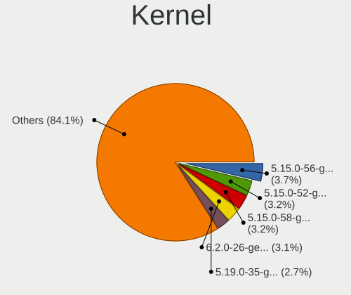

| Version           | Desktops | Percent |
|-------------------|----------|---------|
| 5.15.0-56-generic | 291      | 3.73%   |
| 5.15.0-52-generic | 250      | 3.21%   |
| 5.15.0-58-generic | 246      | 3.16%   |
| 6.2.0-26-generic  | 242      | 3.1%    |
| 5.19.0-35-generic | 213      | 2.73%   |
| 5.19.0-32-generic | 209      | 2.68%   |
| 5.15.0-43-generic | 205      | 2.63%   |
| 5.15.0-48-generic | 200      | 2.57%   |
| 5.15.0-47-generic | 196      | 2.51%   |
| 5.19.0-38-generic | 180      | 2.31%   |
| 6.2.0-39-generic  | 175      | 2.25%   |
| 5.19.0-41-generic | 169      | 2.17%   |
| 6.2.0-36-generic  | 162      | 2.08%   |
| 5.19.0-46-generic | 158      | 2.03%   |
| 5.15.0-53-generic | 152      | 1.95%   |
| 6.2.0-37-generic  | 138      | 1.77%   |
| 5.15.0-46-generic | 137      | 1.76%   |
| 6.5.0-35-generic  | 126      | 1.62%   |
| 6.5.0-14-generic  | 123      | 1.58%   |
| 5.15.0-25-generic | 123      | 1.58%   |
| 6.5.0-26-generic  | 122      | 1.57%   |
| 6.5.0-28-generic  | 119      | 1.53%   |
| 5.19.0-43-generic | 107      | 1.37%   |
| 6.2.0-34-generic  | 106      | 1.36%   |
| 6.8.0-40-generic  | 103      | 1.32%   |
| 5.15.0-27-generic | 102      | 1.31%   |
| 5.15.0-60-generic | 98       | 1.26%   |
| 6.5.0-21-generic  | 97       | 1.24%   |
| 6.2.0-33-generic  | 94       | 1.21%   |
| 5.15.0-41-generic | 93       | 1.19%   |
| 6.2.0-35-generic  | 92       | 1.18%   |
| 6.2.0-32-generic  | 92       | 1.18%   |
| 5.15.0-40-generic | 92       | 1.18%   |
| 6.5.0-15-generic  | 85       | 1.09%   |
| 5.15.0-57-generic | 85       | 1.09%   |
| 5.15.0-50-generic | 82       | 1.05%   |
| 6.5.0-27-generic  | 81       | 1.04%   |
| 6.8.0-52-generic  | 79       | 1.01%   |
| 6.5.0-41-generic  | 77       | 0.99%   |
| 5.19.0-45-generic | 73       | 0.94%   |

Kernel Family
-------------

Linux kernel without a distro release

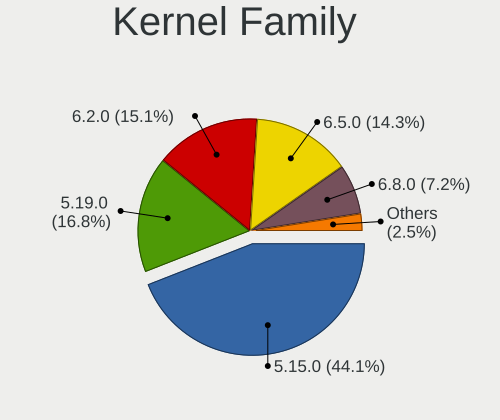

| Version | Desktops | Percent |
|---------|----------|---------|
| 5.15.0  | 3110     | 44.05%  |
| 5.19.0  | 1187     | 16.81%  |
| 6.2.0   | 1069     | 15.14%  |
| 6.5.0   | 1008     | 14.28%  |
| 6.8.0   | 509      | 7.21%   |
| 5.17.0  | 20       | 0.28%   |
| 5.13.0  | 15       | 0.21%   |
| 6.1.0   | 13       | 0.18%   |
| 6.0.0   | 6        | 0.08%   |
| 5.18.0  | 5        | 0.07%   |
| 5.10.60 | 4        | 0.06%   |
| 6.2.16  | 3        | 0.04%   |
| 6.0.1   | 3        | 0.04%   |
| 5.8.0   | 3        | 0.04%   |
| 5.18.10 | 3        | 0.04%   |
| 5.17.7  | 3        | 0.04%   |
| 6.9.3   | 2        | 0.03%   |
| 6.9.0   | 2        | 0.03%   |
| 6.8.1   | 2        | 0.03%   |
| 6.7.0   | 2        | 0.03%   |
| 6.6.8   | 2        | 0.03%   |
| 6.4.6   | 2        | 0.03%   |
| 6.4.3   | 2        | 0.03%   |
| 6.4.12  | 2        | 0.03%   |
| 6.4.0   | 2        | 0.03%   |
| 6.3.0   | 2        | 0.03%   |
| 6.2.2   | 2        | 0.03%   |
| 6.2.11  | 2        | 0.03%   |
| 6.1.11  | 2        | 0.03%   |
| 6.0.9   | 2        | 0.03%   |
| 5.19.5  | 2        | 0.03%   |
| 5.19.17 | 2        | 0.03%   |
| 5.17.9  | 2        | 0.03%   |
| 5.16.0  | 2        | 0.03%   |
| 5.15.13 | 2        | 0.03%   |
| 5.14.0  | 2        | 0.03%   |
| 6.8.7   | 1        | 0.01%   |
| 6.8.4   | 1        | 0.01%   |
| 6.7.9   | 1        | 0.01%   |
| 6.6.9   | 1        | 0.01%   |

Kernel Major Ver.
-----------------

Linux kernel major version

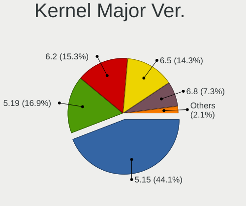

| Version | Desktops | Percent |
|---------|----------|---------|
| 5.15    | 3115     | 44.13%  |
| 5.19    | 1192     | 16.89%  |
| 6.2     | 1081     | 15.32%  |
| 6.5     | 1009     | 14.3%   |
| 6.8     | 513      | 7.27%   |
| 5.17    | 30       | 0.43%   |
| 6.1     | 25       | 0.35%   |
| 5.13    | 15       | 0.21%   |
| 6.0     | 13       | 0.18%   |
| 5.18    | 13       | 0.18%   |
| 6.4     | 12       | 0.17%   |
| 6.6     | 6        | 0.09%   |
| 6.3     | 6        | 0.09%   |
| 6.9     | 4        | 0.06%   |
| 5.10    | 4        | 0.06%   |
| 6.7     | 3        | 0.04%   |
| 5.8     | 3        | 0.04%   |
| 5.16    | 3        | 0.04%   |
| 6.15    | 2        | 0.03%   |
| 5.14    | 2        | 0.03%   |
| 5.11    | 2        | 0.03%   |
| 6.16    | 1        | 0.01%   |
| 6.12    | 1        | 0.01%   |
| 6.10    | 1        | 0.01%   |
| 5.4     | 1        | 0.01%   |
| 5.2     | 1        | 0.01%   |

Arch
----

OS architecture (x86_64, i586, etc.)

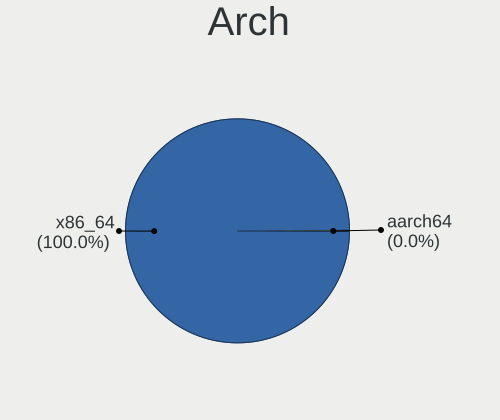

| Name    | Desktops | Percent |
|---------|----------|---------|
| x86_64  | 6591     | 99.95%  |
| riscv64 | 1        | 0.02%   |
| armv7l  | 1        | 0.02%   |
| aarch64 | 1        | 0.02%   |

DE
--

Desktop Environment

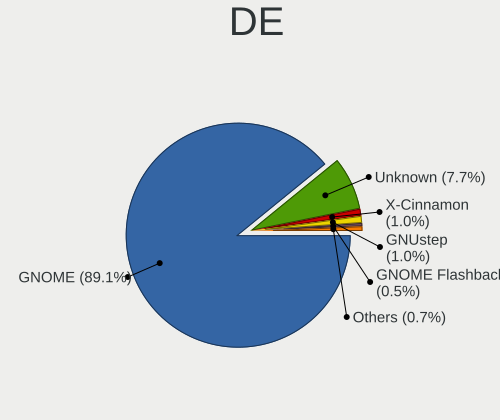

| Name            | Desktops | Percent |
|-----------------|----------|---------|
| GNOME           | 5888     | 89.12%  |
| Unknown         | 508      | 7.69%   |
| X-Cinnamon      | 68       | 1.03%   |
| GNUstep         | 67       | 1.01%   |
| GNOME Flashback | 31       | 0.47%   |
| Enlightenment   | 14       | 0.21%   |
| GNOME Classic   | 13       | 0.2%    |
| i3              | 7        | 0.11%   |
| openbox         | 2        | 0.03%   |
| Cinnamon        | 2        | 0.03%   |
| awesome         | 2        | 0.03%   |
| xmonad          | 1        | 0.02%   |
| ubuntu=GNOME    | 1        | 0.02%   |
| ubuntu          | 1        | 0.02%   |
| INPT            | 1        | 0.02%   |
| i3-with-shmlog  | 1        | 0.02%   |

Display Server
--------------

X11 or Wayland

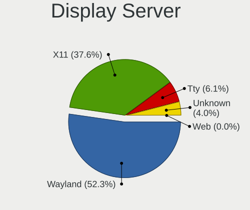

| Name    | Desktops | Percent |
|---------|----------|---------|
| Wayland | 3532     | 52.28%  |
| X11     | 2542     | 37.63%  |
| Tty     | 411      | 6.08%   |
| Unknown | 269      | 3.98%   |
| Web     | 2        | 0.03%   |

Display Manager
---------------

SDDM, LightDM, etc.

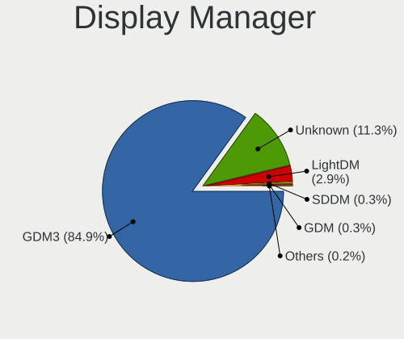

| Name    | Desktops | Percent |
|---------|----------|---------|
| GDM3    | 5635     | 84.94%  |
| Unknown | 750      | 11.31%  |
| LightDM | 192      | 2.89%   |
| SDDM    | 22       | 0.33%   |
| GDM     | 21       | 0.32%   |
| SLiM    | 10       | 0.15%   |
| XDM     | 2        | 0.03%   |
| LXDM    | 2        | 0.03%   |

OS Lang
-------

Language

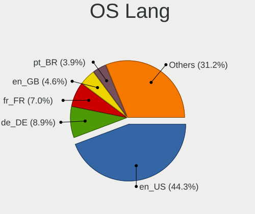

| Lang    | Desktops | Percent |
|---------|----------|---------|
| en_US   | 2930     | 44.27%  |
| de_DE   | 591      | 8.93%   |
| fr_FR   | 466      | 7.04%   |
| en_GB   | 305      | 4.61%   |
| pt_BR   | 260      | 3.93%   |
| it_IT   | 201      | 3.04%   |
| en_CA   | 183      | 2.76%   |
| ru_RU   | 158      | 2.39%   |
| C       | 152      | 2.3%    |
| es_ES   | 139      | 2.1%    |
| en_AU   | 107      | 1.62%   |
| en_IN   | 105      | 1.59%   |
| Unknown | 88       | 1.33%   |
| pl_PL   | 83       | 1.25%   |
| nl_NL   | 70       | 1.06%   |
| ja_JP   | 54       | 0.82%   |
| zh_CN   | 50       | 0.76%   |
| de_AT   | 43       | 0.65%   |
| es_AR   | 42       | 0.63%   |
| cs_CZ   | 42       | 0.63%   |
| es_MX   | 41       | 0.62%   |
| en_ZA   | 32       | 0.48%   |
| sv_SE   | 30       | 0.45%   |
| hu_HU   | 28       | 0.42%   |
| fi_FI   | 24       | 0.36%   |
| pt_PT   | 22       | 0.33%   |
| tr_TR   | 20       | 0.3%    |
| el_GR   | 19       | 0.29%   |
| en_NZ   | 18       | 0.27%   |
| de_CH   | 18       | 0.27%   |
| fr_CA   | 17       | 0.26%   |
| en_PH   | 16       | 0.24%   |
| zh_TW   | 15       | 0.23%   |
| fr_BE   | 15       | 0.23%   |
| es_CO   | 15       | 0.23%   |
| sk_SK   | 14       | 0.21%   |
| ko_KR   | 13       | 0.2%    |
| nl_BE   | 12       | 0.18%   |
| es_CL   | 11       | 0.17%   |
| es_VE   | 10       | 0.15%   |

Boot Mode
---------

EFI or BIOS

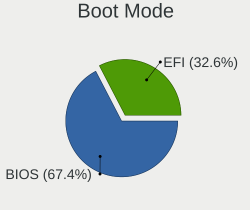

| Mode | Desktops | Percent |
|------|----------|---------|
| BIOS | 4502     | 67.38%  |
| EFI  | 2180     | 32.62%  |

Filesystem
----------

Type of filesystem

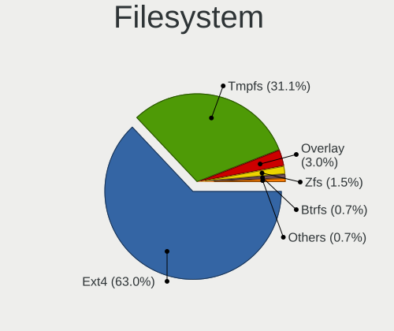

| Type          | Desktops | Percent |
|---------------|----------|---------|
| Ext4          | 4281     | 62.97%  |
| Tmpfs         | 2114     | 31.1%   |
| Overlay       | 204      | 3%      |
| Zfs           | 100      | 1.47%   |
| Btrfs         | 50       | 0.74%   |
| Xfs           | 26       | 0.38%   |
| Ext2          | 10       | 0.15%   |
| Unknown       | 6        | 0.09%   |
| Ext3          | 4        | 0.06%   |
| XXXX          | 1        | 0.01%   |
| Jfs           | 1        | 0.01%   |
| Fuse.snapfuse | 1        | 0.01%   |

Part. scheme
------------

Scheme of partitioning

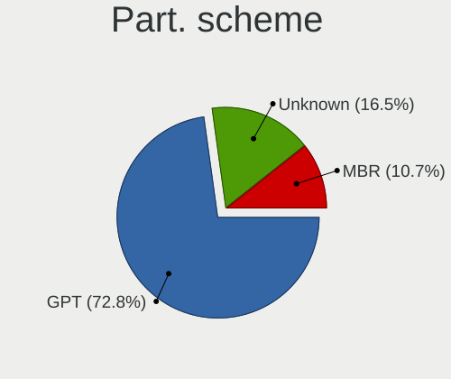

| Type    | Desktops | Percent |
|---------|----------|---------|
| GPT     | 4933     | 72.81%  |
| Unknown | 1120     | 16.53%  |
| MBR     | 722      | 10.66%  |

Dual Boot with Linux/BSD
------------------------

Hosting more than one Linux/BSD

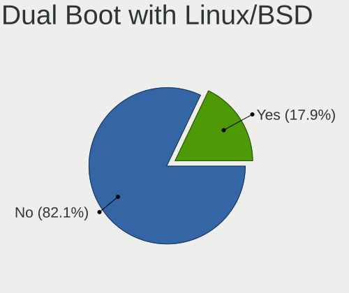

| Dual boot | Desktops | Percent |
|-----------|----------|---------|
| No        | 5518     | 82.09%  |
| Yes       | 1204     | 17.91%  |

Dual Boot (Win)
---------------

Hosting Linux and Windows

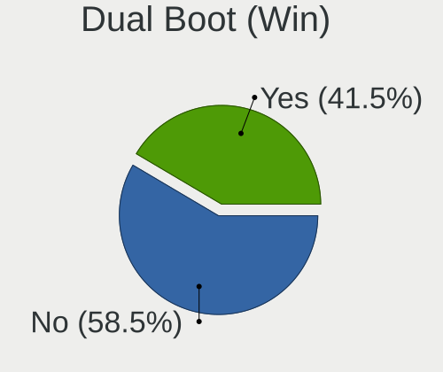

| Dual boot | Desktops | Percent |
|-----------|----------|---------|
| No        | 3913     | 58.5%   |
| Yes       | 2776     | 41.5%   |

Board
-----

Vendor
------

Motherboard manufacturer

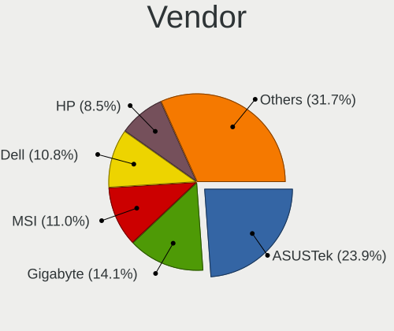

| Name                                 | Desktops | Percent |
|--------------------------------------|----------|---------|
| ASUSTek Computer                     | 1573     | 23.86%  |
| Gigabyte Technology                  | 931      | 14.12%  |
| MSI                                  | 727      | 11.03%  |
| Dell                                 | 711      | 10.78%  |
| Hewlett-Packard                      | 561      | 8.51%   |
| ASRock                               | 530      | 8.04%   |
| Lenovo                               | 262      | 3.97%   |
| Intel                                | 190      | 2.88%   |
| Unknown                              | 117      | 1.77%   |
| Acer                                 | 114      | 1.73%   |
| Fujitsu                              | 98       | 1.49%   |
| Supermicro                           | 65       | 0.99%   |
| Foxconn                              | 57       | 0.86%   |
| Pegatron                             | 51       | 0.77%   |
| Medion                               | 46       | 0.7%    |
| Biostar                              | 45       | 0.68%   |
| AZW                                  | 38       | 0.58%   |
| Apple                                | 35       | 0.53%   |
| ECS                                  | 28       | 0.42%   |
| Inspur                               | 24       | 0.36%   |
| Alienware                            | 24       | 0.36%   |
| Huanan                               | 21       | 0.32%   |
| Shuttle                              | 20       | 0.3%    |
| Gateway                              | 13       | 0.2%    |
| BESSTAR Tech                         | 13       | 0.2%    |
| AMI                                  | 13       | 0.2%    |
| Positivo                             | 12       | 0.18%   |
| Packard Bell                         | 12       | 0.18%   |
| Shenzhen Meigao Electronic Equipment | 11       | 0.17%   |
| MACHINIST                            | 11       | 0.17%   |
| OEM                                  | 10       | 0.15%   |
| Inventec                             | 9        | 0.14%   |
| Google                               | 8        | 0.12%   |
| eMachines                            | 8        | 0.12%   |
| HC Technology.                       | 7        | 0.11%   |
| ASRockRack                           | 7        | 0.11%   |
| System76                             | 6        | 0.09%   |
| PCWare                               | 6        | 0.09%   |
| Maxtang                              | 5        | 0.08%   |
| Fujitsu Siemens                      | 5        | 0.08%   |

Model
-----

Motherboard model

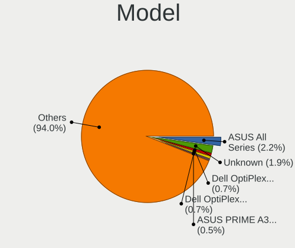

| Name                         | Desktops | Percent |
|------------------------------|----------|---------|
| ASUS All Series              | 145      | 2.2%    |
| Unknown                      | 125      | 1.9%    |
| Dell OptiPlex 7010           | 49       | 0.74%   |
| Dell OptiPlex 9020           | 43       | 0.65%   |
| ASUS PRIME A320M-K           | 32       | 0.49%   |
| ASUS TUF Gaming X570-PLUS    | 27       | 0.41%   |
| MSI MS-7C91                  | 25       | 0.38%   |
| MSI MS-7C37                  | 25       | 0.38%   |
| Dell OptiPlex 3020           | 25       | 0.38%   |
| Dell OptiPlex 3050           | 24       | 0.36%   |
| Inspur SA5248M4              | 23       | 0.35%   |
| Dell OptiPlex 790            | 23       | 0.35%   |
| MSI MS-7721                  | 22       | 0.33%   |
| Dell OptiPlex 7050           | 22       | 0.33%   |
| ASUS ROG STRIX B550-F GAMING | 20       | 0.3%    |
| ASRock B450M Pro4            | 20       | 0.3%    |
| Dell OptiPlex 7040           | 19       | 0.29%   |
| ASUS PRIME Z590-P            | 19       | 0.29%   |
| MSI MS-7C52                  | 18       | 0.27%   |
| Intel H61                    | 18       | 0.27%   |
| Gigabyte B450M DS3H          | 18       | 0.27%   |
| Dell OptiPlex 990            | 18       | 0.27%   |
| HP EliteDesk 800 G1 SFF      | 17       | 0.26%   |
| HP Compaq 8200 Elite SFF PC  | 17       | 0.26%   |
| ASUS PRIME X570-PRO          | 17       | 0.26%   |
| ASUS PRIME B550M-A           | 17       | 0.26%   |
| MSI MS-7C56                  | 16       | 0.24%   |
| MSI MS-7C02                  | 16       | 0.24%   |
| HP ProDesk 600 G1 SFF        | 16       | 0.24%   |
| Gigabyte B550M DS3H          | 16       | 0.24%   |
| Dell OptiPlex 780            | 16       | 0.24%   |
| Gigabyte A320M-S2H           | 15       | 0.23%   |
| Dell Precision Tower 5810    | 15       | 0.23%   |
| ASUS M5A97 R2.0              | 15       | 0.23%   |
| ASUS M5A78L-M/USB3           | 15       | 0.23%   |
| ASRock A320M-HDV R4.0        | 15       | 0.23%   |
| HP Compaq Elite 8300 SFF     | 14       | 0.21%   |
| Dell OptiPlex 755            | 14       | 0.21%   |
| MSI MS-7B86                  | 13       | 0.2%    |
| Intel X99                    | 13       | 0.2%    |

Model Family
------------

Motherboard model prefix

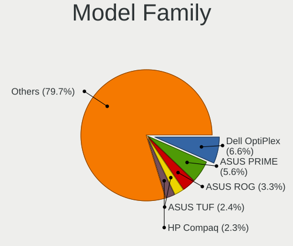

| Name                | Desktops | Percent |
|---------------------|----------|---------|
| Dell OptiPlex       | 436      | 6.61%   |
| ASUS PRIME          | 366      | 5.55%   |
| ASUS ROG            | 219      | 3.32%   |
| ASUS TUF            | 161      | 2.44%   |
| HP Compaq           | 154      | 2.34%   |
| Lenovo ThinkCentre  | 149      | 2.26%   |
| ASUS All            | 145      | 2.2%    |
| Unknown             | 125      | 1.9%    |
| Dell Precision      | 123      | 1.87%   |
| HP EliteDesk        | 93       | 1.41%   |
| HP ProDesk          | 75       | 1.14%   |
| Acer Aspire         | 68       | 1.03%   |
| Dell Inspiron       | 67       | 1.02%   |
| Fujitsu ESPRIMO     | 66       | 1%      |
| Gigabyte B450M      | 40       | 0.61%   |
| Lenovo ThinkStation | 39       | 0.59%   |
| Gigabyte B550M      | 38       | 0.58%   |
| Gigabyte X570       | 32       | 0.49%   |
| ASUS M5A78L-M       | 32       | 0.49%   |
| ASRock B450M        | 32       | 0.49%   |
| ASUS M5A97          | 30       | 0.45%   |
| Gigabyte Z390       | 29       | 0.44%   |
| Dell XPS            | 29       | 0.44%   |
| Lenovo IdeaCentre   | 28       | 0.42%   |
| Gigabyte B550       | 28       | 0.42%   |
| ASUS Pro            | 27       | 0.41%   |
| Dell Vostro         | 26       | 0.39%   |
| MSI MS-7C91         | 25       | 0.38%   |
| MSI MS-7C37         | 25       | 0.38%   |
| HP ProLiant         | 24       | 0.36%   |
| HP Pavilion         | 24       | 0.36%   |
| ASUS P8H61-M        | 24       | 0.36%   |
| Inspur SA5248M4     | 23       | 0.35%   |
| Acer Veriton        | 23       | 0.35%   |
| MSI MS-7721         | 22       | 0.33%   |
| Fujitsu CELSIUS     | 21       | 0.32%   |
| ASRock X570         | 21       | 0.32%   |
| Gigabyte B450       | 20       | 0.3%    |
| Intel H61           | 19       | 0.29%   |
| MSI MS-7C52         | 18       | 0.27%   |

MFG Year
--------

Motherboard manufacture year

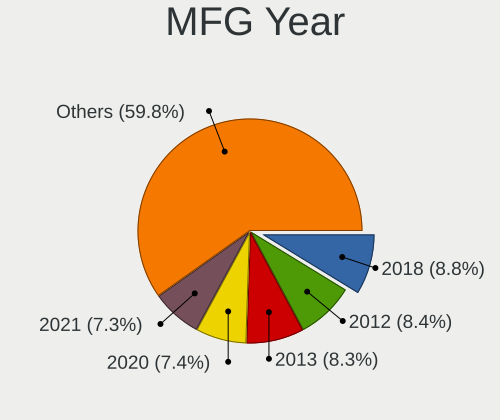

| Year    | Desktops | Percent |
|---------|----------|---------|
| 2018    | 577      | 8.75%   |
| 2012    | 556      | 8.43%   |
| 2013    | 550      | 8.34%   |
| 2020    | 487      | 7.39%   |
| 2021    | 479      | 7.26%   |
| 2014    | 441      | 6.69%   |
| 2019    | 431      | 6.54%   |
| 2022    | 418      | 6.34%   |
| 2011    | 399      | 6.05%   |
| 2017    | 398      | 6.04%   |
| 2015    | 364      | 5.52%   |
| 2010    | 315      | 4.78%   |
| 2009    | 277      | 4.2%    |
| 2016    | 272      | 4.12%   |
| 2023    | 240      | 3.64%   |
| 2008    | 177      | 2.68%   |
| 2007    | 107      | 1.62%   |
| 2024    | 41       | 0.62%   |
| 2006    | 40       | 0.61%   |
| Unknown | 11       | 0.17%   |
| 2005    | 8        | 0.12%   |
| 2025    | 5        | 0.08%   |
| 2004    | 1        | 0.02%   |

Form Factor
-----------

Physical design of the computer

| Name    | Desktops | Percent |
|---------|----------|---------|
| Desktop | 6594     | 100%    |

Secure Boot
-----------

Enabled or disabled

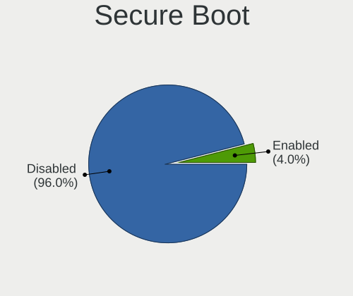

| State    | Desktops | Percent |
|----------|----------|---------|
| Disabled | 6341     | 95.99%  |
| Enabled  | 265      | 4.01%   |

Coreboot
--------

Have coreboot on board

| Used | Desktops | Percent |
|------|----------|---------|
| No   | 6583     | 99.83%  |
| Yes  | 11       | 0.17%   |

RAM Size
--------

Total RAM memory

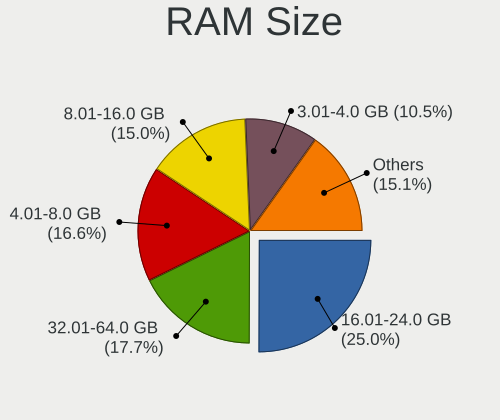

| Size in GB      | Desktops | Percent |
|-----------------|----------|---------|
| 16.01-24.0      | 1681     | 25.05%  |
| 32.01-64.0      | 1187     | 17.69%  |
| 4.01-8.0        | 1113     | 16.58%  |
| 8.01-16.0       | 1007     | 15.01%  |
| 3.01-4.0        | 707      | 10.53%  |
| 64.01-256.0     | 617      | 9.19%   |
| 24.01-32.0      | 235      | 3.5%    |
| 1.01-2.0        | 73       | 1.09%   |
| More than 256.0 | 56       | 0.83%   |
| 2.01-3.0        | 30       | 0.45%   |
| 0.51-1.0        | 3        | 0.04%   |
| 0.01-0.5        | 2        | 0.03%   |

RAM Used
--------

Used RAM memory

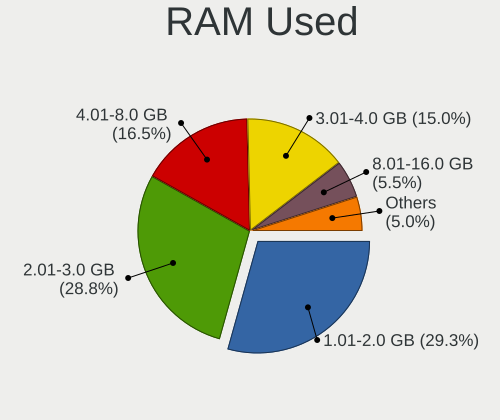

| Used GB     | Desktops | Percent |
|-------------|----------|---------|
| 1.01-2.0    | 2108     | 29.33%  |
| 2.01-3.0    | 2070     | 28.8%   |
| 4.01-8.0    | 1185     | 16.49%  |
| 3.01-4.0    | 1076     | 14.97%  |
| 8.01-16.0   | 392      | 5.45%   |
| 0.51-1.0    | 155      | 2.16%   |
| 16.01-24.0  | 76       | 1.06%   |
| 24.01-32.0  | 43       | 0.6%    |
| 0.01-0.5    | 31       | 0.43%   |
| 64.01-256.0 | 26       | 0.36%   |
| 32.01-64.0  | 25       | 0.35%   |

Total Drives
------------

Number of drives on board

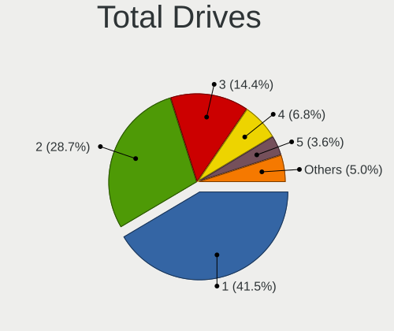

| Drives | Desktops | Percent |
|--------|----------|---------|
| 1      | 2831     | 41.48%  |
| 2      | 1957     | 28.67%  |
| 3      | 982      | 14.39%  |
| 4      | 467      | 6.84%   |
| 5      | 249      | 3.65%   |
| 6      | 113      | 1.66%   |
| 0      | 69       | 1.01%   |
| 7      | 60       | 0.88%   |
| 8      | 26       | 0.38%   |
| 9      | 23       | 0.34%   |
| 10     | 11       | 0.16%   |
| 13     | 9        | 0.13%   |
| 11     | 9        | 0.13%   |
| 14     | 5        | 0.07%   |
| 12     | 4        | 0.06%   |
| 25     | 3        | 0.04%   |
| 38     | 1        | 0.01%   |
| 23     | 1        | 0.01%   |
| 21     | 1        | 0.01%   |
| 20     | 1        | 0.01%   |
| 19     | 1        | 0.01%   |
| 17     | 1        | 0.01%   |
| 15     | 1        | 0.01%   |

Has CD-ROM
----------

Has CD-ROM on board

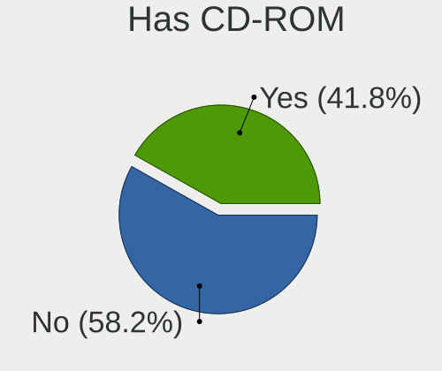

| Presented | Desktops | Percent |
|-----------|----------|---------|
| No        | 3863     | 58.16%  |
| Yes       | 2779     | 41.84%  |

Has Ethernet
------------

Has Ethernet on board

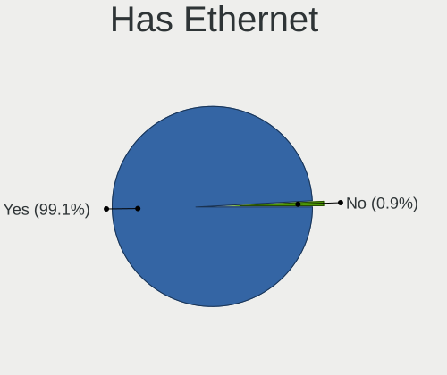

| Presented | Desktops | Percent |
|-----------|----------|---------|
| Yes       | 6538     | 99.14%  |
| No        | 57       | 0.86%   |

Has WiFi
--------

Has WiFi module

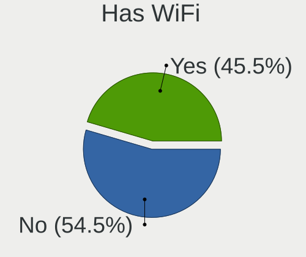

| Presented | Desktops | Percent |
|-----------|----------|---------|
| No        | 3632     | 54.53%  |
| Yes       | 3029     | 45.47%  |

Has Bluetooth
-------------

Has Bluetooth module

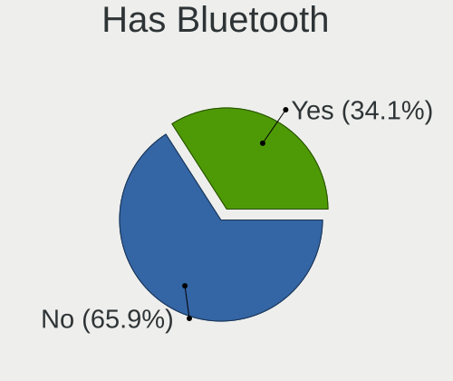

| Presented | Desktops | Percent |
|-----------|----------|---------|
| No        | 4391     | 65.91%  |
| Yes       | 2271     | 34.09%  |

Location
--------

Country
-------

Geographic location (country)

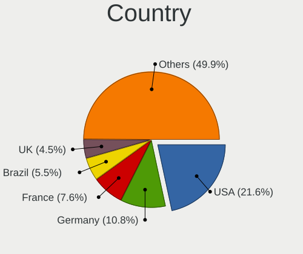

| Country      | Desktops | Percent |
|--------------|----------|---------|
| USA          | 1430     | 21.64%  |
| Germany      | 714      | 10.8%   |
| France       | 503      | 7.61%   |
| Brazil       | 365      | 5.52%   |
| UK           | 300      | 4.54%   |
| Russia       | 296      | 4.48%   |
| Italy        | 251      | 3.8%    |
| Canada       | 248      | 3.75%   |
| Spain        | 184      | 2.78%   |
| Switzerland  | 168      | 2.54%   |
| Netherlands  | 126      | 1.91%   |
| India        | 124      | 1.88%   |
| Australia    | 123      | 1.86%   |
| Poland       | 110      | 1.66%   |
| Austria      | 82       | 1.24%   |
| Sweden       | 75       | 1.13%   |
| Mexico       | 73       | 1.1%    |
| Japan        | 71       | 1.07%   |
| Argentina    | 69       | 1.04%   |
| Belgium      | 65       | 0.98%   |
| China        | 63       | 0.95%   |
| Finland      | 59       | 0.89%   |
| Czechia      | 57       | 0.86%   |
| Hungary      | 56       | 0.85%   |
| Turkey       | 50       | 0.76%   |
| Romania      | 45       | 0.68%   |
| Greece       | 45       | 0.68%   |
| South Africa | 39       | 0.59%   |
| Bulgaria     | 39       | 0.59%   |
| Slovakia     | 35       | 0.53%   |
| Portugal     | 35       | 0.53%   |
| Norway       | 33       | 0.5%    |
| Taiwan       | 29       | 0.44%   |
| South Korea  | 27       | 0.41%   |
| Hong Kong    | 27       | 0.41%   |
| Colombia     | 26       | 0.39%   |
| Serbia       | 25       | 0.38%   |
| Thailand     | 23       | 0.35%   |
| New Zealand  | 23       | 0.35%   |
| Iran         | 22       | 0.33%   |

City
----

Geographic location (city)

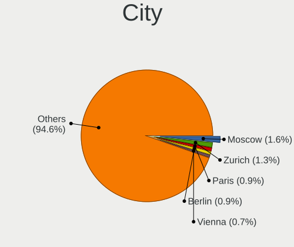

| City              | Desktops | Percent |
|-------------------|----------|---------|
| Moscow            | 110      | 1.59%   |
| Zurich            | 89       | 1.29%   |
| Paris             | 63       | 0.91%   |
| Berlin            | 61       | 0.88%   |
| Vienna            | 48       | 0.69%   |
| Sydney            | 44       | 0.64%   |
| St Petersburg     | 37       | 0.53%   |
| Sao Paulo         | 36       | 0.52%   |
| Milan             | 36       | 0.52%   |
| Madrid            | 35       | 0.51%   |
| Hamburg           | 31       | 0.45%   |
| Toronto           | 30       | 0.43%   |
| Rio de Janeiro    | 30       | 0.43%   |
| Budapest          | 29       | 0.42%   |
| Helsinki          | 28       | 0.4%    |
| Rome              | 27       | 0.39%   |
| San Jose          | 26       | 0.38%   |
| New York          | 25       | 0.36%   |
| Munich            | 25       | 0.36%   |
| Amsterdam         | 25       | 0.36%   |
| Warsaw            | 24       | 0.35%   |
| Prague            | 24       | 0.35%   |
| Cheboksary        | 24       | 0.35%   |
| Athens            | 24       | 0.35%   |
| Los Angeles       | 23       | 0.33%   |
| London            | 22       | 0.32%   |
| Barcelona         | 22       | 0.32%   |
| Melbourne         | 21       | 0.3%    |
| Istanbul          | 21       | 0.3%    |
| Sofia             | 20       | 0.29%   |
| Stockholm         | 19       | 0.27%   |
| Singapore         | 18       | 0.26%   |
| Seattle           | 18       | 0.26%   |
| Lucerne           | 18       | 0.26%   |
| Frankfurt am Main | 18       | 0.26%   |
| Brisbane          | 18       | 0.26%   |
| Dallas            | 17       | 0.25%   |
| Bucharest         | 17       | 0.25%   |
| Bengaluru         | 17       | 0.25%   |
| Tehran            | 16       | 0.23%   |

Drives
------

Drive Vendor
------------

Hard drive vendors

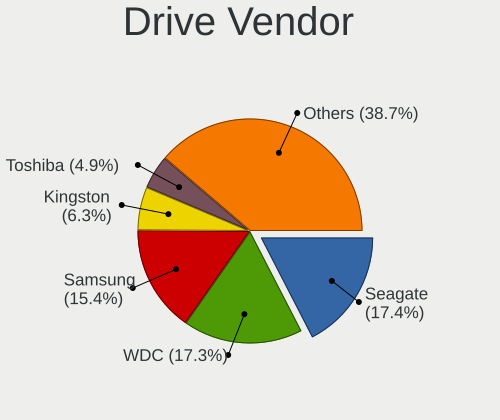

| Vendor                      | Desktops | Drives | Percent |
|-----------------------------|----------|--------|---------|
| Seagate                     | 2012     | 3410   | 17.43%  |
| WDC                         | 1996     | 3358   | 17.29%  |
| Samsung Electronics         | 1777     | 2821   | 15.39%  |
| Kingston                    | 724      | 920    | 6.27%   |
| Toshiba                     | 563      | 760    | 4.88%   |
| SanDisk                     | 552      | 794    | 4.78%   |
| Crucial                     | 500      | 792    | 4.33%   |
| Hitachi                     | 326      | 449    | 2.82%   |
| Intel                       | 202      | 364    | 1.75%   |
| A-DATA Technology           | 159      | 197    | 1.38%   |
| Unknown                     | 152      | 268    | 1.32%   |
| China                       | 148      | 178    | 1.28%   |
| HGST                        | 122      | 220    | 1.06%   |
| Phison Electronics          | 119      | 163    | 1.03%   |
| SK hynix                    | 112      | 145    | 0.97%   |
| Micron/Crucial Technology   | 100      | 133    | 0.87%   |
| PNY                         | 96       | 117    | 0.83%   |
| Kingston Technology Company | 96       | 117    | 0.83%   |
| Silicon Motion              | 95       | 130    | 0.82%   |
| Intenso                     | 83       | 110    | 0.72%   |
| Micron Technology           | 81       | 107    | 0.7%    |
| SPCC                        | 69       | 108    | 0.6%    |
| Phison                      | 58       | 114    | 0.5%    |
| Lexar                       | 57       | 66     | 0.49%   |
| Patriot                     | 50       | 61     | 0.43%   |
| OCZ                         | 49       | 72     | 0.42%   |
| Unknown                     | 47       | 51     | 0.41%   |
| Corsair                     | 46       | 56     | 0.4%    |
| Maxtor                      | 43       | 58     | 0.37%   |
| MAXIO Technology (Hangzhou) | 41       | 51     | 0.36%   |
| Hewlett-Packard             | 40       | 107    | 0.35%   |
| Team                        | 39       | 56     | 0.34%   |
| Gigabyte Technology         | 37       | 48     | 0.32%   |
| ADATA Technology            | 37       | 48     | 0.32%   |
| Transcend                   | 36       | 37     | 0.31%   |
| Realtek Semiconductor       | 29       | 37     | 0.25%   |
| JMicron Technology          | 27       | 28     | 0.23%   |
| KIOXIA                      | 25       | 41     | 0.22%   |
| KingSpec                    | 25       | 28     | 0.22%   |
| ASMT                        | 25       | 41     | 0.22%   |

Drive Model
-----------

Hard drive models

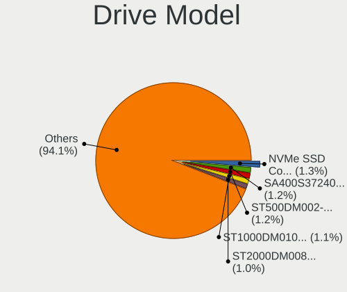

| Model                                                 | Desktops | Percent |
|-------------------------------------------------------|----------|---------|
| Samsung NVMe SSD Controller SM981/PM981/PM983 1TB     | 179      | 1.34%   |
| Kingston SA400S37240G 240GB SSD                       | 160      | 1.2%    |
| Seagate ST500DM002-1BD142 500GB                       | 159      | 1.19%   |
| Seagate ST1000DM010-2EP102 1TB                        | 150      | 1.12%   |
| Seagate ST2000DM008-2FR102 2TB                        | 139      | 1.04%   |
| Kingston SA400S37480G 480GB SSD                       | 119      | 0.89%   |
| Samsung SSD 850 EVO 250GB                             | 106      | 0.79%   |
| Samsung SSD 860 EVO 500GB                             | 98       | 0.73%   |
| Toshiba DT01ACA100 1TB                                | 96       | 0.72%   |
| Samsung SSD 850 EVO 500GB                             | 86       | 0.64%   |
| WDC WD10EZEX-08WN4A0 1TB                              | 84       | 0.63%   |
| Seagate ST4000DM004-2CV104 4TB                        | 80       | 0.6%    |
| Seagate ST1000DM003-1CH162 1TB                        | 80       | 0.6%    |
| Samsung NVMe SSD Controller PM9A1/PM9A3/980PRO 1TB    | 80       | 0.6%    |
| Samsung SSD 980 PRO 1TB                               | 79       | 0.59%   |
| Crucial CT500MX500SSD1 500GB                          | 75       | 0.56%   |
| Crucial CT1000MX500SSD1 1TB                           | 68       | 0.51%   |
| Seagate ST1000DM003-1ER162 1TB                        | 63       | 0.47%   |
| Micron/Crucial P2 NVMe PCIe SSD 2TB                   | 63       | 0.47%   |
| Unknown SD/MMC/MS PRO 2GB                             | 60       | 0.45%   |
| Silicon Motion SM2263EN/SM2263XT SSD Controller 512GB | 59       | 0.44%   |
| Toshiba DT01ACA050 500GB                              | 58       | 0.43%   |
| Kingston SA400S37120G 120GB SSD                       | 58       | 0.43%   |
| Toshiba HDWD110 1TB                                   | 55       | 0.41%   |
| Crucial CT240BX500SSD1 240GB                          | 55       | 0.41%   |
| SanDisk NVMe SSD Drive 1TB                            | 53       | 0.4%    |
| Samsung SSD 870 EVO 500GB                             | 53       | 0.4%    |
| Samsung SSD 860 EVO 1TB                               | 53       | 0.4%    |
| Seagate ST1000DM003-1SB102 1TB                        | 49       | 0.37%   |
| Unknown                                               | 47       | 0.35%   |
| Samsung SSD 980 1TB                                   | 46       | 0.34%   |
| Kingston SV300S37A120G 120GB SSD                      | 46       | 0.34%   |
| Toshiba DT01ACA200 2TB                                | 44       | 0.33%   |
| Seagate ST2000DM001-1ER164 2TB                        | 44       | 0.33%   |
| Samsung SSD 860 EVO 250GB                             | 44       | 0.33%   |
| Samsung SSD 870 QVO 1TB                               | 42       | 0.31%   |
| Seagate ST3500418AS 500GB                             | 41       | 0.31%   |
| Seagate ST2000DM001-1CH164 2TB                        | 41       | 0.31%   |
| Samsung SSD 870 EVO 1TB                               | 40       | 0.3%    |
| Seagate ST31000528AS 1TB                              | 39       | 0.29%   |

HDD Vendor
----------

Hard disk drive vendors

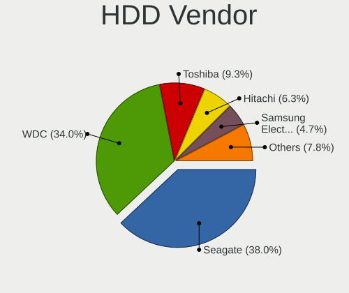

| Vendor              | Desktops | Drives | Percent |
|---------------------|----------|--------|---------|
| Seagate             | 1968     | 3321   | 38.01%  |
| WDC                 | 1758     | 2950   | 33.95%  |
| Toshiba             | 483      | 646    | 9.33%   |
| Hitachi             | 324      | 447    | 6.26%   |
| Samsung Electronics | 243      | 370    | 4.69%   |
| HGST                | 122      | 216    | 2.36%   |
| Unknown             | 66       | 85     | 1.27%   |
| Maxtor              | 40       | 49     | 0.77%   |
| Fujitsu             | 24       | 38     | 0.46%   |
| JMicron Technology  | 21       | 22     | 0.41%   |
| Intenso             | 21       | 24     | 0.41%   |
| Hewlett-Packard     | 14       | 52     | 0.27%   |
| ASMT                | 14       | 19     | 0.27%   |
| Apple               | 10       | 11     | 0.19%   |
| SABRENT             | 6        | 8      | 0.12%   |
| WD MediaMax         | 5        | 6      | 0.1%    |
| External            | 5        | 5      | 0.1%    |
| ExcelStor           | 5        | 5      | 0.1%    |
| USB3.0              | 4        | 5      | 0.08%   |
| T-FORCE             | 4        | 5      | 0.08%   |
| HPE                 | 4        | 6      | 0.08%   |
| ASMedia             | 4        | 4      | 0.08%   |
| SSK                 | 3        | 3      | 0.06%   |
| SATAFIRM            | 3        | 3      | 0.06%   |
| Unknown             | 3        | 3      | 0.06%   |
| USB                 | 2        | 2      | 0.04%   |
| TDAS                | 2        | 11     | 0.04%   |
| QUANTUM             | 2        | 2      | 0.04%   |
| MaxDigital          | 2        | 2      | 0.04%   |
| MARVELL             | 2        | 2      | 0.04%   |
| LaCie               | 2        | 3      | 0.04%   |
| Inateck             | 2        | 2      | 0.04%   |
| TO Exter            | 1        | 2      | 0.02%   |
| Shenzhen            | 1        | 1      | 0.02%   |
| RSH-339             | 1        | 1      | 0.02%   |
| Min Yi U            | 1        | 2      | 0.02%   |
| Lenovo              | 1        | 2      | 0.02%   |
| IB-1122             | 1        | 2      | 0.02%   |
| HGST HTS            | 1        | 1      | 0.02%   |
| Dell                | 1        | 1      | 0.02%   |

SSD Vendor
----------

Solid state drive vendors

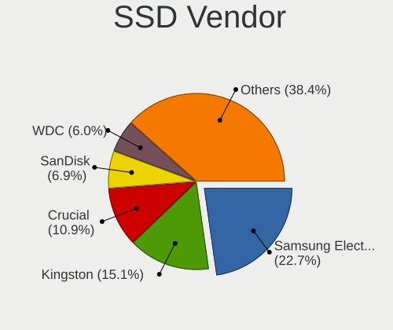

| Vendor              | Desktops | Drives | Percent |
|---------------------|----------|--------|---------|
| Samsung Electronics | 898      | 1228   | 22.75%  |
| Kingston            | 596      | 757    | 15.1%   |
| Crucial             | 430      | 654    | 10.89%  |
| SanDisk             | 273      | 398    | 6.91%   |
| WDC                 | 235      | 303    | 5.95%   |
| China               | 146      | 175    | 3.7%    |
| Intel               | 132      | 273    | 3.34%   |
| A-DATA Technology   | 130      | 166    | 3.29%   |
| PNY                 | 77       | 98     | 1.95%   |
| Toshiba             | 67       | 78     | 1.7%    |
| SPCC                | 62       | 100    | 1.57%   |
| Micron Technology   | 48       | 71     | 1.22%   |
| Intenso             | 48       | 69     | 1.22%   |
| Patriot             | 47       | 58     | 1.19%   |
| OCZ                 | 47       | 58     | 1.19%   |
| Transcend           | 34       | 35     | 0.86%   |
| Team                | 33       | 49     | 0.84%   |
| SK hynix            | 33       | 45     | 0.84%   |
| Lexar               | 32       | 38     | 0.81%   |
| Gigabyte Technology | 27       | 37     | 0.68%   |
| KingSpec            | 25       | 28     | 0.63%   |
| Corsair             | 24       | 28     | 0.61%   |
| GOODRAM             | 22       | 33     | 0.56%   |
| Unknown             | 22       | 24     | 0.56%   |
| Hewlett-Packard     | 20       | 20     | 0.51%   |
| LITEON              | 19       | 30     | 0.48%   |
| Apacer              | 18       | 19     | 0.46%   |
| SABRENT             | 16       | 19     | 0.41%   |
| Seagate             | 15       | 18     | 0.38%   |
| Netac               | 15       | 17     | 0.38%   |
| Verbatim            | 13       | 14     | 0.33%   |
| Fanxiang            | 12       | 16     | 0.3%    |
| LITEONIT            | 11       | 13     | 0.28%   |
| FORESEE             | 11       | 12     | 0.28%   |
| Emtec               | 11       | 11     | 0.28%   |
| ASMT                | 11       | 21     | 0.28%   |
| KIOXIA-EXCERIA      | 10       | 19     | 0.25%   |
| Dogfish             | 10       | 14     | 0.25%   |
| XrayDisk            | 9        | 9      | 0.23%   |
| Leven               | 9        | 24     | 0.23%   |

Drive Kind
----------

HDD or SSD

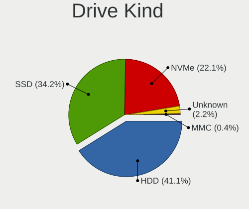

| Kind    | Desktops | Drives | Percent |
|---------|----------|--------|---------|
| HDD     | 4038     | 8343   | 41.13%  |
| SSD     | 3357     | 5371   | 34.2%   |
| NVMe    | 2165     | 3465   | 22.05%  |
| Unknown | 217      | 370    | 2.21%   |
| MMC     | 40       | 52     | 0.41%   |

Drive Connector
---------------

SATA, SAS, NVMe, etc.

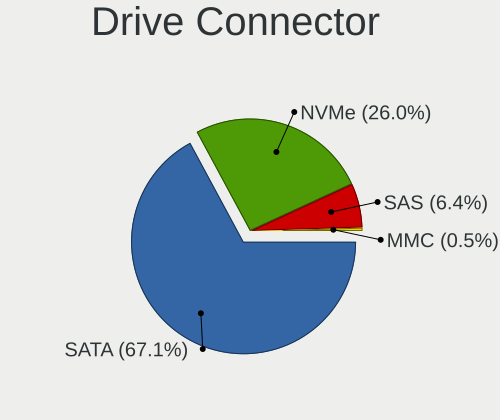

| Type | Desktops | Drives | Percent |
|------|----------|--------|---------|
| SATA | 5574     | 13157  | 67.13%  |
| NVMe | 2159     | 3442   | 26%     |
| SAS  | 530      | 950    | 6.38%   |
| MMC  | 40       | 52     | 0.48%   |

Drive Size
----------

Size of hard drive

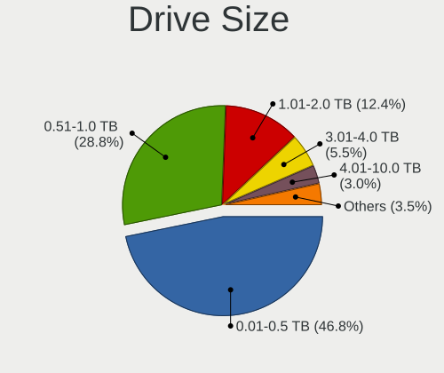

| Size in TB | Desktops | Drives | Percent |
|------------|----------|--------|---------|
| 0.01-0.5   | 3795     | 6459   | 46.78%  |
| 0.51-1.0   | 2339     | 3713   | 28.83%  |
| 1.01-2.0   | 1006     | 1617   | 12.4%   |
| 3.01-4.0   | 443      | 781    | 5.46%   |
| 4.01-10.0  | 244      | 583    | 3.01%   |
| 2.01-3.0   | 198      | 311    | 2.44%   |
| 10.01-20.0 | 84       | 246    | 1.04%   |
| 20.01-50.0 | 2        | 3      | 0.02%   |
| 0          | 1        | 1      | 0.01%   |

Space Total
-----------

Amount of disk space available on the file system

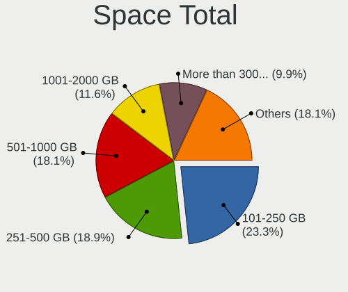

| Size in GB     | Desktops | Percent |
|----------------|----------|---------|
| 101-250        | 1605     | 23.33%  |
| 251-500        | 1301     | 18.91%  |
| 501-1000       | 1245     | 18.1%   |
| 1001-2000      | 801      | 11.64%  |
| More than 3000 | 684      | 9.94%   |
| 2001-3000      | 336      | 4.88%   |
| 51-100         | 318      | 4.62%   |
| 1-20           | 277      | 4.03%   |
| Unknown        | 194      | 2.82%   |
| 21-50          | 119      | 1.73%   |

Space Used
----------

Amount of used disk space

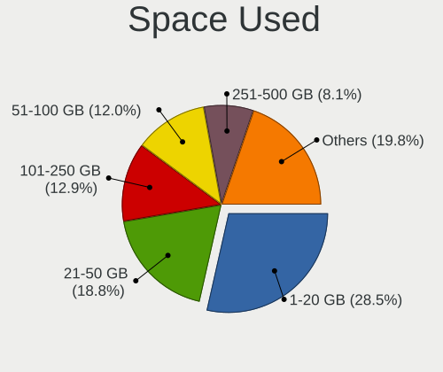

| Used GB        | Desktops | Percent |
|----------------|----------|---------|
| 1-20           | 2035     | 28.53%  |
| 21-50          | 1339     | 18.77%  |
| 101-250        | 918      | 12.87%  |
| 51-100         | 854      | 11.97%  |
| 251-500        | 576      | 8.08%   |
| 501-1000       | 487      | 6.83%   |
| 1001-2000      | 322      | 4.51%   |
| More than 3000 | 281      | 3.94%   |
| Unknown        | 194      | 2.72%   |
| 2001-3000      | 126      | 1.77%   |
| 0              | 1        | 0.01%   |

Malfunc. Drives
---------------

Drive models with a malfunction

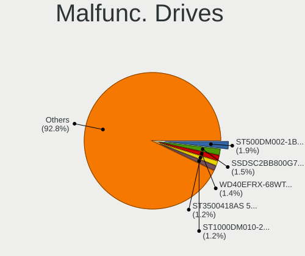

| Model                                 | Desktops | Drives | Percent |
|---------------------------------------|----------|--------|---------|
| Seagate ST500DM002-1BD142 500GB       | 11       | 11     | 1.87%   |
| Intel SSDSC2BB800G7 800GB             | 9        | 22     | 1.53%   |
| WDC WD40EFRX-68WT0N0 4TB              | 8        | 10     | 1.36%   |
| Seagate ST3500418AS 500GB             | 7        | 13     | 1.19%   |
| Seagate ST1000DM010-2EP102 1TB        | 7        | 11     | 1.19%   |
| Seagate ST1000DM003-1CH162 1TB        | 6        | 8      | 1.02%   |
| Kingston SA400S37240G 240GB SSD       | 6        | 6      | 1.02%   |
| Samsung Electronics SSD 870 EVO 1TB   | 5        | 5      | 0.85%   |
| Samsung Electronics HD501LJ 500GB     | 5        | 6      | 0.85%   |
| WDC WD5000AADS-00S9B0 500GB           | 4        | 4      | 0.68%   |
| WDC WD10EARS-00Y5B1 1TB               | 4        | 5      | 0.68%   |
| Seagate ST3250310AS 250GB             | 4        | 4      | 0.68%   |
| Seagate ST31000528AS 1TB              | 4        | 4      | 0.68%   |
| Seagate ST2000DM008-2FR102 2TB        | 4        | 5      | 0.68%   |
| Seagate ST2000DM001-1CH164 2TB        | 4        | 4      | 0.68%   |
| SanDisk SSD PLUS 480GB                | 4        | 4      | 0.68%   |
| Kingston SV300S37A120G 120GB SSD      | 4        | 4      | 0.68%   |
| WDC WDS240G2G0A-00JH30 240GB SSD      | 3        | 3      | 0.51%   |
| WDC WD5000AAKX-22ERMA0 500GB          | 3        | 3      | 0.51%   |
| WDC WD5000AAKX-08ERMA0 500GB          | 3        | 3      | 0.51%   |
| WDC WD5000AAKX-00ERMA0 500GB          | 3        | 4      | 0.51%   |
| WDC WD40EZRX-00SPEB0 4TB              | 3        | 3      | 0.51%   |
| WDC WD4003FZEX-00Z4SA0 4TB            | 3        | 5      | 0.51%   |
| WDC WD30EZRX-00MMMB0 3TB              | 3        | 7      | 0.51%   |
| WDC WD20EZRZ-00Z5HB0 2TB              | 3        | 3      | 0.51%   |
| WDC WD20EARX-00PASB0 2TB              | 3        | 3      | 0.51%   |
| WDC WD10EZEX-21WN4A0 1TB              | 3        | 3      | 0.51%   |
| WDC WD10EZEX-21M2NA0 1TB              | 3        | 3      | 0.51%   |
| Toshiba DT01ACA100 1TB                | 3        | 3      | 0.51%   |
| Toshiba DT01ACA050 500GB              | 3        | 3      | 0.51%   |
| Seagate ST500LM021-1KJ152 500GB       | 3        | 5      | 0.51%   |
| Seagate ST2000DM001-9YN164 2TB        | 3        | 4      | 0.51%   |
| Seagate ST1000DX001-1CM162 1TB        | 3        | 3      | 0.51%   |
| SanDisk SSD PLUS 1000GB               | 3        | 3      | 0.51%   |
| Samsung Electronics SSD 870 EVO 500GB | 3        | 3      | 0.51%   |
| Intel SSDSC2CW120A3 120GB             | 3        | 3      | 0.51%   |
| Intel SSDSC2BB480G7 480GB             | 3        | 11     | 0.51%   |
| Hitachi HDT721016SLA380 160GB         | 3        | 5      | 0.51%   |
| Crucial CT275MX300SSD1 275GB          | 3        | 3      | 0.51%   |
| A-DATA Technology SX8100NP 512GB      | 3        | 3      | 0.51%   |

Malfunc. Drive Vendor
---------------------

Vendors of faulty drives

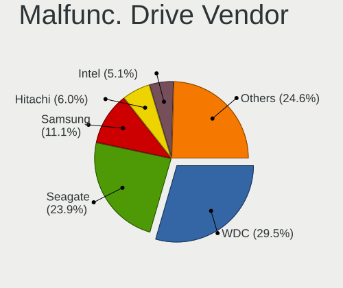

| Vendor                | Desktops | Drives | Percent |
|-----------------------|----------|--------|---------|
| WDC                   | 168      | 205    | 29.47%  |
| Seagate               | 136      | 201    | 23.86%  |
| Samsung Electronics   | 63       | 70     | 11.05%  |
| Hitachi               | 34       | 42     | 5.96%   |
| Intel                 | 29       | 56     | 5.09%   |
| Kingston              | 21       | 22     | 3.68%   |
| Toshiba               | 20       | 21     | 3.51%   |
| Crucial               | 12       | 14     | 2.11%   |
| SanDisk               | 11       | 13     | 1.93%   |
| A-DATA Technology     | 10       | 10     | 1.75%   |
| HGST                  | 8        | 12     | 1.4%    |
| Maxtor                | 7        | 8      | 1.23%   |
| China                 | 5        | 5      | 0.88%   |
| SK hynix              | 4        | 4      | 0.7%    |
| Micron Technology     | 4        | 10     | 0.7%    |
| LITEONIT              | 3        | 3      | 0.53%   |
| LDLC                  | 3        | 4      | 0.53%   |
| XPG                   | 2        | 2      | 0.35%   |
| Patriot               | 2        | 2      | 0.35%   |
| OCZ                   | 2        | 2      | 0.35%   |
| Intenso               | 2        | 2      | 0.35%   |
| YS                    | 1        | 1      | 0.18%   |
| XrayDisk              | 1        | 1      | 0.18%   |
| WD MediaMax           | 1        | 1      | 0.18%   |
| walram                | 1        | 1      | 0.18%   |
| USB3.0                | 1        | 1      | 0.18%   |
| Unknown               | 1        | 1      | 0.18%   |
| tecmiyo               | 1        | 1      | 0.18%   |
| T-FORCE               | 1        | 1      | 0.18%   |
| SPCC                  | 1        | 1      | 0.18%   |
| Silicon Motion        | 1        | 3      | 0.18%   |
| Realtek Semiconductor | 1        | 1      | 0.18%   |
| PNY                   | 1        | 1      | 0.18%   |
| Netac                 | 1        | 2      | 0.18%   |
| Mushkin               | 1        | 1      | 0.18%   |
| MaxDigital            | 1        | 1      | 0.18%   |
| Leven                 | 1        | 1      | 0.18%   |
| KingSpec              | 1        | 1      | 0.18%   |
| JMicron Technology    | 1        | 1      | 0.18%   |
| Gigabyte Technology   | 1        | 1      | 0.18%   |

Malfunc. HDD Vendor
-------------------

Vendors of faulty HDD drives

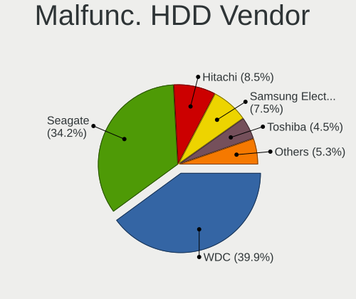

| Vendor              | Desktops | Drives | Percent |
|---------------------|----------|--------|---------|
| WDC                 | 159      | 196    | 39.95%  |
| Seagate             | 136      | 201    | 34.17%  |
| Hitachi             | 34       | 42     | 8.54%   |
| Samsung Electronics | 30       | 34     | 7.54%   |
| Toshiba             | 18       | 19     | 4.52%   |
| HGST                | 8        | 12     | 2.01%   |
| Maxtor              | 7        | 8      | 1.76%   |
| WD MediaMax         | 1        | 1      | 0.25%   |
| USB3.0              | 1        | 1      | 0.25%   |
| Unknown             | 1        | 1      | 0.25%   |
| MaxDigital          | 1        | 1      | 0.25%   |
| JMicron Technology  | 1        | 1      | 0.25%   |
| ExcelStor           | 1        | 1      | 0.25%   |

Malfunc. Drive Kind
-------------------

Kinds of faulty drives

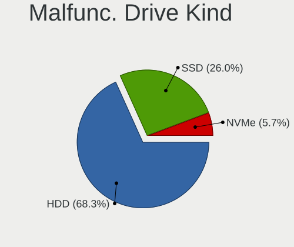

| Kind | Desktops | Drives | Percent |
|------|----------|--------|---------|
| HDD  | 370      | 518    | 68.27%  |
| SSD  | 141      | 182    | 26.01%  |
| NVMe | 31       | 35     | 5.72%   |

Failed Drives
-------------

Failed drive models

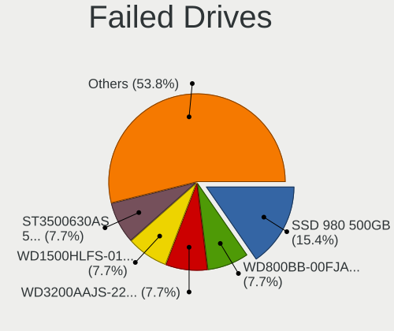

| Model                                      | Desktops | Drives | Percent |
|--------------------------------------------|----------|--------|---------|
| Samsung Electronics SSD 980 500GB          | 2        | 2      | 15.38%  |
| WDC WD800BB-00FJA0 80GB                    | 1        | 1      | 7.69%   |
| WDC WD3200AAJS-22VWA0 320GB                | 1        | 1      | 7.69%   |
| WDC WD1500HLFS-01G6U0 150GB                | 1        | 1      | 7.69%   |
| Seagate ST3500630AS 500GB                  | 1        | 1      | 7.69%   |
| Seagate ST14000NM0018-2H4101 14TB          | 1        | 1      | 7.69%   |
| Samsung Electronics SSD 960 EVO 250GB      | 1        | 1      | 7.69%   |
| Samsung Electronics MZVLB1T0HALR-00000 1TB | 1        | 2      | 7.69%   |
| PNY CS1030 500GB SSD                       | 1        | 1      | 7.69%   |
| Intel SSDSC2BB480G7 480GB                  | 1        | 4      | 7.69%   |
| Intel SSDPEKKW256G7 256GB                  | 1        | 1      | 7.69%   |
| Hewlett-Packard EF0450FARMV 450GB          | 1        | 4      | 7.69%   |

Failed Drive Vendor
-------------------

Failed drive vendors

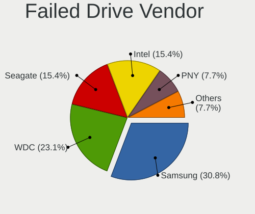

| Vendor              | Desktops | Drives | Percent |
|---------------------|----------|--------|---------|
| Samsung Electronics | 4        | 5      | 30.77%  |
| WDC                 | 3        | 3      | 23.08%  |
| Seagate             | 2        | 2      | 15.38%  |
| Intel               | 2        | 5      | 15.38%  |
| PNY                 | 1        | 1      | 7.69%   |
| Hewlett-Packard     | 1        | 4      | 7.69%   |

Drive Status
------------

Number of failed and malfunc. drives

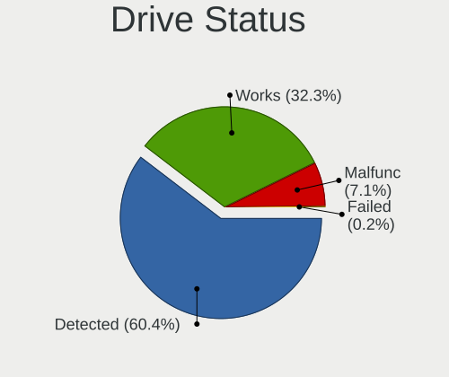

| Status   | Desktops | Drives | Percent |
|----------|----------|--------|---------|
| Detected | 4345     | 11565  | 60.39%  |
| Works    | 2326     | 5281   | 32.33%  |
| Malfunc  | 511      | 735    | 7.1%    |
| Failed   | 13       | 20     | 0.18%   |

Storage controller
------------------

Storage Vendor
--------------

Storage controller vendors

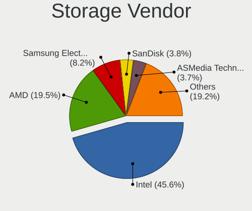

| Vendor                         | Desktops | Percent |
|--------------------------------|----------|---------|
| Intel                          | 4475     | 45.56%  |
| AMD                            | 1919     | 19.54%  |
| Samsung Electronics            | 807      | 8.22%   |
| SanDisk                        | 372      | 3.79%   |
| ASMedia Technology             | 368      | 3.75%   |
| Kingston Technology Company    | 234      | 2.38%   |
| Phison Electronics             | 214      | 2.18%   |
| Marvell Technology Group       | 195      | 1.99%   |
| Micron/Crucial Technology      | 175      | 1.78%   |
| JMicron Technology             | 159      | 1.62%   |
| Nvidia                         | 125      | 1.27%   |
| Silicon Motion                 | 119      | 1.21%   |
| SK hynix                       | 81       | 0.82%   |
| MAXIO Technology (Hangzhou)    | 66       | 0.67%   |
| ADATA Technology               | 66       | 0.67%   |
| Broadcom / LSI                 | 50       | 0.51%   |
| Realtek Semiconductor          | 46       | 0.47%   |
| LSI Logic / Symbios Logic      | 41       | 0.42%   |
| Micron Technology              | 36       | 0.37%   |
| Shenzhen Longsys Electronics   | 32       | 0.33%   |
| KIOXIA                         | 31       | 0.32%   |
| VIA Technologies               | 29       | 0.3%    |
| Toshiba America Info Systems   | 26       | 0.26%   |
| Silicon Image                  | 25       | 0.25%   |
| Adaptec                        | 21       | 0.21%   |
| Seagate Technology             | 20       | 0.2%    |
| INNOGRIT                       | 8        | 0.08%   |
| Solidigm                       | 7        | 0.07%   |
| HighPoint Technologies         | 7        | 0.07%   |
| Hewlett-Packard                | 7        | 0.07%   |
| Lite-On Technology             | 6        | 0.06%   |
| Biwin Storage Technology       | 6        | 0.06%   |
| Union Memory (Shenzhen)        | 5        | 0.05%   |
| Solid State Storage Technology | 5        | 0.05%   |
| Hosin Global Electronics       | 5        | 0.05%   |
| Apple                          | 5        | 0.05%   |
| Transcend                      | 3        | 0.03%   |
| Integrated Technology Express  | 3        | 0.03%   |
| Yangtze Memory Technologies    | 2        | 0.02%   |
| OCZ Technology Group           | 2        | 0.02%   |

Storage Model
-------------

Storage controller models

| Model                                                                                   | Desktops | Percent |
|-----------------------------------------------------------------------------------------|----------|---------|
| AMD FCH SATA Controller [AHCI mode]                                                     | 947      | 8%      |
| Intel 8 Series/C220 Series Chipset Family 6-port SATA Controller 1 [AHCI mode]          | 536      | 4.53%   |
| Intel SATA Controller [RAID mode]                                                       | 390      | 3.3%    |
| Samsung NVMe SSD Controller SM981/PM981/PM983                                           | 352      | 2.97%   |
| Intel Q170/Q150/B150/H170/H110/Z170/CM236 Chipset SATA Controller [AHCI Mode]           | 341      | 2.88%   |
| ASMedia ASM1061/ASM1062 Serial ATA Controller                                           | 326      | 2.75%   |
| Intel 6 Series/C200 Series Chipset Family 6 port Desktop SATA AHCI Controller           | 321      | 2.71%   |
| AMD 500 Series Chipset SATA Controller                                                  | 320      | 2.7%    |
| AMD 400 Series Chipset SATA Controller                                                  | 316      | 2.67%   |
| Intel 200 Series PCH SATA controller [AHCI mode]                                        | 293      | 2.48%   |
| Intel 7 Series/C210 Series Chipset Family 6-port SATA Controller [AHCI mode]            | 267      | 2.26%   |
| Samsung NVMe SSD Controller PM9A1/PM9A3/980PRO                                          | 248      | 2.1%    |
| AMD SB7x0/SB8x0/SB9x0 IDE Controller                                                    | 235      | 1.99%   |
| Intel Cannon Lake PCH SATA AHCI Controller                                              | 222      | 1.88%   |
| Intel Alder Lake-S PCH SATA Controller [AHCI Mode]                                      | 208      | 1.76%   |
| AMD SB7x0/SB8x0/SB9x0 SATA Controller [AHCI mode]                                       | 200      | 1.69%   |
| Intel 500 Series Chipset Family SATA AHCI Controller                                    | 173      | 1.46%   |
| AMD SB7x0/SB8x0/SB9x0 SATA Controller [IDE mode]                                        | 161      | 1.36%   |
| Intel NM10/ICH7 Family SATA Controller [IDE mode]                                       | 143      | 1.21%   |
| Intel C610/X99 series chipset 6-Port SATA Controller [AHCI mode]                        | 137      | 1.16%   |
| Intel 6 Series/C200 Series Chipset Family Desktop SATA Controller (IDE mode, ports 4-5) | 132      | 1.12%   |
| Intel 6 Series/C200 Series Chipset Family Desktop SATA Controller (IDE mode, ports 0-3) | 131      | 1.11%   |
| AMD A320 Chipset SATA Controller [AHCI mode]                                            | 127      | 1.07%   |
| AMD 600 Series Chipset SATA Controller                                                  | 127      | 1.07%   |
| Intel C610/X99 series chipset sSATA Controller [AHCI mode]                              | 126      | 1.06%   |
| Intel Raptor Lake SATA AHCI Controller                                                  | 124      | 1.05%   |
| Micron/Crucial P2 [Nick P2] / P3 / P3 Plus NVMe PCIe SSD (DRAM-less)                    | 118      | 1%      |
| Intel 9 Series Chipset Family SATA Controller [AHCI Mode]                               | 110      | 0.93%   |
| Samsung NVMe SSD Controller 980 (DRAM-less)                                             | 109      | 0.92%   |
| Intel 82801G (ICH7 Family) IDE Controller                                               | 105      | 0.89%   |
| Intel Volume Management Device NVMe RAID Controller                                     | 101      | 0.85%   |
| Silicon Motion SM2263EN/SM2263XT (DRAM-less) NVMe SSD Controllers                       | 100      | 0.84%   |
| Intel Comet Lake SATA AHCI Controller                                                   | 85       | 0.72%   |
| JMicron JMB363 SATA/IDE Controller                                                      | 84       | 0.71%   |
| Intel 82801JI (ICH10 Family) SATA AHCI Controller                                       | 76       | 0.64%   |
| Samsung NVMe SSD Controller SM961/PM961/SM963                                           | 69       | 0.58%   |
| Phison E12 NVMe Controller                                                              | 69       | 0.58%   |
| AMD 300 Series Chipset SATA Controller                                                  | 69       | 0.58%   |
| Intel 82801JI (ICH10 Family) 4 port SATA IDE Controller #1                              | 67       | 0.57%   |
| Intel C600/X79 series chipset 6-Port SATA AHCI Controller                               | 65       | 0.55%   |

Storage Kind
------------

Kind of storage controller (IDE, SATA, NVMe, SAS, ...)

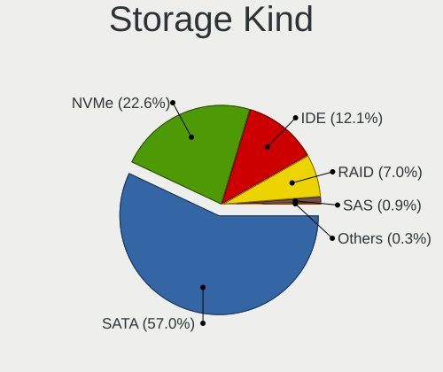

| Kind | Desktops | Percent |
|------|----------|---------|
| SATA | 5448     | 57.01%  |
| NVMe | 2164     | 22.64%  |
| IDE  | 1158     | 12.12%  |
| RAID | 667      | 6.98%   |
| SAS  | 87       | 0.91%   |
| SCSI | 33       | 0.35%   |

Processor
---------

CPU Vendor
----------

Processor vendors

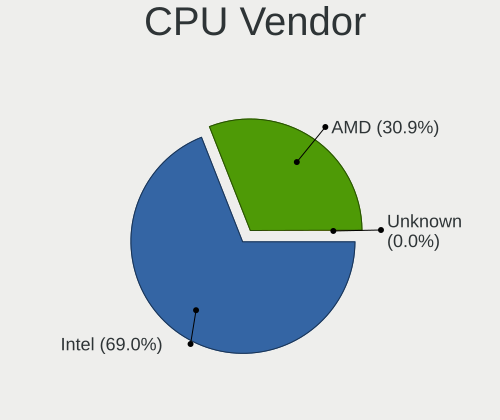

| Vendor     | Desktops | Percent |
|------------|----------|---------|
| Intel      | 4552     | 69.03%  |
| AMD        | 2039     | 30.92%  |
| thead,c906 | 1        | 0.02%   |
| ARM        | 1        | 0.02%   |
| Unknown    | 1        | 0.02%   |

CPU Model
---------

Processor models

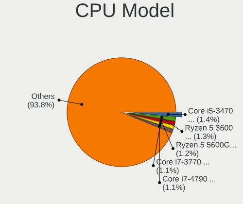

| Model                                       | Desktops | Percent |
|---------------------------------------------|----------|---------|
| Intel Core i5-3470 CPU @ 3.20GHz            | 92       | 1.39%   |
| AMD Ryzen 5 3600 6-Core Processor           | 87       | 1.31%   |
| AMD Ryzen 5 5600G with Radeon Graphics      | 82       | 1.24%   |
| Intel Core i7-3770 CPU @ 3.40GHz            | 76       | 1.15%   |
| Intel Core i7-4790 CPU @ 3.60GHz            | 73       | 1.1%    |
| Intel Core i5-2400 CPU @ 3.10GHz            | 71       | 1.07%   |
| AMD Ryzen 5 5600X 6-Core Processor          | 71       | 1.07%   |
| Intel Core i7-2600 CPU @ 3.40GHz            | 69       | 1.04%   |
| Intel Core i7-6700 CPU @ 3.40GHz            | 66       | 0.99%   |
| AMD Ryzen 7 5800X 8-Core Processor          | 65       | 0.98%   |
| Intel Core i5-6500 CPU @ 3.20GHz            | 64       | 0.96%   |
| Intel Core i5-4590 CPU @ 3.30GHz            | 62       | 0.93%   |
| Intel Core i5-4460 CPU @ 3.20GHz            | 59       | 0.89%   |
| Intel Core i7-4770 CPU @ 3.40GHz            | 56       | 0.84%   |
| Intel Core i5-4570 CPU @ 3.20GHz            | 56       | 0.84%   |
| AMD Ryzen 9 5900X 12-Core Processor         | 56       | 0.84%   |
| AMD Ryzen 7 3700X 8-Core Processor          | 56       | 0.84%   |
| Intel Core i7-6700K CPU @ 4.00GHz           | 50       | 0.75%   |
| AMD Ryzen 5 2600 Six-Core Processor         | 49       | 0.74%   |
| AMD FX-8350 Eight-Core Processor            | 48       | 0.72%   |
| AMD Ryzen 9 5950X 16-Core Processor         | 47       | 0.71%   |
| Intel Xeon CPU E5-2680 v4 @ 2.40GHz         | 45       | 0.68%   |
| Intel Core i7-8700 CPU @ 3.20GHz            | 43       | 0.65%   |
| Intel Core i3-3220 CPU @ 3.30GHz            | 43       | 0.65%   |
| AMD Ryzen 9 3900X 12-Core Processor         | 43       | 0.65%   |
| Intel Core i7-9700K CPU @ 3.60GHz           | 42       | 0.63%   |
| Intel Core 2 Duo CPU E8400 @ 3.00GHz        | 42       | 0.63%   |
| Intel Core i7-4790K CPU @ 4.00GHz           | 40       | 0.6%    |
| Intel Core i3-6100 CPU @ 3.70GHz            | 39       | 0.59%   |
| Intel Core i3-2120 CPU @ 3.30GHz            | 39       | 0.59%   |
| AMD Ryzen 7 5700G with Radeon Graphics      | 38       | 0.57%   |
| AMD Ryzen 3 3200G with Radeon Vega Graphics | 37       | 0.56%   |
| Intel Core i7-7700 CPU @ 3.60GHz            | 35       | 0.53%   |
| AMD FX-6300 Six-Core Processor              | 35       | 0.53%   |
| Intel Core 2 Quad CPU Q6600 @ 2.40GHz       | 34       | 0.51%   |
| Intel Core 2 Duo CPU E7500 @ 2.93GHz        | 32       | 0.48%   |
| AMD Ryzen 7 2700X Eight-Core Processor      | 32       | 0.48%   |
| AMD Ryzen 5 3400G with Radeon Vega Graphics | 32       | 0.48%   |
| Intel Core i5-10400 CPU @ 2.90GHz           | 31       | 0.47%   |
| Intel Core i5 CPU 650 @ 3.20GHz             | 31       | 0.47%   |

CPU Model Family
----------------

Processor model prefix

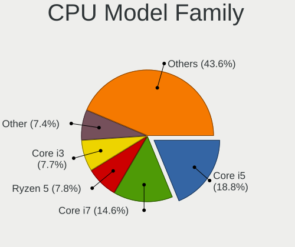

| Model                   | Desktops | Percent |
|-------------------------|----------|---------|
| Intel Core i5           | 1243     | 18.81%  |
| Intel Core i7           | 965      | 14.6%   |
| AMD Ryzen 5             | 515      | 7.79%   |
| Intel Core i3           | 512      | 7.75%   |
| Other                   | 492      | 7.44%   |
| Intel Xeon              | 490      | 7.41%   |
| AMD Ryzen 7             | 359      | 5.43%   |
| AMD Ryzen 9             | 242      | 3.66%   |
| Intel Celeron           | 198      | 3%      |
| AMD FX                  | 190      | 2.87%   |
| Intel Core 2 Duo        | 143      | 2.16%   |
| Intel Pentium           | 138      | 2.09%   |
| Intel Core 2 Quad       | 128      | 1.94%   |
| AMD Ryzen 3             | 93       | 1.41%   |
| Intel Core i9           | 88       | 1.33%   |
| AMD A10                 | 67       | 1.01%   |
| AMD Ryzen Threadripper  | 63       | 0.95%   |
| Intel Pentium Dual-Core | 62       | 0.94%   |
| AMD Phenom II X4        | 59       | 0.89%   |
| AMD A8                  | 52       | 0.79%   |
| AMD Athlon II X2        | 51       | 0.77%   |
| AMD A4                  | 33       | 0.5%    |
| AMD Athlon II X4        | 32       | 0.48%   |
| AMD A6                  | 32       | 0.48%   |
| AMD Athlon 64 X2        | 30       | 0.45%   |
| AMD Athlon              | 26       | 0.39%   |
| Intel Atom              | 25       | 0.38%   |
| Intel Core 2            | 24       | 0.36%   |
| AMD Phenom II X6        | 21       | 0.32%   |
| AMD Phenom II X2        | 19       | 0.29%   |
| Intel Pentium Gold      | 16       | 0.24%   |
| AMD Ryzen 5 PRO         | 16       | 0.24%   |
| Intel Pentium Dual      | 14       | 0.21%   |
| AMD Athlon II X3        | 12       | 0.18%   |
| AMD GX                  | 11       | 0.17%   |
| AMD Athlon X4           | 11       | 0.17%   |
| Intel Pentium 4         | 10       | 0.15%   |
| Intel Pentium Silver    | 9        | 0.14%   |
| AMD Sempron             | 9        | 0.14%   |
| AMD EPYC                | 9        | 0.14%   |

CPU Cores
---------

Number of processor cores

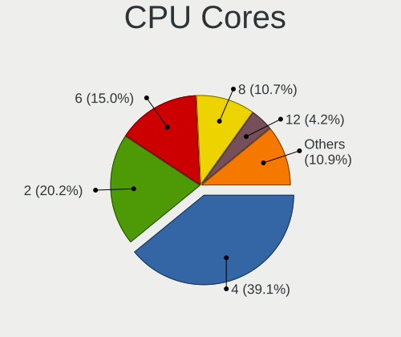

| Number  | Desktops | Percent |
|---------|----------|---------|
| 4       | 2594     | 39.1%   |
| 2       | 1339     | 20.18%  |
| 6       | 992      | 14.95%  |
| 8       | 709      | 10.69%  |
| 12      | 276      | 4.16%   |
| 16      | 209      | 3.15%   |
| 24      | 86       | 1.3%    |
| 10      | 81       | 1.22%   |
| 1       | 81       | 1.22%   |
| 3       | 80       | 1.21%   |
| 28      | 49       | 0.74%   |
| 20      | 37       | 0.56%   |
| 14      | 33       | 0.5%    |
| 64      | 21       | 0.32%   |
| 32      | 17       | 0.26%   |
| 18      | 14       | 0.21%   |
| 36      | 7        | 0.11%   |
| 44      | 3        | 0.05%   |
| 40      | 2        | 0.03%   |
| Unknown | 2        | 0.03%   |
| 128     | 1        | 0.02%   |
| 22      | 1        | 0.02%   |
| 5       | 1        | 0.02%   |

CPU Sockets
-----------

Number of sockets

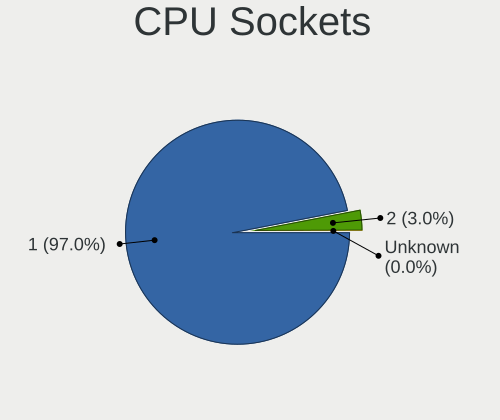

| Number  | Desktops | Percent |
|---------|----------|---------|
| 1       | 6393     | 96.95%  |
| 2       | 197      | 2.99%   |
| 20      | 2        | 0.03%   |
| Unknown | 2        | 0.03%   |

CPU Threads
-----------

Threads per core (Hyper-Threading)

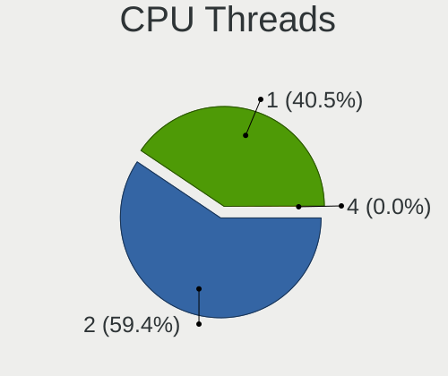

| Number  | Desktops | Percent |
|---------|----------|---------|
| 2       | 3926     | 59.42%  |
| 1       | 2677     | 40.52%  |
| Unknown | 2        | 0.03%   |
| 6       | 1        | 0.02%   |
| 4       | 1        | 0.02%   |

CPU Op-Modes
------------

CPU Operation Modes (32-bit, 64-bit)

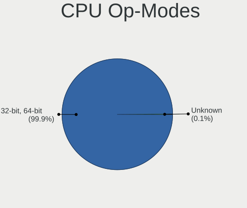

| Op mode        | Desktops | Percent |
|----------------|----------|---------|
| 32-bit, 64-bit | 6590     | 99.92%  |
| Unknown        | 5        | 0.08%   |

CPU Microcode
-------------

Microcode number

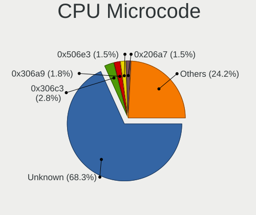

| Number     | Desktops | Percent |
|------------|----------|---------|
| Unknown    | 4611     | 68.26%  |
| 0x306c3    | 188      | 2.78%   |
| 0x306a9    | 121      | 1.79%   |
| 0x506e3    | 104      | 1.54%   |
| 0x206a7    | 98       | 1.45%   |
| 0x08701021 | 83       | 1.23%   |
| 0x906ea    | 71       | 1.05%   |
| 0x906e9    | 68       | 1.01%   |
| 0x406f1    | 65       | 0.96%   |
| 0x0a20120a | 54       | 0.8%    |
| 0x306f2    | 52       | 0.77%   |
| 0x0800820d | 52       | 0.77%   |
| 0x06000852 | 49       | 0.73%   |
| 0x90672    | 46       | 0.68%   |
| 0x0a201016 | 44       | 0.65%   |
| 0x0a601203 | 43       | 0.64%   |
| 0xa0653    | 37       | 0.55%   |
| 0x1067a    | 37       | 0.55%   |
| 0x010000c8 | 37       | 0.55%   |
| 0xa0671    | 36       | 0.53%   |
| 0x08108109 | 35       | 0.52%   |
| 0xb0671    | 33       | 0.49%   |
| 0x0a50000d | 33       | 0.49%   |
| 0xa0655    | 32       | 0.47%   |
| 0x906ed    | 30       | 0.44%   |
| 0x08701013 | 28       | 0.41%   |
| 0x06001119 | 24       | 0.36%   |
| 0x0a50000c | 20       | 0.3%    |
| 0x0a601206 | 19       | 0.28%   |
| 0x06003106 | 19       | 0.28%   |
| 0x0a201009 | 18       | 0.27%   |
| 0x0830107a | 17       | 0.25%   |
| 0x010000db | 17       | 0.25%   |
| 0x906ec    | 16       | 0.24%   |
| 0x106e5    | 16       | 0.24%   |
| 0x906eb    | 15       | 0.22%   |
| 0x0a201205 | 14       | 0.21%   |
| 0x90675    | 13       | 0.19%   |
| 0x106a5    | 13       | 0.19%   |
| 0x0810100b | 13       | 0.19%   |

CPU Microarch
-------------

Microarchitecture

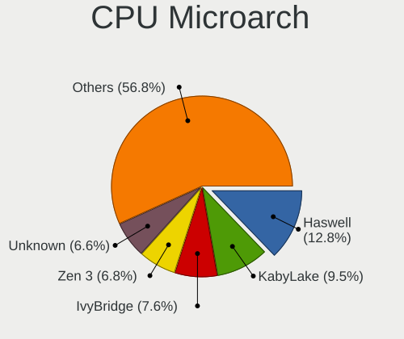

| Name             | Desktops | Percent |
|------------------|----------|---------|
| Haswell          | 847      | 12.8%   |
| KabyLake         | 626      | 9.46%   |
| IvyBridge        | 504      | 7.62%   |
| Zen 3            | 449      | 6.79%   |
| Unknown          | 434      | 6.56%   |
| SandyBridge      | 423      | 6.39%   |
| Skylake          | 421      | 6.36%   |
| Zen 2            | 340      | 5.14%   |
| Penryn           | 292      | 4.41%   |
| Piledriver       | 243      | 3.67%   |
| Zen+             | 230      | 3.48%   |
| K10              | 224      | 3.39%   |
| CometLake        | 206      | 3.11%   |
| Alderlake Hybrid | 183      | 2.77%   |
| Westmere         | 159      | 2.4%    |
| Zen              | 151      | 2.28%   |
| Core             | 132      | 2%      |
| Broadwell        | 113      | 1.71%   |
| Nehalem          | 111      | 1.68%   |
| Icelake          | 69       | 1.04%   |
| Silvermont       | 57       | 0.86%   |
| Steamroller      | 56       | 0.85%   |
| Goldmont plus    | 47       | 0.71%   |
| Excavator        | 43       | 0.65%   |
| K8 Hammer        | 42       | 0.63%   |
| Bulldozer        | 40       | 0.6%    |
| Goldmont         | 25       | 0.38%   |
| Jaguar           | 22       | 0.33%   |
| NetBurst         | 20       | 0.3%    |
| Tremont          | 19       | 0.29%   |
| TigerLake        | 19       | 0.29%   |
| K10 Llano        | 18       | 0.27%   |
| Gracemont        | 13       | 0.2%    |
| Bonnell          | 13       | 0.2%    |
| Bobcat           | 13       | 0.2%    |
| Puma             | 11       | 0.17%   |
| Sapphire Rapids  | 1        | 0.02%   |

Graphics
--------

GPU Vendor
----------

Vendors of graphics cards

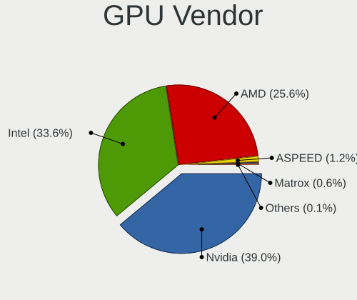

| Vendor                                       | Desktops | Percent |
|----------------------------------------------|----------|---------|
| Nvidia                                       | 2805     | 38.97%  |
| Intel                                        | 2416     | 33.56%  |
| AMD                                          | 1846     | 25.65%  |
| ASPEED Technology                            | 86       | 1.19%   |
| Matrox Electronics Systems                   | 40       | 0.56%   |
| ATI Technologies                             | 3        | 0.04%   |
| XGI Technology (eXtreme Graphics Innovation) | 1        | 0.01%   |
| VIA Technologies                             | 1        | 0.01%   |

GPU Model
---------

Graphics card models

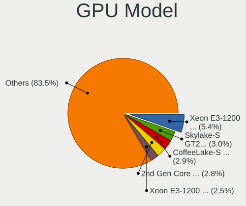

| Model                                                                       | Desktops | Percent |
|-----------------------------------------------------------------------------|----------|---------|
| Intel Xeon E3-1200 v3/4th Gen Core Processor Integrated Graphics Controller | 397      | 5.38%   |
| Intel Skylake-S GT2 [HD Graphics 530]                                       | 219      | 2.97%   |
| Intel CoffeeLake-S GT2 [UHD Graphics 630]                                   | 211      | 2.86%   |
| Intel 2nd Generation Core Processor Family Integrated Graphics Controller   | 208      | 2.82%   |
| Intel Xeon E3-1200 v2/3rd Gen Core processor Graphics Controller            | 181      | 2.45%   |
| AMD Ellesmere [Radeon RX 470/480/570/570X/580/580X/590]                     | 181      | 2.45%   |
| Nvidia GK208B [GeForce GT 710]                                              | 138      | 1.87%   |
| AMD Cezanne [Radeon Vega Series / Radeon Vega Mobile Series]                | 117      | 1.59%   |
| Intel 4 Series Chipset Integrated Graphics Controller                       | 107      | 1.45%   |
| Intel CometLake-S GT2 [UHD Graphics 630]                                    | 105      | 1.42%   |
| Intel Kaby Lake-S GT2 [HD Graphics 630]                                     | 104      | 1.41%   |
| AMD Raphael                                                                 | 98       | 1.33%   |
| Nvidia GT218 [GeForce 210]                                                  | 96       | 1.3%    |
| Nvidia GP107 [GeForce GTX 1050 Ti]                                          | 96       | 1.3%    |
| ASPEED Technology ASPEED Graphics Family                                    | 86       | 1.17%   |
| Intel 4th Generation Core Processor Family Integrated Graphics Controller   | 83       | 1.12%   |
| Nvidia GP108 [GeForce GT 1030]                                              | 82       | 1.11%   |
| Nvidia GA106 [GeForce RTX 3060 Lite Hash Rate]                              | 78       | 1.06%   |
| Intel Alder Lake-S GT1 [UHD Graphics 770]                                   | 77       | 1.04%   |
| AMD Picasso/Raven 2 [Radeon Vega Series / Radeon Vega Mobile Series]        | 77       | 1.04%   |
| AMD Cedar [Radeon HD 5000/6000/7350/8350 Series]                            | 73       | 0.99%   |
| Nvidia GP106 [GeForce GTX 1060 6GB]                                         | 72       | 0.98%   |
| Intel IvyBridge GT2 [HD Graphics 4000]                                      | 72       | 0.98%   |
| Intel Raptor Lake-S GT1 [UHD Graphics 770]                                  | 70       | 0.95%   |
| Nvidia GK208B [GeForce GT 730]                                              | 68       | 0.92%   |
| Nvidia AD102 [GeForce RTX 4090]                                             | 64       | 0.87%   |
| Nvidia GP104 [GeForce GTX 1070]                                             | 55       | 0.75%   |
| AMD Caicos [Radeon HD 6450/7450/8450 / R5 230 OEM]                          | 54       | 0.73%   |
| AMD Lexa PRO [Radeon 540/540X/550/550X / RX 540X/550/550X]                  | 53       | 0.72%   |
| Nvidia GF119 [GeForce GT 610]                                               | 52       | 0.7%    |
| AMD Raven Ridge [Radeon Vega Series / Radeon Vega Mobile Series]            | 51       | 0.69%   |
| Nvidia TU117 [GeForce GTX 1650]                                             | 50       | 0.68%   |
| Nvidia GA102 [GeForce RTX 3090]                                             | 50       | 0.68%   |
| AMD Navi 23 [Radeon RX 6600/6600 XT/6600M]                                  | 50       | 0.68%   |
| Nvidia TU116 [GeForce GTX 1660 SUPER]                                       | 48       | 0.65%   |
| Nvidia GM206 [GeForce GTX 960]                                              | 47       | 0.64%   |
| Intel Alder Lake-S GT1 [UHD Graphics 730]                                   | 46       | 0.62%   |
| Nvidia GM107 [GeForce GTX 750 Ti]                                           | 45       | 0.61%   |
| AMD Kaveri [Radeon R7 Graphics]                                             | 45       | 0.61%   |
| Nvidia GP104 [GeForce GTX 1080]                                             | 44       | 0.6%    |

GPU Combo
---------

Combinations of graphics cards

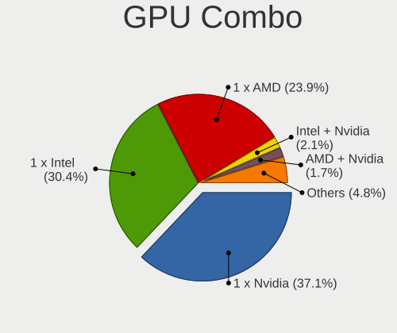

| Name                     | Desktops | Percent |
|--------------------------|----------|---------|
| 1 x Nvidia               | 2473     | 37.07%  |
| 1 x Intel                | 2029     | 30.41%  |
| 1 x AMD                  | 1593     | 23.88%  |
| Intel + Nvidia           | 139      | 2.08%   |
| AMD + Nvidia             | 116      | 1.74%   |
| 2 x AMD                  | 77       | 1.15%   |
| 1 x ASPEED               | 68       | 1.02%   |
| Intel + AMD              | 49       | 0.73%   |
| 2 x Nvidia               | 42       | 0.63%   |
| 1 x Matrox               | 30       | 0.45%   |
| Nvidia + ASPEED          | 15       | 0.22%   |
| Other                    | 11       | 0.16%   |
| Nvidia + Matrox          | 7        | 0.1%    |
| Intel + AMD + 1 x Nvidia | 3        | 0.04%   |
| AMD + Matrox             | 3        | 0.04%   |
| AMD + ASPEED             | 3        | 0.04%   |
| 3 x AMD                  | 2        | 0.03%   |
| 1 x Intel + 3 x Nvidia   | 2        | 0.03%   |
| AMD + 2 x Nvidia         | 2        | 0.03%   |
| 3 x Nvidia + 1 x ASPEED  | 1        | 0.01%   |
| 2 x Intel                | 1        | 0.01%   |
| 2 x AMD + 1 x Nvidia     | 1        | 0.01%   |
| 1 x XGI                  | 1        | 0.01%   |
| 1 x VIA                  | 1        | 0.01%   |
| Intel + 2 x Nvidia       | 1        | 0.01%   |
| Intel + 2 x AMD          | 1        | 0.01%   |
| Intel + AMD + 3 x Nvidia | 1        | 0.01%   |

GPU Driver
----------

Free vs proprietary

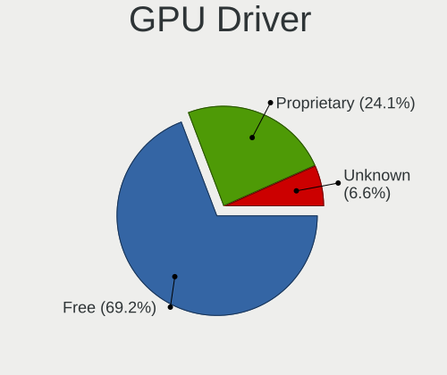

| Driver      | Desktops | Percent |
|-------------|----------|---------|
| Free        | 4648     | 69.24%  |
| Proprietary | 1619     | 24.12%  |
| Unknown     | 446      | 6.64%   |

GPU Memory
----------

Total video memory

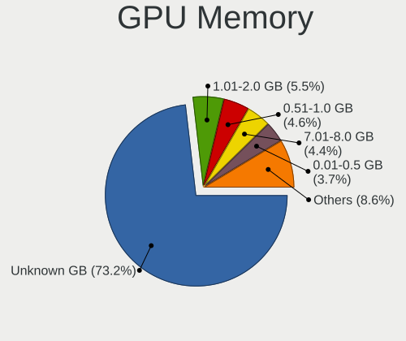

| Size in GB     | Desktops | Percent |
|----------------|----------|---------|
| Unknown        | 4911     | 73.17%  |
| 1.01-2.0       | 372      | 5.54%   |
| 0.51-1.0       | 309      | 4.6%    |
| 7.01-8.0       | 293      | 4.37%   |
| 0.01-0.5       | 249      | 3.71%   |
| 3.01-4.0       | 234      | 3.49%   |
| 8.01-16.0      | 155      | 2.31%   |
| 5.01-6.0       | 95       | 1.42%   |
| 16.01-24.0     | 47       | 0.7%    |
| 2.01-3.0       | 34       | 0.51%   |
| 4.01-5.0       | 9        | 0.13%   |
| 32.01-64.0     | 2        | 0.03%   |
| More than 64.0 | 1        | 0.01%   |
| 24.01-32.0     | 1        | 0.01%   |

Monitor
-------

Monitor Vendor
--------------

Monitor vendors

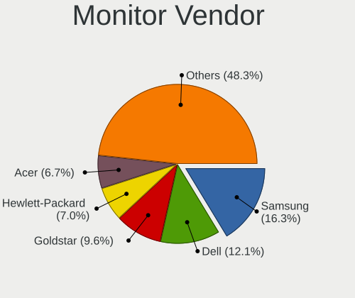

| Vendor               | Desktops | Percent |
|----------------------|----------|---------|
| Samsung Electronics  | 1089     | 16.32%  |
| Dell                 | 810      | 12.14%  |
| Goldstar             | 641      | 9.61%   |
| Hewlett-Packard      | 465      | 6.97%   |
| Acer                 | 446      | 6.68%   |
| AOC                  | 308      | 4.62%   |
| Philips              | 302      | 4.53%   |
| BenQ                 | 286      | 4.29%   |
| Ancor Communications | 244      | 3.66%   |
| Iiyama               | 165      | 2.47%   |
| Lenovo               | 149      | 2.23%   |
| ASUSTek Computer     | 135      | 2.02%   |
| ViewSonic            | 128      | 1.92%   |
| Sony                 | 93       | 1.39%   |
| Fujitsu Siemens      | 59       | 0.88%   |
| MSI                  | 52       | 0.78%   |
| Sceptre Tech         | 50       | 0.75%   |
| Vizio                | 49       | 0.73%   |
| Panasonic            | 48       | 0.72%   |
| Eizo                 | 46       | 0.69%   |
| Unknown              | 44       | 0.66%   |
| NEC Computers        | 42       | 0.63%   |
| LG Electronics       | 41       | 0.61%   |
| Medion               | 33       | 0.49%   |
| HannStar             | 33       | 0.49%   |
| Unknown              | 28       | 0.42%   |
| HKC                  | 26       | 0.39%   |
| Toshiba              | 23       | 0.34%   |
| Gigabyte Technology  | 23       | 0.34%   |
| Sharp                | 21       | 0.31%   |
| Vestel Elektronik    | 20       | 0.3%    |
| Apple                | 20       | 0.3%    |
| Mi                   | 19       | 0.28%   |
| RTK                  | 17       | 0.25%   |
| Insignia             | 17       | 0.25%   |
| Unknown (XXX)        | 15       | 0.22%   |
| MStar                | 14       | 0.21%   |
| HUAWEI               | 14       | 0.21%   |
| Hitachi              | 14       | 0.21%   |
| Onkyo                | 13       | 0.19%   |

Monitor Model
-------------

Monitor models

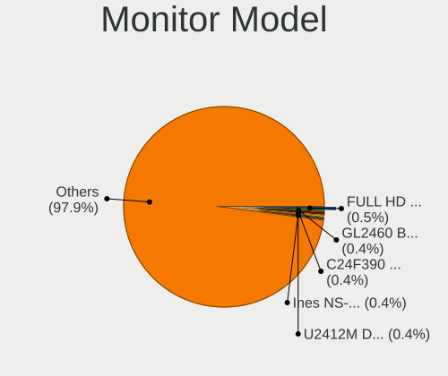

| Model                                                                   | Desktops | Percent |
|-------------------------------------------------------------------------|----------|---------|
| Goldstar FULL HD GSM5B55 1920x1080 480x270mm 21.7-inch                  | 34       | 0.48%   |
| BenQ GL2460 BNQ78CE 1920x1080 531x299mm 24.0-inch                       | 29       | 0.41%   |
| Samsung Electronics C24F390 SAM0D2C 1920x1080 521x293mm 23.5-inch       | 28       | 0.39%   |
| Unknown                                                                 | 28       | 0.39%   |
| Dell U2412M DELA07A 1920x1200 518x324mm 24.1-inch                       | 27       | 0.38%   |
| AOC 27G2G4 AOC2702 1920x1080 598x336mm 27.0-inch                        | 25       | 0.35%   |
| Samsung Electronics S24F350 SAM0D20 1920x1080 521x293mm 23.5-inch       | 24       | 0.34%   |
| Goldstar LG IPS FULLHD GSM5AB8 1920x1080 480x270mm 21.7-inch            | 22       | 0.31%   |
| Samsung Electronics C27F390 SAM0D32 1920x1080 598x336mm 27.0-inch       | 21       | 0.3%    |
| Goldstar HDR 4K GSM7706 3840x2160 600x340mm 27.2-inch                   | 21       | 0.3%    |
| AOC 24G2W1G3 AOC2402 1920x1080 527x296mm 23.8-inch                      | 21       | 0.3%    |
| Vestel Elektronik 40UHD_LCD_TV VES3700 3840x2160 880x500mm 39.8-inch    | 20       | 0.28%   |
| Dell U2412M DELA07B 1920x1200 518x324mm 24.1-inch                       | 19       | 0.27%   |
| Unknown LCD Monitor FFFF 2288x1287 2550x2550mm 142.0-inch               | 17       | 0.24%   |
| Goldstar Ultra HD GSM5B09 3840x2160 600x340mm 27.2-inch                 | 17       | 0.24%   |
| Samsung Electronics LCD Monitor SAM7016 3840x2160 1872x1053mm 84.6-inch | 16       | 0.23%   |
| Samsung Electronics LCD Monitor LF24T450F 1920x1080                     | 16       | 0.23%   |
| AOC 24B1W1 AOC2401 1920x1080 527x296mm 23.8-inch                        | 16       | 0.23%   |
| Philips PHL 223V5 PHLC0CF 1920x1080 477x268mm 21.5-inch                 | 15       | 0.21%   |
| Panasonic TV MEIA296 1920x1080 698x392mm 31.5-inch                      | 15       | 0.21%   |
| Ancor Communications ASUS VS247 ACI249A 1920x1080 521x293mm 23.5-inch   | 15       | 0.21%   |
| Samsung Electronics C32F391 SAM0D34 1920x1080 698x393mm 31.5-inch       | 13       | 0.18%   |
| Goldstar ULTRAWIDE GSM76F9 2560x1080 531x298mm 24.0-inch                | 13       | 0.18%   |
| BenQ GW2480 BNQ78E7 1920x1080 527x296mm 23.8-inch                       | 13       | 0.18%   |
| Sony TV SNY3102 1920x1080 886x498mm 40.0-inch                           | 12       | 0.17%   |
| Samsung Electronics S24D330 SAM0D92 1920x1080 531x299mm 24.0-inch       | 12       | 0.17%   |
| Philips PHL 273V7 PHLC156 1920x1080 598x336mm 27.0-inch                 | 12       | 0.17%   |
| Philips 197EL PHLC08B 1366x768 410x230mm 18.5-inch                      | 12       | 0.17%   |
| Goldstar LG ULTRAWIDE GSM59F1 2560x1080 670x280mm 28.6-inch             | 12       | 0.17%   |
| BenQ GL2450H BNQ78A7 1920x1080 531x298mm 24.0-inch                      | 12       | 0.17%   |
| Samsung Electronics U28E590 SAM0C4D 3840x2160 607x345mm 27.5-inch       | 11       | 0.16%   |
| Samsung Electronics LF24T35 SAM707D 1920x1080 528x297mm 23.9-inch       | 11       | 0.16%   |
| Goldstar Ultra HD GSM5B08 3840x2160 600x340mm 27.2-inch                 | 11       | 0.16%   |
| Ancor Communications ASUS VS228 ACI22FD 1920x1080 476x268mm 21.5-inch   | 11       | 0.16%   |
| Sceptre Tech Sceptre E24 SPT099D 1920x1080 521x293mm 23.5-inch          | 10       | 0.14%   |
| Philips PHL 243V7 PHLC155 1920x1080 527x296mm 23.8-inch                 | 10       | 0.14%   |
| Philips PHL 243V5 PHLC0D1 1920x1080 521x293mm 23.5-inch                 | 10       | 0.14%   |
| MStar Demo MST0030 1920x1080 708x398mm 32.0-inch                        | 10       | 0.14%   |
| Iiyama PLE2483H IVM6113 1920x1080 531x299mm 24.0-inch                   | 10       | 0.14%   |
| Goldstar W1943 GSM4BAD 1360x768 406x229mm 18.4-inch                     | 10       | 0.14%   |

Monitor Resolution
------------------

Monitor screen resolution

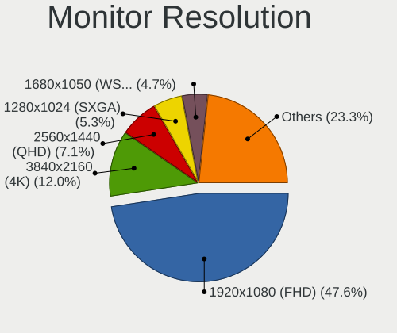

| Resolution         | Desktops | Percent |
|--------------------|----------|---------|
| 1920x1080 (FHD)    | 3086     | 47.59%  |
| 3840x2160 (4K)     | 781      | 12.05%  |
| 2560x1440 (QHD)    | 458      | 7.06%   |
| 1280x1024 (SXGA)   | 345      | 5.32%   |
| 1680x1050 (WSXGA+) | 302      | 4.66%   |
| 1366x768 (WXGA)    | 227      | 3.5%    |
| 1440x900 (WXGA+)   | 204      | 3.15%   |
| 1920x1200 (WUXGA)  | 200      | 3.08%   |
| 1600x900 (HD+)     | 193      | 2.98%   |
| 3440x1440          | 107      | 1.65%   |
| 1360x768           | 84       | 1.3%    |
| 2560x1080          | 78       | 1.2%    |
| Unknown            | 66       | 1.02%   |
| 1920x540           | 60       | 0.93%   |
| 1024x768 (XGA)     | 51       | 0.79%   |
| 3840x1080          | 42       | 0.65%   |
| 1600x1200          | 30       | 0.46%   |
| 1280x720 (HD)      | 26       | 0.4%    |
| 2288x1287          | 24       | 0.37%   |
| 3840x1600          | 16       | 0.25%   |
| 2560x1600          | 13       | 0.2%    |
| 1400x1050          | 13       | 0.2%    |
| 1280x960           | 12       | 0.19%   |
| 2048x1152          | 8        | 0.12%   |
| 3840x1200          | 5        | 0.08%   |
| 5120x1440          | 4        | 0.06%   |
| 4480x1440          | 4        | 0.06%   |
| 3600x1080          | 3        | 0.05%   |
| 3360x1080          | 3        | 0.05%   |
| 3200x1080          | 3        | 0.05%   |
| 1280x768           | 3        | 0.05%   |
| 640x480            | 2        | 0.03%   |
| 5760x1080          | 2        | 0.03%   |
| 3520x1080          | 2        | 0.03%   |
| 7680x2160          | 1        | 0.02%   |
| 720x480            | 1        | 0.02%   |
| 6400x2160          | 1        | 0.02%   |
| 5760x2160          | 1        | 0.02%   |
| 5520x1080          | 1        | 0.02%   |
| 5120x1080          | 1        | 0.02%   |

Monitor Diagonal
----------------

Diagonal size in inches

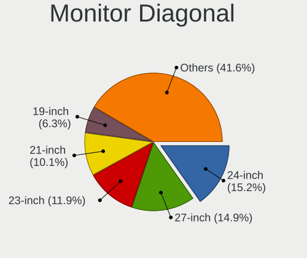

| Inches  | Desktops | Percent |
|---------|----------|---------|
| 24      | 1018     | 15.22%  |
| 27      | 999      | 14.93%  |
| 23      | 794      | 11.87%  |
| 21      | 677      | 10.12%  |
| 19      | 420      | 6.28%   |
| Unknown | 390      | 5.83%   |
| 31      | 380      | 5.68%   |
| 18      | 222      | 3.32%   |
| 22      | 217      | 3.24%   |
| 20      | 206      | 3.08%   |
| 17      | 166      | 2.48%   |
| 34      | 151      | 2.26%   |
| 84      | 127      | 1.9%    |
| 32      | 96       | 1.44%   |
| 15      | 95       | 1.42%   |
| 40      | 72       | 1.08%   |
| 72      | 69       | 1.03%   |
| 54      | 65       | 0.97%   |
| 25      | 54       | 0.81%   |
| 26      | 31       | 0.46%   |
| 28      | 29       | 0.43%   |
| 46      | 27       | 0.4%    |
| 65      | 25       | 0.37%   |
| 43      | 25       | 0.37%   |
| 37      | 24       | 0.36%   |
| 49      | 23       | 0.34%   |
| 63      | 22       | 0.33%   |
| 42      | 22       | 0.33%   |
| 52      | 21       | 0.31%   |
| 48      | 20       | 0.3%    |
| 29      | 20       | 0.3%    |
| 36      | 18       | 0.27%   |
| 142     | 17       | 0.25%   |
| 74      | 13       | 0.19%   |
| 14      | 13       | 0.19%   |
| 16      | 11       | 0.16%   |
| 35      | 10       | 0.15%   |
| 12      | 10       | 0.15%   |
| 60      | 9        | 0.13%   |
| 50      | 7        | 0.1%    |

Monitor Width
-------------

Physical width

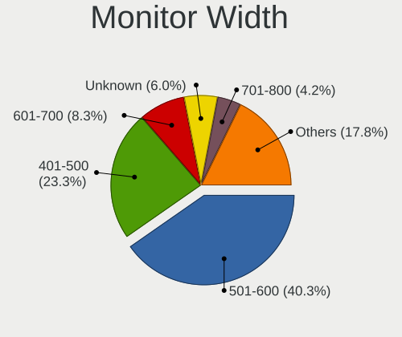

| Width in mm    | Desktops | Percent |
|----------------|----------|---------|
| 501-600        | 2608     | 40.3%   |
| 401-500        | 1510     | 23.33%  |
| 601-700        | 538      | 8.31%   |
| Unknown        | 390      | 6.03%   |
| 701-800        | 273      | 4.22%   |
| 301-350        | 258      | 3.99%   |
| 1001-1500      | 238      | 3.68%   |
| 1501-2000      | 223      | 3.45%   |
| 351-400        | 220      | 3.4%    |
| 801-900        | 119      | 1.84%   |
| 901-1000       | 49       | 0.76%   |
| 201-300        | 26       | 0.4%    |
| More than 2000 | 19       | 0.29%   |

Aspect Ratio
------------

Proportional relationship between the width and the height

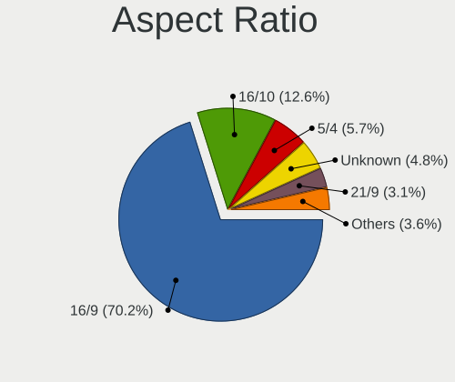

| Ratio   | Desktops | Percent |
|---------|----------|---------|
| 16/9    | 4322     | 70.17%  |
| 16/10   | 776      | 12.6%   |
| 5/4     | 348      | 5.65%   |
| Unknown | 296      | 4.81%   |
| 21/9    | 193      | 3.13%   |
| 4/3     | 104      | 1.69%   |
| 32/9    | 46       | 0.75%   |
| 3/2     | 22       | 0.36%   |
| 1.00    | 20       | 0.32%   |
| 6/5     | 19       | 0.31%   |
| 2.00    | 3        | 0.05%   |
| 1.96    | 3        | 0.05%   |
| 0.56    | 3        | 0.05%   |
| 2.12    | 2        | 0.03%   |
| 3.20    | 1        | 0.02%   |
| 0.89    | 1        | 0.02%   |

Monitor Area
------------

Area in inch²

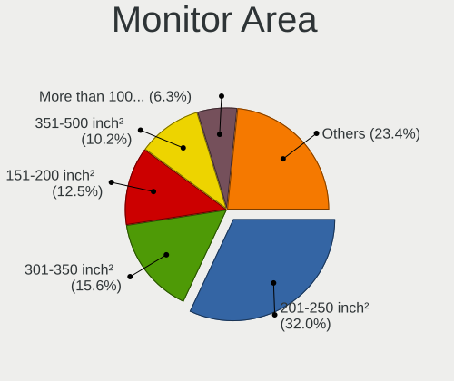

| Area in inch² | Desktops | Percent |
|----------------|----------|---------|
| 201-250        | 2098     | 32.01%  |
| 301-350        | 1020     | 15.56%  |
| 151-200        | 820      | 12.51%  |
| 351-500        | 669      | 10.21%  |
| More than 1000 | 415      | 6.33%   |
| 251-300        | 415      | 6.33%   |
| Unknown        | 390      | 5.95%   |
| 141-150        | 338      | 5.16%   |
| 501-1000       | 245      | 3.74%   |
| 101-110        | 86       | 1.31%   |
| 111-120        | 15       | 0.23%   |
| 71-80          | 14       | 0.21%   |
| 131-140        | 13       | 0.2%    |
| 91-100         | 6        | 0.09%   |
| 81-90          | 5        | 0.08%   |
| 121-130        | 4        | 0.06%   |
| 51-60          | 1        | 0.02%   |
| 41-50          | 1        | 0.02%   |

Pixel Density
-------------

Pixels per inch

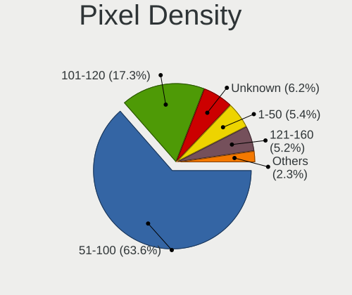

| Density       | Desktops | Percent |
|---------------|----------|---------|
| 51-100        | 3977     | 63.57%  |
| 101-120       | 1080     | 17.26%  |
| Unknown       | 391      | 6.25%   |
| 1-50          | 340      | 5.43%   |
| 121-160       | 324      | 5.18%   |
| 161-240       | 143      | 2.29%   |
| More than 240 | 1        | 0.02%   |

Multiple Monitors
-----------------

Total monitors connected

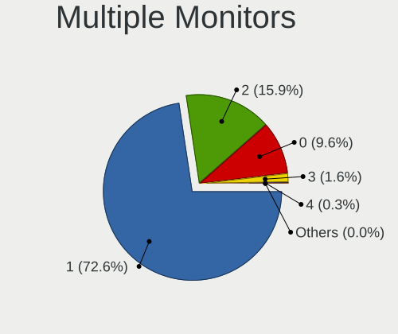

| Total | Desktops | Percent |
|-------|----------|---------|
| 1     | 4886     | 72.63%  |
| 2     | 1067     | 15.86%  |
| 0     | 647      | 9.62%   |
| 3     | 107      | 1.59%   |
| 4     | 17       | 0.25%   |
| 6     | 2        | 0.03%   |
| 5     | 1        | 0.01%   |

Network
-------

Net Controller Vendor
---------------------

Controller vendors

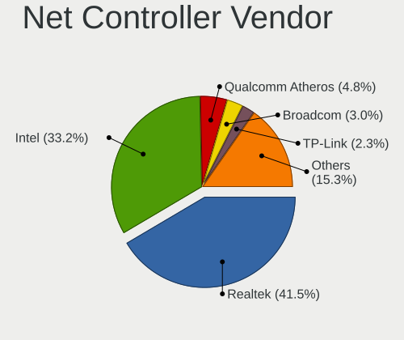

| Vendor                          | Desktops | Percent |
|---------------------------------|----------|---------|
| Realtek Semiconductor           | 3906     | 41.52%  |
| Intel                           | 3119     | 33.16%  |
| Qualcomm Atheros                | 451      | 4.79%   |
| Broadcom                        | 279      | 2.97%   |
| TP-Link                         | 214      | 2.27%   |
| Ralink Technology               | 169      | 1.8%    |
| MediaTek                        | 167      | 1.78%   |
| Nvidia                          | 103      | 1.09%   |
| Ralink                          | 83       | 0.88%   |
| Aquantia                        | 75       | 0.8%    |
| Broadcom Limited                | 56       | 0.6%    |
| NetGear                         | 55       | 0.58%   |
| ASIX Electronics                | 54       | 0.57%   |
| Marvell Technology Group        | 47       | 0.5%    |
| Qualcomm Atheros Communications | 41       | 0.44%   |
| Samsung Electronics             | 40       | 0.43%   |
| Microsoft                       | 40       | 0.43%   |
| D-Link System                   | 37       | 0.39%   |
| Xiaomi                          | 31       | 0.33%   |
| D-Link                          | 30       | 0.32%   |
| ASUSTek Computer                | 29       | 0.31%   |
| Edimax Technology               | 24       | 0.26%   |
| Linksys                         | 20       | 0.21%   |
| IMC Networks                    | 17       | 0.18%   |
| DisplayLink                     | 16       | 0.17%   |
| Qualcomm                        | 12       | 0.13%   |
| Mellanox Technologies           | 12       | 0.13%   |
| Huawei Technologies             | 12       | 0.13%   |
| AVM                             | 11       | 0.12%   |
| Google                          | 9        | 0.1%    |
| Arduino SA                      | 9        | 0.1%    |
| VIA Technologies                | 8        | 0.09%   |
| Sitecom Europe                  | 8        | 0.09%   |
| Qualcomm Technologies           | 8        | 0.09%   |
| QinHeng Electronics             | 8        | 0.09%   |
| OPPO Electronics                | 8        | 0.09%   |
| Mercucys                        | 8        | 0.09%   |
| ZyDAS                           | 7        | 0.07%   |
| Belkin Components               | 7        | 0.07%   |
| STMicroelectronics              | 6        | 0.06%   |

Net Controller Model
--------------------

Controller models

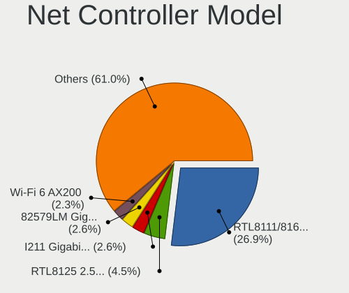

| Model                                                                          | Desktops | Percent |
|--------------------------------------------------------------------------------|----------|---------|
| Realtek RTL8111/8168/8211/8411 PCI Express Gigabit Ethernet Controller         | 2936     | 26.91%  |
| Realtek RTL8125 2.5GbE Controller                                              | 491      | 4.5%    |
| Intel I211 Gigabit Network Connection                                          | 287      | 2.63%   |
| Intel 82579LM Gigabit Network Connection (Lewisville)                          | 285      | 2.61%   |
| Intel Wi-Fi 6 AX200                                                            | 255      | 2.34%   |
| Intel Ethernet Controller I225-V                                               | 247      | 2.26%   |
| Intel Ethernet Connection (2) I219-V                                           | 229      | 2.1%    |
| Intel Ethernet Connection I217-LM                                              | 222      | 2.03%   |
| Intel Wi-Fi 6E(802.11ax) AX210/AX1675* 2x2 [Typhoon Peak]                      | 151      | 1.38%   |
| Realtek 802.11ac NIC                                                           | 127      | 1.16%   |
| Intel Ethernet Connection (7) I219-V                                           | 118      | 1.08%   |
| Realtek RTL810xE PCI Express Fast Ethernet controller                          | 116      | 1.06%   |
| Intel 82579V Gigabit Network Connection                                        | 115      | 1.05%   |
| Intel Dual Band Wireless-AC 3168NGW [Stone Peak]                               | 112      | 1.03%   |
| Intel Ethernet Connection (2) I219-LM                                          | 111      | 1.02%   |
| Realtek RTL88x2bu [AC1200 Techkey]                                             | 101      | 0.93%   |
| Realtek RTL8188EUS 802.11n Wireless Network Adapter                            | 97       | 0.89%   |
| Intel Ethernet Connection I217-V                                               | 81       | 0.74%   |
| Intel Alder Lake-S PCH CNVi WiFi                                               | 81       | 0.74%   |
| Intel I210 Gigabit Network Connection                                          | 80       | 0.73%   |
| Realtek RTL8821CE 802.11ac PCIe Wireless Network Adapter                       | 79       | 0.72%   |
| Intel Ethernet Connection (2) I218-V                                           | 79       | 0.72%   |
| Ralink MT7601U Wireless Adapter                                                | 74       | 0.68%   |
| Intel 700 Series Chipset CNVi WiFi                                             | 74       | 0.68%   |
| Intel 82574L Gigabit Network Connection                                        | 69       | 0.63%   |
| Intel Ethernet Controller I226-V                                               | 66       | 0.6%    |
| Realtek RTL8153 Gigabit Ethernet Adapter                                       | 63       | 0.58%   |
| Intel Cannon Lake PCH CNVi WiFi                                                | 63       | 0.58%   |
| Intel Ethernet Connection (7) I219-LM                                          | 60       | 0.55%   |
| MediaTek MT7921K (RZ608) Wi-Fi 6E 80MHz                                        | 59       | 0.54%   |
| Intel 82567LM-3 Gigabit Network Connection                                     | 58       | 0.53%   |
| Nvidia MCP61 Ethernet                                                          | 56       | 0.51%   |
| MediaTek MT7922 802.11ax PCI Express Wireless Network Adapter                  | 56       | 0.51%   |
| Qualcomm Atheros Killer E220x Gigabit Ethernet Controller                      | 55       | 0.5%    |
| Intel Wireless 7265                                                            | 55       | 0.5%    |
| Intel Wireless 7260                                                            | 49       | 0.45%   |
| Aquantia AQtion AQC107 NBase-T/IEEE 802.3an Ethernet Controller [Atlantic 10G] | 49       | 0.45%   |
| Intel Wi-Fi 5(802.11ac) Wireless-AC 9x6x [Thunder Peak]                        | 48       | 0.44%   |
| Intel Ethernet Connection (5) I219-LM                                          | 46       | 0.42%   |
| Intel I350 Gigabit Network Connection                                          | 45       | 0.41%   |

Wireless Vendor
---------------

Wireless vendors

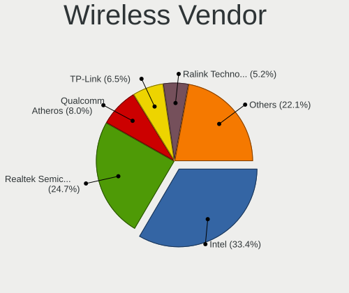

| Vendor                                | Desktops | Percent |
|---------------------------------------|----------|---------|
| Intel                                 | 1083     | 33.45%  |
| Realtek Semiconductor                 | 801      | 24.74%  |
| Qualcomm Atheros                      | 260      | 8.03%   |
| TP-Link                               | 209      | 6.45%   |
| Ralink Technology                     | 169      | 5.22%   |
| MediaTek                              | 147      | 4.54%   |
| Broadcom                              | 104      | 3.21%   |
| Ralink                                | 83       | 2.56%   |
| NetGear                               | 55       | 1.7%    |
| Qualcomm Atheros Communications       | 41       | 1.27%   |
| Microsoft                             | 39       | 1.2%    |
| D-Link                                | 29       | 0.9%    |
| ASUSTek Computer                      | 28       | 0.86%   |
| D-Link System                         | 26       | 0.8%    |
| Broadcom Limited                      | 26       | 0.8%    |
| Edimax Technology                     | 24       | 0.74%   |
| IMC Networks                          | 17       | 0.53%   |
| Linksys                               | 16       | 0.49%   |
| AVM                                   | 11       | 0.34%   |
| Sitecom Europe                        | 8        | 0.25%   |
| Mercucys                              | 8        | 0.25%   |
| ZyDAS                                 | 7        | 0.22%   |
| Belkin Components                     | 7        | 0.22%   |
| BUFFALO                               | 6        | 0.19%   |
| Wilocity                              | 4        | 0.12%   |
| Gemtek                                | 4        | 0.12%   |
| 802.11g Adapter [Linksys WUSB54GC v3] | 4        | 0.12%   |
| ZyXEL Communications                  | 3        | 0.09%   |
| Micro Star International              | 3        | 0.09%   |
| Sagem                                 | 2        | 0.06%   |
| Realtek                               | 2        | 0.06%   |
| Encore Electronics                    | 2        | 0.06%   |
| Dell                                  | 2        | 0.06%   |
| ZTopInc                               | 1        | 0.03%   |
| TRENDnet                              | 1        | 0.03%   |
| Tenda                                 | 1        | 0.03%   |
| Sierra Wireless                       | 1        | 0.03%   |
| Qualcomm                              | 1        | 0.03%   |
| Philips (or NXP)                      | 1        | 0.03%   |
| LSI                                   | 1        | 0.03%   |

Wireless Model
--------------

Wireless models

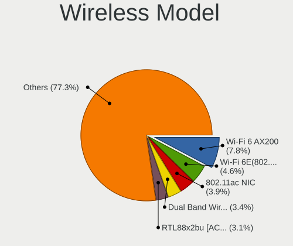

| Model                                                         | Desktops | Percent |
|---------------------------------------------------------------|----------|---------|
| Intel Wi-Fi 6 AX200                                           | 255      | 7.75%   |
| Intel Wi-Fi 6E(802.11ax) AX210/AX1675* 2x2 [Typhoon Peak]     | 151      | 4.59%   |
| Realtek 802.11ac NIC                                          | 127      | 3.86%   |
| Intel Dual Band Wireless-AC 3168NGW [Stone Peak]              | 112      | 3.4%    |
| Realtek RTL88x2bu [AC1200 Techkey]                            | 101      | 3.07%   |
| Realtek RTL8188EUS 802.11n Wireless Network Adapter           | 97       | 2.95%   |
| Realtek RTL8821CE 802.11ac PCIe Wireless Network Adapter      | 79       | 2.4%    |
| Ralink MT7601U Wireless Adapter                               | 74       | 2.25%   |
| Intel 700 Series Chipset CNVi WiFi                            | 74       | 2.25%   |
| Intel Cannon Lake PCH CNVi WiFi                               | 63       | 1.91%   |
| MediaTek MT7921K (RZ608) Wi-Fi 6E 80MHz                       | 59       | 1.79%   |
| Intel Wireless 7265                                           | 55       | 1.67%   |
| MediaTek MT7922 802.11ax PCI Express Wireless Network Adapter | 54       | 1.64%   |
| Intel Wireless 7260                                           | 49       | 1.49%   |
| Intel Wi-Fi 5(802.11ac) Wireless-AC 9x6x [Thunder Peak]       | 48       | 1.46%   |
| Intel Alder Lake-S PCH CNVi WiFi                              | 47       | 1.43%   |
| Broadcom BCM4360 802.11ac Dual Band Wireless Network Adapter  | 45       | 1.37%   |
| Realtek RTL8192EE PCIe Wireless Network Adapter               | 42       | 1.28%   |
| Intel Wireless 3165                                           | 39       | 1.19%   |
| Realtek RTL8188FTV 802.11b/g/n 1T1R 2.4G WLAN Adapter         | 37       | 1.12%   |
| Ralink RT5370 Wireless Adapter                                | 37       | 1.12%   |
| Qualcomm Atheros AR9485 Wireless Network Adapter              | 37       | 1.12%   |
| TP-Link TL-WN823N v2/v3 [Realtek RTL8192EU]                   | 35       | 1.06%   |
| Intel Comet Lake PCH CNVi WiFi                                | 35       | 1.06%   |
| Qualcomm Atheros AR9271 802.11n                               | 34       | 1.03%   |
| Qualcomm Atheros QCA9565 / AR9565 Wireless Network Adapter    | 32       | 0.97%   |
| Qualcomm Atheros QCA6174 802.11ac Wireless Network Adapter    | 30       | 0.91%   |
| Realtek RTL8192EU 802.11b/g/n WLAN Adapter                    | 29       | 0.88%   |
| Realtek RTL8821AE 802.11ac PCIe Wireless Network Adapter      | 28       | 0.85%   |
| Realtek RTL8192CE PCIe Wireless Network Adapter               | 28       | 0.85%   |
| Qualcomm Atheros AR93xx Wireless Network Adapter              | 28       | 0.85%   |
| TP-Link TL-WN722N v2/v3 [Realtek RTL8188EUS]                  | 27       | 0.82%   |
| TP-Link Archer T2U PLUS [RTL8821AU]                           | 27       | 0.82%   |
| Intel Wireless 8260                                           | 27       | 0.82%   |
| TP-Link AC600 wireless Realtek RTL8811AU [Archer T2U Nano]    | 24       | 0.73%   |
| TP-Link 802.11ac NIC                                          | 24       | 0.73%   |
| Realtek RTL8188CUS 802.11n WLAN Adapter                       | 24       | 0.73%   |
| Intel Wireless 8265 / 8275                                    | 24       | 0.73%   |
| Intel Tiger Lake PCH CNVi WiFi                                | 24       | 0.73%   |
| Realtek RTL8192CU 802.11n WLAN Adapter                        | 23       | 0.7%    |

Ethernet Vendor
---------------

Ethernet vendors

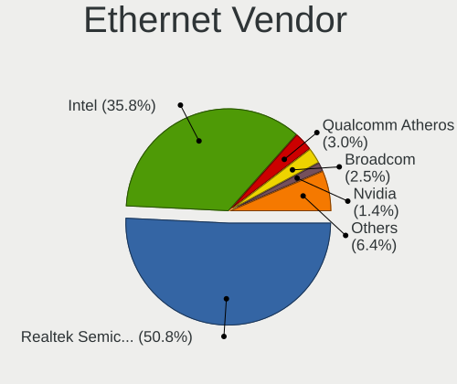

| Vendor                                 | Desktops | Percent |
|----------------------------------------|----------|---------|
| Realtek Semiconductor                  | 3636     | 50.76%  |
| Intel                                  | 2566     | 35.82%  |
| Qualcomm Atheros                       | 216      | 3.02%   |
| Broadcom                               | 182      | 2.54%   |
| Nvidia                                 | 103      | 1.44%   |
| Aquantia                               | 75       | 1.05%   |
| ASIX Electronics                       | 54       | 0.75%   |
| Marvell Technology Group               | 47       | 0.66%   |
| Samsung Electronics                    | 40       | 0.56%   |
| Xiaomi                                 | 31       | 0.43%   |
| Broadcom Limited                       | 30       | 0.42%   |
| MediaTek                               | 17       | 0.24%   |
| DisplayLink                            | 16       | 0.22%   |
| Qualcomm                               | 11       | 0.15%   |
| D-Link System                          | 11       | 0.15%   |
| Mellanox Technologies                  | 10       | 0.14%   |
| Huawei Technologies                    | 10       | 0.14%   |
| Google                                 | 9        | 0.13%   |
| VIA Technologies                       | 8        | 0.11%   |
| Qualcomm Technologies                  | 8        | 0.11%   |
| OPPO Electronics                       | 8        | 0.11%   |
| TP-Link                                | 6        | 0.08%   |
| ICS Advent                             | 5        | 0.07%   |
| American Megatrends                    | 5        | 0.07%   |
| Motorola PCS                           | 4        | 0.06%   |
| Linksys                                | 4        | 0.06%   |
| JMicron Technology                     | 4        | 0.06%   |
| Chelsio Communications                 | 4        | 0.06%   |
| Apple                                  | 4        | 0.06%   |
| 3Com                                   | 4        | 0.06%   |
| Tehuti Networks                        | 3        | 0.04%   |
| QLogic                                 | 3        | 0.04%   |
| QinHeng Electronics                    | 3        | 0.04%   |
| Sundance Technology Inc / IC Plus      | 2        | 0.03%   |
| Spreadtrum Communications              | 2        | 0.03%   |
| Sony Ericsson Mobile Communications AB | 2        | 0.03%   |
| Lenovo                                 | 2        | 0.03%   |
| ZTE WCDMA Technologies MSM             | 1        | 0.01%   |
| Vimtron Electronics                    | 1        | 0.01%   |
| Solarflare Communications              | 1        | 0.01%   |

Ethernet Model
--------------

Ethernet models

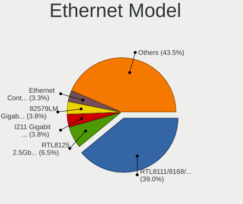

| Model                                                                          | Desktops | Percent |
|--------------------------------------------------------------------------------|----------|---------|
| Realtek RTL8111/8168/8211/8411 PCI Express Gigabit Ethernet Controller         | 2936     | 39.05%  |
| Realtek RTL8125 2.5GbE Controller                                              | 491      | 6.53%   |
| Intel I211 Gigabit Network Connection                                          | 287      | 3.82%   |
| Intel 82579LM Gigabit Network Connection (Lewisville)                          | 285      | 3.79%   |
| Intel Ethernet Controller I225-V                                               | 247      | 3.29%   |
| Intel Ethernet Connection (2) I219-V                                           | 229      | 3.05%   |
| Intel Ethernet Connection I217-LM                                              | 222      | 2.95%   |
| Intel Ethernet Connection (7) I219-V                                           | 118      | 1.57%   |
| Realtek RTL810xE PCI Express Fast Ethernet controller                          | 116      | 1.54%   |
| Intel 82579V Gigabit Network Connection                                        | 115      | 1.53%   |
| Intel Ethernet Connection (2) I219-LM                                          | 111      | 1.48%   |
| Intel Ethernet Connection I217-V                                               | 81       | 1.08%   |
| Intel I210 Gigabit Network Connection                                          | 80       | 1.06%   |
| Intel Ethernet Connection (2) I218-V                                           | 79       | 1.05%   |
| Intel 82574L Gigabit Network Connection                                        | 69       | 0.92%   |
| Intel Ethernet Controller I226-V                                               | 66       | 0.88%   |
| Realtek RTL8153 Gigabit Ethernet Adapter                                       | 63       | 0.84%   |
| Intel Ethernet Connection (7) I219-LM                                          | 60       | 0.8%    |
| Intel 82567LM-3 Gigabit Network Connection                                     | 58       | 0.77%   |
| Nvidia MCP61 Ethernet                                                          | 56       | 0.74%   |
| Qualcomm Atheros Killer E220x Gigabit Ethernet Controller                      | 55       | 0.73%   |
| Aquantia AQtion AQC107 NBase-T/IEEE 802.3an Ethernet Controller [Atlantic 10G] | 49       | 0.65%   |
| Intel Ethernet Connection (5) I219-LM                                          | 46       | 0.61%   |
| Intel I350 Gigabit Network Connection                                          | 45       | 0.6%    |
| ASIX AX88179 Gigabit Ethernet                                                  | 45       | 0.6%    |
| Intel Ethernet Connection (14) I219-V                                          | 39       | 0.52%   |
| Broadcom NetXtreme BCM5761 Gigabit Ethernet PCIe                               | 37       | 0.49%   |
| Intel Alder Lake-S PCH CNVi WiFi                                               | 34       | 0.45%   |
| Intel Ethernet Connection (17) I219-V                                          | 33       | 0.44%   |
| Qualcomm Atheros AR8161 Gigabit Ethernet                                       | 31       | 0.41%   |
| Marvell Group 88E8056 PCI-E Gigabit Ethernet Controller                        | 30       | 0.4%    |
| Intel Ethernet Connection (17) I219-LM                                         | 30       | 0.4%    |
| Intel 82599ES 10-Gigabit SFI/SFP+ Network Connection                           | 30       | 0.4%    |
| Realtek RTL8111/8168/8411 PCI Express Gigabit Ethernet Controller              | 29       | 0.39%   |
| Intel Ethernet Connection (2) I218-LM                                          | 29       | 0.39%   |
| Qualcomm Atheros AR8151 v2.0 Gigabit Ethernet                                  | 28       | 0.37%   |
| Intel 82578DC Gigabit Network Connection                                       | 27       | 0.36%   |
| Samsung Galaxy series, misc. (tethering mode)                                  | 26       | 0.35%   |
| Realtek RTL8169 PCI Gigabit Ethernet Controller                                | 26       | 0.35%   |
| Xiaomi Mi/Redmi series (RNDIS)                                                 | 25       | 0.33%   |

Net Controller Kind
-------------------

Ethernet, WiFi or modem

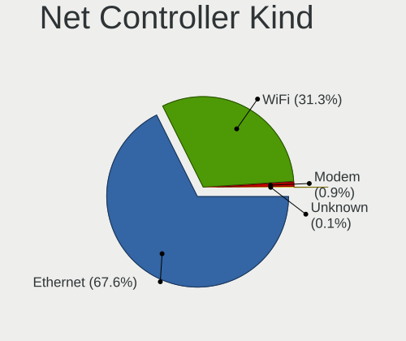

| Kind     | Desktops | Percent |
|----------|----------|---------|
| Ethernet | 6539     | 67.62%  |
| WiFi     | 3031     | 31.34%  |
| Modem    | 90       | 0.93%   |
| Unknown  | 10       | 0.1%    |

Used Controller
---------------

Currently used network controller

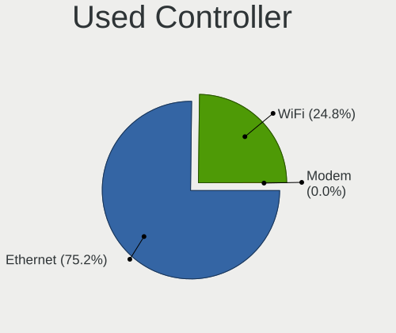

| Kind     | Desktops | Percent |
|----------|----------|---------|
| Ethernet | 5192     | 75.19%  |
| WiFi     | 1711     | 24.78%  |
| Modem    | 2        | 0.03%   |

NICs
----

Total network controllers on board

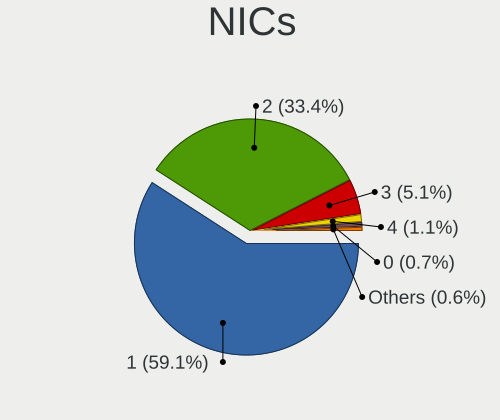

| Total | Desktops | Percent |
|-------|----------|---------|
| 1     | 3922     | 59.13%  |
| 2     | 2213     | 33.36%  |
| 3     | 338      | 5.1%    |
| 4     | 74       | 1.12%   |
| 0     | 46       | 0.69%   |
| 5     | 23       | 0.35%   |
| 7     | 6        | 0.09%   |
| 6     | 6        | 0.09%   |
| 8     | 3        | 0.05%   |
| 17    | 1        | 0.02%   |
| 9     | 1        | 0.02%   |

IPv6
----

IPv6 vs IPv4

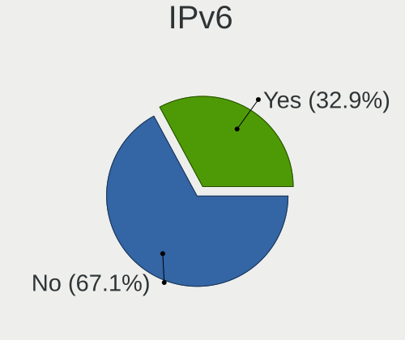

| Used | Desktops | Percent |
|------|----------|---------|
| No   | 4470     | 67.12%  |
| Yes  | 2190     | 32.88%  |

Bluetooth
---------

Bluetooth Vendor
----------------

Controller vendors

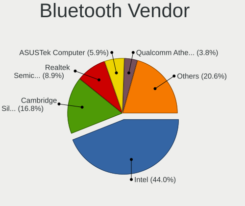

| Vendor                          | Desktops | Percent |
|---------------------------------|----------|---------|
| Intel                           | 1031     | 43.98%  |
| Cambridge Silicon Radio         | 394      | 16.81%  |
| Realtek Semiconductor           | 208      | 8.87%   |
| ASUSTek Computer                | 138      | 5.89%   |
| Qualcomm Atheros Communications | 90       | 3.84%   |
| MediaTek                        | 87       | 3.71%   |
| Broadcom                        | 83       | 3.54%   |
| IMC Networks                    | 68       | 2.9%    |
| TP-Link                         | 49       | 2.09%   |
| Foxconn / Hon Hai               | 39       | 1.66%   |
| Apple                           | 37       | 1.58%   |
| Lite-On Technology              | 24       | 1.02%   |
| Realtek                         | 12       | 0.51%   |
| Integrated System Solution      | 11       | 0.47%   |
| Unknown                         | 10       | 0.43%   |
| Belkin Components               | 9        | 0.38%   |
| Edimax Technology               | 7        | 0.3%    |
| Actions                         | 7        | 0.3%    |
| Dell                            | 5        | 0.21%   |
| Micro Star International        | 4        | 0.17%   |
| Logitech                        | 4        | 0.17%   |
| Dynex                           | 4        | 0.17%   |
| Ralink                          | 3        | 0.13%   |
| Toshiba                         | 2        | 0.09%   |
| Primax Electronics              | 2        | 0.09%   |
| HTC (High Tech Computer)        | 2        | 0.09%   |
| Hewlett-Packard                 | 2        | 0.09%   |
| D-Link System                   | 2        | 0.09%   |
| Conwise Technology              | 2        | 0.09%   |
| AICSemi                         | 2        | 0.09%   |
| TRENDnet                        | 1        | 0.04%   |
| SiW                             | 1        | 0.04%   |
| Plugable                        | 1        | 0.04%   |
| National Semiconductor          | 1        | 0.04%   |
| Mobile Action Technology        | 1        | 0.04%   |
| D-Link                          | 1        | 0.04%   |

Bluetooth Model
---------------

Controller models

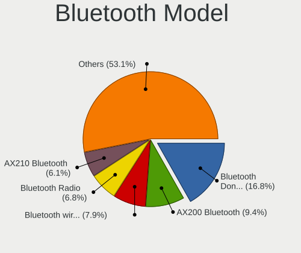

| Model                                                 | Desktops | Percent |
|-------------------------------------------------------|----------|---------|
| Cambridge Silicon Radio Bluetooth Dongle (HCI mode)   | 394      | 16.79%  |
| Intel AX200 Bluetooth                                 | 220      | 9.38%   |
| Intel Bluetooth wireless interface                    | 185      | 7.89%   |
| Realtek Bluetooth Radio                               | 159      | 6.78%   |
| Intel AX210 Bluetooth                                 | 142      | 6.05%   |
| Intel AX201 Bluetooth                                 | 133      | 5.67%   |
| Intel Wireless-AC 3168 Bluetooth                      | 109      | 4.65%   |
| Intel Bluetooth Device                                | 105      | 4.48%   |
| MediaTek Wireless_Device                              | 87       | 3.71%   |
| Intel Bluetooth 9460/9560 Jefferson Peak (JfP)        | 74       | 3.15%   |
| TP-Link TP-T@- UB500 Adapter                          | 49       | 2.09%   |
| Intel Wireless-AC 9260 Bluetooth Adapter              | 47       | 2%      |
| ASUS ASUS USB-BT500                                   | 43       | 1.83%   |
| Broadcom BCM20702A0 Bluetooth 4.0                     | 41       | 1.75%   |
| IMC Networks Bluetooth Radio                          | 40       | 1.71%   |
| Qualcomm Atheros  Bluetooth Device                    | 35       | 1.49%   |
| ASUS Broadcom BCM20702A0 Bluetooth                    | 34       | 1.45%   |
| Realtek  Bluetooth 4.2 Adapter                        | 31       | 1.32%   |
| Qualcomm Atheros AR3011 Bluetooth                     | 23       | 0.98%   |
| ASUS Bluetooth Radio                                  | 22       | 0.94%   |
| Foxconn / Hon Hai Wireless_Device                     | 21       | 0.9%    |
| IMC Networks Wireless_Device                          | 20       | 0.85%   |
| Intel Centrino Bluetooth Wireless Transceiver         | 18       | 0.77%   |
| Qualcomm Atheros AR9462 Bluetooth                     | 15       | 0.64%   |
| Foxconn / Hon Hai Bluetooth Device                    | 14       | 0.6%    |
| Apple Bluetooth Host Controller                       | 13       | 0.55%   |
| Realtek Bluetooth Radio                               | 12       | 0.51%   |
| Apple Built-in Bluetooth 2.0+EDR HCI                  | 12       | 0.51%   |
| Lite-On Bluetooth Device                              | 11       | 0.47%   |
| ASUS Qualcomm Bluetooth 4.1                           | 11       | 0.47%   |
| ASUS Broadcom BCM20702 Single-Chip Bluetooth 4.0 + LE | 11       | 0.47%   |
| Integrated System Solution Bluetooth Device           | 10       | 0.43%   |
| ASUS BCM20702A0                                       | 10       | 0.43%   |
| Unknown                                               | 10       | 0.43%   |
| Realtek RTL8821A Bluetooth                            | 9        | 0.38%   |
| Qualcomm Atheros Bluetooth USB Host Controller        | 8        | 0.34%   |
| Lite-On Qualcomm Atheros QCA9377 Bluetooth            | 7        | 0.3%    |
| Broadcom BCM2045 Bluetooth                            | 7        | 0.3%    |
| Apple Bluetooth HCI                                   | 7        | 0.3%    |
| Actions general adapter                               | 7        | 0.3%    |

Sound
-----

Sound Vendor
------------

Sound card vendors

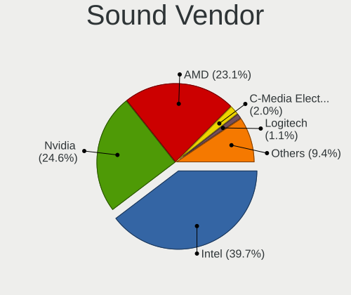

| Vendor                                       | Desktops | Percent |
|----------------------------------------------|----------|---------|
| Intel                                        | 4307     | 39.67%  |
| Nvidia                                       | 2675     | 24.64%  |
| AMD                                          | 2513     | 23.15%  |
| C-Media Electronics                          | 218      | 2.01%   |
| Logitech                                     | 121      | 1.11%   |
| Creative Labs                                | 89       | 0.82%   |
| ASUSTek Computer                             | 86       | 0.79%   |
| Micro Star International                     | 69       | 0.64%   |
| GN Netcom                                    | 47       | 0.43%   |
| Texas Instruments                            | 40       | 0.37%   |
| Kingston Technology                          | 39       | 0.36%   |
| JMTek                                        | 37       | 0.34%   |
| Generalplus Technology                       | 33       | 0.3%    |
| Creative Technology                          | 31       | 0.29%   |
| Razer USA                                    | 30       | 0.28%   |
| Corsair                                      | 30       | 0.28%   |
| SteelSeries ApS                              | 27       | 0.25%   |
| Focusrite-Novation                           | 27       | 0.25%   |
| Plantronics                                  | 22       | 0.2%    |
| Zoran Co. Personal Media Division (Nogatech) | 21       | 0.19%   |
| Giga-Byte Technology                         | 19       | 0.18%   |
| KTMicro                                      | 17       | 0.16%   |
| Hewlett-Packard                              | 16       | 0.15%   |
| Jieli Technology                             | 15       | 0.14%   |
| ASRock                                       | 13       | 0.12%   |
| DSEA A/S                                     | 12       | 0.11%   |
| Blue Microphones                             | 12       | 0.11%   |
| Realtek Semiconductor                        | 10       | 0.09%   |
| Microsoft                                    | 10       | 0.09%   |
| Dell                                         | 10       | 0.09%   |
| Apple                                        | 10       | 0.09%   |
| Tenx Technology                              | 9        | 0.08%   |
| Sony                                         | 9        | 0.08%   |
| M-Audio                                      | 9        | 0.08%   |
| VIA Technologies                             | 8        | 0.07%   |
| Astro Gaming                                 | 8        | 0.07%   |
| Samson Technologies                          | 7        | 0.06%   |
| JBL                                          | 6        | 0.06%   |
| Cambridge Silicon Radio                      | 6        | 0.06%   |
| Bose                                         | 6        | 0.06%   |

Sound Model
-----------

Sound card models

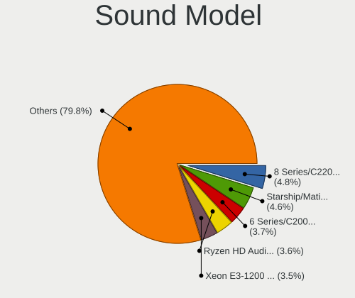

| Model                                                                      | Desktops | Percent |
|----------------------------------------------------------------------------|----------|---------|
| Intel 8 Series/C220 Series Chipset High Definition Audio Controller        | 605      | 4.8%    |
| AMD Starship/Matisse HD Audio Controller                                   | 581      | 4.61%   |
| Intel 6 Series/C200 Series Chipset Family High Definition Audio Controller | 461      | 3.66%   |
| AMD Ryzen HD Audio Controller                                              | 456      | 3.62%   |
| Intel Xeon E3-1200 v3/4th Gen Core Processor HD Audio Controller           | 443      | 3.51%   |
| AMD SBx00 Azalia (Intel HDA)                                               | 362      | 2.87%   |
| Intel 100 Series/C230 Series Chipset Family HD Audio Controller            | 361      | 2.86%   |
| Intel 200 Series PCH HD Audio                                              | 356      | 2.82%   |
| Intel 7 Series/C216 Chipset Family High Definition Audio Controller        | 349      | 2.77%   |
| Intel Cannon Lake PCH cAVS                                                 | 264      | 2.09%   |
| AMD Family 17h (Models 00h-0fh) HD Audio Controller                        | 226      | 1.79%   |
| Nvidia GK208 HDMI/DP Audio Controller                                      | 214      | 1.7%    |
| Intel Alder Lake-S HD Audio Controller                                     | 207      | 1.64%   |
| AMD FCH Azalia Controller                                                  | 205      | 1.63%   |
| AMD Ellesmere HDMI Audio [Radeon RX 470/480 / 570/580/590]                 | 205      | 1.63%   |
| AMD Renoir/Cezanne HDMI/DP Audio Controller                                | 195      | 1.55%   |
| Nvidia GP107GL High Definition Audio Controller                            | 169      | 1.34%   |
| AMD Oland/Hainan/Cape Verde/Pitcairn HDMI Audio [Radeon HD 7000 Series]    | 164      | 1.3%    |
| AMD Navi 21/23 HDMI/DP Audio Controller                                    | 161      | 1.28%   |
| Intel 82801JI (ICH10 Family) HD Audio Controller                           | 155      | 1.23%   |
| Intel 5 Series/3400 Series Chipset High Definition Audio                   | 146      | 1.16%   |
| Intel NM10/ICH7 Family High Definition Audio Controller                    | 142      | 1.13%   |
| Nvidia High Definition Audio Controller                                    | 141      | 1.12%   |
| Nvidia GA104 High Definition Audio Controller                              | 140      | 1.11%   |
| Intel C610/X99 series chipset HD Audio Controller                          | 135      | 1.07%   |
| Nvidia GA102 High Definition Audio Controller                              | 132      | 1.05%   |
| Nvidia GP104 High Definition Audio Controller                              | 131      | 1.04%   |
| Nvidia TU116 High Definition Audio Controller                              | 128      | 1.02%   |
| AMD Raven/Raven2/Fenghuang HDMI/DP Audio Controller                        | 127      | 1.01%   |
| Nvidia GP106 High Definition Audio Controller                              | 123      | 0.98%   |
| Intel Raptor Lake High Definition Audio Controller                         | 122      | 0.97%   |
| AMD Radeon High Definition Audio Controller                                | 122      | 0.97%   |
| Intel 9 Series Chipset Family HD Audio Controller                          | 114      | 0.9%    |
| Nvidia GM107 High Definition Audio Controller [GeForce 940MX]              | 109      | 0.86%   |
| Nvidia GA106 High Definition Audio Controller                              | 109      | 0.86%   |
| Nvidia GF119 HDMI Audio Controller                                         | 105      | 0.83%   |
| Intel Tiger Lake-H HD Audio Controller                                     | 103      | 0.82%   |
| AMD Baffin HDMI/DP Audio [Radeon RX 550 640SP / RX 560/560X]               | 99       | 0.79%   |
| Nvidia GK107 HDMI Audio Controller                                         | 97       | 0.77%   |
| Nvidia TU106 High Definition Audio Controller                              | 92       | 0.73%   |

Memory
------

Memory Vendor
-------------

Memory module vendors

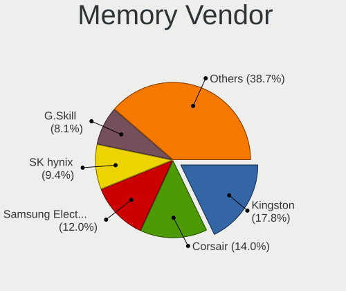

| Vendor                       | Desktops | Percent |
|------------------------------|----------|---------|
| Kingston                     | 644      | 17.83%  |
| Corsair                      | 507      | 14.04%  |
| Samsung Electronics          | 433      | 11.99%  |
| SK hynix                     | 340      | 9.42%   |
| G.Skill                      | 291      | 8.06%   |
| Unknown                      | 273      | 7.56%   |
| Crucial                      | 272      | 7.53%   |
| Micron Technology            | 214      | 5.93%   |
| A-DATA Technology            | 92       | 2.55%   |
| Unknown                      | 71       | 1.97%   |
| Team                         | 62       | 1.72%   |
| Patriot                      | 39       | 1.08%   |
| Ramaxel Technology           | 33       | 0.91%   |
| Nanya Technology             | 29       | 0.8%    |
| Unknown (ABCD)               | 21       | 0.58%   |
| Transcend                    | 19       | 0.53%   |
| Elpida                       | 15       | 0.42%   |
| Smart                        | 14       | 0.39%   |
| AMD                          | 12       | 0.33%   |
| Hewlett-Packard              | 11       | 0.3%    |
| PNY                          | 10       | 0.28%   |
| GOODRAM                      | 10       | 0.28%   |
| Apacer                       | 10       | 0.28%   |
| Timetec                      | 7        | 0.19%   |
| Patriot Memory (PDP Systems) | 7        | 0.19%   |
| Lexar                        | 7        | 0.19%   |
| Atermiter                    | 7        | 0.19%   |
| Unknown (0x1636)             | 6        | 0.17%   |
| Silicon Power                | 6        | 0.17%   |
| KLEVV                        | 6        | 0.17%   |
| Innodisk                     | 6        | 0.17%   |
| Avant                        | 6        | 0.17%   |
| ASint Technology             | 6        | 0.17%   |
| Neo Forza                    | 5        | 0.14%   |
| Kingmax                      | 5        | 0.14%   |
| GeIL                         | 5        | 0.14%   |
| Asgard                       | 5        | 0.14%   |
| Unifosa                      | 4        | 0.11%   |
| Super Talent                 | 4        | 0.11%   |
| KETECH                       | 4        | 0.11%   |

Memory Model
------------

Memory module models

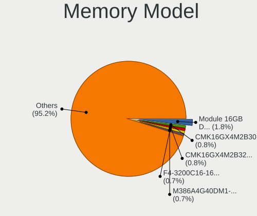

| Model                                                          | Desktops | Percent |
|----------------------------------------------------------------|----------|---------|
| Unknown                                                        | 71       | 1.82%   |
| Corsair RAM CMK16GX4M2B3000C15 8GB DIMM DDR4 3600MT/s          | 32       | 0.82%   |
| Corsair RAM CMK16GX4M2B3200C16 8GB DIMM DDR4 3600MT/s          | 30       | 0.77%   |
| G.Skill RAM F4-3200C16-16GVK 16GB DIMM DDR4 3600MT/s           | 28       | 0.72%   |
| Samsung RAM M386A4G40DM1-CRC 32GB DIMM DDR4 2400MT/s           | 26       | 0.67%   |
| Micron RAM 8JTF51264AZ-1G6E1 4GB DIMM DDR3 1600MT/s            | 25       | 0.64%   |
| Kingston RAM KHX1600C10D3/8G 8GB DIMM DDR3 2133MT/s            | 25       | 0.64%   |
| Corsair RAM CMK32GX4M2E3200C16 16GB DIMM DDR4 3600MT/s         | 23       | 0.59%   |
| Unknown RAM Module 8GB DIMM DDR3 1600MT/s                      | 21       | 0.54%   |
| Unknown (ABCD) RAM 123456789012345678 2GB DIMM LPDDR4 2133MT/s | 21       | 0.54%   |
| Kingston RAM KF3200C16D4/16GX 16GB DIMM DDR4 3733MT/s          | 21       | 0.54%   |
| Team RAM TEAMGROUP-UD4-3200 8GB DIMM DDR4 3800MT/s             | 20       | 0.51%   |
| Unknown RAM Module 2GB DIMM DDR2 800MT/s                       | 19       | 0.49%   |
| Samsung RAM M378B5173DB0-CK0 4096MB DIMM DDR3 1600MT/s         | 17       | 0.43%   |
| A-DATA RAM DDR4 3200 16GB DIMM DDR4 3600MT/s                   | 17       | 0.43%   |
| SK hynix RAM HMT451U6AFR8C-PB 4GB DIMM DDR3 1600MT/s           | 16       | 0.41%   |
| Micron RAM 36ASF2G72PZ-2G3B1 16GB DIMM DDR4 2400MT/s           | 16       | 0.41%   |
| Kingston RAM KHX3200C16D4/8GX 8GB DIMM DDR4 3733MT/s           | 16       | 0.41%   |
| Kingston RAM KF3200C16D4/32GX 32GB DIMM DDR4 3933MT/s          | 15       | 0.38%   |
| Corsair RAM CMK64GX4M2E3200C16 32GB DIMM DDR4 3600MT/s         | 15       | 0.38%   |
| G.Skill RAM F4-3000C16-8GISB 8GB DIMM DDR4 3200MT/s            | 14       | 0.36%   |
| SK hynix RAM HMT351U6CFR8C-PB 4GB DIMM DDR3 1800MT/s           | 13       | 0.33%   |
| Kingston RAM KHX2666C16/8G 8GiB DIMM DDR4 3466MT/s             | 13       | 0.33%   |
| Kingston RAM KF3200C16D4/8GX 8GiB DIMM DDR4 3600MT/s           | 13       | 0.33%   |
| Unknown RAM Module 4GB DIMM 1333MT/s                           | 12       | 0.31%   |
| Unknown RAM Module 2GB DIMM SDRAM                              | 12       | 0.31%   |
| Samsung RAM M378A5244CB0-CRC 4GB DIMM DDR4 3066MT/s            | 12       | 0.31%   |
| Samsung RAM M378A1K43CB2-CRC 8GB DIMM DDR4 3500MT/s            | 12       | 0.31%   |
| Kingston RAM KHX1866C10D3/8G 8GB DIMM DDR3 1867MT/s            | 12       | 0.31%   |
| Kingston RAM KHX1600C9D3/4GX 4GB DIMM DDR3 1867MT/s            | 12       | 0.31%   |
| Kingston RAM KF556C40-32 32GB DIMM DDR5 6000MT/s               | 12       | 0.31%   |
| Kingston RAM 9905734-415.A00G 16GB DIMM DDR4 3200MT/s          | 12       | 0.31%   |
| G.Skill RAM F5-6000J3040G32G 32GB DIMM DDR5 6200MT/s           | 12       | 0.31%   |
| Corsair RAM CMK32GX4M2D3600C18 16GB DIMM DDR4 3800MT/s         | 12       | 0.31%   |
| Corsair RAM CMK16GX4M2E3200C16 8GB DIMM DDR4 3466MT/s          | 12       | 0.31%   |
| Unknown RAM Module 4GB DIMM DDR3 1333MT/s                      | 11       | 0.28%   |
| Unknown RAM Module 4GB DIMM 1600MT/s                           | 11       | 0.28%   |
| Kingston RAM KHX3200C16D4/16GX 16GB DIMM DDR4 3600MT/s         | 11       | 0.28%   |
| G.Skill RAM F4-3200C16-8GIS 8GB DIMM DDR4 3600MT/s             | 11       | 0.28%   |
| SK hynix RAM HMT451U6BFR8C-PB 4GB DIMM DDR3 1600MT/s           | 10       | 0.26%   |

Memory Kind
-----------

Memory module kinds

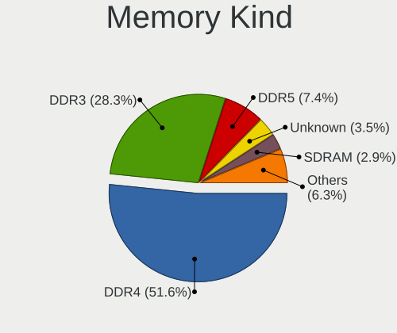

| Kind         | Desktops | Percent |
|--------------|----------|---------|
| DDR4         | 1660     | 51.62%  |
| DDR3         | 911      | 28.33%  |
| DDR5         | 237      | 7.37%   |
| Unknown      | 112      | 3.48%   |
| SDRAM        | 93       | 2.89%   |
| DDR2         | 80       | 2.49%   |
| DRAM         | 59       | 1.83%   |
| LPDDR4       | 36       | 1.12%   |
| DDR          | 19       | 0.59%   |
| LPDDR3       | 5        | 0.16%   |
| LPDDR5       | 3        | 0.09%   |
| DDR2 FB-DIMM | 1        | 0.03%   |

Memory Form Factor
------------------

Physical design of the memory module

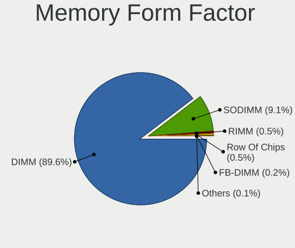

| Name         | Desktops | Percent |
|--------------|----------|---------|
| DIMM         | 2829     | 89.64%  |
| SODIMM       | 286      | 9.06%   |
| RIMM         | 17       | 0.54%   |
| Row Of Chips | 15       | 0.48%   |
| FB-DIMM      | 6        | 0.19%   |
| Chip         | 2        | 0.06%   |
| Unknown      | 1        | 0.03%   |

Memory Size
-----------

Memory module size

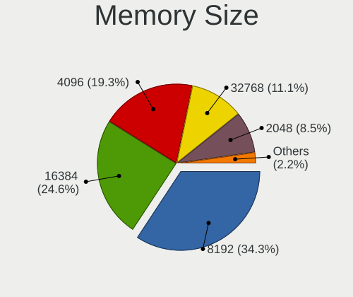

| Size   | Desktops | Percent |
|--------|----------|---------|
| 8192   | 1177     | 34.27%  |
| 16384  | 845      | 24.61%  |
| 4096   | 664      | 19.34%  |
| 32768  | 380      | 11.07%  |
| 2048   | 291      | 8.47%   |
| 1024   | 52       | 1.51%   |
| 65536  | 9        | 0.26%   |
| 49152  | 8        | 0.23%   |
| 512    | 4        | 0.12%   |
| 12288  | 2        | 0.06%   |
| 131072 | 1        | 0.03%   |
| 24576  | 1        | 0.03%   |

Memory Speed
------------

Memory module speed

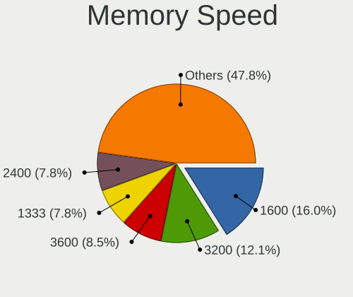

| Speed   | Desktops | Percent |
|---------|----------|---------|
| 1600    | 567      | 16.04%  |
| 3200    | 428      | 12.11%  |
| 3600    | 299      | 8.46%   |
| 1333    | 276      | 7.81%   |
| 2400    | 275      | 7.78%   |
| 2667    | 248      | 7.02%   |
| 2133    | 188      | 5.32%   |
| 4800    | 68       | 1.92%   |
| 3733    | 67       | 1.9%    |
| 800     | 65       | 1.84%   |
| 3000    | 64       | 1.81%   |
| 2666    | 64       | 1.81%   |
| 3800    | 56       | 1.58%   |
| 1867    | 53       | 1.5%    |
| 1866    | 53       | 1.5%    |
| 6000    | 48       | 1.36%   |
| 5600    | 43       | 1.22%   |
| 1800    | 43       | 1.22%   |
| 667     | 42       | 1.19%   |
| 3400    | 40       | 1.13%   |
| 2933    | 38       | 1.08%   |
| 4000    | 35       | 0.99%   |
| 3466    | 32       | 0.91%   |
| 1066    | 32       | 0.91%   |
| Unknown | 28       | 0.79%   |
| 5200    | 24       | 0.68%   |
| 6400    | 20       | 0.57%   |
| 3933    | 19       | 0.54%   |
| 3066    | 18       | 0.51%   |
| 1067    | 17       | 0.48%   |
| 3866    | 16       | 0.45%   |
| 3266    | 16       | 0.45%   |
| 2800    | 16       | 0.45%   |
| 6200    | 14       | 0.4%    |
| 400     | 13       | 0.37%   |
| 3500    | 12       | 0.34%   |
| 3334    | 10       | 0.28%   |
| 2000    | 10       | 0.28%   |
| 1648    | 10       | 0.28%   |
| 3333    | 9        | 0.25%   |

Printers & scanners
-------------------

Printer Vendor
--------------

Printer device vendors

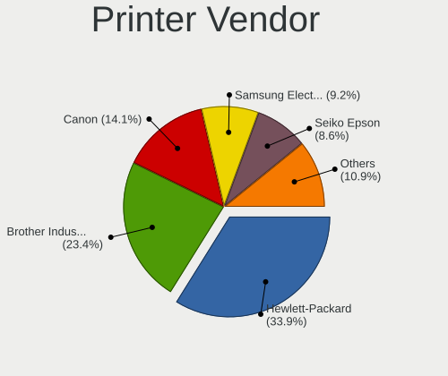

| Vendor                 | Desktops | Percent |
|------------------------|----------|---------|
| Hewlett-Packard        | 103      | 33.88%  |
| Brother Industries     | 71       | 23.36%  |
| Canon                  | 43       | 14.14%  |
| Samsung Electronics    | 28       | 9.21%   |
| Seiko Epson            | 26       | 8.55%   |
| Dymo-CoStar            | 7        | 2.3%    |
| Prolific Technology    | 4        | 1.32%   |
| Lexmark International  | 4        | 1.32%   |
| STMicroelectronics     | 3        | 0.99%   |
| Xerox                  | 2        | 0.66%   |
| QinHeng Electronics    | 2        | 0.66%   |
| Oki Data               | 2        | 0.66%   |
| Kyocera                | 2        | 0.66%   |
| Fuji Xerox             | 2        | 0.66%   |
| Zebra                  | 1        | 0.33%   |
| Pantum                 | 1        | 0.33%   |
| iDPRT                  | 1        | 0.33%   |
| Custom Engineering SPA | 1        | 0.33%   |
| Apple                  | 1        | 0.33%   |

Printer Model
-------------

Printer device models

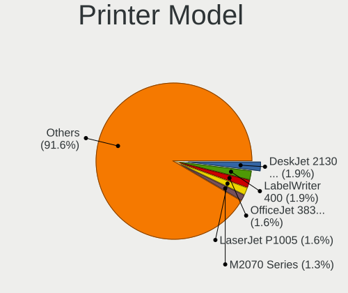

| Model                                                     | Desktops | Percent |
|-----------------------------------------------------------|----------|---------|
| HP DeskJet 2130 series                                    | 6        | 1.94%   |
| Dymo-CoStar LabelWriter 400                               | 6        | 1.94%   |
| HP OfficeJet 3830 series                                  | 5        | 1.62%   |
| HP LaserJet P1005                                         | 5        | 1.62%   |
| Samsung M2070 Series                                      | 4        | 1.29%   |
| Prolific PL2305 Parallel Port                             | 4        | 1.29%   |
| HP Deskjet 3050A                                          | 4        | 1.29%   |
| HP DeskJet 2300 series                                    | 4        | 1.29%   |
| Brother HL-L2350DW series                                 | 4        | 1.29%   |
| STMicroelectronics LED badge -- mini LED display -- 11x44 | 3        | 0.97%   |
| Seiko Epson ET-2810 Series                                | 3        | 0.97%   |
| Seiko Epson ET-2720 Series                                | 3        | 0.97%   |
| Seiko Epson ET-2710 Series                                | 3        | 0.97%   |
| Seiko Epson EPSON L220 Series                             | 3        | 0.97%   |
| Samsung M2020 Series                                      | 3        | 0.97%   |
| Samsung Composite Device                                  | 3        | 0.97%   |
| HP LaserJet 1010                                          | 3        | 0.97%   |
| HP HP OfficeJet Pro 8020 series                           | 3        | 0.97%   |
| HP DeskJet 4100 series                                    | 3        | 0.97%   |
| HP DeskJet 3700 series                                    | 3        | 0.97%   |
| Canon TS3100 series                                       | 3        | 0.97%   |
| Canon PIXMA MG2500 Series                                 | 3        | 0.97%   |
| Canon LiDE 300                                            | 3        | 0.97%   |
| Canon LBP2900                                             | 3        | 0.97%   |
| Brother MFC-L2700DW                                       | 3        | 0.97%   |
| Brother HL-1440 Laser Printer                             | 3        | 0.97%   |
| Brother DCP-7065DN                                        | 3        | 0.97%   |
| Brother DCP-7055 scanner/printer                          | 3        | 0.97%   |
| Brother DCP-1610W                                         | 3        | 0.97%   |
| Seiko Epson XP-2100 Series                                | 2        | 0.65%   |
| Seiko Epson ET-8550 Series                                | 2        | 0.65%   |
| Seiko Epson ET-4800 Series                                | 2        | 0.65%   |
| Samsung Xerox Phaser 3117 Laser Printer                   | 2        | 0.65%   |
| Samsung SCX-3200 Series                                   | 2        | 0.65%   |
| Samsung ML-216x Series Laser Printer                      | 2        | 0.65%   |
| Samsung C460 Series                                       | 2        | 0.65%   |
| QinHeng CH340S                                            | 2        | 0.65%   |
| HP OfficeJet 5600 (USBHUB)                                | 2        | 0.65%   |
| HP Officejet 4500 G510n-z                                 | 2        | 0.65%   |
| HP LaserJet M203-M206                                     | 2        | 0.65%   |

Scanner Vendor
--------------

Scanner device vendors

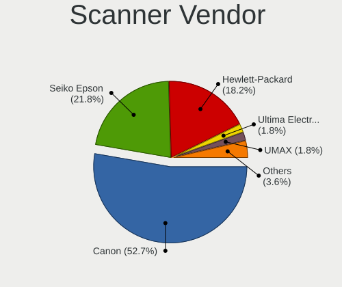

| Vendor                      | Desktops | Percent |
|-----------------------------|----------|---------|
| Canon                       | 29       | 52.73%  |
| Seiko Epson                 | 12       | 21.82%  |
| Hewlett-Packard             | 10       | 18.18%  |
| UMAX                        | 1        | 1.82%   |
| Ultima Electronics          | 1        | 1.82%   |
| Mustek Systems              | 1        | 1.82%   |
| Acer Peripherals (now BenQ) | 1        | 1.82%   |

Scanner Model
-------------

Scanner device models

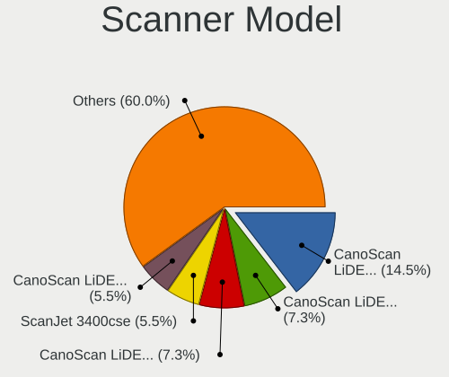

| Model                                                                                 | Desktops | Percent |
|---------------------------------------------------------------------------------------|----------|---------|
| Canon CanoScan LiDE 120                                                               | 8        | 14.55%  |
| Canon CanoScan LiDE 220                                                               | 4        | 7.27%   |
| Canon CanoScan LiDE 100                                                               | 4        | 7.27%   |
| HP ScanJet 3400cse                                                                    | 3        | 5.45%   |
| Canon CanoScan LiDE 110                                                               | 3        | 5.45%   |
| Seiko Epson GT-F700 [Perfection V350]                                                 | 2        | 3.64%   |
| Seiko Epson GT-F520/GT-F570 [Perfection 3590 PHOTO]                                   | 2        | 3.64%   |
| UMAX Astra 2200/2200SU                                                                | 1        | 1.82%   |
| Ultima Artec Ultima 2000 (GT6801 based)/Lifetec LT9385/ScanMagic 1200 UB Plus Scanner | 1        | 1.82%   |
| Seiko Epson Perfection V37/V370                                                       | 1        | 1.82%   |
| Seiko Epson GT-X800 [Perfection 4990 PHOTO]                                           | 1        | 1.82%   |
| Seiko Epson GT-X770 [Perfection V500]                                                 | 1        | 1.82%   |
| Seiko Epson GT-F730 [GT-S630/Perfection V33/V330 Photo]                               | 1        | 1.82%   |
| Seiko Epson GT-F500/GT-F550 [Perfection 2480/2580 PHOTO]                              | 1        | 1.82%   |
| Seiko Epson GT-9300UF [Perfection 2400 PHOTO]                                         | 1        | 1.82%   |
| Seiko Epson GT-8400UF [Perfection 1670/1670 PHOTO]                                    | 1        | 1.82%   |
| Seiko Epson GT-7700U [Perfection 1240U]                                               | 1        | 1.82%   |
| Mustek Systems BearPaw 1200 CU Plus                                                   | 1        | 1.82%   |
| HP Scanjet N6010                                                                      | 1        | 1.82%   |
| HP ScanJet G4010                                                                      | 1        | 1.82%   |
| HP Scanjet G2710                                                                      | 1        | 1.82%   |
| HP ScanJet 5530C PhotoSmart                                                           | 1        | 1.82%   |
| HP ScanJet 4850C/4890C                                                                | 1        | 1.82%   |
| HP ScanJet 3970c                                                                      | 1        | 1.82%   |
| HP HP Scanjet 300                                                                     | 1        | 1.82%   |
| Canon CanoScan N670U/N676U/LiDE 20                                                    | 1        | 1.82%   |
| Canon CanoScan N1240U/LiDE 30                                                         | 1        | 1.82%   |
| Canon CanoScan LiDE 70                                                                | 1        | 1.82%   |
| Canon CanoScan LiDE 500F                                                              | 1        | 1.82%   |
| Canon CanoScan LiDE 50/LiDE 35/LiDE 40                                                | 1        | 1.82%   |
| Canon CanoScan LIDE 25                                                                | 1        | 1.82%   |
| Canon CanoScan LiDE 210                                                               | 1        | 1.82%   |
| Canon CanoScan LiDE 200                                                               | 1        | 1.82%   |
| Canon CanoScan 9000F Mark II                                                          | 1        | 1.82%   |
| Canon CanoScan 4200F                                                                  | 1        | 1.82%   |
| Acer Peripherals (now BenQ) Benq 5000                                                 | 1        | 1.82%   |

Camera
------

Camera Vendor
-------------

Camera device vendors

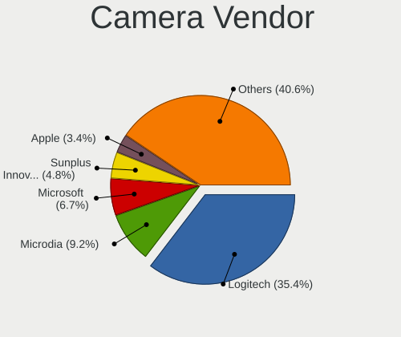

| Vendor                        | Desktops | Percent |
|-------------------------------|----------|---------|
| Logitech                      | 409      | 35.41%  |
| Microdia                      | 106      | 9.18%   |
| Microsoft                     | 77       | 6.67%   |
| Sunplus Innovation Technology | 55       | 4.76%   |
| Apple                         | 39       | 3.38%   |
| Samsung Electronics           | 38       | 3.29%   |
| Generalplus Technology        | 35       | 3.03%   |
| Chicony Electronics           | 27       | 2.34%   |
| ARC International             | 27       | 2.34%   |
| Z-Star Microelectronics       | 26       | 2.25%   |
| Realtek Semiconductor         | 24       | 2.08%   |
| webcam                        | 18       | 1.56%   |
| Creative Technology           | 13       | 1.13%   |
| Trust                         | 12       | 1.04%   |
| KYE Systems (Mouse Systems)   | 11       | 0.95%   |
| Jieli Technology              | 11       | 0.95%   |
| MacroSilicon                  | 10       | 0.87%   |
| Hewlett-Packard               | 10       | 0.87%   |
| Cubeternet                    | 10       | 0.87%   |
| Sonix Technology              | 8        | 0.69%   |
| Razer USA                     | 8        | 0.69%   |
| GEMBIRD                       | 8        | 0.69%   |
| WaveRider Communications      | 6        | 0.52%   |
| Philips (or NXP)              | 6        | 0.52%   |
| Alcor Micro                   | 6        | 0.52%   |
| Genesys Logic                 | 5        | 0.43%   |
| AVerMedia Technologies        | 5        | 0.43%   |
| Aveo Technology               | 5        | 0.43%   |
| Arkmicro Technologies         | 5        | 0.43%   |
| YGTek                         | 4        | 0.35%   |
| webcamvendor                  | 4        | 0.35%   |
| Linux Foundation              | 4        | 0.35%   |
| Huawei Technologies           | 4        | 0.35%   |
| Guillemot                     | 4        | 0.35%   |
| Asuscom Network               | 4        | 0.35%   |
| Unknown                       | 3        | 0.26%   |
| SHENZHEN EMEET TECHNOLOGY     | 3        | 0.26%   |
| Quanta                        | 3        | 0.26%   |
| OPPO Electronics              | 3        | 0.26%   |
| Lenovo                        | 3        | 0.26%   |

Camera Model
------------

Camera device models

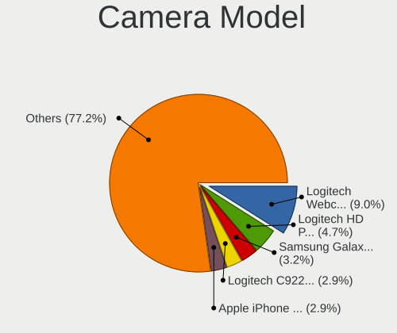

| Model                                    | Desktops | Percent |
|------------------------------------------|----------|---------|
| Logitech Webcam C270                     | 104      | 8.97%   |
| Logitech HD Pro Webcam C920              | 55       | 4.74%   |
| Samsung Galaxy series, misc. (MTP mode)  | 37       | 3.19%   |
| Logitech C922 Pro Stream Webcam          | 34       | 2.93%   |
| Apple iPhone 5/5C/5S/6/SE/7/8/X          | 34       | 2.93%   |
| Microsoft LifeCam HD-3000                | 28       | 2.41%   |
| ARC International Camera                 | 27       | 2.33%   |
| Microdia Webcam Vitade AF                | 25       | 2.16%   |
| Logitech C920 PRO HD Webcam              | 25       | 2.16%   |
| Generalplus GENERAL WEBCAM               | 20       | 1.72%   |
| Microdia USB 2.0 Camera                  | 19       | 1.64%   |
| Logitech HD Webcam C615                  | 19       | 1.64%   |
| webcam webcam                            | 18       | 1.55%   |
| Sunplus Full HD webcam                   | 18       | 1.55%   |
| Sunplus Integrated Camera                | 17       | 1.47%   |
| Microdia Camera                          | 16       | 1.38%   |
| Logitech Webcam C170                     | 16       | 1.38%   |
| Logitech BRIO Ultra HD Webcam            | 16       | 1.38%   |
| Microdia Sonix USB 2.0 Camera            | 15       | 1.29%   |
| Logitech HD Webcam C525                  | 14       | 1.21%   |
| Z-Star Venus USB2.0 Camera               | 11       | 0.95%   |
| Microsoft LifeCam Cinema                 | 11       | 0.95%   |
| Microdia CyberTrack H7                   | 10       | 0.86%   |
| Logitech Webcam C930e                    | 10       | 0.86%   |
| Logitech Webcam C310                     | 10       | 0.86%   |
| Jieli USB PHY 2.0                        | 9        | 0.78%   |
| Chicony HP High Definition 1MP Webcam    | 9        | 0.78%   |
| Microsoft LifeCam Studio                 | 8        | 0.69%   |
| MacroSilicon USB Video                   | 8        | 0.69%   |
| Logitech StreamCam                       | 8        | 0.69%   |
| Logitech HD Webcam C910                  | 8        | 0.69%   |
| Generalplus 808 Camera #9 (web-cam mode) | 8        | 0.69%   |
| Microdia Integrated Camera               | 7        | 0.6%    |
| Logitech QuickCam Pro 9000               | 7        | 0.6%    |
| Generalplus WEB CAM                      | 7        | 0.6%    |
| Realtek FULL HD 1080P Webcam             | 6        | 0.52%   |
| Logitech Logitech Webcam C925e           | 6        | 0.52%   |
| Cubeternet USB2.0 Camera                 | 6        | 0.52%   |
| Alcor Micro USB 2.0 PC Camera            | 6        | 0.52%   |
| Trust Full HD Webcam                     | 5        | 0.43%   |

Security
--------

Fingerprint Vendor
------------------

Fingerprint sensor vendors

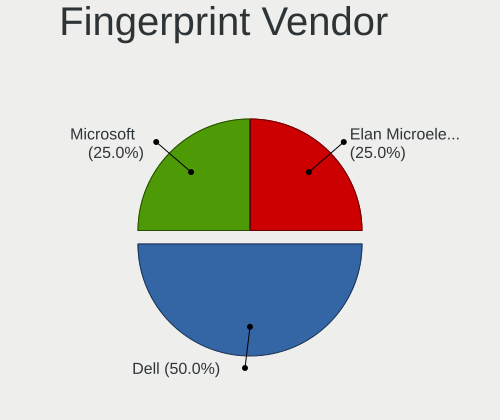

| Vendor                | Desktops | Percent |
|-----------------------|----------|---------|
| LighTuning Technology | 2        | 25%     |
| DigitalPersona        | 2        | 25%     |
| Dell                  | 2        | 25%     |
| Microsoft             | 1        | 12.5%   |
| Elan Microelectronics | 1        | 12.5%   |

Fingerprint Model
-----------------

Fingerprint sensor models

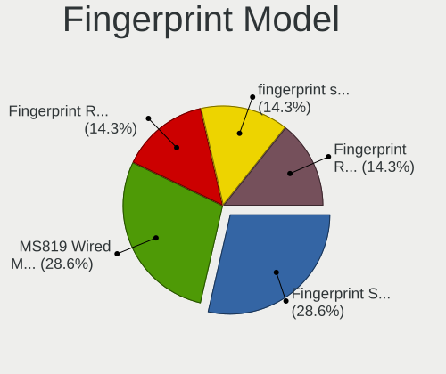

| Model                                          | Desktops | Percent |
|------------------------------------------------|----------|---------|
| LighTuning Fingerprint Sensor                  | 2        | 25%     |
| DigitalPersona Fingerprint Reader              | 2        | 25%     |
| Dell MS819 Wired Mouse With Fingerprint Reader | 2        | 25%     |
| Microsoft Fingerprint Reader                   | 1        | 12.5%   |
| Elan fingerprint sensor [FeinTech FPS00200]    | 1        | 12.5%   |

Chipcard Vendor
---------------

Chipcard module vendors

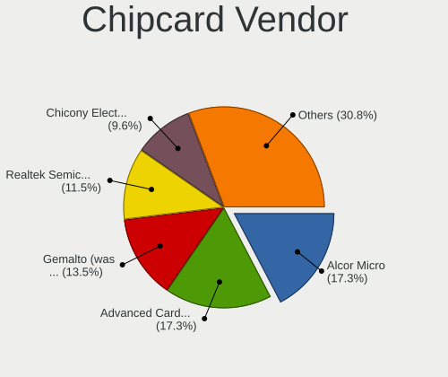

| Vendor                    | Desktops | Percent |
|---------------------------|----------|---------|
| Alcor Micro               | 9        | 17.31%  |
| Advanced Card Systems     | 9        | 17.31%  |
| Gemalto (was Gemplus)     | 7        | 13.46%  |
| Realtek Semiconductor     | 6        | 11.54%  |
| Chicony Electronics       | 5        | 9.62%   |
| SCM Microsystems          | 3        | 5.77%   |
| Cherry                    | 3        | 5.77%   |
| Reiner SCT Kartensysteme  | 2        | 3.85%   |
| Bit4id                    | 2        | 3.85%   |
| Aladdin Knowledge Systems | 2        | 3.85%   |
| OmniKey                   | 1        | 1.92%   |
| Lenovo                    | 1        | 1.92%   |
| Giesecke & Devrient       | 1        | 1.92%   |
| Fujitsu Siemens Computers | 1        | 1.92%   |

Chipcard Model
--------------

Chipcard module models

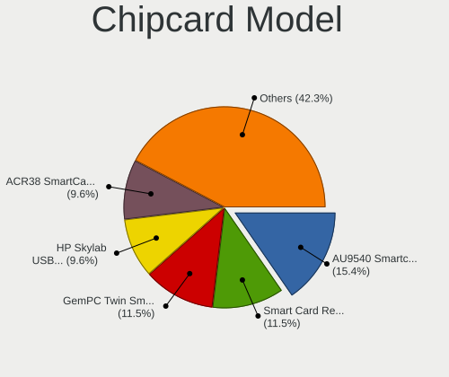

| Model                                                                      | Desktops | Percent |
|----------------------------------------------------------------------------|----------|---------|
| Alcor Micro AU9540 Smartcard Reader                                        | 8        | 15.38%  |
| Realtek Semiconductor Smart Card Reader Interface                          | 6        | 11.54%  |
| Gemalto (was Gemplus) GemPC Twin SmartCard Reader                          | 6        | 11.54%  |
| Chicony Electronics HP Skylab USB Smartcard Keyboard                       | 5        | 9.62%   |
| Advanced Card Systems ACR38 SmartCard Reader                               | 5        | 9.62%   |
| SCM Microsystems SCR331-LC1 / SCR3310 SmartCard Reader                     | 3        | 5.77%   |
| Reiner SCT Kartensysteme cyberJack RFID basis contactless smartcard reader | 2        | 3.85%   |
| Aladdin Knowledge Systems Token JC                                         | 2        | 3.85%   |
| Advanced Card Systems ACR122U                                              | 2        | 3.85%   |
| OmniKey CardMan 3121 (HID Technologies)                                    | 1        | 1.92%   |
| Lenovo Smartcard Keyboard                                                  | 1        | 1.92%   |
| Giesecke & Devrient StarSign CUT S                                         | 1        | 1.92%   |
| Gemalto (was Gemplus) GemPC Key SmartCard Reader                           | 1        | 1.92%   |
| Fujitsu Siemens Computers SmartCard Reader 2A                              | 1        | 1.92%   |
| Cherry SmartTerminal XX1X                                                  | 1        | 1.92%   |
| Cherry SmartCard Reader Keyboard KC 1000 SC                                | 1        | 1.92%   |
| Cherry KC 1000 SC Z                                                        | 1        | 1.92%   |
| Bit4id miniLector-s                                                        | 1        | 1.92%   |
| Bit4id miniLector EVO                                                      | 1        | 1.92%   |
| Alcor Micro Watchdata W 1981                                               | 1        | 1.92%   |
| Advanced Card Systems ACR39U                                               | 1        | 1.92%   |
| Advanced Card Systems ACR1281 1S Dual Reader                               | 1        | 1.92%   |

Unsupported
-----------

Unsupported Devices
-------------------

Total unsupported devices on board

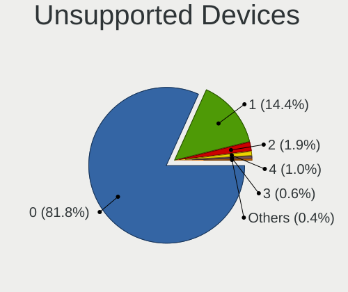

| Total | Desktops | Percent |
|-------|----------|---------|
| 0     | 5488     | 81.75%  |
| 1     | 964      | 14.36%  |
| 2     | 130      | 1.94%   |
| 4     | 65       | 0.97%   |
| 3     | 41       | 0.61%   |
| 5     | 13       | 0.19%   |
| 6     | 8        | 0.12%   |
| 8     | 2        | 0.03%   |
| 10    | 1        | 0.01%   |
| 7     | 1        | 0.01%   |

Unsupported Device Types
------------------------

Types of unsupported devices

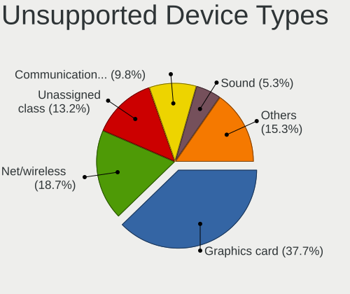

| Type                     | Desktops | Percent |
|--------------------------|----------|---------|
| Graphics card            | 596      | 37.75%  |
| Net/wireless             | 296      | 18.75%  |
| Unassigned class         | 208      | 13.17%  |
| Communication controller | 154      | 9.75%   |
| Sound                    | 83       | 5.26%   |
| Chipcard                 | 33       | 2.09%   |
| Bluetooth                | 33       | 2.09%   |
| Net/ethernet             | 32       | 2.03%   |
| Storage/raid             | 31       | 1.96%   |
| Multimedia controller    | 29       | 1.84%   |
| Camera                   | 28       | 1.77%   |
| Network                  | 17       | 1.08%   |
| Card reader              | 9        | 0.57%   |
| Dvb card                 | 7        | 0.44%   |
| Fingerprint reader       | 5        | 0.32%   |
| Storage/nvme             | 4        | 0.25%   |
| Modem                    | 4        | 0.25%   |
| Storage/ata              | 3        | 0.19%   |
| Wireless                 | 2        | 0.13%   |
| Tv card                  | 2        | 0.13%   |
| Firewire controller      | 2        | 0.13%   |
| Storage/ide              | 1        | 0.06%   |

