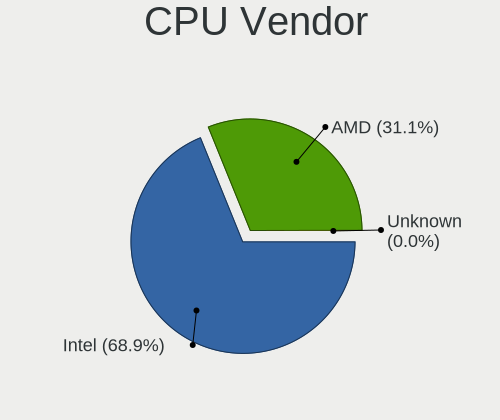
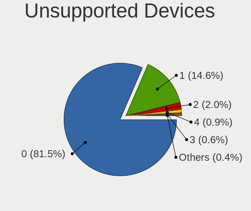

Ubuntu 22.04 - Tested Hardware & Statistics (Desktops)
------------------------------------------------------

A project to collect tested hardware configurations for Ubuntu 22.04.

Anyone can contribute to this report by the [hw-probe](https://github.com/linuxhw/hw-probe) tool:

    sudo -E hw-probe -all -upload

Please contribute! Especially if your hardware is rare.

Contents
--------

* [ Test Cases ](#test-cases)

* [ System ](#system)
  - [ Kernel                   ](#kernel)
  - [ Kernel Family            ](#kernel-family)
  - [ Kernel Major Ver.        ](#kernel-major-ver)
  - [ Arch                     ](#arch)
  - [ DE                       ](#de)
  - [ Display Server           ](#display-server)
  - [ Display Manager          ](#display-manager)
  - [ OS Lang                  ](#os-lang)
  - [ Boot Mode                ](#boot-mode)
  - [ Filesystem               ](#filesystem)
  - [ Part. scheme             ](#part-scheme)
  - [ Dual Boot with Linux/BSD ](#dual-boot-with-linuxbsd)
  - [ Dual Boot (Win)          ](#dual-boot-win)

* [ Board ](#board)
  - [ Vendor                   ](#vendor)
  - [ Model                    ](#model)
  - [ Model Family             ](#model-family)
  - [ MFG Year                 ](#mfg-year)
  - [ Form Factor              ](#form-factor)
  - [ Secure Boot              ](#secure-boot)
  - [ Coreboot                 ](#coreboot)
  - [ RAM Size                 ](#ram-size)
  - [ RAM Used                 ](#ram-used)
  - [ Total Drives             ](#total-drives)
  - [ Has CD-ROM               ](#has-cd-rom)
  - [ Has Ethernet             ](#has-ethernet)
  - [ Has WiFi                 ](#has-wifi)
  - [ Has Bluetooth            ](#has-bluetooth)

* [ Location ](#location)
  - [ Country                  ](#country)
  - [ City                     ](#city)

* [ Drives ](#drives)
  - [ Drive Vendor             ](#drive-vendor)
  - [ Drive Model              ](#drive-model)
  - [ HDD Vendor               ](#hdd-vendor)
  - [ SSD Vendor               ](#ssd-vendor)
  - [ Drive Kind               ](#drive-kind)
  - [ Drive Connector          ](#drive-connector)
  - [ Drive Size               ](#drive-size)
  - [ Space Total              ](#space-total)
  - [ Space Used               ](#space-used)
  - [ Malfunc. Drives          ](#malfunc-drives)
  - [ Malfunc. Drive Vendor    ](#malfunc-drive-vendor)
  - [ Malfunc. HDD Vendor      ](#malfunc-hdd-vendor)
  - [ Malfunc. Drive Kind      ](#malfunc-drive-kind)
  - [ Failed Drives            ](#failed-drives)
  - [ Failed Drive Vendor      ](#failed-drive-vendor)
  - [ Drive Status             ](#drive-status)

* [ Storage controller ](#storage-controller)
  - [ Storage Vendor           ](#storage-vendor)
  - [ Storage Model            ](#storage-model)
  - [ Storage Kind             ](#storage-kind)

* [ Processor ](#processor)
  - [ CPU Vendor               ](#cpu-vendor)
  - [ CPU Model                ](#cpu-model)
  - [ CPU Model Family         ](#cpu-model-family)
  - [ CPU Cores                ](#cpu-cores)
  - [ CPU Sockets              ](#cpu-sockets)
  - [ CPU Threads              ](#cpu-threads)
  - [ CPU Op-Modes             ](#cpu-op-modes)
  - [ CPU Microcode            ](#cpu-microcode)
  - [ CPU Microarch            ](#cpu-microarch)

* [ Graphics ](#graphics)
  - [ GPU Vendor               ](#gpu-vendor)
  - [ GPU Model                ](#gpu-model)
  - [ GPU Combo                ](#gpu-combo)
  - [ GPU Driver               ](#gpu-driver)
  - [ GPU Memory               ](#gpu-memory)

* [ Monitor ](#monitor)
  - [ Monitor Vendor           ](#monitor-vendor)
  - [ Monitor Model            ](#monitor-model)
  - [ Monitor Resolution       ](#monitor-resolution)
  - [ Monitor Diagonal         ](#monitor-diagonal)
  - [ Monitor Width            ](#monitor-width)
  - [ Aspect Ratio             ](#aspect-ratio)
  - [ Monitor Area             ](#monitor-area)
  - [ Pixel Density            ](#pixel-density)
  - [ Multiple Monitors        ](#multiple-monitors)

* [ Network ](#network)
  - [ Net Controller Vendor    ](#net-controller-vendor)
  - [ Net Controller Model     ](#net-controller-model)
  - [ Wireless Vendor          ](#wireless-vendor)
  - [ Wireless Model           ](#wireless-model)
  - [ Ethernet Vendor          ](#ethernet-vendor)
  - [ Ethernet Model           ](#ethernet-model)
  - [ Net Controller Kind      ](#net-controller-kind)
  - [ Used Controller          ](#used-controller)
  - [ NICs                     ](#nics)
  - [ IPv6                     ](#ipv6)

* [ Bluetooth ](#bluetooth)
  - [ Bluetooth Vendor         ](#bluetooth-vendor)
  - [ Bluetooth Model          ](#bluetooth-model)

* [ Sound ](#sound)
  - [ Sound Vendor             ](#sound-vendor)
  - [ Sound Model              ](#sound-model)

* [ Memory ](#memory)
  - [ Memory Vendor            ](#memory-vendor)
  - [ Memory Model             ](#memory-model)
  - [ Memory Kind              ](#memory-kind)
  - [ Memory Form Factor       ](#memory-form-factor)
  - [ Memory Size              ](#memory-size)
  - [ Memory Speed             ](#memory-speed)

* [ Printers & scanners ](#printers--scanners)
  - [ Printer Vendor           ](#printer-vendor)
  - [ Printer Model            ](#printer-model)
  - [ Scanner Vendor           ](#scanner-vendor)
  - [ Scanner Model            ](#scanner-model)

* [ Camera ](#camera)
  - [ Camera Vendor            ](#camera-vendor)
  - [ Camera Model             ](#camera-model)

* [ Security ](#security)
  - [ Fingerprint Vendor       ](#fingerprint-vendor)
  - [ Fingerprint Model        ](#fingerprint-model)
  - [ Chipcard Vendor          ](#chipcard-vendor)
  - [ Chipcard Model           ](#chipcard-model)

* [ Unsupported ](#unsupported)
  - [ Unsupported Devices      ](#unsupported-devices)
  - [ Unsupported Device Types ](#unsupported-device-types)

Test Cases
----------

Total: 3197

| Vendor        | Model                       | Probe                                                      | Date         |
|---------------|-----------------------------|------------------------------------------------------------|--------------|
| Gigabyte      | B365M DS3H                  | [d515d5d9f7](https://linux-hardware.org/?probe=d515d5d9f7) | Feb 01, 2023 |
| Lenovo        | SHARKBAY 0B98401 WIN        | [1668f1f69f](https://linux-hardware.org/?probe=1668f1f69f) | Feb 01, 2023 |
| ASUSTek       | PRIME B550M-A               | [2e458676e4](https://linux-hardware.org/?probe=2e458676e4) | Feb 01, 2023 |
| HP            | 1790                        | [d0d3ca5e7c](https://linux-hardware.org/?probe=d0d3ca5e7c) | Feb 01, 2023 |
| Huanan        | X99-F8D PLUS V1.1           | [e68a009e8f](https://linux-hardware.org/?probe=e68a009e8f) | Feb 01, 2023 |
| Gigabyte      | GA-MA69VM-S2                | [72dae43046](https://linux-hardware.org/?probe=72dae43046) | Feb 01, 2023 |
| NCR           | Pocono                      | [1a1c878e10](https://linux-hardware.org/?probe=1a1c878e10) | Jan 31, 2023 |
| ASUSTek       | ROG STRIX B450-I GAMING     | [d59770af38](https://linux-hardware.org/?probe=d59770af38) | Jan 31, 2023 |
| ASUSTek       | ROG STRIX B450-I GAMING     | [3a5ae3d1e8](https://linux-hardware.org/?probe=3a5ae3d1e8) | Jan 31, 2023 |
| Intel         | DH77DF AAG40293-301         | [1a0f7653e3](https://linux-hardware.org/?probe=1a0f7653e3) | Jan 31, 2023 |
| Dell          | 06HR05 A00                  | [b80c55d90d](https://linux-hardware.org/?probe=b80c55d90d) | Jan 31, 2023 |
| Lenovo        | 36C8 SDK0J40700 WIN 3258... | [01c7dbecde](https://linux-hardware.org/?probe=01c7dbecde) | Jan 31, 2023 |
| Gigabyte      | Z97M-DS3H                   | [360dc83e04](https://linux-hardware.org/?probe=360dc83e04) | Jan 31, 2023 |
| Medion        | MS-7728                     | [60cf9e4948](https://linux-hardware.org/?probe=60cf9e4948) | Jan 31, 2023 |
| Maxtang       | EHL30 V1.0                  | [d104ad1307](https://linux-hardware.org/?probe=d104ad1307) | Jan 31, 2023 |
| Dell          | 040DDP A01                  | [6094b799d7](https://linux-hardware.org/?probe=6094b799d7) | Jan 31, 2023 |
| Gigabyte      | H270-Gaming 3               | [e64a1e0a5a](https://linux-hardware.org/?probe=e64a1e0a5a) | Jan 31, 2023 |
| Gigabyte      | F2A88XM-D3H                 | [846f831269](https://linux-hardware.org/?probe=846f831269) | Jan 31, 2023 |
| Gigabyte      | Z170-HD3P-CF                | [9e9deedf0d](https://linux-hardware.org/?probe=9e9deedf0d) | Jan 31, 2023 |
| Lenovo        | 30D0 SDK0J40697 WIN 3305... | [f018b74ad8](https://linux-hardware.org/?probe=f018b74ad8) | Jan 31, 2023 |
| Acer          | Unknown                     | [05de2b4244](https://linux-hardware.org/?probe=05de2b4244) | Jan 30, 2023 |
| MSI           | MPG X570 GAMING EDGE WIF... | [353272e0d2](https://linux-hardware.org/?probe=353272e0d2) | Jan 30, 2023 |
| Dell          | 0GDG8Y A00                  | [8ba7e25b58](https://linux-hardware.org/?probe=8ba7e25b58) | Jan 30, 2023 |
| Dell          | 0GDG8Y A00                  | [759e9a48d1](https://linux-hardware.org/?probe=759e9a48d1) | Jan 30, 2023 |
| Intel         | DH77DF AAG40293-301         | [1c91d911d7](https://linux-hardware.org/?probe=1c91d911d7) | Jan 30, 2023 |
| Lenovo        | 36C8 SDK0J40700 WIN 3258... | [529b411b46](https://linux-hardware.org/?probe=529b411b46) | Jan 30, 2023 |
| ASUSTek       | ROG STRIX Z390-E GAMING     | [7983249b4c](https://linux-hardware.org/?probe=7983249b4c) | Jan 30, 2023 |
| HP            | 8054                        | [f2367fdcda](https://linux-hardware.org/?probe=f2367fdcda) | Jan 30, 2023 |
| MSI           | X370 SLI PLUS               | [bb20465703](https://linux-hardware.org/?probe=bb20465703) | Jan 30, 2023 |
| HP            | 18E7                        | [db4ef3e5f4](https://linux-hardware.org/?probe=db4ef3e5f4) | Jan 30, 2023 |
| Gigabyte      | H270-Gaming 3               | [4427845ac1](https://linux-hardware.org/?probe=4427845ac1) | Jan 30, 2023 |
| Lenovo        | 3704 SDK0J40700 WIN 3258... | [aff06e830e](https://linux-hardware.org/?probe=aff06e830e) | Jan 30, 2023 |
| ASUSTek       | ROG STRIX B550-F GAMING     | [4fb612b680](https://linux-hardware.org/?probe=4fb612b680) | Jan 29, 2023 |
| MSI           | MPG B550I GAMING EDGE MA... | [ff186606cd](https://linux-hardware.org/?probe=ff186606cd) | Jan 29, 2023 |
| ASRock        | B460M Pro4                  | [7af163f694](https://linux-hardware.org/?probe=7af163f694) | Jan 29, 2023 |
| Gigabyte      | B250M-HD3-CF                | [f8630776ca](https://linux-hardware.org/?probe=f8630776ca) | Jan 29, 2023 |
| MSI           | Z77A-G43                    | [873725bb74](https://linux-hardware.org/?probe=873725bb74) | Jan 29, 2023 |
| MSI           | Z77A-G43                    | [f489fe4f5d](https://linux-hardware.org/?probe=f489fe4f5d) | Jan 29, 2023 |
| ASUSTek       | PRIME B450M-K II            | [d4a5012f93](https://linux-hardware.org/?probe=d4a5012f93) | Jan 29, 2023 |
| Dell          | 0VRWRC A01                  | [0e6a170715](https://linux-hardware.org/?probe=0e6a170715) | Jan 29, 2023 |
| HP            | 81B4                        | [01229ad5ec](https://linux-hardware.org/?probe=01229ad5ec) | Jan 29, 2023 |
| ASRock        | 970M Pro3                   | [e0a5d6512f](https://linux-hardware.org/?probe=e0a5d6512f) | Jan 29, 2023 |
| Foxconn       | A74MX-S/A74MX-K             | [9daeb7adc3](https://linux-hardware.org/?probe=9daeb7adc3) | Jan 29, 2023 |
| Lenovo        | SHARKBAY SDK0J40700 WIN     | [75027cfa77](https://linux-hardware.org/?probe=75027cfa77) | Jan 29, 2023 |
| ASRock        | B460M Pro4                  | [37c0fb77f5](https://linux-hardware.org/?probe=37c0fb77f5) | Jan 29, 2023 |
| Apple         | Mac-F221BEC8                | [d8de82d8c4](https://linux-hardware.org/?probe=d8de82d8c4) | Jan 29, 2023 |
| HP            | 18E7                        | [01cbafc241](https://linux-hardware.org/?probe=01cbafc241) | Jan 28, 2023 |
| ASUSTek       | F2A55-M LK2                 | [8bf2fa8d9b](https://linux-hardware.org/?probe=8bf2fa8d9b) | Jan 28, 2023 |
| ASUSTek       | M5A97 R2.0                  | [845b3c6990](https://linux-hardware.org/?probe=845b3c6990) | Jan 28, 2023 |
| ASUSTek       | M5A97 R2.0                  | [d7469767f6](https://linux-hardware.org/?probe=d7469767f6) | Jan 28, 2023 |
| ASUSTek       | F2A85-V                     | [d528677cfd](https://linux-hardware.org/?probe=d528677cfd) | Jan 28, 2023 |
| Gigabyte      | B660M GAMING DDR4           | [c7fc79b5f1](https://linux-hardware.org/?probe=c7fc79b5f1) | Jan 28, 2023 |
| BESSTAR Te... | UM350                       | [1ec2f78884](https://linux-hardware.org/?probe=1ec2f78884) | Jan 28, 2023 |
| ASUSTek       | PRIME A320M-K               | [11586188ad](https://linux-hardware.org/?probe=11586188ad) | Jan 28, 2023 |
| ASUSTek       | A58M-A/BR                   | [2e6e55e6ea](https://linux-hardware.org/?probe=2e6e55e6ea) | Jan 28, 2023 |
| ASRock        | 970M Pro3                   | [58366ca3d1](https://linux-hardware.org/?probe=58366ca3d1) | Jan 28, 2023 |
| Dell          | 0HY9JP A00                  | [f4aefcd670](https://linux-hardware.org/?probe=f4aefcd670) | Jan 28, 2023 |
| ASUSTek       | H61M-K                      | [312e07a824](https://linux-hardware.org/?probe=312e07a824) | Jan 28, 2023 |
| ASUSTek       | P8H67-M PRO                 | [97d1ab1b7d](https://linux-hardware.org/?probe=97d1ab1b7d) | Jan 28, 2023 |
| Gigabyte      | B75M-D3H                    | [3ee2e6ab56](https://linux-hardware.org/?probe=3ee2e6ab56) | Jan 27, 2023 |
| MSI           | TRX40 PRO WIFI              | [d9508d5b22](https://linux-hardware.org/?probe=d9508d5b22) | Jan 27, 2023 |
| Dell          | 057FFP A01                  | [ec0e3da69d](https://linux-hardware.org/?probe=ec0e3da69d) | Jan 27, 2023 |
| Acer          | Predator G3620              | [0fdd7e30ce](https://linux-hardware.org/?probe=0fdd7e30ce) | Jan 27, 2023 |
| ASUSTek       | P8H61-M LX R2.0             | [6d2e490a23](https://linux-hardware.org/?probe=6d2e490a23) | Jan 27, 2023 |
| ASUSTek       | Z170-K                      | [a1f535bfca](https://linux-hardware.org/?probe=a1f535bfca) | Jan 27, 2023 |
| ASUSTek       | P5K                         | [6d496e6965](https://linux-hardware.org/?probe=6d496e6965) | Jan 27, 2023 |
| Dell          | 0GM819                      | [f5810a0a61](https://linux-hardware.org/?probe=f5810a0a61) | Jan 27, 2023 |
| Gigabyte      | GA-890GPA-UD3H              | [e660f922a4](https://linux-hardware.org/?probe=e660f922a4) | Jan 27, 2023 |
| Lenovo        | 0B98401 PRO                 | [06086e6112](https://linux-hardware.org/?probe=06086e6112) | Jan 27, 2023 |
| Dell          | 0RY206                      | [822d0f1c17](https://linux-hardware.org/?probe=822d0f1c17) | Jan 27, 2023 |
| ASUSTek       | H61M-E                      | [0ebd68a086](https://linux-hardware.org/?probe=0ebd68a086) | Jan 27, 2023 |
| Medion        | MS-7675                     | [1d9d209dbf](https://linux-hardware.org/?probe=1d9d209dbf) | Jan 27, 2023 |
| Gigabyte      | 970A-D3P                    | [f01366b131](https://linux-hardware.org/?probe=f01366b131) | Jan 27, 2023 |
| HP            | Compaq 8200 Elite SFF PC    | [73f629ca61](https://linux-hardware.org/?probe=73f629ca61) | Jan 27, 2023 |
| Gigabyte      | X570 UD                     | [75e92725f5](https://linux-hardware.org/?probe=75e92725f5) | Jan 26, 2023 |
| Gigabyte      | H81M-S2PV                   | [4910cfdfcd](https://linux-hardware.org/?probe=4910cfdfcd) | Jan 26, 2023 |
| Positivo      | POS-PIB150DT                | [5a333d4e71](https://linux-hardware.org/?probe=5a333d4e71) | Jan 26, 2023 |
| Gigabyte      | B450 AORUS M                | [3e65f42529](https://linux-hardware.org/?probe=3e65f42529) | Jan 26, 2023 |
| Dell          | 0CRH6C A01                  | [d06248a310](https://linux-hardware.org/?probe=d06248a310) | Jan 26, 2023 |
| Unknown       | 1.0                         | [85d36881c1](https://linux-hardware.org/?probe=85d36881c1) | Jan 26, 2023 |
| Unknown       | 1.0                         | [a25e1d1008](https://linux-hardware.org/?probe=a25e1d1008) | Jan 26, 2023 |
| HP            | 843B                        | [98d0f20b21](https://linux-hardware.org/?probe=98d0f20b21) | Jan 26, 2023 |
| HP            | 8299                        | [d73eaeeb81](https://linux-hardware.org/?probe=d73eaeeb81) | Jan 26, 2023 |
| HP            | 18E4                        | [1f51508eeb](https://linux-hardware.org/?probe=1f51508eeb) | Jan 26, 2023 |
| HP            | 8299                        | [47b5f3fdef](https://linux-hardware.org/?probe=47b5f3fdef) | Jan 26, 2023 |
| Intel         | Q3XXG4-P V1.0               | [72a508a4ad](https://linux-hardware.org/?probe=72a508a4ad) | Jan 26, 2023 |
| ASRock        | Z690 Taichi                 | [adba499f59](https://linux-hardware.org/?probe=adba499f59) | Jan 26, 2023 |
| ASUSTek       | ROG Maximus Z690 FORMULA    | [a9775027ed](https://linux-hardware.org/?probe=a9775027ed) | Jan 26, 2023 |
| ASUSTek       | Basswood3G                  | [0728a59863](https://linux-hardware.org/?probe=0728a59863) | Jan 25, 2023 |
| Fujitsu       | D3233-A1 S26361-D3233-A1    | [d30b7c1657](https://linux-hardware.org/?probe=d30b7c1657) | Jan 25, 2023 |
| HP            | 1495                        | [d600418bf6](https://linux-hardware.org/?probe=d600418bf6) | Jan 25, 2023 |
| Apple         | Mac-F221BEC8                | [73b7cfc152](https://linux-hardware.org/?probe=73b7cfc152) | Jan 25, 2023 |
| MSI           | 2A9C                        | [cea7204c4b](https://linux-hardware.org/?probe=cea7204c4b) | Jan 25, 2023 |
| ASUSTek       | G20AJ                       | [ff9bda6922](https://linux-hardware.org/?probe=ff9bda6922) | Jan 25, 2023 |
| ASUSTek       | B85M-G                      | [73bef1464f](https://linux-hardware.org/?probe=73bef1464f) | Jan 25, 2023 |
| Dell          | 0KRC95 A01                  | [9580da1eb5](https://linux-hardware.org/?probe=9580da1eb5) | Jan 25, 2023 |
| Gigabyte      | H310M H x.x                 | [64ccdd32f5](https://linux-hardware.org/?probe=64ccdd32f5) | Jan 25, 2023 |
| ASUSTek       | M5A78L-M/USB3               | [596316a81c](https://linux-hardware.org/?probe=596316a81c) | Jan 25, 2023 |
| Gigabyte      | B550I AORUS PRO AX          | [b6afa43240](https://linux-hardware.org/?probe=b6afa43240) | Jan 24, 2023 |
| Gigabyte      | B550I AORUS PRO AX          | [141c9ffa73](https://linux-hardware.org/?probe=141c9ffa73) | Jan 24, 2023 |
| ASRock        | X99 Professional Gaming ... | [74054f4cb8](https://linux-hardware.org/?probe=74054f4cb8) | Jan 24, 2023 |
| ASRock        | X99 Professional Gaming ... | [2a89d751e1](https://linux-hardware.org/?probe=2a89d751e1) | Jan 24, 2023 |
| MSI           | Boston                      | [456d7782ad](https://linux-hardware.org/?probe=456d7782ad) | Jan 24, 2023 |
| Gigabyte      | Z390 AORUS ULTRA-CF         | [0300fb4b9a](https://linux-hardware.org/?probe=0300fb4b9a) | Jan 24, 2023 |
| MSI           | B560M PRO-VDH               | [8cb2b45267](https://linux-hardware.org/?probe=8cb2b45267) | Jan 24, 2023 |
| ASRock        | H110 Pro BTC+               | [f4a90a48ec](https://linux-hardware.org/?probe=f4a90a48ec) | Jan 24, 2023 |
| Unknown       | 1.0                         | [99201dd05a](https://linux-hardware.org/?probe=99201dd05a) | Jan 24, 2023 |
| MSI           | B350M MORTAR                | [1c843535db](https://linux-hardware.org/?probe=1c843535db) | Jan 24, 2023 |
| ASUSTek       | PRIME X570-P                | [c8c9f53754](https://linux-hardware.org/?probe=c8c9f53754) | Jan 24, 2023 |
| ASUSTek       | Z87-WS                      | [da3028df45](https://linux-hardware.org/?probe=da3028df45) | Jan 23, 2023 |
| Gateway       | IPIMB-ARA                   | [53527537f3](https://linux-hardware.org/?probe=53527537f3) | Jan 23, 2023 |
| Dell          | 0YC03K A04                  | [aaccd62190](https://linux-hardware.org/?probe=aaccd62190) | Jan 23, 2023 |
| ASRock        | 960GM-GS3 FX                | [f2894f6970](https://linux-hardware.org/?probe=f2894f6970) | Jan 23, 2023 |
| ASUSTek       | ProArt Z690-CREATOR WIFI    | [123c1db6ac](https://linux-hardware.org/?probe=123c1db6ac) | Jan 23, 2023 |
| ASUSTek       | ProArt Z690-CREATOR WIFI    | [48ee4a3eef](https://linux-hardware.org/?probe=48ee4a3eef) | Jan 23, 2023 |
| Unknown       | 1.0                         | [678e6d3875](https://linux-hardware.org/?probe=678e6d3875) | Jan 23, 2023 |
| Gigabyte      | M68MT-S2P                   | [09735072af](https://linux-hardware.org/?probe=09735072af) | Jan 23, 2023 |
| ASUSTek       | PRIME H310T R2.0            | [4a6f5a78f9](https://linux-hardware.org/?probe=4a6f5a78f9) | Jan 23, 2023 |
| MSI           | Z390-A PRO                  | [68a1d06f54](https://linux-hardware.org/?probe=68a1d06f54) | Jan 23, 2023 |
| Dell          | 0NNNCT A01                  | [b80dda96de](https://linux-hardware.org/?probe=b80dda96de) | Jan 23, 2023 |
| Gigabyte      | H310M H x.x                 | [ac375e0fa7](https://linux-hardware.org/?probe=ac375e0fa7) | Jan 23, 2023 |
| MSI           | A320M-A PRO                 | [4b4420e22f](https://linux-hardware.org/?probe=4b4420e22f) | Jan 23, 2023 |
| Gateway       | IPIMB-ARA                   | [86fcc07fe3](https://linux-hardware.org/?probe=86fcc07fe3) | Jan 23, 2023 |
| ASRock        | N68-VGS3 FX                 | [d25d4580a9](https://linux-hardware.org/?probe=d25d4580a9) | Jan 23, 2023 |
| Lenovo        | MAHOBAY NOK                 | [8e5bf9673b](https://linux-hardware.org/?probe=8e5bf9673b) | Jan 23, 2023 |
| Dell          | 0NV0M7 A02                  | [7c562ab921](https://linux-hardware.org/?probe=7c562ab921) | Jan 22, 2023 |
| ASRock        | G31M-S                      | [dbf8922f3a](https://linux-hardware.org/?probe=dbf8922f3a) | Jan 22, 2023 |
| MSI           | Boston                      | [34413408ce](https://linux-hardware.org/?probe=34413408ce) | Jan 22, 2023 |
| Gigabyte      | B560M AORUS PRO AX          | [7407dcc533](https://linux-hardware.org/?probe=7407dcc533) | Jan 22, 2023 |
| Medion        | H110H4-EM                   | [02ac31d42d](https://linux-hardware.org/?probe=02ac31d42d) | Jan 22, 2023 |
| Dell          | 0NV0M7 A02                  | [b5bd3e5d33](https://linux-hardware.org/?probe=b5bd3e5d33) | Jan 22, 2023 |
| Biostar       | A320MH                      | [4c75d6c079](https://linux-hardware.org/?probe=4c75d6c079) | Jan 22, 2023 |
| ASRock        | B365 Pro4                   | [44fa1b3713](https://linux-hardware.org/?probe=44fa1b3713) | Jan 22, 2023 |
| ASUSTek       | P5K                         | [dc5b823cb5](https://linux-hardware.org/?probe=dc5b823cb5) | Jan 22, 2023 |
| ASRock        | N68-GE3 UCC                 | [cd23d81f65](https://linux-hardware.org/?probe=cd23d81f65) | Jan 22, 2023 |
| Lenovo        | NOK                         | [78e5b6feb3](https://linux-hardware.org/?probe=78e5b6feb3) | Jan 22, 2023 |
| Gigabyte      | GA-890FXA-UD5               | [27ec85040f](https://linux-hardware.org/?probe=27ec85040f) | Jan 22, 2023 |
| Gigabyte      | Z97M-DS3H                   | [d251029940](https://linux-hardware.org/?probe=d251029940) | Jan 22, 2023 |
| HP            | 339A                        | [031e19c496](https://linux-hardware.org/?probe=031e19c496) | Jan 21, 2023 |
| Gigabyte      | B550M DS3H AC               | [47a418d177](https://linux-hardware.org/?probe=47a418d177) | Jan 21, 2023 |
| Gigabyte      | X470 AORUS ULTRA GAMING-... | [4584e904f8](https://linux-hardware.org/?probe=4584e904f8) | Jan 21, 2023 |
| ASUSTek       | PRIME A320M-K               | [6419184e6e](https://linux-hardware.org/?probe=6419184e6e) | Jan 21, 2023 |
| Lenovo        | 30C0 SDK0J40697 WIN 3305... | [f6f1f5e32b](https://linux-hardware.org/?probe=f6f1f5e32b) | Jan 21, 2023 |
| ASUSTek       | M4N78-AM                    | [cf65d9f981](https://linux-hardware.org/?probe=cf65d9f981) | Jan 21, 2023 |
| Dell          | 0F6X5P A00                  | [6228476153](https://linux-hardware.org/?probe=6228476153) | Jan 21, 2023 |
| ASUSTek       | TUF Gaming B560M-E          | [0bbafaf9fe](https://linux-hardware.org/?probe=0bbafaf9fe) | Jan 21, 2023 |
| Fujitsu       | D3430-A1 S26361-D3430-A1    | [9229e3b2ae](https://linux-hardware.org/?probe=9229e3b2ae) | Jan 21, 2023 |
| Medion        | MS-7728                     | [93d0aaac10](https://linux-hardware.org/?probe=93d0aaac10) | Jan 21, 2023 |
| Medion        | MS-7728                     | [eb9cef403c](https://linux-hardware.org/?probe=eb9cef403c) | Jan 21, 2023 |
| Intel         | DH61BF AAG81311-101         | [d6ea5bde87](https://linux-hardware.org/?probe=d6ea5bde87) | Jan 21, 2023 |
| MSI           | B450-A PRO MAX              | [9d025602e0](https://linux-hardware.org/?probe=9d025602e0) | Jan 21, 2023 |
| ASUSTek       | Maximus VII HERO            | [3fe12efbb8](https://linux-hardware.org/?probe=3fe12efbb8) | Jan 21, 2023 |
| ASUSTek       | P8H61-M LE/CSM R2.0         | [33dfa6188e](https://linux-hardware.org/?probe=33dfa6188e) | Jan 20, 2023 |
| ASUSTek       | Z87-PRO                     | [334bde8bc6](https://linux-hardware.org/?probe=334bde8bc6) | Jan 20, 2023 |
| Pegatron      | NARRA5                      | [0772fdc2db](https://linux-hardware.org/?probe=0772fdc2db) | Jan 20, 2023 |
| MSI           | MS-7369                     | [7e96534421](https://linux-hardware.org/?probe=7e96534421) | Jan 20, 2023 |
| MSI           | B450 TOMAHAWK MAX II        | [1b41330a7e](https://linux-hardware.org/?probe=1b41330a7e) | Jan 20, 2023 |
| MSI           | MAG B650 TOMAHAWK WIFI      | [ce99cb312d](https://linux-hardware.org/?probe=ce99cb312d) | Jan 20, 2023 |
| ASUSTek       | ROG Maximus XI HERO         | [55d330d3ea](https://linux-hardware.org/?probe=55d330d3ea) | Jan 20, 2023 |
| Gigabyte      | Z97M-DS3H                   | [6c55213012](https://linux-hardware.org/?probe=6c55213012) | Jan 20, 2023 |
| Gigabyte      | B75M-D3H                    | [a3def8bf43](https://linux-hardware.org/?probe=a3def8bf43) | Jan 19, 2023 |
| ASUSTek       | PRIME B365M-A               | [c08f2e5961](https://linux-hardware.org/?probe=c08f2e5961) | Jan 19, 2023 |
| ASUSTek       | PRIME B350M-A               | [6f50700657](https://linux-hardware.org/?probe=6f50700657) | Jan 19, 2023 |
| ASUSTek       | PRIME A320M-K               | [9301fd6936](https://linux-hardware.org/?probe=9301fd6936) | Jan 19, 2023 |
| MSI           | H110M PRO-VD                | [e000402b1c](https://linux-hardware.org/?probe=e000402b1c) | Jan 19, 2023 |
| ASRock        | H110 Pro BTC+               | [f888822c0d](https://linux-hardware.org/?probe=f888822c0d) | Jan 19, 2023 |
| ASUSTek       | PRIME X399-A                | [1a61029965](https://linux-hardware.org/?probe=1a61029965) | Jan 19, 2023 |
| MSI           | H110M PRO-VD                | [79e6461b99](https://linux-hardware.org/?probe=79e6461b99) | Jan 19, 2023 |
| MSI           | X570-A PRO                  | [9c0b3ef63b](https://linux-hardware.org/?probe=9c0b3ef63b) | Jan 19, 2023 |
| Pegatron      | EVANS                       | [798a545fa8](https://linux-hardware.org/?probe=798a545fa8) | Jan 19, 2023 |
| Pegatron      | EVANS                       | [411db3ea66](https://linux-hardware.org/?probe=411db3ea66) | Jan 19, 2023 |
| Dell          | 0WR7PY A01                  | [4197c5f3d3](https://linux-hardware.org/?probe=4197c5f3d3) | Jan 19, 2023 |
| MSI           | H81M-E33                    | [ddb1be1cc6](https://linux-hardware.org/?probe=ddb1be1cc6) | Jan 18, 2023 |
| ASRock        | G31M-S                      | [d3aa4e7eea](https://linux-hardware.org/?probe=d3aa4e7eea) | Jan 18, 2023 |
| ASUSTek       | PRIME Z270-A                | [8e511beda6](https://linux-hardware.org/?probe=8e511beda6) | Jan 18, 2023 |
| ASUSTek       | PRIME H510M-A               | [0ccab4b1e3](https://linux-hardware.org/?probe=0ccab4b1e3) | Jan 18, 2023 |
| Medion        | MS-7728                     | [b5e3ddf859](https://linux-hardware.org/?probe=b5e3ddf859) | Jan 18, 2023 |
| ASRock        | B550M-ITX/ac                | [a7ac9067b0](https://linux-hardware.org/?probe=a7ac9067b0) | Jan 18, 2023 |
| Lenovo        | 0B98401 WIN                 | [8d4e5b4499](https://linux-hardware.org/?probe=8d4e5b4499) | Jan 18, 2023 |
| Lenovo        | 314F SDK0J40697 WIN 3305... | [f7efc3545d](https://linux-hardware.org/?probe=f7efc3545d) | Jan 18, 2023 |
| Dell          | 0Y3R3K A00                  | [f2164a9c60](https://linux-hardware.org/?probe=f2164a9c60) | Jan 18, 2023 |
| ASUSTek       | TUF Gaming B550-PLUS        | [fd99b07929](https://linux-hardware.org/?probe=fd99b07929) | Jan 18, 2023 |
| HP            | 2B35                        | [559109871c](https://linux-hardware.org/?probe=559109871c) | Jan 18, 2023 |
| Intel         | DG41RQ AAE54511-205         | [1125db7cfd](https://linux-hardware.org/?probe=1125db7cfd) | Jan 18, 2023 |
| Dell          | 0T7D40 A01                  | [75b71dfa6d](https://linux-hardware.org/?probe=75b71dfa6d) | Jan 18, 2023 |
| ASUSTek       | ROG CROSSHAIR VIII DARK ... | [9a99559833](https://linux-hardware.org/?probe=9a99559833) | Jan 18, 2023 |
| ASRock        | G31M-S                      | [50bc0b52b3](https://linux-hardware.org/?probe=50bc0b52b3) | Jan 18, 2023 |
| Gigabyte      | A320M-S2H-CF                | [cfaac8c50b](https://linux-hardware.org/?probe=cfaac8c50b) | Jan 17, 2023 |
| ASUSTek       | P8Q77-M                     | [f883cb7c7b](https://linux-hardware.org/?probe=f883cb7c7b) | Jan 17, 2023 |
| ASUSTek       | PRIME Z270-A                | [ad9172f4a9](https://linux-hardware.org/?probe=ad9172f4a9) | Jan 17, 2023 |
| ASRock        | H110 Pro BTC+               | [0b515319d8](https://linux-hardware.org/?probe=0b515319d8) | Jan 17, 2023 |
| ASUSTek       | M4A87TD/USB3                | [2cc8923eb1](https://linux-hardware.org/?probe=2cc8923eb1) | Jan 17, 2023 |
| ASRock        | B550M Pro4                  | [e2486858b9](https://linux-hardware.org/?probe=e2486858b9) | Jan 17, 2023 |
| MSI           | X470 GAMING PLUS MAX        | [4589a3ea25](https://linux-hardware.org/?probe=4589a3ea25) | Jan 17, 2023 |
| Lenovo        | 364F SDK0J40700 WIN 3258... | [eb30638f2c](https://linux-hardware.org/?probe=eb30638f2c) | Jan 17, 2023 |
| ASRock        | Z590M-ITX/ax                | [15548bbea4](https://linux-hardware.org/?probe=15548bbea4) | Jan 17, 2023 |
| ASRock        | Z590M-ITX/ax                | [5663d8c22e](https://linux-hardware.org/?probe=5663d8c22e) | Jan 17, 2023 |
| Gigabyte      | H97N-WIFI                   | [a18f404d39](https://linux-hardware.org/?probe=a18f404d39) | Jan 17, 2023 |
| Gigabyte      | B560M DS3H V2               | [e29ceaa96c](https://linux-hardware.org/?probe=e29ceaa96c) | Jan 17, 2023 |
| Lenovo        | 30D0 SDK0J40697 WIN 3305... | [e14bf959d0](https://linux-hardware.org/?probe=e14bf959d0) | Jan 17, 2023 |
| ASRock        | H81M-ITX                    | [036832c7d1](https://linux-hardware.org/?probe=036832c7d1) | Jan 17, 2023 |
| MSI           | 2AE0                        | [25f46f6bf3](https://linux-hardware.org/?probe=25f46f6bf3) | Jan 17, 2023 |
| Gigabyte      | F2A88XM-D3H                 | [2f40be547f](https://linux-hardware.org/?probe=2f40be547f) | Jan 17, 2023 |
| Fujitsu       | D3233-A1 S26361-D3233-A1    | [8c0e31f290](https://linux-hardware.org/?probe=8c0e31f290) | Jan 17, 2023 |
| Gigabyte      | GA-MA785GMT-UD2H            | [83b98e5580](https://linux-hardware.org/?probe=83b98e5580) | Jan 17, 2023 |
| MSI           | MAG B550 TOMAHAWK           | [f3b27e21a7](https://linux-hardware.org/?probe=f3b27e21a7) | Jan 16, 2023 |
| HP            | 8643 SMVB                   | [c99128e783](https://linux-hardware.org/?probe=c99128e783) | Jan 16, 2023 |
| Gigabyte      | H310M H x.x                 | [64b395004f](https://linux-hardware.org/?probe=64b395004f) | Jan 16, 2023 |
| Foxconn       | 2ABF                        | [e39cb5cf6f](https://linux-hardware.org/?probe=e39cb5cf6f) | Jan 16, 2023 |
| ASUSTek       | ROG STRIX B660-F GAMING ... | [cc16045ed3](https://linux-hardware.org/?probe=cc16045ed3) | Jan 16, 2023 |
| ASUSTek       | PRIME Z270-A                | [8bdec78777](https://linux-hardware.org/?probe=8bdec78777) | Jan 16, 2023 |
| Medion        | MS-7728                     | [5168c2f916](https://linux-hardware.org/?probe=5168c2f916) | Jan 16, 2023 |
| MSI           | A320M-A PRO                 | [01c0e96288](https://linux-hardware.org/?probe=01c0e96288) | Jan 16, 2023 |
| MSI           | MS-7369                     | [ab65628cf9](https://linux-hardware.org/?probe=ab65628cf9) | Jan 16, 2023 |
| Gigabyte      | EP45-DS4                    | [ef63262326](https://linux-hardware.org/?probe=ef63262326) | Jan 16, 2023 |
| Foxconn       | ALOE X3                     | [660a1aef16](https://linux-hardware.org/?probe=660a1aef16) | Jan 16, 2023 |
| ASRock        | Z77 Professional-M          | [9fa700364f](https://linux-hardware.org/?probe=9fa700364f) | Jan 16, 2023 |
| Gigabyte      | Z97X-Gaming G1              | [58c875e5d5](https://linux-hardware.org/?probe=58c875e5d5) | Jan 15, 2023 |
| Gigabyte      | EP45-DS4                    | [9feae23438](https://linux-hardware.org/?probe=9feae23438) | Jan 15, 2023 |
| MSI           | 2A9C                        | [7a4c26c267](https://linux-hardware.org/?probe=7a4c26c267) | Jan 15, 2023 |
| ASRock        | A520M-ITX/ac                | [ec3d18e6d6](https://linux-hardware.org/?probe=ec3d18e6d6) | Jan 15, 2023 |
| MSI           | MS-7369                     | [470e3a3eca](https://linux-hardware.org/?probe=470e3a3eca) | Jan 15, 2023 |
| MSI           | MAG B560M MORTAR            | [45da89106d](https://linux-hardware.org/?probe=45da89106d) | Jan 15, 2023 |
| Gigabyte      | H310M H x.x                 | [0b80c9ddfb](https://linux-hardware.org/?probe=0b80c9ddfb) | Jan 15, 2023 |
| HP            | 1589                        | [483338b531](https://linux-hardware.org/?probe=483338b531) | Jan 15, 2023 |
| Gigabyte      | H310M H                     | [30917eef19](https://linux-hardware.org/?probe=30917eef19) | Jan 15, 2023 |
| Gigabyte      | H81M-S2PV                   | [bddd00febc](https://linux-hardware.org/?probe=bddd00febc) | Jan 15, 2023 |
| Gigabyte      | AB350-Gaming-CF             | [85048ce95d](https://linux-hardware.org/?probe=85048ce95d) | Jan 15, 2023 |
| MSI           | B75MA-E33                   | [d8d5ce1a20](https://linux-hardware.org/?probe=d8d5ce1a20) | Jan 15, 2023 |
| ASRock        | J3455-ITX                   | [3ffcbce83c](https://linux-hardware.org/?probe=3ffcbce83c) | Jan 15, 2023 |
| ASUSTek       | P8Z77-V PRO                 | [d947dd4574](https://linux-hardware.org/?probe=d947dd4574) | Jan 14, 2023 |
| Lenovo        | SHARKBAY NOK                | [6334c715d0](https://linux-hardware.org/?probe=6334c715d0) | Jan 14, 2023 |
| MSI           | AM1I                        | [8f35d58735](https://linux-hardware.org/?probe=8f35d58735) | Jan 14, 2023 |
| MSI           | AM1I                        | [7dd360654f](https://linux-hardware.org/?probe=7dd360654f) | Jan 14, 2023 |
| ASUSTek       | P8H61-M LE/CSM              | [06aff9f10a](https://linux-hardware.org/?probe=06aff9f10a) | Jan 14, 2023 |
| ASUSTek       | A8N32-SLI-Deluxe            | [5534c879b6](https://linux-hardware.org/?probe=5534c879b6) | Jan 14, 2023 |
| MSI           | MAG X570S TOMAHAWK MAX W... | [b10c786457](https://linux-hardware.org/?probe=b10c786457) | Jan 14, 2023 |
| Gigabyte      | H310M H                     | [0ac9fa6100](https://linux-hardware.org/?probe=0ac9fa6100) | Jan 14, 2023 |
| ASUSTek       | STRIX Z270F GAMING          | [538493c537](https://linux-hardware.org/?probe=538493c537) | Jan 14, 2023 |
| ASUSTek       | STRIX Z270F GAMING          | [f4be2da4dc](https://linux-hardware.org/?probe=f4be2da4dc) | Jan 14, 2023 |
| MSI           | 970 GAMING                  | [bd4516127b](https://linux-hardware.org/?probe=bd4516127b) | Jan 14, 2023 |
| MSI           | 970 GAMING                  | [3c475bc193](https://linux-hardware.org/?probe=3c475bc193) | Jan 14, 2023 |
| MSI           | Z170A PC MATE               | [5cec973cb5](https://linux-hardware.org/?probe=5cec973cb5) | Jan 14, 2023 |
| MSI           | H510M-A PRO                 | [406649acdf](https://linux-hardware.org/?probe=406649acdf) | Jan 14, 2023 |
| HP            | 8643 SMVB                   | [81d232a246](https://linux-hardware.org/?probe=81d232a246) | Jan 14, 2023 |
| ASUSTek       | Z170-P D3                   | [990c8c732a](https://linux-hardware.org/?probe=990c8c732a) | Jan 13, 2023 |
| Dell          | 033FF6 A00                  | [7ec0ca850c](https://linux-hardware.org/?probe=7ec0ca850c) | Jan 13, 2023 |
| Dell          | 033FF6 A00                  | [b18da1bc5b](https://linux-hardware.org/?probe=b18da1bc5b) | Jan 13, 2023 |
| Gigabyte      | Z390 AORUS ELITE-CF         | [a399f30ea9](https://linux-hardware.org/?probe=a399f30ea9) | Jan 13, 2023 |
| Hardkernel    | ODROID-H3                   | [85d6a0b721](https://linux-hardware.org/?probe=85d6a0b721) | Jan 13, 2023 |
| Acer          | Aspire X1800                | [16f6ad749f](https://linux-hardware.org/?probe=16f6ad749f) | Jan 13, 2023 |
| ASUSTek       | M5A78L-M/USB3               | [87740a6180](https://linux-hardware.org/?probe=87740a6180) | Jan 13, 2023 |
| Gigabyte      | B450M H                     | [14d0dddfc9](https://linux-hardware.org/?probe=14d0dddfc9) | Jan 13, 2023 |
| Gigabyte      | B450M H                     | [eb61471644](https://linux-hardware.org/?probe=eb61471644) | Jan 13, 2023 |
| Lenovo        | 317E SDK0J40700 WIN 3258... | [160f56a976](https://linux-hardware.org/?probe=160f56a976) | Jan 13, 2023 |
| Gigabyte      | H61M-S2V-B3                 | [8243f25120](https://linux-hardware.org/?probe=8243f25120) | Jan 12, 2023 |
| Gigabyte      | H81M-S                      | [77fc83eb85](https://linux-hardware.org/?probe=77fc83eb85) | Jan 12, 2023 |
| MSI           | B450-A PRO MAX              | [4e4ba08946](https://linux-hardware.org/?probe=4e4ba08946) | Jan 12, 2023 |
| Intel         | DN2800MT AAG81515-900       | [546f31d89f](https://linux-hardware.org/?probe=546f31d89f) | Jan 12, 2023 |
| Gigabyte      | Z97M-DS3H                   | [3dcb242fd6](https://linux-hardware.org/?probe=3dcb242fd6) | Jan 12, 2023 |
| ASUSTek       | M3N78-VM                    | [dad2489f95](https://linux-hardware.org/?probe=dad2489f95) | Jan 12, 2023 |
| Dell          | 0FM586                      | [529bc38dd7](https://linux-hardware.org/?probe=529bc38dd7) | Jan 12, 2023 |
| ASUSTek       | P5K                         | [ec9ba21c49](https://linux-hardware.org/?probe=ec9ba21c49) | Jan 12, 2023 |
| ASUSTek       | P8H77-M PRO                 | [24461e4b9f](https://linux-hardware.org/?probe=24461e4b9f) | Jan 12, 2023 |
| ASUSTek       | P5G41T-M LE                 | [de94c3e313](https://linux-hardware.org/?probe=de94c3e313) | Jan 12, 2023 |
| ASUSTek       | M5A97 LE R2.0               | [374777ae60](https://linux-hardware.org/?probe=374777ae60) | Jan 12, 2023 |
| Gigabyte      | 970A-DS3P                   | [da4d50adca](https://linux-hardware.org/?probe=da4d50adca) | Jan 12, 2023 |
| ASUSTek       | M5A78L LE                   | [ea76077171](https://linux-hardware.org/?probe=ea76077171) | Jan 11, 2023 |
| ASUSTek       | P8Z77-V PREMIUM             | [49863a504f](https://linux-hardware.org/?probe=49863a504f) | Jan 11, 2023 |
| ASUSTek       | F2A85-V                     | [0ddddc438d](https://linux-hardware.org/?probe=0ddddc438d) | Jan 11, 2023 |
| Unknown       | Unknown                     | [3696db52a7](https://linux-hardware.org/?probe=3696db52a7) | Jan 11, 2023 |
| MSI           | B350M GAMING PRO            | [df317ef3c8](https://linux-hardware.org/?probe=df317ef3c8) | Jan 11, 2023 |
| ASUSTek       | PRIME B660M-K D4            | [f3fe7611d3](https://linux-hardware.org/?probe=f3fe7611d3) | Jan 11, 2023 |
| Gigabyte      | GA-970A-UD3                 | [eff09c2988](https://linux-hardware.org/?probe=eff09c2988) | Jan 10, 2023 |
| ASUSTek       | P5K                         | [64c746ef0b](https://linux-hardware.org/?probe=64c746ef0b) | Jan 10, 2023 |
| ASUSTek       | TUF B450-PLUS GAMING        | [247bb9fe04](https://linux-hardware.org/?probe=247bb9fe04) | Jan 10, 2023 |
| Medion        | MS-7728                     | [8310cf0974](https://linux-hardware.org/?probe=8310cf0974) | Jan 10, 2023 |
| MSI           | PRO A320M-B                 | [3ffa3cf6f0](https://linux-hardware.org/?probe=3ffa3cf6f0) | Jan 10, 2023 |
| ASUSTek       | M2A-VM HDMI                 | [02524a1989](https://linux-hardware.org/?probe=02524a1989) | Jan 10, 2023 |
| Gigabyte      | H510M H                     | [74cafb7a17](https://linux-hardware.org/?probe=74cafb7a17) | Jan 10, 2023 |
| Gigabyte      | Z690M DS3H DDR4             | [3b99403f0f](https://linux-hardware.org/?probe=3b99403f0f) | Jan 10, 2023 |
| ASRock        | H110 Pro BTC+               | [685765625e](https://linux-hardware.org/?probe=685765625e) | Jan 10, 2023 |
| AZW           | EQ59                        | [3eb85d9ee5](https://linux-hardware.org/?probe=3eb85d9ee5) | Jan 10, 2023 |
| MSI           | A320M-A PRO                 | [16a4dc82f5](https://linux-hardware.org/?probe=16a4dc82f5) | Jan 10, 2023 |
| ASUSTek       | ROG STRIX Z370-F GAMING     | [aabe4a2438](https://linux-hardware.org/?probe=aabe4a2438) | Jan 10, 2023 |
| MSI           | B350 KRAIT GAMING           | [d27b435baf](https://linux-hardware.org/?probe=d27b435baf) | Jan 10, 2023 |
| ASUSTek       | B85M-E                      | [66ffdd11c5](https://linux-hardware.org/?probe=66ffdd11c5) | Jan 10, 2023 |
| Dell          | 0GXM1W A01                  | [30b959cb78](https://linux-hardware.org/?probe=30b959cb78) | Jan 10, 2023 |
| ASUSTek       | B85M-E                      | [0a2fd6c8e7](https://linux-hardware.org/?probe=0a2fd6c8e7) | Jan 10, 2023 |
| Gigabyte      | B450 AORUS M                | [93377fdd79](https://linux-hardware.org/?probe=93377fdd79) | Jan 09, 2023 |
| ASUSTek       | M5A78L LE                   | [0b9c1c2841](https://linux-hardware.org/?probe=0b9c1c2841) | Jan 09, 2023 |
| ASUSTek       | H97I-PLUS                   | [9f7ce3b1a8](https://linux-hardware.org/?probe=9f7ce3b1a8) | Jan 09, 2023 |
| MSI           | B450-A PRO MAX              | [ce69e29b39](https://linux-hardware.org/?probe=ce69e29b39) | Jan 09, 2023 |
| ASUSTek       | TUF Gaming B550M-E WIFI     | [6c7320f939](https://linux-hardware.org/?probe=6c7320f939) | Jan 09, 2023 |
| Dell          | 0PC5F7 A03                  | [e91fdfdeec](https://linux-hardware.org/?probe=e91fdfdeec) | Jan 09, 2023 |
| Lenovo        | ThinkStation C20 4263BA7    | [c434b0e62f](https://linux-hardware.org/?probe=c434b0e62f) | Jan 09, 2023 |
| Acer          | Aspire XC600 v1.0           | [1784713820](https://linux-hardware.org/?probe=1784713820) | Jan 09, 2023 |
| ASRock        | J3455-ITX                   | [7d3fc9bc9c](https://linux-hardware.org/?probe=7d3fc9bc9c) | Jan 09, 2023 |
| MSI           | B360M PRO-VDH               | [d89d83be55](https://linux-hardware.org/?probe=d89d83be55) | Jan 09, 2023 |
| ASRock        | J3455-ITX                   | [d818a8b895](https://linux-hardware.org/?probe=d818a8b895) | Jan 09, 2023 |
| Lenovo        | MAHOBAY NO DPK              | [6e1a5dc6c1](https://linux-hardware.org/?probe=6e1a5dc6c1) | Jan 09, 2023 |
| MSI           | B450M MORTAR MAX            | [3698ce3c60](https://linux-hardware.org/?probe=3698ce3c60) | Jan 09, 2023 |
| Gigabyte      | B550M AORUS PRO-P           | [6666a9b8ca](https://linux-hardware.org/?probe=6666a9b8ca) | Jan 09, 2023 |
| ASRock        | Z390 Extreme4               | [a6f511ee0c](https://linux-hardware.org/?probe=a6f511ee0c) | Jan 09, 2023 |
| Dell          | 0VRWRC A01                  | [45e73c7052](https://linux-hardware.org/?probe=45e73c7052) | Jan 09, 2023 |
| Gigabyte      | F2A68HM-HD2                 | [22df883df4](https://linux-hardware.org/?probe=22df883df4) | Jan 09, 2023 |
| Gigabyte      | F2A68HM-HD2                 | [0e705ced6f](https://linux-hardware.org/?probe=0e705ced6f) | Jan 09, 2023 |
| Unknown       | SKYBAY                      | [e4674e61c5](https://linux-hardware.org/?probe=e4674e61c5) | Jan 09, 2023 |
| Dell          | 02YYK5 A01                  | [94f72348e6](https://linux-hardware.org/?probe=94f72348e6) | Jan 09, 2023 |
| Lenovo        | 30D0 SDK0J40697 WIN 3305... | [d5ab8c32a8](https://linux-hardware.org/?probe=d5ab8c32a8) | Jan 09, 2023 |
| MSI           | H97 GAMING 3                | [39ec0d3441](https://linux-hardware.org/?probe=39ec0d3441) | Jan 09, 2023 |
| ASUSTek       | PRIME Z690-A                | [d6e6c13962](https://linux-hardware.org/?probe=d6e6c13962) | Jan 08, 2023 |
| ASUSTek       | Z170-K                      | [896e860da1](https://linux-hardware.org/?probe=896e860da1) | Jan 08, 2023 |
| Gigabyte      | B450M DS3H-CF               | [ffeb1d00b5](https://linux-hardware.org/?probe=ffeb1d00b5) | Jan 08, 2023 |
| Gigabyte      | Z170N-WIFI-CF               | [60fab630ff](https://linux-hardware.org/?probe=60fab630ff) | Jan 08, 2023 |
| Lenovo        | MAHOBAY NO DPK              | [df436102d6](https://linux-hardware.org/?probe=df436102d6) | Jan 08, 2023 |
| ASUSTek       | H110M-A                     | [d67718b4e8](https://linux-hardware.org/?probe=d67718b4e8) | Jan 08, 2023 |
| ASUSTek       | ROG STRIX X670E-A GAMING... | [f0aa7955bf](https://linux-hardware.org/?probe=f0aa7955bf) | Jan 08, 2023 |
| ASRock        | Z390 Taichi Ultimate        | [347a359bbc](https://linux-hardware.org/?probe=347a359bbc) | Jan 07, 2023 |
| Foxconn       | ALOE X3                     | [45eefc8f36](https://linux-hardware.org/?probe=45eefc8f36) | Jan 07, 2023 |
| Dell          | 06D7TR A00                  | [788cefd1ac](https://linux-hardware.org/?probe=788cefd1ac) | Jan 07, 2023 |
| ASUSTek       | P5G41T-M LX2/GB             | [f811d71835](https://linux-hardware.org/?probe=f811d71835) | Jan 07, 2023 |
| MSI           | H77MA-G43                   | [cbd020e86f](https://linux-hardware.org/?probe=cbd020e86f) | Jan 07, 2023 |
| ASUSTek       | M5A78L-M/USB3               | [f9fe18f923](https://linux-hardware.org/?probe=f9fe18f923) | Jan 07, 2023 |
| Gigabyte      | F2A68HM-HD2                 | [ae3de33f00](https://linux-hardware.org/?probe=ae3de33f00) | Jan 07, 2023 |
| MSI           | MPG X570 GAMING EDGE WIF... | [aff5a2ce85](https://linux-hardware.org/?probe=aff5a2ce85) | Jan 07, 2023 |
| ASUSTek       | TUF Gaming B550-PLUS        | [7142941d7c](https://linux-hardware.org/?probe=7142941d7c) | Jan 07, 2023 |
| Gigabyte      | H610M H DDR4                | [f139bfc805](https://linux-hardware.org/?probe=f139bfc805) | Jan 07, 2023 |
| Gigabyte      | Z97M-DS3H                   | [fd20c9e982](https://linux-hardware.org/?probe=fd20c9e982) | Jan 07, 2023 |
| Gigabyte      | B550M DS3H                  | [e2304eaaf2](https://linux-hardware.org/?probe=e2304eaaf2) | Jan 07, 2023 |
| ASUSTek       | P8H61-M LE/CSM R2.0         | [926acf6b8b](https://linux-hardware.org/?probe=926acf6b8b) | Jan 07, 2023 |
| MSI           | 970A-G43                    | [550c10d749](https://linux-hardware.org/?probe=550c10d749) | Jan 07, 2023 |
| Intel         | DH61WW AAG23116-302         | [702bf83225](https://linux-hardware.org/?probe=702bf83225) | Jan 06, 2023 |
| ASUSTek       | P9X79                       | [24f9083bf8](https://linux-hardware.org/?probe=24f9083bf8) | Jan 06, 2023 |
| MSI           | IONA                        | [8e49c8c0b1](https://linux-hardware.org/?probe=8e49c8c0b1) | Jan 06, 2023 |
| Dell          | 0WR7PY A03                  | [54bba4d4a0](https://linux-hardware.org/?probe=54bba4d4a0) | Jan 06, 2023 |
| MSI           | IONA                        | [ca8adec17c](https://linux-hardware.org/?probe=ca8adec17c) | Jan 06, 2023 |
| Medion        | MS-7728                     | [4b3e96394b](https://linux-hardware.org/?probe=4b3e96394b) | Jan 06, 2023 |
| Intel         | DH55TC AAE70932-303         | [7831fb0431](https://linux-hardware.org/?probe=7831fb0431) | Jan 06, 2023 |
| ASRock        | B550 Phantom Gaming 4       | [1720ed7ed6](https://linux-hardware.org/?probe=1720ed7ed6) | Jan 06, 2023 |
| MSI           | MAG B550 TOMAHAWK           | [2e6f75ca07](https://linux-hardware.org/?probe=2e6f75ca07) | Jan 06, 2023 |
| Gigabyte      | B360 AORUS GAMING 3-CF      | [3566221932](https://linux-hardware.org/?probe=3566221932) | Jan 06, 2023 |
| ASUSTek       | M5A97                       | [06ff3bed63](https://linux-hardware.org/?probe=06ff3bed63) | Jan 06, 2023 |
| Gigabyte      | H81M-S1                     | [db0e909d27](https://linux-hardware.org/?probe=db0e909d27) | Jan 06, 2023 |
| Lenovo        | SDK0E50510 WIN              | [e64152748d](https://linux-hardware.org/?probe=e64152748d) | Jan 06, 2023 |
| Foxconn       | ALOE X3                     | [6d7ee00b09](https://linux-hardware.org/?probe=6d7ee00b09) | Jan 06, 2023 |
| HP            | 1905                        | [01fb70526d](https://linux-hardware.org/?probe=01fb70526d) | Jan 06, 2023 |
| ASRock        | FM2A78 Pro4+                | [a2038e788c](https://linux-hardware.org/?probe=a2038e788c) | Jan 05, 2023 |
| Fujitsu       | D3233-A1 S26361-D3233-A1    | [567e08a2d6](https://linux-hardware.org/?probe=567e08a2d6) | Jan 05, 2023 |
| Medion        | MS-7728                     | [0ffef4911e](https://linux-hardware.org/?probe=0ffef4911e) | Jan 05, 2023 |
| Dell          | 0Y3R3K A00                  | [8337b0691c](https://linux-hardware.org/?probe=8337b0691c) | Jan 05, 2023 |
| CncTion       | J4125-4L-I225               | [2d5bc452a4](https://linux-hardware.org/?probe=2d5bc452a4) | Jan 05, 2023 |
| ASUSTek       | M51AC                       | [8113ba1636](https://linux-hardware.org/?probe=8113ba1636) | Jan 05, 2023 |
| MSI           | MPG Z390 GAMING EDGE AC     | [03f117a662](https://linux-hardware.org/?probe=03f117a662) | Jan 05, 2023 |
| MSI           | MPG Z390 GAMING EDGE AC     | [4ff5066793](https://linux-hardware.org/?probe=4ff5066793) | Jan 05, 2023 |
| Lenovo        | ThinkStation S30 0606EG6    | [fbf769b1f8](https://linux-hardware.org/?probe=fbf769b1f8) | Jan 05, 2023 |
| Lenovo        | ThinkStation S30 0606EG6    | [02cbda88e9](https://linux-hardware.org/?probe=02cbda88e9) | Jan 05, 2023 |
| Gigabyte      | A520M DS3H                  | [e351ff5e1d](https://linux-hardware.org/?probe=e351ff5e1d) | Jan 05, 2023 |
| Gigabyte      | GA-MA69VM-S2                | [b1132f1491](https://linux-hardware.org/?probe=b1132f1491) | Jan 04, 2023 |
| Dell          | 0TP412                      | [b608bcbdcf](https://linux-hardware.org/?probe=b608bcbdcf) | Jan 04, 2023 |
| HP            | 1998                        | [7c067688db](https://linux-hardware.org/?probe=7c067688db) | Jan 04, 2023 |
| HP            | 1998                        | [1eb07196f7](https://linux-hardware.org/?probe=1eb07196f7) | Jan 04, 2023 |
| Medion        | MS-7728                     | [9c2439adf6](https://linux-hardware.org/?probe=9c2439adf6) | Jan 04, 2023 |
| ASUSTek       | P7H55-M PRO                 | [518b2272d4](https://linux-hardware.org/?probe=518b2272d4) | Jan 04, 2023 |
| Dell          | 0M9KCM A02                  | [dc9d77448b](https://linux-hardware.org/?probe=dc9d77448b) | Jan 04, 2023 |
| Unknown       | Unknown                     | [1e69c79d74](https://linux-hardware.org/?probe=1e69c79d74) | Jan 04, 2023 |
| Dell          | 06D7TR A00                  | [c633e2eeff](https://linux-hardware.org/?probe=c633e2eeff) | Jan 04, 2023 |
| Lenovo        | ThinkStation S30 05691K5    | [9e877a3e37](https://linux-hardware.org/?probe=9e877a3e37) | Jan 04, 2023 |
| Dell          | 0NW6H5 A00                  | [5d3c5f4546](https://linux-hardware.org/?probe=5d3c5f4546) | Jan 04, 2023 |
| Dell          | 0FM586                      | [7e181126bc](https://linux-hardware.org/?probe=7e181126bc) | Jan 03, 2023 |
| ASUSTek       | A68HM-K                     | [e73ee99f9d](https://linux-hardware.org/?probe=e73ee99f9d) | Jan 03, 2023 |
| Dell          | 0FM586                      | [fff469554f](https://linux-hardware.org/?probe=fff469554f) | Jan 03, 2023 |
| ASUSTek       | ROG STRIX B550-F GAMING     | [0e9393e884](https://linux-hardware.org/?probe=0e9393e884) | Jan 03, 2023 |
| ASUSTek       | A68HM-K                     | [bfd9c22459](https://linux-hardware.org/?probe=bfd9c22459) | Jan 03, 2023 |
| MSI           | X370 SLI PLUS               | [14937af203](https://linux-hardware.org/?probe=14937af203) | Jan 03, 2023 |
| MSI           | X370 SLI PLUS               | [5daf353714](https://linux-hardware.org/?probe=5daf353714) | Jan 03, 2023 |
| Gigabyte      | Z97M-DS3H                   | [bd3d76fa53](https://linux-hardware.org/?probe=bd3d76fa53) | Jan 03, 2023 |
| Dell          | 0JP3NX A00                  | [21b5ec2d81](https://linux-hardware.org/?probe=21b5ec2d81) | Jan 03, 2023 |
| Lenovo        | SKYBAY NOK                  | [29970ac3f3](https://linux-hardware.org/?probe=29970ac3f3) | Jan 03, 2023 |
| Gigabyte      | B450M DS3H-CF               | [b557b201c4](https://linux-hardware.org/?probe=b557b201c4) | Jan 03, 2023 |
| Foxconn       | ALOE X3                     | [3293dc5a36](https://linux-hardware.org/?probe=3293dc5a36) | Jan 03, 2023 |
| Intel         | DH61BF AAG81311-101         | [db8d3007ee](https://linux-hardware.org/?probe=db8d3007ee) | Jan 03, 2023 |
| ASRock        | H77M                        | [b7f415926b](https://linux-hardware.org/?probe=b7f415926b) | Jan 03, 2023 |
| ASRock        | H77M                        | [82c399688f](https://linux-hardware.org/?probe=82c399688f) | Jan 03, 2023 |
| ASUSTek       | TUF Gaming B550M-PLUS WI... | [eefb2d0334](https://linux-hardware.org/?probe=eefb2d0334) | Jan 03, 2023 |
| MSI           | 2A9C                        | [48fc400420](https://linux-hardware.org/?probe=48fc400420) | Jan 03, 2023 |
| MSI           | 880GMA-E45                  | [f55d2f2c90](https://linux-hardware.org/?probe=f55d2f2c90) | Jan 03, 2023 |
| Dell          | 0K3CM7 A00                  | [7c58c84703](https://linux-hardware.org/?probe=7c58c84703) | Jan 02, 2023 |
| Pegatron      | Benicia                     | [25466113c1](https://linux-hardware.org/?probe=25466113c1) | Jan 02, 2023 |
| Dell          | 0RF703                      | [66180b5fdf](https://linux-hardware.org/?probe=66180b5fdf) | Jan 02, 2023 |
| MSI           | MAG Z690 TOMAHAWK WIFI D... | [c733b1d34b](https://linux-hardware.org/?probe=c733b1d34b) | Jan 02, 2023 |
| HP            | 0AACh                       | [216ba22b5a](https://linux-hardware.org/?probe=216ba22b5a) | Jan 02, 2023 |
| Gigabyte      | H310M H                     | [8706565860](https://linux-hardware.org/?probe=8706565860) | Jan 02, 2023 |
| Gigabyte      | AB350N-Gaming WIFI-CF       | [7125f2d1da](https://linux-hardware.org/?probe=7125f2d1da) | Jan 02, 2023 |
| MSI           | PRO B660M-E DDR4            | [6ae9b30e34](https://linux-hardware.org/?probe=6ae9b30e34) | Jan 02, 2023 |
| ASUSTek       | PRIME B365-PLUS             | [d3bab9b69b](https://linux-hardware.org/?probe=d3bab9b69b) | Jan 02, 2023 |
| ASUSTek       | P8Z68-M PRO                 | [33b212da3e](https://linux-hardware.org/?probe=33b212da3e) | Jan 02, 2023 |
| MSI           | X470 GAMING PLUS            | [dd2c27605c](https://linux-hardware.org/?probe=dd2c27605c) | Jan 02, 2023 |
| ASUSTek       | PRIME Z370-A                | [72c7ec98c5](https://linux-hardware.org/?probe=72c7ec98c5) | Jan 02, 2023 |
| HP            | 0AACh                       | [0730634b36](https://linux-hardware.org/?probe=0730634b36) | Jan 02, 2023 |
| ASUSTek       | F2A85-V PRO                 | [f252f31761](https://linux-hardware.org/?probe=f252f31761) | Jan 01, 2023 |
| Dell          | 0WMJ54 A01                  | [c6feaa89a0](https://linux-hardware.org/?probe=c6feaa89a0) | Jan 01, 2023 |
| Gigabyte      | H81M-DS2V                   | [8e5b57a9f8](https://linux-hardware.org/?probe=8e5b57a9f8) | Jan 01, 2023 |
| Foxconn       | 2AAF                        | [813a45dc50](https://linux-hardware.org/?probe=813a45dc50) | Jan 01, 2023 |
| ASUSTek       | TUF Gaming B660-PLUS WIF... | [b0e7bc419b](https://linux-hardware.org/?probe=b0e7bc419b) | Jan 01, 2023 |
| CncTion       | J4125-4L-I225               | [b10e1afdad](https://linux-hardware.org/?probe=b10e1afdad) | Jan 01, 2023 |
| Dell          | 0DF42J A00                  | [a3e1f5ed40](https://linux-hardware.org/?probe=a3e1f5ed40) | Jan 01, 2023 |
| Intel         | X79-SERVER V1.1             | [322b016537](https://linux-hardware.org/?probe=322b016537) | Jan 01, 2023 |
| MSI           | MS-B0A41                    | [c69ab6fbe8](https://linux-hardware.org/?probe=c69ab6fbe8) | Jan 01, 2023 |
| HP            | 802F                        | [22444b4b2c](https://linux-hardware.org/?probe=22444b4b2c) | Dec 31, 2022 |
| Dell          | 0GWHMW A01                  | [59287847c9](https://linux-hardware.org/?probe=59287847c9) | Dec 31, 2022 |
| ASUSTek       | M5A78L-M/USB3               | [e18f6635d3](https://linux-hardware.org/?probe=e18f6635d3) | Dec 31, 2022 |
| MSI           | Z170A GAMING PRO CARBON     | [7c96c6776e](https://linux-hardware.org/?probe=7c96c6776e) | Dec 31, 2022 |
| Medion        | MS-7728                     | [3d6078552c](https://linux-hardware.org/?probe=3d6078552c) | Dec 31, 2022 |
| AZW           | U59                         | [39f0dfe71f](https://linux-hardware.org/?probe=39f0dfe71f) | Dec 31, 2022 |
| Intel         | DB75EN AAG39650-400         | [086831bbca](https://linux-hardware.org/?probe=086831bbca) | Dec 31, 2022 |
| MSI           | MPG Z490 GAMING PLUS        | [b4aecf5fa1](https://linux-hardware.org/?probe=b4aecf5fa1) | Dec 31, 2022 |
| ASRock        | B450 Gaming-ITX/ac          | [afdda0ad31](https://linux-hardware.org/?probe=afdda0ad31) | Dec 31, 2022 |
| ASRock        | B450 Gaming-ITX/ac          | [3659d7377d](https://linux-hardware.org/?probe=3659d7377d) | Dec 31, 2022 |
| ASUSTek       | P5Q-PRO                     | [cec0830928](https://linux-hardware.org/?probe=cec0830928) | Dec 31, 2022 |
| Gigabyte      | GA-MA785GMT-UD2H            | [c4059f2954](https://linux-hardware.org/?probe=c4059f2954) | Dec 31, 2022 |
| Dell          | 0GDG8Y A00                  | [8c8e9d66e7](https://linux-hardware.org/?probe=8c8e9d66e7) | Dec 30, 2022 |
| Dell          | 0XPDFK A01                  | [37d47ff0dc](https://linux-hardware.org/?probe=37d47ff0dc) | Dec 30, 2022 |
| Gigabyte      | A320M-H-CF                  | [b4511daea8](https://linux-hardware.org/?probe=b4511daea8) | Dec 30, 2022 |
| MSI           | Z87-G45 GAMING              | [c2d592a9e5](https://linux-hardware.org/?probe=c2d592a9e5) | Dec 30, 2022 |
| Acer          | Aspire XC-1660 V:1.1        | [9c4b578c67](https://linux-hardware.org/?probe=9c4b578c67) | Dec 30, 2022 |
| MSI           | H61M-P22                    | [23b5356c0a](https://linux-hardware.org/?probe=23b5356c0a) | Dec 30, 2022 |
| ASRock        | 960GM-GS3 FX                | [1d8b5f0509](https://linux-hardware.org/?probe=1d8b5f0509) | Dec 30, 2022 |
| Acer          | Aspire XC-1660 V:1.1        | [c352c59c64](https://linux-hardware.org/?probe=c352c59c64) | Dec 30, 2022 |
| ASUSTek       | G10DK                       | [5a5172ad44](https://linux-hardware.org/?probe=5a5172ad44) | Dec 30, 2022 |
| Gigabyte      | B450M DS3H-CF               | [47f838ca34](https://linux-hardware.org/?probe=47f838ca34) | Dec 30, 2022 |
| ASUSTek       | ROG STRIX X570-I GAMING     | [a634defd54](https://linux-hardware.org/?probe=a634defd54) | Dec 30, 2022 |
| ASUSTek       | PRIME Z690M-PLUS D4         | [b1bfc3d1ff](https://linux-hardware.org/?probe=b1bfc3d1ff) | Dec 30, 2022 |
| Intel         | X99                         | [ad6b288b38](https://linux-hardware.org/?probe=ad6b288b38) | Dec 30, 2022 |
| ASUSTek       | PRIME X399-A                | [d8ae46ad2b](https://linux-hardware.org/?probe=d8ae46ad2b) | Dec 30, 2022 |
| BESSTAR Te... | C-J34 Pro                   | [1b54a52c3c](https://linux-hardware.org/?probe=1b54a52c3c) | Dec 30, 2022 |
| ASUSTek       | G10DK                       | [26e2460b8d](https://linux-hardware.org/?probe=26e2460b8d) | Dec 29, 2022 |
| ASUSTek       | H81M-A                      | [10f0b28589](https://linux-hardware.org/?probe=10f0b28589) | Dec 29, 2022 |
| Gigabyte      | Z97M-DS3H                   | [9b264f00f0](https://linux-hardware.org/?probe=9b264f00f0) | Dec 29, 2022 |
| HP            | ProLiant ML110 Gen9         | [ea9aef1e8d](https://linux-hardware.org/?probe=ea9aef1e8d) | Dec 29, 2022 |
| HP            | 158A                        | [bfd338cf36](https://linux-hardware.org/?probe=bfd338cf36) | Dec 29, 2022 |
| HP            | ProLiant ML110 Gen9         | [728793a92a](https://linux-hardware.org/?probe=728793a92a) | Dec 29, 2022 |
| Pegatron      | 2AC2                        | [adc3978bcc](https://linux-hardware.org/?probe=adc3978bcc) | Dec 29, 2022 |
| Acer          | Aspire M3920                | [49cb4f51a8](https://linux-hardware.org/?probe=49cb4f51a8) | Dec 28, 2022 |
| Dell          | 0JP3NX A01                  | [3b094471e0](https://linux-hardware.org/?probe=3b094471e0) | Dec 28, 2022 |
| Intel         | X99                         | [eb6babb799](https://linux-hardware.org/?probe=eb6babb799) | Dec 28, 2022 |
| ASUSTek       | G10DK                       | [1ffb248d93](https://linux-hardware.org/?probe=1ffb248d93) | Dec 28, 2022 |
| Fujitsu       | D3161-A1 S26361-D3161-A1    | [efa2d6986f](https://linux-hardware.org/?probe=efa2d6986f) | Dec 28, 2022 |
| Lanix         | P55M-UD2 LNXACT             | [5575ce838c](https://linux-hardware.org/?probe=5575ce838c) | Dec 28, 2022 |
| HP            | 0A54h                       | [7f1e1152d9](https://linux-hardware.org/?probe=7f1e1152d9) | Dec 28, 2022 |
| MSI           | Z270 PC MATE                | [08186ccafe](https://linux-hardware.org/?probe=08186ccafe) | Dec 28, 2022 |
| ASRock        | B75 Pro3-M                  | [108f0c24de](https://linux-hardware.org/?probe=108f0c24de) | Dec 28, 2022 |
| ASUSTek       | ROG STRIX B550-F GAMING     | [6297565fda](https://linux-hardware.org/?probe=6297565fda) | Dec 28, 2022 |
| MSI           | Z370 PC PRO                 | [367bcf2d16](https://linux-hardware.org/?probe=367bcf2d16) | Dec 28, 2022 |
| Dell          | 0HY9JP A01                  | [97a3e6ce9d](https://linux-hardware.org/?probe=97a3e6ce9d) | Dec 28, 2022 |
| ASUSTek       | PRIME A320M-K               | [20c0841830](https://linux-hardware.org/?probe=20c0841830) | Dec 28, 2022 |
| HP            | 1905                        | [5c576316f8](https://linux-hardware.org/?probe=5c576316f8) | Dec 28, 2022 |
| Gigabyte      | A320M-H-CF                  | [aff2b93aa5](https://linux-hardware.org/?probe=aff2b93aa5) | Dec 28, 2022 |
| Gigabyte      | Z590 AORUS PRO AX           | [d680b8dd2a](https://linux-hardware.org/?probe=d680b8dd2a) | Dec 28, 2022 |
| ASRock        | B450M Pro4                  | [fcaf938a12](https://linux-hardware.org/?probe=fcaf938a12) | Dec 28, 2022 |
| Acer          | Aspire M3970                | [c2232f44d6](https://linux-hardware.org/?probe=c2232f44d6) | Dec 27, 2022 |
| ASUSTek       | H97I-PLUS                   | [8f039f1be9](https://linux-hardware.org/?probe=8f039f1be9) | Dec 27, 2022 |
| ASUSTek       | ROG STRIX B550-F GAMING     | [41b062ea94](https://linux-hardware.org/?probe=41b062ea94) | Dec 27, 2022 |
| Gigabyte      | H270-HD3-CF                 | [031a62faa8](https://linux-hardware.org/?probe=031a62faa8) | Dec 27, 2022 |
| Dell          | 0PTTT9 A01                  | [78512365ca](https://linux-hardware.org/?probe=78512365ca) | Dec 26, 2022 |
| NCR           | Pocono                      | [d50ad710fb](https://linux-hardware.org/?probe=d50ad710fb) | Dec 26, 2022 |
| Gigabyte      | M61SME-S2                   | [5d0485ba40](https://linux-hardware.org/?probe=5d0485ba40) | Dec 26, 2022 |
| ASUSTek       | G10DK                       | [30007c6ff0](https://linux-hardware.org/?probe=30007c6ff0) | Dec 26, 2022 |
| Gigabyte      | M61SME-S2                   | [d68451099d](https://linux-hardware.org/?probe=d68451099d) | Dec 26, 2022 |
| ASUSTek       | M5A78L-M LX3                | [aef3959b18](https://linux-hardware.org/?probe=aef3959b18) | Dec 26, 2022 |
| Gigabyte      | GB-BRR7H-4700               | [43c2d92e5f](https://linux-hardware.org/?probe=43c2d92e5f) | Dec 26, 2022 |
| ASUSTek       | TUF Gaming X570-PLUS        | [eda96539d7](https://linux-hardware.org/?probe=eda96539d7) | Dec 26, 2022 |
| HP            | 1495                        | [b8e1dc67eb](https://linux-hardware.org/?probe=b8e1dc67eb) | Dec 26, 2022 |
| ASUSTek       | TUF Gaming B550M-PLUS WI... | [b181e9e5a3](https://linux-hardware.org/?probe=b181e9e5a3) | Dec 26, 2022 |
| Unknown       | HX90                        | [d4265ad971](https://linux-hardware.org/?probe=d4265ad971) | Dec 26, 2022 |
| Gigabyte      | Z97M-DS3H                   | [02f55ff55b](https://linux-hardware.org/?probe=02f55ff55b) | Dec 26, 2022 |
| HP            | 304Ah                       | [6106d55390](https://linux-hardware.org/?probe=6106d55390) | Dec 26, 2022 |
| MSI           | B350 KRAIT GAMING           | [896aebf101](https://linux-hardware.org/?probe=896aebf101) | Dec 25, 2022 |
| Gigabyte      | H61M-S1                     | [384000d018](https://linux-hardware.org/?probe=384000d018) | Dec 25, 2022 |
| ASRock        | H110 Pro BTC+               | [29311fe64c](https://linux-hardware.org/?probe=29311fe64c) | Dec 25, 2022 |
| Gateway       | G33M05G1 MP                 | [8a495d2b75](https://linux-hardware.org/?probe=8a495d2b75) | Dec 25, 2022 |
| Lenovo        | 102F SBB0J05441 WIN 3305... | [fee0a76158](https://linux-hardware.org/?probe=fee0a76158) | Dec 25, 2022 |
| MSI           | Boston                      | [5ffbd4e9a5](https://linux-hardware.org/?probe=5ffbd4e9a5) | Dec 25, 2022 |
| Dell          | 0MN1TX A02                  | [513af674c0](https://linux-hardware.org/?probe=513af674c0) | Dec 25, 2022 |
| HP            | ProLiant ML110 Gen9         | [90bb379f4e](https://linux-hardware.org/?probe=90bb379f4e) | Dec 25, 2022 |
| ASRock        | Z390 Phantom Gaming 6       | [61be8271df](https://linux-hardware.org/?probe=61be8271df) | Dec 25, 2022 |
| Foxconn       | 2ADA                        | [7a7d8227ee](https://linux-hardware.org/?probe=7a7d8227ee) | Dec 25, 2022 |
| ASUSTek       | PRIME A320M-K               | [1762f53462](https://linux-hardware.org/?probe=1762f53462) | Dec 25, 2022 |
| ASRock        | H110 Pro BTC+               | [90f3fd2f80](https://linux-hardware.org/?probe=90f3fd2f80) | Dec 25, 2022 |
| ASUSTek       | G10DK                       | [13379a69a6](https://linux-hardware.org/?probe=13379a69a6) | Dec 25, 2022 |
| ASUSTek       | P7H55-M PRO                 | [b445490856](https://linux-hardware.org/?probe=b445490856) | Dec 25, 2022 |
| ASUSTek       | PRIME B450M-GAMING/BR       | [e12a45a65f](https://linux-hardware.org/?probe=e12a45a65f) | Dec 25, 2022 |
| ASUSTek       | PRIME B450M-GAMING/BR       | [4f28247dcb](https://linux-hardware.org/?probe=4f28247dcb) | Dec 25, 2022 |
| Lenovo        | SHARKBAY 0B98401 WIN        | [0900400806](https://linux-hardware.org/?probe=0900400806) | Dec 25, 2022 |
| Dell          | 040DDP A01                  | [2fc87b6525](https://linux-hardware.org/?probe=2fc87b6525) | Dec 25, 2022 |
| Supermicro    | C2SBX                       | [1b275899d5](https://linux-hardware.org/?probe=1b275899d5) | Dec 25, 2022 |
| ASUSTek       | TUF Gaming X570-PLUS        | [571019b4b2](https://linux-hardware.org/?probe=571019b4b2) | Dec 25, 2022 |
| Dell          | 0D6H9T A00                  | [778c642778](https://linux-hardware.org/?probe=778c642778) | Dec 25, 2022 |
| Dell          | 0D6H9T A00                  | [ef62b12cdb](https://linux-hardware.org/?probe=ef62b12cdb) | Dec 24, 2022 |
| ASUSTek       | PRIME B450M-A               | [1fc8c5a4d4](https://linux-hardware.org/?probe=1fc8c5a4d4) | Dec 24, 2022 |
| ASUSTek       | P8H67-M LE                  | [892d40f349](https://linux-hardware.org/?probe=892d40f349) | Dec 24, 2022 |
| ASUSTek       | ROG STRIX X570-E GAMING     | [2e23d15c25](https://linux-hardware.org/?probe=2e23d15c25) | Dec 24, 2022 |
| Gigabyte      | Z390 M GAMING-CF            | [7edfc4df26](https://linux-hardware.org/?probe=7edfc4df26) | Dec 24, 2022 |
| Gigabyte      | Z390 M GAMING-CF            | [7f19b0ef63](https://linux-hardware.org/?probe=7f19b0ef63) | Dec 24, 2022 |
| ASUSTek       | P8H67-M LE                  | [7517437358](https://linux-hardware.org/?probe=7517437358) | Dec 24, 2022 |
| Gigabyte      | B550 AORUS ELITE AX V2      | [5047d29893](https://linux-hardware.org/?probe=5047d29893) | Dec 24, 2022 |
| MSI           | TRX40 PRO 10G               | [f83cf989ef](https://linux-hardware.org/?probe=f83cf989ef) | Dec 24, 2022 |
| ASUSTek       | M5A78L-M/USB3               | [3dce1a76e7](https://linux-hardware.org/?probe=3dce1a76e7) | Dec 24, 2022 |
| Dell          | 0NW6H5 A00                  | [6c7eeae2e3](https://linux-hardware.org/?probe=6c7eeae2e3) | Dec 23, 2022 |
| Dell          | 0PTTT9 A01                  | [4618f09759](https://linux-hardware.org/?probe=4618f09759) | Dec 23, 2022 |
| MSI           | Z270 TOMAHAWK               | [b721ac26e2](https://linux-hardware.org/?probe=b721ac26e2) | Dec 23, 2022 |
| ASUSTek       | ROG STRIX Z690-A GAMING ... | [7fe5933133](https://linux-hardware.org/?probe=7fe5933133) | Dec 23, 2022 |
| Dell          | 0WMJ54 A01                  | [b0b07249ae](https://linux-hardware.org/?probe=b0b07249ae) | Dec 23, 2022 |
| ASRock        | N68-GE3 UCC                 | [2892951c9c](https://linux-hardware.org/?probe=2892951c9c) | Dec 23, 2022 |
| MSI           | H510M BOMBER                | [bb7a4c8457](https://linux-hardware.org/?probe=bb7a4c8457) | Dec 23, 2022 |
| MSI           | A78M-E35                    | [8eeb54e414](https://linux-hardware.org/?probe=8eeb54e414) | Dec 23, 2022 |
| ASRock        | Z97 Anniversary             | [c4e60094f3](https://linux-hardware.org/?probe=c4e60094f3) | Dec 23, 2022 |
| Dell          | 05GD68 A00                  | [a868fc6557](https://linux-hardware.org/?probe=a868fc6557) | Dec 23, 2022 |
| ASUSTek       | ROG CROSSHAIR VIII HERO     | [23f2e15649](https://linux-hardware.org/?probe=23f2e15649) | Dec 22, 2022 |
| ASUSTek       | PRIME A320M-K               | [61b7eaac72](https://linux-hardware.org/?probe=61b7eaac72) | Dec 22, 2022 |
| Lenovo        | SHARKBAY 0B98401 PRO        | [08d715eaea](https://linux-hardware.org/?probe=08d715eaea) | Dec 22, 2022 |
| ASRock        | A320M-HD                    | [5307c53c91](https://linux-hardware.org/?probe=5307c53c91) | Dec 22, 2022 |
| ASUSTek       | ROG Maximus Z790 HERO       | [e486047e83](https://linux-hardware.org/?probe=e486047e83) | Dec 22, 2022 |
| Dell          | 00V62H A01                  | [296edfbde5](https://linux-hardware.org/?probe=296edfbde5) | Dec 22, 2022 |
| Lenovo        | 310B SDK0J40705 WIN 3425... | [abb4201228](https://linux-hardware.org/?probe=abb4201228) | Dec 22, 2022 |
| ASRock        | N68-GE3 UCC                 | [ddc35a5b0d](https://linux-hardware.org/?probe=ddc35a5b0d) | Dec 22, 2022 |
| ASRock        | FM2A75 Pro4                 | [88062c13c8](https://linux-hardware.org/?probe=88062c13c8) | Dec 22, 2022 |
| Dell          | 05GD68 A00                  | [4589f84dfd](https://linux-hardware.org/?probe=4589f84dfd) | Dec 21, 2022 |
| MSI           | H97M-G43                    | [a34bd69442](https://linux-hardware.org/?probe=a34bd69442) | Dec 21, 2022 |
| eMachines     | ET1331                      | [0f9b49ac6e](https://linux-hardware.org/?probe=0f9b49ac6e) | Dec 21, 2022 |
| MSI           | A320M-A PRO                 | [88eb56085f](https://linux-hardware.org/?probe=88eb56085f) | Dec 21, 2022 |
| Gigabyte      | H170M-DS3H-CF               | [714dafad38](https://linux-hardware.org/?probe=714dafad38) | Dec 21, 2022 |
| MSI           | MAG B560M MORTAR            | [9b1e668d0a](https://linux-hardware.org/?probe=9b1e668d0a) | Dec 21, 2022 |
| ASUSTek       | PRIME B250-PLUS             | [4d24d45918](https://linux-hardware.org/?probe=4d24d45918) | Dec 21, 2022 |
| Gigabyte      | B550 AORUS PRO AC           | [cfeb9545a3](https://linux-hardware.org/?probe=cfeb9545a3) | Dec 21, 2022 |
| MSI           | B250M GAMING PRO            | [76fd6916b6](https://linux-hardware.org/?probe=76fd6916b6) | Dec 21, 2022 |
| Lenovo        | ThinkCentre A62 9486E4S     | [cb7cb7b7d7](https://linux-hardware.org/?probe=cb7cb7b7d7) | Dec 21, 2022 |
| MSI           | B250M GAMING PRO            | [9ae81949ed](https://linux-hardware.org/?probe=9ae81949ed) | Dec 21, 2022 |
| MSI           | B250M GAMING PRO            | [15f51cd9d9](https://linux-hardware.org/?probe=15f51cd9d9) | Dec 21, 2022 |
| Gigabyte      | B75M-D3H                    | [77bf96f401](https://linux-hardware.org/?probe=77bf96f401) | Dec 20, 2022 |
| ASUSTek       | ROG CROSSHAIR VIII HERO     | [17630a4351](https://linux-hardware.org/?probe=17630a4351) | Dec 20, 2022 |
| ASUSTek       | Maximus VIII RANGER         | [8a09a51987](https://linux-hardware.org/?probe=8a09a51987) | Dec 20, 2022 |
| Alienware     | 07JNH0 A02                  | [558828391f](https://linux-hardware.org/?probe=558828391f) | Dec 20, 2022 |
| ASUSTek       | H81M-C                      | [9ae92c3b1e](https://linux-hardware.org/?probe=9ae92c3b1e) | Dec 20, 2022 |
| Dell          | 0Y2K8N A00                  | [840fbab6e4](https://linux-hardware.org/?probe=840fbab6e4) | Dec 20, 2022 |
| Gigabyte      | H61M-S2V-B3                 | [1f8d567742](https://linux-hardware.org/?probe=1f8d567742) | Dec 20, 2022 |
| Gigabyte      | Z690 AORUS PRO              | [dd024e0315](https://linux-hardware.org/?probe=dd024e0315) | Dec 20, 2022 |
| ASUSTek       | PRIME X570-PRO              | [6a731c5c9b](https://linux-hardware.org/?probe=6a731c5c9b) | Dec 20, 2022 |
| Dell          | 0D6H9T A03                  | [835cdeea5e](https://linux-hardware.org/?probe=835cdeea5e) | Dec 19, 2022 |
| HP            | 0AA8h                       | [f04f3c4d42](https://linux-hardware.org/?probe=f04f3c4d42) | Dec 19, 2022 |
| Gigabyte      | Z170X-Gaming 7              | [d7a2fa6abf](https://linux-hardware.org/?probe=d7a2fa6abf) | Dec 19, 2022 |
| Gigabyte      | B85-HD3                     | [a8d78baa67](https://linux-hardware.org/?probe=a8d78baa67) | Dec 19, 2022 |
| ASRock        | Z170 Extreme6+              | [74b4357180](https://linux-hardware.org/?probe=74b4357180) | Dec 19, 2022 |
| MSI           | B350 PC MATE                | [9bdee62034](https://linux-hardware.org/?probe=9bdee62034) | Dec 19, 2022 |
| ASUSTek       | PRIME X570-PRO              | [cc8dd14279](https://linux-hardware.org/?probe=cc8dd14279) | Dec 19, 2022 |
| Lenovo        | ThinkCentre A62 9486E4S     | [fcd0306cd3](https://linux-hardware.org/?probe=fcd0306cd3) | Dec 19, 2022 |
| MSI           | X399 SLI PLUS               | [fdf00892eb](https://linux-hardware.org/?probe=fdf00892eb) | Dec 19, 2022 |
| Gigabyte      | 970A-UD3P                   | [7d5ca26325](https://linux-hardware.org/?probe=7d5ca26325) | Dec 19, 2022 |
| Gigabyte      | 970A-UD3P                   | [0690e94fd6](https://linux-hardware.org/?probe=0690e94fd6) | Dec 19, 2022 |
| ASUSTek       | Z170 PRO GAMING             | [e964534175](https://linux-hardware.org/?probe=e964534175) | Dec 19, 2022 |
| ASUSTek       | Z170 PRO GAMING             | [d367461182](https://linux-hardware.org/?probe=d367461182) | Dec 19, 2022 |
| ASUSTek       | H170-PRO                    | [3d866a7ec8](https://linux-hardware.org/?probe=3d866a7ec8) | Dec 19, 2022 |
| ASRock        | H110 Pro BTC+               | [b44ba7da8e](https://linux-hardware.org/?probe=b44ba7da8e) | Dec 19, 2022 |
| HP            | 8597                        | [5a7ae7c6d7](https://linux-hardware.org/?probe=5a7ae7c6d7) | Dec 19, 2022 |
| Gigabyte      | B650M GAMING X AX           | [01b7250cea](https://linux-hardware.org/?probe=01b7250cea) | Dec 19, 2022 |
| Gigabyte      | B650M GAMING X AX           | [999cbfe9f7](https://linux-hardware.org/?probe=999cbfe9f7) | Dec 19, 2022 |
| HP            | 18E7                        | [9f601a9f1a](https://linux-hardware.org/?probe=9f601a9f1a) | Dec 19, 2022 |
| ASUSTek       | Z87-A                       | [17c2f5c3b2](https://linux-hardware.org/?probe=17c2f5c3b2) | Dec 19, 2022 |
| Gigabyte      | Z490 AORUS XTREME WF        | [7020686bc7](https://linux-hardware.org/?probe=7020686bc7) | Dec 19, 2022 |
| Intel         | DH61BE AAG14062-206         | [88125550fb](https://linux-hardware.org/?probe=88125550fb) | Dec 19, 2022 |
| HP            | 0AA8h                       | [0c11d6bb2a](https://linux-hardware.org/?probe=0c11d6bb2a) | Dec 18, 2022 |
| Gigabyte      | 970A-DS3P                   | [6870f7c47f](https://linux-hardware.org/?probe=6870f7c47f) | Dec 18, 2022 |
| Dell          | 0M858N A00                  | [2eb73cbb7a](https://linux-hardware.org/?probe=2eb73cbb7a) | Dec 18, 2022 |
| Intel         | HM570                       | [627a39bc3f](https://linux-hardware.org/?probe=627a39bc3f) | Dec 18, 2022 |
| Alienware     | 02XRCM A02                  | [ece4e302f1](https://linux-hardware.org/?probe=ece4e302f1) | Dec 18, 2022 |
| Intel         | HM570                       | [303e68f585](https://linux-hardware.org/?probe=303e68f585) | Dec 18, 2022 |
| ASUSTek       | ProArt Z690-CREATOR WIFI    | [bdea23d60e](https://linux-hardware.org/?probe=bdea23d60e) | Dec 18, 2022 |
| MSI           | X470 GAMING PLUS MAX        | [41da62e6ca](https://linux-hardware.org/?probe=41da62e6ca) | Dec 18, 2022 |
| ASRock        | AM1H-ITX                    | [88fc771e47](https://linux-hardware.org/?probe=88fc771e47) | Dec 18, 2022 |
| MSI           | B250M PRO-VDH               | [14ea50f3b2](https://linux-hardware.org/?probe=14ea50f3b2) | Dec 18, 2022 |
| ASUSTek       | ROG Maximus XI HERO         | [0d4ba683ce](https://linux-hardware.org/?probe=0d4ba683ce) | Dec 18, 2022 |
| HP            | ProLiant ML350 G6           | [58113862ee](https://linux-hardware.org/?probe=58113862ee) | Dec 18, 2022 |
| ASUSTek       | TUF Gaming B550M-PLUS       | [caaddcd344](https://linux-hardware.org/?probe=caaddcd344) | Dec 18, 2022 |
| Intel         | DH55TC AAE70932-303         | [631f80f725](https://linux-hardware.org/?probe=631f80f725) | Dec 18, 2022 |
| Intel         | DG31PR AAD97573-206         | [3684f593d4](https://linux-hardware.org/?probe=3684f593d4) | Dec 18, 2022 |
| Lenovo        | 3716 SDK0T76461 WIN 3422... | [15f724ada5](https://linux-hardware.org/?probe=15f724ada5) | Dec 18, 2022 |
| HP            | 8054                        | [a43a5ed0ec](https://linux-hardware.org/?probe=a43a5ed0ec) | Dec 18, 2022 |
| MSI           | H310M PRO-VDH PLUS          | [694e433518](https://linux-hardware.org/?probe=694e433518) | Dec 18, 2022 |
| MSI           | H310M PRO-VDH PLUS          | [801a4e21c6](https://linux-hardware.org/?probe=801a4e21c6) | Dec 18, 2022 |
| MSI           | MS-7360                     | [2f5a9baf11](https://linux-hardware.org/?probe=2f5a9baf11) | Dec 18, 2022 |
| MSI           | A78M-E35                    | [e67bafe6b9](https://linux-hardware.org/?probe=e67bafe6b9) | Dec 18, 2022 |
| ASUSTek       | P8Z77-V LK                  | [c106327357](https://linux-hardware.org/?probe=c106327357) | Dec 18, 2022 |
| ASUSTek       | PRIME H370M-PLUS            | [784f59e142](https://linux-hardware.org/?probe=784f59e142) | Dec 18, 2022 |
| Dell          | 0Y2MRG A00                  | [e5525b45b5](https://linux-hardware.org/?probe=e5525b45b5) | Dec 18, 2022 |
| ASUSTek       | ProArt Z690-CREATOR WIFI    | [a69cb4caca](https://linux-hardware.org/?probe=a69cb4caca) | Dec 17, 2022 |
| Dell          | 0CRH6C A02                  | [4072754835](https://linux-hardware.org/?probe=4072754835) | Dec 17, 2022 |
| ASUSTek       | ROG CROSSHAIR VIII FORMU... | [fa03fe621a](https://linux-hardware.org/?probe=fa03fe621a) | Dec 17, 2022 |
| ASUSTek       | ROG CROSSHAIR VIII FORMU... | [8480834751](https://linux-hardware.org/?probe=8480834751) | Dec 17, 2022 |
| ASUSTek       | ROG STRIX X470-F GAMING     | [67d1ddeefb](https://linux-hardware.org/?probe=67d1ddeefb) | Dec 17, 2022 |
| ASRock        | Z77 Pro4                    | [42cd781d07](https://linux-hardware.org/?probe=42cd781d07) | Dec 17, 2022 |
| Gigabyte      | F2A55M-DS2                  | [a38c2f49be](https://linux-hardware.org/?probe=a38c2f49be) | Dec 17, 2022 |
| ASUSTek       | PRIME Q270M-C               | [7dca31fdef](https://linux-hardware.org/?probe=7dca31fdef) | Dec 17, 2022 |
| MSI           | PRO B660M-E DDR4            | [3f4e01746b](https://linux-hardware.org/?probe=3f4e01746b) | Dec 17, 2022 |
| ASUSTek       | PRIME A320M-K               | [de0a127527](https://linux-hardware.org/?probe=de0a127527) | Dec 16, 2022 |
| Fujitsu       | D3221-A1 S26361-D3221-A1    | [25ba267a65](https://linux-hardware.org/?probe=25ba267a65) | Dec 16, 2022 |
| ASUSTek       | PRIME A320M-K               | [515785c9c4](https://linux-hardware.org/?probe=515785c9c4) | Dec 16, 2022 |
| HP            | 18E5                        | [528d66c15d](https://linux-hardware.org/?probe=528d66c15d) | Dec 16, 2022 |
| Acer          | Veriton X2631G V:1.0        | [14d39a67c2](https://linux-hardware.org/?probe=14d39a67c2) | Dec 16, 2022 |
| Acer          | Veriton X2631G V:1.0        | [fc99e84afd](https://linux-hardware.org/?probe=fc99e84afd) | Dec 16, 2022 |
| MSI           | B450I GAMING PLUS AC        | [59a22369a1](https://linux-hardware.org/?probe=59a22369a1) | Dec 16, 2022 |
| Dell          | 0JP3NX A00                  | [42e507bf45](https://linux-hardware.org/?probe=42e507bf45) | Dec 16, 2022 |
| Pegatron      | IPXSB-H61                   | [84c0b45a3b](https://linux-hardware.org/?probe=84c0b45a3b) | Dec 15, 2022 |
| Dell          | 0MWYPT A00                  | [c98325eaf6](https://linux-hardware.org/?probe=c98325eaf6) | Dec 15, 2022 |
| ASRock        | H110 Pro BTC+               | [9821ed300c](https://linux-hardware.org/?probe=9821ed300c) | Dec 15, 2022 |
| ASRock        | FM2A78 Pro4+                | [51ea57e65f](https://linux-hardware.org/?probe=51ea57e65f) | Dec 15, 2022 |
| Dell          | 0T10XW A02                  | [fc500e5a8a](https://linux-hardware.org/?probe=fc500e5a8a) | Dec 15, 2022 |
| Fujitsu       | D3161-A1 S26361-D3161-A1    | [70436ae3c3](https://linux-hardware.org/?probe=70436ae3c3) | Dec 15, 2022 |
| Fujitsu       | D3161-A1 S26361-D3161-A1    | [4c5bac90eb](https://linux-hardware.org/?probe=4c5bac90eb) | Dec 15, 2022 |
| HP            | 18E7                        | [73089d9a48](https://linux-hardware.org/?probe=73089d9a48) | Dec 15, 2022 |
| Lenovo        | 36D5 SDK0J40700 WIN 3258... | [989f3b31ed](https://linux-hardware.org/?probe=989f3b31ed) | Dec 15, 2022 |
| ASUSTek       | TUF Gaming X570-PLUS        | [d872d58e4c](https://linux-hardware.org/?probe=d872d58e4c) | Dec 15, 2022 |
| Gigabyte      | 970A-D3P                    | [d09b578699](https://linux-hardware.org/?probe=d09b578699) | Dec 15, 2022 |
| Dell          | 04YP6J A02                  | [8753f49245](https://linux-hardware.org/?probe=8753f49245) | Dec 15, 2022 |
| Dell          | 0P01GV A03                  | [c93a41cd19](https://linux-hardware.org/?probe=c93a41cd19) | Dec 15, 2022 |
| Dell          | 0P01GV A03                  | [36fe86fce6](https://linux-hardware.org/?probe=36fe86fce6) | Dec 15, 2022 |
| MiTAC         | PD10EHI                     | [d62826c4b8](https://linux-hardware.org/?probe=d62826c4b8) | Dec 15, 2022 |
| ASRock        | A320M-HDV R4.0              | [b90d5cfed0](https://linux-hardware.org/?probe=b90d5cfed0) | Dec 14, 2022 |
| MSI           | B450 GAMING PLUS MAX        | [a303a5f509](https://linux-hardware.org/?probe=a303a5f509) | Dec 14, 2022 |
| ASRock        | H310CM-HDV                  | [8f21b4e9c9](https://linux-hardware.org/?probe=8f21b4e9c9) | Dec 14, 2022 |
| ASRock        | H310CM-HDV                  | [b3c5f73f5a](https://linux-hardware.org/?probe=b3c5f73f5a) | Dec 14, 2022 |
| Fujitsu       | D3544-A1 S26361-D3544-A1... | [75180b50a8](https://linux-hardware.org/?probe=75180b50a8) | Dec 14, 2022 |
| Dell          | 0HY9JP A00                  | [121d71b379](https://linux-hardware.org/?probe=121d71b379) | Dec 14, 2022 |
| HP            | ProLiant ML110 Gen9         | [3326c90617](https://linux-hardware.org/?probe=3326c90617) | Dec 14, 2022 |
| Dell          | 0GX297                      | [dbc7c02e0c](https://linux-hardware.org/?probe=dbc7c02e0c) | Dec 14, 2022 |
| ASRock        | Z490M Pro4                  | [2ace77f72c](https://linux-hardware.org/?probe=2ace77f72c) | Dec 14, 2022 |
| Gigabyte      | B560M AORUS PRO AX          | [32a9ae4611](https://linux-hardware.org/?probe=32a9ae4611) | Dec 14, 2022 |
| ASRock        | Z490M Pro4                  | [0b91c8c70f](https://linux-hardware.org/?probe=0b91c8c70f) | Dec 14, 2022 |
| Foxconn       | 17A0                        | [4518247b07](https://linux-hardware.org/?probe=4518247b07) | Dec 14, 2022 |
| Dell          | 0R6PCT A01                  | [c0c28e38d0](https://linux-hardware.org/?probe=c0c28e38d0) | Dec 14, 2022 |
| ASRock        | FM2A78 Pro4+                | [cb63c9ad7f](https://linux-hardware.org/?probe=cb63c9ad7f) | Dec 14, 2022 |
| HP            | 2AF7                        | [089612dee6](https://linux-hardware.org/?probe=089612dee6) | Dec 14, 2022 |
| Dell          | 0KJCC5 A00                  | [7d1ece638c](https://linux-hardware.org/?probe=7d1ece638c) | Dec 14, 2022 |
| Gigabyte      | B460M DS3H                  | [8a381fe525](https://linux-hardware.org/?probe=8a381fe525) | Dec 14, 2022 |
| Gigabyte      | B460M DS3H                  | [90b4e5f1b2](https://linux-hardware.org/?probe=90b4e5f1b2) | Dec 14, 2022 |
| HP            | 2AF7                        | [2c6c08c8b8](https://linux-hardware.org/?probe=2c6c08c8b8) | Dec 14, 2022 |
| ASUSTek       | P8B75-M                     | [936608196d](https://linux-hardware.org/?probe=936608196d) | Dec 14, 2022 |
| HP            | 18E7                        | [72653a6543](https://linux-hardware.org/?probe=72653a6543) | Dec 14, 2022 |
| MSI           | H310M PRO-VDH PLUS          | [b689ad7485](https://linux-hardware.org/?probe=b689ad7485) | Dec 14, 2022 |
| MSI           | H310M PRO-VDH PLUS          | [77122db3dc](https://linux-hardware.org/?probe=77122db3dc) | Dec 14, 2022 |
| MSI           | B450 GAMING PLUS MAX        | [d2390a9db1](https://linux-hardware.org/?probe=d2390a9db1) | Dec 14, 2022 |
| MSI           | B450 GAMING PLUS MAX        | [0a5e642184](https://linux-hardware.org/?probe=0a5e642184) | Dec 13, 2022 |
| Gigabyte      | B75M-D3H                    | [f522fb6cbd](https://linux-hardware.org/?probe=f522fb6cbd) | Dec 13, 2022 |
| Gigabyte      | B75M-D3H                    | [4de5804244](https://linux-hardware.org/?probe=4de5804244) | Dec 13, 2022 |
| ASUSTek       | P8H77-M                     | [32901a2ae5](https://linux-hardware.org/?probe=32901a2ae5) | Dec 13, 2022 |
| ASUSTek       | F1A75-M                     | [8fe89ad793](https://linux-hardware.org/?probe=8fe89ad793) | Dec 13, 2022 |
| ASUSTek       | Z170 PRO GAMING             | [9b056bc9ff](https://linux-hardware.org/?probe=9b056bc9ff) | Dec 13, 2022 |
| Gigabyte      | Z370M DS3H-CF               | [238bda76a3](https://linux-hardware.org/?probe=238bda76a3) | Dec 13, 2022 |
| MSI           | B450 GAMING PLUS MAX        | [6dec5de4a9](https://linux-hardware.org/?probe=6dec5de4a9) | Dec 13, 2022 |
| ASRock        | 990FX Extreme9              | [b7dfe9210e](https://linux-hardware.org/?probe=b7dfe9210e) | Dec 13, 2022 |
| Dell          | 0PP150 A00                  | [8e2cef1dbb](https://linux-hardware.org/?probe=8e2cef1dbb) | Dec 13, 2022 |
| Pegatron      | Maureen                     | [5d16ea82b7](https://linux-hardware.org/?probe=5d16ea82b7) | Dec 13, 2022 |
| ASRock        | Z390 Phantom Gaming 6       | [51ddf66bff](https://linux-hardware.org/?probe=51ddf66bff) | Dec 12, 2022 |
| Medion        | H61H2-LM3                   | [af98dc76b3](https://linux-hardware.org/?probe=af98dc76b3) | Dec 12, 2022 |
| HP            | ProLiant ML110 Gen9         | [7924d2f347](https://linux-hardware.org/?probe=7924d2f347) | Dec 12, 2022 |
| Gigabyte      | P35-DS4                     | [3f787740f8](https://linux-hardware.org/?probe=3f787740f8) | Dec 12, 2022 |
| ASUSTek       | PRIME B350M-A               | [349781adbb](https://linux-hardware.org/?probe=349781adbb) | Dec 12, 2022 |
| MSI           | H310M PRO-M2                | [b470ff0f63](https://linux-hardware.org/?probe=b470ff0f63) | Dec 12, 2022 |
| HP            | 2B35                        | [49700c5653](https://linux-hardware.org/?probe=49700c5653) | Dec 12, 2022 |
| Dell          | 0MGK50 A01                  | [439311be3e](https://linux-hardware.org/?probe=439311be3e) | Dec 12, 2022 |
| ASUSTek       | B85M-E                      | [6c3fcfbb13](https://linux-hardware.org/?probe=6c3fcfbb13) | Dec 12, 2022 |
| Dell          | 0NK5PH A00                  | [08b0ff8839](https://linux-hardware.org/?probe=08b0ff8839) | Dec 12, 2022 |
| Dell          | 06D7TR A00                  | [b3a9b6f765](https://linux-hardware.org/?probe=b3a9b6f765) | Dec 12, 2022 |
| Dell          | 06D7TR A00                  | [c100a1f11e](https://linux-hardware.org/?probe=c100a1f11e) | Dec 12, 2022 |
| Gigabyte      | Z97-HD3                     | [7870cee549](https://linux-hardware.org/?probe=7870cee549) | Dec 12, 2022 |
| Dell          | 0WPMFG A00                  | [a730e5e3b9](https://linux-hardware.org/?probe=a730e5e3b9) | Dec 11, 2022 |
| ASUSTek       | PRIME B350M-A               | [25e5e8d887](https://linux-hardware.org/?probe=25e5e8d887) | Dec 11, 2022 |
| IBM           | M97IP SIT                   | [c4041b26f3](https://linux-hardware.org/?probe=c4041b26f3) | Dec 11, 2022 |
| MSI           | Boston                      | [4cc25e826f](https://linux-hardware.org/?probe=4cc25e826f) | Dec 11, 2022 |
| Dell          | 0Y5DDC A00                  | [22f4cdc5d7](https://linux-hardware.org/?probe=22f4cdc5d7) | Dec 11, 2022 |
| MSI           | Z97-G43 GAMING              | [982bf94727](https://linux-hardware.org/?probe=982bf94727) | Dec 11, 2022 |
| HP            | ProLiant ML110 Gen9         | [37b8d2824f](https://linux-hardware.org/?probe=37b8d2824f) | Dec 11, 2022 |
| Dell          | 0WR7PY A01                  | [54aa620599](https://linux-hardware.org/?probe=54aa620599) | Dec 11, 2022 |
| ASUSTek       | M5A97 R2.0                  | [dc7f794753](https://linux-hardware.org/?probe=dc7f794753) | Dec 11, 2022 |
| ASUSTek       | P5K                         | [7cef6adb1e](https://linux-hardware.org/?probe=7cef6adb1e) | Dec 11, 2022 |
| MSI           | MAG Z490 TOMAHAWK           | [cad0c3e4ce](https://linux-hardware.org/?probe=cad0c3e4ce) | Dec 11, 2022 |
| ASUSTek       | ProArt B550-CREATOR         | [2934d1f7a3](https://linux-hardware.org/?probe=2934d1f7a3) | Dec 10, 2022 |
| Gigabyte      | Q87M-D2H                    | [0b6bf86b5e](https://linux-hardware.org/?probe=0b6bf86b5e) | Dec 10, 2022 |
| ASUSTek       | P8Z77-V LX                  | [5625437112](https://linux-hardware.org/?probe=5625437112) | Dec 10, 2022 |
| Huanan        | X58-RX3.0 V110              | [32e6a4d219](https://linux-hardware.org/?probe=32e6a4d219) | Dec 10, 2022 |
| ASUSTek       | PRIME X570-P                | [6466139b57](https://linux-hardware.org/?probe=6466139b57) | Dec 10, 2022 |
| Lenovo        | 3100 SDK0J40700 WIN 3258... | [ffb030fbbf](https://linux-hardware.org/?probe=ffb030fbbf) | Dec 10, 2022 |
| Lenovo        | SHARKBAY NOK                | [746c717d34](https://linux-hardware.org/?probe=746c717d34) | Dec 10, 2022 |
| ASUSTek       | ProArt B550-CREATOR         | [a29c375445](https://linux-hardware.org/?probe=a29c375445) | Dec 10, 2022 |
| MSI           | X370 SLI PLUS               | [14d45dc72c](https://linux-hardware.org/?probe=14d45dc72c) | Dec 10, 2022 |
| Intel         | Los Lunas 2 FAB             | [a6b8e30388](https://linux-hardware.org/?probe=a6b8e30388) | Dec 10, 2022 |
| ASRock        | Z390 Phantom Gaming 6       | [fc58d30c61](https://linux-hardware.org/?probe=fc58d30c61) | Dec 10, 2022 |
| ASUSTek       | P5K                         | [9db010e6f2](https://linux-hardware.org/?probe=9db010e6f2) | Dec 10, 2022 |
| ASUSTek       | P5KPL-AM/PS                 | [1fb1bc61c1](https://linux-hardware.org/?probe=1fb1bc61c1) | Dec 10, 2022 |
| ASUSTek       | P5KPL-AM/PS                 | [4cfe094684](https://linux-hardware.org/?probe=4cfe094684) | Dec 10, 2022 |
| Huanan        | X99-T8D V1.0                | [e4bd42a26b](https://linux-hardware.org/?probe=e4bd42a26b) | Dec 09, 2022 |
| Fujitsu       | D2628-C1 S26361-D2628-C1    | [fe9424a1f0](https://linux-hardware.org/?probe=fe9424a1f0) | Dec 09, 2022 |
| ASUSTek       | ROG STRIX X570-E GAMING     | [499627a7b9](https://linux-hardware.org/?probe=499627a7b9) | Dec 09, 2022 |
| Medion        | Cattle24 1M                 | [d1b6c31805](https://linux-hardware.org/?probe=d1b6c31805) | Dec 09, 2022 |
| Gigabyte      | Z87X-UD4H-CF                | [590f44f43b](https://linux-hardware.org/?probe=590f44f43b) | Dec 09, 2022 |
| ASUSTek       | H170 PRO GAMING             | [130d5ec0ea](https://linux-hardware.org/?probe=130d5ec0ea) | Dec 09, 2022 |
| MSI           | PRO B660M-E DDR4            | [4cd728ccfe](https://linux-hardware.org/?probe=4cd728ccfe) | Dec 09, 2022 |
| Fujitsu       | D3430-U1 S26361-D3430-U1    | [5db82eb3e7](https://linux-hardware.org/?probe=5db82eb3e7) | Dec 09, 2022 |
| ASUSTek       | B85M-G                      | [6f5a8e2f58](https://linux-hardware.org/?probe=6f5a8e2f58) | Dec 09, 2022 |
| Lenovo        | SHARKBAY NOK                | [1fa604271c](https://linux-hardware.org/?probe=1fa604271c) | Dec 09, 2022 |
| Lenovo        | SHARKBAY NOK                | [7caa4582fb](https://linux-hardware.org/?probe=7caa4582fb) | Dec 09, 2022 |
| ASRock        | H110M-DGS                   | [2311fd9c2f](https://linux-hardware.org/?probe=2311fd9c2f) | Dec 09, 2022 |
| Gigabyte      | Z97X-UD3H-CF                | [6fa7a23e9a](https://linux-hardware.org/?probe=6fa7a23e9a) | Dec 09, 2022 |
| Dell          | 0YJPT1 A00                  | [7dcfa4a696](https://linux-hardware.org/?probe=7dcfa4a696) | Dec 09, 2022 |
| Gateway       | IPISB-VR                    | [16c9980413](https://linux-hardware.org/?probe=16c9980413) | Dec 09, 2022 |
| Dell          | 0WR7PY A03                  | [1dd7524638](https://linux-hardware.org/?probe=1dd7524638) | Dec 09, 2022 |
| ASUSTek       | M2N-X                       | [63a0188273](https://linux-hardware.org/?probe=63a0188273) | Dec 09, 2022 |
| ASUSTek       | TUF B450M-PLUS GAMING       | [3832c3e444](https://linux-hardware.org/?probe=3832c3e444) | Dec 09, 2022 |
| Pegatron      | Maureen                     | [caa285f61e](https://linux-hardware.org/?probe=caa285f61e) | Dec 09, 2022 |
| ASUSTek       | P7H55-M PRO                 | [4eafe5618a](https://linux-hardware.org/?probe=4eafe5618a) | Dec 08, 2022 |
| HP            | 339A                        | [64e1121397](https://linux-hardware.org/?probe=64e1121397) | Dec 08, 2022 |
| ASUSTek       | M5A99FX PRO R2.0            | [c47fbb323b](https://linux-hardware.org/?probe=c47fbb323b) | Dec 08, 2022 |
| ASUSTek       | P5K                         | [832ef547a1](https://linux-hardware.org/?probe=832ef547a1) | Dec 08, 2022 |
| HP            | ProLiant MicroServer Gen... | [c5c0e6d78a](https://linux-hardware.org/?probe=c5c0e6d78a) | Dec 07, 2022 |
| MSI           | B450M PRO-VDH MAX           | [4158e5b80f](https://linux-hardware.org/?probe=4158e5b80f) | Dec 07, 2022 |
| ASRock        | X299 Taichi XE              | [c90ed7cbcc](https://linux-hardware.org/?probe=c90ed7cbcc) | Dec 07, 2022 |
| ASRock        | N68-GE3 UCC                 | [fd65cfedda](https://linux-hardware.org/?probe=fd65cfedda) | Dec 07, 2022 |
| Unknown       | PCWARE APMCP68              | [bf85f27d83](https://linux-hardware.org/?probe=bf85f27d83) | Dec 07, 2022 |
| ASRock        | B660M-ITX/ac                | [5c2c801ad1](https://linux-hardware.org/?probe=5c2c801ad1) | Dec 07, 2022 |
| MSI           | MPG B550 GAMING PLUS        | [1c0068995b](https://linux-hardware.org/?probe=1c0068995b) | Dec 06, 2022 |
| ASRock        | H110 Pro BTC+               | [c4f63ee5a1](https://linux-hardware.org/?probe=c4f63ee5a1) | Dec 06, 2022 |
| ASUSTek       | P7H55D-M PRO                | [dfe2221b21](https://linux-hardware.org/?probe=dfe2221b21) | Dec 06, 2022 |
| Gigabyte      | B75M-D3H                    | [33472ea902](https://linux-hardware.org/?probe=33472ea902) | Dec 06, 2022 |
| Gigabyte      | B75M-D3H                    | [f4f7580aff](https://linux-hardware.org/?probe=f4f7580aff) | Dec 06, 2022 |
| Gigabyte      | Z390 M GAMING-CF            | [0327ae6d81](https://linux-hardware.org/?probe=0327ae6d81) | Dec 06, 2022 |
| ASRock        | Z370 Pro4                   | [769fed352d](https://linux-hardware.org/?probe=769fed352d) | Dec 06, 2022 |
| ASUSTek       | Z170 PRO GAMING             | [54fffddad1](https://linux-hardware.org/?probe=54fffddad1) | Dec 06, 2022 |
| ASUSTek       | CROSSHAIR V FORMULA-Z       | [3a458bc7c5](https://linux-hardware.org/?probe=3a458bc7c5) | Dec 06, 2022 |
| HP            | 18E5                        | [9158a7ab6b](https://linux-hardware.org/?probe=9158a7ab6b) | Dec 06, 2022 |
| HP            | 81B3                        | [7aa4bda274](https://linux-hardware.org/?probe=7aa4bda274) | Dec 06, 2022 |
| HP            | 81B3                        | [9a2e408cc4](https://linux-hardware.org/?probe=9a2e408cc4) | Dec 06, 2022 |
| Dell          | 02YRK5 A02                  | [53689d832d](https://linux-hardware.org/?probe=53689d832d) | Dec 06, 2022 |
| ASRock        | Z390 Phantom Gaming 6       | [cda3502c1e](https://linux-hardware.org/?probe=cda3502c1e) | Dec 06, 2022 |
| HP            | 0A64h                       | [58658d8b61](https://linux-hardware.org/?probe=58658d8b61) | Dec 06, 2022 |
| Shuttle       | FX79R                       | [c76f83b011](https://linux-hardware.org/?probe=c76f83b011) | Dec 06, 2022 |
| ASUSTek       | P5G41T-M LX V2              | [da0d74a201](https://linux-hardware.org/?probe=da0d74a201) | Dec 05, 2022 |
| ASUSTek       | PRIME B450M-GAMING/BR       | [97595fe5a1](https://linux-hardware.org/?probe=97595fe5a1) | Dec 05, 2022 |
| ASUSTek       | PRIME B360-PLUS             | [091b8a3a8a](https://linux-hardware.org/?probe=091b8a3a8a) | Dec 05, 2022 |
| Acer          | H57M01                      | [581e6bfb75](https://linux-hardware.org/?probe=581e6bfb75) | Dec 05, 2022 |
| ASUSTek       | PRIME B360-PLUS             | [aadffecf5b](https://linux-hardware.org/?probe=aadffecf5b) | Dec 05, 2022 |
| Intel         | DH77DF AAG40293-301         | [5d439662b0](https://linux-hardware.org/?probe=5d439662b0) | Dec 05, 2022 |
| Alienware     | 0VDT73 A00                  | [89da950dd6](https://linux-hardware.org/?probe=89da950dd6) | Dec 05, 2022 |
| MSI           | Boston                      | [fd25ac3a2e](https://linux-hardware.org/?probe=fd25ac3a2e) | Dec 05, 2022 |
| Dell          | 00D7V6 A00                  | [6047fbcb06](https://linux-hardware.org/?probe=6047fbcb06) | Dec 05, 2022 |
| Dell          | 00D7V6 A00                  | [9aebb424cc](https://linux-hardware.org/?probe=9aebb424cc) | Dec 05, 2022 |
| Dell          | 0PP150 A00                  | [008b003dc5](https://linux-hardware.org/?probe=008b003dc5) | Dec 05, 2022 |
| ASUSTek       | Z8NA-D6                     | [1cd6da46f3](https://linux-hardware.org/?probe=1cd6da46f3) | Dec 05, 2022 |
| ASRock        | A320M-HDV R4.0              | [eeb0795100](https://linux-hardware.org/?probe=eeb0795100) | Dec 05, 2022 |
| Gigabyte      | GA-880GA-UD3H               | [0a028304a1](https://linux-hardware.org/?probe=0a028304a1) | Dec 05, 2022 |
| Acer          | Veriton X2631G V:1.0        | [363d58e88d](https://linux-hardware.org/?probe=363d58e88d) | Dec 05, 2022 |
| Acer          | Veriton X2631G V:1.0        | [f8607ccc53](https://linux-hardware.org/?probe=f8607ccc53) | Dec 05, 2022 |
| Packard Be... | FIH57                       | [a98f4adbab](https://linux-hardware.org/?probe=a98f4adbab) | Dec 05, 2022 |
| MSI           | MPG Z690 CARBON WIFI        | [7a88ea16d8](https://linux-hardware.org/?probe=7a88ea16d8) | Dec 04, 2022 |
| MSI           | MAG B460 TOMAHAWK           | [9289635a09](https://linux-hardware.org/?probe=9289635a09) | Dec 04, 2022 |
| Dell          | 0TDG4V A01                  | [1129691459](https://linux-hardware.org/?probe=1129691459) | Dec 04, 2022 |
| ASUSTek       | ROG STRIX Z690-G GAMING ... | [6b2389329d](https://linux-hardware.org/?probe=6b2389329d) | Dec 04, 2022 |
| ASUSTek       | TUF X470-PLUS GAMING        | [185bfcb7fa](https://linux-hardware.org/?probe=185bfcb7fa) | Dec 04, 2022 |
| MSI           | X58 PLATINUM SLI            | [010d1d2a87](https://linux-hardware.org/?probe=010d1d2a87) | Dec 04, 2022 |
| MSI           | X58 PLATINUM SLI            | [c24998b299](https://linux-hardware.org/?probe=c24998b299) | Dec 04, 2022 |
| ASUSTek       | ROG CROSSHAIR VIII FORMU... | [2b34016cad](https://linux-hardware.org/?probe=2b34016cad) | Dec 04, 2022 |
| Lenovo        | Kabini CRB 31900058 STD     | [4e1e3965a1](https://linux-hardware.org/?probe=4e1e3965a1) | Dec 04, 2022 |
| ASUSTek       | A55BM-PLUS                  | [ae8127fd3b](https://linux-hardware.org/?probe=ae8127fd3b) | Dec 04, 2022 |
| ASUSTek       | P8H67-M PRO                 | [a57440ec11](https://linux-hardware.org/?probe=a57440ec11) | Dec 04, 2022 |
| Gigabyte      | F2A88XM-D3H                 | [297f93b000](https://linux-hardware.org/?probe=297f93b000) | Dec 04, 2022 |
| ASUSTek       | PRIME A320M-K               | [a15aba2f94](https://linux-hardware.org/?probe=a15aba2f94) | Dec 04, 2022 |
| Gigabyte      | F2A88XM-D3H                 | [b1747da62b](https://linux-hardware.org/?probe=b1747da62b) | Dec 04, 2022 |
| MSI           | Z170A GAMING M5             | [e39fc8485a](https://linux-hardware.org/?probe=e39fc8485a) | Dec 04, 2022 |
| ASUSTek       | A8N32-SLI-Deluxe            | [831d9e3a99](https://linux-hardware.org/?probe=831d9e3a99) | Dec 04, 2022 |
| ASUSTek       | A8N32-SLI-Deluxe            | [6ac526e02a](https://linux-hardware.org/?probe=6ac526e02a) | Dec 04, 2022 |
| ASUSTek       | Maximus VII RANGER          | [9a0718a60f](https://linux-hardware.org/?probe=9a0718a60f) | Dec 04, 2022 |
| MSI           | MAG B560M MORTAR            | [1725274555](https://linux-hardware.org/?probe=1725274555) | Dec 03, 2022 |
| MSI           | MPG Z390 GAMING PLUS        | [6c694b8c98](https://linux-hardware.org/?probe=6c694b8c98) | Dec 03, 2022 |
| ASUSTek       | PRIME Z590-P                | [1ac2f6908a](https://linux-hardware.org/?probe=1ac2f6908a) | Dec 03, 2022 |
| MSI           | 2A9C                        | [d7b2898f42](https://linux-hardware.org/?probe=d7b2898f42) | Dec 03, 2022 |
| MSI           | MAG B550 TOMAHAWK           | [eb95cbbbe0](https://linux-hardware.org/?probe=eb95cbbbe0) | Dec 03, 2022 |
| MSI           | 2A9C                        | [52ab7bcdde](https://linux-hardware.org/?probe=52ab7bcdde) | Dec 03, 2022 |
| ASRock        | H77M-ITX                    | [b2b1b1649a](https://linux-hardware.org/?probe=b2b1b1649a) | Dec 03, 2022 |
| ASUSTek       | PRIME B450M-A II            | [f8dacfeca3](https://linux-hardware.org/?probe=f8dacfeca3) | Dec 03, 2022 |
| ASRock        | Z390 Phantom Gaming 6       | [bee1776fbf](https://linux-hardware.org/?probe=bee1776fbf) | Dec 03, 2022 |
| Intel         | DH55PJ AAE93812-302         | [de105b99e4](https://linux-hardware.org/?probe=de105b99e4) | Dec 03, 2022 |
| Unknown       | DH61BR G32662-203           | [c22d1caae4](https://linux-hardware.org/?probe=c22d1caae4) | Dec 03, 2022 |
| ASRock        | H110 Pro BTC+               | [d485a9f321](https://linux-hardware.org/?probe=d485a9f321) | Dec 03, 2022 |
| ASUSTek       | H61M-K                      | [a36bc95406](https://linux-hardware.org/?probe=a36bc95406) | Dec 03, 2022 |
| ASUSTek       | TUF Z390-PLUS GAMING        | [d5ada57985](https://linux-hardware.org/?probe=d5ada57985) | Dec 03, 2022 |
| Gigabyte      | B550 AORUS ELITE V2         | [6578471259](https://linux-hardware.org/?probe=6578471259) | Dec 03, 2022 |
| HP            | 1494                        | [d9dd7b9fc1](https://linux-hardware.org/?probe=d9dd7b9fc1) | Dec 03, 2022 |
| ASRock        | Z68 Extreme4 Gen3           | [c2a68eb192](https://linux-hardware.org/?probe=c2a68eb192) | Dec 03, 2022 |
| ASUSTek       | ROG STRIX B350-F GAMING     | [490ab2a095](https://linux-hardware.org/?probe=490ab2a095) | Dec 03, 2022 |
| ASUSTek       | ROG CROSSHAIR VIII FORMU... | [790ae8be94](https://linux-hardware.org/?probe=790ae8be94) | Dec 02, 2022 |
| Intel         | DH77DF AAG40293-301         | [89fd3c1f5a](https://linux-hardware.org/?probe=89fd3c1f5a) | Dec 02, 2022 |
| NCR           | Pocono BIOS.6.0             | [c50a7c24d0](https://linux-hardware.org/?probe=c50a7c24d0) | Dec 02, 2022 |
| ASUSTek       | H110M-A                     | [d7694493c0](https://linux-hardware.org/?probe=d7694493c0) | Dec 02, 2022 |
| Gigabyte      | H81M-S                      | [bdb8b7f059](https://linux-hardware.org/?probe=bdb8b7f059) | Dec 02, 2022 |
| Dell          | 0RY206                      | [f8dd1a7755](https://linux-hardware.org/?probe=f8dd1a7755) | Dec 02, 2022 |
| ASUSTek       | PRIME B360M-A               | [e28a13071a](https://linux-hardware.org/?probe=e28a13071a) | Dec 02, 2022 |
| ASUSTek       | PRIME B360M-A               | [44a7c01e06](https://linux-hardware.org/?probe=44a7c01e06) | Dec 02, 2022 |
| Lenovo        | 3102 NOK                    | [8bfdcedec6](https://linux-hardware.org/?probe=8bfdcedec6) | Dec 02, 2022 |
| Dell          | 0RY206                      | [eadd856f21](https://linux-hardware.org/?probe=eadd856f21) | Dec 02, 2022 |
| ASRock        | Z68 Extreme4 Gen3           | [717d165f0e](https://linux-hardware.org/?probe=717d165f0e) | Dec 02, 2022 |
| Gigabyte      | B75M-D3H                    | [39557e6703](https://linux-hardware.org/?probe=39557e6703) | Dec 02, 2022 |
| ASUSTek       | PRIME B450M-A II            | [8a25bf4545](https://linux-hardware.org/?probe=8a25bf4545) | Dec 01, 2022 |
| Acer          | Aspire XC-705               | [86a503df2a](https://linux-hardware.org/?probe=86a503df2a) | Dec 01, 2022 |
| Gigabyte      | B450M DS3H-CF               | [5e7bc65683](https://linux-hardware.org/?probe=5e7bc65683) | Dec 01, 2022 |
| Dell          | 0G254H A00                  | [473fb8a09a](https://linux-hardware.org/?probe=473fb8a09a) | Dec 01, 2022 |
| Gigabyte      | GA-MA790FXT-UD5P            | [010349b87b](https://linux-hardware.org/?probe=010349b87b) | Dec 01, 2022 |
| Fujitsu       | D3128-A1 S26361-D3128-A1    | [ad24dc05a0](https://linux-hardware.org/?probe=ad24dc05a0) | Dec 01, 2022 |
| Fujitsu       | D3128-A1 S26361-D3128-A1    | [0e38c9a3be](https://linux-hardware.org/?probe=0e38c9a3be) | Dec 01, 2022 |
| MSI           | MEG X570 UNIFY              | [df74bf8e13](https://linux-hardware.org/?probe=df74bf8e13) | Dec 01, 2022 |
| ASRock        | Z68 Extreme4 Gen3           | [c14e2149eb](https://linux-hardware.org/?probe=c14e2149eb) | Dec 01, 2022 |
| Fujitsu       | D2917-A1 S26361-D2917-A1    | [dd124e3579](https://linux-hardware.org/?probe=dd124e3579) | Nov 30, 2022 |
| Gigabyte      | H170-HD3-CF                 | [1d293c6d72](https://linux-hardware.org/?probe=1d293c6d72) | Nov 30, 2022 |
| HP            | 1825                        | [5f8bff315d](https://linux-hardware.org/?probe=5f8bff315d) | Nov 30, 2022 |
| ASUSTek       | PRIME B450M-A II            | [a5b34b67f2](https://linux-hardware.org/?probe=a5b34b67f2) | Nov 30, 2022 |
| MSI           | Boston                      | [0564f7ed2d](https://linux-hardware.org/?probe=0564f7ed2d) | Nov 30, 2022 |
| Dell          | 0WR7PY A03                  | [ba1e414d62](https://linux-hardware.org/?probe=ba1e414d62) | Nov 30, 2022 |
| ASUSTek       | H81M-PLUS                   | [8d98938198](https://linux-hardware.org/?probe=8d98938198) | Nov 30, 2022 |
| Gigabyte      | GB-BRR7H-4700               | [8398d00a16](https://linux-hardware.org/?probe=8398d00a16) | Nov 30, 2022 |
| ASUSTek       | M5A78L-M LE/USB3            | [dd3801095f](https://linux-hardware.org/?probe=dd3801095f) | Nov 30, 2022 |
| Dell          | 0XJ5V0 A03                  | [b954e4c174](https://linux-hardware.org/?probe=b954e4c174) | Nov 30, 2022 |
| HP            | 1825                        | [a3f8ec5423](https://linux-hardware.org/?probe=a3f8ec5423) | Nov 30, 2022 |
| Medion        | D3F3-EM                     | [ae428a6a6a](https://linux-hardware.org/?probe=ae428a6a6a) | Nov 29, 2022 |
| ASUSTek       | PRIME B450M-A II            | [f0dfa48048](https://linux-hardware.org/?probe=f0dfa48048) | Nov 29, 2022 |
| Gigabyte      | B250M-DS3H-CF               | [efacbf6215](https://linux-hardware.org/?probe=efacbf6215) | Nov 29, 2022 |
| Gigabyte      | B250M-DS3H-CF               | [85ac938c0c](https://linux-hardware.org/?probe=85ac938c0c) | Nov 29, 2022 |
| HP            | 339A                        | [ea5cacd50e](https://linux-hardware.org/?probe=ea5cacd50e) | Nov 29, 2022 |
| ASRock        | 960GM-GS3 FX                | [1474b9ee78](https://linux-hardware.org/?probe=1474b9ee78) | Nov 29, 2022 |
| Dell          | 0J8G6F A03                  | [1424a94eb0](https://linux-hardware.org/?probe=1424a94eb0) | Nov 29, 2022 |
| Gigabyte      | Z490 AORUS XTREME WF        | [6d4f229020](https://linux-hardware.org/?probe=6d4f229020) | Nov 29, 2022 |
| Medion        | H110H4-EM2                  | [38b9e166f2](https://linux-hardware.org/?probe=38b9e166f2) | Nov 29, 2022 |
| ASRock        | Z77 Extreme3                | [e473c1c45c](https://linux-hardware.org/?probe=e473c1c45c) | Nov 29, 2022 |
| Lenovo        | 1031 SBB0J05441 WIN 3305... | [cc75562371](https://linux-hardware.org/?probe=cc75562371) | Nov 29, 2022 |
| Lenovo        | 1031 SBB0J05441 WIN 3305... | [a6ea0d5259](https://linux-hardware.org/?probe=a6ea0d5259) | Nov 29, 2022 |
| MSI           | Z370 GAMING PRO CARBON      | [96b383097b](https://linux-hardware.org/?probe=96b383097b) | Nov 29, 2022 |
| ASRock        | B550 Phantom Gaming 4/ac    | [66525e5501](https://linux-hardware.org/?probe=66525e5501) | Nov 29, 2022 |
| ASRock        | B450M Pro4                  | [219a616346](https://linux-hardware.org/?probe=219a616346) | Nov 28, 2022 |
| Gigabyte      | H410M H                     | [09129dad50](https://linux-hardware.org/?probe=09129dad50) | Nov 28, 2022 |
| Intel         | H61                         | [42f943bc9c](https://linux-hardware.org/?probe=42f943bc9c) | Nov 28, 2022 |
| ASRock        | Q1900M                      | [0a90a5d3a5](https://linux-hardware.org/?probe=0a90a5d3a5) | Nov 28, 2022 |
| Gigabyte      | Z97X-SLI-CF                 | [ae01075720](https://linux-hardware.org/?probe=ae01075720) | Nov 28, 2022 |
| Gigabyte      | H410M H                     | [88ca303518](https://linux-hardware.org/?probe=88ca303518) | Nov 28, 2022 |
| Gigabyte      | H81M-S                      | [fab21fa561](https://linux-hardware.org/?probe=fab21fa561) | Nov 28, 2022 |
| Pegatron      | VIOLET                      | [f0f25e6854](https://linux-hardware.org/?probe=f0f25e6854) | Nov 28, 2022 |
| PCWare        | IPMH61R1                    | [7872d8f10f](https://linux-hardware.org/?probe=7872d8f10f) | Nov 28, 2022 |
| Dell          | 0WMJ54 A01                  | [778a84af28](https://linux-hardware.org/?probe=778a84af28) | Nov 28, 2022 |
| ASRock        | H87M Pro4                   | [c0511f2d46](https://linux-hardware.org/?probe=c0511f2d46) | Nov 28, 2022 |
| Shuttle       | FS35V4                      | [46923496a3](https://linux-hardware.org/?probe=46923496a3) | Nov 28, 2022 |
| Dell          | 0T10XW A02                  | [e97a065fa8](https://linux-hardware.org/?probe=e97a065fa8) | Nov 28, 2022 |
| Gateway       | G33M05G1 MP                 | [193a69e5ee](https://linux-hardware.org/?probe=193a69e5ee) | Nov 27, 2022 |
| Acer          | Veriton X4620G V1.0         | [37be4a2bf8](https://linux-hardware.org/?probe=37be4a2bf8) | Nov 27, 2022 |
| ASUSTek       | PRIME A320M-K               | [37b51f19ef](https://linux-hardware.org/?probe=37b51f19ef) | Nov 27, 2022 |
| Gateway       | G33M05G1 MP                 | [291e32a741](https://linux-hardware.org/?probe=291e32a741) | Nov 27, 2022 |
| ASRock        | H87M Pro4                   | [8d15aa84d6](https://linux-hardware.org/?probe=8d15aa84d6) | Nov 27, 2022 |
| ASUSTek       | ROG STRIX B450-F GAMING ... | [a60076a8c2](https://linux-hardware.org/?probe=a60076a8c2) | Nov 27, 2022 |
| HP            | 1589                        | [4e67735055](https://linux-hardware.org/?probe=4e67735055) | Nov 27, 2022 |
| Koloe         | X58                         | [8b80e1a74c](https://linux-hardware.org/?probe=8b80e1a74c) | Nov 27, 2022 |
| ASUSTek       | PRIME B365M-A               | [4f3216dfdc](https://linux-hardware.org/?probe=4f3216dfdc) | Nov 27, 2022 |
| ASUSTek       | PRIME B365M-A               | [498f0a31dc](https://linux-hardware.org/?probe=498f0a31dc) | Nov 27, 2022 |
| ASRock        | H110M-DGS                   | [6667ba2bc2](https://linux-hardware.org/?probe=6667ba2bc2) | Nov 27, 2022 |
| HP            | 843B                        | [50065e4a79](https://linux-hardware.org/?probe=50065e4a79) | Nov 27, 2022 |
| Dell          | 0GXM1W A02                  | [3a801841e6](https://linux-hardware.org/?probe=3a801841e6) | Nov 27, 2022 |
| Gigabyte      | H81M-DS2                    | [f278eb7e59](https://linux-hardware.org/?probe=f278eb7e59) | Nov 27, 2022 |
| Gigabyte      | B450 AORUS ELITE            | [b72ddeccb4](https://linux-hardware.org/?probe=b72ddeccb4) | Nov 27, 2022 |
| Foxconn       | A74ML-K                     | [438e3ff761](https://linux-hardware.org/?probe=438e3ff761) | Nov 27, 2022 |
| MSI           | MPG X570 GAMING EDGE WIF... | [2813bdf250](https://linux-hardware.org/?probe=2813bdf250) | Nov 26, 2022 |
| ASUSTek       | H81M-K                      | [4de72d3d12](https://linux-hardware.org/?probe=4de72d3d12) | Nov 26, 2022 |
| ASUSTek       | P7P55D-E LX                 | [8b913d5510](https://linux-hardware.org/?probe=8b913d5510) | Nov 26, 2022 |
| ASUSTek       | Rampage IV EXTREME          | [e70ff25b31](https://linux-hardware.org/?probe=e70ff25b31) | Nov 26, 2022 |
| Lenovo        | BRASWELL SDK0J40705 WIN ... | [fd73688b5c](https://linux-hardware.org/?probe=fd73688b5c) | Nov 26, 2022 |
| ASUSTek       | PRIME A320M-K               | [be12141830](https://linux-hardware.org/?probe=be12141830) | Nov 26, 2022 |
| ASUSTek       | PRIME A320M-K               | [f34d75bde0](https://linux-hardware.org/?probe=f34d75bde0) | Nov 26, 2022 |
| ASUSTek       | B150M-C                     | [bbbdc2b291](https://linux-hardware.org/?probe=bbbdc2b291) | Nov 26, 2022 |
| Lenovo        | ThinkCentre M58 6258AP4     | [54d4e3a0ae](https://linux-hardware.org/?probe=54d4e3a0ae) | Nov 26, 2022 |
| Lenovo        | BRASWELL SDK0J40705 WIN ... | [cdc1c32b09](https://linux-hardware.org/?probe=cdc1c32b09) | Nov 26, 2022 |
| MSI           | A78M-E35                    | [cf80d76e53](https://linux-hardware.org/?probe=cf80d76e53) | Nov 26, 2022 |
| Intel         | Unknown                     | [bcf46201bc](https://linux-hardware.org/?probe=bcf46201bc) | Nov 25, 2022 |
| ASRock        | Z77 Extreme4                | [40b3f85de8](https://linux-hardware.org/?probe=40b3f85de8) | Nov 25, 2022 |
| Gigabyte      | 970A-DS3P                   | [2787600567](https://linux-hardware.org/?probe=2787600567) | Nov 25, 2022 |
| Dell          | OptiPlex 3020               | [2adcd09348](https://linux-hardware.org/?probe=2adcd09348) | Nov 25, 2022 |
| ASUSTek       | PRIME A320M-K               | [906ad9a3c1](https://linux-hardware.org/?probe=906ad9a3c1) | Nov 25, 2022 |
| ASUSTek       | P8B75-M LX                  | [8522486d64](https://linux-hardware.org/?probe=8522486d64) | Nov 25, 2022 |
| Positivo      | P5VD2-MX                    | [c9d4c5ea2b](https://linux-hardware.org/?probe=c9d4c5ea2b) | Nov 25, 2022 |
| HP            | 18E9                        | [dab5e242fd](https://linux-hardware.org/?probe=dab5e242fd) | Nov 25, 2022 |
| Unknown       | T3 MRD                      | [bec511830c](https://linux-hardware.org/?probe=bec511830c) | Nov 24, 2022 |
| ASUSTek       | PRIME B560M-A AC            | [51a24ed190](https://linux-hardware.org/?probe=51a24ed190) | Nov 24, 2022 |
| ASRock        | X570 Pro4                   | [dad186aa07](https://linux-hardware.org/?probe=dad186aa07) | Nov 24, 2022 |
| HP            | 0AE8h                       | [c49d643fae](https://linux-hardware.org/?probe=c49d643fae) | Nov 24, 2022 |
| Gigabyte      | B75M-D3H                    | [d70a6e41ba](https://linux-hardware.org/?probe=d70a6e41ba) | Nov 24, 2022 |
| ASRock        | 960GM-GS3 FX                | [1af92d9936](https://linux-hardware.org/?probe=1af92d9936) | Nov 24, 2022 |
| Biostar       | H61MGV3                     | [b252a902f4](https://linux-hardware.org/?probe=b252a902f4) | Nov 24, 2022 |
| ASRock        | 960GC-GS FX                 | [30081f61ca](https://linux-hardware.org/?probe=30081f61ca) | Nov 24, 2022 |
| ASRock        | 960GC-GS FX                 | [9e33d3b8f1](https://linux-hardware.org/?probe=9e33d3b8f1) | Nov 24, 2022 |
| MSI           | MPG X570 GAMING EDGE WIF... | [b70689b098](https://linux-hardware.org/?probe=b70689b098) | Nov 24, 2022 |
| Fujitsu       | D3222-A1 S26361-D3222-A1    | [00f8658ee8](https://linux-hardware.org/?probe=00f8658ee8) | Nov 24, 2022 |
| MSI           | MPG X570 GAMING EDGE WIF... | [62c027aa0e](https://linux-hardware.org/?probe=62c027aa0e) | Nov 24, 2022 |
| ASUSTek       | PRIME A320M-K               | [5ea9d52f04](https://linux-hardware.org/?probe=5ea9d52f04) | Nov 24, 2022 |
| Dell          | 0GXM1W A02                  | [8bb6ca52d6](https://linux-hardware.org/?probe=8bb6ca52d6) | Nov 24, 2022 |
| Lenovo        | ThinkCentre M58e 7514A2U    | [ba4f47be1a](https://linux-hardware.org/?probe=ba4f47be1a) | Nov 24, 2022 |
| Dell          | 0WPMFG A00                  | [606cc8badf](https://linux-hardware.org/?probe=606cc8badf) | Nov 24, 2022 |
| Dell          | 0Y2MRG A00                  | [581cd43952](https://linux-hardware.org/?probe=581cd43952) | Nov 24, 2022 |
| AZW           | Green G1                    | [762182d13c](https://linux-hardware.org/?probe=762182d13c) | Nov 24, 2022 |
| Lenovo        | 310B SDK0J40705 WIN 3425... | [7265ce493e](https://linux-hardware.org/?probe=7265ce493e) | Nov 23, 2022 |
| Gigabyte      | M61PME-S2                   | [4768ab429e](https://linux-hardware.org/?probe=4768ab429e) | Nov 23, 2022 |
| ASUSTek       | P8Z77-V LX                  | [62e12083b5](https://linux-hardware.org/?probe=62e12083b5) | Nov 23, 2022 |
| Gateway       | DX4840                      | [e2a4cbcd27](https://linux-hardware.org/?probe=e2a4cbcd27) | Nov 23, 2022 |
| HP            | 0266                        | [13e2e10478](https://linux-hardware.org/?probe=13e2e10478) | Nov 23, 2022 |
| ASUSTek       | M5A97 R2.0                  | [495d972ae3](https://linux-hardware.org/?probe=495d972ae3) | Nov 23, 2022 |
| MSI           | 2A9C                        | [57c14b82bd](https://linux-hardware.org/?probe=57c14b82bd) | Nov 23, 2022 |
| Acer          | FIH57                       | [008bcadcd9](https://linux-hardware.org/?probe=008bcadcd9) | Nov 23, 2022 |
| MSI           | H61M-E33                    | [d0277334cf](https://linux-hardware.org/?probe=d0277334cf) | Nov 23, 2022 |
| Gigabyte      | B365M DS3H                  | [d3bf10a8f0](https://linux-hardware.org/?probe=d3bf10a8f0) | Nov 23, 2022 |
| HP            | 339A                        | [13c1a4b520](https://linux-hardware.org/?probe=13c1a4b520) | Nov 23, 2022 |
| ASUSTek       | PRIME X570-PRO              | [30482f42d7](https://linux-hardware.org/?probe=30482f42d7) | Nov 22, 2022 |
| ASUSTek       | B85M-E                      | [ce01aee504](https://linux-hardware.org/?probe=ce01aee504) | Nov 22, 2022 |
| Gigabyte      | A320M-S2H-CF                | [5d3424245f](https://linux-hardware.org/?probe=5d3424245f) | Nov 22, 2022 |
| ASRock        | 960GC-GS FX                 | [d0bd92a5e0](https://linux-hardware.org/?probe=d0bd92a5e0) | Nov 22, 2022 |
| ASRock        | 960GC-GS FX                 | [b4cc2dc00b](https://linux-hardware.org/?probe=b4cc2dc00b) | Nov 22, 2022 |
| HP            | 1495                        | [f8a70f9386](https://linux-hardware.org/?probe=f8a70f9386) | Nov 22, 2022 |
| Gigabyte      | B550 AORUS ELITE V2         | [76ac354e17](https://linux-hardware.org/?probe=76ac354e17) | Nov 22, 2022 |
| ASUSTek       | B85M-E                      | [12aac56052](https://linux-hardware.org/?probe=12aac56052) | Nov 22, 2022 |
| Gigabyte      | 970A-DS3P FX                | [d4d9cadf9f](https://linux-hardware.org/?probe=d4d9cadf9f) | Nov 22, 2022 |
| ASUSTek       | H81M2                       | [f06b4252d7](https://linux-hardware.org/?probe=f06b4252d7) | Nov 22, 2022 |
| ASUSTek       | Pro WS C246-ACE             | [1a38780da8](https://linux-hardware.org/?probe=1a38780da8) | Nov 22, 2022 |
| ASUSTek       | TUF Gaming B450-PLUS II     | [b66300c607](https://linux-hardware.org/?probe=b66300c607) | Nov 22, 2022 |
| ASUSTek       | P5GC-MX/1333                | [dd85fb5c80](https://linux-hardware.org/?probe=dd85fb5c80) | Nov 22, 2022 |
| Dell          | 0GXM1W A02                  | [50ed928fa5](https://linux-hardware.org/?probe=50ed928fa5) | Nov 22, 2022 |
| Acer          | Veriton X2631G V:1.0        | [af2a85dd3c](https://linux-hardware.org/?probe=af2a85dd3c) | Nov 22, 2022 |
| ASUSTek       | X99-DELUXE                  | [224156b7ea](https://linux-hardware.org/?probe=224156b7ea) | Nov 22, 2022 |
| ASUSTek       | X99-DELUXE                  | [1a67a40a2f](https://linux-hardware.org/?probe=1a67a40a2f) | Nov 21, 2022 |
| Biostar       | A320MH                      | [79eeacd665](https://linux-hardware.org/?probe=79eeacd665) | Nov 21, 2022 |
| Dell          | 0F3KHR A00                  | [72406b1647](https://linux-hardware.org/?probe=72406b1647) | Nov 21, 2022 |
| Acer          | MCP73VE NVIDIA MCP73        | [c6b206401a](https://linux-hardware.org/?probe=c6b206401a) | Nov 21, 2022 |
| MSI           | B350 TOMAHAWK               | [d300e0c9cf](https://linux-hardware.org/?probe=d300e0c9cf) | Nov 21, 2022 |
| MSI           | MAG B560M MORTAR            | [18a3c1f2bf](https://linux-hardware.org/?probe=18a3c1f2bf) | Nov 21, 2022 |
| Acer          | FIH57                       | [70bcc47286](https://linux-hardware.org/?probe=70bcc47286) | Nov 21, 2022 |
| Shuttle       | FX79R                       | [76651bc71c](https://linux-hardware.org/?probe=76651bc71c) | Nov 21, 2022 |
| HP            | 1998                        | [7290e58261](https://linux-hardware.org/?probe=7290e58261) | Nov 21, 2022 |
| ASRock        | 960GM-VGS3 FX               | [c5ecd06a6f](https://linux-hardware.org/?probe=c5ecd06a6f) | Nov 21, 2022 |
| Apple         | Mac-7BA5B2D9E42DDD94 iMa... | [fcf670d981](https://linux-hardware.org/?probe=fcf670d981) | Nov 21, 2022 |
| Acer          | Veriton X2631G V:1.0        | [df71eef5cb](https://linux-hardware.org/?probe=df71eef5cb) | Nov 21, 2022 |
| Gigabyte      | B450M DS3H-CF               | [ba7b519890](https://linux-hardware.org/?probe=ba7b519890) | Nov 20, 2022 |
| ASUSTek       | PRIME Z590-P                | [ac1533973e](https://linux-hardware.org/?probe=ac1533973e) | Nov 20, 2022 |
| HP            | 339A                        | [f5f01373e9](https://linux-hardware.org/?probe=f5f01373e9) | Nov 20, 2022 |
| ASRock        | B450M Steel Legend          | [93bb909388](https://linux-hardware.org/?probe=93bb909388) | Nov 20, 2022 |
| Gigabyte      | X570 AORUS ELITE WIFI       | [363b962909](https://linux-hardware.org/?probe=363b962909) | Nov 20, 2022 |
| Gigabyte      | X570 AORUS ELITE WIFI       | [08d670b40b](https://linux-hardware.org/?probe=08d670b40b) | Nov 20, 2022 |
| Acer          | Aspire XC-780               | [bfc11805d9](https://linux-hardware.org/?probe=bfc11805d9) | Nov 20, 2022 |
| Acer          | Aspire XC-780               | [a992606b70](https://linux-hardware.org/?probe=a992606b70) | Nov 20, 2022 |
| ASUSTek       | P7H55-M PRO                 | [b25dd25478](https://linux-hardware.org/?probe=b25dd25478) | Nov 20, 2022 |
| Gigabyte      | GA-MA770T-UD3P              | [237b1cf2af](https://linux-hardware.org/?probe=237b1cf2af) | Nov 20, 2022 |
| ASRock        | 970 Extreme4                | [27756e9ad7](https://linux-hardware.org/?probe=27756e9ad7) | Nov 20, 2022 |
| Acer          | FX58M                       | [5e7abd5852](https://linux-hardware.org/?probe=5e7abd5852) | Nov 20, 2022 |
| ASUSTek       | P5QL-EM                     | [59925a7510](https://linux-hardware.org/?probe=59925a7510) | Nov 20, 2022 |
| Gigabyte      | Z68AP-D3                    | [f079712363](https://linux-hardware.org/?probe=f079712363) | Nov 20, 2022 |
| MSI           | H510M PRO                   | [182b91241d](https://linux-hardware.org/?probe=182b91241d) | Nov 20, 2022 |
| Gigabyte      | Z690 AORUS ELITE AX DDR4    | [97d20263a0](https://linux-hardware.org/?probe=97d20263a0) | Nov 19, 2022 |
| Gigabyte      | Z690 AORUS ELITE AX DDR4    | [77dcbbbc76](https://linux-hardware.org/?probe=77dcbbbc76) | Nov 19, 2022 |
| Gigabyte      | B75M-D3H                    | [e5db58baec](https://linux-hardware.org/?probe=e5db58baec) | Nov 19, 2022 |
| MSI           | X299 RAIDER                 | [544b8ae2b7](https://linux-hardware.org/?probe=544b8ae2b7) | Nov 19, 2022 |
| ASUSTek       | ROG STRIX B550-F GAMING     | [ae7e261a01](https://linux-hardware.org/?probe=ae7e261a01) | Nov 19, 2022 |
| HP            | 1495                        | [3ac774a6d6](https://linux-hardware.org/?probe=3ac774a6d6) | Nov 19, 2022 |
| HP            | 1495                        | [659062ad1d](https://linux-hardware.org/?probe=659062ad1d) | Nov 19, 2022 |
| MSI           | MEG Z490I UNIFY             | [89b7e22011](https://linux-hardware.org/?probe=89b7e22011) | Nov 19, 2022 |
| ASUSTek       | CROSSHAIR VI HERO           | [8babb97c89](https://linux-hardware.org/?probe=8babb97c89) | Nov 18, 2022 |
| Gigabyte      | G31M-S2L                    | [bc588177c4](https://linux-hardware.org/?probe=bc588177c4) | Nov 18, 2022 |
| HP            | 8643 SMVB                   | [3556ffb814](https://linux-hardware.org/?probe=3556ffb814) | Nov 18, 2022 |
| Dell          | 0CRH6C A02                  | [4966822105](https://linux-hardware.org/?probe=4966822105) | Nov 18, 2022 |
| ASUSTek       | PRIME B365-PLUS             | [14318910c1](https://linux-hardware.org/?probe=14318910c1) | Nov 18, 2022 |
| ASUSTek       | PRIME B365-PLUS             | [c4bf12a3e5](https://linux-hardware.org/?probe=c4bf12a3e5) | Nov 18, 2022 |
| Gigabyte      | 990FXA-UD3                  | [d5c76baafa](https://linux-hardware.org/?probe=d5c76baafa) | Nov 18, 2022 |
| Lenovo        | ThinkCentre M58 7373AJ5     | [ac213d4e52](https://linux-hardware.org/?probe=ac213d4e52) | Nov 18, 2022 |
| ASUSTek       | PRIME A320M-K               | [e6c324007b](https://linux-hardware.org/?probe=e6c324007b) | Nov 18, 2022 |
| ASUSTek       | PRIME Z690-P WIFI           | [763f309094](https://linux-hardware.org/?probe=763f309094) | Nov 18, 2022 |
| Lenovo        | ThinkCentre M58e 7514A2U    | [96ca5e0c1f](https://linux-hardware.org/?probe=96ca5e0c1f) | Nov 18, 2022 |
| HP            | 1850                        | [25c6e64b61](https://linux-hardware.org/?probe=25c6e64b61) | Nov 18, 2022 |
| Dell          | 0PC5F7 A01                  | [e30d0b204b](https://linux-hardware.org/?probe=e30d0b204b) | Nov 18, 2022 |
| MSI           | X570-A PRO                  | [891ed6f2dc](https://linux-hardware.org/?probe=891ed6f2dc) | Nov 18, 2022 |
| MSI           | A75MA-P35                   | [10016f0246](https://linux-hardware.org/?probe=10016f0246) | Nov 17, 2022 |
| MSI           | H410M-A PRO                 | [36716fb1f4](https://linux-hardware.org/?probe=36716fb1f4) | Nov 17, 2022 |
| Login Info... | LOG-H61H2-M2                | [aff41de38e](https://linux-hardware.org/?probe=aff41de38e) | Nov 17, 2022 |
| ASRock        | B450M Pro4                  | [39aedb7818](https://linux-hardware.org/?probe=39aedb7818) | Nov 16, 2022 |
| XDO.AI        | Pantera Pico PC             | [70071adfb0](https://linux-hardware.org/?probe=70071adfb0) | Nov 16, 2022 |
| HP            | 212B                        | [e1c7e7693e](https://linux-hardware.org/?probe=e1c7e7693e) | Nov 16, 2022 |
| ASUSTek       | PRIME Z690-P D4             | [c22dce3d23](https://linux-hardware.org/?probe=c22dce3d23) | Nov 16, 2022 |
| ASUSTek       | A55BM-E                     | [9ed6d8ee1e](https://linux-hardware.org/?probe=9ed6d8ee1e) | Nov 16, 2022 |
| Intel         | D53427RKE G87971-406        | [e3bc504c6e](https://linux-hardware.org/?probe=e3bc504c6e) | Nov 15, 2022 |
| Gigabyte      | H110M-DS2-CF                | [4adf740f59](https://linux-hardware.org/?probe=4adf740f59) | Nov 15, 2022 |
| Minix         | NEO Z83-4 V1.1              | [b371514101](https://linux-hardware.org/?probe=b371514101) | Nov 15, 2022 |
| Minix         | NEO Z83-4 V1.1              | [4f0c43a4d7](https://linux-hardware.org/?probe=4f0c43a4d7) | Nov 15, 2022 |
| Dell          | 0RY007                      | [84453b7c4b](https://linux-hardware.org/?probe=84453b7c4b) | Nov 15, 2022 |
| Dell          | 0RY007                      | [dc49babf5c](https://linux-hardware.org/?probe=dc49babf5c) | Nov 15, 2022 |
| Lenovo        | 3716 SDK0K17763 WIN 1801... | [93c2091f01](https://linux-hardware.org/?probe=93c2091f01) | Nov 15, 2022 |
| Dell          | 040DDP A01                  | [5be1770be6](https://linux-hardware.org/?probe=5be1770be6) | Nov 15, 2022 |

...

See full list of test cases in the file [Test_Cases.md](</Dist/Ubuntu_22.04/Desktop/Test_Cases.md>).

System
------

Kernel
------

Version of the Linux kernel

| Version                | Desktops | Percent |
|------------------------|----------|---------|
| 5.15.0-56-generic      | 283      | 11.67%  |
| 5.15.0-52-generic      | 249      | 10.26%  |
| 5.15.0-48-generic      | 200      | 8.24%   |
| 5.15.0-47-generic      | 196      | 8.08%   |
| 5.15.0-43-generic      | 154      | 6.35%   |
| 5.15.0-53-generic      | 149      | 6.14%   |
| 5.15.0-58-generic      | 140      | 5.77%   |
| 5.15.0-46-generic      | 129      | 5.32%   |
| 5.15.0-27-generic      | 102      | 4.2%    |
| 5.15.0-25-generic      | 97       | 4%      |
| 5.15.0-41-generic      | 93       | 3.83%   |
| 5.15.0-40-generic      | 91       | 3.75%   |
| 5.15.0-57-generic      | 79       | 3.26%   |
| 5.15.0-50-generic      | 79       | 3.26%   |
| 5.15.0-33-generic      | 60       | 2.47%   |
| 5.15.0-30-generic      | 53       | 2.18%   |
| 5.15.0-39-generic      | 46       | 1.9%    |
| 5.15.0-35-generic      | 44       | 1.81%   |
| 5.15.0-37-generic      | 41       | 1.69%   |
| 5.15.0-23-generic      | 12       | 0.49%   |
| 5.15.0-18-generic      | 9        | 0.37%   |
| 5.15.0-32-generic      | 7        | 0.29%   |
| 5.13.0-19-generic      | 7        | 0.29%   |
| 5.15.0-54-generic      | 4        | 0.16%   |
| 5.15.0-28-generic      | 4        | 0.16%   |
| 5.18.10-051810-generic | 3        | 0.12%   |
| 5.18.0-051800-generic  | 3        | 0.12%   |
| 5.17.0-1020-oem        | 3        | 0.12%   |
| 5.15.0-60-generic      | 3        | 0.12%   |
| 5.15.0-45-generic      | 3        | 0.12%   |
| 5.15.0-22-generic      | 3        | 0.12%   |
| 6.0.9-060009-generic   | 2        | 0.08%   |
| 5.19.0-051900-generic  | 2        | 0.08%   |
| 5.17.15-051715-generic | 2        | 0.08%   |
| 5.17.0-1013-oem        | 2        | 0.08%   |
| 5.17.0-051700-generic  | 2        | 0.08%   |
| 5.15.13-051513-generic | 2        | 0.08%   |
| 5.15.0-59-generic      | 2        | 0.08%   |
| 5.15.0-48-lowlatency   | 2        | 0.08%   |
| 5.15.0-1025-oracle     | 2        | 0.08%   |

Kernel Family
-------------

Linux kernel without a distro release

| Version | Desktops | Percent |
|---------|----------|---------|
| 5.15.0  | 2131     | 96.64%  |
| 5.17.0  | 16       | 0.73%   |
| 5.13.0  | 14       | 0.63%   |
| 5.18.0  | 4        | 0.18%   |
| 5.18.10 | 3        | 0.14%   |
| 6.0.9   | 2        | 0.09%   |
| 6.0.0   | 2        | 0.09%   |
| 5.8.0   | 2        | 0.09%   |
| 5.19.0  | 2        | 0.09%   |
| 5.17.9  | 2        | 0.09%   |
| 5.17.15 | 2        | 0.09%   |
| 5.15.13 | 2        | 0.09%   |
| 6.1.8   | 1        | 0.05%   |
| 6.1.6   | 1        | 0.05%   |
| 6.1.4   | 1        | 0.05%   |
| 6.0.8   | 1        | 0.05%   |
| 6.0.1   | 1        | 0.05%   |
| 5.4.0   | 1        | 0.05%   |
| 5.19.5  | 1        | 0.05%   |
| 5.19.3  | 1        | 0.05%   |
| 5.19.17 | 1        | 0.05%   |
| 5.18.8  | 1        | 0.05%   |
| 5.18.3  | 1        | 0.05%   |
| 5.18.13 | 1        | 0.05%   |
| 5.18.1  | 1        | 0.05%   |
| 5.17.7  | 1        | 0.05%   |
| 5.17.5  | 1        | 0.05%   |
| 5.17.4  | 1        | 0.05%   |
| 5.17.2  | 1        | 0.05%   |
| 5.17.14 | 1        | 0.05%   |
| 5.17.1  | 1        | 0.05%   |
| 5.16.0  | 1        | 0.05%   |
| 5.14.0  | 1        | 0.05%   |
| 5.11.0  | 1        | 0.05%   |
| 5.10.60 | 1        | 0.05%   |

Kernel Major Ver.
-----------------

Linux kernel major version

| Version | Desktops | Percent |
|---------|----------|---------|
| 5.15    | 2133     | 96.78%  |
| 5.17    | 25       | 1.13%   |
| 5.13    | 14       | 0.64%   |
| 5.18    | 11       | 0.5%    |
| 6.0     | 6        | 0.27%   |
| 5.19    | 5        | 0.23%   |
| 6.1     | 3        | 0.14%   |
| 5.8     | 2        | 0.09%   |
| 5.4     | 1        | 0.05%   |
| 5.16    | 1        | 0.05%   |
| 5.14    | 1        | 0.05%   |
| 5.11    | 1        | 0.05%   |
| 5.10    | 1        | 0.05%   |

Arch
----

OS architecture (x86_64, i586, etc.)

| Name   | Desktops | Percent |
|--------|----------|---------|
| x86_64 | 2198     | 100%    |

DE
--

Desktop Environment

| Name            | Desktops | Percent |
|-----------------|----------|---------|
| GNOME           | 2047     | 93.09%  |
| Unknown         | 110      | 5%      |
| X-Cinnamon      | 20       | 0.91%   |
| GNOME Flashback | 9        | 0.41%   |
| GNOME Classic   | 6        | 0.27%   |
| i3              | 3        | 0.14%   |
| ubuntu=GNOME    | 1        | 0.05%   |
| ubuntu          | 1        | 0.05%   |
| i3-with-shmlog  | 1        | 0.05%   |
| awesome         | 1        | 0.05%   |

Display Server
--------------

X11 or Wayland

| Name    | Desktops | Percent |
|---------|----------|---------|
| Wayland | 1220     | 54.54%  |
| X11     | 890      | 39.79%  |
| Tty     | 85       | 3.8%    |
| Unknown | 41       | 1.83%   |
| Web     | 1        | 0.04%   |

Display Manager
---------------

SDDM, LightDM, etc.

| Name    | Desktops | Percent |
|---------|----------|---------|
| GDM3    | 1949     | 88.51%  |
| Unknown | 199      | 9.04%   |
| LightDM | 31       | 1.41%   |
| SDDM    | 10       | 0.45%   |
| GDM     | 10       | 0.45%   |
| SLiM    | 2        | 0.09%   |
| LXDM    | 1        | 0.05%   |

OS Lang
-------

Language

| Lang    | Desktops | Percent |
|---------|----------|---------|
| en_US   | 928      | 42.11%  |
| de_DE   | 218      | 9.89%   |
| fr_FR   | 146      | 6.62%   |
| en_GB   | 117      | 5.31%   |
| it_IT   | 88       | 3.99%   |
| pt_BR   | 84       | 3.81%   |
| en_CA   | 64       | 2.9%    |
| ru_RU   | 62       | 2.81%   |
| es_ES   | 53       | 2.4%    |
| en_AU   | 38       | 1.72%   |
| pl_PL   | 32       | 1.45%   |
| en_IN   | 32       | 1.45%   |
| cs_CZ   | 24       | 1.09%   |
| nl_NL   | 23       | 1.04%   |
| C       | 19       | 0.86%   |
| ja_JP   | 17       | 0.77%   |
| sv_SE   | 16       | 0.73%   |
| es_MX   | 14       | 0.64%   |
| es_AR   | 14       | 0.64%   |
| en_ZA   | 14       | 0.64%   |
| zh_CN   | 13       | 0.59%   |
| de_AT   | 13       | 0.59%   |
| Unknown | 13       | 0.59%   |
| fr_BE   | 11       | 0.5%    |
| nl_BE   | 9        | 0.41%   |
| hu_HU   | 9        | 0.41%   |
| fi_FI   | 9        | 0.41%   |
| tr_TR   | 8        | 0.36%   |
| pt_PT   | 8        | 0.36%   |
| el_GR   | 8        | 0.36%   |
| de_CH   | 8        | 0.36%   |
| en_PH   | 7        | 0.32%   |
| ko_KR   | 6        | 0.27%   |
| fr_CA   | 6        | 0.27%   |
| sk_SK   | 5        | 0.23%   |
| en_NZ   | 5        | 0.23%   |
| es_VE   | 4        | 0.18%   |
| es_CO   | 4        | 0.18%   |
| zh_TW   | 3        | 0.14%   |
| ro_RO   | 3        | 0.14%   |

Boot Mode
---------

EFI or BIOS

| Mode | Desktops | Percent |
|------|----------|---------|
| BIOS | 1608     | 72.5%   |
| EFI  | 610      | 27.5%   |

Filesystem
----------

Type of filesystem

| Type          | Desktops | Percent |
|---------------|----------|---------|
| Ext4          | 2028     | 92.01%  |
| Overlay       | 64       | 2.9%    |
| Zfs           | 56       | 2.54%   |
| Btrfs         | 31       | 1.41%   |
| Xfs           | 13       | 0.59%   |
| Ext2          | 6        | 0.27%   |
| XXXX          | 1        | 0.05%   |
| Tmpfs         | 1        | 0.05%   |
| Jfs           | 1        | 0.05%   |
| Fuse.snapfuse | 1        | 0.05%   |
| Ext3          | 1        | 0.05%   |
| Unknown       | 1        | 0.05%   |

Part. scheme
------------

Scheme of partitioning

| Type    | Desktops | Percent |
|---------|----------|---------|
| GPT     | 1218     | 53.26%  |
| Unknown | 850      | 37.17%  |
| MBR     | 219      | 9.58%   |

Dual Boot with Linux/BSD
------------------------

Hosting more than one Linux/BSD

| Dual boot | Desktops | Percent |
|-----------|----------|---------|
| No        | 1804     | 81.22%  |
| Yes       | 417      | 18.78%  |

Dual Boot (Win)
---------------

Hosting Linux and Windows

| Dual boot | Desktops | Percent |
|-----------|----------|---------|
| No        | 1256     | 56.6%   |
| Yes       | 963      | 43.4%   |

Board
-----

Vendor
------

Motherboard manufacturer

| Name                | Desktops | Percent |
|---------------------|----------|---------|
| ASUSTek Computer    | 549      | 24.98%  |
| Gigabyte Technology | 346      | 15.74%  |
| MSI                 | 287      | 13.06%  |
| Dell                | 234      | 10.65%  |
| Hewlett-Packard     | 168      | 7.64%   |
| ASRock              | 158      | 7.19%   |
| Lenovo              | 89       | 4.05%   |
| Intel               | 59       | 2.68%   |
| Acer                | 49       | 2.23%   |
| Unknown             | 29       | 1.32%   |
| Fujitsu             | 25       | 1.14%   |
| Medion              | 22       | 1%      |
| Pegatron            | 21       | 0.96%   |
| Foxconn             | 19       | 0.86%   |
| Shuttle             | 12       | 0.55%   |
| Biostar             | 12       | 0.55%   |
| Apple               | 11       | 0.5%    |
| Alienware           | 11       | 0.5%    |
| Huanan              | 10       | 0.45%   |
| ECS                 | 8        | 0.36%   |
| Supermicro          | 7        | 0.32%   |
| BESSTAR Tech        | 6        | 0.27%   |
| Positivo            | 5        | 0.23%   |
| Gateway             | 5        | 0.23%   |
| Packard Bell        | 4        | 0.18%   |
| AZW                 | 4        | 0.18%   |
| OEM                 | 3        | 0.14%   |
| ASRockRack          | 3        | 0.14%   |
| NCR                 | 2        | 0.09%   |
| MiTAC               | 2        | 0.09%   |
| Maxtang             | 2        | 0.09%   |
| LattePanda          | 2        | 0.09%   |
| Google              | 2        | 0.09%   |
| Fujitsu Siemens     | 2        | 0.09%   |
| eMachines           | 2        | 0.09%   |
| AMI                 | 2        | 0.09%   |
| YANYU               | 1        | 0.05%   |
| XDO.AI              | 1        | 0.05%   |
| WTM                 | 1        | 0.05%   |
| Techvision          | 1        | 0.05%   |

Model
-----

Motherboard model

| Name                             | Desktops | Percent |
|----------------------------------|----------|---------|
| ASUS All Series                  | 57       | 2.59%   |
| Unknown                          | 34       | 1.55%   |
| Dell OptiPlex 7010               | 25       | 1.14%   |
| MSI MS-7721                      | 17       | 0.77%   |
| ASUS PRIME A320M-K               | 16       | 0.73%   |
| ASUS TUF Gaming X570-PLUS        | 14       | 0.64%   |
| Dell OptiPlex 3020               | 13       | 0.59%   |
| MSI MS-7C37                      | 12       | 0.55%   |
| Dell OptiPlex 9020               | 12       | 0.55%   |
| Dell OptiPlex 790                | 11       | 0.5%    |
| MSI MS-7C91                      | 10       | 0.45%   |
| HP Compaq 8200 Elite SFF PC      | 10       | 0.45%   |
| MSI MS-7C52                      | 9        | 0.41%   |
| Gigabyte B450M DS3H              | 9        | 0.41%   |
| ASUS ROG STRIX B550-F GAMING     | 9        | 0.41%   |
| ASUS M5A78L-M/USB3               | 9        | 0.41%   |
| ASRock B450M Pro4                | 9        | 0.41%   |
| MSI MS-7817                      | 8        | 0.36%   |
| MSI MS-7C02                      | 7        | 0.32%   |
| MSI MS-7B79                      | 7        | 0.32%   |
| MSI MS-7693                      | 7        | 0.32%   |
| Intel H61                        | 7        | 0.32%   |
| HP ProDesk 600 G1 SFF            | 7        | 0.32%   |
| Dell OptiPlex 990                | 7        | 0.32%   |
| MSI MS-7C51                      | 6        | 0.27%   |
| MSI MS-7B86                      | 6        | 0.27%   |
| HP EliteDesk 800 G1 SFF          | 6        | 0.27%   |
| Gigabyte B75M-D3H                | 6        | 0.27%   |
| Gigabyte 970A-DS3P               | 6        | 0.27%   |
| Dell OptiPlex 9010               | 6        | 0.27%   |
| Dell OptiPlex 7050               | 6        | 0.27%   |
| Dell OptiPlex 3050               | 6        | 0.27%   |
| ASUS CROSSHAIR V FORMULA-Z       | 6        | 0.27%   |
| Apple MacPro5,1                  | 6        | 0.27%   |
| MSI MS-7D54                      | 5        | 0.23%   |
| MSI MS-7C35                      | 5        | 0.23%   |
| HP Z440 Workstation              | 5        | 0.23%   |
| HP Compaq Pro 6300 SFF           | 5        | 0.23%   |
| HP Compaq Pro 6300 MT            | 5        | 0.23%   |
| Dell Precision WorkStation T5500 | 5        | 0.23%   |

Model Family
------------

Motherboard model prefix

| Name                | Desktops | Percent |
|---------------------|----------|---------|
| Dell OptiPlex       | 142      | 6.46%   |
| ASUS PRIME          | 97       | 4.41%   |
| ASUS ROG            | 62       | 2.82%   |
| HP Compaq           | 58       | 2.64%   |
| ASUS All            | 57       | 2.59%   |
| ASUS TUF            | 55       | 2.5%    |
| Lenovo ThinkCentre  | 47       | 2.14%   |
| Dell Precision      | 37       | 1.68%   |
| Unknown             | 34       | 1.55%   |
| Acer Aspire         | 32       | 1.46%   |
| HP EliteDesk        | 25       | 1.14%   |
| Dell Inspiron       | 20       | 0.91%   |
| HP ProDesk          | 19       | 0.86%   |
| Lenovo ThinkStation | 18       | 0.82%   |
| Gigabyte X570       | 18       | 0.82%   |
| Fujitsu ESPRIMO     | 18       | 0.82%   |
| MSI MS-7721         | 17       | 0.77%   |
| ASUS M5A78L-M       | 16       | 0.73%   |
| Gigabyte B450M      | 14       | 0.64%   |
| Dell XPS            | 14       | 0.64%   |
| ASRock B450M        | 14       | 0.64%   |
| ASUS M5A97          | 13       | 0.59%   |
| MSI MS-7C37         | 12       | 0.55%   |
| Gigabyte Z390       | 12       | 0.55%   |
| Gigabyte B450       | 11       | 0.5%    |
| ASUS CROSSHAIR      | 11       | 0.5%    |
| MSI MS-7C91         | 10       | 0.45%   |
| ASUS Pro            | 10       | 0.45%   |
| MSI MS-7C52         | 9        | 0.41%   |
| Lenovo IdeaCentre   | 9        | 0.41%   |
| Gigabyte B550       | 9        | 0.41%   |
| Dell Vostro         | 9        | 0.41%   |
| ASUS P8H61-M        | 9        | 0.41%   |
| MSI MS-7817         | 8        | 0.36%   |
| HP ProLiant         | 8        | 0.36%   |
| MSI MS-7C02         | 7        | 0.32%   |
| MSI MS-7B79         | 7        | 0.32%   |
| MSI MS-7693         | 7        | 0.32%   |
| Intel H61           | 7        | 0.32%   |
| Gigabyte Z690       | 7        | 0.32%   |

MFG Year
--------

Motherboard manufacture year

| Year    | Desktops | Percent |
|---------|----------|---------|
| 2013    | 211      | 9.6%    |
| 2012    | 205      | 9.33%   |
| 2018    | 193      | 8.78%   |
| 2021    | 177      | 8.05%   |
| 2019    | 171      | 7.78%   |
| 2011    | 163      | 7.42%   |
| 2014    | 156      | 7.1%    |
| 2020    | 152      | 6.92%   |
| 2017    | 138      | 6.28%   |
| 2015    | 119      | 5.41%   |
| 2010    | 114      | 5.19%   |
| 2009    | 96       | 4.37%   |
| 2016    | 88       | 4%      |
| 2022    | 79       | 3.59%   |
| 2008    | 70       | 3.18%   |
| 2007    | 46       | 2.09%   |
| 2006    | 12       | 0.55%   |
| 2005    | 6        | 0.27%   |
| Unknown | 2        | 0.09%   |

Form Factor
-----------

Physical design of the computer

| Name    | Desktops | Percent |
|---------|----------|---------|
| Desktop | 2198     | 100%    |

Secure Boot
-----------

Enabled or disabled

| State    | Desktops | Percent |
|----------|----------|---------|
| Disabled | 2121     | 96.37%  |
| Enabled  | 80       | 3.63%   |

Coreboot
--------

Have coreboot on board

| Used | Desktops | Percent |
|------|----------|---------|
| No   | 2193     | 99.77%  |
| Yes  | 5        | 0.23%   |

RAM Size
--------

Total RAM memory

| Size in GB      | Desktops | Percent |
|-----------------|----------|---------|
| 16.01-24.0      | 619      | 27.97%  |
| 8.01-16.0       | 378      | 17.08%  |
| 4.01-8.0        | 360      | 16.27%  |
| 32.01-64.0      | 353      | 15.95%  |
| 3.01-4.0        | 279      | 12.61%  |
| 64.01-256.0     | 119      | 5.38%   |
| 24.01-32.0      | 54       | 2.44%   |
| 1.01-2.0        | 29       | 1.31%   |
| 2.01-3.0        | 12       | 0.54%   |
| More than 256.0 | 8        | 0.36%   |
| 0.51-1.0        | 2        | 0.09%   |

RAM Used
--------

Used RAM memory

| Used GB    | Desktops | Percent |
|------------|----------|---------|
| 1.01-2.0   | 781      | 33.66%  |
| 2.01-3.0   | 705      | 30.39%  |
| 3.01-4.0   | 330      | 14.22%  |
| 4.01-8.0   | 317      | 13.66%  |
| 8.01-16.0  | 104      | 4.48%   |
| 0.51-1.0   | 43       | 1.85%   |
| 16.01-24.0 | 18       | 0.78%   |
| 0.01-0.5   | 10       | 0.43%   |
| 32.01-64.0 | 6        | 0.26%   |
| 24.01-32.0 | 6        | 0.26%   |

Total Drives
------------

Number of drives on board

| Drives | Desktops | Percent |
|--------|----------|---------|
| 1      | 873      | 38.96%  |
| 2      | 657      | 29.32%  |
| 3      | 332      | 14.81%  |
| 4      | 158      | 7.05%   |
| 5      | 93       | 4.15%   |
| 6      | 43       | 1.92%   |
| 0      | 28       | 1.25%   |
| 7      | 22       | 0.98%   |
| 8      | 13       | 0.58%   |
| 9      | 8        | 0.36%   |
| 11     | 5        | 0.22%   |
| 10     | 4        | 0.18%   |
| 13     | 2        | 0.09%   |
| 20     | 1        | 0.04%   |
| 17     | 1        | 0.04%   |
| 12     | 1        | 0.04%   |

Has CD-ROM
----------

Has CD-ROM on board

| Presented | Desktops | Percent |
|-----------|----------|---------|
| No        | 1183     | 53.55%  |
| Yes       | 1026     | 46.45%  |

Has Ethernet
------------

Has Ethernet on board

| Presented | Desktops | Percent |
|-----------|----------|---------|
| Yes       | 2180     | 99.14%  |
| No        | 19       | 0.86%   |

Has WiFi
--------

Has WiFi module

| Presented | Desktops | Percent |
|-----------|----------|---------|
| No        | 1201     | 54.27%  |
| Yes       | 1012     | 45.73%  |

Has Bluetooth
-------------

Has Bluetooth module

| Presented | Desktops | Percent |
|-----------|----------|---------|
| No        | 1492     | 67.48%  |
| Yes       | 719      | 32.52%  |

Location
--------

Country
-------

Geographic location (country)

| Country      | Desktops | Percent |
|--------------|----------|---------|
| USA          | 465      | 21.13%  |
| Germany      | 250      | 11.36%  |
| France       | 149      | 6.77%   |
| UK           | 114      | 5.18%   |
| Brazil       | 112      | 5.09%   |
| Italy        | 102      | 4.63%   |
| Russia       | 99       | 4.5%    |
| Canada       | 87       | 3.95%   |
| Spain        | 61       | 2.77%   |
| Netherlands  | 43       | 1.95%   |
| Australia    | 42       | 1.91%   |
| Poland       | 40       | 1.82%   |
| India        | 34       | 1.54%   |
| Belgium      | 32       | 1.45%   |
| Czechia      | 28       | 1.27%   |
| Austria      | 28       | 1.27%   |
| Switzerland  | 27       | 1.23%   |
| Sweden       | 26       | 1.18%   |
| Finland      | 26       | 1.18%   |
| Japan        | 23       | 1.04%   |
| Argentina    | 23       | 1.04%   |
| Mexico       | 19       | 0.86%   |
| Greece       | 19       | 0.86%   |
| South Africa | 18       | 0.82%   |
| Turkey       | 17       | 0.77%   |
| Hungary      | 17       | 0.77%   |
| China        | 16       | 0.73%   |
| Portugal     | 14       | 0.64%   |
| Slovakia     | 13       | 0.59%   |
| Bulgaria     | 12       | 0.55%   |
| South Korea  | 11       | 0.5%    |
| Romania      | 11       | 0.5%    |
| Norway       | 11       | 0.5%    |
| Serbia       | 9        | 0.41%   |
| Peru         | 9        | 0.41%   |
| Hong Kong    | 8        | 0.36%   |
| Thailand     | 7        | 0.32%   |
| Taiwan       | 7        | 0.32%   |
| Slovenia     | 7        | 0.32%   |
| Iran         | 7        | 0.32%   |

City
----

Geographic location (city)

| City              | Desktops | Percent |
|-------------------|----------|---------|
| Cheboksary        | 24       | 1.06%   |
| Vienna            | 18       | 0.79%   |
| Sydney            | 18       | 0.79%   |
| Berlin            | 18       | 0.79%   |
| Milan             | 17       | 0.75%   |
| Paris             | 16       | 0.71%   |
| Moscow            | 16       | 0.71%   |
| Helsinki          | 15       | 0.66%   |
| Seattle           | 13       | 0.57%   |
| Sao Paulo         | 13       | 0.57%   |
| Prague            | 12       | 0.53%   |
| Madrid            | 12       | 0.53%   |
| Hamburg           | 12       | 0.53%   |
| Athens            | 11       | 0.49%   |
| San Jose          | 10       | 0.44%   |
| Rio de Janeiro    | 10       | 0.44%   |
| New York          | 10       | 0.44%   |
| Toronto           | 9        | 0.4%    |
| St Petersburg     | 9        | 0.4%    |
| London            | 9        | 0.4%    |
| Istanbul          | 9        | 0.4%    |
| Dallas            | 9        | 0.4%    |
| Budapest          | 9        | 0.4%    |
| Rome              | 8        | 0.35%   |
| Novosibirsk       | 8        | 0.35%   |
| Lima              | 8        | 0.35%   |
| Koice           | 8        | 0.35%   |
| Frankfurt am Main | 8        | 0.35%   |
| Brisbane          | 8        | 0.35%   |
| Amsterdam         | 8        | 0.35%   |
| Turin             | 7        | 0.31%   |
| Sofia             | 7        | 0.31%   |
| Ottawa            | 7        | 0.31%   |
| Munich            | 7        | 0.31%   |
| Manchester        | 7        | 0.31%   |
| Zurich            | 6        | 0.26%   |
| Wroclaw           | 6        | 0.26%   |
| Portland          | 6        | 0.26%   |
| Jacksonville      | 6        | 0.26%   |
| Debica            | 6        | 0.26%   |

Drives
------

Drive Vendor
------------

Hard drive vendors

| Vendor                      | Desktops | Drives | Percent |
|-----------------------------|----------|--------|---------|
| Seagate                     | 730      | 1129   | 18.6%   |
| WDC                         | 727      | 1185   | 18.53%  |
| Samsung Electronics         | 575      | 870    | 14.65%  |
| Kingston                    | 245      | 301    | 6.24%   |
| Toshiba                     | 221      | 292    | 5.63%   |
| SanDisk                     | 184      | 258    | 4.69%   |
| Crucial                     | 176      | 230    | 4.49%   |
| Hitachi                     | 129      | 159    | 3.29%   |
| A-DATA Technology           | 62       | 73     | 1.58%   |
| Unknown                     | 50       | 84     | 1.27%   |
| Intel                       | 47       | 56     | 1.2%    |
| HGST                        | 44       | 66     | 1.12%   |
| China                       | 42       | 48     | 1.07%   |
| SK hynix                    | 33       | 38     | 0.84%   |
| Intenso                     | 33       | 39     | 0.84%   |
| Silicon Motion              | 32       | 37     | 0.82%   |
| PNY                         | 32       | 38     | 0.82%   |
| Phison Electronics          | 32       | 42     | 0.82%   |
| Phison                      | 29       | 42     | 0.74%   |
| Micron Technology           | 25       | 33     | 0.64%   |
| SPCC                        | 23       | 31     | 0.59%   |
| OCZ                         | 23       | 37     | 0.59%   |
| Maxtor                      | 22       | 31     | 0.56%   |
| Micron/Crucial Technology   | 19       | 28     | 0.48%   |
| Kingston Technology Company | 19       | 21     | 0.48%   |
| Patriot                     | 16       | 19     | 0.41%   |
| Corsair                     | 16       | 17     | 0.41%   |
| Gigabyte Technology         | 15       | 17     | 0.38%   |
| Lexar                       | 14       | 14     | 0.36%   |
| Transcend                   | 13       | 13     | 0.33%   |
| Team                        | 13       | 20     | 0.33%   |
| Unknown                     | 12       | 14     | 0.31%   |
| KIOXIA                      | 11       | 20     | 0.28%   |
| JMicron Technology          | 10       | 10     | 0.25%   |
| Realtek Semiconductor       | 8        | 9      | 0.2%    |
| Hewlett-Packard             | 8        | 15     | 0.2%    |
| GOODRAM                     | 8        | 12     | 0.2%    |
| Apacer                      | 8        | 8      | 0.2%    |
| SABRENT                     | 7        | 9      | 0.18%   |
| Netac                       | 7        | 7      | 0.18%   |

Drive Model
-----------

Hard drive models

| Model                                                 | Desktops | Percent |
|-------------------------------------------------------|----------|---------|
| Seagate ST500DM002-1BD142 500GB                       | 64       | 1.39%   |
| Seagate ST1000DM010-2EP102 1TB                        | 58       | 1.26%   |
| Kingston SA400S37240G 240GB SSD                       | 53       | 1.15%   |
| Samsung NVMe SSD Controller SM981/PM981/PM983 500GB   | 49       | 1.07%   |
| Seagate ST2000DM008-2FR102 2TB                        | 47       | 1.02%   |
| Samsung SSD 850 EVO 500GB                             | 40       | 0.87%   |
| Samsung SSD 850 EVO 250GB                             | 40       | 0.87%   |
| Samsung SSD 860 EVO 500GB                             | 37       | 0.81%   |
| Toshiba DT01ACA050 500GB                              | 32       | 0.7%    |
| Kingston SA400S37480G 480GB SSD                       | 32       | 0.7%    |
| Toshiba DT01ACA100 1TB                                | 31       | 0.68%   |
| Seagate ST1000DM003-1CH162 1TB                        | 31       | 0.68%   |
| Toshiba HDWD110 1TB                                   | 27       | 0.59%   |
| WDC WD10EZEX-08WN4A0 1TB                              | 26       | 0.57%   |
| Crucial CT500MX500SSD1 500GB                          | 26       | 0.57%   |
| Seagate ST4000DM004-2CV104 4TB                        | 24       | 0.52%   |
| Kingston SA400S37120G 120GB SSD                       | 24       | 0.52%   |
| Crucial CT1000MX500SSD1 1TB                           | 24       | 0.52%   |
| Toshiba VT180 240GB SSD                               | 23       | 0.5%    |
| Samsung SSD 980 PRO 1TB                               | 23       | 0.5%    |
| Seagate ST1000DM003-1ER162 1TB                        | 22       | 0.48%   |
| Crucial CT240BX500SSD1 240GB                          | 22       | 0.48%   |
| Unknown SD/MMC/MS PRO 2GB                             | 21       | 0.46%   |
| Samsung SSD 860 EVO 1TB                               | 21       | 0.46%   |
| SanDisk NVMe SSD Drive 1TB                            | 20       | 0.44%   |
| Samsung NVMe SSD Drive 1TB                            | 19       | 0.41%   |
| Samsung NVMe SSD Controller PM9A1/PM9A3/980PRO 512GB  | 19       | 0.41%   |
| Seagate ST1000DM003-1SB102 1TB                        | 18       | 0.39%   |
| Samsung SSD 870 QVO 1TB                               | 17       | 0.37%   |
| Samsung SSD 980 1TB                                   | 16       | 0.35%   |
| Toshiba DT01ACA200 2TB                                | 15       | 0.33%   |
| Silicon Motion SM2263EN/SM2263XT SSD Controller 512GB | 15       | 0.33%   |
| Seagate ST31000528AS 1TB                              | 15       | 0.33%   |
| Seagate ST2000DM001-1ER164 2TB                        | 15       | 0.33%   |
| Seagate ST2000DM001-1CH164 2TB                        | 15       | 0.33%   |
| Seagate Expansion Desk 6TB                            | 15       | 0.33%   |
| Samsung SSD 970 EVO Plus 500GB                        | 15       | 0.33%   |
| Phison E16 PCIe4 NVMe Controller 2TB                  | 15       | 0.33%   |
| Kingston SV300S37A120G 120GB SSD                      | 15       | 0.33%   |
| Seagate ST3500418AS 500GB                             | 14       | 0.3%    |

HDD Vendor
----------

Hard disk drive vendors

| Vendor              | Desktops | Drives | Percent |
|---------------------|----------|--------|---------|
| Seagate             | 712      | 1092   | 37.39%  |
| WDC                 | 638      | 1040   | 33.51%  |
| Toshiba             | 190      | 242    | 9.98%   |
| Hitachi             | 129      | 159    | 6.78%   |
| Samsung Electronics | 105      | 150    | 5.51%   |
| HGST                | 44       | 62     | 2.31%   |
| Unknown             | 24       | 33     | 1.26%   |
| Maxtor              | 20       | 27     | 1.05%   |
| Intenso             | 8        | 9      | 0.42%   |
| SABRENT             | 7        | 9      | 0.37%   |
| ASMT                | 5        | 7      | 0.26%   |
| Apple               | 4        | 4      | 0.21%   |
| Fujitsu             | 3        | 3      | 0.16%   |
| WD MediaMax         | 2        | 2      | 0.11%   |
| USB3.0              | 2        | 3      | 0.11%   |
| Hewlett-Packard     | 2        | 9      | 0.11%   |
| ASMedia             | 2        | 2      | 0.11%   |
| USB                 | 1        | 1      | 0.05%   |
| QUANTUM             | 1        | 1      | 0.05%   |
| HPE                 | 1        | 1      | 0.05%   |
| HGST HTS            | 1        | 1      | 0.05%   |
| External            | 1        | 1      | 0.05%   |
| ExcelStor           | 1        | 1      | 0.05%   |
| DAS                 | 1        | 3      | 0.05%   |

SSD Vendor
----------

Solid state drive vendors

| Vendor              | Desktops | Drives | Percent |
|---------------------|----------|--------|---------|
| Samsung Electronics | 303      | 396    | 21.94%  |
| Kingston            | 211      | 258    | 15.28%  |
| Crucial             | 160      | 213    | 11.59%  |
| SanDisk             | 109      | 152    | 7.89%   |
| WDC                 | 82       | 99     | 5.94%   |
| A-DATA Technology   | 56       | 67     | 4.06%   |
| China               | 42       | 48     | 3.04%   |
| Toshiba             | 41       | 46     | 2.97%   |
| PNY                 | 29       | 35     | 2.1%    |
| Intel               | 26       | 28     | 1.88%   |
| SPCC                | 22       | 29     | 1.59%   |
| OCZ                 | 21       | 23     | 1.52%   |
| Intenso             | 19       | 23     | 1.38%   |
| Patriot             | 16       | 19     | 1.16%   |
| Micron Technology   | 15       | 23     | 1.09%   |
| Transcend           | 13       | 13     | 0.94%   |
| Team                | 13       | 20     | 0.94%   |
| SK hynix            | 12       | 13     | 0.87%   |
| Lexar               | 12       | 12     | 0.87%   |
| Gigabyte Technology | 11       | 13     | 0.8%    |
| Corsair             | 10       | 11     | 0.72%   |
| JMicron Technology  | 9        | 9      | 0.65%   |
| GOODRAM             | 8        | 12     | 0.58%   |
| Apacer              | 7        | 7      | 0.51%   |
| Unknown             | 7        | 8      | 0.51%   |
| KingSpec            | 6        | 6      | 0.43%   |
| Hewlett-Packard     | 6        | 6      | 0.43%   |
| Netac               | 5        | 5      | 0.36%   |
| Emtec               | 5        | 5      | 0.36%   |
| Seagate             | 4        | 6      | 0.29%   |
| Mushkin             | 4        | 4      | 0.29%   |
| Dogfish             | 4        | 7      | 0.29%   |
| Verbatim            | 3        | 4      | 0.22%   |
| Plextor             | 3        | 3      | 0.22%   |
| LITEONIT            | 3        | 3      | 0.22%   |
| LITEON              | 3        | 4      | 0.22%   |
| KingDian            | 3        | 3      | 0.22%   |
| AMD                 | 3        | 4      | 0.22%   |
| Teclast             | 2        | 2      | 0.14%   |
| POWER               | 2        | 2      | 0.14%   |

Drive Kind
----------

HDD or SSD

| Kind    | Desktops | Drives | Percent |
|---------|----------|--------|---------|
| HDD     | 1467     | 2862   | 44.13%  |
| SSD     | 1161     | 1723   | 34.93%  |
| NVMe    | 598      | 883    | 17.99%  |
| Unknown | 83       | 120    | 2.5%    |
| MMC     | 15       | 22     | 0.45%   |

Drive Connector
---------------

SATA, SAS, NVMe, etc.

| Type | Desktops | Drives | Percent |
|------|----------|--------|---------|
| SATA | 1955     | 4432   | 71.25%  |
| NVMe | 598      | 881    | 21.79%  |
| SAS  | 176      | 275    | 6.41%   |
| MMC  | 15       | 22     | 0.55%   |

Drive Size
----------

Size of hard drive

| Size in TB | Desktops | Drives | Percent |
|------------|----------|--------|---------|
| 0.01-0.5   | 1399     | 2210   | 48.53%  |
| 0.51-1.0   | 833      | 1265   | 28.89%  |
| 1.01-2.0   | 324      | 502    | 11.24%  |
| 3.01-4.0   | 134      | 210    | 4.65%   |
| 4.01-10.0  | 92       | 207    | 3.19%   |
| 2.01-3.0   | 76       | 115    | 2.64%   |
| 10.01-20.0 | 25       | 76     | 0.87%   |

Space Total
-----------

Amount of disk space available on the file system

| Size in GB     | Desktops | Percent |
|----------------|----------|---------|
| 101-250        | 548      | 24.15%  |
| 501-1000       | 438      | 19.3%   |
| 251-500        | 431      | 19%     |
| 1001-2000      | 251      | 11.06%  |
| More than 3000 | 211      | 9.3%    |
| 51-100         | 118      | 5.2%    |
| 2001-3000      | 114      | 5.02%   |
| 1-20           | 94       | 4.14%   |
| 21-50          | 43       | 1.9%    |
| Unknown        | 21       | 0.93%   |

Space Used
----------

Amount of used disk space

| Used GB        | Desktops | Percent |
|----------------|----------|---------|
| 1-20           | 780      | 33.78%  |
| 21-50          | 414      | 17.93%  |
| 101-250        | 266      | 11.52%  |
| 51-100         | 253      | 10.96%  |
| 251-500        | 198      | 8.58%   |
| 501-1000       | 160      | 6.93%   |
| More than 3000 | 92       | 3.98%   |
| 1001-2000      | 86       | 3.72%   |
| 2001-3000      | 38       | 1.65%   |
| Unknown        | 21       | 0.91%   |
| 0              | 1        | 0.04%   |

Malfunc. Drives
---------------

Drive models with a malfunction

| Model                               | Desktops | Drives | Percent |
|-------------------------------------|----------|--------|---------|
| Seagate ST500DM002-1BD142 500GB     | 5        | 5      | 2.69%   |
| WDC WD40EFRX-68WT0N0 4TB            | 4        | 5      | 2.15%   |
| SanDisk SSD PLUS 480GB              | 3        | 3      | 1.61%   |
| Kingston SA400S37240G 240GB SSD     | 3        | 3      | 1.61%   |
| WDC WD5000AAKX-08ERMA0 500GB        | 2        | 2      | 1.08%   |
| WDC WD5000AAKX-00ERMA0 500GB        | 2        | 2      | 1.08%   |
| WDC WD4003FZEX-00Z4SA0 4TB          | 2        | 4      | 1.08%   |
| WDC WD10EZEX-60ZF5A0 1TB            | 2        | 2      | 1.08%   |
| WDC WD10EZEX-22MFCA0 1TB            | 2        | 2      | 1.08%   |
| WDC WD10EARS-00Y5B1 1TB             | 2        | 3      | 1.08%   |
| Seagate ST3750528AS 752GB           | 2        | 2      | 1.08%   |
| Seagate ST3500418AS 500GB           | 2        | 2      | 1.08%   |
| Seagate ST3320620AS 320GB           | 2        | 2      | 1.08%   |
| Seagate ST3250310AS 250GB           | 2        | 2      | 1.08%   |
| Seagate ST31000528AS 1TB            | 2        | 2      | 1.08%   |
| Seagate ST2000DM001-1CH164 2TB      | 2        | 2      | 1.08%   |
| Seagate ST1000DX001-1CM162 1TB      | 2        | 2      | 1.08%   |
| Seagate ST1000DM010-2EP102 1TB      | 2        | 2      | 1.08%   |
| Seagate ST1000DM003-9YN162 1TB      | 2        | 2      | 1.08%   |
| Seagate ST1000DM003-1CH162 1TB      | 2        | 2      | 1.08%   |
| Samsung Electronics SSD 870 EVO 1TB | 2        | 2      | 1.08%   |
| Samsung Electronics HD322GJ 320GB   | 2        | 2      | 1.08%   |
| LITEONIT LCT-128M3S 128GB SSD       | 2        | 2      | 1.08%   |
| Kingston SV300S37A120G 120GB SSD    | 2        | 2      | 1.08%   |
| Intel SSDSC2CW120A3 120GB           | 2        | 2      | 1.08%   |
| Hitachi HUA722010CLA330 1TB         | 2        | 2      | 1.08%   |
| Hitachi HDS721010CLA332 1TB         | 2        | 2      | 1.08%   |
| A-DATA Technology SU650 240GB SSD   | 2        | 2      | 1.08%   |
| YS SSD 128GB                        | 1        | 1      | 0.54%   |
| WDC WDS240G2G0B-00EPW0 240GB SSD    | 1        | 1      | 0.54%   |
| WDC WD75 00BPVT-16HXZ 752GB         | 1        | 1      | 0.54%   |
| WDC WD6400BEVT-60A0RT0 640GB        | 1        | 1      | 0.54%   |
| WDC WD6400AAKS-65A7B0 640GB         | 1        | 1      | 0.54%   |
| WDC WD6400AAKS-00A7B2 640GB         | 1        | 1      | 0.54%   |
| WDC WD6002FZWX-00GBGB0 6TB          | 1        | 1      | 0.54%   |
| WDC WD5000AZLX-60K2TA0 500GB        | 1        | 1      | 0.54%   |
| WDC WD5000AAKX-603CA0 500GB         | 1        | 1      | 0.54%   |
| WDC WD5000AAKX-003CA0 500GB         | 1        | 1      | 0.54%   |
| WDC WD5000AAKX-001CA0 500GB         | 1        | 1      | 0.54%   |
| WDC WD5000AAKS-65V0A0 500GB         | 1        | 1      | 0.54%   |

Malfunc. Drive Vendor
---------------------

Vendors of faulty drives

| Vendor              | Desktops | Drives | Percent |
|---------------------|----------|--------|---------|
| WDC                 | 52       | 63     | 28.57%  |
| Seagate             | 47       | 52     | 25.82%  |
| Samsung Electronics | 18       | 20     | 9.89%   |
| Hitachi             | 15       | 15     | 8.24%   |
| Kingston            | 8        | 8      | 4.4%    |
| Toshiba             | 5        | 5      | 2.75%   |
| SanDisk             | 5        | 5      | 2.75%   |
| Maxtor              | 5        | 6      | 2.75%   |
| Intel               | 5        | 5      | 2.75%   |
| Crucial             | 5        | 6      | 2.75%   |
| LITEONIT            | 3        | 3      | 1.65%   |
| A-DATA Technology   | 3        | 3      | 1.65%   |
| Intenso             | 2        | 2      | 1.1%    |
| YS                  | 1        | 1      | 0.55%   |
| WD MediaMax         | 1        | 1      | 0.55%   |
| PNY                 | 1        | 1      | 0.55%   |
| OCZ                 | 1        | 1      | 0.55%   |
| Netac               | 1        | 1      | 0.55%   |
| Micron Technology   | 1        | 7      | 0.55%   |
| LDLC                | 1        | 1      | 0.55%   |
| HGST                | 1        | 2      | 0.55%   |
| Unknown             | 1        | 1      | 0.55%   |

Malfunc. HDD Vendor
-------------------

Vendors of faulty HDD drives

| Vendor              | Desktops | Drives | Percent |
|---------------------|----------|--------|---------|
| WDC                 | 51       | 62     | 38.06%  |
| Seagate             | 47       | 52     | 35.07%  |
| Hitachi             | 15       | 15     | 11.19%  |
| Samsung Electronics | 9        | 10     | 6.72%   |
| Toshiba             | 5        | 5      | 3.73%   |
| Maxtor              | 5        | 6      | 3.73%   |
| WD MediaMax         | 1        | 1      | 0.75%   |
| HGST                | 1        | 2      | 0.75%   |

Malfunc. Drive Kind
-------------------

Kinds of faulty drives

| Kind | Desktops | Drives | Percent |
|------|----------|--------|---------|
| HDD  | 126      | 153    | 72.41%  |
| SSD  | 42       | 49     | 24.14%  |
| NVMe | 6        | 7      | 3.45%   |

Failed Drives
-------------

Failed drive models

| Model                             | Desktops | Drives | Percent |
|-----------------------------------|----------|--------|---------|
| Samsung Electronics SSD 980 500GB | 1        | 1      | 33.33%  |
| Intel SSDPEKKW256G7 256GB         | 1        | 1      | 33.33%  |
| Hewlett-Packard EF0450FARMV 450GB | 1        | 4      | 33.33%  |

Failed Drive Vendor
-------------------

Failed drive vendors

| Vendor              | Desktops | Drives | Percent |
|---------------------|----------|--------|---------|
| Samsung Electronics | 1        | 1      | 33.33%  |
| Intel               | 1        | 1      | 33.33%  |
| Hewlett-Packard     | 1        | 4      | 33.33%  |

Drive Status
------------

Number of failed and malfunc. drives

| Status   | Desktops | Drives | Percent |
|----------|----------|--------|---------|
| Detected | 1524     | 3937   | 64.28%  |
| Works    | 683      | 1458   | 28.81%  |
| Malfunc  | 161      | 209    | 6.79%   |
| Failed   | 3        | 6      | 0.13%   |

Storage controller
------------------

Storage Vendor
--------------

Storage controller vendors

| Vendor                         | Desktops | Percent |
|--------------------------------|----------|---------|
| Intel                          | 1463     | 46.58%  |
| AMD                            | 661      | 21.04%  |
| Samsung Electronics            | 228      | 7.26%   |
| ASMedia Technology             | 121      | 3.85%   |
| SanDisk                        | 119      | 3.79%   |
| Marvell Technology Group       | 71       | 2.26%   |
| Phison Electronics             | 67       | 2.13%   |
| JMicron Technology             | 66       | 2.1%    |
| Nvidia                         | 59       | 1.88%   |
| Kingston Technology Company    | 57       | 1.81%   |
| Micron/Crucial Technology      | 34       | 1.08%   |
| Silicon Motion                 | 33       | 1.05%   |
| SK hynix                       | 23       | 0.73%   |
| LSI Logic / Symbios Logic      | 15       | 0.48%   |
| KIOXIA                         | 15       | 0.48%   |
| ADATA Technology               | 14       | 0.45%   |
| Silicon Image                  | 13       | 0.41%   |
| VIA Technologies               | 12       | 0.38%   |
| Micron Technology              | 11       | 0.35%   |
| Seagate Technology             | 10       | 0.32%   |
| Realtek Semiconductor          | 10       | 0.32%   |
| Broadcom / LSI                 | 7        | 0.22%   |
| MAXIO Technology (Hangzhou)    | 4        | 0.13%   |
| Adaptec                        | 4        | 0.13%   |
| Shenzhen Longsys Electronics   | 3        | 0.1%    |
| OCZ Technology Group           | 2        | 0.06%   |
| Lite-On Technology             | 2        | 0.06%   |
| Hewlett-Packard                | 2        | 0.06%   |
| 3ware                          | 2        | 0.06%   |
| Union Memory (Shenzhen)        | 1        | 0.03%   |
| Toshiba America Info Systems   | 1        | 0.03%   |
| Tekram Technology              | 1        | 0.03%   |
| Solidigm                       | 1        | 0.03%   |
| Solid State Storage Technology | 1        | 0.03%   |
| Lite-On IT Corp. / Plextor     | 1        | 0.03%   |
| Integrated Technology Express  | 1        | 0.03%   |
| HighPoint Technologies         | 1        | 0.03%   |
| Chelsio Communications         | 1        | 0.03%   |
| Biwin Storage Technology       | 1        | 0.03%   |
| Beijing Starblaze Technology   | 1        | 0.03%   |

Storage Model
-------------

Storage controller models

| Model                                                                                   | Desktops | Percent |
|-----------------------------------------------------------------------------------------|----------|---------|
| AMD FCH SATA Controller [AHCI mode]                                                     | 360      | 9.34%   |
| Intel 8 Series/C220 Series Chipset Family 6-port SATA Controller 1 [AHCI mode]          | 187      | 4.85%   |
| AMD 400 Series Chipset SATA Controller                                                  | 129      | 3.35%   |
| Samsung NVMe SSD Controller SM981/PM981/PM983                                           | 122      | 3.17%   |
| Intel SATA Controller [RAID mode]                                                       | 119      | 3.09%   |
| Intel Q170/Q150/B150/H170/H110/Z170/CM236 Chipset SATA Controller [AHCI Mode]           | 118      | 3.06%   |
| Intel 7 Series/C210 Series Chipset Family 6-port SATA Controller [AHCI mode]            | 117      | 3.04%   |
| ASMedia ASM1062 Serial ATA Controller                                                   | 115      | 2.98%   |
| Intel 6 Series/C200 Series Chipset Family 6 port Desktop SATA AHCI Controller           | 113      | 2.93%   |
| AMD SB7x0/SB8x0/SB9x0 IDE Controller                                                    | 94       | 2.44%   |
| AMD SB7x0/SB8x0/SB9x0 SATA Controller [AHCI mode]                                       | 87       | 2.26%   |
| Intel 200 Series PCH SATA controller [AHCI mode]                                        | 84       | 2.18%   |
| AMD 500 Series Chipset SATA Controller                                                  | 82       | 2.13%   |
| AMD SB7x0/SB8x0/SB9x0 SATA Controller [IDE mode]                                        | 62       | 1.61%   |
| Intel Cannon Lake PCH SATA AHCI Controller                                              | 61       | 1.58%   |
| Intel 500 Series Chipset Family SATA AHCI Controller                                    | 60       | 1.56%   |
| Intel Alder Lake-S PCH SATA Controller [AHCI Mode]                                      | 58       | 1.5%    |
| Samsung NVMe SSD Controller PM9A1/PM9A3/980PRO                                          | 55       | 1.43%   |
| Intel NM10/ICH7 Family SATA Controller [IDE mode]                                       | 54       | 1.4%    |
| AMD FCH SATA Controller D                                                               | 53       | 1.38%   |
| Intel 6 Series/C200 Series Chipset Family Desktop SATA Controller (IDE mode, ports 4-5) | 50       | 1.3%    |
| Intel 6 Series/C200 Series Chipset Family Desktop SATA Controller (IDE mode, ports 0-3) | 50       | 1.3%    |
| Intel 9 Series Chipset Family SATA Controller [AHCI Mode]                               | 42       | 1.09%   |
| Samsung NVMe SSD Controller 980                                                         | 38       | 0.99%   |
| Intel 82801G (ICH7 Family) IDE Controller                                               | 38       | 0.99%   |
| JMicron JMB363 SATA/IDE Controller                                                      | 36       | 0.93%   |
| Intel 82801JI (ICH10 Family) SATA AHCI Controller                                       | 31       | 0.8%    |
| Intel Volume Management Device NVMe RAID Controller                                     | 29       | 0.75%   |
| Nvidia MCP61 SATA Controller                                                            | 28       | 0.73%   |
| Silicon Motion SM2263EN/SM2263XT SSD Controller                                         | 27       | 0.7%    |
| Intel Comet Lake SATA AHCI Controller                                                   | 27       | 0.7%    |
| Phison E16 PCIe4 NVMe Controller                                                        | 26       | 0.67%   |
| Intel C610/X99 series chipset 6-Port SATA Controller [AHCI mode]                        | 26       | 0.67%   |
| Intel C600/X79 series chipset 6-Port SATA AHCI Controller                               | 26       | 0.67%   |
| SanDisk WD Black SN750 / PC SN730 NVMe SSD                                              | 25       | 0.65%   |
| Intel 5 Series/3400 Series Chipset 6 port SATA AHCI Controller                          | 25       | 0.65%   |
| AMD 300 Series Chipset SATA Controller                                                  | 25       | 0.65%   |
| Kingston Company Company Non-Volatile memory controller                                 | 24       | 0.62%   |
| Intel 82801JI (ICH10 Family) 4 port SATA IDE Controller #1                              | 24       | 0.62%   |
| SanDisk WD PC SN810 / Black SN850 NVMe SSD                                              | 23       | 0.6%    |

Storage Kind
------------

Kind of storage controller (IDE, SATA, NVMe, SAS, ...)

| Kind | Desktops | Percent |
|------|----------|---------|
| SATA | 1794     | 58.19%  |
| NVMe | 600      | 19.46%  |
| IDE  | 441      | 14.3%   |
| RAID | 210      | 6.81%   |
| SAS  | 28       | 0.91%   |
| SCSI | 10       | 0.32%   |

Processor
---------

CPU Vendor
----------

Processor vendors

| Vendor | Desktops | Percent |
|--------|----------|---------|
| Intel  | 1493     | 67.93%  |
| AMD    | 705      | 32.07%  |

CPU Model
---------

Processor models

| Model                                       | Desktops | Percent |
|---------------------------------------------|----------|---------|
| AMD Ryzen 5 3600 6-Core Processor           | 44       | 2%      |
| Intel Core i5-3470 CPU @ 3.20GHz            | 41       | 1.86%   |
| AMD Ryzen 5 5600X 6-Core Processor          | 31       | 1.41%   |
| Intel Core i7-2600 CPU @ 3.40GHz            | 28       | 1.27%   |
| Intel Core i7-6700K CPU @ 4.00GHz           | 26       | 1.18%   |
| AMD Ryzen 7 3700X 8-Core Processor          | 25       | 1.14%   |
| Intel Core i7-4790 CPU @ 3.60GHz            | 24       | 1.09%   |
| Intel Core i7-4770 CPU @ 3.40GHz            | 24       | 1.09%   |
| Intel Core i7-3770 CPU @ 3.40GHz            | 24       | 1.09%   |
| AMD FX-8350 Eight-Core Processor            | 24       | 1.09%   |
| Intel Core i5-4570 CPU @ 3.20GHz            | 23       | 1.04%   |
| Intel Core i5-2400 CPU @ 3.10GHz            | 23       | 1.04%   |
| Intel Core i5-4460 CPU @ 3.20GHz            | 22       | 1%      |
| AMD Ryzen 9 5900X 12-Core Processor         | 21       | 0.95%   |
| AMD Ryzen 5 2600 Six-Core Processor         | 21       | 0.95%   |
| Intel Core i5-4590 CPU @ 3.30GHz            | 18       | 0.82%   |
| Intel Core 2 Duo CPU E8400 @ 3.00GHz        | 18       | 0.82%   |
| AMD Ryzen 5 5600G with Radeon Graphics      | 18       | 0.82%   |
| Intel Core i3-2120 CPU @ 3.30GHz            | 17       | 0.77%   |
| Intel 12th Gen Core i9-12900K               | 17       | 0.77%   |
| AMD Ryzen 7 5800X 8-Core Processor          | 17       | 0.77%   |
| Intel Core i7-4790K CPU @ 4.00GHz           | 16       | 0.73%   |
| AMD Ryzen 9 5950X 16-Core Processor         | 16       | 0.73%   |
| AMD Ryzen 9 3900X 12-Core Processor         | 16       | 0.73%   |
| AMD Ryzen 3 2200G with Radeon Vega Graphics | 16       | 0.73%   |
| Intel Core i7-6700 CPU @ 3.40GHz            | 15       | 0.68%   |
| Intel Core i5-6500 CPU @ 3.20GHz            | 15       | 0.68%   |
| Intel Core 2 Quad CPU Q6600 @ 2.40GHz       | 15       | 0.68%   |
| Intel Core 2 Duo CPU E7500 @ 2.93GHz        | 15       | 0.68%   |
| AMD FX-6300 Six-Core Processor              | 14       | 0.64%   |
| Intel Core i7-7700 CPU @ 3.60GHz            | 13       | 0.59%   |
| Intel Core i5-3570K CPU @ 3.40GHz           | 13       | 0.59%   |
| Intel Core i5 CPU 650 @ 3.20GHz             | 13       | 0.59%   |
| Intel Core i3-6100 CPU @ 3.70GHz            | 13       | 0.59%   |
| Intel Core i3-3220 CPU @ 3.30GHz            | 13       | 0.59%   |
| AMD Ryzen 7 2700X Eight-Core Processor      | 13       | 0.59%   |
| Intel Core i3 CPU 540 @ 3.07GHz             | 12       | 0.54%   |
| AMD Ryzen 3 3200G with Radeon Vega Graphics | 12       | 0.54%   |
| Intel Core i9-9900K CPU @ 3.60GHz           | 11       | 0.5%    |
| Intel Core i7-9700K CPU @ 3.60GHz           | 11       | 0.5%    |

CPU Model Family
----------------

Processor model prefix

| Model                   | Desktops | Percent |
|-------------------------|----------|---------|
| Intel Core i5           | 440      | 20.01%  |
| Intel Core i7           | 312      | 14.19%  |
| Intel Core i3           | 186      | 8.46%   |
| AMD Ryzen 5             | 170      | 7.73%   |
| Intel Xeon              | 134      | 6.09%   |
| Other                   | 110      | 5%      |
| AMD Ryzen 7             | 106      | 4.82%   |
| AMD FX                  | 88       | 4%      |
| Intel Celeron           | 66       | 3%      |
| AMD Ryzen 9             | 64       | 2.91%   |
| Intel Core 2 Duo        | 61       | 2.77%   |
| Intel Pentium           | 51       | 2.32%   |
| Intel Core 2 Quad       | 46       | 2.09%   |
| AMD Ryzen 3             | 37       | 1.68%   |
| AMD Phenom II X4        | 28       | 1.27%   |
| AMD A10                 | 28       | 1.27%   |
| Intel Pentium Dual-Core | 24       | 1.09%   |
| Intel Core i9           | 24       | 1.09%   |
| AMD A8                  | 23       | 1.05%   |
| AMD Athlon II X2        | 18       | 0.82%   |
| AMD Ryzen Threadripper  | 15       | 0.68%   |
| AMD Athlon 64 X2        | 14       | 0.64%   |
| AMD A6                  | 14       | 0.64%   |
| AMD Phenom II X6        | 13       | 0.59%   |
| AMD A4                  | 12       | 0.55%   |
| Intel Core 2            | 11       | 0.5%    |
| Intel Atom              | 9        | 0.41%   |
| AMD Athlon II X4        | 9        | 0.41%   |
| AMD Ryzen 5 PRO         | 7        | 0.32%   |
| AMD Athlon              | 7        | 0.32%   |
| AMD Sempron             | 6        | 0.27%   |
| AMD Athlon II X3        | 6        | 0.27%   |
| Intel Pentium Dual      | 5        | 0.23%   |
| Intel Pentium 4         | 5        | 0.23%   |
| AMD Phenom II X2        | 5        | 0.23%   |
| AMD Phenom              | 4        | 0.18%   |
| Intel Pentium Gold      | 3        | 0.14%   |
| AMD Ryzen 7 PRO         | 3        | 0.14%   |
| AMD Ryzen 3 PRO         | 3        | 0.14%   |
| AMD Athlon X4           | 3        | 0.14%   |

CPU Cores
---------

Number of processor cores

| Number | Desktops | Percent |
|--------|----------|---------|
| 4      | 912      | 41.45%  |
| 2      | 508      | 23.09%  |
| 6      | 324      | 14.73%  |
| 8      | 212      | 9.64%   |
| 12     | 80       | 3.64%   |
| 16     | 57       | 2.59%   |
| 1      | 40       | 1.82%   |
| 3      | 32       | 1.45%   |
| 10     | 16       | 0.73%   |
| 32     | 5        | 0.23%   |
| 24     | 5        | 0.23%   |
| 20     | 4        | 0.18%   |
| 28     | 2        | 0.09%   |
| 64     | 1        | 0.05%   |
| 40     | 1        | 0.05%   |
| 14     | 1        | 0.05%   |

CPU Sockets
-----------

Number of sockets

| Number | Desktops | Percent |
|--------|----------|---------|
| 1      | 2154     | 98%     |
| 2      | 44       | 2%      |

CPU Threads
-----------

Threads per core (Hyper-Threading)

| Number | Desktops | Percent |
|--------|----------|---------|
| 2      | 1276     | 58.03%  |
| 1      | 922      | 41.93%  |
| 6      | 1        | 0.05%   |

CPU Op-Modes
------------

CPU Operation Modes (32-bit, 64-bit)

| Op mode        | Desktops | Percent |
|----------------|----------|---------|
| 32-bit, 64-bit | 2197     | 99.91%  |
| Unknown        | 2        | 0.09%   |

CPU Microcode
-------------

Microcode number

| Number     | Desktops | Percent |
|------------|----------|---------|
| Unknown    | 1402     | 62.42%  |
| 0x306c3    | 88       | 3.92%   |
| 0x306a9    | 71       | 3.16%   |
| 0x206a7    | 50       | 2.23%   |
| 0x506e3    | 48       | 2.14%   |
| 0x08701021 | 35       | 1.56%   |
| 0x906e9    | 32       | 1.42%   |
| 0x906ea    | 31       | 1.38%   |
| 0x90672    | 27       | 1.2%    |
| 0x06000852 | 23       | 1.02%   |
| 0xa0653    | 22       | 0.98%   |
| 0x0800820d | 22       | 0.98%   |
| 0x0a201016 | 21       | 0.93%   |
| 0x306f2    | 20       | 0.89%   |
| 0x1067a    | 18       | 0.8%    |
| 0x010000c8 | 18       | 0.8%    |
| 0xa0671    | 14       | 0.62%   |
| 0x906ed    | 12       | 0.53%   |
| 0x0a20120a | 12       | 0.53%   |
| 0x08108109 | 12       | 0.53%   |
| 0x06003106 | 12       | 0.53%   |
| 0x06001119 | 11       | 0.49%   |
| 0xa0655    | 10       | 0.45%   |
| 0x906ec    | 9        | 0.4%    |
| 0x106a5    | 8        | 0.36%   |
| 0x0a50000c | 8        | 0.36%   |
| 0x0a201009 | 8        | 0.36%   |
| 0x08701013 | 8        | 0.36%   |
| 0x90675    | 7        | 0.31%   |
| 0x20655    | 7        | 0.31%   |
| 0x206d7    | 6        | 0.27%   |
| 0x0a201204 | 6        | 0.27%   |
| 0x0810100b | 6        | 0.27%   |
| 0x010000db | 6        | 0.27%   |
| 0x906eb    | 5        | 0.22%   |
| 0x906c0    | 5        | 0.22%   |
| 0x6fb      | 5        | 0.22%   |
| 0x0600611a | 5        | 0.22%   |
| 0x0600063e | 5        | 0.22%   |
| 0x00000000 | 5        | 0.22%   |

CPU Microarch
-------------

Microarchitecture

| Name             | Desktops | Percent |
|------------------|----------|---------|
| Haswell          | 297      | 13.5%   |
| IvyBridge        | 194      | 8.82%   |
| KabyLake         | 185      | 8.41%   |
| SandyBridge      | 164      | 7.45%   |
| Zen 2            | 134      | 6.09%   |
| Zen 3            | 130      | 5.91%   |
| Skylake          | 130      | 5.91%   |
| Penryn           | 111      | 5.05%   |
| Piledriver       | 107      | 4.86%   |
| K10              | 90       | 4.09%   |
| Zen+             | 83       | 3.77%   |
| Westmere         | 70       | 3.18%   |
| Unknown          | 64       | 2.91%   |
| CometLake        | 63       | 2.86%   |
| Zen              | 60       | 2.73%   |
| Core             | 53       | 2.41%   |
| Nehalem          | 38       | 1.73%   |
| Alderlake Hybrid | 33       | 1.5%    |
| Steamroller      | 28       | 1.27%   |
| Silvermont       | 23       | 1.05%   |
| K8 Hammer        | 22       | 1%      |
| Bulldozer        | 17       | 0.77%   |
| Excavator        | 16       | 0.73%   |
| Icelake          | 15       | 0.68%   |
| Goldmont plus    | 15       | 0.68%   |
| Broadwell        | 13       | 0.59%   |
| Goldmont         | 10       | 0.45%   |
| NetBurst         | 9        | 0.41%   |
| Tremont          | 6        | 0.27%   |
| TigerLake        | 5        | 0.23%   |
| K10 Llano        | 5        | 0.23%   |
| Jaguar           | 4        | 0.18%   |
| Puma             | 2        | 0.09%   |
| Bonnell          | 2        | 0.09%   |
| Bobcat           | 2        | 0.09%   |

Graphics
--------

GPU Vendor
----------

Vendors of graphics cards

| Vendor                                       | Desktops | Percent |
|----------------------------------------------|----------|---------|
| Nvidia                                       | 967      | 40.94%  |
| Intel                                        | 788      | 33.36%  |
| AMD                                          | 586      | 24.81%  |
| Matrox Electronics Systems                   | 9        | 0.38%   |
| ASPEED Technology                            | 9        | 0.38%   |
| XGI Technology (eXtreme Graphics Innovation) | 1        | 0.04%   |
| VIA Technologies                             | 1        | 0.04%   |
| ATI Technologies                             | 1        | 0.04%   |

GPU Model
---------

Graphics card models

| Model                                                                       | Desktops | Percent |
|-----------------------------------------------------------------------------|----------|---------|
| Intel Xeon E3-1200 v3/4th Gen Core Processor Integrated Graphics Controller | 154      | 6.39%   |
| Intel 2nd Generation Core Processor Family Integrated Graphics Controller   | 84       | 3.49%   |
| Intel Xeon E3-1200 v2/3rd Gen Core processor Graphics Controller            | 79       | 3.28%   |
| AMD Ellesmere [Radeon RX 470/480/570/570X/580/580X/590]                     | 75       | 3.11%   |
| Intel HD Graphics 530                                                       | 66       | 2.74%   |
| Nvidia GK208B [GeForce GT 710]                                              | 53       | 2.2%    |
| Intel CoffeeLake-S GT2 [UHD Graphics 630]                                   | 51       | 2.12%   |
| Nvidia GP107 [GeForce GTX 1050 Ti]                                          | 41       | 1.7%    |
| Nvidia GT218 [GeForce 210]                                                  | 40       | 1.66%   |
| Intel 4 Series Chipset Integrated Graphics Controller                       | 39       | 1.62%   |
| Intel HD Graphics 630                                                       | 35       | 1.45%   |
| Nvidia GP108 [GeForce GT 1030]                                              | 33       | 1.37%   |
| Intel 4th Generation Core Processor Family Integrated Graphics Controller   | 32       | 1.33%   |
| Nvidia GP106 [GeForce GTX 1060 6GB]                                         | 31       | 1.29%   |
| Intel CometLake-S GT2 [UHD Graphics 630]                                    | 31       | 1.29%   |
| Nvidia GK208B [GeForce GT 730]                                              | 29       | 1.2%    |
| AMD Cedar [Radeon HD 5000/6000/7350/8350 Series]                            | 28       | 1.16%   |
| AMD Cezanne [Radeon Vega Series / Radeon Vega Mobile Series]                | 27       | 1.12%   |
| Intel AlderLake-S GT1                                                       | 26       | 1.08%   |
| AMD Picasso/Raven 2 [Radeon Vega Series / Radeon Vega Mobile Series]        | 25       | 1.04%   |
| Intel IvyBridge GT2 [HD Graphics 4000]                                      | 23       | 0.95%   |
| AMD Caicos [Radeon HD 6450/7450/8450 / R5 230 OEM]                          | 22       | 0.91%   |
| Nvidia GA106 [GeForce RTX 3060 Lite Hash Rate]                              | 21       | 0.87%   |
| Nvidia GP104 [GeForce GTX 1070]                                             | 20       | 0.83%   |
| Nvidia GF119 [GeForce GT 610]                                               | 20       | 0.83%   |
| AMD Kaveri [Radeon R7 Graphics]                                             | 20       | 0.83%   |
| Intel Core Processor Integrated Graphics Controller                         | 19       | 0.79%   |
| AMD Raven Ridge [Radeon Vega Series / Radeon Vega Mobile Series]            | 18       | 0.75%   |
| Nvidia GM206 [GeForce GTX 960]                                              | 17       | 0.71%   |
| Nvidia TU117 [GeForce GTX 1650]                                             | 16       | 0.66%   |
| Nvidia GM107 [GeForce GTX 750 Ti]                                           | 16       | 0.66%   |
| AMD Navi 21 [Radeon RX 6800/6800 XT / 6900 XT]                              | 16       | 0.66%   |
| Nvidia GF108 [GeForce GT 730]                                               | 15       | 0.62%   |
| Nvidia TU116 [GeForce GTX 1660 SUPER]                                       | 14       | 0.58%   |
| Nvidia GP106 [GeForce GTX 1060 3GB]                                         | 14       | 0.58%   |
| Nvidia GP104 [GeForce GTX 1080]                                             | 14       | 0.58%   |
| Nvidia GK106 [GeForce GTX 660]                                              | 14       | 0.58%   |
| AMD Navi 10 [Radeon RX 5600 OEM/5600 XT / 5700/5700 XT]                     | 14       | 0.58%   |
| Nvidia GA102 [GeForce RTX 3090]                                             | 13       | 0.54%   |
| Intel GeminiLake [UHD Graphics 600]                                         | 13       | 0.54%   |

GPU Combo
---------

Combinations of graphics cards

| Name                     | Desktops | Percent |
|--------------------------|----------|---------|
| 1 x Nvidia               | 879      | 39.68%  |
| 1 x Intel                | 672      | 30.34%  |
| 1 x AMD                  | 531      | 23.97%  |
| Intel + Nvidia           | 38       | 1.72%   |
| AMD + Nvidia             | 21       | 0.95%   |
| 2 x AMD                  | 20       | 0.9%    |
| 2 x Nvidia               | 16       | 0.72%   |
| Intel + AMD              | 13       | 0.59%   |
| 1 x Matrox               | 7        | 0.32%   |
| Nvidia + ASPEED          | 4        | 0.18%   |
| 1 x ASPEED               | 4        | 0.18%   |
| Other                    | 2        | 0.09%   |
| Nvidia + Matrox          | 2        | 0.09%   |
| 3 x AMD                  | 1        | 0.05%   |
| 1 x XGI                  | 1        | 0.05%   |
| 1 x VIA                  | 1        | 0.05%   |
| Intel + 2 x Nvidia       | 1        | 0.05%   |
| Intel + AMD + 1 x Nvidia | 1        | 0.05%   |
| AMD + ASPEED             | 1        | 0.05%   |

GPU Driver
----------

Free vs proprietary

| Driver      | Desktops | Percent |
|-------------|----------|---------|
| Free        | 1546     | 69.2%   |
| Proprietary | 570      | 25.51%  |
| Unknown     | 118      | 5.28%   |

GPU Memory
----------

Total video memory

| Size in GB | Desktops | Percent |
|------------|----------|---------|
| Unknown    | 1646     | 73.61%  |
| 1.01-2.0   | 140      | 6.26%   |
| 0.51-1.0   | 107      | 4.79%   |
| 7.01-8.0   | 94       | 4.2%    |
| 3.01-4.0   | 92       | 4.11%   |
| 0.01-0.5   | 59       | 2.64%   |
| 8.01-16.0  | 38       | 1.7%    |
| 5.01-6.0   | 34       | 1.52%   |
| 2.01-3.0   | 15       | 0.67%   |
| 16.01-24.0 | 6        | 0.27%   |
| 4.01-5.0   | 5        | 0.22%   |

Monitor
-------

Monitor Vendor
--------------

Monitor vendors

| Vendor               | Desktops | Percent |
|----------------------|----------|---------|
| Samsung Electronics  | 380      | 16.77%  |
| Dell                 | 247      | 10.9%   |
| Goldstar             | 210      | 9.27%   |
| Acer                 | 161      | 7.11%   |
| Hewlett-Packard      | 154      | 6.8%    |
| BenQ                 | 118      | 5.21%   |
| Ancor Communications | 105      | 4.63%   |
| Philips              | 99       | 4.37%   |
| AOC                  | 96       | 4.24%   |
| Lenovo               | 51       | 2.25%   |
| ViewSonic            | 50       | 2.21%   |
| ASUSTek Computer     | 49       | 2.16%   |
| Iiyama               | 43       | 1.9%    |
| Sony                 | 27       | 1.19%   |
| Fujitsu Siemens      | 23       | 1.02%   |
| Vizio                | 22       | 0.97%   |
| LG Electronics       | 19       | 0.84%   |
| Unknown              | 17       | 0.75%   |
| Panasonic            | 17       | 0.75%   |
| NEC Computers        | 14       | 0.62%   |
| MSI                  | 14       | 0.62%   |
| Sceptre Tech         | 13       | 0.57%   |
| Unknown              | 13       | 0.57%   |
| Eizo                 | 12       | 0.53%   |
| Medion               | 11       | 0.49%   |
| HannStar             | 11       | 0.49%   |
| Toshiba              | 10       | 0.44%   |
| Sharp                | 10       | 0.44%   |
| Gigabyte Technology  | 9        | 0.4%    |
| HKC                  | 8        | 0.35%   |
| Hitachi              | 8        | 0.35%   |
| Vestel Elektronik    | 7        | 0.31%   |
| Onkyo                | 7        | 0.31%   |
| MStar                | 7        | 0.31%   |
| Apple                | 7        | 0.31%   |
| RTK                  | 6        | 0.26%   |
| Plain Tree Systems   | 6        | 0.26%   |
| Unknown (XXX)        | 5        | 0.22%   |
| Mi                   | 5        | 0.22%   |
| Gateway              | 5        | 0.22%   |

Monitor Model
-------------

Monitor models

| Model                                                                 | Desktops | Percent |
|-----------------------------------------------------------------------|----------|---------|
| BenQ GL2460 BNQ78CE 1920x1080 531x299mm 24.0-inch                     | 18       | 0.75%   |
| Unknown                                                               | 13       | 0.54%   |
| Samsung Electronics C24F390 SAM0D2C 1920x1080 521x293mm 23.5-inch     | 12       | 0.5%    |
| Goldstar FULL HD GSM5B55 1920x1080 480x270mm 21.7-inch                | 10       | 0.42%   |
| Dell U2412M DELA07A 1920x1200 518x324mm 24.1-inch                     | 10       | 0.42%   |
| Samsung Electronics S24F350 SAM0D20 1920x1080 521x293mm 23.5-inch     | 8        | 0.33%   |
| Philips 247EL PHLC084 1920x1080 521x293mm 23.5-inch                   | 8        | 0.33%   |
| Vestel Elektronik 50FHD_LCD_TV VES3700 1920x1080 1280x720mm 57.8-inch | 7        | 0.29%   |
| Goldstar Ultra HD GSM5B09 3840x2160 600x340mm 27.2-inch               | 7        | 0.29%   |
| Goldstar IPS FULLHD GSM5AB8 1920x1080 480x270mm 21.7-inch             | 7        | 0.29%   |
| AOC 24G2W1G4 AOC2402 1920x1080 527x296mm 23.8-inch                    | 7        | 0.29%   |
| Ancor Communications ASUS VS247 ACI249A 1920x1080 520x290mm 23.4-inch | 7        | 0.29%   |
| Unknown LCD Monitor FFFF 2288x1287 2550x2550mm 142.0-inch             | 6        | 0.25%   |
| Samsung Electronics S24D330 SAM0D92 1920x1080 531x299mm 24.0-inch     | 6        | 0.25%   |
| Samsung Electronics C27F390 SAM0D32 1920x1080 598x336mm 27.0-inch     | 6        | 0.25%   |
| Philips PHL 276E8V PHLC18F 3840x2160 597x336mm 27.0-inch              | 6        | 0.25%   |
| Philips PHL 273V7 PHLC156 1920x1080 598x336mm 27.0-inch               | 6        | 0.25%   |
| Philips PHL 243V5 PHLC0D1 1920x1080 521x293mm 23.5-inch               | 6        | 0.25%   |
| Philips PHL 223V5 PHLC0CF 1920x1080 477x268mm 21.5-inch               | 6        | 0.25%   |
| ViewSonic VA2246 SERIES VSC6F2E 1920x1080 477x268mm 21.5-inch         | 5        | 0.21%   |
| Samsung Electronics S24F350 SAM0D21 1920x1080 521x293mm 23.5-inch     | 5        | 0.21%   |
| Philips PHL 243V7 PHLC155 1920x1080 527x296mm 23.8-inch               | 5        | 0.21%   |
| MStar Demo MST0030 1920x1080 708x398mm 32.0-inch                      | 5        | 0.21%   |
| Goldstar W2243 GSM56FE 1920x1080 477x268mm 21.5-inch                  | 5        | 0.21%   |
| Goldstar HDR 4K GSM7706 3840x2160 600x340mm 27.2-inch                 | 5        | 0.21%   |
| Dell U2412M DELA07B 1920x1200 518x324mm 24.1-inch                     | 5        | 0.21%   |
| BenQ GL2760 BNQ78D5 1920x1080 598x336mm 27.0-inch                     | 5        | 0.21%   |
| Ancor Communications VS278 ACI27A1 1920x1080 598x336mm 27.0-inch      | 5        | 0.21%   |
| Toshiba TV TSB0108 1440x900 700x390mm 31.5-inch                       | 4        | 0.17%   |
| Samsung Electronics LCD Monitor SAM0C3C 1366x768 609x347mm 27.6-inch  | 4        | 0.17%   |
| Samsung Electronics LCD Monitor SAM0C39 1920x1080 885x498mm 40.0-inch | 4        | 0.17%   |
| Samsung Electronics LC24RG50 SAM0F90 1920x1080 532x304mm 24.1-inch    | 4        | 0.17%   |
| Samsung Electronics C32F391 SAM0D34 1920x1080 698x393mm 31.5-inch     | 4        | 0.17%   |
| Philips FTV PHL01EA 1920x1080 640x360mm 28.9-inch                     | 4        | 0.17%   |
| Panasonic TV MEIA296 1920x1080 1280x720mm 57.8-inch                   | 4        | 0.17%   |
| OEM 22W_LCD_TV OEM3700 1920x1080                                      | 4        | 0.17%   |
| Hewlett-Packard w1907 HWP26A2 1440x900 408x255mm 18.9-inch            | 4        | 0.17%   |
| Hewlett-Packard 24f HPN3545 1920x1080 527x296mm 23.8-inch             | 4        | 0.17%   |
| Goldstar Ultra HD GSM5B08 3840x2160 600x340mm 27.2-inch               | 4        | 0.17%   |
| Goldstar LG ULTRAWIDE GSM59F1 2560x1080 670x280mm 28.6-inch           | 4        | 0.17%   |

Monitor Resolution
------------------

Monitor screen resolution

| Resolution         | Desktops | Percent |
|--------------------|----------|---------|
| 1920x1080 (FHD)    | 1061     | 48.36%  |
| 3840x2160 (4K)     | 230      | 10.48%  |
| 2560x1440 (QHD)    | 154      | 7.02%   |
| 1280x1024 (SXGA)   | 136      | 6.2%    |
| 1680x1050 (WSXGA+) | 109      | 4.97%   |
| 1366x768 (WXGA)    | 76       | 3.46%   |
| 1440x900 (WXGA+)   | 72       | 3.28%   |
| 1920x1200 (WUXGA)  | 66       | 3.01%   |
| 1600x900 (HD+)     | 62       | 2.83%   |
| 3440x1440          | 29       | 1.32%   |
| 2560x1080          | 28       | 1.28%   |
| 1360x768           | 28       | 1.28%   |
| 1920x540           | 26       | 1.19%   |
| Unknown            | 19       | 0.87%   |
| 1280x720 (HD)      | 17       | 0.77%   |
| 3840x1080          | 13       | 0.59%   |
| 1024x768 (XGA)     | 11       | 0.5%    |
| 2288x1287          | 10       | 0.46%   |
| 2560x1600          | 8        | 0.36%   |
| 1600x1200          | 7        | 0.32%   |
| 2048x1152          | 5        | 0.23%   |
| 1280x960           | 3        | 0.14%   |
| 3840x1600          | 2        | 0.09%   |
| 3600x1080          | 2        | 0.09%   |
| 3360x1080          | 2        | 0.09%   |
| 1400x1050          | 2        | 0.09%   |
| 720x480            | 1        | 0.05%   |
| 5760x2160          | 1        | 0.05%   |
| 5760x1080          | 1        | 0.05%   |
| 5520x1080          | 1        | 0.05%   |
| 4480x1440          | 1        | 0.05%   |
| 4480x1080          | 1        | 0.05%   |
| 4080x2058          | 1        | 0.05%   |
| 3840x2560          | 1        | 0.05%   |
| 3200x1080          | 1        | 0.05%   |
| 2880x1600          | 1        | 0.05%   |
| 2464x900           | 1        | 0.05%   |
| 2048x1536          | 1        | 0.05%   |
| 1920x800           | 1        | 0.05%   |
| 1920x2160          | 1        | 0.05%   |

Monitor Diagonal
----------------

Diagonal size in inches

| Inches  | Desktops | Percent |
|---------|----------|---------|
| 27      | 321      | 14.17%  |
| 24      | 321      | 14.17%  |
| 23      | 290      | 12.8%   |
| 21      | 250      | 11.04%  |
| 19      | 156      | 6.89%   |
| Unknown | 129      | 5.7%    |
| 31      | 122      | 5.39%   |
| 22      | 75       | 3.31%   |
| 18      | 69       | 3.05%   |
| 20      | 67       | 2.96%   |
| 17      | 67       | 2.96%   |
| 34      | 44       | 1.94%   |
| 84      | 39       | 1.72%   |
| 32      | 36       | 1.59%   |
| 15      | 29       | 1.28%   |
| 72      | 24       | 1.06%   |
| 40      | 23       | 1.02%   |
| 25      | 22       | 0.97%   |
| 54      | 19       | 0.84%   |
| 29      | 12       | 0.53%   |
| 43      | 10       | 0.44%   |
| 28      | 10       | 0.44%   |
| 52      | 9        | 0.4%    |
| 26      | 9        | 0.4%    |
| 37      | 8        | 0.35%   |
| 65      | 7        | 0.31%   |
| 48      | 7        | 0.31%   |
| 42      | 7        | 0.31%   |
| 142     | 6        | 0.26%   |
| 49      | 6        | 0.26%   |
| 36      | 6        | 0.26%   |
| 64      | 5        | 0.22%   |
| 46      | 5        | 0.22%   |
| 47      | 4        | 0.18%   |
| 14      | 4        | 0.18%   |
| 12      | 4        | 0.18%   |
| 69      | 3        | 0.13%   |
| 60      | 3        | 0.13%   |
| 57      | 3        | 0.13%   |
| 55      | 3        | 0.13%   |

Monitor Width
-------------

Physical width

| Width in mm    | Desktops | Percent |
|----------------|----------|---------|
| 501-600        | 871      | 39.72%  |
| 401-500        | 524      | 23.89%  |
| 601-700        | 180      | 8.21%   |
| Unknown        | 129      | 5.88%   |
| 351-400        | 91       | 4.15%   |
| 301-350        | 90       | 4.1%    |
| 701-800        | 89       | 4.06%   |
| 1001-1500      | 78       | 3.56%   |
| 1501-2000      | 68       | 3.1%    |
| 801-900        | 38       | 1.73%   |
| 901-1000       | 18       | 0.82%   |
| 201-300        | 9        | 0.41%   |
| More than 2000 | 7        | 0.32%   |
| 101-200        | 1        | 0.05%   |

Aspect Ratio
------------

Proportional relationship between the width and the height

| Ratio   | Desktops | Percent |
|---------|----------|---------|
| 16/9    | 1468     | 70.04%  |
| 16/10   | 269      | 12.83%  |
| 5/4     | 136      | 6.49%   |
| Unknown | 101      | 4.82%   |
| 21/9    | 58       | 2.77%   |
| 4/3     | 28       | 1.34%   |
| 32/9    | 13       | 0.62%   |
| 3/2     | 9        | 0.43%   |
| 6/5     | 6        | 0.29%   |
| 1.00    | 6        | 0.29%   |
| 1.96    | 1        | 0.05%   |
| 0.56    | 1        | 0.05%   |

Monitor Area
------------

Area in inch

| Area in inch | Desktops | Percent |
|----------------|----------|---------|
| 201-250        | 728      | 32.76%  |
| 301-350        | 332      | 14.94%  |
| 151-200        | 304      | 13.68%  |
| 351-500        | 218      | 9.81%   |
| More than 1000 | 136      | 6.12%   |
| 251-300        | 131      | 5.9%    |
| Unknown        | 129      | 5.81%   |
| 141-150        | 116      | 5.22%   |
| 501-1000       | 79       | 3.56%   |
| 101-110        | 22       | 0.99%   |
| 131-140        | 7        | 0.32%   |
| 71-80          | 6        | 0.27%   |
| 111-120        | 6        | 0.27%   |
| 81-90          | 3        | 0.14%   |
| 121-130        | 2        | 0.09%   |
| 91-100         | 2        | 0.09%   |
| 1-40           | 1        | 0.05%   |

Pixel Density
-------------

Pixels per inch

| Density       | Desktops | Percent |
|---------------|----------|---------|
| 51-100        | 1350     | 63.26%  |
| 101-120       | 376      | 17.62%  |
| Unknown       | 129      | 6.04%   |
| 1-50          | 123      | 5.76%   |
| 121-160       | 109      | 5.11%   |
| 161-240       | 46       | 2.16%   |
| More than 240 | 1        | 0.05%   |

Multiple Monitors
-----------------

Total monitors connected

| Total | Desktops | Percent |
|-------|----------|---------|
| 1     | 1675     | 75.08%  |
| 2     | 340      | 15.24%  |
| 0     | 178      | 7.98%   |
| 3     | 32       | 1.43%   |
| 4     | 4        | 0.18%   |
| 6     | 1        | 0.04%   |
| 5     | 1        | 0.04%   |

Network
-------

Net Controller Vendor
---------------------

Controller vendors

| Vendor                                 | Desktops | Percent |
|----------------------------------------|----------|---------|
| Realtek Semiconductor                  | 1337     | 42.74%  |
| Intel                                  | 987      | 31.55%  |
| Qualcomm Atheros                       | 163      | 5.21%   |
| Broadcom                               | 92       | 2.94%   |
| Ralink Technology                      | 69       | 2.21%   |
| TP-Link                                | 67       | 2.14%   |
| Nvidia                                 | 52       | 1.66%   |
| Ralink                                 | 42       | 1.34%   |
| MediaTek                               | 27       | 0.86%   |
| NetGear                                | 23       | 0.74%   |
| Marvell Technology Group               | 22       | 0.7%    |
| Broadcom Limited                       | 21       | 0.67%   |
| Aquantia                               | 20       | 0.64%   |
| Samsung Electronics                    | 15       | 0.48%   |
| Microsoft                              | 15       | 0.48%   |
| D-Link System                          | 15       | 0.48%   |
| Qualcomm Atheros Communications        | 13       | 0.42%   |
| ASUSTek Computer                       | 12       | 0.38%   |
| Edimax Technology                      | 11       | 0.35%   |
| ASIX Electronics                       | 10       | 0.32%   |
| Xiaomi                                 | 9        | 0.29%   |
| D-Link                                 | 9        | 0.29%   |
| IMC Networks                           | 8        | 0.26%   |
| Sitecom Europe                         | 5        | 0.16%   |
| Linksys                                | 5        | 0.16%   |
| VIA Technologies                       | 4        | 0.13%   |
| Qualcomm                               | 4        | 0.13%   |
| DisplayLink                            | 4        | 0.13%   |
| Wilocity                               | 3        | 0.1%    |
| Mellanox Technologies                  | 3        | 0.1%    |
| ICS Advent                             | 3        | 0.1%    |
| Huawei Technologies                    | 3        | 0.1%    |
| Dresden Elektronik                     | 3        | 0.1%    |
| Belkin Components                      | 3        | 0.1%    |
| Unknown                                | 3        | 0.1%    |
| ZyDAS                                  | 2        | 0.06%   |
| Sundance Technology Inc / IC Plus      | 2        | 0.06%   |
| Sony Ericsson Mobile Communications AB | 2        | 0.06%   |
| OPPO Electronics                       | 2        | 0.06%   |
| Encore Electronics                     | 2        | 0.06%   |

Net Controller Model
--------------------

Controller models

| Model                                                             | Desktops | Percent |
|-------------------------------------------------------------------|----------|---------|
| Realtek RTL8111/8168/8411 PCI Express Gigabit Ethernet Controller | 1058     | 29.68%  |
| Realtek RTL8125 2.5GbE Controller                                 | 128      | 3.59%   |
| Intel 82579LM Gigabit Network Connection (Lewisville)             | 122      | 3.42%   |
| Intel Wi-Fi 6 AX200                                               | 108      | 3.03%   |
| Intel I211 Gigabit Network Connection                             | 107      | 3%      |
| Intel Ethernet Connection (2) I219-V                              | 76       | 2.13%   |
| Intel Ethernet Connection I217-LM                                 | 69       | 1.94%   |
| Intel Ethernet Controller I225-V                                  | 67       | 1.88%   |
| Intel Ethernet Connection (7) I219-V                              | 42       | 1.18%   |
| Intel Wi-Fi 6 AX210/AX211/AX411 160MHz                            | 40       | 1.12%   |
| Intel 82579V Gigabit Network Connection                           | 40       | 1.12%   |
| Realtek RTL810xE PCI Express Fast Ethernet controller             | 38       | 1.07%   |
| Realtek RTL88x2bu [AC1200 Techkey]                                | 37       | 1.04%   |
| Realtek RTL8188EUS 802.11n Wireless Network Adapter               | 37       | 1.04%   |
| Intel Ethernet Connection I217-V                                  | 34       | 0.95%   |
| Realtek 802.11ac NIC                                              | 32       | 0.9%    |
| Ralink MT7601U Wireless Adapter                                   | 31       | 0.87%   |
| Intel Dual Band Wireless-AC 3168NGW [Stone Peak]                  | 30       | 0.84%   |
| Intel 82574L Gigabit Network Connection                           | 29       | 0.81%   |
| Intel Ethernet Connection (2) I218-V                              | 27       | 0.76%   |
| Intel Ethernet Connection (2) I219-LM                             | 26       | 0.73%   |
| Nvidia MCP61 Ethernet                                             | 25       | 0.7%    |
| Intel 82567LM-3 Gigabit Network Connection                        | 24       | 0.67%   |
| Intel Alder Lake-S PCH CNVi WiFi                                  | 23       | 0.65%   |
| Qualcomm Atheros Killer E220x Gigabit Ethernet Controller         | 19       | 0.53%   |
| Intel Wireless-AC 9260                                            | 19       | 0.53%   |
| Intel Wireless 7260                                               | 19       | 0.53%   |
| Intel Cannon Lake PCH CNVi WiFi                                   | 19       | 0.53%   |
| Broadcom BCM4360 802.11ac Wireless Network Adapter                | 18       | 0.5%    |
| Intel I210 Gigabit Network Connection                             | 17       | 0.48%   |
| Realtek RTL8153 Gigabit Ethernet Adapter                          | 16       | 0.45%   |
| Intel Wireless 7265                                               | 16       | 0.45%   |
| Intel Wireless 3165                                               | 14       | 0.39%   |
| Intel Tiger Lake PCH CNVi WiFi                                    | 14       | 0.39%   |
| Intel Comet Lake PCH CNVi WiFi                                    | 14       | 0.39%   |
| Realtek RTL8821CE 802.11ac PCIe Wireless Network Adapter          | 13       | 0.36%   |
| Realtek RTL8192EE PCIe Wireless Network Adapter                   | 13       | 0.36%   |
| Ralink RT5370 Wireless Adapter                                    | 13       | 0.36%   |
| Qualcomm Atheros QCA6174 802.11ac Wireless Network Adapter        | 13       | 0.36%   |
| Qualcomm Atheros AR9485 Wireless Network Adapter                  | 13       | 0.36%   |

Wireless Vendor
---------------

Wireless vendors

| Vendor                          | Desktops | Percent |
|---------------------------------|----------|---------|
| Intel                           | 357      | 33.06%  |
| Realtek Semiconductor           | 247      | 22.87%  |
| Qualcomm Atheros                | 96       | 8.89%   |
| Ralink Technology               | 69       | 6.39%   |
| TP-Link                         | 65       | 6.02%   |
| Ralink                          | 42       | 3.89%   |
| Broadcom                        | 39       | 3.61%   |
| MediaTek                        | 24       | 2.22%   |
| NetGear                         | 23       | 2.13%   |
| Microsoft                       | 15       | 1.39%   |
| Qualcomm Atheros Communications | 13       | 1.2%    |
| ASUSTek Computer                | 12       | 1.11%   |
| Edimax Technology               | 11       | 1.02%   |
| D-Link System                   | 11       | 1.02%   |
| Broadcom Limited                | 10       | 0.93%   |
| D-Link                          | 9        | 0.83%   |
| IMC Networks                    | 8        | 0.74%   |
| Sitecom Europe                  | 5        | 0.46%   |
| Linksys                         | 5        | 0.46%   |
| Wilocity                        | 3        | 0.28%   |
| Belkin Components               | 3        | 0.28%   |
| ZyDAS                           | 2        | 0.19%   |
| Encore Electronics              | 2        | 0.19%   |
| AVM                             | 2        | 0.19%   |
| Sagem                           | 1        | 0.09%   |
| Philips (or NXP)                | 1        | 0.09%   |
| Micro Star International        | 1        | 0.09%   |
| Mercucys                        | 1        | 0.09%   |
| LSI                             | 1        | 0.09%   |
| Gemtek                          | 1        | 0.09%   |
| BUFFALO                         | 1        | 0.09%   |

Wireless Model
--------------

Wireless models

| Model                                                      | Desktops | Percent |
|------------------------------------------------------------|----------|---------|
| Intel Wi-Fi 6 AX200                                        | 108      | 9.88%   |
| Intel Wi-Fi 6 AX210/AX211/AX411 160MHz                     | 40       | 3.66%   |
| Realtek RTL88x2bu [AC1200 Techkey]                         | 37       | 3.39%   |
| Realtek RTL8188EUS 802.11n Wireless Network Adapter        | 37       | 3.39%   |
| Realtek 802.11ac NIC                                       | 32       | 2.93%   |
| Ralink MT7601U Wireless Adapter                            | 31       | 2.84%   |
| Intel Dual Band Wireless-AC 3168NGW [Stone Peak]           | 30       | 2.74%   |
| Intel Alder Lake-S PCH CNVi WiFi                           | 23       | 2.1%    |
| Intel Wireless-AC 9260                                     | 19       | 1.74%   |
| Intel Wireless 7260                                        | 19       | 1.74%   |
| Intel Cannon Lake PCH CNVi WiFi                            | 19       | 1.74%   |
| Broadcom BCM4360 802.11ac Wireless Network Adapter         | 18       | 1.65%   |
| Intel Wireless 7265                                        | 16       | 1.46%   |
| Intel Wireless 3165                                        | 14       | 1.28%   |
| Intel Tiger Lake PCH CNVi WiFi                             | 14       | 1.28%   |
| Intel Comet Lake PCH CNVi WiFi                             | 14       | 1.28%   |
| Realtek RTL8821CE 802.11ac PCIe Wireless Network Adapter   | 13       | 1.19%   |
| Realtek RTL8192EE PCIe Wireless Network Adapter            | 13       | 1.19%   |
| Ralink RT5370 Wireless Adapter                             | 13       | 1.19%   |
| Qualcomm Atheros QCA6174 802.11ac Wireless Network Adapter | 13       | 1.19%   |
| Qualcomm Atheros AR9485 Wireless Network Adapter           | 13       | 1.19%   |
| Qualcomm Atheros AR9271 802.11n                            | 12       | 1.1%    |
| Qualcomm Atheros AR9462 Wireless Network Adapter           | 12       | 1.1%    |
| Qualcomm Atheros AR93xx Wireless Network Adapter           | 12       | 1.1%    |
| MediaTek MT7921K (RZ608) Wi-Fi 6E 80MHz                    | 12       | 1.1%    |
| Intel Wireless 8260                                        | 12       | 1.1%    |
| TP-Link TL-WN722N v2/v3 [Realtek RTL8188EUS]               | 11       | 1.01%   |
| Realtek RTL8821AE 802.11ac PCIe Wireless Network Adapter   | 11       | 1.01%   |
| TP-Link TL-WN823N v2/v3 [Realtek RTL8192EU]                | 10       | 0.91%   |
| TP-Link Archer T2U PLUS [RTL8821AU]                        | 10       | 0.91%   |
| TP-Link 802.11ac WLAN Adapter                              | 10       | 0.91%   |
| Realtek RTL8192EU 802.11b/g/n WLAN Adapter                 | 10       | 0.91%   |
| Realtek RTL8188FTV 802.11b/g/n 1T1R 2.4G WLAN Adapter      | 10       | 0.91%   |
| Microsoft XBOX ACC                                         | 10       | 0.91%   |
| Realtek RTL8822BE 802.11a/b/g/n/ac WiFi adapter            | 9        | 0.82%   |
| Ralink RT5390 Wireless 802.11n 1T/1R PCIe                  | 9        | 0.82%   |
| Qualcomm Atheros QCA9565 / AR9565 Wireless Network Adapter | 9        | 0.82%   |
| Qualcomm Atheros QCA9377 802.11ac Wireless Network Adapter | 9        | 0.82%   |
| Qualcomm Atheros AR9227 Wireless Network Adapter           | 9        | 0.82%   |
| Realtek RTL8192CE PCIe Wireless Network Adapter            | 8        | 0.73%   |

Ethernet Vendor
---------------

Ethernet vendors

| Vendor                                 | Desktops | Percent |
|----------------------------------------|----------|---------|
| Realtek Semiconductor                  | 1248     | 52.9%   |
| Intel                                  | 801      | 33.96%  |
| Qualcomm Atheros                       | 74       | 3.14%   |
| Broadcom                               | 53       | 2.25%   |
| Nvidia                                 | 52       | 2.2%    |
| Marvell Technology Group               | 22       | 0.93%   |
| Aquantia                               | 20       | 0.85%   |
| Samsung Electronics                    | 15       | 0.64%   |
| Broadcom Limited                       | 11       | 0.47%   |
| ASIX Electronics                       | 10       | 0.42%   |
| Xiaomi                                 | 9        | 0.38%   |
| VIA Technologies                       | 4        | 0.17%   |
| Qualcomm                               | 4        | 0.17%   |
| DisplayLink                            | 4        | 0.17%   |
| D-Link System                          | 4        | 0.17%   |
| ICS Advent                             | 3        | 0.13%   |
| TP-Link                                | 2        | 0.08%   |
| Sundance Technology Inc / IC Plus      | 2        | 0.08%   |
| Sony Ericsson Mobile Communications AB | 2        | 0.08%   |
| OPPO Electronics                       | 2        | 0.08%   |
| Mellanox Technologies                  | 2        | 0.08%   |
| MediaTek                               | 2        | 0.08%   |
| Huawei Technologies                    | 2        | 0.08%   |
| Chelsio Communications                 | 2        | 0.08%   |
| Apple                                  | 2        | 0.08%   |
| Tehuti Networks                        | 1        | 0.04%   |
| MosChip Semiconductor                  | 1        | 0.04%   |
| LG Electronics                         | 1        | 0.04%   |
| JMicron Technology                     | 1        | 0.04%   |
| Google                                 | 1        | 0.04%   |
| American Megatrends                    | 1        | 0.04%   |
| 3Com                                   | 1        | 0.04%   |

Ethernet Model
--------------

Ethernet models

| Model                                                             | Desktops | Percent |
|-------------------------------------------------------------------|----------|---------|
| Realtek RTL8111/8168/8411 PCI Express Gigabit Ethernet Controller | 1058     | 43.24%  |
| Realtek RTL8125 2.5GbE Controller                                 | 128      | 5.23%   |
| Intel 82579LM Gigabit Network Connection (Lewisville)             | 122      | 4.99%   |
| Intel I211 Gigabit Network Connection                             | 107      | 4.37%   |
| Intel Ethernet Connection (2) I219-V                              | 76       | 3.11%   |
| Intel Ethernet Connection I217-LM                                 | 69       | 2.82%   |
| Intel Ethernet Controller I225-V                                  | 67       | 2.74%   |
| Intel Ethernet Connection (7) I219-V                              | 42       | 1.72%   |
| Intel 82579V Gigabit Network Connection                           | 40       | 1.63%   |
| Realtek RTL810xE PCI Express Fast Ethernet controller             | 38       | 1.55%   |
| Intel Ethernet Connection I217-V                                  | 34       | 1.39%   |
| Intel 82574L Gigabit Network Connection                           | 29       | 1.19%   |
| Intel Ethernet Connection (2) I218-V                              | 27       | 1.1%    |
| Intel Ethernet Connection (2) I219-LM                             | 26       | 1.06%   |
| Nvidia MCP61 Ethernet                                             | 25       | 1.02%   |
| Intel 82567LM-3 Gigabit Network Connection                        | 24       | 0.98%   |
| Qualcomm Atheros Killer E220x Gigabit Ethernet Controller         | 19       | 0.78%   |
| Intel I210 Gigabit Network Connection                             | 17       | 0.69%   |
| Realtek RTL8153 Gigabit Ethernet Adapter                          | 16       | 0.65%   |
| Intel Ethernet Connection (7) I219-LM                             | 13       | 0.53%   |
| Intel Ethernet Connection (14) I219-V                             | 13       | 0.53%   |
| Marvell Group 88E8056 PCI-E Gigabit Ethernet Controller           | 12       | 0.49%   |
| Intel Ethernet Connection (5) I219-LM                             | 11       | 0.45%   |
| Intel 82578DM Gigabit Network Connection                          | 11       | 0.45%   |
| Broadcom NetXtreme BCM5761 Gigabit Ethernet PCIe                  | 11       | 0.45%   |
| Aquantia AQC107 NBase-T/IEEE 802.3bz Ethernet Controller [AQtion] | 11       | 0.45%   |
| Samsung Galaxy series, misc. (tethering mode)                     | 10       | 0.41%   |
| Qualcomm Atheros AR8161 Gigabit Ethernet                          | 10       | 0.41%   |
| Intel Ethernet Connection (2) I218-LM                             | 10       | 0.41%   |
| Realtek RTL8169 PCI Gigabit Ethernet Controller                   | 9        | 0.37%   |
| Intel Ethernet Controller X550                                    | 9        | 0.37%   |
| Intel Ethernet Connection (17) I219-V                             | 9        | 0.37%   |
| Realtek Killer E2600 Gigabit Ethernet Controller                  | 8        | 0.33%   |
| Qualcomm Atheros Killer E2400 Gigabit Ethernet Controller         | 8        | 0.33%   |
| Qualcomm Atheros AR8151 v2.0 Gigabit Ethernet                     | 8        | 0.33%   |
| Nvidia MCP77 Ethernet                                             | 8        | 0.33%   |
| Nvidia MCP73 Ethernet                                             | 8        | 0.33%   |
| Intel 82583V Gigabit Network Connection                           | 8        | 0.33%   |
| Broadcom NetXtreme BCM5764M Gigabit Ethernet PCIe                 | 8        | 0.33%   |
| Xiaomi Mi/Redmi series (RNDIS)                                    | 7        | 0.29%   |

Net Controller Kind
-------------------

Ethernet, WiFi or modem

| Kind     | Desktops | Percent |
|----------|----------|---------|
| Ethernet | 2179     | 67.75%  |
| WiFi     | 1013     | 31.5%   |
| Modem    | 18       | 0.56%   |
| Unknown  | 6        | 0.19%   |

Used Controller
---------------

Currently used network controller

| Kind     | Desktops | Percent |
|----------|----------|---------|
| Ethernet | 1731     | 75.56%  |
| WiFi     | 559      | 24.4%   |
| Unknown  | 1        | 0.04%   |

NICs
----

Total network controllers on board

| Total | Desktops | Percent |
|-------|----------|---------|
| 1     | 1366     | 61.89%  |
| 2     | 696      | 31.54%  |
| 3     | 106      | 4.8%    |
| 4     | 16       | 0.72%   |
| 0     | 15       | 0.68%   |
| 5     | 5        | 0.23%   |
| 8     | 1        | 0.05%   |
| 7     | 1        | 0.05%   |
| 6     | 1        | 0.05%   |

IPv6
----

IPv6 vs IPv4

| Used | Desktops | Percent |
|------|----------|---------|
| No   | 1514     | 68.54%  |
| Yes  | 695      | 31.46%  |

Bluetooth
---------

Bluetooth Vendor
----------------

Controller vendors

| Vendor                          | Desktops | Percent |
|---------------------------------|----------|---------|
| Intel                           | 321      | 43.61%  |
| Cambridge Silicon Radio         | 157      | 21.33%  |
| Realtek Semiconductor           | 51       | 6.93%   |
| ASUSTek Computer                | 48       | 6.52%   |
| Qualcomm Atheros Communications | 32       | 4.35%   |
| Broadcom                        | 31       | 4.21%   |
| IMC Networks                    | 15       | 2.04%   |
| Apple                           | 13       | 1.77%   |
| MediaTek                        | 12       | 1.63%   |
| Lite-On Technology              | 12       | 1.63%   |
| TP-Link                         | 10       | 1.36%   |
| Logitech                        | 4        | 0.54%   |
| Edimax Technology               | 4        | 0.54%   |
| Dell                            | 4        | 0.54%   |
| Belkin Components               | 3        | 0.41%   |
| Realtek                         | 2        | 0.27%   |
| Micro Star International        | 2        | 0.27%   |
| Integrated System Solution      | 2        | 0.27%   |
| Hewlett-Packard                 | 2        | 0.27%   |
| Foxconn / Hon Hai               | 2        | 0.27%   |
| D-Link System                   | 2        | 0.27%   |
| TRENDnet                        | 1        | 0.14%   |
| Toshiba                         | 1        | 0.14%   |
| Mobile Action Technology        | 1        | 0.14%   |
| HTC (High Tech Computer)        | 1        | 0.14%   |
| Dynex                           | 1        | 0.14%   |
| Conwise Technology              | 1        | 0.14%   |
| Unknown                         | 1        | 0.14%   |

Bluetooth Model
---------------

Controller models

| Model                                                 | Desktops | Percent |
|-------------------------------------------------------|----------|---------|
| Cambridge Silicon Radio Bluetooth Dongle (HCI mode)   | 157      | 21.27%  |
| Intel AX200 Bluetooth                                 | 90       | 12.2%   |
| Intel Bluetooth wireless interface                    | 65       | 8.81%   |
| Intel Bluetooth Device                                | 51       | 6.91%   |
| Intel AX210 Bluetooth                                 | 40       | 5.42%   |
| Realtek Bluetooth Radio                               | 35       | 4.74%   |
| Intel Wireless-AC 3168 Bluetooth                      | 28       | 3.79%   |
| Intel Bluetooth 9460/9560 Jefferson Peak (JfP)        | 24       | 3.25%   |
| Intel Wireless-AC 9260 Bluetooth Adapter              | 18       | 2.44%   |
| Broadcom BCM20702A0 Bluetooth 4.0                     | 18       | 2.44%   |
| ASUS ASUS USB-BT500                                   | 15       | 2.03%   |
| ASUS Broadcom BCM20702A0 Bluetooth                    | 14       | 1.9%    |
| MediaTek Wireless_Device                              | 12       | 1.63%   |
| Qualcomm Atheros  Bluetooth Device                    | 11       | 1.49%   |
| TP-Link TPuLink UB500 Adapter                         | 10       | 1.36%   |
| Lite-On Bluetooth Device                              | 10       | 1.36%   |
| Realtek  Bluetooth 4.2 Adapter                        | 9        | 1.22%   |
| IMC Networks Bluetooth Radio                          | 8        | 1.08%   |
| Qualcomm Atheros AR3011 Bluetooth                     | 7        | 0.95%   |
| Intel Centrino Bluetooth Wireless Transceiver         | 7        | 0.95%   |
| Apple Built-in Bluetooth 2.0+EDR HCI                  | 6        | 0.81%   |
| Qualcomm Atheros QCA61x4 Bluetooth 4.0                | 5        | 0.68%   |
| Qualcomm Atheros AR9462 Bluetooth                     | 5        | 0.68%   |
| ASUS Broadcom BCM20702 Single-Chip Bluetooth 4.0 + LE | 5        | 0.68%   |
| ASUS Bluetooth Radio                                  | 5        | 0.68%   |
| Apple Bluetooth USB Host Controller                   | 5        | 0.68%   |
| Realtek RTL8821A Bluetooth                            | 4        | 0.54%   |
| Qualcomm Atheros Bluetooth USB Host Controller        | 4        | 0.54%   |
| Logitech BT Mini-Receiver (HCI mode)                  | 4        | 0.54%   |
| ASUS Bluetooth Device                                 | 4        | 0.54%   |
| IMC Networks Wireless_Device                          | 3        | 0.41%   |
| IMC Networks Bluetooth Device                         | 3        | 0.41%   |
| Edimax Bluetooth Adapter                              | 3        | 0.41%   |
| Broadcom BCM2045 Bluetooth                            | 3        | 0.41%   |
| Realtek RTL8822BE Bluetooth 4.2 Adapter               | 2        | 0.27%   |
| Realtek Bluetooth Radio                               | 2        | 0.27%   |
| Micro Star International Bluetooth Device             | 2        | 0.27%   |
| Integrated System Solution Bluetooth Device           | 2        | 0.27%   |
| HP Bluetooth 2.0 Interface [Broadcom BCM2045]         | 2        | 0.27%   |
| Foxconn / Hon Hai Wireless_Device                     | 2        | 0.27%   |

Sound
-----

Sound Vendor
------------

Sound card vendors

| Vendor                                       | Desktops | Percent |
|----------------------------------------------|----------|---------|
| Intel                                        | 1422     | 39.49%  |
| Nvidia                                       | 910      | 25.27%  |
| AMD                                          | 866      | 24.05%  |
| C-Media Electronics                          | 72       | 2%      |
| Logitech                                     | 38       | 1.06%   |
| Creative Labs                                | 37       | 1.03%   |
| Kingston Technology                          | 16       | 0.44%   |
| Micro Star International                     | 15       | 0.42%   |
| ASUSTek Computer                             | 15       | 0.42%   |
| Texas Instruments                            | 14       | 0.39%   |
| GN Netcom                                    | 14       | 0.39%   |
| Razer USA                                    | 11       | 0.31%   |
| JMTek                                        | 11       | 0.31%   |
| SteelSeries ApS                              | 10       | 0.28%   |
| Creative Technology                          | 10       | 0.28%   |
| Focusrite-Novation                           | 8        | 0.22%   |
| Corsair                                      | 8        | 0.22%   |
| VIA Technologies                             | 6        | 0.17%   |
| Plantronics                                  | 6        | 0.17%   |
| Zoran Co. Personal Media Division (Nogatech) | 5        | 0.14%   |
| Giga-Byte Technology                         | 5        | 0.14%   |
| Generalplus Technology                       | 5        | 0.14%   |
| Tenx Technology                              | 4        | 0.11%   |
| Sennheiser Communications                    | 4        | 0.11%   |
| Realtek Semiconductor                        | 3        | 0.08%   |
| M-Audio                                      | 3        | 0.08%   |
| DSEA A/S                                     | 3        | 0.08%   |
| Bose                                         | 3        | 0.08%   |
| Blue Microphones                             | 3        | 0.08%   |
| Astro Gaming                                 | 3        | 0.08%   |
| Syntek                                       | 2        | 0.06%   |
| Sony                                         | 2        | 0.06%   |
| RODE Microphones                             | 2        | 0.06%   |
| Medeli Electronics                           | 2        | 0.06%   |
| KTMicro                                      | 2        | 0.06%   |
| Elite Silicon                                | 2        | 0.06%   |
| Dell                                         | 2        | 0.06%   |
| Cooler Master                                | 2        | 0.06%   |
| Cambridge Silicon Radio                      | 2        | 0.06%   |
| BEHRINGER International                      | 2        | 0.06%   |

Sound Model
-----------

Sound card models

| Model                                                                      | Desktops | Percent |
|----------------------------------------------------------------------------|----------|---------|
| AMD Starship/Matisse HD Audio Controller                                   | 220      | 5.31%   |
| Intel 8 Series/C220 Series Chipset High Definition Audio Controller        | 211      | 5.1%    |
| Intel Xeon E3-1200 v3/4th Gen Core Processor HD Audio Controller           | 169      | 4.08%   |
| Intel 6 Series/C200 Series Chipset Family High Definition Audio Controller | 169      | 4.08%   |
| AMD SBx00 Azalia (Intel HDA)                                               | 153      | 3.7%    |
| Intel 7 Series/C216 Chipset Family High Definition Audio Controller        | 148      | 3.57%   |
| Intel 100 Series/C230 Series Chipset Family HD Audio Controller            | 124      | 3%      |
| Intel 200 Series PCH HD Audio                                              | 100      | 2.42%   |
| AMD Family 17h/19h HD Audio Controller                                     | 93       | 2.25%   |
| AMD Family 17h (Models 00h-0fh) HD Audio Controller                        | 87       | 2.1%    |
| Nvidia GK208 HDMI/DP Audio Controller                                      | 84       | 2.03%   |
| Intel Cannon Lake PCH cAVS                                                 | 76       | 1.84%   |
| AMD Ellesmere HDMI Audio [Radeon RX 470/480 / 570/580/590]                 | 76       | 1.84%   |
| AMD FCH Azalia Controller                                                  | 74       | 1.79%   |
| Intel 5 Series/3400 Series Chipset High Definition Audio                   | 61       | 1.47%   |
| Nvidia GP107GL High Definition Audio Controller                            | 60       | 1.45%   |
| Nvidia High Definition Audio Controller                                    | 57       | 1.38%   |
| Intel Alder Lake-S HD Audio Controller                                     | 57       | 1.38%   |
| Intel 82801JI (ICH10 Family) HD Audio Controller                           | 57       | 1.38%   |
| Intel NM10/ICH7 Family High Definition Audio Controller                    | 52       | 1.26%   |
| Nvidia GP106 High Definition Audio Controller                              | 49       | 1.18%   |
| AMD Oland/Hainan/Cape Verde/Pitcairn HDMI Audio [Radeon HD 7000 Series]    | 45       | 1.09%   |
| Intel 9 Series Chipset Family HD Audio Controller                          | 43       | 1.04%   |
| AMD Raven/Raven2/Fenghuang HDMI/DP Audio Controller                        | 43       | 1.04%   |
| AMD Navi 21/23 HDMI/DP Audio Controller                                    | 43       | 1.04%   |
| Nvidia GP104 High Definition Audio Controller                              | 42       | 1.01%   |
| Nvidia TU116 High Definition Audio Controller                              | 41       | 0.99%   |
| Nvidia GF108 High Definition Audio Controller                              | 41       | 0.99%   |
| AMD Renoir Radeon High Definition Audio Controller                         | 40       | 0.97%   |
| Nvidia GA104 High Definition Audio Controller                              | 39       | 0.94%   |
| Nvidia GA102 High Definition Audio Controller                              | 38       | 0.92%   |
| Intel C610/X99 series chipset HD Audio Controller                          | 38       | 0.92%   |
| Intel Tiger Lake-H HD Audio Controller                                     | 37       | 0.89%   |
| Nvidia GK107 HDMI Audio Controller                                         | 35       | 0.85%   |
| Nvidia GK104 HDMI Audio Controller                                         | 35       | 0.85%   |
| Nvidia TU106 High Definition Audio Controller                              | 33       | 0.8%    |
| Nvidia GF119 HDMI Audio Controller                                         | 33       | 0.8%    |
| Intel Audio device                                                         | 33       | 0.8%    |
| Nvidia GP108 High Definition Audio Controller                              | 32       | 0.77%   |
| Nvidia GA106 High Definition Audio Controller                              | 32       | 0.77%   |

Memory
------

Memory Vendor
-------------

Memory module vendors

| Vendor                       | Desktops | Percent |
|------------------------------|----------|---------|
| Kingston                     | 187      | 17.3%   |
| Corsair                      | 159      | 14.71%  |
| SK hynix                     | 114      | 10.55%  |
| Samsung Electronics          | 112      | 10.36%  |
| Unknown                      | 103      | 9.53%   |
| G.Skill                      | 82       | 7.59%   |
| Crucial                      | 80       | 7.4%    |
| Micron Technology            | 49       | 4.53%   |
| Unknown                      | 25       | 2.31%   |
| Team                         | 23       | 2.13%   |
| A-DATA Technology            | 21       | 1.94%   |
| Patriot                      | 14       | 1.3%    |
| Nanya Technology             | 11       | 1.02%   |
| Ramaxel Technology           | 9        | 0.83%   |
| Transcend                    | 7        | 0.65%   |
| Unknown (ABCD)               | 5        | 0.46%   |
| Smart                        | 5        | 0.46%   |
| PNY                          | 5        | 0.46%   |
| KETECH                       | 4        | 0.37%   |
| Hewlett-Packard              | 4        | 0.37%   |
| GOODRAM                      | 4        | 0.37%   |
| GeIL                         | 4        | 0.37%   |
| Elpida                       | 4        | 0.37%   |
| Timetec                      | 3        | 0.28%   |
| Silicon Power                | 3        | 0.28%   |
| Atermiter                    | 3        | 0.28%   |
| Super Talent                 | 2        | 0.19%   |
| Qumo                         | 2        | 0.19%   |
| Patriot Memory (PDP Systems) | 2        | 0.19%   |
| KLEVV                        | 2        | 0.19%   |
| Kingmax                      | 2        | 0.19%   |
| Avant                        | 2        | 0.19%   |
| ASint Technology             | 2        | 0.19%   |
| Asgard                       | 2        | 0.19%   |
| Apacer                       | 2        | 0.19%   |
| AMD                          | 2        | 0.19%   |
| ZION                         | 1        | 0.09%   |
| V-Color                      | 1        | 0.09%   |
| Unknown (0x7F7FB5FFFFFFFFFF) | 1        | 0.09%   |
| Unknown (0x0C97)             | 1        | 0.09%   |

Memory Model
------------

Memory module models

| Model                                                        | Desktops | Percent |
|--------------------------------------------------------------|----------|---------|
| Unknown                                                      | 25       | 2.16%   |
| Corsair RAM CMK16GX4M2B3000C15 8GB DIMM DDR4 3200MT/s        | 15       | 1.29%   |
| Corsair RAM CMK16GX4M2B3200C16 8GB DIMM DDR4 3600MT/s        | 13       | 1.12%   |
| SK hynix RAM HMT451U6AFR8C-PB 4GB DIMM DDR3 1600MT/s         | 10       | 0.86%   |
| Samsung RAM M378B5173DB0-CK0 4GB DIMM DDR3 1600MT/s          | 10       | 0.86%   |
| Unknown RAM Module 8GB DIMM DDR3 1600MT/s                    | 9        | 0.78%   |
| G.Skill RAM F4-3200C16-16GVK 16GB DIMM DDR4 3600MT/s         | 9        | 0.78%   |
| Unknown RAM Module 2GB DIMM DDR2 800MT/s                     | 8        | 0.69%   |
| G.Skill RAM F4-3000C16-8GISB 8GB DIMM DDR4 3200MT/s          | 8        | 0.69%   |
| Kingston RAM KHX3200C16D4/8GX 8GB DIMM DDR4 3600MT/s         | 7        | 0.6%    |
| Kingston RAM KHX2666C16/8G 8GB DIMM DDR4 3466MT/s            | 7        | 0.6%    |
| Kingston RAM KHX1600C10D3/8G 8GB DIMM DDR3                   | 7        | 0.6%    |
| Unknown RAM Module 4GB DIMM 1333MT/s                         | 6        | 0.52%   |
| Kingston RAM KHX1866C10D3/8G 8192MB DIMM DDR3 2133MT/s       | 6        | 0.52%   |
| Corsair RAM CMK32GX4M2E3200C16 16GB DIMM DDR4 3200MT/s       | 6        | 0.52%   |
| Unknown RAM Module 4GB DIMM 1600MT/s                         | 5        | 0.43%   |
| Unknown RAM Module 2GB DIMM 1333MT/s                         | 5        | 0.43%   |
| Unknown (ABCD) RAM 123456789012345678 4GB DIMM DDR4 2400MT/s | 5        | 0.43%   |
| Team RAM TEAMGROUP-UD4-3200 16GB DIMM DDR4 3800MT/s          | 5        | 0.43%   |
| Team RAM TEAMGROUP-UD4-2400 4GB DIMM DDR4 2400MT/s           | 5        | 0.43%   |
| SK hynix RAM HMT351U6CFR8C-PB 4GB DIMM DDR3 1800MT/s         | 5        | 0.43%   |
| Micron RAM 8JTF51264AZ-1G6E1 4GB DIMM DDR3 1600MT/s          | 5        | 0.43%   |
| Kingston RAM KHX2666C16/16G 16GB DIMM DDR4 3200MT/s          | 5        | 0.43%   |
| Kingston RAM KHX1600C9D3/4GX 4GB DIMM DDR3 2400MT/s          | 5        | 0.43%   |
| Kingston RAM KF3200C16D4/8GX 8GB DIMM DDR4 3600MT/s          | 5        | 0.43%   |
| Kingston RAM 99U5584-005.A00LF 4GB DIMM DDR3 1600MT/s        | 5        | 0.43%   |
| Corsair RAM CMK32GX4M2D3600C18 16GB DIMM DDR4 3600MT/s       | 5        | 0.43%   |
| Corsair RAM CMK16GX4M2A2133C13 8GB DIMM DDR4 3000MT/s        | 5        | 0.43%   |
| Unknown RAM Module 2GB DIMM DDR3 1333MT/s                    | 4        | 0.35%   |
| Unknown RAM Module 2GB DIMM DDR 1333MT/s                     | 4        | 0.35%   |
| Team RAM TEAMGROUP-UD4-3600 16GB DIMM DDR4 3733MT/s          | 4        | 0.35%   |
| Team RAM TEAMGROUP-UD3-1600 4GB DIMM DDR3 1600MT/s           | 4        | 0.35%   |
| SK hynix RAM HMT325U6CFR8C-PB 2GB DIMM DDR3 1600MT/s         | 4        | 0.35%   |
| SK hynix RAM HMA81GU6AFR8N-UH 8192MB DIMM DDR4 2400MT/s      | 4        | 0.35%   |
| Samsung RAM M471B5173QH0-YK0 4GB SODIMM DDR3 1600MT/s        | 4        | 0.35%   |
| Samsung RAM M471B5173DB0-YK0 4GB SODIMM DDR3 1600MT/s        | 4        | 0.35%   |
| Samsung RAM M378B5773DH0-CH9 2GB DIMM DDR3 1333MT/s          | 4        | 0.35%   |
| Samsung RAM M378B5773CH0-CH9 2GB DIMM DDR3 1867MT/s          | 4        | 0.35%   |
| Samsung RAM M378B5673EH1-CH9 2GB DIMM 1333MT/s               | 4        | 0.35%   |
| Samsung RAM M378B5273CH0-CK0 4GB DIMM DDR3 2000MT/s          | 4        | 0.35%   |

Memory Kind
-----------

Memory module kinds

| Kind    | Desktops | Percent |
|---------|----------|---------|
| DDR4    | 479      | 50.53%  |
| DDR3    | 327      | 34.49%  |
| Unknown | 46       | 4.85%   |
| SDRAM   | 32       | 3.38%   |
| DDR2    | 28       | 2.95%   |
| LPDDR4  | 13       | 1.37%   |
| DDR5    | 11       | 1.16%   |
| DDR     | 9        | 0.95%   |
| DRAM    | 2        | 0.21%   |
| LPDDR3  | 1        | 0.11%   |

Memory Form Factor
------------------

Physical design of the memory module

| Name         | Desktops | Percent |
|--------------|----------|---------|
| DIMM         | 854      | 92.13%  |
| SODIMM       | 62       | 6.69%   |
| Row Of Chips | 5        | 0.54%   |
| RIMM         | 4        | 0.43%   |
| FB-DIMM      | 1        | 0.11%   |
| Unknown      | 1        | 0.11%   |

Memory Size
-----------

Memory module size

| Size   | Desktops | Percent |
|--------|----------|---------|
| 8192   | 387      | 38.43%  |
| 4096   | 241      | 23.93%  |
| 16384  | 187      | 18.57%  |
| 2048   | 112      | 11.12%  |
| 32768  | 55       | 5.46%   |
| 1024   | 21       | 2.09%   |
| 65536  | 2        | 0.2%    |
| 131072 | 1        | 0.1%    |
| 512    | 1        | 0.1%    |

Memory Speed
------------

Memory module speed

| Speed   | Desktops | Percent |
|---------|----------|---------|
| 1600    | 203      | 19.44%  |
| 3200    | 125      | 11.97%  |
| 1333    | 108      | 10.34%  |
| 3600    | 83       | 7.95%   |
| 2400    | 75       | 7.18%   |
| 2667    | 56       | 5.36%   |
| 2133    | 53       | 5.08%   |
| 1867    | 29       | 2.78%   |
| 800     | 26       | 2.49%   |
| 3000    | 25       | 2.39%   |
| 3466    | 23       | 2.2%    |
| 2666    | 22       | 2.11%   |
| 667     | 20       | 1.92%   |
| 3400    | 19       | 1.82%   |
| 2933    | 17       | 1.63%   |
| 1800    | 15       | 1.44%   |
| 1066    | 12       | 1.15%   |
| 1866    | 11       | 1.05%   |
| 3733    | 10       | 0.96%   |
| 4800    | 9        | 0.86%   |
| 3800    | 7        | 0.67%   |
| Unknown | 7        | 0.67%   |
| 1067    | 6        | 0.57%   |
| 400     | 6        | 0.57%   |
| 3266    | 5        | 0.48%   |
| 2000    | 5        | 0.48%   |
| 5600    | 3        | 0.29%   |
| 4000    | 3        | 0.29%   |
| 3866    | 3        | 0.29%   |
| 3666    | 3        | 0.29%   |
| 3500    | 3        | 0.29%   |
| 3334    | 3        | 0.29%   |
| 2800    | 3        | 0.29%   |
| 2733    | 3        | 0.29%   |
| 2472    | 3        | 0.29%   |
| 1648    | 3        | 0.29%   |
| 533     | 3        | 0.29%   |
| 333     | 3        | 0.29%   |
| 5808    | 2        | 0.19%   |
| 5200    | 2        | 0.19%   |

Printers & scanners
-------------------

Printer Vendor
--------------

Printer device vendors

| Vendor                | Desktops | Percent |
|-----------------------|----------|---------|
| Hewlett-Packard       | 36       | 31.86%  |
| Brother Industries    | 25       | 22.12%  |
| Canon                 | 16       | 14.16%  |
| Samsung Electronics   | 14       | 12.39%  |
| Seiko Epson           | 12       | 10.62%  |
| Prolific Technology   | 2        | 1.77%   |
| Lexmark International | 2        | 1.77%   |
| Zebra                 | 1        | 0.88%   |
| QinHeng Electronics   | 1        | 0.88%   |
| Pantum                | 1        | 0.88%   |
| Oki Data              | 1        | 0.88%   |
| Dymo-CoStar           | 1        | 0.88%   |
| Apple                 | 1        | 0.88%   |

Printer Model
-------------

Printer device models

| Model                                   | Desktops | Percent |
|-----------------------------------------|----------|---------|
| Samsung Composite Device                | 3        | 2.59%   |
| HP OfficeJet 3830 series                | 3        | 2.59%   |
| HP DeskJet 2130 series                  | 3        | 2.59%   |
| Seiko Epson L3250 Series                | 2        | 1.72%   |
| Seiko Epson L3160 Series                | 2        | 1.72%   |
| Seiko Epson L220 Series                 | 2        | 1.72%   |
| Samsung M2070 Series                    | 2        | 1.72%   |
| Prolific PL2305 Parallel Port           | 2        | 1.72%   |
| HP LaserJet P1005                       | 2        | 1.72%   |
| HP LaserJet M14-M17                     | 2        | 1.72%   |
| HP LaserJet 4250                        | 2        | 1.72%   |
| HP DeskJet 4100 series                  | 2        | 1.72%   |
| HP DeskJet 2300 series                  | 2        | 1.72%   |
| HP DeskJet 1110 series                  | 2        | 1.72%   |
| Canon TS3100 series                     | 2        | 1.72%   |
| Canon LBP2900                           | 2        | 1.72%   |
| Brother HL-L2350DW series               | 2        | 1.72%   |
| Brother HL-1440 Laser Printer           | 2        | 1.72%   |
| Brother DCP-J105                        | 2        | 1.72%   |
| Zebra ZP 450 Printer                    | 1        | 0.86%   |
| Seiko Epson WF-3520 Series              | 1        | 0.86%   |
| Seiko Epson WF-2840 Series              | 1        | 0.86%   |
| Seiko Epson WF-2510 Series              | 1        | 0.86%   |
| Seiko Epson L396 Series                 | 1        | 0.86%   |
| Seiko Epson L3110 Series                | 1        | 0.86%   |
| Seiko Epson L310 Series                 | 1        | 0.86%   |
| Seiko Epson ET-2710 Series              | 1        | 0.86%   |
| Samsung Xerox Phaser 3117 Laser Printer | 1        | 0.86%   |
| Samsung SCX-472x Series                 | 1        | 0.86%   |
| Samsung SCX-4600 Series                 | 1        | 0.86%   |
| Samsung ML-216x Series Laser Printer    | 1        | 0.86%   |
| Samsung ML-1740 Printer                 | 1        | 0.86%   |
| Samsung M267x 287x Series               | 1        | 0.86%   |
| Samsung C460 Series                     | 1        | 0.86%   |
| Samsung C43x Series                     | 1        | 0.86%   |
| Samsung C1860 Series                    | 1        | 0.86%   |
| QinHeng CH340S                          | 1        | 0.86%   |
| Pantum P2000                            | 1        | 0.86%   |
| Oki Data USB Device                     | 1        | 0.86%   |
| Lexmark International C3224dw           | 1        | 0.86%   |

Scanner Vendor
--------------

Scanner device vendors

| Vendor                      | Desktops | Percent |
|-----------------------------|----------|---------|
| Canon                       | 12       | 57.14%  |
| Seiko Epson                 | 4        | 19.05%  |
| Hewlett-Packard             | 4        | 19.05%  |
| Acer Peripherals (now BenQ) | 1        | 4.76%   |

Scanner Model
-------------

Scanner device models

| Model                                               | Desktops | Percent |
|-----------------------------------------------------|----------|---------|
| Canon CanoScan LiDE 120                             | 3        | 14.29%  |
| Canon CanoScan LiDE 110                             | 2        | 9.52%   |
| Canon CanoScan LiDE 100                             | 2        | 9.52%   |
| Seiko Epson GT-X770 [Perfection V500]               | 1        | 4.76%   |
| Seiko Epson GT-F520/GT-F570 [Perfection 3590 PHOTO] | 1        | 4.76%   |
| Seiko Epson GT-8400UF [Perfection 1670/1670 PHOTO]  | 1        | 4.76%   |
| Seiko Epson GT-7700U [Perfection 1240U]             | 1        | 4.76%   |
| HP Scanjet N6010                                    | 1        | 4.76%   |
| HP ScanJet G4010                                    | 1        | 4.76%   |
| HP ScanJet 4850C/4890C                              | 1        | 4.76%   |
| HP ScanJet 3400cse                                  | 1        | 4.76%   |
| Canon CanoScan N1240U/LiDE 30                       | 1        | 4.76%   |
| Canon CanoScan LIDE 25                              | 1        | 4.76%   |
| Canon CanoScan LiDE 220                             | 1        | 4.76%   |
| Canon CanoScan LiDE 200                             | 1        | 4.76%   |
| Canon CanoScan 9000F Mark II                        | 1        | 4.76%   |
| Acer Peripherals (now BenQ) Benq 5000               | 1        | 4.76%   |

Camera
------

Camera Vendor
-------------

Camera device vendors

| Vendor                        | Desktops | Percent |
|-------------------------------|----------|---------|
| Logitech                      | 150      | 36.14%  |
| Microdia                      | 38       | 9.16%   |
| Microsoft                     | 30       | 7.23%   |
| Sunplus Innovation Technology | 21       | 5.06%   |
| Apple                         | 15       | 3.61%   |
| Samsung Electronics           | 12       | 2.89%   |
| Realtek Semiconductor         | 12       | 2.89%   |
| Generalplus Technology        | 12       | 2.89%   |
| Z-Star Microelectronics       | 11       | 2.65%   |
| Chicony Electronics           | 9        | 2.17%   |
| ARC International             | 7        | 1.69%   |
| Trust                         | 6        | 1.45%   |
| GEMBIRD                       | 6        | 1.45%   |
| Creative Technology           | 6        | 1.45%   |
| 2M UVC CAMERA                 | 6        | 1.45%   |
| Razer USA                     | 5        | 1.2%    |
| MacroSilicon                  | 4        | 0.96%   |
| Cubeternet                    | 4        | 0.96%   |
| Sonix Technology              | 3        | 0.72%   |
| Philips (or NXP)              | 3        | 0.72%   |
| Hewlett-Packard               | 3        | 0.72%   |
| AVerMedia Technologies        | 3        | 0.72%   |
| Asuscom Network               | 3        | 0.72%   |
| Alcor Micro                   | 3        | 0.72%   |
| WaveRider Communications      | 2        | 0.48%   |
| Quanta                        | 2        | 0.48%   |
| Pixart Imaging                | 2        | 0.48%   |
| Linux Foundation              | 2        | 0.48%   |
| KYE Systems (Mouse Systems)   | 2        | 0.48%   |
| Huawei Technologies           | 2        | 0.48%   |
| Arkmicro Technologies         | 2        | 0.48%   |
| Acer                          | 2        | 0.48%   |
| Xiongmai                      | 1        | 0.24%   |
| ViewSonic                     | 1        | 0.24%   |
| Tobii Technology AB           | 1        | 0.24%   |
| Syntek                        | 1        | 0.24%   |
| Sunplus IT                    | 1        | 0.24%   |
| Sony                          | 1        | 0.24%   |
| Panasonic (Matsushita)        | 1        | 0.24%   |
| Owon                          | 1        | 0.24%   |

Camera Model
------------

Camera device models

| Model                                             | Desktops | Percent |
|---------------------------------------------------|----------|---------|
| Logitech HD Pro Webcam C920                       | 29       | 6.97%   |
| Logitech Webcam C270                              | 28       | 6.73%   |
| Logitech C922 Pro Stream Webcam                   | 18       | 4.33%   |
| Apple iPhone 5/5C/5S/6/SE                         | 14       | 3.37%   |
| Samsung Galaxy A5 (MTP)                           | 12       | 2.88%   |
| Microdia Webcam Vitade AF                         | 11       | 2.64%   |
| Microsoft LifeCam HD-3000                         | 10       | 2.4%    |
| Microdia USB 2.0 Camera                           | 10       | 2.4%    |
| Logitech HD Webcam C615                           | 10       | 2.4%    |
| Logitech Webcam C170                              | 8        | 1.92%   |
| Logitech C920 PRO HD Webcam                       | 8        | 1.92%   |
| Generalplus GENERAL WEBCAM                        | 7        | 1.68%   |
| ARC International Camera                          | 7        | 1.68%   |
| Sunplus FHD Camera Microphone                     | 6        | 1.44%   |
| Microdia Sonix USB 2.0 Camera                     | 6        | 1.44%   |
| Microdia Camera                                   | 6        | 1.44%   |
| 2M UVC CAMERA NexiGo N660 FHD Webcam              | 6        | 1.44%   |
| Realtek Full HD webcam                            | 5        | 1.2%    |
| Microsoft LifeCam Cinema                          | 5        | 1.2%    |
| Logitech Webcam C310                              | 5        | 1.2%    |
| Logitech HD Webcam C525                           | 5        | 1.2%    |
| Sunplus Full HD webcam                            | 4        | 0.96%   |
| Generalplus 2K HD Camera                          | 4        | 0.96%   |
| GEMBIRD Generic UVC 1.00 camera [AppoTech AX2311] | 4        | 0.96%   |
| Z-Star Venus USB2.0 Camera                        | 3        | 0.72%   |
| Z-Star Lenovo USB 2.0 UVC Camera                  | 3        | 0.72%   |
| Realtek USB Camera                                | 3        | 0.72%   |
| Razer USA Gaming Webcam [Kiyo]                    | 3        | 0.72%   |
| Microsoft LifeCam VX-500 [1357]                   | 3        | 0.72%   |
| Microsoft LifeCam Studio                          | 3        | 0.72%   |
| MacroSilicon USB Video                            | 3        | 0.72%   |
| Logitech Webcam C925e                             | 3        | 0.72%   |
| Logitech QuickCam Pro 9000                        | 3        | 0.72%   |
| Logitech HD Webcam C510                           | 3        | 0.72%   |
| Logitech BRIO Ultra HD Webcam                     | 3        | 0.72%   |
| Logitech B525 HD Webcam                           | 3        | 0.72%   |
| Creative Live! Cam Chat HD [VF0700]               | 3        | 0.72%   |
| Chicony Integrated Camera                         | 3        | 0.72%   |
| Chicony HP High Definition 1MP Webcam             | 3        | 0.72%   |
| Asuscom Network Depstech webcam                   | 3        | 0.72%   |

Security
--------

Fingerprint Vendor
------------------

Fingerprint sensor vendors

| Vendor                | Desktops | Percent |
|-----------------------|----------|---------|
| Dell                  | 2        | 66.67%  |
| Elan Microelectronics | 1        | 33.33%  |

Fingerprint Model
-----------------

Fingerprint sensor models

| Model                                          | Desktops | Percent |
|------------------------------------------------|----------|---------|
| Dell MS819 Wired Mouse With Fingerprint Reader | 2        | 66.67%  |
| Elan fingerprint sensor [FeinTech FPS00200]    | 1        | 33.33%  |

Chipcard Vendor
---------------

Chipcard module vendors

| Vendor                    | Desktops | Percent |
|---------------------------|----------|---------|
| Advanced Card Systems     | 4        | 23.53%  |
| Realtek Semiconductor     | 3        | 17.65%  |
| SCM Microsystems          | 2        | 11.76%  |
| Gemalto (was Gemplus)     | 2        | 11.76%  |
| Alcor Micro               | 2        | 11.76%  |
| Reiner SCT Kartensysteme  | 1        | 5.88%   |
| Lenovo                    | 1        | 5.88%   |
| Fujitsu Siemens Computers | 1        | 5.88%   |
| Chicony Electronics       | 1        | 5.88%   |

Chipcard Model
--------------

Chipcard module models

| Model                                                                      | Desktops | Percent |
|----------------------------------------------------------------------------|----------|---------|
| Realtek Semiconductor Smart Card Reader Interface                          | 3        | 17.65%  |
| SCM Microsystems SCR331-LC1 / SCR3310 SmartCard Reader                     | 2        | 11.76%  |
| Gemalto (was Gemplus) GemPC Twin SmartCard Reader                          | 2        | 11.76%  |
| Reiner SCT Kartensysteme cyberJack RFID basis contactless smartcard reader | 1        | 5.88%   |
| Lenovo Smartcard Keyboard                                                  | 1        | 5.88%   |
| Fujitsu Siemens Computers SmartCard Reader 2A                              | 1        | 5.88%   |
| Chicony Electronics HP Skylab USB Smartcard Keyboard                       | 1        | 5.88%   |
| Alcor Micro Watchdata W 1981                                               | 1        | 5.88%   |
| Alcor Micro AU9540 Smartcard Reader                                        | 1        | 5.88%   |
| Advanced Card Systems ACR39U                                               | 1        | 5.88%   |
| Advanced Card Systems ACR38 SmartCard Reader                               | 1        | 5.88%   |
| Advanced Card Systems ACR1281 1S Dual Reader                               | 1        | 5.88%   |
| Advanced Card Systems ACR122U                                              | 1        | 5.88%   |

Unsupported
-----------

Unsupported Devices
-------------------

Total unsupported devices on board

| Total | Desktops | Percent |
|-------|----------|---------|
| 0     | 1839     | 82.73%  |
| 1     | 331      | 14.89%  |
| 2     | 31       | 1.39%   |
| 3     | 13       | 0.58%   |
| 5     | 5        | 0.22%   |
| 8     | 1        | 0.04%   |
| 7     | 1        | 0.04%   |
| 6     | 1        | 0.04%   |
| 4     | 1        | 0.04%   |

Unsupported Device Types
------------------------

Types of unsupported devices

| Type                     | Desktops | Percent |
|--------------------------|----------|---------|
| Graphics card            | 175      | 38.46%  |
| Net/wireless             | 101      | 22.2%   |
| Unassigned class         | 43       | 9.45%   |
| Communication controller | 30       | 6.59%   |
| Sound                    | 27       | 5.93%   |
| Chipcard                 | 13       | 2.86%   |
| Net/ethernet             | 11       | 2.42%   |
| Multimedia controller    | 11       | 2.42%   |
| Bluetooth                | 11       | 2.42%   |
| Storage/raid             | 8        | 1.76%   |
| Camera                   | 6        | 1.32%   |
| Network                  | 5        | 1.1%    |
| Card reader              | 4        | 0.88%   |
| Dvb card                 | 3        | 0.66%   |
| Tv card                  | 2        | 0.44%   |
| Storage/ata              | 2        | 0.44%   |
| Storage/nvme             | 1        | 0.22%   |
| Modem                    | 1        | 0.22%   |
| Fingerprint reader       | 1        | 0.22%   |

