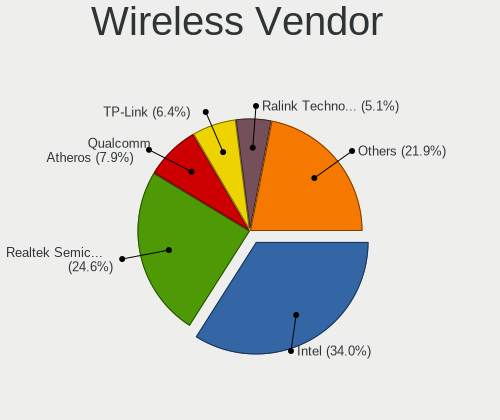
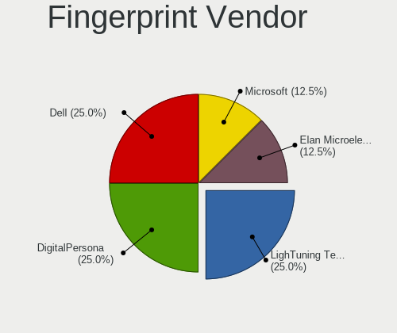
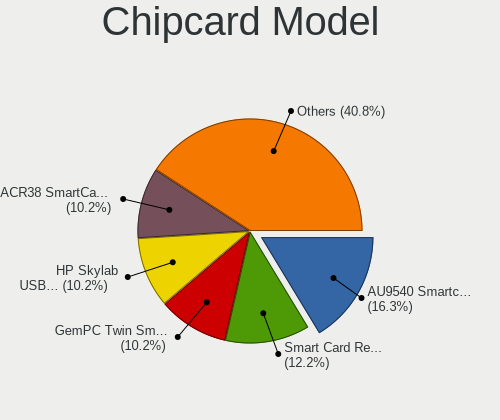

Ubuntu 22.04 - Tested Hardware & Statistics (Desktops)
------------------------------------------------------

A project to collect tested hardware configurations for Ubuntu 22.04.

Anyone can contribute to this report by the [hw-probe](https://github.com/linuxhw/hw-probe) tool:

    sudo -E hw-probe -all -upload

Please contribute! Especially if your hardware is rare.

Contents
--------

* [ Test Cases ](#test-cases)

* [ System ](#system)
  - [ Kernel                   ](#kernel)
  - [ Kernel Family            ](#kernel-family)
  - [ Kernel Major Ver.        ](#kernel-major-ver)
  - [ Arch                     ](#arch)
  - [ DE                       ](#de)
  - [ Display Server           ](#display-server)
  - [ Display Manager          ](#display-manager)
  - [ OS Lang                  ](#os-lang)
  - [ Boot Mode                ](#boot-mode)
  - [ Filesystem               ](#filesystem)
  - [ Part. scheme             ](#part-scheme)
  - [ Dual Boot with Linux/BSD ](#dual-boot-with-linuxbsd)
  - [ Dual Boot (Win)          ](#dual-boot-win)

* [ Board ](#board)
  - [ Vendor                   ](#vendor)
  - [ Model                    ](#model)
  - [ Model Family             ](#model-family)
  - [ MFG Year                 ](#mfg-year)
  - [ Form Factor              ](#form-factor)
  - [ Secure Boot              ](#secure-boot)
  - [ Coreboot                 ](#coreboot)
  - [ RAM Size                 ](#ram-size)
  - [ RAM Used                 ](#ram-used)
  - [ Total Drives             ](#total-drives)
  - [ Has CD-ROM               ](#has-cd-rom)
  - [ Has Ethernet             ](#has-ethernet)
  - [ Has WiFi                 ](#has-wifi)
  - [ Has Bluetooth            ](#has-bluetooth)

* [ Location ](#location)
  - [ Country                  ](#country)
  - [ City                     ](#city)

* [ Drives ](#drives)
  - [ Drive Vendor             ](#drive-vendor)
  - [ Drive Model              ](#drive-model)
  - [ HDD Vendor               ](#hdd-vendor)
  - [ SSD Vendor               ](#ssd-vendor)
  - [ Drive Kind               ](#drive-kind)
  - [ Drive Connector          ](#drive-connector)
  - [ Drive Size               ](#drive-size)
  - [ Space Total              ](#space-total)
  - [ Space Used               ](#space-used)
  - [ Malfunc. Drives          ](#malfunc-drives)
  - [ Malfunc. Drive Vendor    ](#malfunc-drive-vendor)
  - [ Malfunc. HDD Vendor      ](#malfunc-hdd-vendor)
  - [ Malfunc. Drive Kind      ](#malfunc-drive-kind)
  - [ Failed Drives            ](#failed-drives)
  - [ Failed Drive Vendor      ](#failed-drive-vendor)
  - [ Drive Status             ](#drive-status)

* [ Storage controller ](#storage-controller)
  - [ Storage Vendor           ](#storage-vendor)
  - [ Storage Model            ](#storage-model)
  - [ Storage Kind             ](#storage-kind)

* [ Processor ](#processor)
  - [ CPU Vendor               ](#cpu-vendor)
  - [ CPU Model                ](#cpu-model)
  - [ CPU Model Family         ](#cpu-model-family)
  - [ CPU Cores                ](#cpu-cores)
  - [ CPU Sockets              ](#cpu-sockets)
  - [ CPU Threads              ](#cpu-threads)
  - [ CPU Op-Modes             ](#cpu-op-modes)
  - [ CPU Microcode            ](#cpu-microcode)
  - [ CPU Microarch            ](#cpu-microarch)

* [ Graphics ](#graphics)
  - [ GPU Vendor               ](#gpu-vendor)
  - [ GPU Model                ](#gpu-model)
  - [ GPU Combo                ](#gpu-combo)
  - [ GPU Driver               ](#gpu-driver)
  - [ GPU Memory               ](#gpu-memory)

* [ Monitor ](#monitor)
  - [ Monitor Vendor           ](#monitor-vendor)
  - [ Monitor Model            ](#monitor-model)
  - [ Monitor Resolution       ](#monitor-resolution)
  - [ Monitor Diagonal         ](#monitor-diagonal)
  - [ Monitor Width            ](#monitor-width)
  - [ Aspect Ratio             ](#aspect-ratio)
  - [ Monitor Area             ](#monitor-area)
  - [ Pixel Density            ](#pixel-density)
  - [ Multiple Monitors        ](#multiple-monitors)

* [ Network ](#network)
  - [ Net Controller Vendor    ](#net-controller-vendor)
  - [ Net Controller Model     ](#net-controller-model)
  - [ Wireless Vendor          ](#wireless-vendor)
  - [ Wireless Model           ](#wireless-model)
  - [ Ethernet Vendor          ](#ethernet-vendor)
  - [ Ethernet Model           ](#ethernet-model)
  - [ Net Controller Kind      ](#net-controller-kind)
  - [ Used Controller          ](#used-controller)
  - [ NICs                     ](#nics)
  - [ IPv6                     ](#ipv6)

* [ Bluetooth ](#bluetooth)
  - [ Bluetooth Vendor         ](#bluetooth-vendor)
  - [ Bluetooth Model          ](#bluetooth-model)

* [ Sound ](#sound)
  - [ Sound Vendor             ](#sound-vendor)
  - [ Sound Model              ](#sound-model)

* [ Memory ](#memory)
  - [ Memory Vendor            ](#memory-vendor)
  - [ Memory Model             ](#memory-model)
  - [ Memory Kind              ](#memory-kind)
  - [ Memory Form Factor       ](#memory-form-factor)
  - [ Memory Size              ](#memory-size)
  - [ Memory Speed             ](#memory-speed)

* [ Printers & scanners ](#printers--scanners)
  - [ Printer Vendor           ](#printer-vendor)
  - [ Printer Model            ](#printer-model)
  - [ Scanner Vendor           ](#scanner-vendor)
  - [ Scanner Model            ](#scanner-model)

* [ Camera ](#camera)
  - [ Camera Vendor            ](#camera-vendor)
  - [ Camera Model             ](#camera-model)

* [ Security ](#security)
  - [ Fingerprint Vendor       ](#fingerprint-vendor)
  - [ Fingerprint Model        ](#fingerprint-model)
  - [ Chipcard Vendor          ](#chipcard-vendor)
  - [ Chipcard Model           ](#chipcard-model)

* [ Unsupported ](#unsupported)
  - [ Unsupported Devices      ](#unsupported-devices)
  - [ Unsupported Device Types ](#unsupported-device-types)

Test Cases
----------

Total: 1662

| Vendor        | Model                       | Probe                                                      | Date         |
|---------------|-----------------------------|------------------------------------------------------------|--------------|
| ASRock        | Z97 Anniversary             | [558ca4b56e](https://linux-hardware.org/?probe=558ca4b56e) | Oct 01, 2022 |
| ASUSTek       | A78M-A                      | [5ad2e5f2a6](https://linux-hardware.org/?probe=5ad2e5f2a6) | Oct 01, 2022 |
| ASUSTek       | ROG STRIX B550-E GAMING     | [8a75a2c50b](https://linux-hardware.org/?probe=8a75a2c50b) | Oct 01, 2022 |
| MSI           | MAG B550 TOMAHAWK           | [a7268f8fba](https://linux-hardware.org/?probe=a7268f8fba) | Oct 01, 2022 |
| Medion        | MS-7366                     | [c8138f4ffe](https://linux-hardware.org/?probe=c8138f4ffe) | Oct 01, 2022 |
| Medion        | MS-7366                     | [c25c10b259](https://linux-hardware.org/?probe=c25c10b259) | Oct 01, 2022 |
| MSI           | MAG B550 TOMAHAWK           | [151510a184](https://linux-hardware.org/?probe=151510a184) | Oct 01, 2022 |
| MSI           | X370 GAMING PLUS            | [2aa92cb043](https://linux-hardware.org/?probe=2aa92cb043) | Oct 01, 2022 |
| ASUSTek       | M5A99X EVO                  | [4c5134b8fc](https://linux-hardware.org/?probe=4c5134b8fc) | Oct 01, 2022 |
| ASUSTek       | M4N72-E                     | [c1c308be2a](https://linux-hardware.org/?probe=c1c308be2a) | Oct 01, 2022 |
| ASUSTek       | P8Z68-V                     | [c6e67f7643](https://linux-hardware.org/?probe=c6e67f7643) | Oct 01, 2022 |
| ASRock        | Z77 Extreme3                | [c92633e1ee](https://linux-hardware.org/?probe=c92633e1ee) | Oct 01, 2022 |
| ASRock        | Z77 Extreme3                | [ada9e56162](https://linux-hardware.org/?probe=ada9e56162) | Oct 01, 2022 |
| MSI           | A55M-E33                    | [13bd049f55](https://linux-hardware.org/?probe=13bd049f55) | Sep 30, 2022 |
| OEM           | Unknown                     | [e5a425c399](https://linux-hardware.org/?probe=e5a425c399) | Sep 30, 2022 |
| ASUSTek       | M5A78L LE                   | [1b2683c634](https://linux-hardware.org/?probe=1b2683c634) | Sep 30, 2022 |
| ASUSTek       | PHOENIX                     | [55d76f8846](https://linux-hardware.org/?probe=55d76f8846) | Sep 30, 2022 |
| ASUSTek       | PHOENIX                     | [6c28fed25f](https://linux-hardware.org/?probe=6c28fed25f) | Sep 30, 2022 |
| ASUSTek       | M5A78L LE                   | [8762386a2b](https://linux-hardware.org/?probe=8762386a2b) | Sep 30, 2022 |
| Gigabyte      | G41M-Combo                  | [aa49a31777](https://linux-hardware.org/?probe=aa49a31777) | Sep 30, 2022 |
| HP            | 83EF                        | [f508131396](https://linux-hardware.org/?probe=f508131396) | Sep 30, 2022 |
| ASUSTek       | Z170-P                      | [996d72bd1e](https://linux-hardware.org/?probe=996d72bd1e) | Sep 30, 2022 |
| ASUSTek       | Z170-P                      | [8394fca38a](https://linux-hardware.org/?probe=8394fca38a) | Sep 30, 2022 |
| ASUSTek       | EX-A320M-GAMING             | [33d5d34654](https://linux-hardware.org/?probe=33d5d34654) | Sep 30, 2022 |
| Pegatron      | IPMSB-GS                    | [5e38213b3b](https://linux-hardware.org/?probe=5e38213b3b) | Sep 30, 2022 |
| ECS           | A320AM4-M3D/3.x/5.x         | [570ff509ac](https://linux-hardware.org/?probe=570ff509ac) | Sep 30, 2022 |
| ASUSTek       | TUF Gaming Z490-PLUS        | [2c08befa41](https://linux-hardware.org/?probe=2c08befa41) | Sep 30, 2022 |
| Positivo      | POS-PIQ67CG POSITIVO        | [5cdce489b9](https://linux-hardware.org/?probe=5cdce489b9) | Sep 30, 2022 |
| Positivo      | POS-PIQ67CG POSITIVO        | [3bfbb3744e](https://linux-hardware.org/?probe=3bfbb3744e) | Sep 30, 2022 |
| HP            | 3398                        | [2f7b1d28b4](https://linux-hardware.org/?probe=2f7b1d28b4) | Sep 30, 2022 |
| HP            | 1496                        | [e89f06542b](https://linux-hardware.org/?probe=e89f06542b) | Sep 30, 2022 |
| Unknown       | 775VM8                      | [114c84d76c](https://linux-hardware.org/?probe=114c84d76c) | Sep 30, 2022 |
| Unknown       | 775VM8                      | [903649eae9](https://linux-hardware.org/?probe=903649eae9) | Sep 30, 2022 |
| MSI           | H110 PC MATE                | [ac97c636a5](https://linux-hardware.org/?probe=ac97c636a5) | Sep 30, 2022 |
| Gigabyte      | H61M-S2PV                   | [cd06f54882](https://linux-hardware.org/?probe=cd06f54882) | Sep 30, 2022 |
| Gigabyte      | H510M H                     | [51a7f36a69](https://linux-hardware.org/?probe=51a7f36a69) | Sep 29, 2022 |
| OEM           | Unknown                     | [21b3a0929b](https://linux-hardware.org/?probe=21b3a0929b) | Sep 29, 2022 |
| ASRock        | Q1900M                      | [e6804dc6b7](https://linux-hardware.org/?probe=e6804dc6b7) | Sep 29, 2022 |
| ASUSTek       | PHOENIX                     | [ea3a9cf5b4](https://linux-hardware.org/?probe=ea3a9cf5b4) | Sep 29, 2022 |
| ASUSTek       | M5A97 LE R2.0               | [e35b86c3b7](https://linux-hardware.org/?probe=e35b86c3b7) | Sep 29, 2022 |
| Gigabyte      | B75M-D3H                    | [a7d5bbb754](https://linux-hardware.org/?probe=a7d5bbb754) | Sep 29, 2022 |
| Gigabyte      | B75M-D3H                    | [5f261094bf](https://linux-hardware.org/?probe=5f261094bf) | Sep 29, 2022 |
| OEM           | Unknown                     | [68b7e03b06](https://linux-hardware.org/?probe=68b7e03b06) | Sep 29, 2022 |
| ASUSTek       | P8Z68-V                     | [f0d1b90e89](https://linux-hardware.org/?probe=f0d1b90e89) | Sep 29, 2022 |
| ASUSTek       | TUF Gaming B560M-PLUS WI... | [a686f595ee](https://linux-hardware.org/?probe=a686f595ee) | Sep 29, 2022 |
| Dell          | 0G3HR7 A00                  | [547cffd8dd](https://linux-hardware.org/?probe=547cffd8dd) | Sep 29, 2022 |
| ASUSTek       | PRO H410M-C                 | [2448bfc706](https://linux-hardware.org/?probe=2448bfc706) | Sep 29, 2022 |
| Acer          | Predator G6-710             | [12fd4575f7](https://linux-hardware.org/?probe=12fd4575f7) | Sep 29, 2022 |
| Dell          | 06D7TR A02                  | [7ad0e3e5f4](https://linux-hardware.org/?probe=7ad0e3e5f4) | Sep 29, 2022 |
| Lenovo        | 1031 SBB0J05441 WIN 3305... | [75c8af47c2](https://linux-hardware.org/?probe=75c8af47c2) | Sep 29, 2022 |
| Gigabyte      | Z370 HD3-CF                 | [715a83eaa1](https://linux-hardware.org/?probe=715a83eaa1) | Sep 29, 2022 |
| Biostar       | H410MH S2                   | [b03e32f37d](https://linux-hardware.org/?probe=b03e32f37d) | Sep 29, 2022 |
| ASUSTek       | P8Z68-V                     | [36ff9b8bcb](https://linux-hardware.org/?probe=36ff9b8bcb) | Sep 29, 2022 |
| Gigabyte      | F2A55M-DS2                  | [c17c689217](https://linux-hardware.org/?probe=c17c689217) | Sep 28, 2022 |
| ASRock        | Z68 Pro3-M                  | [7ba6677453](https://linux-hardware.org/?probe=7ba6677453) | Sep 28, 2022 |
| Medion        | MS-7707                     | [240ac993dc](https://linux-hardware.org/?probe=240ac993dc) | Sep 28, 2022 |
| MSI           | Z87-GD65 GAMING             | [fe6539c021](https://linux-hardware.org/?probe=fe6539c021) | Sep 28, 2022 |
| Gigabyte      | B450 I AORUS PRO WIFI-CF    | [d5185ee60b](https://linux-hardware.org/?probe=d5185ee60b) | Sep 28, 2022 |
| ASUSTek       | M5A97 LE R2.0               | [f9e71e7e05](https://linux-hardware.org/?probe=f9e71e7e05) | Sep 28, 2022 |
| HP            | 18E5                        | [bcc9927d20](https://linux-hardware.org/?probe=bcc9927d20) | Sep 28, 2022 |
| MSI           | 2A9Ch                       | [16d3df803b](https://linux-hardware.org/?probe=16d3df803b) | Sep 28, 2022 |
| MSI           | X570-A PRO                  | [345959e0ed](https://linux-hardware.org/?probe=345959e0ed) | Sep 28, 2022 |
| HP            | 212B                        | [38aa6e5478](https://linux-hardware.org/?probe=38aa6e5478) | Sep 28, 2022 |
| ASRock        | H61M-HVS                    | [660419ed49](https://linux-hardware.org/?probe=660419ed49) | Sep 27, 2022 |
| HP            | 2AF7                        | [d6889fef8d](https://linux-hardware.org/?probe=d6889fef8d) | Sep 27, 2022 |
| ASUSTek       | PRIME X470-PRO              | [1bdf72d415](https://linux-hardware.org/?probe=1bdf72d415) | Sep 27, 2022 |
| ASRock        | B450 Pro4                   | [9053250a2c](https://linux-hardware.org/?probe=9053250a2c) | Sep 27, 2022 |
| ASUSTek       | PHOENIX                     | [3c5f24bbb1](https://linux-hardware.org/?probe=3c5f24bbb1) | Sep 27, 2022 |
| MSI           | B450M GAMING PLUS           | [265d059992](https://linux-hardware.org/?probe=265d059992) | Sep 27, 2022 |
| ASRock        | Z97 Anniversary             | [6132513116](https://linux-hardware.org/?probe=6132513116) | Sep 27, 2022 |
| ASRock        | X470 Gaming-ITX/ac          | [fdafecf7b0](https://linux-hardware.org/?probe=fdafecf7b0) | Sep 27, 2022 |
| Packard Be... | IMEDIA L4875 v1.0           | [bb57b80866](https://linux-hardware.org/?probe=bb57b80866) | Sep 27, 2022 |
| ASUSTek       | P5B-Deluxe                  | [cf179c716e](https://linux-hardware.org/?probe=cf179c716e) | Sep 27, 2022 |
| Medion        | MS-7707                     | [a88f6ba4da](https://linux-hardware.org/?probe=a88f6ba4da) | Sep 27, 2022 |
| Medion        | MS-7713                     | [36ca6b7f38](https://linux-hardware.org/?probe=36ca6b7f38) | Sep 27, 2022 |
| Gigabyte      | B450 I AORUS PRO WIFI-CF    | [9f85096ed9](https://linux-hardware.org/?probe=9f85096ed9) | Sep 27, 2022 |
| ASUSTek       | Z170-K                      | [5048b5bef9](https://linux-hardware.org/?probe=5048b5bef9) | Sep 27, 2022 |
| ASUSTek       | H97I-PLUS                   | [31036cd828](https://linux-hardware.org/?probe=31036cd828) | Sep 27, 2022 |
| ASUSTek       | H97I-PLUS                   | [fa2a23dff8](https://linux-hardware.org/?probe=fa2a23dff8) | Sep 27, 2022 |
| ASUSTek       | M5A97 PRO                   | [255a0a928a](https://linux-hardware.org/?probe=255a0a928a) | Sep 27, 2022 |
| Acer          | Aspire XC-830               | [c8ff01ad2e](https://linux-hardware.org/?probe=c8ff01ad2e) | Sep 27, 2022 |
| Acer          | Aspire XC-830               | [4175b74d7a](https://linux-hardware.org/?probe=4175b74d7a) | Sep 27, 2022 |
| Dell          | 03NVJ6 A03                  | [2241dbc067](https://linux-hardware.org/?probe=2241dbc067) | Sep 26, 2022 |
| Dell          | 03NVJ6 A03                  | [2deb1ce174](https://linux-hardware.org/?probe=2deb1ce174) | Sep 26, 2022 |
| HP            | 0A9Ch                       | [2bf0c02966](https://linux-hardware.org/?probe=2bf0c02966) | Sep 26, 2022 |
| Foxconn       | Napa HP P/N                 | [15d8037255](https://linux-hardware.org/?probe=15d8037255) | Sep 26, 2022 |
| Foxconn       | Napa HP P/N                 | [ca0edb7c6a](https://linux-hardware.org/?probe=ca0edb7c6a) | Sep 26, 2022 |
| ASUSTek       | Z87-A                       | [3cdcc8b18d](https://linux-hardware.org/?probe=3cdcc8b18d) | Sep 26, 2022 |
| ASUSTek       | M5A78L-M/USB3               | [d166d32749](https://linux-hardware.org/?probe=d166d32749) | Sep 26, 2022 |
| ASRock        | Z68 Pro3-M                  | [48400b0487](https://linux-hardware.org/?probe=48400b0487) | Sep 26, 2022 |
| Gigabyte      | B75M-D3V                    | [291b07ce5f](https://linux-hardware.org/?probe=291b07ce5f) | Sep 26, 2022 |
| ASUSTek       | M5A78L-M/USB3               | [bce9addcca](https://linux-hardware.org/?probe=bce9addcca) | Sep 26, 2022 |
| MSI           | B560M PRO                   | [5949440926](https://linux-hardware.org/?probe=5949440926) | Sep 26, 2022 |
| Acer          | Aspire XC-603               | [efa89b9ac1](https://linux-hardware.org/?probe=efa89b9ac1) | Sep 26, 2022 |
| MSI           | MPG Z690 FORCE WIFI         | [95da21d9a8](https://linux-hardware.org/?probe=95da21d9a8) | Sep 26, 2022 |
| Gigabyte      | Z370 HD3-CF                 | [2a86fee784](https://linux-hardware.org/?probe=2a86fee784) | Sep 26, 2022 |
| Dell          | 00V62H A01                  | [43a06cb552](https://linux-hardware.org/?probe=43a06cb552) | Sep 26, 2022 |
| Protectli     | FW2B                        | [55ead162b2](https://linux-hardware.org/?probe=55ead162b2) | Sep 25, 2022 |
| ASUSTek       | PRIME B350-PLUS             | [53c469011c](https://linux-hardware.org/?probe=53c469011c) | Sep 25, 2022 |
| ASRock        | B550 Pro4                   | [d17f3c7447](https://linux-hardware.org/?probe=d17f3c7447) | Sep 25, 2022 |
| Packard Be... | IMEDIA L4875 v1.0           | [4ed673ff1a](https://linux-hardware.org/?probe=4ed673ff1a) | Sep 25, 2022 |
| HP            | 2B35                        | [724e0d61e3](https://linux-hardware.org/?probe=724e0d61e3) | Sep 25, 2022 |
| ASUSTek       | PRIME A320M-K               | [bc6b161dc9](https://linux-hardware.org/?probe=bc6b161dc9) | Sep 25, 2022 |
| ASRock        | B450M-HDV                   | [a1639d1654](https://linux-hardware.org/?probe=a1639d1654) | Sep 25, 2022 |
| ASUSTek       | Pro WS WRX80E-SAGE SE WI... | [72e3bbaa93](https://linux-hardware.org/?probe=72e3bbaa93) | Sep 25, 2022 |
| Gigabyte      | A520M H                     | [acf2f9d381](https://linux-hardware.org/?probe=acf2f9d381) | Sep 25, 2022 |
| ASUSTek       | P8H61-M LX                  | [164f5bfea2](https://linux-hardware.org/?probe=164f5bfea2) | Sep 25, 2022 |
| HP            | 843B                        | [b811caca3b](https://linux-hardware.org/?probe=b811caca3b) | Sep 24, 2022 |
| HP            | 843B                        | [85d2c6fe18](https://linux-hardware.org/?probe=85d2c6fe18) | Sep 24, 2022 |
| Dell          | 0PC5F7 A01                  | [d3735721af](https://linux-hardware.org/?probe=d3735721af) | Sep 24, 2022 |
| Medion        | MS-7616                     | [72af7b904f](https://linux-hardware.org/?probe=72af7b904f) | Sep 24, 2022 |
| ASUSTek       | TUF Gaming B550-PLUS WIF... | [0daf5c5df5](https://linux-hardware.org/?probe=0daf5c5df5) | Sep 24, 2022 |
| MiTAC         | UltraPoint                  | [d7a35bf89c](https://linux-hardware.org/?probe=d7a35bf89c) | Sep 24, 2022 |
| HP            | 843B                        | [c1530c1c99](https://linux-hardware.org/?probe=c1530c1c99) | Sep 24, 2022 |
| Gigabyte      | Z270X-Ultra Gaming-CF       | [e0eae2efbd](https://linux-hardware.org/?probe=e0eae2efbd) | Sep 24, 2022 |
| ASUSTek       | P7H55D-M PRO                | [9ff56b2438](https://linux-hardware.org/?probe=9ff56b2438) | Sep 24, 2022 |
| ASUSTek       | TUF B450-PLUS GAMING        | [d603e07087](https://linux-hardware.org/?probe=d603e07087) | Sep 24, 2022 |
| ASUSTek       | P7H55D-M PRO                | [3ba342d57a](https://linux-hardware.org/?probe=3ba342d57a) | Sep 24, 2022 |
| HP            | ProLiant ML110 G7           | [716b4feed2](https://linux-hardware.org/?probe=716b4feed2) | Sep 24, 2022 |
| Gigabyte      | Z270P-D3-CF                 | [bdf21fb597](https://linux-hardware.org/?probe=bdf21fb597) | Sep 24, 2022 |
| Dell          | 0JP3NX A01                  | [03e5ac4a78](https://linux-hardware.org/?probe=03e5ac4a78) | Sep 24, 2022 |
| ASUSTek       | TUF B450-PLUS GAMING        | [a2ebf20cd0](https://linux-hardware.org/?probe=a2ebf20cd0) | Sep 24, 2022 |
| Gigabyte      | H81M-H                      | [68c4f74a37](https://linux-hardware.org/?probe=68c4f74a37) | Sep 24, 2022 |
| Gigabyte      | Z270X-Ultra Gaming-CF       | [165b95bd2c](https://linux-hardware.org/?probe=165b95bd2c) | Sep 24, 2022 |
| Gigabyte      | 970A-DS3P                   | [1e9a7dd793](https://linux-hardware.org/?probe=1e9a7dd793) | Sep 24, 2022 |
| MSI           | MPG X570 GAMING PLUS        | [fd43d92335](https://linux-hardware.org/?probe=fd43d92335) | Sep 23, 2022 |
| Dell          | 0KWVT8 A02                  | [2e6e30cd8b](https://linux-hardware.org/?probe=2e6e30cd8b) | Sep 23, 2022 |
| ASRock        | G31M-S                      | [76d9b33c76](https://linux-hardware.org/?probe=76d9b33c76) | Sep 23, 2022 |
| Gigabyte      | X570S AORUS ELITE AX        | [1553f6266c](https://linux-hardware.org/?probe=1553f6266c) | Sep 23, 2022 |
| ASRock        | Z490 PG Velocita            | [eac045585b](https://linux-hardware.org/?probe=eac045585b) | Sep 23, 2022 |
| Acer          | Veriton N4680G              | [a68d3f20eb](https://linux-hardware.org/?probe=a68d3f20eb) | Sep 23, 2022 |
| ASUSTek       | Pro WS WRX80E-SAGE SE WI... | [45a8669840](https://linux-hardware.org/?probe=45a8669840) | Sep 23, 2022 |
| Dell          | 0KV62T A01                  | [d8d21241de](https://linux-hardware.org/?probe=d8d21241de) | Sep 23, 2022 |
| Gigabyte      | EX58-UD3R                   | [9b5329758f](https://linux-hardware.org/?probe=9b5329758f) | Sep 23, 2022 |
| HP            | 339A                        | [884e94fb23](https://linux-hardware.org/?probe=884e94fb23) | Sep 23, 2022 |
| HP            | 339A                        | [cd68752844](https://linux-hardware.org/?probe=cd68752844) | Sep 23, 2022 |
| Gigabyte      | B75M-D3H                    | [e7b218bc37](https://linux-hardware.org/?probe=e7b218bc37) | Sep 23, 2022 |
| MSI           | H110 PC MATE                | [006830e521](https://linux-hardware.org/?probe=006830e521) | Sep 23, 2022 |
| Lenovo        | 3098 SDK0E50510 WIN 2625... | [6458e6c55f](https://linux-hardware.org/?probe=6458e6c55f) | Sep 22, 2022 |
| HP            | 8309                        | [118f235878](https://linux-hardware.org/?probe=118f235878) | Sep 22, 2022 |
| ASRock        | A320M-DVS R4.0              | [0dca3e500c](https://linux-hardware.org/?probe=0dca3e500c) | Sep 22, 2022 |
| MSI           | X570-A PRO                  | [0306edc8ba](https://linux-hardware.org/?probe=0306edc8ba) | Sep 22, 2022 |
| Fujitsu Si... | P5LD2-FM-DH-VP              | [0c6cbcc99d](https://linux-hardware.org/?probe=0c6cbcc99d) | Sep 22, 2022 |
| MSI           | X570-A PRO                  | [56d6df17b5](https://linux-hardware.org/?probe=56d6df17b5) | Sep 22, 2022 |
| Gigabyte      | H110M-S2H DDR3-CF           | [fef79bcff4](https://linux-hardware.org/?probe=fef79bcff4) | Sep 22, 2022 |
| ASUSTek       | VM40B                       | [67cc53f766](https://linux-hardware.org/?probe=67cc53f766) | Sep 22, 2022 |
| ASUSTek       | VM40B                       | [229a66ae16](https://linux-hardware.org/?probe=229a66ae16) | Sep 22, 2022 |
| Dell          | 0478VN A00                  | [6a3572966a](https://linux-hardware.org/?probe=6a3572966a) | Sep 22, 2022 |
| Dell          | 0478VN A00                  | [fe270718e7](https://linux-hardware.org/?probe=fe270718e7) | Sep 22, 2022 |
| HP            | 8053                        | [d46ac6d7db](https://linux-hardware.org/?probe=d46ac6d7db) | Sep 22, 2022 |
| Dell          | 0YU822 A00                  | [034dbdc359](https://linux-hardware.org/?probe=034dbdc359) | Sep 22, 2022 |
| ASUSTek       | M5A99X EVO                  | [48f4738047](https://linux-hardware.org/?probe=48f4738047) | Sep 22, 2022 |
| ASUSTek       | M5A99X EVO                  | [a484071017](https://linux-hardware.org/?probe=a484071017) | Sep 22, 2022 |
| Gigabyte      | 990FXA-UD3                  | [5c2eac6d83](https://linux-hardware.org/?probe=5c2eac6d83) | Sep 22, 2022 |
| Lenovo        | SHARKBAY SDK0J40700 WIN     | [a4ab03ccc4](https://linux-hardware.org/?probe=a4ab03ccc4) | Sep 22, 2022 |
| Acer          | Veriton N4680G              | [5ed0ffde54](https://linux-hardware.org/?probe=5ed0ffde54) | Sep 22, 2022 |
| Gigabyte      | EP45-UD3R                   | [920bf9a750](https://linux-hardware.org/?probe=920bf9a750) | Sep 22, 2022 |
| HP            | 3647h                       | [7c54133b32](https://linux-hardware.org/?probe=7c54133b32) | Sep 22, 2022 |
| ASUSTek       | TUF Gaming X570-PLUS        | [581e08e365](https://linux-hardware.org/?probe=581e08e365) | Sep 22, 2022 |
| MSI           | H81M-P33                    | [05d5a24774](https://linux-hardware.org/?probe=05d5a24774) | Sep 22, 2022 |
| MSI           | MAG B550 TOMAHAWK           | [3fd067abd9](https://linux-hardware.org/?probe=3fd067abd9) | Sep 21, 2022 |
| MSI           | 970A-G46                    | [e7f3600d16](https://linux-hardware.org/?probe=e7f3600d16) | Sep 21, 2022 |
| Dell          | 0D28YY A03                  | [24230f3e30](https://linux-hardware.org/?probe=24230f3e30) | Sep 21, 2022 |
| MSI           | 970A-G46                    | [425eb466e5](https://linux-hardware.org/?probe=425eb466e5) | Sep 21, 2022 |
| Gigabyte      | H310M H                     | [1ec0fcefa2](https://linux-hardware.org/?probe=1ec0fcefa2) | Sep 21, 2022 |
| ASUSTek       | M3N78-VM                    | [edaab96cde](https://linux-hardware.org/?probe=edaab96cde) | Sep 21, 2022 |
| Acer          | Aspire XC-830               | [6fc7e7025c](https://linux-hardware.org/?probe=6fc7e7025c) | Sep 21, 2022 |
| Gigabyte      | A520M H                     | [21407ce4a8](https://linux-hardware.org/?probe=21407ce4a8) | Sep 21, 2022 |
| ASUSTek       | A8N-SLI                     | [95d20defd7](https://linux-hardware.org/?probe=95d20defd7) | Sep 21, 2022 |
| ASUSTek       | M5A97 R2.0                  | [b35ec1a833](https://linux-hardware.org/?probe=b35ec1a833) | Sep 21, 2022 |
| ASUSTek       | PRIME B360-PLUS             | [49b3253936](https://linux-hardware.org/?probe=49b3253936) | Sep 21, 2022 |
| Huanan        | X99-TF                      | [657d78e891](https://linux-hardware.org/?probe=657d78e891) | Sep 21, 2022 |
| ASRock        | H81M-GL                     | [fe7e5bbc9c](https://linux-hardware.org/?probe=fe7e5bbc9c) | Sep 21, 2022 |
| NU591         | 1.0                         | [6e29ae977f](https://linux-hardware.org/?probe=6e29ae977f) | Sep 21, 2022 |
| HP            | 3647h                       | [64cc139cac](https://linux-hardware.org/?probe=64cc139cac) | Sep 21, 2022 |
| Gigabyte      | Z77-DS3H                    | [ea8ea96269](https://linux-hardware.org/?probe=ea8ea96269) | Sep 21, 2022 |
| ASRock        | Z77 Extreme3                | [deb21d492d](https://linux-hardware.org/?probe=deb21d492d) | Sep 21, 2022 |
| HP            | 339A                        | [bc2a08f514](https://linux-hardware.org/?probe=bc2a08f514) | Sep 21, 2022 |
| Gigabyte      | GA-78LMT-S2                 | [5175ba7e7c](https://linux-hardware.org/?probe=5175ba7e7c) | Sep 20, 2022 |
| ASUSTek       | M5A99X EVO                  | [c59de2d375](https://linux-hardware.org/?probe=c59de2d375) | Sep 20, 2022 |
| ASUSTek       | M5A99X EVO                  | [c93edfa02c](https://linux-hardware.org/?probe=c93edfa02c) | Sep 20, 2022 |
| Lenovo        | SHARKBAY SDK0E50510 WIN     | [88b0561dbc](https://linux-hardware.org/?probe=88b0561dbc) | Sep 20, 2022 |
| MSI           | H410M-A PRO                 | [76c03610be](https://linux-hardware.org/?probe=76c03610be) | Sep 20, 2022 |
| ASUSTek       | PRIME B350-PLUS             | [0c7b33b15f](https://linux-hardware.org/?probe=0c7b33b15f) | Sep 20, 2022 |
| Dell          | 0D883F A06                  | [55f97310c8](https://linux-hardware.org/?probe=55f97310c8) | Sep 20, 2022 |
| ASUSTek       | ROG CROSSHAIR VIII HERO     | [14fe25593d](https://linux-hardware.org/?probe=14fe25593d) | Sep 19, 2022 |
| ASUSTek       | ROG CROSSHAIR VIII HERO     | [952190141c](https://linux-hardware.org/?probe=952190141c) | Sep 19, 2022 |
| ASUSTek       | TUF Gaming X570-PLUS        | [92d0d41e58](https://linux-hardware.org/?probe=92d0d41e58) | Sep 19, 2022 |
| Dell          | 0GX297                      | [57e334a0c2](https://linux-hardware.org/?probe=57e334a0c2) | Sep 19, 2022 |
| HP            | 82B4                        | [f4b85399b3](https://linux-hardware.org/?probe=f4b85399b3) | Sep 19, 2022 |
| Supermicro    | C7P67                       | [16bff71d62](https://linux-hardware.org/?probe=16bff71d62) | Sep 19, 2022 |
| ASUSTek       | Z97-A                       | [d984474cba](https://linux-hardware.org/?probe=d984474cba) | Sep 19, 2022 |
| Lenovo        | SHARKBAY SDK0J40700 WIN     | [1abf3ddee3](https://linux-hardware.org/?probe=1abf3ddee3) | Sep 19, 2022 |
| Foxconn       | 2ADA                        | [736a1c0eec](https://linux-hardware.org/?probe=736a1c0eec) | Sep 19, 2022 |
| ASRock        | AB350M-HDV                  | [22b753798c](https://linux-hardware.org/?probe=22b753798c) | Sep 19, 2022 |
| ASRock        | Z97 Anniversary             | [8c308a3e22](https://linux-hardware.org/?probe=8c308a3e22) | Sep 19, 2022 |
| ASUSTek       | M5A78L-M PLUS/USB3          | [908ad5ef27](https://linux-hardware.org/?probe=908ad5ef27) | Sep 19, 2022 |
| MSI           | Z370-A PRO                  | [43fbf9fec9](https://linux-hardware.org/?probe=43fbf9fec9) | Sep 19, 2022 |
| Gigabyte      | G41MT-S2P                   | [d8be5e602a](https://linux-hardware.org/?probe=d8be5e602a) | Sep 19, 2022 |
| MSI           | Z370-A PRO                  | [850e17ede5](https://linux-hardware.org/?probe=850e17ede5) | Sep 19, 2022 |
| ASUSTek       | TUF Gaming B550-PLUS        | [ca1b76cefe](https://linux-hardware.org/?probe=ca1b76cefe) | Sep 19, 2022 |
| HP            | 3647h                       | [63d5e6ee6a](https://linux-hardware.org/?probe=63d5e6ee6a) | Sep 19, 2022 |
| ASUSTek       | F2A85-V PRO                 | [943bb9e023](https://linux-hardware.org/?probe=943bb9e023) | Sep 19, 2022 |
| Gigabyte      | H97M-D3H                    | [a63fe17f47](https://linux-hardware.org/?probe=a63fe17f47) | Sep 19, 2022 |
| ASUSTek       | M5A78L-M PLUS/USB3          | [25f87932c7](https://linux-hardware.org/?probe=25f87932c7) | Sep 19, 2022 |
| ASUSTek       | Rampage II Extreme          | [c996a3c4dd](https://linux-hardware.org/?probe=c996a3c4dd) | Sep 19, 2022 |
| MSI           | H61M-P23                    | [8719bdc05a](https://linux-hardware.org/?probe=8719bdc05a) | Sep 18, 2022 |
| MSI           | A68HM-E33                   | [2905913e7e](https://linux-hardware.org/?probe=2905913e7e) | Sep 18, 2022 |
| ASUSTek       | P7H55-M LX/USB3             | [76eedbf647](https://linux-hardware.org/?probe=76eedbf647) | Sep 18, 2022 |
| Gigabyte      | 990FXA-UD3                  | [c9e0203e64](https://linux-hardware.org/?probe=c9e0203e64) | Sep 18, 2022 |
| ASUSTek       | P7H55-M LX/USB3             | [95015c9edb](https://linux-hardware.org/?probe=95015c9edb) | Sep 18, 2022 |
| Acer          | Aspire M3970                | [e366f1be3b](https://linux-hardware.org/?probe=e366f1be3b) | Sep 18, 2022 |
| Medion        | MS-7707                     | [df4472374c](https://linux-hardware.org/?probe=df4472374c) | Sep 18, 2022 |
| Medion        | MS-7707                     | [248b893ed4](https://linux-hardware.org/?probe=248b893ed4) | Sep 18, 2022 |
| ASUSTek       | M4A785-M                    | [411449bc6d](https://linux-hardware.org/?probe=411449bc6d) | Sep 18, 2022 |
| Gigabyte      | 990FXA-UD3                  | [ea7d5b0424](https://linux-hardware.org/?probe=ea7d5b0424) | Sep 18, 2022 |
| Lenovo        | ThinkStation D20 4158F76    | [d6b369855e](https://linux-hardware.org/?probe=d6b369855e) | Sep 18, 2022 |
| Gigabyte      | G31M-ES2L                   | [e074efb108](https://linux-hardware.org/?probe=e074efb108) | Sep 18, 2022 |
| ASRock        | 960GC-GS FX                 | [2432fca2f8](https://linux-hardware.org/?probe=2432fca2f8) | Sep 18, 2022 |
| ASUSTek       | PRIME B550M-K               | [b3cb8fc82e](https://linux-hardware.org/?probe=b3cb8fc82e) | Sep 18, 2022 |
| Gigabyte      | G31M-ES2L                   | [4b8841b706](https://linux-hardware.org/?probe=4b8841b706) | Sep 18, 2022 |
| ASUSTek       | M5A99X EVO                  | [5653a39e40](https://linux-hardware.org/?probe=5653a39e40) | Sep 17, 2022 |
| ASUSTek       | GA35DX                      | [c123fdbb81](https://linux-hardware.org/?probe=c123fdbb81) | Sep 17, 2022 |
| HP            | 0AECh D                     | [23adee752f](https://linux-hardware.org/?probe=23adee752f) | Sep 17, 2022 |
| ASUSTek       | M5A78L-M PLUS/USB3          | [0e007748d1](https://linux-hardware.org/?probe=0e007748d1) | Sep 17, 2022 |
| ASUSTek       | K30AM-J                     | [c583746579](https://linux-hardware.org/?probe=c583746579) | Sep 17, 2022 |
| Gigabyte      | A320M-S2H-CF                | [90871c217b](https://linux-hardware.org/?probe=90871c217b) | Sep 17, 2022 |
| ASUSTek       | P5B-Deluxe                  | [0b32a9e842](https://linux-hardware.org/?probe=0b32a9e842) | Sep 17, 2022 |
| MSI           | Boston                      | [b884bd8c03](https://linux-hardware.org/?probe=b884bd8c03) | Sep 17, 2022 |
| Gigabyte      | Z77-DS3H                    | [b5a0c6309d](https://linux-hardware.org/?probe=b5a0c6309d) | Sep 17, 2022 |
| Gigabyte      | H97M-D3H                    | [aca70e9485](https://linux-hardware.org/?probe=aca70e9485) | Sep 17, 2022 |
| HP            | 3647h                       | [0e821515bd](https://linux-hardware.org/?probe=0e821515bd) | Sep 17, 2022 |
| ASUSTek       | H110M-K                     | [a15d189c98](https://linux-hardware.org/?probe=a15d189c98) | Sep 17, 2022 |
| Gigabyte      | H270M-DS3H-CF               | [0f8111d187](https://linux-hardware.org/?probe=0f8111d187) | Sep 16, 2022 |
| HP            | 8768 A                      | [dd63bfb225](https://linux-hardware.org/?probe=dd63bfb225) | Sep 16, 2022 |
| Gigabyte      | Z97-D3H-CF                  | [4d7948b375](https://linux-hardware.org/?probe=4d7948b375) | Sep 16, 2022 |
| ASUSTek       | PRIME B560M-A               | [fab04fe2c7](https://linux-hardware.org/?probe=fab04fe2c7) | Sep 16, 2022 |
| Gigabyte      | 970A-DS3P                   | [c362a2f06e](https://linux-hardware.org/?probe=c362a2f06e) | Sep 16, 2022 |
| Lenovo        | MAHOBAY Win8 Pro DPK TPG    | [07d731bb3e](https://linux-hardware.org/?probe=07d731bb3e) | Sep 16, 2022 |
| Dell          | 0X8582                      | [3498499960](https://linux-hardware.org/?probe=3498499960) | Sep 16, 2022 |
| Dell          | 0NC2VH A01                  | [cba8ef504c](https://linux-hardware.org/?probe=cba8ef504c) | Sep 16, 2022 |
| Biostar       | A10N-8800E                  | [4a06fb8bfa](https://linux-hardware.org/?probe=4a06fb8bfa) | Sep 16, 2022 |
| MSI           | MPG Z690 FORCE WIFI         | [8eab5a5824](https://linux-hardware.org/?probe=8eab5a5824) | Sep 16, 2022 |
| ASUSTek       | CM6330_CM6630_CM6730_CM6... | [dbe024bea9](https://linux-hardware.org/?probe=dbe024bea9) | Sep 16, 2022 |
| ASUSTek       | CM6330_CM6630_CM6730_CM6... | [64f8beea8f](https://linux-hardware.org/?probe=64f8beea8f) | Sep 16, 2022 |
| Lenovo        | ThinkStation D20 4158F76    | [45a3f96ced](https://linux-hardware.org/?probe=45a3f96ced) | Sep 16, 2022 |
| ASUSTek       | ROG STRIX B450-I GAMING     | [31f9854044](https://linux-hardware.org/?probe=31f9854044) | Sep 16, 2022 |
| ASUSTek       | Z170-E                      | [80deeff510](https://linux-hardware.org/?probe=80deeff510) | Sep 16, 2022 |
| MSI           | A320M-A PRO MAX             | [eed790913e](https://linux-hardware.org/?probe=eed790913e) | Sep 16, 2022 |
| Lenovo        | 30D2 SDK0J40705 WIN 3425... | [4d4809282a](https://linux-hardware.org/?probe=4d4809282a) | Sep 16, 2022 |
| Lenovo        | 30D2 SDK0J40705 WIN 3425... | [54588ca345](https://linux-hardware.org/?probe=54588ca345) | Sep 16, 2022 |
| Gigabyte      | Z97-D3H-CF                  | [1e4d0a6189](https://linux-hardware.org/?probe=1e4d0a6189) | Sep 15, 2022 |
| ASUSTek       | CROSSHAIR V FORMULA-Z       | [68749016d1](https://linux-hardware.org/?probe=68749016d1) | Sep 15, 2022 |
| MSI           | Z370-A PRO                  | [d923c9e35f](https://linux-hardware.org/?probe=d923c9e35f) | Sep 15, 2022 |
| Foxconn       | 2ADA                        | [812586d5e3](https://linux-hardware.org/?probe=812586d5e3) | Sep 15, 2022 |
| ASUSTek       | ROG CROSSHAIR VIII FORMU... | [805d4161a8](https://linux-hardware.org/?probe=805d4161a8) | Sep 15, 2022 |
| ASUSTek       | TUF Gaming B550M-E          | [600ef31484](https://linux-hardware.org/?probe=600ef31484) | Sep 15, 2022 |
| AMI           | Cherry Trail CR             | [3519121da4](https://linux-hardware.org/?probe=3519121da4) | Sep 15, 2022 |
| ASUSTek       | Benicia                     | [f5f4102401](https://linux-hardware.org/?probe=f5f4102401) | Sep 15, 2022 |
| ASUSTek       | H97I-PLUS                   | [5269bfb990](https://linux-hardware.org/?probe=5269bfb990) | Sep 14, 2022 |
| MSI           | B450-A PRO MAX              | [f1c8ae3891](https://linux-hardware.org/?probe=f1c8ae3891) | Sep 14, 2022 |
| Dell          | 0WR7PY A02                  | [0a587d6fee](https://linux-hardware.org/?probe=0a587d6fee) | Sep 14, 2022 |
| ASRock        | X470 Gaming-ITX/ac          | [f0a87cc2ef](https://linux-hardware.org/?probe=f0a87cc2ef) | Sep 14, 2022 |
| Gigabyte      | Z590 VISION G               | [ec15390099](https://linux-hardware.org/?probe=ec15390099) | Sep 14, 2022 |
| Fujitsu       | D3162-A1 S26361-D3162-A1    | [e620df9580](https://linux-hardware.org/?probe=e620df9580) | Sep 14, 2022 |
| Medion        | MS-7857                     | [98a978898c](https://linux-hardware.org/?probe=98a978898c) | Sep 14, 2022 |
| Medion        | MS-7857                     | [54237e3276](https://linux-hardware.org/?probe=54237e3276) | Sep 14, 2022 |
| ASUSTek       | M5A78L-M PLUS/USB3          | [64d4d4b3bc](https://linux-hardware.org/?probe=64d4d4b3bc) | Sep 14, 2022 |
| ASUSTek       | PRIME B250-PRO              | [98422dda65](https://linux-hardware.org/?probe=98422dda65) | Sep 14, 2022 |
| ASRock        | B450M Pro4-F                | [af402f9448](https://linux-hardware.org/?probe=af402f9448) | Sep 14, 2022 |
| ASUSTek       | TUF Gaming X570-PLUS        | [039ae21470](https://linux-hardware.org/?probe=039ae21470) | Sep 14, 2022 |
| Lenovo        | 1031 SBB0J05441 WIN 3305... | [f614aa6ae7](https://linux-hardware.org/?probe=f614aa6ae7) | Sep 14, 2022 |
| Lenovo        | 1031 SBB0J05441 WIN 3305... | [fc1d1cb3bc](https://linux-hardware.org/?probe=fc1d1cb3bc) | Sep 14, 2022 |
| Dell          | 0PC5F7 A03                  | [161958a208](https://linux-hardware.org/?probe=161958a208) | Sep 14, 2022 |
| Dell          | 0HN7XN A01                  | [1bf2e6de0e](https://linux-hardware.org/?probe=1bf2e6de0e) | Sep 14, 2022 |
| ASUSTek       | ROG STRIX B450-F GAMING     | [4155fc10fa](https://linux-hardware.org/?probe=4155fc10fa) | Sep 14, 2022 |
| ASUSTek       | TUF Gaming Z590-PLUS WIF... | [848861f263](https://linux-hardware.org/?probe=848861f263) | Sep 13, 2022 |
| ASUSTek       | P5K-E                       | [ddac4b0175](https://linux-hardware.org/?probe=ddac4b0175) | Sep 13, 2022 |
| ASUSTek       | ROG STRIX X570-E GAMING ... | [72655619f3](https://linux-hardware.org/?probe=72655619f3) | Sep 13, 2022 |
| ASRock        | B450M Pro4                  | [9ad0fabe3d](https://linux-hardware.org/?probe=9ad0fabe3d) | Sep 13, 2022 |
| HP            | 3647h                       | [e94712a856](https://linux-hardware.org/?probe=e94712a856) | Sep 13, 2022 |
| HP            | 3031h                       | [9312c20d49](https://linux-hardware.org/?probe=9312c20d49) | Sep 13, 2022 |
| ASUSTek       | Z97-A                       | [9de0254ab0](https://linux-hardware.org/?probe=9de0254ab0) | Sep 13, 2022 |
| Medion        | MS-7707                     | [68428aab84](https://linux-hardware.org/?probe=68428aab84) | Sep 13, 2022 |
| Positivo      | POS-PQ45AU                  | [0879f8d9ce](https://linux-hardware.org/?probe=0879f8d9ce) | Sep 13, 2022 |
| ASRock        | Z170 Gaming K6+             | [39027cdb44](https://linux-hardware.org/?probe=39027cdb44) | Sep 13, 2022 |
| HP            | 3048h                       | [e25d0d8a10](https://linux-hardware.org/?probe=e25d0d8a10) | Sep 13, 2022 |
| ASUSTek       | ROG STRIX B660-A GAMING ... | [34c1beb103](https://linux-hardware.org/?probe=34c1beb103) | Sep 13, 2022 |
| MSI           | H110M PRO-VD PLUS           | [e61fe6932b](https://linux-hardware.org/?probe=e61fe6932b) | Sep 13, 2022 |
| ASUSTek       | Z170-P                      | [bec58f880f](https://linux-hardware.org/?probe=bec58f880f) | Sep 13, 2022 |
| ASUSTek       | Z170-P                      | [182bb36928](https://linux-hardware.org/?probe=182bb36928) | Sep 13, 2022 |
| ASRock        | A320M-HDV R4.0              | [dc2c5a0bfb](https://linux-hardware.org/?probe=dc2c5a0bfb) | Sep 13, 2022 |
| HP            | 3647h                       | [c40ded9736](https://linux-hardware.org/?probe=c40ded9736) | Sep 13, 2022 |
| HP            | 3031h                       | [1bbfd867b0](https://linux-hardware.org/?probe=1bbfd867b0) | Sep 13, 2022 |
| ASRock        | B75M R2.0                   | [d1e62450d4](https://linux-hardware.org/?probe=d1e62450d4) | Sep 13, 2022 |
| ASUSTek       | M5A78L-M PLUS/USB3          | [ac722c6dcc](https://linux-hardware.org/?probe=ac722c6dcc) | Sep 13, 2022 |
| ASUSTek       | PHOENIX                     | [853cff5648](https://linux-hardware.org/?probe=853cff5648) | Sep 12, 2022 |
| MSI           | Z97M-G43                    | [706804a4e2](https://linux-hardware.org/?probe=706804a4e2) | Sep 12, 2022 |
| DFI           | HD631-Q87CRM                | [b7ed9b1d64](https://linux-hardware.org/?probe=b7ed9b1d64) | Sep 12, 2022 |
| ASUSTek       | TUF Gaming X570-PLUS        | [864a5abac7](https://linux-hardware.org/?probe=864a5abac7) | Sep 12, 2022 |
| ASUSTek       | CROSSHAIR V FORMULA-Z       | [717942ca91](https://linux-hardware.org/?probe=717942ca91) | Sep 12, 2022 |
| Intel         | H61                         | [d805e24841](https://linux-hardware.org/?probe=d805e24841) | Sep 12, 2022 |
| ASUSTek       | TUF B450M-PLUS GAMING       | [743af62b4c](https://linux-hardware.org/?probe=743af62b4c) | Sep 12, 2022 |
| ASUSTek       | ROG STRIX Z690-F GAMING ... | [d2ed0e3000](https://linux-hardware.org/?probe=d2ed0e3000) | Sep 12, 2022 |
| Gigabyte      | X570 UD                     | [7e840fc9d0](https://linux-hardware.org/?probe=7e840fc9d0) | Sep 12, 2022 |
| MSI           | AM1I                        | [3278b971fd](https://linux-hardware.org/?probe=3278b971fd) | Sep 12, 2022 |
| Acer          | E415SM                      | [bc9ef15cab](https://linux-hardware.org/?probe=bc9ef15cab) | Sep 11, 2022 |
| ASUSTek       | Maximus VII GENE            | [3ae7faf18d](https://linux-hardware.org/?probe=3ae7faf18d) | Sep 11, 2022 |
| ASUSTek       | Maximus VII GENE            | [4f27034766](https://linux-hardware.org/?probe=4f27034766) | Sep 11, 2022 |
| Apple         | Mac-F221BEC8                | [f42abdfa94](https://linux-hardware.org/?probe=f42abdfa94) | Sep 11, 2022 |
| Acer          | E415SM                      | [4f8a53c667](https://linux-hardware.org/?probe=4f8a53c667) | Sep 11, 2022 |
| Dell          | 0KV62T A02                  | [129a142c44](https://linux-hardware.org/?probe=129a142c44) | Sep 11, 2022 |
| Apple         | Mac-F221BEC8                | [b719798d79](https://linux-hardware.org/?probe=b719798d79) | Sep 11, 2022 |
| Dell          | 0KV62T A02                  | [f509669af7](https://linux-hardware.org/?probe=f509669af7) | Sep 11, 2022 |
| Dell          | 0VD92X A00                  | [2b699a677b](https://linux-hardware.org/?probe=2b699a677b) | Sep 11, 2022 |
| ASUSTek       | PRIME Z390-P                | [80a20ec3fe](https://linux-hardware.org/?probe=80a20ec3fe) | Sep 11, 2022 |
| Dell          | 0HD5W2 A01                  | [1bb8ad599d](https://linux-hardware.org/?probe=1bb8ad599d) | Sep 11, 2022 |
| Pegatron      | Narra6                      | [a0793488f1](https://linux-hardware.org/?probe=a0793488f1) | Sep 11, 2022 |
| Gigabyte      | 970A-DS3P                   | [581cd5c8f3](https://linux-hardware.org/?probe=581cd5c8f3) | Sep 11, 2022 |
| HP            | 82B4                        | [855d078f26](https://linux-hardware.org/?probe=855d078f26) | Sep 11, 2022 |
| HP            | 82B4                        | [e39fbcb897](https://linux-hardware.org/?probe=e39fbcb897) | Sep 11, 2022 |
| Fujitsu Si... | P5LD2-FM-DH-VP              | [ad6a16f658](https://linux-hardware.org/?probe=ad6a16f658) | Sep 11, 2022 |
| Dell          | 0GY6Y8 A03                  | [675c43f981](https://linux-hardware.org/?probe=675c43f981) | Sep 11, 2022 |
| Gigabyte      | G41MT-ES2L                  | [74ee0e38a3](https://linux-hardware.org/?probe=74ee0e38a3) | Sep 11, 2022 |
| Gigabyte      | Z77X-UP7                    | [3bdc70035e](https://linux-hardware.org/?probe=3bdc70035e) | Sep 11, 2022 |
| ASUSTek       | M5A78L-M PLUS/USB3          | [aa4d90c7e7](https://linux-hardware.org/?probe=aa4d90c7e7) | Sep 11, 2022 |
| ASUSTek       | PHOENIX                     | [c8bccb82ad](https://linux-hardware.org/?probe=c8bccb82ad) | Sep 10, 2022 |
| ASRock        | B75M R2.0                   | [a2c7fda288](https://linux-hardware.org/?probe=a2c7fda288) | Sep 10, 2022 |
| Dell          | 09M8Y8 A02                  | [216f2bf110](https://linux-hardware.org/?probe=216f2bf110) | Sep 10, 2022 |
| Lenovo        | 314F SDK0J40697 WIN 3305... | [0caf1e7324](https://linux-hardware.org/?probe=0caf1e7324) | Sep 10, 2022 |
| ASRock        | J3455B-ITX                  | [41d44c11cc](https://linux-hardware.org/?probe=41d44c11cc) | Sep 10, 2022 |
| ASUSTek       | Maximus VII GENE            | [2097faef20](https://linux-hardware.org/?probe=2097faef20) | Sep 10, 2022 |
| HP            | 3647h                       | [a6a28c7e12](https://linux-hardware.org/?probe=a6a28c7e12) | Sep 10, 2022 |
| ASUSTek       | PRIME H270-PRO              | [4ad8216bf8](https://linux-hardware.org/?probe=4ad8216bf8) | Sep 10, 2022 |
| ASUSTek       | PRIME H270-PRO              | [bfaebac5d4](https://linux-hardware.org/?probe=bfaebac5d4) | Sep 10, 2022 |
| ASRock        | H370 Pro4                   | [f6b34cb2b6](https://linux-hardware.org/?probe=f6b34cb2b6) | Sep 10, 2022 |
| ASUSTek       | Maximus VII GENE            | [4799406c7d](https://linux-hardware.org/?probe=4799406c7d) | Sep 10, 2022 |
| Intel         | Unknown                     | [74059aa424](https://linux-hardware.org/?probe=74059aa424) | Sep 10, 2022 |
| ASRock        | B450M Pro4                  | [9ce6958b9c](https://linux-hardware.org/?probe=9ce6958b9c) | Sep 09, 2022 |
| Dell          | 00V62H A01                  | [b0d7a2a7af](https://linux-hardware.org/?probe=b0d7a2a7af) | Sep 09, 2022 |
| Apple         | Mac-F42C88C8 Proto1         | [7c5a6e51dc](https://linux-hardware.org/?probe=7c5a6e51dc) | Sep 09, 2022 |
| Gigabyte      | H110M-S2V-CF                | [944fa39fb6](https://linux-hardware.org/?probe=944fa39fb6) | Sep 09, 2022 |
| Intel         | X79G V2.x                   | [8efdbea978](https://linux-hardware.org/?probe=8efdbea978) | Sep 09, 2022 |
| Gigabyte      | H110M-S2V-CF                | [c716a6bba5](https://linux-hardware.org/?probe=c716a6bba5) | Sep 09, 2022 |
| Lenovo        | 361A SDK0K17763 WIN         | [6d476dcc8c](https://linux-hardware.org/?probe=6d476dcc8c) | Sep 09, 2022 |
| MSI           | Z77A-G45                    | [e26581d20e](https://linux-hardware.org/?probe=e26581d20e) | Sep 09, 2022 |
| Lenovo        | 314F SDK0J40697 WIN 3305... | [06d3f051d1](https://linux-hardware.org/?probe=06d3f051d1) | Sep 09, 2022 |
| ASRock        | H77M                        | [354323cb34](https://linux-hardware.org/?probe=354323cb34) | Sep 09, 2022 |
| ASUSTek       | Z87-K                       | [8051a7c1dc](https://linux-hardware.org/?probe=8051a7c1dc) | Sep 09, 2022 |
| ASRock        | B450M Pro4                  | [90b89510ba](https://linux-hardware.org/?probe=90b89510ba) | Sep 09, 2022 |
| Medion        | MS-7707                     | [b8489db42b](https://linux-hardware.org/?probe=b8489db42b) | Sep 08, 2022 |
| Dell          | 00V62H A01                  | [ae1a9f37a7](https://linux-hardware.org/?probe=ae1a9f37a7) | Sep 08, 2022 |
| ASRock        | B560 Steel Legend           | [1e26c1ce80](https://linux-hardware.org/?probe=1e26c1ce80) | Sep 08, 2022 |
| ASRock        | X570 Phantom Gaming 4       | [248f47cae7](https://linux-hardware.org/?probe=248f47cae7) | Sep 08, 2022 |
| Lenovo        | 361A SDK0K17763 WIN         | [aa113eb71b](https://linux-hardware.org/?probe=aa113eb71b) | Sep 08, 2022 |
| Gigabyte      | H110M-S2H DDR3-CF           | [4942b09228](https://linux-hardware.org/?probe=4942b09228) | Sep 08, 2022 |
| ASUSTek       | P8Z68-V GEN3                | [677554ca4b](https://linux-hardware.org/?probe=677554ca4b) | Sep 08, 2022 |
| ASUSTek       | PRIME A320M-K               | [c750440eb3](https://linux-hardware.org/?probe=c750440eb3) | Sep 07, 2022 |
| MSI           | B250M PRO-VDH               | [6c5483e3f5](https://linux-hardware.org/?probe=6c5483e3f5) | Sep 07, 2022 |
| MSI           | Z77IA-E53                   | [b906901dd1](https://linux-hardware.org/?probe=b906901dd1) | Sep 07, 2022 |
| MSI           | Z77IA-E53                   | [3f33f46a9f](https://linux-hardware.org/?probe=3f33f46a9f) | Sep 07, 2022 |
| ASUSTek       | P8Z68-V LX                  | [d5f8ee494a](https://linux-hardware.org/?probe=d5f8ee494a) | Sep 07, 2022 |
| ASUSTek       | PRIME H370-PLUS             | [14a3a316d5](https://linux-hardware.org/?probe=14a3a316d5) | Sep 07, 2022 |
| Gigabyte      | Z390 AORUS PRO WIFI-CF      | [f547e07cca](https://linux-hardware.org/?probe=f547e07cca) | Sep 07, 2022 |
| MSI           | A78M-E35                    | [d3b27051d5](https://linux-hardware.org/?probe=d3b27051d5) | Sep 07, 2022 |
| Gigabyte      | H310M S2H                   | [9a5564db94](https://linux-hardware.org/?probe=9a5564db94) | Sep 06, 2022 |
| Dell          | 0GY6Y8 A02                  | [10ac4ee2cb](https://linux-hardware.org/?probe=10ac4ee2cb) | Sep 06, 2022 |
| Gigabyte      | G41MT-S2                    | [1441e1783d](https://linux-hardware.org/?probe=1441e1783d) | Sep 06, 2022 |
| Gigabyte      | H110M-DS2-CF                | [ecc2f4c975](https://linux-hardware.org/?probe=ecc2f4c975) | Sep 06, 2022 |
| ASRock        | Q1900M                      | [05cf506f57](https://linux-hardware.org/?probe=05cf506f57) | Sep 06, 2022 |
| ASUSTek       | STRIKER II EXTREME          | [42e666abe1](https://linux-hardware.org/?probe=42e666abe1) | Sep 06, 2022 |
| Gigabyte      | H110M-S2H DDR3-CF           | [ad861a3bb2](https://linux-hardware.org/?probe=ad861a3bb2) | Sep 06, 2022 |
| MSI           | MAG B460 TOMAHAWK           | [29eaefa02d](https://linux-hardware.org/?probe=29eaefa02d) | Sep 06, 2022 |
| HP            | 3047h                       | [006da2a93b](https://linux-hardware.org/?probe=006da2a93b) | Sep 06, 2022 |
| HP            | 843B                        | [55206c17b9](https://linux-hardware.org/?probe=55206c17b9) | Sep 06, 2022 |
| ASUSTek       | P9X79 PRO                   | [7e53f87cc4](https://linux-hardware.org/?probe=7e53f87cc4) | Sep 06, 2022 |
| ASUSTek       | TUF Gaming B450M-PRO II     | [b1bdd1703e](https://linux-hardware.org/?probe=b1bdd1703e) | Sep 06, 2022 |
| Unknown       | Unknown                     | [b88c3e55b5](https://linux-hardware.org/?probe=b88c3e55b5) | Sep 06, 2022 |
| Unknown       | Unknown                     | [cc2c8ef4c8](https://linux-hardware.org/?probe=cc2c8ef4c8) | Sep 06, 2022 |
| Dell          | 048DY8 A01                  | [5e49734852](https://linux-hardware.org/?probe=5e49734852) | Sep 06, 2022 |
| Gigabyte      | B560M DS3H V2               | [0612f13b64](https://linux-hardware.org/?probe=0612f13b64) | Sep 06, 2022 |
| HP            | 0B4Ch D                     | [87c4023810](https://linux-hardware.org/?probe=87c4023810) | Sep 05, 2022 |
| ASUSTek       | KGPE-D16                    | [75e6c71399](https://linux-hardware.org/?probe=75e6c71399) | Sep 05, 2022 |
| Gigabyte      | H510M S2H V2                | [16567e6e92](https://linux-hardware.org/?probe=16567e6e92) | Sep 05, 2022 |
| Gigabyte      | Z690 UD DDR4                | [322fd169c2](https://linux-hardware.org/?probe=322fd169c2) | Sep 05, 2022 |
| ASRock        | Q1900M                      | [6b53538e90](https://linux-hardware.org/?probe=6b53538e90) | Sep 05, 2022 |
| ASUSTek       | STRIKER II EXTREME          | [502995e6f3](https://linux-hardware.org/?probe=502995e6f3) | Sep 05, 2022 |
| MSI           | MAG B460 TOMAHAWK           | [4ca1a490f8](https://linux-hardware.org/?probe=4ca1a490f8) | Sep 05, 2022 |
| Dell          | 0GN6JF A01                  | [390fbaaca7](https://linux-hardware.org/?probe=390fbaaca7) | Sep 05, 2022 |
| Gigabyte      | Z690 UD DDR4                | [8ff56070e0](https://linux-hardware.org/?probe=8ff56070e0) | Sep 05, 2022 |
| ASUSTek       | PRIME X570-P                | [6810a0954f](https://linux-hardware.org/?probe=6810a0954f) | Sep 05, 2022 |
| ASUSTek       | CROSSHAIR V FORMULA-Z       | [fb0488a00a](https://linux-hardware.org/?probe=fb0488a00a) | Sep 05, 2022 |
| HP            | 805A                        | [78b10fb63d](https://linux-hardware.org/?probe=78b10fb63d) | Sep 04, 2022 |
| Gigabyte      | G31M-S2C                    | [91001df765](https://linux-hardware.org/?probe=91001df765) | Sep 04, 2022 |
| Gigabyte      | G31M-S2C                    | [9281a357e0](https://linux-hardware.org/?probe=9281a357e0) | Sep 04, 2022 |
| Gigabyte      | G31M-S2C                    | [ac5ecfc107](https://linux-hardware.org/?probe=ac5ecfc107) | Sep 04, 2022 |
| Gigabyte      | B450M DS3H-CF               | [008133bf59](https://linux-hardware.org/?probe=008133bf59) | Sep 04, 2022 |
| Gigabyte      | B560M AORUS ELITE           | [078680a25d](https://linux-hardware.org/?probe=078680a25d) | Sep 04, 2022 |
| Fujitsu       | D3061-A1 S26361-D3061-A1    | [889306ad51](https://linux-hardware.org/?probe=889306ad51) | Sep 04, 2022 |
| ASUSTek       | P5P43TD                     | [cca9e79d90](https://linux-hardware.org/?probe=cca9e79d90) | Sep 04, 2022 |
| Fujitsu       | D3061-A1 S26361-D3061-A1    | [319c882b9f](https://linux-hardware.org/?probe=319c882b9f) | Sep 04, 2022 |
| Gigabyte      | GA-970A-UD3                 | [670953f8b3](https://linux-hardware.org/?probe=670953f8b3) | Sep 04, 2022 |
| ASUSTek       | PRIME X570-P                | [57e1ced53d](https://linux-hardware.org/?probe=57e1ced53d) | Sep 04, 2022 |
| ASUSTek       | PRIME X570-P                | [b704a0ae67](https://linux-hardware.org/?probe=b704a0ae67) | Sep 04, 2022 |
| ASUSTek       | PRIME X570-P                | [5065144435](https://linux-hardware.org/?probe=5065144435) | Sep 04, 2022 |
| ASUSTek       | PRIME H610M-E D4            | [a8d726946f](https://linux-hardware.org/?probe=a8d726946f) | Sep 04, 2022 |
| ASUSTek       | PRIME H610M-E D4            | [ed02565650](https://linux-hardware.org/?probe=ed02565650) | Sep 04, 2022 |
| HP            | 3397                        | [c66c292876](https://linux-hardware.org/?probe=c66c292876) | Sep 04, 2022 |
| ASUSTek       | H81M-E                      | [ebceb9b949](https://linux-hardware.org/?probe=ebceb9b949) | Sep 04, 2022 |
| Gigabyte      | H110M-S2H DDR3-CF           | [d7bb9415b1](https://linux-hardware.org/?probe=d7bb9415b1) | Sep 04, 2022 |
| ASUSTek       | H81M-E                      | [d7c48b7007](https://linux-hardware.org/?probe=d7c48b7007) | Sep 04, 2022 |
| Gigabyte      | M68MT-S2                    | [b3b173a476](https://linux-hardware.org/?probe=b3b173a476) | Sep 04, 2022 |
| ASUSTek       | PRIME H470-PLUS             | [e80ac4d271](https://linux-hardware.org/?probe=e80ac4d271) | Sep 03, 2022 |
| MSI           | B450-A PRO MAX              | [2be7ac6aad](https://linux-hardware.org/?probe=2be7ac6aad) | Sep 03, 2022 |
| ASRock        | X399 Taichi                 | [4080f853b6](https://linux-hardware.org/?probe=4080f853b6) | Sep 03, 2022 |
| ASUSTek       | M4A785TD-V EVO              | [ba1027940d](https://linux-hardware.org/?probe=ba1027940d) | Sep 03, 2022 |
| Gigabyte      | GA-970A-UD3                 | [f4c465d47c](https://linux-hardware.org/?probe=f4c465d47c) | Sep 03, 2022 |
| ASUSTek       | H61M-A/USB3                 | [7801ef775b](https://linux-hardware.org/?probe=7801ef775b) | Sep 03, 2022 |
| BESSTAR Te... | TH50                        | [8ae8ae6929](https://linux-hardware.org/?probe=8ae8ae6929) | Sep 03, 2022 |
| ASUSTek       | P7P55D                      | [ad2b0a0a89](https://linux-hardware.org/?probe=ad2b0a0a89) | Sep 03, 2022 |
| Gigabyte      | Z97X-UD5H-BK                | [97a21d48e0](https://linux-hardware.org/?probe=97a21d48e0) | Sep 03, 2022 |
| Intel         | H61                         | [af78b53f51](https://linux-hardware.org/?probe=af78b53f51) | Sep 03, 2022 |
| Gigabyte      | H77-D3H                     | [2d14cae483](https://linux-hardware.org/?probe=2d14cae483) | Sep 03, 2022 |
| Gigabyte      | H77-D3H                     | [b0b601dba0](https://linux-hardware.org/?probe=b0b601dba0) | Sep 03, 2022 |
| Gigabyte      | B450 AORUS PRO-CF           | [982df83fdf](https://linux-hardware.org/?probe=982df83fdf) | Sep 03, 2022 |
| MSI           | MPG B550 GAMING PLUS        | [32d39c8b65](https://linux-hardware.org/?probe=32d39c8b65) | Sep 03, 2022 |
| Fujitsu       | D3162-A1 S26361-D3162-A1    | [a591a1fecf](https://linux-hardware.org/?probe=a591a1fecf) | Sep 03, 2022 |
| MSI           | H81M-E34                    | [0fa7f79fdc](https://linux-hardware.org/?probe=0fa7f79fdc) | Sep 03, 2022 |
| Gigabyte      | X570 I AORUS PRO WIFI       | [8ad79e614e](https://linux-hardware.org/?probe=8ad79e614e) | Sep 03, 2022 |
| Gigabyte      | X570 I AORUS PRO WIFI       | [0d25d0b504](https://linux-hardware.org/?probe=0d25d0b504) | Sep 03, 2022 |
| ASUSTek       | PRIME A320M-K               | [acfa42b951](https://linux-hardware.org/?probe=acfa42b951) | Sep 03, 2022 |
| ASUSTek       | PRIME H310M-E R2.0          | [a138be9eb6](https://linux-hardware.org/?probe=a138be9eb6) | Sep 03, 2022 |
| Gigabyte      | 970A-DS3P                   | [47a080e25c](https://linux-hardware.org/?probe=47a080e25c) | Sep 03, 2022 |
| Dell          | 0F5C5X A00                  | [7ace6808a8](https://linux-hardware.org/?probe=7ace6808a8) | Sep 02, 2022 |
| ASUSTek       | H110M-A/M.2                 | [6ae0da8d36](https://linux-hardware.org/?probe=6ae0da8d36) | Sep 02, 2022 |
| AMI           | T3 MRD                      | [d0a254e1b7](https://linux-hardware.org/?probe=d0a254e1b7) | Sep 02, 2022 |
| ASUSTek       | STRIKER II EXTREME          | [97b982b909](https://linux-hardware.org/?probe=97b982b909) | Sep 02, 2022 |
| Gigabyte      | F2A68HM-HD2                 | [d798ebf303](https://linux-hardware.org/?probe=d798ebf303) | Sep 02, 2022 |
| Gigabyte      | GA-970A-D3                  | [5ee4e3aec0](https://linux-hardware.org/?probe=5ee4e3aec0) | Sep 02, 2022 |
| ASUSTek       | STRIKER II EXTREME          | [5485918ea2](https://linux-hardware.org/?probe=5485918ea2) | Sep 02, 2022 |
| Gigabyte      | Z590 AORUS ELITE AX         | [e03d937610](https://linux-hardware.org/?probe=e03d937610) | Sep 02, 2022 |
| MSI           | MPG B550 GAMING EDGE WIF... | [4c7f501c2b](https://linux-hardware.org/?probe=4c7f501c2b) | Sep 02, 2022 |
| Gigabyte      | H110M-S2H DDR3-CF           | [9525064f53](https://linux-hardware.org/?probe=9525064f53) | Sep 02, 2022 |
| ASUSTek       | PRIME B250M-PLUS            | [888ed47bbe](https://linux-hardware.org/?probe=888ed47bbe) | Sep 02, 2022 |
| Acer          | Aspire TC-605               | [fa13174432](https://linux-hardware.org/?probe=fa13174432) | Sep 02, 2022 |
| Acer          | Aspire TC-605               | [5ff2a41fcd](https://linux-hardware.org/?probe=5ff2a41fcd) | Sep 01, 2022 |
| Dell          | 0R6PCT A01                  | [02af50752e](https://linux-hardware.org/?probe=02af50752e) | Sep 01, 2022 |
| Lenovo        | SHARKBAY 31900058 STD       | [f113f959b7](https://linux-hardware.org/?probe=f113f959b7) | Sep 01, 2022 |
| Acer          | Aspire TC-605               | [fdc6b95d8b](https://linux-hardware.org/?probe=fdc6b95d8b) | Sep 01, 2022 |
| Dell          | 042P49 A02                  | [3b1c07d561](https://linux-hardware.org/?probe=3b1c07d561) | Sep 01, 2022 |
| Intel         | D34010WYB H14771-304        | [47d9609ba8](https://linux-hardware.org/?probe=47d9609ba8) | Sep 01, 2022 |
| Intel         | D34010WYB H14771-304        | [fd34481bf8](https://linux-hardware.org/?probe=fd34481bf8) | Sep 01, 2022 |
| Gigabyte      | H81M-WW                     | [2a56f256a3](https://linux-hardware.org/?probe=2a56f256a3) | Sep 01, 2022 |
| Gigabyte      | X150M-PRO ECC-CF            | [6db003ed3a](https://linux-hardware.org/?probe=6db003ed3a) | Sep 01, 2022 |
| Gigabyte      | X150M-PRO ECC-CF            | [2f21cd30ff](https://linux-hardware.org/?probe=2f21cd30ff) | Sep 01, 2022 |
| Lenovo        | 36D5 SDK0J40700 WIN 3258... | [87dfd12899](https://linux-hardware.org/?probe=87dfd12899) | Sep 01, 2022 |
| MSI           | B450M-A PRO MAX             | [6462d2370f](https://linux-hardware.org/?probe=6462d2370f) | Aug 31, 2022 |
| ASUSTek       | PRIME H510T2/CSM            | [12033c4a8b](https://linux-hardware.org/?probe=12033c4a8b) | Aug 31, 2022 |
| HP            | 1906                        | [a23cef9946](https://linux-hardware.org/?probe=a23cef9946) | Aug 31, 2022 |
| HP            | 81B4                        | [b81985e04e](https://linux-hardware.org/?probe=b81985e04e) | Aug 31, 2022 |
| Pegatron      | 2AB6                        | [c4ca3989e0](https://linux-hardware.org/?probe=c4ca3989e0) | Aug 31, 2022 |
| Gigabyte      | P85-D3                      | [71ce0b707c](https://linux-hardware.org/?probe=71ce0b707c) | Aug 31, 2022 |
| ASUSTek       | Z170-K                      | [544582fd23](https://linux-hardware.org/?probe=544582fd23) | Aug 31, 2022 |
| OEM           | Intel H81                   | [4b45e6dc61](https://linux-hardware.org/?probe=4b45e6dc61) | Aug 31, 2022 |
| MSI           | Z390-A PRO                  | [368eff381c](https://linux-hardware.org/?probe=368eff381c) | Aug 31, 2022 |
| ASRock        | Z77 Pro4-M                  | [d7c9a106e7](https://linux-hardware.org/?probe=d7c9a106e7) | Aug 31, 2022 |
| ASRock        | B550M-ITX/ac                | [685e484cbd](https://linux-hardware.org/?probe=685e484cbd) | Aug 31, 2022 |
| ASUSTek       | PRIME X299-DELUXE           | [a76390d5fc](https://linux-hardware.org/?probe=a76390d5fc) | Aug 31, 2022 |
| Foxconn       | 2AAF                        | [a23b1b0822](https://linux-hardware.org/?probe=a23b1b0822) | Aug 30, 2022 |
| Gigabyte      | B550 AORUS ELITE AX V2      | [98e0a08e65](https://linux-hardware.org/?probe=98e0a08e65) | Aug 30, 2022 |
| ASUSTek       | ROG STRIX B550-I GAMING     | [2fd4ef02b3](https://linux-hardware.org/?probe=2fd4ef02b3) | Aug 30, 2022 |
| ASRockRack    | ROMED8-2T                   | [a034a83f72](https://linux-hardware.org/?probe=a034a83f72) | Aug 30, 2022 |
| Dell          | 0J3C2F A00                  | [276ac60713](https://linux-hardware.org/?probe=276ac60713) | Aug 30, 2022 |
| HP            | 2B38                        | [40428ed239](https://linux-hardware.org/?probe=40428ed239) | Aug 30, 2022 |
| ASUSTek       | PRIME B450-PLUS             | [a01239fd83](https://linux-hardware.org/?probe=a01239fd83) | Aug 29, 2022 |
| Lenovo        | Bantry CRB SDK0J40709 WI... | [4ba4105869](https://linux-hardware.org/?probe=4ba4105869) | Aug 29, 2022 |
| HP            | 304Ah                       | [3f370524f3](https://linux-hardware.org/?probe=3f370524f3) | Aug 29, 2022 |
| HP            | 18E5                        | [c40ab0e3e3](https://linux-hardware.org/?probe=c40ab0e3e3) | Aug 29, 2022 |
| HP            | ProLiant MicroServer Gen... | [b613af8e42](https://linux-hardware.org/?probe=b613af8e42) | Aug 29, 2022 |
| Lenovo        | MAHOBAY NO DPK              | [2d013c60ed](https://linux-hardware.org/?probe=2d013c60ed) | Aug 29, 2022 |
| MSI           | MAG B550 TORPEDO            | [58f0ba95c3](https://linux-hardware.org/?probe=58f0ba95c3) | Aug 29, 2022 |
| ASRock        | A320M-DVS R4.0              | [5140e742a9](https://linux-hardware.org/?probe=5140e742a9) | Aug 29, 2022 |
| Gigabyte      | B550 AORUS ELITE AX V2      | [81bc767d5b](https://linux-hardware.org/?probe=81bc767d5b) | Aug 29, 2022 |
| Dell          | 0HY9JP A01                  | [b87b0407d9](https://linux-hardware.org/?probe=b87b0407d9) | Aug 29, 2022 |
| Dell          | 05XGC8 A01                  | [73ac4cc88d](https://linux-hardware.org/?probe=73ac4cc88d) | Aug 29, 2022 |
| Dell          | 0HY9JP A01                  | [fbb579a5d6](https://linux-hardware.org/?probe=fbb579a5d6) | Aug 29, 2022 |
| Dell          | 0HY9JP A00                  | [811e87f60b](https://linux-hardware.org/?probe=811e87f60b) | Aug 28, 2022 |
| Dell          | 0NW6H5 A00                  | [40a706292c](https://linux-hardware.org/?probe=40a706292c) | Aug 28, 2022 |
| ASRock        | B450M Pro4                  | [8f0f345242](https://linux-hardware.org/?probe=8f0f345242) | Aug 28, 2022 |
| MSI           | B450M PRO-M2 MAX            | [5e6e789346](https://linux-hardware.org/?probe=5e6e789346) | Aug 28, 2022 |
| Pegatron      | IPMSB-GS                    | [9edb57e041](https://linux-hardware.org/?probe=9edb57e041) | Aug 28, 2022 |
| ASUSTek       | B85M-E                      | [a0f47aaaa7](https://linux-hardware.org/?probe=a0f47aaaa7) | Aug 28, 2022 |
| Gigabyte      | F2A68HM-S1                  | [420036f4d6](https://linux-hardware.org/?probe=420036f4d6) | Aug 28, 2022 |
| Dell          | 020M3P A00                  | [424ea42e17](https://linux-hardware.org/?probe=424ea42e17) | Aug 28, 2022 |
| Dell          | OptiPlex 3020M              | [84f424cfb7](https://linux-hardware.org/?probe=84f424cfb7) | Aug 28, 2022 |
| Lenovo        | SHARKBAY NOK                | [8571fd0486](https://linux-hardware.org/?probe=8571fd0486) | Aug 27, 2022 |
| HP            | 3647h                       | [c83122d4d4](https://linux-hardware.org/?probe=c83122d4d4) | Aug 27, 2022 |
| Dell          | 0G3HR7 A00                  | [500cf5a2b4](https://linux-hardware.org/?probe=500cf5a2b4) | Aug 27, 2022 |
| Dell          | 0G3HR7 A00                  | [f9671d44ad](https://linux-hardware.org/?probe=f9671d44ad) | Aug 27, 2022 |
| HP            | 18E7                        | [613d55d0e9](https://linux-hardware.org/?probe=613d55d0e9) | Aug 27, 2022 |
| Intel         | DH87RL AAG74240-401         | [814718547c](https://linux-hardware.org/?probe=814718547c) | Aug 27, 2022 |
| MSI           | MPG Z690 FORCE WIFI         | [e476312c10](https://linux-hardware.org/?probe=e476312c10) | Aug 27, 2022 |
| Dell          | 020M3P A00                  | [fea059fea0](https://linux-hardware.org/?probe=fea059fea0) | Aug 27, 2022 |
| ASUSTek       | PRIME H310M-E R2.0          | [43fdfb3cf8](https://linux-hardware.org/?probe=43fdfb3cf8) | Aug 27, 2022 |
| ASUSTek       | PRIME H310M-E R2.0          | [a1f434a97c](https://linux-hardware.org/?probe=a1f434a97c) | Aug 27, 2022 |
| Gigabyte      | GA-78LMT-USB3               | [04474401fc](https://linux-hardware.org/?probe=04474401fc) | Aug 26, 2022 |
| ASRock        | B450M-HDV R4.0              | [a180ab604a](https://linux-hardware.org/?probe=a180ab604a) | Aug 26, 2022 |
| Foxconn       | A6VMX 0A                    | [f31fcbf60d](https://linux-hardware.org/?probe=f31fcbf60d) | Aug 26, 2022 |
| Gigabyte      | Z390 AORUS PRO WIFI-CF      | [d0e8962ad5](https://linux-hardware.org/?probe=d0e8962ad5) | Aug 26, 2022 |
| HP            | 8299                        | [37b30a10c2](https://linux-hardware.org/?probe=37b30a10c2) | Aug 26, 2022 |
| Intel         | D2550MUD2 AAG81497-700      | [a181512016](https://linux-hardware.org/?probe=a181512016) | Aug 26, 2022 |
| Biostar       | B660MX-E                    | [4fa9d132c2](https://linux-hardware.org/?probe=4fa9d132c2) | Aug 26, 2022 |
| ASUSTek       | P8Z68-V LE                  | [9839e8eeff](https://linux-hardware.org/?probe=9839e8eeff) | Aug 26, 2022 |
| ASUSTek       | P8H77-V LE                  | [4bd2fabdc7](https://linux-hardware.org/?probe=4bd2fabdc7) | Aug 26, 2022 |
| Intel         | DQ965GF AAD41676-601        | [a163a7fc6d](https://linux-hardware.org/?probe=a163a7fc6d) | Aug 25, 2022 |
| Foxconn       | P35A01                      | [fa220f1ce6](https://linux-hardware.org/?probe=fa220f1ce6) | Aug 25, 2022 |
| Dell          | 0YXT71 A03                  | [176c458f3a](https://linux-hardware.org/?probe=176c458f3a) | Aug 25, 2022 |
| Gigabyte      | X58A-UD3R                   | [3ab6c59d4f](https://linux-hardware.org/?probe=3ab6c59d4f) | Aug 25, 2022 |
| Foxconn       | 2ABF                        | [b19844ee21](https://linux-hardware.org/?probe=b19844ee21) | Aug 25, 2022 |
| Dell          | 0GY6Y8 A03                  | [cb1949a84c](https://linux-hardware.org/?probe=cb1949a84c) | Aug 25, 2022 |
| MSI           | MAG B550 TOMAHAWK           | [a380176da4](https://linux-hardware.org/?probe=a380176da4) | Aug 25, 2022 |
| ECS           | Asterope3                   | [624bd10b6f](https://linux-hardware.org/?probe=624bd10b6f) | Aug 24, 2022 |
| Dell          | 073MMW A03                  | [b41e0fcad5](https://linux-hardware.org/?probe=b41e0fcad5) | Aug 24, 2022 |
| ASUSTek       | PRIME A320M-K               | [a096217ea3](https://linux-hardware.org/?probe=a096217ea3) | Aug 24, 2022 |
| ASUSTek       | H61M-K                      | [26c9be116e](https://linux-hardware.org/?probe=26c9be116e) | Aug 24, 2022 |
| HP            | 1905                        | [6693a2b3c7](https://linux-hardware.org/?probe=6693a2b3c7) | Aug 24, 2022 |
| Dell          | 0F5C5X A00                  | [5e62f9adde](https://linux-hardware.org/?probe=5e62f9adde) | Aug 24, 2022 |
| Dell          | 0200DY A03                  | [9da770b898](https://linux-hardware.org/?probe=9da770b898) | Aug 24, 2022 |
| Gigabyte      | GA-MA770T-UD3               | [4ed5107048](https://linux-hardware.org/?probe=4ed5107048) | Aug 24, 2022 |
| Acer          | Predator G3620              | [b79ed7b47b](https://linux-hardware.org/?probe=b79ed7b47b) | Aug 23, 2022 |
| ASUSTek       | M5A97 R2.0                  | [fdc1bb0c75](https://linux-hardware.org/?probe=fdc1bb0c75) | Aug 23, 2022 |
| ASUSTek       | PRIME B450-PLUS             | [6e5a434d0d](https://linux-hardware.org/?probe=6e5a434d0d) | Aug 23, 2022 |
| Dell          | 0WR7PY A03                  | [1dd7e73006](https://linux-hardware.org/?probe=1dd7e73006) | Aug 23, 2022 |
| Dell          | 0WR7PY A03                  | [071889c1b4](https://linux-hardware.org/?probe=071889c1b4) | Aug 23, 2022 |
| MSI           | B450-A PRO MAX              | [47257deb9b](https://linux-hardware.org/?probe=47257deb9b) | Aug 23, 2022 |
| ASRock        | G41M-VS3                    | [97772a7cb6](https://linux-hardware.org/?probe=97772a7cb6) | Aug 23, 2022 |
| ASRock        | B450 Gaming-ITX/ac          | [fca17b512f](https://linux-hardware.org/?probe=fca17b512f) | Aug 23, 2022 |
| Pegatron      | E60                         | [c1aba90f51](https://linux-hardware.org/?probe=c1aba90f51) | Aug 23, 2022 |
| Gigabyte      | 970A-DS3P                   | [79bc344d85](https://linux-hardware.org/?probe=79bc344d85) | Aug 23, 2022 |
| ASUSTek       | P5Q-PRO                     | [622dac7a01](https://linux-hardware.org/?probe=622dac7a01) | Aug 22, 2022 |
| ASUSTek       | PRIME H410M-E               | [5270930555](https://linux-hardware.org/?probe=5270930555) | Aug 22, 2022 |
| ASRock        | A320M-HDV R4.0              | [3cca56dc74](https://linux-hardware.org/?probe=3cca56dc74) | Aug 22, 2022 |
| Dell          | 0J3C2F A00                  | [0ff24f8d0a](https://linux-hardware.org/?probe=0ff24f8d0a) | Aug 22, 2022 |
| Intel         | H61                         | [f2a42b45ca](https://linux-hardware.org/?probe=f2a42b45ca) | Aug 22, 2022 |
| ASUSTek       | A78M-E                      | [594e3ae5f4](https://linux-hardware.org/?probe=594e3ae5f4) | Aug 22, 2022 |
| MSI           | 2A9C                        | [4f15bcded6](https://linux-hardware.org/?probe=4f15bcded6) | Aug 22, 2022 |
| ASUSTek       | P5B SE                      | [f8291aad0a](https://linux-hardware.org/?probe=f8291aad0a) | Aug 22, 2022 |
| ASUSTek       | Pro WS WRX80E-SAGE SE WI... | [a332f284ab](https://linux-hardware.org/?probe=a332f284ab) | Aug 22, 2022 |
| Dell          | 0427JK A00                  | [8f6a2c8d0b](https://linux-hardware.org/?probe=8f6a2c8d0b) | Aug 22, 2022 |
| Dell          | 0PC5F7 A01                  | [141b155ee9](https://linux-hardware.org/?probe=141b155ee9) | Aug 22, 2022 |
| Dell          | 0T1D10 A01                  | [8c4bf9344a](https://linux-hardware.org/?probe=8c4bf9344a) | Aug 21, 2022 |
| Shuttle       | FS81                        | [4c3be1b1a6](https://linux-hardware.org/?probe=4c3be1b1a6) | Aug 21, 2022 |
| HP            | 3047h                       | [4b36895c4f](https://linux-hardware.org/?probe=4b36895c4f) | Aug 21, 2022 |
| Unknown       | X79A                        | [5c545069e2](https://linux-hardware.org/?probe=5c545069e2) | Aug 21, 2022 |
| ASUSTek       | B150M-A                     | [0dac247b92](https://linux-hardware.org/?probe=0dac247b92) | Aug 21, 2022 |
| Biostar       | G31-M7 TE                   | [aaacebef4a](https://linux-hardware.org/?probe=aaacebef4a) | Aug 21, 2022 |
| OEM           | G41 775 ICH7 8712           | [71bfa72a22](https://linux-hardware.org/?probe=71bfa72a22) | Aug 21, 2022 |
| Dell          | 09M8Y8 A02                  | [0fbe4d3ee0](https://linux-hardware.org/?probe=0fbe4d3ee0) | Aug 21, 2022 |
| Gigabyte      | Z370 AORUS Gaming K3-CF     | [8047eeecb4](https://linux-hardware.org/?probe=8047eeecb4) | Aug 20, 2022 |
| ASRock        | H310CM-DVS                  | [17f6682bf3](https://linux-hardware.org/?probe=17f6682bf3) | Aug 20, 2022 |
| MSI           | A55M-E33                    | [80d29c4f23](https://linux-hardware.org/?probe=80d29c4f23) | Aug 20, 2022 |
| ASUSTek       | Maximus III GENE            | [9cbc8d9f88](https://linux-hardware.org/?probe=9cbc8d9f88) | Aug 20, 2022 |
| Supermicro    | X10DRT-PT                   | [748c44c44c](https://linux-hardware.org/?probe=748c44c44c) | Aug 20, 2022 |
| ASUSTek       | A88X-PRO                    | [f3eacd2075](https://linux-hardware.org/?probe=f3eacd2075) | Aug 20, 2022 |
| ASUSTek       | ROG STRIX B450-F GAMING     | [1f85d6a1b9](https://linux-hardware.org/?probe=1f85d6a1b9) | Aug 20, 2022 |
| MSI           | Boston                      | [4a10f122a2](https://linux-hardware.org/?probe=4a10f122a2) | Aug 19, 2022 |
| Dell          | 0RY206                      | [faf3aaf7b6](https://linux-hardware.org/?probe=faf3aaf7b6) | Aug 19, 2022 |
| HP            | 8184 X4                     | [2dcf653d17](https://linux-hardware.org/?probe=2dcf653d17) | Aug 19, 2022 |
| HP            | 8184 X4                     | [080aadafd7](https://linux-hardware.org/?probe=080aadafd7) | Aug 19, 2022 |
| ASUSTek       | F2A55                       | [fbeb34e877](https://linux-hardware.org/?probe=fbeb34e877) | Aug 19, 2022 |
| Dell          | 0WR7PY A03                  | [81f6e6a93d](https://linux-hardware.org/?probe=81f6e6a93d) | Aug 19, 2022 |
| HP            | 1497                        | [580e1a6efe](https://linux-hardware.org/?probe=580e1a6efe) | Aug 19, 2022 |
| MSI           | Z77A-G45                    | [ff3c734303](https://linux-hardware.org/?probe=ff3c734303) | Aug 19, 2022 |
| Lenovo        | 3100 SDK0J40700 WIN 3258... | [d39161dc13](https://linux-hardware.org/?probe=d39161dc13) | Aug 19, 2022 |
| ASUSTek       | A88XM-E                     | [04d716a25d](https://linux-hardware.org/?probe=04d716a25d) | Aug 19, 2022 |
| Gigabyte      | B450 GAMING X               | [699e2fb2ee](https://linux-hardware.org/?probe=699e2fb2ee) | Aug 19, 2022 |
| LattePanda    | Delta CDJQ-BI-7-S70GR200... | [78e2d2b06a](https://linux-hardware.org/?probe=78e2d2b06a) | Aug 19, 2022 |
| LattePanda    | Delta CDJQ-BI-7-S70GR200... | [8720690695](https://linux-hardware.org/?probe=8720690695) | Aug 19, 2022 |
| ASUSTek       | ROG STRIX B450-F GAMING     | [ccea67d380](https://linux-hardware.org/?probe=ccea67d380) | Aug 19, 2022 |
| ASUSTek       | X99-A/USB                   | [4bfbe43f55](https://linux-hardware.org/?probe=4bfbe43f55) | Aug 19, 2022 |
| ASUSTek       | X99-A/USB                   | [b723cf0362](https://linux-hardware.org/?probe=b723cf0362) | Aug 19, 2022 |
| Intel         | X79M-S                      | [b6746f7b8d](https://linux-hardware.org/?probe=b6746f7b8d) | Aug 18, 2022 |
| Acer          | Veriton X2631G V:1.0        | [de98920808](https://linux-hardware.org/?probe=de98920808) | Aug 18, 2022 |
| ASUSTek       | ROG STRIX B550-F GAMING     | [6d2502dc07](https://linux-hardware.org/?probe=6d2502dc07) | Aug 18, 2022 |
| Intel         | D54250WYK H13922-302        | [ba78bd360c](https://linux-hardware.org/?probe=ba78bd360c) | Aug 18, 2022 |
| Gigabyte      | Z370 HD3P-CF                | [410c71e7ef](https://linux-hardware.org/?probe=410c71e7ef) | Aug 18, 2022 |
| MSI           | 760GM-P23                   | [42245b8fc8](https://linux-hardware.org/?probe=42245b8fc8) | Aug 18, 2022 |
| ASUSTek       | Z97-E                       | [aa95967c03](https://linux-hardware.org/?probe=aa95967c03) | Aug 18, 2022 |
| MSI           | MPG Z690 FORCE WIFI         | [df94820d80](https://linux-hardware.org/?probe=df94820d80) | Aug 18, 2022 |
| ASUSTek       | ProArt B660-CREATOR D4      | [f9f180ac3a](https://linux-hardware.org/?probe=f9f180ac3a) | Aug 18, 2022 |
| ASUSTek       | PRIME Z590M-PLUS            | [bd7c6f361d](https://linux-hardware.org/?probe=bd7c6f361d) | Aug 18, 2022 |
| Intel         | Unknown                     | [23f3bdae8a](https://linux-hardware.org/?probe=23f3bdae8a) | Aug 18, 2022 |
| Dell          | 0FDY5C A00                  | [4cd1658b87](https://linux-hardware.org/?probe=4cd1658b87) | Aug 17, 2022 |
| ASUSTek       | P7H55-M                     | [7596762e80](https://linux-hardware.org/?probe=7596762e80) | Aug 17, 2022 |
| Foxconn       | 2ABF                        | [eaea01215e](https://linux-hardware.org/?probe=eaea01215e) | Aug 17, 2022 |
| Dell          | 00V62H A01                  | [34b4c61308](https://linux-hardware.org/?probe=34b4c61308) | Aug 17, 2022 |
| Lenovo        | SHARKBAY SDK0E50510 WIN     | [8911aeaaaf](https://linux-hardware.org/?probe=8911aeaaaf) | Aug 17, 2022 |
| Dell          | 0RY206                      | [5dd1ce5c96](https://linux-hardware.org/?probe=5dd1ce5c96) | Aug 17, 2022 |
| Gigabyte      | Z590 UD AC                  | [5ee622e6da](https://linux-hardware.org/?probe=5ee622e6da) | Aug 17, 2022 |
| MSI           | MPG Z390M GAMING EDGE AC    | [d81b4dec2a](https://linux-hardware.org/?probe=d81b4dec2a) | Aug 17, 2022 |
| Acer          | Aspire TC-885 V:1.1         | [1ab8003e04](https://linux-hardware.org/?probe=1ab8003e04) | Aug 17, 2022 |
| Acer          | Aspire TC-885 V:1.1         | [2a3c6446e5](https://linux-hardware.org/?probe=2a3c6446e5) | Aug 17, 2022 |
| Acer          | Veriton X2631G V:1.0        | [a7af0ea5e7](https://linux-hardware.org/?probe=a7af0ea5e7) | Aug 17, 2022 |
| MSI           | MAG B660M MORTAR WIFI DD... | [56ba58f5d0](https://linux-hardware.org/?probe=56ba58f5d0) | Aug 16, 2022 |
| Dell          | 0U880P A00                  | [926c7c752c](https://linux-hardware.org/?probe=926c7c752c) | Aug 16, 2022 |
| Dell          | 0U880P A00                  | [bce1a6b1fd](https://linux-hardware.org/?probe=bce1a6b1fd) | Aug 16, 2022 |
| Lenovo        | 370A SDK0J40700 WIN 3258... | [ed6155d213](https://linux-hardware.org/?probe=ed6155d213) | Aug 16, 2022 |
| ASUSTek       | P7H55-M                     | [bbcdb246aa](https://linux-hardware.org/?probe=bbcdb246aa) | Aug 16, 2022 |
| HP            | 1497                        | [c0b6759020](https://linux-hardware.org/?probe=c0b6759020) | Aug 16, 2022 |
| Gigabyte      | B660M DS3H AX DDR4          | [171a797c22](https://linux-hardware.org/?probe=171a797c22) | Aug 16, 2022 |
| Gigabyte      | B660M DS3H AX DDR4          | [f882fcbe3a](https://linux-hardware.org/?probe=f882fcbe3a) | Aug 16, 2022 |
| Intel         | B75                         | [8eb918ea53](https://linux-hardware.org/?probe=8eb918ea53) | Aug 16, 2022 |
| ASUSTek       | PRIME B450-PLUS             | [d01ce7811a](https://linux-hardware.org/?probe=d01ce7811a) | Aug 15, 2022 |
| Gigabyte      | B75M-D3V                    | [cdea2e0afd](https://linux-hardware.org/?probe=cdea2e0afd) | Aug 15, 2022 |
| Gigabyte      | B75M-D3V                    | [87f8cc8553](https://linux-hardware.org/?probe=87f8cc8553) | Aug 15, 2022 |
| ASRock        | H55M                        | [8d0bd0d2d2](https://linux-hardware.org/?probe=8d0bd0d2d2) | Aug 15, 2022 |
| MSI           | MAG B560 TORPEDO            | [4a2ce50049](https://linux-hardware.org/?probe=4a2ce50049) | Aug 15, 2022 |
| ASUSTek       | Z87-PLUS                    | [63d41691ef](https://linux-hardware.org/?probe=63d41691ef) | Aug 15, 2022 |
| HP            | 1495                        | [34b69b08b1](https://linux-hardware.org/?probe=34b69b08b1) | Aug 15, 2022 |
| MSI           | A320M-A PRO MAX             | [bf211d4e64](https://linux-hardware.org/?probe=bf211d4e64) | Aug 15, 2022 |
| HP            | 1495                        | [1ace6c9868](https://linux-hardware.org/?probe=1ace6c9868) | Aug 15, 2022 |
| HP            | 1495                        | [af820eee7e](https://linux-hardware.org/?probe=af820eee7e) | Aug 15, 2022 |
| HP            | 1495                        | [6db4307c50](https://linux-hardware.org/?probe=6db4307c50) | Aug 15, 2022 |
| HP            | 1495                        | [c122ce06ab](https://linux-hardware.org/?probe=c122ce06ab) | Aug 15, 2022 |
| ASUSTek       | Z170 PRO GAMING             | [3d2bd6d842](https://linux-hardware.org/?probe=3d2bd6d842) | Aug 15, 2022 |
| HP            | 0B4Ch D                     | [98ea1068a3](https://linux-hardware.org/?probe=98ea1068a3) | Aug 15, 2022 |
| ASUSTek       | P7H55-M                     | [5106d4eda8](https://linux-hardware.org/?probe=5106d4eda8) | Aug 15, 2022 |
| Lenovo        | 3098 0B98401 WIN            | [769802c689](https://linux-hardware.org/?probe=769802c689) | Aug 15, 2022 |
| ASUSTek       | Pro WS WRX80E-SAGE SE WI... | [e322338b55](https://linux-hardware.org/?probe=e322338b55) | Aug 15, 2022 |
| MACHINIST     | X99-K9 V2.0                 | [9193936bdf](https://linux-hardware.org/?probe=9193936bdf) | Aug 15, 2022 |
| ASUSTek       | M3A79-T DELUXE              | [6d42c46a57](https://linux-hardware.org/?probe=6d42c46a57) | Aug 15, 2022 |
| ASUSTek       | TUF H370-PRO GAMING         | [5cd8255ceb](https://linux-hardware.org/?probe=5cd8255ceb) | Aug 15, 2022 |
| HP            | 2AFB                        | [7d4ca16239](https://linux-hardware.org/?probe=7d4ca16239) | Aug 15, 2022 |
| Dell          | 0RY206                      | [b6288fd6c7](https://linux-hardware.org/?probe=b6288fd6c7) | Aug 14, 2022 |
| Dell          | 0J3C2F A00                  | [3574cfa833](https://linux-hardware.org/?probe=3574cfa833) | Aug 14, 2022 |
| ASUSTek       | ProArt Z690-CREATOR WIFI    | [3bdf8d4582](https://linux-hardware.org/?probe=3bdf8d4582) | Aug 14, 2022 |
| MSI           | Z170A PC MATE               | [97f14bc24c](https://linux-hardware.org/?probe=97f14bc24c) | Aug 14, 2022 |
| Acer          | Aspire XC-605               | [125a8c791a](https://linux-hardware.org/?probe=125a8c791a) | Aug 14, 2022 |
| ASUSTek       | ROG STRIX X570-E GAMING     | [bd26ce6aa4](https://linux-hardware.org/?probe=bd26ce6aa4) | Aug 14, 2022 |
| ASUSTek       | H61M-A/BR                   | [4443a6c129](https://linux-hardware.org/?probe=4443a6c129) | Aug 14, 2022 |
| ASUSTek       | H61M-A/BR                   | [082a5297bd](https://linux-hardware.org/?probe=082a5297bd) | Aug 14, 2022 |
| Pegatron      | 2A94                        | [81b0cdd377](https://linux-hardware.org/?probe=81b0cdd377) | Aug 14, 2022 |
| ASRock        | B450M Pro4                  | [ac9e2d3187](https://linux-hardware.org/?probe=ac9e2d3187) | Aug 14, 2022 |
| HP            | 1493                        | [e5d0f16bbc](https://linux-hardware.org/?probe=e5d0f16bbc) | Aug 14, 2022 |
| Gigabyte      | Z77M-D3H                    | [15633ed7b1](https://linux-hardware.org/?probe=15633ed7b1) | Aug 14, 2022 |
| ASUSTek       | B85M-G                      | [c92d457cd6](https://linux-hardware.org/?probe=c92d457cd6) | Aug 13, 2022 |
| Dell          | 0KP561                      | [38f01be008](https://linux-hardware.org/?probe=38f01be008) | Aug 13, 2022 |
| Dell          | 0KP561                      | [293f6f95bb](https://linux-hardware.org/?probe=293f6f95bb) | Aug 13, 2022 |
| MSI           | MAG B660M MORTAR WIFI       | [4e1b75908c](https://linux-hardware.org/?probe=4e1b75908c) | Aug 13, 2022 |
| MSI           | MPG Z690 FORCE WIFI         | [73af2996db](https://linux-hardware.org/?probe=73af2996db) | Aug 13, 2022 |
| MSI           | MPG Z690 FORCE WIFI         | [144b7c2cf1](https://linux-hardware.org/?probe=144b7c2cf1) | Aug 13, 2022 |
| Dell          | 04YP6J A01                  | [c402ff86c1](https://linux-hardware.org/?probe=c402ff86c1) | Aug 13, 2022 |
| ASUSTek       | PRIME A320M-K               | [44f3f1991f](https://linux-hardware.org/?probe=44f3f1991f) | Aug 13, 2022 |
| Dell          | 0DFRFW A01                  | [9e59d35488](https://linux-hardware.org/?probe=9e59d35488) | Aug 12, 2022 |
| Dell          | 0KWVT8 A02                  | [248a425322](https://linux-hardware.org/?probe=248a425322) | Aug 12, 2022 |
| Dell          | 0DFRFW A01                  | [4a9c41e3fd](https://linux-hardware.org/?probe=4a9c41e3fd) | Aug 12, 2022 |
| ASRock        | B450M Pro4                  | [57c63e8fb9](https://linux-hardware.org/?probe=57c63e8fb9) | Aug 12, 2022 |
| HP            | 304Ah                       | [bc1242ecf9](https://linux-hardware.org/?probe=bc1242ecf9) | Aug 12, 2022 |
| HP            | 304Ah                       | [82db2a1b27](https://linux-hardware.org/?probe=82db2a1b27) | Aug 12, 2022 |
| Dell          | 07PR60 A02                  | [7ed59c8c10](https://linux-hardware.org/?probe=7ed59c8c10) | Aug 12, 2022 |
| BESSTAR Te... | TH50                        | [03159c112c](https://linux-hardware.org/?probe=03159c112c) | Aug 12, 2022 |
| ASUSTek       | A88X-PRO                    | [b7d681fafd](https://linux-hardware.org/?probe=b7d681fafd) | Aug 12, 2022 |
| ASUSTek       | PRIME A320M-K               | [1f75df3828](https://linux-hardware.org/?probe=1f75df3828) | Aug 12, 2022 |
| ASUSTek       | P8H61-M LX3 R2.0            | [98cc4a3075](https://linux-hardware.org/?probe=98cc4a3075) | Aug 12, 2022 |
| Lenovo        | ThinkCentre A58 76117MG     | [d55fd9912c](https://linux-hardware.org/?probe=d55fd9912c) | Aug 12, 2022 |
| Gigabyte      | Z270-Gaming K3              | [792065e2eb](https://linux-hardware.org/?probe=792065e2eb) | Aug 12, 2022 |
| Gigabyte      | Z270-Gaming K3              | [9f4802971d](https://linux-hardware.org/?probe=9f4802971d) | Aug 12, 2022 |
| Pegatron      | IPMSB-GS                    | [7d2cd4cc35](https://linux-hardware.org/?probe=7d2cd4cc35) | Aug 11, 2022 |
| Pegatron      | IPMSB-GS                    | [7e2bf60517](https://linux-hardware.org/?probe=7e2bf60517) | Aug 11, 2022 |
| Dell          | 04YP6J A01                  | [43257ffabd](https://linux-hardware.org/?probe=43257ffabd) | Aug 11, 2022 |
| Lenovo        | ThinkStation C20 4263BA7    | [e5e5d0d3a3](https://linux-hardware.org/?probe=e5e5d0d3a3) | Aug 11, 2022 |
| Lenovo        | ThinkStation C20 4263BA7    | [93ecf84dcf](https://linux-hardware.org/?probe=93ecf84dcf) | Aug 11, 2022 |
| Foxconn       | 45GM/45CM/45CM-S            | [a6b418356a](https://linux-hardware.org/?probe=a6b418356a) | Aug 11, 2022 |
| Pegatron      | Benicia                     | [8b8224cb4b](https://linux-hardware.org/?probe=8b8224cb4b) | Aug 11, 2022 |
| MSI           | Z170A GAMING PRO CARBON     | [3cfba5bad8](https://linux-hardware.org/?probe=3cfba5bad8) | Aug 11, 2022 |
| ASUSTek       | M5A78L-M LX/BR              | [c66de39c4c](https://linux-hardware.org/?probe=c66de39c4c) | Aug 11, 2022 |
| ASUSTek       | H170M-PLUS/BR               | [d081204e0a](https://linux-hardware.org/?probe=d081204e0a) | Aug 10, 2022 |
| ASRock        | G41M-VS3                    | [4185ab0f97](https://linux-hardware.org/?probe=4185ab0f97) | Aug 10, 2022 |
| Unknown       | Unknown                     | [dc354e0b4f](https://linux-hardware.org/?probe=dc354e0b4f) | Aug 10, 2022 |
| Lenovo        | SHARKBAY NOK                | [9a77cf2f22](https://linux-hardware.org/?probe=9a77cf2f22) | Aug 10, 2022 |
| Fujitsu       | D3162-A1 S26361-D3162-A1    | [2696ad6f3e](https://linux-hardware.org/?probe=2696ad6f3e) | Aug 10, 2022 |
| ASUSTek       | PRIME B450M-K               | [ed054f1da7](https://linux-hardware.org/?probe=ed054f1da7) | Aug 10, 2022 |
| ASUSTek       | TUF Gaming X570-PLUS        | [e54e09e3cf](https://linux-hardware.org/?probe=e54e09e3cf) | Aug 09, 2022 |
| ASUSTek       | PRIME B450M-A               | [d5ddfb6210](https://linux-hardware.org/?probe=d5ddfb6210) | Aug 09, 2022 |
| ASUSTek       | TUF Gaming X570-PLUS        | [5a84fd5a16](https://linux-hardware.org/?probe=5a84fd5a16) | Aug 09, 2022 |
| Dell          | 088DT1 A01                  | [eab28163ce](https://linux-hardware.org/?probe=eab28163ce) | Aug 09, 2022 |
| SHARKBAY      | Unknown                     | [a35fff735f](https://linux-hardware.org/?probe=a35fff735f) | Aug 09, 2022 |
| Gigabyte      | X58A-UD3R                   | [a2a0eab4fb](https://linux-hardware.org/?probe=a2a0eab4fb) | Aug 09, 2022 |
| Gigabyte      | X58A-UD3R                   | [fa0d5bccf4](https://linux-hardware.org/?probe=fa0d5bccf4) | Aug 09, 2022 |
| ASUSTek       | A88XM-E                     | [f496954b96](https://linux-hardware.org/?probe=f496954b96) | Aug 08, 2022 |
| ASRock        | H55M-LE                     | [841c63de14](https://linux-hardware.org/?probe=841c63de14) | Aug 08, 2022 |
| ASRock        | N68-VGS3 FX                 | [18d8a04343](https://linux-hardware.org/?probe=18d8a04343) | Aug 08, 2022 |
| ASUSTek       | A88XM-E                     | [84dcf54ab8](https://linux-hardware.org/?probe=84dcf54ab8) | Aug 08, 2022 |
| MSI           | A320M-A PRO MAX             | [9ee274e581](https://linux-hardware.org/?probe=9ee274e581) | Aug 08, 2022 |
| Lenovo        | MAHOBAY NOK                 | [6018df068b](https://linux-hardware.org/?probe=6018df068b) | Aug 08, 2022 |
| ASUSTek       | ROG STRIX Z390-E GAMING     | [7b8b4b5616](https://linux-hardware.org/?probe=7b8b4b5616) | Aug 08, 2022 |
| ASUSTek       | TUF Gaming X570-PRO WIFI... | [2d41c9a29f](https://linux-hardware.org/?probe=2d41c9a29f) | Aug 08, 2022 |
| Foxconn       | 2ACA                        | [2ede4f1763](https://linux-hardware.org/?probe=2ede4f1763) | Aug 07, 2022 |
| Alienware     | 0PGRP5 A01                  | [305bf6182f](https://linux-hardware.org/?probe=305bf6182f) | Aug 07, 2022 |
| Gigabyte      | A320M-S2H-CF                | [5ddb15f201](https://linux-hardware.org/?probe=5ddb15f201) | Aug 07, 2022 |
| ASUSTek       | Rampage V EXTREME           | [d04d31476f](https://linux-hardware.org/?probe=d04d31476f) | Aug 07, 2022 |
| ASUSTek       | TUF Gaming B450M-PRO S      | [3b8f0ef40a](https://linux-hardware.org/?probe=3b8f0ef40a) | Aug 07, 2022 |
| MSI           | MAG X570S TOMAHAWK MAX W... | [61e317887a](https://linux-hardware.org/?probe=61e317887a) | Aug 07, 2022 |
| MSI           | 2A9C                        | [e279622ca6](https://linux-hardware.org/?probe=e279622ca6) | Aug 06, 2022 |
| ASUSTek       | Rampage V EXTREME           | [000a2985cc](https://linux-hardware.org/?probe=000a2985cc) | Aug 06, 2022 |
| Dell          | 0VHWTR A02                  | [61b30cfde0](https://linux-hardware.org/?probe=61b30cfde0) | Aug 06, 2022 |
| Gigabyte      | F2A55M-S1                   | [cf3ed2131f](https://linux-hardware.org/?probe=cf3ed2131f) | Aug 06, 2022 |
| ASUSTek       | B85M-G                      | [616c57c367](https://linux-hardware.org/?probe=616c57c367) | Aug 06, 2022 |
| ASUSTek       | M4A88T-V EVO/USB3           | [cb4144185f](https://linux-hardware.org/?probe=cb4144185f) | Aug 05, 2022 |
| ASUSTek       | M4A88T-V EVO/USB3           | [157246e96d](https://linux-hardware.org/?probe=157246e96d) | Aug 05, 2022 |
| Fujitsu Si... | MS-7504VP-PV                | [03f6cbc20a](https://linux-hardware.org/?probe=03f6cbc20a) | Aug 05, 2022 |
| Gigabyte      | B550 GAMING X V2            | [5e1b4032ae](https://linux-hardware.org/?probe=5e1b4032ae) | Aug 05, 2022 |
| Pegatron      | 2AED                        | [8edd69e862](https://linux-hardware.org/?probe=8edd69e862) | Aug 05, 2022 |
| MSI           | 2A9C                        | [d125bcbfe9](https://linux-hardware.org/?probe=d125bcbfe9) | Aug 05, 2022 |
| Foxconn       | ALOE X3                     | [abcfa46aae](https://linux-hardware.org/?probe=abcfa46aae) | Aug 05, 2022 |
| Gigabyte      | H61M-D2-B3                  | [e477bf9f83](https://linux-hardware.org/?probe=e477bf9f83) | Aug 05, 2022 |
| ASUSTek       | PRIME B360-PLUS             | [e0129903ae](https://linux-hardware.org/?probe=e0129903ae) | Aug 04, 2022 |
| Gigabyte      | GA-990X-Gaming SLI-CF       | [eb168cff15](https://linux-hardware.org/?probe=eb168cff15) | Aug 04, 2022 |
| HP            | 3398                        | [447e644ae1](https://linux-hardware.org/?probe=447e644ae1) | Aug 04, 2022 |
| HP            | 3398                        | [07655b848a](https://linux-hardware.org/?probe=07655b848a) | Aug 04, 2022 |
| HP            | 82A2                        | [1db2ba3636](https://linux-hardware.org/?probe=1db2ba3636) | Aug 04, 2022 |
| HP            | 8054                        | [888466c84e](https://linux-hardware.org/?probe=888466c84e) | Aug 04, 2022 |
| Dell          | 0HGFJM A00                  | [b1011ae242](https://linux-hardware.org/?probe=b1011ae242) | Aug 04, 2022 |
| ASUSTek       | PRIME B450M-A               | [fc5ee0d2f9](https://linux-hardware.org/?probe=fc5ee0d2f9) | Aug 04, 2022 |
| Lenovo        | SDK0E50510 WIN              | [e43f32d47e](https://linux-hardware.org/?probe=e43f32d47e) | Aug 04, 2022 |
| Foxconn       | 45GM/45CM/45CM-S            | [3d64e8f950](https://linux-hardware.org/?probe=3d64e8f950) | Aug 04, 2022 |
| MSI           | H110M PRO-VH                | [8bdd8d91db](https://linux-hardware.org/?probe=8bdd8d91db) | Aug 04, 2022 |
| ASUSTek       | CROSSHAIR V FORMULA-Z       | [26a2956fd0](https://linux-hardware.org/?probe=26a2956fd0) | Aug 04, 2022 |
| Lenovo        | 3714 SDK0J40700 WIN 3258... | [e5afdebd04](https://linux-hardware.org/?probe=e5afdebd04) | Aug 03, 2022 |
| Gigabyte      | Z77P-D3                     | [216f67b619](https://linux-hardware.org/?probe=216f67b619) | Aug 03, 2022 |
| Supermicro    | X7DCL                       | [4b841e9401](https://linux-hardware.org/?probe=4b841e9401) | Aug 03, 2022 |
| Dell          | 0KW626                      | [629c1c7800](https://linux-hardware.org/?probe=629c1c7800) | Aug 03, 2022 |
| ASUSTek       | M5A97                       | [e5b05f8e39](https://linux-hardware.org/?probe=e5b05f8e39) | Aug 02, 2022 |
| Acer          | Veriton X2631G V:1.0        | [182bfa1039](https://linux-hardware.org/?probe=182bfa1039) | Aug 02, 2022 |
| HP            | 3047h                       | [a8301b8155](https://linux-hardware.org/?probe=a8301b8155) | Aug 02, 2022 |
| Lenovo        | 314F SDK0Q40112 WIN 3305... | [e906976bea](https://linux-hardware.org/?probe=e906976bea) | Aug 02, 2022 |
| Dell          | 0GY6Y8 A03                  | [bd49c779fa](https://linux-hardware.org/?probe=bd49c779fa) | Aug 02, 2022 |
| Acer          | Predator PO3-620            | [ff0507688f](https://linux-hardware.org/?probe=ff0507688f) | Aug 02, 2022 |
| Lenovo        | MAHOBAY NOK                 | [049607c94a](https://linux-hardware.org/?probe=049607c94a) | Aug 02, 2022 |
| Dell          | 0GY6Y8 A03                  | [09ba22e06b](https://linux-hardware.org/?probe=09ba22e06b) | Aug 02, 2022 |
| Acer          | FIH57                       | [eec3e58c8c](https://linux-hardware.org/?probe=eec3e58c8c) | Aug 02, 2022 |
| Acer          | Veriton X2631G V:1.0        | [e63e46c5a4](https://linux-hardware.org/?probe=e63e46c5a4) | Aug 02, 2022 |
| ASUSTek       | M5A99FX PRO R2.0            | [42cb82f584](https://linux-hardware.org/?probe=42cb82f584) | Aug 01, 2022 |
| Gigabyte      | A320M-S2H V2-CF             | [8e83e6141d](https://linux-hardware.org/?probe=8e83e6141d) | Aug 01, 2022 |
| Alienware     | 04VWF2 A02                  | [a877f0aa97](https://linux-hardware.org/?probe=a877f0aa97) | Aug 01, 2022 |
| Dell          | 0P096C A01                  | [11bc1115f2](https://linux-hardware.org/?probe=11bc1115f2) | Aug 01, 2022 |
| HP            | 3646h                       | [7988eaa5e3](https://linux-hardware.org/?probe=7988eaa5e3) | Aug 01, 2022 |
| MSI           | MEG X570 UNIFY              | [9be9a3e83b](https://linux-hardware.org/?probe=9be9a3e83b) | Aug 01, 2022 |
| QIYIDA        | X99-H9 V2.0                 | [e1fa8ab12b](https://linux-hardware.org/?probe=e1fa8ab12b) | Aug 01, 2022 |
| ASUSTek       | M2A-VM                      | [4b1dabbf52](https://linux-hardware.org/?probe=4b1dabbf52) | Aug 01, 2022 |
| PCWare        | IPMH61R1                    | [0843909534](https://linux-hardware.org/?probe=0843909534) | Aug 01, 2022 |
| Apple         | Mac-F221BEC8                | [13cbc87486](https://linux-hardware.org/?probe=13cbc87486) | Jul 31, 2022 |
| Gigabyte      | H81M-DS2V                   | [0645ed0b9e](https://linux-hardware.org/?probe=0645ed0b9e) | Jul 31, 2022 |
| Gigabyte      | H81M-DS2V                   | [f5e17ecf3d](https://linux-hardware.org/?probe=f5e17ecf3d) | Jul 31, 2022 |
| PCWare        | IPMH61R1                    | [7da7204a12](https://linux-hardware.org/?probe=7da7204a12) | Jul 31, 2022 |
| HP            | 2AF7                        | [da51487005](https://linux-hardware.org/?probe=da51487005) | Jul 31, 2022 |
| ASUSTek       | TUF Gaming X570-PLUS        | [22b4bcc010](https://linux-hardware.org/?probe=22b4bcc010) | Jul 31, 2022 |
| HP            | 3646h                       | [443cfc9c15](https://linux-hardware.org/?probe=443cfc9c15) | Jul 31, 2022 |
| Gigabyte      | F2A68HM-H                   | [047d3c88ad](https://linux-hardware.org/?probe=047d3c88ad) | Jul 31, 2022 |
| ASUSTek       | M5A78L-M/USB3               | [16f64b6f1a](https://linux-hardware.org/?probe=16f64b6f1a) | Jul 30, 2022 |
| ASUSTek       | M4N68T-M-LE-V2              | [7cc8e19d03](https://linux-hardware.org/?probe=7cc8e19d03) | Jul 30, 2022 |
| Acer          | FIH57                       | [a6b9d91f36](https://linux-hardware.org/?probe=a6b9d91f36) | Jul 30, 2022 |
| ASRock        | Z390 Extreme4               | [670d8c5f1e](https://linux-hardware.org/?probe=670d8c5f1e) | Jul 30, 2022 |
| Gigabyte      | H81M-HD3                    | [0f83741c2e](https://linux-hardware.org/?probe=0f83741c2e) | Jul 30, 2022 |
| ASRock        | Z390 Extreme4               | [8130877fa3](https://linux-hardware.org/?probe=8130877fa3) | Jul 30, 2022 |
| ASUSTek       | M5A78L-M/USB3               | [f6ecfb2a51](https://linux-hardware.org/?probe=f6ecfb2a51) | Jul 30, 2022 |
| ASUSTek       | M5A78L-M/USB3               | [7ceff6f032](https://linux-hardware.org/?probe=7ceff6f032) | Jul 30, 2022 |
| Alienware     | 0PGRP5 A01                  | [7c0915ec41](https://linux-hardware.org/?probe=7c0915ec41) | Jul 30, 2022 |
| MSI           | MAG X570S TOMAHAWK MAX W... | [82d0a7ace6](https://linux-hardware.org/?probe=82d0a7ace6) | Jul 29, 2022 |
| ASRock        | Z97 Pro4                    | [0db03812df](https://linux-hardware.org/?probe=0db03812df) | Jul 29, 2022 |
| ASUSTek       | P6T DELUXE V2               | [3c18081f88](https://linux-hardware.org/?probe=3c18081f88) | Jul 29, 2022 |
| HP            | 1497                        | [1f72cc333a](https://linux-hardware.org/?probe=1f72cc333a) | Jul 29, 2022 |
| ASUSTek       | ROG STRIX B550-F GAMING     | [51893f2237](https://linux-hardware.org/?probe=51893f2237) | Jul 29, 2022 |
| Intel         | H61                         | [7bb7deaca9](https://linux-hardware.org/?probe=7bb7deaca9) | Jul 29, 2022 |
| Gigabyte      | Z170XP-SLI-CF               | [5a12531bf9](https://linux-hardware.org/?probe=5a12531bf9) | Jul 29, 2022 |
| ASUSTek       | P5G41T-M LX2/BR             | [e84f999c94](https://linux-hardware.org/?probe=e84f999c94) | Jul 29, 2022 |
| Dell          | 0UW457 A03                  | [b09d9907b9](https://linux-hardware.org/?probe=b09d9907b9) | Jul 29, 2022 |
| HP            | 3647h                       | [321f75b5a1](https://linux-hardware.org/?probe=321f75b5a1) | Jul 29, 2022 |
| ASUSTek       | PRIME B450M-K               | [aa77364c9c](https://linux-hardware.org/?probe=aa77364c9c) | Jul 29, 2022 |
| ASRock        | H77M-ITX                    | [ca0d4b7108](https://linux-hardware.org/?probe=ca0d4b7108) | Jul 28, 2022 |
| ASUSTek       | Pro B560M-C                 | [c4a4fed104](https://linux-hardware.org/?probe=c4a4fed104) | Jul 28, 2022 |
| MSI           | MEG X570 ACE                | [c2741e6f43](https://linux-hardware.org/?probe=c2741e6f43) | Jul 28, 2022 |
| ASUSTek       | Pro B560M-C                 | [61c0b1285b](https://linux-hardware.org/?probe=61c0b1285b) | Jul 28, 2022 |
| MSI           | B250M PRO-VDH               | [737604edb6](https://linux-hardware.org/?probe=737604edb6) | Jul 28, 2022 |
| ASUSTek       | Z97-C                       | [e292699b1c](https://linux-hardware.org/?probe=e292699b1c) | Jul 28, 2022 |
| Gigabyte      | X570 AORUS ELITE            | [db241f583d](https://linux-hardware.org/?probe=db241f583d) | Jul 28, 2022 |
| Gigabyte      | B85-HD3                     | [ca37936b6f](https://linux-hardware.org/?probe=ca37936b6f) | Jul 28, 2022 |
| Gigabyte      | GA-970A-UD3                 | [62b86d61af](https://linux-hardware.org/?probe=62b86d61af) | Jul 28, 2022 |
| MSI           | B450 TOMAHAWK MAX           | [df54f79195](https://linux-hardware.org/?probe=df54f79195) | Jul 28, 2022 |
| ASUSTek       | P8H67-M LE                  | [08af503a5a](https://linux-hardware.org/?probe=08af503a5a) | Jul 28, 2022 |
| ASUSTek       | VC65                        | [b43ad009f1](https://linux-hardware.org/?probe=b43ad009f1) | Jul 28, 2022 |
| Foxconn       | ALOE X3                     | [dd3dd847b8](https://linux-hardware.org/?probe=dd3dd847b8) | Jul 28, 2022 |
| ASUSTek       | Pro B560M-C                 | [d8b47ea062](https://linux-hardware.org/?probe=d8b47ea062) | Jul 27, 2022 |
| PCWare        | IPMH61R1                    | [18610dd9f0](https://linux-hardware.org/?probe=18610dd9f0) | Jul 27, 2022 |
| Apple         | Mac-F221BEC8                | [98461afcdb](https://linux-hardware.org/?probe=98461afcdb) | Jul 27, 2022 |
| Apple         | Mac-F221BEC8                | [703ce95e74](https://linux-hardware.org/?probe=703ce95e74) | Jul 27, 2022 |
| HP            | 8054                        | [3b76696319](https://linux-hardware.org/?probe=3b76696319) | Jul 27, 2022 |
| Lenovo        | SHARKBAY 0B98401 PRO        | [55318bcefe](https://linux-hardware.org/?probe=55318bcefe) | Jul 27, 2022 |
| Acer          | Aspire XC-830               | [3f67091cd9](https://linux-hardware.org/?probe=3f67091cd9) | Jul 27, 2022 |
| MSI           | X79A-GD45 Plus              | [5496428dac](https://linux-hardware.org/?probe=5496428dac) | Jul 27, 2022 |
| Acer          | Aspire XC-830               | [21032de7c0](https://linux-hardware.org/?probe=21032de7c0) | Jul 27, 2022 |
| MSI           | 2A9C                        | [de5a8c7ecd](https://linux-hardware.org/?probe=de5a8c7ecd) | Jul 27, 2022 |
| Gigabyte      | H410M S2 V3                 | [29d5401a6b](https://linux-hardware.org/?probe=29d5401a6b) | Jul 27, 2022 |
| ASRock        | B550 Phantom Gaming 4/ac    | [0648778462](https://linux-hardware.org/?probe=0648778462) | Jul 26, 2022 |
| ASRock        | B550 Phantom Gaming 4/ac    | [1e2e0882a8](https://linux-hardware.org/?probe=1e2e0882a8) | Jul 26, 2022 |
| Huanan        | X99-F8                      | [3ba1885fb4](https://linux-hardware.org/?probe=3ba1885fb4) | Jul 26, 2022 |
| Gigabyte      | Z370N WIFI-CF               | [eb3c3fceb3](https://linux-hardware.org/?probe=eb3c3fceb3) | Jul 26, 2022 |
| ASRock        | H77M-ITX                    | [78a53c9be0](https://linux-hardware.org/?probe=78a53c9be0) | Jul 26, 2022 |
| Acer          | FIH57                       | [f351802c52](https://linux-hardware.org/?probe=f351802c52) | Jul 26, 2022 |
| ASRock        | H77M-ITX                    | [8c749dd7e6](https://linux-hardware.org/?probe=8c749dd7e6) | Jul 26, 2022 |
| HP            | 870C                        | [b88964a379](https://linux-hardware.org/?probe=b88964a379) | Jul 26, 2022 |
| ASUSTek       | TUF Gaming A520M-PLUS WI... | [b61b6b5fa5](https://linux-hardware.org/?probe=b61b6b5fa5) | Jul 26, 2022 |
| HP            | 339A                        | [39d7b3c457](https://linux-hardware.org/?probe=39d7b3c457) | Jul 26, 2022 |
| Medion        | MS-7800                     | [cb2ef643bb](https://linux-hardware.org/?probe=cb2ef643bb) | Jul 26, 2022 |
| Acer          | FIH57                       | [df3c42e452](https://linux-hardware.org/?probe=df3c42e452) | Jul 25, 2022 |
| HP            | 18E9                        | [8514b39779](https://linux-hardware.org/?probe=8514b39779) | Jul 25, 2022 |
| Medion        | MS-7797                     | [9ad7252b8a](https://linux-hardware.org/?probe=9ad7252b8a) | Jul 25, 2022 |
| MSI           | X470 GAMING PLUS MAX        | [fe6b7362b8](https://linux-hardware.org/?probe=fe6b7362b8) | Jul 25, 2022 |
| ASUSTek       | Maximus VII HERO            | [b44ef13187](https://linux-hardware.org/?probe=b44ef13187) | Jul 24, 2022 |
| HP            | 3646h                       | [65d1da3eba](https://linux-hardware.org/?probe=65d1da3eba) | Jul 24, 2022 |
| Medion        | MS-7800                     | [320071c9a0](https://linux-hardware.org/?probe=320071c9a0) | Jul 24, 2022 |
| Dell          | 0KV3RP A00                  | [be029b4d99](https://linux-hardware.org/?probe=be029b4d99) | Jul 24, 2022 |
| ASRock        | H81M-HDS                    | [b3f2310571](https://linux-hardware.org/?probe=b3f2310571) | Jul 24, 2022 |
| MSI           | MPG Z390 GAMING EDGE AC     | [903908877a](https://linux-hardware.org/?probe=903908877a) | Jul 24, 2022 |
| Dell          | 042P49 A02                  | [85391d674c](https://linux-hardware.org/?probe=85391d674c) | Jul 24, 2022 |
| XDO.AI        | Pantera Pico PC             | [e29f39ad9e](https://linux-hardware.org/?probe=e29f39ad9e) | Jul 23, 2022 |
| Dell          | 08WKV3 A00                  | [894cbd512c](https://linux-hardware.org/?probe=894cbd512c) | Jul 23, 2022 |
| ASUSTek       | P5QPL-AM                    | [79113b8782](https://linux-hardware.org/?probe=79113b8782) | Jul 23, 2022 |
| AZW           | SEi                         | [e2d04ac048](https://linux-hardware.org/?probe=e2d04ac048) | Jul 23, 2022 |
| ASUSTek       | M5A78L-M/USB3               | [4b3a55fc55](https://linux-hardware.org/?probe=4b3a55fc55) | Jul 23, 2022 |
| ASUSTek       | M5A99FX PRO R2.0            | [7d3501365a](https://linux-hardware.org/?probe=7d3501365a) | Jul 23, 2022 |
| ASUSTek       | PRIME B450M-A               | [b0e3bc86bc](https://linux-hardware.org/?probe=b0e3bc86bc) | Jul 23, 2022 |
| ASUSTek       | PRIME B450M-A               | [8288af270f](https://linux-hardware.org/?probe=8288af270f) | Jul 23, 2022 |
| HP            | 2B2B                        | [14cefcf857](https://linux-hardware.org/?probe=14cefcf857) | Jul 22, 2022 |
| Gigabyte      | Z690I A ULTRA PLUS D4       | [453b2cce27](https://linux-hardware.org/?probe=453b2cce27) | Jul 22, 2022 |
| Gigabyte      | GA-78LMT-USB3 R2            | [a57ab4e2dc](https://linux-hardware.org/?probe=a57ab4e2dc) | Jul 22, 2022 |
| Gigabyte      | X570 I AORUS PRO WIFI       | [f383b92a53](https://linux-hardware.org/?probe=f383b92a53) | Jul 22, 2022 |
| MSI           | A78M-E45 V2                 | [c5007c5729](https://linux-hardware.org/?probe=c5007c5729) | Jul 22, 2022 |
| ASUSTek       | P7H55-M LX                  | [3e14a0baf3](https://linux-hardware.org/?probe=3e14a0baf3) | Jul 22, 2022 |
| Shuttle       | FH67H                       | [fe77bc1ab0](https://linux-hardware.org/?probe=fe77bc1ab0) | Jul 22, 2022 |
| Gigabyte      | Z97-D3H-CF                  | [07be23439c](https://linux-hardware.org/?probe=07be23439c) | Jul 21, 2022 |
| Pegatron      | Benicia                     | [f197aeb457](https://linux-hardware.org/?probe=f197aeb457) | Jul 21, 2022 |
| Unknown       | T3 MRD                      | [afbe55b100](https://linux-hardware.org/?probe=afbe55b100) | Jul 20, 2022 |
| ASUSTek       | TUF Gaming B550M-PLUS WI... | [7e6502be7c](https://linux-hardware.org/?probe=7e6502be7c) | Jul 20, 2022 |
| ASUSTek       | A88X-PRO                    | [a9fb1104e7](https://linux-hardware.org/?probe=a9fb1104e7) | Jul 20, 2022 |
| ASRock        | B450 Pro4                   | [7037061aed](https://linux-hardware.org/?probe=7037061aed) | Jul 20, 2022 |
| Acer          | EQ45M                       | [53a74d39e4](https://linux-hardware.org/?probe=53a74d39e4) | Jul 20, 2022 |
| ASUSTek       | A88X-PRO                    | [400c3cee0d](https://linux-hardware.org/?probe=400c3cee0d) | Jul 20, 2022 |
| ASUSTek       | CM6330_CM6630_CM6730_CM6... | [d88edfec1f](https://linux-hardware.org/?probe=d88edfec1f) | Jul 20, 2022 |
| Huanan        | X99-TF V2.0                 | [4217957e12](https://linux-hardware.org/?probe=4217957e12) | Jul 19, 2022 |
| Medion        | MS-7797                     | [68faff0dba](https://linux-hardware.org/?probe=68faff0dba) | Jul 19, 2022 |
| Lenovo        | 370A SDK0J40700 WIN 3258... | [2c81e24a1a](https://linux-hardware.org/?probe=2c81e24a1a) | Jul 19, 2022 |
| Lenovo        | 370A SDK0J40700 WIN 3258... | [290d973b31](https://linux-hardware.org/?probe=290d973b31) | Jul 19, 2022 |
| MSI           | Z77A-G43                    | [56afef1d13](https://linux-hardware.org/?probe=56afef1d13) | Jul 19, 2022 |
| ASUSTek       | CM6330_CM6630_CM6730_CM6... | [f32b12f921](https://linux-hardware.org/?probe=f32b12f921) | Jul 19, 2022 |
| Dell          | 0CRH6C A02                  | [e324e6a67b](https://linux-hardware.org/?probe=e324e6a67b) | Jul 18, 2022 |
| ASUSTek       | M4A88T-M                    | [57ed9f00c7](https://linux-hardware.org/?probe=57ed9f00c7) | Jul 18, 2022 |
| ASUSTek       | M4A88T-M                    | [f99189e2d0](https://linux-hardware.org/?probe=f99189e2d0) | Jul 18, 2022 |
| PCPartner     | MILANO-P Rev.00             | [1b6d72c5ac](https://linux-hardware.org/?probe=1b6d72c5ac) | Jul 18, 2022 |
| Gigabyte      | A320M-H-CF                  | [5bdae5b8f7](https://linux-hardware.org/?probe=5bdae5b8f7) | Jul 18, 2022 |
| Intel         | X79M-S                      | [225309497e](https://linux-hardware.org/?probe=225309497e) | Jul 18, 2022 |
| Intel         | X79M-S                      | [d788e4c74d](https://linux-hardware.org/?probe=d788e4c74d) | Jul 18, 2022 |
| ASUSTek       | WS X299 SAGE                | [acb31e0818](https://linux-hardware.org/?probe=acb31e0818) | Jul 18, 2022 |
| Gigabyte      | Z97X-Gaming 3               | [ec770759cd](https://linux-hardware.org/?probe=ec770759cd) | Jul 17, 2022 |
| Gigabyte      | AB350-Gaming 3-CF           | [325fbd84e9](https://linux-hardware.org/?probe=325fbd84e9) | Jul 17, 2022 |
| ASRock        | H310CM-HDV                  | [5cad17641f](https://linux-hardware.org/?probe=5cad17641f) | Jul 17, 2022 |
| ASUSTek       | Z170-K                      | [094ba7059b](https://linux-hardware.org/?probe=094ba7059b) | Jul 16, 2022 |
| Gigabyte      | P55-USB3                    | [a974b4bb92](https://linux-hardware.org/?probe=a974b4bb92) | Jul 16, 2022 |
| MSI           | MPG Z690 FORCE WIFI         | [88f3a17986](https://linux-hardware.org/?probe=88f3a17986) | Jul 16, 2022 |
| ASUSTek       | PRIME H610M-E D4            | [66fe37549d](https://linux-hardware.org/?probe=66fe37549d) | Jul 16, 2022 |
| ASRock        | H61M-GS                     | [a653521268](https://linux-hardware.org/?probe=a653521268) | Jul 16, 2022 |
| ASRock        | H61M-GS                     | [1d2de44667](https://linux-hardware.org/?probe=1d2de44667) | Jul 16, 2022 |
| ASUSTek       | ROG STRIX X299-E GAMING ... | [710cf5ff0e](https://linux-hardware.org/?probe=710cf5ff0e) | Jul 16, 2022 |
| ASUSTek       | P8H61-M LX2                 | [4b2f1f5d39](https://linux-hardware.org/?probe=4b2f1f5d39) | Jul 16, 2022 |
| Acer          | FIH57                       | [ea25a3cc88](https://linux-hardware.org/?probe=ea25a3cc88) | Jul 15, 2022 |
| Supermicro    | X10DRH-CT                   | [bcf5e02acd](https://linux-hardware.org/?probe=bcf5e02acd) | Jul 15, 2022 |
| ASUSTek       | H81M-E                      | [a227b89fef](https://linux-hardware.org/?probe=a227b89fef) | Jul 15, 2022 |
| Lenovo        | 7033EW4                     | [e471fc8ecd](https://linux-hardware.org/?probe=e471fc8ecd) | Jul 15, 2022 |
| Intel         | D54250WYK H13922-304        | [2ea167ab24](https://linux-hardware.org/?probe=2ea167ab24) | Jul 15, 2022 |
| Dell          | 042P49 A02                  | [bb5748e226](https://linux-hardware.org/?probe=bb5748e226) | Jul 15, 2022 |
| ASUSTek       | SABERTOOTH Z77              | [48c1d4e141](https://linux-hardware.org/?probe=48c1d4e141) | Jul 15, 2022 |
| Lenovo        | ThinkCentre M58p 6234F73    | [c5695a430f](https://linux-hardware.org/?probe=c5695a430f) | Jul 15, 2022 |
| Lenovo        | ThinkCentre M58p 6234F73    | [0a0ad06ece](https://linux-hardware.org/?probe=0a0ad06ece) | Jul 15, 2022 |
| Gigabyte      | X570S AORUS MASTER          | [14a754a395](https://linux-hardware.org/?probe=14a754a395) | Jul 14, 2022 |
| ASRock        | A55M-VS                     | [844ac53526](https://linux-hardware.org/?probe=844ac53526) | Jul 14, 2022 |
| ASRock        | A55M-VS                     | [3b8f491017](https://linux-hardware.org/?probe=3b8f491017) | Jul 14, 2022 |
| ASUSTek       | H81M-E                      | [e1ef49be7d](https://linux-hardware.org/?probe=e1ef49be7d) | Jul 14, 2022 |
| Gigabyte      | 990FXA-UD5                  | [7797840c50](https://linux-hardware.org/?probe=7797840c50) | Jul 14, 2022 |
| ASRockRack    | ROMED8-2T                   | [e56577e7d4](https://linux-hardware.org/?probe=e56577e7d4) | Jul 14, 2022 |
| Gigabyte      | GA-MA785GT-UD3H             | [a4f5723ada](https://linux-hardware.org/?probe=a4f5723ada) | Jul 14, 2022 |
| ASRockRack    | ROMED8-2T                   | [d0bfc3e9d3](https://linux-hardware.org/?probe=d0bfc3e9d3) | Jul 14, 2022 |
| Dell          | 0W2F8G A01                  | [77f2181e08](https://linux-hardware.org/?probe=77f2181e08) | Jul 13, 2022 |
| ASUSTek       | X99-A                       | [6db5d85e5c](https://linux-hardware.org/?probe=6db5d85e5c) | Jul 13, 2022 |
| MSI           | B450 TOMAHAWK               | [6cf3eeb7fc](https://linux-hardware.org/?probe=6cf3eeb7fc) | Jul 13, 2022 |
| ASUSTek       | ROG STRIX B450-F GAMING     | [37890b5158](https://linux-hardware.org/?probe=37890b5158) | Jul 13, 2022 |
| ASUSTek       | PRIME X470-PRO              | [0e195b05bf](https://linux-hardware.org/?probe=0e195b05bf) | Jul 13, 2022 |
| MSI           | A320M PRO-VH PLUS           | [e007a2fbc2](https://linux-hardware.org/?probe=e007a2fbc2) | Jul 13, 2022 |
| HP            | 2B17                        | [c9481d00f3](https://linux-hardware.org/?probe=c9481d00f3) | Jul 13, 2022 |
| Intel         | D34010WYK H14771-304        | [3fe93a38f6](https://linux-hardware.org/?probe=3fe93a38f6) | Jul 13, 2022 |
| Dell          | 07KY25 A00                  | [14e0ab8eb2](https://linux-hardware.org/?probe=14e0ab8eb2) | Jul 13, 2022 |
| Acer          | EQ45M                       | [22911b2564](https://linux-hardware.org/?probe=22911b2564) | Jul 12, 2022 |
| Gigabyte      | A520M S2H                   | [52aab7f65b](https://linux-hardware.org/?probe=52aab7f65b) | Jul 12, 2022 |
| ASUSTek       | TUF Gaming X570-PLUS        | [43e78c262a](https://linux-hardware.org/?probe=43e78c262a) | Jul 12, 2022 |
| ASUSTek       | TUF Gaming X570-PLUS        | [063f846aad](https://linux-hardware.org/?probe=063f846aad) | Jul 12, 2022 |
| HP            | 2B2B                        | [3254e734a5](https://linux-hardware.org/?probe=3254e734a5) | Jul 12, 2022 |
| Intel         | D34010WYK H14771-304        | [26c70348e9](https://linux-hardware.org/?probe=26c70348e9) | Jul 12, 2022 |
| Lenovo        | MAHOBAY NO DPK              | [37ee80d118](https://linux-hardware.org/?probe=37ee80d118) | Jul 11, 2022 |
| MSI           | MAG X570S TORPEDO MAX       | [80de38308d](https://linux-hardware.org/?probe=80de38308d) | Jul 11, 2022 |
| Lenovo        | MAHOBAY NO DPK              | [1a80abdbf2](https://linux-hardware.org/?probe=1a80abdbf2) | Jul 11, 2022 |
| ASUSTek       | P5LD2                       | [933399f6f5](https://linux-hardware.org/?probe=933399f6f5) | Jul 11, 2022 |
| MSI           | H81M-P33                    | [05099f85ea](https://linux-hardware.org/?probe=05099f85ea) | Jul 11, 2022 |
| Acer          | Aspire M3920                | [9b12bf66ac](https://linux-hardware.org/?probe=9b12bf66ac) | Jul 11, 2022 |
| YANYU         | EPIC-C19                    | [5bda78db57](https://linux-hardware.org/?probe=5bda78db57) | Jul 11, 2022 |
| HP            | 0B4Ch D                     | [f49fb95b26](https://linux-hardware.org/?probe=f49fb95b26) | Jul 10, 2022 |
| Acer          | FIH57                       | [b052eec1d0](https://linux-hardware.org/?probe=b052eec1d0) | Jul 10, 2022 |
| Dell          | 09M8Y8 A02                  | [b4f3b56350](https://linux-hardware.org/?probe=b4f3b56350) | Jul 10, 2022 |
| Acer          | Nitro N50-610               | [48c007b4e2](https://linux-hardware.org/?probe=48c007b4e2) | Jul 10, 2022 |
| Gigabyte      | AB350M-Gaming 3-CF          | [978d27ca8b](https://linux-hardware.org/?probe=978d27ca8b) | Jul 10, 2022 |
| Gigabyte      | AB350M-Gaming 3-CF          | [3209c50980](https://linux-hardware.org/?probe=3209c50980) | Jul 10, 2022 |
| Medion        | H81H3-EM2                   | [fbe5cf60f0](https://linux-hardware.org/?probe=fbe5cf60f0) | Jul 10, 2022 |
| Gigabyte      | PH67A-D3-B3                 | [5ccd729440](https://linux-hardware.org/?probe=5ccd729440) | Jul 10, 2022 |
| Apple         | Mac-F221BEC8                | [2efb274f31](https://linux-hardware.org/?probe=2efb274f31) | Jul 10, 2022 |
| Lenovo        | MAHOBAY NO DPK              | [cbe2ceab3e](https://linux-hardware.org/?probe=cbe2ceab3e) | Jul 10, 2022 |
| Lenovo        | 30D2 SDK0J40697 WIN 3305... | [f5d291204f](https://linux-hardware.org/?probe=f5d291204f) | Jul 10, 2022 |
| MSI           | MPG Z690 FORCE WIFI         | [d1eaa06cd9](https://linux-hardware.org/?probe=d1eaa06cd9) | Jul 09, 2022 |
| ABIT          | IP35-E                      | [797026a126](https://linux-hardware.org/?probe=797026a126) | Jul 09, 2022 |
| ABIT          | IP35-E                      | [e217f62c10](https://linux-hardware.org/?probe=e217f62c10) | Jul 09, 2022 |
| ASUSTek       | TUF Gaming Z690-PLUS WIF... | [e5316b7d72](https://linux-hardware.org/?probe=e5316b7d72) | Jul 09, 2022 |
| Unknown       | Unknown                     | [e7dfa60f77](https://linux-hardware.org/?probe=e7dfa60f77) | Jul 09, 2022 |
| ASUSTek       | TUF Gaming Z690-PLUS WIF... | [3df269fec9](https://linux-hardware.org/?probe=3df269fec9) | Jul 09, 2022 |
| Gigabyte      | Z390 AORUS ULTRA-CF         | [8ac6704c06](https://linux-hardware.org/?probe=8ac6704c06) | Jul 09, 2022 |
| Gigabyte      | Z690 UD DDR4                | [bcec55fd41](https://linux-hardware.org/?probe=bcec55fd41) | Jul 09, 2022 |
| Pegatron      | 2AC3                        | [e1d3204cf2](https://linux-hardware.org/?probe=e1d3204cf2) | Jul 09, 2022 |
| Gigabyte      | 970A-DS3P                   | [75f0ca97b8](https://linux-hardware.org/?probe=75f0ca97b8) | Jul 08, 2022 |
| ASRock        | A320M-HDV R4.0              | [4f7f102599](https://linux-hardware.org/?probe=4f7f102599) | Jul 08, 2022 |
| ASUSTek       | TUF Gaming B560-PLUS WIF... | [d66a60be9a](https://linux-hardware.org/?probe=d66a60be9a) | Jul 08, 2022 |
| ECS           | H110M4-C23                  | [4a4af6d2e9](https://linux-hardware.org/?probe=4a4af6d2e9) | Jul 08, 2022 |
| MSI           | H510M PRO-E                 | [560e81bb64](https://linux-hardware.org/?probe=560e81bb64) | Jul 08, 2022 |
| MSI           | H510M PRO-E                 | [4f57a8d7f4](https://linux-hardware.org/?probe=4f57a8d7f4) | Jul 08, 2022 |
| HP            | 212B                        | [f5972124a5](https://linux-hardware.org/?probe=f5972124a5) | Jul 08, 2022 |
| HP            | 212B                        | [c6b1d18aec](https://linux-hardware.org/?probe=c6b1d18aec) | Jul 08, 2022 |
| MSI           | 2A9C                        | [40457980de](https://linux-hardware.org/?probe=40457980de) | Jul 08, 2022 |
| ASRock        | G41M-VS3                    | [fe19bb609e](https://linux-hardware.org/?probe=fe19bb609e) | Jul 08, 2022 |
| ASRock        | G41M-VS3                    | [8dc2d34c99](https://linux-hardware.org/?probe=8dc2d34c99) | Jul 08, 2022 |
| MSI           | Z590-A PRO                  | [45155c9045](https://linux-hardware.org/?probe=45155c9045) | Jul 07, 2022 |
| MSI           | Z590-A PRO                  | [2685bc5f4f](https://linux-hardware.org/?probe=2685bc5f4f) | Jul 07, 2022 |
| ASUSTek       | PRIME Z590-P                | [53fbdec1df](https://linux-hardware.org/?probe=53fbdec1df) | Jul 07, 2022 |
| ASUSTek       | Pro H510M-C                 | [f991c1fba8](https://linux-hardware.org/?probe=f991c1fba8) | Jul 07, 2022 |
| ASUSTek       | Pro H510M-C                 | [a5f338ae1a](https://linux-hardware.org/?probe=a5f338ae1a) | Jul 07, 2022 |
| ASUSTek       | STRIX Z270F GAMING          | [758112a61d](https://linux-hardware.org/?probe=758112a61d) | Jul 07, 2022 |
| ASUSTek       | ROG ZENITH II EXTREME AL... | [50dc2b8c60](https://linux-hardware.org/?probe=50dc2b8c60) | Jul 07, 2022 |
| MSI           | X470 GAMING PRO             | [b94f3f8031](https://linux-hardware.org/?probe=b94f3f8031) | Jul 07, 2022 |
| HP            | 18E7                        | [68781cd22f](https://linux-hardware.org/?probe=68781cd22f) | Jul 07, 2022 |
| Dell          | 0FKVT5 A01                  | [8f61264039](https://linux-hardware.org/?probe=8f61264039) | Jul 07, 2022 |
| Dell          | 0FKVT5 A01                  | [de88b169a1](https://linux-hardware.org/?probe=de88b169a1) | Jul 07, 2022 |
| Intel         | DG35EC AAE29266-205         | [5b90bd12c7](https://linux-hardware.org/?probe=5b90bd12c7) | Jul 07, 2022 |
| Intel         | DG35EC AAE29266-205         | [9c2136e4eb](https://linux-hardware.org/?probe=9c2136e4eb) | Jul 07, 2022 |
| ASUSTek       | PRIME B450M-A               | [a3548b2397](https://linux-hardware.org/?probe=a3548b2397) | Jul 06, 2022 |
| Gigabyte      | B660M AORUS PRO AX DDR4     | [21f58df6b0](https://linux-hardware.org/?probe=21f58df6b0) | Jul 06, 2022 |
| MSI           | MPG B560I GAMING EDGE WI... | [ebaa969297](https://linux-hardware.org/?probe=ebaa969297) | Jul 06, 2022 |
| HP            | 870C                        | [17993cf668](https://linux-hardware.org/?probe=17993cf668) | Jul 06, 2022 |
| ASUSTek       | P5GC-MX                     | [a3ec66a255](https://linux-hardware.org/?probe=a3ec66a255) | Jul 05, 2022 |
| Acer          | FIH57                       | [75895f96b9](https://linux-hardware.org/?probe=75895f96b9) | Jul 05, 2022 |
| HP            | 3646h                       | [36c53efdac](https://linux-hardware.org/?probe=36c53efdac) | Jul 05, 2022 |
| HP            | 3646h                       | [675a46eda3](https://linux-hardware.org/?probe=675a46eda3) | Jul 05, 2022 |
| HP            | 3648h                       | [4d9ef6de51](https://linux-hardware.org/?probe=4d9ef6de51) | Jul 05, 2022 |
| MSI           | Z170-A PRO                  | [24a76119e1](https://linux-hardware.org/?probe=24a76119e1) | Jul 04, 2022 |
| Dell          | 07KY25 A01                  | [35ac60e264](https://linux-hardware.org/?probe=35ac60e264) | Jul 04, 2022 |
| Shuttle       | FS61                        | [43d79d98be](https://linux-hardware.org/?probe=43d79d98be) | Jul 04, 2022 |
| Gigabyte      | B450 AORUS ELITE            | [5c8477b1a3](https://linux-hardware.org/?probe=5c8477b1a3) | Jul 04, 2022 |
| ASUSTek       | ROG ZENITH II EXTREME AL... | [6f75b1c1e4](https://linux-hardware.org/?probe=6f75b1c1e4) | Jul 04, 2022 |
| MSI           | 970A SLI Krait Edition      | [3199c023cb](https://linux-hardware.org/?probe=3199c023cb) | Jul 04, 2022 |
| Gigabyte      | X570 AORUS ULTRA            | [c76805b11f](https://linux-hardware.org/?probe=c76805b11f) | Jul 04, 2022 |
| HP            | 18E7                        | [39c3a381f4](https://linux-hardware.org/?probe=39c3a381f4) | Jul 04, 2022 |
| Lenovo        | SHARKBAY NOK                | [15088a414c](https://linux-hardware.org/?probe=15088a414c) | Jul 03, 2022 |
| ASUSTek       | M5A99X EVO                  | [f0c71f2614](https://linux-hardware.org/?probe=f0c71f2614) | Jul 03, 2022 |
| MSI           | B450M BAZOOKA V2            | [bded0a2071](https://linux-hardware.org/?probe=bded0a2071) | Jul 03, 2022 |
| Acer          | Aspire XC-1660G V:1.1       | [2a709f4166](https://linux-hardware.org/?probe=2a709f4166) | Jul 03, 2022 |
| Acer          | Aspire TC-280               | [7322461b76](https://linux-hardware.org/?probe=7322461b76) | Jul 03, 2022 |
| HP            | 8643 SMVB                   | [66de926a3d](https://linux-hardware.org/?probe=66de926a3d) | Jul 03, 2022 |
| ASUSTek       | B85M-G R2.0                 | [ab0751d062](https://linux-hardware.org/?probe=ab0751d062) | Jul 02, 2022 |
| ASUSTek       | ROG STRIX B550-F GAMING     | [6fa5768750](https://linux-hardware.org/?probe=6fa5768750) | Jul 02, 2022 |
| Medion        | MS-7797                     | [0fa607f9a5](https://linux-hardware.org/?probe=0fa607f9a5) | Jul 02, 2022 |
| Dell          | 0D28YY A03                  | [de2bbc9ab0](https://linux-hardware.org/?probe=de2bbc9ab0) | Jul 02, 2022 |
| MSI           | Z170A GAMING M7             | [a0d37a0b9f](https://linux-hardware.org/?probe=a0d37a0b9f) | Jul 02, 2022 |
| Gigabyte      | H81M-S                      | [4a6acd9191](https://linux-hardware.org/?probe=4a6acd9191) | Jul 02, 2022 |
| Apple         | Mac-F221BEC8                | [564950d244](https://linux-hardware.org/?probe=564950d244) | Jul 02, 2022 |
| Acer          | Aspire TC-280               | [0e497c1c13](https://linux-hardware.org/?probe=0e497c1c13) | Jul 02, 2022 |
| Fujitsu       | D3162-A1 S26361-D3162-A1    | [dbeb1565c1](https://linux-hardware.org/?probe=dbeb1565c1) | Jul 02, 2022 |
| Foxconn       | ALOE X3                     | [754758d432](https://linux-hardware.org/?probe=754758d432) | Jul 02, 2022 |
| ASRock        | N68-VS3 UCC                 | [dd43bf961c](https://linux-hardware.org/?probe=dd43bf961c) | Jul 02, 2022 |
| Fujitsu       | D3162-A1 S26361-D3162-A1    | [060a34b3a1](https://linux-hardware.org/?probe=060a34b3a1) | Jul 01, 2022 |
| Fujitsu       | D3162-A1 S26361-D3162-A1    | [630bb92cd8](https://linux-hardware.org/?probe=630bb92cd8) | Jul 01, 2022 |
| MSI           | Z390 GAM PRO CARB AC        | [a55ab11db7](https://linux-hardware.org/?probe=a55ab11db7) | Jul 01, 2022 |
| Dell          | 042P49 A02                  | [110e5da723](https://linux-hardware.org/?probe=110e5da723) | Jul 01, 2022 |
| Intel         | DX58SO AAE29331-703         | [3b22974574](https://linux-hardware.org/?probe=3b22974574) | Jul 01, 2022 |
| Medion        | MS-7797                     | [01ff2f8272](https://linux-hardware.org/?probe=01ff2f8272) | Jul 01, 2022 |
| ASUSTek       | M5A78L LE                   | [19dbe00e60](https://linux-hardware.org/?probe=19dbe00e60) | Jul 01, 2022 |
| HP            | 805D                        | [3610332b9c](https://linux-hardware.org/?probe=3610332b9c) | Jul 01, 2022 |
| Dell          | 042P49 A02                  | [169b7b8c30](https://linux-hardware.org/?probe=169b7b8c30) | Jul 01, 2022 |
| Gigabyte      | Z97X-Gaming 3               | [9b8bb163d3](https://linux-hardware.org/?probe=9b8bb163d3) | Jul 01, 2022 |

...

See full list of test cases in the file [Test_Cases.md](</Dist/Ubuntu_22.04/Desktop/Test_Cases.md>).

System
------

Kernel
------

Version of the Linux kernel

| Version                    | Desktops | Percent |
|----------------------------|----------|---------|
| 5.15.0-47-generic          | 189      | 15.3%   |
| 5.15.0-46-generic          | 128      | 10.36%  |
| 5.15.0-48-generic          | 107      | 8.66%   |
| 5.15.0-27-generic          | 102      | 8.26%   |
| 5.15.0-43-generic          | 93       | 7.53%   |
| 5.15.0-41-generic          | 91       | 7.37%   |
| 5.15.0-25-generic          | 91       | 7.37%   |
| 5.15.0-40-generic          | 88       | 7.13%   |
| 5.15.0-33-generic          | 60       | 4.86%   |
| 5.15.0-30-generic          | 53       | 4.29%   |
| 5.15.0-39-generic          | 45       | 3.64%   |
| 5.15.0-35-generic          | 44       | 3.56%   |
| 5.15.0-37-generic          | 43       | 3.48%   |
| 5.15.0-23-generic          | 12       | 0.97%   |
| 5.15.0-18-generic          | 9        | 0.73%   |
| 5.15.0-32-generic          | 7        | 0.57%   |
| 5.13.0-19-generic          | 7        | 0.57%   |
| 5.15.0-28-generic          | 4        | 0.32%   |
| 5.15.0-50-generic          | 3        | 0.24%   |
| 5.15.0-45-generic          | 3        | 0.24%   |
| 5.15.0-22-generic          | 3        | 0.24%   |
| 5.19.0-051900-generic      | 2        | 0.16%   |
| 5.18.10-051810-generic     | 2        | 0.16%   |
| 5.18.0-051800-generic      | 2        | 0.16%   |
| 5.17.0-1013-oem            | 2        | 0.16%   |
| 5.17.0-051700-generic      | 2        | 0.16%   |
| 5.15.13-051513-generic     | 2        | 0.16%   |
| 6.0.0-rc5                  | 1        | 0.08%   |
| 5.8.0-53-generic           | 1        | 0.08%   |
| 5.19.5-051905-generic      | 1        | 0.08%   |
| 5.19.3-051903-generic      | 1        | 0.08%   |
| 5.18.8-051808-generic      | 1        | 0.08%   |
| 5.18.3-051803-generic      | 1        | 0.08%   |
| 5.18.13-051813-generic     | 1        | 0.08%   |
| 5.18.1-tkg-pds             | 1        | 0.08%   |
| 5.18.0-14.2-liquorix-amd64 | 1        | 0.08%   |
| 5.17.9-xanmod1-x64v2       | 1        | 0.08%   |
| 5.17.9-051709-generic      | 1        | 0.08%   |
| 5.17.7-051707-generic      | 1        | 0.08%   |
| 5.17.5-051705-generic      | 1        | 0.08%   |

Kernel Family
-------------

Linux kernel without a distro release

| Version | Desktops | Percent |
|---------|----------|---------|
| 5.15.0  | 1114     | 95.62%  |
| 5.17.0  | 12       | 1.03%   |
| 5.13.0  | 12       | 1.03%   |
| 5.18.0  | 3        | 0.26%   |
| 5.19.0  | 2        | 0.17%   |
| 5.18.10 | 2        | 0.17%   |
| 5.17.9  | 2        | 0.17%   |
| 5.15.13 | 2        | 0.17%   |
| 6.0.0   | 1        | 0.09%   |
| 5.8.0   | 1        | 0.09%   |
| 5.19.5  | 1        | 0.09%   |
| 5.19.3  | 1        | 0.09%   |
| 5.18.8  | 1        | 0.09%   |
| 5.18.3  | 1        | 0.09%   |
| 5.18.13 | 1        | 0.09%   |
| 5.18.1  | 1        | 0.09%   |
| 5.17.7  | 1        | 0.09%   |
| 5.17.5  | 1        | 0.09%   |
| 5.17.4  | 1        | 0.09%   |
| 5.17.2  | 1        | 0.09%   |
| 5.17.15 | 1        | 0.09%   |
| 5.17.14 | 1        | 0.09%   |
| 5.17.1  | 1        | 0.09%   |
| 5.16.0  | 1        | 0.09%   |

Kernel Major Ver.
-----------------

Linux kernel major version

| Version | Desktops | Percent |
|---------|----------|---------|
| 5.15    | 1116     | 95.88%  |
| 5.17    | 20       | 1.72%   |
| 5.13    | 12       | 1.03%   |
| 5.18    | 9        | 0.77%   |
| 5.19    | 4        | 0.34%   |
| 6.0     | 1        | 0.09%   |
| 5.8     | 1        | 0.09%   |
| 5.16    | 1        | 0.09%   |

Arch
----

OS architecture (x86_64, i586, etc.)

| Name   | Desktops | Percent |
|--------|----------|---------|
| x86_64 | 1160     | 100%    |

DE
--

Desktop Environment

| Name            | Desktops | Percent |
|-----------------|----------|---------|
| GNOME           | 1080     | 93.1%   |
| Unknown         | 55       | 4.74%   |
| X-Cinnamon      | 15       | 1.29%   |
| GNOME Classic   | 5        | 0.43%   |
| GNOME Flashback | 4        | 0.34%   |
| i3              | 1        | 0.09%   |

Display Server
--------------

X11 or Wayland

| Name    | Desktops | Percent |
|---------|----------|---------|
| Wayland | 632      | 53.88%  |
| X11     | 486      | 41.43%  |
| Tty     | 35       | 2.98%   |
| Unknown | 20       | 1.71%   |

Display Manager
---------------

SDDM, LightDM, etc.

| Name    | Desktops | Percent |
|---------|----------|---------|
| GDM3    | 1021     | 87.87%  |
| Unknown | 109      | 9.38%   |
| LightDM | 18       | 1.55%   |
| GDM     | 7        | 0.6%    |
| SDDM    | 5        | 0.43%   |
| SLiM    | 2        | 0.17%   |

OS Lang
-------

Language

| Lang    | Desktops | Percent |
|---------|----------|---------|
| en_US   | 467      | 40.12%  |
| de_DE   | 124      | 10.65%  |
| fr_FR   | 73       | 6.27%   |
| en_GB   | 69       | 5.93%   |
| pt_BR   | 50       | 4.3%    |
| it_IT   | 41       | 3.52%   |
| en_CA   | 40       | 3.44%   |
| ru_RU   | 34       | 2.92%   |
| es_ES   | 29       | 2.49%   |
| en_AU   | 23       | 1.98%   |
| en_IN   | 17       | 1.46%   |
| pl_PL   | 15       | 1.29%   |
| cs_CZ   | 15       | 1.29%   |
| ja_JP   | 11       | 0.95%   |
| sv_SE   | 10       | 0.86%   |
| es_AR   | 9        | 0.77%   |
| C       | 9        | 0.77%   |
| nl_NL   | 8        | 0.69%   |
| pt_PT   | 7        | 0.6%    |
| de_AT   | 7        | 0.6%    |
| zh_CN   | 6        | 0.52%   |
| tr_TR   | 6        | 0.52%   |
| hu_HU   | 6        | 0.52%   |
| es_MX   | 6        | 0.52%   |
| en_ZA   | 6        | 0.52%   |
| en_PH   | 6        | 0.52%   |
| fr_BE   | 5        | 0.43%   |
| el_GR   | 5        | 0.43%   |
| de_CH   | 5        | 0.43%   |
| fr_CA   | 4        | 0.34%   |
| fi_FI   | 4        | 0.34%   |
| en_NZ   | 4        | 0.34%   |
| Unknown | 4        | 0.34%   |
| zh_TW   | 3        | 0.26%   |
| sk_SK   | 3        | 0.26%   |
| nl_BE   | 3        | 0.26%   |
| ko_KR   | 3        | 0.26%   |
| es_CL   | 3        | 0.26%   |
| es_VE   | 2        | 0.17%   |
| es_PE   | 2        | 0.17%   |

Boot Mode
---------

EFI or BIOS

| Mode | Desktops | Percent |
|------|----------|---------|
| BIOS | 851      | 72.98%  |
| EFI  | 315      | 27.02%  |

Filesystem
----------

Type of filesystem

| Type    | Desktops | Percent |
|---------|----------|---------|
| Ext4    | 1061     | 91.39%  |
| Overlay | 36       | 3.1%    |
| Zfs     | 31       | 2.67%   |
| Btrfs   | 19       | 1.64%   |
| Xfs     | 10       | 0.86%   |
| Ext2    | 3        | 0.26%   |
| Unknown | 1        | 0.09%   |

Part. scheme
------------

Scheme of partitioning

| Type    | Desktops | Percent |
|---------|----------|---------|
| Unknown | 821      | 70.53%  |
| GPT     | 316      | 27.15%  |
| MBR     | 27       | 2.32%   |

Dual Boot with Linux/BSD
------------------------

Hosting more than one Linux/BSD

| Dual boot | Desktops | Percent |
|-----------|----------|---------|
| No        | 943      | 80.6%   |
| Yes       | 227      | 19.4%   |

Dual Boot (Win)
---------------

Hosting Linux and Windows

| Dual boot | Desktops | Percent |
|-----------|----------|---------|
| No        | 667      | 57.01%  |
| Yes       | 503      | 42.99%  |

Board
-----

Vendor
------

Motherboard manufacturer

| Name                | Desktops | Percent |
|---------------------|----------|---------|
| ASUSTek Computer    | 297      | 25.6%   |
| Gigabyte Technology | 182      | 15.69%  |
| MSI                 | 156      | 13.45%  |
| Dell                | 115      | 9.91%   |
| Hewlett-Packard     | 87       | 7.5%    |
| ASRock              | 81       | 6.98%   |
| Lenovo              | 42       | 3.62%   |
| Intel               | 30       | 2.59%   |
| Acer                | 29       | 2.5%    |
| Unknown             | 15       | 1.29%   |
| Foxconn             | 13       | 1.12%   |
| Medion              | 12       | 1.03%   |
| Pegatron            | 11       | 0.95%   |
| Shuttle             | 9        | 0.78%   |
| Fujitsu             | 9        | 0.78%   |
| ECS                 | 7        | 0.6%    |
| Biostar             | 7        | 0.6%    |
| Apple               | 7        | 0.6%    |
| Supermicro          | 6        | 0.52%   |
| Alienware           | 6        | 0.52%   |
| Huanan              | 5        | 0.43%   |
| Positivo            | 3        | 0.26%   |
| OEM                 | 3        | 0.26%   |
| Packard Bell        | 2        | 0.17%   |
| Fujitsu Siemens     | 2        | 0.17%   |
| BESSTAR Tech        | 2        | 0.17%   |
| ASRockRack          | 2        | 0.17%   |
| AMI                 | 2        | 0.17%   |
| YANYU               | 1        | 0.09%   |
| XDO.AI              | 1        | 0.09%   |
| SHARKBAY            | 1        | 0.09%   |
| QIYIDA              | 1        | 0.09%   |
| Protectli           | 1        | 0.09%   |
| Pepper Jobs         | 1        | 0.09%   |
| PCWare              | 1        | 0.09%   |
| PCPartner           | 1        | 0.09%   |
| Nvidia              | 1        | 0.09%   |
| MiTAC               | 1        | 0.09%   |
| Maxtang             | 1        | 0.09%   |
| MACHINIST           | 1        | 0.09%   |

Model
-----

Motherboard model

| Name                            | Desktops | Percent |
|---------------------------------|----------|---------|
| ASUS All Series                 | 32       | 2.76%   |
| Unknown                         | 19       | 1.64%   |
| MSI MS-7721                     | 14       | 1.21%   |
| Dell OptiPlex 7010              | 11       | 0.95%   |
| ASUS TUF Gaming X570-PLUS       | 9        | 0.78%   |
| ASUS PRIME A320M-K              | 9        | 0.78%   |
| MSI MS-7C52                     | 8        | 0.69%   |
| Dell OptiPlex 9020              | 8        | 0.69%   |
| Dell OptiPlex 790               | 7        | 0.6%    |
| MSI MS-7C91                     | 6        | 0.52%   |
| MSI MS-7C37                     | 6        | 0.52%   |
| Intel H61                       | 6        | 0.52%   |
| ASRock B450M Pro4               | 6        | 0.52%   |
| MSI MS-7817                     | 5        | 0.43%   |
| ASUS Pro WS WRX80E-SAGE SE WIFI | 5        | 0.43%   |
| ASUS CROSSHAIR V FORMULA-Z      | 5        | 0.43%   |
| MSI MS-7C02                     | 4        | 0.34%   |
| MSI MS-7B84                     | 4        | 0.34%   |
| HP Z400 Workstation             | 4        | 0.34%   |
| Dell OptiPlex 9010              | 4        | 0.34%   |
| Dell OptiPlex 780               | 4        | 0.34%   |
| Dell OptiPlex 7040              | 4        | 0.34%   |
| Dell OptiPlex 3020              | 4        | 0.34%   |
| Dell OptiPlex 3010              | 4        | 0.34%   |
| ASUS ROG STRIX B550-F GAMING    | 4        | 0.34%   |
| ASUS M5A99X EVO                 | 4        | 0.34%   |
| Apple MacPro5,1                 | 4        | 0.34%   |
| MSI MS-7D54                     | 3        | 0.26%   |
| MSI MS-7D42                     | 3        | 0.26%   |
| MSI MS-7C92                     | 3        | 0.26%   |
| MSI MS-7C35                     | 3        | 0.26%   |
| MSI MS-7B79                     | 3        | 0.26%   |
| MSI MS-7A70                     | 3        | 0.26%   |
| MSI MS-7A38                     | 3        | 0.26%   |
| MSI MS-7693                     | 3        | 0.26%   |
| HP Z440 Workstation             | 3        | 0.26%   |
| HP ProDesk 600 G1 SFF           | 3        | 0.26%   |
| HP EliteDesk 800 G2 SFF         | 3        | 0.26%   |
| HP EliteDesk 800 G1 SFF         | 3        | 0.26%   |
| HP Compaq 8200 Elite SFF PC     | 3        | 0.26%   |

Model Family
------------

Motherboard model prefix

| Name                | Desktops | Percent |
|---------------------|----------|---------|
| Dell OptiPlex       | 70       | 6.03%   |
| ASUS PRIME          | 48       | 4.14%   |
| ASUS ROG            | 34       | 2.93%   |
| ASUS All            | 32       | 2.76%   |
| ASUS TUF            | 30       | 2.59%   |
| HP Compaq           | 29       | 2.5%    |
| Lenovo ThinkCentre  | 22       | 1.9%    |
| Unknown             | 19       | 1.64%   |
| Acer Aspire         | 18       | 1.55%   |
| Dell Precision      | 15       | 1.29%   |
| MSI MS-7721         | 14       | 1.21%   |
| HP EliteDesk        | 14       | 1.21%   |
| Dell Inspiron       | 11       | 0.95%   |
| Gigabyte X570       | 10       | 0.86%   |
| ASUS Pro            | 9        | 0.78%   |
| ASUS CROSSHAIR      | 9        | 0.78%   |
| MSI MS-7C52         | 8        | 0.69%   |
| Lenovo ThinkStation | 8        | 0.69%   |
| HP ProDesk          | 8        | 0.69%   |
| ASUS M5A97          | 8        | 0.69%   |
| Dell XPS            | 7        | 0.6%    |
| ASRock B450M        | 7        | 0.6%    |
| MSI MS-7C91         | 6        | 0.52%   |
| MSI MS-7C37         | 6        | 0.52%   |
| Intel H61           | 6        | 0.52%   |
| Gigabyte Z390       | 6        | 0.52%   |
| Gigabyte B450       | 6        | 0.52%   |
| Fujitsu ESPRIMO     | 6        | 0.52%   |
| MSI MS-7817         | 5        | 0.43%   |
| Lenovo IdeaCentre   | 5        | 0.43%   |
| ASUS P8Z68-V        | 5        | 0.43%   |
| ASUS P8H61-M        | 5        | 0.43%   |
| ASUS M5A99X         | 5        | 0.43%   |
| ASUS M5A78L-M       | 5        | 0.43%   |
| Acer Veriton        | 5        | 0.43%   |
| MSI MS-7C02         | 4        | 0.34%   |
| MSI MS-7B84         | 4        | 0.34%   |
| HP Z400             | 4        | 0.34%   |
| HP Pavilion         | 4        | 0.34%   |
| Gigabyte Z690       | 4        | 0.34%   |

MFG Year
--------

Motherboard manufacture year

| Year    | Desktops | Percent |
|---------|----------|---------|
| 2018    | 106      | 9.14%   |
| 2013    | 106      | 9.14%   |
| 2012    | 104      | 8.97%   |
| 2021    | 102      | 8.79%   |
| 2014    | 92       | 7.93%   |
| 2019    | 86       | 7.41%   |
| 2011    | 84       | 7.24%   |
| 2020    | 80       | 6.9%    |
| 2010    | 76       | 6.55%   |
| 2017    | 65       | 5.6%    |
| 2015    | 59       | 5.09%   |
| 2016    | 49       | 4.22%   |
| 2009    | 45       | 3.88%   |
| 2008    | 39       | 3.36%   |
| 2022    | 31       | 2.67%   |
| 2007    | 22       | 1.9%    |
| 2006    | 9        | 0.78%   |
| 2005    | 4        | 0.34%   |
| Unknown | 1        | 0.09%   |

Form Factor
-----------

Physical design of the computer

| Name    | Desktops | Percent |
|---------|----------|---------|
| Desktop | 1160     | 100%    |

Secure Boot
-----------

Enabled or disabled

| State    | Desktops | Percent |
|----------|----------|---------|
| Disabled | 1125     | 96.82%  |
| Enabled  | 37       | 3.18%   |

Coreboot
--------

Have coreboot on board

| Used | Desktops | Percent |
|------|----------|---------|
| No   | 1157     | 99.74%  |
| Yes  | 3        | 0.26%   |

RAM Size
--------

Total RAM memory

| Size in GB      | Desktops | Percent |
|-----------------|----------|---------|
| 16.01-24.0      | 337      | 28.93%  |
| 8.01-16.0       | 205      | 17.6%   |
| 4.01-8.0        | 188      | 16.14%  |
| 32.01-64.0      | 172      | 14.76%  |
| 3.01-4.0        | 143      | 12.27%  |
| 64.01-256.0     | 59       | 5.06%   |
| 24.01-32.0      | 31       | 2.66%   |
| 1.01-2.0        | 14       | 1.2%    |
| 2.01-3.0        | 9        | 0.77%   |
| More than 256.0 | 6        | 0.52%   |
| 0.51-1.0        | 1        | 0.09%   |

RAM Used
--------

Used RAM memory

| Used GB    | Desktops | Percent |
|------------|----------|---------|
| 1.01-2.0   | 427      | 35.38%  |
| 2.01-3.0   | 356      | 29.49%  |
| 3.01-4.0   | 177      | 14.66%  |
| 4.01-8.0   | 157      | 13.01%  |
| 8.01-16.0  | 53       | 4.39%   |
| 0.51-1.0   | 20       | 1.66%   |
| 16.01-24.0 | 7        | 0.58%   |
| 0.01-0.5   | 5        | 0.41%   |
| 24.01-32.0 | 3        | 0.25%   |
| 32.01-64.0 | 2        | 0.17%   |

Total Drives
------------

Number of drives on board

| Drives | Desktops | Percent |
|--------|----------|---------|
| 1      | 443      | 37.61%  |
| 2      | 349      | 29.63%  |
| 3      | 179      | 15.2%   |
| 4      | 87       | 7.39%   |
| 5      | 48       | 4.07%   |
| 6      | 25       | 2.12%   |
| 0      | 19       | 1.61%   |
| 7      | 10       | 0.85%   |
| 8      | 8        | 0.68%   |
| 9      | 3        | 0.25%   |
| 13     | 2        | 0.17%   |
| 11     | 2        | 0.17%   |
| 20     | 1        | 0.08%   |
| 12     | 1        | 0.08%   |
| 10     | 1        | 0.08%   |

Has CD-ROM
----------

Has CD-ROM on board

| Presented | Desktops | Percent |
|-----------|----------|---------|
| No        | 635      | 54.6%   |
| Yes       | 528      | 45.4%   |

Has Ethernet
------------

Has Ethernet on board

| Presented | Desktops | Percent |
|-----------|----------|---------|
| Yes       | 1150     | 99.05%  |
| No        | 11       | 0.95%   |

Has WiFi
--------

Has WiFi module

| Presented | Desktops | Percent |
|-----------|----------|---------|
| No        | 621      | 53.26%  |
| Yes       | 545      | 46.74%  |

Has Bluetooth
-------------

Has Bluetooth module

| Presented | Desktops | Percent |
|-----------|----------|---------|
| No        | 781      | 66.92%  |
| Yes       | 386      | 33.08%  |

Location
--------

Country
-------

Geographic location (country)

| Country      | Desktops | Percent |
|--------------|----------|---------|
| USA          | 230      | 19.79%  |
| Germany      | 134      | 11.53%  |
| France       | 71       | 6.11%   |
| Brazil       | 67       | 5.77%   |
| UK           | 66       | 5.68%   |
| Russia       | 60       | 5.16%   |
| Italy        | 48       | 4.13%   |
| Canada       | 48       | 4.13%   |
| Spain        | 31       | 2.67%   |
| Australia    | 25       | 2.15%   |
| Poland       | 21       | 1.81%   |
| India        | 19       | 1.64%   |
| Netherlands  | 18       | 1.55%   |
| Switzerland  | 17       | 1.46%   |
| Argentina    | 17       | 1.46%   |
| Finland      | 16       | 1.38%   |
| Czechia      | 16       | 1.38%   |
| Austria      | 16       | 1.38%   |
| Sweden       | 15       | 1.29%   |
| Japan        | 15       | 1.29%   |
| Belgium      | 15       | 1.29%   |
| Turkey       | 10       | 0.86%   |
| Slovakia     | 10       | 0.86%   |
| Hungary      | 10       | 0.86%   |
| South Africa | 9        | 0.77%   |
| Mexico       | 9        | 0.77%   |
| Greece       | 8        | 0.69%   |
| Portugal     | 7        | 0.6%    |
| Bulgaria     | 7        | 0.6%    |
| Slovenia     | 6        | 0.52%   |
| Norway       | 6        | 0.52%   |
| South Korea  | 5        | 0.43%   |
| Romania      | 5        | 0.43%   |
| Philippines  | 5        | 0.43%   |
| Peru         | 5        | 0.43%   |
| New Zealand  | 5        | 0.43%   |
| Hong Kong    | 5        | 0.43%   |
| China        | 5        | 0.43%   |
| Algeria      | 5        | 0.43%   |
| Thailand     | 4        | 0.34%   |

City
----

Geographic location (city)

| City          | Desktops | Percent |
|---------------|----------|---------|
| Cheboksary    | 23       | 1.95%   |
| Berlin        | 13       | 1.1%    |
| Sydney        | 10       | 0.85%   |
| Helsinki      | 10       | 0.85%   |
| Sao Paulo     | 9        | 0.76%   |
| Moscow        | 8        | 0.68%   |
| Koice       | 8        | 0.68%   |
| Vienna        | 7        | 0.59%   |
| Prague        | 7        | 0.59%   |
| Paris         | 7        | 0.59%   |
| Madrid        | 7        | 0.59%   |
| Istanbul      | 7        | 0.59%   |
| Dallas        | 7        | 0.59%   |
| Jacksonville  | 6        | 0.51%   |
| Hamburg       | 6        | 0.51%   |
| Athens        | 6        | 0.51%   |
| Zurich        | 5        | 0.42%   |
| St Petersburg | 5        | 0.42%   |
| Portland      | 5        | 0.42%   |
| Ottawa        | 5        | 0.42%   |
| Munich        | 5        | 0.42%   |
| Milan         | 5        | 0.42%   |
| Manchester    | 5        | 0.42%   |
| London        | 5        | 0.42%   |
| Debica        | 5        | 0.42%   |
| Cagliari      | 5        | 0.42%   |
| Brisbane      | 5        | 0.42%   |
| Toronto       | 4        | 0.34%   |
| Seattle       | 4        | 0.34%   |
| San Jose      | 4        | 0.34%   |
| Rome          | 4        | 0.34%   |
| Ljubljana     | 4        | 0.34%   |
| Lima          | 4        | 0.34%   |
| Kolkata       | 4        | 0.34%   |
| Guarulhos     | 4        | 0.34%   |
| Budapest      | 4        | 0.34%   |
| Amsterdam     | 4        | 0.34%   |
| Yekaterinburg | 3        | 0.25%   |
| Stuttgart     | 3        | 0.25%   |
| Sofia         | 3        | 0.25%   |

Drives
------

Drive Vendor
------------

Hard drive vendors

| Vendor                    | Desktops | Drives | Percent |
|---------------------------|----------|--------|---------|
| Seagate                   | 395      | 581    | 19.1%   |
| WDC                       | 387      | 640    | 18.71%  |
| Samsung Electronics       | 296      | 447    | 14.31%  |
| Toshiba                   | 128      | 169    | 6.19%   |
| Kingston                  | 125      | 151    | 6.04%   |
| Crucial                   | 99       | 125    | 4.79%   |
| SanDisk                   | 96       | 129    | 4.64%   |
| Hitachi                   | 62       | 68     | 3%      |
| A-DATA Technology         | 27       | 31     | 1.31%   |
| SK hynix                  | 25       | 28     | 1.21%   |
| HGST                      | 25       | 33     | 1.21%   |
| Unknown                   | 22       | 34     | 1.06%   |
| Phison                    | 22       | 33     | 1.06%   |
| Intel                     | 22       | 23     | 1.06%   |
| China                     | 21       | 24     | 1.02%   |
| PNY                       | 17       | 21     | 0.82%   |
| Intenso                   | 17       | 21     | 0.82%   |
| OCZ                       | 14       | 26     | 0.68%   |
| Silicon Motion            | 13       | 14     | 0.63%   |
| Maxtor                    | 12       | 14     | 0.58%   |
| SPCC                      | 11       | 13     | 0.53%   |
| Micron Technology         | 11       | 13     | 0.53%   |
| Corsair                   | 11       | 12     | 0.53%   |
| Transcend                 | 8        | 8      | 0.39%   |
| Gigabyte Technology       | 8        | 9      | 0.39%   |
| Unknown                   | 8        | 9      | 0.39%   |
| Realtek Semiconductor     | 7        | 7      | 0.34%   |
| Phison Electronics        | 7        | 7      | 0.34%   |
| Micron/Crucial Technology | 7        | 12     | 0.34%   |
| Lexar                     | 7        | 7      | 0.34%   |
| Team                      | 6        | 12     | 0.29%   |
| Netac                     | 6        | 6      | 0.29%   |
| JMicron Technology        | 6        | 6      | 0.29%   |
| XPG                       | 5        | 6      | 0.24%   |
| Patriot                   | 5        | 5      | 0.24%   |
| KIOXIA                    | 4        | 8      | 0.19%   |
| KingFast                  | 4        | 5      | 0.19%   |
| Emtec                     | 4        | 4      | 0.19%   |
| Dogfish                   | 4        | 6      | 0.19%   |
| Apacer                    | 4        | 4      | 0.19%   |

Drive Model
-----------

Hard drive models

| Model                              | Desktops | Percent |
|------------------------------------|----------|---------|
| Seagate ST500DM002-1BD142 500GB    | 37       | 1.51%   |
| Seagate ST1000DM010-2EP102 1TB     | 28       | 1.14%   |
| Seagate ST2000DM008-2FR102 2TB     | 27       | 1.1%    |
| Samsung SSD 850 EVO 250GB          | 25       | 1.02%   |
| Toshiba VT180 240GB SSD            | 23       | 0.94%   |
| Samsung SSD 850 EVO 500GB          | 23       | 0.94%   |
| Kingston SA400S37240G 240GB SSD    | 23       | 0.94%   |
| Samsung SSD 860 EVO 500GB          | 22       | 0.9%    |
| Toshiba DT01ACA050 500GB           | 21       | 0.86%   |
| Seagate ST1000DM003-1CH162 1TB     | 19       | 0.77%   |
| SanDisk NVMe SSD Drive 1TB         | 19       | 0.77%   |
| Samsung NVMe SSD Drive 1TB         | 19       | 0.77%   |
| Toshiba DT01ACA100 1TB             | 17       | 0.69%   |
| Crucial CT500MX500SSD1 500GB       | 17       | 0.69%   |
| Toshiba HDWD110 1TB                | 16       | 0.65%   |
| Crucial CT1000MX500SSD1 1TB        | 16       | 0.65%   |
| Kingston SA400S37120G 120GB SSD    | 15       | 0.61%   |
| Kingston SA400S37480G 480GB SSD    | 14       | 0.57%   |
| Seagate ST1000DM003-1ER162 1TB     | 13       | 0.53%   |
| Samsung SSD 980 PRO 1TB            | 13       | 0.53%   |
| Crucial CT240BX500SSD1 240GB       | 13       | 0.53%   |
| WDC WD10EZEX-08WN4A0 1TB           | 12       | 0.49%   |
| SanDisk NVMe SSD Drive 500GB       | 12       | 0.49%   |
| Samsung NVMe SSD Drive 500GB       | 12       | 0.49%   |
| Seagate ST4000DM004-2CV104 4TB     | 11       | 0.45%   |
| Seagate ST1000DM003-1SB102 1TB     | 11       | 0.45%   |
| Samsung SSD 980 1TB                | 11       | 0.45%   |
| Samsung SSD 860 EVO 1TB            | 11       | 0.45%   |
| Unknown SD/MMC/MS PRO 2GB          | 10       | 0.41%   |
| Toshiba DT01ACA200 2TB             | 10       | 0.41%   |
| Seagate ST3500418AS 500GB          | 10       | 0.41%   |
| Seagate ST2000DM001-1ER164 2TB     | 10       | 0.41%   |
| Seagate ST1000LM024 HN-M101MBB 1TB | 10       | 0.41%   |
| Samsung SSD 870 QVO 1TB            | 10       | 0.41%   |
| Seagate ST31000528AS 1TB           | 9        | 0.37%   |
| Seagate ST2000DM001-1CH164 2TB     | 9        | 0.37%   |
| Samsung SSD 970 EVO Plus 500GB     | 9        | 0.37%   |
| Crucial CT480BX500SSD1 480GB       | 9        | 0.37%   |
| WDC WDS500G2B0A-00SM50 500GB SSD   | 8        | 0.33%   |
| WDC WD10EZEX-00BN5A0 1TB           | 8        | 0.33%   |

HDD Vendor
----------

Hard disk drive vendors

| Vendor              | Desktops | Drives | Percent |
|---------------------|----------|--------|---------|
| Seagate             | 385      | 565    | 38.27%  |
| WDC                 | 337      | 556    | 33.5%   |
| Toshiba             | 105      | 130    | 10.44%  |
| Hitachi             | 62       | 68     | 6.16%   |
| Samsung Electronics | 55       | 72     | 5.47%   |
| HGST                | 25       | 33     | 2.49%   |
| Unknown             | 12       | 15     | 1.19%   |
| Maxtor              | 10       | 12     | 0.99%   |
| Intenso             | 5        | 7      | 0.5%    |
| WD MediaMax         | 2        | 2      | 0.2%    |
| Apple               | 2        | 2      | 0.2%    |
| USB3.0              | 1        | 1      | 0.1%    |
| HPE                 | 1        | 1      | 0.1%    |
| Fujitsu             | 1        | 1      | 0.1%    |
| ExcelStor           | 1        | 1      | 0.1%    |
| DAS                 | 1        | 3      | 0.1%    |
| ASMT                | 1        | 2      | 0.1%    |

SSD Vendor
----------

Solid state drive vendors

| Vendor              | Desktops | Drives | Percent |
|---------------------|----------|--------|---------|
| Samsung Electronics | 162      | 205    | 22.01%  |
| Kingston            | 105      | 125    | 14.27%  |
| Crucial             | 91       | 116    | 12.36%  |
| SanDisk             | 57       | 79     | 7.74%   |
| WDC                 | 44       | 54     | 5.98%   |
| Toshiba             | 35       | 37     | 4.76%   |
| A-DATA Technology   | 22       | 26     | 2.99%   |
| China               | 21       | 24     | 2.85%   |
| PNY                 | 15       | 19     | 2.04%   |
| Intel               | 14       | 14     | 1.9%    |
| OCZ                 | 12       | 12     | 1.63%   |
| SPCC                | 10       | 11     | 1.36%   |
| Intenso             | 10       | 11     | 1.36%   |
| Transcend           | 8        | 8      | 1.09%   |
| SK hynix            | 8        | 8      | 1.09%   |
| Lexar               | 7        | 7      | 0.95%   |
| Corsair             | 7        | 8      | 0.95%   |
| Team                | 6        | 12     | 0.82%   |
| Micron Technology   | 6        | 8      | 0.82%   |
| Gigabyte Technology | 6        | 7      | 0.82%   |
| Patriot             | 5        | 5      | 0.68%   |
| Netac               | 4        | 4      | 0.54%   |
| Emtec               | 4        | 4      | 0.54%   |
| Dogfish             | 4        | 6      | 0.54%   |
| Unknown             | 4        | 5      | 0.54%   |
| GOODRAM             | 3        | 4      | 0.41%   |
| Apacer              | 3        | 3      | 0.41%   |
| Seagate             | 2        | 2      | 0.27%   |
| Plextor             | 2        | 2      | 0.27%   |
| Phison              | 2        | 2      | 0.27%   |
| Mushkin             | 2        | 2      | 0.27%   |
| Maxtor              | 2        | 2      | 0.27%   |
| LITEONIT            | 2        | 2      | 0.27%   |
| Leven               | 2        | 2      | 0.27%   |
| KIOXIA-EXCERIA      | 2        | 2      | 0.27%   |
| KingSpec            | 2        | 2      | 0.27%   |
| KingDian            | 2        | 2      | 0.27%   |
| Integral            | 2        | 2      | 0.27%   |
| Hewlett-Packard     | 2        | 2      | 0.27%   |
| FORESEE             | 2        | 2      | 0.27%   |

Drive Kind
----------

HDD or SSD

| Kind    | Desktops | Drives | Percent |
|---------|----------|--------|---------|
| HDD     | 773      | 1471   | 44.1%   |
| SSD     | 612      | 889    | 34.91%  |
| NVMe    | 309      | 464    | 17.63%  |
| Unknown | 52       | 63     | 2.97%   |
| MMC     | 7        | 10     | 0.4%    |

Drive Connector
---------------

SATA, SAS, NVMe, etc.

| Type | Desktops | Drives | Percent |
|------|----------|--------|---------|
| SATA | 1030     | 2305   | 72.08%  |
| NVMe | 304      | 455    | 21.27%  |
| SAS  | 88       | 127    | 6.16%   |
| MMC  | 7        | 10     | 0.49%   |

Drive Size
----------

Size of hard drive

| Size in TB | Desktops | Drives | Percent |
|------------|----------|--------|---------|
| 0.01-0.5   | 746      | 1142   | 49.34%  |
| 0.51-1.0   | 436      | 642    | 28.84%  |
| 1.01-2.0   | 183      | 287    | 12.1%   |
| 3.01-4.0   | 58       | 83     | 3.84%   |
| 4.01-10.0  | 42       | 113    | 2.78%   |
| 2.01-3.0   | 34       | 45     | 2.25%   |
| 10.01-20.0 | 13       | 48     | 0.86%   |

Space Total
-----------

Amount of disk space available on the file system

| Size in GB     | Desktops | Percent |
|----------------|----------|---------|
| 101-250        | 292      | 24.6%   |
| 501-1000       | 235      | 19.8%   |
| 251-500        | 234      | 19.71%  |
| 1001-2000      | 120      | 10.11%  |
| More than 3000 | 113      | 9.52%   |
| 2001-3000      | 55       | 4.63%   |
| 1-20           | 54       | 4.55%   |
| 51-100         | 54       | 4.55%   |
| 21-50          | 22       | 1.85%   |
| Unknown        | 8        | 0.67%   |

Space Used
----------

Amount of used disk space

| Used GB        | Desktops | Percent |
|----------------|----------|---------|
| 1-20           | 436      | 36.27%  |
| 21-50          | 206      | 17.14%  |
| 101-250        | 136      | 11.31%  |
| 51-100         | 128      | 10.65%  |
| 251-500        | 98       | 8.15%   |
| 501-1000       | 73       | 6.07%   |
| 1001-2000      | 48       | 3.99%   |
| More than 3000 | 46       | 3.83%   |
| 2001-3000      | 22       | 1.83%   |
| Unknown        | 8        | 0.67%   |
| 0              | 1        | 0.08%   |

Malfunc. Drives
---------------

Drive models with a malfunction

| Model                           | Desktops | Drives | Percent |
|---------------------------------|----------|--------|---------|
| Seagate ST500DM002-1BD142 500GB | 3        | 3      | 3.03%   |
| WDC WD5000AAKX-08ERMA0 500GB    | 2        | 2      | 2.02%   |
| WDC WD5000AAKX-00ERMA0 500GB    | 2        | 2      | 2.02%   |
| WDC WD40EFRX-68WT0N0 4TB        | 2        | 3      | 2.02%   |
| WDC WD10EZEX-22MFCA0 1TB        | 2        | 2      | 2.02%   |
| Seagate ST3320620AS 320GB       | 2        | 2      | 2.02%   |
| Seagate ST1000DM003-1CH162 1TB  | 2        | 2      | 2.02%   |
| Hitachi HDS721010CLA332 1TB     | 2        | 2      | 2.02%   |
| YS SSD 128GB                    | 1        | 1      | 1.01%   |
| WDC WD75 00BPVT-16HXZ 752GB     | 1        | 1      | 1.01%   |
| WDC WD6400BEVT-60A0RT0 640GB    | 1        | 1      | 1.01%   |
| WDC WD6400AAKS-00A7B2 640GB     | 1        | 1      | 1.01%   |
| WDC WD6002FZWX-00GBGB0 6TB      | 1        | 1      | 1.01%   |
| WDC WD5000AZLX-60K2TA0 500GB    | 1        | 1      | 1.01%   |
| WDC WD5000AAKX-603CA0 500GB     | 1        | 1      | 1.01%   |
| WDC WD5000AAKX-003CA0 500GB     | 1        | 1      | 1.01%   |
| WDC WD5000AAKS-65V0A0 500GB     | 1        | 1      | 1.01%   |
| WDC WD40PURZ-85TTDY0 4TB        | 1        | 1      | 1.01%   |
| WDC WD4003FZEX-00Z4SA0 4TB      | 1        | 2      | 1.01%   |
| WDC WD20EARX-008FB0 2TB         | 1        | 2      | 1.01%   |
| WDC WD2003FYYS-02W0B0 2TB       | 1        | 2      | 1.01%   |
| WDC WD10PURX-64D85Y0 1TB        | 1        | 1      | 1.01%   |
| WDC WD10JPVX-22JC3T0 1TB        | 1        | 1      | 1.01%   |
| WDC WD10EZEX-21M2NA0 1TB        | 1        | 1      | 1.01%   |
| WDC WD10EFRX-68FYTN0 1TB        | 1        | 1      | 1.01%   |
| WDC WD10EARX-00N0YB0 1TB        | 1        | 1      | 1.01%   |
| WDC WD10EARS-00Y5B1 1TB         | 1        | 1      | 1.01%   |
| WDC WD1003FBYX-01Y7B1 1TB       | 1        | 1      | 1.01%   |
| WD MediaMax WL2000GSA6454G 2TB  | 1        | 1      | 1.01%   |
| Toshiba MQ01ABD100 1TB          | 1        | 1      | 1.01%   |
| Toshiba MK6465GSX 640GB         | 1        | 1      | 1.01%   |
| Toshiba DT01ACA100 1TB          | 1        | 1      | 1.01%   |
| Seagate ST9500325AS 500GB       | 1        | 1      | 1.01%   |
| Seagate ST500LT012-9WS142 500GB | 1        | 1      | 1.01%   |
| Seagate ST4000VX007-2DT166 4TB  | 1        | 1      | 1.01%   |
| Seagate ST3750640NS 752GB       | 1        | 2      | 1.01%   |
| Seagate ST3500418AS 500GB       | 1        | 1      | 1.01%   |
| Seagate ST3250823AS 250GB       | 1        | 1      | 1.01%   |
| Seagate ST3250410AS 250GB       | 1        | 1      | 1.01%   |
| Seagate ST3250310AS 250GB       | 1        | 1      | 1.01%   |

Malfunc. Drive Vendor
---------------------

Vendors of faulty drives

| Vendor              | Desktops | Drives | Percent |
|---------------------|----------|--------|---------|
| WDC                 | 26       | 31     | 26.8%   |
| Seagate             | 23       | 25     | 23.71%  |
| Samsung Electronics | 13       | 14     | 13.4%   |
| Hitachi             | 8        | 8      | 8.25%   |
| Kingston            | 4        | 4      | 4.12%   |
| Toshiba             | 3        | 3      | 3.09%   |
| SanDisk             | 3        | 3      | 3.09%   |
| Maxtor              | 3        | 4      | 3.09%   |
| Crucial             | 3        | 4      | 3.09%   |
| LITEONIT            | 2        | 2      | 2.06%   |
| Intel               | 2        | 2      | 2.06%   |
| YS                  | 1        | 1      | 1.03%   |
| WD MediaMax         | 1        | 1      | 1.03%   |
| PNY                 | 1        | 1      | 1.03%   |
| OCZ                 | 1        | 1      | 1.03%   |
| Intenso             | 1        | 1      | 1.03%   |
| HGST                | 1        | 2      | 1.03%   |
| A-DATA Technology   | 1        | 1      | 1.03%   |

Malfunc. HDD Vendor
-------------------

Vendors of faulty HDD drives

| Vendor              | Desktops | Drives | Percent |
|---------------------|----------|--------|---------|
| WDC                 | 26       | 31     | 36.62%  |
| Seagate             | 23       | 25     | 32.39%  |
| Hitachi             | 8        | 8      | 11.27%  |
| Samsung Electronics | 6        | 6      | 8.45%   |
| Toshiba             | 3        | 3      | 4.23%   |
| Maxtor              | 3        | 4      | 4.23%   |
| WD MediaMax         | 1        | 1      | 1.41%   |
| HGST                | 1        | 2      | 1.41%   |

Malfunc. Drive Kind
-------------------

Kinds of faulty drives

| Kind | Desktops | Drives | Percent |
|------|----------|--------|---------|
| HDD  | 66       | 80     | 71.74%  |
| SSD  | 21       | 22     | 22.83%  |
| NVMe | 5        | 6      | 5.43%   |

Failed Drives
-------------

Failed drive models

Zero info for selected period =(

Failed Drive Vendor
-------------------

Failed drive vendors

Zero info for selected period =(

Drive Status
------------

Number of failed and malfunc. drives

| Status   | Desktops | Drives | Percent |
|----------|----------|--------|---------|
| Detected | 817      | 2044   | 65.78%  |
| Works    | 341      | 745    | 27.46%  |
| Malfunc  | 84       | 108    | 6.76%   |

Storage controller
------------------

Storage Vendor
--------------

Storage controller vendors

| Vendor                        | Desktops | Percent |
|-------------------------------|----------|---------|
| Intel                         | 766      | 46.54%  |
| AMD                           | 353      | 21.45%  |
| Samsung Electronics           | 117      | 7.11%   |
| SanDisk                       | 67       | 4.07%   |
| ASMedia Technology            | 60       | 3.65%   |
| Marvell Technology Group      | 38       | 2.31%   |
| JMicron Technology            | 38       | 2.31%   |
| Phison Electronics            | 34       | 2.07%   |
| Nvidia                        | 30       | 1.82%   |
| Kingston Technology Company   | 24       | 1.46%   |
| SK hynix                      | 19       | 1.15%   |
| Micron/Crucial Technology     | 15       | 0.91%   |
| Silicon Motion                | 14       | 0.85%   |
| LSI Logic / Symbios Logic     | 10       | 0.61%   |
| Realtek Semiconductor         | 9        | 0.55%   |
| Silicon Image                 | 7        | 0.43%   |
| VIA Technologies              | 6        | 0.36%   |
| KIOXIA                        | 6        | 0.36%   |
| ADATA Technology              | 6        | 0.36%   |
| Seagate Technology            | 5        | 0.3%    |
| Micron Technology             | 5        | 0.3%    |
| Shenzhen Longsys Electronics  | 2        | 0.12%   |
| OCZ Technology Group          | 2        | 0.12%   |
| Union Memory (Shenzhen)       | 1        | 0.06%   |
| Toshiba America Info Systems  | 1        | 0.06%   |
| MAXIO Technology (Hangzhou)   | 1        | 0.06%   |
| Lite-On Technology            | 1        | 0.06%   |
| Lite-On IT Corp. / Plextor    | 1        | 0.06%   |
| Integrated Technology Express | 1        | 0.06%   |
| HighPoint Technologies        | 1        | 0.06%   |
| Chelsio Communications        | 1        | 0.06%   |
| Broadcom / LSI                | 1        | 0.06%   |
| Biwin Storage Technology      | 1        | 0.06%   |
| Areca Technology              | 1        | 0.06%   |
| Adaptec                       | 1        | 0.06%   |
| 3ware                         | 1        | 0.06%   |

Storage Model
-------------

Storage controller models

| Model                                                                                   | Desktops | Percent |
|-----------------------------------------------------------------------------------------|----------|---------|
| AMD FCH SATA Controller [AHCI mode]                                                     | 198      | 9.84%   |
| Intel 8 Series/C220 Series Chipset Family 6-port SATA Controller 1 [AHCI mode]          | 97       | 4.82%   |
| Intel 6 Series/C200 Series Chipset Family 6 port Desktop SATA AHCI Controller           | 69       | 3.43%   |
| AMD 400 Series Chipset SATA Controller                                                  | 67       | 3.33%   |
| Samsung NVMe SSD Controller SM981/PM981/PM983                                           | 65       | 3.23%   |
| Intel Q170/Q150/B150/H170/H110/Z170/CM236 Chipset SATA Controller [AHCI Mode]           | 61       | 3.03%   |
| Intel SATA Controller [RAID mode]                                                       | 57       | 2.83%   |
| ASMedia ASM1062 Serial ATA Controller                                                   | 57       | 2.83%   |
| AMD SB7x0/SB8x0/SB9x0 SATA Controller [AHCI mode]                                       | 56       | 2.78%   |
| Intel 7 Series/C210 Series Chipset Family 6-port SATA Controller [AHCI mode]            | 55       | 2.73%   |
| AMD SB7x0/SB8x0/SB9x0 IDE Controller                                                    | 45       | 2.24%   |
| Intel 200 Series PCH SATA controller [AHCI mode]                                        | 37       | 1.84%   |
| AMD 500 Series Chipset SATA Controller                                                  | 36       | 1.79%   |
| Intel NM10/ICH7 Family SATA Controller [IDE mode]                                       | 35       | 1.74%   |
| Intel 500 Series Chipset Family SATA AHCI Controller                                    | 35       | 1.74%   |
| AMD FCH SATA Controller D                                                               | 29       | 1.44%   |
| Intel Cannon Lake PCH SATA AHCI Controller                                              | 28       | 1.39%   |
| AMD SB7x0/SB8x0/SB9x0 SATA Controller [IDE mode]                                        | 26       | 1.29%   |
| Intel Alder Lake-S PCH SATA Controller [AHCI Mode]                                      | 25       | 1.24%   |
| Intel 82801G (ICH7 Family) IDE Controller                                               | 25       | 1.24%   |
| Samsung NVMe SSD Controller 980                                                         | 24       | 1.19%   |
| Intel 9 Series Chipset Family SATA Controller [AHCI Mode]                               | 24       | 1.19%   |
| Intel 6 Series/C200 Series Chipset Family Desktop SATA Controller (IDE mode, ports 4-5) | 24       | 1.19%   |
| Intel 6 Series/C200 Series Chipset Family Desktop SATA Controller (IDE mode, ports 0-3) | 24       | 1.19%   |
| Samsung NVMe SSD Controller PM9A1/PM9A3/980PRO                                          | 23       | 1.14%   |
| JMicron JMB363 SATA/IDE Controller                                                      | 21       | 1.04%   |
| Intel 82801JI (ICH10 Family) SATA AHCI Controller                                       | 21       | 1.04%   |
| Intel C610/X99 series chipset 6-Port SATA Controller [AHCI mode]                        | 17       | 0.84%   |
| Intel C610/X99 series chipset sSATA Controller [AHCI mode]                              | 16       | 0.79%   |
| SanDisk WD PC SN810 / Black SN850 NVMe SSD                                              | 15       | 0.75%   |
| Intel Comet Lake SATA AHCI Controller                                                   | 15       | 0.75%   |
| SanDisk WD Blue SN550 NVMe SSD                                                          | 14       | 0.7%    |
| SanDisk WD Black SN750 / PC SN730 NVMe SSD                                              | 13       | 0.65%   |
| SanDisk Non-Volatile memory controller                                                  | 13       | 0.65%   |
| Intel Volume Management Device NVMe RAID Controller                                     | 13       | 0.65%   |
| Intel 82801HR/HO/HH (ICH8R/DO/DH) 2 port SATA Controller [IDE mode]                     | 13       | 0.65%   |
| Intel 82801H (ICH8 Family) 4 port SATA Controller [IDE mode]                            | 13       | 0.65%   |
| Intel 5 Series/3400 Series Chipset 4 port SATA IDE Controller                           | 13       | 0.65%   |
| Intel 5 Series/3400 Series Chipset 2 port SATA IDE Controller                           | 13       | 0.65%   |
| AMD 300 Series Chipset SATA Controller                                                  | 13       | 0.65%   |

Storage Kind
------------

Kind of storage controller (IDE, SATA, NVMe, SAS, ...)

| Kind | Desktops | Percent |
|------|----------|---------|
| SATA | 941      | 59.07%  |
| NVMe | 305      | 19.15%  |
| IDE  | 234      | 14.69%  |
| RAID | 98       | 6.15%   |
| SAS  | 9        | 0.56%   |
| SCSI | 6        | 0.38%   |

Processor
---------

CPU Vendor
----------

Processor vendors

| Vendor | Desktops | Percent |
|--------|----------|---------|
| Intel  | 788      | 67.93%  |
| AMD    | 372      | 32.07%  |

CPU Model
---------

Processor models

| Model                                       | Desktops | Percent |
|---------------------------------------------|----------|---------|
| AMD Ryzen 5 3600 6-Core Processor           | 22       | 1.9%    |
| Intel Core i5-3470 CPU @ 3.20GHz            | 20       | 1.72%   |
| Intel Core i7-2600 CPU @ 3.40GHz            | 17       | 1.47%   |
| Intel Core i5-4460 CPU @ 3.20GHz            | 16       | 1.38%   |
| AMD Ryzen 7 3700X 8-Core Processor          | 16       | 1.38%   |
| Intel Core i7-4770 CPU @ 3.40GHz            | 15       | 1.29%   |
| AMD Ryzen 5 5600X 6-Core Processor          | 15       | 1.29%   |
| AMD Ryzen 9 5900X 12-Core Processor         | 14       | 1.21%   |
| AMD FX-8350 Eight-Core Processor            | 14       | 1.21%   |
| Intel Core 2 Duo CPU E8400 @ 3.00GHz        | 13       | 1.12%   |
| AMD Ryzen 5 2600 Six-Core Processor         | 13       | 1.12%   |
| Intel Core i7-6700K CPU @ 4.00GHz           | 11       | 0.95%   |
| Intel Core i7-4790K CPU @ 4.00GHz           | 11       | 0.95%   |
| Intel Core i7-4790 CPU @ 3.60GHz            | 11       | 0.95%   |
| Intel Core 2 Duo CPU E7500 @ 2.93GHz        | 10       | 0.86%   |
| Intel Core i5-4590 CPU @ 3.30GHz            | 9        | 0.78%   |
| Intel Core i3-6100 CPU @ 3.70GHz            | 9        | 0.78%   |
| Intel Core i3-3220 CPU @ 3.30GHz            | 9        | 0.78%   |
| Intel Core i3-2120 CPU @ 3.30GHz            | 9        | 0.78%   |
| Intel Core i3 CPU 540 @ 3.07GHz             | 9        | 0.78%   |
| AMD Ryzen 3 2200G with Radeon Vega Graphics | 9        | 0.78%   |
| Intel Core i7-7700 CPU @ 3.60GHz            | 8        | 0.69%   |
| Intel Core i7-3770 CPU @ 3.40GHz            | 8        | 0.69%   |
| Intel Core i5-4570 CPU @ 3.20GHz            | 8        | 0.69%   |
| Intel Core i5-3570K CPU @ 3.40GHz           | 8        | 0.69%   |
| AMD Ryzen 7 5800X 8-Core Processor          | 8        | 0.69%   |
| AMD Ryzen 7 2700X Eight-Core Processor      | 8        | 0.69%   |
| Intel Core i7-6700 CPU @ 3.40GHz            | 7        | 0.6%    |
| Intel Core i5-3570 CPU @ 3.40GHz            | 7        | 0.6%    |
| Intel Core i5-2400 CPU @ 3.10GHz            | 7        | 0.6%    |
| Intel Core i3-4130 CPU @ 3.40GHz            | 7        | 0.6%    |
| Intel Core 2 Quad CPU Q6600 @ 2.40GHz       | 7        | 0.6%    |
| AMD Ryzen 9 3900X 12-Core Processor         | 7        | 0.6%    |
| AMD Ryzen 5 5600G with Radeon Graphics      | 7        | 0.6%    |
| AMD Phenom II X4 955 Processor              | 7        | 0.6%    |
| Intel Core i9-9900K CPU @ 3.60GHz           | 6        | 0.52%   |
| Intel Core i5-7400 CPU @ 3.00GHz            | 6        | 0.52%   |
| Intel Core i5-6500 CPU @ 3.20GHz            | 6        | 0.52%   |
| Intel Core i5-2500 CPU @ 3.30GHz            | 6        | 0.52%   |
| Intel Core i3-4150 CPU @ 3.50GHz            | 6        | 0.52%   |

CPU Model Family
----------------

Processor model prefix

| Model                   | Desktops | Percent |
|-------------------------|----------|---------|
| Intel Core i5           | 214      | 18.45%  |
| Intel Core i7           | 157      | 13.53%  |
| Intel Core i3           | 111      | 9.57%   |
| AMD Ryzen 5             | 83       | 7.16%   |
| Intel Xeon              | 69       | 5.95%   |
| AMD Ryzen 7             | 61       | 5.26%   |
| Other                   | 56       | 4.83%   |
| AMD FX                  | 46       | 3.97%   |
| Intel Core 2 Duo        | 36       | 3.1%    |
| Intel Celeron           | 34       | 2.93%   |
| Intel Pentium           | 30       | 2.59%   |
| AMD Ryzen 9             | 30       | 2.59%   |
| Intel Core 2 Quad       | 25       | 2.16%   |
| AMD Phenom II X4        | 19       | 1.64%   |
| AMD Ryzen 3             | 18       | 1.55%   |
| AMD A10                 | 17       | 1.47%   |
| Intel Pentium Dual-Core | 14       | 1.21%   |
| Intel Core i9           | 13       | 1.12%   |
| AMD A8                  | 12       | 1.03%   |
| AMD A4                  | 10       | 0.86%   |
| Intel Core 2            | 8        | 0.69%   |
| AMD Phenom II X6        | 8        | 0.69%   |
| AMD Athlon II X2        | 8        | 0.69%   |
| AMD Ryzen Threadripper  | 7        | 0.6%    |
| AMD Ryzen 5 PRO         | 6        | 0.52%   |
| AMD Athlon II X4        | 6        | 0.52%   |
| AMD A6                  | 6        | 0.52%   |
| Intel Pentium Dual      | 5        | 0.43%   |
| Intel Pentium 4         | 5        | 0.43%   |
| Intel Atom              | 5        | 0.43%   |
| AMD Athlon              | 4        | 0.34%   |
| AMD Ryzen 7 PRO         | 3        | 0.26%   |
| AMD Phenom II X2        | 3        | 0.26%   |
| AMD Athlon II X3        | 3        | 0.26%   |
| AMD Athlon 64 X2        | 3        | 0.26%   |
| Intel Pentium Gold      | 2        | 0.17%   |
| Intel Genuine           | 2        | 0.17%   |
| Intel Celeron D         | 2        | 0.17%   |
| AMD Ryzen 3 PRO         | 2        | 0.17%   |
| AMD Phenom              | 2        | 0.17%   |

CPU Cores
---------

Number of processor cores

| Number | Desktops | Percent |
|--------|----------|---------|
| 4      | 474      | 40.86%  |
| 2      | 284      | 24.48%  |
| 6      | 167      | 14.4%   |
| 8      | 116      | 10%     |
| 12     | 38       | 3.28%   |
| 1      | 26       | 2.24%   |
| 16     | 21       | 1.81%   |
| 3      | 12       | 1.03%   |
| 10     | 11       | 0.95%   |
| 32     | 4        | 0.34%   |
| 28     | 2        | 0.17%   |
| 20     | 2        | 0.17%   |
| 64     | 1        | 0.09%   |
| 24     | 1        | 0.09%   |
| 14     | 1        | 0.09%   |

CPU Sockets
-----------

Number of sockets

| Number | Desktops | Percent |
|--------|----------|---------|
| 1      | 1136     | 97.93%  |
| 2      | 24       | 2.07%   |

CPU Threads
-----------

Threads per core (Hyper-Threading)

| Number | Desktops | Percent |
|--------|----------|---------|
| 2      | 680      | 58.62%  |
| 1      | 480      | 41.38%  |

CPU Op-Modes
------------

CPU Operation Modes (32-bit, 64-bit)

| Op mode        | Desktops | Percent |
|----------------|----------|---------|
| 32-bit, 64-bit | 1159     | 99.91%  |
| Unknown        | 1        | 0.09%   |

CPU Microcode
-------------

Microcode number

| Number     | Desktops | Percent |
|------------|----------|---------|
| Unknown    | 756      | 63.96%  |
| 0x306c3    | 41       | 3.47%   |
| 0x306a9    | 32       | 2.71%   |
| 0x206a7    | 26       | 2.2%    |
| 0x506e3    | 21       | 1.78%   |
| 0x08701021 | 21       | 1.78%   |
| 0x906e9    | 19       | 1.61%   |
| 0x906ea    | 15       | 1.27%   |
| 0xa0653    | 14       | 1.18%   |
| 0x1067a    | 13       | 1.1%    |
| 0x0a201016 | 13       | 1.1%    |
| 0x06000852 | 12       | 1.02%   |
| 0x06003106 | 11       | 0.93%   |
| 0x010000c8 | 11       | 0.93%   |
| 0x90672    | 9        | 0.76%   |
| 0x0800820d | 9        | 0.76%   |
| 0x306f2    | 8        | 0.68%   |
| 0x06001119 | 8        | 0.68%   |
| 0xa0671    | 7        | 0.59%   |
| 0xa0655    | 7        | 0.59%   |
| 0x08108109 | 6        | 0.51%   |
| 0x106a5    | 5        | 0.42%   |
| 0x0a50000c | 5        | 0.42%   |
| 0x0a201009 | 5        | 0.42%   |
| 0x08701013 | 5        | 0.42%   |
| 0x906ed    | 4        | 0.34%   |
| 0x906ec    | 4        | 0.34%   |
| 0x20655    | 4        | 0.34%   |
| 0x906eb    | 3        | 0.25%   |
| 0x706a8    | 3        | 0.25%   |
| 0x0a20120a | 3        | 0.25%   |
| 0x0a201204 | 3        | 0.25%   |
| 0x0830104d | 3        | 0.25%   |
| 0x0810100b | 3        | 0.25%   |
| 0x08001138 | 3        | 0.25%   |
| 0x010000db | 3        | 0.25%   |
| 0x00000000 | 3        | 0.25%   |
| 0x90675    | 2        | 0.17%   |
| 0x806ec    | 2        | 0.17%   |
| 0x806c2    | 2        | 0.17%   |

CPU Microarch
-------------

Microarchitecture

| Name             | Desktops | Percent |
|------------------|----------|---------|
| Haswell          | 157      | 13.53%  |
| IvyBridge        | 101      | 8.71%   |
| KabyLake         | 88       | 7.59%   |
| SandyBridge      | 82       | 7.07%   |
| Zen 2            | 76       | 6.55%   |
| Penryn           | 71       | 6.12%   |
| Skylake          | 65       | 5.6%    |
| Zen 3            | 63       | 5.43%   |
| Piledriver       | 61       | 5.26%   |
| K10              | 50       | 4.31%   |
| Zen+             | 41       | 3.53%   |
| Westmere         | 38       | 3.28%   |
| CometLake        | 37       | 3.19%   |
| Unknown          | 35       | 3.02%   |
| Zen              | 33       | 2.84%   |
| Core             | 29       | 2.5%    |
| Nehalem          | 20       | 1.72%   |
| Steamroller      | 19       | 1.64%   |
| Silvermont       | 15       | 1.29%   |
| Alderlake Hybrid | 10       | 0.86%   |
| Goldmont plus    | 9        | 0.78%   |
| Broadwell        | 9        | 0.78%   |
| NetBurst         | 8        | 0.69%   |
| Icelake          | 8        | 0.69%   |
| Excavator        | 8        | 0.69%   |
| K8 Hammer        | 7        | 0.6%    |
| Bulldozer        | 6        | 0.52%   |
| TigerLake        | 4        | 0.34%   |
| K10 Llano        | 2        | 0.17%   |
| Goldmont         | 2        | 0.17%   |
| Bobcat           | 2        | 0.17%   |
| Tremont          | 1        | 0.09%   |
| Puma             | 1        | 0.09%   |
| Jaguar           | 1        | 0.09%   |
| Bonnell          | 1        | 0.09%   |

Graphics
--------

GPU Vendor
----------

Vendors of graphics cards

| Vendor                                       | Desktops | Percent |
|----------------------------------------------|----------|---------|
| Nvidia                                       | 501      | 40.6%   |
| Intel                                        | 393      | 31.85%  |
| AMD                                          | 327      | 26.5%   |
| ASPEED Technology                            | 8        | 0.65%   |
| Matrox Electronics Systems                   | 4        | 0.32%   |
| XGI Technology (eXtreme Graphics Innovation) | 1        | 0.08%   |

GPU Model
---------

Graphics card models

| Model                                                                       | Desktops | Percent |
|-----------------------------------------------------------------------------|----------|---------|
| Intel Xeon E3-1200 v3/4th Gen Core Processor Integrated Graphics Controller | 74       | 5.9%    |
| AMD Ellesmere [Radeon RX 470/480/570/570X/580/580X/590]                     | 42       | 3.35%   |
| Intel 2nd Generation Core Processor Family Integrated Graphics Controller   | 37       | 2.95%   |
| Intel Xeon E3-1200 v2/3rd Gen Core processor Graphics Controller            | 35       | 2.79%   |
| Intel HD Graphics 530                                                       | 32       | 2.55%   |
| Intel 4 Series Chipset Integrated Graphics Controller                       | 30       | 2.39%   |
| Nvidia GK208B [GeForce GT 730]                                              | 21       | 1.67%   |
| Nvidia GK208B [GeForce GT 710]                                              | 21       | 1.67%   |
| Nvidia GP107 [GeForce GTX 1050 Ti]                                          | 20       | 1.59%   |
| Intel CometLake-S GT2 [UHD Graphics 630]                                    | 20       | 1.59%   |
| Intel CoffeeLake-S GT2 [UHD Graphics 630]                                   | 20       | 1.59%   |
| Intel 4th Generation Core Processor Family Integrated Graphics Controller   | 18       | 1.43%   |
| Nvidia GT218 [GeForce 210]                                                  | 17       | 1.35%   |
| Intel HD Graphics 630                                                       | 17       | 1.35%   |
| AMD Kaveri [Radeon R7 Graphics]                                             | 16       | 1.27%   |
| AMD Cedar [Radeon HD 5000/6000/7350/8350 Series]                            | 16       | 1.27%   |
| Nvidia GP108 [GeForce GT 1030]                                              | 14       | 1.12%   |
| Nvidia GP106 [GeForce GTX 1060 6GB]                                         | 13       | 1.04%   |
| Intel AlderLake-S GT1                                                       | 13       | 1.04%   |
| AMD Cezanne                                                                 | 13       | 1.04%   |
| Nvidia GM107 [GeForce GTX 750 Ti]                                           | 12       | 0.96%   |
| AMD Picasso/Raven 2 [Radeon Vega Series / Radeon Vega Mobile Series]        | 12       | 0.96%   |
| Nvidia GA106 [GeForce RTX 3060 Lite Hash Rate]                              | 11       | 0.88%   |
| Intel IvyBridge GT2 [HD Graphics 4000]                                      | 10       | 0.8%    |
| Intel Core Processor Integrated Graphics Controller                         | 10       | 0.8%    |
| AMD Caicos [Radeon HD 6450/7450/8450 / R5 230 OEM]                          | 10       | 0.8%    |
| Nvidia GP104 [GeForce GTX 1080]                                             | 9        | 0.72%   |
| Nvidia GP104 [GeForce GTX 1070]                                             | 9        | 0.72%   |
| Nvidia GP102 [GeForce GTX 1080 Ti]                                          | 9        | 0.72%   |
| Nvidia G96C [GeForce 9500 GT]                                               | 9        | 0.72%   |
| AMD Navi 21 [Radeon RX 6800/6800 XT / 6900 XT]                              | 9        | 0.72%   |
| Nvidia TU117 [GeForce GTX 1650]                                             | 8        | 0.64%   |
| Nvidia GM204 [GeForce GTX 970]                                              | 8        | 0.64%   |
| Nvidia GK106 [GeForce GTX 660]                                              | 8        | 0.64%   |
| Nvidia GF119 [GeForce GT 610]                                               | 8        | 0.64%   |
| Nvidia GF108 [GeForce GT 730]                                               | 8        | 0.64%   |
| Intel GeminiLake [UHD Graphics 600]                                         | 8        | 0.64%   |
| Intel Atom Processor Z36xxx/Z37xxx Series Graphics & Display                | 8        | 0.64%   |
| ASPEED Technology ASPEED Graphics Family                                    | 8        | 0.64%   |
| AMD RS780L [Radeon 3000]                                                    | 8        | 0.64%   |

GPU Combo
---------

Combinations of graphics cards

| Name                     | Desktops | Percent |
|--------------------------|----------|---------|
| 1 x Nvidia               | 457      | 39.19%  |
| 1 x Intel                | 340      | 29.16%  |
| 1 x AMD                  | 295      | 25.3%   |
| Intel + Nvidia           | 20       | 1.72%   |
| AMD + Nvidia             | 13       | 1.11%   |
| 2 x AMD                  | 10       | 0.86%   |
| 2 x Nvidia               | 7        | 0.6%    |
| Intel + AMD              | 7        | 0.6%    |
| 1 x ASPEED               | 4        | 0.34%   |
| Nvidia + ASPEED          | 3        | 0.26%   |
| 1 x Matrox               | 3        | 0.26%   |
| Other                    | 2        | 0.17%   |
| 3 x AMD                  | 1        | 0.09%   |
| 1 x XGI                  | 1        | 0.09%   |
| Nvidia + Matrox          | 1        | 0.09%   |
| Intel + AMD + 1 x Nvidia | 1        | 0.09%   |
| AMD + ASPEED             | 1        | 0.09%   |

GPU Driver
----------

Free vs proprietary

| Driver      | Desktops | Percent |
|-------------|----------|---------|
| Free        | 795      | 68.12%  |
| Proprietary | 311      | 26.65%  |
| Unknown     | 61       | 5.23%   |

GPU Memory
----------

Total video memory

| Size in GB | Desktops | Percent |
|------------|----------|---------|
| Unknown    | 862      | 73.49%  |
| 1.01-2.0   | 76       | 6.48%   |
| 0.51-1.0   | 59       | 5.03%   |
| 7.01-8.0   | 49       | 4.18%   |
| 3.01-4.0   | 49       | 4.18%   |
| 0.01-0.5   | 31       | 2.64%   |
| 5.01-6.0   | 18       | 1.53%   |
| 8.01-16.0  | 17       | 1.45%   |
| 2.01-3.0   | 7        | 0.6%    |
| 4.01-5.0   | 4        | 0.34%   |
| 16.01-24.0 | 1        | 0.09%   |

Monitor
-------

Monitor Vendor
--------------

Monitor vendors

| Vendor               | Desktops | Percent |
|----------------------|----------|---------|
| Samsung Electronics  | 200      | 16.75%  |
| Dell                 | 137      | 11.47%  |
| Goldstar             | 118      | 9.88%   |
| Hewlett-Packard      | 72       | 6.03%   |
| Acer                 | 68       | 5.7%    |
| BenQ                 | 67       | 5.61%   |
| Ancor Communications | 59       | 4.94%   |
| Philips              | 55       | 4.61%   |
| AOC                  | 50       | 4.19%   |
| Lenovo               | 29       | 2.43%   |
| ViewSonic            | 26       | 2.18%   |
| ASUSTek Computer     | 26       | 2.18%   |
| Iiyama               | 18       | 1.51%   |
| Sony                 | 17       | 1.42%   |
| LG Electronics       | 14       | 1.17%   |
| Fujitsu Siemens      | 13       | 1.09%   |
| Unknown              | 12       | 1.01%   |
| Unknown              | 10       | 0.84%   |
| Vizio                | 8        | 0.67%   |
| Sceptre Tech         | 8        | 0.67%   |
| Panasonic            | 8        | 0.67%   |
| Eizo                 | 7        | 0.59%   |
| Onkyo                | 6        | 0.5%    |
| NEC Computers        | 6        | 0.5%    |
| Vestel Elektronik    | 5        | 0.42%   |
| Sharp                | 5        | 0.42%   |
| MStar                | 5        | 0.42%   |
| Medion               | 5        | 0.42%   |
| Hitachi              | 5        | 0.42%   |
| Gigabyte Technology  | 5        | 0.42%   |
| Apple                | 5        | 0.42%   |
| Toshiba              | 4        | 0.34%   |
| RTK                  | 4        | 0.34%   |
| Unknown (XXX)        | 3        | 0.25%   |
| OEM                  | 3        | 0.25%   |
| MSI                  | 3        | 0.25%   |
| KTC                  | 3        | 0.25%   |
| HKC                  | 3        | 0.25%   |
| ___                  | 2        | 0.17%   |
| Xiaomi               | 2        | 0.17%   |

Monitor Model
-------------

Monitor models

| Model                                                                 | Desktops | Percent |
|-----------------------------------------------------------------------|----------|---------|
| BenQ GL2460 BNQ78CE 1920x1080 531x299mm 24.0-inch                     | 17       | 1.35%   |
| Unknown                                                               | 10       | 0.79%   |
| Samsung Electronics C24F390 SAM0D2C 1920x1080 521x293mm 23.5-inch     | 8        | 0.63%   |
| Philips 247EL PHLC084 1920x1080 521x293mm 23.5-inch                   | 8        | 0.63%   |
| Dell U2412M DELA07A 1920x1200 518x324mm 24.1-inch                     | 8        | 0.63%   |
| Goldstar FULL HD GSM5B55 1920x1080 480x270mm 21.7-inch                | 7        | 0.56%   |
| Vestel Elektronik 24W_LCD_TV VES3700 1920x1080 706x398mm 31.9-inch    | 5        | 0.4%    |
| Samsung Electronics C27F390 SAM0D32 1920x1080 600x340mm 27.2-inch     | 5        | 0.4%    |
| Philips PHL 223V5 PHLC0CF 1920x1080 477x268mm 21.5-inch               | 5        | 0.4%    |
| Goldstar IPS FULLHD GSM5AB8 1920x1080 480x270mm 21.7-inch             | 5        | 0.4%    |
| BenQ GL2760 BNQ78D5 1920x1080 598x336mm 27.0-inch                     | 5        | 0.4%    |
| Ancor Communications ASUS VS247 ACI249A 1920x1080 521x293mm 23.5-inch | 5        | 0.4%    |
| Unknown LCD Monitor FFFF 2288x1287 2550x2550mm 142.0-inch             | 4        | 0.32%   |
| Samsung Electronics S24F350 SAM0D20 1920x1080 521x293mm 23.5-inch     | 4        | 0.32%   |
| Philips PHL 273V7 PHLC156 1920x1080 598x336mm 27.0-inch               | 4        | 0.32%   |
| Goldstar Ultra HD GSM5B09 3840x2160 600x340mm 27.2-inch               | 4        | 0.32%   |
| Dell U2412M DELA07B 1920x1200 518x324mm 24.1-inch                     | 4        | 0.32%   |
| Ancor Communications VS248 ACI2498 1920x1080 531x299mm 24.0-inch      | 4        | 0.32%   |
| Samsung Electronics S24D300 SAM0B43 1920x1080 531x299mm 24.0-inch     | 3        | 0.24%   |
| Samsung Electronics LCD Monitor SyncMaster 1920x1080                  | 3        | 0.24%   |
| Samsung Electronics LCD Monitor SAM7103 3840x2160 700x390mm 31.5-inch | 3        | 0.24%   |
| Samsung Electronics LCD Monitor SAM0C3C 1366x768 609x347mm 27.6-inch  | 3        | 0.24%   |
| Samsung Electronics LC24RG50 SAM0F90 1920x1080 532x304mm 24.1-inch    | 3        | 0.24%   |
| Philips PHL 243V7 PHLC155 1920x1080 527x296mm 23.8-inch               | 3        | 0.24%   |
| Philips PHL 243V5 PHLC0D1 1920x1080 521x293mm 23.5-inch               | 3        | 0.24%   |
| Philips FTV PHL01EA 1920x1080 1440x810mm 65.0-inch                    | 3        | 0.24%   |
| OEM 19W_LCD_TV OEM3700 1920x540                                       | 3        | 0.24%   |
| MStar Demo MST0030 1920x1080 708x398mm 32.0-inch                      | 3        | 0.24%   |
| Goldstar ULTRAWIDE GSM59F1 2560x1080 673x284mm 28.8-inch              | 3        | 0.24%   |
| Goldstar IPS FULLHD GSM5AB7 1920x1080 480x270mm 21.7-inch             | 3        | 0.24%   |
| Goldstar FULL HD GSM5AB9 1920x1080 480x270mm 21.7-inch                | 3        | 0.24%   |
| Goldstar 27GL850 GSM5B7F 2560x1440 600x340mm 27.2-inch                | 3        | 0.24%   |
| BenQ GW2480 BNQ78E7 1920x1080 527x296mm 23.8-inch                     | 3        | 0.24%   |
| AOC G2790G4 AOC2790 1920x1080 598x336mm 27.0-inch                     | 3        | 0.24%   |
| AOC G2490W1G4 AOC2490 1920x1080 527x296mm 23.8-inch                   | 3        | 0.24%   |
| AOC F19 AOC1900 1366x768 410x230mm 18.5-inch                          | 3        | 0.24%   |
| Ancor Communications VS278 ACI27A1 1920x1080 598x336mm 27.0-inch      | 3        | 0.24%   |
| Ancor Communications VE248 ACI2494 1920x1080 531x299mm 24.0-inch      | 3        | 0.24%   |
| Acer G246HL ACR02FF 1920x1080 531x299mm 24.0-inch                     | 3        | 0.24%   |
| ViewSonic VA2246 SERIES VSC6F2E 1920x1080 477x268mm 21.5-inch         | 2        | 0.16%   |

Monitor Resolution
------------------

Monitor screen resolution

| Resolution         | Desktops | Percent |
|--------------------|----------|---------|
| 1920x1080 (FHD)    | 560      | 48.03%  |
| 3840x2160 (4K)     | 134      | 11.49%  |
| 2560x1440 (QHD)    | 83       | 7.12%   |
| 1280x1024 (SXGA)   | 67       | 5.75%   |
| 1680x1050 (WSXGA+) | 55       | 4.72%   |
| 1920x1200 (WUXGA)  | 41       | 3.52%   |
| 1366x768 (WXGA)    | 39       | 3.34%   |
| 1440x900 (WXGA+)   | 30       | 2.57%   |
| 1600x900 (HD+)     | 29       | 2.49%   |
| 3440x1440          | 15       | 1.29%   |
| 1360x768           | 15       | 1.29%   |
| 2560x1080          | 13       | 1.11%   |
| 1920x540           | 13       | 1.11%   |
| Unknown            | 12       | 1.03%   |
| 3840x1080          | 8        | 0.69%   |
| 1280x720 (HD)      | 8        | 0.69%   |
| 2288x1287          | 6        | 0.51%   |
| 1024x768 (XGA)     | 5        | 0.43%   |
| 2560x1600          | 4        | 0.34%   |
| 2048x1152          | 4        | 0.34%   |
| 1600x1200          | 3        | 0.26%   |
| 1280x960           | 3        | 0.26%   |
| 3840x1600          | 2        | 0.17%   |
| 3600x1080          | 2        | 0.17%   |
| 1400x1050          | 2        | 0.17%   |
| 720x480            | 1        | 0.09%   |
| 5760x2160          | 1        | 0.09%   |
| 4480x1440          | 1        | 0.09%   |
| 4480x1080          | 1        | 0.09%   |
| 4080x2058          | 1        | 0.09%   |
| 3840x2560          | 1        | 0.09%   |
| 3360x1080          | 1        | 0.09%   |
| 2464x900           | 1        | 0.09%   |
| 2048x1536          | 1        | 0.09%   |
| 1920x800           | 1        | 0.09%   |
| 1920x2160          | 1        | 0.09%   |
| 1280x800 (WXGA)    | 1        | 0.09%   |
| 1280x768           | 1        | 0.09%   |

Monitor Diagonal
----------------

Diagonal size in inches

| Inches  | Desktops | Percent |
|---------|----------|---------|
| 24      | 181      | 15.13%  |
| 27      | 167      | 13.96%  |
| 23      | 156      | 13.04%  |
| 21      | 123      | 10.28%  |
| Unknown | 80       | 6.69%   |
| 19      | 71       | 5.94%   |
| 31      | 58       | 4.85%   |
| 22      | 42       | 3.51%   |
| 17      | 37       | 3.09%   |
| 18      | 33       | 2.76%   |
| 20      | 28       | 2.34%   |
| 84      | 23       | 1.92%   |
| 34      | 23       | 1.92%   |
| 32      | 22       | 1.84%   |
| 15      | 15       | 1.25%   |
| 54      | 14       | 1.17%   |
| 72      | 13       | 1.09%   |
| 40      | 10       | 0.84%   |
| 25      | 10       | 0.84%   |
| 43      | 7        | 0.59%   |
| 28      | 7        | 0.59%   |
| 37      | 6        | 0.5%    |
| 26      | 6        | 0.5%    |
| 65      | 5        | 0.42%   |
| 52      | 5        | 0.42%   |
| 48      | 5        | 0.42%   |
| 42      | 5        | 0.42%   |
| 142     | 4        | 0.33%   |
| 46      | 4        | 0.33%   |
| 29      | 4        | 0.33%   |
| 64      | 3        | 0.25%   |
| 55      | 3        | 0.25%   |
| 36      | 3        | 0.25%   |
| 13      | 3        | 0.25%   |
| 63      | 2        | 0.17%   |
| 57      | 2        | 0.17%   |
| 49      | 2        | 0.17%   |
| 33      | 2        | 0.17%   |
| 14      | 2        | 0.17%   |
| 12      | 2        | 0.17%   |

Monitor Width
-------------

Physical width

| Width in mm    | Desktops | Percent |
|----------------|----------|---------|
| 501-600        | 469      | 40.47%  |
| 401-500        | 253      | 21.83%  |
| 601-700        | 90       | 7.77%   |
| Unknown        | 80       | 6.9%    |
| 301-350        | 50       | 4.31%   |
| 701-800        | 49       | 4.23%   |
| 1001-1500      | 48       | 4.14%   |
| 351-400        | 44       | 3.8%    |
| 1501-2000      | 37       | 3.19%   |
| 801-900        | 16       | 1.38%   |
| 901-1000       | 12       | 1.04%   |
| More than 2000 | 5        | 0.43%   |
| 201-300        | 5        | 0.43%   |
| 101-200        | 1        | 0.09%   |

Aspect Ratio
------------

Proportional relationship between the width and the height

| Ratio   | Desktops | Percent |
|---------|----------|---------|
| 16/9    | 770      | 69.75%  |
| 16/10   | 136      | 12.32%  |
| 5/4     | 69       | 6.25%   |
| Unknown | 66       | 5.98%   |
| 21/9    | 28       | 2.54%   |
| 4/3     | 14       | 1.27%   |
| 32/9    | 8        | 0.72%   |
| 3/2     | 6        | 0.54%   |
| 1.00    | 4        | 0.36%   |
| 6/5     | 3        | 0.27%   |

Monitor Area
------------

Area in inch

| Area in inch | Desktops | Percent |
|----------------|----------|---------|
| 201-250        | 393      | 33.59%  |
| 301-350        | 172      | 14.7%   |
| 151-200        | 135      | 11.54%  |
| 351-500        | 111      | 9.49%   |
| More than 1000 | 80       | 6.84%   |
| Unknown        | 80       | 6.84%   |
| 251-300        | 70       | 5.98%   |
| 141-150        | 59       | 5.04%   |
| 501-1000       | 42       | 3.59%   |
| 101-110        | 12       | 1.03%   |
| 131-140        | 5        | 0.43%   |
| 71-80          | 4        | 0.34%   |
| 81-90          | 3        | 0.26%   |
| 1-40           | 1        | 0.09%   |
| 121-130        | 1        | 0.09%   |
| 111-120        | 1        | 0.09%   |
| 91-100         | 1        | 0.09%   |

Pixel Density
-------------

Pixels per inch

| Density       | Desktops | Percent |
|---------------|----------|---------|
| 51-100        | 703      | 62.27%  |
| 101-120       | 194      | 17.18%  |
| Unknown       | 80       | 7.09%   |
| 1-50          | 68       | 6.02%   |
| 121-160       | 59       | 5.23%   |
| 161-240       | 24       | 2.13%   |
| More than 240 | 1        | 0.09%   |

Multiple Monitors
-----------------

Total monitors connected

| Total | Desktops | Percent |
|-------|----------|---------|
| 1     | 892      | 75.98%  |
| 2     | 182      | 15.5%   |
| 0     | 81       | 6.9%    |
| 3     | 16       | 1.36%   |
| 4     | 2        | 0.17%   |
| 6     | 1        | 0.09%   |

Network
-------

Net Controller Vendor
---------------------

Controller vendors

| Vendor                                 | Desktops | Percent |
|----------------------------------------|----------|---------|
| Realtek Semiconductor                  | 737      | 44.48%  |
| Intel                                  | 496      | 29.93%  |
| Qualcomm Atheros                       | 85       | 5.13%   |
| Broadcom                               | 53       | 3.2%    |
| Ralink Technology                      | 36       | 2.17%   |
| TP-Link                                | 28       | 1.69%   |
| Nvidia                                 | 27       | 1.63%   |
| Ralink                                 | 20       | 1.21%   |
| Marvell Technology Group               | 16       | 0.97%   |
| MediaTek                               | 14       | 0.84%   |
| NetGear                                | 13       | 0.78%   |
| Microsoft                              | 12       | 0.72%   |
| Broadcom Limited                       | 12       | 0.72%   |
| Samsung Electronics                    | 9        | 0.54%   |
| ASUSTek Computer                       | 9        | 0.54%   |
| D-Link System                          | 8        | 0.48%   |
| D-Link                                 | 8        | 0.48%   |
| Aquantia                               | 7        | 0.42%   |
| Xiaomi                                 | 6        | 0.36%   |
| IMC Networks                           | 6        | 0.36%   |
| Qualcomm Atheros Communications        | 4        | 0.24%   |
| ASIX Electronics                       | 4        | 0.24%   |
| Qualcomm                               | 3        | 0.18%   |
| Mellanox Technologies                  | 3        | 0.18%   |
| VIA Technologies                       | 2        | 0.12%   |
| Sony Ericsson Mobile Communications AB | 2        | 0.12%   |
| Sitecom Europe                         | 2        | 0.12%   |
| Linksys                                | 2        | 0.12%   |
| Huawei Technologies                    | 2        | 0.12%   |
| Encore Electronics                     | 2        | 0.12%   |
| Dresden Elektronik                     | 2        | 0.12%   |
| ZyDAS                                  | 1        | 0.06%   |
| Wilocity                               | 1        | 0.06%   |
| Systec                                 | 1        | 0.06%   |
| Sundance Technology Inc / IC Plus      | 1        | 0.06%   |
| Sigma Designs                          | 1        | 0.06%   |
| Sagem                                  | 1        | 0.06%   |
| Pulse-Eight                            | 1        | 0.06%   |
| Provo Craft & Novelty                  | 1        | 0.06%   |
| Philips (or NXP)                       | 1        | 0.06%   |

Net Controller Model
--------------------

Controller models

| Model                                                             | Desktops | Percent |
|-------------------------------------------------------------------|----------|---------|
| Realtek RTL8111/8168/8411 PCI Express Gigabit Ethernet Controller | 572      | 30.36%  |
| Realtek RTL8125 2.5GbE Controller                                 | 69       | 3.66%   |
| Intel Wi-Fi 6 AX200                                               | 59       | 3.13%   |
| Intel I211 Gigabit Network Connection                             | 55       | 2.92%   |
| Intel 82579LM Gigabit Network Connection (Lewisville)             | 54       | 2.87%   |
| Realtek 802.11ac NIC                                              | 42       | 2.23%   |
| Intel Ethernet Connection (2) I219-V                              | 38       | 2.02%   |
| Intel Ethernet Controller I225-V                                  | 31       | 1.65%   |
| Intel Ethernet Connection I217-LM                                 | 31       | 1.65%   |
| Realtek RTL810xE PCI Express Fast Ethernet controller             | 26       | 1.38%   |
| Intel Wi-Fi 6 AX210/AX211/AX411 160MHz                            | 24       | 1.27%   |
| Realtek RTL8188EUS 802.11n Wireless Network Adapter               | 19       | 1.01%   |
| Intel 82579V Gigabit Network Connection                           | 19       | 1.01%   |
| Intel Ethernet Connection (2) I218-V                              | 17       | 0.9%    |
| Intel 82567LM-3 Gigabit Network Connection                        | 17       | 0.9%    |
| Ralink MT7601U Wireless Adapter                                   | 16       | 0.85%   |
| Intel Ethernet Connection I217-V                                  | 16       | 0.85%   |
| Intel Ethernet Connection (7) I219-V                              | 16       | 0.85%   |
| Intel 82574L Gigabit Network Connection                           | 14       | 0.74%   |
| Intel Dual Band Wireless-AC 3168NGW [Stone Peak]                  | 13       | 0.69%   |
| Broadcom BCM4360 802.11ac Wireless Network Adapter                | 13       | 0.69%   |
| Realtek RTL8153 Gigabit Ethernet Adapter                          | 12       | 0.64%   |
| Intel Wireless-AC 9260                                            | 12       | 0.64%   |
| Intel Ethernet Connection (2) I219-LM                             | 12       | 0.64%   |
| Intel Alder Lake-S PCH CNVi WiFi                                  | 12       | 0.64%   |
| Intel Tiger Lake PCH CNVi WiFi                                    | 11       | 0.58%   |
| Nvidia MCP61 Ethernet                                             | 10       | 0.53%   |
| Marvell Group 88E8056 PCI-E Gigabit Ethernet Controller           | 10       | 0.53%   |
| Intel I210 Gigabit Network Connection                             | 10       | 0.53%   |
| Intel Cannon Lake PCH CNVi WiFi                                   | 10       | 0.53%   |
| Qualcomm Atheros Killer E220x Gigabit Ethernet Controller         | 9        | 0.48%   |
| Microsoft XBOX ACC                                                | 9        | 0.48%   |
| MediaTek MT7921K (RZ608) Wi-Fi 6E 80MHz                           | 9        | 0.48%   |
| Intel Wireless 7265                                               | 9        | 0.48%   |
| Intel Ethernet Connection (14) I219-V                             | 9        | 0.48%   |
| Realtek RTL8821CE 802.11ac PCIe Wireless Network Adapter          | 8        | 0.42%   |
| Realtek RTL8188FTV 802.11b/g/n 1T1R 2.4G WLAN Adapter             | 8        | 0.42%   |
| Realtek RTL8188CUS 802.11n WLAN Adapter                           | 8        | 0.42%   |
| Realtek RTL8169 PCI Gigabit Ethernet Controller                   | 8        | 0.42%   |
| Intel Ethernet Controller X550                                    | 8        | 0.42%   |

Wireless Vendor
---------------

Wireless vendors

| Vendor                          | Desktops | Percent |
|---------------------------------|----------|---------|
| Intel                           | 188      | 32.36%  |
| Realtek Semiconductor           | 141      | 24.27%  |
| Qualcomm Atheros                | 48       | 8.26%   |
| Ralink Technology               | 36       | 6.2%    |
| TP-Link                         | 28       | 4.82%   |
| Broadcom                        | 25       | 4.3%    |
| Ralink                          | 20       | 3.44%   |
| NetGear                         | 13       | 2.24%   |
| MediaTek                        | 13       | 2.24%   |
| Microsoft                       | 12       | 2.07%   |
| ASUSTek Computer                | 9        | 1.55%   |
| D-Link                          | 8        | 1.38%   |
| Broadcom Limited                | 8        | 1.38%   |
| D-Link System                   | 7        | 1.2%    |
| IMC Networks                    | 6        | 1.03%   |
| Qualcomm Atheros Communications | 4        | 0.69%   |
| Sitecom Europe                  | 2        | 0.34%   |
| Linksys                         | 2        | 0.34%   |
| Encore Electronics              | 2        | 0.34%   |
| ZyDAS                           | 1        | 0.17%   |
| Wilocity                        | 1        | 0.17%   |
| Sagem                           | 1        | 0.17%   |
| Philips (or NXP)                | 1        | 0.17%   |
| Micro Star International        | 1        | 0.17%   |
| Edimax Technology               | 1        | 0.17%   |
| BUFFALO                         | 1        | 0.17%   |
| Belkin Components               | 1        | 0.17%   |
| AVM                             | 1        | 0.17%   |

Wireless Model
--------------

Wireless models

| Model                                                      | Desktops | Percent |
|------------------------------------------------------------|----------|---------|
| Intel Wi-Fi 6 AX200                                        | 59       | 10.07%  |
| Realtek 802.11ac NIC                                       | 42       | 7.17%   |
| Intel Wi-Fi 6 AX210/AX211/AX411 160MHz                     | 24       | 4.1%    |
| Realtek RTL8188EUS 802.11n Wireless Network Adapter        | 19       | 3.24%   |
| Ralink MT7601U Wireless Adapter                            | 16       | 2.73%   |
| Intel Dual Band Wireless-AC 3168NGW [Stone Peak]           | 13       | 2.22%   |
| Broadcom BCM4360 802.11ac Wireless Network Adapter         | 13       | 2.22%   |
| Intel Wireless-AC 9260                                     | 12       | 2.05%   |
| Intel Alder Lake-S PCH CNVi WiFi                           | 12       | 2.05%   |
| Intel Tiger Lake PCH CNVi WiFi                             | 11       | 1.88%   |
| Intel Cannon Lake PCH CNVi WiFi                            | 10       | 1.71%   |
| Microsoft XBOX ACC                                         | 9        | 1.54%   |
| MediaTek MT7921K (RZ608) Wi-Fi 6E 80MHz                    | 9        | 1.54%   |
| Intel Wireless 7265                                        | 9        | 1.54%   |
| Realtek RTL8821CE 802.11ac PCIe Wireless Network Adapter   | 8        | 1.37%   |
| Realtek RTL8188FTV 802.11b/g/n 1T1R 2.4G WLAN Adapter      | 8        | 1.37%   |
| Realtek RTL8188CUS 802.11n WLAN Adapter                    | 8        | 1.37%   |
| Ralink RT5390 Wireless 802.11n 1T/1R PCIe                  | 7        | 1.19%   |
| Qualcomm Atheros QCA6174 802.11ac Wireless Network Adapter | 7        | 1.19%   |
| Intel Comet Lake PCH CNVi WiFi                             | 7        | 1.19%   |
| TP-Link Archer T2U PLUS [RTL8821AU]                        | 6        | 1.02%   |
| Realtek RTL8822BE 802.11a/b/g/n/ac WiFi adapter            | 6        | 1.02%   |
| Realtek RTL8192EU 802.11b/g/n WLAN Adapter                 | 6        | 1.02%   |
| Qualcomm Atheros QCA9565 / AR9565 Wireless Network Adapter | 6        | 1.02%   |
| Qualcomm Atheros AR9485 Wireless Network Adapter           | 6        | 1.02%   |
| Qualcomm Atheros AR93xx Wireless Network Adapter           | 6        | 1.02%   |
| Intel Wireless 7260                                        | 6        | 1.02%   |
| TP-Link TL-WN823N v2/v3 [Realtek RTL8192EU]                | 5        | 0.85%   |
| TP-Link 802.11ac WLAN Adapter                              | 5        | 0.85%   |
| Ralink RT5370 Wireless Adapter                             | 5        | 0.85%   |
| Qualcomm Atheros AR9227 Wireless Network Adapter           | 5        | 0.85%   |
| Intel Wireless 8260                                        | 5        | 0.85%   |
| IMC Networks Mediao 802.11n WLAN [Realtek RTL8191SU]       | 5        | 0.85%   |
| ASUS 802.11ac NIC                                          | 5        | 0.85%   |
| TP-Link TL-WN722N v2/v3 [Realtek RTL8188EUS]               | 4        | 0.68%   |
| TP-Link AC600 wireless Realtek RTL8811AU [Archer T2U Nano] | 4        | 0.68%   |
| Realtek RTL8821AE 802.11ac PCIe Wireless Network Adapter   | 4        | 0.68%   |
| Realtek RTL8812AE 802.11ac PCIe Wireless Network Adapter   | 4        | 0.68%   |
| Realtek RTL8192EE PCIe Wireless Network Adapter            | 4        | 0.68%   |
| Realtek RTL8191SU 802.11n WLAN Adapter                     | 4        | 0.68%   |

Ethernet Vendor
---------------

Ethernet vendors

| Vendor                                 | Desktops | Percent |
|----------------------------------------|----------|---------|
| Realtek Semiconductor                  | 685      | 55.15%  |
| Intel                                  | 397      | 31.96%  |
| Qualcomm Atheros                       | 39       | 3.14%   |
| Broadcom                               | 28       | 2.25%   |
| Nvidia                                 | 27       | 2.17%   |
| Marvell Technology Group               | 16       | 1.29%   |
| Samsung Electronics                    | 9        | 0.72%   |
| Aquantia                               | 7        | 0.56%   |
| Xiaomi                                 | 6        | 0.48%   |
| Broadcom Limited                       | 4        | 0.32%   |
| ASIX Electronics                       | 4        | 0.32%   |
| Qualcomm                               | 3        | 0.24%   |
| VIA Technologies                       | 2        | 0.16%   |
| Sony Ericsson Mobile Communications AB | 2        | 0.16%   |
| Mellanox Technologies                  | 2        | 0.16%   |
| Huawei Technologies                    | 2        | 0.16%   |
| Sundance Technology Inc / IC Plus      | 1        | 0.08%   |
| LG Electronics                         | 1        | 0.08%   |
| JMicron Technology                     | 1        | 0.08%   |
| ICS Advent                             | 1        | 0.08%   |
| DisplayLink                            | 1        | 0.08%   |
| D-Link System                          | 1        | 0.08%   |
| Chelsio Communications                 | 1        | 0.08%   |
| Apple                                  | 1        | 0.08%   |
| American Megatrends                    | 1        | 0.08%   |

Ethernet Model
--------------

Ethernet models

| Model                                                             | Desktops | Percent |
|-------------------------------------------------------------------|----------|---------|
| Realtek RTL8111/8168/8411 PCI Express Gigabit Ethernet Controller | 572      | 44.55%  |
| Realtek RTL8125 2.5GbE Controller                                 | 69       | 5.37%   |
| Intel I211 Gigabit Network Connection                             | 55       | 4.28%   |
| Intel 82579LM Gigabit Network Connection (Lewisville)             | 54       | 4.21%   |
| Intel Ethernet Connection (2) I219-V                              | 38       | 2.96%   |
| Intel Ethernet Controller I225-V                                  | 31       | 2.41%   |
| Intel Ethernet Connection I217-LM                                 | 31       | 2.41%   |
| Realtek RTL810xE PCI Express Fast Ethernet controller             | 26       | 2.02%   |
| Intel 82579V Gigabit Network Connection                           | 19       | 1.48%   |
| Intel Ethernet Connection (2) I218-V                              | 17       | 1.32%   |
| Intel 82567LM-3 Gigabit Network Connection                        | 17       | 1.32%   |
| Intel Ethernet Connection I217-V                                  | 16       | 1.25%   |
| Intel Ethernet Connection (7) I219-V                              | 16       | 1.25%   |
| Intel 82574L Gigabit Network Connection                           | 14       | 1.09%   |
| Realtek RTL8153 Gigabit Ethernet Adapter                          | 12       | 0.93%   |
| Intel Ethernet Connection (2) I219-LM                             | 12       | 0.93%   |
| Nvidia MCP61 Ethernet                                             | 10       | 0.78%   |
| Marvell Group 88E8056 PCI-E Gigabit Ethernet Controller           | 10       | 0.78%   |
| Intel I210 Gigabit Network Connection                             | 10       | 0.78%   |
| Qualcomm Atheros Killer E220x Gigabit Ethernet Controller         | 9        | 0.7%    |
| Intel Ethernet Connection (14) I219-V                             | 9        | 0.7%    |
| Realtek RTL8169 PCI Gigabit Ethernet Controller                   | 8        | 0.62%   |
| Intel Ethernet Controller X550                                    | 8        | 0.62%   |
| Samsung Galaxy series, misc. (tethering mode)                     | 7        | 0.55%   |
| Intel Ethernet Connection (5) I219-LM                             | 6        | 0.47%   |
| Intel Ethernet Connection (2) I218-LM                             | 6        | 0.47%   |
| Broadcom NetXtreme BCM5764M Gigabit Ethernet PCIe                 | 6        | 0.47%   |
| Broadcom NetXtreme BCM5761 Gigabit Ethernet PCIe                  | 6        | 0.47%   |
| Xiaomi Mi/Redmi series (RNDIS)                                    | 5        | 0.39%   |
| Realtek RTL-8100/8101L/8139 PCI Fast Ethernet Adapter             | 5        | 0.39%   |
| Realtek Killer E2600 Gigabit Ethernet Controller                  | 5        | 0.39%   |
| Qualcomm Atheros Killer E2400 Gigabit Ethernet Controller         | 5        | 0.39%   |
| Qualcomm Atheros AR8161 Gigabit Ethernet                          | 5        | 0.39%   |
| Qualcomm Atheros AR8151 v2.0 Gigabit Ethernet                     | 5        | 0.39%   |
| Qualcomm Atheros AR8121/AR8113/AR8114 Gigabit or Fast Ethernet    | 5        | 0.39%   |
| Nvidia MCP77 Ethernet                                             | 5        | 0.39%   |
| Nvidia MCP73 Ethernet                                             | 5        | 0.39%   |
| Intel Ethernet Connection (7) I219-LM                             | 5        | 0.39%   |
| Intel 82583V Gigabit Network Connection                           | 5        | 0.39%   |
| Broadcom NetXtreme BCM5754 Gigabit Ethernet PCI Express           | 5        | 0.39%   |

Net Controller Kind
-------------------

Ethernet, WiFi or modem

| Kind     | Desktops | Percent |
|----------|----------|---------|
| Ethernet | 1149     | 67.31%  |
| WiFi     | 545      | 31.93%  |
| Modem    | 9        | 0.53%   |
| Unknown  | 4        | 0.23%   |

Used Controller
---------------

Currently used network controller

| Kind     | Desktops | Percent |
|----------|----------|---------|
| Ethernet | 909      | 75.81%  |
| WiFi     | 289      | 24.1%   |
| Unknown  | 1        | 0.08%   |

NICs
----

Total network controllers on board

| Total | Desktops | Percent |
|-------|----------|---------|
| 1     | 725      | 62.34%  |
| 2     | 363      | 31.21%  |
| 3     | 58       | 4.99%   |
| 0     | 9        | 0.77%   |
| 4     | 6        | 0.52%   |
| 8     | 1        | 0.09%   |
| 5     | 1        | 0.09%   |

IPv6
----

IPv6 vs IPv4

| Used | Desktops | Percent |
|------|----------|---------|
| No   | 790      | 67.93%  |
| Yes  | 373      | 32.07%  |

Bluetooth
---------

Bluetooth Vendor
----------------

Controller vendors

| Vendor                          | Desktops | Percent |
|---------------------------------|----------|---------|
| Intel                           | 166      | 42.03%  |
| Cambridge Silicon Radio         | 80       | 20.25%  |
| Realtek Semiconductor           | 27       | 6.84%   |
| Broadcom                        | 25       | 6.33%   |
| ASUSTek Computer                | 23       | 5.82%   |
| Qualcomm Atheros Communications | 20       | 5.06%   |
| MediaTek                        | 9        | 2.28%   |
| Apple                           | 9        | 2.28%   |
| IMC Networks                    | 8        | 2.03%   |
| Lite-On Technology              | 5        | 1.27%   |
| TP-Link                         | 4        | 1.01%   |
| Dell                            | 4        | 1.01%   |
| Logitech                        | 3        | 0.76%   |
| Belkin Components               | 3        | 0.76%   |
| Edimax Technology               | 2        | 0.51%   |
| TRENDnet                        | 1        | 0.25%   |
| Mobile Action Technology        | 1        | 0.25%   |
| Micro Star International        | 1        | 0.25%   |
| Integrated System Solution      | 1        | 0.25%   |
| Hewlett-Packard                 | 1        | 0.25%   |
| D-Link System                   | 1        | 0.25%   |
| Unknown                         | 1        | 0.25%   |

Bluetooth Model
---------------

Controller models

| Model                                                 | Desktops | Percent |
|-------------------------------------------------------|----------|---------|
| Cambridge Silicon Radio Bluetooth Dongle (HCI mode)   | 80       | 20.25%  |
| Intel AX200 Bluetooth                                 | 48       | 12.15%  |
| Intel Bluetooth wireless interface                    | 28       | 7.09%   |
| Intel AX201 Bluetooth                                 | 25       | 6.33%   |
| Intel AX210 Bluetooth                                 | 22       | 5.57%   |
| Realtek Bluetooth Radio                               | 20       | 5.06%   |
| Broadcom BCM20702A0 Bluetooth 4.0                     | 14       | 3.54%   |
| Intel Bluetooth 9460/9560 Jefferson Peak (JfP)        | 13       | 3.29%   |
| Intel Wireless-AC 9260 Bluetooth Adapter              | 11       | 2.78%   |
| Intel Wireless-AC 3168 Bluetooth                      | 11       | 2.78%   |
| MediaTek Wireless_Device                              | 9        | 2.28%   |
| ASUS Broadcom BCM20702A0 Bluetooth                    | 9        | 2.28%   |
| Qualcomm Atheros  Bluetooth Device                    | 7        | 1.77%   |
| Realtek  Bluetooth 4.2 Adapter                        | 6        | 1.52%   |
| Qualcomm Atheros AR3011 Bluetooth                     | 6        | 1.52%   |
| IMC Networks Bluetooth Radio                          | 5        | 1.27%   |
| Apple Built-in Bluetooth 2.0+EDR HCI                  | 5        | 1.27%   |
| TP-Link UB500 Adapter                                 | 4        | 1.01%   |
| Intel Centrino Bluetooth Wireless Transceiver         | 4        | 1.01%   |
| Intel Bluetooth Device                                | 4        | 1.01%   |
| ASUS Bluetooth Radio                                  | 4        | 1.01%   |
| ASUS ASUS USB-BT500                                   | 4        | 1.01%   |
| Qualcomm Atheros QCA61x4 Bluetooth 4.0                | 3        | 0.76%   |
| Logitech BT Mini-Receiver (HCI mode)                  | 3        | 0.76%   |
| Lite-On Bluetooth Device                              | 3        | 0.76%   |
| ASUS Broadcom BCM20702 Single-Chip Bluetooth 4.0 + LE | 3        | 0.76%   |
| Apple Bluetooth USB Host Controller                   | 3        | 0.76%   |
| Qualcomm Atheros Bluetooth USB Host Controller        | 2        | 0.51%   |
| Qualcomm Atheros AR9462 Bluetooth                     | 2        | 0.51%   |
| IMC Networks Wireless_Device                          | 2        | 0.51%   |
| Edimax Bluetooth Adapter                              | 2        | 0.51%   |
| Dell Broadcom BCM20702A0 Bluetooth                    | 2        | 0.51%   |
| Broadcom HP Bluethunder                               | 2        | 0.51%   |
| Broadcom BCM2045 Bluetooth                            | 2        | 0.51%   |
| Broadcom BCM2035 Bluetooth dongle                     | 2        | 0.51%   |
| TRENDnet TBW-108UB USB Adapter                        | 1        | 0.25%   |
| Realtek RTL8723B Bluetooth                            | 1        | 0.25%   |
| Mobile Action MA-700 Bluetooth Adapter                | 1        | 0.25%   |
| Micro Star International Bluetooth Device             | 1        | 0.25%   |
| Lite-On Qualcomm Atheros QCA9377 Bluetooth            | 1        | 0.25%   |

Sound
-----

Sound Vendor
------------

Sound card vendors

| Vendor                                       | Desktops | Percent |
|----------------------------------------------|----------|---------|
| Intel                                        | 743      | 39.52%  |
| AMD                                          | 468      | 24.89%  |
| Nvidia                                       | 459      | 24.41%  |
| C-Media Electronics                          | 43       | 2.29%   |
| Creative Labs                                | 21       | 1.12%   |
| Logitech                                     | 18       | 0.96%   |
| SteelSeries ApS                              | 9        | 0.48%   |
| ASUSTek Computer                             | 8        | 0.43%   |
| Texas Instruments                            | 7        | 0.37%   |
| Razer USA                                    | 7        | 0.37%   |
| GN Netcom                                    | 6        | 0.32%   |
| Micro Star International                     | 5        | 0.27%   |
| Creative Technology                          | 5        | 0.27%   |
| Zoran Co. Personal Media Division (Nogatech) | 4        | 0.21%   |
| VIA Technologies                             | 4        | 0.21%   |
| Kingston Technology                          | 4        | 0.21%   |
| Generalplus Technology                       | 4        | 0.21%   |
| Corsair                                      | 4        | 0.21%   |
| JMTek                                        | 3        | 0.16%   |
| Focusrite-Novation                           | 3        | 0.16%   |
| Astro Gaming                                 | 3        | 0.16%   |
| Syntek                                       | 2        | 0.11%   |
| Plantronics                                  | 2        | 0.11%   |
| Medeli Electronics                           | 2        | 0.11%   |
| Giga-Byte Technology                         | 2        | 0.11%   |
| Elite Silicon                                | 2        | 0.11%   |
| Cooler Master                                | 2        | 0.11%   |
| Cambridge Silicon Radio                      | 2        | 0.11%   |
| Blue Microphones                             | 2        | 0.11%   |
| Yamaha                                       | 1        | 0.05%   |
| XMOS                                         | 1        | 0.05%   |
| Xilinx                                       | 1        | 0.05%   |
| Turtle Beach                                 | 1        | 0.05%   |
| Tenx Technology                              | 1        | 0.05%   |
| Sony                                         | 1        | 0.05%   |
| Shenzhen Rapoo Technology                    | 1        | 0.05%   |
| Sennheiser Communications                    | 1        | 0.05%   |
| RODE Microphones                             | 1        | 0.05%   |
| Realtek Semiconductor                        | 1        | 0.05%   |
| Quanta                                       | 1        | 0.05%   |

Sound Model
-----------

Sound card models

| Model                                                                      | Desktops | Percent |
|----------------------------------------------------------------------------|----------|---------|
| AMD Starship/Matisse HD Audio Controller                                   | 116      | 5.35%   |
| Intel 8 Series/C220 Series Chipset High Definition Audio Controller        | 109      | 5.03%   |
| Intel 6 Series/C200 Series Chipset Family High Definition Audio Controller | 93       | 4.29%   |
| Intel Xeon E3-1200 v3/4th Gen Core Processor HD Audio Controller           | 84       | 3.88%   |
| AMD SBx00 Azalia (Intel HDA)                                               | 83       | 3.83%   |
| Intel 7 Series/C216 Chipset Family High Definition Audio Controller        | 73       | 3.37%   |
| Intel 100 Series/C230 Series Chipset Family HD Audio Controller            | 63       | 2.91%   |
| Intel 200 Series PCH HD Audio                                              | 46       | 2.12%   |
| AMD Family 17h/19h HD Audio Controller                                     | 46       | 2.12%   |
| AMD Family 17h (Models 00h-0fh) HD Audio Controller                        | 46       | 2.12%   |
| AMD FCH Azalia Controller                                                  | 45       | 2.08%   |
| Nvidia GK208 HDMI/DP Audio Controller                                      | 42       | 1.94%   |
| AMD Ellesmere HDMI Audio [Radeon RX 470/480 / 570/580/590]                 | 42       | 1.94%   |
| Intel 82801JI (ICH10 Family) HD Audio Controller                           | 36       | 1.66%   |
| Intel Cannon Lake PCH cAVS                                                 | 34       | 1.57%   |
| Intel NM10/ICH7 Family High Definition Audio Controller                    | 33       | 1.52%   |
| Intel 5 Series/3400 Series Chipset High Definition Audio                   | 29       | 1.34%   |
| Nvidia GP107GL High Definition Audio Controller                            | 28       | 1.29%   |
| AMD Oland/Hainan/Cape Verde/Pitcairn HDMI Audio [Radeon HD 7000 Series]    | 27       | 1.25%   |
| Nvidia GF108 High Definition Audio Controller                              | 26       | 1.2%    |
| Nvidia High Definition Audio Controller                                    | 25       | 1.15%   |
| Nvidia GP104 High Definition Audio Controller                              | 24       | 1.11%   |
| Intel Alder Lake-S HD Audio Controller                                     | 24       | 1.11%   |
| Intel 9 Series Chipset Family HD Audio Controller                          | 24       | 1.11%   |
| Intel C610/X99 series chipset HD Audio Controller                          | 22       | 1.02%   |
| AMD Renoir Radeon High Definition Audio Controller                         | 22       | 1.02%   |
| Nvidia GP106 High Definition Audio Controller                              | 21       | 0.97%   |
| Nvidia GA102 High Definition Audio Controller                              | 21       | 0.97%   |
| Intel Tiger Lake-H HD Audio Controller                                     | 21       | 0.97%   |
| AMD Raven/Raven2/Fenghuang HDMI/DP Audio Controller                        | 20       | 0.92%   |
| AMD Baffin HDMI/DP Audio [Radeon RX 550 640SP / RX 560/560X]               | 20       | 0.92%   |
| Intel Audio device                                                         | 19       | 0.88%   |
| AMD Kaveri HDMI/DP Audio Controller                                        | 19       | 0.88%   |
| Nvidia TU116 High Definition Audio Controller                              | 18       | 0.83%   |
| Nvidia GM107 High Definition Audio Controller [GeForce 940MX]              | 17       | 0.78%   |
| Nvidia GK104 HDMI Audio Controller                                         | 17       | 0.78%   |
| Nvidia GA104 High Definition Audio Controller                              | 17       | 0.78%   |
| Intel 82801JD/DO (ICH10 Family) HD Audio Controller                        | 17       | 0.78%   |
| AMD Navi 21/23 HDMI/DP Audio Controller                                    | 17       | 0.78%   |
| AMD Cedar HDMI Audio [Radeon HD 5400/6300/7300 Series]                     | 17       | 0.78%   |

Memory
------

Memory Vendor
-------------

Memory module vendors

| Vendor                                  | Desktops | Percent |
|-----------------------------------------|----------|---------|
| Kingston                                | 94       | 16.85%  |
| Corsair                                 | 81       | 14.52%  |
| Unknown                                 | 61       | 10.93%  |
| SK hynix                                | 58       | 10.39%  |
| Samsung Electronics                     | 54       | 9.68%   |
| G.Skill                                 | 45       | 8.06%   |
| Crucial                                 | 40       | 7.17%   |
| Micron Technology                       | 31       | 5.56%   |
| Team                                    | 13       | 2.33%   |
| A-DATA Technology                       | 11       | 1.97%   |
| Unknown                                 | 11       | 1.97%   |
| Patriot                                 | 6        | 1.08%   |
| Ramaxel Technology                      | 5        | 0.9%    |
| PNY                                     | 5        | 0.9%    |
| Nanya Technology                        | 4        | 0.72%   |
| KETECH                                  | 4        | 0.72%   |
| Transcend                               | 3        | 0.54%   |
| GOODRAM                                 | 3        | 0.54%   |
| Unknown (ABCD)                          | 2        | 0.36%   |
| Kingmax                                 | 2        | 0.36%   |
| Hewlett-Packard                         | 2        | 0.36%   |
| GeIL                                    | 2        | 0.36%   |
| Avant                                   | 2        | 0.36%   |
| ASint Technology                        | 2        | 0.36%   |
| ZION                                    | 1        | 0.18%   |
| V-Color                                 | 1        | 0.18%   |
| Unknown (0A23)                          | 1        | 0.18%   |
| Unifosa                                 | 1        | 0.18%   |
| Timetec                                 | 1        | 0.18%   |
| Super Talent                            | 1        | 0.18%   |
| Silicon Power Computer & Communications | 1        | 0.18%   |
| Qumo                                    | 1        | 0.18%   |
| Netac                                   | 1        | 0.18%   |
| Neo Forza                               | 1        | 0.18%   |
| Kllisre                                 | 1        | 0.18%   |
| Kingmax Semiconductor                   | 1        | 0.18%   |
| Hikvision                               | 1        | 0.18%   |
| Essencore Limited                       | 1        | 0.18%   |
| Elpida                                  | 1        | 0.18%   |
| Apacer                                  | 1        | 0.18%   |

Memory Model
------------

Memory module models

| Model                                                           | Desktops | Percent |
|-----------------------------------------------------------------|----------|---------|
| Unknown                                                         | 11       | 1.83%   |
| Corsair RAM CMK16GX4M2B3200C16 8GB DIMM DDR4 3600MT/s           | 9        | 1.5%    |
| Unknown RAM Module 8GB DIMM DDR3 1600MT/s                       | 6        | 1%      |
| Unknown RAM Module 4GB DIMM 1333MT/s                            | 6        | 1%      |
| G.Skill RAM F4-3200C16-16GVK 16GB DIMM DDR4 3600MT/s            | 6        | 1%      |
| G.Skill RAM F4-3000C16-8GISB 8GB DIMM DDR4 3200MT/s             | 6        | 1%      |
| Unknown RAM Module 2GB DIMM DDR2 800MT/s                        | 5        | 0.83%   |
| Kingston RAM KHX1600C10D3/8G 8GB DIMM DDR3 1600MT/s             | 5        | 0.83%   |
| Corsair RAM CMK32GX4M2E3200C16 16GB DIMM DDR4 3200MT/s          | 5        | 0.83%   |
| Corsair RAM CMK16GX4M2B3000C15 8GB DIMM DDR4 3200MT/s           | 5        | 0.83%   |
| Unknown RAM Module 4GB DIMM 1600MT/s                            | 4        | 0.67%   |
| Unknown RAM Module 2GB DIMM DDR 1333MT/s                        | 4        | 0.67%   |
| Samsung RAM M378B5173DB0-CK0 4GB DIMM DDR3 1600MT/s             | 4        | 0.67%   |
| Kingston RAM KHX3200C16D4/8GX 8GB DIMM DDR4 3600MT/s            | 4        | 0.67%   |
| Kingston RAM KHX2666C16/8G 8GB DIMM DDR4 3466MT/s               | 4        | 0.67%   |
| Team RAM TEAMGROUP-UD4-3200 8GB DIMM DDR4 3200MT/s              | 3        | 0.5%    |
| Team RAM TEAMGROUP-UD3-1600 8GB DIMM DDR3 1600MT/s              | 3        | 0.5%    |
| Samsung RAM M378B5273CH0-CK0 4096MB DIMM DDR3 2000MT/s          | 3        | 0.5%    |
| Micron RAM 8JTF51264AZ-1G6E1 4GB DIMM DDR3 1600MT/s             | 3        | 0.5%    |
| Kingston RAM KHX2400C15/8G 8GB DIMM DDR4 2933MT/s               | 3        | 0.5%    |
| Kingston RAM KHX1866C10D3/8G 8GB DIMM DDR3 2133MT/s             | 3        | 0.5%    |
| Kingston RAM 99U5584-005.A00LF 4096MB DIMM DDR3 1600MT/s        | 3        | 0.5%    |
| KETECH RAM Module 8GB DIMM DDR3 1600MT/s                        | 3        | 0.5%    |
| Crucial RAM CT102464BD160B.M16 8GB DIMM DDR3 1600MT/s           | 3        | 0.5%    |
| Corsair RAM CMZ8GX3M2A1600C9 4096MB DIMM DDR3 1600MT/s          | 3        | 0.5%    |
| Corsair RAM CMK32GX4M2D3600C18 16GB DIMM DDR4 3600MT/s          | 3        | 0.5%    |
| Corsair RAM CMK16GX4M2D3600C18 8GB DIMM DDR4 3600MT/s           | 3        | 0.5%    |
| Corsair RAM CMK16GX4M2A2133C13 8GB DIMM DDR4 3000MT/s           | 3        | 0.5%    |
| Unknown RAM Module 8GB DIMM 1333MT/s                            | 2        | 0.33%   |
| Unknown RAM Module 4GB DIMM SDRAM                               | 2        | 0.33%   |
| Unknown RAM Module 4GB DIMM DDR 1333MT/s                        | 2        | 0.33%   |
| Unknown RAM Module 2GB DIMM SDRAM                               | 2        | 0.33%   |
| Unknown RAM Module 2GB DIMM 667MT/s                             | 2        | 0.33%   |
| Unknown RAM Module 2GB DIMM 400MT/s                             | 2        | 0.33%   |
| Unknown RAM Module 2GB DIMM 1333MT/s                            | 2        | 0.33%   |
| Unknown RAM 1600 CL9 Series 8192MB DIMM DDR3 1066MT/s           | 2        | 0.33%   |
| Unknown (ABCD) RAM 123456789012345678 2048MB DIMM DDR3 2133MT/s | 2        | 0.33%   |
| Transcend RAM JM1333KLN-4G 4GB DIMM DDR3 1333MT/s               | 2        | 0.33%   |
| Team RAM TEAMGROUP-UD4-3600 16GB DIMM DDR4 3600MT/s             | 2        | 0.33%   |
| SK hynix RAM Module 4GB DIMM DDR3 1333MT/s                      | 2        | 0.33%   |

Memory Kind
-----------

Memory module kinds

| Kind    | Desktops | Percent |
|---------|----------|---------|
| DDR4    | 242      | 49.69%  |
| DDR3    | 163      | 33.47%  |
| Unknown | 29       | 5.95%   |
| SDRAM   | 20       | 4.11%   |
| DDR2    | 16       | 3.29%   |
| LPDDR4  | 8        | 1.64%   |
| DDR     | 7        | 1.44%   |
| DRAM    | 2        | 0.41%   |

Memory Form Factor
------------------

Physical design of the memory module

| Name         | Desktops | Percent |
|--------------|----------|---------|
| DIMM         | 441      | 92.84%  |
| SODIMM       | 28       | 5.89%   |
| Row Of Chips | 3        | 0.63%   |
| RIMM         | 1        | 0.21%   |
| FB-DIMM      | 1        | 0.21%   |
| Unknown      | 1        | 0.21%   |

Memory Size
-----------

Memory module size

| Size   | Desktops | Percent |
|--------|----------|---------|
| 8192   | 197      | 37.38%  |
| 4096   | 135      | 25.62%  |
| 16384  | 94       | 17.84%  |
| 2048   | 57       | 10.82%  |
| 32768  | 28       | 5.31%   |
| 1024   | 12       | 2.28%   |
| 65536  | 2        | 0.38%   |
| 131072 | 1        | 0.19%   |
| 512    | 1        | 0.19%   |

Memory Speed
------------

Memory module speed

| Speed   | Desktops | Percent |
|---------|----------|---------|
| 1600    | 106      | 19.63%  |
| 3200    | 66       | 12.22%  |
| 1333    | 59       | 10.93%  |
| 3600    | 48       | 8.89%   |
| 2400    | 33       | 6.11%   |
| 2667    | 30       | 5.56%   |
| 2133    | 26       | 4.81%   |
| 1867    | 15       | 2.78%   |
| 3000    | 14       | 2.59%   |
| 2666    | 14       | 2.59%   |
| 800     | 14       | 2.59%   |
| 2933    | 12       | 2.22%   |
| 3466    | 11       | 2.04%   |
| 1800    | 9        | 1.67%   |
| 667     | 9        | 1.67%   |
| Unknown | 8        | 1.48%   |
| 1066    | 7        | 1.3%    |
| 3400    | 5        | 0.93%   |
| 1067    | 5        | 0.93%   |
| 5600    | 3        | 0.56%   |
| 4000    | 3        | 0.56%   |
| 3733    | 3        | 0.56%   |
| 2800    | 3        | 0.56%   |
| 2000    | 3        | 0.56%   |
| 1866    | 3        | 0.56%   |
| 400     | 3        | 0.56%   |
| 4800    | 2        | 0.37%   |
| 3666    | 2        | 0.37%   |
| 3467    | 2        | 0.37%   |
| 3266    | 2        | 0.37%   |
| 2733    | 2        | 0.37%   |
| 2472    | 2        | 0.37%   |
| 1400    | 2        | 0.37%   |
| 1334    | 2        | 0.37%   |
| 333     | 2        | 0.37%   |
| 4600    | 1        | 0.19%   |
| 4333    | 1        | 0.19%   |
| 4040    | 1        | 0.19%   |
| 3066    | 1        | 0.19%   |
| 2934    | 1        | 0.19%   |

Printers & scanners
-------------------

Printer Vendor
--------------

Printer device vendors

| Vendor                | Desktops | Percent |
|-----------------------|----------|---------|
| Hewlett-Packard       | 19       | 37.25%  |
| Brother Industries    | 9        | 17.65%  |
| Samsung Electronics   | 8        | 15.69%  |
| Canon                 | 7        | 13.73%  |
| Seiko Epson           | 5        | 9.8%    |
| QinHeng Electronics   | 1        | 1.96%   |
| Prolific Technology   | 1        | 1.96%   |
| Lexmark International | 1        | 1.96%   |

Printer Model
-------------

Printer device models

| Model                                | Desktops | Percent |
|--------------------------------------|----------|---------|
| Samsung Composite Device             | 3        | 5.66%   |
| Seiko Epson L3250 Series             | 2        | 3.77%   |
| Seiko Epson L3160 Series             | 2        | 3.77%   |
| HP LaserJet M14-M17                  | 2        | 3.77%   |
| HP DeskJet 1110 series               | 2        | 3.77%   |
| Brother HL-1440 Laser Printer        | 2        | 3.77%   |
| Seiko Epson L3110 Series             | 1        | 1.89%   |
| Seiko Epson L222 Series              | 1        | 1.89%   |
| Samsung SCX-4600 Series              | 1        | 1.89%   |
| Samsung ML-216x Series Laser Printer | 1        | 1.89%   |
| Samsung M267x 287x Series            | 1        | 1.89%   |
| Samsung M2070 Series                 | 1        | 1.89%   |
| Samsung C43x Series                  | 1        | 1.89%   |
| QinHeng CH340S                       | 1        | 1.89%   |
| Prolific PL2305 Parallel Port        | 1        | 1.89%   |
| Lexmark International B2442dw        | 1        | 1.89%   |
| HP Smart Tank 7000 series            | 1        | 1.89%   |
| HP Officejet Pro 8630                | 1        | 1.89%   |
| HP OfficeJet 8700                    | 1        | 1.89%   |
| HP OfficeJet 5600 (USBHUB)           | 1        | 1.89%   |
| HP OfficeJet 5500 series             | 1        | 1.89%   |
| HP Officejet 4500 G510n-z            | 1        | 1.89%   |
| HP OfficeJet 3830 series             | 1        | 1.89%   |
| HP LaserJet Professional P1102w      | 1        | 1.89%   |
| HP LaserJet P1005                    | 1        | 1.89%   |
| HP LaserJet 4250                     | 1        | 1.89%   |
| HP LaserJet 1320                     | 1        | 1.89%   |
| HP ENVY 4500 series                  | 1        | 1.89%   |
| HP DeskJet 3630 series               | 1        | 1.89%   |
| HP DeskJet 2300 series               | 1        | 1.89%   |
| HP DeskJet 2130 series               | 1        | 1.89%   |
| Canon TS3100 series                  | 1        | 1.89%   |
| Canon PIXMA MP240                    | 1        | 1.89%   |
| Canon PIXMA MG3600 Series            | 1        | 1.89%   |
| Canon PIXMA iP3000x Printer          | 1        | 1.89%   |
| Canon MF4410                         | 1        | 1.89%   |
| Canon iR2004/2204 UFRII LT           | 1        | 1.89%   |
| Canon iP7200 series                  | 1        | 1.89%   |
| Brother MFC-L2700DW                  | 1        | 1.89%   |
| Brother MFC-J430W                    | 1        | 1.89%   |

Scanner Vendor
--------------

Scanner device vendors

| Vendor                      | Desktops | Percent |
|-----------------------------|----------|---------|
| Canon                       | 8        | 66.67%  |
| Seiko Epson                 | 3        | 25%     |
| Acer Peripherals (now BenQ) | 1        | 8.33%   |

Scanner Model
-------------

Scanner device models

| Model                                               | Desktops | Percent |
|-----------------------------------------------------|----------|---------|
| Canon CanoScan LiDE 120                             | 2        | 16.67%  |
| Canon CanoScan LiDE 100                             | 2        | 16.67%  |
| Seiko Epson GT-X770 [Perfection V500]               | 1        | 8.33%   |
| Seiko Epson GT-F520/GT-F570 [Perfection 3590 PHOTO] | 1        | 8.33%   |
| Seiko Epson GT-8400UF [Perfection 1670/1670 PHOTO]  | 1        | 8.33%   |
| Canon CanoScan LIDE 25                              | 1        | 8.33%   |
| Canon CanoScan LiDE 220                             | 1        | 8.33%   |
| Canon CanoScan LiDE 200                             | 1        | 8.33%   |
| Canon CanoScan LiDE 110                             | 1        | 8.33%   |
| Acer Peripherals (now BenQ) Benq 5000               | 1        | 8.33%   |

Camera
------

Camera Vendor
-------------

Camera device vendors

| Vendor                        | Desktops | Percent |
|-------------------------------|----------|---------|
| Logitech                      | 85       | 36.17%  |
| Microsoft                     | 20       | 8.51%   |
| Sunplus Innovation Technology | 15       | 6.38%   |
| Microdia                      | 14       | 5.96%   |
| Generalplus Technology        | 9        | 3.83%   |
| Apple                         | 9        | 3.83%   |
| Z-Star Microelectronics       | 7        | 2.98%   |
| Samsung Electronics           | 5        | 2.13%   |
| Realtek Semiconductor         | 4        | 1.7%    |
| Razer USA                     | 4        | 1.7%    |
| Creative Technology           | 4        | 1.7%    |
| Chicony Electronics           | 4        | 1.7%    |
| ARC International             | 4        | 1.7%    |
| 2M UVC CAMERA                 | 4        | 1.7%    |
| Trust                         | 3        | 1.28%   |
| MacroSilicon                  | 3        | 1.28%   |
| GEMBIRD                       | 3        | 1.28%   |
| Sonix Technology              | 2        | 0.85%   |
| Quanta                        | 2        | 0.85%   |
| Pixart Imaging                | 2        | 0.85%   |
| KYE Systems (Mouse Systems)   | 2        | 0.85%   |
| Hewlett-Packard               | 2        | 0.85%   |
| Cubeternet                    | 2        | 0.85%   |
| Arkmicro Technologies         | 2        | 0.85%   |
| Alcor Micro                   | 2        | 0.85%   |
| YGTek                         | 1        | 0.43%   |
| Xiongmai                      | 1        | 0.43%   |
| WaveRider Communications      | 1        | 0.43%   |
| Tobii Technology AB           | 1        | 0.43%   |
| Sony                          | 1        | 0.43%   |
| Philips (or NXP)              | 1        | 0.43%   |
| Panasonic (Matsushita)        | 1        | 0.43%   |
| Magic Control Technology      | 1        | 0.43%   |
| Jieli Technology              | 1        | 0.43%   |
| IMC Networks                  | 1        | 0.43%   |
| Huawei Technologies           | 1        | 0.43%   |
| HD USB Camera                 | 1        | 0.43%   |
| Guillemot                     | 1        | 0.43%   |
| Google                        | 1        | 0.43%   |
| Genesys Logic                 | 1        | 0.43%   |

Camera Model
------------

Camera device models

| Model                                             | Desktops | Percent |
|---------------------------------------------------|----------|---------|
| Logitech HD Pro Webcam C920                       | 21       | 8.94%   |
| Logitech Webcam C270                              | 14       | 5.96%   |
| Logitech C922 Pro Stream Webcam                   | 11       | 4.68%   |
| Generalplus GENERAL WEBCAM                        | 8        | 3.4%    |
| Apple iPhone5/5C/5S/6                             | 8        | 3.4%    |
| Microsoft LifeCam HD-3000                         | 6        | 2.55%   |
| Sunplus HK 1080P K20Pro                           | 5        | 2.13%   |
| Samsung Galaxy A5 (MTP)                           | 5        | 2.13%   |
| Microsoft LifeCam Cinema                          | 5        | 2.13%   |
| Logitech HD Webcam C615                           | 5        | 2.13%   |
| Microdia Webcam Vitade AF                         | 4        | 1.7%    |
| Microdia Sonix USB 2.0 Camera                     | 4        | 1.7%    |
| Logitech Webcam C170                              | 4        | 1.7%    |
| Logitech C920 PRO HD Webcam                       | 4        | 1.7%    |
| ARC International Camera                          | 4        | 1.7%    |
| 2M UVC CAMERA NexiGo N60 FHD Webcam               | 4        | 1.7%    |
| Z-Star Lenovo USB 2.0 UVC Camera                  | 3        | 1.28%   |
| Sunplus PAPALOOK_229AF                            | 3        | 1.28%   |
| Razer USA Gaming Webcam [Kiyo]                    | 3        | 1.28%   |
| Microsoft LifeCam VX-500 [1357]                   | 3        | 1.28%   |
| Microdia USB 2.0 Camera                           | 3        | 1.28%   |
| Logitech HD Webcam C525                           | 3        | 1.28%   |
| Z-Star Venus USB2.0 Camera                        | 2        | 0.85%   |
| Sunplus USB camera                                | 2        | 0.85%   |
| Sunplus Aukey-PC-LM1E Camera                      | 2        | 0.85%   |
| Pixart Imaging GE 1.3 MP MiniCam Pro              | 2        | 0.85%   |
| Microsoft LifeCam Studio                          | 2        | 0.85%   |
| Microdia Integrated Camera                        | 2        | 0.85%   |
| MacroSilicon USB Video                            | 2        | 0.85%   |
| Logitech Webcam C925e                             | 2        | 0.85%   |
| Logitech QuickCam Pro 9000                        | 2        | 0.85%   |
| Logitech HD Webcam C510                           | 2        | 0.85%   |
| Logitech BRIO Ultra HD Webcam                     | 2        | 0.85%   |
| Logitech B525 HD Webcam                           | 2        | 0.85%   |
| KYE Systems (Mouse Systems) FaceCam 1000X         | 2        | 0.85%   |
| GEMBIRD Generic UVC 1.00 camera [AppoTech AX2311] | 2        | 0.85%   |
| Creative Live! Cam Chat HD [VF0700]               | 2        | 0.85%   |
| Chicony HP High Definition 1MP Webcam             | 2        | 0.85%   |
| Alcor Micro USB2.0 Camera                         | 2        | 0.85%   |
| Z-Star Integrated Camera                          | 1        | 0.43%   |

Security
--------

Fingerprint Vendor
------------------

Fingerprint sensor vendors

| Vendor                | Desktops | Percent |
|-----------------------|----------|---------|
| Dell                  | 2        | 66.67%  |
| Elan Microelectronics | 1        | 33.33%  |

Fingerprint Model
-----------------

Fingerprint sensor models

| Model                                          | Desktops | Percent |
|------------------------------------------------|----------|---------|
| Dell MS819 Wired Mouse With Fingerprint Reader | 2        | 66.67%  |
| Elan fingerprint sensor [FeinTech FPS00200]    | 1        | 33.33%  |

Chipcard Vendor
---------------

Chipcard module vendors

| Vendor                    | Desktops | Percent |
|---------------------------|----------|---------|
| Advanced Card Systems     | 3        | 37.5%   |
| Realtek Semiconductor     | 2        | 25%     |
| SCM Microsystems          | 1        | 12.5%   |
| Gemalto (was Gemplus)     | 1        | 12.5%   |
| Fujitsu Siemens Computers | 1        | 12.5%   |

Chipcard Model
--------------

Chipcard module models

| Model                                                  | Desktops | Percent |
|--------------------------------------------------------|----------|---------|
| Realtek Semiconductor Smart Card Reader Interface      | 2        | 25%     |
| SCM Microsystems SCR331-LC1 / SCR3310 SmartCard Reader | 1        | 12.5%   |
| Gemalto (was Gemplus) GemPC Twin SmartCard Reader      | 1        | 12.5%   |
| Fujitsu Siemens Computers SmartCard Reader 2A          | 1        | 12.5%   |
| Advanced Card Systems ACR39U                           | 1        | 12.5%   |
| Advanced Card Systems ACR1281 1S Dual Reader           | 1        | 12.5%   |
| Advanced Card Systems ACR122U                          | 1        | 12.5%   |

Unsupported
-----------

Unsupported Devices
-------------------

Total unsupported devices on board

| Total | Desktops | Percent |
|-------|----------|---------|
| 0     | 961      | 82.14%  |
| 1     | 184      | 15.73%  |
| 2     | 15       | 1.28%   |
| 3     | 8        | 0.68%   |
| 5     | 1        | 0.09%   |
| 4     | 1        | 0.09%   |

Unsupported Device Types
------------------------

Types of unsupported devices

| Type                     | Desktops | Percent |
|--------------------------|----------|---------|
| Graphics card            | 89       | 38.03%  |
| Net/wireless             | 62       | 26.5%   |
| Unassigned class         | 25       | 10.68%  |
| Sound                    | 14       | 5.98%   |
| Communication controller | 13       | 5.56%   |
| Chipcard                 | 7        | 2.99%   |
| Bluetooth                | 6        | 2.56%   |
| Storage/raid             | 4        | 1.71%   |
| Card reader              | 4        | 1.71%   |
| Multimedia controller    | 3        | 1.28%   |
| Net/ethernet             | 2        | 0.85%   |
| Camera                   | 2        | 0.85%   |
| Network                  | 1        | 0.43%   |
| Fingerprint reader       | 1        | 0.43%   |
| Dvb card                 | 1        | 0.43%   |

