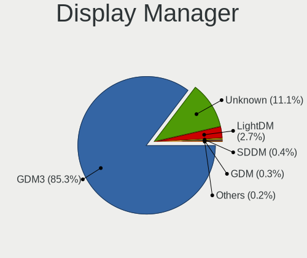
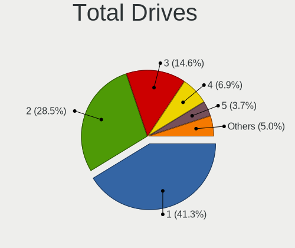
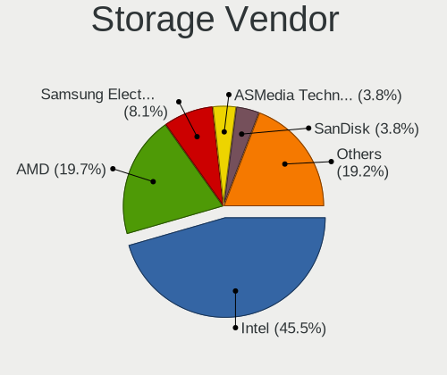
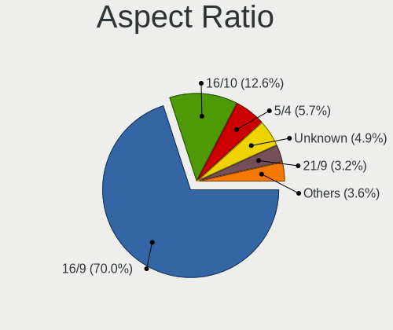
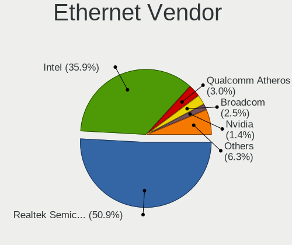

Ubuntu 22.04 - Tested Hardware & Statistics (Desktops)
------------------------------------------------------

A project to collect tested hardware configurations for Ubuntu 22.04.

Anyone can contribute to this report by the [hw-probe](https://github.com/linuxhw/hw-probe) tool:

    sudo -E hw-probe -all -upload

Please contribute! Especially if your hardware is rare.

Contents
--------

* [ Test Cases ](#test-cases)

* [ System ](#system)
  - [ Kernel                   ](#kernel)
  - [ Kernel Family            ](#kernel-family)
  - [ Kernel Major Ver.        ](#kernel-major-ver)
  - [ Arch                     ](#arch)
  - [ DE                       ](#de)
  - [ Display Server           ](#display-server)
  - [ Display Manager          ](#display-manager)
  - [ OS Lang                  ](#os-lang)
  - [ Boot Mode                ](#boot-mode)
  - [ Filesystem               ](#filesystem)
  - [ Part. scheme             ](#part-scheme)
  - [ Dual Boot with Linux/BSD ](#dual-boot-with-linuxbsd)
  - [ Dual Boot (Win)          ](#dual-boot-win)

* [ Board ](#board)
  - [ Vendor                   ](#vendor)
  - [ Model                    ](#model)
  - [ Model Family             ](#model-family)
  - [ MFG Year                 ](#mfg-year)
  - [ Form Factor              ](#form-factor)
  - [ Secure Boot              ](#secure-boot)
  - [ Coreboot                 ](#coreboot)
  - [ RAM Size                 ](#ram-size)
  - [ RAM Used                 ](#ram-used)
  - [ Total Drives             ](#total-drives)
  - [ Has CD-ROM               ](#has-cd-rom)
  - [ Has Ethernet             ](#has-ethernet)
  - [ Has WiFi                 ](#has-wifi)
  - [ Has Bluetooth            ](#has-bluetooth)

* [ Location ](#location)
  - [ Country                  ](#country)
  - [ City                     ](#city)

* [ Drives ](#drives)
  - [ Drive Vendor             ](#drive-vendor)
  - [ Drive Model              ](#drive-model)
  - [ HDD Vendor               ](#hdd-vendor)
  - [ SSD Vendor               ](#ssd-vendor)
  - [ Drive Kind               ](#drive-kind)
  - [ Drive Connector          ](#drive-connector)
  - [ Drive Size               ](#drive-size)
  - [ Space Total              ](#space-total)
  - [ Space Used               ](#space-used)
  - [ Malfunc. Drives          ](#malfunc-drives)
  - [ Malfunc. Drive Vendor    ](#malfunc-drive-vendor)
  - [ Malfunc. HDD Vendor      ](#malfunc-hdd-vendor)
  - [ Malfunc. Drive Kind      ](#malfunc-drive-kind)
  - [ Failed Drives            ](#failed-drives)
  - [ Failed Drive Vendor      ](#failed-drive-vendor)
  - [ Drive Status             ](#drive-status)

* [ Storage controller ](#storage-controller)
  - [ Storage Vendor           ](#storage-vendor)
  - [ Storage Model            ](#storage-model)
  - [ Storage Kind             ](#storage-kind)

* [ Processor ](#processor)
  - [ CPU Vendor               ](#cpu-vendor)
  - [ CPU Model                ](#cpu-model)
  - [ CPU Model Family         ](#cpu-model-family)
  - [ CPU Cores                ](#cpu-cores)
  - [ CPU Sockets              ](#cpu-sockets)
  - [ CPU Threads              ](#cpu-threads)
  - [ CPU Op-Modes             ](#cpu-op-modes)
  - [ CPU Microcode            ](#cpu-microcode)
  - [ CPU Microarch            ](#cpu-microarch)

* [ Graphics ](#graphics)
  - [ GPU Vendor               ](#gpu-vendor)
  - [ GPU Model                ](#gpu-model)
  - [ GPU Combo                ](#gpu-combo)
  - [ GPU Driver               ](#gpu-driver)
  - [ GPU Memory               ](#gpu-memory)

* [ Monitor ](#monitor)
  - [ Monitor Vendor           ](#monitor-vendor)
  - [ Monitor Model            ](#monitor-model)
  - [ Monitor Resolution       ](#monitor-resolution)
  - [ Monitor Diagonal         ](#monitor-diagonal)
  - [ Monitor Width            ](#monitor-width)
  - [ Aspect Ratio             ](#aspect-ratio)
  - [ Monitor Area             ](#monitor-area)
  - [ Pixel Density            ](#pixel-density)
  - [ Multiple Monitors        ](#multiple-monitors)

* [ Network ](#network)
  - [ Net Controller Vendor    ](#net-controller-vendor)
  - [ Net Controller Model     ](#net-controller-model)
  - [ Wireless Vendor          ](#wireless-vendor)
  - [ Wireless Model           ](#wireless-model)
  - [ Ethernet Vendor          ](#ethernet-vendor)
  - [ Ethernet Model           ](#ethernet-model)
  - [ Net Controller Kind      ](#net-controller-kind)
  - [ Used Controller          ](#used-controller)
  - [ NICs                     ](#nics)
  - [ IPv6                     ](#ipv6)

* [ Bluetooth ](#bluetooth)
  - [ Bluetooth Vendor         ](#bluetooth-vendor)
  - [ Bluetooth Model          ](#bluetooth-model)

* [ Sound ](#sound)
  - [ Sound Vendor             ](#sound-vendor)
  - [ Sound Model              ](#sound-model)

* [ Memory ](#memory)
  - [ Memory Vendor            ](#memory-vendor)
  - [ Memory Model             ](#memory-model)
  - [ Memory Kind              ](#memory-kind)
  - [ Memory Form Factor       ](#memory-form-factor)
  - [ Memory Size              ](#memory-size)
  - [ Memory Speed             ](#memory-speed)

* [ Printers & scanners ](#printers--scanners)
  - [ Printer Vendor           ](#printer-vendor)
  - [ Printer Model            ](#printer-model)
  - [ Scanner Vendor           ](#scanner-vendor)
  - [ Scanner Model            ](#scanner-model)

* [ Camera ](#camera)
  - [ Camera Vendor            ](#camera-vendor)
  - [ Camera Model             ](#camera-model)

* [ Security ](#security)
  - [ Fingerprint Vendor       ](#fingerprint-vendor)
  - [ Fingerprint Model        ](#fingerprint-model)
  - [ Chipcard Vendor          ](#chipcard-vendor)
  - [ Chipcard Model           ](#chipcard-model)

* [ Unsupported ](#unsupported)
  - [ Unsupported Devices      ](#unsupported-devices)
  - [ Unsupported Device Types ](#unsupported-device-types)

Test Cases
----------

Total: 8621

| Vendor        | Model                       | Probe                                                      | Date         |
|---------------|-----------------------------|------------------------------------------------------------|--------------|
| ASRock        | B550M Phantom Gaming 4      | [f8574bdf3e](https://linux-hardware.org/?probe=f8574bdf3e) | May 09, 2024 |
| Gigabyte      | Z87X-UD4H-CF                | [f26982efc3](https://linux-hardware.org/?probe=f26982efc3) | May 09, 2024 |
| Gigabyte      | Z170N-WIFI-CF               | [7a88f50508](https://linux-hardware.org/?probe=7a88f50508) | May 08, 2024 |
| Gigabyte      | Z170N-WIFI-CF               | [6143f9e1aa](https://linux-hardware.org/?probe=6143f9e1aa) | May 08, 2024 |
| HP            | 18E7                        | [fa637b3b9a](https://linux-hardware.org/?probe=fa637b3b9a) | May 08, 2024 |
| ASRock        | B550M Phantom Gaming 4      | [8210b8f2f9](https://linux-hardware.org/?probe=8210b8f2f9) | May 08, 2024 |
| ASRock        | Z77 Performance             | [500cd7ed60](https://linux-hardware.org/?probe=500cd7ed60) | May 08, 2024 |
| Unknown       | Unknown                     | [07a1876fd0](https://linux-hardware.org/?probe=07a1876fd0) | May 08, 2024 |
| ASUSTek       | PRIME B760M-A WIFI D4       | [d83d6a3460](https://linux-hardware.org/?probe=d83d6a3460) | May 07, 2024 |
| ASUSTek       | ROG STRIX B450-F GAMING ... | [cdcaeb4d46](https://linux-hardware.org/?probe=cdcaeb4d46) | May 07, 2024 |
| Dell          | 0215PR A02                  | [ff480889b4](https://linux-hardware.org/?probe=ff480889b4) | May 07, 2024 |
| Supermicro    | X10DDW-i                    | [ff62f6b4d9](https://linux-hardware.org/?probe=ff62f6b4d9) | May 07, 2024 |
| Supermicro    | X10DDW-i                    | [b849fea196](https://linux-hardware.org/?probe=b849fea196) | May 07, 2024 |
| Supermicro    | X10DDW-i                    | [c20ef4d35b](https://linux-hardware.org/?probe=c20ef4d35b) | May 07, 2024 |
| Supermicro    | X10DDW-i                    | [9b21386a04](https://linux-hardware.org/?probe=9b21386a04) | May 07, 2024 |
| Supermicro    | X10DDW-i                    | [99fbeae8c9](https://linux-hardware.org/?probe=99fbeae8c9) | May 07, 2024 |
| Supermicro    | X10DDW-i                    | [48bb233b46](https://linux-hardware.org/?probe=48bb233b46) | May 07, 2024 |
| Supermicro    | X10DRL-i                    | [da5c3ed75f](https://linux-hardware.org/?probe=da5c3ed75f) | May 07, 2024 |
| Shenzhen M... | F7BSC                       | [9e6a5eb0e2](https://linux-hardware.org/?probe=9e6a5eb0e2) | May 07, 2024 |
| Intel         | SKYBAY                      | [7e692c7e40](https://linux-hardware.org/?probe=7e692c7e40) | May 07, 2024 |
| Dell          | 02YRK5 A02                  | [fea15ab44c](https://linux-hardware.org/?probe=fea15ab44c) | May 07, 2024 |
| ASUSTek       | PRIME H510M-E               | [bf4a7b097c](https://linux-hardware.org/?probe=bf4a7b097c) | May 06, 2024 |
| ASUSTek       | PRIME H510M-E               | [e76f332009](https://linux-hardware.org/?probe=e76f332009) | May 06, 2024 |
| Dell          | 02YYK5 A01                  | [09b75f38cd](https://linux-hardware.org/?probe=09b75f38cd) | May 06, 2024 |
| MSI           | MAG Z690 TOMAHAWK WIFI D... | [8848310fde](https://linux-hardware.org/?probe=8848310fde) | May 06, 2024 |
| ASUSTek       | ROG STRIX X299-E GAMING ... | [fc1633451e](https://linux-hardware.org/?probe=fc1633451e) | May 06, 2024 |
| Dell          | 042P49 A02                  | [4b9e2674de](https://linux-hardware.org/?probe=4b9e2674de) | May 06, 2024 |
| Dell          | 042P49 A02                  | [146a7db97f](https://linux-hardware.org/?probe=146a7db97f) | May 06, 2024 |
| Dell          | 0C2KJT A00                  | [a884cd0cf5](https://linux-hardware.org/?probe=a884cd0cf5) | May 06, 2024 |
| ASUSTek       | P8H67-M PRO                 | [2af49854e2](https://linux-hardware.org/?probe=2af49854e2) | May 06, 2024 |
| ASUSTek       | ROG STRIX Z690-G GAMING ... | [a923d8607b](https://linux-hardware.org/?probe=a923d8607b) | May 06, 2024 |
| MSI           | H110M PRO-VH                | [f0e62a158e](https://linux-hardware.org/?probe=f0e62a158e) | May 06, 2024 |
| Lenovo        | SHARKBAY NOK                | [11bef15f7d](https://linux-hardware.org/?probe=11bef15f7d) | May 06, 2024 |
| MSI           | 2AE0                        | [25c9b3836b](https://linux-hardware.org/?probe=25c9b3836b) | May 06, 2024 |
| Supermicro    | X10DRL-i                    | [80cdad1821](https://linux-hardware.org/?probe=80cdad1821) | May 06, 2024 |
| ASUSTek       | TUF Gaming A520M-PLUS WI... | [e4b1fdc5b2](https://linux-hardware.org/?probe=e4b1fdc5b2) | May 05, 2024 |
| Supermicro    | X7DCL                       | [9644da40a4](https://linux-hardware.org/?probe=9644da40a4) | May 05, 2024 |
| Dell          | 0J9VVP A00                  | [5971526cf6](https://linux-hardware.org/?probe=5971526cf6) | May 05, 2024 |
| HP            | 806A                        | [d28c449530](https://linux-hardware.org/?probe=d28c449530) | May 05, 2024 |
| Dell          | 0J9VVP A00                  | [f75406b494](https://linux-hardware.org/?probe=f75406b494) | May 05, 2024 |
| Gigabyte      | AB350-Gaming 3-CF           | [a099133a32](https://linux-hardware.org/?probe=a099133a32) | May 05, 2024 |
| MSI           | MPG Z690 FORCE WIFI         | [4e837501bb](https://linux-hardware.org/?probe=4e837501bb) | May 05, 2024 |
| Hardkernel    | ODROID-H3                   | [e9ea8670f9](https://linux-hardware.org/?probe=e9ea8670f9) | May 04, 2024 |
| ASRock        | A520M-HVS                   | [59c3452245](https://linux-hardware.org/?probe=59c3452245) | May 04, 2024 |
| ASRock        | B550 Pro4                   | [7b008baaaa](https://linux-hardware.org/?probe=7b008baaaa) | May 04, 2024 |
| MSI           | PRO Z790-A MAX WIFI         | [534c77cdb0](https://linux-hardware.org/?probe=534c77cdb0) | May 04, 2024 |
| Dell          | 00CV7F A00                  | [0e00dd8ed3](https://linux-hardware.org/?probe=0e00dd8ed3) | May 03, 2024 |
| Dell          | 0HD5W2 A01                  | [c7875c3103](https://linux-hardware.org/?probe=c7875c3103) | May 03, 2024 |
| ASUSTek       | P8H67-M PRO                 | [001c04c64f](https://linux-hardware.org/?probe=001c04c64f) | May 03, 2024 |
| ASUSTek       | TUF B360-PLUS GAMING        | [2fa2359d84](https://linux-hardware.org/?probe=2fa2359d84) | May 03, 2024 |
| ASUSTek       | TUF B360-PLUS GAMING        | [9b2885b554](https://linux-hardware.org/?probe=9b2885b554) | May 03, 2024 |
| ASRock        | A520M-HDV                   | [6bf979fc7a](https://linux-hardware.org/?probe=6bf979fc7a) | May 03, 2024 |
| Shenzhen M... | F7BSC                       | [b3f2c851de](https://linux-hardware.org/?probe=b3f2c851de) | May 02, 2024 |
| Gigabyte      | B450M DS3H-CF               | [f229e6b124](https://linux-hardware.org/?probe=f229e6b124) | May 02, 2024 |
| Dell          | 0GPD72 A00                  | [09c386e20d](https://linux-hardware.org/?probe=09c386e20d) | May 02, 2024 |
| To be fill... | CX-J4125B 11                | [b567efebf2](https://linux-hardware.org/?probe=b567efebf2) | May 02, 2024 |
| To be fill... | CX-J4125B 11                | [258c2fcd0d](https://linux-hardware.org/?probe=258c2fcd0d) | May 02, 2024 |
| Foxconn       | 2ABF                        | [3b1c4174da](https://linux-hardware.org/?probe=3b1c4174da) | May 02, 2024 |
| To be fill... | CX-J4125 12                 | [f579d8a9cc](https://linux-hardware.org/?probe=f579d8a9cc) | May 02, 2024 |
| HP            | 89B3 A                      | [5bc44b7b14](https://linux-hardware.org/?probe=5bc44b7b14) | May 02, 2024 |
| HP            | 89B3 A                      | [7ba4c8e1a2](https://linux-hardware.org/?probe=7ba4c8e1a2) | May 02, 2024 |
| ASUSTek       | ROG Maximus Z790 HERO       | [40caf612c2](https://linux-hardware.org/?probe=40caf612c2) | May 02, 2024 |
| ASUSTek       | M5A97 R2.0                  | [6e17fb9c95](https://linux-hardware.org/?probe=6e17fb9c95) | May 02, 2024 |
| Biostar       | H61MLC                      | [d26510e4fb](https://linux-hardware.org/?probe=d26510e4fb) | May 01, 2024 |
| ASUSTek       | ROG STRIX Z790-A GAMING ... | [5d4a138b2f](https://linux-hardware.org/?probe=5d4a138b2f) | May 01, 2024 |
| Biostar       | H61MLC                      | [502f0f308f](https://linux-hardware.org/?probe=502f0f308f) | May 01, 2024 |
| HP            | 805D                        | [facf891056](https://linux-hardware.org/?probe=facf891056) | May 01, 2024 |
| Dell          | 09KPNV A01                  | [1f22876130](https://linux-hardware.org/?probe=1f22876130) | May 01, 2024 |
| Dell          | 0427JK A00                  | [6c93b7fabf](https://linux-hardware.org/?probe=6c93b7fabf) | Apr 30, 2024 |
| ASUSTek       | TUF Gaming B760M-PLUS WI... | [135b6c8c4e](https://linux-hardware.org/?probe=135b6c8c4e) | Apr 30, 2024 |
| ASUSTek       | PRIME H510M-K               | [1cdd242400](https://linux-hardware.org/?probe=1cdd242400) | Apr 30, 2024 |
| Gigabyte      | F2A88XM-DS2                 | [2a13216c9b](https://linux-hardware.org/?probe=2a13216c9b) | Apr 30, 2024 |
| Dell          | 0R790T A00                  | [2086c30418](https://linux-hardware.org/?probe=2086c30418) | Apr 30, 2024 |
| ASUSTek       | ROG STRIX B460-F GAMING     | [b335a417f1](https://linux-hardware.org/?probe=b335a417f1) | Apr 30, 2024 |
| ASRock        | B450M Pro4                  | [04c8e87ca3](https://linux-hardware.org/?probe=04c8e87ca3) | Apr 30, 2024 |
| MSI           | Z97 GAMING 3                | [c703e6f53a](https://linux-hardware.org/?probe=c703e6f53a) | Apr 30, 2024 |
| ASUSTek       | Maximus Formula             | [c26c507db2](https://linux-hardware.org/?probe=c26c507db2) | Apr 30, 2024 |
| MSI           | Z68A-G43                    | [9acdb88f98](https://linux-hardware.org/?probe=9acdb88f98) | Apr 30, 2024 |
| HP            | 8526 MVB, A                 | [880c56ee27](https://linux-hardware.org/?probe=880c56ee27) | Apr 29, 2024 |
| Gigabyte      | Z77X-UD3H                   | [9ec352e75d](https://linux-hardware.org/?probe=9ec352e75d) | Apr 29, 2024 |
| Fujitsu       | D3041-A1 S26361-D3041-A1    | [166266e759](https://linux-hardware.org/?probe=166266e759) | Apr 28, 2024 |
| Gigabyte      | B760M AORUS ELITE AX        | [d48aa1e751](https://linux-hardware.org/?probe=d48aa1e751) | Apr 28, 2024 |
| ASUSTek       | M5A97 R2.0                  | [3dcaa02108](https://linux-hardware.org/?probe=3dcaa02108) | Apr 28, 2024 |
| Dell          | 0KRC95 A00                  | [8a4d88627a](https://linux-hardware.org/?probe=8a4d88627a) | Apr 27, 2024 |
| Supermicro    | X10DRL-i                    | [442d3d029e](https://linux-hardware.org/?probe=442d3d029e) | Apr 27, 2024 |
| Gigabyte      | B550M DS3H                  | [158b44fbb4](https://linux-hardware.org/?probe=158b44fbb4) | Apr 27, 2024 |
| Gigabyte      | B550M DS3H                  | [12aab4742e](https://linux-hardware.org/?probe=12aab4742e) | Apr 27, 2024 |
| Dell          | 0WMJ54 A00                  | [952112efbd](https://linux-hardware.org/?probe=952112efbd) | Apr 27, 2024 |
| Supermicro    | X10DRL-i                    | [acd3d2d971](https://linux-hardware.org/?probe=acd3d2d971) | Apr 27, 2024 |
| Supermicro    | X10DRL-i                    | [97cef8e012](https://linux-hardware.org/?probe=97cef8e012) | Apr 27, 2024 |
| Gigabyte      | B760M AORUS ELITE AX        | [8541225188](https://linux-hardware.org/?probe=8541225188) | Apr 27, 2024 |
| MSI           | Z87-G43                     | [94162ca704](https://linux-hardware.org/?probe=94162ca704) | Apr 27, 2024 |
| ASUSTek       | P5QPL-AM                    | [9199a16ddd](https://linux-hardware.org/?probe=9199a16ddd) | Apr 27, 2024 |
| Dell          | 0T10XW A02                  | [5836e0e02a](https://linux-hardware.org/?probe=5836e0e02a) | Apr 27, 2024 |
| ASUSTek       | PRIME B450M-A               | [f658c7fdf6](https://linux-hardware.org/?probe=f658c7fdf6) | Apr 27, 2024 |
| AMI           | Intel                       | [a1842e7e12](https://linux-hardware.org/?probe=a1842e7e12) | Apr 27, 2024 |
| ASUSTek       | Q87M-E                      | [2b0d58047a](https://linux-hardware.org/?probe=2b0d58047a) | Apr 26, 2024 |
| Dell          | 0KRC95 A00                  | [b049b821e7](https://linux-hardware.org/?probe=b049b821e7) | Apr 26, 2024 |
| ASUSTek       | M5A78L-M/USB3               | [c33dc3b69c](https://linux-hardware.org/?probe=c33dc3b69c) | Apr 26, 2024 |
| HP            | 8648                        | [996bb0e2b3](https://linux-hardware.org/?probe=996bb0e2b3) | Apr 26, 2024 |
| HP            | 82FF                        | [a0e9cfd330](https://linux-hardware.org/?probe=a0e9cfd330) | Apr 26, 2024 |
| Gigabyte      | B85M-Gaming 3               | [201dbfaede](https://linux-hardware.org/?probe=201dbfaede) | Apr 26, 2024 |
| Lenovo        | 3743 SDK0T76461 WIN 3422... | [1f3abb751c](https://linux-hardware.org/?probe=1f3abb751c) | Apr 26, 2024 |
| AZW           | MINI S                      | [0c4be52f43](https://linux-hardware.org/?probe=0c4be52f43) | Apr 26, 2024 |
| Gigabyte      | M68M-S2P                    | [1472c658c2](https://linux-hardware.org/?probe=1472c658c2) | Apr 25, 2024 |
| Dell          | 0KRC95 A00                  | [4f768499f5](https://linux-hardware.org/?probe=4f768499f5) | Apr 25, 2024 |
| Dell          | 040DDP A01                  | [7eea0dc663](https://linux-hardware.org/?probe=7eea0dc663) | Apr 25, 2024 |
| Gigabyte      | B450M DS3H-CF               | [61842fb260](https://linux-hardware.org/?probe=61842fb260) | Apr 25, 2024 |
| Gigabyte      | TRX40 AORUS MASTER          | [1b5ae94b9e](https://linux-hardware.org/?probe=1b5ae94b9e) | Apr 25, 2024 |
| ASUSTek       | Pro WS WRX80E-SAGE SE WI... | [9517bddd97](https://linux-hardware.org/?probe=9517bddd97) | Apr 25, 2024 |
| ASRock        | TRX40 Creator               | [cc4738cbfe](https://linux-hardware.org/?probe=cc4738cbfe) | Apr 25, 2024 |
| ASUSTek       | P5QLD PRO                   | [f20dcd8125](https://linux-hardware.org/?probe=f20dcd8125) | Apr 25, 2024 |
| ASUSTek       | ROG STRIX Z690-G GAMING ... | [0c9119abc9](https://linux-hardware.org/?probe=0c9119abc9) | Apr 25, 2024 |
| ASUSTek       | PRIME Z590M-PLUS            | [38bbe3657e](https://linux-hardware.org/?probe=38bbe3657e) | Apr 25, 2024 |
| AZW           | T4 PRO                      | [8549531554](https://linux-hardware.org/?probe=8549531554) | Apr 24, 2024 |
| ASUSTek       | TUF Gaming B650-PLUS WIF... | [0b8cd1192f](https://linux-hardware.org/?probe=0b8cd1192f) | Apr 24, 2024 |
| ASUSTek       | M5A97 R2.0                  | [f1a984f467](https://linux-hardware.org/?probe=f1a984f467) | Apr 24, 2024 |
| ASUSTek       | ROG ZENITH II EXTREME       | [6bb0e4d69f](https://linux-hardware.org/?probe=6bb0e4d69f) | Apr 24, 2024 |
| Gigabyte      | TRX40 AORUS MASTER          | [7dcc7cb561](https://linux-hardware.org/?probe=7dcc7cb561) | Apr 24, 2024 |
| Gigabyte      | TRX40 AORUS MASTER          | [9426a5b0e6](https://linux-hardware.org/?probe=9426a5b0e6) | Apr 24, 2024 |
| Gigabyte      | TRX40 AORUS MASTER          | [197ca7d3cb](https://linux-hardware.org/?probe=197ca7d3cb) | Apr 24, 2024 |
| Gigabyte      | TRX40 AORUS MASTER          | [7f1573ec15](https://linux-hardware.org/?probe=7f1573ec15) | Apr 24, 2024 |
| Gigabyte      | TRX40 AORUS MASTER          | [2da1dbfafd](https://linux-hardware.org/?probe=2da1dbfafd) | Apr 24, 2024 |
| ASRock        | TRX40 Creator               | [a2a1bf049f](https://linux-hardware.org/?probe=a2a1bf049f) | Apr 24, 2024 |
| Gigabyte      | TRX40 AORUS MASTER          | [9898467fe0](https://linux-hardware.org/?probe=9898467fe0) | Apr 24, 2024 |
| ASRock        | TRX40 Creator               | [542e333336](https://linux-hardware.org/?probe=542e333336) | Apr 24, 2024 |
| ASRock        | TRX40 Creator               | [c9bdc54a54](https://linux-hardware.org/?probe=c9bdc54a54) | Apr 24, 2024 |
| ASRock        | TRX40 Creator               | [a47e5abed3](https://linux-hardware.org/?probe=a47e5abed3) | Apr 24, 2024 |
| MSI           | B550-A PRO                  | [db4981c2cb](https://linux-hardware.org/?probe=db4981c2cb) | Apr 24, 2024 |
| Acer          | Predator PO7-640            | [6d9e679298](https://linux-hardware.org/?probe=6d9e679298) | Apr 24, 2024 |
| Gigabyte      | B760M D2H                   | [5ff47b02a8](https://linux-hardware.org/?probe=5ff47b02a8) | Apr 23, 2024 |
| ASUSTek       | ProArt Z790-CREATOR WIFI    | [755ed51be8](https://linux-hardware.org/?probe=755ed51be8) | Apr 23, 2024 |
| Techvision    | TVI7309X B0                 | [0bf8074cfc](https://linux-hardware.org/?probe=0bf8074cfc) | Apr 23, 2024 |
| Intel         | MAHOBAY                     | [da659a0ae5](https://linux-hardware.org/?probe=da659a0ae5) | Apr 23, 2024 |
| ASUSTek       | Rampage V EXTREME           | [f0732b1851](https://linux-hardware.org/?probe=f0732b1851) | Apr 23, 2024 |
| Gigabyte      | B550 GAMING X V2            | [bf5d255cb3](https://linux-hardware.org/?probe=bf5d255cb3) | Apr 23, 2024 |
| Lenovo        | SHARKBAY 0B98401 WIN        | [fa0b7c7632](https://linux-hardware.org/?probe=fa0b7c7632) | Apr 23, 2024 |
| Dell          | 0NNNCT A01                  | [c448c1be35](https://linux-hardware.org/?probe=c448c1be35) | Apr 23, 2024 |
| Lenovo        | 4030                        | [0c37613f84](https://linux-hardware.org/?probe=0c37613f84) | Apr 23, 2024 |
| Dell          | 0K240Y A03                  | [aa9d8113e9](https://linux-hardware.org/?probe=aa9d8113e9) | Apr 23, 2024 |
| ASUSTek       | P5Q DELUXE                  | [88b1a5568e](https://linux-hardware.org/?probe=88b1a5568e) | Apr 23, 2024 |
| ASUSTek       | ROG STRIX X570-E GAMING     | [bc20931e37](https://linux-hardware.org/?probe=bc20931e37) | Apr 23, 2024 |
| Lenovo        | Unknown                     | [8c44eea387](https://linux-hardware.org/?probe=8c44eea387) | Apr 23, 2024 |
| ASUSTek       | CROSSHAIR V FORMULA-Z       | [f80ac54e1e](https://linux-hardware.org/?probe=f80ac54e1e) | Apr 23, 2024 |
| Intel         | MAHOBAY                     | [9cd8f52e56](https://linux-hardware.org/?probe=9cd8f52e56) | Apr 23, 2024 |
| MSI           | MAG Z790 TOMAHAWK WIFI      | [35e248e8bd](https://linux-hardware.org/?probe=35e248e8bd) | Apr 22, 2024 |
| ASUSTek       | Z97-P                       | [ec6038f173](https://linux-hardware.org/?probe=ec6038f173) | Apr 22, 2024 |
| MSI           | A320M PRO-VD/S              | [64c7f84ead](https://linux-hardware.org/?probe=64c7f84ead) | Apr 22, 2024 |
| ASUSTek       | PRIME A320M-K/BR            | [fe05e4fbfc](https://linux-hardware.org/?probe=fe05e4fbfc) | Apr 22, 2024 |
| ASUSTek       | F2A85-M PRO                 | [8c84e31977](https://linux-hardware.org/?probe=8c84e31977) | Apr 22, 2024 |
| ASUSTek       | Pro WS X570-ACE             | [164050cba4](https://linux-hardware.org/?probe=164050cba4) | Apr 22, 2024 |
| ASRock        | X570 Taichi                 | [30d16327b6](https://linux-hardware.org/?probe=30d16327b6) | Apr 22, 2024 |
| Toshiba       | STI 012943                  | [678536872d](https://linux-hardware.org/?probe=678536872d) | Apr 21, 2024 |
| Intel         | DH55HC AAE70933-503         | [54e6f2958d](https://linux-hardware.org/?probe=54e6f2958d) | Apr 21, 2024 |
| Acer          | Veriton N4660G              | [3fa6762f15](https://linux-hardware.org/?probe=3fa6762f15) | Apr 21, 2024 |
| Acer          | Veriton N4660G              | [514dd0f3f4](https://linux-hardware.org/?probe=514dd0f3f4) | Apr 21, 2024 |
| Gigabyte      | A520M S2H                   | [52de796ce6](https://linux-hardware.org/?probe=52de796ce6) | Apr 21, 2024 |
| HP            | ProLiant MicroServer Gen... | [e44ef3501a](https://linux-hardware.org/?probe=e44ef3501a) | Apr 21, 2024 |
| ASRock        | G41M-VS3                    | [21ae4d4c1e](https://linux-hardware.org/?probe=21ae4d4c1e) | Apr 21, 2024 |
| ASUSTek       | PRIME B650M-A WIFI II       | [bf7ed0943a](https://linux-hardware.org/?probe=bf7ed0943a) | Apr 21, 2024 |
| Unknown       | V0.9x                       | [db770f4cb9](https://linux-hardware.org/?probe=db770f4cb9) | Apr 21, 2024 |
| Dell          | 088DT1 A01                  | [4a09358541](https://linux-hardware.org/?probe=4a09358541) | Apr 21, 2024 |
| Dell          | 088DT1 A01                  | [3dcdb47fd0](https://linux-hardware.org/?probe=3dcdb47fd0) | Apr 21, 2024 |
| MSI           | MAG Z790 TOMAHAWK WIFI      | [186ef10f3d](https://linux-hardware.org/?probe=186ef10f3d) | Apr 21, 2024 |
| Dell          | 0KWVT8 A03                  | [0c00a4bf3d](https://linux-hardware.org/?probe=0c00a4bf3d) | Apr 20, 2024 |
| ASUSTek       | P8H61-M LX                  | [96710be28c](https://linux-hardware.org/?probe=96710be28c) | Apr 20, 2024 |
| ASRock        | X399 Taichi                 | [630388c584](https://linux-hardware.org/?probe=630388c584) | Apr 20, 2024 |
| ParTech       | Everserv 7000 Ivy Bridge... | [2d3657d514](https://linux-hardware.org/?probe=2d3657d514) | Apr 20, 2024 |
| Dell          | 0NK70N A03                  | [a6862dfd01](https://linux-hardware.org/?probe=a6862dfd01) | Apr 20, 2024 |
| ASUSTek       | P5G41T-M LX2/GB             | [9834b68734](https://linux-hardware.org/?probe=9834b68734) | Apr 20, 2024 |
| Supermicro    | X9DRi-LN4+/X9DR3-LN4+       | [2bbb8098a6](https://linux-hardware.org/?probe=2bbb8098a6) | Apr 20, 2024 |
| ASUSTek       | PRIME X570-PRO              | [2d02398d8e](https://linux-hardware.org/?probe=2d02398d8e) | Apr 20, 2024 |
| ASUSTek       | H170-PRO                    | [0b4b15c9a0](https://linux-hardware.org/?probe=0b4b15c9a0) | Apr 20, 2024 |
| ASRock        | X570 Phantom Gaming 4       | [95c911346e](https://linux-hardware.org/?probe=95c911346e) | Apr 20, 2024 |
| ASUSTek       | G20AJ                       | [bbb2ae3890](https://linux-hardware.org/?probe=bbb2ae3890) | Apr 20, 2024 |
| ASUSTek       | G20AJ                       | [f9741e3c18](https://linux-hardware.org/?probe=f9741e3c18) | Apr 20, 2024 |
| Supermicro    | X10DAI                      | [cd2bb43eb4](https://linux-hardware.org/?probe=cd2bb43eb4) | Apr 19, 2024 |
| Supermicro    | X10DAI                      | [053e65f727](https://linux-hardware.org/?probe=053e65f727) | Apr 19, 2024 |
| Dell          | 0HD5W2 A01                  | [6346aaf37d](https://linux-hardware.org/?probe=6346aaf37d) | Apr 19, 2024 |
| Fujitsu       | D3517-A1 S26361-D3517-A1    | [faac8a47c7](https://linux-hardware.org/?probe=faac8a47c7) | Apr 19, 2024 |
| ASUSTek       | ROG STRIX Z490-F GAMING     | [aea22c24a7](https://linux-hardware.org/?probe=aea22c24a7) | Apr 19, 2024 |
| ASUSTek       | ROG STRIX B360-G GAMING     | [71d2f1f549](https://linux-hardware.org/?probe=71d2f1f549) | Apr 19, 2024 |
| ASUSTek       | PRIME B360M-K               | [2231063264](https://linux-hardware.org/?probe=2231063264) | Apr 19, 2024 |
| Gigabyte      | B560M AORUS ELITE           | [ecce644b2d](https://linux-hardware.org/?probe=ecce644b2d) | Apr 19, 2024 |
| ASUSTek       | PRIME B360M-K               | [aeef377b48](https://linux-hardware.org/?probe=aeef377b48) | Apr 19, 2024 |
| ASUSTek       | P8H67-M PRO                 | [46ac746bf3](https://linux-hardware.org/?probe=46ac746bf3) | Apr 19, 2024 |
| ASUSTek       | PRIME B450M-K               | [7985c3ea99](https://linux-hardware.org/?probe=7985c3ea99) | Apr 19, 2024 |
| MSI           | Z490-A PRO                  | [8312358193](https://linux-hardware.org/?probe=8312358193) | Apr 19, 2024 |
| Gigabyte      | X570 AORUS ELITE WIFI       | [4406405ed5](https://linux-hardware.org/?probe=4406405ed5) | Apr 19, 2024 |
| Lenovo        | 361A SDK0K17763 WIN         | [e15581aafc](https://linux-hardware.org/?probe=e15581aafc) | Apr 18, 2024 |
| HP            | 339A                        | [fb23f5210f](https://linux-hardware.org/?probe=fb23f5210f) | Apr 18, 2024 |
| HP            | 1998                        | [d16f45d089](https://linux-hardware.org/?probe=d16f45d089) | Apr 18, 2024 |
| ASUSTek       | W680/MB DC                  | [85352380c6](https://linux-hardware.org/?probe=85352380c6) | Apr 18, 2024 |
| HP            | 8055                        | [c30b60c56d](https://linux-hardware.org/?probe=c30b60c56d) | Apr 18, 2024 |
| MSI           | B85M-G43                    | [c632093cb8](https://linux-hardware.org/?probe=c632093cb8) | Apr 18, 2024 |
| Gigabyte      | H410M S2H V3                | [017e219995](https://linux-hardware.org/?probe=017e219995) | Apr 18, 2024 |
| PCWare        | IPMH61R3                    | [9f8562ac62](https://linux-hardware.org/?probe=9f8562ac62) | Apr 18, 2024 |
| ASUSTek       | Pro WS 665-ACE              | [f895b19d4c](https://linux-hardware.org/?probe=f895b19d4c) | Apr 18, 2024 |
| ASUSTek       | PRIME B450M-K               | [58824cb080](https://linux-hardware.org/?probe=58824cb080) | Apr 18, 2024 |
| ASUSTek       | Pro WS 665-ACE              | [e5e21c8cb2](https://linux-hardware.org/?probe=e5e21c8cb2) | Apr 18, 2024 |
| ASUSTek       | PRIME B650M-A WIFI II       | [f841d88fe9](https://linux-hardware.org/?probe=f841d88fe9) | Apr 17, 2024 |
| Unknown       | Unknown                     | [9be7b4bfdc](https://linux-hardware.org/?probe=9be7b4bfdc) | Apr 17, 2024 |
| ASRock        | A320M-HDV R4.0              | [43c66c672d](https://linux-hardware.org/?probe=43c66c672d) | Apr 17, 2024 |
| ASRock        | A320M-HDV R4.0              | [ddf3999a87](https://linux-hardware.org/?probe=ddf3999a87) | Apr 17, 2024 |
| Gigabyte      | P55-UD4                     | [fb43a8d266](https://linux-hardware.org/?probe=fb43a8d266) | Apr 17, 2024 |
| Unknown       | Unknown                     | [27c4d07af4](https://linux-hardware.org/?probe=27c4d07af4) | Apr 17, 2024 |
| Supermicro    | X10DRL-i                    | [2fcba07dab](https://linux-hardware.org/?probe=2fcba07dab) | Apr 17, 2024 |
| Supermicro    | X10DDW-i                    | [870e9c2cc5](https://linux-hardware.org/?probe=870e9c2cc5) | Apr 17, 2024 |
| Supermicro    | X10DDW-i                    | [fe2a75df41](https://linux-hardware.org/?probe=fe2a75df41) | Apr 17, 2024 |
| Gigabyte      | B550M DS3H                  | [1952388280](https://linux-hardware.org/?probe=1952388280) | Apr 17, 2024 |
| Gigabyte      | B760M GAMING X AX DDR4      | [e18c7ed37c](https://linux-hardware.org/?probe=e18c7ed37c) | Apr 17, 2024 |
| Lenovo        | NOK                         | [3190c97560](https://linux-hardware.org/?probe=3190c97560) | Apr 17, 2024 |
| HP            | 1998                        | [ae4e73aa97](https://linux-hardware.org/?probe=ae4e73aa97) | Apr 17, 2024 |
| ASUSTek       | H170M-PLUS                  | [36ed031c7f](https://linux-hardware.org/?probe=36ed031c7f) | Apr 17, 2024 |
| ASUSTek       | P8P67                       | [249f9c8ae9](https://linux-hardware.org/?probe=249f9c8ae9) | Apr 17, 2024 |
| Dell          | 06D7TR A02                  | [8b107755d6](https://linux-hardware.org/?probe=8b107755d6) | Apr 17, 2024 |
| HP            | 83E7                        | [f643b7fe0c](https://linux-hardware.org/?probe=f643b7fe0c) | Apr 17, 2024 |
| HP            | 83E7                        | [0ae274b680](https://linux-hardware.org/?probe=0ae274b680) | Apr 17, 2024 |
| Supermicro    | X10DRU-i+A                  | [c8cae2309d](https://linux-hardware.org/?probe=c8cae2309d) | Apr 17, 2024 |
| Unknown       | DH61BR G32662-203           | [d27fa5367c](https://linux-hardware.org/?probe=d27fa5367c) | Apr 16, 2024 |
| Gigabyte      | TRX40 AORUS MASTER          | [ebf280313f](https://linux-hardware.org/?probe=ebf280313f) | Apr 16, 2024 |
| ASRock        | TRX40 Creator               | [57d1cf59c7](https://linux-hardware.org/?probe=57d1cf59c7) | Apr 16, 2024 |
| ASRock        | TRX40 Creator               | [200c6d06cf](https://linux-hardware.org/?probe=200c6d06cf) | Apr 16, 2024 |
| HP            | 2215                        | [593b80f28b](https://linux-hardware.org/?probe=593b80f28b) | Apr 16, 2024 |
| Foxconn       | 2AB1h                       | [9681c7f433](https://linux-hardware.org/?probe=9681c7f433) | Apr 16, 2024 |
| Gigabyte      | H310M H x.x                 | [1e1b1e0544](https://linux-hardware.org/?probe=1e1b1e0544) | Apr 16, 2024 |
| Intel         | H81                         | [e182aced52](https://linux-hardware.org/?probe=e182aced52) | Apr 16, 2024 |
| Gigabyte      | B75M-D3H                    | [a70dd63e0f](https://linux-hardware.org/?probe=a70dd63e0f) | Apr 16, 2024 |
| MSI           | MPG Z390 GAMING PLUS        | [89c08359b4](https://linux-hardware.org/?probe=89c08359b4) | Apr 15, 2024 |
| Intel         | H81                         | [5029d0bb32](https://linux-hardware.org/?probe=5029d0bb32) | Apr 15, 2024 |
| ASUSTek       | Pro WS TRX50-SAGE WIFI      | [ac85313920](https://linux-hardware.org/?probe=ac85313920) | Apr 15, 2024 |
| HP            | 81C5 MVB                    | [f2ebb6880e](https://linux-hardware.org/?probe=f2ebb6880e) | Apr 15, 2024 |
| Gigabyte      | B450M DS3H WIFI-CF          | [c21ac457c2](https://linux-hardware.org/?probe=c21ac457c2) | Apr 15, 2024 |
| Lenovo        | 30BE SDK0J40705 WIN 3425... | [bfacfe1e0f](https://linux-hardware.org/?probe=bfacfe1e0f) | Apr 15, 2024 |
| ASRock        | 960GM-GS3 FX                | [fb44984605](https://linux-hardware.org/?probe=fb44984605) | Apr 15, 2024 |
| Gigabyte      | B650M DS3H                  | [f9d81ca296](https://linux-hardware.org/?probe=f9d81ca296) | Apr 15, 2024 |
| Gigabyte      | B650M DS3H                  | [dd91aab086](https://linux-hardware.org/?probe=dd91aab086) | Apr 15, 2024 |
| AWOW          | AL34                        | [ee79d2f909](https://linux-hardware.org/?probe=ee79d2f909) | Apr 14, 2024 |
| HP            | 1494                        | [6dc287f96f](https://linux-hardware.org/?probe=6dc287f96f) | Apr 14, 2024 |
| HP            | 2B47                        | [2ea4cccb87](https://linux-hardware.org/?probe=2ea4cccb87) | Apr 14, 2024 |
| Dell          | 0K240Y A03                  | [1642fe3a09](https://linux-hardware.org/?probe=1642fe3a09) | Apr 14, 2024 |
| ASUSTek       | ROG STRIX B550-F GAMING ... | [5b7d416743](https://linux-hardware.org/?probe=5b7d416743) | Apr 14, 2024 |
| Unknown       | Unknown                     | [639a73dd7e](https://linux-hardware.org/?probe=639a73dd7e) | Apr 14, 2024 |
| Gigabyte      | B450M DS3H-CF               | [8280874d0c](https://linux-hardware.org/?probe=8280874d0c) | Apr 14, 2024 |
| Gigabyte      | B450M DS3H-CF               | [16a95d9060](https://linux-hardware.org/?probe=16a95d9060) | Apr 14, 2024 |
| Foxconn       | G41MX/G41MX-K 2.0 1.0       | [b003cebf01](https://linux-hardware.org/?probe=b003cebf01) | Apr 13, 2024 |
| HP            | 3646h                       | [281438274d](https://linux-hardware.org/?probe=281438274d) | Apr 13, 2024 |
| Gigabyte      | GA-MA790XT-UD4P             | [afc6970a5a](https://linux-hardware.org/?probe=afc6970a5a) | Apr 13, 2024 |
| Dell          | 03KWTV A02                  | [c4e734036d](https://linux-hardware.org/?probe=c4e734036d) | Apr 13, 2024 |
| MSI           | B650 GAMING PLUS WIFI       | [49db2f183b](https://linux-hardware.org/?probe=49db2f183b) | Apr 13, 2024 |
| Unknown       | Unknown                     | [2304feb790](https://linux-hardware.org/?probe=2304feb790) | Apr 13, 2024 |
| Dell          | 0K068D A00                  | [6511c0d75a](https://linux-hardware.org/?probe=6511c0d75a) | Apr 13, 2024 |
| ASRock        | B460M Pro4                  | [51a2126e7d](https://linux-hardware.org/?probe=51a2126e7d) | Apr 12, 2024 |
| Dell          | 06X1TJ A00                  | [462d691265](https://linux-hardware.org/?probe=462d691265) | Apr 12, 2024 |
| Dell          | 06X1TJ A00                  | [be5c35a265](https://linux-hardware.org/?probe=be5c35a265) | Apr 12, 2024 |
| Intel         | H61                         | [725607d481](https://linux-hardware.org/?probe=725607d481) | Apr 12, 2024 |
| ASUSTek       | M51BC                       | [ce7e5d9028](https://linux-hardware.org/?probe=ce7e5d9028) | Apr 12, 2024 |
| ASUSTek       | TUF Gaming Z590-PLUS WIF... | [6612c73c17](https://linux-hardware.org/?probe=6612c73c17) | Apr 12, 2024 |
| Intel         | H61                         | [e9f84da864](https://linux-hardware.org/?probe=e9f84da864) | Apr 12, 2024 |
| Unknown       | Unknown                     | [806b19f738](https://linux-hardware.org/?probe=806b19f738) | Apr 12, 2024 |
| Dell          | 0M858N A01                  | [c8afa6f863](https://linux-hardware.org/?probe=c8afa6f863) | Apr 12, 2024 |
| ASUSTek       | ROG STRIX B550-F GAMING ... | [72d66a084e](https://linux-hardware.org/?probe=72d66a084e) | Apr 12, 2024 |
| ASUSTek       | WS C422 PRO_SE              | [f4279202a4](https://linux-hardware.org/?probe=f4279202a4) | Apr 12, 2024 |
| GMKtec        | NucBox G2                   | [f0c4a21d72](https://linux-hardware.org/?probe=f0c4a21d72) | Apr 12, 2024 |
| ASRock        | H310CM-HDV/M.2              | [a0aec56216](https://linux-hardware.org/?probe=a0aec56216) | Apr 11, 2024 |
| Dell          | 0KWVT8 A03                  | [9eed81714e](https://linux-hardware.org/?probe=9eed81714e) | Apr 11, 2024 |
| ASUSTek       | ROG STRIX Z690-E GAMING ... | [0b66fdcaf8](https://linux-hardware.org/?probe=0b66fdcaf8) | Apr 11, 2024 |
| HP            | ProLiant ML110 Gen9         | [4ea596e363](https://linux-hardware.org/?probe=4ea596e363) | Apr 11, 2024 |
| Dell          | 002KVM A00                  | [85ad08c5db](https://linux-hardware.org/?probe=85ad08c5db) | Apr 11, 2024 |
| HP            | 18E7                        | [5f8718f2fe](https://linux-hardware.org/?probe=5f8718f2fe) | Apr 11, 2024 |
| GMKtec        | NucBox G2                   | [2cb8d07bab](https://linux-hardware.org/?probe=2cb8d07bab) | Apr 11, 2024 |
| ASRock        | Z77 Performance             | [8904a692b1](https://linux-hardware.org/?probe=8904a692b1) | Apr 11, 2024 |
| Dell          | 06JWJY A01                  | [824cb2807f](https://linux-hardware.org/?probe=824cb2807f) | Apr 11, 2024 |
| HP            | 2215                        | [278221c29e](https://linux-hardware.org/?probe=278221c29e) | Apr 11, 2024 |
| HP            | 21B4 A01                    | [c0725f4a31](https://linux-hardware.org/?probe=c0725f4a31) | Apr 11, 2024 |
| ASRock        | 4X4-4000 Series             | [933f5300ab](https://linux-hardware.org/?probe=933f5300ab) | Apr 11, 2024 |
| Lenovo        | ThinkCentre M58p 3063A58    | [b49c1636fe](https://linux-hardware.org/?probe=b49c1636fe) | Apr 11, 2024 |
| ASRock        | J5040-ITX                   | [9bcab48255](https://linux-hardware.org/?probe=9bcab48255) | Apr 11, 2024 |
| Lenovo        | 30D9 SDK0J40697 WIN 3305... | [2ad2ada69c](https://linux-hardware.org/?probe=2ad2ada69c) | Apr 11, 2024 |
| Gigabyte      | GA-MA78G-DS3H               | [da706e0534](https://linux-hardware.org/?probe=da706e0534) | Apr 11, 2024 |
| Huanan        | X99-F8 GAMING V5.0          | [4e43e18d89](https://linux-hardware.org/?probe=4e43e18d89) | Apr 10, 2024 |
| HP            | 89D8 SMVB                   | [8c27767abc](https://linux-hardware.org/?probe=8c27767abc) | Apr 10, 2024 |
| Dell          | 0F428D A00                  | [fe26e7b609](https://linux-hardware.org/?probe=fe26e7b609) | Apr 10, 2024 |
| Gigabyte      | A520M DS3H V2               | [b7832201c1](https://linux-hardware.org/?probe=b7832201c1) | Apr 10, 2024 |
| Gigabyte      | A520M DS3H                  | [9d82499edb](https://linux-hardware.org/?probe=9d82499edb) | Apr 10, 2024 |
| Gigabyte      | Z77-D3H                     | [f40e03ec71](https://linux-hardware.org/?probe=f40e03ec71) | Apr 10, 2024 |
| Lenovo        | 36C5 SDK0L77767 WIN 3423... | [79cb6ea23b](https://linux-hardware.org/?probe=79cb6ea23b) | Apr 10, 2024 |
| Intel         | DH61CR AAG14064-207         | [f8046553af](https://linux-hardware.org/?probe=f8046553af) | Apr 10, 2024 |
| Supermicro    | X10DRL-i                    | [3e5f2848b5](https://linux-hardware.org/?probe=3e5f2848b5) | Apr 10, 2024 |
| Supermicro    | X10DDW-i                    | [8711fda3e2](https://linux-hardware.org/?probe=8711fda3e2) | Apr 10, 2024 |
| MSI           | B550M PRO-VDH WIFI          | [9b7f62afeb](https://linux-hardware.org/?probe=9b7f62afeb) | Apr 10, 2024 |
| Supermicro    | X10DRL-i                    | [1fb898abac](https://linux-hardware.org/?probe=1fb898abac) | Apr 10, 2024 |
| Supermicro    | X10DDW-i                    | [b92dcd64e9](https://linux-hardware.org/?probe=b92dcd64e9) | Apr 10, 2024 |
| Supermicro    | X10DDW-i                    | [fb0193d2d1](https://linux-hardware.org/?probe=fb0193d2d1) | Apr 10, 2024 |
| MSI           | B85-G43 GAMING              | [2bb4a429e0](https://linux-hardware.org/?probe=2bb4a429e0) | Apr 09, 2024 |
| MSI           | X99S SLI PLUS               | [a61ed0e4eb](https://linux-hardware.org/?probe=a61ed0e4eb) | Apr 09, 2024 |
| Lenovo        | 102F SDK0Q40113 WIN 3305... | [57eac46f24](https://linux-hardware.org/?probe=57eac46f24) | Apr 09, 2024 |
| ASUSTek       | P7P55 WS SUPERCOMPUTER      | [a3c369db65](https://linux-hardware.org/?probe=a3c369db65) | Apr 08, 2024 |
| HP            | 1494                        | [8888d5839f](https://linux-hardware.org/?probe=8888d5839f) | Apr 08, 2024 |
| HP            | 1494                        | [d338a69cee](https://linux-hardware.org/?probe=d338a69cee) | Apr 08, 2024 |
| ASRock        | B650 Pro RS                 | [22f08d369c](https://linux-hardware.org/?probe=22f08d369c) | Apr 08, 2024 |
| ASUSTek       | P8B75-V                     | [366bbe1d9b](https://linux-hardware.org/?probe=366bbe1d9b) | Apr 08, 2024 |
| ASRock        | B650 Pro RS                 | [c966abe8ce](https://linux-hardware.org/?probe=c966abe8ce) | Apr 08, 2024 |
| MSI           | B85M-G43                    | [aabca2aa43](https://linux-hardware.org/?probe=aabca2aa43) | Apr 08, 2024 |
| ASUSTek       | ROG STRIX Z390-H GAMING     | [fcb1981db5](https://linux-hardware.org/?probe=fcb1981db5) | Apr 07, 2024 |
| Acer          | Veriton X4630G              | [4ba25709b1](https://linux-hardware.org/?probe=4ba25709b1) | Apr 07, 2024 |
| Unknown       | DH61BR G32662-203           | [4d4eb71983](https://linux-hardware.org/?probe=4d4eb71983) | Apr 07, 2024 |
| MSI           | Z87-GD65 GAMING             | [af8d94ff13](https://linux-hardware.org/?probe=af8d94ff13) | Apr 07, 2024 |
| Gigabyte      | B550M DS3H                  | [f57ed12779](https://linux-hardware.org/?probe=f57ed12779) | Apr 07, 2024 |
| MSI           | A78M-E35                    | [48d55373b4](https://linux-hardware.org/?probe=48d55373b4) | Apr 07, 2024 |
| MSI           | H510M-A PRO                 | [06ae4e1c3a](https://linux-hardware.org/?probe=06ae4e1c3a) | Apr 07, 2024 |
| MSI           | MS-7369                     | [87eaeb2873](https://linux-hardware.org/?probe=87eaeb2873) | Apr 07, 2024 |
| Pegatron      | 2AB5                        | [6e1a06d52f](https://linux-hardware.org/?probe=6e1a06d52f) | Apr 07, 2024 |
| MSI           | B550-A PRO                  | [3497604929](https://linux-hardware.org/?probe=3497604929) | Apr 07, 2024 |
| ASUSTek       | STRIX X99 GAMING            | [12dec4280c](https://linux-hardware.org/?probe=12dec4280c) | Apr 07, 2024 |
| Acer          | Aspire X1700                | [9c3f1e2bac](https://linux-hardware.org/?probe=9c3f1e2bac) | Apr 07, 2024 |
| Acer          | Aspire X1700                | [00f7a12396](https://linux-hardware.org/?probe=00f7a12396) | Apr 07, 2024 |
| Dell          | 0NC2VH A01                  | [1e06bc8262](https://linux-hardware.org/?probe=1e06bc8262) | Apr 07, 2024 |
| Unknown       | DH61BR G32662-203           | [f6c6e8b0c1](https://linux-hardware.org/?probe=f6c6e8b0c1) | Apr 07, 2024 |
| Unknown       | DH61BR G32662-203           | [bcde5793c0](https://linux-hardware.org/?probe=bcde5793c0) | Apr 07, 2024 |
| ASUSTek       | P8B75-M LX                  | [9ba992195f](https://linux-hardware.org/?probe=9ba992195f) | Apr 07, 2024 |
| ASUSTek       | PRIME Z270-P                | [b554cbdc7f](https://linux-hardware.org/?probe=b554cbdc7f) | Apr 06, 2024 |
| Dell          | 0WG855                      | [f5a1d09496](https://linux-hardware.org/?probe=f5a1d09496) | Apr 06, 2024 |
| ASUSTek       | P8H61-M LX                  | [6479db032f](https://linux-hardware.org/?probe=6479db032f) | Apr 06, 2024 |
| MSI           | A78M-E35                    | [bcf25c6ef5](https://linux-hardware.org/?probe=bcf25c6ef5) | Apr 06, 2024 |
| Pegatron      | 2AB5                        | [cd847bb556](https://linux-hardware.org/?probe=cd847bb556) | Apr 06, 2024 |
| Dell          | 0GY6Y8 A03                  | [1f6be3c2b9](https://linux-hardware.org/?probe=1f6be3c2b9) | Apr 06, 2024 |
| Dell          | 0T7D40 A00                  | [91eebb9da8](https://linux-hardware.org/?probe=91eebb9da8) | Apr 06, 2024 |
| ASUSTek       | VM62                        | [0c51119ff9](https://linux-hardware.org/?probe=0c51119ff9) | Apr 06, 2024 |
| Dell          | Precision 3630 Tower        | [140c640d30](https://linux-hardware.org/?probe=140c640d30) | Apr 06, 2024 |
| Dell          | 0K068D A00                  | [a7a0f9ee30](https://linux-hardware.org/?probe=a7a0f9ee30) | Apr 06, 2024 |
| HP            | 3397                        | [33debbd0be](https://linux-hardware.org/?probe=33debbd0be) | Apr 06, 2024 |
| Acer          | Veriton N4640-G2            | [b2aea55359](https://linux-hardware.org/?probe=b2aea55359) | Apr 05, 2024 |
| ASUSTek       | P9X79 LE                    | [4526068a5d](https://linux-hardware.org/?probe=4526068a5d) | Apr 05, 2024 |
| ASUSTek       | P9X79 LE                    | [f4e8887942](https://linux-hardware.org/?probe=f4e8887942) | Apr 05, 2024 |
| MSI           | Z270-A PRO                  | [3ea83c119a](https://linux-hardware.org/?probe=3ea83c119a) | Apr 05, 2024 |
| ASRock        | AD2550-ITX                  | [8cdd16f5de](https://linux-hardware.org/?probe=8cdd16f5de) | Apr 05, 2024 |
| HP            | 1497                        | [7e1f82d39c](https://linux-hardware.org/?probe=7e1f82d39c) | Apr 05, 2024 |
| ASUSTek       | P7P55 WS SUPERCOMPUTER      | [4fd520e1ae](https://linux-hardware.org/?probe=4fd520e1ae) | Apr 05, 2024 |
| ASRock        | Z790 Steel Legend WiFi      | [cdfa410878](https://linux-hardware.org/?probe=cdfa410878) | Apr 05, 2024 |
| ASRock        | Z790 Steel Legend WiFi      | [9e4b6c171a](https://linux-hardware.org/?probe=9e4b6c171a) | Apr 04, 2024 |
| Unknown       | DH61BR G32662-203           | [6b7f7fcc14](https://linux-hardware.org/?probe=6b7f7fcc14) | Apr 04, 2024 |
| ASUSTek       | ROG CROSSHAIR VII HERO      | [3b126a195a](https://linux-hardware.org/?probe=3b126a195a) | Apr 04, 2024 |
| Dell          | 0WR7PY A00                  | [16d748639f](https://linux-hardware.org/?probe=16d748639f) | Apr 04, 2024 |
| ASUSTek       | H97M-E                      | [3b51eeae68](https://linux-hardware.org/?probe=3b51eeae68) | Apr 04, 2024 |
| Alienware     | 0TYR0X A01                  | [ef1d3c4e97](https://linux-hardware.org/?probe=ef1d3c4e97) | Apr 04, 2024 |
| ASUSTek       | PRIME Z790-P WIFI           | [29d86baeed](https://linux-hardware.org/?probe=29d86baeed) | Apr 04, 2024 |
| ASUSTek       | PRIME B760M-K               | [eb1144c838](https://linux-hardware.org/?probe=eb1144c838) | Apr 04, 2024 |
| eMachines     | EMCP73VT-PM                 | [6dde9b050a](https://linux-hardware.org/?probe=6dde9b050a) | Apr 04, 2024 |
| Lenovo        | ThinkStation D20 4155K4U    | [aa5f94addc](https://linux-hardware.org/?probe=aa5f94addc) | Apr 04, 2024 |
| Gigabyte      | Z87X-UD3H-CF                | [14c3c359f7](https://linux-hardware.org/?probe=14c3c359f7) | Apr 04, 2024 |
| Dell          | 0KV62T A00                  | [4a6dd2d88a](https://linux-hardware.org/?probe=4a6dd2d88a) | Apr 04, 2024 |
| AZW           | MINI S                      | [fcb9051bf7](https://linux-hardware.org/?probe=fcb9051bf7) | Apr 04, 2024 |
| Dell          | 0C522T A01                  | [f35a07ae4d](https://linux-hardware.org/?probe=f35a07ae4d) | Apr 04, 2024 |
| MSI           | A78M-E35                    | [0e59aae215](https://linux-hardware.org/?probe=0e59aae215) | Apr 03, 2024 |
| MSI           | B450-A PRO MAX              | [c7935b0d92](https://linux-hardware.org/?probe=c7935b0d92) | Apr 03, 2024 |
| ASUSTek       | PRIME A320M-K               | [2a31339386](https://linux-hardware.org/?probe=2a31339386) | Apr 03, 2024 |
| Unknown       | Unknown                     | [3747d31633](https://linux-hardware.org/?probe=3747d31633) | Apr 03, 2024 |
| MSI           | MEG Z790 GODLIKE MAX        | [67443b245e](https://linux-hardware.org/?probe=67443b245e) | Apr 03, 2024 |
| Gigabyte      | B450M DS3H-CF               | [368787221d](https://linux-hardware.org/?probe=368787221d) | Apr 03, 2024 |
| Gigabyte      | Z390 AORUS PRO-CF           | [076608b445](https://linux-hardware.org/?probe=076608b445) | Apr 03, 2024 |
| ASUSTek       | ROG STRIX X670E-E GAMING... | [39e43b15e1](https://linux-hardware.org/?probe=39e43b15e1) | Apr 03, 2024 |
| HP            | 828A                        | [953ba8e322](https://linux-hardware.org/?probe=953ba8e322) | Apr 03, 2024 |
| MSI           | MPG X570 GAMING PLUS        | [fd86a8582e](https://linux-hardware.org/?probe=fd86a8582e) | Apr 02, 2024 |
| Intel         | X99                         | [fb72c19833](https://linux-hardware.org/?probe=fb72c19833) | Apr 02, 2024 |
| eMachines     | EMCP73VT-PM                 | [27f1965d75](https://linux-hardware.org/?probe=27f1965d75) | Apr 02, 2024 |
| Gigabyte      | Z97X-UD5H                   | [bf68bcf84a](https://linux-hardware.org/?probe=bf68bcf84a) | Apr 02, 2024 |
| ASUSTek       | TUF Gaming B650-PLUS WIF... | [880214aac4](https://linux-hardware.org/?probe=880214aac4) | Apr 02, 2024 |
| eMachines     | EMCP73VT-PM                 | [d581ab0aed](https://linux-hardware.org/?probe=d581ab0aed) | Apr 02, 2024 |
| Medion        | MS-7800                     | [f8676e23e7](https://linux-hardware.org/?probe=f8676e23e7) | Apr 02, 2024 |
| Medion        | MS-7800                     | [77cda7e8e5](https://linux-hardware.org/?probe=77cda7e8e5) | Apr 02, 2024 |
| ASUSTek       | Z87-A                       | [19d75dd3f4](https://linux-hardware.org/?probe=19d75dd3f4) | Apr 02, 2024 |
| ASUSTek       | PRIME B760M-A AX            | [29c64c3001](https://linux-hardware.org/?probe=29c64c3001) | Apr 02, 2024 |
| Dell          | 0T568R A00                  | [28e382c596](https://linux-hardware.org/?probe=28e382c596) | Apr 02, 2024 |
| ASUSTek       | TUF B360-PLUS GAMING        | [23741a7a80](https://linux-hardware.org/?probe=23741a7a80) | Apr 02, 2024 |
| Dell          | 0D6H9T A00                  | [ba93f16b60](https://linux-hardware.org/?probe=ba93f16b60) | Apr 02, 2024 |
| AZW           | U59                         | [c361b53e73](https://linux-hardware.org/?probe=c361b53e73) | Apr 01, 2024 |
| MSI           | Z87M-G43                    | [cc552f3d3e](https://linux-hardware.org/?probe=cc552f3d3e) | Apr 01, 2024 |
| SiComputer    | ActivaOne                   | [62822405e7](https://linux-hardware.org/?probe=62822405e7) | Apr 01, 2024 |
| Dell          | 02J54D A01                  | [28dc6c5c06](https://linux-hardware.org/?probe=28dc6c5c06) | Apr 01, 2024 |
| Gigabyte      | B85M-HD3                    | [c8a96b857d](https://linux-hardware.org/?probe=c8a96b857d) | Apr 01, 2024 |
| ASUSTek       | ROG STRIX B660-I GAMING ... | [d1554bd2c0](https://linux-hardware.org/?probe=d1554bd2c0) | Apr 01, 2024 |
| ASUSTek       | M5A97                       | [f8c77546fd](https://linux-hardware.org/?probe=f8c77546fd) | Apr 01, 2024 |
| Dell          | 09KPNV A01                  | [c73441efca](https://linux-hardware.org/?probe=c73441efca) | Apr 01, 2024 |
| ASUSTek       | PRO H410M-C                 | [fb6a80a325](https://linux-hardware.org/?probe=fb6a80a325) | Apr 01, 2024 |
| MSI           | MPG Z390 GAMING PLUS        | [4f3083c7fa](https://linux-hardware.org/?probe=4f3083c7fa) | Mar 31, 2024 |
| MSI           | B450M-A PRO MAX             | [e6faa05425](https://linux-hardware.org/?probe=e6faa05425) | Mar 31, 2024 |
| ASUSTek       | ROG Maximus XII HERO        | [ee05fe3752](https://linux-hardware.org/?probe=ee05fe3752) | Mar 31, 2024 |
| ASUSTek       | Q87M-E                      | [a81dde099b](https://linux-hardware.org/?probe=a81dde099b) | Mar 31, 2024 |
| Gigabyte      | Z97P-D3                     | [87ccc4d35d](https://linux-hardware.org/?probe=87ccc4d35d) | Mar 30, 2024 |
| Unknown       | DH61BR G32662-203           | [0664808c7f](https://linux-hardware.org/?probe=0664808c7f) | Mar 30, 2024 |
| ASUSTek       | Q87M-E                      | [dd2d8e7dfb](https://linux-hardware.org/?probe=dd2d8e7dfb) | Mar 30, 2024 |
| MSI           | B550-A PRO                  | [3eaae650f2](https://linux-hardware.org/?probe=3eaae650f2) | Mar 30, 2024 |
| ASUSTek       | Q87M-E                      | [ee9a533b40](https://linux-hardware.org/?probe=ee9a533b40) | Mar 30, 2024 |
| Gigabyte      | Z390 M GAMING-CF            | [85b72a4f65](https://linux-hardware.org/?probe=85b72a4f65) | Mar 30, 2024 |
| MSI           | Z87-G45 GAMING              | [87c22b0ce2](https://linux-hardware.org/?probe=87c22b0ce2) | Mar 30, 2024 |
| Unknown       | Unknown                     | [c59c69645d](https://linux-hardware.org/?probe=c59c69645d) | Mar 30, 2024 |
| ASRock        | B450M Pro4                  | [ad03d3584c](https://linux-hardware.org/?probe=ad03d3584c) | Mar 30, 2024 |
| AMI           | Intel                       | [d2ee6c33d3](https://linux-hardware.org/?probe=d2ee6c33d3) | Mar 30, 2024 |
| ASUSTek       | P8P67                       | [40bafeb8ad](https://linux-hardware.org/?probe=40bafeb8ad) | Mar 30, 2024 |
| Acer          | Aspire XC-704               | [4b48c7c966](https://linux-hardware.org/?probe=4b48c7c966) | Mar 30, 2024 |
| Supermicro    | X10DDW-i                    | [bcd153f551](https://linux-hardware.org/?probe=bcd153f551) | Mar 29, 2024 |
| Supermicro    | X10DDW-i                    | [3cbf3a2cdd](https://linux-hardware.org/?probe=3cbf3a2cdd) | Mar 29, 2024 |
| Supermicro    | X10DDW-i                    | [b3a4895ec0](https://linux-hardware.org/?probe=b3a4895ec0) | Mar 29, 2024 |
| Dell          | 00V62H A01                  | [1744d91049](https://linux-hardware.org/?probe=1744d91049) | Mar 29, 2024 |
| Gigabyte      | Z390 M GAMING-CF            | [8e4b596d1a](https://linux-hardware.org/?probe=8e4b596d1a) | Mar 29, 2024 |
| Supermicro    | X10DRU-i+A                  | [4100d5be4d](https://linux-hardware.org/?probe=4100d5be4d) | Mar 29, 2024 |
| Gigabyte      | Z390 M GAMING-CF            | [ae47f9ded9](https://linux-hardware.org/?probe=ae47f9ded9) | Mar 29, 2024 |
| Lenovo        | 3743 SDK0T76461 WIN 3422... | [a399bd3e91](https://linux-hardware.org/?probe=a399bd3e91) | Mar 29, 2024 |
| Toshiba       | STI 012943                  | [f3aba41c5d](https://linux-hardware.org/?probe=f3aba41c5d) | Mar 29, 2024 |
| COMMELL       | AS-C7A 1                    | [cb947a677c](https://linux-hardware.org/?probe=cb947a677c) | Mar 29, 2024 |
| ASUSTek       | ROG STRIX Z490-F GAMING     | [d636ab5717](https://linux-hardware.org/?probe=d636ab5717) | Mar 28, 2024 |
| Acer          | Aspire XC-885 V:1.1         | [363b15345f](https://linux-hardware.org/?probe=363b15345f) | Mar 28, 2024 |
| ASUSTek       | H81T                        | [a21269bbc5](https://linux-hardware.org/?probe=a21269bbc5) | Mar 28, 2024 |
| ASUSTek       | PRIME Z270-A                | [1f4b198de7](https://linux-hardware.org/?probe=1f4b198de7) | Mar 28, 2024 |
| Shenzhen M... | F6BFC                       | [0ffa86437e](https://linux-hardware.org/?probe=0ffa86437e) | Mar 28, 2024 |
| Lenovo        | ThinkStation S20 4157E87    | [ba8ccbd43a](https://linux-hardware.org/?probe=ba8ccbd43a) | Mar 28, 2024 |
| Gigabyte      | A620M GAMING X              | [49e76a8df1](https://linux-hardware.org/?probe=49e76a8df1) | Mar 28, 2024 |
| Gigabyte      | A620M GAMING X              | [dc41666398](https://linux-hardware.org/?probe=dc41666398) | Mar 28, 2024 |
| Acer          | Veriton N4640-G2            | [7880084088](https://linux-hardware.org/?probe=7880084088) | Mar 28, 2024 |
| Packard Be... | IXTREME M5850               | [7e315f3367](https://linux-hardware.org/?probe=7e315f3367) | Mar 27, 2024 |
| ChangWang     | CW56-58                     | [d9d64b0a6f](https://linux-hardware.org/?probe=d9d64b0a6f) | Mar 27, 2024 |
| Packard Be... | IXTREME M5850               | [ef6855721d](https://linux-hardware.org/?probe=ef6855721d) | Mar 27, 2024 |
| Fujitsu       | D3164-A1 S26361-D3164-A1    | [84dd1e7ebd](https://linux-hardware.org/?probe=84dd1e7ebd) | Mar 27, 2024 |
| Dell          | 0T568R A00                  | [002137621a](https://linux-hardware.org/?probe=002137621a) | Mar 27, 2024 |
| ASRock        | H370 Pro4                   | [61db4d52ca](https://linux-hardware.org/?probe=61db4d52ca) | Mar 27, 2024 |
| Supermicro    | X10DRL-i                    | [e446eccbfa](https://linux-hardware.org/?probe=e446eccbfa) | Mar 27, 2024 |
| HP            | 89B5 A                      | [5498948fdc](https://linux-hardware.org/?probe=5498948fdc) | Mar 27, 2024 |
| ASRock        | N68-S UCC                   | [7874873da2](https://linux-hardware.org/?probe=7874873da2) | Mar 27, 2024 |
| Dell          | 02F83K A00                  | [0ef2e9355a](https://linux-hardware.org/?probe=0ef2e9355a) | Mar 27, 2024 |
| System76      | Thelio Major thelio-majo... | [aa28737c26](https://linux-hardware.org/?probe=aa28737c26) | Mar 27, 2024 |
| HP            | 89B5 A                      | [5bae8e2451](https://linux-hardware.org/?probe=5bae8e2451) | Mar 27, 2024 |
| ASUSTek       | PRIME B450M-A II            | [f4fd925d7e](https://linux-hardware.org/?probe=f4fd925d7e) | Mar 27, 2024 |
| ASUSTek       | M5A99X EVO R2.0             | [cffa8a89ce](https://linux-hardware.org/?probe=cffa8a89ce) | Mar 27, 2024 |
| HP            | 89D8 SMVB                   | [3d3d6903dd](https://linux-hardware.org/?probe=3d3d6903dd) | Mar 27, 2024 |
| Gigabyte      | H81M-DS2V                   | [2990ce91ba](https://linux-hardware.org/?probe=2990ce91ba) | Mar 27, 2024 |
| Gigabyte      | B450M DS3H V2               | [87b6bc78b5](https://linux-hardware.org/?probe=87b6bc78b5) | Mar 27, 2024 |
| Intel         | H55                         | [361d690313](https://linux-hardware.org/?probe=361d690313) | Mar 26, 2024 |
| MSI           | MPG X570 GAMING PLUS        | [be86cf3fb9](https://linux-hardware.org/?probe=be86cf3fb9) | Mar 26, 2024 |
| Supermicro    | X10DDW-i                    | [4aea04e994](https://linux-hardware.org/?probe=4aea04e994) | Mar 26, 2024 |
| Gigabyte      | B550M K                     | [7e232767c5](https://linux-hardware.org/?probe=7e232767c5) | Mar 26, 2024 |
| ASUSTek       | ROG STRIX X370-F GAMING     | [716f9c5b16](https://linux-hardware.org/?probe=716f9c5b16) | Mar 26, 2024 |
| Intel         | H55                         | [5d58a28cd9](https://linux-hardware.org/?probe=5d58a28cd9) | Mar 26, 2024 |
| Supermicro    | X10DDW-i                    | [f9d7c4066f](https://linux-hardware.org/?probe=f9d7c4066f) | Mar 26, 2024 |
| Supermicro    | X10DDW-i                    | [2cd52f72ff](https://linux-hardware.org/?probe=2cd52f72ff) | Mar 26, 2024 |
| ASUSTek       | ROG CROSSHAIR X670E HERO    | [690e191e65](https://linux-hardware.org/?probe=690e191e65) | Mar 26, 2024 |
| GEEKOM        | A5                          | [657f58922b](https://linux-hardware.org/?probe=657f58922b) | Mar 26, 2024 |
| ASUSTek       | TUF B450-PLUS GAMING        | [0f5f660464](https://linux-hardware.org/?probe=0f5f660464) | Mar 26, 2024 |
| Gigabyte      | GA-770TA-UD3                | [2b6ed8b07a](https://linux-hardware.org/?probe=2b6ed8b07a) | Mar 26, 2024 |
| Gigabyte      | GA-770TA-UD3                | [04474844f0](https://linux-hardware.org/?probe=04474844f0) | Mar 26, 2024 |
| ASUSTek       | PRIME Z790-P WIFI           | [45729dd9f0](https://linux-hardware.org/?probe=45729dd9f0) | Mar 26, 2024 |
| HP            | 8768 A                      | [b4870a2ede](https://linux-hardware.org/?probe=b4870a2ede) | Mar 26, 2024 |
| HP            | 861A                        | [cc38b92cf4](https://linux-hardware.org/?probe=cc38b92cf4) | Mar 26, 2024 |
| Lenovo        | ThinkCentre M58p 3063A58    | [12d5c4170b](https://linux-hardware.org/?probe=12d5c4170b) | Mar 26, 2024 |
| MSI           | MPG Z690 CARBON WIFI        | [4a67db9b8f](https://linux-hardware.org/?probe=4a67db9b8f) | Mar 26, 2024 |
| ASUSTek       | ROG STRIX B760-A GAMING ... | [d25ea2498d](https://linux-hardware.org/?probe=d25ea2498d) | Mar 26, 2024 |
| MSI           | B550-A PRO                  | [639196a80f](https://linux-hardware.org/?probe=639196a80f) | Mar 26, 2024 |
| Dell          | 0WR7PY A00                  | [b645536aff](https://linux-hardware.org/?probe=b645536aff) | Mar 25, 2024 |
| Intel         | H61                         | [23dc8b1d8f](https://linux-hardware.org/?probe=23dc8b1d8f) | Mar 25, 2024 |
| ASUSTek       | PRIME H510M-D               | [f51533e204](https://linux-hardware.org/?probe=f51533e204) | Mar 25, 2024 |
| Gigabyte      | B650 GAMING X AX V2         | [82d7d88e80](https://linux-hardware.org/?probe=82d7d88e80) | Mar 25, 2024 |
| HP            | 859C                        | [85e83d81b6](https://linux-hardware.org/?probe=85e83d81b6) | Mar 25, 2024 |
| ASUSTek       | PRIME Z270-A                | [68fe6d8535](https://linux-hardware.org/?probe=68fe6d8535) | Mar 25, 2024 |
| ASRock        | Z270 Pro4                   | [321c667929](https://linux-hardware.org/?probe=321c667929) | Mar 25, 2024 |
| MSI           | MAG Z690 TOMAHAWK WIFI D... | [d108b92174](https://linux-hardware.org/?probe=d108b92174) | Mar 25, 2024 |
| ASUSTek       | P6T WS PRO                  | [a5718fef4f](https://linux-hardware.org/?probe=a5718fef4f) | Mar 25, 2024 |
| Gigabyte      | H81M-DS2V                   | [7dde2500b9](https://linux-hardware.org/?probe=7dde2500b9) | Mar 25, 2024 |
| Gigabyte      | F2A85XM-HD3                 | [8f33c0377d](https://linux-hardware.org/?probe=8f33c0377d) | Mar 25, 2024 |
| Gigabyte      | F2A85XM-HD3                 | [98d28a50e5](https://linux-hardware.org/?probe=98d28a50e5) | Mar 25, 2024 |
| Gigabyte      | H81M-S1                     | [c84c871820](https://linux-hardware.org/?probe=c84c871820) | Mar 24, 2024 |
| ASUSTek       | ROG STRIX B350-F GAMING     | [c218a710b4](https://linux-hardware.org/?probe=c218a710b4) | Mar 24, 2024 |
| ASUSTek       | PRIME B550M-A               | [98f3a35dbb](https://linux-hardware.org/?probe=98f3a35dbb) | Mar 24, 2024 |
| ASUSTek       | ROG STRIX Z370-E GAMING     | [18d5190f39](https://linux-hardware.org/?probe=18d5190f39) | Mar 24, 2024 |
| ChangWang     | CW56-58                     | [0d4dc24ce7](https://linux-hardware.org/?probe=0d4dc24ce7) | Mar 24, 2024 |
| HP            | 859C                        | [01765c28f2](https://linux-hardware.org/?probe=01765c28f2) | Mar 24, 2024 |
| Gigabyte      | P43-ES3G                    | [2ad81b1242](https://linux-hardware.org/?probe=2ad81b1242) | Mar 24, 2024 |
| MSI           | MAG B650 TOMAHAWK WIFI      | [1e23ee5482](https://linux-hardware.org/?probe=1e23ee5482) | Mar 23, 2024 |
| MSI           | MAG B650 TOMAHAWK WIFI      | [11b115dc1d](https://linux-hardware.org/?probe=11b115dc1d) | Mar 23, 2024 |
| ASUSTek       | M4A87TD EVO                 | [0664edf4d4](https://linux-hardware.org/?probe=0664edf4d4) | Mar 23, 2024 |
| MSI           | MPG X670E CARBON WIFI       | [d2d3f292b9](https://linux-hardware.org/?probe=d2d3f292b9) | Mar 23, 2024 |
| Gigabyte      | B85M-DS3H                   | [36eeb06901](https://linux-hardware.org/?probe=36eeb06901) | Mar 23, 2024 |
| Maxtang       | BYT50                       | [57d132dab0](https://linux-hardware.org/?probe=57d132dab0) | Mar 23, 2024 |
| ASUSTek       | TUF Z390-PLUS GAMING        | [5fac97d4ce](https://linux-hardware.org/?probe=5fac97d4ce) | Mar 23, 2024 |
| Gigabyte      | H310M H x.x                 | [b3627389b8](https://linux-hardware.org/?probe=b3627389b8) | Mar 23, 2024 |
| Biostar       | Hi-Fi B85Z                  | [4b6b31177e](https://linux-hardware.org/?probe=4b6b31177e) | Mar 23, 2024 |
| Lenovo        | SHARKBAY SDK0E50510 WIN     | [6b90e66027](https://linux-hardware.org/?probe=6b90e66027) | Mar 22, 2024 |
| HP            | 212B                        | [5ad874f74e](https://linux-hardware.org/?probe=5ad874f74e) | Mar 22, 2024 |
| HP            | 212B                        | [c82c46c22c](https://linux-hardware.org/?probe=c82c46c22c) | Mar 22, 2024 |
| HP            | 8876 11                     | [7bae1a5b49](https://linux-hardware.org/?probe=7bae1a5b49) | Mar 22, 2024 |
| MSI           | Z270 SLI PLUS               | [a1a18f868c](https://linux-hardware.org/?probe=a1a18f868c) | Mar 22, 2024 |
| JGINYUE       | X99 TITANIUM D3             | [4ba18d3790](https://linux-hardware.org/?probe=4ba18d3790) | Mar 22, 2024 |
| HP            | 3397                        | [fa2e73b012](https://linux-hardware.org/?probe=fa2e73b012) | Mar 22, 2024 |
| Lenovo        | 3102 SDK0J40697 WIN 3305... | [c55cd9fbac](https://linux-hardware.org/?probe=c55cd9fbac) | Mar 22, 2024 |
| Apple         | Mac-F42C88C8 Proto1         | [54f6a8451a](https://linux-hardware.org/?probe=54f6a8451a) | Mar 22, 2024 |
| HP            | 3398                        | [2c0c0a04d7](https://linux-hardware.org/?probe=2c0c0a04d7) | Mar 21, 2024 |
| ASUSTek       | TUF Gaming B550-PLUS        | [c826c9c8d5](https://linux-hardware.org/?probe=c826c9c8d5) | Mar 21, 2024 |
| ASUSTek       | PRIME B550-PLUS             | [ed22923843](https://linux-hardware.org/?probe=ed22923843) | Mar 21, 2024 |
| Dell          | 0PVKY8 A00                  | [90bd970eb0](https://linux-hardware.org/?probe=90bd970eb0) | Mar 21, 2024 |
| ASUSTek       | PRIME B450M-A II            | [dd70b1d6b3](https://linux-hardware.org/?probe=dd70b1d6b3) | Mar 21, 2024 |
| Intel         | DG41RQ AAE54511-203         | [21091584e0](https://linux-hardware.org/?probe=21091584e0) | Mar 21, 2024 |
| HP            | 3032h                       | [3d880d979e](https://linux-hardware.org/?probe=3d880d979e) | Mar 20, 2024 |
| HP            | 3032h                       | [a0afe6f7ac](https://linux-hardware.org/?probe=a0afe6f7ac) | Mar 20, 2024 |
| ASUSTek       | P8Z68 DELUXE/GEN3           | [cac317dd90](https://linux-hardware.org/?probe=cac317dd90) | Mar 20, 2024 |
| ASRock        | B450 Gaming-ITX/ac          | [f7d089869f](https://linux-hardware.org/?probe=f7d089869f) | Mar 20, 2024 |
| MSI           | A520M-A PRO                 | [e091d584ce](https://linux-hardware.org/?probe=e091d584ce) | Mar 20, 2024 |
| Dell          | 0CRH6C A00                  | [39bad2b417](https://linux-hardware.org/?probe=39bad2b417) | Mar 20, 2024 |
| Dell          | 0PVKY8 A00                  | [224dca19bd](https://linux-hardware.org/?probe=224dca19bd) | Mar 20, 2024 |
| ASUSTek       | PRIME X570-P                | [15a812f734](https://linux-hardware.org/?probe=15a812f734) | Mar 20, 2024 |
| ASUSTek       | TUF Z370-PLUS GAMING        | [13d3b8e805](https://linux-hardware.org/?probe=13d3b8e805) | Mar 20, 2024 |
| MSI           | MPG B550 GAMING EDGE WIF... | [8c89af327d](https://linux-hardware.org/?probe=8c89af327d) | Mar 20, 2024 |
| MSI           | MPG B550 GAMING EDGE WIF... | [8b6f721112](https://linux-hardware.org/?probe=8b6f721112) | Mar 20, 2024 |
| ASUSTek       | PRIME B360M-K               | [6f1c7b5c8b](https://linux-hardware.org/?probe=6f1c7b5c8b) | Mar 20, 2024 |
| ASUSTek       | PRIME B360M-K               | [422ae217e9](https://linux-hardware.org/?probe=422ae217e9) | Mar 20, 2024 |
| ASUSTek       | PRIME B450M-K II            | [b8ecf5e08e](https://linux-hardware.org/?probe=b8ecf5e08e) | Mar 19, 2024 |
| Fujitsu       | D3531-A1 S26361-D3531-A1    | [80d82ca19d](https://linux-hardware.org/?probe=80d82ca19d) | Mar 19, 2024 |
| Supermicro    | X10DDW-i                    | [4fd83c0133](https://linux-hardware.org/?probe=4fd83c0133) | Mar 19, 2024 |
| Supermicro    | X10DDW-i                    | [2edb8132e3](https://linux-hardware.org/?probe=2edb8132e3) | Mar 19, 2024 |
| Supermicro    | X10DDW-i                    | [7d5fe593d2](https://linux-hardware.org/?probe=7d5fe593d2) | Mar 19, 2024 |
| Supermicro    | X10DDW-i                    | [3533575889](https://linux-hardware.org/?probe=3533575889) | Mar 19, 2024 |
| Supermicro    | X10DDW-i                    | [741cf57ee0](https://linux-hardware.org/?probe=741cf57ee0) | Mar 19, 2024 |
| Supermicro    | X10DDW-i                    | [8c8e74b098](https://linux-hardware.org/?probe=8c8e74b098) | Mar 19, 2024 |
| Supermicro    | X10DDW-i                    | [e91009f5fe](https://linux-hardware.org/?probe=e91009f5fe) | Mar 19, 2024 |
| Supermicro    | X10DDW-i                    | [2cead1703d](https://linux-hardware.org/?probe=2cead1703d) | Mar 19, 2024 |
| Supermicro    | X10DDW-i                    | [11cfe84914](https://linux-hardware.org/?probe=11cfe84914) | Mar 19, 2024 |
| ASUSTek       | TUF Gaming X570-PLUS        | [d53232b16e](https://linux-hardware.org/?probe=d53232b16e) | Mar 19, 2024 |
| ASUSTek       | P10S-V Series               | [2ccc1ffe0f](https://linux-hardware.org/?probe=2ccc1ffe0f) | Mar 19, 2024 |
| ASUSTek       | P5N-E SLI                   | [b47f0ebe98](https://linux-hardware.org/?probe=b47f0ebe98) | Mar 19, 2024 |
| ASRockRack    | ROMED8-2T                   | [55a474e609](https://linux-hardware.org/?probe=55a474e609) | Mar 19, 2024 |
| MSI           | MAG B650 TOMAHAWK WIFI      | [50b41d2570](https://linux-hardware.org/?probe=50b41d2570) | Mar 18, 2024 |
| MSI           | MAG B650 TOMAHAWK WIFI      | [cca929ae4e](https://linux-hardware.org/?probe=cca929ae4e) | Mar 18, 2024 |
| Intel         | H81                         | [b6db8d3b3c](https://linux-hardware.org/?probe=b6db8d3b3c) | Mar 18, 2024 |
| HP            | 83F0                        | [253f57edf9](https://linux-hardware.org/?probe=253f57edf9) | Mar 18, 2024 |
| ASUSTek       | P8Z77-M PRO                 | [b7bd99bd72](https://linux-hardware.org/?probe=b7bd99bd72) | Mar 18, 2024 |
| ASUSTek       | PRIME Z590-P                | [f5240b86eb](https://linux-hardware.org/?probe=f5240b86eb) | Mar 18, 2024 |
| ASUSTek       | PRIME Z590-P                | [6c69f3987a](https://linux-hardware.org/?probe=6c69f3987a) | Mar 18, 2024 |
| Dell          | 05DN3X A00                  | [8dd04ac048](https://linux-hardware.org/?probe=8dd04ac048) | Mar 18, 2024 |
| Dell          | 0Y2MRG A00                  | [f9b5f3ffe8](https://linux-hardware.org/?probe=f9b5f3ffe8) | Mar 17, 2024 |
| Gigabyte      | B550M DS3H                  | [d61cccde04](https://linux-hardware.org/?probe=d61cccde04) | Mar 17, 2024 |
| Gigabyte      | B550M DS3H                  | [aeb84570e9](https://linux-hardware.org/?probe=aeb84570e9) | Mar 17, 2024 |
| ASUSTek       | TUF Gaming B550M-E          | [561b64300b](https://linux-hardware.org/?probe=561b64300b) | Mar 17, 2024 |
| Gigabyte      | H81M-D2V                    | [0176617472](https://linux-hardware.org/?probe=0176617472) | Mar 17, 2024 |
| HP            | 3397                        | [38a0f5c6fb](https://linux-hardware.org/?probe=38a0f5c6fb) | Mar 17, 2024 |
| ASUSTek       | AM1M-A                      | [c94b951cb8](https://linux-hardware.org/?probe=c94b951cb8) | Mar 17, 2024 |
| MSI           | 785GM-P45                   | [46c2e4bbb9](https://linux-hardware.org/?probe=46c2e4bbb9) | Mar 16, 2024 |
| HP            | 2B52                        | [c933870078](https://linux-hardware.org/?probe=c933870078) | Mar 16, 2024 |
| Lenovo        | 1057 SDK0T76538 WIN 3556... | [9899ce2f0b](https://linux-hardware.org/?probe=9899ce2f0b) | Mar 16, 2024 |
| Dell          | 0JCTF8 A00                  | [eb32037afd](https://linux-hardware.org/?probe=eb32037afd) | Mar 16, 2024 |
| Acer          | FIH57                       | [1d05c2df37](https://linux-hardware.org/?probe=1d05c2df37) | Mar 16, 2024 |
| Dell          | 08HPGT A01                  | [701b447347](https://linux-hardware.org/?probe=701b447347) | Mar 16, 2024 |
| Gigabyte      | B550 AORUS ELITE AX V2      | [810fd8c1b2](https://linux-hardware.org/?probe=810fd8c1b2) | Mar 16, 2024 |
| MSI           | H110M PRO-VD                | [29f63e63c9](https://linux-hardware.org/?probe=29f63e63c9) | Mar 16, 2024 |
| MSI           | A320M-A PRO MAX             | [e57a54e01e](https://linux-hardware.org/?probe=e57a54e01e) | Mar 16, 2024 |
| ASUSTek       | PRIME B760-PLUS             | [f17fbd7f2f](https://linux-hardware.org/?probe=f17fbd7f2f) | Mar 16, 2024 |
| Dell          | 0JCTF8 A00                  | [ff149982e7](https://linux-hardware.org/?probe=ff149982e7) | Mar 16, 2024 |
| HP            | 83E2                        | [815c38ab84](https://linux-hardware.org/?probe=815c38ab84) | Mar 16, 2024 |
| Intel         | X99 V2.0                    | [d4ff1fb34c](https://linux-hardware.org/?probe=d4ff1fb34c) | Mar 15, 2024 |
| Packard Be... | IXTREME M5850               | [62a2a2e36f](https://linux-hardware.org/?probe=62a2a2e36f) | Mar 15, 2024 |
| Packard Be... | IXTREME M5850               | [6be53e6dad](https://linux-hardware.org/?probe=6be53e6dad) | Mar 15, 2024 |
| ASUSTek       | TUF Gaming B550-PLUS        | [58e51c6410](https://linux-hardware.org/?probe=58e51c6410) | Mar 15, 2024 |
| ASUSTek       | TUF Gaming B550-PLUS        | [71c1a93c38](https://linux-hardware.org/?probe=71c1a93c38) | Mar 15, 2024 |
| Dell          | 0HY9JP A00                  | [5458e95f9f](https://linux-hardware.org/?probe=5458e95f9f) | Mar 15, 2024 |
| Dell          | 0CRH6C A00                  | [08cfdf56d8](https://linux-hardware.org/?probe=08cfdf56d8) | Mar 15, 2024 |
| Gigabyte      | GA-870A-UD3                 | [ed71b4a8dc](https://linux-hardware.org/?probe=ed71b4a8dc) | Mar 15, 2024 |
| Lenovo        | 333B SDK0T76479 WIN 3423... | [278e2453eb](https://linux-hardware.org/?probe=278e2453eb) | Mar 15, 2024 |
| HP            | 8299                        | [c68b9365ff](https://linux-hardware.org/?probe=c68b9365ff) | Mar 15, 2024 |
| Gigabyte      | H61M-S1                     | [6f513f8c32](https://linux-hardware.org/?probe=6f513f8c32) | Mar 15, 2024 |
| HP            | 8299                        | [7faaa95f0f](https://linux-hardware.org/?probe=7faaa95f0f) | Mar 15, 2024 |
| HP            | 8299                        | [18f3792659](https://linux-hardware.org/?probe=18f3792659) | Mar 15, 2024 |
| Lenovo        | Dory CRB                    | [6165ad98ce](https://linux-hardware.org/?probe=6165ad98ce) | Mar 14, 2024 |
| Gigabyte      | B550M DS3H AC               | [1c1be18d2b](https://linux-hardware.org/?probe=1c1be18d2b) | Mar 14, 2024 |
| Gigabyte      | Z68X-UD3H-B3                | [8431302a73](https://linux-hardware.org/?probe=8431302a73) | Mar 14, 2024 |
| ASUSTek       | PRIME X570-PRO              | [4011f682bd](https://linux-hardware.org/?probe=4011f682bd) | Mar 13, 2024 |
| Gigabyte      | B550 AORUS ELITE AX V2      | [0db02d13a8](https://linux-hardware.org/?probe=0db02d13a8) | Mar 13, 2024 |
| Pegatron      | IPMH61P1                    | [90f907e911](https://linux-hardware.org/?probe=90f907e911) | Mar 13, 2024 |
| HP            | 83EF                        | [fae8218db1](https://linux-hardware.org/?probe=fae8218db1) | Mar 13, 2024 |
| Intel         | DH67BL AAG10189-205         | [a8bf4c62c7](https://linux-hardware.org/?probe=a8bf4c62c7) | Mar 13, 2024 |
| Gigabyte      | B650 GAMING X AX            | [20ce1c7415](https://linux-hardware.org/?probe=20ce1c7415) | Mar 13, 2024 |
| ASUSTek       | Maximus VIII IMPACT         | [2ea9772d4a](https://linux-hardware.org/?probe=2ea9772d4a) | Mar 13, 2024 |
| HP            | 1495                        | [dc73cf3c70](https://linux-hardware.org/?probe=dc73cf3c70) | Mar 12, 2024 |
| Gigabyte      | Z170X-Gaming 7              | [00b7555475](https://linux-hardware.org/?probe=00b7555475) | Mar 12, 2024 |
| Supermicro    | X10DDW-i                    | [c1f8e7cb16](https://linux-hardware.org/?probe=c1f8e7cb16) | Mar 12, 2024 |
| Lenovo        | 36E9 SDK0R32862 WIN 3258... | [e7e3f4e472](https://linux-hardware.org/?probe=e7e3f4e472) | Mar 12, 2024 |
| ASUSTek       | STRIX H270F GAMING          | [b8837fff38](https://linux-hardware.org/?probe=b8837fff38) | Mar 12, 2024 |
| ASUSTek       | Z87-DELUXE/DUAL             | [15f445697d](https://linux-hardware.org/?probe=15f445697d) | Mar 12, 2024 |
| Gigabyte      | Z170X-Gaming 7              | [f6081f29e9](https://linux-hardware.org/?probe=f6081f29e9) | Mar 12, 2024 |
| MSI           | X470 GAMING PLUS MAX        | [0442caba04](https://linux-hardware.org/?probe=0442caba04) | Mar 11, 2024 |
| HP            | 81C5 MVB                    | [3461cce880](https://linux-hardware.org/?probe=3461cce880) | Mar 11, 2024 |
| Intel         | X99H V1.x                   | [9da589fefc](https://linux-hardware.org/?probe=9da589fefc) | Mar 11, 2024 |
| Lenovo        | ThinkCentre M71e 3157C2U    | [6c69f1abb1](https://linux-hardware.org/?probe=6c69f1abb1) | Mar 11, 2024 |
| MSI           | H310M PRO-VDH PLUS          | [617140e52c](https://linux-hardware.org/?probe=617140e52c) | Mar 11, 2024 |
| HP            | 1589                        | [7ad3ce74f3](https://linux-hardware.org/?probe=7ad3ce74f3) | Mar 10, 2024 |
| Gigabyte      | Z68A-D3H-B3                 | [38c75ebc84](https://linux-hardware.org/?probe=38c75ebc84) | Mar 10, 2024 |
| ASUSTek       | B85M-E                      | [0dc8cf988f](https://linux-hardware.org/?probe=0dc8cf988f) | Mar 10, 2024 |
| ASUSTek       | PRIME H310M-R R2.0          | [ba7d6e00c2](https://linux-hardware.org/?probe=ba7d6e00c2) | Mar 10, 2024 |
| MSI           | MPG Z390 GAMING PLUS        | [d23cf8f29d](https://linux-hardware.org/?probe=d23cf8f29d) | Mar 10, 2024 |
| ASUSTek       | PRIME H310M-E R2.0          | [a3776fd539](https://linux-hardware.org/?probe=a3776fd539) | Mar 10, 2024 |
| ASRock        | A320M-HD                    | [341acd5af4](https://linux-hardware.org/?probe=341acd5af4) | Mar 10, 2024 |
| Gigabyte      | Z68X-UD3H-B3                | [67494d2e60](https://linux-hardware.org/?probe=67494d2e60) | Mar 10, 2024 |
| Inventec      | VXC Class A02               | [c05d989b15](https://linux-hardware.org/?probe=c05d989b15) | Mar 10, 2024 |
| ASUSTek       | H170I-PRO                   | [87c80982bf](https://linux-hardware.org/?probe=87c80982bf) | Mar 10, 2024 |
| ASUSTek       | E45M1-M PRO                 | [b590f53bc5](https://linux-hardware.org/?probe=b590f53bc5) | Mar 09, 2024 |
| HP            | 3646h                       | [262b859dc2](https://linux-hardware.org/?probe=262b859dc2) | Mar 09, 2024 |
| Dell          | 03NVJ6 A01                  | [d8dccee559](https://linux-hardware.org/?probe=d8dccee559) | Mar 09, 2024 |
| Huanan        | X79 249PC V2.2              | [cd70055977](https://linux-hardware.org/?probe=cd70055977) | Mar 09, 2024 |
| ASRock        | 970 Performance             | [9fa6357517](https://linux-hardware.org/?probe=9fa6357517) | Mar 09, 2024 |
| Gigabyte      | H270N-WIFI-CF               | [48f8aa3173](https://linux-hardware.org/?probe=48f8aa3173) | Mar 09, 2024 |
| MSI           | PRO H510M-B                 | [3a9a45e21f](https://linux-hardware.org/?probe=3a9a45e21f) | Mar 09, 2024 |
| MSI           | PRO H510M-B                 | [d0492e12eb](https://linux-hardware.org/?probe=d0492e12eb) | Mar 09, 2024 |
| PCBOX         | Kant                        | [beb9c1f685](https://linux-hardware.org/?probe=beb9c1f685) | Mar 09, 2024 |
| Lenovo        | 364F SDK0J40700 WIN 3258... | [a8345622ec](https://linux-hardware.org/?probe=a8345622ec) | Mar 08, 2024 |
| Acer          | Predator PO3-640            | [f229a75cfc](https://linux-hardware.org/?probe=f229a75cfc) | Mar 08, 2024 |
| ASUSTek       | ROG STRIX X370-F GAMING     | [9bcd3de457](https://linux-hardware.org/?probe=9bcd3de457) | Mar 08, 2024 |
| ASUSTek       | TUF Gaming B650M-E WIFI     | [fc7564f14d](https://linux-hardware.org/?probe=fc7564f14d) | Mar 08, 2024 |
| Dell          | OptiPlex 755                | [8abcd0de9d](https://linux-hardware.org/?probe=8abcd0de9d) | Mar 08, 2024 |
| MSI           | B450 TOMAHAWK               | [40d64c8f25](https://linux-hardware.org/?probe=40d64c8f25) | Mar 08, 2024 |
| ASUSTek       | ROG STRIX B450-F GAMING     | [9bfba30a8a](https://linux-hardware.org/?probe=9bfba30a8a) | Mar 08, 2024 |
| ASUSTek       | PRIME B650M-A II            | [849473581a](https://linux-hardware.org/?probe=849473581a) | Mar 07, 2024 |
| ASUSTek       | ROG STRIX X670E-I GAMING... | [d6cad978b8](https://linux-hardware.org/?probe=d6cad978b8) | Mar 07, 2024 |
| Dell          | 0KC9NP A01                  | [ee6bd4e717](https://linux-hardware.org/?probe=ee6bd4e717) | Mar 07, 2024 |
| ASUSTek       | M5A97                       | [cfbc35830a](https://linux-hardware.org/?probe=cfbc35830a) | Mar 07, 2024 |
| MSI           | MPG Z490 GAMING EDGE WIF... | [e9088b444f](https://linux-hardware.org/?probe=e9088b444f) | Mar 07, 2024 |
| Dell          | 0G214D A00                  | [36603554a5](https://linux-hardware.org/?probe=36603554a5) | Mar 07, 2024 |
| ASUSTek       | ROG STRIX B650-A GAMING ... | [63ebde2f79](https://linux-hardware.org/?probe=63ebde2f79) | Mar 07, 2024 |
| Unknown       | Unknown                     | [c7284d6ccf](https://linux-hardware.org/?probe=c7284d6ccf) | Mar 07, 2024 |
| Unknown       | Unknown                     | [dea5e59413](https://linux-hardware.org/?probe=dea5e59413) | Mar 07, 2024 |
| Gigabyte      | GA-870A-UD3                 | [b0471e7792](https://linux-hardware.org/?probe=b0471e7792) | Mar 07, 2024 |
| MW            | GMLK-2_5G4L                 | [b30f73327c](https://linux-hardware.org/?probe=b30f73327c) | Mar 07, 2024 |
| ASUSTek       | ROG STRIX B760-I GAMING ... | [f7f7bcc5ec](https://linux-hardware.org/?probe=f7f7bcc5ec) | Mar 07, 2024 |
| Dell          | 08NPPY A00                  | [0a913eb25d](https://linux-hardware.org/?probe=0a913eb25d) | Mar 06, 2024 |
| Unknown       | Intel X79                   | [b5593f1cab](https://linux-hardware.org/?probe=b5593f1cab) | Mar 06, 2024 |
| Lenovo        | 1036 SDK0Q40104 WIN 3305... | [8b7950853d](https://linux-hardware.org/?probe=8b7950853d) | Mar 06, 2024 |
| MSI           | Z170A GAMING M7             | [77c9f60bb0](https://linux-hardware.org/?probe=77c9f60bb0) | Mar 06, 2024 |
| Gigabyte      | H370 HD3-CF                 | [e61502e8f9](https://linux-hardware.org/?probe=e61502e8f9) | Mar 06, 2024 |
| ASUSTek       | M4A785TD-V EVO              | [0975ecbdcb](https://linux-hardware.org/?probe=0975ecbdcb) | Mar 06, 2024 |
| ASUSTek       | M4A785TD-V EVO              | [bd3fbc00fa](https://linux-hardware.org/?probe=bd3fbc00fa) | Mar 06, 2024 |
| Lenovo        | ThinkServer TS140           | [41d731f7e1](https://linux-hardware.org/?probe=41d731f7e1) | Mar 06, 2024 |
| AAEON         | UP-APL03 V1.0               | [81f53abe10](https://linux-hardware.org/?probe=81f53abe10) | Mar 06, 2024 |
| HP            | 3047h                       | [519b4484b0](https://linux-hardware.org/?probe=519b4484b0) | Mar 06, 2024 |
| EBN           | MA1N                        | [03917cfce5](https://linux-hardware.org/?probe=03917cfce5) | Mar 06, 2024 |
| Dell          | 06D7TR A02                  | [e92342cc9d](https://linux-hardware.org/?probe=e92342cc9d) | Mar 06, 2024 |
| HP            | 3397                        | [83193af89e](https://linux-hardware.org/?probe=83193af89e) | Mar 06, 2024 |
| Gigabyte      | Z170-HD3-CF                 | [97c364bb47](https://linux-hardware.org/?probe=97c364bb47) | Mar 06, 2024 |
| ASRock        | X570 Phantom Gaming 4       | [e13f691ca7](https://linux-hardware.org/?probe=e13f691ca7) | Mar 06, 2024 |
| Biostar       | H610MH D5                   | [d3ae388ebd](https://linux-hardware.org/?probe=d3ae388ebd) | Mar 05, 2024 |
| MSI           | MPG X570 GAMING PLUS        | [abace2521d](https://linux-hardware.org/?probe=abace2521d) | Mar 05, 2024 |
| HP            | 3048h                       | [ea6c0c96cf](https://linux-hardware.org/?probe=ea6c0c96cf) | Mar 05, 2024 |
| ASUSTek       | P5Q DELUXE                  | [ff42f36822](https://linux-hardware.org/?probe=ff42f36822) | Mar 05, 2024 |
| HP            | 212B                        | [858156c918](https://linux-hardware.org/?probe=858156c918) | Mar 05, 2024 |
| MSI           | X399 SLI PLUS               | [8845729356](https://linux-hardware.org/?probe=8845729356) | Mar 05, 2024 |
| MSI           | PRO Z790-P WIFI             | [a3c3118e28](https://linux-hardware.org/?probe=a3c3118e28) | Mar 04, 2024 |
| ASUSTek       | ROG STRIX B650-A GAMING ... | [14667918c8](https://linux-hardware.org/?probe=14667918c8) | Mar 04, 2024 |
| ASUSTek       | ROG STRIX B650-A GAMING ... | [95aaecc444](https://linux-hardware.org/?probe=95aaecc444) | Mar 04, 2024 |
| Lenovo        | 364F SDK0J40700 WIN 3258... | [0bd0da3d19](https://linux-hardware.org/?probe=0bd0da3d19) | Mar 04, 2024 |
| HP            | 3646h                       | [319c1272f7](https://linux-hardware.org/?probe=319c1272f7) | Mar 04, 2024 |
| Dell          | 00V62H A01                  | [69fbb3e3d5](https://linux-hardware.org/?probe=69fbb3e3d5) | Mar 04, 2024 |
| Acer          | EM61SM/EM61PM               | [1823ab7a07](https://linux-hardware.org/?probe=1823ab7a07) | Mar 04, 2024 |
| Huanan        | X99-TF                      | [edb2ac80c9](https://linux-hardware.org/?probe=edb2ac80c9) | Mar 04, 2024 |
| MSI           | A68HM-E33 V2                | [81f19d1d4a](https://linux-hardware.org/?probe=81f19d1d4a) | Mar 04, 2024 |
| ASUSTek       | PRIME Z270-P                | [73c6b84a00](https://linux-hardware.org/?probe=73c6b84a00) | Mar 04, 2024 |
| ASUSTek       | TUF Gaming X670E-PLUS WI... | [42a5c3d1a3](https://linux-hardware.org/?probe=42a5c3d1a3) | Mar 04, 2024 |
| ASUSTek       | TUF Gaming B550M-PLUS       | [10591ca03d](https://linux-hardware.org/?probe=10591ca03d) | Mar 04, 2024 |
| ASUSTek       | PRIME H310M-E R2.0/BR       | [f28831cbd7](https://linux-hardware.org/?probe=f28831cbd7) | Mar 04, 2024 |
| MiTAC         | PH12CMI                     | [38b1aa620d](https://linux-hardware.org/?probe=38b1aa620d) | Mar 03, 2024 |
| MSI           | B550-A PRO                  | [26ff4f7e05](https://linux-hardware.org/?probe=26ff4f7e05) | Mar 03, 2024 |
| MSI           | A320M GRENADE               | [0315b671aa](https://linux-hardware.org/?probe=0315b671aa) | Mar 03, 2024 |
| ASRock        | AMCP7A-ION                  | [60c4dbcb14](https://linux-hardware.org/?probe=60c4dbcb14) | Mar 03, 2024 |
| ASUSTek       | PRIME B660M-A WIFI D4       | [ce52189d4c](https://linux-hardware.org/?probe=ce52189d4c) | Mar 03, 2024 |
| ASRock        | X299 Taichi                 | [5a5309bb52](https://linux-hardware.org/?probe=5a5309bb52) | Mar 03, 2024 |
| Dell          | 0D24M8 A01                  | [7e04cbe20c](https://linux-hardware.org/?probe=7e04cbe20c) | Mar 03, 2024 |
| Dell          | 0D24M8 A01                  | [554a7aa150](https://linux-hardware.org/?probe=554a7aa150) | Mar 03, 2024 |
| ASRock        | 990FX Extreme3              | [91334fd7e7](https://linux-hardware.org/?probe=91334fd7e7) | Mar 02, 2024 |
| Dell          | 0C522T A03                  | [9ca74a9e44](https://linux-hardware.org/?probe=9ca74a9e44) | Mar 02, 2024 |
| ASUSTek       | TUF Gaming Z790-PLUS WIF... | [cdb6a3ebe5](https://linux-hardware.org/?probe=cdb6a3ebe5) | Mar 02, 2024 |
| MSI           | PRO X670-P WIFI             | [b55e4decb4](https://linux-hardware.org/?probe=b55e4decb4) | Mar 02, 2024 |
| MSI           | PRO X670-P WIFI             | [2f05d68f15](https://linux-hardware.org/?probe=2f05d68f15) | Mar 02, 2024 |
| Acer          | Veriton X2631G V:1.0        | [59356c0dcb](https://linux-hardware.org/?probe=59356c0dcb) | Mar 02, 2024 |
| Gigabyte      | P35-DQ6                     | [72241dfaa6](https://linux-hardware.org/?probe=72241dfaa6) | Mar 02, 2024 |
| Lenovo        | ThinkCentre M58p 3063A58    | [787e9efb28](https://linux-hardware.org/?probe=787e9efb28) | Mar 02, 2024 |
| AZW           | SER V1                      | [37efbd0e32](https://linux-hardware.org/?probe=37efbd0e32) | Mar 02, 2024 |
| Apple         | Mac-F60DEB81FF30ACF6 Mac... | [4df9489f39](https://linux-hardware.org/?probe=4df9489f39) | Mar 02, 2024 |
| Gigabyte      | GA-990FXA-UD3               | [9cb50666e2](https://linux-hardware.org/?probe=9cb50666e2) | Mar 02, 2024 |
| Acer          | Aspire TC-895 V:1.0         | [377b782537](https://linux-hardware.org/?probe=377b782537) | Mar 02, 2024 |
| ASRock        | X570S PG Riptide            | [b53a060c10](https://linux-hardware.org/?probe=b53a060c10) | Mar 02, 2024 |
| MSI           | B450M-A PRO MAX             | [e2da4e7c45](https://linux-hardware.org/?probe=e2da4e7c45) | Mar 02, 2024 |
| MSI           | Z270 SLI PLUS               | [25dd55b688](https://linux-hardware.org/?probe=25dd55b688) | Mar 02, 2024 |
| Intel         | B75                         | [ae4604346d](https://linux-hardware.org/?probe=ae4604346d) | Mar 01, 2024 |
| ASUSTek       | ROG STRIX X299-E GAMING     | [36411e8252](https://linux-hardware.org/?probe=36411e8252) | Mar 01, 2024 |
| MSI           | 2A9C                        | [4782e67070](https://linux-hardware.org/?probe=4782e67070) | Mar 01, 2024 |
| Supermicro    | X10DDW-i                    | [ac7a49a754](https://linux-hardware.org/?probe=ac7a49a754) | Mar 01, 2024 |
| Supermicro    | X10DDW-i                    | [c27248f9e4](https://linux-hardware.org/?probe=c27248f9e4) | Mar 01, 2024 |
| Supermicro    | X10DDW-i                    | [ee9f0299ab](https://linux-hardware.org/?probe=ee9f0299ab) | Mar 01, 2024 |
| Supermicro    | X10DDW-i                    | [93298a6dec](https://linux-hardware.org/?probe=93298a6dec) | Mar 01, 2024 |
| Intel         | DH77KC AAG39641-401         | [8cf9c50be0](https://linux-hardware.org/?probe=8cf9c50be0) | Mar 01, 2024 |
| Dell          | 09KPNV A01                  | [98696bf131](https://linux-hardware.org/?probe=98696bf131) | Mar 01, 2024 |
| ASUSTek       | PRIME H310M-A R2.0          | [9953ba3b51](https://linux-hardware.org/?probe=9953ba3b51) | Mar 01, 2024 |
| MACHINIST     | E5-RS9 V1.11                | [112fd31a28](https://linux-hardware.org/?probe=112fd31a28) | Mar 01, 2024 |
| Unknown       | HX90                        | [5207b47cb7](https://linux-hardware.org/?probe=5207b47cb7) | Mar 01, 2024 |
| MSI           | B450 TOMAHAWK MAX II        | [53ca1a014c](https://linux-hardware.org/?probe=53ca1a014c) | Mar 01, 2024 |
| Dell          | 06NWYK A00                  | [c731d1a0d3](https://linux-hardware.org/?probe=c731d1a0d3) | Feb 29, 2024 |
| ASRock        | X570S PG Riptide            | [6223869ef1](https://linux-hardware.org/?probe=6223869ef1) | Feb 29, 2024 |
| ASUSTek       | Z170M-PLUS                  | [fc61c496ae](https://linux-hardware.org/?probe=fc61c496ae) | Feb 29, 2024 |
| ASRock        | G41M-VS3                    | [6d13fd04ec](https://linux-hardware.org/?probe=6d13fd04ec) | Feb 29, 2024 |
| ASRock        | B450M Pro4                  | [1b42e7ef4d](https://linux-hardware.org/?probe=1b42e7ef4d) | Feb 29, 2024 |
| ASRock        | B450M Pro4                  | [94d3286755](https://linux-hardware.org/?probe=94d3286755) | Feb 29, 2024 |
| HP            | 1494                        | [71fe25b3da](https://linux-hardware.org/?probe=71fe25b3da) | Feb 29, 2024 |
| ASUSTek       | P8Z77-V LX                  | [e3eaa15b64](https://linux-hardware.org/?probe=e3eaa15b64) | Feb 29, 2024 |
| Alienware     | 07HV66 A01                  | [9a7b7afe35](https://linux-hardware.org/?probe=9a7b7afe35) | Feb 29, 2024 |
| Gigabyte      | GA-770TA-UD3                | [3ea09274a4](https://linux-hardware.org/?probe=3ea09274a4) | Feb 29, 2024 |
| ASRock        | Z790 Taichi                 | [1b3a717d18](https://linux-hardware.org/?probe=1b3a717d18) | Feb 28, 2024 |
| ASUSTek       | ROG STRIX Z690-E GAMING ... | [dfddb11609](https://linux-hardware.org/?probe=dfddb11609) | Feb 28, 2024 |
| HP            | 83EF                        | [ddc3298368](https://linux-hardware.org/?probe=ddc3298368) | Feb 28, 2024 |
| HP            | 225E                        | [a9fb0165ad](https://linux-hardware.org/?probe=a9fb0165ad) | Feb 28, 2024 |
| ASUSTek       | PRIME H310M-E R2.0          | [dfe5615ba7](https://linux-hardware.org/?probe=dfe5615ba7) | Feb 28, 2024 |
| Dell          | 0VNM11 A00                  | [95e41a9f38](https://linux-hardware.org/?probe=95e41a9f38) | Feb 28, 2024 |
| Dell          | 0VNM11 A00                  | [61cc610862](https://linux-hardware.org/?probe=61cc610862) | Feb 28, 2024 |
| Dell          | OptiPlex 755                | [9ae892145d](https://linux-hardware.org/?probe=9ae892145d) | Feb 28, 2024 |
| Dell          | 088DT1 A00                  | [b90ae646ef](https://linux-hardware.org/?probe=b90ae646ef) | Feb 28, 2024 |
| Dell          | 088DT1 A00                  | [5b1d5fb4e5](https://linux-hardware.org/?probe=5b1d5fb4e5) | Feb 28, 2024 |
| Unknown       | Unknown                     | [047c8d8a08](https://linux-hardware.org/?probe=047c8d8a08) | Feb 27, 2024 |
| Gigabyte      | B150M-D3H-CF                | [9f8fe44f33](https://linux-hardware.org/?probe=9f8fe44f33) | Feb 27, 2024 |
| ASUSTek       | PRIME H510M-D               | [6df147d26d](https://linux-hardware.org/?probe=6df147d26d) | Feb 27, 2024 |
| ASUSTek       | PRIME H510M-D               | [4510503539](https://linux-hardware.org/?probe=4510503539) | Feb 27, 2024 |
| MSI           | MAG Z790 TOMAHAWK WIFI      | [2db1da621c](https://linux-hardware.org/?probe=2db1da621c) | Feb 27, 2024 |
| MSI           | X58M                        | [cb17fd4eb0](https://linux-hardware.org/?probe=cb17fd4eb0) | Feb 27, 2024 |
| MSI           | P67A-GD65                   | [e9cc945e23](https://linux-hardware.org/?probe=e9cc945e23) | Feb 26, 2024 |
| ASUSTek       | Maximus IV Extreme          | [5065697ab6](https://linux-hardware.org/?probe=5065697ab6) | Feb 26, 2024 |
| MSI           | X79A-GD45                   | [7c95ef5a44](https://linux-hardware.org/?probe=7c95ef5a44) | Feb 26, 2024 |
| Gigabyte      | Z790 GAMING X AX            | [094127d440](https://linux-hardware.org/?probe=094127d440) | Feb 26, 2024 |
| Dell          | 0WG855                      | [c2124dbf37](https://linux-hardware.org/?probe=c2124dbf37) | Feb 26, 2024 |
| ASUSTek       | H87-PRO                     | [70406d0bf3](https://linux-hardware.org/?probe=70406d0bf3) | Feb 26, 2024 |
| Supermicro    | X10DDW-i                    | [200757637e](https://linux-hardware.org/?probe=200757637e) | Feb 26, 2024 |
| Supermicro    | X10DRU-i+A                  | [373b019c31](https://linux-hardware.org/?probe=373b019c31) | Feb 26, 2024 |
| Dell          | 0PC5F7 A02                  | [e79e62f136](https://linux-hardware.org/?probe=e79e62f136) | Feb 26, 2024 |
| Gigabyte      | Z370 HD3P-CF                | [38e6bbe4ee](https://linux-hardware.org/?probe=38e6bbe4ee) | Feb 26, 2024 |
| Gigabyte      | H510M S2H V2                | [6734ef66a6](https://linux-hardware.org/?probe=6734ef66a6) | Feb 26, 2024 |
| Foxconn       | 2ABF                        | [47c8a22aea](https://linux-hardware.org/?probe=47c8a22aea) | Feb 26, 2024 |
| Foxconn       | 2ABF                        | [5edfd90f55](https://linux-hardware.org/?probe=5edfd90f55) | Feb 26, 2024 |
| ASUSTek       | M11AD                       | [9c020be94b](https://linux-hardware.org/?probe=9c020be94b) | Feb 25, 2024 |
| Gigabyte      | 970A-DS3P                   | [6682fbfb8f](https://linux-hardware.org/?probe=6682fbfb8f) | Feb 25, 2024 |
| ASUSTek       | M11AD                       | [79573fc0c7](https://linux-hardware.org/?probe=79573fc0c7) | Feb 25, 2024 |
| Gigabyte      | 970A-DS3P                   | [03654e3920](https://linux-hardware.org/?probe=03654e3920) | Feb 25, 2024 |
| ASUSTek       | PRIME H610M-K D4            | [4141eaaff5](https://linux-hardware.org/?probe=4141eaaff5) | Feb 25, 2024 |
| Unknown       | 1.0                         | [735e204dc7](https://linux-hardware.org/?probe=735e204dc7) | Feb 25, 2024 |
| ASRock        | A520M-HVS                   | [260d32bc55](https://linux-hardware.org/?probe=260d32bc55) | Feb 25, 2024 |
| ECS           | Nettle2                     | [22c306dd3e](https://linux-hardware.org/?probe=22c306dd3e) | Feb 25, 2024 |
| GEEKOM        | A5                          | [5aa21ee24a](https://linux-hardware.org/?probe=5aa21ee24a) | Feb 25, 2024 |
| Dell          | 0200DY A02                  | [f1a5ac323c](https://linux-hardware.org/?probe=f1a5ac323c) | Feb 25, 2024 |
| Gigabyte      | H55M-S2H                    | [c7a7e78042](https://linux-hardware.org/?probe=c7a7e78042) | Feb 25, 2024 |
| MSI           | 760GM -E51                  | [c2e2fb15ba](https://linux-hardware.org/?probe=c2e2fb15ba) | Feb 24, 2024 |
| Intel         | DH61WW AAG23116-301         | [ffa6427a96](https://linux-hardware.org/?probe=ffa6427a96) | Feb 24, 2024 |
| ASUSTek       | PRIME H610M-K D4            | [c3f8f76b3a](https://linux-hardware.org/?probe=c3f8f76b3a) | Feb 24, 2024 |
| MSI           | B450 TOMAHAWK MAX II        | [7bf005f2ea](https://linux-hardware.org/?probe=7bf005f2ea) | Feb 24, 2024 |
| HP            | 1998                        | [6629121159](https://linux-hardware.org/?probe=6629121159) | Feb 24, 2024 |
| ASRock        | B650M-HDV/M.2               | [46cb967f35](https://linux-hardware.org/?probe=46cb967f35) | Feb 24, 2024 |
| ASRock        | B650M-HDV/M.2               | [1fbfc0c8b7](https://linux-hardware.org/?probe=1fbfc0c8b7) | Feb 24, 2024 |
| Acer          | Aspire TC-885 V:1.1         | [deda1f24e0](https://linux-hardware.org/?probe=deda1f24e0) | Feb 24, 2024 |
| ASUSTek       | PRIME B250M-K               | [01587cc1ed](https://linux-hardware.org/?probe=01587cc1ed) | Feb 24, 2024 |
| SiComputer    | ActivaOne                   | [af902e64c6](https://linux-hardware.org/?probe=af902e64c6) | Feb 24, 2024 |
| Lenovo        | 1030 SDK0K17763 WIN 1801... | [2d3278af13](https://linux-hardware.org/?probe=2d3278af13) | Feb 24, 2024 |
| Gigabyte      | X570 AORUS ELITE            | [ea292f4f75](https://linux-hardware.org/?probe=ea292f4f75) | Feb 24, 2024 |
| ASRock        | A520M-HVS                   | [1a4da40149](https://linux-hardware.org/?probe=1a4da40149) | Feb 24, 2024 |
| DIGILITE      | DL-H61M-VG4                 | [3a30f126c4](https://linux-hardware.org/?probe=3a30f126c4) | Feb 24, 2024 |
| MSI           | MAG B550 TOMAHAWK MAX WI... | [44247e142b](https://linux-hardware.org/?probe=44247e142b) | Feb 24, 2024 |
| MSI           | PRO H610M-G DDR4            | [8ba60b265f](https://linux-hardware.org/?probe=8ba60b265f) | Feb 24, 2024 |
| HP            | 1998                        | [c36364061e](https://linux-hardware.org/?probe=c36364061e) | Feb 24, 2024 |
| ECS           | Nettle2                     | [ebcede7711](https://linux-hardware.org/?probe=ebcede7711) | Feb 23, 2024 |
| HP            | 1791                        | [ae57638284](https://linux-hardware.org/?probe=ae57638284) | Feb 23, 2024 |
| MSI           | X570-A PRO                  | [614cef61c1](https://linux-hardware.org/?probe=614cef61c1) | Feb 23, 2024 |
| Dell          | 05DN3X A00                  | [e9d8c5dd20](https://linux-hardware.org/?probe=e9d8c5dd20) | Feb 23, 2024 |
| Pegatron      | 2A9Eh                       | [94d3a033b2](https://linux-hardware.org/?probe=94d3a033b2) | Feb 23, 2024 |
| Pegatron      | 2A9Eh                       | [d4ec32384c](https://linux-hardware.org/?probe=d4ec32384c) | Feb 23, 2024 |
| ASUSTek       | TUF Gaming B650-PLUS WIF... | [7d933c141a](https://linux-hardware.org/?probe=7d933c141a) | Feb 23, 2024 |
| HP            | 339A                        | [f98ab605ad](https://linux-hardware.org/?probe=f98ab605ad) | Feb 23, 2024 |
| MSI           | MPG X570 GAMING PLUS        | [d284d00c68](https://linux-hardware.org/?probe=d284d00c68) | Feb 22, 2024 |
| Lenovo        | 36C5 SDK0K17763 WIN 1801... | [6cd07deb93](https://linux-hardware.org/?probe=6cd07deb93) | Feb 22, 2024 |
| Lenovo        | 36C5 SDK0K17763 WIN 1801... | [5b8028d16e](https://linux-hardware.org/?probe=5b8028d16e) | Feb 22, 2024 |
| ASUSTek       | ROG STRIX B460-H GAMING     | [b982c9d648](https://linux-hardware.org/?probe=b982c9d648) | Feb 22, 2024 |
| ASUSTek       | PRIME H510M-D               | [7662f58840](https://linux-hardware.org/?probe=7662f58840) | Feb 22, 2024 |
| ASUSTek       | PRIME H510M-D               | [cc6eb804b0](https://linux-hardware.org/?probe=cc6eb804b0) | Feb 22, 2024 |
| HP            | 8053                        | [7389203708](https://linux-hardware.org/?probe=7389203708) | Feb 22, 2024 |
| ASUSTek       | ROG Maximus Z790 HERO       | [e131682563](https://linux-hardware.org/?probe=e131682563) | Feb 22, 2024 |
| ASUSTek       | ROG STRIX X670E-E GAMING... | [225c50ba01](https://linux-hardware.org/?probe=225c50ba01) | Feb 22, 2024 |
| Unknown       | Unknown                     | [6a8219e001](https://linux-hardware.org/?probe=6a8219e001) | Feb 22, 2024 |
| MACHINIST     | E5-MR9A V1.0                | [c248350cc4](https://linux-hardware.org/?probe=c248350cc4) | Feb 22, 2024 |
| Dell          | 05DN3X A00                  | [bec7918723](https://linux-hardware.org/?probe=bec7918723) | Feb 22, 2024 |
| Unknown       | Unknown                     | [b9bba8bd7f](https://linux-hardware.org/?probe=b9bba8bd7f) | Feb 22, 2024 |
| MSI           | MEG Z790 ACE                | [0137944d6c](https://linux-hardware.org/?probe=0137944d6c) | Feb 22, 2024 |
| Kontron       | KTGM45/mITX                 | [e4e65ac3eb](https://linux-hardware.org/?probe=e4e65ac3eb) | Feb 21, 2024 |
| HP            | 8299                        | [deb662e180](https://linux-hardware.org/?probe=deb662e180) | Feb 21, 2024 |
| ASRock        | Z77 Extreme4                | [783f56b860](https://linux-hardware.org/?probe=783f56b860) | Feb 21, 2024 |
| Gigabyte      | H310M H x.x                 | [115b071eaa](https://linux-hardware.org/?probe=115b071eaa) | Feb 21, 2024 |
| MSI           | MPG Z490 GAMING EDGE WIF... | [7d2d2eb109](https://linux-hardware.org/?probe=7d2d2eb109) | Feb 21, 2024 |
| ASUSTek       | PRIME B760-PLUS D4          | [5ec0af5e72](https://linux-hardware.org/?probe=5ec0af5e72) | Feb 21, 2024 |
| ASUSTek       | PRIME B365M-K               | [0594874cf6](https://linux-hardware.org/?probe=0594874cf6) | Feb 21, 2024 |
| ASUSTek       | PRIME B660M-A WIFI D4       | [22f8b911d8](https://linux-hardware.org/?probe=22f8b911d8) | Feb 20, 2024 |
| Unknown       | Unknown                     | [21095e2d9c](https://linux-hardware.org/?probe=21095e2d9c) | Feb 20, 2024 |
| ASRock        | Z77 Extreme4                | [65122516c9](https://linux-hardware.org/?probe=65122516c9) | Feb 20, 2024 |
| ASUSTek       | PRIME H510M-F               | [21e4b5ffeb](https://linux-hardware.org/?probe=21e4b5ffeb) | Feb 20, 2024 |
| MSI           | PRO Z790-P WIFI             | [9a935e4dc7](https://linux-hardware.org/?probe=9a935e4dc7) | Feb 20, 2024 |
| HP            | 843B                        | [ff704137de](https://linux-hardware.org/?probe=ff704137de) | Feb 20, 2024 |
| Dell          | 05GD68 A00                  | [68983e273e](https://linux-hardware.org/?probe=68983e273e) | Feb 20, 2024 |
| ASUSTek       | TUF Gaming X570-PLUS        | [8c5f8901f2](https://linux-hardware.org/?probe=8c5f8901f2) | Feb 19, 2024 |
| MSI           | 760GM-P23                   | [e1c250b57d](https://linux-hardware.org/?probe=e1c250b57d) | Feb 19, 2024 |
| Dell          | 0NK70N A02                  | [d2f650f757](https://linux-hardware.org/?probe=d2f650f757) | Feb 19, 2024 |
| Dell          | 0NK70N A02                  | [b6fb7a2af2](https://linux-hardware.org/?probe=b6fb7a2af2) | Feb 19, 2024 |
| ASUSTek       | PRIME X370-PRO              | [fab473f6eb](https://linux-hardware.org/?probe=fab473f6eb) | Feb 19, 2024 |
| Unknown       | Unknown                     | [aa24b40efa](https://linux-hardware.org/?probe=aa24b40efa) | Feb 19, 2024 |
| Unknown       | Unknown                     | [e9ad690ec9](https://linux-hardware.org/?probe=e9ad690ec9) | Feb 19, 2024 |
| ASUSTek       | P8H67-M LE                  | [1a7ee5510e](https://linux-hardware.org/?probe=1a7ee5510e) | Feb 19, 2024 |
| ASUSTek       | STRIX X99 GAMING            | [b1b7feb57c](https://linux-hardware.org/?probe=b1b7feb57c) | Feb 19, 2024 |
| ASUSTek       | PRIME B550-PLUS             | [bf5e8e0844](https://linux-hardware.org/?probe=bf5e8e0844) | Feb 19, 2024 |
| ASUSTek       | TUF Gaming B450-PLUS II     | [1b7c7fab67](https://linux-hardware.org/?probe=1b7c7fab67) | Feb 19, 2024 |
| ASRock        | B550 Taichi Razer Editio... | [9efd5b3b9a](https://linux-hardware.org/?probe=9efd5b3b9a) | Feb 19, 2024 |
| Apple         | Mac-F221BEC8                | [d646c0bdff](https://linux-hardware.org/?probe=d646c0bdff) | Feb 18, 2024 |
| Dell          | 0HX555                      | [3a19a95e6a](https://linux-hardware.org/?probe=3a19a95e6a) | Feb 18, 2024 |
| ASUSTek       | M4A87TD EVO                 | [5d31751e04](https://linux-hardware.org/?probe=5d31751e04) | Feb 18, 2024 |
| Dell          | 0HX555                      | [eb25d2253d](https://linux-hardware.org/?probe=eb25d2253d) | Feb 18, 2024 |
| Foxconn       | G45M04                      | [41eddd38b0](https://linux-hardware.org/?probe=41eddd38b0) | Feb 18, 2024 |
| Dell          | 0D6H9T A00                  | [2f33e0ad9a](https://linux-hardware.org/?probe=2f33e0ad9a) | Feb 18, 2024 |
| ASUSTek       | Basswood                    | [c183e42bf0](https://linux-hardware.org/?probe=c183e42bf0) | Feb 18, 2024 |
| HP            | 805D                        | [e921a4e419](https://linux-hardware.org/?probe=e921a4e419) | Feb 18, 2024 |
| Fujitsu       | D3600-A1 S26361-D3600-A1    | [c02d6f63e5](https://linux-hardware.org/?probe=c02d6f63e5) | Feb 18, 2024 |
| ASUSTek       | PRIME B760M-A WIFI D4       | [68ae08681c](https://linux-hardware.org/?probe=68ae08681c) | Feb 18, 2024 |
| ASRock        | B550M-ITX/ac                | [fdcb7825f9](https://linux-hardware.org/?probe=fdcb7825f9) | Feb 18, 2024 |
| MSI           | B450 TOMAHAWK               | [4652e22bd3](https://linux-hardware.org/?probe=4652e22bd3) | Feb 18, 2024 |
| ASRock        | A320M/ac                    | [ea7a8cf09a](https://linux-hardware.org/?probe=ea7a8cf09a) | Feb 18, 2024 |
| Lenovo        | SHARKBAY 0B98401 WIN        | [dc26b7c9b2](https://linux-hardware.org/?probe=dc26b7c9b2) | Feb 18, 2024 |
| Lenovo        | SHARKBAY 0B98401 WIN        | [11e04cb0a5](https://linux-hardware.org/?probe=11e04cb0a5) | Feb 18, 2024 |
| MSI           | MEG Z790 ACE                | [88d07ab0fd](https://linux-hardware.org/?probe=88d07ab0fd) | Feb 18, 2024 |
| ASUSTek       | STRIX X99 GAMING            | [ad3b333c11](https://linux-hardware.org/?probe=ad3b333c11) | Feb 18, 2024 |
| ASUSTek       | STRIX X99 GAMING            | [8e57dc67fb](https://linux-hardware.org/?probe=8e57dc67fb) | Feb 18, 2024 |
| Lenovo        | 1030 SDK0K17763 WIN 1801... | [606dba6c35](https://linux-hardware.org/?probe=606dba6c35) | Feb 18, 2024 |
| ASUSTek       | Basswood                    | [06f3aa1c00](https://linux-hardware.org/?probe=06f3aa1c00) | Feb 17, 2024 |
| Gigabyte      | Z270XP-SLI-CF               | [911d12b168](https://linux-hardware.org/?probe=911d12b168) | Feb 17, 2024 |
| HP            | 339A                        | [364ad99dde](https://linux-hardware.org/?probe=364ad99dde) | Feb 17, 2024 |
| Gigabyte      | GA-890GPA-UD3H              | [c5e5fa98bf](https://linux-hardware.org/?probe=c5e5fa98bf) | Feb 17, 2024 |
| Dell          | 0MWYPT A02                  | [8a2924f10e](https://linux-hardware.org/?probe=8a2924f10e) | Feb 17, 2024 |
| ASRock        | FM2A58M-VG3+ R2.0           | [5c7e2b278a](https://linux-hardware.org/?probe=5c7e2b278a) | Feb 17, 2024 |
| Gigabyte      | 970A-DS3P                   | [e0afd87de3](https://linux-hardware.org/?probe=e0afd87de3) | Feb 17, 2024 |
| ASUSTek       | ROG STRIX B460-H GAMING     | [accb211189](https://linux-hardware.org/?probe=accb211189) | Feb 17, 2024 |
| DIGILITE      | DL-H61M-VG4                 | [0293cc001a](https://linux-hardware.org/?probe=0293cc001a) | Feb 17, 2024 |
| ASUSTek       | PRIME A320M-E               | [7a5ecb886f](https://linux-hardware.org/?probe=7a5ecb886f) | Feb 17, 2024 |
| Intel         | DH55TC AAE70932-303         | [c2cb50c5c9](https://linux-hardware.org/?probe=c2cb50c5c9) | Feb 17, 2024 |
| MSI           | MAG Z790 TOMAHAWK WIFI      | [e6c55ff752](https://linux-hardware.org/?probe=e6c55ff752) | Feb 17, 2024 |
| Pegatron      | 2A9Eh                       | [a9643719d6](https://linux-hardware.org/?probe=a9643719d6) | Feb 17, 2024 |
| ASRock        | FM2A58M-VG3+ R2.0           | [a44e202559](https://linux-hardware.org/?probe=a44e202559) | Feb 17, 2024 |
| Pegatron      | 2A9Eh                       | [6f761d008c](https://linux-hardware.org/?probe=6f761d008c) | Feb 17, 2024 |
| Intel         | DH55TC AAE70932-303         | [5bdd904ec8](https://linux-hardware.org/?probe=5bdd904ec8) | Feb 17, 2024 |
| ASUSTek       | TUF Gaming B650-PLUS WIF... | [755b61248a](https://linux-hardware.org/?probe=755b61248a) | Feb 17, 2024 |
| HP            | 2129                        | [48a12967dd](https://linux-hardware.org/?probe=48a12967dd) | Feb 16, 2024 |
| HP            | 81C6 MVB 0C                 | [3856bd63c8](https://linux-hardware.org/?probe=3856bd63c8) | Feb 16, 2024 |
| HP            | 81B3                        | [581fe06f44](https://linux-hardware.org/?probe=581fe06f44) | Feb 16, 2024 |
| HP            | 81B3                        | [20bf1fa8c8](https://linux-hardware.org/?probe=20bf1fa8c8) | Feb 16, 2024 |
| Gigabyte      | Z690 AORUS ELITE AX         | [309c178513](https://linux-hardware.org/?probe=309c178513) | Feb 16, 2024 |
| ASUSTek       | P5Q SE2                     | [feeeddef54](https://linux-hardware.org/?probe=feeeddef54) | Feb 16, 2024 |
| Gigabyte      | H310M H x.x                 | [1f5ae33c3d](https://linux-hardware.org/?probe=1f5ae33c3d) | Feb 16, 2024 |
| Unknown       | Unknown                     | [a117cc04c7](https://linux-hardware.org/?probe=a117cc04c7) | Feb 16, 2024 |
| Unknown       | Unknown                     | [fc1ebc3b2e](https://linux-hardware.org/?probe=fc1ebc3b2e) | Feb 16, 2024 |
| MSI           | MPG X570S EDGE MAX WIFI     | [f13c529264](https://linux-hardware.org/?probe=f13c529264) | Feb 15, 2024 |
| MSI           | MPG X570S EDGE MAX WIFI     | [445a640e89](https://linux-hardware.org/?probe=445a640e89) | Feb 15, 2024 |
| MSI           | B550-A PRO                  | [6679155660](https://linux-hardware.org/?probe=6679155660) | Feb 15, 2024 |
| Gigabyte      | A320M-S2H-CF                | [df0cb82486](https://linux-hardware.org/?probe=df0cb82486) | Feb 15, 2024 |
| Dell          | 05GD68 A00                  | [f6acc40fe3](https://linux-hardware.org/?probe=f6acc40fe3) | Feb 15, 2024 |
| ABIT          | KN8 Series                  | [89b2cf7e4f](https://linux-hardware.org/?probe=89b2cf7e4f) | Feb 15, 2024 |
| Lenovo        | 364A SDK0J40709 WIN 3259... | [9170eac593](https://linux-hardware.org/?probe=9170eac593) | Feb 15, 2024 |
| Unknown       | Unknown                     | [8b5831baf8](https://linux-hardware.org/?probe=8b5831baf8) | Feb 15, 2024 |
| Gigabyte      | GA-MA78LMT-US2H             | [7712fbd948](https://linux-hardware.org/?probe=7712fbd948) | Feb 15, 2024 |
| Gigabyte      | GA-MA78LMT-US2H             | [9dc94d073a](https://linux-hardware.org/?probe=9dc94d073a) | Feb 15, 2024 |
| ASRock        | B450M Pro4 R2.0             | [72bef012be](https://linux-hardware.org/?probe=72bef012be) | Feb 15, 2024 |
| Foxconn       | G31MV/G31MV-K FAB           | [fe0255bc9f](https://linux-hardware.org/?probe=fe0255bc9f) | Feb 15, 2024 |
| Unknown       | Unknown                     | [255d81b8e9](https://linux-hardware.org/?probe=255d81b8e9) | Feb 15, 2024 |
| ASUSTek       | P8Z77-V DELUXE              | [dcb4d71023](https://linux-hardware.org/?probe=dcb4d71023) | Feb 15, 2024 |
| Dell          | 0WR7PY A03                  | [139c5372a7](https://linux-hardware.org/?probe=139c5372a7) | Feb 15, 2024 |
| Intel         | H61                         | [776bb818a2](https://linux-hardware.org/?probe=776bb818a2) | Feb 14, 2024 |
| HP            | 8768 A                      | [4e87df84b0](https://linux-hardware.org/?probe=4e87df84b0) | Feb 14, 2024 |
| AOpen         | D1009 A1A4                  | [97f2ada76d](https://linux-hardware.org/?probe=97f2ada76d) | Feb 14, 2024 |
| ASUSTek       | M11AD                       | [a4d746cb70](https://linux-hardware.org/?probe=a4d746cb70) | Feb 14, 2024 |
| Gigabyte      | Z790 GAMING X AX            | [f61c8ac5c8](https://linux-hardware.org/?probe=f61c8ac5c8) | Feb 14, 2024 |
| HP            | 18E7                        | [dc6f42b7dd](https://linux-hardware.org/?probe=dc6f42b7dd) | Feb 14, 2024 |
| MSI           | Z97 GAMING 5                | [13bc5f3529](https://linux-hardware.org/?probe=13bc5f3529) | Feb 14, 2024 |
| ASUSTek       | P8Z77-V DELUXE              | [2682d28ca9](https://linux-hardware.org/?probe=2682d28ca9) | Feb 14, 2024 |
| Dell          | 0WR1RF A05                  | [b5e464293c](https://linux-hardware.org/?probe=b5e464293c) | Feb 14, 2024 |
| MSI           | X58M                        | [b3dbe84deb](https://linux-hardware.org/?probe=b3dbe84deb) | Feb 14, 2024 |
| ASUSTek       | STRIX B250I GAMING          | [2ecbe02c6d](https://linux-hardware.org/?probe=2ecbe02c6d) | Feb 14, 2024 |
| Gigabyte      | Z790 GAMING X AX            | [3162290747](https://linux-hardware.org/?probe=3162290747) | Feb 14, 2024 |
| HP            | 805D                        | [1d6e8a52ad](https://linux-hardware.org/?probe=1d6e8a52ad) | Feb 13, 2024 |
| ASRock        | B450M-HDV R4.0              | [ecbc0bfb33](https://linux-hardware.org/?probe=ecbc0bfb33) | Feb 13, 2024 |
| ASUSTek       | H81I-PLUS                   | [3ef8bbe2bf](https://linux-hardware.org/?probe=3ef8bbe2bf) | Feb 13, 2024 |
| Dell          | 0HY9JP A00                  | [34d90c3bef](https://linux-hardware.org/?probe=34d90c3bef) | Feb 13, 2024 |
| ASUSTek       | P8H67-M                     | [bebd61bf98](https://linux-hardware.org/?probe=bebd61bf98) | Feb 13, 2024 |
| ASRock        | Q270 Pro BTC+               | [7ec14e5949](https://linux-hardware.org/?probe=7ec14e5949) | Feb 13, 2024 |
| Gigabyte      | H67MA-USB3-B3               | [ba63560d2d](https://linux-hardware.org/?probe=ba63560d2d) | Feb 12, 2024 |
| Gigabyte      | H67MA-USB3-B3               | [eb1b2f64e3](https://linux-hardware.org/?probe=eb1b2f64e3) | Feb 12, 2024 |
| ASUSTek       | PRIME H310M-A R2.0          | [253477cf1d](https://linux-hardware.org/?probe=253477cf1d) | Feb 12, 2024 |
| Supermicro    | X9DRL-3F/iF                 | [b0e11c346d](https://linux-hardware.org/?probe=b0e11c346d) | Feb 12, 2024 |
| Lenovo        | 364F SDK0J40700 WIN 3258... | [d374a9f06c](https://linux-hardware.org/?probe=d374a9f06c) | Feb 12, 2024 |
| Unknown       | Unknown                     | [695a73fb3a](https://linux-hardware.org/?probe=695a73fb3a) | Feb 12, 2024 |
| Unknown       | Unknown                     | [579119e546](https://linux-hardware.org/?probe=579119e546) | Feb 12, 2024 |
| Unknown       | Unknown                     | [62b30c24b6](https://linux-hardware.org/?probe=62b30c24b6) | Feb 12, 2024 |
| Dell          | 0MWYPT A02                  | [2a93e3eb34](https://linux-hardware.org/?probe=2a93e3eb34) | Feb 12, 2024 |
| ASUSTek       | ROG STRIX Z390-I GAMING     | [3167a586fc](https://linux-hardware.org/?probe=3167a586fc) | Feb 12, 2024 |
| HP            | 3397                        | [25440d2500](https://linux-hardware.org/?probe=25440d2500) | Feb 12, 2024 |
| Unknown       | Unknown                     | [934fe49fcf](https://linux-hardware.org/?probe=934fe49fcf) | Feb 12, 2024 |
| ASUSTek       | P8H67-V                     | [fbd2d72efb](https://linux-hardware.org/?probe=fbd2d72efb) | Feb 12, 2024 |
| ASUSTek       | P8H67-V                     | [4c127afe12](https://linux-hardware.org/?probe=4c127afe12) | Feb 12, 2024 |
| ASUSTek       | H81I-PLUS                   | [d9e2b0abde](https://linux-hardware.org/?probe=d9e2b0abde) | Feb 12, 2024 |
| Dell          | 0T568R A00                  | [0f5e25ed16](https://linux-hardware.org/?probe=0f5e25ed16) | Feb 11, 2024 |
| ASUSTek       | STRIX B250I GAMING          | [0f2f5e53e3](https://linux-hardware.org/?probe=0f2f5e53e3) | Feb 11, 2024 |
| Gigabyte      | H81M-DS2                    | [ec530a9900](https://linux-hardware.org/?probe=ec530a9900) | Feb 11, 2024 |
| ASRock        | N68C-GS UCC                 | [be8956565d](https://linux-hardware.org/?probe=be8956565d) | Feb 11, 2024 |
| Dell          | 0K240Y A01                  | [ccc96dbd42](https://linux-hardware.org/?probe=ccc96dbd42) | Feb 11, 2024 |
| AMI           | Intel                       | [a9d0db3ab1](https://linux-hardware.org/?probe=a9d0db3ab1) | Feb 11, 2024 |
| Unknown       | Unknown                     | [aec21280d1](https://linux-hardware.org/?probe=aec21280d1) | Feb 11, 2024 |
| ASRock        | H61M-VG3                    | [de284cc9b2](https://linux-hardware.org/?probe=de284cc9b2) | Feb 10, 2024 |
| ASUSTek       | P5KC                        | [6b22388eb2](https://linux-hardware.org/?probe=6b22388eb2) | Feb 10, 2024 |
| ASRock        | N68-S3 UCC                  | [c1eeb63472](https://linux-hardware.org/?probe=c1eeb63472) | Feb 10, 2024 |
| Dell          | 0GY6Y8 A03                  | [403cbf716c](https://linux-hardware.org/?probe=403cbf716c) | Feb 10, 2024 |
| ASUSTek       | ROG STRIX B550-A GAMING     | [c7ad65ef28](https://linux-hardware.org/?probe=c7ad65ef28) | Feb 10, 2024 |
| Foxconn       | A76GMV                      | [b15858bfd0](https://linux-hardware.org/?probe=b15858bfd0) | Feb 10, 2024 |
| AZW           | MINI S 10                   | [5b1fc30c7b](https://linux-hardware.org/?probe=5b1fc30c7b) | Feb 10, 2024 |
| ASUSTek       | PRIME B250-PLUS             | [a74c0fa95f](https://linux-hardware.org/?probe=a74c0fa95f) | Feb 10, 2024 |
| MSI           | X470 GAMING PLUS MAX        | [a77187b52f](https://linux-hardware.org/?probe=a77187b52f) | Feb 10, 2024 |
| Lenovo        | SHARKBAY 0B98401 PRO        | [e2ed9701bc](https://linux-hardware.org/?probe=e2ed9701bc) | Feb 09, 2024 |
| ASUSTek       | Z10PE-D16 WS                | [cc16e04516](https://linux-hardware.org/?probe=cc16e04516) | Feb 09, 2024 |
| Gigabyte      | B150M-D3H-CF                | [d9396eb142](https://linux-hardware.org/?probe=d9396eb142) | Feb 09, 2024 |
| Lenovo        | ThinkCentre M71e 3157C2U    | [19b4894312](https://linux-hardware.org/?probe=19b4894312) | Feb 09, 2024 |
| Lenovo        | ThinkCentre M71e 3157C2U    | [36ba9cae53](https://linux-hardware.org/?probe=36ba9cae53) | Feb 09, 2024 |
| Avalue        | NCM-EHL E9697JAQ001R        | [d9d73704a2](https://linux-hardware.org/?probe=d9d73704a2) | Feb 09, 2024 |
| ASUSTek       | K30AD_M31AD_M51AD_M32AD     | [1413849fdf](https://linux-hardware.org/?probe=1413849fdf) | Feb 09, 2024 |
| Lenovo        | SHARKBAY 0B98401 PRO        | [aeb6c7f092](https://linux-hardware.org/?probe=aeb6c7f092) | Feb 09, 2024 |
| Dell          | 0G254H A00                  | [1ce6c374d8](https://linux-hardware.org/?probe=1ce6c374d8) | Feb 08, 2024 |
| ASRock        | 990FX Professional          | [1f9d6c28fc](https://linux-hardware.org/?probe=1f9d6c28fc) | Feb 08, 2024 |
| Fujitsu       | D3603-A1 S26361-D3603-A1    | [b8338080c9](https://linux-hardware.org/?probe=b8338080c9) | Feb 08, 2024 |
| HP            | 805D                        | [6db65f5b76](https://linux-hardware.org/?probe=6db65f5b76) | Feb 08, 2024 |
| ASUSTek       | TUF Z390-PLUS GAMING        | [2899d459bf](https://linux-hardware.org/?probe=2899d459bf) | Feb 08, 2024 |
| Intel         | H55                         | [144f21d04f](https://linux-hardware.org/?probe=144f21d04f) | Feb 08, 2024 |
| Apple         | Mac-F42C88C8 Proto1         | [d4333aef7e](https://linux-hardware.org/?probe=d4333aef7e) | Feb 08, 2024 |
| PCBOX         | Kant                        | [0379ca1e52](https://linux-hardware.org/?probe=0379ca1e52) | Feb 08, 2024 |
| HP            | 8767 A                      | [a3ef453999](https://linux-hardware.org/?probe=a3ef453999) | Feb 07, 2024 |
| Intel         | DH77EB AAG39073-304         | [916f12df18](https://linux-hardware.org/?probe=916f12df18) | Feb 07, 2024 |
| ASRock        | Z390 Pro4                   | [aa34bf9cf1](https://linux-hardware.org/?probe=aa34bf9cf1) | Feb 07, 2024 |
| ASRock        | Z390 Pro4                   | [3ced2256f7](https://linux-hardware.org/?probe=3ced2256f7) | Feb 07, 2024 |
| OnLogic       | Karbon80X R1                | [0ab5a72652](https://linux-hardware.org/?probe=0ab5a72652) | Feb 07, 2024 |
| HP            | 1497                        | [a2a5fc7bf3](https://linux-hardware.org/?probe=a2a5fc7bf3) | Feb 07, 2024 |
| HP            | 1497                        | [46a8bf502b](https://linux-hardware.org/?probe=46a8bf502b) | Feb 07, 2024 |
| Foxconn       | 2A92                        | [0571e72090](https://linux-hardware.org/?probe=0571e72090) | Feb 07, 2024 |
| Apple         | Mac-F221BEC8                | [ff83698147](https://linux-hardware.org/?probe=ff83698147) | Feb 07, 2024 |
| ASUSTek       | M5A97                       | [718c307974](https://linux-hardware.org/?probe=718c307974) | Feb 07, 2024 |
| Intel         | DH77KC AAG39641-401         | [4e3d9c1d9e](https://linux-hardware.org/?probe=4e3d9c1d9e) | Feb 07, 2024 |
| Dell          | 033FF6 A00                  | [89d6125341](https://linux-hardware.org/?probe=89d6125341) | Feb 07, 2024 |
| Avalue        | NCM-EHL E9697JAQ001R        | [771e763ae7](https://linux-hardware.org/?probe=771e763ae7) | Feb 07, 2024 |
| Foxconn       | 2A92                        | [abc7b8713f](https://linux-hardware.org/?probe=abc7b8713f) | Feb 07, 2024 |
| ASUSTek       | PRIME Z390-A                | [c387f102fa](https://linux-hardware.org/?probe=c387f102fa) | Feb 07, 2024 |
| Medion        | MS-7800                     | [bcac49691f](https://linux-hardware.org/?probe=bcac49691f) | Feb 07, 2024 |
| ASRock        | B550 Taichi                 | [03749bb986](https://linux-hardware.org/?probe=03749bb986) | Feb 06, 2024 |
| HP            | 8643 SMVB                   | [6e0daa080d](https://linux-hardware.org/?probe=6e0daa080d) | Feb 06, 2024 |
| HP            | 8643 SMVB                   | [8c68f1c1c4](https://linux-hardware.org/?probe=8c68f1c1c4) | Feb 06, 2024 |
| ASUSTek       | TUF B450M-PLUS GAMING       | [1bbac9a561](https://linux-hardware.org/?probe=1bbac9a561) | Feb 06, 2024 |
| MSI           | PRO Z790-P WIFI             | [588998612d](https://linux-hardware.org/?probe=588998612d) | Feb 06, 2024 |
| ASUSTek       | ROG STRIX B550-A GAMING     | [66099025e0](https://linux-hardware.org/?probe=66099025e0) | Feb 06, 2024 |
| Dell          | 0TDG4V A01                  | [b9c30c77d0](https://linux-hardware.org/?probe=b9c30c77d0) | Feb 06, 2024 |
| Google        | Zako                        | [a57ddc901e](https://linux-hardware.org/?probe=a57ddc901e) | Feb 05, 2024 |
| Dell          | 01G0M6 A01                  | [012f48fe9b](https://linux-hardware.org/?probe=012f48fe9b) | Feb 05, 2024 |
| HP            | 0AECh D                     | [ca758dbc5c](https://linux-hardware.org/?probe=ca758dbc5c) | Feb 05, 2024 |
| ASUSTek       | ROG STRIX X570-E GAMING     | [039209bf54](https://linux-hardware.org/?probe=039209bf54) | Feb 05, 2024 |
| ASRock        | B450M Pro4                  | [c35a74e03d](https://linux-hardware.org/?probe=c35a74e03d) | Feb 05, 2024 |
| ASUSTek       | X99-DELUXE                  | [f6c36f2b1c](https://linux-hardware.org/?probe=f6c36f2b1c) | Feb 05, 2024 |
| Foxconn       | 2AB1                        | [d8664bf11e](https://linux-hardware.org/?probe=d8664bf11e) | Feb 05, 2024 |
| MSI           | MAG B550 TOMAHAWK           | [427b1d49e5](https://linux-hardware.org/?probe=427b1d49e5) | Feb 05, 2024 |
| Packard Be... | FMP55                       | [9b02c688e1](https://linux-hardware.org/?probe=9b02c688e1) | Feb 05, 2024 |
| ASRock        | B450M/ac R2.0               | [1b1b824a35](https://linux-hardware.org/?probe=1b1b824a35) | Feb 04, 2024 |
| MACHINIST     | X99 PR9                     | [c86d90b27f](https://linux-hardware.org/?probe=c86d90b27f) | Feb 04, 2024 |
| Dell          | 0RY007                      | [f125a743d2](https://linux-hardware.org/?probe=f125a743d2) | Feb 04, 2024 |
| Dell          | 0WG855                      | [71b3a13008](https://linux-hardware.org/?probe=71b3a13008) | Feb 04, 2024 |
| MACHINIST     | X99 PR9                     | [830f14678a](https://linux-hardware.org/?probe=830f14678a) | Feb 04, 2024 |
| Dell          | 0WG855                      | [d72c3b8402](https://linux-hardware.org/?probe=d72c3b8402) | Feb 04, 2024 |
| Kllisre       | X79 V2.72S                  | [a6c6499729](https://linux-hardware.org/?probe=a6c6499729) | Feb 04, 2024 |
| Dell          | 0FDY5C A00                  | [8911d6465f](https://linux-hardware.org/?probe=8911d6465f) | Feb 04, 2024 |
| MSI           | MAG B650M MORTAR WIFI       | [3f9bd89ac1](https://linux-hardware.org/?probe=3f9bd89ac1) | Feb 04, 2024 |
| HP            | 3398                        | [e7ec91dc57](https://linux-hardware.org/?probe=e7ec91dc57) | Feb 04, 2024 |
| Intel         | X79G-A V2.0                 | [f666cd2cd4](https://linux-hardware.org/?probe=f666cd2cd4) | Feb 04, 2024 |
| MSI           | B550-A PRO                  | [eb39e76cfd](https://linux-hardware.org/?probe=eb39e76cfd) | Feb 04, 2024 |
| MSI           | Z87 MPOWER                  | [f03903a391](https://linux-hardware.org/?probe=f03903a391) | Feb 04, 2024 |
| ASUSTek       | PRIME Z270-A                | [db13e7e823](https://linux-hardware.org/?probe=db13e7e823) | Feb 04, 2024 |
| Intel         | B75                         | [dc6fb398f7](https://linux-hardware.org/?probe=dc6fb398f7) | Feb 04, 2024 |
| ASUSTek       | PRIME B450M-A II            | [c5ebe15e84](https://linux-hardware.org/?probe=c5ebe15e84) | Feb 04, 2024 |
| ASUSTek       | PRIME B450M-A II            | [0bd919c058](https://linux-hardware.org/?probe=0bd919c058) | Feb 04, 2024 |
| ASUSTek       | ROG STRIX X299-E GAMING     | [a1f6b6ec20](https://linux-hardware.org/?probe=a1f6b6ec20) | Feb 03, 2024 |
| Biostar       | B550MH                      | [b7d9d64380](https://linux-hardware.org/?probe=b7d9d64380) | Feb 03, 2024 |
| Inventec      | DQ Class A02                | [600b27c0d6](https://linux-hardware.org/?probe=600b27c0d6) | Feb 03, 2024 |
| Inventec      | DQ Class A02                | [d77a08f4f3](https://linux-hardware.org/?probe=d77a08f4f3) | Feb 03, 2024 |
| Lenovo        | 36C5 SDK0K17763 WIN 1801... | [a6319f5f17](https://linux-hardware.org/?probe=a6319f5f17) | Feb 03, 2024 |
| Lenovo        | 36C5 SDK0K17763 WIN 1801... | [e74aed08b0](https://linux-hardware.org/?probe=e74aed08b0) | Feb 03, 2024 |
| Unknown       | DH61BR G32662-203           | [aaf82aed57](https://linux-hardware.org/?probe=aaf82aed57) | Feb 03, 2024 |
| Unknown       | DH61BR G32662-203           | [ec9cf42c98](https://linux-hardware.org/?probe=ec9cf42c98) | Feb 03, 2024 |
| MSI           | A320M-A PRO MAX             | [7543d988e8](https://linux-hardware.org/?probe=7543d988e8) | Feb 03, 2024 |
| Gigabyte      | H310M H x.x                 | [850c95998d](https://linux-hardware.org/?probe=850c95998d) | Feb 03, 2024 |
| HP            | 3047h                       | [205d017360](https://linux-hardware.org/?probe=205d017360) | Feb 03, 2024 |
| Centerm       | C92                         | [5b7b85d16b](https://linux-hardware.org/?probe=5b7b85d16b) | Feb 03, 2024 |
| MSI           | MAG B650M MORTAR WIFI       | [441817b442](https://linux-hardware.org/?probe=441817b442) | Feb 03, 2024 |
| ASUSTek       | H81M-E                      | [ab23743b5b](https://linux-hardware.org/?probe=ab23743b5b) | Feb 03, 2024 |

...

See full list of test cases in the file [Test_Cases.md](</Dist/Ubuntu_22.04/Desktop/Test_Cases.md>).

System
------

Kernel
------

Version of the Linux kernel

| Version           | Desktops | Percent |
|-------------------|----------|---------|
| 5.15.0-56-generic | 291      | 4.43%   |
| 5.15.0-52-generic | 250      | 3.8%    |
| 5.15.0-58-generic | 246      | 3.74%   |
| 6.2.0-26-generic  | 226      | 3.44%   |
| 5.19.0-35-generic | 213      | 3.24%   |
| 5.19.0-32-generic | 201      | 3.06%   |
| 5.15.0-43-generic | 201      | 3.06%   |
| 5.15.0-48-generic | 200      | 3.04%   |
| 5.15.0-47-generic | 196      | 2.98%   |
| 5.19.0-38-generic | 178      | 2.71%   |
| 6.2.0-39-generic  | 171      | 2.6%    |
| 5.19.0-41-generic | 169      | 2.57%   |
| 6.2.0-36-generic  | 159      | 2.42%   |
| 5.19.0-46-generic | 156      | 2.37%   |
| 5.15.0-53-generic | 151      | 2.3%    |
| 6.2.0-37-generic  | 137      | 2.08%   |
| 5.15.0-46-generic | 137      | 2.08%   |
| 6.5.0-26-generic  | 120      | 1.83%   |
| 6.5.0-14-generic  | 120      | 1.83%   |
| 5.15.0-25-generic | 118      | 1.8%    |
| 5.19.0-43-generic | 107      | 1.63%   |
| 6.2.0-34-generic  | 106      | 1.61%   |
| 5.15.0-27-generic | 102      | 1.55%   |
| 5.15.0-60-generic | 98       | 1.49%   |
| 6.5.0-21-generic  | 97       | 1.48%   |
| 5.15.0-41-generic | 93       | 1.42%   |
| 6.2.0-33-generic  | 92       | 1.4%    |
| 6.2.0-32-generic  | 92       | 1.4%    |
| 5.15.0-40-generic | 92       | 1.4%    |
| 6.2.0-35-generic  | 90       | 1.37%   |
| 6.5.0-28-generic  | 84       | 1.28%   |
| 5.15.0-57-generic | 84       | 1.28%   |
| 6.5.0-15-generic  | 83       | 1.26%   |
| 5.15.0-50-generic | 82       | 1.25%   |
| 6.5.0-27-generic  | 78       | 1.19%   |
| 5.19.0-45-generic | 73       | 1.11%   |
| 5.19.0-40-generic | 71       | 1.08%   |
| 5.15.0-91-generic | 69       | 1.05%   |
| 5.15.0-67-generic | 64       | 0.97%   |
| 5.15.0-69-generic | 63       | 0.96%   |

Kernel Family
-------------

Linux kernel without a distro release

| Version | Desktops | Percent |
|---------|----------|---------|
| 5.15.0  | 2887     | 48.33%  |
| 5.19.0  | 1171     | 19.6%   |
| 6.2.0   | 1041     | 17.43%  |
| 6.5.0   | 720      | 12.05%  |
| 5.17.0  | 20       | 0.33%   |
| 5.13.0  | 15       | 0.25%   |
| 6.1.0   | 12       | 0.2%    |
| 6.0.0   | 6        | 0.1%    |
| 5.18.0  | 5        | 0.08%   |
| 5.10.60 | 4        | 0.07%   |
| 6.2.16  | 3        | 0.05%   |
| 6.0.1   | 3        | 0.05%   |
| 5.18.10 | 3        | 0.05%   |
| 5.17.7  | 3        | 0.05%   |
| 6.7.0   | 2        | 0.03%   |
| 6.6.8   | 2        | 0.03%   |
| 6.4.3   | 2        | 0.03%   |
| 6.4.12  | 2        | 0.03%   |
| 6.4.0   | 2        | 0.03%   |
| 6.2.2   | 2        | 0.03%   |
| 6.2.11  | 2        | 0.03%   |
| 6.1.11  | 2        | 0.03%   |
| 6.0.9   | 2        | 0.03%   |
| 5.8.0   | 2        | 0.03%   |
| 5.19.5  | 2        | 0.03%   |
| 5.19.17 | 2        | 0.03%   |
| 5.17.9  | 2        | 0.03%   |
| 5.15.13 | 2        | 0.03%   |
| 5.14.0  | 2        | 0.03%   |
| 6.9.0   | 1        | 0.02%   |
| 6.8.1   | 1        | 0.02%   |
| 6.7.9   | 1        | 0.02%   |
| 6.6.9   | 1        | 0.02%   |
| 6.6.5   | 1        | 0.02%   |
| 6.6.21  | 1        | 0.02%   |
| 6.6.2   | 1        | 0.02%   |
| 6.5.1   | 1        | 0.02%   |
| 6.4.9   | 1        | 0.02%   |
| 6.4.14  | 1        | 0.02%   |
| 6.4.11  | 1        | 0.02%   |

Kernel Major Ver.
-----------------

Linux kernel major version

| Version | Desktops | Percent |
|---------|----------|---------|
| 5.15    | 2891     | 48.41%  |
| 5.19    | 1176     | 19.69%  |
| 6.2     | 1053     | 17.63%  |
| 6.5     | 721      | 12.07%  |
| 5.17    | 30       | 0.5%    |
| 6.1     | 22       | 0.37%   |
| 5.13    | 15       | 0.25%   |
| 6.0     | 13       | 0.22%   |
| 5.18    | 13       | 0.22%   |
| 6.4     | 9        | 0.15%   |
| 6.6     | 6        | 0.1%    |
| 6.3     | 5        | 0.08%   |
| 5.10    | 4        | 0.07%   |
| 6.7     | 3        | 0.05%   |
| 5.8     | 2        | 0.03%   |
| 5.16    | 2        | 0.03%   |
| 5.14    | 2        | 0.03%   |
| 5.11    | 2        | 0.03%   |
| 6.9     | 1        | 0.02%   |
| 6.8     | 1        | 0.02%   |
| 5.4     | 1        | 0.02%   |

Arch
----

OS architecture (x86_64, i586, etc.)

| Name    | Desktops | Percent |
|---------|----------|---------|
| x86_64  | 5632     | 99.96%  |
| riscv64 | 1        | 0.02%   |
| aarch64 | 1        | 0.02%   |

DE
--

Desktop Environment

| Name            | Desktops | Percent |
|-----------------|----------|---------|
| GNOME           | 5089     | 90.17%  |
| Unknown         | 380      | 6.73%   |
| GNUstep         | 67       | 1.19%   |
| X-Cinnamon      | 53       | 0.94%   |
| GNOME Flashback | 26       | 0.46%   |
| GNOME Classic   | 11       | 0.19%   |
| i3              | 6        | 0.11%   |
| Enlightenment   | 5        | 0.09%   |
| awesome         | 2        | 0.04%   |
| ubuntu=GNOME    | 1        | 0.02%   |
| ubuntu          | 1        | 0.02%   |
| INPT            | 1        | 0.02%   |
| i3-with-shmlog  | 1        | 0.02%   |
| Cinnamon        | 1        | 0.02%   |

Display Server
--------------

X11 or Wayland

| Name    | Desktops | Percent |
|---------|----------|---------|
| Wayland | 3044     | 52.81%  |
| X11     | 2190     | 37.99%  |
| Tty     | 335      | 5.81%   |
| Unknown | 193      | 3.35%   |
| Web     | 2        | 0.03%   |

Display Manager
---------------

SDDM, LightDM, etc.

| Name    | Desktops | Percent |
|---------|----------|---------|
| GDM3    | 4860     | 85.9%   |
| Unknown | 598      | 10.57%  |
| LightDM | 151      | 2.67%   |
| SDDM    | 20       | 0.35%   |
| GDM     | 18       | 0.32%   |
| SLiM    | 9        | 0.16%   |
| XDM     | 1        | 0.02%   |
| LXDM    | 1        | 0.02%   |

OS Lang
-------

Language

| Lang    | Desktops | Percent |
|---------|----------|---------|
| en_US   | 2501     | 44.23%  |
| de_DE   | 536      | 9.48%   |
| fr_FR   | 390      | 6.9%    |
| en_GB   | 270      | 4.77%   |
| pt_BR   | 215      | 3.8%    |
| it_IT   | 180      | 3.18%   |
| en_CA   | 156      | 2.76%   |
| ru_RU   | 132      | 2.33%   |
| es_ES   | 119      | 2.1%    |
| C       | 104      | 1.84%   |
| en_AU   | 97       | 1.72%   |
| en_IN   | 82       | 1.45%   |
| pl_PL   | 76       | 1.34%   |
| Unknown | 74       | 1.31%   |
| nl_NL   | 57       | 1.01%   |
| ja_JP   | 46       | 0.81%   |
| zh_CN   | 39       | 0.69%   |
| es_AR   | 38       | 0.67%   |
| es_MX   | 37       | 0.65%   |
| cs_CZ   | 37       | 0.65%   |
| de_AT   | 36       | 0.64%   |
| sv_SE   | 25       | 0.44%   |
| en_ZA   | 25       | 0.44%   |
| hu_HU   | 24       | 0.42%   |
| pt_PT   | 19       | 0.34%   |
| fi_FI   | 19       | 0.34%   |
| tr_TR   | 18       | 0.32%   |
| en_NZ   | 18       | 0.32%   |
| el_GR   | 16       | 0.28%   |
| de_CH   | 16       | 0.28%   |
| en_PH   | 15       | 0.27%   |
| fr_CA   | 14       | 0.25%   |
| fr_BE   | 14       | 0.25%   |
| zh_TW   | 13       | 0.23%   |
| nl_BE   | 12       | 0.21%   |
| sk_SK   | 11       | 0.19%   |
| ko_KR   | 11       | 0.19%   |
| es_CO   | 11       | 0.19%   |
| ro_RO   | 9        | 0.16%   |
| es_CL   | 9        | 0.16%   |

Boot Mode
---------

EFI or BIOS

| Mode | Desktops | Percent |
|------|----------|---------|
| BIOS | 3896     | 68.33%  |
| EFI  | 1806     | 31.67%  |

Filesystem
----------

Type of filesystem

| Type          | Desktops | Percent |
|---------------|----------|---------|
| Ext4          | 3845     | 66.16%  |
| Tmpfs         | 1614     | 27.77%  |
| Overlay       | 165      | 2.84%   |
| Zfs           | 97       | 1.67%   |
| Btrfs         | 47       | 0.81%   |
| Xfs           | 25       | 0.43%   |
| Ext2          | 9        | 0.15%   |
| Unknown       | 4        | 0.07%   |
| Ext3          | 3        | 0.05%   |
| XXXX          | 1        | 0.02%   |
| Jfs           | 1        | 0.02%   |
| Fuse.snapfuse | 1        | 0.02%   |

Part. scheme
------------

Scheme of partitioning

| Type    | Desktops | Percent |
|---------|----------|---------|
| GPT     | 4142     | 71.48%  |
| Unknown | 1051     | 18.14%  |
| MBR     | 602      | 10.39%  |

Dual Boot with Linux/BSD
------------------------

Hosting more than one Linux/BSD

| Dual boot | Desktops | Percent |
|-----------|----------|---------|
| No        | 4744     | 82.75%  |
| Yes       | 989      | 17.25%  |

Dual Boot (Win)
---------------

Hosting Linux and Windows

| Dual boot | Desktops | Percent |
|-----------|----------|---------|
| No        | 3310     | 58.03%  |
| Yes       | 2394     | 41.97%  |

Board
-----

Vendor
------

Motherboard manufacturer

| Name                                 | Desktops | Percent |
|--------------------------------------|----------|---------|
| ASUSTek Computer                     | 1375     | 24.41%  |
| Gigabyte Technology                  | 792      | 14.06%  |
| MSI                                  | 623      | 11.06%  |
| Dell                                 | 600      | 10.65%  |
| Hewlett-Packard                      | 460      | 8.16%   |
| ASRock                               | 443      | 7.86%   |
| Lenovo                               | 229      | 4.06%   |
| Intel                                | 167      | 2.96%   |
| Acer                                 | 104      | 1.85%   |
| Unknown                              | 99       | 1.76%   |
| Fujitsu                              | 88       | 1.56%   |
| Supermicro                           | 59       | 1.05%   |
| Foxconn                              | 51       | 0.91%   |
| Pegatron                             | 47       | 0.83%   |
| Medion                               | 41       | 0.73%   |
| Biostar                              | 39       | 0.69%   |
| AZW                                  | 33       | 0.59%   |
| Apple                                | 29       | 0.51%   |
| ECS                                  | 24       | 0.43%   |
| Alienware                            | 21       | 0.37%   |
| Shuttle                              | 19       | 0.34%   |
| Huanan                               | 17       | 0.3%    |
| Gateway                              | 13       | 0.23%   |
| BESSTAR Tech                         | 12       | 0.21%   |
| Shenzhen Meigao Electronic Equipment | 11       | 0.2%    |
| Packard Bell                         | 11       | 0.2%    |
| Positivo                             | 9        | 0.16%   |
| AMI                                  | 9        | 0.16%   |
| MACHINIST                            | 8        | 0.14%   |
| Inventec                             | 8        | 0.14%   |
| eMachines                            | 8        | 0.14%   |
| OEM                                  | 7        | 0.12%   |
| Google                               | 7        | 0.12%   |
| ASRockRack                           | 6        | 0.11%   |
| PCWare                               | 5        | 0.09%   |
| HC Technology.                       | 5        | 0.09%   |
| ZOTAC                                | 4        | 0.07%   |
| Wistron                              | 4        | 0.07%   |
| System76                             | 4        | 0.07%   |
| Maxtang                              | 4        | 0.07%   |

Model
-----

Motherboard model

| Name                            | Desktops | Percent |
|---------------------------------|----------|---------|
| ASUS All Series                 | 126      | 2.24%   |
| Unknown                         | 106      | 1.88%   |
| Dell OptiPlex 7010              | 44       | 0.78%   |
| Dell OptiPlex 9020              | 39       | 0.69%   |
| ASUS PRIME A320M-K              | 29       | 0.51%   |
| ASUS TUF Gaming X570-PLUS       | 25       | 0.44%   |
| MSI MS-7C37                     | 24       | 0.43%   |
| Dell OptiPlex 3020              | 24       | 0.43%   |
| MSI MS-7C91                     | 23       | 0.41%   |
| Dell OptiPlex 790               | 22       | 0.39%   |
| MSI MS-7721                     | 21       | 0.37%   |
| ASUS PRIME Z590-P               | 19       | 0.34%   |
| ASRock B450M Pro4               | 19       | 0.34%   |
| Intel H61                       | 18       | 0.32%   |
| Dell OptiPlex 7050              | 18       | 0.32%   |
| Dell OptiPlex 3050              | 18       | 0.32%   |
| ASUS ROG STRIX B550-F GAMING    | 18       | 0.32%   |
| MSI MS-7C52                     | 17       | 0.3%    |
| Gigabyte B450M DS3H             | 17       | 0.3%    |
| Dell OptiPlex 990               | 17       | 0.3%    |
| Dell OptiPlex 7040              | 17       | 0.3%    |
| ASUS PRIME X570-PRO             | 17       | 0.3%    |
| ASUS PRIME B550M-A              | 17       | 0.3%    |
| HP EliteDesk 800 G1 SFF         | 16       | 0.28%   |
| Dell OptiPlex 780               | 16       | 0.28%   |
| HP Compaq 8200 Elite SFF PC     | 15       | 0.27%   |
| MSI MS-7C56                     | 14       | 0.25%   |
| MSI MS-7C02                     | 14       | 0.25%   |
| ASUS M5A78L-M/USB3              | 14       | 0.25%   |
| HP ProDesk 600 G1 SFF           | 13       | 0.23%   |
| Gigabyte B550M DS3H             | 13       | 0.23%   |
| Gigabyte A320M-S2H              | 13       | 0.23%   |
| ASUS M5A97 R2.0                 | 13       | 0.23%   |
| Supermicro SYS-6018R-TDW        | 12       | 0.21%   |
| MSI MS-7B86                     | 12       | 0.21%   |
| MSI MS-7B79                     | 12       | 0.21%   |
| MSI MS-7817                     | 12       | 0.21%   |
| HP Compaq Elite 8300 SFF        | 12       | 0.21%   |
| ASUS Pro WS WRX80E-SAGE SE WIFI | 12       | 0.21%   |
| ASUS H110M-A                    | 12       | 0.21%   |

Model Family
------------

Motherboard model prefix

| Name                | Desktops | Percent |
|---------------------|----------|---------|
| Dell OptiPlex       | 373      | 6.62%   |
| ASUS PRIME          | 317      | 5.63%   |
| ASUS ROG            | 200      | 3.55%   |
| HP Compaq           | 136      | 2.41%   |
| ASUS TUF            | 133      | 2.36%   |
| Lenovo ThinkCentre  | 129      | 2.29%   |
| ASUS All            | 126      | 2.24%   |
| Unknown             | 106      | 1.88%   |
| Dell Precision      | 94       | 1.67%   |
| HP EliteDesk        | 74       | 1.31%   |
| Acer Aspire         | 63       | 1.12%   |
| Dell Inspiron       | 60       | 1.06%   |
| Fujitsu ESPRIMO     | 59       | 1.05%   |
| HP ProDesk          | 58       | 1.03%   |
| Gigabyte B450M      | 36       | 0.64%   |
| Lenovo ThinkStation | 34       | 0.6%    |
| Gigabyte B550M      | 32       | 0.57%   |
| ASUS M5A78L-M       | 29       | 0.51%   |
| ASRock B450M        | 29       | 0.51%   |
| Lenovo IdeaCentre   | 27       | 0.48%   |
| Gigabyte X570       | 27       | 0.48%   |
| Dell XPS            | 27       | 0.48%   |
| Gigabyte Z390       | 26       | 0.46%   |
| ASUS Pro            | 25       | 0.44%   |
| ASUS M5A97          | 25       | 0.44%   |
| MSI MS-7C37         | 24       | 0.43%   |
| MSI MS-7C91         | 23       | 0.41%   |
| MSI MS-7721         | 21       | 0.37%   |
| HP Pavilion         | 21       | 0.37%   |
| Gigabyte B550       | 21       | 0.37%   |
| Fujitsu CELSIUS     | 21       | 0.37%   |
| Acer Veriton        | 21       | 0.37%   |
| Intel H61           | 19       | 0.34%   |
| Dell Vostro         | 19       | 0.34%   |
| ASUS P8H61-M        | 19       | 0.34%   |
| Gigabyte B450       | 18       | 0.32%   |
| ASRock X570         | 18       | 0.32%   |
| MSI MS-7C52         | 17       | 0.3%    |
| ASUS CROSSHAIR      | 16       | 0.28%   |
| Intel X99           | 15       | 0.27%   |

MFG Year
--------

Motherboard manufacture year

| Year    | Desktops | Percent |
|---------|----------|---------|
| 2018    | 494      | 8.77%   |
| 2013    | 476      | 8.45%   |
| 2012    | 464      | 8.24%   |
| 2020    | 452      | 8.02%   |
| 2021    | 417      | 7.4%    |
| 2019    | 378      | 6.71%   |
| 2014    | 373      | 6.62%   |
| 2011    | 356      | 6.32%   |
| 2022    | 350      | 6.21%   |
| 2017    | 350      | 6.21%   |
| 2015    | 309      | 5.48%   |
| 2010    | 274      | 4.86%   |
| 2009    | 231      | 4.1%    |
| 2016    | 227      | 4.03%   |
| 2023    | 178      | 3.16%   |
| 2008    | 156      | 2.77%   |
| 2007    | 96       | 1.7%    |
| 2006    | 30       | 0.53%   |
| Unknown | 9        | 0.16%   |
| 2005    | 7        | 0.12%   |
| 2024    | 6        | 0.11%   |
| 2004    | 1        | 0.02%   |

Form Factor
-----------

Physical design of the computer

| Name    | Desktops | Percent |
|---------|----------|---------|
| Desktop | 5634     | 100%    |

Secure Boot
-----------

Enabled or disabled

| State    | Desktops | Percent |
|----------|----------|---------|
| Disabled | 5430     | 96.19%  |
| Enabled  | 215      | 3.81%   |

Coreboot
--------

Have coreboot on board

| Used | Desktops | Percent |
|------|----------|---------|
| No   | 5624     | 99.82%  |
| Yes  | 10       | 0.18%   |

RAM Size
--------

Total RAM memory

| Size in GB      | Desktops | Percent |
|-----------------|----------|---------|
| 16.01-24.0      | 1463     | 25.57%  |
| 32.01-64.0      | 980      | 17.13%  |
| 4.01-8.0        | 950      | 16.61%  |
| 8.01-16.0       | 890      | 15.56%  |
| 3.01-4.0        | 612      | 10.7%   |
| 64.01-256.0     | 483      | 8.44%   |
| 24.01-32.0      | 200      | 3.5%    |
| 1.01-2.0        | 63       | 1.1%    |
| More than 256.0 | 47       | 0.82%   |
| 2.01-3.0        | 29       | 0.51%   |
| 0.51-1.0        | 3        | 0.05%   |
| 0.01-0.5        | 1        | 0.02%   |

RAM Used
--------

Used RAM memory

| Used GB     | Desktops | Percent |
|-------------|----------|---------|
| 1.01-2.0    | 1854     | 30.34%  |
| 2.01-3.0    | 1779     | 29.11%  |
| 4.01-8.0    | 973      | 15.92%  |
| 3.01-4.0    | 913      | 14.94%  |
| 8.01-16.0   | 316      | 5.17%   |
| 0.51-1.0    | 123      | 2.01%   |
| 16.01-24.0  | 58       | 0.95%   |
| 24.01-32.0  | 29       | 0.47%   |
| 0.01-0.5    | 27       | 0.44%   |
| 64.01-256.0 | 22       | 0.36%   |
| 32.01-64.0  | 17       | 0.28%   |

Total Drives
------------

Number of drives on board

| Drives | Desktops | Percent |
|--------|----------|---------|
| 1      | 2398     | 41.19%  |
| 2      | 1654     | 28.41%  |
| 3      | 853      | 14.65%  |
| 4      | 399      | 6.85%   |
| 5      | 215      | 3.69%   |
| 6      | 97       | 1.67%   |
| 0      | 64       | 1.1%    |
| 7      | 55       | 0.94%   |
| 8      | 24       | 0.41%   |
| 9      | 22       | 0.38%   |
| 10     | 10       | 0.17%   |
| 13     | 9        | 0.15%   |
| 11     | 9        | 0.15%   |
| 14     | 3        | 0.05%   |
| 12     | 3        | 0.05%   |
| 25     | 2        | 0.03%   |
| 38     | 1        | 0.02%   |
| 21     | 1        | 0.02%   |
| 20     | 1        | 0.02%   |
| 17     | 1        | 0.02%   |
| 15     | 1        | 0.02%   |

Has CD-ROM
----------

Has CD-ROM on board

| Presented | Desktops | Percent |
|-----------|----------|---------|
| No        | 3266     | 57.54%  |
| Yes       | 2410     | 42.46%  |

Has Ethernet
------------

Has Ethernet on board

| Presented | Desktops | Percent |
|-----------|----------|---------|
| Yes       | 5584     | 99.09%  |
| No        | 51       | 0.91%   |

Has WiFi
--------

Has WiFi module

| Presented | Desktops | Percent |
|-----------|----------|---------|
| No        | 3051     | 53.69%  |
| Yes       | 2632     | 46.31%  |

Has Bluetooth
-------------

Has Bluetooth module

| Presented | Desktops | Percent |
|-----------|----------|---------|
| No        | 3765     | 66.2%   |
| Yes       | 1922     | 33.8%   |

Location
--------

Country
-------

Geographic location (country)

| Country      | Desktops | Percent |
|--------------|----------|---------|
| USA          | 1247     | 22.09%  |
| Germany      | 635      | 11.25%  |
| France       | 416      | 7.37%   |
| Brazil       | 300      | 5.31%   |
| UK           | 263      | 4.66%   |
| Russia       | 230      | 4.07%   |
| Italy        | 216      | 3.83%   |
| Canada       | 208      | 3.68%   |
| Spain        | 160      | 2.83%   |
| Switzerland  | 157      | 2.78%   |
| Australia    | 111      | 1.97%   |
| Netherlands  | 106      | 1.88%   |
| Poland       | 100      | 1.77%   |
| India        | 96       | 1.7%    |
| Austria      | 70       | 1.24%   |
| Sweden       | 65       | 1.15%   |
| Mexico       | 64       | 1.13%   |
| Argentina    | 63       | 1.12%   |
| Japan        | 60       | 1.06%   |
| Belgium      | 55       | 0.97%   |
| Finland      | 49       | 0.87%   |
| Czechia      | 48       | 0.85%   |
| China        | 47       | 0.83%   |
| Turkey       | 46       | 0.81%   |
| Hungary      | 43       | 0.76%   |
| Greece       | 42       | 0.74%   |
| Romania      | 38       | 0.67%   |
| Bulgaria     | 36       | 0.64%   |
| Portugal     | 32       | 0.57%   |
| South Africa | 30       | 0.53%   |
| Slovakia     | 28       | 0.5%    |
| Norway       | 26       | 0.46%   |
| Taiwan       | 24       | 0.43%   |
| South Korea  | 23       | 0.41%   |
| Hong Kong    | 23       | 0.41%   |
| New Zealand  | 21       | 0.37%   |
| Serbia       | 20       | 0.35%   |
| Thailand     | 19       | 0.34%   |
| Denmark      | 17       | 0.3%    |
| Colombia     | 17       | 0.3%    |

City
----

Geographic location (city)

| City              | Desktops | Percent |
|-------------------|----------|---------|
| Zurich            | 87       | 1.48%   |
| Moscow            | 69       | 1.17%   |
| Berlin            | 54       | 0.92%   |
| Paris             | 47       | 0.8%    |
| Vienna            | 40       | 0.68%   |
| Sydney            | 40       | 0.68%   |
| Milan             | 33       | 0.56%   |
| Madrid            | 33       | 0.56%   |
| St Petersburg     | 31       | 0.53%   |
| Sao Paulo         | 31       | 0.53%   |
| Hamburg           | 28       | 0.48%   |
| Toronto           | 25       | 0.42%   |
| Rio de Janeiro    | 25       | 0.42%   |
| New York          | 24       | 0.41%   |
| Cheboksary        | 24       | 0.41%   |
| Warsaw            | 22       | 0.37%   |
| Rome              | 22       | 0.37%   |
| Athens            | 22       | 0.37%   |
| Prague            | 21       | 0.36%   |
| Munich            | 21       | 0.36%   |
| Los Angeles       | 21       | 0.36%   |
| Istanbul          | 21       | 0.36%   |
| Helsinki          | 21       | 0.36%   |
| Budapest          | 20       | 0.34%   |
| San Jose          | 19       | 0.32%   |
| Barcelona         | 19       | 0.32%   |
| Sofia             | 18       | 0.31%   |
| Seattle           | 18       | 0.31%   |
| Melbourne         | 18       | 0.31%   |
| Lucerne           | 18       | 0.31%   |
| London            | 18       | 0.31%   |
| Amsterdam         | 18       | 0.31%   |
| Singapore         | 16       | 0.27%   |
| Roubaix           | 16       | 0.27%   |
| Dallas            | 16       | 0.27%   |
| Stockholm         | 15       | 0.25%   |
| Frankfurt am Main | 15       | 0.25%   |
| Brisbane          | 15       | 0.25%   |
| Bengaluru         | 15       | 0.25%   |
| Vancouver         | 14       | 0.24%   |

Drives
------

Drive Vendor
------------

Hard drive vendors

| Vendor                      | Desktops | Drives | Percent |
|-----------------------------|----------|--------|---------|
| Seagate                     | 1749     | 2894   | 17.73%  |
| WDC                         | 1710     | 2841   | 17.33%  |
| Samsung Electronics         | 1488     | 2362   | 15.08%  |
| Kingston                    | 592      | 743    | 6%      |
| Sandisk                     | 490      | 694    | 4.97%   |
| Toshiba                     | 483      | 649    | 4.9%    |
| Crucial                     | 440      | 689    | 4.46%   |
| Hitachi                     | 283      | 373    | 2.87%   |
| Intel                       | 148      | 237    | 1.5%    |
| A-DATA Technology           | 144      | 178    | 1.46%   |
| Unknown                     | 134      | 244    | 1.36%   |
| China                       | 129      | 152    | 1.31%   |
| HGST                        | 105      | 184    | 1.06%   |
| Phison Electronics          | 104      | 143    | 1.05%   |
| SK hynix                    | 95       | 121    | 0.96%   |
| Micron/Crucial Technology   | 93       | 122    | 0.94%   |
| PNY                         | 85       | 102    | 0.86%   |
| Silicon Motion              | 77       | 99     | 0.78%   |
| Kingston Technology Company | 77       | 92     | 0.78%   |
| Intenso                     | 76       | 101    | 0.77%   |
| Micron Technology           | 60       | 81     | 0.61%   |
| SPCC                        | 59       | 96     | 0.6%    |
| Phison                      | 54       | 108    | 0.55%   |
| OCZ                         | 45       | 64     | 0.46%   |
| Patriot                     | 43       | 53     | 0.44%   |
| Maxtor                      | 41       | 53     | 0.42%   |
| Lexar                       | 41       | 46     | 0.42%   |
| Unknown                     | 40       | 44     | 0.41%   |
| Corsair                     | 39       | 46     | 0.4%    |
| Team                        | 35       | 50     | 0.35%   |
| Transcend                   | 32       | 32     | 0.32%   |
| Hewlett-Packard             | 32       | 76     | 0.32%   |
| Gigabyte Technology         | 32       | 41     | 0.32%   |
| ADATA Technology            | 30       | 40     | 0.3%    |
| MAXIO Technology (Hangzhou) | 27       | 33     | 0.27%   |
| Fujitsu                     | 23       | 35     | 0.23%   |
| Realtek Semiconductor       | 22       | 29     | 0.22%   |
| KingSpec                    | 22       | 24     | 0.22%   |
| JMicron Technology          | 22       | 23     | 0.22%   |
| ASMT                        | 22       | 35     | 0.22%   |

Drive Model
-----------

Hard drive models

| Model                                                 | Desktops | Percent |
|-------------------------------------------------------|----------|---------|
| Samsung NVMe SSD Controller SM981/PM981/PM983 1TB     | 147      | 1.29%   |
| Seagate ST500DM002-1BD142 500GB                       | 135      | 1.18%   |
| Kingston SA400S37240G 240GB SSD                       | 132      | 1.16%   |
| Seagate ST1000DM010-2EP102 1TB                        | 130      | 1.14%   |
| Seagate ST2000DM008-2FR102 2TB                        | 120      | 1.05%   |
| Kingston SA400S37480G 480GB SSD                       | 99       | 0.87%   |
| Samsung SSD 850 EVO 250GB                             | 86       | 0.75%   |
| Samsung SSD 860 EVO 500GB                             | 84       | 0.74%   |
| Toshiba DT01ACA100 1TB                                | 81       | 0.71%   |
| Samsung SSD 850 EVO 500GB                             | 79       | 0.69%   |
| WDC WD10EZEX-08WN4A0 1TB                              | 77       | 0.67%   |
| Seagate ST1000DM003-1CH162 1TB                        | 73       | 0.64%   |
| Samsung SSD 980 PRO 1TB                               | 73       | 0.64%   |
| Seagate ST4000DM004-2CV104 4TB                        | 70       | 0.61%   |
| Samsung NVMe SSD Controller PM9A1/PM9A3/980PRO 1TB    | 68       | 0.6%    |
| Crucial CT500MX500SSD1 500GB                          | 63       | 0.55%   |
| Micron/Crucial P2 NVMe PCIe SSD 4TB                   | 60       | 0.53%   |
| Crucial CT1000MX500SSD1 1TB                           | 58       | 0.51%   |
| Seagate ST1000DM003-1ER162 1TB                        | 56       | 0.49%   |
| Toshiba DT01ACA050 500GB                              | 55       | 0.48%   |
| Unknown SD/MMC/MS PRO 128GB                           | 53       | 0.46%   |
| Kingston SA400S37120G 120GB SSD                       | 52       | 0.46%   |
| Toshiba HDWD110 1TB                                   | 51       | 0.45%   |
| Crucial CT240BX500SSD1 240GB                          | 50       | 0.44%   |
| Samsung SSD 870 EVO 500GB                             | 48       | 0.42%   |
| Silicon Motion SM2263EN/SM2263XT SSD Controller 256GB | 46       | 0.4%    |
| Seagate ST1000DM003-1SB102 1TB                        | 46       | 0.4%    |
| SanDisk NVMe SSD Drive 1TB                            | 46       | 0.4%    |
| Samsung SSD 860 EVO 1TB                               | 43       | 0.38%   |
| Samsung SSD 980 1TB                                   | 41       | 0.36%   |
| Unknown                                               | 40       | 0.35%   |
| Seagate ST3500418AS 500GB                             | 39       | 0.34%   |
| Seagate ST2000DM001-1CH164 2TB                        | 38       | 0.33%   |
| Kingston SV300S37A120G 120GB SSD                      | 38       | 0.33%   |
| Toshiba DT01ACA200 2TB                                | 37       | 0.32%   |
| Seagate ST31000528AS 1TB                              | 37       | 0.32%   |
| Seagate ST2000DM001-1ER164 2TB                        | 37       | 0.32%   |
| Seagate ST2000DM006-2DM164 2TB                        | 36       | 0.32%   |
| Samsung SSD 870 EVO 1TB                               | 35       | 0.31%   |
| Samsung SSD 860 EVO 250GB                             | 35       | 0.31%   |

HDD Vendor
----------

Hard disk drive vendors

| Vendor              | Desktops | Drives | Percent |
|---------------------|----------|--------|---------|
| Seagate             | 1714     | 2826   | 38.22%  |
| WDC                 | 1512     | 2499   | 33.71%  |
| Toshiba             | 418      | 557    | 9.32%   |
| Hitachi             | 281      | 371    | 6.27%   |
| Samsung Electronics | 216      | 326    | 4.82%   |
| HGST                | 105      | 180    | 2.34%   |
| Unknown             | 59       | 76     | 1.32%   |
| Maxtor              | 38       | 47     | 0.85%   |
| Fujitsu             | 23       | 35     | 0.51%   |
| JMicron Technology  | 19       | 20     | 0.42%   |
| Intenso             | 18       | 21     | 0.4%    |
| SABRENT             | 17       | 22     | 0.38%   |
| ASMT                | 10       | 12     | 0.22%   |
| Hewlett-Packard     | 9        | 28     | 0.2%    |
| Apple               | 9        | 10     | 0.2%    |
| WD MediaMax         | 5        | 6      | 0.11%   |
| HPE                 | 4        | 6      | 0.09%   |
| ExcelStor           | 4        | 4      | 0.09%   |
| ASMedia             | 4        | 4      | 0.09%   |
| TDAS                | 2        | 11     | 0.04%   |
| QUANTUM             | 2        | 2      | 0.04%   |
| LaCie               | 2        | 3      | 0.04%   |
| Inateck             | 2        | 2      | 0.04%   |
| USB3.0              | 1        | 2      | 0.02%   |
| TO Exter            | 1        | 1      | 0.02%   |
| RSH-339             | 1        | 1      | 0.02%   |
| Min Yi U            | 1        | 2      | 0.02%   |
| MaxDigital          | 1        | 1      | 0.02%   |
| MARVELL             | 1        | 1      | 0.02%   |
| Lenovo              | 1        | 2      | 0.02%   |
| HGST HTS            | 1        | 1      | 0.02%   |
| External            | 1        | 1      | 0.02%   |
| DAS                 | 1        | 3      | 0.02%   |
| Config              | 1        | 1      | 0.02%   |
| Unknown             | 1        | 1      | 0.02%   |

SSD Vendor
----------

Solid state drive vendors

| Vendor              | Desktops | Drives | Percent |
|---------------------|----------|--------|---------|
| Samsung Electronics | 754      | 1025   | 22.29%  |
| Kingston            | 491      | 617    | 14.51%  |
| Crucial             | 378      | 564    | 11.17%  |
| SanDisk             | 249      | 347    | 7.36%   |
| WDC                 | 198      | 250    | 5.85%   |
| China               | 128      | 150    | 3.78%   |
| A-DATA Technology   | 120      | 153    | 3.55%   |
| Intel               | 91       | 164    | 2.69%   |
| PNY                 | 67       | 84     | 1.98%   |
| Toshiba             | 64       | 73     | 1.89%   |
| SPCC                | 54       | 90     | 1.6%    |
| OCZ                 | 43       | 50     | 1.27%   |
| Intenso             | 43       | 62     | 1.27%   |
| Micron Technology   | 42       | 61     | 1.24%   |
| Patriot             | 41       | 51     | 1.21%   |
| Team                | 31       | 45     | 0.92%   |
| SK hynix            | 31       | 42     | 0.92%   |
| Transcend           | 30       | 30     | 0.89%   |
| Lexar               | 28       | 32     | 0.83%   |
| Gigabyte Technology | 23       | 32     | 0.68%   |
| Corsair             | 23       | 27     | 0.68%   |
| KingSpec            | 22       | 24     | 0.65%   |
| GOODRAM             | 20       | 29     | 0.59%   |
| Unknown             | 20       | 22     | 0.59%   |
| LITEON              | 18       | 26     | 0.53%   |
| Hewlett-Packard     | 18       | 18     | 0.53%   |
| Apacer              | 16       | 17     | 0.47%   |
| ASMT                | 12       | 22     | 0.35%   |
| FORESEE             | 11       | 12     | 0.33%   |
| Fanxiang            | 11       | 15     | 0.33%   |
| Verbatim            | 10       | 11     | 0.3%    |
| Netac               | 10       | 12     | 0.3%    |
| LITEONIT            | 10       | 11     | 0.3%    |
| Emtec               | 10       | 10     | 0.3%    |
| Dogfish             | 10       | 14     | 0.3%    |
| Seagate             | 9        | 11     | 0.27%   |
| KIOXIA-EXCERIA      | 8        | 16     | 0.24%   |
| XrayDisk            | 7        | 7      | 0.21%   |
| Mushkin             | 7        | 8      | 0.21%   |
| Leven               | 7        | 20     | 0.21%   |

Drive Kind
----------

HDD or SSD

| Kind    | Desktops | Drives | Percent |
|---------|----------|--------|---------|
| HDD     | 3496     | 7085   | 41.72%  |
| SSD     | 2860     | 4499   | 34.13%  |
| NVMe    | 1785     | 2859   | 21.3%   |
| Unknown | 206      | 348    | 2.46%   |
| MMC     | 32       | 43     | 0.38%   |

Drive Connector
---------------

SATA, SAS, NVMe, etc.

| Type | Desktops | Drives | Percent |
|------|----------|--------|---------|
| SATA | 4800     | 11118  | 67.81%  |
| NVMe | 1782     | 2850   | 25.17%  |
| SAS  | 465      | 823    | 6.57%   |
| MMC  | 32       | 43     | 0.45%   |

Drive Size
----------

Size of hard drive

| Size in TB | Desktops | Drives | Percent |
|------------|----------|--------|---------|
| 0.01-0.5   | 3296     | 5521   | 47.44%  |
| 0.51-1.0   | 2005     | 3172   | 28.86%  |
| 1.01-2.0   | 834      | 1340   | 12%     |
| 3.01-4.0   | 361      | 607    | 5.2%    |
| 4.01-10.0  | 205      | 484    | 2.95%   |
| 2.01-3.0   | 172      | 264    | 2.48%   |
| 10.01-20.0 | 73       | 193    | 1.05%   |
| 20.01-50.0 | 1        | 2      | 0.01%   |
| 0          | 1        | 1      | 0.01%   |

Space Total
-----------

Amount of disk space available on the file system

| Size in GB     | Desktops | Percent |
|----------------|----------|---------|
| 101-250        | 1394     | 23.76%  |
| 251-500        | 1113     | 18.97%  |
| 501-1000       | 1071     | 18.25%  |
| 1001-2000      | 664      | 11.32%  |
| More than 3000 | 579      | 9.87%   |
| 2001-3000      | 279      | 4.75%   |
| 51-100         | 273      | 4.65%   |
| 1-20           | 236      | 4.02%   |
| Unknown        | 152      | 2.59%   |
| 21-50          | 107      | 1.82%   |

Space Used
----------

Amount of used disk space

| Used GB        | Desktops | Percent |
|----------------|----------|---------|
| 1-20           | 1818     | 30.02%  |
| 21-50          | 1144     | 18.89%  |
| 101-250        | 757      | 12.5%   |
| 51-100         | 713      | 11.77%  |
| 251-500        | 475      | 7.84%   |
| 501-1000       | 395      | 6.52%   |
| 1001-2000      | 260      | 4.29%   |
| More than 3000 | 236      | 3.9%    |
| Unknown        | 152      | 2.51%   |
| 2001-3000      | 105      | 1.73%   |
| 0              | 1        | 0.02%   |

Malfunc. Drives
---------------

Drive models with a malfunction

| Model                                 | Desktops | Drives | Percent |
|---------------------------------------|----------|--------|---------|
| Seagate ST500DM002-1BD142 500GB       | 11       | 11     | 2.22%   |
| WDC WD40EFRX-68WT0N0 4TB              | 8        | 10     | 1.61%   |
| Seagate ST3500418AS 500GB             | 7        | 13     | 1.41%   |
| Seagate ST1000DM010-2EP102 1TB        | 5        | 5      | 1.01%   |
| Seagate ST1000DM003-1CH162 1TB        | 5        | 7      | 1.01%   |
| Samsung Electronics SSD 870 EVO 1TB   | 5        | 5      | 1.01%   |
| Kingston SA400S37240G 240GB SSD       | 5        | 5      | 1.01%   |
| WDC WD10EARS-00Y5B1 1TB               | 4        | 5      | 0.81%   |
| Seagate ST3250310AS 250GB             | 4        | 4      | 0.81%   |
| Seagate ST31000528AS 1TB              | 4        | 4      | 0.81%   |
| Seagate ST2000DM008-2FR102 2TB        | 4        | 5      | 0.81%   |
| Seagate ST2000DM001-1CH164 2TB        | 4        | 4      | 0.81%   |
| SanDisk SSD PLUS 480GB                | 4        | 4      | 0.81%   |
| Samsung Electronics HD501LJ 500GB     | 4        | 5      | 0.81%   |
| WDC WDS240G2G0A-00JH30 240GB SSD      | 3        | 3      | 0.6%    |
| WDC WD5000AAKX-22ERMA0 500GB          | 3        | 3      | 0.6%    |
| WDC WD5000AAKX-08ERMA0 500GB          | 3        | 3      | 0.6%    |
| WDC WD5000AAKX-00ERMA0 500GB          | 3        | 4      | 0.6%    |
| WDC WD5000AADS-00S9B0 500GB           | 3        | 3      | 0.6%    |
| WDC WD10EZEX-21WN4A0 1TB              | 3        | 3      | 0.6%    |
| WDC WD10EZEX-21M2NA0 1TB              | 3        | 3      | 0.6%    |
| Toshiba DT01ACA050 500GB              | 3        | 3      | 0.6%    |
| Seagate ST500LM021-1KJ152 500GB       | 3        | 5      | 0.6%    |
| Samsung Electronics SSD 870 EVO 500GB | 3        | 3      | 0.6%    |
| Kingston SV300S37A120G 120GB SSD      | 3        | 3      | 0.6%    |
| Intel SSDSC2CW120A3 120GB             | 3        | 3      | 0.6%    |
| Intel SSDSC2BB800G7 800GB             | 3        | 9      | 0.6%    |
| Crucial CT275MX300SSD1 275GB          | 3        | 3      | 0.6%    |
| A-DATA Technology SX8100NP 512GB      | 3        | 3      | 0.6%    |
| WDC WDS240G2G0B-00EPW0 240GB SSD      | 2        | 2      | 0.4%    |
| WDC WD6001FZWX-00A2VA0 6TB            | 2        | 2      | 0.4%    |
| WDC WD40EZRX-00SPEB0 4TB              | 2        | 2      | 0.4%    |
| WDC WD4003FZEX-00Z4SA0 4TB            | 2        | 4      | 0.4%    |
| WDC WD30EZRX-00MMMB0 3TB              | 2        | 6      | 0.4%    |
| WDC WD20EARX-00PASB0 2TB              | 2        | 2      | 0.4%    |
| WDC WD2002FAEX-007BA0 2TB             | 2        | 2      | 0.4%    |
| WDC WD10JPVX-22JC3T0 1TB              | 2        | 2      | 0.4%    |
| WDC WD10EZRZ-00HTKB0 1TB              | 2        | 4      | 0.4%    |
| WDC WD10EZEX-60ZF5A0 1TB              | 2        | 2      | 0.4%    |
| WDC WD10EZEX-22MFCA0 1TB              | 2        | 2      | 0.4%    |

Malfunc. Drive Vendor
---------------------

Vendors of faulty drives

| Vendor                | Desktops | Drives | Percent |
|-----------------------|----------|--------|---------|
| WDC                   | 140      | 173    | 29.05%  |
| Seagate               | 126      | 179    | 26.14%  |
| Samsung Electronics   | 56       | 63     | 11.62%  |
| Hitachi               | 27       | 33     | 5.6%    |
| Toshiba               | 18       | 19     | 3.73%   |
| Intel                 | 18       | 32     | 3.73%   |
| Kingston              | 16       | 16     | 3.32%   |
| Crucial               | 10       | 12     | 2.07%   |
| SanDisk               | 9        | 11     | 1.87%   |
| A-DATA Technology     | 8        | 8      | 1.66%   |
| Maxtor                | 7        | 8      | 1.45%   |
| HGST                  | 7        | 10     | 1.45%   |
| SK hynix              | 4        | 4      | 0.83%   |
| China                 | 4        | 4      | 0.83%   |
| Micron Technology     | 3        | 9      | 0.62%   |
| LITEONIT              | 3        | 3      | 0.62%   |
| LDLC                  | 3        | 4      | 0.62%   |
| OCZ                   | 2        | 2      | 0.41%   |
| Intenso               | 2        | 2      | 0.41%   |
| YS                    | 1        | 1      | 0.21%   |
| XPG                   | 1        | 1      | 0.21%   |
| WD MediaMax           | 1        | 1      | 0.21%   |
| walram                | 1        | 1      | 0.21%   |
| USB3.0                | 1        | 1      | 0.21%   |
| Unknown               | 1        | 1      | 0.21%   |
| T-FORCE               | 1        | 1      | 0.21%   |
| Silicon Motion        | 1        | 2      | 0.21%   |
| Realtek Semiconductor | 1        | 1      | 0.21%   |
| PNY                   | 1        | 1      | 0.21%   |
| Patriot               | 1        | 1      | 0.21%   |
| Netac                 | 1        | 2      | 0.21%   |
| Mushkin               | 1        | 1      | 0.21%   |
| Leven                 | 1        | 1      | 0.21%   |
| KingSpec              | 1        | 1      | 0.21%   |
| Gigabyte Technology   | 1        | 1      | 0.21%   |
| Corsair               | 1        | 1      | 0.21%   |
| ASMedia               | 1        | 1      | 0.21%   |
| Unknown               | 1        | 1      | 0.21%   |

Malfunc. HDD Vendor
-------------------

Vendors of faulty HDD drives

| Vendor              | Desktops | Drives | Percent |
|---------------------|----------|--------|---------|
| WDC                 | 131      | 164    | 38.42%  |
| Seagate             | 126      | 179    | 36.95%  |
| Hitachi             | 27       | 33     | 7.92%   |
| Samsung Electronics | 25       | 29     | 7.33%   |
| Toshiba             | 16       | 17     | 4.69%   |
| Maxtor              | 7        | 8      | 2.05%   |
| HGST                | 7        | 10     | 2.05%   |
| WD MediaMax         | 1        | 1      | 0.29%   |
| Unknown             | 1        | 1      | 0.29%   |

Malfunc. Drive Kind
-------------------

Kinds of faulty drives

| Kind | Desktops | Drives | Percent |
|------|----------|--------|---------|
| HDD  | 318      | 442    | 69.28%  |
| SSD  | 114      | 141    | 24.84%  |
| NVMe | 27       | 30     | 5.88%   |

Failed Drives
-------------

Failed drive models

| Model                                 | Desktops | Drives | Percent |
|---------------------------------------|----------|--------|---------|
| Samsung Electronics SSD 980 500GB     | 2        | 2      | 20%     |
| WDC WD800BB-00FJA0 80GB               | 1        | 1      | 10%     |
| WDC WD3200AAJS-22VWA0 320GB           | 1        | 1      | 10%     |
| WDC WD1500HLFS-01G6U0 150GB           | 1        | 1      | 10%     |
| Seagate ST3500630AS 500GB             | 1        | 1      | 10%     |
| Samsung Electronics SSD 960 EVO 250GB | 1        | 1      | 10%     |
| Intel SSDSC2BB480G7 480GB             | 1        | 4      | 10%     |
| Intel SSDPEKKW256G7 256GB             | 1        | 1      | 10%     |
| Hewlett-Packard EF0450FARMV 450GB     | 1        | 4      | 10%     |

Failed Drive Vendor
-------------------

Failed drive vendors

| Vendor              | Desktops | Drives | Percent |
|---------------------|----------|--------|---------|
| WDC                 | 3        | 3      | 30%     |
| Samsung Electronics | 3        | 3      | 30%     |
| Intel               | 2        | 5      | 20%     |
| Seagate             | 1        | 1      | 10%     |
| Hewlett-Packard     | 1        | 4      | 10%     |

Drive Status
------------

Number of failed and malfunc. drives

| Status   | Desktops | Drives | Percent |
|----------|----------|--------|---------|
| Detected | 3789     | 9977   | 61.77%  |
| Works    | 1904     | 4228   | 31.04%  |
| Malfunc  | 431      | 613    | 7.03%   |
| Failed   | 10       | 16     | 0.16%   |

Storage controller
------------------

Storage Vendor
--------------

Storage controller vendors

| Vendor                         | Desktops | Percent |
|--------------------------------|----------|---------|
| Intel                          | 3806     | 45.63%  |
| AMD                            | 1657     | 19.87%  |
| Samsung Electronics            | 674      | 8.08%   |
| SanDisk                        | 323      | 3.87%   |
| ASMedia Technology             | 318      | 3.81%   |
| Phison Electronics             | 187      | 2.24%   |
| Kingston Technology Company    | 183      | 2.19%   |
| Marvell Technology Group       | 170      | 2.04%   |
| Micron/Crucial Technology      | 157      | 1.88%   |
| JMicron Technology             | 146      | 1.75%   |
| Nvidia                         | 114      | 1.37%   |
| Silicon Motion                 | 96       | 1.15%   |
| SK hynix                       | 66       | 0.79%   |
| ADATA Technology               | 55       | 0.66%   |
| MAXIO Technology (Hangzhou)    | 47       | 0.56%   |
| Broadcom / LSI                 | 39       | 0.47%   |
| Realtek Semiconductor          | 34       | 0.41%   |
| LSI Logic / Symbios Logic      | 32       | 0.38%   |
| KIOXIA                         | 25       | 0.3%    |
| VIA Technologies               | 24       | 0.29%   |
| Silicon Image                  | 22       | 0.26%   |
| Micron Technology              | 20       | 0.24%   |
| Seagate Technology             | 19       | 0.23%   |
| Adaptec                        | 19       | 0.23%   |
| Shenzhen Longsys Electronics   | 17       | 0.2%    |
| Toshiba America Info Systems   | 15       | 0.18%   |
| INNOGRIT                       | 7        | 0.08%   |
| HighPoint Technologies         | 7        | 0.08%   |
| Lite-On Technology             | 6        | 0.07%   |
| Union Memory (Shenzhen)        | 5        | 0.06%   |
| Solidigm                       | 5        | 0.06%   |
| Hewlett-Packard                | 5        | 0.06%   |
| Biwin Storage Technology       | 5        | 0.06%   |
| Hosin Global Electronics       | 4        | 0.05%   |
| Apple                          | 4        | 0.05%   |
| Solid State Storage Technology | 3        | 0.04%   |
| Transcend                      | 2        | 0.02%   |
| OCZ Technology Group           | 2        | 0.02%   |
| Netac Technology               | 2        | 0.02%   |
| Integrated Technology Express  | 2        | 0.02%   |

Storage Model
-------------

Storage controller models

| Model                                                                                   | Desktops | Percent |
|-----------------------------------------------------------------------------------------|----------|---------|
| AMD FCH SATA Controller [AHCI mode]                                                     | 829      | 8.26%   |
| Intel 8 Series/C220 Series Chipset Family 6-port SATA Controller 1 [AHCI mode]          | 468      | 4.67%   |
| Intel SATA Controller [RAID mode]                                                       | 337      | 3.36%   |
| Intel Q170/Q150/B150/H170/H110/Z170/CM236 Chipset SATA Controller [AHCI Mode]           | 302      | 3.01%   |
| Samsung NVMe SSD Controller SM981/PM981/PM983                                           | 294      | 2.93%   |
| Intel 6 Series/C200 Series Chipset Family 6 port Desktop SATA AHCI Controller           | 291      | 2.9%    |
| ASMedia ASM1061/ASM1062 Serial ATA Controller                                           | 288      | 2.87%   |
| AMD 400 Series Chipset SATA Controller                                                  | 280      | 2.79%   |
| AMD 500 Series Chipset SATA Controller                                                  | 272      | 2.71%   |
| Intel 200 Series PCH SATA controller [AHCI mode]                                        | 246      | 2.45%   |
| Intel 7 Series/C210 Series Chipset Family 6-port SATA Controller [AHCI mode]            | 236      | 2.35%   |
| Samsung NVMe SSD Controller PM9A1/PM9A3/980PRO                                          | 213      | 2.12%   |
| AMD SB7x0/SB8x0/SB9x0 IDE Controller                                                    | 202      | 2.01%   |
| Intel Cannon Lake PCH SATA AHCI Controller                                              | 180      | 1.79%   |
| AMD SB7x0/SB8x0/SB9x0 SATA Controller [AHCI mode]                                       | 178      | 1.77%   |
| Intel Alder Lake-S PCH SATA Controller [AHCI Mode]                                      | 158      | 1.58%   |
| Intel 500 Series Chipset Family SATA AHCI Controller                                    | 152      | 1.52%   |
| AMD SB7x0/SB8x0/SB9x0 SATA Controller [IDE mode]                                        | 138      | 1.38%   |
| Intel NM10/ICH7 Family SATA Controller [IDE mode]                                       | 123      | 1.23%   |
| Micron/Crucial P2 [Nick P2] / P3 / P3 Plus NVMe PCIe SSD (DRAM-less)                    | 109      | 1.09%   |
| Intel 6 Series/C200 Series Chipset Family Desktop SATA Controller (IDE mode, ports 4-5) | 107      | 1.07%   |
| Intel 6 Series/C200 Series Chipset Family Desktop SATA Controller (IDE mode, ports 0-3) | 106      | 1.06%   |
| AMD FCH SATA Controller D                                                               | 106      | 1.06%   |
| Intel C610/X99 series chipset 6-Port SATA Controller [AHCI mode]                        | 100      | 1%      |
| Samsung NVMe SSD Controller 980 (DRAM-less)                                             | 94       | 0.94%   |
| Intel C610/X99 series chipset sSATA Controller [AHCI mode]                              | 94       | 0.94%   |
| AMD 600 Series Chipset SATA Controller                                                  | 93       | 0.93%   |
| Intel 9 Series Chipset Family SATA Controller [AHCI Mode]                               | 89       | 0.89%   |
| Intel 82801G (ICH7 Family) IDE Controller                                               | 87       | 0.87%   |
| Silicon Motion SM2263EN/SM2263XT (DRAM-less) NVMe SSD Controllers                       | 81       | 0.81%   |
| Intel Raptor Lake SATA AHCI Controller                                                  | 81       | 0.81%   |
| JMicron JMB363 SATA/IDE Controller                                                      | 79       | 0.79%   |
| Intel Volume Management Device NVMe RAID Controller                                     | 75       | 0.75%   |
| Intel Comet Lake SATA AHCI Controller                                                   | 71       | 0.71%   |
| Intel 82801JI (ICH10 Family) SATA AHCI Controller                                       | 71       | 0.71%   |
| Phison E12 NVMe Controller                                                              | 63       | 0.63%   |
| Samsung NVMe SSD Controller SM961/PM961/SM963                                           | 60       | 0.6%    |
| Intel C600/X79 series chipset 6-Port SATA AHCI Controller                               | 58       | 0.58%   |
| Intel 82801JI (ICH10 Family) 4 port SATA IDE Controller #1                              | 58       | 0.58%   |
| Intel 5 Series/3400 Series Chipset 6 port SATA AHCI Controller                          | 57       | 0.57%   |

Storage Kind
------------

Kind of storage controller (IDE, SATA, NVMe, SAS, ...)

| Kind | Desktops | Percent |
|------|----------|---------|
| SATA | 4655     | 57.46%  |
| NVMe | 1787     | 22.06%  |
| IDE  | 999      | 12.33%  |
| RAID | 563      | 6.95%   |
| SAS  | 71       | 0.88%   |
| SCSI | 26       | 0.32%   |

Processor
---------

CPU Vendor
----------

Processor vendors

| Vendor     | Desktops | Percent |
|------------|----------|---------|
| Intel      | 3867     | 68.64%  |
| AMD        | 1765     | 31.33%  |
| thead,c906 | 1        | 0.02%   |
| Unknown    | 1        | 0.02%   |

CPU Model
---------

Processor models

| Model                                       | Desktops | Percent |
|---------------------------------------------|----------|---------|
| AMD Ryzen 5 3600 6-Core Processor           | 82       | 1.45%   |
| Intel Core i5-3470 CPU @ 3.20GHz            | 81       | 1.43%   |
| AMD Ryzen 5 5600G with Radeon Graphics      | 71       | 1.25%   |
| Intel Core i7-3770 CPU @ 3.40GHz            | 66       | 1.17%   |
| AMD Ryzen 5 5600X 6-Core Processor          | 64       | 1.13%   |
| Intel Core i7-4790 CPU @ 3.60GHz            | 63       | 1.11%   |
| Intel Core i5-2400 CPU @ 3.10GHz            | 62       | 1.09%   |
| Intel Core i7-2600 CPU @ 3.40GHz            | 61       | 1.08%   |
| Intel Core i7-6700 CPU @ 3.40GHz            | 60       | 1.06%   |
| AMD Ryzen 7 5800X 8-Core Processor          | 60       | 1.06%   |
| Intel Core i5-4590 CPU @ 3.30GHz            | 57       | 1.01%   |
| Intel Core i5-6500 CPU @ 3.20GHz            | 53       | 0.94%   |
| AMD Ryzen 7 3700X 8-Core Processor          | 53       | 0.94%   |
| Intel Core i5-4570 CPU @ 3.20GHz            | 50       | 0.88%   |
| AMD Ryzen 9 5900X 12-Core Processor         | 50       | 0.88%   |
| Intel Core i7-4770 CPU @ 3.40GHz            | 49       | 0.87%   |
| Intel Core i5-4460 CPU @ 3.20GHz            | 49       | 0.87%   |
| Intel Core i7-6700K CPU @ 4.00GHz           | 44       | 0.78%   |
| AMD Ryzen 5 2600 Six-Core Processor         | 44       | 0.78%   |
| AMD FX-8350 Eight-Core Processor            | 44       | 0.78%   |
| AMD Ryzen 9 5950X 16-Core Processor         | 42       | 0.74%   |
| AMD Ryzen 9 3900X 12-Core Processor         | 38       | 0.67%   |
| Intel Core i7-9700K CPU @ 3.60GHz           | 37       | 0.65%   |
| Intel Core i3-3220 CPU @ 3.30GHz            | 37       | 0.65%   |
| Intel Core i3-6100 CPU @ 3.70GHz            | 36       | 0.64%   |
| Intel Core 2 Duo CPU E8400 @ 3.00GHz        | 36       | 0.64%   |
| AMD Ryzen 3 3200G with Radeon Vega Graphics | 33       | 0.58%   |
| Intel Core i7-8700 CPU @ 3.20GHz            | 32       | 0.57%   |
| Intel Core i7-4790K CPU @ 4.00GHz           | 32       | 0.57%   |
| Intel Core 2 Quad CPU Q6600 @ 2.40GHz       | 32       | 0.57%   |
| Intel Core i3-2120 CPU @ 3.30GHz            | 31       | 0.55%   |
| Intel Core i5-2500 CPU @ 3.30GHz            | 30       | 0.53%   |
| Intel Core 2 Duo CPU E7500 @ 2.93GHz        | 30       | 0.53%   |
| AMD FX-6300 Six-Core Processor              | 30       | 0.53%   |
| Intel Core i7-9700 CPU @ 3.00GHz            | 29       | 0.51%   |
| Intel Core i7-7700 CPU @ 3.60GHz            | 29       | 0.51%   |
| AMD Ryzen 7 5700G with Radeon Graphics      | 29       | 0.51%   |
| Intel Core i5 CPU 650 @ 3.20GHz             | 28       | 0.49%   |
| Intel 13th Gen Core i9-13900K               | 28       | 0.49%   |
| AMD Ryzen 7 2700X Eight-Core Processor      | 28       | 0.49%   |

CPU Model Family
----------------

Processor model prefix

| Model                   | Desktops | Percent |
|-------------------------|----------|---------|
| Intel Core i5           | 1070     | 18.95%  |
| Intel Core i7           | 831      | 14.72%  |
| AMD Ryzen 5             | 449      | 7.95%   |
| Intel Core i3           | 433      | 7.67%   |
| Other                   | 402      | 7.12%   |
| Intel Xeon              | 401      | 7.1%    |
| AMD Ryzen 7             | 299      | 5.3%    |
| AMD Ryzen 9             | 209      | 3.7%    |
| Intel Celeron           | 176      | 3.12%   |
| AMD FX                  | 167      | 2.96%   |
| Intel Core 2 Duo        | 127      | 2.25%   |
| Intel Pentium           | 120      | 2.13%   |
| Intel Core 2 Quad       | 116      | 2.05%   |
| AMD Ryzen 3             | 82       | 1.45%   |
| Intel Core i9           | 61       | 1.08%   |
| AMD A10                 | 59       | 1.05%   |
| AMD Ryzen Threadripper  | 56       | 0.99%   |
| Intel Pentium Dual-Core | 55       | 0.97%   |
| AMD Phenom II X4        | 55       | 0.97%   |
| AMD Athlon II X2        | 44       | 0.78%   |
| AMD A8                  | 44       | 0.78%   |
| AMD A6                  | 31       | 0.55%   |
| AMD Athlon II X4        | 28       | 0.5%    |
| AMD A4                  | 28       | 0.5%    |
| AMD Athlon 64 X2        | 25       | 0.44%   |
| Intel Atom              | 22       | 0.39%   |
| Intel Core 2            | 21       | 0.37%   |
| AMD Athlon              | 21       | 0.37%   |
| AMD Phenom II X6        | 19       | 0.34%   |
| Intel Pentium Gold      | 15       | 0.27%   |
| AMD Phenom II X2        | 15       | 0.27%   |
| AMD Ryzen 5 PRO         | 14       | 0.25%   |
| Intel Pentium Dual      | 12       | 0.21%   |
| AMD Athlon II X3        | 12       | 0.21%   |
| AMD Athlon X4           | 10       | 0.18%   |
| AMD GX                  | 9        | 0.16%   |
| Intel Pentium 4         | 8        | 0.14%   |
| AMD Sempron             | 8        | 0.14%   |
| AMD EPYC                | 8        | 0.14%   |
| Intel Pentium Silver    | 7        | 0.12%   |

CPU Cores
---------

Number of processor cores

| Number  | Desktops | Percent |
|---------|----------|---------|
| 4       | 2252     | 39.8%   |
| 2       | 1160     | 20.5%   |
| 6       | 853      | 15.07%  |
| 8       | 606      | 10.71%  |
| 12      | 235      | 4.15%   |
| 16      | 173      | 3.06%   |
| 1       | 74       | 1.31%   |
| 3       | 67       | 1.18%   |
| 24      | 64       | 1.13%   |
| 10      | 61       | 1.08%   |
| 28      | 23       | 0.41%   |
| 14      | 22       | 0.39%   |
| 64      | 19       | 0.34%   |
| 20      | 16       | 0.28%   |
| 32      | 13       | 0.23%   |
| 18      | 10       | 0.18%   |
| 36      | 4        | 0.07%   |
| 40      | 2        | 0.04%   |
| Unknown | 2        | 0.04%   |
| 128     | 1        | 0.02%   |
| 44      | 1        | 0.02%   |
| 22      | 1        | 0.02%   |

CPU Sockets
-----------

Number of sockets

| Number  | Desktops | Percent |
|---------|----------|---------|
| 1       | 5481     | 97.28%  |
| 2       | 151      | 2.68%   |
| Unknown | 2        | 0.04%   |

CPU Threads
-----------

Threads per core (Hyper-Threading)

| Number  | Desktops | Percent |
|---------|----------|---------|
| 2       | 3334     | 59.09%  |
| 1       | 2304     | 40.84%  |
| Unknown | 2        | 0.04%   |
| 6       | 1        | 0.02%   |
| 4       | 1        | 0.02%   |

CPU Op-Modes
------------

CPU Operation Modes (32-bit, 64-bit)

| Op mode        | Desktops | Percent |
|----------------|----------|---------|
| 32-bit, 64-bit | 5631     | 99.93%  |
| Unknown        | 4        | 0.07%   |

CPU Microcode
-------------

Microcode number

| Number     | Desktops | Percent |
|------------|----------|---------|
| Unknown    | 3813     | 65.98%  |
| 0x306c3    | 177      | 3.06%   |
| 0x306a9    | 112      | 1.94%   |
| 0x506e3    | 96       | 1.66%   |
| 0x206a7    | 94       | 1.63%   |
| 0x08701021 | 81       | 1.4%    |
| 0x906ea    | 66       | 1.14%   |
| 0x906e9    | 61       | 1.06%   |
| 0x0a20120a | 53       | 0.92%   |
| 0x306f2    | 48       | 0.83%   |
| 0x0800820d | 48       | 0.83%   |
| 0x06000852 | 47       | 0.81%   |
| 0x90672    | 45       | 0.78%   |
| 0x0a201016 | 44       | 0.76%   |
| 0x0a601203 | 41       | 0.71%   |
| 0x406f1    | 38       | 0.66%   |
| 0xa0653    | 37       | 0.64%   |
| 0x010000c8 | 37       | 0.64%   |
| 0xa0671    | 36       | 0.62%   |
| 0x1067a    | 36       | 0.62%   |
| 0x08108109 | 34       | 0.59%   |
| 0x906ed    | 30       | 0.52%   |
| 0xa0655    | 29       | 0.5%    |
| 0xb0671    | 28       | 0.48%   |
| 0x0a50000d | 27       | 0.47%   |
| 0x08701013 | 27       | 0.47%   |
| 0x06001119 | 21       | 0.36%   |
| 0x0a50000c | 19       | 0.33%   |
| 0x06003106 | 19       | 0.33%   |
| 0x0830107a | 17       | 0.29%   |
| 0x0a601206 | 16       | 0.28%   |
| 0x0a201009 | 16       | 0.28%   |
| 0x106e5    | 15       | 0.26%   |
| 0x906ec    | 14       | 0.24%   |
| 0x010000db | 14       | 0.24%   |
| 0x906eb    | 13       | 0.22%   |
| 0x0a201205 | 13       | 0.22%   |
| 0x08001138 | 13       | 0.22%   |
| 0x206c2    | 12       | 0.21%   |
| 0x20655    | 12       | 0.21%   |

CPU Microarch
-------------

Microarchitecture

| Name             | Desktops | Percent |
|------------------|----------|---------|
| Haswell          | 730      | 12.92%  |
| KabyLake         | 524      | 9.27%   |
| IvyBridge        | 426      | 7.54%   |
| Zen 3            | 388      | 6.86%   |
| SandyBridge      | 382      | 6.76%   |
| Skylake          | 366      | 6.48%   |
| Unknown          | 326      | 5.77%   |
| Zen 2            | 308      | 5.45%   |
| Penryn           | 261      | 4.62%   |
| Piledriver       | 218      | 3.86%   |
| Zen+             | 198      | 3.5%    |
| K10              | 197      | 3.49%   |
| CometLake        | 180      | 3.18%   |
| Westmere         | 145      | 2.57%   |
| Alderlake Hybrid | 133      | 2.35%   |
| Zen              | 129      | 2.28%   |
| Core             | 117      | 2.07%   |
| Nehalem          | 97       | 1.72%   |
| Broadwell        | 78       | 1.38%   |
| Icelake          | 56       | 0.99%   |
| Steamroller      | 52       | 0.92%   |
| Silvermont       | 51       | 0.9%    |
| Goldmont plus    | 42       | 0.74%   |
| K8 Hammer        | 37       | 0.65%   |
| Excavator        | 35       | 0.62%   |
| Bulldozer        | 32       | 0.57%   |
| Goldmont         | 22       | 0.39%   |
| TigerLake        | 18       | 0.32%   |
| Jaguar           | 18       | 0.32%   |
| Tremont          | 14       | 0.25%   |
| NetBurst         | 14       | 0.25%   |
| K10 Llano        | 13       | 0.23%   |
| Bonnell          | 12       | 0.21%   |
| Bobcat           | 12       | 0.21%   |
| Gracemont        | 11       | 0.19%   |
| Puma             | 9        | 0.16%   |
| Sapphire Rapids  | 1        | 0.02%   |

Graphics
--------

GPU Vendor
----------

Vendors of graphics cards

| Vendor                                       | Desktops | Percent |
|----------------------------------------------|----------|---------|
| Nvidia                                       | 2419     | 39.5%   |
| Intel                                        | 2035     | 33.23%  |
| AMD                                          | 1579     | 25.78%  |
| ASPEED Technology                            | 56       | 0.91%   |
| Matrox Electronics Systems                   | 31       | 0.51%   |
| ATI Technologies                             | 2        | 0.03%   |
| XGI Technology (eXtreme Graphics Innovation) | 1        | 0.02%   |
| VIA Technologies                             | 1        | 0.02%   |

GPU Model
---------

Graphics card models

| Model                                                                       | Desktops | Percent |
|-----------------------------------------------------------------------------|----------|---------|
| Intel Xeon E3-1200 v3/4th Gen Core Processor Integrated Graphics Controller | 338      | 5.4%    |
| Intel HD Graphics 530                                                       | 198      | 3.16%   |
| Intel 2nd Generation Core Processor Family Integrated Graphics Controller   | 186      | 2.97%   |
| Intel CoffeeLake-S GT2 [UHD Graphics 630]                                   | 167      | 2.67%   |
| Intel Xeon E3-1200 v2/3rd Gen Core processor Graphics Controller            | 163      | 2.6%    |
| AMD Ellesmere [Radeon RX 470/480/570/570X/580/580X/590]                     | 158      | 2.52%   |
| Nvidia GK208B [GeForce GT 710]                                              | 126      | 2.01%   |
| Intel 4 Series Chipset Integrated Graphics Controller                       | 98       | 1.56%   |
| AMD Cezanne [Radeon Vega Series / Radeon Vega Mobile Series]                | 98       | 1.56%   |
| Nvidia GT218 [GeForce 210]                                                  | 86       | 1.37%   |
| Intel HD Graphics 630                                                       | 86       | 1.37%   |
| Intel CometLake-S GT2 [UHD Graphics 630]                                    | 86       | 1.37%   |
| Nvidia GP107 [GeForce GTX 1050 Ti]                                          | 85       | 1.36%   |
| AMD Raphael                                                                 | 80       | 1.28%   |
| Nvidia GP108 [GeForce GT 1030]                                              | 73       | 1.17%   |
| Intel 4th Generation Core Processor Family Integrated Graphics Controller   | 69       | 1.1%    |
| AMD Picasso/Raven 2 [Radeon Vega Series / Radeon Vega Mobile Series]        | 66       | 1.05%   |
| Nvidia GK208B [GeForce GT 730]                                              | 64       | 1.02%   |
| Nvidia GA106 [GeForce RTX 3060 Lite Hash Rate]                              | 63       | 1.01%   |
| AMD Cedar [Radeon HD 5000/6000/7350/8350 Series]                            | 63       | 1.01%   |
| Nvidia GP106 [GeForce GTX 1060 6GB]                                         | 60       | 0.96%   |
| Intel IvyBridge GT2 [HD Graphics 4000]                                      | 60       | 0.96%   |
| ASPEED Technology ASPEED Graphics Family                                    | 56       | 0.89%   |
| Intel AlderLake-S GT1                                                       | 54       | 0.86%   |
| Nvidia GP104 [GeForce GTX 1070]                                             | 52       | 0.83%   |
| Nvidia AD102 [GeForce RTX 4090]                                             | 50       | 0.8%    |
| AMD Caicos [Radeon HD 6450/7450/8450 / R5 230 OEM]                          | 47       | 0.75%   |
| Nvidia GF119 [GeForce GT 610]                                               | 46       | 0.73%   |
| Nvidia GA102 [GeForce RTX 3090]                                             | 46       | 0.73%   |
| Intel Raptor Lake-S GT1 [UHD Graphics 770]                                  | 46       | 0.73%   |
| AMD Navi 23 [Radeon RX 6600/6600 XT/6600M]                                  | 45       | 0.72%   |
| Nvidia TU117 [GeForce GTX 1650]                                             | 44       | 0.7%    |
| AMD Raven Ridge [Radeon Vega Series / Radeon Vega Mobile Series]            | 43       | 0.69%   |
| Nvidia TU116 [GeForce GTX 1660 SUPER]                                       | 42       | 0.67%   |
| Nvidia GM107 [GeForce GTX 750 Ti]                                           | 42       | 0.67%   |
| AMD Kaveri [Radeon R7 Graphics]                                             | 42       | 0.67%   |
| AMD Navi 21 [Radeon RX 6800/6800 XT / 6900 XT]                              | 41       | 0.65%   |
| AMD Lexa PRO [Radeon 540/540X/550/550X / RX 540X/550/550X]                  | 41       | 0.65%   |
| Nvidia GP104 [GeForce GTX 1080]                                             | 40       | 0.64%   |
| Nvidia GM204 [GeForce GTX 970]                                              | 38       | 0.61%   |

GPU Combo
---------

Combinations of graphics cards

| Name                     | Desktops | Percent |
|--------------------------|----------|---------|
| 1 x Nvidia               | 2161     | 37.95%  |
| 1 x Intel                | 1719     | 30.18%  |
| 1 x AMD                  | 1374     | 24.13%  |
| Intel + Nvidia           | 105      | 1.84%   |
| AMD + Nvidia             | 95       | 1.67%   |
| 2 x AMD                  | 57       | 1%      |
| Intel + AMD              | 44       | 0.77%   |
| 1 x ASPEED               | 42       | 0.74%   |
| 2 x Nvidia               | 32       | 0.56%   |
| 1 x Matrox               | 23       | 0.4%    |
| Nvidia + ASPEED          | 12       | 0.21%   |
| Other                    | 7        | 0.12%   |
| Nvidia + Matrox          | 5        | 0.09%   |
| AMD + Matrox             | 3        | 0.05%   |
| 1 x Intel + 3 x Nvidia   | 2        | 0.04%   |
| Intel + AMD + 1 x Nvidia | 2        | 0.04%   |
| AMD + 2 x Nvidia         | 2        | 0.04%   |
| AMD + ASPEED             | 2        | 0.04%   |
| 3 x Nvidia + 1 x ASPEED  | 1        | 0.02%   |
| 3 x AMD                  | 1        | 0.02%   |
| 2 x Intel                | 1        | 0.02%   |
| 1 x XGI                  | 1        | 0.02%   |
| 1 x VIA                  | 1        | 0.02%   |
| Intel + 2 x Nvidia       | 1        | 0.02%   |
| Intel + 2 x AMD          | 1        | 0.02%   |
| Intel + AMD + 3 x Nvidia | 1        | 0.02%   |

GPU Driver
----------

Free vs proprietary

| Driver      | Desktops | Percent |
|-------------|----------|---------|
| Free        | 3906     | 68.25%  |
| Proprietary | 1489     | 26.02%  |
| Unknown     | 328      | 5.73%   |

GPU Memory
----------

Total video memory

| Size in GB | Desktops | Percent |
|------------|----------|---------|
| Unknown    | 4177     | 72.86%  |
| 1.01-2.0   | 318      | 5.55%   |
| 0.51-1.0   | 262      | 4.57%   |
| 7.01-8.0   | 259      | 4.52%   |
| 3.01-4.0   | 206      | 3.59%   |
| 0.01-0.5   | 205      | 3.58%   |
| 8.01-16.0  | 136      | 2.37%   |
| 5.01-6.0   | 84       | 1.47%   |
| 16.01-24.0 | 46       | 0.8%    |
| 2.01-3.0   | 32       | 0.56%   |
| 4.01-5.0   | 7        | 0.12%   |
| 32.01-64.0 | 1        | 0.02%   |

Monitor
-------

Monitor Vendor
--------------

Monitor vendors

| Vendor               | Desktops | Percent |
|----------------------|----------|---------|
| Samsung Electronics  | 938      | 16.53%  |
| Dell                 | 693      | 12.21%  |
| Goldstar             | 546      | 9.62%   |
| Hewlett-Packard      | 400      | 7.05%   |
| Acer                 | 383      | 6.75%   |
| AOC                  | 268      | 4.72%   |
| Philips              | 257      | 4.53%   |
| BenQ                 | 244      | 4.3%    |
| Ancor Communications | 214      | 3.77%   |
| Iiyama               | 141      | 2.48%   |
| Lenovo               | 124      | 2.18%   |
| ASUSTek Computer     | 109      | 1.92%   |
| ViewSonic            | 107      | 1.89%   |
| Sony                 | 76       | 1.34%   |
| Fujitsu Siemens      | 49       | 0.86%   |
| MSI                  | 47       | 0.83%   |
| Vizio                | 46       | 0.81%   |
| Panasonic            | 44       | 0.78%   |
| Eizo                 | 42       | 0.74%   |
| LG Electronics       | 40       | 0.7%    |
| Sceptre Tech         | 39       | 0.69%   |
| Unknown              | 35       | 0.62%   |
| NEC Computers        | 33       | 0.58%   |
| HannStar             | 27       | 0.48%   |
| Unknown              | 26       | 0.46%   |
| Toshiba              | 22       | 0.39%   |
| Medion               | 22       | 0.39%   |
| Gigabyte Technology  | 22       | 0.39%   |
| HKC                  | 21       | 0.37%   |
| Sharp                | 17       | 0.3%    |
| Apple                | 17       | 0.3%    |
| RTK                  | 15       | 0.26%   |
| Vestel Elektronik    | 14       | 0.25%   |
| Unknown (XXX)        | 14       | 0.25%   |
| Mi                   | 14       | 0.25%   |
| HUAWEI               | 13       | 0.23%   |
| MStar                | 12       | 0.21%   |
| Insignia             | 12       | 0.21%   |
| Hitachi              | 12       | 0.21%   |
| Belinea              | 12       | 0.21%   |

Monitor Model
-------------

Monitor models

| Model                                                                 | Desktops | Percent |
|-----------------------------------------------------------------------|----------|---------|
| Goldstar FULL HD GSM5B55 1920x1080 480x270mm 21.7-inch                | 30       | 0.5%    |
| Unknown                                                               | 26       | 0.43%   |
| Samsung Electronics C24F390 SAM0D2C 1920x1080 521x293mm 23.5-inch     | 25       | 0.41%   |
| BenQ GL2460 BNQ78CE 1920x1080 531x299mm 24.0-inch                     | 25       | 0.41%   |
| Samsung Electronics S24F350 SAM0D20 1920x1080 521x293mm 23.5-inch     | 22       | 0.36%   |
| Dell U2412M DELA07A 1920x1200 518x324mm 24.1-inch                     | 22       | 0.36%   |
| AOC 24B2W1 AOC2402 1920x1080 527x296mm 23.8-inch                      | 20       | 0.33%   |
| AOC 27G2G3 AOC2702 1920x1080 598x336mm 27.0-inch                      | 19       | 0.32%   |
| Samsung Electronics C27F390 SAM0D32 1920x1080 598x336mm 27.0-inch     | 18       | 0.3%    |
| Goldstar IPS FULLHD GSM5AB8 1920x1080 480x270mm 21.7-inch             | 18       | 0.3%    |
| Goldstar Ultra HD GSM5B09 3840x2160 600x340mm 27.2-inch               | 17       | 0.28%   |
| Goldstar HDR 4K GSM7706 3840x2160 600x340mm 27.2-inch                 | 17       | 0.28%   |
| Samsung Electronics LCD Monitor LF24T450F 1920x1080                   | 16       | 0.27%   |
| Vestel Elektronik 22W_LCD_TV VES3700 1920x540                         | 14       | 0.23%   |
| Samsung Electronics LCD Monitor SAM7016 3840x2160 950x540mm 43.0-inch | 14       | 0.23%   |
| Philips PHL 223V5 PHLC0CF 1920x1080 477x268mm 21.5-inch               | 14       | 0.23%   |
| Dell U2412M DELA07B 1920x1200 518x324mm 24.1-inch                     | 14       | 0.23%   |
| AOC 24B1W1G5 AOC2401 1920x1080 527x296mm 23.8-inch                    | 14       | 0.23%   |
| Ancor Communications ASUS VS247 ACI249A 1920x1080 521x293mm 23.5-inch | 14       | 0.23%   |
| Panasonic TV MEIA296 1920x1080 698x392mm 31.5-inch                    | 13       | 0.22%   |
| Sony TV SNY3102 1920x1080 1018x573mm 46.0-inch                        | 12       | 0.2%    |
| Samsung Electronics S24D330 SAM0D92 1920x1080 531x299mm 24.0-inch     | 12       | 0.2%    |
| Philips 197EL PHLC08B 1366x768 410x230mm 18.5-inch                    | 12       | 0.2%    |
| Samsung Electronics U28E590 SAM0C4D 3840x2160 607x345mm 27.5-inch     | 11       | 0.18%   |
| Goldstar ULTRAWIDE GSM76F9 2560x1080 531x298mm 24.0-inch              | 11       | 0.18%   |
| Goldstar ULTRAWIDE GSM59F1 2560x1080 673x284mm 28.8-inch              | 11       | 0.18%   |
| Goldstar Ultra HD GSM5B08 3840x2160 600x340mm 27.2-inch               | 11       | 0.18%   |
| BenQ GL2450H BNQ78A7 1920x1080 531x298mm 24.0-inch                    | 11       | 0.18%   |
| Ancor Communications ASUS VS228 ACI22FD 1920x1080 476x268mm 21.5-inch | 11       | 0.18%   |
| Samsung Electronics C32F391 SAM0D34 1920x1080 698x393mm 31.5-inch     | 10       | 0.17%   |
| Gericom Q26 QMX2426 1920x1080 550x344mm 25.5-inch                     | 10       | 0.17%   |
| Samsung Electronics LCD Monitor SAM0C39 1920x1080 885x498mm 40.0-inch | 9        | 0.15%   |
| Philips PHL 273V7 PHLC156 1920x1080 598x336mm 27.0-inch               | 9        | 0.15%   |
| Philips PHL 243V7 PHLC155 1920x1080 527x296mm 23.8-inch               | 9        | 0.15%   |
| Philips PHL 243V5 PHLC0D1 1920x1080 521x293mm 23.5-inch               | 9        | 0.15%   |
| Philips 247EL PHLC084 1920x1080 521x293mm 23.5-inch                   | 9        | 0.15%   |
| MStar TV MST0030 1920x1080 708x398mm 32.0-inch                        | 9        | 0.15%   |
| Iiyama PLE2483H IVM6113 1920x1080 531x299mm 24.0-inch                 | 9        | 0.15%   |
| Goldstar TV SSCR2 GSMC0C8 3840x2160                                   | 9        | 0.15%   |
| BenQ GW2480 BNQ78E7 1920x1080 527x296mm 23.8-inch                     | 9        | 0.15%   |

Monitor Resolution
------------------

Monitor screen resolution

| Resolution         | Desktops | Percent |
|--------------------|----------|---------|
| 1920x1080 (FHD)    | 2636     | 47.56%  |
| 3840x2160 (4K)     | 656      | 11.84%  |
| 2560x1440 (QHD)    | 391      | 7.06%   |
| 1280x1024 (SXGA)   | 304      | 5.49%   |
| 1680x1050 (WSXGA+) | 259      | 4.67%   |
| 1366x768 (WXGA)    | 200      | 3.61%   |
| 1920x1200 (WUXGA)  | 175      | 3.16%   |
| 1440x900 (WXGA+)   | 168      | 3.03%   |
| 1600x900 (HD+)     | 162      | 2.92%   |
| 3440x1440          | 85       | 1.53%   |
| 1360x768           | 72       | 1.3%    |
| 2560x1080          | 69       | 1.25%   |
| Unknown            | 64       | 1.15%   |
| 1920x540           | 46       | 0.83%   |
| 1024x768 (XGA)     | 44       | 0.79%   |
| 3840x1080          | 37       | 0.67%   |
| 1600x1200          | 25       | 0.45%   |
| 1280x720 (HD)      | 25       | 0.45%   |
| 2288x1287          | 15       | 0.27%   |
| 3840x1600          | 14       | 0.25%   |
| 2560x1600          | 12       | 0.22%   |
| 1400x1050          | 11       | 0.2%    |
| 1280x960           | 9        | 0.16%   |
| 2048x1152          | 7        | 0.13%   |
| 3840x1200          | 5        | 0.09%   |
| 4480x1440          | 4        | 0.07%   |
| 5120x1440          | 3        | 0.05%   |
| 3600x1080          | 3        | 0.05%   |
| 3360x1080          | 3        | 0.05%   |
| 3200x1080          | 3        | 0.05%   |
| 5760x1080          | 2        | 0.04%   |
| 3520x1080          | 2        | 0.04%   |
| 1280x768           | 2        | 0.04%   |
| 7680x2160          | 1        | 0.02%   |
| 720x480            | 1        | 0.02%   |
| 640x480            | 1        | 0.02%   |
| 6400x2160          | 1        | 0.02%   |
| 5760x2160          | 1        | 0.02%   |
| 5520x1080          | 1        | 0.02%   |
| 5120x1080          | 1        | 0.02%   |

Monitor Diagonal
----------------

Diagonal size in inches

| Inches  | Desktops | Percent |
|---------|----------|---------|
| 24      | 868      | 15.25%  |
| 27      | 841      | 14.78%  |
| 23      | 690      | 12.12%  |
| 21      | 608      | 10.68%  |
| Unknown | 356      | 6.25%   |
| 19      | 351      | 6.17%   |
| 31      | 305      | 5.36%   |
| 18      | 191      | 3.36%   |
| 22      | 176      | 3.09%   |
| 20      | 175      | 3.07%   |
| 17      | 146      | 2.57%   |
| 34      | 128      | 2.25%   |
| 84      | 106      | 1.86%   |
| 15      | 80       | 1.41%   |
| 32      | 77       | 1.35%   |
| 54      | 63       | 1.11%   |
| 72      | 62       | 1.09%   |
| 40      | 56       | 0.98%   |
| 25      | 42       | 0.74%   |
| 28      | 25       | 0.44%   |
| 26      | 25       | 0.44%   |
| 46      | 22       | 0.39%   |
| 43      | 21       | 0.37%   |
| 37      | 21       | 0.37%   |
| 42      | 20       | 0.35%   |
| 52      | 19       | 0.33%   |
| 49      | 18       | 0.32%   |
| 36      | 18       | 0.32%   |
| 65      | 16       | 0.28%   |
| 29      | 16       | 0.28%   |
| 48      | 15       | 0.26%   |
| 14      | 13       | 0.23%   |
| 12      | 9        | 0.16%   |
| 142     | 8        | 0.14%   |
| 60      | 8        | 0.14%   |
| 16      | 8        | 0.14%   |
| 74      | 7        | 0.12%   |
| 38      | 7        | 0.12%   |
| 35      | 7        | 0.12%   |
| 64      | 6        | 0.11%   |

Monitor Width
-------------

Physical width

| Width in mm    | Desktops | Percent |
|----------------|----------|---------|
| 501-600        | 2216     | 40.19%  |
| 401-500        | 1307     | 23.7%   |
| 601-700        | 446      | 8.09%   |
| Unknown        | 356      | 6.46%   |
| 701-800        | 229      | 4.15%   |
| 301-350        | 223      | 4.04%   |
| 1001-1500      | 190      | 3.45%   |
| 351-400        | 188      | 3.41%   |
| 1501-2000      | 186      | 3.37%   |
| 801-900        | 96       | 1.74%   |
| 901-1000       | 43       | 0.78%   |
| 201-300        | 24       | 0.44%   |
| More than 2000 | 10       | 0.18%   |

Aspect Ratio
------------

Proportional relationship between the width and the height

| Ratio   | Desktops | Percent |
|---------|----------|---------|
| 16/9    | 3679     | 69.85%  |
| 16/10   | 658      | 12.49%  |
| 5/4     | 307      | 5.83%   |
| Unknown | 279      | 5.3%    |
| 21/9    | 162      | 3.08%   |
| 4/3     | 89       | 1.69%   |
| 32/9    | 35       | 0.66%   |
| 3/2     | 20       | 0.38%   |
| 6/5     | 15       | 0.28%   |
| 1.00    | 11       | 0.21%   |
| 2.00    | 3        | 0.06%   |
| 0.56    | 3        | 0.06%   |
| 2.12    | 2        | 0.04%   |
| 1.96    | 2        | 0.04%   |
| 3.20    | 1        | 0.02%   |
| 0.89    | 1        | 0.02%   |

Monitor Area
------------

Area in inch

| Area in inch | Desktops | Percent |
|----------------|----------|---------|
| 201-250        | 1811     | 32.43%  |
| 301-350        | 858      | 15.37%  |
| 151-200        | 700      | 12.54%  |
| 351-500        | 546      | 9.78%   |
| Unknown        | 356      | 6.38%   |
| 251-300        | 354      | 6.34%   |
| More than 1000 | 335      | 6%      |
| 141-150        | 297      | 5.32%   |
| 501-1000       | 205      | 3.67%   |
| 101-110        | 73       | 1.31%   |
| 111-120        | 13       | 0.23%   |
| 71-80          | 12       | 0.21%   |
| 131-140        | 10       | 0.18%   |
| 81-90          | 6        | 0.11%   |
| 121-130        | 3        | 0.05%   |
| 91-100         | 3        | 0.05%   |
| 51-60          | 1        | 0.02%   |
| 41-50          | 1        | 0.02%   |

Pixel Density
-------------

Pixels per inch

| Density       | Desktops | Percent |
|---------------|----------|---------|
| 51-100        | 3374     | 63.1%   |
| 101-120       | 938      | 17.54%  |
| Unknown       | 356      | 6.66%   |
| 121-160       | 285      | 5.33%   |
| 1-50          | 273      | 5.11%   |
| 161-240       | 120      | 2.24%   |
| More than 240 | 1        | 0.02%   |

Multiple Monitors
-----------------

Total monitors connected

| Total | Desktops | Percent |
|-------|----------|---------|
| 1     | 4206     | 73.21%  |
| 2     | 899      | 15.65%  |
| 0     | 528      | 9.19%   |
| 3     | 95       | 1.65%   |
| 4     | 14       | 0.24%   |
| 6     | 2        | 0.03%   |
| 5     | 1        | 0.02%   |

Network
-------

Net Controller Vendor
---------------------

Controller vendors

| Vendor                          | Desktops | Percent |
|---------------------------------|----------|---------|
| Realtek Semiconductor           | 3340     | 41.67%  |
| Intel                           | 2668     | 33.28%  |
| Qualcomm Atheros                | 394      | 4.92%   |
| Broadcom                        | 235      | 2.93%   |
| TP-Link                         | 174      | 2.17%   |
| Ralink Technology               | 143      | 1.78%   |
| MediaTek                        | 126      | 1.57%   |
| Nvidia                          | 93       | 1.16%   |
| Ralink                          | 70       | 0.87%   |
| Aquantia                        | 68       | 0.85%   |
| NetGear                         | 51       | 0.64%   |
| Broadcom Limited                | 50       | 0.62%   |
| Marvell Technology Group        | 41       | 0.51%   |
| Qualcomm Atheros Communications | 38       | 0.47%   |
| ASIX Electronics                | 37       | 0.46%   |
| Microsoft                       | 36       | 0.45%   |
| Samsung Electronics             | 35       | 0.44%   |
| D-Link System                   | 29       | 0.36%   |
| ASUSTek Computer                | 25       | 0.31%   |
| Xiaomi                          | 24       | 0.3%    |
| D-Link                          | 24       | 0.3%    |
| Edimax Technology               | 21       | 0.26%   |
| Linksys                         | 19       | 0.24%   |
| IMC Networks                    | 15       | 0.19%   |
| DisplayLink                     | 14       | 0.17%   |
| Mellanox Technologies           | 11       | 0.14%   |
| Huawei Technologies             | 10       | 0.12%   |
| Qualcomm                        | 9        | 0.11%   |
| AVM                             | 9        | 0.11%   |
| Sitecom Europe                  | 8        | 0.1%    |
| Mercucys                        | 8        | 0.1%    |
| Google                          | 8        | 0.1%    |
| Arduino SA                      | 8        | 0.1%    |
| VIA Technologies                | 7        | 0.09%   |
| OPPO Electronics                | 7        | 0.09%   |
| Belkin Components               | 7        | 0.09%   |
| BUFFALO                         | 6        | 0.07%   |
| ZyDAS                           | 5        | 0.06%   |
| ZTE WCDMA Technologies MSM      | 5        | 0.06%   |
| QinHeng Electronics             | 5        | 0.06%   |

Net Controller Model
--------------------

Controller models

| Model                                                                          | Desktops | Percent |
|--------------------------------------------------------------------------------|----------|---------|
| Realtek RTL8111/8168/8211/8411 PCI Express Gigabit Ethernet Controller         | 2529     | 27.25%  |
| Realtek RTL8125 2.5GbE Controller                                              | 393      | 4.23%   |
| Intel I211 Gigabit Network Connection                                          | 261      | 2.81%   |
| Intel 82579LM Gigabit Network Connection (Lewisville)                          | 257      | 2.77%   |
| Intel Wi-Fi 6 AX200                                                            | 233      | 2.51%   |
| Intel Ethernet Controller I225-V                                               | 216      | 2.33%   |
| Intel Ethernet Connection (2) I219-V                                           | 191      | 2.06%   |
| Intel Ethernet Connection I217-LM                                              | 189      | 2.04%   |
| Intel Wi-Fi 6E(802.11ax) AX210/AX1675* 2x2 [Typhoon Peak]                      | 126      | 1.36%   |
| Intel Ethernet Connection (7) I219-V                                           | 109      | 1.17%   |
| Realtek 802.11ac NIC                                                           | 105      | 1.13%   |
| Intel 82579V Gigabit Network Connection                                        | 105      | 1.13%   |
| Realtek RTL810xE PCI Express Fast Ethernet controller                          | 104      | 1.12%   |
| Intel Dual Band Wireless-AC 3168NGW [Stone Peak]                               | 96       | 1.03%   |
| Intel Ethernet Connection (2) I219-LM                                          | 94       | 1.01%   |
| Realtek RTL88x2bu [AC1200 Techkey]                                             | 88       | 0.95%   |
| Realtek RTL8188EUS 802.11n Wireless Network Adapter                            | 83       | 0.89%   |
| Intel Ethernet Connection I217-V                                               | 70       | 0.75%   |
| Intel Ethernet Connection (2) I218-V                                           | 66       | 0.71%   |
| Intel Alder Lake-S PCH CNVi WiFi                                               | 64       | 0.69%   |
| Intel I210 Gigabit Network Connection                                          | 63       | 0.68%   |
| Realtek RTL8821CE 802.11ac PCIe Wireless Network Adapter                       | 62       | 0.67%   |
| Ralink MT7601U Wireless Adapter                                                | 60       | 0.65%   |
| Intel 82574L Gigabit Network Connection                                        | 58       | 0.62%   |
| Intel Cannon Lake PCH CNVi WiFi                                                | 55       | 0.59%   |
| Intel 82567LM-3 Gigabit Network Connection                                     | 54       | 0.58%   |
| Realtek RTL8153 Gigabit Ethernet Adapter                                       | 53       | 0.57%   |
| Intel Raptor Lake-S PCH CNVi WiFi                                              | 52       | 0.56%   |
| MediaTek MT7921K (RZ608) Wi-Fi 6E 80MHz                                        | 51       | 0.55%   |
| Intel Wireless 7265                                                            | 51       | 0.55%   |
| Intel Ethernet Controller I226-V                                               | 50       | 0.54%   |
| Qualcomm Atheros Killer E220x Gigabit Ethernet Controller                      | 49       | 0.53%   |
| Nvidia MCP61 Ethernet                                                          | 49       | 0.53%   |
| Intel Ethernet Connection (7) I219-LM                                          | 45       | 0.48%   |
| Aquantia AQtion AQC107 NBase-T/IEEE 802.3an Ethernet Controller [Atlantic 10G] | 45       | 0.48%   |
| Intel Wi-Fi 5(802.11ac) Wireless-AC 9x6x [Thunder Peak]                        | 44       | 0.47%   |
| MediaTek MT7922 802.11ax PCI Express Wireless Network Adapter                  | 42       | 0.45%   |
| Intel Wireless 7260                                                            | 42       | 0.45%   |
| Broadcom BCM4360 802.11ac Dual Band Wireless Network Adapter                   | 41       | 0.44%   |
| Intel I350 Gigabit Network Connection                                          | 38       | 0.41%   |

Wireless Vendor
---------------

Wireless vendors

| Vendor                                | Desktops | Percent |
|---------------------------------------|----------|---------|
| Intel                                 | 963      | 34.26%  |
| Realtek Semiconductor                 | 693      | 24.65%  |
| Qualcomm Atheros                      | 226      | 8.04%   |
| TP-Link                               | 169      | 6.01%   |
| Ralink Technology                     | 143      | 5.09%   |
| MediaTek                              | 118      | 4.2%    |
| Broadcom                              | 91       | 3.24%   |
| Ralink                                | 70       | 2.49%   |
| NetGear                               | 51       | 1.81%   |
| Qualcomm Atheros Communications       | 38       | 1.35%   |
| Microsoft                             | 36       | 1.28%   |
| Broadcom Limited                      | 24       | 0.85%   |
| ASUSTek Computer                      | 24       | 0.85%   |
| D-Link                                | 23       | 0.82%   |
| Edimax Technology                     | 21       | 0.75%   |
| D-Link System                         | 21       | 0.75%   |
| Linksys                               | 16       | 0.57%   |
| IMC Networks                          | 15       | 0.53%   |
| AVM                                   | 9        | 0.32%   |
| Sitecom Europe                        | 8        | 0.28%   |
| Mercucys                              | 8        | 0.28%   |
| Belkin Components                     | 7        | 0.25%   |
| BUFFALO                               | 6        | 0.21%   |
| ZyDAS                                 | 5        | 0.18%   |
| Wilocity                              | 4        | 0.14%   |
| Micro Star International              | 3        | 0.11%   |
| Qualcomm Technologies                 | 2        | 0.07%   |
| Gemtek                                | 2        | 0.07%   |
| Encore Electronics                    | 2        | 0.07%   |
| Dell                                  | 2        | 0.07%   |
| 802.11g Adapter [Linksys WUSB54GC v3] | 2        | 0.07%   |
| ZyXEL Communications                  | 1        | 0.04%   |
| ZTopInc                               | 1        | 0.04%   |
| TRENDnet                              | 1        | 0.04%   |
| Sierra Wireless                       | 1        | 0.04%   |
| Sagem                                 | 1        | 0.04%   |
| Realtek                               | 1        | 0.04%   |
| Philips (or NXP)                      | 1        | 0.04%   |
| LSI                                   | 1        | 0.04%   |
| Guillemot                             | 1        | 0.04%   |

Wireless Model
--------------

Wireless models

| Model                                                         | Desktops | Percent |
|---------------------------------------------------------------|----------|---------|
| Intel Wi-Fi 6 AX200                                           | 233      | 8.16%   |
| Intel Wi-Fi 6E(802.11ax) AX210/AX1675* 2x2 [Typhoon Peak]     | 126      | 4.41%   |
| Realtek 802.11ac NIC                                          | 105      | 3.68%   |
| Intel Dual Band Wireless-AC 3168NGW [Stone Peak]              | 96       | 3.36%   |
| Realtek RTL88x2bu [AC1200 Techkey]                            | 88       | 3.08%   |
| Realtek RTL8188EUS 802.11n Wireless Network Adapter           | 83       | 2.91%   |
| Intel Alder Lake-S PCH CNVi WiFi                              | 64       | 2.24%   |
| Realtek RTL8821CE 802.11ac PCIe Wireless Network Adapter      | 62       | 2.17%   |
| Ralink MT7601U Wireless Adapter                               | 60       | 2.1%    |
| Intel Cannon Lake PCH CNVi WiFi                               | 55       | 1.93%   |
| Intel Raptor Lake-S PCH CNVi WiFi                             | 52       | 1.82%   |
| MediaTek MT7921K (RZ608) Wi-Fi 6E 80MHz                       | 51       | 1.79%   |
| Intel Wireless 7265                                           | 51       | 1.79%   |
| Intel Wi-Fi 5(802.11ac) Wireless-AC 9x6x [Thunder Peak]       | 44       | 1.54%   |
| MediaTek MT7922 802.11ax PCI Express Wireless Network Adapter | 42       | 1.47%   |
| Intel Wireless 7260                                           | 42       | 1.47%   |
| Broadcom BCM4360 802.11ac Dual Band Wireless Network Adapter  | 41       | 1.44%   |
| Realtek RTL8192EE PCIe Wireless Network Adapter               | 37       | 1.3%    |
| Qualcomm Atheros AR9485 Wireless Network Adapter              | 34       | 1.19%   |
| Intel Wireless 3165                                           | 33       | 1.16%   |
| Qualcomm Atheros AR9271 802.11n                               | 32       | 1.12%   |
| Intel Comet Lake PCH CNVi WiFi                                | 32       | 1.12%   |
| Ralink RT5370 Wireless Adapter                                | 31       | 1.09%   |
| Realtek RTL8852BE PCIe 802.11ax Wireless Network Controller   | 30       | 1.05%   |
| TP-Link TL-WN823N v2/v3 [Realtek RTL8192EU]                   | 29       | 1.02%   |
| Realtek RTL8821AE 802.11ac PCIe Wireless Network Adapter      | 28       | 0.98%   |
| Realtek RTL8188FTV 802.11b/g/n 1T1R 2.4G WLAN Adapter         | 28       | 0.98%   |
| Qualcomm Atheros QCA9565 / AR9565 Wireless Network Adapter    | 28       | 0.98%   |
| Qualcomm Atheros QCA6174 802.11ac Wireless Network Adapter    | 28       | 0.98%   |
| TP-Link Archer T2U PLUS [RTL8821AU]                           | 24       | 0.84%   |
| Realtek RTL8192EU 802.11b/g/n WLAN Adapter                    | 24       | 0.84%   |
| Realtek RTL8192CE PCIe Wireless Network Adapter               | 24       | 0.84%   |
| Qualcomm Atheros AR93xx Wireless Network Adapter              | 24       | 0.84%   |
| Intel Wireless 8260                                           | 24       | 0.84%   |
| TP-Link TL-WN722N v2/v3 [Realtek RTL8188EUS]                  | 23       | 0.81%   |
| Realtek RTL8192CU 802.11n WLAN Adapter                        | 21       | 0.74%   |
| Realtek RTL8188CUS 802.11n WLAN Adapter                       | 21       | 0.74%   |
| Intel Tiger Lake PCH CNVi WiFi                                | 20       | 0.7%    |
| Microsoft XBOX ACC                                            | 19       | 0.67%   |
| Intel Wireless 8265 / 8275                                    | 19       | 0.67%   |

Ethernet Vendor
---------------

Ethernet vendors

| Vendor                                 | Desktops | Percent |
|----------------------------------------|----------|---------|
| Realtek Semiconductor                  | 3100     | 50.9%   |
| Intel                                  | 2187     | 35.91%  |
| Qualcomm Atheros                       | 191      | 3.14%   |
| Broadcom                               | 149      | 2.45%   |
| Nvidia                                 | 93       | 1.53%   |
| Aquantia                               | 68       | 1.12%   |
| Marvell Technology Group               | 41       | 0.67%   |
| ASIX Electronics                       | 37       | 0.61%   |
| Samsung Electronics                    | 35       | 0.57%   |
| Broadcom Limited                       | 26       | 0.43%   |
| Xiaomi                                 | 24       | 0.39%   |
| DisplayLink                            | 14       | 0.23%   |
| Qualcomm                               | 9        | 0.15%   |
| Huawei Technologies                    | 8        | 0.13%   |
| Google                                 | 8        | 0.13%   |
| D-Link System                          | 8        | 0.13%   |
| VIA Technologies                       | 7        | 0.11%   |
| OPPO Electronics                       | 7        | 0.11%   |
| MediaTek                               | 7        | 0.11%   |
| TP-Link                                | 6        | 0.1%    |
| ZTE WCDMA Technologies MSM             | 5        | 0.08%   |
| Mellanox Technologies                  | 5        | 0.08%   |
| ICS Advent                             | 5        | 0.08%   |
| JMicron Technology                     | 4        | 0.07%   |
| Chelsio Communications                 | 4        | 0.07%   |
| Tehuti Networks                        | 3        | 0.05%   |
| Linksys                                | 3        | 0.05%   |
| Apple                                  | 3        | 0.05%   |
| American Megatrends                    | 3        | 0.05%   |
| 3Com                                   | 3        | 0.05%   |
| Sundance Technology Inc / IC Plus      | 2        | 0.03%   |
| Spreadtrum Communications              | 2        | 0.03%   |
| Sony Ericsson Mobile Communications AB | 2        | 0.03%   |
| QLogic                                 | 2        | 0.03%   |
| QinHeng Electronics                    | 2        | 0.03%   |
| Lenovo                                 | 2        | 0.03%   |
| Vimtron Electronics                    | 1        | 0.02%   |
| Solarflare Communications              | 1        | 0.02%   |
| QNAP System                            | 1        | 0.02%   |
| Prolific Technology                    | 1        | 0.02%   |

Ethernet Model
--------------

Ethernet models

| Model                                                                          | Desktops | Percent |
|--------------------------------------------------------------------------------|----------|---------|
| Realtek RTL8111/8168/8211/8411 PCI Express Gigabit Ethernet Controller         | 2529     | 39.85%  |
| Realtek RTL8125 2.5GbE Controller                                              | 393      | 6.19%   |
| Intel I211 Gigabit Network Connection                                          | 261      | 4.11%   |
| Intel 82579LM Gigabit Network Connection (Lewisville)                          | 257      | 4.05%   |
| Intel Ethernet Controller I225-V                                               | 216      | 3.4%    |
| Intel Ethernet Connection (2) I219-V                                           | 191      | 3.01%   |
| Intel Ethernet Connection I217-LM                                              | 189      | 2.98%   |
| Intel Ethernet Connection (7) I219-V                                           | 109      | 1.72%   |
| Intel 82579V Gigabit Network Connection                                        | 105      | 1.65%   |
| Realtek RTL810xE PCI Express Fast Ethernet controller                          | 104      | 1.64%   |
| Intel Ethernet Connection (2) I219-LM                                          | 94       | 1.48%   |
| Intel Ethernet Connection I217-V                                               | 70       | 1.1%    |
| Intel Ethernet Connection (2) I218-V                                           | 66       | 1.04%   |
| Intel I210 Gigabit Network Connection                                          | 63       | 0.99%   |
| Intel 82574L Gigabit Network Connection                                        | 58       | 0.91%   |
| Intel 82567LM-3 Gigabit Network Connection                                     | 54       | 0.85%   |
| Realtek RTL8153 Gigabit Ethernet Adapter                                       | 53       | 0.84%   |
| Intel Ethernet Controller I226-V                                               | 50       | 0.79%   |
| Qualcomm Atheros Killer E220x Gigabit Ethernet Controller                      | 49       | 0.77%   |
| Nvidia MCP61 Ethernet                                                          | 49       | 0.77%   |
| Intel Ethernet Connection (7) I219-LM                                          | 45       | 0.71%   |
| Aquantia AQtion AQC107 NBase-T/IEEE 802.3an Ethernet Controller [Atlantic 10G] | 45       | 0.71%   |
| Intel I350 Gigabit Network Connection                                          | 38       | 0.6%    |
| Intel Ethernet Connection (5) I219-LM                                          | 36       | 0.57%   |
| Broadcom NetXtreme BCM5761 Gigabit Ethernet PCIe                               | 33       | 0.52%   |
| Intel Ethernet Connection (14) I219-V                                          | 32       | 0.5%    |
| ASIX AX88179 Gigabit Ethernet                                                  | 30       | 0.47%   |
| Intel Ethernet Connection (17) I219-V                                          | 27       | 0.43%   |
| Qualcomm Atheros AR8161 Gigabit Ethernet                                       | 26       | 0.41%   |
| Marvell Group 88E8056 PCI-E Gigabit Ethernet Controller                        | 26       | 0.41%   |
| Intel Ethernet Connection (2) I218-LM                                          | 26       | 0.41%   |
| Realtek RTL8169 PCI Gigabit Ethernet Controller                                | 25       | 0.39%   |
| Realtek RTL8111/8168/8411 PCI Express Gigabit Ethernet Controller              | 25       | 0.39%   |
| Qualcomm Atheros Killer E2400 Gigabit Ethernet Controller                      | 24       | 0.38%   |
| Qualcomm Atheros AR8151 v2.0 Gigabit Ethernet                                  | 24       | 0.38%   |
| Intel 82578DC Gigabit Network Connection                                       | 24       | 0.38%   |
| Samsung Galaxy series, misc. (tethering mode)                                  | 23       | 0.36%   |
| Intel Ethernet Controller X550                                                 | 22       | 0.35%   |
| Broadcom NetXtreme BCM5764M Gigabit Ethernet PCIe                              | 20       | 0.32%   |
| Xiaomi Mi/Redmi series (RNDIS)                                                 | 19       | 0.3%    |

Net Controller Kind
-------------------

Ethernet, WiFi or modem

| Kind     | Desktops | Percent |
|----------|----------|---------|
| Ethernet | 5584     | 67.28%  |
| WiFi     | 2637     | 31.77%  |
| Modem    | 66       | 0.8%    |
| Unknown  | 13       | 0.16%   |

Used Controller
---------------

Currently used network controller

| Kind     | Desktops | Percent |
|----------|----------|---------|
| Ethernet | 4410     | 74.86%  |
| WiFi     | 1481     | 25.14%  |

NICs
----

Total network controllers on board

| Total | Desktops | Percent |
|-------|----------|---------|
| 1     | 3385     | 59.76%  |
| 2     | 1866     | 32.94%  |
| 3     | 282      | 4.98%   |
| 4     | 59       | 1.04%   |
| 0     | 38       | 0.67%   |
| 5     | 20       | 0.35%   |
| 7     | 6        | 0.11%   |
| 6     | 4        | 0.07%   |
| 8     | 2        | 0.04%   |
| 17    | 1        | 0.02%   |
| 9     | 1        | 0.02%   |

IPv6
----

IPv6 vs IPv4

| Used | Desktops | Percent |
|------|----------|---------|
| No   | 3783     | 66.63%  |
| Yes  | 1895     | 33.37%  |

Bluetooth
---------

Bluetooth Vendor
----------------

Controller vendors

| Vendor                          | Desktops | Percent |
|---------------------------------|----------|---------|
| Intel                           | 888      | 44.78%  |
| Cambridge Silicon Radio         | 346      | 17.45%  |
| Realtek Semiconductor           | 163      | 8.22%   |
| ASUSTek Computer                | 122      | 6.15%   |
| Qualcomm Atheros Communications | 77       | 3.88%   |
| Broadcom                        | 75       | 3.78%   |
| MediaTek                        | 69       | 3.48%   |
| IMC Networks                    | 55       | 2.77%   |
| TP-Link                         | 40       | 2.02%   |
| Apple                           | 32       | 1.61%   |
| Foxconn / Hon Hai               | 22       | 1.11%   |
| Lite-On Technology              | 20       | 1.01%   |
| Belkin Components               | 8        | 0.4%    |
| Realtek                         | 7        | 0.35%   |
| Integrated System Solution      | 7        | 0.35%   |
| Edimax Technology               | 6        | 0.3%    |
| Actions                         | 6        | 0.3%    |
| Dell                            | 5        | 0.25%   |
| Micro Star International        | 4        | 0.2%    |
| Logitech                        | 4        | 0.2%    |
| Dynex                           | 4        | 0.2%    |
| Unknown                         | 4        | 0.2%    |
| Toshiba                         | 2        | 0.1%    |
| Ralink                          | 2        | 0.1%    |
| Primax Electronics              | 2        | 0.1%    |
| HTC (High Tech Computer)        | 2        | 0.1%    |
| Hewlett-Packard                 | 2        | 0.1%    |
| D-Link System                   | 2        | 0.1%    |
| Conwise Technology              | 2        | 0.1%    |
| TRENDnet                        | 1        | 0.05%   |
| SiW                             | 1        | 0.05%   |
| National Semiconductor          | 1        | 0.05%   |
| Mobile Action Technology        | 1        | 0.05%   |
| D-Link                          | 1        | 0.05%   |

Bluetooth Model
---------------

Controller models

| Model                                                 | Desktops | Percent |
|-------------------------------------------------------|----------|---------|
| Cambridge Silicon Radio Bluetooth Dongle (HCI mode)   | 346      | 17.43%  |
| Intel AX200 Bluetooth                                 | 201      | 10.13%  |
| Realtek Bluetooth Radio                               | 127      | 6.4%    |
| Intel Bluetooth wireless interface                    | 123      | 6.2%    |
| Intel AX210 Bluetooth                                 | 122      | 6.15%   |
| Intel AX201 Bluetooth                                 | 111      | 5.59%   |
| Intel Wireless-AC 3168 Bluetooth                      | 94       | 4.74%   |
| Intel AX211 Bluetooth                                 | 74       | 3.73%   |
| MediaTek Wireless_Device                              | 69       | 3.48%   |
| Intel Bluetooth 9460/9560 Jefferson Peak (JfP)        | 63       | 3.17%   |
| Intel Wireless-AC 9260 Bluetooth Adapter              | 43       | 2.17%   |
| Intel Bluetooth Device                                | 43       | 2.17%   |
| TP-Link UB500 Adapter                                 | 40       | 2.02%   |
| Broadcom BCM20702A0 Bluetooth 4.0                     | 37       | 1.86%   |
| IMC Networks Bluetooth Radio                          | 34       | 1.71%   |
| ASUS ASUS USB-BT500                                   | 34       | 1.71%   |
| Qualcomm Atheros  Bluetooth Device                    | 31       | 1.56%   |
| ASUS Broadcom BCM20702A0 Bluetooth                    | 31       | 1.56%   |
| Realtek  Bluetooth 4.2 Adapter                        | 22       | 1.11%   |
| ASUS Bluetooth Radio                                  | 21       | 1.06%   |
| Qualcomm Atheros AR3011 Bluetooth                     | 19       | 0.96%   |
| Intel Centrino Bluetooth Wireless Transceiver         | 16       | 0.81%   |
| IMC Networks Wireless_Device                          | 15       | 0.76%   |
| Foxconn / Hon Hai Wireless_Device                     | 15       | 0.76%   |
| Qualcomm Atheros AR9462 Bluetooth                     | 12       | 0.6%    |
| Apple Bluetooth Host Controller                       | 12       | 0.6%    |
| ASUS Broadcom BCM20702 Single-Chip Bluetooth 4.0 + LE | 11       | 0.55%   |
| ASUS Qualcomm Bluetooth 4.1                           | 10       | 0.5%    |
| Realtek RTL8821A Bluetooth                            | 9        | 0.45%   |
| Lite-On Bluetooth Device                              | 9        | 0.45%   |
| Apple Built-in Bluetooth 2.0+EDR HCI                  | 9        | 0.45%   |
| ASUS BCM20702A0                                       | 8        | 0.4%    |
| Realtek Bluetooth Radio                               | 7        | 0.35%   |
| Broadcom BCM2045 Bluetooth                            | 7        | 0.35%   |
| Qualcomm Atheros QCA61x4 Bluetooth 4.0                | 6        | 0.3%    |
| Qualcomm Atheros Bluetooth USB Host Controller        | 6        | 0.3%    |
| Lite-On Qualcomm Atheros QCA9377 Bluetooth            | 6        | 0.3%    |
| Integrated System Solution Bluetooth Device           | 6        | 0.3%    |
| Apple Bluetooth HCI                                   | 6        | 0.3%    |
| Actions general adapter                               | 6        | 0.3%    |

Sound
-----

Sound Vendor
------------

Sound card vendors

| Vendor                                       | Desktops | Percent |
|----------------------------------------------|----------|---------|
| Intel                                        | 3682     | 39.49%  |
| Nvidia                                       | 2304     | 24.71%  |
| AMD                                          | 2175     | 23.33%  |
| C-Media Electronics                          | 184      | 1.97%   |
| Logitech                                     | 99       | 1.06%   |
| Creative Labs                                | 79       | 0.85%   |
| ASUSTek Computer                             | 75       | 0.8%    |
| Micro Star International                     | 55       | 0.59%   |
| GN Netcom                                    | 42       | 0.45%   |
| Texas Instruments                            | 38       | 0.41%   |
| Kingston Technology                          | 38       | 0.41%   |
| JMTek                                        | 30       | 0.32%   |
| Razer USA                                    | 27       | 0.29%   |
| Generalplus Technology                       | 26       | 0.28%   |
| Creative Technology                          | 25       | 0.27%   |
| Focusrite-Novation                           | 24       | 0.26%   |
| Corsair                                      | 24       | 0.26%   |
| SteelSeries ApS                              | 23       | 0.25%   |
| Zoran Co. Personal Media Division (Nogatech) | 18       | 0.19%   |
| Plantronics                                  | 18       | 0.19%   |
| Giga-Byte Technology                         | 17       | 0.18%   |
| Hewlett-Packard                              | 14       | 0.15%   |
| KTMicro                                      | 10       | 0.11%   |
| Blue Microphones                             | 10       | 0.11%   |
| Tenx Technology                              | 9        | 0.1%    |
| Realtek Semiconductor                        | 9        | 0.1%    |
| Dell                                         | 9        | 0.1%    |
| VIA Technologies                             | 8        | 0.09%   |
| Sony                                         | 8        | 0.09%   |
| M-Audio                                      | 8        | 0.09%   |
| DSEA A/S                                     | 8        | 0.09%   |
| Astro Gaming                                 | 8        | 0.09%   |
| ASRock                                       | 8        | 0.09%   |
| Microsoft                                    | 7        | 0.08%   |
| BR25                                         | 7        | 0.08%   |
| Apple                                        | 7        | 0.08%   |
| Samson Technologies                          | 6        | 0.06%   |
| Sennheiser Communications                    | 5        | 0.05%   |
| JBL                                          | 5        | 0.05%   |
| Bose                                         | 5        | 0.05%   |

Sound Model
-----------

Sound card models

| Model                                                                      | Desktops | Percent |
|----------------------------------------------------------------------------|----------|---------|
| Intel 8 Series/C220 Series Chipset High Definition Audio Controller        | 526      | 4.87%   |
| AMD Starship/Matisse HD Audio Controller                                   | 523      | 4.85%   |
| Intel 6 Series/C200 Series Chipset Family High Definition Audio Controller | 406      | 3.76%   |
| Intel Xeon E3-1200 v3/4th Gen Core Processor HD Audio Controller           | 374      | 3.47%   |
| AMD Family 17h/19h HD Audio Controller                                     | 366      | 3.39%   |
| Intel 100 Series/C230 Series Chipset Family HD Audio Controller            | 323      | 2.99%   |
| AMD SBx00 Azalia (Intel HDA)                                               | 319      | 2.96%   |
| Intel 7 Series/C216 Chipset Family High Definition Audio Controller        | 303      | 2.81%   |
| Intel 200 Series PCH HD Audio                                              | 298      | 2.76%   |
| Intel Cannon Lake PCH cAVS                                                 | 220      | 2.04%   |
| Nvidia GK208 HDMI/DP Audio Controller                                      | 198      | 1.84%   |
| AMD Family 17h (Models 00h-0fh) HD Audio Controller                        | 195      | 1.81%   |
| AMD FCH Azalia Controller                                                  | 177      | 1.64%   |
| AMD Ellesmere HDMI Audio [Radeon RX 470/480 / 570/580/590]                 | 177      | 1.64%   |
| AMD Renoir Radeon High Definition Audio Controller                         | 161      | 1.49%   |
| Intel Alder Lake-S HD Audio Controller                                     | 158      | 1.46%   |
| Nvidia GP107GL High Definition Audio Controller                            | 145      | 1.34%   |
| AMD Navi 21/23 HDMI/DP Audio Controller                                    | 143      | 1.33%   |
| Intel 82801JI (ICH10 Family) HD Audio Controller                           | 140      | 1.3%    |
| AMD Oland/Hainan/Cape Verde/Pitcairn HDMI Audio [Radeon HD 7000 Series]    | 140      | 1.3%    |
| Intel 5 Series/3400 Series Chipset High Definition Audio                   | 129      | 1.2%    |
| Nvidia High Definition Audio Controller                                    | 126      | 1.17%   |
| Nvidia GA104 High Definition Audio Controller                              | 122      | 1.13%   |
| Intel NM10/ICH7 Family High Definition Audio Controller                    | 122      | 1.13%   |
| Nvidia GP104 High Definition Audio Controller                              | 119      | 1.1%    |
| Nvidia GA102 High Definition Audio Controller                              | 117      | 1.08%   |
| Nvidia TU116 High Definition Audio Controller                              | 116      | 1.08%   |
| Intel C610/X99 series chipset HD Audio Controller                          | 116      | 1.08%   |
| AMD Raven/Raven2/Fenghuang HDMI/DP Audio Controller                        | 109      | 1.01%   |
| Nvidia GP106 High Definition Audio Controller                              | 104      | 0.96%   |
| Nvidia GM107 High Definition Audio Controller [GeForce 940MX]              | 96       | 0.89%   |
| Intel 9 Series Chipset Family HD Audio Controller                          | 93       | 0.86%   |
| Nvidia GA106 High Definition Audio Controller                              | 92       | 0.85%   |
| AMD Rembrandt Radeon High Definition Audio Controller                      | 92       | 0.85%   |
| Nvidia GF119 HDMI Audio Controller                                         | 88       | 0.82%   |
| Intel Tiger Lake-H HD Audio Controller                                     | 88       | 0.82%   |
| AMD Baffin HDMI/DP Audio [Radeon RX 550 640SP / RX 560/560X]               | 84       | 0.78%   |
| Nvidia GK107 HDMI Audio Controller                                         | 80       | 0.74%   |
| Nvidia TU106 High Definition Audio Controller                              | 79       | 0.73%   |
| Intel Raptor Lake High Definition Audio Controller                         | 79       | 0.73%   |

Memory
------

Memory Vendor
-------------

Memory module vendors

| Vendor                       | Desktops | Percent |
|------------------------------|----------|---------|
| Kingston                     | 531      | 17.74%  |
| Corsair                      | 437      | 14.6%   |
| Samsung Electronics          | 347      | 11.59%  |
| SK hynix                     | 283      | 9.46%   |
| G.Skill                      | 238      | 7.95%   |
| Crucial                      | 231      | 7.72%   |
| Unknown                      | 229      | 7.65%   |
| Micron Technology            | 175      | 5.85%   |
| A-DATA Technology            | 81       | 2.71%   |
| Unknown                      | 62       | 2.07%   |
| Team                         | 50       | 1.67%   |
| Patriot                      | 30       | 1%      |
| Ramaxel Technology           | 27       | 0.9%    |
| Nanya Technology             | 24       | 0.8%    |
| Unknown (ABCD)               | 18       | 0.6%    |
| Elpida                       | 13       | 0.43%   |
| Transcend                    | 12       | 0.4%    |
| Smart                        | 11       | 0.37%   |
| AMD                          | 10       | 0.33%   |
| PNY                          | 8        | 0.27%   |
| Apacer                       | 8        | 0.27%   |
| Lexar                        | 7        | 0.23%   |
| Atermiter                    | 7        | 0.23%   |
| Silicon Power                | 6        | 0.2%    |
| Innodisk                     | 6        | 0.2%    |
| Hewlett-Packard              | 6        | 0.2%    |
| GOODRAM                      | 6        | 0.2%    |
| ASint Technology             | 6        | 0.2%    |
| Unknown (0x1636)             | 5        | 0.17%   |
| Timetec                      | 5        | 0.17%   |
| Patriot Memory (PDP Systems) | 5        | 0.17%   |
| Avant                        | 5        | 0.17%   |
| Asgard                       | 5        | 0.17%   |
| Unifosa                      | 4        | 0.13%   |
| Neo Forza                    | 4        | 0.13%   |
| KLEVV                        | 4        | 0.13%   |
| KETECH                       | 4        | 0.13%   |
| Hikvision                    | 4        | 0.13%   |
| GeIL                         | 4        | 0.13%   |
| Unknown (0x0C97)             | 3        | 0.1%    |

Memory Model
------------

Memory module models

| Model                                                        | Desktops | Percent |
|--------------------------------------------------------------|----------|---------|
| Unknown                                                      | 62       | 1.92%   |
| Corsair RAM CMK16GX4M2B3000C15 8GB DIMM DDR4 3600MT/s        | 28       | 0.87%   |
| Corsair RAM CMK16GX4M2B3200C16 8GB DIMM DDR4 3600MT/s        | 24       | 0.74%   |
| G.Skill RAM F4-3200C16-16GVK 16GB DIMM DDR4 3600MT/s         | 21       | 0.65%   |
| Micron RAM 8JTF51264AZ-1G6E1 4GB DIMM DDR3 1600MT/s          | 19       | 0.59%   |
| Kingston RAM KHX1600C10D3/8G 8GB DIMM DDR3 1648MT/s          | 19       | 0.59%   |
| Corsair RAM CMK32GX4M2E3200C16 16GB DIMM DDR4 3534MT/s       | 19       | 0.59%   |
| Unknown RAM Module 8GB DIMM DDR3 1600MT/s                    | 18       | 0.56%   |
| Unknown (ABCD) RAM 123456789012345678 4GB DIMM DDR4 2400MT/s | 18       | 0.56%   |
| A-DATA RAM DDR4 3200 8GB DIMM DDR4 3600MT/s                  | 17       | 0.53%   |
| Samsung RAM M378B5173DB0-CK0 4GB DIMM DDR3 1600MT/s          | 15       | 0.46%   |
| Unknown RAM Module 2GB DIMM DDR2 800MT/s                     | 14       | 0.43%   |
| Team RAM TEAMGROUP-UD4-3200 8GB DIMM DDR4 3800MT/s           | 14       | 0.43%   |
| SK hynix RAM HMT451U6AFR8C-PB 4GB DIMM DDR3 1600MT/s         | 14       | 0.43%   |
| Kingston RAM KHX3200C16D4/8GX 8GB DIMM DDR4 3733MT/s         | 14       | 0.43%   |
| G.Skill RAM F4-3000C16-8GISB 8192MB DIMM DDR4 3200MT/s       | 14       | 0.43%   |
| Corsair RAM CMK64GX4M2E3200C16 32GB DIMM DDR4 3600MT/s       | 14       | 0.43%   |
| Kingston RAM KHX2666C16/8G 8GB DIMM DDR4 3466MT/s            | 13       | 0.4%    |
| Kingston RAM KF3200C16D4/16GX 16GB DIMM DDR4 3200MT/s        | 13       | 0.4%    |
| Unknown RAM Module 4GB DIMM 1333MT/s                         | 12       | 0.37%   |
| Micron RAM 36ASF2G72PZ-2G3B1 16GB DIMM DDR4 2400MT/s         | 12       | 0.37%   |
| Kingston RAM 9905734-415.A00G 16GB DIMM DDR4 3200MT/s        | 12       | 0.37%   |
| SK hynix RAM HMT351U6CFR8C-PB 4GB DIMM DDR3 1800MT/s         | 11       | 0.34%   |
| Samsung RAM M378A5244CB0-CRC 4GB DIMM DDR4 3066MT/s          | 11       | 0.34%   |
| Samsung RAM M378A1K43CB2-CRC 8GB DIMM DDR4 3500MT/s          | 11       | 0.34%   |
| Kingston RAM KF3200C16D4/8GX 8192MB DIMM DDR4 3600MT/s       | 11       | 0.34%   |
| Kingston RAM KF3200C16D4/32GX 32GB DIMM DDR4 3933MT/s        | 11       | 0.34%   |
| Unknown RAM Module 4GB DIMM DDR3 1333MT/s                    | 10       | 0.31%   |
| Unknown RAM Module 2GB DIMM SDRAM                            | 10       | 0.31%   |
| SK hynix RAM HMA81GU6AFR8N-UH 8GB DIMM DDR4 2400MT/s         | 10       | 0.31%   |
| Samsung RAM M471B5173DB0-YK0 4GB SODIMM DDR3 1600MT/s        | 10       | 0.31%   |
| Kingston RAM KF556C40-32 32GB DIMM DDR5 5808MT/s             | 10       | 0.31%   |
| G.Skill RAM F5-6000J3040G32G 32GB DIMM DDR5 6000MT/s         | 10       | 0.31%   |
| G.Skill RAM F4-3200C16-8GVKB 8GB DIMM DDR4 3866MT/s          | 10       | 0.31%   |
| Corsair RAM CMK32GX4M2D3600C18 16GB DIMM DDR4 3800MT/s       | 10       | 0.31%   |
| Corsair RAM CMK16GX4M2E3200C16 8GB DIMM DDR4 3200MT/s        | 10       | 0.31%   |
| Unknown RAM Module 4GB DIMM 1600MT/s                         | 9        | 0.28%   |
| SK hynix RAM HMT451U6BFR8A-PB 4GB DIMM DDR3 1600MT/s         | 9        | 0.28%   |
| SK hynix RAM HMA41GU6AFR8N-TF 8GB DIMM DDR4 2465MT/s         | 9        | 0.28%   |
| Kingston RAM KHX3200C16D4/16GX 16GB DIMM DDR4 3600MT/s       | 9        | 0.28%   |

Memory Kind
-----------

Memory module kinds

| Kind         | Desktops | Percent |
|--------------|----------|---------|
| DDR4         | 1398     | 52.26%  |
| DDR3         | 788      | 29.46%  |
| DDR5         | 171      | 6.39%   |
| Unknown      | 103      | 3.85%   |
| SDRAM        | 71       | 2.65%   |
| DDR2         | 65       | 2.43%   |
| LPDDR4       | 30       | 1.12%   |
| DRAM         | 27       | 1.01%   |
| DDR          | 15       | 0.56%   |
| LPDDR3       | 4        | 0.15%   |
| LPDDR5       | 2        | 0.07%   |
| DDR2 FB-DIMM | 1        | 0.04%   |

Memory Form Factor
------------------

Physical design of the memory module

| Name         | Desktops | Percent |
|--------------|----------|---------|
| DIMM         | 2347     | 89.44%  |
| SODIMM       | 244      | 9.3%    |
| RIMM         | 13       | 0.5%    |
| Row Of Chips | 11       | 0.42%   |
| FB-DIMM      | 6        | 0.23%   |
| Chip         | 2        | 0.08%   |
| Unknown      | 1        | 0.04%   |

Memory Size
-----------

Memory module size

| Size   | Desktops | Percent |
|--------|----------|---------|
| 8192   | 974      | 34.22%  |
| 16384  | 694      | 24.39%  |
| 4096   | 585      | 20.56%  |
| 32768  | 280      | 9.84%   |
| 2048   | 254      | 8.92%   |
| 1024   | 42       | 1.48%   |
| 65536  | 7        | 0.25%   |
| 49152  | 6        | 0.21%   |
| 512    | 3        | 0.11%   |
| 131072 | 1        | 0.04%   |

Memory Speed
------------

Memory module speed

| Speed   | Desktops | Percent |
|---------|----------|---------|
| 1600    | 479      | 16.38%  |
| 3200    | 384      | 13.13%  |
| 1333    | 249      | 8.52%   |
| 2400    | 228      | 7.8%    |
| 3600    | 218      | 7.46%   |
| 2667    | 197      | 6.74%   |
| 2133    | 129      | 4.41%   |
| 1867    | 68       | 2.33%   |
| 4800    | 60       | 2.05%   |
| 3000    | 59       | 2.02%   |
| 800     | 58       | 1.98%   |
| 2666    | 51       | 1.74%   |
| 3733    | 45       | 1.54%   |
| 3800    | 44       | 1.5%    |
| 1800    | 41       | 1.4%    |
| 2933    | 39       | 1.33%   |
| 667     | 35       | 1.2%    |
| 6000    | 33       | 1.13%   |
| 3400    | 30       | 1.03%   |
| 5600    | 29       | 0.99%   |
| 1866    | 28       | 0.96%   |
| 1066    | 28       | 0.96%   |
| Unknown | 24       | 0.82%   |
| 3866    | 21       | 0.72%   |
| 3534    | 19       | 0.65%   |
| 3466    | 19       | 0.65%   |
| 5200    | 18       | 0.62%   |
| 3066    | 18       | 0.62%   |
| 1067    | 16       | 0.55%   |
| 3666    | 13       | 0.44%   |
| 3266    | 13       | 0.44%   |
| 6400    | 12       | 0.41%   |
| 4000    | 11       | 0.38%   |
| 3933    | 11       | 0.38%   |
| 3500    | 11       | 0.38%   |
| 1334    | 11       | 0.38%   |
| 400     | 11       | 0.38%   |
| 5808    | 10       | 0.34%   |
| 2800    | 10       | 0.34%   |
| 2000    | 10       | 0.34%   |

Printers & scanners
-------------------

Printer Vendor
--------------

Printer device vendors

| Vendor                 | Desktops | Percent |
|------------------------|----------|---------|
| Hewlett-Packard        | 91       | 35.27%  |
| Brother Industries     | 59       | 22.87%  |
| Canon                  | 32       | 12.4%   |
| Seiko Epson            | 24       | 9.3%    |
| Samsung Electronics    | 23       | 8.91%   |
| Dymo-CoStar            | 6        | 2.33%   |
| Prolific Technology    | 4        | 1.55%   |
| Lexmark International  | 4        | 1.55%   |
| Xerox                  | 2        | 0.78%   |
| STMicroelectronics     | 2        | 0.78%   |
| QinHeng Electronics    | 2        | 0.78%   |
| Kyocera                | 2        | 0.78%   |
| Zebra                  | 1        | 0.39%   |
| SAT                    | 1        | 0.39%   |
| Pantum                 | 1        | 0.39%   |
| Oki Data               | 1        | 0.39%   |
| Fuji Xerox             | 1        | 0.39%   |
| Custom Engineering SPA | 1        | 0.39%   |
| Apple                  | 1        | 0.39%   |

Printer Model
-------------

Printer device models

| Model                                                     | Desktops | Percent |
|-----------------------------------------------------------|----------|---------|
| HP OfficeJet 3830 series                                  | 5        | 1.9%    |
| HP DeskJet 2130 series                                    | 5        | 1.9%    |
| Dymo-CoStar LabelWriter 400                               | 5        | 1.9%    |
| Prolific PL2305 Parallel Port                             | 4        | 1.52%   |
| HP LaserJet P1005                                         | 4        | 1.52%   |
| HP Deskjet 3050A                                          | 4        | 1.52%   |
| HP DeskJet 2300 series                                    | 4        | 1.52%   |
| Seiko Epson L360 Series                                   | 3        | 1.14%   |
| Seiko Epson ET-2720 Series                                | 3        | 1.14%   |
| Seiko Epson ET-2710 Series                                | 3        | 1.14%   |
| Samsung M2070 Series                                      | 3        | 1.14%   |
| Samsung Composite Device                                  | 3        | 1.14%   |
| HP OfficeJet Pro 8020 series                              | 3        | 1.14%   |
| HP DeskJet 3700 series                                    | 3        | 1.14%   |
| Canon TS3100 series                                       | 3        | 1.14%   |
| Brother Printer                                           | 3        | 1.14%   |
| Brother MFC-L2700DW                                       | 3        | 1.14%   |
| Brother HL-L2350DW series                                 | 3        | 1.14%   |
| Brother HL-1440 Laser Printer                             | 3        | 1.14%   |
| Brother DCP-7055 scanner/printer                          | 3        | 1.14%   |
| STMicroelectronics LED badge -- mini LED display -- 11x44 | 2        | 0.76%   |
| Seiko Epson XP-2100 Series                                | 2        | 0.76%   |
| Seiko Epson L3250 Series                                  | 2        | 0.76%   |
| Seiko Epson ET-4800 Series                                | 2        | 0.76%   |
| Samsung ML-216x Series Laser Printer                      | 2        | 0.76%   |
| Samsung M2020 Series                                      | 2        | 0.76%   |
| Samsung C460 Series                                       | 2        | 0.76%   |
| QinHeng CH340S                                            | 2        | 0.76%   |
| HP OfficeJet 5600 (USBHUB)                                | 2        | 0.76%   |
| HP Officejet 4500 G510n-z                                 | 2        | 0.76%   |
| HP LaserJet M203-M206                                     | 2        | 0.76%   |
| HP LaserJet 4250                                          | 2        | 0.76%   |
| HP LaserJet 3015                                          | 2        | 0.76%   |
| HP HP LaserJet M14-M17                                    | 2        | 0.76%   |
| HP ENVY 5540 series                                       | 2        | 0.76%   |
| HP ENVY 4520 series                                       | 2        | 0.76%   |
| HP ENVY 4500 series                                       | 2        | 0.76%   |
| HP DeskJet 4100 series                                    | 2        | 0.76%   |
| HP DeskJet 3630 series                                    | 2        | 0.76%   |
| HP DeskJet 2600 series                                    | 2        | 0.76%   |

Scanner Vendor
--------------

Scanner device vendors

| Vendor                      | Desktops | Percent |
|-----------------------------|----------|---------|
| Canon                       | 29       | 59.18%  |
| Seiko Epson                 | 10       | 20.41%  |
| Hewlett-Packard             | 7        | 14.29%  |
| UMAX                        | 1        | 2.04%   |
| Ultima Electronics          | 1        | 2.04%   |
| Acer Peripherals (now BenQ) | 1        | 2.04%   |

Scanner Model
-------------

Scanner device models

| Model                                                                                 | Desktops | Percent |
|---------------------------------------------------------------------------------------|----------|---------|
| Canon CanoScan LiDE 120                                                               | 8        | 16.33%  |
| Canon CanoScan LiDE 220                                                               | 4        | 8.16%   |
| Canon CanoScan LiDE 100                                                               | 4        | 8.16%   |
| Canon CanoScan LiDE 110                                                               | 3        | 6.12%   |
| Seiko Epson GT-F700 [Perfection V350]                                                 | 2        | 4.08%   |
| Seiko Epson GT-F520/GT-F570 [Perfection 3590 PHOTO]                                   | 2        | 4.08%   |
| UMAX Astra 2200/2200SU                                                                | 1        | 2.04%   |
| Ultima Artec Ultima 2000 (GT6801 based)/Lifetec LT9385/ScanMagic 1200 UB Plus Scanner | 1        | 2.04%   |
| Seiko Epson GT-X770 [Perfection V500]                                                 | 1        | 2.04%   |
| Seiko Epson GT-F730 [GT-S630/Perfection V33/V330 Photo]                               | 1        | 2.04%   |
| Seiko Epson GT-F500/GT-F550 [Perfection 2480/2580 PHOTO]                              | 1        | 2.04%   |
| Seiko Epson GT-9300UF [Perfection 2400 PHOTO]                                         | 1        | 2.04%   |
| Seiko Epson GT-8400UF [Perfection 1670/1670 PHOTO]                                    | 1        | 2.04%   |
| Seiko Epson GT-7700U [Perfection 1240U]                                               | 1        | 2.04%   |
| HP Scanjet N6010                                                                      | 1        | 2.04%   |
| HP ScanJet G4010                                                                      | 1        | 2.04%   |
| HP Scanjet G2710                                                                      | 1        | 2.04%   |
| HP ScanJet 5530C PhotoSmart                                                           | 1        | 2.04%   |
| HP ScanJet 4850C/4890C                                                                | 1        | 2.04%   |
| HP ScanJet 3970c                                                                      | 1        | 2.04%   |
| HP ScanJet 3400cse                                                                    | 1        | 2.04%   |
| Canon CanoScan N670U/N676U/LiDE 20                                                    | 1        | 2.04%   |
| Canon CanoScan N1240U/LiDE 30                                                         | 1        | 2.04%   |
| Canon CanoScan LiDE 70                                                                | 1        | 2.04%   |
| Canon CanoScan LiDE 500F                                                              | 1        | 2.04%   |
| Canon CanoScan LiDE 50/LiDE 35/LiDE 40                                                | 1        | 2.04%   |
| Canon CanoScan LIDE 25                                                                | 1        | 2.04%   |
| Canon CanoScan LiDE 210                                                               | 1        | 2.04%   |
| Canon CanoScan LiDE 200                                                               | 1        | 2.04%   |
| Canon CanoScan 9000F Mark II                                                          | 1        | 2.04%   |
| Canon CanoScan 4200F                                                                  | 1        | 2.04%   |
| Acer Peripherals (now BenQ) Benq 5000                                                 | 1        | 2.04%   |

Camera
------

Camera Vendor
-------------

Camera device vendors

| Vendor                        | Desktops | Percent |
|-------------------------------|----------|---------|
| Logitech                      | 356      | 35.78%  |
| Microdia                      | 86       | 8.64%   |
| Microsoft                     | 65       | 6.53%   |
| Sunplus Innovation Technology | 46       | 4.62%   |
| Apple                         | 35       | 3.52%   |
| Samsung Electronics           | 33       | 3.32%   |
| Generalplus Technology        | 30       | 3.02%   |
| ARC International             | 24       | 2.41%   |
| Z-Star Microelectronics       | 23       | 2.31%   |
| Chicony Electronics           | 22       | 2.21%   |
| Realtek Semiconductor         | 21       | 2.11%   |
| 2M UVC CAMERA                 | 13       | 1.31%   |
| Creative Technology           | 12       | 1.21%   |
| Trust                         | 11       | 1.11%   |
| KYE Systems (Mouse Systems)   | 9        | 0.9%    |
| Hewlett-Packard               | 9        | 0.9%    |
| Cubeternet                    | 9        | 0.9%    |
| Sonix Technology              | 8        | 0.8%    |
| MacroSilicon                  | 8        | 0.8%    |
| Jieli Technology              | 8        | 0.8%    |
| GEMBIRD                       | 7        | 0.7%    |
| WaveRider Communications      | 6        | 0.6%    |
| Razer USA                     | 6        | 0.6%    |
| Philips (or NXP)              | 6        | 0.6%    |
| AVerMedia Technologies        | 5        | 0.5%    |
| Aveo Technology               | 5        | 0.5%    |
| Arkmicro Technologies         | 5        | 0.5%    |
| Linux Foundation              | 4        | 0.4%    |
| Huawei Technologies           | 4        | 0.4%    |
| Guillemot                     | 4        | 0.4%    |
| Genesys Logic                 | 4        | 0.4%    |
| Asuscom Network               | 4        | 0.4%    |
| Alcor Micro                   | 4        | 0.4%    |
| YGTek                         | 3        | 0.3%    |
| webcamvendor                  | 3        | 0.3%    |
| Quanta                        | 3        | 0.3%    |
| OPPO Electronics              | 3        | 0.3%    |
| Lenovo                        | 3        | 0.3%    |
| IMC Networks                  | 3        | 0.3%    |
| GenesysLogic Technology       | 3        | 0.3%    |

Camera Model
------------

Camera device models

| Model                                   | Desktops | Percent |
|-----------------------------------------|----------|---------|
| Logitech Webcam C270                    | 87       | 8.71%   |
| Logitech HD Pro Webcam C920             | 48       | 4.8%    |
| Logitech C922 Pro Stream Webcam         | 33       | 3.3%    |
| Samsung Galaxy series, misc. (MTP mode) | 32       | 3.2%    |
| Apple iPhone 5/5C/5S/6/SE/7/8/X         | 32       | 3.2%    |
| ARC International Camera                | 24       | 2.4%    |
| Logitech C920 PRO HD Webcam             | 22       | 2.2%    |
| Microsoft LifeCam HD-3000               | 21       | 2.1%    |
| Microdia Webcam Vitade AF               | 21       | 2.1%    |
| Microdia USB 2.0 Camera                 | 19       | 1.9%    |
| Sunplus PC Camera                       | 17       | 1.7%    |
| Logitech HD Webcam C615                 | 16       | 1.6%    |
| Generalplus CAMERA - UVC                | 16       | 1.6%    |
| Logitech Webcam C170                    | 15       | 1.5%    |
| Logitech BRIO Ultra HD Webcam           | 14       | 1.4%    |
| Microdia Sonix USB 2.0 Camera           | 13       | 1.3%    |
| Microdia Camera                         | 13       | 1.3%    |
| 2M UVC CAMERA NexiGo N60 FHD Webcam     | 13       | 1.3%    |
| Logitech HD Webcam C525                 | 12       | 1.2%    |
| Microsoft LifeCam Cinema                | 11       | 1.1%    |
| Z-Star Venus USB2.0 Camera              | 10       | 1%      |
| Sunplus Full HD webcam                  | 10       | 1%      |
| Logitech Webcam C310                    | 10       | 1%      |
| Microdia Integrated Camera              | 8        | 0.8%    |
| Logitech StreamCam                      | 8        | 0.8%    |
| Logitech HD Webcam C910                 | 8        | 0.8%    |
| Jieli USB PHY 2.0                       | 8        | 0.8%    |
| Logitech Webcam C930e                   | 7        | 0.7%    |
| Generalplus GENERAL WEBCAM              | 7        | 0.7%    |
| Generalplus 808 Camera                  | 7        | 0.7%    |
| Chicony HP High Definition 1MP Webcam   | 7        | 0.7%    |
| Realtek FULL HD 1080P Webcam            | 6        | 0.6%    |
| MacroSilicon MiraBox Capture            | 6        | 0.6%    |
| Logitech Webcam C925e                   | 6        | 0.6%    |
| Logitech QuickCam Pro 9000              | 6        | 0.6%    |
| Cubeternet USB2.0 Camera                | 6        | 0.6%    |
| Sunplus HD 720P webcam                  | 5        | 0.5%    |
| Microsoft LifeCam VX-500 [1357]         | 5        | 0.5%    |
| Logitech Webcam C250                    | 5        | 0.5%    |
| Logitech QuickCam Communicate MP/S5500  | 5        | 0.5%    |

Security
--------

Fingerprint Vendor
------------------

Fingerprint sensor vendors

| Vendor                | Desktops | Percent |
|-----------------------|----------|---------|
| LighTuning Technology | 2        | 25%     |
| DigitalPersona        | 2        | 25%     |
| Dell                  | 2        | 25%     |
| Microsoft             | 1        | 12.5%   |
| Elan Microelectronics | 1        | 12.5%   |

Fingerprint Model
-----------------

Fingerprint sensor models

| Model                                          | Desktops | Percent |
|------------------------------------------------|----------|---------|
| LighTuning Fingerprint Sensor                  | 2        | 25%     |
| DigitalPersona Fingerprint Reader              | 2        | 25%     |
| Dell MS819 Wired Mouse With Fingerprint Reader | 2        | 25%     |
| Microsoft Fingerprint Reader                   | 1        | 12.5%   |
| Elan fingerprint sensor [FeinTech FPS00200]    | 1        | 12.5%   |

Chipcard Vendor
---------------

Chipcard module vendors

| Vendor                    | Desktops | Percent |
|---------------------------|----------|---------|
| Advanced Card Systems     | 9        | 19.57%  |
| Alcor Micro               | 7        | 15.22%  |
| Realtek Semiconductor     | 6        | 13.04%  |
| Gemalto (was Gemplus)     | 6        | 13.04%  |
| Chicony Electronics       | 4        | 8.7%    |
| SCM Microsystems          | 3        | 6.52%   |
| Reiner SCT Kartensysteme  | 2        | 4.35%   |
| Cherry                    | 2        | 4.35%   |
| Bit4id                    | 2        | 4.35%   |
| Aladdin Knowledge Systems | 2        | 4.35%   |
| Lenovo                    | 1        | 2.17%   |
| Giesecke & Devrient       | 1        | 2.17%   |
| Fujitsu Siemens Computers | 1        | 2.17%   |

Chipcard Model
--------------

Chipcard module models

| Model                                                                      | Desktops | Percent |
|----------------------------------------------------------------------------|----------|---------|
| Realtek Semiconductor Smart Card Reader Interface                          | 6        | 13.04%  |
| Alcor Micro AU9540 Smartcard Reader                                        | 6        | 13.04%  |
| Gemalto (was Gemplus) GemPC Twin SmartCard Reader                          | 5        | 10.87%  |
| Advanced Card Systems ACR38 SmartCard Reader                               | 5        | 10.87%  |
| Chicony Electronics HP Skylab USB Smartcard Keyboard                       | 4        | 8.7%    |
| SCM Microsystems SCR331-LC1 / SCR3310 SmartCard Reader                     | 3        | 6.52%   |
| Reiner SCT Kartensysteme cyberJack RFID basis contactless smartcard reader | 2        | 4.35%   |
| Aladdin Knowledge Systems Token JC                                         | 2        | 4.35%   |
| Advanced Card Systems ACR122U                                              | 2        | 4.35%   |
| Lenovo Smartcard Keyboard                                                  | 1        | 2.17%   |
| Giesecke & Devrient StarSign CUT S                                         | 1        | 2.17%   |
| Gemalto (was Gemplus) GemPC Key SmartCard Reader                           | 1        | 2.17%   |
| Fujitsu Siemens Computers SmartCard Reader 2A                              | 1        | 2.17%   |
| CHERRY SmartCard Reader Keyboard KC 1000 SC                                | 1        | 2.17%   |
| Cherry KC 1000 SC Z                                                        | 1        | 2.17%   |
| Bit4id miniLector-s                                                        | 1        | 2.17%   |
| Bit4id miniLector EVO                                                      | 1        | 2.17%   |
| Alcor Micro Watchdata W 1981                                               | 1        | 2.17%   |
| Advanced Card Systems ACR39U                                               | 1        | 2.17%   |
| Advanced Card Systems ACR1281 1S Dual Reader                               | 1        | 2.17%   |

Unsupported
-----------

Unsupported Devices
-------------------

Total unsupported devices on board

| Total | Desktops | Percent |
|-------|----------|---------|
| 0     | 4714     | 82.18%  |
| 1     | 823      | 14.35%  |
| 2     | 103      | 1.8%    |
| 4     | 39       | 0.68%   |
| 3     | 36       | 0.63%   |
| 5     | 11       | 0.19%   |
| 6     | 6        | 0.1%    |
| 8     | 2        | 0.03%   |
| 10    | 1        | 0.02%   |
| 7     | 1        | 0.02%   |

Unsupported Device Types
------------------------

Types of unsupported devices

| Type                     | Desktops | Percent |
|--------------------------|----------|---------|
| Graphics card            | 472      | 36.96%  |
| Net/wireless             | 252      | 19.73%  |
| Unassigned class         | 159      | 12.45%  |
| Communication controller | 111      | 8.69%   |
| Sound                    | 74       | 5.79%   |
| Chipcard                 | 30       | 2.35%   |
| Storage/raid             | 29       | 2.27%   |
| Camera                   | 26       | 2.04%   |
| Bluetooth                | 26       | 2.04%   |
| Multimedia controller    | 25       | 1.96%   |
| Net/ethernet             | 24       | 1.88%   |
| Network                  | 13       | 1.02%   |
| Card reader              | 8        | 0.63%   |
| Dvb card                 | 6        | 0.47%   |
| Fingerprint reader       | 5        | 0.39%   |
| Modem                    | 4        | 0.31%   |
| Storage/nvme             | 3        | 0.23%   |
| Storage/ata              | 3        | 0.23%   |
| Wireless                 | 2        | 0.16%   |
| Tv card                  | 2        | 0.16%   |
| Firewire controller      | 2        | 0.16%   |
| Storage/ide              | 1        | 0.08%   |

