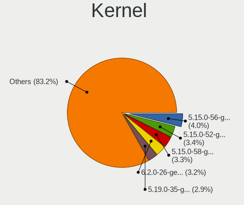
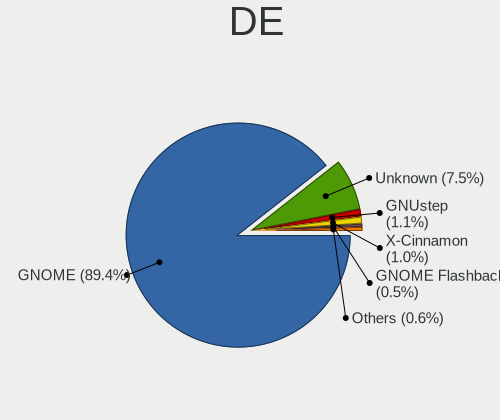
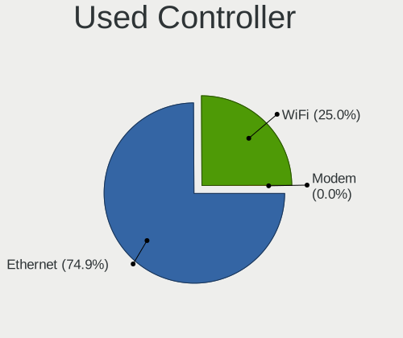

Ubuntu 22.04 - Tested Hardware & Statistics (Desktops)
------------------------------------------------------

A project to collect tested hardware configurations for Ubuntu 22.04.

Anyone can contribute to this report by the [hw-probe](https://github.com/linuxhw/hw-probe) tool:

    sudo -E hw-probe -all -upload

Please contribute! Especially if your hardware is rare.

Contents
--------

* [ Test Cases ](#test-cases)

* [ System ](#system)
  - [ Kernel                   ](#kernel)
  - [ Kernel Family            ](#kernel-family)
  - [ Kernel Major Ver.        ](#kernel-major-ver)
  - [ Arch                     ](#arch)
  - [ DE                       ](#de)
  - [ Display Server           ](#display-server)
  - [ Display Manager          ](#display-manager)
  - [ OS Lang                  ](#os-lang)
  - [ Boot Mode                ](#boot-mode)
  - [ Filesystem               ](#filesystem)
  - [ Part. scheme             ](#part-scheme)
  - [ Dual Boot with Linux/BSD ](#dual-boot-with-linuxbsd)
  - [ Dual Boot (Win)          ](#dual-boot-win)

* [ Board ](#board)
  - [ Vendor                   ](#vendor)
  - [ Model                    ](#model)
  - [ Model Family             ](#model-family)
  - [ MFG Year                 ](#mfg-year)
  - [ Form Factor              ](#form-factor)
  - [ Secure Boot              ](#secure-boot)
  - [ Coreboot                 ](#coreboot)
  - [ RAM Size                 ](#ram-size)
  - [ RAM Used                 ](#ram-used)
  - [ Total Drives             ](#total-drives)
  - [ Has CD-ROM               ](#has-cd-rom)
  - [ Has Ethernet             ](#has-ethernet)
  - [ Has WiFi                 ](#has-wifi)
  - [ Has Bluetooth            ](#has-bluetooth)

* [ Location ](#location)
  - [ Country                  ](#country)
  - [ City                     ](#city)

* [ Drives ](#drives)
  - [ Drive Vendor             ](#drive-vendor)
  - [ Drive Model              ](#drive-model)
  - [ HDD Vendor               ](#hdd-vendor)
  - [ SSD Vendor               ](#ssd-vendor)
  - [ Drive Kind               ](#drive-kind)
  - [ Drive Connector          ](#drive-connector)
  - [ Drive Size               ](#drive-size)
  - [ Space Total              ](#space-total)
  - [ Space Used               ](#space-used)
  - [ Malfunc. Drives          ](#malfunc-drives)
  - [ Malfunc. Drive Vendor    ](#malfunc-drive-vendor)
  - [ Malfunc. HDD Vendor      ](#malfunc-hdd-vendor)
  - [ Malfunc. Drive Kind      ](#malfunc-drive-kind)
  - [ Failed Drives            ](#failed-drives)
  - [ Failed Drive Vendor      ](#failed-drive-vendor)
  - [ Drive Status             ](#drive-status)

* [ Storage controller ](#storage-controller)
  - [ Storage Vendor           ](#storage-vendor)
  - [ Storage Model            ](#storage-model)
  - [ Storage Kind             ](#storage-kind)

* [ Processor ](#processor)
  - [ CPU Vendor               ](#cpu-vendor)
  - [ CPU Model                ](#cpu-model)
  - [ CPU Model Family         ](#cpu-model-family)
  - [ CPU Cores                ](#cpu-cores)
  - [ CPU Sockets              ](#cpu-sockets)
  - [ CPU Threads              ](#cpu-threads)
  - [ CPU Op-Modes             ](#cpu-op-modes)
  - [ CPU Microcode            ](#cpu-microcode)
  - [ CPU Microarch            ](#cpu-microarch)

* [ Graphics ](#graphics)
  - [ GPU Vendor               ](#gpu-vendor)
  - [ GPU Model                ](#gpu-model)
  - [ GPU Combo                ](#gpu-combo)
  - [ GPU Driver               ](#gpu-driver)
  - [ GPU Memory               ](#gpu-memory)

* [ Monitor ](#monitor)
  - [ Monitor Vendor           ](#monitor-vendor)
  - [ Monitor Model            ](#monitor-model)
  - [ Monitor Resolution       ](#monitor-resolution)
  - [ Monitor Diagonal         ](#monitor-diagonal)
  - [ Monitor Width            ](#monitor-width)
  - [ Aspect Ratio             ](#aspect-ratio)
  - [ Monitor Area             ](#monitor-area)
  - [ Pixel Density            ](#pixel-density)
  - [ Multiple Monitors        ](#multiple-monitors)

* [ Network ](#network)
  - [ Net Controller Vendor    ](#net-controller-vendor)
  - [ Net Controller Model     ](#net-controller-model)
  - [ Wireless Vendor          ](#wireless-vendor)
  - [ Wireless Model           ](#wireless-model)
  - [ Ethernet Vendor          ](#ethernet-vendor)
  - [ Ethernet Model           ](#ethernet-model)
  - [ Net Controller Kind      ](#net-controller-kind)
  - [ Used Controller          ](#used-controller)
  - [ NICs                     ](#nics)
  - [ IPv6                     ](#ipv6)

* [ Bluetooth ](#bluetooth)
  - [ Bluetooth Vendor         ](#bluetooth-vendor)
  - [ Bluetooth Model          ](#bluetooth-model)

* [ Sound ](#sound)
  - [ Sound Vendor             ](#sound-vendor)
  - [ Sound Model              ](#sound-model)

* [ Memory ](#memory)
  - [ Memory Vendor            ](#memory-vendor)
  - [ Memory Model             ](#memory-model)
  - [ Memory Kind              ](#memory-kind)
  - [ Memory Form Factor       ](#memory-form-factor)
  - [ Memory Size              ](#memory-size)
  - [ Memory Speed             ](#memory-speed)

* [ Printers & scanners ](#printers--scanners)
  - [ Printer Vendor           ](#printer-vendor)
  - [ Printer Model            ](#printer-model)
  - [ Scanner Vendor           ](#scanner-vendor)
  - [ Scanner Model            ](#scanner-model)

* [ Camera ](#camera)
  - [ Camera Vendor            ](#camera-vendor)
  - [ Camera Model             ](#camera-model)

* [ Security ](#security)
  - [ Fingerprint Vendor       ](#fingerprint-vendor)
  - [ Fingerprint Model        ](#fingerprint-model)
  - [ Chipcard Vendor          ](#chipcard-vendor)
  - [ Chipcard Model           ](#chipcard-model)

* [ Unsupported ](#unsupported)
  - [ Unsupported Devices      ](#unsupported-devices)
  - [ Unsupported Device Types ](#unsupported-device-types)

Test Cases
----------

Total: 4879

| Vendor        | Model                       | Probe                                                      | Date         |
|---------------|-----------------------------|------------------------------------------------------------|--------------|
| ASUSTek       | F2A85-V PRO                 | [43991c533e](https://linux-hardware.org/?probe=43991c533e) | Jun 10, 2023 |
| Intel         | DH55TC AAE70932-302         | [6090a53f8a](https://linux-hardware.org/?probe=6090a53f8a) | Jun 10, 2023 |
| Gigabyte      | B650M GAMING X AX           | [5affc12294](https://linux-hardware.org/?probe=5affc12294) | Jun 10, 2023 |
| ASRock        | B450M Pro4                  | [c23450b0df](https://linux-hardware.org/?probe=c23450b0df) | Jun 10, 2023 |
| ASUSTek       | TUF B450M-PLUS GAMING       | [1f8c419c47](https://linux-hardware.org/?probe=1f8c419c47) | Jun 10, 2023 |
| ASUSTek       | PRIME B460M-K               | [873975925d](https://linux-hardware.org/?probe=873975925d) | Jun 10, 2023 |
| Pegatron      | Benicia                     | [c57fee6ea0](https://linux-hardware.org/?probe=c57fee6ea0) | Jun 10, 2023 |
| ASRock        | X570 Phantom Gaming X       | [0c4db9b922](https://linux-hardware.org/?probe=0c4db9b922) | Jun 10, 2023 |
| Gigabyte      | H81M-H                      | [fc025a599d](https://linux-hardware.org/?probe=fc025a599d) | Jun 10, 2023 |
| Gigabyte      | H81M-H                      | [f32fbdf6ea](https://linux-hardware.org/?probe=f32fbdf6ea) | Jun 10, 2023 |
| Dell          | 0PU052                      | [84db4b658c](https://linux-hardware.org/?probe=84db4b658c) | Jun 09, 2023 |
| Dell          | 0PU052                      | [145d296b59](https://linux-hardware.org/?probe=145d296b59) | Jun 09, 2023 |
| Dell          | 0WMJ54 A01                  | [a4d08407bb](https://linux-hardware.org/?probe=a4d08407bb) | Jun 09, 2023 |
| ASUSTek       | M5A97 LE R2.0               | [a1877cb5b3](https://linux-hardware.org/?probe=a1877cb5b3) | Jun 09, 2023 |
| ASUSTek       | ROG STRIX B650E-I GAMING... | [92fd36b27a](https://linux-hardware.org/?probe=92fd36b27a) | Jun 09, 2023 |
| MSI           | H81I                        | [c7c19346a2](https://linux-hardware.org/?probe=c7c19346a2) | Jun 09, 2023 |
| MSI           | MPG X570S CARBON MAX WIF... | [5833483fe2](https://linux-hardware.org/?probe=5833483fe2) | Jun 09, 2023 |
| MSI           | MAG Z490 TOMAHAWK           | [40f18ae1f4](https://linux-hardware.org/?probe=40f18ae1f4) | Jun 09, 2023 |
| ECS           | H81H3-M4                    | [b457e63434](https://linux-hardware.org/?probe=b457e63434) | Jun 09, 2023 |
| Unknown       | GSUO H61V10C                | [0daf816953](https://linux-hardware.org/?probe=0daf816953) | Jun 09, 2023 |
| HP            | 2B35                        | [5921b94b60](https://linux-hardware.org/?probe=5921b94b60) | Jun 09, 2023 |
| Dell          | 0KRC95 A02                  | [585c31e8d3](https://linux-hardware.org/?probe=585c31e8d3) | Jun 08, 2023 |
| Dell          | 0K83V0 A00                  | [fc7fa0850a](https://linux-hardware.org/?probe=fc7fa0850a) | Jun 08, 2023 |
| Gigabyte      | B75M-D3H                    | [8c84a543bf](https://linux-hardware.org/?probe=8c84a543bf) | Jun 08, 2023 |
| Gigabyte      | Z97M-DS3H                   | [5d8df77ade](https://linux-hardware.org/?probe=5d8df77ade) | Jun 08, 2023 |
| Dell          | 0GY6Y8 A02                  | [65f988a0c3](https://linux-hardware.org/?probe=65f988a0c3) | Jun 08, 2023 |
| HJS           | OPSH110D4                   | [bfb0ead991](https://linux-hardware.org/?probe=bfb0ead991) | Jun 08, 2023 |
| AZW           | SEi                         | [399b4a7add](https://linux-hardware.org/?probe=399b4a7add) | Jun 08, 2023 |
| Gigabyte      | H61M-DS2                    | [829912d683](https://linux-hardware.org/?probe=829912d683) | Jun 08, 2023 |
| Dell          | 0GDG8Y A00                  | [4789561d79](https://linux-hardware.org/?probe=4789561d79) | Jun 08, 2023 |
| Dell          | 088DT1 A01                  | [173e9a0e0c](https://linux-hardware.org/?probe=173e9a0e0c) | Jun 08, 2023 |
| Gigabyte      | H61M-DS2                    | [f995c68d61](https://linux-hardware.org/?probe=f995c68d61) | Jun 08, 2023 |
| MSI           | MAG B650 TOMAHAWK WIFI      | [f4e1a7a712](https://linux-hardware.org/?probe=f4e1a7a712) | Jun 08, 2023 |
| Gigabyte      | GA-A75M-D2H                 | [f78a07f792](https://linux-hardware.org/?probe=f78a07f792) | Jun 08, 2023 |
| ASUSTek       | PRIME X570-P                | [a91f24af7a](https://linux-hardware.org/?probe=a91f24af7a) | Jun 08, 2023 |
| ASUSTek       | PRIME X570-P                | [96e1e7ea7e](https://linux-hardware.org/?probe=96e1e7ea7e) | Jun 08, 2023 |
| ASRock        | B85M-HDS                    | [e563fa3fe2](https://linux-hardware.org/?probe=e563fa3fe2) | Jun 07, 2023 |
| ASUSTek       | PRIME B360-PLUS             | [8b82994313](https://linux-hardware.org/?probe=8b82994313) | Jun 07, 2023 |
| ECS           | GF8100VM-M5                 | [6aa065057f](https://linux-hardware.org/?probe=6aa065057f) | Jun 07, 2023 |
| Lenovo        | 3704 SDK0J40700 WIN 3258... | [b18ffc5311](https://linux-hardware.org/?probe=b18ffc5311) | Jun 07, 2023 |
| Foxconn       | H55M-S                      | [83b86844c0](https://linux-hardware.org/?probe=83b86844c0) | Jun 06, 2023 |
| Lenovo        | Kabini CRB 31900058 STD     | [8f3282c700](https://linux-hardware.org/?probe=8f3282c700) | Jun 06, 2023 |
| MSI           | B85-G43 GAMING              | [326a620bbd](https://linux-hardware.org/?probe=326a620bbd) | Jun 06, 2023 |
| ASRock        | H310M-HG4                   | [47b2817d31](https://linux-hardware.org/?probe=47b2817d31) | Jun 06, 2023 |
| MSI           | B85-G43 GAMING              | [9cfd61dae7](https://linux-hardware.org/?probe=9cfd61dae7) | Jun 06, 2023 |
| ASRock        | G41C-GS R2.0                | [6e4835c7bc](https://linux-hardware.org/?probe=6e4835c7bc) | Jun 06, 2023 |
| HP            | 2820h                       | [eb7322ad95](https://linux-hardware.org/?probe=eb7322ad95) | Jun 06, 2023 |
| Chuwi         | RZBOX                       | [f395c0f429](https://linux-hardware.org/?probe=f395c0f429) | Jun 06, 2023 |
| HP            | 3397                        | [f85e642ee3](https://linux-hardware.org/?probe=f85e642ee3) | Jun 06, 2023 |
| Gigabyte      | H310M M.2 x.x               | [602e1c8875](https://linux-hardware.org/?probe=602e1c8875) | Jun 06, 2023 |
| Intel         | DP55WB AAE64798-204         | [fe09edbecc](https://linux-hardware.org/?probe=fe09edbecc) | Jun 06, 2023 |
| Gigabyte      | Z590 VISION G               | [ee1abb360e](https://linux-hardware.org/?probe=ee1abb360e) | Jun 06, 2023 |
| ASUSTek       | PRIME B550M-A AC            | [de614b2bc7](https://linux-hardware.org/?probe=de614b2bc7) | Jun 05, 2023 |
| HP            | 3397                        | [ea59ba572e](https://linux-hardware.org/?probe=ea59ba572e) | Jun 05, 2023 |
| Fujitsu       | D3061-A1 S26361-D3061-A1    | [cc575f0073](https://linux-hardware.org/?probe=cc575f0073) | Jun 05, 2023 |
| ASRock        | G41M-GS3                    | [f8789775fe](https://linux-hardware.org/?probe=f8789775fe) | Jun 05, 2023 |
| Dell          | 0DF42J A00                  | [c68dff0dd7](https://linux-hardware.org/?probe=c68dff0dd7) | Jun 05, 2023 |
| HP            | 83E2                        | [522273fe60](https://linux-hardware.org/?probe=522273fe60) | Jun 05, 2023 |
| ASUSTek       | PRIME B550M-A AC            | [0cf4dfc5e4](https://linux-hardware.org/?probe=0cf4dfc5e4) | Jun 05, 2023 |
| HP            | 3397                        | [e9dd850e23](https://linux-hardware.org/?probe=e9dd850e23) | Jun 05, 2023 |
| Pegatron      | 2AC2                        | [6182103d25](https://linux-hardware.org/?probe=6182103d25) | Jun 05, 2023 |
| MSI           | Boston                      | [9f5efc29ad](https://linux-hardware.org/?probe=9f5efc29ad) | Jun 04, 2023 |
| Lenovo        | ThinkCentre Edge 91Z 707... | [a6804d8ca1](https://linux-hardware.org/?probe=a6804d8ca1) | Jun 04, 2023 |
| Lenovo        | MAHOBAY Win8 STD MM DPK ... | [d9dba3ffdf](https://linux-hardware.org/?probe=d9dba3ffdf) | Jun 04, 2023 |
| Intel         | DH55HC AAE70933-503         | [b3d5e112eb](https://linux-hardware.org/?probe=b3d5e112eb) | Jun 04, 2023 |
| Fujitsu       | D3233-A1 S26361-D3233-A1    | [ba0e7c7d59](https://linux-hardware.org/?probe=ba0e7c7d59) | Jun 04, 2023 |
| ASRock        | A75M-HVS                    | [69bc52dc4f](https://linux-hardware.org/?probe=69bc52dc4f) | Jun 04, 2023 |
| Acer          | Predator G3-710             | [7193d24262](https://linux-hardware.org/?probe=7193d24262) | Jun 04, 2023 |
| Acer          | Predator G3-710             | [96834ea12b](https://linux-hardware.org/?probe=96834ea12b) | Jun 04, 2023 |
| HP            | 83E2                        | [3684f8562d](https://linux-hardware.org/?probe=3684f8562d) | Jun 04, 2023 |
| Acer          | Predator G3-710             | [c200dbb9cf](https://linux-hardware.org/?probe=c200dbb9cf) | Jun 04, 2023 |
| Dell          | 0Y5DDC A00                  | [5713168678](https://linux-hardware.org/?probe=5713168678) | Jun 04, 2023 |
| Unknown       | Unknown                     | [8c2d7ce6e2](https://linux-hardware.org/?probe=8c2d7ce6e2) | Jun 04, 2023 |
| Dell          | 0N4NF7 A00                  | [e1348eb2c2](https://linux-hardware.org/?probe=e1348eb2c2) | Jun 03, 2023 |
| Dell          | 0N4NF7 A00                  | [6ff177257b](https://linux-hardware.org/?probe=6ff177257b) | Jun 03, 2023 |
| ASRock        | FM2A88X Extreme6+           | [2745284306](https://linux-hardware.org/?probe=2745284306) | Jun 03, 2023 |
| SZMZ          | X99M-G2                     | [e9b164885c](https://linux-hardware.org/?probe=e9b164885c) | Jun 03, 2023 |
| Dell          | 0D6H9T A01                  | [1ebbe353ba](https://linux-hardware.org/?probe=1ebbe353ba) | Jun 03, 2023 |
| Dell          | 0D6H9T A01                  | [0bb2080b31](https://linux-hardware.org/?probe=0bb2080b31) | Jun 03, 2023 |
| Gigabyte      | X79-UD3                     | [e459d2654f](https://linux-hardware.org/?probe=e459d2654f) | Jun 03, 2023 |
| ASUSTek       | PRIME B650M-A AX            | [983a81f19e](https://linux-hardware.org/?probe=983a81f19e) | Jun 03, 2023 |
| Dell          | 08NPPY A00                  | [de331bfb5c](https://linux-hardware.org/?probe=de331bfb5c) | Jun 02, 2023 |
| Biostar       | TA970XE                     | [11936a0f0f](https://linux-hardware.org/?probe=11936a0f0f) | Jun 02, 2023 |
| ASUSTek       | ROG Maximus Z690 FORMULA    | [c8fca2b92d](https://linux-hardware.org/?probe=c8fca2b92d) | Jun 02, 2023 |
| ASRock        | B365 Pro4                   | [35fff15a30](https://linux-hardware.org/?probe=35fff15a30) | Jun 02, 2023 |
| ASRock        | B365 Pro4                   | [54fcb811b8](https://linux-hardware.org/?probe=54fcb811b8) | Jun 02, 2023 |
| Dell          | 06X1TJ A00                  | [16d662673f](https://linux-hardware.org/?probe=16d662673f) | Jun 02, 2023 |
| ASUSTek       | Maximus Formula             | [6a70fa0a86](https://linux-hardware.org/?probe=6a70fa0a86) | Jun 02, 2023 |
| Gigabyte      | Z97M-DS3H                   | [1a4437e831](https://linux-hardware.org/?probe=1a4437e831) | Jun 02, 2023 |
| Gigabyte      | H61M-S2PV                   | [6c86bd69e0](https://linux-hardware.org/?probe=6c86bd69e0) | Jun 01, 2023 |
| ASRock        | Z77M                        | [eae1adee21](https://linux-hardware.org/?probe=eae1adee21) | Jun 01, 2023 |
| HP            | 18E5                        | [9d89c3065b](https://linux-hardware.org/?probe=9d89c3065b) | Jun 01, 2023 |
| HP            | 1906                        | [ac98480bd2](https://linux-hardware.org/?probe=ac98480bd2) | Jun 01, 2023 |
| HP            | 18E7                        | [a3f557389e](https://linux-hardware.org/?probe=a3f557389e) | Jun 01, 2023 |
| Dell          | 03NVJ6 A00                  | [1f295f3ec2](https://linux-hardware.org/?probe=1f295f3ec2) | Jun 01, 2023 |
| Pegatron      | 2ACB                        | [cfd38fc71a](https://linux-hardware.org/?probe=cfd38fc71a) | May 31, 2023 |
| Gigabyte      | F2A78M-HD2                  | [c76d767402](https://linux-hardware.org/?probe=c76d767402) | May 31, 2023 |
| ASRock        | X570 Phantom Gaming 4       | [6c3655186f](https://linux-hardware.org/?probe=6c3655186f) | May 31, 2023 |
| ASUSTek       | G10DK                       | [75cde40262](https://linux-hardware.org/?probe=75cde40262) | May 31, 2023 |
| ASUSTek       | ROG STRIX B450-F GAMING     | [2c6c547437](https://linux-hardware.org/?probe=2c6c547437) | May 31, 2023 |
| MSI           | B450M MORTAR MAX            | [1d0c56937c](https://linux-hardware.org/?probe=1d0c56937c) | May 31, 2023 |
| System76      | Thelio Mira                 | [d5fe3a3749](https://linux-hardware.org/?probe=d5fe3a3749) | May 30, 2023 |
| Intel         | STK2M3W64CC H89289-504      | [a7e599b1f5](https://linux-hardware.org/?probe=a7e599b1f5) | May 30, 2023 |
| ASRock        | H110M-DS/Hyper              | [a29a16d74c](https://linux-hardware.org/?probe=a29a16d74c) | May 30, 2023 |
| Intel         | STK2M3W64CC H89289-504      | [c471536b99](https://linux-hardware.org/?probe=c471536b99) | May 30, 2023 |
| ASRock        | H110M-DS/Hyper              | [05e7ed23f3](https://linux-hardware.org/?probe=05e7ed23f3) | May 30, 2023 |
| MSI           | B450 GAMING PRO CARBON A... | [5271bd0b88](https://linux-hardware.org/?probe=5271bd0b88) | May 30, 2023 |
| Fujitsu       | D3233-A1 S26361-D3233-A1    | [de30e713bf](https://linux-hardware.org/?probe=de30e713bf) | May 30, 2023 |
| Pegatron      | 2AC2                        | [a8873fdeab](https://linux-hardware.org/?probe=a8873fdeab) | May 30, 2023 |
| ASUSTek       | PRIME Z370-P                | [afb02cee29](https://linux-hardware.org/?probe=afb02cee29) | May 29, 2023 |
| Gigabyte      | B450 AORUS ELITE            | [d98102f69a](https://linux-hardware.org/?probe=d98102f69a) | May 29, 2023 |
| Gigabyte      | H410M H                     | [7a52f09646](https://linux-hardware.org/?probe=7a52f09646) | May 29, 2023 |
| Fujitsu       | D3402-A1 S26361-D3402-A1    | [0ae3ea958a](https://linux-hardware.org/?probe=0ae3ea958a) | May 29, 2023 |
| HP            | 1497                        | [5f1886622a](https://linux-hardware.org/?probe=5f1886622a) | May 29, 2023 |
| HP            | 2B43                        | [fb2841cfa4](https://linux-hardware.org/?probe=fb2841cfa4) | May 29, 2023 |
| ASUSTek       | M4A87TD/USB3                | [bf0674c0f0](https://linux-hardware.org/?probe=bf0674c0f0) | May 28, 2023 |
| ASRock        | 970 Pro3 R2.0               | [4ae997cf6b](https://linux-hardware.org/?probe=4ae997cf6b) | May 28, 2023 |
| Lenovo        | 3730 SDK0T76463 WIN 3422... | [7467436de2](https://linux-hardware.org/?probe=7467436de2) | May 28, 2023 |
| HP            | 1495                        | [15b94cba50](https://linux-hardware.org/?probe=15b94cba50) | May 28, 2023 |
| ECS           | H81H3-M4                    | [21261aa270](https://linux-hardware.org/?probe=21261aa270) | May 28, 2023 |
| Dell          | 048DY8 A01                  | [9bfe61714e](https://linux-hardware.org/?probe=9bfe61714e) | May 28, 2023 |
| HP            | 0B54h D                     | [f9634b51b9](https://linux-hardware.org/?probe=f9634b51b9) | May 28, 2023 |
| Gigabyte      | B550M AORUS PRO-P           | [dbb348e8bf](https://linux-hardware.org/?probe=dbb348e8bf) | May 28, 2023 |
| Pegatron      | 2ACB                        | [cc1c8b2941](https://linux-hardware.org/?probe=cc1c8b2941) | May 28, 2023 |
| Lenovo        | SHARKBAY SDK0E50512 STD     | [5a39bd1d78](https://linux-hardware.org/?probe=5a39bd1d78) | May 28, 2023 |
| Lenovo        | SHARKBAY SDK0E50512 STD     | [a36d2b541a](https://linux-hardware.org/?probe=a36d2b541a) | May 28, 2023 |
| Gigabyte      | X570 I AORUS PRO WIFI       | [bb842bc2d8](https://linux-hardware.org/?probe=bb842bc2d8) | May 28, 2023 |
| Gigabyte      | Z590 AORUS ELITE AX         | [183ee8e37a](https://linux-hardware.org/?probe=183ee8e37a) | May 27, 2023 |
| Lenovo        | 36C5 SDK0K17763 WIN 1801... | [ccf71ca66c](https://linux-hardware.org/?probe=ccf71ca66c) | May 27, 2023 |
| Lenovo        | 36C5 SDK0K17763 WIN 1801... | [1a3a921775](https://linux-hardware.org/?probe=1a3a921775) | May 27, 2023 |
| MSI           | A55M-E33                    | [c25cb7cbb6](https://linux-hardware.org/?probe=c25cb7cbb6) | May 27, 2023 |
| Gigabyte      | Z97M-DS3H                   | [8311d009bd](https://linux-hardware.org/?probe=8311d009bd) | May 27, 2023 |
| Gigabyte      | Z77MX-D3H                   | [9cb2973f2f](https://linux-hardware.org/?probe=9cb2973f2f) | May 27, 2023 |
| Lenovo        | 31900058 STD                | [d09ae4f1a2](https://linux-hardware.org/?probe=d09ae4f1a2) | May 27, 2023 |
| Gigabyte      | Z77MX-D3H                   | [2cea143017](https://linux-hardware.org/?probe=2cea143017) | May 26, 2023 |
| Gigabyte      | A320M-S2H V2-CF             | [b82f4b77f4](https://linux-hardware.org/?probe=b82f4b77f4) | May 26, 2023 |
| ASUSTek       | X99-DELUXE                  | [ebc73bb225](https://linux-hardware.org/?probe=ebc73bb225) | May 26, 2023 |
| Dell          | 0NDYHG A01                  | [07be92d6f3](https://linux-hardware.org/?probe=07be92d6f3) | May 26, 2023 |
| ASUSTek       | Z77-A                       | [0c22362cc0](https://linux-hardware.org/?probe=0c22362cc0) | May 26, 2023 |
| Dell          | 0XCR8D A03                  | [25867f7c36](https://linux-hardware.org/?probe=25867f7c36) | May 26, 2023 |
| ASUSTek       | TUF Gaming B560M-PLUS       | [a49bd1dd26](https://linux-hardware.org/?probe=a49bd1dd26) | May 25, 2023 |
| Acer          | Aspire TC-895 V:1.0         | [936b06e11f](https://linux-hardware.org/?probe=936b06e11f) | May 25, 2023 |
| Gigabyte      | P43-ES3G                    | [b9af05a16f](https://linux-hardware.org/?probe=b9af05a16f) | May 25, 2023 |
| ASUSTek       | M4A78LT-M                   | [7080c87654](https://linux-hardware.org/?probe=7080c87654) | May 25, 2023 |
| PCWare        | IPMH110G                    | [33b6fce5ff](https://linux-hardware.org/?probe=33b6fce5ff) | May 25, 2023 |
| ASUSTek       | P5QPL-VM EPU                | [63ba811050](https://linux-hardware.org/?probe=63ba811050) | May 25, 2023 |
| ASUSTek       | P5QPL-VM EPU                | [380b9a5005](https://linux-hardware.org/?probe=380b9a5005) | May 25, 2023 |
| ASUSTek       | F2A85-V                     | [c166f91030](https://linux-hardware.org/?probe=c166f91030) | May 25, 2023 |
| ASUSTek       | CROSSHAIR VI HERO           | [6e9287cc5c](https://linux-hardware.org/?probe=6e9287cc5c) | May 25, 2023 |
| Dell          | 0654JC A01                  | [d3a2957b45](https://linux-hardware.org/?probe=d3a2957b45) | May 24, 2023 |
| AZW           | SEi                         | [bc0c7a512f](https://linux-hardware.org/?probe=bc0c7a512f) | May 24, 2023 |
| ASRock        | A320M-HDV R4.0              | [bce76b90ef](https://linux-hardware.org/?probe=bce76b90ef) | May 24, 2023 |
| EPSON DIRE... | MR7200E-L                   | [a436b49a11](https://linux-hardware.org/?probe=a436b49a11) | May 24, 2023 |
| ASUSTek       | TUF Gaming B650M-PLUS WI... | [44861be08c](https://linux-hardware.org/?probe=44861be08c) | May 24, 2023 |
| Gigabyte      | H81M-S2V                    | [f0e96b17d7](https://linux-hardware.org/?probe=f0e96b17d7) | May 24, 2023 |
| Gigabyte      | H81M-S2V                    | [02d5fa9cc3](https://linux-hardware.org/?probe=02d5fa9cc3) | May 24, 2023 |
| AZW           | SEi                         | [825fbaebcd](https://linux-hardware.org/?probe=825fbaebcd) | May 23, 2023 |
| Gigabyte      | 970A-DS3P                   | [af5b849c20](https://linux-hardware.org/?probe=af5b849c20) | May 23, 2023 |
| ASUSTek       | B85M-E/BR                   | [ed20b84824](https://linux-hardware.org/?probe=ed20b84824) | May 23, 2023 |
| Gigabyte      | H77N-WIFI                   | [9e96bcdbef](https://linux-hardware.org/?probe=9e96bcdbef) | May 23, 2023 |
| ASUSTek       | TUF Gaming B550-PLUS        | [4e817c1abf](https://linux-hardware.org/?probe=4e817c1abf) | May 23, 2023 |
| Medion        | H110H4-EM                   | [218e19be02](https://linux-hardware.org/?probe=218e19be02) | May 23, 2023 |
| ASUSTek       | ROG STRIX X470-I GAMING     | [362ad8bcaf](https://linux-hardware.org/?probe=362ad8bcaf) | May 23, 2023 |
| Dell          | 0JC6JH A00                  | [91d6d0d2da](https://linux-hardware.org/?probe=91d6d0d2da) | May 23, 2023 |
| Pegatron      | 2ACB                        | [e9c0ee4659](https://linux-hardware.org/?probe=e9c0ee4659) | May 23, 2023 |
| Gigabyte      | B75M-D3H                    | [00a6f60d75](https://linux-hardware.org/?probe=00a6f60d75) | May 23, 2023 |
| ASRock        | X399 Professional Gaming    | [72cd126fc6](https://linux-hardware.org/?probe=72cd126fc6) | May 23, 2023 |
| HP            | 0AECh D                     | [06f56df636](https://linux-hardware.org/?probe=06f56df636) | May 23, 2023 |
| eMachines     | EL1360                      | [0821a0d29b](https://linux-hardware.org/?probe=0821a0d29b) | May 22, 2023 |
| Biostar       | A880GZ                      | [097e118b3a](https://linux-hardware.org/?probe=097e118b3a) | May 22, 2023 |
| HP            | 1791                        | [7fa95d1b7b](https://linux-hardware.org/?probe=7fa95d1b7b) | May 22, 2023 |
| Gigabyte      | F2A55M-S1                   | [59ede76205](https://linux-hardware.org/?probe=59ede76205) | May 22, 2023 |
| Gigabyte      | F2A55M-S1                   | [a5c1b4eecd](https://linux-hardware.org/?probe=a5c1b4eecd) | May 22, 2023 |
| ASRock        | B450 Steel Legend           | [012c721256](https://linux-hardware.org/?probe=012c721256) | May 22, 2023 |
| Gigabyte      | B550 AORUS ELITE AX V2      | [406014a766](https://linux-hardware.org/?probe=406014a766) | May 22, 2023 |
| ASUSTek       | F2A85-V PRO                 | [dc846ba2e5](https://linux-hardware.org/?probe=dc846ba2e5) | May 22, 2023 |
| Medion        | B360H4-EM V1.0              | [ae4f01f58e](https://linux-hardware.org/?probe=ae4f01f58e) | May 22, 2023 |
| MSI           | Z87-G43                     | [2fa7c1d81d](https://linux-hardware.org/?probe=2fa7c1d81d) | May 21, 2023 |
| Gigabyte      | B550M DS3H                  | [7db2aa27dc](https://linux-hardware.org/?probe=7db2aa27dc) | May 21, 2023 |
| Dell          | 033FF6 A00                  | [086dd9367e](https://linux-hardware.org/?probe=086dd9367e) | May 21, 2023 |
| Gigabyte      | B450M S2H                   | [5309c41b94](https://linux-hardware.org/?probe=5309c41b94) | May 21, 2023 |
| ASUSTek       | ROG STRIX B550-F GAMING     | [a6f95de398](https://linux-hardware.org/?probe=a6f95de398) | May 21, 2023 |
| ASUSTek       | P8B75-M                     | [313fb9c88a](https://linux-hardware.org/?probe=313fb9c88a) | May 21, 2023 |
| Gigabyte      | Z390 UD                     | [867806192a](https://linux-hardware.org/?probe=867806192a) | May 21, 2023 |
| ASUSTek       | ROG CROSSHAIR VII HERO      | [62b86acadc](https://linux-hardware.org/?probe=62b86acadc) | May 21, 2023 |
| Dell          | 0VNP2H A00                  | [298317e388](https://linux-hardware.org/?probe=298317e388) | May 21, 2023 |
| ASUSTek       | P8Z68-V LX                  | [27c48503ad](https://linux-hardware.org/?probe=27c48503ad) | May 21, 2023 |
| Unknown       | GSUO H61V10C                | [8e1037e4c1](https://linux-hardware.org/?probe=8e1037e4c1) | May 20, 2023 |
| Gigabyte      | F2A88X-D3H                  | [a547a22c01](https://linux-hardware.org/?probe=a547a22c01) | May 20, 2023 |
| Medion        | BTDD-LT                     | [3b5eac782c](https://linux-hardware.org/?probe=3b5eac782c) | May 20, 2023 |
| MSI           | H97M-G43                    | [2e31a2b7e0](https://linux-hardware.org/?probe=2e31a2b7e0) | May 20, 2023 |
| Dell          | 0JP3NX A01                  | [a4a766a9e1](https://linux-hardware.org/?probe=a4a766a9e1) | May 20, 2023 |
| Daten Tecn... | DA320MXV DC                 | [0b7e1e51b9](https://linux-hardware.org/?probe=0b7e1e51b9) | May 20, 2023 |
| ASUSTek       | PRIME B560-PLUS             | [6f6b65d0ed](https://linux-hardware.org/?probe=6f6b65d0ed) | May 19, 2023 |
| Pegatron      | Benicia                     | [24fc512198](https://linux-hardware.org/?probe=24fc512198) | May 19, 2023 |
| Gigabyte      | B360M DS3H                  | [b6336515aa](https://linux-hardware.org/?probe=b6336515aa) | May 19, 2023 |
| Acer          | TDPS05                      | [ed5384ee4d](https://linux-hardware.org/?probe=ed5384ee4d) | May 19, 2023 |
| Gigabyte      | B450M DS3H WIFI-CF          | [665ac2defe](https://linux-hardware.org/?probe=665ac2defe) | May 19, 2023 |
| ASRock        | H110M-DS/Hyper              | [b208edbf01](https://linux-hardware.org/?probe=b208edbf01) | May 19, 2023 |
| Gigabyte      | Z97M-DS3H                   | [db9774a799](https://linux-hardware.org/?probe=db9774a799) | May 19, 2023 |
| ASRock        | H110M-DS/Hyper              | [c90642a42c](https://linux-hardware.org/?probe=c90642a42c) | May 19, 2023 |
| ASUSTek       | PRIME H410M-R               | [09cc939f04](https://linux-hardware.org/?probe=09cc939f04) | May 19, 2023 |
| Gigabyte      | H310M S2                    | [61f60c8a7d](https://linux-hardware.org/?probe=61f60c8a7d) | May 19, 2023 |
| Gigabyte      | B460M DS3H V2               | [0d337f6d69](https://linux-hardware.org/?probe=0d337f6d69) | May 19, 2023 |
| Dell          | 0MGK50 A02                  | [7b98244b73](https://linux-hardware.org/?probe=7b98244b73) | May 19, 2023 |
| Pegatron      | Benicia                     | [6bb420fe9a](https://linux-hardware.org/?probe=6bb420fe9a) | May 19, 2023 |
| ASRock        | B365M Pro4                  | [0df5d6f44e](https://linux-hardware.org/?probe=0df5d6f44e) | May 19, 2023 |
| Dell          | 0VNP2H A01                  | [6e51bd033e](https://linux-hardware.org/?probe=6e51bd033e) | May 19, 2023 |
| ASUSTek       | PRIME B550M-A AC            | [916931d01a](https://linux-hardware.org/?probe=916931d01a) | May 19, 2023 |
| MSI           | Z97-G55 SLI                 | [a17ed55b13](https://linux-hardware.org/?probe=a17ed55b13) | May 19, 2023 |
| Dell          | 0D881F A06                  | [2d5184956b](https://linux-hardware.org/?probe=2d5184956b) | May 18, 2023 |
| ASUSTek       | ROG STRIX Z790-E GAMING ... | [75ca7ed17e](https://linux-hardware.org/?probe=75ca7ed17e) | May 18, 2023 |
| ASUSTek       | ROG STRIX Z790-E GAMING ... | [839536ab43](https://linux-hardware.org/?probe=839536ab43) | May 18, 2023 |
| MSI           | Z97-G55 SLI                 | [0883ceb18c](https://linux-hardware.org/?probe=0883ceb18c) | May 18, 2023 |
| ASUSTek       | CROSSBLADE RANGER           | [afd85b3621](https://linux-hardware.org/?probe=afd85b3621) | May 18, 2023 |
| Dell          | 0VRWRC A00                  | [c7f7f8758b](https://linux-hardware.org/?probe=c7f7f8758b) | May 18, 2023 |
| Gigabyte      | B550 AORUS ELITE AX V2      | [c09d32ebc2](https://linux-hardware.org/?probe=c09d32ebc2) | May 18, 2023 |
| Gigabyte      | GB-BRR7H-4700               | [215d88c8b6](https://linux-hardware.org/?probe=215d88c8b6) | May 18, 2023 |
| Gigabyte      | GB-BRR7H-4700               | [d452669f4a](https://linux-hardware.org/?probe=d452669f4a) | May 18, 2023 |
| ASUSTek       | PRIME B560M-A               | [e33e3678c6](https://linux-hardware.org/?probe=e33e3678c6) | May 18, 2023 |
| Gigabyte      | H310M S2                    | [b8a04e73b8](https://linux-hardware.org/?probe=b8a04e73b8) | May 18, 2023 |
| ASUSTek       | TUF Gaming X570-PLUS_BR     | [be46da6480](https://linux-hardware.org/?probe=be46da6480) | May 18, 2023 |
| Dell          | 0VNP2H A00                  | [85da02478a](https://linux-hardware.org/?probe=85da02478a) | May 17, 2023 |
| Dell          | 0RY007                      | [c2b8174064](https://linux-hardware.org/?probe=c2b8174064) | May 17, 2023 |
| Gigabyte      | GA-A75M-D2H                 | [ad477b9698](https://linux-hardware.org/?probe=ad477b9698) | May 17, 2023 |
| ASUSTek       | H81M-A/BR                   | [0982e8a637](https://linux-hardware.org/?probe=0982e8a637) | May 17, 2023 |
| Gigabyte      | Z370P D3-CF                 | [874dcebbaa](https://linux-hardware.org/?probe=874dcebbaa) | May 17, 2023 |
| eMachines     | EMCP73VT-PM                 | [d17610915a](https://linux-hardware.org/?probe=d17610915a) | May 17, 2023 |
| Gigabyte      | Z370P D3-CF                 | [af16278f1e](https://linux-hardware.org/?probe=af16278f1e) | May 17, 2023 |
| ASUSTek       | P7H55D-M PRO                | [2c423cf3e9](https://linux-hardware.org/?probe=2c423cf3e9) | May 17, 2023 |
| Intel         | D54250WYK H13922-302        | [0829603c60](https://linux-hardware.org/?probe=0829603c60) | May 17, 2023 |
| ASRock        | Z97 Professional            | [7d0ecd3359](https://linux-hardware.org/?probe=7d0ecd3359) | May 17, 2023 |
| EPSON DIRE... | MR7200E-L                   | [fed1ba2b90](https://linux-hardware.org/?probe=fed1ba2b90) | May 17, 2023 |
| ASUSTek       | P5E WS Pro                  | [97a221407d](https://linux-hardware.org/?probe=97a221407d) | May 17, 2023 |
| Acer          | TDPS05                      | [2cfc303d36](https://linux-hardware.org/?probe=2cfc303d36) | May 17, 2023 |
| EPSON DIRE... | MR7200E-L                   | [b0710623f7](https://linux-hardware.org/?probe=b0710623f7) | May 17, 2023 |
| eMachines     | EMCP73VT-PM                 | [777f8ccab0](https://linux-hardware.org/?probe=777f8ccab0) | May 17, 2023 |
| ZOTAC         | Unknown                     | [5ae0ed6f5a](https://linux-hardware.org/?probe=5ae0ed6f5a) | May 16, 2023 |
| ASUSTek       | PRIME B650M-A AX            | [c7c487333a](https://linux-hardware.org/?probe=c7c487333a) | May 16, 2023 |
| Gigabyte      | Z390 AORUS PRO WIFI-CF      | [afbef25815](https://linux-hardware.org/?probe=afbef25815) | May 16, 2023 |
| ASUSTek       | M5A78L-M/USB3               | [546f6e95e9](https://linux-hardware.org/?probe=546f6e95e9) | May 16, 2023 |
| ASUSTek       | M5A78L-M/USB3               | [54fc8d0489](https://linux-hardware.org/?probe=54fc8d0489) | May 16, 2023 |
| SHANGZHAOY... | X99-D8-MAX V1.0             | [b77555d36f](https://linux-hardware.org/?probe=b77555d36f) | May 16, 2023 |
| Gigabyte      | GA-78LMT-S2P                | [3f5bade9b8](https://linux-hardware.org/?probe=3f5bade9b8) | May 16, 2023 |
| MSI           | PRO Z690-A WIFI DDR4        | [bdaec355df](https://linux-hardware.org/?probe=bdaec355df) | May 16, 2023 |
| ASUSTek       | X99-DELUXE                  | [d2fbc01926](https://linux-hardware.org/?probe=d2fbc01926) | May 15, 2023 |
| Supermicro    | H12DSU-iN                   | [05b2b86f35](https://linux-hardware.org/?probe=05b2b86f35) | May 15, 2023 |
| MSI           | PRO B760M-A WIFI DDR4       | [6a8a2f481e](https://linux-hardware.org/?probe=6a8a2f481e) | May 15, 2023 |
| ASUSTek       | H97-PLUS                    | [e67567bd2a](https://linux-hardware.org/?probe=e67567bd2a) | May 15, 2023 |
| Fujitsu       | JIB75Y3                     | [31146fe86e](https://linux-hardware.org/?probe=31146fe86e) | May 15, 2023 |
| MSI           | Z87-G45 GAMING              | [06e1ef84b3](https://linux-hardware.org/?probe=06e1ef84b3) | May 15, 2023 |
| ASUSTek       | F2A85-V PRO                 | [b21029ef65](https://linux-hardware.org/?probe=b21029ef65) | May 15, 2023 |
| Medion        | B360H4-EM V1.0              | [1efefa9214](https://linux-hardware.org/?probe=1efefa9214) | May 15, 2023 |
| ASUSTek       | ROG CROSSHAIR VIII HERO     | [6e8f0dd2b9](https://linux-hardware.org/?probe=6e8f0dd2b9) | May 15, 2023 |
| Dell          | 0N4YC8 A00                  | [61eeca9cec](https://linux-hardware.org/?probe=61eeca9cec) | May 15, 2023 |
| Dell          | 0J3C2F A00                  | [17b9d54da0](https://linux-hardware.org/?probe=17b9d54da0) | May 15, 2023 |
| SHANGZHAOY... | X99-D8-MAX V1.0             | [6e21010553](https://linux-hardware.org/?probe=6e21010553) | May 15, 2023 |
| HP            | 0B4Ch D                     | [64b813a7dc](https://linux-hardware.org/?probe=64b813a7dc) | May 14, 2023 |
| Lenovo        | 310B SDK0J40705 WIN 3425... | [94d901f023](https://linux-hardware.org/?probe=94d901f023) | May 14, 2023 |
| Pegatron      | IPXSB-H61                   | [c585628bc8](https://linux-hardware.org/?probe=c585628bc8) | May 14, 2023 |
| Pegatron      | 2AC2                        | [510047e597](https://linux-hardware.org/?probe=510047e597) | May 14, 2023 |
| Lenovo        | Dory CRB                    | [8e0efa6d0a](https://linux-hardware.org/?probe=8e0efa6d0a) | May 14, 2023 |
| eMachines     | EL1360                      | [74745ea02b](https://linux-hardware.org/?probe=74745ea02b) | May 14, 2023 |
| Biostar       | N61PB-M2S                   | [4ac75a003b](https://linux-hardware.org/?probe=4ac75a003b) | May 14, 2023 |
| Gigabyte      | GA-MA790XT-UD4P             | [dc1d9d7e15](https://linux-hardware.org/?probe=dc1d9d7e15) | May 14, 2023 |
| Gigabyte      | Z97M-DS3H                   | [091a42a1c0](https://linux-hardware.org/?probe=091a42a1c0) | May 14, 2023 |
| Intel         | DH77DF AAG40293-301         | [f35c753afd](https://linux-hardware.org/?probe=f35c753afd) | May 14, 2023 |
| Pegatron      | 2AB5                        | [2381fb0c55](https://linux-hardware.org/?probe=2381fb0c55) | May 14, 2023 |
| Intel         | DH77DF AAG40293-301         | [65ad7c5ad5](https://linux-hardware.org/?probe=65ad7c5ad5) | May 13, 2023 |
| Fujitsu       | D3011-A1 S26361-D3011-A1    | [ede664c4ca](https://linux-hardware.org/?probe=ede664c4ca) | May 13, 2023 |
| Fujitsu       | D3011-A1 S26361-D3011-A1    | [4849aadd59](https://linux-hardware.org/?probe=4849aadd59) | May 13, 2023 |
| MSI           | A68HM-E33 V2                | [a60326fa0a](https://linux-hardware.org/?probe=a60326fa0a) | May 13, 2023 |
| Gateway       | DX4840                      | [b96adf8863](https://linux-hardware.org/?probe=b96adf8863) | May 13, 2023 |
| Intel         | B75                         | [da0a89cf17](https://linux-hardware.org/?probe=da0a89cf17) | May 13, 2023 |
| Toshiba       | STI 007567                  | [579ec5bb2b](https://linux-hardware.org/?probe=579ec5bb2b) | May 13, 2023 |
| Dell          | 0NC2VH A01                  | [48c5ff757c](https://linux-hardware.org/?probe=48c5ff757c) | May 13, 2023 |
| ASUSTek       | M5A78L-M LX                 | [f720713dda](https://linux-hardware.org/?probe=f720713dda) | May 13, 2023 |
| ASUSTek       | TUF B365M-PLUS GAMING       | [62aab97f35](https://linux-hardware.org/?probe=62aab97f35) | May 12, 2023 |
| ASUSTek       | X99-DELUXE                  | [2acd6e02ea](https://linux-hardware.org/?probe=2acd6e02ea) | May 12, 2023 |
| ASRock        | H510M-ITX/ac                | [9a8da03c1e](https://linux-hardware.org/?probe=9a8da03c1e) | May 12, 2023 |
| Medion        | BTDD-LT                     | [86a5697c9c](https://linux-hardware.org/?probe=86a5697c9c) | May 12, 2023 |
| Gigabyte      | Z97M-DS3H                   | [29b8cfc7e6](https://linux-hardware.org/?probe=29b8cfc7e6) | May 12, 2023 |
| Gigabyte      | MW51-HP0-00                 | [ed263fdd1b](https://linux-hardware.org/?probe=ed263fdd1b) | May 12, 2023 |
| MSI           | MPG X570S CARBON MAX WIF... | [01b1668378](https://linux-hardware.org/?probe=01b1668378) | May 12, 2023 |
| Biostar       | A68N-5600E                  | [55db0c720e](https://linux-hardware.org/?probe=55db0c720e) | May 12, 2023 |
| Intel         | DH87RL AAG74240-403         | [888f0a2923](https://linux-hardware.org/?probe=888f0a2923) | May 12, 2023 |
| Gigabyte      | GA-78LMT-S2P                | [7b966568cc](https://linux-hardware.org/?probe=7b966568cc) | May 12, 2023 |
| Gigabyte      | Z590 GAMING X               | [c9ad858393](https://linux-hardware.org/?probe=c9ad858393) | May 12, 2023 |
| Acer          | Nitro N50-600 V:1.1         | [40d2790e0a](https://linux-hardware.org/?probe=40d2790e0a) | May 12, 2023 |
| ASUSTek       | P8P67 LE                    | [cae9bea146](https://linux-hardware.org/?probe=cae9bea146) | May 12, 2023 |
| MSI           | H61M-P20/W8                 | [b727300be6](https://linux-hardware.org/?probe=b727300be6) | May 11, 2023 |
| Biostar       | B450MH                      | [e5dac06f4e](https://linux-hardware.org/?probe=e5dac06f4e) | May 11, 2023 |
| ZOTAC         | Unknown                     | [9495c6ca84](https://linux-hardware.org/?probe=9495c6ca84) | May 11, 2023 |
| Biostar       | B450MH                      | [12659ad2e2](https://linux-hardware.org/?probe=12659ad2e2) | May 11, 2023 |
| Gigabyte      | Z270N-Gaming 5              | [c056fdd9a8](https://linux-hardware.org/?probe=c056fdd9a8) | May 11, 2023 |
| Dell          | 0X8DXD A00                  | [1e8359a02c](https://linux-hardware.org/?probe=1e8359a02c) | May 11, 2023 |
| Dell          | 0T10XW A02                  | [a488bed661](https://linux-hardware.org/?probe=a488bed661) | May 11, 2023 |
| Lenovo        | 310B SDK0J40705 WIN 3425... | [53d9e318f6](https://linux-hardware.org/?probe=53d9e318f6) | May 11, 2023 |
| Biostar       | H110MHV3                    | [e1ce381308](https://linux-hardware.org/?probe=e1ce381308) | May 11, 2023 |
| Biostar       | H110MHV3                    | [5b0f8f8419](https://linux-hardware.org/?probe=5b0f8f8419) | May 11, 2023 |
| Gigabyte      | Z390 AORUS PRO WIFI-CF      | [3df5f7ec7e](https://linux-hardware.org/?probe=3df5f7ec7e) | May 11, 2023 |
| Dell          | 0Y958C A00                  | [fb1b987ad5](https://linux-hardware.org/?probe=fb1b987ad5) | May 10, 2023 |
| Gigabyte      | Z390 AORUS PRO WIFI-CF      | [1b20151b4c](https://linux-hardware.org/?probe=1b20151b4c) | May 10, 2023 |
| Dell          | 076VHM A02                  | [7f1984ec16](https://linux-hardware.org/?probe=7f1984ec16) | May 10, 2023 |
| Dell          | 0GDG8Y A00                  | [e9e13fa531](https://linux-hardware.org/?probe=e9e13fa531) | May 10, 2023 |
| ASUSTek       | ROG STRIX B550-F GAMING     | [554b258b3c](https://linux-hardware.org/?probe=554b258b3c) | May 10, 2023 |
| Gigabyte      | B450 AORUS ELITE            | [3ea46668c4](https://linux-hardware.org/?probe=3ea46668c4) | May 10, 2023 |
| Dell          | 0GM819                      | [ccd99ab6c3](https://linux-hardware.org/?probe=ccd99ab6c3) | May 10, 2023 |
| ASUSTek       | P8Z68-M PRO                 | [37b88384a5](https://linux-hardware.org/?probe=37b88384a5) | May 10, 2023 |
| AZW           | MINI S 10                   | [c64432906e](https://linux-hardware.org/?probe=c64432906e) | May 10, 2023 |
| ASUSTek       | P8H61-M LX3 R2.0            | [02c4a35621](https://linux-hardware.org/?probe=02c4a35621) | May 10, 2023 |
| Lenovo        | 364F SDK0J40700 WIN 3258... | [a9df4bc7fb](https://linux-hardware.org/?probe=a9df4bc7fb) | May 10, 2023 |
| MSI           | MAG B560 TOMAHAWK WIFI      | [6fd3dea188](https://linux-hardware.org/?probe=6fd3dea188) | May 10, 2023 |
| MSI           | MAG B560 TOMAHAWK WIFI      | [e55b8813e3](https://linux-hardware.org/?probe=e55b8813e3) | May 10, 2023 |
| MSI           | B350M PRO-VDH               | [9caca8f4cc](https://linux-hardware.org/?probe=9caca8f4cc) | May 10, 2023 |
| ASUSTek       | H170-PRO                    | [8f41b17a9b](https://linux-hardware.org/?probe=8f41b17a9b) | May 10, 2023 |
| ASUSTek       | X99-DELUXE II               | [966821ec0d](https://linux-hardware.org/?probe=966821ec0d) | May 10, 2023 |
| ASUSTek       | PRIME A320M-K/BR            | [6ddb2fa975](https://linux-hardware.org/?probe=6ddb2fa975) | May 10, 2023 |
| ASUSTek       | PRIME A320M-K/BR            | [16bdfe6490](https://linux-hardware.org/?probe=16bdfe6490) | May 10, 2023 |
| Gigabyte      | B450M AORUS ELITE           | [fbe7b6d2bf](https://linux-hardware.org/?probe=fbe7b6d2bf) | May 10, 2023 |
| Dell          | 0D883F A06                  | [18afa7a07b](https://linux-hardware.org/?probe=18afa7a07b) | May 10, 2023 |
| Intel         | DQ57TM AAE70931-402         | [df02c1cce7](https://linux-hardware.org/?probe=df02c1cce7) | May 09, 2023 |
| HP            | 18E5                        | [09eb27d0c5](https://linux-hardware.org/?probe=09eb27d0c5) | May 09, 2023 |
| Dell          | 0KC9NP A01                  | [575bffc7a9](https://linux-hardware.org/?probe=575bffc7a9) | May 09, 2023 |
| HP            | 3398                        | [360aa1ac89](https://linux-hardware.org/?probe=360aa1ac89) | May 09, 2023 |
| Lenovo        | Dory CRB                    | [e7ffe2585f](https://linux-hardware.org/?probe=e7ffe2585f) | May 09, 2023 |
| Gigabyte      | Z97X-Gaming 5               | [588003adc9](https://linux-hardware.org/?probe=588003adc9) | May 09, 2023 |
| Lenovo        | 364F SDK0J40700 WIN 3258... | [58a9b45939](https://linux-hardware.org/?probe=58a9b45939) | May 09, 2023 |
| MSI           | MPG Z790 CARBON WIFI        | [bcccbb24de](https://linux-hardware.org/?probe=bcccbb24de) | May 09, 2023 |
| Dell          | 0KYJ8C A02                  | [ce4726c253](https://linux-hardware.org/?probe=ce4726c253) | May 09, 2023 |
| Lenovo        | ThinkCentre M71z 1782W14    | [f5a1b23281](https://linux-hardware.org/?probe=f5a1b23281) | May 09, 2023 |
| ASUSTek       | K30AD_M31AD_M51AD_M32AD     | [228e778389](https://linux-hardware.org/?probe=228e778389) | May 09, 2023 |
| ASUSTek       | ROG STRIX Z590-F GAMING ... | [c8ab230418](https://linux-hardware.org/?probe=c8ab230418) | May 08, 2023 |
| Gigabyte      | F2A78M-HD2                  | [0a758d5a5d](https://linux-hardware.org/?probe=0a758d5a5d) | May 08, 2023 |
| Gigabyte      | H310M H x.x                 | [e44f7dfac5](https://linux-hardware.org/?probe=e44f7dfac5) | May 08, 2023 |
| ASRock        | J4125M                      | [a702df382b](https://linux-hardware.org/?probe=a702df382b) | May 08, 2023 |
| Dell          | 096JG8 A01                  | [08df3c35ee](https://linux-hardware.org/?probe=08df3c35ee) | May 08, 2023 |
| ASUSTek       | TUF Gaming B550-PRO         | [dc43e4a7e3](https://linux-hardware.org/?probe=dc43e4a7e3) | May 08, 2023 |
| HP            | 1998                        | [2ed500d3e9](https://linux-hardware.org/?probe=2ed500d3e9) | May 08, 2023 |
| HP            | 1998                        | [558c305af2](https://linux-hardware.org/?probe=558c305af2) | May 08, 2023 |
| Gigabyte      | G41MT-S2                    | [0458d9f44b](https://linux-hardware.org/?probe=0458d9f44b) | May 08, 2023 |
| NEC Comput... | IH81M                       | [407098c17f](https://linux-hardware.org/?probe=407098c17f) | May 07, 2023 |
| ASUSTek       | M5A88-V EVO                 | [c174fcc2d8](https://linux-hardware.org/?probe=c174fcc2d8) | May 07, 2023 |
| Dell          | 09KPNV A00                  | [6089dfdeab](https://linux-hardware.org/?probe=6089dfdeab) | May 07, 2023 |
| ASUSTek       | STRIX B250I GAMING          | [536e6e7cc9](https://linux-hardware.org/?probe=536e6e7cc9) | May 07, 2023 |
| Lenovo        | 30C0 SDK0J40697 WIN 3305... | [94ab5e431c](https://linux-hardware.org/?probe=94ab5e431c) | May 07, 2023 |
| Gigabyte      | Z590 AORUS ELITE AX         | [25c4b5fe60](https://linux-hardware.org/?probe=25c4b5fe60) | May 07, 2023 |
| MSI           | 2A9C                        | [4acb37f728](https://linux-hardware.org/?probe=4acb37f728) | May 07, 2023 |
| Datto         | SSD                         | [c086218bd4](https://linux-hardware.org/?probe=c086218bd4) | May 07, 2023 |
| ASUSTek       | Z77-A                       | [92b5951471](https://linux-hardware.org/?probe=92b5951471) | May 07, 2023 |
| ASRock        | J4125M                      | [57865d6cea](https://linux-hardware.org/?probe=57865d6cea) | May 07, 2023 |
| Intel         | H61                         | [cd89c5b708](https://linux-hardware.org/?probe=cd89c5b708) | May 06, 2023 |
| Gateway       | DX4870                      | [dcd0bbb01a](https://linux-hardware.org/?probe=dcd0bbb01a) | May 06, 2023 |
| ASRock        | N3150-NUC                   | [5775b2c94f](https://linux-hardware.org/?probe=5775b2c94f) | May 06, 2023 |
| Gigabyte      | AB350-Gaming 3-CF           | [00794346db](https://linux-hardware.org/?probe=00794346db) | May 06, 2023 |
| Gigabyte      | A320M-H-CF                  | [ee58ce6d9c](https://linux-hardware.org/?probe=ee58ce6d9c) | May 06, 2023 |
| Acer          | EG43M                       | [50ee9c3423](https://linux-hardware.org/?probe=50ee9c3423) | May 06, 2023 |
| ASUSTek       | SABERTOOTH X79              | [f9d2b57c91](https://linux-hardware.org/?probe=f9d2b57c91) | May 06, 2023 |
| ASRock        | 945GCM-S                    | [940d88bfce](https://linux-hardware.org/?probe=940d88bfce) | May 06, 2023 |
| ASUSTek       | A88XM-PLUS                  | [870a49d90c](https://linux-hardware.org/?probe=870a49d90c) | May 05, 2023 |
| Gigabyte      | GA-MA785GMT-UD2H            | [50fba20da2](https://linux-hardware.org/?probe=50fba20da2) | May 05, 2023 |
| Biostar       | G41D3C                      | [15680367e1](https://linux-hardware.org/?probe=15680367e1) | May 05, 2023 |
| ASUSTek       | ROG STRIX Z390-F GAMING     | [14c71828ca](https://linux-hardware.org/?probe=14c71828ca) | May 05, 2023 |
| Gigabyte      | Z97M-DS3H                   | [8774a893d6](https://linux-hardware.org/?probe=8774a893d6) | May 05, 2023 |
| ASRock        | B560M Pro4                  | [5491fd5858](https://linux-hardware.org/?probe=5491fd5858) | May 05, 2023 |
| ASRock        | A320M-HDV R4.0              | [d27392828f](https://linux-hardware.org/?probe=d27392828f) | May 05, 2023 |
| ASUSTek       | P5KPL-AM/PS                 | [a5c1634444](https://linux-hardware.org/?probe=a5c1634444) | May 05, 2023 |
| MSI           | Z170A GAMING M5             | [3f515702d2](https://linux-hardware.org/?probe=3f515702d2) | May 05, 2023 |
| ASUSTek       | ROG STRIX Z390-F GAMING     | [867e98f955](https://linux-hardware.org/?probe=867e98f955) | May 05, 2023 |
| HP            | 21EF                        | [6dd5a8409e](https://linux-hardware.org/?probe=6dd5a8409e) | May 05, 2023 |
| ASUSTek       | P8H61-M LX3 R2.0            | [36de4a9de4](https://linux-hardware.org/?probe=36de4a9de4) | May 05, 2023 |
| ASUSTek       | PRIME A320M-K               | [a375533daa](https://linux-hardware.org/?probe=a375533daa) | May 05, 2023 |
| MSI           | MAG B550 TOMAHAWK           | [f0bc6ca2dd](https://linux-hardware.org/?probe=f0bc6ca2dd) | May 05, 2023 |
| Dell          | 02YYK5 A01                  | [6ea350c49d](https://linux-hardware.org/?probe=6ea350c49d) | May 05, 2023 |
| Dell          | 02YYK5 A01                  | [f688c82ff2](https://linux-hardware.org/?probe=f688c82ff2) | May 05, 2023 |
| Dell          | 0J3C2F A00                  | [a8d4348329](https://linux-hardware.org/?probe=a8d4348329) | May 04, 2023 |
| Gigabyte      | B550 GAMING X V2            | [11a0e59867](https://linux-hardware.org/?probe=11a0e59867) | May 04, 2023 |
| YANYU         | EPIC-N56_I522E Ver          | [b2ff986f07](https://linux-hardware.org/?probe=b2ff986f07) | May 04, 2023 |
| Gigabyte      | B550M DS3H                  | [e8c596445b](https://linux-hardware.org/?probe=e8c596445b) | May 04, 2023 |
| Gigabyte      | B550M DS3H                  | [372a18076a](https://linux-hardware.org/?probe=372a18076a) | May 04, 2023 |
| ASUSTek       | PRIME H370M-PLUS            | [c7011d8c2a](https://linux-hardware.org/?probe=c7011d8c2a) | May 04, 2023 |
| Gigabyte      | Z590 AORUS ELITE AX         | [a2f3590a6a](https://linux-hardware.org/?probe=a2f3590a6a) | May 04, 2023 |
| Gigabyte      | G31M-ES2L                   | [cbcc5a5b9f](https://linux-hardware.org/?probe=cbcc5a5b9f) | May 04, 2023 |
| ASUSTek       | ROG CROSSHAIR VIII HERO     | [424f0dca9d](https://linux-hardware.org/?probe=424f0dca9d) | May 04, 2023 |
| HP            | 8055                        | [b17e451ea7](https://linux-hardware.org/?probe=b17e451ea7) | May 03, 2023 |
| ASUSTek       | H81M-K                      | [e146c82a49](https://linux-hardware.org/?probe=e146c82a49) | May 03, 2023 |
| ASUSTek       | CROSSBLADE RANGER           | [99860cb84a](https://linux-hardware.org/?probe=99860cb84a) | May 03, 2023 |
| Lenovo        | 3730 SDK0T76463 WIN 3422... | [61873cde49](https://linux-hardware.org/?probe=61873cde49) | May 03, 2023 |
| Gigabyte      | H310M H x.x                 | [7996838ce9](https://linux-hardware.org/?probe=7996838ce9) | May 03, 2023 |
| ASUSTek       | PRIME Z590-P                | [bbd9496296](https://linux-hardware.org/?probe=bbd9496296) | May 03, 2023 |
| ASUSTek       | P5NT WS                     | [70d5fd7a1d](https://linux-hardware.org/?probe=70d5fd7a1d) | May 03, 2023 |
| ASRock        | H81M-HDS R2.0               | [d0120d30ca](https://linux-hardware.org/?probe=d0120d30ca) | May 03, 2023 |
| Gigabyte      | X570 I AORUS PRO WIFI       | [169cbbf5a9](https://linux-hardware.org/?probe=169cbbf5a9) | May 03, 2023 |
| MSI           | B450 TOMAHAWK MAX           | [3a7e1532da](https://linux-hardware.org/?probe=3a7e1532da) | May 03, 2023 |
| ASUSTek       | TUF Gaming X570-PLUS        | [1e26913701](https://linux-hardware.org/?probe=1e26913701) | May 03, 2023 |
| ASUSTek       | CROSSBLADE RANGER           | [c64363305b](https://linux-hardware.org/?probe=c64363305b) | May 03, 2023 |
| Intel         | PH10LU E13069-531           | [432b5e380d](https://linux-hardware.org/?probe=432b5e380d) | May 03, 2023 |
| Intel         | PH10LU E13069-531           | [f34e545b00](https://linux-hardware.org/?probe=f34e545b00) | May 03, 2023 |
| Gigabyte      | GA-78LMT-USB3 x.x           | [6873c6d2aa](https://linux-hardware.org/?probe=6873c6d2aa) | May 03, 2023 |
| ASUSTek       | H110M-A                     | [a99c9cd007](https://linux-hardware.org/?probe=a99c9cd007) | May 02, 2023 |
| HP            | 86FC MVB                    | [de40052f4c](https://linux-hardware.org/?probe=de40052f4c) | May 02, 2023 |
| Dell          | 0NW6H5 A00                  | [11e8fb1ecd](https://linux-hardware.org/?probe=11e8fb1ecd) | May 02, 2023 |
| Dell          | 0NW6H5 A00                  | [2675aa56c4](https://linux-hardware.org/?probe=2675aa56c4) | May 02, 2023 |
| Unknown       | 1.0                         | [e3580544f1](https://linux-hardware.org/?probe=e3580544f1) | May 02, 2023 |
| HP            | 82B4                        | [5c0b7b180d](https://linux-hardware.org/?probe=5c0b7b180d) | May 02, 2023 |
| Dell          | 03NVJ6 A01                  | [b585380bc4](https://linux-hardware.org/?probe=b585380bc4) | May 02, 2023 |
| HP            | 2AFB                        | [a2d8494867](https://linux-hardware.org/?probe=a2d8494867) | May 01, 2023 |
| Gigabyte      | Z590 AORUS ELITE AX         | [bf317c9241](https://linux-hardware.org/?probe=bf317c9241) | May 01, 2023 |
| Dell          | 0D6H9T A00                  | [0e46a82cca](https://linux-hardware.org/?probe=0e46a82cca) | May 01, 2023 |
| MSI           | MPG X570 GAMING PLUS        | [f3b0efc277](https://linux-hardware.org/?probe=f3b0efc277) | May 01, 2023 |
| Lenovo        | 36C5 SDK0K17763 WIN 1801... | [56c837b00f](https://linux-hardware.org/?probe=56c837b00f) | May 01, 2023 |
| Intel         | D54250WYK H13922-302        | [973f9c6467](https://linux-hardware.org/?probe=973f9c6467) | May 01, 2023 |
| Lenovo        | Dory CRB                    | [29636a9923](https://linux-hardware.org/?probe=29636a9923) | May 01, 2023 |
| Intel         | D54250WYK H13922-302        | [92f7217eb7](https://linux-hardware.org/?probe=92f7217eb7) | May 01, 2023 |
| Acer          | Aspire M3970                | [87a55abfa7](https://linux-hardware.org/?probe=87a55abfa7) | May 01, 2023 |
| MSI           | X99A GAMING 7               | [dfb285267c](https://linux-hardware.org/?probe=dfb285267c) | May 01, 2023 |
| Acer          | EQ35M                       | [52de48d7c8](https://linux-hardware.org/?probe=52de48d7c8) | May 01, 2023 |
| ASRock        | 970 Pro3 R2.0               | [26681d2879](https://linux-hardware.org/?probe=26681d2879) | May 01, 2023 |
| ASUSTek       | PRIME H610M-E D4            | [56db7fc27f](https://linux-hardware.org/?probe=56db7fc27f) | May 01, 2023 |
| ASRock        | 970 Pro3 R2.0               | [577b5e8f51](https://linux-hardware.org/?probe=577b5e8f51) | May 01, 2023 |
| ASUSTek       | PRIME Z690M-PLUS D4         | [27fdafaf01](https://linux-hardware.org/?probe=27fdafaf01) | May 01, 2023 |
| Gigabyte      | Z77MX-D3H                   | [fa4e32fe2c](https://linux-hardware.org/?probe=fa4e32fe2c) | May 01, 2023 |
| Dell          | 09KPNV A01                  | [45dad4b8e9](https://linux-hardware.org/?probe=45dad4b8e9) | May 01, 2023 |
| ASRock        | B660M-HDV                   | [a137e6ab62](https://linux-hardware.org/?probe=a137e6ab62) | May 01, 2023 |
| ASUSTek       | PRIME Z690-P WIFI           | [4f0b170b70](https://linux-hardware.org/?probe=4f0b170b70) | May 01, 2023 |
| ASUSTek       | PRIME B550M-A AC            | [f10c443a56](https://linux-hardware.org/?probe=f10c443a56) | May 01, 2023 |
| Dell          | 07PR60 A00                  | [e6f49bbe8a](https://linux-hardware.org/?probe=e6f49bbe8a) | Apr 30, 2023 |
| ASUSTek       | H81-PLUS                    | [3b45144d62](https://linux-hardware.org/?probe=3b45144d62) | Apr 30, 2023 |
| Gigabyte      | EP45-UD3P                   | [8d99ef5cc7](https://linux-hardware.org/?probe=8d99ef5cc7) | Apr 30, 2023 |
| ASUSTek       | H81I-PLUS                   | [01578538eb](https://linux-hardware.org/?probe=01578538eb) | Apr 30, 2023 |
| MSI           | PRO Z690-A WIFI             | [bfa4eb5eda](https://linux-hardware.org/?probe=bfa4eb5eda) | Apr 30, 2023 |
| ASRock        | B550M Steel Legend          | [68d85dd28f](https://linux-hardware.org/?probe=68d85dd28f) | Apr 30, 2023 |
| ASRock        | B550M Steel Legend          | [5166f820a6](https://linux-hardware.org/?probe=5166f820a6) | Apr 30, 2023 |
| ASRock        | 960GM-GS3 FX                | [392492c032](https://linux-hardware.org/?probe=392492c032) | Apr 30, 2023 |
| Medion        | H81H3-EM2                   | [c85a3da4ab](https://linux-hardware.org/?probe=c85a3da4ab) | Apr 30, 2023 |
| Gigabyte      | TRX40 AORUS XTREME          | [a88277b7f9](https://linux-hardware.org/?probe=a88277b7f9) | Apr 30, 2023 |
| ASRock        | H110M-DGS R3.0              | [88e7444fa5](https://linux-hardware.org/?probe=88e7444fa5) | Apr 30, 2023 |
| ASRock        | H110M-DGS R3.0              | [763e7fa1b6](https://linux-hardware.org/?probe=763e7fa1b6) | Apr 30, 2023 |
| ASRock        | B450M Steel Legend          | [fed083feba](https://linux-hardware.org/?probe=fed083feba) | Apr 30, 2023 |
| Dell          | 00V62H A00                  | [86cb104ceb](https://linux-hardware.org/?probe=86cb104ceb) | Apr 29, 2023 |
| ASUSTek       | PRIME X470-PRO              | [244cfe88a4](https://linux-hardware.org/?probe=244cfe88a4) | Apr 29, 2023 |
| ASRock        | N68C-S UCC                  | [13628f3559](https://linux-hardware.org/?probe=13628f3559) | Apr 29, 2023 |
| ASUSTek       | H110M-D                     | [81cff8a578](https://linux-hardware.org/?probe=81cff8a578) | Apr 29, 2023 |
| Gigabyte      | Z790 UD                     | [536a24a0e3](https://linux-hardware.org/?probe=536a24a0e3) | Apr 29, 2023 |
| ASRock        | N68C-S UCC                  | [f7f4643b8f](https://linux-hardware.org/?probe=f7f4643b8f) | Apr 29, 2023 |
| Gigabyte      | H310M H x.x                 | [6b44ad5061](https://linux-hardware.org/?probe=6b44ad5061) | Apr 29, 2023 |
| Gigabyte      | H310M H x.x                 | [ce73a703b6](https://linux-hardware.org/?probe=ce73a703b6) | Apr 29, 2023 |
| YANYU         | EPIC-N56_I522E Ver          | [4798ab5c06](https://linux-hardware.org/?probe=4798ab5c06) | Apr 29, 2023 |
| ASUSTek       | PRIME B450M-K               | [3592ce514a](https://linux-hardware.org/?probe=3592ce514a) | Apr 29, 2023 |
| Gigabyte      | G41MT-S2                    | [ba5c65f4e3](https://linux-hardware.org/?probe=ba5c65f4e3) | Apr 29, 2023 |
| Lenovo        | XXXX 3000 H210              | [96644846f5](https://linux-hardware.org/?probe=96644846f5) | Apr 29, 2023 |
| Dell          | 0T0MHW A02                  | [4f08178f96](https://linux-hardware.org/?probe=4f08178f96) | Apr 29, 2023 |
| ECS           | H81H3-M4                    | [67da6cebd3](https://linux-hardware.org/?probe=67da6cebd3) | Apr 29, 2023 |
| Gigabyte      | GA-78LMT-S2                 | [16b28befee](https://linux-hardware.org/?probe=16b28befee) | Apr 28, 2023 |
| Dell          | 0773VG A02                  | [bd3dba564e](https://linux-hardware.org/?probe=bd3dba564e) | Apr 28, 2023 |
| Dell          | 0773VG A02                  | [cab1aa59e0](https://linux-hardware.org/?probe=cab1aa59e0) | Apr 28, 2023 |
| MSI           | B550M PRO-VDH WIFI          | [e0367e684f](https://linux-hardware.org/?probe=e0367e684f) | Apr 28, 2023 |
| MSI           | B550M PRO-VDH WIFI          | [fed0a1a719](https://linux-hardware.org/?probe=fed0a1a719) | Apr 28, 2023 |
| ASUSTek       | Z87-PLUS                    | [7477be45f8](https://linux-hardware.org/?probe=7477be45f8) | Apr 28, 2023 |
| ASUSTek       | PRIME X370-PRO              | [ddb48a2def](https://linux-hardware.org/?probe=ddb48a2def) | Apr 28, 2023 |
| Lenovo        | 1048 SDK0Q40104 WIN 3915... | [43942fab0f](https://linux-hardware.org/?probe=43942fab0f) | Apr 28, 2023 |
| ASUSTek       | PRIME X670-P WIFI           | [a6eba14ab4](https://linux-hardware.org/?probe=a6eba14ab4) | Apr 28, 2023 |
| Dell          | 0WMJ54 A01                  | [01c8d89ab9](https://linux-hardware.org/?probe=01c8d89ab9) | Apr 28, 2023 |
| Lenovo        | Dory CRB                    | [f8aee85cd4](https://linux-hardware.org/?probe=f8aee85cd4) | Apr 28, 2023 |
| MSI           | H310M PRO-M2 PLUS           | [815dd8e866](https://linux-hardware.org/?probe=815dd8e866) | Apr 28, 2023 |
| ASUSTek       | P8H67-M PRO                 | [589810ee4b](https://linux-hardware.org/?probe=589810ee4b) | Apr 28, 2023 |
| Gigabyte      | Z490 AORUS ULTRA            | [96371860f5](https://linux-hardware.org/?probe=96371860f5) | Apr 28, 2023 |
| HP            | 21D0                        | [a26451e82c](https://linux-hardware.org/?probe=a26451e82c) | Apr 28, 2023 |
| ASUSTek       | TUF Gaming Z690-PLUS WIF... | [d138bfdf52](https://linux-hardware.org/?probe=d138bfdf52) | Apr 28, 2023 |
| ASRock        | A75M-HVS                    | [528362dfca](https://linux-hardware.org/?probe=528362dfca) | Apr 28, 2023 |
| Lenovo        | Dory CRB                    | [f4d7a6ed92](https://linux-hardware.org/?probe=f4d7a6ed92) | Apr 28, 2023 |
| Unknown       | RS780-SB700                 | [94f2408a63](https://linux-hardware.org/?probe=94f2408a63) | Apr 28, 2023 |
| Unknown       | RS780-SB700                 | [76c36882d9](https://linux-hardware.org/?probe=76c36882d9) | Apr 28, 2023 |
| Dell          | 0WMJ54 A01                  | [3d73e4cd7e](https://linux-hardware.org/?probe=3d73e4cd7e) | Apr 27, 2023 |
| Intel         | DH87RL AAG74240-403         | [54b1c509f2](https://linux-hardware.org/?probe=54b1c509f2) | Apr 27, 2023 |
| Apple         | Mac-F60DEB81FF30ACF6 Mac... | [49033dd76c](https://linux-hardware.org/?probe=49033dd76c) | Apr 27, 2023 |
| MSI           | X99A GAMING 9 ACK           | [3d79f67248](https://linux-hardware.org/?probe=3d79f67248) | Apr 27, 2023 |
| Dell          | 0HHV7N A00                  | [33517b7bfe](https://linux-hardware.org/?probe=33517b7bfe) | Apr 27, 2023 |
| ASUSTek       | CROSSBLADE RANGER           | [641d7d0398](https://linux-hardware.org/?probe=641d7d0398) | Apr 27, 2023 |
| Lenovo        | ThinkCentre M71e 3129B8G    | [2b6c3d498a](https://linux-hardware.org/?probe=2b6c3d498a) | Apr 27, 2023 |
| Gigabyte      | Z97P-D3                     | [40b51d3cae](https://linux-hardware.org/?probe=40b51d3cae) | Apr 27, 2023 |
| HP            | 18E7                        | [c6a760cb50](https://linux-hardware.org/?probe=c6a760cb50) | Apr 27, 2023 |
| ASUSTek       | H110M-A                     | [1fa553ab02](https://linux-hardware.org/?probe=1fa553ab02) | Apr 27, 2023 |
| ASUSTek       | TUF Gaming X570-PLUS        | [3e8fe7fed4](https://linux-hardware.org/?probe=3e8fe7fed4) | Apr 27, 2023 |
| ASUSTek       | TUF Gaming B450M-PLUS II    | [9211d42ee3](https://linux-hardware.org/?probe=9211d42ee3) | Apr 27, 2023 |
| HP            | 3047h                       | [3e6dada8a9](https://linux-hardware.org/?probe=3e6dada8a9) | Apr 26, 2023 |
| ECS           | G41T-R3                     | [fcbdd2737a](https://linux-hardware.org/?probe=fcbdd2737a) | Apr 26, 2023 |
| ASRock        | H61M-VG4                    | [a8e7de2e0b](https://linux-hardware.org/?probe=a8e7de2e0b) | Apr 26, 2023 |
| MSI           | MAG B550M MORTAR            | [f91ac46cfd](https://linux-hardware.org/?probe=f91ac46cfd) | Apr 26, 2023 |
| HP            | 1825                        | [5a26051aec](https://linux-hardware.org/?probe=5a26051aec) | Apr 26, 2023 |
| Gigabyte      | Z370M D3H-CF                | [ada8ff75dd](https://linux-hardware.org/?probe=ada8ff75dd) | Apr 26, 2023 |
| MSI           | B450-A PRO MAX              | [2d7c2dd8f9](https://linux-hardware.org/?probe=2d7c2dd8f9) | Apr 26, 2023 |
| Lenovo        | 36C5 SDK0K17763 WIN 1801... | [45c453eb4e](https://linux-hardware.org/?probe=45c453eb4e) | Apr 26, 2023 |
| Lenovo        | 36C5 SDK0K17763 WIN 1801... | [b79a40ebdc](https://linux-hardware.org/?probe=b79a40ebdc) | Apr 26, 2023 |
| ASUSTek       | X99-A                       | [6788eea8d2](https://linux-hardware.org/?probe=6788eea8d2) | Apr 26, 2023 |
| MSI           | PRO Z690-A WIFI             | [23c9be7614](https://linux-hardware.org/?probe=23c9be7614) | Apr 26, 2023 |
| Pegatron      | IPXSB-H61                   | [2b0ee4d542](https://linux-hardware.org/?probe=2b0ee4d542) | Apr 26, 2023 |
| ASUSTek       | PRIME B450M-A               | [d8c1be05af](https://linux-hardware.org/?probe=d8c1be05af) | Apr 25, 2023 |
| ASUSTek       | PRIME X570-P                | [290f3ebad7](https://linux-hardware.org/?probe=290f3ebad7) | Apr 25, 2023 |
| Acer          | Aspire X3995                | [877c9deb7a](https://linux-hardware.org/?probe=877c9deb7a) | Apr 25, 2023 |
| Biostar       | A68N-5600E                  | [ccaeaae27b](https://linux-hardware.org/?probe=ccaeaae27b) | Apr 25, 2023 |
| Gigabyte      | GA-78LMT-S2P                | [4668a2409b](https://linux-hardware.org/?probe=4668a2409b) | Apr 25, 2023 |
| Acer          | Predator G3-605             | [37cd92a7f0](https://linux-hardware.org/?probe=37cd92a7f0) | Apr 25, 2023 |
| Acer          | Predator G3-605             | [0b966e7b88](https://linux-hardware.org/?probe=0b966e7b88) | Apr 25, 2023 |
| Gigabyte      | GA-78LMT-S2P                | [7b091628e5](https://linux-hardware.org/?probe=7b091628e5) | Apr 25, 2023 |
| Gigabyte      | Z270X-UD3-CF                | [06fbe4d0b6](https://linux-hardware.org/?probe=06fbe4d0b6) | Apr 25, 2023 |
| ASUSTek       | PRIME Z790-P                | [c7fdbbb95b](https://linux-hardware.org/?probe=c7fdbbb95b) | Apr 25, 2023 |
| ASUSTek       | PRIME Z790-P                | [363bb28966](https://linux-hardware.org/?probe=363bb28966) | Apr 25, 2023 |
| OEM           | HN B85 Ver:1.4              | [1da5934b27](https://linux-hardware.org/?probe=1da5934b27) | Apr 25, 2023 |
| Gigabyte      | B450M DS3H WIFI-CF          | [1a58c88206](https://linux-hardware.org/?probe=1a58c88206) | Apr 25, 2023 |
| ASUSTek       | M4A78LT-M                   | [11f1e291a7](https://linux-hardware.org/?probe=11f1e291a7) | Apr 25, 2023 |
| ASUSTek       | M3A                         | [c16000b1e4](https://linux-hardware.org/?probe=c16000b1e4) | Apr 25, 2023 |
| Lenovo        | SHARKBAY 0B98401 PRO        | [342918aa38](https://linux-hardware.org/?probe=342918aa38) | Apr 24, 2023 |
| Lenovo        | 313A NOK                    | [34a521ebad](https://linux-hardware.org/?probe=34a521ebad) | Apr 24, 2023 |
| MSI           | H110M ECO                   | [bfa2b17374](https://linux-hardware.org/?probe=bfa2b17374) | Apr 24, 2023 |
| Dell          | 0VTJVC A00                  | [da7d66917d](https://linux-hardware.org/?probe=da7d66917d) | Apr 24, 2023 |
| ASUSTek       | STRIX B250I GAMING          | [beabf00341](https://linux-hardware.org/?probe=beabf00341) | Apr 24, 2023 |
| Fujitsu       | D3221-A1 S26361-D3221-A1    | [e18fd8d449](https://linux-hardware.org/?probe=e18fd8d449) | Apr 24, 2023 |
| Gigabyte      | Z590 AORUS ELITE AX         | [ed8414c493](https://linux-hardware.org/?probe=ed8414c493) | Apr 24, 2023 |
| ASUSTek       | CROSSHAIR V FORMULA-Z       | [267c5b8075](https://linux-hardware.org/?probe=267c5b8075) | Apr 24, 2023 |
| Gigabyte      | Z590 AORUS ELITE AX         | [695220be38](https://linux-hardware.org/?probe=695220be38) | Apr 24, 2023 |
| Lenovo        | 32E9 SDK0T76463 WIN 3422... | [9f49daf25a](https://linux-hardware.org/?probe=9f49daf25a) | Apr 24, 2023 |
| Lenovo        | 32E9 SDK0T76463 WIN 3422... | [cc7a31d3d6](https://linux-hardware.org/?probe=cc7a31d3d6) | Apr 24, 2023 |
| ASUSTek       | PRIME X370-PRO              | [eb716c53fa](https://linux-hardware.org/?probe=eb716c53fa) | Apr 24, 2023 |
| Gigabyte      | G41MT-S2                    | [de1981f9e6](https://linux-hardware.org/?probe=de1981f9e6) | Apr 24, 2023 |
| Gigabyte      | B550M AORUS ELITE           | [39fd6ad31f](https://linux-hardware.org/?probe=39fd6ad31f) | Apr 24, 2023 |
| ASUSTek       | P5G41T-M LX                 | [68d1859c93](https://linux-hardware.org/?probe=68d1859c93) | Apr 23, 2023 |
| Gigabyte      | Z97P-D3                     | [5da4c37f75](https://linux-hardware.org/?probe=5da4c37f75) | Apr 23, 2023 |
| Lenovo        | 36C5 SDK0K17763 WIN 1801... | [e653a5dd45](https://linux-hardware.org/?probe=e653a5dd45) | Apr 23, 2023 |
| Lenovo        | 36C5 SDK0K17763 WIN 1801... | [95e77b87f5](https://linux-hardware.org/?probe=95e77b87f5) | Apr 23, 2023 |
| ASUSTek       | STRIX B250I GAMING          | [0e96ee4471](https://linux-hardware.org/?probe=0e96ee4471) | Apr 23, 2023 |
| Gigabyte      | GA-78LMT-S2P                | [793e094165](https://linux-hardware.org/?probe=793e094165) | Apr 23, 2023 |
| Gigabyte      | TRX40 AORUS XTREME          | [eac9934073](https://linux-hardware.org/?probe=eac9934073) | Apr 23, 2023 |
| ASUSTek       | Maximus VII FORMULA         | [0d45b24479](https://linux-hardware.org/?probe=0d45b24479) | Apr 23, 2023 |
| Gigabyte      | Z97M-DS3H                   | [652e029529](https://linux-hardware.org/?probe=652e029529) | Apr 23, 2023 |
| Gigabyte      | GA-78LMT-S2P                | [b342cd8fe0](https://linux-hardware.org/?probe=b342cd8fe0) | Apr 23, 2023 |
| Intel         | DH61BE AAG14062-206         | [c1817da6ab](https://linux-hardware.org/?probe=c1817da6ab) | Apr 23, 2023 |
| Gigabyte      | 970A-DS3P                   | [4a55a10fd0](https://linux-hardware.org/?probe=4a55a10fd0) | Apr 23, 2023 |
| ASUSTek       | PRIME Z390-A                | [3fc4048a96](https://linux-hardware.org/?probe=3fc4048a96) | Apr 23, 2023 |
| ASUSTek       | Z87-PRO                     | [08ebdd71ab](https://linux-hardware.org/?probe=08ebdd71ab) | Apr 23, 2023 |
| MSI           | MPG X570S CARBON MAX WIF... | [1c85c89b5d](https://linux-hardware.org/?probe=1c85c89b5d) | Apr 22, 2023 |
| System76      | Thelio thelio-r1            | [d48efc62c4](https://linux-hardware.org/?probe=d48efc62c4) | Apr 22, 2023 |
| MSI           | MPG X570S CARBON MAX WIF... | [1404fc66cf](https://linux-hardware.org/?probe=1404fc66cf) | Apr 22, 2023 |
| Gigabyte      | Z390 UD                     | [c9e17ad011](https://linux-hardware.org/?probe=c9e17ad011) | Apr 22, 2023 |
| Intel         | H81                         | [fbc2766f35](https://linux-hardware.org/?probe=fbc2766f35) | Apr 22, 2023 |
| Gigabyte      | Z790 UD                     | [8536a23081](https://linux-hardware.org/?probe=8536a23081) | Apr 22, 2023 |
| Gigabyte      | 990FXA-UD3                  | [bab80153bf](https://linux-hardware.org/?probe=bab80153bf) | Apr 22, 2023 |
| MSI           | Z77A-G41                    | [9cd2294229](https://linux-hardware.org/?probe=9cd2294229) | Apr 22, 2023 |
| ASUSTek       | PRIME X570-P                | [f23eeda727](https://linux-hardware.org/?probe=f23eeda727) | Apr 22, 2023 |
| MSI           | B550-A PRO                  | [06bc639254](https://linux-hardware.org/?probe=06bc639254) | Apr 22, 2023 |
| Gigabyte      | TRX40 AORUS XTREME          | [d4d3e7f8d6](https://linux-hardware.org/?probe=d4d3e7f8d6) | Apr 21, 2023 |
| MSI           | IONA                        | [3820fb6576](https://linux-hardware.org/?probe=3820fb6576) | Apr 21, 2023 |
| Shuttle       | FG45 V10                    | [b5a9d7b1e4](https://linux-hardware.org/?probe=b5a9d7b1e4) | Apr 21, 2023 |
| ASRock        | H81M-HDS R2.0               | [eaf8476afd](https://linux-hardware.org/?probe=eaf8476afd) | Apr 21, 2023 |
| Unknown       | Unknown                     | [be207ea29f](https://linux-hardware.org/?probe=be207ea29f) | Apr 21, 2023 |
| HP            | 1825                        | [e586a2657b](https://linux-hardware.org/?probe=e586a2657b) | Apr 21, 2023 |
| HP            | 1494                        | [625373a1de](https://linux-hardware.org/?probe=625373a1de) | Apr 21, 2023 |
| ASUSTek       | PRIME B360M-A               | [61d7104ec4](https://linux-hardware.org/?probe=61d7104ec4) | Apr 21, 2023 |
| Dell          | 0RY206                      | [8290af518f](https://linux-hardware.org/?probe=8290af518f) | Apr 21, 2023 |
| ASUSTek       | PRIME TRX40-PRO S           | [b2ac72f8d9](https://linux-hardware.org/?probe=b2ac72f8d9) | Apr 20, 2023 |
| HP            | ProLiant MicroServer        | [ea76b8632f](https://linux-hardware.org/?probe=ea76b8632f) | Apr 20, 2023 |
| ASUSTek       | PRIME TRX40-PRO S           | [4748a2ce89](https://linux-hardware.org/?probe=4748a2ce89) | Apr 20, 2023 |
| ASRock        | G31M-S                      | [7c2bfcaeca](https://linux-hardware.org/?probe=7c2bfcaeca) | Apr 20, 2023 |
| Acer          | Aspire M3970                | [d43372f3fd](https://linux-hardware.org/?probe=d43372f3fd) | Apr 20, 2023 |
| Gigabyte      | Z97M-DS3H                   | [904089ce14](https://linux-hardware.org/?probe=904089ce14) | Apr 20, 2023 |
| ASUSTek       | TUF Gaming B560M-PLUS       | [42ca23ca64](https://linux-hardware.org/?probe=42ca23ca64) | Apr 20, 2023 |
| ASUSTek       | TUF Gaming B560M-PLUS       | [e315ba7088](https://linux-hardware.org/?probe=e315ba7088) | Apr 20, 2023 |
| ASUSTek       | TUF Gaming B550M-PLUS       | [f5da23bee0](https://linux-hardware.org/?probe=f5da23bee0) | Apr 20, 2023 |
| ASUSTek       | ROG STRIX X670E-E GAMING... | [e367a9a4ab](https://linux-hardware.org/?probe=e367a9a4ab) | Apr 20, 2023 |
| Fujitsu       | D3498-A1 S26361-D3498-A1    | [f20338e169](https://linux-hardware.org/?probe=f20338e169) | Apr 20, 2023 |
| ASUSTek       | PRIME B550M-A               | [2c6da4e91f](https://linux-hardware.org/?probe=2c6da4e91f) | Apr 20, 2023 |
| ASUSTek       | H87M-PLUS                   | [472922fafd](https://linux-hardware.org/?probe=472922fafd) | Apr 20, 2023 |
| Intel         | DP67BA AAG10219-303         | [a1b9ea4fd9](https://linux-hardware.org/?probe=a1b9ea4fd9) | Apr 20, 2023 |
| Intel         | DX58SO2 AAG10925-207        | [4e31c5af6b](https://linux-hardware.org/?probe=4e31c5af6b) | Apr 20, 2023 |
| Intel         | DP67BA AAG10219-303         | [27a629fd15](https://linux-hardware.org/?probe=27a629fd15) | Apr 20, 2023 |
| ASUSTek       | PRIME B550M-A               | [f3a680d9bc](https://linux-hardware.org/?probe=f3a680d9bc) | Apr 20, 2023 |
| Fujitsu       | D3348-A1 S26361-D3348-A1    | [96d5a26185](https://linux-hardware.org/?probe=96d5a26185) | Apr 20, 2023 |
| Fujitsu       | D3417-A2 S26361-D3417-A2    | [b6306c2e97](https://linux-hardware.org/?probe=b6306c2e97) | Apr 20, 2023 |
| Fujitsu       | D3517-A1 S26361-D3517-A1    | [fbedbcb213](https://linux-hardware.org/?probe=fbedbcb213) | Apr 20, 2023 |
| ASUSTek       | X99-S                       | [6e77ac0ec9](https://linux-hardware.org/?probe=6e77ac0ec9) | Apr 20, 2023 |
| Fujitsu       | D3417-A2 S26361-D3417-A2    | [c1b2a75484](https://linux-hardware.org/?probe=c1b2a75484) | Apr 20, 2023 |
| Fujitsu       | D3617-A1 S26361-D3617-A1    | [756eccb961](https://linux-hardware.org/?probe=756eccb961) | Apr 20, 2023 |
| Gigabyte      | H97-HD3                     | [ef04208d0f](https://linux-hardware.org/?probe=ef04208d0f) | Apr 20, 2023 |
| Fujitsu       | D3417-A2 S26361-D3417-A2    | [c419c9200f](https://linux-hardware.org/?probe=c419c9200f) | Apr 20, 2023 |
| ASUSTek       | X99-S                       | [1be8dc273c](https://linux-hardware.org/?probe=1be8dc273c) | Apr 20, 2023 |
| ASUSTek       | PRIME Z490M-PLUS            | [244222ae5c](https://linux-hardware.org/?probe=244222ae5c) | Apr 20, 2023 |
| ASUSTek       | PRIME H270M-PLUS            | [f77fe53c69](https://linux-hardware.org/?probe=f77fe53c69) | Apr 20, 2023 |
| Dell          | 08NPPY A00                  | [7d49aa5207](https://linux-hardware.org/?probe=7d49aa5207) | Apr 20, 2023 |
| ASUSTek       | STRIX Z270F GAMING          | [d53ce13aa3](https://linux-hardware.org/?probe=d53ce13aa3) | Apr 20, 2023 |
| ASRock        | B550M Pro4                  | [ec13e17577](https://linux-hardware.org/?probe=ec13e17577) | Apr 20, 2023 |
| ASUSTek       | PRIME Z390-P                | [9fde2b21fc](https://linux-hardware.org/?probe=9fde2b21fc) | Apr 20, 2023 |
| ASUSTek       | G35CG                       | [ddc7ba8ccb](https://linux-hardware.org/?probe=ddc7ba8ccb) | Apr 20, 2023 |
| Fujitsu       | D3348-A2 S26361-D3348-A2    | [3dbd4f731c](https://linux-hardware.org/?probe=3dbd4f731c) | Apr 20, 2023 |
| ASUSTek       | PRIME X570-PRO              | [d46e9b11d5](https://linux-hardware.org/?probe=d46e9b11d5) | Apr 20, 2023 |
| ASUSTek       | PRIME X570-PRO              | [afbf28c15a](https://linux-hardware.org/?probe=afbf28c15a) | Apr 20, 2023 |
| ASUSTek       | PRIME Z370-A II             | [f185782be2](https://linux-hardware.org/?probe=f185782be2) | Apr 20, 2023 |
| ASUSTek       | PRIME X570-PRO              | [731671f1b8](https://linux-hardware.org/?probe=731671f1b8) | Apr 20, 2023 |
| ASUSTek       | PRIME X570-PRO              | [463c62da83](https://linux-hardware.org/?probe=463c62da83) | Apr 20, 2023 |
| Fujitsu       | D3517-A1 S26361-D3517-A1    | [0356125777](https://linux-hardware.org/?probe=0356125777) | Apr 20, 2023 |
| ASUSTek       | PRIME Z490M-PLUS            | [0a45e9e9af](https://linux-hardware.org/?probe=0a45e9e9af) | Apr 20, 2023 |
| ASUSTek       | PRIME X570-PRO              | [ccf2e2bbc3](https://linux-hardware.org/?probe=ccf2e2bbc3) | Apr 20, 2023 |
| ASUSTek       | PRIME B550M-A               | [3171099090](https://linux-hardware.org/?probe=3171099090) | Apr 20, 2023 |
| ASUSTek       | PRIME X570-PRO              | [032f3a72c6](https://linux-hardware.org/?probe=032f3a72c6) | Apr 20, 2023 |
| Intel         | DH87MC AAG74242-401         | [df7041b726](https://linux-hardware.org/?probe=df7041b726) | Apr 20, 2023 |
| ASUSTek       | P9X79 WS                    | [04e9cd2455](https://linux-hardware.org/?probe=04e9cd2455) | Apr 20, 2023 |
| Intel         | DP55WB AAE64798-207         | [0dd9e12f5a](https://linux-hardware.org/?probe=0dd9e12f5a) | Apr 20, 2023 |
| HP            | 870B                        | [ad6a3cc4d0](https://linux-hardware.org/?probe=ad6a3cc4d0) | Apr 20, 2023 |
| ASRock        | B760M Steel Legend WiFi     | [9e668ff813](https://linux-hardware.org/?probe=9e668ff813) | Apr 20, 2023 |
| Fujitsu       | D3417-A2 S26361-D3417-A2    | [5dc0cb1f28](https://linux-hardware.org/?probe=5dc0cb1f28) | Apr 20, 2023 |
| Medion        | GA-Z170X-Gaming 7           | [706cfb4c50](https://linux-hardware.org/?probe=706cfb4c50) | Apr 20, 2023 |
| Gigabyte      | H97-HD3                     | [b3b27e0fcf](https://linux-hardware.org/?probe=b3b27e0fcf) | Apr 20, 2023 |
| ASUSTek       | PRIME Z370-A II             | [bdbd8d06e2](https://linux-hardware.org/?probe=bdbd8d06e2) | Apr 20, 2023 |
| Fujitsu       | D3227-A1 S26361-D3227-A1    | [ff10999142](https://linux-hardware.org/?probe=ff10999142) | Apr 20, 2023 |
| ASUSTek       | PRIME B550M-A               | [11da8c5d96](https://linux-hardware.org/?probe=11da8c5d96) | Apr 20, 2023 |
| ASUSTek       | PRIME X570-PRO              | [128d16cf7f](https://linux-hardware.org/?probe=128d16cf7f) | Apr 20, 2023 |
| ASUSTek       | PRIME B550M-A               | [c2de2809a0](https://linux-hardware.org/?probe=c2de2809a0) | Apr 20, 2023 |
| ASUSTek       | PRIME B550M-A               | [c3a3c03c3f](https://linux-hardware.org/?probe=c3a3c03c3f) | Apr 20, 2023 |
| Fujitsu       | D3227-A1 S26361-D3227-A1    | [1ae9258a0d](https://linux-hardware.org/?probe=1ae9258a0d) | Apr 20, 2023 |
| ASUSTek       | STRIX Z270F GAMING          | [ab89260502](https://linux-hardware.org/?probe=ab89260502) | Apr 20, 2023 |
| ASUSTek       | PRIME X570-PRO              | [3f99aeec69](https://linux-hardware.org/?probe=3f99aeec69) | Apr 20, 2023 |
| HP            | 870B                        | [50f654b2a0](https://linux-hardware.org/?probe=50f654b2a0) | Apr 20, 2023 |
| Fujitsu       | D3348-A1 S26361-D3348-A1    | [9949a0748f](https://linux-hardware.org/?probe=9949a0748f) | Apr 20, 2023 |
| ASUSTek       | PRIME Z370-A II             | [e3cfbf7435](https://linux-hardware.org/?probe=e3cfbf7435) | Apr 20, 2023 |
| ASUSTek       | PRIME X570-PRO              | [9817f90648](https://linux-hardware.org/?probe=9817f90648) | Apr 20, 2023 |
| ASUSTek       | G35CG                       | [cf4854d704](https://linux-hardware.org/?probe=cf4854d704) | Apr 20, 2023 |
| ASUSTek       | PRIME B550M-A               | [296676f929](https://linux-hardware.org/?probe=296676f929) | Apr 20, 2023 |
| ASUSTek       | PRIME Z370-A II             | [2eeebec1ec](https://linux-hardware.org/?probe=2eeebec1ec) | Apr 20, 2023 |
| Fujitsu       | D3417-A2 S26361-D3417-A2    | [68ac671aab](https://linux-hardware.org/?probe=68ac671aab) | Apr 20, 2023 |
| ASUSTek       | PRIME X370-PRO              | [a069d32b86](https://linux-hardware.org/?probe=a069d32b86) | Apr 20, 2023 |
| ASUSTek       | ROG STRIX Z370-F GAMING     | [1b1a3da7b2](https://linux-hardware.org/?probe=1b1a3da7b2) | Apr 20, 2023 |
| ASUSTek       | X99-S                       | [2a1fcefe29](https://linux-hardware.org/?probe=2a1fcefe29) | Apr 20, 2023 |
| ASUSTek       | PRIME B550M-A               | [5c54edc96d](https://linux-hardware.org/?probe=5c54edc96d) | Apr 20, 2023 |
| ASRock        | B760M Steel Legend WiFi     | [563e45a22a](https://linux-hardware.org/?probe=563e45a22a) | Apr 20, 2023 |
| ASUSTek       | PRIME B550M-A               | [0000720fb6](https://linux-hardware.org/?probe=0000720fb6) | Apr 20, 2023 |
| ASUSTek       | PRIME X570-PRO              | [fdda3d6276](https://linux-hardware.org/?probe=fdda3d6276) | Apr 20, 2023 |
| ASUSTek       | PRIME X570-PRO              | [ee95d83f31](https://linux-hardware.org/?probe=ee95d83f31) | Apr 20, 2023 |
| ASUSTek       | PRIME B550M-A               | [1e49dc0f67](https://linux-hardware.org/?probe=1e49dc0f67) | Apr 20, 2023 |
| Apple         | Mac-F221BEC8                | [798a408c25](https://linux-hardware.org/?probe=798a408c25) | Apr 20, 2023 |
| ASRock        | A320M-HDV                   | [114bd5a129](https://linux-hardware.org/?probe=114bd5a129) | Apr 19, 2023 |
| Acer          | Veriton X2632G V:1.0        | [0fa4554c3c](https://linux-hardware.org/?probe=0fa4554c3c) | Apr 19, 2023 |
| ASUSTek       | P5G41T-M LX                 | [b830d8001e](https://linux-hardware.org/?probe=b830d8001e) | Apr 19, 2023 |
| Gigabyte      | Z97-HD3                     | [8b560b455e](https://linux-hardware.org/?probe=8b560b455e) | Apr 19, 2023 |
| ASUSTek       | Pro WS WRX80E-SAGE SE WI... | [882d6f625d](https://linux-hardware.org/?probe=882d6f625d) | Apr 19, 2023 |
| Dell          | 040DDP A01                  | [bb212aa105](https://linux-hardware.org/?probe=bb212aa105) | Apr 19, 2023 |
| MSI           | PRO Z690-A WIFI             | [26c96a2c4b](https://linux-hardware.org/?probe=26c96a2c4b) | Apr 19, 2023 |
| MSI           | MPG B550 GAMING EDGE WIF... | [2822b1a8c3](https://linux-hardware.org/?probe=2822b1a8c3) | Apr 19, 2023 |
| ASUSTek       | Z87-PRO                     | [7981ad8440](https://linux-hardware.org/?probe=7981ad8440) | Apr 19, 2023 |
| ASUSTek       | PRIME A320M-K               | [8f16bcad94](https://linux-hardware.org/?probe=8f16bcad94) | Apr 19, 2023 |
| ASUSTek       | PRIME A320M-K               | [848607e7f1](https://linux-hardware.org/?probe=848607e7f1) | Apr 19, 2023 |
| Dell          | 040DDP A01                  | [2b839be032](https://linux-hardware.org/?probe=2b839be032) | Apr 19, 2023 |
| ASUSTek       | PRIME B250M-PLUS/BR         | [c0a82bb35a](https://linux-hardware.org/?probe=c0a82bb35a) | Apr 19, 2023 |
| Intel         | DH61AG AAG23736-504         | [9a853b9c86](https://linux-hardware.org/?probe=9a853b9c86) | Apr 19, 2023 |
| ASUSTek       | ROG STRIX B450-F GAMING ... | [a775ede9a0](https://linux-hardware.org/?probe=a775ede9a0) | Apr 18, 2023 |
| ASUSTek       | M5A97 EVO R2.0              | [da85d2406d](https://linux-hardware.org/?probe=da85d2406d) | Apr 18, 2023 |
| ASUSTek       | PRIME B250M-PLUS/BR         | [8bb9dc2419](https://linux-hardware.org/?probe=8bb9dc2419) | Apr 18, 2023 |
| HP            | 1825                        | [5c637a9ef6](https://linux-hardware.org/?probe=5c637a9ef6) | Apr 18, 2023 |
| Lenovo        | 3714 SDK0J40709 WIN 3259... | [ae7ea68877](https://linux-hardware.org/?probe=ae7ea68877) | Apr 18, 2023 |
| Medion        | BTDD-LT                     | [b26cb60a3f](https://linux-hardware.org/?probe=b26cb60a3f) | Apr 18, 2023 |
| ASRock        | B450M Pro4                  | [eb66896af3](https://linux-hardware.org/?probe=eb66896af3) | Apr 18, 2023 |
| MSI           | PRO B660-A DDR4             | [b274726abd](https://linux-hardware.org/?probe=b274726abd) | Apr 17, 2023 |
| MSI           | Z97 GAMING 5                | [152e32b151](https://linux-hardware.org/?probe=152e32b151) | Apr 17, 2023 |
| ASUSTek       | PRIME Z590-P                | [79225bdfaf](https://linux-hardware.org/?probe=79225bdfaf) | Apr 17, 2023 |
| ASUSTek       | PRIME Z590-P                | [4d802fb610](https://linux-hardware.org/?probe=4d802fb610) | Apr 17, 2023 |
| ASUSTek       | PRIME Z590-P                | [2b749e898e](https://linux-hardware.org/?probe=2b749e898e) | Apr 17, 2023 |
| ASUSTek       | PRIME Z590-P                | [702377976d](https://linux-hardware.org/?probe=702377976d) | Apr 17, 2023 |
| ASUSTek       | PRIME Z590-P                | [32f7392dce](https://linux-hardware.org/?probe=32f7392dce) | Apr 17, 2023 |
| ASUSTek       | PRIME Z590-P                | [b7f40b0d8e](https://linux-hardware.org/?probe=b7f40b0d8e) | Apr 17, 2023 |
| ASUSTek       | PRIME Z590-P                | [9602690aa2](https://linux-hardware.org/?probe=9602690aa2) | Apr 17, 2023 |
| ASUSTek       | PRIME Z590-P                | [bbf0a5108a](https://linux-hardware.org/?probe=bbf0a5108a) | Apr 17, 2023 |
| ASUSTek       | PRIME Z590-P                | [000ec3362e](https://linux-hardware.org/?probe=000ec3362e) | Apr 17, 2023 |
| ASUSTek       | PRIME Z590-P                | [7d67899067](https://linux-hardware.org/?probe=7d67899067) | Apr 17, 2023 |
| ASUSTek       | PRIME Z590-P                | [256a2110b0](https://linux-hardware.org/?probe=256a2110b0) | Apr 17, 2023 |
| ASUSTek       | PRIME Z590-P                | [9f69cc7127](https://linux-hardware.org/?probe=9f69cc7127) | Apr 17, 2023 |
| ASUSTek       | PRIME Z590-P                | [997c25143e](https://linux-hardware.org/?probe=997c25143e) | Apr 17, 2023 |
| ASUSTek       | PRIME Z590-P                | [71822fdac9](https://linux-hardware.org/?probe=71822fdac9) | Apr 17, 2023 |
| ASUSTek       | PRIME Z590-P                | [b3f9111b79](https://linux-hardware.org/?probe=b3f9111b79) | Apr 17, 2023 |
| ASUSTek       | PRIME Z590-P                | [df314b2a9c](https://linux-hardware.org/?probe=df314b2a9c) | Apr 17, 2023 |
| Dell          | 0K83V0 A00                  | [9e0514e439](https://linux-hardware.org/?probe=9e0514e439) | Apr 17, 2023 |
| Dell          | 0J4NFV A01                  | [a6b3ac3ff2](https://linux-hardware.org/?probe=a6b3ac3ff2) | Apr 17, 2023 |
| MSI           | MAG B650 TOMAHAWK WIFI      | [5109f5c8d9](https://linux-hardware.org/?probe=5109f5c8d9) | Apr 17, 2023 |
| Fujitsu       | FujitsuTP7000 -1            | [3154b04b37](https://linux-hardware.org/?probe=3154b04b37) | Apr 17, 2023 |
| ASUSTek       | ROG STRIX B550-F GAMING ... | [dbd2cfbd81](https://linux-hardware.org/?probe=dbd2cfbd81) | Apr 17, 2023 |
| Gigabyte      | GA-IMB410TN                 | [44293ba6b9](https://linux-hardware.org/?probe=44293ba6b9) | Apr 17, 2023 |
| ASUSTek       | EX-B560M-V5                 | [243b7b3722](https://linux-hardware.org/?probe=243b7b3722) | Apr 17, 2023 |
| ASUSTek       | ROG CROSSHAIR X670E EXTR... | [45722c96bb](https://linux-hardware.org/?probe=45722c96bb) | Apr 17, 2023 |
| Dell          | 0F896N A03                  | [4ec01d373e](https://linux-hardware.org/?probe=4ec01d373e) | Apr 17, 2023 |
| ASRock        | B450M Pro4                  | [ddbe51a022](https://linux-hardware.org/?probe=ddbe51a022) | Apr 17, 2023 |
| HP            | 8055                        | [f9b8b05db5](https://linux-hardware.org/?probe=f9b8b05db5) | Apr 17, 2023 |
| HP            | 8055                        | [462446d664](https://linux-hardware.org/?probe=462446d664) | Apr 17, 2023 |
| ASUSTek       | ROG STRIX Z690-E GAMING ... | [7230f64c9b](https://linux-hardware.org/?probe=7230f64c9b) | Apr 16, 2023 |
| ASUSTek       | ROG STRIX Z690-E GAMING ... | [a7f312ea0a](https://linux-hardware.org/?probe=a7f312ea0a) | Apr 16, 2023 |
| ASUSTek       | ROG STRIX Z690-E GAMING ... | [f1afe43806](https://linux-hardware.org/?probe=f1afe43806) | Apr 16, 2023 |
| MSI           | B560M PRO-VDH WIFI          | [fd0b3fe549](https://linux-hardware.org/?probe=fd0b3fe549) | Apr 16, 2023 |
| Dell          | 0TP412                      | [7491d6d66d](https://linux-hardware.org/?probe=7491d6d66d) | Apr 16, 2023 |
| Foxconn       | A7DA 3 series               | [a8f557c1c3](https://linux-hardware.org/?probe=a8f557c1c3) | Apr 16, 2023 |
| Lenovo        | 317E SDK0J40700 WIN 3258... | [e8b30a69f9](https://linux-hardware.org/?probe=e8b30a69f9) | Apr 16, 2023 |
| Foxconn       | A7DA 3 series               | [4f7648a3d0](https://linux-hardware.org/?probe=4f7648a3d0) | Apr 16, 2023 |
| Dell          | 0TP412                      | [c5f0ba736e](https://linux-hardware.org/?probe=c5f0ba736e) | Apr 16, 2023 |
| HP            | 18E4                        | [bc45bcdf89](https://linux-hardware.org/?probe=bc45bcdf89) | Apr 16, 2023 |
| Dell          | 0MR5MV A00                  | [ed13b58a51](https://linux-hardware.org/?probe=ed13b58a51) | Apr 16, 2023 |
| HP            | 1850                        | [9ba17e1d9c](https://linux-hardware.org/?probe=9ba17e1d9c) | Apr 16, 2023 |
| Gigabyte      | B550 AORUS ELITE            | [6d206f88cb](https://linux-hardware.org/?probe=6d206f88cb) | Apr 16, 2023 |
| ASRock        | H87 Pro4                    | [e85b3e34b0](https://linux-hardware.org/?probe=e85b3e34b0) | Apr 16, 2023 |
| Lenovo        | ThinkCentre M71z 1782W14    | [c4434a61df](https://linux-hardware.org/?probe=c4434a61df) | Apr 15, 2023 |
| HP            | 83E2                        | [af01123687](https://linux-hardware.org/?probe=af01123687) | Apr 15, 2023 |
| HP            | 83E2                        | [f5052291a4](https://linux-hardware.org/?probe=f5052291a4) | Apr 15, 2023 |
| ASUSTek       | ROG Rampage VI EXTREME      | [fb75806ceb](https://linux-hardware.org/?probe=fb75806ceb) | Apr 15, 2023 |
| ASUSTek       | M5A97 LE R2.0               | [6d930e2f8a](https://linux-hardware.org/?probe=6d930e2f8a) | Apr 15, 2023 |
| ASRock        | A320M-HDV R4.0              | [2c7e1238eb](https://linux-hardware.org/?probe=2c7e1238eb) | Apr 15, 2023 |
| Fujitsu       | D3233-A1 S26361-D3233-A1    | [9deba6cdac](https://linux-hardware.org/?probe=9deba6cdac) | Apr 15, 2023 |
| MSI           | MPG B550 GAMING EDGE WIF... | [7c8e58956e](https://linux-hardware.org/?probe=7c8e58956e) | Apr 15, 2023 |
| HP            | 1850                        | [d30cea781b](https://linux-hardware.org/?probe=d30cea781b) | Apr 15, 2023 |
| Dell          | 0D24M8 A01                  | [5244c86993](https://linux-hardware.org/?probe=5244c86993) | Apr 15, 2023 |
| Gigabyte      | AX370-Gaming K7 se3         | [5439790362](https://linux-hardware.org/?probe=5439790362) | Apr 15, 2023 |
| ASUSTek       | ET1612I                     | [f67ace875b](https://linux-hardware.org/?probe=f67ace875b) | Apr 14, 2023 |
| HP            | 2B4B                        | [9103ce1fce](https://linux-hardware.org/?probe=9103ce1fce) | Apr 14, 2023 |
| Acer          | Aspire M3970                | [0792e082e7](https://linux-hardware.org/?probe=0792e082e7) | Apr 14, 2023 |
| Gigabyte      | H97M-D3H                    | [e48eeac368](https://linux-hardware.org/?probe=e48eeac368) | Apr 14, 2023 |
| ASUSTek       | ROG STRIX B550-F GAMING     | [87acc1eb9d](https://linux-hardware.org/?probe=87acc1eb9d) | Apr 14, 2023 |
| Gigabyte      | B560M DS3H V2               | [fe75c98b15](https://linux-hardware.org/?probe=fe75c98b15) | Apr 14, 2023 |
| Lenovo        | 3098 SDK0J40705 WIN         | [9ab9baf194](https://linux-hardware.org/?probe=9ab9baf194) | Apr 14, 2023 |
| ASUSTek       | K30AD_M31AD_M51AD_M32AD     | [a1c457ea48](https://linux-hardware.org/?probe=a1c457ea48) | Apr 14, 2023 |
| ASUSTek       | K30AD_M31AD_M51AD_M32AD     | [6cf54a6bf4](https://linux-hardware.org/?probe=6cf54a6bf4) | Apr 14, 2023 |
| MSI           | H310M PRO-M2 PLUS           | [30d6d32fc1](https://linux-hardware.org/?probe=30d6d32fc1) | Apr 13, 2023 |
| ASUSTek       | ROG STRIX B550-F GAMING     | [c3eb775c80](https://linux-hardware.org/?probe=c3eb775c80) | Apr 13, 2023 |
| ASUSTek       | ROG STRIX B550-F GAMING     | [654728e9fe](https://linux-hardware.org/?probe=654728e9fe) | Apr 13, 2023 |
| Dell          | 00V62H A00                  | [0632bfe4d0](https://linux-hardware.org/?probe=0632bfe4d0) | Apr 13, 2023 |
| Gigabyte      | B550 AORUS ELITE            | [c47d5d79fd](https://linux-hardware.org/?probe=c47d5d79fd) | Apr 13, 2023 |
| ASUSTek       | PRIME B450M-GAMING/BR       | [89a7f8f7e7](https://linux-hardware.org/?probe=89a7f8f7e7) | Apr 13, 2023 |
| Gigabyte      | B460M DS3H V2               | [4e09a1cd3e](https://linux-hardware.org/?probe=4e09a1cd3e) | Apr 13, 2023 |
| MSI           | A520M-A PRO                 | [b5f4a1670f](https://linux-hardware.org/?probe=b5f4a1670f) | Apr 13, 2023 |
| ECS           | G41T-R3                     | [2c589a38f7](https://linux-hardware.org/?probe=2c589a38f7) | Apr 13, 2023 |
| MSI           | X370 GAMING PLUS            | [f63c87bf19](https://linux-hardware.org/?probe=f63c87bf19) | Apr 13, 2023 |
| Lenovo        | NO DPK                      | [4d84f3549a](https://linux-hardware.org/?probe=4d84f3549a) | Apr 13, 2023 |
| Intel         | DH67BL AAG10189-209         | [b8e206486d](https://linux-hardware.org/?probe=b8e206486d) | Apr 13, 2023 |
| HP            | 0B4Ch D                     | [a0247e45a6](https://linux-hardware.org/?probe=a0247e45a6) | Apr 13, 2023 |
| HP            | 0B4Ch D                     | [f205e700dc](https://linux-hardware.org/?probe=f205e700dc) | Apr 13, 2023 |
| HP            | 1495                        | [569a6f28f4](https://linux-hardware.org/?probe=569a6f28f4) | Apr 12, 2023 |
| ECS           | H61H2-MV                    | [5a3fbafb75](https://linux-hardware.org/?probe=5a3fbafb75) | Apr 12, 2023 |
| Dell          | 0XHGV1 A00                  | [6cbdeb350e](https://linux-hardware.org/?probe=6cbdeb350e) | Apr 12, 2023 |
| Gigabyte      | X570 AORUS ELITE WIFI       | [4d3cf8103e](https://linux-hardware.org/?probe=4d3cf8103e) | Apr 12, 2023 |
| Intel         | D33217GKE G76540-203        | [c07a4d67ca](https://linux-hardware.org/?probe=c07a4d67ca) | Apr 12, 2023 |
| Gigabyte      | X570 AORUS ELITE WIFI       | [378f217cd4](https://linux-hardware.org/?probe=378f217cd4) | Apr 12, 2023 |
| Gigabyte      | X79-UP4                     | [8f9b60caf3](https://linux-hardware.org/?probe=8f9b60caf3) | Apr 12, 2023 |
| ASRock        | H410D4-P1                   | [3f7d6e5bfb](https://linux-hardware.org/?probe=3f7d6e5bfb) | Apr 12, 2023 |
| Dell          | 042P49 A02                  | [b6d105b2b9](https://linux-hardware.org/?probe=b6d105b2b9) | Apr 12, 2023 |
| MiTAC         | PD10EHI                     | [13f79a1843](https://linux-hardware.org/?probe=13f79a1843) | Apr 12, 2023 |
| Win elemen... | M600                        | [4268d36ca4](https://linux-hardware.org/?probe=4268d36ca4) | Apr 12, 2023 |
| Gigabyte      | AX370-Gaming K7 se3         | [ef5cbba147](https://linux-hardware.org/?probe=ef5cbba147) | Apr 12, 2023 |
| Dell          | 0K83V0 A00                  | [3bc76fa8ab](https://linux-hardware.org/?probe=3bc76fa8ab) | Apr 12, 2023 |
| Gigabyte      | 990FXA-UD3                  | [30fdc58d69](https://linux-hardware.org/?probe=30fdc58d69) | Apr 12, 2023 |
| ASRock        | H61M-HVS                    | [1649a1f9b5](https://linux-hardware.org/?probe=1649a1f9b5) | Apr 12, 2023 |
| ASRock        | H61M-HVS                    | [497756c5ab](https://linux-hardware.org/?probe=497756c5ab) | Apr 12, 2023 |
| MSI           | X470 GAMING PLUS MAX        | [46eba03bed](https://linux-hardware.org/?probe=46eba03bed) | Apr 12, 2023 |
| ASUSTek       | PRIME A320M-K               | [dc55b7997e](https://linux-hardware.org/?probe=dc55b7997e) | Apr 12, 2023 |
| ASUSTek       | PRIME A320M-K               | [b35d9a7487](https://linux-hardware.org/?probe=b35d9a7487) | Apr 12, 2023 |
| ASUSTek       | H110M-A                     | [2f7cf166f0](https://linux-hardware.org/?probe=2f7cf166f0) | Apr 11, 2023 |
| Acer          | H57M01                      | [c62231ca98](https://linux-hardware.org/?probe=c62231ca98) | Apr 11, 2023 |
| Gigabyte      | Z97M-DS3H                   | [b85f3476ed](https://linux-hardware.org/?probe=b85f3476ed) | Apr 11, 2023 |
| MSI           | A320M-A PRO MAX             | [d5e033eb2e](https://linux-hardware.org/?probe=d5e033eb2e) | Apr 11, 2023 |
| Gigabyte      | Z68P-DS3                    | [6026c92eaa](https://linux-hardware.org/?probe=6026c92eaa) | Apr 11, 2023 |
| ASUSTek       | H97I-PLUS                   | [8fdee327be](https://linux-hardware.org/?probe=8fdee327be) | Apr 11, 2023 |
| ASRock        | B85M-HDS R2.0               | [24bdbac13a](https://linux-hardware.org/?probe=24bdbac13a) | Apr 11, 2023 |
| ASUSTek       | PRIME Z690-A                | [b434d4a0b5](https://linux-hardware.org/?probe=b434d4a0b5) | Apr 11, 2023 |
| Dell          | 0GXM1W A01                  | [eafb6edf1e](https://linux-hardware.org/?probe=eafb6edf1e) | Apr 10, 2023 |
| Dell          | 0GXM1W A01                  | [cbd05b393a](https://linux-hardware.org/?probe=cbd05b393a) | Apr 10, 2023 |
| Dell          | 0F6X5P A00                  | [ab53417291](https://linux-hardware.org/?probe=ab53417291) | Apr 10, 2023 |
| ASRock        | 960GC-GS FX                 | [e3eee10ad1](https://linux-hardware.org/?probe=e3eee10ad1) | Apr 10, 2023 |
| Gigabyte      | B450M H                     | [7806838777](https://linux-hardware.org/?probe=7806838777) | Apr 09, 2023 |
| MSI           | MS-B0A21                    | [93db7f66f1](https://linux-hardware.org/?probe=93db7f66f1) | Apr 08, 2023 |
| Dell          | 0WR7PY A00                  | [2719755017](https://linux-hardware.org/?probe=2719755017) | Apr 08, 2023 |
| Gigabyte      | Z690 UD DDR4                | [6f2fcf320a](https://linux-hardware.org/?probe=6f2fcf320a) | Apr 08, 2023 |
| ASUSTek       | Pro WS WRX80E-SAGE SE WI... | [097df073bd](https://linux-hardware.org/?probe=097df073bd) | Apr 08, 2023 |
| ASRock        | X99 Taichi                  | [7ae23e9c38](https://linux-hardware.org/?probe=7ae23e9c38) | Apr 07, 2023 |
| HP            | ProLiant MicroServer Gen... | [0258b5925f](https://linux-hardware.org/?probe=0258b5925f) | Apr 07, 2023 |
| Gigabyte      | F2A68HM-H                   | [98bc626360](https://linux-hardware.org/?probe=98bc626360) | Apr 07, 2023 |
| ASUSTek       | TUF B450M-PRO GAMING        | [a6e4c91ee0](https://linux-hardware.org/?probe=a6e4c91ee0) | Apr 07, 2023 |
| Fujitsu       | D3128-A1 S26361-D3128-A1    | [64b9978ed0](https://linux-hardware.org/?probe=64b9978ed0) | Apr 06, 2023 |
| HP            | 8055                        | [8ef78a4649](https://linux-hardware.org/?probe=8ef78a4649) | Apr 06, 2023 |
| HP            | 8055                        | [8afe68fd20](https://linux-hardware.org/?probe=8afe68fd20) | Apr 06, 2023 |
| eMachines     | EMCP73VT-PM                 | [936f8c6692](https://linux-hardware.org/?probe=936f8c6692) | Apr 06, 2023 |
| ASUSTek       | ROG STRIX Z490-E GAMING     | [b81dc294df](https://linux-hardware.org/?probe=b81dc294df) | Apr 06, 2023 |
| ASUSTek       | Z87M-PLUS                   | [a17064a0db](https://linux-hardware.org/?probe=a17064a0db) | Apr 06, 2023 |
| ASUSTek       | Z87M-PLUS                   | [f1e8cec7f8](https://linux-hardware.org/?probe=f1e8cec7f8) | Apr 06, 2023 |
| ASUSTek       | H97M-E                      | [4d639304bf](https://linux-hardware.org/?probe=4d639304bf) | Apr 05, 2023 |
| Biostar       | N68S3B                      | [3b25aad650](https://linux-hardware.org/?probe=3b25aad650) | Apr 05, 2023 |
| ASUSTek       | TUF Gaming X570-PLUS        | [4f0083481e](https://linux-hardware.org/?probe=4f0083481e) | Apr 05, 2023 |
| Lenovo        | 313A NOK                    | [824eadb157](https://linux-hardware.org/?probe=824eadb157) | Apr 05, 2023 |
| Dell          | 0HHV7N A00                  | [b715735168](https://linux-hardware.org/?probe=b715735168) | Apr 05, 2023 |
| ASUSTek       | ROG STRIX B450-I GAMING     | [7dc5bea17c](https://linux-hardware.org/?probe=7dc5bea17c) | Apr 05, 2023 |
| ASUSTek       | Benicia                     | [8dc3b9ede2](https://linux-hardware.org/?probe=8dc3b9ede2) | Apr 05, 2023 |
| Dell          | 0HHV7N A00                  | [4f1c6c0b48](https://linux-hardware.org/?probe=4f1c6c0b48) | Apr 05, 2023 |
| Fujitsu       | D3401-A1 S26361-D3401-A1    | [5304b3bb66](https://linux-hardware.org/?probe=5304b3bb66) | Apr 05, 2023 |
| ASRock        | A320M-HDV R4.0              | [c26cae6392](https://linux-hardware.org/?probe=c26cae6392) | Apr 05, 2023 |
| ASUSTek       | ROG STRIX B550-F GAMING     | [3569575b7c](https://linux-hardware.org/?probe=3569575b7c) | Apr 05, 2023 |
| MSI           | 2A9C                        | [7a007c46d0](https://linux-hardware.org/?probe=7a007c46d0) | Apr 05, 2023 |
| ASUSTek       | TUF Gaming Z490-PLUS        | [b7068fce05](https://linux-hardware.org/?probe=b7068fce05) | Apr 04, 2023 |
| HP            | 2B52                        | [4def1937bc](https://linux-hardware.org/?probe=4def1937bc) | Apr 04, 2023 |
| MSI           | H110M ECO                   | [983153c81e](https://linux-hardware.org/?probe=983153c81e) | Apr 04, 2023 |
| ASUSTek       | TUF Gaming X570-PLUS        | [b0126bbd6a](https://linux-hardware.org/?probe=b0126bbd6a) | Apr 04, 2023 |
| Apple         | Mac-7BA5B2D9E42DDD94 iMa... | [015c7769f4](https://linux-hardware.org/?probe=015c7769f4) | Apr 04, 2023 |
| ASUSTek       | P5N-EM HDMI                 | [2db7dfe129](https://linux-hardware.org/?probe=2db7dfe129) | Apr 04, 2023 |
| ASUSTek       | P8Z77-V LX2                 | [250b63078d](https://linux-hardware.org/?probe=250b63078d) | Apr 04, 2023 |
| ASRock        | B450M Pro4                  | [6bf9bb58c5](https://linux-hardware.org/?probe=6bf9bb58c5) | Apr 04, 2023 |
| Gigabyte      | Z97M-DS3H                   | [6e8ca2befa](https://linux-hardware.org/?probe=6e8ca2befa) | Apr 04, 2023 |
| MSI           | MAG B560M MORTAR            | [bbb597effc](https://linux-hardware.org/?probe=bbb597effc) | Apr 04, 2023 |
| ASUSTek       | TUF Gaming X570-PLUS        | [32958eb969](https://linux-hardware.org/?probe=32958eb969) | Apr 04, 2023 |
| MSI           | MPG Z690 FORCE WIFI         | [613715ddc7](https://linux-hardware.org/?probe=613715ddc7) | Apr 04, 2023 |
| ASUSTek       | TUF Gaming X570-PLUS        | [e22fcce997](https://linux-hardware.org/?probe=e22fcce997) | Apr 04, 2023 |
| Dell          | 07PR60 A02                  | [c41c1c9ead](https://linux-hardware.org/?probe=c41c1c9ead) | Apr 04, 2023 |
| Wistron       | ProLiant ML110 G6           | [c898729067](https://linux-hardware.org/?probe=c898729067) | Apr 04, 2023 |
| Gigabyte      | Z77-D3H                     | [6f4b1ef628](https://linux-hardware.org/?probe=6f4b1ef628) | Apr 04, 2023 |
| ASUSTek       | TUF Gaming B650M-PLUS WI... | [fd09aac13e](https://linux-hardware.org/?probe=fd09aac13e) | Apr 04, 2023 |
| Gigabyte      | B560M AORUS ELITE           | [e6b864d24e](https://linux-hardware.org/?probe=e6b864d24e) | Apr 03, 2023 |
| ASUSTek       | ROG STRIX Z690-E GAMING ... | [8eb8bb5119](https://linux-hardware.org/?probe=8eb8bb5119) | Apr 03, 2023 |
| ASUSTek       | PRIME X370-PRO              | [c05957b7c0](https://linux-hardware.org/?probe=c05957b7c0) | Apr 03, 2023 |
| Gigabyte      | H110M-S2H DDR3-CF           | [22cc49b906](https://linux-hardware.org/?probe=22cc49b906) | Apr 03, 2023 |
| ASRock        | B550 Phantom Gaming-ITX/... | [db0170e4f7](https://linux-hardware.org/?probe=db0170e4f7) | Apr 03, 2023 |
| ASRock        | B550 Phantom Gaming-ITX/... | [11d3f42d9c](https://linux-hardware.org/?probe=11d3f42d9c) | Apr 03, 2023 |
| Gigabyte      | Z77X-UD3H                   | [5499373552](https://linux-hardware.org/?probe=5499373552) | Apr 03, 2023 |
| Gigabyte      | H110M-S2H DDR3-CF           | [f0de4366f7](https://linux-hardware.org/?probe=f0de4366f7) | Apr 03, 2023 |
| ASUSTek       | ROG STRIX B550-F GAMING     | [0662f665d7](https://linux-hardware.org/?probe=0662f665d7) | Apr 03, 2023 |
| HP            | 1850                        | [04243d9db8](https://linux-hardware.org/?probe=04243d9db8) | Apr 03, 2023 |
| HP            | 1850                        | [62b8f8056b](https://linux-hardware.org/?probe=62b8f8056b) | Apr 03, 2023 |
| ASRock        | X570 Phantom Gaming 4       | [c9cd8b0217](https://linux-hardware.org/?probe=c9cd8b0217) | Apr 03, 2023 |
| ASUSTek       | P8H61-I R2.0                | [ad5bbe6fdb](https://linux-hardware.org/?probe=ad5bbe6fdb) | Apr 03, 2023 |
| ASUSTek       | P8H61-I R2.0                | [1df5ebb958](https://linux-hardware.org/?probe=1df5ebb958) | Apr 03, 2023 |
| Lenovo        | SHARKBAY NOK                | [4f7dd215fe](https://linux-hardware.org/?probe=4f7dd215fe) | Apr 03, 2023 |
| Gigabyte      | Z97M-DS3H                   | [c98048fb64](https://linux-hardware.org/?probe=c98048fb64) | Apr 02, 2023 |
| Intel         | DZ68BC AAG30742-401         | [83c97bc045](https://linux-hardware.org/?probe=83c97bc045) | Apr 02, 2023 |
| ASUSTek       | P8H61-M LX3 R2.0            | [e3845b9610](https://linux-hardware.org/?probe=e3845b9610) | Apr 02, 2023 |
| MSI           | MAG B550M MORTAR MAX WIF... | [36947e0f6f](https://linux-hardware.org/?probe=36947e0f6f) | Apr 02, 2023 |
| MSI           | Boston                      | [5a875def3f](https://linux-hardware.org/?probe=5a875def3f) | Apr 02, 2023 |
| MSI           | MAG H670 TOMAHAWK WIFI D... | [453a5fd36e](https://linux-hardware.org/?probe=453a5fd36e) | Apr 02, 2023 |
| Dell          | 0HHV7N A00                  | [d986429836](https://linux-hardware.org/?probe=d986429836) | Apr 02, 2023 |
| Lenovo        | SHARKBAY NOK                | [e67cca2c98](https://linux-hardware.org/?probe=e67cca2c98) | Apr 02, 2023 |
| ASUSTek       | TUF Gaming Z490-PLUS        | [16e982e5cb](https://linux-hardware.org/?probe=16e982e5cb) | Apr 02, 2023 |
| ASRock        | B450 Pro4                   | [ac4522914d](https://linux-hardware.org/?probe=ac4522914d) | Apr 02, 2023 |
| HP            | 339A                        | [fc8d521237](https://linux-hardware.org/?probe=fc8d521237) | Apr 02, 2023 |
| Acer          | Predator G3-605             | [f7ca1573d0](https://linux-hardware.org/?probe=f7ca1573d0) | Apr 02, 2023 |
| ASUSTek       | TUF Gaming X570-PLUS        | [99f18572a2](https://linux-hardware.org/?probe=99f18572a2) | Apr 01, 2023 |
| ASUSTek       | TUF Gaming X570-PLUS        | [43ab458990](https://linux-hardware.org/?probe=43ab458990) | Apr 01, 2023 |
| ASUSTek       | ROG STRIX Z690-E GAMING ... | [98cd4ea3a6](https://linux-hardware.org/?probe=98cd4ea3a6) | Apr 01, 2023 |
| Acer          | Aspire X3400                | [093b0a0239](https://linux-hardware.org/?probe=093b0a0239) | Apr 01, 2023 |
| MSI           | PRO H610M-B DDR4            | [5fc258772a](https://linux-hardware.org/?probe=5fc258772a) | Apr 01, 2023 |
| MSI           | PRO H610M-B DDR4            | [2addcb84c6](https://linux-hardware.org/?probe=2addcb84c6) | Apr 01, 2023 |
| Acer          | H57M01                      | [215701a84d](https://linux-hardware.org/?probe=215701a84d) | Apr 01, 2023 |
| Dell          | 09M8Y8 A01                  | [17d5390549](https://linux-hardware.org/?probe=17d5390549) | Apr 01, 2023 |
| Dell          | 09KPNV A01                  | [2b25e4872f](https://linux-hardware.org/?probe=2b25e4872f) | Apr 01, 2023 |
| Apple         | Mac-F4208DC8 PVT            | [f05009caac](https://linux-hardware.org/?probe=f05009caac) | Apr 01, 2023 |
| Gigabyte      | Z77X-UD5H                   | [2be0fa6524](https://linux-hardware.org/?probe=2be0fa6524) | Apr 01, 2023 |
| Gigabyte      | H61M-S2V-B3                 | [45a242d18f](https://linux-hardware.org/?probe=45a242d18f) | Mar 31, 2023 |
| HP            | 0A64h                       | [f4fd3904f0](https://linux-hardware.org/?probe=f4fd3904f0) | Mar 31, 2023 |
| ASUSTek       | TUF Gaming B550-PLUS        | [6694c9279d](https://linux-hardware.org/?probe=6694c9279d) | Mar 31, 2023 |
| ASUSTek       | Z97-K                       | [da56f6c38c](https://linux-hardware.org/?probe=da56f6c38c) | Mar 31, 2023 |
| Gigabyte      | TRX40 AORUS XTREME          | [0945961c85](https://linux-hardware.org/?probe=0945961c85) | Mar 31, 2023 |
| Gigabyte      | TRX40 AORUS XTREME          | [72c08c8ca9](https://linux-hardware.org/?probe=72c08c8ca9) | Mar 31, 2023 |
| Dell          | 0FG47G A02                  | [d1cf6fa11e](https://linux-hardware.org/?probe=d1cf6fa11e) | Mar 31, 2023 |
| Gigabyte      | H310M H x.x                 | [68fce9ae2d](https://linux-hardware.org/?probe=68fce9ae2d) | Mar 31, 2023 |
| ECS           | H61H2-M6                    | [6c33ee7e15](https://linux-hardware.org/?probe=6c33ee7e15) | Mar 31, 2023 |
| Gigabyte      | B550M DS3H AC               | [f8e723a8dc](https://linux-hardware.org/?probe=f8e723a8dc) | Mar 31, 2023 |
| MSI           | PRO X670-P WIFI             | [bb72de54b6](https://linux-hardware.org/?probe=bb72de54b6) | Mar 31, 2023 |
| ASUSTek       | M5A99FX PRO R2.0            | [0e374d0aea](https://linux-hardware.org/?probe=0e374d0aea) | Mar 31, 2023 |
| Gigabyte      | X670 AORUS ELITE AX         | [c239e06998](https://linux-hardware.org/?probe=c239e06998) | Mar 31, 2023 |
| Gigabyte      | F2A88X-UP4                  | [72c4b553b4](https://linux-hardware.org/?probe=72c4b553b4) | Mar 31, 2023 |
| Gigabyte      | A320M-S2H-CF                | [3aac57dfbd](https://linux-hardware.org/?probe=3aac57dfbd) | Mar 30, 2023 |
| Gigabyte      | B550 AORUS ELITE            | [4cfac9a162](https://linux-hardware.org/?probe=4cfac9a162) | Mar 30, 2023 |
| Unknown       | Unknown                     | [3773f3cd04](https://linux-hardware.org/?probe=3773f3cd04) | Mar 30, 2023 |
| Dell          | 0KV62T A02                  | [c7765df604](https://linux-hardware.org/?probe=c7765df604) | Mar 30, 2023 |
| Packard Be... | FMP55                       | [88a15e20b2](https://linux-hardware.org/?probe=88a15e20b2) | Mar 30, 2023 |
| Gigabyte      | H61M-S2V-B3                 | [41a76fad3f](https://linux-hardware.org/?probe=41a76fad3f) | Mar 30, 2023 |
| MSI           | X79A-GD45                   | [6d78703b2c](https://linux-hardware.org/?probe=6d78703b2c) | Mar 30, 2023 |
| ASUSTek       | TUF Gaming B550M-PLUS       | [92981c741d](https://linux-hardware.org/?probe=92981c741d) | Mar 30, 2023 |
| MSI           | PRO X670-P WIFI             | [ed35fbea6c](https://linux-hardware.org/?probe=ed35fbea6c) | Mar 30, 2023 |
| HP            | 82B4                        | [0829a64947](https://linux-hardware.org/?probe=0829a64947) | Mar 30, 2023 |
| MSI           | MAG B550M MORTAR WIFI       | [dfd9900ccf](https://linux-hardware.org/?probe=dfd9900ccf) | Mar 30, 2023 |
| ASUSTek       | M5A97                       | [4d12d122e1](https://linux-hardware.org/?probe=4d12d122e1) | Mar 30, 2023 |
| Shuttle       | FH170                       | [0fa0f1ab72](https://linux-hardware.org/?probe=0fa0f1ab72) | Mar 30, 2023 |
| ASUSTek       | P5E WS Pro                  | [6c70ac23df](https://linux-hardware.org/?probe=6c70ac23df) | Mar 30, 2023 |
| Gigabyte      | H81M-S2V                    | [5a16920bc0](https://linux-hardware.org/?probe=5a16920bc0) | Mar 30, 2023 |
| HP            | 8591                        | [b887990c12](https://linux-hardware.org/?probe=b887990c12) | Mar 30, 2023 |
| MSI           | FM2-A75MA-E35               | [10de0ae048](https://linux-hardware.org/?probe=10de0ae048) | Mar 30, 2023 |
| Lenovo        | 30D2 SDK0J40697 WIN 3305... | [185cb6df15](https://linux-hardware.org/?probe=185cb6df15) | Mar 30, 2023 |
| ASUSTek       | ROG STRIX B450-F GAMING     | [cd308ca372](https://linux-hardware.org/?probe=cd308ca372) | Mar 29, 2023 |
| ASUSTek       | PRIME H610I-PLUS D4         | [7b984afb2c](https://linux-hardware.org/?probe=7b984afb2c) | Mar 29, 2023 |
| ASUSTek       | H81M-V3                     | [fd123bea36](https://linux-hardware.org/?probe=fd123bea36) | Mar 29, 2023 |
| Dell          | 09KPNV A01                  | [6024b90eea](https://linux-hardware.org/?probe=6024b90eea) | Mar 29, 2023 |
| Gigabyte      | GA-A75-UD4H                 | [e5433e75fb](https://linux-hardware.org/?probe=e5433e75fb) | Mar 29, 2023 |
| MSI           | X79A-GD45                   | [bb4680bc5b](https://linux-hardware.org/?probe=bb4680bc5b) | Mar 29, 2023 |
| ASUSTek       | PRIME B360M-C               | [e7b163ea80](https://linux-hardware.org/?probe=e7b163ea80) | Mar 29, 2023 |
| ASUSTek       | P8Z77-V LX2                 | [23256b54cf](https://linux-hardware.org/?probe=23256b54cf) | Mar 29, 2023 |
| Intel         | H61                         | [bb6e201a08](https://linux-hardware.org/?probe=bb6e201a08) | Mar 29, 2023 |
| Gigabyte      | P41T-D3                     | [2941019778](https://linux-hardware.org/?probe=2941019778) | Mar 29, 2023 |
| Intel         | B75                         | [2bddb84c2e](https://linux-hardware.org/?probe=2bddb84c2e) | Mar 29, 2023 |
| ASUSTek       | H81M-V3                     | [ce98454e55](https://linux-hardware.org/?probe=ce98454e55) | Mar 29, 2023 |
| Dell          | 0200DY A01                  | [095eb7be41](https://linux-hardware.org/?probe=095eb7be41) | Mar 29, 2023 |
| Gigabyte      | B365M DS3H                  | [e6b01be2f1](https://linux-hardware.org/?probe=e6b01be2f1) | Mar 29, 2023 |
| ASUSTek       | H110M-A                     | [147c0afb99](https://linux-hardware.org/?probe=147c0afb99) | Mar 29, 2023 |
| ASRock        | H61M-DG3/USB3               | [6e7b188568](https://linux-hardware.org/?probe=6e7b188568) | Mar 28, 2023 |
| Gigabyte      | H110M-S2H DDR3-CF           | [7ec74ffcfa](https://linux-hardware.org/?probe=7ec74ffcfa) | Mar 28, 2023 |
| ASUSTek       | Z97-P                       | [0a0ca96d28](https://linux-hardware.org/?probe=0a0ca96d28) | Mar 28, 2023 |
| MSI           | Z170A SLI PLUS              | [50affe59d1](https://linux-hardware.org/?probe=50affe59d1) | Mar 28, 2023 |
| Lenovo        | SHARKBAY NOK                | [0cbe19c074](https://linux-hardware.org/?probe=0cbe19c074) | Mar 28, 2023 |
| Gigabyte      | H110M-S2H DDR3-CF           | [7e5cb33850](https://linux-hardware.org/?probe=7e5cb33850) | Mar 28, 2023 |
| ASRock        | X399 Taichi                 | [f16690a3df](https://linux-hardware.org/?probe=f16690a3df) | Mar 28, 2023 |
| Gigabyte      | B450 AORUS PRO WIFI-CF      | [19ffc63f56](https://linux-hardware.org/?probe=19ffc63f56) | Mar 28, 2023 |
| Gigabyte      | B450M S2H                   | [7f46837f94](https://linux-hardware.org/?probe=7f46837f94) | Mar 28, 2023 |
| Pegatron      | 2AE3                        | [806b4e1780](https://linux-hardware.org/?probe=806b4e1780) | Mar 28, 2023 |
| Pegatron      | 2AE3                        | [23ce0f4fd5](https://linux-hardware.org/?probe=23ce0f4fd5) | Mar 28, 2023 |
| MSI           | B450 TOMAHAWK MAX II        | [b8d58bafe3](https://linux-hardware.org/?probe=b8d58bafe3) | Mar 28, 2023 |
| MSI           | B450 TOMAHAWK MAX II        | [68117fedfe](https://linux-hardware.org/?probe=68117fedfe) | Mar 28, 2023 |
| Apple         | Mac-F4208DC8 PVT            | [cdb2c38b76](https://linux-hardware.org/?probe=cdb2c38b76) | Mar 27, 2023 |
| Gigabyte      | A320M-S2H-CF                | [1dd1eab13e](https://linux-hardware.org/?probe=1dd1eab13e) | Mar 27, 2023 |
| Pegatron      | IPMIP-H55-GEN               | [7dcf9e9b51](https://linux-hardware.org/?probe=7dcf9e9b51) | Mar 27, 2023 |
| HP            | 3648h                       | [fbc5138852](https://linux-hardware.org/?probe=fbc5138852) | Mar 27, 2023 |
| MSI           | X99A SLI PLUS               | [519fc70e27](https://linux-hardware.org/?probe=519fc70e27) | Mar 27, 2023 |
| ASRock        | X570 Steel Legend           | [490155a63a](https://linux-hardware.org/?probe=490155a63a) | Mar 27, 2023 |
| MSI           | Z170A SLI PLUS              | [8a1c592e98](https://linux-hardware.org/?probe=8a1c592e98) | Mar 27, 2023 |
| Gigabyte      | A520M H                     | [7afe508254](https://linux-hardware.org/?probe=7afe508254) | Mar 27, 2023 |
| Gigabyte      | Z590 GAMING X               | [de1cb772e9](https://linux-hardware.org/?probe=de1cb772e9) | Mar 27, 2023 |
| Gigabyte      | Z590 GAMING X               | [db7671affd](https://linux-hardware.org/?probe=db7671affd) | Mar 27, 2023 |
| ASUSTek       | P8H61-M LE                  | [e834f14d64](https://linux-hardware.org/?probe=e834f14d64) | Mar 27, 2023 |
| Intel         | X58M                        | [823813881b](https://linux-hardware.org/?probe=823813881b) | Mar 27, 2023 |
| MSI           | PRO H610M-B DDR4            | [a9ca07dc80](https://linux-hardware.org/?probe=a9ca07dc80) | Mar 27, 2023 |
| ASUSTek       | STRIX X99 GAMING            | [1c37ecb6c7](https://linux-hardware.org/?probe=1c37ecb6c7) | Mar 26, 2023 |
| ASRock        | B365 Pro4                   | [ec1dd7f3ab](https://linux-hardware.org/?probe=ec1dd7f3ab) | Mar 26, 2023 |
| Lenovo        | ThinkCentre M90p 3282A8U    | [5edac0955d](https://linux-hardware.org/?probe=5edac0955d) | Mar 26, 2023 |
| Gigabyte      | H310M H x.x                 | [d79b6fc95c](https://linux-hardware.org/?probe=d79b6fc95c) | Mar 26, 2023 |
| Wistron       | ProLiant ML110 G6           | [2e14ac2984](https://linux-hardware.org/?probe=2e14ac2984) | Mar 26, 2023 |
| MSI           | B550-A PRO                  | [eddf5a759a](https://linux-hardware.org/?probe=eddf5a759a) | Mar 26, 2023 |
| HP            | 0B54h D                     | [540caaf04c](https://linux-hardware.org/?probe=540caaf04c) | Mar 26, 2023 |
| ASUSTek       | P5W DH Deluxe               | [781cafa540](https://linux-hardware.org/?probe=781cafa540) | Mar 26, 2023 |
| Gigabyte      | A520M H                     | [cfacabcd33](https://linux-hardware.org/?probe=cfacabcd33) | Mar 26, 2023 |
| Gigabyte      | A520M H                     | [ed01b04ada](https://linux-hardware.org/?probe=ed01b04ada) | Mar 26, 2023 |
| Shuttle       | B10IE01                     | [bc74a6b1a2](https://linux-hardware.org/?probe=bc74a6b1a2) | Mar 26, 2023 |
| Dell          | 0MGK50 A02                  | [75b4691fd2](https://linux-hardware.org/?probe=75b4691fd2) | Mar 26, 2023 |
| ASUSTek       | M5A78L-M/USB3               | [c7e347798a](https://linux-hardware.org/?probe=c7e347798a) | Mar 26, 2023 |
| ASUSTek       | P5B-Deluxe                  | [f5a9d12043](https://linux-hardware.org/?probe=f5a9d12043) | Mar 26, 2023 |
| Lenovo        | ThinkCentre M90p 3282A8U    | [40b8057336](https://linux-hardware.org/?probe=40b8057336) | Mar 26, 2023 |
| Intel         | DG41CN AAE82429-102         | [c671afb118](https://linux-hardware.org/?probe=c671afb118) | Mar 26, 2023 |
| HP            | 339A                        | [1009c2d048](https://linux-hardware.org/?probe=1009c2d048) | Mar 26, 2023 |
| Lenovo        | 3704 SDK0J40700 WIN 3258... | [b7b93f24a2](https://linux-hardware.org/?probe=b7b93f24a2) | Mar 26, 2023 |
| Gigabyte      | X58A-UD3R                   | [2325b601fe](https://linux-hardware.org/?probe=2325b601fe) | Mar 25, 2023 |
| ASRock        | A320M-HDV R4.0              | [1b5f2b52bc](https://linux-hardware.org/?probe=1b5f2b52bc) | Mar 25, 2023 |
| Dell          | 02YYK5 A01                  | [92e64e0e8c](https://linux-hardware.org/?probe=92e64e0e8c) | Mar 25, 2023 |
| Gigabyte      | Z77X-D3H                    | [5fff36a878](https://linux-hardware.org/?probe=5fff36a878) | Mar 25, 2023 |
| ASUSTek       | H81I-PLUS                   | [98dc4bb06b](https://linux-hardware.org/?probe=98dc4bb06b) | Mar 25, 2023 |
| ASUSTek       | H81I-PLUS                   | [bb353ccddf](https://linux-hardware.org/?probe=bb353ccddf) | Mar 25, 2023 |
| Packard Be... | FIH57                       | [794fd45482](https://linux-hardware.org/?probe=794fd45482) | Mar 25, 2023 |
| Foxconn       | 2ABF                        | [41289d94bf](https://linux-hardware.org/?probe=41289d94bf) | Mar 25, 2023 |
| Foxconn       | 2ABF                        | [1ccaab03c4](https://linux-hardware.org/?probe=1ccaab03c4) | Mar 25, 2023 |
| MSI           | H110M PRO-D                 | [104b9b1c12](https://linux-hardware.org/?probe=104b9b1c12) | Mar 25, 2023 |
| ASUSTek       | P5KPL-AM/PS                 | [02d9269abc](https://linux-hardware.org/?probe=02d9269abc) | Mar 25, 2023 |
| HP            | 18E9                        | [f015f44555](https://linux-hardware.org/?probe=f015f44555) | Mar 25, 2023 |
| Dell          | 00V62H A01                  | [5312ec3cc9](https://linux-hardware.org/?probe=5312ec3cc9) | Mar 25, 2023 |
| HP            | 8906 SMVB                   | [7650a804d9](https://linux-hardware.org/?probe=7650a804d9) | Mar 25, 2023 |
| Dell          | 02YYK5 A01                  | [aeb58a6898](https://linux-hardware.org/?probe=aeb58a6898) | Mar 24, 2023 |
| ASUSTek       | Basswood3G                  | [d71f476c72](https://linux-hardware.org/?probe=d71f476c72) | Mar 24, 2023 |
| Dell          | 0TP406                      | [a58cf3b551](https://linux-hardware.org/?probe=a58cf3b551) | Mar 24, 2023 |
| Gigabyte      | GA-MA790XT-UD4P             | [8a0cc5a4cb](https://linux-hardware.org/?probe=8a0cc5a4cb) | Mar 24, 2023 |
| HP            | 0A64h                       | [c53db667a1](https://linux-hardware.org/?probe=c53db667a1) | Mar 24, 2023 |
| Apple         | Mac-F4208DC8 PVT            | [fea1e4cf50](https://linux-hardware.org/?probe=fea1e4cf50) | Mar 24, 2023 |
| ASUSTek       | TUF Gaming X570-PLUS        | [eeeac5db0f](https://linux-hardware.org/?probe=eeeac5db0f) | Mar 24, 2023 |
| Apple         | Mac-F4208DC8 PVT            | [b5cecce6b9](https://linux-hardware.org/?probe=b5cecce6b9) | Mar 24, 2023 |
| Intel         | X99 V1.x                    | [391a73b307](https://linux-hardware.org/?probe=391a73b307) | Mar 24, 2023 |
| ASUSTek       | M32CD_A_F_K20CD_K31CD       | [dc56fbfedb](https://linux-hardware.org/?probe=dc56fbfedb) | Mar 24, 2023 |
| ASUSTek       | M32CD_A_F_K20CD_K31CD       | [67d60d55e4](https://linux-hardware.org/?probe=67d60d55e4) | Mar 24, 2023 |
| ASRock        | H310CM-HDV/M.2              | [cebe46bd74](https://linux-hardware.org/?probe=cebe46bd74) | Mar 24, 2023 |
| MSI           | MPG X570 GAMING PLUS        | [360866bcc5](https://linux-hardware.org/?probe=360866bcc5) | Mar 24, 2023 |
| ASUSTek       | ROG STRIX B550-F GAMING     | [0c824a1f88](https://linux-hardware.org/?probe=0c824a1f88) | Mar 24, 2023 |
| HP            | 2B05                        | [b34e6d230c](https://linux-hardware.org/?probe=b34e6d230c) | Mar 24, 2023 |
| Gigabyte      | B450M DS3H WIFI-CF          | [10b7d76bff](https://linux-hardware.org/?probe=10b7d76bff) | Mar 24, 2023 |
| MSI           | Z390-A PRO                  | [36d6fdda74](https://linux-hardware.org/?probe=36d6fdda74) | Mar 24, 2023 |
| ASRock        | B550M Pro4                  | [d18034c36c](https://linux-hardware.org/?probe=d18034c36c) | Mar 24, 2023 |
| ASUSTek       | PRIME X470-PRO              | [8af246641b](https://linux-hardware.org/?probe=8af246641b) | Mar 24, 2023 |
| MSI           | B450 GAMING PRO CARBON A... | [704fb36197](https://linux-hardware.org/?probe=704fb36197) | Mar 23, 2023 |
| Fujitsu       | D3403-A1 S26361-D3403-A1    | [a5795c9f91](https://linux-hardware.org/?probe=a5795c9f91) | Mar 23, 2023 |
| Itautec       | ST 4254 ST-4254 Padrao 0... | [cd3e7fa4e5](https://linux-hardware.org/?probe=cd3e7fa4e5) | Mar 23, 2023 |
| HP            | 1905                        | [7bccc34bf4](https://linux-hardware.org/?probe=7bccc34bf4) | Mar 23, 2023 |
| ASUSTek       | ROG STRIX B550-F GAMING     | [6a57dfd8fc](https://linux-hardware.org/?probe=6a57dfd8fc) | Mar 23, 2023 |
| MSI           | G41M-P26                    | [49854744e6](https://linux-hardware.org/?probe=49854744e6) | Mar 23, 2023 |
| AMI           | Intel                       | [5e7b21c227](https://linux-hardware.org/?probe=5e7b21c227) | Mar 23, 2023 |
| MACHINIST     | E5-MR9A PRO V1.1            | [7d303a08d4](https://linux-hardware.org/?probe=7d303a08d4) | Mar 23, 2023 |
| MSI           | MPG X570 GAMING EDGE WIF... | [20267be489](https://linux-hardware.org/?probe=20267be489) | Mar 23, 2023 |
| Lenovo        | SHARKBAY NOK                | [e1783f9cd4](https://linux-hardware.org/?probe=e1783f9cd4) | Mar 22, 2023 |
| Lenovo        | SHARKBAY NOK                | [1a2e1919ee](https://linux-hardware.org/?probe=1a2e1919ee) | Mar 22, 2023 |
| ASUSTek       | X99-E                       | [62535f81e4](https://linux-hardware.org/?probe=62535f81e4) | Mar 22, 2023 |
| Gigabyte      | H110M-S2H DDR3-CF           | [47b661fcb3](https://linux-hardware.org/?probe=47b661fcb3) | Mar 22, 2023 |
| ASUSTek       | PB60                        | [ec438486aa](https://linux-hardware.org/?probe=ec438486aa) | Mar 22, 2023 |
| ASRockRack    | B665D4U-1L                  | [2be23ead3c](https://linux-hardware.org/?probe=2be23ead3c) | Mar 22, 2023 |
| Gigabyte      | X570 I AORUS PRO WIFI       | [49bc505f3e](https://linux-hardware.org/?probe=49bc505f3e) | Mar 22, 2023 |
| ASUSTek       | X99-E                       | [eb6fe4121d](https://linux-hardware.org/?probe=eb6fe4121d) | Mar 22, 2023 |
| Gigabyte      | H110M-S2H DDR3-CF           | [f848ecf9cf](https://linux-hardware.org/?probe=f848ecf9cf) | Mar 22, 2023 |
| ASUSTek       | M5A78L-M PLUS/USB3          | [568fac441d](https://linux-hardware.org/?probe=568fac441d) | Mar 22, 2023 |
| ASUSTek       | M5A97 R2.0                  | [789ca3dc74](https://linux-hardware.org/?probe=789ca3dc74) | Mar 22, 2023 |
| MSI           | Z97 GAMING 7                | [4fbe5017fe](https://linux-hardware.org/?probe=4fbe5017fe) | Mar 21, 2023 |
| HP            | 339A                        | [f1a067a512](https://linux-hardware.org/?probe=f1a067a512) | Mar 21, 2023 |
| HP            | 1495                        | [3fe89757bb](https://linux-hardware.org/?probe=3fe89757bb) | Mar 21, 2023 |
| HP            | 1494                        | [e682c9975e](https://linux-hardware.org/?probe=e682c9975e) | Mar 21, 2023 |
| ASUSTek       | TUF Gaming X570-PLUS        | [844b9094f9](https://linux-hardware.org/?probe=844b9094f9) | Mar 21, 2023 |
| ASUSTek       | TUF Gaming B550M-PLUS       | [846f31de3e](https://linux-hardware.org/?probe=846f31de3e) | Mar 21, 2023 |

...

See full list of test cases in the file [Test_Cases.md](</Dist/Ubuntu_22.04/Desktop/Test_Cases.md>).

System
------

Kernel
------

Version of the Linux kernel

| Version               | Desktops | Percent |
|-----------------------|----------|---------|
| 5.15.0-56-generic     | 289      | 7.74%   |
| 5.15.0-52-generic     | 250      | 6.7%    |
| 5.15.0-58-generic     | 241      | 6.46%   |
| 5.19.0-35-generic     | 212      | 5.68%   |
| 5.15.0-48-generic     | 201      | 5.39%   |
| 5.15.0-47-generic     | 196      | 5.25%   |
| 5.15.0-43-generic     | 190      | 5.09%   |
| 5.19.0-41-generic     | 163      | 4.37%   |
| 5.19.0-32-generic     | 155      | 4.15%   |
| 5.15.0-53-generic     | 150      | 4.02%   |
| 5.19.0-38-generic     | 145      | 3.89%   |
| 5.15.0-46-generic     | 137      | 3.67%   |
| 5.15.0-25-generic     | 109      | 2.92%   |
| 5.15.0-27-generic     | 102      | 2.73%   |
| 5.15.0-60-generic     | 93       | 2.49%   |
| 5.15.0-41-generic     | 93       | 2.49%   |
| 5.15.0-40-generic     | 91       | 2.44%   |
| 5.15.0-57-generic     | 82       | 2.2%    |
| 5.15.0-50-generic     | 80       | 2.14%   |
| 5.19.0-40-generic     | 67       | 1.8%    |
| 5.15.0-67-generic     | 63       | 1.69%   |
| 5.15.0-33-generic     | 60       | 1.61%   |
| 5.19.0-43-generic     | 56       | 1.5%    |
| 5.15.0-30-generic     | 53       | 1.42%   |
| 5.19.0-42-generic     | 46       | 1.23%   |
| 5.15.0-39-generic     | 46       | 1.23%   |
| 5.15.0-35-generic     | 44       | 1.18%   |
| 5.15.0-37-generic     | 41       | 1.1%    |
| 5.15.0-69-generic     | 40       | 1.07%   |
| 5.15.0-71-generic     | 26       | 0.7%    |
| 5.15.0-23-generic     | 12       | 0.32%   |
| 5.15.0-72-generic     | 11       | 0.29%   |
| 5.15.0-70-generic     | 11       | 0.29%   |
| 5.15.0-18-generic     | 9        | 0.24%   |
| 5.15.0-73-generic     | 8        | 0.21%   |
| 5.15.0-32-generic     | 7        | 0.19%   |
| 5.13.0-19-generic     | 7        | 0.19%   |
| 5.17.0-1020-oem       | 6        | 0.16%   |
| 5.18.0-051800-generic | 4        | 0.11%   |
| 5.15.0-54-generic     | 4        | 0.11%   |

Kernel Family
-------------

Linux kernel without a distro release

| Version | Desktops | Percent |
|---------|----------|---------|
| 5.15.0  | 2501     | 73.88%  |
| 5.19.0  | 782      | 23.1%   |
| 5.17.0  | 19       | 0.56%   |
| 5.13.0  | 15       | 0.44%   |
| 5.18.0  | 5        | 0.15%   |
| 6.1.0   | 4        | 0.12%   |
| 6.0.0   | 4        | 0.12%   |
| 6.0.1   | 3        | 0.09%   |
| 5.18.10 | 3        | 0.09%   |
| 6.2.11  | 2        | 0.06%   |
| 6.1.11  | 2        | 0.06%   |
| 6.0.9   | 2        | 0.06%   |
| 5.8.0   | 2        | 0.06%   |
| 5.19.5  | 2        | 0.06%   |
| 5.19.17 | 2        | 0.06%   |
| 5.17.9  | 2        | 0.06%   |
| 5.17.15 | 2        | 0.06%   |
| 5.15.13 | 2        | 0.06%   |
| 6.3.2   | 1        | 0.03%   |
| 6.2.9   | 1        | 0.03%   |
| 6.2.6   | 1        | 0.03%   |
| 6.2.3   | 1        | 0.03%   |
| 6.2.1   | 1        | 0.03%   |
| 6.2.0   | 1        | 0.03%   |
| 6.1.8   | 1        | 0.03%   |
| 6.1.6   | 1        | 0.03%   |
| 6.1.4   | 1        | 0.03%   |
| 6.1.32  | 1        | 0.03%   |
| 6.1.10  | 1        | 0.03%   |
| 6.0.8   | 1        | 0.03%   |
| 6.0.3   | 1        | 0.03%   |
| 5.4.0   | 1        | 0.03%   |
| 5.19.3  | 1        | 0.03%   |
| 5.18.8  | 1        | 0.03%   |
| 5.18.3  | 1        | 0.03%   |
| 5.18.19 | 1        | 0.03%   |
| 5.18.13 | 1        | 0.03%   |
| 5.18.1  | 1        | 0.03%   |
| 5.17.7  | 1        | 0.03%   |
| 5.17.5  | 1        | 0.03%   |

Kernel Major Ver.
-----------------

Linux kernel major version

| Version | Desktops | Percent |
|---------|----------|---------|
| 5.15    | 2503     | 73.99%  |
| 5.19    | 787      | 23.26%  |
| 5.17    | 28       | 0.83%   |
| 5.13    | 15       | 0.44%   |
| 5.18    | 13       | 0.38%   |
| 6.1     | 11       | 0.33%   |
| 6.0     | 11       | 0.33%   |
| 6.2     | 7        | 0.21%   |
| 5.8     | 2        | 0.06%   |
| 6.3     | 1        | 0.03%   |
| 5.4     | 1        | 0.03%   |
| 5.16    | 1        | 0.03%   |
| 5.14    | 1        | 0.03%   |
| 5.11    | 1        | 0.03%   |
| 5.10    | 1        | 0.03%   |

Arch
----

OS architecture (x86_64, i586, etc.)

| Name   | Desktops | Percent |
|--------|----------|---------|
| x86_64 | 3293     | 100%    |

DE
--

Desktop Environment

| Name            | Desktops | Percent |
|-----------------|----------|---------|
| GNOME           | 2999     | 91.02%  |
| Unknown         | 168      | 5.1%    |
| GNUstep         | 66       | 2%      |
| X-Cinnamon      | 34       | 1.03%   |
| GNOME Flashback | 11       | 0.33%   |
| GNOME Classic   | 8        | 0.24%   |
| i3              | 4        | 0.12%   |
| ubuntu=GNOME    | 1        | 0.03%   |
| ubuntu          | 1        | 0.03%   |
| INPT            | 1        | 0.03%   |
| i3-with-shmlog  | 1        | 0.03%   |
| awesome         | 1        | 0.03%   |

Display Server
--------------

X11 or Wayland

| Name    | Desktops | Percent |
|---------|----------|---------|
| Wayland | 1788     | 53.23%  |
| X11     | 1308     | 38.94%  |
| Tty     | 193      | 5.75%   |
| Unknown | 69       | 2.05%   |
| Web     | 1        | 0.03%   |

Display Manager
---------------

SDDM, LightDM, etc.

| Name    | Desktops | Percent |
|---------|----------|---------|
| GDM3    | 2873     | 87.03%  |
| Unknown | 287      | 8.69%   |
| LightDM | 110      | 3.33%   |
| GDM     | 14       | 0.42%   |
| SDDM    | 12       | 0.36%   |
| SLiM    | 4        | 0.12%   |
| LXDM    | 1        | 0.03%   |

OS Lang
-------

Language

| Lang    | Desktops | Percent |
|---------|----------|---------|
| en_US   | 1452     | 43.97%  |
| de_DE   | 330      | 9.99%   |
| fr_FR   | 208      | 6.3%    |
| en_GB   | 162      | 4.91%   |
| pt_BR   | 131      | 3.97%   |
| it_IT   | 109      | 3.3%    |
| en_CA   | 96       | 2.91%   |
| ru_RU   | 85       | 2.57%   |
| es_ES   | 74       | 2.24%   |
| en_AU   | 56       | 1.7%    |
| en_IN   | 51       | 1.54%   |
| pl_PL   | 43       | 1.3%    |
| C       | 37       | 1.12%   |
| nl_NL   | 35       | 1.06%   |
| cs_CZ   | 30       | 0.91%   |
| Unknown | 30       | 0.91%   |
| ja_JP   | 29       | 0.88%   |
| de_AT   | 27       | 0.82%   |
| es_AR   | 22       | 0.67%   |
| sv_SE   | 21       | 0.64%   |
| es_MX   | 21       | 0.64%   |
| en_ZA   | 17       | 0.51%   |
| zh_CN   | 16       | 0.48%   |
| fi_FI   | 15       | 0.45%   |
| hu_HU   | 14       | 0.42%   |
| pt_PT   | 12       | 0.36%   |
| fr_BE   | 12       | 0.36%   |
| el_GR   | 11       | 0.33%   |
| nl_BE   | 10       | 0.3%    |
| en_PH   | 10       | 0.3%    |
| en_NZ   | 10       | 0.3%    |
| de_CH   | 10       | 0.3%    |
| tr_TR   | 9        | 0.27%   |
| ko_KR   | 8        | 0.24%   |
| fr_CA   | 8        | 0.24%   |
| es_CO   | 7        | 0.21%   |
| zh_TW   | 5        | 0.15%   |
| sk_SK   | 5        | 0.15%   |
| nb_NO   | 4        | 0.12%   |
| es_VE   | 4        | 0.12%   |

Boot Mode
---------

EFI or BIOS

| Mode | Desktops | Percent |
|------|----------|---------|
| BIOS | 2310     | 69.49%  |
| EFI  | 1014     | 30.51%  |

Filesystem
----------

Type of filesystem

| Type          | Desktops | Percent |
|---------------|----------|---------|
| Ext4          | 2881     | 86.1%   |
| Tmpfs         | 218      | 6.52%   |
| Overlay       | 98       | 2.93%   |
| Zfs           | 75       | 2.24%   |
| Btrfs         | 38       | 1.14%   |
| Xfs           | 22       | 0.66%   |
| Ext2          | 6        | 0.18%   |
| Unknown       | 4        | 0.12%   |
| XXXX          | 1        | 0.03%   |
| Jfs           | 1        | 0.03%   |
| Fuse.snapfuse | 1        | 0.03%   |
| Ext3          | 1        | 0.03%   |

Part. scheme
------------

Scheme of partitioning

| Type    | Desktops | Percent |
|---------|----------|---------|
| GPT     | 2176     | 63.81%  |
| Unknown | 886      | 25.98%  |
| MBR     | 348      | 10.21%  |

Dual Boot with Linux/BSD
------------------------

Hosting more than one Linux/BSD

| Dual boot | Desktops | Percent |
|-----------|----------|---------|
| No        | 2750     | 82.41%  |
| Yes       | 587      | 17.59%  |

Dual Boot (Win)
---------------

Hosting Linux and Windows

| Dual boot | Desktops | Percent |
|-----------|----------|---------|
| No        | 1900     | 57.16%  |
| Yes       | 1424     | 42.84%  |

Board
-----

Vendor
------

Motherboard manufacturer

| Name                | Desktops | Percent |
|---------------------|----------|---------|
| ASUSTek Computer    | 845      | 25.66%  |
| Gigabyte Technology | 494      | 15%     |
| MSI                 | 402      | 12.21%  |
| Dell                | 349      | 10.6%   |
| ASRock              | 252      | 7.65%   |
| Hewlett-Packard     | 245      | 7.44%   |
| Lenovo              | 129      | 3.92%   |
| Intel               | 92       | 2.79%   |
| Acer                | 69       | 2.1%    |
| Fujitsu             | 58       | 1.76%   |
| Unknown             | 37       | 1.12%   |
| Pegatron            | 32       | 0.97%   |
| Medion              | 29       | 0.88%   |
| Foxconn             | 26       | 0.79%   |
| Biostar             | 24       | 0.73%   |
| ECS                 | 17       | 0.52%   |
| Apple               | 17       | 0.52%   |
| Shuttle             | 16       | 0.49%   |
| Supermicro          | 12       | 0.36%   |
| Alienware           | 12       | 0.36%   |
| Huanan              | 10       | 0.3%    |
| AZW                 | 9        | 0.27%   |
| Packard Bell        | 8        | 0.24%   |
| Gateway             | 8        | 0.24%   |
| BESSTAR Tech        | 7        | 0.21%   |
| Positivo            | 6        | 0.18%   |
| eMachines           | 5        | 0.15%   |
| ASRockRack          | 5        | 0.15%   |
| OEM                 | 4        | 0.12%   |
| Wistron             | 3        | 0.09%   |
| Google              | 3        | 0.09%   |
| AMI                 | 3        | 0.09%   |
| ZOTAC               | 2        | 0.06%   |
| YANYU               | 2        | 0.06%   |
| System76            | 2        | 0.06%   |
| Protectli           | 2        | 0.06%   |
| PCWare              | 2        | 0.06%   |
| NCR                 | 2        | 0.06%   |
| MiTAC               | 2        | 0.06%   |
| Maxtang             | 2        | 0.06%   |

Model
-----

Motherboard model

| Name                         | Desktops | Percent |
|------------------------------|----------|---------|
| ASUS All Series              | 88       | 2.67%   |
| Unknown                      | 43       | 1.31%   |
| Dell OptiPlex 7010           | 29       | 0.88%   |
| ASUS PRIME A320M-K           | 23       | 0.7%    |
| Dell OptiPlex 9020           | 21       | 0.64%   |
| ASUS TUF Gaming X570-PLUS    | 21       | 0.64%   |
| MSI MS-7C37                  | 18       | 0.55%   |
| MSI MS-7721                  | 18       | 0.55%   |
| ASUS PRIME Z590-P            | 18       | 0.55%   |
| Dell OptiPlex 3020           | 16       | 0.49%   |
| ASUS ROG STRIX B550-F GAMING | 15       | 0.46%   |
| ASUS PRIME X570-PRO          | 14       | 0.43%   |
| MSI MS-7C91                  | 13       | 0.39%   |
| Dell OptiPlex 790            | 13       | 0.39%   |
| ASUS PRIME B550M-A           | 13       | 0.39%   |
| HP Compaq 8200 Elite SFF PC  | 12       | 0.36%   |
| MSI MS-7C52                  | 11       | 0.33%   |
| Dell OptiPlex 990            | 11       | 0.33%   |
| Dell OptiPlex 7050           | 11       | 0.33%   |
| Dell OptiPlex 3050           | 11       | 0.33%   |
| ASRock B450M Pro4            | 11       | 0.33%   |
| MSI MS-7C02                  | 10       | 0.3%    |
| Intel H61                    | 10       | 0.3%    |
| HP ProDesk 600 G1 SFF        | 10       | 0.3%    |
| Gigabyte B450M DS3H          | 10       | 0.3%    |
| Dell OptiPlex 780            | 10       | 0.3%    |
| ASUS M5A78L-M/USB3           | 10       | 0.3%    |
| MSI MS-7B79                  | 9        | 0.27%   |
| Dell OptiPlex 7040           | 9        | 0.27%   |
| ASRock A320M-HDV R4.0        | 9        | 0.27%   |
| MSI MS-7C56                  | 8        | 0.24%   |
| MSI MS-7B86                  | 8        | 0.24%   |
| MSI MS-7817                  | 8        | 0.24%   |
| MSI MS-7693                  | 8        | 0.24%   |
| HP EliteDesk 800 G1 SFF      | 8        | 0.24%   |
| Gigabyte B75M-D3H            | 8        | 0.24%   |
| Gigabyte 970A-DS3P           | 8        | 0.24%   |
| Dell OptiPlex 9010           | 8        | 0.24%   |
| Dell OptiPlex 3010           | 8        | 0.24%   |
| ASUS ROG STRIX B450-F GAMING | 8        | 0.24%   |

Model Family
------------

Motherboard model prefix

| Name                | Desktops | Percent |
|---------------------|----------|---------|
| Dell OptiPlex       | 217      | 6.59%   |
| ASUS PRIME          | 193      | 5.86%   |
| ASUS ROG            | 103      | 3.13%   |
| ASUS All            | 88       | 2.67%   |
| ASUS TUF            | 86       | 2.61%   |
| HP Compaq           | 78       | 2.37%   |
| Lenovo ThinkCentre  | 65       | 1.97%   |
| Dell Precision      | 54       | 1.64%   |
| Acer Aspire         | 44       | 1.34%   |
| Unknown             | 43       | 1.31%   |
| HP EliteDesk        | 40       | 1.21%   |
| Fujitsu ESPRIMO     | 33       | 1%      |
| Dell Inspiron       | 33       | 1%      |
| HP ProDesk          | 29       | 0.88%   |
| Lenovo ThinkStation | 22       | 0.67%   |
| Gigabyte B450M      | 21       | 0.64%   |
| ASUS M5A78L-M       | 21       | 0.64%   |
| Gigabyte X570       | 20       | 0.61%   |
| Lenovo IdeaCentre   | 19       | 0.58%   |
| Fujitsu CELSIUS     | 19       | 0.58%   |
| MSI MS-7C37         | 18       | 0.55%   |
| MSI MS-7721         | 18       | 0.55%   |
| ASUS M5A97          | 18       | 0.55%   |
| Gigabyte Z390       | 17       | 0.52%   |
| ASRock B450M        | 17       | 0.52%   |
| Dell XPS            | 16       | 0.49%   |
| Gigabyte B550       | 15       | 0.46%   |
| ASUS P8H61-M        | 15       | 0.46%   |
| Gigabyte B550M      | 14       | 0.43%   |
| Gigabyte B450       | 14       | 0.43%   |
| Dell Vostro         | 14       | 0.43%   |
| ASUS Pro            | 14       | 0.43%   |
| MSI MS-7C91         | 13       | 0.39%   |
| ASUS CROSSHAIR      | 13       | 0.39%   |
| MSI MS-7C52         | 11       | 0.33%   |
| Acer Veriton        | 11       | 0.33%   |
| MSI MS-7C02         | 10       | 0.3%    |
| Intel H61           | 10       | 0.3%    |
| HP ProLiant         | 10       | 0.3%    |
| HP Pavilion         | 10       | 0.3%    |

MFG Year
--------

Motherboard manufacture year

| Year    | Desktops | Percent |
|---------|----------|---------|
| 2018    | 303      | 9.2%    |
| 2013    | 292      | 8.87%   |
| 2012    | 281      | 8.53%   |
| 2021    | 262      | 7.96%   |
| 2019    | 256      | 7.77%   |
| 2020    | 255      | 7.74%   |
| 2011    | 243      | 7.38%   |
| 2014    | 234      | 7.11%   |
| 2017    | 209      | 6.35%   |
| 2015    | 192      | 5.83%   |
| 2010    | 163      | 4.95%   |
| 2022    | 140      | 4.25%   |
| 2009    | 139      | 4.22%   |
| 2016    | 127      | 3.86%   |
| 2008    | 97       | 2.95%   |
| 2007    | 61       | 1.85%   |
| 2006    | 17       | 0.52%   |
| 2023    | 13       | 0.39%   |
| 2005    | 6        | 0.18%   |
| Unknown | 3        | 0.09%   |

Form Factor
-----------

Physical design of the computer

| Name    | Desktops | Percent |
|---------|----------|---------|
| Desktop | 3293     | 100%    |

Secure Boot
-----------

Enabled or disabled

| State    | Desktops | Percent |
|----------|----------|---------|
| Disabled | 3180     | 96.36%  |
| Enabled  | 120      | 3.64%   |

Coreboot
--------

Have coreboot on board

| Used | Desktops | Percent |
|------|----------|---------|
| No   | 3287     | 99.82%  |
| Yes  | 6        | 0.18%   |

RAM Size
--------

Total RAM memory

| Size in GB      | Desktops | Percent |
|-----------------|----------|---------|
| 16.01-24.0      | 870      | 26.2%   |
| 8.01-16.0       | 584      | 17.59%  |
| 32.01-64.0      | 564      | 16.98%  |
| 4.01-8.0        | 537      | 16.17%  |
| 3.01-4.0        | 375      | 11.29%  |
| 64.01-256.0     | 231      | 6.96%   |
| 24.01-32.0      | 86       | 2.59%   |
| 1.01-2.0        | 42       | 1.26%   |
| 2.01-3.0        | 18       | 0.54%   |
| More than 256.0 | 12       | 0.36%   |
| 0.51-1.0        | 2        | 0.06%   |

RAM Used
--------

Used RAM memory

| Used GB     | Desktops | Percent |
|-------------|----------|---------|
| 1.01-2.0    | 1114     | 31.74%  |
| 2.01-3.0    | 1043     | 29.72%  |
| 4.01-8.0    | 533      | 15.19%  |
| 3.01-4.0    | 510      | 14.53%  |
| 8.01-16.0   | 177      | 5.04%   |
| 0.51-1.0    | 70       | 1.99%   |
| 16.01-24.0  | 27       | 0.77%   |
| 0.01-0.5    | 14       | 0.4%    |
| 24.01-32.0  | 12       | 0.34%   |
| 32.01-64.0  | 9        | 0.26%   |
| 64.01-256.0 | 1        | 0.03%   |

Total Drives
------------

Number of drives on board

| Drives | Desktops | Percent |
|--------|----------|---------|
| 1      | 1330     | 39.44%  |
| 2      | 994      | 29.48%  |
| 3      | 507      | 15.04%  |
| 4      | 242      | 7.18%   |
| 5      | 122      | 3.62%   |
| 6      | 56       | 1.66%   |
| 0      | 40       | 1.19%   |
| 7      | 31       | 0.92%   |
| 8      | 15       | 0.44%   |
| 9      | 13       | 0.39%   |
| 11     | 6        | 0.18%   |
| 10     | 5        | 0.15%   |
| 12     | 3        | 0.09%   |
| 25     | 2        | 0.06%   |
| 13     | 2        | 0.06%   |
| 38     | 1        | 0.03%   |
| 20     | 1        | 0.03%   |
| 17     | 1        | 0.03%   |
| 14     | 1        | 0.03%   |

Has CD-ROM
----------

Has CD-ROM on board

| Presented | Desktops | Percent |
|-----------|----------|---------|
| No        | 1830     | 55.19%  |
| Yes       | 1486     | 44.81%  |

Has Ethernet
------------

Has Ethernet on board

| Presented | Desktops | Percent |
|-----------|----------|---------|
| Yes       | 3268     | 99.21%  |
| No        | 26       | 0.79%   |

Has WiFi
--------

Has WiFi module

| Presented | Desktops | Percent |
|-----------|----------|---------|
| No        | 1841     | 55.54%  |
| Yes       | 1474     | 44.46%  |

Has Bluetooth
-------------

Has Bluetooth module

| Presented | Desktops | Percent |
|-----------|----------|---------|
| No        | 2260     | 68.13%  |
| Yes       | 1057     | 31.87%  |

Location
--------

Country
-------

Geographic location (country)

| Country      | Desktops | Percent |
|--------------|----------|---------|
| USA          | 713      | 21.63%  |
| Germany      | 385      | 11.68%  |
| France       | 222      | 6.73%   |
| Brazil       | 177      | 5.37%   |
| UK           | 157      | 4.76%   |
| Russia       | 130      | 3.94%   |
| Italy        | 128      | 3.88%   |
| Canada       | 128      | 3.88%   |
| Switzerland  | 126      | 3.82%   |
| Spain        | 82       | 2.49%   |
| Netherlands  | 64       | 1.94%   |
| Australia    | 64       | 1.94%   |
| Poland       | 58       | 1.76%   |
| India        | 56       | 1.7%    |
| Austria      | 45       | 1.36%   |
| Sweden       | 39       | 1.18%   |
| Belgium      | 38       | 1.15%   |
| Mexico       | 36       | 1.09%   |
| Japan        | 36       | 1.09%   |
| Finland      | 36       | 1.09%   |
| Czechia      | 35       | 1.06%   |
| Argentina    | 35       | 1.06%   |
| Greece       | 29       | 0.88%   |
| Hungary      | 23       | 0.7%    |
| Turkey       | 22       | 0.67%   |
| South Africa | 21       | 0.64%   |
| Bulgaria     | 19       | 0.58%   |
| China        | 18       | 0.55%   |
| Romania      | 17       | 0.52%   |
| Portugal     | 17       | 0.52%   |
| Slovakia     | 15       | 0.45%   |
| South Korea  | 14       | 0.42%   |
| Denmark      | 14       | 0.42%   |
| Norway       | 13       | 0.39%   |
| Serbia       | 12       | 0.36%   |
| New Zealand  | 11       | 0.33%   |
| Colombia     | 11       | 0.33%   |
| Algeria      | 10       | 0.3%    |
| Thailand     | 9        | 0.27%   |
| Taiwan       | 9        | 0.27%   |

City
----

Geographic location (city)

| City              | Desktops | Percent |
|-------------------|----------|---------|
| Zurich            | 79       | 2.31%   |
| Berlin            | 31       | 0.91%   |
| Vienna            | 29       | 0.85%   |
| Paris             | 25       | 0.73%   |
| Sydney            | 24       | 0.7%    |
| Cheboksary        | 24       | 0.7%    |
| Moscow            | 23       | 0.67%   |
| Milan             | 22       | 0.64%   |
| Madrid            | 19       | 0.56%   |
| Sao Paulo         | 18       | 0.53%   |
| Lucerne           | 18       | 0.53%   |
| Helsinki          | 18       | 0.53%   |
| Rio de Janeiro    | 17       | 0.5%    |
| Seattle           | 16       | 0.47%   |
| Prague            | 16       | 0.47%   |
| Hamburg           | 16       | 0.47%   |
| Athens            | 16       | 0.47%   |
| St Petersburg     | 15       | 0.44%   |
| New York          | 14       | 0.41%   |
| Toronto           | 13       | 0.38%   |
| Munich            | 13       | 0.38%   |
| Istanbul          | 13       | 0.38%   |
| Warsaw            | 12       | 0.35%   |
| San Jose          | 12       | 0.35%   |
| Dallas            | 12       | 0.35%   |
| Budapest          | 12       | 0.35%   |
| Sofia             | 11       | 0.32%   |
| Rome              | 11       | 0.32%   |
| London            | 11       | 0.32%   |
| Frankfurt am Main | 11       | 0.32%   |
| Brisbane          | 11       | 0.32%   |
| Amsterdam         | 11       | 0.32%   |
| Los Angeles       | 10       | 0.29%   |
| Manchester        | 9        | 0.26%   |
| Turin             | 8        | 0.23%   |
| Stockholm         | 8        | 0.23%   |
| Singapore         | 8        | 0.23%   |
| Perth             | 8        | 0.23%   |
| Ottawa            | 8        | 0.23%   |
| Novosibirsk       | 8        | 0.23%   |

Drives
------

Drive Vendor
------------

Hard drive vendors

| Vendor                      | Desktops | Drives | Percent |
|-----------------------------|----------|--------|---------|
| Seagate                     | 1081     | 1710   | 18.57%  |
| WDC                         | 1066     | 1739   | 18.32%  |
| Samsung Electronics         | 888      | 1365   | 15.26%  |
| Kingston                    | 359      | 436    | 6.17%   |
| Toshiba                     | 293      | 385    | 5.03%   |
| SanDisk                     | 279      | 397    | 4.79%   |
| Crucial                     | 257      | 383    | 4.42%   |
| Hitachi                     | 191      | 237    | 3.28%   |
| A-DATA Technology           | 88       | 105    | 1.51%   |
| Intel                       | 85       | 99     | 1.46%   |
| China                       | 72       | 82     | 1.24%   |
| Unknown                     | 70       | 112    | 1.2%    |
| HGST                        | 66       | 99     | 1.13%   |
| SK hynix                    | 55       | 70     | 0.95%   |
| Phison Electronics          | 49       | 68     | 0.84%   |
| Intenso                     | 48       | 55     | 0.82%   |
| Silicon Motion              | 44       | 54     | 0.76%   |
| PNY                         | 42       | 48     | 0.72%   |
| Micron/Crucial Technology   | 34       | 49     | 0.58%   |
| SPCC                        | 33       | 56     | 0.57%   |
| Phison                      | 32       | 45     | 0.55%   |
| Kingston Technology Company | 32       | 36     | 0.55%   |
| Micron Technology           | 31       | 43     | 0.53%   |
| OCZ                         | 25       | 41     | 0.43%   |
| Patriot                     | 23       | 28     | 0.4%    |
| Maxtor                      | 23       | 32     | 0.4%    |
| Lexar                       | 22       | 22     | 0.38%   |
| Gigabyte Technology         | 22       | 29     | 0.38%   |
| Corsair                     | 22       | 25     | 0.38%   |
| Transcend                   | 20       | 20     | 0.34%   |
| Unknown                     | 20       | 23     | 0.34%   |
| Team                        | 17       | 26     | 0.29%   |
| Hewlett-Packard             | 16       | 47     | 0.27%   |
| ASMT                        | 15       | 27     | 0.26%   |
| KIOXIA                      | 14       | 27     | 0.24%   |
| Apacer                      | 14       | 14     | 0.24%   |
| ADATA Technology            | 14       | 19     | 0.24%   |
| Realtek Semiconductor       | 13       | 15     | 0.22%   |
| JMicron Technology          | 13       | 13     | 0.22%   |
| KingSpec                    | 11       | 11     | 0.19%   |

Drive Model
-----------

Hard drive models

| Model                                               | Desktops | Percent |
|-----------------------------------------------------|----------|---------|
| Seagate ST500DM002-1BD142 500GB                     | 85       | 1.25%   |
| Seagate ST1000DM010-2EP102 1TB                      | 84       | 1.24%   |
| Samsung NVMe SSD Controller SM981/PM981/PM983 256GB | 80       | 1.18%   |
| Kingston SA400S37240G 240GB SSD                     | 77       | 1.14%   |
| Seagate ST2000DM008-2FR102 2TB                      | 76       | 1.12%   |
| Samsung SSD 850 EVO 500GB                           | 58       | 0.86%   |
| Samsung SSD 850 EVO 250GB                           | 58       | 0.86%   |
| Samsung SSD 860 EVO 500GB                           | 54       | 0.8%    |
| Samsung SSD 980 PRO 1TB                             | 52       | 0.77%   |
| Kingston SA400S37480G 480GB SSD                     | 49       | 0.72%   |
| Toshiba DT01ACA100 1TB                              | 45       | 0.66%   |
| Seagate ST4000DM004-2CV104 4TB                      | 45       | 0.66%   |
| Seagate ST1000DM003-1CH162 1TB                      | 45       | 0.66%   |
| Toshiba DT01ACA050 500GB                            | 41       | 0.6%    |
| Crucial CT500MX500SSD1 500GB                        | 41       | 0.6%    |
| WDC WD10EZEX-08WN4A0 1TB                            | 39       | 0.58%   |
| Seagate ST1000DM003-1ER162 1TB                      | 34       | 0.5%    |
| Kingston SA400S37120G 120GB SSD                     | 33       | 0.49%   |
| Crucial CT1000MX500SSD1 1TB                         | 32       | 0.47%   |
| Toshiba HDWD110 1TB                                 | 31       | 0.46%   |
| Samsung SSD 980 1TB                                 | 31       | 0.46%   |
| Samsung NVMe SSD Drive 1TB                          | 31       | 0.46%   |
| Samsung NVMe SSD Controller PM9A1/PM9A3/980PRO 1TB  | 31       | 0.46%   |
| Crucial CT240BX500SSD1 240GB                        | 31       | 0.46%   |
| Unknown SD/MMC/MS PRO 64GB                          | 29       | 0.43%   |
| SanDisk NVMe SSD Drive 1TB                          | 29       | 0.43%   |
| Seagate ST2000DM006-2DM164 2TB                      | 26       | 0.38%   |
| Seagate ST2000DM001-1CH164 2TB                      | 26       | 0.38%   |
| Silicon Motion SM2263EN/SM2263XT SSD Controller 1TB | 25       | 0.37%   |
| Seagate ST1000DM003-1SB102 1TB                      | 25       | 0.37%   |
| Samsung SSD 860 EVO 1TB                             | 25       | 0.37%   |
| Toshiba DT01ACA200 2TB                              | 24       | 0.35%   |
| Toshiba VT180 240GB SSD                             | 23       | 0.34%   |
| Seagate ST3500418AS 500GB                           | 23       | 0.34%   |
| Kingston SV300S37A120G 120GB SSD                    | 23       | 0.34%   |
| Crucial CT480BX500SSD1 480GB                        | 22       | 0.32%   |
| Seagate ST2000DM001-1ER164 2TB                      | 21       | 0.31%   |
| Samsung SSD 870 EVO 500GB                           | 21       | 0.31%   |
| Crucial CT1000BX500SSD1 1TB                         | 21       | 0.31%   |
| Samsung SSD 870 QVO 1TB                             | 20       | 0.3%    |

HDD Vendor
----------

Hard disk drive vendors

| Vendor              | Desktops | Drives | Percent |
|---------------------|----------|--------|---------|
| Seagate             | 1056     | 1660   | 38.29%  |
| WDC                 | 942      | 1534   | 34.16%  |
| Toshiba             | 250      | 323    | 9.06%   |
| Hitachi             | 190      | 236    | 6.89%   |
| Samsung Electronics | 145      | 206    | 5.26%   |
| HGST                | 66       | 95     | 2.39%   |
| Unknown             | 32       | 41     | 1.16%   |
| Maxtor              | 21       | 28     | 0.76%   |
| Intenso             | 14       | 15     | 0.51%   |
| Fujitsu             | 7        | 8      | 0.25%   |
| Apple               | 6        | 6      | 0.22%   |
| WD MediaMax         | 4        | 4      | 0.15%   |
| ASMT                | 4        | 5      | 0.15%   |
| Hewlett-Packard     | 3        | 11     | 0.11%   |
| ASMedia             | 3        | 3      | 0.11%   |
| USB3.0              | 2        | 3      | 0.07%   |
| Inateck             | 2        | 2      | 0.07%   |
| HPE                 | 2        | 3      | 0.07%   |
| SABRENT             | 1        | 2      | 0.04%   |
| RSH-339             | 1        | 1      | 0.04%   |
| QUANTUM             | 1        | 1      | 0.04%   |
| MARVELL             | 1        | 1      | 0.04%   |
| LaCie               | 1        | 1      | 0.04%   |
| HGST HTS            | 1        | 1      | 0.04%   |
| External            | 1        | 1      | 0.04%   |
| ExcelStor           | 1        | 1      | 0.04%   |
| DAS                 | 1        | 3      | 0.04%   |

SSD Vendor
----------

Solid state drive vendors

| Vendor              | Desktops | Drives | Percent |
|---------------------|----------|--------|---------|
| Samsung Electronics | 455      | 608    | 22.38%  |
| Kingston            | 301      | 364    | 14.81%  |
| Crucial             | 234      | 349    | 11.51%  |
| SanDisk             | 154      | 219    | 7.58%   |
| WDC                 | 117      | 143    | 5.76%   |
| A-DATA Technology   | 75       | 91     | 3.69%   |
| China               | 71       | 80     | 3.49%   |
| Intel               | 51       | 56     | 2.51%   |
| Toshiba             | 50       | 55     | 2.46%   |
| PNY                 | 38       | 44     | 1.87%   |
| SPCC                | 32       | 54     | 1.57%   |
| Intenso             | 26       | 31     | 1.28%   |
| OCZ                 | 23       | 27     | 1.13%   |
| Patriot             | 22       | 27     | 1.08%   |
| Transcend           | 20       | 20     | 0.98%   |
| Micron Technology   | 19       | 31     | 0.93%   |
| SK hynix            | 18       | 24     | 0.89%   |
| Team                | 17       | 26     | 0.84%   |
| Lexar               | 16       | 16     | 0.79%   |
| Gigabyte Technology | 16       | 23     | 0.79%   |
| Corsair             | 13       | 15     | 0.64%   |
| Apacer              | 12       | 12     | 0.59%   |
| Unknown             | 12       | 13     | 0.59%   |
| KingSpec            | 11       | 11     | 0.54%   |
| JMicron Technology  | 11       | 11     | 0.54%   |
| Hewlett-Packard     | 11       | 11     | 0.54%   |
| ASMT                | 11       | 22     | 0.54%   |
| SABRENT             | 9        | 12     | 0.44%   |
| GOODRAM             | 9        | 15     | 0.44%   |
| LITEONIT            | 7        | 7      | 0.34%   |
| LITEON              | 7        | 8      | 0.34%   |
| Emtec               | 7        | 7      | 0.34%   |
| Seagate             | 6        | 8      | 0.3%    |
| Dogfish             | 6        | 10     | 0.3%    |
| Netac               | 5        | 6      | 0.25%   |
| Mushkin             | 5        | 5      | 0.25%   |
| Fanxiang            | 5        | 7      | 0.25%   |
| Plextor             | 4        | 4      | 0.2%    |
| Leven               | 4        | 7      | 0.2%    |
| LDLC                | 4        | 4      | 0.2%    |

Drive Kind
----------

HDD or SSD

| Kind    | Desktops | Drives | Percent |
|---------|----------|--------|---------|
| HDD     | 2152     | 4195   | 43.43%  |
| SSD     | 1718     | 2619   | 34.67%  |
| NVMe    | 948      | 1435   | 19.13%  |
| Unknown | 115      | 202    | 2.32%   |
| MMC     | 22       | 31     | 0.44%   |

Drive Connector
---------------

SATA, SAS, NVMe, etc.

| Type | Desktops | Drives | Percent |
|------|----------|--------|---------|
| SATA | 2889     | 6573   | 70.09%  |
| NVMe | 948      | 1433   | 23%     |
| SAS  | 263      | 445    | 6.38%   |
| MMC  | 22       | 31     | 0.53%   |

Drive Size
----------

Size of hard drive

| Size in TB | Desktops | Drives | Percent |
|------------|----------|--------|---------|
| 0.01-0.5   | 2022     | 3236   | 47.7%   |
| 0.51-1.0   | 1211     | 1850   | 28.57%  |
| 1.01-2.0   | 495      | 765    | 11.68%  |
| 3.01-4.0   | 228      | 362    | 5.38%   |
| 4.01-10.0  | 120      | 307    | 2.83%   |
| 2.01-3.0   | 113      | 163    | 2.67%   |
| 10.01-20.0 | 50       | 131    | 1.18%   |

Space Total
-----------

Amount of disk space available on the file system

| Size in GB     | Desktops | Percent |
|----------------|----------|---------|
| 101-250        | 820      | 24.1%   |
| 251-500        | 640      | 18.81%  |
| 501-1000       | 620      | 18.22%  |
| 1001-2000      | 382      | 11.23%  |
| More than 3000 | 333      | 9.79%   |
| 2001-3000      | 176      | 5.17%   |
| 51-100         | 166      | 4.88%   |
| 1-20           | 138      | 4.06%   |
| 21-50          | 65       | 1.91%   |
| Unknown        | 63       | 1.85%   |

Space Used
----------

Amount of used disk space

| Used GB        | Desktops | Percent |
|----------------|----------|---------|
| 1-20           | 1102     | 31.68%  |
| 21-50          | 621      | 17.86%  |
| 101-250        | 416      | 11.96%  |
| 51-100         | 416      | 11.96%  |
| 251-500        | 279      | 8.02%   |
| 501-1000       | 235      | 6.76%   |
| More than 3000 | 147      | 4.23%   |
| 1001-2000      | 137      | 3.94%   |
| Unknown        | 63       | 1.81%   |
| 2001-3000      | 61       | 1.75%   |
| 0              | 1        | 0.03%   |

Malfunc. Drives
---------------

Drive models with a malfunction

| Model                               | Desktops | Drives | Percent |
|-------------------------------------|----------|--------|---------|
| WDC WD40EFRX-68WT0N0 4TB            | 7        | 8      | 2.36%   |
| Seagate ST500DM002-1BD142 500GB     | 7        | 7      | 2.36%   |
| WDC WD10EARS-00Y5B1 1TB             | 4        | 5      | 1.35%   |
| SanDisk SSD PLUS 480GB              | 4        | 4      | 1.35%   |
| Seagate ST3500418AS 500GB           | 3        | 4      | 1.01%   |
| Seagate ST3250310AS 250GB           | 3        | 3      | 1.01%   |
| Seagate ST2000DM001-1CH164 2TB      | 3        | 3      | 1.01%   |
| Kingston SA400S37240G 240GB SSD     | 3        | 3      | 1.01%   |
| WDC WD5000AAKX-08ERMA0 500GB        | 2        | 2      | 0.68%   |
| WDC WD5000AAKX-00ERMA0 500GB        | 2        | 2      | 0.68%   |
| WDC WD4003FZEX-00Z4SA0 4TB          | 2        | 4      | 0.68%   |
| WDC WD30EZRX-00MMMB0 3TB            | 2        | 6      | 0.68%   |
| WDC WD10EZEX-60ZF5A0 1TB            | 2        | 2      | 0.68%   |
| WDC WD10EZEX-22MFCA0 1TB            | 2        | 2      | 0.68%   |
| Toshiba DT01ACA100 1TB              | 2        | 2      | 0.68%   |
| Toshiba DT01ACA050 500GB            | 2        | 2      | 0.68%   |
| Seagate ST3750528AS 752GB           | 2        | 2      | 0.68%   |
| Seagate ST3320620AS 320GB           | 2        | 2      | 0.68%   |
| Seagate ST31000528AS 1TB            | 2        | 2      | 0.68%   |
| Seagate ST2000DM008-2FR102 2TB      | 2        | 2      | 0.68%   |
| Seagate ST1000DX001-1CM162 1TB      | 2        | 2      | 0.68%   |
| Seagate ST1000DM010-2EP102 1TB      | 2        | 2      | 0.68%   |
| Seagate ST1000DM003-9YN162 1TB      | 2        | 2      | 0.68%   |
| Seagate ST1000DM003-1CH162 1TB      | 2        | 2      | 0.68%   |
| SanDisk SSD PLUS 1000GB             | 2        | 2      | 0.68%   |
| Samsung Electronics SSD 980 PRO 1TB | 2        | 3      | 0.68%   |
| Samsung Electronics SSD 970 EVO 1TB | 2        | 2      | 0.68%   |
| Samsung Electronics SSD 870 EVO 1TB | 2        | 2      | 0.68%   |
| Samsung Electronics HD322GJ 320GB   | 2        | 2      | 0.68%   |
| LITEONIT LCT-128M3S 128GB SSD       | 2        | 2      | 0.68%   |
| Kingston SV300S37A120G 120GB SSD    | 2        | 2      | 0.68%   |
| Intel SSDSC2CW120A3 120GB           | 2        | 2      | 0.68%   |
| Hitachi HUA722010CLA330 1TB         | 2        | 2      | 0.68%   |
| Hitachi HDS721010CLA332 1TB         | 2        | 2      | 0.68%   |
| Crucial CT480M500SSD1 480GB         | 2        | 2      | 0.68%   |
| A-DATA Technology SX8100NP 512GB    | 2        | 2      | 0.68%   |
| A-DATA Technology SU650 240GB SSD   | 2        | 2      | 0.68%   |
| YS SSD 128GB                        | 1        | 1      | 0.34%   |
| XPG GAMMIX S41 256GB                | 1        | 1      | 0.34%   |
| WDC WDS240G2G0B-00EPW0 240GB SSD    | 1        | 1      | 0.34%   |

Malfunc. Drive Vendor
---------------------

Vendors of faulty drives

| Vendor              | Desktops | Drives | Percent |
|---------------------|----------|--------|---------|
| WDC                 | 87       | 106    | 30%     |
| Seagate             | 73       | 85     | 25.17%  |
| Samsung Electronics | 32       | 36     | 11.03%  |
| Hitachi             | 19       | 19     | 6.55%   |
| Toshiba             | 11       | 11     | 3.79%   |
| Kingston            | 9        | 9      | 3.1%    |
| Intel               | 7        | 7      | 2.41%   |
| SanDisk             | 6        | 7      | 2.07%   |
| Crucial             | 6        | 7      | 2.07%   |
| Maxtor              | 5        | 6      | 1.72%   |
| A-DATA Technology   | 5        | 5      | 1.72%   |
| China               | 4        | 4      | 1.38%   |
| LITEONIT            | 3        | 3      | 1.03%   |
| SK hynix            | 2        | 2      | 0.69%   |
| Micron Technology   | 2        | 8      | 0.69%   |
| LDLC                | 2        | 2      | 0.69%   |
| Intenso             | 2        | 2      | 0.69%   |
| HGST                | 2        | 3      | 0.69%   |
| YS                  | 1        | 1      | 0.34%   |
| XPG                 | 1        | 1      | 0.34%   |
| WD MediaMax         | 1        | 1      | 0.34%   |
| Silicon Motion      | 1        | 1      | 0.34%   |
| PNY                 | 1        | 1      | 0.34%   |
| Patriot             | 1        | 1      | 0.34%   |
| OCZ                 | 1        | 1      | 0.34%   |
| Netac               | 1        | 1      | 0.34%   |
| Mushkin             | 1        | 1      | 0.34%   |
| KingSpec            | 1        | 1      | 0.34%   |
| Gigabyte Technology | 1        | 1      | 0.34%   |
| ASMedia             | 1        | 1      | 0.34%   |
| Unknown             | 1        | 1      | 0.34%   |

Malfunc. HDD Vendor
-------------------

Vendors of faulty HDD drives

| Vendor              | Desktops | Drives | Percent |
|---------------------|----------|--------|---------|
| WDC                 | 85       | 104    | 40.09%  |
| Seagate             | 73       | 85     | 34.43%  |
| Hitachi             | 19       | 19     | 8.96%   |
| Samsung Electronics | 16       | 17     | 7.55%   |
| Toshiba             | 10       | 10     | 4.72%   |
| Maxtor              | 5        | 6      | 2.36%   |
| HGST                | 2        | 3      | 0.94%   |
| WD MediaMax         | 1        | 1      | 0.47%   |
| ASMedia             | 1        | 1      | 0.47%   |

Malfunc. Drive Kind
-------------------

Kinds of faulty drives

| Kind | Desktops | Drives | Percent |
|------|----------|--------|---------|
| HDD  | 197      | 246    | 71.64%  |
| SSD  | 63       | 72     | 22.91%  |
| NVMe | 15       | 17     | 5.45%   |

Failed Drives
-------------

Failed drive models

| Model                                 | Desktops | Drives | Percent |
|---------------------------------------|----------|--------|---------|
| Samsung Electronics SSD 980 500GB     | 2        | 2      | 33.33%  |
| WDC WD3200AAJS-22VWA0 320GB           | 1        | 1      | 16.67%  |
| Samsung Electronics SSD 960 EVO 250GB | 1        | 1      | 16.67%  |
| Intel SSDPEKKW256G7 256GB             | 1        | 1      | 16.67%  |
| Hewlett-Packard EF0450FARMV 450GB     | 1        | 4      | 16.67%  |

Failed Drive Vendor
-------------------

Failed drive vendors

| Vendor              | Desktops | Drives | Percent |
|---------------------|----------|--------|---------|
| Samsung Electronics | 3        | 3      | 50%     |
| WDC                 | 1        | 1      | 16.67%  |
| Intel               | 1        | 1      | 16.67%  |
| Hewlett-Packard     | 1        | 4      | 16.67%  |

Drive Status
------------

Number of failed and malfunc. drives

| Status   | Desktops | Drives | Percent |
|----------|----------|--------|---------|
| Detected | 2248     | 5827   | 62.83%  |
| Works    | 1069     | 2311   | 29.88%  |
| Malfunc  | 255      | 335    | 7.13%   |
| Failed   | 6        | 9      | 0.17%   |

Storage controller
------------------

Storage Vendor
--------------

Storage controller vendors

| Vendor                         | Desktops | Percent |
|--------------------------------|----------|---------|
| Intel                          | 2187     | 46%     |
| AMD                            | 1005     | 21.14%  |
| Samsung Electronics            | 377      | 7.93%   |
| ASMedia Technology             | 186      | 3.91%   |
| SanDisk                        | 183      | 3.85%   |
| Marvell Technology Group       | 99       | 2.08%   |
| Phison Electronics             | 93       | 1.96%   |
| Kingston Technology Company    | 93       | 1.96%   |
| JMicron Technology             | 88       | 1.85%   |
| Nvidia                         | 78       | 1.64%   |
| Micron/Crucial Technology      | 61       | 1.28%   |
| Silicon Motion                 | 50       | 1.05%   |
| SK hynix                       | 39       | 0.82%   |
| ADATA Technology               | 29       | 0.61%   |
| LSI Logic / Symbios Logic      | 20       | 0.42%   |
| Realtek Semiconductor          | 19       | 0.4%    |
| KIOXIA                         | 19       | 0.4%    |
| Silicon Image                  | 16       | 0.34%   |
| Broadcom / LSI                 | 15       | 0.32%   |
| VIA Technologies               | 14       | 0.29%   |
| Micron Technology              | 13       | 0.27%   |
| Seagate Technology             | 12       | 0.25%   |
| MAXIO Technology (Hangzhou)    | 10       | 0.21%   |
| Adaptec                        | 8        | 0.17%   |
| Shenzhen Longsys Electronics   | 6        | 0.13%   |
| Toshiba America Info Systems   | 4        | 0.08%   |
| Lite-On Technology             | 3        | 0.06%   |
| Hewlett-Packard                | 3        | 0.06%   |
| Union Memory (Shenzhen)        | 2        | 0.04%   |
| Solidigm                       | 2        | 0.04%   |
| OCZ Technology Group           | 2        | 0.04%   |
| Integrated Technology Express  | 2        | 0.04%   |
| INNOGRIT                       | 2        | 0.04%   |
| Apple                          | 2        | 0.04%   |
| 3ware                          | 2        | 0.04%   |
| Western Digital                | 1        | 0.02%   |
| TenaFe                         | 1        | 0.02%   |
| Tekram Technology              | 1        | 0.02%   |
| Solid State Storage Technology | 1        | 0.02%   |
| Lite-On IT Corp. / Plextor     | 1        | 0.02%   |

Storage Model
-------------

Storage controller models

| Model                                                                                   | Desktops | Percent |
|-----------------------------------------------------------------------------------------|----------|---------|
| AMD FCH SATA Controller [AHCI mode]                                                     | 557      | 9.65%   |
| Intel 8 Series/C220 Series Chipset Family 6-port SATA Controller 1 [AHCI mode]          | 279      | 4.83%   |
| Samsung NVMe SSD Controller SM981/PM981/PM983                                           | 191      | 3.31%   |
| AMD 400 Series Chipset SATA Controller                                                  | 184      | 3.19%   |
| Intel SATA Controller [RAID mode]                                                       | 183      | 3.17%   |
| Intel Q170/Q150/B150/H170/H110/Z170/CM236 Chipset SATA Controller [AHCI Mode]           | 182      | 3.15%   |
| ASMedia ASM1062 Serial ATA Controller                                                   | 172      | 2.98%   |
| Intel 6 Series/C200 Series Chipset Family 6 port Desktop SATA AHCI Controller           | 167      | 2.89%   |
| AMD 500 Series Chipset SATA Controller                                                  | 154      | 2.67%   |
| Intel 7 Series/C210 Series Chipset Family 6-port SATA Controller [AHCI mode]            | 151      | 2.62%   |
| Intel 200 Series PCH SATA controller [AHCI mode]                                        | 139      | 2.41%   |
| AMD SB7x0/SB8x0/SB9x0 IDE Controller                                                    | 129      | 2.23%   |
| AMD SB7x0/SB8x0/SB9x0 SATA Controller [AHCI mode]                                       | 113      | 1.96%   |
| Samsung NVMe SSD Controller PM9A1/PM9A3/980PRO                                          | 111      | 1.92%   |
| Intel 500 Series Chipset Family SATA AHCI Controller                                    | 103      | 1.78%   |
| Intel Cannon Lake PCH SATA AHCI Controller                                              | 98       | 1.7%    |
| AMD SB7x0/SB8x0/SB9x0 SATA Controller [IDE mode]                                        | 88       | 1.52%   |
| Intel Alder Lake-S PCH SATA Controller [AHCI Mode]                                      | 87       | 1.51%   |
| Intel NM10/ICH7 Family SATA Controller [IDE mode]                                       | 81       | 1.4%    |
| AMD FCH SATA Controller D                                                               | 74       | 1.28%   |
| Intel 6 Series/C200 Series Chipset Family Desktop SATA Controller (IDE mode, ports 4-5) | 69       | 1.2%    |
| Intel 6 Series/C200 Series Chipset Family Desktop SATA Controller (IDE mode, ports 0-3) | 68       | 1.18%   |
| Intel 9 Series Chipset Family SATA Controller [AHCI Mode]                               | 64       | 1.11%   |
| Samsung NVMe SSD Controller 980                                                         | 59       | 1.02%   |
| Intel 82801G (ICH7 Family) IDE Controller                                               | 56       | 0.97%   |
| JMicron JMB363 SATA/IDE Controller                                                      | 48       | 0.83%   |
| Silicon Motion SM2263EN/SM2263XT SSD Controller                                         | 42       | 0.73%   |
| Intel Volume Management Device NVMe RAID Controller                                     | 42       | 0.73%   |
| Intel Comet Lake SATA AHCI Controller                                                   | 42       | 0.73%   |
| Intel C610/X99 series chipset 6-Port SATA Controller [AHCI mode]                        | 42       | 0.73%   |
| Intel 82801JI (ICH10 Family) SATA AHCI Controller                                       | 42       | 0.73%   |
| Intel C610/X99 series chipset sSATA Controller [AHCI mode]                              | 40       | 0.69%   |
| Micron/Crucial P2 NVMe PCIe SSD                                                         | 37       | 0.64%   |
| Nvidia MCP61 SATA Controller                                                            | 36       | 0.62%   |
| Intel 5 Series/3400 Series Chipset 6 port SATA AHCI Controller                          | 36       | 0.62%   |
| SanDisk WD Black SN750 / PC SN730 NVMe SSD                                              | 35       | 0.61%   |
| Intel C600/X79 series chipset 6-Port SATA AHCI Controller                               | 35       | 0.61%   |
| AMD 300 Series Chipset SATA Controller                                                  | 34       | 0.59%   |
| Samsung NVMe SSD Controller SM961/PM961/SM963                                           | 33       | 0.57%   |
| Kingston Company Company Non-Volatile memory controller                                 | 33       | 0.57%   |

Storage Kind
------------

Kind of storage controller (IDE, SATA, NVMe, SAS, ...)

| Kind | Desktops | Percent |
|------|----------|---------|
| SATA | 2697     | 58.1%   |
| NVMe | 951      | 20.49%  |
| IDE  | 626      | 13.49%  |
| RAID | 317      | 6.83%   |
| SAS  | 37       | 0.8%    |
| SCSI | 14       | 0.3%    |

Processor
---------

CPU Vendor
----------

Processor vendors

| Vendor | Desktops | Percent |
|--------|----------|---------|
| Intel  | 2227     | 67.63%  |
| AMD    | 1066     | 32.37%  |

CPU Model
---------

Processor models

| Model                                       | Desktops | Percent |
|---------------------------------------------|----------|---------|
| AMD Ryzen 5 3600 6-Core Processor           | 59       | 1.79%   |
| Intel Core i5-3470 CPU @ 3.20GHz            | 51       | 1.54%   |
| AMD Ryzen 5 5600X 6-Core Processor          | 42       | 1.27%   |
| Intel Core i5-2400 CPU @ 3.10GHz            | 39       | 1.18%   |
| AMD Ryzen 7 5800X 8-Core Processor          | 39       | 1.18%   |
| AMD Ryzen 7 3700X 8-Core Processor          | 39       | 1.18%   |
| Intel Core i7-3770 CPU @ 3.40GHz            | 37       | 1.12%   |
| AMD Ryzen 5 5600G with Radeon Graphics      | 35       | 1.06%   |
| Intel Core i7-4790 CPU @ 3.60GHz            | 34       | 1.03%   |
| Intel Core i7-2600 CPU @ 3.40GHz            | 33       | 1%      |
| Intel Core i5-4590 CPU @ 3.30GHz            | 32       | 0.97%   |
| Intel Core i5-4460 CPU @ 3.20GHz            | 32       | 0.97%   |
| AMD Ryzen 9 5900X 12-Core Processor         | 32       | 0.97%   |
| Intel Core i7-6700 CPU @ 3.40GHz            | 31       | 0.94%   |
| Intel Core i7-4770 CPU @ 3.40GHz            | 31       | 0.94%   |
| Intel Core i5-4570 CPU @ 3.20GHz            | 31       | 0.94%   |
| Intel Core i7-6700K CPU @ 4.00GHz           | 30       | 0.91%   |
| AMD Ryzen 5 2600 Six-Core Processor         | 28       | 0.85%   |
| AMD FX-8350 Eight-Core Processor            | 28       | 0.85%   |
| AMD Ryzen 9 5950X 16-Core Processor         | 27       | 0.82%   |
| AMD Ryzen 9 3900X 12-Core Processor         | 25       | 0.76%   |
| Intel Core i7-4790K CPU @ 4.00GHz           | 24       | 0.73%   |
| Intel Core i3-2120 CPU @ 3.30GHz            | 24       | 0.73%   |
| Intel Core i5-6500 CPU @ 3.20GHz            | 23       | 0.7%    |
| Intel Core i7-9700K CPU @ 3.60GHz           | 22       | 0.67%   |
| Intel Core i3-3220 CPU @ 3.30GHz            | 22       | 0.67%   |
| Intel Core 2 Duo CPU E8400 @ 3.00GHz        | 22       | 0.67%   |
| Intel Core i7-7700 CPU @ 3.60GHz            | 21       | 0.64%   |
| Intel Core 2 Quad CPU Q6600 @ 2.40GHz       | 19       | 0.58%   |
| Intel Core 2 Duo CPU E7500 @ 2.93GHz        | 19       | 0.58%   |
| Intel 12th Gen Core i9-12900K               | 19       | 0.58%   |
| AMD Ryzen 3 2200G with Radeon Vega Graphics | 19       | 0.58%   |
| Intel Core i7-9700 CPU @ 3.00GHz            | 18       | 0.54%   |
| Intel Core i5 CPU 650 @ 3.20GHz             | 18       | 0.54%   |
| Intel Core i3-6100 CPU @ 3.70GHz            | 18       | 0.54%   |
| AMD Ryzen 7 2700X Eight-Core Processor      | 18       | 0.54%   |
| AMD Ryzen 3 3200G with Radeon Vega Graphics | 18       | 0.54%   |
| Intel Core i5-10400 CPU @ 2.90GHz           | 17       | 0.51%   |
| Intel 11th Gen Core i9-11900F @ 2.50GHz     | 17       | 0.51%   |
| AMD Ryzen 7 5700G with Radeon Graphics      | 17       | 0.51%   |

CPU Model Family
----------------

Processor model prefix

| Model                   | Desktops | Percent |
|-------------------------|----------|---------|
| Intel Core i5           | 649      | 19.68%  |
| Intel Core i7           | 484      | 14.68%  |
| Intel Core i3           | 275      | 8.34%   |
| AMD Ryzen 5             | 262      | 7.94%   |
| Intel Xeon              | 202      | 6.12%   |
| Other                   | 189      | 5.73%   |
| AMD Ryzen 7             | 175      | 5.31%   |
| AMD Ryzen 9             | 113      | 3.43%   |
| AMD FX                  | 111      | 3.37%   |
| Intel Celeron           | 89       | 2.7%    |
| Intel Core 2 Duo        | 78       | 2.37%   |
| Intel Core 2 Quad       | 76       | 2.3%    |
| Intel Pentium           | 72       | 2.18%   |
| AMD Ryzen 3             | 53       | 1.61%   |
| AMD A10                 | 40       | 1.21%   |
| Intel Pentium Dual-Core | 35       | 1.06%   |
| Intel Core i9           | 32       | 0.97%   |
| AMD Phenom II X4        | 32       | 0.97%   |
| AMD A8                  | 29       | 0.88%   |
| AMD Athlon II X2        | 28       | 0.85%   |
| AMD Ryzen Threadripper  | 27       | 0.82%   |
| AMD A6                  | 23       | 0.7%    |
| AMD A4                  | 18       | 0.55%   |
| AMD Athlon 64 X2        | 17       | 0.52%   |
| AMD Athlon II X4        | 16       | 0.49%   |
| Intel Core 2            | 15       | 0.45%   |
| AMD Phenom II X6        | 15       | 0.45%   |
| Intel Atom              | 13       | 0.39%   |
| AMD Athlon              | 13       | 0.39%   |
| Intel Pentium Dual      | 9        | 0.27%   |
| AMD Ryzen 5 PRO         | 9        | 0.27%   |
| AMD Athlon II X3        | 9        | 0.27%   |
| AMD Sempron             | 8        | 0.24%   |
| AMD Phenom II X2        | 8        | 0.24%   |
| AMD Athlon X4           | 7        | 0.21%   |
| AMD Ryzen 3 PRO         | 6        | 0.18%   |
| Intel Pentium Gold      | 5        | 0.15%   |
| Intel Pentium 4         | 5        | 0.15%   |
| AMD Phenom              | 5        | 0.15%   |
| AMD Ryzen 7 PRO         | 4        | 0.12%   |

CPU Cores
---------

Number of processor cores

| Number | Desktops | Percent |
|--------|----------|---------|
| 4      | 1355     | 41.07%  |
| 2      | 715      | 21.67%  |
| 6      | 489      | 14.82%  |
| 8      | 359      | 10.88%  |
| 12     | 124      | 3.76%   |
| 16     | 88       | 2.67%   |
| 1      | 54       | 1.64%   |
| 3      | 46       | 1.39%   |
| 10     | 26       | 0.79%   |
| 24     | 14       | 0.42%   |
| 32     | 9        | 0.27%   |
| 14     | 6        | 0.18%   |
| 28     | 4        | 0.12%   |
| 20     | 4        | 0.12%   |
| 64     | 2        | 0.06%   |
| 18     | 2        | 0.06%   |
| 128    | 1        | 0.03%   |
| 40     | 1        | 0.03%   |

CPU Sockets
-----------

Number of sockets

| Number | Desktops | Percent |
|--------|----------|---------|
| 1      | 3234     | 98.21%  |
| 2      | 59       | 1.79%   |

CPU Threads
-----------

Threads per core (Hyper-Threading)

| Number | Desktops | Percent |
|--------|----------|---------|
| 2      | 1932     | 58.62%  |
| 1      | 1362     | 41.32%  |
| 6      | 1        | 0.03%   |
| 4      | 1        | 0.03%   |

CPU Op-Modes
------------

CPU Operation Modes (32-bit, 64-bit)

| Op mode        | Desktops | Percent |
|----------------|----------|---------|
| 32-bit, 64-bit | 3291     | 99.91%  |
| Unknown        | 3        | 0.09%   |

CPU Microcode
-------------

Microcode number

| Number     | Desktops | Percent |
|------------|----------|---------|
| Unknown    | 2026     | 60.08%  |
| 0x306c3    | 137      | 4.06%   |
| 0x306a9    | 97       | 2.88%   |
| 0x506e3    | 83       | 2.46%   |
| 0x206a7    | 72       | 2.14%   |
| 0x08701021 | 57       | 1.69%   |
| 0x906ea    | 53       | 1.57%   |
| 0x906e9    | 52       | 1.54%   |
| 0x90672    | 37       | 1.1%    |
| 0x0a201016 | 35       | 1.04%   |
| 0xa0671    | 32       | 0.95%   |
| 0xa0653    | 32       | 0.95%   |
| 0x0800820d | 30       | 0.89%   |
| 0x06000852 | 30       | 0.89%   |
| 0x306f2    | 29       | 0.86%   |
| 0x1067a    | 27       | 0.8%    |
| 0x010000c8 | 26       | 0.77%   |
| 0x906ed    | 25       | 0.74%   |
| 0x0a20120a | 25       | 0.74%   |
| 0xa0655    | 22       | 0.65%   |
| 0x08108109 | 21       | 0.62%   |
| 0x08701013 | 19       | 0.56%   |
| 0x06003106 | 15       | 0.44%   |
| 0x906ec    | 13       | 0.39%   |
| 0x0a50000c | 13       | 0.39%   |
| 0x06001119 | 13       | 0.39%   |
| 0x0a601203 | 12       | 0.36%   |
| 0x0a201205 | 12       | 0.36%   |
| 0x906eb    | 11       | 0.33%   |
| 0x0a50000d | 11       | 0.33%   |
| 0xb0671    | 10       | 0.3%    |
| 0x406f1    | 10       | 0.3%    |
| 0x106a5    | 10       | 0.3%    |
| 0x0810100b | 10       | 0.3%    |
| 0x90675    | 9        | 0.27%   |
| 0x20655    | 9        | 0.27%   |
| 0x106e5    | 9        | 0.27%   |
| 0x0a201204 | 9        | 0.27%   |
| 0x0a201009 | 9        | 0.27%   |
| 0x08001138 | 9        | 0.27%   |

CPU Microarch
-------------

Microarchitecture

| Name             | Desktops | Percent |
|------------------|----------|---------|
| Haswell          | 442      | 13.41%  |
| KabyLake         | 303      | 9.19%   |
| IvyBridge        | 265      | 8.04%   |
| SandyBridge      | 229      | 6.95%   |
| Zen 3            | 223      | 6.76%   |
| Skylake          | 206      | 6.25%   |
| Zen 2            | 201      | 6.1%    |
| Penryn           | 163      | 4.94%   |
| Piledriver       | 142      | 4.31%   |
| K10              | 125      | 3.79%   |
| Zen+             | 122      | 3.7%    |
| Unknown          | 120      | 3.64%   |
| CometLake        | 102      | 3.09%   |
| Westmere         | 95       | 2.88%   |
| Zen              | 89       | 2.7%    |
| Core             | 74       | 2.24%   |
| Nehalem          | 56       | 1.7%    |
| Alderlake Hybrid | 54       | 1.64%   |
| Steamroller      | 36       | 1.09%   |
| Icelake          | 33       | 1%      |
| Silvermont       | 31       | 0.94%   |
| K8 Hammer        | 27       | 0.82%   |
| Broadwell        | 26       | 0.79%   |
| Bulldozer        | 24       | 0.73%   |
| Excavator        | 23       | 0.7%    |
| Goldmont plus    | 18       | 0.55%   |
| Goldmont         | 13       | 0.39%   |
| K10 Llano        | 11       | 0.33%   |
| NetBurst         | 9        | 0.27%   |
| Tremont          | 6        | 0.18%   |
| TigerLake        | 6        | 0.18%   |
| Puma             | 6        | 0.18%   |
| Jaguar           | 6        | 0.18%   |
| Bobcat           | 6        | 0.18%   |
| Bonnell          | 5        | 0.15%   |

Graphics
--------

GPU Vendor
----------

Vendors of graphics cards

| Vendor                                       | Desktops | Percent |
|----------------------------------------------|----------|---------|
| Nvidia                                       | 1466     | 41.44%  |
| Intel                                        | 1134     | 32.05%  |
| AMD                                          | 905      | 25.58%  |
| Matrox Electronics Systems                   | 15       | 0.42%   |
| ASPEED Technology                            | 14       | 0.4%    |
| ATI Technologies                             | 2        | 0.06%   |
| XGI Technology (eXtreme Graphics Innovation) | 1        | 0.03%   |
| VIA Technologies                             | 1        | 0.03%   |

GPU Model
---------

Graphics card models

| Model                                                                       | Desktops | Percent |
|-----------------------------------------------------------------------------|----------|---------|
| Intel Xeon E3-1200 v3/4th Gen Core Processor Integrated Graphics Controller | 206      | 5.7%    |
| Intel 2nd Generation Core Processor Family Integrated Graphics Controller   | 117      | 3.24%   |
| Intel HD Graphics 530                                                       | 106      | 2.93%   |
| AMD Ellesmere [Radeon RX 470/480/570/570X/580/580X/590]                     | 106      | 2.93%   |
| Intel Xeon E3-1200 v2/3rd Gen Core processor Graphics Controller            | 103      | 2.85%   |
| Intel CoffeeLake-S GT2 [UHD Graphics 630]                                   | 85       | 2.35%   |
| Nvidia GK208B [GeForce GT 710]                                              | 75       | 2.08%   |
| Intel 4 Series Chipset Integrated Graphics Controller                       | 57       | 1.58%   |
| Nvidia GT218 [GeForce 210]                                                  | 53       | 1.47%   |
| Nvidia GP107 [GeForce GTX 1050 Ti]                                          | 53       | 1.47%   |
| Intel HD Graphics 630                                                       | 53       | 1.47%   |
| Nvidia GP108 [GeForce GT 1030]                                              | 49       | 1.36%   |
| Intel CometLake-S GT2 [UHD Graphics 630]                                    | 47       | 1.3%    |
| AMD Cezanne [Radeon Vega Series / Radeon Vega Mobile Series]                | 46       | 1.27%   |
| Nvidia GP106 [GeForce GTX 1060 6GB]                                         | 44       | 1.22%   |
| Nvidia GK208B [GeForce GT 730]                                              | 44       | 1.22%   |
| Intel 4th Generation Core Processor Family Integrated Graphics Controller   | 42       | 1.16%   |
| AMD Picasso/Raven 2 [Radeon Vega Series / Radeon Vega Mobile Series]        | 41       | 1.13%   |
| Intel AlderLake-S GT1                                                       | 37       | 1.02%   |
| AMD Cedar [Radeon HD 5000/6000/7350/8350 Series]                            | 37       | 1.02%   |
| Intel IvyBridge GT2 [HD Graphics 4000]                                      | 36       | 1%      |
| Nvidia GA106 [GeForce RTX 3060 Lite Hash Rate]                              | 31       | 0.86%   |
| AMD Caicos [Radeon HD 6450/7450/8450 / R5 230 OEM]                          | 31       | 0.86%   |
| Nvidia GF119 [GeForce GT 610]                                               | 29       | 0.8%    |
| AMD Raven Ridge [Radeon Vega Series / Radeon Vega Mobile Series]            | 28       | 0.77%   |
| Nvidia TU117 [GeForce GTX 1650]                                             | 27       | 0.75%   |
| AMD Kaveri [Radeon R7 Graphics]                                             | 27       | 0.75%   |
| Nvidia GP104 [GeForce GTX 1080]                                             | 26       | 0.72%   |
| Nvidia GP104 [GeForce GTX 1070]                                             | 26       | 0.72%   |
| Nvidia GM206 [GeForce GTX 960]                                              | 26       | 0.72%   |
| AMD Navi 21 [Radeon RX 6800/6800 XT / 6900 XT]                              | 26       | 0.72%   |
| Intel Core Processor Integrated Graphics Controller                         | 25       | 0.69%   |
| AMD Lexa PRO [Radeon 540/540X/550/550X / RX 540X/550/550X]                  | 25       | 0.69%   |
| Nvidia GM107 [GeForce GTX 750 Ti]                                           | 24       | 0.66%   |
| Nvidia GA104 [GeForce RTX 3070 Lite Hash Rate]                              | 22       | 0.61%   |
| Nvidia GA102 [GeForce RTX 3090]                                             | 22       | 0.61%   |
| Nvidia GP102 [GeForce GTX 1080 Ti]                                          | 21       | 0.58%   |
| Nvidia GM204 [GeForce GTX 970]                                              | 21       | 0.58%   |
| Nvidia GA104 [GeForce RTX 3060 Ti Lite Hash Rate]                           | 21       | 0.58%   |
| Nvidia GP107GL [Quadro P400]                                                | 20       | 0.55%   |

GPU Combo
---------

Combinations of graphics cards

| Name                     | Desktops | Percent |
|--------------------------|----------|---------|
| 1 x Nvidia               | 1335     | 40.24%  |
| 1 x Intel                | 963      | 29.02%  |
| 1 x AMD                  | 814      | 24.53%  |
| Intel + Nvidia           | 58       | 1.75%   |
| 2 x AMD                  | 36       | 1.08%   |
| AMD + Nvidia             | 35       | 1.05%   |
| 2 x Nvidia               | 22       | 0.66%   |
| Intel + AMD              | 18       | 0.54%   |
| 1 x Matrox               | 11       | 0.33%   |
| 1 x ASPEED               | 8        | 0.24%   |
| Nvidia + ASPEED          | 5        | 0.15%   |
| Nvidia + Matrox          | 3        | 0.09%   |
| Other                    | 2        | 0.06%   |
| 3 x AMD                  | 1        | 0.03%   |
| 1 x XGI                  | 1        | 0.03%   |
| 1 x VIA                  | 1        | 0.03%   |
| Intel + 2 x Nvidia       | 1        | 0.03%   |
| Intel + AMD + 1 x Nvidia | 1        | 0.03%   |
| AMD + 2 x Nvidia         | 1        | 0.03%   |
| AMD + Matrox             | 1        | 0.03%   |
| AMD + ASPEED             | 1        | 0.03%   |

GPU Driver
----------

Free vs proprietary

| Driver      | Desktops | Percent |
|-------------|----------|---------|
| Free        | 2280     | 68.2%   |
| Proprietary | 901      | 26.95%  |
| Unknown     | 162      | 4.85%   |

GPU Memory
----------

Total video memory

| Size in GB | Desktops | Percent |
|------------|----------|---------|
| Unknown    | 2403     | 71.82%  |
| 1.01-2.0   | 216      | 6.46%   |
| 0.51-1.0   | 161      | 4.81%   |
| 7.01-8.0   | 155      | 4.63%   |
| 3.01-4.0   | 138      | 4.12%   |
| 0.01-0.5   | 96       | 2.87%   |
| 8.01-16.0  | 78       | 2.33%   |
| 5.01-6.0   | 51       | 1.52%   |
| 16.01-24.0 | 22       | 0.66%   |
| 2.01-3.0   | 21       | 0.63%   |
| 4.01-5.0   | 5        | 0.15%   |

Monitor
-------

Monitor Vendor
--------------

Monitor vendors

| Vendor               | Desktops | Percent |
|----------------------|----------|---------|
| Samsung Electronics  | 569      | 17.19%  |
| Dell                 | 383      | 11.57%  |
| Goldstar             | 293      | 8.85%   |
| Acer                 | 234      | 7.07%   |
| Hewlett-Packard      | 226      | 6.83%   |
| BenQ                 | 167      | 5.05%   |
| Philips              | 156      | 4.71%   |
| AOC                  | 151      | 4.56%   |
| Ancor Communications | 134      | 4.05%   |
| Iiyama               | 73       | 2.21%   |
| Lenovo               | 70       | 2.11%   |
| ViewSonic            | 65       | 1.96%   |
| ASUSTek Computer     | 60       | 1.81%   |
| Sony                 | 42       | 1.27%   |
| Vizio                | 33       | 1%      |
| LG Electronics       | 29       | 0.88%   |
| Fujitsu Siemens      | 29       | 0.88%   |
| Unknown              | 25       | 0.76%   |
| Panasonic            | 24       | 0.73%   |
| Sceptre Tech         | 23       | 0.69%   |
| NEC Computers        | 22       | 0.66%   |
| Eizo                 | 22       | 0.66%   |
| MSI                  | 20       | 0.6%    |
| Medion               | 18       | 0.54%   |
| HannStar             | 18       | 0.54%   |
| Unknown              | 18       | 0.54%   |
| Toshiba              | 14       | 0.42%   |
| Sharp                | 11       | 0.33%   |
| HKC                  | 11       | 0.33%   |
| Vestel Elektronik    | 10       | 0.3%    |
| Gigabyte Technology  | 10       | 0.3%    |
| Apple                | 10       | 0.3%    |
| RTK                  | 9        | 0.27%   |
| Hitachi              | 9        | 0.27%   |
| Unknown (XXX)        | 8        | 0.24%   |
| MStar                | 8        | 0.24%   |
| Mi                   | 8        | 0.24%   |
| Gericom              | 8        | 0.24%   |
| Plain Tree Systems   | 7        | 0.21%   |
| Onkyo                | 7        | 0.21%   |

Monitor Model
-------------

Monitor models

| Model                                                                 | Desktops | Percent |
|-----------------------------------------------------------------------|----------|---------|
| BenQ GL2460 BNQ78CE 1920x1080 531x299mm 24.0-inch                     | 21       | 0.6%    |
| Unknown                                                               | 18       | 0.51%   |
| Samsung Electronics LCD Monitor LF24T450F 1920x1080                   | 15       | 0.43%   |
| Goldstar FULL HD GSM5B55 1920x1080 480x270mm 21.7-inch                | 15       | 0.43%   |
| Samsung Electronics C24F390 SAM0D2C 1920x1080 521x293mm 23.5-inch     | 14       | 0.4%    |
| Samsung Electronics S24F350 SAM0D20 1920x1080 521x293mm 23.5-inch     | 13       | 0.37%   |
| AOC 24B2W1G5 AOC2402 1920x1080 527x296mm 23.8-inch                    | 13       | 0.37%   |
| Goldstar Ultra HD GSM5B09 3840x2160 600x340mm 27.2-inch               | 11       | 0.31%   |
| Dell U2412M DELA07A 1920x1200 518x324mm 24.1-inch                     | 11       | 0.31%   |
| Vestel Elektronik 43UHD_LCD_TV VES3700 3840x2160 950x540mm 43.0-inch  | 10       | 0.28%   |
| Goldstar IPS FULLHD GSM5AB8 1920x1080 480x270mm 21.7-inch             | 10       | 0.28%   |
| Samsung Electronics C27F390 SAM0D32 1920x1080 598x336mm 27.0-inch     | 9        | 0.26%   |
| Philips PHL 223V5 PHLC0CF 1920x1080 477x268mm 21.5-inch               | 9        | 0.26%   |
| Philips 247EL PHLC084 1920x1080 521x293mm 23.5-inch                   | 9        | 0.26%   |
| Ancor Communications ASUS VS247 ACI249A 1920x1080 521x293mm 23.5-inch | 9        | 0.26%   |
| Samsung Electronics LCD Monitor SAM7016 3840x2160 950x540mm 43.0-inch | 8        | 0.23%   |
| Samsung Electronics C32F391 SAM0D34 1920x1080 698x393mm 31.5-inch     | 7        | 0.2%    |
| Philips PHL 243V5 PHLC0D1 1920x1080 521x293mm 23.5-inch               | 7        | 0.2%    |
| Goldstar HDR 4K GSM7706 3840x2160 600x340mm 27.2-inch                 | 7        | 0.2%    |
| Gericom Q26 QMX2426 1920x1080 550x344mm 25.5-inch                     | 7        | 0.2%    |
| AOC 27P2DG5 AOC2702 1920x1080 598x336mm 27.0-inch                     | 7        | 0.2%    |
| Unknown LCD Monitor FFFF 2288x1287 2550x2550mm 142.0-inch             | 6        | 0.17%   |
| Sony TV SNY3102 1920x1080 708x398mm 32.0-inch                         | 6        | 0.17%   |
| Samsung Electronics S24F350 SAM0D21 1920x1080 521x293mm 23.5-inch     | 6        | 0.17%   |
| Samsung Electronics S24D330 SAM0D92 1920x1080 531x299mm 24.0-inch     | 6        | 0.17%   |
| Samsung Electronics LCD Monitor SyncMaster 1920x1200                  | 6        | 0.17%   |
| Samsung Electronics LCD Monitor SAM0C39 1920x1080 885x498mm 40.0-inch | 6        | 0.17%   |
| Philips PHL 276E8V PHLC18F 3840x2160 597x336mm 27.0-inch              | 6        | 0.17%   |
| Philips PHL 273V7 PHLC156 1920x1080 598x336mm 27.0-inch               | 6        | 0.17%   |
| Philips PHL 243V7 PHLC155 1920x1080 527x296mm 23.8-inch               | 6        | 0.17%   |
| Philips FTV PHL01EA 1920x1080 1440x810mm 65.0-inch                    | 6        | 0.17%   |
| Panasonic TV MEIA296 3840x2160 708x398mm 32.0-inch                    | 6        | 0.17%   |
| MStar TV MST0030 1920x1080 708x398mm 32.0-inch                        | 6        | 0.17%   |
| Goldstar ULTRAWIDE GSM59F1 2560x1080 673x284mm 28.8-inch              | 6        | 0.17%   |
| Goldstar LG Ultra HD GSM5B08 3840x2160 600x340mm 27.2-inch            | 6        | 0.17%   |
| BenQ GW2480 BNQ78E7 1920x1080 527x296mm 23.8-inch                     | 6        | 0.17%   |
| BenQ GL2760 BNQ78D5 1920x1080 598x336mm 27.0-inch                     | 6        | 0.17%   |
| AOC Q2790 AOC2790 2560x1440 597x336mm 27.0-inch                       | 6        | 0.17%   |
| Ancor Communications VS278 ACI27A1 1920x1080 598x336mm 27.0-inch      | 6        | 0.17%   |
| Ancor Communications VS248 ACI2498 1920x1080 531x299mm 24.0-inch      | 6        | 0.17%   |

Monitor Resolution
------------------

Monitor screen resolution

| Resolution         | Desktops | Percent |
|--------------------|----------|---------|
| 1920x1080 (FHD)    | 1512     | 46.59%  |
| 3840x2160 (4K)     | 358      | 11.03%  |
| 2560x1440 (QHD)    | 234      | 7.21%   |
| 1280x1024 (SXGA)   | 191      | 5.89%   |
| 1680x1050 (WSXGA+) | 159      | 4.9%    |
| 1366x768 (WXGA)    | 114      | 3.51%   |
| 1920x1200 (WUXGA)  | 102      | 3.14%   |
| 1440x900 (WXGA+)   | 100      | 3.08%   |
| 1600x900 (HD+)     | 97       | 2.99%   |
| 3440x1440          | 47       | 1.45%   |
| Unknown            | 46       | 1.42%   |
| 1360x768           | 44       | 1.36%   |
| 2560x1080          | 42       | 1.29%   |
| 1920x540           | 31       | 0.96%   |
| 3840x1080          | 28       | 0.86%   |
| 1024x768 (XGA)     | 24       | 0.74%   |
| 1280x720 (HD)      | 19       | 0.59%   |
| 1600x1200          | 15       | 0.46%   |
| 2560x1600          | 11       | 0.34%   |
| 2288x1287          | 11       | 0.34%   |
| 3840x1600          | 8        | 0.25%   |
| 2048x1152          | 5        | 0.15%   |
| 1280x960           | 5        | 0.15%   |
| 3840x1200          | 4        | 0.12%   |
| 1400x1050          | 4        | 0.12%   |
| 4480x1440          | 3        | 0.09%   |
| 5760x1080          | 2        | 0.06%   |
| 5120x1440          | 2        | 0.06%   |
| 3600x1080          | 2        | 0.06%   |
| 3360x1080          | 2        | 0.06%   |
| 1280x768           | 2        | 0.06%   |
| 720x480            | 1        | 0.03%   |
| 6400x2160          | 1        | 0.03%   |
| 5760x2160          | 1        | 0.03%   |
| 5520x1080          | 1        | 0.03%   |
| 4480x1080          | 1        | 0.03%   |
| 4093x4093          | 1        | 0.03%   |
| 4080x2058          | 1        | 0.03%   |
| 3840x2560          | 1        | 0.03%   |
| 3840x1440          | 1        | 0.03%   |

Monitor Diagonal
----------------

Diagonal size in inches

| Inches  | Desktops | Percent |
|---------|----------|---------|
| 27      | 461      | 13.94%  |
| 24      | 453      | 13.7%   |
| 23      | 399      | 12.07%  |
| 21      | 359      | 10.86%  |
| Unknown | 244      | 7.38%   |
| 19      | 203      | 6.14%   |
| 31      | 179      | 5.41%   |
| 20      | 111      | 3.36%   |
| 18      | 107      | 3.24%   |
| 22      | 105      | 3.18%   |
| 17      | 101      | 3.06%   |
| 34      | 69       | 2.09%   |
| 84      | 61       | 1.85%   |
| 32      | 50       | 1.51%   |
| 15      | 45       | 1.36%   |
| 72      | 40       | 1.21%   |
| 40      | 35       | 1.06%   |
| 25      | 33       | 1%      |
| 54      | 25       | 0.76%   |
| 28      | 17       | 0.51%   |
| 37      | 14       | 0.42%   |
| 65      | 13       | 0.39%   |
| 29      | 13       | 0.39%   |
| 42      | 12       | 0.36%   |
| 52      | 11       | 0.33%   |
| 46      | 11       | 0.33%   |
| 36      | 11       | 0.33%   |
| 26      | 11       | 0.33%   |
| 43      | 10       | 0.3%    |
| 48      | 9        | 0.27%   |
| 49      | 8        | 0.24%   |
| 142     | 6        | 0.18%   |
| 64      | 6        | 0.18%   |
| 47      | 6        | 0.18%   |
| 14      | 6        | 0.18%   |
| 60      | 5        | 0.15%   |
| 57      | 5        | 0.15%   |
| 35      | 5        | 0.15%   |
| 16      | 5        | 0.15%   |
| 69      | 4        | 0.12%   |

Monitor Width
-------------

Physical width

| Width in mm    | Desktops | Percent |
|----------------|----------|---------|
| 501-600        | 1229     | 38.26%  |
| 401-500        | 769      | 23.94%  |
| 601-700        | 261      | 8.13%   |
| Unknown        | 244      | 7.6%    |
| 301-350        | 138      | 4.3%    |
| 701-800        | 134      | 4.17%   |
| 351-400        | 119      | 3.7%    |
| 1501-2000      | 108      | 3.36%   |
| 1001-1500      | 108      | 3.36%   |
| 801-900        | 60       | 1.87%   |
| 901-1000       | 23       | 0.72%   |
| 201-300        | 12       | 0.37%   |
| More than 2000 | 7        | 0.22%   |

Aspect Ratio
------------

Proportional relationship between the width and the height

| Ratio   | Desktops | Percent |
|---------|----------|---------|
| 16/9    | 2104     | 68.27%  |
| 16/10   | 388      | 12.59%  |
| Unknown | 200      | 6.49%   |
| 5/4     | 192      | 6.23%   |
| 21/9    | 94       | 3.05%   |
| 4/3     | 49       | 1.59%   |
| 32/9    | 17       | 0.55%   |
| 3/2     | 16       | 0.52%   |
| 1.00    | 8        | 0.26%   |
| 6/5     | 6        | 0.19%   |
| 2.12    | 2        | 0.06%   |
| 1.96    | 2        | 0.06%   |
| 0.56    | 2        | 0.06%   |
| 2.00    | 1        | 0.03%   |
| 0.89    | 1        | 0.03%   |

Monitor Area
------------

Area in inch

| Area in inch | Desktops | Percent |
|----------------|----------|---------|
| 201-250        | 1029     | 31.65%  |
| 301-350        | 470      | 14.46%  |
| 151-200        | 433      | 13.32%  |
| 351-500        | 323      | 9.94%   |
| Unknown        | 244      | 7.51%   |
| More than 1000 | 196      | 6.03%   |
| 251-300        | 188      | 5.78%   |
| 141-150        | 178      | 5.48%   |
| 501-1000       | 119      | 3.66%   |
| 101-110        | 38       | 1.17%   |
| 131-140        | 9        | 0.28%   |
| 111-120        | 9        | 0.28%   |
| 71-80          | 7        | 0.22%   |
| 81-90          | 3        | 0.09%   |
| 121-130        | 2        | 0.06%   |
| 91-100         | 2        | 0.06%   |
| 41-50          | 1        | 0.03%   |

Pixel Density
-------------

Pixels per inch

| Density       | Desktops | Percent |
|---------------|----------|---------|
| 51-100        | 1932     | 62%     |
| 101-120       | 538      | 17.27%  |
| Unknown       | 244      | 7.83%   |
| 1-50          | 175      | 5.62%   |
| 121-160       | 155      | 4.97%   |
| 161-240       | 71       | 2.28%   |
| More than 240 | 1        | 0.03%   |

Multiple Monitors
-----------------

Total monitors connected

| Total | Desktops | Percent |
|-------|----------|---------|
| 1     | 2469     | 73.83%  |
| 2     | 537      | 16.06%  |
| 0     | 269      | 8.04%   |
| 3     | 61       | 1.82%   |
| 4     | 6        | 0.18%   |
| 6     | 1        | 0.03%   |
| 5     | 1        | 0.03%   |

Network
-------

Net Controller Vendor
---------------------

Controller vendors

| Vendor                          | Desktops | Percent |
|---------------------------------|----------|---------|
| Realtek Semiconductor           | 1966     | 42.23%  |
| Intel                           | 1513     | 32.5%   |
| Qualcomm Atheros                | 243      | 5.22%   |
| Broadcom                        | 135      | 2.9%    |
| TP-Link                         | 99       | 2.13%   |
| Ralink Technology               | 95       | 2.04%   |
| Nvidia                          | 65       | 1.4%    |
| Ralink                          | 56       | 1.2%    |
| MediaTek                        | 45       | 0.97%   |
| NetGear                         | 32       | 0.69%   |
| Broadcom Limited                | 32       | 0.69%   |
| Aquantia                        | 29       | 0.62%   |
| Marvell Technology Group        | 28       | 0.6%    |
| Microsoft                       | 23       | 0.49%   |
| Samsung Electronics             | 21       | 0.45%   |
| Qualcomm Atheros Communications | 21       | 0.45%   |
| D-Link System                   | 21       | 0.45%   |
| ASIX Electronics                | 21       | 0.45%   |
| D-Link                          | 17       | 0.37%   |
| Xiaomi                          | 15       | 0.32%   |
| Edimax Technology               | 13       | 0.28%   |
| ASUSTek Computer                | 13       | 0.28%   |
| Linksys                         | 11       | 0.24%   |
| IMC Networks                    | 10       | 0.21%   |
| DisplayLink                     | 9        | 0.19%   |
| Sitecom Europe                  | 6        | 0.13%   |
| Qualcomm                        | 6        | 0.13%   |
| Belkin Components               | 6        | 0.13%   |
| ZyDAS                           | 4        | 0.09%   |
| Wilocity                        | 4        | 0.09%   |
| VIA Technologies                | 4        | 0.09%   |
| OPPO Electronics                | 4        | 0.09%   |
| JMicron Technology              | 4        | 0.09%   |
| Huawei Technologies             | 4        | 0.09%   |
| AVM                             | 4        | 0.09%   |
| Texas Instruments               | 3        | 0.06%   |
| Mellanox Technologies           | 3        | 0.06%   |
| ICS Advent                      | 3        | 0.06%   |
| Dresden Elektronik              | 3        | 0.06%   |
| Unknown                         | 3        | 0.06%   |

Net Controller Model
--------------------

Controller models

| Model                                                             | Desktops | Percent |
|-------------------------------------------------------------------|----------|---------|
| Realtek RTL8111/8168/8411 PCI Express Gigabit Ethernet Controller | 1532     | 28.84%  |
| Realtek RTL8125 2.5GbE Controller                                 | 213      | 4.01%   |
| Intel I211 Gigabit Network Connection                             | 167      | 3.14%   |
| Intel 82579LM Gigabit Network Connection (Lewisville)             | 156      | 2.94%   |
| Intel Wi-Fi 6 AX200                                               | 151      | 2.84%   |
| Intel Ethernet Connection I217-LM                                 | 117      | 2.2%    |
| Intel Ethernet Connection (2) I219-V                              | 117      | 2.2%    |
| Intel Ethernet Controller I225-V                                  | 106      | 2%      |
| Intel 82579V Gigabit Network Connection                           | 67       | 1.26%   |
| Intel Wi-Fi 6 AX210/AX211/AX411 160MHz                            | 66       | 1.24%   |
| Intel Ethernet Connection (7) I219-V                              | 61       | 1.15%   |
| Realtek RTL810xE PCI Express Fast Ethernet controller             | 57       | 1.07%   |
| Realtek RTL88x2bu [AC1200 Techkey]                                | 55       | 1.04%   |
| Realtek 802.11ac NIC                                              | 54       | 1.02%   |
| Intel Ethernet Connection (2) I219-LM                             | 50       | 0.94%   |
| Intel Dual Band Wireless-AC 3168NGW [Stone Peak]                  | 50       | 0.94%   |
| Realtek RTL8188EUS 802.11n Wireless Network Adapter               | 49       | 0.92%   |
| Intel Ethernet Connection I217-V                                  | 48       | 0.9%    |
| Intel Ethernet Connection (2) I218-V                              | 45       | 0.85%   |
| Intel 82574L Gigabit Network Connection                           | 38       | 0.72%   |
| Ralink MT7601U Wireless Adapter                                   | 37       | 0.7%    |
| Intel Alder Lake-S PCH CNVi WiFi                                  | 35       | 0.66%   |
| Nvidia MCP61 Ethernet                                             | 32       | 0.6%    |
| Intel 82567LM-3 Gigabit Network Connection                        | 32       | 0.6%    |
| Intel Wireless-AC 9260                                            | 31       | 0.58%   |
| Intel Cannon Lake PCH CNVi WiFi                                   | 31       | 0.58%   |
| Qualcomm Atheros Killer E220x Gigabit Ethernet Controller         | 30       | 0.56%   |
| Realtek RTL8821CE 802.11ac PCIe Wireless Network Adapter          | 27       | 0.51%   |
| Realtek RTL8153 Gigabit Ethernet Adapter                          | 26       | 0.49%   |
| Intel Wireless 7265                                               | 25       | 0.47%   |
| Broadcom BCM4360 802.11ac Wireless Network Adapter                | 25       | 0.47%   |
| Intel Wireless 7260                                               | 24       | 0.45%   |
| Intel Ethernet Connection (5) I219-LM                             | 23       | 0.43%   |
| Intel Ethernet Connection (7) I219-LM                             | 22       | 0.41%   |
| Realtek RTL8192EE PCIe Wireless Network Adapter                   | 21       | 0.4%    |
| Qualcomm Atheros AR9485 Wireless Network Adapter                  | 20       | 0.38%   |
| Qualcomm Atheros AR93xx Wireless Network Adapter                  | 20       | 0.38%   |
| Intel Wireless 3165                                               | 20       | 0.38%   |
| Intel I210 Gigabit Network Connection                             | 20       | 0.38%   |
| Broadcom NetXtreme BCM5761 Gigabit Ethernet PCIe                  | 20       | 0.38%   |

Wireless Vendor
---------------

Wireless vendors

| Vendor                                | Desktops | Percent |
|---------------------------------------|----------|---------|
| Intel                                 | 532      | 33.63%  |
| Realtek Semiconductor                 | 373      | 23.58%  |
| Qualcomm Atheros                      | 140      | 8.85%   |
| Ralink Technology                     | 95       | 6.01%   |
| TP-Link                               | 83       | 5.25%   |
| Ralink                                | 56       | 3.54%   |
| Broadcom                              | 55       | 3.48%   |
| MediaTek                              | 40       | 2.53%   |
| NetGear                               | 32       | 2.02%   |
| Microsoft                             | 23       | 1.45%   |
| Qualcomm Atheros Communications       | 21       | 1.33%   |
| D-Link                                | 17       | 1.07%   |
| D-Link System                         | 16       | 1.01%   |
| Broadcom Limited                      | 15       | 0.95%   |
| Edimax Technology                     | 13       | 0.82%   |
| ASUSTek Computer                      | 13       | 0.82%   |
| IMC Networks                          | 10       | 0.63%   |
| Linksys                               | 9        | 0.57%   |
| Sitecom Europe                        | 6        | 0.38%   |
| Belkin Components                     | 6        | 0.38%   |
| ZyDAS                                 | 4        | 0.25%   |
| Wilocity                              | 4        | 0.25%   |
| AVM                                   | 4        | 0.25%   |
| Micro Star International              | 2        | 0.13%   |
| Mercucys                              | 2        | 0.13%   |
| Encore Electronics                    | 2        | 0.13%   |
| BUFFALO                               | 2        | 0.13%   |
| Sagem                                 | 1        | 0.06%   |
| Philips (or NXP)                      | 1        | 0.06%   |
| LSI                                   | 1        | 0.06%   |
| Guillemot                             | 1        | 0.06%   |
| Gemtek                                | 1        | 0.06%   |
| Dell                                  | 1        | 0.06%   |
| 802.11g Adapter [Linksys WUSB54GC v3] | 1        | 0.06%   |

Wireless Model
--------------

Wireless models

| Model                                                      | Desktops | Percent |
|------------------------------------------------------------|----------|---------|
| Intel Wi-Fi 6 AX200                                        | 151      | 9.41%   |
| Intel Wi-Fi 6 AX210/AX211/AX411 160MHz                     | 66       | 4.11%   |
| Realtek RTL88x2bu [AC1200 Techkey]                         | 55       | 3.43%   |
| Realtek 802.11ac NIC                                       | 54       | 3.36%   |
| Intel Dual Band Wireless-AC 3168NGW [Stone Peak]           | 50       | 3.12%   |
| Realtek RTL8188EUS 802.11n Wireless Network Adapter        | 49       | 3.05%   |
| Ralink MT7601U Wireless Adapter                            | 37       | 2.31%   |
| Intel Alder Lake-S PCH CNVi WiFi                           | 35       | 2.18%   |
| Intel Wireless-AC 9260                                     | 31       | 1.93%   |
| Intel Cannon Lake PCH CNVi WiFi                            | 31       | 1.93%   |
| Realtek RTL8821CE 802.11ac PCIe Wireless Network Adapter   | 27       | 1.68%   |
| Intel Wireless 7265                                        | 25       | 1.56%   |
| Broadcom BCM4360 802.11ac Wireless Network Adapter         | 25       | 1.56%   |
| Intel Wireless 7260                                        | 24       | 1.5%    |
| Realtek RTL8192EE PCIe Wireless Network Adapter            | 21       | 1.31%   |
| Qualcomm Atheros AR9485 Wireless Network Adapter           | 20       | 1.25%   |
| Qualcomm Atheros AR93xx Wireless Network Adapter           | 20       | 1.25%   |
| Intel Wireless 3165                                        | 20       | 1.25%   |
| Qualcomm Atheros QCA6174 802.11ac Wireless Network Adapter | 19       | 1.18%   |
| Intel Comet Lake PCH CNVi WiFi                             | 19       | 1.18%   |
| Ralink RT5370 Wireless Adapter                             | 18       | 1.12%   |
| Qualcomm Atheros AR9271 802.11n                            | 18       | 1.12%   |
| MediaTek MT7921K (RZ608) Wi-Fi 6E 80MHz                    | 18       | 1.12%   |
| Realtek RTL8188FTV 802.11b/g/n 1T1R 2.4G WLAN Adapter      | 17       | 1.06%   |
| Intel Wireless 8260                                        | 17       | 1.06%   |
| TP-Link TL-WN823N v2/v3 [Realtek RTL8192EU]                | 16       | 1%      |
| Realtek RTL8821AE 802.11ac PCIe Wireless Network Adapter   | 16       | 1%      |
| Realtek RTL8192EU 802.11b/g/n WLAN Adapter                 | 16       | 1%      |
| Intel Tiger Lake PCH CNVi WiFi                             | 16       | 1%      |
| TP-Link TL-WN722N v2/v3 [Realtek RTL8188EUS]               | 15       | 0.93%   |
| Realtek RTL8192CE PCIe Wireless Network Adapter            | 14       | 0.87%   |
| Qualcomm Atheros QCA9565 / AR9565 Wireless Network Adapter | 14       | 0.87%   |
| Qualcomm Atheros AR9462 Wireless Network Adapter           | 14       | 0.87%   |
| TP-Link 802.11ac WLAN Adapter                              | 13       | 0.81%   |
| Microsoft XBOX ACC                                         | 13       | 0.81%   |
| Realtek RTL8192CU 802.11n WLAN Adapter                     | 12       | 0.75%   |
| Ralink RT2870/RT3070 Wireless Adapter                      | 12       | 0.75%   |
| Ralink RT5390 Wireless 802.11n 1T/1R PCIe                  | 12       | 0.75%   |
| Qualcomm Atheros QCA9377 802.11ac Wireless Network Adapter | 11       | 0.69%   |
| Realtek RTL8822BE 802.11a/b/g/n/ac WiFi adapter            | 10       | 0.62%   |

Ethernet Vendor
---------------

Ethernet vendors

| Vendor                                 | Desktops | Percent |
|----------------------------------------|----------|---------|
| Realtek Semiconductor                  | 1833     | 51.75%  |
| Intel                                  | 1237     | 34.92%  |
| Qualcomm Atheros                       | 116      | 3.27%   |
| Broadcom                               | 81       | 2.29%   |
| Nvidia                                 | 65       | 1.84%   |
| Aquantia                               | 29       | 0.82%   |
| Marvell Technology Group               | 28       | 0.79%   |
| ASIX Electronics                       | 21       | 0.59%   |
| Broadcom Limited                       | 17       | 0.48%   |
| TP-Link                                | 16       | 0.45%   |
| Xiaomi                                 | 15       | 0.42%   |
| Samsung Electronics                    | 15       | 0.42%   |
| DisplayLink                            | 9        | 0.25%   |
| Qualcomm                               | 6        | 0.17%   |
| D-Link System                          | 5        | 0.14%   |
| VIA Technologies                       | 4        | 0.11%   |
| OPPO Electronics                       | 4        | 0.11%   |
| MediaTek                               | 4        | 0.11%   |
| JMicron Technology                     | 4        | 0.11%   |
| ICS Advent                             | 3        | 0.08%   |
| Huawei Technologies                    | 3        | 0.08%   |
| Tehuti Networks                        | 2        | 0.06%   |
| Sundance Technology Inc / IC Plus      | 2        | 0.06%   |
| Sony Ericsson Mobile Communications AB | 2        | 0.06%   |
| Mellanox Technologies                  | 2        | 0.06%   |
| Linksys                                | 2        | 0.06%   |
| Google                                 | 2        | 0.06%   |
| Chelsio Communications                 | 2        | 0.06%   |
| Apple                                  | 2        | 0.06%   |
| American Megatrends                    | 2        | 0.06%   |
| ZTE WCDMA Technologies MSM             | 1        | 0.03%   |
| Vimtron Electronics                    | 1        | 0.03%   |
| Spreadtrum Communications              | 1        | 0.03%   |
| Prolific Technology                    | 1        | 0.03%   |
| Motorola PCS                           | 1        | 0.03%   |
| MosChip Semiconductor                  | 1        | 0.03%   |
| LG Electronics                         | 1        | 0.03%   |
| Compal Electronics                     | 1        | 0.03%   |
| 3Com                                   | 1        | 0.03%   |

Ethernet Model
--------------

Ethernet models

| Model                                                             | Desktops | Percent |
|-------------------------------------------------------------------|----------|---------|
| Realtek RTL8111/8168/8411 PCI Express Gigabit Ethernet Controller | 1532     | 41.79%  |
| Realtek RTL8125 2.5GbE Controller                                 | 213      | 5.81%   |
| Intel I211 Gigabit Network Connection                             | 167      | 4.56%   |
| Intel 82579LM Gigabit Network Connection (Lewisville)             | 156      | 4.26%   |
| Intel Ethernet Connection I217-LM                                 | 117      | 3.19%   |
| Intel Ethernet Connection (2) I219-V                              | 117      | 3.19%   |
| Intel Ethernet Controller I225-V                                  | 106      | 2.89%   |
| Intel 82579V Gigabit Network Connection                           | 67       | 1.83%   |
| Intel Ethernet Connection (7) I219-V                              | 61       | 1.66%   |
| Realtek RTL810xE PCI Express Fast Ethernet controller             | 57       | 1.55%   |
| Intel Ethernet Connection (2) I219-LM                             | 50       | 1.36%   |
| Intel Ethernet Connection I217-V                                  | 48       | 1.31%   |
| Intel Ethernet Connection (2) I218-V                              | 45       | 1.23%   |
| Intel 82574L Gigabit Network Connection                           | 38       | 1.04%   |
| Nvidia MCP61 Ethernet                                             | 32       | 0.87%   |
| Intel 82567LM-3 Gigabit Network Connection                        | 32       | 0.87%   |
| Qualcomm Atheros Killer E220x Gigabit Ethernet Controller         | 30       | 0.82%   |
| Realtek RTL8153 Gigabit Ethernet Adapter                          | 26       | 0.71%   |
| Intel Ethernet Connection (5) I219-LM                             | 23       | 0.63%   |
| Intel Ethernet Connection (7) I219-LM                             | 22       | 0.6%    |
| Intel I210 Gigabit Network Connection                             | 20       | 0.55%   |
| Broadcom NetXtreme BCM5761 Gigabit Ethernet PCIe                  | 20       | 0.55%   |
| Intel 82578DC Gigabit Network Connection                          | 18       | 0.49%   |
| Intel Ethernet Connection (14) I219-V                             | 17       | 0.46%   |
| Aquantia AQC107 NBase-T/IEEE 802.3bz Ethernet Controller [AQtion] | 17       | 0.46%   |
| Realtek RTL8169 PCI Gigabit Ethernet Controller                   | 16       | 0.44%   |
| Qualcomm Atheros AR8151 v2.0 Gigabit Ethernet                     | 16       | 0.44%   |
| Marvell Group 88E8056 PCI-E Gigabit Ethernet Controller           | 16       | 0.44%   |
| ASIX AX88179 Gigabit Ethernet                                     | 16       | 0.44%   |
| Samsung Galaxy series, misc. (tethering mode)                     | 15       | 0.41%   |
| TP-Link Archer T2U PLUS [RTL8821AU]                               | 14       | 0.38%   |
| Qualcomm Atheros Killer E2400 Gigabit Ethernet Controller         | 14       | 0.38%   |
| Qualcomm Atheros AR8161 Gigabit Ethernet                          | 14       | 0.38%   |
| Intel Ethernet Controller X550                                    | 14       | 0.38%   |
| Intel Ethernet Connection (11) I219-V                             | 14       | 0.38%   |
| Intel Ethernet Connection (2) I218-LM                             | 13       | 0.35%   |
| Intel 82578DM Gigabit Network Connection                          | 13       | 0.35%   |
| Broadcom NetXtreme BCM5764M Gigabit Ethernet PCIe                 | 13       | 0.35%   |
| Xiaomi Mi/Redmi series (RNDIS)                                    | 11       | 0.3%    |
| Intel Ethernet Connection (17) I219-V                             | 11       | 0.3%    |

Net Controller Kind
-------------------

Ethernet, WiFi or modem

| Kind     | Desktops | Percent |
|----------|----------|---------|
| Ethernet | 3268     | 68.27%  |
| WiFi     | 1479     | 30.9%   |
| Modem    | 35       | 0.73%   |
| Unknown  | 5        | 0.1%    |

Used Controller
---------------

Currently used network controller

| Kind     | Desktops | Percent |
|----------|----------|---------|
| Ethernet | 2615     | 76.11%  |
| WiFi     | 820      | 23.86%  |
| Modem    | 1        | 0.03%   |

NICs
----

Total network controllers on board

| Total | Desktops | Percent |
|-------|----------|---------|
| 1     | 2084     | 63%     |
| 2     | 1022     | 30.89%  |
| 3     | 145      | 4.38%   |
| 4     | 25       | 0.76%   |
| 0     | 20       | 0.6%    |
| 5     | 8        | 0.24%   |
| 7     | 2        | 0.06%   |
| 8     | 1        | 0.03%   |
| 6     | 1        | 0.03%   |

IPv6
----

IPv6 vs IPv4

| Used | Desktops | Percent |
|------|----------|---------|
| No   | 2232     | 67.35%  |
| Yes  | 1082     | 32.65%  |

Bluetooth
---------

Bluetooth Vendor
----------------

Controller vendors

| Vendor                          | Desktops | Percent |
|---------------------------------|----------|---------|
| Intel                           | 486      | 44.63%  |
| Cambridge Silicon Radio         | 221      | 20.29%  |
| Realtek Semiconductor           | 80       | 7.35%   |
| ASUSTek Computer                | 75       | 6.89%   |
| Qualcomm Atheros Communications | 45       | 4.13%   |
| Broadcom                        | 39       | 3.58%   |
| IMC Networks                    | 26       | 2.39%   |
| MediaTek                        | 21       | 1.93%   |
| Apple                           | 19       | 1.74%   |
| Lite-On Technology              | 16       | 1.47%   |
| TP-Link                         | 15       | 1.38%   |
| Belkin Components               | 6        | 0.55%   |
| Logitech                        | 4        | 0.37%   |
| Foxconn / Hon Hai               | 4        | 0.37%   |
| Edimax Technology               | 4        | 0.37%   |
| Dell                            | 4        | 0.37%   |
| Realtek                         | 3        | 0.28%   |
| Micro Star International        | 3        | 0.28%   |
| Integrated System Solution      | 2        | 0.18%   |
| Hewlett-Packard                 | 2        | 0.18%   |
| D-Link System                   | 2        | 0.18%   |
| Conwise Technology              | 2        | 0.18%   |
| Unknown                         | 2        | 0.18%   |
| TRENDnet                        | 1        | 0.09%   |
| Toshiba                         | 1        | 0.09%   |
| Ralink                          | 1        | 0.09%   |
| Mobile Action Technology        | 1        | 0.09%   |
| ISSC                            | 1        | 0.09%   |
| HTC (High Tech Computer)        | 1        | 0.09%   |
| Dynex                           | 1        | 0.09%   |
| Actions                         | 1        | 0.09%   |

Bluetooth Model
---------------

Controller models

| Model                                                 | Desktops | Percent |
|-------------------------------------------------------|----------|---------|
| Cambridge Silicon Radio Bluetooth Dongle (HCI mode)   | 221      | 20.26%  |
| Intel AX200 Bluetooth                                 | 128      | 11.73%  |
| Intel Bluetooth wireless interface                    | 97       | 8.89%   |
| Intel AX210 Bluetooth                                 | 65       | 5.96%   |
| Intel AX201 Bluetooth                                 | 59       | 5.41%   |
| Realtek Bluetooth Radio                               | 58       | 5.32%   |
| Intel Wireless-AC 3168 Bluetooth                      | 48       | 4.4%    |
| Intel Bluetooth 9460/9560 Jefferson Peak (JfP)        | 35       | 3.21%   |
| Intel Wireless-AC 9260 Bluetooth Adapter              | 30       | 2.75%   |
| ASUS ASUS USB-BT500                                   | 25       | 2.29%   |
| Broadcom BCM20702A0 Bluetooth 4.0                     | 23       | 2.11%   |
| MediaTek Wireless_Device                              | 21       | 1.92%   |
| Qualcomm Atheros  Bluetooth Device                    | 17       | 1.56%   |
| Intel Bluetooth Device                                | 17       | 1.56%   |
| ASUS Broadcom BCM20702A0 Bluetooth                    | 16       | 1.47%   |
| TP-Link UB500 Adapter                                 | 15       | 1.37%   |
| IMC Networks Bluetooth Radio                          | 14       | 1.28%   |
| Realtek  Bluetooth 4.2 Adapter                        | 12       | 1.1%    |
| Qualcomm Atheros AR3011 Bluetooth                     | 11       | 1.01%   |
| ASUS Bluetooth Radio                                  | 11       | 1.01%   |
| Lite-On Bluetooth Device                              | 9        | 0.82%   |
| Intel Centrino Bluetooth Wireless Transceiver         | 9        | 0.82%   |
| Apple Built-in Bluetooth 2.0+EDR HCI                  | 8        | 0.73%   |
| IMC Networks Wireless_Device                          | 7        | 0.64%   |
| ASUS Broadcom BCM20702 Single-Chip Bluetooth 4.0 + LE | 7        | 0.64%   |
| Realtek RTL8821A Bluetooth                            | 6        | 0.55%   |
| Qualcomm Atheros AR9462 Bluetooth                     | 6        | 0.55%   |
| Apple Bluetooth Host Controller                       | 6        | 0.55%   |
| Qualcomm Atheros QCA61x4 Bluetooth 4.0                | 5        | 0.46%   |
| ASUS Qualcomm Bluetooth 4.1                           | 5        | 0.46%   |
| ASUS Bluetooth Device                                 | 5        | 0.46%   |
| ASUS BCM20702A0                                       | 5        | 0.46%   |
| Qualcomm Atheros Bluetooth USB Host Controller        | 4        | 0.37%   |
| Logitech BT Mini-Receiver (HCI mode)                  | 4        | 0.37%   |
| Lite-On Qualcomm Atheros QCA9377 Bluetooth            | 4        | 0.37%   |
| Realtek Bluetooth Radio                               | 3        | 0.27%   |
| Micro Star International Bluetooth Device             | 3        | 0.27%   |
| IMC Networks Bluetooth Device                         | 3        | 0.27%   |
| Foxconn / Hon Hai Wireless_Device                     | 3        | 0.27%   |
| Edimax Bluetooth Adapter                              | 3        | 0.27%   |

Sound
-----

Sound Vendor
------------

Sound card vendors

| Vendor                                       | Desktops | Percent |
|----------------------------------------------|----------|---------|
| Intel                                        | 2128     | 38.87%  |
| Nvidia                                       | 1388     | 25.36%  |
| AMD                                          | 1313     | 23.99%  |
| C-Media Electronics                          | 110      | 2.01%   |
| Logitech                                     | 56       | 1.02%   |
| Creative Labs                                | 55       | 1%      |
| ASUSTek Computer                             | 33       | 0.6%    |
| GN Netcom                                    | 27       | 0.49%   |
| Texas Instruments                            | 24       | 0.44%   |
| Micro Star International                     | 24       | 0.44%   |
| Kingston Technology                          | 19       | 0.35%   |
| JMTek                                        | 18       | 0.33%   |
| Razer USA                                    | 16       | 0.29%   |
| Focusrite-Novation                           | 14       | 0.26%   |
| Creative Technology                          | 14       | 0.26%   |
| Corsair                                      | 14       | 0.26%   |
| SteelSeries ApS                              | 12       | 0.22%   |
| Generalplus Technology                       | 12       | 0.22%   |
| Plantronics                                  | 9        | 0.16%   |
| Tenx Technology                              | 8        | 0.15%   |
| Giga-Byte Technology                         | 7        | 0.13%   |
| Blue Microphones                             | 7        | 0.13%   |
| Zoran Co. Personal Media Division (Nogatech) | 6        | 0.11%   |
| VIA Technologies                             | 6        | 0.11%   |
| M-Audio                                      | 6        | 0.11%   |
| Sennheiser Communications                    | 5        | 0.09%   |
| Realtek Semiconductor                        | 5        | 0.09%   |
| KTMicro                                      | 5        | 0.09%   |
| Hewlett-Packard                              | 5        | 0.09%   |
| Dell                                         | 5        | 0.09%   |
| Astro Gaming                                 | 5        | 0.09%   |
| Apple                                        | 5        | 0.09%   |
| Sony                                         | 4        | 0.07%   |
| Samson Technologies                          | 4        | 0.07%   |
| RODE Microphones                             | 3        | 0.05%   |
| Microsoft                                    | 3        | 0.05%   |
| DSEA A/S                                     | 3        | 0.05%   |
| Cambridge Silicon Radio                      | 3        | 0.05%   |
| Bose                                         | 3        | 0.05%   |
| BEHRINGER International                      | 3        | 0.05%   |

Sound Model
-----------

Sound card models

| Model                                                                      | Desktops | Percent |
|----------------------------------------------------------------------------|----------|---------|
| AMD Starship/Matisse HD Audio Controller                                   | 344      | 5.45%   |
| Intel 8 Series/C220 Series Chipset High Definition Audio Controller        | 314      | 4.98%   |
| Intel 6 Series/C200 Series Chipset Family High Definition Audio Controller | 242      | 3.84%   |
| Intel Xeon E3-1200 v3/4th Gen Core Processor HD Audio Controller           | 230      | 3.65%   |
| AMD SBx00 Azalia (Intel HDA)                                               | 205      | 3.25%   |
| Intel 7 Series/C216 Chipset Family High Definition Audio Controller        | 195      | 3.09%   |
| Intel 100 Series/C230 Series Chipset Family HD Audio Controller            | 194      | 3.08%   |
| AMD Family 17h/19h HD Audio Controller                                     | 170      | 2.69%   |
| Intel 200 Series PCH HD Audio                                              | 166      | 2.63%   |
| AMD Family 17h (Models 00h-0fh) HD Audio Controller                        | 126      | 2%      |
| Nvidia GK208 HDMI/DP Audio Controller                                      | 123      | 1.95%   |
| Intel Cannon Lake PCH cAVS                                                 | 122      | 1.93%   |
| AMD FCH Azalia Controller                                                  | 114      | 1.81%   |
| AMD Ellesmere HDMI Audio [Radeon RX 470/480 / 570/580/590]                 | 114      | 1.81%   |
| Nvidia GP107GL High Definition Audio Controller                            | 96       | 1.52%   |
| Intel Alder Lake-S HD Audio Controller                                     | 85       | 1.35%   |
| Intel 5 Series/3400 Series Chipset High Definition Audio                   | 85       | 1.35%   |
| AMD Oland/Hainan/Cape Verde/Pitcairn HDMI Audio [Radeon HD 7000 Series]    | 85       | 1.35%   |
| Intel 82801JI (ICH10 Family) HD Audio Controller                           | 82       | 1.3%    |
| Intel NM10/ICH7 Family High Definition Audio Controller                    | 80       | 1.27%   |
| Nvidia GA104 High Definition Audio Controller                              | 79       | 1.25%   |
| AMD Renoir Radeon High Definition Audio Controller                         | 78       | 1.24%   |
| Nvidia High Definition Audio Controller                                    | 77       | 1.22%   |
| AMD Navi 21/23 HDMI/DP Audio Controller                                    | 76       | 1.2%    |
| Nvidia GA102 High Definition Audio Controller                              | 70       | 1.11%   |
| Nvidia GP106 High Definition Audio Controller                              | 69       | 1.09%   |
| Nvidia GP104 High Definition Audio Controller                              | 69       | 1.09%   |
| AMD Raven/Raven2/Fenghuang HDMI/DP Audio Controller                        | 69       | 1.09%   |
| Nvidia TU116 High Definition Audio Controller                              | 65       | 1.03%   |
| Intel Tiger Lake-H HD Audio Controller                                     | 65       | 1.03%   |
| Intel 9 Series Chipset Family HD Audio Controller                          | 65       | 1.03%   |
| Intel C610/X99 series chipset HD Audio Controller                          | 63       | 1%      |
| Nvidia GK107 HDMI Audio Controller                                         | 55       | 0.87%   |
| Nvidia GF119 HDMI Audio Controller                                         | 52       | 0.82%   |
| AMD Baffin HDMI/DP Audio [Radeon RX 550 640SP / RX 560/560X]               | 52       | 0.82%   |
| Nvidia GM107 High Definition Audio Controller [GeForce 940MX]              | 50       | 0.79%   |
| Nvidia GP108 High Definition Audio Controller                              | 48       | 0.76%   |
| Nvidia GA106 High Definition Audio Controller                              | 48       | 0.76%   |
| Nvidia TU106 High Definition Audio Controller                              | 47       | 0.75%   |
| Nvidia GF108 High Definition Audio Controller                              | 46       | 0.73%   |

Memory
------

Memory Vendor
-------------

Memory module vendors

| Vendor                       | Desktops | Percent |
|------------------------------|----------|---------|
| Kingston                     | 326      | 18.96%  |
| Corsair                      | 256      | 14.89%  |
| Samsung Electronics          | 182      | 10.59%  |
| SK hynix                     | 169      | 9.83%   |
| Unknown                      | 139      | 8.09%   |
| Crucial                      | 139      | 8.09%   |
| G.Skill                      | 137      | 7.97%   |
| Micron Technology            | 80       | 4.65%   |
| A-DATA Technology            | 46       | 2.68%   |
| Team                         | 33       | 1.92%   |
| Unknown                      | 29       | 1.69%   |
| Patriot                      | 21       | 1.22%   |
| Ramaxel Technology           | 15       | 0.87%   |
| Nanya Technology             | 15       | 0.87%   |
| Unknown (ABCD)               | 9        | 0.52%   |
| Transcend                    | 8        | 0.47%   |
| Smart                        | 7        | 0.41%   |
| PNY                          | 7        | 0.41%   |
| AMD                          | 7        | 0.41%   |
| GOODRAM                      | 6        | 0.35%   |
| Elpida                       | 6        | 0.35%   |
| Apacer                       | 6        | 0.35%   |
| Silicon Power                | 5        | 0.29%   |
| Timetec                      | 4        | 0.23%   |
| KETECH                       | 4        | 0.23%   |
| Hewlett-Packard              | 4        | 0.23%   |
| GeIL                         | 4        | 0.23%   |
| ASint Technology             | 4        | 0.23%   |
| Asgard                       | 4        | 0.23%   |
| KLEVV                        | 3        | 0.17%   |
| Kingmax                      | 3        | 0.17%   |
| Avant                        | 3        | 0.17%   |
| Atermiter                    | 3        | 0.17%   |
| Super Talent                 | 2        | 0.12%   |
| Qumo                         | 2        | 0.12%   |
| Patriot Memory (PDP Systems) | 2        | 0.12%   |
| Neo Forza                    | 2        | 0.12%   |
| ZION                         | 1        | 0.06%   |
| V-Color                      | 1        | 0.06%   |
| Unknown (AD8A)               | 1        | 0.06%   |

Memory Model
------------

Memory module models

| Model                                                          | Desktops | Percent |
|----------------------------------------------------------------|----------|---------|
| Unknown                                                        | 29       | 1.56%   |
| Corsair RAM CMK16GX4M2B3200C16 8GB DIMM DDR4 3600MT/s          | 19       | 1.02%   |
| Corsair RAM CMK16GX4M2B3000C15 8GB DIMM DDR4 3533MT/s          | 18       | 0.97%   |
| Samsung RAM M378B5173DB0-CK0 4GB DIMM DDR3 1600MT/s            | 13       | 0.7%    |
| Kingston RAM KHX1600C10D3/8G 8GB DIMM DDR3 1600MT/s            | 13       | 0.7%    |
| A-DATA RAM DDR4 3200 8GB DIMM DDR4 3600MT/s                    | 13       | 0.7%    |
| Kingston RAM 9905734-415.A00G 16GB DIMM DDR4 3200MT/s          | 12       | 0.65%   |
| G.Skill RAM F4-3200C16-16GVK 16384MB DIMM DDR4 3600MT/s        | 12       | 0.65%   |
| SK hynix RAM HMT451U6AFR8C-PB 4GB DIMM DDR3 1600MT/s           | 11       | 0.59%   |
| G.Skill RAM F4-3000C16-8GISB 8192MB DIMM DDR4 3200MT/s         | 11       | 0.59%   |
| Unknown RAM Module 8GB DIMM DDR3 1600MT/s                      | 10       | 0.54%   |
| Kingston RAM KHX3200C16D4/8GX 8GB DIMM DDR4 3600MT/s           | 10       | 0.54%   |
| Corsair RAM CMK32GX4M2E3200C16 16GB DIMM DDR4 3534MT/s         | 10       | 0.54%   |
| Unknown RAM Module 4GB DIMM 1333MT/s                           | 9        | 0.48%   |
| Unknown RAM Module 2GB DIMM DDR2 800MT/s                       | 9        | 0.48%   |
| Unknown (ABCD) RAM 123456789012345678 2GB DIMM LPDDR4 2400MT/s | 9        | 0.48%   |
| Team RAM TEAMGROUP-UD4-3200 16GB DIMM DDR4 3800MT/s            | 9        | 0.48%   |
| Kingston RAM 9905734-016.A00G 16GB DIMM DDR4 3200MT/s          | 9        | 0.48%   |
| SK hynix RAM HMA81GU6AFR8N-UH 8GB DIMM DDR4 2400MT/s           | 8        | 0.43%   |
| Samsung RAM M378A1K43CB2-CRC 8GB DIMM DDR4 3500MT/s            | 8        | 0.43%   |
| Micron RAM 8JTF51264AZ-1G6E1 4GB DIMM DDR3 1600MT/s            | 8        | 0.43%   |
| Kingston RAM KHX2666C16/8G 8GB DIMM DDR4 3466MT/s              | 8        | 0.43%   |
| Kingston RAM KF3200C16D4/8GX 8GB DIMM DDR4 3600MT/s            | 8        | 0.43%   |
| Kingston RAM KF3200C16D4/16GX 16GB DIMM DDR4 3200MT/s          | 8        | 0.43%   |
| Corsair RAM CM4X16GC3000C16K4D 16GB DIMM DDR4 3000MT/s         | 8        | 0.43%   |
| SK hynix RAM HMT351U6CFR8C-PB 4GB DIMM DDR3 1800MT/s           | 7        | 0.38%   |
| Kingston RAM KHX1866C10D3/8G 8GB DIMM DDR3 2133MT/s            | 7        | 0.38%   |
| Corsair RAM CMK32GX4M2D3600C18 16GB DIMM DDR4 3800MT/s         | 7        | 0.38%   |
| Corsair RAM CMK32GX4M2B3200C16 16GB DIMM DDR4 3400MT/s         | 7        | 0.38%   |
| Unknown RAM Module 4GB DIMM 1600MT/s                           | 6        | 0.32%   |
| Samsung RAM M471B5173QH0-YK0 4GB SODIMM DDR3 1600MT/s          | 6        | 0.32%   |
| Samsung RAM M471B5173DB0-YK0 4GB SODIMM DDR3 1600MT/s          | 6        | 0.32%   |
| Samsung RAM M378B5773DH0-CH9 2GB DIMM DDR3 1333MT/s            | 6        | 0.32%   |
| Patriot RAM 3200 C16 Series 16GB DIMM DDR4 3266MT/s            | 6        | 0.32%   |
| Kingston RAM KHX2666C16/16G 16GB DIMM DDR4 3200MT/s            | 6        | 0.32%   |
| Kingston RAM KHX2400C15/8G 8192MB DIMM DDR4 3400MT/s           | 6        | 0.32%   |
| Kingston RAM KHX1600C9D3/4GX 4GB DIMM DDR3 1600MT/s            | 6        | 0.32%   |
| Unknown RAM Module 8GB DIMM 1333MT/s                           | 5        | 0.27%   |
| Unknown RAM Module 4GB DIMM DDR3 1600MT/s                      | 5        | 0.27%   |
| Unknown RAM Module 4GB DIMM DDR3 1333MT/s                      | 5        | 0.27%   |

Memory Kind
-----------

Memory module kinds

| Kind    | Desktops | Percent |
|---------|----------|---------|
| DDR4    | 827      | 54.19%  |
| DDR3    | 485      | 31.78%  |
| Unknown | 57       | 3.74%   |
| DDR5    | 45       | 2.95%   |
| SDRAM   | 43       | 2.82%   |
| DDR2    | 35       | 2.29%   |
| LPDDR4  | 17       | 1.11%   |
| DDR     | 11       | 0.72%   |
| LPDDR3  | 4        | 0.26%   |
| DRAM    | 2        | 0.13%   |

Memory Form Factor
------------------

Physical design of the memory module

| Name         | Desktops | Percent |
|--------------|----------|---------|
| DIMM         | 1376     | 91.92%  |
| SODIMM       | 104      | 6.95%   |
| RIMM         | 9        | 0.6%    |
| Row Of Chips | 6        | 0.4%    |
| FB-DIMM      | 1        | 0.07%   |
| Unknown      | 1        | 0.07%   |

Memory Size
-----------

Memory module size

| Size   | Desktops | Percent |
|--------|----------|---------|
| 8192   | 597      | 37.01%  |
| 4096   | 351      | 21.76%  |
| 16384  | 350      | 21.7%   |
| 2048   | 156      | 9.67%   |
| 32768  | 126      | 7.81%   |
| 1024   | 28       | 1.74%   |
| 65536  | 3        | 0.19%   |
| 131072 | 1        | 0.06%   |
| 512    | 1        | 0.06%   |

Memory Speed
------------

Memory module speed

| Speed   | Desktops | Percent |
|---------|----------|---------|
| 1600    | 297      | 17.66%  |
| 3200    | 214      | 12.72%  |
| 1333    | 156      | 9.27%   |
| 2400    | 134      | 7.97%   |
| 3600    | 128      | 7.61%   |
| 2667    | 111      | 6.6%    |
| 2133    | 71       | 4.22%   |
| 3000    | 45       | 2.68%   |
| 1867    | 43       | 2.56%   |
| 800     | 36       | 2.14%   |
| 2666    | 34       | 2.02%   |
| 2933    | 24       | 1.43%   |
| 4800    | 23       | 1.37%   |
| 3400    | 23       | 1.37%   |
| 1800    | 22       | 1.31%   |
| 667     | 22       | 1.31%   |
| 3800    | 21       | 1.25%   |
| 3533    | 18       | 1.07%   |
| 3733    | 17       | 1.01%   |
| 1066    | 17       | 1.01%   |
| 1866    | 16       | 0.95%   |
| 3266    | 12       | 0.71%   |
| Unknown | 12       | 0.71%   |
| 1067    | 11       | 0.65%   |
| 3534    | 10       | 0.59%   |
| 3466    | 10       | 0.59%   |
| 3666    | 8        | 0.48%   |
| 3500    | 8        | 0.48%   |
| 5600    | 7        | 0.42%   |
| 3866    | 7        | 0.42%   |
| 2800    | 7        | 0.42%   |
| 2000    | 7        | 0.42%   |
| 400     | 7        | 0.42%   |
| 5200    | 6        | 0.36%   |
| 3334    | 5        | 0.3%    |
| 2733    | 5        | 0.3%    |
| 2465    | 5        | 0.3%    |
| 2448    | 5        | 0.3%    |
| 1648    | 5        | 0.3%    |
| 1334    | 5        | 0.3%    |

Printers & scanners
-------------------

Printer Vendor
--------------

Printer device vendors

| Vendor                | Desktops | Percent |
|-----------------------|----------|---------|
| Hewlett-Packard       | 53       | 31.18%  |
| Brother Industries    | 38       | 22.35%  |
| Canon                 | 21       | 12.35%  |
| Samsung Electronics   | 20       | 11.76%  |
| Seiko Epson           | 18       | 10.59%  |
| Prolific Technology   | 3        | 1.76%   |
| Lexmark International | 3        | 1.76%   |
| Dymo-CoStar           | 3        | 1.76%   |
| STMicroelectronics    | 2        | 1.18%   |
| QinHeng Electronics   | 2        | 1.18%   |
| Zebra                 | 1        | 0.59%   |
| Pantum                | 1        | 0.59%   |
| Oki Data              | 1        | 0.59%   |
| Kyocera               | 1        | 0.59%   |
| Fuji Xerox            | 1        | 0.59%   |
| BESTEASY              | 1        | 0.59%   |
| Apple                 | 1        | 0.59%   |

Printer Model
-------------

Printer device models

| Model                                                     | Desktops | Percent |
|-----------------------------------------------------------|----------|---------|
| Seiko Epson L220 Series                                   | 3        | 1.72%   |
| Seiko Epson ET-2720 Series                                | 3        | 1.72%   |
| Samsung Composite Device                                  | 3        | 1.72%   |
| Prolific PL2305 Parallel Port                             | 3        | 1.72%   |
| HP OfficeJet 3830 series                                  | 3        | 1.72%   |
| HP DeskJet 2130 series                                    | 3        | 1.72%   |
| Brother Printer                                           | 3        | 1.72%   |
| Brother HL-1440 Laser Printer                             | 3        | 1.72%   |
| STMicroelectronics LED badge -- mini LED display -- 11x44 | 2        | 1.15%   |
| Seiko Epson XP-2100 Series                                | 2        | 1.15%   |
| Seiko Epson ET-2810 Series                                | 2        | 1.15%   |
| Samsung ML-216x Series Laser Printer                      | 2        | 1.15%   |
| Samsung M2070 Series                                      | 2        | 1.15%   |
| Samsung C460 Series                                       | 2        | 1.15%   |
| QinHeng CH340S                                            | 2        | 1.15%   |
| HP OfficeJet Pro 8020 series                              | 2        | 1.15%   |
| HP OfficeJet 5600 (USBHUB)                                | 2        | 1.15%   |
| HP Officejet 4500 G510n-z                                 | 2        | 1.15%   |
| HP LaserJet P1005                                         | 2        | 1.15%   |
| HP LaserJet M14-M17                                       | 2        | 1.15%   |
| HP LaserJet 4250                                          | 2        | 1.15%   |
| HP LaserJet 3015                                          | 2        | 1.15%   |
| HP DeskJet 4100 series                                    | 2        | 1.15%   |
| HP DeskJet 2600 series                                    | 2        | 1.15%   |
| HP DeskJet 2300 series                                    | 2        | 1.15%   |
| HP DeskJet 1110 series                                    | 2        | 1.15%   |
| Dymo-CoStar LabelWriter 400                               | 2        | 1.15%   |
| Canon TS3100 series                                       | 2        | 1.15%   |
| Canon LBP2900                                             | 2        | 1.15%   |
| Brother HL-L2375DW series                                 | 2        | 1.15%   |
| Brother HL-L2350DW series                                 | 2        | 1.15%   |
| Brother HL-2270DW Laser Printer                           | 2        | 1.15%   |
| Brother DCP-J105                                          | 2        | 1.15%   |
| Brother DCP-7055 scanner/printer                          | 2        | 1.15%   |
| Brother DCP-1610W                                         | 2        | 1.15%   |
| Zebra ZP 450 Printer                                      | 1        | 0.57%   |
| Seiko Epson WF-3520 Series                                | 1        | 0.57%   |
| Seiko Epson WF-2840 Series                                | 1        | 0.57%   |
| Seiko Epson WF-2510 Series                                | 1        | 0.57%   |
| Seiko Epson L4260 Series                                  | 1        | 0.57%   |

Scanner Vendor
--------------

Scanner device vendors

| Vendor                      | Desktops | Percent |
|-----------------------------|----------|---------|
| Canon                       | 19       | 61.29%  |
| Hewlett-Packard             | 6        | 19.35%  |
| Seiko Epson                 | 5        | 16.13%  |
| Acer Peripherals (now BenQ) | 1        | 3.23%   |

Scanner Model
-------------

Scanner device models

| Model                                               | Desktops | Percent |
|-----------------------------------------------------|----------|---------|
| Canon CanoScan LiDE 120                             | 5        | 16.13%  |
| Canon CanoScan LiDE 100                             | 3        | 9.68%   |
| Canon CanoScan LiDE 220                             | 2        | 6.45%   |
| Canon CanoScan LiDE 110                             | 2        | 6.45%   |
| Seiko Epson GT-X770 [Perfection V500]               | 1        | 3.23%   |
| Seiko Epson GT-F700 [Perfection V350]               | 1        | 3.23%   |
| Seiko Epson GT-F520/GT-F570 [Perfection 3590 PHOTO] | 1        | 3.23%   |
| Seiko Epson GT-8400UF [Perfection 1670/1670 PHOTO]  | 1        | 3.23%   |
| Seiko Epson GT-7700U [Perfection 1240U]             | 1        | 3.23%   |
| HP Scanjet N6010                                    | 1        | 3.23%   |
| HP ScanJet G4010                                    | 1        | 3.23%   |
| HP Scanjet G2710                                    | 1        | 3.23%   |
| HP ScanJet 4850C/4890C                              | 1        | 3.23%   |
| HP ScanJet 3970c                                    | 1        | 3.23%   |
| HP ScanJet 3400cse                                  | 1        | 3.23%   |
| Canon CanoScan N670U/N676U/LiDE 20                  | 1        | 3.23%   |
| Canon CanoScan N1240U/LiDE 30                       | 1        | 3.23%   |
| Canon CanoScan LiDE 50/LiDE 35/LiDE 40              | 1        | 3.23%   |
| Canon CanoScan LIDE 25                              | 1        | 3.23%   |
| Canon CanoScan LiDE 200                             | 1        | 3.23%   |
| Canon CanoScan 9000F Mark II                        | 1        | 3.23%   |
| Canon CanoScan 4200F                                | 1        | 3.23%   |
| Acer Peripherals (now BenQ) Benq 5000               | 1        | 3.23%   |

Camera
------

Camera Vendor
-------------

Camera device vendors

| Vendor                        | Desktops | Percent |
|-------------------------------|----------|---------|
| Logitech                      | 224      | 36.3%   |
| Microdia                      | 53       | 8.59%   |
| Microsoft                     | 45       | 7.29%   |
| Sunplus Innovation Technology | 27       | 4.38%   |
| Apple                         | 23       | 3.73%   |
| Samsung Electronics           | 20       | 3.24%   |
| Z-Star Microelectronics       | 16       | 2.59%   |
| Realtek Semiconductor         | 16       | 2.59%   |
| Generalplus Technology        | 16       | 2.59%   |
| ARC International             | 16       | 2.59%   |
| Chicony Electronics           | 14       | 2.27%   |
| webcam                        | 8        | 1.3%    |
| Creative Technology           | 8        | 1.3%    |
| Trust                         | 7        | 1.13%   |
| Razer USA                     | 6        | 0.97%   |
| MacroSilicon                  | 6        | 0.97%   |
| GEMBIRD                       | 6        | 0.97%   |
| Cubeternet                    | 6        | 0.97%   |
| KYE Systems (Mouse Systems)   | 5        | 0.81%   |
| Sonix Technology              | 4        | 0.65%   |
| Hewlett-Packard               | 4        | 0.65%   |
| AVerMedia Technologies        | 4        | 0.65%   |
| WaveRider Communications      | 3        | 0.49%   |
| Philips (or NXP)              | 3        | 0.49%   |
| IMC Networks                  | 3        | 0.49%   |
| HD WEBCAM                     | 3        | 0.49%   |
| Asuscom Network               | 3        | 0.49%   |
| Alcor Micro                   | 3        | 0.49%   |
| Sunplus IT                    | 2        | 0.32%   |
| Quanta                        | 2        | 0.32%   |
| Pixart Imaging                | 2        | 0.32%   |
| OPPO Electronics              | 2        | 0.32%   |
| OmniVision Technologies       | 2        | 0.32%   |
| Linux Foundation              | 2        | 0.32%   |
| Jieli Technology              | 2        | 0.32%   |
| Huawei Technologies           | 2        | 0.32%   |
| GenesysLogic Technology       | 2        | 0.32%   |
| Genesys Logic                 | 2        | 0.32%   |
| Aveo Technology               | 2        | 0.32%   |
| Arkmicro Technologies         | 2        | 0.32%   |

Camera Model
------------

Camera device models

| Model                                             | Desktops | Percent |
|---------------------------------------------------|----------|---------|
| Logitech Webcam C270                              | 55       | 8.9%    |
| Logitech HD Pro Webcam C920                       | 47       | 7.61%   |
| Logitech C922 Pro Stream Webcam                   | 23       | 3.72%   |
| Apple iPhone 5/5C/5S/6/SE/7/8/X                   | 21       | 3.4%    |
| Samsung Galaxy series, misc. (MTP mode)           | 20       | 3.24%   |
| Microdia Webcam Vitade AF                         | 17       | 2.75%   |
| ARC International Camera                          | 16       | 2.59%   |
| Microsoft LifeCam HD-3000                         | 12       | 1.94%   |
| Logitech HD Webcam C615                           | 12       | 1.94%   |
| Generalplus GENERAL WEBCAM                        | 12       | 1.94%   |
| webcam webcam                                     | 8        | 1.29%   |
| Sunplus FHD Camera Microphone                     | 8        | 1.29%   |
| Microsoft LifeCam Cinema                          | 8        | 1.29%   |
| Logitech Webcam C170                              | 8        | 1.29%   |
| Logitech HD Webcam C525                           | 8        | 1.29%   |
| Microdia USB 2.0 Camera                           | 7        | 1.13%   |
| Microdia Camera                                   | 7        | 1.13%   |
| Logitech Webcam C310                              | 7        | 1.13%   |
| Microdia Sonix USB 2.0 Camera                     | 6        | 0.97%   |
| Microdia CameraA                                  | 6        | 0.97%   |
| Logitech BRIO Ultra HD Webcam                     | 6        | 0.97%   |
| Chicony HP High Definition 1MP Webcam             | 6        | 0.97%   |
| Z-Star Venus USB2.0 Camera                        | 5        | 0.81%   |
| Sunplus Full HD webcam                            | 5        | 0.81%   |
| Realtek USB Camera                                | 5        | 0.81%   |
| Realtek FULL HD 1080P Webcam                      | 5        | 0.81%   |
| Microdia Integrated Camera                        | 5        | 0.81%   |
| MacroSilicon usb video                            | 5        | 0.81%   |
| Logitech Webcam C925e                             | 5        | 0.81%   |
| Razer USA Gaming Webcam [Kiyo]                    | 4        | 0.65%   |
| Microsoft LifeCam VX-500 [1357]                   | 4        | 0.65%   |
| Microsoft LifeCam HD-5000                         | 4        | 0.65%   |
| Logitech QuickCam Pro 9000                        | 4        | 0.65%   |
| Logitech QuickCam Communicate MP/S5500            | 4        | 0.65%   |
| Generalplus 808 Camera #9 (web-cam mode)          | 4        | 0.65%   |
| GEMBIRD Generic UVC 1.00 camera [AppoTech AX2311] | 4        | 0.65%   |
| Creative Live! Cam Chat HD [VF0700/VF0790]        | 4        | 0.65%   |
| Z-Star Lenovo USB 2.0 UVC Camera                  | 3        | 0.49%   |
| WaveRider USB 2.0 Camera                          | 3        | 0.49%   |
| Sunplus Aoni FHD Camera                           | 3        | 0.49%   |

Security
--------

Fingerprint Vendor
------------------

Fingerprint sensor vendors

| Vendor                | Desktops | Percent |
|-----------------------|----------|---------|
| Dell                  | 2        | 40%     |
| Microsoft             | 1        | 20%     |
| Elan Microelectronics | 1        | 20%     |
| DigitalPersona        | 1        | 20%     |

Fingerprint Model
-----------------

Fingerprint sensor models

| Model                                          | Desktops | Percent |
|------------------------------------------------|----------|---------|
| Dell MS819 Wired Mouse With Fingerprint Reader | 2        | 40%     |
| Microsoft Fingerprint Reader                   | 1        | 20%     |
| Elan fingerprint sensor [FeinTech FPS00200]    | 1        | 20%     |
| DigitalPersona Fingerprint Reader              | 1        | 20%     |

Chipcard Vendor
---------------

Chipcard module vendors

| Vendor                    | Desktops | Percent |
|---------------------------|----------|---------|
| Advanced Card Systems     | 7        | 22.58%  |
| Realtek Semiconductor     | 4        | 12.9%   |
| Gemalto (was Gemplus)     | 4        | 12.9%   |
| SCM Microsystems          | 3        | 9.68%   |
| Chicony Electronics       | 3        | 9.68%   |
| Alcor Micro               | 3        | 9.68%   |
| Reiner SCT Kartensysteme  | 1        | 3.23%   |
| Lenovo                    | 1        | 3.23%   |
| Giesecke & Devrient       | 1        | 3.23%   |
| Fujitsu Siemens Computers | 1        | 3.23%   |
| Cherry                    | 1        | 3.23%   |
| BIT4ID                    | 1        | 3.23%   |
| Aladdin Knowledge Systems | 1        | 3.23%   |

Chipcard Model
--------------

Chipcard module models

| Model                                                                      | Desktops | Percent |
|----------------------------------------------------------------------------|----------|---------|
| Realtek Semiconductor Smart Card Reader Interface                          | 4        | 12.9%   |
| Gemalto (was Gemplus) GemPC Twin SmartCard Reader                          | 4        | 12.9%   |
| SCM Microsystems SCR331-LC1 / SCR3310 SmartCard Reader                     | 3        | 9.68%   |
| Chicony Electronics HP Skylab USB Smartcard Keyboard                       | 3        | 9.68%   |
| Advanced Card Systems ACR38 SmartCard Reader                               | 3        | 9.68%   |
| Alcor Micro AU9540 Smartcard Reader                                        | 2        | 6.45%   |
| Advanced Card Systems ACR122U                                              | 2        | 6.45%   |
| Reiner SCT Kartensysteme cyberJack RFID basis contactless smartcard reader | 1        | 3.23%   |
| Lenovo Smartcard Keyboard                                                  | 1        | 3.23%   |
| Giesecke & Devrient StarSign CUT S                                         | 1        | 3.23%   |
| Fujitsu Siemens Computers SmartCard Reader 2A                              | 1        | 3.23%   |
| Cherry SmartCard Reader Keyboard KC 1000 SC                                | 1        | 3.23%   |
| BIT4ID miniLector EVO                                                      | 1        | 3.23%   |
| Alcor Micro Watchdata W 1981                                               | 1        | 3.23%   |
| Aladdin Knowledge Systems Token JC                                         | 1        | 3.23%   |
| Advanced Card Systems ACR39U                                               | 1        | 3.23%   |
| Advanced Card Systems ACR1281 1S Dual Reader                               | 1        | 3.23%   |

Unsupported
-----------

Unsupported Devices
-------------------

Total unsupported devices on board

| Total | Desktops | Percent |
|-------|----------|---------|
| 0     | 2761     | 82.66%  |
| 1     | 486      | 14.55%  |
| 2     | 54       | 1.62%   |
| 3     | 21       | 0.63%   |
| 5     | 8        | 0.24%   |
| 4     | 6        | 0.18%   |
| 8     | 2        | 0.06%   |
| 7     | 1        | 0.03%   |
| 6     | 1        | 0.03%   |

Unsupported Device Types
------------------------

Types of unsupported devices

| Type                     | Desktops | Percent |
|--------------------------|----------|---------|
| Graphics card            | 253      | 36.3%   |
| Net/wireless             | 160      | 22.96%  |
| Unassigned class         | 71       | 10.19%  |
| Communication controller | 47       | 6.74%   |
| Sound                    | 44       | 6.31%   |
| Chipcard                 | 20       | 2.87%   |
| Multimedia controller    | 16       | 2.3%    |
| Camera                   | 14       | 2.01%   |
| Bluetooth                | 14       | 2.01%   |
| Storage/raid             | 13       | 1.87%   |
| Net/ethernet             | 13       | 1.87%   |
| Network                  | 8        | 1.15%   |
| Dvb card                 | 4        | 0.57%   |
| Card reader              | 4        | 0.57%   |
| Storage/nvme             | 3        | 0.43%   |
| Storage/ata              | 3        | 0.43%   |
| Modem                    | 3        | 0.43%   |
| Fingerprint reader       | 3        | 0.43%   |
| Tv card                  | 2        | 0.29%   |
| Wireless                 | 1        | 0.14%   |
| Firewire controller      | 1        | 0.14%   |

