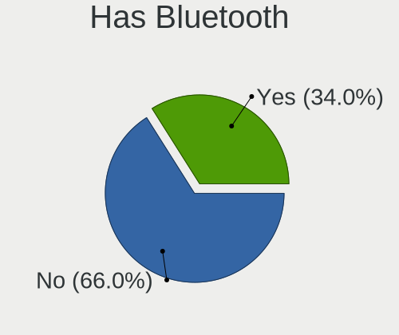
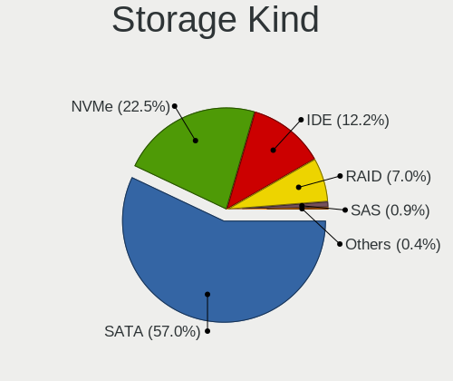
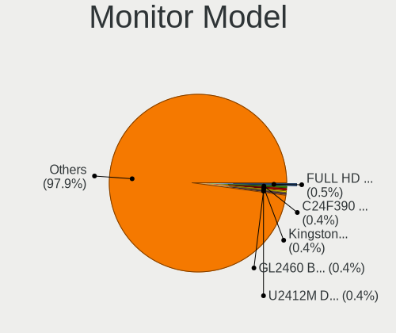
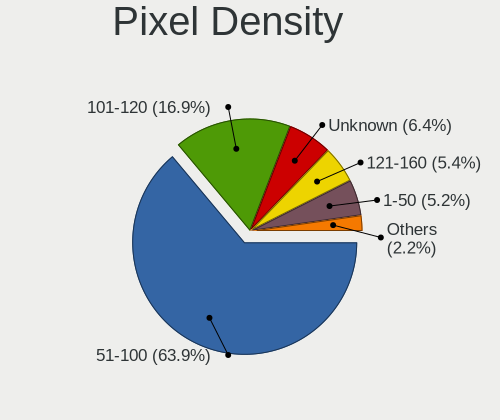

Ubuntu 22.04 - Tested Hardware & Statistics (Desktops)
------------------------------------------------------

A project to collect tested hardware configurations for Ubuntu 22.04.

Anyone can contribute to this report by the [hw-probe](https://github.com/linuxhw/hw-probe) tool:

    sudo -E hw-probe -all -upload

Please contribute! Especially if your hardware is rare.

Contents
--------

* [ Test Cases ](#test-cases)

* [ System ](#system)
  - [ Kernel                   ](#kernel)
  - [ Kernel Family            ](#kernel-family)
  - [ Kernel Major Ver.        ](#kernel-major-ver)
  - [ Arch                     ](#arch)
  - [ DE                       ](#de)
  - [ Display Server           ](#display-server)
  - [ Display Manager          ](#display-manager)
  - [ OS Lang                  ](#os-lang)
  - [ Boot Mode                ](#boot-mode)
  - [ Filesystem               ](#filesystem)
  - [ Part. scheme             ](#part-scheme)
  - [ Dual Boot with Linux/BSD ](#dual-boot-with-linuxbsd)
  - [ Dual Boot (Win)          ](#dual-boot-win)

* [ Board ](#board)
  - [ Vendor                   ](#vendor)
  - [ Model                    ](#model)
  - [ Model Family             ](#model-family)
  - [ MFG Year                 ](#mfg-year)
  - [ Form Factor              ](#form-factor)
  - [ Secure Boot              ](#secure-boot)
  - [ Coreboot                 ](#coreboot)
  - [ RAM Size                 ](#ram-size)
  - [ RAM Used                 ](#ram-used)
  - [ Total Drives             ](#total-drives)
  - [ Has CD-ROM               ](#has-cd-rom)
  - [ Has Ethernet             ](#has-ethernet)
  - [ Has WiFi                 ](#has-wifi)
  - [ Has Bluetooth            ](#has-bluetooth)

* [ Location ](#location)
  - [ Country                  ](#country)
  - [ City                     ](#city)

* [ Drives ](#drives)
  - [ Drive Vendor             ](#drive-vendor)
  - [ Drive Model              ](#drive-model)
  - [ HDD Vendor               ](#hdd-vendor)
  - [ SSD Vendor               ](#ssd-vendor)
  - [ Drive Kind               ](#drive-kind)
  - [ Drive Connector          ](#drive-connector)
  - [ Drive Size               ](#drive-size)
  - [ Space Total              ](#space-total)
  - [ Space Used               ](#space-used)
  - [ Malfunc. Drives          ](#malfunc-drives)
  - [ Malfunc. Drive Vendor    ](#malfunc-drive-vendor)
  - [ Malfunc. HDD Vendor      ](#malfunc-hdd-vendor)
  - [ Malfunc. Drive Kind      ](#malfunc-drive-kind)
  - [ Failed Drives            ](#failed-drives)
  - [ Failed Drive Vendor      ](#failed-drive-vendor)
  - [ Drive Status             ](#drive-status)

* [ Storage controller ](#storage-controller)
  - [ Storage Vendor           ](#storage-vendor)
  - [ Storage Model            ](#storage-model)
  - [ Storage Kind             ](#storage-kind)

* [ Processor ](#processor)
  - [ CPU Vendor               ](#cpu-vendor)
  - [ CPU Model                ](#cpu-model)
  - [ CPU Model Family         ](#cpu-model-family)
  - [ CPU Cores                ](#cpu-cores)
  - [ CPU Sockets              ](#cpu-sockets)
  - [ CPU Threads              ](#cpu-threads)
  - [ CPU Op-Modes             ](#cpu-op-modes)
  - [ CPU Microcode            ](#cpu-microcode)
  - [ CPU Microarch            ](#cpu-microarch)

* [ Graphics ](#graphics)
  - [ GPU Vendor               ](#gpu-vendor)
  - [ GPU Model                ](#gpu-model)
  - [ GPU Combo                ](#gpu-combo)
  - [ GPU Driver               ](#gpu-driver)
  - [ GPU Memory               ](#gpu-memory)

* [ Monitor ](#monitor)
  - [ Monitor Vendor           ](#monitor-vendor)
  - [ Monitor Model            ](#monitor-model)
  - [ Monitor Resolution       ](#monitor-resolution)
  - [ Monitor Diagonal         ](#monitor-diagonal)
  - [ Monitor Width            ](#monitor-width)
  - [ Aspect Ratio             ](#aspect-ratio)
  - [ Monitor Area             ](#monitor-area)
  - [ Pixel Density            ](#pixel-density)
  - [ Multiple Monitors        ](#multiple-monitors)

* [ Network ](#network)
  - [ Net Controller Vendor    ](#net-controller-vendor)
  - [ Net Controller Model     ](#net-controller-model)
  - [ Wireless Vendor          ](#wireless-vendor)
  - [ Wireless Model           ](#wireless-model)
  - [ Ethernet Vendor          ](#ethernet-vendor)
  - [ Ethernet Model           ](#ethernet-model)
  - [ Net Controller Kind      ](#net-controller-kind)
  - [ Used Controller          ](#used-controller)
  - [ NICs                     ](#nics)
  - [ IPv6                     ](#ipv6)

* [ Bluetooth ](#bluetooth)
  - [ Bluetooth Vendor         ](#bluetooth-vendor)
  - [ Bluetooth Model          ](#bluetooth-model)

* [ Sound ](#sound)
  - [ Sound Vendor             ](#sound-vendor)
  - [ Sound Model              ](#sound-model)

* [ Memory ](#memory)
  - [ Memory Vendor            ](#memory-vendor)
  - [ Memory Model             ](#memory-model)
  - [ Memory Kind              ](#memory-kind)
  - [ Memory Form Factor       ](#memory-form-factor)
  - [ Memory Size              ](#memory-size)
  - [ Memory Speed             ](#memory-speed)

* [ Printers & scanners ](#printers--scanners)
  - [ Printer Vendor           ](#printer-vendor)
  - [ Printer Model            ](#printer-model)
  - [ Scanner Vendor           ](#scanner-vendor)
  - [ Scanner Model            ](#scanner-model)

* [ Camera ](#camera)
  - [ Camera Vendor            ](#camera-vendor)
  - [ Camera Model             ](#camera-model)

* [ Security ](#security)
  - [ Fingerprint Vendor       ](#fingerprint-vendor)
  - [ Fingerprint Model        ](#fingerprint-model)
  - [ Chipcard Vendor          ](#chipcard-vendor)
  - [ Chipcard Model           ](#chipcard-model)

* [ Unsupported ](#unsupported)
  - [ Unsupported Devices      ](#unsupported-devices)
  - [ Unsupported Device Types ](#unsupported-device-types)

Test Cases
----------

Total: 9605

| Vendor        | Model                       | Probe                                                      | Date         |
|---------------|-----------------------------|------------------------------------------------------------|--------------|
| Lenovo        | SHARKBAY 31900058 STD       | [e1ab989081](https://linux-hardware.org/?probe=e1ab989081) | Jan 06, 2025 |
| ASUSTek       | M5A78L-M LX V2              | [02a12f94e1](https://linux-hardware.org/?probe=02a12f94e1) | Jan 05, 2025 |
| ASUSTek       | PRIME X370-A                | [86c0b9c6d4](https://linux-hardware.org/?probe=86c0b9c6d4) | Jan 03, 2025 |
| ASUSTek       | H170 PRO GAMING             | [743efb1121](https://linux-hardware.org/?probe=743efb1121) | Jan 03, 2025 |
| Dell          | 033FF6 A00                  | [621ced80c1](https://linux-hardware.org/?probe=621ced80c1) | Jan 03, 2025 |
| HP            | 89D8 SMVB                   | [150bb83ca3](https://linux-hardware.org/?probe=150bb83ca3) | Jan 02, 2025 |
| Intel         | 14650HX                     | [a9e917c056](https://linux-hardware.org/?probe=a9e917c056) | Jan 02, 2025 |
| HP            | 8619                        | [a916110ad9](https://linux-hardware.org/?probe=a916110ad9) | Jan 02, 2025 |
| HP            | 0AECh D                     | [9306b507f4](https://linux-hardware.org/?probe=9306b507f4) | Jan 02, 2025 |
| Fujitsu       | D3427-A1 S26361-D3427-A1    | [0cd4d1a295](https://linux-hardware.org/?probe=0cd4d1a295) | Jan 01, 2025 |
| HP            | 0AECh D                     | [0827eed993](https://linux-hardware.org/?probe=0827eed993) | Jan 01, 2025 |
| ASUSTek       | TUF Gaming X570-PLUS        | [0319b9ba0d](https://linux-hardware.org/?probe=0319b9ba0d) | Jan 01, 2025 |
| AZW           | MINI S                      | [e05536561b](https://linux-hardware.org/?probe=e05536561b) | Dec 31, 2024 |
| MSI           | MPG Z390 GAMING PLUS        | [7ecce10a98](https://linux-hardware.org/?probe=7ecce10a98) | Dec 31, 2024 |
| ASUSTek       | P5GZ-MX                     | [62e974ebee](https://linux-hardware.org/?probe=62e974ebee) | Dec 30, 2024 |
| ASUSTek       | ROG STRIX Z790-E GAMING ... | [5d24c0c43e](https://linux-hardware.org/?probe=5d24c0c43e) | Dec 30, 2024 |
| Dell          | 0K240Y A02                  | [bf8d86985d](https://linux-hardware.org/?probe=bf8d86985d) | Dec 30, 2024 |
| Dell          | 0XCR8D A03                  | [95826b99c5](https://linux-hardware.org/?probe=95826b99c5) | Dec 29, 2024 |
| ASUSTek       | M4A785T-M                   | [f16618cedd](https://linux-hardware.org/?probe=f16618cedd) | Dec 27, 2024 |
| ASRock        | AB350M Pro4                 | [e7ad6f1e08](https://linux-hardware.org/?probe=e7ad6f1e08) | Dec 27, 2024 |
| ASUSTek       | TUF Gaming B760M-PLUS WI... | [049870e2b4](https://linux-hardware.org/?probe=049870e2b4) | Dec 26, 2024 |
| MSI           | MAG B650 TOMAHAWK WIFI      | [769432836d](https://linux-hardware.org/?probe=769432836d) | Dec 26, 2024 |
| HP            | 805D                        | [026fd8a8b5](https://linux-hardware.org/?probe=026fd8a8b5) | Dec 26, 2024 |
| MSI           | MAG X570 TOMAHAWK WIFI      | [1a60e8fb7a](https://linux-hardware.org/?probe=1a60e8fb7a) | Dec 26, 2024 |
| Gigabyte      | MRHM3AP                     | [657c4947e4](https://linux-hardware.org/?probe=657c4947e4) | Dec 25, 2024 |
| Intel         | DH77KC AAG39641-401         | [0c54d9c7a7](https://linux-hardware.org/?probe=0c54d9c7a7) | Dec 24, 2024 |
| MSI           | PRO Z790-A MAX WIFI         | [834ad993ac](https://linux-hardware.org/?probe=834ad993ac) | Dec 23, 2024 |
| Acer          | Predator PO3-600 V:1.1      | [8473ea95de](https://linux-hardware.org/?probe=8473ea95de) | Dec 23, 2024 |
| Dell          | 0PRR48 A01                  | [282281a510](https://linux-hardware.org/?probe=282281a510) | Dec 23, 2024 |
| ASUSTek       | TUF Gaming B450-PLUS II     | [7cc80d8aba](https://linux-hardware.org/?probe=7cc80d8aba) | Dec 23, 2024 |
| HP            | 3396                        | [c26082be18](https://linux-hardware.org/?probe=c26082be18) | Dec 23, 2024 |
| HP            | 3396                        | [a2eda9a830](https://linux-hardware.org/?probe=a2eda9a830) | Dec 23, 2024 |
| ASUSTek       | A88X-PRO                    | [1b74d31510](https://linux-hardware.org/?probe=1b74d31510) | Dec 23, 2024 |
| MSI           | PRO B650M-A WIFI            | [8cd738bd8a](https://linux-hardware.org/?probe=8cd738bd8a) | Dec 21, 2024 |
| MSI           | MEG Z490I UNIFY             | [34567a9026](https://linux-hardware.org/?probe=34567a9026) | Dec 20, 2024 |
| ASRock        | B365 Phantom Gaming 4       | [ad7f76dde0](https://linux-hardware.org/?probe=ad7f76dde0) | Dec 20, 2024 |
| HP            | 81C5 MVB                    | [598ed0a0e1](https://linux-hardware.org/?probe=598ed0a0e1) | Dec 19, 2024 |
| Lenovo        | SHARKBAY 0B98401 PRO        | [ab4132ad4c](https://linux-hardware.org/?probe=ab4132ad4c) | Dec 19, 2024 |
| Lenovo        | SHARKBAY 0B98401 PRO        | [cbeebff465](https://linux-hardware.org/?probe=cbeebff465) | Dec 19, 2024 |
| MSI           | Z77A-G43                    | [dfc91607d7](https://linux-hardware.org/?probe=dfc91607d7) | Dec 18, 2024 |
| Fujitsu       | D3091-A1 S26361-D3091-A1    | [52b54f9c5f](https://linux-hardware.org/?probe=52b54f9c5f) | Dec 18, 2024 |
| Lenovo        | 1064 SDK0T76530 WIN 3556... | [5913ca9ed8](https://linux-hardware.org/?probe=5913ca9ed8) | Dec 17, 2024 |
| Dell          | 0P096C A01                  | [98c35e9b9b](https://linux-hardware.org/?probe=98c35e9b9b) | Dec 17, 2024 |
| MSI           | MAG X870 TOMAHAWK WIFI      | [569b52f7b9](https://linux-hardware.org/?probe=569b52f7b9) | Dec 16, 2024 |
| MSI           | MAG X870 TOMAHAWK WIFI      | [bc81411e04](https://linux-hardware.org/?probe=bc81411e04) | Dec 16, 2024 |
| Lenovo        | ThinkCentre A52 8289G4M     | [d07ac546df](https://linux-hardware.org/?probe=d07ac546df) | Dec 16, 2024 |
| Fujitsu       | D3091-A1 S26361-D3091-A1    | [9ddeef2131](https://linux-hardware.org/?probe=9ddeef2131) | Dec 15, 2024 |
| Dell          | 0F428D A00                  | [ba32636f6f](https://linux-hardware.org/?probe=ba32636f6f) | Dec 14, 2024 |
| MSI           | PRO H610M-E DDR4            | [dd71cde0f4](https://linux-hardware.org/?probe=dd71cde0f4) | Dec 14, 2024 |
| Gigabyte      | AB350-Gaming-CF             | [7aebeb376d](https://linux-hardware.org/?probe=7aebeb376d) | Dec 14, 2024 |
| Dell          | 0GY6Y8 A03                  | [e453ed40ac](https://linux-hardware.org/?probe=e453ed40ac) | Dec 14, 2024 |
| ASRock        | B250M-HDV                   | [feade65edb](https://linux-hardware.org/?probe=feade65edb) | Dec 13, 2024 |
| ASUSTek       | PRIME B650-PLUS             | [dbfe399fdb](https://linux-hardware.org/?probe=dbfe399fdb) | Dec 13, 2024 |
| Dell          | 0JP3NX A01                  | [1332bf42b8](https://linux-hardware.org/?probe=1332bf42b8) | Dec 13, 2024 |
| Intel         | DB65AL AAG12530-307         | [80eb8c5e8f](https://linux-hardware.org/?probe=80eb8c5e8f) | Dec 12, 2024 |
| Supermicro    | X10DAI                      | [8be65c83bd](https://linux-hardware.org/?probe=8be65c83bd) | Dec 12, 2024 |
| Dell          | 0WG855                      | [c87b7a95df](https://linux-hardware.org/?probe=c87b7a95df) | Dec 12, 2024 |
| ASRock        | A320M-HDV R4.0              | [6df6bce660](https://linux-hardware.org/?probe=6df6bce660) | Dec 11, 2024 |
| Lenovo        | 36C5 SDK0K17763 WIN 1801... | [5afdeb8595](https://linux-hardware.org/?probe=5afdeb8595) | Dec 11, 2024 |
| Lenovo        | 36C5 SDK0K17763 WIN 1801... | [29b0f998a4](https://linux-hardware.org/?probe=29b0f998a4) | Dec 11, 2024 |
| HP            | 3047h                       | [4cd6652c01](https://linux-hardware.org/?probe=4cd6652c01) | Dec 10, 2024 |
| Gigabyte      | AX370-Gaming 3-CF           | [0124649cba](https://linux-hardware.org/?probe=0124649cba) | Dec 10, 2024 |
| HP            | 3047h                       | [7ed4dce9a4](https://linux-hardware.org/?probe=7ed4dce9a4) | Dec 09, 2024 |
| Intel         | DB65AL AAG12530-307         | [f56398a4ab](https://linux-hardware.org/?probe=f56398a4ab) | Dec 08, 2024 |
| ASUSTek       | P5Q-E                       | [f031609f7c](https://linux-hardware.org/?probe=f031609f7c) | Dec 08, 2024 |
| Gigabyte      | 970A-DS3P                   | [1e1f3fb374](https://linux-hardware.org/?probe=1e1f3fb374) | Dec 08, 2024 |
| ASUSTek       | TUF Gaming B760M-PLUS WI... | [6c2446ea11](https://linux-hardware.org/?probe=6c2446ea11) | Dec 07, 2024 |
| Dell          | 0K216C                      | [10ab4e790d](https://linux-hardware.org/?probe=10ab4e790d) | Dec 07, 2024 |
| Shuttle       | DS10U                       | [e5de028bb7](https://linux-hardware.org/?probe=e5de028bb7) | Dec 06, 2024 |
| MSI           | PRO B760M-P DDR4            | [3af5d27c3e](https://linux-hardware.org/?probe=3af5d27c3e) | Dec 06, 2024 |
| MSI           | PRO B760M-P DDR4            | [5ca31295b1](https://linux-hardware.org/?probe=5ca31295b1) | Dec 06, 2024 |
| ASUSTek       | P8H61-M                     | [cfef2f57c3](https://linux-hardware.org/?probe=cfef2f57c3) | Dec 05, 2024 |
| Dell          | 0FDY5C A00                  | [9850cbe351](https://linux-hardware.org/?probe=9850cbe351) | Dec 05, 2024 |
| ASUSTek       | PRIME Z790-P WIFI           | [7745cda9b8](https://linux-hardware.org/?probe=7745cda9b8) | Dec 05, 2024 |
| Dell          | 0V8F20 A01                  | [07be2a8da3](https://linux-hardware.org/?probe=07be2a8da3) | Dec 04, 2024 |
| Dell          | 0V8F20 A01                  | [63d611d479](https://linux-hardware.org/?probe=63d611d479) | Dec 04, 2024 |
| Dell          | 0NW6H5 A00                  | [6f6d7d14a9](https://linux-hardware.org/?probe=6f6d7d14a9) | Dec 04, 2024 |
| Intel         | DH55TC AAE70932-302         | [1f0e503f99](https://linux-hardware.org/?probe=1f0e503f99) | Dec 03, 2024 |
| ASUSTek       | PRIME Z790-P WIFI           | [5c0dd2a9de](https://linux-hardware.org/?probe=5c0dd2a9de) | Dec 03, 2024 |
| Supermicro    | X9DRL-3F/iF                 | [cf165ddf30](https://linux-hardware.org/?probe=cf165ddf30) | Dec 03, 2024 |
| Unknown       | Unknown                     | [02faf52e1b](https://linux-hardware.org/?probe=02faf52e1b) | Dec 03, 2024 |
| ASRock        | 970 Extreme4                | [21adbb0a83](https://linux-hardware.org/?probe=21adbb0a83) | Dec 03, 2024 |
| MSI           | MPG X570 GAMING PLUS        | [4e2b2d2517](https://linux-hardware.org/?probe=4e2b2d2517) | Dec 02, 2024 |
| HP            | 8597                        | [c0b7ad7c1f](https://linux-hardware.org/?probe=c0b7ad7c1f) | Dec 01, 2024 |
| Dell          | 0654JC A01                  | [c195b37ae1](https://linux-hardware.org/?probe=c195b37ae1) | Nov 30, 2024 |
| MSI           | FM2-A55M-E33                | [5b919d0b65](https://linux-hardware.org/?probe=5b919d0b65) | Nov 30, 2024 |
| ASUSTek       | PRIME Z390-P                | [a6855cbe14](https://linux-hardware.org/?probe=a6855cbe14) | Nov 29, 2024 |
| ASUSTek       | M5A97 R2.0                  | [85e1f58dea](https://linux-hardware.org/?probe=85e1f58dea) | Nov 29, 2024 |
| Gigabyte      | 970A-DS3P                   | [6d5e05ac38](https://linux-hardware.org/?probe=6d5e05ac38) | Nov 29, 2024 |
| Inspur        | X10DRT-PS                   | [e33d406712](https://linux-hardware.org/?probe=e33d406712) | Nov 29, 2024 |
| Inspur        | X10DRT-PS                   | [db389cfbf7](https://linux-hardware.org/?probe=db389cfbf7) | Nov 29, 2024 |
| Dell          | 0WG855                      | [89f19d38c8](https://linux-hardware.org/?probe=89f19d38c8) | Nov 29, 2024 |
| HP            | 82B4                        | [ff4053afd7](https://linux-hardware.org/?probe=ff4053afd7) | Nov 28, 2024 |
| HP            | 8054                        | [9e20fcd26a](https://linux-hardware.org/?probe=9e20fcd26a) | Nov 28, 2024 |
| ASUSTek       | TUF Z390-PLUS GAMING        | [12a42bbefa](https://linux-hardware.org/?probe=12a42bbefa) | Nov 28, 2024 |
| MSI           | FM2-A55M-E33                | [fa25af819e](https://linux-hardware.org/?probe=fa25af819e) | Nov 27, 2024 |
| HP            | 83E0                        | [ce5cb82673](https://linux-hardware.org/?probe=ce5cb82673) | Nov 27, 2024 |
| Apple         | Mac-27AD2F918AE68F61 Mac... | [6ce6b8b12d](https://linux-hardware.org/?probe=6ce6b8b12d) | Nov 26, 2024 |
| HP            | 81C5 MVB                    | [6f9f169263](https://linux-hardware.org/?probe=6f9f169263) | Nov 26, 2024 |
| AZW           | GK55                        | [89f2d40002](https://linux-hardware.org/?probe=89f2d40002) | Nov 26, 2024 |
| Gigabyte      | Z390 UD                     | [81652d9ab3](https://linux-hardware.org/?probe=81652d9ab3) | Nov 25, 2024 |
| Gigabyte      | A520M H                     | [78a90f9c49](https://linux-hardware.org/?probe=78a90f9c49) | Nov 25, 2024 |
| Fujitsu       | D3161-A1 S26361-D3161-A1    | [07eecb1971](https://linux-hardware.org/?probe=07eecb1971) | Nov 24, 2024 |
| HP            | 81C5 MVB                    | [9aa92c417c](https://linux-hardware.org/?probe=9aa92c417c) | Nov 24, 2024 |
| MSI           | B450 TOMAHAWK MAX           | [2d53f31dcc](https://linux-hardware.org/?probe=2d53f31dcc) | Nov 24, 2024 |
| Dell          | 0VHWTR A02                  | [5bad281eef](https://linux-hardware.org/?probe=5bad281eef) | Nov 24, 2024 |
| Gigabyte      | H61MA-D3V                   | [2e02a58413](https://linux-hardware.org/?probe=2e02a58413) | Nov 24, 2024 |
| HP            | 8266                        | [4d39a7a9b6](https://linux-hardware.org/?probe=4d39a7a9b6) | Nov 23, 2024 |
| Acer          | Veriton X270                | [052d11375b](https://linux-hardware.org/?probe=052d11375b) | Nov 22, 2024 |
| MSI           | AM1I                        | [c5af29d126](https://linux-hardware.org/?probe=c5af29d126) | Nov 21, 2024 |
| Inspur        | X10DRT-PS                   | [55ed1c5998](https://linux-hardware.org/?probe=55ed1c5998) | Nov 20, 2024 |
| Inspur        | X10DRT-PS                   | [66fb0d5e95](https://linux-hardware.org/?probe=66fb0d5e95) | Nov 20, 2024 |
| Inspur        | X10DRT-PS                   | [c3803ea131](https://linux-hardware.org/?probe=c3803ea131) | Nov 20, 2024 |
| Inspur        | X10DRT-PS                   | [210d8cddac](https://linux-hardware.org/?probe=210d8cddac) | Nov 20, 2024 |
| Inspur        | X10DRT-PS                   | [46d3e305a4](https://linux-hardware.org/?probe=46d3e305a4) | Nov 20, 2024 |
| Inspur        | X10DRT-PS                   | [ab7fd49023](https://linux-hardware.org/?probe=ab7fd49023) | Nov 20, 2024 |
| Inspur        | X10DRT-PS                   | [61b12a729b](https://linux-hardware.org/?probe=61b12a729b) | Nov 20, 2024 |
| Inspur        | X10DRT-PS                   | [784f81364f](https://linux-hardware.org/?probe=784f81364f) | Nov 20, 2024 |
| Inspur        | X10DRT-PS                   | [af71788184](https://linux-hardware.org/?probe=af71788184) | Nov 20, 2024 |
| Inspur        | X10DRT-PS                   | [1aeacccc05](https://linux-hardware.org/?probe=1aeacccc05) | Nov 20, 2024 |
| Inspur        | X10DRT-PS                   | [b034ca3835](https://linux-hardware.org/?probe=b034ca3835) | Nov 20, 2024 |
| Inspur        | X10DRT-PS                   | [d8f173ccb4](https://linux-hardware.org/?probe=d8f173ccb4) | Nov 20, 2024 |
| ASUSTek       | PRIME Z690-P WIFI           | [73455e8d8a](https://linux-hardware.org/?probe=73455e8d8a) | Nov 20, 2024 |
| ASUSTek       | PRIME B365M-K               | [99b112b09c](https://linux-hardware.org/?probe=99b112b09c) | Nov 19, 2024 |
| ASUSTek       | PRIME B365M-K               | [60e8463604](https://linux-hardware.org/?probe=60e8463604) | Nov 19, 2024 |
| Dell          | 0HHV7N A00                  | [c9996cd0d1](https://linux-hardware.org/?probe=c9996cd0d1) | Nov 19, 2024 |
| ASUSTek       | TUF Gaming B650-PLUS        | [863de0f556](https://linux-hardware.org/?probe=863de0f556) | Nov 18, 2024 |
| MSI           | Z370 GAMING PLUS            | [796307b506](https://linux-hardware.org/?probe=796307b506) | Nov 18, 2024 |
| ASUSTek       | ROG STRIX B350-F GAMING     | [adcef6a8d2](https://linux-hardware.org/?probe=adcef6a8d2) | Nov 18, 2024 |
| HP            | 82A1                        | [426a68a6d5](https://linux-hardware.org/?probe=426a68a6d5) | Nov 17, 2024 |
| Dell          | 0W0CHX A03                  | [34a6c1a544](https://linux-hardware.org/?probe=34a6c1a544) | Nov 17, 2024 |
| ASUSTek       | TUF X470-PLUS GAMING        | [01e5244e5f](https://linux-hardware.org/?probe=01e5244e5f) | Nov 17, 2024 |
| MSI           | A520M-A PRO                 | [72727e842e](https://linux-hardware.org/?probe=72727e842e) | Nov 17, 2024 |
| MSI           | MPG Z790 CARBON WIFI II     | [c10e454a0e](https://linux-hardware.org/?probe=c10e454a0e) | Nov 17, 2024 |
| ASUSTek       | ROG CROSSHAIR VI HERO       | [f641f8c43b](https://linux-hardware.org/?probe=f641f8c43b) | Nov 16, 2024 |
| ASUSTek       | Rampage II Extreme          | [83ac4d04af](https://linux-hardware.org/?probe=83ac4d04af) | Nov 15, 2024 |
| GEEKOM        | Mini IT13                   | [7fb4590827](https://linux-hardware.org/?probe=7fb4590827) | Nov 15, 2024 |
| Intel         | DP55WG AAE57269-404         | [c07ecda835](https://linux-hardware.org/?probe=c07ecda835) | Nov 15, 2024 |
| ASUSTek       | ROG Maximus Z790 APEX       | [45fcd139e0](https://linux-hardware.org/?probe=45fcd139e0) | Nov 15, 2024 |
| Inspur        | X10DRT-PS                   | [22bfd62e89](https://linux-hardware.org/?probe=22bfd62e89) | Nov 14, 2024 |
| Inspur        | X10DRT-PS                   | [164cdf52b1](https://linux-hardware.org/?probe=164cdf52b1) | Nov 14, 2024 |
| Inspur        | X10DRT-PS                   | [283ef0a4bf](https://linux-hardware.org/?probe=283ef0a4bf) | Nov 14, 2024 |
| Inspur        | X10DRT-PS                   | [9f0b0f1484](https://linux-hardware.org/?probe=9f0b0f1484) | Nov 14, 2024 |
| Tianbei       | GEM12                       | [ac5bac18eb](https://linux-hardware.org/?probe=ac5bac18eb) | Nov 14, 2024 |
| Unknown       | Unknown                     | [194b0a5e70](https://linux-hardware.org/?probe=194b0a5e70) | Nov 14, 2024 |
| Dell          | 0GY6Y8 A03                  | [b2a0699ce8](https://linux-hardware.org/?probe=b2a0699ce8) | Nov 14, 2024 |
| Inspur        | X10DRT-PS                   | [0e6f53aa8d](https://linux-hardware.org/?probe=0e6f53aa8d) | Nov 14, 2024 |
| Inspur        | X10DRT-PS                   | [496fd27313](https://linux-hardware.org/?probe=496fd27313) | Nov 14, 2024 |
| Inspur        | X10DRT-PS                   | [470a6803e8](https://linux-hardware.org/?probe=470a6803e8) | Nov 14, 2024 |
| Inspur        | X10DRT-PS                   | [8c33a02767](https://linux-hardware.org/?probe=8c33a02767) | Nov 14, 2024 |
| Inspur        | X10DRT-PS                   | [d9ecf6c301](https://linux-hardware.org/?probe=d9ecf6c301) | Nov 14, 2024 |
| Inspur        | X10DRT-PS                   | [a6cf1ac288](https://linux-hardware.org/?probe=a6cf1ac288) | Nov 14, 2024 |
| Inspur        | X10DRT-PS                   | [bd0af372d3](https://linux-hardware.org/?probe=bd0af372d3) | Nov 14, 2024 |
| Inspur        | X10DRT-PS                   | [8bd87cd004](https://linux-hardware.org/?probe=8bd87cd004) | Nov 14, 2024 |
| Inspur        | X10DRT-PS                   | [a64d99385c](https://linux-hardware.org/?probe=a64d99385c) | Nov 14, 2024 |
| Inspur        | X10DRT-PS                   | [460061951d](https://linux-hardware.org/?probe=460061951d) | Nov 14, 2024 |
| Inspur        | X10DRT-PS                   | [399e1d2661](https://linux-hardware.org/?probe=399e1d2661) | Nov 14, 2024 |
| MSI           | X79A-GD45                   | [bef28e937b](https://linux-hardware.org/?probe=bef28e937b) | Nov 14, 2024 |
| ASUSTek       | TUF Gaming B760M-PLUS WI... | [99d4eb3f64](https://linux-hardware.org/?probe=99d4eb3f64) | Nov 13, 2024 |
| MSI           | H110M PRO-D                 | [452d20c7fd](https://linux-hardware.org/?probe=452d20c7fd) | Nov 13, 2024 |
| MSI           | H370 GAMING PLUS            | [73b7ffd3d7](https://linux-hardware.org/?probe=73b7ffd3d7) | Nov 13, 2024 |
| MSI           | H370 GAMING PLUS            | [967037bf19](https://linux-hardware.org/?probe=967037bf19) | Nov 13, 2024 |
| ASUSTek       | D500MD                      | [e95286140f](https://linux-hardware.org/?probe=e95286140f) | Nov 13, 2024 |
| ASUSTek       | ROG CROSSHAIR X670E HERO    | [81e54201a3](https://linux-hardware.org/?probe=81e54201a3) | Nov 12, 2024 |
| Huanan        | X99-F8 V5.0 JX              | [c02e0f14d3](https://linux-hardware.org/?probe=c02e0f14d3) | Nov 12, 2024 |
| Dell          | 0XPDFK A01                  | [b3aa73b7b8](https://linux-hardware.org/?probe=b3aa73b7b8) | Nov 12, 2024 |
| ASUSTek       | Z97-E/USB                   | [1750e9cb64](https://linux-hardware.org/?probe=1750e9cb64) | Nov 12, 2024 |
| HP            | 2B29                        | [aedd33bccd](https://linux-hardware.org/?probe=aedd33bccd) | Nov 11, 2024 |
| ASUSTek       | Z97-E/USB                   | [030e69ae4f](https://linux-hardware.org/?probe=030e69ae4f) | Nov 11, 2024 |
| ASUSTek       | TUF B450-PLUS GAMING        | [d4a850d412](https://linux-hardware.org/?probe=d4a850d412) | Nov 10, 2024 |
| Maxtang       | BYT50                       | [9c0a15d98d](https://linux-hardware.org/?probe=9c0a15d98d) | Nov 09, 2024 |
| Gigabyte      | H310M H x.x                 | [7714ddee54](https://linux-hardware.org/?probe=7714ddee54) | Nov 09, 2024 |
| MSI           | H110M PRO-D                 | [57f9a23010](https://linux-hardware.org/?probe=57f9a23010) | Nov 08, 2024 |
| ASRock        | X399 Taichi                 | [0185930e30](https://linux-hardware.org/?probe=0185930e30) | Nov 08, 2024 |
| ASRock        | Z370 Taichi                 | [ebc4134c41](https://linux-hardware.org/?probe=ebc4134c41) | Nov 07, 2024 |
| ASUSTek       | PRIME Z390-P                | [8af5eb8564](https://linux-hardware.org/?probe=8af5eb8564) | Nov 07, 2024 |
| ASUSTek       | P5Q SE2                     | [9a4a8316c4](https://linux-hardware.org/?probe=9a4a8316c4) | Nov 05, 2024 |
| HP            | 805D                        | [50f81e426f](https://linux-hardware.org/?probe=50f81e426f) | Nov 05, 2024 |
| Dell          | 0496JX A02                  | [935f196b19](https://linux-hardware.org/?probe=935f196b19) | Nov 04, 2024 |
| Dell          | 0CRH6C A00                  | [a6827a3a38](https://linux-hardware.org/?probe=a6827a3a38) | Nov 04, 2024 |
| Gigabyte      | P55A-UD3                    | [3492a588b9](https://linux-hardware.org/?probe=3492a588b9) | Nov 04, 2024 |
| MSI           | X670E GAMING PLUS WIFI      | [ee5c01978c](https://linux-hardware.org/?probe=ee5c01978c) | Nov 04, 2024 |
| MSI           | X670E GAMING PLUS WIFI      | [f502d96b27](https://linux-hardware.org/?probe=f502d96b27) | Nov 03, 2024 |
| ASUSTek       | PRIME B450M-K               | [fb7f564c95](https://linux-hardware.org/?probe=fb7f564c95) | Nov 02, 2024 |
| Lenovo        | SHARKBAY SDK0E50510 PRO     | [f4699e2430](https://linux-hardware.org/?probe=f4699e2430) | Nov 02, 2024 |
| MSI           | Z370-A PRO                  | [2d669b54c9](https://linux-hardware.org/?probe=2d669b54c9) | Nov 02, 2024 |
| Dell          | 0KYWH7 A03                  | [b4d4f8a6dc](https://linux-hardware.org/?probe=b4d4f8a6dc) | Nov 02, 2024 |
| ASRock        | N68-VS3 FX                  | [974c67550a](https://linux-hardware.org/?probe=974c67550a) | Nov 02, 2024 |
| MSI           | B350M PRO-VD PLUS           | [27f877c46f](https://linux-hardware.org/?probe=27f877c46f) | Nov 02, 2024 |
| Acer          | Aspire M3970                | [3fd50d4be6](https://linux-hardware.org/?probe=3fd50d4be6) | Nov 01, 2024 |
| Gigabyte      | B150M-D3P-WG-CF             | [c6834704e1](https://linux-hardware.org/?probe=c6834704e1) | Nov 01, 2024 |
| IceWhale T... | ZimaBoard 832 ZMB           | [6d85614fcd](https://linux-hardware.org/?probe=6d85614fcd) | Oct 31, 2024 |
| Lenovo        | 1064 NOK                    | [51a7e04d09](https://linux-hardware.org/?probe=51a7e04d09) | Oct 31, 2024 |
| Gigabyte      | Z68AP-D3                    | [dd633b257d](https://linux-hardware.org/?probe=dd633b257d) | Oct 31, 2024 |
| MSI           | B350M PRO-VD PLUS           | [625f6ba997](https://linux-hardware.org/?probe=625f6ba997) | Oct 28, 2024 |
| Dell          | 0WR7PY A03                  | [165a2fc563](https://linux-hardware.org/?probe=165a2fc563) | Oct 27, 2024 |
| Biostar       | H61B                        | [8f99971503](https://linux-hardware.org/?probe=8f99971503) | Oct 26, 2024 |
| Lenovo        | 36C5 SDK0K17763 WIN 1801... | [b2b1bfe417](https://linux-hardware.org/?probe=b2b1bfe417) | Oct 26, 2024 |
| Dell          | 0C1R19 A01                  | [9cfdd52cac](https://linux-hardware.org/?probe=9cfdd52cac) | Oct 26, 2024 |
| Dell          | 0C1R19 A01                  | [2e5943c6a9](https://linux-hardware.org/?probe=2e5943c6a9) | Oct 26, 2024 |
| Gigabyte      | H310MD2P-CF                 | [adeaead091](https://linux-hardware.org/?probe=adeaead091) | Oct 26, 2024 |
| ASUSTek       | M5A97 EVO R2.0              | [97c9faaa00](https://linux-hardware.org/?probe=97c9faaa00) | Oct 26, 2024 |
| Unknown       | Unknown                     | [ddcfe8c8bc](https://linux-hardware.org/?probe=ddcfe8c8bc) | Oct 26, 2024 |
| ASRock        | TRX40 Creator               | [362fb93f71](https://linux-hardware.org/?probe=362fb93f71) | Oct 25, 2024 |
| Fujitsu Si... | D2584-A1 S26361-D2584-A1    | [46280512d5](https://linux-hardware.org/?probe=46280512d5) | Oct 25, 2024 |
| ASUSTek       | M4A89GTD-PRO/USB3           | [122c1b297b](https://linux-hardware.org/?probe=122c1b297b) | Oct 25, 2024 |
| Gigabyte      | Z690 UD AX DDR4             | [3e7437eeb1](https://linux-hardware.org/?probe=3e7437eeb1) | Oct 25, 2024 |
| HP            | 1495                        | [2fd3ea9199](https://linux-hardware.org/?probe=2fd3ea9199) | Oct 25, 2024 |
| ASRock        | NUC-TGL                     | [ba4e42a96a](https://linux-hardware.org/?probe=ba4e42a96a) | Oct 24, 2024 |
| Intel         | H81                         | [1080e68a76](https://linux-hardware.org/?probe=1080e68a76) | Oct 24, 2024 |
| Dell          | 0Y2MRG A00                  | [0eb75d8cd4](https://linux-hardware.org/?probe=0eb75d8cd4) | Oct 24, 2024 |
| Gigabyte      | M68MT-S2P                   | [66754d761c](https://linux-hardware.org/?probe=66754d761c) | Oct 23, 2024 |
| ASUSTek       | PRIME B560M-A               | [4d3c9d7850](https://linux-hardware.org/?probe=4d3c9d7850) | Oct 23, 2024 |
| MSI           | 970 GAMING                  | [f95872cb43](https://linux-hardware.org/?probe=f95872cb43) | Oct 23, 2024 |
| Dell          | 0D4MD1 A02                  | [7ad6989e32](https://linux-hardware.org/?probe=7ad6989e32) | Oct 22, 2024 |
| ASRock        | X570 Phantom Gaming 4       | [b2e144b65a](https://linux-hardware.org/?probe=b2e144b65a) | Oct 22, 2024 |
| Dell          | 0Y2MRG A00                  | [1a6d397ccf](https://linux-hardware.org/?probe=1a6d397ccf) | Oct 22, 2024 |
| ASUSTek       | M4A89GTD-PRO/USB3           | [e7e05c7d64](https://linux-hardware.org/?probe=e7e05c7d64) | Oct 22, 2024 |
| ASUSTek       | ROG STRIX B450-F GAMING     | [c44080cd64](https://linux-hardware.org/?probe=c44080cd64) | Oct 22, 2024 |
| Lenovo        | 3768 SDK0T76463 WIN 3422... | [4c80185de1](https://linux-hardware.org/?probe=4c80185de1) | Oct 22, 2024 |
| ASUSTek       | ROG STRIX B450-F GAMING     | [4f539c4f91](https://linux-hardware.org/?probe=4f539c4f91) | Oct 22, 2024 |
| ASUSTek       | ROG CROSSHAIR VIII DARK ... | [3b5bf29a2b](https://linux-hardware.org/?probe=3b5bf29a2b) | Oct 21, 2024 |
| Gigabyte      | 970A-UD3P                   | [e2ad5de7d8](https://linux-hardware.org/?probe=e2ad5de7d8) | Oct 21, 2024 |
| ASRock        | X99 Extreme4                | [168d757821](https://linux-hardware.org/?probe=168d757821) | Oct 21, 2024 |
| HP            | 0AECh D                     | [cdbc7f10c8](https://linux-hardware.org/?probe=cdbc7f10c8) | Oct 21, 2024 |
| ASUSTek       | PRIME B350-PLUS             | [41ac64cb55](https://linux-hardware.org/?probe=41ac64cb55) | Oct 21, 2024 |
| Unknown       | Unknown                     | [7614985cc1](https://linux-hardware.org/?probe=7614985cc1) | Oct 20, 2024 |
| Fujitsu       | D2990-A1 S26361-D2990-A1    | [771cd1831b](https://linux-hardware.org/?probe=771cd1831b) | Oct 20, 2024 |
| ASUSTek       | Z170 PRO GAMING             | [80606a741e](https://linux-hardware.org/?probe=80606a741e) | Oct 20, 2024 |
| ASUSTek       | Z170 PRO GAMING             | [3139bdda01](https://linux-hardware.org/?probe=3139bdda01) | Oct 20, 2024 |
| Dell          | 0M5DCD A00                  | [2ffaa28849](https://linux-hardware.org/?probe=2ffaa28849) | Oct 19, 2024 |
| Lenovo        | 36C5 SDK0K17763 WIN 1801... | [2ae70497c4](https://linux-hardware.org/?probe=2ae70497c4) | Oct 18, 2024 |
| Dell          | 0773VG A00                  | [d98c5d96b3](https://linux-hardware.org/?probe=d98c5d96b3) | Oct 18, 2024 |
| Lenovo        | 314F NO DPK                 | [ab8e224c72](https://linux-hardware.org/?probe=ab8e224c72) | Oct 18, 2024 |
| Gigabyte      | GA-A55M-S2HP                | [0ad7db9d7c](https://linux-hardware.org/?probe=0ad7db9d7c) | Oct 18, 2024 |
| Dell          | 0GY6Y8 A03                  | [e776045c14](https://linux-hardware.org/?probe=e776045c14) | Oct 17, 2024 |
| ASRock        | X399 Professional Gaming    | [1a990b7794](https://linux-hardware.org/?probe=1a990b7794) | Oct 17, 2024 |
| ASRock        | X399 Professional Gaming    | [4103a21339](https://linux-hardware.org/?probe=4103a21339) | Oct 17, 2024 |
| Dell          | 0KWVT8 A00                  | [a8a980ef23](https://linux-hardware.org/?probe=a8a980ef23) | Oct 16, 2024 |
| Lenovo        | SHARKBAY 0B98401 WIN        | [11f2b266b3](https://linux-hardware.org/?probe=11f2b266b3) | Oct 16, 2024 |
| AZW           | MINI S                      | [bc0bd0e50a](https://linux-hardware.org/?probe=bc0bd0e50a) | Oct 16, 2024 |
| MSI           | Z370 GAMING PRO CARBON      | [3143d75e4c](https://linux-hardware.org/?probe=3143d75e4c) | Oct 15, 2024 |
| HP            | 212B                        | [68a15065c3](https://linux-hardware.org/?probe=68a15065c3) | Oct 15, 2024 |
| Gigabyte      | Z77-D3H                     | [cb94eee508](https://linux-hardware.org/?probe=cb94eee508) | Oct 15, 2024 |
| MSI           | Z370 GAMING PRO CARBON      | [0c3c722b3e](https://linux-hardware.org/?probe=0c3c722b3e) | Oct 15, 2024 |
| Gigabyte      | H310M H x.x                 | [bae4e2cea5](https://linux-hardware.org/?probe=bae4e2cea5) | Oct 15, 2024 |
| MSI           | B250M PRO-VDH               | [6800ef729e](https://linux-hardware.org/?probe=6800ef729e) | Oct 14, 2024 |
| Gigabyte      | H97M-D3H                    | [6e3537232b](https://linux-hardware.org/?probe=6e3537232b) | Oct 14, 2024 |
| ASRock        | X570 Phantom Gaming 4       | [04dc61a88e](https://linux-hardware.org/?probe=04dc61a88e) | Oct 14, 2024 |
| ASUSTek       | TUF Gaming B550-PLUS        | [e5b45f5750](https://linux-hardware.org/?probe=e5b45f5750) | Oct 14, 2024 |
| Dell          | 0CRH6C A00                  | [fefc9e5259](https://linux-hardware.org/?probe=fefc9e5259) | Oct 14, 2024 |
| Gigabyte      | B550M AORUS PRO-P           | [9ad57b30b6](https://linux-hardware.org/?probe=9ad57b30b6) | Oct 13, 2024 |
| Gigabyte      | Z690 UD AX DDR4             | [85ce264729](https://linux-hardware.org/?probe=85ce264729) | Oct 13, 2024 |
| ASRock        | Z87E-ITX                    | [99a3a914fe](https://linux-hardware.org/?probe=99a3a914fe) | Oct 13, 2024 |
| ASRock        | Z170A-X1                    | [8f71decb1f](https://linux-hardware.org/?probe=8f71decb1f) | Oct 13, 2024 |
| ASUSTek       | PRIME B360M-C               | [93e1955262](https://linux-hardware.org/?probe=93e1955262) | Oct 13, 2024 |
| Dell          | 03KWTV A00                  | [c322e91ef2](https://linux-hardware.org/?probe=c322e91ef2) | Oct 12, 2024 |
| MSI           | Z370 GAMING PLUS            | [ab668af995](https://linux-hardware.org/?probe=ab668af995) | Oct 12, 2024 |
| ASRock        | Z87 Extreme3                | [05051a6582](https://linux-hardware.org/?probe=05051a6582) | Oct 12, 2024 |
| Gigabyte      | B550 GAMING X V2            | [c523a5d005](https://linux-hardware.org/?probe=c523a5d005) | Oct 12, 2024 |
| Unknown       | Unknown                     | [6470bbc81c](https://linux-hardware.org/?probe=6470bbc81c) | Oct 12, 2024 |
| ASRock        | 970 Extreme4                | [8b4d44364f](https://linux-hardware.org/?probe=8b4d44364f) | Oct 11, 2024 |
| ASUSTek       | P8H61 R2.0                  | [f32503f55b](https://linux-hardware.org/?probe=f32503f55b) | Oct 11, 2024 |
| Gigabyte      | A55M-DS2                    | [fd7b57604a](https://linux-hardware.org/?probe=fd7b57604a) | Oct 10, 2024 |
| BESSTAR Te... | T3 MRD                      | [0d254c108a](https://linux-hardware.org/?probe=0d254c108a) | Oct 10, 2024 |
| ASUSTek       | PRIME Z590-A                | [87d6b9ea2a](https://linux-hardware.org/?probe=87d6b9ea2a) | Oct 09, 2024 |
| Lenovo        | 36C5 SDK0K17763 WIN 1801... | [9a0d84e72a](https://linux-hardware.org/?probe=9a0d84e72a) | Oct 09, 2024 |
| Huanan        | X99-F8D PLUS V1.3           | [e25332b251](https://linux-hardware.org/?probe=e25332b251) | Oct 08, 2024 |
| Huanan        | X99-F8D PLUS V1.3           | [64611726d0](https://linux-hardware.org/?probe=64611726d0) | Oct 08, 2024 |
| Gigabyte      | H270N-WIFI-CF               | [95fc3a979a](https://linux-hardware.org/?probe=95fc3a979a) | Oct 08, 2024 |
| Intel         | X99                         | [bc3b51e513](https://linux-hardware.org/?probe=bc3b51e513) | Oct 08, 2024 |
| ASUSTek       | ROG STRIX Z690-G GAMING ... | [b91adce425](https://linux-hardware.org/?probe=b91adce425) | Oct 08, 2024 |
| ASUSTek       | PRIME B760-PLUS             | [51a429b227](https://linux-hardware.org/?probe=51a429b227) | Oct 07, 2024 |
| Gigabyte      | B150M-D3H-CF                | [b3f66f8d51](https://linux-hardware.org/?probe=b3f66f8d51) | Oct 07, 2024 |
| Gigabyte      | GA-MA790X-DS4               | [b1b3551bb8](https://linux-hardware.org/?probe=b1b3551bb8) | Oct 07, 2024 |
| MSI           | B150A GAMING PRO            | [4d5f7679d0](https://linux-hardware.org/?probe=4d5f7679d0) | Oct 06, 2024 |
| ASRock        | X570 Phantom Gaming 4       | [913039111a](https://linux-hardware.org/?probe=913039111a) | Oct 06, 2024 |
| Dell          | 09WH54 A01                  | [4063ff9f73](https://linux-hardware.org/?probe=4063ff9f73) | Oct 06, 2024 |
| ASRock        | Z170A-X1                    | [4537d8bab3](https://linux-hardware.org/?probe=4537d8bab3) | Oct 06, 2024 |
| Intel         | DP55WG AAE57269-404         | [8b71ef1fb5](https://linux-hardware.org/?probe=8b71ef1fb5) | Oct 05, 2024 |
| HP            | 1495                        | [b374728264](https://linux-hardware.org/?probe=b374728264) | Oct 05, 2024 |
| Lenovo        | 3769 SDK0T76463 WIN 3422... | [03fa85a403](https://linux-hardware.org/?probe=03fa85a403) | Oct 04, 2024 |
| ASUSTek       | H81-PLUS                    | [716c393a81](https://linux-hardware.org/?probe=716c393a81) | Oct 04, 2024 |
| ASUSTek       | TUF Gaming B650-PLUS WIF... | [c8ffe91c17](https://linux-hardware.org/?probe=c8ffe91c17) | Oct 04, 2024 |
| Medion        | H61H2-LM3                   | [a6355a5a29](https://linux-hardware.org/?probe=a6355a5a29) | Oct 04, 2024 |
| HP            | 18E4                        | [9b22068827](https://linux-hardware.org/?probe=9b22068827) | Oct 04, 2024 |
| Trigkey       | Green G5                    | [7363b46604](https://linux-hardware.org/?probe=7363b46604) | Oct 04, 2024 |
| Dell          | 0RY007                      | [ada02f3c9e](https://linux-hardware.org/?probe=ada02f3c9e) | Oct 03, 2024 |
| MiTAC         | PD10EHI                     | [d3d62dd202](https://linux-hardware.org/?probe=d3d62dd202) | Oct 03, 2024 |
| Gigabyte      | Z690M DS3H DDR4             | [21cc874a16](https://linux-hardware.org/?probe=21cc874a16) | Oct 03, 2024 |
| MSI           | MPG B550 GAMING PLUS        | [5b165540b2](https://linux-hardware.org/?probe=5b165540b2) | Oct 03, 2024 |
| Dell          | 06D7TR A00                  | [489410fb9f](https://linux-hardware.org/?probe=489410fb9f) | Oct 03, 2024 |
| ASUSTek       | BM2AD_D510MT_D310MT         | [7da4858e7f](https://linux-hardware.org/?probe=7da4858e7f) | Oct 02, 2024 |
| Compumax C... | AMD Ryzen 5000U             | [9f694c0c87](https://linux-hardware.org/?probe=9f694c0c87) | Oct 02, 2024 |
| Inspur        | X10DRT-PS                   | [8f5e5c3b52](https://linux-hardware.org/?probe=8f5e5c3b52) | Oct 02, 2024 |
| Inspur        | X10DRT-PS                   | [aece7f90b6](https://linux-hardware.org/?probe=aece7f90b6) | Oct 02, 2024 |
| Inspur        | X10DRT-PS                   | [ce55d6c5c5](https://linux-hardware.org/?probe=ce55d6c5c5) | Oct 02, 2024 |
| Inspur        | X10DRT-PS                   | [41cb00efe2](https://linux-hardware.org/?probe=41cb00efe2) | Oct 02, 2024 |
| Inspur        | X10DRT-PS                   | [8bac77acff](https://linux-hardware.org/?probe=8bac77acff) | Oct 02, 2024 |
| Inspur        | X10DRT-PS                   | [b50ff58397](https://linux-hardware.org/?probe=b50ff58397) | Oct 02, 2024 |
| Inspur        | X10DRT-PS                   | [8946db44f5](https://linux-hardware.org/?probe=8946db44f5) | Oct 02, 2024 |
| Inspur        | X10DRT-PS                   | [e4472bb6d8](https://linux-hardware.org/?probe=e4472bb6d8) | Oct 02, 2024 |
| Intel         | HM570                       | [cd0df994f6](https://linux-hardware.org/?probe=cd0df994f6) | Oct 02, 2024 |
| Lenovo        | MAHOBAY NOK                 | [22f11cd06e](https://linux-hardware.org/?probe=22f11cd06e) | Oct 02, 2024 |
| Dell          | 0NK5PH A00                  | [665c7943e4](https://linux-hardware.org/?probe=665c7943e4) | Oct 02, 2024 |
| HP            | 21B4 A01                    | [51caa709b2](https://linux-hardware.org/?probe=51caa709b2) | Oct 02, 2024 |
| ASUSTek       | P8H61-M LX2                 | [eeadaf7682](https://linux-hardware.org/?probe=eeadaf7682) | Oct 01, 2024 |
| Gigabyte      | B550 AORUS ELITE AX V2      | [41d603ed52](https://linux-hardware.org/?probe=41d603ed52) | Oct 01, 2024 |
| Intel         | DH55HC AAE70933-503         | [0646285490](https://linux-hardware.org/?probe=0646285490) | Oct 01, 2024 |
| MSI           | MPG X570 GAMING EDGE WIF... | [acc768d69b](https://linux-hardware.org/?probe=acc768d69b) | Oct 01, 2024 |
| ASUSTek       | P9X79 DELUXE                | [19f6fac85c](https://linux-hardware.org/?probe=19f6fac85c) | Sep 30, 2024 |
| ASRock        | B660M-ITX/ac                | [da759354a2](https://linux-hardware.org/?probe=da759354a2) | Sep 30, 2024 |
| Inventec      | ZQ Class A02                | [c64b66a0f7](https://linux-hardware.org/?probe=c64b66a0f7) | Sep 30, 2024 |
| ASUSTek       | ROG CROSSHAIR VII HERO      | [78db9f0d3b](https://linux-hardware.org/?probe=78db9f0d3b) | Sep 30, 2024 |
| ASRock        | Z87 Extreme3                | [ff889b3141](https://linux-hardware.org/?probe=ff889b3141) | Sep 30, 2024 |
| Dell          | 088DT1 A01                  | [f6248081e4](https://linux-hardware.org/?probe=f6248081e4) | Sep 30, 2024 |
| Dell          | 088DT1 A01                  | [68d8a8cbdf](https://linux-hardware.org/?probe=68d8a8cbdf) | Sep 30, 2024 |
| ASUSTek       | H97M-E                      | [fc605167a5](https://linux-hardware.org/?probe=fc605167a5) | Sep 29, 2024 |
| ASRock        | H610M-ITX/ac                | [17e8f1e713](https://linux-hardware.org/?probe=17e8f1e713) | Sep 29, 2024 |
| ASUSTek       | PRIME H510M-E               | [0f55d51523](https://linux-hardware.org/?probe=0f55d51523) | Sep 29, 2024 |
| Gigabyte      | Z370XP SLI-CF               | [597a401f4b](https://linux-hardware.org/?probe=597a401f4b) | Sep 29, 2024 |
| Gigabyte      | B650 EAGLE AX               | [cd08535089](https://linux-hardware.org/?probe=cd08535089) | Sep 29, 2024 |
| ASUSTek       | PRIME Z370-A                | [f7015fc694](https://linux-hardware.org/?probe=f7015fc694) | Sep 29, 2024 |
| Gigabyte      | B650 EAGLE AX               | [bf07083b8a](https://linux-hardware.org/?probe=bf07083b8a) | Sep 29, 2024 |
| MSI           | A520M-A PRO                 | [d6ed4a9deb](https://linux-hardware.org/?probe=d6ed4a9deb) | Sep 29, 2024 |
| Lenovo        | 30D9 SDK0J40697 WIN 3305... | [2b248e2664](https://linux-hardware.org/?probe=2b248e2664) | Sep 28, 2024 |
| ASRock        | Z370 Extreme4               | [e22942f154](https://linux-hardware.org/?probe=e22942f154) | Sep 27, 2024 |
| Inspur        | X10DRT-PS                   | [632436a345](https://linux-hardware.org/?probe=632436a345) | Sep 27, 2024 |
| ASUSTek       | Pro WS WRX90E-SAGE SE       | [31f821497b](https://linux-hardware.org/?probe=31f821497b) | Sep 27, 2024 |
| Gigabyte      | X570 AORUS ULTRA            | [716c7d8042](https://linux-hardware.org/?probe=716c7d8042) | Sep 27, 2024 |
| ASUSTek       | PRIME A320M-K/BR            | [55f555fa59](https://linux-hardware.org/?probe=55f555fa59) | Sep 26, 2024 |
| Inspur        | X10DRT-PS                   | [db9b3adbce](https://linux-hardware.org/?probe=db9b3adbce) | Sep 25, 2024 |
| Inspur        | X10DRT-PS                   | [923606ae39](https://linux-hardware.org/?probe=923606ae39) | Sep 25, 2024 |
| Inspur        | X10DRT-PS                   | [8750ebb561](https://linux-hardware.org/?probe=8750ebb561) | Sep 25, 2024 |
| Inspur        | X10DRT-PS                   | [c9f488111a](https://linux-hardware.org/?probe=c9f488111a) | Sep 25, 2024 |
| Inspur        | X10DRT-PS                   | [63c31becaa](https://linux-hardware.org/?probe=63c31becaa) | Sep 25, 2024 |
| Inspur        | X10DRT-PS                   | [911222c42c](https://linux-hardware.org/?probe=911222c42c) | Sep 25, 2024 |
| Inspur        | X10DRT-PS                   | [e6ffa4bfa1](https://linux-hardware.org/?probe=e6ffa4bfa1) | Sep 25, 2024 |
| Lenovo        | SHARKBAY 0B98401 PRO        | [1133be4bb6](https://linux-hardware.org/?probe=1133be4bb6) | Sep 25, 2024 |
| ASRock        | 970 Extreme3 R2.0           | [d174717db9](https://linux-hardware.org/?probe=d174717db9) | Sep 24, 2024 |
| MSI           | A320M-A PRO MAX             | [918ca69d72](https://linux-hardware.org/?probe=918ca69d72) | Sep 24, 2024 |
| MSI           | A320M-A PRO MAX             | [99da5085c6](https://linux-hardware.org/?probe=99da5085c6) | Sep 24, 2024 |
| Gigabyte      | B150N Phoenix-WIFI-CF       | [890c3c6393](https://linux-hardware.org/?probe=890c3c6393) | Sep 24, 2024 |
| ECS           | G31T-M3                     | [cac0c289e6](https://linux-hardware.org/?probe=cac0c289e6) | Sep 24, 2024 |
| ASUSTek       | PRIME Z270-A                | [fba4ef3b0e](https://linux-hardware.org/?probe=fba4ef3b0e) | Sep 24, 2024 |
| Dell          | 0WG855                      | [c4979ad3c8](https://linux-hardware.org/?probe=c4979ad3c8) | Sep 24, 2024 |
| Lenovo        | 3102 SDK0J40697 WIN 3305... | [b7d2db2ae0](https://linux-hardware.org/?probe=b7d2db2ae0) | Sep 24, 2024 |
| Lenovo        | 1064 SDK0T76530 WIN 3556... | [a3dd03a202](https://linux-hardware.org/?probe=a3dd03a202) | Sep 23, 2024 |
| Pegatron      | 2A9A                        | [73a8ea166e](https://linux-hardware.org/?probe=73a8ea166e) | Sep 23, 2024 |
| MACHINIST     | X99-MR9A PRO MAX V5.1       | [2a4a609a7c](https://linux-hardware.org/?probe=2a4a609a7c) | Sep 23, 2024 |
| ASUSTek       | M4A785TD-M EVO              | [0af8bbadf3](https://linux-hardware.org/?probe=0af8bbadf3) | Sep 23, 2024 |
| Gigabyte      | H310M H x.x                 | [a8b3838f38](https://linux-hardware.org/?probe=a8b3838f38) | Sep 22, 2024 |
| AZW           | MINI S                      | [ba5ec1c07b](https://linux-hardware.org/?probe=ba5ec1c07b) | Sep 22, 2024 |
| MouseCompu... | A78M-S01                    | [71c3b987a8](https://linux-hardware.org/?probe=71c3b987a8) | Sep 22, 2024 |
| ASUSTek       | P5KC                        | [4ff012d224](https://linux-hardware.org/?probe=4ff012d224) | Sep 21, 2024 |
| Dell          | 0478VN A00                  | [6b6f98ce16](https://linux-hardware.org/?probe=6b6f98ce16) | Sep 21, 2024 |
| Lenovo        | NOK                         | [04441047f1](https://linux-hardware.org/?probe=04441047f1) | Sep 21, 2024 |
| Gigabyte      | B650 GAMING X AX            | [59fc810f70](https://linux-hardware.org/?probe=59fc810f70) | Sep 20, 2024 |
| MSI           | B550 GAMING GEN3            | [265de4b1d1](https://linux-hardware.org/?probe=265de4b1d1) | Sep 20, 2024 |
| Lenovo        | 3716 SDK0T76461 WIN 3422... | [d0c33932c6](https://linux-hardware.org/?probe=d0c33932c6) | Sep 20, 2024 |
| HC Technol... | HCAR5000-MI                 | [b52ad32643](https://linux-hardware.org/?probe=b52ad32643) | Sep 19, 2024 |
| ASRock        | H310CM-HG4                  | [5130378a34](https://linux-hardware.org/?probe=5130378a34) | Sep 19, 2024 |
| MSI           | PRO H510M-B                 | [020620e4c2](https://linux-hardware.org/?probe=020620e4c2) | Sep 18, 2024 |
| MSI           | PRO H510M-B                 | [892b66d32f](https://linux-hardware.org/?probe=892b66d32f) | Sep 18, 2024 |
| Supermicro    | X10SAE                      | [dc74f881ce](https://linux-hardware.org/?probe=dc74f881ce) | Sep 18, 2024 |
| Gigabyte      | H110N-CF                    | [9611f01bcd](https://linux-hardware.org/?probe=9611f01bcd) | Sep 18, 2024 |
| Gigabyte      | H61M-S2PV                   | [acbc17cd93](https://linux-hardware.org/?probe=acbc17cd93) | Sep 17, 2024 |
| Gigabyte      | H61M-S2PV                   | [f9dc1de70f](https://linux-hardware.org/?probe=f9dc1de70f) | Sep 17, 2024 |
| Dell          | 0GK35Y A00                  | [269c7d5656](https://linux-hardware.org/?probe=269c7d5656) | Sep 17, 2024 |
| Supermicro    | X7DCL                       | [4608495e14](https://linux-hardware.org/?probe=4608495e14) | Sep 17, 2024 |
| MouseCompu... | A78M-S01                    | [c95e2b829c](https://linux-hardware.org/?probe=c95e2b829c) | Sep 17, 2024 |
| MSI           | B450I GAMING PLUS AC        | [4202cf424e](https://linux-hardware.org/?probe=4202cf424e) | Sep 16, 2024 |
| Dell          | 08HPGT A01                  | [edbdf8e4a6](https://linux-hardware.org/?probe=edbdf8e4a6) | Sep 15, 2024 |
| Medion        | H110H4-EM                   | [33ee05d21c](https://linux-hardware.org/?probe=33ee05d21c) | Sep 15, 2024 |
| ASRockRack    | X470D4U                     | [d59f6659fa](https://linux-hardware.org/?probe=d59f6659fa) | Sep 15, 2024 |
| T-bao         | MINI PC V1.0                | [f02a2deeda](https://linux-hardware.org/?probe=f02a2deeda) | Sep 15, 2024 |
| ASRock        | H510M-HDV/M.2               | [7b5e4af25e](https://linux-hardware.org/?probe=7b5e4af25e) | Sep 14, 2024 |
| ASRock        | H510M-HDV/M.2               | [6b492485d4](https://linux-hardware.org/?probe=6b492485d4) | Sep 14, 2024 |
| Gigabyte      | H81M-DS2V                   | [ca364cc622](https://linux-hardware.org/?probe=ca364cc622) | Sep 13, 2024 |
| Dell          | 0JCTF8 A00                  | [19c58076de](https://linux-hardware.org/?probe=19c58076de) | Sep 13, 2024 |
| ASRock        | B660M-C                     | [a41545f60c](https://linux-hardware.org/?probe=a41545f60c) | Sep 13, 2024 |
| MSI           | Z170A GAMING PRO CARBON     | [fcaf7b80f3](https://linux-hardware.org/?probe=fcaf7b80f3) | Sep 13, 2024 |
| Intel         | DH87MC AAG74242-401         | [a939d2d16e](https://linux-hardware.org/?probe=a939d2d16e) | Sep 13, 2024 |
| Intel         | DH87MC AAG74242-401         | [e9b559c00d](https://linux-hardware.org/?probe=e9b559c00d) | Sep 13, 2024 |
| Gigabyte      | H310M H x.x                 | [ae8a8db77d](https://linux-hardware.org/?probe=ae8a8db77d) | Sep 11, 2024 |
| Fujitsu       | D3233-A1 S26361-D3233-A1    | [c4d841406e](https://linux-hardware.org/?probe=c4d841406e) | Sep 11, 2024 |
| Unknown       | Unknown                     | [789cbbc90c](https://linux-hardware.org/?probe=789cbbc90c) | Sep 11, 2024 |
| ASUSTek       | H170-PRO                    | [fc3d6d8428](https://linux-hardware.org/?probe=fc3d6d8428) | Sep 11, 2024 |
| AAEON         | HPC-RPSC V1.0               | [e2655c50aa](https://linux-hardware.org/?probe=e2655c50aa) | Sep 10, 2024 |
| HP            | 8653 A                      | [38c6c2e2dd](https://linux-hardware.org/?probe=38c6c2e2dd) | Sep 10, 2024 |
| ASUSTek       | PRIME X670-P WIFI           | [647986fc12](https://linux-hardware.org/?probe=647986fc12) | Sep 09, 2024 |
| AZW           | MINI S 10                   | [bf05beae43](https://linux-hardware.org/?probe=bf05beae43) | Sep 09, 2024 |
| MouseCompu... | Z390-S01                    | [0946a3613d](https://linux-hardware.org/?probe=0946a3613d) | Sep 09, 2024 |
| ASUSTek       | H61M-K                      | [cc014c99bf](https://linux-hardware.org/?probe=cc014c99bf) | Sep 09, 2024 |
| Lenovo        | Win8 Pro DPK TPG            | [3a9ad3c13b](https://linux-hardware.org/?probe=3a9ad3c13b) | Sep 08, 2024 |
| MSI           | P67A-GD55/2.0               | [5d28806f03](https://linux-hardware.org/?probe=5d28806f03) | Sep 08, 2024 |
| MSI           | P67A-GD55/2.0               | [ccbe9b5b93](https://linux-hardware.org/?probe=ccbe9b5b93) | Sep 08, 2024 |
| Biostar       | TB250-BTC                   | [d1960db165](https://linux-hardware.org/?probe=d1960db165) | Sep 07, 2024 |
| HP            | 225E                        | [240678cc5d](https://linux-hardware.org/?probe=240678cc5d) | Sep 07, 2024 |
| Gigabyte      | H81M-DS2V                   | [1bdf87faa0](https://linux-hardware.org/?probe=1bdf87faa0) | Sep 07, 2024 |
| Dell          | 0R230R A00                  | [0a5b82357e](https://linux-hardware.org/?probe=0a5b82357e) | Sep 07, 2024 |
| Unknown       | Unknown                     | [be404cf099](https://linux-hardware.org/?probe=be404cf099) | Sep 07, 2024 |
| Gigabyte      | H97-HD3                     | [7ea9c91344](https://linux-hardware.org/?probe=7ea9c91344) | Sep 06, 2024 |
| HP            | 0AECh D                     | [63a2a4e308](https://linux-hardware.org/?probe=63a2a4e308) | Sep 05, 2024 |
| ASRock        | B450M Pro4                  | [0914402155](https://linux-hardware.org/?probe=0914402155) | Sep 05, 2024 |
| HP            | 0AECh D                     | [1e15ab8713](https://linux-hardware.org/?probe=1e15ab8713) | Sep 04, 2024 |
| HP            | ProLiant MicroServer        | [9bf2e5fa67](https://linux-hardware.org/?probe=9bf2e5fa67) | Sep 04, 2024 |
| MACHINIST     | X79 (INTEL Xeon E5/Corei... | [906c46c9e4](https://linux-hardware.org/?probe=906c46c9e4) | Sep 04, 2024 |
| ASUSTek       | PRIME B450M-K               | [9bb76ce7bf](https://linux-hardware.org/?probe=9bb76ce7bf) | Sep 04, 2024 |
| Gigabyte      | GA-970A-DS3                 | [1dac9cd4a6](https://linux-hardware.org/?probe=1dac9cd4a6) | Sep 04, 2024 |
| Medion        | H110H4-EM                   | [7b66674668](https://linux-hardware.org/?probe=7b66674668) | Sep 04, 2024 |
| Gigabyte      | Z77-DS3H                    | [10986c1aa7](https://linux-hardware.org/?probe=10986c1aa7) | Sep 04, 2024 |
| Gigabyte      | B660M DS3H DDR4             | [20a6f2c8e9](https://linux-hardware.org/?probe=20a6f2c8e9) | Sep 04, 2024 |
| ASRock        | AM1H-ITX                    | [6dabed89a7](https://linux-hardware.org/?probe=6dabed89a7) | Sep 04, 2024 |
| ASRock        | AB350M                      | [1cd8bb8d06](https://linux-hardware.org/?probe=1cd8bb8d06) | Sep 03, 2024 |
| HP            | 895D                        | [4a25595433](https://linux-hardware.org/?probe=4a25595433) | Sep 03, 2024 |
| Gigabyte      | GA-970A-DS3                 | [3b70937885](https://linux-hardware.org/?probe=3b70937885) | Sep 03, 2024 |
| HP            | 1850                        | [04ba2b802c](https://linux-hardware.org/?probe=04ba2b802c) | Sep 03, 2024 |
| MSI           | B550M PRO-VDH WIFI          | [c679b1e522](https://linux-hardware.org/?probe=c679b1e522) | Sep 03, 2024 |
| HP            | 0B54h D                     | [a1d7f9ad70](https://linux-hardware.org/?probe=a1d7f9ad70) | Sep 02, 2024 |
| MSI           | H87M-E35                    | [cacdb583e5](https://linux-hardware.org/?probe=cacdb583e5) | Sep 02, 2024 |
| Google        | Panther                     | [7edf0dda54](https://linux-hardware.org/?probe=7edf0dda54) | Sep 02, 2024 |
| Lenovo        | SHARKBAY 0B98401 WIN        | [2cbca58895](https://linux-hardware.org/?probe=2cbca58895) | Sep 02, 2024 |
| Gigabyte      | A320M-S2H-CF                | [f1b256a85e](https://linux-hardware.org/?probe=f1b256a85e) | Sep 01, 2024 |
| Gigabyte      | H310M H                     | [95c1ab90c2](https://linux-hardware.org/?probe=95c1ab90c2) | Sep 01, 2024 |
| Gigabyte      | H87N-WIFI                   | [4a8dd605fa](https://linux-hardware.org/?probe=4a8dd605fa) | Sep 01, 2024 |
| ASUSTek       | P8Z77-V LX                  | [dc9c97d37a](https://linux-hardware.org/?probe=dc9c97d37a) | Sep 01, 2024 |
| Dell          | 09KPNV A01                  | [dbbc4339df](https://linux-hardware.org/?probe=dbbc4339df) | Sep 01, 2024 |
| ASUSTek       | M5A78L/USB3                 | [525c825aa7](https://linux-hardware.org/?probe=525c825aa7) | Aug 31, 2024 |
| ASRock        | H77M                        | [8fe761f03e](https://linux-hardware.org/?probe=8fe761f03e) | Aug 31, 2024 |
| ASRock        | H77M                        | [3774a101e1](https://linux-hardware.org/?probe=3774a101e1) | Aug 30, 2024 |
| Dell          | 0K240Y A02                  | [8e63f0cc67](https://linux-hardware.org/?probe=8e63f0cc67) | Aug 30, 2024 |
| Lenovo        | NOK                         | [2cfb66d762](https://linux-hardware.org/?probe=2cfb66d762) | Aug 30, 2024 |
| System76      | Thelio thelio-b2            | [283fcb4ac5](https://linux-hardware.org/?probe=283fcb4ac5) | Aug 30, 2024 |
| Dell          | 0MW50N A02                  | [a5a6925f7f](https://linux-hardware.org/?probe=a5a6925f7f) | Aug 29, 2024 |
| MSI           | B350 TOMAHAWK               | [e38816cd57](https://linux-hardware.org/?probe=e38816cd57) | Aug 29, 2024 |
| Gigabyte      | X299X AORUS MASTER          | [600549f63f](https://linux-hardware.org/?probe=600549f63f) | Aug 29, 2024 |
| ECS           | H81H3-M4                    | [a1a53ea4b7](https://linux-hardware.org/?probe=a1a53ea4b7) | Aug 29, 2024 |
| ECS           | H81H3-M4                    | [07bf45f673](https://linux-hardware.org/?probe=07bf45f673) | Aug 29, 2024 |
| ASRock        | A320M-HDV R4.0              | [da538781dc](https://linux-hardware.org/?probe=da538781dc) | Aug 29, 2024 |
| HP            | 802F                        | [f7a26fe51f](https://linux-hardware.org/?probe=f7a26fe51f) | Aug 28, 2024 |
| Intel         | DZ77RE-75K AAG39010-302     | [06455f7508](https://linux-hardware.org/?probe=06455f7508) | Aug 28, 2024 |
| MSI           | H67MA-E35                   | [77b12d9e5a](https://linux-hardware.org/?probe=77b12d9e5a) | Aug 28, 2024 |
| Fujitsu       | D3230-A1 S26361-D3230-A1    | [267edf1f6d](https://linux-hardware.org/?probe=267edf1f6d) | Aug 28, 2024 |
| MSI           | H87M-E35                    | [feb7af0093](https://linux-hardware.org/?probe=feb7af0093) | Aug 27, 2024 |
| Gigabyte      | H310M H                     | [d36cdaa55f](https://linux-hardware.org/?probe=d36cdaa55f) | Aug 27, 2024 |
| ASUSTek       | ROG STRIX X670E-F GAMING... | [2efe1e804e](https://linux-hardware.org/?probe=2efe1e804e) | Aug 27, 2024 |
| ASRock        | B450M-HDV R4.0              | [178f45d61b](https://linux-hardware.org/?probe=178f45d61b) | Aug 27, 2024 |
| ASRock        | B450M-HDV R4.0              | [46b0a88c7e](https://linux-hardware.org/?probe=46b0a88c7e) | Aug 27, 2024 |
| MSI           | A320M-A PRO MAX             | [f63be7d365](https://linux-hardware.org/?probe=f63be7d365) | Aug 27, 2024 |
| Biostar       | A320MH                      | [55cf170dc9](https://linux-hardware.org/?probe=55cf170dc9) | Aug 27, 2024 |
| Gigabyte      | H270N-WIFI-CF               | [0061772dde](https://linux-hardware.org/?probe=0061772dde) | Aug 26, 2024 |
| MSI           | MPG Z790 EDGE TI MAX WIF... | [65e4e049fb](https://linux-hardware.org/?probe=65e4e049fb) | Aug 26, 2024 |
| ASRock        | B75M-GL R2.0                | [b3f4200fd9](https://linux-hardware.org/?probe=b3f4200fd9) | Aug 25, 2024 |
| ASUSTek       | SABERTOOTH Z87              | [e7e038d435](https://linux-hardware.org/?probe=e7e038d435) | Aug 24, 2024 |
| MSI           | Z97S SLI Krait Edition      | [9060411fb3](https://linux-hardware.org/?probe=9060411fb3) | Aug 24, 2024 |
| ASUSTek       | M5A78L LE                   | [5d5028fba2](https://linux-hardware.org/?probe=5d5028fba2) | Aug 23, 2024 |
| Dell          | 0GDG8Y A00                  | [8eb6eccbbf](https://linux-hardware.org/?probe=8eb6eccbbf) | Aug 22, 2024 |
| HP            | 2129                        | [1eb65765a8](https://linux-hardware.org/?probe=1eb65765a8) | Aug 22, 2024 |
| Medion        | H61H2-LM3                   | [9f1ae35733](https://linux-hardware.org/?probe=9f1ae35733) | Aug 22, 2024 |
| MSI           | PRO B650-S WIFI             | [d22357aac4](https://linux-hardware.org/?probe=d22357aac4) | Aug 22, 2024 |
| Foxconn       | 2ADA                        | [87509ddaf4](https://linux-hardware.org/?probe=87509ddaf4) | Aug 22, 2024 |
| Foxconn       | 2ADA                        | [8d42b3233c](https://linux-hardware.org/?probe=8d42b3233c) | Aug 22, 2024 |
| Gigabyte      | B550M DS3H                  | [6b4fd736fb](https://linux-hardware.org/?probe=6b4fd736fb) | Aug 22, 2024 |
| MSI           | H310M PRO-VDH PLUS          | [d791120b41](https://linux-hardware.org/?probe=d791120b41) | Aug 22, 2024 |
| MSI           | H310M PRO-VDH PLUS          | [33a588ecdf](https://linux-hardware.org/?probe=33a588ecdf) | Aug 22, 2024 |
| ASRock        | B450M-HDV                   | [934479027e](https://linux-hardware.org/?probe=934479027e) | Aug 21, 2024 |
| MSI           | 760GM-E51                   | [aa369d900a](https://linux-hardware.org/?probe=aa369d900a) | Aug 21, 2024 |
| ULTRATOP      | C2017-LIVA-ZE-Plus          | [0979c2d543](https://linux-hardware.org/?probe=0979c2d543) | Aug 21, 2024 |
| Gigabyte      | H310M H x.x                 | [9a058d3e51](https://linux-hardware.org/?probe=9a058d3e51) | Aug 21, 2024 |
| ASUSTek       | ROG STRIX Z790-F GAMING ... | [054ebedd48](https://linux-hardware.org/?probe=054ebedd48) | Aug 21, 2024 |
| HP            | 2129                        | [23ae96f746](https://linux-hardware.org/?probe=23ae96f746) | Aug 20, 2024 |
| Gigabyte      | B450M H                     | [a37f9dd9ff](https://linux-hardware.org/?probe=a37f9dd9ff) | Aug 20, 2024 |
| Supermicro    | H13DSG-O-CPU                | [1b1c60272f](https://linux-hardware.org/?probe=1b1c60272f) | Aug 20, 2024 |
| Gigabyte      | Z77X-D3H                    | [06e181a534](https://linux-hardware.org/?probe=06e181a534) | Aug 20, 2024 |
| ASRock        | A320M-HDV R4.0              | [571b1e7cf5](https://linux-hardware.org/?probe=571b1e7cf5) | Aug 20, 2024 |
| ASRock        | A320M-HDV R4.0              | [ca11b9e447](https://linux-hardware.org/?probe=ca11b9e447) | Aug 20, 2024 |
| ASRock        | X570 Steel Legend           | [e8bfe754cf](https://linux-hardware.org/?probe=e8bfe754cf) | Aug 20, 2024 |
| HP            | 83EE                        | [61bdbe0f9c](https://linux-hardware.org/?probe=61bdbe0f9c) | Aug 19, 2024 |
| HP            | 83EE                        | [dc970dcc69](https://linux-hardware.org/?probe=dc970dcc69) | Aug 19, 2024 |
| HP            | 83EE                        | [d0bf7b358e](https://linux-hardware.org/?probe=d0bf7b358e) | Aug 19, 2024 |
| MSI           | MS-7369                     | [206bdc57c4](https://linux-hardware.org/?probe=206bdc57c4) | Aug 19, 2024 |
| Gigabyte      | 970A-DS3P                   | [e3935d5f06](https://linux-hardware.org/?probe=e3935d5f06) | Aug 19, 2024 |
| ASUSTek       | P5K                         | [d953ab0a02](https://linux-hardware.org/?probe=d953ab0a02) | Aug 18, 2024 |
| ASUSTek       | PRIME Z690-A                | [29f3802bff](https://linux-hardware.org/?probe=29f3802bff) | Aug 18, 2024 |
| HP            | 806A                        | [477bec1878](https://linux-hardware.org/?probe=477bec1878) | Aug 18, 2024 |
| ASUSTek       | H61M-K                      | [3370fab211](https://linux-hardware.org/?probe=3370fab211) | Aug 18, 2024 |
| Lenovo        | SHARKBAY SDK0E50519 WIN     | [c0491c6955](https://linux-hardware.org/?probe=c0491c6955) | Aug 18, 2024 |
| ASUSTek       | PRIME X299-A                | [7bbcdf0c6e](https://linux-hardware.org/?probe=7bbcdf0c6e) | Aug 18, 2024 |
| ASUSTek       | TUF B450-PLUS GAMING        | [dba395a587](https://linux-hardware.org/?probe=dba395a587) | Aug 17, 2024 |
| HP            | ProLiant ML110 Gen9         | [f428b6b837](https://linux-hardware.org/?probe=f428b6b837) | Aug 17, 2024 |
| Dell          | 06JWJY A00                  | [51459814b5](https://linux-hardware.org/?probe=51459814b5) | Aug 15, 2024 |
| Dell          | 06JWJY A00                  | [cd4525c8aa](https://linux-hardware.org/?probe=cd4525c8aa) | Aug 15, 2024 |
| Gigabyte      | Z68AP-D3                    | [1936a8ce01](https://linux-hardware.org/?probe=1936a8ce01) | Aug 15, 2024 |
| Gigabyte      | Z77M-D3H                    | [a995f1384e](https://linux-hardware.org/?probe=a995f1384e) | Aug 14, 2024 |
| Dell          | 0MWYPT A02                  | [c514c6b851](https://linux-hardware.org/?probe=c514c6b851) | Aug 14, 2024 |
| Lenovo        | MAHOBAY Win8 STD MM DPK ... | [a544057012](https://linux-hardware.org/?probe=a544057012) | Aug 14, 2024 |
| Intel         | DH55TC AAE70932-206         | [184baac8e8](https://linux-hardware.org/?probe=184baac8e8) | Aug 14, 2024 |
| ASRock Ind... | IMB-X1316                   | [12e8462c49](https://linux-hardware.org/?probe=12e8462c49) | Aug 14, 2024 |
| Gigabyte      | B450 AORUS ELITE            | [c9ed56c387](https://linux-hardware.org/?probe=c9ed56c387) | Aug 13, 2024 |
| Dell          | 0NW73C A00                  | [6dedc12e5b](https://linux-hardware.org/?probe=6dedc12e5b) | Aug 13, 2024 |
| AZW           | MINI S                      | [1c27408bdf](https://linux-hardware.org/?probe=1c27408bdf) | Aug 13, 2024 |
| ASUSTek       | TUF Gaming Z790-PRO WIFI    | [643af9216f](https://linux-hardware.org/?probe=643af9216f) | Aug 13, 2024 |
| ASUSTek       | TUF Gaming Z790-PRO WIFI    | [48403b988f](https://linux-hardware.org/?probe=48403b988f) | Aug 13, 2024 |
| Pegatron      | Benicia                     | [7e1c269806](https://linux-hardware.org/?probe=7e1c269806) | Aug 13, 2024 |
| MSI           | A320M PRO-M2 V2             | [3844f44377](https://linux-hardware.org/?probe=3844f44377) | Aug 13, 2024 |
| MSI           | A320M PRO-M2 V2             | [65e3293ef8](https://linux-hardware.org/?probe=65e3293ef8) | Aug 12, 2024 |
| ASUSTek       | ROG STRIX Z790-E GAMING ... | [42f787fefb](https://linux-hardware.org/?probe=42f787fefb) | Aug 12, 2024 |
| Gigabyte      | B75M-HD3                    | [39efa072bc](https://linux-hardware.org/?probe=39efa072bc) | Aug 12, 2024 |
| ECS           | A780GM-A                    | [35dfe85501](https://linux-hardware.org/?probe=35dfe85501) | Aug 12, 2024 |
| HP            | 1632                        | [cc18537981](https://linux-hardware.org/?probe=cc18537981) | Aug 12, 2024 |
| ASUSTek       | TUF Z370-PRO GAMING         | [2b574e09d7](https://linux-hardware.org/?probe=2b574e09d7) | Aug 11, 2024 |
| MSI           | Z97S SLI Krait Edition      | [8325df24e8](https://linux-hardware.org/?probe=8325df24e8) | Aug 11, 2024 |
| ASUSTek       | PRIME B360M-K               | [404b2b9643](https://linux-hardware.org/?probe=404b2b9643) | Aug 11, 2024 |
| Gigabyte      | B550 GAMING X V2            | [c26fc5267d](https://linux-hardware.org/?probe=c26fc5267d) | Aug 11, 2024 |
| MSI           | MPG X570 GAMING EDGE WIF... | [bb548147d2](https://linux-hardware.org/?probe=bb548147d2) | Aug 11, 2024 |
| Dell          | 09KPNV A01                  | [fdb346e3a1](https://linux-hardware.org/?probe=fdb346e3a1) | Aug 11, 2024 |
| IBM           | 00MU198                     | [fcbeeb8e93](https://linux-hardware.org/?probe=fcbeeb8e93) | Aug 10, 2024 |
| Fujitsu       | D3041-A1 S26361-D3041-A1    | [253f8fc927](https://linux-hardware.org/?probe=253f8fc927) | Aug 10, 2024 |
| Intel         | STK2M364CC H89291-505       | [2b195deeee](https://linux-hardware.org/?probe=2b195deeee) | Aug 10, 2024 |
| Gigabyte      | GA-880GM-UD2H               | [fb5d970a3b](https://linux-hardware.org/?probe=fb5d970a3b) | Aug 10, 2024 |
| ASUSTek       | TUF Gaming X570-PLUS        | [9861422980](https://linux-hardware.org/?probe=9861422980) | Aug 09, 2024 |
| ASUSTek       | A55BM-E                     | [5af03f8bda](https://linux-hardware.org/?probe=5af03f8bda) | Aug 09, 2024 |
| Dell          | 0D6H9T A00                  | [43d5b0d092](https://linux-hardware.org/?probe=43d5b0d092) | Aug 09, 2024 |
| Lenovo        | 3102 NOK                    | [7055272df1](https://linux-hardware.org/?probe=7055272df1) | Aug 09, 2024 |
| ASUSTek       | PRIME B550M-A WIFI II       | [d7db9b2eac](https://linux-hardware.org/?probe=d7db9b2eac) | Aug 08, 2024 |
| Lenovo        | SDK0E50510 WIN              | [d073e261cc](https://linux-hardware.org/?probe=d073e261cc) | Aug 08, 2024 |
| HP            | 1495                        | [11c82a7271](https://linux-hardware.org/?probe=11c82a7271) | Aug 08, 2024 |
| Acer          | EM61SM/EM61PM               | [8e0471ff01](https://linux-hardware.org/?probe=8e0471ff01) | Aug 07, 2024 |
| HP            | 339A                        | [da6f2737b1](https://linux-hardware.org/?probe=da6f2737b1) | Aug 06, 2024 |
| MSI           | MAG B760M MORTAR WIFI       | [679667bebd](https://linux-hardware.org/?probe=679667bebd) | Aug 06, 2024 |
| ASRock        | H87M                        | [267f4e71e5](https://linux-hardware.org/?probe=267f4e71e5) | Aug 06, 2024 |
| ASUSTek       | ROG STRIX Z790-A GAMING ... | [2ebe7fa4d3](https://linux-hardware.org/?probe=2ebe7fa4d3) | Aug 06, 2024 |
| Inventec      | VXC Class A02               | [e93e095a77](https://linux-hardware.org/?probe=e93e095a77) | Aug 06, 2024 |
| Acer          | Aspire X3995                | [491dedf0d2](https://linux-hardware.org/?probe=491dedf0d2) | Aug 06, 2024 |
| ASUSTek       | ROG STRIX Z790-A GAMING ... | [601c593e5d](https://linux-hardware.org/?probe=601c593e5d) | Aug 06, 2024 |
| Lenovo        | SHARKBAY SDK0E50519 WIN     | [fc77b497d5](https://linux-hardware.org/?probe=fc77b497d5) | Aug 06, 2024 |
| ECS           | H81H3-M4                    | [64dcbcc2da](https://linux-hardware.org/?probe=64dcbcc2da) | Aug 06, 2024 |
| ASUSTek       | P5KPL-AM                    | [8d933a6118](https://linux-hardware.org/?probe=8d933a6118) | Aug 06, 2024 |
| ASRock        | X570 Phantom Gaming 4       | [37623bdf05](https://linux-hardware.org/?probe=37623bdf05) | Aug 05, 2024 |
| MSI           | B450M PRO-VDH MAX           | [3f35744d85](https://linux-hardware.org/?probe=3f35744d85) | Aug 04, 2024 |
| ASUSTek       | H87M-PLUS                   | [c15bbe99a3](https://linux-hardware.org/?probe=c15bbe99a3) | Aug 04, 2024 |
| ASUSTek       | H87M-PLUS                   | [fd99f75ddf](https://linux-hardware.org/?probe=fd99f75ddf) | Aug 04, 2024 |
| Intel         | D33217GKE G76540-203        | [7542d875cf](https://linux-hardware.org/?probe=7542d875cf) | Aug 04, 2024 |
| ASUSTek       | Z170M-PLUS                  | [2aec4b586f](https://linux-hardware.org/?probe=2aec4b586f) | Aug 04, 2024 |
| ASUSTek       | P5G41T-M LX2/GB             | [5998c2b80a](https://linux-hardware.org/?probe=5998c2b80a) | Aug 04, 2024 |
| Gigabyte      | A320M-S2H V2-CF             | [ecc5d3a5e8](https://linux-hardware.org/?probe=ecc5d3a5e8) | Aug 03, 2024 |
| AZW           | SEi                         | [8d950fcb70](https://linux-hardware.org/?probe=8d950fcb70) | Aug 03, 2024 |
| MSI           | Z97S SLI Krait Edition      | [545569ca69](https://linux-hardware.org/?probe=545569ca69) | Aug 03, 2024 |
| Lenovo        | SHARKBAY SDK0E50519 WIN     | [5b697681a6](https://linux-hardware.org/?probe=5b697681a6) | Aug 03, 2024 |
| Dell          | 0F428D A00                  | [b4942701f4](https://linux-hardware.org/?probe=b4942701f4) | Aug 03, 2024 |
| Gigabyte      | GA-MA78LMT-S2               | [6cf6473671](https://linux-hardware.org/?probe=6cf6473671) | Aug 02, 2024 |
| OEM           | AM4                         | [e39e45df71](https://linux-hardware.org/?probe=e39e45df71) | Aug 02, 2024 |
| ASUSTek       | Z97-E                       | [8875552098](https://linux-hardware.org/?probe=8875552098) | Aug 02, 2024 |
| Pegatron      | Benicia                     | [72df4952b1](https://linux-hardware.org/?probe=72df4952b1) | Aug 01, 2024 |
| HP            | 2B47                        | [70adccddff](https://linux-hardware.org/?probe=70adccddff) | Aug 01, 2024 |
| Biostar       | G41D3B                      | [282aa3b1f5](https://linux-hardware.org/?probe=282aa3b1f5) | Aug 01, 2024 |
| Lenovo        | NOK                         | [8d422661ac](https://linux-hardware.org/?probe=8d422661ac) | Aug 01, 2024 |
| Gigabyte      | Z170X-Gaming 7              | [4a8ea05dd6](https://linux-hardware.org/?probe=4a8ea05dd6) | Aug 01, 2024 |
| Dell          | 09KPNV A01                  | [a352157f21](https://linux-hardware.org/?probe=a352157f21) | Aug 01, 2024 |
| Foxconn       | ALOE X3                     | [9e920c7b27](https://linux-hardware.org/?probe=9e920c7b27) | Aug 01, 2024 |
| MSI           | MPG X570 GAMING EDGE WIF... | [dfa73603c7](https://linux-hardware.org/?probe=dfa73603c7) | Aug 01, 2024 |
| Dell          | 07VWPG A01                  | [502b7b9f84](https://linux-hardware.org/?probe=502b7b9f84) | Jul 31, 2024 |
| MSI           | Z490-A PRO                  | [9afdc10256](https://linux-hardware.org/?probe=9afdc10256) | Jul 31, 2024 |
| Dell          | 0VNP2H A01                  | [115c8b642e](https://linux-hardware.org/?probe=115c8b642e) | Jul 31, 2024 |
| ASUSTek       | TUF Gaming B450M-PLUS II    | [dcf96a8542](https://linux-hardware.org/?probe=dcf96a8542) | Jul 30, 2024 |
| HP            | ProLiant ML350p Gen8        | [b489c928ed](https://linux-hardware.org/?probe=b489c928ed) | Jul 30, 2024 |
| Medion        | H110H4-EM                   | [a3aef65b37](https://linux-hardware.org/?probe=a3aef65b37) | Jul 29, 2024 |
| ASRock        | B560 Steel Legend           | [d3002dc7c2](https://linux-hardware.org/?probe=d3002dc7c2) | Jul 29, 2024 |
| Lenovo        | SKYBAY SDK0J40697 WIN 33... | [8e905466dc](https://linux-hardware.org/?probe=8e905466dc) | Jul 29, 2024 |
| ASUSTek       | M3A78-CM                    | [4367332523](https://linux-hardware.org/?probe=4367332523) | Jul 29, 2024 |
| ASRock        | FM2A75 Pro4                 | [2009f8f799](https://linux-hardware.org/?probe=2009f8f799) | Jul 27, 2024 |
| Gigabyte      | Z690 GAMING X DDR4          | [901da3e131](https://linux-hardware.org/?probe=901da3e131) | Jul 27, 2024 |
| ASUSTek       | PRIME B360M-K               | [d64109dd83](https://linux-hardware.org/?probe=d64109dd83) | Jul 27, 2024 |
| HP            | 8055                        | [c040196020](https://linux-hardware.org/?probe=c040196020) | Jul 27, 2024 |
| ASUSTek       | ROG STRIX B450-F GAMING     | [de366feafd](https://linux-hardware.org/?probe=de366feafd) | Jul 27, 2024 |
| Biostar       | A10N-9830E                  | [83b8876a72](https://linux-hardware.org/?probe=83b8876a72) | Jul 26, 2024 |
| Biostar       | A10N-9830E                  | [a22cda8c8f](https://linux-hardware.org/?probe=a22cda8c8f) | Jul 26, 2024 |
| Gigabyte      | F2A88XM-D3H                 | [d55d5b0a27](https://linux-hardware.org/?probe=d55d5b0a27) | Jul 26, 2024 |
| HP            | ProLiant ML110 Gen9         | [b717e22824](https://linux-hardware.org/?probe=b717e22824) | Jul 26, 2024 |
| HP            | 18E4                        | [4161e0b53c](https://linux-hardware.org/?probe=4161e0b53c) | Jul 26, 2024 |
| AMI           | Intel                       | [60a1b645a2](https://linux-hardware.org/?probe=60a1b645a2) | Jul 26, 2024 |
| Dell          | 06X1TJ A00                  | [e4ada8d19e](https://linux-hardware.org/?probe=e4ada8d19e) | Jul 26, 2024 |
| MACHINIST     | E5-RS9 V1.11                | [6b4c3e0c10](https://linux-hardware.org/?probe=6b4c3e0c10) | Jul 26, 2024 |
| ASUSTek       | P8H77-V LE                  | [ebe623f7c9](https://linux-hardware.org/?probe=ebe623f7c9) | Jul 26, 2024 |
| ChangWang     | CW56-58                     | [991a70d1f8](https://linux-hardware.org/?probe=991a70d1f8) | Jul 26, 2024 |
| Dell          | 0X8582                      | [04db07f679](https://linux-hardware.org/?probe=04db07f679) | Jul 25, 2024 |
| MACHINIST     | E5-MR9A V1.0                | [1057b7a91d](https://linux-hardware.org/?probe=1057b7a91d) | Jul 25, 2024 |
| MSI           | A320M PRO-VH PLUS           | [c16ffec501](https://linux-hardware.org/?probe=c16ffec501) | Jul 24, 2024 |
| ASRock        | Z790 PG Riptide             | [eb49da1154](https://linux-hardware.org/?probe=eb49da1154) | Jul 24, 2024 |
| Gigabyte      | MJPLNCB-00                  | [ade57b33b2](https://linux-hardware.org/?probe=ade57b33b2) | Jul 24, 2024 |
| Gigabyte      | MJPLNCB-00                  | [083b19f9d8](https://linux-hardware.org/?probe=083b19f9d8) | Jul 24, 2024 |
| ASRock        | X370 Killer SLI/ac          | [3d628f6979](https://linux-hardware.org/?probe=3d628f6979) | Jul 24, 2024 |
| MSI           | MAG Z490 TOMAHAWK           | [253310e5b6](https://linux-hardware.org/?probe=253310e5b6) | Jul 23, 2024 |
| Fujitsu       | D3223-C1 S26361-D3223-C1    | [7a2cd346ef](https://linux-hardware.org/?probe=7a2cd346ef) | Jul 23, 2024 |
| Fujitsu       | D3223-C1 S26361-D3223-C1    | [ec3db1fe6b](https://linux-hardware.org/?probe=ec3db1fe6b) | Jul 23, 2024 |
| ASUSTek       | P8B75-M                     | [651a8ee262](https://linux-hardware.org/?probe=651a8ee262) | Jul 23, 2024 |
| Acer          | Aspire XC-1780              | [e454ffac24](https://linux-hardware.org/?probe=e454ffac24) | Jul 23, 2024 |
| HP            | 0A5Ch                       | [88387a9349](https://linux-hardware.org/?probe=88387a9349) | Jul 22, 2024 |
| Dell          | 0W0CHX A00                  | [ca19b1d118](https://linux-hardware.org/?probe=ca19b1d118) | Jul 22, 2024 |
| Gigabyte      | H310M H x.x                 | [b154f9d3f7](https://linux-hardware.org/?probe=b154f9d3f7) | Jul 22, 2024 |
| ASUSTek       | P8P67-M PRO                 | [c5cf5cc4fc](https://linux-hardware.org/?probe=c5cf5cc4fc) | Jul 22, 2024 |
| Gigabyte      | B550 AORUS ELITE V2         | [afc41ec199](https://linux-hardware.org/?probe=afc41ec199) | Jul 22, 2024 |
| Gigabyte      | B550 AORUS ELITE V2         | [3a615506cf](https://linux-hardware.org/?probe=3a615506cf) | Jul 22, 2024 |
| Gigabyte      | B450M DS3H-CF               | [122eec9c08](https://linux-hardware.org/?probe=122eec9c08) | Jul 22, 2024 |
| Medion        | MS-7800                     | [a22ebe655c](https://linux-hardware.org/?probe=a22ebe655c) | Jul 22, 2024 |
| ASUSTek       | SABERTOOTH 990FX R2.0       | [54490e016c](https://linux-hardware.org/?probe=54490e016c) | Jul 21, 2024 |
| HP            | 3047h                       | [98266a1fb3](https://linux-hardware.org/?probe=98266a1fb3) | Jul 21, 2024 |
| MSI           | IONA                        | [480f4467ec](https://linux-hardware.org/?probe=480f4467ec) | Jul 21, 2024 |
| MSI           | B360M BAZOOKA               | [ab7eeada16](https://linux-hardware.org/?probe=ab7eeada16) | Jul 19, 2024 |
| HP            | 1495                        | [e201240344](https://linux-hardware.org/?probe=e201240344) | Jul 19, 2024 |
| ASUSTek       | PRIME Z790-P                | [020a0369b2](https://linux-hardware.org/?probe=020a0369b2) | Jul 18, 2024 |
| Foxconn       | 45CMX/45GMX/45CMX-K         | [c37a3faed2](https://linux-hardware.org/?probe=c37a3faed2) | Jul 18, 2024 |
| MSI           | B450M PRO-VDH               | [d67dd1db13](https://linux-hardware.org/?probe=d67dd1db13) | Jul 18, 2024 |
| MSI           | MS-B1831                    | [abb6230361](https://linux-hardware.org/?probe=abb6230361) | Jul 17, 2024 |
| AZW           | MINI S                      | [253e91100f](https://linux-hardware.org/?probe=253e91100f) | Jul 17, 2024 |
| Medion        | H110H4-EM                   | [337ec65442](https://linux-hardware.org/?probe=337ec65442) | Jul 17, 2024 |
| AMI           | XT-J1X00E-DZP               | [3da1f9c6d9](https://linux-hardware.org/?probe=3da1f9c6d9) | Jul 17, 2024 |
| Dell          | 0C1R19 A01                  | [12e498f2ee](https://linux-hardware.org/?probe=12e498f2ee) | Jul 17, 2024 |
| Lenovo        | 364F SDK0J40700 WIN 3258... | [ad38774076](https://linux-hardware.org/?probe=ad38774076) | Jul 17, 2024 |
| Itautec       | ST 4253 ST-4253 Padrao 0... | [b06255ed6a](https://linux-hardware.org/?probe=b06255ed6a) | Jul 17, 2024 |
| ASUSTek       | Benicia                     | [f294eda56f](https://linux-hardware.org/?probe=f294eda56f) | Jul 16, 2024 |
| HP            | 894B 10                     | [19ec4846ff](https://linux-hardware.org/?probe=19ec4846ff) | Jul 16, 2024 |
| ASRock        | X570 Phantom Gaming 4       | [2d123ad434](https://linux-hardware.org/?probe=2d123ad434) | Jul 16, 2024 |
| ECS           | H61H2-M2                    | [176ed6a27b](https://linux-hardware.org/?probe=176ed6a27b) | Jul 16, 2024 |
| ASRock        | Z790 Taichi Lite            | [a79256f98c](https://linux-hardware.org/?probe=a79256f98c) | Jul 16, 2024 |
| Gigabyte      | B360HD3PLM-CF               | [39b4575cc9](https://linux-hardware.org/?probe=39b4575cc9) | Jul 16, 2024 |
| Itautec       | ST 4253 ST-4253 Padrao 0... | [11f206ed2d](https://linux-hardware.org/?probe=11f206ed2d) | Jul 16, 2024 |
| Gigabyte      | Z390 GAMING X-CF            | [6b77669223](https://linux-hardware.org/?probe=6b77669223) | Jul 15, 2024 |
| HP            | 894B 10                     | [83108dea7b](https://linux-hardware.org/?probe=83108dea7b) | Jul 15, 2024 |
| ASUSTek       | P5B-MX                      | [94452c2d7c](https://linux-hardware.org/?probe=94452c2d7c) | Jul 15, 2024 |
| ASRock        | Z77 Pro3                    | [210f6f09ec](https://linux-hardware.org/?probe=210f6f09ec) | Jul 14, 2024 |
| Dell          | 0C1R19 A01                  | [fb2cf534b5](https://linux-hardware.org/?probe=fb2cf534b5) | Jul 14, 2024 |
| Dell          | 0YJPT1 A00                  | [5cd8a8220e](https://linux-hardware.org/?probe=5cd8a8220e) | Jul 14, 2024 |
| Intel         | JSL MRD                     | [3819baf7ff](https://linux-hardware.org/?probe=3819baf7ff) | Jul 13, 2024 |
| Gigabyte      | Z77M-D3H                    | [ee4e71bea0](https://linux-hardware.org/?probe=ee4e71bea0) | Jul 13, 2024 |
| Gigabyte      | B150M-D3V-CF                | [a9981333cd](https://linux-hardware.org/?probe=a9981333cd) | Jul 12, 2024 |
| Dell          | 0NW73C A00                  | [b81939af9f](https://linux-hardware.org/?probe=b81939af9f) | Jul 12, 2024 |
| Gigabyte      | M68M-S2P                    | [b6bfcbe23f](https://linux-hardware.org/?probe=b6bfcbe23f) | Jul 12, 2024 |
| Medion        | MS-7748                     | [4e3d4d6364](https://linux-hardware.org/?probe=4e3d4d6364) | Jul 12, 2024 |
| MSI           | X370 GAMING PRO CARBON      | [6845870e28](https://linux-hardware.org/?probe=6845870e28) | Jul 12, 2024 |
| Gigabyte      | Z77M-D3H                    | [a8ddcb5dc6](https://linux-hardware.org/?probe=a8ddcb5dc6) | Jul 12, 2024 |
| MSI           | H87-G43                     | [9f1da9ba6b](https://linux-hardware.org/?probe=9f1da9ba6b) | Jul 12, 2024 |
| MSI           | MAG Z490 TOMAHAWK           | [0118b4a7fd](https://linux-hardware.org/?probe=0118b4a7fd) | Jul 12, 2024 |
| Gigabyte      | X570 AORUS PRO              | [aa2811f152](https://linux-hardware.org/?probe=aa2811f152) | Jul 12, 2024 |
| HP            | ProLiant ML110 Gen9         | [25e2740170](https://linux-hardware.org/?probe=25e2740170) | Jul 12, 2024 |
| HP            | 21B4 A01                    | [9e3dbab445](https://linux-hardware.org/?probe=9e3dbab445) | Jul 12, 2024 |
| ASUSTek       | PRIME Z490M-PLUS            | [f23110e2c5](https://linux-hardware.org/?probe=f23110e2c5) | Jul 11, 2024 |
| Unknown       | Unknown                     | [1d5c11385f](https://linux-hardware.org/?probe=1d5c11385f) | Jul 11, 2024 |
| Unknown       | Unknown                     | [fbb9aa2f4f](https://linux-hardware.org/?probe=fbb9aa2f4f) | Jul 11, 2024 |
| Dell          | 07VWPG A01                  | [3f66c0d9d7](https://linux-hardware.org/?probe=3f66c0d9d7) | Jul 10, 2024 |
| Dell          | 0N4YC8 A00                  | [fab88d3457](https://linux-hardware.org/?probe=fab88d3457) | Jul 10, 2024 |
| MSI           | IONA                        | [ea6f04f2bb](https://linux-hardware.org/?probe=ea6f04f2bb) | Jul 10, 2024 |
| HP            | ProLiant ML10               | [040e4b5264](https://linux-hardware.org/?probe=040e4b5264) | Jul 10, 2024 |
| MSI           | B650 GAMING PLUS WIFI       | [cf5ee7cc21](https://linux-hardware.org/?probe=cf5ee7cc21) | Jul 09, 2024 |
| Win elemen... | M600                        | [181b32c065](https://linux-hardware.org/?probe=181b32c065) | Jul 09, 2024 |
| HP            | ProLiant ML10               | [b71e8110c0](https://linux-hardware.org/?probe=b71e8110c0) | Jul 09, 2024 |
| ASUSTek       | Maximus VII RANGER          | [68fefa8dd5](https://linux-hardware.org/?probe=68fefa8dd5) | Jul 09, 2024 |
| Gigabyte      | GA-880GM-UD2H               | [f8c5627fee](https://linux-hardware.org/?probe=f8c5627fee) | Jul 08, 2024 |
| Gigabyte      | GA-A55M-S2V                 | [de88c20652](https://linux-hardware.org/?probe=de88c20652) | Jul 08, 2024 |
| Acer          | Aspire XC-1780              | [020d5c3110](https://linux-hardware.org/?probe=020d5c3110) | Jul 08, 2024 |
| ASRock        | B450M-HDV                   | [827ca50684](https://linux-hardware.org/?probe=827ca50684) | Jul 07, 2024 |
| ASUSTek       | M4A89GTD-PRO/USB3           | [093095492b](https://linux-hardware.org/?probe=093095492b) | Jul 07, 2024 |
| ASUSTek       | P8H61/USB3 R2.0             | [2c4fddcb67](https://linux-hardware.org/?probe=2c4fddcb67) | Jul 07, 2024 |
| ASUSTek       | M5A97                       | [75ca326493](https://linux-hardware.org/?probe=75ca326493) | Jul 07, 2024 |
| ASUSTek       | M4A89GTD-PRO/USB3           | [b7940b4115](https://linux-hardware.org/?probe=b7940b4115) | Jul 07, 2024 |
| ASUSTek       | M5A97 R2.0                  | [53584c13bd](https://linux-hardware.org/?probe=53584c13bd) | Jul 07, 2024 |
| Dell          | 0KRC95 A01                  | [84c71f3619](https://linux-hardware.org/?probe=84c71f3619) | Jul 07, 2024 |
| Gigabyte      | X570 AORUS ELITE            | [3ed2f04a8a](https://linux-hardware.org/?probe=3ed2f04a8a) | Jul 07, 2024 |
| MSI           | B550-A PRO                  | [bf818bb856](https://linux-hardware.org/?probe=bf818bb856) | Jul 07, 2024 |
| Gigabyte      | GA-880GM-UD2H               | [6fc33cf616](https://linux-hardware.org/?probe=6fc33cf616) | Jul 07, 2024 |
| ASUSTek       | PRIME B760-PLUS D4          | [4cd4caa29c](https://linux-hardware.org/?probe=4cd4caa29c) | Jul 06, 2024 |
| Acer          | Aspire XC-1780              | [96beaf5232](https://linux-hardware.org/?probe=96beaf5232) | Jul 06, 2024 |
| HP            | 2129                        | [5f6c1730b6](https://linux-hardware.org/?probe=5f6c1730b6) | Jul 05, 2024 |
| ASUSTek       | PRO A320M-R WI-FI           | [7e09b2c0d1](https://linux-hardware.org/?probe=7e09b2c0d1) | Jul 05, 2024 |
| ASRock        | A320M-HDV R4.0              | [e9ba7d256e](https://linux-hardware.org/?probe=e9ba7d256e) | Jul 05, 2024 |
| Lenovo        | 31900058 STD                | [1982b33154](https://linux-hardware.org/?probe=1982b33154) | Jul 04, 2024 |
| ASRock        | Z77 Extreme4                | [2b69725226](https://linux-hardware.org/?probe=2b69725226) | Jul 04, 2024 |
| Gigabyte      | A320M-S2H-CF                | [d56d6d35a1](https://linux-hardware.org/?probe=d56d6d35a1) | Jul 03, 2024 |
| ASRock        | X570 Phantom Gaming 4       | [4ea75a38ec](https://linux-hardware.org/?probe=4ea75a38ec) | Jul 03, 2024 |
| HP            | 1495                        | [62fc6c25c5](https://linux-hardware.org/?probe=62fc6c25c5) | Jul 03, 2024 |
| Intel         | DG45ID AAE27729-307         | [5565af7fcf](https://linux-hardware.org/?probe=5565af7fcf) | Jul 03, 2024 |
| MSI           | MS-7369                     | [3867724f31](https://linux-hardware.org/?probe=3867724f31) | Jul 03, 2024 |
| ASRock        | H61M-S                      | [6631fc5760](https://linux-hardware.org/?probe=6631fc5760) | Jul 02, 2024 |
| Gigabyte      | B760M D2H DDR4              | [0d6f7b7b49](https://linux-hardware.org/?probe=0d6f7b7b49) | Jul 02, 2024 |
| Gigabyte      | B760M D2H DDR4              | [df78933f80](https://linux-hardware.org/?probe=df78933f80) | Jul 02, 2024 |
| Foxconn       | 2ABF                        | [455d216193](https://linux-hardware.org/?probe=455d216193) | Jul 02, 2024 |
| Pegatron      | Benicia                     | [b14a35f6f1](https://linux-hardware.org/?probe=b14a35f6f1) | Jul 02, 2024 |
| ASUSTek       | PRIME B550M-A AC            | [2b113f3bda](https://linux-hardware.org/?probe=2b113f3bda) | Jul 02, 2024 |
| Dell          | 08NPPY A00                  | [20d057590d](https://linux-hardware.org/?probe=20d057590d) | Jul 02, 2024 |
| Foxconn       | 2ABF                        | [62c4cfff56](https://linux-hardware.org/?probe=62c4cfff56) | Jul 01, 2024 |
| Dell          | 0RY007                      | [da12ce3150](https://linux-hardware.org/?probe=da12ce3150) | Jul 01, 2024 |
| ASUSTek       | PRIME B250M-K               | [a8c85afdc3](https://linux-hardware.org/?probe=a8c85afdc3) | Jul 01, 2024 |
| MSI           | B250 GAMING PRO CARBON      | [efa8931e9b](https://linux-hardware.org/?probe=efa8931e9b) | Jul 01, 2024 |
| Dell          | 09KPNV A01                  | [f4bb0a9f9d](https://linux-hardware.org/?probe=f4bb0a9f9d) | Jul 01, 2024 |
| Gigabyte      | GA-880GM-UD2H               | [e534aa80ae](https://linux-hardware.org/?probe=e534aa80ae) | Jul 01, 2024 |
| ASUSTek       | ROG STRIX B760-I GAMING ... | [317f906765](https://linux-hardware.org/?probe=317f906765) | Jun 30, 2024 |
| ASUSTek       | ROG STRIX B760-I GAMING ... | [8c4a88db37](https://linux-hardware.org/?probe=8c4a88db37) | Jun 30, 2024 |
| Dell          | 0HHV7N A00                  | [501cf85f2f](https://linux-hardware.org/?probe=501cf85f2f) | Jun 30, 2024 |
| MSI           | H310M PRO-M2 PLUS           | [8b66e28585](https://linux-hardware.org/?probe=8b66e28585) | Jun 29, 2024 |
| HP            | 21D0                        | [3bb0dc1ca4](https://linux-hardware.org/?probe=3bb0dc1ca4) | Jun 29, 2024 |
| MSI           | Z590-A PRO                  | [a274b08135](https://linux-hardware.org/?probe=a274b08135) | Jun 28, 2024 |
| Foxconn       | 2ADA                        | [4bd8aea628](https://linux-hardware.org/?probe=4bd8aea628) | Jun 28, 2024 |
| Gigabyte      | H310M H x.x                 | [077f62a33e](https://linux-hardware.org/?probe=077f62a33e) | Jun 28, 2024 |
| Dell          | 0CRH6C A00                  | [c5145c4ad9](https://linux-hardware.org/?probe=c5145c4ad9) | Jun 28, 2024 |
| Maxtang       | AL35                        | [92ad0ced3c](https://linux-hardware.org/?probe=92ad0ced3c) | Jun 28, 2024 |
| Dell          | 0D881F A06                  | [0a7538d510](https://linux-hardware.org/?probe=0a7538d510) | Jun 27, 2024 |
| HP            | 339A                        | [4e8656c45c](https://linux-hardware.org/?probe=4e8656c45c) | Jun 27, 2024 |
| ASUSTek       | TUF Gaming X670E-PLUS WI... | [3ecc71603d](https://linux-hardware.org/?probe=3ecc71603d) | Jun 27, 2024 |
| Dell          | 0D881F A06                  | [9554f4f4b6](https://linux-hardware.org/?probe=9554f4f4b6) | Jun 27, 2024 |
| Gigabyte      | B550M DS3H AC               | [fff6a78cc3](https://linux-hardware.org/?probe=fff6a78cc3) | Jun 27, 2024 |
| ASUSTek       | ROG STRIX B550-F GAMING ... | [7e1aba9146](https://linux-hardware.org/?probe=7e1aba9146) | Jun 26, 2024 |
| Unknown       | JB20B                       | [e9cd9823bd](https://linux-hardware.org/?probe=e9cd9823bd) | Jun 26, 2024 |
| HP            | 894B 10                     | [3f71b28d0a](https://linux-hardware.org/?probe=3f71b28d0a) | Jun 26, 2024 |
| ASRock        | B450M Pro4-F                | [168b1fb99f](https://linux-hardware.org/?probe=168b1fb99f) | Jun 26, 2024 |
| ASRock        | B450M Pro4-F                | [52dc0e03c6](https://linux-hardware.org/?probe=52dc0e03c6) | Jun 26, 2024 |
| Unknown       | JB20B                       | [552179103f](https://linux-hardware.org/?probe=552179103f) | Jun 26, 2024 |
| ASUSTek       | P7H55-USB3                  | [feb18e84bb](https://linux-hardware.org/?probe=feb18e84bb) | Jun 25, 2024 |
| Lenovo        | SHARKBAY 31900058 STD or... | [0081a9d0a6](https://linux-hardware.org/?probe=0081a9d0a6) | Jun 24, 2024 |
| HP            | 89D8 SMVB                   | [9636b046f6](https://linux-hardware.org/?probe=9636b046f6) | Jun 24, 2024 |
| Intel         | CARLOW                      | [cf232f842b](https://linux-hardware.org/?probe=cf232f842b) | Jun 24, 2024 |
| Positivo      | POS-PIQ77CL                 | [270a1d3c2b](https://linux-hardware.org/?probe=270a1d3c2b) | Jun 24, 2024 |
| Dell          | 03KWTV A02                  | [f2a685b26a](https://linux-hardware.org/?probe=f2a685b26a) | Jun 24, 2024 |
| Gigabyte      | B85M-D3PH                   | [ddd0f0a12d](https://linux-hardware.org/?probe=ddd0f0a12d) | Jun 24, 2024 |
| ASUSTek       | ROG STRIX B650E-F GAMING... | [be33e7cbb9](https://linux-hardware.org/?probe=be33e7cbb9) | Jun 24, 2024 |
| ASUSTek       | K30AD_M31AD_M51AD_M32AD     | [72c63d20cf](https://linux-hardware.org/?probe=72c63d20cf) | Jun 24, 2024 |
| Lenovo        | 36C7 SDK0J40697 WIN 3305... | [cfc6ed2f34](https://linux-hardware.org/?probe=cfc6ed2f34) | Jun 23, 2024 |
| Gigabyte      | Z170-HD3P-CF                | [bcf972559d](https://linux-hardware.org/?probe=bcf972559d) | Jun 23, 2024 |
| MSI           | H61M-P31                    | [dbd17cd0f8](https://linux-hardware.org/?probe=dbd17cd0f8) | Jun 22, 2024 |
| Gigabyte      | B85-HD3-A                   | [27bdf82400](https://linux-hardware.org/?probe=27bdf82400) | Jun 22, 2024 |
| AZW           | MINI S                      | [5c6d4ba711](https://linux-hardware.org/?probe=5c6d4ba711) | Jun 22, 2024 |
| Gigabyte      | Z97X-UD5H                   | [c523c8728a](https://linux-hardware.org/?probe=c523c8728a) | Jun 22, 2024 |
| Dell          | 0NC2VH A01                  | [973408b607](https://linux-hardware.org/?probe=973408b607) | Jun 22, 2024 |
| Gigabyte      | B450M S2H V2                | [c34be378d0](https://linux-hardware.org/?probe=c34be378d0) | Jun 22, 2024 |
| ASRock        | Z170 OC Formula             | [847f48f22a](https://linux-hardware.org/?probe=847f48f22a) | Jun 21, 2024 |
| ASUSTek       | M5A97 R2.0                  | [f5dc0f03f0](https://linux-hardware.org/?probe=f5dc0f03f0) | Jun 21, 2024 |
| Gigabyte      | B550 GAMING X V2            | [75180f3e17](https://linux-hardware.org/?probe=75180f3e17) | Jun 21, 2024 |
| Lenovo        | 310B SDK0J40697 WIN 3305... | [26ed530a97](https://linux-hardware.org/?probe=26ed530a97) | Jun 21, 2024 |
| Gigabyte      | H110M-S2-CF                 | [f114a27ae5](https://linux-hardware.org/?probe=f114a27ae5) | Jun 21, 2024 |
| Gigabyte      | H61MS                       | [ad12532c28](https://linux-hardware.org/?probe=ad12532c28) | Jun 21, 2024 |
| Medion        | H110H4-EM                   | [27f88ebff8](https://linux-hardware.org/?probe=27f88ebff8) | Jun 20, 2024 |
| MSI           | MAG Z790 TOMAHAWK MAX WI... | [17137b7bd9](https://linux-hardware.org/?probe=17137b7bd9) | Jun 20, 2024 |
| Gigabyte      | B560M GAMING HD             | [c93b542abf](https://linux-hardware.org/?probe=c93b542abf) | Jun 19, 2024 |
| Gigabyte      | B450M S2H V2                | [1f7cf91971](https://linux-hardware.org/?probe=1f7cf91971) | Jun 19, 2024 |
| Dell          | 08NPPY A00                  | [a415337644](https://linux-hardware.org/?probe=a415337644) | Jun 19, 2024 |
| Medion        | MS-7748                     | [4bb03ff75b](https://linux-hardware.org/?probe=4bb03ff75b) | Jun 19, 2024 |
| MSI           | A520M-A PRO                 | [ab7e660a3e](https://linux-hardware.org/?probe=ab7e660a3e) | Jun 19, 2024 |
| ASUSTek       | PRIME Z490M-PLUS            | [56bb5e66bf](https://linux-hardware.org/?probe=56bb5e66bf) | Jun 19, 2024 |
| ASUSTek       | ROG STRIX B550-F GAMING ... | [5bb26fecb6](https://linux-hardware.org/?probe=5bb26fecb6) | Jun 19, 2024 |
| ASUSTek       | P8B75-M LE                  | [2c1ec0849b](https://linux-hardware.org/?probe=2c1ec0849b) | Jun 19, 2024 |
| Apple         | Mac-F221BEC8                | [690735d3c4](https://linux-hardware.org/?probe=690735d3c4) | Jun 18, 2024 |
| Gigabyte      | X570 GAMING X               | [71031380c8](https://linux-hardware.org/?probe=71031380c8) | Jun 18, 2024 |
| HP            | 18E7                        | [4803bed16f](https://linux-hardware.org/?probe=4803bed16f) | Jun 18, 2024 |
| Foxconn       | H61MXE/-S/-V/-K             | [f315f67fd3](https://linux-hardware.org/?probe=f315f67fd3) | Jun 18, 2024 |
| ASUSTek       | PRIME Z590-A                | [3e62aea70e](https://linux-hardware.org/?probe=3e62aea70e) | Jun 17, 2024 |
| Apple         | Mac-F60DEB81FF30ACF6 Mac... | [9cdbcaa08b](https://linux-hardware.org/?probe=9cdbcaa08b) | Jun 17, 2024 |
| Unknown       | elkasc01                    | [6eda6d4fd2](https://linux-hardware.org/?probe=6eda6d4fd2) | Jun 17, 2024 |
| Gigabyte      | B550M DS3H AC               | [8dfe0412a5](https://linux-hardware.org/?probe=8dfe0412a5) | Jun 17, 2024 |
| Dell          | 02YYK5 A00                  | [7f401e2cfc](https://linux-hardware.org/?probe=7f401e2cfc) | Jun 17, 2024 |
| ASUSTek       | PRO A320M-R WI-FI           | [9ea068d785](https://linux-hardware.org/?probe=9ea068d785) | Jun 17, 2024 |
| Shuttle       | FZ87                        | [f4ac7bddd5](https://linux-hardware.org/?probe=f4ac7bddd5) | Jun 17, 2024 |
| Dell          | 0T568R A00                  | [7424b536c2](https://linux-hardware.org/?probe=7424b536c2) | Jun 16, 2024 |
| ASUSTek       | M5A78L-M/USB3               | [5320209749](https://linux-hardware.org/?probe=5320209749) | Jun 16, 2024 |
| ASUSTek       | M5A78L-M/USB3               | [d9647812e1](https://linux-hardware.org/?probe=d9647812e1) | Jun 16, 2024 |
| MSI           | A320M PRO-VD/S              | [95bb91d579](https://linux-hardware.org/?probe=95bb91d579) | Jun 16, 2024 |
| ASUSTek       | PRIME H510M-E               | [d80ed1aa9a](https://linux-hardware.org/?probe=d80ed1aa9a) | Jun 16, 2024 |
| MSI           | PRO B650M-P                 | [742072552d](https://linux-hardware.org/?probe=742072552d) | Jun 15, 2024 |
| ASUSTek       | PRIME Z590-A                | [4a0a5de54c](https://linux-hardware.org/?probe=4a0a5de54c) | Jun 15, 2024 |
| MSI           | A320M-A PRO MAX             | [12384a911e](https://linux-hardware.org/?probe=12384a911e) | Jun 15, 2024 |
| Gigabyte      | B550 GAMING X V2            | [7d9e5aa2d5](https://linux-hardware.org/?probe=7d9e5aa2d5) | Jun 15, 2024 |
| ASUSTek       | PRIME B450M-GAMING/BR       | [37fe9a342a](https://linux-hardware.org/?probe=37fe9a342a) | Jun 15, 2024 |
| Gigabyte      | A320M-S2H-CF                | [b883063593](https://linux-hardware.org/?probe=b883063593) | Jun 15, 2024 |
| MSI           | PRO H610M-E DDR4            | [29a044838c](https://linux-hardware.org/?probe=29a044838c) | Jun 14, 2024 |
| Pegatron      | 2A84h                       | [6c3ecf9fbd](https://linux-hardware.org/?probe=6c3ecf9fbd) | Jun 14, 2024 |
| MSI           | 2A9C                        | [3da88902b9](https://linux-hardware.org/?probe=3da88902b9) | Jun 14, 2024 |
| HP            | 1905                        | [b3750e37ef](https://linux-hardware.org/?probe=b3750e37ef) | Jun 14, 2024 |
| Gigabyte      | Z97P-D3                     | [1a267f549a](https://linux-hardware.org/?probe=1a267f549a) | Jun 14, 2024 |
| Intel         | DG45ID AAE27729-307         | [ca7b20defc](https://linux-hardware.org/?probe=ca7b20defc) | Jun 13, 2024 |
| Dell          | 0GY6Y8 A03                  | [3877e03a00](https://linux-hardware.org/?probe=3877e03a00) | Jun 13, 2024 |
| Intel         | X99H                        | [bf88c6e5c7](https://linux-hardware.org/?probe=bf88c6e5c7) | Jun 13, 2024 |
| HP            | 1998                        | [f7a7075080](https://linux-hardware.org/?probe=f7a7075080) | Jun 13, 2024 |
| Gigabyte      | MJPLNCB-00                  | [3674335450](https://linux-hardware.org/?probe=3674335450) | Jun 13, 2024 |
| PCBOX         | Kant                        | [388d462aa2](https://linux-hardware.org/?probe=388d462aa2) | Jun 12, 2024 |
| ASUSTek       | P8P67                       | [97d46440a2](https://linux-hardware.org/?probe=97d46440a2) | Jun 12, 2024 |
| OEM           | Intel H81                   | [99c5e91228](https://linux-hardware.org/?probe=99c5e91228) | Jun 12, 2024 |
| Intel         | X99                         | [10c3f9bb20](https://linux-hardware.org/?probe=10c3f9bb20) | Jun 12, 2024 |
| Intel         | DH55TC AAE70932-206         | [fc1a968364](https://linux-hardware.org/?probe=fc1a968364) | Jun 12, 2024 |
| HP            | 3397                        | [ae5a477626](https://linux-hardware.org/?probe=ae5a477626) | Jun 12, 2024 |
| ASRock        | FM2A68M-HD+                 | [e343db49f3](https://linux-hardware.org/?probe=e343db49f3) | Jun 12, 2024 |
| Gigabyte      | Z590 UD AC                  | [7dca2eeddc](https://linux-hardware.org/?probe=7dca2eeddc) | Jun 11, 2024 |
| Dell          | 0K068D A00                  | [412d21ea22](https://linux-hardware.org/?probe=412d21ea22) | Jun 11, 2024 |
| Pegatron      | Benicia                     | [bc0a707a8d](https://linux-hardware.org/?probe=bc0a707a8d) | Jun 11, 2024 |
| Dell          | 0FDY5C A00                  | [c458103b30](https://linux-hardware.org/?probe=c458103b30) | Jun 10, 2024 |
| Gigabyte      | Z370 HD3P-CF                | [a2d690073b](https://linux-hardware.org/?probe=a2d690073b) | Jun 10, 2024 |
| Dell          | 0PU052                      | [032a46e12b](https://linux-hardware.org/?probe=032a46e12b) | Jun 10, 2024 |
| Dell          | 0PU052                      | [5d49f578b0](https://linux-hardware.org/?probe=5d49f578b0) | Jun 10, 2024 |
| ASRock        | Z77 Extreme4                | [a32a17d1e2](https://linux-hardware.org/?probe=a32a17d1e2) | Jun 10, 2024 |
| ULTRATOP      | C2017-LIVA-ZE-Plus          | [2fb42f9acf](https://linux-hardware.org/?probe=2fb42f9acf) | Jun 10, 2024 |
| ASUSTek       | ROG STRIX B550-F GAMING ... | [8a369cdf1c](https://linux-hardware.org/?probe=8a369cdf1c) | Jun 09, 2024 |
| ASUSTek       | M5A99FX PRO R2.0            | [8e6ed686e6](https://linux-hardware.org/?probe=8e6ed686e6) | Jun 09, 2024 |
| MSI           | MAG Z790 TOMAHAWK WIFI D... | [fb9d33f84b](https://linux-hardware.org/?probe=fb9d33f84b) | Jun 09, 2024 |
| Dell          | 0K068D A00                  | [74b7ad3620](https://linux-hardware.org/?probe=74b7ad3620) | Jun 09, 2024 |
| Dell          | 0R64DJ A00                  | [114dff4149](https://linux-hardware.org/?probe=114dff4149) | Jun 08, 2024 |
| Foxconn       | 2ADA                        | [51f073dd0c](https://linux-hardware.org/?probe=51f073dd0c) | Jun 08, 2024 |
| MSI           | B550-A PRO                  | [7194dc8381](https://linux-hardware.org/?probe=7194dc8381) | Jun 08, 2024 |
| ECS           | G31T-M7                     | [8782da0470](https://linux-hardware.org/?probe=8782da0470) | Jun 07, 2024 |
| Gigabyte      | AB350-Gaming 3-CF           | [23a5829030](https://linux-hardware.org/?probe=23a5829030) | Jun 07, 2024 |
| Dell          | 06NWYK A00                  | [b97a0543db](https://linux-hardware.org/?probe=b97a0543db) | Jun 07, 2024 |
| MSI           | H510M-A PRO                 | [734cb47df9](https://linux-hardware.org/?probe=734cb47df9) | Jun 06, 2024 |
| MSI           | 2A9C                        | [d34d3e270b](https://linux-hardware.org/?probe=d34d3e270b) | Jun 06, 2024 |
| HP            | 18E9                        | [35fccc6fb6](https://linux-hardware.org/?probe=35fccc6fb6) | Jun 06, 2024 |
| Gigabyte      | Z77-DS3H                    | [48b394718c](https://linux-hardware.org/?probe=48b394718c) | Jun 06, 2024 |
| Dell          | 0J584C A00                  | [de5163c060](https://linux-hardware.org/?probe=de5163c060) | Jun 05, 2024 |
| Dell          | 0J584C A00                  | [2546c25db4](https://linux-hardware.org/?probe=2546c25db4) | Jun 05, 2024 |
| ASUSTek       | CM6330_CM6630_CM6730_CM6... | [bc788e6b1b](https://linux-hardware.org/?probe=bc788e6b1b) | Jun 05, 2024 |
| Gigabyte      | MJPLNCB-00                  | [1b40f81d23](https://linux-hardware.org/?probe=1b40f81d23) | Jun 05, 2024 |
| Unknown       | Unknown                     | [31ff16bf04](https://linux-hardware.org/?probe=31ff16bf04) | Jun 04, 2024 |
| ASUSTek       | P7H55-USB3                  | [76d63bde87](https://linux-hardware.org/?probe=76d63bde87) | Jun 04, 2024 |
| ASUSTek       | H81I-PLUS                   | [018428431f](https://linux-hardware.org/?probe=018428431f) | Jun 04, 2024 |
| Foxconn       | 45CMX/45GMX/45CMX-K         | [7a15774eda](https://linux-hardware.org/?probe=7a15774eda) | Jun 04, 2024 |
| HP            | 83F2                        | [e802a9a41a](https://linux-hardware.org/?probe=e802a9a41a) | Jun 03, 2024 |
| Dell          | 0JP3NX A00                  | [0c47cbeefd](https://linux-hardware.org/?probe=0c47cbeefd) | Jun 03, 2024 |
| Dell          | 09M8Y8 A01                  | [3d4835d57a](https://linux-hardware.org/?probe=3d4835d57a) | Jun 03, 2024 |
| Dell          | 0NK5PH A00                  | [951a4faf3b](https://linux-hardware.org/?probe=951a4faf3b) | Jun 03, 2024 |
| HP            | 2AF7                        | [9cd777e61e](https://linux-hardware.org/?probe=9cd777e61e) | Jun 03, 2024 |
| HP            | 18E7                        | [f631a5ef70](https://linux-hardware.org/?probe=f631a5ef70) | Jun 02, 2024 |
| ASRock        | B75M-GL R2.0                | [134f14684b](https://linux-hardware.org/?probe=134f14684b) | Jun 02, 2024 |
| Gigabyte      | Z97P-D3                     | [64e2c6259f](https://linux-hardware.org/?probe=64e2c6259f) | Jun 02, 2024 |
| Gigabyte      | B550 AORUS ELITE            | [d38d89e679](https://linux-hardware.org/?probe=d38d89e679) | Jun 02, 2024 |
| Dell          | 06NWYK A00                  | [3abb4701f8](https://linux-hardware.org/?probe=3abb4701f8) | Jun 02, 2024 |
| ASUSTek       | ROG Maximus Z790 FORMULA    | [99d8c9e8b1](https://linux-hardware.org/?probe=99d8c9e8b1) | Jun 02, 2024 |
| MSI           | X370 GAMING PRO CARBON      | [1551afaf66](https://linux-hardware.org/?probe=1551afaf66) | Jun 02, 2024 |
| HP            | 2AF7                        | [43c205a7ea](https://linux-hardware.org/?probe=43c205a7ea) | Jun 02, 2024 |
| Lenovo        | 310B SDK0J40697 WIN 3305... | [da8ee5bf43](https://linux-hardware.org/?probe=da8ee5bf43) | Jun 01, 2024 |
| Gigabyte      | X570S UD                    | [8f1f06dc5d](https://linux-hardware.org/?probe=8f1f06dc5d) | Jun 01, 2024 |
| ASRock        | B450 Steel Legend           | [0684d4e855](https://linux-hardware.org/?probe=0684d4e855) | Jun 01, 2024 |
| ASRock        | AM2NF6G-VSTA                | [b63d062048](https://linux-hardware.org/?probe=b63d062048) | Jun 01, 2024 |
| Dell          | 09KPNV A01                  | [025f128c27](https://linux-hardware.org/?probe=025f128c27) | Jun 01, 2024 |
| Intel         | X99 V1.0                    | [a073f4c50f](https://linux-hardware.org/?probe=a073f4c50f) | Jun 01, 2024 |
| Supermicro    | X10DRU-i+                   | [44e47086fe](https://linux-hardware.org/?probe=44e47086fe) | May 31, 2024 |
| MSI           | PRO Z690-A WIFI DDR4        | [ea67f7dc86](https://linux-hardware.org/?probe=ea67f7dc86) | May 30, 2024 |
| ASRock        | B550M Phantom Gaming 4      | [2b95305e41](https://linux-hardware.org/?probe=2b95305e41) | May 30, 2024 |
| Gigabyte      | X570 I AORUS PRO WIFI       | [19dda078e9](https://linux-hardware.org/?probe=19dda078e9) | May 30, 2024 |
| Foxconn       | H61MXV/H61MXV-LE/H67MXV ... | [bc79f3daa4](https://linux-hardware.org/?probe=bc79f3daa4) | May 30, 2024 |
| MSI           | MPG Z690 FORCE WIFI         | [e4bd2bd16c](https://linux-hardware.org/?probe=e4bd2bd16c) | May 30, 2024 |
| Gigabyte      | Z77X-UD3H                   | [96b54bbdfa](https://linux-hardware.org/?probe=96b54bbdfa) | May 30, 2024 |
| Dell          | 0GM819                      | [0aca7d3729](https://linux-hardware.org/?probe=0aca7d3729) | May 30, 2024 |
| HP            | 83E0                        | [add792a17a](https://linux-hardware.org/?probe=add792a17a) | May 29, 2024 |
| MSI           | MPG Z690 FORCE WIFI         | [b1cb90274b](https://linux-hardware.org/?probe=b1cb90274b) | May 29, 2024 |
| Gigabyte      | B85M-D3H                    | [54563bb970](https://linux-hardware.org/?probe=54563bb970) | May 29, 2024 |
| ASUSTek       | Z170-K                      | [0e20fc9d99](https://linux-hardware.org/?probe=0e20fc9d99) | May 29, 2024 |
| Dell          | 0NW6H5 A00                  | [13009ed256](https://linux-hardware.org/?probe=13009ed256) | May 28, 2024 |
| ASUSTek       | P5G41T-M LX2/GB             | [13d2704598](https://linux-hardware.org/?probe=13d2704598) | May 28, 2024 |
| HP            | 3646h                       | [0a7275483e](https://linux-hardware.org/?probe=0a7275483e) | May 28, 2024 |
| Gigabyte      | H310M H x.x                 | [3c94dae712](https://linux-hardware.org/?probe=3c94dae712) | May 28, 2024 |
| HP            | 83EF                        | [aace18f8e2](https://linux-hardware.org/?probe=aace18f8e2) | May 28, 2024 |
| Gigabyte      | H110M-S2PV-CF               | [3e88da3267](https://linux-hardware.org/?probe=3e88da3267) | May 28, 2024 |
| Dell          | 0DR845                      | [a1c98b014b](https://linux-hardware.org/?probe=a1c98b014b) | May 28, 2024 |
| ASUSTek       | SABERTOOTH Z170 S           | [ad9041b532](https://linux-hardware.org/?probe=ad9041b532) | May 27, 2024 |
| ASUSTek       | SABERTOOTH Z170 S           | [df3d348d4b](https://linux-hardware.org/?probe=df3d348d4b) | May 27, 2024 |
| MSI           | B550M PRO-VDH WIFI          | [e7d0e8cc9f](https://linux-hardware.org/?probe=e7d0e8cc9f) | May 27, 2024 |
| ASUSTek       | P8H67-M LE                  | [571392612a](https://linux-hardware.org/?probe=571392612a) | May 27, 2024 |
| Gigabyte      | B650 GAMING X AX            | [c43796f81e](https://linux-hardware.org/?probe=c43796f81e) | May 27, 2024 |
| MSI           | B450M PRO-VDH MAX           | [b9840f96a3](https://linux-hardware.org/?probe=b9840f96a3) | May 27, 2024 |
| Dell          | 0N185P A02                  | [85f6bad77e](https://linux-hardware.org/?probe=85f6bad77e) | May 27, 2024 |
| Intel         | D33217GKE G76540-207        | [1e57038280](https://linux-hardware.org/?probe=1e57038280) | May 27, 2024 |
| MSI           | B150M MORTAR                | [384ea70cf9](https://linux-hardware.org/?probe=384ea70cf9) | May 27, 2024 |
| Gigabyte      | A320M-S2H-CF                | [575c24351d](https://linux-hardware.org/?probe=575c24351d) | May 27, 2024 |
| Gigabyte      | A320M-S2H-CF                | [18bb090acc](https://linux-hardware.org/?probe=18bb090acc) | May 27, 2024 |
| ASUSTek       | P8H67-M LE                  | [5161d0cfeb](https://linux-hardware.org/?probe=5161d0cfeb) | May 27, 2024 |
| ASUSTek       | P8H61-M LX                  | [fbaa403848](https://linux-hardware.org/?probe=fbaa403848) | May 27, 2024 |
| Gigabyte      | Z170N-WIFI-CF               | [8d73edc646](https://linux-hardware.org/?probe=8d73edc646) | May 26, 2024 |
| MSI           | PRO H610M-E DDR4            | [38863a89c5](https://linux-hardware.org/?probe=38863a89c5) | May 26, 2024 |
| Intel         | B250                        | [a90e5182a9](https://linux-hardware.org/?probe=a90e5182a9) | May 26, 2024 |
| Intel         | B250                        | [546d5b5432](https://linux-hardware.org/?probe=546d5b5432) | May 26, 2024 |
| HP            | 3646h                       | [3aef0c73ec](https://linux-hardware.org/?probe=3aef0c73ec) | May 26, 2024 |
| Gigabyte      | H310M S2 x.x                | [3c4df5dc63](https://linux-hardware.org/?probe=3c4df5dc63) | May 25, 2024 |
| HP            | ProLiant ML110 Gen9         | [f07223229b](https://linux-hardware.org/?probe=f07223229b) | May 25, 2024 |
| ASUSTek       | TUF Gaming B760-PLUS WIF... | [2038324227](https://linux-hardware.org/?probe=2038324227) | May 25, 2024 |
| Dell          | 0JP3NX A01                  | [c66e0f2f7b](https://linux-hardware.org/?probe=c66e0f2f7b) | May 25, 2024 |
| Acer          | Aspire M3910                | [f200488a1f](https://linux-hardware.org/?probe=f200488a1f) | May 24, 2024 |
| AMI           | Intel                       | [726b7891f8](https://linux-hardware.org/?probe=726b7891f8) | May 24, 2024 |
| Lenovo        | MAHOBAY Win8 STD MM DPK ... | [8884aee83e](https://linux-hardware.org/?probe=8884aee83e) | May 24, 2024 |
| Dell          | 0FXD80 A00                  | [d72c59f363](https://linux-hardware.org/?probe=d72c59f363) | May 24, 2024 |
| Dell          | 0X9X1W A00                  | [9b51ace2b9](https://linux-hardware.org/?probe=9b51ace2b9) | May 24, 2024 |
| ASUSTek       | Q87M-E                      | [0b122cc2b5](https://linux-hardware.org/?probe=0b122cc2b5) | May 23, 2024 |
| Foxconn       | H61MXE                      | [ee366c1ccf](https://linux-hardware.org/?probe=ee366c1ccf) | May 23, 2024 |
| ASRock        | TRX40 Taichi                | [b3c10dd71d](https://linux-hardware.org/?probe=b3c10dd71d) | May 23, 2024 |
| Gigabyte      | H410M S2H V3                | [ea1a2d2109](https://linux-hardware.org/?probe=ea1a2d2109) | May 23, 2024 |
| Gigabyte      | B450 AORUS M                | [4c11d783c7](https://linux-hardware.org/?probe=4c11d783c7) | May 23, 2024 |
| HP            | 870C                        | [1500e3d5fd](https://linux-hardware.org/?probe=1500e3d5fd) | May 23, 2024 |
| ASUSTek       | PRIME B560M-K               | [851990b87e](https://linux-hardware.org/?probe=851990b87e) | May 23, 2024 |
| Supermicro    | X10DRL-i                    | [1b7b12fcdf](https://linux-hardware.org/?probe=1b7b12fcdf) | May 22, 2024 |
| Supermicro    | X10DDW-i                    | [a44c391987](https://linux-hardware.org/?probe=a44c391987) | May 22, 2024 |
| HP            | 870B                        | [a1ea4b1730](https://linux-hardware.org/?probe=a1ea4b1730) | May 22, 2024 |
| HP            | 870B                        | [10cd820ee4](https://linux-hardware.org/?probe=10cd820ee4) | May 22, 2024 |
| MSI           | Z87-G43                     | [f3ddcbefbd](https://linux-hardware.org/?probe=f3ddcbefbd) | May 22, 2024 |
| HP            | 18E9                        | [96d6ef005e](https://linux-hardware.org/?probe=96d6ef005e) | May 22, 2024 |
| ASRock        | FM2A88X+ Killer             | [72696cc4cc](https://linux-hardware.org/?probe=72696cc4cc) | May 21, 2024 |
| HP            | 0AECh D                     | [d11e104b41](https://linux-hardware.org/?probe=d11e104b41) | May 21, 2024 |
| Supermicro    | X10DRU-i+                   | [6dffa9b148](https://linux-hardware.org/?probe=6dffa9b148) | May 21, 2024 |
| HP            | 198E                        | [45515734cb](https://linux-hardware.org/?probe=45515734cb) | May 21, 2024 |
| Dell          | 09WH54 A00                  | [5013446244](https://linux-hardware.org/?probe=5013446244) | May 21, 2024 |
| Gigabyte      | B550I AORUS PRO AX          | [4ee5081c8d](https://linux-hardware.org/?probe=4ee5081c8d) | May 21, 2024 |
| ASUSTek       | PRIME Z690-P WIFI           | [60c9fc3030](https://linux-hardware.org/?probe=60c9fc3030) | May 21, 2024 |
| Dell          | 0D24M8 A01                  | [6afbf971e0](https://linux-hardware.org/?probe=6afbf971e0) | May 21, 2024 |
| ASRock        | Z790M-ITX WiFi              | [96cbf609f1](https://linux-hardware.org/?probe=96cbf609f1) | May 21, 2024 |
| ASUSTek       | PRIME B460M-A               | [0784354fb1](https://linux-hardware.org/?probe=0784354fb1) | May 21, 2024 |
| Lenovo        | Annapurna CRB 0B98401 PR... | [97e77fb3ae](https://linux-hardware.org/?probe=97e77fb3ae) | May 20, 2024 |
| Dell          | 0DN075                      | [e0a2234c12](https://linux-hardware.org/?probe=e0a2234c12) | May 20, 2024 |
| Dell          | 0DN075                      | [d56a5583af](https://linux-hardware.org/?probe=d56a5583af) | May 20, 2024 |
| ASUSTek       | ROG STRIX B550-F GAMING ... | [242df49076](https://linux-hardware.org/?probe=242df49076) | May 20, 2024 |
| ASUSTek       | M4A87TD EVO                 | [1f8a04ca1a](https://linux-hardware.org/?probe=1f8a04ca1a) | May 20, 2024 |
| Gigabyte      | Z790M AORUS ELITE AX        | [b6b53361f3](https://linux-hardware.org/?probe=b6b53361f3) | May 19, 2024 |
| Packard Be... | IXTREME M5850               | [f194715c8c](https://linux-hardware.org/?probe=f194715c8c) | May 19, 2024 |
| Lenovo        | 3741 SDK0T76463 WIN 3422... | [5474c7b04b](https://linux-hardware.org/?probe=5474c7b04b) | May 19, 2024 |
| ASRock        | KBL-NUC                     | [db3926732c](https://linux-hardware.org/?probe=db3926732c) | May 19, 2024 |
| Lenovo        | Dory CRB                    | [b8ea72a438](https://linux-hardware.org/?probe=b8ea72a438) | May 18, 2024 |
| ASUSTek       | P5Q SE2                     | [a4ccdacc0c](https://linux-hardware.org/?probe=a4ccdacc0c) | May 18, 2024 |
| AMI           | Intel                       | [aefdd71c5e](https://linux-hardware.org/?probe=aefdd71c5e) | May 18, 2024 |
| Dell          | 0Y7WYT A00                  | [8f0f05abf8](https://linux-hardware.org/?probe=8f0f05abf8) | May 17, 2024 |
| HP            | 2B2C                        | [29d058a635](https://linux-hardware.org/?probe=29d058a635) | May 17, 2024 |
| MSI           | B550M PRO-VDH WIFI          | [77bfa32ead](https://linux-hardware.org/?probe=77bfa32ead) | May 17, 2024 |
| HP            | 1998                        | [f89a8cd471](https://linux-hardware.org/?probe=f89a8cd471) | May 17, 2024 |
| Dell          | 0HV8FN A01                  | [81665b097f](https://linux-hardware.org/?probe=81665b097f) | May 17, 2024 |
| ASUSTek       | PRIME B360M-A               | [c2294b4750](https://linux-hardware.org/?probe=c2294b4750) | May 16, 2024 |
| HP            | 1497                        | [fad69f9d82](https://linux-hardware.org/?probe=fad69f9d82) | May 16, 2024 |
| Seco          | C40 C                       | [1411019357](https://linux-hardware.org/?probe=1411019357) | May 16, 2024 |
| Seco          | C40 C                       | [defdd53b72](https://linux-hardware.org/?probe=defdd53b72) | May 16, 2024 |
| ASRock        | Z590 Steel Legend WiFi 6... | [9afb28537a](https://linux-hardware.org/?probe=9afb28537a) | May 16, 2024 |
| Alienware     | 0RF96M A02                  | [9e5e408272](https://linux-hardware.org/?probe=9e5e408272) | May 15, 2024 |
| ECS           | H81H3-M4                    | [abd3e29f00](https://linux-hardware.org/?probe=abd3e29f00) | May 15, 2024 |
| Shenzhen M... | TH80                        | [96d5790161](https://linux-hardware.org/?probe=96d5790161) | May 15, 2024 |
| ASUSTek       | P8H77-V LE                  | [51ff874886](https://linux-hardware.org/?probe=51ff874886) | May 15, 2024 |
| ASUSTek       | Rampage Formula             | [9ee6cc9a3a](https://linux-hardware.org/?probe=9ee6cc9a3a) | May 15, 2024 |
| MSI           | B450M PRO-M2 MAX            | [9b771547c5](https://linux-hardware.org/?probe=9b771547c5) | May 15, 2024 |
| ASUSTek       | P5Q-EM                      | [281a5c3880](https://linux-hardware.org/?probe=281a5c3880) | May 15, 2024 |
| MSI           | PRO B550M-VC WIFI           | [c5d0319c67](https://linux-hardware.org/?probe=c5d0319c67) | May 15, 2024 |
| Gigabyte      | B650 GAMING X AX            | [d6fe890ee4](https://linux-hardware.org/?probe=d6fe890ee4) | May 15, 2024 |
| MSI           | MAG B550 TOMAHAWK MAX WI... | [5e1b47047f](https://linux-hardware.org/?probe=5e1b47047f) | May 14, 2024 |
| ASUSTek       | PRIME X570-P                | [9916469d82](https://linux-hardware.org/?probe=9916469d82) | May 14, 2024 |
| Gigabyte      | Z390 GAMING X-CF            | [fd9c22d07c](https://linux-hardware.org/?probe=fd9c22d07c) | May 14, 2024 |
| HP            | 8653 A                      | [aead08b219](https://linux-hardware.org/?probe=aead08b219) | May 14, 2024 |
| Gigabyte      | H81M-S2PV                   | [72ce90b710](https://linux-hardware.org/?probe=72ce90b710) | May 14, 2024 |
| HP            | 805D                        | [dfa2b57895](https://linux-hardware.org/?probe=dfa2b57895) | May 14, 2024 |
| Acer          | Aspire XC-215               | [8e4e8c3264](https://linux-hardware.org/?probe=8e4e8c3264) | May 14, 2024 |
| ASUSTek       | TUF Gaming B650M-E WIFI     | [35241756b8](https://linux-hardware.org/?probe=35241756b8) | May 14, 2024 |
| Gigabyte      | Z68AP-D3                    | [5558f5f9d3](https://linux-hardware.org/?probe=5558f5f9d3) | May 14, 2024 |
| MSI           | MS-7369                     | [595e9d3549](https://linux-hardware.org/?probe=595e9d3549) | May 13, 2024 |
| Huanan        | X79 V6.11                   | [4fb63a4f27](https://linux-hardware.org/?probe=4fb63a4f27) | May 13, 2024 |
| Unknown       | Unknown                     | [2b22860572](https://linux-hardware.org/?probe=2b22860572) | May 13, 2024 |
| Unknown       | Unknown                     | [2edfa40715](https://linux-hardware.org/?probe=2edfa40715) | May 13, 2024 |
| Dell          | 0NDYHG A01                  | [ab6174390d](https://linux-hardware.org/?probe=ab6174390d) | May 13, 2024 |
| ASUSTek       | Z87-A                       | [427f83d647](https://linux-hardware.org/?probe=427f83d647) | May 13, 2024 |
| Dell          | 0KRC95 A02                  | [a488c54fb8](https://linux-hardware.org/?probe=a488c54fb8) | May 13, 2024 |
| ASUSTek       | PRIME H510M-E               | [db07e6f771](https://linux-hardware.org/?probe=db07e6f771) | May 13, 2024 |
| Kllisre       | X79 V2.72S                  | [35b9548146](https://linux-hardware.org/?probe=35b9548146) | May 13, 2024 |
| HP            | 18E5                        | [eabb9c67ef](https://linux-hardware.org/?probe=eabb9c67ef) | May 13, 2024 |
| Gigabyte      | B650 AORUS PRO AX           | [08e7a4f7f3](https://linux-hardware.org/?probe=08e7a4f7f3) | May 12, 2024 |
| Gigabyte      | B650 AORUS PRO AX           | [a98b2dac0c](https://linux-hardware.org/?probe=a98b2dac0c) | May 12, 2024 |
| ASUSTek       | TUF Gaming B550M-PLUS       | [0e6bba31cd](https://linux-hardware.org/?probe=0e6bba31cd) | May 12, 2024 |
| Gigabyte      | G1.Sniper M5                | [9aa2cda799](https://linux-hardware.org/?probe=9aa2cda799) | May 12, 2024 |
| ASRock        | 4Core1600Twins-P35          | [46c54039d4](https://linux-hardware.org/?probe=46c54039d4) | May 12, 2024 |
| Lenovo        | ThinkCentre M90p 3282A8U    | [554a8bb56e](https://linux-hardware.org/?probe=554a8bb56e) | May 12, 2024 |
| HP            | 82C9                        | [fdc1e2349b](https://linux-hardware.org/?probe=fdc1e2349b) | May 11, 2024 |
| MSI           | B550-A PRO                  | [6af4922459](https://linux-hardware.org/?probe=6af4922459) | May 11, 2024 |
| MSI           | A320M-A PRO MAX             | [80f004ca97](https://linux-hardware.org/?probe=80f004ca97) | May 11, 2024 |
| ASRock        | B75M-GL R2.0                | [0489cb8ad7](https://linux-hardware.org/?probe=0489cb8ad7) | May 11, 2024 |
| Gigabyte      | B660 DS3H DDR4              | [0d7ebb9e36](https://linux-hardware.org/?probe=0d7ebb9e36) | May 11, 2024 |
| System76      | Thelio Mira thelio-mira-... | [320ba98162](https://linux-hardware.org/?probe=320ba98162) | May 11, 2024 |
| Gigabyte      | GA-78LMT-USB3               | [bd1e2ec26c](https://linux-hardware.org/?probe=bd1e2ec26c) | May 11, 2024 |
| Dell          | 04YP6J A02                  | [03d7257f19](https://linux-hardware.org/?probe=03d7257f19) | May 10, 2024 |
| Dell          | 0WN7Y6 A02                  | [47dd23d80b](https://linux-hardware.org/?probe=47dd23d80b) | May 10, 2024 |
| Gigabyte      | B660 DS3H DDR4              | [4791aea575](https://linux-hardware.org/?probe=4791aea575) | May 10, 2024 |
| Gigabyte      | GA-MA785G-UD3H              | [2056503a3a](https://linux-hardware.org/?probe=2056503a3a) | May 10, 2024 |
| ASRock        | X570 Phantom Gaming 4       | [15ad4f82f2](https://linux-hardware.org/?probe=15ad4f82f2) | May 10, 2024 |
| Dell          | 0Y2MRG A01                  | [6f78fef339](https://linux-hardware.org/?probe=6f78fef339) | May 10, 2024 |
| ASUSTek       | PRIME B450M-A               | [c0f2a5ce31](https://linux-hardware.org/?probe=c0f2a5ce31) | May 10, 2024 |
| HP            | 805D                        | [b679ca4bc4](https://linux-hardware.org/?probe=b679ca4bc4) | May 10, 2024 |
| Gigabyte      | B550M DS3H                  | [726bd895d9](https://linux-hardware.org/?probe=726bd895d9) | May 10, 2024 |
| ASUSTek       | Rampage Formula             | [b75788b6aa](https://linux-hardware.org/?probe=b75788b6aa) | May 09, 2024 |
| Dell          | 0WN7Y6 A02                  | [b9f5637605](https://linux-hardware.org/?probe=b9f5637605) | May 09, 2024 |
| Gigabyte      | B550 UD AC-Y1               | [2bed1c1808](https://linux-hardware.org/?probe=2bed1c1808) | May 09, 2024 |
| Gigabyte      | H97-D3H-CF                  | [d00919d989](https://linux-hardware.org/?probe=d00919d989) | May 09, 2024 |
| Lenovo        | 1031 SBB0J05441 WIN 3305... | [9c249a4203](https://linux-hardware.org/?probe=9c249a4203) | May 09, 2024 |
| ASRock        | B550M Phantom Gaming 4      | [f8574bdf3e](https://linux-hardware.org/?probe=f8574bdf3e) | May 09, 2024 |
| Gigabyte      | Z87X-UD4H-CF                | [f26982efc3](https://linux-hardware.org/?probe=f26982efc3) | May 09, 2024 |
| Gigabyte      | Z170N-WIFI-CF               | [7a88f50508](https://linux-hardware.org/?probe=7a88f50508) | May 08, 2024 |
| Gigabyte      | Z170N-WIFI-CF               | [6143f9e1aa](https://linux-hardware.org/?probe=6143f9e1aa) | May 08, 2024 |
| HP            | 18E7                        | [fa637b3b9a](https://linux-hardware.org/?probe=fa637b3b9a) | May 08, 2024 |
| ASRock        | B550M Phantom Gaming 4      | [8210b8f2f9](https://linux-hardware.org/?probe=8210b8f2f9) | May 08, 2024 |
| ASRock        | Z77 Performance             | [500cd7ed60](https://linux-hardware.org/?probe=500cd7ed60) | May 08, 2024 |
| Unknown       | Unknown                     | [07a1876fd0](https://linux-hardware.org/?probe=07a1876fd0) | May 08, 2024 |
| ASUSTek       | PRIME B760M-A WIFI D4       | [d83d6a3460](https://linux-hardware.org/?probe=d83d6a3460) | May 07, 2024 |
| ASUSTek       | ROG STRIX B450-F GAMING ... | [cdcaeb4d46](https://linux-hardware.org/?probe=cdcaeb4d46) | May 07, 2024 |
| Dell          | 0215PR A02                  | [ff480889b4](https://linux-hardware.org/?probe=ff480889b4) | May 07, 2024 |
| Supermicro    | X10DDW-i                    | [ff62f6b4d9](https://linux-hardware.org/?probe=ff62f6b4d9) | May 07, 2024 |
| Supermicro    | X10DDW-i                    | [b849fea196](https://linux-hardware.org/?probe=b849fea196) | May 07, 2024 |
| Supermicro    | X10DDW-i                    | [c20ef4d35b](https://linux-hardware.org/?probe=c20ef4d35b) | May 07, 2024 |
| Supermicro    | X10DDW-i                    | [9b21386a04](https://linux-hardware.org/?probe=9b21386a04) | May 07, 2024 |
| Supermicro    | X10DDW-i                    | [99fbeae8c9](https://linux-hardware.org/?probe=99fbeae8c9) | May 07, 2024 |

...

See full list of test cases in the file [Test_Cases.md](</Dist/Ubuntu_22.04/Desktop/Test_Cases.md>).

System
------

Kernel
------

Version of the Linux kernel

| Version           | Desktops | Percent |
|-------------------|----------|---------|
| 5.15.0-56-generic | 291      | 3.95%   |
| 5.15.0-52-generic | 250      | 3.4%    |
| 5.15.0-58-generic | 246      | 3.34%   |
| 6.2.0-26-generic  | 239      | 3.25%   |
| 5.19.0-35-generic | 213      | 2.89%   |
| 5.19.0-32-generic | 206      | 2.8%    |
| 5.15.0-43-generic | 204      | 2.77%   |
| 5.15.0-48-generic | 200      | 2.72%   |
| 5.15.0-47-generic | 196      | 2.66%   |
| 5.19.0-38-generic | 179      | 2.43%   |
| 6.2.0-39-generic  | 175      | 2.38%   |
| 5.19.0-41-generic | 169      | 2.3%    |
| 6.2.0-36-generic  | 162      | 2.2%    |
| 5.19.0-46-generic | 158      | 2.15%   |
| 5.15.0-53-generic | 151      | 2.05%   |
| 6.2.0-37-generic  | 138      | 1.88%   |
| 5.15.0-46-generic | 137      | 1.86%   |
| 6.5.0-35-generic  | 124      | 1.69%   |
| 6.5.0-14-generic  | 123      | 1.67%   |
| 6.5.0-26-generic  | 122      | 1.66%   |
| 6.5.0-28-generic  | 118      | 1.6%    |
| 5.15.0-25-generic | 118      | 1.6%    |
| 5.19.0-43-generic | 107      | 1.45%   |
| 6.2.0-34-generic  | 106      | 1.44%   |
| 5.15.0-27-generic | 102      | 1.39%   |
| 5.15.0-60-generic | 98       | 1.33%   |
| 6.5.0-21-generic  | 97       | 1.32%   |
| 6.2.0-33-generic  | 93       | 1.26%   |
| 5.15.0-41-generic | 93       | 1.26%   |
| 6.8.0-40-generic  | 92       | 1.25%   |
| 6.2.0-35-generic  | 92       | 1.25%   |
| 6.2.0-32-generic  | 92       | 1.25%   |
| 5.15.0-40-generic | 92       | 1.25%   |
| 6.5.0-15-generic  | 85       | 1.16%   |
| 5.15.0-57-generic | 85       | 1.16%   |
| 5.15.0-50-generic | 82       | 1.11%   |
| 6.5.0-27-generic  | 80       | 1.09%   |
| 5.19.0-45-generic | 73       | 0.99%   |
| 6.5.0-41-generic  | 71       | 0.96%   |
| 5.19.0-40-generic | 71       | 0.96%   |

Kernel Family
-------------

Linux kernel without a distro release

| Version | Desktops | Percent |
|---------|----------|---------|
| 5.15.0  | 3029     | 45.36%  |
| 5.19.0  | 1182     | 17.7%   |
| 6.2.0   | 1065     | 15.95%  |
| 6.5.0   | 994      | 14.89%  |
| 6.8.0   | 240      | 3.59%   |
| 5.17.0  | 20       | 0.3%    |
| 5.13.0  | 15       | 0.22%   |
| 6.1.0   | 13       | 0.19%   |
| 6.0.0   | 6        | 0.09%   |
| 5.18.0  | 5        | 0.07%   |
| 5.10.60 | 4        | 0.06%   |
| 6.2.16  | 3        | 0.04%   |
| 6.0.1   | 3        | 0.04%   |
| 5.18.10 | 3        | 0.04%   |
| 5.17.7  | 3        | 0.04%   |
| 6.9.0   | 2        | 0.03%   |
| 6.8.1   | 2        | 0.03%   |
| 6.7.0   | 2        | 0.03%   |
| 6.6.8   | 2        | 0.03%   |
| 6.4.3   | 2        | 0.03%   |
| 6.4.12  | 2        | 0.03%   |
| 6.4.0   | 2        | 0.03%   |
| 6.2.2   | 2        | 0.03%   |
| 6.2.11  | 2        | 0.03%   |
| 6.1.11  | 2        | 0.03%   |
| 6.0.9   | 2        | 0.03%   |
| 5.8.0   | 2        | 0.03%   |
| 5.19.5  | 2        | 0.03%   |
| 5.19.17 | 2        | 0.03%   |
| 5.17.9  | 2        | 0.03%   |
| 5.16.0  | 2        | 0.03%   |
| 5.15.13 | 2        | 0.03%   |
| 5.14.0  | 2        | 0.03%   |
| 6.9.3   | 1        | 0.01%   |
| 6.8.7   | 1        | 0.01%   |
| 6.8.4   | 1        | 0.01%   |
| 6.7.9   | 1        | 0.01%   |
| 6.6.9   | 1        | 0.01%   |
| 6.6.5   | 1        | 0.01%   |
| 6.6.21  | 1        | 0.01%   |

Kernel Major Ver.
-----------------

Linux kernel major version

| Version | Desktops | Percent |
|---------|----------|---------|
| 5.15    | 3034     | 45.45%  |
| 5.19    | 1187     | 17.78%  |
| 6.2     | 1077     | 16.13%  |
| 6.5     | 995      | 14.91%  |
| 6.8     | 244      | 3.66%   |
| 5.17    | 30       | 0.45%   |
| 6.1     | 24       | 0.36%   |
| 5.13    | 15       | 0.22%   |
| 6.0     | 13       | 0.19%   |
| 5.18    | 13       | 0.19%   |
| 6.4     | 11       | 0.16%   |
| 6.6     | 6        | 0.09%   |
| 6.3     | 5        | 0.07%   |
| 5.10    | 4        | 0.06%   |
| 6.9     | 3        | 0.04%   |
| 6.7     | 3        | 0.04%   |
| 5.16    | 3        | 0.04%   |
| 5.8     | 2        | 0.03%   |
| 5.14    | 2        | 0.03%   |
| 5.11    | 2        | 0.03%   |
| 6.10    | 1        | 0.01%   |
| 5.4     | 1        | 0.01%   |

Arch
----

OS architecture (x86_64, i586, etc.)

| Name    | Desktops | Percent |
|---------|----------|---------|
| x86_64  | 6241     | 99.97%  |
| riscv64 | 1        | 0.02%   |
| aarch64 | 1        | 0.02%   |

DE
--

Desktop Environment

| Name            | Desktops | Percent |
|-----------------|----------|---------|
| GNOME           | 5592     | 89.4%   |
| Unknown         | 467      | 7.47%   |
| GNUstep         | 67       | 1.07%   |
| X-Cinnamon      | 63       | 1.01%   |
| GNOME Flashback | 29       | 0.46%   |
| GNOME Classic   | 12       | 0.19%   |
| Enlightenment   | 9        | 0.14%   |
| i3              | 7        | 0.11%   |
| awesome         | 2        | 0.03%   |
| xmonad          | 1        | 0.02%   |
| ubuntu=GNOME    | 1        | 0.02%   |
| ubuntu          | 1        | 0.02%   |
| openbox         | 1        | 0.02%   |
| INPT            | 1        | 0.02%   |
| i3-with-shmlog  | 1        | 0.02%   |
| Cinnamon        | 1        | 0.02%   |

Display Server
--------------

X11 or Wayland

| Name    | Desktops | Percent |
|---------|----------|---------|
| Wayland | 3351     | 52.39%  |
| X11     | 2412     | 37.71%  |
| Tty     | 386      | 6.04%   |
| Unknown | 245      | 3.83%   |
| Web     | 2        | 0.03%   |

Display Manager
---------------

SDDM, LightDM, etc.

| Name    | Desktops | Percent |
|---------|----------|---------|
| GDM3    | 5353     | 85.33%  |
| Unknown | 695      | 11.08%  |
| LightDM | 170      | 2.71%   |
| SDDM    | 22       | 0.35%   |
| GDM     | 21       | 0.33%   |
| SLiM    | 9        | 0.14%   |
| XDM     | 2        | 0.03%   |
| LXDM    | 1        | 0.02%   |

OS Lang
-------

Language

| Lang    | Desktops | Percent |
|---------|----------|---------|
| en_US   | 2773     | 44.25%  |
| de_DE   | 568      | 9.06%   |
| fr_FR   | 447      | 7.13%   |
| en_GB   | 294      | 4.69%   |
| pt_BR   | 236      | 3.77%   |
| it_IT   | 196      | 3.13%   |
| en_CA   | 176      | 2.81%   |
| ru_RU   | 145      | 2.31%   |
| C       | 135      | 2.15%   |
| es_ES   | 134      | 2.14%   |
| en_AU   | 103      | 1.64%   |
| en_IN   | 91       | 1.45%   |
| Unknown | 84       | 1.34%   |
| pl_PL   | 80       | 1.28%   |
| nl_NL   | 66       | 1.05%   |
| ja_JP   | 51       | 0.81%   |
| zh_CN   | 45       | 0.72%   |
| es_AR   | 42       | 0.67%   |
| de_AT   | 41       | 0.65%   |
| es_MX   | 40       | 0.64%   |
| cs_CZ   | 39       | 0.62%   |
| en_ZA   | 32       | 0.51%   |
| sv_SE   | 28       | 0.45%   |
| hu_HU   | 26       | 0.41%   |
| fi_FI   | 23       | 0.37%   |
| pt_PT   | 21       | 0.34%   |
| tr_TR   | 20       | 0.32%   |
| en_NZ   | 18       | 0.29%   |
| de_CH   | 18       | 0.29%   |
| el_GR   | 17       | 0.27%   |
| zh_TW   | 15       | 0.24%   |
| fr_CA   | 15       | 0.24%   |
| fr_BE   | 15       | 0.24%   |
| es_CO   | 15       | 0.24%   |
| en_PH   | 15       | 0.24%   |
| sk_SK   | 13       | 0.21%   |
| ko_KR   | 13       | 0.21%   |
| nl_BE   | 12       | 0.19%   |
| es_CL   | 10       | 0.16%   |
| ro_RO   | 9        | 0.14%   |

Boot Mode
---------

EFI or BIOS

| Mode | Desktops | Percent |
|------|----------|---------|
| BIOS | 4269     | 67.46%  |
| EFI  | 2059     | 32.54%  |

Filesystem
----------

Type of filesystem

| Type          | Desktops | Percent |
|---------------|----------|---------|
| Ext4          | 4114     | 63.9%   |
| Tmpfs         | 1930     | 29.98%  |
| Overlay       | 196      | 3.04%   |
| Zfs           | 100      | 1.55%   |
| Btrfs         | 50       | 0.78%   |
| Xfs           | 26       | 0.4%    |
| Ext2          | 10       | 0.16%   |
| Unknown       | 6        | 0.09%   |
| Ext3          | 3        | 0.05%   |
| XXXX          | 1        | 0.02%   |
| Jfs           | 1        | 0.02%   |
| Fuse.snapfuse | 1        | 0.02%   |

Part. scheme
------------

Scheme of partitioning

| Type    | Desktops | Percent |
|---------|----------|---------|
| GPT     | 4643     | 72.37%  |
| Unknown | 1095     | 17.07%  |
| MBR     | 678      | 10.57%  |

Dual Boot with Linux/BSD
------------------------

Hosting more than one Linux/BSD

| Dual boot | Desktops | Percent |
|-----------|----------|---------|
| No        | 5218     | 82.06%  |
| Yes       | 1141     | 17.94%  |

Dual Boot (Win)
---------------

Hosting Linux and Windows

| Dual boot | Desktops | Percent |
|-----------|----------|---------|
| No        | 3680     | 58.15%  |
| Yes       | 2648     | 41.85%  |

Board
-----

Vendor
------

Motherboard manufacturer

| Name                                 | Desktops | Percent |
|--------------------------------------|----------|---------|
| ASUSTek Computer                     | 1496     | 23.96%  |
| Gigabyte Technology                  | 879      | 14.08%  |
| MSI                                  | 697      | 11.16%  |
| Dell                                 | 665      | 10.65%  |
| Hewlett-Packard                      | 517      | 8.28%   |
| ASRock                               | 496      | 7.94%   |
| Lenovo                               | 253      | 4.05%   |
| Intel                                | 185      | 2.96%   |
| Acer                                 | 111      | 1.78%   |
| Unknown                              | 110      | 1.76%   |
| Fujitsu                              | 93       | 1.49%   |
| Supermicro                           | 62       | 0.99%   |
| Foxconn                              | 57       | 0.91%   |
| Pegatron                             | 50       | 0.8%    |
| Biostar                              | 44       | 0.7%    |
| Medion                               | 43       | 0.69%   |
| AZW                                  | 38       | 0.61%   |
| Apple                                | 32       | 0.51%   |
| ECS                                  | 28       | 0.45%   |
| Alienware                            | 22       | 0.35%   |
| Shuttle                              | 20       | 0.32%   |
| Inspur                               | 19       | 0.3%    |
| Huanan                               | 19       | 0.3%    |
| Gateway                              | 13       | 0.21%   |
| BESSTAR Tech                         | 13       | 0.21%   |
| AMI                                  | 13       | 0.21%   |
| Shenzhen Meigao Electronic Equipment | 11       | 0.18%   |
| Packard Bell                         | 11       | 0.18%   |
| MACHINIST                            | 11       | 0.18%   |
| Positivo                             | 10       | 0.16%   |
| OEM                                  | 9        | 0.14%   |
| Inventec                             | 9        | 0.14%   |
| Google                               | 8        | 0.13%   |
| eMachines                            | 8        | 0.13%   |
| ASRockRack                           | 7        | 0.11%   |
| System76                             | 6        | 0.1%    |
| HC Technology.                       | 6        | 0.1%    |
| PCWare                               | 5        | 0.08%   |
| Maxtang                              | 5        | 0.08%   |
| Fujitsu Siemens                      | 5        | 0.08%   |

Model
-----

Motherboard model

| Name                         | Desktops | Percent |
|------------------------------|----------|---------|
| ASUS All Series              | 133      | 2.13%   |
| Unknown                      | 117      | 1.87%   |
| Dell OptiPlex 7010           | 46       | 0.74%   |
| Dell OptiPlex 9020           | 42       | 0.67%   |
| ASUS PRIME A320M-K           | 29       | 0.46%   |
| ASUS TUF Gaming X570-PLUS    | 27       | 0.43%   |
| MSI MS-7C37                  | 26       | 0.42%   |
| Dell OptiPlex 3020           | 25       | 0.4%    |
| MSI MS-7C91                  | 24       | 0.38%   |
| Dell OptiPlex 3050           | 24       | 0.38%   |
| MSI MS-7721                  | 22       | 0.35%   |
| Dell OptiPlex 790            | 22       | 0.35%   |
| Dell OptiPlex 7050           | 20       | 0.32%   |
| ASRock B450M Pro4            | 20       | 0.32%   |
| Inspur SA5248M4              | 19       | 0.3%    |
| ASUS PRIME Z590-P            | 19       | 0.3%    |
| MSI MS-7C52                  | 18       | 0.29%   |
| Intel H61                    | 18       | 0.29%   |
| Dell OptiPlex 990            | 18       | 0.29%   |
| Dell OptiPlex 7040           | 18       | 0.29%   |
| ASUS ROG STRIX B550-F GAMING | 18       | 0.29%   |
| HP Compaq 8200 Elite SFF PC  | 17       | 0.27%   |
| Gigabyte B450M DS3H          | 17       | 0.27%   |
| ASUS PRIME X570-PRO          | 17       | 0.27%   |
| ASUS PRIME B550M-A           | 17       | 0.27%   |
| MSI MS-7C56                  | 16       | 0.26%   |
| HP EliteDesk 800 G1 SFF      | 16       | 0.26%   |
| Dell OptiPlex 780            | 16       | 0.26%   |
| MSI MS-7C02                  | 15       | 0.24%   |
| Gigabyte B550M DS3H          | 15       | 0.24%   |
| Gigabyte A320M-S2H           | 15       | 0.24%   |
| Dell Precision Tower 5810    | 15       | 0.24%   |
| ASUS M5A97 R2.0              | 15       | 0.24%   |
| ASUS M5A78L-M/USB3           | 15       | 0.24%   |
| ASRock A320M-HDV R4.0        | 15       | 0.24%   |
| HP ProDesk 600 G1 SFF        | 14       | 0.22%   |
| MSI MS-7B86                  | 13       | 0.21%   |
| Intel X99                    | 13       | 0.21%   |
| HP Compaq Elite 8300 SFF     | 13       | 0.21%   |
| Dell OptiPlex 755            | 13       | 0.21%   |

Model Family
------------

Motherboard model prefix

| Name                | Desktops | Percent |
|---------------------|----------|---------|
| Dell OptiPlex       | 406      | 6.5%    |
| ASUS PRIME          | 348      | 5.57%   |
| ASUS ROG            | 216      | 3.46%   |
| ASUS TUF            | 149      | 2.39%   |
| HP Compaq           | 146      | 2.34%   |
| Lenovo ThinkCentre  | 141      | 2.26%   |
| ASUS All            | 133      | 2.13%   |
| Unknown             | 117      | 1.87%   |
| Dell Precision      | 112      | 1.79%   |
| HP EliteDesk        | 83       | 1.33%   |
| HP ProDesk          | 69       | 1.11%   |
| Acer Aspire         | 67       | 1.07%   |
| Fujitsu ESPRIMO     | 64       | 1.03%   |
| Dell Inspiron       | 64       | 1.03%   |
| Lenovo ThinkStation | 38       | 0.61%   |
| Gigabyte B450M      | 38       | 0.61%   |
| Gigabyte B550M      | 36       | 0.58%   |
| Gigabyte X570       | 31       | 0.5%    |
| ASUS M5A78L-M       | 31       | 0.5%    |
| ASRock B450M        | 31       | 0.5%    |
| Dell XPS            | 29       | 0.46%   |
| Lenovo IdeaCentre   | 28       | 0.45%   |
| Gigabyte Z390       | 28       | 0.45%   |
| ASUS M5A97          | 28       | 0.45%   |
| ASUS PRO            | 27       | 0.43%   |
| MSI MS-7C37         | 26       | 0.42%   |
| Gigabyte B550       | 26       | 0.42%   |
| Dell Vostro         | 26       | 0.42%   |
| MSI MS-7C91         | 24       | 0.38%   |
| HP Pavilion         | 23       | 0.37%   |
| MSI MS-7721         | 22       | 0.35%   |
| ASUS P8H61-M        | 22       | 0.35%   |
| Acer Veriton        | 22       | 0.35%   |
| Fujitsu CELSIUS     | 21       | 0.34%   |
| Gigabyte B450       | 20       | 0.32%   |
| ASRock X570         | 20       | 0.32%   |
| Intel H61           | 19       | 0.3%    |
| Inspur SA5248M4     | 19       | 0.3%    |
| MSI MS-7C52         | 18       | 0.29%   |
| Intel X99           | 18       | 0.29%   |

MFG Year
--------

Motherboard manufacture year

| Year    | Desktops | Percent |
|---------|----------|---------|
| 2018    | 533      | 8.54%   |
| 2012    | 527      | 8.44%   |
| 2013    | 526      | 8.43%   |
| 2020    | 482      | 7.72%   |
| 2021    | 452      | 7.24%   |
| 2019    | 419      | 6.71%   |
| 2017    | 406      | 6.5%    |
| 2014    | 404      | 6.47%   |
| 2022    | 399      | 6.39%   |
| 2011    | 384      | 6.15%   |
| 2015    | 329      | 5.27%   |
| 2010    | 301      | 4.82%   |
| 2016    | 259      | 4.15%   |
| 2009    | 250      | 4%      |
| 2023    | 221      | 3.54%   |
| 2008    | 170      | 2.72%   |
| 2007    | 100      | 1.6%    |
| 2006    | 38       | 0.61%   |
| 2024    | 26       | 0.42%   |
| Unknown | 9        | 0.14%   |
| 2005    | 7        | 0.11%   |
| 2004    | 1        | 0.02%   |

Form Factor
-----------

Physical design of the computer

| Name    | Desktops | Percent |
|---------|----------|---------|
| Desktop | 6243     | 100%    |

Secure Boot
-----------

Enabled or disabled

| State    | Desktops | Percent |
|----------|----------|---------|
| Disabled | 6003     | 95.97%  |
| Enabled  | 252      | 4.03%   |

Coreboot
--------

Have coreboot on board

| Used | Desktops | Percent |
|------|----------|---------|
| No   | 6232     | 99.82%  |
| Yes  | 11       | 0.18%   |

RAM Size
--------

Total RAM memory

| Size in GB      | Desktops | Percent |
|-----------------|----------|---------|
| 16.01-24.0      | 1604     | 25.26%  |
| 32.01-64.0      | 1118     | 17.61%  |
| 4.01-8.0        | 1059     | 16.68%  |
| 8.01-16.0       | 962      | 15.15%  |
| 3.01-4.0        | 660      | 10.4%   |
| 64.01-256.0     | 570      | 8.98%   |
| 24.01-32.0      | 224      | 3.53%   |
| 1.01-2.0        | 67       | 1.06%   |
| More than 256.0 | 52       | 0.82%   |
| 2.01-3.0        | 29       | 0.46%   |
| 0.51-1.0        | 3        | 0.05%   |
| 0.01-0.5        | 1        | 0.02%   |

RAM Used
--------

Used RAM memory

| Used GB     | Desktops | Percent |
|-------------|----------|---------|
| 1.01-2.0    | 2013     | 29.63%  |
| 2.01-3.0    | 1966     | 28.94%  |
| 4.01-8.0    | 1117     | 16.44%  |
| 3.01-4.0    | 1010     | 14.87%  |
| 8.01-16.0   | 362      | 5.33%   |
| 0.51-1.0    | 143      | 2.11%   |
| 16.01-24.0  | 66       | 0.97%   |
| 24.01-32.0  | 39       | 0.57%   |
| 0.01-0.5    | 30       | 0.44%   |
| 64.01-256.0 | 25       | 0.37%   |
| 32.01-64.0  | 22       | 0.32%   |

Total Drives
------------

Number of drives on board

| Drives | Desktops | Percent |
|--------|----------|---------|
| 1      | 2665     | 41.29%  |
| 2      | 1841     | 28.52%  |
| 3      | 942      | 14.6%   |
| 4      | 443      | 6.86%   |
| 5      | 238      | 3.69%   |
| 6      | 108      | 1.67%   |
| 0      | 66       | 1.02%   |
| 7      | 59       | 0.91%   |
| 8      | 25       | 0.39%   |
| 9      | 22       | 0.34%   |
| 10     | 11       | 0.17%   |
| 13     | 9        | 0.14%   |
| 11     | 9        | 0.14%   |
| 12     | 4        | 0.06%   |
| 25     | 3        | 0.05%   |
| 14     | 3        | 0.05%   |
| 38     | 1        | 0.02%   |
| 23     | 1        | 0.02%   |
| 21     | 1        | 0.02%   |
| 20     | 1        | 0.02%   |
| 17     | 1        | 0.02%   |
| 15     | 1        | 0.02%   |

Has CD-ROM
----------

Has CD-ROM on board

| Presented | Desktops | Percent |
|-----------|----------|---------|
| No        | 3633     | 57.77%  |
| Yes       | 2656     | 42.23%  |

Has Ethernet
------------

Has Ethernet on board

| Presented | Desktops | Percent |
|-----------|----------|---------|
| Yes       | 6188     | 99.1%   |
| No        | 56       | 0.9%    |

Has WiFi
--------

Has WiFi module

| Presented | Desktops | Percent |
|-----------|----------|---------|
| No        | 3419     | 54.2%   |
| Yes       | 2889     | 45.8%   |

Has Bluetooth
-------------

Has Bluetooth module

| Presented | Desktops | Percent |
|-----------|----------|---------|
| No        | 4166     | 66.03%  |
| Yes       | 2143     | 33.97%  |

Location
--------

Country
-------

Geographic location (country)

| Country      | Desktops | Percent |
|--------------|----------|---------|
| USA          | 1363     | 21.78%  |
| Germany      | 679      | 10.85%  |
| France       | 480      | 7.67%   |
| Brazil       | 330      | 5.27%   |
| UK           | 290      | 4.63%   |
| Russia       | 271      | 4.33%   |
| Italy        | 241      | 3.85%   |
| Canada       | 234      | 3.74%   |
| Spain        | 176      | 2.81%   |
| Switzerland  | 162      | 2.59%   |
| Australia    | 121      | 1.93%   |
| Netherlands  | 116      | 1.85%   |
| India        | 108      | 1.73%   |
| Poland       | 106      | 1.69%   |
| Austria      | 80       | 1.28%   |
| Sweden       | 71       | 1.13%   |
| Mexico       | 71       | 1.13%   |
| Argentina    | 68       | 1.09%   |
| Japan        | 67       | 1.07%   |
| Belgium      | 62       | 0.99%   |
| Finland      | 56       | 0.89%   |
| Czechia      | 53       | 0.85%   |
| China        | 53       | 0.85%   |
| Turkey       | 50       | 0.8%    |
| Hungary      | 50       | 0.8%    |
| Romania      | 43       | 0.69%   |
| Greece       | 43       | 0.69%   |
| South Africa | 38       | 0.61%   |
| Bulgaria     | 37       | 0.59%   |
| Slovakia     | 33       | 0.53%   |
| Portugal     | 33       | 0.53%   |
| Norway       | 32       | 0.51%   |
| Taiwan       | 28       | 0.45%   |
| South Korea  | 27       | 0.43%   |
| Colombia     | 26       | 0.42%   |
| Hong Kong    | 25       | 0.4%    |
| Serbia       | 24       | 0.38%   |
| New Zealand  | 22       | 0.35%   |
| Thailand     | 21       | 0.34%   |
| Iran         | 21       | 0.34%   |

City
----

Geographic location (city)

| City           | Desktops | Percent |
|----------------|----------|---------|
| Moscow         | 98       | 1.5%    |
| Zurich         | 88       | 1.35%   |
| Berlin         | 57       | 0.87%   |
| Paris          | 55       | 0.84%   |
| Vienna         | 46       | 0.7%    |
| Sydney         | 44       | 0.67%   |
| St Petersburg  | 35       | 0.54%   |
| Sao Paulo      | 35       | 0.54%   |
| Milan          | 35       | 0.54%   |
| Madrid         | 34       | 0.52%   |
| Hamburg        | 30       | 0.46%   |
| Toronto        | 29       | 0.44%   |
| Rome           | 27       | 0.41%   |
| Rio de Janeiro | 27       | 0.41%   |
| Helsinki       | 26       | 0.4%    |
| New York       | 25       | 0.38%   |
| Budapest       | 25       | 0.38%   |
| Warsaw         | 24       | 0.37%   |
| San Jos      | 24       | 0.37%   |
| Munich         | 24       | 0.37%   |
| Cheboksary     | 24       | 0.37%   |
| Amsterdam      | 24       | 0.37%   |
| Prague         | 23       | 0.35%   |
| Athens         | 23       | 0.35%   |
| Los Angeles    | 22       | 0.34%   |
| Barcelona      | 22       | 0.34%   |
| London         | 21       | 0.32%   |
| Istanbul       | 21       | 0.32%   |
| Melbourne      | 19       | 0.29%   |
| Stockholm      | 18       | 0.28%   |
| Sofia          | 18       | 0.28%   |
| Seattle        | 18       | 0.28%   |
| Lucerne        | 18       | 0.28%   |
| Brisbane       | 18       | 0.28%   |
| Dallas         | 17       | 0.26%   |
| Bengaluru      | 17       | 0.26%   |
| Tehran         | 16       | 0.24%   |
| Singapore      | 16       | 0.24%   |
| Roubaix        | 16       | 0.24%   |
| Bucharest      | 16       | 0.24%   |

Drives
------

Drive Vendor
------------

Hard drive vendors

| Vendor                      | Desktops | Drives | Percent |
|-----------------------------|----------|--------|---------|
| Seagate                     | 1922     | 3238   | 17.55%  |
| WDC                         | 1893     | 3178   | 17.29%  |
| Samsung Electronics         | 1673     | 2657   | 15.28%  |
| Kingston                    | 683      | 863    | 6.24%   |
| Toshiba                     | 530      | 717    | 4.84%   |
| SanDisk                     | 527      | 757    | 4.81%   |
| Crucial                     | 485      | 766    | 4.43%   |
| Hitachi                     | 307      | 421    | 2.8%    |
| Intel                       | 184      | 294    | 1.68%   |
| Unknown                     | 150      | 265    | 1.37%   |
| A-DATA Technology           | 150      | 186    | 1.37%   |
| China                       | 140      | 169    | 1.28%   |
| Phison Electronics          | 115      | 159    | 1.05%   |
| HGST                        | 112      | 202    | 1.02%   |
| SK hynix                    | 104      | 137    | 0.95%   |
| Micron/Crucial Technology   | 99       | 131    | 0.9%    |
| PNY                         | 93       | 114    | 0.85%   |
| Silicon Motion              | 92       | 123    | 0.84%   |
| Kingston Technology Company | 87       | 106    | 0.79%   |
| Intenso                     | 82       | 109    | 0.75%   |
| Micron Technology           | 72       | 95     | 0.66%   |
| SPCC                        | 65       | 104    | 0.59%   |
| Phison                      | 57       | 113    | 0.52%   |
| Lexar                       | 52       | 59     | 0.47%   |
| Patriot                     | 48       | 59     | 0.44%   |
| OCZ                         | 48       | 71     | 0.44%   |
| Corsair                     | 44       | 54     | 0.4%    |
| Unknown                     | 43       | 47     | 0.39%   |
| Maxtor                      | 42       | 57     | 0.38%   |
| Team                        | 38       | 55     | 0.35%   |
| MAXIO Technology (Hangzhou) | 36       | 42     | 0.33%   |
| Transcend                   | 35       | 35     | 0.32%   |
| Hewlett-Packard             | 35       | 90     | 0.32%   |
| ADATA Technology            | 35       | 46     | 0.32%   |
| Gigabyte Technology         | 33       | 43     | 0.3%    |
| Realtek Semiconductor       | 29       | 37     | 0.26%   |
| JMicron Technology          | 24       | 25     | 0.22%   |
| Fujitsu                     | 24       | 36     | 0.22%   |
| ASMT                        | 24       | 39     | 0.22%   |
| KIOXIA                      | 23       | 39     | 0.21%   |

Drive Model
-----------

Hard drive models

| Model                                                 | Desktops | Percent |
|-------------------------------------------------------|----------|---------|
| Samsung NVMe SSD Controller SM981/PM981/PM983 512GB   | 167      | 1.32%   |
| Seagate ST500DM002-1BD142 500GB                       | 154      | 1.22%   |
| Kingston SA400S37240G 240GB SSD                       | 147      | 1.16%   |
| Seagate ST1000DM010-2EP102 1TB                        | 139      | 1.1%    |
| Seagate ST2000DM008-2FR102 2TB                        | 136      | 1.07%   |
| Kingston SA400S37480G 480GB SSD                       | 111      | 0.88%   |
| Samsung SSD 850 EVO 250GB                             | 102      | 0.81%   |
| Samsung SSD 860 EVO 500GB                             | 96       | 0.76%   |
| Toshiba DT01ACA100 1TB                                | 92       | 0.73%   |
| Samsung SSD 850 EVO 500GB                             | 85       | 0.67%   |
| WDC WD10EZEX-08WN4A0 1TB                              | 81       | 0.64%   |
| Seagate ST1000DM003-1CH162 1TB                        | 79       | 0.62%   |
| Seagate ST4000DM004-2CV104 4TB                        | 78       | 0.62%   |
| Samsung SSD 980 PRO 1TB                               | 77       | 0.61%   |
| Samsung NVMe SSD Controller PM9A1/PM9A3/980PRO 512GB  | 76       | 0.6%    |
| Crucial CT500MX500SSD1 500GB                          | 70       | 0.55%   |
| Crucial CT1000MX500SSD1 1TB                           | 66       | 0.52%   |
| Micron/Crucial P2 NVMe PCIe SSD 500GB                 | 63       | 0.5%    |
| Seagate ST1000DM003-1ER162 1TB                        | 60       | 0.47%   |
| Unknown SD/MMC/MS PRO 128GB                           | 59       | 0.47%   |
| Silicon Motion SM2263EN/SM2263XT SSD Controller 256GB | 57       | 0.45%   |
| Kingston SA400S37120G 120GB SSD                       | 57       | 0.45%   |
| Toshiba DT01ACA050 500GB                              | 56       | 0.44%   |
| Crucial CT240BX500SSD1 240GB                          | 55       | 0.43%   |
| Toshiba HDWD110 1TB                                   | 54       | 0.43%   |
| SanDisk NVMe SSD Drive 1TB                            | 50       | 0.4%    |
| Samsung SSD 870 EVO 500GB                             | 50       | 0.4%    |
| Samsung SSD 860 EVO 1TB                               | 50       | 0.4%    |
| Seagate ST1000DM003-1SB102 1TB                        | 48       | 0.38%   |
| Samsung SSD 980 1TB                                   | 46       | 0.36%   |
| Kingston SV300S37A120G 120GB SSD                      | 45       | 0.36%   |
| Unknown                                               | 43       | 0.34%   |
| Samsung SSD 860 EVO 250GB                             | 42       | 0.33%   |
| Toshiba DT01ACA200 2TB                                | 40       | 0.32%   |
| Seagate ST3500418AS 500GB                             | 40       | 0.32%   |
| Samsung SSD 870 QVO 1TB                               | 40       | 0.32%   |
| Seagate ST31000528AS 1TB                              | 39       | 0.31%   |
| Seagate ST2000DM001-1CH164 2TB                        | 39       | 0.31%   |
| Seagate ST2000DM001-1ER164 2TB                        | 38       | 0.3%    |
| WDC WD10EZEX-00BN5A0 1TB                              | 37       | 0.29%   |

HDD Vendor
----------

Hard disk drive vendors

| Vendor              | Desktops | Drives | Percent |
|---------------------|----------|--------|---------|
| Seagate             | 1882     | 3154   | 38.17%  |
| WDC                 | 1669     | 2800   | 33.85%  |
| Toshiba             | 454      | 608    | 9.21%   |
| Hitachi             | 305      | 419    | 6.19%   |
| Samsung Electronics | 237      | 360    | 4.81%   |
| HGST                | 112      | 198    | 2.27%   |
| Unknown             | 65       | 84     | 1.32%   |
| Maxtor              | 39       | 48     | 0.79%   |
| Fujitsu             | 24       | 36     | 0.49%   |
| SABRENT             | 22       | 27     | 0.45%   |
| JMicron Technology  | 19       | 20     | 0.39%   |
| Intenso             | 19       | 22     | 0.39%   |
| ASMT                | 16       | 23     | 0.32%   |
| Hewlett-Packard     | 10       | 36     | 0.2%    |
| Apple               | 10       | 11     | 0.2%    |
| WD MediaMax         | 5        | 6      | 0.1%    |
| External            | 5        | 5      | 0.1%    |
| ExcelStor           | 5        | 5      | 0.1%    |
| HPE                 | 4        | 6      | 0.08%   |
| ASMedia             | 4        | 4      | 0.08%   |
| USB                 | 2        | 2      | 0.04%   |
| TDAS                | 2        | 11     | 0.04%   |
| QUANTUM             | 2        | 2      | 0.04%   |
| MaxDigital          | 2        | 2      | 0.04%   |
| MARVELL             | 2        | 2      | 0.04%   |
| LaCie               | 2        | 3      | 0.04%   |
| Inateck             | 2        | 2      | 0.04%   |
| USB3.0              | 1        | 2      | 0.02%   |
| TO Exter            | 1        | 2      | 0.02%   |
| RSH-339             | 1        | 1      | 0.02%   |
| Min Yi U            | 1        | 2      | 0.02%   |
| Lenovo              | 1        | 2      | 0.02%   |
| IB-1122             | 1        | 2      | 0.02%   |
| HGST HTS            | 1        | 1      | 0.02%   |
| Dell                | 1        | 1      | 0.02%   |
| DAS                 | 1        | 3      | 0.02%   |
| Config              | 1        | 1      | 0.02%   |
| Unknown             | 1        | 1      | 0.02%   |

SSD Vendor
----------

Solid state drive vendors

| Vendor              | Desktops | Drives | Percent |
|---------------------|----------|--------|---------|
| Samsung Electronics | 855      | 1167   | 22.84%  |
| Kingston            | 558      | 705    | 14.91%  |
| Crucial             | 417      | 631    | 11.14%  |
| SanDisk             | 265      | 379    | 7.08%   |
| WDC                 | 221      | 278    | 5.9%    |
| China               | 139      | 167    | 3.71%   |
| A-DATA Technology   | 123      | 157    | 3.29%   |
| Intel               | 119      | 209    | 3.18%   |
| PNY                 | 75       | 96     | 2%      |
| Toshiba             | 66       | 77     | 1.76%   |
| SPCC                | 59       | 97     | 1.58%   |
| Intenso             | 47       | 68     | 1.26%   |
| OCZ                 | 46       | 57     | 1.23%   |
| Patriot             | 45       | 56     | 1.2%    |
| Micron Technology   | 45       | 65     | 1.2%    |
| Transcend           | 33       | 33     | 0.88%   |
| Team                | 33       | 49     | 0.88%   |
| SK hynix            | 33       | 47     | 0.88%   |
| Lexar               | 31       | 37     | 0.83%   |
| Gigabyte Technology | 24       | 34     | 0.64%   |
| Corsair             | 24       | 28     | 0.64%   |
| KingSpec            | 23       | 25     | 0.61%   |
| GOODRAM             | 21       | 31     | 0.56%   |
| Unknown             | 21       | 23     | 0.56%   |
| LITEON              | 19       | 30     | 0.51%   |
| Hewlett-Packard     | 19       | 19     | 0.51%   |
| Apacer              | 18       | 19     | 0.48%   |
| Verbatim            | 13       | 14     | 0.35%   |
| Netac               | 13       | 15     | 0.35%   |
| Fanxiang            | 12       | 16     | 0.32%   |
| Seagate             | 11       | 14     | 0.29%   |
| LITEONIT            | 11       | 13     | 0.29%   |
| FORESEE             | 11       | 12     | 0.29%   |
| Emtec               | 10       | 10     | 0.27%   |
| Dogfish             | 10       | 14     | 0.27%   |
| XrayDisk            | 8        | 8      | 0.21%   |
| Plextor             | 8        | 8      | 0.21%   |
| Leven               | 8        | 22     | 0.21%   |
| KIOXIA-EXCERIA      | 8        | 17     | 0.21%   |
| ASMT                | 8        | 15     | 0.21%   |

Drive Kind
----------

HDD or SSD

| Kind    | Desktops | Drives | Percent |
|---------|----------|--------|---------|
| HDD     | 3842     | 7914   | 41.26%  |
| SSD     | 3188     | 5032   | 34.24%  |
| NVMe    | 2028     | 3258   | 21.78%  |
| Unknown | 217      | 372    | 2.33%   |
| MMC     | 37       | 48     | 0.4%    |

Drive Connector
---------------

SATA, SAS, NVMe, etc.

| Type | Desktops | Drives | Percent |
|------|----------|--------|---------|
| SATA | 5293     | 12419  | 67.28%  |
| NVMe | 2024     | 3239   | 25.73%  |
| SAS  | 513      | 918    | 6.52%   |
| MMC  | 37       | 48     | 0.47%   |

Drive Size
----------

Size of hard drive

| Size in TB | Desktops | Drives | Percent |
|------------|----------|--------|---------|
| 0.01-0.5   | 3612     | 6098   | 46.97%  |
| 0.51-1.0   | 2230     | 3551   | 29%     |
| 1.01-2.0   | 941      | 1502   | 12.24%  |
| 3.01-4.0   | 396      | 681    | 5.15%   |
| 4.01-10.0  | 236      | 591    | 3.07%   |
| 2.01-3.0   | 187      | 287    | 2.43%   |
| 10.01-20.0 | 85       | 232    | 1.11%   |
| 20.01-50.0 | 2        | 3      | 0.03%   |
| 0          | 1        | 1      | 0.01%   |

Space Total
-----------

Amount of disk space available on the file system

| Size in GB     | Desktops | Percent |
|----------------|----------|---------|
| 101-250        | 1522     | 23.37%  |
| 251-500        | 1228     | 18.85%  |
| 501-1000       | 1195     | 18.35%  |
| 1001-2000      | 749      | 11.5%   |
| More than 3000 | 644      | 9.89%   |
| 2001-3000      | 315      | 4.84%   |
| 51-100         | 297      | 4.56%   |
| 1-20           | 262      | 4.02%   |
| Unknown        | 186      | 2.86%   |
| 21-50          | 115      | 1.77%   |

Space Used
----------

Amount of used disk space

| Used GB        | Desktops | Percent |
|----------------|----------|---------|
| 1-20           | 1942     | 28.81%  |
| 21-50          | 1271     | 18.86%  |
| 101-250        | 864      | 12.82%  |
| 51-100         | 799      | 11.85%  |
| 251-500        | 541      | 8.03%   |
| 501-1000       | 451      | 6.69%   |
| 1001-2000      | 300      | 4.45%   |
| More than 3000 | 268      | 3.98%   |
| Unknown        | 186      | 2.76%   |
| 2001-3000      | 117      | 1.74%   |
| 0              | 1        | 0.01%   |

Malfunc. Drives
---------------

Drive models with a malfunction

| Model                                 | Desktops | Drives | Percent |
|---------------------------------------|----------|--------|---------|
| Seagate ST500DM002-1BD142 500GB       | 11       | 11     | 1.98%   |
| WDC WD40EFRX-68WT0N0 4TB              | 8        | 10     | 1.44%   |
| Seagate ST3500418AS 500GB             | 7        | 13     | 1.26%   |
| Seagate ST1000DM010-2EP102 1TB        | 7        | 8      | 1.26%   |
| Intel SSDSC2BB800G7 800GB             | 7        | 13     | 1.26%   |
| Seagate ST1000DM003-1CH162 1TB        | 5        | 7      | 0.9%    |
| Samsung Electronics SSD 870 EVO 1TB   | 5        | 5      | 0.9%    |
| Samsung Electronics HD501LJ 500GB     | 5        | 6      | 0.9%    |
| Kingston SA400S37240G 240GB SSD       | 5        | 5      | 0.9%    |
| WDC WD5000AADS-00S9B0 500GB           | 4        | 4      | 0.72%   |
| WDC WD10EARS-00Y5B1 1TB               | 4        | 5      | 0.72%   |
| Seagate ST3250310AS 250GB             | 4        | 4      | 0.72%   |
| Seagate ST31000528AS 1TB              | 4        | 4      | 0.72%   |
| Seagate ST2000DM008-2FR102 2TB        | 4        | 5      | 0.72%   |
| Seagate ST2000DM001-1CH164 2TB        | 4        | 4      | 0.72%   |
| SanDisk SSD PLUS 480GB                | 4        | 4      | 0.72%   |
| WDC WDS240G2G0A-00JH30 240GB SSD      | 3        | 3      | 0.54%   |
| WDC WD5000AAKX-22ERMA0 500GB          | 3        | 3      | 0.54%   |
| WDC WD5000AAKX-08ERMA0 500GB          | 3        | 3      | 0.54%   |
| WDC WD5000AAKX-00ERMA0 500GB          | 3        | 4      | 0.54%   |
| WDC WD40EZRX-00SPEB0 4TB              | 3        | 3      | 0.54%   |
| WDC WD10EZEX-21WN4A0 1TB              | 3        | 3      | 0.54%   |
| WDC WD10EZEX-21M2NA0 1TB              | 3        | 3      | 0.54%   |
| Toshiba DT01ACA100 1TB                | 3        | 3      | 0.54%   |
| Toshiba DT01ACA050 500GB              | 3        | 3      | 0.54%   |
| Seagate ST500LM021-1KJ152 500GB       | 3        | 5      | 0.54%   |
| Seagate ST2000DM001-9YN164 2TB        | 3        | 4      | 0.54%   |
| Seagate ST1000DX001-1CM162 1TB        | 3        | 3      | 0.54%   |
| Samsung Electronics SSD 870 EVO 500GB | 3        | 3      | 0.54%   |
| Kingston SV300S37A120G 120GB SSD      | 3        | 3      | 0.54%   |
| Intel SSDSC2CW120A3 120GB             | 3        | 3      | 0.54%   |
| Crucial CT275MX300SSD1 275GB          | 3        | 3      | 0.54%   |
| A-DATA Technology SX8100NP 512GB      | 3        | 3      | 0.54%   |
| WDC WDS240G2G0B-00EPW0 240GB SSD      | 2        | 2      | 0.36%   |
| WDC WD6001FZWX-00A2VA0 6TB            | 2        | 2      | 0.36%   |
| WDC WD5000AZLX-60K2TA0 500GB          | 2        | 2      | 0.36%   |
| WDC WD4003FZEX-00Z4SA0 4TB            | 2        | 4      | 0.36%   |
| WDC WD30EZRX-00MMMB0 3TB              | 2        | 6      | 0.36%   |
| WDC WD30EZRX-00AZ6B0 3TB              | 2        | 2      | 0.36%   |
| WDC WD2500AAKX-75U6AA0 250GB          | 2        | 2      | 0.36%   |

Malfunc. Drive Vendor
---------------------

Vendors of faulty drives

| Vendor                | Desktops | Drives | Percent |
|-----------------------|----------|--------|---------|
| WDC                   | 157      | 192    | 29.13%  |
| Seagate               | 134      | 196    | 24.86%  |
| Samsung Electronics   | 61       | 68     | 11.32%  |
| Hitachi               | 32       | 40     | 5.94%   |
| Intel                 | 23       | 39     | 4.27%   |
| Toshiba               | 20       | 21     | 3.71%   |
| Kingston              | 19       | 20     | 3.53%   |
| Crucial               | 11       | 13     | 2.04%   |
| SanDisk               | 10       | 12     | 1.86%   |
| A-DATA Technology     | 10       | 10     | 1.86%   |
| HGST                  | 8        | 12     | 1.48%   |
| Maxtor                | 7        | 8      | 1.3%    |
| China                 | 5        | 5      | 0.93%   |
| SK hynix              | 4        | 4      | 0.74%   |
| Micron Technology     | 3        | 9      | 0.56%   |
| LITEONIT              | 3        | 3      | 0.56%   |
| LDLC                  | 3        | 4      | 0.56%   |
| XPG                   | 2        | 2      | 0.37%   |
| Patriot               | 2        | 2      | 0.37%   |
| OCZ                   | 2        | 2      | 0.37%   |
| Intenso               | 2        | 2      | 0.37%   |
| YS                    | 1        | 1      | 0.19%   |
| XrayDisk              | 1        | 1      | 0.19%   |
| WD MediaMax           | 1        | 1      | 0.19%   |
| walram                | 1        | 1      | 0.19%   |
| USB3.0                | 1        | 1      | 0.19%   |
| Unknown               | 1        | 1      | 0.19%   |
| tecmiyo               | 1        | 1      | 0.19%   |
| T-FORCE               | 1        | 1      | 0.19%   |
| Silicon Motion        | 1        | 3      | 0.19%   |
| Realtek Semiconductor | 1        | 1      | 0.19%   |
| PNY                   | 1        | 1      | 0.19%   |
| Netac                 | 1        | 2      | 0.19%   |
| Mushkin               | 1        | 1      | 0.19%   |
| MaxDigital            | 1        | 1      | 0.19%   |
| Leven                 | 1        | 1      | 0.19%   |
| KingSpec              | 1        | 1      | 0.19%   |
| Gigabyte Technology   | 1        | 1      | 0.19%   |
| ExcelStor             | 1        | 1      | 0.19%   |
| Corsair               | 1        | 1      | 0.19%   |

Malfunc. HDD Vendor
-------------------

Vendors of faulty HDD drives

| Vendor              | Desktops | Drives | Percent |
|---------------------|----------|--------|---------|
| WDC                 | 148      | 183    | 38.95%  |
| Seagate             | 134      | 196    | 35.26%  |
| Hitachi             | 32       | 40     | 8.42%   |
| Samsung Electronics | 29       | 33     | 7.63%   |
| Toshiba             | 18       | 19     | 4.74%   |
| HGST                | 8        | 12     | 2.11%   |
| Maxtor              | 7        | 8      | 1.84%   |
| WD MediaMax         | 1        | 1      | 0.26%   |
| Unknown             | 1        | 1      | 0.26%   |
| MaxDigital          | 1        | 1      | 0.26%   |
| ExcelStor           | 1        | 1      | 0.26%   |

Malfunc. Drive Kind
-------------------

Kinds of faulty drives

| Kind | Desktops | Drives | Percent |
|------|----------|--------|---------|
| HDD  | 353      | 495    | 68.95%  |
| SSD  | 128      | 158    | 25%     |
| NVMe | 31       | 35     | 6.05%   |

Failed Drives
-------------

Failed drive models

| Model                                      | Desktops | Drives | Percent |
|--------------------------------------------|----------|--------|---------|
| Samsung Electronics SSD 980 500GB          | 2        | 2      | 16.67%  |
| WDC WD800BB-00FJA0 80GB                    | 1        | 1      | 8.33%   |
| WDC WD3200AAJS-22VWA0 320GB                | 1        | 1      | 8.33%   |
| WDC WD1500HLFS-01G6U0 150GB                | 1        | 1      | 8.33%   |
| Seagate ST3500630AS 500GB                  | 1        | 1      | 8.33%   |
| Seagate ST14000NM0018-2H4101 14TB          | 1        | 1      | 8.33%   |
| Samsung Electronics SSD 960 EVO 250GB      | 1        | 1      | 8.33%   |
| Samsung Electronics MZVLB1T0HALR-00000 1TB | 1        | 2      | 8.33%   |
| Intel SSDSC2BB480G7 480GB                  | 1        | 4      | 8.33%   |
| Intel SSDPEKKW256G7 256GB                  | 1        | 1      | 8.33%   |
| Hewlett-Packard EF0450FARMV 450GB          | 1        | 4      | 8.33%   |

Failed Drive Vendor
-------------------

Failed drive vendors

| Vendor              | Desktops | Drives | Percent |
|---------------------|----------|--------|---------|
| Samsung Electronics | 4        | 5      | 33.33%  |
| WDC                 | 3        | 3      | 25%     |
| Seagate             | 2        | 2      | 16.67%  |
| Intel               | 2        | 5      | 16.67%  |
| Hewlett-Packard     | 1        | 4      | 8.33%   |

Drive Status
------------

Number of failed and malfunc. drives

| Status   | Desktops | Drives | Percent |
|----------|----------|--------|---------|
| Detected | 4134     | 11011  | 60.74%  |
| Works    | 2179     | 4906   | 32.02%  |
| Malfunc  | 481      | 688    | 7.07%   |
| Failed   | 12       | 19     | 0.18%   |

Storage controller
------------------

Storage Vendor
--------------

Storage controller vendors

| Vendor                         | Desktops | Percent |
|--------------------------------|----------|---------|
| Intel                          | 4228     | 45.53%  |
| AMD                            | 1825     | 19.65%  |
| Samsung Electronics            | 751      | 8.09%   |
| ASMedia Technology             | 350      | 3.77%   |
| SanDisk                        | 349      | 3.76%   |
| Kingston Technology Company    | 219      | 2.36%   |
| Phison Electronics             | 205      | 2.21%   |
| Marvell Technology Group       | 185      | 1.99%   |
| Micron/Crucial Technology      | 171      | 1.84%   |
| JMicron Technology             | 154      | 1.66%   |
| Nvidia                         | 120      | 1.29%   |
| Silicon Motion                 | 115      | 1.24%   |
| SK hynix                       | 73       | 0.79%   |
| ADATA Technology               | 62       | 0.67%   |
| MAXIO Technology (Hangzhou)    | 59       | 0.64%   |
| Broadcom / LSI                 | 49       | 0.53%   |
| Realtek Semiconductor          | 45       | 0.48%   |
| LSI Logic / Symbios Logic      | 38       | 0.41%   |
| Micron Technology              | 30       | 0.32%   |
| KIOXIA                         | 28       | 0.3%    |
| Shenzhen Longsys Electronics   | 27       | 0.29%   |
| VIA Technologies               | 26       | 0.28%   |
| Silicon Image                  | 24       | 0.26%   |
| Toshiba America Info Systems   | 23       | 0.25%   |
| Adaptec                        | 21       | 0.23%   |
| Seagate Technology             | 20       | 0.22%   |
| INNOGRIT                       | 8        | 0.09%   |
| Solidigm                       | 7        | 0.08%   |
| HighPoint Technologies         | 7        | 0.08%   |
| Lite-On Technology             | 6        | 0.06%   |
| Hewlett-Packard                | 6        | 0.06%   |
| Biwin Storage Technology       | 6        | 0.06%   |
| Union Memory (Shenzhen)        | 5        | 0.05%   |
| Solid State Storage Technology | 5        | 0.05%   |
| Apple                          | 5        | 0.05%   |
| Hosin Global Electronics       | 4        | 0.04%   |
| Transcend                      | 3        | 0.03%   |
| Integrated Technology Express  | 3        | 0.03%   |
| Yangtze Memory Technologies    | 2        | 0.02%   |
| OCZ Technology Group           | 2        | 0.02%   |

Storage Model
-------------

Storage controller models

| Model                                                                                   | Desktops | Percent |
|-----------------------------------------------------------------------------------------|----------|---------|
| AMD FCH SATA Controller [AHCI mode]                                                     | 910      | 8.13%   |
| Intel 8 Series/C220 Series Chipset Family 6-port SATA Controller 1 [AHCI mode]          | 512      | 4.58%   |
| Intel SATA Controller [RAID mode]                                                       | 369      | 3.3%    |
| Samsung NVMe SSD Controller SM981/PM981/PM983                                           | 329      | 2.94%   |
| Intel Q170/Q150/B150/H170/H110/Z170/CM236 Chipset SATA Controller [AHCI Mode]           | 328      | 2.93%   |
| ASMedia ASM1061/ASM1062 Serial ATA Controller                                           | 315      | 2.82%   |
| Intel 6 Series/C200 Series Chipset Family 6 port Desktop SATA AHCI Controller           | 309      | 2.76%   |
| AMD 400 Series Chipset SATA Controller                                                  | 305      | 2.73%   |
| AMD 500 Series Chipset SATA Controller                                                  | 300      | 2.68%   |
| Intel 200 Series PCH SATA controller [AHCI mode]                                        | 278      | 2.48%   |
| Intel 7 Series/C210 Series Chipset Family 6-port SATA Controller [AHCI mode]            | 255      | 2.28%   |
| Samsung NVMe SSD Controller PM9A1/PM9A3/980PRO                                          | 233      | 2.08%   |
| AMD SB7x0/SB8x0/SB9x0 IDE Controller                                                    | 222      | 1.98%   |
| Intel Cannon Lake PCH SATA AHCI Controller                                              | 204      | 1.82%   |
| AMD SB7x0/SB8x0/SB9x0 SATA Controller [AHCI mode]                                       | 191      | 1.71%   |
| Intel Alder Lake-S PCH SATA Controller [AHCI Mode]                                      | 187      | 1.67%   |
| Intel 500 Series Chipset Family SATA AHCI Controller                                    | 163      | 1.46%   |
| AMD SB7x0/SB8x0/SB9x0 SATA Controller [IDE mode]                                        | 152      | 1.36%   |
| Intel NM10/ICH7 Family SATA Controller [IDE mode]                                       | 135      | 1.21%   |
| Intel C610/X99 series chipset 6-Port SATA Controller [AHCI mode]                        | 127      | 1.14%   |
| Intel 6 Series/C200 Series Chipset Family Desktop SATA Controller (IDE mode, ports 4-5) | 126      | 1.13%   |
| Intel 6 Series/C200 Series Chipset Family Desktop SATA Controller (IDE mode, ports 0-3) | 125      | 1.12%   |
| Intel C610/X99 series chipset sSATA Controller [AHCI mode]                              | 119      | 1.06%   |
| AMD A320 Chipset SATA Controller [AHCI mode]                                            | 119      | 1.06%   |
| Micron/Crucial P2 [Nick P2] / P3 / P3 Plus NVMe PCIe SSD (DRAM-less)                    | 117      | 1.05%   |
| AMD 600 Series Chipset SATA Controller                                                  | 113      | 1.01%   |
| Intel Raptor Lake SATA AHCI Controller                                                  | 109      | 0.97%   |
| Samsung NVMe SSD Controller 980 (DRAM-less)                                             | 106      | 0.95%   |
| Intel 9 Series Chipset Family SATA Controller [AHCI Mode]                               | 99       | 0.88%   |
| Intel 82801G (ICH7 Family) IDE Controller                                               | 98       | 0.88%   |
| Silicon Motion SM2263EN/SM2263XT (DRAM-less) NVMe SSD Controllers                       | 97       | 0.87%   |
| Intel Volume Management Device NVMe RAID Controller                                     | 89       | 0.8%    |
| JMicron JMB363 SATA/IDE Controller                                                      | 82       | 0.73%   |
| Intel Comet Lake SATA AHCI Controller                                                   | 81       | 0.72%   |
| Intel 82801JI (ICH10 Family) SATA AHCI Controller                                       | 72       | 0.64%   |
| Phison E12 NVMe Controller                                                              | 68       | 0.61%   |
| Intel 82801JI (ICH10 Family) 4 port SATA IDE Controller #1                              | 67       | 0.6%    |
| AMD 300 Series Chipset SATA Controller                                                  | 66       | 0.59%   |
| Samsung NVMe SSD Controller SM961/PM961/SM963                                           | 65       | 0.58%   |
| Intel C600/X79 series chipset 6-Port SATA AHCI Controller                               | 62       | 0.55%   |

Storage Kind
------------

Kind of storage controller (IDE, SATA, NVMe, SAS, ...)

| Kind | Desktops | Percent |
|------|----------|---------|
| SATA | 5149     | 57.02%  |
| NVMe | 2030     | 22.48%  |
| IDE  | 1105     | 12.24%  |
| RAID | 633      | 7.01%   |
| SAS  | 81       | 0.9%    |
| SCSI | 32       | 0.35%   |

Processor
---------

CPU Vendor
----------

Processor vendors

| Vendor     | Desktops | Percent |
|------------|----------|---------|
| Intel      | 4299     | 68.86%  |
| AMD        | 1942     | 31.11%  |
| thead,c906 | 1        | 0.02%   |
| Unknown    | 1        | 0.02%   |

CPU Model
---------

Processor models

| Model                                       | Desktops | Percent |
|---------------------------------------------|----------|---------|
| Intel Core i5-3470 CPU @ 3.20GHz            | 88       | 1.4%    |
| AMD Ryzen 5 3600 6-Core Processor           | 86       | 1.37%   |
| AMD Ryzen 5 5600G with Radeon Graphics      | 79       | 1.26%   |
| Intel Core i7-3770 CPU @ 3.40GHz            | 73       | 1.16%   |
| Intel Core i7-4790 CPU @ 3.60GHz            | 70       | 1.11%   |
| Intel Core i5-2400 CPU @ 3.10GHz            | 70       | 1.11%   |
| AMD Ryzen 5 5600X 6-Core Processor          | 69       | 1.1%    |
| Intel Core i7-2600 CPU @ 3.40GHz            | 65       | 1.04%   |
| Intel Core i7-6700 CPU @ 3.40GHz            | 64       | 1.02%   |
| AMD Ryzen 7 5800X 8-Core Processor          | 63       | 1%      |
| Intel Core i5-6500 CPU @ 3.20GHz            | 62       | 0.99%   |
| Intel Core i5-4590 CPU @ 3.30GHz            | 60       | 0.96%   |
| Intel Core i5-4460 CPU @ 3.20GHz            | 57       | 0.91%   |
| Intel Core i7-4770 CPU @ 3.40GHz            | 55       | 0.88%   |
| AMD Ryzen 9 5900X 12-Core Processor         | 55       | 0.88%   |
| AMD Ryzen 7 3700X 8-Core Processor          | 55       | 0.88%   |
| Intel Core i5-4570 CPU @ 3.20GHz            | 54       | 0.86%   |
| Intel Core i7-6700K CPU @ 4.00GHz           | 50       | 0.8%    |
| AMD Ryzen 9 5950X 16-Core Processor         | 46       | 0.73%   |
| AMD Ryzen 5 2600 Six-Core Processor         | 46       | 0.73%   |
| AMD FX-8350 Eight-Core Processor            | 46       | 0.73%   |
| Intel Core i7-8700 CPU @ 3.20GHz            | 42       | 0.67%   |
| Intel Core i3-3220 CPU @ 3.30GHz            | 42       | 0.67%   |
| AMD Ryzen 9 3900X 12-Core Processor         | 40       | 0.64%   |
| Intel Core i7-9700K CPU @ 3.60GHz           | 39       | 0.62%   |
| Intel Core i3-2120 CPU @ 3.30GHz            | 39       | 0.62%   |
| Intel Core 2 Duo CPU E8400 @ 3.00GHz        | 39       | 0.62%   |
| AMD Ryzen 7 5700G with Radeon Graphics      | 38       | 0.61%   |
| Intel Core i3-6100 CPU @ 3.70GHz            | 37       | 0.59%   |
| Intel Xeon CPU E5-2680 v4 @ 2.40GHz         | 35       | 0.56%   |
| Intel Core i7-4790K CPU @ 4.00GHz           | 35       | 0.56%   |
| AMD Ryzen 3 3200G with Radeon Vega Graphics | 35       | 0.56%   |
| Intel Core 2 Quad CPU Q6600 @ 2.40GHz       | 34       | 0.54%   |
| AMD FX-6300 Six-Core Processor              | 33       | 0.53%   |
| Intel Core i7-7700 CPU @ 3.60GHz            | 32       | 0.51%   |
| AMD Ryzen 7 2700X Eight-Core Processor      | 32       | 0.51%   |
| Intel Core 2 Duo CPU E7500 @ 2.93GHz        | 31       | 0.49%   |
| Intel 13th Gen Core i9-13900K               | 31       | 0.49%   |
| Intel Core i7-9700 CPU @ 3.00GHz            | 30       | 0.48%   |
| Intel Core i5-2500 CPU @ 3.30GHz            | 30       | 0.48%   |

CPU Model Family
----------------

Processor model prefix

| Model                   | Desktops | Percent |
|-------------------------|----------|---------|
| Intel Core i5           | 1177     | 18.81%  |
| Intel Core i7           | 919      | 14.69%  |
| AMD Ryzen 5             | 491      | 7.85%   |
| Intel Core i3           | 480      | 7.67%   |
| Other                   | 460      | 7.35%   |
| Intel Xeon              | 459      | 7.34%   |
| AMD Ryzen 7             | 336      | 5.37%   |
| AMD Ryzen 9             | 232      | 3.71%   |
| Intel Celeron           | 189      | 3.02%   |
| AMD FX                  | 181      | 2.89%   |
| Intel Core 2 Duo        | 137      | 2.19%   |
| Intel Pentium           | 130      | 2.08%   |
| Intel Core 2 Quad       | 125      | 2%      |
| AMD Ryzen 3             | 90       | 1.44%   |
| Intel Core i9           | 78       | 1.25%   |
| AMD A10                 | 65       | 1.04%   |
| AMD Ryzen Threadripper  | 61       | 0.98%   |
| Intel Pentium Dual-Core | 60       | 0.96%   |
| AMD Phenom II X4        | 58       | 0.93%   |
| AMD A8                  | 50       | 0.8%    |
| AMD Athlon II X2        | 48       | 0.77%   |
| AMD A6                  | 32       | 0.51%   |
| AMD Athlon II X4        | 30       | 0.48%   |
| AMD A4                  | 30       | 0.48%   |
| AMD Athlon 64 X2        | 27       | 0.43%   |
| AMD Athlon              | 24       | 0.38%   |
| Intel Core 2            | 23       | 0.37%   |
| Intel Atom              | 23       | 0.37%   |
| AMD Phenom II X6        | 21       | 0.34%   |
| AMD Phenom II X2        | 18       | 0.29%   |
| Intel Pentium Gold      | 16       | 0.26%   |
| AMD Ryzen 5 PRO         | 16       | 0.26%   |
| Intel Pentium Dual      | 13       | 0.21%   |
| AMD Athlon II X3        | 12       | 0.19%   |
| AMD GX                  | 11       | 0.18%   |
| AMD Athlon X4           | 11       | 0.18%   |
| Intel Pentium 4         | 9        | 0.14%   |
| AMD Sempron             | 9        | 0.14%   |
| Intel Genuine           | 8        | 0.13%   |
| AMD Ryzen 7 PRO         | 8        | 0.13%   |

CPU Cores
---------

Number of processor cores

| Number  | Desktops | Percent |
|---------|----------|---------|
| 4       | 2468     | 39.32%  |
| 2       | 1268     | 20.2%   |
| 6       | 942      | 15.01%  |
| 8       | 674      | 10.74%  |
| 12      | 258      | 4.11%   |
| 16      | 201      | 3.2%    |
| 24      | 79       | 1.26%   |
| 1       | 78       | 1.24%   |
| 3       | 74       | 1.18%   |
| 10      | 73       | 1.16%   |
| 28      | 40       | 0.64%   |
| 20      | 30       | 0.48%   |
| 14      | 27       | 0.43%   |
| 64      | 21       | 0.33%   |
| 32      | 15       | 0.24%   |
| 18      | 12       | 0.19%   |
| 36      | 6        | 0.1%    |
| 44      | 3        | 0.05%   |
| 40      | 2        | 0.03%   |
| Unknown | 2        | 0.03%   |
| 128     | 1        | 0.02%   |
| 22      | 1        | 0.02%   |
| 5       | 1        | 0.02%   |

CPU Sockets
-----------

Number of sockets

| Number  | Desktops | Percent |
|---------|----------|---------|
| 1       | 6059     | 97.05%  |
| 2       | 182      | 2.92%   |
| Unknown | 2        | 0.03%   |

CPU Threads
-----------

Threads per core (Hyper-Threading)

| Number  | Desktops | Percent |
|---------|----------|---------|
| 2       | 3713     | 59.36%  |
| 1       | 2538     | 40.58%  |
| Unknown | 2        | 0.03%   |
| 6       | 1        | 0.02%   |
| 4       | 1        | 0.02%   |

CPU Op-Modes
------------

CPU Operation Modes (32-bit, 64-bit)

| Op mode        | Desktops | Percent |
|----------------|----------|---------|
| 32-bit, 64-bit | 6240     | 99.94%  |
| Unknown        | 4        | 0.06%   |

CPU Microcode
-------------

Microcode number

| Number     | Desktops | Percent |
|------------|----------|---------|
| Unknown    | 4310     | 67.32%  |
| 0x306c3    | 183      | 2.86%   |
| 0x306a9    | 121      | 1.89%   |
| 0x506e3    | 103      | 1.61%   |
| 0x206a7    | 96       | 1.5%    |
| 0x08701021 | 83       | 1.3%    |
| 0x906ea    | 68       | 1.06%   |
| 0x906e9    | 66       | 1.03%   |
| 0x406f1    | 59       | 0.92%   |
| 0x0a20120a | 54       | 0.84%   |
| 0x0800820d | 51       | 0.8%    |
| 0x306f2    | 49       | 0.77%   |
| 0x06000852 | 48       | 0.75%   |
| 0x90672    | 46       | 0.72%   |
| 0x0a201016 | 44       | 0.69%   |
| 0x0a601203 | 43       | 0.67%   |
| 0xa0653    | 37       | 0.58%   |
| 0x1067a    | 37       | 0.58%   |
| 0x010000c8 | 37       | 0.58%   |
| 0xa0671    | 36       | 0.56%   |
| 0x08108109 | 35       | 0.55%   |
| 0xb0671    | 32       | 0.5%    |
| 0xa0655    | 31       | 0.48%   |
| 0x0a50000d | 31       | 0.48%   |
| 0x906ed    | 30       | 0.47%   |
| 0x08701013 | 27       | 0.42%   |
| 0x06001119 | 23       | 0.36%   |
| 0x0a601206 | 19       | 0.3%    |
| 0x0a50000c | 19       | 0.3%    |
| 0x06003106 | 19       | 0.3%    |
| 0x0a201009 | 17       | 0.27%   |
| 0x0830107a | 17       | 0.27%   |
| 0x906ec    | 15       | 0.23%   |
| 0x906eb    | 15       | 0.23%   |
| 0x106e5    | 15       | 0.23%   |
| 0x010000db | 15       | 0.23%   |
| 0x0a201205 | 14       | 0.22%   |
| 0x90675    | 13       | 0.2%    |
| 0x106a5    | 13       | 0.2%    |
| 0x0810100b | 13       | 0.2%    |

CPU Microarch
-------------

Microarchitecture

| Name             | Desktops | Percent |
|------------------|----------|---------|
| Haswell          | 796      | 12.71%  |
| KabyLake         | 589      | 9.4%    |
| IvyBridge        | 475      | 7.58%   |
| Zen 3            | 427      | 6.82%   |
| SandyBridge      | 412      | 6.58%   |
| Skylake          | 402      | 6.42%   |
| Unknown          | 394      | 6.29%   |
| Zen 2            | 330      | 5.27%   |
| Penryn           | 279      | 4.45%   |
| Piledriver       | 230      | 3.67%   |
| Zen+             | 217      | 3.46%   |
| K10              | 214      | 3.42%   |
| CometLake        | 196      | 3.13%   |
| Alderlake Hybrid | 163      | 2.6%    |
| Westmere         | 153      | 2.44%   |
| Zen              | 146      | 2.33%   |
| Core             | 128      | 2.04%   |
| Broadwell        | 106      | 1.69%   |
| Nehalem          | 105      | 1.68%   |
| Icelake          | 65       | 1.04%   |
| Steamroller      | 56       | 0.89%   |
| Silvermont       | 53       | 0.85%   |
| Goldmont plus    | 44       | 0.7%    |
| Excavator        | 40       | 0.64%   |
| K8 Hammer        | 39       | 0.62%   |
| Bulldozer        | 38       | 0.61%   |
| Goldmont         | 23       | 0.37%   |
| Jaguar           | 22       | 0.35%   |
| TigerLake        | 19       | 0.3%    |
| Tremont          | 18       | 0.29%   |
| NetBurst         | 18       | 0.29%   |
| K10 Llano        | 17       | 0.27%   |
| Gracemont        | 13       | 0.21%   |
| Bonnell          | 12       | 0.19%   |
| Bobcat           | 12       | 0.19%   |
| Puma             | 11       | 0.18%   |
| Sapphire Rapids  | 1        | 0.02%   |

Graphics
--------

GPU Vendor
----------

Vendors of graphics cards

| Vendor                                       | Desktops | Percent |
|----------------------------------------------|----------|---------|
| Nvidia                                       | 2655     | 39.07%  |
| Intel                                        | 2271     | 33.42%  |
| AMD                                          | 1753     | 25.79%  |
| ASPEED Technology                            | 78       | 1.15%   |
| Matrox Electronics Systems                   | 34       | 0.5%    |
| ATI Technologies                             | 3        | 0.04%   |
| XGI Technology (eXtreme Graphics Innovation) | 1        | 0.01%   |
| VIA Technologies                             | 1        | 0.01%   |

GPU Model
---------

Graphics card models

| Model                                                                       | Desktops | Percent |
|-----------------------------------------------------------------------------|----------|---------|
| Intel Xeon E3-1200 v3/4th Gen Core Processor Integrated Graphics Controller | 372      | 5.34%   |
| Intel HD Graphics 530                                                       | 212      | 3.04%   |
| Intel 2nd Generation Core Processor Family Integrated Graphics Controller   | 204      | 2.93%   |
| Intel CoffeeLake-S GT2 [UHD Graphics 630]                                   | 193      | 2.77%   |
| AMD Ellesmere [Radeon RX 470/480/570/570X/580/580X/590]                     | 175      | 2.51%   |
| Intel Xeon E3-1200 v2/3rd Gen Core processor Graphics Controller            | 173      | 2.48%   |
| Nvidia GK208B [GeForce GT 710]                                              | 131      | 1.88%   |
| AMD Cezanne [Radeon Vega Series / Radeon Vega Mobile Series]                | 112      | 1.61%   |
| Intel 4 Series Chipset Integrated Graphics Controller                       | 104      | 1.49%   |
| Intel HD Graphics 630                                                       | 99       | 1.42%   |
| Intel CometLake-S GT2 [UHD Graphics 630]                                    | 95       | 1.36%   |
| Nvidia GT218 [GeForce 210]                                                  | 93       | 1.34%   |
| Nvidia GP107 [GeForce GTX 1050 Ti]                                          | 93       | 1.34%   |
| AMD Raphael                                                                 | 91       | 1.31%   |
| Nvidia GP108 [GeForce GT 1030]                                              | 80       | 1.15%   |
| ASPEED Technology ASPEED Graphics Family                                    | 78       | 1.12%   |
| Intel 4th Generation Core Processor Family Integrated Graphics Controller   | 76       | 1.09%   |
| Nvidia GA106 [GeForce RTX 3060 Lite Hash Rate]                              | 72       | 1.03%   |
| AMD Picasso/Raven 2 [Radeon Vega Series / Radeon Vega Mobile Series]        | 72       | 1.03%   |
| Nvidia GP106 [GeForce GTX 1060 6GB]                                         | 69       | 0.99%   |
| Intel IvyBridge GT2 [HD Graphics 4000]                                      | 69       | 0.99%   |
| AMD Cedar [Radeon HD 5000/6000/7350/8350 Series]                            | 69       | 0.99%   |
| Nvidia GK208B [GeForce GT 730]                                              | 67       | 0.96%   |
| Intel Raptor Lake-S GT1 [UHD Graphics 770]                                  | 63       | 0.9%    |
| Intel AlderLake-S GT1                                                       | 62       | 0.89%   |
| Nvidia AD102 [GeForce RTX 4090]                                             | 59       | 0.85%   |
| Nvidia GP104 [GeForce GTX 1070]                                             | 54       | 0.78%   |
| AMD Caicos [Radeon HD 6450/7450/8450 / R5 230 OEM]                          | 52       | 0.75%   |
| Nvidia GF119 [GeForce GT 610]                                               | 49       | 0.7%    |
| AMD Raven Ridge [Radeon Vega Series / Radeon Vega Mobile Series]            | 49       | 0.7%    |
| AMD Navi 23 [Radeon RX 6600/6600 XT/6600M]                                  | 49       | 0.7%    |
| AMD Lexa PRO [Radeon 540/540X/550/550X / RX 540X/550/550X]                  | 48       | 0.69%   |
| Nvidia GA102 [GeForce RTX 3090]                                             | 47       | 0.67%   |
| Nvidia TU117 [GeForce GTX 1650]                                             | 46       | 0.66%   |
| Nvidia TU116 [GeForce GTX 1660 SUPER]                                       | 46       | 0.66%   |
| Nvidia GM107 [GeForce GTX 750 Ti]                                           | 45       | 0.65%   |
| AMD Kaveri [Radeon R7 Graphics]                                             | 45       | 0.65%   |
| Nvidia GP104 [GeForce GTX 1080]                                             | 43       | 0.62%   |
| AMD Navi 21 [Radeon RX 6800/6800 XT / 6900 XT]                              | 43       | 0.62%   |
| Nvidia GM206 [GeForce GTX 960]                                              | 42       | 0.6%    |

GPU Combo
---------

Combinations of graphics cards

| Name                     | Desktops | Percent |
|--------------------------|----------|---------|
| 1 x Nvidia               | 2355     | 37.3%   |
| 1 x Intel                | 1912     | 30.29%  |
| 1 x AMD                  | 1517     | 24.03%  |
| Intel + Nvidia           | 127      | 2.01%   |
| AMD + Nvidia             | 108      | 1.71%   |
| 2 x AMD                  | 70       | 1.11%   |
| 1 x ASPEED               | 63       | 1%      |
| Intel + AMD              | 49       | 0.78%   |
| 2 x Nvidia               | 39       | 0.62%   |
| 1 x Matrox               | 25       | 0.4%    |
| Nvidia + ASPEED          | 12       | 0.19%   |
| Other                    | 8        | 0.13%   |
| Nvidia + Matrox          | 6        | 0.1%    |
| AMD + Matrox             | 3        | 0.05%   |
| AMD + ASPEED             | 3        | 0.05%   |
| 3 x AMD                  | 2        | 0.03%   |
| 1 x Intel + 3 x Nvidia   | 2        | 0.03%   |
| Intel + AMD + 1 x Nvidia | 2        | 0.03%   |
| AMD + 2 x Nvidia         | 2        | 0.03%   |
| 3 x Nvidia + 1 x ASPEED  | 1        | 0.02%   |
| 2 x Intel                | 1        | 0.02%   |
| 2 x AMD + 1 x Nvidia     | 1        | 0.02%   |
| 1 x XGI                  | 1        | 0.02%   |
| 1 x VIA                  | 1        | 0.02%   |
| Intel + 2 x Nvidia       | 1        | 0.02%   |
| Intel + 2 x AMD          | 1        | 0.02%   |
| Intel + AMD + 3 x Nvidia | 1        | 0.02%   |

GPU Driver
----------

Free vs proprietary

| Driver      | Desktops | Percent |
|-------------|----------|---------|
| Free        | 4315     | 67.98%  |
| Proprietary | 1630     | 25.68%  |
| Unknown     | 402      | 6.33%   |

GPU Memory
----------

Total video memory

| Size in GB | Desktops | Percent |
|------------|----------|---------|
| Unknown    | 4647     | 73.11%  |
| 1.01-2.0   | 351      | 5.52%   |
| 0.51-1.0   | 296      | 4.66%   |
| 7.01-8.0   | 281      | 4.42%   |
| 0.01-0.5   | 232      | 3.65%   |
| 3.01-4.0   | 224      | 3.52%   |
| 8.01-16.0  | 148      | 2.33%   |
| 5.01-6.0   | 87       | 1.37%   |
| 16.01-24.0 | 46       | 0.72%   |
| 2.01-3.0   | 33       | 0.52%   |
| 4.01-5.0   | 8        | 0.13%   |
| 32.01-64.0 | 2        | 0.03%   |
| 24.01-32.0 | 1        | 0.02%   |

Monitor
-------

Monitor Vendor
--------------

Monitor vendors

| Vendor               | Desktops | Percent |
|----------------------|----------|---------|
| Samsung Electronics  | 1033     | 16.37%  |
| Dell                 | 769      | 12.19%  |
| Goldstar             | 604      | 9.57%   |
| Hewlett-Packard      | 446      | 7.07%   |
| Acer                 | 425      | 6.73%   |
| AOC                  | 293      | 4.64%   |
| Philips              | 286      | 4.53%   |
| BenQ                 | 271      | 4.29%   |
| Ancor Communications | 235      | 3.72%   |
| Iiyama               | 160      | 2.54%   |
| Lenovo               | 138      | 2.19%   |
| ASUSTek Computer     | 126      | 2%      |
| ViewSonic            | 120      | 1.9%    |
| Sony                 | 88       | 1.39%   |
| Fujitsu Siemens      | 57       | 0.9%    |
| MSI                  | 51       | 0.81%   |
| Vizio                | 48       | 0.76%   |
| Panasonic            | 48       | 0.76%   |
| Sceptre Tech         | 47       | 0.74%   |
| Eizo                 | 46       | 0.73%   |
| LG Electronics       | 40       | 0.63%   |
| Unknown              | 38       | 0.6%    |
| NEC Computers        | 35       | 0.55%   |
| HannStar             | 32       | 0.51%   |
| Medion               | 29       | 0.46%   |
| Unknown              | 28       | 0.44%   |
| HKC                  | 26       | 0.41%   |
| Toshiba              | 22       | 0.35%   |
| Gigabyte Technology  | 22       | 0.35%   |
| Sharp                | 20       | 0.32%   |
| Vestel Elektronik    | 19       | 0.3%    |
| Apple                | 18       | 0.29%   |
| RTK                  | 17       | 0.27%   |
| Mi                   | 16       | 0.25%   |
| Unknown (XXX)        | 15       | 0.24%   |
| Insignia             | 14       | 0.22%   |
| HUAWEI               | 14       | 0.22%   |
| Hitachi              | 13       | 0.21%   |
| Onkyo                | 12       | 0.19%   |
| MStar                | 12       | 0.19%   |

Monitor Model
-------------

Monitor models

| Model                                                                  | Desktops | Percent |
|------------------------------------------------------------------------|----------|---------|
| Goldstar FULL HD GSM5B55 1920x1080 480x270mm 21.7-inch                 | 33       | 0.49%   |
| Samsung Electronics C24F390 SAM0D2C 1920x1080 521x293mm 23.5-inch      | 28       | 0.42%   |
| Unknown                                                                | 28       | 0.42%   |
| BenQ GL2460 BNQ78CE 1920x1080 531x299mm 24.0-inch                      | 27       | 0.4%    |
| Dell U2412M DELA07A 1920x1200 518x324mm 24.1-inch                      | 26       | 0.39%   |
| Samsung Electronics S24F350 SAM0D20 1920x1080 521x293mm 23.5-inch      | 24       | 0.36%   |
| AOC Q27G2WG4 AOC2702 2560x1440 597x336mm 27.0-inch                     | 23       | 0.34%   |
| AOC 24G2W1G5 AOC2402 1920x1080 527x296mm 23.8-inch                     | 21       | 0.31%   |
| Samsung Electronics C27F390 SAM0D32 1920x1080 600x340mm 27.2-inch      | 20       | 0.3%    |
| Goldstar IPS FULLHD GSM5AB8 1920x1080 480x270mm 21.7-inch              | 20       | 0.3%    |
| Vestel Elektronik 49FHD_LCD_TV VES3700 1920x1080 1280x720mm 57.8-inch  | 19       | 0.28%   |
| Goldstar HDR 4K GSM7706 3840x2160 600x340mm 27.2-inch                  | 19       | 0.28%   |
| Goldstar Ultra HD GSM5B09 3840x2160 600x340mm 27.2-inch                | 17       | 0.25%   |
| Dell U2412M DELA07B 1920x1200 518x324mm 24.1-inch                      | 17       | 0.25%   |
| Samsung Electronics LCD Monitor LF24T450F 1920x1080                    | 16       | 0.24%   |
| AOC 24B1W1 AOC2401 1920x1080 527x296mm 23.8-inch                       | 16       | 0.24%   |
| Samsung Electronics LCD Monitor SAM7016 3840x2160 1110x620mm 50.1-inch | 15       | 0.22%   |
| Philips PHL 223V5 PHLC0CF 1920x1080 480x270mm 21.7-inch                | 15       | 0.22%   |
| Panasonic TV MEIA296 1920x1080 698x392mm 31.5-inch                     | 15       | 0.22%   |
| Ancor Communications ASUS VS247 ACI249A 1920x1080 521x293mm 23.5-inch  | 15       | 0.22%   |
| Goldstar ULTRAWIDE GSM76F9 2560x1080 531x298mm 24.0-inch               | 13       | 0.19%   |
| BenQ GW2480 BNQ78E7 1920x1080 527x296mm 23.8-inch                      | 13       | 0.19%   |
| Sony TV SNY3102 1920x1080 886x498mm 40.0-inch                          | 12       | 0.18%   |
| Samsung Electronics S24D330 SAM0D92 1920x1080 531x299mm 24.0-inch      | 12       | 0.18%   |
| Philips 197EL PHLC08B 1366x768 410x230mm 18.5-inch                     | 12       | 0.18%   |
| Goldstar ULTRAWIDE GSM59F1 2560x1080 677x290mm 29.0-inch               | 12       | 0.18%   |
| BenQ GL2450H BNQ78A7 1920x1080 530x300mm 24.0-inch                     | 12       | 0.18%   |
| Unknown LCD Monitor FFFF 2288x1287 2550x2550mm 142.0-inch              | 11       | 0.16%   |
| Samsung Electronics U28E590 SAM0C4D 3840x2160 607x345mm 27.5-inch      | 11       | 0.16%   |
| Philips PHL 273V7 PHLC156 1920x1080 598x336mm 27.0-inch                | 11       | 0.16%   |
| Goldstar Ultra HD GSM5B08 3840x2160 600x340mm 27.2-inch                | 11       | 0.16%   |
| Ancor Communications ASUS VS228 ACI22FD 1920x1080 476x268mm 21.5-inch  | 11       | 0.16%   |
| Sceptre Tech E248W-1920 SPT099D 1920x1080 443x249mm 20.0-inch          | 10       | 0.15%   |
| Samsung Electronics C32F391 SAM0D34 1920x1080 698x393mm 31.5-inch      | 10       | 0.15%   |
| Philips PHL 243V7 PHLC155 1920x1080 527x296mm 23.8-inch                | 10       | 0.15%   |
| Gericom Q26 QMX2426 1920x1080 550x344mm 25.5-inch                      | 10       | 0.15%   |
| Dell 2007FP DELA021 1600x1200 367x275mm 18.1-inch                      | 10       | 0.15%   |
| BenQ EW3270U BNQ7950 3840x2160 698x393mm 31.5-inch                     | 10       | 0.15%   |
| AOC U2790B AOC2790 3840x2160 597x336mm 27.0-inch                       | 10       | 0.15%   |
| Ancor Communications VS248 ACI2498 1920x1080 531x299mm 24.0-inch       | 10       | 0.15%   |

Monitor Resolution
------------------

Monitor screen resolution

| Resolution         | Desktops | Percent |
|--------------------|----------|---------|
| 1920x1080 (FHD)    | 2928     | 47.74%  |
| 3840x2160 (4K)     | 734      | 11.97%  |
| 2560x1440 (QHD)    | 431      | 7.03%   |
| 1280x1024 (SXGA)   | 330      | 5.38%   |
| 1680x1050 (WSXGA+) | 286      | 4.66%   |
| 1366x768 (WXGA)    | 207      | 3.38%   |
| 1920x1200 (WUXGA)  | 190      | 3.1%    |
| 1440x900 (WXGA+)   | 190      | 3.1%    |
| 1600x900 (HD+)     | 185      | 3.02%   |
| 3440x1440          | 100      | 1.63%   |
| 1360x768           | 81       | 1.32%   |
| 2560x1080          | 75       | 1.22%   |
| Unknown            | 65       | 1.06%   |
| 1920x540           | 52       | 0.85%   |
| 1024x768 (XGA)     | 49       | 0.8%    |
| 3840x1080          | 40       | 0.65%   |
| 1600x1200          | 30       | 0.49%   |
| 1280x720 (HD)      | 27       | 0.44%   |
| 2288x1287          | 18       | 0.29%   |
| 3840x1600          | 16       | 0.26%   |
| 2560x1600          | 13       | 0.21%   |
| 1400x1050          | 13       | 0.21%   |
| 1280x960           | 9        | 0.15%   |
| 2048x1152          | 8        | 0.13%   |
| 3840x1200          | 5        | 0.08%   |
| 4480x1440          | 4        | 0.07%   |
| 5120x1440          | 3        | 0.05%   |
| 3600x1080          | 3        | 0.05%   |
| 3360x1080          | 3        | 0.05%   |
| 3200x1080          | 3        | 0.05%   |
| 1280x768           | 3        | 0.05%   |
| 5760x1080          | 2        | 0.03%   |
| 3520x1080          | 2        | 0.03%   |
| 7680x2160          | 1        | 0.02%   |
| 720x480            | 1        | 0.02%   |
| 640x480            | 1        | 0.02%   |
| 6400x2160          | 1        | 0.02%   |
| 5760x2160          | 1        | 0.02%   |
| 5520x1080          | 1        | 0.02%   |
| 5120x1080          | 1        | 0.02%   |

Monitor Diagonal
----------------

Diagonal size in inches

| Inches  | Desktops | Percent |
|---------|----------|---------|
| 24      | 972      | 15.37%  |
| 27      | 947      | 14.97%  |
| 23      | 762      | 12.05%  |
| 21      | 634      | 10.02%  |
| 19      | 393      | 6.21%   |
| Unknown | 376      | 5.94%   |
| 31      | 371      | 5.87%   |
| 18      | 204      | 3.23%   |
| 22      | 201      | 3.18%   |
| 20      | 198      | 3.13%   |
| 17      | 159      | 2.51%   |
| 34      | 148      | 2.34%   |
| 84      | 118      | 1.87%   |
| 32      | 91       | 1.44%   |
| 15      | 85       | 1.34%   |
| 54      | 69       | 1.09%   |
| 72      | 68       | 1.08%   |
| 40      | 65       | 1.03%   |
| 25      | 49       | 0.77%   |
| 28      | 29       | 0.46%   |
| 26      | 27       | 0.43%   |
| 46      | 25       | 0.4%    |
| 37      | 23       | 0.36%   |
| 49      | 22       | 0.35%   |
| 43      | 22       | 0.35%   |
| 52      | 20       | 0.32%   |
| 42      | 20       | 0.32%   |
| 65      | 19       | 0.3%    |
| 48      | 19       | 0.3%    |
| 29      | 18       | 0.28%   |
| 36      | 17       | 0.27%   |
| 14      | 14       | 0.22%   |
| 142     | 11       | 0.17%   |
| 16      | 11       | 0.17%   |
| 60      | 9        | 0.14%   |
| 35      | 9        | 0.14%   |
| 12      | 9        | 0.14%   |
| 74      | 8        | 0.13%   |
| 57      | 8        | 0.13%   |
| 38      | 7        | 0.11%   |

Monitor Width
-------------

Physical width

| Width in mm    | Desktops | Percent |
|----------------|----------|---------|
| 501-600        | 2480     | 40.54%  |
| 401-500        | 1414     | 23.11%  |
| 601-700        | 524      | 8.56%   |
| Unknown        | 376      | 6.15%   |
| 701-800        | 262      | 4.28%   |
| 301-350        | 241      | 3.94%   |
| 1001-1500      | 216      | 3.53%   |
| 1501-2000      | 207      | 3.38%   |
| 351-400        | 206      | 3.37%   |
| 801-900        | 109      | 1.78%   |
| 901-1000       | 44       | 0.72%   |
| 201-300        | 26       | 0.42%   |
| More than 2000 | 13       | 0.21%   |

Aspect Ratio
------------

Proportional relationship between the width and the height

| Ratio   | Desktops | Percent |
|---------|----------|---------|
| 16/9    | 4082     | 70.02%  |
| 16/10   | 734      | 12.59%  |
| 5/4     | 332      | 5.69%   |
| Unknown | 287      | 4.92%   |
| 21/9    | 187      | 3.21%   |
| 4/3     | 100      | 1.72%   |
| 32/9    | 42       | 0.72%   |
| 3/2     | 22       | 0.38%   |
| 6/5     | 17       | 0.29%   |
| 1.00    | 14       | 0.24%   |
| 2.00    | 3        | 0.05%   |
| 1.96    | 3        | 0.05%   |
| 0.56    | 3        | 0.05%   |
| 2.12    | 2        | 0.03%   |
| 3.20    | 1        | 0.02%   |
| 0.89    | 1        | 0.02%   |

Monitor Area
------------

Area in inch

| Area in inch | Desktops | Percent |
|----------------|----------|---------|
| 201-250        | 1986     | 32.02%  |
| 301-350        | 966      | 15.57%  |
| 151-200        | 782      | 12.61%  |
| 351-500        | 650      | 10.48%  |
| 251-300        | 391      | 6.3%    |
| More than 1000 | 377      | 6.08%   |
| Unknown        | 376      | 6.06%   |
| 141-150        | 317      | 5.11%   |
| 501-1000       | 224      | 3.61%   |
| 101-110        | 79       | 1.27%   |
| 111-120        | 15       | 0.24%   |
| 71-80          | 13       | 0.21%   |
| 131-140        | 12       | 0.19%   |
| 81-90          | 6        | 0.1%    |
| 121-130        | 4        | 0.06%   |
| 91-100         | 3        | 0.05%   |
| 51-60          | 1        | 0.02%   |
| 41-50          | 1        | 0.02%   |

Pixel Density
-------------

Pixels per inch

| Density       | Desktops | Percent |
|---------------|----------|---------|
| 51-100        | 3783     | 63.9%   |
| 101-120       | 1003     | 16.94%  |
| Unknown       | 377      | 6.37%   |
| 121-160       | 317      | 5.35%   |
| 1-50          | 307      | 5.19%   |
| 161-240       | 132      | 2.23%   |
| More than 240 | 1        | 0.02%   |

Multiple Monitors
-----------------

Total monitors connected

| Total | Desktops | Percent |
|-------|----------|---------|
| 1     | 4636     | 72.78%  |
| 2     | 1004     | 15.76%  |
| 0     | 608      | 9.54%   |
| 3     | 104      | 1.63%   |
| 4     | 15       | 0.24%   |
| 6     | 2        | 0.03%   |
| 5     | 1        | 0.02%   |

Network
-------

Net Controller Vendor
---------------------

Controller vendors

| Vendor                          | Desktops | Percent |
|---------------------------------|----------|---------|
| Realtek Semiconductor           | 3702     | 41.57%  |
| Intel                           | 2955     | 33.18%  |
| Qualcomm Atheros                | 427      | 4.79%   |
| Broadcom                        | 259      | 2.91%   |
| TP-Link                         | 203      | 2.28%   |
| Ralink Technology               | 158      | 1.77%   |
| MediaTek                        | 155      | 1.74%   |
| Nvidia                          | 98       | 1.1%    |
| Ralink                          | 78       | 0.88%   |
| Aquantia                        | 72       | 0.81%   |
| NetGear                         | 54       | 0.61%   |
| Broadcom Limited                | 52       | 0.58%   |
| ASIX Electronics                | 49       | 0.55%   |
| Marvell Technology Group        | 45       | 0.51%   |
| Qualcomm Atheros Communications | 40       | 0.45%   |
| Microsoft                       | 40       | 0.45%   |
| D-Link System                   | 37       | 0.42%   |
| Samsung Electronics             | 36       | 0.4%    |
| Xiaomi                          | 29       | 0.33%   |
| D-Link                          | 29       | 0.33%   |
| ASUSTek Computer                | 27       | 0.3%    |
| Edimax Technology               | 24       | 0.27%   |
| Linksys                         | 20       | 0.22%   |
| IMC Networks                    | 16       | 0.18%   |
| DisplayLink                     | 16       | 0.18%   |
| Mellanox Technologies           | 12       | 0.13%   |
| Qualcomm                        | 11       | 0.12%   |
| Huawei Technologies             | 11       | 0.12%   |
| AVM                             | 11       | 0.12%   |
| VIA Technologies                | 8        | 0.09%   |
| Sitecom Europe                  | 8        | 0.09%   |
| OPPO Electronics                | 8        | 0.09%   |
| Mercucys                        | 8        | 0.09%   |
| Google                          | 8        | 0.09%   |
| Arduino SA                      | 8        | 0.09%   |
| ZyDAS                           | 7        | 0.08%   |
| QinHeng Electronics             | 7        | 0.08%   |
| Belkin Components               | 7        | 0.08%   |
| Qualcomm Technologies           | 6        | 0.07%   |
| BUFFALO                         | 6        | 0.07%   |

Net Controller Model
--------------------

Controller models

| Model                                                                          | Desktops | Percent |
|--------------------------------------------------------------------------------|----------|---------|
| Realtek RTL8111/8168/8211/8411 PCI Express Gigabit Ethernet Controller         | 2799     | 27.09%  |
| Realtek RTL8125 2.5GbE Controller                                              | 449      | 4.35%   |
| Intel I211 Gigabit Network Connection                                          | 279      | 2.7%    |
| Intel 82579LM Gigabit Network Connection (Lewisville)                          | 272      | 2.63%   |
| Intel Wi-Fi 6 AX200                                                            | 249      | 2.41%   |
| Intel Ethernet Controller I225-V                                               | 236      | 2.28%   |
| Intel Ethernet Connection (2) I219-V                                           | 219      | 2.12%   |
| Intel Ethernet Connection I217-LM                                              | 208      | 2.01%   |
| Intel Wi-Fi 6E(802.11ax) AX210/AX1675* 2x2 [Typhoon Peak]                      | 143      | 1.38%   |
| Realtek 802.11ac NIC                                                           | 120      | 1.16%   |
| Intel Ethernet Connection (7) I219-V                                           | 114      | 1.1%    |
| Realtek RTL810xE PCI Express Fast Ethernet controller                          | 112      | 1.08%   |
| Intel 82579V Gigabit Network Connection                                        | 109      | 1.05%   |
| Intel Ethernet Connection (2) I219-LM                                          | 106      | 1.03%   |
| Intel Dual Band Wireless-AC 3168NGW [Stone Peak]                               | 106      | 1.03%   |
| Realtek RTL88x2bu [AC1200 Techkey]                                             | 99       | 0.96%   |
| Realtek RTL8188EUS 802.11n Wireless Network Adapter                            | 88       | 0.85%   |
| Intel Ethernet Connection I217-V                                               | 79       | 0.76%   |
| Intel I210 Gigabit Network Connection                                          | 75       | 0.73%   |
| Realtek RTL8821CE 802.11ac PCIe Wireless Network Adapter                       | 74       | 0.72%   |
| Intel Alder Lake-S PCH CNVi WiFi                                               | 74       | 0.72%   |
| Intel Ethernet Connection (2) I218-V                                           | 70       | 0.68%   |
| Ralink MT7601U Wireless Adapter                                                | 68       | 0.66%   |
| Intel Raptor Lake-S PCH CNVi WiFi                                              | 66       | 0.64%   |
| Intel Ethernet Controller I226-V                                               | 64       | 0.62%   |
| Intel 82574L Gigabit Network Connection                                        | 64       | 0.62%   |
| Realtek RTL8153 Gigabit Ethernet Adapter                                       | 59       | 0.57%   |
| Intel Cannon Lake PCH CNVi WiFi                                                | 59       | 0.57%   |
| MediaTek MT7921K (RZ608) Wi-Fi 6E 80MHz                                        | 57       | 0.55%   |
| Intel 82567LM-3 Gigabit Network Connection                                     | 56       | 0.54%   |
| Intel Wireless 7265                                                            | 55       | 0.53%   |
| Intel Ethernet Connection (7) I219-LM                                          | 54       | 0.52%   |
| Nvidia MCP61 Ethernet                                                          | 53       | 0.51%   |
| MediaTek MT7922 802.11ax PCI Express Wireless Network Adapter                  | 53       | 0.51%   |
| Qualcomm Atheros Killer E220x Gigabit Ethernet Controller                      | 52       | 0.5%    |
| Aquantia AQtion AQC107 NBase-T/IEEE 802.3an Ethernet Controller [Atlantic 10G] | 48       | 0.46%   |
| Intel Wi-Fi 5(802.11ac) Wireless-AC 9x6x [Thunder Peak]                        | 47       | 0.45%   |
| Intel Wireless 7260                                                            | 46       | 0.45%   |
| Realtek RTL8192EE PCIe Wireless Network Adapter                                | 42       | 0.41%   |
| Broadcom BCM4360 802.11ac Dual Band Wireless Network Adapter                   | 42       | 0.41%   |

Wireless Vendor
---------------

Wireless vendors

| Vendor                                | Desktops | Percent |
|---------------------------------------|----------|---------|
| Intel                                 | 1052     | 34.01%  |
| Realtek Semiconductor                 | 762      | 24.64%  |
| Qualcomm Atheros                      | 245      | 7.92%   |
| TP-Link                               | 198      | 6.4%    |
| Ralink Technology                     | 158      | 5.11%   |
| MediaTek                              | 123      | 3.98%   |
| Broadcom                              | 99       | 3.2%    |
| Ralink                                | 78       | 2.52%   |
| NetGear                               | 54       | 1.75%   |
| Qualcomm Atheros Communications       | 40       | 1.29%   |
| Microsoft                             | 39       | 1.26%   |
| D-Link                                | 28       | 0.91%   |
| D-Link System                         | 26       | 0.84%   |
| ASUSTek Computer                      | 26       | 0.84%   |
| Broadcom Limited                      | 25       | 0.81%   |
| Edimax Technology                     | 24       | 0.78%   |
| Linksys                               | 16       | 0.52%   |
| IMC Networks                          | 16       | 0.52%   |
| AVM                                   | 11       | 0.36%   |
| Sitecom Europe                        | 8        | 0.26%   |
| Mercucys                              | 8        | 0.26%   |
| ZyDAS                                 | 7        | 0.23%   |
| Belkin Components                     | 7        | 0.23%   |
| Qualcomm Technologies                 | 6        | 0.19%   |
| BUFFALO                               | 6        | 0.19%   |
| Wilocity                              | 4        | 0.13%   |
| Gemtek                                | 4        | 0.13%   |
| Micro Star International              | 3        | 0.1%    |
| ZyXEL Communications                  | 2        | 0.06%   |
| Sagem                                 | 2        | 0.06%   |
| Realtek                               | 2        | 0.06%   |
| Encore Electronics                    | 2        | 0.06%   |
| Dell                                  | 2        | 0.06%   |
| 802.11g Adapter [Linksys WUSB54GC v3] | 2        | 0.06%   |
| ZTopInc                               | 1        | 0.03%   |
| TRENDnet                              | 1        | 0.03%   |
| Tenda                                 | 1        | 0.03%   |
| Sierra Wireless                       | 1        | 0.03%   |
| Qualcomm                              | 1        | 0.03%   |
| Philips (or NXP)                      | 1        | 0.03%   |

Wireless Model
--------------

Wireless models

| Model                                                         | Desktops | Percent |
|---------------------------------------------------------------|----------|---------|
| Intel Wi-Fi 6 AX200                                           | 249      | 7.92%   |
| Intel Wi-Fi 6E(802.11ax) AX210/AX1675* 2x2 [Typhoon Peak]     | 143      | 4.55%   |
| Realtek 802.11ac NIC                                          | 120      | 3.82%   |
| Intel Dual Band Wireless-AC 3168NGW [Stone Peak]              | 106      | 3.37%   |
| Realtek RTL88x2bu [AC1200 Techkey]                            | 99       | 3.15%   |
| Realtek RTL8188EUS 802.11n Wireless Network Adapter           | 88       | 2.8%    |
| Realtek RTL8821CE 802.11ac PCIe Wireless Network Adapter      | 74       | 2.35%   |
| Intel Alder Lake-S PCH CNVi WiFi                              | 74       | 2.35%   |
| Ralink MT7601U Wireless Adapter                               | 68       | 2.16%   |
| Intel Raptor Lake-S PCH CNVi WiFi                             | 66       | 2.1%    |
| Intel Cannon Lake PCH CNVi WiFi                               | 59       | 1.88%   |
| MediaTek MT7921K (RZ608) Wi-Fi 6E 80MHz                       | 57       | 1.81%   |
| Intel Wireless 7265                                           | 55       | 1.75%   |
| Intel Wi-Fi 5(802.11ac) Wireless-AC 9x6x [Thunder Peak]       | 47       | 1.5%    |
| Intel Wireless 7260                                           | 46       | 1.46%   |
| Realtek RTL8192EE PCIe Wireless Network Adapter               | 42       | 1.34%   |
| Broadcom BCM4360 802.11ac Dual Band Wireless Network Adapter  | 42       | 1.34%   |
| Qualcomm Atheros AR9485 Wireless Network Adapter              | 37       | 1.18%   |
| Intel Wireless 3165                                           | 37       | 1.18%   |
| TP-Link TL-WN823N v2/v3 [Realtek RTL8192EU]                   | 34       | 1.08%   |
| MediaTek MT7922 802.11ax PCI Express Wireless Network Adapter | 34       | 1.08%   |
| Intel Comet Lake PCH CNVi WiFi                                | 34       | 1.08%   |
| Realtek RTL8188FTV 802.11b/g/n 1T1R 2.4G WLAN Adapter         | 33       | 1.05%   |
| Ralink RT5370 Wireless Adapter                                | 33       | 1.05%   |
| Qualcomm Atheros AR9271 802.11n                               | 33       | 1.05%   |
| Microsoft Xbox Wireless Adapter for Windows                   | 30       | 0.95%   |
| Qualcomm Atheros QCA9565 / AR9565 Wireless Network Adapter    | 29       | 0.92%   |
| Qualcomm Atheros QCA6174 802.11ac Wireless Network Adapter    | 29       | 0.92%   |
| Realtek RTL8821AE 802.11ac PCIe Wireless Network Adapter      | 28       | 0.89%   |
| TP-Link Archer T2U PLUS [RTL8821AU]                           | 27       | 0.86%   |
| Realtek RTL8192CE PCIe Wireless Network Adapter               | 27       | 0.86%   |
| Qualcomm Atheros AR93xx Wireless Network Adapter              | 27       | 0.86%   |
| Intel Wireless 8260                                           | 27       | 0.86%   |
| TP-Link TL-WN722N v2/v3 [Realtek RTL8188EUS]                  | 26       | 0.83%   |
| Realtek RTL8192EU 802.11b/g/n WLAN Adapter                    | 26       | 0.83%   |
| Realtek RTL8852BE PCIe 802.11ax Wireless Network Controller   | 24       | 0.76%   |
| Realtek RTL8188CUS 802.11n WLAN Adapter                       | 23       | 0.73%   |
| Intel Wireless 8265 / 8275                                    | 23       | 0.73%   |
| Realtek RTL8192CU 802.11n WLAN Adapter                        | 22       | 0.7%    |
| Intel Tiger Lake PCH CNVi WiFi                                | 22       | 0.7%    |

Ethernet Vendor
---------------

Ethernet vendors

| Vendor                                 | Desktops | Percent |
|----------------------------------------|----------|---------|
| Realtek Semiconductor                  | 3442     | 50.86%  |
| Intel                                  | 2429     | 35.89%  |
| Qualcomm Atheros                       | 206      | 3.04%   |
| Broadcom                               | 167      | 2.47%   |
| Nvidia                                 | 98       | 1.45%   |
| Aquantia                               | 72       | 1.06%   |
| ASIX Electronics                       | 49       | 0.72%   |
| Marvell Technology Group               | 45       | 0.66%   |
| MediaTek                               | 31       | 0.46%   |
| Xiaomi                                 | 29       | 0.43%   |
| Broadcom Limited                       | 27       | 0.4%    |
| Samsung Electronics                    | 24       | 0.35%   |
| DisplayLink                            | 16       | 0.24%   |
| D-Link System                          | 11       | 0.16%   |
| Qualcomm                               | 10       | 0.15%   |
| Huawei Technologies                    | 10       | 0.15%   |
| VIA Technologies                       | 8        | 0.12%   |
| OPPO Electronics                       | 8        | 0.12%   |
| Google                                 | 8        | 0.12%   |
| TP-Link                                | 6        | 0.09%   |
| Mellanox Technologies                  | 6        | 0.09%   |
| ICS Advent                             | 5        | 0.07%   |
| American Megatrends                    | 5        | 0.07%   |
| Linksys                                | 4        | 0.06%   |
| JMicron Technology                     | 4        | 0.06%   |
| Chelsio Communications                 | 4        | 0.06%   |
| 3Com                                   | 4        | 0.06%   |
| Tehuti Networks                        | 3        | 0.04%   |
| QinHeng Electronics                    | 3        | 0.04%   |
| Motorola PCS                           | 3        | 0.04%   |
| Apple                                  | 3        | 0.04%   |
| Sundance Technology Inc / IC Plus      | 2        | 0.03%   |
| Spreadtrum Communications              | 2        | 0.03%   |
| Sony Ericsson Mobile Communications AB | 2        | 0.03%   |
| QLogic                                 | 2        | 0.03%   |
| Lenovo                                 | 2        | 0.03%   |
| ZTE WCDMA Technologies MSM             | 1        | 0.01%   |
| Vimtron Electronics                    | 1        | 0.01%   |
| Solarflare Communications              | 1        | 0.01%   |
| Rivet                                  | 1        | 0.01%   |

Ethernet Model
--------------

Ethernet models

| Model                                                                          | Desktops | Percent |
|--------------------------------------------------------------------------------|----------|---------|
| Realtek RTL8111/8168/8211/8411 PCI Express Gigabit Ethernet Controller         | 2799     | 39.53%  |
| Realtek RTL8125 2.5GbE Controller                                              | 449      | 6.34%   |
| Intel I211 Gigabit Network Connection                                          | 279      | 3.94%   |
| Intel 82579LM Gigabit Network Connection (Lewisville)                          | 272      | 3.84%   |
| Intel Ethernet Controller I225-V                                               | 236      | 3.33%   |
| Intel Ethernet Connection (2) I219-V                                           | 219      | 3.09%   |
| Intel Ethernet Connection I217-LM                                              | 208      | 2.94%   |
| Intel Ethernet Connection (7) I219-V                                           | 114      | 1.61%   |
| Realtek RTL810xE PCI Express Fast Ethernet controller                          | 112      | 1.58%   |
| Intel 82579V Gigabit Network Connection                                        | 109      | 1.54%   |
| Intel Ethernet Connection (2) I219-LM                                          | 106      | 1.5%    |
| Intel Ethernet Connection I217-V                                               | 79       | 1.12%   |
| Intel I210 Gigabit Network Connection                                          | 75       | 1.06%   |
| Intel Ethernet Connection (2) I218-V                                           | 70       | 0.99%   |
| Intel Ethernet Controller I226-V                                               | 64       | 0.9%    |
| Intel 82574L Gigabit Network Connection                                        | 64       | 0.9%    |
| Realtek RTL8153 Gigabit Ethernet Adapter                                       | 59       | 0.83%   |
| Intel 82567LM-3 Gigabit Network Connection                                     | 56       | 0.79%   |
| Intel Ethernet Connection (7) I219-LM                                          | 54       | 0.76%   |
| Nvidia MCP61 Ethernet                                                          | 53       | 0.75%   |
| Qualcomm Atheros Killer E220x Gigabit Ethernet Controller                      | 52       | 0.73%   |
| Aquantia AQtion AQC107 NBase-T/IEEE 802.3an Ethernet Controller [Atlantic 10G] | 48       | 0.68%   |
| Intel I350 Gigabit Network Connection                                          | 41       | 0.58%   |
| Intel Ethernet Connection (5) I219-LM                                          | 40       | 0.56%   |
| ASIX AX88179 Gigabit Ethernet                                                  | 40       | 0.56%   |
| Intel Ethernet Connection (14) I219-V                                          | 36       | 0.51%   |
| Broadcom NetXtreme BCM5761 Gigabit Ethernet PCIe                               | 36       | 0.51%   |
| Intel Ethernet Connection (17) I219-V                                          | 32       | 0.45%   |
| Qualcomm Atheros AR8161 Gigabit Ethernet                                       | 30       | 0.42%   |
| Marvell Group 88E8056 PCI-E Gigabit Ethernet Controller                        | 29       | 0.41%   |
| Intel Ethernet Connection (2) I218-LM                                          | 29       | 0.41%   |
| Qualcomm Atheros AR8151 v2.0 Gigabit Ethernet                                  | 28       | 0.4%    |
| Realtek RTL8111/8168/8411 PCI Express Gigabit Ethernet Controller              | 27       | 0.38%   |
| Intel 82578DC Gigabit Network Connection                                       | 27       | 0.38%   |
| Realtek RTL8169 PCI Gigabit Ethernet Controller                                | 26       | 0.37%   |
| Xiaomi Mi/Redmi series (RNDIS)                                                 | 24       | 0.34%   |
| Samsung Galaxy series, misc. (tethering mode)                                  | 24       | 0.34%   |
| Qualcomm Atheros Killer E2400 Gigabit Ethernet Controller                      | 24       | 0.34%   |
| Intel 82599ES 10-Gigabit SFI/SFP+ Network Connection                           | 24       | 0.34%   |
| Broadcom NetXtreme BCM5764M Gigabit Ethernet PCIe                              | 23       | 0.32%   |

Net Controller Kind
-------------------

Ethernet, WiFi or modem

| Kind     | Desktops | Percent |
|----------|----------|---------|
| Ethernet | 6188     | 67.37%  |
| WiFi     | 2892     | 31.49%  |
| Modem    | 93       | 1.01%   |
| Unknown  | 12       | 0.13%   |

Used Controller
---------------

Currently used network controller

| Kind     | Desktops | Percent |
|----------|----------|---------|
| Ethernet | 4902     | 74.92%  |
| WiFi     | 1638     | 25.03%  |
| Modem    | 3        | 0.05%   |

NICs
----

Total network controllers on board

| Total | Desktops | Percent |
|-------|----------|---------|
| 1     | 3723     | 59.31%  |
| 2     | 2087     | 33.25%  |
| 3     | 317      | 5.05%   |
| 4     | 68       | 1.08%   |
| 0     | 43       | 0.69%   |
| 5     | 23       | 0.37%   |
| 7     | 6        | 0.1%    |
| 6     | 5        | 0.08%   |
| 8     | 3        | 0.05%   |
| 17    | 1        | 0.02%   |
| 9     | 1        | 0.02%   |

IPv6
----

IPv6 vs IPv4

| Used | Desktops | Percent |
|------|----------|---------|
| No   | 4221     | 66.98%  |
| Yes  | 2081     | 33.02%  |

Bluetooth
---------

Bluetooth Vendor
----------------

Controller vendors

| Vendor                          | Desktops | Percent |
|---------------------------------|----------|---------|
| Intel                           | 983      | 44.46%  |
| Cambridge Silicon Radio         | 382      | 17.28%  |
| Realtek Semiconductor           | 192      | 8.68%   |
| ASUSTek Computer                | 130      | 5.88%   |
| Qualcomm Atheros Communications | 82       | 3.71%   |
| MediaTek                        | 82       | 3.71%   |
| Broadcom                        | 80       | 3.62%   |
| IMC Networks                    | 62       | 2.8%    |
| TP-Link                         | 44       | 1.99%   |
| Apple                           | 34       | 1.54%   |
| Foxconn / Hon Hai               | 33       | 1.49%   |
| Lite-On Technology              | 22       | 1%      |
| Realtek                         | 10       | 0.45%   |
| Integrated System Solution      | 9        | 0.41%   |
| Belkin Components               | 9        | 0.41%   |
| Unknown                         | 9        | 0.41%   |
| Edimax Technology               | 6        | 0.27%   |
| Actions                         | 6        | 0.27%   |
| Dell                            | 5        | 0.23%   |
| Micro Star International        | 4        | 0.18%   |
| Logitech                        | 4        | 0.18%   |
| Dynex                           | 4        | 0.18%   |
| Toshiba                         | 2        | 0.09%   |
| Ralink                          | 2        | 0.09%   |
| Primax Electronics              | 2        | 0.09%   |
| HTC (High Tech Computer)        | 2        | 0.09%   |
| Hewlett-Packard                 | 2        | 0.09%   |
| D-Link System                   | 2        | 0.09%   |
| Conwise Technology              | 2        | 0.09%   |
| TRENDnet                        | 1        | 0.05%   |
| SiW                             | 1        | 0.05%   |
| National Semiconductor          | 1        | 0.05%   |
| Mobile Action Technology        | 1        | 0.05%   |
| D-Link                          | 1        | 0.05%   |

Bluetooth Model
---------------

Controller models

| Model                                                 | Desktops | Percent |
|-------------------------------------------------------|----------|---------|
| Cambridge Silicon Radio Bluetooth Dongle (HCI mode)   | 382      | 17.26%  |
| Intel AX200 Bluetooth                                 | 217      | 9.81%   |
| Intel Bluetooth wireless interface                    | 179      | 8.09%   |
| Realtek Bluetooth Radio                               | 145      | 6.55%   |
| Intel AX210 Bluetooth                                 | 134      | 6.06%   |
| Intel AX201 Bluetooth                                 | 123      | 5.56%   |
| Intel Wireless-AC 3168 Bluetooth                      | 103      | 4.65%   |
| Intel AX211 Bluetooth                                 | 91       | 4.11%   |
| MediaTek Wireless_Device                              | 82       | 3.71%   |
| Intel Bluetooth 9460/9560 Jefferson Peak (JfP)        | 69       | 3.12%   |
| Intel Wireless-AC 9260 Bluetooth Adapter              | 46       | 2.08%   |
| TP-Link TP-Link Bluetooth USB Adapter                 | 44       | 1.99%   |
| Broadcom BCM20702A0 Bluetooth 4.0                     | 39       | 1.76%   |
| ASUS ASUS USB-BT500                                   | 39       | 1.76%   |
| IMC Networks Bluetooth Radio                          | 38       | 1.72%   |
| ASUS Broadcom BCM20702A0 Bluetooth                    | 33       | 1.49%   |
| Qualcomm Atheros  Bluetooth Device                    | 31       | 1.4%    |
| Realtek  Bluetooth 4.2 Adapter                        | 28       | 1.27%   |
| ASUS Bluetooth Radio                                  | 22       | 0.99%   |
| Qualcomm Atheros AR3011 Bluetooth                     | 21       | 0.95%   |
| Intel Centrino Bluetooth Wireless Transceiver         | 18       | 0.81%   |
| Foxconn / Hon Hai Wireless_Device                     | 18       | 0.81%   |
| IMC Networks Wireless_Device                          | 17       | 0.77%   |
| Qualcomm Atheros AR9462 Bluetooth                     | 13       | 0.59%   |
| Apple Bluetooth Host Controller                       | 13       | 0.59%   |
| Lite-On Bluetooth Device                              | 11       | 0.5%    |
| Foxconn / Hon Hai Bluetooth Device                    | 11       | 0.5%    |
| ASUS Broadcom BCM20702 Single-Chip Bluetooth 4.0 + LE | 11       | 0.5%    |
| Realtek Bluetooth Radio                               | 10       | 0.45%   |
| ASUS Qualcomm Bluetooth 4.1                           | 10       | 0.45%   |
| Apple Built-in Bluetooth 2.0+EDR HCI                  | 10       | 0.45%   |
| Realtek RTL8821A Bluetooth                            | 9        | 0.41%   |
| Unknown                                               | 9        | 0.41%   |
| Qualcomm Atheros Bluetooth USB Host Controller        | 8        | 0.36%   |
| Integrated System Solution Bluetooth Device           | 8        | 0.36%   |
| ASUS BCM20702A0                                       | 8        | 0.36%   |
| Broadcom BCM2045 Bluetooth                            | 7        | 0.32%   |
| Qualcomm Atheros QCA61x4 Bluetooth 4.0                | 6        | 0.27%   |
| Lite-On Qualcomm Atheros QCA9377 Bluetooth            | 6        | 0.27%   |
| Apple Bluetooth HCI                                   | 6        | 0.27%   |

Sound
-----

Sound Vendor
------------

Sound card vendors

| Vendor                                       | Desktops | Percent |
|----------------------------------------------|----------|---------|
| Intel                                        | 4072     | 39.56%  |
| Nvidia                                       | 2529     | 24.57%  |
| AMD                                          | 2399     | 23.3%   |
| C-Media Electronics                          | 204      | 1.98%   |
| Logitech                                     | 113      | 1.1%    |
| ASUSTek Computer                             | 85       | 0.83%   |
| Creative Labs                                | 84       | 0.82%   |
| Micro Star International                     | 64       | 0.62%   |
| GN Netcom                                    | 46       | 0.45%   |
| Texas Instruments                            | 39       | 0.38%   |
| Kingston Technology                          | 39       | 0.38%   |
| Generalplus Technology                       | 32       | 0.31%   |
| JMTek                                        | 31       | 0.3%    |
| Razer USA                                    | 29       | 0.28%   |
| Creative Technology                          | 28       | 0.27%   |
| Corsair                                      | 28       | 0.27%   |
| Focusrite-Novation                           | 27       | 0.26%   |
| SteelSeries ApS                              | 26       | 0.25%   |
| Zoran Co. Personal Media Division (Nogatech) | 20       | 0.19%   |
| Plantronics                                  | 20       | 0.19%   |
| KTMicro                                      | 17       | 0.17%   |
| Giga-Byte Technology                         | 17       | 0.17%   |
| Hewlett-Packard                              | 16       | 0.16%   |
| Jieli Technology                             | 13       | 0.13%   |
| Blue Microphones                             | 11       | 0.11%   |
| ASRock                                       | 11       | 0.11%   |
| Realtek Semiconductor                        | 10       | 0.1%    |
| DSEA A/S                                     | 10       | 0.1%    |
| Tenx Technology                              | 9        | 0.09%   |
| Sony                                         | 9        | 0.09%   |
| Microsoft                                    | 9        | 0.09%   |
| M-Audio                                      | 9        | 0.09%   |
| Dell                                         | 9        | 0.09%   |
| Apple                                        | 9        | 0.09%   |
| VIA Technologies                             | 8        | 0.08%   |
| Astro Gaming                                 | 8        | 0.08%   |
| Samson Technologies                          | 7        | 0.07%   |
| Bose                                         | 6        | 0.06%   |
| Sennheiser Communications                    | 5        | 0.05%   |
| SAVITECH                                     | 5        | 0.05%   |

Sound Model
-----------

Sound card models

| Model                                                                      | Desktops | Percent |
|----------------------------------------------------------------------------|----------|---------|
| Intel 8 Series/C220 Series Chipset High Definition Audio Controller        | 572      | 4.79%   |
| AMD Starship/Matisse HD Audio Controller                                   | 560      | 4.69%   |
| Intel 6 Series/C200 Series Chipset Family High Definition Audio Controller | 443      | 3.71%   |
| AMD Family 17h/19h/1ah HD Audio Controller                                 | 423      | 3.54%   |
| Intel Xeon E3-1200 v3/4th Gen Core Processor HD Audio Controller           | 412      | 3.45%   |
| Intel 100 Series/C230 Series Chipset Family HD Audio Controller            | 350      | 2.93%   |
| AMD SBx00 Azalia (Intel HDA)                                               | 345      | 2.89%   |
| Intel 200 Series PCH HD Audio                                              | 336      | 2.81%   |
| Intel 7 Series/C216 Chipset Family High Definition Audio Controller        | 334      | 2.8%    |
| Intel Cannon Lake PCH cAVS                                                 | 243      | 2.04%   |
| AMD Family 17h (Models 00h-0fh) HD Audio Controller                        | 218      | 1.83%   |
| Nvidia GK208 HDMI/DP Audio Controller                                      | 206      | 1.73%   |
| AMD FCH Azalia Controller                                                  | 197      | 1.65%   |
| AMD Ellesmere HDMI Audio [Radeon RX 470/480 / 570/580/590]                 | 196      | 1.64%   |
| Intel Alder Lake-S HD Audio Controller                                     | 186      | 1.56%   |
| AMD Renoir Radeon High Definition Audio Controller                         | 185      | 1.55%   |
| Nvidia GP107GL High Definition Audio Controller                            | 163      | 1.37%   |
| AMD Oland/Hainan/Cape Verde/Pitcairn HDMI Audio [Radeon HD 7000 Series]    | 154      | 1.29%   |
| AMD Navi 21/23 HDMI/DP Audio Controller                                    | 154      | 1.29%   |
| Intel 82801JI (ICH10 Family) HD Audio Controller                           | 151      | 1.26%   |
| Intel 5 Series/3400 Series Chipset High Definition Audio                   | 139      | 1.16%   |
| Nvidia High Definition Audio Controller                                    | 135      | 1.13%   |
| Intel NM10/ICH7 Family High Definition Audio Controller                    | 134      | 1.12%   |
| Nvidia GA104 High Definition Audio Controller                              | 130      | 1.09%   |
| Intel C610/X99 series chipset HD Audio Controller                          | 129      | 1.08%   |
| Nvidia GP104 High Definition Audio Controller                              | 128      | 1.07%   |
| Nvidia TU116 High Definition Audio Controller                              | 125      | 1.05%   |
| Nvidia GA102 High Definition Audio Controller                              | 125      | 1.05%   |
| AMD Raven/Raven2/Fenghuang HDMI/DP Audio Controller                        | 120      | 1.01%   |
| Nvidia GP106 High Definition Audio Controller                              | 118      | 0.99%   |
| AMD Rembrandt Radeon High Definition Audio Controller                      | 110      | 0.92%   |
| Intel Raptor Lake High Definition Audio Controller                         | 106      | 0.89%   |
| Nvidia GM107 High Definition Audio Controller [GeForce 940MX]              | 104      | 0.87%   |
| Nvidia GA106 High Definition Audio Controller                              | 103      | 0.86%   |
| Intel 9 Series Chipset Family HD Audio Controller                          | 103      | 0.86%   |
| Intel Tiger Lake-H HD Audio Controller                                     | 98       | 0.82%   |
| Nvidia GF119 HDMI Audio Controller                                         | 95       | 0.8%    |
| AMD Baffin HDMI/DP Audio [Radeon RX 550 640SP / RX 560/560X]               | 94       | 0.79%   |
| Nvidia GK107 HDMI Audio Controller                                         | 90       | 0.75%   |
| Nvidia TU106 High Definition Audio Controller                              | 86       | 0.72%   |

Memory
------

Memory Vendor
-------------

Memory module vendors

| Vendor                       | Desktops | Percent |
|------------------------------|----------|---------|
| Kingston                     | 605      | 17.76%  |
| Corsair                      | 490      | 14.39%  |
| Samsung Electronics          | 407      | 11.95%  |
| SK hynix                     | 322      | 9.45%   |
| G.Skill                      | 276      | 8.1%    |
| Crucial                      | 260      | 7.63%   |
| Unknown                      | 258      | 7.57%   |
| Micron Technology            | 201      | 5.9%    |
| A-DATA Technology            | 87       | 2.55%   |
| Unknown                      | 68       | 2%      |
| Team                         | 56       | 1.64%   |
| Patriot                      | 37       | 1.09%   |
| Ramaxel Technology           | 29       | 0.85%   |
| Nanya Technology             | 28       | 0.82%   |
| Unknown (ABCD)               | 20       | 0.59%   |
| Transcend                    | 17       | 0.5%    |
| Elpida                       | 15       | 0.44%   |
| Smart                        | 14       | 0.41%   |
| Apacer                       | 10       | 0.29%   |
| AMD                          | 10       | 0.29%   |
| PNY                          | 9        | 0.26%   |
| GOODRAM                      | 8        | 0.23%   |
| Timetec                      | 7        | 0.21%   |
| Patriot Memory (PDP Systems) | 7        | 0.21%   |
| Lexar                        | 7        | 0.21%   |
| Atermiter                    | 7        | 0.21%   |
| Unknown (0x1636)             | 6        | 0.18%   |
| Silicon Power                | 6        | 0.18%   |
| KLEVV                        | 6        | 0.18%   |
| Innodisk                     | 6        | 0.18%   |
| Hewlett-Packard              | 6        | 0.18%   |
| ASint Technology             | 6        | 0.18%   |
| GeIL                         | 5        | 0.15%   |
| Avant                        | 5        | 0.15%   |
| Asgard                       | 5        | 0.15%   |
| Unifosa                      | 4        | 0.12%   |
| Super Talent                 | 4        | 0.12%   |
| Neo Forza                    | 4        | 0.12%   |
| KETECH                       | 4        | 0.12%   |
| Hikvision                    | 4        | 0.12%   |

Memory Model
------------

Memory module models

| Model                                                        | Desktops | Percent |
|--------------------------------------------------------------|----------|---------|
| Unknown                                                      | 68       | 1.84%   |
| Corsair RAM CMK16GX4M2B3000C15 8GB DIMM DDR4 3600MT/s        | 32       | 0.87%   |
| Corsair RAM CMK16GX4M2B3200C16 8GB DIMM DDR4 3600MT/s        | 29       | 0.79%   |
| G.Skill RAM F4-3200C16-16GVK 16GB DIMM DDR4 3600MT/s         | 26       | 0.71%   |
| Micron RAM 8JTF51264AZ-1G6E1 4GB DIMM 1600MT/s               | 23       | 0.62%   |
| Kingston RAM KHX1600C10D3/8G 8GB DIMM DDR3 1600MT/s          | 22       | 0.6%    |
| Unknown RAM Module 8GB DIMM DDR3 1600MT/s                    | 21       | 0.57%   |
| Kingston RAM KF3200C16D4/16GX 16GB DIMM DDR4 3200MT/s        | 21       | 0.57%   |
| Corsair RAM CMK32GX4M2E3200C16 16GB DIMM DDR4 3534MT/s       | 21       | 0.57%   |
| Unknown (ABCD) RAM 123456789012345678 2GB DIMM DDR3 2400MT/s | 20       | 0.54%   |
| Samsung RAM M386A4G40DM1-CRC 32GB DIMM DDR4 2400MT/s         | 19       | 0.52%   |
| Unknown RAM Module 2GB DIMM DDR2 800MT/s                     | 17       | 0.46%   |
| A-DATA RAM DDR4 3200 8GB DIMM DDR4 3600MT/s                  | 17       | 0.46%   |
| Team RAM TEAMGROUP-UD4-3200 8GB DIMM DDR4 3800MT/s           | 16       | 0.43%   |
| Samsung RAM M378B5173DB0-CK0 4096MB DIMM DDR3 1600MT/s       | 16       | 0.43%   |
| Micron RAM 36ASF2G72PZ-2G3B1 16GB DIMM DDR4 2400MT/s         | 16       | 0.43%   |
| Kingston RAM KHX3200C16D4/8GX 8GB DIMM DDR4 3733MT/s         | 16       | 0.43%   |
| SK hynix RAM HMT451U6AFR8C-PB 4GB DIMM DDR3 1600MT/s         | 15       | 0.41%   |
| Corsair RAM CMK64GX4M2E3200C16 32GB DIMM DDR4 3600MT/s       | 15       | 0.41%   |
| G.Skill RAM F4-3000C16-8GISB 8GB DIMM DDR4 3200MT/s          | 14       | 0.38%   |
| SK hynix RAM HMT351U6CFR8C-PB 4GB DIMM DDR3 1800MT/s         | 13       | 0.35%   |
| Kingston RAM KHX2666C16/8G 8GB DIMM DDR4 3466MT/s            | 13       | 0.35%   |
| Kingston RAM KF3200C16D4/8GX 8GB DIMM DDR4 3600MT/s          | 13       | 0.35%   |
| Kingston RAM KF3200C16D4/32GX 32GB DIMM DDR4 3933MT/s        | 13       | 0.35%   |
| Unknown RAM Module 4GB DIMM 1333MT/s                         | 12       | 0.33%   |
| Unknown RAM Module 2GB DIMM SDRAM                            | 12       | 0.33%   |
| Samsung RAM M378A5244CB0-CRC 4GB DIMM DDR4 3066MT/s          | 12       | 0.33%   |
| Kingston RAM 9905734-415.A00G 16GB DIMM DDR4 3200MT/s        | 12       | 0.33%   |
| Corsair RAM CMK32GX4M2D3600C18 16GB DIMM DDR4 3800MT/s       | 12       | 0.33%   |
| Corsair RAM CMK16GX4M2E3200C16 8GB DIMM DDR4 3466MT/s        | 12       | 0.33%   |
| Unknown RAM Module 4GB DIMM DDR3 1333MT/s                    | 11       | 0.3%    |
| Unknown RAM Module 4GB DIMM 1600MT/s                         | 11       | 0.3%    |
| Samsung RAM M378A1K43CB2-CRC 8GB DIMM DDR4 3500MT/s          | 11       | 0.3%    |
| Kingston RAM KHX3200C16D4/16GX 16GB DIMM DDR4 3600MT/s       | 11       | 0.3%    |
| SK hynix RAM HMT451U6BFR8C-PB 4GB DIMM DDR3 1600MT/s         | 10       | 0.27%   |
| SK hynix RAM HMA81GU6AFR8N-UH 8GB DIMM DDR4 2400MT/s         | 10       | 0.27%   |
| Samsung RAM Module 2GB DIMM DDR3 1333MT/s                    | 10       | 0.27%   |
| Samsung RAM M471B5173DB0-YK0 4GB SODIMM DDR3 1600MT/s        | 10       | 0.27%   |
| Samsung RAM M378A1K43CB2-CTD 8GB DIMM DDR4 3266MT/s          | 10       | 0.27%   |
| Kingston RAM KHX1866C10D3/8G 8GB DIMM DDR3 2133MT/s          | 10       | 0.27%   |

Memory Kind
-----------

Memory module kinds

| Kind         | Desktops | Percent |
|--------------|----------|---------|
| DDR4         | 1572     | 51.83%  |
| DDR3         | 877      | 28.92%  |
| DDR5         | 213      | 7.02%   |
| Unknown      | 107      | 3.53%   |
| SDRAM        | 78       | 2.57%   |
| DDR2         | 75       | 2.47%   |
| DRAM         | 51       | 1.68%   |
| LPDDR4       | 35       | 1.15%   |
| DDR          | 17       | 0.56%   |
| LPDDR3       | 4        | 0.13%   |
| LPDDR5       | 3        | 0.1%    |
| DDR2 FB-DIMM | 1        | 0.03%   |

Memory Form Factor
------------------

Physical design of the memory module

| Name         | Desktops | Percent |
|--------------|----------|---------|
| DIMM         | 2662     | 89.45%  |
| SODIMM       | 274      | 9.21%   |
| RIMM         | 16       | 0.54%   |
| Row Of Chips | 15       | 0.5%    |
| FB-DIMM      | 6        | 0.2%    |
| Chip         | 2        | 0.07%   |
| Unknown      | 1        | 0.03%   |

Memory Size
-----------

Memory module size

| Size   | Desktops | Percent |
|--------|----------|---------|
| 8192   | 1096     | 33.8%   |
| 16384  | 805      | 24.82%  |
| 4096   | 643      | 19.83%  |
| 32768  | 342      | 10.55%  |
| 2048   | 282      | 8.7%    |
| 1024   | 50       | 1.54%   |
| 65536  | 9        | 0.28%   |
| 49152  | 8        | 0.25%   |
| 512    | 4        | 0.12%   |
| 12288  | 2        | 0.06%   |
| 131072 | 1        | 0.03%   |
| 24576  | 1        | 0.03%   |

Memory Speed
------------

Memory module speed

| Speed   | Desktops | Percent |
|---------|----------|---------|
| 1600    | 538      | 16.18%  |
| 3200    | 425      | 12.78%  |
| 2400    | 271      | 8.15%   |
| 1333    | 263      | 7.91%   |
| 3600    | 252      | 7.58%   |
| 2667    | 222      | 6.68%   |
| 2133    | 157      | 4.72%   |
| 1867    | 75       | 2.26%   |
| 4800    | 73       | 2.2%    |
| 3000    | 67       | 2.02%   |
| 800     | 63       | 1.89%   |
| 2666    | 60       | 1.8%    |
| 3800    | 52       | 1.56%   |
| 3733    | 52       | 1.56%   |
| 1800    | 48       | 1.44%   |
| 2933    | 43       | 1.29%   |
| 6000    | 41       | 1.23%   |
| 667     | 39       | 1.17%   |
| 5600    | 37       | 1.11%   |
| 1866    | 37       | 1.11%   |
| 3466    | 32       | 0.96%   |
| 3400    | 32       | 0.96%   |
| 1066    | 32       | 0.96%   |
| Unknown | 26       | 0.78%   |
| 5200    | 24       | 0.72%   |
| 4000    | 21       | 0.63%   |
| 3534    | 21       | 0.63%   |
| 3066    | 18       | 0.54%   |
| 3933    | 16       | 0.48%   |
| 1067    | 16       | 0.48%   |
| 3266    | 15       | 0.45%   |
| 6400    | 14       | 0.42%   |
| 3666    | 14       | 0.42%   |
| 3866    | 13       | 0.39%   |
| 2800    | 13       | 0.39%   |
| 400     | 12       | 0.36%   |
| 3500    | 11       | 0.33%   |
| 1334    | 11       | 0.33%   |
| 5808    | 10       | 0.3%    |
| 3334    | 10       | 0.3%    |

Printers & scanners
-------------------

Printer Vendor
--------------

Printer device vendors

| Vendor                 | Desktops | Percent |
|------------------------|----------|---------|
| Hewlett-Packard        | 100      | 34.84%  |
| Brother Industries     | 68       | 23.69%  |
| Canon                  | 37       | 12.89%  |
| Samsung Electronics    | 26       | 9.06%   |
| Seiko Epson            | 25       | 8.71%   |
| Dymo-CoStar            | 6        | 2.09%   |
| Prolific Technology    | 4        | 1.39%   |
| Lexmark International  | 4        | 1.39%   |
| STMicroelectronics     | 3        | 1.05%   |
| Xerox                  | 2        | 0.7%    |
| QinHeng Electronics    | 2        | 0.7%    |
| Oki Data               | 2        | 0.7%    |
| Kyocera                | 2        | 0.7%    |
| Zebra                  | 1        | 0.35%   |
| Pantum                 | 1        | 0.35%   |
| iDPRT                  | 1        | 0.35%   |
| Fuji Xerox             | 1        | 0.35%   |
| Custom Engineering SPA | 1        | 0.35%   |
| Apple                  | 1        | 0.35%   |

Printer Model
-------------

Printer device models

| Model                                                     | Desktops | Percent |
|-----------------------------------------------------------|----------|---------|
| HP DeskJet 2130 series                                    | 6        | 2.05%   |
| HP OfficeJet 3830 series                                  | 5        | 1.71%   |
| HP LaserJet P1005                                         | 5        | 1.71%   |
| Dymo-CoStar LabelWriter 400                               | 5        | 1.71%   |
| Prolific PL2305 Parallel Port                             | 4        | 1.37%   |
| HP Deskjet 3050A                                          | 4        | 1.37%   |
| HP DeskJet 2300 series                                    | 4        | 1.37%   |
| STMicroelectronics LED badge -- mini LED display -- 11x44 | 3        | 1.03%   |
| Seiko Epson L360 Series                                   | 3        | 1.03%   |
| Seiko Epson L3150 Series                                  | 3        | 1.03%   |
| Seiko Epson ET-2810 Series                                | 3        | 1.03%   |
| Seiko Epson ET-2720 Series                                | 3        | 1.03%   |
| Samsung M2070 Series                                      | 3        | 1.03%   |
| Samsung M2020 Series                                      | 3        | 1.03%   |
| Samsung Composite Device                                  | 3        | 1.03%   |
| HP OfficeJet Pro 8020 series                              | 3        | 1.03%   |
| HP LaserJet 1010                                          | 3        | 1.03%   |
| HP DeskJet 4100 series                                    | 3        | 1.03%   |
| HP DeskJet 3700 series                                    | 3        | 1.03%   |
| Canon TS3100 series                                       | 3        | 1.03%   |
| Canon PIXMA MG2500 Series                                 | 3        | 1.03%   |
| Brother MFC-L2700DW                                       | 3        | 1.03%   |
| Brother HL-L2350DW series                                 | 3        | 1.03%   |
| Brother HL-1440 Laser Printer                             | 3        | 1.03%   |
| Brother DCP-7065DN                                        | 3        | 1.03%   |
| Brother DCP-7055 scanner/printer                          | 3        | 1.03%   |
| Brother DCP-1610W                                         | 3        | 1.03%   |
| Seiko Epson XP-2100 Series                                | 2        | 0.68%   |
| Seiko Epson ET-4800 Series                                | 2        | 0.68%   |
| Samsung Xerox Phaser 3117 Laser Printer                   | 2        | 0.68%   |
| Samsung SCX-3200 Series                                   | 2        | 0.68%   |
| Samsung ML-216x Series Laser Printer                      | 2        | 0.68%   |
| Samsung C460 Series                                       | 2        | 0.68%   |
| QinHeng CH340S                                            | 2        | 0.68%   |
| HP OfficeJet 5600 (USBHUB)                                | 2        | 0.68%   |
| HP Officejet 4500 G510n-z                                 | 2        | 0.68%   |
| HP LaserJet M203-M206                                     | 2        | 0.68%   |
| HP LaserJet 4250                                          | 2        | 0.68%   |
| HP LaserJet 3015                                          | 2        | 0.68%   |
| HP HP LaserJet M14-M17                                    | 2        | 0.68%   |

Scanner Vendor
--------------

Scanner device vendors

| Vendor                      | Desktops | Percent |
|-----------------------------|----------|---------|
| Canon                       | 29       | 56.86%  |
| Seiko Epson                 | 11       | 21.57%  |
| Hewlett-Packard             | 7        | 13.73%  |
| UMAX                        | 1        | 1.96%   |
| Ultima Electronics          | 1        | 1.96%   |
| Mustek Systems              | 1        | 1.96%   |
| Acer Peripherals (now BenQ) | 1        | 1.96%   |

Scanner Model
-------------

Scanner device models

| Model                                                                                 | Desktops | Percent |
|---------------------------------------------------------------------------------------|----------|---------|
| Canon CanoScan LiDE 120                                                               | 8        | 15.69%  |
| Canon CanoScan LiDE 220                                                               | 4        | 7.84%   |
| Canon CanoScan LiDE 100                                                               | 4        | 7.84%   |
| Canon CanoScan LiDE 110                                                               | 3        | 5.88%   |
| Seiko Epson GT-F700 [Perfection V350]                                                 | 2        | 3.92%   |
| Seiko Epson GT-F520/GT-F570 [Perfection 3590 PHOTO]                                   | 2        | 3.92%   |
| UMAX Astra 2200/2200SU                                                                | 1        | 1.96%   |
| Ultima Artec Ultima 2000 (GT6801 based)/Lifetec LT9385/ScanMagic 1200 UB Plus Scanner | 1        | 1.96%   |
| Seiko Epson Perfection V37/V370                                                       | 1        | 1.96%   |
| Seiko Epson GT-X770 [Perfection V500]                                                 | 1        | 1.96%   |
| Seiko Epson GT-F730 [GT-S630/Perfection V33/V330 Photo]                               | 1        | 1.96%   |
| Seiko Epson GT-F500/GT-F550 [Perfection 2480/2580 PHOTO]                              | 1        | 1.96%   |
| Seiko Epson GT-9300UF [Perfection 2400 PHOTO]                                         | 1        | 1.96%   |
| Seiko Epson GT-8400UF [Perfection 1670/1670 PHOTO]                                    | 1        | 1.96%   |
| Seiko Epson GT-7700U [Perfection 1240U]                                               | 1        | 1.96%   |
| Mustek Systems BearPaw 1200 CU Plus                                                   | 1        | 1.96%   |
| HP Scanjet N6010                                                                      | 1        | 1.96%   |
| HP ScanJet G4010                                                                      | 1        | 1.96%   |
| HP Scanjet G2710                                                                      | 1        | 1.96%   |
| HP ScanJet 5530C PhotoSmart                                                           | 1        | 1.96%   |
| HP ScanJet 4850C/4890C                                                                | 1        | 1.96%   |
| HP ScanJet 3970c                                                                      | 1        | 1.96%   |
| HP ScanJet 3400cse                                                                    | 1        | 1.96%   |
| Canon CanoScan N670U/N676U/LiDE 20                                                    | 1        | 1.96%   |
| Canon CanoScan N1240U/LiDE 30                                                         | 1        | 1.96%   |
| Canon CanoScan LiDE 70                                                                | 1        | 1.96%   |
| Canon CanoScan LiDE 500F                                                              | 1        | 1.96%   |
| Canon CanoScan LiDE 50/LiDE 35/LiDE 40                                                | 1        | 1.96%   |
| Canon CanoScan LIDE 25                                                                | 1        | 1.96%   |
| Canon CanoScan LiDE 210                                                               | 1        | 1.96%   |
| Canon CanoScan LiDE 200                                                               | 1        | 1.96%   |
| Canon CanoScan 9000F Mark II                                                          | 1        | 1.96%   |
| Canon CanoScan 4200F                                                                  | 1        | 1.96%   |
| Acer Peripherals (now BenQ) Benq 5000                                                 | 1        | 1.96%   |

Camera
------

Camera Vendor
-------------

Camera device vendors

| Vendor                        | Desktops | Percent |
|-------------------------------|----------|---------|
| Logitech                      | 393      | 35.69%  |
| Microdia                      | 99       | 8.99%   |
| Microsoft                     | 72       | 6.54%   |
| Sunplus Innovation Technology | 54       | 4.9%    |
| Apple                         | 37       | 3.36%   |
| Samsung Electronics           | 35       | 3.18%   |
| Generalplus Technology        | 34       | 3.09%   |
| ARC International             | 27       | 2.45%   |
| Z-Star Microelectronics       | 25       | 2.27%   |
| Chicony Electronics           | 24       | 2.18%   |
| Realtek Semiconductor         | 23       | 2.09%   |
| 2M UVC CAMERA                 | 17       | 1.54%   |
| Creative Technology           | 13       | 1.18%   |
| Trust                         | 12       | 1.09%   |
| KYE Systems (Mouse Systems)   | 11       | 1%      |
| Jieli Technology              | 10       | 0.91%   |
| Hewlett-Packard               | 10       | 0.91%   |
| Cubeternet                    | 10       | 0.91%   |
| MacroSilicon                  | 9        | 0.82%   |
| Sonix Technology              | 8        | 0.73%   |
| Razer USA                     | 8        | 0.73%   |
| GEMBIRD                       | 7        | 0.64%   |
| WaveRider Communications      | 6        | 0.54%   |
| Philips (or NXP)              | 6        | 0.54%   |
| AVerMedia Technologies        | 5        | 0.45%   |
| Aveo Technology               | 5        | 0.45%   |
| Arkmicro Technologies         | 5        | 0.45%   |
| webcamvendor                  | 4        | 0.36%   |
| Linux Foundation              | 4        | 0.36%   |
| Huawei Technologies           | 4        | 0.36%   |
| Guillemot                     | 4        | 0.36%   |
| Genesys Logic                 | 4        | 0.36%   |
| Asuscom Network               | 4        | 0.36%   |
| Alcor Micro                   | 4        | 0.36%   |
| YGTek                         | 3        | 0.27%   |
| Unknown                       | 3        | 0.27%   |
| SHENZHEN EMEET TECHNOLOGY     | 3        | 0.27%   |
| Quanta                        | 3        | 0.27%   |
| OPPO Electronics              | 3        | 0.27%   |
| Lenovo                        | 3        | 0.27%   |

Camera Model
------------

Camera device models

| Model                                    | Desktops | Percent |
|------------------------------------------|----------|---------|
| Logitech Webcam C270                     | 100      | 9.05%   |
| Logitech HD Pro Webcam C920              | 77       | 6.97%   |
| Samsung Galaxy series, misc. (MTP mode)  | 34       | 3.08%   |
| Logitech C922 Pro Stream Webcam          | 34       | 3.08%   |
| Apple iPhone 5/5C/5S/6/SE/7/8/X/XR       | 33       | 2.99%   |
| Microsoft LifeCam HD-3000                | 27       | 2.44%   |
| Generalplus GENERAL WEBCAM               | 27       | 2.44%   |
| ARC International Camera                 | 27       | 2.44%   |
| Microdia Webcam Vitade AF                | 24       | 2.17%   |
| Microdia USB 2.0 Camera                  | 19       | 1.72%   |
| Sunplus DICOTA 4K                        | 17       | 1.54%   |
| Logitech HD Webcam C615                  | 17       | 1.54%   |
| 2M UVC CAMERA NexiGo N60 FHD Webcam      | 17       | 1.54%   |
| Microdia Camera                          | 16       | 1.45%   |
| Logitech Webcam C170                     | 16       | 1.45%   |
| Logitech BRIO Ultra HD Webcam            | 15       | 1.36%   |
| Logitech HD Webcam C525                  | 14       | 1.27%   |
| Sunplus FULL HD webcam                   | 13       | 1.18%   |
| Microdia Sonix USB 2.0 Camera            | 13       | 1.18%   |
| Microsoft LifeCam Cinema                 | 11       | 1%      |
| Z-Star Venus USB2.0 Camera               | 10       | 0.9%    |
| Logitech Webcam C930e                    | 10       | 0.9%    |
| Logitech Webcam C310                     | 10       | 0.9%    |
| Microdia Streaming Camera W8GS           | 9        | 0.81%   |
| Microdia Integrated Camera               | 8        | 0.72%   |
| Logitech StreamCam                       | 8        | 0.72%   |
| Logitech HD Webcam C910                  | 8        | 0.72%   |
| Jieli USB PHY 2.0                        | 8        | 0.72%   |
| MacroSilicon USB Video                   | 7        | 0.63%   |
| Logitech QuickCam Pro 9000               | 7        | 0.63%   |
| Generalplus 808 Camera #9 (web-cam mode) | 7        | 0.63%   |
| Chicony HP High Definition 1MP Webcam    | 7        | 0.63%   |
| Realtek FULL HD 1080P Webcam             | 6        | 0.54%   |
| Logitech Logitech Webcam C925e           | 6        | 0.54%   |
| Cubeternet USB2.0 Camera                 | 6        | 0.54%   |
| Trust Trust Full HD Webcam               | 5        | 0.45%   |
| Sunplus HD 720P webcam                   | 5        | 0.45%   |
| Razer USA Gaming Webcam [Kiyo]           | 5        | 0.45%   |
| Microsoft LifeCam VX-500 [1357]          | 5        | 0.45%   |
| Logitech Webcam C250                     | 5        | 0.45%   |

Security
--------

Fingerprint Vendor
------------------

Fingerprint sensor vendors

| Vendor                | Desktops | Percent |
|-----------------------|----------|---------|
| LighTuning Technology | 2        | 25%     |
| DigitalPersona        | 2        | 25%     |
| Dell                  | 2        | 25%     |
| Microsoft             | 1        | 12.5%   |
| Elan Microelectronics | 1        | 12.5%   |

Fingerprint Model
-----------------

Fingerprint sensor models

| Model                                          | Desktops | Percent |
|------------------------------------------------|----------|---------|
| LighTuning Fingerprint Sensor                  | 2        | 25%     |
| DigitalPersona Fingerprint Reader              | 2        | 25%     |
| Dell MS819 Wired Mouse With Fingerprint Reader | 2        | 25%     |
| Microsoft Fingerprint Reader                   | 1        | 12.5%   |
| Elan fingerprint sensor [FeinTech FPS00200]    | 1        | 12.5%   |

Chipcard Vendor
---------------

Chipcard module vendors

| Vendor                    | Desktops | Percent |
|---------------------------|----------|---------|
| Alcor Micro               | 9        | 18.37%  |
| Advanced Card Systems     | 9        | 18.37%  |
| Realtek Semiconductor     | 6        | 12.24%  |
| Gemalto (was Gemplus)     | 6        | 12.24%  |
| Chicony Electronics       | 5        | 10.2%   |
| SCM Microsystems          | 3        | 6.12%   |
| Reiner SCT Kartensysteme  | 2        | 4.08%   |
| Cherry                    | 2        | 4.08%   |
| Bit4id                    | 2        | 4.08%   |
| Aladdin Knowledge Systems | 2        | 4.08%   |
| Lenovo                    | 1        | 2.04%   |
| Giesecke & Devrient       | 1        | 2.04%   |
| Fujitsu Siemens Computers | 1        | 2.04%   |

Chipcard Model
--------------

Chipcard module models

| Model                                                                      | Desktops | Percent |
|----------------------------------------------------------------------------|----------|---------|
| Alcor Micro AU9540 Smartcard Reader                                        | 8        | 16.33%  |
| Realtek Semiconductor Smart Card Reader Interface                          | 6        | 12.24%  |
| Gemalto (was Gemplus) GemPC Twin SmartCard Reader                          | 5        | 10.2%   |
| Chicony Electronics HP Skylab USB Smartcard Keyboard                       | 5        | 10.2%   |
| Advanced Card Systems ACR38 SmartCard Reader                               | 5        | 10.2%   |
| SCM Microsystems SCR331-LC1 / SCR3310 SmartCard Reader                     | 3        | 6.12%   |
| Reiner SCT Kartensysteme cyberJack RFID basis contactless smartcard reader | 2        | 4.08%   |
| Aladdin Knowledge Systems Token JC                                         | 2        | 4.08%   |
| Advanced Card Systems ACR122U                                              | 2        | 4.08%   |
| Lenovo Smartcard Keyboard                                                  | 1        | 2.04%   |
| Giesecke & Devrient StarSign CUT S                                         | 1        | 2.04%   |
| Gemalto (was Gemplus) GemPC Key SmartCard Reader                           | 1        | 2.04%   |
| Fujitsu Siemens Computers SmartCard Reader 2A                              | 1        | 2.04%   |
| CHERRY SmartCard Reader Keyboard KC 1000 SC                                | 1        | 2.04%   |
| Cherry KC 1000 SC Z                                                        | 1        | 2.04%   |
| Bit4id miniLector-s                                                        | 1        | 2.04%   |
| Bit4id miniLector EVO                                                      | 1        | 2.04%   |
| Alcor Micro Watchdata W 1981                                               | 1        | 2.04%   |
| Advanced Card Systems ACR39U                                               | 1        | 2.04%   |
| Advanced Card Systems ACR1281 1S Dual Reader                               | 1        | 2.04%   |

Unsupported
-----------

Unsupported Devices
-------------------

Total unsupported devices on board

| Total | Desktops | Percent |
|-------|----------|---------|
| 0     | 5182     | 81.49%  |
| 1     | 931      | 14.64%  |
| 2     | 126      | 1.98%   |
| 4     | 59       | 0.93%   |
| 3     | 37       | 0.58%   |
| 5     | 13       | 0.2%    |
| 6     | 7        | 0.11%   |
| 8     | 2        | 0.03%   |
| 10    | 1        | 0.02%   |
| 7     | 1        | 0.02%   |

Unsupported Device Types
------------------------

Types of unsupported devices

| Type                     | Desktops | Percent |
|--------------------------|----------|---------|
| Graphics card            | 579      | 38.68%  |
| Net/wireless             | 282      | 18.84%  |
| Unassigned class         | 193      | 12.89%  |
| Communication controller | 141      | 9.42%   |
| Sound                    | 77       | 5.14%   |
| Chipcard                 | 32       | 2.14%   |
| Storage/raid             | 31       | 2.07%   |
| Net/ethernet             | 28       | 1.87%   |
| Camera                   | 28       | 1.87%   |
| Bluetooth                | 28       | 1.87%   |
| Multimedia controller    | 26       | 1.74%   |
| Network                  | 13       | 0.87%   |
| Card reader              | 9        | 0.6%    |
| Dvb card                 | 7        | 0.47%   |
| Fingerprint reader       | 5        | 0.33%   |
| Storage/nvme             | 4        | 0.27%   |
| Modem                    | 4        | 0.27%   |
| Storage/ata              | 3        | 0.2%    |
| Wireless                 | 2        | 0.13%   |
| Tv card                  | 2        | 0.13%   |
| Firewire controller      | 2        | 0.13%   |
| Storage/ide              | 1        | 0.07%   |

