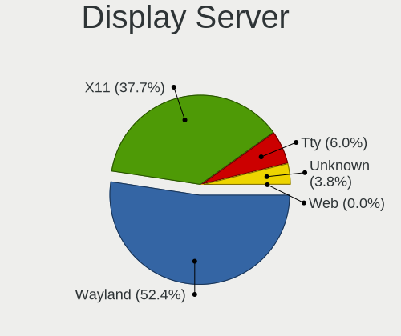
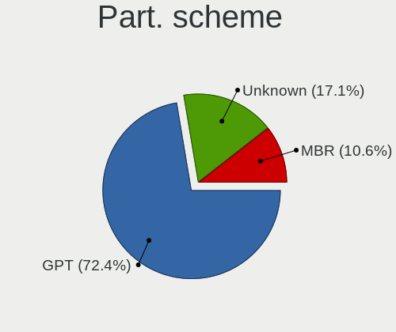
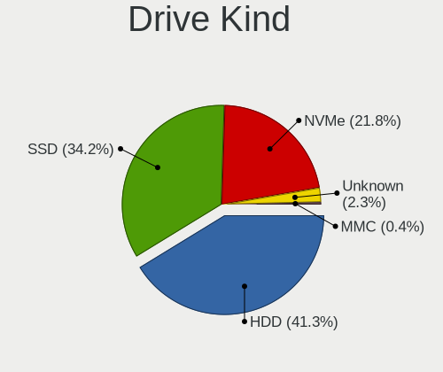
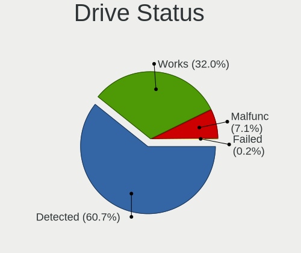
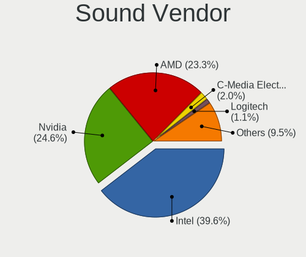
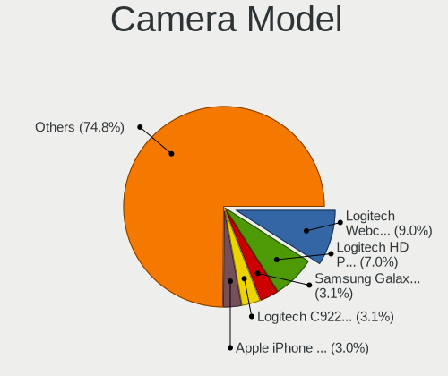

Ubuntu 22.04 - Tested Hardware & Statistics (Desktops)
------------------------------------------------------

A project to collect tested hardware configurations for Ubuntu 22.04.

Anyone can contribute to this report by the [hw-probe](https://github.com/linuxhw/hw-probe) tool:

    sudo -E hw-probe -all -upload

Please contribute! Especially if your hardware is rare.

Contents
--------

* [ Test Cases ](#test-cases)

* [ System ](#system)
  - [ Kernel                   ](#kernel)
  - [ Kernel Family            ](#kernel-family)
  - [ Kernel Major Ver.        ](#kernel-major-ver)
  - [ Arch                     ](#arch)
  - [ DE                       ](#de)
  - [ Display Server           ](#display-server)
  - [ Display Manager          ](#display-manager)
  - [ OS Lang                  ](#os-lang)
  - [ Boot Mode                ](#boot-mode)
  - [ Filesystem               ](#filesystem)
  - [ Part. scheme             ](#part-scheme)
  - [ Dual Boot with Linux/BSD ](#dual-boot-with-linuxbsd)
  - [ Dual Boot (Win)          ](#dual-boot-win)

* [ Board ](#board)
  - [ Vendor                   ](#vendor)
  - [ Model                    ](#model)
  - [ Model Family             ](#model-family)
  - [ MFG Year                 ](#mfg-year)
  - [ Form Factor              ](#form-factor)
  - [ Secure Boot              ](#secure-boot)
  - [ Coreboot                 ](#coreboot)
  - [ RAM Size                 ](#ram-size)
  - [ RAM Used                 ](#ram-used)
  - [ Total Drives             ](#total-drives)
  - [ Has CD-ROM               ](#has-cd-rom)
  - [ Has Ethernet             ](#has-ethernet)
  - [ Has WiFi                 ](#has-wifi)
  - [ Has Bluetooth            ](#has-bluetooth)

* [ Location ](#location)
  - [ Country                  ](#country)
  - [ City                     ](#city)

* [ Drives ](#drives)
  - [ Drive Vendor             ](#drive-vendor)
  - [ Drive Model              ](#drive-model)
  - [ HDD Vendor               ](#hdd-vendor)
  - [ SSD Vendor               ](#ssd-vendor)
  - [ Drive Kind               ](#drive-kind)
  - [ Drive Connector          ](#drive-connector)
  - [ Drive Size               ](#drive-size)
  - [ Space Total              ](#space-total)
  - [ Space Used               ](#space-used)
  - [ Malfunc. Drives          ](#malfunc-drives)
  - [ Malfunc. Drive Vendor    ](#malfunc-drive-vendor)
  - [ Malfunc. HDD Vendor      ](#malfunc-hdd-vendor)
  - [ Malfunc. Drive Kind      ](#malfunc-drive-kind)
  - [ Failed Drives            ](#failed-drives)
  - [ Failed Drive Vendor      ](#failed-drive-vendor)
  - [ Drive Status             ](#drive-status)

* [ Storage controller ](#storage-controller)
  - [ Storage Vendor           ](#storage-vendor)
  - [ Storage Model            ](#storage-model)
  - [ Storage Kind             ](#storage-kind)

* [ Processor ](#processor)
  - [ CPU Vendor               ](#cpu-vendor)
  - [ CPU Model                ](#cpu-model)
  - [ CPU Model Family         ](#cpu-model-family)
  - [ CPU Cores                ](#cpu-cores)
  - [ CPU Sockets              ](#cpu-sockets)
  - [ CPU Threads              ](#cpu-threads)
  - [ CPU Op-Modes             ](#cpu-op-modes)
  - [ CPU Microcode            ](#cpu-microcode)
  - [ CPU Microarch            ](#cpu-microarch)

* [ Graphics ](#graphics)
  - [ GPU Vendor               ](#gpu-vendor)
  - [ GPU Model                ](#gpu-model)
  - [ GPU Combo                ](#gpu-combo)
  - [ GPU Driver               ](#gpu-driver)
  - [ GPU Memory               ](#gpu-memory)

* [ Monitor ](#monitor)
  - [ Monitor Vendor           ](#monitor-vendor)
  - [ Monitor Model            ](#monitor-model)
  - [ Monitor Resolution       ](#monitor-resolution)
  - [ Monitor Diagonal         ](#monitor-diagonal)
  - [ Monitor Width            ](#monitor-width)
  - [ Aspect Ratio             ](#aspect-ratio)
  - [ Monitor Area             ](#monitor-area)
  - [ Pixel Density            ](#pixel-density)
  - [ Multiple Monitors        ](#multiple-monitors)

* [ Network ](#network)
  - [ Net Controller Vendor    ](#net-controller-vendor)
  - [ Net Controller Model     ](#net-controller-model)
  - [ Wireless Vendor          ](#wireless-vendor)
  - [ Wireless Model           ](#wireless-model)
  - [ Ethernet Vendor          ](#ethernet-vendor)
  - [ Ethernet Model           ](#ethernet-model)
  - [ Net Controller Kind      ](#net-controller-kind)
  - [ Used Controller          ](#used-controller)
  - [ NICs                     ](#nics)
  - [ IPv6                     ](#ipv6)

* [ Bluetooth ](#bluetooth)
  - [ Bluetooth Vendor         ](#bluetooth-vendor)
  - [ Bluetooth Model          ](#bluetooth-model)

* [ Sound ](#sound)
  - [ Sound Vendor             ](#sound-vendor)
  - [ Sound Model              ](#sound-model)

* [ Memory ](#memory)
  - [ Memory Vendor            ](#memory-vendor)
  - [ Memory Model             ](#memory-model)
  - [ Memory Kind              ](#memory-kind)
  - [ Memory Form Factor       ](#memory-form-factor)
  - [ Memory Size              ](#memory-size)
  - [ Memory Speed             ](#memory-speed)

* [ Printers & scanners ](#printers--scanners)
  - [ Printer Vendor           ](#printer-vendor)
  - [ Printer Model            ](#printer-model)
  - [ Scanner Vendor           ](#scanner-vendor)
  - [ Scanner Model            ](#scanner-model)

* [ Camera ](#camera)
  - [ Camera Vendor            ](#camera-vendor)
  - [ Camera Model             ](#camera-model)

* [ Security ](#security)
  - [ Fingerprint Vendor       ](#fingerprint-vendor)
  - [ Fingerprint Model        ](#fingerprint-model)
  - [ Chipcard Vendor          ](#chipcard-vendor)
  - [ Chipcard Model           ](#chipcard-model)

* [ Unsupported ](#unsupported)
  - [ Unsupported Devices      ](#unsupported-devices)
  - [ Unsupported Device Types ](#unsupported-device-types)

Test Cases
----------

Total: 2789

| Vendor        | Model                       | Probe                                                      | Date         |
|---------------|-----------------------------|------------------------------------------------------------|--------------|
| MSI           | MS-B0A41                    | [c69ab6fbe8](https://linux-hardware.org/?probe=c69ab6fbe8) | Jan 01, 2023 |
| HP            | 802F                        | [22444b4b2c](https://linux-hardware.org/?probe=22444b4b2c) | Dec 31, 2022 |
| Dell          | 0GWHMW A01                  | [59287847c9](https://linux-hardware.org/?probe=59287847c9) | Dec 31, 2022 |
| ASUSTek       | M5A78L-M/USB3               | [e18f6635d3](https://linux-hardware.org/?probe=e18f6635d3) | Dec 31, 2022 |
| MSI           | Z170A GAMING PRO CARBON     | [7c96c6776e](https://linux-hardware.org/?probe=7c96c6776e) | Dec 31, 2022 |
| Medion        | MS-7728                     | [3d6078552c](https://linux-hardware.org/?probe=3d6078552c) | Dec 31, 2022 |
| AZW           | U59                         | [39f0dfe71f](https://linux-hardware.org/?probe=39f0dfe71f) | Dec 31, 2022 |
| Intel         | DB75EN AAG39650-400         | [086831bbca](https://linux-hardware.org/?probe=086831bbca) | Dec 31, 2022 |
| MSI           | MPG Z490 GAMING PLUS        | [b4aecf5fa1](https://linux-hardware.org/?probe=b4aecf5fa1) | Dec 31, 2022 |
| ASRock        | B450 Gaming-ITX/ac          | [afdda0ad31](https://linux-hardware.org/?probe=afdda0ad31) | Dec 31, 2022 |
| ASRock        | B450 Gaming-ITX/ac          | [3659d7377d](https://linux-hardware.org/?probe=3659d7377d) | Dec 31, 2022 |
| ASUSTek       | P5Q-PRO                     | [cec0830928](https://linux-hardware.org/?probe=cec0830928) | Dec 31, 2022 |
| Gigabyte      | GA-MA785GMT-UD2H            | [c4059f2954](https://linux-hardware.org/?probe=c4059f2954) | Dec 31, 2022 |
| Dell          | 0GDG8Y A00                  | [8c8e9d66e7](https://linux-hardware.org/?probe=8c8e9d66e7) | Dec 30, 2022 |
| Dell          | 0XPDFK A01                  | [37d47ff0dc](https://linux-hardware.org/?probe=37d47ff0dc) | Dec 30, 2022 |
| Gigabyte      | A320M-H-CF                  | [b4511daea8](https://linux-hardware.org/?probe=b4511daea8) | Dec 30, 2022 |
| MSI           | Z87-G45 GAMING              | [c2d592a9e5](https://linux-hardware.org/?probe=c2d592a9e5) | Dec 30, 2022 |
| Acer          | Aspire XC-1660 V:1.1        | [9c4b578c67](https://linux-hardware.org/?probe=9c4b578c67) | Dec 30, 2022 |
| MSI           | H61M-P22                    | [23b5356c0a](https://linux-hardware.org/?probe=23b5356c0a) | Dec 30, 2022 |
| ASRock        | 960GM-GS3 FX                | [1d8b5f0509](https://linux-hardware.org/?probe=1d8b5f0509) | Dec 30, 2022 |
| Acer          | Aspire XC-1660 V:1.1        | [c352c59c64](https://linux-hardware.org/?probe=c352c59c64) | Dec 30, 2022 |
| ASUSTek       | G10DK                       | [5a5172ad44](https://linux-hardware.org/?probe=5a5172ad44) | Dec 30, 2022 |
| Gigabyte      | B450M DS3H-CF               | [47f838ca34](https://linux-hardware.org/?probe=47f838ca34) | Dec 30, 2022 |
| ASUSTek       | ROG STRIX X570-I GAMING     | [a634defd54](https://linux-hardware.org/?probe=a634defd54) | Dec 30, 2022 |
| ASUSTek       | PRIME Z690M-PLUS D4         | [b1bfc3d1ff](https://linux-hardware.org/?probe=b1bfc3d1ff) | Dec 30, 2022 |
| Intel         | X99                         | [ad6b288b38](https://linux-hardware.org/?probe=ad6b288b38) | Dec 30, 2022 |
| ASUSTek       | PRIME X399-A                | [d8ae46ad2b](https://linux-hardware.org/?probe=d8ae46ad2b) | Dec 30, 2022 |
| BESSTAR Te... | C-J34 Pro                   | [1b54a52c3c](https://linux-hardware.org/?probe=1b54a52c3c) | Dec 30, 2022 |
| ASUSTek       | G10DK                       | [26e2460b8d](https://linux-hardware.org/?probe=26e2460b8d) | Dec 29, 2022 |
| ASUSTek       | H81M-A                      | [10f0b28589](https://linux-hardware.org/?probe=10f0b28589) | Dec 29, 2022 |
| Gigabyte      | Z97M-DS3H                   | [9b264f00f0](https://linux-hardware.org/?probe=9b264f00f0) | Dec 29, 2022 |
| HP            | ProLiant ML110 Gen9         | [ea9aef1e8d](https://linux-hardware.org/?probe=ea9aef1e8d) | Dec 29, 2022 |
| HP            | 158A                        | [bfd338cf36](https://linux-hardware.org/?probe=bfd338cf36) | Dec 29, 2022 |
| HP            | ProLiant ML110 Gen9         | [728793a92a](https://linux-hardware.org/?probe=728793a92a) | Dec 29, 2022 |
| Pegatron      | 2AC2                        | [adc3978bcc](https://linux-hardware.org/?probe=adc3978bcc) | Dec 29, 2022 |
| Acer          | Aspire M3920                | [49cb4f51a8](https://linux-hardware.org/?probe=49cb4f51a8) | Dec 28, 2022 |
| Dell          | 0JP3NX A01                  | [3b094471e0](https://linux-hardware.org/?probe=3b094471e0) | Dec 28, 2022 |
| Intel         | X99                         | [eb6babb799](https://linux-hardware.org/?probe=eb6babb799) | Dec 28, 2022 |
| ASUSTek       | G10DK                       | [1ffb248d93](https://linux-hardware.org/?probe=1ffb248d93) | Dec 28, 2022 |
| Fujitsu       | D3161-A1 S26361-D3161-A1    | [efa2d6986f](https://linux-hardware.org/?probe=efa2d6986f) | Dec 28, 2022 |
| Lanix         | P55M-UD2 LNXACT             | [5575ce838c](https://linux-hardware.org/?probe=5575ce838c) | Dec 28, 2022 |
| HP            | 0A54h                       | [7f1e1152d9](https://linux-hardware.org/?probe=7f1e1152d9) | Dec 28, 2022 |
| MSI           | Z270 PC MATE                | [08186ccafe](https://linux-hardware.org/?probe=08186ccafe) | Dec 28, 2022 |
| ASRock        | B75 Pro3-M                  | [108f0c24de](https://linux-hardware.org/?probe=108f0c24de) | Dec 28, 2022 |
| ASUSTek       | ROG STRIX B550-F GAMING     | [6297565fda](https://linux-hardware.org/?probe=6297565fda) | Dec 28, 2022 |
| MSI           | Z370 PC PRO                 | [367bcf2d16](https://linux-hardware.org/?probe=367bcf2d16) | Dec 28, 2022 |
| Dell          | 0HY9JP A01                  | [97a3e6ce9d](https://linux-hardware.org/?probe=97a3e6ce9d) | Dec 28, 2022 |
| ASUSTek       | PRIME A320M-K               | [20c0841830](https://linux-hardware.org/?probe=20c0841830) | Dec 28, 2022 |
| HP            | 1905                        | [5c576316f8](https://linux-hardware.org/?probe=5c576316f8) | Dec 28, 2022 |
| Gigabyte      | A320M-H-CF                  | [aff2b93aa5](https://linux-hardware.org/?probe=aff2b93aa5) | Dec 28, 2022 |
| Gigabyte      | Z590 AORUS PRO AX           | [d680b8dd2a](https://linux-hardware.org/?probe=d680b8dd2a) | Dec 28, 2022 |
| ASRock        | B450M Pro4                  | [fcaf938a12](https://linux-hardware.org/?probe=fcaf938a12) | Dec 28, 2022 |
| Acer          | Aspire M3970                | [c2232f44d6](https://linux-hardware.org/?probe=c2232f44d6) | Dec 27, 2022 |
| ASUSTek       | H97I-PLUS                   | [8f039f1be9](https://linux-hardware.org/?probe=8f039f1be9) | Dec 27, 2022 |
| ASUSTek       | ROG STRIX B550-F GAMING     | [41b062ea94](https://linux-hardware.org/?probe=41b062ea94) | Dec 27, 2022 |
| Gigabyte      | H270-HD3-CF                 | [031a62faa8](https://linux-hardware.org/?probe=031a62faa8) | Dec 27, 2022 |
| Dell          | 0PTTT9 A01                  | [78512365ca](https://linux-hardware.org/?probe=78512365ca) | Dec 26, 2022 |
| NCR           | Pocono                      | [d50ad710fb](https://linux-hardware.org/?probe=d50ad710fb) | Dec 26, 2022 |
| Gigabyte      | M61SME-S2                   | [5d0485ba40](https://linux-hardware.org/?probe=5d0485ba40) | Dec 26, 2022 |
| ASUSTek       | G10DK                       | [30007c6ff0](https://linux-hardware.org/?probe=30007c6ff0) | Dec 26, 2022 |
| Gigabyte      | M61SME-S2                   | [d68451099d](https://linux-hardware.org/?probe=d68451099d) | Dec 26, 2022 |
| ASUSTek       | M5A78L-M LX3                | [aef3959b18](https://linux-hardware.org/?probe=aef3959b18) | Dec 26, 2022 |
| Gigabyte      | GB-BRR7H-4700               | [43c2d92e5f](https://linux-hardware.org/?probe=43c2d92e5f) | Dec 26, 2022 |
| ASUSTek       | TUF Gaming X570-PLUS        | [eda96539d7](https://linux-hardware.org/?probe=eda96539d7) | Dec 26, 2022 |
| HP            | 1495                        | [b8e1dc67eb](https://linux-hardware.org/?probe=b8e1dc67eb) | Dec 26, 2022 |
| ASUSTek       | TUF Gaming B550M-PLUS WI... | [b181e9e5a3](https://linux-hardware.org/?probe=b181e9e5a3) | Dec 26, 2022 |
| Unknown       | HX90                        | [d4265ad971](https://linux-hardware.org/?probe=d4265ad971) | Dec 26, 2022 |
| Gigabyte      | Z97M-DS3H                   | [02f55ff55b](https://linux-hardware.org/?probe=02f55ff55b) | Dec 26, 2022 |
| HP            | 304Ah                       | [6106d55390](https://linux-hardware.org/?probe=6106d55390) | Dec 26, 2022 |
| MSI           | B350 KRAIT GAMING           | [896aebf101](https://linux-hardware.org/?probe=896aebf101) | Dec 25, 2022 |
| Gigabyte      | H61M-S1                     | [384000d018](https://linux-hardware.org/?probe=384000d018) | Dec 25, 2022 |
| ASRock        | H110 Pro BTC+               | [29311fe64c](https://linux-hardware.org/?probe=29311fe64c) | Dec 25, 2022 |
| Gateway       | G33M05G1 MP                 | [8a495d2b75](https://linux-hardware.org/?probe=8a495d2b75) | Dec 25, 2022 |
| Lenovo        | 102F SBB0J05441 WIN 3305... | [fee0a76158](https://linux-hardware.org/?probe=fee0a76158) | Dec 25, 2022 |
| MSI           | Boston                      | [5ffbd4e9a5](https://linux-hardware.org/?probe=5ffbd4e9a5) | Dec 25, 2022 |
| Dell          | 0MN1TX A02                  | [513af674c0](https://linux-hardware.org/?probe=513af674c0) | Dec 25, 2022 |
| HP            | ProLiant ML110 Gen9         | [90bb379f4e](https://linux-hardware.org/?probe=90bb379f4e) | Dec 25, 2022 |
| ASRock        | Z390 Phantom Gaming 6       | [61be8271df](https://linux-hardware.org/?probe=61be8271df) | Dec 25, 2022 |
| Foxconn       | 2ADA                        | [7a7d8227ee](https://linux-hardware.org/?probe=7a7d8227ee) | Dec 25, 2022 |
| ASUSTek       | PRIME A320M-K               | [1762f53462](https://linux-hardware.org/?probe=1762f53462) | Dec 25, 2022 |
| ASRock        | H110 Pro BTC+               | [90f3fd2f80](https://linux-hardware.org/?probe=90f3fd2f80) | Dec 25, 2022 |
| ASUSTek       | G10DK                       | [13379a69a6](https://linux-hardware.org/?probe=13379a69a6) | Dec 25, 2022 |
| ASUSTek       | P7H55-M PRO                 | [b445490856](https://linux-hardware.org/?probe=b445490856) | Dec 25, 2022 |
| ASUSTek       | PRIME B450M-GAMING/BR       | [e12a45a65f](https://linux-hardware.org/?probe=e12a45a65f) | Dec 25, 2022 |
| ASUSTek       | PRIME B450M-GAMING/BR       | [4f28247dcb](https://linux-hardware.org/?probe=4f28247dcb) | Dec 25, 2022 |
| Lenovo        | SHARKBAY 0B98401 WIN        | [0900400806](https://linux-hardware.org/?probe=0900400806) | Dec 25, 2022 |
| Dell          | 040DDP A01                  | [2fc87b6525](https://linux-hardware.org/?probe=2fc87b6525) | Dec 25, 2022 |
| Supermicro    | C2SBX                       | [1b275899d5](https://linux-hardware.org/?probe=1b275899d5) | Dec 25, 2022 |
| ASUSTek       | TUF Gaming X570-PLUS        | [571019b4b2](https://linux-hardware.org/?probe=571019b4b2) | Dec 25, 2022 |
| Dell          | 0D6H9T A00                  | [778c642778](https://linux-hardware.org/?probe=778c642778) | Dec 25, 2022 |
| Dell          | 0D6H9T A00                  | [ef62b12cdb](https://linux-hardware.org/?probe=ef62b12cdb) | Dec 24, 2022 |
| ASUSTek       | PRIME B450M-A               | [1fc8c5a4d4](https://linux-hardware.org/?probe=1fc8c5a4d4) | Dec 24, 2022 |
| ASUSTek       | P8H67-M LE                  | [892d40f349](https://linux-hardware.org/?probe=892d40f349) | Dec 24, 2022 |
| ASUSTek       | ROG STRIX X570-E GAMING     | [2e23d15c25](https://linux-hardware.org/?probe=2e23d15c25) | Dec 24, 2022 |
| Gigabyte      | Z390 M GAMING-CF            | [7edfc4df26](https://linux-hardware.org/?probe=7edfc4df26) | Dec 24, 2022 |
| Gigabyte      | Z390 M GAMING-CF            | [7f19b0ef63](https://linux-hardware.org/?probe=7f19b0ef63) | Dec 24, 2022 |
| ASUSTek       | P8H67-M LE                  | [7517437358](https://linux-hardware.org/?probe=7517437358) | Dec 24, 2022 |
| Gigabyte      | B550 AORUS ELITE AX V2      | [5047d29893](https://linux-hardware.org/?probe=5047d29893) | Dec 24, 2022 |
| MSI           | TRX40 PRO 10G               | [f83cf989ef](https://linux-hardware.org/?probe=f83cf989ef) | Dec 24, 2022 |
| ASUSTek       | M5A78L-M/USB3               | [3dce1a76e7](https://linux-hardware.org/?probe=3dce1a76e7) | Dec 24, 2022 |
| Dell          | 0NW6H5 A00                  | [6c7eeae2e3](https://linux-hardware.org/?probe=6c7eeae2e3) | Dec 23, 2022 |
| Dell          | 0PTTT9 A01                  | [4618f09759](https://linux-hardware.org/?probe=4618f09759) | Dec 23, 2022 |
| MSI           | Z270 TOMAHAWK               | [b721ac26e2](https://linux-hardware.org/?probe=b721ac26e2) | Dec 23, 2022 |
| ASUSTek       | ROG STRIX Z690-A GAMING ... | [7fe5933133](https://linux-hardware.org/?probe=7fe5933133) | Dec 23, 2022 |
| Dell          | 0WMJ54 A01                  | [b0b07249ae](https://linux-hardware.org/?probe=b0b07249ae) | Dec 23, 2022 |
| ASRock        | N68-GE3 UCC                 | [2892951c9c](https://linux-hardware.org/?probe=2892951c9c) | Dec 23, 2022 |
| MSI           | H510M BOMBER                | [bb7a4c8457](https://linux-hardware.org/?probe=bb7a4c8457) | Dec 23, 2022 |
| MSI           | A78M-E35                    | [8eeb54e414](https://linux-hardware.org/?probe=8eeb54e414) | Dec 23, 2022 |
| ASRock        | Z97 Anniversary             | [c4e60094f3](https://linux-hardware.org/?probe=c4e60094f3) | Dec 23, 2022 |
| Dell          | 05GD68 A00                  | [a868fc6557](https://linux-hardware.org/?probe=a868fc6557) | Dec 23, 2022 |
| ASUSTek       | ROG CROSSHAIR VIII HERO     | [23f2e15649](https://linux-hardware.org/?probe=23f2e15649) | Dec 22, 2022 |
| ASUSTek       | PRIME A320M-K               | [61b7eaac72](https://linux-hardware.org/?probe=61b7eaac72) | Dec 22, 2022 |
| Lenovo        | SHARKBAY 0B98401 PRO        | [08d715eaea](https://linux-hardware.org/?probe=08d715eaea) | Dec 22, 2022 |
| ASRock        | A320M-HD                    | [5307c53c91](https://linux-hardware.org/?probe=5307c53c91) | Dec 22, 2022 |
| ASUSTek       | ROG Maximus Z790 HERO       | [e486047e83](https://linux-hardware.org/?probe=e486047e83) | Dec 22, 2022 |
| Dell          | 00V62H A01                  | [296edfbde5](https://linux-hardware.org/?probe=296edfbde5) | Dec 22, 2022 |
| Lenovo        | 310B SDK0J40705 WIN 3425... | [abb4201228](https://linux-hardware.org/?probe=abb4201228) | Dec 22, 2022 |
| ASRock        | N68-GE3 UCC                 | [ddc35a5b0d](https://linux-hardware.org/?probe=ddc35a5b0d) | Dec 22, 2022 |
| ASRock        | FM2A75 Pro4                 | [88062c13c8](https://linux-hardware.org/?probe=88062c13c8) | Dec 22, 2022 |
| Dell          | 05GD68 A00                  | [4589f84dfd](https://linux-hardware.org/?probe=4589f84dfd) | Dec 21, 2022 |
| MSI           | H97M-G43                    | [a34bd69442](https://linux-hardware.org/?probe=a34bd69442) | Dec 21, 2022 |
| eMachines     | ET1331                      | [0f9b49ac6e](https://linux-hardware.org/?probe=0f9b49ac6e) | Dec 21, 2022 |
| MSI           | A320M-A PRO                 | [88eb56085f](https://linux-hardware.org/?probe=88eb56085f) | Dec 21, 2022 |
| Gigabyte      | H170M-DS3H-CF               | [714dafad38](https://linux-hardware.org/?probe=714dafad38) | Dec 21, 2022 |
| MSI           | MAG B560M MORTAR            | [9b1e668d0a](https://linux-hardware.org/?probe=9b1e668d0a) | Dec 21, 2022 |
| ASUSTek       | PRIME B250-PLUS             | [4d24d45918](https://linux-hardware.org/?probe=4d24d45918) | Dec 21, 2022 |
| Gigabyte      | B550 AORUS PRO AC           | [cfeb9545a3](https://linux-hardware.org/?probe=cfeb9545a3) | Dec 21, 2022 |
| MSI           | B250M GAMING PRO            | [76fd6916b6](https://linux-hardware.org/?probe=76fd6916b6) | Dec 21, 2022 |
| Lenovo        | ThinkCentre A62 9486E4S     | [cb7cb7b7d7](https://linux-hardware.org/?probe=cb7cb7b7d7) | Dec 21, 2022 |
| MSI           | B250M GAMING PRO            | [9ae81949ed](https://linux-hardware.org/?probe=9ae81949ed) | Dec 21, 2022 |
| MSI           | B250M GAMING PRO            | [15f51cd9d9](https://linux-hardware.org/?probe=15f51cd9d9) | Dec 21, 2022 |
| Gigabyte      | B75M-D3H                    | [77bf96f401](https://linux-hardware.org/?probe=77bf96f401) | Dec 20, 2022 |
| ASUSTek       | ROG CROSSHAIR VIII HERO     | [17630a4351](https://linux-hardware.org/?probe=17630a4351) | Dec 20, 2022 |
| ASUSTek       | Maximus VIII RANGER         | [8a09a51987](https://linux-hardware.org/?probe=8a09a51987) | Dec 20, 2022 |
| Alienware     | 07JNH0 A02                  | [558828391f](https://linux-hardware.org/?probe=558828391f) | Dec 20, 2022 |
| ASUSTek       | H81M-C                      | [9ae92c3b1e](https://linux-hardware.org/?probe=9ae92c3b1e) | Dec 20, 2022 |
| Dell          | 0Y2K8N A00                  | [840fbab6e4](https://linux-hardware.org/?probe=840fbab6e4) | Dec 20, 2022 |
| Gigabyte      | H61M-S2V-B3                 | [1f8d567742](https://linux-hardware.org/?probe=1f8d567742) | Dec 20, 2022 |
| Gigabyte      | Z690 AORUS PRO              | [dd024e0315](https://linux-hardware.org/?probe=dd024e0315) | Dec 20, 2022 |
| ASUSTek       | PRIME X570-PRO              | [6a731c5c9b](https://linux-hardware.org/?probe=6a731c5c9b) | Dec 20, 2022 |
| Dell          | 0D6H9T A03                  | [835cdeea5e](https://linux-hardware.org/?probe=835cdeea5e) | Dec 19, 2022 |
| HP            | 0AA8h                       | [f04f3c4d42](https://linux-hardware.org/?probe=f04f3c4d42) | Dec 19, 2022 |
| Gigabyte      | Z170X-Gaming 7              | [d7a2fa6abf](https://linux-hardware.org/?probe=d7a2fa6abf) | Dec 19, 2022 |
| Gigabyte      | B85-HD3                     | [a8d78baa67](https://linux-hardware.org/?probe=a8d78baa67) | Dec 19, 2022 |
| ASRock        | Z170 Extreme6+              | [74b4357180](https://linux-hardware.org/?probe=74b4357180) | Dec 19, 2022 |
| MSI           | B350 PC MATE                | [9bdee62034](https://linux-hardware.org/?probe=9bdee62034) | Dec 19, 2022 |
| ASUSTek       | PRIME X570-PRO              | [cc8dd14279](https://linux-hardware.org/?probe=cc8dd14279) | Dec 19, 2022 |
| Lenovo        | ThinkCentre A62 9486E4S     | [fcd0306cd3](https://linux-hardware.org/?probe=fcd0306cd3) | Dec 19, 2022 |
| MSI           | X399 SLI PLUS               | [fdf00892eb](https://linux-hardware.org/?probe=fdf00892eb) | Dec 19, 2022 |
| Gigabyte      | 970A-UD3P                   | [7d5ca26325](https://linux-hardware.org/?probe=7d5ca26325) | Dec 19, 2022 |
| Gigabyte      | 970A-UD3P                   | [0690e94fd6](https://linux-hardware.org/?probe=0690e94fd6) | Dec 19, 2022 |
| ASUSTek       | Z170 PRO GAMING             | [e964534175](https://linux-hardware.org/?probe=e964534175) | Dec 19, 2022 |
| ASUSTek       | Z170 PRO GAMING             | [d367461182](https://linux-hardware.org/?probe=d367461182) | Dec 19, 2022 |
| ASUSTek       | H170-PRO                    | [3d866a7ec8](https://linux-hardware.org/?probe=3d866a7ec8) | Dec 19, 2022 |
| ASRock        | H110 Pro BTC+               | [b44ba7da8e](https://linux-hardware.org/?probe=b44ba7da8e) | Dec 19, 2022 |
| HP            | 8597                        | [5a7ae7c6d7](https://linux-hardware.org/?probe=5a7ae7c6d7) | Dec 19, 2022 |
| Gigabyte      | B650M GAMING X AX           | [01b7250cea](https://linux-hardware.org/?probe=01b7250cea) | Dec 19, 2022 |
| Gigabyte      | B650M GAMING X AX           | [999cbfe9f7](https://linux-hardware.org/?probe=999cbfe9f7) | Dec 19, 2022 |
| HP            | 18E7                        | [9f601a9f1a](https://linux-hardware.org/?probe=9f601a9f1a) | Dec 19, 2022 |
| ASUSTek       | Z87-A                       | [17c2f5c3b2](https://linux-hardware.org/?probe=17c2f5c3b2) | Dec 19, 2022 |
| Gigabyte      | Z490 AORUS XTREME WF        | [7020686bc7](https://linux-hardware.org/?probe=7020686bc7) | Dec 19, 2022 |
| Intel         | DH61BE AAG14062-206         | [88125550fb](https://linux-hardware.org/?probe=88125550fb) | Dec 19, 2022 |
| HP            | 0AA8h                       | [0c11d6bb2a](https://linux-hardware.org/?probe=0c11d6bb2a) | Dec 18, 2022 |
| Gigabyte      | 970A-DS3P                   | [6870f7c47f](https://linux-hardware.org/?probe=6870f7c47f) | Dec 18, 2022 |
| Dell          | 0M858N A00                  | [2eb73cbb7a](https://linux-hardware.org/?probe=2eb73cbb7a) | Dec 18, 2022 |
| Intel         | HM570                       | [627a39bc3f](https://linux-hardware.org/?probe=627a39bc3f) | Dec 18, 2022 |
| Alienware     | 02XRCM A02                  | [ece4e302f1](https://linux-hardware.org/?probe=ece4e302f1) | Dec 18, 2022 |
| Intel         | HM570                       | [303e68f585](https://linux-hardware.org/?probe=303e68f585) | Dec 18, 2022 |
| ASUSTek       | ProArt Z690-CREATOR WIFI    | [bdea23d60e](https://linux-hardware.org/?probe=bdea23d60e) | Dec 18, 2022 |
| MSI           | X470 GAMING PLUS MAX        | [41da62e6ca](https://linux-hardware.org/?probe=41da62e6ca) | Dec 18, 2022 |
| ASRock        | AM1H-ITX                    | [88fc771e47](https://linux-hardware.org/?probe=88fc771e47) | Dec 18, 2022 |
| MSI           | B250M PRO-VDH               | [14ea50f3b2](https://linux-hardware.org/?probe=14ea50f3b2) | Dec 18, 2022 |
| ASUSTek       | ROG Maximus XI HERO         | [0d4ba683ce](https://linux-hardware.org/?probe=0d4ba683ce) | Dec 18, 2022 |
| HP            | ProLiant ML350 G6           | [58113862ee](https://linux-hardware.org/?probe=58113862ee) | Dec 18, 2022 |
| ASUSTek       | TUF Gaming B550M-PLUS       | [caaddcd344](https://linux-hardware.org/?probe=caaddcd344) | Dec 18, 2022 |
| Intel         | DH55TC AAE70932-303         | [631f80f725](https://linux-hardware.org/?probe=631f80f725) | Dec 18, 2022 |
| Intel         | DG31PR AAD97573-206         | [3684f593d4](https://linux-hardware.org/?probe=3684f593d4) | Dec 18, 2022 |
| Lenovo        | 3716 SDK0T76461 WIN 3422... | [15f724ada5](https://linux-hardware.org/?probe=15f724ada5) | Dec 18, 2022 |
| HP            | 8054                        | [a43a5ed0ec](https://linux-hardware.org/?probe=a43a5ed0ec) | Dec 18, 2022 |
| MSI           | H310M PRO-VDH PLUS          | [694e433518](https://linux-hardware.org/?probe=694e433518) | Dec 18, 2022 |
| MSI           | H310M PRO-VDH PLUS          | [801a4e21c6](https://linux-hardware.org/?probe=801a4e21c6) | Dec 18, 2022 |
| MSI           | MS-7360                     | [2f5a9baf11](https://linux-hardware.org/?probe=2f5a9baf11) | Dec 18, 2022 |
| MSI           | A78M-E35                    | [e67bafe6b9](https://linux-hardware.org/?probe=e67bafe6b9) | Dec 18, 2022 |
| ASUSTek       | P8Z77-V LK                  | [c106327357](https://linux-hardware.org/?probe=c106327357) | Dec 18, 2022 |
| ASUSTek       | PRIME H370M-PLUS            | [784f59e142](https://linux-hardware.org/?probe=784f59e142) | Dec 18, 2022 |
| Dell          | 0Y2MRG A00                  | [e5525b45b5](https://linux-hardware.org/?probe=e5525b45b5) | Dec 18, 2022 |
| ASUSTek       | ProArt Z690-CREATOR WIFI    | [a69cb4caca](https://linux-hardware.org/?probe=a69cb4caca) | Dec 17, 2022 |
| Dell          | 0CRH6C A02                  | [4072754835](https://linux-hardware.org/?probe=4072754835) | Dec 17, 2022 |
| ASUSTek       | ROG CROSSHAIR VIII FORMU... | [fa03fe621a](https://linux-hardware.org/?probe=fa03fe621a) | Dec 17, 2022 |
| ASUSTek       | ROG CROSSHAIR VIII FORMU... | [8480834751](https://linux-hardware.org/?probe=8480834751) | Dec 17, 2022 |
| ASUSTek       | ROG STRIX X470-F GAMING     | [67d1ddeefb](https://linux-hardware.org/?probe=67d1ddeefb) | Dec 17, 2022 |
| ASRock        | Z77 Pro4                    | [42cd781d07](https://linux-hardware.org/?probe=42cd781d07) | Dec 17, 2022 |
| Gigabyte      | F2A55M-DS2                  | [a38c2f49be](https://linux-hardware.org/?probe=a38c2f49be) | Dec 17, 2022 |
| ASUSTek       | PRIME Q270M-C               | [7dca31fdef](https://linux-hardware.org/?probe=7dca31fdef) | Dec 17, 2022 |
| MSI           | PRO B660M-E DDR4            | [3f4e01746b](https://linux-hardware.org/?probe=3f4e01746b) | Dec 17, 2022 |
| ASUSTek       | PRIME A320M-K               | [de0a127527](https://linux-hardware.org/?probe=de0a127527) | Dec 16, 2022 |
| Fujitsu       | D3221-A1 S26361-D3221-A1    | [25ba267a65](https://linux-hardware.org/?probe=25ba267a65) | Dec 16, 2022 |
| ASUSTek       | PRIME A320M-K               | [515785c9c4](https://linux-hardware.org/?probe=515785c9c4) | Dec 16, 2022 |
| HP            | 18E5                        | [528d66c15d](https://linux-hardware.org/?probe=528d66c15d) | Dec 16, 2022 |
| Acer          | Veriton X2631G V:1.0        | [14d39a67c2](https://linux-hardware.org/?probe=14d39a67c2) | Dec 16, 2022 |
| Acer          | Veriton X2631G V:1.0        | [fc99e84afd](https://linux-hardware.org/?probe=fc99e84afd) | Dec 16, 2022 |
| MSI           | B450I GAMING PLUS AC        | [59a22369a1](https://linux-hardware.org/?probe=59a22369a1) | Dec 16, 2022 |
| Dell          | 0JP3NX A00                  | [42e507bf45](https://linux-hardware.org/?probe=42e507bf45) | Dec 16, 2022 |
| Pegatron      | IPXSB-H61                   | [84c0b45a3b](https://linux-hardware.org/?probe=84c0b45a3b) | Dec 15, 2022 |
| Dell          | 0MWYPT A00                  | [c98325eaf6](https://linux-hardware.org/?probe=c98325eaf6) | Dec 15, 2022 |
| ASRock        | H110 Pro BTC+               | [9821ed300c](https://linux-hardware.org/?probe=9821ed300c) | Dec 15, 2022 |
| ASRock        | FM2A78 Pro4+                | [51ea57e65f](https://linux-hardware.org/?probe=51ea57e65f) | Dec 15, 2022 |
| Dell          | 0T10XW A02                  | [fc500e5a8a](https://linux-hardware.org/?probe=fc500e5a8a) | Dec 15, 2022 |
| Fujitsu       | D3161-A1 S26361-D3161-A1    | [70436ae3c3](https://linux-hardware.org/?probe=70436ae3c3) | Dec 15, 2022 |
| Fujitsu       | D3161-A1 S26361-D3161-A1    | [4c5bac90eb](https://linux-hardware.org/?probe=4c5bac90eb) | Dec 15, 2022 |
| HP            | 18E7                        | [73089d9a48](https://linux-hardware.org/?probe=73089d9a48) | Dec 15, 2022 |
| Lenovo        | 36D5 SDK0J40700 WIN 3258... | [989f3b31ed](https://linux-hardware.org/?probe=989f3b31ed) | Dec 15, 2022 |
| ASUSTek       | TUF Gaming X570-PLUS        | [d872d58e4c](https://linux-hardware.org/?probe=d872d58e4c) | Dec 15, 2022 |
| Gigabyte      | 970A-D3P                    | [d09b578699](https://linux-hardware.org/?probe=d09b578699) | Dec 15, 2022 |
| Dell          | 04YP6J A02                  | [8753f49245](https://linux-hardware.org/?probe=8753f49245) | Dec 15, 2022 |
| Dell          | 0P01GV A03                  | [c93a41cd19](https://linux-hardware.org/?probe=c93a41cd19) | Dec 15, 2022 |
| Dell          | 0P01GV A03                  | [36fe86fce6](https://linux-hardware.org/?probe=36fe86fce6) | Dec 15, 2022 |
| MiTAC         | PD10EHI                     | [d62826c4b8](https://linux-hardware.org/?probe=d62826c4b8) | Dec 15, 2022 |
| ASRock        | A320M-HDV R4.0              | [b90d5cfed0](https://linux-hardware.org/?probe=b90d5cfed0) | Dec 14, 2022 |
| MSI           | B450 GAMING PLUS MAX        | [a303a5f509](https://linux-hardware.org/?probe=a303a5f509) | Dec 14, 2022 |
| ASRock        | H310CM-HDV                  | [8f21b4e9c9](https://linux-hardware.org/?probe=8f21b4e9c9) | Dec 14, 2022 |
| ASRock        | H310CM-HDV                  | [b3c5f73f5a](https://linux-hardware.org/?probe=b3c5f73f5a) | Dec 14, 2022 |
| Fujitsu       | D3544-A1 S26361-D3544-A1... | [75180b50a8](https://linux-hardware.org/?probe=75180b50a8) | Dec 14, 2022 |
| Dell          | 0HY9JP A00                  | [121d71b379](https://linux-hardware.org/?probe=121d71b379) | Dec 14, 2022 |
| HP            | ProLiant ML110 Gen9         | [3326c90617](https://linux-hardware.org/?probe=3326c90617) | Dec 14, 2022 |
| Dell          | 0GX297                      | [dbc7c02e0c](https://linux-hardware.org/?probe=dbc7c02e0c) | Dec 14, 2022 |
| ASRock        | Z490M Pro4                  | [2ace77f72c](https://linux-hardware.org/?probe=2ace77f72c) | Dec 14, 2022 |
| Gigabyte      | B560M AORUS PRO AX          | [32a9ae4611](https://linux-hardware.org/?probe=32a9ae4611) | Dec 14, 2022 |
| ASRock        | Z490M Pro4                  | [0b91c8c70f](https://linux-hardware.org/?probe=0b91c8c70f) | Dec 14, 2022 |
| Foxconn       | 17A0                        | [4518247b07](https://linux-hardware.org/?probe=4518247b07) | Dec 14, 2022 |
| Dell          | 0R6PCT A01                  | [c0c28e38d0](https://linux-hardware.org/?probe=c0c28e38d0) | Dec 14, 2022 |
| ASRock        | FM2A78 Pro4+                | [cb63c9ad7f](https://linux-hardware.org/?probe=cb63c9ad7f) | Dec 14, 2022 |
| HP            | 2AF7                        | [089612dee6](https://linux-hardware.org/?probe=089612dee6) | Dec 14, 2022 |
| Dell          | 0KJCC5 A00                  | [7d1ece638c](https://linux-hardware.org/?probe=7d1ece638c) | Dec 14, 2022 |
| Gigabyte      | B460M DS3H                  | [8a381fe525](https://linux-hardware.org/?probe=8a381fe525) | Dec 14, 2022 |
| Gigabyte      | B460M DS3H                  | [90b4e5f1b2](https://linux-hardware.org/?probe=90b4e5f1b2) | Dec 14, 2022 |
| HP            | 2AF7                        | [2c6c08c8b8](https://linux-hardware.org/?probe=2c6c08c8b8) | Dec 14, 2022 |
| ASUSTek       | P8B75-M                     | [936608196d](https://linux-hardware.org/?probe=936608196d) | Dec 14, 2022 |
| HP            | 18E7                        | [72653a6543](https://linux-hardware.org/?probe=72653a6543) | Dec 14, 2022 |
| MSI           | H310M PRO-VDH PLUS          | [b689ad7485](https://linux-hardware.org/?probe=b689ad7485) | Dec 14, 2022 |
| MSI           | H310M PRO-VDH PLUS          | [77122db3dc](https://linux-hardware.org/?probe=77122db3dc) | Dec 14, 2022 |
| MSI           | B450 GAMING PLUS MAX        | [d2390a9db1](https://linux-hardware.org/?probe=d2390a9db1) | Dec 14, 2022 |
| MSI           | B450 GAMING PLUS MAX        | [0a5e642184](https://linux-hardware.org/?probe=0a5e642184) | Dec 13, 2022 |
| Gigabyte      | B75M-D3H                    | [f522fb6cbd](https://linux-hardware.org/?probe=f522fb6cbd) | Dec 13, 2022 |
| Gigabyte      | B75M-D3H                    | [4de5804244](https://linux-hardware.org/?probe=4de5804244) | Dec 13, 2022 |
| ASUSTek       | P8H77-M                     | [32901a2ae5](https://linux-hardware.org/?probe=32901a2ae5) | Dec 13, 2022 |
| ASUSTek       | F1A75-M                     | [8fe89ad793](https://linux-hardware.org/?probe=8fe89ad793) | Dec 13, 2022 |
| ASUSTek       | Z170 PRO GAMING             | [9b056bc9ff](https://linux-hardware.org/?probe=9b056bc9ff) | Dec 13, 2022 |
| Gigabyte      | Z370M DS3H-CF               | [238bda76a3](https://linux-hardware.org/?probe=238bda76a3) | Dec 13, 2022 |
| MSI           | B450 GAMING PLUS MAX        | [6dec5de4a9](https://linux-hardware.org/?probe=6dec5de4a9) | Dec 13, 2022 |
| ASRock        | 990FX Extreme9              | [b7dfe9210e](https://linux-hardware.org/?probe=b7dfe9210e) | Dec 13, 2022 |
| Dell          | 0PP150 A00                  | [8e2cef1dbb](https://linux-hardware.org/?probe=8e2cef1dbb) | Dec 13, 2022 |
| Pegatron      | Maureen                     | [5d16ea82b7](https://linux-hardware.org/?probe=5d16ea82b7) | Dec 13, 2022 |
| ASRock        | Z390 Phantom Gaming 6       | [51ddf66bff](https://linux-hardware.org/?probe=51ddf66bff) | Dec 12, 2022 |
| Medion        | H61H2-LM3                   | [af98dc76b3](https://linux-hardware.org/?probe=af98dc76b3) | Dec 12, 2022 |
| HP            | ProLiant ML110 Gen9         | [7924d2f347](https://linux-hardware.org/?probe=7924d2f347) | Dec 12, 2022 |
| Gigabyte      | P35-DS4                     | [3f787740f8](https://linux-hardware.org/?probe=3f787740f8) | Dec 12, 2022 |
| ASUSTek       | PRIME B350M-A               | [349781adbb](https://linux-hardware.org/?probe=349781adbb) | Dec 12, 2022 |
| MSI           | H310M PRO-M2                | [b470ff0f63](https://linux-hardware.org/?probe=b470ff0f63) | Dec 12, 2022 |
| HP            | 2B35                        | [49700c5653](https://linux-hardware.org/?probe=49700c5653) | Dec 12, 2022 |
| Dell          | 0MGK50 A01                  | [439311be3e](https://linux-hardware.org/?probe=439311be3e) | Dec 12, 2022 |
| ASUSTek       | B85M-E                      | [6c3fcfbb13](https://linux-hardware.org/?probe=6c3fcfbb13) | Dec 12, 2022 |
| Dell          | 0NK5PH A00                  | [08b0ff8839](https://linux-hardware.org/?probe=08b0ff8839) | Dec 12, 2022 |
| Dell          | 06D7TR A00                  | [b3a9b6f765](https://linux-hardware.org/?probe=b3a9b6f765) | Dec 12, 2022 |
| Dell          | 06D7TR A00                  | [c100a1f11e](https://linux-hardware.org/?probe=c100a1f11e) | Dec 12, 2022 |
| Gigabyte      | Z97-HD3                     | [7870cee549](https://linux-hardware.org/?probe=7870cee549) | Dec 12, 2022 |
| Dell          | 0WPMFG A00                  | [a730e5e3b9](https://linux-hardware.org/?probe=a730e5e3b9) | Dec 11, 2022 |
| ASUSTek       | PRIME B350M-A               | [25e5e8d887](https://linux-hardware.org/?probe=25e5e8d887) | Dec 11, 2022 |
| IBM           | M97IP SIT                   | [c4041b26f3](https://linux-hardware.org/?probe=c4041b26f3) | Dec 11, 2022 |
| MSI           | Boston                      | [4cc25e826f](https://linux-hardware.org/?probe=4cc25e826f) | Dec 11, 2022 |
| Dell          | 0Y5DDC A00                  | [22f4cdc5d7](https://linux-hardware.org/?probe=22f4cdc5d7) | Dec 11, 2022 |
| MSI           | Z97-G43 GAMING              | [982bf94727](https://linux-hardware.org/?probe=982bf94727) | Dec 11, 2022 |
| HP            | ProLiant ML110 Gen9         | [37b8d2824f](https://linux-hardware.org/?probe=37b8d2824f) | Dec 11, 2022 |
| Dell          | 0WR7PY A01                  | [54aa620599](https://linux-hardware.org/?probe=54aa620599) | Dec 11, 2022 |
| ASUSTek       | M5A97 R2.0                  | [dc7f794753](https://linux-hardware.org/?probe=dc7f794753) | Dec 11, 2022 |
| ASUSTek       | P5K                         | [7cef6adb1e](https://linux-hardware.org/?probe=7cef6adb1e) | Dec 11, 2022 |
| MSI           | MAG Z490 TOMAHAWK           | [cad0c3e4ce](https://linux-hardware.org/?probe=cad0c3e4ce) | Dec 11, 2022 |
| ASUSTek       | ProArt B550-CREATOR         | [2934d1f7a3](https://linux-hardware.org/?probe=2934d1f7a3) | Dec 10, 2022 |
| Gigabyte      | Q87M-D2H                    | [0b6bf86b5e](https://linux-hardware.org/?probe=0b6bf86b5e) | Dec 10, 2022 |
| ASUSTek       | P8Z77-V LX                  | [5625437112](https://linux-hardware.org/?probe=5625437112) | Dec 10, 2022 |
| Huanan        | X58-RX3.0 V110              | [32e6a4d219](https://linux-hardware.org/?probe=32e6a4d219) | Dec 10, 2022 |
| ASUSTek       | PRIME X570-P                | [6466139b57](https://linux-hardware.org/?probe=6466139b57) | Dec 10, 2022 |
| Lenovo        | 3100 SDK0J40700 WIN 3258... | [ffb030fbbf](https://linux-hardware.org/?probe=ffb030fbbf) | Dec 10, 2022 |
| Lenovo        | SHARKBAY NOK                | [746c717d34](https://linux-hardware.org/?probe=746c717d34) | Dec 10, 2022 |
| ASUSTek       | ProArt B550-CREATOR         | [a29c375445](https://linux-hardware.org/?probe=a29c375445) | Dec 10, 2022 |
| MSI           | X370 SLI PLUS               | [14d45dc72c](https://linux-hardware.org/?probe=14d45dc72c) | Dec 10, 2022 |
| Intel         | Los Lunas 2 FAB             | [a6b8e30388](https://linux-hardware.org/?probe=a6b8e30388) | Dec 10, 2022 |
| ASRock        | Z390 Phantom Gaming 6       | [fc58d30c61](https://linux-hardware.org/?probe=fc58d30c61) | Dec 10, 2022 |
| ASUSTek       | P5K                         | [9db010e6f2](https://linux-hardware.org/?probe=9db010e6f2) | Dec 10, 2022 |
| ASUSTek       | P5KPL-AM/PS                 | [1fb1bc61c1](https://linux-hardware.org/?probe=1fb1bc61c1) | Dec 10, 2022 |
| ASUSTek       | P5KPL-AM/PS                 | [4cfe094684](https://linux-hardware.org/?probe=4cfe094684) | Dec 10, 2022 |
| Huanan        | X99-T8D V1.0                | [e4bd42a26b](https://linux-hardware.org/?probe=e4bd42a26b) | Dec 09, 2022 |
| Fujitsu       | D2628-C1 S26361-D2628-C1    | [fe9424a1f0](https://linux-hardware.org/?probe=fe9424a1f0) | Dec 09, 2022 |
| ASUSTek       | ROG STRIX X570-E GAMING     | [499627a7b9](https://linux-hardware.org/?probe=499627a7b9) | Dec 09, 2022 |
| Medion        | Cattle24 1M                 | [d1b6c31805](https://linux-hardware.org/?probe=d1b6c31805) | Dec 09, 2022 |
| Gigabyte      | Z87X-UD4H-CF                | [590f44f43b](https://linux-hardware.org/?probe=590f44f43b) | Dec 09, 2022 |
| ASUSTek       | H170 PRO GAMING             | [130d5ec0ea](https://linux-hardware.org/?probe=130d5ec0ea) | Dec 09, 2022 |
| MSI           | PRO B660M-E DDR4            | [4cd728ccfe](https://linux-hardware.org/?probe=4cd728ccfe) | Dec 09, 2022 |
| Fujitsu       | D3430-U1 S26361-D3430-U1    | [5db82eb3e7](https://linux-hardware.org/?probe=5db82eb3e7) | Dec 09, 2022 |
| ASUSTek       | B85M-G                      | [6f5a8e2f58](https://linux-hardware.org/?probe=6f5a8e2f58) | Dec 09, 2022 |
| Lenovo        | SHARKBAY NOK                | [1fa604271c](https://linux-hardware.org/?probe=1fa604271c) | Dec 09, 2022 |
| Lenovo        | SHARKBAY NOK                | [7caa4582fb](https://linux-hardware.org/?probe=7caa4582fb) | Dec 09, 2022 |
| ASRock        | H110M-DGS                   | [2311fd9c2f](https://linux-hardware.org/?probe=2311fd9c2f) | Dec 09, 2022 |
| Gigabyte      | Z97X-UD3H-CF                | [6fa7a23e9a](https://linux-hardware.org/?probe=6fa7a23e9a) | Dec 09, 2022 |
| Dell          | 0YJPT1 A00                  | [7dcfa4a696](https://linux-hardware.org/?probe=7dcfa4a696) | Dec 09, 2022 |
| Gateway       | IPISB-VR                    | [16c9980413](https://linux-hardware.org/?probe=16c9980413) | Dec 09, 2022 |
| Dell          | 0WR7PY A03                  | [1dd7524638](https://linux-hardware.org/?probe=1dd7524638) | Dec 09, 2022 |
| ASUSTek       | M2N-X                       | [63a0188273](https://linux-hardware.org/?probe=63a0188273) | Dec 09, 2022 |
| ASUSTek       | TUF B450M-PLUS GAMING       | [3832c3e444](https://linux-hardware.org/?probe=3832c3e444) | Dec 09, 2022 |
| Pegatron      | Maureen                     | [caa285f61e](https://linux-hardware.org/?probe=caa285f61e) | Dec 09, 2022 |
| ASUSTek       | P7H55-M PRO                 | [4eafe5618a](https://linux-hardware.org/?probe=4eafe5618a) | Dec 08, 2022 |
| HP            | 339A                        | [64e1121397](https://linux-hardware.org/?probe=64e1121397) | Dec 08, 2022 |
| ASUSTek       | M5A99FX PRO R2.0            | [c47fbb323b](https://linux-hardware.org/?probe=c47fbb323b) | Dec 08, 2022 |
| ASUSTek       | P5K                         | [832ef547a1](https://linux-hardware.org/?probe=832ef547a1) | Dec 08, 2022 |
| HP            | ProLiant MicroServer Gen... | [c5c0e6d78a](https://linux-hardware.org/?probe=c5c0e6d78a) | Dec 07, 2022 |
| MSI           | B450M PRO-VDH MAX           | [4158e5b80f](https://linux-hardware.org/?probe=4158e5b80f) | Dec 07, 2022 |
| ASRock        | X299 Taichi XE              | [c90ed7cbcc](https://linux-hardware.org/?probe=c90ed7cbcc) | Dec 07, 2022 |
| ASRock        | N68-GE3 UCC                 | [fd65cfedda](https://linux-hardware.org/?probe=fd65cfedda) | Dec 07, 2022 |
| Unknown       | PCWARE APMCP68              | [bf85f27d83](https://linux-hardware.org/?probe=bf85f27d83) | Dec 07, 2022 |
| ASRock        | B660M-ITX/ac                | [5c2c801ad1](https://linux-hardware.org/?probe=5c2c801ad1) | Dec 07, 2022 |
| MSI           | MPG B550 GAMING PLUS        | [1c0068995b](https://linux-hardware.org/?probe=1c0068995b) | Dec 06, 2022 |
| ASRock        | H110 Pro BTC+               | [c4f63ee5a1](https://linux-hardware.org/?probe=c4f63ee5a1) | Dec 06, 2022 |
| ASUSTek       | P7H55D-M PRO                | [dfe2221b21](https://linux-hardware.org/?probe=dfe2221b21) | Dec 06, 2022 |
| Gigabyte      | B75M-D3H                    | [33472ea902](https://linux-hardware.org/?probe=33472ea902) | Dec 06, 2022 |
| Gigabyte      | B75M-D3H                    | [f4f7580aff](https://linux-hardware.org/?probe=f4f7580aff) | Dec 06, 2022 |
| Gigabyte      | Z390 M GAMING-CF            | [0327ae6d81](https://linux-hardware.org/?probe=0327ae6d81) | Dec 06, 2022 |
| ASRock        | Z370 Pro4                   | [769fed352d](https://linux-hardware.org/?probe=769fed352d) | Dec 06, 2022 |
| ASUSTek       | Z170 PRO GAMING             | [54fffddad1](https://linux-hardware.org/?probe=54fffddad1) | Dec 06, 2022 |
| ASUSTek       | CROSSHAIR V FORMULA-Z       | [3a458bc7c5](https://linux-hardware.org/?probe=3a458bc7c5) | Dec 06, 2022 |
| HP            | 18E5                        | [9158a7ab6b](https://linux-hardware.org/?probe=9158a7ab6b) | Dec 06, 2022 |
| HP            | 81B3                        | [7aa4bda274](https://linux-hardware.org/?probe=7aa4bda274) | Dec 06, 2022 |
| HP            | 81B3                        | [9a2e408cc4](https://linux-hardware.org/?probe=9a2e408cc4) | Dec 06, 2022 |
| Dell          | 02YRK5 A02                  | [53689d832d](https://linux-hardware.org/?probe=53689d832d) | Dec 06, 2022 |
| ASRock        | Z390 Phantom Gaming 6       | [cda3502c1e](https://linux-hardware.org/?probe=cda3502c1e) | Dec 06, 2022 |
| HP            | 0A64h                       | [58658d8b61](https://linux-hardware.org/?probe=58658d8b61) | Dec 06, 2022 |
| Shuttle       | FX79R                       | [c76f83b011](https://linux-hardware.org/?probe=c76f83b011) | Dec 06, 2022 |
| ASUSTek       | P5G41T-M LX V2              | [da0d74a201](https://linux-hardware.org/?probe=da0d74a201) | Dec 05, 2022 |
| ASUSTek       | PRIME B450M-GAMING/BR       | [97595fe5a1](https://linux-hardware.org/?probe=97595fe5a1) | Dec 05, 2022 |
| ASUSTek       | PRIME B360-PLUS             | [091b8a3a8a](https://linux-hardware.org/?probe=091b8a3a8a) | Dec 05, 2022 |
| Acer          | H57M01                      | [581e6bfb75](https://linux-hardware.org/?probe=581e6bfb75) | Dec 05, 2022 |
| ASUSTek       | PRIME B360-PLUS             | [aadffecf5b](https://linux-hardware.org/?probe=aadffecf5b) | Dec 05, 2022 |
| Intel         | DH77DF AAG40293-301         | [5d439662b0](https://linux-hardware.org/?probe=5d439662b0) | Dec 05, 2022 |
| Alienware     | 0VDT73 A00                  | [89da950dd6](https://linux-hardware.org/?probe=89da950dd6) | Dec 05, 2022 |
| MSI           | Boston                      | [fd25ac3a2e](https://linux-hardware.org/?probe=fd25ac3a2e) | Dec 05, 2022 |
| Dell          | 00D7V6 A00                  | [6047fbcb06](https://linux-hardware.org/?probe=6047fbcb06) | Dec 05, 2022 |
| Dell          | 00D7V6 A00                  | [9aebb424cc](https://linux-hardware.org/?probe=9aebb424cc) | Dec 05, 2022 |
| Dell          | 0PP150 A00                  | [008b003dc5](https://linux-hardware.org/?probe=008b003dc5) | Dec 05, 2022 |
| ASUSTek       | Z8NA-D6                     | [1cd6da46f3](https://linux-hardware.org/?probe=1cd6da46f3) | Dec 05, 2022 |
| ASRock        | A320M-HDV R4.0              | [eeb0795100](https://linux-hardware.org/?probe=eeb0795100) | Dec 05, 2022 |
| Gigabyte      | GA-880GA-UD3H               | [0a028304a1](https://linux-hardware.org/?probe=0a028304a1) | Dec 05, 2022 |
| Acer          | Veriton X2631G V:1.0        | [363d58e88d](https://linux-hardware.org/?probe=363d58e88d) | Dec 05, 2022 |
| Acer          | Veriton X2631G V:1.0        | [f8607ccc53](https://linux-hardware.org/?probe=f8607ccc53) | Dec 05, 2022 |
| Packard Be... | FIH57                       | [a98f4adbab](https://linux-hardware.org/?probe=a98f4adbab) | Dec 05, 2022 |
| MSI           | MPG Z690 CARBON WIFI        | [7a88ea16d8](https://linux-hardware.org/?probe=7a88ea16d8) | Dec 04, 2022 |
| MSI           | MAG B460 TOMAHAWK           | [9289635a09](https://linux-hardware.org/?probe=9289635a09) | Dec 04, 2022 |
| Dell          | 0TDG4V A01                  | [1129691459](https://linux-hardware.org/?probe=1129691459) | Dec 04, 2022 |
| ASUSTek       | ROG STRIX Z690-G GAMING ... | [6b2389329d](https://linux-hardware.org/?probe=6b2389329d) | Dec 04, 2022 |
| ASUSTek       | TUF X470-PLUS GAMING        | [185bfcb7fa](https://linux-hardware.org/?probe=185bfcb7fa) | Dec 04, 2022 |
| MSI           | X58 PLATINUM SLI            | [010d1d2a87](https://linux-hardware.org/?probe=010d1d2a87) | Dec 04, 2022 |
| MSI           | X58 PLATINUM SLI            | [c24998b299](https://linux-hardware.org/?probe=c24998b299) | Dec 04, 2022 |
| ASUSTek       | ROG CROSSHAIR VIII FORMU... | [2b34016cad](https://linux-hardware.org/?probe=2b34016cad) | Dec 04, 2022 |
| Lenovo        | Kabini CRB 31900058 STD     | [4e1e3965a1](https://linux-hardware.org/?probe=4e1e3965a1) | Dec 04, 2022 |
| ASUSTek       | A55BM-PLUS                  | [ae8127fd3b](https://linux-hardware.org/?probe=ae8127fd3b) | Dec 04, 2022 |
| ASUSTek       | P8H67-M PRO                 | [a57440ec11](https://linux-hardware.org/?probe=a57440ec11) | Dec 04, 2022 |
| Gigabyte      | F2A88XM-D3H                 | [297f93b000](https://linux-hardware.org/?probe=297f93b000) | Dec 04, 2022 |
| ASUSTek       | PRIME A320M-K               | [a15aba2f94](https://linux-hardware.org/?probe=a15aba2f94) | Dec 04, 2022 |
| Gigabyte      | F2A88XM-D3H                 | [b1747da62b](https://linux-hardware.org/?probe=b1747da62b) | Dec 04, 2022 |
| MSI           | Z170A GAMING M5             | [e39fc8485a](https://linux-hardware.org/?probe=e39fc8485a) | Dec 04, 2022 |
| ASUSTek       | A8N32-SLI-Deluxe            | [831d9e3a99](https://linux-hardware.org/?probe=831d9e3a99) | Dec 04, 2022 |
| ASUSTek       | A8N32-SLI-Deluxe            | [6ac526e02a](https://linux-hardware.org/?probe=6ac526e02a) | Dec 04, 2022 |
| ASUSTek       | Maximus VII RANGER          | [9a0718a60f](https://linux-hardware.org/?probe=9a0718a60f) | Dec 04, 2022 |
| MSI           | MAG B560M MORTAR            | [1725274555](https://linux-hardware.org/?probe=1725274555) | Dec 03, 2022 |
| MSI           | MPG Z390 GAMING PLUS        | [6c694b8c98](https://linux-hardware.org/?probe=6c694b8c98) | Dec 03, 2022 |
| ASUSTek       | PRIME Z590-P                | [1ac2f6908a](https://linux-hardware.org/?probe=1ac2f6908a) | Dec 03, 2022 |
| MSI           | 2A9C                        | [d7b2898f42](https://linux-hardware.org/?probe=d7b2898f42) | Dec 03, 2022 |
| MSI           | MAG B550 TOMAHAWK           | [eb95cbbbe0](https://linux-hardware.org/?probe=eb95cbbbe0) | Dec 03, 2022 |
| MSI           | 2A9C                        | [52ab7bcdde](https://linux-hardware.org/?probe=52ab7bcdde) | Dec 03, 2022 |
| ASRock        | H77M-ITX                    | [b2b1b1649a](https://linux-hardware.org/?probe=b2b1b1649a) | Dec 03, 2022 |
| ASUSTek       | PRIME B450M-A II            | [f8dacfeca3](https://linux-hardware.org/?probe=f8dacfeca3) | Dec 03, 2022 |
| ASRock        | Z390 Phantom Gaming 6       | [bee1776fbf](https://linux-hardware.org/?probe=bee1776fbf) | Dec 03, 2022 |
| Intel         | DH55PJ AAE93812-302         | [de105b99e4](https://linux-hardware.org/?probe=de105b99e4) | Dec 03, 2022 |
| Unknown       | DH61BR G32662-203           | [c22d1caae4](https://linux-hardware.org/?probe=c22d1caae4) | Dec 03, 2022 |
| ASRock        | H110 Pro BTC+               | [d485a9f321](https://linux-hardware.org/?probe=d485a9f321) | Dec 03, 2022 |
| ASUSTek       | H61M-K                      | [a36bc95406](https://linux-hardware.org/?probe=a36bc95406) | Dec 03, 2022 |
| ASUSTek       | TUF Z390-PLUS GAMING        | [d5ada57985](https://linux-hardware.org/?probe=d5ada57985) | Dec 03, 2022 |
| Gigabyte      | B550 AORUS ELITE V2         | [6578471259](https://linux-hardware.org/?probe=6578471259) | Dec 03, 2022 |
| HP            | 1494                        | [d9dd7b9fc1](https://linux-hardware.org/?probe=d9dd7b9fc1) | Dec 03, 2022 |
| ASRock        | Z68 Extreme4 Gen3           | [c2a68eb192](https://linux-hardware.org/?probe=c2a68eb192) | Dec 03, 2022 |
| ASUSTek       | ROG STRIX B350-F GAMING     | [490ab2a095](https://linux-hardware.org/?probe=490ab2a095) | Dec 03, 2022 |
| ASUSTek       | ROG CROSSHAIR VIII FORMU... | [790ae8be94](https://linux-hardware.org/?probe=790ae8be94) | Dec 02, 2022 |
| Intel         | DH77DF AAG40293-301         | [89fd3c1f5a](https://linux-hardware.org/?probe=89fd3c1f5a) | Dec 02, 2022 |
| NCR           | Pocono BIOS.6.0             | [c50a7c24d0](https://linux-hardware.org/?probe=c50a7c24d0) | Dec 02, 2022 |
| ASUSTek       | H110M-A                     | [d7694493c0](https://linux-hardware.org/?probe=d7694493c0) | Dec 02, 2022 |
| Gigabyte      | H81M-S                      | [bdb8b7f059](https://linux-hardware.org/?probe=bdb8b7f059) | Dec 02, 2022 |
| Dell          | 0RY206                      | [f8dd1a7755](https://linux-hardware.org/?probe=f8dd1a7755) | Dec 02, 2022 |
| ASUSTek       | PRIME B360M-A               | [e28a13071a](https://linux-hardware.org/?probe=e28a13071a) | Dec 02, 2022 |
| ASUSTek       | PRIME B360M-A               | [44a7c01e06](https://linux-hardware.org/?probe=44a7c01e06) | Dec 02, 2022 |
| Lenovo        | 3102 NOK                    | [8bfdcedec6](https://linux-hardware.org/?probe=8bfdcedec6) | Dec 02, 2022 |
| Dell          | 0RY206                      | [eadd856f21](https://linux-hardware.org/?probe=eadd856f21) | Dec 02, 2022 |
| ASRock        | Z68 Extreme4 Gen3           | [717d165f0e](https://linux-hardware.org/?probe=717d165f0e) | Dec 02, 2022 |
| Gigabyte      | B75M-D3H                    | [39557e6703](https://linux-hardware.org/?probe=39557e6703) | Dec 02, 2022 |
| ASUSTek       | PRIME B450M-A II            | [8a25bf4545](https://linux-hardware.org/?probe=8a25bf4545) | Dec 01, 2022 |
| Acer          | Aspire XC-705               | [86a503df2a](https://linux-hardware.org/?probe=86a503df2a) | Dec 01, 2022 |
| Gigabyte      | B450M DS3H-CF               | [5e7bc65683](https://linux-hardware.org/?probe=5e7bc65683) | Dec 01, 2022 |
| Dell          | 0G254H A00                  | [473fb8a09a](https://linux-hardware.org/?probe=473fb8a09a) | Dec 01, 2022 |
| Gigabyte      | GA-MA790FXT-UD5P            | [010349b87b](https://linux-hardware.org/?probe=010349b87b) | Dec 01, 2022 |
| Fujitsu       | D3128-A1 S26361-D3128-A1    | [ad24dc05a0](https://linux-hardware.org/?probe=ad24dc05a0) | Dec 01, 2022 |
| Fujitsu       | D3128-A1 S26361-D3128-A1    | [0e38c9a3be](https://linux-hardware.org/?probe=0e38c9a3be) | Dec 01, 2022 |
| MSI           | MEG X570 UNIFY              | [df74bf8e13](https://linux-hardware.org/?probe=df74bf8e13) | Dec 01, 2022 |
| ASRock        | Z68 Extreme4 Gen3           | [c14e2149eb](https://linux-hardware.org/?probe=c14e2149eb) | Dec 01, 2022 |
| Fujitsu       | D2917-A1 S26361-D2917-A1    | [dd124e3579](https://linux-hardware.org/?probe=dd124e3579) | Nov 30, 2022 |
| Gigabyte      | H170-HD3-CF                 | [1d293c6d72](https://linux-hardware.org/?probe=1d293c6d72) | Nov 30, 2022 |
| HP            | 1825                        | [5f8bff315d](https://linux-hardware.org/?probe=5f8bff315d) | Nov 30, 2022 |
| ASUSTek       | PRIME B450M-A II            | [a5b34b67f2](https://linux-hardware.org/?probe=a5b34b67f2) | Nov 30, 2022 |
| MSI           | Boston                      | [0564f7ed2d](https://linux-hardware.org/?probe=0564f7ed2d) | Nov 30, 2022 |
| Dell          | 0WR7PY A03                  | [ba1e414d62](https://linux-hardware.org/?probe=ba1e414d62) | Nov 30, 2022 |
| ASUSTek       | H81M-PLUS                   | [8d98938198](https://linux-hardware.org/?probe=8d98938198) | Nov 30, 2022 |
| Gigabyte      | GB-BRR7H-4700               | [8398d00a16](https://linux-hardware.org/?probe=8398d00a16) | Nov 30, 2022 |
| ASUSTek       | M5A78L-M LE/USB3            | [dd3801095f](https://linux-hardware.org/?probe=dd3801095f) | Nov 30, 2022 |
| Dell          | 0XJ5V0 A03                  | [b954e4c174](https://linux-hardware.org/?probe=b954e4c174) | Nov 30, 2022 |
| HP            | 1825                        | [a3f8ec5423](https://linux-hardware.org/?probe=a3f8ec5423) | Nov 30, 2022 |
| Medion        | D3F3-EM                     | [ae428a6a6a](https://linux-hardware.org/?probe=ae428a6a6a) | Nov 29, 2022 |
| ASUSTek       | PRIME B450M-A II            | [f0dfa48048](https://linux-hardware.org/?probe=f0dfa48048) | Nov 29, 2022 |
| Gigabyte      | B250M-DS3H-CF               | [efacbf6215](https://linux-hardware.org/?probe=efacbf6215) | Nov 29, 2022 |
| Gigabyte      | B250M-DS3H-CF               | [85ac938c0c](https://linux-hardware.org/?probe=85ac938c0c) | Nov 29, 2022 |
| HP            | 339A                        | [ea5cacd50e](https://linux-hardware.org/?probe=ea5cacd50e) | Nov 29, 2022 |
| ASRock        | 960GM-GS3 FX                | [1474b9ee78](https://linux-hardware.org/?probe=1474b9ee78) | Nov 29, 2022 |
| Dell          | 0J8G6F A03                  | [1424a94eb0](https://linux-hardware.org/?probe=1424a94eb0) | Nov 29, 2022 |
| Gigabyte      | Z490 AORUS XTREME WF        | [6d4f229020](https://linux-hardware.org/?probe=6d4f229020) | Nov 29, 2022 |
| Medion        | H110H4-EM2                  | [38b9e166f2](https://linux-hardware.org/?probe=38b9e166f2) | Nov 29, 2022 |
| ASRock        | Z77 Extreme3                | [e473c1c45c](https://linux-hardware.org/?probe=e473c1c45c) | Nov 29, 2022 |
| Lenovo        | 1031 SBB0J05441 WIN 3305... | [cc75562371](https://linux-hardware.org/?probe=cc75562371) | Nov 29, 2022 |
| Lenovo        | 1031 SBB0J05441 WIN 3305... | [a6ea0d5259](https://linux-hardware.org/?probe=a6ea0d5259) | Nov 29, 2022 |
| MSI           | Z370 GAMING PRO CARBON      | [96b383097b](https://linux-hardware.org/?probe=96b383097b) | Nov 29, 2022 |
| ASRock        | B550 Phantom Gaming 4/ac    | [66525e5501](https://linux-hardware.org/?probe=66525e5501) | Nov 29, 2022 |
| ASRock        | B450M Pro4                  | [219a616346](https://linux-hardware.org/?probe=219a616346) | Nov 28, 2022 |
| Gigabyte      | H410M H                     | [09129dad50](https://linux-hardware.org/?probe=09129dad50) | Nov 28, 2022 |
| Intel         | H61                         | [42f943bc9c](https://linux-hardware.org/?probe=42f943bc9c) | Nov 28, 2022 |
| ASRock        | Q1900M                      | [0a90a5d3a5](https://linux-hardware.org/?probe=0a90a5d3a5) | Nov 28, 2022 |
| Gigabyte      | Z97X-SLI-CF                 | [ae01075720](https://linux-hardware.org/?probe=ae01075720) | Nov 28, 2022 |
| Gigabyte      | H410M H                     | [88ca303518](https://linux-hardware.org/?probe=88ca303518) | Nov 28, 2022 |
| Gigabyte      | H81M-S                      | [fab21fa561](https://linux-hardware.org/?probe=fab21fa561) | Nov 28, 2022 |
| Pegatron      | VIOLET                      | [f0f25e6854](https://linux-hardware.org/?probe=f0f25e6854) | Nov 28, 2022 |
| PCWare        | IPMH61R1                    | [7872d8f10f](https://linux-hardware.org/?probe=7872d8f10f) | Nov 28, 2022 |
| Dell          | 0WMJ54 A01                  | [778a84af28](https://linux-hardware.org/?probe=778a84af28) | Nov 28, 2022 |
| ASRock        | H87M Pro4                   | [c0511f2d46](https://linux-hardware.org/?probe=c0511f2d46) | Nov 28, 2022 |
| Shuttle       | FS35V4                      | [46923496a3](https://linux-hardware.org/?probe=46923496a3) | Nov 28, 2022 |
| Dell          | 0T10XW A02                  | [e97a065fa8](https://linux-hardware.org/?probe=e97a065fa8) | Nov 28, 2022 |
| Gateway       | G33M05G1 MP                 | [193a69e5ee](https://linux-hardware.org/?probe=193a69e5ee) | Nov 27, 2022 |
| Acer          | Veriton X4620G V1.0         | [37be4a2bf8](https://linux-hardware.org/?probe=37be4a2bf8) | Nov 27, 2022 |
| ASUSTek       | PRIME A320M-K               | [37b51f19ef](https://linux-hardware.org/?probe=37b51f19ef) | Nov 27, 2022 |
| Gateway       | G33M05G1 MP                 | [291e32a741](https://linux-hardware.org/?probe=291e32a741) | Nov 27, 2022 |
| ASRock        | H87M Pro4                   | [8d15aa84d6](https://linux-hardware.org/?probe=8d15aa84d6) | Nov 27, 2022 |
| ASUSTek       | ROG STRIX B450-F GAMING ... | [a60076a8c2](https://linux-hardware.org/?probe=a60076a8c2) | Nov 27, 2022 |
| HP            | 1589                        | [4e67735055](https://linux-hardware.org/?probe=4e67735055) | Nov 27, 2022 |
| Koloe         | X58                         | [8b80e1a74c](https://linux-hardware.org/?probe=8b80e1a74c) | Nov 27, 2022 |
| ASUSTek       | PRIME B365M-A               | [4f3216dfdc](https://linux-hardware.org/?probe=4f3216dfdc) | Nov 27, 2022 |
| ASUSTek       | PRIME B365M-A               | [498f0a31dc](https://linux-hardware.org/?probe=498f0a31dc) | Nov 27, 2022 |
| ASRock        | H110M-DGS                   | [6667ba2bc2](https://linux-hardware.org/?probe=6667ba2bc2) | Nov 27, 2022 |
| HP            | 843B                        | [50065e4a79](https://linux-hardware.org/?probe=50065e4a79) | Nov 27, 2022 |
| Dell          | 0GXM1W A02                  | [3a801841e6](https://linux-hardware.org/?probe=3a801841e6) | Nov 27, 2022 |
| Gigabyte      | H81M-DS2                    | [f278eb7e59](https://linux-hardware.org/?probe=f278eb7e59) | Nov 27, 2022 |
| Gigabyte      | B450 AORUS ELITE            | [b72ddeccb4](https://linux-hardware.org/?probe=b72ddeccb4) | Nov 27, 2022 |
| Foxconn       | A74ML-K                     | [438e3ff761](https://linux-hardware.org/?probe=438e3ff761) | Nov 27, 2022 |
| MSI           | MPG X570 GAMING EDGE WIF... | [2813bdf250](https://linux-hardware.org/?probe=2813bdf250) | Nov 26, 2022 |
| ASUSTek       | H81M-K                      | [4de72d3d12](https://linux-hardware.org/?probe=4de72d3d12) | Nov 26, 2022 |
| ASUSTek       | P7P55D-E LX                 | [8b913d5510](https://linux-hardware.org/?probe=8b913d5510) | Nov 26, 2022 |
| ASUSTek       | Rampage IV EXTREME          | [e70ff25b31](https://linux-hardware.org/?probe=e70ff25b31) | Nov 26, 2022 |
| Lenovo        | BRASWELL SDK0J40705 WIN ... | [fd73688b5c](https://linux-hardware.org/?probe=fd73688b5c) | Nov 26, 2022 |
| ASUSTek       | PRIME A320M-K               | [be12141830](https://linux-hardware.org/?probe=be12141830) | Nov 26, 2022 |
| ASUSTek       | PRIME A320M-K               | [f34d75bde0](https://linux-hardware.org/?probe=f34d75bde0) | Nov 26, 2022 |
| ASUSTek       | B150M-C                     | [bbbdc2b291](https://linux-hardware.org/?probe=bbbdc2b291) | Nov 26, 2022 |
| Lenovo        | ThinkCentre M58 6258AP4     | [54d4e3a0ae](https://linux-hardware.org/?probe=54d4e3a0ae) | Nov 26, 2022 |
| Lenovo        | BRASWELL SDK0J40705 WIN ... | [cdc1c32b09](https://linux-hardware.org/?probe=cdc1c32b09) | Nov 26, 2022 |
| MSI           | A78M-E35                    | [cf80d76e53](https://linux-hardware.org/?probe=cf80d76e53) | Nov 26, 2022 |
| Intel         | Unknown                     | [bcf46201bc](https://linux-hardware.org/?probe=bcf46201bc) | Nov 25, 2022 |
| ASRock        | Z77 Extreme4                | [40b3f85de8](https://linux-hardware.org/?probe=40b3f85de8) | Nov 25, 2022 |
| Gigabyte      | 970A-DS3P                   | [2787600567](https://linux-hardware.org/?probe=2787600567) | Nov 25, 2022 |
| Dell          | OptiPlex 3020               | [2adcd09348](https://linux-hardware.org/?probe=2adcd09348) | Nov 25, 2022 |
| ASUSTek       | PRIME A320M-K               | [906ad9a3c1](https://linux-hardware.org/?probe=906ad9a3c1) | Nov 25, 2022 |
| ASUSTek       | P8B75-M LX                  | [8522486d64](https://linux-hardware.org/?probe=8522486d64) | Nov 25, 2022 |
| Positivo      | P5VD2-MX                    | [c9d4c5ea2b](https://linux-hardware.org/?probe=c9d4c5ea2b) | Nov 25, 2022 |
| HP            | 18E9                        | [dab5e242fd](https://linux-hardware.org/?probe=dab5e242fd) | Nov 25, 2022 |
| Unknown       | T3 MRD                      | [bec511830c](https://linux-hardware.org/?probe=bec511830c) | Nov 24, 2022 |
| ASUSTek       | PRIME B560M-A AC            | [51a24ed190](https://linux-hardware.org/?probe=51a24ed190) | Nov 24, 2022 |
| ASRock        | X570 Pro4                   | [dad186aa07](https://linux-hardware.org/?probe=dad186aa07) | Nov 24, 2022 |
| HP            | 0AE8h                       | [c49d643fae](https://linux-hardware.org/?probe=c49d643fae) | Nov 24, 2022 |
| Gigabyte      | B75M-D3H                    | [d70a6e41ba](https://linux-hardware.org/?probe=d70a6e41ba) | Nov 24, 2022 |
| ASRock        | 960GM-GS3 FX                | [1af92d9936](https://linux-hardware.org/?probe=1af92d9936) | Nov 24, 2022 |
| Biostar       | H61MGV3                     | [b252a902f4](https://linux-hardware.org/?probe=b252a902f4) | Nov 24, 2022 |
| ASRock        | 960GC-GS FX                 | [30081f61ca](https://linux-hardware.org/?probe=30081f61ca) | Nov 24, 2022 |
| ASRock        | 960GC-GS FX                 | [9e33d3b8f1](https://linux-hardware.org/?probe=9e33d3b8f1) | Nov 24, 2022 |
| MSI           | MPG X570 GAMING EDGE WIF... | [b70689b098](https://linux-hardware.org/?probe=b70689b098) | Nov 24, 2022 |
| Fujitsu       | D3222-A1 S26361-D3222-A1    | [00f8658ee8](https://linux-hardware.org/?probe=00f8658ee8) | Nov 24, 2022 |
| MSI           | MPG X570 GAMING EDGE WIF... | [62c027aa0e](https://linux-hardware.org/?probe=62c027aa0e) | Nov 24, 2022 |
| ASUSTek       | PRIME A320M-K               | [5ea9d52f04](https://linux-hardware.org/?probe=5ea9d52f04) | Nov 24, 2022 |
| Dell          | 0GXM1W A02                  | [8bb6ca52d6](https://linux-hardware.org/?probe=8bb6ca52d6) | Nov 24, 2022 |
| Lenovo        | ThinkCentre M58e 7514A2U    | [ba4f47be1a](https://linux-hardware.org/?probe=ba4f47be1a) | Nov 24, 2022 |
| Dell          | 0WPMFG A00                  | [606cc8badf](https://linux-hardware.org/?probe=606cc8badf) | Nov 24, 2022 |
| Dell          | 0Y2MRG A00                  | [581cd43952](https://linux-hardware.org/?probe=581cd43952) | Nov 24, 2022 |
| AZW           | Green G1                    | [762182d13c](https://linux-hardware.org/?probe=762182d13c) | Nov 24, 2022 |
| Lenovo        | 310B SDK0J40705 WIN 3425... | [7265ce493e](https://linux-hardware.org/?probe=7265ce493e) | Nov 23, 2022 |
| Gigabyte      | M61PME-S2                   | [4768ab429e](https://linux-hardware.org/?probe=4768ab429e) | Nov 23, 2022 |
| ASUSTek       | P8Z77-V LX                  | [62e12083b5](https://linux-hardware.org/?probe=62e12083b5) | Nov 23, 2022 |
| Gateway       | DX4840                      | [e2a4cbcd27](https://linux-hardware.org/?probe=e2a4cbcd27) | Nov 23, 2022 |
| HP            | 0266                        | [13e2e10478](https://linux-hardware.org/?probe=13e2e10478) | Nov 23, 2022 |
| ASUSTek       | M5A97 R2.0                  | [495d972ae3](https://linux-hardware.org/?probe=495d972ae3) | Nov 23, 2022 |
| MSI           | 2A9C                        | [57c14b82bd](https://linux-hardware.org/?probe=57c14b82bd) | Nov 23, 2022 |
| Acer          | FIH57                       | [008bcadcd9](https://linux-hardware.org/?probe=008bcadcd9) | Nov 23, 2022 |
| MSI           | H61M-E33                    | [d0277334cf](https://linux-hardware.org/?probe=d0277334cf) | Nov 23, 2022 |
| Gigabyte      | B365M DS3H                  | [d3bf10a8f0](https://linux-hardware.org/?probe=d3bf10a8f0) | Nov 23, 2022 |
| HP            | 339A                        | [13c1a4b520](https://linux-hardware.org/?probe=13c1a4b520) | Nov 23, 2022 |
| ASUSTek       | PRIME X570-PRO              | [30482f42d7](https://linux-hardware.org/?probe=30482f42d7) | Nov 22, 2022 |
| ASUSTek       | B85M-E                      | [ce01aee504](https://linux-hardware.org/?probe=ce01aee504) | Nov 22, 2022 |
| Gigabyte      | A320M-S2H-CF                | [5d3424245f](https://linux-hardware.org/?probe=5d3424245f) | Nov 22, 2022 |
| ASRock        | 960GC-GS FX                 | [d0bd92a5e0](https://linux-hardware.org/?probe=d0bd92a5e0) | Nov 22, 2022 |
| ASRock        | 960GC-GS FX                 | [b4cc2dc00b](https://linux-hardware.org/?probe=b4cc2dc00b) | Nov 22, 2022 |
| HP            | 1495                        | [f8a70f9386](https://linux-hardware.org/?probe=f8a70f9386) | Nov 22, 2022 |
| Gigabyte      | B550 AORUS ELITE V2         | [76ac354e17](https://linux-hardware.org/?probe=76ac354e17) | Nov 22, 2022 |
| ASUSTek       | B85M-E                      | [12aac56052](https://linux-hardware.org/?probe=12aac56052) | Nov 22, 2022 |
| Gigabyte      | 970A-DS3P FX                | [d4d9cadf9f](https://linux-hardware.org/?probe=d4d9cadf9f) | Nov 22, 2022 |
| ASUSTek       | H81M2                       | [f06b4252d7](https://linux-hardware.org/?probe=f06b4252d7) | Nov 22, 2022 |
| ASUSTek       | Pro WS C246-ACE             | [1a38780da8](https://linux-hardware.org/?probe=1a38780da8) | Nov 22, 2022 |
| ASUSTek       | TUF Gaming B450-PLUS II     | [b66300c607](https://linux-hardware.org/?probe=b66300c607) | Nov 22, 2022 |
| ASUSTek       | P5GC-MX/1333                | [dd85fb5c80](https://linux-hardware.org/?probe=dd85fb5c80) | Nov 22, 2022 |
| Dell          | 0GXM1W A02                  | [50ed928fa5](https://linux-hardware.org/?probe=50ed928fa5) | Nov 22, 2022 |
| Acer          | Veriton X2631G V:1.0        | [af2a85dd3c](https://linux-hardware.org/?probe=af2a85dd3c) | Nov 22, 2022 |
| ASUSTek       | X99-DELUXE                  | [224156b7ea](https://linux-hardware.org/?probe=224156b7ea) | Nov 22, 2022 |
| ASUSTek       | X99-DELUXE                  | [1a67a40a2f](https://linux-hardware.org/?probe=1a67a40a2f) | Nov 21, 2022 |
| Biostar       | A320MH                      | [79eeacd665](https://linux-hardware.org/?probe=79eeacd665) | Nov 21, 2022 |
| Dell          | 0F3KHR A00                  | [72406b1647](https://linux-hardware.org/?probe=72406b1647) | Nov 21, 2022 |
| Acer          | MCP73VE NVIDIA MCP73        | [c6b206401a](https://linux-hardware.org/?probe=c6b206401a) | Nov 21, 2022 |
| MSI           | B350 TOMAHAWK               | [d300e0c9cf](https://linux-hardware.org/?probe=d300e0c9cf) | Nov 21, 2022 |
| MSI           | MAG B560M MORTAR            | [18a3c1f2bf](https://linux-hardware.org/?probe=18a3c1f2bf) | Nov 21, 2022 |
| Acer          | FIH57                       | [70bcc47286](https://linux-hardware.org/?probe=70bcc47286) | Nov 21, 2022 |
| Shuttle       | FX79R                       | [76651bc71c](https://linux-hardware.org/?probe=76651bc71c) | Nov 21, 2022 |
| HP            | 1998                        | [7290e58261](https://linux-hardware.org/?probe=7290e58261) | Nov 21, 2022 |
| ASRock        | 960GM-VGS3 FX               | [c5ecd06a6f](https://linux-hardware.org/?probe=c5ecd06a6f) | Nov 21, 2022 |
| Apple         | Mac-7BA5B2D9E42DDD94 iMa... | [fcf670d981](https://linux-hardware.org/?probe=fcf670d981) | Nov 21, 2022 |
| Acer          | Veriton X2631G V:1.0        | [df71eef5cb](https://linux-hardware.org/?probe=df71eef5cb) | Nov 21, 2022 |
| Gigabyte      | B450M DS3H-CF               | [ba7b519890](https://linux-hardware.org/?probe=ba7b519890) | Nov 20, 2022 |
| ASUSTek       | PRIME Z590-P                | [ac1533973e](https://linux-hardware.org/?probe=ac1533973e) | Nov 20, 2022 |
| HP            | 339A                        | [f5f01373e9](https://linux-hardware.org/?probe=f5f01373e9) | Nov 20, 2022 |
| ASRock        | B450M Steel Legend          | [93bb909388](https://linux-hardware.org/?probe=93bb909388) | Nov 20, 2022 |
| Gigabyte      | X570 AORUS ELITE WIFI       | [363b962909](https://linux-hardware.org/?probe=363b962909) | Nov 20, 2022 |
| Gigabyte      | X570 AORUS ELITE WIFI       | [08d670b40b](https://linux-hardware.org/?probe=08d670b40b) | Nov 20, 2022 |
| Acer          | Aspire XC-780               | [bfc11805d9](https://linux-hardware.org/?probe=bfc11805d9) | Nov 20, 2022 |
| Acer          | Aspire XC-780               | [a992606b70](https://linux-hardware.org/?probe=a992606b70) | Nov 20, 2022 |
| ASUSTek       | P7H55-M PRO                 | [b25dd25478](https://linux-hardware.org/?probe=b25dd25478) | Nov 20, 2022 |
| Gigabyte      | GA-MA770T-UD3P              | [237b1cf2af](https://linux-hardware.org/?probe=237b1cf2af) | Nov 20, 2022 |
| ASRock        | 970 Extreme4                | [27756e9ad7](https://linux-hardware.org/?probe=27756e9ad7) | Nov 20, 2022 |
| Acer          | FX58M                       | [5e7abd5852](https://linux-hardware.org/?probe=5e7abd5852) | Nov 20, 2022 |
| ASUSTek       | P5QL-EM                     | [59925a7510](https://linux-hardware.org/?probe=59925a7510) | Nov 20, 2022 |
| Gigabyte      | Z68AP-D3                    | [f079712363](https://linux-hardware.org/?probe=f079712363) | Nov 20, 2022 |
| MSI           | H510M PRO                   | [182b91241d](https://linux-hardware.org/?probe=182b91241d) | Nov 20, 2022 |
| Gigabyte      | Z690 AORUS ELITE AX DDR4    | [97d20263a0](https://linux-hardware.org/?probe=97d20263a0) | Nov 19, 2022 |
| Gigabyte      | Z690 AORUS ELITE AX DDR4    | [77dcbbbc76](https://linux-hardware.org/?probe=77dcbbbc76) | Nov 19, 2022 |
| Gigabyte      | B75M-D3H                    | [e5db58baec](https://linux-hardware.org/?probe=e5db58baec) | Nov 19, 2022 |
| MSI           | X299 RAIDER                 | [544b8ae2b7](https://linux-hardware.org/?probe=544b8ae2b7) | Nov 19, 2022 |
| ASUSTek       | ROG STRIX B550-F GAMING     | [ae7e261a01](https://linux-hardware.org/?probe=ae7e261a01) | Nov 19, 2022 |
| HP            | 1495                        | [3ac774a6d6](https://linux-hardware.org/?probe=3ac774a6d6) | Nov 19, 2022 |
| HP            | 1495                        | [659062ad1d](https://linux-hardware.org/?probe=659062ad1d) | Nov 19, 2022 |
| MSI           | MEG Z490I UNIFY             | [89b7e22011](https://linux-hardware.org/?probe=89b7e22011) | Nov 19, 2022 |
| ASUSTek       | CROSSHAIR VI HERO           | [8babb97c89](https://linux-hardware.org/?probe=8babb97c89) | Nov 18, 2022 |
| Gigabyte      | G31M-S2L                    | [bc588177c4](https://linux-hardware.org/?probe=bc588177c4) | Nov 18, 2022 |
| HP            | 8643 SMVB                   | [3556ffb814](https://linux-hardware.org/?probe=3556ffb814) | Nov 18, 2022 |
| Dell          | 0CRH6C A02                  | [4966822105](https://linux-hardware.org/?probe=4966822105) | Nov 18, 2022 |
| ASUSTek       | PRIME B365-PLUS             | [14318910c1](https://linux-hardware.org/?probe=14318910c1) | Nov 18, 2022 |
| ASUSTek       | PRIME B365-PLUS             | [c4bf12a3e5](https://linux-hardware.org/?probe=c4bf12a3e5) | Nov 18, 2022 |
| Gigabyte      | 990FXA-UD3                  | [d5c76baafa](https://linux-hardware.org/?probe=d5c76baafa) | Nov 18, 2022 |
| Lenovo        | ThinkCentre M58 7373AJ5     | [ac213d4e52](https://linux-hardware.org/?probe=ac213d4e52) | Nov 18, 2022 |
| ASUSTek       | PRIME A320M-K               | [e6c324007b](https://linux-hardware.org/?probe=e6c324007b) | Nov 18, 2022 |
| ASUSTek       | PRIME Z690-P WIFI           | [763f309094](https://linux-hardware.org/?probe=763f309094) | Nov 18, 2022 |
| Lenovo        | ThinkCentre M58e 7514A2U    | [96ca5e0c1f](https://linux-hardware.org/?probe=96ca5e0c1f) | Nov 18, 2022 |
| HP            | 1850                        | [25c6e64b61](https://linux-hardware.org/?probe=25c6e64b61) | Nov 18, 2022 |
| Dell          | 0PC5F7 A01                  | [e30d0b204b](https://linux-hardware.org/?probe=e30d0b204b) | Nov 18, 2022 |
| MSI           | X570-A PRO                  | [891ed6f2dc](https://linux-hardware.org/?probe=891ed6f2dc) | Nov 18, 2022 |
| MSI           | A75MA-P35                   | [10016f0246](https://linux-hardware.org/?probe=10016f0246) | Nov 17, 2022 |
| MSI           | H410M-A PRO                 | [36716fb1f4](https://linux-hardware.org/?probe=36716fb1f4) | Nov 17, 2022 |
| Login Info... | LOG-H61H2-M2                | [aff41de38e](https://linux-hardware.org/?probe=aff41de38e) | Nov 17, 2022 |
| ASRock        | B450M Pro4                  | [39aedb7818](https://linux-hardware.org/?probe=39aedb7818) | Nov 16, 2022 |
| XDO.AI        | Pantera Pico PC             | [70071adfb0](https://linux-hardware.org/?probe=70071adfb0) | Nov 16, 2022 |
| HP            | 212B                        | [e1c7e7693e](https://linux-hardware.org/?probe=e1c7e7693e) | Nov 16, 2022 |
| ASUSTek       | PRIME Z690-P D4             | [c22dce3d23](https://linux-hardware.org/?probe=c22dce3d23) | Nov 16, 2022 |
| ASUSTek       | A55BM-E                     | [9ed6d8ee1e](https://linux-hardware.org/?probe=9ed6d8ee1e) | Nov 16, 2022 |
| Intel         | D53427RKE G87971-406        | [e3bc504c6e](https://linux-hardware.org/?probe=e3bc504c6e) | Nov 15, 2022 |
| Gigabyte      | H110M-DS2-CF                | [4adf740f59](https://linux-hardware.org/?probe=4adf740f59) | Nov 15, 2022 |
| Minix         | NEO Z83-4 V1.1              | [b371514101](https://linux-hardware.org/?probe=b371514101) | Nov 15, 2022 |
| Minix         | NEO Z83-4 V1.1              | [4f0c43a4d7](https://linux-hardware.org/?probe=4f0c43a4d7) | Nov 15, 2022 |
| Dell          | 0RY007                      | [84453b7c4b](https://linux-hardware.org/?probe=84453b7c4b) | Nov 15, 2022 |
| Dell          | 0RY007                      | [dc49babf5c](https://linux-hardware.org/?probe=dc49babf5c) | Nov 15, 2022 |
| Lenovo        | 3716 SDK0K17763 WIN 1801... | [93c2091f01](https://linux-hardware.org/?probe=93c2091f01) | Nov 15, 2022 |
| Dell          | 040DDP A01                  | [5be1770be6](https://linux-hardware.org/?probe=5be1770be6) | Nov 15, 2022 |
| ASUSTek       | PHOENIX                     | [e643437e04](https://linux-hardware.org/?probe=e643437e04) | Nov 15, 2022 |
| ASUSTek       | PRIME B560M-A               | [db1488b844](https://linux-hardware.org/?probe=db1488b844) | Nov 15, 2022 |
| Dell          | 040DDP A01                  | [6e0abbe24f](https://linux-hardware.org/?probe=6e0abbe24f) | Nov 15, 2022 |
| ASUSTek       | PRIME B560M-A               | [35f0fc8a5a](https://linux-hardware.org/?probe=35f0fc8a5a) | Nov 15, 2022 |
| Dell          | 0K240Y A03                  | [ef92c74ba4](https://linux-hardware.org/?probe=ef92c74ba4) | Nov 14, 2022 |
| Gigabyte      | B75M-D3H                    | [e7f0316884](https://linux-hardware.org/?probe=e7f0316884) | Nov 14, 2022 |
| Gigabyte      | Q87M-D2H                    | [e7c7b6c8a7](https://linux-hardware.org/?probe=e7c7b6c8a7) | Nov 14, 2022 |
| Gigabyte      | Q87M-D2H                    | [8224e059c6](https://linux-hardware.org/?probe=8224e059c6) | Nov 14, 2022 |
| ASUSTek       | ROG STRIX B550-E GAMING     | [2053688baa](https://linux-hardware.org/?probe=2053688baa) | Nov 14, 2022 |
| ASUSTek       | ROG STRIX B550-E GAMING     | [15f6c6a1aa](https://linux-hardware.org/?probe=15f6c6a1aa) | Nov 14, 2022 |
| ASRock        | 960GM-GS3 FX                | [b47205075c](https://linux-hardware.org/?probe=b47205075c) | Nov 14, 2022 |
| Lenovo        | 3106 SDK0J40697 WIN 3305... | [92a9bbc9a0](https://linux-hardware.org/?probe=92a9bbc9a0) | Nov 14, 2022 |
| Biostar       | A320MH                      | [13a64b013b](https://linux-hardware.org/?probe=13a64b013b) | Nov 14, 2022 |
| Biostar       | A320MH                      | [d5135ec32f](https://linux-hardware.org/?probe=d5135ec32f) | Nov 14, 2022 |
| ASRock        | Z77 Extreme3                | [1485faa2cc](https://linux-hardware.org/?probe=1485faa2cc) | Nov 14, 2022 |
| Dell          | 0VNP2H A00                  | [8a9b31c73c](https://linux-hardware.org/?probe=8a9b31c73c) | Nov 14, 2022 |
| Gigabyte      | GA-78LMT-USB3               | [4a8a8314db](https://linux-hardware.org/?probe=4a8a8314db) | Nov 14, 2022 |
| Gigabyte      | B450 AORUS PRO WIFI-CF      | [25df2f9dc5](https://linux-hardware.org/?probe=25df2f9dc5) | Nov 14, 2022 |
| Dell          | 0VNP2H A00                  | [b49e089cbc](https://linux-hardware.org/?probe=b49e089cbc) | Nov 14, 2022 |
| ASUSTek       | PRIME B550M-A               | [8600d864a4](https://linux-hardware.org/?probe=8600d864a4) | Nov 13, 2022 |
| ASUSTek       | TUF B360-PLUS GAMING        | [d29245dafc](https://linux-hardware.org/?probe=d29245dafc) | Nov 13, 2022 |
| Dell          | 0GXM1W A02                  | [b6da53e29d](https://linux-hardware.org/?probe=b6da53e29d) | Nov 13, 2022 |
| ASUSTek       | M5A78L-M/USB3               | [851afe02f6](https://linux-hardware.org/?probe=851afe02f6) | Nov 13, 2022 |
| Dell          | 0GXM1W A02                  | [8d088bb873](https://linux-hardware.org/?probe=8d088bb873) | Nov 13, 2022 |
| Colorful T... | I-H110-SI1                  | [50c44868e2](https://linux-hardware.org/?probe=50c44868e2) | Nov 13, 2022 |
| Dell          | 04YP6J A02                  | [5ca546d877](https://linux-hardware.org/?probe=5ca546d877) | Nov 13, 2022 |
| Pegatron      | 2ACB                        | [fe088fdf62](https://linux-hardware.org/?probe=fe088fdf62) | Nov 13, 2022 |
| Dell          | 08NPPY A00                  | [0d10deec52](https://linux-hardware.org/?probe=0d10deec52) | Nov 13, 2022 |
| Gigabyte      | B150M-D3H-CF                | [3b46bafe87](https://linux-hardware.org/?probe=3b46bafe87) | Nov 13, 2022 |
| Gigabyte      | GA-MA785GT-UD3H             | [4e3e53f7bb](https://linux-hardware.org/?probe=4e3e53f7bb) | Nov 12, 2022 |
| Gigabyte      | 970A-DS3                    | [7c25342680](https://linux-hardware.org/?probe=7c25342680) | Nov 12, 2022 |
| Gigabyte      | Q87M-D2H                    | [543c3778c3](https://linux-hardware.org/?probe=543c3778c3) | Nov 12, 2022 |
| Fujitsu       | D3230-A1 S26361-D3230-A1    | [091c048c2a](https://linux-hardware.org/?probe=091c048c2a) | Nov 12, 2022 |
| Lenovo        | 3704 SDK0R32862 WIN 3258... | [2c50d9e17e](https://linux-hardware.org/?probe=2c50d9e17e) | Nov 12, 2022 |
| Foxconn       | 2AAF                        | [8dee2ceeb0](https://linux-hardware.org/?probe=8dee2ceeb0) | Nov 12, 2022 |
| Lenovo        | 3704 SDK0R32862 WIN 3258... | [9089a0e312](https://linux-hardware.org/?probe=9089a0e312) | Nov 12, 2022 |
| ASUSTek       | P7P55D-E LX                 | [cef5f6aa9f](https://linux-hardware.org/?probe=cef5f6aa9f) | Nov 12, 2022 |
| ASUSTek       | M5A78L-M LX                 | [7998f1d9a3](https://linux-hardware.org/?probe=7998f1d9a3) | Nov 12, 2022 |
| Intel         | H61                         | [8b718d964b](https://linux-hardware.org/?probe=8b718d964b) | Nov 12, 2022 |
| ASUSTek       | PHOENIX                     | [d2670bac16](https://linux-hardware.org/?probe=d2670bac16) | Nov 12, 2022 |
| MSI           | B75MA-P45                   | [3db5e45a80](https://linux-hardware.org/?probe=3db5e45a80) | Nov 12, 2022 |
| ASUSTek       | TUF Gaming B550M-PLUS       | [69bf8bfced](https://linux-hardware.org/?probe=69bf8bfced) | Nov 12, 2022 |
| ASUSTek       | P8H61-M LX                  | [60675a2cd5](https://linux-hardware.org/?probe=60675a2cd5) | Nov 11, 2022 |
| Pegatron      | Benicia                     | [f345c0beb9](https://linux-hardware.org/?probe=f345c0beb9) | Nov 11, 2022 |
| Gigabyte      | Q87M-D2H                    | [f73ba4186b](https://linux-hardware.org/?probe=f73ba4186b) | Nov 11, 2022 |
| MSI           | H110M ECO                   | [f7a8135cee](https://linux-hardware.org/?probe=f7a8135cee) | Nov 11, 2022 |
| ASUSTek       | TUF Gaming X670E-PLUS WI... | [75ffcfaf88](https://linux-hardware.org/?probe=75ffcfaf88) | Nov 11, 2022 |
| Gigabyte      | Z77X-D3H                    | [a697dc0e99](https://linux-hardware.org/?probe=a697dc0e99) | Nov 11, 2022 |
| Intel         | DQ57TM AAE70931-403         | [1759cf3bec](https://linux-hardware.org/?probe=1759cf3bec) | Nov 11, 2022 |
| Intel         | DP35DP AAD81073-207         | [c597415419](https://linux-hardware.org/?probe=c597415419) | Nov 11, 2022 |
| Dell          | 0D441T A00                  | [8825499c05](https://linux-hardware.org/?probe=8825499c05) | Nov 11, 2022 |
| Gigabyte      | H110M-S2H DDR3-CF           | [13f37888d5](https://linux-hardware.org/?probe=13f37888d5) | Nov 11, 2022 |
| ASUSTek       | M5A99FX PRO R2.0            | [5d014a639b](https://linux-hardware.org/?probe=5d014a639b) | Nov 11, 2022 |
| ASUSTek       | X99-DELUXE                  | [a1243611f4](https://linux-hardware.org/?probe=a1243611f4) | Nov 11, 2022 |
| Lenovo        | 310B SDK0J40705 WIN 3425... | [4c84942d2b](https://linux-hardware.org/?probe=4c84942d2b) | Nov 10, 2022 |
| ASUSTek       | PRIME X570-P                | [0e930e7a64](https://linux-hardware.org/?probe=0e930e7a64) | Nov 10, 2022 |
| ASUSTek       | X99-DELUXE                  | [784b2e30e1](https://linux-hardware.org/?probe=784b2e30e1) | Nov 10, 2022 |
| ASRock        | X470 Gaming-ITX/ac          | [d39ea05c32](https://linux-hardware.org/?probe=d39ea05c32) | Nov 10, 2022 |
| MSI           | MPG Z690 FORCE WIFI         | [04701e62f2](https://linux-hardware.org/?probe=04701e62f2) | Nov 10, 2022 |
| ASRock        | B365 Pro4                   | [3069280223](https://linux-hardware.org/?probe=3069280223) | Nov 10, 2022 |
| Pegatron      | Benicia                     | [2dadd4e98d](https://linux-hardware.org/?probe=2dadd4e98d) | Nov 10, 2022 |
| Gigabyte      | H55M-UD2H                   | [d32e991d14](https://linux-hardware.org/?probe=d32e991d14) | Nov 10, 2022 |
| MSI           | MPG Z690 FORCE WIFI         | [e2a318b8d3](https://linux-hardware.org/?probe=e2a318b8d3) | Nov 10, 2022 |
| ASUSTek       | KCMA-D8                     | [3d9ad6b8b1](https://linux-hardware.org/?probe=3d9ad6b8b1) | Nov 10, 2022 |
| ASUSTek       | ROG STRIX B450-F GAMING     | [4e1661b8a8](https://linux-hardware.org/?probe=4e1661b8a8) | Nov 10, 2022 |
| PCWare        | IPMH61R1                    | [6a668c9151](https://linux-hardware.org/?probe=6a668c9151) | Nov 09, 2022 |
| HP            | 3397                        | [a456668069](https://linux-hardware.org/?probe=a456668069) | Nov 09, 2022 |
| MSI           | MEG X570 UNIFY              | [f419558b59](https://linux-hardware.org/?probe=f419558b59) | Nov 09, 2022 |
| BESSTAR Te... | TH50                        | [9e0784517f](https://linux-hardware.org/?probe=9e0784517f) | Nov 09, 2022 |
| Dell          | 05842Y A00                  | [9619cbea2f](https://linux-hardware.org/?probe=9619cbea2f) | Nov 09, 2022 |
| MSI           | GF615M-P33                  | [1a298da454](https://linux-hardware.org/?probe=1a298da454) | Nov 09, 2022 |
| ASRock        | Z77 Extreme3                | [d8638412d9](https://linux-hardware.org/?probe=d8638412d9) | Nov 09, 2022 |
| HP            | 304Bh                       | [441e27ba6f](https://linux-hardware.org/?probe=441e27ba6f) | Nov 09, 2022 |
| HP            | 304Bh                       | [ec223d7334](https://linux-hardware.org/?probe=ec223d7334) | Nov 09, 2022 |
| Lenovo        | 364F SDK0J40700 WIN 3258... | [dbf32417df](https://linux-hardware.org/?probe=dbf32417df) | Nov 09, 2022 |
| Unknown       | 1.0                         | [23f2991c21](https://linux-hardware.org/?probe=23f2991c21) | Nov 09, 2022 |
| HP            | 806A                        | [e8bee1d38a](https://linux-hardware.org/?probe=e8bee1d38a) | Nov 08, 2022 |
| MSI           | MAG B560M MORTAR            | [d06c10f1cf](https://linux-hardware.org/?probe=d06c10f1cf) | Nov 08, 2022 |
| ASUSTek       | PRIME Z370-A                | [e8848bee9b](https://linux-hardware.org/?probe=e8848bee9b) | Nov 08, 2022 |
| Huanan        | X99-BD4 V1.3                | [e50441190a](https://linux-hardware.org/?probe=e50441190a) | Nov 08, 2022 |
| ASRock        | B450 Gaming K4              | [7eca97a8ef](https://linux-hardware.org/?probe=7eca97a8ef) | Nov 08, 2022 |
| AZW           | Gemini T34                  | [b8aee41f46](https://linux-hardware.org/?probe=b8aee41f46) | Nov 08, 2022 |
| MSI           | A68HM-E33 V2                | [7c473a4240](https://linux-hardware.org/?probe=7c473a4240) | Nov 08, 2022 |
| MSI           | A68HM-E33 V2                | [a6c90f4923](https://linux-hardware.org/?probe=a6c90f4923) | Nov 08, 2022 |
| Gigabyte      | B460M DS3H V2               | [bc5466e5ac](https://linux-hardware.org/?probe=bc5466e5ac) | Nov 08, 2022 |
| MSI           | 970 GAMING                  | [d2ab3af437](https://linux-hardware.org/?probe=d2ab3af437) | Nov 08, 2022 |
| ASRock        | X570 Steel Legend           | [638b6a52ff](https://linux-hardware.org/?probe=638b6a52ff) | Nov 08, 2022 |
| Medion        | MS-7797                     | [41ba0c8fdc](https://linux-hardware.org/?probe=41ba0c8fdc) | Nov 08, 2022 |
| Fujitsu       | D2950-A1 S26361-D2950-A1    | [5a88973f7b](https://linux-hardware.org/?probe=5a88973f7b) | Nov 07, 2022 |
| Unknown       | Unknown                     | [be28c34da3](https://linux-hardware.org/?probe=be28c34da3) | Nov 07, 2022 |
| MSI           | MAG B560M MORTAR            | [5fe681b53d](https://linux-hardware.org/?probe=5fe681b53d) | Nov 07, 2022 |
| ASUSTek       | Maximus VII HERO            | [010836bb97](https://linux-hardware.org/?probe=010836bb97) | Nov 07, 2022 |
| ASRock        | 960GM-GS3 FX                | [ff0d4c2010](https://linux-hardware.org/?probe=ff0d4c2010) | Nov 07, 2022 |
| ASUSTek       | PRIME X299-DELUXE           | [92cf5ed7b4](https://linux-hardware.org/?probe=92cf5ed7b4) | Nov 07, 2022 |
| Dell          | 0X231R A01                  | [5846e23f06](https://linux-hardware.org/?probe=5846e23f06) | Nov 07, 2022 |
| ASUSTek       | ROG STRIX X570-E GAMING     | [a38da64b4f](https://linux-hardware.org/?probe=a38da64b4f) | Nov 07, 2022 |
| Gigabyte      | EP41-UD3L                   | [db0a79fbd9](https://linux-hardware.org/?probe=db0a79fbd9) | Nov 07, 2022 |
| Gigabyte      | B450M DS3H-CF               | [d71ebfae8b](https://linux-hardware.org/?probe=d71ebfae8b) | Nov 07, 2022 |
| ASUSTek       | P6X58D PREMIUM              | [ae581cab75](https://linux-hardware.org/?probe=ae581cab75) | Nov 07, 2022 |
| ASRock        | B365 Pro4                   | [6c37cfce25](https://linux-hardware.org/?probe=6c37cfce25) | Nov 06, 2022 |
| ASUSTek       | P8Z68-M PRO                 | [905a8c9fee](https://linux-hardware.org/?probe=905a8c9fee) | Nov 06, 2022 |
| Gigabyte      | GA-990FX-GAMING             | [c383da71e1](https://linux-hardware.org/?probe=c383da71e1) | Nov 06, 2022 |
| Gigabyte      | A320M-HD2-CF                | [185fcc2c4f](https://linux-hardware.org/?probe=185fcc2c4f) | Nov 06, 2022 |
| Fujitsu       | D3222-A1 S26361-D3222-A1    | [99f14194db](https://linux-hardware.org/?probe=99f14194db) | Nov 06, 2022 |
| Gigabyte      | A320M-HD2-CF                | [7d038a7549](https://linux-hardware.org/?probe=7d038a7549) | Nov 06, 2022 |
| ASUSTek       | M5A78L-M LX3 PLUS           | [4a3eefaf16](https://linux-hardware.org/?probe=4a3eefaf16) | Nov 06, 2022 |
| Lenovo        | ThinkStation S20 4157V4A    | [0d7a70be42](https://linux-hardware.org/?probe=0d7a70be42) | Nov 06, 2022 |
| ASUSTek       | ROG STRIX B450-F GAMING     | [620fc76cb1](https://linux-hardware.org/?probe=620fc76cb1) | Nov 06, 2022 |
| ASUSTek       | TUF Gaming X570-PLUS        | [1a0fbb4d0d](https://linux-hardware.org/?probe=1a0fbb4d0d) | Nov 06, 2022 |
| Gigabyte      | X570 AORUS ELITE            | [2765ed4857](https://linux-hardware.org/?probe=2765ed4857) | Nov 05, 2022 |
| Dell          | 06D7TR A00                  | [c216436e80](https://linux-hardware.org/?probe=c216436e80) | Nov 05, 2022 |
| HP            | 212B                        | [d2ccd70744](https://linux-hardware.org/?probe=d2ccd70744) | Nov 05, 2022 |
| HP            | 1850                        | [948d3612b1](https://linux-hardware.org/?probe=948d3612b1) | Nov 05, 2022 |
| Gigabyte      | Q87M-D2H                    | [143dc1e811](https://linux-hardware.org/?probe=143dc1e811) | Nov 05, 2022 |
| XDO.AI        | Pantera Pico PC             | [8c532d2ad0](https://linux-hardware.org/?probe=8c532d2ad0) | Nov 05, 2022 |
| ASUSTek       | M5A78L-M LE/USB3            | [82e39bdaf1](https://linux-hardware.org/?probe=82e39bdaf1) | Nov 05, 2022 |
| Gigabyte      | B450M GAMING-CF             | [4e35f6b15e](https://linux-hardware.org/?probe=4e35f6b15e) | Nov 05, 2022 |
| Acer          | Predator G3610              | [783c053a62](https://linux-hardware.org/?probe=783c053a62) | Nov 05, 2022 |
| Dell          | 07C0H8 A00                  | [86194832b0](https://linux-hardware.org/?probe=86194832b0) | Nov 05, 2022 |
| Dell          | 07C0H8 A00                  | [2c03bdd98e](https://linux-hardware.org/?probe=2c03bdd98e) | Nov 05, 2022 |
| ASUSTek       | P7P55D-E LX                 | [2a79c24ee2](https://linux-hardware.org/?probe=2a79c24ee2) | Nov 05, 2022 |
| MSI           | MPG Z690 EDGE WIFI DDR4     | [04f017d941](https://linux-hardware.org/?probe=04f017d941) | Nov 05, 2022 |
| ASRock        | AB350M Pro4                 | [96bd39af33](https://linux-hardware.org/?probe=96bd39af33) | Nov 05, 2022 |
| ASRock        | B450M Steel Legend          | [0f6ca0628c](https://linux-hardware.org/?probe=0f6ca0628c) | Nov 05, 2022 |
| XDO.AI        | Pantera Pico PC             | [faf3c3a1ae](https://linux-hardware.org/?probe=faf3c3a1ae) | Nov 05, 2022 |
| Dell          | 0MN1TX A01                  | [a788e75812](https://linux-hardware.org/?probe=a788e75812) | Nov 05, 2022 |
| ASUSTek       | PRIME A320M-K               | [c7dc8f4eb6](https://linux-hardware.org/?probe=c7dc8f4eb6) | Nov 05, 2022 |
| ASUSTek       | ROG STRIX B550-F GAMING     | [517e3d0436](https://linux-hardware.org/?probe=517e3d0436) | Nov 05, 2022 |
| ASUSTek       | TUF Gaming X570-PLUS        | [6494c493cb](https://linux-hardware.org/?probe=6494c493cb) | Nov 04, 2022 |
| Gigabyte      | B550M AORUS ELITE           | [31234e156e](https://linux-hardware.org/?probe=31234e156e) | Nov 04, 2022 |
| Gigabyte      | B550M AORUS ELITE           | [787df838b7](https://linux-hardware.org/?probe=787df838b7) | Nov 04, 2022 |
| Dell          | 0GX297                      | [fab653cbbe](https://linux-hardware.org/?probe=fab653cbbe) | Nov 04, 2022 |
| Fujitsu       | D3061-B1 S26361-D3061-B1    | [0e897e5beb](https://linux-hardware.org/?probe=0e897e5beb) | Nov 04, 2022 |
| Gigabyte      | B450M GAMING-CF             | [0f4bdc1677](https://linux-hardware.org/?probe=0f4bdc1677) | Nov 04, 2022 |
| Unknown       | Unknown                     | [8493dcc5e8](https://linux-hardware.org/?probe=8493dcc5e8) | Nov 04, 2022 |
| HP            | 3029h                       | [2acf620628](https://linux-hardware.org/?probe=2acf620628) | Nov 04, 2022 |
| Dell          | 0JP3NX A01                  | [be9c357263](https://linux-hardware.org/?probe=be9c357263) | Nov 04, 2022 |
| MSI           | MPG Z590 GAMING PLUS        | [96e0465554](https://linux-hardware.org/?probe=96e0465554) | Nov 04, 2022 |
| Gigabyte      | B450M GAMING-CF             | [ff19454b61](https://linux-hardware.org/?probe=ff19454b61) | Nov 04, 2022 |
| Gigabyte      | A320M-S2H-CF                | [2ff0e6e61e](https://linux-hardware.org/?probe=2ff0e6e61e) | Nov 04, 2022 |
| Dell          | 0GY6Y8 A03                  | [7ff8f0aecd](https://linux-hardware.org/?probe=7ff8f0aecd) | Nov 03, 2022 |
| Gigabyte      | B550M AORUS ELITE           | [0081f15a32](https://linux-hardware.org/?probe=0081f15a32) | Nov 03, 2022 |
| Gigabyte      | B550M AORUS ELITE           | [0f369008f6](https://linux-hardware.org/?probe=0f369008f6) | Nov 03, 2022 |
| ASUSTek       | PHOENIX                     | [f14fac0052](https://linux-hardware.org/?probe=f14fac0052) | Nov 03, 2022 |
| MSI           | MAG B560M MORTAR            | [82a755ae03](https://linux-hardware.org/?probe=82a755ae03) | Nov 03, 2022 |
| ASRock        | Q1900M                      | [97544ca916](https://linux-hardware.org/?probe=97544ca916) | Nov 03, 2022 |
| Intel         | DG31PR AAD97573-300         | [b2006d028b](https://linux-hardware.org/?probe=b2006d028b) | Nov 03, 2022 |
| Gigabyte      | B75M-D3H                    | [6d8a634229](https://linux-hardware.org/?probe=6d8a634229) | Nov 03, 2022 |
| HP            | 3646h                       | [e49a380102](https://linux-hardware.org/?probe=e49a380102) | Nov 03, 2022 |
| Dell          | 0X9M3X A04                  | [3bec3377a8](https://linux-hardware.org/?probe=3bec3377a8) | Nov 03, 2022 |
| Gigabyte      | Z390 AORUS ELITE-CF         | [7007ab7df6](https://linux-hardware.org/?probe=7007ab7df6) | Nov 03, 2022 |
| ASUSTek       | P8Z77-V                     | [adb4579fb7](https://linux-hardware.org/?probe=adb4579fb7) | Nov 03, 2022 |
| Dell          | 07C0H8 A00                  | [e37cb102d3](https://linux-hardware.org/?probe=e37cb102d3) | Nov 03, 2022 |
| ASUSTek       | M5A78L-M LX3 PLUS           | [80dbb62739](https://linux-hardware.org/?probe=80dbb62739) | Nov 03, 2022 |
| ASUSTek       | TUF Gaming H570-PRO         | [573a028791](https://linux-hardware.org/?probe=573a028791) | Nov 03, 2022 |
| ASUSTek       | M5A78L-M LX3 PLUS           | [f942b801f7](https://linux-hardware.org/?probe=f942b801f7) | Nov 03, 2022 |
| ASUSTek       | PHOENIX                     | [5690cd422c](https://linux-hardware.org/?probe=5690cd422c) | Nov 03, 2022 |
| Acer          | H57M01                      | [bfbf74ff75](https://linux-hardware.org/?probe=bfbf74ff75) | Nov 03, 2022 |
| Medion        | MS-7707                     | [d02f67ee8f](https://linux-hardware.org/?probe=d02f67ee8f) | Nov 02, 2022 |
| MSI           | H81M-E35 V2                 | [db83c146a6](https://linux-hardware.org/?probe=db83c146a6) | Nov 02, 2022 |
| ASUSTek       | PRIME H410M-A               | [b3cac9f8b8](https://linux-hardware.org/?probe=b3cac9f8b8) | Nov 02, 2022 |
| HP            | 18E7                        | [c0d5c58895](https://linux-hardware.org/?probe=c0d5c58895) | Nov 02, 2022 |
| ASUSTek       | M5A78L-M LX3 PLUS           | [23a62c3509](https://linux-hardware.org/?probe=23a62c3509) | Nov 02, 2022 |
| Gigabyte      | B450 I AORUS PRO WIFI-CF    | [895a345eb9](https://linux-hardware.org/?probe=895a345eb9) | Nov 02, 2022 |
| Gigabyte      | B450 I AORUS PRO WIFI-CF    | [9d9d3a4967](https://linux-hardware.org/?probe=9d9d3a4967) | Nov 02, 2022 |
| Fujitsu       | D2628-C1 S26361-D2628-C1    | [a2af2980ad](https://linux-hardware.org/?probe=a2af2980ad) | Nov 02, 2022 |
| ASUSTek       | M5A78L-M LX3 PLUS           | [d34ccf5e7a](https://linux-hardware.org/?probe=d34ccf5e7a) | Nov 02, 2022 |
| ASUSTek       | M5A78L-M LX3 PLUS           | [eb06593b9e](https://linux-hardware.org/?probe=eb06593b9e) | Nov 02, 2022 |
| ASUSTek       | B85-PLUS                    | [dd24c26ffa](https://linux-hardware.org/?probe=dd24c26ffa) | Nov 02, 2022 |
| HP            | 18E5                        | [3df38ade7e](https://linux-hardware.org/?probe=3df38ade7e) | Nov 02, 2022 |
| Gigabyte      | B450M GAMING-CF             | [95e2a1e7d9](https://linux-hardware.org/?probe=95e2a1e7d9) | Nov 02, 2022 |
| HP            | 18E5                        | [8204df7795](https://linux-hardware.org/?probe=8204df7795) | Nov 02, 2022 |
| Gigabyte      | Q270M-D3H                   | [46874cc0a1](https://linux-hardware.org/?probe=46874cc0a1) | Nov 02, 2022 |
| Lenovo        | 312A SDK0J40697 WIN 3305... | [fe91c11062](https://linux-hardware.org/?probe=fe91c11062) | Nov 02, 2022 |
| ASRock        | AB350 Gaming K4             | [36387e4f11](https://linux-hardware.org/?probe=36387e4f11) | Nov 01, 2022 |
| ASUSTek       | H97I-PLUS                   | [13bf376807](https://linux-hardware.org/?probe=13bf376807) | Nov 01, 2022 |
| HP            | 3646h                       | [f88c9632b4](https://linux-hardware.org/?probe=f88c9632b4) | Nov 01, 2022 |
| Dell          | 06D7TR A02                  | [a27d97c026](https://linux-hardware.org/?probe=a27d97c026) | Nov 01, 2022 |
| Dell          | 06D7TR A02                  | [f8a4053db1](https://linux-hardware.org/?probe=f8a4053db1) | Nov 01, 2022 |
| ASUSTek       | Z97-PRO GAMER               | [4b9071c932](https://linux-hardware.org/?probe=4b9071c932) | Nov 01, 2022 |
| ASUSTek       | BM2AD_D510MT_D310MT         | [8f2b0bc926](https://linux-hardware.org/?probe=8f2b0bc926) | Nov 01, 2022 |
| ASUSTek       | Z170 PRO GAMING/AURA        | [f0db98f6bb](https://linux-hardware.org/?probe=f0db98f6bb) | Nov 01, 2022 |
| ASUSTek       | CROSSBLADE RANGER           | [5f92247b16](https://linux-hardware.org/?probe=5f92247b16) | Nov 01, 2022 |
| ASUSTek       | Z170 PRO GAMING/AURA        | [fc832e8881](https://linux-hardware.org/?probe=fc832e8881) | Nov 01, 2022 |
| Gigabyte      | H310M H                     | [115025ee59](https://linux-hardware.org/?probe=115025ee59) | Nov 01, 2022 |
| Gigabyte      | H310M H                     | [74af46599e](https://linux-hardware.org/?probe=74af46599e) | Nov 01, 2022 |
| Dell          | 07C0H8 A00                  | [1b2cb018d0](https://linux-hardware.org/?probe=1b2cb018d0) | Nov 01, 2022 |
| Fujitsu       | D2628-C1 S26361-D2628-C1    | [245ec71478](https://linux-hardware.org/?probe=245ec71478) | Nov 01, 2022 |
| Gigabyte      | Z170-HD3P-CF                | [5fd845ca54](https://linux-hardware.org/?probe=5fd845ca54) | Nov 01, 2022 |
| ASUSTek       | H61M-K                      | [ca5a47c66a](https://linux-hardware.org/?probe=ca5a47c66a) | Nov 01, 2022 |
| ASRock        | AB350 Gaming K4             | [560d84828c](https://linux-hardware.org/?probe=560d84828c) | Nov 01, 2022 |
| ASUSTek       | PRIME B360M-A               | [c46dd8d9b6](https://linux-hardware.org/?probe=c46dd8d9b6) | Nov 01, 2022 |
| ASUSTek       | SABERTOOTH Z87              | [d39c952932](https://linux-hardware.org/?probe=d39c952932) | Nov 01, 2022 |
| Dell          | 082WXT A03                  | [ab3dad5a31](https://linux-hardware.org/?probe=ab3dad5a31) | Nov 01, 2022 |
| AOpen         | aVKx-DE R1.03 55DEL10001... | [b487a7aee3](https://linux-hardware.org/?probe=b487a7aee3) | Oct 31, 2022 |
| HP            | 1850                        | [b39eac8f74](https://linux-hardware.org/?probe=b39eac8f74) | Oct 31, 2022 |
| Acer          | Aspire TC-280               | [68679c6495](https://linux-hardware.org/?probe=68679c6495) | Oct 31, 2022 |
| MSI           | B450 TOMAHAWK MAX           | [183545ed4e](https://linux-hardware.org/?probe=183545ed4e) | Oct 31, 2022 |
| ASUSTek       | Z97-P                       | [72467c5d61](https://linux-hardware.org/?probe=72467c5d61) | Oct 31, 2022 |
| MSI           | A320M-A PRO                 | [8769289ea5](https://linux-hardware.org/?probe=8769289ea5) | Oct 31, 2022 |
| Dell          | 03NVJ6 A03                  | [adebd09dc4](https://linux-hardware.org/?probe=adebd09dc4) | Oct 31, 2022 |
| ASUSTek       | VM60                        | [2cb5cc2932](https://linux-hardware.org/?probe=2cb5cc2932) | Oct 31, 2022 |
| ASUSTek       | M4A78                       | [8eb1316a14](https://linux-hardware.org/?probe=8eb1316a14) | Oct 31, 2022 |
| Unknown       | Unknown                     | [7cce0a2867](https://linux-hardware.org/?probe=7cce0a2867) | Oct 31, 2022 |
| ASUSTek       | M4A78                       | [81374a561c](https://linux-hardware.org/?probe=81374a561c) | Oct 31, 2022 |
| HP            | Compaq 8000 Elite CMT PC    | [fbe835b8ef](https://linux-hardware.org/?probe=fbe835b8ef) | Oct 31, 2022 |
| MSI           | 990FXA-GD80                 | [baaa1111ec](https://linux-hardware.org/?probe=baaa1111ec) | Oct 31, 2022 |
| MSI           | AM1I                        | [30014de18a](https://linux-hardware.org/?probe=30014de18a) | Oct 31, 2022 |
| WTM           | W-N95 B0                    | [56611d3c8f](https://linux-hardware.org/?probe=56611d3c8f) | Oct 31, 2022 |
| Intel         | D33217GKE G76540-201        | [b3403874f4](https://linux-hardware.org/?probe=b3403874f4) | Oct 31, 2022 |
| ASUSTek       | P5Q-E                       | [0ef6be44d0](https://linux-hardware.org/?probe=0ef6be44d0) | Oct 31, 2022 |
| MSI           | MS-7309                     | [a6b1a7d329](https://linux-hardware.org/?probe=a6b1a7d329) | Oct 31, 2022 |
| MSI           | MS-7309                     | [3c519589ad](https://linux-hardware.org/?probe=3c519589ad) | Oct 30, 2022 |
| ASUSTek       | PHOENIX                     | [d4f8ae717d](https://linux-hardware.org/?probe=d4f8ae717d) | Oct 30, 2022 |
| ASUSTek       | A8N32-SLI-Deluxe            | [85389b6454](https://linux-hardware.org/?probe=85389b6454) | Oct 30, 2022 |
| ASRock        | FM2A88X-ITX+                | [08cf9e2ccd](https://linux-hardware.org/?probe=08cf9e2ccd) | Oct 30, 2022 |
| Gigabyte      | B550 AORUS ELITE V2         | [738569f811](https://linux-hardware.org/?probe=738569f811) | Oct 30, 2022 |
| ASRock        | B550M Pro4                  | [078fd46e0a](https://linux-hardware.org/?probe=078fd46e0a) | Oct 30, 2022 |
| Lenovo        | 0B98401 WIN                 | [25805a13b0](https://linux-hardware.org/?probe=25805a13b0) | Oct 30, 2022 |
| ASRock        | FM2A88X-ITX+                | [e28a25b18a](https://linux-hardware.org/?probe=e28a25b18a) | Oct 30, 2022 |
| ASRock        | 960GM-VGS3 FX               | [ac82c6bda9](https://linux-hardware.org/?probe=ac82c6bda9) | Oct 30, 2022 |
| ASUSTek       | PRIME X470-PRO              | [a8b08a47aa](https://linux-hardware.org/?probe=a8b08a47aa) | Oct 30, 2022 |
| ASUSTek       | A8N32-SLI-Deluxe            | [55be6f23ce](https://linux-hardware.org/?probe=55be6f23ce) | Oct 30, 2022 |
| Huanan        | H510-D4 V4.0                | [89b298973c](https://linux-hardware.org/?probe=89b298973c) | Oct 30, 2022 |
| Gigabyte      | X570S AORUS PRO AX          | [03d14141e4](https://linux-hardware.org/?probe=03d14141e4) | Oct 30, 2022 |
| Medion        | MS-7707                     | [4f018e8577](https://linux-hardware.org/?probe=4f018e8577) | Oct 30, 2022 |
| Dell          | 0WMJ54 A01                  | [3760efa49c](https://linux-hardware.org/?probe=3760efa49c) | Oct 30, 2022 |
| Dell          | 0WMJ54 A01                  | [1b614b2744](https://linux-hardware.org/?probe=1b614b2744) | Oct 30, 2022 |
| Dell          | 0G214D A00                  | [2ee26099ae](https://linux-hardware.org/?probe=2ee26099ae) | Oct 30, 2022 |
| ASUSTek       | H97-PLUS                    | [f22f67754e](https://linux-hardware.org/?probe=f22f67754e) | Oct 29, 2022 |
| ASRock        | 960GM-VGS3 FX               | [5769997d2a](https://linux-hardware.org/?probe=5769997d2a) | Oct 29, 2022 |
| MSI           | A320M-A PRO                 | [23ad30db1a](https://linux-hardware.org/?probe=23ad30db1a) | Oct 29, 2022 |
| ASUSTek       | M4A78                       | [d88d101a3c](https://linux-hardware.org/?probe=d88d101a3c) | Oct 29, 2022 |
| HP            | ProLiant ML310e Gen8 v2     | [768d0e85c9](https://linux-hardware.org/?probe=768d0e85c9) | Oct 29, 2022 |
| Gigabyte      | Z390 AORUS PRO-CF           | [05b5af2e63](https://linux-hardware.org/?probe=05b5af2e63) | Oct 29, 2022 |
| ASRock        | 890GX Extreme3              | [ff1af2eaf0](https://linux-hardware.org/?probe=ff1af2eaf0) | Oct 29, 2022 |
| HP            | 8653 A                      | [9c19089f51](https://linux-hardware.org/?probe=9c19089f51) | Oct 29, 2022 |
| ASUSTek       | P5KPL-AM SE                 | [95af9b0439](https://linux-hardware.org/?probe=95af9b0439) | Oct 29, 2022 |
| ASUSTek       | PRIME Q270M-C               | [4440c6ed51](https://linux-hardware.org/?probe=4440c6ed51) | Oct 29, 2022 |
| Gigabyte      | B550M DS3H                  | [8a918b4739](https://linux-hardware.org/?probe=8a918b4739) | Oct 28, 2022 |
| ASUSTek       | CM1730,CM1830               | [0915c0bf5a](https://linux-hardware.org/?probe=0915c0bf5a) | Oct 28, 2022 |
| MSI           | MAG B550 TOMAHAWK           | [f45ab957da](https://linux-hardware.org/?probe=f45ab957da) | Oct 28, 2022 |
| Dell          | 02M8NY A01                  | [47c0e65f02](https://linux-hardware.org/?probe=47c0e65f02) | Oct 28, 2022 |
| MSI           | Z370 KRAIT GAMING           | [cbf597cec1](https://linux-hardware.org/?probe=cbf597cec1) | Oct 28, 2022 |
| ASUSTek       | P8B75-V                     | [4783ed1083](https://linux-hardware.org/?probe=4783ed1083) | Oct 28, 2022 |
| ASUSTek       | ET2700I                     | [ce0d0e61eb](https://linux-hardware.org/?probe=ce0d0e61eb) | Oct 28, 2022 |
| MSI           | X470 GAMING PLUS            | [f296db20db](https://linux-hardware.org/?probe=f296db20db) | Oct 28, 2022 |
| ASUSTek       | X99-A/USB                   | [ca0810aab5](https://linux-hardware.org/?probe=ca0810aab5) | Oct 28, 2022 |
| Acer          | Aspire TC-710 V:1.1         | [b9c0f59afa](https://linux-hardware.org/?probe=b9c0f59afa) | Oct 28, 2022 |
| Dell          | 06D7TR A02                  | [42e2c69893](https://linux-hardware.org/?probe=42e2c69893) | Oct 28, 2022 |
| MSI           | Z97 GAMING 3                | [4488ff5b26](https://linux-hardware.org/?probe=4488ff5b26) | Oct 28, 2022 |
| ASUSTek       | ROG CROSSHAIR VII HERO      | [1759cbebe1](https://linux-hardware.org/?probe=1759cbebe1) | Oct 28, 2022 |
| Alienware     | 07W25T A01                  | [107ec47dd5](https://linux-hardware.org/?probe=107ec47dd5) | Oct 28, 2022 |
| Alienware     | 07W25T A01                  | [0338285f54](https://linux-hardware.org/?probe=0338285f54) | Oct 28, 2022 |
| ASUSTek       | PHOENIX                     | [827dd1396b](https://linux-hardware.org/?probe=827dd1396b) | Oct 28, 2022 |
| Alienware     | 07W25T A01                  | [e320ad09bc](https://linux-hardware.org/?probe=e320ad09bc) | Oct 28, 2022 |
| Lenovo        | ThinkCentre M71e 3134C2U    | [a1cec3edba](https://linux-hardware.org/?probe=a1cec3edba) | Oct 28, 2022 |
| HP            | ProLiant MicroServer Gen... | [6cfd4bdb14](https://linux-hardware.org/?probe=6cfd4bdb14) | Oct 28, 2022 |
| Gigabyte      | X58A-UD3R                   | [560f96a33a](https://linux-hardware.org/?probe=560f96a33a) | Oct 28, 2022 |
| Alienware     | 046MHW A00                  | [5a5511a68b](https://linux-hardware.org/?probe=5a5511a68b) | Oct 27, 2022 |
| Packard Be... | IMEDIA S3810                | [f492fb9369](https://linux-hardware.org/?probe=f492fb9369) | Oct 27, 2022 |
| MSI           | B450M GAMING PLUS           | [b31400d1d1](https://linux-hardware.org/?probe=b31400d1d1) | Oct 27, 2022 |
| Lenovo        | 3102 NOK                    | [973ebfcf3e](https://linux-hardware.org/?probe=973ebfcf3e) | Oct 27, 2022 |
| Gigabyte      | H61N-USB3                   | [ff94581714](https://linux-hardware.org/?probe=ff94581714) | Oct 27, 2022 |
| ASUSTek       | TUF Gaming B550-PLUS        | [8948294711](https://linux-hardware.org/?probe=8948294711) | Oct 27, 2022 |
| HP            | 894B 10                     | [56afe0f581](https://linux-hardware.org/?probe=56afe0f581) | Oct 27, 2022 |
| Intel         | H410M-E                     | [854c3ec5b1](https://linux-hardware.org/?probe=854c3ec5b1) | Oct 27, 2022 |
| HP            | 8653 A                      | [92b68870ca](https://linux-hardware.org/?probe=92b68870ca) | Oct 27, 2022 |
| HP            | 8425                        | [6d26af6597](https://linux-hardware.org/?probe=6d26af6597) | Oct 27, 2022 |
| Intel         | H55                         | [fb3cf518ac](https://linux-hardware.org/?probe=fb3cf518ac) | Oct 27, 2022 |
| Dell          | 0KWVT8 A02                  | [01613e9e80](https://linux-hardware.org/?probe=01613e9e80) | Oct 27, 2022 |
| Gigabyte      | GA-990FXA-UD5               | [6faf6b40b1](https://linux-hardware.org/?probe=6faf6b40b1) | Oct 26, 2022 |
| Gigabyte      | B450M DS3H V2               | [c2c9c1bb9b](https://linux-hardware.org/?probe=c2c9c1bb9b) | Oct 26, 2022 |
| ASRock        | H470M-STX                   | [02f3177542](https://linux-hardware.org/?probe=02f3177542) | Oct 26, 2022 |
| Fujitsu       | D3161-A1 S26361-D3161-A1    | [06f33f301b](https://linux-hardware.org/?probe=06f33f301b) | Oct 26, 2022 |
| Gigabyte      | EP43-DS3L                   | [f9e114a7e9](https://linux-hardware.org/?probe=f9e114a7e9) | Oct 26, 2022 |
| HP            | 3029h                       | [46c9e39101](https://linux-hardware.org/?probe=46c9e39101) | Oct 26, 2022 |
| ASRock        | B450 Pro4                   | [666aba57b3](https://linux-hardware.org/?probe=666aba57b3) | Oct 26, 2022 |
| ASRock        | FM2A78M-HD+                 | [2d0d5ac22b](https://linux-hardware.org/?probe=2d0d5ac22b) | Oct 26, 2022 |
| Intel         | H410M-E                     | [69d7d07e13](https://linux-hardware.org/?probe=69d7d07e13) | Oct 26, 2022 |
| HP            | 8509                        | [81bfb5a782](https://linux-hardware.org/?probe=81bfb5a782) | Oct 26, 2022 |
| MSI           | MEG X570 GODLIKE            | [6659cbf83d](https://linux-hardware.org/?probe=6659cbf83d) | Oct 26, 2022 |
| HP            | 1495                        | [64e8d1cff2](https://linux-hardware.org/?probe=64e8d1cff2) | Oct 26, 2022 |
| Alienware     | 0PGRP5 A02                  | [126f440ca7](https://linux-hardware.org/?probe=126f440ca7) | Oct 26, 2022 |
| MSI           | MS-7309                     | [fe0fae3528](https://linux-hardware.org/?probe=fe0fae3528) | Oct 26, 2022 |
| ASUSTek       | M4A87TD EVO                 | [c304ae4e48](https://linux-hardware.org/?probe=c304ae4e48) | Oct 25, 2022 |
| ASUSTek       | M4A87TD EVO                 | [1f62025135](https://linux-hardware.org/?probe=1f62025135) | Oct 25, 2022 |
| MSI           | MS-7309                     | [2db582d6dd](https://linux-hardware.org/?probe=2db582d6dd) | Oct 25, 2022 |
| Gigabyte      | GA-MA770-UD3                | [ef555f6161](https://linux-hardware.org/?probe=ef555f6161) | Oct 25, 2022 |
| Gigabyte      | P35-DS3L                    | [2f5cb804c0](https://linux-hardware.org/?probe=2f5cb804c0) | Oct 25, 2022 |
| ASUSTek       | H110M-K                     | [06c00dc8d5](https://linux-hardware.org/?probe=06c00dc8d5) | Oct 25, 2022 |
| Techvision    | TVI7309X B0                 | [cf2d75ffa9](https://linux-hardware.org/?probe=cf2d75ffa9) | Oct 25, 2022 |
| Gigabyte      | X58A-UD7                    | [6d3bf37ff3](https://linux-hardware.org/?probe=6d3bf37ff3) | Oct 25, 2022 |
| ASUSTek       | PRO H410M-C                 | [00e64f6075](https://linux-hardware.org/?probe=00e64f6075) | Oct 25, 2022 |
| ASUSTek       | PRIME B450-PLUS             | [3a10949e83](https://linux-hardware.org/?probe=3a10949e83) | Oct 25, 2022 |
| MSI           | Z97-G55 SLI                 | [25ddd5274f](https://linux-hardware.org/?probe=25ddd5274f) | Oct 25, 2022 |
| ASUSTek       | TUF Gaming B550-PLUS        | [74ca211759](https://linux-hardware.org/?probe=74ca211759) | Oct 25, 2022 |
| Dell          | 0MWYPT A02                  | [cf186994cc](https://linux-hardware.org/?probe=cf186994cc) | Oct 25, 2022 |
| MSI           | MAG X570S TOMAHAWK MAX W... | [c05a08e1af](https://linux-hardware.org/?probe=c05a08e1af) | Oct 25, 2022 |
| ASUSTek       | ROG ZENITH EXTREME          | [13830bd661](https://linux-hardware.org/?probe=13830bd661) | Oct 25, 2022 |
| ASUSTek       | ROG ZENITH EXTREME          | [6c8e8f4707](https://linux-hardware.org/?probe=6c8e8f4707) | Oct 25, 2022 |
| ASUSTek       | ROG ZENITH EXTREME          | [5fa6c73455](https://linux-hardware.org/?probe=5fa6c73455) | Oct 25, 2022 |
| ASRock        | B450 Gaming K4              | [122a54b0c2](https://linux-hardware.org/?probe=122a54b0c2) | Oct 25, 2022 |
| ASRock        | N68-S                       | [f1f502f834](https://linux-hardware.org/?probe=f1f502f834) | Oct 25, 2022 |
| Dell          | 0HY9JP A00                  | [ecbfb1ca5c](https://linux-hardware.org/?probe=ecbfb1ca5c) | Oct 25, 2022 |
| ASUSTek       | PRIME B350-PLUS             | [544988df6e](https://linux-hardware.org/?probe=544988df6e) | Oct 24, 2022 |
| MSI           | MAG X570S TOMAHAWK MAX W... | [936e43f0bc](https://linux-hardware.org/?probe=936e43f0bc) | Oct 24, 2022 |
| ASUSTek       | Maximus VI EXTREME          | [e5264df501](https://linux-hardware.org/?probe=e5264df501) | Oct 24, 2022 |
| ASUSTek       | H170 PRO GAMING             | [905f41afd6](https://linux-hardware.org/?probe=905f41afd6) | Oct 24, 2022 |
| ASUSTek       | TUF B450-PLUS GAMING        | [1dea808353](https://linux-hardware.org/?probe=1dea808353) | Oct 24, 2022 |
| Gigabyte      | B85M-D3H                    | [f4182ec2e9](https://linux-hardware.org/?probe=f4182ec2e9) | Oct 24, 2022 |
| ASUSTek       | H170M-PLUS/BR               | [31cae2266e](https://linux-hardware.org/?probe=31cae2266e) | Oct 24, 2022 |
| ASUSTek       | M5A97 LE R2.0               | [93fdeacbba](https://linux-hardware.org/?probe=93fdeacbba) | Oct 24, 2022 |
| Acer          | Aspire XC-830               | [2692d8c0cd](https://linux-hardware.org/?probe=2692d8c0cd) | Oct 24, 2022 |
| ASUSTek       | PRIME H510M-K               | [af2163c4dd](https://linux-hardware.org/?probe=af2163c4dd) | Oct 24, 2022 |
| HP            | 8055                        | [624dddbaec](https://linux-hardware.org/?probe=624dddbaec) | Oct 24, 2022 |
| Acer          | Aspire XC-830               | [8b6263dc68](https://linux-hardware.org/?probe=8b6263dc68) | Oct 24, 2022 |
| Gigabyte      | Z690 UD DDR4                | [8cc3ca1253](https://linux-hardware.org/?probe=8cc3ca1253) | Oct 24, 2022 |
| Soyo          | SY-B250 BTC                 | [2be8fe0c55](https://linux-hardware.org/?probe=2be8fe0c55) | Oct 23, 2022 |
| Medion        | MS-7707                     | [e6d2f4c633](https://linux-hardware.org/?probe=e6d2f4c633) | Oct 23, 2022 |
| HP            | 3648h                       | [ca842c5896](https://linux-hardware.org/?probe=ca842c5896) | Oct 23, 2022 |
| Gigabyte      | G31M-S2L                    | [0c7ba9c00c](https://linux-hardware.org/?probe=0c7ba9c00c) | Oct 23, 2022 |
| HP            | 8055                        | [27793140bf](https://linux-hardware.org/?probe=27793140bf) | Oct 23, 2022 |
| ASUSTek       | P9X79 WS                    | [86f91e4898](https://linux-hardware.org/?probe=86f91e4898) | Oct 23, 2022 |
| HP            | 0B40h                       | [981b4e9553](https://linux-hardware.org/?probe=981b4e9553) | Oct 23, 2022 |
| HP            | 3647h                       | [b65d5d4bff](https://linux-hardware.org/?probe=b65d5d4bff) | Oct 23, 2022 |
| Dell          | 0JP3NX A00                  | [8b457c11e8](https://linux-hardware.org/?probe=8b457c11e8) | Oct 23, 2022 |
| Dell          | 08HPGT A01                  | [6f5cd6be2e](https://linux-hardware.org/?probe=6f5cd6be2e) | Oct 23, 2022 |
| ASUSTek       | PRIME B450M-A               | [19c3c8e1f6](https://linux-hardware.org/?probe=19c3c8e1f6) | Oct 23, 2022 |
| ASRock        | Z370 Pro4                   | [cd2e9dd7af](https://linux-hardware.org/?probe=cd2e9dd7af) | Oct 23, 2022 |
| ASRock        | Z370 Pro4                   | [5962a98f24](https://linux-hardware.org/?probe=5962a98f24) | Oct 23, 2022 |
| ASUSTek       | TUF Gaming B550M-PLUS       | [4adb8fc7ec](https://linux-hardware.org/?probe=4adb8fc7ec) | Oct 23, 2022 |
| LattePanda    | 3 Delta LP-BS-7-S70JR120... | [7b9901d0d3](https://linux-hardware.org/?probe=7b9901d0d3) | Oct 23, 2022 |
| ASUSTek       | TUF Gaming B550M-PLUS       | [9be4a6cba7](https://linux-hardware.org/?probe=9be4a6cba7) | Oct 23, 2022 |
| Gigabyte      | B560M H                     | [cce3979970](https://linux-hardware.org/?probe=cce3979970) | Oct 22, 2022 |
| Dell          | 0WR7PY A02                  | [07fb028e18](https://linux-hardware.org/?probe=07fb028e18) | Oct 22, 2022 |
| Gigabyte      | G31M-S2L                    | [8a9c9435e3](https://linux-hardware.org/?probe=8a9c9435e3) | Oct 22, 2022 |
| Dell          | 0773VG A01                  | [32d7c24c6d](https://linux-hardware.org/?probe=32d7c24c6d) | Oct 22, 2022 |
| ASRock        | B450M Pro4-F                | [eb651764eb](https://linux-hardware.org/?probe=eb651764eb) | Oct 22, 2022 |
| Gigabyte      | X470 AORUS ULTRA GAMING-... | [9042357a86](https://linux-hardware.org/?probe=9042357a86) | Oct 22, 2022 |
| Dell          | 06D7TR A02                  | [cc9f0fae0e](https://linux-hardware.org/?probe=cc9f0fae0e) | Oct 22, 2022 |
| Dell          | 06D7TR A02                  | [8c5b1117a9](https://linux-hardware.org/?probe=8c5b1117a9) | Oct 22, 2022 |
| HP            | 304Bh                       | [c73d7e712d](https://linux-hardware.org/?probe=c73d7e712d) | Oct 22, 2022 |
| MSI           | PRO Z690-A                  | [9ea661d3b9](https://linux-hardware.org/?probe=9ea661d3b9) | Oct 22, 2022 |
| ASUSTek       | PRIME X470-PRO              | [c830caee45](https://linux-hardware.org/?probe=c830caee45) | Oct 21, 2022 |
| ASUSTek       | ROG STRIX B450-F GAMING     | [77463ad1d7](https://linux-hardware.org/?probe=77463ad1d7) | Oct 21, 2022 |
| ASUSTek       | P8Z68-V GEN3                | [24a7381e8b](https://linux-hardware.org/?probe=24a7381e8b) | Oct 21, 2022 |
| Gigabyte      | B150M-D3H-CF                | [3d5bfd2ba5](https://linux-hardware.org/?probe=3d5bfd2ba5) | Oct 21, 2022 |
| Lenovo        | 310B SDK0J40705 WIN 3425... | [8a5ccf8170](https://linux-hardware.org/?probe=8a5ccf8170) | Oct 21, 2022 |
| ASUSTek       | H97I-PLUS                   | [b403dcc362](https://linux-hardware.org/?probe=b403dcc362) | Oct 21, 2022 |
| Gigabyte      | X570S AORUS ELITE           | [bc75d3cc30](https://linux-hardware.org/?probe=bc75d3cc30) | Oct 21, 2022 |
| Gigabyte      | Z370 HD3-CF                 | [a8b8079081](https://linux-hardware.org/?probe=a8b8079081) | Oct 21, 2022 |
| HP            | 304Bh                       | [b8b2e16db8](https://linux-hardware.org/?probe=b8b2e16db8) | Oct 20, 2022 |
| Fujitsu       | D3062-A1 S26361-D3062-A1    | [59f7d0820f](https://linux-hardware.org/?probe=59f7d0820f) | Oct 20, 2022 |
| Gigabyte      | H170N-WIFI-CF               | [b864fd7ffa](https://linux-hardware.org/?probe=b864fd7ffa) | Oct 20, 2022 |
| MSI           | MPG Z390 GAMING PLUS        | [d2fa2b9b63](https://linux-hardware.org/?probe=d2fa2b9b63) | Oct 20, 2022 |
| Acer          | Aspire XC-705               | [535cc5230e](https://linux-hardware.org/?probe=535cc5230e) | Oct 20, 2022 |
| HP            | 1850                        | [786fd367d5](https://linux-hardware.org/?probe=786fd367d5) | Oct 20, 2022 |
| Dell          | 0JP3NX A01                  | [db876946e0](https://linux-hardware.org/?probe=db876946e0) | Oct 20, 2022 |
| Apple         | Mac-F42C88C8 Proto1         | [7cd35141b3](https://linux-hardware.org/?probe=7cd35141b3) | Oct 20, 2022 |
| HP            | 2B1E                        | [1a79dbe66a](https://linux-hardware.org/?probe=1a79dbe66a) | Oct 20, 2022 |
| Dell          | 0K83V0 A00                  | [dde4cfd592](https://linux-hardware.org/?probe=dde4cfd592) | Oct 20, 2022 |
| Gigabyte      | X570 I AORUS PRO WIFI       | [e455bef105](https://linux-hardware.org/?probe=e455bef105) | Oct 20, 2022 |
| Lenovo        | MAHOBAY 0B98401 PRO         | [a753c7bd58](https://linux-hardware.org/?probe=a753c7bd58) | Oct 20, 2022 |
| ASUSTek       | V-P7H55E                    | [51f4793383](https://linux-hardware.org/?probe=51f4793383) | Oct 20, 2022 |
| Dell          | 0YXT71 A03                  | [c37d6f2369](https://linux-hardware.org/?probe=c37d6f2369) | Oct 20, 2022 |
| ASUSTek       | PRIME Z390-P                | [f3ac5bf3df](https://linux-hardware.org/?probe=f3ac5bf3df) | Oct 20, 2022 |
| Gigabyte      | 970A-UD3P                   | [9dffa26de0](https://linux-hardware.org/?probe=9dffa26de0) | Oct 20, 2022 |
| Lenovo        | ThinkCentre M71e 3134C2U    | [e7fa8a9822](https://linux-hardware.org/?probe=e7fa8a9822) | Oct 19, 2022 |
| MSI           | MPG Z390 GAMING PLUS        | [18c1a4a04d](https://linux-hardware.org/?probe=18c1a4a04d) | Oct 19, 2022 |
| ASRock        | H110M-DVS R3.0              | [86b7c01699](https://linux-hardware.org/?probe=86b7c01699) | Oct 19, 2022 |
| MSI           | H81M-E33                    | [ff6334ee8f](https://linux-hardware.org/?probe=ff6334ee8f) | Oct 19, 2022 |
| Dell          | 0YXT71 A02                  | [137e154b2d](https://linux-hardware.org/?probe=137e154b2d) | Oct 19, 2022 |
| Lenovo        | 3102 NOK                    | [d46ae4e597](https://linux-hardware.org/?probe=d46ae4e597) | Oct 19, 2022 |
| Acer          | Veriton X2631G V:1.0        | [4becf50dac](https://linux-hardware.org/?probe=4becf50dac) | Oct 19, 2022 |
| Lenovo        | 3102 NOK                    | [e57ed46372](https://linux-hardware.org/?probe=e57ed46372) | Oct 19, 2022 |
| ASUSTek       | PRIME B360-PLUS             | [cd36bb86da](https://linux-hardware.org/?probe=cd36bb86da) | Oct 19, 2022 |
| Dell          | 0XJ8C4 A00                  | [83da6e6509](https://linux-hardware.org/?probe=83da6e6509) | Oct 19, 2022 |
| ASUSTek       | H81I-PLUS                   | [c30eaa0009](https://linux-hardware.org/?probe=c30eaa0009) | Oct 19, 2022 |
| ASUSTek       | P8B75-M LX                  | [b97b4b3d9a](https://linux-hardware.org/?probe=b97b4b3d9a) | Oct 19, 2022 |
| ASUSTek       | P8B75-M LX                  | [827927ddce](https://linux-hardware.org/?probe=827927ddce) | Oct 19, 2022 |
| HP            | 339A                        | [bea86a9671](https://linux-hardware.org/?probe=bea86a9671) | Oct 19, 2022 |
| Fujitsu       | D3062-A1 S26361-D3062-A1    | [48d48d4c8e](https://linux-hardware.org/?probe=48d48d4c8e) | Oct 19, 2022 |
| Lenovo        | MAHOBAY 0B98401 PRO         | [f275b2167f](https://linux-hardware.org/?probe=f275b2167f) | Oct 19, 2022 |
| Gigabyte      | A320M-S2H-CF                | [a52d0f3c58](https://linux-hardware.org/?probe=a52d0f3c58) | Oct 19, 2022 |
| Gigabyte      | A320M-S2H-CF                | [62b055a110](https://linux-hardware.org/?probe=62b055a110) | Oct 18, 2022 |
| ASRock        | 980DE3/U3S3                 | [d86abdf5b9](https://linux-hardware.org/?probe=d86abdf5b9) | Oct 18, 2022 |
| MSI           | H61M-E33                    | [7591f8fa5f](https://linux-hardware.org/?probe=7591f8fa5f) | Oct 18, 2022 |
| Dell          | 0C522T A03                  | [20703ba8b3](https://linux-hardware.org/?probe=20703ba8b3) | Oct 18, 2022 |
| ASRock        | B450M Steel Legend          | [6718ea22a9](https://linux-hardware.org/?probe=6718ea22a9) | Oct 18, 2022 |
| Dell          | 0T7D40 A01                  | [ce6f6580be](https://linux-hardware.org/?probe=ce6f6580be) | Oct 17, 2022 |
| Dell          | 0T7D40 A01                  | [6fb3c4740d](https://linux-hardware.org/?probe=6fb3c4740d) | Oct 17, 2022 |
| HP            | 3048h                       | [624ad8a33c](https://linux-hardware.org/?probe=624ad8a33c) | Oct 17, 2022 |
| HP            | 3048h                       | [1b3d31f720](https://linux-hardware.org/?probe=1b3d31f720) | Oct 17, 2022 |
| MSI           | H310M PRO-VD PLUS           | [359822ae5f](https://linux-hardware.org/?probe=359822ae5f) | Oct 17, 2022 |
| Dell          | 0T7D40 A01                  | [38888585db](https://linux-hardware.org/?probe=38888585db) | Oct 17, 2022 |
| Gigabyte      | M68MT-S2                    | [282e240d2b](https://linux-hardware.org/?probe=282e240d2b) | Oct 17, 2022 |
| Lenovo        | 310B SDK0J40705 WIN 3425... | [ca239da906](https://linux-hardware.org/?probe=ca239da906) | Oct 17, 2022 |
| ASUSTek       | TUF Gaming B550M-PLUS       | [7afa527ad7](https://linux-hardware.org/?probe=7afa527ad7) | Oct 17, 2022 |
| ASUSTek       | TUF Gaming B550M-PLUS       | [547c973486](https://linux-hardware.org/?probe=547c973486) | Oct 17, 2022 |
| MSI           | IONA                        | [7c164d5733](https://linux-hardware.org/?probe=7c164d5733) | Oct 17, 2022 |
| ASUSTek       | PRIME B360M-A               | [4138cb5064](https://linux-hardware.org/?probe=4138cb5064) | Oct 17, 2022 |
| HP            | 3648h                       | [8249e3db9e](https://linux-hardware.org/?probe=8249e3db9e) | Oct 17, 2022 |
| ASRock        | Z87M Pro4                   | [cf5be4f1e6](https://linux-hardware.org/?probe=cf5be4f1e6) | Oct 17, 2022 |
| Gigabyte      | 970A-UD3P                   | [210d7fdd5d](https://linux-hardware.org/?probe=210d7fdd5d) | Oct 17, 2022 |
| Dell          | 0KJCC5 A00                  | [d6a23d7f6d](https://linux-hardware.org/?probe=d6a23d7f6d) | Oct 17, 2022 |
| Dell          | 0HY9JP A01                  | [3d94d514d2](https://linux-hardware.org/?probe=3d94d514d2) | Oct 16, 2022 |
| Gigabyte      | X570S AORUS PRO AX          | [61aeb93e12](https://linux-hardware.org/?probe=61aeb93e12) | Oct 16, 2022 |

...

See full list of test cases in the file [Test_Cases.md](</Dist/Ubuntu_22.04/Desktop/Test_Cases.md>).

System
------

Kernel
------

Version of the Linux kernel

| Version                  | Desktops | Percent |
|--------------------------|----------|---------|
| 5.15.0-52-generic        | 246      | 11.56%  |
| 5.15.0-56-generic        | 227      | 10.67%  |
| 5.15.0-48-generic        | 200      | 9.4%    |
| 5.15.0-47-generic        | 196      | 9.21%   |
| 5.15.0-53-generic        | 147      | 6.91%   |
| 5.15.0-43-generic        | 135      | 6.34%   |
| 5.15.0-46-generic        | 129      | 6.06%   |
| 5.15.0-27-generic        | 102      | 4.79%   |
| 5.15.0-25-generic        | 97       | 4.56%   |
| 5.15.0-41-generic        | 93       | 4.37%   |
| 5.15.0-40-generic        | 90       | 4.23%   |
| 5.15.0-50-generic        | 79       | 3.71%   |
| 5.15.0-33-generic        | 60       | 2.82%   |
| 5.15.0-30-generic        | 53       | 2.49%   |
| 5.15.0-39-generic        | 46       | 2.16%   |
| 5.15.0-35-generic        | 44       | 2.07%   |
| 5.15.0-37-generic        | 41       | 1.93%   |
| 5.15.0-57-generic        | 16       | 0.75%   |
| 5.15.0-23-generic        | 12       | 0.56%   |
| 5.15.0-18-generic        | 9        | 0.42%   |
| 5.15.0-32-generic        | 7        | 0.33%   |
| 5.13.0-19-generic        | 7        | 0.33%   |
| 5.15.0-54-generic        | 4        | 0.19%   |
| 5.15.0-28-generic        | 4        | 0.19%   |
| 5.18.10-051810-generic   | 3        | 0.14%   |
| 5.18.0-051800-generic    | 3        | 0.14%   |
| 5.17.0-1020-oem          | 3        | 0.14%   |
| 5.15.0-45-generic        | 3        | 0.14%   |
| 5.15.0-22-generic        | 3        | 0.14%   |
| 5.19.0-051900-generic    | 2        | 0.09%   |
| 5.17.15-051715-generic   | 2        | 0.09%   |
| 5.17.0-1013-oem          | 2        | 0.09%   |
| 5.17.0-051700-generic    | 2        | 0.09%   |
| 5.15.13-051513-generic   | 2        | 0.09%   |
| 5.15.0-48-lowlatency     | 2        | 0.09%   |
| 5.15.0-1025-oracle       | 2        | 0.09%   |
| 5.15.0-051500rc7-generic | 2        | 0.09%   |
| 6.0.9-060009-generic     | 1        | 0.05%   |
| 6.0.8-060008-generic     | 1        | 0.05%   |
| 6.0.1-060001-generic     | 1        | 0.05%   |

Kernel Family
-------------

Linux kernel without a distro release

| Version | Desktops | Percent |
|---------|----------|---------|
| 5.15.0  | 1877     | 96.5%   |
| 5.17.0  | 16       | 0.82%   |
| 5.13.0  | 14       | 0.72%   |
| 5.18.0  | 4        | 0.21%   |
| 5.18.10 | 3        | 0.15%   |
| 5.8.0   | 2        | 0.1%    |
| 5.19.0  | 2        | 0.1%    |
| 5.17.9  | 2        | 0.1%    |
| 5.17.15 | 2        | 0.1%    |
| 5.15.13 | 2        | 0.1%    |
| 6.0.9   | 1        | 0.05%   |
| 6.0.8   | 1        | 0.05%   |
| 6.0.1   | 1        | 0.05%   |
| 6.0.0   | 1        | 0.05%   |
| 5.19.5  | 1        | 0.05%   |
| 5.19.3  | 1        | 0.05%   |
| 5.19.17 | 1        | 0.05%   |
| 5.18.8  | 1        | 0.05%   |
| 5.18.3  | 1        | 0.05%   |
| 5.18.13 | 1        | 0.05%   |
| 5.18.1  | 1        | 0.05%   |
| 5.17.7  | 1        | 0.05%   |
| 5.17.5  | 1        | 0.05%   |
| 5.17.4  | 1        | 0.05%   |
| 5.17.2  | 1        | 0.05%   |
| 5.17.14 | 1        | 0.05%   |
| 5.17.1  | 1        | 0.05%   |
| 5.16.0  | 1        | 0.05%   |
| 5.14.0  | 1        | 0.05%   |
| 5.11.0  | 1        | 0.05%   |
| 5.10.60 | 1        | 0.05%   |

Kernel Major Ver.
-----------------

Linux kernel major version

| Version | Desktops | Percent |
|---------|----------|---------|
| 5.15    | 1879     | 96.66%  |
| 5.17    | 25       | 1.29%   |
| 5.13    | 14       | 0.72%   |
| 5.18    | 11       | 0.57%   |
| 5.19    | 5        | 0.26%   |
| 6.0     | 4        | 0.21%   |
| 5.8     | 2        | 0.1%    |
| 5.16    | 1        | 0.05%   |
| 5.14    | 1        | 0.05%   |
| 5.11    | 1        | 0.05%   |
| 5.10    | 1        | 0.05%   |

Arch
----

OS architecture (x86_64, i586, etc.)

| Name   | Desktops | Percent |
|--------|----------|---------|
| x86_64 | 1940     | 100%    |

DE
--

Desktop Environment

| Name            | Desktops | Percent |
|-----------------|----------|---------|
| GNOME           | 1806     | 93.04%  |
| Unknown         | 96       | 4.95%   |
| X-Cinnamon      | 20       | 1.03%   |
| GNOME Flashback | 8        | 0.41%   |
| GNOME Classic   | 5        | 0.26%   |
| i3              | 2        | 0.1%    |
| ubuntu=GNOME    | 1        | 0.05%   |
| ubuntu          | 1        | 0.05%   |
| i3-with-shmlog  | 1        | 0.05%   |
| awesome         | 1        | 0.05%   |

Display Server
--------------

X11 or Wayland

| Name    | Desktops | Percent |
|---------|----------|---------|
| Wayland | 1067     | 54.08%  |
| X11     | 798      | 40.45%  |
| Tty     | 73       | 3.7%    |
| Unknown | 34       | 1.72%   |
| Web     | 1        | 0.05%   |

Display Manager
---------------

SDDM, LightDM, etc.

| Name    | Desktops | Percent |
|---------|----------|---------|
| GDM3    | 1717     | 88.32%  |
| Unknown | 179      | 9.21%   |
| LightDM | 28       | 1.44%   |
| GDM     | 9        | 0.46%   |
| SDDM    | 8        | 0.41%   |
| SLiM    | 2        | 0.1%    |
| LXDM    | 1        | 0.05%   |

OS Lang
-------

Language

| Lang    | Desktops | Percent |
|---------|----------|---------|
| en_US   | 823      | 42.29%  |
| de_DE   | 198      | 10.17%  |
| fr_FR   | 127      | 6.53%   |
| en_GB   | 100      | 5.14%   |
| it_IT   | 81       | 4.16%   |
| pt_BR   | 75       | 3.85%   |
| ru_RU   | 57       | 2.93%   |
| en_CA   | 56       | 2.88%   |
| es_ES   | 49       | 2.52%   |
| en_AU   | 35       | 1.8%    |
| en_IN   | 27       | 1.39%   |
| pl_PL   | 25       | 1.28%   |
| cs_CZ   | 23       | 1.18%   |
| nl_NL   | 19       | 0.98%   |
| ja_JP   | 17       | 0.87%   |
| C       | 16       | 0.82%   |
| sv_SE   | 15       | 0.77%   |
| es_AR   | 14       | 0.72%   |
| zh_CN   | 11       | 0.57%   |
| es_MX   | 11       | 0.57%   |
| en_ZA   | 11       | 0.57%   |
| de_AT   | 10       | 0.51%   |
| nl_BE   | 8        | 0.41%   |
| fr_BE   | 8        | 0.41%   |
| Unknown | 8        | 0.41%   |
| tr_TR   | 7        | 0.36%   |
| pt_PT   | 7        | 0.36%   |
| fi_FI   | 7        | 0.36%   |
| en_PH   | 7        | 0.36%   |
| el_GR   | 7        | 0.36%   |
| ko_KR   | 6        | 0.31%   |
| hu_HU   | 6        | 0.31%   |
| de_CH   | 6        | 0.31%   |
| sk_SK   | 5        | 0.26%   |
| fr_CA   | 5        | 0.26%   |
| en_NZ   | 5        | 0.26%   |
| es_VE   | 4        | 0.21%   |
| zh_TW   | 3        | 0.15%   |
| es_CO   | 3        | 0.15%   |
| es_CL   | 3        | 0.15%   |

Boot Mode
---------

EFI or BIOS

| Mode | Desktops | Percent |
|------|----------|---------|
| BIOS | 1427     | 73.03%  |
| EFI  | 527      | 26.97%  |

Filesystem
----------

Type of filesystem

| Type          | Desktops | Percent |
|---------------|----------|---------|
| Ext4          | 1787     | 91.88%  |
| Overlay       | 59       | 3.03%   |
| Zfs           | 53       | 2.72%   |
| Btrfs         | 26       | 1.34%   |
| Xfs           | 12       | 0.62%   |
| Ext2          | 3        | 0.15%   |
| XXXX          | 1        | 0.05%   |
| Jfs           | 1        | 0.05%   |
| Fuse.snapfuse | 1        | 0.05%   |
| Ext3          | 1        | 0.05%   |
| Unknown       | 1        | 0.05%   |

Part. scheme
------------

Scheme of partitioning

| Type    | Desktops | Percent |
|---------|----------|---------|
| GPT     | 999      | 49.43%  |
| Unknown | 844      | 41.76%  |
| MBR     | 178      | 8.81%   |

Dual Boot with Linux/BSD
------------------------

Hosting more than one Linux/BSD

| Dual boot | Desktops | Percent |
|-----------|----------|---------|
| No        | 1586     | 81.04%  |
| Yes       | 371      | 18.96%  |

Dual Boot (Win)
---------------

Hosting Linux and Windows

| Dual boot | Desktops | Percent |
|-----------|----------|---------|
| No        | 1109     | 56.64%  |
| Yes       | 849      | 43.36%  |

Board
-----

Vendor
------

Motherboard manufacturer

| Name                | Desktops | Percent |
|---------------------|----------|---------|
| ASUSTek Computer    | 485      | 25%     |
| Gigabyte Technology | 303      | 15.62%  |
| MSI                 | 245      | 12.63%  |
| Dell                | 208      | 10.72%  |
| Hewlett-Packard     | 155      | 7.99%   |
| ASRock              | 141      | 7.27%   |
| Lenovo              | 70       | 3.61%   |
| Intel               | 53       | 2.73%   |
| Acer                | 45       | 2.32%   |
| Unknown             | 25       | 1.29%   |
| Fujitsu             | 23       | 1.19%   |
| Pegatron            | 19       | 0.98%   |
| Medion              | 19       | 0.98%   |
| Foxconn             | 17       | 0.88%   |
| Shuttle             | 12       | 0.62%   |
| Biostar             | 11       | 0.57%   |
| Alienware           | 11       | 0.57%   |
| Huanan              | 9        | 0.46%   |
| Apple               | 9        | 0.46%   |
| ECS                 | 8        | 0.41%   |
| Supermicro          | 7        | 0.36%   |
| BESSTAR Tech        | 5        | 0.26%   |
| Positivo            | 4        | 0.21%   |
| Packard Bell        | 4        | 0.21%   |
| Gateway             | 4        | 0.21%   |
| OEM                 | 3        | 0.15%   |
| AZW                 | 3        | 0.15%   |
| ASRockRack          | 3        | 0.15%   |
| NCR                 | 2        | 0.1%    |
| MiTAC               | 2        | 0.1%    |
| LattePanda          | 2        | 0.1%    |
| Google              | 2        | 0.1%    |
| Fujitsu Siemens     | 2        | 0.1%    |
| eMachines           | 2        | 0.1%    |
| AMI                 | 2        | 0.1%    |
| YANYU               | 1        | 0.05%   |
| XDO.AI              | 1        | 0.05%   |
| WTM                 | 1        | 0.05%   |
| Techvision          | 1        | 0.05%   |
| Soyo                | 1        | 0.05%   |

Model
-----

Motherboard model

| Name                            | Desktops | Percent |
|---------------------------------|----------|---------|
| ASUS All Series                 | 52       | 2.68%   |
| Unknown                         | 29       | 1.49%   |
| Dell OptiPlex 7010              | 21       | 1.08%   |
| MSI MS-7721                     | 17       | 0.88%   |
| ASUS TUF Gaming X570-PLUS       | 14       | 0.72%   |
| ASUS PRIME A320M-K              | 14       | 0.72%   |
| Dell OptiPlex 9020              | 11       | 0.57%   |
| Dell OptiPlex 790               | 11       | 0.57%   |
| Dell OptiPlex 3020              | 11       | 0.57%   |
| MSI MS-7C37                     | 10       | 0.52%   |
| MSI MS-7C52                     | 9        | 0.46%   |
| ASRock B450M Pro4               | 9        | 0.46%   |
| MSI MS-7C91                     | 8        | 0.41%   |
| HP Compaq 8200 Elite SFF PC     | 8        | 0.41%   |
| ASUS ROG STRIX B550-F GAMING    | 8        | 0.41%   |
| MSI MS-7817                     | 7        | 0.36%   |
| Intel H61                       | 7        | 0.36%   |
| HP ProDesk 600 G1 SFF           | 7        | 0.36%   |
| Gigabyte B450M DS3H             | 7        | 0.36%   |
| Dell OptiPlex 990               | 7        | 0.36%   |
| ASUS M5A78L-M/USB3              | 7        | 0.36%   |
| MSI MS-7C02                     | 6        | 0.31%   |
| Gigabyte B75M-D3H               | 6        | 0.31%   |
| Dell OptiPlex 3050              | 6        | 0.31%   |
| ASUS CROSSHAIR V FORMULA-Z      | 6        | 0.31%   |
| MSI MS-7C35                     | 5        | 0.26%   |
| MSI MS-7B86                     | 5        | 0.26%   |
| MSI MS-7B79                     | 5        | 0.26%   |
| MSI MS-7693                     | 5        | 0.26%   |
| HP Z440 Workstation             | 5        | 0.26%   |
| HP EliteDesk 800 G1 SFF         | 5        | 0.26%   |
| HP Compaq Pro 6300 SFF          | 5        | 0.26%   |
| Gigabyte 970A-DS3P              | 5        | 0.26%   |
| Dell OptiPlex 9010              | 5        | 0.26%   |
| Dell OptiPlex 780               | 5        | 0.26%   |
| Dell OptiPlex 7050              | 5        | 0.26%   |
| Dell OptiPlex 3010              | 5        | 0.26%   |
| ASUS ROG STRIX X570-E GAMING    | 5        | 0.26%   |
| ASUS ROG STRIX B450-F GAMING    | 5        | 0.26%   |
| ASUS Pro WS WRX80E-SAGE SE WIFI | 5        | 0.26%   |

Model Family
------------

Motherboard model prefix

| Name                | Desktops | Percent |
|---------------------|----------|---------|
| Dell OptiPlex       | 124      | 6.39%   |
| ASUS PRIME          | 86       | 4.43%   |
| HP Compaq           | 55       | 2.84%   |
| ASUS ROG            | 55       | 2.84%   |
| ASUS All            | 52       | 2.68%   |
| ASUS TUF            | 49       | 2.53%   |
| Lenovo ThinkCentre  | 42       | 2.16%   |
| Dell Precision      | 34       | 1.75%   |
| Acer Aspire         | 30       | 1.55%   |
| Unknown             | 29       | 1.49%   |
| HP EliteDesk        | 21       | 1.08%   |
| Dell Inspiron       | 18       | 0.93%   |
| MSI MS-7721         | 17       | 0.88%   |
| HP ProDesk          | 17       | 0.88%   |
| Gigabyte X570       | 17       | 0.88%   |
| Fujitsu ESPRIMO     | 16       | 0.82%   |
| ASUS M5A78L-M       | 14       | 0.72%   |
| ASRock B450M        | 14       | 0.72%   |
| Dell XPS            | 12       | 0.62%   |
| Gigabyte B450M      | 11       | 0.57%   |
| ASUS CROSSHAIR      | 11       | 0.57%   |
| MSI MS-7C37         | 10       | 0.52%   |
| Lenovo ThinkStation | 10       | 0.52%   |
| Gigabyte Z390       | 10       | 0.52%   |
| ASUS Pro            | 10       | 0.52%   |
| ASUS M5A97          | 10       | 0.52%   |
| MSI MS-7C52         | 9        | 0.46%   |
| Gigabyte B550       | 9        | 0.46%   |
| Gigabyte B450       | 9        | 0.46%   |
| MSI MS-7C91         | 8        | 0.41%   |
| HP ProLiant         | 8        | 0.41%   |
| Dell Vostro         | 8        | 0.41%   |
| MSI MS-7817         | 7        | 0.36%   |
| Intel H61           | 7        | 0.36%   |
| Gigabyte Z690       | 7        | 0.36%   |
| Acer Veriton        | 7        | 0.36%   |
| MSI MS-7C02         | 6        | 0.31%   |
| Lenovo IdeaCentre   | 6        | 0.31%   |
| HP Pavilion         | 6        | 0.31%   |
| Gigabyte X570S      | 6        | 0.31%   |

MFG Year
--------

Motherboard manufacture year

| Year    | Desktops | Percent |
|---------|----------|---------|
| 2013    | 185      | 9.54%   |
| 2012    | 176      | 9.07%   |
| 2018    | 170      | 8.76%   |
| 2021    | 158      | 8.14%   |
| 2011    | 150      | 7.73%   |
| 2019    | 148      | 7.63%   |
| 2020    | 138      | 7.11%   |
| 2014    | 138      | 7.11%   |
| 2017    | 122      | 6.29%   |
| 2015    | 106      | 5.46%   |
| 2010    | 104      | 5.36%   |
| 2009    | 86       | 4.43%   |
| 2016    | 77       | 3.97%   |
| 2008    | 64       | 3.3%    |
| 2022    | 59       | 3.04%   |
| 2007    | 39       | 2.01%   |
| 2006    | 12       | 0.62%   |
| 2005    | 6        | 0.31%   |
| Unknown | 2        | 0.1%    |

Form Factor
-----------

Physical design of the computer

| Name    | Desktops | Percent |
|---------|----------|---------|
| Desktop | 1940     | 100%    |

Secure Boot
-----------

Enabled or disabled

| State    | Desktops | Percent |
|----------|----------|---------|
| Disabled | 1873     | 96.4%   |
| Enabled  | 70       | 3.6%    |

Coreboot
--------

Have coreboot on board

| Used | Desktops | Percent |
|------|----------|---------|
| No   | 1936     | 99.79%  |
| Yes  | 4        | 0.21%   |

RAM Size
--------

Total RAM memory

| Size in GB      | Desktops | Percent |
|-----------------|----------|---------|
| 16.01-24.0      | 555      | 28.43%  |
| 8.01-16.0       | 338      | 17.32%  |
| 4.01-8.0        | 310      | 15.88%  |
| 32.01-64.0      | 296      | 15.16%  |
| 3.01-4.0        | 250      | 12.81%  |
| 64.01-256.0     | 105      | 5.38%   |
| 24.01-32.0      | 50       | 2.56%   |
| 1.01-2.0        | 27       | 1.38%   |
| 2.01-3.0        | 12       | 0.61%   |
| More than 256.0 | 7        | 0.36%   |
| 0.51-1.0        | 2        | 0.1%    |

RAM Used
--------

Used RAM memory

| Used GB    | Desktops | Percent |
|------------|----------|---------|
| 1.01-2.0   | 695      | 34.05%  |
| 2.01-3.0   | 614      | 30.08%  |
| 3.01-4.0   | 295      | 14.45%  |
| 4.01-8.0   | 282      | 13.82%  |
| 8.01-16.0  | 83       | 4.07%   |
| 0.51-1.0   | 37       | 1.81%   |
| 16.01-24.0 | 16       | 0.78%   |
| 0.01-0.5   | 9        | 0.44%   |
| 32.01-64.0 | 5        | 0.24%   |
| 24.01-32.0 | 5        | 0.24%   |

Total Drives
------------

Number of drives on board

| Drives | Desktops | Percent |
|--------|----------|---------|
| 1      | 757      | 38.29%  |
| 2      | 583      | 29.49%  |
| 3      | 291      | 14.72%  |
| 4      | 146      | 7.38%   |
| 5      | 85       | 4.3%    |
| 6      | 39       | 1.97%   |
| 0      | 26       | 1.32%   |
| 7      | 19       | 0.96%   |
| 8      | 12       | 0.61%   |
| 9      | 7        | 0.35%   |
| 11     | 5        | 0.25%   |
| 13     | 2        | 0.1%    |
| 10     | 2        | 0.1%    |
| 20     | 1        | 0.05%   |
| 17     | 1        | 0.05%   |
| 12     | 1        | 0.05%   |

Has CD-ROM
----------

Has CD-ROM on board

| Presented | Desktops | Percent |
|-----------|----------|---------|
| No        | 1047     | 53.78%  |
| Yes       | 900      | 46.22%  |

Has Ethernet
------------

Has Ethernet on board

| Presented | Desktops | Percent |
|-----------|----------|---------|
| Yes       | 1924     | 99.12%  |
| No        | 17       | 0.88%   |

Has WiFi
--------

Has WiFi module

| Presented | Desktops | Percent |
|-----------|----------|---------|
| No        | 1078     | 55.23%  |
| Yes       | 874      | 44.77%  |

Has Bluetooth
-------------

Has Bluetooth module

| Presented | Desktops | Percent |
|-----------|----------|---------|
| No        | 1322     | 67.73%  |
| Yes       | 630      | 32.27%  |

Location
--------

Country
-------

Geographic location (country)

| Country      | Desktops | Percent |
|--------------|----------|---------|
| USA          | 405      | 20.84%  |
| Germany      | 225      | 11.58%  |
| France       | 126      | 6.48%   |
| Brazil       | 103      | 5.3%    |
| UK           | 99       | 5.1%    |
| Italy        | 95       | 4.89%   |
| Russia       | 92       | 4.73%   |
| Canada       | 76       | 3.91%   |
| Spain        | 54       | 2.78%   |
| Australia    | 38       | 1.96%   |
| Poland       | 35       | 1.8%    |
| Netherlands  | 34       | 1.75%   |
| India        | 30       | 1.54%   |
| Belgium      | 28       | 1.44%   |
| Czechia      | 27       | 1.39%   |
| Switzerland  | 24       | 1.24%   |
| Sweden       | 24       | 1.24%   |
| Austria      | 24       | 1.24%   |
| Japan        | 23       | 1.18%   |
| Argentina    | 23       | 1.18%   |
| Finland      | 22       | 1.13%   |
| Greece       | 17       | 0.87%   |
| South Africa | 15       | 0.77%   |
| Mexico       | 15       | 0.77%   |
| China        | 15       | 0.77%   |
| Turkey       | 14       | 0.72%   |
| Hungary      | 14       | 0.72%   |
| Slovakia     | 12       | 0.62%   |
| South Korea  | 11       | 0.57%   |
| Portugal     | 11       | 0.57%   |
| Bulgaria     | 11       | 0.57%   |
| Serbia       | 9        | 0.46%   |
| Norway       | 9        | 0.46%   |
| Peru         | 8        | 0.41%   |
| Slovenia     | 7        | 0.36%   |
| Romania      | 7        | 0.36%   |
| Hong Kong    | 7        | 0.36%   |
| Thailand     | 6        | 0.31%   |
| Taiwan       | 6        | 0.31%   |
| Philippines  | 6        | 0.31%   |

City
----

Geographic location (city)

| City              | Desktops | Percent |
|-------------------|----------|---------|
| Cheboksary        | 24       | 1.2%    |
| Sydney            | 17       | 0.85%   |
| Berlin            | 17       | 0.85%   |
| Moscow            | 15       | 0.75%   |
| Vienna            | 14       | 0.7%    |
| Milan             | 14       | 0.7%    |
| Sao Paulo         | 13       | 0.65%   |
| Helsinki          | 13       | 0.65%   |
| Prague            | 12       | 0.6%    |
| Paris             | 12       | 0.6%    |
| Seattle           | 11       | 0.55%   |
| Madrid            | 11       | 0.55%   |
| Athens            | 11       | 0.55%   |
| Hamburg           | 10       | 0.5%    |
| St Petersburg     | 9        | 0.45%   |
| San Jose          | 9        | 0.45%   |
| Rio de Janeiro    | 9        | 0.45%   |
| Toronto           | 8        | 0.4%    |
| Rome              | 8        | 0.4%    |
| London            | 8        | 0.4%    |
| Koice           | 8        | 0.4%    |
| Istanbul          | 8        | 0.4%    |
| Dallas            | 8        | 0.4%    |
| Budapest          | 8        | 0.4%    |
| Ottawa            | 7        | 0.35%   |
| Novosibirsk       | 7        | 0.35%   |
| Munich            | 7        | 0.35%   |
| Manchester        | 7        | 0.35%   |
| Lima              | 7        | 0.35%   |
| Frankfurt am Main | 7        | 0.35%   |
| Brisbane          | 7        | 0.35%   |
| Amsterdam         | 7        | 0.35%   |
| Zurich            | 6        | 0.3%    |
| Turin             | 6        | 0.3%    |
| Sofia             | 6        | 0.3%    |
| Portland          | 6        | 0.3%    |
| Jacksonville      | 6        | 0.3%    |
| Debica            | 6        | 0.3%    |
| Buenos Aires      | 6        | 0.3%    |
| Arlington         | 6        | 0.3%    |

Drives
------

Drive Vendor
------------

Hard drive vendors

| Vendor                      | Desktops | Drives | Percent |
|-----------------------------|----------|--------|---------|
| Seagate                     | 658      | 1021   | 18.97%  |
| WDC                         | 647      | 1062   | 18.66%  |
| Samsung Electronics         | 510      | 760    | 14.71%  |
| Kingston                    | 213      | 261    | 6.14%   |
| Toshiba                     | 197      | 259    | 5.68%   |
| SanDisk                     | 158      | 221    | 4.56%   |
| Crucial                     | 155      | 200    | 4.47%   |
| Hitachi                     | 112      | 135    | 3.23%   |
| A-DATA Technology           | 55       | 65     | 1.59%   |
| Unknown                     | 40       | 64     | 1.15%   |
| HGST                        | 38       | 56     | 1.1%    |
| Intel                       | 37       | 44     | 1.07%   |
| China                       | 36       | 42     | 1.04%   |
| SK hynix                    | 31       | 36     | 0.89%   |
| Silicon Motion              | 28       | 31     | 0.81%   |
| PNY                         | 28       | 33     | 0.81%   |
| Phison                      | 27       | 40     | 0.78%   |
| Intenso                     | 27       | 30     | 0.78%   |
| Phison Electronics          | 26       | 35     | 0.75%   |
| OCZ                         | 22       | 35     | 0.63%   |
| Micron Technology           | 22       | 24     | 0.63%   |
| Maxtor                      | 19       | 23     | 0.55%   |
| SPCC                        | 18       | 22     | 0.52%   |
| Micron/Crucial Technology   | 16       | 23     | 0.46%   |
| Corsair                     | 16       | 17     | 0.46%   |
| Patriot                     | 14       | 16     | 0.4%    |
| Gigabyte Technology         | 14       | 15     | 0.4%    |
| Kingston Technology Company | 13       | 14     | 0.37%   |
| Lexar                       | 12       | 12     | 0.35%   |
| Unknown                     | 12       | 14     | 0.35%   |
| Team                        | 11       | 18     | 0.32%   |
| Transcend                   | 10       | 10     | 0.29%   |
| JMicron Technology          | 10       | 10     | 0.29%   |
| KIOXIA                      | 9        | 15     | 0.26%   |
| SABRENT                     | 7        | 9      | 0.2%    |
| Realtek Semiconductor       | 7        | 8      | 0.2%    |
| Netac                       | 7        | 7      | 0.2%    |
| Hewlett-Packard             | 7        | 14     | 0.2%    |
| GOODRAM                     | 7        | 8      | 0.2%    |
| Apacer                      | 7        | 7      | 0.2%    |

Drive Model
-----------

Hard drive models

| Model                                               | Desktops | Percent |
|-----------------------------------------------------|----------|---------|
| Seagate ST500DM002-1BD142 500GB                     | 59       | 1.45%   |
| Seagate ST1000DM010-2EP102 1TB                      | 46       | 1.13%   |
| Kingston SA400S37240G 240GB SSD                     | 43       | 1.05%   |
| Samsung NVMe SSD Controller SM981/PM981/PM983 500GB | 41       | 1%      |
| Seagate ST2000DM008-2FR102 2TB                      | 38       | 0.93%   |
| Samsung SSD 850 EVO 500GB                           | 38       | 0.93%   |
| Samsung SSD 860 EVO 500GB                           | 35       | 0.86%   |
| Samsung SSD 850 EVO 250GB                           | 35       | 0.86%   |
| Toshiba DT01ACA100 1TB                              | 31       | 0.76%   |
| Toshiba DT01ACA050 500GB                            | 30       | 0.74%   |
| Seagate ST1000DM003-1CH162 1TB                      | 26       | 0.64%   |
| Kingston SA400S37480G 480GB SSD                     | 26       | 0.64%   |
| Crucial CT500MX500SSD1 500GB                        | 24       | 0.59%   |
| Crucial CT1000MX500SSD1 1TB                         | 24       | 0.59%   |
| Toshiba VT180 240GB SSD                             | 23       | 0.56%   |
| Kingston SA400S37120G 120GB SSD                     | 23       | 0.56%   |
| Toshiba HDWD110 1TB                                 | 22       | 0.54%   |
| Seagate ST4000DM004-2CV104 4TB                      | 22       | 0.54%   |
| WDC WD10EZEX-08WN4A0 1TB                            | 21       | 0.51%   |
| Samsung SSD 980 PRO 1TB                             | 20       | 0.49%   |
| SanDisk NVMe SSD Drive 1TB                          | 19       | 0.47%   |
| Samsung SSD 860 EVO 1TB                             | 19       | 0.47%   |
| Samsung NVMe SSD Drive 1TB                          | 19       | 0.47%   |
| Crucial CT240BX500SSD1 240GB                        | 19       | 0.47%   |
| Unknown SD/MMC/MS PRO 64GB                          | 18       | 0.44%   |
| Seagate ST1000DM003-1ER162 1TB                      | 18       | 0.44%   |
| Samsung NVMe SSD Controller PM9A1/PM9A3/980PRO 2TB  | 18       | 0.44%   |
| Seagate ST1000DM003-1SB102 1TB                      | 17       | 0.42%   |
| Samsung SSD 980 1TB                                 | 16       | 0.39%   |
| Seagate ST31000528AS 1TB                            | 15       | 0.37%   |
| Samsung SSD 870 QVO 1TB                             | 15       | 0.37%   |
| Seagate ST2000DM006-2DM164 2TB                      | 14       | 0.34%   |
| Seagate ST2000DM001-1ER164 2TB                      | 14       | 0.34%   |
| Seagate ST2000DM001-1CH164 2TB                      | 14       | 0.34%   |
| WDC WD10EZEX-00BN5A0 1TB                            | 13       | 0.32%   |
| Seagate ST3500418AS 500GB                           | 13       | 0.32%   |
| Seagate ST31000524AS 1TB                            | 13       | 0.32%   |
| Seagate Expansion Desk 5TB                          | 13       | 0.32%   |
| Kingston SV300S37A240G 240GB SSD                    | 13       | 0.32%   |
| WDC WDS500G2B0A-00SM50 500GB SSD                    | 12       | 0.29%   |

HDD Vendor
----------

Hard disk drive vendors

| Vendor              | Desktops | Drives | Percent |
|---------------------|----------|--------|---------|
| Seagate             | 640      | 987    | 37.67%  |
| WDC                 | 572      | 937    | 33.67%  |
| Toshiba             | 171      | 214    | 10.06%  |
| Hitachi             | 112      | 135    | 6.59%   |
| Samsung Electronics | 98       | 133    | 5.77%   |
| HGST                | 38       | 52     | 2.24%   |
| Unknown             | 21       | 27     | 1.24%   |
| Maxtor              | 17       | 20     | 1%      |
| Intenso             | 6        | 7      | 0.35%   |
| ASMT                | 5        | 7      | 0.29%   |
| Fujitsu             | 3        | 3      | 0.18%   |
| WD MediaMax         | 2        | 2      | 0.12%   |
| USB3.0              | 2        | 3      | 0.12%   |
| Hewlett-Packard     | 2        | 9      | 0.12%   |
| Apple               | 2        | 2      | 0.12%   |
| SABRENT             | 1        | 2      | 0.06%   |
| QUANTUM             | 1        | 1      | 0.06%   |
| HPE                 | 1        | 1      | 0.06%   |
| HGST HTS            | 1        | 1      | 0.06%   |
| External            | 1        | 1      | 0.06%   |
| ExcelStor           | 1        | 1      | 0.06%   |
| DAS                 | 1        | 3      | 0.06%   |
| ASMedia             | 1        | 1      | 0.06%   |

SSD Vendor
----------

Solid state drive vendors

| Vendor              | Desktops | Drives | Percent |
|---------------------|----------|--------|---------|
| Samsung Electronics | 265      | 342    | 21.83%  |
| Kingston            | 183      | 224    | 15.07%  |
| Crucial             | 142      | 186    | 11.7%   |
| SanDisk             | 92       | 130    | 7.58%   |
| WDC                 | 70       | 85     | 5.77%   |
| A-DATA Technology   | 50       | 60     | 4.12%   |
| Toshiba             | 38       | 43     | 3.13%   |
| China               | 36       | 42     | 2.97%   |
| PNY                 | 25       | 30     | 2.06%   |
| Intel               | 21       | 23     | 1.73%   |
| OCZ                 | 20       | 21     | 1.65%   |
| SPCC                | 17       | 20     | 1.4%    |
| Intenso             | 17       | 18     | 1.4%    |
| Patriot             | 14       | 16     | 1.15%   |
| Micron Technology   | 14       | 16     | 1.15%   |
| Team                | 11       | 18     | 0.91%   |
| Lexar               | 11       | 11     | 0.91%   |
| Gigabyte Technology | 11       | 12     | 0.91%   |
| Transcend           | 10       | 10     | 0.82%   |
| SK hynix            | 10       | 11     | 0.82%   |
| Corsair             | 10       | 11     | 0.82%   |
| JMicron Technology  | 9        | 9      | 0.74%   |
| GOODRAM             | 7        | 8      | 0.58%   |
| Unknown             | 7        | 8      | 0.58%   |
| KingSpec            | 6        | 6      | 0.49%   |
| Apacer              | 6        | 6      | 0.49%   |
| Netac               | 5        | 5      | 0.41%   |
| Hewlett-Packard     | 5        | 5      | 0.41%   |
| Emtec               | 5        | 5      | 0.41%   |
| Mushkin             | 4        | 4      | 0.33%   |
| Dogfish             | 4        | 7      | 0.33%   |
| Verbatim            | 3        | 4      | 0.25%   |
| Seagate             | 3        | 4      | 0.25%   |
| LITEONIT            | 3        | 3      | 0.25%   |
| LITEON              | 3        | 4      | 0.25%   |
| AMD                 | 3        | 4      | 0.25%   |
| Teclast             | 2        | 2      | 0.16%   |
| POWER               | 2        | 2      | 0.16%   |
| Plextor             | 2        | 2      | 0.16%   |
| Phison              | 2        | 2      | 0.16%   |

Drive Kind
----------

HDD or SSD

| Kind    | Desktops | Drives | Percent |
|---------|----------|--------|---------|
| HDD     | 1306     | 2549   | 44.45%  |
| SSD     | 1022     | 1494   | 34.79%  |
| NVMe    | 524      | 769    | 17.84%  |
| Unknown | 72       | 100    | 2.45%   |
| MMC     | 14       | 21     | 0.48%   |

Drive Connector
---------------

SATA, SAS, NVMe, etc.

| Type | Desktops | Drives | Percent |
|------|----------|--------|---------|
| SATA | 1731     | 3909   | 71.59%  |
| NVMe | 519      | 760    | 21.46%  |
| SAS  | 154      | 243    | 6.37%   |
| MMC  | 14       | 21     | 0.58%   |

Drive Size
----------

Size of hard drive

| Size in TB | Desktops | Drives | Percent |
|------------|----------|--------|---------|
| 0.01-0.5   | 1254     | 1955   | 48.76%  |
| 0.51-1.0   | 735      | 1084   | 28.58%  |
| 1.01-2.0   | 281      | 447    | 10.93%  |
| 3.01-4.0   | 130      | 196    | 5.05%   |
| 4.01-10.0  | 77       | 182    | 2.99%   |
| 2.01-3.0   | 70       | 106    | 2.72%   |
| 10.01-20.0 | 25       | 73     | 0.97%   |

Space Total
-----------

Amount of disk space available on the file system

| Size in GB     | Desktops | Percent |
|----------------|----------|---------|
| 101-250        | 486      | 24.31%  |
| 251-500        | 387      | 19.36%  |
| 501-1000       | 381      | 19.06%  |
| 1001-2000      | 208      | 10.41%  |
| More than 3000 | 193      | 9.65%   |
| 51-100         | 102      | 5.1%    |
| 2001-3000      | 101      | 5.05%   |
| 1-20           | 88       | 4.4%    |
| 21-50          | 38       | 1.9%    |
| Unknown        | 15       | 0.75%   |

Space Used
----------

Amount of used disk space

| Used GB        | Desktops | Percent |
|----------------|----------|---------|
| 1-20           | 693      | 34.09%  |
| 21-50          | 367      | 18.05%  |
| 101-250        | 229      | 11.26%  |
| 51-100         | 228      | 11.21%  |
| 251-500        | 171      | 8.41%   |
| 501-1000       | 131      | 6.44%   |
| More than 3000 | 86       | 4.23%   |
| 1001-2000      | 78       | 3.84%   |
| 2001-3000      | 34       | 1.67%   |
| Unknown        | 15       | 0.74%   |
| 0              | 1        | 0.05%   |

Malfunc. Drives
---------------

Drive models with a malfunction

| Model                               | Desktops | Drives | Percent |
|-------------------------------------|----------|--------|---------|
| Seagate ST500DM002-1BD142 500GB     | 5        | 5      | 2.96%   |
| WDC WD40EFRX-68WT0N0 4TB            | 4        | 5      | 2.37%   |
| Kingston SA400S37240G 240GB SSD     | 3        | 3      | 1.78%   |
| WDC WD5000AAKX-08ERMA0 500GB        | 2        | 2      | 1.18%   |
| WDC WD5000AAKX-00ERMA0 500GB        | 2        | 2      | 1.18%   |
| WDC WD4003FZEX-00Z4SA0 4TB          | 2        | 4      | 1.18%   |
| WDC WD10EZEX-22MFCA0 1TB            | 2        | 2      | 1.18%   |
| WDC WD10EARS-00Y5B1 1TB             | 2        | 3      | 1.18%   |
| Seagate ST3500418AS 500GB           | 2        | 2      | 1.18%   |
| Seagate ST3320620AS 320GB           | 2        | 2      | 1.18%   |
| Seagate ST3250310AS 250GB           | 2        | 2      | 1.18%   |
| Seagate ST31000528AS 1TB            | 2        | 2      | 1.18%   |
| Seagate ST2000DM001-1CH164 2TB      | 2        | 2      | 1.18%   |
| Seagate ST1000DX001-1CM162 1TB      | 2        | 2      | 1.18%   |
| Seagate ST1000DM003-1CH162 1TB      | 2        | 2      | 1.18%   |
| SanDisk SSD PLUS 480GB              | 2        | 2      | 1.18%   |
| Samsung Electronics SSD 870 EVO 1TB | 2        | 2      | 1.18%   |
| Samsung Electronics HD322GJ 320GB   | 2        | 2      | 1.18%   |
| LITEONIT LCT-128M3S 128GB SSD       | 2        | 2      | 1.18%   |
| Intel SSDSC2CW120A3 120GB           | 2        | 2      | 1.18%   |
| Hitachi HUA722010CLA330 1TB         | 2        | 2      | 1.18%   |
| Hitachi HDS721010CLA332 1TB         | 2        | 2      | 1.18%   |
| A-DATA Technology SU650 240GB SSD   | 2        | 2      | 1.18%   |
| YS SSD 128GB                        | 1        | 1      | 0.59%   |
| WDC WDS240G2G0B-00EPW0 240GB SSD    | 1        | 1      | 0.59%   |
| WDC WD75 00BPVT-16HXZ 752GB         | 1        | 1      | 0.59%   |
| WDC WD6400BEVT-60A0RT0 640GB        | 1        | 1      | 0.59%   |
| WDC WD6400AAKS-65A7B0 640GB         | 1        | 1      | 0.59%   |
| WDC WD6400AAKS-00A7B2 640GB         | 1        | 1      | 0.59%   |
| WDC WD6002FZWX-00GBGB0 6TB          | 1        | 1      | 0.59%   |
| WDC WD5000AZLX-60K2TA0 500GB        | 1        | 1      | 0.59%   |
| WDC WD5000AAKX-603CA0 500GB         | 1        | 1      | 0.59%   |
| WDC WD5000AAKX-003CA0 500GB         | 1        | 1      | 0.59%   |
| WDC WD5000AAKX-001CA0 500GB         | 1        | 1      | 0.59%   |
| WDC WD5000AAKS-65V0A0 500GB         | 1        | 1      | 0.59%   |
| WDC WD40PURZ-85TTDY0 4TB            | 1        | 1      | 0.59%   |
| WDC WD40PURX-64GVNY0 4TB            | 1        | 1      | 0.59%   |
| WDC WD40EZRX-00SPEB0 4TB            | 1        | 1      | 0.59%   |
| WDC WD40EFRX-68N32N0 4TB            | 1        | 1      | 0.59%   |
| WDC WD3200AAKS-00L9A0 320GB         | 1        | 1      | 0.59%   |

Malfunc. Drive Vendor
---------------------

Vendors of faulty drives

| Vendor              | Desktops | Drives | Percent |
|---------------------|----------|--------|---------|
| WDC                 | 48       | 58     | 28.92%  |
| Seagate             | 42       | 47     | 25.3%   |
| Samsung Electronics | 17       | 19     | 10.24%  |
| Hitachi             | 14       | 14     | 8.43%   |
| Kingston            | 7        | 7      | 4.22%   |
| Toshiba             | 5        | 5      | 3.01%   |
| Intel               | 5        | 5      | 3.01%   |
| Crucial             | 5        | 6      | 3.01%   |
| SanDisk             | 4        | 4      | 2.41%   |
| Maxtor              | 4        | 5      | 2.41%   |
| LITEONIT            | 3        | 3      | 1.81%   |
| A-DATA Technology   | 3        | 3      | 1.81%   |
| Intenso             | 2        | 2      | 1.2%    |
| YS                  | 1        | 1      | 0.6%    |
| WD MediaMax         | 1        | 1      | 0.6%    |
| PNY                 | 1        | 1      | 0.6%    |
| OCZ                 | 1        | 1      | 0.6%    |
| Netac               | 1        | 1      | 0.6%    |
| HGST                | 1        | 2      | 0.6%    |
| Unknown             | 1        | 1      | 0.6%    |

Malfunc. HDD Vendor
-------------------

Vendors of faulty HDD drives

| Vendor              | Desktops | Drives | Percent |
|---------------------|----------|--------|---------|
| WDC                 | 47       | 57     | 38.52%  |
| Seagate             | 42       | 47     | 34.43%  |
| Hitachi             | 14       | 14     | 11.48%  |
| Samsung Electronics | 8        | 9      | 6.56%   |
| Toshiba             | 5        | 5      | 4.1%    |
| Maxtor              | 4        | 5      | 3.28%   |
| WD MediaMax         | 1        | 1      | 0.82%   |
| HGST                | 1        | 2      | 0.82%   |

Malfunc. Drive Kind
-------------------

Kinds of faulty drives

| Kind | Desktops | Drives | Percent |
|------|----------|--------|---------|
| HDD  | 114      | 140    | 72.15%  |
| SSD  | 38       | 39     | 24.05%  |
| NVMe | 6        | 7      | 3.8%    |

Failed Drives
-------------

Failed drive models

| Model                             | Desktops | Drives | Percent |
|-----------------------------------|----------|--------|---------|
| Samsung Electronics SSD 980 500GB | 1        | 1      | 50%     |
| Hewlett-Packard EF0450FARMV 450GB | 1        | 4      | 50%     |

Failed Drive Vendor
-------------------

Failed drive vendors

| Vendor              | Desktops | Drives | Percent |
|---------------------|----------|--------|---------|
| Samsung Electronics | 1        | 1      | 50%     |
| Hewlett-Packard     | 1        | 4      | 50%     |

Drive Status
------------

Number of failed and malfunc. drives

| Status   | Desktops | Drives | Percent |
|----------|----------|--------|---------|
| Detected | 1350     | 3475   | 64.66%  |
| Works    | 590      | 1267   | 28.26%  |
| Malfunc  | 146      | 186    | 6.99%   |
| Failed   | 2        | 5      | 0.1%    |

Storage controller
------------------

Storage Vendor
--------------

Storage controller vendors

| Vendor                        | Desktops | Percent |
|-------------------------------|----------|---------|
| Intel                         | 1290     | 46.69%  |
| AMD                           | 581      | 21.03%  |
| Samsung Electronics           | 204      | 7.38%   |
| SanDisk                       | 105      | 3.8%    |
| ASMedia Technology            | 103      | 3.73%   |
| Marvell Technology Group      | 64       | 2.32%   |
| JMicron Technology            | 61       | 2.21%   |
| Phison Electronics            | 60       | 2.17%   |
| Nvidia                        | 52       | 1.88%   |
| Kingston Technology Company   | 46       | 1.66%   |
| Silicon Motion                | 29       | 1.05%   |
| Micron/Crucial Technology     | 28       | 1.01%   |
| SK hynix                      | 23       | 0.83%   |
| LSI Logic / Symbios Logic     | 13       | 0.47%   |
| Silicon Image                 | 11       | 0.4%    |
| KIOXIA                        | 11       | 0.4%    |
| ADATA Technology              | 11       | 0.4%    |
| VIA Technologies              | 10       | 0.36%   |
| Seagate Technology            | 10       | 0.36%   |
| Realtek Semiconductor         | 9        | 0.33%   |
| Micron Technology             | 9        | 0.33%   |
| Broadcom / LSI                | 7        | 0.25%   |
| Adaptec                       | 4        | 0.14%   |
| Shenzhen Longsys Electronics  | 3        | 0.11%   |
| OCZ Technology Group          | 2        | 0.07%   |
| MAXIO Technology (Hangzhou)   | 2        | 0.07%   |
| Hewlett-Packard               | 2        | 0.07%   |
| Union Memory (Shenzhen)       | 1        | 0.04%   |
| Toshiba America Info Systems  | 1        | 0.04%   |
| Tekram Technology             | 1        | 0.04%   |
| Lite-On Technology            | 1        | 0.04%   |
| Lite-On IT Corp. / Plextor    | 1        | 0.04%   |
| Integrated Technology Express | 1        | 0.04%   |
| HighPoint Technologies        | 1        | 0.04%   |
| Chelsio Communications        | 1        | 0.04%   |
| Biwin Storage Technology      | 1        | 0.04%   |
| Beijing Starblaze Technology  | 1        | 0.04%   |
| Areca Technology              | 1        | 0.04%   |
| Apple                         | 1        | 0.04%   |
| 3ware                         | 1        | 0.04%   |

Storage Model
-------------

Storage controller models

| Model                                                                                   | Desktops | Percent |
|-----------------------------------------------------------------------------------------|----------|---------|
| AMD FCH SATA Controller [AHCI mode]                                                     | 322      | 9.49%   |
| Intel 8 Series/C220 Series Chipset Family 6-port SATA Controller 1 [AHCI mode]          | 166      | 4.89%   |
| AMD 400 Series Chipset SATA Controller                                                  | 115      | 3.39%   |
| Samsung NVMe SSD Controller SM981/PM981/PM983                                           | 108      | 3.18%   |
| Intel 6 Series/C200 Series Chipset Family 6 port Desktop SATA AHCI Controller           | 105      | 3.09%   |
| Intel SATA Controller [RAID mode]                                                       | 103      | 3.04%   |
| Intel Q170/Q150/B150/H170/H110/Z170/CM236 Chipset SATA Controller [AHCI Mode]           | 102      | 3.01%   |
| Intel 7 Series/C210 Series Chipset Family 6-port SATA Controller [AHCI mode]            | 102      | 3.01%   |
| ASMedia ASM1062 Serial ATA Controller                                                   | 97       | 2.86%   |
| AMD SB7x0/SB8x0/SB9x0 IDE Controller                                                    | 83       | 2.45%   |
| AMD SB7x0/SB8x0/SB9x0 SATA Controller [AHCI mode]                                       | 77       | 2.27%   |
| Intel 200 Series PCH SATA controller [AHCI mode]                                        | 73       | 2.15%   |
| AMD 500 Series Chipset SATA Controller                                                  | 68       | 2%      |
| Intel 500 Series Chipset Family SATA AHCI Controller                                    | 54       | 1.59%   |
| AMD SB7x0/SB8x0/SB9x0 SATA Controller [IDE mode]                                        | 54       | 1.59%   |
| Samsung NVMe SSD Controller PM9A1/PM9A3/980PRO                                          | 50       | 1.47%   |
| Intel Cannon Lake PCH SATA AHCI Controller                                              | 49       | 1.44%   |
| Intel NM10/ICH7 Family SATA Controller [IDE mode]                                       | 48       | 1.41%   |
| Intel Alder Lake-S PCH SATA Controller [AHCI Mode]                                      | 46       | 1.36%   |
| AMD FCH SATA Controller D                                                               | 46       | 1.36%   |
| Intel 6 Series/C200 Series Chipset Family Desktop SATA Controller (IDE mode, ports 4-5) | 44       | 1.3%    |
| Intel 6 Series/C200 Series Chipset Family Desktop SATA Controller (IDE mode, ports 0-3) | 44       | 1.3%    |
| Intel 9 Series Chipset Family SATA Controller [AHCI Mode]                               | 38       | 1.12%   |
| Samsung NVMe SSD Controller 980                                                         | 35       | 1.03%   |
| JMicron JMB363 SATA/IDE Controller                                                      | 33       | 0.97%   |
| Intel 82801G (ICH7 Family) IDE Controller                                               | 33       | 0.97%   |
| Intel 82801JI (ICH10 Family) SATA AHCI Controller                                       | 29       | 0.85%   |
| Intel Comet Lake SATA AHCI Controller                                                   | 26       | 0.77%   |
| Nvidia MCP61 SATA Controller                                                            | 25       | 0.74%   |
| Intel C610/X99 series chipset 6-Port SATA Controller [AHCI mode]                        | 25       | 0.74%   |
| Silicon Motion SM2263EN/SM2263XT SSD Controller                                         | 24       | 0.71%   |
| Intel 5 Series/3400 Series Chipset 6 port SATA AHCI Controller                          | 24       | 0.71%   |
| SanDisk WD PC SN810 / Black SN850 NVMe SSD                                              | 23       | 0.68%   |
| Phison E16 PCIe4 NVMe Controller                                                        | 23       | 0.68%   |
| Intel Volume Management Device NVMe RAID Controller                                     | 23       | 0.68%   |
| Intel 82801JI (ICH10 Family) 4 port SATA IDE Controller #1                              | 22       | 0.65%   |
| AMD 300 Series Chipset SATA Controller                                                  | 22       | 0.65%   |
| Intel C610/X99 series chipset sSATA Controller [AHCI mode]                              | 21       | 0.62%   |
| Intel 5 Series/3400 Series Chipset 4 port SATA IDE Controller                           | 21       | 0.62%   |
| Intel 5 Series/3400 Series Chipset 2 port SATA IDE Controller                           | 21       | 0.62%   |

Storage Kind
------------

Kind of storage controller (IDE, SATA, NVMe, SAS, ...)

| Kind | Desktops | Percent |
|------|----------|---------|
| SATA | 1570     | 58.17%  |
| NVMe | 521      | 19.3%   |
| IDE  | 396      | 14.67%  |
| RAID | 182      | 6.74%   |
| SAS  | 20       | 0.74%   |
| SCSI | 10       | 0.37%   |

Processor
---------

CPU Vendor
----------

Processor vendors

| Vendor | Desktops | Percent |
|--------|----------|---------|
| Intel  | 1321     | 68.09%  |
| AMD    | 619      | 31.91%  |

CPU Model
---------

Processor models

| Model                                       | Desktops | Percent |
|---------------------------------------------|----------|---------|
| Intel Core i5-3470 CPU @ 3.20GHz            | 35       | 1.8%    |
| AMD Ryzen 5 3600 6-Core Processor           | 34       | 1.75%   |
| Intel Core i7-2600 CPU @ 3.40GHz            | 28       | 1.44%   |
| AMD Ryzen 5 5600X 6-Core Processor          | 27       | 1.39%   |
| AMD Ryzen 7 3700X 8-Core Processor          | 23       | 1.18%   |
| Intel Core i7-6700K CPU @ 4.00GHz           | 21       | 1.08%   |
| Intel Core i7-4770 CPU @ 3.40GHz            | 21       | 1.08%   |
| AMD FX-8350 Eight-Core Processor            | 21       | 1.08%   |
| Intel Core i5-4570 CPU @ 3.20GHz            | 20       | 1.03%   |
| Intel Core i5-2400 CPU @ 3.10GHz            | 20       | 1.03%   |
| AMD Ryzen 5 2600 Six-Core Processor         | 20       | 1.03%   |
| Intel Core i7-4790 CPU @ 3.60GHz            | 19       | 0.98%   |
| Intel Core i7-3770 CPU @ 3.40GHz            | 19       | 0.98%   |
| AMD Ryzen 9 5900X 12-Core Processor         | 19       | 0.98%   |
| Intel Core i5-4460 CPU @ 3.20GHz            | 18       | 0.93%   |
| Intel Core i3-2120 CPU @ 3.30GHz            | 17       | 0.88%   |
| Intel Core 2 Duo CPU E8400 @ 3.00GHz        | 16       | 0.82%   |
| AMD Ryzen 9 5950X 16-Core Processor         | 16       | 0.82%   |
| Intel Core i7-4790K CPU @ 4.00GHz           | 15       | 0.77%   |
| Intel Core i5-4590 CPU @ 3.30GHz            | 15       | 0.77%   |
| Intel Core 2 Duo CPU E7500 @ 2.93GHz        | 15       | 0.77%   |
| AMD Ryzen 3 2200G with Radeon Vega Graphics | 15       | 0.77%   |
| AMD Ryzen 7 5800X 8-Core Processor          | 14       | 0.72%   |
| Intel Core i7-7700 CPU @ 3.60GHz            | 13       | 0.67%   |
| Intel Core i5-3570K CPU @ 3.40GHz           | 13       | 0.67%   |
| Intel Core i3-6100 CPU @ 3.70GHz            | 13       | 0.67%   |
| AMD Ryzen 9 3900X 12-Core Processor         | 13       | 0.67%   |
| AMD Ryzen 5 5600G with Radeon Graphics      | 13       | 0.67%   |
| Intel Core i7-6700 CPU @ 3.40GHz            | 12       | 0.62%   |
| Intel Core i5-6500 CPU @ 3.20GHz            | 12       | 0.62%   |
| Intel Core i5 CPU 650 @ 3.20GHz             | 12       | 0.62%   |
| Intel Core i3-3220 CPU @ 3.30GHz            | 12       | 0.62%   |
| Intel Core 2 Quad CPU Q6600 @ 2.40GHz       | 12       | 0.62%   |
| Intel 12th Gen Core i9-12900K               | 12       | 0.62%   |
| AMD Ryzen 7 2700X Eight-Core Processor      | 12       | 0.62%   |
| AMD FX-6300 Six-Core Processor              | 12       | 0.62%   |
| Intel Core i5-10400 CPU @ 2.90GHz           | 11       | 0.57%   |
| Intel Core i3 CPU 540 @ 3.07GHz             | 11       | 0.57%   |
| AMD Ryzen 3 3200G with Radeon Vega Graphics | 11       | 0.57%   |
| Intel Core i7-9700K CPU @ 3.60GHz           | 10       | 0.51%   |

CPU Model Family
----------------

Processor model prefix

| Model                   | Desktops | Percent |
|-------------------------|----------|---------|
| Intel Core i5           | 388      | 20%     |
| Intel Core i7           | 273      | 14.07%  |
| Intel Core i3           | 171      | 8.81%   |
| AMD Ryzen 5             | 143      | 7.37%   |
| Intel Xeon              | 117      | 6.03%   |
| AMD Ryzen 7             | 95       | 4.9%    |
| Other                   | 93       | 4.79%   |
| AMD FX                  | 76       | 3.92%   |
| Intel Core 2 Duo        | 56       | 2.89%   |
| AMD Ryzen 9             | 56       | 2.89%   |
| Intel Celeron           | 55       | 2.84%   |
| Intel Pentium           | 48       | 2.47%   |
| Intel Core 2 Quad       | 40       | 2.06%   |
| AMD Ryzen 3             | 35       | 1.8%    |
| AMD A10                 | 27       | 1.39%   |
| AMD Phenom II X4        | 26       | 1.34%   |
| Intel Pentium Dual-Core | 22       | 1.13%   |
| Intel Core i9           | 22       | 1.13%   |
| AMD A8                  | 21       | 1.08%   |
| AMD Athlon II X2        | 16       | 0.82%   |
| AMD Ryzen Threadripper  | 13       | 0.67%   |
| AMD A6                  | 12       | 0.62%   |
| AMD A4                  | 12       | 0.62%   |
| Intel Core 2            | 11       | 0.57%   |
| AMD Phenom II X6        | 10       | 0.52%   |
| AMD Athlon 64 X2        | 9        | 0.46%   |
| Intel Atom              | 8        | 0.41%   |
| AMD Athlon II X4        | 8        | 0.41%   |
| AMD Athlon              | 7        | 0.36%   |
| AMD Ryzen 5 PRO         | 6        | 0.31%   |
| AMD Athlon II X3        | 6        | 0.31%   |
| Intel Pentium Dual      | 5        | 0.26%   |
| Intel Pentium 4         | 5        | 0.26%   |
| AMD Sempron             | 5        | 0.26%   |
| AMD Phenom II X2        | 4        | 0.21%   |
| AMD Phenom              | 4        | 0.21%   |
| AMD Ryzen 7 PRO         | 3        | 0.15%   |
| AMD Ryzen 3 PRO         | 3        | 0.15%   |
| Intel Pentium Gold      | 2        | 0.1%    |
| Intel Genuine           | 2        | 0.1%    |

CPU Cores
---------

Number of processor cores

| Number | Desktops | Percent |
|--------|----------|---------|
| 4      | 806      | 41.5%   |
| 2      | 458      | 23.58%  |
| 6      | 272      | 14.01%  |
| 8      | 191      | 9.84%   |
| 12     | 69       | 3.55%   |
| 16     | 49       | 2.52%   |
| 1      | 39       | 2.01%   |
| 3      | 27       | 1.39%   |
| 10     | 15       | 0.77%   |
| 32     | 4        | 0.21%   |
| 24     | 4        | 0.21%   |
| 20     | 3        | 0.15%   |
| 28     | 2        | 0.1%    |
| 64     | 1        | 0.05%   |
| 40     | 1        | 0.05%   |
| 14     | 1        | 0.05%   |

CPU Sockets
-----------

Number of sockets

| Number | Desktops | Percent |
|--------|----------|---------|
| 1      | 1901     | 97.99%  |
| 2      | 39       | 2.01%   |

CPU Threads
-----------

Threads per core (Hyper-Threading)

| Number | Desktops | Percent |
|--------|----------|---------|
| 2      | 1122     | 57.81%  |
| 1      | 818      | 42.14%  |
| 6      | 1        | 0.05%   |

CPU Op-Modes
------------

CPU Operation Modes (32-bit, 64-bit)

| Op mode        | Desktops | Percent |
|----------------|----------|---------|
| 32-bit, 64-bit | 1939     | 99.9%   |
| Unknown        | 2        | 0.1%    |

CPU Microcode
-------------

Microcode number

| Number     | Desktops | Percent |
|------------|----------|---------|
| Unknown    | 1243     | 62.81%  |
| 0x306c3    | 78       | 3.94%   |
| 0x306a9    | 63       | 3.18%   |
| 0x206a7    | 45       | 2.27%   |
| 0x506e3    | 43       | 2.17%   |
| 0x08701021 | 29       | 1.47%   |
| 0x906e9    | 28       | 1.41%   |
| 0x906ea    | 23       | 1.16%   |
| 0xa0653    | 21       | 1.06%   |
| 0x90672    | 20       | 1.01%   |
| 0x0a201016 | 20       | 1.01%   |
| 0x0800820d | 19       | 0.96%   |
| 0x306f2    | 18       | 0.91%   |
| 0x1067a    | 18       | 0.91%   |
| 0x06000852 | 18       | 0.91%   |
| 0x010000c8 | 16       | 0.81%   |
| 0xa0671    | 13       | 0.66%   |
| 0x08108109 | 12       | 0.61%   |
| 0x06003106 | 11       | 0.56%   |
| 0xa0655    | 10       | 0.51%   |
| 0x906ed    | 10       | 0.51%   |
| 0x06001119 | 10       | 0.51%   |
| 0x106a5    | 8        | 0.4%    |
| 0x0a20120a | 8        | 0.4%    |
| 0x906ec    | 7        | 0.35%   |
| 0x20655    | 7        | 0.35%   |
| 0x0a50000c | 7        | 0.35%   |
| 0x0a201009 | 7        | 0.35%   |
| 0x08701013 | 7        | 0.35%   |
| 0x90675    | 6        | 0.3%    |
| 0x206d7    | 6        | 0.3%    |
| 0x0810100b | 6        | 0.3%    |
| 0x0a201204 | 5        | 0.25%   |
| 0x0600611a | 5        | 0.25%   |
| 0x010000db | 5        | 0.25%   |
| 0x906eb    | 4        | 0.2%    |
| 0x706a8    | 4        | 0.2%    |
| 0x6fb      | 4        | 0.2%    |
| 0x50654    | 4        | 0.2%    |
| 0x106e5    | 4        | 0.2%    |

CPU Microarch
-------------

Microarchitecture

| Name             | Desktops | Percent |
|------------------|----------|---------|
| Haswell          | 263      | 13.56%  |
| IvyBridge        | 166      | 8.56%   |
| KabyLake         | 156      | 8.04%   |
| SandyBridge      | 151      | 7.78%   |
| Zen 2            | 115      | 5.93%   |
| Zen 3            | 114      | 5.88%   |
| Skylake          | 113      | 5.82%   |
| Penryn           | 104      | 5.36%   |
| Piledriver       | 94       | 4.85%   |
| K10              | 80       | 4.12%   |
| Zen+             | 75       | 3.87%   |
| Westmere         | 65       | 3.35%   |
| CometLake        | 60       | 3.09%   |
| Zen              | 54       | 2.78%   |
| Unknown          | 53       | 2.73%   |
| Core             | 47       | 2.42%   |
| Nehalem          | 36       | 1.86%   |
| Steamroller      | 26       | 1.34%   |
| Alderlake Hybrid | 25       | 1.29%   |
| Silvermont       | 21       | 1.08%   |
| K8 Hammer        | 17       | 0.88%   |
| Excavator        | 15       | 0.77%   |
| Icelake          | 14       | 0.72%   |
| Goldmont plus    | 14       | 0.72%   |
| Bulldozer        | 14       | 0.72%   |
| Broadwell        | 13       | 0.67%   |
| NetBurst         | 8        | 0.41%   |
| Goldmont         | 6        | 0.31%   |
| TigerLake        | 5        | 0.26%   |
| K10 Llano        | 5        | 0.26%   |
| Tremont          | 3        | 0.15%   |
| Jaguar           | 3        | 0.15%   |
| Puma             | 2        | 0.1%    |
| Bobcat           | 2        | 0.1%    |
| Bonnell          | 1        | 0.05%   |

Graphics
--------

GPU Vendor
----------

Vendors of graphics cards

| Vendor                                       | Desktops | Percent |
|----------------------------------------------|----------|---------|
| Nvidia                                       | 855      | 41.07%  |
| Intel                                        | 685      | 32.9%   |
| AMD                                          | 521      | 25.02%  |
| Matrox Electronics Systems                   | 9        | 0.43%   |
| ASPEED Technology                            | 9        | 0.43%   |
| XGI Technology (eXtreme Graphics Innovation) | 1        | 0.05%   |
| VIA Technologies                             | 1        | 0.05%   |
| ATI Technologies                             | 1        | 0.05%   |

GPU Model
---------

Graphics card models

| Model                                                                       | Desktops | Percent |
|-----------------------------------------------------------------------------|----------|---------|
| Intel Xeon E3-1200 v3/4th Gen Core Processor Integrated Graphics Controller | 131      | 6.17%   |
| Intel 2nd Generation Core Processor Family Integrated Graphics Controller   | 78       | 3.67%   |
| Intel Xeon E3-1200 v2/3rd Gen Core processor Graphics Controller            | 66       | 3.11%   |
| AMD Ellesmere [Radeon RX 470/480/570/570X/580/580X/590]                     | 63       | 2.97%   |
| Intel HD Graphics 530                                                       | 54       | 2.54%   |
| Nvidia GK208B [GeForce GT 710]                                              | 47       | 2.21%   |
| Intel CoffeeLake-S GT2 [UHD Graphics 630]                                   | 38       | 1.79%   |
| Intel 4 Series Chipset Integrated Graphics Controller                       | 38       | 1.79%   |
| Nvidia GT218 [GeForce 210]                                                  | 36       | 1.7%    |
| Nvidia GP107 [GeForce GTX 1050 Ti]                                          | 36       | 1.7%    |
| Intel HD Graphics 630                                                       | 32       | 1.51%   |
| Nvidia GP108 [GeForce GT 1030]                                              | 30       | 1.41%   |
| Intel CometLake-S GT2 [UHD Graphics 630]                                    | 30       | 1.41%   |
| Intel 4th Generation Core Processor Family Integrated Graphics Controller   | 29       | 1.37%   |
| Nvidia GK208B [GeForce GT 730]                                              | 27       | 1.27%   |
| AMD Cedar [Radeon HD 5000/6000/7350/8350 Series]                            | 25       | 1.18%   |
| AMD Picasso/Raven 2 [Radeon Vega Series / Radeon Vega Mobile Series]        | 23       | 1.08%   |
| Nvidia GP106 [GeForce GTX 1060 6GB]                                         | 22       | 1.04%   |
| AMD Cezanne [Radeon Vega Series / Radeon Vega Mobile Series]                | 22       | 1.04%   |
| Intel IvyBridge GT2 [HD Graphics 4000]                                      | 21       | 0.99%   |
| Intel AlderLake-S GT1                                                       | 20       | 0.94%   |
| AMD Kaveri [Radeon R7 Graphics]                                             | 20       | 0.94%   |
| Nvidia GP104 [GeForce GTX 1070]                                             | 19       | 0.89%   |
| Nvidia GF119 [GeForce GT 610]                                               | 19       | 0.89%   |
| Nvidia GA106 [GeForce RTX 3060 Lite Hash Rate]                              | 19       | 0.89%   |
| AMD Caicos [Radeon HD 6450/7450/8450 / R5 230 OEM]                          | 19       | 0.89%   |
| Intel Core Processor Integrated Graphics Controller                         | 18       | 0.85%   |
| AMD Raven Ridge [Radeon Vega Series / Radeon Vega Mobile Series]            | 17       | 0.8%    |
| AMD Navi 21 [Radeon RX 6800/6800 XT / 6900 XT]                              | 15       | 0.71%   |
| Nvidia TU117 [GeForce GTX 1650]                                             | 14       | 0.66%   |
| Nvidia GM107 [GeForce GTX 750 Ti]                                           | 14       | 0.66%   |
| Nvidia GK106 [GeForce GTX 660]                                              | 14       | 0.66%   |
| Nvidia GP106 [GeForce GTX 1060 3GB]                                         | 13       | 0.61%   |
| Nvidia GP104 [GeForce GTX 1080]                                             | 13       | 0.61%   |
| Nvidia GM206 [GeForce GTX 960]                                              | 13       | 0.61%   |
| Nvidia GF108 [GeForce GT 730]                                               | 13       | 0.61%   |
| AMD Navi 10 [Radeon RX 5600 OEM/5600 XT / 5700/5700 XT]                     | 13       | 0.61%   |
| Nvidia TU116 [GeForce GTX 1660 SUPER]                                       | 12       | 0.57%   |
| Intel GeminiLake [UHD Graphics 600]                                         | 12       | 0.57%   |
| AMD RS780L [Radeon 3000]                                                    | 12       | 0.57%   |

GPU Combo
---------

Combinations of graphics cards

| Name                     | Desktops | Percent |
|--------------------------|----------|---------|
| 1 x Nvidia               | 778      | 39.8%   |
| 1 x Intel                | 584      | 29.87%  |
| 1 x AMD                  | 471      | 24.09%  |
| Intel + Nvidia           | 34       | 1.74%   |
| 2 x AMD                  | 18       | 0.92%   |
| AMD + Nvidia             | 18       | 0.92%   |
| 2 x Nvidia               | 14       | 0.72%   |
| Intel + AMD              | 13       | 0.66%   |
| 1 x Matrox               | 7        | 0.36%   |
| Nvidia + ASPEED          | 4        | 0.2%    |
| 1 x ASPEED               | 4        | 0.2%    |
| Other                    | 2        | 0.1%    |
| Nvidia + Matrox          | 2        | 0.1%    |
| 3 x AMD                  | 1        | 0.05%   |
| 1 x XGI                  | 1        | 0.05%   |
| 1 x VIA                  | 1        | 0.05%   |
| Intel + 2 x Nvidia       | 1        | 0.05%   |
| Intel + AMD + 1 x Nvidia | 1        | 0.05%   |
| AMD + ASPEED             | 1        | 0.05%   |

GPU Driver
----------

Free vs proprietary

| Driver      | Desktops | Percent |
|-------------|----------|---------|
| Free        | 1352     | 68.7%   |
| Proprietary | 508      | 25.81%  |
| Unknown     | 108      | 5.49%   |

GPU Memory
----------

Total video memory

| Size in GB | Desktops | Percent |
|------------|----------|---------|
| Unknown    | 1449     | 73.59%  |
| 1.01-2.0   | 125      | 6.35%   |
| 0.51-1.0   | 95       | 4.82%   |
| 7.01-8.0   | 83       | 4.22%   |
| 3.01-4.0   | 82       | 4.16%   |
| 0.01-0.5   | 51       | 2.59%   |
| 8.01-16.0  | 32       | 1.63%   |
| 5.01-6.0   | 30       | 1.52%   |
| 2.01-3.0   | 14       | 0.71%   |
| 4.01-5.0   | 4        | 0.2%    |
| 16.01-24.0 | 4        | 0.2%    |

Monitor
-------

Monitor Vendor
--------------

Monitor vendors

| Vendor               | Desktops | Percent |
|----------------------|----------|---------|
| Samsung Electronics  | 329      | 16.48%  |
| Dell                 | 220      | 11.02%  |
| Goldstar             | 185      | 9.27%   |
| Acer                 | 141      | 7.06%   |
| Hewlett-Packard      | 139      | 6.96%   |
| BenQ                 | 111      | 5.56%   |
| Ancor Communications | 95       | 4.76%   |
| Philips              | 88       | 4.41%   |
| AOC                  | 86       | 4.31%   |
| Lenovo               | 43       | 2.15%   |
| ViewSonic            | 42       | 2.1%    |
| ASUSTek Computer     | 41       | 2.05%   |
| Iiyama               | 37       | 1.85%   |
| Sony                 | 23       | 1.15%   |
| Fujitsu Siemens      | 21       | 1.05%   |
| Vizio                | 20       | 1%      |
| LG Electronics       | 18       | 0.9%    |
| Unknown              | 15       | 0.75%   |
| Panasonic            | 14       | 0.7%    |
| Sceptre Tech         | 12       | 0.6%    |
| MSI                  | 12       | 0.6%    |
| Unknown              | 12       | 0.6%    |
| NEC Computers        | 11       | 0.55%   |
| Medion               | 11       | 0.55%   |
| Eizo                 | 11       | 0.55%   |
| HannStar             | 9        | 0.45%   |
| Gigabyte Technology  | 8        | 0.4%    |
| Vestel Elektronik    | 7        | 0.35%   |
| Sharp                | 7        | 0.35%   |
| Onkyo                | 7        | 0.35%   |
| MStar                | 7        | 0.35%   |
| HKC                  | 7        | 0.35%   |
| Hitachi              | 7        | 0.35%   |
| Toshiba              | 6        | 0.3%    |
| Apple                | 6        | 0.3%    |
| RTK                  | 5        | 0.25%   |
| Gateway              | 5        | 0.25%   |
| Unknown (XXX)        | 4        | 0.2%    |
| Plain Tree Systems   | 4        | 0.2%    |
| OEM                  | 4        | 0.2%    |

Monitor Model
-------------

Monitor models

| Model                                                                 | Desktops | Percent |
|-----------------------------------------------------------------------|----------|---------|
| BenQ GL2460 BNQ78CE 1920x1080 531x299mm 24.0-inch                     | 18       | 0.85%   |
| Unknown                                                               | 12       | 0.57%   |
| Samsung Electronics C24F390 SAM0D2C 1920x1080 521x293mm 23.5-inch     | 11       | 0.52%   |
| Goldstar FULL HD GSM5B55 1920x1080 480x270mm 21.7-inch                | 10       | 0.47%   |
| Dell U2412M DELA07A 1920x1200 518x324mm 24.1-inch                     | 10       | 0.47%   |
| Samsung Electronics S24F350 SAM0D20 1920x1080 520x290mm 23.4-inch     | 8        | 0.38%   |
| Philips 247EL PHLC084 1920x1080 521x293mm 23.5-inch                   | 8        | 0.38%   |
| Vestel Elektronik 40UHD_LCD_TV VES3700 3840x2160 890x500mm 40.2-inch  | 7        | 0.33%   |
| Goldstar Ultra HD GSM5B09 3840x2160 600x340mm 27.2-inch               | 7        | 0.33%   |
| Ancor Communications ASUS VS247 ACI249A 1920x1080 521x293mm 23.5-inch | 7        | 0.33%   |
| Samsung Electronics C27F390 SAM0D32 1920x1080 598x336mm 27.0-inch     | 6        | 0.28%   |
| Philips PHL 273V7 PHLC156 1920x1080 598x336mm 27.0-inch               | 6        | 0.28%   |
| Philips PHL 243V5 PHLC0D1 1920x1080 521x293mm 23.5-inch               | 6        | 0.28%   |
| Philips PHL 223V5 PHLC0CF 1920x1080 477x268mm 21.5-inch               | 6        | 0.28%   |
| AOC 24G2W1G5 AOC2402 1920x1080 527x296mm 23.8-inch                    | 6        | 0.28%   |
| ViewSonic VA2246 SERIES VSC6F2E 1920x1080 477x268mm 21.5-inch         | 5        | 0.24%   |
| Unknown LCD Monitor FFFF 2288x1287 2550x2550mm 142.0-inch             | 5        | 0.24%   |
| MStar TV MST0030 1920x1080 708x398mm 32.0-inch                        | 5        | 0.24%   |
| Goldstar W2243 GSM56FE 1920x1080 480x270mm 21.7-inch                  | 5        | 0.24%   |
| Goldstar IPS FULLHD GSM5AB8 1920x1080 480x270mm 21.7-inch             | 5        | 0.24%   |
| Dell U2412M DELA07B 1920x1200 518x324mm 24.1-inch                     | 5        | 0.24%   |
| BenQ GL2760 BNQ78D5 1920x1080 598x336mm 27.0-inch                     | 5        | 0.24%   |
| Ancor Communications VS278 ACI27A1 1920x1080 598x336mm 27.0-inch      | 5        | 0.24%   |
| Samsung Electronics S24D330 SAM0D92 1920x1080 531x299mm 24.0-inch     | 4        | 0.19%   |
| Samsung Electronics LCD Monitor SAM0C3C 1366x768 609x347mm 27.6-inch  | 4        | 0.19%   |
| Samsung Electronics C32F391 SAM0D34 1920x1080 698x393mm 31.5-inch     | 4        | 0.19%   |
| Philips PHL 243V7 PHLC155 1920x1080 527x296mm 23.8-inch               | 4        | 0.19%   |
| Philips FTV PHL01EA 1920x1080 1440x810mm 65.0-inch                    | 4        | 0.19%   |
| OEM 22W_LCD_TV OEM3700 1920x540                                       | 4        | 0.19%   |
| Hewlett-Packard 24f HPN3545 1920x1080 527x296mm 23.8-inch             | 4        | 0.19%   |
| Goldstar ULTRAWIDE GSM59F1 2560x1080 798x334mm 34.1-inch              | 4        | 0.19%   |
| Goldstar IPS FULLHD GSM5AB7 1920x1080 480x270mm 21.7-inch             | 4        | 0.19%   |
| Goldstar HDR 4K GSM7706 3840x2160 600x340mm 27.2-inch                 | 4        | 0.19%   |
| Goldstar FULL HD GSM5AB9 1920x1080 480x270mm 21.7-inch                | 4        | 0.19%   |
| Goldstar 32inch FHD GSM76F3 1920x1080 698x392mm 31.5-inch             | 4        | 0.19%   |
| Dell U2410 DELF016 1920x1200 520x320mm 24.0-inch                      | 4        | 0.19%   |
| Dell P190S DEL405A 1280x1024 376x301mm 19.0-inch                      | 4        | 0.19%   |
| BenQ LCD BNQ8024 2560x1440 597x336mm 27.0-inch                        | 4        | 0.19%   |
| BenQ GW2480 BNQ78E7 1920x1080 527x296mm 23.8-inch                     | 4        | 0.19%   |
| BenQ EL2870U BNQ7949 3840x2160 621x341mm 27.9-inch                    | 4        | 0.19%   |

Monitor Resolution
------------------

Monitor screen resolution

| Resolution         | Desktops | Percent |
|--------------------|----------|---------|
| 1920x1080 (FHD)    | 940      | 48.53%  |
| 3840x2160 (4K)     | 207      | 10.69%  |
| 2560x1440 (QHD)    | 130      | 6.71%   |
| 1280x1024 (SXGA)   | 121      | 6.25%   |
| 1680x1050 (WSXGA+) | 98       | 5.06%   |
| 1366x768 (WXGA)    | 66       | 3.41%   |
| 1920x1200 (WUXGA)  | 60       | 3.1%    |
| 1440x900 (WXGA+)   | 59       | 3.05%   |
| 1600x900 (HD+)     | 56       | 2.89%   |
| 2560x1080          | 25       | 1.29%   |
| 3440x1440          | 24       | 1.24%   |
| 1360x768           | 24       | 1.24%   |
| 1920x540           | 23       | 1.19%   |
| Unknown            | 18       | 0.93%   |
| 1280x720 (HD)      | 14       | 0.72%   |
| 3840x1080          | 11       | 0.57%   |
| 1024x768 (XGA)     | 10       | 0.52%   |
| 2288x1287          | 9        | 0.46%   |
| 2560x1600          | 6        | 0.31%   |
| 2048x1152          | 5        | 0.26%   |
| 1600x1200          | 5        | 0.26%   |
| 1280x960           | 3        | 0.15%   |
| 3840x1600          | 2        | 0.1%    |
| 3600x1080          | 2        | 0.1%    |
| 1400x1050          | 2        | 0.1%    |
| 720x480            | 1        | 0.05%   |
| 5760x2160          | 1        | 0.05%   |
| 5760x1080          | 1        | 0.05%   |
| 5520x1080          | 1        | 0.05%   |
| 4480x1440          | 1        | 0.05%   |
| 4480x1080          | 1        | 0.05%   |
| 4080x2058          | 1        | 0.05%   |
| 3840x2560          | 1        | 0.05%   |
| 3360x1080          | 1        | 0.05%   |
| 3200x1080          | 1        | 0.05%   |
| 2880x1600          | 1        | 0.05%   |
| 2464x900           | 1        | 0.05%   |
| 2048x1536          | 1        | 0.05%   |
| 1920x800           | 1        | 0.05%   |
| 1920x2160          | 1        | 0.05%   |

Monitor Diagonal
----------------

Diagonal size in inches

| Inches  | Desktops | Percent |
|---------|----------|---------|
| 24      | 288      | 14.39%  |
| 27      | 283      | 14.14%  |
| 23      | 264      | 13.19%  |
| 21      | 222      | 11.09%  |
| 19      | 135      | 6.75%   |
| Unknown | 118      | 5.9%    |
| 31      | 112      | 5.6%    |
| 22      | 67       | 3.35%   |
| 20      | 61       | 3.05%   |
| 18      | 61       | 3.05%   |
| 17      | 59       | 2.95%   |
| 34      | 38       | 1.9%    |
| 84      | 33       | 1.65%   |
| 32      | 29       | 1.45%   |
| 15      | 28       | 1.4%    |
| 72      | 18       | 0.9%    |
| 25      | 18       | 0.9%    |
| 54      | 17       | 0.85%   |
| 40      | 16       | 0.8%    |
| 28      | 10       | 0.5%    |
| 43      | 9        | 0.45%   |
| 52      | 8        | 0.4%    |
| 29      | 8        | 0.4%    |
| 26      | 8        | 0.4%    |
| 65      | 7        | 0.35%   |
| 42      | 7        | 0.35%   |
| 48      | 6        | 0.3%    |
| 37      | 6        | 0.3%    |
| 142     | 5        | 0.25%   |
| 64      | 4        | 0.2%    |
| 46      | 4        | 0.2%    |
| 36      | 4        | 0.2%    |
| 12      | 4        | 0.2%    |
| 69      | 3        | 0.15%   |
| 57      | 3        | 0.15%   |
| 55      | 3        | 0.15%   |
| 49      | 3        | 0.15%   |
| 39      | 3        | 0.15%   |
| 33      | 3        | 0.15%   |
| 14      | 3        | 0.15%   |

Monitor Width
-------------

Physical width

| Width in mm    | Desktops | Percent |
|----------------|----------|---------|
| 501-600        | 779      | 40.22%  |
| 401-500        | 461      | 23.8%   |
| 601-700        | 162      | 8.36%   |
| Unknown        | 118      | 6.09%   |
| 351-400        | 83       | 4.28%   |
| 301-350        | 82       | 4.23%   |
| 701-800        | 74       | 3.82%   |
| 1001-1500      | 64       | 3.3%    |
| 1501-2000      | 56       | 2.89%   |
| 801-900        | 26       | 1.34%   |
| 901-1000       | 17       | 0.88%   |
| 201-300        | 8        | 0.41%   |
| More than 2000 | 6        | 0.31%   |
| 101-200        | 1        | 0.05%   |

Aspect Ratio
------------

Proportional relationship between the width and the height

| Ratio   | Desktops | Percent |
|---------|----------|---------|
| 16/9    | 1288     | 69.66%  |
| 16/10   | 234      | 12.66%  |
| 5/4     | 123      | 6.65%   |
| Unknown | 95       | 5.14%   |
| 21/9    | 50       | 2.7%    |
| 4/3     | 26       | 1.41%   |
| 32/9    | 11       | 0.59%   |
| 3/2     | 9        | 0.49%   |
| 6/5     | 6        | 0.32%   |
| 1.00    | 5        | 0.27%   |
| 1.96    | 1        | 0.05%   |
| 0.56    | 1        | 0.05%   |

Monitor Area
------------

Area in inch

| Area in inch | Desktops | Percent |
|----------------|----------|---------|
| 201-250        | 655      | 33.4%   |
| 301-350        | 293      | 14.94%  |
| 151-200        | 269      | 13.72%  |
| 351-500        | 191      | 9.74%   |
| Unknown        | 118      | 6.02%   |
| 251-300        | 115      | 5.86%   |
| More than 1000 | 114      | 5.81%   |
| 141-150        | 101      | 5.15%   |
| 501-1000       | 60       | 3.06%   |
| 101-110        | 22       | 1.12%   |
| 71-80          | 6        | 0.31%   |
| 131-140        | 6        | 0.31%   |
| 111-120        | 5        | 0.25%   |
| 81-90          | 3        | 0.15%   |
| 1-40           | 1        | 0.05%   |
| 121-130        | 1        | 0.05%   |
| 91-100         | 1        | 0.05%   |

Pixel Density
-------------

Pixels per inch

| Density       | Desktops | Percent |
|---------------|----------|---------|
| 51-100        | 1199     | 63.64%  |
| 101-120       | 324      | 17.2%   |
| Unknown       | 118      | 6.26%   |
| 1-50          | 101      | 5.36%   |
| 121-160       | 100      | 5.31%   |
| 161-240       | 41       | 2.18%   |
| More than 240 | 1        | 0.05%   |

Multiple Monitors
-----------------

Total monitors connected

| Total | Desktops | Percent |
|-------|----------|---------|
| 1     | 1474     | 74.86%  |
| 2     | 301      | 15.29%  |
| 0     | 159      | 8.08%   |
| 3     | 30       | 1.52%   |
| 4     | 4        | 0.2%    |
| 6     | 1        | 0.05%   |

Network
-------

Net Controller Vendor
---------------------

Controller vendors

| Vendor                                 | Desktops | Percent |
|----------------------------------------|----------|---------|
| Realtek Semiconductor                  | 1175     | 42.63%  |
| Intel                                  | 872      | 31.64%  |
| Qualcomm Atheros                       | 143      | 5.19%   |
| Broadcom                               | 85       | 3.08%   |
| Ralink Technology                      | 60       | 2.18%   |
| TP-Link                                | 57       | 2.07%   |
| Nvidia                                 | 46       | 1.67%   |
| Ralink                                 | 34       | 1.23%   |
| MediaTek                               | 23       | 0.83%   |
| Marvell Technology Group               | 22       | 0.8%    |
| Broadcom Limited                       | 20       | 0.73%   |
| NetGear                                | 19       | 0.69%   |
| Aquantia                               | 18       | 0.65%   |
| Microsoft                              | 15       | 0.54%   |
| D-Link System                          | 15       | 0.54%   |
| Samsung Electronics                    | 14       | 0.51%   |
| ASUSTek Computer                       | 11       | 0.4%    |
| Qualcomm Atheros Communications        | 10       | 0.36%   |
| ASIX Electronics                       | 9        | 0.33%   |
| Xiaomi                                 | 8        | 0.29%   |
| Edimax Technology                      | 8        | 0.29%   |
| D-Link                                 | 8        | 0.29%   |
| IMC Networks                           | 7        | 0.25%   |
| VIA Technologies                       | 4        | 0.15%   |
| Sitecom Europe                         | 4        | 0.15%   |
| Qualcomm                               | 4        | 0.15%   |
| DisplayLink                            | 4        | 0.15%   |
| Wilocity                               | 3        | 0.11%   |
| Mellanox Technologies                  | 3        | 0.11%   |
| Linksys                                | 3        | 0.11%   |
| Huawei Technologies                    | 3        | 0.11%   |
| Dresden Elektronik                     | 3        | 0.11%   |
| Sundance Technology Inc / IC Plus      | 2        | 0.07%   |
| Sony Ericsson Mobile Communications AB | 2        | 0.07%   |
| OPPO Electronics                       | 2        | 0.07%   |
| ICS Advent                             | 2        | 0.07%   |
| Encore Electronics                     | 2        | 0.07%   |
| Chelsio Communications                 | 2        | 0.07%   |
| Belkin Components                      | 2        | 0.07%   |
| Apple                                  | 2        | 0.07%   |

Net Controller Model
--------------------

Controller models

| Model                                                             | Desktops | Percent |
|-------------------------------------------------------------------|----------|---------|
| Realtek RTL8111/8168/8411 PCI Express Gigabit Ethernet Controller | 929      | 29.75%  |
| Realtek RTL8125 2.5GbE Controller                                 | 111      | 3.55%   |
| Intel 82579LM Gigabit Network Connection (Lewisville)             | 106      | 3.39%   |
| Intel I211 Gigabit Network Connection                             | 99       | 3.17%   |
| Intel Wi-Fi 6 AX200                                               | 97       | 3.11%   |
| Intel Ethernet Connection (2) I219-V                              | 71       | 2.27%   |
| Intel Ethernet Connection I217-LM                                 | 60       | 1.92%   |
| Intel Ethernet Controller I225-V                                  | 57       | 1.83%   |
| Intel Wi-Fi 6 AX210/AX211/AX411 160MHz                            | 36       | 1.15%   |
| Realtek RTL810xE PCI Express Fast Ethernet controller             | 35       | 1.12%   |
| Intel 82579V Gigabit Network Connection                           | 34       | 1.09%   |
| Realtek RTL88x2bu [AC1200 Techkey]                                | 33       | 1.06%   |
| Intel Ethernet Connection (7) I219-V                              | 33       | 1.06%   |
| Realtek RTL8188EUS 802.11n Wireless Network Adapter               | 30       | 0.96%   |
| Intel Ethernet Connection I217-V                                  | 30       | 0.96%   |
| Ralink MT7601U Wireless Adapter                                   | 27       | 0.86%   |
| Intel Dual Band Wireless-AC 3168NGW [Stone Peak]                  | 26       | 0.83%   |
| Realtek 802.11ac NIC                                              | 24       | 0.77%   |
| Intel Ethernet Connection (2) I218-V                              | 24       | 0.77%   |
| Intel 82567LM-3 Gigabit Network Connection                        | 24       | 0.77%   |
| Intel 82574L Gigabit Network Connection                           | 23       | 0.74%   |
| Nvidia MCP61 Ethernet                                             | 22       | 0.7%    |
| Intel Ethernet Connection (2) I219-LM                             | 22       | 0.7%    |
| Intel Alder Lake-S PCH CNVi WiFi                                  | 18       | 0.58%   |
| Broadcom BCM4360 802.11ac Wireless Network Adapter                | 18       | 0.58%   |
| Qualcomm Atheros Killer E220x Gigabit Ethernet Controller         | 16       | 0.51%   |
| Intel Wireless-AC 9260                                            | 16       | 0.51%   |
| Realtek RTL8153 Gigabit Ethernet Adapter                          | 15       | 0.48%   |
| Intel Wireless 7260                                               | 15       | 0.48%   |
| Intel I210 Gigabit Network Connection                             | 15       | 0.48%   |
| Intel Tiger Lake PCH CNVi WiFi                                    | 14       | 0.45%   |
| Intel Wireless 3165                                               | 13       | 0.42%   |
| Intel Comet Lake PCH CNVi WiFi                                    | 13       | 0.42%   |
| Intel Cannon Lake PCH CNVi WiFi                                   | 13       | 0.42%   |
| Realtek RTL8821CE 802.11ac PCIe Wireless Network Adapter          | 12       | 0.38%   |
| Qualcomm Atheros AR9485 Wireless Network Adapter                  | 12       | 0.38%   |
| Marvell Group 88E8056 PCI-E Gigabit Ethernet Controller           | 12       | 0.38%   |
| Intel Wireless 7265                                               | 12       | 0.38%   |
| Intel Ethernet Connection (14) I219-V                             | 12       | 0.38%   |
| Qualcomm Atheros QCA6174 802.11ac Wireless Network Adapter        | 11       | 0.35%   |

Wireless Vendor
---------------

Wireless vendors

| Vendor                          | Desktops | Percent |
|---------------------------------|----------|---------|
| Intel                           | 308      | 33.15%  |
| Realtek Semiconductor           | 211      | 22.71%  |
| Qualcomm Atheros                | 85       | 9.15%   |
| Ralink Technology               | 60       | 6.46%   |
| TP-Link                         | 55       | 5.92%   |
| Broadcom                        | 36       | 3.88%   |
| Ralink                          | 34       | 3.66%   |
| MediaTek                        | 20       | 2.15%   |
| NetGear                         | 19       | 2.05%   |
| Microsoft                       | 15       | 1.61%   |
| D-Link System                   | 11       | 1.18%   |
| ASUSTek Computer                | 11       | 1.18%   |
| Qualcomm Atheros Communications | 10       | 1.08%   |
| Broadcom Limited                | 10       | 1.08%   |
| Edimax Technology               | 8        | 0.86%   |
| D-Link                          | 8        | 0.86%   |
| IMC Networks                    | 7        | 0.75%   |
| Sitecom Europe                  | 4        | 0.43%   |
| Wilocity                        | 3        | 0.32%   |
| Linksys                         | 3        | 0.32%   |
| Encore Electronics              | 2        | 0.22%   |
| Belkin Components               | 2        | 0.22%   |
| ZyDAS                           | 1        | 0.11%   |
| Sagem                           | 1        | 0.11%   |
| Philips (or NXP)                | 1        | 0.11%   |
| Micro Star International        | 1        | 0.11%   |
| Mercucys                        | 1        | 0.11%   |
| BUFFALO                         | 1        | 0.11%   |
| AVM                             | 1        | 0.11%   |

Wireless Model
--------------

Wireless models

| Model                                                      | Desktops | Percent |
|------------------------------------------------------------|----------|---------|
| Intel Wi-Fi 6 AX200                                        | 97       | 10.35%  |
| Intel Wi-Fi 6 AX210/AX211/AX411 160MHz                     | 36       | 3.84%   |
| Realtek RTL88x2bu [AC1200 Techkey]                         | 33       | 3.52%   |
| Realtek RTL8188EUS 802.11n Wireless Network Adapter        | 30       | 3.2%    |
| Ralink MT7601U Wireless Adapter                            | 27       | 2.88%   |
| Intel Dual Band Wireless-AC 3168NGW [Stone Peak]           | 26       | 2.77%   |
| Realtek 802.11ac NIC                                       | 24       | 2.56%   |
| Intel Alder Lake-S PCH CNVi WiFi                           | 18       | 1.92%   |
| Broadcom BCM4360 802.11ac Wireless Network Adapter         | 18       | 1.92%   |
| Intel Wireless-AC 9260                                     | 16       | 1.71%   |
| Intel Wireless 7260                                        | 15       | 1.6%    |
| Intel Tiger Lake PCH CNVi WiFi                             | 14       | 1.49%   |
| Intel Wireless 3165                                        | 13       | 1.39%   |
| Intel Comet Lake PCH CNVi WiFi                             | 13       | 1.39%   |
| Intel Cannon Lake PCH CNVi WiFi                            | 13       | 1.39%   |
| Realtek RTL8821CE 802.11ac PCIe Wireless Network Adapter   | 12       | 1.28%   |
| Qualcomm Atheros AR9485 Wireless Network Adapter           | 12       | 1.28%   |
| Intel Wireless 7265                                        | 12       | 1.28%   |
| Qualcomm Atheros QCA6174 802.11ac Wireless Network Adapter | 11       | 1.17%   |
| Qualcomm Atheros AR93xx Wireless Network Adapter           | 11       | 1.17%   |
| MediaTek MT7921K (RZ608) Wi-Fi 6E 80MHz                    | 11       | 1.17%   |
| TP-Link 802.11ac WLAN Adapter                              | 10       | 1.07%   |
| Ralink RT5370 Wireless Adapter                             | 10       | 1.07%   |
| Qualcomm Atheros AR9271 802.11n                            | 10       | 1.07%   |
| Qualcomm Atheros AR9462 Wireless Network Adapter           | 10       | 1.07%   |
| Microsoft XBOX ACC                                         | 10       | 1.07%   |
| TP-Link TL-WN823N v2/v3 [Realtek RTL8192EU]                | 9        | 0.96%   |
| TP-Link TL-WN722N v2/v3 [Realtek RTL8188EUS]               | 9        | 0.96%   |
| TP-Link Archer T2U PLUS [RTL8821AU]                        | 9        | 0.96%   |
| Realtek RTL8188FTV 802.11b/g/n 1T1R 2.4G WLAN Adapter      | 9        | 0.96%   |
| Ralink RT5390 Wireless 802.11n 1T/1R PCIe                  | 9        | 0.96%   |
| Qualcomm Atheros QCA9565 / AR9565 Wireless Network Adapter | 9        | 0.96%   |
| Intel Wireless 8260                                        | 9        | 0.96%   |
| Realtek RTL8822BE 802.11a/b/g/n/ac WiFi adapter            | 8        | 0.85%   |
| Realtek RTL8821AE 802.11ac PCIe Wireless Network Adapter   | 8        | 0.85%   |
| Realtek RTL8192EU 802.11b/g/n WLAN Adapter                 | 8        | 0.85%   |
| Realtek RTL8188CUS 802.11n WLAN Adapter                    | 8        | 0.85%   |
| Qualcomm Atheros AR9227 Wireless Network Adapter           | 8        | 0.85%   |
| Realtek RTL8192EE PCIe Wireless Network Adapter            | 7        | 0.75%   |
| Realtek RTL8192CE PCIe Wireless Network Adapter            | 7        | 0.75%   |

Ethernet Vendor
---------------

Ethernet vendors

| Vendor                                 | Desktops | Percent |
|----------------------------------------|----------|---------|
| Realtek Semiconductor                  | 1096     | 52.47%  |
| Intel                                  | 710      | 33.99%  |
| Qualcomm Atheros                       | 64       | 3.06%   |
| Broadcom                               | 49       | 2.35%   |
| Nvidia                                 | 46       | 2.2%    |
| Marvell Technology Group               | 22       | 1.05%   |
| Aquantia                               | 18       | 0.86%   |
| Samsung Electronics                    | 14       | 0.67%   |
| Broadcom Limited                       | 10       | 0.48%   |
| ASIX Electronics                       | 9        | 0.43%   |
| Xiaomi                                 | 8        | 0.38%   |
| VIA Technologies                       | 4        | 0.19%   |
| Qualcomm                               | 4        | 0.19%   |
| DisplayLink                            | 4        | 0.19%   |
| D-Link System                          | 4        | 0.19%   |
| TP-Link                                | 2        | 0.1%    |
| Sundance Technology Inc / IC Plus      | 2        | 0.1%    |
| Sony Ericsson Mobile Communications AB | 2        | 0.1%    |
| OPPO Electronics                       | 2        | 0.1%    |
| Mellanox Technologies                  | 2        | 0.1%    |
| MediaTek                               | 2        | 0.1%    |
| ICS Advent                             | 2        | 0.1%    |
| Huawei Technologies                    | 2        | 0.1%    |
| Chelsio Communications                 | 2        | 0.1%    |
| Apple                                  | 2        | 0.1%    |
| Tehuti Networks                        | 1        | 0.05%   |
| MosChip Semiconductor                  | 1        | 0.05%   |
| LG Electronics                         | 1        | 0.05%   |
| JMicron Technology                     | 1        | 0.05%   |
| Google                                 | 1        | 0.05%   |
| American Megatrends                    | 1        | 0.05%   |
| 3Com                                   | 1        | 0.05%   |

Ethernet Model
--------------

Ethernet models

| Model                                                             | Desktops | Percent |
|-------------------------------------------------------------------|----------|---------|
| Realtek RTL8111/8168/8411 PCI Express Gigabit Ethernet Controller | 929      | 42.93%  |
| Realtek RTL8125 2.5GbE Controller                                 | 111      | 5.13%   |
| Intel 82579LM Gigabit Network Connection (Lewisville)             | 106      | 4.9%    |
| Intel I211 Gigabit Network Connection                             | 99       | 4.57%   |
| Intel Ethernet Connection (2) I219-V                              | 71       | 3.28%   |
| Intel Ethernet Connection I217-LM                                 | 60       | 2.77%   |
| Intel Ethernet Controller I225-V                                  | 57       | 2.63%   |
| Realtek RTL810xE PCI Express Fast Ethernet controller             | 35       | 1.62%   |
| Intel 82579V Gigabit Network Connection                           | 34       | 1.57%   |
| Intel Ethernet Connection (7) I219-V                              | 33       | 1.52%   |
| Intel Ethernet Connection I217-V                                  | 30       | 1.39%   |
| Intel Ethernet Connection (2) I218-V                              | 24       | 1.11%   |
| Intel 82567LM-3 Gigabit Network Connection                        | 24       | 1.11%   |
| Intel 82574L Gigabit Network Connection                           | 23       | 1.06%   |
| Nvidia MCP61 Ethernet                                             | 22       | 1.02%   |
| Intel Ethernet Connection (2) I219-LM                             | 22       | 1.02%   |
| Qualcomm Atheros Killer E220x Gigabit Ethernet Controller         | 16       | 0.74%   |
| Realtek RTL8153 Gigabit Ethernet Adapter                          | 15       | 0.69%   |
| Intel I210 Gigabit Network Connection                             | 15       | 0.69%   |
| Marvell Group 88E8056 PCI-E Gigabit Ethernet Controller           | 12       | 0.55%   |
| Intel Ethernet Connection (14) I219-V                             | 12       | 0.55%   |
| Intel 82578DM Gigabit Network Connection                          | 11       | 0.51%   |
| Intel Ethernet Connection (2) I218-LM                             | 10       | 0.46%   |
| Broadcom NetXtreme BCM5761 Gigabit Ethernet PCIe                  | 10       | 0.46%   |
| Aquantia AQC107 NBase-T/IEEE 802.3bz Ethernet Controller [AQtion] | 10       | 0.46%   |
| Samsung Galaxy series, misc. (tethering mode)                     | 9        | 0.42%   |
| Realtek RTL8169 PCI Gigabit Ethernet Controller                   | 9        | 0.42%   |
| Intel Ethernet Controller X550                                    | 9        | 0.42%   |
| Intel Ethernet Connection (7) I219-LM                             | 9        | 0.42%   |
| Intel Ethernet Connection (5) I219-LM                             | 9        | 0.42%   |
| Qualcomm Atheros AR8151 v2.0 Gigabit Ethernet                     | 8        | 0.37%   |
| Broadcom NetXtreme BCM5764M Gigabit Ethernet PCIe                 | 8        | 0.37%   |
| Realtek Killer E2600 Gigabit Ethernet Controller                  | 7        | 0.32%   |
| Qualcomm Atheros Killer E2400 Gigabit Ethernet Controller         | 7        | 0.32%   |
| Qualcomm Atheros AR8161 Gigabit Ethernet                          | 7        | 0.32%   |
| Nvidia MCP73 Ethernet                                             | 7        | 0.32%   |
| Intel Ethernet Connection (17) I219-V                             | 7        | 0.32%   |
| Intel 82583V Gigabit Network Connection                           | 7        | 0.32%   |
| Intel 82578DC Gigabit Network Connection                          | 7        | 0.32%   |
| Xiaomi Mi/Redmi series (RNDIS)                                    | 6        | 0.28%   |

Net Controller Kind
-------------------

Ethernet, WiFi or modem

| Kind     | Desktops | Percent |
|----------|----------|---------|
| Ethernet | 1923     | 68.24%  |
| WiFi     | 874      | 31.01%  |
| Modem    | 17       | 0.6%    |
| Unknown  | 4        | 0.14%   |

Used Controller
---------------

Currently used network controller

| Kind     | Desktops | Percent |
|----------|----------|---------|
| Ethernet | 1535     | 76.25%  |
| WiFi     | 477      | 23.7%   |
| Unknown  | 1        | 0.05%   |

NICs
----

Total network controllers on board

| Total | Desktops | Percent |
|-------|----------|---------|
| 1     | 1211     | 62.17%  |
| 2     | 614      | 31.52%  |
| 3     | 92       | 4.72%   |
| 0     | 14       | 0.72%   |
| 4     | 11       | 0.56%   |
| 5     | 4        | 0.21%   |
| 8     | 1        | 0.05%   |
| 6     | 1        | 0.05%   |

IPv6
----

IPv6 vs IPv4

| Used | Desktops | Percent |
|------|----------|---------|
| No   | 1335     | 68.57%  |
| Yes  | 612      | 31.43%  |

Bluetooth
---------

Bluetooth Vendor
----------------

Controller vendors

| Vendor                          | Desktops | Percent |
|---------------------------------|----------|---------|
| Intel                           | 274      | 42.41%  |
| Cambridge Silicon Radio         | 140      | 21.67%  |
| ASUSTek Computer                | 45       | 6.97%   |
| Realtek Semiconductor           | 44       | 6.81%   |
| Qualcomm Atheros Communications | 28       | 4.33%   |
| Broadcom                        | 28       | 4.33%   |
| IMC Networks                    | 14       | 2.17%   |
| MediaTek                        | 11       | 1.7%    |
| Lite-On Technology              | 11       | 1.7%    |
| Apple                           | 11       | 1.7%    |
| TP-Link                         | 8        | 1.24%   |
| Logitech                        | 4        | 0.62%   |
| Edimax Technology               | 4        | 0.62%   |
| Dell                            | 4        | 0.62%   |
| Belkin Components               | 3        | 0.46%   |
| Realtek                         | 2        | 0.31%   |
| Micro Star International        | 2        | 0.31%   |
| Integrated System Solution      | 2        | 0.31%   |
| Hewlett-Packard                 | 2        | 0.31%   |
| D-Link System                   | 2        | 0.31%   |
| TRENDnet                        | 1        | 0.15%   |
| Toshiba                         | 1        | 0.15%   |
| Mobile Action Technology        | 1        | 0.15%   |
| HTC (High Tech Computer)        | 1        | 0.15%   |
| Foxconn / Hon Hai               | 1        | 0.15%   |
| Conwise Technology              | 1        | 0.15%   |
| Unknown                         | 1        | 0.15%   |

Bluetooth Model
---------------

Controller models

| Model                                                 | Desktops | Percent |
|-------------------------------------------------------|----------|---------|
| Cambridge Silicon Radio Bluetooth Dongle (HCI mode)   | 140      | 21.67%  |
| Intel AX200 Bluetooth                                 | 80       | 12.38%  |
| Intel Bluetooth wireless interface                    | 52       | 8.05%   |
| Intel AX201 Bluetooth                                 | 36       | 5.57%   |
| Intel AX210 Bluetooth                                 | 35       | 5.42%   |
| Realtek Bluetooth Radio                               | 32       | 4.95%   |
| Intel Wireless-AC 3168 Bluetooth                      | 24       | 3.72%   |
| Intel Bluetooth 9460/9560 Jefferson Peak (JfP)        | 18       | 2.79%   |
| ASUS Bluetooth Device                                 | 17       | 2.63%   |
| Intel Wireless-AC 9260 Bluetooth Adapter              | 15       | 2.32%   |
| Broadcom BCM20702A0 Bluetooth 4.0                     | 15       | 2.32%   |
| ASUS Broadcom BCM20702A0 Bluetooth                    | 14       | 2.17%   |
| MediaTek Wireless_Device                              | 11       | 1.7%    |
| Qualcomm Atheros  Bluetooth Device                    | 9        | 1.39%   |
| TP-Link UB500 Adapter                                 | 8        | 1.24%   |
| Realtek  Bluetooth 4.2 Adapter                        | 8        | 1.24%   |
| Qualcomm Atheros AR3011 Bluetooth                     | 7        | 1.08%   |
| Intel Centrino Bluetooth Wireless Transceiver         | 7        | 1.08%   |
| Intel Bluetooth Device                                | 7        | 1.08%   |
| IMC Networks Bluetooth Radio                          | 7        | 1.08%   |
| Lite-On Bluetooth Device                              | 6        | 0.93%   |
| Qualcomm Atheros AR9462 Bluetooth                     | 5        | 0.77%   |
| ASUS Broadcom BCM20702 Single-Chip Bluetooth 4.0 + LE | 5        | 0.77%   |
| ASUS Bluetooth Radio                                  | 5        | 0.77%   |
| Apple Built-in Bluetooth 2.0+EDR HCI                  | 5        | 0.77%   |
| Qualcomm Atheros Bluetooth USB Host Controller        | 4        | 0.62%   |
| Logitech BT Mini-Receiver (HCI mode)                  | 4        | 0.62%   |
| Apple Bluetooth USB Host Controller                   | 4        | 0.62%   |
| Qualcomm Atheros QCA61x4 Bluetooth 4.0                | 3        | 0.46%   |
| Lite-On Qualcomm Atheros QCA9377 Bluetooth            | 3        | 0.46%   |
| IMC Networks Wireless_Device                          | 3        | 0.46%   |
| IMC Networks Bluetooth Device                         | 3        | 0.46%   |
| Edimax Bluetooth Adapter                              | 3        | 0.46%   |
| Broadcom BCM2045 Bluetooth                            | 3        | 0.46%   |
| Realtek RTL8821A Bluetooth                            | 2        | 0.31%   |
| Realtek Bluetooth Radio                               | 2        | 0.31%   |
| Micro Star International Bluetooth Device             | 2        | 0.31%   |
| Integrated System Solution Bluetooth Device           | 2        | 0.31%   |
| HP Bluetooth 2.0 Interface [Broadcom BCM2045]         | 2        | 0.31%   |
| Dell Broadcom BCM20702A0 Bluetooth                    | 2        | 0.31%   |

Sound
-----

Sound Vendor
------------

Sound card vendors

| Vendor                                       | Desktops | Percent |
|----------------------------------------------|----------|---------|
| Intel                                        | 1254     | 39.5%   |
| Nvidia                                       | 805      | 25.35%  |
| AMD                                          | 766      | 24.13%  |
| C-Media Electronics                          | 62       | 1.95%   |
| Creative Labs                                | 35       | 1.1%    |
| Logitech                                     | 29       | 0.91%   |
| Kingston Technology                          | 14       | 0.44%   |
| Texas Instruments                            | 13       | 0.41%   |
| GN Netcom                                    | 12       | 0.38%   |
| ASUSTek Computer                             | 12       | 0.38%   |
| Micro Star International                     | 11       | 0.35%   |
| SteelSeries ApS                              | 10       | 0.31%   |
| Razer USA                                    | 9        | 0.28%   |
| JMTek                                        | 9        | 0.28%   |
| Creative Technology                          | 8        | 0.25%   |
| Corsair                                      | 8        | 0.25%   |
| Focusrite-Novation                           | 7        | 0.22%   |
| VIA Technologies                             | 6        | 0.19%   |
| Sennheiser Communications                    | 5        | 0.16%   |
| Giga-Byte Technology                         | 5        | 0.16%   |
| Zoran Co. Personal Media Division (Nogatech) | 4        | 0.13%   |
| Generalplus Technology                       | 4        | 0.13%   |
| Tenx Technology                              | 3        | 0.09%   |
| Plantronics                                  | 3        | 0.09%   |
| Blue Microphones                             | 3        | 0.09%   |
| Astro Gaming                                 | 3        | 0.09%   |
| Syntek                                       | 2        | 0.06%   |
| Sony                                         | 2        | 0.06%   |
| RODE Microphones                             | 2        | 0.06%   |
| Realtek Semiconductor                        | 2        | 0.06%   |
| Medeli Electronics                           | 2        | 0.06%   |
| M-Audio                                      | 2        | 0.06%   |
| Elite Silicon                                | 2        | 0.06%   |
| Dell                                         | 2        | 0.06%   |
| Cooler Master                                | 2        | 0.06%   |
| Cambridge Silicon Radio                      | 2        | 0.06%   |
| Bose                                         | 2        | 0.06%   |
| Apple                                        | 2        | 0.06%   |
| YZ Technology                                | 1        | 0.03%   |
| Yamaha                                       | 1        | 0.03%   |

Sound Model
-----------

Sound card models

| Model                                                                      | Desktops | Percent |
|----------------------------------------------------------------------------|----------|---------|
| AMD Starship/Matisse HD Audio Controller                                   | 192      | 5.27%   |
| Intel 8 Series/C220 Series Chipset High Definition Audio Controller        | 185      | 5.08%   |
| Intel 6 Series/C200 Series Chipset Family High Definition Audio Controller | 155      | 4.25%   |
| Intel Xeon E3-1200 v3/4th Gen Core Processor HD Audio Controller           | 143      | 3.92%   |
| AMD SBx00 Azalia (Intel HDA)                                               | 132      | 3.62%   |
| Intel 7 Series/C216 Chipset Family High Definition Audio Controller        | 130      | 3.57%   |
| Intel 100 Series/C230 Series Chipset Family HD Audio Controller            | 107      | 2.94%   |
| Intel 200 Series PCH HD Audio                                              | 87       | 2.39%   |
| AMD Family 17h/19h HD Audio Controller                                     | 82       | 2.25%   |
| AMD Family 17h (Models 00h-0fh) HD Audio Controller                        | 77       | 2.11%   |
| Nvidia GK208 HDMI/DP Audio Controller                                      | 75       | 2.06%   |
| AMD FCH Azalia Controller                                                  | 67       | 1.84%   |
| AMD Ellesmere HDMI Audio [Radeon RX 470/480 / 570/580/590]                 | 64       | 1.76%   |
| Intel Cannon Lake PCH cAVS                                                 | 60       | 1.65%   |
| Intel 5 Series/3400 Series Chipset High Definition Audio                   | 57       | 1.56%   |
| Nvidia GP107GL High Definition Audio Controller                            | 55       | 1.51%   |
| Intel 82801JI (ICH10 Family) HD Audio Controller                           | 54       | 1.48%   |
| Nvidia High Definition Audio Controller                                    | 52       | 1.43%   |
| Intel NM10/ICH7 Family High Definition Audio Controller                    | 46       | 1.26%   |
| Intel Alder Lake-S HD Audio Controller                                     | 45       | 1.23%   |
| Nvidia GP104 High Definition Audio Controller                              | 40       | 1.1%    |
| AMD Raven/Raven2/Fenghuang HDMI/DP Audio Controller                        | 40       | 1.1%    |
| AMD Oland/Hainan/Cape Verde/Pitcairn HDMI Audio [Radeon HD 7000 Series]    | 40       | 1.1%    |
| Nvidia GP106 High Definition Audio Controller                              | 38       | 1.04%   |
| Nvidia GF108 High Definition Audio Controller                              | 38       | 1.04%   |
| Intel 9 Series Chipset Family HD Audio Controller                          | 38       | 1.04%   |
| Intel C610/X99 series chipset HD Audio Controller                          | 36       | 0.99%   |
| Nvidia TU116 High Definition Audio Controller                              | 34       | 0.93%   |
| Nvidia GA104 High Definition Audio Controller                              | 34       | 0.93%   |
| AMD Renoir Radeon High Definition Audio Controller                         | 34       | 0.93%   |
| AMD Navi 21/23 HDMI/DP Audio Controller                                    | 34       | 0.93%   |
| Nvidia GA102 High Definition Audio Controller                              | 33       | 0.91%   |
| Intel Tiger Lake-H HD Audio Controller                                     | 33       | 0.91%   |
| Nvidia GF119 HDMI Audio Controller                                         | 31       | 0.85%   |
| Nvidia GK107 HDMI Audio Controller                                         | 30       | 0.82%   |
| Nvidia GK104 HDMI Audio Controller                                         | 30       | 0.82%   |
| Intel Audio device                                                         | 30       | 0.82%   |
| AMD Baffin HDMI/DP Audio [Radeon RX 550 640SP / RX 560/560X]               | 30       | 0.82%   |
| Nvidia TU106 High Definition Audio Controller                              | 29       | 0.8%    |
| Nvidia GP108 High Definition Audio Controller                              | 29       | 0.8%    |

Memory
------

Memory Vendor
-------------

Memory module vendors

| Vendor                                  | Desktops | Percent |
|-----------------------------------------|----------|---------|
| Kingston                                | 167      | 17.62%  |
| Corsair                                 | 132      | 13.92%  |
| Samsung Electronics                     | 102      | 10.76%  |
| SK hynix                                | 100      | 10.55%  |
| Unknown                                 | 94       | 9.92%   |
| Crucial                                 | 72       | 7.59%   |
| G.Skill                                 | 68       | 7.17%   |
| Micron Technology                       | 45       | 4.75%   |
| Unknown                                 | 23       | 2.43%   |
| Team                                    | 21       | 2.22%   |
| A-DATA Technology                       | 16       | 1.69%   |
| Patriot                                 | 12       | 1.27%   |
| Ramaxel Technology                      | 8        | 0.84%   |
| Nanya Technology                        | 8        | 0.84%   |
| Transcend                               | 6        | 0.63%   |
| PNY                                     | 5        | 0.53%   |
| Unknown (ABCD)                          | 4        | 0.42%   |
| Smart                                   | 4        | 0.42%   |
| KETECH                                  | 4        | 0.42%   |
| Hewlett-Packard                         | 4        | 0.42%   |
| GOODRAM                                 | 4        | 0.42%   |
| GeIL                                    | 4        | 0.42%   |
| Elpida                                  | 4        | 0.42%   |
| Timetec                                 | 2        | 0.21%   |
| Super Talent                            | 2        | 0.21%   |
| Qumo                                    | 2        | 0.21%   |
| Kingmax                                 | 2        | 0.21%   |
| Avant                                   | 2        | 0.21%   |
| Atermiter                               | 2        | 0.21%   |
| ASint Technology                        | 2        | 0.21%   |
| Apacer                                  | 2        | 0.21%   |
| AMD                                     | 2        | 0.21%   |
| ZION                                    | 1        | 0.11%   |
| V-Color                                 | 1        | 0.11%   |
| Unknown (0x7F7FB5FFFFFFFFFF)            | 1        | 0.11%   |
| Unknown (0A23)                          | 1        | 0.11%   |
| Unifosa                                 | 1        | 0.11%   |
| Toshiba-0098                            | 1        | 0.11%   |
| Strontium                               | 1        | 0.11%   |
| Silicon Power Computer & Communications | 1        | 0.11%   |

Memory Model
------------

Memory module models

| Model                                                        | Desktops | Percent |
|--------------------------------------------------------------|----------|---------|
| Unknown                                                      | 23       | 2.25%   |
| Corsair RAM CMK16GX4M2B3200C16 8GB DIMM DDR4 3600MT/s        | 13       | 1.27%   |
| Corsair RAM CMK16GX4M2B3000C15 8GB DIMM DDR4 3200MT/s        | 10       | 0.98%   |
| Samsung RAM M378B5173DB0-CK0 4GB DIMM DDR3 1600MT/s          | 9        | 0.88%   |
| Unknown RAM Module 8GB DIMM DDR3 1600MT/s                    | 8        | 0.78%   |
| G.Skill RAM F4-3000C16-8GISB 8GB DIMM DDR4 3200MT/s          | 8        | 0.78%   |
| Unknown RAM Module 2GB DIMM DDR2 800MT/s                     | 7        | 0.69%   |
| SK hynix RAM HMT451U6AFR8C-PB 4GB DIMM DDR3 1600MT/s         | 7        | 0.69%   |
| Kingston RAM KHX3200C16D4/8GX 8GB DIMM DDR4 3600MT/s         | 7        | 0.69%   |
| Kingston RAM KHX2666C16/8G 8GB DIMM DDR4 3466MT/s            | 7        | 0.69%   |
| Kingston RAM KHX1600C10D3/8G 8192MB DIMM DDR3 1600MT/s       | 7        | 0.69%   |
| Unknown RAM Module 4GB DIMM 1333MT/s                         | 6        | 0.59%   |
| G.Skill RAM F4-3200C16-16GVK 16GB DIMM DDR4 3600MT/s         | 6        | 0.59%   |
| Corsair RAM CMK32GX4M2E3200C16 16384MB DIMM DDR4 3200MT/s    | 6        | 0.59%   |
| Unknown RAM Module 4GB DIMM 1600MT/s                         | 5        | 0.49%   |
| Team RAM TEAMGROUP-UD4-2400 4GB DIMM DDR4 2400MT/s           | 5        | 0.49%   |
| Micron RAM 8JTF51264AZ-1G6E1 4GB DIMM DDR3 1600MT/s          | 5        | 0.49%   |
| Kingston RAM 99U5584-005.A00LF 4GB DIMM DDR3 1600MT/s        | 5        | 0.49%   |
| Corsair RAM CMK16GX4M2A2133C13 8GB DIMM DDR4 3000MT/s        | 5        | 0.49%   |
| Unknown RAM Module 2GB DIMM DDR 1333MT/s                     | 4        | 0.39%   |
| Unknown RAM Module 2GB DIMM 1333MT/s                         | 4        | 0.39%   |
| Unknown (ABCD) RAM 123456789012345678 4GB DIMM DDR4 2400MT/s | 4        | 0.39%   |
| Team RAM TEAMGROUP-UD4-3600 8GB DIMM DDR4 3733MT/s           | 4        | 0.39%   |
| Team RAM TEAMGROUP-UD4-3200 16GB DIMM DDR4 3800MT/s          | 4        | 0.39%   |
| Team RAM TEAMGROUP-UD3-1600 8GB DIMM DDR3 1600MT/s           | 4        | 0.39%   |
| SK hynix RAM HMT325U6CFR8C-PB 2GB DIMM DDR3 1600MT/s         | 4        | 0.39%   |
| Samsung RAM M378B5773DH0-CH9 2GB DIMM DDR3 1333MT/s          | 4        | 0.39%   |
| Samsung RAM M378B5773CH0-CH9 2GB DIMM DDR3 1867MT/s          | 4        | 0.39%   |
| Samsung RAM M378B5673EH1-CH9 2GB DIMM DDR3 1333MT/s          | 4        | 0.39%   |
| Samsung RAM M378B5273CH0-CK0 4GB DIMM DDR3 2000MT/s          | 4        | 0.39%   |
| Kingston RAM KHX1866C10D3/8G 8GB DIMM DDR3 2133MT/s          | 4        | 0.39%   |
| Kingston RAM KHX1600C9D3/4GX 4GB DIMM DDR3 2400MT/s          | 4        | 0.39%   |
| Corsair RAM CMK32GX4M2D3600C18 16GB DIMM DDR4 3600MT/s       | 4        | 0.39%   |
| Unknown RAM Module 4GB DIMM DDR3 1333MT/s                    | 3        | 0.29%   |
| Unknown RAM Module 4GB DIMM 667MT/s                          | 3        | 0.29%   |
| Unknown RAM Module 2GB DIMM DDR3 1333MT/s                    | 3        | 0.29%   |
| Unknown RAM Module 2GB DIMM 800MT/s                          | 3        | 0.29%   |
| Unknown RAM Module 2GB DIMM 400MT/s                          | 3        | 0.29%   |
| Unknown RAM 3000 C16 Series 8192MB DIMM DDR4 2133MT/s        | 3        | 0.29%   |
| Transcend RAM JM1333KLN-4G 4GB DIMM 1600MT/s                 | 3        | 0.29%   |

Memory Kind
-----------

Memory module kinds

| Kind    | Desktops | Percent |
|---------|----------|---------|
| DDR4    | 410      | 49.4%   |
| DDR3    | 289      | 34.82%  |
| Unknown | 42       | 5.06%   |
| SDRAM   | 30       | 3.61%   |
| DDR2    | 27       | 3.25%   |
| LPDDR4  | 11       | 1.33%   |
| DDR5    | 9        | 1.08%   |
| DDR     | 9        | 1.08%   |
| DRAM    | 2        | 0.24%   |
| LPDDR3  | 1        | 0.12%   |

Memory Form Factor
------------------

Physical design of the memory module

| Name         | Desktops | Percent |
|--------------|----------|---------|
| DIMM         | 748      | 92.35%  |
| SODIMM       | 52       | 6.42%   |
| Row Of Chips | 4        | 0.49%   |
| RIMM         | 4        | 0.49%   |
| FB-DIMM      | 1        | 0.12%   |
| Unknown      | 1        | 0.12%   |

Memory Size
-----------

Memory module size

| Size   | Desktops | Percent |
|--------|----------|---------|
| 8192   | 337      | 38.12%  |
| 4096   | 220      | 24.89%  |
| 16384  | 153      | 17.31%  |
| 2048   | 103      | 11.65%  |
| 32768  | 47       | 5.32%   |
| 1024   | 20       | 2.26%   |
| 65536  | 2        | 0.23%   |
| 131072 | 1        | 0.11%   |
| 512    | 1        | 0.11%   |

Memory Speed
------------

Memory module speed

| Speed   | Desktops | Percent |
|---------|----------|---------|
| 1600    | 179      | 19.5%   |
| 3200    | 110      | 11.98%  |
| 1333    | 99       | 10.78%  |
| 3600    | 69       | 7.52%   |
| 2400    | 66       | 7.19%   |
| 2133    | 44       | 4.79%   |
| 2667    | 42       | 4.58%   |
| 1867    | 28       | 3.05%   |
| 3000    | 23       | 2.51%   |
| 2666    | 23       | 2.51%   |
| 800     | 23       | 2.51%   |
| 667     | 19       | 2.07%   |
| 3466    | 18       | 1.96%   |
| 3400    | 15       | 1.63%   |
| 2933    | 14       | 1.53%   |
| 1800    | 13       | 1.42%   |
| 3733    | 10       | 1.09%   |
| 1066    | 10       | 1.09%   |
| 4800    | 8        | 0.87%   |
| 1866    | 8        | 0.87%   |
| 1067    | 7        | 0.76%   |
| Unknown | 7        | 0.76%   |
| 400     | 6        | 0.65%   |
| 3800    | 5        | 0.54%   |
| 2000    | 5        | 0.54%   |
| 5600    | 4        | 0.44%   |
| 4000    | 3        | 0.33%   |
| 3666    | 3        | 0.33%   |
| 3500    | 3        | 0.33%   |
| 3334    | 3        | 0.33%   |
| 2800    | 3        | 0.33%   |
| 2733    | 3        | 0.33%   |
| 2472    | 3        | 0.33%   |
| 1648    | 3        | 0.33%   |
| 533     | 3        | 0.33%   |
| 333     | 3        | 0.33%   |
| 5200    | 2        | 0.22%   |
| 4333    | 2        | 0.22%   |
| 3866    | 2        | 0.22%   |
| 3266    | 2        | 0.22%   |

Printers & scanners
-------------------

Printer Vendor
--------------

Printer device vendors

| Vendor                | Desktops | Percent |
|-----------------------|----------|---------|
| Hewlett-Packard       | 32       | 32%     |
| Brother Industries    | 22       | 22%     |
| Canon                 | 15       | 15%     |
| Samsung Electronics   | 13       | 13%     |
| Seiko Epson           | 10       | 10%     |
| Prolific Technology   | 2        | 2%      |
| Lexmark International | 2        | 2%      |
| QinHeng Electronics   | 1        | 1%      |
| Pantum                | 1        | 1%      |
| Dymo-CoStar           | 1        | 1%      |
| Apple                 | 1        | 1%      |

Printer Model
-------------

Printer device models

| Model                                   | Desktops | Percent |
|-----------------------------------------|----------|---------|
| Samsung Composite Device                | 3        | 2.91%   |
| HP OfficeJet 3830 series                | 3        | 2.91%   |
| HP DeskJet 2130 series                  | 3        | 2.91%   |
| Seiko Epson L3250 Series                | 2        | 1.94%   |
| Seiko Epson L3160 Series                | 2        | 1.94%   |
| Seiko Epson L220 Series                 | 2        | 1.94%   |
| Samsung M2070 Series                    | 2        | 1.94%   |
| Prolific PL2305 Parallel Port           | 2        | 1.94%   |
| HP LaserJet M14-M17                     | 2        | 1.94%   |
| HP LaserJet 4250                        | 2        | 1.94%   |
| HP DeskJet 4100 series                  | 2        | 1.94%   |
| HP DeskJet 1110 series                  | 2        | 1.94%   |
| Canon TS3100 series                     | 2        | 1.94%   |
| Canon LBP2900                           | 2        | 1.94%   |
| Brother HL-L2350DW series               | 2        | 1.94%   |
| Brother HL-1440 Laser Printer           | 2        | 1.94%   |
| Seiko Epson WF-2840 Series              | 1        | 0.97%   |
| Seiko Epson WF-2510 Series              | 1        | 0.97%   |
| Seiko Epson L3150 Series                | 1        | 0.97%   |
| Seiko Epson L3110 Series                | 1        | 0.97%   |
| Seiko Epson ET-2600 Series              | 1        | 0.97%   |
| Samsung Xerox Phaser 3117 Laser Printer | 1        | 0.97%   |
| Samsung SCX-4600 Series                 | 1        | 0.97%   |
| Samsung ML-216x Series Laser Printer    | 1        | 0.97%   |
| Samsung ML-1740 Printer                 | 1        | 0.97%   |
| Samsung M267x 287x Series               | 1        | 0.97%   |
| Samsung C460 Series                     | 1        | 0.97%   |
| Samsung C43x Series                     | 1        | 0.97%   |
| Samsung C1860 Series                    | 1        | 0.97%   |
| QinHeng CH340S                          | 1        | 0.97%   |
| Pantum P2000                            | 1        | 0.97%   |
| Lexmark International C3224dw           | 1        | 0.97%   |
| Lexmark International B2442dw           | 1        | 0.97%   |
| HP Smart Tank 7000 series               | 1        | 0.97%   |
| HP Smart Install                        | 1        | 0.97%   |
| HP Photosmart B010 series               | 1        | 0.97%   |
| HP Officejet Pro 8630                   | 1        | 0.97%   |
| HP Officejet Pro 8100                   | 1        | 0.97%   |
| HP OfficeJet Pro 8020 series            | 1        | 0.97%   |
| HP OfficeJet 8700                       | 1        | 0.97%   |

Scanner Vendor
--------------

Scanner device vendors

| Vendor                      | Desktops | Percent |
|-----------------------------|----------|---------|
| Canon                       | 12       | 66.67%  |
| Seiko Epson                 | 4        | 22.22%  |
| Hewlett-Packard             | 1        | 5.56%   |
| Acer Peripherals (now BenQ) | 1        | 5.56%   |

Scanner Model
-------------

Scanner device models

| Model                                               | Desktops | Percent |
|-----------------------------------------------------|----------|---------|
| Canon CanoScan LiDE 120                             | 3        | 16.67%  |
| Canon CanoScan LiDE 110                             | 2        | 11.11%  |
| Canon CanoScan LiDE 100                             | 2        | 11.11%  |
| Seiko Epson GT-X770 [Perfection V500]               | 1        | 5.56%   |
| Seiko Epson GT-F520/GT-F570 [Perfection 3590 PHOTO] | 1        | 5.56%   |
| Seiko Epson GT-8400UF [Perfection 1670/1670 PHOTO]  | 1        | 5.56%   |
| Seiko Epson GT-7700U [Perfection 1240U]             | 1        | 5.56%   |
| HP ScanJet 4850C/4890C                              | 1        | 5.56%   |
| Canon CanoScan N1240U/LiDE 30                       | 1        | 5.56%   |
| Canon CanoScan LIDE 25                              | 1        | 5.56%   |
| Canon CanoScan LiDE 220                             | 1        | 5.56%   |
| Canon CanoScan LiDE 200                             | 1        | 5.56%   |
| Canon CanoScan 9000F Mark II                        | 1        | 5.56%   |
| Acer Peripherals (now BenQ) Benq 5000               | 1        | 5.56%   |

Camera
------

Camera Vendor
-------------

Camera device vendors

| Vendor                        | Desktops | Percent |
|-------------------------------|----------|---------|
| Logitech                      | 131      | 35.89%  |
| Microdia                      | 33       | 9.04%   |
| Microsoft                     | 29       | 7.95%   |
| Sunplus Innovation Technology | 19       | 5.21%   |
| Apple                         | 15       | 4.11%   |
| Z-Star Microelectronics       | 11       | 3.01%   |
| Realtek Semiconductor         | 11       | 3.01%   |
| Generalplus Technology        | 11       | 3.01%   |
| Chicony Electronics           | 9        | 2.47%   |
| Samsung Electronics           | 8        | 2.19%   |
| HD 2MP WEBCAM                 | 6        | 1.64%   |
| GEMBIRD                       | 6        | 1.64%   |
| Creative Technology           | 6        | 1.64%   |
| ARC International             | 6        | 1.64%   |
| Trust                         | 5        | 1.37%   |
| Razer USA                     | 4        | 1.1%    |
| MacroSilicon                  | 4        | 1.1%    |
| Cubeternet                    | 3        | 0.82%   |
| Alcor Micro                   | 3        | 0.82%   |
| Sonix Technology              | 2        | 0.55%   |
| Quanta                        | 2        | 0.55%   |
| Pixart Imaging                | 2        | 0.55%   |
| Philips (or NXP)              | 2        | 0.55%   |
| KYE Systems (Mouse Systems)   | 2        | 0.55%   |
| Huawei Technologies           | 2        | 0.55%   |
| Hewlett-Packard               | 2        | 0.55%   |
| AVerMedia Technologies        | 2        | 0.55%   |
| Arkmicro Technologies         | 2        | 0.55%   |
| Acer                          | 2        | 0.55%   |
| YGTek                         | 1        | 0.27%   |
| Xiongmai                      | 1        | 0.27%   |
| WaveRider Communications      | 1        | 0.27%   |
| ViewSonic                     | 1        | 0.27%   |
| Tobii Technology AB           | 1        | 0.27%   |
| Syntek                        | 1        | 0.27%   |
| Sony                          | 1        | 0.27%   |
| Panasonic (Matsushita)        | 1        | 0.27%   |
| Owon                          | 1        | 0.27%   |
| Magic Control Technology      | 1        | 0.27%   |
| Linux Foundation              | 1        | 0.27%   |

Camera Model
------------

Camera device models

| Model                                             | Desktops | Percent |
|---------------------------------------------------|----------|---------|
| Logitech HD Pro Webcam C920                       | 26       | 7.12%   |
| Logitech Webcam C270                              | 22       | 6.03%   |
| Logitech C922 Pro Stream Webcam                   | 17       | 4.66%   |
| Apple iPhone5/5C/5S/6                             | 14       | 3.84%   |
| Microsoft LifeCam HD-3000                         | 10       | 2.74%   |
| Microdia Webcam Vitade AF                         | 10       | 2.74%   |
| Logitech HD Webcam C615                           | 9        | 2.47%   |
| Samsung Galaxy A5 (MTP)                           | 8        | 2.19%   |
| Microdia USB 2.0 Camera                           | 8        | 2.19%   |
| Logitech Webcam C170                              | 6        | 1.64%   |
| Logitech C920 PRO HD Webcam                       | 6        | 1.64%   |
| HD 2MP WEBCAM HD 2MP WEBCAM                       | 6        | 1.64%   |
| Generalplus GENERAL WEBCAM                        | 6        | 1.64%   |
| ARC International Camera                          | 6        | 1.64%   |
| Sunplus SPCA2650 AV Camera                        | 5        | 1.37%   |
| Microsoft LifeCam Cinema                          | 5        | 1.37%   |
| Microdia Sonix USB 2.0 Camera                     | 5        | 1.37%   |
| Microdia Camera                                   | 5        | 1.37%   |
| Logitech HD Webcam C525                           | 5        | 1.37%   |
| Sunplus Full HD webcam                            | 4        | 1.1%    |
| Realtek Full HD webcam                            | 4        | 1.1%    |
| Logitech Webcam C310                              | 4        | 1.1%    |
| Generalplus 2K HD Camera                          | 4        | 1.1%    |
| GEMBIRD Generic UVC 1.00 camera [AppoTech AX2311] | 4        | 1.1%    |
| Z-Star Venus USB2.0 Camera                        | 3        | 0.82%   |
| Z-Star Lenovo USB 2.0 UVC Camera                  | 3        | 0.82%   |
| Realtek USB Camera                                | 3        | 0.82%   |
| Razer USA Gaming Webcam [Kiyo]                    | 3        | 0.82%   |
| Microsoft LifeCam VX-500 [1357]                   | 3        | 0.82%   |
| Microsoft LifeCam Studio                          | 3        | 0.82%   |
| MacroSilicon USB Video                            | 3        | 0.82%   |
| Logitech Webcam C925e                             | 3        | 0.82%   |
| Logitech QuickCam Pro 9000                        | 3        | 0.82%   |
| Logitech BRIO Ultra HD Webcam                     | 3        | 0.82%   |
| Logitech B525 HD Webcam                           | 3        | 0.82%   |
| Creative Live! Cam Chat HD [VF0700]               | 3        | 0.82%   |
| Chicony Integrated Camera                         | 3        | 0.82%   |
| Chicony HP High Definition 1MP Webcam             | 3        | 0.82%   |
| Alcor Micro USB 2.0 PC Camera                     | 3        | 0.82%   |
| Z-Star Vimicro USB Camera (Altair)                | 2        | 0.55%   |

Security
--------

Fingerprint Vendor
------------------

Fingerprint sensor vendors

| Vendor                | Desktops | Percent |
|-----------------------|----------|---------|
| Dell                  | 2        | 66.67%  |
| Elan Microelectronics | 1        | 33.33%  |

Fingerprint Model
-----------------

Fingerprint sensor models

| Model                                          | Desktops | Percent |
|------------------------------------------------|----------|---------|
| Dell MS819 Wired Mouse With Fingerprint Reader | 2        | 66.67%  |
| Elan fingerprint sensor [FeinTech FPS00200]    | 1        | 33.33%  |

Chipcard Vendor
---------------

Chipcard module vendors

| Vendor                    | Desktops | Percent |
|---------------------------|----------|---------|
| Advanced Card Systems     | 4        | 25%     |
| Realtek Semiconductor     | 3        | 18.75%  |
| SCM Microsystems          | 2        | 12.5%   |
| Gemalto (was Gemplus)     | 2        | 12.5%   |
| Alcor Micro               | 2        | 12.5%   |
| Lenovo                    | 1        | 6.25%   |
| Fujitsu Siemens Computers | 1        | 6.25%   |
| Chicony Electronics       | 1        | 6.25%   |

Chipcard Model
--------------

Chipcard module models

| Model                                                  | Desktops | Percent |
|--------------------------------------------------------|----------|---------|
| Realtek Semiconductor Smart Card Reader Interface      | 3        | 18.75%  |
| SCM Microsystems SCR331-LC1 / SCR3310 SmartCard Reader | 2        | 12.5%   |
| Gemalto (was Gemplus) GemPC Twin SmartCard Reader      | 2        | 12.5%   |
| Lenovo Smartcard Keyboard                              | 1        | 6.25%   |
| Fujitsu Siemens Computers SmartCard Reader 2A          | 1        | 6.25%   |
| Chicony Electronics HP Skylab USB Smartcard Keyboard   | 1        | 6.25%   |
| Alcor Micro Watchdata W 1981                           | 1        | 6.25%   |
| Alcor Micro AU9540 Smartcard Reader                    | 1        | 6.25%   |
| Advanced Card Systems ACR39U                           | 1        | 6.25%   |
| Advanced Card Systems ACR38 SmartCard Reader           | 1        | 6.25%   |
| Advanced Card Systems ACR1281 1S Dual Reader           | 1        | 6.25%   |
| Advanced Card Systems ACR122U                          | 1        | 6.25%   |

Unsupported
-----------

Unsupported Devices
-------------------

Total unsupported devices on board

| Total | Desktops | Percent |
|-------|----------|---------|
| 0     | 1617     | 82.5%   |
| 1     | 296      | 15.1%   |
| 2     | 26       | 1.33%   |
| 3     | 12       | 0.61%   |
| 5     | 5        | 0.26%   |
| 8     | 1        | 0.05%   |
| 7     | 1        | 0.05%   |
| 6     | 1        | 0.05%   |
| 4     | 1        | 0.05%   |

Unsupported Device Types
------------------------

Types of unsupported devices

| Type                     | Desktops | Percent |
|--------------------------|----------|---------|
| Graphics card            | 157      | 38.48%  |
| Net/wireless             | 87       | 21.32%  |
| Unassigned class         | 41       | 10.05%  |
| Communication controller | 28       | 6.86%   |
| Sound                    | 25       | 6.13%   |
| Chipcard                 | 12       | 2.94%   |
| Net/ethernet             | 10       | 2.45%   |
| Bluetooth                | 10       | 2.45%   |
| Multimedia controller    | 9        | 2.21%   |
| Storage/raid             | 7        | 1.72%   |
| Camera                   | 6        | 1.47%   |
| Network                  | 4        | 0.98%   |
| Card reader              | 4        | 0.98%   |
| Storage/ata              | 2        | 0.49%   |
| Dvb card                 | 2        | 0.49%   |
| Tv card                  | 1        | 0.25%   |
| Storage/nvme             | 1        | 0.25%   |
| Modem                    | 1        | 0.25%   |
| Fingerprint reader       | 1        | 0.25%   |

