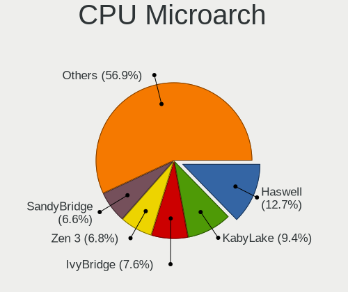
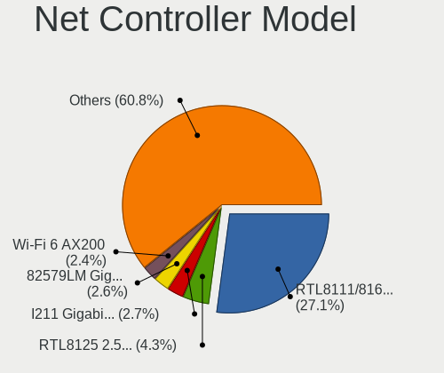

Ubuntu 22.04 - Tested Hardware & Statistics (Desktops)
------------------------------------------------------

A project to collect tested hardware configurations for Ubuntu 22.04.

Anyone can contribute to this report by the [hw-probe](https://github.com/linuxhw/hw-probe) tool:

    sudo -E hw-probe -all -upload

Please contribute! Especially if your hardware is rare.

Contents
--------

* [ Test Cases ](#test-cases)

* [ System ](#system)
  - [ Kernel                   ](#kernel)
  - [ Kernel Family            ](#kernel-family)
  - [ Kernel Major Ver.        ](#kernel-major-ver)
  - [ Arch                     ](#arch)
  - [ DE                       ](#de)
  - [ Display Server           ](#display-server)
  - [ Display Manager          ](#display-manager)
  - [ OS Lang                  ](#os-lang)
  - [ Boot Mode                ](#boot-mode)
  - [ Filesystem               ](#filesystem)
  - [ Part. scheme             ](#part-scheme)
  - [ Dual Boot with Linux/BSD ](#dual-boot-with-linuxbsd)
  - [ Dual Boot (Win)          ](#dual-boot-win)

* [ Board ](#board)
  - [ Vendor                   ](#vendor)
  - [ Model                    ](#model)
  - [ Model Family             ](#model-family)
  - [ MFG Year                 ](#mfg-year)
  - [ Form Factor              ](#form-factor)
  - [ Secure Boot              ](#secure-boot)
  - [ Coreboot                 ](#coreboot)
  - [ RAM Size                 ](#ram-size)
  - [ RAM Used                 ](#ram-used)
  - [ Total Drives             ](#total-drives)
  - [ Has CD-ROM               ](#has-cd-rom)
  - [ Has Ethernet             ](#has-ethernet)
  - [ Has WiFi                 ](#has-wifi)
  - [ Has Bluetooth            ](#has-bluetooth)

* [ Location ](#location)
  - [ Country                  ](#country)
  - [ City                     ](#city)

* [ Drives ](#drives)
  - [ Drive Vendor             ](#drive-vendor)
  - [ Drive Model              ](#drive-model)
  - [ HDD Vendor               ](#hdd-vendor)
  - [ SSD Vendor               ](#ssd-vendor)
  - [ Drive Kind               ](#drive-kind)
  - [ Drive Connector          ](#drive-connector)
  - [ Drive Size               ](#drive-size)
  - [ Space Total              ](#space-total)
  - [ Space Used               ](#space-used)
  - [ Malfunc. Drives          ](#malfunc-drives)
  - [ Malfunc. Drive Vendor    ](#malfunc-drive-vendor)
  - [ Malfunc. HDD Vendor      ](#malfunc-hdd-vendor)
  - [ Malfunc. Drive Kind      ](#malfunc-drive-kind)
  - [ Failed Drives            ](#failed-drives)
  - [ Failed Drive Vendor      ](#failed-drive-vendor)
  - [ Drive Status             ](#drive-status)

* [ Storage controller ](#storage-controller)
  - [ Storage Vendor           ](#storage-vendor)
  - [ Storage Model            ](#storage-model)
  - [ Storage Kind             ](#storage-kind)

* [ Processor ](#processor)
  - [ CPU Vendor               ](#cpu-vendor)
  - [ CPU Model                ](#cpu-model)
  - [ CPU Model Family         ](#cpu-model-family)
  - [ CPU Cores                ](#cpu-cores)
  - [ CPU Sockets              ](#cpu-sockets)
  - [ CPU Threads              ](#cpu-threads)
  - [ CPU Op-Modes             ](#cpu-op-modes)
  - [ CPU Microcode            ](#cpu-microcode)
  - [ CPU Microarch            ](#cpu-microarch)

* [ Graphics ](#graphics)
  - [ GPU Vendor               ](#gpu-vendor)
  - [ GPU Model                ](#gpu-model)
  - [ GPU Combo                ](#gpu-combo)
  - [ GPU Driver               ](#gpu-driver)
  - [ GPU Memory               ](#gpu-memory)

* [ Monitor ](#monitor)
  - [ Monitor Vendor           ](#monitor-vendor)
  - [ Monitor Model            ](#monitor-model)
  - [ Monitor Resolution       ](#monitor-resolution)
  - [ Monitor Diagonal         ](#monitor-diagonal)
  - [ Monitor Width            ](#monitor-width)
  - [ Aspect Ratio             ](#aspect-ratio)
  - [ Monitor Area             ](#monitor-area)
  - [ Pixel Density            ](#pixel-density)
  - [ Multiple Monitors        ](#multiple-monitors)

* [ Network ](#network)
  - [ Net Controller Vendor    ](#net-controller-vendor)
  - [ Net Controller Model     ](#net-controller-model)
  - [ Wireless Vendor          ](#wireless-vendor)
  - [ Wireless Model           ](#wireless-model)
  - [ Ethernet Vendor          ](#ethernet-vendor)
  - [ Ethernet Model           ](#ethernet-model)
  - [ Net Controller Kind      ](#net-controller-kind)
  - [ Used Controller          ](#used-controller)
  - [ NICs                     ](#nics)
  - [ IPv6                     ](#ipv6)

* [ Bluetooth ](#bluetooth)
  - [ Bluetooth Vendor         ](#bluetooth-vendor)
  - [ Bluetooth Model          ](#bluetooth-model)

* [ Sound ](#sound)
  - [ Sound Vendor             ](#sound-vendor)
  - [ Sound Model              ](#sound-model)

* [ Memory ](#memory)
  - [ Memory Vendor            ](#memory-vendor)
  - [ Memory Model             ](#memory-model)
  - [ Memory Kind              ](#memory-kind)
  - [ Memory Form Factor       ](#memory-form-factor)
  - [ Memory Size              ](#memory-size)
  - [ Memory Speed             ](#memory-speed)

* [ Printers & scanners ](#printers--scanners)
  - [ Printer Vendor           ](#printer-vendor)
  - [ Printer Model            ](#printer-model)
  - [ Scanner Vendor           ](#scanner-vendor)
  - [ Scanner Model            ](#scanner-model)

* [ Camera ](#camera)
  - [ Camera Vendor            ](#camera-vendor)
  - [ Camera Model             ](#camera-model)

* [ Security ](#security)
  - [ Fingerprint Vendor       ](#fingerprint-vendor)
  - [ Fingerprint Model        ](#fingerprint-model)
  - [ Chipcard Vendor          ](#chipcard-vendor)
  - [ Chipcard Model           ](#chipcard-model)

* [ Unsupported ](#unsupported)
  - [ Unsupported Devices      ](#unsupported-devices)
  - [ Unsupported Device Types ](#unsupported-device-types)

Test Cases
----------

Total: 2387

| Vendor        | Model                       | Probe                                                      | Date         |
|---------------|-----------------------------|------------------------------------------------------------|--------------|
| Acer          | Aspire XC-705               | [86a503df2a](https://linux-hardware.org/?probe=86a503df2a) | Dec 01, 2022 |
| Gigabyte      | B450M DS3H-CF               | [5e7bc65683](https://linux-hardware.org/?probe=5e7bc65683) | Dec 01, 2022 |
| Dell          | 0G254H A00                  | [473fb8a09a](https://linux-hardware.org/?probe=473fb8a09a) | Dec 01, 2022 |
| Gigabyte      | GA-MA790FXT-UD5P            | [010349b87b](https://linux-hardware.org/?probe=010349b87b) | Dec 01, 2022 |
| Fujitsu       | D3128-A1 S26361-D3128-A1    | [ad24dc05a0](https://linux-hardware.org/?probe=ad24dc05a0) | Dec 01, 2022 |
| Fujitsu       | D3128-A1 S26361-D3128-A1    | [0e38c9a3be](https://linux-hardware.org/?probe=0e38c9a3be) | Dec 01, 2022 |
| MSI           | MEG X570 UNIFY              | [df74bf8e13](https://linux-hardware.org/?probe=df74bf8e13) | Dec 01, 2022 |
| ASRock        | Z68 Extreme4 Gen3           | [c14e2149eb](https://linux-hardware.org/?probe=c14e2149eb) | Dec 01, 2022 |
| Fujitsu       | D2917-A1 S26361-D2917-A1    | [dd124e3579](https://linux-hardware.org/?probe=dd124e3579) | Nov 30, 2022 |
| Gigabyte      | H170-HD3-CF                 | [1d293c6d72](https://linux-hardware.org/?probe=1d293c6d72) | Nov 30, 2022 |
| HP            | 1825                        | [5f8bff315d](https://linux-hardware.org/?probe=5f8bff315d) | Nov 30, 2022 |
| ASUSTek       | PRIME B450M-A II            | [a5b34b67f2](https://linux-hardware.org/?probe=a5b34b67f2) | Nov 30, 2022 |
| MSI           | Boston                      | [0564f7ed2d](https://linux-hardware.org/?probe=0564f7ed2d) | Nov 30, 2022 |
| Dell          | 0WR7PY A03                  | [ba1e414d62](https://linux-hardware.org/?probe=ba1e414d62) | Nov 30, 2022 |
| ASUSTek       | H81M-PLUS                   | [8d98938198](https://linux-hardware.org/?probe=8d98938198) | Nov 30, 2022 |
| Gigabyte      | GB-BRR7H-4700               | [8398d00a16](https://linux-hardware.org/?probe=8398d00a16) | Nov 30, 2022 |
| ASUSTek       | M5A78L-M LE/USB3            | [dd3801095f](https://linux-hardware.org/?probe=dd3801095f) | Nov 30, 2022 |
| Dell          | 0XJ5V0 A03                  | [b954e4c174](https://linux-hardware.org/?probe=b954e4c174) | Nov 30, 2022 |
| HP            | 1825                        | [a3f8ec5423](https://linux-hardware.org/?probe=a3f8ec5423) | Nov 30, 2022 |
| Medion        | D3F3-EM                     | [ae428a6a6a](https://linux-hardware.org/?probe=ae428a6a6a) | Nov 29, 2022 |
| ASUSTek       | PRIME B450M-A II            | [f0dfa48048](https://linux-hardware.org/?probe=f0dfa48048) | Nov 29, 2022 |
| Gigabyte      | B250M-DS3H-CF               | [efacbf6215](https://linux-hardware.org/?probe=efacbf6215) | Nov 29, 2022 |
| Gigabyte      | B250M-DS3H-CF               | [85ac938c0c](https://linux-hardware.org/?probe=85ac938c0c) | Nov 29, 2022 |
| HP            | 339A                        | [ea5cacd50e](https://linux-hardware.org/?probe=ea5cacd50e) | Nov 29, 2022 |
| ASRock        | 960GM-GS3 FX                | [1474b9ee78](https://linux-hardware.org/?probe=1474b9ee78) | Nov 29, 2022 |
| Dell          | 0J8G6F A03                  | [1424a94eb0](https://linux-hardware.org/?probe=1424a94eb0) | Nov 29, 2022 |
| Gigabyte      | Z490 AORUS XTREME WF        | [6d4f229020](https://linux-hardware.org/?probe=6d4f229020) | Nov 29, 2022 |
| Medion        | H110H4-EM2                  | [38b9e166f2](https://linux-hardware.org/?probe=38b9e166f2) | Nov 29, 2022 |
| ASRock        | Z77 Extreme3                | [e473c1c45c](https://linux-hardware.org/?probe=e473c1c45c) | Nov 29, 2022 |
| Lenovo        | 1031 SBB0J05441 WIN 3305... | [cc75562371](https://linux-hardware.org/?probe=cc75562371) | Nov 29, 2022 |
| Lenovo        | 1031 SBB0J05441 WIN 3305... | [a6ea0d5259](https://linux-hardware.org/?probe=a6ea0d5259) | Nov 29, 2022 |
| MSI           | Z370 GAMING PRO CARBON      | [96b383097b](https://linux-hardware.org/?probe=96b383097b) | Nov 29, 2022 |
| ASRock        | B550 Phantom Gaming 4/ac    | [66525e5501](https://linux-hardware.org/?probe=66525e5501) | Nov 29, 2022 |
| ASRock        | B450M Pro4                  | [219a616346](https://linux-hardware.org/?probe=219a616346) | Nov 28, 2022 |
| Gigabyte      | H410M H                     | [09129dad50](https://linux-hardware.org/?probe=09129dad50) | Nov 28, 2022 |
| Intel         | H61                         | [42f943bc9c](https://linux-hardware.org/?probe=42f943bc9c) | Nov 28, 2022 |
| ASRock        | Q1900M                      | [0a90a5d3a5](https://linux-hardware.org/?probe=0a90a5d3a5) | Nov 28, 2022 |
| Gigabyte      | Z97X-SLI-CF                 | [ae01075720](https://linux-hardware.org/?probe=ae01075720) | Nov 28, 2022 |
| Gigabyte      | H410M H                     | [88ca303518](https://linux-hardware.org/?probe=88ca303518) | Nov 28, 2022 |
| Gigabyte      | H81M-S                      | [fab21fa561](https://linux-hardware.org/?probe=fab21fa561) | Nov 28, 2022 |
| Pegatron      | VIOLET                      | [f0f25e6854](https://linux-hardware.org/?probe=f0f25e6854) | Nov 28, 2022 |
| PCWare        | IPMH61R1                    | [7872d8f10f](https://linux-hardware.org/?probe=7872d8f10f) | Nov 28, 2022 |
| Dell          | 0WMJ54 A01                  | [778a84af28](https://linux-hardware.org/?probe=778a84af28) | Nov 28, 2022 |
| ASRock        | H87M Pro4                   | [c0511f2d46](https://linux-hardware.org/?probe=c0511f2d46) | Nov 28, 2022 |
| Shuttle       | FS35V4                      | [46923496a3](https://linux-hardware.org/?probe=46923496a3) | Nov 28, 2022 |
| Dell          | 0T10XW A02                  | [e97a065fa8](https://linux-hardware.org/?probe=e97a065fa8) | Nov 28, 2022 |
| Gateway       | G33M05G1 MP                 | [193a69e5ee](https://linux-hardware.org/?probe=193a69e5ee) | Nov 27, 2022 |
| Acer          | Veriton X4620G V1.0         | [37be4a2bf8](https://linux-hardware.org/?probe=37be4a2bf8) | Nov 27, 2022 |
| ASUSTek       | PRIME A320M-K               | [37b51f19ef](https://linux-hardware.org/?probe=37b51f19ef) | Nov 27, 2022 |
| Gateway       | G33M05G1 MP                 | [291e32a741](https://linux-hardware.org/?probe=291e32a741) | Nov 27, 2022 |
| ASRock        | H87M Pro4                   | [8d15aa84d6](https://linux-hardware.org/?probe=8d15aa84d6) | Nov 27, 2022 |
| ASUSTek       | ROG STRIX B450-F GAMING ... | [a60076a8c2](https://linux-hardware.org/?probe=a60076a8c2) | Nov 27, 2022 |
| HP            | 1589                        | [4e67735055](https://linux-hardware.org/?probe=4e67735055) | Nov 27, 2022 |
| Koloe         | X58                         | [8b80e1a74c](https://linux-hardware.org/?probe=8b80e1a74c) | Nov 27, 2022 |
| ASUSTek       | PRIME B365M-A               | [4f3216dfdc](https://linux-hardware.org/?probe=4f3216dfdc) | Nov 27, 2022 |
| ASUSTek       | PRIME B365M-A               | [498f0a31dc](https://linux-hardware.org/?probe=498f0a31dc) | Nov 27, 2022 |
| ASRock        | H110M-DGS                   | [6667ba2bc2](https://linux-hardware.org/?probe=6667ba2bc2) | Nov 27, 2022 |
| HP            | 843B                        | [50065e4a79](https://linux-hardware.org/?probe=50065e4a79) | Nov 27, 2022 |
| Dell          | 0GXM1W A02                  | [3a801841e6](https://linux-hardware.org/?probe=3a801841e6) | Nov 27, 2022 |
| Gigabyte      | H81M-DS2                    | [f278eb7e59](https://linux-hardware.org/?probe=f278eb7e59) | Nov 27, 2022 |
| Gigabyte      | B450 AORUS ELITE            | [b72ddeccb4](https://linux-hardware.org/?probe=b72ddeccb4) | Nov 27, 2022 |
| Foxconn       | A74ML-K                     | [438e3ff761](https://linux-hardware.org/?probe=438e3ff761) | Nov 27, 2022 |
| MSI           | MPG X570 GAMING EDGE WIF... | [2813bdf250](https://linux-hardware.org/?probe=2813bdf250) | Nov 26, 2022 |
| ASUSTek       | H81M-K                      | [4de72d3d12](https://linux-hardware.org/?probe=4de72d3d12) | Nov 26, 2022 |
| ASUSTek       | P7P55D-E LX                 | [8b913d5510](https://linux-hardware.org/?probe=8b913d5510) | Nov 26, 2022 |
| ASUSTek       | Rampage IV EXTREME          | [e70ff25b31](https://linux-hardware.org/?probe=e70ff25b31) | Nov 26, 2022 |
| Lenovo        | BRASWELL SDK0J40705 WIN ... | [fd73688b5c](https://linux-hardware.org/?probe=fd73688b5c) | Nov 26, 2022 |
| ASUSTek       | PRIME A320M-K               | [be12141830](https://linux-hardware.org/?probe=be12141830) | Nov 26, 2022 |
| ASUSTek       | PRIME A320M-K               | [f34d75bde0](https://linux-hardware.org/?probe=f34d75bde0) | Nov 26, 2022 |
| ASUSTek       | B150M-C                     | [bbbdc2b291](https://linux-hardware.org/?probe=bbbdc2b291) | Nov 26, 2022 |
| Lenovo        | ThinkCentre M58 6258AP4     | [54d4e3a0ae](https://linux-hardware.org/?probe=54d4e3a0ae) | Nov 26, 2022 |
| Lenovo        | BRASWELL SDK0J40705 WIN ... | [cdc1c32b09](https://linux-hardware.org/?probe=cdc1c32b09) | Nov 26, 2022 |
| MSI           | A78M-E35                    | [cf80d76e53](https://linux-hardware.org/?probe=cf80d76e53) | Nov 26, 2022 |
| Intel         | Unknown                     | [bcf46201bc](https://linux-hardware.org/?probe=bcf46201bc) | Nov 25, 2022 |
| ASRock        | Z77 Extreme4                | [40b3f85de8](https://linux-hardware.org/?probe=40b3f85de8) | Nov 25, 2022 |
| Gigabyte      | 970A-DS3P                   | [2787600567](https://linux-hardware.org/?probe=2787600567) | Nov 25, 2022 |
| Dell          | OptiPlex 3020               | [2adcd09348](https://linux-hardware.org/?probe=2adcd09348) | Nov 25, 2022 |
| ASUSTek       | PRIME A320M-K               | [906ad9a3c1](https://linux-hardware.org/?probe=906ad9a3c1) | Nov 25, 2022 |
| ASUSTek       | P8B75-M LX                  | [8522486d64](https://linux-hardware.org/?probe=8522486d64) | Nov 25, 2022 |
| Positivo      | P5VD2-MX                    | [c9d4c5ea2b](https://linux-hardware.org/?probe=c9d4c5ea2b) | Nov 25, 2022 |
| HP            | 18E9                        | [dab5e242fd](https://linux-hardware.org/?probe=dab5e242fd) | Nov 25, 2022 |
| Unknown       | T3 MRD                      | [bec511830c](https://linux-hardware.org/?probe=bec511830c) | Nov 24, 2022 |
| ASUSTek       | PRIME B560M-A AC            | [51a24ed190](https://linux-hardware.org/?probe=51a24ed190) | Nov 24, 2022 |
| ASRock        | X570 Pro4                   | [dad186aa07](https://linux-hardware.org/?probe=dad186aa07) | Nov 24, 2022 |
| HP            | 0AE8h                       | [c49d643fae](https://linux-hardware.org/?probe=c49d643fae) | Nov 24, 2022 |
| Gigabyte      | B75M-D3H                    | [d70a6e41ba](https://linux-hardware.org/?probe=d70a6e41ba) | Nov 24, 2022 |
| ASRock        | 960GM-GS3 FX                | [1af92d9936](https://linux-hardware.org/?probe=1af92d9936) | Nov 24, 2022 |
| Biostar       | H61MGV3                     | [b252a902f4](https://linux-hardware.org/?probe=b252a902f4) | Nov 24, 2022 |
| ASRock        | 960GC-GS FX                 | [30081f61ca](https://linux-hardware.org/?probe=30081f61ca) | Nov 24, 2022 |
| ASRock        | 960GC-GS FX                 | [9e33d3b8f1](https://linux-hardware.org/?probe=9e33d3b8f1) | Nov 24, 2022 |
| MSI           | MPG X570 GAMING EDGE WIF... | [b70689b098](https://linux-hardware.org/?probe=b70689b098) | Nov 24, 2022 |
| Fujitsu       | D3222-A1 S26361-D3222-A1    | [00f8658ee8](https://linux-hardware.org/?probe=00f8658ee8) | Nov 24, 2022 |
| MSI           | MPG X570 GAMING EDGE WIF... | [62c027aa0e](https://linux-hardware.org/?probe=62c027aa0e) | Nov 24, 2022 |
| ASUSTek       | PRIME A320M-K               | [5ea9d52f04](https://linux-hardware.org/?probe=5ea9d52f04) | Nov 24, 2022 |
| Dell          | 0GXM1W A02                  | [8bb6ca52d6](https://linux-hardware.org/?probe=8bb6ca52d6) | Nov 24, 2022 |
| Lenovo        | ThinkCentre M58e 7514A2U    | [ba4f47be1a](https://linux-hardware.org/?probe=ba4f47be1a) | Nov 24, 2022 |
| Dell          | 0WPMFG A00                  | [606cc8badf](https://linux-hardware.org/?probe=606cc8badf) | Nov 24, 2022 |
| Dell          | 0Y2MRG A00                  | [581cd43952](https://linux-hardware.org/?probe=581cd43952) | Nov 24, 2022 |
| AZW           | Green G1                    | [762182d13c](https://linux-hardware.org/?probe=762182d13c) | Nov 24, 2022 |
| Lenovo        | 310B SDK0J40705 WIN 3425... | [7265ce493e](https://linux-hardware.org/?probe=7265ce493e) | Nov 23, 2022 |
| Gigabyte      | M61PME-S2                   | [4768ab429e](https://linux-hardware.org/?probe=4768ab429e) | Nov 23, 2022 |
| ASUSTek       | P8Z77-V LX                  | [62e12083b5](https://linux-hardware.org/?probe=62e12083b5) | Nov 23, 2022 |
| Gateway       | DX4840                      | [e2a4cbcd27](https://linux-hardware.org/?probe=e2a4cbcd27) | Nov 23, 2022 |
| HP            | 0266                        | [13e2e10478](https://linux-hardware.org/?probe=13e2e10478) | Nov 23, 2022 |
| ASUSTek       | M5A97 R2.0                  | [495d972ae3](https://linux-hardware.org/?probe=495d972ae3) | Nov 23, 2022 |
| MSI           | 2A9C                        | [57c14b82bd](https://linux-hardware.org/?probe=57c14b82bd) | Nov 23, 2022 |
| Acer          | FIH57                       | [008bcadcd9](https://linux-hardware.org/?probe=008bcadcd9) | Nov 23, 2022 |
| MSI           | H61M-E33                    | [d0277334cf](https://linux-hardware.org/?probe=d0277334cf) | Nov 23, 2022 |
| Gigabyte      | B365M DS3H                  | [d3bf10a8f0](https://linux-hardware.org/?probe=d3bf10a8f0) | Nov 23, 2022 |
| HP            | 339A                        | [13c1a4b520](https://linux-hardware.org/?probe=13c1a4b520) | Nov 23, 2022 |
| ASUSTek       | PRIME X570-PRO              | [30482f42d7](https://linux-hardware.org/?probe=30482f42d7) | Nov 22, 2022 |
| ASUSTek       | B85M-E                      | [ce01aee504](https://linux-hardware.org/?probe=ce01aee504) | Nov 22, 2022 |
| Gigabyte      | A320M-S2H-CF                | [5d3424245f](https://linux-hardware.org/?probe=5d3424245f) | Nov 22, 2022 |
| ASRock        | 960GC-GS FX                 | [d0bd92a5e0](https://linux-hardware.org/?probe=d0bd92a5e0) | Nov 22, 2022 |
| ASRock        | 960GC-GS FX                 | [b4cc2dc00b](https://linux-hardware.org/?probe=b4cc2dc00b) | Nov 22, 2022 |
| HP            | 1495                        | [f8a70f9386](https://linux-hardware.org/?probe=f8a70f9386) | Nov 22, 2022 |
| Gigabyte      | B550 AORUS ELITE V2         | [76ac354e17](https://linux-hardware.org/?probe=76ac354e17) | Nov 22, 2022 |
| ASUSTek       | B85M-E                      | [12aac56052](https://linux-hardware.org/?probe=12aac56052) | Nov 22, 2022 |
| Gigabyte      | 970A-DS3P FX                | [d4d9cadf9f](https://linux-hardware.org/?probe=d4d9cadf9f) | Nov 22, 2022 |
| ASUSTek       | H81M2                       | [f06b4252d7](https://linux-hardware.org/?probe=f06b4252d7) | Nov 22, 2022 |
| ASUSTek       | Pro WS C246-ACE             | [1a38780da8](https://linux-hardware.org/?probe=1a38780da8) | Nov 22, 2022 |
| ASUSTek       | TUF Gaming B450-PLUS II     | [b66300c607](https://linux-hardware.org/?probe=b66300c607) | Nov 22, 2022 |
| ASUSTek       | P5GC-MX/1333                | [dd85fb5c80](https://linux-hardware.org/?probe=dd85fb5c80) | Nov 22, 2022 |
| Dell          | 0GXM1W A02                  | [50ed928fa5](https://linux-hardware.org/?probe=50ed928fa5) | Nov 22, 2022 |
| Acer          | Veriton X2631G V:1.0        | [af2a85dd3c](https://linux-hardware.org/?probe=af2a85dd3c) | Nov 22, 2022 |
| ASUSTek       | X99-DELUXE                  | [224156b7ea](https://linux-hardware.org/?probe=224156b7ea) | Nov 22, 2022 |
| ASUSTek       | X99-DELUXE                  | [1a67a40a2f](https://linux-hardware.org/?probe=1a67a40a2f) | Nov 21, 2022 |
| Biostar       | A320MH                      | [79eeacd665](https://linux-hardware.org/?probe=79eeacd665) | Nov 21, 2022 |
| Dell          | 0F3KHR A00                  | [72406b1647](https://linux-hardware.org/?probe=72406b1647) | Nov 21, 2022 |
| Acer          | MCP73VE NVIDIA MCP73        | [c6b206401a](https://linux-hardware.org/?probe=c6b206401a) | Nov 21, 2022 |
| MSI           | B350 TOMAHAWK               | [d300e0c9cf](https://linux-hardware.org/?probe=d300e0c9cf) | Nov 21, 2022 |
| MSI           | MAG B560M MORTAR            | [18a3c1f2bf](https://linux-hardware.org/?probe=18a3c1f2bf) | Nov 21, 2022 |
| Acer          | FIH57                       | [70bcc47286](https://linux-hardware.org/?probe=70bcc47286) | Nov 21, 2022 |
| Shuttle       | FX79R                       | [76651bc71c](https://linux-hardware.org/?probe=76651bc71c) | Nov 21, 2022 |
| HP            | 1998                        | [7290e58261](https://linux-hardware.org/?probe=7290e58261) | Nov 21, 2022 |
| ASRock        | 960GM-VGS3 FX               | [c5ecd06a6f](https://linux-hardware.org/?probe=c5ecd06a6f) | Nov 21, 2022 |
| Apple         | Mac-7BA5B2D9E42DDD94 iMa... | [fcf670d981](https://linux-hardware.org/?probe=fcf670d981) | Nov 21, 2022 |
| Acer          | Veriton X2631G V:1.0        | [df71eef5cb](https://linux-hardware.org/?probe=df71eef5cb) | Nov 21, 2022 |
| Gigabyte      | B450M DS3H-CF               | [ba7b519890](https://linux-hardware.org/?probe=ba7b519890) | Nov 20, 2022 |
| ASUSTek       | PRIME Z590-P                | [ac1533973e](https://linux-hardware.org/?probe=ac1533973e) | Nov 20, 2022 |
| HP            | 339A                        | [f5f01373e9](https://linux-hardware.org/?probe=f5f01373e9) | Nov 20, 2022 |
| ASRock        | B450M Steel Legend          | [93bb909388](https://linux-hardware.org/?probe=93bb909388) | Nov 20, 2022 |
| Gigabyte      | X570 AORUS ELITE WIFI       | [363b962909](https://linux-hardware.org/?probe=363b962909) | Nov 20, 2022 |
| Gigabyte      | X570 AORUS ELITE WIFI       | [08d670b40b](https://linux-hardware.org/?probe=08d670b40b) | Nov 20, 2022 |
| Acer          | Aspire XC-780               | [bfc11805d9](https://linux-hardware.org/?probe=bfc11805d9) | Nov 20, 2022 |
| Acer          | Aspire XC-780               | [a992606b70](https://linux-hardware.org/?probe=a992606b70) | Nov 20, 2022 |
| ASUSTek       | P7H55-M PRO                 | [b25dd25478](https://linux-hardware.org/?probe=b25dd25478) | Nov 20, 2022 |
| Gigabyte      | GA-MA770T-UD3P              | [237b1cf2af](https://linux-hardware.org/?probe=237b1cf2af) | Nov 20, 2022 |
| ASRock        | 970 Extreme4                | [27756e9ad7](https://linux-hardware.org/?probe=27756e9ad7) | Nov 20, 2022 |
| Acer          | FX58M                       | [5e7abd5852](https://linux-hardware.org/?probe=5e7abd5852) | Nov 20, 2022 |
| ASUSTek       | P5QL-EM                     | [59925a7510](https://linux-hardware.org/?probe=59925a7510) | Nov 20, 2022 |
| Gigabyte      | Z68AP-D3                    | [f079712363](https://linux-hardware.org/?probe=f079712363) | Nov 20, 2022 |
| MSI           | H510M PRO                   | [182b91241d](https://linux-hardware.org/?probe=182b91241d) | Nov 20, 2022 |
| Gigabyte      | Z690 AORUS ELITE AX DDR4    | [97d20263a0](https://linux-hardware.org/?probe=97d20263a0) | Nov 19, 2022 |
| Gigabyte      | Z690 AORUS ELITE AX DDR4    | [77dcbbbc76](https://linux-hardware.org/?probe=77dcbbbc76) | Nov 19, 2022 |
| Gigabyte      | B75M-D3H                    | [e5db58baec](https://linux-hardware.org/?probe=e5db58baec) | Nov 19, 2022 |
| MSI           | X299 RAIDER                 | [544b8ae2b7](https://linux-hardware.org/?probe=544b8ae2b7) | Nov 19, 2022 |
| ASUSTek       | ROG STRIX B550-F GAMING     | [ae7e261a01](https://linux-hardware.org/?probe=ae7e261a01) | Nov 19, 2022 |
| HP            | 1495                        | [3ac774a6d6](https://linux-hardware.org/?probe=3ac774a6d6) | Nov 19, 2022 |
| HP            | 1495                        | [659062ad1d](https://linux-hardware.org/?probe=659062ad1d) | Nov 19, 2022 |
| MSI           | MEG Z490I UNIFY             | [89b7e22011](https://linux-hardware.org/?probe=89b7e22011) | Nov 19, 2022 |
| ASUSTek       | CROSSHAIR VI HERO           | [8babb97c89](https://linux-hardware.org/?probe=8babb97c89) | Nov 18, 2022 |
| Gigabyte      | G31M-S2L                    | [bc588177c4](https://linux-hardware.org/?probe=bc588177c4) | Nov 18, 2022 |
| HP            | 8643 SMVB                   | [3556ffb814](https://linux-hardware.org/?probe=3556ffb814) | Nov 18, 2022 |
| Dell          | 0CRH6C A02                  | [4966822105](https://linux-hardware.org/?probe=4966822105) | Nov 18, 2022 |
| ASUSTek       | PRIME B365-PLUS             | [14318910c1](https://linux-hardware.org/?probe=14318910c1) | Nov 18, 2022 |
| ASUSTek       | PRIME B365-PLUS             | [c4bf12a3e5](https://linux-hardware.org/?probe=c4bf12a3e5) | Nov 18, 2022 |
| Gigabyte      | 990FXA-UD3                  | [d5c76baafa](https://linux-hardware.org/?probe=d5c76baafa) | Nov 18, 2022 |
| Lenovo        | ThinkCentre M58 7373AJ5     | [ac213d4e52](https://linux-hardware.org/?probe=ac213d4e52) | Nov 18, 2022 |
| ASUSTek       | PRIME A320M-K               | [e6c324007b](https://linux-hardware.org/?probe=e6c324007b) | Nov 18, 2022 |
| ASUSTek       | PRIME Z690-P WIFI           | [763f309094](https://linux-hardware.org/?probe=763f309094) | Nov 18, 2022 |
| Lenovo        | ThinkCentre M58e 7514A2U    | [96ca5e0c1f](https://linux-hardware.org/?probe=96ca5e0c1f) | Nov 18, 2022 |
| HP            | 1850                        | [25c6e64b61](https://linux-hardware.org/?probe=25c6e64b61) | Nov 18, 2022 |
| Dell          | 0PC5F7 A01                  | [e30d0b204b](https://linux-hardware.org/?probe=e30d0b204b) | Nov 18, 2022 |
| MSI           | X570-A PRO                  | [891ed6f2dc](https://linux-hardware.org/?probe=891ed6f2dc) | Nov 18, 2022 |
| MSI           | A75MA-P35                   | [10016f0246](https://linux-hardware.org/?probe=10016f0246) | Nov 17, 2022 |
| MSI           | H410M-A PRO                 | [36716fb1f4](https://linux-hardware.org/?probe=36716fb1f4) | Nov 17, 2022 |
| Login Info... | LOG-H61H2-M2                | [aff41de38e](https://linux-hardware.org/?probe=aff41de38e) | Nov 17, 2022 |
| ASRock        | B450M Pro4                  | [39aedb7818](https://linux-hardware.org/?probe=39aedb7818) | Nov 16, 2022 |
| XDO.AI        | Pantera Pico PC             | [70071adfb0](https://linux-hardware.org/?probe=70071adfb0) | Nov 16, 2022 |
| HP            | 212B                        | [e1c7e7693e](https://linux-hardware.org/?probe=e1c7e7693e) | Nov 16, 2022 |
| ASUSTek       | PRIME Z690-P D4             | [c22dce3d23](https://linux-hardware.org/?probe=c22dce3d23) | Nov 16, 2022 |
| ASUSTek       | A55BM-E                     | [9ed6d8ee1e](https://linux-hardware.org/?probe=9ed6d8ee1e) | Nov 16, 2022 |
| Intel         | D53427RKE G87971-406        | [e3bc504c6e](https://linux-hardware.org/?probe=e3bc504c6e) | Nov 15, 2022 |
| Gigabyte      | H110M-DS2-CF                | [4adf740f59](https://linux-hardware.org/?probe=4adf740f59) | Nov 15, 2022 |
| Minix         | NEO Z83-4 V1.1              | [b371514101](https://linux-hardware.org/?probe=b371514101) | Nov 15, 2022 |
| Minix         | NEO Z83-4 V1.1              | [4f0c43a4d7](https://linux-hardware.org/?probe=4f0c43a4d7) | Nov 15, 2022 |
| Dell          | 0RY007                      | [84453b7c4b](https://linux-hardware.org/?probe=84453b7c4b) | Nov 15, 2022 |
| Dell          | 0RY007                      | [dc49babf5c](https://linux-hardware.org/?probe=dc49babf5c) | Nov 15, 2022 |
| Lenovo        | 3716 SDK0K17763 WIN 1801... | [93c2091f01](https://linux-hardware.org/?probe=93c2091f01) | Nov 15, 2022 |
| Dell          | 040DDP A01                  | [5be1770be6](https://linux-hardware.org/?probe=5be1770be6) | Nov 15, 2022 |
| ASUSTek       | PHOENIX                     | [e643437e04](https://linux-hardware.org/?probe=e643437e04) | Nov 15, 2022 |
| ASUSTek       | PRIME B560M-A               | [db1488b844](https://linux-hardware.org/?probe=db1488b844) | Nov 15, 2022 |
| Dell          | 040DDP A01                  | [6e0abbe24f](https://linux-hardware.org/?probe=6e0abbe24f) | Nov 15, 2022 |
| ASUSTek       | PRIME B560M-A               | [35f0fc8a5a](https://linux-hardware.org/?probe=35f0fc8a5a) | Nov 15, 2022 |
| Dell          | 0K240Y A03                  | [ef92c74ba4](https://linux-hardware.org/?probe=ef92c74ba4) | Nov 14, 2022 |
| Gigabyte      | B75M-D3H                    | [e7f0316884](https://linux-hardware.org/?probe=e7f0316884) | Nov 14, 2022 |
| Gigabyte      | Q87M-D2H                    | [e7c7b6c8a7](https://linux-hardware.org/?probe=e7c7b6c8a7) | Nov 14, 2022 |
| Gigabyte      | Q87M-D2H                    | [8224e059c6](https://linux-hardware.org/?probe=8224e059c6) | Nov 14, 2022 |
| ASUSTek       | ROG STRIX B550-E GAMING     | [2053688baa](https://linux-hardware.org/?probe=2053688baa) | Nov 14, 2022 |
| ASUSTek       | ROG STRIX B550-E GAMING     | [15f6c6a1aa](https://linux-hardware.org/?probe=15f6c6a1aa) | Nov 14, 2022 |
| ASRock        | 960GM-GS3 FX                | [b47205075c](https://linux-hardware.org/?probe=b47205075c) | Nov 14, 2022 |
| Lenovo        | 3106 SDK0J40697 WIN 3305... | [92a9bbc9a0](https://linux-hardware.org/?probe=92a9bbc9a0) | Nov 14, 2022 |
| Biostar       | A320MH                      | [13a64b013b](https://linux-hardware.org/?probe=13a64b013b) | Nov 14, 2022 |
| Biostar       | A320MH                      | [d5135ec32f](https://linux-hardware.org/?probe=d5135ec32f) | Nov 14, 2022 |
| ASRock        | Z77 Extreme3                | [1485faa2cc](https://linux-hardware.org/?probe=1485faa2cc) | Nov 14, 2022 |
| Dell          | 0VNP2H A00                  | [8a9b31c73c](https://linux-hardware.org/?probe=8a9b31c73c) | Nov 14, 2022 |
| Gigabyte      | GA-78LMT-USB3               | [4a8a8314db](https://linux-hardware.org/?probe=4a8a8314db) | Nov 14, 2022 |
| Gigabyte      | B450 AORUS PRO WIFI-CF      | [25df2f9dc5](https://linux-hardware.org/?probe=25df2f9dc5) | Nov 14, 2022 |
| Dell          | 0VNP2H A00                  | [b49e089cbc](https://linux-hardware.org/?probe=b49e089cbc) | Nov 14, 2022 |
| ASUSTek       | PRIME B550M-A               | [8600d864a4](https://linux-hardware.org/?probe=8600d864a4) | Nov 13, 2022 |
| ASUSTek       | TUF B360-PLUS GAMING        | [d29245dafc](https://linux-hardware.org/?probe=d29245dafc) | Nov 13, 2022 |
| Dell          | 0GXM1W A02                  | [b6da53e29d](https://linux-hardware.org/?probe=b6da53e29d) | Nov 13, 2022 |
| ASUSTek       | M5A78L-M/USB3               | [851afe02f6](https://linux-hardware.org/?probe=851afe02f6) | Nov 13, 2022 |
| Dell          | 0GXM1W A02                  | [8d088bb873](https://linux-hardware.org/?probe=8d088bb873) | Nov 13, 2022 |
| Colorful T... | I-H110-SI1                  | [50c44868e2](https://linux-hardware.org/?probe=50c44868e2) | Nov 13, 2022 |
| Dell          | 04YP6J A02                  | [5ca546d877](https://linux-hardware.org/?probe=5ca546d877) | Nov 13, 2022 |
| Pegatron      | 2ACB                        | [fe088fdf62](https://linux-hardware.org/?probe=fe088fdf62) | Nov 13, 2022 |
| Dell          | 08NPPY A00                  | [0d10deec52](https://linux-hardware.org/?probe=0d10deec52) | Nov 13, 2022 |
| Gigabyte      | B150M-D3H-CF                | [3b46bafe87](https://linux-hardware.org/?probe=3b46bafe87) | Nov 13, 2022 |
| Gigabyte      | GA-MA785GT-UD3H             | [4e3e53f7bb](https://linux-hardware.org/?probe=4e3e53f7bb) | Nov 12, 2022 |
| Gigabyte      | 970A-DS3                    | [7c25342680](https://linux-hardware.org/?probe=7c25342680) | Nov 12, 2022 |
| Gigabyte      | Q87M-D2H                    | [543c3778c3](https://linux-hardware.org/?probe=543c3778c3) | Nov 12, 2022 |
| Fujitsu       | D3230-A1 S26361-D3230-A1    | [091c048c2a](https://linux-hardware.org/?probe=091c048c2a) | Nov 12, 2022 |
| Lenovo        | 3704 SDK0R32862 WIN 3258... | [2c50d9e17e](https://linux-hardware.org/?probe=2c50d9e17e) | Nov 12, 2022 |
| Foxconn       | 2AAF                        | [8dee2ceeb0](https://linux-hardware.org/?probe=8dee2ceeb0) | Nov 12, 2022 |
| Lenovo        | 3704 SDK0R32862 WIN 3258... | [9089a0e312](https://linux-hardware.org/?probe=9089a0e312) | Nov 12, 2022 |
| ASUSTek       | P7P55D-E LX                 | [cef5f6aa9f](https://linux-hardware.org/?probe=cef5f6aa9f) | Nov 12, 2022 |
| ASUSTek       | M5A78L-M LX                 | [7998f1d9a3](https://linux-hardware.org/?probe=7998f1d9a3) | Nov 12, 2022 |
| Intel         | H61                         | [8b718d964b](https://linux-hardware.org/?probe=8b718d964b) | Nov 12, 2022 |
| ASUSTek       | PHOENIX                     | [d2670bac16](https://linux-hardware.org/?probe=d2670bac16) | Nov 12, 2022 |
| MSI           | B75MA-P45                   | [3db5e45a80](https://linux-hardware.org/?probe=3db5e45a80) | Nov 12, 2022 |
| ASUSTek       | TUF Gaming B550M-PLUS       | [69bf8bfced](https://linux-hardware.org/?probe=69bf8bfced) | Nov 12, 2022 |
| ASUSTek       | P8H61-M LX                  | [60675a2cd5](https://linux-hardware.org/?probe=60675a2cd5) | Nov 11, 2022 |
| Pegatron      | Benicia                     | [f345c0beb9](https://linux-hardware.org/?probe=f345c0beb9) | Nov 11, 2022 |
| Gigabyte      | Q87M-D2H                    | [f73ba4186b](https://linux-hardware.org/?probe=f73ba4186b) | Nov 11, 2022 |
| MSI           | H110M ECO                   | [f7a8135cee](https://linux-hardware.org/?probe=f7a8135cee) | Nov 11, 2022 |
| ASUSTek       | TUF Gaming X670E-PLUS WI... | [75ffcfaf88](https://linux-hardware.org/?probe=75ffcfaf88) | Nov 11, 2022 |
| Gigabyte      | Z77X-D3H                    | [a697dc0e99](https://linux-hardware.org/?probe=a697dc0e99) | Nov 11, 2022 |
| Intel         | DQ57TM AAE70931-403         | [1759cf3bec](https://linux-hardware.org/?probe=1759cf3bec) | Nov 11, 2022 |
| Intel         | DP35DP AAD81073-207         | [c597415419](https://linux-hardware.org/?probe=c597415419) | Nov 11, 2022 |
| Dell          | 0D441T A00                  | [8825499c05](https://linux-hardware.org/?probe=8825499c05) | Nov 11, 2022 |
| Gigabyte      | H110M-S2H DDR3-CF           | [13f37888d5](https://linux-hardware.org/?probe=13f37888d5) | Nov 11, 2022 |
| ASUSTek       | M5A99FX PRO R2.0            | [5d014a639b](https://linux-hardware.org/?probe=5d014a639b) | Nov 11, 2022 |
| ASUSTek       | X99-DELUXE                  | [a1243611f4](https://linux-hardware.org/?probe=a1243611f4) | Nov 11, 2022 |
| Lenovo        | 310B SDK0J40705 WIN 3425... | [4c84942d2b](https://linux-hardware.org/?probe=4c84942d2b) | Nov 10, 2022 |
| ASUSTek       | PRIME X570-P                | [0e930e7a64](https://linux-hardware.org/?probe=0e930e7a64) | Nov 10, 2022 |
| ASUSTek       | X99-DELUXE                  | [784b2e30e1](https://linux-hardware.org/?probe=784b2e30e1) | Nov 10, 2022 |
| ASRock        | X470 Gaming-ITX/ac          | [d39ea05c32](https://linux-hardware.org/?probe=d39ea05c32) | Nov 10, 2022 |
| MSI           | MPG Z690 FORCE WIFI         | [04701e62f2](https://linux-hardware.org/?probe=04701e62f2) | Nov 10, 2022 |
| ASRock        | B365 Pro4                   | [3069280223](https://linux-hardware.org/?probe=3069280223) | Nov 10, 2022 |
| Pegatron      | Benicia                     | [2dadd4e98d](https://linux-hardware.org/?probe=2dadd4e98d) | Nov 10, 2022 |
| Gigabyte      | H55M-UD2H                   | [d32e991d14](https://linux-hardware.org/?probe=d32e991d14) | Nov 10, 2022 |
| MSI           | MPG Z690 FORCE WIFI         | [e2a318b8d3](https://linux-hardware.org/?probe=e2a318b8d3) | Nov 10, 2022 |
| ASUSTek       | KCMA-D8                     | [3d9ad6b8b1](https://linux-hardware.org/?probe=3d9ad6b8b1) | Nov 10, 2022 |
| ASUSTek       | ROG STRIX B450-F GAMING     | [4e1661b8a8](https://linux-hardware.org/?probe=4e1661b8a8) | Nov 10, 2022 |
| PCWare        | IPMH61R1                    | [6a668c9151](https://linux-hardware.org/?probe=6a668c9151) | Nov 09, 2022 |
| HP            | 3397                        | [a456668069](https://linux-hardware.org/?probe=a456668069) | Nov 09, 2022 |
| MSI           | MEG X570 UNIFY              | [f419558b59](https://linux-hardware.org/?probe=f419558b59) | Nov 09, 2022 |
| BESSTAR Te... | TH50                        | [9e0784517f](https://linux-hardware.org/?probe=9e0784517f) | Nov 09, 2022 |
| Dell          | 05842Y A00                  | [9619cbea2f](https://linux-hardware.org/?probe=9619cbea2f) | Nov 09, 2022 |
| MSI           | GF615M-P33                  | [1a298da454](https://linux-hardware.org/?probe=1a298da454) | Nov 09, 2022 |
| ASRock        | Z77 Extreme3                | [d8638412d9](https://linux-hardware.org/?probe=d8638412d9) | Nov 09, 2022 |
| HP            | 304Bh                       | [441e27ba6f](https://linux-hardware.org/?probe=441e27ba6f) | Nov 09, 2022 |
| HP            | 304Bh                       | [ec223d7334](https://linux-hardware.org/?probe=ec223d7334) | Nov 09, 2022 |
| Lenovo        | 364F SDK0J40700 WIN 3258... | [dbf32417df](https://linux-hardware.org/?probe=dbf32417df) | Nov 09, 2022 |
| Unknown       | 1.0                         | [23f2991c21](https://linux-hardware.org/?probe=23f2991c21) | Nov 09, 2022 |
| HP            | 806A                        | [e8bee1d38a](https://linux-hardware.org/?probe=e8bee1d38a) | Nov 08, 2022 |
| MSI           | MAG B560M MORTAR            | [d06c10f1cf](https://linux-hardware.org/?probe=d06c10f1cf) | Nov 08, 2022 |
| ASUSTek       | PRIME Z370-A                | [e8848bee9b](https://linux-hardware.org/?probe=e8848bee9b) | Nov 08, 2022 |
| Huanan        | X99-BD4 V1.3                | [e50441190a](https://linux-hardware.org/?probe=e50441190a) | Nov 08, 2022 |
| ASRock        | B450 Gaming K4              | [7eca97a8ef](https://linux-hardware.org/?probe=7eca97a8ef) | Nov 08, 2022 |
| AZW           | Gemini T34                  | [b8aee41f46](https://linux-hardware.org/?probe=b8aee41f46) | Nov 08, 2022 |
| MSI           | A68HM-E33 V2                | [7c473a4240](https://linux-hardware.org/?probe=7c473a4240) | Nov 08, 2022 |
| MSI           | A68HM-E33 V2                | [a6c90f4923](https://linux-hardware.org/?probe=a6c90f4923) | Nov 08, 2022 |
| Gigabyte      | B460M DS3H V2               | [bc5466e5ac](https://linux-hardware.org/?probe=bc5466e5ac) | Nov 08, 2022 |
| MSI           | 970 GAMING                  | [d2ab3af437](https://linux-hardware.org/?probe=d2ab3af437) | Nov 08, 2022 |
| ASRock        | X570 Steel Legend           | [638b6a52ff](https://linux-hardware.org/?probe=638b6a52ff) | Nov 08, 2022 |
| Medion        | MS-7797                     | [41ba0c8fdc](https://linux-hardware.org/?probe=41ba0c8fdc) | Nov 08, 2022 |
| Fujitsu       | D2950-A1 S26361-D2950-A1    | [5a88973f7b](https://linux-hardware.org/?probe=5a88973f7b) | Nov 07, 2022 |
| Unknown       | Unknown                     | [be28c34da3](https://linux-hardware.org/?probe=be28c34da3) | Nov 07, 2022 |
| MSI           | MAG B560M MORTAR            | [5fe681b53d](https://linux-hardware.org/?probe=5fe681b53d) | Nov 07, 2022 |
| ASUSTek       | Maximus VII HERO            | [010836bb97](https://linux-hardware.org/?probe=010836bb97) | Nov 07, 2022 |
| ASRock        | 960GM-GS3 FX                | [ff0d4c2010](https://linux-hardware.org/?probe=ff0d4c2010) | Nov 07, 2022 |
| ASUSTek       | PRIME X299-DELUXE           | [92cf5ed7b4](https://linux-hardware.org/?probe=92cf5ed7b4) | Nov 07, 2022 |
| Dell          | 0X231R A01                  | [5846e23f06](https://linux-hardware.org/?probe=5846e23f06) | Nov 07, 2022 |
| ASUSTek       | ROG STRIX X570-E GAMING     | [a38da64b4f](https://linux-hardware.org/?probe=a38da64b4f) | Nov 07, 2022 |
| Gigabyte      | EP41-UD3L                   | [db0a79fbd9](https://linux-hardware.org/?probe=db0a79fbd9) | Nov 07, 2022 |
| Gigabyte      | B450M DS3H-CF               | [d71ebfae8b](https://linux-hardware.org/?probe=d71ebfae8b) | Nov 07, 2022 |
| ASUSTek       | P6X58D PREMIUM              | [ae581cab75](https://linux-hardware.org/?probe=ae581cab75) | Nov 07, 2022 |
| ASRock        | B365 Pro4                   | [6c37cfce25](https://linux-hardware.org/?probe=6c37cfce25) | Nov 06, 2022 |
| ASUSTek       | P8Z68-M PRO                 | [905a8c9fee](https://linux-hardware.org/?probe=905a8c9fee) | Nov 06, 2022 |
| Gigabyte      | GA-990FX-GAMING             | [c383da71e1](https://linux-hardware.org/?probe=c383da71e1) | Nov 06, 2022 |
| Gigabyte      | A320M-HD2-CF                | [185fcc2c4f](https://linux-hardware.org/?probe=185fcc2c4f) | Nov 06, 2022 |
| Fujitsu       | D3222-A1 S26361-D3222-A1    | [99f14194db](https://linux-hardware.org/?probe=99f14194db) | Nov 06, 2022 |
| Gigabyte      | A320M-HD2-CF                | [7d038a7549](https://linux-hardware.org/?probe=7d038a7549) | Nov 06, 2022 |
| ASUSTek       | M5A78L-M LX3 PLUS           | [4a3eefaf16](https://linux-hardware.org/?probe=4a3eefaf16) | Nov 06, 2022 |
| Lenovo        | ThinkStation S20 4157V4A    | [0d7a70be42](https://linux-hardware.org/?probe=0d7a70be42) | Nov 06, 2022 |
| ASUSTek       | ROG STRIX B450-F GAMING     | [620fc76cb1](https://linux-hardware.org/?probe=620fc76cb1) | Nov 06, 2022 |
| ASUSTek       | TUF Gaming X570-PLUS        | [1a0fbb4d0d](https://linux-hardware.org/?probe=1a0fbb4d0d) | Nov 06, 2022 |
| Gigabyte      | X570 AORUS ELITE            | [2765ed4857](https://linux-hardware.org/?probe=2765ed4857) | Nov 05, 2022 |
| Dell          | 06D7TR A00                  | [c216436e80](https://linux-hardware.org/?probe=c216436e80) | Nov 05, 2022 |
| HP            | 212B                        | [d2ccd70744](https://linux-hardware.org/?probe=d2ccd70744) | Nov 05, 2022 |
| HP            | 1850                        | [948d3612b1](https://linux-hardware.org/?probe=948d3612b1) | Nov 05, 2022 |
| Gigabyte      | Q87M-D2H                    | [143dc1e811](https://linux-hardware.org/?probe=143dc1e811) | Nov 05, 2022 |
| XDO.AI        | Pantera Pico PC             | [8c532d2ad0](https://linux-hardware.org/?probe=8c532d2ad0) | Nov 05, 2022 |
| ASUSTek       | M5A78L-M LE/USB3            | [82e39bdaf1](https://linux-hardware.org/?probe=82e39bdaf1) | Nov 05, 2022 |
| Gigabyte      | B450M GAMING-CF             | [4e35f6b15e](https://linux-hardware.org/?probe=4e35f6b15e) | Nov 05, 2022 |
| Acer          | Predator G3610              | [783c053a62](https://linux-hardware.org/?probe=783c053a62) | Nov 05, 2022 |
| Dell          | 07C0H8 A00                  | [86194832b0](https://linux-hardware.org/?probe=86194832b0) | Nov 05, 2022 |
| Dell          | 07C0H8 A00                  | [2c03bdd98e](https://linux-hardware.org/?probe=2c03bdd98e) | Nov 05, 2022 |
| ASUSTek       | P7P55D-E LX                 | [2a79c24ee2](https://linux-hardware.org/?probe=2a79c24ee2) | Nov 05, 2022 |
| MSI           | MPG Z690 EDGE WIFI DDR4     | [04f017d941](https://linux-hardware.org/?probe=04f017d941) | Nov 05, 2022 |
| ASRock        | AB350M Pro4                 | [96bd39af33](https://linux-hardware.org/?probe=96bd39af33) | Nov 05, 2022 |
| ASRock        | B450M Steel Legend          | [0f6ca0628c](https://linux-hardware.org/?probe=0f6ca0628c) | Nov 05, 2022 |
| XDO.AI        | Pantera Pico PC             | [faf3c3a1ae](https://linux-hardware.org/?probe=faf3c3a1ae) | Nov 05, 2022 |
| Dell          | 0MN1TX A01                  | [a788e75812](https://linux-hardware.org/?probe=a788e75812) | Nov 05, 2022 |
| ASUSTek       | PRIME A320M-K               | [c7dc8f4eb6](https://linux-hardware.org/?probe=c7dc8f4eb6) | Nov 05, 2022 |
| ASUSTek       | ROG STRIX B550-F GAMING     | [517e3d0436](https://linux-hardware.org/?probe=517e3d0436) | Nov 05, 2022 |
| ASUSTek       | TUF Gaming X570-PLUS        | [6494c493cb](https://linux-hardware.org/?probe=6494c493cb) | Nov 04, 2022 |
| Gigabyte      | B550M AORUS ELITE           | [31234e156e](https://linux-hardware.org/?probe=31234e156e) | Nov 04, 2022 |
| Gigabyte      | B550M AORUS ELITE           | [787df838b7](https://linux-hardware.org/?probe=787df838b7) | Nov 04, 2022 |
| Dell          | 0GX297                      | [fab653cbbe](https://linux-hardware.org/?probe=fab653cbbe) | Nov 04, 2022 |
| Fujitsu       | D3061-B1 S26361-D3061-B1    | [0e897e5beb](https://linux-hardware.org/?probe=0e897e5beb) | Nov 04, 2022 |
| Gigabyte      | B450M GAMING-CF             | [0f4bdc1677](https://linux-hardware.org/?probe=0f4bdc1677) | Nov 04, 2022 |
| Unknown       | Unknown                     | [8493dcc5e8](https://linux-hardware.org/?probe=8493dcc5e8) | Nov 04, 2022 |
| HP            | 3029h                       | [2acf620628](https://linux-hardware.org/?probe=2acf620628) | Nov 04, 2022 |
| Dell          | 0JP3NX A01                  | [be9c357263](https://linux-hardware.org/?probe=be9c357263) | Nov 04, 2022 |
| MSI           | MPG Z590 GAMING PLUS        | [96e0465554](https://linux-hardware.org/?probe=96e0465554) | Nov 04, 2022 |
| Gigabyte      | B450M GAMING-CF             | [ff19454b61](https://linux-hardware.org/?probe=ff19454b61) | Nov 04, 2022 |
| Gigabyte      | A320M-S2H-CF                | [2ff0e6e61e](https://linux-hardware.org/?probe=2ff0e6e61e) | Nov 04, 2022 |
| Dell          | 0GY6Y8 A03                  | [7ff8f0aecd](https://linux-hardware.org/?probe=7ff8f0aecd) | Nov 03, 2022 |
| Gigabyte      | B550M AORUS ELITE           | [0081f15a32](https://linux-hardware.org/?probe=0081f15a32) | Nov 03, 2022 |
| Gigabyte      | B550M AORUS ELITE           | [0f369008f6](https://linux-hardware.org/?probe=0f369008f6) | Nov 03, 2022 |
| ASUSTek       | PHOENIX                     | [f14fac0052](https://linux-hardware.org/?probe=f14fac0052) | Nov 03, 2022 |
| MSI           | MAG B560M MORTAR            | [82a755ae03](https://linux-hardware.org/?probe=82a755ae03) | Nov 03, 2022 |
| ASRock        | Q1900M                      | [97544ca916](https://linux-hardware.org/?probe=97544ca916) | Nov 03, 2022 |
| Intel         | DG31PR AAD97573-300         | [b2006d028b](https://linux-hardware.org/?probe=b2006d028b) | Nov 03, 2022 |
| Gigabyte      | B75M-D3H                    | [6d8a634229](https://linux-hardware.org/?probe=6d8a634229) | Nov 03, 2022 |
| HP            | 3646h                       | [e49a380102](https://linux-hardware.org/?probe=e49a380102) | Nov 03, 2022 |
| Dell          | 0X9M3X A04                  | [3bec3377a8](https://linux-hardware.org/?probe=3bec3377a8) | Nov 03, 2022 |
| Gigabyte      | Z390 AORUS ELITE-CF         | [7007ab7df6](https://linux-hardware.org/?probe=7007ab7df6) | Nov 03, 2022 |
| ASUSTek       | P8Z77-V                     | [adb4579fb7](https://linux-hardware.org/?probe=adb4579fb7) | Nov 03, 2022 |
| Dell          | 07C0H8 A00                  | [e37cb102d3](https://linux-hardware.org/?probe=e37cb102d3) | Nov 03, 2022 |
| ASUSTek       | M5A78L-M LX3 PLUS           | [80dbb62739](https://linux-hardware.org/?probe=80dbb62739) | Nov 03, 2022 |
| ASUSTek       | TUF Gaming H570-PRO         | [573a028791](https://linux-hardware.org/?probe=573a028791) | Nov 03, 2022 |
| ASUSTek       | M5A78L-M LX3 PLUS           | [f942b801f7](https://linux-hardware.org/?probe=f942b801f7) | Nov 03, 2022 |
| ASUSTek       | PHOENIX                     | [5690cd422c](https://linux-hardware.org/?probe=5690cd422c) | Nov 03, 2022 |
| Acer          | H57M01                      | [bfbf74ff75](https://linux-hardware.org/?probe=bfbf74ff75) | Nov 03, 2022 |
| Medion        | MS-7707                     | [d02f67ee8f](https://linux-hardware.org/?probe=d02f67ee8f) | Nov 02, 2022 |
| MSI           | H81M-E35 V2                 | [db83c146a6](https://linux-hardware.org/?probe=db83c146a6) | Nov 02, 2022 |
| ASUSTek       | PRIME H410M-A               | [b3cac9f8b8](https://linux-hardware.org/?probe=b3cac9f8b8) | Nov 02, 2022 |
| HP            | 18E7                        | [c0d5c58895](https://linux-hardware.org/?probe=c0d5c58895) | Nov 02, 2022 |
| ASUSTek       | M5A78L-M LX3 PLUS           | [23a62c3509](https://linux-hardware.org/?probe=23a62c3509) | Nov 02, 2022 |
| Gigabyte      | B450 I AORUS PRO WIFI-CF    | [895a345eb9](https://linux-hardware.org/?probe=895a345eb9) | Nov 02, 2022 |
| Gigabyte      | B450 I AORUS PRO WIFI-CF    | [9d9d3a4967](https://linux-hardware.org/?probe=9d9d3a4967) | Nov 02, 2022 |
| Fujitsu       | D2628-C1 S26361-D2628-C1    | [a2af2980ad](https://linux-hardware.org/?probe=a2af2980ad) | Nov 02, 2022 |
| ASUSTek       | M5A78L-M LX3 PLUS           | [d34ccf5e7a](https://linux-hardware.org/?probe=d34ccf5e7a) | Nov 02, 2022 |
| ASUSTek       | M5A78L-M LX3 PLUS           | [eb06593b9e](https://linux-hardware.org/?probe=eb06593b9e) | Nov 02, 2022 |
| ASUSTek       | B85-PLUS                    | [dd24c26ffa](https://linux-hardware.org/?probe=dd24c26ffa) | Nov 02, 2022 |
| HP            | 18E5                        | [3df38ade7e](https://linux-hardware.org/?probe=3df38ade7e) | Nov 02, 2022 |
| Gigabyte      | B450M GAMING-CF             | [95e2a1e7d9](https://linux-hardware.org/?probe=95e2a1e7d9) | Nov 02, 2022 |
| HP            | 18E5                        | [8204df7795](https://linux-hardware.org/?probe=8204df7795) | Nov 02, 2022 |
| Gigabyte      | Q270M-D3H                   | [46874cc0a1](https://linux-hardware.org/?probe=46874cc0a1) | Nov 02, 2022 |
| Lenovo        | 312A SDK0J40697 WIN 3305... | [fe91c11062](https://linux-hardware.org/?probe=fe91c11062) | Nov 02, 2022 |
| ASRock        | AB350 Gaming K4             | [36387e4f11](https://linux-hardware.org/?probe=36387e4f11) | Nov 01, 2022 |
| ASUSTek       | H97I-PLUS                   | [13bf376807](https://linux-hardware.org/?probe=13bf376807) | Nov 01, 2022 |
| HP            | 3646h                       | [f88c9632b4](https://linux-hardware.org/?probe=f88c9632b4) | Nov 01, 2022 |
| Dell          | 06D7TR A02                  | [a27d97c026](https://linux-hardware.org/?probe=a27d97c026) | Nov 01, 2022 |
| Dell          | 06D7TR A02                  | [f8a4053db1](https://linux-hardware.org/?probe=f8a4053db1) | Nov 01, 2022 |
| ASUSTek       | Z97-PRO GAMER               | [4b9071c932](https://linux-hardware.org/?probe=4b9071c932) | Nov 01, 2022 |
| ASUSTek       | BM2AD_D510MT_D310MT         | [8f2b0bc926](https://linux-hardware.org/?probe=8f2b0bc926) | Nov 01, 2022 |
| ASUSTek       | Z170 PRO GAMING/AURA        | [f0db98f6bb](https://linux-hardware.org/?probe=f0db98f6bb) | Nov 01, 2022 |
| ASUSTek       | CROSSBLADE RANGER           | [5f92247b16](https://linux-hardware.org/?probe=5f92247b16) | Nov 01, 2022 |
| ASUSTek       | Z170 PRO GAMING/AURA        | [fc832e8881](https://linux-hardware.org/?probe=fc832e8881) | Nov 01, 2022 |
| Gigabyte      | H310M H                     | [115025ee59](https://linux-hardware.org/?probe=115025ee59) | Nov 01, 2022 |
| Gigabyte      | H310M H                     | [74af46599e](https://linux-hardware.org/?probe=74af46599e) | Nov 01, 2022 |
| Dell          | 07C0H8 A00                  | [1b2cb018d0](https://linux-hardware.org/?probe=1b2cb018d0) | Nov 01, 2022 |
| Fujitsu       | D2628-C1 S26361-D2628-C1    | [245ec71478](https://linux-hardware.org/?probe=245ec71478) | Nov 01, 2022 |
| Gigabyte      | Z170-HD3P-CF                | [5fd845ca54](https://linux-hardware.org/?probe=5fd845ca54) | Nov 01, 2022 |
| ASUSTek       | H61M-K                      | [ca5a47c66a](https://linux-hardware.org/?probe=ca5a47c66a) | Nov 01, 2022 |
| ASRock        | AB350 Gaming K4             | [560d84828c](https://linux-hardware.org/?probe=560d84828c) | Nov 01, 2022 |
| ASUSTek       | PRIME B360M-A               | [c46dd8d9b6](https://linux-hardware.org/?probe=c46dd8d9b6) | Nov 01, 2022 |
| ASUSTek       | SABERTOOTH Z87              | [d39c952932](https://linux-hardware.org/?probe=d39c952932) | Nov 01, 2022 |
| Dell          | 082WXT A03                  | [ab3dad5a31](https://linux-hardware.org/?probe=ab3dad5a31) | Nov 01, 2022 |
| AOpen         | aVKx-DE R1.03 55DEL10001... | [b487a7aee3](https://linux-hardware.org/?probe=b487a7aee3) | Oct 31, 2022 |
| HP            | 1850                        | [b39eac8f74](https://linux-hardware.org/?probe=b39eac8f74) | Oct 31, 2022 |
| Acer          | Aspire TC-280               | [68679c6495](https://linux-hardware.org/?probe=68679c6495) | Oct 31, 2022 |
| MSI           | B450 TOMAHAWK MAX           | [183545ed4e](https://linux-hardware.org/?probe=183545ed4e) | Oct 31, 2022 |
| ASUSTek       | Z97-P                       | [72467c5d61](https://linux-hardware.org/?probe=72467c5d61) | Oct 31, 2022 |
| MSI           | A320M-A PRO                 | [8769289ea5](https://linux-hardware.org/?probe=8769289ea5) | Oct 31, 2022 |
| Dell          | 03NVJ6 A03                  | [adebd09dc4](https://linux-hardware.org/?probe=adebd09dc4) | Oct 31, 2022 |
| ASUSTek       | VM60                        | [2cb5cc2932](https://linux-hardware.org/?probe=2cb5cc2932) | Oct 31, 2022 |
| ASUSTek       | M4A78                       | [8eb1316a14](https://linux-hardware.org/?probe=8eb1316a14) | Oct 31, 2022 |
| Unknown       | Unknown                     | [7cce0a2867](https://linux-hardware.org/?probe=7cce0a2867) | Oct 31, 2022 |
| ASUSTek       | M4A78                       | [81374a561c](https://linux-hardware.org/?probe=81374a561c) | Oct 31, 2022 |
| HP            | Compaq 8000 Elite CMT PC    | [fbe835b8ef](https://linux-hardware.org/?probe=fbe835b8ef) | Oct 31, 2022 |
| MSI           | 990FXA-GD80                 | [baaa1111ec](https://linux-hardware.org/?probe=baaa1111ec) | Oct 31, 2022 |
| MSI           | AM1I                        | [30014de18a](https://linux-hardware.org/?probe=30014de18a) | Oct 31, 2022 |
| WTM           | W-N95 B0                    | [56611d3c8f](https://linux-hardware.org/?probe=56611d3c8f) | Oct 31, 2022 |
| Intel         | D33217GKE G76540-201        | [b3403874f4](https://linux-hardware.org/?probe=b3403874f4) | Oct 31, 2022 |
| ASUSTek       | P5Q-E                       | [0ef6be44d0](https://linux-hardware.org/?probe=0ef6be44d0) | Oct 31, 2022 |
| MSI           | MS-7309                     | [a6b1a7d329](https://linux-hardware.org/?probe=a6b1a7d329) | Oct 31, 2022 |
| MSI           | MS-7309                     | [3c519589ad](https://linux-hardware.org/?probe=3c519589ad) | Oct 30, 2022 |
| ASUSTek       | PHOENIX                     | [d4f8ae717d](https://linux-hardware.org/?probe=d4f8ae717d) | Oct 30, 2022 |
| ASUSTek       | A8N32-SLI-Deluxe            | [85389b6454](https://linux-hardware.org/?probe=85389b6454) | Oct 30, 2022 |
| ASRock        | FM2A88X-ITX+                | [08cf9e2ccd](https://linux-hardware.org/?probe=08cf9e2ccd) | Oct 30, 2022 |
| Gigabyte      | B550 AORUS ELITE V2         | [738569f811](https://linux-hardware.org/?probe=738569f811) | Oct 30, 2022 |
| ASRock        | B550M Pro4                  | [078fd46e0a](https://linux-hardware.org/?probe=078fd46e0a) | Oct 30, 2022 |
| Lenovo        | 0B98401 WIN                 | [25805a13b0](https://linux-hardware.org/?probe=25805a13b0) | Oct 30, 2022 |
| ASRock        | FM2A88X-ITX+                | [e28a25b18a](https://linux-hardware.org/?probe=e28a25b18a) | Oct 30, 2022 |
| ASRock        | 960GM-VGS3 FX               | [ac82c6bda9](https://linux-hardware.org/?probe=ac82c6bda9) | Oct 30, 2022 |
| ASUSTek       | PRIME X470-PRO              | [a8b08a47aa](https://linux-hardware.org/?probe=a8b08a47aa) | Oct 30, 2022 |
| ASUSTek       | A8N32-SLI-Deluxe            | [55be6f23ce](https://linux-hardware.org/?probe=55be6f23ce) | Oct 30, 2022 |
| Huanan        | H510-D4 V4.0                | [89b298973c](https://linux-hardware.org/?probe=89b298973c) | Oct 30, 2022 |
| Gigabyte      | X570S AORUS PRO AX          | [03d14141e4](https://linux-hardware.org/?probe=03d14141e4) | Oct 30, 2022 |
| Medion        | MS-7707                     | [4f018e8577](https://linux-hardware.org/?probe=4f018e8577) | Oct 30, 2022 |
| Dell          | 0WMJ54 A01                  | [3760efa49c](https://linux-hardware.org/?probe=3760efa49c) | Oct 30, 2022 |
| Dell          | 0WMJ54 A01                  | [1b614b2744](https://linux-hardware.org/?probe=1b614b2744) | Oct 30, 2022 |
| Dell          | 0G214D A00                  | [2ee26099ae](https://linux-hardware.org/?probe=2ee26099ae) | Oct 30, 2022 |
| ASUSTek       | H97-PLUS                    | [f22f67754e](https://linux-hardware.org/?probe=f22f67754e) | Oct 29, 2022 |
| ASRock        | 960GM-VGS3 FX               | [5769997d2a](https://linux-hardware.org/?probe=5769997d2a) | Oct 29, 2022 |
| MSI           | A320M-A PRO                 | [23ad30db1a](https://linux-hardware.org/?probe=23ad30db1a) | Oct 29, 2022 |
| ASUSTek       | M4A78                       | [d88d101a3c](https://linux-hardware.org/?probe=d88d101a3c) | Oct 29, 2022 |
| HP            | ProLiant ML310e Gen8 v2     | [768d0e85c9](https://linux-hardware.org/?probe=768d0e85c9) | Oct 29, 2022 |
| Gigabyte      | Z390 AORUS PRO-CF           | [05b5af2e63](https://linux-hardware.org/?probe=05b5af2e63) | Oct 29, 2022 |
| ASRock        | 890GX Extreme3              | [ff1af2eaf0](https://linux-hardware.org/?probe=ff1af2eaf0) | Oct 29, 2022 |
| HP            | 8653 A                      | [9c19089f51](https://linux-hardware.org/?probe=9c19089f51) | Oct 29, 2022 |
| ASUSTek       | P5KPL-AM SE                 | [95af9b0439](https://linux-hardware.org/?probe=95af9b0439) | Oct 29, 2022 |
| ASUSTek       | PRIME Q270M-C               | [4440c6ed51](https://linux-hardware.org/?probe=4440c6ed51) | Oct 29, 2022 |
| Gigabyte      | B550M DS3H                  | [8a918b4739](https://linux-hardware.org/?probe=8a918b4739) | Oct 28, 2022 |
| ASUSTek       | CM1730,CM1830               | [0915c0bf5a](https://linux-hardware.org/?probe=0915c0bf5a) | Oct 28, 2022 |
| MSI           | MAG B550 TOMAHAWK           | [f45ab957da](https://linux-hardware.org/?probe=f45ab957da) | Oct 28, 2022 |
| Dell          | 02M8NY A01                  | [47c0e65f02](https://linux-hardware.org/?probe=47c0e65f02) | Oct 28, 2022 |
| MSI           | Z370 KRAIT GAMING           | [cbf597cec1](https://linux-hardware.org/?probe=cbf597cec1) | Oct 28, 2022 |
| ASUSTek       | P8B75-V                     | [4783ed1083](https://linux-hardware.org/?probe=4783ed1083) | Oct 28, 2022 |
| ASUSTek       | ET2700I                     | [ce0d0e61eb](https://linux-hardware.org/?probe=ce0d0e61eb) | Oct 28, 2022 |
| MSI           | X470 GAMING PLUS            | [f296db20db](https://linux-hardware.org/?probe=f296db20db) | Oct 28, 2022 |
| ASUSTek       | X99-A/USB                   | [ca0810aab5](https://linux-hardware.org/?probe=ca0810aab5) | Oct 28, 2022 |
| Acer          | Aspire TC-710 V:1.1         | [b9c0f59afa](https://linux-hardware.org/?probe=b9c0f59afa) | Oct 28, 2022 |
| Dell          | 06D7TR A02                  | [42e2c69893](https://linux-hardware.org/?probe=42e2c69893) | Oct 28, 2022 |
| MSI           | Z97 GAMING 3                | [4488ff5b26](https://linux-hardware.org/?probe=4488ff5b26) | Oct 28, 2022 |
| ASUSTek       | ROG CROSSHAIR VII HERO      | [1759cbebe1](https://linux-hardware.org/?probe=1759cbebe1) | Oct 28, 2022 |
| Alienware     | 07W25T A01                  | [107ec47dd5](https://linux-hardware.org/?probe=107ec47dd5) | Oct 28, 2022 |
| Alienware     | 07W25T A01                  | [0338285f54](https://linux-hardware.org/?probe=0338285f54) | Oct 28, 2022 |
| ASUSTek       | PHOENIX                     | [827dd1396b](https://linux-hardware.org/?probe=827dd1396b) | Oct 28, 2022 |
| Alienware     | 07W25T A01                  | [e320ad09bc](https://linux-hardware.org/?probe=e320ad09bc) | Oct 28, 2022 |
| Lenovo        | ThinkCentre M71e 3134C2U    | [a1cec3edba](https://linux-hardware.org/?probe=a1cec3edba) | Oct 28, 2022 |
| HP            | ProLiant MicroServer Gen... | [6cfd4bdb14](https://linux-hardware.org/?probe=6cfd4bdb14) | Oct 28, 2022 |
| Gigabyte      | X58A-UD3R                   | [560f96a33a](https://linux-hardware.org/?probe=560f96a33a) | Oct 28, 2022 |
| Alienware     | 046MHW A00                  | [5a5511a68b](https://linux-hardware.org/?probe=5a5511a68b) | Oct 27, 2022 |
| Packard Be... | IMEDIA S3810                | [f492fb9369](https://linux-hardware.org/?probe=f492fb9369) | Oct 27, 2022 |
| MSI           | B450M GAMING PLUS           | [b31400d1d1](https://linux-hardware.org/?probe=b31400d1d1) | Oct 27, 2022 |
| Lenovo        | 3102 NOK                    | [973ebfcf3e](https://linux-hardware.org/?probe=973ebfcf3e) | Oct 27, 2022 |
| Gigabyte      | H61N-USB3                   | [ff94581714](https://linux-hardware.org/?probe=ff94581714) | Oct 27, 2022 |
| ASUSTek       | TUF Gaming B550-PLUS        | [8948294711](https://linux-hardware.org/?probe=8948294711) | Oct 27, 2022 |
| HP            | 894B 10                     | [56afe0f581](https://linux-hardware.org/?probe=56afe0f581) | Oct 27, 2022 |
| Intel         | H410M-E                     | [854c3ec5b1](https://linux-hardware.org/?probe=854c3ec5b1) | Oct 27, 2022 |
| HP            | 8653 A                      | [92b68870ca](https://linux-hardware.org/?probe=92b68870ca) | Oct 27, 2022 |
| HP            | 8425                        | [6d26af6597](https://linux-hardware.org/?probe=6d26af6597) | Oct 27, 2022 |
| Intel         | H55                         | [fb3cf518ac](https://linux-hardware.org/?probe=fb3cf518ac) | Oct 27, 2022 |
| Dell          | 0KWVT8 A02                  | [01613e9e80](https://linux-hardware.org/?probe=01613e9e80) | Oct 27, 2022 |
| Gigabyte      | GA-990FXA-UD5               | [6faf6b40b1](https://linux-hardware.org/?probe=6faf6b40b1) | Oct 26, 2022 |
| Gigabyte      | B450M DS3H V2               | [c2c9c1bb9b](https://linux-hardware.org/?probe=c2c9c1bb9b) | Oct 26, 2022 |
| ASRock        | H470M-STX                   | [02f3177542](https://linux-hardware.org/?probe=02f3177542) | Oct 26, 2022 |
| Fujitsu       | D3161-A1 S26361-D3161-A1    | [06f33f301b](https://linux-hardware.org/?probe=06f33f301b) | Oct 26, 2022 |
| Gigabyte      | EP43-DS3L                   | [f9e114a7e9](https://linux-hardware.org/?probe=f9e114a7e9) | Oct 26, 2022 |
| HP            | 3029h                       | [46c9e39101](https://linux-hardware.org/?probe=46c9e39101) | Oct 26, 2022 |
| ASRock        | B450 Pro4                   | [666aba57b3](https://linux-hardware.org/?probe=666aba57b3) | Oct 26, 2022 |
| ASRock        | FM2A78M-HD+                 | [2d0d5ac22b](https://linux-hardware.org/?probe=2d0d5ac22b) | Oct 26, 2022 |
| Intel         | H410M-E                     | [69d7d07e13](https://linux-hardware.org/?probe=69d7d07e13) | Oct 26, 2022 |
| HP            | 8509                        | [81bfb5a782](https://linux-hardware.org/?probe=81bfb5a782) | Oct 26, 2022 |
| MSI           | MEG X570 GODLIKE            | [6659cbf83d](https://linux-hardware.org/?probe=6659cbf83d) | Oct 26, 2022 |
| HP            | 1495                        | [64e8d1cff2](https://linux-hardware.org/?probe=64e8d1cff2) | Oct 26, 2022 |
| Alienware     | 0PGRP5 A02                  | [126f440ca7](https://linux-hardware.org/?probe=126f440ca7) | Oct 26, 2022 |
| MSI           | MS-7309                     | [fe0fae3528](https://linux-hardware.org/?probe=fe0fae3528) | Oct 26, 2022 |
| ASUSTek       | M4A87TD EVO                 | [c304ae4e48](https://linux-hardware.org/?probe=c304ae4e48) | Oct 25, 2022 |
| ASUSTek       | M4A87TD EVO                 | [1f62025135](https://linux-hardware.org/?probe=1f62025135) | Oct 25, 2022 |
| MSI           | MS-7309                     | [2db582d6dd](https://linux-hardware.org/?probe=2db582d6dd) | Oct 25, 2022 |
| Gigabyte      | GA-MA770-UD3                | [ef555f6161](https://linux-hardware.org/?probe=ef555f6161) | Oct 25, 2022 |
| Gigabyte      | P35-DS3L                    | [2f5cb804c0](https://linux-hardware.org/?probe=2f5cb804c0) | Oct 25, 2022 |
| ASUSTek       | H110M-K                     | [06c00dc8d5](https://linux-hardware.org/?probe=06c00dc8d5) | Oct 25, 2022 |
| Techvision    | TVI7309X B0                 | [cf2d75ffa9](https://linux-hardware.org/?probe=cf2d75ffa9) | Oct 25, 2022 |
| Gigabyte      | X58A-UD7                    | [6d3bf37ff3](https://linux-hardware.org/?probe=6d3bf37ff3) | Oct 25, 2022 |
| ASUSTek       | PRO H410M-C                 | [00e64f6075](https://linux-hardware.org/?probe=00e64f6075) | Oct 25, 2022 |
| ASUSTek       | PRIME B450-PLUS             | [3a10949e83](https://linux-hardware.org/?probe=3a10949e83) | Oct 25, 2022 |
| MSI           | Z97-G55 SLI                 | [25ddd5274f](https://linux-hardware.org/?probe=25ddd5274f) | Oct 25, 2022 |
| ASUSTek       | TUF Gaming B550-PLUS        | [74ca211759](https://linux-hardware.org/?probe=74ca211759) | Oct 25, 2022 |
| Dell          | 0MWYPT A02                  | [cf186994cc](https://linux-hardware.org/?probe=cf186994cc) | Oct 25, 2022 |
| MSI           | MAG X570S TOMAHAWK MAX W... | [c05a08e1af](https://linux-hardware.org/?probe=c05a08e1af) | Oct 25, 2022 |
| ASUSTek       | ROG ZENITH EXTREME          | [13830bd661](https://linux-hardware.org/?probe=13830bd661) | Oct 25, 2022 |
| ASUSTek       | ROG ZENITH EXTREME          | [6c8e8f4707](https://linux-hardware.org/?probe=6c8e8f4707) | Oct 25, 2022 |
| ASUSTek       | ROG ZENITH EXTREME          | [5fa6c73455](https://linux-hardware.org/?probe=5fa6c73455) | Oct 25, 2022 |
| ASRock        | B450 Gaming K4              | [122a54b0c2](https://linux-hardware.org/?probe=122a54b0c2) | Oct 25, 2022 |
| ASRock        | N68-S                       | [f1f502f834](https://linux-hardware.org/?probe=f1f502f834) | Oct 25, 2022 |
| Dell          | 0HY9JP A00                  | [ecbfb1ca5c](https://linux-hardware.org/?probe=ecbfb1ca5c) | Oct 25, 2022 |
| ASUSTek       | PRIME B350-PLUS             | [544988df6e](https://linux-hardware.org/?probe=544988df6e) | Oct 24, 2022 |
| MSI           | MAG X570S TOMAHAWK MAX W... | [936e43f0bc](https://linux-hardware.org/?probe=936e43f0bc) | Oct 24, 2022 |
| ASUSTek       | Maximus VI EXTREME          | [e5264df501](https://linux-hardware.org/?probe=e5264df501) | Oct 24, 2022 |
| ASUSTek       | H170 PRO GAMING             | [905f41afd6](https://linux-hardware.org/?probe=905f41afd6) | Oct 24, 2022 |
| ASUSTek       | TUF B450-PLUS GAMING        | [1dea808353](https://linux-hardware.org/?probe=1dea808353) | Oct 24, 2022 |
| Gigabyte      | B85M-D3H                    | [f4182ec2e9](https://linux-hardware.org/?probe=f4182ec2e9) | Oct 24, 2022 |
| ASUSTek       | H170M-PLUS/BR               | [31cae2266e](https://linux-hardware.org/?probe=31cae2266e) | Oct 24, 2022 |
| ASUSTek       | M5A97 LE R2.0               | [93fdeacbba](https://linux-hardware.org/?probe=93fdeacbba) | Oct 24, 2022 |
| Acer          | Aspire XC-830               | [2692d8c0cd](https://linux-hardware.org/?probe=2692d8c0cd) | Oct 24, 2022 |
| ASUSTek       | PRIME H510M-K               | [af2163c4dd](https://linux-hardware.org/?probe=af2163c4dd) | Oct 24, 2022 |
| HP            | 8055                        | [624dddbaec](https://linux-hardware.org/?probe=624dddbaec) | Oct 24, 2022 |
| Acer          | Aspire XC-830               | [8b6263dc68](https://linux-hardware.org/?probe=8b6263dc68) | Oct 24, 2022 |
| Gigabyte      | Z690 UD DDR4                | [8cc3ca1253](https://linux-hardware.org/?probe=8cc3ca1253) | Oct 24, 2022 |
| Soyo          | SY-B250 BTC                 | [2be8fe0c55](https://linux-hardware.org/?probe=2be8fe0c55) | Oct 23, 2022 |
| Medion        | MS-7707                     | [e6d2f4c633](https://linux-hardware.org/?probe=e6d2f4c633) | Oct 23, 2022 |
| HP            | 3648h                       | [ca842c5896](https://linux-hardware.org/?probe=ca842c5896) | Oct 23, 2022 |
| Gigabyte      | G31M-S2L                    | [0c7ba9c00c](https://linux-hardware.org/?probe=0c7ba9c00c) | Oct 23, 2022 |
| HP            | 8055                        | [27793140bf](https://linux-hardware.org/?probe=27793140bf) | Oct 23, 2022 |
| ASUSTek       | P9X79 WS                    | [86f91e4898](https://linux-hardware.org/?probe=86f91e4898) | Oct 23, 2022 |
| HP            | 0B40h                       | [981b4e9553](https://linux-hardware.org/?probe=981b4e9553) | Oct 23, 2022 |
| HP            | 3647h                       | [b65d5d4bff](https://linux-hardware.org/?probe=b65d5d4bff) | Oct 23, 2022 |
| Dell          | 0JP3NX A00                  | [8b457c11e8](https://linux-hardware.org/?probe=8b457c11e8) | Oct 23, 2022 |
| Dell          | 08HPGT A01                  | [6f5cd6be2e](https://linux-hardware.org/?probe=6f5cd6be2e) | Oct 23, 2022 |
| ASUSTek       | PRIME B450M-A               | [19c3c8e1f6](https://linux-hardware.org/?probe=19c3c8e1f6) | Oct 23, 2022 |
| Unknown       | Unknown                     | [cd2e9dd7af](https://linux-hardware.org/?probe=cd2e9dd7af) | Oct 23, 2022 |
| Unknown       | Unknown                     | [5962a98f24](https://linux-hardware.org/?probe=5962a98f24) | Oct 23, 2022 |
| ASUSTek       | TUF Gaming B550M-PLUS       | [4adb8fc7ec](https://linux-hardware.org/?probe=4adb8fc7ec) | Oct 23, 2022 |
| LattePanda    | 3 Delta LP-BS-7-S70JR120... | [7b9901d0d3](https://linux-hardware.org/?probe=7b9901d0d3) | Oct 23, 2022 |
| ASUSTek       | TUF Gaming B550M-PLUS       | [9be4a6cba7](https://linux-hardware.org/?probe=9be4a6cba7) | Oct 23, 2022 |
| Gigabyte      | B560M H                     | [cce3979970](https://linux-hardware.org/?probe=cce3979970) | Oct 22, 2022 |
| Dell          | 0WR7PY A02                  | [07fb028e18](https://linux-hardware.org/?probe=07fb028e18) | Oct 22, 2022 |
| Gigabyte      | G31M-S2L                    | [8a9c9435e3](https://linux-hardware.org/?probe=8a9c9435e3) | Oct 22, 2022 |
| Dell          | 0773VG A01                  | [32d7c24c6d](https://linux-hardware.org/?probe=32d7c24c6d) | Oct 22, 2022 |
| ASRock        | B450M Pro4-F                | [eb651764eb](https://linux-hardware.org/?probe=eb651764eb) | Oct 22, 2022 |
| Gigabyte      | X470 AORUS ULTRA GAMING-... | [9042357a86](https://linux-hardware.org/?probe=9042357a86) | Oct 22, 2022 |
| Dell          | 06D7TR A02                  | [cc9f0fae0e](https://linux-hardware.org/?probe=cc9f0fae0e) | Oct 22, 2022 |
| Dell          | 06D7TR A02                  | [8c5b1117a9](https://linux-hardware.org/?probe=8c5b1117a9) | Oct 22, 2022 |
| HP            | 304Bh                       | [c73d7e712d](https://linux-hardware.org/?probe=c73d7e712d) | Oct 22, 2022 |
| MSI           | PRO Z690-A                  | [9ea661d3b9](https://linux-hardware.org/?probe=9ea661d3b9) | Oct 22, 2022 |
| ASUSTek       | PRIME X470-PRO              | [c830caee45](https://linux-hardware.org/?probe=c830caee45) | Oct 21, 2022 |
| ASUSTek       | ROG STRIX B450-F GAMING     | [77463ad1d7](https://linux-hardware.org/?probe=77463ad1d7) | Oct 21, 2022 |
| ASUSTek       | P8Z68-V GEN3                | [24a7381e8b](https://linux-hardware.org/?probe=24a7381e8b) | Oct 21, 2022 |
| Gigabyte      | B150M-D3H-CF                | [3d5bfd2ba5](https://linux-hardware.org/?probe=3d5bfd2ba5) | Oct 21, 2022 |
| Lenovo        | 310B SDK0J40705 WIN 3425... | [8a5ccf8170](https://linux-hardware.org/?probe=8a5ccf8170) | Oct 21, 2022 |
| ASUSTek       | H97I-PLUS                   | [b403dcc362](https://linux-hardware.org/?probe=b403dcc362) | Oct 21, 2022 |
| Gigabyte      | X570S AORUS ELITE           | [bc75d3cc30](https://linux-hardware.org/?probe=bc75d3cc30) | Oct 21, 2022 |
| Gigabyte      | Z370 HD3-CF                 | [a8b8079081](https://linux-hardware.org/?probe=a8b8079081) | Oct 21, 2022 |
| HP            | 304Bh                       | [b8b2e16db8](https://linux-hardware.org/?probe=b8b2e16db8) | Oct 20, 2022 |
| Fujitsu       | D3062-A1 S26361-D3062-A1    | [59f7d0820f](https://linux-hardware.org/?probe=59f7d0820f) | Oct 20, 2022 |
| Gigabyte      | H170N-WIFI-CF               | [b864fd7ffa](https://linux-hardware.org/?probe=b864fd7ffa) | Oct 20, 2022 |
| MSI           | MPG Z390 GAMING PLUS        | [d2fa2b9b63](https://linux-hardware.org/?probe=d2fa2b9b63) | Oct 20, 2022 |
| Acer          | Aspire XC-705               | [535cc5230e](https://linux-hardware.org/?probe=535cc5230e) | Oct 20, 2022 |
| HP            | 1850                        | [786fd367d5](https://linux-hardware.org/?probe=786fd367d5) | Oct 20, 2022 |
| Dell          | 0JP3NX A01                  | [db876946e0](https://linux-hardware.org/?probe=db876946e0) | Oct 20, 2022 |
| Apple         | Mac-F42C88C8 Proto1         | [7cd35141b3](https://linux-hardware.org/?probe=7cd35141b3) | Oct 20, 2022 |
| HP            | 2B1E                        | [1a79dbe66a](https://linux-hardware.org/?probe=1a79dbe66a) | Oct 20, 2022 |
| Dell          | 0K83V0 A00                  | [dde4cfd592](https://linux-hardware.org/?probe=dde4cfd592) | Oct 20, 2022 |
| Gigabyte      | X570 I AORUS PRO WIFI       | [e455bef105](https://linux-hardware.org/?probe=e455bef105) | Oct 20, 2022 |
| Lenovo        | MAHOBAY 0B98401 PRO         | [a753c7bd58](https://linux-hardware.org/?probe=a753c7bd58) | Oct 20, 2022 |
| ASUSTek       | V-P7H55E                    | [51f4793383](https://linux-hardware.org/?probe=51f4793383) | Oct 20, 2022 |
| Dell          | 0YXT71 A03                  | [c37d6f2369](https://linux-hardware.org/?probe=c37d6f2369) | Oct 20, 2022 |
| ASUSTek       | PRIME Z390-P                | [f3ac5bf3df](https://linux-hardware.org/?probe=f3ac5bf3df) | Oct 20, 2022 |
| Gigabyte      | 970A-UD3P                   | [9dffa26de0](https://linux-hardware.org/?probe=9dffa26de0) | Oct 20, 2022 |
| Lenovo        | ThinkCentre M71e 3134C2U    | [e7fa8a9822](https://linux-hardware.org/?probe=e7fa8a9822) | Oct 19, 2022 |
| MSI           | MPG Z390 GAMING PLUS        | [18c1a4a04d](https://linux-hardware.org/?probe=18c1a4a04d) | Oct 19, 2022 |
| ASRock        | H110M-DVS R3.0              | [86b7c01699](https://linux-hardware.org/?probe=86b7c01699) | Oct 19, 2022 |
| MSI           | H81M-E33                    | [ff6334ee8f](https://linux-hardware.org/?probe=ff6334ee8f) | Oct 19, 2022 |
| Dell          | 0YXT71 A02                  | [137e154b2d](https://linux-hardware.org/?probe=137e154b2d) | Oct 19, 2022 |
| Lenovo        | 3102 NOK                    | [d46ae4e597](https://linux-hardware.org/?probe=d46ae4e597) | Oct 19, 2022 |
| Acer          | Veriton X2631G V:1.0        | [4becf50dac](https://linux-hardware.org/?probe=4becf50dac) | Oct 19, 2022 |
| Lenovo        | 3102 NOK                    | [e57ed46372](https://linux-hardware.org/?probe=e57ed46372) | Oct 19, 2022 |
| ASUSTek       | PRIME B360-PLUS             | [cd36bb86da](https://linux-hardware.org/?probe=cd36bb86da) | Oct 19, 2022 |
| Dell          | 0XJ8C4 A00                  | [83da6e6509](https://linux-hardware.org/?probe=83da6e6509) | Oct 19, 2022 |
| ASUSTek       | H81I-PLUS                   | [c30eaa0009](https://linux-hardware.org/?probe=c30eaa0009) | Oct 19, 2022 |
| ASUSTek       | P8B75-M LX                  | [b97b4b3d9a](https://linux-hardware.org/?probe=b97b4b3d9a) | Oct 19, 2022 |
| ASUSTek       | P8B75-M LX                  | [827927ddce](https://linux-hardware.org/?probe=827927ddce) | Oct 19, 2022 |
| HP            | 339A                        | [bea86a9671](https://linux-hardware.org/?probe=bea86a9671) | Oct 19, 2022 |
| Fujitsu       | D3062-A1 S26361-D3062-A1    | [48d48d4c8e](https://linux-hardware.org/?probe=48d48d4c8e) | Oct 19, 2022 |
| Lenovo        | MAHOBAY 0B98401 PRO         | [f275b2167f](https://linux-hardware.org/?probe=f275b2167f) | Oct 19, 2022 |
| Gigabyte      | A320M-S2H-CF                | [a52d0f3c58](https://linux-hardware.org/?probe=a52d0f3c58) | Oct 19, 2022 |
| Gigabyte      | A320M-S2H-CF                | [62b055a110](https://linux-hardware.org/?probe=62b055a110) | Oct 18, 2022 |
| ASRock        | 980DE3/U3S3                 | [d86abdf5b9](https://linux-hardware.org/?probe=d86abdf5b9) | Oct 18, 2022 |
| MSI           | H61M-E33                    | [7591f8fa5f](https://linux-hardware.org/?probe=7591f8fa5f) | Oct 18, 2022 |
| Dell          | 0C522T A03                  | [20703ba8b3](https://linux-hardware.org/?probe=20703ba8b3) | Oct 18, 2022 |
| ASRock        | B450M Steel Legend          | [6718ea22a9](https://linux-hardware.org/?probe=6718ea22a9) | Oct 18, 2022 |
| Dell          | 0T7D40 A01                  | [ce6f6580be](https://linux-hardware.org/?probe=ce6f6580be) | Oct 17, 2022 |
| Dell          | 0T7D40 A01                  | [6fb3c4740d](https://linux-hardware.org/?probe=6fb3c4740d) | Oct 17, 2022 |
| HP            | 3048h                       | [624ad8a33c](https://linux-hardware.org/?probe=624ad8a33c) | Oct 17, 2022 |
| HP            | 3048h                       | [1b3d31f720](https://linux-hardware.org/?probe=1b3d31f720) | Oct 17, 2022 |
| MSI           | H310M PRO-VD PLUS           | [359822ae5f](https://linux-hardware.org/?probe=359822ae5f) | Oct 17, 2022 |
| Dell          | 0T7D40 A01                  | [38888585db](https://linux-hardware.org/?probe=38888585db) | Oct 17, 2022 |
| Gigabyte      | M68MT-S2                    | [282e240d2b](https://linux-hardware.org/?probe=282e240d2b) | Oct 17, 2022 |
| Lenovo        | 310B SDK0J40705 WIN 3425... | [ca239da906](https://linux-hardware.org/?probe=ca239da906) | Oct 17, 2022 |
| ASUSTek       | TUF Gaming B550M-PLUS       | [7afa527ad7](https://linux-hardware.org/?probe=7afa527ad7) | Oct 17, 2022 |
| ASUSTek       | TUF Gaming B550M-PLUS       | [547c973486](https://linux-hardware.org/?probe=547c973486) | Oct 17, 2022 |
| MSI           | IONA                        | [7c164d5733](https://linux-hardware.org/?probe=7c164d5733) | Oct 17, 2022 |
| ASUSTek       | PRIME B360M-A               | [4138cb5064](https://linux-hardware.org/?probe=4138cb5064) | Oct 17, 2022 |
| HP            | 3648h                       | [8249e3db9e](https://linux-hardware.org/?probe=8249e3db9e) | Oct 17, 2022 |
| ASRock        | Z87M Pro4                   | [cf5be4f1e6](https://linux-hardware.org/?probe=cf5be4f1e6) | Oct 17, 2022 |
| Gigabyte      | 970A-UD3P                   | [210d7fdd5d](https://linux-hardware.org/?probe=210d7fdd5d) | Oct 17, 2022 |
| Dell          | 0KJCC5 A00                  | [d6a23d7f6d](https://linux-hardware.org/?probe=d6a23d7f6d) | Oct 17, 2022 |
| Dell          | 0HY9JP A01                  | [3d94d514d2](https://linux-hardware.org/?probe=3d94d514d2) | Oct 16, 2022 |
| Gigabyte      | X570S AORUS PRO AX          | [61aeb93e12](https://linux-hardware.org/?probe=61aeb93e12) | Oct 16, 2022 |
| ASRock        | N68-S                       | [356bdaf8d8](https://linux-hardware.org/?probe=356bdaf8d8) | Oct 16, 2022 |
| ASUSTek       | GD30CI                      | [e002a9ef5c](https://linux-hardware.org/?probe=e002a9ef5c) | Oct 16, 2022 |
| Gigabyte      | X570 AORUS PRO              | [a7941186ab](https://linux-hardware.org/?probe=a7941186ab) | Oct 16, 2022 |
| HP            | 3646h                       | [c7436e0f9e](https://linux-hardware.org/?probe=c7436e0f9e) | Oct 16, 2022 |
| HP            | 1495                        | [109913631a](https://linux-hardware.org/?probe=109913631a) | Oct 16, 2022 |
| ASUSTek       | M5A97 R2.0                  | [10a3014c1a](https://linux-hardware.org/?probe=10a3014c1a) | Oct 16, 2022 |
| MSI           | 2A9C                        | [74482fb396](https://linux-hardware.org/?probe=74482fb396) | Oct 16, 2022 |
| ASUSTek       | V-P7H55E                    | [289b913df1](https://linux-hardware.org/?probe=289b913df1) | Oct 16, 2022 |
| Lenovo        | SHARKBAY SDK0E50510 WIN     | [a897ba9d5d](https://linux-hardware.org/?probe=a897ba9d5d) | Oct 16, 2022 |
| MSI           | MPG Z690 FORCE WIFI         | [1627dd0745](https://linux-hardware.org/?probe=1627dd0745) | Oct 16, 2022 |
| Dell          | 0XCR8D A03                  | [f28c1f59df](https://linux-hardware.org/?probe=f28c1f59df) | Oct 16, 2022 |
| MSI           | A320M-A PRO MAX             | [176bc5b449](https://linux-hardware.org/?probe=176bc5b449) | Oct 16, 2022 |
| Gigabyte      | B450M DS3H-CF               | [1be458024b](https://linux-hardware.org/?probe=1be458024b) | Oct 15, 2022 |
| ASUSTek       | H87M-PRO                    | [4f1304fbdd](https://linux-hardware.org/?probe=4f1304fbdd) | Oct 15, 2022 |
| Foxconn       | H61MXT1/F2/-S/-V            | [a5a47837e5](https://linux-hardware.org/?probe=a5a47837e5) | Oct 15, 2022 |
| MSI           | 970 GAMING                  | [a6e072bc6b](https://linux-hardware.org/?probe=a6e072bc6b) | Oct 15, 2022 |
| MSI           | 970 GAMING                  | [6bc730181f](https://linux-hardware.org/?probe=6bc730181f) | Oct 15, 2022 |
| Lenovo        | SHARKBAY SDK0E50510 PRO     | [5038f48b66](https://linux-hardware.org/?probe=5038f48b66) | Oct 15, 2022 |
| Lenovo        | SDK0E50510 WIN              | [3f3d531577](https://linux-hardware.org/?probe=3f3d531577) | Oct 15, 2022 |
| Gigabyte      | X570 I AORUS PRO WIFI       | [b1eab51bd7](https://linux-hardware.org/?probe=b1eab51bd7) | Oct 15, 2022 |
| MSI           | MAG B560 TORPEDO            | [e4522a15ff](https://linux-hardware.org/?probe=e4522a15ff) | Oct 15, 2022 |
| Dell          | 0VD92X A00                  | [7f90427c64](https://linux-hardware.org/?probe=7f90427c64) | Oct 15, 2022 |
| MSI           | A320M-A PRO MAX             | [5f85879cf4](https://linux-hardware.org/?probe=5f85879cf4) | Oct 15, 2022 |
| Foxconn       | H61MXT1/F2/-S/-V            | [614d4b0dc3](https://linux-hardware.org/?probe=614d4b0dc3) | Oct 15, 2022 |
| HP            | 2AF7                        | [e5cd1d0cce](https://linux-hardware.org/?probe=e5cd1d0cce) | Oct 15, 2022 |
| Gigabyte      | Z77X-UP5 TH-CF              | [74da27df2d](https://linux-hardware.org/?probe=74da27df2d) | Oct 14, 2022 |
| Gigabyte      | Z77X-UP5 TH-CF              | [696a7e9848](https://linux-hardware.org/?probe=696a7e9848) | Oct 14, 2022 |
| Gigabyte      | B75M-D3H                    | [7ead04b896](https://linux-hardware.org/?probe=7ead04b896) | Oct 14, 2022 |
| HP            | 805D                        | [ece9f05ea6](https://linux-hardware.org/?probe=ece9f05ea6) | Oct 14, 2022 |
| HP            | 805D                        | [f10271c447](https://linux-hardware.org/?probe=f10271c447) | Oct 14, 2022 |
| Medion        | MS-7797                     | [c6174b67dd](https://linux-hardware.org/?probe=c6174b67dd) | Oct 14, 2022 |
| Dell          | 0VG93V A00                  | [e0c7462fba](https://linux-hardware.org/?probe=e0c7462fba) | Oct 14, 2022 |
| Lenovo        | SHARKBAY 0B98401 PRO        | [b8ba7e41c8](https://linux-hardware.org/?probe=b8ba7e41c8) | Oct 14, 2022 |
| HP            | 339A                        | [f7dd678058](https://linux-hardware.org/?probe=f7dd678058) | Oct 14, 2022 |
| Dell          | 0HHV7N A00                  | [e907fa03b0](https://linux-hardware.org/?probe=e907fa03b0) | Oct 14, 2022 |
| Dell          | 0HHV7N A00                  | [bfd7e8bd60](https://linux-hardware.org/?probe=bfd7e8bd60) | Oct 14, 2022 |
| Intel         | STK2MV64CC H89290-502       | [85670dc1fe](https://linux-hardware.org/?probe=85670dc1fe) | Oct 14, 2022 |
| ASUSTek       | PRIME B365M-A               | [e025a87662](https://linux-hardware.org/?probe=e025a87662) | Oct 13, 2022 |
| ASUSTek       | PRIME B365M-A               | [df44c77cfa](https://linux-hardware.org/?probe=df44c77cfa) | Oct 13, 2022 |
| Fujitsu       | D3062-A1 S26361-D3062-A1    | [14891d8a26](https://linux-hardware.org/?probe=14891d8a26) | Oct 13, 2022 |
| ASUSTek       | PRO H410M-C                 | [13581dc0a2](https://linux-hardware.org/?probe=13581dc0a2) | Oct 13, 2022 |
| MSI           | B450 GAMING PLUS MAX        | [ce9dd32238](https://linux-hardware.org/?probe=ce9dd32238) | Oct 13, 2022 |
| Gigabyte      | B550M DS3H AC               | [9ec02e49a3](https://linux-hardware.org/?probe=9ec02e49a3) | Oct 13, 2022 |
| ASUSTek       | PRIME Q270M-C               | [d6dc826a2b](https://linux-hardware.org/?probe=d6dc826a2b) | Oct 13, 2022 |
| ASUSTek       | PRIME Q270M-C               | [b9c83e4aa7](https://linux-hardware.org/?probe=b9c83e4aa7) | Oct 13, 2022 |
| Pegatron      | 2AD2A                       | [01827879c5](https://linux-hardware.org/?probe=01827879c5) | Oct 13, 2022 |
| Fujitsu       | D3161-A1 S26361-D3161-A1    | [c39709c3b2](https://linux-hardware.org/?probe=c39709c3b2) | Oct 12, 2022 |
| ASUSTek       | P8Z68-V PRO                 | [977ba540ba](https://linux-hardware.org/?probe=977ba540ba) | Oct 12, 2022 |
| ASUSTek       | P8H61-M LE/USB3             | [7706fb5578](https://linux-hardware.org/?probe=7706fb5578) | Oct 12, 2022 |
| Supermicro    | C7P67                       | [70613229ac](https://linux-hardware.org/?probe=70613229ac) | Oct 12, 2022 |
| Gigabyte      | EP43-DS3L                   | [5b1999a241](https://linux-hardware.org/?probe=5b1999a241) | Oct 12, 2022 |
| Gigabyte      | H81M-H                      | [0dd7c3989e](https://linux-hardware.org/?probe=0dd7c3989e) | Oct 12, 2022 |
| Gigabyte      | AB350-Gaming-CF             | [0bc0b385c3](https://linux-hardware.org/?probe=0bc0b385c3) | Oct 12, 2022 |
| ASRock        | N68-VS3 FX                  | [b271788734](https://linux-hardware.org/?probe=b271788734) | Oct 12, 2022 |
| MSI           | B450 GAMING PLUS MAX        | [eef59463ed](https://linux-hardware.org/?probe=eef59463ed) | Oct 12, 2022 |
| Dell          | 0Y2MRG A00                  | [2e8206e823](https://linux-hardware.org/?probe=2e8206e823) | Oct 12, 2022 |
| Dell          | 0Y2MRG A00                  | [5eab8a8351](https://linux-hardware.org/?probe=5eab8a8351) | Oct 12, 2022 |
| Gigabyte      | 945GCM-S2C                  | [d0fe56248f](https://linux-hardware.org/?probe=d0fe56248f) | Oct 12, 2022 |
| ASUSTek       | H81I-PLUS                   | [1c508c2425](https://linux-hardware.org/?probe=1c508c2425) | Oct 12, 2022 |
| HP            | 3397                        | [c374208e14](https://linux-hardware.org/?probe=c374208e14) | Oct 11, 2022 |
| eMachines     | EL1352                      | [ff2899db03](https://linux-hardware.org/?probe=ff2899db03) | Oct 11, 2022 |
| Gigabyte      | TRX40 AORUS XTREME          | [7d4396e38e](https://linux-hardware.org/?probe=7d4396e38e) | Oct 11, 2022 |
| ASUSTek       | P7P55-M                     | [5f84ed0900](https://linux-hardware.org/?probe=5f84ed0900) | Oct 11, 2022 |
| ASUSTek       | PRIME X370-PRO              | [89070a8e96](https://linux-hardware.org/?probe=89070a8e96) | Oct 11, 2022 |
| Intel         | D54250WYK H13922-303        | [79236a7a89](https://linux-hardware.org/?probe=79236a7a89) | Oct 11, 2022 |
| HP            | 1495                        | [7125a7b95b](https://linux-hardware.org/?probe=7125a7b95b) | Oct 11, 2022 |
| ASUSTek       | P5B-Deluxe                  | [e3dcca8113](https://linux-hardware.org/?probe=e3dcca8113) | Oct 11, 2022 |
| Lenovo        | SHARKBAY SDK0E50510 PRO     | [cbadb49ecd](https://linux-hardware.org/?probe=cbadb49ecd) | Oct 11, 2022 |
| eMachines     | EL1352                      | [805958ae53](https://linux-hardware.org/?probe=805958ae53) | Oct 11, 2022 |
| Gigabyte      | X570 AORUS PRO              | [6e83c73646](https://linux-hardware.org/?probe=6e83c73646) | Oct 11, 2022 |
| Gigabyte      | Z690 AORUS ELITE AX DDR4... | [080242408d](https://linux-hardware.org/?probe=080242408d) | Oct 11, 2022 |
| Gigabyte      | B550 AORUS PRO AC           | [9f52e46640](https://linux-hardware.org/?probe=9f52e46640) | Oct 11, 2022 |
| Gigabyte      | AB350-Gaming-CF             | [c213445487](https://linux-hardware.org/?probe=c213445487) | Oct 11, 2022 |
| Dell          | 0PC5F7 A01                  | [3e46f9b035](https://linux-hardware.org/?probe=3e46f9b035) | Oct 11, 2022 |
| Dell          | 0D441T A01                  | [f74cee10ac](https://linux-hardware.org/?probe=f74cee10ac) | Oct 11, 2022 |
| Intel         | DX79SI AAG28808-600         | [6e3b794116](https://linux-hardware.org/?probe=6e3b794116) | Oct 11, 2022 |
| Intel         | D34010WYK H14771-304        | [b8c2a39217](https://linux-hardware.org/?probe=b8c2a39217) | Oct 10, 2022 |
| Intel         | D34010WYK H14771-304        | [c3a4a7983b](https://linux-hardware.org/?probe=c3a4a7983b) | Oct 10, 2022 |
| Unknown       | Unknown                     | [3414f3f4c0](https://linux-hardware.org/?probe=3414f3f4c0) | Oct 10, 2022 |
| Unknown       | Unknown                     | [a2979dfe6d](https://linux-hardware.org/?probe=a2979dfe6d) | Oct 10, 2022 |
| ASUSTek       | ROG STRIX B550-F GAMING     | [0872fdc0fe](https://linux-hardware.org/?probe=0872fdc0fe) | Oct 10, 2022 |
| Intel         | D54250WYK H13922-303        | [abc991002e](https://linux-hardware.org/?probe=abc991002e) | Oct 10, 2022 |
| ASUSTek       | ROG STRIX B450-F GAMING     | [e9928bbd81](https://linux-hardware.org/?probe=e9928bbd81) | Oct 10, 2022 |
| ASUSTek       | X99-A/USB                   | [11fc608e0a](https://linux-hardware.org/?probe=11fc608e0a) | Oct 10, 2022 |
| Intel         | DH67CL AAG10212-206         | [01ebc77ef1](https://linux-hardware.org/?probe=01ebc77ef1) | Oct 10, 2022 |
| ECS           | G31T-M9                     | [6f9e74945f](https://linux-hardware.org/?probe=6f9e74945f) | Oct 10, 2022 |
| Gigabyte      | X58A-UD3R                   | [22b023a49f](https://linux-hardware.org/?probe=22b023a49f) | Oct 10, 2022 |
| MSI           | MPG Z690 FORCE WIFI         | [9349b16bc5](https://linux-hardware.org/?probe=9349b16bc5) | Oct 10, 2022 |
| HP            | 1998                        | [da0833234b](https://linux-hardware.org/?probe=da0833234b) | Oct 09, 2022 |
| ASUSTek       | P5K-V                       | [62de8ffd0e](https://linux-hardware.org/?probe=62de8ffd0e) | Oct 09, 2022 |
| HP            | 1998                        | [29a4863889](https://linux-hardware.org/?probe=29a4863889) | Oct 09, 2022 |
| Gigabyte      | Z87X-UD4H-CF                | [f6ac0e9983](https://linux-hardware.org/?probe=f6ac0e9983) | Oct 09, 2022 |
| ASRock        | Z68 Pro3-M                  | [45f8ee4bf6](https://linux-hardware.org/?probe=45f8ee4bf6) | Oct 09, 2022 |
| Dell          | 0HHV7N A00                  | [8f5981c0a5](https://linux-hardware.org/?probe=8f5981c0a5) | Oct 09, 2022 |
| ASUSTek       | Maximus VIII HERO ALPHA     | [c8ee640a4d](https://linux-hardware.org/?probe=c8ee640a4d) | Oct 09, 2022 |
| Gigabyte      | M68MT-S2                    | [9122f26c80](https://linux-hardware.org/?probe=9122f26c80) | Oct 09, 2022 |
| HP            | Compaq 8000 Elite CMT PC    | [5dd9f2cda4](https://linux-hardware.org/?probe=5dd9f2cda4) | Oct 09, 2022 |
| MSI           | 2A9C                        | [1c1d20a1ac](https://linux-hardware.org/?probe=1c1d20a1ac) | Oct 09, 2022 |
| MSI           | 2A9C                        | [98ff35e2a7](https://linux-hardware.org/?probe=98ff35e2a7) | Oct 09, 2022 |
| ASRock        | H61M-HVS                    | [5348794267](https://linux-hardware.org/?probe=5348794267) | Oct 09, 2022 |
| ASUSTek       | SABERTOOTH 990FX R2.0       | [7eccab2253](https://linux-hardware.org/?probe=7eccab2253) | Oct 09, 2022 |
| Gigabyte      | X570 AORUS ULTRA            | [7bed9aed61](https://linux-hardware.org/?probe=7bed9aed61) | Oct 09, 2022 |
| Lenovo        | SHARKBAY SDK0E50510 WIN     | [4965ccfef4](https://linux-hardware.org/?probe=4965ccfef4) | Oct 09, 2022 |
| MSI           | A68HM-E33 V2                | [6ea2c2d73b](https://linux-hardware.org/?probe=6ea2c2d73b) | Oct 08, 2022 |
| MSI           | MAG B550M MORTAR WIFI       | [c21c4e0c90](https://linux-hardware.org/?probe=c21c4e0c90) | Oct 08, 2022 |
| ASUSTek       | M5A78L-M/USB3               | [a206b14914](https://linux-hardware.org/?probe=a206b14914) | Oct 08, 2022 |
| HP            | 1495                        | [bf20b30af3](https://linux-hardware.org/?probe=bf20b30af3) | Oct 08, 2022 |
| MSI           | MPG X570 GAMING EDGE WIF... | [1335441845](https://linux-hardware.org/?probe=1335441845) | Oct 08, 2022 |
| MSI           | MPG Z590M GAMING EDGE WI... | [b9c9bb7f82](https://linux-hardware.org/?probe=b9c9bb7f82) | Oct 08, 2022 |
| ASRock        | N68-S                       | [6483604e68](https://linux-hardware.org/?probe=6483604e68) | Oct 08, 2022 |
| ASRock        | N68-S                       | [49c45b72cf](https://linux-hardware.org/?probe=49c45b72cf) | Oct 08, 2022 |
| HP            | 0AE8h C                     | [f0b3766b7e](https://linux-hardware.org/?probe=f0b3766b7e) | Oct 08, 2022 |
| Lenovo        | SHARKBAY SDK0E50510 PRO     | [72f51c852d](https://linux-hardware.org/?probe=72f51c852d) | Oct 08, 2022 |
| Lenovo        | SDK0E50510 WIN              | [8f1aa49dc2](https://linux-hardware.org/?probe=8f1aa49dc2) | Oct 08, 2022 |
| HP            | 0AE8h C                     | [4a7d6ce6df](https://linux-hardware.org/?probe=4a7d6ce6df) | Oct 08, 2022 |
| ASUSTek       | PRIME Z690-P WIFI           | [5e33c2b674](https://linux-hardware.org/?probe=5e33c2b674) | Oct 08, 2022 |
| ASUSTek       | M5A99X EVO                  | [baed8b1258](https://linux-hardware.org/?probe=baed8b1258) | Oct 08, 2022 |
| Lenovo        | SHARKBAY SDK0E50510 PRO     | [ac8df9496c](https://linux-hardware.org/?probe=ac8df9496c) | Oct 08, 2022 |
| HP            | 3396                        | [c5924b78db](https://linux-hardware.org/?probe=c5924b78db) | Oct 08, 2022 |
| MSI           | X399 SLI PLUS               | [027504f861](https://linux-hardware.org/?probe=027504f861) | Oct 08, 2022 |
| HP            | 2129                        | [8471744447](https://linux-hardware.org/?probe=8471744447) | Oct 08, 2022 |
| Foxconn       | H61MXT1/F2/-S/-V            | [be016db304](https://linux-hardware.org/?probe=be016db304) | Oct 08, 2022 |
| HP            | 304Ah                       | [59cf790d20](https://linux-hardware.org/?probe=59cf790d20) | Oct 08, 2022 |
| ASRock        | H87 Pro4                    | [d61835444b](https://linux-hardware.org/?probe=d61835444b) | Oct 08, 2022 |
| Gigabyte      | X570 AORUS MASTER           | [937941b02e](https://linux-hardware.org/?probe=937941b02e) | Oct 08, 2022 |
| ASRock        | H77M                        | [4ce05e4d0a](https://linux-hardware.org/?probe=4ce05e4d0a) | Oct 07, 2022 |
| Gigabyte      | GA-MA790XT-UD4P             | [5b30b0591e](https://linux-hardware.org/?probe=5b30b0591e) | Oct 07, 2022 |
| ASRockRack    | EPC612D4U-8R                | [3a790ce67a](https://linux-hardware.org/?probe=3a790ce67a) | Oct 07, 2022 |
| ASUSTek       | Z170-K                      | [69c51c7d03](https://linux-hardware.org/?probe=69c51c7d03) | Oct 07, 2022 |
| Dell          | 02YRK5 A02                  | [c30537a1c7](https://linux-hardware.org/?probe=c30537a1c7) | Oct 07, 2022 |
| ASUSTek       | M5A78L-M PLUS/USB3          | [0085d792fd](https://linux-hardware.org/?probe=0085d792fd) | Oct 07, 2022 |
| HP            | 339A                        | [0cdc6fdbc0](https://linux-hardware.org/?probe=0cdc6fdbc0) | Oct 07, 2022 |
| HP            | 339A                        | [2e2105c60b](https://linux-hardware.org/?probe=2e2105c60b) | Oct 07, 2022 |
| Dell          | 0D24M8 A02                  | [dd94c2e1cd](https://linux-hardware.org/?probe=dd94c2e1cd) | Oct 07, 2022 |
| ASUSTek       | M5A99FX PRO R2.0            | [3361d9ed86](https://linux-hardware.org/?probe=3361d9ed86) | Oct 07, 2022 |
| Lenovo        | 1031 SBB0J05441 WIN 3305... | [dfeb0c2791](https://linux-hardware.org/?probe=dfeb0c2791) | Oct 07, 2022 |
| ASUSTek       | PRIME B365M-K               | [b419239d57](https://linux-hardware.org/?probe=b419239d57) | Oct 06, 2022 |
| ASUSTek       | TUF Gaming B450M-PRO S      | [6f0af51d33](https://linux-hardware.org/?probe=6f0af51d33) | Oct 06, 2022 |
| Gigabyte      | B360HD3PLM-CF               | [fc706adba7](https://linux-hardware.org/?probe=fc706adba7) | Oct 06, 2022 |
| Google        | Panther                     | [4040ad4267](https://linux-hardware.org/?probe=4040ad4267) | Oct 06, 2022 |
| ASUSTek       | TUF Gaming B450M-PRO S      | [843cabf6e6](https://linux-hardware.org/?probe=843cabf6e6) | Oct 06, 2022 |
| HP            | 339A                        | [75c1b37385](https://linux-hardware.org/?probe=75c1b37385) | Oct 06, 2022 |
| ASRock        | N68-VS3 UCC                 | [e4d5236ae6](https://linux-hardware.org/?probe=e4d5236ae6) | Oct 06, 2022 |
| ASUSTek       | PRIME X299-DELUXE II        | [4f3856c8f0](https://linux-hardware.org/?probe=4f3856c8f0) | Oct 06, 2022 |
| Gigabyte      | Z390 AORUS MASTER-CF        | [2bca21f942](https://linux-hardware.org/?probe=2bca21f942) | Oct 06, 2022 |
| Gigabyte      | Z390 AORUS MASTER-CF        | [4cde00347f](https://linux-hardware.org/?probe=4cde00347f) | Oct 06, 2022 |
| Gigabyte      | B550 AORUS ELITE V2         | [03dc83a686](https://linux-hardware.org/?probe=03dc83a686) | Oct 05, 2022 |
| Gigabyte      | X570 AORUS ULTRA            | [56cf39c1dd](https://linux-hardware.org/?probe=56cf39c1dd) | Oct 05, 2022 |
| MSI           | MS-B0A41                    | [a0d7f23a22](https://linux-hardware.org/?probe=a0d7f23a22) | Oct 05, 2022 |
| ASRock        | 970M Pro3                   | [0983bf28b6](https://linux-hardware.org/?probe=0983bf28b6) | Oct 05, 2022 |
| Intel         | B75                         | [a15b4ede9b](https://linux-hardware.org/?probe=a15b4ede9b) | Oct 05, 2022 |
| ASUSTek       | TUF Gaming Z590-PLUS WIF... | [a3e1169060](https://linux-hardware.org/?probe=a3e1169060) | Oct 05, 2022 |
| Gigabyte      | X570 AORUS ULTRA            | [8bef2621c5](https://linux-hardware.org/?probe=8bef2621c5) | Oct 05, 2022 |
| Fujitsu       | D3224-A1 S26361-D3224-A1    | [d69f58e683](https://linux-hardware.org/?probe=d69f58e683) | Oct 05, 2022 |
| Gigabyte      | H170M-D3H-CF                | [1bff176b39](https://linux-hardware.org/?probe=1bff176b39) | Oct 05, 2022 |
| Gigabyte      | B550 AORUS PRO AC           | [700c5cc2bc](https://linux-hardware.org/?probe=700c5cc2bc) | Oct 05, 2022 |
| Biostar       | B550T-SILVER                | [8e11b54005](https://linux-hardware.org/?probe=8e11b54005) | Oct 04, 2022 |
| ASUSTek       | Rampage V EXTREME           | [b63bfc9b4c](https://linux-hardware.org/?probe=b63bfc9b4c) | Oct 04, 2022 |
| Intel         | X99 V1.0                    | [d96984ac77](https://linux-hardware.org/?probe=d96984ac77) | Oct 04, 2022 |
| ASUSTek       | ROG Maximus Z690 HERO       | [4129c34f15](https://linux-hardware.org/?probe=4129c34f15) | Oct 04, 2022 |
| MSI           | Z87 MPOWER                  | [75177d19fc](https://linux-hardware.org/?probe=75177d19fc) | Oct 04, 2022 |
| ASRock        | N68C-S UCC                  | [734baf54fa](https://linux-hardware.org/?probe=734baf54fa) | Oct 04, 2022 |
| Dell          | 0T656F A01                  | [24da875cf7](https://linux-hardware.org/?probe=24da875cf7) | Oct 04, 2022 |
| Dell          | 0YC03K A04                  | [c38ec49238](https://linux-hardware.org/?probe=c38ec49238) | Oct 04, 2022 |
| ASRock        | J4005M                      | [0216eb9ea3](https://linux-hardware.org/?probe=0216eb9ea3) | Oct 04, 2022 |
| Dell          | 0D28YY A01                  | [5c85c7623a](https://linux-hardware.org/?probe=5c85c7623a) | Oct 04, 2022 |
| Unknown       | Intel X79                   | [3f0526bc2e](https://linux-hardware.org/?probe=3f0526bc2e) | Oct 04, 2022 |
| ASUSTek       | SABERTOOTH Z77              | [8f41682975](https://linux-hardware.org/?probe=8f41682975) | Oct 03, 2022 |
| Dell          | 0NDYHG A01                  | [a43be6f15b](https://linux-hardware.org/?probe=a43be6f15b) | Oct 03, 2022 |
| MSI           | B450M PRO-M2                | [4af26bb39b](https://linux-hardware.org/?probe=4af26bb39b) | Oct 03, 2022 |
| Lenovo        | MAHOBAY Win8 Pro DPK TPG    | [08ff84f83f](https://linux-hardware.org/?probe=08ff84f83f) | Oct 03, 2022 |
| HP            | 8105                        | [50aaff9f71](https://linux-hardware.org/?probe=50aaff9f71) | Oct 03, 2022 |
| Gigabyte      | EP45-UD3P                   | [52244c21f3](https://linux-hardware.org/?probe=52244c21f3) | Oct 03, 2022 |
| Acer          | Predator G3-605             | [19cb18a1b3](https://linux-hardware.org/?probe=19cb18a1b3) | Oct 03, 2022 |
| Shuttle       | DH470                       | [408e44b18b](https://linux-hardware.org/?probe=408e44b18b) | Oct 03, 2022 |
| ASUSTek       | P5E WS Pro                  | [241e42fa0a](https://linux-hardware.org/?probe=241e42fa0a) | Oct 03, 2022 |
| Lenovo        | 1031 SBB0J05441 WIN 3305... | [56fbace4f2](https://linux-hardware.org/?probe=56fbace4f2) | Oct 03, 2022 |
| ASUSTek       | CM6330_CM6630_CM6730_CM6... | [0d7188c951](https://linux-hardware.org/?probe=0d7188c951) | Oct 03, 2022 |
| ASUSTek       | P8P67 LE                    | [08a298f14e](https://linux-hardware.org/?probe=08a298f14e) | Oct 03, 2022 |
| ASUSTek       | P8P67 LE                    | [33cb2c0dce](https://linux-hardware.org/?probe=33cb2c0dce) | Oct 03, 2022 |
| ASUSTek       | P8P67 LE                    | [12486e4114](https://linux-hardware.org/?probe=12486e4114) | Oct 03, 2022 |
| OEM           | Unknown                     | [306d50f7e3](https://linux-hardware.org/?probe=306d50f7e3) | Oct 03, 2022 |
| ASRock        | Z370M Pro4                  | [b1c6e6b46f](https://linux-hardware.org/?probe=b1c6e6b46f) | Oct 02, 2022 |
| ASUSTek       | M4A78LT-LE                  | [3ff1278fbe](https://linux-hardware.org/?probe=3ff1278fbe) | Oct 02, 2022 |
| MSI           | Z87 MPOWER                  | [092a0bd2e3](https://linux-hardware.org/?probe=092a0bd2e3) | Oct 02, 2022 |
| MSI           | B450 TOMAHAWK               | [6a5067b548](https://linux-hardware.org/?probe=6a5067b548) | Oct 02, 2022 |
| MSI           | B450 TOMAHAWK               | [2044c11c98](https://linux-hardware.org/?probe=2044c11c98) | Oct 02, 2022 |
| MSI           | B450-A PRO MAX              | [ac5770ebff](https://linux-hardware.org/?probe=ac5770ebff) | Oct 02, 2022 |
| ASUSTek       | A55BM-K                     | [7cb1df8ece](https://linux-hardware.org/?probe=7cb1df8ece) | Oct 02, 2022 |
| Acer          | Aspire XC-705               | [73aab58eda](https://linux-hardware.org/?probe=73aab58eda) | Oct 02, 2022 |
| Dell          | 0WMJ54 A01                  | [16a6152e10](https://linux-hardware.org/?probe=16a6152e10) | Oct 02, 2022 |
| ASUSTek       | TUF Gaming B550M-PLUS       | [b0cc9bee74](https://linux-hardware.org/?probe=b0cc9bee74) | Oct 02, 2022 |
| ASUSTek       | TUF Gaming B550M-PLUS       | [45d676584c](https://linux-hardware.org/?probe=45d676584c) | Oct 02, 2022 |
| ASUSTek       | A78M-A                      | [91434dfd86](https://linux-hardware.org/?probe=91434dfd86) | Oct 02, 2022 |
| ASUSTek       | P8Z77-V LX2                 | [e513ef6b84](https://linux-hardware.org/?probe=e513ef6b84) | Oct 02, 2022 |
| Gigabyte      | Z490 AORUS ELITE AC         | [391941d8b5](https://linux-hardware.org/?probe=391941d8b5) | Oct 02, 2022 |
| HP            | 18E7                        | [797aa81ce0](https://linux-hardware.org/?probe=797aa81ce0) | Oct 02, 2022 |
| HP            | 18E7                        | [69e4bb94f3](https://linux-hardware.org/?probe=69e4bb94f3) | Oct 02, 2022 |
| ASRock        | B550 Pro4                   | [6b42ddfd47](https://linux-hardware.org/?probe=6b42ddfd47) | Oct 02, 2022 |
| Dell          | 0XCR8D A00                  | [82e52ab722](https://linux-hardware.org/?probe=82e52ab722) | Oct 02, 2022 |
| Dell          | 0XCR8D A00                  | [a6db1f5075](https://linux-hardware.org/?probe=a6db1f5075) | Oct 02, 2022 |
| Intel         | D34010WYK H14771-304        | [fc1fb9966e](https://linux-hardware.org/?probe=fc1fb9966e) | Oct 02, 2022 |
| ASRock        | Z97 Anniversary             | [558ca4b56e](https://linux-hardware.org/?probe=558ca4b56e) | Oct 01, 2022 |
| ASUSTek       | A78M-A                      | [5ad2e5f2a6](https://linux-hardware.org/?probe=5ad2e5f2a6) | Oct 01, 2022 |
| ASUSTek       | ROG STRIX B550-E GAMING     | [8a75a2c50b](https://linux-hardware.org/?probe=8a75a2c50b) | Oct 01, 2022 |
| MSI           | MAG B550 TOMAHAWK           | [a7268f8fba](https://linux-hardware.org/?probe=a7268f8fba) | Oct 01, 2022 |
| Medion        | MS-7366                     | [c8138f4ffe](https://linux-hardware.org/?probe=c8138f4ffe) | Oct 01, 2022 |
| Medion        | MS-7366                     | [c25c10b259](https://linux-hardware.org/?probe=c25c10b259) | Oct 01, 2022 |
| MSI           | MAG B550 TOMAHAWK           | [151510a184](https://linux-hardware.org/?probe=151510a184) | Oct 01, 2022 |
| MSI           | X370 GAMING PLUS            | [2aa92cb043](https://linux-hardware.org/?probe=2aa92cb043) | Oct 01, 2022 |
| ASUSTek       | M5A99X EVO                  | [4c5134b8fc](https://linux-hardware.org/?probe=4c5134b8fc) | Oct 01, 2022 |
| ASUSTek       | M4N72-E                     | [c1c308be2a](https://linux-hardware.org/?probe=c1c308be2a) | Oct 01, 2022 |
| ASUSTek       | P8Z68-V                     | [c6e67f7643](https://linux-hardware.org/?probe=c6e67f7643) | Oct 01, 2022 |
| ASRock        | Z77 Extreme3                | [c92633e1ee](https://linux-hardware.org/?probe=c92633e1ee) | Oct 01, 2022 |
| MSI           | A55M-E33                    | [13bd049f55](https://linux-hardware.org/?probe=13bd049f55) | Sep 30, 2022 |
| ASUSTek       | M5A78L LE                   | [1b2683c634](https://linux-hardware.org/?probe=1b2683c634) | Sep 30, 2022 |
| ASUSTek       | PHOENIX                     | [55d76f8846](https://linux-hardware.org/?probe=55d76f8846) | Sep 30, 2022 |
| ASUSTek       | M5A78L LE                   | [8762386a2b](https://linux-hardware.org/?probe=8762386a2b) | Sep 30, 2022 |
| Gigabyte      | G41M-Combo                  | [aa49a31777](https://linux-hardware.org/?probe=aa49a31777) | Sep 30, 2022 |
| HP            | 83EF                        | [f508131396](https://linux-hardware.org/?probe=f508131396) | Sep 30, 2022 |
| ASUSTek       | Z170-P                      | [996d72bd1e](https://linux-hardware.org/?probe=996d72bd1e) | Sep 30, 2022 |
| ASUSTek       | Z170-P                      | [8394fca38a](https://linux-hardware.org/?probe=8394fca38a) | Sep 30, 2022 |
| ASUSTek       | EX-A320M-GAMING             | [33d5d34654](https://linux-hardware.org/?probe=33d5d34654) | Sep 30, 2022 |
| Pegatron      | IPMSB-GS                    | [5e38213b3b](https://linux-hardware.org/?probe=5e38213b3b) | Sep 30, 2022 |
| ECS           | A320AM4-M3D/3.x/5.x         | [570ff509ac](https://linux-hardware.org/?probe=570ff509ac) | Sep 30, 2022 |
| ASUSTek       | TUF Gaming Z490-PLUS        | [2c08befa41](https://linux-hardware.org/?probe=2c08befa41) | Sep 30, 2022 |
| Positivo      | POS-PIQ67CG POSITIVO        | [5cdce489b9](https://linux-hardware.org/?probe=5cdce489b9) | Sep 30, 2022 |
| Positivo      | POS-PIQ67CG POSITIVO        | [3bfbb3744e](https://linux-hardware.org/?probe=3bfbb3744e) | Sep 30, 2022 |
| HP            | 3398                        | [2f7b1d28b4](https://linux-hardware.org/?probe=2f7b1d28b4) | Sep 30, 2022 |
| HP            | 1496                        | [e89f06542b](https://linux-hardware.org/?probe=e89f06542b) | Sep 30, 2022 |
| Unknown       | 775VM8                      | [114c84d76c](https://linux-hardware.org/?probe=114c84d76c) | Sep 30, 2022 |
| Unknown       | 775VM8                      | [903649eae9](https://linux-hardware.org/?probe=903649eae9) | Sep 30, 2022 |
| MSI           | H110 PC MATE                | [ac97c636a5](https://linux-hardware.org/?probe=ac97c636a5) | Sep 30, 2022 |
| Gigabyte      | H61M-S2PV                   | [cd06f54882](https://linux-hardware.org/?probe=cd06f54882) | Sep 30, 2022 |
| Gigabyte      | H510M H                     | [51a7f36a69](https://linux-hardware.org/?probe=51a7f36a69) | Sep 29, 2022 |
| ASRock        | Q1900M                      | [e6804dc6b7](https://linux-hardware.org/?probe=e6804dc6b7) | Sep 29, 2022 |
| ASUSTek       | M5A97 LE R2.0               | [e35b86c3b7](https://linux-hardware.org/?probe=e35b86c3b7) | Sep 29, 2022 |
| Gigabyte      | B75M-D3H                    | [a7d5bbb754](https://linux-hardware.org/?probe=a7d5bbb754) | Sep 29, 2022 |
| Gigabyte      | B75M-D3H                    | [5f261094bf](https://linux-hardware.org/?probe=5f261094bf) | Sep 29, 2022 |
| OEM           | Unknown                     | [68b7e03b06](https://linux-hardware.org/?probe=68b7e03b06) | Sep 29, 2022 |
| ASUSTek       | P8Z68-V                     | [f0d1b90e89](https://linux-hardware.org/?probe=f0d1b90e89) | Sep 29, 2022 |
| ASUSTek       | TUF Gaming B560M-PLUS WI... | [a686f595ee](https://linux-hardware.org/?probe=a686f595ee) | Sep 29, 2022 |
| Dell          | 0G3HR7 A00                  | [547cffd8dd](https://linux-hardware.org/?probe=547cffd8dd) | Sep 29, 2022 |
| Acer          | Predator G6-710             | [12fd4575f7](https://linux-hardware.org/?probe=12fd4575f7) | Sep 29, 2022 |
| Dell          | 06D7TR A02                  | [7ad0e3e5f4](https://linux-hardware.org/?probe=7ad0e3e5f4) | Sep 29, 2022 |
| Lenovo        | 1031 SBB0J05441 WIN 3305... | [75c8af47c2](https://linux-hardware.org/?probe=75c8af47c2) | Sep 29, 2022 |
| Gigabyte      | Z370 HD3-CF                 | [715a83eaa1](https://linux-hardware.org/?probe=715a83eaa1) | Sep 29, 2022 |
| Biostar       | H410MH S2                   | [b03e32f37d](https://linux-hardware.org/?probe=b03e32f37d) | Sep 29, 2022 |
| ASUSTek       | P8Z68-V                     | [36ff9b8bcb](https://linux-hardware.org/?probe=36ff9b8bcb) | Sep 29, 2022 |
| Gigabyte      | F2A55M-DS2                  | [c17c689217](https://linux-hardware.org/?probe=c17c689217) | Sep 28, 2022 |
| ASRock        | Z68 Pro3-M                  | [7ba6677453](https://linux-hardware.org/?probe=7ba6677453) | Sep 28, 2022 |
| Medion        | MS-7707                     | [240ac993dc](https://linux-hardware.org/?probe=240ac993dc) | Sep 28, 2022 |
| MSI           | Z87-GD65 GAMING             | [fe6539c021](https://linux-hardware.org/?probe=fe6539c021) | Sep 28, 2022 |
| Gigabyte      | B450 I AORUS PRO WIFI-CF    | [d5185ee60b](https://linux-hardware.org/?probe=d5185ee60b) | Sep 28, 2022 |
| ASUSTek       | M5A97 LE R2.0               | [f9e71e7e05](https://linux-hardware.org/?probe=f9e71e7e05) | Sep 28, 2022 |
| HP            | 18E5                        | [bcc9927d20](https://linux-hardware.org/?probe=bcc9927d20) | Sep 28, 2022 |
| MSI           | 2A9Ch                       | [16d3df803b](https://linux-hardware.org/?probe=16d3df803b) | Sep 28, 2022 |
| MSI           | X570-A PRO                  | [345959e0ed](https://linux-hardware.org/?probe=345959e0ed) | Sep 28, 2022 |
| HP            | 212B                        | [38aa6e5478](https://linux-hardware.org/?probe=38aa6e5478) | Sep 28, 2022 |
| ASRock        | H61M-HVS                    | [660419ed49](https://linux-hardware.org/?probe=660419ed49) | Sep 27, 2022 |
| HP            | 2AF7                        | [d6889fef8d](https://linux-hardware.org/?probe=d6889fef8d) | Sep 27, 2022 |
| ASUSTek       | PRIME X470-PRO              | [1bdf72d415](https://linux-hardware.org/?probe=1bdf72d415) | Sep 27, 2022 |
| ASRock        | B450 Pro4                   | [9053250a2c](https://linux-hardware.org/?probe=9053250a2c) | Sep 27, 2022 |
| ASUSTek       | PHOENIX                     | [3c5f24bbb1](https://linux-hardware.org/?probe=3c5f24bbb1) | Sep 27, 2022 |
| MSI           | B450M GAMING PLUS           | [265d059992](https://linux-hardware.org/?probe=265d059992) | Sep 27, 2022 |
| ASRock        | Z97 Anniversary             | [6132513116](https://linux-hardware.org/?probe=6132513116) | Sep 27, 2022 |
| ASRock        | X470 Gaming-ITX/ac          | [fdafecf7b0](https://linux-hardware.org/?probe=fdafecf7b0) | Sep 27, 2022 |
| Packard Be... | IMEDIA L4875 v1.0           | [bb57b80866](https://linux-hardware.org/?probe=bb57b80866) | Sep 27, 2022 |
| ASUSTek       | P5B-Deluxe                  | [cf179c716e](https://linux-hardware.org/?probe=cf179c716e) | Sep 27, 2022 |
| Medion        | MS-7707                     | [a88f6ba4da](https://linux-hardware.org/?probe=a88f6ba4da) | Sep 27, 2022 |
| Medion        | MS-7713                     | [36ca6b7f38](https://linux-hardware.org/?probe=36ca6b7f38) | Sep 27, 2022 |
| Gigabyte      | B450 I AORUS PRO WIFI-CF    | [9f85096ed9](https://linux-hardware.org/?probe=9f85096ed9) | Sep 27, 2022 |
| ASUSTek       | M5A97 PRO                   | [255a0a928a](https://linux-hardware.org/?probe=255a0a928a) | Sep 27, 2022 |
| Acer          | Aspire XC-830               | [c8ff01ad2e](https://linux-hardware.org/?probe=c8ff01ad2e) | Sep 27, 2022 |
| Dell          | 03NVJ6 A03                  | [2241dbc067](https://linux-hardware.org/?probe=2241dbc067) | Sep 26, 2022 |
| Dell          | 03NVJ6 A03                  | [2deb1ce174](https://linux-hardware.org/?probe=2deb1ce174) | Sep 26, 2022 |
| HP            | 0A9Ch                       | [2bf0c02966](https://linux-hardware.org/?probe=2bf0c02966) | Sep 26, 2022 |
| Foxconn       | Napa HP P/N                 | [15d8037255](https://linux-hardware.org/?probe=15d8037255) | Sep 26, 2022 |
| Foxconn       | Napa HP P/N                 | [ca0edb7c6a](https://linux-hardware.org/?probe=ca0edb7c6a) | Sep 26, 2022 |
| ASUSTek       | Z87-A                       | [3cdcc8b18d](https://linux-hardware.org/?probe=3cdcc8b18d) | Sep 26, 2022 |
| ASUSTek       | M5A78L-M/USB3               | [d166d32749](https://linux-hardware.org/?probe=d166d32749) | Sep 26, 2022 |
| ASRock        | Z68 Pro3-M                  | [48400b0487](https://linux-hardware.org/?probe=48400b0487) | Sep 26, 2022 |
| Gigabyte      | B75M-D3V                    | [291b07ce5f](https://linux-hardware.org/?probe=291b07ce5f) | Sep 26, 2022 |
| ASUSTek       | M5A78L-M/USB3               | [bce9addcca](https://linux-hardware.org/?probe=bce9addcca) | Sep 26, 2022 |
| MSI           | B560M PRO                   | [5949440926](https://linux-hardware.org/?probe=5949440926) | Sep 26, 2022 |
| Acer          | Aspire XC-603               | [efa89b9ac1](https://linux-hardware.org/?probe=efa89b9ac1) | Sep 26, 2022 |
| Gigabyte      | Z370 HD3-CF                 | [2a86fee784](https://linux-hardware.org/?probe=2a86fee784) | Sep 26, 2022 |
| Dell          | 00V62H A01                  | [43a06cb552](https://linux-hardware.org/?probe=43a06cb552) | Sep 26, 2022 |
| Protectli     | FW2B                        | [55ead162b2](https://linux-hardware.org/?probe=55ead162b2) | Sep 25, 2022 |
| ASUSTek       | PRIME B350-PLUS             | [53c469011c](https://linux-hardware.org/?probe=53c469011c) | Sep 25, 2022 |
| ASRock        | B550 Pro4                   | [d17f3c7447](https://linux-hardware.org/?probe=d17f3c7447) | Sep 25, 2022 |
| Packard Be... | IMEDIA L4875 v1.0           | [4ed673ff1a](https://linux-hardware.org/?probe=4ed673ff1a) | Sep 25, 2022 |
| HP            | 2B35                        | [724e0d61e3](https://linux-hardware.org/?probe=724e0d61e3) | Sep 25, 2022 |
| ASUSTek       | PRIME A320M-K               | [bc6b161dc9](https://linux-hardware.org/?probe=bc6b161dc9) | Sep 25, 2022 |
| ASRock        | B450M-HDV                   | [a1639d1654](https://linux-hardware.org/?probe=a1639d1654) | Sep 25, 2022 |
| ASUSTek       | Pro WS WRX80E-SAGE SE WI... | [72e3bbaa93](https://linux-hardware.org/?probe=72e3bbaa93) | Sep 25, 2022 |
| Gigabyte      | A520M H                     | [acf2f9d381](https://linux-hardware.org/?probe=acf2f9d381) | Sep 25, 2022 |
| ASUSTek       | P8H61-M LX                  | [164f5bfea2](https://linux-hardware.org/?probe=164f5bfea2) | Sep 25, 2022 |
| HP            | 843B                        | [b811caca3b](https://linux-hardware.org/?probe=b811caca3b) | Sep 24, 2022 |
| HP            | 843B                        | [85d2c6fe18](https://linux-hardware.org/?probe=85d2c6fe18) | Sep 24, 2022 |
| Dell          | 0PC5F7 A01                  | [d3735721af](https://linux-hardware.org/?probe=d3735721af) | Sep 24, 2022 |
| Medion        | MS-7616                     | [72af7b904f](https://linux-hardware.org/?probe=72af7b904f) | Sep 24, 2022 |
| ASUSTek       | TUF Gaming B550-PLUS WIF... | [0daf5c5df5](https://linux-hardware.org/?probe=0daf5c5df5) | Sep 24, 2022 |
| MiTAC         | UltraPoint                  | [d7a35bf89c](https://linux-hardware.org/?probe=d7a35bf89c) | Sep 24, 2022 |
| HP            | 843B                        | [c1530c1c99](https://linux-hardware.org/?probe=c1530c1c99) | Sep 24, 2022 |
| Gigabyte      | Z270X-Ultra Gaming-CF       | [e0eae2efbd](https://linux-hardware.org/?probe=e0eae2efbd) | Sep 24, 2022 |
| ASUSTek       | P7H55D-M PRO                | [9ff56b2438](https://linux-hardware.org/?probe=9ff56b2438) | Sep 24, 2022 |
| ASUSTek       | TUF B450-PLUS GAMING        | [d603e07087](https://linux-hardware.org/?probe=d603e07087) | Sep 24, 2022 |
| ASUSTek       | P7H55D-M PRO                | [3ba342d57a](https://linux-hardware.org/?probe=3ba342d57a) | Sep 24, 2022 |
| HP            | ProLiant ML110 G7           | [716b4feed2](https://linux-hardware.org/?probe=716b4feed2) | Sep 24, 2022 |
| Gigabyte      | Z270P-D3-CF                 | [bdf21fb597](https://linux-hardware.org/?probe=bdf21fb597) | Sep 24, 2022 |
| Dell          | 0JP3NX A01                  | [03e5ac4a78](https://linux-hardware.org/?probe=03e5ac4a78) | Sep 24, 2022 |
| ASUSTek       | TUF B450-PLUS GAMING        | [a2ebf20cd0](https://linux-hardware.org/?probe=a2ebf20cd0) | Sep 24, 2022 |
| Gigabyte      | H81M-H                      | [68c4f74a37](https://linux-hardware.org/?probe=68c4f74a37) | Sep 24, 2022 |
| Gigabyte      | Z270X-Ultra Gaming-CF       | [165b95bd2c](https://linux-hardware.org/?probe=165b95bd2c) | Sep 24, 2022 |
| Gigabyte      | 970A-DS3P                   | [1e9a7dd793](https://linux-hardware.org/?probe=1e9a7dd793) | Sep 24, 2022 |
| MSI           | MPG X570 GAMING PLUS        | [fd43d92335](https://linux-hardware.org/?probe=fd43d92335) | Sep 23, 2022 |
| Dell          | 0KWVT8 A02                  | [2e6e30cd8b](https://linux-hardware.org/?probe=2e6e30cd8b) | Sep 23, 2022 |
| ASRock        | G31M-S                      | [76d9b33c76](https://linux-hardware.org/?probe=76d9b33c76) | Sep 23, 2022 |
| Gigabyte      | X570S AORUS ELITE AX        | [1553f6266c](https://linux-hardware.org/?probe=1553f6266c) | Sep 23, 2022 |
| ASRock        | Z490 PG Velocita            | [eac045585b](https://linux-hardware.org/?probe=eac045585b) | Sep 23, 2022 |
| Acer          | Veriton N4680G              | [a68d3f20eb](https://linux-hardware.org/?probe=a68d3f20eb) | Sep 23, 2022 |
| ASUSTek       | Pro WS WRX80E-SAGE SE WI... | [45a8669840](https://linux-hardware.org/?probe=45a8669840) | Sep 23, 2022 |
| Dell          | 0KV62T A01                  | [d8d21241de](https://linux-hardware.org/?probe=d8d21241de) | Sep 23, 2022 |
| Gigabyte      | EX58-UD3R                   | [9b5329758f](https://linux-hardware.org/?probe=9b5329758f) | Sep 23, 2022 |
| HP            | 339A                        | [884e94fb23](https://linux-hardware.org/?probe=884e94fb23) | Sep 23, 2022 |
| HP            | 339A                        | [cd68752844](https://linux-hardware.org/?probe=cd68752844) | Sep 23, 2022 |
| Gigabyte      | B75M-D3H                    | [e7b218bc37](https://linux-hardware.org/?probe=e7b218bc37) | Sep 23, 2022 |
| MSI           | H110 PC MATE                | [006830e521](https://linux-hardware.org/?probe=006830e521) | Sep 23, 2022 |
| Lenovo        | 3098 SDK0E50510 WIN 2625... | [6458e6c55f](https://linux-hardware.org/?probe=6458e6c55f) | Sep 22, 2022 |
| HP            | 8309                        | [118f235878](https://linux-hardware.org/?probe=118f235878) | Sep 22, 2022 |
| ASRock        | A320M-DVS R4.0              | [0dca3e500c](https://linux-hardware.org/?probe=0dca3e500c) | Sep 22, 2022 |
| MSI           | X570-A PRO                  | [0306edc8ba](https://linux-hardware.org/?probe=0306edc8ba) | Sep 22, 2022 |
| Fujitsu Si... | P5LD2-FM-DH-VP              | [0c6cbcc99d](https://linux-hardware.org/?probe=0c6cbcc99d) | Sep 22, 2022 |
| MSI           | X570-A PRO                  | [56d6df17b5](https://linux-hardware.org/?probe=56d6df17b5) | Sep 22, 2022 |
| Gigabyte      | H110M-S2H DDR3-CF           | [fef79bcff4](https://linux-hardware.org/?probe=fef79bcff4) | Sep 22, 2022 |
| ASUSTek       | VM40B                       | [67cc53f766](https://linux-hardware.org/?probe=67cc53f766) | Sep 22, 2022 |
| ASUSTek       | VM40B                       | [229a66ae16](https://linux-hardware.org/?probe=229a66ae16) | Sep 22, 2022 |
| Dell          | 0478VN A00                  | [6a3572966a](https://linux-hardware.org/?probe=6a3572966a) | Sep 22, 2022 |
| Dell          | 0478VN A00                  | [fe270718e7](https://linux-hardware.org/?probe=fe270718e7) | Sep 22, 2022 |
| HP            | 8053                        | [d46ac6d7db](https://linux-hardware.org/?probe=d46ac6d7db) | Sep 22, 2022 |
| Dell          | 0YU822 A00                  | [034dbdc359](https://linux-hardware.org/?probe=034dbdc359) | Sep 22, 2022 |
| ASUSTek       | M5A99X EVO                  | [48f4738047](https://linux-hardware.org/?probe=48f4738047) | Sep 22, 2022 |
| ASUSTek       | M5A99X EVO                  | [a484071017](https://linux-hardware.org/?probe=a484071017) | Sep 22, 2022 |
| Gigabyte      | 990FXA-UD3                  | [5c2eac6d83](https://linux-hardware.org/?probe=5c2eac6d83) | Sep 22, 2022 |
| Lenovo        | SHARKBAY SDK0J40700 WIN     | [a4ab03ccc4](https://linux-hardware.org/?probe=a4ab03ccc4) | Sep 22, 2022 |
| Acer          | Veriton N4680G              | [5ed0ffde54](https://linux-hardware.org/?probe=5ed0ffde54) | Sep 22, 2022 |
| Gigabyte      | EP45-UD3R                   | [920bf9a750](https://linux-hardware.org/?probe=920bf9a750) | Sep 22, 2022 |
| HP            | 3647h                       | [7c54133b32](https://linux-hardware.org/?probe=7c54133b32) | Sep 22, 2022 |
| ASUSTek       | TUF Gaming X570-PLUS        | [581e08e365](https://linux-hardware.org/?probe=581e08e365) | Sep 22, 2022 |
| MSI           | H81M-P33                    | [05d5a24774](https://linux-hardware.org/?probe=05d5a24774) | Sep 22, 2022 |
| MSI           | MAG B550 TOMAHAWK           | [3fd067abd9](https://linux-hardware.org/?probe=3fd067abd9) | Sep 21, 2022 |
| MSI           | 970A-G46                    | [e7f3600d16](https://linux-hardware.org/?probe=e7f3600d16) | Sep 21, 2022 |
| Dell          | 0D28YY A03                  | [24230f3e30](https://linux-hardware.org/?probe=24230f3e30) | Sep 21, 2022 |
| MSI           | 970A-G46                    | [425eb466e5](https://linux-hardware.org/?probe=425eb466e5) | Sep 21, 2022 |
| Gigabyte      | H310M H                     | [1ec0fcefa2](https://linux-hardware.org/?probe=1ec0fcefa2) | Sep 21, 2022 |
| ASUSTek       | M3N78-VM                    | [edaab96cde](https://linux-hardware.org/?probe=edaab96cde) | Sep 21, 2022 |
| Acer          | Aspire XC-830               | [6fc7e7025c](https://linux-hardware.org/?probe=6fc7e7025c) | Sep 21, 2022 |
| Gigabyte      | A520M H                     | [21407ce4a8](https://linux-hardware.org/?probe=21407ce4a8) | Sep 21, 2022 |
| ASUSTek       | A8N-SLI                     | [95d20defd7](https://linux-hardware.org/?probe=95d20defd7) | Sep 21, 2022 |
| ASUSTek       | M5A97 R2.0                  | [b35ec1a833](https://linux-hardware.org/?probe=b35ec1a833) | Sep 21, 2022 |
| ASUSTek       | PRIME B360-PLUS             | [49b3253936](https://linux-hardware.org/?probe=49b3253936) | Sep 21, 2022 |
| Huanan        | X99-TF                      | [657d78e891](https://linux-hardware.org/?probe=657d78e891) | Sep 21, 2022 |
| ASRock        | H81M-GL                     | [fe7e5bbc9c](https://linux-hardware.org/?probe=fe7e5bbc9c) | Sep 21, 2022 |
| NU591         | 1.0                         | [6e29ae977f](https://linux-hardware.org/?probe=6e29ae977f) | Sep 21, 2022 |
| Gigabyte      | Z77-DS3H                    | [ea8ea96269](https://linux-hardware.org/?probe=ea8ea96269) | Sep 21, 2022 |
| ASRock        | Z77 Extreme3                | [deb21d492d](https://linux-hardware.org/?probe=deb21d492d) | Sep 21, 2022 |
| HP            | 339A                        | [bc2a08f514](https://linux-hardware.org/?probe=bc2a08f514) | Sep 21, 2022 |
| Gigabyte      | GA-78LMT-S2                 | [5175ba7e7c](https://linux-hardware.org/?probe=5175ba7e7c) | Sep 20, 2022 |
| ASUSTek       | M5A99X EVO                  | [c59de2d375](https://linux-hardware.org/?probe=c59de2d375) | Sep 20, 2022 |
| Lenovo        | SHARKBAY SDK0E50510 WIN     | [88b0561dbc](https://linux-hardware.org/?probe=88b0561dbc) | Sep 20, 2022 |
| MSI           | H410M-A PRO                 | [76c03610be](https://linux-hardware.org/?probe=76c03610be) | Sep 20, 2022 |
| ASUSTek       | PRIME B350-PLUS             | [0c7b33b15f](https://linux-hardware.org/?probe=0c7b33b15f) | Sep 20, 2022 |
| Dell          | 0D883F A06                  | [55f97310c8](https://linux-hardware.org/?probe=55f97310c8) | Sep 20, 2022 |
| ASUSTek       | ROG CROSSHAIR VIII HERO     | [14fe25593d](https://linux-hardware.org/?probe=14fe25593d) | Sep 19, 2022 |
| ASUSTek       | ROG CROSSHAIR VIII HERO     | [952190141c](https://linux-hardware.org/?probe=952190141c) | Sep 19, 2022 |
| ASUSTek       | TUF Gaming X570-PLUS        | [92d0d41e58](https://linux-hardware.org/?probe=92d0d41e58) | Sep 19, 2022 |
| Dell          | 0GX297                      | [57e334a0c2](https://linux-hardware.org/?probe=57e334a0c2) | Sep 19, 2022 |
| HP            | 82B4                        | [f4b85399b3](https://linux-hardware.org/?probe=f4b85399b3) | Sep 19, 2022 |
| Supermicro    | C7P67                       | [16bff71d62](https://linux-hardware.org/?probe=16bff71d62) | Sep 19, 2022 |
| ASUSTek       | Z97-A                       | [d984474cba](https://linux-hardware.org/?probe=d984474cba) | Sep 19, 2022 |
| Lenovo        | SHARKBAY SDK0J40700 WIN     | [1abf3ddee3](https://linux-hardware.org/?probe=1abf3ddee3) | Sep 19, 2022 |
| Foxconn       | 2ADA                        | [736a1c0eec](https://linux-hardware.org/?probe=736a1c0eec) | Sep 19, 2022 |
| ASRock        | AB350M-HDV                  | [22b753798c](https://linux-hardware.org/?probe=22b753798c) | Sep 19, 2022 |
| ASRock        | Z97 Anniversary             | [8c308a3e22](https://linux-hardware.org/?probe=8c308a3e22) | Sep 19, 2022 |
| MSI           | Z370-A PRO                  | [43fbf9fec9](https://linux-hardware.org/?probe=43fbf9fec9) | Sep 19, 2022 |
| Gigabyte      | G41MT-S2P                   | [d8be5e602a](https://linux-hardware.org/?probe=d8be5e602a) | Sep 19, 2022 |
| MSI           | Z370-A PRO                  | [850e17ede5](https://linux-hardware.org/?probe=850e17ede5) | Sep 19, 2022 |
| ASUSTek       | TUF Gaming B550-PLUS        | [ca1b76cefe](https://linux-hardware.org/?probe=ca1b76cefe) | Sep 19, 2022 |
| ASUSTek       | F2A85-V PRO                 | [943bb9e023](https://linux-hardware.org/?probe=943bb9e023) | Sep 19, 2022 |
| Gigabyte      | H97M-D3H                    | [a63fe17f47](https://linux-hardware.org/?probe=a63fe17f47) | Sep 19, 2022 |
| ASUSTek       | Rampage II Extreme          | [c996a3c4dd](https://linux-hardware.org/?probe=c996a3c4dd) | Sep 19, 2022 |
| MSI           | H61M-P23                    | [8719bdc05a](https://linux-hardware.org/?probe=8719bdc05a) | Sep 18, 2022 |
| MSI           | A68HM-E33                   | [2905913e7e](https://linux-hardware.org/?probe=2905913e7e) | Sep 18, 2022 |
| ASUSTek       | P7H55-M LX/USB3             | [76eedbf647](https://linux-hardware.org/?probe=76eedbf647) | Sep 18, 2022 |
| Gigabyte      | 990FXA-UD3                  | [c9e0203e64](https://linux-hardware.org/?probe=c9e0203e64) | Sep 18, 2022 |
| ASUSTek       | P7H55-M LX/USB3             | [95015c9edb](https://linux-hardware.org/?probe=95015c9edb) | Sep 18, 2022 |
| Acer          | Aspire M3970                | [e366f1be3b](https://linux-hardware.org/?probe=e366f1be3b) | Sep 18, 2022 |
| Medion        | MS-7707                     | [df4472374c](https://linux-hardware.org/?probe=df4472374c) | Sep 18, 2022 |
| Medion        | MS-7707                     | [248b893ed4](https://linux-hardware.org/?probe=248b893ed4) | Sep 18, 2022 |
| ASUSTek       | M4A785-M                    | [411449bc6d](https://linux-hardware.org/?probe=411449bc6d) | Sep 18, 2022 |
| Gigabyte      | 990FXA-UD3                  | [ea7d5b0424](https://linux-hardware.org/?probe=ea7d5b0424) | Sep 18, 2022 |

...

See full list of test cases in the file [Test_Cases.md](</Dist/Ubuntu_22.04/Desktop/Test_Cases.md>).

System
------

Kernel
------

Version of the Linux kernel

| Version                  | Desktops | Percent |
|--------------------------|----------|---------|
| 5.15.0-52-generic        | 243      | 13.32%  |
| 5.15.0-48-generic        | 198      | 10.86%  |
| 5.15.0-47-generic        | 195      | 10.69%  |
| 5.15.0-53-generic        | 132      | 7.24%   |
| 5.15.0-46-generic        | 129      | 7.07%   |
| 5.15.0-43-generic        | 108      | 5.92%   |
| 5.15.0-27-generic        | 102      | 5.59%   |
| 5.15.0-25-generic        | 96       | 5.26%   |
| 5.15.0-41-generic        | 93       | 5.1%    |
| 5.15.0-40-generic        | 90       | 4.93%   |
| 5.15.0-50-generic        | 78       | 4.28%   |
| 5.15.0-33-generic        | 60       | 3.29%   |
| 5.15.0-30-generic        | 53       | 2.91%   |
| 5.15.0-39-generic        | 46       | 2.52%   |
| 5.15.0-35-generic        | 44       | 2.41%   |
| 5.15.0-37-generic        | 41       | 2.25%   |
| 5.15.0-23-generic        | 12       | 0.66%   |
| 5.15.0-18-generic        | 9        | 0.49%   |
| 5.15.0-32-generic        | 7        | 0.38%   |
| 5.13.0-19-generic        | 7        | 0.38%   |
| 5.15.0-28-generic        | 4        | 0.22%   |
| 5.18.0-051800-generic    | 3        | 0.16%   |
| 5.15.0-56-generic        | 3        | 0.16%   |
| 5.15.0-54-generic        | 3        | 0.16%   |
| 5.15.0-45-generic        | 3        | 0.16%   |
| 5.15.0-22-generic        | 3        | 0.16%   |
| 5.19.0-051900-generic    | 2        | 0.11%   |
| 5.18.10-051810-generic   | 2        | 0.11%   |
| 5.17.0-1020-oem          | 2        | 0.11%   |
| 5.17.0-1013-oem          | 2        | 0.11%   |
| 5.17.0-051700-generic    | 2        | 0.11%   |
| 5.15.13-051513-generic   | 2        | 0.11%   |
| 5.15.0-48-lowlatency     | 2        | 0.11%   |
| 5.15.0-051500rc7-generic | 2        | 0.11%   |
| 6.0.8-060008-generic     | 1        | 0.05%   |
| 6.0.0-rc5                | 1        | 0.05%   |
| 5.8.0-55-generic         | 1        | 0.05%   |
| 5.8.0-53-generic         | 1        | 0.05%   |
| 5.19.5-051905-generic    | 1        | 0.05%   |
| 5.19.3-051903-generic    | 1        | 0.05%   |

Kernel Family
-------------

Linux kernel without a distro release

| Version | Desktops | Percent |
|---------|----------|---------|
| 5.15.0  | 1627     | 96.5%   |
| 5.17.0  | 14       | 0.83%   |
| 5.13.0  | 14       | 0.83%   |
| 5.18.0  | 4        | 0.24%   |
| 5.8.0   | 2        | 0.12%   |
| 5.19.0  | 2        | 0.12%   |
| 5.18.10 | 2        | 0.12%   |
| 5.17.9  | 2        | 0.12%   |
| 5.15.13 | 2        | 0.12%   |
| 6.0.8   | 1        | 0.06%   |
| 6.0.0   | 1        | 0.06%   |
| 5.19.5  | 1        | 0.06%   |
| 5.19.3  | 1        | 0.06%   |
| 5.18.8  | 1        | 0.06%   |
| 5.18.3  | 1        | 0.06%   |
| 5.18.13 | 1        | 0.06%   |
| 5.18.1  | 1        | 0.06%   |
| 5.17.7  | 1        | 0.06%   |
| 5.17.5  | 1        | 0.06%   |
| 5.17.4  | 1        | 0.06%   |
| 5.17.2  | 1        | 0.06%   |
| 5.17.15 | 1        | 0.06%   |
| 5.17.14 | 1        | 0.06%   |
| 5.17.1  | 1        | 0.06%   |
| 5.16.0  | 1        | 0.06%   |
| 5.10.60 | 1        | 0.06%   |

Kernel Major Ver.
-----------------

Linux kernel major version

| Version | Desktops | Percent |
|---------|----------|---------|
| 5.15    | 1629     | 96.68%  |
| 5.17    | 22       | 1.31%   |
| 5.13    | 14       | 0.83%   |
| 5.18    | 10       | 0.59%   |
| 5.19    | 4        | 0.24%   |
| 6.0     | 2        | 0.12%   |
| 5.8     | 2        | 0.12%   |
| 5.16    | 1        | 0.06%   |
| 5.10    | 1        | 0.06%   |

Arch
----

OS architecture (x86_64, i586, etc.)

| Name   | Desktops | Percent |
|--------|----------|---------|
| x86_64 | 1681     | 100%    |

DE
--

Desktop Environment

| Name            | Desktops | Percent |
|-----------------|----------|---------|
| GNOME           | 1561     | 92.81%  |
| Unknown         | 86       | 5.11%   |
| X-Cinnamon      | 19       | 1.13%   |
| GNOME Flashback | 6        | 0.36%   |
| GNOME Classic   | 5        | 0.3%    |
| i3              | 2        | 0.12%   |
| ubuntu=GNOME    | 1        | 0.06%   |
| ubuntu          | 1        | 0.06%   |
| i3-with-shmlog  | 1        | 0.06%   |

Display Server
--------------

X11 or Wayland

| Name    | Desktops | Percent |
|---------|----------|---------|
| Wayland | 929      | 54.3%   |
| X11     | 691      | 40.39%  |
| Tty     | 59       | 3.45%   |
| Unknown | 31       | 1.81%   |
| Web     | 1        | 0.06%   |

Display Manager
---------------

SDDM, LightDM, etc.

| Name    | Desktops | Percent |
|---------|----------|---------|
| GDM3    | 1477     | 87.71%  |
| Unknown | 160      | 9.5%    |
| LightDM | 28       | 1.66%   |
| SDDM    | 8        | 0.48%   |
| GDM     | 8        | 0.48%   |
| SLiM    | 2        | 0.12%   |
| LXDM    | 1        | 0.06%   |

OS Lang
-------

Language

| Lang    | Desktops | Percent |
|---------|----------|---------|
| en_US   | 691      | 40.96%  |
| de_DE   | 174      | 10.31%  |
| fr_FR   | 114      | 6.76%   |
| en_GB   | 92       | 5.45%   |
| it_IT   | 70       | 4.15%   |
| pt_BR   | 66       | 3.91%   |
| en_CA   | 49       | 2.9%    |
| ru_RU   | 47       | 2.79%   |
| es_ES   | 44       | 2.61%   |
| en_AU   | 34       | 2.02%   |
| en_IN   | 25       | 1.48%   |
| pl_PL   | 22       | 1.3%    |
| cs_CZ   | 20       | 1.19%   |
| nl_NL   | 17       | 1.01%   |
| sv_SE   | 15       | 0.89%   |
| ja_JP   | 14       | 0.83%   |
| C       | 14       | 0.83%   |
| es_AR   | 13       | 0.77%   |
| es_MX   | 10       | 0.59%   |
| en_ZA   | 10       | 0.59%   |
| zh_CN   | 9        | 0.53%   |
| de_AT   | 9        | 0.53%   |
| Unknown | 8        | 0.47%   |
| pt_PT   | 7        | 0.41%   |
| nl_BE   | 7        | 0.41%   |
| en_PH   | 7        | 0.41%   |
| el_GR   | 7        | 0.41%   |
| tr_TR   | 6        | 0.36%   |
| hu_HU   | 6        | 0.36%   |
| fi_FI   | 6        | 0.36%   |
| de_CH   | 6        | 0.36%   |
| sk_SK   | 5        | 0.3%    |
| fr_CA   | 5        | 0.3%    |
| fr_BE   | 5        | 0.3%    |
| en_NZ   | 5        | 0.3%    |
| ko_KR   | 4        | 0.24%   |
| es_VE   | 4        | 0.24%   |
| zh_TW   | 3        | 0.18%   |
| es_CL   | 3        | 0.18%   |
| fr_CH   | 2        | 0.12%   |

Boot Mode
---------

EFI or BIOS

| Mode | Desktops | Percent |
|------|----------|---------|
| BIOS | 1229     | 72.59%  |
| EFI  | 464      | 27.41%  |

Filesystem
----------

Type of filesystem

| Type          | Desktops | Percent |
|---------------|----------|---------|
| Ext4          | 1549     | 92.04%  |
| Overlay       | 47       | 2.79%   |
| Zfs           | 45       | 2.67%   |
| Btrfs         | 23       | 1.37%   |
| Xfs           | 12       | 0.71%   |
| Ext2          | 3        | 0.18%   |
| XXXX          | 1        | 0.06%   |
| Jfs           | 1        | 0.06%   |
| Fuse.snapfuse | 1        | 0.06%   |
| Unknown       | 1        | 0.06%   |

Part. scheme
------------

Scheme of partitioning

| Type    | Desktops | Percent |
|---------|----------|---------|
| Unknown | 836      | 47.94%  |
| GPT     | 771      | 44.21%  |
| MBR     | 137      | 7.86%   |

Dual Boot with Linux/BSD
------------------------

Hosting more than one Linux/BSD

| Dual boot | Desktops | Percent |
|-----------|----------|---------|
| No        | 1365     | 80.58%  |
| Yes       | 329      | 19.42%  |

Dual Boot (Win)
---------------

Hosting Linux and Windows

| Dual boot | Desktops | Percent |
|-----------|----------|---------|
| No        | 975      | 57.49%  |
| Yes       | 721      | 42.51%  |

Board
-----

Vendor
------

Motherboard manufacturer

| Name                | Desktops | Percent |
|---------------------|----------|---------|
| ASUSTek Computer    | 419      | 24.93%  |
| Gigabyte Technology | 270      | 16.06%  |
| MSI                 | 208      | 12.37%  |
| Dell                | 172      | 10.23%  |
| Hewlett-Packard     | 138      | 8.21%   |
| ASRock              | 121      | 7.2%    |
| Lenovo              | 62       | 3.69%   |
| Intel               | 44       | 2.62%   |
| Acer                | 41       | 2.44%   |
| Unknown             | 23       | 1.37%   |
| Fujitsu             | 19       | 1.13%   |
| Pegatron            | 16       | 0.95%   |
| Medion              | 16       | 0.95%   |
| Foxconn             | 16       | 0.95%   |
| Shuttle             | 12       | 0.71%   |
| Biostar             | 11       | 0.65%   |
| Apple               | 9        | 0.54%   |
| Alienware           | 9        | 0.54%   |
| ECS                 | 8        | 0.48%   |
| Huanan              | 7        | 0.42%   |
| Supermicro          | 6        | 0.36%   |
| Positivo            | 4        | 0.24%   |
| BESSTAR Tech        | 4        | 0.24%   |
| Packard Bell        | 3        | 0.18%   |
| OEM                 | 3        | 0.18%   |
| ASRockRack          | 3        | 0.18%   |
| LattePanda          | 2        | 0.12%   |
| Google              | 2        | 0.12%   |
| Gateway             | 2        | 0.12%   |
| Fujitsu Siemens     | 2        | 0.12%   |
| AZW                 | 2        | 0.12%   |
| AMI                 | 2        | 0.12%   |
| YANYU               | 1        | 0.06%   |
| XDO.AI              | 1        | 0.06%   |
| WTM                 | 1        | 0.06%   |
| Techvision          | 1        | 0.06%   |
| Soyo                | 1        | 0.06%   |
| SHARKBAY            | 1        | 0.06%   |
| QIYIDA              | 1        | 0.06%   |
| Protectli           | 1        | 0.06%   |

Model
-----

Motherboard model

| Name                            | Desktops | Percent |
|---------------------------------|----------|---------|
| ASUS All Series                 | 47       | 2.8%    |
| Unknown                         | 27       | 1.61%   |
| Dell OptiPlex 7010              | 18       | 1.07%   |
| MSI MS-7721                     | 17       | 1.01%   |
| ASUS PRIME A320M-K              | 12       | 0.71%   |
| ASUS TUF Gaming X570-PLUS       | 11       | 0.65%   |
| MSI MS-7C37                     | 10       | 0.59%   |
| Dell OptiPlex 9020              | 10       | 0.59%   |
| Dell OptiPlex 3020              | 10       | 0.59%   |
| MSI MS-7C52                     | 9        | 0.54%   |
| Dell OptiPlex 790               | 9        | 0.54%   |
| HP Compaq 8200 Elite SFF PC     | 8        | 0.48%   |
| ASRock B450M Pro4               | 8        | 0.48%   |
| MSI MS-7C91                     | 7        | 0.42%   |
| MSI MS-7817                     | 7        | 0.42%   |
| Intel H61                       | 7        | 0.42%   |
| MSI MS-7C02                     | 6        | 0.36%   |
| Gigabyte B450M DS3H             | 6        | 0.36%   |
| ASUS ROG STRIX B550-F GAMING    | 6        | 0.36%   |
| MSI MS-7C35                     | 5        | 0.3%    |
| MSI MS-7693                     | 5        | 0.3%    |
| HP Z440 Workstation             | 5        | 0.3%    |
| HP ProDesk 600 G1 SFF           | 5        | 0.3%    |
| HP EliteDesk 800 G1 SFF         | 5        | 0.3%    |
| HP Compaq Pro 6300 SFF          | 5        | 0.3%    |
| Dell OptiPlex 9010              | 5        | 0.3%    |
| Dell OptiPlex 780               | 5        | 0.3%    |
| Dell OptiPlex 3010              | 5        | 0.3%    |
| ASUS ROG STRIX B450-F GAMING    | 5        | 0.3%    |
| ASUS Pro WS WRX80E-SAGE SE WIFI | 5        | 0.3%    |
| ASUS M5A78L-M/USB3              | 5        | 0.3%    |
| ASUS CROSSHAIR V FORMULA-Z      | 5        | 0.3%    |
| MSI MS-7D54                     | 4        | 0.24%   |
| MSI MS-7B84                     | 4        | 0.24%   |
| MSI MS-7B79                     | 4        | 0.24%   |
| HP Z400 Workstation             | 4        | 0.24%   |
| HP Compaq Pro 6300 MT           | 4        | 0.24%   |
| HP Compaq 8000 Elite CMT PC     | 4        | 0.24%   |
| Gigabyte X570 I AORUS PRO WIFI  | 4        | 0.24%   |
| Gigabyte A320M-S2H              | 4        | 0.24%   |

Model Family
------------

Motherboard model prefix

| Name                | Desktops | Percent |
|---------------------|----------|---------|
| Dell OptiPlex       | 107      | 6.37%   |
| ASUS PRIME          | 74       | 4.4%    |
| HP Compaq           | 51       | 3.03%   |
| ASUS All            | 47       | 2.8%    |
| ASUS ROG            | 44       | 2.62%   |
| ASUS TUF            | 43       | 2.56%   |
| Lenovo ThinkCentre  | 37       | 2.2%    |
| Acer Aspire         | 27       | 1.61%   |
| Unknown             | 27       | 1.61%   |
| Dell Precision      | 24       | 1.43%   |
| HP EliteDesk        | 20       | 1.19%   |
| MSI MS-7721         | 17       | 1.01%   |
| Gigabyte X570       | 17       | 1.01%   |
| Dell Inspiron       | 15       | 0.89%   |
| HP ProDesk          | 14       | 0.83%   |
| Fujitsu ESPRIMO     | 13       | 0.77%   |
| ASRock B450M        | 13       | 0.77%   |
| ASUS M5A78L-M       | 11       | 0.65%   |
| MSI MS-7C37         | 10       | 0.59%   |
| Gigabyte B450M      | 10       | 0.59%   |
| ASUS Pro            | 10       | 0.59%   |
| ASUS CROSSHAIR      | 10       | 0.59%   |
| MSI MS-7C52         | 9        | 0.54%   |
| Lenovo ThinkStation | 9        | 0.54%   |
| Gigabyte Z390       | 9        | 0.54%   |
| Gigabyte B450       | 9        | 0.54%   |
| Dell XPS            | 9        | 0.54%   |
| ASUS M5A97          | 9        | 0.54%   |
| MSI MS-7C91         | 7        | 0.42%   |
| MSI MS-7817         | 7        | 0.42%   |
| Intel H61           | 7        | 0.42%   |
| Gigabyte B550       | 7        | 0.42%   |
| MSI MS-7C02         | 6        | 0.36%   |
| Lenovo IdeaCentre   | 6        | 0.36%   |
| HP Pavilion         | 6        | 0.36%   |
| Gigabyte Z690       | 6        | 0.36%   |
| Gigabyte X570S      | 6        | 0.36%   |
| ASUS P8Z68-V        | 6        | 0.36%   |
| ASUS P8H61-M        | 6        | 0.36%   |
| Acer Veriton        | 6        | 0.36%   |

MFG Year
--------

Motherboard manufacture year

| Year    | Desktops | Percent |
|---------|----------|---------|
| 2013    | 158      | 9.4%    |
| 2012    | 152      | 9.04%   |
| 2018    | 147      | 8.74%   |
| 2021    | 137      | 8.15%   |
| 2019    | 128      | 7.61%   |
| 2014    | 128      | 7.61%   |
| 2011    | 125      | 7.44%   |
| 2020    | 124      | 7.38%   |
| 2017    | 101      | 6.01%   |
| 2010    | 97       | 5.77%   |
| 2015    | 90       | 5.35%   |
| 2009    | 72       | 4.28%   |
| 2016    | 67       | 3.99%   |
| 2008    | 59       | 3.51%   |
| 2022    | 47       | 2.8%    |
| 2007    | 31       | 1.84%   |
| 2006    | 11       | 0.65%   |
| 2005    | 5        | 0.3%    |
| Unknown | 2        | 0.12%   |

Form Factor
-----------

Physical design of the computer

| Name    | Desktops | Percent |
|---------|----------|---------|
| Desktop | 1681     | 100%    |

Secure Boot
-----------

Enabled or disabled

| State    | Desktops | Percent |
|----------|----------|---------|
| Disabled | 1622     | 96.32%  |
| Enabled  | 62       | 3.68%   |

Coreboot
--------

Have coreboot on board

| Used | Desktops | Percent |
|------|----------|---------|
| No   | 1677     | 99.76%  |
| Yes  | 4        | 0.24%   |

RAM Size
--------

Total RAM memory

| Size in GB      | Desktops | Percent |
|-----------------|----------|---------|
| 16.01-24.0      | 485      | 28.68%  |
| 8.01-16.0       | 294      | 17.39%  |
| 4.01-8.0        | 264      | 15.61%  |
| 32.01-64.0      | 256      | 15.14%  |
| 3.01-4.0        | 219      | 12.95%  |
| 64.01-256.0     | 87       | 5.14%   |
| 24.01-32.0      | 44       | 2.6%    |
| 1.01-2.0        | 22       | 1.3%    |
| 2.01-3.0        | 12       | 0.71%   |
| More than 256.0 | 7        | 0.41%   |
| 0.51-1.0        | 1        | 0.06%   |

RAM Used
--------

Used RAM memory

| Used GB    | Desktops | Percent |
|------------|----------|---------|
| 1.01-2.0   | 605      | 34.28%  |
| 2.01-3.0   | 526      | 29.8%   |
| 3.01-4.0   | 259      | 14.67%  |
| 4.01-8.0   | 239      | 13.54%  |
| 8.01-16.0  | 75       | 4.25%   |
| 0.51-1.0   | 31       | 1.76%   |
| 16.01-24.0 | 12       | 0.68%   |
| 0.01-0.5   | 9        | 0.51%   |
| 24.01-32.0 | 5        | 0.28%   |
| 32.01-64.0 | 4        | 0.23%   |

Total Drives
------------

Number of drives on board

| Drives | Desktops | Percent |
|--------|----------|---------|
| 1      | 655      | 38.26%  |
| 2      | 511      | 29.85%  |
| 3      | 259      | 15.13%  |
| 4      | 118      | 6.89%   |
| 5      | 73       | 4.26%   |
| 6      | 32       | 1.87%   |
| 0      | 23       | 1.34%   |
| 7      | 15       | 0.88%   |
| 8      | 11       | 0.64%   |
| 9      | 5        | 0.29%   |
| 11     | 3        | 0.18%   |
| 13     | 2        | 0.12%   |
| 10     | 2        | 0.12%   |
| 20     | 1        | 0.06%   |
| 17     | 1        | 0.06%   |
| 12     | 1        | 0.06%   |

Has CD-ROM
----------

Has CD-ROM on board

| Presented | Desktops | Percent |
|-----------|----------|---------|
| No        | 900      | 53.38%  |
| Yes       | 786      | 46.62%  |

Has Ethernet
------------

Has Ethernet on board

| Presented | Desktops | Percent |
|-----------|----------|---------|
| Yes       | 1667     | 99.11%  |
| No        | 15       | 0.89%   |

Has WiFi
--------

Has WiFi module

| Presented | Desktops | Percent |
|-----------|----------|---------|
| No        | 935      | 55.23%  |
| Yes       | 758      | 44.77%  |

Has Bluetooth
-------------

Has Bluetooth module

| Presented | Desktops | Percent |
|-----------|----------|---------|
| No        | 1151     | 68.07%  |
| Yes       | 540      | 31.93%  |

Location
--------

Country
-------

Geographic location (country)

| Country      | Desktops | Percent |
|--------------|----------|---------|
| USA          | 337      | 20.02%  |
| Germany      | 194      | 11.53%  |
| France       | 111      | 6.6%    |
| Brazil       | 94       | 5.59%   |
| UK           | 90       | 5.35%   |
| Italy        | 83       | 4.93%   |
| Russia       | 79       | 4.69%   |
| Canada       | 63       | 3.74%   |
| Spain        | 47       | 2.79%   |
| Australia    | 38       | 2.26%   |
| Netherlands  | 31       | 1.84%   |
| Poland       | 29       | 1.72%   |
| India        | 27       | 1.6%    |
| Czechia      | 24       | 1.43%   |
| Switzerland  | 23       | 1.37%   |
| Sweden       | 23       | 1.37%   |
| Belgium      | 23       | 1.37%   |
| Argentina    | 22       | 1.31%   |
| Finland      | 21       | 1.25%   |
| Austria      | 21       | 1.25%   |
| Japan        | 20       | 1.19%   |
| Greece       | 15       | 0.89%   |
| Mexico       | 14       | 0.83%   |
| South Africa | 13       | 0.77%   |
| Turkey       | 12       | 0.71%   |
| Slovakia     | 12       | 0.71%   |
| Hungary      | 12       | 0.71%   |
| China        | 11       | 0.65%   |
| Bulgaria     | 10       | 0.59%   |
| South Korea  | 8        | 0.48%   |
| Portugal     | 8        | 0.48%   |
| Peru         | 8        | 0.48%   |
| Hong Kong    | 7        | 0.42%   |
| Taiwan       | 6        | 0.36%   |
| Slovenia     | 6        | 0.36%   |
| Romania      | 6        | 0.36%   |
| Philippines  | 6        | 0.36%   |
| Norway       | 6        | 0.36%   |
| New Zealand  | 6        | 0.36%   |
| Tunisia      | 5        | 0.3%    |

City
----

Geographic location (city)

| City              | Desktops | Percent |
|-------------------|----------|---------|
| Cheboksary        | 23       | 1.34%   |
| Sydney            | 16       | 0.93%   |
| Berlin            | 16       | 0.93%   |
| Helsinki          | 12       | 0.7%    |
| Vienna            | 11       | 0.64%   |
| Sao Paulo         | 11       | 0.64%   |
| Prague            | 11       | 0.64%   |
| Paris             | 11       | 0.64%   |
| Moscow            | 11       | 0.64%   |
| Madrid            | 11       | 0.64%   |
| Athens            | 10       | 0.58%   |
| Rio de Janeiro    | 9        | 0.52%   |
| Milan             | 9        | 0.52%   |
| St Petersburg     | 8        | 0.47%   |
| Seattle           | 8        | 0.47%   |
| San Jose          | 8        | 0.47%   |
| Rome              | 8        | 0.47%   |
| London            | 8        | 0.47%   |
| Koice           | 8        | 0.47%   |
| Istanbul          | 8        | 0.47%   |
| Hamburg           | 8        | 0.47%   |
| Dallas            | 8        | 0.47%   |
| Ottawa            | 7        | 0.41%   |
| Lima              | 7        | 0.41%   |
| Brisbane          | 7        | 0.41%   |
| Zurich            | 6        | 0.35%   |
| Sofia             | 6        | 0.35%   |
| Portland          | 6        | 0.35%   |
| Manchester        | 6        | 0.35%   |
| Jacksonville      | 6        | 0.35%   |
| Frankfurt am Main | 6        | 0.35%   |
| Arlington         | 6        | 0.35%   |
| Munich            | 5        | 0.29%   |
| Melbourne         | 5        | 0.29%   |
| Debica            | 5        | 0.29%   |
| Cagliari          | 5        | 0.29%   |
| Buenos Aires      | 5        | 0.29%   |
| Budapest          | 5        | 0.29%   |
| Amsterdam         | 5        | 0.29%   |
| Warsaw            | 4        | 0.23%   |

Drives
------

Drive Vendor
------------

Hard drive vendors

| Vendor                      | Desktops | Drives | Percent |
|-----------------------------|----------|--------|---------|
| Seagate                     | 576      | 871    | 19.27%  |
| WDC                         | 559      | 915    | 18.7%   |
| Samsung Electronics         | 434      | 648    | 14.52%  |
| Kingston                    | 186      | 224    | 6.22%   |
| Toshiba                     | 177      | 229    | 5.92%   |
| SanDisk                     | 137      | 186    | 4.58%   |
| Crucial                     | 132      | 170    | 4.42%   |
| Hitachi                     | 97       | 116    | 3.25%   |
| A-DATA Technology           | 39       | 48     | 1.3%    |
| Unknown                     | 36       | 57     | 1.2%    |
| HGST                        | 35       | 46     | 1.17%   |
| Intel                       | 30       | 33     | 1%      |
| China                       | 30       | 33     | 1%      |
| SK hynix                    | 28       | 32     | 0.94%   |
| PNY                         | 27       | 32     | 0.9%    |
| Phison                      | 25       | 38     | 0.84%   |
| Intenso                     | 24       | 27     | 0.8%    |
| Silicon Motion              | 22       | 24     | 0.74%   |
| OCZ                         | 20       | 33     | 0.67%   |
| Micron Technology           | 18       | 20     | 0.6%    |
| SPCC                        | 16       | 19     | 0.54%   |
| Phison Electronics          | 16       | 23     | 0.54%   |
| Maxtor                      | 16       | 20     | 0.54%   |
| Patriot                     | 14       | 14     | 0.47%   |
| Micron/Crucial Technology   | 13       | 19     | 0.43%   |
| Gigabyte Technology         | 13       | 14     | 0.43%   |
| Corsair                     | 13       | 14     | 0.43%   |
| Lexar                       | 11       | 11     | 0.37%   |
| Transcend                   | 10       | 10     | 0.33%   |
| Kingston Technology Company | 9        | 10     | 0.3%    |
| Team                        | 8        | 14     | 0.27%   |
| KIOXIA                      | 8        | 13     | 0.27%   |
| JMicron Technology          | 8        | 8      | 0.27%   |
| Unknown                     | 8        | 10     | 0.27%   |
| Realtek Semiconductor       | 7        | 8      | 0.23%   |
| Netac                       | 7        | 7      | 0.23%   |
| GOODRAM                     | 6        | 7      | 0.2%    |
| XPG                         | 5        | 6      | 0.17%   |
| SABRENT                     | 5        | 7      | 0.17%   |
| KingSpec                    | 5        | 5      | 0.17%   |

Drive Model
-----------

Hard drive models

| Model                                             | Desktops | Percent |
|---------------------------------------------------|----------|---------|
| Seagate ST500DM002-1BD142 500GB                   | 50       | 1.42%   |
| Seagate ST1000DM010-2EP102 1TB                    | 43       | 1.22%   |
| Seagate ST2000DM008-2FR102 2TB                    | 37       | 1.05%   |
| Kingston SA400S37240G 240GB SSD                   | 36       | 1.02%   |
| Samsung SSD 860 EVO 500GB                         | 34       | 0.97%   |
| Samsung SSD 850 EVO 250GB                         | 33       | 0.94%   |
| Toshiba DT01ACA100 1TB                            | 28       | 0.8%    |
| Samsung SSD 850 EVO 500GB                         | 28       | 0.8%    |
| Toshiba DT01ACA050 500GB                          | 27       | 0.77%   |
| Seagate ST1000DM003-1CH162 1TB                    | 25       | 0.71%   |
| Samsung NVMe SSD Controller SM981/PM981/PM983 1TB | 25       | 0.71%   |
| Kingston SA400S37480G 480GB SSD                   | 24       | 0.68%   |
| Toshiba VT180 240GB SSD                           | 23       | 0.65%   |
| Toshiba HDWD110 1TB                               | 22       | 0.62%   |
| Crucial CT500MX500SSD1 500GB                      | 22       | 0.62%   |
| Kingston SA400S37120G 120GB SSD                   | 20       | 0.57%   |
| Crucial CT1000MX500SSD1 1TB                       | 20       | 0.57%   |
| Seagate ST4000DM004-2CV104 4TB                    | 19       | 0.54%   |
| SanDisk NVMe SSD Drive 1TB                        | 19       | 0.54%   |
| Samsung SSD 980 PRO 1TB                           | 19       | 0.54%   |
| Samsung NVMe SSD Drive 1TB                        | 19       | 0.54%   |
| WDC WD10EZEX-08WN4A0 1TB                          | 17       | 0.48%   |
| Seagate ST1000DM003-1SB102 1TB                    | 17       | 0.48%   |
| Seagate ST1000DM003-1ER162 1TB                    | 17       | 0.48%   |
| Unknown SD/MMC/MS PRO 8GB                         | 15       | 0.43%   |
| Seagate ST31000528AS 1TB                          | 15       | 0.43%   |
| Samsung SSD 860 EVO 1TB                           | 15       | 0.43%   |
| Samsung SSD 980 1TB                               | 14       | 0.4%    |
| Samsung SSD 870 QVO 1TB                           | 14       | 0.4%    |
| Crucial CT240BX500SSD1 240GB                      | 14       | 0.4%    |
| Seagate ST3500418AS 500GB                         | 13       | 0.37%   |
| Seagate ST2000DM001-1ER164 2TB                    | 13       | 0.37%   |
| Seagate ST2000DM001-1CH164 2TB                    | 13       | 0.37%   |
| WDC WD10EZEX-00BN5A0 1TB                          | 12       | 0.34%   |
| Seagate ST31000524AS 1TB                          | 12       | 0.34%   |
| Seagate ST2000DM006-2DM164 2TB                    | 12       | 0.34%   |
| SanDisk NVMe SSD Drive 500GB                      | 12       | 0.34%   |
| Samsung NVMe SSD Drive 500GB                      | 12       | 0.34%   |
| Crucial CT480BX500SSD1 480GB                      | 12       | 0.34%   |
| Toshiba DT01ACA200 2TB                            | 11       | 0.31%   |

HDD Vendor
----------

Hard disk drive vendors

| Vendor              | Desktops | Drives | Percent |
|---------------------|----------|--------|---------|
| Seagate             | 559      | 843    | 37.98%  |
| WDC                 | 493      | 806    | 33.49%  |
| Toshiba             | 152      | 186    | 10.33%  |
| Hitachi             | 97       | 116    | 6.59%   |
| Samsung Electronics | 81       | 112    | 5.5%    |
| HGST                | 35       | 46     | 2.38%   |
| Unknown             | 17       | 22     | 1.15%   |
| Maxtor              | 14       | 17     | 0.95%   |
| Intenso             | 5        | 6      | 0.34%   |
| ASMT                | 4        | 6      | 0.27%   |
| Fujitsu             | 3        | 3      | 0.2%    |
| WD MediaMax         | 2        | 2      | 0.14%   |
| Apple               | 2        | 2      | 0.14%   |
| USB3.0              | 1        | 2      | 0.07%   |
| SABRENT             | 1        | 2      | 0.07%   |
| QUANTUM             | 1        | 1      | 0.07%   |
| HPE                 | 1        | 1      | 0.07%   |
| Hewlett-Packard     | 1        | 8      | 0.07%   |
| External            | 1        | 1      | 0.07%   |
| ExcelStor           | 1        | 1      | 0.07%   |
| DAS                 | 1        | 3      | 0.07%   |

SSD Vendor
----------

Solid state drive vendors

| Vendor              | Desktops | Drives | Percent |
|---------------------|----------|--------|---------|
| Samsung Electronics | 231      | 299    | 22.3%   |
| Kingston            | 158      | 190    | 15.25%  |
| Crucial             | 120      | 157    | 11.58%  |
| SanDisk             | 77       | 107    | 7.43%   |
| WDC                 | 58       | 71     | 5.6%    |
| Toshiba             | 37       | 41     | 3.57%   |
| A-DATA Technology   | 34       | 43     | 3.28%   |
| China               | 30       | 33     | 2.9%    |
| PNY                 | 24       | 29     | 2.32%   |
| OCZ                 | 18       | 19     | 1.74%   |
| Intel               | 18       | 19     | 1.74%   |
| SPCC                | 15       | 17     | 1.45%   |
| Intenso             | 15       | 16     | 1.45%   |
| Patriot             | 14       | 14     | 1.35%   |
| Micron Technology   | 11       | 13     | 1.06%   |
| Transcend           | 10       | 10     | 0.97%   |
| Lexar               | 10       | 10     | 0.97%   |
| Gigabyte Technology | 10       | 11     | 0.97%   |
| SK hynix            | 9        | 10     | 0.87%   |
| Team                | 8        | 14     | 0.77%   |
| Corsair             | 8        | 9      | 0.77%   |
| JMicron Technology  | 7        | 7      | 0.68%   |
| GOODRAM             | 6        | 7      | 0.58%   |
| Netac               | 5        | 5      | 0.48%   |
| KingSpec            | 5        | 5      | 0.48%   |
| Emtec               | 5        | 5      | 0.48%   |
| Dogfish             | 4        | 6      | 0.39%   |
| Apacer              | 4        | 4      | 0.39%   |
| Unknown             | 4        | 5      | 0.39%   |
| Seagate             | 3        | 3      | 0.29%   |
| LITEONIT            | 3        | 3      | 0.29%   |
| Hewlett-Packard     | 3        | 3      | 0.29%   |
| AMD                 | 3        | 4      | 0.29%   |
| Verbatim            | 2        | 2      | 0.19%   |
| USB3.0              | 2        | 2      | 0.19%   |
| Plextor             | 2        | 2      | 0.19%   |
| Phison              | 2        | 2      | 0.19%   |
| OWC                 | 2        | 2      | 0.19%   |
| Mushkin             | 2        | 2      | 0.19%   |
| MidasForce          | 2        | 2      | 0.19%   |

Drive Kind
----------

HDD or SSD

| Kind    | Desktops | Drives | Percent |
|---------|----------|--------|---------|
| HDD     | 1137     | 2186   | 44.76%  |
| SSD     | 875      | 1266   | 34.45%  |
| NVMe    | 446      | 653    | 17.56%  |
| Unknown | 68       | 86     | 2.68%   |
| MMC     | 14       | 21     | 0.55%   |

Drive Connector
---------------

SATA, SAS, NVMe, etc.

| Type | Desktops | Drives | Percent |
|------|----------|--------|---------|
| SATA | 1497     | 3352   | 71.8%   |
| NVMe | 441      | 644    | 21.15%  |
| SAS  | 133      | 195    | 6.38%   |
| MMC  | 14       | 21     | 0.67%   |

Drive Size
----------

Size of hard drive

| Size in TB | Desktops | Drives | Percent |
|------------|----------|--------|---------|
| 0.01-0.5   | 1077     | 1668   | 48.69%  |
| 0.51-1.0   | 650      | 956    | 29.39%  |
| 1.01-2.0   | 243      | 385    | 10.99%  |
| 3.01-4.0   | 87       | 122    | 3.93%   |
| 4.01-10.0  | 70       | 163    | 3.16%   |
| 2.01-3.0   | 63       | 92     | 2.85%   |
| 10.01-20.0 | 22       | 66     | 0.99%   |

Space Total
-----------

Amount of disk space available on the file system

| Size in GB     | Desktops | Percent |
|----------------|----------|---------|
| 101-250        | 413      | 23.93%  |
| 501-1000       | 337      | 19.52%  |
| 251-500        | 333      | 19.29%  |
| 1001-2000      | 182      | 10.54%  |
| More than 3000 | 161      | 9.33%   |
| 2001-3000      | 94       | 5.45%   |
| 51-100         | 87       | 5.04%   |
| 1-20           | 73       | 4.23%   |
| 21-50          | 31       | 1.8%    |
| Unknown        | 15       | 0.87%   |

Space Used
----------

Amount of used disk space

| Used GB        | Desktops | Percent |
|----------------|----------|---------|
| 1-20           | 600      | 34.25%  |
| 21-50          | 315      | 17.98%  |
| 101-250        | 202      | 11.53%  |
| 51-100         | 189      | 10.79%  |
| 251-500        | 149      | 8.5%    |
| 501-1000       | 110      | 6.28%   |
| 1001-2000      | 72       | 4.11%   |
| More than 3000 | 68       | 3.88%   |
| 2001-3000      | 31       | 1.77%   |
| Unknown        | 15       | 0.86%   |
| 0              | 1        | 0.06%   |

Malfunc. Drives
---------------

Drive models with a malfunction

| Model                               | Desktops | Drives | Percent |
|-------------------------------------|----------|--------|---------|
| WDC WD40EFRX-68WT0N0 4TB            | 4        | 5      | 2.74%   |
| Seagate ST500DM002-1BD142 500GB     | 4        | 4      | 2.74%   |
| Kingston SA400S37240G 240GB SSD     | 3        | 3      | 2.05%   |
| WDC WD5000AAKX-08ERMA0 500GB        | 2        | 2      | 1.37%   |
| WDC WD5000AAKX-00ERMA0 500GB        | 2        | 2      | 1.37%   |
| WDC WD10EZEX-22MFCA0 1TB            | 2        | 2      | 1.37%   |
| Seagate ST3500418AS 500GB           | 2        | 2      | 1.37%   |
| Seagate ST3320620AS 320GB           | 2        | 2      | 1.37%   |
| Seagate ST31000528AS 1TB            | 2        | 2      | 1.37%   |
| Seagate ST2000DM001-1CH164 2TB      | 2        | 2      | 1.37%   |
| Seagate ST1000DX001-1CM162 1TB      | 2        | 2      | 1.37%   |
| Seagate ST1000DM003-1CH162 1TB      | 2        | 2      | 1.37%   |
| SanDisk SSD PLUS 480GB              | 2        | 2      | 1.37%   |
| Samsung Electronics SSD 870 EVO 1TB | 2        | 2      | 1.37%   |
| LITEONIT LCT-128M3S 128GB SSD       | 2        | 2      | 1.37%   |
| Intel SSDSC2CW120A3 120GB           | 2        | 2      | 1.37%   |
| Hitachi HUA722010CLA330 1TB         | 2        | 2      | 1.37%   |
| Hitachi HDS721010CLA332 1TB         | 2        | 2      | 1.37%   |
| YS SSD 128GB                        | 1        | 1      | 0.68%   |
| WDC WD75 00BPVT-16HXZ 752GB         | 1        | 1      | 0.68%   |
| WDC WD6400BEVT-60A0RT0 640GB        | 1        | 1      | 0.68%   |
| WDC WD6400AAKS-65A7B0 640GB         | 1        | 1      | 0.68%   |
| WDC WD6400AAKS-00A7B2 640GB         | 1        | 1      | 0.68%   |
| WDC WD6002FZWX-00GBGB0 6TB          | 1        | 1      | 0.68%   |
| WDC WD5000AZLX-60K2TA0 500GB        | 1        | 1      | 0.68%   |
| WDC WD5000AAKX-603CA0 500GB         | 1        | 1      | 0.68%   |
| WDC WD5000AAKX-003CA0 500GB         | 1        | 1      | 0.68%   |
| WDC WD5000AAKS-65V0A0 500GB         | 1        | 1      | 0.68%   |
| WDC WD40PURZ-85TTDY0 4TB            | 1        | 1      | 0.68%   |
| WDC WD40EFRX-68N32N0 4TB            | 1        | 1      | 0.68%   |
| WDC WD4003FZEX-00Z4SA0 4TB          | 1        | 2      | 0.68%   |
| WDC WD3200AAKS-00L9A0 320GB         | 1        | 1      | 0.68%   |
| WDC WD30EZRX-00MMMB0 3TB            | 1        | 2      | 0.68%   |
| WDC WD2500AAKX-603CA0 250GB         | 1        | 1      | 0.68%   |
| WDC WD20EFRX-68AX9N0 2TB            | 1        | 2      | 0.68%   |
| WDC WD20EARX-008FB0 2TB             | 1        | 2      | 0.68%   |
| WDC WD2003FYYS-02W0B0 2TB           | 1        | 2      | 0.68%   |
| WDC WD2000FYYZ-01UL1B0 2TB          | 1        | 1      | 0.68%   |
| WDC WD10PURX-64D85Y0 1TB            | 1        | 1      | 0.68%   |
| WDC WD10JPVX-60JC3T0 1TB            | 1        | 1      | 0.68%   |

Malfunc. Drive Vendor
---------------------

Vendors of faulty drives

| Vendor              | Desktops | Drives | Percent |
|---------------------|----------|--------|---------|
| WDC                 | 39       | 47     | 27.27%  |
| Seagate             | 37       | 41     | 25.87%  |
| Samsung Electronics | 16       | 17     | 11.19%  |
| Hitachi             | 13       | 13     | 9.09%   |
| Kingston            | 7        | 7      | 4.9%    |
| Toshiba             | 5        | 5      | 3.5%    |
| SanDisk             | 4        | 4      | 2.8%    |
| Intel               | 4        | 4      | 2.8%    |
| Maxtor              | 3        | 4      | 2.1%    |
| LITEONIT            | 3        | 3      | 2.1%    |
| Crucial             | 3        | 4      | 2.1%    |
| A-DATA Technology   | 2        | 2      | 1.4%    |
| YS                  | 1        | 1      | 0.7%    |
| WD MediaMax         | 1        | 1      | 0.7%    |
| PNY                 | 1        | 1      | 0.7%    |
| OCZ                 | 1        | 1      | 0.7%    |
| Netac               | 1        | 1      | 0.7%    |
| Intenso             | 1        | 1      | 0.7%    |
| HGST                | 1        | 2      | 0.7%    |

Malfunc. HDD Vendor
-------------------

Vendors of faulty HDD drives

| Vendor              | Desktops | Drives | Percent |
|---------------------|----------|--------|---------|
| WDC                 | 39       | 47     | 36.79%  |
| Seagate             | 37       | 41     | 34.91%  |
| Hitachi             | 13       | 13     | 12.26%  |
| Samsung Electronics | 7        | 7      | 6.6%    |
| Toshiba             | 5        | 5      | 4.72%   |
| Maxtor              | 3        | 4      | 2.83%   |
| WD MediaMax         | 1        | 1      | 0.94%   |
| HGST                | 1        | 2      | 0.94%   |

Malfunc. Drive Kind
-------------------

Kinds of faulty drives

| Kind | Desktops | Drives | Percent |
|------|----------|--------|---------|
| HDD  | 99       | 120    | 72.79%  |
| SSD  | 31       | 32     | 22.79%  |
| NVMe | 6        | 7      | 4.41%   |

Failed Drives
-------------

Failed drive models

| Model                             | Desktops | Drives | Percent |
|-----------------------------------|----------|--------|---------|
| Samsung Electronics SSD 980 500GB | 1        | 1      | 50%     |
| Hewlett-Packard EF0450FARMV 450GB | 1        | 4      | 50%     |

Failed Drive Vendor
-------------------

Failed drive vendors

| Vendor              | Desktops | Drives | Percent |
|---------------------|----------|--------|---------|
| Samsung Electronics | 1        | 1      | 50%     |
| Hewlett-Packard     | 1        | 4      | 50%     |

Drive Status
------------

Number of failed and malfunc. drives

| Status   | Desktops | Drives | Percent |
|----------|----------|--------|---------|
| Detected | 1172     | 2947   | 64.75%  |
| Works    | 510      | 1101   | 28.18%  |
| Malfunc  | 126      | 159    | 6.96%   |
| Failed   | 2        | 5      | 0.11%   |

Storage controller
------------------

Storage Vendor
--------------

Storage controller vendors

| Vendor                        | Desktops | Percent |
|-------------------------------|----------|---------|
| Intel                         | 1110     | 46.52%  |
| AMD                           | 508      | 21.29%  |
| Samsung Electronics           | 171      | 7.17%   |
| SanDisk                       | 96       | 4.02%   |
| ASMedia Technology            | 88       | 3.69%   |
| Marvell Technology Group      | 56       | 2.35%   |
| JMicron Technology            | 54       | 2.26%   |
| Phison Electronics            | 49       | 2.05%   |
| Nvidia                        | 45       | 1.89%   |
| Kingston Technology Company   | 40       | 1.68%   |
| Micron/Crucial Technology     | 24       | 1.01%   |
| Silicon Motion                | 23       | 0.96%   |
| SK hynix                      | 21       | 0.88%   |
| LSI Logic / Symbios Logic     | 12       | 0.5%    |
| KIOXIA                        | 10       | 0.42%   |
| Silicon Image                 | 9        | 0.38%   |
| Seagate Technology            | 9        | 0.38%   |
| Realtek Semiconductor         | 9        | 0.38%   |
| ADATA Technology              | 9        | 0.38%   |
| VIA Technologies              | 8        | 0.34%   |
| Micron Technology             | 8        | 0.34%   |
| Broadcom / LSI                | 4        | 0.17%   |
| Shenzhen Longsys Electronics  | 3        | 0.13%   |
| OCZ Technology Group          | 2        | 0.08%   |
| MAXIO Technology (Hangzhou)   | 2        | 0.08%   |
| Adaptec                       | 2        | 0.08%   |
| Union Memory (Shenzhen)       | 1        | 0.04%   |
| Toshiba America Info Systems  | 1        | 0.04%   |
| Tekram Technology             | 1        | 0.04%   |
| Lite-On Technology            | 1        | 0.04%   |
| Lite-On IT Corp. / Plextor    | 1        | 0.04%   |
| Integrated Technology Express | 1        | 0.04%   |
| HighPoint Technologies        | 1        | 0.04%   |
| Hewlett-Packard               | 1        | 0.04%   |
| Chelsio Communications        | 1        | 0.04%   |
| Biwin Storage Technology      | 1        | 0.04%   |
| Beijing Starblaze Technology  | 1        | 0.04%   |
| Areca Technology              | 1        | 0.04%   |
| Apple                         | 1        | 0.04%   |
| 3ware                         | 1        | 0.04%   |

Storage Model
-------------

Storage controller models

| Model                                                                                   | Desktops | Percent |
|-----------------------------------------------------------------------------------------|----------|---------|
| AMD FCH SATA Controller [AHCI mode]                                                     | 278      | 9.5%    |
| Intel 8 Series/C220 Series Chipset Family 6-port SATA Controller 1 [AHCI mode]          | 148      | 5.06%   |
| AMD 400 Series Chipset SATA Controller                                                  | 102      | 3.49%   |
| Samsung NVMe SSD Controller SM981/PM981/PM983                                           | 91       | 3.11%   |
| Intel 6 Series/C200 Series Chipset Family 6 port Desktop SATA AHCI Controller           | 91       | 3.11%   |
| Intel 7 Series/C210 Series Chipset Family 6-port SATA Controller [AHCI mode]            | 88       | 3.01%   |
| Intel SATA Controller [RAID mode]                                                       | 87       | 2.97%   |
| Intel Q170/Q150/B150/H170/H110/Z170/CM236 Chipset SATA Controller [AHCI Mode]           | 85       | 2.9%    |
| ASMedia ASM1062 Serial ATA Controller                                                   | 83       | 2.84%   |
| AMD SB7x0/SB8x0/SB9x0 IDE Controller                                                    | 72       | 2.46%   |
| AMD SB7x0/SB8x0/SB9x0 SATA Controller [AHCI mode]                                       | 71       | 2.43%   |
| Intel 200 Series PCH SATA controller [AHCI mode]                                        | 60       | 2.05%   |
| AMD 500 Series Chipset SATA Controller                                                  | 59       | 2.02%   |
| Intel 500 Series Chipset Family SATA AHCI Controller                                    | 49       | 1.67%   |
| AMD SB7x0/SB8x0/SB9x0 SATA Controller [IDE mode]                                        | 47       | 1.61%   |
| Intel NM10/ICH7 Family SATA Controller [IDE mode]                                       | 45       | 1.54%   |
| Samsung NVMe SSD Controller PM9A1/PM9A3/980PRO                                          | 40       | 1.37%   |
| Intel Cannon Lake PCH SATA AHCI Controller                                              | 40       | 1.37%   |
| AMD FCH SATA Controller D                                                               | 39       | 1.33%   |
| Intel 6 Series/C200 Series Chipset Family Desktop SATA Controller (IDE mode, ports 4-5) | 37       | 1.26%   |
| Intel 6 Series/C200 Series Chipset Family Desktop SATA Controller (IDE mode, ports 0-3) | 37       | 1.26%   |
| Intel Alder Lake-S PCH SATA Controller [AHCI Mode]                                      | 34       | 1.16%   |
| Intel 9 Series Chipset Family SATA Controller [AHCI Mode]                               | 32       | 1.09%   |
| Samsung NVMe SSD Controller 980                                                         | 31       | 1.06%   |
| Intel 82801G (ICH7 Family) IDE Controller                                               | 30       | 1.03%   |
| JMicron JMB363 SATA/IDE Controller                                                      | 27       | 0.92%   |
| Intel 82801JI (ICH10 Family) SATA AHCI Controller                                       | 27       | 0.92%   |
| Intel Comet Lake SATA AHCI Controller                                                   | 23       | 0.79%   |
| SanDisk WD PC SN810 / Black SN850 NVMe SSD                                              | 21       | 0.72%   |
| Nvidia MCP61 SATA Controller                                                            | 21       | 0.72%   |
| Intel C610/X99 series chipset 6-Port SATA Controller [AHCI mode]                        | 21       | 0.72%   |
| Intel 5 Series/3400 Series Chipset 6 port SATA AHCI Controller                          | 21       | 0.72%   |
| SanDisk WD Black SN750 / PC SN730 NVMe SSD                                              | 20       | 0.68%   |
| Intel 82801JI (ICH10 Family) 4 port SATA IDE Controller #1                              | 19       | 0.65%   |
| Silicon Motion SM2263EN/SM2263XT SSD Controller                                         | 18       | 0.62%   |
| SanDisk WD Blue SN550 NVMe SSD                                                          | 18       | 0.62%   |
| Marvell Group 88SE9172 SATA 6Gb/s Controller                                            | 18       | 0.62%   |
| Intel C610/X99 series chipset sSATA Controller [AHCI mode]                              | 18       | 0.62%   |
| Intel 5 Series/3400 Series Chipset 4 port SATA IDE Controller                           | 18       | 0.62%   |
| Intel 5 Series/3400 Series Chipset 2 port SATA IDE Controller                           | 18       | 0.62%   |

Storage Kind
------------

Kind of storage controller (IDE, SATA, NVMe, SAS, ...)

| Kind | Desktops | Percent |
|------|----------|---------|
| SATA | 1356     | 58.47%  |
| NVMe | 444      | 19.15%  |
| IDE  | 346      | 14.92%  |
| RAID | 149      | 6.43%   |
| SAS  | 16       | 0.69%   |
| SCSI | 8        | 0.34%   |

Processor
---------

CPU Vendor
----------

Processor vendors

| Vendor | Desktops | Percent |
|--------|----------|---------|
| Intel  | 1141     | 67.88%  |
| AMD    | 540      | 32.12%  |

CPU Model
---------

Processor models

| Model                                       | Desktops | Percent |
|---------------------------------------------|----------|---------|
| Intel Core i5-3470 CPU @ 3.20GHz            | 32       | 1.9%    |
| AMD Ryzen 5 3600 6-Core Processor           | 32       | 1.9%    |
| Intel Core i7-2600 CPU @ 3.40GHz            | 25       | 1.49%   |
| AMD Ryzen 5 5600X 6-Core Processor          | 25       | 1.49%   |
| AMD Ryzen 7 3700X 8-Core Processor          | 21       | 1.25%   |
| AMD Ryzen 5 2600 Six-Core Processor         | 20       | 1.19%   |
| Intel Core i7-4770 CPU @ 3.40GHz            | 19       | 1.13%   |
| AMD FX-8350 Eight-Core Processor            | 19       | 1.13%   |
| Intel Core i5-4460 CPU @ 3.20GHz            | 18       | 1.07%   |
| Intel Core i7-4790 CPU @ 3.60GHz            | 17       | 1.01%   |
| Intel Core i5-4570 CPU @ 3.20GHz            | 17       | 1.01%   |
| AMD Ryzen 9 5900X 12-Core Processor         | 17       | 1.01%   |
| Intel Core 2 Duo CPU E8400 @ 3.00GHz        | 16       | 0.95%   |
| Intel Core i7-6700K CPU @ 4.00GHz           | 15       | 0.89%   |
| Intel Core i7-3770 CPU @ 3.40GHz            | 15       | 0.89%   |
| Intel Core i5-2400 CPU @ 3.10GHz            | 15       | 0.89%   |
| Intel Core 2 Duo CPU E7500 @ 2.93GHz        | 15       | 0.89%   |
| Intel Core i7-4790K CPU @ 4.00GHz           | 14       | 0.83%   |
| Intel Core i5-4590 CPU @ 3.30GHz            | 14       | 0.83%   |
| Intel Core i3-2120 CPU @ 3.30GHz            | 13       | 0.77%   |
| AMD Ryzen 7 5800X 8-Core Processor          | 13       | 0.77%   |
| Intel Core i7-6700 CPU @ 3.40GHz            | 12       | 0.71%   |
| Intel Core i5-3570K CPU @ 3.40GHz           | 12       | 0.71%   |
| Intel Core i3-6100 CPU @ 3.70GHz            | 12       | 0.71%   |
| AMD Ryzen 5 5600G with Radeon Graphics      | 12       | 0.71%   |
| AMD Ryzen 3 2200G with Radeon Vega Graphics | 12       | 0.71%   |
| Intel Core i3-3220 CPU @ 3.30GHz            | 11       | 0.65%   |
| Intel Core 2 Quad CPU Q6600 @ 2.40GHz       | 11       | 0.65%   |
| AMD Ryzen 9 5950X 16-Core Processor         | 11       | 0.65%   |
| AMD Ryzen 9 3900X 12-Core Processor         | 11       | 0.65%   |
| AMD FX-6300 Six-Core Processor              | 11       | 0.65%   |
| Intel Core i7-7700 CPU @ 3.60GHz            | 10       | 0.59%   |
| Intel Core i5-7400 CPU @ 3.00GHz            | 10       | 0.59%   |
| Intel Core i5-3570 CPU @ 3.40GHz            | 10       | 0.59%   |
| Intel Core i5-2500 CPU @ 3.30GHz            | 10       | 0.59%   |
| Intel Core i5 CPU 650 @ 3.20GHz             | 10       | 0.59%   |
| Intel Core i3-4130 CPU @ 3.40GHz            | 10       | 0.59%   |
| Intel Core i3 CPU 540 @ 3.07GHz             | 10       | 0.59%   |
| Intel Core i9-9900K CPU @ 3.60GHz           | 9        | 0.54%   |
| Intel Core i5-10400 CPU @ 2.90GHz           | 9        | 0.54%   |

CPU Model Family
----------------

Processor model prefix

| Model                   | Desktops | Percent |
|-------------------------|----------|---------|
| Intel Core i5           | 331      | 19.69%  |
| Intel Core i7           | 235      | 13.98%  |
| Intel Core i3           | 149      | 8.86%   |
| AMD Ryzen 5             | 128      | 7.61%   |
| Intel Xeon              | 98       | 5.83%   |
| AMD Ryzen 7             | 84       | 5%      |
| Other                   | 77       | 4.58%   |
| AMD FX                  | 67       | 3.99%   |
| Intel Core 2 Duo        | 50       | 2.97%   |
| Intel Celeron           | 48       | 2.86%   |
| AMD Ryzen 9             | 45       | 2.68%   |
| Intel Pentium           | 42       | 2.5%    |
| Intel Core 2 Quad       | 37       | 2.2%    |
| AMD Ryzen 3             | 29       | 1.73%   |
| AMD Phenom II X4        | 25       | 1.49%   |
| AMD A10                 | 23       | 1.37%   |
| Intel Core i9           | 21       | 1.25%   |
| Intel Pentium Dual-Core | 19       | 1.13%   |
| AMD A8                  | 19       | 1.13%   |
| AMD Athlon II X2        | 14       | 0.83%   |
| AMD A4                  | 11       | 0.65%   |
| AMD Ryzen Threadripper  | 10       | 0.59%   |
| Intel Core 2            | 9        | 0.54%   |
| AMD Phenom II X6        | 9        | 0.54%   |
| AMD A6                  | 9        | 0.54%   |
| Intel Atom              | 8        | 0.48%   |
| AMD Athlon II X4        | 7        | 0.42%   |
| AMD Ryzen 5 PRO         | 6        | 0.36%   |
| AMD Athlon II X3        | 6        | 0.36%   |
| AMD Athlon              | 6        | 0.36%   |
| Intel Pentium Dual      | 5        | 0.3%    |
| Intel Pentium 4         | 5        | 0.3%    |
| AMD Athlon 64 X2        | 5        | 0.3%    |
| AMD Phenom II X2        | 4        | 0.24%   |
| AMD Sempron             | 3        | 0.18%   |
| AMD Ryzen 7 PRO         | 3        | 0.18%   |
| AMD Ryzen 3 PRO         | 3        | 0.18%   |
| AMD Phenom              | 3        | 0.18%   |
| Intel Pentium Gold      | 2        | 0.12%   |
| Intel Genuine           | 2        | 0.12%   |

CPU Cores
---------

Number of processor cores

| Number | Desktops | Percent |
|--------|----------|---------|
| 4      | 699      | 41.56%  |
| 2      | 397      | 23.6%   |
| 6      | 241      | 14.33%  |
| 8      | 167      | 9.93%   |
| 12     | 55       | 3.27%   |
| 16     | 38       | 2.26%   |
| 1      | 34       | 2.02%   |
| 3      | 24       | 1.43%   |
| 10     | 14       | 0.83%   |
| 32     | 4        | 0.24%   |
| 20     | 3        | 0.18%   |
| 28     | 2        | 0.12%   |
| 24     | 2        | 0.12%   |
| 64     | 1        | 0.06%   |
| 14     | 1        | 0.06%   |

CPU Sockets
-----------

Number of sockets

| Number | Desktops | Percent |
|--------|----------|---------|
| 1      | 1648     | 98.04%  |
| 2      | 33       | 1.96%   |

CPU Threads
-----------

Threads per core (Hyper-Threading)

| Number | Desktops | Percent |
|--------|----------|---------|
| 2      | 975      | 57.97%  |
| 1      | 707      | 42.03%  |

CPU Op-Modes
------------

CPU Operation Modes (32-bit, 64-bit)

| Op mode        | Desktops | Percent |
|----------------|----------|---------|
| 32-bit, 64-bit | 1679     | 99.88%  |
| Unknown        | 2        | 0.12%   |

CPU Microcode
-------------

Microcode number

| Number     | Desktops | Percent |
|------------|----------|---------|
| Unknown    | 1074     | 62.77%  |
| 0x306c3    | 68       | 3.97%   |
| 0x306a9    | 53       | 3.1%    |
| 0x206a7    | 40       | 2.34%   |
| 0x506e3    | 35       | 2.05%   |
| 0x08701021 | 28       | 1.64%   |
| 0x906e9    | 21       | 1.23%   |
| 0x906ea    | 20       | 1.17%   |
| 0xa0653    | 19       | 1.11%   |
| 0x0a201016 | 18       | 1.05%   |
| 0x1067a    | 17       | 0.99%   |
| 0x06000852 | 17       | 0.99%   |
| 0x0800820d | 16       | 0.94%   |
| 0x306f2    | 15       | 0.88%   |
| 0x010000c8 | 15       | 0.88%   |
| 0x90672    | 14       | 0.82%   |
| 0xa0671    | 13       | 0.76%   |
| 0x06003106 | 11       | 0.64%   |
| 0x08108109 | 10       | 0.58%   |
| 0xa0655    | 9        | 0.53%   |
| 0x906ed    | 8        | 0.47%   |
| 0x06001119 | 8        | 0.47%   |
| 0x106a5    | 7        | 0.41%   |
| 0x0a50000c | 7        | 0.41%   |
| 0x0a201009 | 7        | 0.41%   |
| 0x906ec    | 6        | 0.35%   |
| 0x20655    | 6        | 0.35%   |
| 0x0a20120a | 6        | 0.35%   |
| 0x08701013 | 6        | 0.35%   |
| 0x0a201204 | 5        | 0.29%   |
| 0x010000db | 5        | 0.29%   |
| 0x906eb    | 4        | 0.23%   |
| 0x706a8    | 4        | 0.23%   |
| 0x6fb      | 4        | 0.23%   |
| 0x50654    | 4        | 0.23%   |
| 0x206d7    | 4        | 0.23%   |
| 0x106e5    | 4        | 0.23%   |
| 0x0810100b | 4        | 0.23%   |
| 0x0600611a | 4        | 0.23%   |
| 0x90675    | 3        | 0.18%   |

CPU Microarch
-------------

Microarchitecture

| Name             | Desktops | Percent |
|------------------|----------|---------|
| Haswell          | 231      | 13.74%  |
| IvyBridge        | 146      | 8.69%   |
| KabyLake         | 127      | 7.56%   |
| SandyBridge      | 126      | 7.5%    |
| Zen 2            | 104      | 6.19%   |
| Zen 3            | 99       | 5.89%   |
| Skylake          | 97       | 5.77%   |
| Penryn           | 95       | 5.65%   |
| Piledriver       | 83       | 4.94%   |
| K10              | 74       | 4.4%    |
| Zen+             | 64       | 3.81%   |
| Westmere         | 54       | 3.21%   |
| CometLake        | 54       | 3.21%   |
| Zen              | 45       | 2.68%   |
| Unknown          | 45       | 2.68%   |
| Core             | 40       | 2.38%   |
| Nehalem          | 33       | 1.96%   |
| Steamroller      | 24       | 1.43%   |
| Silvermont       | 21       | 1.25%   |
| Alderlake Hybrid | 16       | 0.95%   |
| Icelake          | 13       | 0.77%   |
| Goldmont plus    | 13       | 0.77%   |
| Excavator        | 13       | 0.77%   |
| K8 Hammer        | 12       | 0.71%   |
| Bulldozer        | 12       | 0.71%   |
| Broadwell        | 11       | 0.65%   |
| NetBurst         | 8        | 0.48%   |
| TigerLake        | 5        | 0.3%    |
| Goldmont         | 5        | 0.3%    |
| K10 Llano        | 4        | 0.24%   |
| Tremont          | 2        | 0.12%   |
| Bobcat           | 2        | 0.12%   |
| Puma             | 1        | 0.06%   |
| Jaguar           | 1        | 0.06%   |
| Bonnell          | 1        | 0.06%   |

Graphics
--------

GPU Vendor
----------

Vendors of graphics cards

| Vendor                                       | Desktops | Percent |
|----------------------------------------------|----------|---------|
| Nvidia                                       | 745      | 41.37%  |
| Intel                                        | 591      | 32.82%  |
| AMD                                          | 447      | 24.82%  |
| ASPEED Technology                            | 9        | 0.5%    |
| Matrox Electronics Systems                   | 7        | 0.39%   |
| XGI Technology (eXtreme Graphics Innovation) | 1        | 0.06%   |
| VIA Technologies                             | 1        | 0.06%   |

GPU Model
---------

Graphics card models

| Model                                                                                    | Desktops | Percent |
|------------------------------------------------------------------------------------------|----------|---------|
| Intel Xeon E3-1200 v3/4th Gen Core Processor Integrated Graphics Controller              | 111      | 6.05%   |
| Intel 2nd Generation Core Processor Family Integrated Graphics Controller                | 62       | 3.38%   |
| Intel Xeon E3-1200 v2/3rd Gen Core processor Graphics Controller                         | 56       | 3.05%   |
| AMD Ellesmere [Radeon RX 470/480/570/570X/580/580X/590]                                  | 56       | 3.05%   |
| Intel HD Graphics 530                                                                    | 47       | 2.56%   |
| Nvidia GK208B [GeForce GT 710]                                                           | 42       | 2.29%   |
| Intel 4 Series Chipset Integrated Graphics Controller                                    | 37       | 2.02%   |
| Nvidia GT218 [GeForce 210]                                                               | 30       | 1.63%   |
| Nvidia GP107 [GeForce GTX 1050 Ti]                                                       | 29       | 1.58%   |
| Intel CoffeeLake-S GT2 [UHD Graphics 630]                                                | 29       | 1.58%   |
| Intel 4th Generation Core Processor Family Integrated Graphics Controller                | 28       | 1.53%   |
| Nvidia GP108 [GeForce GT 1030]                                                           | 27       | 1.47%   |
| Nvidia GK208B [GeForce GT 730]                                                           | 26       | 1.42%   |
| Intel CometLake-S GT2 [UHD Graphics 630]                                                 | 26       | 1.42%   |
| Intel HD Graphics 630                                                                    | 25       | 1.36%   |
| Nvidia GP106 [GeForce GTX 1060 6GB]                                                      | 21       | 1.14%   |
| AMD Picasso/Raven 2 [Radeon Vega Series / Radeon Vega Mobile Series]                     | 20       | 1.09%   |
| AMD Cezanne [Radeon Vega Series / Radeon Vega Mobile Series]                             | 20       | 1.09%   |
| Nvidia GF119 [GeForce GT 610]                                                            | 18       | 0.98%   |
| Intel IvyBridge GT2 [HD Graphics 4000]                                                   | 18       | 0.98%   |
| Intel AlderLake-S GT1                                                                    | 18       | 0.98%   |
| AMD Kaveri [Radeon R7 Graphics]                                                          | 18       | 0.98%   |
| AMD Cedar [Radeon HD 5000/6000/7350/8350 Series]                                         | 18       | 0.98%   |
| Nvidia GA106 [GeForce RTX 3060 Lite Hash Rate]                                           | 16       | 0.87%   |
| Nvidia GP104 [GeForce GTX 1070]                                                          | 15       | 0.82%   |
| Intel Core Processor Integrated Graphics Controller                                      | 15       | 0.82%   |
| Nvidia GM107 [GeForce GTX 750 Ti]                                                        | 13       | 0.71%   |
| Nvidia GF108 [GeForce GT 730]                                                            | 13       | 0.71%   |
| AMD Raven Ridge [Radeon Vega Series / Radeon Vega Mobile Series]                         | 13       | 0.71%   |
| AMD Navi 10 [Radeon RX 5600 OEM/5600 XT / 5700/5700 XT]                                  | 13       | 0.71%   |
| AMD Caicos [Radeon HD 6450/7450/8450 / R5 230 OEM]                                       | 13       | 0.71%   |
| Nvidia TU117 [GeForce GTX 1650]                                                          | 12       | 0.65%   |
| Nvidia GK106 [GeForce GTX 660]                                                           | 12       | 0.65%   |
| AMD RS780L [Radeon 3000]                                                                 | 12       | 0.65%   |
| AMD Navi 21 [Radeon RX 6800/6800 XT / 6900 XT]                                           | 12       | 0.65%   |
| Nvidia GP106 [GeForce GTX 1060 3GB]                                                      | 11       | 0.6%    |
| Nvidia GP104 [GeForce GTX 1080]                                                          | 11       | 0.6%    |
| Nvidia G96C [GeForce 9500 GT]                                                            | 11       | 0.6%    |
| Intel GeminiLake [UHD Graphics 600]                                                      | 11       | 0.6%    |
| Intel Atom/Celeron/Pentium Processor x5-E8000/J3xxx/N3xxx Integrated Graphics Controller | 11       | 0.6%    |

GPU Combo
---------

Combinations of graphics cards

| Name                     | Desktops | Percent |
|--------------------------|----------|---------|
| 1 x Nvidia               | 677      | 40.01%  |
| 1 x Intel                | 506      | 29.91%  |
| 1 x AMD                  | 405      | 23.94%  |
| Intel + Nvidia           | 29       | 1.71%   |
| AMD + Nvidia             | 16       | 0.95%   |
| 2 x AMD                  | 14       | 0.83%   |
| 2 x Nvidia               | 12       | 0.71%   |
| Intel + AMD              | 10       | 0.59%   |
| 1 x Matrox               | 6        | 0.35%   |
| Nvidia + ASPEED          | 4        | 0.24%   |
| 1 x ASPEED               | 4        | 0.24%   |
| Other                    | 2        | 0.12%   |
| 3 x AMD                  | 1        | 0.06%   |
| 1 x XGI                  | 1        | 0.06%   |
| 1 x VIA                  | 1        | 0.06%   |
| Nvidia + Matrox          | 1        | 0.06%   |
| Intel + 2 x Nvidia       | 1        | 0.06%   |
| Intel + AMD + 1 x Nvidia | 1        | 0.06%   |
| AMD + ASPEED             | 1        | 0.06%   |

GPU Driver
----------

Free vs proprietary

| Driver      | Desktops | Percent |
|-------------|----------|---------|
| Free        | 1162     | 68.31%  |
| Proprietary | 443      | 26.04%  |
| Unknown     | 96       | 5.64%   |

GPU Memory
----------

Total video memory

| Size in GB | Desktops | Percent |
|------------|----------|---------|
| Unknown    | 1259     | 73.93%  |
| 1.01-2.0   | 110      | 6.46%   |
| 0.51-1.0   | 83       | 4.87%   |
| 7.01-8.0   | 70       | 4.11%   |
| 3.01-4.0   | 66       | 3.88%   |
| 0.01-0.5   | 46       | 2.7%    |
| 5.01-6.0   | 27       | 1.59%   |
| 8.01-16.0  | 26       | 1.53%   |
| 2.01-3.0   | 11       | 0.65%   |
| 4.01-5.0   | 4        | 0.23%   |
| 16.01-24.0 | 1        | 0.06%   |

Monitor
-------

Monitor Vendor
--------------

Monitor vendors

| Vendor               | Desktops | Percent |
|----------------------|----------|---------|
| Samsung Electronics  | 276      | 16.02%  |
| Dell                 | 193      | 11.2%   |
| Goldstar             | 168      | 9.75%   |
| Hewlett-Packard      | 118      | 6.85%   |
| Acer                 | 114      | 6.62%   |
| BenQ                 | 94       | 5.46%   |
| Ancor Communications | 86       | 4.99%   |
| Philips              | 77       | 4.47%   |
| AOC                  | 73       | 4.24%   |
| Lenovo               | 39       | 2.26%   |
| ViewSonic            | 38       | 2.21%   |
| ASUSTek Computer     | 38       | 2.21%   |
| Iiyama               | 31       | 1.8%    |
| Sony                 | 19       | 1.1%    |
| Fujitsu Siemens      | 19       | 1.1%    |
| LG Electronics       | 17       | 0.99%   |
| Vizio                | 15       | 0.87%   |
| Unknown              | 15       | 0.87%   |
| Panasonic            | 12       | 0.7%    |
| Unknown              | 11       | 0.64%   |
| Sceptre Tech         | 10       | 0.58%   |
| NEC Computers        | 9        | 0.52%   |
| MSI                  | 9        | 0.52%   |
| Medion               | 9        | 0.52%   |
| HannStar             | 9        | 0.52%   |
| Eizo                 | 9        | 0.52%   |
| Gigabyte Technology  | 8        | 0.46%   |
| Onkyo                | 7        | 0.41%   |
| MStar                | 7        | 0.41%   |
| HKC                  | 7        | 0.41%   |
| Vestel Elektronik    | 6        | 0.35%   |
| Sharp                | 6        | 0.35%   |
| Hitachi              | 6        | 0.35%   |
| Apple                | 6        | 0.35%   |
| Toshiba              | 5        | 0.29%   |
| Gateway              | 5        | 0.29%   |
| Unknown (XXX)        | 4        | 0.23%   |
| RTK                  | 4        | 0.23%   |
| Plain Tree Systems   | 4        | 0.23%   |
| KTC                  | 4        | 0.23%   |

Monitor Model
-------------

Monitor models

| Model                                                                  | Desktops | Percent |
|------------------------------------------------------------------------|----------|---------|
| BenQ GL2460 BNQ78CE 1920x1080 531x299mm 24.0-inch                      | 17       | 0.94%   |
| Samsung Electronics C24F390 SAM0D2C 1920x1080 520x290mm 23.4-inch      | 11       | 0.61%   |
| Unknown                                                                | 11       | 0.61%   |
| Goldstar FULL HD GSM5B55 1920x1080 480x270mm 21.7-inch                 | 9        | 0.5%    |
| Dell U2412M DELA07A 1920x1200 518x324mm 24.1-inch                      | 9        | 0.5%    |
| Philips 247EL PHLC084 1920x1080 521x293mm 23.5-inch                    | 8        | 0.44%   |
| Samsung Electronics S24F350 SAM0D20 1920x1080 521x293mm 23.5-inch      | 7        | 0.39%   |
| Ancor Communications ASUS VS247 ACI249A 1920x1080 520x290mm 23.4-inch  | 7        | 0.39%   |
| Vestel Elektronik 55UHD_LCD_TV VES3700 3840x2160 1872x1053mm 84.6-inch | 6        | 0.33%   |
| Samsung Electronics C27F390 SAM0D32 1920x1080 598x336mm 27.0-inch      | 6        | 0.33%   |
| Philips PHL 273V7 PHLC156 1920x1080 598x336mm 27.0-inch                | 6        | 0.33%   |
| Goldstar Ultra HD GSM5B09 3840x2160 600x340mm 27.2-inch                | 6        | 0.33%   |
| ViewSonic VA2246 SERIES VSC6F2E 1920x1080 477x268mm 21.5-inch          | 5        | 0.28%   |
| Unknown LCD Monitor FFFF 2288x1287 2550x2550mm 142.0-inch              | 5        | 0.28%   |
| Philips PHL 243V5 PHLC0D1 1920x1080 521x293mm 23.5-inch                | 5        | 0.28%   |
| Philips PHL 223V5 PHLC0CF 1920x1080 477x268mm 21.5-inch                | 5        | 0.28%   |
| MStar Demo MST0030 1920x1080 1150x650mm 52.0-inch                      | 5        | 0.28%   |
| Goldstar IPS FULLHD GSM5AB8 1920x1080 480x270mm 21.7-inch              | 5        | 0.28%   |
| Dell U2412M DELA07B 1920x1200 518x324mm 24.1-inch                      | 5        | 0.28%   |
| BenQ GL2760 BNQ78D5 1920x1080 598x336mm 27.0-inch                      | 5        | 0.28%   |
| Ancor Communications VS278 ACI27A1 1920x1080 598x336mm 27.0-inch       | 5        | 0.28%   |
| Samsung Electronics LCD Monitor SAM0C3C 1366x768 609x347mm 27.6-inch   | 4        | 0.22%   |
| Philips PHL 243V7 PHLC155 1920x1080 527x296mm 23.8-inch                | 4        | 0.22%   |
| Philips FTV PHL01EA 1920x1080 1440x810mm 65.0-inch                     | 4        | 0.22%   |
| Hewlett-Packard 24f HPN3545 1920x1080 527x296mm 23.8-inch              | 4        | 0.22%   |
| Goldstar W2243 GSM56FE 1920x1080 477x269mm 21.6-inch                   | 4        | 0.22%   |
| Goldstar IPS FULLHD GSM5AB7 1920x1080 480x270mm 21.7-inch              | 4        | 0.22%   |
| Goldstar FULL HD GSM5AB9 1920x1080 480x270mm 21.7-inch                 | 4        | 0.22%   |
| Goldstar 32inch FHD GSM76F3 1920x1080 698x392mm 31.5-inch              | 4        | 0.22%   |
| BenQ LCD BNQ8024 2560x1440 597x336mm 27.0-inch                         | 4        | 0.22%   |
| BenQ GW2480 BNQ78E7 1920x1080 527x296mm 23.8-inch                      | 4        | 0.22%   |
| BenQ EL2870U BNQ7949 3840x2160 621x341mm 27.9-inch                     | 4        | 0.22%   |
| AOC 24V2W1G5 AOC2402 1920x1080 527x296mm 23.8-inch                     | 4        | 0.22%   |
| Ancor Communications VS248 ACI2498 1920x1080 530x300mm 24.0-inch       | 4        | 0.22%   |
| ViewSonic VX2457 VSCB931 1920x1080 521x293mm 23.5-inch                 | 3        | 0.17%   |
| Unknown (XXX) Union TV XXX2841 1920x1080 1209x680mm 54.6-inch          | 3        | 0.17%   |
| Sceptre Tech Sceptre F27 SPT0AD7 1920x1080 600x330mm 27.0-inch         | 3        | 0.17%   |
| Samsung Electronics SyncMaster SAM011E 1280x1024 338x270mm 17.0-inch   | 3        | 0.17%   |
| Samsung Electronics S24F350 SAM0D21 1920x1080 521x293mm 23.5-inch      | 3        | 0.17%   |
| Samsung Electronics S24D330 SAM0D92 1920x1080 531x299mm 24.0-inch      | 3        | 0.17%   |

Monitor Resolution
------------------

Monitor screen resolution

| Resolution         | Desktops | Percent |
|--------------------|----------|---------|
| 1920x1080 (FHD)    | 817      | 48.86%  |
| 3840x2160 (4K)     | 173      | 10.35%  |
| 2560x1440 (QHD)    | 112      | 6.7%    |
| 1280x1024 (SXGA)   | 105      | 6.28%   |
| 1680x1050 (WSXGA+) | 86       | 5.14%   |
| 1366x768 (WXGA)    | 56       | 3.35%   |
| 1920x1200 (WUXGA)  | 55       | 3.29%   |
| 1440x900 (WXGA+)   | 51       | 3.05%   |
| 1600x900 (HD+)     | 44       | 2.63%   |
| 3440x1440          | 22       | 1.32%   |
| 1360x768           | 22       | 1.32%   |
| 2560x1080          | 21       | 1.26%   |
| 1920x540           | 19       | 1.14%   |
| Unknown            | 14       | 0.84%   |
| 1280x720 (HD)      | 12       | 0.72%   |
| 3840x1080          | 10       | 0.6%    |
| 2288x1287          | 8        | 0.48%   |
| 1024x768 (XGA)     | 8        | 0.48%   |
| 2560x1600          | 6        | 0.36%   |
| 2048x1152          | 5        | 0.3%    |
| 1600x1200          | 4        | 0.24%   |
| 1280x960           | 3        | 0.18%   |
| 3840x1600          | 2        | 0.12%   |
| 3600x1080          | 2        | 0.12%   |
| 1400x1050          | 2        | 0.12%   |
| 720x480            | 1        | 0.06%   |
| 5760x2160          | 1        | 0.06%   |
| 4480x1440          | 1        | 0.06%   |
| 4480x1080          | 1        | 0.06%   |
| 4080x2058          | 1        | 0.06%   |
| 3840x2560          | 1        | 0.06%   |
| 3360x1080          | 1        | 0.06%   |
| 2464x900           | 1        | 0.06%   |
| 2048x1536          | 1        | 0.06%   |
| 1920x800           | 1        | 0.06%   |
| 1920x2160          | 1        | 0.06%   |
| 1280x800 (WXGA)    | 1        | 0.06%   |
| 1280x768           | 1        | 0.06%   |

Monitor Diagonal
----------------

Diagonal size in inches

| Inches  | Desktops | Percent |
|---------|----------|---------|
| 24      | 257      | 14.9%   |
| 27      | 243      | 14.09%  |
| 23      | 232      | 13.45%  |
| 21      | 187      | 10.84%  |
| 19      | 115      | 6.67%   |
| Unknown | 103      | 5.97%   |
| 31      | 90       | 5.22%   |
| 22      | 63       | 3.65%   |
| 17      | 53       | 3.07%   |
| 18      | 52       | 3.01%   |
| 20      | 43       | 2.49%   |
| 34      | 34       | 1.97%   |
| 32      | 28       | 1.62%   |
| 84      | 26       | 1.51%   |
| 15      | 23       | 1.33%   |
| 54      | 16       | 0.93%   |
| 25      | 16       | 0.93%   |
| 72      | 15       | 0.87%   |
| 40      | 13       | 0.75%   |
| 28      | 9        | 0.52%   |
| 43      | 8        | 0.46%   |
| 65      | 7        | 0.41%   |
| 52      | 7        | 0.41%   |
| 42      | 7        | 0.41%   |
| 29      | 7        | 0.41%   |
| 48      | 6        | 0.35%   |
| 37      | 6        | 0.35%   |
| 26      | 6        | 0.35%   |
| 142     | 5        | 0.29%   |
| 46      | 4        | 0.23%   |
| 64      | 3        | 0.17%   |
| 55      | 3        | 0.17%   |
| 49      | 3        | 0.17%   |
| 36      | 3        | 0.17%   |
| 33      | 3        | 0.17%   |
| 14      | 3        | 0.17%   |
| 13      | 3        | 0.17%   |
| 12      | 3        | 0.17%   |
| 69      | 2        | 0.12%   |
| 63      | 2        | 0.12%   |

Monitor Width
-------------

Physical width

| Width in mm    | Desktops | Percent |
|----------------|----------|---------|
| 501-600        | 682      | 40.89%  |
| 401-500        | 388      | 23.26%  |
| 601-700        | 133      | 7.97%   |
| Unknown        | 103      | 6.18%   |
| 301-350        | 71       | 4.26%   |
| 351-400        | 70       | 4.2%    |
| 701-800        | 67       | 4.02%   |
| 1001-1500      | 59       | 3.54%   |
| 1501-2000      | 44       | 2.64%   |
| 801-900        | 21       | 1.26%   |
| 901-1000       | 16       | 0.96%   |
| 201-300        | 7        | 0.42%   |
| More than 2000 | 6        | 0.36%   |
| 101-200        | 1        | 0.06%   |

Aspect Ratio
------------

Proportional relationship between the width and the height

| Ratio   | Desktops | Percent |
|---------|----------|---------|
| 16/9    | 1103     | 69.15%  |
| 16/10   | 209      | 13.1%   |
| 5/4     | 105      | 6.58%   |
| Unknown | 86       | 5.39%   |
| 21/9    | 44       | 2.76%   |
| 4/3     | 21       | 1.32%   |
| 32/9    | 9        | 0.56%   |
| 3/2     | 7        | 0.44%   |
| 6/5     | 5        | 0.31%   |
| 1.00    | 5        | 0.31%   |
| 1.96    | 1        | 0.06%   |

Monitor Area
------------

Area in inch

| Area in inch | Desktops | Percent |
|----------------|----------|---------|
| 201-250        | 575      | 34.06%  |
| 301-350        | 251      | 14.87%  |
| 151-200        | 220      | 13.03%  |
| 351-500        | 163      | 9.66%   |
| Unknown        | 103      | 6.1%    |
| 251-300        | 101      | 5.98%   |
| More than 1000 | 97       | 5.75%   |
| 141-150        | 88       | 5.21%   |
| 501-1000       | 52       | 3.08%   |
| 101-110        | 19       | 1.13%   |
| 71-80          | 5        | 0.3%    |
| 131-140        | 5        | 0.3%    |
| 81-90          | 3        | 0.18%   |
| 111-120        | 3        | 0.18%   |
| 1-40           | 1        | 0.06%   |
| 121-130        | 1        | 0.06%   |
| 91-100         | 1        | 0.06%   |

Pixel Density
-------------

Pixels per inch

| Density       | Desktops | Percent |
|---------------|----------|---------|
| 51-100        | 1037     | 63.78%  |
| 101-120       | 278      | 17.1%   |
| Unknown       | 103      | 6.33%   |
| 1-50          | 90       | 5.54%   |
| 121-160       | 82       | 5.04%   |
| 161-240       | 35       | 2.15%   |
| More than 240 | 1        | 0.06%   |

Multiple Monitors
-----------------

Total monitors connected

| Total | Desktops | Percent |
|-------|----------|---------|
| 1     | 1282     | 75.23%  |
| 2     | 260      | 15.26%  |
| 0     | 136      | 7.98%   |
| 3     | 21       | 1.23%   |
| 4     | 4        | 0.23%   |
| 6     | 1        | 0.06%   |

Network
-------

Net Controller Vendor
---------------------

Controller vendors

| Vendor                                 | Desktops | Percent |
|----------------------------------------|----------|---------|
| Realtek Semiconductor                  | 1032     | 43.25%  |
| Intel                                  | 746      | 31.27%  |
| Qualcomm Atheros                       | 123      | 5.16%   |
| Broadcom                               | 74       | 3.1%    |
| Ralink Technology                      | 56       | 2.35%   |
| TP-Link                                | 46       | 1.93%   |
| Nvidia                                 | 40       | 1.68%   |
| Ralink                                 | 27       | 1.13%   |
| Marvell Technology Group               | 20       | 0.84%   |
| MediaTek                               | 18       | 0.75%   |
| Broadcom Limited                       | 18       | 0.75%   |
| NetGear                                | 17       | 0.71%   |
| Aquantia                               | 16       | 0.67%   |
| Microsoft                              | 15       | 0.63%   |
| D-Link System                          | 13       | 0.54%   |
| Samsung Electronics                    | 11       | 0.46%   |
| ASUSTek Computer                       | 10       | 0.42%   |
| ASIX Electronics                       | 9        | 0.38%   |
| D-Link                                 | 8        | 0.34%   |
| Xiaomi                                 | 7        | 0.29%   |
| Qualcomm Atheros Communications        | 7        | 0.29%   |
| IMC Networks                           | 6        | 0.25%   |
| Sitecom Europe                         | 4        | 0.17%   |
| DisplayLink                            | 4        | 0.17%   |
| Wilocity                               | 3        | 0.13%   |
| VIA Technologies                       | 3        | 0.13%   |
| Qualcomm                               | 3        | 0.13%   |
| Mellanox Technologies                  | 3        | 0.13%   |
| Linksys                                | 3        | 0.13%   |
| Huawei Technologies                    | 3        | 0.13%   |
| Edimax Technology                      | 3        | 0.13%   |
| Sundance Technology Inc / IC Plus      | 2        | 0.08%   |
| Sony Ericsson Mobile Communications AB | 2        | 0.08%   |
| ICS Advent                             | 2        | 0.08%   |
| Encore Electronics                     | 2        | 0.08%   |
| Dresden Elektronik                     | 2        | 0.08%   |
| Belkin Components                      | 2        | 0.08%   |
| Unknown                                | 2        | 0.08%   |
| ZyDAS                                  | 1        | 0.04%   |
| Tehuti Networks                        | 1        | 0.04%   |

Net Controller Model
--------------------

Controller models

| Model                                                             | Desktops | Percent |
|-------------------------------------------------------------------|----------|---------|
| Realtek RTL8111/8168/8411 PCI Express Gigabit Ethernet Controller | 810      | 30.04%  |
| Realtek RTL8125 2.5GbE Controller                                 | 100      | 3.71%   |
| Intel 82579LM Gigabit Network Connection (Lewisville)             | 91       | 3.38%   |
| Intel I211 Gigabit Network Connection                             | 87       | 3.23%   |
| Intel Wi-Fi 6 AX200                                               | 86       | 3.19%   |
| Intel Ethernet Connection (2) I219-V                              | 57       | 2.11%   |
| Intel Ethernet Connection I217-LM                                 | 48       | 1.78%   |
| Intel Ethernet Controller I225-V                                  | 46       | 1.71%   |
| Realtek RTL810xE PCI Express Fast Ethernet controller             | 31       | 1.15%   |
| Intel Wi-Fi 6 AX210/AX211/AX411 160MHz                            | 31       | 1.15%   |
| Realtek RTL88x2bu [AC1200 Techkey]                                | 29       | 1.08%   |
| Intel 82579V Gigabit Network Connection                           | 29       | 1.08%   |
| Intel Ethernet Connection I217-V                                  | 27       | 1%      |
| Realtek RTL8188EUS 802.11n Wireless Network Adapter               | 25       | 0.93%   |
| Ralink MT7601U Wireless Adapter                                   | 25       | 0.93%   |
| Intel Ethernet Connection (7) I219-V                              | 25       | 0.93%   |
| Realtek 802.11ac NIC                                              | 24       | 0.89%   |
| Intel Ethernet Connection (2) I218-V                              | 23       | 0.85%   |
| Intel Dual Band Wireless-AC 3168NGW [Stone Peak]                  | 23       | 0.85%   |
| Intel 82567LM-3 Gigabit Network Connection                        | 23       | 0.85%   |
| Intel 82574L Gigabit Network Connection                           | 20       | 0.74%   |
| Nvidia MCP61 Ethernet                                             | 19       | 0.7%    |
| Intel Ethernet Connection (2) I219-LM                             | 19       | 0.7%    |
| Broadcom BCM4360 802.11ac Wireless Network Adapter                | 16       | 0.59%   |
| Intel Alder Lake-S PCH CNVi WiFi                                  | 15       | 0.56%   |
| Qualcomm Atheros Killer E220x Gigabit Ethernet Controller         | 14       | 0.52%   |
| Intel Wireless-AC 9260                                            | 14       | 0.52%   |
| Intel Tiger Lake PCH CNVi WiFi                                    | 14       | 0.52%   |
| Intel I210 Gigabit Network Connection                             | 13       | 0.48%   |
| Realtek RTL8153 Gigabit Ethernet Adapter                          | 12       | 0.45%   |
| Marvell Group 88E8056 PCI-E Gigabit Ethernet Controller           | 12       | 0.45%   |
| Intel Ethernet Connection (14) I219-V                             | 12       | 0.45%   |
| Intel Comet Lake PCH CNVi WiFi                                    | 12       | 0.45%   |
| TP-Link 802.11ac WLAN Adapter                                     | 11       | 0.41%   |
| Realtek RTL8821CE 802.11ac PCIe Wireless Network Adapter          | 11       | 0.41%   |
| Intel Cannon Lake PCH CNVi WiFi                                   | 11       | 0.41%   |
| Ralink RT5370 Wireless Adapter                                    | 10       | 0.37%   |
| Qualcomm Atheros QCA6174 802.11ac Wireless Network Adapter        | 10       | 0.37%   |
| Qualcomm Atheros AR9485 Wireless Network Adapter                  | 10       | 0.37%   |
| Qualcomm Atheros AR93xx Wireless Network Adapter                  | 10       | 0.37%   |

Wireless Vendor
---------------

Wireless vendors

| Vendor                          | Desktops | Percent |
|---------------------------------|----------|---------|
| Intel                           | 266      | 32.96%  |
| Realtek Semiconductor           | 186      | 23.05%  |
| Qualcomm Atheros                | 74       | 9.17%   |
| Ralink Technology               | 56       | 6.94%   |
| TP-Link                         | 46       | 5.7%    |
| Broadcom                        | 32       | 3.97%   |
| Ralink                          | 27       | 3.35%   |
| NetGear                         | 17       | 2.11%   |
| Microsoft                       | 15       | 1.86%   |
| MediaTek                        | 15       | 1.86%   |
| D-Link System                   | 10       | 1.24%   |
| ASUSTek Computer                | 10       | 1.24%   |
| Broadcom Limited                | 9        | 1.12%   |
| D-Link                          | 8        | 0.99%   |
| Qualcomm Atheros Communications | 7        | 0.87%   |
| IMC Networks                    | 6        | 0.74%   |
| Sitecom Europe                  | 4        | 0.5%    |
| Wilocity                        | 3        | 0.37%   |
| Linksys                         | 3        | 0.37%   |
| Edimax Technology               | 3        | 0.37%   |
| Encore Electronics              | 2        | 0.25%   |
| Belkin Components               | 2        | 0.25%   |
| ZyDAS                           | 1        | 0.12%   |
| Sagem                           | 1        | 0.12%   |
| Philips (or NXP)                | 1        | 0.12%   |
| Micro Star International        | 1        | 0.12%   |
| BUFFALO                         | 1        | 0.12%   |
| AVM                             | 1        | 0.12%   |

Wireless Model
--------------

Wireless models

| Model                                                      | Desktops | Percent |
|------------------------------------------------------------|----------|---------|
| Intel Wi-Fi 6 AX200                                        | 86       | 10.58%  |
| Intel Wi-Fi 6 AX210/AX211/AX411 160MHz                     | 31       | 3.81%   |
| Realtek RTL88x2bu [AC1200 Techkey]                         | 29       | 3.57%   |
| Realtek RTL8188EUS 802.11n Wireless Network Adapter        | 25       | 3.08%   |
| Ralink MT7601U Wireless Adapter                            | 25       | 3.08%   |
| Realtek 802.11ac NIC                                       | 24       | 2.95%   |
| Intel Dual Band Wireless-AC 3168NGW [Stone Peak]           | 23       | 2.83%   |
| Broadcom BCM4360 802.11ac Wireless Network Adapter         | 16       | 1.97%   |
| Intel Alder Lake-S PCH CNVi WiFi                           | 15       | 1.85%   |
| Intel Wireless-AC 9260                                     | 14       | 1.72%   |
| Intel Tiger Lake PCH CNVi WiFi                             | 14       | 1.72%   |
| Intel Comet Lake PCH CNVi WiFi                             | 12       | 1.48%   |
| TP-Link 802.11ac WLAN Adapter                              | 11       | 1.35%   |
| Realtek RTL8821CE 802.11ac PCIe Wireless Network Adapter   | 11       | 1.35%   |
| Intel Cannon Lake PCH CNVi WiFi                            | 11       | 1.35%   |
| Ralink RT5370 Wireless Adapter                             | 10       | 1.23%   |
| Qualcomm Atheros QCA6174 802.11ac Wireless Network Adapter | 10       | 1.23%   |
| Qualcomm Atheros AR9485 Wireless Network Adapter           | 10       | 1.23%   |
| Qualcomm Atheros AR93xx Wireless Network Adapter           | 10       | 1.23%   |
| Microsoft XBOX ACC                                         | 10       | 1.23%   |
| MediaTek MT7921K (RZ608) Wi-Fi 6E 80MHz                    | 10       | 1.23%   |
| Intel Wireless 7260                                        | 10       | 1.23%   |
| TP-Link TL-WN823N v2/v3 [Realtek RTL8192EU]                | 9        | 1.11%   |
| Realtek 802.11n                                            | 9        | 1.11%   |
| Intel Wireless 8260                                        | 9        | 1.11%   |
| Intel Wireless 7265                                        | 9        | 1.11%   |
| Intel Wireless 3165                                        | 9        | 1.11%   |
| TP-Link TL-WN722N v2/v3 [Realtek RTL8188EUS]               | 8        | 0.98%   |
| TP-Link Archer T2U PLUS [RTL8821AU]                        | 8        | 0.98%   |
| Realtek RTL8822BE 802.11a/b/g/n/ac WiFi adapter            | 8        | 0.98%   |
| Realtek RTL8821AE 802.11ac PCIe Wireless Network Adapter   | 8        | 0.98%   |
| Realtek RTL8192EU 802.11b/g/n WLAN Adapter                 | 8        | 0.98%   |
| Realtek RTL8188CUS 802.11n WLAN Adapter                    | 8        | 0.98%   |
| Ralink RT5390 Wireless 802.11n 1T/1R PCIe                  | 8        | 0.98%   |
| Qualcomm Atheros QCA9565 / AR9565 Wireless Network Adapter | 8        | 0.98%   |
| Qualcomm Atheros AR9227 Wireless Network Adapter           | 8        | 0.98%   |
| Qualcomm Atheros AR9271 802.11n                            | 7        | 0.86%   |
| Qualcomm Atheros AR9462 Wireless Network Adapter           | 7        | 0.86%   |
| Realtek RTL8192CU 802.11n WLAN Adapter                     | 6        | 0.74%   |
| Realtek RTL8192EE PCIe Wireless Network Adapter            | 5        | 0.62%   |

Ethernet Vendor
---------------

Ethernet vendors

| Vendor                                 | Desktops | Percent |
|----------------------------------------|----------|---------|
| Realtek Semiconductor                  | 960      | 53.3%   |
| Intel                                  | 602      | 33.43%  |
| Qualcomm Atheros                       | 53       | 2.94%   |
| Broadcom                               | 42       | 2.33%   |
| Nvidia                                 | 40       | 2.22%   |
| Marvell Technology Group               | 20       | 1.11%   |
| Aquantia                               | 16       | 0.89%   |
| Samsung Electronics                    | 11       | 0.61%   |
| Broadcom Limited                       | 9        | 0.5%    |
| ASIX Electronics                       | 9        | 0.5%    |
| Xiaomi                                 | 7        | 0.39%   |
| DisplayLink                            | 4        | 0.22%   |
| VIA Technologies                       | 3        | 0.17%   |
| Qualcomm                               | 3        | 0.17%   |
| D-Link System                          | 3        | 0.17%   |
| Sundance Technology Inc / IC Plus      | 2        | 0.11%   |
| Sony Ericsson Mobile Communications AB | 2        | 0.11%   |
| Mellanox Technologies                  | 2        | 0.11%   |
| MediaTek                               | 2        | 0.11%   |
| ICS Advent                             | 2        | 0.11%   |
| Huawei Technologies                    | 2        | 0.11%   |
| Tehuti Networks                        | 1        | 0.06%   |
| OPPO Electronics                       | 1        | 0.06%   |
| LG Electronics                         | 1        | 0.06%   |
| JMicron Technology                     | 1        | 0.06%   |
| Chelsio Communications                 | 1        | 0.06%   |
| Apple                                  | 1        | 0.06%   |
| American Megatrends                    | 1        | 0.06%   |

Ethernet Model
--------------

Ethernet models

| Model                                                             | Desktops | Percent |
|-------------------------------------------------------------------|----------|---------|
| Realtek RTL8111/8168/8411 PCI Express Gigabit Ethernet Controller | 810      | 43.43%  |
| Realtek RTL8125 2.5GbE Controller                                 | 100      | 5.36%   |
| Intel 82579LM Gigabit Network Connection (Lewisville)             | 91       | 4.88%   |
| Intel I211 Gigabit Network Connection                             | 87       | 4.66%   |
| Intel Ethernet Connection (2) I219-V                              | 57       | 3.06%   |
| Intel Ethernet Connection I217-LM                                 | 48       | 2.57%   |
| Intel Ethernet Controller I225-V                                  | 46       | 2.47%   |
| Realtek RTL810xE PCI Express Fast Ethernet controller             | 31       | 1.66%   |
| Intel 82579V Gigabit Network Connection                           | 29       | 1.55%   |
| Intel Ethernet Connection I217-V                                  | 27       | 1.45%   |
| Intel Ethernet Connection (7) I219-V                              | 25       | 1.34%   |
| Intel Ethernet Connection (2) I218-V                              | 23       | 1.23%   |
| Intel 82567LM-3 Gigabit Network Connection                        | 23       | 1.23%   |
| Intel 82574L Gigabit Network Connection                           | 20       | 1.07%   |
| Nvidia MCP61 Ethernet                                             | 19       | 1.02%   |
| Intel Ethernet Connection (2) I219-LM                             | 19       | 1.02%   |
| Qualcomm Atheros Killer E220x Gigabit Ethernet Controller         | 14       | 0.75%   |
| Intel I210 Gigabit Network Connection                             | 13       | 0.7%    |
| Realtek RTL8153 Gigabit Ethernet Adapter                          | 12       | 0.64%   |
| Marvell Group 88E8056 PCI-E Gigabit Ethernet Controller           | 12       | 0.64%   |
| Intel Ethernet Connection (14) I219-V                             | 12       | 0.64%   |
| Intel 82578DM Gigabit Network Connection                          | 10       | 0.54%   |
| Aquantia AQC107 NBase-T/IEEE 802.3bz Ethernet Controller [AQtion] | 10       | 0.54%   |
| Realtek RTL8169 PCI Gigabit Ethernet Controller                   | 9        | 0.48%   |
| Intel Ethernet Controller X550                                    | 9        | 0.48%   |
| Intel Ethernet Connection (2) I218-LM                             | 9        | 0.48%   |
| Broadcom NetXtreme BCM5761 Gigabit Ethernet PCIe                  | 9        | 0.48%   |
| Samsung Galaxy series, misc. (tethering mode)                     | 8        | 0.43%   |
| Intel Ethernet Connection (5) I219-LM                             | 8        | 0.43%   |
| Broadcom NetXtreme BCM5764M Gigabit Ethernet PCIe                 | 8        | 0.43%   |
| Realtek Killer E2600 Gigabit Ethernet Controller                  | 7        | 0.38%   |
| Qualcomm Atheros AR8161 Gigabit Ethernet                          | 7        | 0.38%   |
| Qualcomm Atheros AR8151 v2.0 Gigabit Ethernet                     | 7        | 0.38%   |
| Nvidia MCP73 Ethernet                                             | 7        | 0.38%   |
| Intel Ethernet Connection (7) I219-LM                             | 7        | 0.38%   |
| Nvidia MCP77 Ethernet                                             | 6        | 0.32%   |
| Broadcom NetXtreme BCM5754 Gigabit Ethernet PCI Express           | 6        | 0.32%   |
| ASIX AX88179 Gigabit Ethernet                                     | 6        | 0.32%   |
| Xiaomi Mi/Redmi series (RNDIS)                                    | 5        | 0.27%   |
| Realtek RTL-8100/8101L/8139 PCI Fast Ethernet Adapter             | 5        | 0.27%   |

Net Controller Kind
-------------------

Ethernet, WiFi or modem

| Kind     | Desktops | Percent |
|----------|----------|---------|
| Ethernet | 1666     | 68.25%  |
| WiFi     | 758      | 31.05%  |
| Modem    | 13       | 0.53%   |
| Unknown  | 4        | 0.16%   |

Used Controller
---------------

Currently used network controller

| Kind     | Desktops | Percent |
|----------|----------|---------|
| Ethernet | 1334     | 76.4%   |
| WiFi     | 411      | 23.54%  |
| Unknown  | 1        | 0.06%   |

NICs
----

Total network controllers on board

| Total | Desktops | Percent |
|-------|----------|---------|
| 1     | 1065     | 63.13%  |
| 2     | 513      | 30.41%  |
| 3     | 81       | 4.8%    |
| 0     | 13       | 0.77%   |
| 4     | 10       | 0.59%   |
| 5     | 3        | 0.18%   |
| 8     | 1        | 0.06%   |
| 6     | 1        | 0.06%   |

IPv6
----

IPv6 vs IPv4

| Used | Desktops | Percent |
|------|----------|---------|
| No   | 1147     | 67.95%  |
| Yes  | 541      | 32.05%  |

Bluetooth
---------

Bluetooth Vendor
----------------

Controller vendors

| Vendor                          | Desktops | Percent |
|---------------------------------|----------|---------|
| Intel                           | 236      | 42.68%  |
| Cambridge Silicon Radio         | 115      | 20.8%   |
| Realtek Semiconductor           | 40       | 7.23%   |
| ASUSTek Computer                | 39       | 7.05%   |
| Broadcom                        | 26       | 4.7%    |
| Qualcomm Atheros Communications | 24       | 4.34%   |
| IMC Networks                    | 12       | 2.17%   |
| MediaTek                        | 10       | 1.81%   |
| Apple                           | 10       | 1.81%   |
| Lite-On Technology              | 8        | 1.45%   |
| TP-Link                         | 7        | 1.27%   |
| Dell                            | 4        | 0.72%   |
| Logitech                        | 3        | 0.54%   |
| Edimax Technology               | 3        | 0.54%   |
| Belkin Components               | 3        | 0.54%   |
| Realtek                         | 2        | 0.36%   |
| Micro Star International        | 2        | 0.36%   |
| Integrated System Solution      | 2        | 0.36%   |
| D-Link System                   | 2        | 0.36%   |
| TRENDnet                        | 1        | 0.18%   |
| Mobile Action Technology        | 1        | 0.18%   |
| Hewlett-Packard                 | 1        | 0.18%   |
| Conwise Technology              | 1        | 0.18%   |
| Unknown                         | 1        | 0.18%   |

Bluetooth Model
---------------

Controller models

| Model                                                 | Desktops | Percent |
|-------------------------------------------------------|----------|---------|
| Cambridge Silicon Radio Bluetooth Dongle (HCI mode)   | 115      | 20.8%   |
| Intel AX200 Bluetooth                                 | 70       | 12.66%  |
| Intel Bluetooth wireless interface                    | 41       | 7.41%   |
| Intel AX201 Bluetooth                                 | 35       | 6.33%   |
| Intel AX210 Bluetooth                                 | 30       | 5.42%   |
| Realtek Bluetooth Radio                               | 28       | 5.06%   |
| Intel Wireless-AC 3168 Bluetooth                      | 21       | 3.8%    |
| Intel Bluetooth 9460/9560 Jefferson Peak (JfP)        | 16       | 2.89%   |
| Broadcom BCM20702A0 Bluetooth 4.0                     | 14       | 2.53%   |
| Intel Wireless-AC 9260 Bluetooth Adapter              | 13       | 2.35%   |
| ASUS Broadcom BCM20702A0 Bluetooth                    | 11       | 1.99%   |
| ASUS ASUS USB-BT500                                   | 11       | 1.99%   |
| MediaTek Wireless_Device                              | 10       | 1.81%   |
| Realtek  Bluetooth 4.2 Adapter                        | 8        | 1.45%   |
| TP-Link UB500 Adapter                                 | 7        | 1.27%   |
| Qualcomm Atheros  Bluetooth Device                    | 7        | 1.27%   |
| Qualcomm Atheros AR3011 Bluetooth                     | 7        | 1.27%   |
| IMC Networks Bluetooth Radio                          | 7        | 1.27%   |
| Intel Centrino Bluetooth Wireless Transceiver         | 6        | 1.08%   |
| Lite-On Bluetooth Device                              | 5        | 0.9%    |
| ASUS Broadcom BCM20702 Single-Chip Bluetooth 4.0 + LE | 5        | 0.9%    |
| ASUS Bluetooth Radio                                  | 5        | 0.9%    |
| Apple Built-in Bluetooth 2.0+EDR HCI                  | 5        | 0.9%    |
| Qualcomm Atheros AR9462 Bluetooth                     | 4        | 0.72%   |
| Intel Bluetooth Device                                | 4        | 0.72%   |
| Qualcomm Atheros QCA61x4 Bluetooth 4.0                | 3        | 0.54%   |
| Qualcomm Atheros Bluetooth USB Host Controller        | 3        | 0.54%   |
| Logitech BT Mini-Receiver (HCI mode)                  | 3        | 0.54%   |
| IMC Networks Bluetooth Device                         | 3        | 0.54%   |
| ASUS Bluetooth Device                                 | 3        | 0.54%   |
| Apple Bluetooth USB Host Controller                   | 3        | 0.54%   |
| Realtek RTL8821A Bluetooth                            | 2        | 0.36%   |
| Realtek Bluetooth Radio                               | 2        | 0.36%   |
| Micro Star International Bluetooth Device             | 2        | 0.36%   |
| Lite-On Qualcomm Atheros QCA9377 Bluetooth            | 2        | 0.36%   |
| Integrated System Solution Bluetooth Device           | 2        | 0.36%   |
| IMC Networks Wireless_Device                          | 2        | 0.36%   |
| Edimax Bluetooth Adapter                              | 2        | 0.36%   |
| Dell Broadcom BCM20702A0 Bluetooth                    | 2        | 0.36%   |
| D-Link System DBT-122 Bluetooth                       | 2        | 0.36%   |

Sound
-----

Sound Vendor
------------

Sound card vendors

| Vendor                                       | Desktops | Percent |
|----------------------------------------------|----------|---------|
| Intel                                        | 1082     | 39.65%  |
| Nvidia                                       | 693      | 25.39%  |
| AMD                                          | 661      | 24.22%  |
| C-Media Electronics                          | 52       | 1.91%   |
| Creative Labs                                | 27       | 0.99%   |
| Logitech                                     | 26       | 0.95%   |
| SteelSeries ApS                              | 10       | 0.37%   |
| Kingston Technology                          | 10       | 0.37%   |
| ASUSTek Computer                             | 10       | 0.37%   |
| Texas Instruments                            | 9        | 0.33%   |
| Micro Star International                     | 9        | 0.33%   |
| GN Netcom                                    | 9        | 0.33%   |
| Razer USA                                    | 8        | 0.29%   |
| Creative Technology                          | 8        | 0.29%   |
| Corsair                                      | 7        | 0.26%   |
| VIA Technologies                             | 6        | 0.22%   |
| JMTek                                        | 6        | 0.22%   |
| Focusrite-Novation                           | 6        | 0.22%   |
| Zoran Co. Personal Media Division (Nogatech) | 4        | 0.15%   |
| Sennheiser Communications                    | 4        | 0.15%   |
| Generalplus Technology                       | 4        | 0.15%   |
| Tenx Technology                              | 3        | 0.11%   |
| Giga-Byte Technology                         | 3        | 0.11%   |
| Blue Microphones                             | 3        | 0.11%   |
| Astro Gaming                                 | 3        | 0.11%   |
| Syntek                                       | 2        | 0.07%   |
| RODE Microphones                             | 2        | 0.07%   |
| Realtek Semiconductor                        | 2        | 0.07%   |
| Plantronics                                  | 2        | 0.07%   |
| Medeli Electronics                           | 2        | 0.07%   |
| Elite Silicon                                | 2        | 0.07%   |
| DSEA A/S                                     | 2        | 0.07%   |
| Dell                                         | 2        | 0.07%   |
| Cooler Master                                | 2        | 0.07%   |
| Cambridge Silicon Radio                      | 2        | 0.07%   |
| Bose                                         | 2        | 0.07%   |
| Apple                                        | 2        | 0.07%   |
| YZ Technology                                | 1        | 0.04%   |
| Yamaha                                       | 1        | 0.04%   |
| XMOS                                         | 1        | 0.04%   |

Sound Model
-----------

Sound card models

| Model                                                                      | Desktops | Percent |
|----------------------------------------------------------------------------|----------|---------|
| AMD Starship/Matisse HD Audio Controller                                   | 169      | 5.38%   |
| Intel 8 Series/C220 Series Chipset High Definition Audio Controller        | 165      | 5.26%   |
| Intel 6 Series/C200 Series Chipset Family High Definition Audio Controller | 130      | 4.14%   |
| Intel Xeon E3-1200 v3/4th Gen Core Processor HD Audio Controller           | 124      | 3.95%   |
| AMD SBx00 Azalia (Intel HDA)                                               | 118      | 3.76%   |
| Intel 7 Series/C216 Chipset Family High Definition Audio Controller        | 115      | 3.66%   |
| Intel 100 Series/C230 Series Chipset Family HD Audio Controller            | 88       | 2.8%    |
| Intel 200 Series PCH HD Audio                                              | 72       | 2.29%   |
| AMD Family 17h/19h HD Audio Controller                                     | 71       | 2.26%   |
| Nvidia GK208 HDMI/DP Audio Controller                                      | 69       | 2.2%    |
| AMD Family 17h (Models 00h-0fh) HD Audio Controller                        | 65       | 2.07%   |
| AMD FCH Azalia Controller                                                  | 59       | 1.88%   |
| AMD Ellesmere HDMI Audio [Radeon RX 470/480 / 570/580/590]                 | 56       | 1.78%   |
| Intel 82801JI (ICH10 Family) HD Audio Controller                           | 50       | 1.59%   |
| Intel Cannon Lake PCH cAVS                                                 | 49       | 1.56%   |
| Intel 5 Series/3400 Series Chipset High Definition Audio                   | 49       | 1.56%   |
| Nvidia GP107GL High Definition Audio Controller                            | 44       | 1.4%    |
| Nvidia High Definition Audio Controller                                    | 43       | 1.37%   |
| Intel NM10/ICH7 Family High Definition Audio Controller                    | 43       | 1.37%   |
| AMD Oland/Hainan/Cape Verde/Pitcairn HDMI Audio [Radeon HD 7000 Series]    | 37       | 1.18%   |
| Nvidia GP106 High Definition Audio Controller                              | 34       | 1.08%   |
| Nvidia GF108 High Definition Audio Controller                              | 34       | 1.08%   |
| Nvidia GP104 High Definition Audio Controller                              | 33       | 1.05%   |
| Intel Alder Lake-S HD Audio Controller                                     | 33       | 1.05%   |
| AMD Raven/Raven2/Fenghuang HDMI/DP Audio Controller                        | 33       | 1.05%   |
| Intel 9 Series Chipset Family HD Audio Controller                          | 32       | 1.02%   |
| AMD Renoir Radeon High Definition Audio Controller                         | 32       | 1.02%   |
| Intel Tiger Lake-H HD Audio Controller                                     | 30       | 0.96%   |
| Intel C610/X99 series chipset HD Audio Controller                          | 30       | 0.96%   |
| Nvidia TU116 High Definition Audio Controller                              | 29       | 0.92%   |
| Nvidia GF119 HDMI Audio Controller                                         | 29       | 0.92%   |
| Nvidia GA104 High Definition Audio Controller                              | 28       | 0.89%   |
| AMD Baffin HDMI/DP Audio [Radeon RX 550 640SP / RX 560/560X]               | 28       | 0.89%   |
| Nvidia TU106 High Definition Audio Controller                              | 27       | 0.86%   |
| Nvidia GA102 High Definition Audio Controller                              | 27       | 0.86%   |
| AMD Navi 21/23 HDMI/DP Audio Controller                                    | 27       | 0.86%   |
| Nvidia GP108 High Definition Audio Controller                              | 26       | 0.83%   |
| Nvidia GK107 HDMI Audio Controller                                         | 26       | 0.83%   |
| Intel Audio device                                                         | 26       | 0.83%   |
| Nvidia GM107 High Definition Audio Controller [GeForce 940MX]              | 24       | 0.76%   |

Memory
------

Memory Vendor
-------------

Memory module vendors

| Vendor                                  | Desktops | Percent |
|-----------------------------------------|----------|---------|
| Kingston                                | 144      | 17.45%  |
| Corsair                                 | 112      | 13.58%  |
| Samsung Electronics                     | 90       | 10.91%  |
| SK hynix                                | 84       | 10.18%  |
| Unknown                                 | 83       | 10.06%  |
| G.Skill                                 | 65       | 7.88%   |
| Crucial                                 | 60       | 7.27%   |
| Micron Technology                       | 42       | 5.09%   |
| Unknown                                 | 19       | 2.3%    |
| Team                                    | 17       | 2.06%   |
| A-DATA Technology                       | 16       | 1.94%   |
| Patriot                                 | 10       | 1.21%   |
| Ramaxel Technology                      | 7        | 0.85%   |
| Nanya Technology                        | 7        | 0.85%   |
| PNY                                     | 5        | 0.61%   |
| Unknown (ABCD)                          | 4        | 0.48%   |
| Transcend                               | 4        | 0.48%   |
| Smart                                   | 4        | 0.48%   |
| KETECH                                  | 4        | 0.48%   |
| GOODRAM                                 | 4        | 0.48%   |
| Hewlett-Packard                         | 3        | 0.36%   |
| GeIL                                    | 3        | 0.36%   |
| Elpida                                  | 3        | 0.36%   |
| Timetec                                 | 2        | 0.24%   |
| Qumo                                    | 2        | 0.24%   |
| Kingmax                                 | 2        | 0.24%   |
| Avant                                   | 2        | 0.24%   |
| ASint Technology                        | 2        | 0.24%   |
| AMD                                     | 2        | 0.24%   |
| ZION                                    | 1        | 0.12%   |
| V-Color                                 | 1        | 0.12%   |
| Unknown (0x7F7FB5FFFFFFFFFF)            | 1        | 0.12%   |
| Unknown (0A23)                          | 1        | 0.12%   |
| Unifosa                                 | 1        | 0.12%   |
| Super Talent                            | 1        | 0.12%   |
| Strontium                               | 1        | 0.12%   |
| Silicon Power Computer & Communications | 1        | 0.12%   |
| Silicon Power                           | 1        | 0.12%   |
| Qimonda                                 | 1        | 0.12%   |
| OLOY                                    | 1        | 0.12%   |

Memory Model
------------

Memory module models

| Model                                                          | Desktops | Percent |
|----------------------------------------------------------------|----------|---------|
| Unknown                                                        | 19       | 2.15%   |
| Corsair RAM CMK16GX4M2B3200C16 8GB DIMM DDR4 3600MT/s          | 12       | 1.36%   |
| Samsung RAM M378B5173DB0-CK0 4GB DIMM DDR3 1600MT/s            | 9        | 1.02%   |
| Corsair RAM CMK16GX4M2B3000C15 8GB DIMM DDR4 3200MT/s          | 8        | 0.9%    |
| Unknown RAM Module 8GB DIMM DDR3 1600MT/s                      | 7        | 0.79%   |
| SK hynix RAM HMT451U6AFR8C-PB 4GB DIMM DDR3 1600MT/s           | 7        | 0.79%   |
| G.Skill RAM F4-3000C16-8GISB 8GB DIMM DDR4 3200MT/s            | 7        | 0.79%   |
| Unknown RAM Module 4GB DIMM 1333MT/s                           | 6        | 0.68%   |
| Unknown RAM Module 2GB DIMM DDR2 800MT/s                       | 6        | 0.68%   |
| Kingston RAM KHX1600C10D3/8G 8192MB DIMM DDR3 1600MT/s         | 6        | 0.68%   |
| G.Skill RAM F4-3200C16-16GVK 16GB DIMM DDR4 3600MT/s           | 6        | 0.68%   |
| Corsair RAM CMK32GX4M2E3200C16 16GB DIMM DDR4 3200MT/s         | 6        | 0.68%   |
| Kingston RAM KHX3200C16D4/8GX 8192MB DIMM DDR4 3600MT/s        | 5        | 0.56%   |
| Kingston RAM KHX2666C16/8G 8GB DIMM DDR4 3466MT/s              | 5        | 0.56%   |
| Unknown RAM Module 4GB DIMM 1600MT/s                           | 4        | 0.45%   |
| Unknown RAM Module 2GB DIMM DDR 1333MT/s                       | 4        | 0.45%   |
| Unknown RAM Module 2GB DIMM 1333MT/s                           | 4        | 0.45%   |
| Unknown (ABCD) RAM 123456789012345678 4GB DIMM DDR4 2400MT/s   | 4        | 0.45%   |
| Team RAM TEAMGROUP-UD3-1600 2GB DIMM DDR3 1600MT/s             | 4        | 0.45%   |
| Samsung RAM M378B5773CH0-CH9 2GB DIMM DDR3 1867MT/s            | 4        | 0.45%   |
| Samsung RAM M378B5673EH1-CH9 2GB DIMM DDR3 1333MT/s            | 4        | 0.45%   |
| Kingston RAM KHX1866C10D3/8G 8GB DIMM DDR3 2133MT/s            | 4        | 0.45%   |
| Team RAM TEAMGROUP-UD4-3600 8GB DIMM DDR4 3733MT/s             | 3        | 0.34%   |
| Team RAM TEAMGROUP-UD4-3200 16GB DIMM DDR4 3800MT/s            | 3        | 0.34%   |
| Team RAM TEAMGROUP-UD4-2400 8GB DIMM DDR4 2400MT/s             | 3        | 0.34%   |
| SK hynix RAM Module 4GB DIMM DDR3 1066MT/s                     | 3        | 0.34%   |
| SK hynix RAM HMT351U6CFR8C-PB 4096MB DIMM DDR3 1800MT/s        | 3        | 0.34%   |
| SK hynix RAM HMT325U6CFR8C-PB 2GB DIMM DDR3 1600MT/s           | 3        | 0.34%   |
| SK hynix RAM HKNNNFBMAVAR-NEH 2GB Row Of Chips LPDDR4 3200MT/s | 3        | 0.34%   |
| Samsung RAM M378B5773DH0-CH9 2GB DIMM DDR3 1333MT/s            | 3        | 0.34%   |
| Samsung RAM M378B5273CH0-CK0 4GB DIMM DDR3 2000MT/s            | 3        | 0.34%   |
| Micron RAM 8JTF51264AZ-1G6E1 4GB DIMM DDR3 1600MT/s            | 3        | 0.34%   |
| Micron RAM 8JTF25664AZ-1G6M1 2GB DIMM DDR3 1600MT/s            | 3        | 0.34%   |
| Kingston RAM KHX3200C16D4/32GX 32GB DIMM DDR4 3200MT/s         | 3        | 0.34%   |
| Kingston RAM KHX3200C16D4/16GX 16GB DIMM DDR4 3600MT/s         | 3        | 0.34%   |
| Kingston RAM KHX2400C15/8G 8GB DIMM DDR4 3400MT/s              | 3        | 0.34%   |
| Kingston RAM KHX1600C9D3/4GX 4GB DIMM DDR3 2400MT/s            | 3        | 0.34%   |
| Kingston RAM KF3200C16D4/8GX 8GB DIMM DDR4 3600MT/s            | 3        | 0.34%   |
| Kingston RAM KF3200C16D4/16GX 16GB DIMM DDR4 3200MT/s          | 3        | 0.34%   |
| Kingston RAM 99U5584-005.A00LF 4GB DIMM DDR3 1600MT/s          | 3        | 0.34%   |

Memory Kind
-----------

Memory module kinds

| Kind    | Desktops | Percent |
|---------|----------|---------|
| DDR4    | 351      | 48.68%  |
| DDR3    | 253      | 35.09%  |
| Unknown | 37       | 5.13%   |
| SDRAM   | 29       | 4.02%   |
| DDR2    | 24       | 3.33%   |
| LPDDR4  | 11       | 1.53%   |
| DDR     | 9        | 1.25%   |
| DDR5    | 4        | 0.55%   |
| DRAM    | 2        | 0.28%   |
| LPDDR3  | 1        | 0.14%   |

Memory Form Factor
------------------

Physical design of the memory module

| Name         | Desktops | Percent |
|--------------|----------|---------|
| DIMM         | 649      | 92.45%  |
| SODIMM       | 45       | 6.41%   |
| Row Of Chips | 4        | 0.57%   |
| RIMM         | 2        | 0.28%   |
| FB-DIMM      | 1        | 0.14%   |
| Unknown      | 1        | 0.14%   |

Memory Size
-----------

Memory module size

| Size   | Desktops | Percent |
|--------|----------|---------|
| 8192   | 291      | 37.89%  |
| 4096   | 190      | 24.74%  |
| 16384  | 132      | 17.19%  |
| 2048   | 93       | 12.11%  |
| 32768  | 39       | 5.08%   |
| 1024   | 19       | 2.47%   |
| 65536  | 2        | 0.26%   |
| 131072 | 1        | 0.13%   |
| 512    | 1        | 0.13%   |

Memory Speed
------------

Memory module speed

| Speed   | Desktops | Percent |
|---------|----------|---------|
| 1600    | 155      | 19.5%   |
| 3200    | 96       | 12.08%  |
| 1333    | 86       | 10.82%  |
| 3600    | 59       | 7.42%   |
| 2400    | 57       | 7.17%   |
| 2133    | 42       | 5.28%   |
| 2667    | 38       | 4.78%   |
| 1867    | 26       | 3.27%   |
| 2666    | 23       | 2.89%   |
| 800     | 21       | 2.64%   |
| 3000    | 20       | 2.52%   |
| 667     | 17       | 2.14%   |
| 3466    | 14       | 1.76%   |
| 2933    | 12       | 1.51%   |
| 1800    | 12       | 1.51%   |
| 1066    | 10       | 1.26%   |
| 3400    | 9        | 1.13%   |
| 3733    | 8        | 1.01%   |
| 1866    | 7        | 0.88%   |
| Unknown | 7        | 0.88%   |
| 4800    | 5        | 0.63%   |
| 1067    | 5        | 0.63%   |
| 400     | 4        | 0.5%    |
| 5600    | 3        | 0.38%   |
| 4000    | 3        | 0.38%   |
| 3800    | 3        | 0.38%   |
| 2800    | 3        | 0.38%   |
| 2733    | 3        | 0.38%   |
| 2000    | 3        | 0.38%   |
| 1648    | 3        | 0.38%   |
| 533     | 3        | 0.38%   |
| 333     | 3        | 0.38%   |
| 4333    | 2        | 0.25%   |
| 3866    | 2        | 0.25%   |
| 3666    | 2        | 0.25%   |
| 3467    | 2        | 0.25%   |
| 3266    | 2        | 0.25%   |
| 2472    | 2        | 0.25%   |
| 2200    | 2        | 0.25%   |
| 1334    | 2        | 0.25%   |

Printers & scanners
-------------------

Printer Vendor
--------------

Printer device vendors

| Vendor                | Desktops | Percent |
|-----------------------|----------|---------|
| Hewlett-Packard       | 30       | 33.71%  |
| Brother Industries    | 20       | 22.47%  |
| Canon                 | 12       | 13.48%  |
| Samsung Electronics   | 11       | 12.36%  |
| Seiko Epson           | 8        | 8.99%   |
| Prolific Technology   | 2        | 2.25%   |
| Lexmark International | 2        | 2.25%   |
| QinHeng Electronics   | 1        | 1.12%   |
| Pantum                | 1        | 1.12%   |
| Dymo-CoStar           | 1        | 1.12%   |
| Apple                 | 1        | 1.12%   |

Printer Model
-------------

Printer device models

| Model                                | Desktops | Percent |
|--------------------------------------|----------|---------|
| Samsung Composite Device             | 3        | 3.26%   |
| HP OfficeJet 3830 series             | 3        | 3.26%   |
| HP DeskJet 2130 series               | 3        | 3.26%   |
| Seiko Epson L3250 Series             | 2        | 2.17%   |
| Seiko Epson L3160 Series             | 2        | 2.17%   |
| Samsung M2070 Series                 | 2        | 2.17%   |
| Prolific PL2305 Parallel Port        | 2        | 2.17%   |
| HP LaserJet M14-M17                  | 2        | 2.17%   |
| HP LaserJet 4250                     | 2        | 2.17%   |
| HP DeskJet 4100 series               | 2        | 2.17%   |
| HP DeskJet 1110 series               | 2        | 2.17%   |
| Brother HL-L2350DW series            | 2        | 2.17%   |
| Brother HL-1440 Laser Printer        | 2        | 2.17%   |
| Seiko Epson WF-2840 Series           | 1        | 1.09%   |
| Seiko Epson WF-2510 Series           | 1        | 1.09%   |
| Seiko Epson L3110 Series             | 1        | 1.09%   |
| Seiko Epson L222 Series              | 1        | 1.09%   |
| Seiko Epson ET-2600 Series           | 1        | 1.09%   |
| Samsung SCX-4600 Series              | 1        | 1.09%   |
| Samsung ML-216x Series Laser Printer | 1        | 1.09%   |
| Samsung ML-1740 Printer              | 1        | 1.09%   |
| Samsung M267x 287x Series            | 1        | 1.09%   |
| Samsung C43x Series                  | 1        | 1.09%   |
| Samsung C1860 Series                 | 1        | 1.09%   |
| QinHeng CH340S                       | 1        | 1.09%   |
| Pantum P2000                         | 1        | 1.09%   |
| Lexmark International C3224dw        | 1        | 1.09%   |
| Lexmark International B2442dw        | 1        | 1.09%   |
| HP Smart Tank 7000 series            | 1        | 1.09%   |
| HP Smart Install                     | 1        | 1.09%   |
| HP Photosmart B010 series            | 1        | 1.09%   |
| HP Officejet Pro 8630                | 1        | 1.09%   |
| HP Officejet Pro 8100                | 1        | 1.09%   |
| HP OfficeJet 8700                    | 1        | 1.09%   |
| HP OfficeJet 5600 (USBHUB)           | 1        | 1.09%   |
| HP OfficeJet 5500 series             | 1        | 1.09%   |
| HP OfficeJet 4650 series             | 1        | 1.09%   |
| HP Officejet 4500 G510n-z            | 1        | 1.09%   |
| HP LaserJet Professional P1102w      | 1        | 1.09%   |
| HP LaserJet P1006                    | 1        | 1.09%   |

Scanner Vendor
--------------

Scanner device vendors

| Vendor                      | Desktops | Percent |
|-----------------------------|----------|---------|
| Canon                       | 11       | 64.71%  |
| Seiko Epson                 | 4        | 23.53%  |
| Hewlett-Packard             | 1        | 5.88%   |
| Acer Peripherals (now BenQ) | 1        | 5.88%   |

Scanner Model
-------------

Scanner device models

| Model                                               | Desktops | Percent |
|-----------------------------------------------------|----------|---------|
| Canon CanoScan LiDE 120                             | 3        | 17.65%  |
| Canon CanoScan LiDE 110                             | 2        | 11.76%  |
| Canon CanoScan LiDE 100                             | 2        | 11.76%  |
| Seiko Epson GT-X770 [Perfection V500]               | 1        | 5.88%   |
| Seiko Epson GT-F520/GT-F570 [Perfection 3590 PHOTO] | 1        | 5.88%   |
| Seiko Epson GT-8400UF [Perfection 1670/1670 PHOTO]  | 1        | 5.88%   |
| Seiko Epson GT-7700U [Perfection 1240U]             | 1        | 5.88%   |
| HP ScanJet 4850C/4890C                              | 1        | 5.88%   |
| Canon CanoScan N1240U/LiDE 30                       | 1        | 5.88%   |
| Canon CanoScan LIDE 25                              | 1        | 5.88%   |
| Canon CanoScan LiDE 220                             | 1        | 5.88%   |
| Canon CanoScan LiDE 200                             | 1        | 5.88%   |
| Acer Peripherals (now BenQ) Benq 5000               | 1        | 5.88%   |

Camera
------

Camera Vendor
-------------

Camera device vendors

| Vendor                        | Desktops | Percent |
|-------------------------------|----------|---------|
| Logitech                      | 117      | 36.22%  |
| Microsoft                     | 28       | 8.67%   |
| Microdia                      | 27       | 8.36%   |
| Sunplus Innovation Technology | 18       | 5.57%   |
| Apple                         | 12       | 3.72%   |
| Generalplus Technology        | 10       | 3.1%    |
| Z-Star Microelectronics       | 9        | 2.79%   |
| Chicony Electronics           | 8        | 2.48%   |
| Realtek Semiconductor         | 7        | 2.17%   |
| Samsung Electronics           | 6        | 1.86%   |
| GEMBIRD                       | 6        | 1.86%   |
| Creative Technology           | 6        | 1.86%   |
| 2M UVC CAMERA                 | 6        | 1.86%   |
| Trust                         | 5        | 1.55%   |
| ARC International             | 5        | 1.55%   |
| Razer USA                     | 4        | 1.24%   |
| MacroSilicon                  | 3        | 0.93%   |
| Sonix Technology              | 2        | 0.62%   |
| Quanta                        | 2        | 0.62%   |
| Pixart Imaging                | 2        | 0.62%   |
| Philips (or NXP)              | 2        | 0.62%   |
| KYE Systems (Mouse Systems)   | 2        | 0.62%   |
| Hewlett-Packard               | 2        | 0.62%   |
| Cubeternet                    | 2        | 0.62%   |
| AVerMedia Technologies        | 2        | 0.62%   |
| Arkmicro Technologies         | 2        | 0.62%   |
| Alcor Micro                   | 2        | 0.62%   |
| Acer                          | 2        | 0.62%   |
| YGTek                         | 1        | 0.31%   |
| Xiongmai                      | 1        | 0.31%   |
| WaveRider Communications      | 1        | 0.31%   |
| ViewSonic                     | 1        | 0.31%   |
| Tobii Technology AB           | 1        | 0.31%   |
| Syntek                        | 1        | 0.31%   |
| Sony                          | 1        | 0.31%   |
| Panasonic (Matsushita)        | 1        | 0.31%   |
| Magic Control Technology      | 1        | 0.31%   |
| Linux Foundation              | 1        | 0.31%   |
| LG Electronics                | 1        | 0.31%   |
| Jieli Technology              | 1        | 0.31%   |

Camera Model
------------

Camera device models

| Model                                             | Desktops | Percent |
|---------------------------------------------------|----------|---------|
| Logitech HD Pro Webcam C920                       | 24       | 7.43%   |
| Logitech Webcam C270                              | 19       | 5.88%   |
| Logitech C922 Pro Stream Webcam                   | 16       | 4.95%   |
| Apple iPhone 5/5C/5S/6/SE                         | 11       | 3.41%   |
| Microsoft LifeCam HD-3000                         | 10       | 3.1%    |
| Microdia Webcam Vitade AF                         | 8        | 2.48%   |
| Samsung Galaxy series, misc. (MTP mode)           | 6        | 1.86%   |
| Logitech Webcam C170                              | 6        | 1.86%   |
| Logitech HD Webcam C615                           | 6        | 1.86%   |
| Logitech C920 PRO HD Webcam                       | 6        | 1.86%   |
| 2M UVC CAMERA NexiGo N60 FHD Webcam               | 6        | 1.86%   |
| Sunplus FHD Camera Microphone                     | 5        | 1.55%   |
| Microsoft LifeCam Cinema                          | 5        | 1.55%   |
| Microdia Sonix USB 2.0 Camera                     | 5        | 1.55%   |
| Logitech HD Webcam C525                           | 5        | 1.55%   |
| Generalplus GENERAL WEBCAM                        | 5        | 1.55%   |
| ARC International Camera                          | 5        | 1.55%   |
| Sunplus Full HD webcam                            | 4        | 1.24%   |
| Microdia USB 2.0 Camera                           | 4        | 1.24%   |
| Microdia Camera                                   | 4        | 1.24%   |
| Generalplus WEB CAM                               | 4        | 1.24%   |
| GEMBIRD Generic UVC 1.00 camera [AppoTech AX2311] | 4        | 1.24%   |
| Z-Star Venus USB2.0 Camera                        | 3        | 0.93%   |
| Z-Star Lenovo USB 2.0 UVC Camera                  | 3        | 0.93%   |
| Razer USA Gaming Webcam [Kiyo]                    | 3        | 0.93%   |
| Microsoft LifeCam VX-500 [1357]                   | 3        | 0.93%   |
| Microsoft LifeCam Studio                          | 3        | 0.93%   |
| Logitech Webcam C925e                             | 3        | 0.93%   |
| Logitech Webcam C310                              | 3        | 0.93%   |
| Logitech QuickCam Pro 9000                        | 3        | 0.93%   |
| Logitech BRIO                                     | 3        | 0.93%   |
| Creative Live! Cam Chat HD [VF0700]               | 3        | 0.93%   |
| Chicony Integrated Camera                         | 3        | 0.93%   |
| Chicony HP High Definition 1MP Webcam             | 3        | 0.93%   |
| Sunplus HD 720P webcam                            | 2        | 0.62%   |
| Sunplus Aukey-PC-LM1E Camera                      | 2        | 0.62%   |
| Sunplus AAPDQT-0622-W                             | 2        | 0.62%   |
| Realtek WEB CAMERA M9 Pro                         | 2        | 0.62%   |
| Realtek USB Camera                                | 2        | 0.62%   |
| Pixart Imaging GE 1.3 MP MiniCam Pro              | 2        | 0.62%   |

Security
--------

Fingerprint Vendor
------------------

Fingerprint sensor vendors

| Vendor                | Desktops | Percent |
|-----------------------|----------|---------|
| Dell                  | 2        | 66.67%  |
| Elan Microelectronics | 1        | 33.33%  |

Fingerprint Model
-----------------

Fingerprint sensor models

| Model                                          | Desktops | Percent |
|------------------------------------------------|----------|---------|
| Dell MS819 Wired Mouse With Fingerprint Reader | 2        | 66.67%  |
| Elan fingerprint sensor [FeinTech FPS00200]    | 1        | 33.33%  |

Chipcard Vendor
---------------

Chipcard module vendors

| Vendor                    | Desktops | Percent |
|---------------------------|----------|---------|
| Advanced Card Systems     | 3        | 30%     |
| SCM Microsystems          | 2        | 20%     |
| Realtek Semiconductor     | 2        | 20%     |
| Lenovo                    | 1        | 10%     |
| Gemalto (was Gemplus)     | 1        | 10%     |
| Fujitsu Siemens Computers | 1        | 10%     |

Chipcard Model
--------------

Chipcard module models

| Model                                                  | Desktops | Percent |
|--------------------------------------------------------|----------|---------|
| SCM Microsystems SCR331-LC1 / SCR3310 SmartCard Reader | 2        | 20%     |
| Realtek Semiconductor Smart Card Reader Interface      | 2        | 20%     |
| Lenovo Smartcard Keyboard                              | 1        | 10%     |
| Gemalto (was Gemplus) GemPC Twin SmartCard Reader      | 1        | 10%     |
| Fujitsu Siemens Computers SmartCard Reader 2A          | 1        | 10%     |
| Advanced Card Systems ACR39U                           | 1        | 10%     |
| Advanced Card Systems ACR1281 1S Dual Reader           | 1        | 10%     |
| Advanced Card Systems ACR122U                          | 1        | 10%     |

Unsupported
-----------

Unsupported Devices
-------------------

Total unsupported devices on board

| Total | Desktops | Percent |
|-------|----------|---------|
| 0     | 1405     | 82.79%  |
| 1     | 254      | 14.97%  |
| 2     | 22       | 1.3%    |
| 3     | 10       | 0.59%   |
| 5     | 2        | 0.12%   |
| 8     | 1        | 0.06%   |
| 7     | 1        | 0.06%   |
| 6     | 1        | 0.06%   |
| 4     | 1        | 0.06%   |

Unsupported Device Types
------------------------

Types of unsupported devices

| Type                     | Desktops | Percent |
|--------------------------|----------|---------|
| Graphics card            | 136      | 39.88%  |
| Net/wireless             | 77       | 22.58%  |
| Unassigned class         | 34       | 9.97%   |
| Communication controller | 24       | 7.04%   |
| Sound                    | 21       | 6.16%   |
| Bluetooth                | 9        | 2.64%   |
| Net/ethernet             | 8        | 2.35%   |
| Chipcard                 | 8        | 2.35%   |
| Multimedia controller    | 5        | 1.47%   |
| Camera                   | 5        | 1.47%   |
| Storage/raid             | 4        | 1.17%   |
| Card reader              | 4        | 1.17%   |
| Dvb card                 | 2        | 0.59%   |
| Storage/nvme             | 1        | 0.29%   |
| Storage/ata              | 1        | 0.29%   |
| Network                  | 1        | 0.29%   |
| Fingerprint reader       | 1        | 0.29%   |

