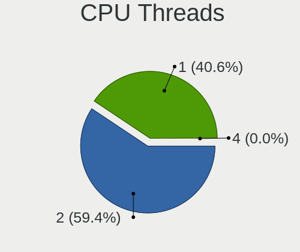
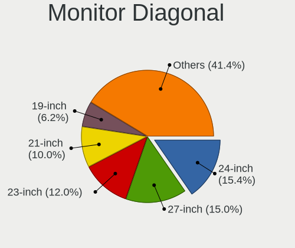
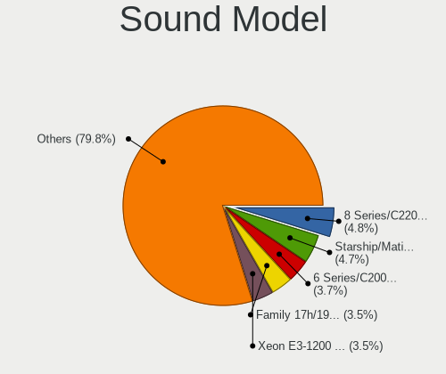
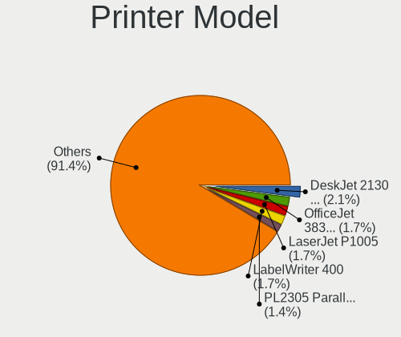

Ubuntu 22.04 - Tested Hardware & Statistics (Desktops)
------------------------------------------------------

A project to collect tested hardware configurations for Ubuntu 22.04.

Anyone can contribute to this report by the [hw-probe](https://github.com/linuxhw/hw-probe) tool:

    sudo -E hw-probe -all -upload

Please contribute! Especially if your hardware is rare.

Contents
--------

* [ Test Cases ](#test-cases)

* [ System ](#system)
  - [ Kernel                   ](#kernel)
  - [ Kernel Family            ](#kernel-family)
  - [ Kernel Major Ver.        ](#kernel-major-ver)
  - [ Arch                     ](#arch)
  - [ DE                       ](#de)
  - [ Display Server           ](#display-server)
  - [ Display Manager          ](#display-manager)
  - [ OS Lang                  ](#os-lang)
  - [ Boot Mode                ](#boot-mode)
  - [ Filesystem               ](#filesystem)
  - [ Part. scheme             ](#part-scheme)
  - [ Dual Boot with Linux/BSD ](#dual-boot-with-linuxbsd)
  - [ Dual Boot (Win)          ](#dual-boot-win)

* [ Board ](#board)
  - [ Vendor                   ](#vendor)
  - [ Model                    ](#model)
  - [ Model Family             ](#model-family)
  - [ MFG Year                 ](#mfg-year)
  - [ Form Factor              ](#form-factor)
  - [ Secure Boot              ](#secure-boot)
  - [ Coreboot                 ](#coreboot)
  - [ RAM Size                 ](#ram-size)
  - [ RAM Used                 ](#ram-used)
  - [ Total Drives             ](#total-drives)
  - [ Has CD-ROM               ](#has-cd-rom)
  - [ Has Ethernet             ](#has-ethernet)
  - [ Has WiFi                 ](#has-wifi)
  - [ Has Bluetooth            ](#has-bluetooth)

* [ Location ](#location)
  - [ Country                  ](#country)
  - [ City                     ](#city)

* [ Drives ](#drives)
  - [ Drive Vendor             ](#drive-vendor)
  - [ Drive Model              ](#drive-model)
  - [ HDD Vendor               ](#hdd-vendor)
  - [ SSD Vendor               ](#ssd-vendor)
  - [ Drive Kind               ](#drive-kind)
  - [ Drive Connector          ](#drive-connector)
  - [ Drive Size               ](#drive-size)
  - [ Space Total              ](#space-total)
  - [ Space Used               ](#space-used)
  - [ Malfunc. Drives          ](#malfunc-drives)
  - [ Malfunc. Drive Vendor    ](#malfunc-drive-vendor)
  - [ Malfunc. HDD Vendor      ](#malfunc-hdd-vendor)
  - [ Malfunc. Drive Kind      ](#malfunc-drive-kind)
  - [ Failed Drives            ](#failed-drives)
  - [ Failed Drive Vendor      ](#failed-drive-vendor)
  - [ Drive Status             ](#drive-status)

* [ Storage controller ](#storage-controller)
  - [ Storage Vendor           ](#storage-vendor)
  - [ Storage Model            ](#storage-model)
  - [ Storage Kind             ](#storage-kind)

* [ Processor ](#processor)
  - [ CPU Vendor               ](#cpu-vendor)
  - [ CPU Model                ](#cpu-model)
  - [ CPU Model Family         ](#cpu-model-family)
  - [ CPU Cores                ](#cpu-cores)
  - [ CPU Sockets              ](#cpu-sockets)
  - [ CPU Threads              ](#cpu-threads)
  - [ CPU Op-Modes             ](#cpu-op-modes)
  - [ CPU Microcode            ](#cpu-microcode)
  - [ CPU Microarch            ](#cpu-microarch)

* [ Graphics ](#graphics)
  - [ GPU Vendor               ](#gpu-vendor)
  - [ GPU Model                ](#gpu-model)
  - [ GPU Combo                ](#gpu-combo)
  - [ GPU Driver               ](#gpu-driver)
  - [ GPU Memory               ](#gpu-memory)

* [ Monitor ](#monitor)
  - [ Monitor Vendor           ](#monitor-vendor)
  - [ Monitor Model            ](#monitor-model)
  - [ Monitor Resolution       ](#monitor-resolution)
  - [ Monitor Diagonal         ](#monitor-diagonal)
  - [ Monitor Width            ](#monitor-width)
  - [ Aspect Ratio             ](#aspect-ratio)
  - [ Monitor Area             ](#monitor-area)
  - [ Pixel Density            ](#pixel-density)
  - [ Multiple Monitors        ](#multiple-monitors)

* [ Network ](#network)
  - [ Net Controller Vendor    ](#net-controller-vendor)
  - [ Net Controller Model     ](#net-controller-model)
  - [ Wireless Vendor          ](#wireless-vendor)
  - [ Wireless Model           ](#wireless-model)
  - [ Ethernet Vendor          ](#ethernet-vendor)
  - [ Ethernet Model           ](#ethernet-model)
  - [ Net Controller Kind      ](#net-controller-kind)
  - [ Used Controller          ](#used-controller)
  - [ NICs                     ](#nics)
  - [ IPv6                     ](#ipv6)

* [ Bluetooth ](#bluetooth)
  - [ Bluetooth Vendor         ](#bluetooth-vendor)
  - [ Bluetooth Model          ](#bluetooth-model)

* [ Sound ](#sound)
  - [ Sound Vendor             ](#sound-vendor)
  - [ Sound Model              ](#sound-model)

* [ Memory ](#memory)
  - [ Memory Vendor            ](#memory-vendor)
  - [ Memory Model             ](#memory-model)
  - [ Memory Kind              ](#memory-kind)
  - [ Memory Form Factor       ](#memory-form-factor)
  - [ Memory Size              ](#memory-size)
  - [ Memory Speed             ](#memory-speed)

* [ Printers & scanners ](#printers--scanners)
  - [ Printer Vendor           ](#printer-vendor)
  - [ Printer Model            ](#printer-model)
  - [ Scanner Vendor           ](#scanner-vendor)
  - [ Scanner Model            ](#scanner-model)

* [ Camera ](#camera)
  - [ Camera Vendor            ](#camera-vendor)
  - [ Camera Model             ](#camera-model)

* [ Security ](#security)
  - [ Fingerprint Vendor       ](#fingerprint-vendor)
  - [ Fingerprint Model        ](#fingerprint-model)
  - [ Chipcard Vendor          ](#chipcard-vendor)
  - [ Chipcard Model           ](#chipcard-model)

* [ Unsupported ](#unsupported)
  - [ Unsupported Devices      ](#unsupported-devices)
  - [ Unsupported Device Types ](#unsupported-device-types)

Test Cases
----------

Total: 150

| Vendor        | Model                       | Probe                                                      | Date         |
|---------------|-----------------------------|------------------------------------------------------------|--------------|
| Gigabyte      | B365M DS3H                  | [247ab2d4f1](https://linux-hardware.org/?probe=247ab2d4f1) | Apr 30, 2022 |
| Positivo      | POS-ECIG41BSA               | [b622f7f43f](https://linux-hardware.org/?probe=b622f7f43f) | Apr 30, 2022 |
| Medion        | MS-7616                     | [f3572ea9a5](https://linux-hardware.org/?probe=f3572ea9a5) | Apr 30, 2022 |
| Gigabyte      | H61M-DS2 x.x                | [463e99eb8c](https://linux-hardware.org/?probe=463e99eb8c) | Apr 30, 2022 |
| MSI           | X570-A PRO                  | [ff568c874c](https://linux-hardware.org/?probe=ff568c874c) | Apr 30, 2022 |
| Gigabyte      | B365M DS3H                  | [0a00cf3e33](https://linux-hardware.org/?probe=0a00cf3e33) | Apr 30, 2022 |
| Gigabyte      | B365M DS3H                  | [f140b54261](https://linux-hardware.org/?probe=f140b54261) | Apr 30, 2022 |
| Gigabyte      | B550M DS3H                  | [f62d8963d7](https://linux-hardware.org/?probe=f62d8963d7) | Apr 30, 2022 |
| ASRock        | B75M-ITX                    | [dbc851e0d3](https://linux-hardware.org/?probe=dbc851e0d3) | Apr 30, 2022 |
| HP            | 3396                        | [468c2975ee](https://linux-hardware.org/?probe=468c2975ee) | Apr 30, 2022 |
| Huanan        | X99-BD4 V/OPCZAO            | [2f215a330a](https://linux-hardware.org/?probe=2f215a330a) | Apr 30, 2022 |
| MSI           | B550-A PRO                  | [0b23621ed1](https://linux-hardware.org/?probe=0b23621ed1) | Apr 30, 2022 |
| MSI           | A88XM-E45 V2                | [a50ad068b1](https://linux-hardware.org/?probe=a50ad068b1) | Apr 30, 2022 |
| Gigabyte      | B550M DS3H                  | [7797c23169](https://linux-hardware.org/?probe=7797c23169) | Apr 30, 2022 |
| MSI           | A320M PRO-E                 | [655905bb3b](https://linux-hardware.org/?probe=655905bb3b) | Apr 29, 2022 |
| Fujitsu       | D3222-A1 S26361-D3222-A1    | [fe522bdf2e](https://linux-hardware.org/?probe=fe522bdf2e) | Apr 29, 2022 |
| ASUSTek       | M5A97 LE R2.0               | [686f4acac4](https://linux-hardware.org/?probe=686f4acac4) | Apr 29, 2022 |
| ASUSTek       | Rampage IV EXTREME          | [111d072676](https://linux-hardware.org/?probe=111d072676) | Apr 29, 2022 |
| Dell          | 07WP95 A02                  | [8dd4d42608](https://linux-hardware.org/?probe=8dd4d42608) | Apr 29, 2022 |
| Huanan        | X99-BD4 V/OPCZAO            | [a5743a1922](https://linux-hardware.org/?probe=a5743a1922) | Apr 29, 2022 |
| Pepper Job... | GLK-UC2X                    | [28495f32bd](https://linux-hardware.org/?probe=28495f32bd) | Apr 29, 2022 |
| Alienware     | 07W25T A00                  | [b989838f70](https://linux-hardware.org/?probe=b989838f70) | Apr 29, 2022 |
| MSI           | MAG Z490 TOMAHAWK           | [27df4d83ea](https://linux-hardware.org/?probe=27df4d83ea) | Apr 29, 2022 |
| ASUSTek       | PRIME B360M-A               | [519ed87066](https://linux-hardware.org/?probe=519ed87066) | Apr 29, 2022 |
| ASUSTek       | PRIME B360M-A               | [c46a1d595b](https://linux-hardware.org/?probe=c46a1d595b) | Apr 29, 2022 |
| MSI           | A78M-E35                    | [8f9bf75a08](https://linux-hardware.org/?probe=8f9bf75a08) | Apr 29, 2022 |
| ASUSTek       | Z87-WS                      | [1c67952875](https://linux-hardware.org/?probe=1c67952875) | Apr 29, 2022 |
| MSI           | X470 GAMING PLUS MAX        | [d291472a69](https://linux-hardware.org/?probe=d291472a69) | Apr 28, 2022 |
| ASRock        | H61M-VG4                    | [92f92ef4ee](https://linux-hardware.org/?probe=92f92ef4ee) | Apr 28, 2022 |
| ASRock        | B450M Pro4                  | [773f69d63b](https://linux-hardware.org/?probe=773f69d63b) | Apr 28, 2022 |
| ASUSTek       | M5A78L LE                   | [96739891ab](https://linux-hardware.org/?probe=96739891ab) | Apr 28, 2022 |
| HP            | 22F8                        | [34b2b0f23f](https://linux-hardware.org/?probe=34b2b0f23f) | Apr 28, 2022 |
| ASUSTek       | TUF Z390-PLUS GAMING        | [919872f97b](https://linux-hardware.org/?probe=919872f97b) | Apr 28, 2022 |
| ASRock        | B450M Pro4                  | [2943b21899](https://linux-hardware.org/?probe=2943b21899) | Apr 28, 2022 |
| MSI           | B450M PRO-VDH PLUS          | [c4f91167bb](https://linux-hardware.org/?probe=c4f91167bb) | Apr 27, 2022 |
| MSI           | B550M PRO-VDH WIFI          | [b923126955](https://linux-hardware.org/?probe=b923126955) | Apr 27, 2022 |
| ASUSTek       | H110M-A/M.2                 | [4c6852d631](https://linux-hardware.org/?probe=4c6852d631) | Apr 27, 2022 |
| ASUSTek       | TUF Gaming B450-PLUS II     | [f06ce3d416](https://linux-hardware.org/?probe=f06ce3d416) | Apr 27, 2022 |
| ASRock        | H61M-VG4                    | [204b1328f2](https://linux-hardware.org/?probe=204b1328f2) | Apr 27, 2022 |
| ASUSTek       | Pro WS WRX80E-SAGE SE WI... | [a3f49d1a04](https://linux-hardware.org/?probe=a3f49d1a04) | Apr 27, 2022 |
| ASUSTek       | Pro WS WRX80E-SAGE SE WI... | [b47f678ce9](https://linux-hardware.org/?probe=b47f678ce9) | Apr 27, 2022 |
| ASRock        | H61M-VG4                    | [fff58f97e8](https://linux-hardware.org/?probe=fff58f97e8) | Apr 27, 2022 |
| Gigabyte      | GA-880GM-UD2H               | [3c53a0e59d](https://linux-hardware.org/?probe=3c53a0e59d) | Apr 27, 2022 |
| Gigabyte      | H61M-S2PV                   | [f09766a481](https://linux-hardware.org/?probe=f09766a481) | Apr 27, 2022 |
| HP            | 22F8                        | [eb4d49a17b](https://linux-hardware.org/?probe=eb4d49a17b) | Apr 27, 2022 |
| Apple         | Mac-F42C88C8 Proto1         | [56da721176](https://linux-hardware.org/?probe=56da721176) | Apr 27, 2022 |
| Apple         | Mac-F42C88C8 Proto1         | [1619af58d4](https://linux-hardware.org/?probe=1619af58d4) | Apr 27, 2022 |
| Gigabyte      | B550I AORUS PRO AX          | [3c6aace75c](https://linux-hardware.org/?probe=3c6aace75c) | Apr 27, 2022 |
| MSI           | 880GMA-E35                  | [6ff68166f7](https://linux-hardware.org/?probe=6ff68166f7) | Apr 26, 2022 |
| Dell          | 0WR7PY A03                  | [4ac0a4dff1](https://linux-hardware.org/?probe=4ac0a4dff1) | Apr 26, 2022 |
| Dell          | 0VNM11 A00                  | [6aae7c23ad](https://linux-hardware.org/?probe=6aae7c23ad) | Apr 26, 2022 |
| MSI           | A320M-A PRO MAX             | [e06fd46729](https://linux-hardware.org/?probe=e06fd46729) | Apr 26, 2022 |
| Biostar       | J3160NH                     | [8ffd3a1aa4](https://linux-hardware.org/?probe=8ffd3a1aa4) | Apr 26, 2022 |
| MSI           | Z68A-GD80                   | [fedca9082a](https://linux-hardware.org/?probe=fedca9082a) | Apr 25, 2022 |
| ASUSTek       | H81M-V3                     | [4d87f6f113](https://linux-hardware.org/?probe=4d87f6f113) | Apr 25, 2022 |
| Gigabyte      | P55M-UD2                    | [5f9ffc8d46](https://linux-hardware.org/?probe=5f9ffc8d46) | Apr 24, 2022 |
| Dell          | 0GXM1W A02                  | [6564561a75](https://linux-hardware.org/?probe=6564561a75) | Apr 24, 2022 |
| ASRock        | Z170 Gaming K4              | [96b772b4e6](https://linux-hardware.org/?probe=96b772b4e6) | Apr 24, 2022 |
| Acer          | FX58M                       | [3074ddb372](https://linux-hardware.org/?probe=3074ddb372) | Apr 24, 2022 |
| Dell          | 0GXM1W A02                  | [af6b49b2a5](https://linux-hardware.org/?probe=af6b49b2a5) | Apr 24, 2022 |
| Gigabyte      | G1.Sniper B5-CF             | [4f148a3f66](https://linux-hardware.org/?probe=4f148a3f66) | Apr 24, 2022 |
| Gigabyte      | G1.Sniper B5-CF             | [e0e448efcb](https://linux-hardware.org/?probe=e0e448efcb) | Apr 24, 2022 |
| ASUSTek       | F2A85-M PRO                 | [e0298dd8f0](https://linux-hardware.org/?probe=e0298dd8f0) | Apr 24, 2022 |
| HP            | 21EF                        | [9e37979ea3](https://linux-hardware.org/?probe=9e37979ea3) | Apr 23, 2022 |
| Gigabyte      | Z390 M GAMING-CF            | [929f99800a](https://linux-hardware.org/?probe=929f99800a) | Apr 23, 2022 |
| Dell          | 00V62H A00                  | [2da43c32a4](https://linux-hardware.org/?probe=2da43c32a4) | Apr 23, 2022 |
| Dell          | 0HD5W2 A00                  | [3b01c4a4a5](https://linux-hardware.org/?probe=3b01c4a4a5) | Apr 23, 2022 |
| MSI           | MS-1T11                     | [9c16a631ef](https://linux-hardware.org/?probe=9c16a631ef) | Apr 23, 2022 |
| MSI           | MS-1T11                     | [e263cd80f5](https://linux-hardware.org/?probe=e263cd80f5) | Apr 23, 2022 |
| HP            | 22F8                        | [67dc13d1ad](https://linux-hardware.org/?probe=67dc13d1ad) | Apr 23, 2022 |
| ASUSTek       | PRIME B560-PLUS             | [8e31efa5fa](https://linux-hardware.org/?probe=8e31efa5fa) | Apr 23, 2022 |
| Dell          | 088DT1 A01                  | [9e72ff0940](https://linux-hardware.org/?probe=9e72ff0940) | Apr 22, 2022 |
| ASUSTek       | CROSSHAIR II FORMULA        | [d35c4838f2](https://linux-hardware.org/?probe=d35c4838f2) | Apr 22, 2022 |
| ASUSTek       | CROSSHAIR II FORMULA        | [61e0546ed7](https://linux-hardware.org/?probe=61e0546ed7) | Apr 22, 2022 |
| ASRock        | Z370 Pro4-IB                | [c0c51e4d53](https://linux-hardware.org/?probe=c0c51e4d53) | Apr 22, 2022 |
| Dell          | 0HD5W2 A00                  | [ddfd89e9dc](https://linux-hardware.org/?probe=ddfd89e9dc) | Apr 22, 2022 |
| MSI           | MPG B550 GAMING EDGE WIF... | [a76e953825](https://linux-hardware.org/?probe=a76e953825) | Apr 22, 2022 |
| MSI           | MAG B460 TOMAHAWK           | [8ef18c7ea4](https://linux-hardware.org/?probe=8ef18c7ea4) | Apr 21, 2022 |
| HP            | 8054                        | [f9ec7b0896](https://linux-hardware.org/?probe=f9ec7b0896) | Apr 21, 2022 |
| Lenovo        | ThinkCentre M58 6258D3G     | [b84eab559e](https://linux-hardware.org/?probe=b84eab559e) | Apr 21, 2022 |
| Gigabyte      | B450M GAMING                | [bf31ebdabe](https://linux-hardware.org/?probe=bf31ebdabe) | Apr 21, 2022 |
| MSI           | Z97 GAMING 5                | [a6bd59cad3](https://linux-hardware.org/?probe=a6bd59cad3) | Apr 20, 2022 |
| ASRock        | X470 Taichi Ultimate        | [d10be6941f](https://linux-hardware.org/?probe=d10be6941f) | Apr 20, 2022 |
| ASRock        | X470 Taichi Ultimate        | [a92dda8ded](https://linux-hardware.org/?probe=a92dda8ded) | Apr 20, 2022 |
| MSI           | Z97 GAMING 5                | [350979cb0a](https://linux-hardware.org/?probe=350979cb0a) | Apr 19, 2022 |
| Gigabyte      | H310M S2H x.x               | [a0325fabb2](https://linux-hardware.org/?probe=a0325fabb2) | Apr 17, 2022 |
| Gigabyte      | H310M S2H x.x               | [d775ab24fe](https://linux-hardware.org/?probe=d775ab24fe) | Apr 17, 2022 |
| MSI           | 970 GAMING                  | [1ed579d3d1](https://linux-hardware.org/?probe=1ed579d3d1) | Apr 16, 2022 |
| MSI           | 970 GAMING                  | [dae8a4db62](https://linux-hardware.org/?probe=dae8a4db62) | Apr 16, 2022 |
| Unknown       | Unknown                     | [3e2989ae49](https://linux-hardware.org/?probe=3e2989ae49) | Apr 15, 2022 |
| MSI           | MAG X570S TOMAHAWK MAX W... | [cf9feaf8ec](https://linux-hardware.org/?probe=cf9feaf8ec) | Apr 15, 2022 |
| Gigabyte      | B75M-D3P                    | [cfb6502298](https://linux-hardware.org/?probe=cfb6502298) | Apr 14, 2022 |
| MSI           | MEG X570 UNIFY              | [bacc580e7a](https://linux-hardware.org/?probe=bacc580e7a) | Apr 13, 2022 |
| MSI           | X370 GAMING PRO CARBON A... | [e4ea2782f9](https://linux-hardware.org/?probe=e4ea2782f9) | Apr 10, 2022 |
| Gigabyte      | H55M-S2HP                   | [f394924315](https://linux-hardware.org/?probe=f394924315) | Apr 10, 2022 |
| Gigabyte      | H55M-S2HP                   | [9edb3bbc43](https://linux-hardware.org/?probe=9edb3bbc43) | Apr 10, 2022 |
| ASUSTek       | ROG STRIX B350-F GAMING     | [1009093226](https://linux-hardware.org/?probe=1009093226) | Apr 10, 2022 |
| Lenovo        | 3098 SDK0E50510 WIN 2625... | [62c84ef4b4](https://linux-hardware.org/?probe=62c84ef4b4) | Apr 09, 2022 |
| Lenovo        | 3098 SDK0E50510 WIN 2625... | [07bde861ad](https://linux-hardware.org/?probe=07bde861ad) | Apr 09, 2022 |
| ASUSTek       | P8H61-M LX3 R2.0            | [8a07adc0f8](https://linux-hardware.org/?probe=8a07adc0f8) | Apr 09, 2022 |
| Unknown       | HX90                        | [913b92a244](https://linux-hardware.org/?probe=913b92a244) | Apr 08, 2022 |
| HP            | 1495                        | [36ea4763de](https://linux-hardware.org/?probe=36ea4763de) | Apr 08, 2022 |
| Maxtang       | FP30 V1.0                   | [2062d8578e](https://linux-hardware.org/?probe=2062d8578e) | Apr 08, 2022 |
| Gigabyte      | X570 AORUS ELITE            | [fa9314716d](https://linux-hardware.org/?probe=fa9314716d) | Apr 07, 2022 |
| ASUSTek       | ROG STRIX B550-I GAMING     | [d2f9498bd2](https://linux-hardware.org/?probe=d2f9498bd2) | Apr 05, 2022 |
| Acer          | Aspire XC-603               | [ef344607ad](https://linux-hardware.org/?probe=ef344607ad) | Apr 04, 2022 |
| Packard Be... | IMEDIA S2110A               | [b8bf871708](https://linux-hardware.org/?probe=b8bf871708) | Apr 04, 2022 |
| Gigabyte      | B365 M AORUS ELITE-CF       | [7da8a936ea](https://linux-hardware.org/?probe=7da8a936ea) | Apr 04, 2022 |
| Gigabyte      | Z690 UD AX                  | [a052a5e936](https://linux-hardware.org/?probe=a052a5e936) | Apr 03, 2022 |
| Unknown       | Unknown                     | [ec51dcaf0a](https://linux-hardware.org/?probe=ec51dcaf0a) | Apr 03, 2022 |
| MSI           | MAG B660M MORTAR DDR4       | [a9f2820894](https://linux-hardware.org/?probe=a9f2820894) | Apr 02, 2022 |
| Dell          | 07PR60 A00                  | [40f34fbc8f](https://linux-hardware.org/?probe=40f34fbc8f) | Apr 01, 2022 |
| Fujitsu       | D3223-C1 S26361-D3223-C1    | [f0fdc95810](https://linux-hardware.org/?probe=f0fdc95810) | Apr 01, 2022 |
| HP            | ProLiant ML110 G7           | [9e1e2b2ae7](https://linux-hardware.org/?probe=9e1e2b2ae7) | Apr 01, 2022 |
| MSI           | X370 GAMING PRO CARBON A... | [ce2e9f743d](https://linux-hardware.org/?probe=ce2e9f743d) | Mar 31, 2022 |
| Dell          | 0YNVJG A01                  | [4ccce61117](https://linux-hardware.org/?probe=4ccce61117) | Mar 30, 2022 |
| MSI           | B450M PRO-M2 MAX            | [f21ef43d0f](https://linux-hardware.org/?probe=f21ef43d0f) | Mar 30, 2022 |
| Le Cube 1     | Unknown                     | [a881cc0397](https://linux-hardware.org/?probe=a881cc0397) | Mar 26, 2022 |
| HP            | 1589                        | [8c1f30bb6f](https://linux-hardware.org/?probe=8c1f30bb6f) | Mar 23, 2022 |
| ASRock        | 970 Extreme3 R2.0           | [f417e6a6ef](https://linux-hardware.org/?probe=f417e6a6ef) | Mar 11, 2022 |
| Unknown       | T3 MRD                      | [256dc440ec](https://linux-hardware.org/?probe=256dc440ec) | Mar 09, 2022 |
| MSI           | X370 GAMING PRO CARBON A... | [1fb25ad2c3](https://linux-hardware.org/?probe=1fb25ad2c3) | Mar 05, 2022 |
| ASUSTek       | M4A87TD/USB3                | [aa80ded615](https://linux-hardware.org/?probe=aa80ded615) | Mar 04, 2022 |
| ASUSTek       | M4A87TD/USB3                | [3e997c5618](https://linux-hardware.org/?probe=3e997c5618) | Mar 03, 2022 |
| Unknown       | T3 MRD                      | [35ab38818d](https://linux-hardware.org/?probe=35ab38818d) | Feb 28, 2022 |
| Unknown       | T3 MRD                      | [01dd9cefa7](https://linux-hardware.org/?probe=01dd9cefa7) | Feb 28, 2022 |
| Gigabyte      | X570 I AORUS PRO WIFI       | [18d37562a8](https://linux-hardware.org/?probe=18d37562a8) | Feb 26, 2022 |
| Gigabyte      | X570 I AORUS PRO WIFI       | [d8af57f59a](https://linux-hardware.org/?probe=d8af57f59a) | Feb 26, 2022 |
| Gigabyte      | H61M-DS2 DVI                | [90c43679f7](https://linux-hardware.org/?probe=90c43679f7) | Feb 23, 2022 |
| MSI           | X370 GAMING PRO CARBON A... | [fa5ed1f68b](https://linux-hardware.org/?probe=fa5ed1f68b) | Feb 13, 2022 |
| Gigabyte      | X570S AORUS PRO AX          | [e329340668](https://linux-hardware.org/?probe=e329340668) | Feb 11, 2022 |
| Dell          | 0YXT71 A03                  | [19227aa57d](https://linux-hardware.org/?probe=19227aa57d) | Feb 11, 2022 |
| HP            | 212B                        | [fab24340a5](https://linux-hardware.org/?probe=fab24340a5) | Feb 10, 2022 |
| ASRockRack    | X470D4U2/1N1                | [735bc0f806](https://linux-hardware.org/?probe=735bc0f806) | Feb 04, 2022 |
| ASUSTek       | P5P41T/USB3                 | [f45dc3454a](https://linux-hardware.org/?probe=f45dc3454a) | Jan 25, 2022 |
| ASUSTek       | P5P41T/USB3                 | [b69dafbb2b](https://linux-hardware.org/?probe=b69dafbb2b) | Jan 25, 2022 |
| ASUSTek       | P5P41T/USB3                 | [105593cece](https://linux-hardware.org/?probe=105593cece) | Jan 23, 2022 |
| Gigabyte      | GB-BSi7-1165G7              | [ab94ff1199](https://linux-hardware.org/?probe=ab94ff1199) | Jan 20, 2022 |
| MSI           | Z490-A PRO                  | [b2655bbd43](https://linux-hardware.org/?probe=b2655bbd43) | Jan 15, 2022 |
| MSI           | C236A WORKSTATION           | [97795d3ebc](https://linux-hardware.org/?probe=97795d3ebc) | Jan 07, 2022 |
| Intel         | H61                         | [e2b49aa759](https://linux-hardware.org/?probe=e2b49aa759) | Dec 30, 2021 |
| Lenovo        | 3141 NOK                    | [cc90d7c889](https://linux-hardware.org/?probe=cc90d7c889) | Dec 13, 2021 |
| ASUSTek       | ROG STRIX B350-F GAMING     | [0db33a5b23](https://linux-hardware.org/?probe=0db33a5b23) | Dec 10, 2021 |
| Huanan        | X99 F8D V2.2                | [dcd5217827](https://linux-hardware.org/?probe=dcd5217827) | Nov 29, 2021 |
| Gigabyte      | M52L-S3                     | [16854f2502](https://linux-hardware.org/?probe=16854f2502) | Nov 29, 2021 |
| Gigabyte      | M52L-S3                     | [e6f3417028](https://linux-hardware.org/?probe=e6f3417028) | Nov 27, 2021 |
| Gigabyte      | EP31-DS3L                   | [c0134f6231](https://linux-hardware.org/?probe=c0134f6231) | Nov 11, 2021 |
| Gigabyte      | EP31-DS3L                   | [4d659bf7e4](https://linux-hardware.org/?probe=4d659bf7e4) | Nov 11, 2021 |
| ASUSTek       | K30AD_M31AD_M51AD_M32AD     | [36e64b8256](https://linux-hardware.org/?probe=36e64b8256) | Nov 10, 2021 |
| MSI           | MS-7235                     | [bbfa7fb897](https://linux-hardware.org/?probe=bbfa7fb897) | Oct 24, 2021 |

System
------

Kernel
------

Version of the Linux kernel

| Version                   | Desktops | Percent |
|---------------------------|----------|---------|
| 5.15.0-25-generic         | 39       | 33.62%  |
| 5.15.0-27-generic         | 34       | 29.31%  |
| 5.15.0-23-generic         | 10       | 8.62%   |
| 5.15.0-18-generic         | 9        | 7.76%   |
| 5.13.0-19-generic         | 7        | 6.03%   |
| 5.15.0-22-generic         | 3        | 2.59%   |
| 5.17.5-051705-generic     | 1        | 0.86%   |
| 5.17.4-051704-generic     | 1        | 0.86%   |
| 5.17.2-051702-generic     | 1        | 0.86%   |
| 5.17.1-051701-generic     | 1        | 0.86%   |
| 5.17.0-tkg-cacule         | 1        | 0.86%   |
| 5.17.0-4.1-liquorix-amd64 | 1        | 0.86%   |
| 5.17.0-1003-oem           | 1        | 0.86%   |
| 5.17.0-051700-generic     | 1        | 0.86%   |
| 5.16.0-051600-generic     | 1        | 0.86%   |
| 5.15.13-051513-generic    | 1        | 0.86%   |
| 5.15.0-27-lowlatency      | 1        | 0.86%   |
| 5.15.0-17-generic         | 1        | 0.86%   |
| 5.15.0-051500rc7-generic  | 1        | 0.86%   |
| 5.13.0-20-generic         | 1        | 0.86%   |

Kernel Family
-------------

Linux kernel without a distro release

| Version | Desktops | Percent |
|---------|----------|---------|
| 5.15.0  | 96       | 84.21%  |
| 5.13.0  | 8        | 7.02%   |
| 5.17.0  | 4        | 3.51%   |
| 5.17.5  | 1        | 0.88%   |
| 5.17.4  | 1        | 0.88%   |
| 5.17.2  | 1        | 0.88%   |
| 5.17.1  | 1        | 0.88%   |
| 5.16.0  | 1        | 0.88%   |
| 5.15.13 | 1        | 0.88%   |

Kernel Major Ver.
-----------------

Linux kernel major version

| Version | Desktops | Percent |
|---------|----------|---------|
| 5.15    | 97       | 85.09%  |
| 5.17    | 8        | 7.02%   |
| 5.13    | 8        | 7.02%   |
| 5.16    | 1        | 0.88%   |

Arch
----

OS architecture (x86_64, i586, etc.)

| Name   | Desktops | Percent |
|--------|----------|---------|
| x86_64 | 114      | 100%    |

DE
--

Desktop Environment

| Name            | Desktops | Percent |
|-----------------|----------|---------|
| GNOME           | 102      | 89.47%  |
| Unknown         | 7        | 6.14%   |
| X-Cinnamon      | 3        | 2.63%   |
| Unity           | 1        | 0.88%   |
| GNOME Flashback | 1        | 0.88%   |

Display Server
--------------

X11 or Wayland

| Name    | Desktops | Percent |
|---------|----------|---------|
| Wayland | 64       | 56.14%  |
| X11     | 44       | 38.6%   |
| Unknown | 4        | 3.51%   |
| Tty     | 2        | 1.75%   |

Display Manager
---------------

SDDM, LightDM, etc.

| Name    | Desktops | Percent |
|---------|----------|---------|
| GDM3    | 95       | 83.33%  |
| Unknown | 14       | 12.28%  |
| LightDM | 2        | 1.75%   |
| GDM     | 2        | 1.75%   |
| SDDM    | 1        | 0.88%   |

OS Lang
-------

Language

| Lang  | Desktops | Percent |
|-------|----------|---------|
| en_US | 43       | 37.72%  |
| de_DE | 13       | 11.4%   |
| en_GB | 8        | 7.02%   |
| pt_BR | 7        | 6.14%   |
| fr_FR | 6        | 5.26%   |
| cs_CZ | 6        | 5.26%   |
| en_CA | 4        | 3.51%   |
| pl_PL | 3        | 2.63%   |
| es_ES | 3        | 2.63%   |
| en_IN | 3        | 2.63%   |
| en_AU | 3        | 2.63%   |
| zh_CN | 2        | 1.75%   |
| ru_RU | 2        | 1.75%   |
| zh_TW | 1        | 0.88%   |
| th_TH | 1        | 0.88%   |
| sk_SK | 1        | 0.88%   |
| ro_RO | 1        | 0.88%   |
| pt_PT | 1        | 0.88%   |
| nl_BE | 1        | 0.88%   |
| it_IT | 1        | 0.88%   |
| hu_HU | 1        | 0.88%   |
| fi_FI | 1        | 0.88%   |
| de_AT | 1        | 0.88%   |
| C     | 1        | 0.88%   |

Boot Mode
---------

EFI or BIOS

| Mode | Desktops | Percent |
|------|----------|---------|
| BIOS | 76       | 66.67%  |
| EFI  | 38       | 33.33%  |

Filesystem
----------

Type of filesystem

| Type    | Desktops | Percent |
|---------|----------|---------|
| Ext4    | 98       | 85.22%  |
| Zfs     | 7        | 6.09%   |
| Xfs     | 4        | 3.48%   |
| Overlay | 3        | 2.61%   |
| Btrfs   | 3        | 2.61%   |

Part. scheme
------------

Scheme of partitioning

| Type    | Desktops | Percent |
|---------|----------|---------|
| Unknown | 83       | 72.81%  |
| GPT     | 29       | 25.44%  |
| MBR     | 2        | 1.75%   |

Dual Boot with Linux/BSD
------------------------

Hosting more than one Linux/BSD

| Dual boot | Desktops | Percent |
|-----------|----------|---------|
| No        | 89       | 78.07%  |
| Yes       | 25       | 21.93%  |

Dual Boot (Win)
---------------

Hosting Linux and Windows

| Dual boot | Desktops | Percent |
|-----------|----------|---------|
| Yes       | 57       | 50%     |
| No        | 57       | 50%     |

Board
-----

Vendor
------

Motherboard manufacturer

| Name                | Desktops | Percent |
|---------------------|----------|---------|
| MSI                 | 25       | 21.93%  |
| Gigabyte Technology | 22       | 19.3%   |
| ASUSTek Computer    | 19       | 16.67%  |
| Dell                | 10       | 8.77%   |
| Hewlett-Packard     | 8        | 7.02%   |
| ASRock              | 8        | 7.02%   |
| Lenovo              | 3        | 2.63%   |
| Unknown             | 3        | 2.63%   |
| Huanan              | 2        | 1.75%   |
| Fujitsu             | 2        | 1.75%   |
| Positivo            | 1        | 0.88%   |
| Pepper Jobs         | 1        | 0.88%   |
| Packard Bell        | 1        | 0.88%   |
| Medion              | 1        | 0.88%   |
| Maxtang             | 1        | 0.88%   |
| Le Cube 1           | 1        | 0.88%   |
| Intel               | 1        | 0.88%   |
| Biostar             | 1        | 0.88%   |
| ASRockRack          | 1        | 0.88%   |
| Apple               | 1        | 0.88%   |
| Alienware           | 1        | 0.88%   |
| Acer                | 1        | 0.88%   |

Model
-----

Motherboard model

| Name                              | Desktops | Percent |
|-----------------------------------|----------|---------|
| Unknown                           | 4        | 3.51%   |
| Dell OptiPlex 7010                | 3        | 2.63%   |
| MSI MS-7721                       | 2        | 1.75%   |
| ASUS ROG STRIX B350-F GAMING      | 2        | 1.75%   |
| ASUS All Series                   | 2        | 1.75%   |
| ASRock X470 Taichi Ultimate       | 2        | 1.75%   |
| Positivo POS-ECIG41BS             | 1        | 0.88%   |
| Pepper Jobs GLK-UC2X              | 1        | 0.88%   |
| Packard Bell IMEDIA S2110         | 1        | 0.88%   |
| MSI Vortex G65VR 6RE SLI          | 1        | 0.88%   |
| MSI MS-7D54                       | 1        | 0.88%   |
| MSI MS-7D42                       | 1        | 0.88%   |
| MSI MS-7C95                       | 1        | 0.88%   |
| MSI MS-7C91                       | 1        | 0.88%   |
| MSI MS-7C81                       | 1        | 0.88%   |
| MSI MS-7C80                       | 1        | 0.88%   |
| MSI MS-7C75                       | 1        | 0.88%   |
| MSI MS-7C56                       | 1        | 0.88%   |
| MSI MS-7C52                       | 1        | 0.88%   |
| MSI MS-7C37                       | 1        | 0.88%   |
| MSI MS-7C35                       | 1        | 0.88%   |
| MSI MS-7B84                       | 1        | 0.88%   |
| MSI MS-7B79                       | 1        | 0.88%   |
| MSI MS-7A38                       | 1        | 0.88%   |
| MSI MS-7A32                       | 1        | 0.88%   |
| MSI MS-7998                       | 1        | 0.88%   |
| MSI MS-7917                       | 1        | 0.88%   |
| MSI MS-7693                       | 1        | 0.88%   |
| MSI MS-7672                       | 1        | 0.88%   |
| MSI MS-7641                       | 1        | 0.88%   |
| MSI MS-7235                       | 1        | 0.88%   |
| MSI Hyrican PC A320M PRO-E        | 1        | 0.88%   |
| Medion MS-7616                    | 1        | 0.88%   |
| Maxtang FP30                      | 1        | 0.88%   |
| Lenovo ThinkCentre M73 10B6001SUS | 1        | 0.88%   |
| Lenovo ThinkCentre M58 6258D3G    | 1        | 0.88%   |
| Lenovo QiTianM520-D164 90K7S03T00 | 1        | 0.88%   |
| Intel H61                         | 1        | 0.88%   |
| Huanan X99-BD4                    | 1        | 0.88%   |
| Huanan X99 F8D V2.2               | 1        | 0.88%   |
| HP Z440 Workstation               | 1        | 0.88%   |
| HP Z420 Workstation               | 1        | 0.88%   |
| HP t520 Flexible Series TC        | 1        | 0.88%   |
| HP ProLiant ML110 G7              | 1        | 0.88%   |
| HP Pro3500 G2 MT PC               | 1        | 0.88%   |
| HP EliteDesk 800 G2 SFF           | 1        | 0.88%   |
| HP Compaq Elite 8300 CMT          | 1        | 0.88%   |
| HP Compaq 8200 Elite SFF PC       | 1        | 0.88%   |
| Gigabyte Z690 UD AX               | 1        | 0.88%   |
| Gigabyte Z390 M GAMING            | 1        | 0.88%   |
| Gigabyte X570S AORUS PRO AX       | 1        | 0.88%   |
| Gigabyte X570 I AORUS PRO WIFI    | 1        | 0.88%   |
| Gigabyte X570 AORUS ELITE         | 1        | 0.88%   |
| Gigabyte P55M-UD2                 | 1        | 0.88%   |
| Gigabyte M52L-S3                  | 1        | 0.88%   |
| Gigabyte H61M-S2PV                | 1        | 0.88%   |
| Gigabyte H61M-DS2 x.x             | 1        | 0.88%   |
| Gigabyte H61M-DS2 DVI             | 1        | 0.88%   |
| Gigabyte H55M-S2HP                | 1        | 0.88%   |
| Gigabyte H310M S2H 2.0            | 1        | 0.88%   |

Model Family
------------

Motherboard model prefix

| Name                    | Desktops | Percent |
|-------------------------|----------|---------|
| Dell OptiPlex           | 8        | 7.02%   |
| Unknown                 | 4        | 3.51%   |
| ASUS ROG                | 3        | 2.63%   |
| MSI MS-7721             | 2        | 1.75%   |
| Lenovo ThinkCentre      | 2        | 1.75%   |
| HP Compaq               | 2        | 1.75%   |
| Gigabyte X570           | 2        | 1.75%   |
| Gigabyte H61M-DS2       | 2        | 1.75%   |
| Dell Inspiron           | 2        | 1.75%   |
| ASUS TUF                | 2        | 1.75%   |
| ASUS PRIME              | 2        | 1.75%   |
| ASUS All                | 2        | 1.75%   |
| ASRock X470             | 2        | 1.75%   |
| Positivo POS-ECIG41BS   | 1        | 0.88%   |
| Pepper Jobs GLK-UC2X    | 1        | 0.88%   |
| Packard Bell IMEDIA     | 1        | 0.88%   |
| MSI Vortex              | 1        | 0.88%   |
| MSI MS-7D54             | 1        | 0.88%   |
| MSI MS-7D42             | 1        | 0.88%   |
| MSI MS-7C95             | 1        | 0.88%   |
| MSI MS-7C91             | 1        | 0.88%   |
| MSI MS-7C81             | 1        | 0.88%   |
| MSI MS-7C80             | 1        | 0.88%   |
| MSI MS-7C75             | 1        | 0.88%   |
| MSI MS-7C56             | 1        | 0.88%   |
| MSI MS-7C52             | 1        | 0.88%   |
| MSI MS-7C37             | 1        | 0.88%   |
| MSI MS-7C35             | 1        | 0.88%   |
| MSI MS-7B84             | 1        | 0.88%   |
| MSI MS-7B79             | 1        | 0.88%   |
| MSI MS-7A38             | 1        | 0.88%   |
| MSI MS-7A32             | 1        | 0.88%   |
| MSI MS-7998             | 1        | 0.88%   |
| MSI MS-7917             | 1        | 0.88%   |
| MSI MS-7693             | 1        | 0.88%   |
| MSI MS-7672             | 1        | 0.88%   |
| MSI MS-7641             | 1        | 0.88%   |
| MSI MS-7235             | 1        | 0.88%   |
| MSI Hyrican             | 1        | 0.88%   |
| Medion MS-7616          | 1        | 0.88%   |
| Maxtang FP30            | 1        | 0.88%   |
| Lenovo QiTianM520-D164  | 1        | 0.88%   |
| Intel H61               | 1        | 0.88%   |
| Huanan X99-BD4          | 1        | 0.88%   |
| Huanan X99              | 1        | 0.88%   |
| HP Z440                 | 1        | 0.88%   |
| HP Z420                 | 1        | 0.88%   |
| HP t520                 | 1        | 0.88%   |
| HP ProLiant             | 1        | 0.88%   |
| HP Pro3500              | 1        | 0.88%   |
| HP EliteDesk            | 1        | 0.88%   |
| Gigabyte Z690           | 1        | 0.88%   |
| Gigabyte Z390           | 1        | 0.88%   |
| Gigabyte X570S          | 1        | 0.88%   |
| Gigabyte P55M-UD2       | 1        | 0.88%   |
| Gigabyte M52L-S3        | 1        | 0.88%   |
| Gigabyte H61M-S2PV      | 1        | 0.88%   |
| Gigabyte H55M-S2HP      | 1        | 0.88%   |
| Gigabyte H310M          | 1        | 0.88%   |
| Gigabyte GB-BSi7-1165G7 | 1        | 0.88%   |

MFG Year
--------

Motherboard manufacture year

| Year | Desktops | Percent |
|------|----------|---------|
| 2019 | 15       | 13.16%  |
| 2020 | 14       | 12.28%  |
| 2012 | 13       | 11.4%   |
| 2021 | 12       | 10.53%  |
| 2018 | 12       | 10.53%  |
| 2014 | 10       | 8.77%   |
| 2013 | 7        | 6.14%   |
| 2016 | 6        | 5.26%   |
| 2010 | 5        | 4.39%   |
| 2017 | 4        | 3.51%   |
| 2015 | 4        | 3.51%   |
| 2009 | 4        | 3.51%   |
| 2011 | 3        | 2.63%   |
| 2008 | 2        | 1.75%   |
| 2022 | 1        | 0.88%   |
| 2007 | 1        | 0.88%   |
| 2006 | 1        | 0.88%   |

Form Factor
-----------

Physical design of the computer

| Name    | Desktops | Percent |
|---------|----------|---------|
| Desktop | 114      | 100%    |

Secure Boot
-----------

Enabled or disabled

| State    | Desktops | Percent |
|----------|----------|---------|
| Disabled | 112      | 98.25%  |
| Enabled  | 2        | 1.75%   |

Coreboot
--------

Have coreboot on board

| Used | Desktops | Percent |
|------|----------|---------|
| No   | 114      | 100%    |

RAM Size
--------

Total RAM memory

| Size in GB      | Desktops | Percent |
|-----------------|----------|---------|
| 32.01-64.0      | 28       | 24.56%  |
| 16.01-24.0      | 26       | 22.81%  |
| 4.01-8.0        | 17       | 14.91%  |
| 8.01-16.0       | 16       | 14.04%  |
| 3.01-4.0        | 15       | 13.16%  |
| 64.01-256.0     | 10       | 8.77%   |
| More than 256.0 | 1        | 0.88%   |
| 24.01-32.0      | 1        | 0.88%   |

RAM Used
--------

Used RAM memory

| Used GB    | Desktops | Percent |
|------------|----------|---------|
| 1.01-2.0   | 40       | 34.78%  |
| 2.01-3.0   | 30       | 26.09%  |
| 4.01-8.0   | 20       | 17.39%  |
| 3.01-4.0   | 14       | 12.17%  |
| 8.01-16.0  | 7        | 6.09%   |
| 0.51-1.0   | 2        | 1.74%   |
| 24.01-32.0 | 1        | 0.87%   |
| 16.01-24.0 | 1        | 0.87%   |

Total Drives
------------

Number of drives on board

| Drives | Desktops | Percent |
|--------|----------|---------|
| 1      | 37       | 32.17%  |
| 2      | 33       | 28.7%   |
| 4      | 16       | 13.91%  |
| 3      | 14       | 12.17%  |
| 5      | 5        | 4.35%   |
| 8      | 4        | 3.48%   |
| 6      | 4        | 3.48%   |
| 20     | 1        | 0.87%   |
| 7      | 1        | 0.87%   |

Has CD-ROM
----------

Has CD-ROM on board

| Presented | Desktops | Percent |
|-----------|----------|---------|
| No        | 65       | 57.02%  |
| Yes       | 49       | 42.98%  |

Has Ethernet
------------

Has Ethernet on board

| Presented | Desktops | Percent |
|-----------|----------|---------|
| Yes       | 113      | 99.12%  |
| No        | 1        | 0.88%   |

Has WiFi
--------

Has WiFi module

| Presented | Desktops | Percent |
|-----------|----------|---------|
| No        | 60       | 52.63%  |
| Yes       | 54       | 47.37%  |

Has Bluetooth
-------------

Has Bluetooth module

| Presented | Desktops | Percent |
|-----------|----------|---------|
| No        | 71       | 62.28%  |
| Yes       | 43       | 37.72%  |

Location
--------

Country
-------

Geographic location (country)

| Country      | Desktops | Percent |
|--------------|----------|---------|
| USA          | 22       | 19.3%   |
| Germany      | 14       | 12.28%  |
| UK           | 9        | 7.89%   |
| Brazil       | 7        | 6.14%   |
| France       | 6        | 5.26%   |
| Czechia      | 6        | 5.26%   |
| Canada       | 5        | 4.39%   |
| Spain        | 4        | 3.51%   |
| Poland       | 4        | 3.51%   |
| Russia       | 3        | 2.63%   |
| India        | 3        | 2.63%   |
| Australia    | 3        | 2.63%   |
| Turkey       | 2        | 1.75%   |
| Romania      | 2        | 1.75%   |
| Peru         | 2        | 1.75%   |
| China        | 2        | 1.75%   |
| Austria      | 2        | 1.75%   |
| Thailand     | 1        | 0.88%   |
| Taiwan       | 1        | 0.88%   |
| Sweden       | 1        | 0.88%   |
| South Korea  | 1        | 0.88%   |
| Slovakia     | 1        | 0.88%   |
| Serbia       | 1        | 0.88%   |
| Saudi Arabia | 1        | 0.88%   |
| Réunion     | 1        | 0.88%   |
| Portugal     | 1        | 0.88%   |
| Lithuania    | 1        | 0.88%   |
| Japan        | 1        | 0.88%   |
| Italy        | 1        | 0.88%   |
| Hungary      | 1        | 0.88%   |
| Finland      | 1        | 0.88%   |
| Egypt        | 1        | 0.88%   |
| Denmark      | 1        | 0.88%   |
| Belgium      | 1        | 0.88%   |
| Argentina    | 1        | 0.88%   |

City
----

Geographic location (city)

| City                | Desktops | Percent |
|---------------------|----------|---------|
| Warsaw              | 2        | 1.75%   |
| Ottawa              | 2        | 1.75%   |
| Ostrava             | 2        | 1.75%   |
| Madrid              | 2        | 1.75%   |
| Istanbul            | 2        | 1.75%   |
| Bucharest           | 2        | 1.75%   |
| Brisbane            | 2        | 1.75%   |
| Zdanice             | 1        | 0.88%   |
| Yekaterinburg       | 1        | 0.88%   |
| Wuhan               | 1        | 0.88%   |
| Woodland Hills      | 1        | 0.88%   |
| West Monroe         | 1        | 0.88%   |
| Walled Lake         | 1        | 0.88%   |
| Vilnius             | 1        | 0.88%   |
| Vienna              | 1        | 0.88%   |
| Temple City         | 1        | 0.88%   |
| Sutton Coldfield    | 1        | 0.88%   |
| Surrey              | 1        | 0.88%   |
| Suffolk             | 1        | 0.88%   |
| Stirling            | 1        | 0.88%   |
| St Petersburg       | 1        | 0.88%   |
| Springdale          | 1        | 0.88%   |
| Soest               | 1        | 0.88%   |
| Sheffield           | 1        | 0.88%   |
| Seoul               | 1        | 0.88%   |
| Senonches           | 1        | 0.88%   |
| Seattle             | 1        | 0.88%   |
| San Valentino Torio | 1        | 0.88%   |
| Sainte-Marie        | 1        | 0.88%   |
| Rosario             | 1        | 0.88%   |
| Redditch            | 1        | 0.88%   |
| Recife              | 1        | 0.88%   |
| Prince Rupert       | 1        | 0.88%   |
| Prague              | 1        | 0.88%   |
| Pilsen              | 1        | 0.88%   |
| Phuket              | 1        | 0.88%   |
| Petersfield         | 1        | 0.88%   |
| Perth               | 1        | 0.88%   |
| Pacatuba            | 1        | 0.88%   |
| Osasco              | 1        | 0.88%   |
| Orzysz              | 1        | 0.88%   |
| Odivelas            | 1        | 0.88%   |
| Oakland             | 1        | 0.88%   |
| Novosibirsk         | 1        | 0.88%   |
| Norwich             | 1        | 0.88%   |
| Niederhaslach       | 1        | 0.88%   |
| Newark              | 1        | 0.88%   |
| New Taipei          | 1        | 0.88%   |
| Neuss               | 1        | 0.88%   |
| Moses Lake          | 1        | 0.88%   |
| Millville           | 1        | 0.88%   |
| Melykut             | 1        | 0.88%   |
| Manacapuru          | 1        | 0.88%   |
| Lund                | 1        | 0.88%   |
| London              | 1        | 0.88%   |
| Lodz                | 1        | 0.88%   |
| Linz                | 1        | 0.88%   |
| Lima                | 1        | 0.88%   |
| La Rochelle         | 1        | 0.88%   |
| La Mesa             | 1        | 0.88%   |

Drives
------

Drive Vendor
------------

Hard drive vendors

| Vendor                      | Desktops | Drives | Percent |
|-----------------------------|----------|--------|---------|
| Seagate                     | 40       | 59     | 17.09%  |
| WDC                         | 39       | 79     | 16.67%  |
| Samsung Electronics         | 36       | 49     | 15.38%  |
| Kingston                    | 16       | 19     | 6.84%   |
| Toshiba                     | 15       | 18     | 6.41%   |
| Crucial                     | 12       | 13     | 5.13%   |
| SanDisk                     | 9        | 11     | 3.85%   |
| HGST                        | 6        | 8      | 2.56%   |
| A-DATA Technology           | 5        | 5      | 2.14%   |
| SK Hynix                    | 4        | 6      | 1.71%   |
| Phison                      | 4        | 4      | 1.71%   |
| PNY                         | 3        | 4      | 1.28%   |
| OCZ                         | 3        | 9      | 1.28%   |
| Micron/Crucial Technology   | 3        | 6      | 1.28%   |
| Micron Technology           | 3        | 3      | 1.28%   |
| Intenso                     | 3        | 3      | 1.28%   |
| Intel                       | 3        | 3      | 1.28%   |
| Hitachi                     | 3        | 3      | 1.28%   |
| China                       | 3        | 3      | 1.28%   |
| XPG                         | 2        | 3      | 0.85%   |
| Unknown                     | 2        | 5      | 0.85%   |
| Transcend                   | 2        | 2      | 0.85%   |
| SPCC                        | 2        | 2      | 0.85%   |
| JMicron                     | 2        | 2      | 0.85%   |
| UMAX                        | 1        | 1      | 0.43%   |
| TCSUNBOW                    | 1        | 1      | 0.43%   |
| Silicon Motion              | 1        | 1      | 0.43%   |
| Patriot                     | 1        | 1      | 0.43%   |
| Netac                       | 1        | 1      | 0.43%   |
| MAXIO Technology (Hangzhou) | 1        | 1      | 0.43%   |
| LONDISK                     | 1        | 2      | 0.43%   |
| KIOXIA                      | 1        | 2      | 0.43%   |
| Gigabyte Technology         | 1        | 1      | 0.43%   |
| Dogfish                     | 1        | 1      | 0.43%   |
| COOLFISH                    | 1        | 1      | 0.43%   |
| ASMT                        | 1        | 1      | 0.43%   |
| Apacer                      | 1        | 1      | 0.43%   |
| AMD                         | 1        | 1      | 0.43%   |

Drive Model
-----------

Hard drive models

| Model                             | Desktops | Percent |
|-----------------------------------|----------|---------|
| Seagate ST2000DM008-2FR102 2TB    | 6        | 2.1%    |
| Samsung NVMe SSD Drive 1TB        | 6        | 2.1%    |
| Samsung SSD 980 1TB               | 5        | 1.75%   |
| WDC WD10EZEX-08WN4A0 1TB          | 4        | 1.4%    |
| Samsung SSD 860 EVO 500GB         | 4        | 1.4%    |
| Toshiba MQ01ABD100 1TB            | 3        | 1.05%   |
| Toshiba HDWD110 1TB               | 3        | 1.05%   |
| Toshiba DT01ACA050 500GB          | 3        | 1.05%   |
| Seagate ST1000DM010-2EP102 1TB    | 3        | 1.05%   |
| Samsung SSD 980 PRO 1TB           | 3        | 1.05%   |
| Samsung NVMe SSD Drive 500GB      | 3        | 1.05%   |
| Kingston NVMe SSD Drive 500GB     | 3        | 1.05%   |
| HGST HTS721010A9E630 1TB          | 3        | 1.05%   |
| Crucial CT1000MX500SSD1 1TB       | 3        | 1.05%   |
| WDC WD80EFAX-68LHPN0 8TB          | 2        | 0.7%    |
| WDC WD80EFAX-68KNBN0 8TB          | 2        | 0.7%    |
| WDC WD20SPZX-75UA7T1 2TB          | 2        | 0.7%    |
| WDC WD20EARX-00PASB0 2TB          | 2        | 0.7%    |
| WDC WD20EARS-00MVWB0 2TB          | 2        | 0.7%    |
| WDC WD10SPSX-60A6WT0 1TB          | 2        | 0.7%    |
| WDC WD10EZRX-00A8LB0 1TB          | 2        | 0.7%    |
| Toshiba DT01ACA200 2TB            | 2        | 0.7%    |
| Seagate ST500DM002-1BD142 500GB   | 2        | 0.7%    |
| Seagate ST31000528AS 1TB          | 2        | 0.7%    |
| Seagate ST2000VX005-1TD164 2TB    | 2        | 0.7%    |
| Seagate ST2000LM007-1R8174 2TB    | 2        | 0.7%    |
| Seagate ST2000DM006-2DM164 2TB    | 2        | 0.7%    |
| Seagate ST2000DM001-1ER164 2TB    | 2        | 0.7%    |
| Seagate ST2000DL003-9VT166 2TB    | 2        | 0.7%    |
| SanDisk SSD PLUS 2000GB           | 2        | 0.7%    |
| SanDisk SDSSDP128G 128GB          | 2        | 0.7%    |
| Sandisk NVMe SSD Drive 500GB      | 2        | 0.7%    |
| Sandisk NVMe SSD Drive 1TB        | 2        | 0.7%    |
| Samsung SSD 970 EVO Plus 1TB      | 2        | 0.7%    |
| Samsung SSD 850 EVO 500GB         | 2        | 0.7%    |
| OCZ NVMe SSD Drive 256GB          | 2        | 0.7%    |
| Micron/Crucial NVMe SSD Drive 1TB | 2        | 0.7%    |
| Kingston SA400S37240G 240GB SSD   | 2        | 0.7%    |
| Kingston NVMe SSD Drive 1TB       | 2        | 0.7%    |
| JMicron Generic 240GB             | 2        | 0.7%    |
| XPG NVMe SSD Drive 512GB          | 1        | 0.35%   |
| XPG GAMMIX S11 Pro 512GB          | 1        | 0.35%   |
| WDC WDS500G3X0C-00SJG0 500GB      | 1        | 0.35%   |
| WDC WDS250G2B0A-00SM50 250GB SSD  | 1        | 0.35%   |
| WDC WDS250G1B0A-00H9H0 250GB SSD  | 1        | 0.35%   |
| WDC WDS240G2G0A-00JH30 240GB SSD  | 1        | 0.35%   |
| WDC WDS240G1G0A-00SS50 240GB SSD  | 1        | 0.35%   |
| WDC WDS100T3X0C-00SJG0 1TB        | 1        | 0.35%   |
| WDC WDS100T2G0A-00JH30 1TB SSD    | 1        | 0.35%   |
| WDC WDS100T2B0C 1TB               | 1        | 0.35%   |
| WDC WD80EMAZ-00WJTA0 8TB          | 1        | 0.35%   |
| WDC WD80EFZX-68UW8N0 8TB          | 1        | 0.35%   |
| WDC WD800JD-75MSA3 80GB           | 1        | 0.35%   |
| WDC WD80 EMAZ-00WJTA0 8TB         | 1        | 0.35%   |
| WDC WD740GD-00FLC0 74GB           | 1        | 0.35%   |
| WDC WD6003FZBX-00K5WB0 6TB        | 1        | 0.35%   |
| WDC WD60 EFRX-68L0BN1 6TB         | 1        | 0.35%   |
| WDC WD5000LPVX-80V0TT0 500GB      | 1        | 0.35%   |
| WDC WD5000AVDS-63U7B1 500GB       | 1        | 0.35%   |
| WDC WD5000AAKX-60U6AA0 500GB      | 1        | 0.35%   |

HDD Vendor
----------

Hard disk drive vendors

| Vendor  | Desktops | Drives | Percent |
|---------|----------|--------|---------|
| Seagate | 38       | 57     | 39.18%  |
| WDC     | 34       | 70     | 35.05%  |
| Toshiba | 15       | 17     | 15.46%  |
| HGST    | 6        | 8      | 6.19%   |
| Hitachi | 3        | 3      | 3.09%   |
| ASMT    | 1        | 1      | 1.03%   |

SSD Vendor
----------

Solid state drive vendors

| Vendor              | Desktops | Drives | Percent |
|---------------------|----------|--------|---------|
| Samsung Electronics | 16       | 19     | 18.6%   |
| Kingston            | 12       | 13     | 13.95%  |
| Crucial             | 12       | 13     | 13.95%  |
| SanDisk             | 6        | 6      | 6.98%   |
| WDC                 | 4        | 5      | 4.65%   |
| A-DATA Technology   | 4        | 4      | 4.65%   |
| PNY                 | 3        | 4      | 3.49%   |
| Intenso             | 3        | 3      | 3.49%   |
| Intel               | 3        | 3      | 3.49%   |
| China               | 3        | 3      | 3.49%   |
| Transcend           | 2        | 2      | 2.33%   |
| SPCC                | 2        | 2      | 2.33%   |
| SK Hynix            | 2        | 2      | 2.33%   |
| JMicron             | 2        | 2      | 2.33%   |
| UMAX                | 1        | 1      | 1.16%   |
| Toshiba             | 1        | 1      | 1.16%   |
| Phison              | 1        | 1      | 1.16%   |
| Patriot             | 1        | 1      | 1.16%   |
| OCZ                 | 1        | 1      | 1.16%   |
| Netac               | 1        | 1      | 1.16%   |
| Micron Technology   | 1        | 1      | 1.16%   |
| LONDISK             | 1        | 2      | 1.16%   |
| Gigabyte Technology | 1        | 1      | 1.16%   |
| Dogfish             | 1        | 1      | 1.16%   |
| Apacer              | 1        | 1      | 1.16%   |
| AMD                 | 1        | 1      | 1.16%   |

Drive Kind
----------

HDD or SSD

| Kind    | Desktops | Drives | Percent |
|---------|----------|--------|---------|
| HDD     | 74       | 156    | 37.95%  |
| SSD     | 67       | 94     | 34.36%  |
| NVMe    | 48       | 76     | 24.62%  |
| Unknown | 4        | 4      | 2.05%   |
| MMC     | 2        | 5      | 1.03%   |

Drive Connector
---------------

SATA, SAS, NVMe, etc.

| Type | Desktops | Drives | Percent |
|------|----------|--------|---------|
| SATA | 100      | 233    | 62.11%  |
| NVMe | 48       | 75     | 29.81%  |
| SAS  | 11       | 22     | 6.83%   |
| MMC  | 2        | 5      | 1.24%   |

Drive Size
----------

Size of hard drive

| Size in TB | Desktops | Drives | Percent |
|------------|----------|--------|---------|
| 0.01-0.5   | 70       | 92     | 44.03%  |
| 0.51-1.0   | 42       | 63     | 26.42%  |
| 1.01-2.0   | 27       | 48     | 16.98%  |
| 3.01-4.0   | 7        | 9      | 4.4%    |
| 2.01-3.0   | 5        | 6      | 3.14%   |
| 4.01-10.0  | 5        | 25     | 3.14%   |
| 10.01-20.0 | 3        | 7      | 1.89%   |

Space Total
-----------

Amount of disk space available on the file system

| Size in GB     | Desktops | Percent |
|----------------|----------|---------|
| 101-250        | 32       | 27.83%  |
| 251-500        | 17       | 14.78%  |
| 1001-2000      | 16       | 13.91%  |
| 501-1000       | 16       | 13.91%  |
| More than 3000 | 12       | 10.43%  |
| 2001-3000      | 9        | 7.83%   |
| 1-20           | 8        | 6.96%   |
| 51-100         | 4        | 3.48%   |
| Unknown        | 1        | 0.87%   |

Space Used
----------

Amount of used disk space

| Used GB        | Desktops | Percent |
|----------------|----------|---------|
| 1-20           | 39       | 33.91%  |
| 21-50          | 18       | 15.65%  |
| 251-500        | 14       | 12.17%  |
| 101-250        | 12       | 10.43%  |
| More than 3000 | 8        | 6.96%   |
| 1001-2000      | 8        | 6.96%   |
| 51-100         | 8        | 6.96%   |
| 501-1000       | 4        | 3.48%   |
| 2001-3000      | 2        | 1.74%   |
| 0              | 1        | 0.87%   |
| Unknown        | 1        | 0.87%   |

Malfunc. Drives
---------------

Drive models with a malfunction

| Model                           | Desktops | Drives | Percent |
|---------------------------------|----------|--------|---------|
| Toshiba MQ01ABD100 1TB          | 1        | 1      | 20%     |
| Seagate ST500DM002-1BD142 500GB | 1        | 1      | 20%     |
| Seagate ST3750640NS 752GB       | 1        | 2      | 20%     |
| Intenso SSD 120GB               | 1        | 1      | 20%     |
| HGST HTS721010A9E630 1TB        | 1        | 2      | 20%     |

Malfunc. Drive Vendor
---------------------

Vendors of faulty drives

| Vendor  | Desktops | Drives | Percent |
|---------|----------|--------|---------|
| Seagate | 2        | 3      | 40%     |
| Toshiba | 1        | 1      | 20%     |
| Intenso | 1        | 1      | 20%     |
| HGST    | 1        | 2      | 20%     |

Malfunc. HDD Vendor
-------------------

Vendors of faulty HDD drives

| Vendor  | Desktops | Drives | Percent |
|---------|----------|--------|---------|
| Seagate | 2        | 3      | 50%     |
| Toshiba | 1        | 1      | 25%     |
| HGST    | 1        | 2      | 25%     |

Malfunc. Drive Kind
-------------------

Kinds of faulty drives

| Kind | Desktops | Drives | Percent |
|------|----------|--------|---------|
| HDD  | 4        | 6      | 80%     |
| SSD  | 1        | 1      | 20%     |

Failed Drives
-------------

Failed drive models

Zero info for selected period =(

Failed Drive Vendor
-------------------

Failed drive vendors

Zero info for selected period =(

Drive Status
------------

Number of failed and malfunc. drives

| Status   | Desktops | Drives | Percent |
|----------|----------|--------|---------|
| Detected | 89       | 252    | 70.63%  |
| Works    | 32       | 76     | 25.4%   |
| Malfunc  | 5        | 7      | 3.97%   |

Storage controller
------------------

Storage Vendor
--------------

Storage controller vendors

| Vendor                      | Desktops | Percent |
|-----------------------------|----------|---------|
| Intel                       | 69       | 36.9%   |
| AMD                         | 42       | 22.46%  |
| Samsung Electronics         | 23       | 12.3%   |
| Sandisk                     | 9        | 4.81%   |
| ASMedia Technology          | 9        | 4.81%   |
| Kingston Technology Company | 5        | 2.67%   |
| Marvell Technology Group    | 4        | 2.14%   |
| SK Hynix                    | 3        | 1.6%    |
| Phison Electronics          | 3        | 1.6%    |
| Micron/Crucial Technology   | 3        | 1.6%    |
| JMicron Technology          | 3        | 1.6%    |
| ADATA Technology            | 3        | 1.6%    |
| OCZ Technology Group        | 2        | 1.07%   |
| Nvidia                      | 2        | 1.07%   |
| Micron Technology           | 2        | 1.07%   |
| Silicon Motion              | 1        | 0.53%   |
| Silicon Image               | 1        | 0.53%   |
| MAXIO Technology (Hangzhou) | 1        | 0.53%   |
| LSI Logic / Symbios Logic   | 1        | 0.53%   |
| KIOXIA                      | 1        | 0.53%   |

Storage Model
-------------

Storage controller models

| Model                                                                                   | Desktops | Percent |
|-----------------------------------------------------------------------------------------|----------|---------|
| AMD FCH SATA Controller [AHCI mode]                                                     | 25       | 11.21%  |
| AMD 400 Series Chipset SATA Controller                                                  | 10       | 4.48%   |
| Samsung NVMe SSD Controller SM981/PM981/PM983                                           | 9        | 4.04%   |
| Intel 8 Series/C220 Series Chipset Family 6-port SATA Controller 1 [AHCI mode]          | 9        | 4.04%   |
| Samsung NVMe SSD Controller 980                                                         | 8        | 3.59%   |
| ASMedia ASM1062 Serial ATA Controller                                                   | 8        | 3.59%   |
| Intel 7 Series/C210 Series Chipset Family 6-port SATA Controller [AHCI mode]            | 6        | 2.69%   |
| Intel 6 Series/C200 Series Chipset Family Desktop SATA Controller (IDE mode, ports 4-5) | 6        | 2.69%   |
| Intel 6 Series/C200 Series Chipset Family Desktop SATA Controller (IDE mode, ports 0-3) | 6        | 2.69%   |
| Intel Q170/Q150/B150/H170/H110/Z170/CM236 Chipset SATA Controller [AHCI Mode]           | 5        | 2.24%   |
| Intel Cannon Lake PCH SATA AHCI Controller                                              | 5        | 2.24%   |
| AMD SB7x0/SB8x0/SB9x0 IDE Controller                                                    | 5        | 2.24%   |
| AMD 500 Series Chipset SATA Controller                                                  | 5        | 2.24%   |
| Samsung NVMe SSD Controller PM9A1/PM9A3/980PRO                                          | 4        | 1.79%   |
| Intel 6 Series/C200 Series Chipset Family 6 port Desktop SATA AHCI Controller           | 4        | 1.79%   |
| Intel 200 Series PCH SATA controller [AHCI mode]                                        | 4        | 1.79%   |
| AMD SB7x0/SB8x0/SB9x0 SATA Controller [AHCI mode]                                       | 4        | 1.79%   |
| Sandisk Non-Volatile memory controller                                                  | 3        | 1.35%   |
| Kingston Company A2000 NVMe SSD                                                         | 3        | 1.35%   |
| Intel NM10/ICH7 Family SATA Controller [IDE mode]                                       | 3        | 1.35%   |
| Intel Comet Lake SATA AHCI Controller                                                   | 3        | 1.35%   |
| Intel Alder Lake-S PCH SATA Controller [AHCI Mode]                                      | 3        | 1.35%   |
| AMD SB7x0/SB8x0/SB9x0 SATA Controller [IDE mode]                                        | 3        | 1.35%   |
| SK Hynix Gold P31 SSD                                                                   | 2        | 0.9%    |
| Sandisk WD Blue SN550 NVMe SSD                                                          | 2        | 0.9%    |
| Sandisk WD Black SN750 / PC SN730 NVMe SSD                                              | 2        | 0.9%    |
| Samsung NVMe SSD Controller SM961/PM961/SM963                                           | 2        | 0.9%    |
| Phison E16 PCIe4 NVMe Controller                                                        | 2        | 0.9%    |
| OCZ Group RD400/400A SSD                                                                | 2        | 0.9%    |
| Micron/Crucial Non-Volatile memory controller                                           | 2        | 0.9%    |
| Micron Non-Volatile memory controller                                                   | 2        | 0.9%    |
| Kingston Company Company Non-Volatile memory controller                                 | 2        | 0.9%    |
| JMicron JMB368 IDE controller                                                           | 2        | 0.9%    |
| Intel SATA Controller [RAID mode]                                                       | 2        | 0.9%    |
| Intel Celeron/Pentium Silver Processor SATA Controller                                  | 2        | 0.9%    |
| Intel C600/X79 series chipset SATA RAID Controller                                      | 2        | 0.9%    |
| Intel 82801G (ICH7 Family) IDE Controller                                               | 2        | 0.9%    |
| Intel 5 Series/3400 Series Chipset 6 port SATA AHCI Controller                          | 2        | 0.9%    |
| AMD X370 Series Chipset SATA Controller                                                 | 2        | 0.9%    |
| AMD FCH SATA Controller D                                                               | 2        | 0.9%    |
| AMD 300 Series Chipset SATA Controller                                                  | 2        | 0.9%    |
| ADATA XPG SX8200 Pro PCIe Gen3x4 M.2 2280 Solid State Drive                             | 2        | 0.9%    |
| SK Hynix BC511                                                                          | 1        | 0.45%   |
| Silicon Motion SM2263EN/SM2263XT SSD Controller                                         | 1        | 0.45%   |
| Silicon Image SiI 3132 Serial ATA Raid II Controller                                    | 1        | 0.45%   |
| Sandisk WD Blue SN570 NVMe SSD                                                          | 1        | 0.45%   |
| Sandisk PC SN520 NVMe SSD                                                               | 1        | 0.45%   |
| Samsung NVMe SSD Controller SM951/PM951                                                 | 1        | 0.45%   |
| Phison E12 NVMe Controller                                                              | 1        | 0.45%   |
| Nvidia MCP78S [GeForce 8200] SATA Controller (non-AHCI mode)                            | 1        | 0.45%   |
| Nvidia MCP78S [GeForce 8200] IDE                                                        | 1        | 0.45%   |
| Nvidia MCP61 SATA Controller                                                            | 1        | 0.45%   |
| Nvidia MCP61 IDE                                                                        | 1        | 0.45%   |
| Micron/Crucial P1 NVMe PCIe SSD                                                         | 1        | 0.45%   |
| MAXIO (Hangzhou) NVMe SSD Controller MAP1002                                            | 1        | 0.45%   |
| Marvell Group 88SE9230 PCIe 2.0 x2 4-port SATA 6 Gb/s RAID Controller                   | 1        | 0.45%   |
| Marvell Group 88SE9172 SATA 6Gb/s Controller                                            | 1        | 0.45%   |
| Marvell Group 88SE912x IDE Controller                                                   | 1        | 0.45%   |
| Marvell Group 88SE9123 PCIe SATA 6.0 Gb/s controller                                    | 1        | 0.45%   |
| Marvell Group 88SE6111/6121 SATA II / PATA Controller                                   | 1        | 0.45%   |

Storage Kind
------------

Kind of storage controller (IDE, SATA, NVMe, SAS, ...)

| Kind | Desktops | Percent |
|------|----------|---------|
| SATA | 95       | 54.6%   |
| NVMe | 48       | 27.59%  |
| IDE  | 21       | 12.07%  |
| RAID | 7        | 4.02%   |
| SAS  | 2        | 1.15%   |
| SCSI | 1        | 0.57%   |

Processor
---------

CPU Vendor
----------

Processor vendors

| Vendor | Desktops | Percent |
|--------|----------|---------|
| Intel  | 70       | 61.4%   |
| AMD    | 44       | 38.6%   |

CPU Model
---------

Processor models

| Model                                       | Desktops | Percent |
|---------------------------------------------|----------|---------|
| AMD Ryzen 5 3600 6-Core Processor           | 4        | 3.51%   |
| Intel Core i5-4590 CPU @ 3.30GHz            | 3        | 2.63%   |
| AMD Ryzen 5 5600X 6-Core Processor          | 3        | 2.63%   |
| Intel Core i5-9500 CPU @ 3.00GHz            | 2        | 1.75%   |
| Intel Core i5-3570 CPU @ 3.40GHz            | 2        | 1.75%   |
| Intel Core i3-2120 CPU @ 3.30GHz            | 2        | 1.75%   |
| Intel 12th Gen Core i5-12600K               | 2        | 1.75%   |
| AMD Ryzen 9 3900X 12-Core Processor         | 2        | 1.75%   |
| AMD Ryzen 7 5700G with Radeon Graphics      | 2        | 1.75%   |
| AMD Ryzen 7 1800X Eight-Core Processor      | 2        | 1.75%   |
| AMD Ryzen 7 1700 Eight-Core Processor       | 2        | 1.75%   |
| AMD Ryzen 5 2600 Six-Core Processor         | 2        | 1.75%   |
| AMD Phenom II X4 965 Processor              | 2        | 1.75%   |
| Intel Xeon CPU E5462 @ 2.80GHz              | 1        | 0.88%   |
| Intel Xeon CPU E5-2696 v2 @ 2.50GHz         | 1        | 0.88%   |
| Intel Xeon CPU E5-2690 v4 @ 2.60GHz         | 1        | 0.88%   |
| Intel Xeon CPU E5-2682 v4 @ 2.50GHz         | 1        | 0.88%   |
| Intel Xeon CPU E5-1650 v4 @ 3.60GHz         | 1        | 0.88%   |
| Intel Xeon CPU E31220 @ 3.10GHz             | 1        | 0.88%   |
| Intel Pentium Dual-Core CPU E6500 @ 2.93GHz | 1        | 0.88%   |
| Intel Pentium CPU J2900 @ 2.41GHz           | 1        | 0.88%   |
| Intel Pentium CPU G630 @ 2.70GHz            | 1        | 0.88%   |
| Intel Pentium CPU G3260T @ 2.90GHz          | 1        | 0.88%   |
| Intel Pentium CPU G2030 @ 3.00GHz           | 1        | 0.88%   |
| Intel Pentium 4 CPU 3.00GHz                 | 1        | 0.88%   |
| Intel Core i9-10900K CPU @ 3.70GHz          | 1        | 0.88%   |
| Intel Core i7-9700K CPU @ 3.60GHz           | 1        | 0.88%   |
| Intel Core i7-8700K CPU @ 3.70GHz           | 1        | 0.88%   |
| Intel Core i7-7700 CPU @ 3.60GHz            | 1        | 0.88%   |
| Intel Core i7-6700K CPU @ 4.00GHz           | 1        | 0.88%   |
| Intel Core i7-6700 CPU @ 3.40GHz            | 1        | 0.88%   |
| Intel Core i7-4790K CPU @ 4.00GHz           | 1        | 0.88%   |
| Intel Core i7-4790 CPU @ 3.60GHz            | 1        | 0.88%   |
| Intel Core i7-4770 CPU @ 3.40GHz            | 1        | 0.88%   |
| Intel Core i7-3820 CPU @ 3.60GHz            | 1        | 0.88%   |
| Intel Core i7-3770 CPU @ 3.40GHz            | 1        | 0.88%   |
| Intel Core i5-9600K CPU @ 3.70GHz           | 1        | 0.88%   |
| Intel Core i5-9400F CPU @ 2.90GHz           | 1        | 0.88%   |
| Intel Core i5-6600K CPU @ 3.50GHz           | 1        | 0.88%   |
| Intel Core i5-6500 CPU @ 3.20GHz            | 1        | 0.88%   |
| Intel Core i5-4460S CPU @ 2.90GHz           | 1        | 0.88%   |
| Intel Core i5-3470 CPU @ 3.20GHz            | 1        | 0.88%   |
| Intel Core i5-3450 CPU @ 3.10GHz            | 1        | 0.88%   |
| Intel Core i5-3340 CPU @ 3.10GHz            | 1        | 0.88%   |
| Intel Core i5-3330 CPU @ 3.00GHz            | 1        | 0.88%   |
| Intel Core i5-10400 CPU @ 2.90GHz           | 1        | 0.88%   |
| Intel Core i5 CPU 750 @ 2.67GHz             | 1        | 0.88%   |
| Intel Core i3-9100F CPU @ 3.60GHz           | 1        | 0.88%   |
| Intel Core i3-8100 CPU @ 3.60GHz            | 1        | 0.88%   |
| Intel Core i3-6300T CPU @ 3.30GHz           | 1        | 0.88%   |
| Intel Core i3-4170 CPU @ 3.70GHz            | 1        | 0.88%   |
| Intel Core i3-4150 CPU @ 3.50GHz            | 1        | 0.88%   |
| Intel Core i3-3240 CPU @ 3.40GHz            | 1        | 0.88%   |
| Intel Core i3-3225 CPU @ 3.30GHz            | 1        | 0.88%   |
| Intel Core i3-3220 CPU @ 3.30GHz            | 1        | 0.88%   |
| Intel Core i3-3217U CPU @ 1.80GHz           | 1        | 0.88%   |
| Intel Core i3-10100 CPU @ 3.60GHz           | 1        | 0.88%   |
| Intel Core i3 CPU 540 @ 3.07GHz             | 1        | 0.88%   |
| Intel Core i3 CPU 530 @ 2.93GHz             | 1        | 0.88%   |
| Intel Core 2 Duo CPU E8400 @ 3.00GHz        | 1        | 0.88%   |

CPU Model Family
----------------

Processor model prefix

| Model                   | Desktops | Percent |
|-------------------------|----------|---------|
| Intel Core i5           | 18       | 15.79%  |
| Intel Core i3           | 14       | 12.28%  |
| AMD Ryzen 7             | 11       | 9.65%   |
| AMD Ryzen 5             | 11       | 9.65%   |
| Intel Core i7           | 10       | 8.77%   |
| Other                   | 7        | 6.14%   |
| Intel Xeon              | 6        | 5.26%   |
| Intel Celeron           | 5        | 4.39%   |
| Intel Pentium           | 4        | 3.51%   |
| AMD Ryzen 9             | 4        | 3.51%   |
| Intel Core 2 Duo        | 3        | 2.63%   |
| AMD Phenom II X4        | 3        | 2.63%   |
| AMD FX                  | 2        | 1.75%   |
| Intel Pentium Dual-Core | 1        | 0.88%   |
| Intel Pentium 4         | 1        | 0.88%   |
| Intel Core i9           | 1        | 0.88%   |
| Intel Atom              | 1        | 0.88%   |
| AMD Ryzen Threadripper  | 1        | 0.88%   |
| AMD Ryzen Embedded      | 1        | 0.88%   |
| AMD Ryzen 7 PRO         | 1        | 0.88%   |
| AMD Ryzen 5 PRO         | 1        | 0.88%   |
| AMD Phenom II X6        | 1        | 0.88%   |
| AMD GX                  | 1        | 0.88%   |
| AMD E1                  | 1        | 0.88%   |
| AMD Athlon II X4        | 1        | 0.88%   |
| AMD Athlon 64 X2        | 1        | 0.88%   |
| AMD A8                  | 1        | 0.88%   |
| AMD A4                  | 1        | 0.88%   |
| AMD A10                 | 1        | 0.88%   |

CPU Cores
---------

Number of processor cores

| Number | Desktops | Percent |
|--------|----------|---------|
| 4      | 36       | 31.58%  |
| 2      | 26       | 22.81%  |
| 6      | 19       | 16.67%  |
| 8      | 17       | 14.91%  |
| 12     | 5        | 4.39%   |
| 10     | 3        | 2.63%   |
| 1      | 3        | 2.63%   |
| 3      | 2        | 1.75%   |
| 64     | 1        | 0.88%   |
| 28     | 1        | 0.88%   |
| 16     | 1        | 0.88%   |

CPU Sockets
-----------

Number of sockets

| Number | Desktops | Percent |
|--------|----------|---------|
| 1      | 112      | 98.25%  |
| 2      | 2        | 1.75%   |

CPU Threads
-----------

Threads per core (Hyper-Threading)

| Number | Desktops | Percent |
|--------|----------|---------|
| 2      | 68       | 59.65%  |
| 1      | 46       | 40.35%  |

CPU Op-Modes
------------

CPU Operation Modes (32-bit, 64-bit)

| Op mode        | Desktops | Percent |
|----------------|----------|---------|
| 32-bit, 64-bit | 114      | 100%    |

CPU Microcode
-------------

Microcode number

| Number     | Desktops | Percent |
|------------|----------|---------|
| Unknown    | 69       | 60.53%  |
| 0x306c3    | 4        | 3.51%   |
| 0x306a9    | 3        | 2.63%   |
| 0x906eb    | 2        | 1.75%   |
| 0x706a1    | 2        | 1.75%   |
| 0x506e3    | 2        | 1.75%   |
| 0x0a201016 | 2        | 1.75%   |
| 0x0a201009 | 2        | 1.75%   |
| 0x08701021 | 2        | 1.75%   |
| 0x08701013 | 2        | 1.75%   |
| 0xa0671    | 1        | 0.88%   |
| 0xa0655    | 1        | 0.88%   |
| 0xa0653    | 1        | 0.88%   |
| 0x906ed    | 1        | 0.88%   |
| 0x906ea    | 1        | 0.88%   |
| 0x906e9    | 1        | 0.88%   |
| 0x90672    | 1        | 0.88%   |
| 0x806c1    | 1        | 0.88%   |
| 0x306e4    | 1        | 0.88%   |
| 0x1067a    | 1        | 0.88%   |
| 0x10677    | 1        | 0.88%   |
| 0x10676    | 1        | 0.88%   |
| 0x0a50000c | 1        | 0.88%   |
| 0x0830104d | 1        | 0.88%   |
| 0x0810100b | 1        | 0.88%   |
| 0x0800820d | 1        | 0.88%   |
| 0x08001138 | 1        | 0.88%   |
| 0x08001137 | 1        | 0.88%   |
| 0x0600611a | 1        | 0.88%   |
| 0x06003106 | 1        | 0.88%   |
| 0x06001119 | 1        | 0.88%   |
| 0x06000852 | 1        | 0.88%   |
| 0x05000119 | 1        | 0.88%   |
| 0x010000c8 | 1        | 0.88%   |

CPU Microarch
-------------

Microarchitecture

| Name             | Desktops | Percent |
|------------------|----------|---------|
| IvyBridge        | 14       | 12.28%  |
| Zen 2            | 11       | 9.65%   |
| KabyLake         | 10       | 8.77%   |
| Haswell          | 10       | 8.77%   |
| Zen 3            | 9        | 7.89%   |
| Zen+             | 5        | 4.39%   |
| Zen              | 5        | 4.39%   |
| Skylake          | 5        | 4.39%   |
| SandyBridge      | 5        | 4.39%   |
| K10              | 5        | 4.39%   |
| Piledriver       | 4        | 3.51%   |
| Penryn           | 4        | 3.51%   |
| Silvermont       | 3        | 2.63%   |
| CometLake        | 3        | 2.63%   |
| Broadwell        | 3        | 2.63%   |
| Unknown          | 3        | 2.63%   |
| Westmere         | 2        | 1.75%   |
| Goldmont plus    | 2        | 1.75%   |
| TigerLake        | 1        | 0.88%   |
| Steamroller      | 1        | 0.88%   |
| Puma             | 1        | 0.88%   |
| NetBurst         | 1        | 0.88%   |
| Nehalem          | 1        | 0.88%   |
| K8 Hammer        | 1        | 0.88%   |
| Icelake          | 1        | 0.88%   |
| Excavator        | 1        | 0.88%   |
| Core             | 1        | 0.88%   |
| Bobcat           | 1        | 0.88%   |
| Alderlake Hybrid | 1        | 0.88%   |

Graphics
--------

GPU Vendor
----------

Vendors of graphics cards

| Vendor                     | Desktops | Percent |
|----------------------------|----------|---------|
| Nvidia                     | 47       | 38.84%  |
| Intel                      | 36       | 29.75%  |
| AMD                        | 35       | 28.93%  |
| ASPEED Technology          | 2        | 1.65%   |
| Matrox Electronics Systems | 1        | 0.83%   |

GPU Model
---------

Graphics card models

| Model                                                                                    | Desktops | Percent |
|------------------------------------------------------------------------------------------|----------|---------|
| Intel Xeon E3-1200 v2/3rd Gen Core processor Graphics Controller                         | 6        | 4.88%   |
| Intel Xeon E3-1200 v3/4th Gen Core Processor Integrated Graphics Controller              | 5        | 4.07%   |
| Nvidia GT218 [GeForce 210]                                                               | 4        | 3.25%   |
| Nvidia GP107 [GeForce GTX 1050 Ti]                                                       | 3        | 2.44%   |
| Nvidia GP106 [GeForce GTX 1060 6GB]                                                      | 3        | 2.44%   |
| Nvidia GP104 [GeForce GTX 1080]                                                          | 3        | 2.44%   |
| Intel HD Graphics 530                                                                    | 3        | 2.44%   |
| Intel CometLake-S GT2 [UHD Graphics 630]                                                 | 3        | 2.44%   |
| Intel AlderLake-S GT1                                                                    | 3        | 2.44%   |
| AMD Navi 10 [Radeon RX 5600 OEM/5600 XT / 5700/5700 XT]                                  | 3        | 2.44%   |
| AMD Ellesmere [Radeon RX 470/480/570/570X/580/580X/590]                                  | 3        | 2.44%   |
| AMD Cezanne                                                                              | 3        | 2.44%   |
| Nvidia GK208B [GeForce GT 710]                                                           | 2        | 1.63%   |
| Nvidia GA106 [GeForce RTX 3060 Lite Hash Rate]                                           | 2        | 1.63%   |
| Nvidia GA104GL [RTX A4000]                                                               | 2        | 1.63%   |
| Nvidia G96C [GeForce 9500 GT]                                                            | 2        | 1.63%   |
| Intel GeminiLake [UHD Graphics 600]                                                      | 2        | 1.63%   |
| Intel CoffeeLake-S GT2 [UHD Graphics 630]                                                | 2        | 1.63%   |
| Intel Atom/Celeron/Pentium Processor x5-E8000/J3xxx/N3xxx Integrated Graphics Controller | 2        | 1.63%   |
| Intel 4 Series Chipset Integrated Graphics Controller                                    | 2        | 1.63%   |
| Intel 2nd Generation Core Processor Family Integrated Graphics Controller                | 2        | 1.63%   |
| ASPEED Technology ASPEED Graphics Family                                                 | 2        | 1.63%   |
| AMD Navi 23 [Radeon RX 6600/6600 XT/6600M]                                               | 2        | 1.63%   |
| AMD Navi 21 [Radeon RX 6800/6800 XT / 6900 XT]                                           | 2        | 1.63%   |
| AMD Navi 14 [Radeon RX 5500/5500M / Pro 5500M]                                           | 2        | 1.63%   |
| AMD Cedar [Radeon HD 5000/6000/7350/8350 Series]                                         | 2        | 1.63%   |
| Nvidia TU116 [GeForce GTX 1660 SUPER]                                                    | 1        | 0.81%   |
| Nvidia TU106 [GeForce RTX 2070]                                                          | 1        | 0.81%   |
| Nvidia TU106 [GeForce RTX 2060 Rev. A]                                                   | 1        | 0.81%   |
| Nvidia GT218 [GeForce 8400 GS Rev. 3]                                                    | 1        | 0.81%   |
| Nvidia GT216 [GeForce 315]                                                               | 1        | 0.81%   |
| Nvidia GP106 [GeForce GTX 1060 3GB]                                                      | 1        | 0.81%   |
| Nvidia GP104M [GeForce GTX 1070 Mobile]                                                  | 1        | 0.81%   |
| Nvidia GM206 [GeForce GTX 960]                                                           | 1        | 0.81%   |
| Nvidia GM204GL [Quadro M4000]                                                            | 1        | 0.81%   |
| Nvidia GM204 [GeForce GTX 970]                                                           | 1        | 0.81%   |
| Nvidia GM107 [GeForce GTX 750 Ti]                                                        | 1        | 0.81%   |
| Nvidia GM107 [GeForce GTX 745]                                                           | 1        | 0.81%   |
| Nvidia GK208B [GeForce GT 730]                                                           | 1        | 0.81%   |
| Nvidia GK107GL [Quadro K600]                                                             | 1        | 0.81%   |
| Nvidia GK107 [GeForce GTX 650]                                                           | 1        | 0.81%   |
| Nvidia GK104 [GeForce GTX 680]                                                           | 1        | 0.81%   |
| Nvidia GF116 [GeForce GTX 550 Ti]                                                        | 1        | 0.81%   |
| Nvidia GF114 [GeForce GTX 560]                                                           | 1        | 0.81%   |
| Nvidia GF108 [GeForce GT 730]                                                            | 1        | 0.81%   |
| Nvidia GA106 [Geforce RTX 3050]                                                          | 1        | 0.81%   |
| Nvidia GA104 [GeForce RTX 3060 Ti Lite Hash Rate]                                        | 1        | 0.81%   |
| Nvidia GA102 [GeForce RTX 3080]                                                          | 1        | 0.81%   |
| Nvidia GA102 [GeForce RTX 3080 Ti]                                                       | 1        | 0.81%   |
| Nvidia G92 [GeForce GT 330]                                                              | 1        | 0.81%   |
| Nvidia G92 [GeForce 9800 GT]                                                             | 1        | 0.81%   |
| Nvidia G92 [GeForce 8800 GT]                                                             | 1        | 0.81%   |
| Nvidia G92 [GeForce 8800 GTS 512]                                                        | 1        | 0.81%   |
| Nvidia C77 [nForce 780a/980a SLI]                                                        | 1        | 0.81%   |
| Matrox Electronics Systems MGA G200EH                                                    | 1        | 0.81%   |
| Intel TigerLake-LP GT2 [Iris Xe Graphics]                                                | 1        | 0.81%   |
| Intel IvyBridge GT2 [HD Graphics 4000]                                                   | 1        | 0.81%   |
| Intel CoffeeLake-S GT1 [UHD Graphics 610]                                                | 1        | 0.81%   |
| Intel Atom Processor Z36xxx/Z37xxx Series Graphics & Display                             | 1        | 0.81%   |
| Intel 4th Generation Core Processor Family Integrated Graphics Controller                | 1        | 0.81%   |

GPU Combo
---------

Combinations of graphics cards

| Name            | Desktops | Percent |
|-----------------|----------|---------|
| 1 x Nvidia      | 42       | 36.84%  |
| 1 x AMD         | 34       | 29.82%  |
| 1 x Intel       | 32       | 28.07%  |
| 2 x Nvidia      | 2        | 1.75%   |
| Nvidia + Matrox | 1        | 0.88%   |
| Nvidia + ASPEED | 1        | 0.88%   |
| 1 x ASPEED      | 1        | 0.88%   |
| AMD + Nvidia    | 1        | 0.88%   |

GPU Driver
----------

Free vs proprietary

| Driver      | Desktops | Percent |
|-------------|----------|---------|
| Free        | 84       | 73.68%  |
| Proprietary | 27       | 23.68%  |
| Unknown     | 3        | 2.63%   |

GPU Memory
----------

Total video memory

| Size in GB | Desktops | Percent |
|------------|----------|---------|
| Unknown    | 79       | 69.3%   |
| 7.01-8.0   | 11       | 9.65%   |
| 0.51-1.0   | 8        | 7.02%   |
| 1.01-2.0   | 5        | 4.39%   |
| 8.01-16.0  | 4        | 3.51%   |
| 0.01-0.5   | 3        | 2.63%   |
| 3.01-4.0   | 2        | 1.75%   |
| 5.01-6.0   | 1        | 0.88%   |
| 2.01-3.0   | 1        | 0.88%   |

Monitor
-------

Monitor Vendor
--------------

Monitor vendors

| Vendor               | Desktops | Percent |
|----------------------|----------|---------|
| Samsung Electronics  | 23       | 18.85%  |
| Dell                 | 12       | 9.84%   |
| Goldstar             | 10       | 8.2%    |
| Acer                 | 9        | 7.38%   |
| Ancor Communications | 8        | 6.56%   |
| BenQ                 | 7        | 5.74%   |
| Philips              | 6        | 4.92%   |
| Hewlett-Packard      | 6        | 4.92%   |
| ViewSonic            | 5        | 4.1%    |
| AOC                  | 4        | 3.28%   |
| LG Electronics       | 3        | 2.46%   |
| Lenovo               | 3        | 2.46%   |
| Panasonic            | 2        | 1.64%   |
| Onkyo                | 2        | 1.64%   |
| ASUSTek Computer     | 2        | 1.64%   |
| Vizio                | 1        | 0.82%   |
| Vestel Elektronik    | 1        | 0.82%   |
| Unknown              | 1        | 0.82%   |
| Skyworth             | 1        | 0.82%   |
| Sharp                | 1        | 0.82%   |
| Sceptre Tech         | 1        | 0.82%   |
| RS                   | 1        | 0.82%   |
| RCA                  | 1        | 0.82%   |
| NEC Computers        | 1        | 0.82%   |
| MStar                | 1        | 0.82%   |
| KTC                  | 1        | 0.82%   |
| Iiyama               | 1        | 0.82%   |
| HUAWEI               | 1        | 0.82%   |
| HKC                  | 1        | 0.82%   |
| Gigabyte Technology  | 1        | 0.82%   |
| EVE                  | 1        | 0.82%   |
| CTV                  | 1        | 0.82%   |
| Compal               | 1        | 0.82%   |
| CHD                  | 1        | 0.82%   |
| Apple                | 1        | 0.82%   |

Monitor Model
-------------

Monitor models

| Model                                                                   | Desktops | Percent |
|-------------------------------------------------------------------------|----------|---------|
| Ancor Communications ASUS VS247 ACI249A 1920x1080 521x293mm 23.5-inch   | 3        | 2.44%   |
| Samsung Electronics LS28AG700N SAM7177 3840x2160 632x360mm 28.6-inch    | 2        | 1.63%   |
| Samsung Electronics C24F390 SAM0D2C 1920x1080 521x293mm 23.5-inch       | 2        | 1.63%   |
| Onkyo TX-NR747 ONK0F71 1920x1200 550x309mm 24.8-inch                    | 2        | 1.63%   |
| Vizio E40-D0 VIZ2001 1920x1080 885x498mm 40.0-inch                      | 1        | 0.81%   |
| ViewSonic VX2457 VSCB931 1920x1080 521x293mm 23.5-inch                  | 1        | 0.81%   |
| ViewSonic VG2719-2K VSC1935 2560x1440 597x336mm 27.0-inch               | 1        | 0.81%   |
| ViewSonic VA2246 SERIES VSC6F2E 1920x1080 477x268mm 21.5-inch           | 1        | 0.81%   |
| ViewSonic VA1948 SERIES VSCE827 1440x900 408x255mm 18.9-inch            | 1        | 0.81%   |
| ViewSonic LCD Monitor VSCC132 1920x1080 600x340mm 27.2-inch             | 1        | 0.81%   |
| Vestel Elektronik 40UHD_LCD_TV VES3700 3840x2160 890x500mm 40.2-inch    | 1        | 0.81%   |
| Unknown HDMI 1560 1920x1080 300x260mm 15.6-inch                         | 1        | 0.81%   |
| Skyworth SII REPEATER SII214F 1920x1080 476x268mm 21.5-inch             | 1        | 0.81%   |
| Sharp LCD SHP1099 1920x540 890x500mm 40.2-inch                          | 1        | 0.81%   |
| Sceptre Tech F27 SPT0ABF 1920x1080 409x230mm 18.5-inch                  | 1        | 0.81%   |
| Samsung Electronics U28E590 SAM0C4E 3840x2160 608x345mm 27.5-inch       | 1        | 0.81%   |
| Samsung Electronics T24D391 SAM0B73 1920x1080 521x293mm 23.5-inch       | 1        | 0.81%   |
| Samsung Electronics SyncMaster SAM03E5 1680x1050 474x296mm 22.0-inch    | 1        | 0.81%   |
| Samsung Electronics SyncMaster SAM0372 1680x1050 459x296mm 21.5-inch    | 1        | 0.81%   |
| Samsung Electronics SyncMaster SAM036F 1440x900 428x255mm 19.6-inch     | 1        | 0.81%   |
| Samsung Electronics SyncMaster SAM01E7 1920x1200 518x324mm 24.1-inch    | 1        | 0.81%   |
| Samsung Electronics SyncMaster SAM0017 1024x768 304x228mm 15.0-inch     | 1        | 0.81%   |
| Samsung Electronics SMS24A450 SAM083A 1920x1200 518x324mm 24.1-inch     | 1        | 0.81%   |
| Samsung Electronics SMEX2220 SAM0686 1920x1080 477x268mm 21.5-inch      | 1        | 0.81%   |
| Samsung Electronics S24F350 SAM0D20 1920x1080 520x290mm 23.4-inch       | 1        | 0.81%   |
| Samsung Electronics S22D390 SAM0B63 1920x1080 477x268mm 21.5-inch       | 1        | 0.81%   |
| Samsung Electronics LCD Monitor SAM7103 3840x2160 700x390mm 31.5-inch   | 1        | 0.81%   |
| Samsung Electronics LCD Monitor SAM0FEE 3840x2160 1872x1053mm 84.6-inch | 1        | 0.81%   |
| Samsung Electronics LCD Monitor SAM0E8C 1920x1080 885x498mm 40.0-inch   | 1        | 0.81%   |
| Samsung Electronics LCD Monitor SAM0C3C 1366x768 609x347mm 27.6-inch    | 1        | 0.81%   |
| Samsung Electronics LCD Monitor SAM0B32 1366x768 607x345mm 27.5-inch    | 1        | 0.81%   |
| Samsung Electronics LCD Monitor SAM08FC 1366x768                        | 1        | 0.81%   |
| Samsung Electronics LCD Monitor SAM07BA 1920x1080 1020x570mm 46.0-inch  | 1        | 0.81%   |
| Samsung Electronics LCD Monitor LS32A70 3840x2160                       | 1        | 0.81%   |
| RS LE22A3 BTC22A3 1680x1050 473x296mm 22.0-inch                         | 1        | 0.81%   |
| RCA RTR3260-B-US RCA0B01 1920x1080 698x392mm 31.5-inch                  | 1        | 0.81%   |
| Philips PHL 278E1 PHLC217 3840x2160 597x336mm 27.0-inch                 | 1        | 0.81%   |
| Philips PHL 273V7 PHLC156 1920x1080 598x336mm 27.0-inch                 | 1        | 0.81%   |
| Philips PHL 271V8 PHLC213 1920x1080 598x336mm 27.0-inch                 | 1        | 0.81%   |
| Philips FTV PHL04C3 1920x1080 1440x810mm 65.0-inch                      | 1        | 0.81%   |
| Philips 224CL PHLC075 1920x1080 492x278mm 22.2-inch                     | 1        | 0.81%   |
| Philips 190CW PHLC023 1440x900 408x255mm 18.9-inch                      | 1        | 0.81%   |
| Panasonic TV MEIC303 1920x1080 698x392mm 31.5-inch                      | 1        | 0.81%   |
| Panasonic 10SP_AMP MEI4012 1920x540                                     | 1        | 0.81%   |
| NEC Computers EA244WMi NEC68D5 1920x1200 519x324mm 24.1-inch            | 1        | 0.81%   |
| NEC Computers EA244WMi NEC68D4 1920x1200 519x324mm 24.1-inch            | 1        | 0.81%   |
| MStar HDMI MST1850 1366x768 410x230mm 18.5-inch                         | 1        | 0.81%   |
| LG Electronics LCD Monitor LG ULTRAWIDE                                 | 1        | 0.81%   |
| LG Electronics LCD Monitor LG ULTRAGEAR 2560x1440                       | 1        | 0.81%   |
| LG Electronics LCD Monitor LG HDR WFHD 2560x1080                        | 1        | 0.81%   |
| Lenovo X24q-10 LEN61A4 2560x1440 527x296mm 23.8-inch                    | 1        | 0.81%   |
| Lenovo LEN S27q-10 LEN61E8 2560x1440 597x336mm 27.0-inch                | 1        | 0.81%   |
| Lenovo LEN Q27h-10 LEN66A7 2560x1440 598x336mm 27.0-inch                | 1        | 0.81%   |
| KTC 43 TV KTC4300 1920x1080 953x543mm 43.2-inch                         | 1        | 0.81%   |
| Iiyama PL2083H IVM53A1 1600x900 434x236mm 19.4-inch                     | 1        | 0.81%   |
| HUAWEI ZQE-CAA HWV6A25 3440x1440 797x334mm 34.0-inch                    | 1        | 0.81%   |
| HKC 24N1 HKC2413 1920x1080 527x296mm 23.8-inch                          | 1        | 0.81%   |
| Hewlett-Packard Z32 HPN3437 3840x2160 697x392mm 31.5-inch               | 1        | 0.81%   |
| Hewlett-Packard w2007 HWP26A6 1680x1050 433x271mm 20.1-inch             | 1        | 0.81%   |
| Hewlett-Packard L1710 HWP26EB 1280x1024 340x270mm 17.1-inch             | 1        | 0.81%   |

Monitor Resolution
------------------

Monitor screen resolution

| Resolution         | Desktops | Percent |
|--------------------|----------|---------|
| 1920x1080 (FHD)    | 46       | 38.98%  |
| 3840x2160 (4K)     | 18       | 15.25%  |
| 2560x1440 (QHD)    | 15       | 12.71%  |
| 1680x1050 (WSXGA+) | 8        | 6.78%   |
| 1280x1024 (SXGA)   | 6        | 5.08%   |
| 1920x1200 (WUXGA)  | 5        | 4.24%   |
| 1440x900 (WXGA+)   | 4        | 3.39%   |
| 1366x768 (WXGA)    | 4        | 3.39%   |
| 1600x900 (HD+)     | 3        | 2.54%   |
| 3440x1440          | 2        | 1.69%   |
| 2560x1080          | 2        | 1.69%   |
| 1920x540           | 2        | 1.69%   |
| 4480x1080          | 1        | 0.85%   |
| 1024x768 (XGA)     | 1        | 0.85%   |
| Unknown            | 1        | 0.85%   |

Monitor Diagonal
----------------

Diagonal size in inches

| Inches  | Desktops | Percent |
|---------|----------|---------|
| 27      | 24       | 20%     |
| 23      | 16       | 13.33%  |
| 21      | 12       | 10%     |
| 24      | 10       | 8.33%   |
| 19      | 7        | 5.83%   |
| Unknown | 7        | 5.83%   |
| 22      | 6        | 5%      |
| 31      | 5        | 4.17%   |
| 17      | 4        | 3.33%   |
| 43      | 3        | 2.5%    |
| 40      | 3        | 2.5%    |
| 34      | 3        | 2.5%    |
| 84      | 2        | 1.67%   |
| 32      | 2        | 1.67%   |
| 28      | 2        | 1.67%   |
| 25      | 2        | 1.67%   |
| 20      | 2        | 1.67%   |
| 18      | 2        | 1.67%   |
| 15      | 2        | 1.67%   |
| 65      | 1        | 0.83%   |
| 63      | 1        | 0.83%   |
| 46      | 1        | 0.83%   |
| 36      | 1        | 0.83%   |
| 33      | 1        | 0.83%   |
| 26      | 1        | 0.83%   |

Monitor Width
-------------

Physical width

| Width in mm | Desktops | Percent |
|-------------|----------|---------|
| 501-600     | 45       | 38.79%  |
| 401-500     | 28       | 24.14%  |
| 601-700     | 10       | 8.62%   |
| 701-800     | 7        | 6.03%   |
| Unknown     | 7        | 6.03%   |
| 301-350     | 5        | 4.31%   |
| 801-900     | 3        | 2.59%   |
| 1001-1500   | 3        | 2.59%   |
| 901-1000    | 3        | 2.59%   |
| 351-400     | 2        | 1.72%   |
| 1501-2000   | 2        | 1.72%   |
| 201-300     | 1        | 0.86%   |

Aspect Ratio
------------

Proportional relationship between the width and the height

| Ratio   | Desktops | Percent |
|---------|----------|---------|
| 16/9    | 79       | 69.91%  |
| 16/10   | 16       | 14.16%  |
| 5/4     | 6        | 5.31%   |
| Unknown | 5        | 4.42%   |
| 21/9    | 3        | 2.65%   |
| 6/5     | 1        | 0.88%   |
| 4/3     | 1        | 0.88%   |
| 32/9    | 1        | 0.88%   |
| 3/2     | 1        | 0.88%   |

Monitor Area
------------

Area in inch²

| Area in inch² | Desktops | Percent |
|----------------|----------|---------|
| 201-250        | 35       | 29.91%  |
| 301-350        | 25       | 21.37%  |
| 351-500        | 13       | 11.11%  |
| 151-200        | 13       | 11.11%  |
| 501-1000       | 8        | 6.84%   |
| Unknown        | 7        | 5.98%   |
| 251-300        | 5        | 4.27%   |
| 141-150        | 5        | 4.27%   |
| More than 1000 | 4        | 3.42%   |
| 121-130        | 1        | 0.85%   |
| 101-110        | 1        | 0.85%   |

Pixel Density
-------------

Pixels per inch

| Density | Desktops | Percent |
|---------|----------|---------|
| 51-100  | 69       | 60%     |
| 101-120 | 23       | 20%     |
| 121-160 | 8        | 6.96%   |
| Unknown | 7        | 6.09%   |
| 1-50    | 5        | 4.35%   |
| 161-240 | 3        | 2.61%   |

Multiple Monitors
-----------------

Total monitors connected

| Total | Desktops | Percent |
|-------|----------|---------|
| 1     | 93       | 81.58%  |
| 2     | 17       | 14.91%  |
| 0     | 3        | 2.63%   |
| 3     | 1        | 0.88%   |

Network
-------

Net Controller Vendor
---------------------

Controller vendors

| Vendor                   | Desktops | Percent |
|--------------------------|----------|---------|
| Realtek Semiconductor    | 74       | 45.12%  |
| Intel                    | 56       | 34.15%  |
| Qualcomm Atheros         | 10       | 6.1%    |
| TP-Link                  | 2        | 1.22%   |
| Samsung Electronics      | 2        | 1.22%   |
| Nvidia                   | 2        | 1.22%   |
| Mellanox Technologies    | 2        | 1.22%   |
| MEDIATEK                 | 2        | 1.22%   |
| Broadcom Limited         | 2        | 1.22%   |
| Xiaomi                   | 1        | 0.61%   |
| Pulse-Eight              | 1        | 0.61%   |
| Microsoft                | 1        | 0.61%   |
| Marvell Technology Group | 1        | 0.61%   |
| Linksys                  | 1        | 0.61%   |
| JMicron Technology       | 1        | 0.61%   |
| IMC Networks             | 1        | 0.61%   |
| D-Link System            | 1        | 0.61%   |
| Broadcom                 | 1        | 0.61%   |
| ASUSTek Computer         | 1        | 0.61%   |
| Aquantia                 | 1        | 0.61%   |
| American Megatrends      | 1        | 0.61%   |

Net Controller Model
--------------------

Controller models

| Model                                                                                                                  | Desktops | Percent |
|------------------------------------------------------------------------------------------------------------------------|----------|---------|
| Realtek RTL8111/8168/8411 PCI Express Gigabit Ethernet Controller                                                      | 54       | 28.88%  |
| Realtek RTL8125 2.5GbE Controller                                                                                      | 9        | 4.81%   |
| Intel Wi-Fi 6 AX200                                                                                                    | 6        | 3.21%   |
| Intel I211 Gigabit Network Connection                                                                                  | 6        | 3.21%   |
| Intel 82579LM Gigabit Network Connection (Lewisville)                                                                  | 6        | 3.21%   |
| Realtek RTL88x2bu [AC1200 Techkey]                                                                                     | 5        | 2.67%   |
| Intel Wi-Fi 6 AX210/AX211/AX411 160MHz                                                                                 | 4        | 2.14%   |
| Intel Ethernet Controller I225-V                                                                                       | 4        | 2.14%   |
| Intel Ethernet Connection (2) I219-V                                                                                   | 4        | 2.14%   |
| Realtek RTL8188EUS 802.11n Wireless Network Adapter                                                                    | 3        | 1.6%    |
| Realtek RTL8153 Gigabit Ethernet Adapter                                                                               | 3        | 1.6%    |
| Realtek 802.11ac NIC                                                                                                   | 3        | 1.6%    |
| Intel Ethernet Connection I217-V                                                                                       | 3        | 1.6%    |
| Intel Ethernet Connection (7) I219-V                                                                                   | 3        | 1.6%    |
| Intel Dual Band Wireless-AC 3168NGW [Stone Peak]                                                                       | 3        | 1.6%    |
| Qualcomm Atheros QCA6174 802.11ac Wireless Network Adapter                                                             | 2        | 1.07%   |
| Qualcomm Atheros Killer E2400 Gigabit Ethernet Controller                                                              | 2        | 1.07%   |
| Qualcomm Atheros Killer E220x Gigabit Ethernet Controller                                                              | 2        | 1.07%   |
| MEDIATEK RZ608 Wi-Fi 6E 80MHz                                                                                          | 2        | 1.07%   |
| Intel Wireless 3165                                                                                                    | 2        | 1.07%   |
| Intel I210 Gigabit Network Connection                                                                                  | 2        | 1.07%   |
| Intel Ethernet Connection I217-LM                                                                                      | 2        | 1.07%   |
| Intel Ethernet Connection (2) I219-LM                                                                                  | 2        | 1.07%   |
| Intel Alder Lake-S PCH CNVi WiFi                                                                                       | 2        | 1.07%   |
| Intel 82579V Gigabit Network Connection                                                                                | 2        | 1.07%   |
| Xiaomi Mi/Redmi series (RNDIS)                                                                                         | 1        | 0.53%   |
| TP-Link TL-WN823N v2/v3 [Realtek RTL8192EU]                                                                            | 1        | 0.53%   |
| TP-Link AC600 wireless Realtek RTL8811AU [Archer T2U Nano]                                                             | 1        | 0.53%   |
| Samsung GT-I9070 (network tethering, USB debugging enabled)                                                            | 1        | 0.53%   |
| Samsung Galaxy series, misc. (tethering mode)                                                                          | 1        | 0.53%   |
| Realtek RTL8821AE 802.11ac PCIe Wireless Network Adapter                                                               | 1        | 0.53%   |
| Realtek RTL8812AE 802.11ac PCIe Wireless Network Adapter                                                               | 1        | 0.53%   |
| Realtek RTL8811AU 802.11a/b/g/n/ac WLAN Adapter                                                                        | 1        | 0.53%   |
| Realtek RTL8169 PCI Gigabit Ethernet Controller                                                                        | 1        | 0.53%   |
| Realtek RTL810xE PCI Express Fast Ethernet controller                                                                  | 1        | 0.53%   |
| Realtek RTL-8110SC/8169SC Gigabit Ethernet                                                                             | 1        | 0.53%   |
| Realtek Killer E3000 2.5GbE Controller                                                                                 | 1        | 0.53%   |
| Qualcomm Atheros QCA9565 / AR9565 Wireless Network Adapter                                                             | 1        | 0.53%   |
| Qualcomm Atheros QCA9377 802.11ac Wireless Network Adapter                                                             | 1        | 0.53%   |
| Qualcomm Atheros AR9462 Wireless Network Adapter                                                                       | 1        | 0.53%   |
| Qualcomm Atheros AR9285 Wireless Network Adapter (PCI-Express)                                                         | 1        | 0.53%   |
| Qualcomm Atheros AR5212/5213/2414 Wireless Network Adapter                                                             | 1        | 0.53%   |
| Pulse-Eight CEC Adapter                                                                                                | 1        | 0.53%   |
| Nvidia MCP77 Ethernet                                                                                                  | 1        | 0.53%   |
| Nvidia MCP61 Ethernet                                                                                                  | 1        | 0.53%   |
| Microsoft XBOX ACC                                                                                                     | 1        | 0.53%   |
| Mellanox MT27500 Family [ConnectX-3]                                                                                   | 1        | 0.53%   |
| Mellanox MT25408A0-FCC-QI ConnectX, Dual Port 40Gb/s InfiniBand / 10GigE Adapter IC with PCIe 2.0 x8 5.0GT/s Interface | 1        | 0.53%   |
| Marvell Group 88E8056 PCI-E Gigabit Ethernet Controller                                                                | 1        | 0.53%   |
| Linksys AE3000 802.11abgn (3x3) Wireless Adapter [Ralink RT3573]                                                       | 1        | 0.53%   |
| JMicron JMC260 PCI Express Fast Ethernet Controller                                                                    | 1        | 0.53%   |
| Intel Wireless 8265 / 8275                                                                                             | 1        | 0.53%   |
| Intel Wireless 8260                                                                                                    | 1        | 0.53%   |
| Intel Wireless 7265                                                                                                    | 1        | 0.53%   |
| Intel Wireless 7260                                                                                                    | 1        | 0.53%   |
| Intel WiFi Link 5100                                                                                                   | 1        | 0.53%   |
| Intel Ethernet Controller 10G X550T                                                                                    | 1        | 0.53%   |
| Intel Ethernet Controller 10-Gigabit X540-AT2                                                                          | 1        | 0.53%   |
| Intel Ethernet Connection (7) I219-LM                                                                                  | 1        | 0.53%   |
| Intel Ethernet Connection (2) I218-LM                                                                                  | 1        | 0.53%   |

Wireless Vendor
---------------

Wireless vendors

| Vendor                | Desktops | Percent |
|-----------------------|----------|---------|
| Intel                 | 22       | 40%     |
| Realtek Semiconductor | 14       | 25.45%  |
| Qualcomm Atheros      | 7        | 12.73%  |
| TP-Link               | 2        | 3.64%   |
| MEDIATEK              | 2        | 3.64%   |
| Broadcom Limited      | 2        | 3.64%   |
| Microsoft             | 1        | 1.82%   |
| Linksys               | 1        | 1.82%   |
| IMC Networks          | 1        | 1.82%   |
| D-Link System         | 1        | 1.82%   |
| Broadcom              | 1        | 1.82%   |
| ASUSTek Computer      | 1        | 1.82%   |

Wireless Model
--------------

Wireless models

| Model                                                                                       | Desktops | Percent |
|---------------------------------------------------------------------------------------------|----------|---------|
| Intel Wi-Fi 6 AX200                                                                         | 6        | 10.91%  |
| Realtek RTL88x2bu [AC1200 Techkey]                                                          | 5        | 9.09%   |
| Intel Wi-Fi 6 AX210/AX211/AX411 160MHz                                                      | 4        | 7.27%   |
| Realtek RTL8188EUS 802.11n Wireless Network Adapter                                         | 3        | 5.45%   |
| Realtek 802.11ac NIC                                                                        | 3        | 5.45%   |
| Intel Dual Band Wireless-AC 3168NGW [Stone Peak]                                            | 3        | 5.45%   |
| Qualcomm Atheros QCA6174 802.11ac Wireless Network Adapter                                  | 2        | 3.64%   |
| MEDIATEK RZ608 Wi-Fi 6E 80MHz                                                               | 2        | 3.64%   |
| Intel Wireless 3165                                                                         | 2        | 3.64%   |
| Intel Alder Lake-S PCH CNVi WiFi                                                            | 2        | 3.64%   |
| TP-Link TL-WN823N v2/v3 [Realtek RTL8192EU]                                                 | 1        | 1.82%   |
| TP-Link AC600 wireless Realtek RTL8811AU [Archer T2U Nano]                                  | 1        | 1.82%   |
| Realtek RTL8821AE 802.11ac PCIe Wireless Network Adapter                                    | 1        | 1.82%   |
| Realtek RTL8812AE 802.11ac PCIe Wireless Network Adapter                                    | 1        | 1.82%   |
| Realtek RTL8811AU 802.11a/b/g/n/ac WLAN Adapter                                             | 1        | 1.82%   |
| Qualcomm Atheros QCA9565 / AR9565 Wireless Network Adapter                                  | 1        | 1.82%   |
| Qualcomm Atheros QCA9377 802.11ac Wireless Network Adapter                                  | 1        | 1.82%   |
| Qualcomm Atheros AR9462 Wireless Network Adapter                                            | 1        | 1.82%   |
| Qualcomm Atheros AR9285 Wireless Network Adapter (PCI-Express)                              | 1        | 1.82%   |
| Qualcomm Atheros AR5212/5213/2414 Wireless Network Adapter                                  | 1        | 1.82%   |
| Microsoft XBOX ACC                                                                          | 1        | 1.82%   |
| Linksys AE3000 802.11abgn (3x3) Wireless Adapter [Ralink RT3573]                            | 1        | 1.82%   |
| Intel Wireless 8265 / 8275                                                                  | 1        | 1.82%   |
| Intel Wireless 8260                                                                         | 1        | 1.82%   |
| Intel Wireless 7265                                                                         | 1        | 1.82%   |
| Intel Wireless 7260                                                                         | 1        | 1.82%   |
| Intel WiFi Link 5100                                                                        | 1        | 1.82%   |
| IMC Networks Mediao 802.11n WLAN [Realtek RTL8191SU]                                        | 1        | 1.82%   |
| D-Link System DWA-160 802.11abgn Xtreme N Dual Band Adapter(rev.A1) [Atheros AR9170+AR9104] | 1        | 1.82%   |
| Broadcom Limited BCM4360 802.11ac Wireless Network Adapter                                  | 1        | 1.82%   |
| Broadcom Limited BCM4321 802.11a/b/g/n                                                      | 1        | 1.82%   |
| Broadcom BCM43602 802.11ac Wireless LAN SoC                                                 | 1        | 1.82%   |
| ASUS AC51 802.11a/b/g/n/ac Wireless Adapter [Mediatek MT7610U]                              | 1        | 1.82%   |

Ethernet Vendor
---------------

Ethernet vendors

| Vendor                   | Desktops | Percent |
|--------------------------|----------|---------|
| Realtek Semiconductor    | 68       | 53.97%  |
| Intel                    | 44       | 34.92%  |
| Qualcomm Atheros         | 4        | 3.17%   |
| Samsung Electronics      | 2        | 1.59%   |
| Nvidia                   | 2        | 1.59%   |
| Xiaomi                   | 1        | 0.79%   |
| Mellanox Technologies    | 1        | 0.79%   |
| Marvell Technology Group | 1        | 0.79%   |
| JMicron Technology       | 1        | 0.79%   |
| Aquantia                 | 1        | 0.79%   |
| American Megatrends      | 1        | 0.79%   |

Ethernet Model
--------------

Ethernet models

| Model                                                             | Desktops | Percent |
|-------------------------------------------------------------------|----------|---------|
| Realtek RTL8111/8168/8411 PCI Express Gigabit Ethernet Controller | 54       | 41.54%  |
| Realtek RTL8125 2.5GbE Controller                                 | 9        | 6.92%   |
| Intel I211 Gigabit Network Connection                             | 6        | 4.62%   |
| Intel 82579LM Gigabit Network Connection (Lewisville)             | 6        | 4.62%   |
| Intel Ethernet Controller I225-V                                  | 4        | 3.08%   |
| Intel Ethernet Connection (2) I219-V                              | 4        | 3.08%   |
| Realtek RTL8153 Gigabit Ethernet Adapter                          | 3        | 2.31%   |
| Intel Ethernet Connection I217-V                                  | 3        | 2.31%   |
| Intel Ethernet Connection (7) I219-V                              | 3        | 2.31%   |
| Qualcomm Atheros Killer E2400 Gigabit Ethernet Controller         | 2        | 1.54%   |
| Qualcomm Atheros Killer E220x Gigabit Ethernet Controller         | 2        | 1.54%   |
| Intel I210 Gigabit Network Connection                             | 2        | 1.54%   |
| Intel Ethernet Connection I217-LM                                 | 2        | 1.54%   |
| Intel Ethernet Connection (2) I219-LM                             | 2        | 1.54%   |
| Intel 82579V Gigabit Network Connection                           | 2        | 1.54%   |
| Xiaomi Mi/Redmi series (RNDIS)                                    | 1        | 0.77%   |
| Samsung GT-I9070 (network tethering, USB debugging enabled)       | 1        | 0.77%   |
| Samsung Galaxy series, misc. (tethering mode)                     | 1        | 0.77%   |
| Realtek RTL8169 PCI Gigabit Ethernet Controller                   | 1        | 0.77%   |
| Realtek RTL810xE PCI Express Fast Ethernet controller             | 1        | 0.77%   |
| Realtek RTL-8110SC/8169SC Gigabit Ethernet                        | 1        | 0.77%   |
| Realtek Killer E3000 2.5GbE Controller                            | 1        | 0.77%   |
| Nvidia MCP77 Ethernet                                             | 1        | 0.77%   |
| Nvidia MCP61 Ethernet                                             | 1        | 0.77%   |
| Mellanox MT27500 Family [ConnectX-3]                              | 1        | 0.77%   |
| Marvell Group 88E8056 PCI-E Gigabit Ethernet Controller           | 1        | 0.77%   |
| JMicron JMC260 PCI Express Fast Ethernet Controller               | 1        | 0.77%   |
| Intel Ethernet Controller 10G X550T                               | 1        | 0.77%   |
| Intel Ethernet Controller 10-Gigabit X540-AT2                     | 1        | 0.77%   |
| Intel Ethernet Connection (7) I219-LM                             | 1        | 0.77%   |
| Intel Ethernet Connection (2) I218-LM                             | 1        | 0.77%   |
| Intel Ethernet Connection (17) I219-LM                            | 1        | 0.77%   |
| Intel Ethernet Connection (14) I219-V                             | 1        | 0.77%   |
| Intel Ethernet Connection (13) I219-V                             | 1        | 0.77%   |
| Intel Ethernet Connection (11) I219-V                             | 1        | 0.77%   |
| Intel 82576 Gigabit Network Connection                            | 1        | 0.77%   |
| Intel 82574L Gigabit Network Connection                           | 1        | 0.77%   |
| Intel 82567LM-3 Gigabit Network Connection                        | 1        | 0.77%   |
| Intel 80003ES2LAN Gigabit Ethernet Controller (Copper)            | 1        | 0.77%   |
| Aquantia AQC107 NBase-T/IEEE 802.3bz Ethernet Controller [AQtion] | 1        | 0.77%   |
| American Megatrends Virtual Ethernet                              | 1        | 0.77%   |

Net Controller Kind
-------------------

Ethernet, WiFi or modem

| Kind     | Desktops | Percent |
|----------|----------|---------|
| Ethernet | 113      | 66.86%  |
| WiFi     | 54       | 31.95%  |
| Modem    | 1        | 0.59%   |
| Unknown  | 1        | 0.59%   |

Used Controller
---------------

Currently used network controller

| Kind     | Desktops | Percent |
|----------|----------|---------|
| Ethernet | 93       | 75.61%  |
| WiFi     | 30       | 24.39%  |

NICs
----

Total network controllers on board

| Total | Desktops | Percent |
|-------|----------|---------|
| 1     | 68       | 59.65%  |
| 2     | 34       | 29.82%  |
| 3     | 11       | 9.65%   |
| 0     | 1        | 0.88%   |

IPv6
----

IPv6 vs IPv4

| Used | Desktops | Percent |
|------|----------|---------|
| No   | 77       | 67.54%  |
| Yes  | 37       | 32.46%  |

Bluetooth
---------

Bluetooth Vendor
----------------

Controller vendors

| Vendor                          | Desktops | Percent |
|---------------------------------|----------|---------|
| Intel                           | 18       | 40.91%  |
| Cambridge Silicon Radio         | 7        | 15.91%  |
| Qualcomm Atheros Communications | 5        | 11.36%  |
| Realtek Semiconductor           | 3        | 6.82%   |
| MediaTek                        | 2        | 4.55%   |
| Broadcom                        | 2        | 4.55%   |
| Logitech                        | 1        | 2.27%   |
| Lite-On Technology              | 1        | 2.27%   |
| IMC Networks                    | 1        | 2.27%   |
| Dell                            | 1        | 2.27%   |
| Belkin Components               | 1        | 2.27%   |
| ASUSTek Computer                | 1        | 2.27%   |
| Apple                           | 1        | 2.27%   |

Bluetooth Model
---------------

Controller models

| Model                                                 | Desktops | Percent |
|-------------------------------------------------------|----------|---------|
| Cambridge Silicon Radio Bluetooth Dongle (HCI mode)   | 7        | 15.91%  |
| Intel Bluetooth wireless interface                    | 5        | 11.36%  |
| Intel AX210 Bluetooth                                 | 4        | 9.09%   |
| Intel AX200 Bluetooth                                 | 4        | 9.09%   |
| Realtek Bluetooth Radio                               | 3        | 6.82%   |
| Intel Wireless-AC 3168 Bluetooth                      | 3        | 6.82%   |
| Qualcomm Atheros  Bluetooth Device                    | 2        | 4.55%   |
| MediaTek Wireless_Device                              | 2        | 4.55%   |
| Intel Bluetooth Device                                | 2        | 4.55%   |
| Qualcomm Atheros QCA61x4 Bluetooth 4.0                | 1        | 2.27%   |
| Qualcomm Atheros AR9462 Bluetooth                     | 1        | 2.27%   |
| Qualcomm Atheros AR3011 Bluetooth                     | 1        | 2.27%   |
| Logitech BT Mini-Receiver (HCI mode)                  | 1        | 2.27%   |
| Lite-On Bluetooth Device                              | 1        | 2.27%   |
| IMC Networks Bluetooth Radio                          | 1        | 2.27%   |
| Dell BCM20702A0 Bluetooth Module                      | 1        | 2.27%   |
| Broadcom BCM20702A0 Bluetooth 4.0                     | 1        | 2.27%   |
| Broadcom BCM2035 Bluetooth dongle                     | 1        | 2.27%   |
| Belkin Components F8T065BF Mini Bluetooth 4.0 Adapter | 1        | 2.27%   |
| ASUS Broadcom BCM20702A0 Bluetooth                    | 1        | 2.27%   |
| Apple Bluetooth USB Host Controller                   | 1        | 2.27%   |

Sound
-----

Sound Vendor
------------

Sound card vendors

| Vendor                   | Desktops | Percent |
|--------------------------|----------|---------|
| Intel                    | 68       | 38.2%   |
| AMD                      | 52       | 29.21%  |
| Nvidia                   | 43       | 24.16%  |
| C-Media Electronics      | 4        | 2.25%   |
| XMOS                     | 1        | 0.56%   |
| Razer USA                | 1        | 0.56%   |
| Micro Star International | 1        | 0.56%   |
| Logitech                 | 1        | 0.56%   |
| DigiTech                 | 1        | 0.56%   |
| Creative Technology      | 1        | 0.56%   |
| Creative Labs            | 1        | 0.56%   |
| Corsair                  | 1        | 0.56%   |
| Audient                  | 1        | 0.56%   |
| Arturia                  | 1        | 0.56%   |
| Apple                    | 1        | 0.56%   |

Sound Model
-----------

Sound card models

| Model                                                                                             | Desktops | Percent |
|---------------------------------------------------------------------------------------------------|----------|---------|
| AMD Starship/Matisse HD Audio Controller                                                          | 15       | 7.11%   |
| Intel 8 Series/C220 Series Chipset High Definition Audio Controller                               | 10       | 4.74%   |
| Intel 6 Series/C200 Series Chipset Family High Definition Audio Controller                        | 9        | 4.27%   |
| AMD Family 17h (Models 00h-0fh) HD Audio Controller                                               | 8        | 3.79%   |
| Intel 7 Series/C216 Chipset Family High Definition Audio Controller                               | 7        | 3.32%   |
| AMD SBx00 Azalia (Intel HDA)                                                                      | 7        | 3.32%   |
| AMD Family 17h/19h HD Audio Controller                                                            | 7        | 3.32%   |
| Intel Xeon E3-1200 v3/4th Gen Core Processor HD Audio Controller                                  | 6        | 2.84%   |
| Intel 100 Series/C230 Series Chipset Family HD Audio Controller                                   | 6        | 2.84%   |
| Nvidia High Definition Audio Controller                                                           | 5        | 2.37%   |
| Intel Cannon Lake PCH cAVS                                                                        | 5        | 2.37%   |
| AMD Renoir Radeon High Definition Audio Controller                                                | 5        | 2.37%   |
| AMD Navi 10 HDMI Audio                                                                            | 5        | 2.37%   |
| Nvidia GP106 High Definition Audio Controller                                                     | 4        | 1.9%    |
| Nvidia GP104 High Definition Audio Controller                                                     | 4        | 1.9%    |
| Intel 200 Series PCH HD Audio                                                                     | 4        | 1.9%    |
| AMD Navi 21/23 HDMI/DP Audio Controller                                                           | 4        | 1.9%    |
| AMD FCH Azalia Controller                                                                         | 4        | 1.9%    |
| AMD Cedar HDMI Audio [Radeon HD 5400/6300/7300 Series]                                            | 4        | 1.9%    |
| Nvidia GP107GL High Definition Audio Controller                                                   | 3        | 1.42%   |
| Nvidia GK208 HDMI/DP Audio Controller                                                             | 3        | 1.42%   |
| Nvidia GA104 High Definition Audio Controller                                                     | 3        | 1.42%   |
| Nvidia Audio device                                                                               | 3        | 1.42%   |
| Intel NM10/ICH7 Family High Definition Audio Controller                                           | 3        | 1.42%   |
| Intel Audio device                                                                                | 3        | 1.42%   |
| Intel Alder Lake-S HD Audio Controller                                                            | 3        | 1.42%   |
| Intel 5 Series/3400 Series Chipset High Definition Audio                                          | 3        | 1.42%   |
| AMD Oland/Hainan/Cape Verde/Pitcairn HDMI Audio [Radeon HD 7000 Series]                           | 3        | 1.42%   |
| AMD Ellesmere HDMI Audio [Radeon RX 470/480 / 570/580/590]                                        | 3        | 1.42%   |
| AMD Baffin HDMI/DP Audio [Radeon RX 550 640SP / RX 560/560X]                                      | 3        | 1.42%   |
| Nvidia TU106 High Definition Audio Controller                                                     | 2        | 0.95%   |
| Nvidia GM204 High Definition Audio Controller                                                     | 2        | 0.95%   |
| Nvidia GM107 High Definition Audio Controller [GeForce 940MX]                                     | 2        | 0.95%   |
| Nvidia GK107 HDMI Audio Controller                                                                | 2        | 0.95%   |
| Nvidia GA102 High Definition Audio Controller                                                     | 2        | 0.95%   |
| Intel Celeron/Pentium Silver Processor High Definition Audio                                      | 2        | 0.95%   |
| Intel C610/X99 series chipset HD Audio Controller                                                 | 2        | 0.95%   |
| Intel C600/X79 series chipset High Definition Audio Controller                                    | 2        | 0.95%   |
| C-Media Electronics Audio Adapter (Unitek Y-247A)                                                 | 2        | 0.95%   |
| AMD Trinity HDMI Audio Controller                                                                 | 2        | 0.95%   |
| AMD Raven/Raven2/Fenghuang HDMI/DP Audio Controller                                               | 2        | 0.95%   |
| XMOS iFi (by AMR) HD USB Audio                                                                    | 1        | 0.47%   |
| Razer USA Razer Ripsaw HD-Game Capture Card                                                       | 1        | 0.47%   |
| Nvidia TU116 High Definition Audio Controller                                                     | 1        | 0.47%   |
| Nvidia MCP72XE/MCP72P/MCP78U/MCP78S High Definition Audio                                         | 1        | 0.47%   |
| Nvidia MCP61 High Definition Audio                                                                | 1        | 0.47%   |
| Nvidia GT216 HDMI Audio Controller                                                                | 1        | 0.47%   |
| Nvidia GM206 High Definition Audio Controller                                                     | 1        | 0.47%   |
| Nvidia GK104 HDMI Audio Controller                                                                | 1        | 0.47%   |
| Nvidia GF116 High Definition Audio Controller                                                     | 1        | 0.47%   |
| Nvidia GF114 HDMI Audio Controller                                                                | 1        | 0.47%   |
| Nvidia GF108 High Definition Audio Controller                                                     | 1        | 0.47%   |
| Micro Star International USB Audio                                                                | 1        | 0.47%   |
| Logitech H600 [Wireless Headset]                                                                  | 1        | 0.47%   |
| Intel Tiger Lake-LP Smart Sound Technology Audio Controller                                       | 1        | 0.47%   |
| Intel Comet Lake PCH-V cAVS                                                                       | 1        | 0.47%   |
| Intel Comet Lake PCH cAVS                                                                         | 1        | 0.47%   |
| Intel Atom/Celeron/Pentium Processor x5-E8000/J3xxx/N3xxx Series High Definition Audio Controller | 1        | 0.47%   |
| Intel Atom Processor Z36xxx/Z37xxx Series High Definition Audio Controller                        | 1        | 0.47%   |
| Intel 9 Series Chipset Family HD Audio Controller                                                 | 1        | 0.47%   |

Memory
------

Memory Vendor
-------------

Memory module vendors

| Vendor              | Desktops | Percent |
|---------------------|----------|---------|
| Kingston            | 12       | 21.43%  |
| Corsair             | 9        | 16.07%  |
| SK Hynix            | 6        | 10.71%  |
| Samsung Electronics | 6        | 10.71%  |
| Micron Technology   | 5        | 8.93%   |
| G.Skill             | 4        | 7.14%   |
| Crucial             | 3        | 5.36%   |
| Unknown             | 2        | 3.57%   |
| Patriot             | 2        | 3.57%   |
| Unknown (ABCD)      | 1        | 1.79%   |
| TIMETEC             | 1        | 1.79%   |
| Team                | 1        | 1.79%   |
| Kllisre             | 1        | 1.79%   |
| GeIL                | 1        | 1.79%   |
| A-DATA Technology   | 1        | 1.79%   |
| Unknown             | 1        | 1.79%   |

Memory Model
------------

Memory module models

| Model                                                          | Desktops | Percent |
|----------------------------------------------------------------|----------|---------|
| Samsung RAM M391A2K43BB1-CTD 16GB DIMM DDR4 3600MT/s           | 2        | 3.23%   |
| Corsair RAM CMK32GX4M2D3600C18 16GB DIMM DDR4 3600MT/s         | 2        | 3.23%   |
| Unknown RAM Module 2GB DIMM DDR2                               | 1        | 1.61%   |
| Unknown RAM Module 2GB DIMM 1066MT/s                           | 1        | 1.61%   |
| Unknown (ABCD) RAM 123456789012345678 2GB DIMM LPDDR3 2400MT/s | 1        | 1.61%   |
| TIMETEC RAM SD4-2400 8GB SODIMM DDR4 2400MT/s                  | 1        | 1.61%   |
| Team RAM TEAMGROUP-UD4-3600 16GB DIMM DDR4 3600MT/s            | 1        | 1.61%   |
| SK Hynix RAM Module 4GB FB-DIMM DDR2 667MT/s                   | 1        | 1.61%   |
| SK Hynix RAM Module 4GB DIMM DDR3 1066MT/s                     | 1        | 1.61%   |
| SK Hynix RAM HMT451U6AFR8C-PB 4096MB DIMM DDR3 1600MT/s        | 1        | 1.61%   |
| SK Hynix RAM HMA81GU6JJR8N-VK 8GB DIMM DDR4 2666MT/s           | 1        | 1.61%   |
| SK Hynix RAM HMA81GU6CJR8N-VK 8GB DIMM DDR4 2667MT/s           | 1        | 1.61%   |
| SK Hynix RAM HMA81GU6CJR8N-VK 8GB DIMM DDR4 2666MT/s           | 1        | 1.61%   |
| Samsung RAM M471B1G73QH0-YK0 8GB SODIMM DDR3 1600MT/s          | 1        | 1.61%   |
| Samsung RAM M393AAG40M32-CAE 128GB DIMM DDR4 3200MT/s          | 1        | 1.61%   |
| Samsung RAM M378B5673EH1-CH9 2GB DIMM 1333MT/s                 | 1        | 1.61%   |
| Samsung RAM M378B5673DZ1-CF8 2GB DIMM 1066MT/s                 | 1        | 1.61%   |
| Samsung RAM M378B5173DB0-CK0 4GB DIMM DDR3 1600MT/s            | 1        | 1.61%   |
| Patriot RAM PSD38G16002 8192MB DIMM DDR3 1600MT/s              | 1        | 1.61%   |
| Patriot RAM 1600EL Series 4GB DIMM DDR3 1600MT/s               | 1        | 1.61%   |
| Micron RAM 8ATF2G64AZ-3G2E1 16GB DIMM DDR4 3200MT/s            | 1        | 1.61%   |
| Micron RAM 8ATF1G64AZ-2G6E1 8GB DIMM DDR4 2667MT/s             | 1        | 1.61%   |
| Micron RAM 38ADF2G72AZ-2G6E1 16GB DIMM DDR4 2133MT/s           | 1        | 1.61%   |
| Micron RAM 36JSF2G72PZ-1G9E1 16GB DIMM DDR3 1866MT/s           | 1        | 1.61%   |
| Micron RAM 18ASF2G72AZ-2G1A1 16GB DIMM DDR4 2133MT/s           | 1        | 1.61%   |
| Micron RAM 18ADF2G72AZ-2G6E1 16GB DIMM DDR4 2667MT/s           | 1        | 1.61%   |
| Micron RAM 16JTF25664AZ-1G4F1 2GB DIMM 1333MT/s                | 1        | 1.61%   |
| Kllisre RAM KRE-D3U1600M/8G 8GB DIMM DDR3 1600MT/s             | 1        | 1.61%   |
| Kingston RAM XK2M26-MIE-NX 16GB DIMM DDR4 3467MT/s             | 1        | 1.61%   |
| Kingston RAM MSI24D4S7D8MB-16 16GB SODIMM DDR4 2400MT/s        | 1        | 1.61%   |
| Kingston RAM KHX3200C16D4/32GX 32GB DIMM DDR4 3200MT/s         | 1        | 1.61%   |
| Kingston RAM KHX2666C16/8G 8GB DIMM DDR4 3466MT/s              | 1        | 1.61%   |
| Kingston RAM KHX1866C10D3/8G 8GB DIMM DDR3 1867MT/s            | 1        | 1.61%   |
| Kingston RAM KHX1600C10D3/8G 8GB DIMM DDR3 1600MT/s            | 1        | 1.61%   |
| Kingston RAM KF3200C16D4/16GX 16GB DIMM DDR4 3200MT/s          | 1        | 1.61%   |
| Kingston RAM CL7-7-7 DDR3-1333 2GB DIMM DDR3 1333MT/s          | 1        | 1.61%   |
| Kingston RAM CBD26D4S9S1KC-4 4GB SODIMM DDR4 2667MT/s          | 1        | 1.61%   |
| Kingston RAM 99U5474-026.A00LF 4GB DIMM DDR3 1333MT/s          | 1        | 1.61%   |
| Kingston RAM 99U5474-015.A00LF 2048MB DIMM 1600MT/s            | 1        | 1.61%   |
| Kingston RAM 9905471-011.A00LF 4096MB DIMM DDR3 1600MT/s       | 1        | 1.61%   |
| Kingston RAM 9905428-123.A00LF 8GB SODIMM DDR3 1600MT/s        | 1        | 1.61%   |
| GeIL RAM CL9-9-9 D3-1600 8GB DIMM DDR3 1600MT/s                | 1        | 1.61%   |
| G.Skill RAM F4-3600C18-16GTZN 16GB DIMM DDR4 3666MT/s          | 1        | 1.61%   |
| G.Skill RAM F4-3200C22-16GRS 16GB SODIMM DDR4 3200MT/s         | 1        | 1.61%   |
| G.Skill RAM F4-2400C15-8GIS 8GB DIMM DDR4 2400MT/s             | 1        | 1.61%   |
| G.Skill RAM F4-2400C15-8GFXR 8GB DIMM DDR4 2666MT/s            | 1        | 1.61%   |
| Crucial RAM CT16G4SFRA32A.C16FR 16GB SODIMM DDR4 3200MT/s      | 1        | 1.61%   |
| Crucial RAM BLS8G4D30AESBK.M8FE 8GB DIMM DDR4 3600MT/s         | 1        | 1.61%   |
| Crucial RAM BL8G26C16U4B.8FD 8GB DIMM DDR4 2667MT/s            | 1        | 1.61%   |
| Corsair RAM CMY8GX3M2A1866C9 4GB DIMM DDR3 1867MT/s            | 1        | 1.61%   |
| Corsair RAM CMW16GX4M2C3000C15 8GB DIMM DDR4 3200MT/s          | 1        | 1.61%   |
| Corsair RAM CMV8GX3M2A1333C9 4GB DIMM DDR3 1333MT/s            | 1        | 1.61%   |
| Corsair RAM CMV4GX3M1A1333C9 4GB DIMM DDR3 1600MT/s            | 1        | 1.61%   |
| Corsair RAM CML8GX3M2A1866C9 4GB DIMM DDR3 1867MT/s            | 1        | 1.61%   |
| Corsair RAM CMK16GX4M2B3200C16 8GB DIMM DDR4 3600MT/s          | 1        | 1.61%   |
| Corsair RAM CMK16GX4M2B3000C15 8GB DIMM DDR4 3000MT/s          | 1        | 1.61%   |
| Corsair RAM CMK16GX4M2A2666C16 8GB DIMM DDR4 3200MT/s          | 1        | 1.61%   |
| Corsair RAM CM4X4GF2666C16K4 4GB DIMM DDR4 2133MT/s            | 1        | 1.61%   |
| A-DATA RAM Module 4GB SODIMM DDR4 2400MT/s                     | 1        | 1.61%   |
| Unknown                                                        | 1        | 1.61%   |

Memory Kind
-----------

Memory module kinds

| Kind    | Desktops | Percent |
|---------|----------|---------|
| DDR4    | 31       | 60.78%  |
| DDR3    | 15       | 29.41%  |
| DDR2    | 2        | 3.92%   |
| SDRAM   | 1        | 1.96%   |
| LPDDR4  | 1        | 1.96%   |
| Unknown | 1        | 1.96%   |

Memory Form Factor
------------------

Physical design of the memory module

| Name    | Desktops | Percent |
|---------|----------|---------|
| DIMM    | 43       | 86%     |
| SODIMM  | 6        | 12%     |
| FB-DIMM | 1        | 2%      |

Memory Size
-----------

Memory module size

| Size   | Desktops | Percent |
|--------|----------|---------|
| 8192   | 20       | 37.04%  |
| 16384  | 15       | 27.78%  |
| 4096   | 14       | 25.93%  |
| 2048   | 3        | 5.56%   |
| 131072 | 1        | 1.85%   |
| 32768  | 1        | 1.85%   |

Memory Speed
------------

Memory module speed

| Speed   | Desktops | Percent |
|---------|----------|---------|
| 3200    | 8        | 14.55%  |
| 1600    | 8        | 14.55%  |
| 3600    | 7        | 12.73%  |
| 2667    | 6        | 10.91%  |
| 2400    | 4        | 7.27%   |
| 1333    | 4        | 7.27%   |
| 2666    | 3        | 5.45%   |
| 2133    | 3        | 5.45%   |
| 1066    | 3        | 5.45%   |
| 3466    | 2        | 3.64%   |
| 1867    | 2        | 3.64%   |
| 3666    | 1        | 1.82%   |
| 3467    | 1        | 1.82%   |
| 1866    | 1        | 1.82%   |
| 667     | 1        | 1.82%   |
| Unknown | 1        | 1.82%   |

Printers & scanners
-------------------

Printer Vendor
--------------

Printer device vendors

| Vendor             | Desktops | Percent |
|--------------------|----------|---------|
| Hewlett-Packard    | 2        | 50%     |
| Canon              | 1        | 25%     |
| Brother Industries | 1        | 25%     |

Printer Model
-------------

Printer device models

| Model                    | Desktops | Percent |
|--------------------------|----------|---------|
| HP OfficeJet 8700        | 1        | 20%     |
| HP OfficeJet 3830 series | 1        | 20%     |
| Canon MF632C/634C        | 1        | 20%     |
| Canon MF4320-4350        | 1        | 20%     |
| Brother HL-1200 series   | 1        | 20%     |

Scanner Vendor
--------------

Scanner device vendors

Zero info for selected period =(

Scanner Model
-------------

Scanner device models

Zero info for selected period =(

Camera
------

Camera Vendor
-------------

Camera device vendors

| Vendor                        | Desktops | Percent |
|-------------------------------|----------|---------|
| Logitech                      | 7        | 33.33%  |
| Sunplus Innovation Technology | 2        | 9.52%   |
| Razer USA                     | 2        | 9.52%   |
| Apple                         | 2        | 9.52%   |
| webcam                        | 1        | 4.76%   |
| Sony                          | 1        | 4.76%   |
| Samsung Electronics           | 1        | 4.76%   |
| Realtek Semiconductor         | 1        | 4.76%   |
| Microsoft                     | 1        | 4.76%   |
| Hewlett-Packard               | 1        | 4.76%   |
| HD USB Camera                 | 1        | 4.76%   |
| Generalplus Technology        | 1        | 4.76%   |

Camera Model
------------

Camera device models

| Model                                         | Desktops | Percent |
|-----------------------------------------------|----------|---------|
| Logitech Webcam C270                          | 2        | 9.09%   |
| Logitech C920 PRO HD Webcam                   | 2        | 9.09%   |
| webcam webcam                                 | 1        | 4.55%   |
| Sunplus USB camera                            | 1        | 4.55%   |
| Sunplus Canyon CNS CWC5 Webcam                | 1        | 4.55%   |
| Sony CEVCECM                                  | 1        | 4.55%   |
| Samsung Galaxy A5 (MTP)                       | 1        | 4.55%   |
| Realtek FULL HD 1080P Webcam                  | 1        | 4.55%   |
| Razer USA Razer Ripsaw HD - Game Capture Card | 1        | 4.55%   |
| Razer USA Gaming Webcam [Kiyo]                | 1        | 4.55%   |
| Microsoft LifeCam HD-3000                     | 1        | 4.55%   |
| Logitech Webcam C170                          | 1        | 4.55%   |
| Logitech StreamCam                            | 1        | 4.55%   |
| Logitech HD Webcam C510                       | 1        | 4.55%   |
| HP Webcam                                     | 1        | 4.55%   |
| HD USB Camera HD USB Camera                   | 1        | 4.55%   |
| HD USB Camera                                 | 1        | 4.55%   |
| Generalplus GENERAL WEBCAM                    | 1        | 4.55%   |
| Apple iSight in LED Cinema Display            | 1        | 4.55%   |
| Apple iPhone 5/5C/5S/6/SE                     | 1        | 4.55%   |

Security
--------

Fingerprint Vendor
------------------

Fingerprint sensor vendors

Zero info for selected period =(

Fingerprint Model
-----------------

Fingerprint sensor models

Zero info for selected period =(

Chipcard Vendor
---------------

Chipcard module vendors

Zero info for selected period =(

Chipcard Model
--------------

Chipcard module models

Zero info for selected period =(

Unsupported
-----------

Unsupported Devices
-------------------

Total unsupported devices on board

| Total | Desktops | Percent |
|-------|----------|---------|
| 0     | 98       | 85.96%  |
| 1     | 15       | 13.16%  |
| 2     | 1        | 0.88%   |

Unsupported Device Types
------------------------

Types of unsupported devices

| Type                     | Desktops | Percent |
|--------------------------|----------|---------|
| Graphics card            | 7        | 43.75%  |
| Net/wireless             | 4        | 25%     |
| Unassigned class         | 2        | 12.5%   |
| Storage/raid             | 1        | 6.25%   |
| Communication controller | 1        | 6.25%   |
| Bluetooth                | 1        | 6.25%   |

