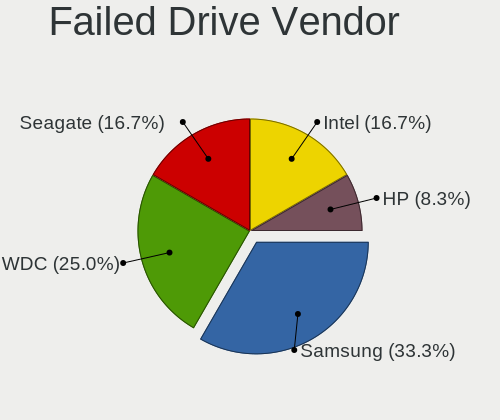
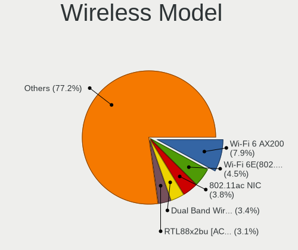

Ubuntu 22.04 - Tested Hardware & Statistics (Desktops)
------------------------------------------------------

A project to collect tested hardware configurations for Ubuntu 22.04.

Anyone can contribute to this report by the [hw-probe](https://github.com/linuxhw/hw-probe) tool:

    sudo -E hw-probe -all -upload

Please contribute! Especially if your hardware is rare.

Contents
--------

* [ Test Cases ](#test-cases)

* [ System ](#system)
  - [ Kernel                   ](#kernel)
  - [ Kernel Family            ](#kernel-family)
  - [ Kernel Major Ver.        ](#kernel-major-ver)
  - [ Arch                     ](#arch)
  - [ DE                       ](#de)
  - [ Display Server           ](#display-server)
  - [ Display Manager          ](#display-manager)
  - [ OS Lang                  ](#os-lang)
  - [ Boot Mode                ](#boot-mode)
  - [ Filesystem               ](#filesystem)
  - [ Part. scheme             ](#part-scheme)
  - [ Dual Boot with Linux/BSD ](#dual-boot-with-linuxbsd)
  - [ Dual Boot (Win)          ](#dual-boot-win)

* [ Board ](#board)
  - [ Vendor                   ](#vendor)
  - [ Model                    ](#model)
  - [ Model Family             ](#model-family)
  - [ MFG Year                 ](#mfg-year)
  - [ Form Factor              ](#form-factor)
  - [ Secure Boot              ](#secure-boot)
  - [ Coreboot                 ](#coreboot)
  - [ RAM Size                 ](#ram-size)
  - [ RAM Used                 ](#ram-used)
  - [ Total Drives             ](#total-drives)
  - [ Has CD-ROM               ](#has-cd-rom)
  - [ Has Ethernet             ](#has-ethernet)
  - [ Has WiFi                 ](#has-wifi)
  - [ Has Bluetooth            ](#has-bluetooth)

* [ Location ](#location)
  - [ Country                  ](#country)
  - [ City                     ](#city)

* [ Drives ](#drives)
  - [ Drive Vendor             ](#drive-vendor)
  - [ Drive Model              ](#drive-model)
  - [ HDD Vendor               ](#hdd-vendor)
  - [ SSD Vendor               ](#ssd-vendor)
  - [ Drive Kind               ](#drive-kind)
  - [ Drive Connector          ](#drive-connector)
  - [ Drive Size               ](#drive-size)
  - [ Space Total              ](#space-total)
  - [ Space Used               ](#space-used)
  - [ Malfunc. Drives          ](#malfunc-drives)
  - [ Malfunc. Drive Vendor    ](#malfunc-drive-vendor)
  - [ Malfunc. HDD Vendor      ](#malfunc-hdd-vendor)
  - [ Malfunc. Drive Kind      ](#malfunc-drive-kind)
  - [ Failed Drives            ](#failed-drives)
  - [ Failed Drive Vendor      ](#failed-drive-vendor)
  - [ Drive Status             ](#drive-status)

* [ Storage controller ](#storage-controller)
  - [ Storage Vendor           ](#storage-vendor)
  - [ Storage Model            ](#storage-model)
  - [ Storage Kind             ](#storage-kind)

* [ Processor ](#processor)
  - [ CPU Vendor               ](#cpu-vendor)
  - [ CPU Model                ](#cpu-model)
  - [ CPU Model Family         ](#cpu-model-family)
  - [ CPU Cores                ](#cpu-cores)
  - [ CPU Sockets              ](#cpu-sockets)
  - [ CPU Threads              ](#cpu-threads)
  - [ CPU Op-Modes             ](#cpu-op-modes)
  - [ CPU Microcode            ](#cpu-microcode)
  - [ CPU Microarch            ](#cpu-microarch)

* [ Graphics ](#graphics)
  - [ GPU Vendor               ](#gpu-vendor)
  - [ GPU Model                ](#gpu-model)
  - [ GPU Combo                ](#gpu-combo)
  - [ GPU Driver               ](#gpu-driver)
  - [ GPU Memory               ](#gpu-memory)

* [ Monitor ](#monitor)
  - [ Monitor Vendor           ](#monitor-vendor)
  - [ Monitor Model            ](#monitor-model)
  - [ Monitor Resolution       ](#monitor-resolution)
  - [ Monitor Diagonal         ](#monitor-diagonal)
  - [ Monitor Width            ](#monitor-width)
  - [ Aspect Ratio             ](#aspect-ratio)
  - [ Monitor Area             ](#monitor-area)
  - [ Pixel Density            ](#pixel-density)
  - [ Multiple Monitors        ](#multiple-monitors)

* [ Network ](#network)
  - [ Net Controller Vendor    ](#net-controller-vendor)
  - [ Net Controller Model     ](#net-controller-model)
  - [ Wireless Vendor          ](#wireless-vendor)
  - [ Wireless Model           ](#wireless-model)
  - [ Ethernet Vendor          ](#ethernet-vendor)
  - [ Ethernet Model           ](#ethernet-model)
  - [ Net Controller Kind      ](#net-controller-kind)
  - [ Used Controller          ](#used-controller)
  - [ NICs                     ](#nics)
  - [ IPv6                     ](#ipv6)

* [ Bluetooth ](#bluetooth)
  - [ Bluetooth Vendor         ](#bluetooth-vendor)
  - [ Bluetooth Model          ](#bluetooth-model)

* [ Sound ](#sound)
  - [ Sound Vendor             ](#sound-vendor)
  - [ Sound Model              ](#sound-model)

* [ Memory ](#memory)
  - [ Memory Vendor            ](#memory-vendor)
  - [ Memory Model             ](#memory-model)
  - [ Memory Kind              ](#memory-kind)
  - [ Memory Form Factor       ](#memory-form-factor)
  - [ Memory Size              ](#memory-size)
  - [ Memory Speed             ](#memory-speed)

* [ Printers & scanners ](#printers--scanners)
  - [ Printer Vendor           ](#printer-vendor)
  - [ Printer Model            ](#printer-model)
  - [ Scanner Vendor           ](#scanner-vendor)
  - [ Scanner Model            ](#scanner-model)

* [ Camera ](#camera)
  - [ Camera Vendor            ](#camera-vendor)
  - [ Camera Model             ](#camera-model)

* [ Security ](#security)
  - [ Fingerprint Vendor       ](#fingerprint-vendor)
  - [ Fingerprint Model        ](#fingerprint-model)
  - [ Chipcard Vendor          ](#chipcard-vendor)
  - [ Chipcard Model           ](#chipcard-model)

* [ Unsupported ](#unsupported)
  - [ Unsupported Devices      ](#unsupported-devices)
  - [ Unsupported Device Types ](#unsupported-device-types)

Test Cases
----------

Total: 4032

| Vendor        | Model                       | Probe                                                      | Date         |
|---------------|-----------------------------|------------------------------------------------------------|--------------|
| Acer          | H57M01                      | [215701a84d](https://linux-hardware.org/?probe=215701a84d) | Apr 01, 2023 |
| Dell          | 09M8Y8 A01                  | [17d5390549](https://linux-hardware.org/?probe=17d5390549) | Apr 01, 2023 |
| Dell          | 09KPNV A01                  | [2b25e4872f](https://linux-hardware.org/?probe=2b25e4872f) | Apr 01, 2023 |
| Apple         | Mac-F4208DC8 PVT            | [f05009caac](https://linux-hardware.org/?probe=f05009caac) | Apr 01, 2023 |
| Gigabyte      | Z77X-UD5H                   | [2be0fa6524](https://linux-hardware.org/?probe=2be0fa6524) | Apr 01, 2023 |
| Gigabyte      | H61M-S2V-B3                 | [45a242d18f](https://linux-hardware.org/?probe=45a242d18f) | Mar 31, 2023 |
| HP            | 0A64h                       | [f4fd3904f0](https://linux-hardware.org/?probe=f4fd3904f0) | Mar 31, 2023 |
| ASUSTek       | TUF Gaming B550-PLUS        | [6694c9279d](https://linux-hardware.org/?probe=6694c9279d) | Mar 31, 2023 |
| ASUSTek       | Z97-K                       | [da56f6c38c](https://linux-hardware.org/?probe=da56f6c38c) | Mar 31, 2023 |
| Gigabyte      | TRX40 AORUS XTREME          | [0945961c85](https://linux-hardware.org/?probe=0945961c85) | Mar 31, 2023 |
| Gigabyte      | TRX40 AORUS XTREME          | [72c08c8ca9](https://linux-hardware.org/?probe=72c08c8ca9) | Mar 31, 2023 |
| Dell          | 0FG47G A02                  | [d1cf6fa11e](https://linux-hardware.org/?probe=d1cf6fa11e) | Mar 31, 2023 |
| Gigabyte      | H310M H x.x                 | [68fce9ae2d](https://linux-hardware.org/?probe=68fce9ae2d) | Mar 31, 2023 |
| ECS           | H61H2-M6                    | [6c33ee7e15](https://linux-hardware.org/?probe=6c33ee7e15) | Mar 31, 2023 |
| Gigabyte      | B550M DS3H AC               | [f8e723a8dc](https://linux-hardware.org/?probe=f8e723a8dc) | Mar 31, 2023 |
| MSI           | PRO X670-P WIFI             | [bb72de54b6](https://linux-hardware.org/?probe=bb72de54b6) | Mar 31, 2023 |
| ASUSTek       | M5A99FX PRO R2.0            | [0e374d0aea](https://linux-hardware.org/?probe=0e374d0aea) | Mar 31, 2023 |
| Gigabyte      | X670 AORUS ELITE AX         | [c239e06998](https://linux-hardware.org/?probe=c239e06998) | Mar 31, 2023 |
| Gigabyte      | F2A88X-UP4                  | [72c4b553b4](https://linux-hardware.org/?probe=72c4b553b4) | Mar 31, 2023 |
| Gigabyte      | A320M-S2H-CF                | [3aac57dfbd](https://linux-hardware.org/?probe=3aac57dfbd) | Mar 30, 2023 |
| Gigabyte      | B550 AORUS ELITE            | [4cfac9a162](https://linux-hardware.org/?probe=4cfac9a162) | Mar 30, 2023 |
| Unknown       | Unknown                     | [3773f3cd04](https://linux-hardware.org/?probe=3773f3cd04) | Mar 30, 2023 |
| Dell          | 0KV62T A02                  | [c7765df604](https://linux-hardware.org/?probe=c7765df604) | Mar 30, 2023 |
| Packard Be... | FMP55                       | [88a15e20b2](https://linux-hardware.org/?probe=88a15e20b2) | Mar 30, 2023 |
| Gigabyte      | H61M-S2V-B3                 | [41a76fad3f](https://linux-hardware.org/?probe=41a76fad3f) | Mar 30, 2023 |
| MSI           | X79A-GD45                   | [6d78703b2c](https://linux-hardware.org/?probe=6d78703b2c) | Mar 30, 2023 |
| ASUSTek       | TUF Gaming B550M-PLUS       | [92981c741d](https://linux-hardware.org/?probe=92981c741d) | Mar 30, 2023 |
| MSI           | PRO X670-P WIFI             | [ed35fbea6c](https://linux-hardware.org/?probe=ed35fbea6c) | Mar 30, 2023 |
| HP            | 82B4                        | [0829a64947](https://linux-hardware.org/?probe=0829a64947) | Mar 30, 2023 |
| MSI           | MAG B550M MORTAR WIFI       | [dfd9900ccf](https://linux-hardware.org/?probe=dfd9900ccf) | Mar 30, 2023 |
| ASUSTek       | M5A97                       | [4d12d122e1](https://linux-hardware.org/?probe=4d12d122e1) | Mar 30, 2023 |
| Shuttle       | FH170                       | [0fa0f1ab72](https://linux-hardware.org/?probe=0fa0f1ab72) | Mar 30, 2023 |
| ASUSTek       | P5E WS Pro                  | [6c70ac23df](https://linux-hardware.org/?probe=6c70ac23df) | Mar 30, 2023 |
| Gigabyte      | H81M-S2V                    | [5a16920bc0](https://linux-hardware.org/?probe=5a16920bc0) | Mar 30, 2023 |
| HP            | 8591                        | [b887990c12](https://linux-hardware.org/?probe=b887990c12) | Mar 30, 2023 |
| MSI           | FM2-A75MA-E35               | [10de0ae048](https://linux-hardware.org/?probe=10de0ae048) | Mar 30, 2023 |
| Lenovo        | 30D2 SDK0J40697 WIN 3305... | [185cb6df15](https://linux-hardware.org/?probe=185cb6df15) | Mar 30, 2023 |
| ASUSTek       | ROG STRIX B450-F GAMING     | [cd308ca372](https://linux-hardware.org/?probe=cd308ca372) | Mar 29, 2023 |
| ASUSTek       | PRIME H610I-PLUS D4         | [7b984afb2c](https://linux-hardware.org/?probe=7b984afb2c) | Mar 29, 2023 |
| ASUSTek       | H81M-V3                     | [fd123bea36](https://linux-hardware.org/?probe=fd123bea36) | Mar 29, 2023 |
| Dell          | 09KPNV A01                  | [6024b90eea](https://linux-hardware.org/?probe=6024b90eea) | Mar 29, 2023 |
| Gigabyte      | GA-A75-UD4H                 | [e5433e75fb](https://linux-hardware.org/?probe=e5433e75fb) | Mar 29, 2023 |
| MSI           | X79A-GD45                   | [bb4680bc5b](https://linux-hardware.org/?probe=bb4680bc5b) | Mar 29, 2023 |
| ASUSTek       | PRIME B360M-C               | [e7b163ea80](https://linux-hardware.org/?probe=e7b163ea80) | Mar 29, 2023 |
| ASUSTek       | P8Z77-V LX2                 | [23256b54cf](https://linux-hardware.org/?probe=23256b54cf) | Mar 29, 2023 |
| Intel         | H61                         | [bb6e201a08](https://linux-hardware.org/?probe=bb6e201a08) | Mar 29, 2023 |
| Gigabyte      | P41T-D3                     | [2941019778](https://linux-hardware.org/?probe=2941019778) | Mar 29, 2023 |
| Intel         | B75                         | [2bddb84c2e](https://linux-hardware.org/?probe=2bddb84c2e) | Mar 29, 2023 |
| ASUSTek       | H81M-V3                     | [ce98454e55](https://linux-hardware.org/?probe=ce98454e55) | Mar 29, 2023 |
| Dell          | 0200DY A01                  | [095eb7be41](https://linux-hardware.org/?probe=095eb7be41) | Mar 29, 2023 |
| Gigabyte      | B365M DS3H                  | [e6b01be2f1](https://linux-hardware.org/?probe=e6b01be2f1) | Mar 29, 2023 |
| ASUSTek       | H110M-A                     | [147c0afb99](https://linux-hardware.org/?probe=147c0afb99) | Mar 29, 2023 |
| ASRock        | H61M-DG3/USB3               | [6e7b188568](https://linux-hardware.org/?probe=6e7b188568) | Mar 28, 2023 |
| Gigabyte      | H110M-S2H DDR3-CF           | [7ec74ffcfa](https://linux-hardware.org/?probe=7ec74ffcfa) | Mar 28, 2023 |
| ASUSTek       | Z97-P                       | [0a0ca96d28](https://linux-hardware.org/?probe=0a0ca96d28) | Mar 28, 2023 |
| MSI           | Z170A SLI PLUS              | [50affe59d1](https://linux-hardware.org/?probe=50affe59d1) | Mar 28, 2023 |
| Lenovo        | SHARKBAY NOK                | [0cbe19c074](https://linux-hardware.org/?probe=0cbe19c074) | Mar 28, 2023 |
| Gigabyte      | H110M-S2H DDR3-CF           | [7e5cb33850](https://linux-hardware.org/?probe=7e5cb33850) | Mar 28, 2023 |
| ASRock        | X399 Taichi                 | [f16690a3df](https://linux-hardware.org/?probe=f16690a3df) | Mar 28, 2023 |
| Gigabyte      | B450 AORUS PRO WIFI-CF      | [19ffc63f56](https://linux-hardware.org/?probe=19ffc63f56) | Mar 28, 2023 |
| Gigabyte      | B450M S2H                   | [7f46837f94](https://linux-hardware.org/?probe=7f46837f94) | Mar 28, 2023 |
| Pegatron      | 2AE3                        | [806b4e1780](https://linux-hardware.org/?probe=806b4e1780) | Mar 28, 2023 |
| Pegatron      | 2AE3                        | [23ce0f4fd5](https://linux-hardware.org/?probe=23ce0f4fd5) | Mar 28, 2023 |
| MSI           | B450 TOMAHAWK MAX II        | [b8d58bafe3](https://linux-hardware.org/?probe=b8d58bafe3) | Mar 28, 2023 |
| MSI           | B450 TOMAHAWK MAX II        | [68117fedfe](https://linux-hardware.org/?probe=68117fedfe) | Mar 28, 2023 |
| Apple         | Mac-F4208DC8 PVT            | [cdb2c38b76](https://linux-hardware.org/?probe=cdb2c38b76) | Mar 27, 2023 |
| Gigabyte      | A320M-S2H-CF                | [1dd1eab13e](https://linux-hardware.org/?probe=1dd1eab13e) | Mar 27, 2023 |
| Pegatron      | IPMIP-H55-GEN               | [7dcf9e9b51](https://linux-hardware.org/?probe=7dcf9e9b51) | Mar 27, 2023 |
| HP            | 3648h                       | [fbc5138852](https://linux-hardware.org/?probe=fbc5138852) | Mar 27, 2023 |
| MSI           | X99A SLI PLUS               | [519fc70e27](https://linux-hardware.org/?probe=519fc70e27) | Mar 27, 2023 |
| ASRock        | X570 Steel Legend           | [490155a63a](https://linux-hardware.org/?probe=490155a63a) | Mar 27, 2023 |
| MSI           | Z170A SLI PLUS              | [8a1c592e98](https://linux-hardware.org/?probe=8a1c592e98) | Mar 27, 2023 |
| Gigabyte      | A520M H                     | [7afe508254](https://linux-hardware.org/?probe=7afe508254) | Mar 27, 2023 |
| Gigabyte      | Z590 GAMING X               | [de1cb772e9](https://linux-hardware.org/?probe=de1cb772e9) | Mar 27, 2023 |
| Gigabyte      | Z590 GAMING X               | [db7671affd](https://linux-hardware.org/?probe=db7671affd) | Mar 27, 2023 |
| ASUSTek       | P8H61-M LE                  | [e834f14d64](https://linux-hardware.org/?probe=e834f14d64) | Mar 27, 2023 |
| Intel         | X58M                        | [823813881b](https://linux-hardware.org/?probe=823813881b) | Mar 27, 2023 |
| MSI           | PRO H610M-B DDR4            | [a9ca07dc80](https://linux-hardware.org/?probe=a9ca07dc80) | Mar 27, 2023 |
| ASUSTek       | STRIX X99 GAMING            | [1c37ecb6c7](https://linux-hardware.org/?probe=1c37ecb6c7) | Mar 26, 2023 |
| ASRock        | B365 Pro4                   | [ec1dd7f3ab](https://linux-hardware.org/?probe=ec1dd7f3ab) | Mar 26, 2023 |
| Lenovo        | ThinkCentre M90p 3282A8U    | [5edac0955d](https://linux-hardware.org/?probe=5edac0955d) | Mar 26, 2023 |
| Gigabyte      | H310M H x.x                 | [d79b6fc95c](https://linux-hardware.org/?probe=d79b6fc95c) | Mar 26, 2023 |
| Wistron       | ProLiant ML110 G6           | [2e14ac2984](https://linux-hardware.org/?probe=2e14ac2984) | Mar 26, 2023 |
| MSI           | B550-A PRO                  | [eddf5a759a](https://linux-hardware.org/?probe=eddf5a759a) | Mar 26, 2023 |
| HP            | 0B54h D                     | [540caaf04c](https://linux-hardware.org/?probe=540caaf04c) | Mar 26, 2023 |
| ASUSTek       | P5W DH Deluxe               | [781cafa540](https://linux-hardware.org/?probe=781cafa540) | Mar 26, 2023 |
| Gigabyte      | A520M H                     | [cfacabcd33](https://linux-hardware.org/?probe=cfacabcd33) | Mar 26, 2023 |
| Gigabyte      | A520M H                     | [ed01b04ada](https://linux-hardware.org/?probe=ed01b04ada) | Mar 26, 2023 |
| Shuttle       | B10IE01                     | [bc74a6b1a2](https://linux-hardware.org/?probe=bc74a6b1a2) | Mar 26, 2023 |
| Dell          | 0MGK50 A02                  | [75b4691fd2](https://linux-hardware.org/?probe=75b4691fd2) | Mar 26, 2023 |
| ASUSTek       | M5A78L-M/USB3               | [c7e347798a](https://linux-hardware.org/?probe=c7e347798a) | Mar 26, 2023 |
| ASUSTek       | P5B-Deluxe                  | [f5a9d12043](https://linux-hardware.org/?probe=f5a9d12043) | Mar 26, 2023 |
| Lenovo        | ThinkCentre M90p 3282A8U    | [40b8057336](https://linux-hardware.org/?probe=40b8057336) | Mar 26, 2023 |
| Intel         | DG41CN AAE82429-102         | [c671afb118](https://linux-hardware.org/?probe=c671afb118) | Mar 26, 2023 |
| HP            | 339A                        | [1009c2d048](https://linux-hardware.org/?probe=1009c2d048) | Mar 26, 2023 |
| Lenovo        | 3704 SDK0J40700 WIN 3258... | [b7b93f24a2](https://linux-hardware.org/?probe=b7b93f24a2) | Mar 26, 2023 |
| Gigabyte      | X58A-UD3R                   | [2325b601fe](https://linux-hardware.org/?probe=2325b601fe) | Mar 25, 2023 |
| ASRock        | A320M-HDV R4.0              | [1b5f2b52bc](https://linux-hardware.org/?probe=1b5f2b52bc) | Mar 25, 2023 |
| Dell          | 02YYK5 A01                  | [92e64e0e8c](https://linux-hardware.org/?probe=92e64e0e8c) | Mar 25, 2023 |
| Gigabyte      | Z77X-D3H                    | [5fff36a878](https://linux-hardware.org/?probe=5fff36a878) | Mar 25, 2023 |
| ASUSTek       | H81I-PLUS                   | [98dc4bb06b](https://linux-hardware.org/?probe=98dc4bb06b) | Mar 25, 2023 |
| ASUSTek       | H81I-PLUS                   | [bb353ccddf](https://linux-hardware.org/?probe=bb353ccddf) | Mar 25, 2023 |
| Packard Be... | FIH57                       | [794fd45482](https://linux-hardware.org/?probe=794fd45482) | Mar 25, 2023 |
| Foxconn       | 2ABF                        | [41289d94bf](https://linux-hardware.org/?probe=41289d94bf) | Mar 25, 2023 |
| Foxconn       | 2ABF                        | [1ccaab03c4](https://linux-hardware.org/?probe=1ccaab03c4) | Mar 25, 2023 |
| MSI           | H110M PRO-D                 | [104b9b1c12](https://linux-hardware.org/?probe=104b9b1c12) | Mar 25, 2023 |
| ASUSTek       | P5KPL-AM/PS                 | [02d9269abc](https://linux-hardware.org/?probe=02d9269abc) | Mar 25, 2023 |
| HP            | 18E9                        | [f015f44555](https://linux-hardware.org/?probe=f015f44555) | Mar 25, 2023 |
| Dell          | 00V62H A01                  | [5312ec3cc9](https://linux-hardware.org/?probe=5312ec3cc9) | Mar 25, 2023 |
| HP            | 8906 SMVB                   | [7650a804d9](https://linux-hardware.org/?probe=7650a804d9) | Mar 25, 2023 |
| Dell          | 02YYK5 A01                  | [aeb58a6898](https://linux-hardware.org/?probe=aeb58a6898) | Mar 24, 2023 |
| ASUSTek       | Basswood3G                  | [d71f476c72](https://linux-hardware.org/?probe=d71f476c72) | Mar 24, 2023 |
| Dell          | 0TP406                      | [a58cf3b551](https://linux-hardware.org/?probe=a58cf3b551) | Mar 24, 2023 |
| Gigabyte      | GA-MA790XT-UD4P             | [8a0cc5a4cb](https://linux-hardware.org/?probe=8a0cc5a4cb) | Mar 24, 2023 |
| HP            | 0A64h                       | [c53db667a1](https://linux-hardware.org/?probe=c53db667a1) | Mar 24, 2023 |
| Apple         | Mac-F4208DC8 PVT            | [fea1e4cf50](https://linux-hardware.org/?probe=fea1e4cf50) | Mar 24, 2023 |
| ASUSTek       | TUF Gaming X570-PLUS        | [eeeac5db0f](https://linux-hardware.org/?probe=eeeac5db0f) | Mar 24, 2023 |
| Apple         | Mac-F4208DC8 PVT            | [b5cecce6b9](https://linux-hardware.org/?probe=b5cecce6b9) | Mar 24, 2023 |
| Intel         | X99 V1.x                    | [391a73b307](https://linux-hardware.org/?probe=391a73b307) | Mar 24, 2023 |
| ASUSTek       | M32CD_A_F_K20CD_K31CD       | [dc56fbfedb](https://linux-hardware.org/?probe=dc56fbfedb) | Mar 24, 2023 |
| ASUSTek       | M32CD_A_F_K20CD_K31CD       | [67d60d55e4](https://linux-hardware.org/?probe=67d60d55e4) | Mar 24, 2023 |
| ASRock        | H310CM-HDV/M.2              | [cebe46bd74](https://linux-hardware.org/?probe=cebe46bd74) | Mar 24, 2023 |
| MSI           | MPG X570 GAMING PLUS        | [360866bcc5](https://linux-hardware.org/?probe=360866bcc5) | Mar 24, 2023 |
| ASUSTek       | ROG STRIX B550-F GAMING     | [0c824a1f88](https://linux-hardware.org/?probe=0c824a1f88) | Mar 24, 2023 |
| HP            | 2B05                        | [b34e6d230c](https://linux-hardware.org/?probe=b34e6d230c) | Mar 24, 2023 |
| Gigabyte      | B450M DS3H WIFI-CF          | [10b7d76bff](https://linux-hardware.org/?probe=10b7d76bff) | Mar 24, 2023 |
| MSI           | Z390-A PRO                  | [36d6fdda74](https://linux-hardware.org/?probe=36d6fdda74) | Mar 24, 2023 |
| ASRock        | B550M Pro4                  | [d18034c36c](https://linux-hardware.org/?probe=d18034c36c) | Mar 24, 2023 |
| ASUSTek       | PRIME X470-PRO              | [8af246641b](https://linux-hardware.org/?probe=8af246641b) | Mar 24, 2023 |
| MSI           | B450 GAMING PRO CARBON A... | [704fb36197](https://linux-hardware.org/?probe=704fb36197) | Mar 23, 2023 |
| Fujitsu       | D3403-A1 S26361-D3403-A1    | [a5795c9f91](https://linux-hardware.org/?probe=a5795c9f91) | Mar 23, 2023 |
| Itautec       | ST 4254 ST-4254 Padrao 0... | [cd3e7fa4e5](https://linux-hardware.org/?probe=cd3e7fa4e5) | Mar 23, 2023 |
| HP            | 1905                        | [7bccc34bf4](https://linux-hardware.org/?probe=7bccc34bf4) | Mar 23, 2023 |
| ASUSTek       | ROG STRIX B550-F GAMING     | [6a57dfd8fc](https://linux-hardware.org/?probe=6a57dfd8fc) | Mar 23, 2023 |
| MSI           | G41M-P26                    | [49854744e6](https://linux-hardware.org/?probe=49854744e6) | Mar 23, 2023 |
| AMI           | Intel                       | [5e7b21c227](https://linux-hardware.org/?probe=5e7b21c227) | Mar 23, 2023 |
| MACHINIST     | E5-MR9A PRO V1.1            | [7d303a08d4](https://linux-hardware.org/?probe=7d303a08d4) | Mar 23, 2023 |
| MSI           | MPG X570 GAMING EDGE WIF... | [20267be489](https://linux-hardware.org/?probe=20267be489) | Mar 23, 2023 |
| Lenovo        | SHARKBAY NOK                | [e1783f9cd4](https://linux-hardware.org/?probe=e1783f9cd4) | Mar 22, 2023 |
| Lenovo        | SHARKBAY NOK                | [1a2e1919ee](https://linux-hardware.org/?probe=1a2e1919ee) | Mar 22, 2023 |
| ASUSTek       | X99-E                       | [62535f81e4](https://linux-hardware.org/?probe=62535f81e4) | Mar 22, 2023 |
| Gigabyte      | H110M-S2H DDR3-CF           | [47b661fcb3](https://linux-hardware.org/?probe=47b661fcb3) | Mar 22, 2023 |
| ASUSTek       | PB60                        | [ec438486aa](https://linux-hardware.org/?probe=ec438486aa) | Mar 22, 2023 |
| ASRockRack    | B665D4U-1L                  | [2be23ead3c](https://linux-hardware.org/?probe=2be23ead3c) | Mar 22, 2023 |
| Gigabyte      | X570 I AORUS PRO WIFI       | [49bc505f3e](https://linux-hardware.org/?probe=49bc505f3e) | Mar 22, 2023 |
| ASUSTek       | X99-E                       | [eb6fe4121d](https://linux-hardware.org/?probe=eb6fe4121d) | Mar 22, 2023 |
| Gigabyte      | H110M-S2H DDR3-CF           | [f848ecf9cf](https://linux-hardware.org/?probe=f848ecf9cf) | Mar 22, 2023 |
| ASUSTek       | M5A78L-M PLUS/USB3          | [568fac441d](https://linux-hardware.org/?probe=568fac441d) | Mar 22, 2023 |
| ASUSTek       | M5A97 R2.0                  | [789ca3dc74](https://linux-hardware.org/?probe=789ca3dc74) | Mar 22, 2023 |
| MSI           | Z97 GAMING 7                | [4fbe5017fe](https://linux-hardware.org/?probe=4fbe5017fe) | Mar 21, 2023 |
| HP            | 339A                        | [f1a067a512](https://linux-hardware.org/?probe=f1a067a512) | Mar 21, 2023 |
| HP            | 1495                        | [3fe89757bb](https://linux-hardware.org/?probe=3fe89757bb) | Mar 21, 2023 |
| HP            | 1494                        | [e682c9975e](https://linux-hardware.org/?probe=e682c9975e) | Mar 21, 2023 |
| ASUSTek       | TUF Gaming X570-PLUS        | [844b9094f9](https://linux-hardware.org/?probe=844b9094f9) | Mar 21, 2023 |
| ASUSTek       | TUF Gaming B550M-PLUS       | [846f31de3e](https://linux-hardware.org/?probe=846f31de3e) | Mar 21, 2023 |
| Lenovo        | MAHOBAY NO DPK              | [7ccc7e9ae1](https://linux-hardware.org/?probe=7ccc7e9ae1) | Mar 21, 2023 |
| Lenovo        | MAHOBAY NO DPK              | [4544e68d4a](https://linux-hardware.org/?probe=4544e68d4a) | Mar 21, 2023 |
| ASUSTek       | TUF Gaming X570-PLUS        | [96c3f3ecc4](https://linux-hardware.org/?probe=96c3f3ecc4) | Mar 21, 2023 |
| Dell          | 09KPNV A00                  | [5074a23172](https://linux-hardware.org/?probe=5074a23172) | Mar 20, 2023 |
| Unknown       | Unknown                     | [a931b7a520](https://linux-hardware.org/?probe=a931b7a520) | Mar 20, 2023 |
| ASUSTek       | Pro WS WRX80E-SAGE SE WI... | [a03658793c](https://linux-hardware.org/?probe=a03658793c) | Mar 20, 2023 |
| ASUSTek       | Pro WS WRX80E-SAGE SE WI... | [6df656c198](https://linux-hardware.org/?probe=6df656c198) | Mar 20, 2023 |
| MSI           | H310M PRO-VD                | [1b98d965e7](https://linux-hardware.org/?probe=1b98d965e7) | Mar 20, 2023 |
| ASUSTek       | ROG STRIX X670E-E GAMING... | [436b9d15b0](https://linux-hardware.org/?probe=436b9d15b0) | Mar 20, 2023 |
| Gigabyte      | H310M H x.x                 | [0d7cc03c37](https://linux-hardware.org/?probe=0d7cc03c37) | Mar 20, 2023 |
| Intel         | DX58OG AAG10926-203         | [f5e2774fb9](https://linux-hardware.org/?probe=f5e2774fb9) | Mar 20, 2023 |
| ASUSTek       | P5KPL-AM SE                 | [662d96a2ed](https://linux-hardware.org/?probe=662d96a2ed) | Mar 20, 2023 |
| ASUSTek       | PRIME X570-P                | [417d3cf9b7](https://linux-hardware.org/?probe=417d3cf9b7) | Mar 19, 2023 |
| Gigabyte      | GB-BRR7H-4700               | [9d7f6de46c](https://linux-hardware.org/?probe=9d7f6de46c) | Mar 19, 2023 |
| ASUSTek       | ROG STRIX B450-F GAMING ... | [adc87fc9fa](https://linux-hardware.org/?probe=adc87fc9fa) | Mar 19, 2023 |
| ASUSTek       | PRIME B450M-A II            | [eab4473d9f](https://linux-hardware.org/?probe=eab4473d9f) | Mar 19, 2023 |
| ASUSTek       | PRIME B250M-K               | [99cb000a4e](https://linux-hardware.org/?probe=99cb000a4e) | Mar 19, 2023 |
| ASUSTek       | P5K                         | [5f34498a89](https://linux-hardware.org/?probe=5f34498a89) | Mar 19, 2023 |
| MSI           | MS-B0A21                    | [7b5c0f63da](https://linux-hardware.org/?probe=7b5c0f63da) | Mar 18, 2023 |
| Dell          | 0K240Y A01                  | [269f35c6d4](https://linux-hardware.org/?probe=269f35c6d4) | Mar 18, 2023 |
| ASRock        | B550M Phantom Gaming 4      | [c399d3fbf5](https://linux-hardware.org/?probe=c399d3fbf5) | Mar 18, 2023 |
| Intel         | H61                         | [10b44e8f3e](https://linux-hardware.org/?probe=10b44e8f3e) | Mar 18, 2023 |
| Lenovo        | MAHOBAY Win8 STD MM DPK ... | [7cf7439659](https://linux-hardware.org/?probe=7cf7439659) | Mar 18, 2023 |
| ASRock        | 4X4-4000 Series             | [3718d345ca](https://linux-hardware.org/?probe=3718d345ca) | Mar 18, 2023 |
| ASRock        | QC6000M                     | [b897493246](https://linux-hardware.org/?probe=b897493246) | Mar 18, 2023 |
| Intel         | DG41RQ AAE54511-203         | [a5775c7491](https://linux-hardware.org/?probe=a5775c7491) | Mar 17, 2023 |
| Intel         | DG41RQ AAE54511-203         | [2a17e297a2](https://linux-hardware.org/?probe=2a17e297a2) | Mar 17, 2023 |
| Medion        | MS-7707                     | [4748632926](https://linux-hardware.org/?probe=4748632926) | Mar 17, 2023 |
| ASRock        | Z390 Phantom Gaming 6       | [33fb26b354](https://linux-hardware.org/?probe=33fb26b354) | Mar 17, 2023 |
| Gigabyte      | A320M-S2H-CF                | [ceb794a09f](https://linux-hardware.org/?probe=ceb794a09f) | Mar 17, 2023 |
| Gigabyte      | Z97M-DS3H                   | [96742a0cb2](https://linux-hardware.org/?probe=96742a0cb2) | Mar 17, 2023 |
| ASUSTek       | P9X79 WS                    | [29e03bb7ce](https://linux-hardware.org/?probe=29e03bb7ce) | Mar 17, 2023 |
| Gigabyte      | H110M-S2HP-CF               | [17d28488f3](https://linux-hardware.org/?probe=17d28488f3) | Mar 17, 2023 |
| Foxconn       | G41MXE/G41MXE-K             | [8f1c6b4288](https://linux-hardware.org/?probe=8f1c6b4288) | Mar 17, 2023 |
| Foxconn       | G41MXE/G41MXE-K             | [571d56ae48](https://linux-hardware.org/?probe=571d56ae48) | Mar 17, 2023 |
| HP            | 1850                        | [c805a3a08f](https://linux-hardware.org/?probe=c805a3a08f) | Mar 17, 2023 |
| Intel         | X99                         | [e7d23adc36](https://linux-hardware.org/?probe=e7d23adc36) | Mar 17, 2023 |
| HP            | 8299                        | [160716473a](https://linux-hardware.org/?probe=160716473a) | Mar 17, 2023 |
| ASUSTek       | PRIME B550M-A WIFI II       | [d21c2315d1](https://linux-hardware.org/?probe=d21c2315d1) | Mar 17, 2023 |
| Gigabyte      | X570 I AORUS PRO WIFI       | [338ab5a12e](https://linux-hardware.org/?probe=338ab5a12e) | Mar 17, 2023 |
| ASRock        | A300M-STX                   | [133fb3bed5](https://linux-hardware.org/?probe=133fb3bed5) | Mar 17, 2023 |
| Gigabyte      | B550 AORUS ELITE AX V2      | [e6d8cd5424](https://linux-hardware.org/?probe=e6d8cd5424) | Mar 16, 2023 |
| Gigabyte      | B450M DS3H-CF               | [a85b96633c](https://linux-hardware.org/?probe=a85b96633c) | Mar 16, 2023 |
| MSI           | B550-A PRO                  | [730eec29f4](https://linux-hardware.org/?probe=730eec29f4) | Mar 16, 2023 |
| ASUSTek       | P8H61-M LE/USB3             | [5200e8032c](https://linux-hardware.org/?probe=5200e8032c) | Mar 15, 2023 |
| Medion        | B360H4-EM V1.0              | [839899a14d](https://linux-hardware.org/?probe=839899a14d) | Mar 15, 2023 |
| HP            | 3397                        | [5f261fa554](https://linux-hardware.org/?probe=5f261fa554) | Mar 15, 2023 |
| Dell          | 0NW6H5 A00                  | [400732bc40](https://linux-hardware.org/?probe=400732bc40) | Mar 15, 2023 |
| Dell          | 0W0CHX A01                  | [29197fc6e4](https://linux-hardware.org/?probe=29197fc6e4) | Mar 15, 2023 |
| HP            | 8299                        | [d76d2b1088](https://linux-hardware.org/?probe=d76d2b1088) | Mar 15, 2023 |
| Lenovo        | SHARKBAY NOK                | [adb5a907d1](https://linux-hardware.org/?probe=adb5a907d1) | Mar 15, 2023 |
| Acer          | TDPS05                      | [a2cdc5b3cd](https://linux-hardware.org/?probe=a2cdc5b3cd) | Mar 15, 2023 |
| Acer          | TDPS05                      | [8f528a91a5](https://linux-hardware.org/?probe=8f528a91a5) | Mar 15, 2023 |
| Gigabyte      | H310M H x.x                 | [9f440a48b9](https://linux-hardware.org/?probe=9f440a48b9) | Mar 15, 2023 |
| Dell          | 04YP6J A02                  | [183b46131c](https://linux-hardware.org/?probe=183b46131c) | Mar 15, 2023 |
| HP            | 1850                        | [c5439b2fea](https://linux-hardware.org/?probe=c5439b2fea) | Mar 15, 2023 |
| MSI           | B85-G43                     | [d8334d09fa](https://linux-hardware.org/?probe=d8334d09fa) | Mar 15, 2023 |
| MSI           | H510M-A PRO                 | [92c35e8f43](https://linux-hardware.org/?probe=92c35e8f43) | Mar 15, 2023 |
| Dell          | 0JP3NX A00                  | [9d0ac027df](https://linux-hardware.org/?probe=9d0ac027df) | Mar 14, 2023 |
| Dell          | 04YP6J A02                  | [048aa1cb05](https://linux-hardware.org/?probe=048aa1cb05) | Mar 14, 2023 |
| Pegatron      | Eureka3                     | [9a13411e08](https://linux-hardware.org/?probe=9a13411e08) | Mar 14, 2023 |
| ASRock        | 970 Pro3 R2.0               | [137a000737](https://linux-hardware.org/?probe=137a000737) | Mar 14, 2023 |
| ASUSTek       | PRIME TRX40-PRO             | [09dae67fd1](https://linux-hardware.org/?probe=09dae67fd1) | Mar 14, 2023 |
| Dell          | 0Y7WYT A00                  | [f8c17c2464](https://linux-hardware.org/?probe=f8c17c2464) | Mar 14, 2023 |
| ASRock        | Z97E-ITX/ac                 | [02c6d19dfa](https://linux-hardware.org/?probe=02c6d19dfa) | Mar 14, 2023 |
| Lenovo        | Annapurna CRB 0B98401 WI... | [c4603a155e](https://linux-hardware.org/?probe=c4603a155e) | Mar 14, 2023 |
| Gigabyte      | GA-890GPA-UD3H              | [b54b641b36](https://linux-hardware.org/?probe=b54b641b36) | Mar 14, 2023 |
| Google        | Teemo                       | [8082fe87d4](https://linux-hardware.org/?probe=8082fe87d4) | Mar 14, 2023 |
| Gigabyte      | B550 AORUS ELITE V2         | [ac3240d021](https://linux-hardware.org/?probe=ac3240d021) | Mar 14, 2023 |
| ASUSTek       | H110M-D                     | [c436834b30](https://linux-hardware.org/?probe=c436834b30) | Mar 14, 2023 |
| MSI           | A320M-A PRO                 | [b3bea1d3a0](https://linux-hardware.org/?probe=b3bea1d3a0) | Mar 14, 2023 |
| ASUSTek       | E2KM1I-DELUXE               | [11056484c3](https://linux-hardware.org/?probe=11056484c3) | Mar 13, 2023 |
| Gigabyte      | H110M-S2HP-CF               | [e59eca90ee](https://linux-hardware.org/?probe=e59eca90ee) | Mar 13, 2023 |
| Biostar       | A320MH                      | [6fbd813bc2](https://linux-hardware.org/?probe=6fbd813bc2) | Mar 13, 2023 |
| Medion        | MS-7707                     | [14febb7194](https://linux-hardware.org/?probe=14febb7194) | Mar 13, 2023 |
| MSI           | B85-G43                     | [e270b5804a](https://linux-hardware.org/?probe=e270b5804a) | Mar 13, 2023 |
| Gigabyte      | B75M-D3H                    | [e035b82dec](https://linux-hardware.org/?probe=e035b82dec) | Mar 13, 2023 |
| HP            | 806A                        | [2203b83131](https://linux-hardware.org/?probe=2203b83131) | Mar 13, 2023 |
| MSI           | H110M PRO-VH PLUS           | [2d0688b56c](https://linux-hardware.org/?probe=2d0688b56c) | Mar 13, 2023 |
| HP            | 8433 11                     | [5ff8aa6d61](https://linux-hardware.org/?probe=5ff8aa6d61) | Mar 12, 2023 |
| Gigabyte      | Z370 HD3-CF                 | [7933355c0d](https://linux-hardware.org/?probe=7933355c0d) | Mar 12, 2023 |
| ASRock        | B550 Phantom Gaming-ITX/... | [c1a757a07a](https://linux-hardware.org/?probe=c1a757a07a) | Mar 12, 2023 |
| ASUSTek       | PRIME Z690-P D4             | [9e9d31abe8](https://linux-hardware.org/?probe=9e9d31abe8) | Mar 12, 2023 |
| Apple         | Mac-F221BEC8                | [d57befe967](https://linux-hardware.org/?probe=d57befe967) | Mar 12, 2023 |
| ASUSTek       | PRIME A320M-K               | [e259b3e70a](https://linux-hardware.org/?probe=e259b3e70a) | Mar 12, 2023 |
| Pegatron      | Benicia                     | [5cbae84e37](https://linux-hardware.org/?probe=5cbae84e37) | Mar 12, 2023 |
| ASRock        | B450 Pro4                   | [36981b0d78](https://linux-hardware.org/?probe=36981b0d78) | Mar 12, 2023 |
| ASRock        | B460M Pro4                  | [50e790583a](https://linux-hardware.org/?probe=50e790583a) | Mar 12, 2023 |
| Lenovo        | SHARKBAY NOK                | [e3a9c91eea](https://linux-hardware.org/?probe=e3a9c91eea) | Mar 12, 2023 |
| ASRock        | X399 Taichi                 | [1ad7f4ea8e](https://linux-hardware.org/?probe=1ad7f4ea8e) | Mar 12, 2023 |
| Dell          | 0HHV7N A00                  | [75e9243247](https://linux-hardware.org/?probe=75e9243247) | Mar 12, 2023 |
| Dell          | 0F428D A00                  | [b175f76585](https://linux-hardware.org/?probe=b175f76585) | Mar 12, 2023 |
| Gigabyte      | B550 AORUS ELITE            | [b8eedb947a](https://linux-hardware.org/?probe=b8eedb947a) | Mar 11, 2023 |
| Gigabyte      | H170M-D3H-CF                | [ec4064a64c](https://linux-hardware.org/?probe=ec4064a64c) | Mar 11, 2023 |
| Gigabyte      | H170M-D3H-CF                | [929aa1d9a8](https://linux-hardware.org/?probe=929aa1d9a8) | Mar 11, 2023 |
| Gigabyte      | AB350M-Gaming 3-CF          | [3e9c39ec40](https://linux-hardware.org/?probe=3e9c39ec40) | Mar 11, 2023 |
| Lenovo        | MAHOBAY Win8 STD MM DPK ... | [916f61c8c4](https://linux-hardware.org/?probe=916f61c8c4) | Mar 11, 2023 |
| GALAX         | B550M                       | [7b8e9c7506](https://linux-hardware.org/?probe=7b8e9c7506) | Mar 11, 2023 |
| Fujitsu       | D3062-A1 S26361-D3062-A1    | [9366807359](https://linux-hardware.org/?probe=9366807359) | Mar 11, 2023 |
| Fujitsu       | D3430-A1 S26361-D3430-A1    | [4fff7009b7](https://linux-hardware.org/?probe=4fff7009b7) | Mar 11, 2023 |
| Dell          | 02YYK5 A01                  | [615aa7769d](https://linux-hardware.org/?probe=615aa7769d) | Mar 11, 2023 |
| Lenovo        | 313A NOK                    | [eac2246a83](https://linux-hardware.org/?probe=eac2246a83) | Mar 11, 2023 |
| Dell          | 09KPNV A00                  | [6c90dd73e7](https://linux-hardware.org/?probe=6c90dd73e7) | Mar 11, 2023 |
| Dell          | 09KPNV A00                  | [c792b83b69](https://linux-hardware.org/?probe=c792b83b69) | Mar 11, 2023 |
| ASRock        | Z370 Pro4                   | [95da35c192](https://linux-hardware.org/?probe=95da35c192) | Mar 11, 2023 |
| HP            | 339A                        | [23c40110da](https://linux-hardware.org/?probe=23c40110da) | Mar 11, 2023 |
| ASUSTek       | ROG STRIX Z390-E GAMING     | [ef3ba694a9](https://linux-hardware.org/?probe=ef3ba694a9) | Mar 11, 2023 |
| ASRock        | FM2A58M-VG3+                | [2f98601c14](https://linux-hardware.org/?probe=2f98601c14) | Mar 11, 2023 |
| MSI           | Z590-A PRO                  | [c0c43b3296](https://linux-hardware.org/?probe=c0c43b3296) | Mar 11, 2023 |
| ECS2          | EASTWOOD2 V1.0              | [822e4fa621](https://linux-hardware.org/?probe=822e4fa621) | Mar 11, 2023 |
| MSI           | MS-7369                     | [7900c0d288](https://linux-hardware.org/?probe=7900c0d288) | Mar 11, 2023 |
| Lenovo        | SHARKBAY NOK                | [66f9a13087](https://linux-hardware.org/?probe=66f9a13087) | Mar 11, 2023 |
| Lenovo        | MAHOBAY Win8 STD MM DPK ... | [7edece131b](https://linux-hardware.org/?probe=7edece131b) | Mar 11, 2023 |
| Acer          | Aspire TC-780               | [e65980107f](https://linux-hardware.org/?probe=e65980107f) | Mar 11, 2023 |
| MSI           | Z370 SLI PLUS               | [ab6bce7264](https://linux-hardware.org/?probe=ab6bce7264) | Mar 11, 2023 |
| ASUSTek       | P5E-V HDMI                  | [0f85d5d628](https://linux-hardware.org/?probe=0f85d5d628) | Mar 11, 2023 |
| Intel         | DH55HC AAE70933-503         | [4d1f3745ac](https://linux-hardware.org/?probe=4d1f3745ac) | Mar 10, 2023 |
| Intel         | DH55HC AAE70933-503         | [46160d5ef3](https://linux-hardware.org/?probe=46160d5ef3) | Mar 10, 2023 |
| ASUSTek       | P6T WS PRO                  | [7d5df3a3d7](https://linux-hardware.org/?probe=7d5df3a3d7) | Mar 10, 2023 |
| Gigabyte      | X570 I AORUS PRO WIFI       | [d49d17f980](https://linux-hardware.org/?probe=d49d17f980) | Mar 10, 2023 |
| ASUSTek       | PRIME B650-PLUS             | [6cce878289](https://linux-hardware.org/?probe=6cce878289) | Mar 10, 2023 |
| ASUSTek       | ROG STRIX B450-F GAMING ... | [1f7b2c8bd5](https://linux-hardware.org/?probe=1f7b2c8bd5) | Mar 10, 2023 |
| ASRock        | 970 Pro3 R2.0               | [0217eab769](https://linux-hardware.org/?probe=0217eab769) | Mar 10, 2023 |
| Foxconn       | 945 7AD Series              | [d8601ee583](https://linux-hardware.org/?probe=d8601ee583) | Mar 10, 2023 |
| MSI           | B450I GAMING PLUS AC        | [502bf5911c](https://linux-hardware.org/?probe=502bf5911c) | Mar 10, 2023 |
| Gigabyte      | H61M-S2PV                   | [76f456d63a](https://linux-hardware.org/?probe=76f456d63a) | Mar 10, 2023 |
| ASUSTek       | H170-PRO                    | [26e8e51ba6](https://linux-hardware.org/?probe=26e8e51ba6) | Mar 10, 2023 |
| ASUSTek       | P5Q-E                       | [9b675b1e49](https://linux-hardware.org/?probe=9b675b1e49) | Mar 10, 2023 |
| ASUSTek       | TUF Gaming X570-PLUS_BR     | [5a1af5afcf](https://linux-hardware.org/?probe=5a1af5afcf) | Mar 10, 2023 |
| Gigabyte      | Z77X-UD3H                   | [e4fe786b7a](https://linux-hardware.org/?probe=e4fe786b7a) | Mar 10, 2023 |
| MSI           | MPG Z690 EDGE WIFI DDR4     | [0c95ceb5b2](https://linux-hardware.org/?probe=0c95ceb5b2) | Mar 10, 2023 |
| ASUSTek       | TUF Gaming B460M-PLUS       | [a5a874dac0](https://linux-hardware.org/?probe=a5a874dac0) | Mar 10, 2023 |
| MSI           | B550-A PRO                  | [493a2b9df6](https://linux-hardware.org/?probe=493a2b9df6) | Mar 10, 2023 |
| Lenovo        | MAHOBAY Win8 STD MM DPK ... | [507d61b2a9](https://linux-hardware.org/?probe=507d61b2a9) | Mar 10, 2023 |
| HP            | 2B35                        | [ddb4d051ab](https://linux-hardware.org/?probe=ddb4d051ab) | Mar 09, 2023 |
| HP            | 2B35                        | [83f9096b77](https://linux-hardware.org/?probe=83f9096b77) | Mar 09, 2023 |
| Supermicro    | X7DVL                       | [7b689d297c](https://linux-hardware.org/?probe=7b689d297c) | Mar 09, 2023 |
| HP            | 1905                        | [dc86818199](https://linux-hardware.org/?probe=dc86818199) | Mar 09, 2023 |
| MSI           | A78M-E35                    | [789fc90b18](https://linux-hardware.org/?probe=789fc90b18) | Mar 09, 2023 |
| Gigabyte      | B760M DS3H DDR4             | [5df81d1297](https://linux-hardware.org/?probe=5df81d1297) | Mar 09, 2023 |
| Dell          | 0JP3NX A01                  | [946f48cdf6](https://linux-hardware.org/?probe=946f48cdf6) | Mar 09, 2023 |
| ASUSTek       | F2A85-V                     | [1470c9fc46](https://linux-hardware.org/?probe=1470c9fc46) | Mar 09, 2023 |
| MSI           | MS-7366                     | [97443c2383](https://linux-hardware.org/?probe=97443c2383) | Mar 09, 2023 |
| ASUSTek       | K30BF_M32BF_A_F_K31BF       | [1140b33d95](https://linux-hardware.org/?probe=1140b33d95) | Mar 09, 2023 |
| Gigabyte      | GA-MA69VM-S2                | [c81f97ee71](https://linux-hardware.org/?probe=c81f97ee71) | Mar 09, 2023 |
| Apple         | Mac-F4208DC8 PVT            | [515a056886](https://linux-hardware.org/?probe=515a056886) | Mar 09, 2023 |
| MSI           | A75MA-P35                   | [5e428388b6](https://linux-hardware.org/?probe=5e428388b6) | Mar 09, 2023 |
| Dell          | 0GDG8Y A00                  | [407bcc53b5](https://linux-hardware.org/?probe=407bcc53b5) | Mar 09, 2023 |
| MSI           | Z68MA-ED55                  | [17a3d0c88b](https://linux-hardware.org/?probe=17a3d0c88b) | Mar 09, 2023 |
| Intel         | DH61BF AAG81311-101         | [b960fb0ebf](https://linux-hardware.org/?probe=b960fb0ebf) | Mar 08, 2023 |
| Fujitsu       | D3313-E1 S26361-D3313-E1    | [7219e84299](https://linux-hardware.org/?probe=7219e84299) | Mar 08, 2023 |
| Pegatron      | 2AB5                        | [7e36ff0272](https://linux-hardware.org/?probe=7e36ff0272) | Mar 08, 2023 |
| ASUSTek       | ROG CROSSHAIR X670E HERO    | [25b5ea3981](https://linux-hardware.org/?probe=25b5ea3981) | Mar 08, 2023 |
| Dell          | 0JP3NX A01                  | [705893644e](https://linux-hardware.org/?probe=705893644e) | Mar 08, 2023 |
| ASUSTek       | TUF Gaming B550M-PLUS       | [cefdfde063](https://linux-hardware.org/?probe=cefdfde063) | Mar 08, 2023 |
| Packard Be... | IMEDIA S3810                | [7bbac39491](https://linux-hardware.org/?probe=7bbac39491) | Mar 08, 2023 |
| Packard Be... | IMEDIA S3810                | [1f6f044145](https://linux-hardware.org/?probe=1f6f044145) | Mar 08, 2023 |
| ASUSTek       | TUF Gaming B550M-PLUS       | [a84a348f29](https://linux-hardware.org/?probe=a84a348f29) | Mar 08, 2023 |
| MSI           | PRO B760M-A WIFI DDR4       | [cea86809fd](https://linux-hardware.org/?probe=cea86809fd) | Mar 08, 2023 |
| Intel         | D33217GKE G76540-203        | [f18444c5dd](https://linux-hardware.org/?probe=f18444c5dd) | Mar 08, 2023 |
| Medion        | MS-7800                     | [fcd708adc0](https://linux-hardware.org/?probe=fcd708adc0) | Mar 08, 2023 |
| HP            | 8591                        | [1620787dc3](https://linux-hardware.org/?probe=1620787dc3) | Mar 08, 2023 |
| Packard Be... | FIH57                       | [676c23a829](https://linux-hardware.org/?probe=676c23a829) | Mar 08, 2023 |
| Acer          | Aspire G7713                | [ef1594178c](https://linux-hardware.org/?probe=ef1594178c) | Mar 08, 2023 |
| Gigabyte      | B85M-D3H                    | [a3a158ccf2](https://linux-hardware.org/?probe=a3a158ccf2) | Mar 08, 2023 |
| ASUSTek       | PRO H410M-C                 | [a97c12b513](https://linux-hardware.org/?probe=a97c12b513) | Mar 08, 2023 |
| Lenovo        | MAHOBAY 0B98401 PRO         | [1162f373d9](https://linux-hardware.org/?probe=1162f373d9) | Mar 08, 2023 |
| Packard Be... | IXTREME M5850               | [60b6ba7904](https://linux-hardware.org/?probe=60b6ba7904) | Mar 07, 2023 |
| ASUSTek       | TUF Gaming B450-PLUS II     | [43a939870d](https://linux-hardware.org/?probe=43a939870d) | Mar 07, 2023 |
| ASUSTek       | TUF Gaming B450-PLUS II     | [f64ba0ea72](https://linux-hardware.org/?probe=f64ba0ea72) | Mar 07, 2023 |
| Gigabyte      | AB350M-Gaming 3-CF          | [f4dd257e1d](https://linux-hardware.org/?probe=f4dd257e1d) | Mar 07, 2023 |
| ECS           | CMLU-MINI                   | [b537e49549](https://linux-hardware.org/?probe=b537e49549) | Mar 07, 2023 |
| MSI           | X470 GAMING PRO MAX         | [eada75807b](https://linux-hardware.org/?probe=eada75807b) | Mar 07, 2023 |
| Wistron       | ProLiant ML110 G5           | [a36361538b](https://linux-hardware.org/?probe=a36361538b) | Mar 07, 2023 |
| Intel         | DG965WH AAD41692-304        | [51017515be](https://linux-hardware.org/?probe=51017515be) | Mar 07, 2023 |
| Intel         | DG965WH AAD41692-304        | [2ce36cc539](https://linux-hardware.org/?probe=2ce36cc539) | Mar 07, 2023 |
| Gigabyte      | Z97M-DS3H                   | [59cb6854e5](https://linux-hardware.org/?probe=59cb6854e5) | Mar 07, 2023 |
| ASUSTek       | ROG STRIX B650E-I GAMING... | [7e668b89fa](https://linux-hardware.org/?probe=7e668b89fa) | Mar 07, 2023 |
| ASRock        | X99 Extreme4                | [a541fe5881](https://linux-hardware.org/?probe=a541fe5881) | Mar 07, 2023 |
| ASUSTek       | A88XM-E                     | [b809f137cd](https://linux-hardware.org/?probe=b809f137cd) | Mar 07, 2023 |
| MSI           | B450M-A PRO MAX             | [c6119be13a](https://linux-hardware.org/?probe=c6119be13a) | Mar 07, 2023 |
| HP            | 3398                        | [024ce6b407](https://linux-hardware.org/?probe=024ce6b407) | Mar 06, 2023 |
| MSI           | A55M-E33                    | [1f48360cc9](https://linux-hardware.org/?probe=1f48360cc9) | Mar 06, 2023 |
| MSI           | MPG B550I GAMING EDGE WI... | [19c3fcae2a](https://linux-hardware.org/?probe=19c3fcae2a) | Mar 06, 2023 |
| Medion        | B360H4-EM V1.0              | [fff333f854](https://linux-hardware.org/?probe=fff333f854) | Mar 06, 2023 |
| ECS           | X58B-A                      | [e074c61884](https://linux-hardware.org/?probe=e074c61884) | Mar 06, 2023 |
| Acer          | Aspire TC-390               | [2d092d008e](https://linux-hardware.org/?probe=2d092d008e) | Mar 06, 2023 |
| Gigabyte      | 970A-DS3P                   | [8812bcfc2b](https://linux-hardware.org/?probe=8812bcfc2b) | Mar 06, 2023 |
| Dell          | 048DY8 A00                  | [2ae03ba26f](https://linux-hardware.org/?probe=2ae03ba26f) | Mar 06, 2023 |
| MSI           | PRO B760M-A WIFI DDR4       | [39187f7b13](https://linux-hardware.org/?probe=39187f7b13) | Mar 06, 2023 |
| ASUSTek       | Z97-DELUXE/USB              | [46d851b146](https://linux-hardware.org/?probe=46d851b146) | Mar 06, 2023 |
| ASUSTek       | PRIME B365M-A               | [c23b8aa247](https://linux-hardware.org/?probe=c23b8aa247) | Mar 06, 2023 |
| ASUSTek       | P5KC                        | [72d0284bdd](https://linux-hardware.org/?probe=72d0284bdd) | Mar 05, 2023 |
| Dell          | 014GRG A01                  | [2e7b556001](https://linux-hardware.org/?probe=2e7b556001) | Mar 05, 2023 |
| Gigabyte      | G41M-ES2L                   | [6f52c3fe5e](https://linux-hardware.org/?probe=6f52c3fe5e) | Mar 05, 2023 |
| MSI           | PRO B760M-A WIFI DDR4       | [06bb73cbaa](https://linux-hardware.org/?probe=06bb73cbaa) | Mar 05, 2023 |
| ASRock        | G31M-S                      | [69f88597a5](https://linux-hardware.org/?probe=69f88597a5) | Mar 05, 2023 |
| Biostar       | TA780G M2+                  | [f5ddb4d21a](https://linux-hardware.org/?probe=f5ddb4d21a) | Mar 05, 2023 |
| Gigabyte      | G41M-ES2L                   | [b3fa56bc6f](https://linux-hardware.org/?probe=b3fa56bc6f) | Mar 05, 2023 |
| MSI           | A75MA-P35                   | [240feec1ab](https://linux-hardware.org/?probe=240feec1ab) | Mar 05, 2023 |
| ASUSTek       | ROG STRIX Z690-E GAMING ... | [109fa85017](https://linux-hardware.org/?probe=109fa85017) | Mar 05, 2023 |
| ASUSTek       | ROG STRIX Z690-E GAMING ... | [0d99cfc372](https://linux-hardware.org/?probe=0d99cfc372) | Mar 05, 2023 |
| ASRock        | 970 Pro3 R2.0               | [c9ad4b8ba2](https://linux-hardware.org/?probe=c9ad4b8ba2) | Mar 05, 2023 |
| ASUSTek       | P8Z77-V LE PLUS             | [65aa79b0a3](https://linux-hardware.org/?probe=65aa79b0a3) | Mar 05, 2023 |
| ASUSTek       | P8Z77-V LE PLUS             | [ab7448d0bf](https://linux-hardware.org/?probe=ab7448d0bf) | Mar 05, 2023 |
| MSI           | B450M MORTAR MAX            | [71ba309b29](https://linux-hardware.org/?probe=71ba309b29) | Mar 05, 2023 |
| MSI           | MPG B550 GAMING PLUS        | [2d9dfed892](https://linux-hardware.org/?probe=2d9dfed892) | Mar 05, 2023 |
| Intel         | DG965WH AAD41692-304        | [cbbf38ac91](https://linux-hardware.org/?probe=cbbf38ac91) | Mar 05, 2023 |
| Gigabyte      | H510M H                     | [9eeb7d071e](https://linux-hardware.org/?probe=9eeb7d071e) | Mar 05, 2023 |
| Dell          | 00V62H A01                  | [dda13d9c8e](https://linux-hardware.org/?probe=dda13d9c8e) | Mar 05, 2023 |
| ASUSTek       | A88XM-E                     | [ea145a8349](https://linux-hardware.org/?probe=ea145a8349) | Mar 05, 2023 |
| Shuttle       | DH670                       | [29f90ad317](https://linux-hardware.org/?probe=29f90ad317) | Mar 05, 2023 |
| ASRock        | X399 Phantom Gaming 6       | [4653cfc293](https://linux-hardware.org/?probe=4653cfc293) | Mar 05, 2023 |
| ASUSTek       | M5A97 LE R2.0               | [6ce972aa89](https://linux-hardware.org/?probe=6ce972aa89) | Mar 05, 2023 |
| HP            | 339A                        | [ee0d9b5bb4](https://linux-hardware.org/?probe=ee0d9b5bb4) | Mar 05, 2023 |
| HP            | 339A                        | [d4e0e68816](https://linux-hardware.org/?probe=d4e0e68816) | Mar 05, 2023 |
| Intel         | DG965WH AAD41692-304        | [93717f1fd1](https://linux-hardware.org/?probe=93717f1fd1) | Mar 05, 2023 |
| Intel         | DG965WH AAD41692-304        | [1fb2473520](https://linux-hardware.org/?probe=1fb2473520) | Mar 05, 2023 |
| AZW           | U59                         | [609fdf5242](https://linux-hardware.org/?probe=609fdf5242) | Mar 05, 2023 |
| ZOTAC         | H77ITX-A-E                  | [2fdc29d4fd](https://linux-hardware.org/?probe=2fdc29d4fd) | Mar 05, 2023 |
| Lenovo        | MAHOBAY Win8 STD MM DPK ... | [cf87d901a9](https://linux-hardware.org/?probe=cf87d901a9) | Mar 05, 2023 |
| Gigabyte      | Z97M-DS3H                   | [789ca3b7bd](https://linux-hardware.org/?probe=789ca3b7bd) | Mar 05, 2023 |
| ZOTAC         | H77ITX-A-E                  | [9cbf7f2ca0](https://linux-hardware.org/?probe=9cbf7f2ca0) | Mar 05, 2023 |
| ASUSTek       | ROG STRIX X670E-E GAMING... | [a4a7beacc6](https://linux-hardware.org/?probe=a4a7beacc6) | Mar 05, 2023 |
| ASUSTek       | ROG STRIX X670E-E GAMING... | [bae33b90df](https://linux-hardware.org/?probe=bae33b90df) | Mar 05, 2023 |
| ASRock        | 970 Extreme3 R2.0           | [f49b87fc79](https://linux-hardware.org/?probe=f49b87fc79) | Mar 04, 2023 |
| ASUSTek       | PRIME B550M-A               | [e9719645f3](https://linux-hardware.org/?probe=e9719645f3) | Mar 04, 2023 |
| ASUSTek       | P8P67                       | [70ee1f3c06](https://linux-hardware.org/?probe=70ee1f3c06) | Mar 04, 2023 |
| ASUSTek       | PRIME X670-P WIFI           | [fd33b65218](https://linux-hardware.org/?probe=fd33b65218) | Mar 04, 2023 |
| ASUSTek       | B85M-G                      | [6105f440e0](https://linux-hardware.org/?probe=6105f440e0) | Mar 04, 2023 |
| Intel         | DH55HC AAE70933-503         | [e038320969](https://linux-hardware.org/?probe=e038320969) | Mar 04, 2023 |
| ASRock        | H81M-DGS R2.0               | [396ad2d6aa](https://linux-hardware.org/?probe=396ad2d6aa) | Mar 04, 2023 |
| Gigabyte      | 970A-DS3P                   | [621391a7e0](https://linux-hardware.org/?probe=621391a7e0) | Mar 04, 2023 |
| Fujitsu       | D3401-H2 S26361-D3401-H2    | [fc4e41c940](https://linux-hardware.org/?probe=fc4e41c940) | Mar 04, 2023 |
| Gigabyte      | B550 AORUS ELITE V2         | [d850dacb6a](https://linux-hardware.org/?probe=d850dacb6a) | Mar 04, 2023 |
| MSI           | MPG X570 GAMING PLUS        | [0e106ed41e](https://linux-hardware.org/?probe=0e106ed41e) | Mar 04, 2023 |
| Gigabyte      | Z97X-Gaming 3               | [f177ea06e6](https://linux-hardware.org/?probe=f177ea06e6) | Mar 04, 2023 |
| Apple         | Mac-F4208DC8 PVT            | [01de5e633e](https://linux-hardware.org/?probe=01de5e633e) | Mar 04, 2023 |
| MSI           | MPG X570 GAMING PLUS        | [a8904b4cc0](https://linux-hardware.org/?probe=a8904b4cc0) | Mar 04, 2023 |
| MSI           | MPG B550 GAMING PLUS        | [1c45b9b74f](https://linux-hardware.org/?probe=1c45b9b74f) | Mar 04, 2023 |
| ASUSTek       | P8H61-M PRO                 | [5861c1d198](https://linux-hardware.org/?probe=5861c1d198) | Mar 03, 2023 |
| ASRock        | B450 Gaming-ITX/ac          | [942ff998a6](https://linux-hardware.org/?probe=942ff998a6) | Mar 03, 2023 |
| Pegatron      | NARRA5                      | [8670ad8f50](https://linux-hardware.org/?probe=8670ad8f50) | Mar 03, 2023 |
| HP            | ProLiant ML110 Gen9         | [2ac4801793](https://linux-hardware.org/?probe=2ac4801793) | Mar 03, 2023 |
| ASUSTek       | PRO H410M-C                 | [b0076c9250](https://linux-hardware.org/?probe=b0076c9250) | Mar 03, 2023 |
| Positivo      | POS-PIH55BO POSITIVO        | [6396907447](https://linux-hardware.org/?probe=6396907447) | Mar 03, 2023 |
| Acer          | Aspire G7713                | [179b18e8a7](https://linux-hardware.org/?probe=179b18e8a7) | Mar 03, 2023 |
| Dell          | 0T10XW A02                  | [2470e02bf6](https://linux-hardware.org/?probe=2470e02bf6) | Mar 03, 2023 |
| ASUSTek       | SABERTOOTH P67              | [80720d46a2](https://linux-hardware.org/?probe=80720d46a2) | Mar 03, 2023 |
| ASUSTek       | SABERTOOTH P67              | [dd01af3afe](https://linux-hardware.org/?probe=dd01af3afe) | Mar 03, 2023 |
| Gigabyte      | Z370M D3H-CF                | [e51c87218a](https://linux-hardware.org/?probe=e51c87218a) | Mar 03, 2023 |
| HP            | 806A                        | [66c29ddd8a](https://linux-hardware.org/?probe=66c29ddd8a) | Mar 03, 2023 |
| ASUSTek       | PRIME B250-PLUS             | [ae8815c871](https://linux-hardware.org/?probe=ae8815c871) | Mar 03, 2023 |
| Gigabyte      | A520M DS3H                  | [9a9f442174](https://linux-hardware.org/?probe=9a9f442174) | Mar 03, 2023 |
| MSI           | MAG X570 TOMAHAWK WIFI      | [5033b7233d](https://linux-hardware.org/?probe=5033b7233d) | Mar 03, 2023 |
| Gateway       | SX2380                      | [fc26630b37](https://linux-hardware.org/?probe=fc26630b37) | Mar 03, 2023 |
| Supermicro    | X7DVL                       | [aaa4d53ae2](https://linux-hardware.org/?probe=aaa4d53ae2) | Mar 03, 2023 |
| Dell          | 0T10XW A02                  | [9c09cef0dc](https://linux-hardware.org/?probe=9c09cef0dc) | Mar 03, 2023 |
| ASRock        | Z170 Extreme4               | [428377b153](https://linux-hardware.org/?probe=428377b153) | Mar 03, 2023 |
| HP            | 3398                        | [6479dbaa0e](https://linux-hardware.org/?probe=6479dbaa0e) | Mar 02, 2023 |
| ASRock        | B365 Pro4                   | [16875fc443](https://linux-hardware.org/?probe=16875fc443) | Mar 02, 2023 |
| SZMZ          | X99M-G2                     | [e2244668d1](https://linux-hardware.org/?probe=e2244668d1) | Mar 02, 2023 |
| HP            | 1497                        | [c74b2b540e](https://linux-hardware.org/?probe=c74b2b540e) | Mar 02, 2023 |
| Gigabyte      | GA-MA785GM-US2H             | [f0343cd266](https://linux-hardware.org/?probe=f0343cd266) | Mar 02, 2023 |
| ASRock        | Z170 Gaming K4              | [96fb41423a](https://linux-hardware.org/?probe=96fb41423a) | Mar 02, 2023 |
| Positivo      | POS-PIH55BO POSITIVO        | [ab9ad1a310](https://linux-hardware.org/?probe=ab9ad1a310) | Mar 02, 2023 |
| Gigabyte      | H81M-S1                     | [0a38248462](https://linux-hardware.org/?probe=0a38248462) | Mar 02, 2023 |
| ASUSTek       | B85M-E                      | [e821b0d96a](https://linux-hardware.org/?probe=e821b0d96a) | Mar 02, 2023 |
| Medion        | Cattle24 1M                 | [639a660b02](https://linux-hardware.org/?probe=639a660b02) | Mar 02, 2023 |
| HP            | 1998                        | [269c6134f1](https://linux-hardware.org/?probe=269c6134f1) | Mar 01, 2023 |
| Fujitsu       | D3502-A1 S26361-D3502-A1    | [0cfb2983cb](https://linux-hardware.org/?probe=0cfb2983cb) | Mar 01, 2023 |
| SZMZ          | X99M-G2                     | [4e45d95aa1](https://linux-hardware.org/?probe=4e45d95aa1) | Mar 01, 2023 |
| ASUSTek       | TUF B450M-PRO GAMING        | [10f864cbb0](https://linux-hardware.org/?probe=10f864cbb0) | Mar 01, 2023 |
| Dell          | 0CU409                      | [706fbfb004](https://linux-hardware.org/?probe=706fbfb004) | Mar 01, 2023 |
| MSI           | MPG Z390 GAMING PLUS        | [784ef5ef12](https://linux-hardware.org/?probe=784ef5ef12) | Mar 01, 2023 |
| ASUSTek       | ROG STRIX Z370-E GAMING     | [84a1a2c71e](https://linux-hardware.org/?probe=84a1a2c71e) | Mar 01, 2023 |
| ASRock        | X370 Pro4                   | [cd39348090](https://linux-hardware.org/?probe=cd39348090) | Mar 01, 2023 |
| ASUSTek       | M5A78L-M LX/BR              | [44e24e77eb](https://linux-hardware.org/?probe=44e24e77eb) | Mar 01, 2023 |
| Biostar       | B450MH                      | [aa05ee87d1](https://linux-hardware.org/?probe=aa05ee87d1) | Mar 01, 2023 |
| Gigabyte      | Z390 UD                     | [006fbf48e9](https://linux-hardware.org/?probe=006fbf48e9) | Mar 01, 2023 |
| ASUSTek       | PRIME A320M-K               | [7f3d018e9c](https://linux-hardware.org/?probe=7f3d018e9c) | Mar 01, 2023 |
| HP            | 8299                        | [7287268c92](https://linux-hardware.org/?probe=7287268c92) | Mar 01, 2023 |
| ASUSTek       | Z170-A                      | [a4d77f98eb](https://linux-hardware.org/?probe=a4d77f98eb) | Feb 28, 2023 |
| Lenovo        | 36F7 SDK0J40700 WIN 3258... | [48e150f274](https://linux-hardware.org/?probe=48e150f274) | Feb 28, 2023 |
| ASRockRack    | E3C246D4U2-2T               | [1ad2cb5102](https://linux-hardware.org/?probe=1ad2cb5102) | Feb 28, 2023 |
| ASRock        | KBL-NUC                     | [cb504c5fa0](https://linux-hardware.org/?probe=cb504c5fa0) | Feb 28, 2023 |
| Gigabyte      | B550M DS3H AC               | [64b2c8d5b9](https://linux-hardware.org/?probe=64b2c8d5b9) | Feb 28, 2023 |
| ASUSTek       | PRIME X570-P                | [dda5eec4b9](https://linux-hardware.org/?probe=dda5eec4b9) | Feb 28, 2023 |
| Lenovo        | 3102 NOK                    | [17a2e663e1](https://linux-hardware.org/?probe=17a2e663e1) | Feb 28, 2023 |
| Lenovo        | 3102 NOK                    | [6dabaffa28](https://linux-hardware.org/?probe=6dabaffa28) | Feb 28, 2023 |
| Gigabyte      | H61M-S2V-B3                 | [aefca0b663](https://linux-hardware.org/?probe=aefca0b663) | Feb 28, 2023 |
| Gigabyte      | H61M-S2V-B3                 | [12ccf2fe8b](https://linux-hardware.org/?probe=12ccf2fe8b) | Feb 28, 2023 |
| Dell          | 0HD5W2 A01                  | [f30a31a8ee](https://linux-hardware.org/?probe=f30a31a8ee) | Feb 28, 2023 |
| Gigabyte      | Z370 AORUS Gaming 5-CF      | [cb687f4572](https://linux-hardware.org/?probe=cb687f4572) | Feb 28, 2023 |
| Acer          | TDPS05                      | [c4a636fb79](https://linux-hardware.org/?probe=c4a636fb79) | Feb 28, 2023 |
| Acer          | TDPS05                      | [114e21597f](https://linux-hardware.org/?probe=114e21597f) | Feb 28, 2023 |
| ASUSTek       | PRIME B360M-A               | [5860f51cd8](https://linux-hardware.org/?probe=5860f51cd8) | Feb 27, 2023 |
| Gigabyte      | EX58-UD5                    | [eaec9511de](https://linux-hardware.org/?probe=eaec9511de) | Feb 27, 2023 |
| HP            | 339A                        | [308d8dfac0](https://linux-hardware.org/?probe=308d8dfac0) | Feb 27, 2023 |
| Casper        | H510 001 G10a               | [95a9cfbf0b](https://linux-hardware.org/?probe=95a9cfbf0b) | Feb 27, 2023 |
| Gigabyte      | A320M-H-CF                  | [409bb06e5e](https://linux-hardware.org/?probe=409bb06e5e) | Feb 27, 2023 |
| Gigabyte      | H110M-S2V-CF                | [509c2a6e57](https://linux-hardware.org/?probe=509c2a6e57) | Feb 27, 2023 |
| Gigabyte      | Z690M AORUS ELITE AX DDR... | [686c8d56c4](https://linux-hardware.org/?probe=686c8d56c4) | Feb 27, 2023 |
| ASRock        | A320M-HDV R4.0              | [37d2aab670](https://linux-hardware.org/?probe=37d2aab670) | Feb 27, 2023 |
| ASUSTek       | ROG STRIX X570-I GAMING     | [49f3238d4a](https://linux-hardware.org/?probe=49f3238d4a) | Feb 26, 2023 |
| HP            | 81B4 01                     | [bc06df8d32](https://linux-hardware.org/?probe=bc06df8d32) | Feb 26, 2023 |
| Gigabyte      | Z390 UD                     | [b40f9ce0d1](https://linux-hardware.org/?probe=b40f9ce0d1) | Feb 26, 2023 |
| MSI           | B450M PRO-M2 MAX            | [0c5f9a10dd](https://linux-hardware.org/?probe=0c5f9a10dd) | Feb 26, 2023 |
| Pegatron      | NARRA5                      | [fbff48e326](https://linux-hardware.org/?probe=fbff48e326) | Feb 26, 2023 |
| Lenovo        | Annapurna CRB NOK           | [77122f785f](https://linux-hardware.org/?probe=77122f785f) | Feb 26, 2023 |
| Lenovo        | Annapurna CRB NOK           | [0e521e12aa](https://linux-hardware.org/?probe=0e521e12aa) | Feb 26, 2023 |
| ASUSTek       | PRIME B350M-A               | [4cd492ee3e](https://linux-hardware.org/?probe=4cd492ee3e) | Feb 26, 2023 |
| ASRock        | B85 Pro4                    | [0b4daba4fb](https://linux-hardware.org/?probe=0b4daba4fb) | Feb 26, 2023 |
| ASUSTek       | PRIME B250-PLUS             | [49b1cd5754](https://linux-hardware.org/?probe=49b1cd5754) | Feb 26, 2023 |
| ASUSTek       | PRIME B350M-A               | [9471b0f763](https://linux-hardware.org/?probe=9471b0f763) | Feb 26, 2023 |
| Gigabyte      | B560M DS3H V2               | [31f6d9e11d](https://linux-hardware.org/?probe=31f6d9e11d) | Feb 26, 2023 |
| Dell          | 0WMJ54 A01                  | [f9cae700c7](https://linux-hardware.org/?probe=f9cae700c7) | Feb 26, 2023 |
| HP            | 1632                        | [394b988862](https://linux-hardware.org/?probe=394b988862) | Feb 26, 2023 |
| MSI           | MAG Z490 TOMAHAWK           | [f24a3027d0](https://linux-hardware.org/?probe=f24a3027d0) | Feb 26, 2023 |
| Dell          | 0J584C A00                  | [c16b58c7ce](https://linux-hardware.org/?probe=c16b58c7ce) | Feb 26, 2023 |
| Dell          | 0J584C A00                  | [9d8016f80e](https://linux-hardware.org/?probe=9d8016f80e) | Feb 26, 2023 |
| ASUSTek       | M4A87TD/USB3                | [8184285a7d](https://linux-hardware.org/?probe=8184285a7d) | Feb 26, 2023 |
| Dell          | 0HR330                      | [9110acd156](https://linux-hardware.org/?probe=9110acd156) | Feb 26, 2023 |
| Gigabyte      | H370 AORUS GAMING 3-CF      | [59d082bd5f](https://linux-hardware.org/?probe=59d082bd5f) | Feb 26, 2023 |
| ASUSTek       | H87-PLUS                    | [f56bb767fd](https://linux-hardware.org/?probe=f56bb767fd) | Feb 26, 2023 |
| ASUSTek       | H87-PLUS                    | [98e70b4028](https://linux-hardware.org/?probe=98e70b4028) | Feb 26, 2023 |
| BESSTAR Te... | B550                        | [6a77bfec73](https://linux-hardware.org/?probe=6a77bfec73) | Feb 26, 2023 |
| Dell          | 0F428D A00                  | [7d01f8893e](https://linux-hardware.org/?probe=7d01f8893e) | Feb 25, 2023 |
| ASRock        | Z97 Pro4                    | [451c626830](https://linux-hardware.org/?probe=451c626830) | Feb 25, 2023 |
| ASUSTek       | P7P55D EVO                  | [336a7cad31](https://linux-hardware.org/?probe=336a7cad31) | Feb 25, 2023 |
| eMachines     | EL1850                      | [81741a438a](https://linux-hardware.org/?probe=81741a438a) | Feb 25, 2023 |
| HP            | 3398                        | [5e7ae4c866](https://linux-hardware.org/?probe=5e7ae4c866) | Feb 25, 2023 |
| Gigabyte      | Z170X-Gaming 7              | [0620aa7f6f](https://linux-hardware.org/?probe=0620aa7f6f) | Feb 25, 2023 |
| Gigabyte      | B550M DS3H                  | [0ac3b49261](https://linux-hardware.org/?probe=0ac3b49261) | Feb 25, 2023 |
| ASUSTek       | M5A78L-M PLUS/USB3          | [30afdb56c5](https://linux-hardware.org/?probe=30afdb56c5) | Feb 25, 2023 |
| Protectli     | VP2420                      | [ea5f851cf3](https://linux-hardware.org/?probe=ea5f851cf3) | Feb 25, 2023 |
| Quanta        | 2AC7 011                    | [3505fadb68](https://linux-hardware.org/?probe=3505fadb68) | Feb 25, 2023 |
| ASUSTek       | M5A78L-M PLUS/USB3          | [bfa5623f15](https://linux-hardware.org/?probe=bfa5623f15) | Feb 25, 2023 |
| Acer          | Aspire X3990                | [c83e31d66b](https://linux-hardware.org/?probe=c83e31d66b) | Feb 25, 2023 |
| Acer          | Aspire X3990                | [4be9f68049](https://linux-hardware.org/?probe=4be9f68049) | Feb 25, 2023 |
| Lenovo        | 30D2 SDK0J40697 WIN 3305... | [7864921f8d](https://linux-hardware.org/?probe=7864921f8d) | Feb 25, 2023 |
| Dell          | 051FJ8 A02                  | [05f5f23fbb](https://linux-hardware.org/?probe=05f5f23fbb) | Feb 25, 2023 |
| ASRock        | Z390 Phantom Gaming-ITX/... | [d78e737aaf](https://linux-hardware.org/?probe=d78e737aaf) | Feb 25, 2023 |
| Gigabyte      | Z170X-Gaming 7              | [df734c276f](https://linux-hardware.org/?probe=df734c276f) | Feb 25, 2023 |
| ASUSTek       | P7P55D EVO                  | [3f931a7600](https://linux-hardware.org/?probe=3f931a7600) | Feb 25, 2023 |
| Gigabyte      | H310M S2 x.x                | [99b5c2f7f9](https://linux-hardware.org/?probe=99b5c2f7f9) | Feb 24, 2023 |
| MSI           | MAG X570 TOMAHAWK WIFI      | [2e7905f753](https://linux-hardware.org/?probe=2e7905f753) | Feb 24, 2023 |
| Gigabyte      | H310M S2 x.x                | [0bb7bc3713](https://linux-hardware.org/?probe=0bb7bc3713) | Feb 24, 2023 |
| ASUSTek       | PRIME B360M-A               | [6d7221488b](https://linux-hardware.org/?probe=6d7221488b) | Feb 24, 2023 |
| Pegatron      | NARRA5                      | [af6be34173](https://linux-hardware.org/?probe=af6be34173) | Feb 24, 2023 |
| MSI           | K9N6PGM2-V2                 | [e88df81d6f](https://linux-hardware.org/?probe=e88df81d6f) | Feb 24, 2023 |
| HP            | 8433 11                     | [e8663b2a0c](https://linux-hardware.org/?probe=e8663b2a0c) | Feb 24, 2023 |
| Gigabyte      | H310M S2 x.x                | [f4e2bfd7a0](https://linux-hardware.org/?probe=f4e2bfd7a0) | Feb 24, 2023 |
| Gigabyte      | H61M-S2V-B3                 | [916f372721](https://linux-hardware.org/?probe=916f372721) | Feb 24, 2023 |
| Gigabyte      | H61M-S2V-B3                 | [6e82a5c5d6](https://linux-hardware.org/?probe=6e82a5c5d6) | Feb 24, 2023 |
| ASRock        | B550M-C                     | [96edee86aa](https://linux-hardware.org/?probe=96edee86aa) | Feb 24, 2023 |
| ASRock        | B550M-C                     | [454c89b4eb](https://linux-hardware.org/?probe=454c89b4eb) | Feb 24, 2023 |
| Pegatron      | NARRA5                      | [ca884f817b](https://linux-hardware.org/?probe=ca884f817b) | Feb 24, 2023 |
| ASUSTek       | Q87M-E                      | [e31da94f7b](https://linux-hardware.org/?probe=e31da94f7b) | Feb 24, 2023 |
| MSI           | H310M PRO-VDH PLUS          | [a458effa12](https://linux-hardware.org/?probe=a458effa12) | Feb 24, 2023 |
| ASUSTek       | PRIME B460M-A R2.0          | [0ccac8edb4](https://linux-hardware.org/?probe=0ccac8edb4) | Feb 24, 2023 |
| ASRock        | H510M/ac                    | [b7d570e46c](https://linux-hardware.org/?probe=b7d570e46c) | Feb 24, 2023 |
| Dell          | 0M5DCD A00                  | [88b0bf49fd](https://linux-hardware.org/?probe=88b0bf49fd) | Feb 24, 2023 |
| Dell          | 0MWYPT A02                  | [2491b0e5eb](https://linux-hardware.org/?probe=2491b0e5eb) | Feb 23, 2023 |
| HP            | 8433 11                     | [9aa13c1fa5](https://linux-hardware.org/?probe=9aa13c1fa5) | Feb 23, 2023 |
| Gigabyte      | Z390 UD                     | [5a6ab06c02](https://linux-hardware.org/?probe=5a6ab06c02) | Feb 23, 2023 |
| ASUSTek       | P5K                         | [2fb7f1713b](https://linux-hardware.org/?probe=2fb7f1713b) | Feb 23, 2023 |
| ASUSTek       | ROG STRIX X570-E GAMING     | [6bdb8ada9c](https://linux-hardware.org/?probe=6bdb8ada9c) | Feb 23, 2023 |
| ASUSTek       | Maximus VI HERO             | [16618052ef](https://linux-hardware.org/?probe=16618052ef) | Feb 23, 2023 |
| ASUSTek       | B85M-E                      | [8a09d5e812](https://linux-hardware.org/?probe=8a09d5e812) | Feb 23, 2023 |
| Gigabyte      | Z170X-Gaming 7              | [00e573a880](https://linux-hardware.org/?probe=00e573a880) | Feb 23, 2023 |
| Gigabyte      | Z97M-DS3H                   | [821d952d15](https://linux-hardware.org/?probe=821d952d15) | Feb 23, 2023 |
| Dell          | 0WG855                      | [49c149cff7](https://linux-hardware.org/?probe=49c149cff7) | Feb 23, 2023 |
| Gigabyte      | F2A88XM-D3H                 | [7b27b03f4a](https://linux-hardware.org/?probe=7b27b03f4a) | Feb 23, 2023 |
| T-bao         | MINI PC                     | [68ba9fc610](https://linux-hardware.org/?probe=68ba9fc610) | Feb 23, 2023 |
| MSI           | MPG Z790 CARBON WIFI        | [e0687d11bb](https://linux-hardware.org/?probe=e0687d11bb) | Feb 23, 2023 |
| MSI           | MPG Z790 CARBON WIFI        | [49e71eb5b4](https://linux-hardware.org/?probe=49e71eb5b4) | Feb 22, 2023 |
| MSI           | Z370 GAMING PRO CARBON      | [fc86b476d7](https://linux-hardware.org/?probe=fc86b476d7) | Feb 22, 2023 |
| MSI           | B550M PRO-VDH WIFI          | [ce8874cff4](https://linux-hardware.org/?probe=ce8874cff4) | Feb 22, 2023 |
| MSI           | B350 TOMAHAWK               | [71aa647a28](https://linux-hardware.org/?probe=71aa647a28) | Feb 22, 2023 |
| ASRock        | B450 Pro4                   | [87600137b2](https://linux-hardware.org/?probe=87600137b2) | Feb 22, 2023 |
| ASUSTek       | PRO H410M-C                 | [d6edc5401d](https://linux-hardware.org/?probe=d6edc5401d) | Feb 22, 2023 |
| MSI           | B550-A PRO                  | [11d4db7a00](https://linux-hardware.org/?probe=11d4db7a00) | Feb 22, 2023 |
| ASUSTek       | Maximus VI HERO             | [754e37e18d](https://linux-hardware.org/?probe=754e37e18d) | Feb 22, 2023 |
| Unknown       | 1.0                         | [b7475435a7](https://linux-hardware.org/?probe=b7475435a7) | Feb 22, 2023 |
| ASUSTek       | P5Q-E                       | [3362226081](https://linux-hardware.org/?probe=3362226081) | Feb 22, 2023 |
| ASUSTek       | P5Q-E                       | [8230de4836](https://linux-hardware.org/?probe=8230de4836) | Feb 22, 2023 |
| Apple         | Mac-F4208DC8 PVT            | [adc8d2fb16](https://linux-hardware.org/?probe=adc8d2fb16) | Feb 22, 2023 |
| MSI           | MEG X570 UNIFY              | [edc30b8a22](https://linux-hardware.org/?probe=edc30b8a22) | Feb 22, 2023 |
| Acer          | Aspire TC-605               | [7234bd12f6](https://linux-hardware.org/?probe=7234bd12f6) | Feb 22, 2023 |
| ASUSTek       | PRIME B550M-A WIFI II       | [cb79c0ad47](https://linux-hardware.org/?probe=cb79c0ad47) | Feb 22, 2023 |
| Gigabyte      | EP43-UD3L                   | [52c293dde6](https://linux-hardware.org/?probe=52c293dde6) | Feb 21, 2023 |
| ASRock        | X570 Phantom Gaming 4       | [6b883f967d](https://linux-hardware.org/?probe=6b883f967d) | Feb 21, 2023 |
| Gigabyte      | B365M DS3H                  | [8049beda96](https://linux-hardware.org/?probe=8049beda96) | Feb 21, 2023 |
| MSI           | MPG X570S EDGE MAX WIFI     | [d9a5611225](https://linux-hardware.org/?probe=d9a5611225) | Feb 21, 2023 |
| ASUSTek       | TUF B450-PLUS GAMING        | [50261acb6b](https://linux-hardware.org/?probe=50261acb6b) | Feb 21, 2023 |
| Dell          | 0HY9JP A01                  | [8c1473e111](https://linux-hardware.org/?probe=8c1473e111) | Feb 21, 2023 |
| MSI           | B550 GAMING GEN3            | [d92a4239ee](https://linux-hardware.org/?probe=d92a4239ee) | Feb 21, 2023 |
| HP            | 18E7                        | [913411cd18](https://linux-hardware.org/?probe=913411cd18) | Feb 21, 2023 |
| Acer          | Aspire X1935                | [8c4f88db47](https://linux-hardware.org/?probe=8c4f88db47) | Feb 21, 2023 |
| Dell          | 0CK520 A01                  | [6e92aa0096](https://linux-hardware.org/?probe=6e92aa0096) | Feb 20, 2023 |
| ASUSTek       | H170-PRO                    | [011dc701c1](https://linux-hardware.org/?probe=011dc701c1) | Feb 20, 2023 |
| Alienware     | 07W25T A01                  | [0ce3af1e23](https://linux-hardware.org/?probe=0ce3af1e23) | Feb 20, 2023 |
| Alienware     | 07W25T A01                  | [f965f4658b](https://linux-hardware.org/?probe=f965f4658b) | Feb 20, 2023 |
| Dell          | 0H4VK7 A01                  | [19ded2f15b](https://linux-hardware.org/?probe=19ded2f15b) | Feb 20, 2023 |
| ASUSTek       | H81M-PLUS                   | [796ba78b54](https://linux-hardware.org/?probe=796ba78b54) | Feb 20, 2023 |
| ASUSTek       | ROG STRIX B450-I GAMING     | [04130aaf41](https://linux-hardware.org/?probe=04130aaf41) | Feb 20, 2023 |
| Supermicro    | X10DRiB                     | [8e6438214d](https://linux-hardware.org/?probe=8e6438214d) | Feb 20, 2023 |
| ASRock        | H61M-DGS R2.0               | [3d8b32f453](https://linux-hardware.org/?probe=3d8b32f453) | Feb 20, 2023 |
| AZW           | GK mini                     | [6fc9af1346](https://linux-hardware.org/?probe=6fc9af1346) | Feb 20, 2023 |
| MSI           | MPG X570 GAMING PLUS        | [a47920e014](https://linux-hardware.org/?probe=a47920e014) | Feb 20, 2023 |
| Dell          | 0WMJ54 A01                  | [59ce46dfe2](https://linux-hardware.org/?probe=59ce46dfe2) | Feb 20, 2023 |
| Pegatron      | NARRA5                      | [6d0714a928](https://linux-hardware.org/?probe=6d0714a928) | Feb 20, 2023 |
| MSI           | Z170A GAMING M5             | [5aa73f71fd](https://linux-hardware.org/?probe=5aa73f71fd) | Feb 20, 2023 |
| HP            | 18E7                        | [c59f4fb1ab](https://linux-hardware.org/?probe=c59f4fb1ab) | Feb 20, 2023 |
| Gigabyte      | H81M-S2H                    | [a4b049c92b](https://linux-hardware.org/?probe=a4b049c92b) | Feb 20, 2023 |
| ASRock        | H81M-HDS R2.0               | [32b47345a6](https://linux-hardware.org/?probe=32b47345a6) | Feb 20, 2023 |
| Dell          | 0D24M8 A02                  | [a9e9dae786](https://linux-hardware.org/?probe=a9e9dae786) | Feb 19, 2023 |
| ASUSTek       | TUF Gaming X570-PLUS        | [8ab5bffea6](https://linux-hardware.org/?probe=8ab5bffea6) | Feb 19, 2023 |
| ASUSTek       | H81M-PLUS                   | [86f16da5e8](https://linux-hardware.org/?probe=86f16da5e8) | Feb 19, 2023 |
| ASUSTek       | M5A97 LE R2.0               | [fccba081d1](https://linux-hardware.org/?probe=fccba081d1) | Feb 19, 2023 |
| HP            | 18E5                        | [ba623dea72](https://linux-hardware.org/?probe=ba623dea72) | Feb 19, 2023 |
| Partner       | S1-J1900                    | [0dd4327553](https://linux-hardware.org/?probe=0dd4327553) | Feb 19, 2023 |
| ASUSTek       | M5A99X EVO R2.0             | [8c8ae38704](https://linux-hardware.org/?probe=8c8ae38704) | Feb 19, 2023 |
| HP            | 0AECh D                     | [e844a614ec](https://linux-hardware.org/?probe=e844a614ec) | Feb 19, 2023 |
| Lenovo        | MAHOBAY NO DPK              | [e7e9625ffc](https://linux-hardware.org/?probe=e7e9625ffc) | Feb 19, 2023 |
| MSI           | B450 TOMAHAWK               | [50b693cc98](https://linux-hardware.org/?probe=50b693cc98) | Feb 19, 2023 |
| ASRock        | 870 Extreme3 R2.0           | [68c2299161](https://linux-hardware.org/?probe=68c2299161) | Feb 19, 2023 |
| Medion        | H110H4-EM                   | [71da47e860](https://linux-hardware.org/?probe=71da47e860) | Feb 19, 2023 |
| HP            | 339A                        | [07001c3589](https://linux-hardware.org/?probe=07001c3589) | Feb 19, 2023 |
| HP            | 339A                        | [0d7bb8b04a](https://linux-hardware.org/?probe=0d7bb8b04a) | Feb 19, 2023 |
| ASRock        | X99 Extreme4                | [cbfb58fc3c](https://linux-hardware.org/?probe=cbfb58fc3c) | Feb 19, 2023 |
| ASUSTek       | A78M-E                      | [3b2adbff33](https://linux-hardware.org/?probe=3b2adbff33) | Feb 18, 2023 |
| HP            | 1905                        | [abc0c09cdf](https://linux-hardware.org/?probe=abc0c09cdf) | Feb 18, 2023 |
| Gigabyte      | X79-UD3                     | [f8dfa838b7](https://linux-hardware.org/?probe=f8dfa838b7) | Feb 18, 2023 |
| Dell          | 0PY127 A02                  | [2be7133f11](https://linux-hardware.org/?probe=2be7133f11) | Feb 18, 2023 |
| MSI           | B75A-G43                    | [bf426ce3c3](https://linux-hardware.org/?probe=bf426ce3c3) | Feb 18, 2023 |
| ASUSTek       | PRIME A320M-K               | [105ea39c82](https://linux-hardware.org/?probe=105ea39c82) | Feb 18, 2023 |
| Dell          | 0PU052                      | [a460806b91](https://linux-hardware.org/?probe=a460806b91) | Feb 18, 2023 |
| MSI           | MPG Z390 GAMING EDGE AC     | [28965259ad](https://linux-hardware.org/?probe=28965259ad) | Feb 18, 2023 |
| Gateway       | IPISB-VR                    | [f67f11a59e](https://linux-hardware.org/?probe=f67f11a59e) | Feb 18, 2023 |
| ASUSTek       | PRIME B550M-A               | [8a8696cdb1](https://linux-hardware.org/?probe=8a8696cdb1) | Feb 18, 2023 |
| ASRock        | H510M/ac                    | [ab77c84805](https://linux-hardware.org/?probe=ab77c84805) | Feb 18, 2023 |
| HP            | 8299                        | [458683cdc0](https://linux-hardware.org/?probe=458683cdc0) | Feb 18, 2023 |
| Dell          | 0WMJ54 A01                  | [c154817077](https://linux-hardware.org/?probe=c154817077) | Feb 18, 2023 |
| Dell          | 0C2XKD A01                  | [5fcdbd2986](https://linux-hardware.org/?probe=5fcdbd2986) | Feb 18, 2023 |
| Dell          | 0C2XKD A01                  | [6d786baedd](https://linux-hardware.org/?probe=6d786baedd) | Feb 18, 2023 |
| Alienware     | 07W25T A01                  | [f9427f609d](https://linux-hardware.org/?probe=f9427f609d) | Feb 17, 2023 |
| Gigabyte      | GA-MA69VM-S2                | [b01f6d7a1f](https://linux-hardware.org/?probe=b01f6d7a1f) | Feb 17, 2023 |
| ASUSTek       | PRIME Z690-P D4             | [9f6834d4a9](https://linux-hardware.org/?probe=9f6834d4a9) | Feb 17, 2023 |
| ASUSTek       | PRIME Z690-P D4             | [131f8f99a2](https://linux-hardware.org/?probe=131f8f99a2) | Feb 17, 2023 |
| MSI           | MPG Z390 GAMING EDGE AC     | [6f0e4158a4](https://linux-hardware.org/?probe=6f0e4158a4) | Feb 17, 2023 |
| Casper        | H510 001 G10a               | [56402bade6](https://linux-hardware.org/?probe=56402bade6) | Feb 17, 2023 |
| IP3 Tech      | Cherry Trail CR             | [0ff2dc2202](https://linux-hardware.org/?probe=0ff2dc2202) | Feb 17, 2023 |
| Intel         | DH77DF AAG40293-301         | [f44579d8b4](https://linux-hardware.org/?probe=f44579d8b4) | Feb 17, 2023 |
| ASUSTek       | TUF X470-PLUS GAMING        | [271ad0ffe2](https://linux-hardware.org/?probe=271ad0ffe2) | Feb 17, 2023 |
| Lenovo        | 36C5 SDK0K17763 WIN 1801... | [fa1e14d3d5](https://linux-hardware.org/?probe=fa1e14d3d5) | Feb 17, 2023 |
| Lenovo        | 36C5 SDK0K17763 WIN 1801... | [b6217420cc](https://linux-hardware.org/?probe=b6217420cc) | Feb 17, 2023 |
| Lenovo        | 1046 SDK0T08861 WIN 3305... | [b9c30fbaf8](https://linux-hardware.org/?probe=b9c30fbaf8) | Feb 17, 2023 |
| MSI           | B350 TOMAHAWK               | [de9c98193e](https://linux-hardware.org/?probe=de9c98193e) | Feb 17, 2023 |
| Gigabyte      | H81M-S2H                    | [db4fef5830](https://linux-hardware.org/?probe=db4fef5830) | Feb 17, 2023 |
| ASUSTek       | ROG STRIX B550-F GAMING     | [8fa990093e](https://linux-hardware.org/?probe=8fa990093e) | Feb 17, 2023 |
| Gigabyte      | B450 AORUS PRO-CF           | [9cd5183878](https://linux-hardware.org/?probe=9cd5183878) | Feb 17, 2023 |
| Gigabyte      | B450 AORUS PRO-CF           | [7e44f9e4ff](https://linux-hardware.org/?probe=7e44f9e4ff) | Feb 17, 2023 |
| ASUSTek       | TUF B360-PLUS GAMING        | [01355a0714](https://linux-hardware.org/?probe=01355a0714) | Feb 17, 2023 |
| ASRock        | B360M Xtreme                | [0804d226b0](https://linux-hardware.org/?probe=0804d226b0) | Feb 17, 2023 |
| Dell          | 0C27VV A04                  | [581f38496e](https://linux-hardware.org/?probe=581f38496e) | Feb 17, 2023 |
| HP            | 82A2                        | [16aeaa4b92](https://linux-hardware.org/?probe=16aeaa4b92) | Feb 17, 2023 |
| MSI           | 890FXA-GD65                 | [f52cfe6e0d](https://linux-hardware.org/?probe=f52cfe6e0d) | Feb 17, 2023 |
| Gigabyte      | Z390 AORUS PRO WIFI-CF      | [00568fe98a](https://linux-hardware.org/?probe=00568fe98a) | Feb 17, 2023 |
| Biostar       | G41U3G                      | [9d534d5d74](https://linux-hardware.org/?probe=9d534d5d74) | Feb 16, 2023 |
| DIEBOLD       | H55H-CM                     | [fdfc5c5e92](https://linux-hardware.org/?probe=fdfc5c5e92) | Feb 16, 2023 |
| MSI           | MPG Z490 GAMING PLUS        | [7603784fce](https://linux-hardware.org/?probe=7603784fce) | Feb 16, 2023 |
| ASRock        | Q1900M                      | [2fc7d5968a](https://linux-hardware.org/?probe=2fc7d5968a) | Feb 16, 2023 |
| MSI           | B350 TOMAHAWK ARCTIC        | [7dfab1047b](https://linux-hardware.org/?probe=7dfab1047b) | Feb 16, 2023 |
| ASUSTek       | TUF Gaming B550-PLUS        | [d9b6d0ba02](https://linux-hardware.org/?probe=d9b6d0ba02) | Feb 16, 2023 |
| MSI           | Z97 GAMING 5                | [e29c56eb10](https://linux-hardware.org/?probe=e29c56eb10) | Feb 15, 2023 |
| HP            | 870C                        | [76ae5c62cf](https://linux-hardware.org/?probe=76ae5c62cf) | Feb 15, 2023 |
| Acer          | Veriton X2610G              | [22c65bbb88](https://linux-hardware.org/?probe=22c65bbb88) | Feb 15, 2023 |
| Supermicro    | X7DCL                       | [49e545591c](https://linux-hardware.org/?probe=49e545591c) | Feb 15, 2023 |
| ASUSTek       | Z170-PRO                    | [bd408485b0](https://linux-hardware.org/?probe=bd408485b0) | Feb 15, 2023 |
| ASRock        | X570 Phantom Gaming 4       | [f91712ea02](https://linux-hardware.org/?probe=f91712ea02) | Feb 15, 2023 |
| Biostar       | B450MH                      | [34591a7516](https://linux-hardware.org/?probe=34591a7516) | Feb 15, 2023 |
| Biostar       | B450MH                      | [12142a9f86](https://linux-hardware.org/?probe=12142a9f86) | Feb 15, 2023 |
| ASRock        | Z75 Pro3                    | [7ffb26b7dd](https://linux-hardware.org/?probe=7ffb26b7dd) | Feb 15, 2023 |
| Dell          | 0WMJ54 A01                  | [5ebabab1c5](https://linux-hardware.org/?probe=5ebabab1c5) | Feb 14, 2023 |
| ASRock        | N68-S3 FX                   | [a401dfe086](https://linux-hardware.org/?probe=a401dfe086) | Feb 14, 2023 |
| ASRock        | Z77 Extreme6/TB4            | [cbcb53dec3](https://linux-hardware.org/?probe=cbcb53dec3) | Feb 14, 2023 |
| ASUSTek       | H110M-A                     | [d2d359be39](https://linux-hardware.org/?probe=d2d359be39) | Feb 14, 2023 |
| ASRock        | N68-S3 FX                   | [5fefbd2419](https://linux-hardware.org/?probe=5fefbd2419) | Feb 14, 2023 |
| ASRock        | H510M/ac                    | [73161b2a1e](https://linux-hardware.org/?probe=73161b2a1e) | Feb 14, 2023 |
| Gigabyte      | H310M S2 x.x                | [0206821577](https://linux-hardware.org/?probe=0206821577) | Feb 14, 2023 |
| Gigabyte      | H310M S2 x.x                | [fcbd0e4770](https://linux-hardware.org/?probe=fcbd0e4770) | Feb 14, 2023 |
| Lenovo        | 312A NOK                    | [4785d6d596](https://linux-hardware.org/?probe=4785d6d596) | Feb 14, 2023 |
| Lenovo        | 312A NOK                    | [60794bd7c3](https://linux-hardware.org/?probe=60794bd7c3) | Feb 14, 2023 |
| HP            | 18E7                        | [b81cc64550](https://linux-hardware.org/?probe=b81cc64550) | Feb 14, 2023 |
| Dell          | 0GXM1W A01                  | [b79a508ddd](https://linux-hardware.org/?probe=b79a508ddd) | Feb 14, 2023 |
| ASUSTek       | Maximus VII HERO            | [ef3ee2ebf2](https://linux-hardware.org/?probe=ef3ee2ebf2) | Feb 14, 2023 |
| ASRock        | FM2A55M-HD+ R2.0            | [39564bbf72](https://linux-hardware.org/?probe=39564bbf72) | Feb 13, 2023 |
| Alienware     | 07JNH0 A02                  | [0be6f8fe33](https://linux-hardware.org/?probe=0be6f8fe33) | Feb 13, 2023 |
| Gigabyte      | X299 AORUS Gaming 3 Pro-... | [24d20958ab](https://linux-hardware.org/?probe=24d20958ab) | Feb 13, 2023 |
| ASUSTek       | Maximus VII HERO            | [cdd9011e76](https://linux-hardware.org/?probe=cdd9011e76) | Feb 13, 2023 |
| ASRock        | H310CM-HDV/M.2              | [dd433b9dcf](https://linux-hardware.org/?probe=dd433b9dcf) | Feb 13, 2023 |
| Medion        | Cattle24 1M                 | [2a14385869](https://linux-hardware.org/?probe=2a14385869) | Feb 13, 2023 |
| Foxconn       | 2ABF                        | [2573ae3149](https://linux-hardware.org/?probe=2573ae3149) | Feb 13, 2023 |
| Gigabyte      | Z77M-D3H                    | [6d428a3fb9](https://linux-hardware.org/?probe=6d428a3fb9) | Feb 13, 2023 |
| ASUSTek       | M5A88-M                     | [e4b1d6656b](https://linux-hardware.org/?probe=e4b1d6656b) | Feb 13, 2023 |
| Gigabyte      | H81M-S2H                    | [7458415afe](https://linux-hardware.org/?probe=7458415afe) | Feb 13, 2023 |
| Lenovo        | NOK                         | [f2fdf17bc6](https://linux-hardware.org/?probe=f2fdf17bc6) | Feb 13, 2023 |
| ASUSTek       | P8Z68-V LX                  | [f406efb6bb](https://linux-hardware.org/?probe=f406efb6bb) | Feb 13, 2023 |
| ASRock        | X570 Phantom Gaming 4       | [c7d5effbbc](https://linux-hardware.org/?probe=c7d5effbbc) | Feb 13, 2023 |
| Gigabyte      | H55-UD3H                    | [0d0c742e0e](https://linux-hardware.org/?probe=0d0c742e0e) | Feb 12, 2023 |
| MSI           | MPG Z390 GAMING EDGE AC     | [d7316db223](https://linux-hardware.org/?probe=d7316db223) | Feb 12, 2023 |
| Gigabyte      | GA-MA785GM-US2H             | [4863b5361f](https://linux-hardware.org/?probe=4863b5361f) | Feb 12, 2023 |
| Gigabyte      | H110M-S2HP-CF               | [928f0b0e2e](https://linux-hardware.org/?probe=928f0b0e2e) | Feb 12, 2023 |
| ASRock        | Z370M Pro4                  | [6dfaa1ed56](https://linux-hardware.org/?probe=6dfaa1ed56) | Feb 12, 2023 |
| Gigabyte      | B75M-D3H                    | [954221ff64](https://linux-hardware.org/?probe=954221ff64) | Feb 12, 2023 |
| MSI           | 970A-G43                    | [06cc8e9889](https://linux-hardware.org/?probe=06cc8e9889) | Feb 12, 2023 |
| Lenovo        | 36C8 SDK0J40700 WIN 3258... | [68db95ee9b](https://linux-hardware.org/?probe=68db95ee9b) | Feb 12, 2023 |
| ASUSTek       | F2A55-M LK2                 | [01ab687841](https://linux-hardware.org/?probe=01ab687841) | Feb 12, 2023 |
| Lenovo        | 4030                        | [a0052fd936](https://linux-hardware.org/?probe=a0052fd936) | Feb 12, 2023 |
| Acer          | H57M01                      | [4efe549cf2](https://linux-hardware.org/?probe=4efe549cf2) | Feb 12, 2023 |
| ASRock        | B450 Pro4                   | [4fa0ea0e04](https://linux-hardware.org/?probe=4fa0ea0e04) | Feb 12, 2023 |
| Lenovo        | IdeaCentre K330B            | [862bd68d6f](https://linux-hardware.org/?probe=862bd68d6f) | Feb 12, 2023 |
| ASUSTek       | PRIME Z590-P                | [575dc82b32](https://linux-hardware.org/?probe=575dc82b32) | Feb 12, 2023 |
| ASUSTek       | ROG STRIX X570-E GAMING     | [de144d5025](https://linux-hardware.org/?probe=de144d5025) | Feb 12, 2023 |
| ASUSTek       | PRIME X399-A                | [8fbc5cca8e](https://linux-hardware.org/?probe=8fbc5cca8e) | Feb 12, 2023 |
| Fujitsu       | D3233-A1 S26361-D3233-A1    | [343d75e9d7](https://linux-hardware.org/?probe=343d75e9d7) | Feb 12, 2023 |
| ASUSTek       | M5A88-M                     | [f1b285512e](https://linux-hardware.org/?probe=f1b285512e) | Feb 12, 2023 |
| Gigabyte      | B450M DS3H-CF               | [fb58e751aa](https://linux-hardware.org/?probe=fb58e751aa) | Feb 12, 2023 |
| Lenovo        | NOK                         | [c58a69a8c6](https://linux-hardware.org/?probe=c58a69a8c6) | Feb 12, 2023 |
| ASUSTek       | ROG STRIX H470-I GAMING     | [3a18e2226c](https://linux-hardware.org/?probe=3a18e2226c) | Feb 12, 2023 |
| MSI           | Z490-A PRO                  | [08ef3591e8](https://linux-hardware.org/?probe=08ef3591e8) | Feb 11, 2023 |
| ASUSTek       | PRIME X399-A                | [45f4900aa5](https://linux-hardware.org/?probe=45f4900aa5) | Feb 11, 2023 |
| ASRock        | X99 Professional Gaming ... | [56a6b8bb0f](https://linux-hardware.org/?probe=56a6b8bb0f) | Feb 11, 2023 |
| Dell          | 0WMJ54 A01                  | [350850e668](https://linux-hardware.org/?probe=350850e668) | Feb 11, 2023 |
| Gigabyte      | Z370 HD3P-CF                | [86ca7a4821](https://linux-hardware.org/?probe=86ca7a4821) | Feb 11, 2023 |
| ASRock        | X99 Professional Gaming ... | [975e99c02f](https://linux-hardware.org/?probe=975e99c02f) | Feb 11, 2023 |
| Gigabyte      | Z370M DS3H-CF               | [2194ea605a](https://linux-hardware.org/?probe=2194ea605a) | Feb 11, 2023 |
| ASRock        | 880GMH/USB3                 | [55a9c9fd6c](https://linux-hardware.org/?probe=55a9c9fd6c) | Feb 11, 2023 |
| ASRock        | 880GMH/USB3                 | [39017e9de9](https://linux-hardware.org/?probe=39017e9de9) | Feb 11, 2023 |
| Intel         | DB85FL AAG89861-203         | [4403212f84](https://linux-hardware.org/?probe=4403212f84) | Feb 11, 2023 |
| HP            | 212B                        | [d3ac338cb9](https://linux-hardware.org/?probe=d3ac338cb9) | Feb 11, 2023 |
| Dell          | 0NC2VH A01                  | [665041c4c5](https://linux-hardware.org/?probe=665041c4c5) | Feb 11, 2023 |
| HP            | 1850                        | [54f5b16151](https://linux-hardware.org/?probe=54f5b16151) | Feb 11, 2023 |
| ASUSTek       | TUF Gaming X570-PLUS        | [d2098e4161](https://linux-hardware.org/?probe=d2098e4161) | Feb 11, 2023 |
| AZW           | U59                         | [db63601638](https://linux-hardware.org/?probe=db63601638) | Feb 11, 2023 |
| ASRock        | Z75 Pro3                    | [3dce5774ce](https://linux-hardware.org/?probe=3dce5774ce) | Feb 11, 2023 |
| Gigabyte      | F2A88X-UP4                  | [4c46cabf03](https://linux-hardware.org/?probe=4c46cabf03) | Feb 11, 2023 |
| ASUSTek       | STRIX Z270E GAMING          | [50e0d40c4f](https://linux-hardware.org/?probe=50e0d40c4f) | Feb 11, 2023 |
| ASUSTek       | ROG STRIX B450-I GAMING     | [266a3eff3f](https://linux-hardware.org/?probe=266a3eff3f) | Feb 10, 2023 |
| ASUSTek       | ROG STRIX B450-I GAMING     | [18b84d9ea2](https://linux-hardware.org/?probe=18b84d9ea2) | Feb 10, 2023 |
| Gigabyte      | GA-990FXA-UD3               | [fabdd92407](https://linux-hardware.org/?probe=fabdd92407) | Feb 10, 2023 |
| MSI           | PRO B660M-A CEC WIFI DDR... | [54a5198274](https://linux-hardware.org/?probe=54a5198274) | Feb 10, 2023 |
| Gigabyte      | H310M H x.x                 | [a166b37ae5](https://linux-hardware.org/?probe=a166b37ae5) | Feb 10, 2023 |
| ASRock        | KBL-NUC                     | [1093cfff1a](https://linux-hardware.org/?probe=1093cfff1a) | Feb 10, 2023 |
| MSI           | PRO B660M-A CEC WIFI DDR... | [26d146ba3f](https://linux-hardware.org/?probe=26d146ba3f) | Feb 10, 2023 |
| Gigabyte      | GB-BSi5-1135G7              | [93002e901f](https://linux-hardware.org/?probe=93002e901f) | Feb 10, 2023 |
| HP            | 8299                        | [adfbdeb133](https://linux-hardware.org/?probe=adfbdeb133) | Feb 10, 2023 |
| Alienware     | 07W25T A01                  | [e0606ee910](https://linux-hardware.org/?probe=e0606ee910) | Feb 10, 2023 |
| Dell          | 03NVJ6 A00                  | [f7df102318](https://linux-hardware.org/?probe=f7df102318) | Feb 10, 2023 |
| Gigabyte      | G41M-ES2L                   | [ea2304bdfe](https://linux-hardware.org/?probe=ea2304bdfe) | Feb 10, 2023 |
| Lenovo        | 310B SDK0J40705 WIN 3425... | [2fafc493ce](https://linux-hardware.org/?probe=2fafc493ce) | Feb 10, 2023 |
| ASUSTek       | PRIME Z270-P                | [ed180eeb68](https://linux-hardware.org/?probe=ed180eeb68) | Feb 09, 2023 |
| Gigabyte      | B550M DS3H AC               | [54773207c9](https://linux-hardware.org/?probe=54773207c9) | Feb 09, 2023 |
| HP            | 843B                        | [990b099595](https://linux-hardware.org/?probe=990b099595) | Feb 09, 2023 |
| Gigabyte      | B550M DS3H AC               | [3b6a3b2645](https://linux-hardware.org/?probe=3b6a3b2645) | Feb 09, 2023 |
| ASUSTek       | PRIME Z270-P                | [fff827c027](https://linux-hardware.org/?probe=fff827c027) | Feb 09, 2023 |
| Dell          | 0WG855                      | [ef27c0f1fd](https://linux-hardware.org/?probe=ef27c0f1fd) | Feb 09, 2023 |
| ASUSTek       | PRIME B350M-A               | [287544d374](https://linux-hardware.org/?probe=287544d374) | Feb 09, 2023 |
| Gigabyte      | X570 I AORUS PRO WIFI       | [fdcac99f8d](https://linux-hardware.org/?probe=fdcac99f8d) | Feb 09, 2023 |
| HP            | 212B                        | [cc32aa2d27](https://linux-hardware.org/?probe=cc32aa2d27) | Feb 09, 2023 |
| ASRock        | H81M-GL                     | [059a818847](https://linux-hardware.org/?probe=059a818847) | Feb 09, 2023 |
| ASUSTek       | M5A97 LE R2.0               | [8e52ea763d](https://linux-hardware.org/?probe=8e52ea763d) | Feb 09, 2023 |
| MSI           | MPG Z690 EDGE WIFI          | [da8cc0446d](https://linux-hardware.org/?probe=da8cc0446d) | Feb 09, 2023 |
| Foxconn       | 2AA9                        | [1ef39c5d1f](https://linux-hardware.org/?probe=1ef39c5d1f) | Feb 09, 2023 |
| Foxconn       | 2AA9                        | [20ea684766](https://linux-hardware.org/?probe=20ea684766) | Feb 09, 2023 |
| Dell          | 0M1GJ6 A00                  | [870a5b842b](https://linux-hardware.org/?probe=870a5b842b) | Feb 09, 2023 |
| ASUSTek       | M5A78L-M PLUS/USB3          | [fe84bf2bc9](https://linux-hardware.org/?probe=fe84bf2bc9) | Feb 09, 2023 |
| Dell          | 0HD5W2 A00                  | [ec4dc9e48c](https://linux-hardware.org/?probe=ec4dc9e48c) | Feb 08, 2023 |
| ASUSTek       | P8Z68-V PRO                 | [7b17cbd936](https://linux-hardware.org/?probe=7b17cbd936) | Feb 08, 2023 |
| ASUSTek       | P5QL PRO                    | [9f2664ae2a](https://linux-hardware.org/?probe=9f2664ae2a) | Feb 08, 2023 |
| Dell          | 0VRWRC A00                  | [c864613b40](https://linux-hardware.org/?probe=c864613b40) | Feb 08, 2023 |
| Dell          | 0NC2VH A01                  | [85ab2e4223](https://linux-hardware.org/?probe=85ab2e4223) | Feb 08, 2023 |
| Medion        | Cattle24 1M                 | [997020aeb0](https://linux-hardware.org/?probe=997020aeb0) | Feb 08, 2023 |
| Medion        | Cattle24 1M                 | [c90f2404df](https://linux-hardware.org/?probe=c90f2404df) | Feb 08, 2023 |
| MSI           | Z390-A PRO                  | [bb851866ac](https://linux-hardware.org/?probe=bb851866ac) | Feb 08, 2023 |
| ASRock        | B550AM Gaming               | [8669f943e2](https://linux-hardware.org/?probe=8669f943e2) | Feb 08, 2023 |
| Dell          | 0NW6H5 A00                  | [6316345fe1](https://linux-hardware.org/?probe=6316345fe1) | Feb 08, 2023 |
| Gigabyte      | X79-UP4                     | [f2d4900223](https://linux-hardware.org/?probe=f2d4900223) | Feb 08, 2023 |
| Gigabyte      | X79-UP4                     | [1c26b64afb](https://linux-hardware.org/?probe=1c26b64afb) | Feb 08, 2023 |
| HP            | 3047h                       | [bdb6af834f](https://linux-hardware.org/?probe=bdb6af834f) | Feb 08, 2023 |
| ASUSTek       | B150 PRO GAMING D3          | [8178f6bf56](https://linux-hardware.org/?probe=8178f6bf56) | Feb 08, 2023 |
| ASRock        | B550AM Gaming               | [19644a12bc](https://linux-hardware.org/?probe=19644a12bc) | Feb 07, 2023 |
| ECS           | GF8100VM-M5                 | [9b536f16be](https://linux-hardware.org/?probe=9b536f16be) | Feb 07, 2023 |
| Supermicro    | X9SCI/X9SCA                 | [cd48778589](https://linux-hardware.org/?probe=cd48778589) | Feb 07, 2023 |
| ASUSTek       | PRIME X399-A                | [22ba7d722f](https://linux-hardware.org/?probe=22ba7d722f) | Feb 07, 2023 |
| ASUSTek       | P5B-Deluxe                  | [3fce6d5f05](https://linux-hardware.org/?probe=3fce6d5f05) | Feb 07, 2023 |
| MSI           | Z97 GAMING 5                | [4d716306f0](https://linux-hardware.org/?probe=4d716306f0) | Feb 07, 2023 |
| MSI           | B550-A PRO                  | [cc856dafad](https://linux-hardware.org/?probe=cc856dafad) | Feb 07, 2023 |
| Gigabyte      | B550M DS3H AC               | [0677b143ac](https://linux-hardware.org/?probe=0677b143ac) | Feb 07, 2023 |
| Acer          | Aspire TC-1760              | [b7fdb6cd73](https://linux-hardware.org/?probe=b7fdb6cd73) | Feb 06, 2023 |
| ASUSTek       | EB1501P                     | [687e52dcb1](https://linux-hardware.org/?probe=687e52dcb1) | Feb 06, 2023 |
| MSI           | A320M-A PRO MAX             | [40ba1db546](https://linux-hardware.org/?probe=40ba1db546) | Feb 06, 2023 |
| Dell          | 06JWJY A00                  | [9745edaf8e](https://linux-hardware.org/?probe=9745edaf8e) | Feb 06, 2023 |
| ASUSTek       | M5A78L-M LX3                | [6519e2ca2f](https://linux-hardware.org/?probe=6519e2ca2f) | Feb 06, 2023 |
| MSI           | 0A90                        | [9210981559](https://linux-hardware.org/?probe=9210981559) | Feb 06, 2023 |
| MSI           | 0A90                        | [aedd414dbf](https://linux-hardware.org/?probe=aedd414dbf) | Feb 06, 2023 |
| HP            | 339A                        | [b3f42d1e4c](https://linux-hardware.org/?probe=b3f42d1e4c) | Feb 06, 2023 |
| Lenovo        | ThinkServer TS140           | [62c720768e](https://linux-hardware.org/?probe=62c720768e) | Feb 06, 2023 |
| Dell          | 0NW6H5 A00                  | [5adc441a9a](https://linux-hardware.org/?probe=5adc441a9a) | Feb 06, 2023 |
| Dell          | 0NW6H5 A00                  | [8715d15e13](https://linux-hardware.org/?probe=8715d15e13) | Feb 06, 2023 |
| HP            | 1495                        | [1843e738b9](https://linux-hardware.org/?probe=1843e738b9) | Feb 06, 2023 |
| ASUSTek       | P8H61-M LE/CSM R2.0         | [7340382218](https://linux-hardware.org/?probe=7340382218) | Feb 06, 2023 |
| ASUSTek       | M5A78L LE                   | [0e0bd23571](https://linux-hardware.org/?probe=0e0bd23571) | Feb 05, 2023 |
| Dell          | 0TTDMJ A00                  | [6dd8a1b58a](https://linux-hardware.org/?probe=6dd8a1b58a) | Feb 05, 2023 |
| Dell          | 0C113J A00                  | [2852e8c500](https://linux-hardware.org/?probe=2852e8c500) | Feb 05, 2023 |
| ASUSTek       | ROG STRIX B450-F GAMING     | [e7fd395c49](https://linux-hardware.org/?probe=e7fd395c49) | Feb 05, 2023 |
| MSI           | H410M-A PRO                 | [6ac747c27e](https://linux-hardware.org/?probe=6ac747c27e) | Feb 05, 2023 |
| Fujitsu       | D3413-A1 S26361-D3413-A1    | [384a4f7da2](https://linux-hardware.org/?probe=384a4f7da2) | Feb 05, 2023 |
| MSI           | X570-A PRO                  | [aeab6dd32b](https://linux-hardware.org/?probe=aeab6dd32b) | Feb 05, 2023 |
| ASUSTek       | TUF Gaming X570-PLUS        | [e13f9ef899](https://linux-hardware.org/?probe=e13f9ef899) | Feb 05, 2023 |
| Fujitsu       | D3233-A1 S26361-D3233-A1    | [e5707e3ff0](https://linux-hardware.org/?probe=e5707e3ff0) | Feb 05, 2023 |
| HPE           | ProLiant MicroServer Gen... | [9a9b3eed69](https://linux-hardware.org/?probe=9a9b3eed69) | Feb 05, 2023 |
| Gigabyte      | B450M DS3H V2               | [cc91f98d69](https://linux-hardware.org/?probe=cc91f98d69) | Feb 05, 2023 |
| Lenovo        | SHARKBAY SDK0E50510 WIN     | [83a5201a65](https://linux-hardware.org/?probe=83a5201a65) | Feb 05, 2023 |
| ASRock        | H61M-HP4                    | [826a81ae2e](https://linux-hardware.org/?probe=826a81ae2e) | Feb 05, 2023 |
| Cisco Syst... | UCSC-C220-M3S 74-10442-0... | [9e8c261333](https://linux-hardware.org/?probe=9e8c261333) | Feb 05, 2023 |
| ASUSTek       | SABERTOOTH Z77              | [104a086d29](https://linux-hardware.org/?probe=104a086d29) | Feb 05, 2023 |
| ASUSTek       | PRIME A320M-K               | [23d1d4e169](https://linux-hardware.org/?probe=23d1d4e169) | Feb 05, 2023 |
| Dell          | 02YYK5 A01                  | [493b4dec73](https://linux-hardware.org/?probe=493b4dec73) | Feb 05, 2023 |
| ASUSTek       | SABERTOOTH Z77              | [578b166faa](https://linux-hardware.org/?probe=578b166faa) | Feb 05, 2023 |
| Gigabyte      | Z270N-WIFI-CF               | [5755b9feb0](https://linux-hardware.org/?probe=5755b9feb0) | Feb 05, 2023 |
| Gigabyte      | Z270N-WIFI-CF               | [bb6bee6af9](https://linux-hardware.org/?probe=bb6bee6af9) | Feb 05, 2023 |
| MSI           | Z170A GAMING M5             | [1e80232772](https://linux-hardware.org/?probe=1e80232772) | Feb 04, 2023 |
| ASUSTek       | P8Z68-V PRO                 | [0c6df9267b](https://linux-hardware.org/?probe=0c6df9267b) | Feb 04, 2023 |
| ASUSTek       | TUF Gaming X570-PLUS_BR     | [7cd8292c5f](https://linux-hardware.org/?probe=7cd8292c5f) | Feb 04, 2023 |
| MSI           | MS-7376                     | [5f62748624](https://linux-hardware.org/?probe=5f62748624) | Feb 04, 2023 |
| ASUSTek       | ROG STRIX B550-F GAMING     | [1a75c9d014](https://linux-hardware.org/?probe=1a75c9d014) | Feb 04, 2023 |
| MSI           | MS-7376                     | [33fa767f72](https://linux-hardware.org/?probe=33fa767f72) | Feb 04, 2023 |
| MSI           | Z170-A PRO                  | [564a19c004](https://linux-hardware.org/?probe=564a19c004) | Feb 04, 2023 |
| Fujitsu       | D3161-A1 S26361-D3161-A1    | [07d496ada9](https://linux-hardware.org/?probe=07d496ada9) | Feb 04, 2023 |
| ASUSTek       | PRIME A320M-K               | [a1b3ef275a](https://linux-hardware.org/?probe=a1b3ef275a) | Feb 04, 2023 |
| ASUSTek       | PRIME A320M-K               | [6a67c722de](https://linux-hardware.org/?probe=6a67c722de) | Feb 04, 2023 |
| ASUSTek       | Maximus VII HERO            | [81a833cf8e](https://linux-hardware.org/?probe=81a833cf8e) | Feb 04, 2023 |
| Gigabyte      | Z170-HD3P-CF                | [7f895dc97f](https://linux-hardware.org/?probe=7f895dc97f) | Feb 04, 2023 |
| Dell          | 0D28YY A03                  | [ae7eeb7487](https://linux-hardware.org/?probe=ae7eeb7487) | Feb 04, 2023 |
| Dell          | 0D28YY A03                  | [0fe32fbdc2](https://linux-hardware.org/?probe=0fe32fbdc2) | Feb 04, 2023 |
| ASUSTek       | P8B75-M LE                  | [93ee4435a2](https://linux-hardware.org/?probe=93ee4435a2) | Feb 03, 2023 |
| Gigabyte      | M68MT-S2P                   | [5c7d71b636](https://linux-hardware.org/?probe=5c7d71b636) | Feb 03, 2023 |
| Intel         | D33217GKE G76540-203        | [0f43f169d1](https://linux-hardware.org/?probe=0f43f169d1) | Feb 03, 2023 |
| MSI           | B550-A PRO                  | [dc4a285d49](https://linux-hardware.org/?probe=dc4a285d49) | Feb 03, 2023 |
| ASUSTek       | PRIME X570-PRO              | [348a044239](https://linux-hardware.org/?probe=348a044239) | Feb 03, 2023 |
| HP            | 8055                        | [77735e9a90](https://linux-hardware.org/?probe=77735e9a90) | Feb 03, 2023 |
| ASUSTek       | B85M-G R2.0                 | [749df590bc](https://linux-hardware.org/?probe=749df590bc) | Feb 03, 2023 |
| ASUSTek       | B85M-G R2.0                 | [4e5c031e2e](https://linux-hardware.org/?probe=4e5c031e2e) | Feb 03, 2023 |
| ASRock        | Z68 Pro3-M                  | [f72aaf6ef9](https://linux-hardware.org/?probe=f72aaf6ef9) | Feb 03, 2023 |
| MSI           | MPG X570 GAMING PRO CARB... | [afadbdee59](https://linux-hardware.org/?probe=afadbdee59) | Feb 03, 2023 |
| HP            | 802F                        | [b36a46a944](https://linux-hardware.org/?probe=b36a46a944) | Feb 03, 2023 |
| Dell          | 00V62H A01                  | [5b3fa12024](https://linux-hardware.org/?probe=5b3fa12024) | Feb 03, 2023 |
| Unknown       | 1.0                         | [402bce9e43](https://linux-hardware.org/?probe=402bce9e43) | Feb 03, 2023 |
| Lenovo        | MAHOBAY 0B98401 PRO         | [93630ab2ea](https://linux-hardware.org/?probe=93630ab2ea) | Feb 03, 2023 |
| HP            | 3047h                       | [c18d309312](https://linux-hardware.org/?probe=c18d309312) | Feb 03, 2023 |
| ASUSTek       | P8H61-M LE/CSM R2.0         | [22c7c21b25](https://linux-hardware.org/?probe=22c7c21b25) | Feb 03, 2023 |
| HP            | 2B28                        | [19c05992eb](https://linux-hardware.org/?probe=19c05992eb) | Feb 03, 2023 |
| HP            | 212B                        | [f27b5c4aa0](https://linux-hardware.org/?probe=f27b5c4aa0) | Feb 03, 2023 |
| ASRock        | Q1900M                      | [872fb866c6](https://linux-hardware.org/?probe=872fb866c6) | Feb 02, 2023 |
| ASUSTek       | P8H61-M LE/CSM R2.0         | [df1a88f3fd](https://linux-hardware.org/?probe=df1a88f3fd) | Feb 02, 2023 |
| ASUSTek       | P8Z68-V PRO                 | [fac45201b3](https://linux-hardware.org/?probe=fac45201b3) | Feb 02, 2023 |
| MSI           | H110M PRO-VD                | [b35d6e3a08](https://linux-hardware.org/?probe=b35d6e3a08) | Feb 02, 2023 |
| MSI           | H110M PRO-VD                | [cc717bffbe](https://linux-hardware.org/?probe=cc717bffbe) | Feb 02, 2023 |
| HP            | 2ADE                        | [b3735eb6c9](https://linux-hardware.org/?probe=b3735eb6c9) | Feb 02, 2023 |
| ASUSTek       | M5A78L-M LE                 | [dab3550ce4](https://linux-hardware.org/?probe=dab3550ce4) | Feb 02, 2023 |
| Gigabyte      | B365M DS3H                  | [f04d195965](https://linux-hardware.org/?probe=f04d195965) | Feb 02, 2023 |
| Lenovo        | NOK                         | [c159b0565a](https://linux-hardware.org/?probe=c159b0565a) | Feb 02, 2023 |
| Wistron       | ProLiant ML110 G5           | [4af666d5b3](https://linux-hardware.org/?probe=4af666d5b3) | Feb 02, 2023 |
| MSI           | X399 SLI PLUS               | [33f2d92922](https://linux-hardware.org/?probe=33f2d92922) | Feb 02, 2023 |
| ASUSTek       | Q87M-E                      | [860c79e1aa](https://linux-hardware.org/?probe=860c79e1aa) | Feb 01, 2023 |
| Supermicro    | X10DRi-T4+                  | [afde7db629](https://linux-hardware.org/?probe=afde7db629) | Feb 01, 2023 |
| Dell          | 09M8Y8 A01                  | [6df318e1d4](https://linux-hardware.org/?probe=6df318e1d4) | Feb 01, 2023 |
| Gigabyte      | B365M DS3H                  | [d515d5d9f7](https://linux-hardware.org/?probe=d515d5d9f7) | Feb 01, 2023 |
| Lenovo        | SHARKBAY 0B98401 WIN        | [1668f1f69f](https://linux-hardware.org/?probe=1668f1f69f) | Feb 01, 2023 |
| ASUSTek       | PRIME B550M-A               | [2e458676e4](https://linux-hardware.org/?probe=2e458676e4) | Feb 01, 2023 |
| HP            | 1790                        | [d0d3ca5e7c](https://linux-hardware.org/?probe=d0d3ca5e7c) | Feb 01, 2023 |
| Huanan        | X99-F8D PLUS V1.1           | [e68a009e8f](https://linux-hardware.org/?probe=e68a009e8f) | Feb 01, 2023 |
| Gigabyte      | GA-MA69VM-S2                | [72dae43046](https://linux-hardware.org/?probe=72dae43046) | Feb 01, 2023 |
| NCR           | Pocono                      | [1a1c878e10](https://linux-hardware.org/?probe=1a1c878e10) | Jan 31, 2023 |
| ASUSTek       | ROG STRIX B450-I GAMING     | [d59770af38](https://linux-hardware.org/?probe=d59770af38) | Jan 31, 2023 |
| ASUSTek       | ROG STRIX B450-I GAMING     | [3a5ae3d1e8](https://linux-hardware.org/?probe=3a5ae3d1e8) | Jan 31, 2023 |
| Intel         | DH77DF AAG40293-301         | [1a0f7653e3](https://linux-hardware.org/?probe=1a0f7653e3) | Jan 31, 2023 |
| Dell          | 06HR05 A00                  | [b80c55d90d](https://linux-hardware.org/?probe=b80c55d90d) | Jan 31, 2023 |
| Lenovo        | 36C8 SDK0J40700 WIN 3258... | [01c7dbecde](https://linux-hardware.org/?probe=01c7dbecde) | Jan 31, 2023 |
| Gigabyte      | Z97M-DS3H                   | [360dc83e04](https://linux-hardware.org/?probe=360dc83e04) | Jan 31, 2023 |
| Medion        | MS-7728                     | [60cf9e4948](https://linux-hardware.org/?probe=60cf9e4948) | Jan 31, 2023 |
| Maxtang       | EHL30 V1.0                  | [d104ad1307](https://linux-hardware.org/?probe=d104ad1307) | Jan 31, 2023 |
| Dell          | 040DDP A01                  | [6094b799d7](https://linux-hardware.org/?probe=6094b799d7) | Jan 31, 2023 |
| Gigabyte      | H270-Gaming 3               | [e64a1e0a5a](https://linux-hardware.org/?probe=e64a1e0a5a) | Jan 31, 2023 |
| Gigabyte      | F2A88XM-D3H                 | [846f831269](https://linux-hardware.org/?probe=846f831269) | Jan 31, 2023 |
| Gigabyte      | Z170-HD3P-CF                | [9e9deedf0d](https://linux-hardware.org/?probe=9e9deedf0d) | Jan 31, 2023 |
| Lenovo        | 30D0 SDK0J40697 WIN 3305... | [f018b74ad8](https://linux-hardware.org/?probe=f018b74ad8) | Jan 31, 2023 |
| Acer          | Unknown                     | [05de2b4244](https://linux-hardware.org/?probe=05de2b4244) | Jan 30, 2023 |
| MSI           | MPG X570 GAMING EDGE WIF... | [353272e0d2](https://linux-hardware.org/?probe=353272e0d2) | Jan 30, 2023 |
| Dell          | 0GDG8Y A00                  | [8ba7e25b58](https://linux-hardware.org/?probe=8ba7e25b58) | Jan 30, 2023 |
| Dell          | 0GDG8Y A00                  | [759e9a48d1](https://linux-hardware.org/?probe=759e9a48d1) | Jan 30, 2023 |
| Intel         | DH77DF AAG40293-301         | [1c91d911d7](https://linux-hardware.org/?probe=1c91d911d7) | Jan 30, 2023 |
| Lenovo        | 36C8 SDK0J40700 WIN 3258... | [529b411b46](https://linux-hardware.org/?probe=529b411b46) | Jan 30, 2023 |
| ASUSTek       | ROG STRIX Z390-E GAMING     | [7983249b4c](https://linux-hardware.org/?probe=7983249b4c) | Jan 30, 2023 |
| HP            | 8054                        | [f2367fdcda](https://linux-hardware.org/?probe=f2367fdcda) | Jan 30, 2023 |
| MSI           | X370 SLI PLUS               | [bb20465703](https://linux-hardware.org/?probe=bb20465703) | Jan 30, 2023 |
| HP            | 18E7                        | [db4ef3e5f4](https://linux-hardware.org/?probe=db4ef3e5f4) | Jan 30, 2023 |
| Gigabyte      | H270-Gaming 3               | [4427845ac1](https://linux-hardware.org/?probe=4427845ac1) | Jan 30, 2023 |
| Lenovo        | 3704 SDK0J40700 WIN 3258... | [aff06e830e](https://linux-hardware.org/?probe=aff06e830e) | Jan 30, 2023 |
| ASUSTek       | ROG STRIX B550-F GAMING     | [4fb612b680](https://linux-hardware.org/?probe=4fb612b680) | Jan 29, 2023 |
| MSI           | MPG B550I GAMING EDGE MA... | [ff186606cd](https://linux-hardware.org/?probe=ff186606cd) | Jan 29, 2023 |
| ASRock        | B460M Pro4                  | [7af163f694](https://linux-hardware.org/?probe=7af163f694) | Jan 29, 2023 |
| Gigabyte      | B250M-HD3-CF                | [f8630776ca](https://linux-hardware.org/?probe=f8630776ca) | Jan 29, 2023 |
| MSI           | Z77A-G43                    | [873725bb74](https://linux-hardware.org/?probe=873725bb74) | Jan 29, 2023 |
| MSI           | Z77A-G43                    | [f489fe4f5d](https://linux-hardware.org/?probe=f489fe4f5d) | Jan 29, 2023 |
| ASUSTek       | PRIME B450M-K II            | [d4a5012f93](https://linux-hardware.org/?probe=d4a5012f93) | Jan 29, 2023 |
| Dell          | 0VRWRC A01                  | [0e6a170715](https://linux-hardware.org/?probe=0e6a170715) | Jan 29, 2023 |
| HP            | 81B4                        | [01229ad5ec](https://linux-hardware.org/?probe=01229ad5ec) | Jan 29, 2023 |
| ASRock        | 970M Pro3                   | [e0a5d6512f](https://linux-hardware.org/?probe=e0a5d6512f) | Jan 29, 2023 |
| Foxconn       | A74MX-S/A74MX-K             | [9daeb7adc3](https://linux-hardware.org/?probe=9daeb7adc3) | Jan 29, 2023 |
| Lenovo        | SHARKBAY SDK0J40700 WIN     | [75027cfa77](https://linux-hardware.org/?probe=75027cfa77) | Jan 29, 2023 |
| ASRock        | B460M Pro4                  | [37c0fb77f5](https://linux-hardware.org/?probe=37c0fb77f5) | Jan 29, 2023 |
| Apple         | Mac-F221BEC8                | [d8de82d8c4](https://linux-hardware.org/?probe=d8de82d8c4) | Jan 29, 2023 |
| HP            | 18E7                        | [01cbafc241](https://linux-hardware.org/?probe=01cbafc241) | Jan 28, 2023 |
| ASUSTek       | F2A55-M LK2                 | [8bf2fa8d9b](https://linux-hardware.org/?probe=8bf2fa8d9b) | Jan 28, 2023 |
| ASUSTek       | M5A97 R2.0                  | [845b3c6990](https://linux-hardware.org/?probe=845b3c6990) | Jan 28, 2023 |
| ASUSTek       | M5A97 R2.0                  | [d7469767f6](https://linux-hardware.org/?probe=d7469767f6) | Jan 28, 2023 |
| ASUSTek       | F2A85-V                     | [d528677cfd](https://linux-hardware.org/?probe=d528677cfd) | Jan 28, 2023 |
| Gigabyte      | B660M GAMING DDR4           | [c7fc79b5f1](https://linux-hardware.org/?probe=c7fc79b5f1) | Jan 28, 2023 |
| BESSTAR Te... | UM350                       | [1ec2f78884](https://linux-hardware.org/?probe=1ec2f78884) | Jan 28, 2023 |
| ASUSTek       | PRIME A320M-K               | [11586188ad](https://linux-hardware.org/?probe=11586188ad) | Jan 28, 2023 |
| ASUSTek       | A58M-A/BR                   | [2e6e55e6ea](https://linux-hardware.org/?probe=2e6e55e6ea) | Jan 28, 2023 |
| ASRock        | 970M Pro3                   | [58366ca3d1](https://linux-hardware.org/?probe=58366ca3d1) | Jan 28, 2023 |
| Dell          | 0HY9JP A00                  | [f4aefcd670](https://linux-hardware.org/?probe=f4aefcd670) | Jan 28, 2023 |
| ASUSTek       | H61M-K                      | [312e07a824](https://linux-hardware.org/?probe=312e07a824) | Jan 28, 2023 |
| ASUSTek       | P8H67-M PRO                 | [97d1ab1b7d](https://linux-hardware.org/?probe=97d1ab1b7d) | Jan 28, 2023 |
| Gigabyte      | B75M-D3H                    | [3ee2e6ab56](https://linux-hardware.org/?probe=3ee2e6ab56) | Jan 27, 2023 |
| MSI           | TRX40 PRO WIFI              | [d9508d5b22](https://linux-hardware.org/?probe=d9508d5b22) | Jan 27, 2023 |
| Dell          | 057FFP A01                  | [ec0e3da69d](https://linux-hardware.org/?probe=ec0e3da69d) | Jan 27, 2023 |
| Acer          | Predator G3620              | [0fdd7e30ce](https://linux-hardware.org/?probe=0fdd7e30ce) | Jan 27, 2023 |
| ASUSTek       | P8H61-M LX R2.0             | [6d2e490a23](https://linux-hardware.org/?probe=6d2e490a23) | Jan 27, 2023 |
| ASUSTek       | Z170-K                      | [a1f535bfca](https://linux-hardware.org/?probe=a1f535bfca) | Jan 27, 2023 |
| ASUSTek       | P5K                         | [6d496e6965](https://linux-hardware.org/?probe=6d496e6965) | Jan 27, 2023 |
| Dell          | 0GM819                      | [f5810a0a61](https://linux-hardware.org/?probe=f5810a0a61) | Jan 27, 2023 |
| Gigabyte      | GA-890GPA-UD3H              | [e660f922a4](https://linux-hardware.org/?probe=e660f922a4) | Jan 27, 2023 |
| Lenovo        | 0B98401 PRO                 | [06086e6112](https://linux-hardware.org/?probe=06086e6112) | Jan 27, 2023 |
| Dell          | 0RY206                      | [822d0f1c17](https://linux-hardware.org/?probe=822d0f1c17) | Jan 27, 2023 |
| ASUSTek       | H61M-E                      | [0ebd68a086](https://linux-hardware.org/?probe=0ebd68a086) | Jan 27, 2023 |
| Medion        | MS-7675                     | [1d9d209dbf](https://linux-hardware.org/?probe=1d9d209dbf) | Jan 27, 2023 |
| Gigabyte      | 970A-D3P                    | [f01366b131](https://linux-hardware.org/?probe=f01366b131) | Jan 27, 2023 |
| HP            | Compaq 8200 Elite SFF PC    | [73f629ca61](https://linux-hardware.org/?probe=73f629ca61) | Jan 27, 2023 |
| Gigabyte      | X570 UD                     | [75e92725f5](https://linux-hardware.org/?probe=75e92725f5) | Jan 26, 2023 |
| Gigabyte      | H81M-S2PV                   | [4910cfdfcd](https://linux-hardware.org/?probe=4910cfdfcd) | Jan 26, 2023 |
| Positivo      | POS-PIB150DT                | [5a333d4e71](https://linux-hardware.org/?probe=5a333d4e71) | Jan 26, 2023 |
| Gigabyte      | B450 AORUS M                | [3e65f42529](https://linux-hardware.org/?probe=3e65f42529) | Jan 26, 2023 |
| Dell          | 0CRH6C A01                  | [d06248a310](https://linux-hardware.org/?probe=d06248a310) | Jan 26, 2023 |
| Unknown       | 1.0                         | [85d36881c1](https://linux-hardware.org/?probe=85d36881c1) | Jan 26, 2023 |
| Unknown       | 1.0                         | [a25e1d1008](https://linux-hardware.org/?probe=a25e1d1008) | Jan 26, 2023 |
| HP            | 843B                        | [98d0f20b21](https://linux-hardware.org/?probe=98d0f20b21) | Jan 26, 2023 |
| HP            | 8299                        | [d73eaeeb81](https://linux-hardware.org/?probe=d73eaeeb81) | Jan 26, 2023 |
| HP            | 18E4                        | [1f51508eeb](https://linux-hardware.org/?probe=1f51508eeb) | Jan 26, 2023 |
| HP            | 8299                        | [47b5f3fdef](https://linux-hardware.org/?probe=47b5f3fdef) | Jan 26, 2023 |
| Intel         | Q3XXG4-P V1.0               | [72a508a4ad](https://linux-hardware.org/?probe=72a508a4ad) | Jan 26, 2023 |
| ASRock        | Z690 Taichi                 | [adba499f59](https://linux-hardware.org/?probe=adba499f59) | Jan 26, 2023 |
| ASUSTek       | ROG Maximus Z690 FORMULA    | [a9775027ed](https://linux-hardware.org/?probe=a9775027ed) | Jan 26, 2023 |
| ASUSTek       | Basswood3G                  | [0728a59863](https://linux-hardware.org/?probe=0728a59863) | Jan 25, 2023 |
| Fujitsu       | D3233-A1 S26361-D3233-A1    | [d30b7c1657](https://linux-hardware.org/?probe=d30b7c1657) | Jan 25, 2023 |
| HP            | 1495                        | [d600418bf6](https://linux-hardware.org/?probe=d600418bf6) | Jan 25, 2023 |
| Apple         | Mac-F221BEC8                | [73b7cfc152](https://linux-hardware.org/?probe=73b7cfc152) | Jan 25, 2023 |
| MSI           | 2A9C                        | [cea7204c4b](https://linux-hardware.org/?probe=cea7204c4b) | Jan 25, 2023 |
| ASUSTek       | G20AJ                       | [ff9bda6922](https://linux-hardware.org/?probe=ff9bda6922) | Jan 25, 2023 |
| ASUSTek       | B85M-G                      | [73bef1464f](https://linux-hardware.org/?probe=73bef1464f) | Jan 25, 2023 |
| Dell          | 0KRC95 A01                  | [9580da1eb5](https://linux-hardware.org/?probe=9580da1eb5) | Jan 25, 2023 |
| Gigabyte      | H310M H x.x                 | [64ccdd32f5](https://linux-hardware.org/?probe=64ccdd32f5) | Jan 25, 2023 |
| ASUSTek       | M5A78L-M/USB3               | [596316a81c](https://linux-hardware.org/?probe=596316a81c) | Jan 25, 2023 |
| Gigabyte      | B550I AORUS PRO AX          | [b6afa43240](https://linux-hardware.org/?probe=b6afa43240) | Jan 24, 2023 |
| Gigabyte      | B550I AORUS PRO AX          | [141c9ffa73](https://linux-hardware.org/?probe=141c9ffa73) | Jan 24, 2023 |
| ASRock        | X99 Professional Gaming ... | [74054f4cb8](https://linux-hardware.org/?probe=74054f4cb8) | Jan 24, 2023 |
| ASRock        | X99 Professional Gaming ... | [2a89d751e1](https://linux-hardware.org/?probe=2a89d751e1) | Jan 24, 2023 |
| MSI           | Boston                      | [456d7782ad](https://linux-hardware.org/?probe=456d7782ad) | Jan 24, 2023 |
| Gigabyte      | Z390 AORUS ULTRA-CF         | [0300fb4b9a](https://linux-hardware.org/?probe=0300fb4b9a) | Jan 24, 2023 |
| MSI           | B560M PRO-VDH               | [8cb2b45267](https://linux-hardware.org/?probe=8cb2b45267) | Jan 24, 2023 |
| ASRock        | H110 Pro BTC+               | [f4a90a48ec](https://linux-hardware.org/?probe=f4a90a48ec) | Jan 24, 2023 |
| Unknown       | 1.0                         | [99201dd05a](https://linux-hardware.org/?probe=99201dd05a) | Jan 24, 2023 |
| MSI           | B350M MORTAR                | [1c843535db](https://linux-hardware.org/?probe=1c843535db) | Jan 24, 2023 |
| ASUSTek       | PRIME X570-P                | [c8c9f53754](https://linux-hardware.org/?probe=c8c9f53754) | Jan 24, 2023 |
| ASUSTek       | Z87-WS                      | [da3028df45](https://linux-hardware.org/?probe=da3028df45) | Jan 23, 2023 |
| Gateway       | IPIMB-ARA                   | [53527537f3](https://linux-hardware.org/?probe=53527537f3) | Jan 23, 2023 |
| Dell          | 0YC03K A04                  | [aaccd62190](https://linux-hardware.org/?probe=aaccd62190) | Jan 23, 2023 |
| ASRock        | 960GM-GS3 FX                | [f2894f6970](https://linux-hardware.org/?probe=f2894f6970) | Jan 23, 2023 |
| ASUSTek       | ProArt Z690-CREATOR WIFI    | [123c1db6ac](https://linux-hardware.org/?probe=123c1db6ac) | Jan 23, 2023 |
| ASUSTek       | ProArt Z690-CREATOR WIFI    | [48ee4a3eef](https://linux-hardware.org/?probe=48ee4a3eef) | Jan 23, 2023 |
| Unknown       | 1.0                         | [678e6d3875](https://linux-hardware.org/?probe=678e6d3875) | Jan 23, 2023 |
| Gigabyte      | M68MT-S2P                   | [09735072af](https://linux-hardware.org/?probe=09735072af) | Jan 23, 2023 |
| ASUSTek       | PRIME H310T R2.0            | [4a6f5a78f9](https://linux-hardware.org/?probe=4a6f5a78f9) | Jan 23, 2023 |
| MSI           | Z390-A PRO                  | [68a1d06f54](https://linux-hardware.org/?probe=68a1d06f54) | Jan 23, 2023 |
| Dell          | 0NNNCT A01                  | [b80dda96de](https://linux-hardware.org/?probe=b80dda96de) | Jan 23, 2023 |
| Gigabyte      | H310M H x.x                 | [ac375e0fa7](https://linux-hardware.org/?probe=ac375e0fa7) | Jan 23, 2023 |
| MSI           | A320M-A PRO                 | [4b4420e22f](https://linux-hardware.org/?probe=4b4420e22f) | Jan 23, 2023 |
| Gateway       | IPIMB-ARA                   | [86fcc07fe3](https://linux-hardware.org/?probe=86fcc07fe3) | Jan 23, 2023 |
| ASRock        | N68-VGS3 FX                 | [d25d4580a9](https://linux-hardware.org/?probe=d25d4580a9) | Jan 23, 2023 |
| Lenovo        | MAHOBAY NOK                 | [8e5bf9673b](https://linux-hardware.org/?probe=8e5bf9673b) | Jan 23, 2023 |
| Dell          | 0NV0M7 A02                  | [7c562ab921](https://linux-hardware.org/?probe=7c562ab921) | Jan 22, 2023 |
| ASRock        | G31M-S                      | [dbf8922f3a](https://linux-hardware.org/?probe=dbf8922f3a) | Jan 22, 2023 |
| MSI           | Boston                      | [34413408ce](https://linux-hardware.org/?probe=34413408ce) | Jan 22, 2023 |
| Gigabyte      | B560M AORUS PRO AX          | [7407dcc533](https://linux-hardware.org/?probe=7407dcc533) | Jan 22, 2023 |
| Medion        | H110H4-EM                   | [02ac31d42d](https://linux-hardware.org/?probe=02ac31d42d) | Jan 22, 2023 |
| Dell          | 0NV0M7 A02                  | [b5bd3e5d33](https://linux-hardware.org/?probe=b5bd3e5d33) | Jan 22, 2023 |
| Biostar       | A320MH                      | [4c75d6c079](https://linux-hardware.org/?probe=4c75d6c079) | Jan 22, 2023 |
| ASRock        | B365 Pro4                   | [44fa1b3713](https://linux-hardware.org/?probe=44fa1b3713) | Jan 22, 2023 |
| ASUSTek       | P5K                         | [dc5b823cb5](https://linux-hardware.org/?probe=dc5b823cb5) | Jan 22, 2023 |
| ASRock        | N68-GE3 UCC                 | [cd23d81f65](https://linux-hardware.org/?probe=cd23d81f65) | Jan 22, 2023 |
| Lenovo        | NOK                         | [78e5b6feb3](https://linux-hardware.org/?probe=78e5b6feb3) | Jan 22, 2023 |
| Gigabyte      | GA-890FXA-UD5               | [27ec85040f](https://linux-hardware.org/?probe=27ec85040f) | Jan 22, 2023 |
| Gigabyte      | Z97M-DS3H                   | [d251029940](https://linux-hardware.org/?probe=d251029940) | Jan 22, 2023 |
| HP            | 339A                        | [031e19c496](https://linux-hardware.org/?probe=031e19c496) | Jan 21, 2023 |
| Gigabyte      | B550M DS3H AC               | [47a418d177](https://linux-hardware.org/?probe=47a418d177) | Jan 21, 2023 |
| Gigabyte      | X470 AORUS ULTRA GAMING-... | [4584e904f8](https://linux-hardware.org/?probe=4584e904f8) | Jan 21, 2023 |
| ASUSTek       | PRIME A320M-K               | [6419184e6e](https://linux-hardware.org/?probe=6419184e6e) | Jan 21, 2023 |
| Lenovo        | 30C0 SDK0J40697 WIN 3305... | [f6f1f5e32b](https://linux-hardware.org/?probe=f6f1f5e32b) | Jan 21, 2023 |
| ASUSTek       | M4N78-AM                    | [cf65d9f981](https://linux-hardware.org/?probe=cf65d9f981) | Jan 21, 2023 |
| Dell          | 0F6X5P A00                  | [6228476153](https://linux-hardware.org/?probe=6228476153) | Jan 21, 2023 |
| ASUSTek       | TUF Gaming B560M-E          | [0bbafaf9fe](https://linux-hardware.org/?probe=0bbafaf9fe) | Jan 21, 2023 |
| Fujitsu       | D3430-A1 S26361-D3430-A1    | [9229e3b2ae](https://linux-hardware.org/?probe=9229e3b2ae) | Jan 21, 2023 |
| Medion        | MS-7728                     | [93d0aaac10](https://linux-hardware.org/?probe=93d0aaac10) | Jan 21, 2023 |
| Medion        | MS-7728                     | [eb9cef403c](https://linux-hardware.org/?probe=eb9cef403c) | Jan 21, 2023 |
| Intel         | DH61BF AAG81311-101         | [d6ea5bde87](https://linux-hardware.org/?probe=d6ea5bde87) | Jan 21, 2023 |
| MSI           | B450-A PRO MAX              | [9d025602e0](https://linux-hardware.org/?probe=9d025602e0) | Jan 21, 2023 |
| ASUSTek       | Maximus VII HERO            | [3fe12efbb8](https://linux-hardware.org/?probe=3fe12efbb8) | Jan 21, 2023 |
| ASUSTek       | P8H61-M LE/CSM R2.0         | [33dfa6188e](https://linux-hardware.org/?probe=33dfa6188e) | Jan 20, 2023 |
| ASUSTek       | Z87-PRO                     | [334bde8bc6](https://linux-hardware.org/?probe=334bde8bc6) | Jan 20, 2023 |
| Pegatron      | NARRA5                      | [0772fdc2db](https://linux-hardware.org/?probe=0772fdc2db) | Jan 20, 2023 |
| MSI           | MS-7369                     | [7e96534421](https://linux-hardware.org/?probe=7e96534421) | Jan 20, 2023 |
| MSI           | B450 TOMAHAWK MAX II        | [1b41330a7e](https://linux-hardware.org/?probe=1b41330a7e) | Jan 20, 2023 |
| MSI           | MAG B650 TOMAHAWK WIFI      | [ce99cb312d](https://linux-hardware.org/?probe=ce99cb312d) | Jan 20, 2023 |
| ASUSTek       | ROG Maximus XI HERO         | [55d330d3ea](https://linux-hardware.org/?probe=55d330d3ea) | Jan 20, 2023 |
| Gigabyte      | Z97M-DS3H                   | [6c55213012](https://linux-hardware.org/?probe=6c55213012) | Jan 20, 2023 |
| Gigabyte      | B75M-D3H                    | [a3def8bf43](https://linux-hardware.org/?probe=a3def8bf43) | Jan 19, 2023 |
| ASUSTek       | PRIME B365M-A               | [c08f2e5961](https://linux-hardware.org/?probe=c08f2e5961) | Jan 19, 2023 |
| ASUSTek       | PRIME B350M-A               | [6f50700657](https://linux-hardware.org/?probe=6f50700657) | Jan 19, 2023 |
| ASUSTek       | PRIME A320M-K               | [9301fd6936](https://linux-hardware.org/?probe=9301fd6936) | Jan 19, 2023 |
| MSI           | H110M PRO-VD                | [e000402b1c](https://linux-hardware.org/?probe=e000402b1c) | Jan 19, 2023 |
| ASRock        | H110 Pro BTC+               | [f888822c0d](https://linux-hardware.org/?probe=f888822c0d) | Jan 19, 2023 |

...

See full list of test cases in the file [Test_Cases.md](</Dist/Ubuntu_22.04/Desktop/Test_Cases.md>).

System
------

Kernel
------

Version of the Linux kernel

| Version                | Desktops | Percent |
|------------------------|----------|---------|
| 5.15.0-56-generic      | 286      | 9.33%   |
| 5.15.0-52-generic      | 250      | 8.16%   |
| 5.15.0-58-generic      | 222      | 7.25%   |
| 5.19.0-35-generic      | 204      | 6.66%   |
| 5.15.0-48-generic      | 200      | 6.53%   |
| 5.15.0-47-generic      | 196      | 6.4%    |
| 5.15.0-43-generic      | 177      | 5.78%   |
| 5.15.0-53-generic      | 150      | 4.9%    |
| 5.19.0-32-generic      | 134      | 4.37%   |
| 5.15.0-46-generic      | 129      | 4.21%   |
| 5.15.0-27-generic      | 102      | 3.33%   |
| 5.15.0-25-generic      | 102      | 3.33%   |
| 5.15.0-41-generic      | 93       | 3.04%   |
| 5.15.0-60-generic      | 91       | 2.97%   |
| 5.15.0-40-generic      | 91       | 2.97%   |
| 5.15.0-57-generic      | 81       | 2.64%   |
| 5.15.0-50-generic      | 79       | 2.58%   |
| 5.15.0-33-generic      | 60       | 1.96%   |
| 5.15.0-30-generic      | 53       | 1.73%   |
| 5.15.0-39-generic      | 46       | 1.5%    |
| 5.15.0-35-generic      | 44       | 1.44%   |
| 5.15.0-37-generic      | 41       | 1.34%   |
| 5.15.0-67-generic      | 35       | 1.14%   |
| 5.19.0-38-generic      | 34       | 1.11%   |
| 5.15.0-23-generic      | 12       | 0.39%   |
| 5.15.0-18-generic      | 9        | 0.29%   |
| 5.15.0-32-generic      | 7        | 0.23%   |
| 5.13.0-19-generic      | 7        | 0.23%   |
| 5.17.0-1020-oem        | 6        | 0.2%    |
| 5.15.0-69-generic      | 4        | 0.13%   |
| 5.15.0-54-generic      | 4        | 0.13%   |
| 5.15.0-28-generic      | 4        | 0.13%   |
| 5.18.10-051810-generic | 3        | 0.1%    |
| 5.18.0-051800-generic  | 3        | 0.1%    |
| 5.15.0-45-generic      | 3        | 0.1%    |
| 5.15.0-22-generic      | 3        | 0.1%    |
| 6.1.11-060111-generic  | 2        | 0.07%   |
| 6.0.9-060009-generic   | 2        | 0.07%   |
| 6.0.1-060001-generic   | 2        | 0.07%   |
| 5.19.5-051905-generic  | 2        | 0.07%   |

Kernel Family
-------------

Linux kernel without a distro release

| Version | Desktops | Percent |
|---------|----------|---------|
| 5.15.0  | 2341     | 83.85%  |
| 5.19.0  | 365      | 13.07%  |
| 5.17.0  | 19       | 0.68%   |
| 5.13.0  | 14       | 0.5%    |
| 6.0.0   | 4        | 0.14%   |
| 5.18.0  | 4        | 0.14%   |
| 5.18.10 | 3        | 0.11%   |
| 6.1.11  | 2        | 0.07%   |
| 6.0.9   | 2        | 0.07%   |
| 6.0.1   | 2        | 0.07%   |
| 5.8.0   | 2        | 0.07%   |
| 5.19.5  | 2        | 0.07%   |
| 5.19.17 | 2        | 0.07%   |
| 5.17.9  | 2        | 0.07%   |
| 5.17.15 | 2        | 0.07%   |
| 5.15.13 | 2        | 0.07%   |
| 6.2.3   | 1        | 0.04%   |
| 6.2.1   | 1        | 0.04%   |
| 6.2.0   | 1        | 0.04%   |
| 6.1.8   | 1        | 0.04%   |
| 6.1.6   | 1        | 0.04%   |
| 6.1.4   | 1        | 0.04%   |
| 6.1.10  | 1        | 0.04%   |
| 6.0.8   | 1        | 0.04%   |
| 5.4.0   | 1        | 0.04%   |
| 5.19.3  | 1        | 0.04%   |
| 5.18.8  | 1        | 0.04%   |
| 5.18.3  | 1        | 0.04%   |
| 5.18.13 | 1        | 0.04%   |
| 5.18.1  | 1        | 0.04%   |
| 5.17.7  | 1        | 0.04%   |
| 5.17.5  | 1        | 0.04%   |
| 5.17.4  | 1        | 0.04%   |
| 5.17.2  | 1        | 0.04%   |
| 5.17.14 | 1        | 0.04%   |
| 5.17.1  | 1        | 0.04%   |
| 5.16.0  | 1        | 0.04%   |
| 5.14.0  | 1        | 0.04%   |
| 5.11.0  | 1        | 0.04%   |
| 5.10.60 | 1        | 0.04%   |

Kernel Major Ver.
-----------------

Linux kernel major version

| Version | Desktops | Percent |
|---------|----------|---------|
| 5.15    | 2343     | 83.95%  |
| 5.19    | 370      | 13.26%  |
| 5.17    | 28       | 1%      |
| 5.13    | 14       | 0.5%    |
| 5.18    | 11       | 0.39%   |
| 6.0     | 9        | 0.32%   |
| 6.1     | 6        | 0.21%   |
| 6.2     | 3        | 0.11%   |
| 5.8     | 2        | 0.07%   |
| 5.4     | 1        | 0.04%   |
| 5.16    | 1        | 0.04%   |
| 5.14    | 1        | 0.04%   |
| 5.11    | 1        | 0.04%   |
| 5.10    | 1        | 0.04%   |

Arch
----

OS architecture (x86_64, i586, etc.)

| Name   | Desktops | Percent |
|--------|----------|---------|
| x86_64 | 2731     | 100%    |

DE
--

Desktop Environment

| Name            | Desktops | Percent |
|-----------------|----------|---------|
| GNOME           | 2539     | 92.9%   |
| Unknown         | 143      | 5.23%   |
| X-Cinnamon      | 27       | 0.99%   |
| GNOME Flashback | 10       | 0.37%   |
| GNOME Classic   | 7        | 0.26%   |
| i3              | 3        | 0.11%   |
| ubuntu=GNOME    | 1        | 0.04%   |
| ubuntu          | 1        | 0.04%   |
| i3-with-shmlog  | 1        | 0.04%   |
| awesome         | 1        | 0.04%   |

Display Server
--------------

X11 or Wayland

| Name    | Desktops | Percent |
|---------|----------|---------|
| Wayland | 1510     | 54.22%  |
| X11     | 1110     | 39.86%  |
| Tty     | 107      | 3.84%   |
| Unknown | 57       | 2.05%   |
| Web     | 1        | 0.04%   |

Display Manager
---------------

SDDM, LightDM, etc.

| Name    | Desktops | Percent |
|---------|----------|---------|
| GDM3    | 2420     | 88.45%  |
| Unknown | 248      | 9.06%   |
| LightDM | 40       | 1.46%   |
| GDM     | 13       | 0.48%   |
| SDDM    | 11       | 0.4%    |
| SLiM    | 3        | 0.11%   |
| LXDM    | 1        | 0.04%   |

OS Lang
-------

Language

| Lang    | Desktops | Percent |
|---------|----------|---------|
| en_US   | 1171     | 42.77%  |
| de_DE   | 283      | 10.34%  |
| fr_FR   | 172      | 6.28%   |
| en_GB   | 140      | 5.11%   |
| pt_BR   | 108      | 3.94%   |
| it_IT   | 97       | 3.54%   |
| en_CA   | 79       | 2.89%   |
| ru_RU   | 76       | 2.78%   |
| es_ES   | 66       | 2.41%   |
| en_AU   | 47       | 1.72%   |
| en_IN   | 41       | 1.5%    |
| pl_PL   | 40       | 1.46%   |
| nl_NL   | 28       | 1.02%   |
| cs_CZ   | 27       | 0.99%   |
| C       | 27       | 0.99%   |
| ja_JP   | 21       | 0.77%   |
| Unknown | 21       | 0.77%   |
| sv_SE   | 19       | 0.69%   |
| de_AT   | 18       | 0.66%   |
| es_MX   | 17       | 0.62%   |
| es_AR   | 16       | 0.58%   |
| zh_CN   | 15       | 0.55%   |
| en_ZA   | 15       | 0.55%   |
| fi_FI   | 13       | 0.47%   |
| hu_HU   | 11       | 0.4%    |
| fr_BE   | 11       | 0.4%    |
| el_GR   | 10       | 0.37%   |
| tr_TR   | 9        | 0.33%   |
| pt_PT   | 9        | 0.33%   |
| nl_BE   | 9        | 0.33%   |
| en_NZ   | 9        | 0.33%   |
| de_CH   | 9        | 0.33%   |
| ko_KR   | 8        | 0.29%   |
| en_PH   | 8        | 0.29%   |
| fr_CA   | 7        | 0.26%   |
| sk_SK   | 5        | 0.18%   |
| es_CO   | 5        | 0.18%   |
| zh_TW   | 4        | 0.15%   |
| es_VE   | 4        | 0.15%   |
| ro_RO   | 3        | 0.11%   |

Boot Mode
---------

EFI or BIOS

| Mode | Desktops | Percent |
|------|----------|---------|
| BIOS | 1964     | 71.19%  |
| EFI  | 795      | 28.81%  |

Filesystem
----------

Type of filesystem

| Type          | Desktops | Percent |
|---------------|----------|---------|
| Ext4          | 2518     | 91.96%  |
| Overlay       | 79       | 2.89%   |
| Zfs           | 68       | 2.48%   |
| Btrfs         | 35       | 1.28%   |
| Xfs           | 22       | 0.8%    |
| Ext2          | 6        | 0.22%   |
| Unknown       | 4        | 0.15%   |
| Tmpfs         | 2        | 0.07%   |
| XXXX          | 1        | 0.04%   |
| Jfs           | 1        | 0.04%   |
| Fuse.snapfuse | 1        | 0.04%   |
| Ext3          | 1        | 0.04%   |

Part. scheme
------------

Scheme of partitioning

| Type    | Desktops | Percent |
|---------|----------|---------|
| GPT     | 1685     | 59.37%  |
| Unknown | 872      | 30.73%  |
| MBR     | 281      | 9.9%    |

Dual Boot with Linux/BSD
------------------------

Hosting more than one Linux/BSD

| Dual boot | Desktops | Percent |
|-----------|----------|---------|
| No        | 2257     | 81.69%  |
| Yes       | 506      | 18.31%  |

Dual Boot (Win)
---------------

Hosting Linux and Windows

| Dual boot | Desktops | Percent |
|-----------|----------|---------|
| No        | 1557     | 56.49%  |
| Yes       | 1199     | 43.51%  |

Board
-----

Vendor
------

Motherboard manufacturer

| Name                | Desktops | Percent |
|---------------------|----------|---------|
| ASUSTek Computer    | 671      | 24.57%  |
| Gigabyte Technology | 418      | 15.31%  |
| MSI                 | 356      | 13.04%  |
| Dell                | 289      | 10.58%  |
| Hewlett-Packard     | 213      | 7.8%    |
| ASRock              | 208      | 7.62%   |
| Lenovo              | 110      | 4.03%   |
| Intel               | 72       | 2.64%   |
| Acer                | 58       | 2.12%   |
| Fujitsu             | 34       | 1.24%   |
| Unknown             | 32       | 1.17%   |
| Pegatron            | 27       | 0.99%   |
| Medion              | 26       | 0.95%   |
| Foxconn             | 24       | 0.88%   |
| Biostar             | 16       | 0.59%   |
| Shuttle             | 15       | 0.55%   |
| Apple               | 14       | 0.51%   |
| ECS                 | 12       | 0.44%   |
| Alienware           | 12       | 0.44%   |
| Supermicro          | 11       | 0.4%    |
| Huanan              | 10       | 0.37%   |
| Packard Bell        | 8        | 0.29%   |
| BESSTAR Tech        | 7        | 0.26%   |
| Positivo            | 6        | 0.22%   |
| Gateway             | 6        | 0.22%   |
| AZW                 | 6        | 0.22%   |
| ASRockRack          | 5        | 0.18%   |
| OEM                 | 3        | 0.11%   |
| Google              | 3        | 0.11%   |
| eMachines           | 3        | 0.11%   |
| AMI                 | 3        | 0.11%   |
| Wistron             | 2        | 0.07%   |
| Protectli           | 2        | 0.07%   |
| NCR                 | 2        | 0.07%   |
| MiTAC               | 2        | 0.07%   |
| Maxtang             | 2        | 0.07%   |
| MACHINIST           | 2        | 0.07%   |
| LattePanda          | 2        | 0.07%   |
| Fujitsu Siemens     | 2        | 0.07%   |
| ZOTAC               | 1        | 0.04%   |

Model
-----

Motherboard model

| Name                         | Desktops | Percent |
|------------------------------|----------|---------|
| ASUS All Series              | 71       | 2.6%    |
| Unknown                      | 37       | 1.35%   |
| Dell OptiPlex 7010           | 25       | 0.92%   |
| ASUS PRIME A320M-K           | 20       | 0.73%   |
| MSI MS-7721                  | 18       | 0.66%   |
| MSI MS-7C37                  | 17       | 0.62%   |
| ASUS TUF Gaming X570-PLUS    | 17       | 0.62%   |
| Dell OptiPlex 9020           | 16       | 0.59%   |
| Dell OptiPlex 3020           | 16       | 0.59%   |
| Dell OptiPlex 790            | 13       | 0.48%   |
| ASUS ROG STRIX B550-F GAMING | 12       | 0.44%   |
| HP Compaq 8200 Elite SFF PC  | 11       | 0.4%    |
| MSI MS-7C91                  | 10       | 0.37%   |
| MSI MS-7C52                  | 10       | 0.37%   |
| Gigabyte B450M DS3H          | 10       | 0.37%   |
| MSI MS-7C02                  | 9        | 0.33%   |
| Intel H61                    | 9        | 0.33%   |
| Dell OptiPlex 3050           | 9        | 0.33%   |
| ASUS M5A78L-M/USB3           | 9        | 0.33%   |
| ASRock B450M Pro4            | 9        | 0.33%   |
| MSI MS-7B79                  | 8        | 0.29%   |
| MSI MS-7817                  | 8        | 0.29%   |
| MSI MS-7693                  | 8        | 0.29%   |
| HP ProDesk 600 G1 SFF        | 8        | 0.29%   |
| Dell OptiPlex 9010           | 8        | 0.29%   |
| Dell OptiPlex 780            | 8        | 0.29%   |
| Dell OptiPlex 7050           | 8        | 0.29%   |
| MSI MS-7C56                  | 7        | 0.26%   |
| MSI MS-7B86                  | 7        | 0.26%   |
| HP Z440 Workstation          | 7        | 0.26%   |
| HP EliteDesk 800 G1 SFF      | 7        | 0.26%   |
| HP Compaq Pro 6300 SFF       | 7        | 0.26%   |
| Gigabyte B75M-D3H            | 7        | 0.26%   |
| Gigabyte A320M-S2H           | 7        | 0.26%   |
| Gigabyte 970A-DS3P           | 7        | 0.26%   |
| Dell OptiPlex 990            | 7        | 0.26%   |
| Dell OptiPlex 7040           | 7        | 0.26%   |
| ASUS ROG STRIX B450-F GAMING | 7        | 0.26%   |
| Apple MacPro5,1              | 7        | 0.26%   |
| MSI MS-7C51                  | 6        | 0.22%   |

Model Family
------------

Motherboard model prefix

| Name                | Desktops | Percent |
|---------------------|----------|---------|
| Dell OptiPlex       | 178      | 6.52%   |
| ASUS PRIME          | 124      | 4.54%   |
| ASUS ROG            | 78       | 2.86%   |
| HP Compaq           | 72       | 2.64%   |
| ASUS All            | 71       | 2.6%    |
| ASUS TUF            | 70       | 2.56%   |
| Lenovo ThinkCentre  | 58       | 2.12%   |
| Dell Precision      | 47       | 1.72%   |
| Acer Aspire         | 39       | 1.43%   |
| Unknown             | 37       | 1.35%   |
| HP EliteDesk        | 31       | 1.14%   |
| HP ProDesk          | 25       | 0.92%   |
| Fujitsu ESPRIMO     | 25       | 0.92%   |
| Dell Inspiron       | 23       | 0.84%   |
| Lenovo ThinkStation | 19       | 0.7%    |
| Gigabyte X570       | 19       | 0.7%    |
| ASUS M5A78L-M       | 19       | 0.7%    |
| MSI MS-7721         | 18       | 0.66%   |
| Gigabyte B450M      | 18       | 0.66%   |
| MSI MS-7C37         | 17       | 0.62%   |
| Dell XPS            | 15       | 0.55%   |
| ASUS M5A97          | 15       | 0.55%   |
| Gigabyte Z390       | 14       | 0.51%   |
| ASRock B450M        | 14       | 0.51%   |
| Lenovo IdeaCentre   | 13       | 0.48%   |
| Gigabyte B450       | 13       | 0.48%   |
| Gigabyte B550       | 12       | 0.44%   |
| ASUS Pro            | 12       | 0.44%   |
| ASUS P8H61-M        | 12       | 0.44%   |
| Gigabyte B550M      | 11       | 0.4%    |
| Dell Vostro         | 11       | 0.4%    |
| ASUS CROSSHAIR      | 11       | 0.4%    |
| MSI MS-7C91         | 10       | 0.37%   |
| MSI MS-7C52         | 10       | 0.37%   |
| HP Pavilion         | 10       | 0.37%   |
| MSI MS-7C02         | 9        | 0.33%   |
| Intel H61           | 9        | 0.33%   |
| ASUS P8Z77-V        | 9        | 0.33%   |
| ASUS P8Z68-V        | 9        | 0.33%   |
| Acer Veriton        | 9        | 0.33%   |

MFG Year
--------

Motherboard manufacture year

| Year    | Desktops | Percent |
|---------|----------|---------|
| 2018    | 254      | 9.3%    |
| 2012    | 247      | 9.04%   |
| 2013    | 243      | 8.9%    |
| 2019    | 210      | 7.69%   |
| 2021    | 205      | 7.51%   |
| 2011    | 204      | 7.47%   |
| 2020    | 199      | 7.29%   |
| 2014    | 194      | 7.1%    |
| 2017    | 176      | 6.44%   |
| 2015    | 151      | 5.53%   |
| 2010    | 138      | 5.05%   |
| 2009    | 119      | 4.36%   |
| 2022    | 112      | 4.1%    |
| 2016    | 111      | 4.06%   |
| 2008    | 81       | 2.97%   |
| 2007    | 57       | 2.09%   |
| 2006    | 17       | 0.62%   |
| 2005    | 6        | 0.22%   |
| 2023    | 4        | 0.15%   |
| Unknown | 3        | 0.11%   |

Form Factor
-----------

Physical design of the computer

| Name    | Desktops | Percent |
|---------|----------|---------|
| Desktop | 2731     | 100%    |

Secure Boot
-----------

Enabled or disabled

| State    | Desktops | Percent |
|----------|----------|---------|
| Disabled | 2637     | 96.35%  |
| Enabled  | 100      | 3.65%   |

Coreboot
--------

Have coreboot on board

| Used | Desktops | Percent |
|------|----------|---------|
| No   | 2725     | 99.78%  |
| Yes  | 6        | 0.22%   |

RAM Size
--------

Total RAM memory

| Size in GB      | Desktops | Percent |
|-----------------|----------|---------|
| 16.01-24.0      | 747      | 27.13%  |
| 8.01-16.0       | 483      | 17.54%  |
| 32.01-64.0      | 449      | 16.31%  |
| 4.01-8.0        | 445      | 16.16%  |
| 3.01-4.0        | 331      | 12.02%  |
| 64.01-256.0     | 164      | 5.96%   |
| 24.01-32.0      | 70       | 2.54%   |
| 1.01-2.0        | 37       | 1.34%   |
| 2.01-3.0        | 16       | 0.58%   |
| More than 256.0 | 9        | 0.33%   |
| 0.51-1.0        | 2        | 0.07%   |

RAM Used
--------

Used RAM memory

| Used GB     | Desktops | Percent |
|-------------|----------|---------|
| 1.01-2.0    | 952      | 32.83%  |
| 2.01-3.0    | 877      | 30.24%  |
| 4.01-8.0    | 424      | 14.62%  |
| 3.01-4.0    | 411      | 14.17%  |
| 8.01-16.0   | 133      | 4.59%   |
| 0.51-1.0    | 55       | 1.9%    |
| 16.01-24.0  | 19       | 0.66%   |
| 0.01-0.5    | 13       | 0.45%   |
| 32.01-64.0  | 8        | 0.28%   |
| 24.01-32.0  | 7        | 0.24%   |
| 64.01-256.0 | 1        | 0.03%   |

Total Drives
------------

Number of drives on board

| Drives | Desktops | Percent |
|--------|----------|---------|
| 1      | 1094     | 39.21%  |
| 2      | 814      | 29.18%  |
| 3      | 414      | 14.84%  |
| 4      | 201      | 7.2%    |
| 5      | 113      | 4.05%   |
| 6      | 49       | 1.76%   |
| 0      | 36       | 1.29%   |
| 7      | 27       | 0.97%   |
| 8      | 14       | 0.5%    |
| 9      | 10       | 0.36%   |
| 11     | 6        | 0.22%   |
| 10     | 4        | 0.14%   |
| 13     | 2        | 0.07%   |
| 38     | 1        | 0.04%   |
| 25     | 1        | 0.04%   |
| 20     | 1        | 0.04%   |
| 17     | 1        | 0.04%   |
| 14     | 1        | 0.04%   |
| 12     | 1        | 0.04%   |

Has CD-ROM
----------

Has CD-ROM on board

| Presented | Desktops | Percent |
|-----------|----------|---------|
| No        | 1485     | 53.98%  |
| Yes       | 1266     | 46.02%  |

Has Ethernet
------------

Has Ethernet on board

| Presented | Desktops | Percent |
|-----------|----------|---------|
| Yes       | 2711     | 99.23%  |
| No        | 21       | 0.77%   |

Has WiFi
--------

Has WiFi module

| Presented | Desktops | Percent |
|-----------|----------|---------|
| No        | 1490     | 54.18%  |
| Yes       | 1260     | 45.82%  |

Has Bluetooth
-------------

Has Bluetooth module

| Presented | Desktops | Percent |
|-----------|----------|---------|
| No        | 1870     | 68%     |
| Yes       | 880      | 32%     |

Location
--------

Country
-------

Geographic location (country)

| Country      | Desktops | Percent |
|--------------|----------|---------|
| USA          | 608      | 22.24%  |
| Germany      | 327      | 11.96%  |
| France       | 179      | 6.55%   |
| Brazil       | 141      | 5.16%   |
| UK           | 135      | 4.94%   |
| Russia       | 116      | 4.24%   |
| Italy        | 114      | 4.17%   |
| Canada       | 110      | 4.02%   |
| Spain        | 74       | 2.71%   |
| Poland       | 54       | 1.98%   |
| Netherlands  | 53       | 1.94%   |
| Australia    | 51       | 1.87%   |
| India        | 43       | 1.57%   |
| Austria      | 34       | 1.24%   |
| Switzerland  | 33       | 1.21%   |
| Belgium      | 33       | 1.21%   |
| Sweden       | 32       | 1.17%   |
| Finland      | 32       | 1.17%   |
| Czechia      | 31       | 1.13%   |
| Mexico       | 29       | 1.06%   |
| Japan        | 28       | 1.02%   |
| Argentina    | 27       | 0.99%   |
| Greece       | 23       | 0.84%   |
| Turkey       | 20       | 0.73%   |
| South Africa | 19       | 0.69%   |
| Hungary      | 19       | 0.69%   |
| China        | 18       | 0.66%   |
| Bulgaria     | 17       | 0.62%   |
| Slovakia     | 15       | 0.55%   |
| Romania      | 15       | 0.55%   |
| Portugal     | 15       | 0.55%   |
| South Korea  | 13       | 0.48%   |
| Norway       | 12       | 0.44%   |
| Serbia       | 10       | 0.37%   |
| New Zealand  | 10       | 0.37%   |
| Denmark      | 10       | 0.37%   |
| Thailand     | 9        | 0.33%   |
| Slovenia     | 9        | 0.33%   |
| Peru         | 9        | 0.33%   |
| Colombia     | 9        | 0.33%   |

City
----

Geographic location (city)

| City              | Desktops | Percent |
|-------------------|----------|---------|
| Berlin            | 26       | 0.92%   |
| Cheboksary        | 24       | 0.85%   |
| Vienna            | 21       | 0.74%   |
| Sydney            | 21       | 0.74%   |
| Moscow            | 21       | 0.74%   |
| Milan             | 21       | 0.74%   |
| Paris             | 19       | 0.67%   |
| Helsinki          | 17       | 0.6%    |
| Sao Paulo         | 16       | 0.57%   |
| Seattle           | 15       | 0.53%   |
| Rio de Janeiro    | 15       | 0.53%   |
| Madrid            | 15       | 0.53%   |
| London            | 14       | 0.5%    |
| San Jose          | 12       | 0.42%   |
| Prague            | 12       | 0.42%   |
| Munich            | 12       | 0.42%   |
| Istanbul          | 12       | 0.42%   |
| Hamburg           | 12       | 0.42%   |
| Athens            | 12       | 0.42%   |
| Toronto           | 11       | 0.39%   |
| St Petersburg     | 11       | 0.39%   |
| New York          | 11       | 0.39%   |
| Dallas            | 11       | 0.39%   |
| Warsaw            | 10       | 0.35%   |
| Rome              | 10       | 0.35%   |
| Amsterdam         | 10       | 0.35%   |
| Sofia             | 9        | 0.32%   |
| Budapest          | 9        | 0.32%   |
| Brisbane          | 9        | 0.32%   |
| Novosibirsk       | 8        | 0.28%   |
| Manchester        | 8        | 0.28%   |
| Lima              | 8        | 0.28%   |
| Koice           | 8        | 0.28%   |
| Frankfurt am Main | 8        | 0.28%   |
| Zurich            | 7        | 0.25%   |
| Turin             | 7        | 0.25%   |
| Portland          | 7        | 0.25%   |
| Perth             | 7        | 0.25%   |
| Ottawa            | 7        | 0.25%   |
| Los Angeles       | 7        | 0.25%   |

Drives
------

Drive Vendor
------------

Hard drive vendors

| Vendor                      | Desktops | Drives | Percent |
|-----------------------------|----------|--------|---------|
| WDC                         | 912      | 1488   | 18.77%  |
| Seagate                     | 899      | 1430   | 18.5%   |
| Samsung Electronics         | 716      | 1091   | 14.74%  |
| Kingston                    | 297      | 363    | 6.11%   |
| Toshiba                     | 259      | 340    | 5.33%   |
| SanDisk                     | 233      | 327    | 4.8%    |
| Crucial                     | 218      | 300    | 4.49%   |
| Hitachi                     | 157      | 193    | 3.23%   |
| A-DATA Technology           | 75       | 88     | 1.54%   |
| Intel                       | 59       | 71     | 1.21%   |
| China                       | 59       | 68     | 1.21%   |
| Unknown                     | 58       | 98     | 1.19%   |
| HGST                        | 54       | 81     | 1.11%   |
| SK hynix                    | 46       | 56     | 0.95%   |
| Phison Electronics          | 41       | 57     | 0.84%   |
| Intenso                     | 40       | 46     | 0.82%   |
| PNY                         | 38       | 44     | 0.78%   |
| Silicon Motion              | 37       | 43     | 0.76%   |
| SPCC                        | 31       | 44     | 0.64%   |
| Phison                      | 31       | 44     | 0.64%   |
| Micron Technology           | 27       | 38     | 0.56%   |
| OCZ                         | 25       | 40     | 0.51%   |
| Kingston Technology Company | 25       | 29     | 0.51%   |
| Micron/Crucial Technology   | 24       | 35     | 0.49%   |
| Maxtor                      | 22       | 31     | 0.45%   |
| Corsair                     | 22       | 25     | 0.45%   |
| Lexar                       | 19       | 19     | 0.39%   |
| Transcend                   | 18       | 18     | 0.37%   |
| Patriot                     | 18       | 21     | 0.37%   |
| Gigabyte Technology         | 17       | 20     | 0.35%   |
| Team                        | 16       | 25     | 0.33%   |
| Unknown                     | 15       | 17     | 0.31%   |
| Hewlett-Packard             | 14       | 44     | 0.29%   |
| KIOXIA                      | 12       | 23     | 0.25%   |
| JMicron Technology          | 11       | 11     | 0.23%   |
| Realtek Semiconductor       | 10       | 12     | 0.21%   |
| ADATA Technology            | 10       | 13     | 0.21%   |
| KingSpec                    | 9        | 9      | 0.19%   |
| GOODRAM                     | 9        | 14     | 0.19%   |
| Apacer                      | 9        | 9      | 0.19%   |

Drive Model
-----------

Hard drive models

| Model                                                  | Desktops | Percent |
|--------------------------------------------------------|----------|---------|
| Seagate ST500DM002-1BD142 500GB                        | 77       | 1.35%   |
| Seagate ST1000DM010-2EP102 1TB                         | 71       | 1.25%   |
| Kingston SA400S37240G 240GB SSD                        | 66       | 1.16%   |
| Samsung NVMe SSD Controller SM981/PM981/PM983 250GB    | 65       | 1.14%   |
| Seagate ST2000DM008-2FR102 2TB                         | 53       | 0.93%   |
| Samsung SSD 850 EVO 500GB                              | 53       | 0.93%   |
| Samsung SSD 850 EVO 250GB                              | 53       | 0.93%   |
| Samsung SSD 860 EVO 500GB                              | 47       | 0.83%   |
| Toshiba DT01ACA050 500GB                               | 39       | 0.69%   |
| Kingston SA400S37480G 480GB SSD                        | 39       | 0.69%   |
| Toshiba DT01ACA100 1TB                                 | 37       | 0.65%   |
| Seagate ST1000DM003-1CH162 1TB                         | 37       | 0.65%   |
| Seagate ST4000DM004-2CV104 4TB                         | 34       | 0.6%    |
| Crucial CT500MX500SSD1 500GB                           | 33       | 0.58%   |
| WDC WD10EZEX-08WN4A0 1TB                               | 32       | 0.56%   |
| Samsung SSD 980 PRO 1TB                                | 31       | 0.55%   |
| Toshiba HDWD110 1TB                                    | 29       | 0.51%   |
| Kingston SA400S37120G 120GB SSD                        | 28       | 0.49%   |
| Crucial CT1000MX500SSD1 1TB                            | 27       | 0.47%   |
| Crucial CT240BX500SSD1 240GB                           | 26       | 0.46%   |
| Seagate ST1000DM003-1ER162 1TB                         | 25       | 0.44%   |
| Samsung SSD 980 1TB                                    | 25       | 0.44%   |
| Unknown SD/MMC/MS PRO 64GB                             | 24       | 0.42%   |
| Samsung SSD 860 EVO 1TB                                | 24       | 0.42%   |
| Toshiba VT180 240GB SSD                                | 23       | 0.4%    |
| Seagate ST1000DM003-1SB102 1TB                         | 23       | 0.4%    |
| SanDisk NVMe SSD Drive 1TB                             | 23       | 0.4%    |
| Samsung NVMe SSD Controller PM9A1/PM9A3/980PRO 1TB     | 23       | 0.4%    |
| Toshiba DT01ACA200 2TB                                 | 19       | 0.33%   |
| Silicon Motion SM2263EN/SM2263XT SSD Controller 1024GB | 19       | 0.33%   |
| Samsung NVMe SSD Drive 1TB                             | 19       | 0.33%   |
| Kingston SV300S37A120G 120GB SSD                       | 19       | 0.33%   |
| Seagate ST3500418AS 500GB                              | 18       | 0.32%   |
| Seagate ST2000DM006-2DM164 2TB                         | 18       | 0.32%   |
| Seagate ST2000DM001-1ER164 2TB                         | 18       | 0.32%   |
| Seagate ST2000DM001-1CH164 2TB                         | 18       | 0.32%   |
| Samsung SSD 870 QVO 1TB                                | 18       | 0.32%   |
| Samsung SSD 870 EVO 500GB                              | 18       | 0.32%   |
| Seagate ST31000528AS 1TB                               | 17       | 0.3%    |
| Seagate Expansion Desk 8TB                             | 17       | 0.3%    |

HDD Vendor
----------

Hard disk drive vendors

| Vendor              | Desktops | Drives | Percent |
|---------------------|----------|--------|---------|
| Seagate             | 878      | 1387   | 37.51%  |
| WDC                 | 802      | 1310   | 34.26%  |
| Toshiba             | 221      | 283    | 9.44%   |
| Hitachi             | 157      | 193    | 6.71%   |
| Samsung Electronics | 126      | 179    | 5.38%   |
| HGST                | 54       | 77     | 2.31%   |
| Unknown             | 27       | 36     | 1.15%   |
| Maxtor              | 20       | 27     | 0.85%   |
| Intenso             | 11       | 12     | 0.47%   |
| ASMT                | 8        | 11     | 0.34%   |
| SABRENT             | 7        | 9      | 0.3%    |
| Fujitsu             | 6        | 7      | 0.26%   |
| Apple               | 5        | 5      | 0.21%   |
| WD MediaMax         | 3        | 3      | 0.13%   |
| USB3.0              | 2        | 3      | 0.09%   |
| HPE                 | 2        | 3      | 0.09%   |
| Hewlett-Packard     | 2        | 9      | 0.09%   |
| ASMedia             | 2        | 2      | 0.09%   |
| USB                 | 1        | 1      | 0.04%   |
| QUANTUM             | 1        | 1      | 0.04%   |
| MARVELL             | 1        | 1      | 0.04%   |
| LaCie               | 1        | 1      | 0.04%   |
| HGST HTS            | 1        | 1      | 0.04%   |
| External            | 1        | 1      | 0.04%   |
| ExcelStor           | 1        | 1      | 0.04%   |
| DAS                 | 1        | 3      | 0.04%   |

SSD Vendor
----------

Solid state drive vendors

| Vendor              | Desktops | Drives | Percent |
|---------------------|----------|--------|---------|
| Samsung Electronics | 381      | 503    | 22.39%  |
| Kingston            | 253      | 309    | 14.86%  |
| Crucial             | 198      | 273    | 11.63%  |
| SanDisk             | 132      | 184    | 7.76%   |
| WDC                 | 101      | 121    | 5.93%   |
| A-DATA Technology   | 68       | 81     | 4%      |
| China               | 58       | 66     | 3.41%   |
| Toshiba             | 45       | 50     | 2.64%   |
| PNY                 | 34       | 40     | 2%      |
| Intel               | 32       | 36     | 1.88%   |
| SPCC                | 30       | 42     | 1.76%   |
| OCZ                 | 23       | 26     | 1.35%   |
| Intenso             | 21       | 25     | 1.23%   |
| Transcend           | 18       | 18     | 1.06%   |
| Patriot             | 18       | 21     | 1.06%   |
| Micron Technology   | 17       | 28     | 1%      |
| Team                | 16       | 25     | 0.94%   |
| SK hynix            | 16       | 20     | 0.94%   |
| Lexar               | 13       | 13     | 0.76%   |
| Gigabyte Technology | 13       | 16     | 0.76%   |
| Corsair             | 13       | 15     | 0.76%   |
| Hewlett-Packard     | 11       | 11     | 0.65%   |
| JMicron Technology  | 10       | 10     | 0.59%   |
| KingSpec            | 9        | 9      | 0.53%   |
| GOODRAM             | 9        | 14     | 0.53%   |
| Unknown             | 9        | 10     | 0.53%   |
| Apacer              | 7        | 7      | 0.41%   |
| Dogfish             | 6        | 9      | 0.35%   |
| Netac               | 5        | 6      | 0.29%   |
| Mushkin             | 5        | 5      | 0.29%   |
| LITEONIT            | 5        | 5      | 0.29%   |
| LITEON              | 5        | 6      | 0.29%   |
| Emtec               | 5        | 5      | 0.29%   |
| Seagate             | 4        | 6      | 0.24%   |
| Plextor             | 4        | 4      | 0.24%   |
| KingDian            | 4        | 4      | 0.24%   |
| Fanxiang            | 4        | 5      | 0.24%   |
| Verbatim            | 3        | 4      | 0.18%   |
| Integral            | 3        | 3      | 0.18%   |
| AMD                 | 3        | 4      | 0.18%   |

Drive Kind
----------

HDD or SSD

| Kind    | Desktops | Drives | Percent |
|---------|----------|--------|---------|
| HDD     | 1808     | 3566   | 43.92%  |
| SSD     | 1436     | 2144   | 34.88%  |
| NVMe    | 753      | 1129   | 18.29%  |
| Unknown | 103      | 173    | 2.5%    |
| MMC     | 17       | 25     | 0.41%   |

Drive Connector
---------------

SATA, SAS, NVMe, etc.

| Type | Desktops | Drives | Percent |
|------|----------|--------|---------|
| SATA | 2411     | 5529   | 70.95%  |
| NVMe | 753      | 1127   | 22.16%  |
| SAS  | 217      | 356    | 6.39%   |
| MMC  | 17       | 25     | 0.5%    |

Drive Size
----------

Size of hard drive

| Size in TB | Desktops | Drives | Percent |
|------------|----------|--------|---------|
| 0.01-0.5   | 1718     | 2748   | 48.18%  |
| 0.51-1.0   | 1020     | 1525   | 28.6%   |
| 1.01-2.0   | 412      | 637    | 11.55%  |
| 3.01-4.0   | 166      | 257    | 4.66%   |
| 4.01-10.0  | 115      | 290    | 3.22%   |
| 2.01-3.0   | 104      | 152    | 2.92%   |
| 10.01-20.0 | 31       | 101    | 0.87%   |

Space Total
-----------

Amount of disk space available on the file system

| Size in GB     | Desktops | Percent |
|----------------|----------|---------|
| 101-250        | 674      | 23.92%  |
| 251-500        | 541      | 19.2%   |
| 501-1000       | 533      | 18.91%  |
| 1001-2000      | 300      | 10.65%  |
| More than 3000 | 275      | 9.76%   |
| 51-100         | 145      | 5.15%   |
| 2001-3000      | 142      | 5.04%   |
| 1-20           | 115      | 4.08%   |
| 21-50          | 57       | 2.02%   |
| Unknown        | 36       | 1.28%   |

Space Used
----------

Amount of used disk space

| Used GB        | Desktops | Percent |
|----------------|----------|---------|
| 1-20           | 955      | 33.19%  |
| 21-50          | 521      | 18.11%  |
| 51-100         | 327      | 11.37%  |
| 101-250        | 326      | 11.33%  |
| 251-500        | 236      | 8.2%    |
| 501-1000       | 194      | 6.74%   |
| More than 3000 | 120      | 4.17%   |
| 1001-2000      | 107      | 3.72%   |
| 2001-3000      | 54       | 1.88%   |
| Unknown        | 36       | 1.25%   |
| 0              | 1        | 0.03%   |

Malfunc. Drives
---------------

Drive models with a malfunction

| Model                               | Desktops | Drives | Percent |
|-------------------------------------|----------|--------|---------|
| Seagate ST500DM002-1BD142 500GB     | 7        | 7      | 2.83%   |
| WDC WD40EFRX-68WT0N0 4TB            | 5        | 6      | 2.02%   |
| WDC WD10EARS-00Y5B1 1TB             | 4        | 5      | 1.62%   |
| Seagate ST3250310AS 250GB           | 3        | 3      | 1.21%   |
| SanDisk SSD PLUS 480GB              | 3        | 3      | 1.21%   |
| Kingston SA400S37240G 240GB SSD     | 3        | 3      | 1.21%   |
| WDC WD5000AAKX-08ERMA0 500GB        | 2        | 2      | 0.81%   |
| WDC WD5000AAKX-00ERMA0 500GB        | 2        | 2      | 0.81%   |
| WDC WD4003FZEX-00Z4SA0 4TB          | 2        | 4      | 0.81%   |
| WDC WD30EZRX-00MMMB0 3TB            | 2        | 6      | 0.81%   |
| WDC WD10EZEX-60ZF5A0 1TB            | 2        | 2      | 0.81%   |
| WDC WD10EZEX-22MFCA0 1TB            | 2        | 2      | 0.81%   |
| Toshiba DT01ACA100 1TB              | 2        | 2      | 0.81%   |
| Seagate ST3750528AS 752GB           | 2        | 2      | 0.81%   |
| Seagate ST3500418AS 500GB           | 2        | 2      | 0.81%   |
| Seagate ST3320620AS 320GB           | 2        | 2      | 0.81%   |
| Seagate ST31000528AS 1TB            | 2        | 2      | 0.81%   |
| Seagate ST2000DM001-1CH164 2TB      | 2        | 2      | 0.81%   |
| Seagate ST1000DX001-1CM162 1TB      | 2        | 2      | 0.81%   |
| Seagate ST1000DM010-2EP102 1TB      | 2        | 2      | 0.81%   |
| Seagate ST1000DM003-9YN162 1TB      | 2        | 2      | 0.81%   |
| Seagate ST1000DM003-1CH162 1TB      | 2        | 2      | 0.81%   |
| Samsung Electronics SSD 980 PRO 1TB | 2        | 3      | 0.81%   |
| Samsung Electronics SSD 970 EVO 1TB | 2        | 2      | 0.81%   |
| Samsung Electronics SSD 870 EVO 1TB | 2        | 2      | 0.81%   |
| Samsung Electronics HD322GJ 320GB   | 2        | 2      | 0.81%   |
| LITEONIT LCT-128M3S 128GB SSD       | 2        | 2      | 0.81%   |
| Kingston SV300S37A120G 120GB SSD    | 2        | 2      | 0.81%   |
| Intel SSDSC2CW120A3 120GB           | 2        | 2      | 0.81%   |
| Hitachi HUA722010CLA330 1TB         | 2        | 2      | 0.81%   |
| Hitachi HDS721010CLA332 1TB         | 2        | 2      | 0.81%   |
| Crucial CT480M500SSD1 480GB         | 2        | 2      | 0.81%   |
| A-DATA Technology SU650 240GB SSD   | 2        | 2      | 0.81%   |
| YS SSD 128GB                        | 1        | 1      | 0.4%    |
| WDC WDS240G2G0B-00EPW0 240GB SSD    | 1        | 1      | 0.4%    |
| WDC WDS240G2G0A-00JH30 240GB SSD    | 1        | 1      | 0.4%    |
| WDC WD7500AARS-00Y5B1 752GB         | 1        | 1      | 0.4%    |
| WDC WD75 00BPVT-16HXZ 752GB         | 1        | 1      | 0.4%    |
| WDC WD6400BEVT-60A0RT0 640GB        | 1        | 1      | 0.4%    |
| WDC WD6400AAKS-65A7B0 640GB         | 1        | 1      | 0.4%    |

Malfunc. Drive Vendor
---------------------

Vendors of faulty drives

| Vendor              | Desktops | Drives | Percent |
|---------------------|----------|--------|---------|
| WDC                 | 75       | 91     | 30.99%  |
| Seagate             | 61       | 69     | 25.21%  |
| Samsung Electronics | 26       | 30     | 10.74%  |
| Hitachi             | 17       | 17     | 7.02%   |
| Kingston            | 9        | 9      | 3.72%   |
| Toshiba             | 8        | 8      | 3.31%   |
| Intel               | 7        | 7      | 2.89%   |
| Crucial             | 6        | 7      | 2.48%   |
| SanDisk             | 5        | 5      | 2.07%   |
| Maxtor              | 5        | 6      | 2.07%   |
| LITEONIT            | 3        | 3      | 1.24%   |
| China               | 3        | 3      | 1.24%   |
| A-DATA Technology   | 3        | 3      | 1.24%   |
| Intenso             | 2        | 2      | 0.83%   |
| YS                  | 1        | 1      | 0.41%   |
| WD MediaMax         | 1        | 1      | 0.41%   |
| SK hynix            | 1        | 1      | 0.41%   |
| PNY                 | 1        | 1      | 0.41%   |
| OCZ                 | 1        | 1      | 0.41%   |
| Netac               | 1        | 1      | 0.41%   |
| Mushkin             | 1        | 1      | 0.41%   |
| Micron Technology   | 1        | 7      | 0.41%   |
| LDLC                | 1        | 1      | 0.41%   |
| KingSpec            | 1        | 1      | 0.41%   |
| HGST                | 1        | 2      | 0.41%   |
| Unknown             | 1        | 1      | 0.41%   |

Malfunc. HDD Vendor
-------------------

Vendors of faulty HDD drives

| Vendor              | Desktops | Drives | Percent |
|---------------------|----------|--------|---------|
| WDC                 | 73       | 89     | 41.01%  |
| Seagate             | 61       | 69     | 34.27%  |
| Hitachi             | 17       | 17     | 9.55%   |
| Samsung Electronics | 12       | 13     | 6.74%   |
| Toshiba             | 8        | 8      | 4.49%   |
| Maxtor              | 5        | 6      | 2.81%   |
| WD MediaMax         | 1        | 1      | 0.56%   |
| HGST                | 1        | 2      | 0.56%   |

Malfunc. Drive Kind
-------------------

Kinds of faulty drives

| Kind | Desktops | Drives | Percent |
|------|----------|--------|---------|
| HDD  | 165      | 205    | 72.05%  |
| SSD  | 54       | 62     | 23.58%  |
| NVMe | 10       | 12     | 4.37%   |

Failed Drives
-------------

Failed drive models

| Model                                 | Desktops | Drives | Percent |
|---------------------------------------|----------|--------|---------|
| WDC WD3200AAJS-22VWA0 320GB           | 1        | 1      | 20%     |
| Samsung Electronics SSD 980 500GB     | 1        | 1      | 20%     |
| Samsung Electronics SSD 960 EVO 250GB | 1        | 1      | 20%     |
| Intel SSDPEKKW256G7 256GB             | 1        | 1      | 20%     |
| Hewlett-Packard EF0450FARMV 450GB     | 1        | 4      | 20%     |

Failed Drive Vendor
-------------------

Failed drive vendors

| Vendor              | Desktops | Drives | Percent |
|---------------------|----------|--------|---------|
| Samsung Electronics | 2        | 2      | 40%     |
| WDC                 | 1        | 1      | 20%     |
| Intel               | 1        | 1      | 20%     |
| Hewlett-Packard     | 1        | 4      | 20%     |

Drive Status
------------

Number of failed and malfunc. drives

| Status   | Desktops | Drives | Percent |
|----------|----------|--------|---------|
| Detected | 1861     | 4849   | 62.91%  |
| Works    | 879      | 1901   | 29.72%  |
| Malfunc  | 213      | 279    | 7.2%    |
| Failed   | 5        | 8      | 0.17%   |

Storage controller
------------------

Storage Vendor
--------------

Storage controller vendors

| Vendor                         | Desktops | Percent |
|--------------------------------|----------|---------|
| Intel                          | 1812     | 46.17%  |
| AMD                            | 830      | 21.15%  |
| Samsung Electronics            | 286      | 7.29%   |
| SanDisk                        | 154      | 3.92%   |
| ASMedia Technology             | 152      | 3.87%   |
| Marvell Technology Group       | 88       | 2.24%   |
| Phison Electronics             | 82       | 2.09%   |
| JMicron Technology             | 81       | 2.06%   |
| Kingston Technology Company    | 72       | 1.83%   |
| Nvidia                         | 69       | 1.76%   |
| Micron/Crucial Technology      | 47       | 1.2%    |
| Silicon Motion                 | 41       | 1.04%   |
| SK hynix                       | 32       | 0.82%   |
| ADATA Technology               | 20       | 0.51%   |
| LSI Logic / Symbios Logic      | 19       | 0.48%   |
| KIOXIA                         | 17       | 0.43%   |
| Silicon Image                  | 15       | 0.38%   |
| VIA Technologies               | 13       | 0.33%   |
| Broadcom / LSI                 | 13       | 0.33%   |
| Realtek Semiconductor          | 12       | 0.31%   |
| Seagate Technology             | 11       | 0.28%   |
| Micron Technology              | 11       | 0.28%   |
| MAXIO Technology (Hangzhou)    | 7        | 0.18%   |
| Shenzhen Longsys Electronics   | 6        | 0.15%   |
| Adaptec                        | 6        | 0.15%   |
| Toshiba America Info Systems   | 4        | 0.1%    |
| Lite-On Technology             | 3        | 0.08%   |
| OCZ Technology Group           | 2        | 0.05%   |
| Integrated Technology Express  | 2        | 0.05%   |
| Hewlett-Packard                | 2        | 0.05%   |
| 3ware                          | 2        | 0.05%   |
| Western Digital                | 1        | 0.03%   |
| Union Memory (Shenzhen)        | 1        | 0.03%   |
| TenaFe                         | 1        | 0.03%   |
| Tekram Technology              | 1        | 0.03%   |
| Solidigm                       | 1        | 0.03%   |
| Solid State Storage Technology | 1        | 0.03%   |
| Lite-On IT Corp. / Plextor     | 1        | 0.03%   |
| INNOGRIT                       | 1        | 0.03%   |
| HighPoint Technologies         | 1        | 0.03%   |

Storage Model
-------------

Storage controller models

| Model                                                                                   | Desktops | Percent |
|-----------------------------------------------------------------------------------------|----------|---------|
| AMD FCH SATA Controller [AHCI mode]                                                     | 460      | 9.62%   |
| Intel 8 Series/C220 Series Chipset Family 6-port SATA Controller 1 [AHCI mode]          | 223      | 4.66%   |
| AMD 400 Series Chipset SATA Controller                                                  | 158      | 3.3%    |
| Intel Q170/Q150/B150/H170/H110/Z170/CM236 Chipset SATA Controller [AHCI Mode]           | 155      | 3.24%   |
| Intel SATA Controller [RAID mode]                                                       | 152      | 3.18%   |
| Samsung NVMe SSD Controller SM981/PM981/PM983                                           | 151      | 3.16%   |
| ASMedia ASM1062 Serial ATA Controller                                                   | 144      | 3.01%   |
| Intel 6 Series/C200 Series Chipset Family 6 port Desktop SATA AHCI Controller           | 143      | 2.99%   |
| Intel 7 Series/C210 Series Chipset Family 6-port SATA Controller [AHCI mode]            | 135      | 2.82%   |
| AMD 500 Series Chipset SATA Controller                                                  | 116      | 2.43%   |
| Intel 200 Series PCH SATA controller [AHCI mode]                                        | 113      | 2.36%   |
| AMD SB7x0/SB8x0/SB9x0 IDE Controller                                                    | 109      | 2.28%   |
| AMD SB7x0/SB8x0/SB9x0 SATA Controller [AHCI mode]                                       | 99       | 2.07%   |
| Intel Cannon Lake PCH SATA AHCI Controller                                              | 84       | 1.76%   |
| AMD SB7x0/SB8x0/SB9x0 SATA Controller [IDE mode]                                        | 75       | 1.57%   |
| Samsung NVMe SSD Controller PM9A1/PM9A3/980PRO                                          | 73       | 1.53%   |
| Intel Alder Lake-S PCH SATA Controller [AHCI Mode]                                      | 70       | 1.46%   |
| Intel NM10/ICH7 Family SATA Controller [IDE mode]                                       | 69       | 1.44%   |
| Intel 500 Series Chipset Family SATA AHCI Controller                                    | 69       | 1.44%   |
| AMD FCH SATA Controller D                                                               | 64       | 1.34%   |
| Intel 6 Series/C200 Series Chipset Family Desktop SATA Controller (IDE mode, ports 4-5) | 59       | 1.23%   |
| Intel 6 Series/C200 Series Chipset Family Desktop SATA Controller (IDE mode, ports 0-3) | 58       | 1.21%   |
| Intel 9 Series Chipset Family SATA Controller [AHCI Mode]                               | 50       | 1.05%   |
| Samsung NVMe SSD Controller 980                                                         | 48       | 1%      |
| Intel 82801G (ICH7 Family) IDE Controller                                               | 47       | 0.98%   |
| JMicron JMB363 SATA/IDE Controller                                                      | 45       | 0.94%   |
| Intel 82801JI (ICH10 Family) SATA AHCI Controller                                       | 38       | 0.79%   |
| Intel Volume Management Device NVMe RAID Controller                                     | 36       | 0.75%   |
| Silicon Motion SM2263EN/SM2263XT SSD Controller                                         | 34       | 0.71%   |
| Nvidia MCP61 SATA Controller                                                            | 32       | 0.67%   |
| Intel Comet Lake SATA AHCI Controller                                                   | 32       | 0.67%   |
| SanDisk WD Black SN750 / PC SN730 NVMe SSD                                              | 31       | 0.65%   |
| Intel C610/X99 series chipset 6-Port SATA Controller [AHCI mode]                        | 31       | 0.65%   |
| Intel 5 Series/3400 Series Chipset 6 port SATA AHCI Controller                          | 31       | 0.65%   |
| AMD 300 Series Chipset SATA Controller                                                  | 31       | 0.65%   |
| Intel C610/X99 series chipset sSATA Controller [AHCI mode]                              | 30       | 0.63%   |
| Intel C600/X79 series chipset 6-Port SATA AHCI Controller                               | 30       | 0.63%   |
| Phison E16 PCIe4 NVMe Controller                                                        | 28       | 0.59%   |
| Micron/Crucial P2 NVMe PCIe SSD                                                         | 28       | 0.59%   |
| Intel 5 Series/3400 Series Chipset 4 port SATA IDE Controller                           | 28       | 0.59%   |

Storage Kind
------------

Kind of storage controller (IDE, SATA, NVMe, SAS, ...)

| Kind | Desktops | Percent |
|------|----------|---------|
| SATA | 2217     | 57.92%  |
| NVMe | 756      | 19.75%  |
| IDE  | 538      | 14.05%  |
| RAID | 270      | 7.05%   |
| SAS  | 35       | 0.91%   |
| SCSI | 12       | 0.31%   |

Processor
---------

CPU Vendor
----------

Processor vendors

| Vendor | Desktops | Percent |
|--------|----------|---------|
| Intel  | 1847     | 67.63%  |
| AMD    | 884      | 32.37%  |

CPU Model
---------

Processor models

| Model                                       | Desktops | Percent |
|---------------------------------------------|----------|---------|
| AMD Ryzen 5 3600 6-Core Processor           | 51       | 1.86%   |
| Intel Core i5-3470 CPU @ 3.20GHz            | 46       | 1.68%   |
| AMD Ryzen 7 3700X 8-Core Processor          | 35       | 1.28%   |
| AMD Ryzen 5 5600X 6-Core Processor          | 35       | 1.28%   |
| Intel Core i7-2600 CPU @ 3.40GHz            | 32       | 1.17%   |
| Intel Core i7-6700K CPU @ 4.00GHz           | 30       | 1.1%    |
| Intel Core i7-3770 CPU @ 3.40GHz            | 30       | 1.1%    |
| Intel Core i7-4790 CPU @ 3.60GHz            | 29       | 1.06%   |
| Intel Core i5-2400 CPU @ 3.10GHz            | 29       | 1.06%   |
| AMD Ryzen 5 5600G with Radeon Graphics      | 29       | 1.06%   |
| AMD FX-8350 Eight-Core Processor            | 27       | 0.99%   |
| Intel Core i5-4570 CPU @ 3.20GHz            | 26       | 0.95%   |
| Intel Core i5-4460 CPU @ 3.20GHz            | 26       | 0.95%   |
| Intel Core i5-4590 CPU @ 3.30GHz            | 25       | 0.91%   |
| AMD Ryzen 9 5900X 12-Core Processor         | 25       | 0.91%   |
| Intel Core i7-4770 CPU @ 3.40GHz            | 24       | 0.88%   |
| AMD Ryzen 5 2600 Six-Core Processor         | 24       | 0.88%   |
| Intel Core i7-4790K CPU @ 4.00GHz           | 23       | 0.84%   |
| AMD Ryzen 9 5950X 16-Core Processor         | 23       | 0.84%   |
| Intel Core i7-6700 CPU @ 3.40GHz            | 22       | 0.8%    |
| Intel Core i5-6500 CPU @ 3.20GHz            | 22       | 0.8%    |
| AMD Ryzen 7 5800X 8-Core Processor          | 22       | 0.8%    |
| Intel Core i3-2120 CPU @ 3.30GHz            | 20       | 0.73%   |
| Intel Core 2 Duo CPU E8400 @ 3.00GHz        | 20       | 0.73%   |
| AMD Ryzen 9 3900X 12-Core Processor         | 20       | 0.73%   |
| Intel Core i3-3220 CPU @ 3.30GHz            | 19       | 0.69%   |
| Intel Core 2 Quad CPU Q6600 @ 2.40GHz       | 19       | 0.69%   |
| Intel Core i7-7700 CPU @ 3.60GHz            | 18       | 0.66%   |
| AMD Ryzen 3 2200G with Radeon Vega Graphics | 18       | 0.66%   |
| Intel Core 2 Duo CPU E7500 @ 2.93GHz        | 17       | 0.62%   |
| Intel 12th Gen Core i9-12900K               | 17       | 0.62%   |
| Intel Core i5-3570K CPU @ 3.40GHz           | 16       | 0.58%   |
| Intel Core i3-6100 CPU @ 3.70GHz            | 16       | 0.58%   |
| AMD Ryzen 7 2700X Eight-Core Processor      | 15       | 0.55%   |
| AMD Ryzen 3 3200G with Radeon Vega Graphics | 15       | 0.55%   |
| AMD FX-6300 Six-Core Processor              | 15       | 0.55%   |
| Intel Core i7-9700 CPU @ 3.00GHz            | 14       | 0.51%   |
| Intel Core i5-10400 CPU @ 2.90GHz           | 14       | 0.51%   |
| Intel Core i5 CPU 650 @ 3.20GHz             | 14       | 0.51%   |
| Intel Core i3-4130 CPU @ 3.40GHz            | 14       | 0.51%   |

CPU Model Family
----------------

Processor model prefix

| Model                   | Desktops | Percent |
|-------------------------|----------|---------|
| Intel Core i5           | 544      | 19.9%   |
| Intel Core i7           | 396      | 14.49%  |
| Intel Core i3           | 235      | 8.6%    |
| AMD Ryzen 5             | 218      | 7.98%   |
| Intel Xeon              | 169      | 6.18%   |
| AMD Ryzen 7             | 138      | 5.05%   |
| Other                   | 131      | 4.79%   |
| AMD FX                  | 99       | 3.62%   |
| AMD Ryzen 9             | 88       | 3.22%   |
| Intel Celeron           | 77       | 2.82%   |
| Intel Core 2 Duo        | 69       | 2.52%   |
| Intel Pentium           | 62       | 2.27%   |
| Intel Core 2 Quad       | 60       | 2.2%    |
| AMD Ryzen 3             | 46       | 1.68%   |
| AMD A10                 | 34       | 1.24%   |
| AMD Phenom II X4        | 30       | 1.1%    |
| Intel Pentium Dual-Core | 28       | 1.02%   |
| AMD A8                  | 28       | 1.02%   |
| Intel Core i9           | 26       | 0.95%   |
| AMD Athlon II X2        | 24       | 0.88%   |
| AMD Ryzen Threadripper  | 23       | 0.84%   |
| AMD A6                  | 17       | 0.62%   |
| AMD Athlon 64 X2        | 16       | 0.59%   |
| Intel Core 2            | 15       | 0.55%   |
| AMD Phenom II X6        | 15       | 0.55%   |
| AMD A4                  | 15       | 0.55%   |
| Intel Atom              | 13       | 0.48%   |
| AMD Athlon II X4        | 11       | 0.4%    |
| AMD Athlon              | 11       | 0.4%    |
| Intel Pentium Dual      | 9        | 0.33%   |
| AMD Sempron             | 8        | 0.29%   |
| AMD Ryzen 5 PRO         | 7        | 0.26%   |
| AMD Athlon II X3        | 6        | 0.22%   |
| Intel Pentium 4         | 5        | 0.18%   |
| AMD Phenom II X2        | 5        | 0.18%   |
| Intel Pentium Gold      | 4        | 0.15%   |
| AMD Ryzen 3 PRO         | 4        | 0.15%   |
| AMD Phenom              | 4        | 0.15%   |
| AMD Athlon X4           | 4        | 0.15%   |
| AMD Ryzen 7 PRO         | 3        | 0.11%   |

CPU Cores
---------

Number of processor cores

| Number | Desktops | Percent |
|--------|----------|---------|
| 4      | 1146     | 41.9%   |
| 2      | 608      | 22.23%  |
| 6      | 402      | 14.7%   |
| 8      | 266      | 9.73%   |
| 12     | 102      | 3.73%   |
| 16     | 75       | 2.74%   |
| 1      | 49       | 1.79%   |
| 3      | 38       | 1.39%   |
| 10     | 19       | 0.69%   |
| 24     | 9        | 0.33%   |
| 32     | 7        | 0.26%   |
| 20     | 4        | 0.15%   |
| 14     | 4        | 0.15%   |
| 28     | 3        | 0.11%   |
| 64     | 2        | 0.07%   |
| 40     | 1        | 0.04%   |

CPU Sockets
-----------

Number of sockets

| Number | Desktops | Percent |
|--------|----------|---------|
| 1      | 2677     | 98.02%  |
| 2      | 54       | 1.98%   |

CPU Threads
-----------

Threads per core (Hyper-Threading)

| Number | Desktops | Percent |
|--------|----------|---------|
| 2      | 1584     | 57.96%  |
| 1      | 1147     | 41.97%  |
| 6      | 1        | 0.04%   |
| 4      | 1        | 0.04%   |

CPU Op-Modes
------------

CPU Operation Modes (32-bit, 64-bit)

| Op mode        | Desktops | Percent |
|----------------|----------|---------|
| 32-bit, 64-bit | 2729     | 99.89%  |
| Unknown        | 3        | 0.11%   |

CPU Microcode
-------------

Microcode number

| Number     | Desktops | Percent |
|------------|----------|---------|
| Unknown    | 1725     | 61.63%  |
| 0x306c3    | 109      | 3.89%   |
| 0x306a9    | 85       | 3.04%   |
| 0x506e3    | 70       | 2.5%    |
| 0x206a7    | 60       | 2.14%   |
| 0x08701021 | 44       | 1.57%   |
| 0x906ea    | 42       | 1.5%    |
| 0x906e9    | 38       | 1.36%   |
| 0x90672    | 32       | 1.14%   |
| 0x0a201016 | 29       | 1.04%   |
| 0xa0653    | 27       | 0.96%   |
| 0x06000852 | 27       | 0.96%   |
| 0x0800820d | 25       | 0.89%   |
| 0x306f2    | 24       | 0.86%   |
| 0x1067a    | 22       | 0.79%   |
| 0x010000c8 | 21       | 0.75%   |
| 0x0a20120a | 19       | 0.68%   |
| 0x906ed    | 18       | 0.64%   |
| 0x08108109 | 16       | 0.57%   |
| 0xa0671    | 14       | 0.5%    |
| 0xa0655    | 13       | 0.46%   |
| 0x08701013 | 13       | 0.46%   |
| 0x06003106 | 13       | 0.46%   |
| 0x06001119 | 13       | 0.46%   |
| 0x906ec    | 11       | 0.39%   |
| 0x906eb    | 11       | 0.39%   |
| 0x0a50000c | 11       | 0.39%   |
| 0x0a50000d | 10       | 0.36%   |
| 0x106a5    | 9        | 0.32%   |
| 0x90675    | 8        | 0.29%   |
| 0x20655    | 8        | 0.29%   |
| 0x0a201009 | 8        | 0.29%   |
| 0x0810100b | 8        | 0.29%   |
| 0x406f1    | 7        | 0.25%   |
| 0x0a601203 | 7        | 0.25%   |
| 0x08001138 | 7        | 0.25%   |
| 0x0600063e | 7        | 0.25%   |
| 0x010000db | 7        | 0.25%   |
| 0x6fb      | 6        | 0.21%   |
| 0x206d7    | 6        | 0.21%   |

CPU Microarch
-------------

Microarchitecture

| Name             | Desktops | Percent |
|------------------|----------|---------|
| Haswell          | 356      | 13.02%  |
| KabyLake         | 248      | 9.07%   |
| IvyBridge        | 234      | 8.56%   |
| SandyBridge      | 196      | 7.17%   |
| Zen 3            | 174      | 6.36%   |
| Skylake          | 174      | 6.36%   |
| Zen 2            | 168      | 6.14%   |
| Penryn           | 133      | 4.86%   |
| Piledriver       | 127      | 4.64%   |
| K10              | 106      | 3.88%   |
| Zen+             | 103      | 3.77%   |
| Unknown          | 86       | 3.14%   |
| Westmere         | 83       | 3.03%   |
| Zen              | 78       | 2.85%   |
| CometLake        | 78       | 2.85%   |
| Core             | 70       | 2.56%   |
| Nehalem          | 49       | 1.79%   |
| Alderlake Hybrid | 41       | 1.5%    |
| Steamroller      | 31       | 1.13%   |
| Silvermont       | 28       | 1.02%   |
| K8 Hammer        | 25       | 0.91%   |
| Excavator        | 20       | 0.73%   |
| Bulldozer        | 19       | 0.69%   |
| Broadwell        | 19       | 0.69%   |
| Goldmont plus    | 16       | 0.59%   |
| Icelake          | 15       | 0.55%   |
| Goldmont         | 12       | 0.44%   |
| NetBurst         | 9        | 0.33%   |
| Tremont          | 6        | 0.22%   |
| TigerLake        | 6        | 0.22%   |
| K10 Llano        | 6        | 0.22%   |
| Jaguar           | 5        | 0.18%   |
| Bonnell          | 5        | 0.18%   |
| Bobcat           | 5        | 0.18%   |
| Puma             | 4        | 0.15%   |

Graphics
--------

GPU Vendor
----------

Vendors of graphics cards

| Vendor                                       | Desktops | Percent |
|----------------------------------------------|----------|---------|
| Nvidia                                       | 1198     | 40.83%  |
| Intel                                        | 955      | 32.55%  |
| AMD                                          | 751      | 25.6%   |
| Matrox Electronics Systems                   | 13       | 0.44%   |
| ASPEED Technology                            | 13       | 0.44%   |
| ATI Technologies                             | 2        | 0.07%   |
| XGI Technology (eXtreme Graphics Innovation) | 1        | 0.03%   |
| VIA Technologies                             | 1        | 0.03%   |

GPU Model
---------

Graphics card models

| Model                                                                       | Desktops | Percent |
|-----------------------------------------------------------------------------|----------|---------|
| Intel Xeon E3-1200 v3/4th Gen Core Processor Integrated Graphics Controller | 172      | 5.74%   |
| Intel 2nd Generation Core Processor Family Integrated Graphics Controller   | 96       | 3.21%   |
| AMD Ellesmere [Radeon RX 470/480/570/570X/580/580X/590]                     | 96       | 3.21%   |
| Intel Xeon E3-1200 v2/3rd Gen Core processor Graphics Controller            | 92       | 3.07%   |
| Intel HD Graphics 530                                                       | 91       | 3.04%   |
| Intel CoffeeLake-S GT2 [UHD Graphics 630]                                   | 69       | 2.3%    |
| Nvidia GK208B [GeForce GT 710]                                              | 65       | 2.17%   |
| Intel 4 Series Chipset Integrated Graphics Controller                       | 49       | 1.64%   |
| Nvidia GP107 [GeForce GTX 1050 Ti]                                          | 48       | 1.6%    |
| Intel HD Graphics 630                                                       | 47       | 1.57%   |
| Nvidia GT218 [GeForce 210]                                                  | 45       | 1.5%    |
| Nvidia GP108 [GeForce GT 1030]                                              | 41       | 1.37%   |
| Nvidia GP106 [GeForce GTX 1060 6GB]                                         | 39       | 1.3%    |
| AMD Cezanne [Radeon Vega Series / Radeon Vega Mobile Series]                | 38       | 1.27%   |
| Nvidia GK208B [GeForce GT 730]                                              | 36       | 1.2%    |
| Intel CometLake-S GT2 [UHD Graphics 630]                                    | 36       | 1.2%    |
| Intel 4th Generation Core Processor Family Integrated Graphics Controller   | 36       | 1.2%    |
| AMD Picasso/Raven 2 [Radeon Vega Series / Radeon Vega Mobile Series]        | 34       | 1.14%   |
| AMD Cedar [Radeon HD 5000/6000/7350/8350 Series]                            | 31       | 1.04%   |
| Intel IvyBridge GT2 [HD Graphics 4000]                                      | 30       | 1%      |
| Intel AlderLake-S GT1                                                       | 30       | 1%      |
| Nvidia GA106 [GeForce RTX 3060 Lite Hash Rate]                              | 26       | 0.87%   |
| AMD Caicos [Radeon HD 6450/7450/8450 / R5 230 OEM]                          | 25       | 0.83%   |
| Nvidia GM206 [GeForce GTX 960]                                              | 24       | 0.8%    |
| AMD Raven Ridge [Radeon Vega Series / Radeon Vega Mobile Series]            | 24       | 0.8%    |
| Nvidia GP104 [GeForce GTX 1070]                                             | 23       | 0.77%   |
| Nvidia GF119 [GeForce GT 610]                                               | 23       | 0.77%   |
| AMD Kaveri [Radeon R7 Graphics]                                             | 23       | 0.77%   |
| Nvidia GP104 [GeForce GTX 1080]                                             | 22       | 0.73%   |
| Intel Core Processor Integrated Graphics Controller                         | 22       | 0.73%   |
| AMD Navi 21 [Radeon RX 6800/6800 XT / 6900 XT]                              | 21       | 0.7%    |
| AMD Lexa PRO [Radeon 540/540X/550/550X / RX 540X/550/550X]                  | 21       | 0.7%    |
| Nvidia TU117 [GeForce GTX 1650]                                             | 20       | 0.67%   |
| Nvidia GM107 [GeForce GTX 750 Ti]                                           | 20       | 0.67%   |
| Nvidia GK106 [GeForce GTX 660]                                              | 18       | 0.6%    |
| Nvidia GA104 [GeForce RTX 3060 Ti Lite Hash Rate]                           | 18       | 0.6%    |
| AMD Navi 10 [Radeon RX 5600 OEM/5600 XT / 5700/5700 XT]                     | 18       | 0.6%    |
| Nvidia GP107 [GeForce GTX 1050]                                             | 16       | 0.53%   |
| Nvidia GA102 [GeForce RTX 3090]                                             | 16       | 0.53%   |
| Nvidia TU116 [GeForce GTX 1660 SUPER]                                       | 15       | 0.5%    |

GPU Combo
---------

Combinations of graphics cards

| Name                     | Desktops | Percent |
|--------------------------|----------|---------|
| 1 x Nvidia               | 1090     | 39.55%  |
| 1 x Intel                | 816      | 29.61%  |
| 1 x AMD                  | 681      | 24.71%  |
| Intel + Nvidia           | 46       | 1.67%   |
| AMD + Nvidia             | 28       | 1.02%   |
| 2 x AMD                  | 27       | 0.98%   |
| 2 x Nvidia               | 20       | 0.73%   |
| Intel + AMD              | 15       | 0.54%   |
| 1 x Matrox               | 9        | 0.33%   |
| 1 x ASPEED               | 7        | 0.25%   |
| Nvidia + ASPEED          | 5        | 0.18%   |
| Nvidia + Matrox          | 3        | 0.11%   |
| Other                    | 2        | 0.07%   |
| 3 x AMD                  | 1        | 0.04%   |
| 1 x XGI                  | 1        | 0.04%   |
| 1 x VIA                  | 1        | 0.04%   |
| Intel + 2 x Nvidia       | 1        | 0.04%   |
| Intel + AMD + 1 x Nvidia | 1        | 0.04%   |
| AMD + Matrox             | 1        | 0.04%   |
| AMD + ASPEED             | 1        | 0.04%   |

GPU Driver
----------

Free vs proprietary

| Driver      | Desktops | Percent |
|-------------|----------|---------|
| Free        | 1918     | 69.07%  |
| Proprietary | 711      | 25.6%   |
| Unknown     | 148      | 5.33%   |

GPU Memory
----------

Total video memory

| Size in GB | Desktops | Percent |
|------------|----------|---------|
| Unknown    | 2041     | 73.52%  |
| 1.01-2.0   | 170      | 6.12%   |
| 0.51-1.0   | 132      | 4.76%   |
| 7.01-8.0   | 117      | 4.21%   |
| 3.01-4.0   | 111      | 4%      |
| 0.01-0.5   | 82       | 2.95%   |
| 8.01-16.0  | 48       | 1.73%   |
| 5.01-6.0   | 44       | 1.59%   |
| 2.01-3.0   | 18       | 0.65%   |
| 16.01-24.0 | 8        | 0.29%   |
| 4.01-5.0   | 5        | 0.18%   |

Monitor
-------

Monitor Vendor
--------------

Monitor vendors

| Vendor               | Desktops | Percent |
|----------------------|----------|---------|
| Samsung Electronics  | 462      | 16.9%   |
| Dell                 | 307      | 11.23%  |
| Goldstar             | 245      | 8.96%   |
| Hewlett-Packard      | 195      | 7.14%   |
| Acer                 | 190      | 6.95%   |
| BenQ                 | 139      | 5.09%   |
| AOC                  | 123      | 4.5%    |
| Philips              | 118      | 4.32%   |
| Ancor Communications | 117      | 4.28%   |
| ViewSonic            | 60       | 2.2%    |
| Lenovo               | 60       | 2.2%    |
| Iiyama               | 59       | 2.16%   |
| ASUSTek Computer     | 54       | 1.98%   |
| Sony                 | 35       | 1.28%   |
| Vizio                | 29       | 1.06%   |
| LG Electronics       | 23       | 0.84%   |
| Fujitsu Siemens      | 23       | 0.84%   |
| Panasonic            | 21       | 0.77%   |
| NEC Computers        | 19       | 0.7%    |
| Eizo                 | 18       | 0.66%   |
| Unknown              | 17       | 0.62%   |
| Sceptre Tech         | 16       | 0.59%   |
| Medion               | 16       | 0.59%   |
| MSI                  | 15       | 0.55%   |
| HannStar             | 15       | 0.55%   |
| Unknown              | 14       | 0.51%   |
| Toshiba              | 12       | 0.44%   |
| Sharp                | 10       | 0.37%   |
| HKC                  | 10       | 0.37%   |
| Gigabyte Technology  | 10       | 0.37%   |
| Hitachi              | 9        | 0.33%   |
| Vestel Elektronik    | 8        | 0.29%   |
| MStar                | 8        | 0.29%   |
| Apple                | 8        | 0.29%   |
| Onkyo                | 7        | 0.26%   |
| RTK                  | 6        | 0.22%   |
| Plain Tree Systems   | 6        | 0.22%   |
| Mi                   | 6        | 0.22%   |
| Unknown (XXX)        | 5        | 0.18%   |
| SAC                  | 5        | 0.18%   |

Monitor Model
-------------

Monitor models

| Model                                                                  | Desktops | Percent |
|------------------------------------------------------------------------|----------|---------|
| BenQ GL2460 BNQ78CE 1920x1080 531x299mm 24.0-inch                      | 20       | 0.69%   |
| Unknown                                                                | 14       | 0.48%   |
| Samsung Electronics C24F390 SAM0D2C 1920x1080 521x293mm 23.5-inch      | 12       | 0.41%   |
| Goldstar FULL HD GSM5B55 1920x1080 480x270mm 21.7-inch                 | 12       | 0.41%   |
| Goldstar Ultra HD GSM5B09 3840x2160 600x340mm 27.2-inch                | 11       | 0.38%   |
| Dell U2412M DELA07A 1920x1200 518x324mm 24.1-inch                      | 11       | 0.38%   |
| Samsung Electronics S24F350 SAM0D20 1920x1080 521x293mm 23.5-inch      | 10       | 0.35%   |
| Goldstar IPS FULLHD GSM5AB8 1920x1080 480x270mm 21.7-inch              | 10       | 0.35%   |
| Samsung Electronics C27F390 SAM0D32 1920x1080 598x336mm 27.0-inch      | 9        | 0.31%   |
| Philips 247EL PHLC084 1920x1080 521x293mm 23.5-inch                    | 9        | 0.31%   |
| Vestel Elektronik 55UHD_LCD_TV VES3700 3840x2160 1872x1053mm 84.6-inch | 8        | 0.28%   |
| AOC 24G2W1G5 AOC2402 1920x1080 527x296mm 23.8-inch                     | 8        | 0.28%   |
| Ancor Communications ASUS VS247 ACI249A 1920x1080 521x293mm 23.5-inch  | 8        | 0.28%   |
| Philips PHL 243V5 PHLC0D1 1920x1080 521x293mm 23.5-inch                | 7        | 0.24%   |
| Philips PHL 223V5 PHLC0CF 1920x1080 477x268mm 21.5-inch                | 7        | 0.24%   |
| Unknown LCD Monitor FFFF 2288x1287 2550x2550mm 142.0-inch              | 6        | 0.21%   |
| Samsung Electronics S24F350 SAM0D21 1920x1080 521x293mm 23.5-inch      | 6        | 0.21%   |
| Samsung Electronics S24D330 SAM0D92 1920x1080 531x299mm 24.0-inch      | 6        | 0.21%   |
| Samsung Electronics LCD Monitor SAM7016 3840x2160 1020x570mm 46.0-inch | 6        | 0.21%   |
| Samsung Electronics C32F391 SAM0D34 1920x1080 698x393mm 31.5-inch      | 6        | 0.21%   |
| Philips PHL 276E8V PHLC18F 3840x2160 597x336mm 27.0-inch               | 6        | 0.21%   |
| Philips PHL 273V7 PHLC156 1920x1080 598x336mm 27.0-inch                | 6        | 0.21%   |
| Panasonic TV MEIA296 3840x2160 698x392mm 31.5-inch                     | 6        | 0.21%   |
| MStar Demo MST0030 1366x768 708x398mm 32.0-inch                        | 6        | 0.21%   |
| Goldstar Ultra HD GSM5B08 3840x2160 600x340mm 27.2-inch                | 6        | 0.21%   |
| AOC 27B2G5 AOC2702 1920x1080 598x336mm 27.0-inch                       | 6        | 0.21%   |
| ViewSonic VA2246 Series VSC6F2E 1920x1080 477x268mm 21.5-inch          | 5        | 0.17%   |
| Samsung Electronics LCD Monitor SAM0C39 1920x1080 885x498mm 40.0-inch  | 5        | 0.17%   |
| Philips PHL 243V7 PHLC155 1920x1080 527x296mm 23.8-inch                | 5        | 0.17%   |
| Goldstar W2243 GSM56FE 1920x1080 477x269mm 21.6-inch                   | 5        | 0.17%   |
| Goldstar ULTRAWIDE GSM59F1 2560x1080 673x284mm 28.8-inch               | 5        | 0.17%   |
| Goldstar HDR 4K GSM7706 3840x2160 600x340mm 27.2-inch                  | 5        | 0.17%   |
| BenQ GW2780 BNQ78E6 1920x1080 598x336mm 27.0-inch                      | 5        | 0.17%   |
| BenQ GL2760 BNQ78D5 1920x1080 598x336mm 27.0-inch                      | 5        | 0.17%   |
| AOC 22B1WG5 AOC2201 1920x1080 479x260mm 21.5-inch                      | 5        | 0.17%   |
| Ancor Communications VS278 ACI27A1 1920x1080 598x336mm 27.0-inch       | 5        | 0.17%   |
| Ancor Communications VS248 ACI2498 1920x1080 531x299mm 24.0-inch       | 5        | 0.17%   |
| Acer X223W ACR000D 1680x1050 474x296mm 22.0-inch                       | 5        | 0.17%   |
| Vizio V755-H4 VIZ1033 3840x2160 1096x616mm 49.5-inch                   | 4        | 0.14%   |
| Toshiba TV TSB0108 1920x540                                            | 4        | 0.14%   |

Monitor Resolution
------------------

Monitor screen resolution

| Resolution         | Desktops | Percent |
|--------------------|----------|---------|
| 1920x1080 (FHD)    | 1270     | 47.64%  |
| 3840x2160 (4K)     | 294      | 11.03%  |
| 2560x1440 (QHD)    | 186      | 6.98%   |
| 1280x1024 (SXGA)   | 161      | 6.04%   |
| 1680x1050 (WSXGA+) | 131      | 4.91%   |
| 1366x768 (WXGA)    | 90       | 3.38%   |
| 1440x900 (WXGA+)   | 87       | 3.26%   |
| 1920x1200 (WUXGA)  | 80       | 3%      |
| 1600x900 (HD+)     | 76       | 2.85%   |
| 3440x1440          | 37       | 1.39%   |
| 2560x1080          | 35       | 1.31%   |
| 1360x768           | 31       | 1.16%   |
| 1920x540           | 30       | 1.13%   |
| Unknown            | 29       | 1.09%   |
| 3840x1080          | 20       | 0.75%   |
| 1280x720 (HD)      | 19       | 0.71%   |
| 1024x768 (XGA)     | 17       | 0.64%   |
| 2288x1287          | 10       | 0.38%   |
| 1600x1200          | 10       | 0.38%   |
| 2560x1600          | 8        | 0.3%    |
| 3840x1600          | 6        | 0.23%   |
| 2048x1152          | 5        | 0.19%   |
| 1400x1050          | 4        | 0.15%   |
| 1280x960           | 4        | 0.15%   |
| 3600x1080          | 2        | 0.08%   |
| 3360x1080          | 2        | 0.08%   |
| 720x480            | 1        | 0.04%   |
| 5760x2160          | 1        | 0.04%   |
| 5760x1080          | 1        | 0.04%   |
| 5520x1080          | 1        | 0.04%   |
| 5120x1440          | 1        | 0.04%   |
| 4480x1440          | 1        | 0.04%   |
| 4480x1080          | 1        | 0.04%   |
| 4093x4093          | 1        | 0.04%   |
| 4080x2058          | 1        | 0.04%   |
| 3840x2560          | 1        | 0.04%   |
| 3840x1200          | 1        | 0.04%   |
| 3520x1080          | 1        | 0.04%   |
| 3286x1080          | 1        | 0.04%   |
| 3200x900           | 1        | 0.04%   |

Monitor Diagonal
----------------

Diagonal size in inches

| Inches  | Desktops | Percent |
|---------|----------|---------|
| 27      | 385      | 14.08%  |
| 24      | 377      | 13.79%  |
| 23      | 349      | 12.77%  |
| 21      | 305      | 11.16%  |
| 19      | 179      | 6.55%   |
| Unknown | 157      | 5.74%   |
| 31      | 150      | 5.49%   |
| 22      | 89       | 3.26%   |
| 20      | 84       | 3.07%   |
| 18      | 84       | 3.07%   |
| 17      | 82       | 3%      |
| 34      | 57       | 2.08%   |
| 84      | 52       | 1.9%    |
| 32      | 46       | 1.68%   |
| 15      | 37       | 1.35%   |
| 72      | 30       | 1.1%    |
| 40      | 29       | 1.06%   |
| 25      | 28       | 1.02%   |
| 54      | 20       | 0.73%   |
| 28      | 14       | 0.51%   |
| 37      | 12       | 0.44%   |
| 29      | 12       | 0.44%   |
| 52      | 11       | 0.4%    |
| 65      | 10       | 0.37%   |
| 48      | 10       | 0.37%   |
| 43      | 10       | 0.37%   |
| 36      | 10       | 0.37%   |
| 42      | 9        | 0.33%   |
| 26      | 8        | 0.29%   |
| 46      | 7        | 0.26%   |
| 142     | 6        | 0.22%   |
| 64      | 6        | 0.22%   |
| 49      | 6        | 0.22%   |
| 14      | 6        | 0.22%   |
| 47      | 5        | 0.18%   |
| 69      | 4        | 0.15%   |
| 57      | 4        | 0.15%   |
| 39      | 4        | 0.15%   |
| 16      | 4        | 0.15%   |
| 12      | 4        | 0.15%   |

Monitor Width
-------------

Physical width

| Width in mm    | Desktops | Percent |
|----------------|----------|---------|
| 501-600        | 1046     | 39.37%  |
| 401-500        | 636      | 23.94%  |
| 601-700        | 216      | 8.13%   |
| Unknown        | 157      | 5.91%   |
| 701-800        | 116      | 4.37%   |
| 301-350        | 113      | 4.25%   |
| 351-400        | 105      | 3.95%   |
| 1001-1500      | 91       | 3.42%   |
| 1501-2000      | 89       | 3.35%   |
| 801-900        | 50       | 1.88%   |
| 901-1000       | 20       | 0.75%   |
| 201-300        | 11       | 0.41%   |
| More than 2000 | 7        | 0.26%   |

Aspect Ratio
------------

Proportional relationship between the width and the height

| Ratio   | Desktops | Percent |
|---------|----------|---------|
| 16/9    | 1767     | 69.43%  |
| 16/10   | 333      | 13.08%  |
| 5/4     | 163      | 6.4%    |
| Unknown | 122      | 4.79%   |
| 21/9    | 78       | 3.06%   |
| 4/3     | 38       | 1.49%   |
| 32/9    | 16       | 0.63%   |
| 3/2     | 11       | 0.43%   |
| 1.00    | 8        | 0.31%   |
| 6/5     | 6        | 0.24%   |
| 1.96    | 2        | 0.08%   |
| 0.56    | 1        | 0.04%   |

Monitor Area
------------

Area in inch

| Area in inch | Desktops | Percent |
|----------------|----------|---------|
| 201-250        | 879      | 32.71%  |
| 301-350        | 397      | 14.77%  |
| 151-200        | 364      | 13.55%  |
| 351-500        | 272      | 10.12%  |
| More than 1000 | 165      | 6.14%   |
| Unknown        | 157      | 5.84%   |
| 251-300        | 153      | 5.69%   |
| 141-150        | 140      | 5.21%   |
| 501-1000       | 101      | 3.76%   |
| 101-110        | 31       | 1.15%   |
| 111-120        | 8        | 0.3%    |
| 131-140        | 7        | 0.26%   |
| 71-80          | 6        | 0.22%   |
| 81-90          | 3        | 0.11%   |
| 121-130        | 2        | 0.07%   |
| 91-100         | 2        | 0.07%   |

Pixel Density
-------------

Pixels per inch

| Density       | Desktops | Percent |
|---------------|----------|---------|
| 51-100        | 1645     | 63.69%  |
| 101-120       | 452      | 17.5%   |
| Unknown       | 157      | 6.08%   |
| 1-50          | 144      | 5.57%   |
| 121-160       | 129      | 4.99%   |
| 161-240       | 55       | 2.13%   |
| More than 240 | 1        | 0.04%   |

Multiple Monitors
-----------------

Total monitors connected

| Total | Desktops | Percent |
|-------|----------|---------|
| 1     | 2082     | 75.03%  |
| 2     | 413      | 14.88%  |
| 0     | 236      | 8.5%    |
| 3     | 38       | 1.37%   |
| 4     | 4        | 0.14%   |
| 6     | 1        | 0.04%   |
| 5     | 1        | 0.04%   |

Network
-------

Net Controller Vendor
---------------------

Controller vendors

| Vendor                          | Desktops | Percent |
|---------------------------------|----------|---------|
| Realtek Semiconductor           | 1654     | 42.53%  |
| Intel                           | 1242     | 31.94%  |
| Qualcomm Atheros                | 199      | 5.12%   |
| Broadcom                        | 114      | 2.93%   |
| Ralink Technology               | 86       | 2.21%   |
| TP-Link                         | 84       | 2.16%   |
| Nvidia                          | 59       | 1.52%   |
| Ralink                          | 52       | 1.34%   |
| MediaTek                        | 37       | 0.95%   |
| Broadcom Limited                | 27       | 0.69%   |
| NetGear                         | 26       | 0.67%   |
| Marvell Technology Group        | 25       | 0.64%   |
| Aquantia                        | 23       | 0.59%   |
| Qualcomm Atheros Communications | 20       | 0.51%   |
| Microsoft                       | 18       | 0.46%   |
| Samsung Electronics             | 17       | 0.44%   |
| D-Link System                   | 17       | 0.44%   |
| D-Link                          | 16       | 0.41%   |
| ASIX Electronics                | 13       | 0.33%   |
| Xiaomi                          | 12       | 0.31%   |
| Edimax Technology               | 12       | 0.31%   |
| ASUSTek Computer                | 12       | 0.31%   |
| Linksys                         | 10       | 0.26%   |
| IMC Networks                    | 9        | 0.23%   |
| Qualcomm                        | 6        | 0.15%   |
| Sitecom Europe                  | 5        | 0.13%   |
| DisplayLink                     | 5        | 0.13%   |
| Belkin Components               | 5        | 0.13%   |
| VIA Technologies                | 4        | 0.1%    |
| ZyDAS                           | 3        | 0.08%   |
| Wilocity                        | 3        | 0.08%   |
| Texas Instruments               | 3        | 0.08%   |
| OPPO Electronics                | 3        | 0.08%   |
| Mellanox Technologies           | 3        | 0.08%   |
| ICS Advent                      | 3        | 0.08%   |
| Huawei Technologies             | 3        | 0.08%   |
| Dresden Elektronik              | 3        | 0.08%   |
| AVM                             | 3        | 0.08%   |
| Unknown                         | 3        | 0.08%   |
| Tehuti Networks                 | 2        | 0.05%   |

Net Controller Model
--------------------

Controller models

| Model                                                             | Desktops | Percent |
|-------------------------------------------------------------------|----------|---------|
| Realtek RTL8111/8168/8411 PCI Express Gigabit Ethernet Controller | 1308     | 29.47%  |
| Realtek RTL8125 2.5GbE Controller                                 | 159      | 3.58%   |
| Intel 82579LM Gigabit Network Connection (Lewisville)             | 140      | 3.15%   |
| Intel Wi-Fi 6 AX200                                               | 135      | 3.04%   |
| Intel I211 Gigabit Network Connection                             | 134      | 3.02%   |
| Intel Ethernet Connection (2) I219-V                              | 96       | 2.16%   |
| Intel Ethernet Connection I217-LM                                 | 88       | 1.98%   |
| Intel Ethernet Controller I225-V                                  | 83       | 1.87%   |
| Intel Ethernet Connection (7) I219-V                              | 55       | 1.24%   |
| Intel 82579V Gigabit Network Connection                           | 55       | 1.24%   |
| Realtek RTL88x2bu [AC1200 Techkey]                                | 53       | 1.19%   |
| Intel Wi-Fi 6 AX210/AX211/AX411 160MHz                            | 49       | 1.1%    |
| Realtek RTL8188EUS 802.11n Wireless Network Adapter               | 45       | 1.01%   |
| Realtek RTL810xE PCI Express Fast Ethernet controller             | 45       | 1.01%   |
| Intel Dual Band Wireless-AC 3168NGW [Stone Peak]                  | 45       | 1.01%   |
| Realtek 802.11ac NIC                                              | 42       | 0.95%   |
| Intel Ethernet Connection I217-V                                  | 37       | 0.83%   |
| Intel Ethernet Connection (2) I219-LM                             | 37       | 0.83%   |
| Intel Ethernet Connection (2) I218-V                              | 36       | 0.81%   |
| Ralink MT7601U Wireless Adapter                                   | 34       | 0.77%   |
| Intel 82574L Gigabit Network Connection                           | 34       | 0.77%   |
| Nvidia MCP61 Ethernet                                             | 29       | 0.65%   |
| Intel 82567LM-3 Gigabit Network Connection                        | 29       | 0.65%   |
| Intel Cannon Lake PCH CNVi WiFi                                   | 27       | 0.61%   |
| Intel Alder Lake-S PCH CNVi WiFi                                  | 26       | 0.59%   |
| Qualcomm Atheros Killer E220x Gigabit Ethernet Controller         | 23       | 0.52%   |
| Intel Wireless-AC 9260                                            | 23       | 0.52%   |
| Realtek RTL8821CE 802.11ac PCIe Wireless Network Adapter          | 21       | 0.47%   |
| Realtek RTL8153 Gigabit Ethernet Adapter                          | 20       | 0.45%   |
| Intel Wireless 7265                                               | 20       | 0.45%   |
| Broadcom BCM4360 802.11ac Wireless Network Adapter                | 20       | 0.45%   |
| Realtek RTL8192EE PCIe Wireless Network Adapter                   | 19       | 0.43%   |
| Intel Wireless 7260                                               | 19       | 0.43%   |
| Qualcomm Atheros AR9485 Wireless Network Adapter                  | 18       | 0.41%   |
| Intel I210 Gigabit Network Connection                             | 18       | 0.41%   |
| Intel Ethernet Connection (5) I219-LM                             | 18       | 0.41%   |
| Qualcomm Atheros AR9271 802.11n                                   | 17       | 0.38%   |
| Intel Wireless 3165                                               | 17       | 0.38%   |
| Intel Ethernet Connection (7) I219-LM                             | 17       | 0.38%   |
| Realtek RTL8192EU 802.11b/g/n WLAN Adapter                        | 16       | 0.36%   |

Wireless Vendor
---------------

Wireless vendors

| Vendor                          | Desktops | Percent |
|---------------------------------|----------|---------|
| Intel                           | 440      | 32.59%  |
| Realtek Semiconductor           | 318      | 23.56%  |
| Qualcomm Atheros                | 116      | 8.59%   |
| Ralink Technology               | 86       | 6.37%   |
| TP-Link                         | 82       | 6.07%   |
| Ralink                          | 52       | 3.85%   |
| Broadcom                        | 47       | 3.48%   |
| MediaTek                        | 32       | 2.37%   |
| NetGear                         | 26       | 1.93%   |
| Qualcomm Atheros Communications | 20       | 1.48%   |
| Microsoft                       | 18       | 1.33%   |
| D-Link                          | 16       | 1.19%   |
| D-Link System                   | 13       | 0.96%   |
| Edimax Technology               | 12       | 0.89%   |
| Broadcom Limited                | 12       | 0.89%   |
| ASUSTek Computer                | 12       | 0.89%   |
| Linksys                         | 9        | 0.67%   |
| IMC Networks                    | 9        | 0.67%   |
| Sitecom Europe                  | 5        | 0.37%   |
| Belkin Components               | 5        | 0.37%   |
| ZyDAS                           | 3        | 0.22%   |
| Wilocity                        | 3        | 0.22%   |
| AVM                             | 3        | 0.22%   |
| Mercucys                        | 2        | 0.15%   |
| Encore Electronics              | 2        | 0.15%   |
| BUFFALO                         | 2        | 0.15%   |
| Sagem                           | 1        | 0.07%   |
| Philips (or NXP)                | 1        | 0.07%   |
| Micro Star International        | 1        | 0.07%   |
| LSI                             | 1        | 0.07%   |
| Gemtek                          | 1        | 0.07%   |

Wireless Model
--------------

Wireless models

| Model                                                      | Desktops | Percent |
|------------------------------------------------------------|----------|---------|
| Intel Wi-Fi 6 AX200                                        | 135      | 9.85%   |
| Realtek RTL88x2bu [AC1200 Techkey]                         | 53       | 3.87%   |
| Intel Wi-Fi 6 AX210/AX211/AX411 160MHz                     | 49       | 3.58%   |
| Realtek RTL8188EUS 802.11n Wireless Network Adapter        | 45       | 3.28%   |
| Intel Dual Band Wireless-AC 3168NGW [Stone Peak]           | 45       | 3.28%   |
| Realtek 802.11ac NIC                                       | 42       | 3.07%   |
| Ralink MT7601U Wireless Adapter                            | 34       | 2.48%   |
| Intel Cannon Lake PCH CNVi WiFi                            | 27       | 1.97%   |
| Intel Alder Lake-S PCH CNVi WiFi                           | 26       | 1.9%    |
| Intel Wireless-AC 9260                                     | 23       | 1.68%   |
| Realtek RTL8821CE 802.11ac PCIe Wireless Network Adapter   | 21       | 1.53%   |
| Intel Wireless 7265                                        | 20       | 1.46%   |
| Broadcom BCM4360 802.11ac Wireless Network Adapter         | 20       | 1.46%   |
| Realtek RTL8192EE PCIe Wireless Network Adapter            | 19       | 1.39%   |
| Intel Wireless 7260                                        | 19       | 1.39%   |
| Qualcomm Atheros AR9485 Wireless Network Adapter           | 18       | 1.31%   |
| Qualcomm Atheros AR9271 802.11n                            | 17       | 1.24%   |
| Intel Wireless 3165                                        | 17       | 1.24%   |
| Realtek RTL8192EU 802.11b/g/n WLAN Adapter                 | 16       | 1.17%   |
| Ralink RT5370 Wireless Adapter                             | 16       | 1.17%   |
| Qualcomm Atheros AR93xx Wireless Network Adapter           | 16       | 1.17%   |
| Intel Comet Lake PCH CNVi WiFi                             | 16       | 1.17%   |
| Qualcomm Atheros QCA6174 802.11ac Wireless Network Adapter | 15       | 1.09%   |
| MediaTek MT7921K (RZ608) Wi-Fi 6E 80MHz                    | 15       | 1.09%   |
| TP-Link TL-WN722N v2/v3 [Realtek RTL8188EUS]               | 14       | 1.02%   |
| TP-Link Archer T2U PLUS [RTL8821AU]                        | 14       | 1.02%   |
| Realtek RTL8188FTV 802.11b/g/n 1T1R 2.4G WLAN Adapter      | 14       | 1.02%   |
| Intel Wireless 8260                                        | 14       | 1.02%   |
| Intel Tiger Lake PCH CNVi WiFi                             | 14       | 1.02%   |
| Realtek RTL8821AE 802.11ac PCIe Wireless Network Adapter   | 12       | 0.88%   |
| Qualcomm Atheros AR9462 Wireless Network Adapter           | 12       | 0.88%   |
| TP-Link TL-WN823N v2/v3 [Realtek RTL8192EU]                | 11       | 0.8%    |
| TP-Link 802.11ac WLAN Adapter                              | 11       | 0.8%    |
| Ralink RT5390 Wireless 802.11n 1T/1R PCIe                  | 11       | 0.8%    |
| Qualcomm Atheros QCA9565 / AR9565 Wireless Network Adapter | 11       | 0.8%    |
| Realtek RTL8822BE 802.11a/b/g/n/ac WiFi adapter            | 10       | 0.73%   |
| Realtek RTL8192CE PCIe Wireless Network Adapter            | 10       | 0.73%   |
| Realtek RTL8188CUS 802.11n WLAN Adapter                    | 10       | 0.73%   |
| Ralink RT2870/RT3070 Wireless Adapter                      | 10       | 0.73%   |
| Qualcomm Atheros QCA9377 802.11ac Wireless Network Adapter | 10       | 0.73%   |

Ethernet Vendor
---------------

Ethernet vendors

| Vendor                                 | Desktops | Percent |
|----------------------------------------|----------|---------|
| Realtek Semiconductor                  | 1539     | 52.54%  |
| Intel                                  | 1011     | 34.52%  |
| Qualcomm Atheros                       | 92       | 3.14%   |
| Broadcom                               | 67       | 2.29%   |
| Nvidia                                 | 59       | 2.01%   |
| Marvell Technology Group               | 25       | 0.85%   |
| Aquantia                               | 23       | 0.79%   |
| Samsung Electronics                    | 17       | 0.58%   |
| Broadcom Limited                       | 15       | 0.51%   |
| ASIX Electronics                       | 13       | 0.44%   |
| Xiaomi                                 | 12       | 0.41%   |
| Qualcomm                               | 6        | 0.2%    |
| DisplayLink                            | 5        | 0.17%   |
| VIA Technologies                       | 4        | 0.14%   |
| MediaTek                               | 4        | 0.14%   |
| D-Link System                          | 4        | 0.14%   |
| OPPO Electronics                       | 3        | 0.1%    |
| ICS Advent                             | 3        | 0.1%    |
| TP-Link                                | 2        | 0.07%   |
| Tehuti Networks                        | 2        | 0.07%   |
| Sundance Technology Inc / IC Plus      | 2        | 0.07%   |
| Sony Ericsson Mobile Communications AB | 2        | 0.07%   |
| Mellanox Technologies                  | 2        | 0.07%   |
| JMicron Technology                     | 2        | 0.07%   |
| Huawei Technologies                    | 2        | 0.07%   |
| Chelsio Communications                 | 2        | 0.07%   |
| Apple                                  | 2        | 0.07%   |
| American Megatrends                    | 2        | 0.07%   |
| Prolific Technology                    | 1        | 0.03%   |
| Motorola PCS                           | 1        | 0.03%   |
| MosChip Semiconductor                  | 1        | 0.03%   |
| Linksys                                | 1        | 0.03%   |
| LG Electronics                         | 1        | 0.03%   |
| Google                                 | 1        | 0.03%   |
| 3Com                                   | 1        | 0.03%   |

Ethernet Model
--------------

Ethernet models

| Model                                                             | Desktops | Percent |
|-------------------------------------------------------------------|----------|---------|
| Realtek RTL8111/8168/8411 PCI Express Gigabit Ethernet Controller | 1308     | 43.07%  |
| Realtek RTL8125 2.5GbE Controller                                 | 159      | 5.24%   |
| Intel 82579LM Gigabit Network Connection (Lewisville)             | 140      | 4.61%   |
| Intel I211 Gigabit Network Connection                             | 134      | 4.41%   |
| Intel Ethernet Connection (2) I219-V                              | 96       | 3.16%   |
| Intel Ethernet Connection I217-LM                                 | 88       | 2.9%    |
| Intel Ethernet Controller I225-V                                  | 83       | 2.73%   |
| Intel Ethernet Connection (7) I219-V                              | 55       | 1.81%   |
| Intel 82579V Gigabit Network Connection                           | 55       | 1.81%   |
| Realtek RTL810xE PCI Express Fast Ethernet controller             | 45       | 1.48%   |
| Intel Ethernet Connection I217-V                                  | 37       | 1.22%   |
| Intel Ethernet Connection (2) I219-LM                             | 37       | 1.22%   |
| Intel Ethernet Connection (2) I218-V                              | 36       | 1.19%   |
| Intel 82574L Gigabit Network Connection                           | 34       | 1.12%   |
| Nvidia MCP61 Ethernet                                             | 29       | 0.95%   |
| Intel 82567LM-3 Gigabit Network Connection                        | 29       | 0.95%   |
| Qualcomm Atheros Killer E220x Gigabit Ethernet Controller         | 23       | 0.76%   |
| Realtek RTL8153 Gigabit Ethernet Adapter                          | 20       | 0.66%   |
| Intel I210 Gigabit Network Connection                             | 18       | 0.59%   |
| Intel Ethernet Connection (5) I219-LM                             | 18       | 0.59%   |
| Intel Ethernet Connection (7) I219-LM                             | 17       | 0.56%   |
| Broadcom NetXtreme BCM5761 Gigabit Ethernet PCIe                  | 16       | 0.53%   |
| Intel Ethernet Connection (14) I219-V                             | 14       | 0.46%   |
| Intel 82578DC Gigabit Network Connection                          | 14       | 0.46%   |
| Realtek RTL8169 PCI Gigabit Ethernet Controller                   | 13       | 0.43%   |
| Qualcomm Atheros AR8161 Gigabit Ethernet                          | 13       | 0.43%   |
| Marvell Group 88E8056 PCI-E Gigabit Ethernet Controller           | 13       | 0.43%   |
| Aquantia AQC107 NBase-T/IEEE 802.3bz Ethernet Controller [AQtion] | 13       | 0.43%   |
| Qualcomm Atheros Killer E2400 Gigabit Ethernet Controller         | 12       | 0.4%    |
| Intel Ethernet Controller X550                                    | 12       | 0.4%    |
| Intel Ethernet Connection (2) I218-LM                             | 12       | 0.4%    |
| Intel 82578DM Gigabit Network Connection                          | 12       | 0.4%    |
| Samsung Galaxy series, misc. (tethering mode)                     | 11       | 0.36%   |
| Qualcomm Atheros AR8151 v2.0 Gigabit Ethernet                     | 10       | 0.33%   |
| Intel Ethernet Connection (17) I219-V                             | 10       | 0.33%   |
| Broadcom NetXtreme BCM5764M Gigabit Ethernet PCIe                 | 10       | 0.33%   |
| Broadcom NetXtreme BCM5754 Gigabit Ethernet PCI Express           | 10       | 0.33%   |
| ASIX AX88179 Gigabit Ethernet                                     | 10       | 0.33%   |
| Xiaomi Mi/Redmi series (RNDIS)                                    | 9        | 0.3%    |
| Nvidia MCP77 Ethernet                                             | 9        | 0.3%    |

Net Controller Kind
-------------------

Ethernet, WiFi or modem

| Kind     | Desktops | Percent |
|----------|----------|---------|
| Ethernet | 2710     | 67.72%  |
| WiFi     | 1262     | 31.53%  |
| Modem    | 24       | 0.6%    |
| Unknown  | 6        | 0.15%   |

Used Controller
---------------

Currently used network controller

| Kind     | Desktops | Percent |
|----------|----------|---------|
| Ethernet | 2150     | 75.28%  |
| WiFi     | 705      | 24.68%  |
| Unknown  | 1        | 0.04%   |

NICs
----

Total network controllers on board

| Total | Desktops | Percent |
|-------|----------|---------|
| 1     | 1706     | 62.22%  |
| 2     | 863      | 31.47%  |
| 3     | 126      | 4.6%    |
| 4     | 20       | 0.73%   |
| 0     | 17       | 0.62%   |
| 5     | 6        | 0.22%   |
| 7     | 2        | 0.07%   |
| 8     | 1        | 0.04%   |
| 6     | 1        | 0.04%   |

IPv6
----

IPv6 vs IPv4

| Used | Desktops | Percent |
|------|----------|---------|
| No   | 1854     | 67.49%  |
| Yes  | 893      | 32.51%  |

Bluetooth
---------

Bluetooth Vendor
----------------

Controller vendors

| Vendor                          | Desktops | Percent |
|---------------------------------|----------|---------|
| Intel                           | 397      | 43.82%  |
| Cambridge Silicon Radio         | 194      | 21.41%  |
| Realtek Semiconductor           | 68       | 7.51%   |
| ASUSTek Computer                | 59       | 6.51%   |
| Qualcomm Atheros Communications | 38       | 4.19%   |
| Broadcom                        | 34       | 3.75%   |
| IMC Networks                    | 20       | 2.21%   |
| MediaTek                        | 17       | 1.88%   |
| Apple                           | 16       | 1.77%   |
| Lite-On Technology              | 13       | 1.43%   |
| TP-Link                         | 12       | 1.32%   |
| Logitech                        | 4        | 0.44%   |
| Edimax Technology               | 4        | 0.44%   |
| Dell                            | 4        | 0.44%   |
| Belkin Components               | 4        | 0.44%   |
| Foxconn / Hon Hai               | 3        | 0.33%   |
| Realtek                         | 2        | 0.22%   |
| Micro Star International        | 2        | 0.22%   |
| Integrated System Solution      | 2        | 0.22%   |
| Hewlett-Packard                 | 2        | 0.22%   |
| D-Link System                   | 2        | 0.22%   |
| Conwise Technology              | 2        | 0.22%   |
| TRENDnet                        | 1        | 0.11%   |
| Toshiba                         | 1        | 0.11%   |
| Ralink                          | 1        | 0.11%   |
| Mobile Action Technology        | 1        | 0.11%   |
| HTC (High Tech Computer)        | 1        | 0.11%   |
| Dynex                           | 1        | 0.11%   |
| Unknown                         | 1        | 0.11%   |

Bluetooth Model
---------------

Controller models

| Model                                                 | Desktops | Percent |
|-------------------------------------------------------|----------|---------|
| Cambridge Silicon Radio Bluetooth Dongle (HCI mode)   | 194      | 21.37%  |
| Intel AX200 Bluetooth                                 | 113      | 12.44%  |
| Intel Bluetooth wireless interface                    | 76       | 8.37%   |
| Realtek Bluetooth Radio                               | 48       | 5.29%   |
| Intel AX210 Bluetooth                                 | 48       | 5.29%   |
| Intel AX201 Bluetooth                                 | 48       | 5.29%   |
| Intel Wireless-AC 3168 Bluetooth                      | 43       | 4.74%   |
| Intel Bluetooth 9460/9560 Jefferson Peak (JfP)        | 31       | 3.41%   |
| Intel Wireless-AC 9260 Bluetooth Adapter              | 22       | 2.42%   |
| Broadcom BCM20702A0 Bluetooth 4.0                     | 19       | 2.09%   |
| ASUS ASUS USB-BT500                                   | 19       | 2.09%   |
| MediaTek Wireless_Device                              | 17       | 1.87%   |
| ASUS Broadcom BCM20702A0 Bluetooth                    | 16       | 1.76%   |
| Qualcomm Atheros  Bluetooth Device                    | 13       | 1.43%   |
| TP-Link UB500 Adapter                                 | 12       | 1.32%   |
| Realtek  Bluetooth 4.2 Adapter                        | 12       | 1.32%   |
| Qualcomm Atheros AR3011 Bluetooth                     | 11       | 1.21%   |
| Intel Bluetooth Device                                | 11       | 1.21%   |
| IMC Networks Bluetooth Radio                          | 10       | 1.1%    |
| Lite-On Bluetooth Device                              | 7        | 0.77%   |
| Intel Centrino Bluetooth Wireless Transceiver         | 7        | 0.77%   |
| Apple Built-in Bluetooth 2.0+EDR HCI                  | 7        | 0.77%   |
| ASUS Bluetooth Radio                                  | 6        | 0.66%   |
| Qualcomm Atheros QCA61x4 Bluetooth 4.0                | 5        | 0.55%   |
| Qualcomm Atheros AR9462 Bluetooth                     | 5        | 0.55%   |
| IMC Networks Wireless_Device                          | 5        | 0.55%   |
| ASUS Broadcom BCM20702 Single-Chip Bluetooth 4.0 + LE | 5        | 0.55%   |
| Realtek RTL8821A Bluetooth                            | 4        | 0.44%   |
| Qualcomm Atheros Bluetooth USB Host Controller        | 4        | 0.44%   |
| Logitech BT Mini-Receiver (HCI mode)                  | 4        | 0.44%   |
| Lite-On Qualcomm Atheros QCA9377 Bluetooth            | 4        | 0.44%   |
| ASUS Qualcomm Bluetooth 4.1                           | 4        | 0.44%   |
| ASUS Bluetooth Device                                 | 4        | 0.44%   |
| ASUS BCM20702A0                                       | 4        | 0.44%   |
| Apple Bluetooth Host Controller                       | 4        | 0.44%   |
| IMC Networks Bluetooth Device                         | 3        | 0.33%   |
| Foxconn / Hon Hai Wireless_Device                     | 3        | 0.33%   |
| Edimax Bluetooth Adapter                              | 3        | 0.33%   |
| Broadcom BCM2045 Bluetooth                            | 3        | 0.33%   |
| Apple Bluetooth HCI                                   | 3        | 0.33%   |

Sound
-----

Sound Vendor
------------

Sound card vendors

| Vendor                                       | Desktops | Percent |
|----------------------------------------------|----------|---------|
| Intel                                        | 1759     | 39.04%  |
| Nvidia                                       | 1126     | 24.99%  |
| AMD                                          | 1090     | 24.19%  |
| C-Media Electronics                          | 93       | 2.06%   |
| Logitech                                     | 47       | 1.04%   |
| Creative Labs                                | 47       | 1.04%   |
| ASUSTek Computer                             | 22       | 0.49%   |
| Texas Instruments                            | 20       | 0.44%   |
| Micro Star International                     | 20       | 0.44%   |
| GN Netcom                                    | 20       | 0.44%   |
| Kingston Technology                          | 17       | 0.38%   |
| JMTek                                        | 15       | 0.33%   |
| Razer USA                                    | 13       | 0.29%   |
| Focusrite-Novation                           | 13       | 0.29%   |
| SteelSeries ApS                              | 12       | 0.27%   |
| Creative Technology                          | 12       | 0.27%   |
| Corsair                                      | 11       | 0.24%   |
| Plantronics                                  | 8        | 0.18%   |
| Generalplus Technology                       | 8        | 0.18%   |
| Tenx Technology                              | 7        | 0.16%   |
| VIA Technologies                             | 6        | 0.13%   |
| Giga-Byte Technology                         | 6        | 0.13%   |
| Blue Microphones                             | 6        | 0.13%   |
| Zoran Co. Personal Media Division (Nogatech) | 5        | 0.11%   |
| Sennheiser Communications                    | 5        | 0.11%   |
| Astro Gaming                                 | 5        | 0.11%   |
| Sony                                         | 4        | 0.09%   |
| Realtek Semiconductor                        | 4        | 0.09%   |
| Apple                                        | 4        | 0.09%   |
| RODE Microphones                             | 3        | 0.07%   |
| M-Audio                                      | 3        | 0.07%   |
| KTMicro                                      | 3        | 0.07%   |
| DSEA A/S                                     | 3        | 0.07%   |
| Dell                                         | 3        | 0.07%   |
| Cambridge Silicon Radio                      | 3        | 0.07%   |
| Bose                                         | 3        | 0.07%   |
| Thesycon Systemsoftware & Consulting         | 2        | 0.04%   |
| Syntek                                       | 2        | 0.04%   |
| Samson Technologies                          | 2        | 0.04%   |
| PreSonus Audio Electronics                   | 2        | 0.04%   |

Sound Model
-----------

Sound card models

| Model                                                                      | Desktops | Percent |
|----------------------------------------------------------------------------|----------|---------|
| AMD Starship/Matisse HD Audio Controller                                   | 279      | 5.38%   |
| Intel 8 Series/C220 Series Chipset High Definition Audio Controller        | 254      | 4.9%    |
| Intel 6 Series/C200 Series Chipset Family High Definition Audio Controller | 206      | 3.98%   |
| Intel Xeon E3-1200 v3/4th Gen Core Processor HD Audio Controller           | 190      | 3.67%   |
| AMD SBx00 Azalia (Intel HDA)                                               | 179      | 3.45%   |
| Intel 7 Series/C216 Chipset Family High Definition Audio Controller        | 175      | 3.38%   |
| Intel 100 Series/C230 Series Chipset Family HD Audio Controller            | 164      | 3.16%   |
| Intel 200 Series PCH HD Audio                                              | 135      | 2.61%   |
| AMD Family 17h/19h HD Audio Controller                                     | 132      | 2.55%   |
| AMD Family 17h (Models 00h-0fh) HD Audio Controller                        | 109      | 2.1%    |
| Nvidia GK208 HDMI/DP Audio Controller                                      | 104      | 2.01%   |
| Intel Cannon Lake PCH cAVS                                                 | 102      | 1.97%   |
| AMD Ellesmere HDMI Audio [Radeon RX 470/480 / 570/580/590]                 | 101      | 1.95%   |
| AMD FCH Azalia Controller                                                  | 92       | 1.78%   |
| Nvidia GP107GL High Definition Audio Controller                            | 74       | 1.43%   |
| Intel 5 Series/3400 Series Chipset High Definition Audio                   | 73       | 1.41%   |
| Intel 82801JI (ICH10 Family) HD Audio Controller                           | 70       | 1.35%   |
| Intel NM10/ICH7 Family High Definition Audio Controller                    | 68       | 1.31%   |
| Intel Alder Lake-S HD Audio Controller                                     | 68       | 1.31%   |
| Nvidia High Definition Audio Controller                                    | 66       | 1.27%   |
| Nvidia GP106 High Definition Audio Controller                              | 61       | 1.18%   |
| Nvidia GP104 High Definition Audio Controller                              | 60       | 1.16%   |
| AMD Renoir Radeon High Definition Audio Controller                         | 59       | 1.14%   |
| AMD Raven/Raven2/Fenghuang HDMI/DP Audio Controller                        | 58       | 1.12%   |
| AMD Oland/Hainan/Cape Verde/Pitcairn HDMI Audio [Radeon HD 7000 Series]    | 58       | 1.12%   |
| AMD Navi 21/23 HDMI/DP Audio Controller                                    | 58       | 1.12%   |
| Nvidia GA104 High Definition Audio Controller                              | 54       | 1.04%   |
| Intel 9 Series Chipset Family HD Audio Controller                          | 53       | 1.02%   |
| Nvidia TU116 High Definition Audio Controller                              | 52       | 1%      |
| Nvidia GA102 High Definition Audio Controller                              | 48       | 0.93%   |
| Intel C610/X99 series chipset HD Audio Controller                          | 47       | 0.91%   |
| AMD Baffin HDMI/DP Audio [Radeon RX 550 640SP / RX 560/560X]               | 45       | 0.87%   |
| Nvidia GK107 HDMI Audio Controller                                         | 44       | 0.85%   |
| Nvidia GK104 HDMI Audio Controller                                         | 42       | 0.81%   |
| Nvidia GF108 High Definition Audio Controller                              | 42       | 0.81%   |
| Nvidia TU106 High Definition Audio Controller                              | 41       | 0.79%   |
| Nvidia GM107 High Definition Audio Controller [GeForce 940MX]              | 41       | 0.79%   |
| Nvidia GP108 High Definition Audio Controller                              | 40       | 0.77%   |
| Nvidia GF119 HDMI Audio Controller                                         | 40       | 0.77%   |
| Nvidia GA106 High Definition Audio Controller                              | 39       | 0.75%   |

Memory
------

Memory Vendor
-------------

Memory module vendors

| Vendor                       | Desktops | Percent |
|------------------------------|----------|---------|
| Kingston                     | 233      | 17.04%  |
| Corsair                      | 208      | 15.22%  |
| SK hynix                     | 141      | 10.31%  |
| Samsung Electronics          | 139      | 10.17%  |
| Unknown                      | 122      | 8.92%   |
| G.Skill                      | 108      | 7.9%    |
| Crucial                      | 107      | 7.83%   |
| Micron Technology            | 67       | 4.9%    |
| A-DATA Technology            | 37       | 2.71%   |
| Team                         | 31       | 2.27%   |
| Unknown                      | 24       | 1.76%   |
| Patriot                      | 17       | 1.24%   |
| Nanya Technology             | 13       | 0.95%   |
| Ramaxel Technology           | 12       | 0.88%   |
| Transcend                    | 7        | 0.51%   |
| Unknown (ABCD)               | 6        | 0.44%   |
| Smart                        | 6        | 0.44%   |
| PNY                          | 6        | 0.44%   |
| GOODRAM                      | 5        | 0.37%   |
| Elpida                       | 5        | 0.37%   |
| Silicon Power                | 4        | 0.29%   |
| KETECH                       | 4        | 0.29%   |
| Hewlett-Packard              | 4        | 0.29%   |
| GeIL                         | 4        | 0.29%   |
| Asgard                       | 4        | 0.29%   |
| Apacer                       | 4        | 0.29%   |
| AMD                          | 4        | 0.29%   |
| Timetec                      | 3        | 0.22%   |
| Atermiter                    | 3        | 0.22%   |
| ASint Technology             | 3        | 0.22%   |
| Super Talent                 | 2        | 0.15%   |
| Qumo                         | 2        | 0.15%   |
| Patriot Memory (PDP Systems) | 2        | 0.15%   |
| Neo Forza                    | 2        | 0.15%   |
| KLEVV                        | 2        | 0.15%   |
| Kingmax                      | 2        | 0.15%   |
| Avant                        | 2        | 0.15%   |
| ZION                         | 1        | 0.07%   |
| V-Color                      | 1        | 0.07%   |
| Unknown (AD8A)               | 1        | 0.07%   |

Memory Model
------------

Memory module models

| Model                                                        | Desktops | Percent |
|--------------------------------------------------------------|----------|---------|
| Unknown                                                      | 24       | 1.63%   |
| Corsair RAM CMK16GX4M2B3000C15 8GB DIMM DDR4 3200MT/s        | 18       | 1.22%   |
| Corsair RAM CMK16GX4M2B3200C16 8GB DIMM DDR4 3600MT/s        | 15       | 1.02%   |
| SK hynix RAM HMT451U6AFR8C-PB 4GB DIMM DDR3 1600MT/s         | 11       | 0.75%   |
| Samsung RAM M378B5173DB0-CK0 4GB DIMM DDR3 1600MT/s          | 11       | 0.75%   |
| Kingston RAM KHX3200C16D4/8GX 8GB DIMM DDR4 3600MT/s         | 10       | 0.68%   |
| G.Skill RAM F4-3200C16-16GVK 16GB DIMM DDR4 3600MT/s         | 10       | 0.68%   |
| Unknown RAM Module 8GB DIMM DDR3 1600MT/s                    | 9        | 0.61%   |
| Team RAM TEAMGROUP-UD4-3200 8GB DIMM DDR4 3800MT/s           | 9        | 0.61%   |
| Kingston RAM KHX1600C10D3/8G 8GB DIMM DDR3 1600MT/s          | 9        | 0.61%   |
| G.Skill RAM F4-3000C16-8GISB 8GB DIMM DDR4 3200MT/s          | 9        | 0.61%   |
| A-DATA RAM DDR4 3200 8GB DIMM DDR4 3400MT/s                  | 9        | 0.61%   |
| Unknown RAM Module 2GB DIMM DDR2 800MT/s                     | 8        | 0.54%   |
| Kingston RAM KHX2666C16/8G 8GB DIMM DDR4 3466MT/s            | 8        | 0.54%   |
| Kingston RAM KF3200C16D4/8GX 8GB DIMM DDR4 3600MT/s          | 8        | 0.54%   |
| Corsair RAM CMK32GX4M2E3200C16 16GB DIMM DDR4 3534MT/s       | 8        | 0.54%   |
| Unknown RAM Module 4GB DIMM 1333MT/s                         | 7        | 0.48%   |
| SK hynix RAM HMT351U6CFR8C-PB 4GB DIMM DDR3 1800MT/s         | 7        | 0.48%   |
| Micron RAM 8JTF51264AZ-1G6E1 4GB DIMM DDR3 1600MT/s          | 7        | 0.48%   |
| Unknown RAM Module 4GB DIMM 1600MT/s                         | 6        | 0.41%   |
| Unknown (ABCD) RAM 123456789012345678 1GB DIMM DDR3 2400MT/s | 6        | 0.41%   |
| Samsung RAM M378B5773DH0-CH9 2GB DIMM DDR3 1333MT/s          | 6        | 0.41%   |
| Kingston RAM KHX1866C10D3/8G 8GB DIMM DDR3 2133MT/s          | 6        | 0.41%   |
| Kingston RAM KHX1600C9D3/4GX 4GB DIMM DDR3 1600MT/s          | 6        | 0.41%   |
| Kingston RAM KF3200C16D4/16GX 16GB DIMM DDR4 3200MT/s        | 6        | 0.41%   |
| Corsair RAM CMK32GX4M2D3600C18 16GB DIMM DDR4 3800MT/s       | 6        | 0.41%   |
| Corsair RAM CMK32GX4M2B3200C16 16GB DIMM DDR4 3400MT/s       | 6        | 0.41%   |
| Unknown RAM Module 2GB DIMM 1333MT/s                         | 5        | 0.34%   |
| Team RAM TEAMGROUP-UD4-2400 8GB DIMM DDR4 2400MT/s           | 5        | 0.34%   |
| SK hynix RAM HMT325U6CFR8C-PB 2GB DIMM DDR3 1600MT/s         | 5        | 0.34%   |
| SK hynix RAM HMA81GU6AFR8N-UH 8GB DIMM DDR4 2400MT/s         | 5        | 0.34%   |
| Samsung RAM M471B5173DB0-YK0 4GB SODIMM DDR3 1600MT/s        | 5        | 0.34%   |
| Samsung RAM M378A1K43CB2-CRC 8GB DIMM DDR4 3500MT/s          | 5        | 0.34%   |
| Kingston RAM KHX2666C16/16G 16GB DIMM DDR4 3200MT/s          | 5        | 0.34%   |
| Kingston RAM KHX2400C15/8G 8GB DIMM DDR4 3400MT/s            | 5        | 0.34%   |
| Kingston RAM 99U5584-005.A00LF 4GB DIMM DDR3 1600MT/s        | 5        | 0.34%   |
| Corsair RAM CMK16GX4M2D3600C18 8GB DIMM DDR4                 | 5        | 0.34%   |
| Corsair RAM CMK16GX4M2A2133C13 8GB DIMM DDR4 3000MT/s        | 5        | 0.34%   |
| A-DATA RAM DDR4 3000 16GB DIMM DDR4 3600MT/s                 | 5        | 0.34%   |
| Unknown RAM Module 8GB DIMM 1600MT/s                         | 4        | 0.27%   |

Memory Kind
-----------

Memory module kinds

| Kind    | Desktops | Percent |
|---------|----------|---------|
| DDR4    | 635      | 52.65%  |
| DDR3    | 398      | 33%     |
| Unknown | 52       | 4.31%   |
| SDRAM   | 38       | 3.15%   |
| DDR2    | 32       | 2.65%   |
| DDR5    | 23       | 1.91%   |
| LPDDR4  | 14       | 1.16%   |
| DDR     | 10       | 0.83%   |
| LPDDR3  | 2        | 0.17%   |
| DRAM    | 2        | 0.17%   |

Memory Form Factor
------------------

Physical design of the memory module

| Name         | Desktops | Percent |
|--------------|----------|---------|
| DIMM         | 1086     | 91.88%  |
| SODIMM       | 82       | 6.94%   |
| Row Of Chips | 6        | 0.51%   |
| RIMM         | 6        | 0.51%   |
| FB-DIMM      | 1        | 0.08%   |
| Unknown      | 1        | 0.08%   |

Memory Size
-----------

Memory module size

| Size   | Desktops | Percent |
|--------|----------|---------|
| 8192   | 488      | 38.13%  |
| 4096   | 292      | 22.81%  |
| 16384  | 244      | 19.06%  |
| 2048   | 138      | 10.78%  |
| 32768  | 89       | 6.95%   |
| 1024   | 25       | 1.95%   |
| 65536  | 2        | 0.16%   |
| 131072 | 1        | 0.08%   |
| 512    | 1        | 0.08%   |

Memory Speed
------------

Memory module speed

| Speed   | Desktops | Percent |
|---------|----------|---------|
| 1600    | 245      | 18.46%  |
| 3200    | 143      | 10.78%  |
| 1333    | 131      | 9.87%   |
| 2400    | 111      | 8.36%   |
| 3600    | 98       | 7.39%   |
| 2667    | 76       | 5.73%   |
| 2133    | 62       | 4.67%   |
| 1867    | 34       | 2.56%   |
| 800     | 33       | 2.49%   |
| 3000    | 31       | 2.34%   |
| 3400    | 30       | 2.26%   |
| 3466    | 27       | 2.03%   |
| 2666    | 27       | 2.03%   |
| 667     | 22       | 1.66%   |
| 3800    | 19       | 1.43%   |
| 1800    | 18       | 1.36%   |
| 2933    | 17       | 1.28%   |
| 4800    | 16       | 1.21%   |
| 3733    | 14       | 1.06%   |
| 1066    | 13       | 0.98%   |
| 1866    | 11       | 0.83%   |
| 3266    | 9        | 0.68%   |
| 1067    | 9        | 0.68%   |
| Unknown | 9        | 0.68%   |
| 3666    | 8        | 0.6%    |
| 3534    | 8        | 0.6%    |
| 2000    | 7        | 0.53%   |
| 400     | 7        | 0.53%   |
| 3866    | 6        | 0.45%   |
| 3500    | 5        | 0.38%   |
| 2800    | 5        | 0.38%   |
| 3334    | 4        | 0.3%    |
| 2733    | 4        | 0.3%    |
| 2472    | 4        | 0.3%    |
| 1648    | 4        | 0.3%    |
| 6400    | 3        | 0.23%   |
| 5600    | 3        | 0.23%   |
| 5200    | 3        | 0.23%   |
| 4000    | 3        | 0.23%   |
| 2465    | 3        | 0.23%   |

Printers & scanners
-------------------

Printer Vendor
--------------

Printer device vendors

| Vendor                | Desktops | Percent |
|-----------------------|----------|---------|
| Hewlett-Packard       | 46       | 32.17%  |
| Brother Industries    | 32       | 22.38%  |
| Canon                 | 19       | 13.29%  |
| Samsung Electronics   | 17       | 11.89%  |
| Seiko Epson           | 15       | 10.49%  |
| Prolific Technology   | 3        | 2.1%    |
| QinHeng Electronics   | 2        | 1.4%    |
| Lexmark International | 2        | 1.4%    |
| Dymo-CoStar           | 2        | 1.4%    |
| Zebra                 | 1        | 0.7%    |
| Pantum                | 1        | 0.7%    |
| Oki Data              | 1        | 0.7%    |
| BESTEASY              | 1        | 0.7%    |
| Apple                 | 1        | 0.7%    |

Printer Model
-------------

Printer device models

| Model                                   | Desktops | Percent |
|-----------------------------------------|----------|---------|
| Seiko Epson ET-2720 Series              | 3        | 2.05%   |
| Samsung Composite Device                | 3        | 2.05%   |
| Prolific PL2305 Parallel Port           | 3        | 2.05%   |
| HP OfficeJet 3830 series                | 3        | 2.05%   |
| HP DeskJet 2130 series                  | 3        | 2.05%   |
| Brother HL-1440 Laser Printer           | 3        | 2.05%   |
| Seiko Epson XP-2100 Series              | 2        | 1.37%   |
| Seiko Epson L220 Series                 | 2        | 1.37%   |
| Seiko Epson ET-2810 Series              | 2        | 1.37%   |
| Samsung M2070 Series                    | 2        | 1.37%   |
| Samsung C460 Series                     | 2        | 1.37%   |
| QinHeng CH340S                          | 2        | 1.37%   |
| HP OfficeJet Pro 8020 series            | 2        | 1.37%   |
| HP LaserJet P1005                       | 2        | 1.37%   |
| HP LaserJet M14-M17                     | 2        | 1.37%   |
| HP LaserJet 4250                        | 2        | 1.37%   |
| HP DeskJet 4100 series                  | 2        | 1.37%   |
| HP DeskJet 2300 series                  | 2        | 1.37%   |
| HP DeskJet 1110 series                  | 2        | 1.37%   |
| Canon TS3100 series                     | 2        | 1.37%   |
| Canon LBP2900                           | 2        | 1.37%   |
| Brother Printer                         | 2        | 1.37%   |
| Brother HL-L2375DW series               | 2        | 1.37%   |
| Brother HL-L2350DW series               | 2        | 1.37%   |
| Brother HL-2270DW Laser Printer         | 2        | 1.37%   |
| Brother DCP-J105                        | 2        | 1.37%   |
| Brother DCP-7055 scanner/printer        | 2        | 1.37%   |
| Zebra ZP 450 Printer                    | 1        | 0.68%   |
| Seiko Epson WF-3520 Series              | 1        | 0.68%   |
| Seiko Epson WF-2840 Series              | 1        | 0.68%   |
| Seiko Epson WF-2510 Series              | 1        | 0.68%   |
| Seiko Epson L396 Series                 | 1        | 0.68%   |
| Seiko Epson L3110 Series                | 1        | 0.68%   |
| Seiko Epson L310 Series                 | 1        | 0.68%   |
| Seiko Epson ET-2710 Series              | 1        | 0.68%   |
| Samsung Xerox Phaser 3117 Laser Printer | 1        | 0.68%   |
| Samsung SCX-472x Series                 | 1        | 0.68%   |
| Samsung SCX-4600 Series                 | 1        | 0.68%   |
| Samsung SCX-4200 series                 | 1        | 0.68%   |
| Samsung ML-216x Series Laser Printer    | 1        | 0.68%   |

Scanner Vendor
--------------

Scanner device vendors

| Vendor                      | Desktops | Percent |
|-----------------------------|----------|---------|
| Canon                       | 14       | 58.33%  |
| Hewlett-Packard             | 5        | 20.83%  |
| Seiko Epson                 | 4        | 16.67%  |
| Acer Peripherals (now BenQ) | 1        | 4.17%   |

Scanner Model
-------------

Scanner device models

| Model                                               | Desktops | Percent |
|-----------------------------------------------------|----------|---------|
| Canon CanoScan LiDE 120                             | 4        | 16.67%  |
| Canon CanoScan LiDE 110                             | 2        | 8.33%   |
| Canon CanoScan LiDE 100                             | 2        | 8.33%   |
| Seiko Epson GT-X770 [Perfection V500]               | 1        | 4.17%   |
| Seiko Epson GT-F520/GT-F570 [Perfection 3590 PHOTO] | 1        | 4.17%   |
| Seiko Epson GT-8400UF [Perfection 1670/1670 PHOTO]  | 1        | 4.17%   |
| Seiko Epson GT-7700U [Perfection 1240U]             | 1        | 4.17%   |
| HP Scanjet N6010                                    | 1        | 4.17%   |
| HP ScanJet G4010                                    | 1        | 4.17%   |
| HP ScanJet 4850C/4890C                              | 1        | 4.17%   |
| HP ScanJet 3970c                                    | 1        | 4.17%   |
| HP ScanJet 3400cse                                  | 1        | 4.17%   |
| Canon CanoScan N670U/N676U/LiDE 20                  | 1        | 4.17%   |
| Canon CanoScan N1240U/LiDE 30                       | 1        | 4.17%   |
| Canon CanoScan LIDE 25                              | 1        | 4.17%   |
| Canon CanoScan LiDE 220                             | 1        | 4.17%   |
| Canon CanoScan LiDE 200                             | 1        | 4.17%   |
| Canon CanoScan 9000F Mark II                        | 1        | 4.17%   |
| Acer Peripherals (now BenQ) Benq 5000               | 1        | 4.17%   |

Camera
------

Camera Vendor
-------------

Camera device vendors

| Vendor                        | Desktops | Percent |
|-------------------------------|----------|---------|
| Logitech                      | 186      | 35.7%   |
| Microdia                      | 46       | 8.83%   |
| Microsoft                     | 37       | 7.1%    |
| Sunplus Innovation Technology | 24       | 4.61%   |
| Apple                         | 22       | 4.22%   |
| Samsung Electronics           | 17       | 3.26%   |
| Realtek Semiconductor         | 14       | 2.69%   |
| Generalplus Technology        | 14       | 2.69%   |
| Z-Star Microelectronics       | 13       | 2.5%    |
| ARC International             | 12       | 2.3%    |
| Chicony Electronics           | 11       | 2.11%   |
| webcam                        | 7        | 1.34%   |
| Trust                         | 6        | 1.15%   |
| Razer USA                     | 6        | 1.15%   |
| GEMBIRD                       | 6        | 1.15%   |
| Creative Technology           | 6        | 1.15%   |
| MacroSilicon                  | 5        | 0.96%   |
| Hewlett-Packard               | 4        | 0.77%   |
| Cubeternet                    | 4        | 0.77%   |
| YGTek                         | 3        | 0.58%   |
| WaveRider Communications      | 3        | 0.58%   |
| Sonix Technology              | 3        | 0.58%   |
| Philips (or NXP)              | 3        | 0.58%   |
| KYE Systems (Mouse Systems)   | 3        | 0.58%   |
| AVerMedia Technologies        | 3        | 0.58%   |
| Asuscom Network               | 3        | 0.58%   |
| Alcor Micro                   | 3        | 0.58%   |
| Quanta                        | 2        | 0.38%   |
| Pixart Imaging                | 2        | 0.38%   |
| OPPO Electronics              | 2        | 0.38%   |
| Linux Foundation              | 2        | 0.38%   |
| IMC Networks                  | 2        | 0.38%   |
| Huawei Technologies           | 2        | 0.38%   |
| GenesysLogic Technology       | 2        | 0.38%   |
| Aveo Technology               | 2        | 0.38%   |
| Arkmicro Technologies         | 2        | 0.38%   |
| Acer                          | 2        | 0.38%   |
| Xiongmai                      | 1        | 0.19%   |
| ViewSonic                     | 1        | 0.19%   |
| Valve Software                | 1        | 0.19%   |

Camera Model
------------

Camera device models

| Model                                             | Desktops | Percent |
|---------------------------------------------------|----------|---------|
| Logitech Webcam C270                              | 36       | 6.9%    |
| Logitech HD Pro Webcam C920                       | 31       | 5.94%   |
| Logitech C922 Pro Stream Webcam                   | 22       | 4.21%   |
| Apple iPhone 5/5C/5S/6/SE/7/8/X                   | 20       | 3.83%   |
| Samsung Galaxy A5 (MTP)                           | 17       | 3.26%   |
| Microdia Webcam Vitade AF                         | 14       | 2.68%   |
| Microdia USB 2.0 Camera                           | 12       | 2.3%    |
| Logitech HD Webcam C615                           | 12       | 2.3%    |
| ARC International Camera                          | 12       | 2.3%    |
| Microsoft LifeCam HD-3000                         | 11       | 2.11%   |
| Logitech C920 PRO HD Webcam                       | 11       | 2.11%   |
| Generalplus GENERAL WEBCAM                        | 11       | 2.11%   |
| Logitech Webcam C170                              | 8        | 1.53%   |
| Logitech HD Webcam C525                           | 8        | 1.53%   |
| webcam webcam                                     | 7        | 1.34%   |
| Sunplus WEMISS CM-A1                              | 7        | 1.34%   |
| Microdia Camera                                   | 7        | 1.34%   |
| Microsoft LifeCam Cinema                          | 6        | 1.15%   |
| Microdia Sonix USB 2.0 Camera                     | 6        | 1.15%   |
| Logitech Webcam C310                              | 6        | 1.15%   |
| Z-Star Venus USB2.0 Camera                        | 5        | 0.96%   |
| Realtek FULL HD 1080P Webcam                      | 5        | 0.96%   |
| Sunplus Full HD webcam                            | 4        | 0.77%   |
| Realtek USB Camera                                | 4        | 0.77%   |
| Razer USA Gaming Webcam [Kiyo]                    | 4        | 0.77%   |
| MacroSilicon USB Video                            | 4        | 0.77%   |
| Logitech Webcam C925e                             | 4        | 0.77%   |
| Logitech QuickCam Pro 9000                        | 4        | 0.77%   |
| Logitech BRIO Ultra HD Webcam                     | 4        | 0.77%   |
| GEMBIRD Generic UVC 1.00 camera [AppoTech AX2311] | 4        | 0.77%   |
| Z-Star Lenovo USB 2.0 UVC Camera                  | 3        | 0.57%   |
| YGTek Webcam                                      | 3        | 0.57%   |
| WaveRider USB 2.0 Camera                          | 3        | 0.57%   |
| Sunplus NexiGo N930AF FHD Webcam                  | 3        | 0.57%   |
| Microsoft LifeCam VX-500 [1357]                   | 3        | 0.57%   |
| Microsoft LifeCam Studio                          | 3        | 0.57%   |
| Microdia Integrated Camera                        | 3        | 0.57%   |
| Logitech HD Webcam C910                           | 3        | 0.57%   |
| Logitech HD Webcam C510                           | 3        | 0.57%   |
| Logitech B525 HD Webcam                           | 3        | 0.57%   |

Security
--------

Fingerprint Vendor
------------------

Fingerprint sensor vendors

| Vendor                | Desktops | Percent |
|-----------------------|----------|---------|
| Dell                  | 2        | 50%     |
| Microsoft             | 1        | 25%     |
| Elan Microelectronics | 1        | 25%     |

Fingerprint Model
-----------------

Fingerprint sensor models

| Model                                          | Desktops | Percent |
|------------------------------------------------|----------|---------|
| Dell MS819 Wired Mouse With Fingerprint Reader | 2        | 50%     |
| Microsoft Fingerprint Reader                   | 1        | 25%     |
| Elan fingerprint sensor [FeinTech FPS00200]    | 1        | 25%     |

Chipcard Vendor
---------------

Chipcard module vendors

| Vendor                    | Desktops | Percent |
|---------------------------|----------|---------|
| Advanced Card Systems     | 6        | 25%     |
| SCM Microsystems          | 3        | 12.5%   |
| Realtek Semiconductor     | 3        | 12.5%   |
| Alcor Micro               | 3        | 12.5%   |
| Gemalto (was Gemplus)     | 2        | 8.33%   |
| Chicony Electronics       | 2        | 8.33%   |
| Reiner SCT Kartensysteme  | 1        | 4.17%   |
| Lenovo                    | 1        | 4.17%   |
| Fujitsu Siemens Computers | 1        | 4.17%   |
| Cherry                    | 1        | 4.17%   |
| Aladdin Knowledge Systems | 1        | 4.17%   |

Chipcard Model
--------------

Chipcard module models

| Model                                                                      | Desktops | Percent |
|----------------------------------------------------------------------------|----------|---------|
| SCM Microsystems SCR331-LC1 / SCR3310 SmartCard Reader                     | 3        | 12.5%   |
| Realtek Semiconductor Smart Card Reader Interface                          | 3        | 12.5%   |
| Gemalto (was Gemplus) GemPC Twin SmartCard Reader                          | 2        | 8.33%   |
| Chicony Electronics HP Skylab USB Smartcard Keyboard                       | 2        | 8.33%   |
| Alcor Micro AU9540 Smartcard Reader                                        | 2        | 8.33%   |
| Advanced Card Systems ACR38 SmartCard Reader                               | 2        | 8.33%   |
| Advanced Card Systems ACR122U                                              | 2        | 8.33%   |
| Reiner SCT Kartensysteme cyberJack RFID basis contactless smartcard reader | 1        | 4.17%   |
| Lenovo Smartcard Keyboard                                                  | 1        | 4.17%   |
| Fujitsu Siemens Computers SmartCard Reader 2A                              | 1        | 4.17%   |
| Cherry SmartCard Reader Keyboard KC 1000 SC                                | 1        | 4.17%   |
| Alcor Micro Watchdata W 1981                                               | 1        | 4.17%   |
| Aladdin Knowledge Systems Token JC                                         | 1        | 4.17%   |
| Advanced Card Systems ACR39U                                               | 1        | 4.17%   |
| Advanced Card Systems ACR1281 1S Dual Reader                               | 1        | 4.17%   |

Unsupported
-----------

Unsupported Devices
-------------------

Total unsupported devices on board

| Total | Desktops | Percent |
|-------|----------|---------|
| 0     | 2282     | 82.32%  |
| 1     | 413      | 14.9%   |
| 2     | 46       | 1.66%   |
| 3     | 17       | 0.61%   |
| 5     | 7        | 0.25%   |
| 4     | 3        | 0.11%   |
| 8     | 2        | 0.07%   |
| 7     | 1        | 0.04%   |
| 6     | 1        | 0.04%   |

Unsupported Device Types
------------------------

Types of unsupported devices

| Type                     | Desktops | Percent |
|--------------------------|----------|---------|
| Graphics card            | 219      | 37.31%  |
| Net/wireless             | 134      | 22.83%  |
| Unassigned class         | 55       | 9.37%   |
| Communication controller | 42       | 7.16%   |
| Sound                    | 36       | 6.13%   |
| Chipcard                 | 16       | 2.73%   |
| Multimedia controller    | 14       | 2.39%   |
| Net/ethernet             | 12       | 2.04%   |
| Camera                   | 12       | 2.04%   |
| Bluetooth                | 12       | 2.04%   |
| Storage/raid             | 9        | 1.53%   |
| Network                  | 6        | 1.02%   |
| Card reader              | 4        | 0.68%   |
| Storage/nvme             | 3        | 0.51%   |
| Storage/ata              | 3        | 0.51%   |
| Dvb card                 | 3        | 0.51%   |
| Tv card                  | 2        | 0.34%   |
| Modem                    | 2        | 0.34%   |
| Fingerprint reader       | 2        | 0.34%   |
| Wireless                 | 1        | 0.17%   |

